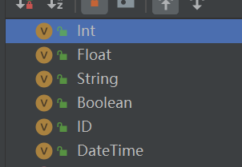
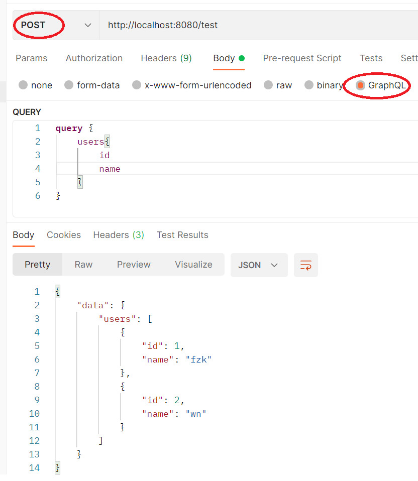
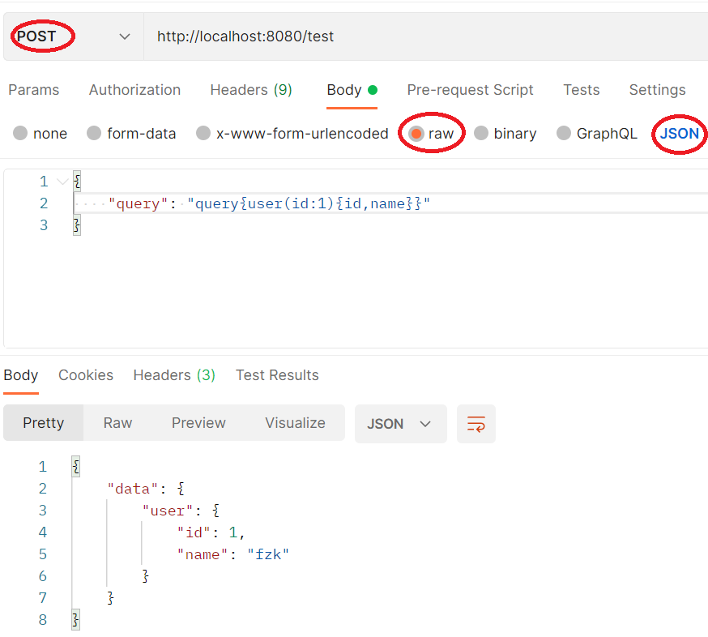
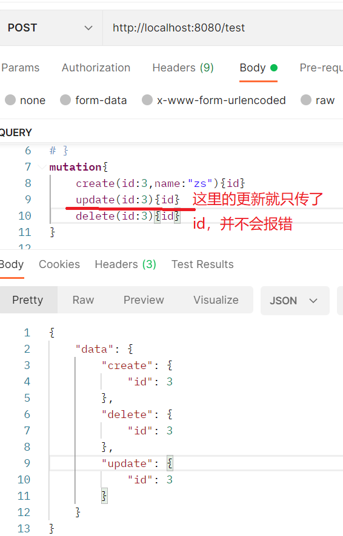

# 资料

30分钟理解GraphQL核心概念：https://segmentfault.com/a/1190000014131950

GraphQL中文官网：https://graphql.cn
官方规范地址：https://spec.graphql.cn/

prisma框架：https://www.prisma.io/docs/

GraphQL的go实现：https://github.com/graphql-go/graphql

GraphQL的Java实现：https://www.graphql-java.com/

# GraphQL

从最核心上讲，它是一种查询语言，再进一步说，是一种API查询语言，使得客户端能够准确地获得它需要的数据，减少数据的冗余，减少网络阻塞。

GraphQL 本质上允许我们减少噪音并描述我们希望从我们的 API 中检索的数据，以便我们只检索*我们*当前任务/视图/任何内容所需的数据

我们在使用REST接口时，接口返回的数据格式、数据类型都是后端预先定义好的，如果返回的数据格式并不是调用者所期望的，作为前端的我们可以通过以下两种方式来解决问题：

- 和后端沟通，改接口（更改数据源）
- 自己做一些适配工作（处理数据源）

一般如果是个人项目，改后端接口这种事情可以随意搞，但是如果是公司项目，改后端接口往往是一件比较敏感的事情，尤其是对于三端（web、andriod、ios）公用同一套后端接口的情况。大部分情况下，均是按第二种方式来解决问题的。

因此如果接口的返回值，可以通过某种手段，从静态变为动态，即调用者来声明接口返回什么数据，很大程度上可以进一步解耦前后端的关联。

在GraphQL中，我们通过预先定义一张`Schema`和声明一些`Type`来达到上面提及的效果，我们需要知道：

- 对于数据模型的抽象是通过Type来描述的
- 对于接口获取数据的逻辑是通过Schema来描述的

**Type**：对于数据模型的抽象是通过Type来描述的，每一个Type有若干Field组成，每个Field又分别指向某个Type

- Scalar Type(标量类型)
- Object Type(对象类型)

**Type Modifier**：类型修饰符，有两种，分别是`List`和`Required `，它们的语法分别为`[Type]`和`Type!`, 同时这两者可以互相组合，比如`[Type]!`或者`[Type!]`或者`[Type!]!`(请仔细看这里`!`的位置)，它们的含义分别为：

- 列表本身为必填项，但其内部元素可以为空

- 列表本身可以为空，但是其内部元素为必填

- 列表本身和内部元素均为必填
```
type Comment {
  id: ID!
  desc: String,
  author: User!
}

type Article {
  id: ID!
  text: String
  isPublished: Boolean
  author: User!
  comments: [Comment!]
}
```

**Schema**：描述`对于接口获取数据逻辑`的，但这样描述仍然是有些抽象的，不妨把它当做REST架构中每个独立资源的`uri`来理解它，只不过在GraphQL中，用Query来描述资源的获取方式。因此，可以将`Schema`理解为多个Query组成的一张表。
**Query**：`Query`特指GraphQL中的查询（包含三种类型），`query`指GraphQL中的查询类型（仅指查询类型）

- query（查询）：当获取数据时，应当选取Query类型
- mutation（更改）：当尝试修改数据时，应当使用mutation类型
- subscription（订阅）：当希望数据更改时，可以进行消息推送，使用subscription类型

例子：分别以REST和GraphQL的角度，以`Article`为数据模型，编写一系列CRUD的接口，如下：

Rest 接口

```http
GET /api/v1/articles/
GET /api/v1/article/:id/
POST /api/v1/article/
DELETE /api/v1/article/:id/
PATCH /api/v1/article/:id/
```

GraphQL Query

```graphql
query {
  articles(): [Article!]!
  article(id: Int): Article!
}

mutation {
  createArticle(): Article!
  updateArticle(id: Int): Article!
  deleteArticle(id: Int): Article!
}
```

如果我们的应用中对于评论列表有`real-time`的需求的话，在REST中，可能会直接通过长连接或者通过提供一些带验证的获取长连接url的接口，比如：

```http
POST /api/v1/messages/
```

之后长连接会将新的数据推送给我们，在GraphQL中，则会以更加声明式的方式进行声明，如下

```
subscription {
  updatedArticle() {
    mutation
    node {
        comments: [Comment!]!
    }
  }
}
```

比如这里，就声明了一个订阅Query，这个Query会在有新的Article被创建或者更新时，推送新的数据对象。当然，在实际运行中，其内部实现仍然是建立于长连接之上的，但是我们能够以更加声明式的方式来进行声明它。

**Resolver**：解析函数

> 注意：Query和与之对应的Resolver是同名的，这样在GraphQL才能把它们对应起来，举个例子，比如关于`articles(): [Article!]!`这个Query, 它的Resolver的名字必然叫做`articles`。


与 RESTful 不同，每一个的 GraphQL 服务其实对外只提供了一个用于调用内部接口的endpoint，所有的请求都访问这个暴露出来的唯一端点。

GraphQL 实际上将多个 HTTP 请求聚合成了一个请求，它只是将多个 RESTful 请求的资源变成了一个从根资源 `Post` 访问其他资源的 `school` 和 `teacher`等资源的图，多个请求变成了一个请求的不同字段，从原有的分散式请求变成了集中式的请求。

# GraphQL-Go

这一部分记录GraphQL在go中的实现，框架为graphql-go：https://github.com/graphql-go/graphql。这个实现的框架有点多，感觉都不好用。

## 资料

GitHub：https://github.com/graphql-go/graphql

官方文档：https://pkg.go.dev/github.com/graphql-go/graphql#section-readme

官方例子：https://github.com/graphql-go/graphql/blob/master/examples/crud/main.go

如何使用GraphQL(实现框架为gqlgen)：https://www.howtographql.com/graphql-go/2-queries/

Go GraphQL 初学者教程：https://tutorialedge.net/golang/go-graphql-beginners-tutorial/

> 官网文档是真的敷衍...

## Type

在GraphQL中Type有两种，分别是Scalar Type(标量类型)和Object Type(对象类型)。

在GraphQL-go中，对于标量类型的实现是：即`graphql.Int`等



对于对象类型，GraphQL-go的实现是：依赖于graphql.NewObject()来进行自定义

```go
func NewObject(config ObjectConfig) *Object {
	objectType := &Object{}

	err := invariant(config.Name != "", "Type must be named.")
	if err != nil {
		objectType.err = err
		return objectType
	}
	err = assertValidName(config.Name)
	if err != nil {
		objectType.err = err
		return objectType
	}
	// 这里的代码逻辑就是将配置搞到*Object中去
	objectType.PrivateName = config.Name
	objectType.PrivateDescription = config.Description
	objectType.IsTypeOf = config.IsTypeOf
	objectType.typeConfig = config

	return objectType
}
```

接下来看看Object的定义：

```go
type Object struct {
	PrivateName        string `json:"name"`
	PrivateDescription string `json:"description"`
	IsTypeOf           IsTypeOfFn

	typeConfig            ObjectConfig
	initialisedFields     bool
	fields                FieldDefinitionMap
	initialisedInterfaces bool
	interfaces            []*Interface
	// Interim alternative to throwing an error during schema definition at run-time
	err error
}
```

这里面比较重要的是fields，规定了这个对象的字段列表，其次是err这个玩意吧，是在自己新建Object的时候如果配置出错了，就会把错误放在这个字段，不返回异常也不panic，跟个麻瓜一样。

## Field

在GraphQL-go中，字段都用graphq.Field表示

```go
type Field struct {
   Name              string              `json:"name"` // used by graphlql-relay
   Type              Output              `json:"type"`
   Args              FieldConfigArgument `json:"args"`
   Resolve           FieldResolveFn      `json:"-"`
   Subscribe         FieldResolveFn      `json:"-"`
   DeprecationReason string              `json:"deprecationReason"`
   Description       string              `json:"description"`
}
```

在这里面，必填的是Type，表示的是字段在GraphQL中的类型，有标量类型和对象类型(一般是自定义)，其他的话就是Args和Resolve比较重要，Args是用来规定对于某个字段可以传入哪些查询参数，Resolve是设置解析函数的，当前端要查询这个字段的时候，这个解析函数将被调用，自定义实现如何返回数据的。

## query

下面这个查询的例子依赖gin和graphql库

大致步骤就是从New一个schema开始，渐渐把这个New的过程完善，并对每个字段设置解析函数(即当查询这个字段的时候，如何从后端服务器获取数据返回)，然后拿到前端传来的参数甩给graphql去处理调用字段的解析函数从而获取返回值即可。

```go
import (
	"errors"
	"fmt"
	"github.com/gin-gonic/gin"
	"github.com/graphql-go/graphql"
	"log"
)

// 0.定义model
type User struct {
	Id   int    `json:"id"`
	Name string `json:"name"`
}

// 1.先定义schema
var schema, schemaErr = graphql.NewSchema(graphql.SchemaConfig{
	Query: queryType,
})

// 2.定义schema的queryType
var queryType = graphql.NewObject(graphql.ObjectConfig{
	Name: "Query",
	Fields: graphql.Fields{
		"user": &graphql.Field{
			Name: "user",
			Type: userType, // 字段类型
			Args: graphql.FieldConfigArgument{ // 需要传入的参数
				"id": &graphql.ArgumentConfig{
					Type: graphql.Int,
				},
			},
			// 解析完前端传来的参数后的处理函数
			Resolve: func(p graphql.ResolveParams) (interface{}, error) {
				// 获取查询参数
				id, ok := p.Args["id"].(int)
				if ok {
					// 返回查询结果
					return User{Id: id, Name: "fzk"}, nil
				}
				return nil, errors.New("需要类型为int的参数id") // 返回错误提示
			},
		},
		"users": &graphql.Field{
			Name: "users",
			Type: usersType,
			Resolve: func(p graphql.ResolveParams) (interface{}, error) {
				users := []User{{1, "fzk"}, {2, "wn"}}
				return users, nil
			},
		},
	},
})

// 3.自定义字段类型详细配置
// 单个用户类型
var userType = graphql.NewObject(graphql.ObjectConfig{
	Name: "userType", // 自定义类型必须有name，可以点进去NewObject这个方法看
	Fields: graphql.Fields{
		"id": &graphql.Field{
			Type: graphql.Int,
		},
		"name": &graphql.Field{
			Type: graphql.String,
		},
	},
})
// 用户数组类型
var usersType = graphql.NewList(userType)

// 主函数
func main() {
	// 5.先检查有没有出现过错误
	// 太坑了，graphql.NewObject()如果有error不显示抛出，导致我踩坑！！！
	if userType.Error() != nil {
		log.Fatalln(userType.Error())
	}
	if usersType.Error() != nil {
		log.Fatalln(userType.Error())
	}
	if schemaErr != nil {
		log.Fatalln(schemaErr)
	}
	// 6.gin绑定路由，获取查询参数query
	engine := gin.Default()
	engine.POST("/test", func(c *gin.Context) {
		var query = &QueryStruct{}
		err := c.ShouldBindJSON(&query)
		if err != nil {
			c.JSON(400, err)
			return
		}
		fmt.Println(query.Query)
        // 7.设置schema和前端传入的参数准备后端去取值
		params := graphql.Params{Schema: schema, RequestString: query.Query}
		r := graphql.Do(params)
        // 这里也要先检查异常
		if r.HasErrors() {
			c.JSON(400, r.Errors)
			return
		}
		c.JSON(200, r)
	})
	log.Fatalln(engine.Run(":8080"))
}

type QueryStruct struct {
	Query string `json:"query"`
}
```

可以看到这些代码非常臃肿，定义一个Type相当的麻烦！！！离谱的是官方文档超级敷衍，例子写的不明不白，难受的是配置错了还不显示抛出或返回异常，而是在结果里专门设置了一个字段来放异常？文档还不说？源码注释少的一批？

> 注意：graphql.NewObject()代码里要求Name字段必须有值，否则会有错误，但是这个错误不会返回或者panic，而是存到了返回的数据结构中，不清楚为什么这么做？所以一定要**主动去检查有没有错误.**
>
> ```go
> func NewObject(config ObjectConfig) *Object {
>    objectType := &Object{}
> 
>    err := invariant(config.Name != "", "Type must be named.")
>    if err != nil {
>       objectType.err = err
>       return objectType
>    }
>     // 这里当出现错误后，并不会返回错误或者panic，所以需要格外小心
>    err = assertValidName(config.Name) 
>    if err != nil {
>       objectType.err = err
>       return objectType
>    }
>     ......
> }
> ```

用Postman软件发送GraphQL请求很简单：



因为对于后端而言，所需要的仅仅是`"query{users{id,name}}"`这样一个字符串即可，所以传统POST请求也能这么发：



## mutation

查询数据的类型为query，而增删改的类型为mutation。

在上面的例子基础上，增加以及修改一点点如下：

```go
// 1.先定义schema，增加了Mutation的定义
var schema, schemaErr = graphql.NewSchema(graphql.SchemaConfig{
	Query:    queryType,
	Mutation: mutationType,
})

// 4.定义schema的mutationType
var mutationType = graphql.NewObject(graphql.ObjectConfig{
	Name: "mutationType",
	Fields: graphql.Fields{
		"create": &graphql.Field{
			Type: userType,
			Args: graphql.FieldConfigArgument{
				"id":   &graphql.ArgumentConfig{Type: graphql.Int},
				"name": &graphql.ArgumentConfig{Type: graphql.String},
			},
			Resolve: func(p graphql.ResolveParams) (interface{}, error) {
				id := p.Args["id"].(int)
				// 插入逻辑处理......
				return map[string]interface{}{"id": id}, nil
			},
		},
		"update": &graphql.Field{
			Type: userType,
            // 这里定义了有2个参数，但是实际上传入的时候，可以只传id甚至什么都不传
			Args: graphql.FieldConfigArgument{
				"id":   &graphql.ArgumentConfig{Type: graphql.Int},
				"name": &graphql.ArgumentConfig{Type: graphql.String},
			},
			Resolve: func(p graphql.ResolveParams) (interface{}, error) {
				id := p.Args["id"].(int)
				name, ok := p.Args["name"]
				if ok {
					// 如果有这个字段，才更新这个字段...
					fmt.Printf("更新id为%d的数据行的name字段为%s", id, name)
				}
				return map[string]interface{}{"id": id}, nil
			},
		},
		"delete": &graphql.Field{
			Type: userType,
			Args: graphql.FieldConfigArgument{
				"id": &graphql.ArgumentConfig{Type: graphql.Int}, // 删除只需要id字段
			},
			Resolve: func(p graphql.ResolveParams) (interface{}, error) {
				id := p.Args["id"].(int)
				fmt.Printf("删除id为的%d数据行", id)
				return map[string]interface{}{"id": id}, nil
			},
		},
	},
})
```

> 注意：在graph.Field中参数Args的定义，并不会强制要求前端必须传入这个参数，但是如果不定义Args，前端传了任何未定义的参数都会返回错误！

用postman传mutation参数的话，大致是差不多的



同时需要注意的是，此处的mutationType定义又调用了graphql.NewObject()，一定要记得检查有没有错误，不然出bug了都不知道是哪的问题！