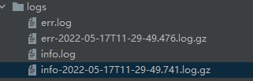
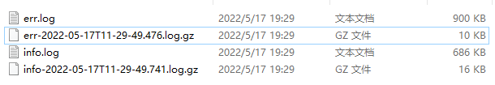

# zap

地址：https://github.com/uber-go/zap

一个golang的日志库，性能非常好，缺点是不支持日志分片，得用第3方插件。

由于官方文档比较简略，所以这里推荐一些写的不出错的博客：https://juejin.cn/post/6844904160022790158；https://juejin.cn/post/6844904122143997965

本文在查看了官方文档和各类博客，以及一部分的源码后进行记录。

其实zap的官方示例很简单，非常适合小项目，但是如果大项目，则必须用到日志归档等功能，这就需要进行一些构造和3方插件了。

## 快速开始

1、依赖

```shell
go get -u go.uber.org/zap
```

2、简单示例

zap提供两种写法的日志，结构化和printf样式的API，这两种分别对应两个结构体，分别为默认的`Logger`和由`Logger`构造的`SugaredLogger`。其中后者是支持两种写法的。前者性能更好。

结构化API：

```go
// 先用默认的生产环境配置
logger, _ := zap.NewProduction()
defer logger.Sync() // 关闭应用前最好刷盘
logger.Info("failed to fetch URL",
   // Structured context as strongly typed Field values.
   zap.String("url", "123.4.6.113"),
   zap.Int("attempt", 3),
   zap.Duration("backoff", time.Second),
)
```

printf样式：

```go
// 也可以用默认的开发环境配置
logger, _ := zap.NewDevelopment()
defer logger.Sync() // 关闭应用前最好刷盘
sugar := logger.Sugar()
// 打印日志并附带关键词键值对
// 这两种不同打印风格，Infow就可以只响应msg字段给前端并不附带关键信息如id，而后台能看见具体哪个id
// {"msg":"用户不存在","id":1}
sugar.Infow("用户不存在",
            "id", 1,
           )
// {"msg":"用户id=1不存在"}
sugar.Infof("用户id=%d不存在", 1)
sugar.Debugf("用户id=%d不存在", 1)
sugar.Errorf("用户id=%d不存在", 1)
```

所以建议用printf样式即sugar输出，因为它两者都支持。

3、自定义配置

上面的示例是用的默认开发环境或生产环境配置，非常糟心的一点是**时间默认打印为时间戳格式**，看着很难受。一般建议自定义配置：

```go
var (
	Logger *zap.SugaredLogger
)

const (
	EnvDevelopment = 0 // 开发环境
	EnvProduction  = 1 // 生产环境
)

func InitLogger(Env int) {
	zapConfig := zap.NewDevelopmentConfig()
	encoderConfig := zapcore.EncoderConfig{ // 编码器配置
		// Keys can be anything except the empty string.
		TimeKey:        "time",
		LevelKey:       "level",
		NameKey:        "logger",
		CallerKey:      "caller",
		FunctionKey:    zapcore.OmitKey,
		MessageKey:     "msg",
		StacktraceKey:  "stacktrace",
		LineEnding:     zapcore.DefaultLineEnding,
		EncodeLevel:    zapcore.CapitalLevelEncoder, // 大写编码器
		EncodeTime:     zapcore.ISO8601TimeEncoder,  // ISO8601 UTC 时间格式
		EncodeDuration: zapcore.StringDurationEncoder,
		EncodeCaller:   zapcore.ShortCallerEncoder, // 短路劲编码器
	}
	switch Env {
	case EnvDevelopment:
		zapConfig = zap.Config{
			Level:             zap.NewAtomicLevelAt(zap.DebugLevel),  // 日志级别
			Development:       true,                                  // 开发模式，堆栈追踪
			DisableCaller:     false,                                 // 调用者
			DisableStacktrace: false,                                 // 堆栈信息
			Encoding:          "console",                             // 输出格式：可选值：json、console，开发环境用console可以直接点击错误位置，生产环境用json可以压缩
			EncoderConfig:     encoderConfig,                         // 编码器配置
			OutputPaths:       []string{"stdout", "./logs/info.log"}, // 输出到指定文件 stdout（标准输出，正常颜色） stderr（错误输出，红色）
			ErrorOutputPaths:  []string{"stderr", "./logs/err.log"},
			InitialFields:     map[string]interface{}{"author": "fzk"}, // 初始化字段
		}
		break
	case EnvProduction:
		zapConfig = zap.Config{
			Level:             zap.NewAtomicLevelAt(zap.InfoLevel),   // 日志级别
			Development:       false,                                 // 开发模式，堆栈追踪
			DisableCaller:     false,                                 // 调用者
			DisableStacktrace: false,                                 // 堆栈信息
			Encoding:          "json",                                // 输出格式：可选值：json、console，开发环境用console可以直接点击错误位置，生产环境用json可以压缩
			EncoderConfig:     encoderConfig,                         // 编码器配置
			OutputPaths:       []string{"stdout", "./logs/info.log"}, // 输出到指定文件 stdout（标准输出，正常颜色） stderr（错误输出，红色）
			ErrorOutputPaths:  []string{"stderr", "./logs/err.log"},
			InitialFields:     map[string]interface{}{"author": "fzk"}, // 初始化字段
		}
		break
	default:
		panic("初始化log出错，只能是EnvDevelopment或EnvProduction")
	}

	// 情况1：默认不做日志分片的话，用这个直接构造就行了，zap官方不支持日志分片
	logger, err := zapConfig.Build()
	if err != nil {
		panic(err)
	}
	Logger = logger.Sugar() // 用sugar模式
}

func CloseLogger() {
	err := Logger.Sync() // flushes buffer, if any
	// 打印到控制台的情况下，调用刷盘方法肯定会出错的
	if err != nil {
		log.Printf("关闭Logger出错: %+v \n", err)
	}
}
```

简单实用的话，这样就可以了。

```go
func main() {
	mylog.InitLogger(mylog.EnvDevelopment)
	defer mylog.CloseLogger()
	// 打印日志并附带关键词键值对
	// 这两种不同打印风格，Infow就可以只响应msg字段给前端并不附带关键信息如id，而后台能看见具体哪个id
	// {"msg":"用户不存在","id":1}
	mylog.Logger.Infow("用户不存在",
		"id", 1,
	)
	// {"msg":"用户id=1不存在"}
	for i := 0; i < 100; i++ {
		mylog.Logger.Infof("用户id=%d不存在", 1)
		mylog.Logger.Debugf("用户id=%d不存在", 1)
		mylog.Logger.Errorf("用户id=%d不存在", 1)
	}
}
```

## 日志归档

非常像上面那样配置非常的简单，但是生产环境中往往日志会越来越大，所以就得分片，要么按大小，要么按时间。zap自己是不支持分片的，所以得用到第三方插件库。这里用的是`lumberjack`，它按照文件大小进行分片，而且还支持压缩。

1、依赖下载

```shell
go get -u go.uber.org/zap
go get -u gopkg.in/natefinch/lumberjack.v2
```

2、配置

```go
package mylog

import (
	"go.uber.org/zap"
	"go.uber.org/zap/zapcore"
	"gopkg.in/natefinch/lumberjack.v2"
	"log"
	"os"
	"sort"
	"time"
)

var (
	Logger *zap.SugaredLogger
)

const (
	EnvDevelopment = 0 // 开发环境
	EnvProduction  = 1 // 生产环境
)

func InitLogger(Env int) {
	zapConfig := zap.NewDevelopmentConfig()
	encoderConfig := zapcore.EncoderConfig{ // 编码器配置
		// Keys can be anything except the empty string.
		TimeKey:        "time",
		LevelKey:       "level",
		NameKey:        "logger",
		CallerKey:      "caller",
		FunctionKey:    zapcore.OmitKey,
		MessageKey:     "msg",
		StacktraceKey:  "stacktrace",
		LineEnding:     zapcore.DefaultLineEnding,
		EncodeLevel:    zapcore.CapitalLevelEncoder, // 大写编码器
		EncodeTime:     zapcore.ISO8601TimeEncoder,  // ISO8601 UTC 时间格式
		EncodeDuration: zapcore.StringDurationEncoder,
		EncodeCaller:   zapcore.ShortCallerEncoder, // 短路劲编码器
	}
	switch Env {
	case EnvDevelopment:
		zapConfig = zap.Config{
			Level:             zap.NewAtomicLevelAt(zap.DebugLevel),  // 日志级别
			Development:       true,                                  // 开发模式，堆栈追踪
			DisableCaller:     false,                                 // 调用者
			DisableStacktrace: false,                                 // 堆栈信息
			Encoding:          "console",                             // 输出格式：可选值：json、console，开发环境用console可以直接点击错误位置，生产环境用json可以压缩
			EncoderConfig:     encoderConfig,                         // 编码器配置
			OutputPaths:       []string{"stdout", "./logs/info.log"}, // 输出到指定文件 stdout（标准输出，正常颜色） stderr（错误输出，红色）
			ErrorOutputPaths:  []string{"stderr", "./logs/err.log"},
			InitialFields:     map[string]interface{}{"author": "fzk"}, // 初始化字段
		}
		break
	case EnvProduction:
		zapConfig = zap.Config{
			Level:             zap.NewAtomicLevelAt(zap.InfoLevel),   // 日志级别
			Development:       false,                                 // 开发模式，堆栈追踪
			DisableCaller:     false,                                 // 调用者
			DisableStacktrace: false,                                 // 堆栈信息
			Encoding:          "json",                                // 输出格式：可选值：json、console，开发环境用console可以直接点击错误位置，生产环境用json可以压缩
			EncoderConfig:     encoderConfig,                         // 编码器配置
			OutputPaths:       []string{"stdout", "./logs/info.log"}, // 输出到指定文件 stdout（标准输出，正常颜色） stderr（错误输出，红色）
			ErrorOutputPaths:  []string{"stderr", "./logs/err.log"},
			InitialFields:     map[string]interface{}{"author": "fzk"}, // 初始化字段
		}
		break
	default:
		panic("初始化log出错，只能是EnvDevelopment或EnvProduction")
	}

	// 情况1：默认不做日志分片的话，用这个直接构造就行了，zap官方不支持日志分片
	//logger, err := zapConfig.Build()
	//if err != nil {
	//	panic(err)
	//}

	// 情况2：这里引入第3方库lumberjack做日志切片, 这个就很麻烦
	logger := initLogger(&zapConfig)

	Logger = logger.Sugar()
}

func CloseLogger() {
	err := Logger.Sync() // flushes buffer, if any
	// 打印到控制台的情况下，调用刷盘方法肯定会出错的
	if err != nil {
		log.Printf("关闭Logger出错: %+v \n", err)
	}
}

// initLogger 无不怀恋我大Spring的starter啊
// 为了日志切片，又为了能做到像官方配置那样自然，只能手动配置每一条了!!!
// 日志切片关键是要换默认的输入方式为lumberjack的writer，而输入方式是构建core的时候传入的，所以就得自己手动构建core
func initLogger(zapConfig *zap.Config) *zap.Logger {
	if len(zapConfig.OutputPaths) != 2 || len(zapConfig.ErrorOutputPaths) != 2 {
		panic("我只能支持两个输入方向")
	}
	// 构建核心
	highLevel := zap.LevelEnablerFunc(func(lvl zapcore.Level) bool {
		return lvl >= zapcore.ErrorLevel
	})
	lowLevel := zap.LevelEnablerFunc(func(lvl zapcore.Level) bool {
		return lvl < zapcore.ErrorLevel
	})
	core1 := zapcore.NewCore(
		getEncoder(zapConfig), // 编码器配置
		zapcore.NewMultiWriteSyncer(
			zapcore.AddSync(os.Stdout),                           // 打印到控制台
			zapcore.AddSync(getWriter(zapConfig.OutputPaths[1])), // 还打印到日志文件，这里引入第3方库lumberjack做日志切片
		),
		lowLevel, // 日志级别
	)
	core2 := zapcore.NewCore(
		getEncoder(zapConfig), // 编码器配置
		zapcore.NewMultiWriteSyncer(
			zapcore.AddSync(os.Stderr),                                // 打印到控制台
			zapcore.AddSync(getWriter(zapConfig.ErrorOutputPaths[1])), // 还打印到日志文件，这里引入第3方库lumberjack做日志切片
		),
		highLevel, // 日志级别
	)
	core := zapcore.NewTee(core1, core2)

	// 构造日志，传入核心和一些选项
	logger := zap.New(core, buildOpts(zapConfig)...)
	return logger
}

// buildOpts 是直接从源码copy并小改的
func buildOpts(cfg *zap.Config) []zap.Option {
	opts := make([]zap.Option, 0, 5)

	// 开启开发模式
	if cfg.Development {
		opts = append(opts, zap.Development())
	}
	// 打开调用者记录
	if !cfg.DisableCaller {
		opts = append(opts, zap.AddCaller())
	}
	// 在打印error级别日志的时候，打印出堆栈信息
	if !cfg.DisableStacktrace {
		opts = append(opts, zap.AddStacktrace(zap.ErrorLevel))
	}

	if scfg := cfg.Sampling; scfg != nil {
		opts = append(opts, zap.WrapCore(func(core zapcore.Core) zapcore.Core {
			var samplerOpts []zapcore.SamplerOption
			if scfg.Hook != nil {
				samplerOpts = append(samplerOpts, zapcore.SamplerHook(scfg.Hook))
			}
			return zapcore.NewSamplerWithOptions(
				core,
				time.Second,
				cfg.Sampling.Initial,
				cfg.Sampling.Thereafter,
				samplerOpts...,
			)
		}))
	}
	// 开启自定义初始字段
	if len(cfg.InitialFields) > 0 {
		fs := make([]zap.Field, 0, len(cfg.InitialFields))
		keys := make([]string, 0, len(cfg.InitialFields))
		for k := range cfg.InitialFields {
			keys = append(keys, k)
		}
		sort.Strings(keys)
		for _, k := range keys {
			fs = append(fs, zap.Any(k, cfg.InitialFields[k]))
		}
		opts = append(opts, zap.Fields(fs...))
	}

	return opts
}

// getEncoder 返回编码器，一般来说开发环境用console编码器，生产环境用json编码器
func getEncoder(zapConfig *zap.Config) zapcore.Encoder {
	switch zapConfig.Encoding {
	case "json":
		return zapcore.NewJSONEncoder(zapConfig.EncoderConfig)
	case "console":
		return zapcore.NewConsoleEncoder(zapConfig.EncoderConfig)
	default:
		panic("zap log 初始化失败，日志格式只能为json 或 console")
	}
}

// getWriter 返回io.Writer接口，这里引入第3方库lumberjack做日志切片
func getWriter(filename string) *lumberjack.Logger {
	return &lumberjack.Logger{
		Filename:   filename, // 日志文件路径
		MaxSize:    1,        // 每个日志文件保存的最大尺寸 单位：M  note：这里为了测试切片和压缩，故意设置1M，生产环境最好用默认值100M
		MaxBackups: 5,        // 日志文件最多保存多少个备份
		MaxAge:     30,       // 文件最多保存多少天
		Compress:   true,     // 是否压缩
	}
}
```

可以看到在引入日志归档后，配置代码非常多，因为得手动配置每一个配置。

使用的时候可以直接copy上面的配置代码，然后一定要改最后的getWriter()函数中的日志文件大小，最好为100M。

> 这里的配置真的超级麻烦且花费了我超过半天时间，以后用这种库，在有替代的情况下，一定要选文档多且官方支持**功能多**的库，性能不一定是最优选。

3、main函数测试一下

```go
func main() {
	mylog.InitLogger(mylog.EnvDevelopment)
	defer mylog.CloseLogger()
	// 打印日志并附带关键词键值对
	// 这两种不同打印风格，Infow就可以只响应msg字段给前端并不附带关键信息如id，而后台能看见具体哪个id
	// {"msg":"用户不存在","id":1}
	mylog.Logger.Infow("用户不存在",
		"id", 1,
	)
	// {"msg":"用户id=1不存在"}
	for i := 0; i < 10000; i++ {
		mylog.Logger.Infof("用户id=%d不存在", 1)
		mylog.Logger.Debugf("用户id=%d不存在", 1)
		mylog.Logger.Errorf("用户id=%d不存在", 1)
	}
}
```

看一下日志效果：



可以看到配置的error级别以下的打印到info.log中，error级别以上的打印到err.log中，并且由于日志过大已经出现了压缩归档文件。



而且，可以很明显的看到，1MB的文件居然被压缩到了20KB以内，gz压缩太强了。用解压软件解压缩即可查看日志内容。