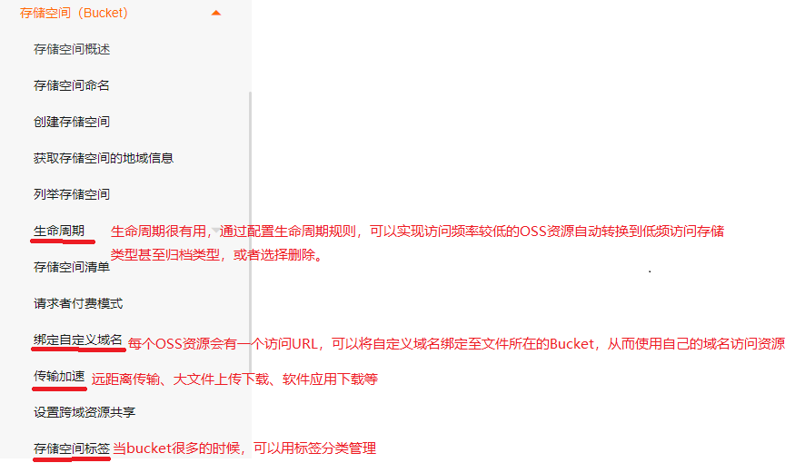
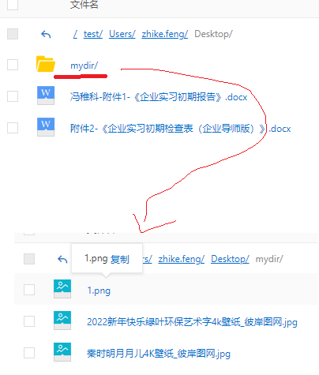
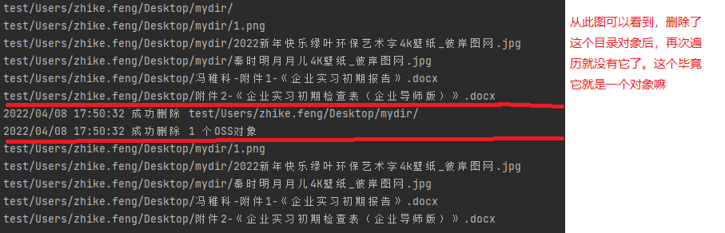

# 资料

阿里云OSS文档：https://help.aliyun.com/product/31815.html?spm=5176.7933691.J_5253785160.6.7b804c59L0NGSc
亚马逊云S3介绍文档：https://aws.amazon.com/cn/s3/?nc2=h_ql_prod_fs_s3
aliyun-oss-go-sdk：https://help.aliyun.com/document_detail/87712.html
AWS SDK for Go：https://docs.aws.amazon.com/zh_cn/sdk-for-go/?id=docs_gateway

亚马逊S3就是Simple Storage Service的简称，和阿里云的OSS(Object Storage Service)差不多，且阿里云对aws SDK的API是兼容的，即可以用aws SDK操作阿里云的OSS服务。

# OSS概述

这个可以在阿里云文档了解，这里仅仅对其文档进行一些重要的点进行copy，更多细节还是要看阿里云文档。

阿里云对象存储OSS（Object Storage Service）是一款海量、安全、低成本、高可靠的**分布式对象云存储服务**，可提供99.9999999999%（12个9）的数据持久性，99.995%的数据可用性。多种存储类型供选择，全面优化存储成本。

您可以使用阿里云提供的API、SDK接口或者OSS迁移工具轻松地将海量数据移入或移出阿里云OSS。数据存储到阿里云OSS以后，您可以选择**标准存储（Standard）**作为移动应用、大型网站、图片分享或热点音视频的主要存储方式，也可以选择成本更低、存储期限更长的**低频访问存储（Infrequent Access）**、**归档存储（Archive）**、**冷归档存储（Cold Archive）**作为不经常访问数据的存储方式。

## OSS相关概念

### 1.存储类型Storage Class

**1.1 标准存储Standard**

高可靠、高可用、高性能，应用场景如图片、音视频、软件程序等。数据冗余存储方式：

- 标准存储-本地冗余（LRS）

  采用数据冗余存储机制，将每个对象的不同冗余存储在同一个可用区内多个设施的多个设备上，确保硬件失效时的数据持久性和可用性。

- 标准存储-同城冗余（ZRS）

  采用多可用区（AZ）机制，将用户的数据分散存放在同一地域（Region）的3个可用区。当某个可用区不可用时，仍然能够保障数据的正常访问。

**1.2 低频访问存储Infrequent Access**

高持久性，平均每月访问1~2次。数据访问会产生取回费用。数据冗余存储方式同上。应用场景：热备数据、监控视频数据等。

**1.3 归档存储Archive**

高持久性，长期保存的归档数据。数据解冻后才能访问并产生费用。应用场景：档案数据、医疗影像、科学资料、影视素材等。

**1.4 冷归档存储Cold Archive**

高持久性，超长时间的极冷数据。数据解冻后才能访问并产生费用。应用场景：同上。

### 2.存储空间Bucket

存储空间是用于存储对象（Object）的容器。Bucket具有各种配置属性，包括地域、访问权限、存储类型等。

同一个Bucket的内部是扁平的，**没有文件系统的目录等概念**，所有的Object都直接隶属于其对应的Bucket。Bucket的名称在OSS范围内全局唯一，且创建之后无法修改。



### 3.对象/文件Object

对象（Object）是OSS存储数据的基本单元，也被称为OSS的文件。和传统的文件系统不同，OSS内部使用扁平结构存储数据，**Object没有文件目录层级结构的关系**

**三种类型**：

- Normal：简单上传的文件
- Multipart：分片上传的文件
- Appendable：追加上传，且仅支持在Appendable类型的Object后直接追加内容。

**Object信息**：

- key：Object的名称，可用于查询文件
- Data：存储的数据
- VersionID：bucket开启版本控制后，上传的对象有版本id

- Object Meta：Object元信息，一组键值对

虽然说，OSS中没有目录这个概念，但是为方便您对Object进行分组并简化权限管理，您可以创建目录，然后将目标文件存放至指定目录。

**OSS将以`/`结尾的Object视作目录**。

在各语言SDK中，ObjectKey、Key以及ObjectName是同一概念，均表示对Object执行相关操作时需要填写的Object名称。ObjectKey表示上传的Object所在存储空间的**完整名称**，即包含文件后缀在内的完整路径，如填写为abc/efg/123.jpg。

## OSS与自建存储优劣

为什么要花钱去买OSS服务，明明自己也可以建立存储服务啊？

在阿里云给出的对比中，可以知道阿里云OSS服务在持久性、安全性、成本上都有明显优势，而且提供多种增值服务如图片处理、视频处理、人脸识别等。关键是方便、安全。

应用场景：图片和音视频海量存储、网页或移动应用的动静分离、云端数据处理。

## 快速开始

阿里云OSS支持多种控制方式，如控制台、命令行工具ossutil、图形化管理工具ossbrower、API和SDK、基于OSS的文件管理系统。

建议先在阿里云通过[视频教程](https://help.aliyun.com/document_detail/31883.html)，使用控制台创建并管理bucket，并了解如何上传和管理文件，并创建AccessKey用于访问OSS服务，然后就可以愉快的用各个语言相关的SDK开发啦。

# aliyun-oss-go-sdk

阿里云Go SDK文档：https://help.aliyun.com/document_detail/32143.html

由于阿里云Go SDK文档写的非常简单易懂，这里就不去重复写笔记了。

## 自己简单封装的API

在写demo的过程中，自己简单的小小的封装一下阿里云的SDK的API，方便自己以后copy：

```go
package main

import (
	"bufio"
	"fmt"
	"github.com/aliyun/aliyun-oss-go-sdk/oss"
	"log"
	"os"
	"strings"
)

const (
	AccessKey    = "你的key"
	AccessSecret = "你的密码"
	Endpoint     = "oss-cn-shanghai.aliyuncs.com"
	RegionID     = "oss-cn-shanghai"
	Bucket       = "uestcfzk-bucket-01"
	Prefix       = "test"
)

func main() {
	fmt.Printf("hello oss , the version is %s  \n", oss.Version)
	// 1.连接到OSS客户端
	// oss.Timeout(10, 120)表示设置HTTP连接超时时间为10秒（默认值为30秒），HTTP读写超时时间为120秒（默认值为60秒）。0表示永不超时（不推荐使用）
	client, err := oss.New(Endpoint, AccessKey, AccessSecret, oss.Timeout(10, 120))
	if err != nil {
		log.Fatalln(err)
	}
	// 2.获取bucket实例
	bucket, err := client.Bucket(Bucket)
	if err != nil {
		log.Fatalln(err)
	}
}

// MyPutObjectFromFile 上传文件
func MyPutObjectFromFile(bucket *oss.Bucket, filePath string) error {
	// 1.打开文件
	file, err := os.Open(filePath)
	if err != nil {
		return err
	}
	defer file.Close()

	bufReader := bufio.NewReader(file)
	// 2.上传
	var objectKey = Prefix + "/" + strings.TrimPrefix(file.Name(), "C:/")
	err = bucket.PutObject(objectKey, bufReader)
	if err != nil {
		return err
	}
	return nil
}

// MyPageListObjectsWithPrefix 新起一个goroutine分页列举指定前缀的所有文件，并放入管道中
func MyPageListObjectsWithPrefix(bucketArg *oss.Bucket, prefixArg string) (<-chan string, error) {
	var outputChan = make(chan string, 100) // 新建一个管道

	go func(bucket *oss.Bucket, prefix string) {
		defer close(outputChan)
		// 1.分页列举包含指定前缀的文件；每页列举100个
		prefixOption := oss.Prefix(prefix)
		marker := oss.Marker("")
		for {
			lsRes, err := bucket.ListObjects(oss.MaxKeys(100), marker, prefixOption)
			if err != nil {
				log.Printf("分页查询指定前缀 %s 的OSS对象出现异常 %+v \n", prefix, err)
				return
			}
			// 2.查询结果放入管道
			for _, obj := range lsRes.Objects {
				outputChan <- obj.Key
			}
			// 3.下一循环判断
			if lsRes.IsTruncated {
				prefixOption = oss.Prefix(lsRes.Prefix)
				marker = oss.Marker(lsRes.NextMarker)
			} else {
				break
			}
		}
	}(bucketArg, prefixArg)
	return outputChan, nil
}

// MyDeleteObjectsWithPrefix 删除指定前缀的所有文件：其实也可以直接按照指定前缀查询出所有的文件，然后一键直接删除
func MyDeleteObjectsWithPrefix(bucket *oss.Bucket, prefix string) error {
	marker := oss.Marker("")
	prefixOption := oss.Prefix(prefix)
	for {
		lor, err := bucket.ListObjects(marker, prefixOption)
		if err != nil {
			return err
		}

		var keys = make([]string, 0, 10)
		for _, obj := range lor.Objects {
			keys = append(keys, obj.Key)
		}

		if err := MyDeleteObjects(bucket, keys); err != nil {
			return err
		}

		if lor.IsTruncated {
			prefixOption = oss.Prefix(lor.Prefix)
			marker = oss.Marker(lor.NextMarker)
		} else {
			break
		}
	}
	return nil
}

// MyDeleteObjects 删除给定的key对应的OSS对象
func MyDeleteObjects(bucket *oss.Bucket, objKeys []string) error {
	objects, err := bucket.DeleteObjects(objKeys)
	if err != nil {
		return err
	}
	for _, key := range objects.DeletedObjects {
		log.Printf("成功删除 %s \n", key)
	}
	log.Printf("成功删除 %d 个OSS对象\n", len(objects.DeletedObjects))
	return nil
}
```

## 测试直接删除目录

**首先要清晰的是，OSS将ObjectName以`/`结尾的对象视作目录，OSS内部使用扁平结构存储数据，是没有目录这个概念的。**

测试直接删除文件夹(即objectName以`/`结尾的OSS对象)，此时该文件夹下有文件：



```go
func main() {
	fmt.Printf("hello oss , the version is %s  \n", oss.Version)
	// 1.连接到OSS客户端
	// oss.Timeout(10, 120)表示设置HTTP连接超时时间为10秒（默认值为30秒），HTTP读写超时时间为120秒（默认值为60秒）。0表示永不超时（不推荐使用）
	client, err := oss.New(Endpoint, AccessKey, AccessSecret, oss.Timeout(10, 120))
	if err != nil {
		log.Fatalln(err)
	}

	// 2.获取bucket实例
	bucket, err := client.Bucket(Bucket)
	if err != nil {
		log.Fatalln(err)
	}

	// 3.列举指定前缀的文件测试
	outputChan, err := MyPageListObjectsWithPrefix(bucket, Prefix)
	if err != nil {
		log.Fatalln(err)
	}
	for objKey := range outputChan {
		fmt.Println(objKey)
	}

	// 4.尝试删除目录对象(即以/结尾的OSS对象)
	if err := MyDeleteObjects(bucket, []string{"test/Users/zhike.feng/Desktop/mydir/"}); err != nil {
		log.Fatalln(err)
	}

	// 5.再查一下剩下了哪些文件
	outputChan2, err := MyPageListObjectsWithPrefix(bucket, Prefix)
	if err != nil {
		log.Fatalln(err)
	}
	for objKey := range outputChan2 {
		fmt.Println(objKey)
	}
}
```

结果打印：



其实从这里的打印就能看出来，虽然在阿里云中看着好像把有这些个目录，必然Desktop，但是实际上它只是这些资源的前缀罢了，这里根本查不出来有这个Desktop对象的存在，除非单独去创建这个以`/`结尾的所谓的目录对象。

# aws-sdk-go

文档地址：https://docs.aws.amazon.com/sdk-for-go/?id=docs_gateway

阿里云的OSS服务也可以用亚马逊的S3的API进行操作，提供了大部分的接口兼容。

aws-sdk-go-v2需要go版本在1.15以上，如果版本在这以前，则需要使用aws-sdk-go开发工具包，即v1版本。我发现v2版本操作oss的教程没找到，自己也连不上...，就换成v1的吧。

## 自己简单封装的API

1、依赖下载

```shell
go get github.com/aws/aws-sdk-go
```

2、一些常用操作的简单API封装

```go
package main

import (
	"fmt"
	"github.com/aws/aws-sdk-go/aws"
	"github.com/aws/aws-sdk-go/aws/credentials"
	"github.com/aws/aws-sdk-go/aws/session"
	"github.com/aws/aws-sdk-go/service/s3"
	"github.com/aws/aws-sdk-go/service/s3/s3manager"
	"log"
	"os"
)

const (
	AccessKey    = "你的key"
	AccessSecret = "你的secret"
	Endpoint     = "oss-cn-shanghai.aliyuncs.com"
	RegionID     = "oss-cn-shanghai"
	Bucket       = "你的bucket"
	Prefix       = "test"
)

func main() {
	// 1.新建会话
	sess, err := session.NewSession(&aws.Config{
		Endpoint:    aws.String(Endpoint),
		Region:      aws.String(RegionID),
		Credentials: credentials.NewStaticCredentials(AccessKey, AccessSecret, ""),
	})
	if err != nil {
		log.Fatalln(err)
	}
	// 2.创建s3客户端
	svc := s3.New(sess)
}

// MyListObjectsWithPrefix 分页查询并将结果返回管道
func MyListObjectsWithPrefix(svc *s3.S3, prefix string, pageSize int64) (<-chan *s3.Object, error) {
	if pageSize < 10 {
		return nil, fmt.Errorf("pageSize必须大于10")
	}
	// 1.构建管道
	outputChan := make(chan *s3.Object, pageSize)

	go func(svcArg *s3.S3, prefixArg string, pageSizeArg int64) {
		defer close(outputChan) // 必须关闭管道

		// 2.构建参数
		inputParams := &s3.ListObjectsInput{
			Bucket:  aws.String(Bucket),
			MaxKeys: aws.Int64(pageSizeArg),
			Prefix:  aws.String(prefixArg),
		}

		// 3.分页查询
		if err := svcArg.ListObjectsPages(inputParams, func(page *s3.ListObjectsOutput, lastPage bool) bool {
			for _, obj := range page.Contents {
				outputChan <- obj // 放入管道
			}
			return !lastPage // 退出条件
		}); err != nil {
			log.Fatalln(err)
		}
	}(svc, prefix, pageSize)
	return outputChan, nil
}

// MyPutObjectWithFilePath 上传文件到指定dir，注意：这里的dir并不是真是存在的哦，OSS中没有目录这个概念
func MyPutObjectWithFilePath(svc *s3.S3, filepath string, dir string) error {
	// 1.打开文件
	file, err := os.Open(filepath)
	if err != nil {
		return err
	}
	defer file.Close() // 关闭文件
	fileInfo, err := file.Stat()
	if err != nil {
		return err
	}
	// 2.构建参数
	param := &s3.PutObjectInput{
		Bucket:        aws.String(Bucket),
		Key:           aws.String(dir + "/" + fileInfo.Name()),
		ContentLength: aws.Int64(fileInfo.Size()),
		Body:          file,
	}
	// 3.上传
	if _, err := svc.PutObject(param); err != nil {
		return err
	}
	return nil
}

// MyDeleteObjects 批量删除对象
func MyDeleteObjects(svc *s3.S3, keys []string) error {
	if len(keys) > 0 {
		// 1.构建参数
		toDelete := make([]*s3.ObjectIdentifier, 0, len(keys))
		for _, k := range keys {
			toDelete = append(toDelete, &s3.ObjectIdentifier{
				Key: aws.String(k),
			})
		}
		// 2.删除
		if _, err := svc.DeleteObjects(&s3.DeleteObjectsInput{
			Bucket: aws.String(Bucket),
			Delete: &s3.Delete{
				Objects: toDelete,
			},
		}); err != nil {
			return err
		}
	}
	return nil
}

// MyDeleteObjectsWithPrefix 删除指定前缀所有对象
func MyDeleteObjectsWithPrefix(svc *s3.S3, prefix string) error {
	// 1.创建迭代器
	iter := s3manager.NewDeleteListIterator(svc, &s3.ListObjectsInput{
		Bucket: aws.String(Bucket),
		Marker: aws.String(""),
		Prefix: aws.String(prefix),
	})
	// 2.迭代删除
	if err := s3manager.NewBatchDeleteWithClient(svc).Delete(aws.BackgroundContext(), iter); err != nil {
		return err
	}
	return nil
}
```

