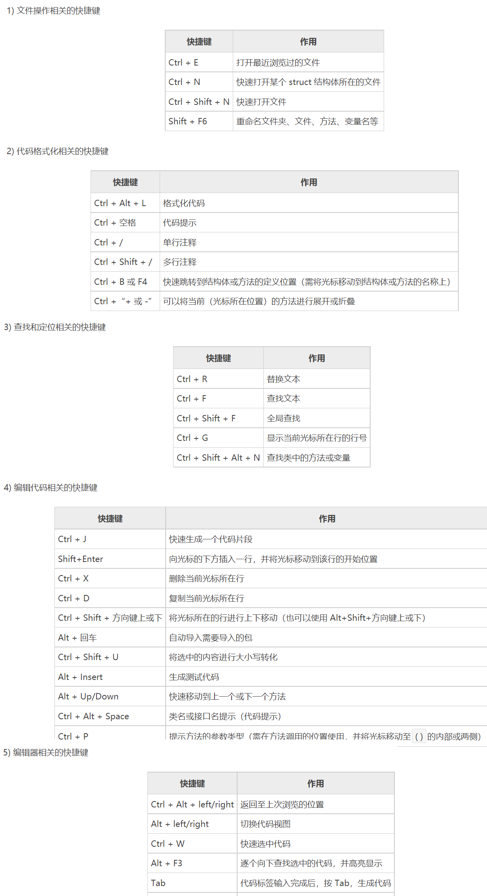

# 资料

Golang的API中文文档：https://studygolang.com/pkgdoc

Go全路线入门教程：https://www.topgoer.com/

**Go语言全路线详细教程**：https://tutorialedge.net/golang/getting-started-with-go/

> 第3个教程真的超级细致，GraphQL-go这种都有




# 一些技巧

## 安装环境配置

作为新手，一定一定不要一来就按照官网教程一步一步的走，因为国内特殊情况，最好还是去网上找那种`一套式保姆级教程`，可以少走很多配环境的弯路！！！比如：https://www.liwenzhou.com/posts/Go/golang-menu/

然后接下来是一些关于Go的环境配置：

1、GOROOT配置，先将安装Go的目录配置为系统变量GOROOT，并将GOROOT\bin配置到环境变量path中

2、GOPATH配置：在go module模式下，设置的GOPATH路径将用于存放引入的外部依赖包，默认是在用户目录即C盘下，可以新建一个目录来专门放依赖包

- 先命令行配置Go的环境变量GOPATH

```shell
go env -w GOPATH=D:\xxxx\mygopath
```

- 再设置系统变量GOPATH

3、在上面配置好GOPATH之后，需要将GOPATH\bin路劲配置到环境变量path中，因为下载的依赖中，里面的可执行命令将会下载到GOPATH\bin下，将其配置到环境变量中才能到处执行(这里主要是给其他工具如protobuf调用其他依赖包的命令)

4、GOPROXY的配置

在国内无法直接使用go get下载golang的各种包，但是，https://goproxy.io/zh/，可以让go get 正常使用！！！也可以用阿里云镜像，可以去阿里云找找

```shell
go env -w GOPROXY=https://goproxy.io,direct
# 或者也可以用国内的代理
go env -w GOPROXY=https://goproxy.cn,direct

go env -w GOSUMDB="sum.golang.google.cn"  # 校验包也用国内的代理
```

5、目前Go1.14之后都是用go mod管理依赖（类似于Java的Maven）

```shell
go env -w GO111MODULE=on # 开启mod依赖管理
```

6、有时候会用到Makefile，所以下载mingw，配置好gcc之后，在Goland中配置make命令指向本地下载的mingw的bin目录下的make.exe


## 交叉编译

在控制台下安装其他系统的运行时，比如下文是`linux x64`

```shell
SET CGO_ENABLED=0
SET GOOS=linux
SET GOARCH=amd64
go build 我的应用.go
```


# 软件安装

## protocolbuffers安装

其GitHub地址：https://github.com/protocolbuffers/protobuf

在其源代码的tag列表中找到需要的版本，如3.16.0，点进去之后选择符合电脑平台的压缩包：


选择其中的win64版本的压缩包，解压后，在其bin目录有且仅有一个protoc.exe，这个玩意就是用来生成其他代码如go代码或者Java代码的命令，把它的目录如`D:\SoftWare\protoc-3.14.0-win64\bin`加入到环境变量path中，就可以到处执行了(也是给一些框架执行)

执行`protoc --version`，输出如下则成功了：

```shel
C:\Users\zhike.feng>protoc --version
libprotoc 3.14.0
```

在Linux上安装的话，步骤是一模一样的，下载上图中第二个压缩包，移动到`/usr/local`目录下，`unzip`解压，正常情况下会把`protoc`命令解压到`/usr/local/bin`目录中，此时就可以直接`protoc --version`验证是否成功了(因为/usr/local/bin一般都是在Linux的环境变量中的，不在的话可以自己配置一下)


## go-micro安装使用

这个玩意最好是在Linux上跑，先安装个protocolbuffers.

GitHub地址：https://github.com/asim/go-micro

在其文档处找到**Command Line Interface**，从这里开始：先下载go-micro

```go
go install go-micro.dev/v4/cmd/micro@master
```

需要下载和protocolbuffer相关的依赖：

```go
go get -u google.golang.org/protobuf/proto
go get github.com/golang/protobuf/protoc-gen-go@latest
go get go-micro.dev/v4/cmd/protoc-gen-micro@latest
```

在这3个下载之后，GOPATH/bin目录下会出现3个命令：`micro`， `protoc-gen-go`，  `protoc-gen-micro`。如果没有，则表明下载失败，重新再下载(可以将GOPATH的bin目录和pkg目录都删了)

然后其它的就和GitHub的引导一致了

需要注意的是如果要使用`micro`命令，需要使得此命令的目录在Linux的环境变量PATH下，需要配置一下。一般micro命令会安装于GOPATH/bin下，将此目录加入PATH变量即可。

如果出现问题，把防火墙关了试一下

# 数据访问

目前数据访问部门将使用XORM框架进行数据库MySQL以及Postgresql的连接访问。

## 连接Postgresql

1、依赖

```go
go get xorm.io/xorm
go get github.com/lib/pq
```

第二个依赖就是连接Postgresql的相关接口实现

2、main函数

> 注意：需要将github.com/lib/pq引入主函数，从而调用其内部的init函数
> `import _ "github.com/lib/pq"`

主函数如下：

```go
func main() {
	engine, err := xorm.NewEngine("postgres", "host=localhost port=5432"+
		" user=postgres password=fzk010326"+
		" dbname=mydatabase sslmode=disable")
	if err != nil {
		log.Fatalln(err)
	}
	defer engine.Close()
	engine.ShowSQL(true)
	engine.SetMapper(names.SnakeMapper{}) // 名称映射规则
    
    // ... 这里写调用dao层
}
```

3、dao层

```go
type User struct {
	Id       int `xorm:"pk autoincr"`
	Username string
	Birthday time.Time
	Balance  string
	Location string
}

// GetUserById 根据id查询
func GetUserById(engine *xorm.Engine, id int) (*User, error) {
	var user *User = new(User)
	_, err := engine.ID(id).Get(user)
	if err != nil {
		return nil, err
	}
	return user, nil
}

// GetUsers 查询所有
func GetUsers(engine *xorm.Engine) (*[]*User, error) {
	var sql = "SELECT * FROM public.user"
	var users = make([]*User, 0, 10)

	err := engine.SQL(sql).Find(&users)
	if err != nil {
		return nil, err
	}
	return &users, nil
}
```

> 注意：Postgresql和MySQL不同的是，在查询表的时候，需要在限定其schema，默认是public，比如查询所有就是`SELECT * FROM public.user`，在Postgresql中用双引号默认使用public的schema，如`SELECT * FROM "user"`也是可以的，在打开XORM的SQL输出的时候，看到的SQL就是这样用双引号来查询的


# 微服务

## grpc

### 简介

官网：https://www.grpc.io/
grpc官方文档中文版(开源中国翻译)：http://doc.oschina.net/grpc?t=56831

[gRPC](http://www.oschina.net/p/grpc-framework)  是一个高性能、开源和通用的 RPC 框架，面向移动和 HTTP/2 设计，带来诸如双向流、流控、头部压缩、单 TCP 连接上的多复用请求等特。这些特性使得其在移动设备上表现更好，更省电和节省空间占用。。目前提供 C、Java 和 Go 语言版本，分别是：grpc, grpc-java, grpc-go。

如其他 RPC 系统，gRPC 基于如下思想：定义一个服务， 指定其可以被远程调用的方法及其参数和返回类型。gRPC 默认使用 [protocol buffers](https://developers.google.com/protocol-buffers/) 作为接口定义语言，来描述服务接口和有效载荷消息结构。

gRPC 允许你定义四类服务方法：

- 单项 RPC

- 服务端流式 RPC，即客户端发送一个请求给服务端，可获取一个数据流用来读取一系列消息。客户端从返回的数据流里一直读取直到没有更多消息为止。

- 客户端流式 RPC，即客户端用提供的一个数据流写入并发送一系列消息给服务端。一旦客户端完成消息写入，就等待服务端读取这些消息并返回应答。

- 双向流式 RPC，即两边都可以分别通过一个读写数据流来发送一系列消息。这两个数据流操作是相互独立的，所以客户端和服务端能按其希望的任意顺序读写

### Go简单使用grpc

前提：已经安装了protobuf3，并配置`%GOPATH%\bin`到系统变量path中。

#### 1、引入依赖

```shell
go get github.com/golang/protobuf/proto
# 此依赖将导入后在GOPATH\bin目录生成protoc-gen-go.exe，此插件可以从.proto文件生成go代码
go get github.com/golang/protobuf/protoc-gen-go
# 引入谷歌的grpc框架
go get google.golang.org/grpc
```

#### 2、定义服务proto

新建`HelloService.proto`文件

```protobuf
syntax = "proto3";
package service;

option go_package = "fzk.com/service"; // 定义生成代码的包目录

// 定义传递的消息结构
message MyMsg{
  int64 code = 1;
  string msg = 2;
  DataStruct data = 3;

  // 定义内部消息结构
  message DataStruct{
    repeated string strs = 1; // 定义数组
  }
}
// 定义服务
service HelloService{
  rpc Hello (MyMsg) returns (MyMsg); // 单项rpc
  rpc HelloStream(stream MyMsg)returns (stream MyMsg); // 双向流式rpc
}
```

#### 3、protobuf生成代码

通过 protocol buffer 的编译器 `protoc` 以及一个特殊的 gRPC Go 插件来生成服务端和客户端代码

在命令行执行以下protoc命令，指定生成go代码并启用插件grpc

```shell
protoc --go_out=plugins=grpc:. HelloService.proto
```

用protobuf生成golang代码：


这些包括：

- 所有用于填充，序列化和获取我们请求和响应消息类型的 protocol buffer 代码
- 一个为客户端调用定义在`RouteGuide`服务的方法的接口类型（或者 *存根* ）
- 一个为服务器使用定义在`RouteGuide`服务的方法去实现的接口类型（或者 *存根* ）

此时先仔细看看生成的HelloService.pb.go代码

#### 4、构建服务端代码

如下图所示生成的HelloService.pb.go里面的服务端接口没有默认实现，自己需要根据业务情况去实现其服务方法


```go
func main() {
	// 1.构造grpc服务对象
	server := grpc.NewServer()
    
	// 2.注册服务
	service.RegisterHelloServiceServer(server, &HelloServiceImpl{})

	listen, err := net.Listen("tcp", ":8080")
	if err != nil {
		log.Fatalln(err)
	}
	// 3.监听并提供grpc服务
	err = server.Serve(listen)
	if err != nil {
		log.Fatalln(err)
	}
}

// HelloServiceImpl 自定义实现
type HelloServiceImpl struct {
}
// 单项rpc
func (p *HelloServiceImpl) Hello(ctx context.Context, args *service.MyMsg) (*service.MyMsg, error) {
	fmt.Println("客户端传来：" + args.String())
	return &service.MyMsg{Code: 200, Msg: "ok", Data: &service.MyMsg_DataStruct{Strs: []string{"server", "received"}}}, nil
}
// 双向流rpc
func (p *HelloServiceImpl) HelloStream(streamServer service.HelloService_HelloStreamServer) error {
	wg := sync.WaitGroup{}
	wg.Add(2)
	// 新建协程去处理接受客户端发来的数据
	go func() {
		defer wg.Done()
		for {
			myMsg, err := streamServer.Recv()
			if err != nil {
				if err == io.EOF {
					fmt.Println("服务端知道客户端已经结束了...")
					return
				} else {
					log.Println(err)
				}
				return
			}
			fmt.Println("服务端获取信息：" + myMsg.String())
		}

	}()
	// 新建协程去发数据到客户端
	go func() {
		defer wg.Done()
		for i := 0; i < 5; i++ {
			err := streamServer.Send(&service.MyMsg{
				Code: 200, Msg: "ok", Data: &service.MyMsg_DataStruct{Strs: []string{"hello", "i am server"}},
			})
			if err != nil {
				log.Println(err)
			}
			time.Sleep(time.Second) // 休眠1s
		}
		fmt.Println("服务端停止发送数据...")
	}()

	wg.Wait()
	fmt.Println("服务端结束...")
	return nil
}
```

#### 5、客户端远程调用实现

```go
// 客户端
func main() {
	// 1.不使用安全证书加密建立grpc连接
	conn, err := grpc.Dial("localhost:8080", grpc.WithTransportCredentials(insecure.NewCredentials()))
	if err != nil {
		return
	}
	defer conn.Close()

	// 2.构建客户端
	client := service.NewHelloServiceClient(conn)

	// 3.单项rpc远程调用服务端方法并传入参数
	reply, err := client.Hello(context.Background(),
		&service.MyMsg{Code: 200, Msg: "ping",
			Data: &service.MyMsg_DataStruct{Strs: []string{"hello", "grpc"}}})
	if err != nil {
		log.Fatalln(err)
	}
	fmt.Println("客户端获得回应：" + reply.String())

	// 4.双向流rpc调用
	streamClient, err := client.HelloStream(context.Background())
	if err != nil {
		return
	}

	wg := sync.WaitGroup{}
	wg.Add(2)
	// 4.1 新建协程发送数据到服务端
	go func() {
		defer wg.Done()
		for i := 0; i < 5; i++ {
			err := streamClient.Send(&service.MyMsg{Code: 200, Msg: "ping",
				Data: &service.MyMsg_DataStruct{Strs: []string{"hello", "grpc"}}})
			if err != nil {
				log.Println(err)
				return
			}
			time.Sleep(time.Second) // 休眠1s
		}
		fmt.Println("客户端停止发送数据...")
		err := streamClient.CloseSend()
		if err != nil {
			log.Println(err)
			return
		}
	}()

	// 4.2 新建协程接受服务端发来的数据
	go func() {
		defer wg.Done()
		for {
			recv, err := streamClient.Recv()
			if err != nil {
				if err == io.EOF {
					fmt.Println("客户端知道服务端结束了...")
				} else {
					log.Println(err)
				}
				return
			}
			fmt.Println("客户端接收到数据：" + recv.String())
		}
	}()

	wg.Wait()
	fmt.Println("客户端结束...")
}
```

#### 6、结果

客户端结果：

```
客户端获得回应：code:200 msg:"ok" data:{strs:"server" strs:"received"}
客户端接收到数据：code:200 msg:"ok" data:{strs:"hello" strs:"i am server"}
客户端接收到数据：code:200 msg:"ok" data:{strs:"hello" strs:"i am server"}
客户端接收到数据：code:200 msg:"ok" data:{strs:"hello" strs:"i am server"}
客户端接收到数据：code:200 msg:"ok" data:{strs:"hello" strs:"i am server"}
客户端接收到数据：code:200 msg:"ok" data:{strs:"hello" strs:"i am server"}
客户端停止发送数据...
客户端知道服务端结束了...
客户端结束...

Process finished with the exit code 0
```

服务端结果：服务端会一直运行等待下一次rpc调用

```
客户端传来：code:200 msg:"ping" data:{strs:"hello" strs:"grpc"}
服务端获取信息：code:200 msg:"ping" data:{strs:"hello" strs:"grpc"}
服务端获取信息：code:200 msg:"ping" data:{strs:"hello" strs:"grpc"}
服务端获取信息：code:200 msg:"ping" data:{strs:"hello" strs:"grpc"}
服务端获取信息：code:200 msg:"ping" data:{strs:"hello" strs:"grpc"}
服务端获取信息：code:200 msg:"ping" data:{strs:"hello" strs:"grpc"}
服务端停止发送数据...
服务端知道客户端已经结束了...
服务端此双向流rpc结束...

```

### 拦截器

在创建服务器的第一步的`grpc.NewServer()`中，可以传入配置选项参数

```go
func NewServer(opt ...ServerOption) *Server {
    ......
}

// A ServerOption sets options such as credentials(凭据), codec(编解码器) and keepalive parameters, etc.
type ServerOption interface {
	apply(*serverOptions)
}

type serverOptions struct {
	......
	chainUnaryInts        []UnaryServerInterceptor  // 提供了一个钩子来拦截服务器上单项 RPC 的执行
	chainStreamInts       []StreamServerInterceptor
	......
}
// UnaryServerInterceptor 提供了一个钩子来拦截服务器 单项RPC 的执行。 info 包含拦截器可以操作的这个 RPC 的所有信息。而handler是服务方法实现的包装器。拦截器负责调用处理程序来完成 RPC。
type UnaryServerInterceptor func(ctx context.Context, req interface{}, info *UnaryServerInfo, handler UnaryHandler) (resp interface{}, err error)

//  提供了一个钩子来拦截服务器上流式 RPC 的执行。info 包含拦截器可以操作的这个 RPC 的所有信息。而handler是服务方法的实现。拦截器负责调用处理程序来完成 RPC。
type StreamServerInterceptor func(srv interface{}, ss ServerStream, info *StreamServerInfo, handler StreamHandler) error
```

那么显然，要实现拦截器功能，需要先实现这两个函数，在上面程序的基础上，只给服务端的程序增加下面一部分内容：

```go
func main() {
	// 1.构造grpc服务对象
	var options []grpc.ServerOption
	options = append(options, grpc.ChainUnaryInterceptor(myInterceptor), grpc.ChainStreamInterceptor(myStreamInterceptor))
	server := grpc.NewServer(options...)
	// 省略
    ......
}

// 单项rpc拦截器
func myInterceptor(ctx context.Context, req interface{}, info *grpc.UnaryServerInfo, handler grpc.UnaryHandler) (resp interface{}, err error) {
	fmt.Println("单项rpc拦截器执行了...")
	// 链式执行：要么下一个拦截器，要么执行被调用的服务方法
	return handler(ctx, req)
}

// 流式rpc拦截器
func myStreamInterceptor(srv interface{}, ss grpc.ServerStream, info *grpc.StreamServerInfo, handler grpc.StreamHandler) error {
	fmt.Println("流式rpc拦截器执行了...")
	// 链式执行：要么下一个拦截器，要么执行被调用的服务方法
	return handler(srv, ss)
}
```

服务端结果如下：

```
单项rpc拦截器执行了...
客户端传来：code:200  msg:"ping"  data:{strs:"hello"  strs:"grpc"}    
流式rpc拦截器执行了...
服务端获取信息：code:200  msg:"ping"  data:{strs:"hello"  strs:"grpc"}
服务端获取信息：code:200  msg:"ping"  data:{strs:"hello"  strs:"grpc"}
服务端获取信息：code:200  msg:"ping"  data:{strs:"hello"  strs:"grpc"}
服务端获取信息：code:200  msg:"ping"  data:{strs:"hello"  strs:"grpc"}
服务端获取信息：code:200  msg:"ping"  data:{strs:"hello"  strs:"grpc"}
服务端停止发送数据...
服务端知道客户端已经结束了...
服务端双向流结束...

```

从结果可用看出，这个流式拦截器只会执行一次，并不会每次发消息就执行


