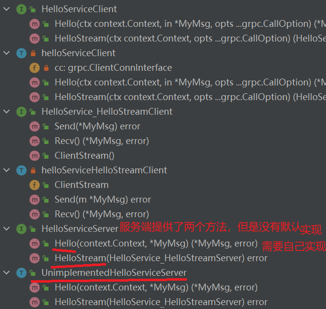

# 资料

Golang的API中文文档：https://studygolang.com/pkgdoc

Go全路线入门教程：https://www.topgoer.com/

**Go语言全路线详细教程**：https://tutorialedge.net/golang/getting-started-with-go/

> 第3个教程真的超级细致，GraphQL-go这种都有


# 开发环境

## 安装环境配置

作为新手，一定一定不要一来就按照官网教程一步一步的走，因为国内特殊情况，最好还是去网上找那种`一套式保姆级教程`，可以少走很多配环境的弯路！！！

然后接下来是一些关于Go的环境配置：

1、GOROOT配置，先将安装Go的目录配置为系统变量GOROOT，并将GOROOT\bin配置到环境变量path中

2、GOPATH配置：在go module模式下，设置的GOPATH路径将用于存放引入的外部依赖包，默认是在用户目录即C盘下，可以新建一个目录来专门放依赖包

- 先命令行配置Go的环境变量GOPATH

```shell
go env -w GOPATH=D:\xxxx\mygopath
```

- 再设置系统变量GOPATH

3、在上面配置好GOPATH之后，需要将GOPATH\bin路劲配置到环境变量path中，因为下载的依赖中，里面的可执行命令将会下载到GOPATH\bin下，将其配置到环境变量中才能到处执行(这里主要是给其他工具如protobuf调用其他依赖包的命令)

4、GOPROXY的配置

在国内无法直接使用go get下载golang的各种包，但是，https://goproxy.io/zh/，可以让go get 正常使用！！！也可以用阿里云镜像，可以去阿里云找找

```shell
go env -w GOPROXY=https://goproxy.io,direct
# 或者也可以用国内的代理
go env -w GOPROXY=https://goproxy.cn,direct

go env -w GOSUMDB="sum.golang.google.cn"  # 校验包也用国内的代理
```

5、目前Go1.14之后都是用go mod管理依赖（类似于Java的Maven）

```shell
go env -w GO111MODULE=on # 开启mod依赖管理
```

6、有时候会用到Makefile，所以下载mingw，配置好gcc之后，在Goland中配置make命令指向本地下载的mingw的bin目录下的make.exe

## gcc环境搭建

go本身开发并不需要gcc环境，但是在很多情况下，go项目的初始化什么的会用到很多命令行操作，如果建一个Makefile来进行构建项目，会方便很多。

因为需要的仅仅是GCC，所以先到mingw官网找到Windows的下载页面：https://sourceforge.net/projects/mingw-w64/files/mingw-w64/mingw-w64-release/

1、找到需要的GCC版本：


2、下载之后解压即可，再将其bin目录添加到系统变量path中，此时在命令行中输入`gcc -v`即可查看是否成功。

3、然后将bin目录中的mingw32-make.exe文件复制粘贴并重命名为make.exe，完成之后如下图：(这么做的目的是方便框架直接调用make命令)


4、接下来去GoLand配置make命令所在目录：


然后Makefile执行就不会报错啦：


## 交叉编译

在控制台下安装其他系统的运行时，比如下文是`linux x64`

```shell
SET CGO_ENABLED=0
SET GOOS=linux
SET GOARCH=amd64
go build 我的应用.go
```

在makefile中就得小心一点的：

```makefile
go-build-to-linux:  # 交叉编译，GOOS=linux这里必须挨着&&，不能出现空格，否则会把空格也设置为GOOS而报错
	SET CGO_ENABLED=0 &&\
	SET GOOS=linux&&\
	SET GOARCH=amd64&&\
	go build main.go
```

# 数据访问

目前数据访问部分将使用XORM框架进行数据库MySQL以及Postgresql的连接访问。

## 连接Postgresql

1、依赖

```go
go get xorm.io/xorm
go get github.com/lib/pq
```

第二个依赖就是连接Postgresql的相关接口实现

2、main函数

> 注意：需要将github.com/lib/pq引入主函数，从而调用其内部的init函数
> `import _ "github.com/lib/pq"`

主函数如下：

```go
func main() {
	engine, err := xorm.NewEngine("postgres", "host=localhost port=5432"+
		" user=postgres password=fzk010326"+
		" dbname=mydatabase sslmode=disable")
	if err != nil {
		log.Fatalln(err)
	}
	defer engine.Close()
	engine.ShowSQL(true)
	engine.SetMapper(names.SnakeMapper{}) // 名称映射规则
    
    // ... 这里写调用dao层
}
```

3、dao层

```go
type User struct {
	Id       int `xorm:"pk autoincr"`
	Username string
	Birthday time.Time
	Balance  string
	Location string
}

// GetUserById 根据id查询
func GetUserById(engine *xorm.Engine, id int) (*User, error) {
	var user *User = new(User)
	_, err := engine.ID(id).Get(user)
	if err != nil {
		return nil, err
	}
	return user, nil
}

// GetUsers 查询所有
func GetUsers(engine *xorm.Engine) (*[]*User, error) {
	var sql = "SELECT * FROM public.user"
	var users = make([]*User, 0, 10)

	err := engine.SQL(sql).Find(&users)
	if err != nil {
		return nil, err
	}
	return &users, nil
}
```

> 注意：Postgresql和MySQL不同的是，在查询表的时候，需要在限定其schema，默认是public，比如查询所有就是`SELECT * FROM public.user`，在Postgresql中用双引号默认使用public的schema，如`SELECT * FROM "user"`也是可以的，在打开XORM的SQL输出的时候，看到的SQL就是这样用双引号来查询的

## xorm时间类型转换失败

背景：在xorm的低版本如v1.0.5中，查询数据库，如果以一个entity实体结构对应接受，是没有用问题的。但是，如果是像下面这种查询单个字段并只返回单条结果的情况下，并且用的是一个结构体去接受如time.Time就会有一定问题。

接下来以一个简单是例子说明：

```sql
-- 创建一个user表
CREATE TABLE t_user(
  `id` bigint NOT NULL AUTO_INCREMENT,
  `username` varchar(80) NULL,
  `update_time` datetime NULL DEFAULT CURRENT_TIMESTAMP ON UPDATE CURRENT_TIMESTAMP,
  PRIMARY KEY (`id`)
);
```

对应实体结构User如下：

```go
type User struct {
	Id         int64    `json:"id" xorm:"pk"`
	Username   string   `json:"username"`
	UpdateTime NullTime `json:"updateTime"`
}
// TableName 返回表名
func (user *User) TableName() string {
	return "t_user"
}
```

在这里出现了一个NullTime结构去作为更新时间字段的类型，这个是自定义类型：

```go
// NullTime is an alias for data type
type NullTime time.Time

// MarshalJSON for Time
func (t *NullTime) MarshalJSON() ([]byte, error) {
	if time.Time(*t).IsZero() {
		return []byte(`null`), nil
	}
	return []byte(`"` + time.Time(*t).Format("2006-01-02 15:04:05") + `"`), nil
}

// UnmarshalJSON for NullTime
func (t *NullTime) UnmarshalJSON(b []byte) error {
	return json.Unmarshal(b, &t)
}

// CurrentTime Now for current time
func CurrentTime() NullTime {
	return NullTime(time.Now())
}
```

为什么这里要用个NullTime作为time.Time的别名呢？这样可以给NullTime类型增加两个marshal方法，有利于直接返给前端正确的格式如`2006-01-02 15:04:05`。

连接上数据库：

```go
	engine, err := xorm.NewEngine("mysql", "root:密码@/数据库名?charset=utf8")
	if err != nil {
		log.Fatalln(err)
	}
	defer engine.Close()
	engine.ShowSQL(true)	// 打开SQL日志
	engine.SetColumnMapper(names.GonicMapper{})  // 字段名称映射规则
	err = engine.Ping()
	if err != nil {
		log.Fatalln(err)
	}
```

### 时间结构赋值的问题

假设一个需求，只需要查询出数据库中最新的一个时间记录：确保此时是xorm的版本v1.0.5

```go
	var lastUpdateTime entity.NullTime
	has, err := engine.SQL("SELECT MAX(update_time) FROM " + (&entity.User{}).TableName()).Get(&lastUpdateTime)
	if has {
		json, err := lastUpdateTime.MarshalJSON()
		if err != nil {
			return
		}
		fmt.Println(has, err, string(json))
	}
```

这里就是只需要查出一个字段、一条结果，并用了一个自定义结构体NullTime去接受，然后就能看见报错了：


把错误复制到xorm的gitea一查，就能找到相应的问题描述：https://gitea.com/xorm/xorm/issues/1302

在这里也可以把这个NullTime类型改回time.Time类型，依旧报错，可以看到此时版本的xorm居然连time.Time类型也不支持嘛。

### 问题解决方式

经过自己的测试和gitea上问题描述开发者给出的答复，有三个解决方式：

1、用User这个entity结构去接受，最后返回里面的update_time

```go
// 方式1：用entity结构体User接受，但是有点挫
func getLastUpdateTime1(engine *xorm.Engine) (*entity.NullTime, error) {
	var user entity.User
    // 这里要用到别名
	has, err := engine.SQL("SELECT MAX(update_time) as update_time FROM " + (&entity.User{}).TableName()).Get(&user)
	if has {
		return &user.UpdateTime, nil
	}
	return nil, err
}
```

2、升级版本到当前最新版v1.2.5之后，支持了对time.Time的转换

```go
// 方式2：用time.Time，再强转；需要升级xorm版本至v1.2.5
func getLastUpdateTime2(engine *xorm.Engine) (*entity.NullTime, error) {
	var lastUpdateTime time.Time
	has, err := engine.SQL("SELECT MAX(update_time) FROM " + (&entity.User{}).TableName()).Get(&lastUpdateTime)
	if has {
		var result = entity.NullTime(lastUpdateTime)
		return &result, nil
	}
	return nil, err
}
```

3、升级版本到当前最新版v1.2.5之后，自定义类型转换器：convert.Conversion

对于需要自定义类型转换的结构体，需要实现convert.Conversion接口的两个方法

```go
package convert

// Conversion is an interface. A type implements Conversion will according
// the custom method to fill into database and retrieve from database.
type Conversion interface {
   FromDB([]byte) error
   ToDB() ([]byte, error)
}
```

NullTime具体实现如下：

```go
// FromDB 从数据库数据形式转回结构体
func (t *NullTime) FromDB(b []byte) error {
	parseTime, err := time.Parse("2006-01-02 15:04:05", string(b))
	if err != nil {
		return err
	}
	nullTime := NullTime(parseTime)
	*t = nullTime // 将解析后的时间设置到此自定义结构中
	return nil
}

// ToDB 转换为数据库数据形式
func (t *NullTime) ToDB() ([]byte, error) {
	return []byte(`"` + time.Time(*t).Format("2006-01-02 15:04:05") + `"`), nil
}
```

这样就可以直接用这个NullTime类型接受返回的值了：

```go
// 方式3：自定义类型转换器；需要升级xorm版本至当前最新版v1.2.5
func getLastUpdateTime3(engine *xorm.Engine) (*entity.NullTime, error) {
	var lastUpdateTime entity.NullTime
	has, err := engine.SQL("SELECT MAX(update_time) FROM " + (&entity.User{}).TableName()).Get(&lastUpdateTime)
	if has {
		return &lastUpdateTime, nil
	}
	return nil, err
}
```

这样就没得问题了。

### v1.0.5版本问题定位

还是得去找找问题怎么出现的。先将版本退回v1.0.5，开始debug。

在v1.0.5版本，以没有实现convert.Conversion接口的NullTime类型直接去接受值`engine.SQL("SELECT MAX(update_time) FROM " + (&entity.User{}).TableName()).Get(&lastUpdateTime)`，debug最后的Get方法：

```go
func (session *Session) get(bean interface{}) (bool, error) {
    // 省略一些代码
    
    // 这里走的是解析结构体的方式进行赋值：
    // 那必然有问题啊，time.Time作为一个结构体，把sql查询的数据当做time.Time中的某个字段进行解析，肯定找不到啊
    if beanValue.Elem().Kind() == reflect.Struct {
		if err := session.statement.SetRefBean(bean); err != nil {
			return false, err
		}
	}
    
    // 省略一些代码
}

// Parse parses a struct as a table information
func (parser *Parser) Parse(v reflect.Value) (*schemas.Table, error) {
    // 省略很多代码
    
    
    var sqlType schemas.SQLType
    if fieldValue.CanAddr() {
        // 最开始出现错误的地方在这里
        if _, ok := fieldValue.Addr().Interface().(convert.Conversion); ok {
            sqlType = schemas.SQLType{Name: schemas.Text}
       }
    }
    
    // 省略很多代码
}
```

因为这个fieldValue是NullTime类型即time.Time类型的第一个字段：

```go
type Time struct {
	wall uint64
	ext  int64
	loc *Location
}
```

出现的错误是：panic: reflect.Value.Interface: cannot return value obtained from unexported field or method

当点击进入Interface()方法查看：

```go
// Interface returns v's current value as an interface{}.
// It is equivalent to:
//	var i interface{} = (v's underlying value)
// It panics if the Value was obtained by accessing
// unexported struct fields. 这里的意思是：如果该值是通过访问未报告的struct字段获得的，它就会崩溃
func (v Value) Interface() (i interface{}) {
	return valueInterface(v, true)
}
```

总结：在将数据库数据查询出来之后，解析赋值给NullTime结构体时，Get方法直接根据它结构体这一类型，对其内部的字段进行遍历获取，然后解析，意图将数据解析到其内部的字段中，然后就发生了错误。

疑惑：在上面的例子中，可以知道在v1.2.5版本时，这个问题依旧没有解决，但是已经可以支持直接解析time.Time类型了，那么这个新版本又做了些什么呢？

### v1.2.5版本更改：引入自定义转换器

在v1.2.5版本中，直接以time.Time接受单条且单个字段返回且是时间类型是可以的，其它的自定义结构体如果也要接受单条且单个字段数据返回需要自定义转换器进行操作。

还是一样的debug它的Get方法：

```go
func (session *Session) get(bean interface{}) (bool, error) {
    // 省略一些代码
    
    // 就是把这里的判断加了判断是否为时间time.Time类型，那么这样一改，就不会走这里了
    if beanValue.Elem().Kind() == reflect.Struct && !isPtrOfTime(bean) {
        if err := session.statement.SetRefBean(bean); err != nil {
            return false, err
        }
    }
    // 省略一些代码
    
    // 现在走的是这里
    has, err := session.nocacheGet(beanValue.Elem().Kind(), table, bean, sqlStr, args...)
    // 省略一些代码
}
```

进入此方法内：

```go
func (session *Session) nocacheGet(beanKind reflect.Kind, table *schemas.Table, bean interface{}, sqlStr string, args ...interface{}) (bool, error) {
	// 省略一些代码
    
	switch beanKind {
	case reflect.Struct:	// 是结构体，走的这里
        // 这个判断是否可扫描到结构体的方法很重要
		if !isScannableStruct(bean, len(types)) {
			break
		}
		return session.getStruct(rows, types, fields, table, bean) // 这里是按照常规方式解析数据到结构体中：即字段映射
	case reflect.Slice:
		return session.getSlice(rows, types, fields, bean)
	case reflect.Map:
		return session.getMap(rows, types, fields, bean)
	}
	// 咱们这个情况走的是这里，即将查询到的数据作为一个值直接赋给bean（可能是string、int等基本类型，或者是time.Time，或者自定义了转换器的struct）
	return session.getVars(rows, types, fields, bean)
}

// 判断是否可以将数据扫描到结构体中
// false：结构体为time.Time、sql.Scanner、big.Float的情况下返回false，在自定义了转换器且返回数据只有一条的时候也返回false
// true：自定义了转换器，但是返回数据有多条，或者是其他一般结构体返回true
func isScannableStruct(bean interface{}, typeLen int) bool {
	switch bean.(type) {
	case *time.Time:
		return false
	case sql.Scanner:
		return false
	case convert.Conversion: // 当在自定义了转换器，且返回数据超过1条的时候返回true
		return typeLen > 1
	case *big.Float:
		return false
	}
	return true	// 其他情况都返回true
}
```

那么看看它又是如何处理这种非结构体接受，或者是特殊的结构体接受数据的情况的：

```go
func (session *Session) getVars(rows *core.Rows, types []*sql.ColumnType, fields []string, beans ...interface{}) (bool, error) {
	if len(beans) != len(types) {
		return false, fmt.Errorf("expected columns %d, but only %d variables", len(types), len(beans))
	}

	err := session.engine.scan(rows, fields, types, beans...)
	return true, err
}
```

它最终来跑到convert包的Assign方法处：

```go
// Assign copies to dest the value in src, converting it if possible.
// src 是数据库查到的数据，dest是要存放数据的地方。 dest 得是指针类型.
func Assign(dest, src interface{}, originalLocation *time.Location, convertedLocation *time.Location) error {
    // 1.先判断src的类型，即数据库查到返回的数据类型
	switch s := src.(type) {
	case *interface{}:
		return Assign(dest, *s, originalLocation, convertedLocation)
	case string:
		// 省略 ：这里是直接转换给dest
	case []byte:
		// 省略：这里和string类型处理逻辑差不多
	case time.Time:
		// 省略：这里是转换为string类型给dest
	case nil:
		// 省略：dest赋值为nil
	case *sql.NullString:
		// 省略：比string处理逻辑多一些
	case *sql.NullInt32:
		// 省略：能转换为int类型的dest
	case *sql.NullInt64:
		// 省略：和上面这个差不多
	case *sql.NullFloat64:
		// 省略：和上面这个差不多
	case *sql.NullBool:
		// 省略：和上面这个差不多
	case *sql.NullTime:
		// 省略：能转换为time.Time或者string类型的dest
	case *NullUint32:
		// 省略：和int这个差不多
	case *NullUint64:
		// 省略：和上面这个差不多
        
    // 重点在这里：这个sql.RawBytes就是[]byte的别名
    // 咱这情况走的是这里：
	case *sql.RawBytes:
        // 1.1 先判断dest是否实现了自定义转换器，即实现convert.Conversion接口
		switch d := dest.(type) {
		case Conversion:
			return d.FromDB(*s)  // 这个方法看着就眼熟，这就是自定义的解析方法
		}
	}

    // 2.如果scr类型均不满足，则从dest类型判断采取解析措施
	var sv reflect.Value

	switch d := dest.(type) {
	case *string: // 省略
	case *[]byte: // 省略
	case *bool: // 省略
	case *interface{}: // 省略
	}
	// 3.最后的尝试
	return AssignValue(reflect.ValueOf(dest), src)
}
```

总结：在v1.2.5的版本下，增加了对结构体类型time.Time的特殊处理，同时对自定义类型如上面自己定义的那个NullTime也支持了自定义转换器。现在xorm解析查询结果的逻辑就是：如果接受者是个结构体，则先判断是否为time.Time类型，再判断是否有自定义转换器，都不是的情况下，再调用通用的字段映射处理方式进行解析。


# 微服务

## 软件安装

### protocolbuffers安装

其GitHub地址：https://github.com/protocolbuffers/protobuf

在其源代码的tag列表中找到需要的版本，如3.16.0，点进去之后选择符合电脑平台的压缩包：


选择其中的win64版本的压缩包，解压后，在其bin目录有且仅有一个protoc.exe，这个玩意就是用来生成其他代码如go代码或者Java代码的命令，把它的目录如`D:\SoftWare\protoc-3.14.0-win64\bin`加入到环境变量path中，就可以到处执行了(也是给一些框架执行)

执行`protoc --version`，输出如下则成功了：

```shel
C:\Users\zhike.feng>protoc --version
libprotoc 3.14.0
```

在Linux上安装的话，步骤是一模一样的，下载上图中第二个压缩包，移动到`/usr/local`目录下，`unzip`解压，正常情况下会把`protoc`命令解压到`/usr/local/bin`目录中，此时就可以直接`protoc --version`验证是否成功了(因为/usr/local/bin一般都是在Linux的环境变量中的，不在的话可以自己配置一下)

### go-micro安装使用

这个玩意最好是在Linux上跑，先安装个protocolbuffers.

GitHub地址：https://github.com/asim/go-micro

在其文档处找到**Command Line Interface**，从这里开始：先下载go-micro

```go
go install go-micro.dev/v4/cmd/micro@master
```

需要下载和protocolbuffer相关的依赖：

```go
go get -u google.golang.org/protobuf/proto
go get github.com/golang/protobuf/protoc-gen-go@latest
go get go-micro.dev/v4/cmd/protoc-gen-micro@latest
```

在这3个下载之后，GOPATH/bin目录下会出现3个命令：`micro`， `protoc-gen-go`，  `protoc-gen-micro`。如果没有，则表明下载失败，重新再下载(可以将GOPATH的bin目录和pkg目录都删了)

然后其它的就和GitHub的引导一致了

需要注意的是如果要使用`micro`命令，需要使得此命令的目录在Linux的环境变量PATH下，需要配置一下。一般micro命令会安装于GOPATH/bin下，将此目录加入PATH变量即可。

如果出现问题，把防火墙关了试一下

## grpc

### 简介

官网：https://www.grpc.io/
grpc官方文档中文版(开源中国翻译)：http://doc.oschina.net/grpc?t=56831

[gRPC](http://www.oschina.net/p/grpc-framework)  是一个高性能、开源和通用的 RPC 框架，面向移动和 HTTP/2 设计，带来诸如双向流、流控、头部压缩、单 TCP 连接上的多复用请求等特。这些特性使得其在移动设备上表现更好，更省电和节省空间占用。。目前提供 C、Java 和 Go 语言版本，分别是：grpc, grpc-java, grpc-go。

如其他 RPC 系统，gRPC 基于如下思想：定义一个服务， 指定其可以被远程调用的方法及其参数和返回类型。gRPC 默认使用 [protocol buffers](https://developers.google.com/protocol-buffers/) 作为接口定义语言，来描述服务接口和有效载荷消息结构。

gRPC 允许你定义四类服务方法：

- 单项 RPC

- 服务端流式 RPC，即客户端发送一个请求给服务端，可获取一个数据流用来读取一系列消息。客户端从返回的数据流里一直读取直到没有更多消息为止。

- 客户端流式 RPC，即客户端用提供的一个数据流写入并发送一系列消息给服务端。一旦客户端完成消息写入，就等待服务端读取这些消息并返回应答。

- 双向流式 RPC，即两边都可以分别通过一个读写数据流来发送一系列消息。这两个数据流操作是相互独立的，所以客户端和服务端能按其希望的任意顺序读写

### Go简单使用grpc

前提：已经安装了protobuf3，并配置`%GOPATH%\bin`到系统变量path中。

#### 1、引入依赖

```shell
go get github.com/golang/protobuf/proto
# 此依赖将导入后在GOPATH\bin目录生成protoc-gen-go.exe，此插件可以从.proto文件生成go代码
go get github.com/golang/protobuf/protoc-gen-go
# 引入谷歌的grpc框架
go get google.golang.org/grpc
```

#### 2、定义服务proto

新建`HelloService.proto`文件

```protobuf
syntax = "proto3";
package service;

option go_package = "fzk.com/service"; // 定义生成代码的包目录

// 定义传递的消息结构
message MyMsg{
  int64 code = 1;
  string msg = 2;
  DataStruct data = 3;

  // 定义内部消息结构
  message DataStruct{
    repeated string strs = 1; // 定义数组
  }
}
// 定义服务
service HelloService{
  rpc Hello (MyMsg) returns (MyMsg); // 单项rpc
  rpc HelloStream(stream MyMsg)returns (stream MyMsg); // 双向流式rpc
}
```

#### 3、protobuf生成代码

通过 protocol buffer 的编译器 `protoc` 以及一个特殊的 gRPC Go 插件来生成服务端和客户端代码

在命令行执行以下protoc命令，指定生成go代码并启用插件grpc

```shell
protoc --go_out=plugins=grpc:. HelloService.proto
```

用protobuf生成golang代码，这些包括：

- 所有用于填充，序列化和获取我们请求和响应消息类型的 protocol buffer 代码
- 一个为客户端调用定义在`RouteGuide`服务的方法的接口类型（或者 *存根* ）
- 一个为服务器使用定义在`RouteGuide`服务的方法去实现的接口类型（或者 *存根* ）

此时先仔细看看生成的HelloService.pb.go代码

#### 4、构建服务端代码

如下图所示生成的HelloService.pb.go里面的服务端接口没有默认实现，自己需要根据业务情况去实现其服务方法



```go
func main() {
	// 1.构造grpc服务对象
	server := grpc.NewServer()
    
	// 2.注册服务
	service.RegisterHelloServiceServer(server, &HelloServiceImpl{})

	listen, err := net.Listen("tcp", ":8080")
	if err != nil {
		log.Fatalln(err)
	}
	// 3.监听并提供grpc服务
	err = server.Serve(listen)
	if err != nil {
		log.Fatalln(err)
	}
}

// HelloServiceImpl 自定义实现
type HelloServiceImpl struct {
}
// 单项rpc
func (p *HelloServiceImpl) Hello(ctx context.Context, args *service.MyMsg) (*service.MyMsg, error) {
	fmt.Println("客户端传来：" + args.String())
	return &service.MyMsg{Code: 200, Msg: "ok", Data: &service.MyMsg_DataStruct{Strs: []string{"server", "received"}}}, nil
}
// 双向流rpc
func (p *HelloServiceImpl) HelloStream(streamServer service.HelloService_HelloStreamServer) error {
	wg := sync.WaitGroup{}
	wg.Add(2)
	// 新建协程去处理接受客户端发来的数据
	go func() {
		defer wg.Done()
		for {
			myMsg, err := streamServer.Recv()
			if err != nil {
				if err == io.EOF {
					fmt.Println("服务端知道客户端已经结束了...")
					return
				} else {
					log.Println(err)
				}
				return
			}
			fmt.Println("服务端获取信息：" + myMsg.String())
		}

	}()
	// 新建协程去发数据到客户端
	go func() {
		defer wg.Done()
		for i := 0; i < 5; i++ {
			err := streamServer.Send(&service.MyMsg{
				Code: 200, Msg: "ok", Data: &service.MyMsg_DataStruct{Strs: []string{"hello", "i am server"}},
			})
			if err != nil {
				log.Println(err)
			}
			time.Sleep(time.Second) // 休眠1s
		}
		fmt.Println("服务端停止发送数据...")
	}()

	wg.Wait()
	fmt.Println("服务端结束...")
	return nil
}
```

#### 5、客户端远程调用实现

```go
// 客户端
func main() {
	// 1.不使用安全证书加密建立grpc连接
	conn, err := grpc.Dial("localhost:8080", grpc.WithTransportCredentials(insecure.NewCredentials()))
	if err != nil {
		return
	}
	defer conn.Close()

	// 2.构建客户端
	client := service.NewHelloServiceClient(conn)

	// 3.单项rpc远程调用服务端方法并传入参数
	reply, err := client.Hello(context.Background(),
		&service.MyMsg{Code: 200, Msg: "ping",
			Data: &service.MyMsg_DataStruct{Strs: []string{"hello", "grpc"}}})
	if err != nil {
		log.Fatalln(err)
	}
	fmt.Println("客户端获得回应：" + reply.String())

	// 4.双向流rpc调用
	streamClient, err := client.HelloStream(context.Background())
	if err != nil {
		return
	}

	wg := sync.WaitGroup{}
	wg.Add(2)
	// 4.1 新建协程发送数据到服务端
	go func() {
		defer wg.Done()
		for i := 0; i < 5; i++ {
			err := streamClient.Send(&service.MyMsg{Code: 200, Msg: "ping",
				Data: &service.MyMsg_DataStruct{Strs: []string{"hello", "grpc"}}})
			if err != nil {
				log.Println(err)
				return
			}
			time.Sleep(time.Second) // 休眠1s
		}
		fmt.Println("客户端停止发送数据...")
		err := streamClient.CloseSend()
		if err != nil {
			log.Println(err)
			return
		}
	}()

	// 4.2 新建协程接受服务端发来的数据
	go func() {
		defer wg.Done()
		for {
			recv, err := streamClient.Recv()
			if err != nil {
				if err == io.EOF {
					fmt.Println("客户端知道服务端结束了...")
				} else {
					log.Println(err)
				}
				return
			}
			fmt.Println("客户端接收到数据：" + recv.String())
		}
	}()

	wg.Wait()
	fmt.Println("客户端结束...")
}
```

#### 6、结果

客户端结果：

```
客户端获得回应：code:200 msg:"ok" data:{strs:"server" strs:"received"}
客户端接收到数据：code:200 msg:"ok" data:{strs:"hello" strs:"i am server"}
客户端接收到数据：code:200 msg:"ok" data:{strs:"hello" strs:"i am server"}
客户端接收到数据：code:200 msg:"ok" data:{strs:"hello" strs:"i am server"}
客户端接收到数据：code:200 msg:"ok" data:{strs:"hello" strs:"i am server"}
客户端接收到数据：code:200 msg:"ok" data:{strs:"hello" strs:"i am server"}
客户端停止发送数据...
客户端知道服务端结束了...
客户端结束...

Process finished with the exit code 0
```

服务端结果：服务端会一直运行等待下一次rpc调用

```
客户端传来：code:200 msg:"ping" data:{strs:"hello" strs:"grpc"}
服务端获取信息：code:200 msg:"ping" data:{strs:"hello" strs:"grpc"}
服务端获取信息：code:200 msg:"ping" data:{strs:"hello" strs:"grpc"}
服务端获取信息：code:200 msg:"ping" data:{strs:"hello" strs:"grpc"}
服务端获取信息：code:200 msg:"ping" data:{strs:"hello" strs:"grpc"}
服务端获取信息：code:200 msg:"ping" data:{strs:"hello" strs:"grpc"}
服务端停止发送数据...
服务端知道客户端已经结束了...
服务端此双向流rpc结束...

```

### 拦截器

在创建服务器的第一步的`grpc.NewServer()`中，可以传入配置选项参数

```go
func NewServer(opt ...ServerOption) *Server {
    ......
}

// A ServerOption sets options such as credentials(凭据), codec(编解码器) and keepalive parameters, etc.
type ServerOption interface {
	apply(*serverOptions)
}

type serverOptions struct {
	......
	chainUnaryInts        []UnaryServerInterceptor  // 提供了一个钩子来拦截服务器上单项 RPC 的执行
	chainStreamInts       []StreamServerInterceptor
	......
}
// UnaryServerInterceptor 提供了一个钩子来拦截服务器 单项RPC 的执行。 info 包含拦截器可以操作的这个 RPC 的所有信息。而handler是服务方法实现的包装器。拦截器负责调用处理程序来完成 RPC。
type UnaryServerInterceptor func(ctx context.Context, req interface{}, info *UnaryServerInfo, handler UnaryHandler) (resp interface{}, err error)

//  提供了一个钩子来拦截服务器上流式 RPC 的执行。info 包含拦截器可以操作的这个 RPC 的所有信息。而handler是服务方法的实现。拦截器负责调用处理程序来完成 RPC。
type StreamServerInterceptor func(srv interface{}, ss ServerStream, info *StreamServerInfo, handler StreamHandler) error
```

那么显然，要实现拦截器功能，需要先实现这两个函数，在上面程序的基础上，只给服务端的程序增加下面一部分内容：

```go
func main() {
	// 1.构造grpc服务对象
	var options []grpc.ServerOption
	options = append(options, grpc.ChainUnaryInterceptor(myInterceptor), grpc.ChainStreamInterceptor(myStreamInterceptor))
	server := grpc.NewServer(options...)
	// 省略
    ......
}

// 单项rpc拦截器
func myInterceptor(ctx context.Context, req interface{}, info *grpc.UnaryServerInfo, handler grpc.UnaryHandler) (resp interface{}, err error) {
	fmt.Println("单项rpc拦截器执行了...")
	// 链式执行：要么下一个拦截器，要么执行被调用的服务方法
	return handler(ctx, req)
}

// 流式rpc拦截器
func myStreamInterceptor(srv interface{}, ss grpc.ServerStream, info *grpc.StreamServerInfo, handler grpc.StreamHandler) error {
	fmt.Println("流式rpc拦截器执行了...")
	// 链式执行：要么下一个拦截器，要么执行被调用的服务方法
	return handler(srv, ss)
}
```

服务端结果如下：

```
单项rpc拦截器执行了...
客户端传来：code:200  msg:"ping"  data:{strs:"hello"  strs:"grpc"}    
流式rpc拦截器执行了...
服务端获取信息：code:200  msg:"ping"  data:{strs:"hello"  strs:"grpc"}
服务端获取信息：code:200  msg:"ping"  data:{strs:"hello"  strs:"grpc"}
服务端获取信息：code:200  msg:"ping"  data:{strs:"hello"  strs:"grpc"}
服务端获取信息：code:200  msg:"ping"  data:{strs:"hello"  strs:"grpc"}
服务端获取信息：code:200  msg:"ping"  data:{strs:"hello"  strs:"grpc"}
服务端停止发送数据...
服务端知道客户端已经结束了...
服务端双向流结束...

```

从结果可用看出，这个流式拦截器只会执行一次，并不会每次发消息就执行


# other

## 导出Excel

使用的第3方库为：github.com/tealeg/xlsx

```go
import (
	"bytes"
	"fmt"
	"io"
	"net/http"
	"time"

	"github.com/gin-gonic/gin"
	"github.com/tealeg/xlsx"
)

type DownloadRoleInfoBo struct {
	Name        string    `json:"name"`
	Level       int       `json:"level"`
	Description string    `json:"description"`
	CreateTime  time.Time `json:"createTime"`
}

// API处理器函数
func DownRolesHandler(c *gin.Context) {
	var roleData []DownloadRoleInfoBo
	
	// 略过向 roleData 添加数据过程
	
	var res []interface{}
	for _, role := range roleData {
		res = append(res, &DownloadRoleInfoBo{
			Name:        role.Name,
			Level:       role.Level,
			Description: role.Description,
			CreateTime:  role.CreateTime,
		})
	}
	content := ToExcel([]string{`角色名称`, `角色级别`, `描述`, `创建日期`}, res)
	ResponseXls(c, content, "角色数据")
}

// 生成io.ReadSeeker  参数 titleList 为Excel表头，dataList 为数据
func ToExcel(titleList []string, dataList []interface{}) (content io.ReadSeeker) {
	// 生成一个新的文件
	file := xlsx.NewFile()
	// 添加sheet页
	sheet, _ := file.AddSheet("Sheet1")
	// 插入表头
	titleRow := sheet.AddRow()
	for _, v := range titleList {
		cell := titleRow.AddCell()
		cell.Value = v
	}
	// 插入内容
	for _, v := range dataList {
		row := sheet.AddRow()
		row.WriteStruct(v, -1)
	}

	var buffer bytes.Buffer
	_ = file.Write(&buffer)
	content = bytes.NewReader(buffer.Bytes())
	return
}

// 向前端返回Excel文件
// 参数 content 为上面生成的io.ReadSeeker， fileTag 为返回前端的文件名
func ResponseXls(c *gin.Context, content io.ReadSeeker, fileTag string) {
	fileName := fmt.Sprintf("%s%s%s.xlsx", NowTime(), `-`, fileTag)
	c.Writer.Header().Add("Content-Disposition", fmt.Sprintf(`attachment; filename="%s"`, fileName))
	c.Writer.Header().Add("Content-Type", "application/vnd.openxmlformats-officedocument.spreadsheetml.sheet")
	http.ServeContent(c.Writer, c.Request, fileName, time.Now(), content)
}
```

