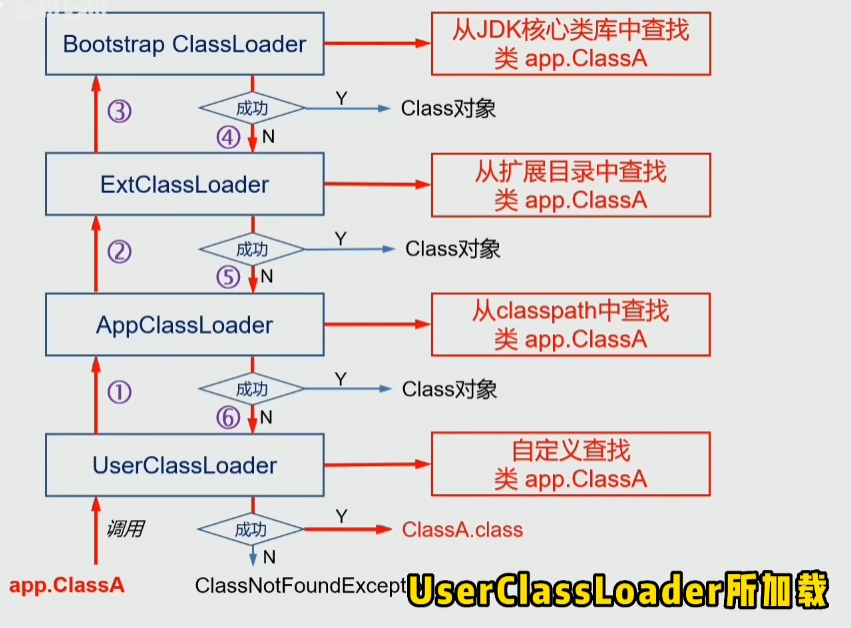

# 前言

本md文件将记录对JDK相关学习的笔记。

# 环境搭建

将以Java17为例子，Jetbrains IDEA为开发IDE，Maven为包依赖管理工具搭建开发环境

## JDK17安装

下载Java直接百度搜索Java即可，进入Oracle官网下载就是。但是呢，下载速度有点慢，可以从国内镜像下载：

> 1、编程宝库镜像源：http://www.codebaoku.com/jdk/jdk-oracle.html
> 2、华为云镜像：https://repo.huaweicloud.com/java/jdk/
> 3、清华镜像源：https://mirrors.tuna.tsinghua.edu.cn/AdoptOpenJDK/

需要注意的是上面的镜像中有的是Oracle JDK有的是Open JDK

如果是windows下载，用exe文件进行安装的情况下，默认会把某个目录配置到系统变量path中，直接`java -version`验证是没问题的。最好还是配置系统变量`JAVA_HOME`指向安装目录，并将`%JAVA_HOME%\bin`添加到系统变量path中。

## Maven安装和环境配置

1、百度搜索Maven来到Apache关于Maven的网页，下载Maven最新版压缩包解压即为安装完成，然后把安装目录作为`MAVEN_HOME`配置到系统变量，并在系统变量path增加`%MAVEN_HOME\bin`，然后命令行测试即可

2、新建目录mavenRepository用来作为仓库目录存放Maven下载的依赖包（放在D盘，因为后期依赖包会越来越多）

3、打开 Maven 的配置文件(windows机器一般在maven安装目录的conf/settings.xml)(建议直接拖入VSCode中)

4、配置仓库目录如下图：将其指向上面新建的仓库目录


5、配置阿里云镜像源：这样下载依赖速度飞起！
去阿里云官网找到镜像站中的Maven镜像，有配置教程
在`<mirrors></mirrors>`标签中添加 mirror 子节点:


配置完后保存退出。接下来即可进入IDEA新建Maven项目了

### maven打包可执行jar

Maven可以通过`mvn package`命令打包jar。

java的jar包可以通过`java -jar xx.jar`执行，如果要手动指定启动类：`java -cp xxx.jar x.x.Main`，注意不要带class或java后缀。

但是这样的jar在引用3方依赖时会出现找不到类的异常，此时可以通过引入如下maven插件解决：

1、首先在pom.xml中引入插件：SpringBoot的小胖jar的插件

```xml
<build>
    <plugins>
        <plugin>
            <groupId>org.springframework.boot</groupId>
            <artifactId>spring-boot-maven-plugin</artifactId>
            <configuration>
                <!-- 指定启动类 -->
                <mainClass>com.fzk.Main</mainClass>
            </configuration>
            <executions>
                <execution>
                    <goals>
                        <goal>repackage</goal>
                    </goals>
                </execution>
            </executions>
        </plugin>
        <!-- The configuration of maven-assembly-plugin -->
        <plugin>
            <groupId>org.apache.maven.plugins</groupId>
            <artifactId>maven-assembly-plugin</artifactId>
            <version>3.1.0</version>
            <!-- The configuration of the plugin -->
            <configuration>
                <descriptors>
                    <!-- 配置 assembly 的路径,正常放在项目根目录 -->
                    <descriptor>assembly/assembly.xml</descriptor>
                </descriptors>
            </configuration>
            <executions>
                <execution>
                    <id>make-assembly</id>
                    <phase>package</phase>
                    <!-- 打包次数 -->
                    <goals>
                        <goal>single</goal>
                    </goals>
                </execution>
            </executions>
        </plugin>
    </plugins>
</build>
```

2、在pom.xml同目录下新建`assembly/assembly.xml`文件：

```xml
<assembly>
    <id>bin</id>
    <formats>
        <format>zip</format>
    </formats>

    <dependencySets>
        <dependencySet>
            <!--不使用项目的artifact，第三方jar不要解压，打包进zip文件的lib目录-->
            <useProjectArtifact>false</useProjectArtifact>
            <outputDirectory>lib</outputDirectory>
            <unpack>false</unpack>
        </dependencySet>
    </dependencySets>

    <fileSets>
        <!-- 把项目脚本文件，打包进zip文件的根目录 -->
        <fileSet>
            <directory>${project.basedir}/assembly/bin</directory>
            <outputDirectory>bin</outputDirectory>
            <includes>
                <include>*.sh</include>
            </includes>
        </fileSet>

        <!-- 把项目脚本文件，打包进zip文件的根目录 -->
        <fileSet>
            <directory>${project.basedir}/assembly/logs</directory>
            <outputDirectory>logs</outputDirectory>
            <!--<includes>-->
            <!--<include>*.log</include>-->
            <!--</includes>-->
        </fileSet>

        <!-- 把配置文件，打包进zip文件的config目录 -->
        <fileSet>
            <directory>${project.basedir}/src/main/resources</directory>
            <outputDirectory>config</outputDirectory>
            <!-- 包含以下文件的资源 -->
            <includes>
                <include>**/*</include>
                <include>*.xml</include>
                <include>*.properties</include>
                <include>*.yml</include>
                <include>*.key</include>
            </includes>
        </fileSet>

        <!-- 把jar，打进zip文件的根目录 -->
        <fileSet>
            <directory>${project.build.directory}</directory>
            <outputDirectory>lib</outputDirectory>
            <includes>
                <include>*.jar.original</include>
            </includes>
        </fileSet>
    </fileSets>
</assembly>
```

3、此时通过`mvn package`即可得到小胖jar（SpringBoot称呼的fat-jar），它可通过`java -jar xxx.jar`命令直接执行。

4、吐槽：Java这依赖管理有点呆，评价是不如go module。

## IDEA安装激活和配置

安装及破解教程：https://www.exception.site/essay/how-to-free-use-intellij-idea-2020 未验证过，不知是否有效
还有一个更牛逼的激活网站：https://idea.medeming.com 缺点是要关注公众号，不过它的激活码确实是可以用的，非常方便。

更推荐：还有一种是学生身份申请IDEA的免费教育许可证，每年可以申请一次，每次有效期一年，这个虽然麻烦，但是学生账户可以登录使用所有Jetbrains系列产品如GoLand，Pycharm。
申请地址：https://www.jetbrains.com.cn/community/education/#students

### IDEA全局配置配置

IDEA还需要好好配置一下才能更好用


这个是自动导入依赖：


给Java的class文件设置文件头：超级好用


设置文件的编码为utf8，避免文件出现乱码


最后，一定要点击上图中右下角的Apply，然后再点ok，这样设置才会生效噶。

### IDEA配置本地Maven

IDEA中默认有Maven插件，也不是不能用，但是捏，它不符合国情！它下载的依赖包默认放在`$USER/.m2`目录，就是在C盘里，然后默认的配置从官方源下载依赖库，慢的一批。本地安装Maven后，可以设置maven本地仓库放在D盘啊，还可以配置阿里云镜像加速，还可以在命令行中敲mvn命令。

注意：这里也必须在IDEA的全局配置中配置哦！


此时就能去删掉系统默认用户目录下的.m2目录了（默认的Maven仓库地址），新建项目如果说又出现了.m2目录，说明IDEA中Maven配置失效了，再像上图这样配置一下。

# JUC

资料来源：《Java并发编程的艺术》、JUC包下类源码

`java.util.concurrent`的简称是JUC，即Java自带的一些并发工具类，提供了如Lock、阻塞队列、并发集合、并发映射这些工具供咱们使用。

## 锁分类

Java中锁有很多，但就其互斥实现方式可以分为两类：

- Object Monitor：对象监视器，管程机制，如`synchronized关键字+Object#wait()+Object#notify()`

- AQS队列同步器：基于AQS实现的Lock锁、CountDownLatch、阻塞队列等。


synchronized通过监视器锁实现互斥，监视器锁依赖操作系统互斥锁，这种**依赖于操作系统Mutex Lock所实现的锁称为重量级锁**。JDK中对Synchronized做的种种优化如轻量级锁，都是为了减少这种重量级锁的使用。

AQS同步队列实现原理：`CAS+LockSupport`，以int变量表示同步状态，以CAS原子获取/更新状态值，以`LockSupport.park()/LockSupport.unPark()`方法让线程等待或唤醒。

> 因此可以说**Java锁的实现是模拟的**，不直接调用操作系统互斥锁或信号量机制，而是由程序以`LockSupport`控制线程的等待/运行状态，没有死锁检测，因此Java中出现死锁时无法自动走出来。

## 队列同步器AQS

```java
public abstract class AbstractQueuedSynchronizer
    extends AbstractOwnableSynchronizer
    implements java.io.Serializable {
    /**
     * 等待队列的头部，延迟初始化。 
     * 除初始化外，只能通过 setHead 方法进行修改。 
     * 注意：如果head存在，它的waitStatus保证不会被CANCELLED。
     */
    private transient volatile Node head;
 
    /** 等待队列的尾部，延迟初始化。 仅通过方法 enq 修改以添加新的等待节点  */
    private transient volatile Node tail;

    /** 同步状态     */
    private volatile int state;
}
```

队列同步器`AbstractQueuedSynchronizer`，使用一个int变量表示同步状态，FIFO队列完成线程排队。

这是一个抽象类，各个不同实现的锁机制内部定义一个静态内部类来继承这个抽象类，并实现它的抽象方法管理同步状态。

其可以重写的方法如下：


这里无法看到对state变量的操作啊？因为像getState()、setState(int newState)、compareAndSetState(int expect,int update)这些都是final修饰的，不让子类进行覆盖。

同步器也提供了一些模板方法，主要有acquire(int arg)，acquireShared(int arg)，release(int arg)，release(int arg)，以及一些限时获取的方法。acquire和acquireShared方法会在必要时将线程加入等待队列并阻塞。接下来就先研究一下这个等待队列。

### 同步队列

同步队列是一个双向队列，由AQS的内部类Node构成，其每个节点保存同步状态失败的线程引用、等待状态、以及前后继结点

```java
static final class Node {
    /** 对于同步队列，初始化为0；对于condition队列，初始化为CONDITION，即-2 */
    volatile int waitStatus;
    
    /** 取消：线程由于超时或被中断，从同步队列中取消等待 */
    static final int CANCELLED =  1;
    /** 后继节点的线程处于等待状态 
    此节点的后继节点已（或即将）被阻塞（通过停放），因此当前节点在释放或取消时必须取消停放其后继节点。 
    为了避免竞争，获取方法必须首先表明它们需要一个信号，然后重试原子获取，然后在失败时阻塞*/
    static final int SIGNAL    = -1;
    /** 表示此节点当前位于condition队列中，在被转换之前不会用作同步队列节点 */
    static final int CONDITION = -2;
    /** 表示下一次共享式同步状态获取会无条件传播下去 */
    static final int PROPAGATE = -3;


    volatile Node prev;
    volatile Node next;

    /** 此节点的线程引用 */
    volatile Thread thread;

    /** condition队列的后继节点。在共享模式下，此值将指向下面的SHARED常量，独占模式则是EXCLUSIVE */
    Node nextWaiter;
    /** 指示节点在共享模式下等待的标记 */
    static final Node SHARED = new Node();
    /** 指示节点以独占模式等待的标记 */
    static final Node EXCLUSIVE = null;
}
```

同步队列的首节点是获取到同步状态的节点，当其释放同步状态时，会唤醒后继节点。

接下来研究一下AQS提供的这几个模板方法，研究其实现逻辑。

### acquire

acquire是以互斥方式获取同步状态，可用于实现写锁。此方法对中断不敏感，即当线程被其他线程中断时，并不会从同步队列中移除。

```java
    /** 独占模式获取，忽略中断。
     * 通过至少调用一次tryAcquire ，成功返回。否则线程会排队，可能会反复阻塞和解除阻塞，调用tryAcquire直到成功
     */
    public final void acquire(int arg) {
        if (!tryAcquire(arg) &&
            acquireQueued(addWaiter(Node.EXCLUSIVE), arg))
            selfInterrupt();
    }
    protected boolean tryAcquire(int arg) {
        throw new UnsupportedOperationException();
    }
```

1、首先是调用了tryAcquire方法，由子类自己去实现，默认是抛异常的
2、如果获取失败，以Node.EXCLUSIVE模式构造同步节点，并加入到同步队列末尾

```java
    /**
     * 为当前线程和给定模式创建和排队节点
     *
     * @param mode Node.EXCLUSIVE for 独占, Node.SHARED for 共享
     * @return the new node
     */
    private Node addWaiter(Node mode) {
        Node node = new Node(mode);

        for (;;) {
            Node oldTail = tail;
            if (oldTail != null) {
                node.setPrevRelaxed(oldTail);
                if (compareAndSetTail(oldTail, node)) {
                    oldTail.next = node;
                    return node;
                }
            } else {
                initializeSyncQueue();
            }
        }
    }
```

3、加入同步队列之后，acquireQueued方法会进行自旋以及阻塞自己，在前继结点是头结点的时候会去尝试获取同步状态，一直循环

```java
    /**
     * 以独占不间断模式获取已在队列中的线程
     * @return 等待中发生中断，则返回true
     */
    final boolean acquireQueued(final Node node, int arg) {
        boolean interrupted = false;
        try {
            for (;;) {
                final Node p = node.predecessor();
                // 1、只有当前继结点是头结点，才去尝试获取同步状态
                if (p == head && tryAcquire(arg)) {
                    setHead(node);
                    p.next = null; // help GC
                    return interrupted;
                }
                // 2、阻塞自己并将中断情况进行异或处理
                if (shouldParkAfterFailedAcquire(p, node))
                    interrupted |= parkAndCheckInterrupt();
            }
        } catch (Throwable t) {
            cancelAcquire(node);// 取消获取同步状态
            if (interrupted)
                selfInterrupt();
            throw t;
        }
    }
```

#### release

```java
    /**
    以独占模式释放
    如果tryRelease返回 true，则通过解除阻塞一个或多个线程tryRelease实现 */
    public final boolean release(int arg) {
        // 1、尝试释放同步状态
        if (tryRelease(arg)) {
            Node h = head;
            if (h != null && h.waitStatus != 0)
                unparkSuccessor(h);// 2、这里会唤醒h的后继节点线程
            return true;
        }
        return false;
    }
```

1、掉用子类实现的释放同步状态方法tryRelease
2、唤醒头结点(即获取同步状态的当前线程)的后继节点线程

### acquireShared

共享式获取同步状态

```java
    /**
	 * 在共享模式下获取，忽略中断
	 * 通过首先调用至少一次tryAcquireShared ，成功返回
	 * 否则线程会排队，可能会反复阻塞和解除阻塞，调用tryAcquireShared直到成功
     */
    public final void acquireShared(int arg) {
        if (tryAcquireShared(arg) < 0)
            doAcquireShared(arg);
    }
    protected int tryAcquireShared(int arg) {
        throw new UnsupportedOperationException();
    }
```

1、调用子类实现的tryAcquireShared方法获取共享同步状态
2、返回0即获取失败，则调用doAcquireShared方法自旋

```java
    private void doAcquireShared(int arg) {
        // 1、以共享模式添加到同步队列
        final Node node = addWaiter(Node.SHARED);
        boolean interrupted = false;
        try {
            for (;;) {
                final Node p = node.predecessor();
                if (p == head) {
                    // 2、在前继结点是头结点时，才去尝试获取共享同步状态
                    int r = tryAcquireShared(arg);
                    if (r >= 0) {
                        setHeadAndPropagate(node, r);
                        p.next = null; // help GC
                        return;
                    }
                }
                // 3、获取失败则阻塞
                if (shouldParkAfterFailedAcquire(p, node))
                    interrupted |= parkAndCheckInterrupt();
            }
        } catch (Throwable t) {
            cancelAcquire(node);
            throw t;
        } finally {
            if (interrupted)
                selfInterrupt();
        }
    }
```

可以看到这里的自旋过程其实和acquire那边的自旋差不多，主要差别就在于tryAcquireShared方法，毕竟退出自旋的唯一出口都是try获取同步状态成功。

#### releaseShared

```java
    public final boolean releaseShared(int arg) {
        // 1、调用子类实现的try释放方法
        if (tryReleaseShared(arg)) {
            // 2、唤醒后继节点
            doReleaseShared();
            return true;
        }
        return false;
    }
    protected boolean tryReleaseShared(int arg) {
        throw new UnsupportedOperationException();
    }
```

可以看到在AQS层面，这里和独占式的释放区别不大。而在tryReleaseShared需要保证同步状态的安全释放，因为共享模式下，可能会有多个线程同时进行释放操作，这里就需要CAS+失败重试了。

## Condition接口

在synchronized关键字中，有wait()和notify()等监视器方法来实现等待/通知机制。Lock和Condition接口结合使用也能实现等待/通知模式。

Condition对象由Lock对象创建出来，即Condition依赖于Lock。

其使用方式可以去看一下阻塞队列中ArrayBlockingQueue的使用示范。下面这个是自己实现的一个简单的阻塞队列：

```java
/**
 * 借助数组、可重入锁、Condition实现的阻塞队列
 *
 * @author fzk
 * @date 2022-01-03 22:14
 */
public class MyArrayBlockQueue<T> {
    private final Object[] items;
    private int addIndex, removeIndex, count;
    private final ReentrantLock lock;
    private final Condition notEmpty;
    private final Condition notFull;

    public MyArrayBlockQueue(int capacity) {
        if (capacity < 1)
            throw new IllegalArgumentException("capacity can not smaller than 1");
        items = new Object[capacity];
        count = 0;
        addIndex = 0;
        removeIndex = 0;
        lock = new ReentrantLock();
        notEmpty = lock.newCondition();
        notFull = lock.newCondition();
    }

    // 添加一个元素，如果队列满了，则进入等待状态
    public void put(T t) throws InterruptedException {
        lock.lock();
        try {
            while (count == items.length)// while防止虚假唤醒
                notFull.await();// 等非满信号

            items[addIndex] = t;
            if (++addIndex == items.length) addIndex = 0;
            ++count;
            notEmpty.signal();// 放一个非空信号
        } finally {
            lock.unlock();
        }
    }

    // 移除并返回队首元素，如果数组为空，则等待
    public T take() throws InterruptedException {
        lock.lock();
        try {
            while (count == 0)// while防止虚假唤醒
                notEmpty.await();// 等待非空信号

            Object t = items[removeIndex];
            items[removeIndex] = null;
            if (++removeIndex == items.length) removeIndex = 0;
            count--;
            notFull.signal();// 放非满信号
            return (T) t;
        } finally {
            lock.unlock();
        }
    }
}
```

### 等待队列

在可重入锁的newCondition方法中，最终是新建了AQS的内部类`ConditionObject`，其部分代码如下：

```java
public class ConditionObject implements Condition, java.io.Serializable {
    private static final long serialVersionUID = 1173984872572414699L;
    /** condition队列第一个结点 */
    private transient Node firstWaiter;
    /** condition队列最后一个结点 */
    private transient Node lastWaiter;
    // 省略很多方法
}
```

可以看到每个ConditionObject内部包含了一个等待队列，并且这里和AQS的同步队列用的都是AQS的内部类Node来实现。

在对象监视器模型上(即synchronized)，一个对象只有一个同步队列和等待队列，而Lock和Condition拥有一个同步队列和多个等待队列：


### await

首先从Condition的await()方法入手：当一个线程调用了await()方法，其实是从其同步队列队首(获取到了锁)移到等待队列中

```java
/**
实现可中断条件等待。
1、如果当前线程被中断，则抛出 InterruptedException。
2、保存getState返回的锁定状态。
3、使用保存状态作为参数调用release ，如果失败则抛出 IllegalMonitorStateException。
4、阻塞直到发出信号或中断。
5、通过以保存状态作为参数调用特定版本的acquire 。
6、如果在步骤 4 中被阻塞时被中断，则抛出 InterruptedException
 */
public final void await() throws InterruptedException {
    if (Thread.interrupted())
        throw new InterruptedException();
    // 1、加入到等待队列
    Node node = addConditionWaiter();
    // 2、释放锁，并唤醒同步队列的后继结点
    int savedState = fullyRelease(node);
    int interruptMode = 0;
    // 3、只要没有在同步队列中，线程就一直等待
    while (!isOnSyncQueue(node)) {
        LockSupport.park(this);
        if ((interruptMode = checkInterruptWhileWaiting(node)) != 0)
            break;
    }
	// 4、回到同步队列啦，通过acquireQueued方法要么获取到锁，要么在同步队列中等待
    if (acquireQueued(node, savedState) && interruptMode != THROW_IE)
        interruptMode = REINTERRUPT;
    // 5、获取到锁了，取消等待队列中已经取消了的结点
    if (node.nextWaiter != null) // clean up if cancelled
        unlinkCancelledWaiters();
    if (interruptMode != 0)
        reportInterruptAfterWait(interruptMode);
}
```

1、加入到等待队列：addConditionWaiter()，因为没有同步机制，这个方法就很简单

```java
/** 这里没有像同步队列那样进行CAS和失败重试，因为加入等待队列的线程必然获取到了锁，无须对添加操作进行同步 */
private Node addConditionWaiter() {
    if (!isHeldExclusively())
        throw new IllegalMonitorStateException();
    Node t = lastWaiter;
    // If lastWaiter is cancelled, clean out.
    if (t != null && t.waitStatus != Node.CONDITION) {
        unlinkCancelledWaiters();
        t = lastWaiter;
    }
	// 新建等待状态为CONDITION的结点
    Node node = new Node(Node.CONDITION);

    if (t == null)
        firstWaiter = node;
    else
        t.nextWaiter = node;
    lastWaiter = node;
    return node;
}
```

这里有一个非常有意思的操作，Node原本是双向链表，但是这里仅仅维护了其nextWaiter，其pre和next都是null。可以去看看Node的代码。

2、释放锁，并唤醒同步队列的后继结点，这里的方法内部是调用了AQS的release()方法

### signal

通知信号操作如下：

```java
/** 将等待时间最长的线程（如果存在）从该条件的等待队列移动到拥有锁的同步队列 */
public final void signal() {
    // 1、检查是否获取到排它锁
    if (!isHeldExclusively())
        throw new IllegalMonitorStateException();
    Node first = firstWaiter;
    // 2、将第一个等待者从condition队列移到同步队列
    if (first != null)
        doSignal(first);
}
```

1、首先要检查此线程是否获取到排它锁，获取到才能去发出通知信号，否则报异常；

2、将第一个等待者从等待队列移到同步队列

```java
private void doSignal(Node first) {
    // CAS+失败重试，直到将等待队列第一个等待者加入同步队列
    do {
        if ( (firstWaiter = first.nextWaiter) == null)
            lastWaiter = null;
        first.nextWaiter = null;
    } while (!transferForSignal(first) &&
             (first = firstWaiter) != null);
}
```

## ReentrantLock

来自于微信公众号，具体看水印：


## 读写锁

读写锁和排它锁不同之处在于，读是共享的，分离了读锁和写锁，使得其并发性相对于排它锁有一定的提高。

```java
/** ReadWriteLock维护一对关联的locks ，一个用于只读操作，一个用于写入。 
 * 只要没有写者，读锁可能被多个读线程同时持有。 写锁是独占的
 */
public interface ReadWriteLock {
    /** 返回读锁 */
    Lock readLock();
    /** 返回写锁 */
    Lock writeLock();
}
```

其实现是`ReentrantReadWriteLock`。

```java
/**
 * 公平模式：线程使用近似到达顺序策略竞争进入；如果持有写锁或存在等待写入线程，则尝试获取公平读锁（不可重入）的线程将阻塞
 * 锁定降级：重入还允许从写锁降级为读锁，方法是获取写锁，然后是读锁，然后释放写锁；然而，从读锁定写锁定升级是不可能的
 * Condition支持：写锁提供Condition实现，这个Condition只能与写锁一起使用；读锁不支持Condition
 */
public class ReentrantReadWriteLock
        implements ReadWriteLock, java.io.Serializable {
       
    private final ReentrantReadWriteLock.ReadLock readerLock;// 读锁
    
    private final ReentrantReadWriteLock.WriteLock writerLock;// 写锁
    
    final Sync sync;// 自定义同步器，AQS的子类
}
```

对于读写锁的分析，主要在于分析：读写状态设计、写锁的获取与释放、读锁的获取与释放、锁降级。
在这个过程中，一个极其重要的角色是Sync这个抽象类，是AQS的子类，它有两个子类分别为：`NonfairSync`和`FairSync`

### 读写状态

在可重入锁ReentrantLock中，同步状态state表示锁被线程重复获取的次数。而读写锁则是在自定义的同步器上去实现一个表示同步状态的整型变量能维护多个读线程或者一个写线程。

可以想象得到的是，要区分读和写，可以从这个int变量的位数上下手，高位用来表示读，低位表示写。

> 写状态表示为：(state & 0x0000FFFF)；写状态+1表示为：state+1
>
> 读状态表示为：(state>>>16)；读状态+1表示为：state+(1<<16)
>
> 所以，当state==0时，无锁；(state>>>16)>0，读锁被获取；(state & 0x0000FFFF)>0，写锁被获取。

### 写锁获取与释放

先从稍微简单的写锁开始。写锁其实和可重入锁ReentrantLock差不多。

读锁的获取首先是AQS的acquire(1)操作：

```java
/**以独占模式获取，忽略中断; 通过至少调用一次tryAcquire ,成功返回。否则线程会排队，可能会反复阻塞和解除阻塞，调用tryAcquire直到成功。 此方法可用于实现方法Lock.lock */
public final void acquire(int arg) {
    if (!tryAcquire(arg) && acquireQueued(addWaiter(Node.EXCLUSIVE), arg))
        selfInterrupt();
}
```

首先是tryAcquire进行写锁获取：进入的是读写锁的内部Sync实现：

```java
protected final boolean tryAcquire(int acquires) {
    Thread current = Thread.currentThread();
    int c = getState();
    int w = exclusiveCount(c);// 位操作，取低16位，即写状态
    if (c != 0) {
        // 如果有读线程 或者 写线程不是自己 则失败
        if (w == 0 || current != getExclusiveOwnerThread())
            return false;
        if (w + exclusiveCount(acquires) > MAX_COUNT)
            throw new Error("Maximum lock count exceeded");
        // 写锁重入
        setState(c + acquires);// 写状态+1
        return true;
    }
    // CAS获取锁操作
    if (writerShouldBlock() ||
        !compareAndSetState(c, c + acquires))
        return false;
    setExclusiveOwnerThread(current);
    return true;
}
```

1、如果读状态非零或写入状态非零且写线程者不是自己，则失败。 
2、如果获取重入锁次数饱和，则失败
3、否则，如果该线程是可重入获取或队列策略允许，则该线程有资格获得锁定。如果是这样，更新状态并设置所有者。

注意：这里的writeShouldBlock()方法在NonFairSync中是默认返回false的，即允许写线程立刻竞争锁。(用于公平锁实现的)

写锁的释放同可重入锁ReentrantLock类似，每次释放都是state-1

### 读锁获取与释放

读锁获取首先是调用`aqs.acquireShared(1)`；

```java
public final void acquireShared(int arg) {
    if (tryAcquireShared(arg) < 0)
        doAcquireShared(arg);
}
```

接下里进入读写锁内部实现Sync的tryAcquireShared方法：

```java
protected final int tryAcquireShared(int unused) {
    /*

    */
    Thread current = Thread.currentThread();
    int c = getState();
    // 1.如果写锁被其他线程持有，失败
    if (exclusiveCount(c) != 0 &&
        getExclusiveOwnerThread() != current)
        return -1;
    int r = sharedCount(c);// 将state无符号右移16位，获取读状态
    // 2.等待队列首结点不是写线程，且CAS成功的话，进行一些保存获取读锁次数的操作，保存在ThreadLocal中了(非公平锁下)
    if (!readerShouldBlock() &&
        r < MAX_COUNT &&
        compareAndSetState(c, c + SHARED_UNIT)) {
        if (r == 0) {
            firstReader = current;
            firstReaderHoldCount = 1;
        } else if (firstReader == current) {
            firstReaderHoldCount++;
        } else {
            HoldCounter rh = cachedHoldCounter;
            if (rh == null ||
                rh.tid != LockSupport.getThreadId(current))
                cachedHoldCounter = rh = readHolds.get();
            else if (rh.count == 0)
                readHolds.set(rh);
            rh.count++;
        }
        return 1;
    }
    // 3.完全重试获取读锁
    return fullTryAcquireShared(current);
}
```

`readerShouldBlock()`这个方法将判断读线程是否需要阻塞，为什么在写锁未被获取的情况下依旧要去判断是否阻塞呢？为了防止**写线程饥饿**！判断方式：如果等待队列头结点是写线程则返回true
1、如果写锁被另一个线程持有，失败
2、当没有等待队列首结点不是写线程，且尝试通过 CASing 状态和更新计数来授予 
3、如果步骤 2 因线程明显不合格或 CAS 失败或计数饱和而失败，则链接到具有完整重试循环的版本

上面第2步失败，进入第3步，有可能是要阻塞以等待写线程，也可能是CAS失败了(有其他读进程操作)，将进入循环尝试获取读锁：

```java
/**读取的获取的完整版本，它处理 CAS 未命中和在 tryAcquireShared 中未处理的重入读取*/
final int fullTryAcquireShared(Thread current) {
    HoldCounter rh = null;
    for (;;) {
        int c = getState();
        // 1.如果写锁被获取了
        if (exclusiveCount(c) != 0) {
            if (getExclusiveOwnerThread() != current)
                return -1;
            // else we hold the exclusive lock; blocking here
            // would cause deadlock.
        } 
        // 2.说明有写线程在队首等待(非公平锁下)
        else if (readerShouldBlock()) {
            // 确保不是读锁的重入，从这里直接根据第一个读线程判断重入，说明当有写线程等待时，最多只能有一个读线程进行读
            if (firstReader == current) {} 
            else {
                if (rh == null) { 省略... }
                if (rh.count == 0) // 如果是首次来获取读锁，需要阻塞等待退让给写锁
                    return -1;
            }
        }
        if (sharedCount(c) == MAX_COUNT) throw new Error("Maximum lock count exceeded");
        // 3.CAS操作
        if (compareAndSetState(c, c + SHARED_UNIT)) {
            // 省略一些保存本线程获取次数的操作
            return 1;
        }
    }
}
```

这里的循环的操作：

1、如果写锁被获取，且此时不是写锁线程来获取读锁，从而锁降级的话，则返回-1
2、如果有写线程在队首等待，则获取其获得读锁的次数，如果为0，意味着第一次获取读锁，则返回-1让其阻塞等待写线程；
3、否则CAS操作获取读锁

这里可以看出，当有写线程在队首等待时，这时只能发生读锁重入。

读锁的释放操作主要是AQS类的操作，这里不作深入探究。

### 公平锁与非公平锁的区别

ReentrantReadWriteLock内的Sync的实现子类有两个，分别是NonfairSync和FairSync，默认是非公平锁

```java
// 非公平锁
static final class NonfairSync extends Sync {
    final boolean writerShouldBlock() {
        return false; // writers can always barge
    }
    final boolean readerShouldBlock() {
        /*作为避免写入线程饥饿的启发式方法，如果暂时显示为队列头的线程（如果存在）是等待写入器，则阻塞。
        这只是一种概率效应，因为如果在其他尚未从队列中耗尽的已启用读取器后面有等待写入器，则新读取器不会阻塞
         */
        return apparentlyFirstQueuedIsExclusive();// 直接判断等待队列首是否为写线程
    }
}

// 公平锁
static final class FairSync extends Sync {
    final boolean writerShouldBlock() {
        return hasQueuedPredecessors();// 在等待队列不为空且队首线程不是本线程时返回true
    }
    final boolean readerShouldBlock() {
        return hasQueuedPredecessors();
    }
}
```

从这里是实现可以看出，非公平锁为了防止写线程饥饿，在读线程获取读锁前先判断等待队列队首是否为写线程，这时是仅允许读锁重入。

可以看出公平锁的话，就是在线程获取读锁或者写锁之前，先去判断等待队列是否有线程在等待，如果已经有了，则加入等待队列。


## 阻塞队列


在这里面的`ArrayBlockingQueue`和`PriorityBlockingQueue`实现比较简单，由一个可重入锁实现；
`LinkedBlockingQueue`用了两个可重入锁和一个`Condition`，有一定的操作；

### DelayQueue

`Delayed`元素的无界阻塞队列，其中一个元素只能在其延迟到期时被占用。 可以用来实现一些定时任务。

当元素的getDelay(TimeUnit.NANOSECONDS)方法返回小于或等于零的值时，就会发生过期。 
无法使用take或poll删除未过期的元素。

由PriorityQueue+ReentranLock+Condition实现

```java
public class DelayQueue<E extends Delayed> extends AbstractQueue<E>
    implements BlockingQueue<E> {
    
    private final transient ReentrantLock lock = new ReentrantLock();
    private final PriorityQueue<E> q = new PriorityQueue<E>();

    /**
     * 等待队列元素的第一个线程
 	 * Leader-Follower 模式
 	 * 每当队列的头部被一个具有较早到期时间的元素替换时，leader 字段将通过重置为 null 来无效，并且一些等待线程（但不一定是当前的leader）被发出信号。 
 	 * 因此，等待线程必须准备好在等待期间获得和失去领导权。
     */
    private Thread leader;

    /** 当新元素在队列头部可用或新线程可能需要成为领导者时发出条件信号  */
    private final Condition available = lock.newCondition();
}
```

**添加操作offer(E e)**

```java
    public boolean offer(E e) {
        final ReentrantLock lock = this.lock;
        lock.lock();
        try {
            q.offer(e);
            if (q.peek() == e) {
                leader = null;
                available.signal();
            }
            return true;
        } finally {
            lock.unlock();
        }
    }
```

添加就比较简单，直接获取到锁，然后向优先队列加入元素即可。

**阻塞获取take()**


```java
/**检索并删除此队列的头部，必要时等待，直到此队列上有一个具有过期延迟的元素可用*/
public E take() throws InterruptedException {
    final ReentrantLock lock = this.lock;
    lock.lockInterruptibly();// 先加锁
    try {
        for (;;) {
            E first = q.peek();
            if (first == null)
                available.await();// 队列无元素直接无限期等待
            else {
                long delay = first.getDelay(NANOSECONDS);// 获取首元素延迟时间，小于等于0即为可用
                if (delay <= 0L)
                    return q.poll();
                first = null; // 手动赋值null，第一个元素是可能被其他线程获取的，这里必须释放引用
                if (leader != null)// 说明此线程不是第一个等待的线程，后面排队去吧
                    available.await();
                else {
                    Thread thisThread = Thread.currentThread();// 说明此线程是第一个要等待的线程
                    leader = thisThread;
                    try {
                        available.awaitNanos(delay);// 作为第一个等待的线程，只需要等待第一个元素需要的时间
                    } finally {
                        if (leader == thisThread)
                            leader = null;
                    }
                }
            }
        }
    } finally {
        if (leader == null && q.peek() != null)
            available.signal();
        lock.unlock();
    }
}
```
1、队列无元素，则直接等待
2、第一个元素没到期，如果leader不为null，则说明已有线程在限时等待队首元素，为了减少不必要的限时等待，直接等待；
3、第一个元素没到期，且leader为null，那么让此线程成为leader并限时等待；等待完成将leader置null；重新循环获取队首元素

需要注意的是，成为leader进程不是一定就能获取到队首元素的，从此方法的流程上来看，只要在队首元素过期时间到了，此时有线程来就直接获取成功，而不会去管有没有leader进程。leader进程的作用主要是**用于最小化不必要的定时等待**.

#### Delayed

DelayQueue中的元素必须实现Delayed接口。

```java
/** 用于标记在给定延迟后应采取行动的对象
 * 此接口的实现必须定义一个compareTo方法，该方法提供与其getDelay方法一致的排序
 */
public interface Delayed extends Comparable<Delayed> {

    /** 以给定的时间单位返回与此对象关联的剩余延迟
     * @param unit 时间单位
     * @return 剩余的延迟； 零或负值表示延迟已经过去
     */
    long getDelay(TimeUnit unit);
}
```

从这里的注释可以看出，compareTo方法的返回值应该和getDelay拥有同样的语义顺序。
换一句话说就是，最早过期的，其compareTo实现也应该是要排在队首的。
为什么呢：优先队列队首必须是最早过期的，但是其排序使用的是compareTo方法，而不是getDelay方法。

如何实现Delayed接口呢？可以从ScheduledThreadPoolExecutor.ScheduledFutureTask这个内部类来看.

下面是自己在看了这个内部类后，实现的一个类：

```java
/**
 * @author fzk
 * @date 2022-01-06 23:20
 */
public class MyDelayed implements Delayed {
    private volatile long expireTime;// 到期时间
    public MyDelayed(long expireTime){
        this.expireTime=expireTime;
    }

    // 返回的值代表还有多久到期，一般使用纳秒
    @Override
    public long getDelay(TimeUnit unit) {
        return unit.convert(expireTime - System.nanoTime(), TimeUnit.NANOSECONDS);
    }

    @Override
    public int compareTo(Delayed o) {
        // 这里必须保持和getDelay一致语义
        if (o == this) return 0;
        if (o instanceof MyDelayed)
            return Long.compare(expireTime, ((MyDelayed) o).expireTime);
        else
            return Long.compare(
                    getDelay(TimeUnit.NANOSECONDS),
                    o.getDelay(TimeUnit.NANOSECONDS));
    }
}
```

### SynchronousQueue

留坑...


## ConcurrentHashMap

一个哈希表，支持检索的完全并发性和更新的高预期并发性。所有操作都是线程安全的，检索操作也不需要锁定.

检索操作（包括get ）通常不会阻塞，因此可能与更新操作（包括put和remove ）重叠。

检索反映了最近完成的更新操作的结果。 

迭代器被设计为一次只能被一个线程使用。 

请记住，包括size 、 isEmpty和containsValue在内的聚合状态方法的结果通常仅在map未在其他线程中进行并发更新时才有用。 否则，这些方法的结果反映的瞬态状态可能足以用于监测或估计目的，但不适用于程序控制。

此外，为了与此类的先前版本兼容，构造函数可以选择指定预期的concurrencyLevel作为内部大小调整的附加提示

ConcurrentHashMap在1.8版本采用的是CAS+synchronized来实现的并发处理。

### 属性

下面是ConcurrentHashMap的重要的属性：

```java
public class ConcurrentHashMap<K,V> extends AbstractMap<K,V
    implements ConcurrentMap<K,V>, Serializable {
    /** bin 数组。 第一次插入时延迟初始化。 大小始终是 2 的幂。 由迭代器直接访问 */
    transient volatile Node<K,V>[] table;

    /** 下一个要使用的表； 仅在调整大小时非空 */
    private transient volatile Node<K,V>[] nextTable;

    /** 基本计数器值，主要在没有争用时使用，但也用作表初始化竞争期间的后备。 通过 CAS 更新 */
    private transient volatile long baseCount;

    /** 表初始化和调整大小控制。 
    如果为负，则表正在初始化或调整大小：-1 表示初始化，否则 -（1 + 活动调整大小线程的数量）。 
    否则，当 table 为空时，保存创建时使用的初始表大小，或默认为 0。 
    初始化后，保存下一个要调整表格大小的元素计数值
     */
    private transient volatile int sizeCtl;

    /** 调整大小时要拆分的下一个表索引（加一个）*/
    private transient volatile int transferIndex;

    /** 调整大小和/或创建 CounterCell 时使用自旋锁（通过 CAS 锁定）*/
    private transient volatile int cellsBusy;

    /** 计数单元表。 当非空时，大小是 2 的幂。主要是size()统计个数会使用 */
    private transient volatile CounterCell[] counterCells;
    
    static class Node<K,V> implements Map.Entry<K,V> {
        final int hash;
        final K key;
        volatile V val;
        volatile Node<K,V> next;// 这里的val和next都用volatile保证可见性
        // 方法省略
    }
}
```

ConcurrentHashMap中保存元素的是Node数组，此Node用volatile修饰其val和next指针，保证了并发可见性。

### put

首先来看它的put操作：

```java
/** key和value都不能为null */
public V put(K key, V value) {
    return putVal(key, value, false);
}

/** Implementation for put and putIfAbsent */
final V putVal(K key, V value, boolean onlyIfAbsent) {
    if (key == null || value == null) throw new NullPointerException();
    int hash = spread(key.hashCode());// 高16位与低16位异或，再通过与运算屏蔽掉符号位
    int binCount = 0;
    for (Node<K,V>[] tab = table;;) {
        Node<K,V> f; int n, i, fh; K fk; V fv;
        // 0、第一次插入，初始化表
        if (tab == null || (n = tab.length) == 0)
            tab = initTable();// 初始化表结构，具体见下面
        // 1、桶内元素为空，CAS设置头结点，成功就直接退出了
        else if ((f = tabAt(tab, i = (n - 1) & hash)) == null) {
            if (casTabAt(tab, i, null, new Node<K,V>(hash, key, value)))
                break;                   // no lock when adding to empty bin
        }
        else if ((fh = f.hash) == MOVED)
            tab = helpTransfer(tab, f);
        else if (onlyIfAbsent // check first node without acquiring lock
                 && fh == hash
                 && ((fk = f.key) == key || (fk != null && key.equals(fk)))
                 && (fv = f.val) != null)
            return fv;
        else {
            V oldVal = null;
            // 2、使用synchronized锁住头结点
            synchronized (f) {
                if (tabAt(tab, i) == f) {
                    // 2.1 是链表
                    if (fh >= 0) {
                        binCount = 1;
                        // 遍历链表找是否有相同的key，或者插入到末尾，同时统计链表长度
                        for (Node<K,V> e = f;; ++binCount) {
                            K ek;
                            if (e.hash == hash &&
                                ((ek = e.key) == key ||
                                 (ek != null && key.equals(ek)))) {
                                oldVal = e.val;
                                if (!onlyIfAbsent)
                                    e.val = value;
                                break;
                            }
                            Node<K,V> pred = e;
                            if ((e = e.next) == null) {
                                pred.next = new Node<K,V>(hash, key, value);
                                break;
                            }
                        }
                    }
                    // 2.2 说明是红黑树
                    else if (f instanceof TreeBin) {
                        Node<K,V> p;
                        binCount = 2;
                        if ((p = ((TreeBin<K,V>)f).putTreeVal(hash, key,
                                                              value)) != null) {
                            oldVal = p.val;
                            if (!onlyIfAbsent)
                                p.val = value;
                        }
                    }
                    else if (f instanceof ReservationNode)
                        throw new IllegalStateException("Recursive update");
                }
            }
            if (binCount != 0) {
                // 链表长度超过8，树化：方法内会判断容量，小于64则优先选择扩容
                if (binCount >= TREEIFY_THRESHOLD)
                    treeifyBin(tab, i);
                if (oldVal != null)
                    return oldVal;
                break;
            }
        }
    }
    // 3、数量加+1操作，这里的操作相当的复杂，暂时看不懂
    addCount(1L, binCount);
    return null;
}
```

0、第一次插入，初始化表
1、桶内元素为空，CAS设置头结点，成功就直接退出了
2、使用synchronized锁住头结点
2.1、是链表的话，则遍历链表，有则修改，无则插入末尾，同时统计链表长度，如果长度超过8，尝试树化方法。树化方法判断hash表容量小于64的话则优先扩容，否则将链表转为红黑树。
2.2、是红黑树的话，调用红黑树的putVal方法
3、数量+1操作，非常复杂

#### initTable

```java
/** 使用 sizeCtl 中记录的大小初始化表 */
private final Node<K,V>[] initTable() {
    Node<K,V>[] tab; int sc;
    while ((tab = table) == null || tab.length == 0) {
        // 负数表示有线程正在初始化或者调整表大小，这里应该是初始化
        if ((sc = sizeCtl) < 0)
            Thread.yield(); // 初始化竞争失败，让出CPU执行权，自旋
        else if (U.compareAndSetInt(this, SIZECTL, sc, -1)) {// CAS设sizeCTL为-1表示竞争初始化权
            try {
                if ((tab = table) == null || tab.length == 0) {
                    int n = (sc > 0) ? sc : DEFAULT_CAPACITY;
                    @SuppressWarnings("unchecked")
                    Node<K,V>[] nt = (Node<K,V>[])new Node<?,?>[n];
                    table = tab = nt;
                    sc = n - (n >>> 2);
                }
            } finally {
                sizeCtl = sc;
            }
            break;
        }
    }
    return tab;
}
```

从源码中可以发现 ConcurrentHashMap 的初始化是通过**自旋和 CAS** 操作完成的。里面需要注意的是变量 `sizeCtl` ，它的值决定着当前的初始化状态：

1、-1  说明正在初始化
2、-N 说明有N-1个线程正在进行扩容
3、表示 table 初始化大小，如果 table 没有初始化
4、表示 table 容量，如果 table已经初始化

### get

get操作非常简单，由于

```java
public V get(Object key) {
    Node<K,V>[] tab; Node<K,V> e, p; int n, eh; K ek;
    // 1.计算hash
    int h = spread(key.hashCode());
    if ((tab = table) != null && (n = tab.length) > 0 &&
        (e = tabAt(tab, (n - 1) & h)) != null) {
        // 2、如果头结点就是要找的，直接返回
        if ((eh = e.hash) == h) {
            if ((ek = e.key) == key || (ek != null && key.equals(ek)))
                return e.val;
        }
        // 3、头结点的hash小于0，说明正在扩容或者是红黑树，用结点类自定义的find方法进行查找
        else if (eh < 0)
            return (p = e.find(h, key)) != null ? p.val : null;
        // 4、是链表，直接遍历查找
        while ((e = e.next) != null) {
            if (e.hash == h &&
                ((ek = e.key) == key || (ek != null && key.equals(ek))))
                return e.val;
        }
    }
    return null;
}
```

1.计算hash
2、如果头结点就是要找的，直接返回
3、头结点的hash小于0，说明正在扩容或者是红黑树，用结点类自定义的find方法进行查找
4、是链表，直接遍历查找

### remove

```java
public V remove(Object key) {
    return replaceNode(key, null, null);
}

/** 四个公共删除/替换方法的实现： 用 v 替换节点值，条件是 cv 匹配（如果非空）。 如果结果值为空，则删除 */
final V replaceNode(Object key, V value, Object cv) {
    // 1、计算hash
    int hash = spread(key.hashCode());
    for (Node<K,V>[] tab = table;;) {
        Node<K,V> f; int n, i, fh;
        if (tab == null || (n = tab.length) == 0 ||
            (f = tabAt(tab, i = (n - 1) & hash)) == null)
            break;
        else if ((fh = f.hash) == MOVED)
            tab = helpTransfer(tab, f);
        else {
            V oldVal = null;
            boolean validated = false;
            // 2、锁住头结点
            synchronized (f) {
                if (tabAt(tab, i) == f) {
                    // 2.1、是链表
                    if (fh >= 0) {
                        validated = true;
                        for (Node<K,V> e = f, pred = null;;) {
                            K ek;
                            if (e.hash == hash &&
                                ((ek = e.key) == key ||
                                 (ek != null && key.equals(ek)))) {
                                V ev = e.val;
                                if (cv == null || cv == ev ||
                                    (ev != null && cv.equals(ev))) {
                                    oldVal = ev;
                                    if (value != null)// 如果是替换而不是删除操作的话，直接更新value
                                        e.val = value;
                                    else if (pred != null)// 如果有前继结点，前继结点直接指向后继结点即可
                                        pred.next = e.next;
                                    else// 如果是链表头元素，CAS设置下一个为头结点
                                        setTabAt(tab, i, e.next);
                                }
                                break;
                            }
                            pred = e;
                            if ((e = e.next) == null)
                                break;
                        }
                    }
                    // 2.2、红黑树
                    else if (f instanceof TreeBin) {
                        validated = true;
                        TreeBin<K,V> t = (TreeBin<K,V>)f;
                        TreeNode<K,V> r, p;
                        if ((r = t.root) != null &&
                            (p = r.findTreeNode(hash, key, null)) != null) {
                            V pv = p.val;
                            if (cv == null || cv == pv ||
                                (pv != null && cv.equals(pv))) {
                                oldVal = pv;
                                if (value != null)
                                    p.val = value;
                                else if (t.removeTreeNode(p))
                                    setTabAt(tab, i, untreeify(t.first));
                            }
                        }
                    }
                    else if (f instanceof ReservationNode)
                        throw new IllegalStateException("Recursive update");
                }
            }
            if (validated) {
                if (oldVal != null) {
                    // 3、如果是删除操作，数量-1操作
                    if (value == null)
                        addCount(-1L, -1);
                    return oldVal;
                }
                break;
            }
        }
    }
    return null;
}
```

这几步其实和put操作差不了太多。

## ConcurrentLinkedQueue

实现线程安全的队列，有两种方式：
一种是阻塞算法实现的阻塞队列，可以用一个锁(`ArrayBlockingQueue`)或者两个锁(`LinkedBlockingQueue`)来实现；
另一种是非阻塞算法实现的非阻塞队列，使用CAS+失败重试实现(`ConcurrentLinkedQueue`)

先看一下大致代码：

```java
public class ConcurrentLinkedQueue<E> extends AbstractQueue<E>
        implements Queue<E>, java.io.Serializable {

    transient volatile Node<E> head;

    private transient volatile Node<E> tail;
    
    public ConcurrentLinkedQueue() {
        head = tail = new Node<E>();
    }

    static final class Node<E> {
        volatile E item;
        volatile Node<E> next;

        /**
         * Constructs a node holding item.  Uses relaxed write because
         * item can only be seen after piggy-backing publication via CAS.
         */
        Node(E item) {
            ITEM.set(this, item);
        }

        /** Constructs a dead dummy node. */
        Node() {}

        void appendRelaxed(Node<E> next) {
            // assert next != null;
            // assert this.next == null;
            NEXT.set(this, next);
        }

        boolean casItem(E cmp, E val) {
            // assert item == cmp || item == null;
            // assert cmp != null;
            // assert val == null;
            return ITEM.compareAndSet(this, cmp, val);
        }
    } 
}
```

可以看到无参构造函数给头结点设置了一个空元素结点。

### offer

先看插入操作：

```java
/** 在此队列的尾部插入指定元素。 由于队列是无界的，这个方法永远不会返回false */
public boolean offer(E e) {
    // 1、将元素包装为结点
    final Node<E> newNode = new Node<E>(Objects.requireNonNull(e));
	// 2、一直循环寻找正确尾结点并CAS添加新结点
    for (Node<E> t = tail, p = t;;) {
        Node<E> q = p.next;
        // 2.1、如果p此时就是末尾，尝试CAS添加到末尾结点
        if (q == null) {
            // p is last node
            if (NEXT.compareAndSet(p, null, newNode)) {
                // Successful CAS is the linearization point
                // for e to become an element of this queue,
                // and for newNode to become "live".
                // 说明此时tail指针离真正的尾结点至少差了2个结点了，CAS更新tail指针
                if (p != t) // hop two nodes at a time; failure is OK
                    TAIL.weakCompareAndSet(this, t, newNode);
                return true;
            }
            // Lost CAS race to another thread; re-read next
        }
        // 2.2、遇到环结点，说明此节点已被抛弃，需要从新找到新的tail指针或者从head指针向下遍历。如果tail指针未变，以为着tail指针指向的结点也被抛弃了，那就从head指针开始挨个遍历找尾结点。
        else if (p == q)
            // We have fallen off list.  If tail is unchanged, it
            // will also be off-list, in which case we need to
            // jump to head, from which all live nodes are always
            // reachable.  Else the new tail is a better bet.
            p = (t != (t = tail)) ? t : head;
        else
            // 2.3、如果出现新的尾结点，则p指向尾结点，否则指向其next
            p = (p != t && t != (t = tail)) ? t : q;
    }
}
```

这里要注意的是，**tail指针并没有一定就指向了队列的末尾结点**，而是在循环中去判断了是否经过tail找到了真正的尾结点。

这里为什么不强求tail指针指向尾结点呢？按书上所说，是指**通过增加对volatile变量的读操作，来减少对其的写操作，因为volatile变量的写开销远远大于读开销**。

这里的环结点是由于更新head指针后，将旧的head结点指向了自己构成了环，是被队列抛弃的结点。

### poll

出队列的head指针，同上也没有完全就指向队列头元素。当head结点有元素时，弹出元素，而不更新head指针；当head结点内没有元素时，才更新head指针。

```java
public E poll() {
    restartFromHead: for (;;) {
        // 每次循环会将p指向其下一个结点
        for (Node<E> h = head, p = h, q;; p = q) {
            final E item;
            // 1、p中的元素不为空且CAS操作成功的话，直接返回元素
            if ((item = p.item) != null && p.casItem(item, null)) {
                // Successful CAS is the linearization point
                // for item to be removed from this queue.
                // 说明head结点内的元素必然早已弹出，此时更新head指针
                if (p != h) // hop two nodes at a time
                    updateHead(h, ((q = p.next) != null) ? q : p);
                return item;
            }
            // 2、说明队列中没有元素了，更新head指针，返回null
            else if ((q = p.next) == null) {
                updateHead(h, p);
                return null;
            }
            // 3、遇到环结点，说明已被抛弃，重新获取最新的head指针再进行循环弹出元素
            else if (p == q)
                continue restartFromHead;
        }
    }
}
```

这里的操作逻辑就是找到第一个有元素的结点就直接CAS弹出这个元素，并去判断是否需要更新head指针。

这里的updateHead方法很重要：

```java
/** 尝试CAS操作将head指向p，成功的话，将就的head结点指向它自己作为哨兵 */
final void updateHead(Node<E> h, Node<E> p) {
    // assert h != null && p != null && (h == p || h.item == null);
    if (h != p && HEAD.compareAndSet(this, h, p))
        NEXT.setRelease(h, h);// 将就的head结点指向自己形成环
}
```

## 并发工具类

### CountDownLatch

多个线程等待其它的多个线程完成。虽然在下面这个简单任务中，主线程可以直接用Thread.join()方法来完成等待其它线程，但是在线程池这些线程不会死亡的时候，如果需要等待它们完成任务，这个工具就可以很好的派上用场。

使用案例：案例来自源码注释

```java
/**
 * 这种方式可以用来进行大任务分解，主线程等待各个线程完成子任务
 * @author fzk
 * @date 2022-01-15 14:23
 */
public class Driver {
    public static void main(String[] args) throws InterruptedException {
        int N = 10;
        CountDownLatch startSignal = new CountDownLatch(1);
        CountDownLatch doneSignal = new CountDownLatch(N);

        for (int i = 0; i < N; ++i) // create and start threads
            new Thread(new Worker(startSignal, doneSignal)).start();

        System.out.println("all worker is ready...");
        startSignal.countDown();      // 让线程开始运行
        System.out.println("all worker start running...");
        doneSignal.await();           // 等待所有线程运行结束
    }

    static class Worker implements Runnable {
        private final CountDownLatch startSignal;
        private final CountDownLatch doneSignal;

        Worker(CountDownLatch startSignal, CountDownLatch doneSignal) {
            this.startSignal = startSignal;
            this.doneSignal = doneSignal;
        }

        public void run() {
            try {
                startSignal.await();
                doWork();
                doneSignal.countDown();
            } catch (InterruptedException ex) {
            }
        }

        void doWork() throws InterruptedException {
            Thread.sleep(ThreadLocalRandom.current().nextLong(0L, 1000L));
            System.out.println(Thread.currentThread().getName()+" is running...");
        }
    }
}
```

在了解了使用之后，接下来看看如何实现的。想一下其实就能知道，必然是用到了AQS的同步队列了，在初始化的时候，指定参数为AQS的state，然后每次countDown都去用CAS操作将state-1，在state减少到0时，同步队列线程被释放了。这里需要注意的问题在于用AQS的话，需要去重写它的一些try方法，那么怎么重写，重写哪些呢？

```java
public class CountDownLatch {
    /** CountDownLatch的队列同步器. 用 AQS state 代表 需要等待线程countDown操作的数量. */
    private static final class Sync extends AbstractQueuedSynchronizer {
        // 这里构造函数中就将传入的需要等待的线程countDown操作的数量直接转换为AQS的state
        Sync(int count) {
            setState(count);
        }

        int getCount() { return getState(); }
		// 1.await()方法会调用，这里判断能否获取锁是判断state是否为0，并且这里在获取成功之后，并没有去改变state!!!
        protected int tryAcquireShared(int acquires) {
            return (getState() == 0) ? 1 : -1;
        }
		// 2.countDown()方法调用，这里返回true的话，将允许同步队列来获取锁
        protected boolean tryReleaseShared(int releases) {
           	// CAS操作将state-1
            for (;;) {
                int c = getState();
                if (c == 0)
                    return false;
                int nextc = c - 1;
                if (compareAndSetState(c, nextc))
                    return nextc == 0;// 这里只有在将state减少到0的时候才会返回true
            }
        }
    }

    private final Sync sync;

    /** 构造一个用给定计数初始化的CountDownLatch */
    public CountDownLatch(int count) {
        if (count < 0) throw new IllegalArgumentException("count < 0");
        this.sync = new Sync(count);
    }

    /** 使当前线程等待直到闩锁倒计时为零，除非线程被中断 */
    public void await() throws InterruptedException {
        sync.acquireSharedInterruptibly(1);
    }

    public boolean await(long timeout, TimeUnit unit)
        throws InterruptedException {
        return sync.tryAcquireSharedNanos(1, unit.toNanos(timeout));
    }

    /** 减少锁存器的计数，如果计数达到零，则释放所有等待线程 */
    public void countDown() {
        sync.releaseShared(1);
    }

    /** 返回当前计数 */
    public long getCount() {
        return sync.getCount();
    }
}
```

其实从这里的代码可以看出CountDownLatch的实现非常简单：
1、它内部实现的队列同步器重写了的AQS的获取共享锁和释放共享锁的try方法
2、它在初始化的时候会将计数count直接作为AQS的state
3、它的await()方法会去获取共享锁，进而调用自己实现的tryAcquireShared()方法，此方法仅仅判断当前state是否为0
4、它的countDown()方法会去调用自己实现的tryReleaseShared()方法，将state进行CAS操作-1，到0则去唤醒所有同步线程上的线程
5、唤醒的线程去获取共享锁进而调用tryAcquireShared()方法发现state为0则直接退出await()方法

真的是非常的简单，自己去实现都是没有任何问题的。

### 同步屏障CyclicBarrier

同步屏障允许一组线程相互等待以达到共同的障碍点。 CyclicBarriers 在涉及固定大小的线程组的程序中很有用，这些线程组必须偶尔相互等待。 屏障被称为循环的，因为它可以在等待线程被释放后重新使用。
CyclicBarrier支持一个可选的Runnable命令，该命令在每个屏障点运行一次，在队伍中的最后一个线程到达之后，但在任何线程被释放之前。 此屏障操作对于在任何一方继续之前更新共享状态很有用。

使用示例：案例来自源码注释

```java
/**
 * CyclicBarrier(int parties,Runnable barrierAction)这个构造函数，
 * 在所有线程都到达屏障之后，优先执行barrierAction
 *
 * @author fzk
 * @date 2022-01-15 14:23
 */
public class Solver {

    final int N;
    final float[][] data;
    final CyclicBarrier barrier;

    public Solver(float[][] matrix) throws InterruptedException {
        data = matrix;
        N = matrix.length;
        Runnable barrierAction = () -> {
            System.out.println("屏障解除啦");
        };
        // 这里有先执行屏障解除动作，然后再去释放等待的线程
        barrier = new CyclicBarrier(N, barrierAction);

        List<Thread> threads = new ArrayList<>(N);
        for (int i = 0; i < N; i++) {
            Thread thread = new Thread(new Worker(i));
            threads.add(thread);
            thread.start();
        }

        // wait until done
        for (Thread thread : threads)
            thread.join();
    }

    public static void main(String[] args) throws InterruptedException {
        new Solver(
                new float[][]{
                        {1f, 2f, 3f, 4f, 5f},
                        {1.1f, 1.2f, 1.3f, 1.4f, 1.5f}
                }
        );
    }

    class Worker implements Runnable {
        int myRow;

        Worker(int row) {
            myRow = row;
        }

        public void run() {
            try {
                barrier.await();
                System.out.println(Arrays.toString(data[myRow]));
            } catch (InterruptedException | BrokenBarrierException ex) {
            }
        }
    }
}
```

接下来看看源码：

```java
public class CyclicBarrier {
    /** 屏障的每次使用都表示为一个generation实例 */
    private static class Generation {
        Generation() {}                 // prevent access constructor creation
        boolean broken;                 // initially false
    }

    /** 用于保护屏障入口的锁 */
    private final ReentrantLock lock = new ReentrantLock();
    /** 线程需要等待在这个等待队列上 */
    private final Condition trip = lock.newCondition();
    /** 屏障需要等待的线程数量 */
    private final int parties;
    /** 所有线程到达屏障后优先触发的行为 */
    private final Runnable barrierCommand;
    /** 当前的generation */
    private Generation generation = new Generation();

    /** 还需要等待的线程数量；用reset()方法重置屏障的时候，将被重置为parties */
    private int count;
    
    public CyclicBarrier(int parties, Runnable barrierAction) {
        if (parties <= 0) throw new IllegalArgumentException();
        this.parties = parties;
        this.count = parties;
        this.barrierCommand = barrierAction;
    }
    
    /** 下一轮循环了，更新屏障等待数量并唤醒等待队列的线程，由doWait()方法或reset()方法调用  */
    private void nextGeneration() {
        trip.signalAll();// 释放所有等待线程
        // set up next generation
        count = parties;
        generation = new Generation();
    }

    /** 将当前屏障设置为已破坏，释放等待队列  */
    private void breakBarrier() {
        generation.broken = true;
        count = parties;
        trip.signalAll();
    }
    
    /** 确认屏障是否处于broken状态 */
    public boolean isBroken() {
        final ReentrantLock lock = this.lock;
        lock.lock();
        try {
            return generation.broken;
        } finally {
            lock.unlock();
        }
    }

    /** 重置屏障; 如果任何线程当前在屏障处等待，他们将返回BrokenBarrierException
     */
    public void reset() {
        final ReentrantLock lock = this.lock;
        lock.lock();
        try {
            breakBarrier();   // 将当前的屏障破坏
            nextGeneration(); // 创建新屏障
        } finally {
            lock.unlock();
        }
    }
}
```

#### await

```java
    /**
    如果当前线程不是最后到达的，则出于线程调度目的将其禁用并处于休眠状态，直到发生以下情况之一：
    1.最后一个线程到达； 或者
	2.其他一些线程中断当前线程； 或者
	3.其他一些线程中断了其他等待线程之一； 或者
	4.其他一些线程在等待屏障时超时； 或者
	5.其他一些线程在此屏障上调用reset */
	public int await() throws InterruptedException, BrokenBarrierException {
        try {
            return dowait(false, 0L);
        } catch (TimeoutException toe) {
            throw new Error(toe); // cannot happen
        }
    }
    /** 主要的屏障策略方法 */
    private int dowait(boolean timed, long nanos)
        throws InterruptedException, BrokenBarrierException,
               TimeoutException {
        final ReentrantLock lock = this.lock;
        lock.lock();
        try {
            final Generation g = generation;// 这里的目的在于拿到属于自己的屏障，因为屏障很可能被重置刷新

            if (g.broken)
                throw new BrokenBarrierException();
			// 如果当前线程被中断，则破坏屏障
            if (Thread.interrupted()) {
                breakBarrier();
                throw new InterruptedException();
            }
			// 1、先将屏障等待线程数-1
            int index = --count;
            // 2、如果减少到0，则先执行屏障行为，生成下一代屏障
            if (index == 0) {  // tripped
                boolean ranAction = false;
                try {
                    final Runnable command = barrierCommand;
                    if (command != null)
                        command.run();
                    ranAction = true;
                    nextGeneration();
                    return 0;
                } finally {
                    if (!ranAction)
                        breakBarrier();
                }
            }

            // 一直循环等待直到屏障等待所有线程到达，或出现中断
            for (;;) {
                try {
                    if (!timed)
                        trip.await();
                    else if (nanos > 0L)
                        nanos = trip.awaitNanos(nanos);
                } catch (InterruptedException ie) {
                    //省略
                }
                // 省略
            }
        } finally {
            lock.unlock();
        }
    }
```

这里的await操作就比较简单粗暴：
1、获取锁
2、等待数量-1
3、如果都到达了屏障，则优先执行屏障行为，再释放所有等待线程，生成下一代屏障
4、否则，一直等待直到被唤醒或中断或屏障被破坏

### Semaphore

信号量，控制并发访问的线程数量。可以用来做流量控制，如数据库连接。

```java
/**计数信号量，从概念上讲，信号量维护一组许可
初始化为 1 的信号量，并且使用时最多只有一个可用的许可，可以用作互斥锁。 这通常被称为二进制信号量，因为它只有两种状态：一个可用许可，或零个可用许可。 当以这种方式使用时，二进制信号量具有属性（与许多java.util.concurrent.locks.Lock实现不同），“锁”可以由所有者以外的线程释放（因为信号量没有所有权的概念）。 这在一些专门的上下文中很有用，例如死锁恢复

通常，用于控制资源访问的信号量应该被初始化为公平的，以确保没有线程因访问资源而被饿死。 当使用信号量进行其他类型的同步控制时，非公平排序的吞吐量优势通常超过公平性考虑。

此类还提供方便的方法来一次acquire和release多个许可。 这些方法通常比循环更有效和有效。 但是，它们没有建立任何优先顺序。 例如，如果线程 A 调用s.acquire(3 ) 并且线程 B 调用s.acquire(2) ，并且有两个许可可用，则不能保证线程 B 将获得它们，除非它的获取首先出现并且 Semaphore s是在公平模式下
*/
```

案例：来自Semaphore的注释：

```java
// 这是一个使用信号量来控制对项目池的访问的类
public class Pool {
    private static final int MAX_AVAILABLE = 100;
    private final Semaphore available = new Semaphore(MAX_AVAILABLE, true);

    public Object getItem() throws InterruptedException {
        available.acquire();
        return getNextAvailableItem();
    }

    public void putItem(Object x) {
        if (markAsUnused(x))
            available.release();
    }

    // Not a particularly efficient data structure; just for demo

    protected Object[] items = new Object[MAX_AVAILABLE];
    protected boolean[] used = new boolean[MAX_AVAILABLE];

    protected synchronized Object getNextAvailableItem() {
        for (int i = 0; i < MAX_AVAILABLE; ++i) {
            if (!used[i]) {
                used[i] = true;
                return items[i];
            }
        }
        return null; // not reached
    }

    protected synchronized boolean markAsUnused(Object item) {
        for (int i = 0; i < MAX_AVAILABLE; ++i) {
            if (item == items[i]) {
                if (used[i]) {
                    used[i] = false;
                    return true;
                } else
                    return false;
            }
        }
        return false;
    }
}
```

先猜测一下如何实现的：AQS的state会被初始化为给定的信号量，每次acquire都回去将state-1，每次release都将state+1

#### 公平锁与非公平锁

Semaphore有公平锁和非公平锁两种实现方式：

```java
public class Semaphore implements java.io.Serializable {
    
    private final Sync sync;
    
    /** Semaphore对于AQS的同步器实现；用AQS的state代表许可证数量，分为公平和非公平两种 */
    abstract static class Sync extends AbstractQueuedSynchronizer {
        Sync(int permits) { setState(permits); }
		// 非公平实现：CAS+失败重试，将许可证数量减少，并返回剩余的许可证数量(可能为负数)
        final int nonfairTryAcquireShared(int acquires) {
            for (;;) {
                int available = getState();
                int remaining = available - acquires;
                if (remaining < 0 ||
                    compareAndSetState(available, remaining))
                    return remaining;
            }
        }
		// 释放许可证则CAS操作将state+释放的许可证数量
        protected final boolean tryReleaseShared(int releases) {
            for (;;) {
                int current = getState();
                int next = current + releases;
                if (next < current) // overflow
                    throw new Error("Maximum permit count exceeded");
                if (compareAndSetState(current, next))
                    return true;
            }
        }
		// 循环CAS直至许可证数量减少成功
        final void reducePermits(int reductions) {
            for (;;) {
                int current = getState();
                int next = current - reductions;
                if (next > current) // underflow
                    throw new Error("Permit count underflow");
                if (compareAndSetState(current, next))
                    return;
            }
        }
		// 将许可证数量归0
        final int drainPermits() {
            for (;;) {
                int current = getState();
                if (current == 0 || compareAndSetState(current, 0))
                    return current;
            }
        }
    }
    /** 非公平同步器*/
    static final class NonfairSync extends Sync {
        NonfairSync(int permits) { super(permits);}
		// 非公平锁就会直接去尝试获取许可证
        protected int tryAcquireShared(int acquires) {
            return nonfairTryAcquireShared(acquires);
        }
    }

    /** 公平同步器 */
    static final class FairSync extends Sync {
        FairSync(int permits) {  super(permits); }
		// 公平锁则先检查同步队列有没有线程在等待，没有再去获取许可证
        protected int tryAcquireShared(int acquires) {
            for (;;) {
                if (hasQueuedPredecessors())
                    return -1;
                int available = getState();
                int remaining = available - acquires;
                if (remaining < 0 ||
                    compareAndSetState(available, remaining))
                    return remaining;
            }
        }
    }
}
```

这里的公平锁和非公平锁与之前那些实现差不多，区别都是在于有没有先去检查同步队列。

接下里就看看acquire操作，Semaphore与之前的那些锁不同之处在于，它可以一次获取多个许可证，已经释放多个许可证

#### acquire

```java
/**
获取给定数量的许可证，阻塞直到所有许可都可用，或者线程被中断。
如果可用的许可不足，则当前线程将被禁用以用于线程调度目的并处于休眠状态，直到发生以下两种情况之一：
其他一些线程为此信号量调用其中一个release方法，并且当前线程接下来被分配许可并且可用许可的数量满足该请求； 或者
其他一些线程中断当前线程。
如果当前线程：
在进入此方法时设置其中断状态； 或者
在等待许可时被打断，
然后抛出InterruptedException并清除当前线程的中断状态。 将分配给该线程的任何许可改为分配给尝试获取许可的其他线程，就好像通过调用release()使许可可用一样。
参数：
许可证 - 获得的许可证数量
抛出：
InterruptedException – 如果当前线程被中断
IllegalArgumentException – 如果permits是负数
*/
public void acquire(int permits) throws InterruptedException {
    if (permits < 0) throw new IllegalArgumentException();
    sync.acquireSharedInterruptibly(permits);
}
```

### Exchanger

线程间交换数据


## ThreadPoolExecutor

```java
/*
核心和最大池大小
	ThreadPoolExecutor将根据corePoolSize和maximumPoolSize设置的边界自动调整池大小
	方法execute(Runnable)中提交新任务时，若运行线程少于corePoolSize，则创建新线程来处理请求；如果少于maximumPoolSize个线程在运行，则仅当队列已满时才会创建新线程来处理任务。

创建新线程
	新线程是使用ThreadFactory创建的，默认Executors.defaultThreadFactory ，它创建的线程都在同一个ThreadGroup中，并且具有相同的NORM_PRIORITY优先级和非守护进程状态。
	通过提供不同的 ThreadFactory，可以更改线程的名称、线程组、优先级、守护进程状态等。

keep-alive
	若池内线程数多于corePoolSize，非核心线程空闲时间超过 keepAliveTime将被终止。
	默认情况下，keep-alive 策略仅适用于超过corePoolSize的线程，方法allowCoreThreadTimeOut(boolean)也可用于将此超时策略应用到核心线程

工作队列
	若线程数不少于corePoolSize，则先将新任务放入队列，若队列满了则尝试新建线程，若线程数等于maximumPoolSize，则执行拒绝策略。
	队列的一般策略有以下三种：
	1.直接交接。一个很好的默认选择是SynchronousQueue，它会阻塞线程直至将任务直接交给工作线程。
	2.无界队列。注意无界队列会使得线程池只能创建核心线程，因为队列不会满。
	3.有界队列。如ArrayBlockingQueue与有限的 maximumPoolSizes 一起使用时可防止资源耗尽。
	队列大小和最大池大小可以相互权衡：
	大队列+小池可以最大限度地减少CPU使用率、操作系统资源和上下文切换开销。如果任务经常阻塞（如它们受 I/O 限制），会降低吞吐量。
	小队列+大池会使 CPU 更忙，调度开销更大，这也会降低吞吐量。

拒绝策略
	当Executor关闭时，或当工作队列满且线程数达maximumPoolSize时，提交的新任务将被拒绝并调用RejectedExecutionHandler.rejectedExecution()方法执行拒绝策略：
	1.默认：ThreadPoolExecutor.AbortPolicy，抛出运行时异常RejectedExecutionException；
	2.ThreadPoolExecutor.CallerRunsPolicy，调用execute本身的线程运行任务；
	3.ThreadPoolExecutor.DiscardPolicy，无法执行的任务被简单地丢弃；
	4.ThreadPoolExecutor.DiscardOldestPolicy中，如果 executor 没有关闭，则丢弃工作队列头部的任务，然后重试执行；

挂钩方法
	此类提供protected的beforeExecute(Thread, Runnable)和afterExecute(Runnable, Throwable)方法，这些方法在执行每个任务之前和之后调用。这些可用于操纵执行环境；例如，重新初始化 ThreadLocals、收集统计信息或添加日志条目。

矫正
	程序中不再引用并且没有剩余线程的池可以被回收（垃圾收集）而无需显式关闭。您可以通过设置适当的保持活动时间、使用零核心线程的下限和/或设置allowCoreThreadTimeOut(boolean)来配置池以允许所有未使用的线程最终死亡。
*/
public class ThreadPoolExecutor extends AbstractExecutorService {
    /**
     *
     * @param corePoolSize 核心线程数，即使它们是空闲的也不会停止，除非设置allowCoreThreadTimeOut
     * @param maximumPoolSize 线程池最大线程数
     * @param keepAliveTime 多余核心线程的空闲线程在终止前等待新任务的最长时间。
     * @param unit keepAliveTime的时间单位
     * @param workQueue 用于在执行任务之前保存任务的队列。此队列将仅保存由execute方法提交的Runnable任务。
     * @param threadFactory 创建线程的工厂
     * @param handler 队列已满且线程池也满时使用的拒绝策略处理程序
     */
    public ThreadPoolExecutor(int corePoolSize,
                              int maximumPoolSize,
                              long keepAliveTime,
                              TimeUnit unit,
                              BlockingQueue<Runnable> workQueue,
                              ThreadFactory threadFactory,
                              RejectedExecutionHandler handler) {
        // 省略赋值操作
    }

    // 执行任务前回调方法
    protected void beforeExecute(Thread t, Runnable r) { }
    // 执行任务后回调方法
    protected void afterExecute(Runnable r, Throwable t) { }

    // 线程数量
    private final AtomicInteger ctl = new AtomicInteger(ctlOf(RUNNING, 0));
    private final BlockingQueue<Runnable> workQueue;// 阻塞工作队列

    // 访问worker集合的锁
    private final ReentrantLock mainLock = new ReentrantLock();
    private final Condition termination = mainLock.newCondition();
    // 工作线程集合
    private final HashSet<Worker> workers = new HashSet<>();

    // 跟踪获得的最大池大小。只能在 mainLock 下访问。
    private int largestPoolSize;
    // 已完成任务的计数器。仅在工作线程终止时更新。只能在 mainLock 下访问
    private long completedTaskCount;
    
    // 执行中饱和或关闭时调用的拒绝策略处理程序
    private volatile RejectedExecutionHandler handler;

    // false(默认)，核心线程即使在空闲时也保持活动状态
    // true，核心线程使用 keepAliveTime 超时等待工作
    private volatile boolean allowCoreThreadTimeOut;
}
```

### 提交任务

```java
// 提交任务
public void execute(Runnable command) {
    if (command == null)
        throw new NullPointerException();
    // 1.若线程少于核心线程数量，则创建新核心线程执行任务
    int c = ctl.get();
    if (workerCountOf(c) < corePoolSize) {
        if (addWorker(command, true))
            return;
        c = ctl.get();
    }
    // 2.若线程池未停止且成功将任务加入队列，那么我们仍然需要仔细检查我们是否应该添加一个线程（因为现有的线程自上次检查后死亡）或者池在进入此方法后关闭。
    if (isRunning(c) && workQueue.offer(command)) {
        int recheck = ctl.get();
        if (! isRunning(recheck) && remove(command))
            reject(command);
        else if (workerCountOf(recheck) == 0)// 若线程池无线程则新建线程
            addWorker(null, false);
    }
    // 3.队列满了先尝试新建非核心线程
    // 若线程池满了则执行拒绝策略
    else if (!addWorker(command, false))// 无法创建新线程说明线程池满了
        reject(command);
}
```

### 添加工作线程

在提交任务时可能会创建新的工作线程worker：

```java
/**
 * 检查是否可以根据当前池状态和给定边界（核心或最大值）添加新工作线程
 * 如果池已停止或有资格关闭，则此方法返回 false
 * @param firstTask 新线程应该首先运行的任务（如果没有，则为 null）
 * @param core 是否为创建核心线程
 * @return true if successful
 */
private boolean addWorker(Runnable firstTask, boolean core) {
    retry:
    for (int c = ctl.get();;) {
        // Check if queue empty only if necessary.
        if (runStateAtLeast(c, SHUTDOWN)
            && (runStateAtLeast(c, STOP)
                || firstTask != null
                || workQueue.isEmpty()))
            return false;

        // 1.先循环CAS让线程数+1
        for (;;) {
            // 线程数超过限制则创建失败
            if (workerCountOf(c)
                >= ((core ? corePoolSize : maximumPoolSize) & COUNT_MASK))
                return false;
            if (compareAndIncrementWorkerCount(c))
                break retry;
            c = ctl.get();  // Re-read ctl
            if (runStateAtLeast(c, SHUTDOWN))
                continue retry;
            // else CAS failed due to workerCount change; retry inner loop
        }
    }

    boolean workerStarted = false;
    boolean workerAdded = false;
    Worker w = null;
    try {
        // 2.新建工作线程
        w = new Worker(firstTask);
        final Thread t = w.thread;
        // 3.将工作线程加入worker集合并启动线程
        if (t != null) {
            final ReentrantLock mainLock = this.mainLock;
            mainLock.lock();
            try {
                // Recheck while holding lock.
                // Back out on ThreadFactory failure or if
                // shut down before lock acquired.
                int c = ctl.get();

                if (isRunning(c) ||
                    (runStateLessThan(c, STOP) && firstTask == null)) {
                    if (t.getState() != Thread.State.NEW)
                        throw new IllegalThreadStateException();
                    workers.add(w);
                    workerAdded = true;
                    int s = workers.size();
                    if (s > largestPoolSize)
                        largestPoolSize = s;
                }
            } finally {
                mainLock.unlock();
            }
            if (workerAdded) {
                t.start();
                workerStarted = true;
            }
        }
    } finally {
        // 4.因为线程池停止或出现了异常导致工作线程未启动时，执行回滚操作
        if (! workerStarted) addWorkerFailed(w);
    }
    return workerStarted;
}

// 回滚工作线程创建, 从worker移除、减少线程数
private void addWorkerFailed(Worker w) {
    final ReentrantLock mainLock = this.mainLock;
    mainLock.lock();
    try {
        if (w != null)
            workers.remove(w);
        decrementWorkerCount();
        tryTerminate();
    } finally {
        mainLock.unlock();
    }
}
```

### 工作线程Worker

线程池以私有类Worker作为Runnable接口实现类，内置Thread属性作为线程运行。

```java
/**
 * 此类扩展了AQS(AbstractQueuedSynchronizer)以简化获取和释放围绕每个任务执行的锁。
 * 实现了简单的不可重入互斥锁，而不是使用 ReentrantLock，因为我们不希望工作任务在调用 setCorePoolSize 等池控制方法时能够重新获取锁。
 * 此外，为了在线程真正开始运行任务之前抑制中断，我们将锁定状态初始化为负值，并在启动时将其清除（在 runWorker 中）。
 */
private final class Worker extends AbstractQueuedSynchronizer implements Runnable{
	// 此工作者的运行线程
    final Thread thread;
    // 初始运行任务，可能为null
    Runnable firstTask;
    // 每个线程完成任务数量
    volatile long completedTasks;

    Worker(Runnable firstTask) {
        setState(-1); // inhibit interrupts until runWorker
        this.firstTask = firstTask;
        this.thread = getThreadFactory().newThread(this);
    }

    /** Delegates main run loop to outer runWorker. */
    public void run() {
        runWorker(this);
    }

    // Lock methods
    //
    // The value 0 代表未锁定
    // The value 1 代表锁定
    public void lock()        { acquire(1); }
    public boolean tryLock()  { return tryAcquire(1); }
    public void unlock()      { release(1); }
    public boolean isLocked() { return isHeldExclusively(); }
}
```

run()方法调用了ThreadPoolExecutor.runWorker()方法：

```java
/**
 * 反复从队列中获取任务并执行它们，同时处理许多问题： 
 * 1. 我们可能从一个初始任务开始，在这种情况下我们不需要获取第一个任务。否则，只要 pool 正在运行，我们就从 getTask 获取任务。如果它返回 null ，则工作人员会因池状态或配置参数的更改而退出。其他退出是由外部代码中的异常抛出导致的，在这种情况下，completedAbruptly 成立，这通常会导致 processWorkerExit 替换该线程。 
 * 2. 在运行任何任务之前，获取锁以防止在任务执行过程中发生其他池中断，然后我们确保除非池停止，否则该线程没有设置其中断。 
 * 3.任务执行前beforeExecute回调，产生异常线程将结束
 * 4.执行任务并收集它抛出的任何异常发送给afterExecute回调, 任何抛出的异常也会保守地导致线程死亡。 
 * 5.任务执行完执行afterExecute回调，若抛出异常会导致线程死掉
 */
final void runWorker(Worker w) {
    Thread wt = Thread.currentThread();
    Runnable task = w.firstTask;
    w.firstTask = null;
    w.unlock(); // allow interrupts
    boolean completedAbruptly = true;
    try {
        // 反复从队列中获取任务, 一旦返回null，将导致线程结束
        while (task != null || (task = getTask()) != null) {
            w.lock();
            // 若线程池停止了，则中断工作线程
            // if not, ensure thread is not interrupted.  This
            // requires a recheck in second case to deal with
            // shutdownNow race while clearing interrupt
            if ((runStateAtLeast(ctl.get(), STOP) ||
                 (Thread.interrupted() &&
                  runStateAtLeast(ctl.get(), STOP))) &&
                !wt.isInterrupted())
                wt.interrupt();
            try {
                // 任务执行前回调
                beforeExecute(wt, task);
                try {
                    // 任务执行
                    task.run();
                    // 任务执行后回调
                    afterExecute(task, null);
                } catch (Throwable ex) {
                    afterExecute(task, ex);// 若产生异常则将异常一并传给任务执行后回调
                    throw ex;
                }
            } finally {
                task = null;
                w.completedTasks++;
                w.unlock();
            }
        }
        completedAbruptly = false;
    } finally {
        // 工作线程结束的收尾工作
        processWorkerExit(w, completedAbruptly);
    }
}


// 为即将结束的工作线程进行清理和记录
private void processWorkerExit(Worker w, boolean completedAbruptly) {
    if (completedAbruptly) // If abrupt, then workerCount wasn't adjusted
        decrementWorkerCount();

    final ReentrantLock mainLock = this.mainLock;
    mainLock.lock();
    try {
        // 将完成任务数量加到线程池总共完成任务数量
        // 并从工作者集合中移除
        completedTaskCount += w.completedTasks;
        workers.remove(w);
    } finally {
        mainLock.unlock();
    }

    tryTerminate();

    int c = ctl.get();
    if (runStateLessThan(c, STOP)) {
        if (!completedAbruptly) {
            int min = allowCoreThreadTimeOut ? 0 : corePoolSize;
            if (min == 0 && ! workQueue.isEmpty())
                min = 1;
            if (workerCountOf(c) >= min)
                return; // replacement not needed
        }
        // 如果核心线程数不足则新建核心线程
        addWorker(null, false);
    }
}
```

**注意：工作线程每次取到任务后，都将改变自己的state来锁定自己，目的是避免被shutdown()方法中断。**

### 获取任务

在上面工作线程的runWorker()方法中，反复调用getTask()方法从队列获取任务：

```java
/**
 * 执行阻塞或定时等待任务，具体取决于当前配置设置，或者如果此工作人员由于以下任何原因必须退出，则返回 null：   
 * 1.工作线程超过 maximumPoolSize(由于调用 setMaximumPoolSize)。 
 * 2.池停止。
 * 3.池关闭，队列为空。 
 * 4.该worker等待任务超时，超时worker在定时等待前后都会被终止（即allowCoreThreadTimeOut || workerCount > corePoolSize）
 */
private Runnable getTask() {
    boolean timedOut = false; // Did the last poll() time out?
    for (;;) {
        int c = ctl.get();

        // 1.池关闭且队列为空则返回null
        if (runStateAtLeast(c, SHUTDOWN)
            && (runStateAtLeast(c, STOP) || workQueue.isEmpty())) {
            decrementWorkerCount();
            return null;
        }

        int wc = workerCountOf(c);

        // Are workers subject to culling?
        boolean timed = allowCoreThreadTimeOut || wc > corePoolSize;
		// 2.若工作线程超过限制或空闲等待超时则返回null
        if ((wc > maximumPoolSize || (timed && timedOut))
            && (wc > 1 || workQueue.isEmpty())) {
            if (compareAndDecrementWorkerCount(c))
                return null;
            continue;
        }
		// 3.从队列获取任务，要么限时，要么take阻塞直至成功
        try {
            Runnable r = timed ?
                workQueue.poll(keepAliveTime, TimeUnit.NANOSECONDS) :
            workQueue.take();
            if (r != null)
                return r;
            timedOut = true;
        } catch (InterruptedException retry) {
            timedOut = false;
        }
    }
}
```

可以看到此方法**根据是否返回null来控制是否结束线程**，若为核心线程，将使用阻塞队列的take()方法一直阻塞直至成功，若为非核心线程，则限时等待，失败则返回null。

### 关闭线程池

关闭线程池有两个方法：

- **shutdown()**
  将池状态设为SHUTDOWN，**中断空闲的线程**。

```java
// 有序关闭，继续之前之前的任务，但不会接受新任务
public void shutdown() {
    final ReentrantLock mainLock = this.mainLock;
    mainLock.lock();
    try {
        checkShutdownAccess();
        advanceRunState(SHUTDOWN);// 设置状态为SHUTDOWN
        interruptIdleWorkers();// 中断所有空闲线程
        // 关闭线程池回调函数
        onShutdown(); // hook for ScheduledThreadPoolExecutor
    } finally {
        mainLock.unlock();
    }
    // 如果（SHUTDOWN 并且池和队列为空）或（STOP 并且池为空），则转换到 TERMINATED 状态
    tryTerminate();
}
```

问题1：中断所有空闲线程是如何判断空闲的呢？

因为worker在获取到任务后会用lock()方法改变自己状态，所以**调用worker.tryLock()方法若失败说明正在执行任务**，成功则说明是空闲线程，直接中断即可。

问题2：中断后，若队列还有任务，这些任务如何处理？

还存活的工作线程获取任务getTask()方法**在池关闭但队列不为空时依旧会获取到任务并执行**，直至队列空才返回null从而结束线程。

- **shutdownNow()**
  将池状态设为STOP，**中断所有线程**，并返回等待执行任务列表。

```java
/**
 * 终止所有线程，将等待队列的任务移除并返回
 * 此实现通过Thread.interrupt中断任务；任何未能响应中断的任务都可能永远不会终止。
 */
public List<Runnable> shutdownNow() {
    List<Runnable> tasks;
    final ReentrantLock mainLock = this.mainLock;
    mainLock.lock();
    try {
        checkShutdownAccess();
        advanceRunState(STOP);// 设置状态为stop
        interruptWorkers();// 对所有线程调用Thread.interrupt方法
        tasks = drainQueue();
    } finally {
        mainLock.unlock();
    }
    tryTerminate();
    return tasks;
}
```

### 配置和监控线程池

1、配置线程池可以从以下几个角度分析：

- 任务性质
  - CPU密集型任务：**可配置cpu数量+1线程数**
  - IO密集型任务：可配置2*cpu数量线程数
- 任务优先级：若对任务优先级有要求，可使用**优先级阻塞队列PriorityBlockingQueue**。
  为避免低优先级任务一直被抢占，可动态计算优先级，将等待时间作为优先级因素之一
- **建议使用有界队列**

2、监控线程池：如果系统大量使用线程池，有必要进行监控。

用子类扩展线程池，重写其回调函数如beforeExecute、afterExecute和terminated方法对线程池进行监控，如监控任务平均执行时间、最大/最小执行时间、吐吞量等。

监控线程池可以从以下几个属性考虑：

- taskCount：线程池待执行任务数
- completedTaskCount：线程池完成任务数
- largestPoolSize：线程池曾创建的最大线程数，根据该值可知线程池是否满过
- **getPoolSize：线程池线程数量**
- **getActiveCount：活动线程数**

# 序列化与反序列化

Java中的序列化允许将对象转换为流，可以通过网络发送或将其保存为文件或存储在数据库中以供以后使用。

反序列化是将对象流转换为要在我们的程序中使用的实际 Java 对象的过程。

如果需要将某个对象保存到磁盘上或者通过网络传输，那么这个类应该实现**Serializable**接口或者**Externalizable**接口之一。

资料来源：https://www.cnblogs.com/9dragon/p/10901448.html 以及 Serializable接口的注释

## 应用场景

**①网络传输，比如：Dubbo、Redis通讯传递数据等等，如Netty网络通信或rpc。**

②磁盘IO传输，比如：本地文件->内存；内存->本地文件

③存储，数据的存储底层都是二进制的方式，因此数据的存取就需要进行序列化

## 常见序列化方式

主要主流的序列化和反序列化技术：**Java 原生序列化**、Hessian 序列化、Kryo 序列化、**JSON 序列化**等

序列化只是定义了拆解对象的具体规则，那这种规则肯定也是多种多样的，比如现在常见的序列化方式有：JDK 原生、JSON、ProtoBuf、Hessian、Kryo等。

**（1）JDK 原生**

作为一个成熟的编程语言，JDK自带了序列化方法。只需要类实现了`Serializable`接口，就可以通过`ObjectOutputStream`类将对象变成byte[]字节数组。

JDK 序列化会把对象类的描述信息和所有的属性以及继承的元数据都序列化为字节流，所以会导致生成的字节流相对比较大。

另外，这种序列化方式是 JDK 自带的，因此**不支持跨语言**。

简单总结一下：**JDK 原生的序列化方式生成的字节流比较大，也不支持跨语言**，因此在实际项目和框架中用的都比较少。

**（2）ProtoBuf**

谷歌推出的，是一种语言无关、平台无关、可扩展的序列化结构数据的方法，它可用于通信协议、数据存储等。序列化后体积小，一般用于对传输性能有较高要求的系统。

**（4）Hessian**

Hessian 是一个轻量级的二进制 web service 协议，主要用于传输二进制数据。

在传输数据前 Hessian 支持将对象序列化成二进制流，相对于 JDK 原生序列化，Hessian序列化之后体积更小，性能更优。

**（5）Kryo**

Kryo 是一个 Java 序列化框架，号称 Java 最快的序列化框架。Kryo 在序列化速度上很有优势，底层依赖于字节码生成机制。

由于只能限定在 JVM 语言上，所以 Kryo 不支持跨语言使用。

**（6）JSON**

上面讲的几种序列化方式都是直接将对象变成二进制，也就是byte[]字节数组，这些方式都可以叫二进制方式。

JSON 序列化方式生成的是一串有规则的字符串，在可读性上要优于上面几种方式，但是在体积上就没什么优势了。

另外 JSON 是有规则的字符串，不跟任何编程语言绑定，天然上就具备了跨平台。

**总结一下：JSON 可读性强，支持跨平台，体积稍微逊色。**

JSON 序列化常见的框架有：`fastJSON`、`Jackson`、`Gson` 等。

## Serializable

Serializable接口是一个标记接口，不用实现任何方法。一旦实现了此接口，该类的对象就是可序列化的。

### 序列化版本号

可序列化的类可以通过声明一个名为"serialVersionUID"的字段来显式声明自己的serialVersionUID，该字段必须是static、final并且类型为long ：`ANY-ACCESS-MODIFIER static final long serialVersionUID = 42L;`

序列化运行时将版本号与每个可序列化类相关联，在反序列化期间使用该版本号来**验证**序列化对象的发送者和接收者是否已为该对象加载了与序列化兼容的类。 

如果接收者为对象加载了一个类，该对象的 serialVersionUID 与相应发送者的类不同，则反序列化将导致InvalidClassException 。 

如果可序列化类没有显式声明 serialVersionUID，则序列化运行时将根据类的各个方面为该类**计算默认的 serialVersionUID 值**。

但是，强烈建议所有可序列化的类都**显式声明 serialVersionUID 值**，因为默认的 serialVersionUID 计算对类细节高度敏感，这些细节可能因编译器实现而异，因此可能会在反序列化期间导致意外的InvalidClassException。同时当修改了这个类的某些字段，就会导致计算的版本号不一致，从而报错。

还强烈建议显式 serialVersionUID 声明尽可能使用**private修饰符**，serialVersionUID 字段不能用作继承成员。 数组类不能显式声明 serialVersionUID，因此它们始终具有默认计算值，但数组类无需匹配 serialVersionUID 值。

最后，当大幅修改了一个类的时候，可以考虑更改版本号，使得以前保存在硬盘的字节流对应的对象无效，不能转换为目前这个新类。

什么情况下需要修改serialVersionUID呢？分三种情况：

- 如果只是修改了方法，反序列化不容影响，则无需修改版本号；
- 如果只是修改了静态变量，瞬态变量（transient修饰的变量），反序列化不受影响，无需修改版本号；
- 如果修改了非瞬态变量，则可能导致反序列化失败。**如果新类中实例变量的类型与序列化时类的类型不一致，则会反序列化失败，这时候需要更改serialVersionUID。**如果只是新增了实例变量，则反序列化回来新增的是默认值；如果减少了实例变量，反序列化时会忽略掉减少的实例变量。

### 简单使用

```java
@Data
@AllArgsConstructor
public class Person implements Serializable {
    private static final long serialVersionUID = 1L;
    private String name;
    private transient int age;// 瞬态变量不会序列化
    private LocalDateTime localDateTime;
}


public class MySerialTest {
    public static void main(String[] args) throws Exception {
        Path path = Paths.get("D:/test.txt");
        try (FileOutputStream out = new FileOutputStream(path.toFile());
             ObjectOutputStream oos = new ObjectOutputStream(out)) {

            LocalDateTime localDateTime = LocalDateTime.now();
            Person person1 = new Person("fzk1", 20, localDateTime);
            Person person2 = new Person("fzk2", 20, localDateTime);
            oos.writeObject(person1);
            oos.writeObject(localDateTime);
            oos.writeObject(person2);
        }

        try (InputStream in = new FileInputStream(path.toFile());
             ObjectInputStream oi = new ObjectInputStream(in)
        ) {
            Person person1 = (Person) oi.readObject();
            LocalDateTime localDateTime = (LocalDateTime) oi.readObject();
            Person person2 = (Person) oi.readObject();
            System.out.println(person1 == person2);// false
            System.out.println(person1.getLocalDateTime() == localDateTime);// true
            System.out.println(person1.getLocalDateTime() == person2.getLocalDateTime());// true
        }
    }
}
```

从输出结果可以看出，**Java序列化同一对象，并不会将此对象序列化多次得到多个对象。**

### Java序列化算法

> 1、所有保存到磁盘的对象都有一个序列化编码号
> 2、当程序试图序列化一个对象时，会先检查此对象是否已经序列化过，只有此对象从未（在此虚拟机）被序列化过，才会将此对象序列化为字节序列输出。
> 3、如果此对象已经序列化过，则直接输出编号即可

### 序列化问题及解决方案

**java序列化算法存在的问题？**

由于java序利化算法不会重复序列化同一个对象，只会记录已序列化对象的编号。**如果序列化一个可变对象（对象内的内容可更改）后，更改了对象内容，再次序列化，并不会再次将此对象转换为字节序列，而只是保存序列化编号。**

所以在看Spring源码的时候，能看到很多属性都是被`transient`所修饰的。

**那么有什么更好的解决方案吗？**

1、使用transient修饰的属性，java序列化时，会忽略掉此字段，所以反序列化出的对象，被transient修饰的属性是默认值。对于引用类型，值是null；基本类型，值是0；boolean类型，值是false。

#### 自定义序列化

2、java提供了**可选的自定义序列化。**可以进行控制序列化的方式，或者对序列化数据进行编码加密等

在序列化和反序列化过程中需要特殊处理的类必须实现具有这些确切签名的特殊方法：

```java
/**
writeObject 方法负责为其特定类写入对象的状态，以便相应的 readObject 方法可以恢复它。 
可以通过调用 out.defaultWriteObject 来调用保存 Object 字段的默认机制。 
该方法不需要关注属于其超类或子类的状态。 
通过使用 writeObject 方法或使用 DataOutput 支持的原始数据类型的方法将各个字段写入 ObjectOutputStream 来保存状态。*/
private void writeObject(java.io.ObjectOutputStream out) throws IOException{

}
/**
readObject 方法负责从流中读取并恢复类字段。 
它可以调用 in.defaultReadObject 来调用用于恢复对象的非静态和非瞬态字段的默认机制。 
defaultReadObject 方法使用流中的信息将保存在流中的对象的字段分配给当前对象中相应命名的字段。 
这可以处理类已经演变为添加新字段的情况。 
该方法不需要关注属于其超类或子类的状态。 通过从 ObjectInputStream 读取各个字段的数据并对对象的适当字段进行分配来恢复状态。 DataInput 支持读取原始数据类型*/
private void readObject(java.io.ObjectInputStream in) throws IOException, ClassNotFoundException{

}
/**
当序列化流不完整时，readObjectNoData()方法可以用来正确地初始化反序列化的对象。例如，使用不同类接收反序列化对象，或者序列化流被篡改时，系统都会调用readObjectNoData()方法来初始化反序列化的对象。*/
private void readObjectNoData() throws ObjectStreamException{

}
```

案例如下：将重要信息进行加密，将瞬态变量进行序列化

```java
@Data
@AllArgsConstructor
public class Person implements Serializable {
    private static final long serialVersionUID = 1L;
    private String name;
    private transient int age;// 瞬态变量不会序列化
    private LocalDateTime localDateTime;

    private void writeObject(java.io.ObjectOutputStream out)
            throws IOException {
        MyAES myAES = new MyAES();
        out.writeObject(myAES.encryptHex(name));// 加密传输
        out.writeInt(age);// 将瞬态变量序列化
        out.defaultWriteObject();// 其他Object字段进行默认序列化
    }

    private void readObject(java.io.ObjectInputStream in)
            throws IOException, ClassNotFoundException {
        MyAES myAES = new MyAES();
        this.name = myAES.decryptStr(in.readObject().toString());// 解密
        this.age = in.readInt();// 解析瞬态变量
        in.defaultReadObject();
    }
}
```

#### 进一步自定义

```java
/**在将对象写入流时需要指定要使用的替代对象的可序列化类应使用精确签名实现此特殊方法：*/
private Object writeReplace() throws ObjectStreamException;
   
/**如果该方法存在并且可以从被序列化对象的类中定义的方法访问，则该 writeReplace 方法由序列化调用。 因此，该方法可以具有私有、受保护和包私有访问。 对该方法的子类访问遵循 java 可访问性规则。
当从流中读取实例时需要指定替换的类应该使用精确的签名实现这个特殊方法。*/
private Object readResolve() throws ObjectStreamException;
   
//此 readResolve 方法遵循与 writeReplace 相同的调用规则和可访问性规则。
```

writeReplace()的案例：

```java
@Data
@AllArgsConstructor
public class Person implements Serializable {
    private static final long serialVersionUID = 1L;
    private String name;
    private transient int age;// 瞬态变量不会序列化
    private LocalDateTime localDateTime;

    // 在序列化时，会先调用此方法，再调用writeObject方法。此方法可将任意对象代替目标序列化对象
    private Object writeReplace() throws ObjectStreamException {
        return List.of(name, age, localDateTime);
    }

    public static void main(String[] args) throws Exception {
        Path path = Paths.get("D:/test.txt");
        try (FileOutputStream out = new FileOutputStream(path.toFile());
             ObjectOutputStream oos = new ObjectOutputStream(out)) {

            LocalDateTime localDateTime = LocalDateTime.now();
            Person person1 = new Person("fzk1", 20, localDateTime);
            oos.writeObject(person1);
        }

        try (InputStream in = new FileInputStream(path.toFile());
             ObjectInputStream oi = new ObjectInputStream(in)
        ) {
            List<Object> list = (List<Object>) oi.readObject();
            System.out.println(list);// 输出[fzk1, 20, 2022-01-11T18:31:39.027016]
        }
    }
}
```

readResolve()的案例：

```java
@Data
@AllArgsConstructor
public class Person implements Serializable {
    private static final long serialVersionUID = 1L;
    private String name;
    private transient int age;// 瞬态变量不会序列化
    private LocalDateTime localDateTime;

    // 在序列化时，会先调用此方法，再调用writeObject方法。此方法可将任意对象代替目标序列化对象
//    private Object writeReplace() throws ObjectStreamException {
//        return List.of(name, age, localDateTime);
//    }

    // 此方法在readeObject后调用。反序列化时替换反序列化出的对象，反序列化出来的对象被立即丢弃
    private Object readResolve() throws ObjectStreamException {
        Map<String, Object> map = new HashMap<>();
        map.put("name", this.name);
        map.put("age", this.age);
        map.put("localDateTime", this.localDateTime);
        return map;
    }

    public static void main(String[] args) throws Exception {
        Path path = Paths.get("D:/test.txt");
        try (FileOutputStream out = new FileOutputStream(path.toFile());
             ObjectOutputStream oos = new ObjectOutputStream(out)) {

            LocalDateTime localDateTime = LocalDateTime.now();
            Person person1 = new Person("fzk1", 20, localDateTime);
            oos.writeObject(person1);
        }

        try (InputStream in = new FileInputStream(path.toFile());
             ObjectInputStream oi = new ObjectInputStream(in)
        ) {
            Map<String, Object> map = (Map<String, Object>) oi.readObject();
            System.out.println(map);//输出{localDateTime=2022-01-11T18:33:14.700559800, name=fzk1, age=0}
        }
    }
}
```

这里输出的是0，因为age是瞬变变量，默认情况下不会被序列化。

##  Externalizable

每个要存储的对象都针对 Externalizable 接口进行了测试。 如果对象支持 Externalizable，则调用 writeExternal 方法。 如果对象不支持 Externalizable 并且实现了 Serializable，则使用 ObjectOutputStream 保存对象。

重构 Externalizable 对象时，会使用public无参数构造函数创建实例，然后调用 readExternal 方法。 可序列化对象是通过从 ObjectInputStream 中读取来恢复的。 Externalizable 实例可以通过 Serializable 接口中记录的 writeReplace 和 readResolve 方法指定替换对象。

```java
@Data
public class Man implements Externalizable {
    private static final long serialVersionUID = 1L;// 序列化版本号
    private String name;
    private int age;

    @Override// 序列化
    public void writeExternal(ObjectOutput out) throws IOException {
        MyAES myAES=new MyAES();
        out.writeObject(myAES.encryptHex(name));// 加密
        out.writeInt(age);
    }

    @Override// 反序列化
    public void readExternal(ObjectInput in) throws IOException, ClassNotFoundException {
        MyAES myAES=new MyAES();
        this.name=myAES.decryptStr(in.readObject().toString());
        this.age=in.readInt();
    }

    public static void main(String[] args) throws Exception{
        Path path = Paths.get("D:/test.txt");
        try (FileOutputStream out = new FileOutputStream(path.toFile());
             ObjectOutputStream oos = new ObjectOutputStream(out)) {

            LocalDateTime localDateTime = LocalDateTime.now();
            Person person1 = new Person("fzk1", 20, localDateTime);
            oos.writeObject(person1);
        }

        try (InputStream in = new FileInputStream(path.toFile());
             ObjectInputStream oi = new ObjectInputStream(in)
        ) {
            System.out.println(oi.readObject());
        }
    }
}
```

Externalizable接口和Serializable接口功能类似，不过此接口强制用户自定义序列化和反序列化方式。

注意：**必须提供public的无参构造器，因为在反序列化的时候需要反射创建对象**


# Java NIO

## 资料

java.nio包

[IO模型详解](https://mp.weixin.qq.com/s?__biz=Mzg3NzU5NTIwNg==&mid=2247496448&idx=1&sn=cd502f850290a25949dd4a11ac55a039)

## 概述

### IO概述

IO操作分为：

1、BIO，同步阻塞

2、**NIO，同步非阻塞**

Java NIO(New IO 或 Non  Blocking IO)是Java1.4支持的API。NIO支持面向缓冲区、基于通道的IO操作。NIO基于**Reactor模式**，IO调用不会阻塞。

NIO中实现非阻塞IO的核心对象是Selector(多路复用器)，它可以注册各种IO事件，当某个事件发生的时候，它就会通知我们。一个连接器线程可以同时处理成千上万个连接，而不用创建大量线程，大大减小了系统开销。

3、**AIO，异步非阻塞IO**

AIO是NIO 2，Java7引入改进版NIO 2，异步非阻塞模型。

AIO是基于事件和回调机制实现的，即AIO不需要Selector操作，而是事件驱动形式。Java AIO其实是**Proactor模式**的应用，和Reactor模式类似。

- Reactor与Proactor的区别
  主要区别就是**真正的读取和写入操作是有谁来完成的**， Reactor 中需要应用程序自己读取或者写入数据，而 Proactor 模式中，应用程序不需要进行实际的读写过程，它只需要**从缓存区读取或者写入即可**，操作系统会读取缓存区或者写入缓存区到真正的 IO 设备。

### NIO核心组件

Java NIO核心组件类有：Channels、Buffers、Selectors。其它组件如Pipe和FileLock只是与这3个核心组件共同使用的工具类。

1、Channel，通道

与IO中的Stream(流)是差不多一个等级的。Stream是单向的，如InputStream、OutputStream。Channel是双向的，可读可写。

主要实现有FileChannel、DatagramChannel、SocketChannel和ServerSocketChannel，分别对应文件IO、UDP、TCP(Server和Client)

2、Buffer

3、Selector，多路复用连接器

运行单个线程处理多个channel。如果打开了多个通道，但每个通道流量都不高，就可以用这个。比如聊天服务器。

4、3者关系

Channel像流，读数据到Buffer，Buffer写数据到channel


Selector使用一个线程处理多个channel


### nio包


## Buffer

Java NIO 中的 Buffer 用于和 NIO 通道进行交互。数据是从通道读入缓冲区，从缓冲区写入到通道中的。

缓冲区本质上是一块可以写入数据和读取数据的内存。这块内存被包装成 NIO Buffer 对象，并提供了一组方法方便操作该内存。缓冲区实际上是一个容器对象，更直接的说，**其实就是一个数组**。
在 NIO 库中，所有数据都是用缓冲区处理的。在读取数据时，直接读到缓冲区中的； 在写入数据时，从缓冲区中写入的；任何时候访问 NIO 中的数据，都是将它放到缓冲区中。而在面向流 I/O 系统中，所有数据都是直接写入或者直接将数据读取到 Stream 对象中。


最常用的是`ByteBuffer`。

```java
/**
 * 缓冲区是特定原始类型元素的线性、有限序列
 * 线程安全：多个并发线程使用缓冲区是不安全的。如果一个缓冲区要被多个线程使用，那么对缓冲区的访问应该由适当的同步控制 
 */
public abstract class Buffer {
    // Invariants: mark <= position <= limit <= capacity
    private int mark = -1; // 标记位
    // 缓冲区的位置position是要读取或写入的下一个元素的索引
    private int position = 0;
    // 缓冲区的限制是不应读取或写入的第一个元素的索引
    private int limit;
    // 缓冲区的容量capacity是它包含的元素数，即数组长度
    private int capacity;
    
    // 将此时的position设置为标记位mark
   	public Buffer mark() {
        mark = position;
        return this;
    }
    
  	// 重置position为之前标记的mark
    public Buffer reset() {
        int m = mark;
        if (m < 0) throw new InvalidMarkException();
        position = m;
        return this;
    }
    
    /**
     * 翻转缓冲区. 设置limit=position, 重置position=0, 清除mark=-1
     * 一般是把数据写入缓冲区后准备从缓存区读数据之前调用，如：管道写、get()
     * 如：
     * buf.put(magic);    // Prepend header
     * in.read(buf);      // Read data into rest of buffer
     * buf.flip();        // Flip buffer
     * out.write(buf);    // Write header + data to channel
     *
     * 在将数据从一个地方传输到另一个地方时，此方法通常与compact方法结合使用。
     */
    public Buffer flip() {
        limit = position;
        position = 0;
        mark = -1;
        return this;
    }
    
    /**
     * 回退缓冲区. 重置position=0，清除mark=-1。多次从缓冲区读数据的时候适用
     * 如：管道写、get()
     * out.write(buf);    // Write remaining data
     * buf.rewind();      // Rewind buffer
     * buf.get(array);    // Copy data into array
     */
    public Buffer rewind() {
        position = 0;
        mark = -1;
        return this;
    }
    
    /** 在position和limit间是否还有数据 */
    public final boolean hasRemaining() {
        return position < limit;
    }
    
    /**
     * 清空缓冲区.  重置position=0，重置limit=capacity，清除mark=-1
     * 一般在准备向缓冲区写入数据之前调用，如：管道读、put()
     * buf.clear();     // Prepare buffer for reading
     * in.read(buf);    // Read data
     * 此方法实际上没有擦除缓冲区中的数据，因为在结合position和limit使用时，没必要将数据重置为0
     */
    public Buffer clear() {
        position = 0;
        limit = capacity;
        mark = -1;
        return this;
    }
}

```

3个常用的缓冲区管理方法比较：

| 方法     | 操作                                   | 用途                                       |
| -------- | -------------------------------------- | ------------------------------------------ |
| flip()   | `limit=position; position=0; mark=-1;` | 翻转缓冲区，写入缓冲区后，读取缓冲区前调用 |
| rewind() | `position=0; mark=-1;`                 | 回退缓冲区，多次从缓冲区读数据调用用       |
| clear()  | `position=0; limit=capacity; mark=-1;` | 清空缓冲区，写入缓冲区前调用               |

> 注意：有两种方式能清空缓冲区：clear()或 compact()方法。clear()方法会清空整个缓冲区。compact()方法只会清除已经读过的数据。任何未读的数据都被移到缓冲区的起始处，新写入的数据将放到缓冲区未读数据的后面。
>
> 在上面给出的几个控制position等的方法一般是常用情况，也可以直接用 position(int) 和 limit(int) 方法控制这两个变量以实现业务逻辑。

### ByteBuffer

ByteBuffer是最常用的缓冲区。

```java
public abstract class ByteBuffer extends Buffer 
    implements Comparable<ByteBuffer> {
    // Cached array base offset
    private static final long ARRAY_BASE_OFFSET = UNSAFE.arrayBaseOffset(byte[].class);

    // These fields are declared here rather than in Heap-X-Buffer in order to
    // reduce the number of virtual method invocations needed to access these
    // values, which is especially costly when coding small buffers.
    //
    final byte[] hb;                  // Non-null only for heap buffers
    final int offset;
    boolean isReadOnly;
    
    /**
     * 创建一个字节缓冲区切片，其内容是此缓冲区内容的共享子序列。
     * 新缓冲区的内容将从该缓冲区中的index位置开始，并将包含length元素。此缓冲区内容的更改将在新缓冲区中可见，反之亦然；两个缓冲区的position、limit和mark值将是独立的。
     * 新缓冲区的position为零，其capacity和limit为length ，其mark=-1，其字节顺序将为BIG_ENDIAN
     * 当且仅当此缓冲区是直接的时，新缓冲区将是直接的，并且当且仅当此缓冲区是只读的时，它将是只读的
     * @since 13
     */
    @Override
    public abstract ByteBuffer slice(int index, int length);
    
    /**
     * 创建一个共享此缓冲区内容的只读缓冲区
     * 此缓冲区内容的更改将在新缓冲区中可见；但是，新缓冲区本身将是只读的，并且不允许修改共享内容。
     * 两个缓冲区的位置、限制和标记值将是独立的。
     * 如果此缓冲区本身是只读的，则此方法的行为方式与duplicate方法完全相同
     */
    public abstract ByteBuffer asReadOnlyBuffer();
}
```

#### 直接缓冲区

字节缓冲区有直接的与非直接的。

```java
 ByteBuffer buffer = ByteBuffer.allocateDirect(128);
```

直接字节缓冲区，Java 虚拟机将尽最大努力直接在其上执行本机 I/O 操作。也就是说，它将尝试避免在每次调用底层操作系统的本机 I/O 操作之一之前（或之后）将缓冲区的内容复制到（或从）中间缓冲区。

特点：

1、具有**更高的分配和释放成本**。
2、其内容**驻留在正常的垃圾收集堆之外**，因此它们对应用程序内存占用的影响可能并不明显。

因此，建议将直接缓冲区主要分配给受底层系统的本机 I/O 操作影响的大型、长期存在的缓冲区。通常，最好**仅在直接缓冲区对程序性能产生可衡量的增益时才分配它们**。

也可以通过将文件的区域直接mapping到内存来创建直接字节缓冲区。


`DirectByteBuffer`的父类是`MappedByteBuffer`，说明将`FileChannel.map()`映射到内存中的映射缓冲区也是直接缓冲区，位于JVM的堆外。它是通过 `Unsafe` 的本地方法 `allocateMemory()` 进行内存分配，底层调用的是操作系统的 malloc() 函数。

这里的直接缓冲区或许看不出来作用，但是它是文件通道FileChannel的内存映射缓冲区，可以看看后面的零拷贝部分。

**优势：内存位于GC堆之外，不受GC影响，避免了GC算法使得ByteBuffer对象在内存中移动，这对于大的bytebuffer缓存中很有用。**


**HeapByteBuffer 和 DirectByteBuffer 有什么区别呢？**

HeapByteBuffer 对象本身在 JVM 堆上分配，并且它持有的字节数组byte[]也是在 JVM 堆上分配。但是如果用 HeapByteBuffer 来接收网络数据，需要**把数据从内核先拷贝到一个临时的本地内存**，**再从临时本地内存拷贝到 JVM 堆**，而不是直接从内核拷贝到 JVM 堆上。

这是为什么呢？这是因为数据从内核拷贝到 JVM 堆的过程中，JVM 可能会发生 GC，GC 过程中对象可能会被移动，也就是说 JVM 堆上的字节数组可能会被移动，这样的话 Buffer 地址就失效了。如果这中间经过本地内存中转，从本地内存到 JVM 堆的拷贝过程中 JVM 可以保证不做 GC（**HotSpot虚拟机保证本地内存到JVM堆的拷贝过程没有`safepoint`，因此不会GC**）。

如果使用 HeapByteBuffer，你会发现 JVM 堆和内核之间多了一层中转，而 DirectByteBuffer 用来解决这个问题，DirectByteBuffer 对象本身在 JVM 堆上，但是它持有的字节数组不是从 JVM 堆上分配的，而是从本地内存分配的。

DirectByteBuffer 对象中有个 long 类型字段 address，记录着本地内存的地址，这样在接收数据的时候，直接把这个本地内存地址传递给 C 程序，C 程序会将网络数据从内核拷贝到这个本地内存，JVM 可以直接读取这个本地内存，**这种方式比 HeapByteBuffer 少了一次拷贝**，因此一般来说它的速度会比 HeapByteBuffer 快好几倍。

## Channel

### FileChannel

用于读取，写入，映射和操作文件的通道。文件通道**可以安全使用多个并发线程**。

在`FileChannelImpl`中，默认的锁实现是synchronized (positionLock) 

```java
// Lock for operations involving position and size
private final Object positionLock = new Object();
```

`FileInputStream`, `FileOutputStream`,`RandomAccessFile`对象的`getChannel()`方法返回被连接到相同的基本文件的文件信道。还可以直接调FileChannel.open静态方法开文件通道。

```java
/**
 * 用于read, write, 映射map和操作文件的管道
 * 除了常规读写操作外，还定义了一些特殊操作：
 *  1.文件绝对定位的读写write(ByteBuffer,long), read(ByteBuffer,long)
 *  2.对文件的更新可以用force()强制落盘，确保了系统崩溃时数据不丢失
 *  3.文件区域直接映射到内存，大文件很有效map(MapMode, long, long)---零拷贝
 *  4.字节数据可以直接从文件transferTo(long,long,WritableByteChannel)到其它通道，如SocketChannel,可以由许多操作系统优化到非常快速的文件系统高速缓存传输---零拷贝
 *  5.文件区域锁定，防止其它进程访问lock(long,long,boolean)
 */
public abstract class FileChannel
    extends AbstractInterruptibleChannel
    implements SeekableByteChannel, GatheringByteChannel, ScatteringByteChannel {
    // 绝对定位的读
    public abstract int read(ByteBuffer dst, long position) throws IOException;
    
     // 绝对定位的写
    public abstract int write(ByteBuffer src, long position) throws IOException;
}
```

剩下的几个重要方法在下面讲解。

#### 常用API

1、简单使用：读文件写文件管道

```java
public static void main(String[] args) throws IOException {
    // 1.打开文件
    RandomAccessFile accessFile = new RandomAccessFile("D:/test.txt", "rw");
    // 2.获取FileChannel
    FileChannel fileChannel = accessFile.getChannel();
    // 3.分配buffer
    // buffer中有一个byte数组，position表示下个操作的索引，limit表示最大索引(exclusive)，capacity表数组长度
    ByteBuffer buf = ByteBuffer.allocate(64); 
    // 4.从文件管道读到buffer
    int count = fileChannel.read(buf);
    while (count != -1) {
        System.out.printf("读取字节数：%d \n", count);
        // 将buffer的limit设为当前position，然后将position置0，准备读数据
        buf.flip();
        while (buf.hasRemaining()) {
            System.out.printf("%c", (char) buf.get());
        }
        buf.clear();
        count = fileChannel.read(buf);
    }
    System.out.println();
    // 读完不用了记得clear
    buf.clear();
    buf.put("New String".getBytes(StandardCharsets.UTF_8));
    // 将limit设为当前position，然后将position置0，准备读数据
    buf.flip();
    while (buf.hasRemaining()) {
        fileChannel.write(buf);
    }
    // 读完不用了记得clear，将position置0，limit=capacity，并设置mark=-1
    buf.clear();
    fileChannel.force(true);// 强制落盘
    // 关闭channel
    accessFile.close();// 会先去关闭channel
}
```

2、**Scatter/Gather** 

scatter/gather 用于描述从 Channel 中读取或 者写入到 Channel 的操作。

分散指将从 Channel 中读取的数据`分散(scatter)`到多个 Buffer 中。 

聚集将多个 Buffer 中的数据`聚集(gather)`后发送到 Channel。

scatter / gather 经常用于需要将传输的数据分开处理的场合，例如传输一个由消息头和消息体组成的消息，你可能会将消息体和消息头分散到不同的 buffer 中，这样你可以方便的处理消息头和消息体

2.1 分散读

缺点：不适应动态消息，这要求消息头长度固定。

```java
public static void main(String[] args) {
    try (FileChannel fileChannel = FileChannel.open(Path.of("D:/test2.txt"), StandardOpenOption.READ)) {
        ByteBuffer header = ByteBuffer.allocate(64); // 64字节头部信息
        ByteBuffer body = ByteBuffer.allocate(1024); // 消息体
        ByteBuffer[] arrayBuf = {header, body};

        fileChannel.read(arrayBuf); // 按顺序首先会写入header，写满后再写下一个buffer

        header.flip(); // 将limit设为当前position，然后将position置0，准备读数据
        System.out.println("header:");
        while (header.hasRemaining()) {
            System.out.printf("%c", (char) header.get());
        }
        System.out.println("\nbody:");
        body.flip();
        while (body.hasRemaining()) {
            System.out.printf("%c", (char) body.get());
        }
    } catch (IOException e) {
        e.printStackTrace();
    }

}
```

2.2 聚集写

```java
static void testGather() {
    try (FileChannel fileChannel = FileChannel.open(Path.of("D:/test2.txt"), StandardOpenOption.WRITE, StandardOpenOption.APPEND)) {
        ByteBuffer header = ByteBuffer.wrap("i am the header".getBytes(StandardCharsets.UTF_8));
        ByteBuffer body = ByteBuffer.wrap("i am the body".getBytes(StandardCharsets.UTF_8));
        ByteBuffer[] arrayBuf = {header, body};

        fileChannel.write(arrayBuf);
    } catch (IOException e) {
        e.printStackTrace();
    }
}
```

这个聚集和分散感觉有点...

#### force()落盘

```java
    /**
     * 强制将此通道文件的更新写入存储设备，这对于确保系统崩溃时不会丢失关键信息非常有用。
     * 此方法只能强制更新此类中定义方法对文件的改变，对于map()映射的字节缓冲区的可能无法落盘，毕竟这个映射字节缓冲区的落盘有它自己的force()方法
     * @param   metaData 
     *			是否更新此文件的元数据，如果只修改了内容就最好传false，
     *			通过true表示必须写入文件的内容和元数据的更新，这通常需要至少一个I/O操作
     */
    public abstract void force(boolean metaData) throws IOException;
```

FileChannel.force()方法将通道里尚未写入磁盘的数据强制写到磁盘上。出于性能方面的考虑，操作系统会将数据缓存在内存中，所以无法保证写入到 FileChannel 里的数据一定会即时写到磁盘上。

> 如RocketMQ中，消息接受是将生产者发的消息读入ByteBuffer，消息提交commit只是将消息写入FileChannel，而落盘flush操作则是调用FileChannel.force(false)方法进行强制写盘。

#### map()内存映射

使用案例：RocketMQ保存消息的日志文件就是用的此内存映射文件I/O。

内存映射也算是一种零拷贝，因为它**直接将内核态的缓冲区映射到用户态来**，直接对其进行操作，就减少了将数据先拷贝到用户态再更新会内核态的过程了。

```java
    /**
     * 映射文件通道某区域到内存中
     * 对于大多数操作系统，将文件映射到内存中比通过read和write方法读取或写入几十k字节的数据更昂贵。
     * 从性能的角度来看，通常只能将较大的文件映射到内存中！
     */
    public abstract MappedByteBuffer map(MapMode mode, long position, long size) throws IOException;
```

映射模式：

```java
// 文件通道映射模式
public static class MapMode {
    // 只读映射模式
    public static final MapMode READ_ONLY = new MapMode("READ_ONLY");

    // 读写映射模式
    // 对映射缓冲区所做的更改将最终传播到文件中; 它们可能、也可能不会被映射同一文件的其他程序可见
    public static final MapMode READ_WRITE = new MapMode("READ_WRITE");

    // 私有（写时复制）映射模式
    // 映射缓存区的修改不会传播到该文件，且对于同样映射了该文件的其它程序不可见，因为修改会创建缓冲区的私有副本
    public static final MapMode PRIVATE = new MapMode("PRIVATE");

    private final String name;
    private MapMode(String name) {this.name = name;}
}
```

返回的是：`java.nio.MappedByteBuffer`

```java
/**
 * 直接字节缓冲区，内容是文件的存储映射区域
 * 继承了基本的ByteBuffer，扩展了一些内存映射文件区域的特殊操作
 * 映射字节缓冲区的内容可能会随时更改，可能是本程序，有可能来自其它程序，这依赖于操作系统
 * 映射字节缓冲区的部分或所有内容可能在任何时候会变得无法访问，比如the mapped file is truncated。
 * 因此强烈建议采取适当的预防措施避免不同程序对映射文件的同时进行除读或写之外的操作，比如truncate截断甚至直接删除啥的
 */
public abstract class MappedByteBuffer extends ByteBuffer {
        
    /**
     * 该映射缓冲区的内容是否驻留在物理内存中
     * 返回值只是个提示，不是保证，因为在此方法返回时底层操作系统可能已经paged out some of the buffer's data
     * @return 	true 意味着该缓冲区中的所有数据很可能驻留在物理内存中，因此可被访问，而不会导致任何虚拟内存页面错误或I/O操作
     *			false 并不一定意味着缓冲区的内容不会驻留在物理内存中
     */
    public final boolean isLoaded() {
        if (fd == null) { return true; }
        return SCOPED_MEMORY_ACCESS.isLoaded(scope(), address, isSync, capacity());
    }
    /**
     * 将此缓冲区的内容加载到物理内存中
     * 这种方法尽最大努力确保当它返回时，该缓冲区的内容驻留在物理内存中。
     * 调用此方法可能会导致一些页面错误和I/O操作发生
     */
    public final MappedByteBuffer load() {
        if (fd == null) {
            return this;
        }
        try {
            SCOPED_MEMORY_ACCESS.load(scope(), address, isSync, capacity());
        } finally {
            Reference.reachabilityFence(this);
        }
        return this;
    }
    /**
     * 强制将此缓冲区某个区域内容的任何更改写入包含映射文件的存储设备
     * 只有映射模式为 MapMode.READ_WRITE 读写模式才有效
     * @since 13
     */
    public final MappedByteBuffer force(int index, int length) {
        if (fd == null) {
            return this;
        }
        int capacity = capacity();
        if ((address != 0) && (capacity != 0)) {
            // check inputs
            Objects.checkFromIndexSize(index, length, capacity);
            SCOPED_MEMORY_ACCESS.force(scope(), fd, address, isSync, index, length);
        }
        return this;
    }
}
```

注意：将文件通道映射到映射内存缓冲区后，直接调用`FileChannel.force()`时不保证能刷盘成功，**最好调用映射内存缓冲区的`force()`进行刷盘**。

简单使用：

```java
/**
 * @author fzk
 * @datetime 2022-05-22 22:49
 */
public class FileChannelTest {
    @Test
    void FileMapIOTest() {
        try (RandomAccessFile file = new RandomAccessFile("D:/test.txt", "rw")) {
            FileChannel fileChannel = file.getChannel();
            int start = 0, size = 1024;
            MappedByteBuffer mbb = fileChannel.map(FileChannel.MapMode.READ_WRITE, start, size);
            mbb.put(2, (byte) 'a');
            mbb.force();
        } catch (IOException e) {
            throw new RuntimeException(e);
        }
    }
}
```

**MappedByteBuffer的特点与不足**：

- 使用是**堆外的虚拟内存**，因此分配（map）的内存大小不受 JVM 的 -Xmx 参数限制，但是也是有大小限制的。
- 处理大文件时性能的确很高，但也存内存占用、文件关闭不确定等问题，被其打开的文件只有在垃圾回收的才会被关闭，而且这个时间点是不确定的。

#### 零拷贝

FileChannel的`transferTo()/transferFrom()`底层调用的是`sendfile()`系统调用函数，可以在**内核态实现数据的直接传输**，而不经过用户态，相比于传统I/O，减少了1次从内核态缓冲区拷贝到用户态缓冲区，也减少了1次从用户态拷贝到内核态的过程。

这对于网络文件I/O非常高效，可以直接将文件内容从内核态发送到内核态的Socket缓冲区。比如RocketMQ 和 Kafka这些消息中间件就有用这个发送消息。

应用场景：

> 对于MQ而言，无非就是生产者发送数据到MQ然后持久化到磁盘，之后消费者从MQ读取数据。
>
> 对于RocketMQ来说这两个步骤使用的是`mmap+write`，而Kafka则是使用`mmap+write`持久化数据，发送数据使用`sendfile`。

关于零拷贝的两篇文章：[看一遍就理解：零拷贝详解](https://mp.weixin.qq.com/s/SzK_AiVQo09R65GXBLrchg)，[深入剖析Linux IO原理和几种零拷贝机制的实现](https://juejin.cn/post/6844903949359644680)。

注意：以下内容从该文章copy并辅以修饰。

传统I/O流程：4次拷贝：2次CPU拷贝、2次DMA拷贝


**零拷贝并不是没有拷贝数据，而是减少用户态/内核态切换次数以及CPU拷贝次数**。零拷贝实现有多种方式，分别是

- mmap+write
- sendfile
- 带有DMA收集拷贝功能的sendfile

##### mmap

把内核空间和用户空间的虚拟地址映射到同一个物理地址，从而减少数据拷贝次数！mmap就是用了虚拟内存这个特点，它将内核中的读缓冲区与用户空间的缓冲区进行映射，所有的IO都在内核中完成。


mmap的实现的零拷贝流程：


mmap实现的零拷贝，I/O发生4次用户态和内核态切换，2次DMA拷贝，1次CPU拷贝。

`mmap`是将读缓冲区的地址和用户缓冲区的地址进行映射，内核缓冲区和应用缓冲区共享，所以节省了一次CPU拷贝，并且用户进程内存是**虚拟的**，只是**映射**到内核的读缓冲区，可以节省一半的内存空间。

Java NIO 对mmap的支持是FileChannel.map()，示例可以直接看上一节。

##### sendfile

`sendfile`是Linux2.1内核版本后引入的一个系统调用函数，sendfile表示在两个文件描述符之间传输数据，它是在**操作系统内核**中操作的，**避免了数据从内核缓冲区和用户缓冲区之间的拷贝操作**。


sendfile实现的零拷贝，I/O过程发生2次用户态和内核态切换，2次DMA拷贝和1次CPU拷贝。

##### sendfile+DMA scatter/gather

linux 2.4版本之后，对`sendfile`做了优化升级，引入SG-DMA技术，其实就是对DMA拷贝加入了`scatter/gather`操作，它可以直接从内核空间缓冲区中将数据读取到网卡。使用这个特点搞零拷贝，即还可以多省去**一次CPU拷贝**。


此方式实现的零拷贝，I/O过程发生2次用户态和内核态切换，2次DMA拷贝，这是真正的零拷贝`Zero-copy`，全程无CPU参与数据传输。

Java中对于`sendfile()`的支持是`FileChannel.transferTo()`和`FileChannel.transferFrom()`，比如下面这个案例，就可以实现文件的高效复制：

```java
public static void main(String[] args) {
    try (
        FileChannel fromChannel = FileChannel.open(Path.of("D:/test1.txt"), StandardOpenOption.READ);
        FileChannel toChannel = FileChannel.open(Path.of("D:/test2.txt"), StandardOpenOption.CREATE, StandardOpenOption.APPEND, StandardOpenOption.WRITE)
    ) {
        long position = toChannel.size();
        long count = fromChannel.size();
        // position参数表示从何处开始写数据,count 表示最多写多少字节
        toChannel.transferFrom(fromChannel, position, count);
        // 这里的第一个参数position指从何处开始读数据，并读count字节，然后写入到目标管道
        fromChannel.transferTo(0L, count, toChannel);
    } catch (IOException e) {
        e.printStackTrace();
    }
}
```

`sendfile`方法IO数据对用户空间完全不可见，所以适用于完全不需要用户空间处理的情况，比如静态文件服务器。

在网上查资料发现Windows系统不支持sendfile调用，而Linux、Solaris、macOS都支持。

##### 总结

由于CPU和IO速度的差异问题，产生了DMA技术，通过DMA搬运来减少CPU的等待时间。

| 拷贝方式                   | CPU拷贝 | DMA拷贝 | 系统调用     | 上下文切换 | 适用场景                                           |
| -------------------------- | ------- | ------- | ------------ | ---------- | -------------------------------------------------- |
| 传统方式（read + write）   | 2       | 2       | read / write | 4          | 小文件                                             |
| 内存映射（mmap + write）   | 1       | 2       | mmap / write | 4          | 大文件传输                                         |
| sendfile                   | 1       | 2       | sendfile     | 2          | 用户空间对IO数据不可见，适用于静态文件服务器。     |
| sendfile + DMA gather copy | 0       | 2       | sendfile     | 2          | 极大地提升了性能，但是需要依赖新的硬件设备支持     |
| splice                     | 0       | 2       | splice       | 2          | Linux 的管道缓冲机制，可用于两个文件描述符传输数据 |

RocketMQ和Kafka采取的方式对比：Kafka 的索引文件使用的是 mmap + write 方式，数据文件使用的是 sendfile 方式。

| 消息队列 | 零拷贝方式 | 优点                                                         | 缺点                                                         | 应用                               |
| -------- | ---------- | ------------------------------------------------------------ | ------------------------------------------------------------ | ---------------------------------- |
| RocketMQ | mmap+write | 适用于小块文件传输，频繁调用时，效率很高                     | 不能很好的利用 DMA 方式，会比 sendfile 多消耗 CPU，内存安全性控制复杂，需要避免 JVM Crash 问题 | 业务级消息这种小块文件             |
| Kafka    | sendfile   | 可以利用 DMA 方式，消耗 CPU 较少，大块文件传输效率高，无内存安全性问题 | 小块文件效率低于 mmap 方式，只能是 BIO 方式传输，不能使用 NIO 方式 | 系统日志消息这种高吞吐量的大块文件 |

#### FileLock文件锁

文件锁在 OS 中很常见，如果多个程序同时访问、修改同一个文件，很容易因为文件数据不同步而出现问题。给文件加一个锁，同一时间，只能有一个程序修改此文件，或者程序都只能读此文件，这就解决了同步问题。 

**文件锁是进程级别的**，不是线程级别的。文件锁可以解决多个进程并发访问、修改同一个文件的问题，但不能解决多线程并发访问、修改同一文件的问题。使用文件锁时，同一进程内的多个线程，可以同时访问、修改此文件。

**文件锁是不可重入**的。

```java
public abstract class FileChannel extends AbstractInterruptibleChannel
    implements SeekableByteChannel, GatheringByteChannel, ScatteringByteChannel {
	/**
     * 获取对该通道文件的 给定区域 的锁定。
     * 此方法的调用将阻塞，直到可以锁定区域，或关闭此通道或中断调用线程
	 * 由position和size参数指定的区域不需要包含在实际的底层文件中，甚至不需要重叠。
	 * 锁定区域的大小是固定的；如果锁定区域最初包含文件的结尾，并且文件超出该区域，则文件的新部分将不会被锁定覆盖。
	 * 如果预期文件的大小会增长并且需要锁定整个文件，则应锁定从零开始且不小于文件预期最大大小的区域。零参数lock()方法只是锁定一个大小为Long.MAX_VALUE的区域。
	 * 某些操作系统不支持共享锁，在这种情况下，共享锁请求会自动转换为排他锁请求。
	 * 新获取的锁是共享的还是独占的，可以通过调用生成的锁对象的isShared方法来测试。
	 * 文件锁代表整个 Java 虚拟机持有。它们不适用于控制同一虚拟机内的多个线程对文件的访问。
	 * @param shared true 共享锁，false 排它锁
     */
    public abstract FileLock lock(long position, long size, boolean shared)
        throws IOException;
    public abstract FileLock tryLock(long position, long size, boolean shared)
        throws IOException;
}
```

例子：

```java
/**
 * @author fzk
 * @date 2022-05-23 22:55
 */
public class FileLockTest {
    public static void main(String[] args) throws IOException {
        ByteBuffer buf = ByteBuffer.wrap("hello fileLock\n".getBytes());

        FileChannel channel = FileChannel.open(Path.of("D:/test.txt"),
                StandardOpenOption.CREATE, StandardOpenOption.WRITE, StandardOpenOption.APPEND);
        channel.position(channel.size()); // 将position定位到末尾
        // 获取整个文件排它锁
        FileLock lock = channel.tryLock(0, Long.MAX_VALUE, false);
        System.out.println("是共享锁吗: " + lock.isShared());

        channel.write(buf);
        channel.close();
        System.out.println("写操作完成.");
        //读取数据
        readPrint("D:/test.txt");
    }

    public static void readPrint(String path) throws IOException {
        FileReader filereader = new FileReader(path);
        BufferedReader bufferedreader = new BufferedReader(filereader);
        String tr = bufferedreader.readLine();
        System.out.println("读取内容: ");
        while (tr != null) {
            System.out.println(" " + tr);
            tr = bufferedreader.readLine();
        }
        filereader.close();
        bufferedreader.close();
    }
}
```

### AsynchronousFileChannel(待续)

异步文件管道。

### NetworkChannel

这个接口是通用的对应于套接字的通道。它是服务器端套接字通道和客户端套接字通道的父接口。

```java
/**
 * 网络套接字的通道
 * @since 1.7
 */
public interface NetworkChannel extends Channel {
    /** 将通道的套接字绑定到本地地址 */
    NetworkChannel bind(SocketAddress local) throws IOException;

    /**
     * 返回此通道的套接字绑定到的套接字地址
     * 如果通道bind到 Internet 协议套接字地址，则此方法的返回值是java.net.InetSocketAddress类型
     */
    SocketAddress getLocalAddress() throws IOException;
}
```

#### ServerSocketChannel

是一个基于通道的 socket 服务端监听器。它增加了通道语义，因此能够在非阻塞模式下运行。

```java
/**
 * 监听socket的面向流的selectable通道.
 * 调用open()方法可以创建server-socket channel(服务器套接字通道)
 * 新创建的server-socket channel 打开了但还没有绑定端口. 可以bind()方法绑定
 * 使用setOption方法配置套接字选项。 Internet 协议套接字的服务器套接字通道支持以下选项：
 * SO_RCVBUF 套接字接收缓冲区的大小
 * SO_REUSEADDR 重用地址
 * @since 1.4
 */
public abstract class ServerSocketChannel extends AbstractSelectableChannel implements NetworkChannel
{
    /**
     * 打开Internet协议套接字的服务器套接字通道
     * 新通道是通过调用系统范围默认SelectorProvider对象的openServerSocketChannel方法创建的
     * 新通道的套接字最初是未绑定的；在接受连接之前，它必须通过其套接字的bind方法之一绑定到特定地址
     */
    public static ServerSocketChannel open() throws IOException {
        return SelectorProvider.provider().openServerSocketChannel();
    }
    
    /**
     * 将通道的套接字绑定到本地地址并配置套接字以侦听连接
     * 它会调用ServerSocketChannelImpl.netBind()方法
     */
    public final ServerSocketChannel bind(SocketAddress local) throws IOException {
        return bind(local, 0);
    }
    
    /** 调整此通道的阻塞模式 */
    public final SelectableChannel configureBlocking(boolean block) throws IOException
    {
        synchronized (regLock) {
            if (!isOpen())
                throw new ClosedChannelException();
            boolean blocking = !nonBlocking;
            if (block != blocking) {
                if (block && haveValidKeys())
                    throw new IllegalBlockingModeException();
                implConfigureBlocking(block);
                nonBlocking = !block;
            }
        }
        return this;
    }
    
    /**
     * 接受与此通道的套接字建立的连接。
     * 非阻塞模式：如果没有挂起的连接，此方法将立即返回null
     * 阻塞模式：将无限期地阻塞，直到有新的连接可用或发生 I/O 错误
     */
    public abstract SocketChannel accept() throws IOException;
}
```


#### SocketChannel

是一个连接到 TCP 网络套接字的selectable通道，可以被多路复用。

```java

/**
 * 面向流的连接套接字的selectable通道。
 * 支持非阻塞连接：可以创建一个套接字通道，并且可以通过connect方法启动建立到远程套接字的链接的过程，以便稍后通过finishConnect方法完成。
 * 支持异步关闭，类似于Channel类中指定的异步关闭操作。
 * 如果套接字的输入端被一个线程关闭，而另一个线程在套接字通道上的读取操作中被阻塞，则阻塞线程中的读取操作将在不读取任何字节的情况下完成，并将返回-1 。
 * 如果套接字的输出端被一个线程关闭，而另一个线程在套接字通道上的写操作中被阻塞，则被阻塞的线程将收到AsynchronousCloseException 。
 * 可以使用setOption方法配置套接字选项，有哪些选项直接看源码注释吧，这里不列出。
 * @since 1.4
 */
public abstract class SocketChannel extends AbstractSelectableChannel
    implements ByteChannel, ScatteringByteChannel, GatheringByteChannel, NetworkChannel
{
    /**
     * 打开一个套接字通道并将其连接到一个远程地址   
     * @param remote 可以传入一个IP套接字地址或UNIX域套接字地址
     */
    public static SocketChannel open(SocketAddress remote) throws IOException
    {
        SocketChannel sc;
        requireNonNull(remote);
        if (remote instanceof InetSocketAddress)
            sc = open();
        else if (remote instanceof UnixDomainSocketAddress)
            sc = open(StandardProtocolFamily.UNIX);
        else
            throw new UnsupportedAddressTypeException();

        try {
            sc.connect(remote);
        } catch (Throwable x) {
            try {
                sc.close();
            } catch (Throwable suppressed) {
                x.addSuppressed(suppressed);
            }
            throw x;
        }
        assert sc.isConnected();
        return sc;
    }
    
    public abstract int write(ByteBuffer src) throws IOException;
}
```


#### 简单使用

下面案例简单的用服务端接受来自客户端的消息。

```java
/**
 * @author fzk
 * @date 2022-05-22 17:35
 */
public class NetworkChannelTest {
    // 服务端
    @Test
    void serverTest() {
        ByteBuffer buffer = ByteBuffer.allocate(128);
        // 1.打开服务套接字通道，并监听8080端口
        try (ServerSocketChannel ssc = ServerSocketChannel.open()) {
            ssc.bind(new InetSocketAddress(8080));
            ssc.configureBlocking(false); // 设置为非阻塞模式

            while (true) {
                System.out.println("waiting for connection...");
                /*
                2.异步等待连接
                如果此通道处于非阻塞模式，则没有挂起的连接将立即返回null;
                否则它将无限期地阻塞，直到有新的连接可用或发生I/O 错误
                */
                SocketChannel sc = ssc.accept();
                if (sc == null) {
                    Thread.sleep(5000L);
                } else {
                    // 3.获取到连接接受数据
                    System.out.printf("收到来自%s的请求 \n", sc.getRemoteAddress());
                    buffer.clear();// 清空缓存区
                    // 从连接中读数据到缓冲区
                    System.out.print("收到数据：");
                    int count = 0;
                    while ((count = sc.read(buffer)) != -1) {
                        buffer.flip(); // 翻转缓冲区，limit=position，position=0
                        System.out.printf("\n收到%d字节数据: ", count);
                        while (buffer.hasRemaining()) {
                            System.out.printf("%c", (char) buffer.get());
                        }
                        buffer.clear();
                    }
                    System.out.println();
                    buffer.clear();

                    sc.close(); // 关闭连接
                }
            }

        } catch (IOException | InterruptedException e) {
            throw new RuntimeException(e);
        }
    }

    // 客户端
    @Test
    void clientTest() {
        try (
                // 1.以IP协议打开并连接到8080端口
                SocketChannel socketChannel = SocketChannel.open(new InetSocketAddress("localhost", 8080))
        ) {
            // 设置为非阻塞模式
            socketChannel.configureBlocking(false);
            ByteBuffer buffer = ByteBuffer.allocate(128);
            // 2.向服务端发数据
            buffer.put("hello, i am client.".getBytes(StandardCharsets.UTF_8));
            buffer.flip();// 翻转缓冲区，limit=position, position=0, 准备从缓存区读数据
            for (int i = 0; i < 50; i++) {
                buffer.rewind(); // 回退缓冲区，position=0，用于从缓冲区重读
                socketChannel.write(buffer);
            }
            buffer.clear();
        } catch (IOException e) {
            throw new RuntimeException(e);
        }
    }
}
```

#### DatagramChannel(待续)

待续...

## Selector

Selector 一般称为**选择器** ，也可以翻译为**多路复用器** 。它是 Java NIO 核心组件中的一个，用于检查一个或多个 NIO Channel（通道）的状态是否处于可读、可写。如 此可以实现单线程管理多个 channels,也就是可以管理多个网络链接。

使用 Selector 的好处在于： 使用更少的线程来就可以来处理通道了， 相比使用多个线程，避免了线程上下文切换带来的开销。

```java
/**
 * SelectableChannel可选管道的多路复用器
 * 可以通过open方法来创建选择器，该方法将使用系统的默认值selector provider创建一个新的选择器。 还可以通过调用自定义选择器提供程序的openSelector方法来创建选择器。
 * SelectionKey对象代表SelectableChannel在Selector的注册，selector保留selection key的3种集合：
 * 1.key set：包含此选择器当前注册的SelectionKey。管道调用register方法注册到选择器中，会把相关的key放入key set。
 * 2.selected-key set：该集合中的SelectionKey的管道至少有一个位于兴趣集中的操作已经准备就绪。总是key set 的子集。
 * 3.cancelled-key set：该集合中的选择键都取消了，但是其中的管道还没有从此选择器注销。总是key set 的子集。注销的key在下次选择操作时会从所有key集合中移除
 * <h2>Selection</h2>
 * 选择操作查询底层操作系统，以更新每个已注册通道执行其key interest set兴趣集标识的任何操作的准备情况。有两种形式的选择操作：
 * 		1.select()、select(long)和selectNow()方法将准备执行操作的通道的键添加到selected-key set中，或更新已在selected-key set中的键的ready-operation set
 * 		2.select(Consumer)、select(Consumer，long)和selectNow(Consumer)方法对准备执行操作的每个通道的键执行操作。这些方法不会添加到selected-key set
 * <h3>Selection operations that add to the selected-key set</h3>
 * 在每次选择操作期间，可以向选择器的selected-key set添加key，也可以从其selected-key set和cancelled-key set删除key。
 * 选择由select(),select(long),selectNow() 方法执行, 包含3步：
 * 		1.cancelled-key set中的每个key都将从其所属的每个key set中删除，并注销其管道。此步骤将cancelled-key set保留为空。
 *		2.查询底层操作系统，以更新每个剩余通道在选择操作开始时执行其key兴趣集中操作的准备情况。对于准备好的管道将执行以下两个操作之一：
 *			a.如果通道的键不在seleted-key set中，则将其添加到该键集中，并修改其就绪操作集
 *			b.否则，通道的键已在seleted-key set中，其就绪操作集将被修改，以标识通道已就绪的任何新操作。保留之前记录在就绪集中的任何就绪信息；换句话说，底层系统返回的就绪集按位分离到键的当前就绪集。
 *		3.如果在执行步骤（2）时向cancelled-key set中添加了任何key，则将按照步骤（1）处理这些密钥。
 *
 * <h2>并发性</h2>
 * 	选择器本身和key set是线程安全的，但是它的seleted-key set和cancelled-key set不是
 */
public abstract class Selector implements Closeable {
    /**
     * 选择一组管道已经准备好I/O操作的key
     * 此方法执行上面描述的阻塞selection operation操作。只有在至少选择一个管道后，此选择器的wakeup()才会被调用，或当前线程中断
     * @return  返回就绪操作集更新的key的数量，可能为0
     */
    public abstract int select() throws IOException;
    
    /** 此方法同上，不过在超时后也会返回。此方法不提供实时保证: 就像调用Object.wait(long)方法一样 */
    public abstract int select(long timeout) throws IOException;
    
    /**
     * 选择一组管道已经准备好I/O操作的key
     * 此方法与上面不同，执行的是 非阻塞 selection operation，如果key set中没有管道可选择，则立即返回0
     * 调用此方法将清除任何先前调用wakeup方法的影响。
     */
    public abstract int selectNow() throws IOException;
    
    /**
     * 选择一组管道已经准备好I/O操作的key，并对它们执行给定的操作
     * 此方法执行上面描述的阻塞selection operation操作。只有在至少选择一个管道后，此选择器的wakeup()才会被调用，或当前线程中断
     * @since 11
     */
    public int select(Consumer<SelectionKey> action, long timeout) throws IOException {
        if (timeout < 0)
            throw new IllegalArgumentException("Negative timeout");
        return doSelect(Objects.requireNonNull(action), timeout);
    }
    
    /**
     * Default implementation of select(Consumer) and selectNow(Consumer).
     */
    private int doSelect(Consumer<SelectionKey> action, long timeout) throws IOException {
        synchronized (this) {
            Set<SelectionKey> selectedKeys = selectedKeys();
            synchronized (selectedKeys) {
                selectedKeys.clear();
                // 1.选择已经准备好的管道
                int numKeySelected;
                if (timeout < 0) {
                    numKeySelected = selectNow();
                } else {
                    numKeySelected = select(timeout);
                }

                // copy selected-key set as action may remove keys
                Set<SelectionKey> keysToConsume = Set.copyOf(selectedKeys);
                assert keysToConsume.size() == numKeySelected;
                selectedKeys.clear();

                // 2.对每个key执行操作
                keysToConsume.forEach(k -> {
                    action.accept(k);
                    if (!isOpen())
                        throw new ClosedSelectorException();
                });

                return numKeySelected;
            }
        }
    }
}
```

通过 Selector 的 `select()`方法，可以查询出已经就绪的通道操作。

### SelectableChannel

**可选管道**。不是所有Channel都是多路复用的，如FileChannel。只有继承了`SelectableChannel`抽象类的才能被Selector复用。

```java
/**
 * 通过Selector实现多路复用的管道
 * 注册：管道要先注册到Selector中才能被复用，返回一个新的SelectionKey对象，表示通道与选择器的注册
 * 取消注册：管道不能直接取消注册，代表它的注册的key必须取消才行，取消key会使得复用器在下次复用此管道操作时对其取消注册
 * close：管道close的时候此管道的所有注册key都会被取消
 *
 * selectable管道是线程安全的
 *
 * 新创建的selectable管道总是阻塞模式的，非阻塞模式和多路复用器结合会很有用；复用管道在注册到复用器的时候必须是非阻塞模式的
 */
public abstract class SelectableChannel extends AbstractInterruptibleChannel implements Channel {
    /**
     * 使用给定的选择器注册此管道，返回一个代表注册的SelectionKey
     * 
     * @param sel 注册到哪个选择器
     * @param ops 指定选择器对该管道的操作；有4种操作，用 位或 运算可以选择多种操作
     * 			 SelectionKey.OP_READ = 1 << 0; 可读
     *   		 SelectionKey.OP_WRITE = 1 << 2; 可写
     * 			 SelectionKey.OP_CONNECT = 1 << 3; 连接
     *   		 SelectionKey.OP_ACCEPT = 1 << 4; 接收
     * @param att The attachment for the resulting key; 可为null
     * @return  表示该管道与选择器注册的key
     */
    public abstract SelectionKey register(Selector sel, int ops, Object att)
        throws ClosedChannelException;
    /**
     * 取回代表此管道注册在给定选择器的key
     * @return key 或 null
     */
    public abstract SelectionKey keyFor(Selector sel);
}
```

选择器查询的不是管道的操作，而是通道的某个操作的一种就绪状态。

什么是操作的就绪状态？一旦通道具备完成某个操作的条件，表示该通道的某个操作已经就绪，就可以被 Selector 查询到，程序可以对通道进行对应的操作。如 SocketChannel 通道可以连接到一个服务器，则处于`连接就绪OP_CONNECT`。 一个 ServerSocketChannel 服务器通道准备好接收新进入的连接，则处于 `接收就绪OP_ACCEPT`状态。一个有数据可读的通道，可以说是 `读就绪OP_READ`。一个等待写数据的通道可以说是`写就绪OP_WRITE`。

> 注意：一个通道，并没有一定要支持所有的四种操作。比如服务器通道 ServerSocketChannel 支持 Accept 接受操作，而 SocketChannel 客户端通道则不支持。 可以通过通道上的 validOps()方法，来获取特定通道下所有支持的操作集合。

### SelectionKey

**选择键**。选择键的概念，和事件的概念比较相似。一个选择键**类似监听器模式里边的一个事件**。由于 Selector 不是事件触发的模式，而是主动去查询的模式，所以不叫事件 Event，而是叫 SelectionKey 选择键。

```java
/**
 * 一个代表一个SelectableChannel与Selector的注册的令牌token
 * 每当通道被选择器注册时，都会创建一个选择键；取消键不会立即将其从选择器中删除，而是在下一个选择操作期间添加到选择器的cancelled-key set中以进行删除
 * 选择键包含两个表示为整数值的操作集，操作集的每一位表示由通道支持的可选择操作的类别
 * 1.interest set，兴趣集，决定哪些操作会被selector选择器测试是否处于就绪状态
 * 2.ready set，就绪集，管道哪些操作已经被选择器标记为就绪
 * Selection keys 是线程安全的
 */

public abstract class SelectionKey {
    /** 读操作位 */
    public static final int OP_READ = 1 << 0;

    /** 写操作位 */
    public static final int OP_WRITE = 1 << 2;

    /** 用于套接字连接操作的操作集位 */
    public static final int OP_CONNECT = 1 << 3;

    /** socket-accept的操作集位 */
    public static final int OP_ACCEPT = 1 << 4;
    /**
     * 取消此key的通道与其选择器的注册.
     * 返回时，此key将无效，并将被添加到其选择器的cancelled-key set中，
     * 在下一次选择操作期间，key将从所有选择器的key sets中移除。
     */
    public abstract void cancel();
    
}
```

- Connect ：连接完成事件( TCP 连接 )，仅适用于客户端，对应 `SelectionKey.OP_CONNECT` 。
- Accept ：接受新连接事件，仅适用于服务端，对应 `SelectionKey.OP_ACCEPT` 。
- Read ：读事件，适用于两端，对应 `SelectionKey.OP_READ` ，表示 Buffer 可读。
- Write ：写时间，适用于两端，对应 `SelectionKey.OP_WRITE` ，表示 Buffer 可写。

### NIO编程示例

```java
/**
 * @author fzk
 * @date 2022-05-23 20:35
 */
public class SelectorTest {
    @Test
    // 服务端启动这一个就行，它可以处理多个客户端连接
    void serverTest() {
        try (
                // 1.创建选择器selector
                Selector selector = Selector.open();
                // 2.创建服务端socket管道并设置为非阻塞
                ServerSocketChannel ssc = ServerSocketChannel.open();
        ) {
            ssc.configureBlocking(false); // 设置为非阻塞
            ssc.bind(new InetSocketAddress("localhost", 8080));// 监听端口

            // 3.管道注册到选择器中, 指定兴趣集为接收事件
            // 与 Selector 一起使用时，Channel 必须处于非阻塞模式下
            ssc.register(selector, SelectionKey.OP_ACCEPT);

            ByteBuffer readBuf = ByteBuffer.allocate(1024);
            ByteBuffer writeBuf = ByteBuffer.allocate(128);
            writeBuf.put("received".getBytes(StandardCharsets.UTF_8));
            writeBuf.flip();

            // 4.选择器查询就绪管道
            while (selector.select() > 0) {
                System.out.println("准备开始处理，selectedKey数量为：" + selector.selectedKeys().size());
                // 5.取出selected-key set的迭代器对其进行操作
                Iterator<SelectionKey> keyIterator = selector.selectedKeys().iterator();
                while (keyIterator.hasNext()) {
                    SelectionKey key = keyIterator.next();
                    if (key.isAcceptable()) {
                        // 创建新的连接，并且把连接注册到 selector 上
                        // 声明这个 channel 只对读操作感兴趣
                        SocketChannel socketChannel = ssc.accept();
                        socketChannel.configureBlocking(false);// 设置为非阻塞
                        socketChannel.register(selector, SelectionKey.OP_READ);
                    } else if (key.isReadable()) {
                        SocketChannel socketChannel = (SocketChannel) key.channel();
                        if (!socketChannel.isConnected()) {
                            key.cancel();// 取消key，从selector中注销
                            System.out.println(key + "取消了");
                            continue;
                        }
                        readBuf.clear();
                        socketChannel.read(readBuf);
                        readBuf.flip();
                        System.out.println("服务端收到消息: " + new String(Arrays.copyOf(readBuf.array(), readBuf.limit())));
                        // 将此键的兴趣值改为写操作
                        key.interestOps(SelectionKey.OP_WRITE);
                    } else if (key.isWritable()) {
                        SocketChannel socketChannel = (SocketChannel) key.channel();
                        if (!socketChannel.isConnected()) {
                            key.cancel();// 取消key，从selector中注销
                            System.out.println(key + "取消了");
                            continue;
                        }
                        writeBuf.rewind();
                        socketChannel.write(writeBuf);
                        // 将此键的兴趣值改为读操作
                        key.interestOps(SelectionKey.OP_READ);
                    } else {
                        System.out.println(key + "取消了");
                        key.cancel();
                    }
                    // 6.必须将key从selected-key set中移除，否则下次处理又会有这个key
                    keyIterator.remove();
                }
            }
        } catch (IOException e) {
            e.printStackTrace();
        }
    }

    @Test
    // 这个客户端可以启动很多个相同的
    void clientTest() {
        try (SocketChannel socketChannel = SocketChannel.open()) {
            socketChannel.connect(new InetSocketAddress("localhost", 8080));
            ByteBuffer writeBuf = ByteBuffer.allocate(32);
            ByteBuffer readBuf = ByteBuffer.allocate(32);

            for (int i = 0; i < 5; i++) {
                // 发送消息
                writeBuf.clear();
                writeBuf.put(("hello i am client " + i).getBytes(StandardCharsets.UTF_8));
                writeBuf.flip();
                socketChannel.write(writeBuf);

                // 接受消息
                readBuf.clear();
                socketChannel.read(readBuf);
                readBuf.flip();
                System.out.println("客户端收到消息: " + new String(Arrays.copyOf(readBuf.array(), readBuf.limit())));
                Thread.sleep(1000);
            }
            socketChannel.finishConnect();
        } catch (IOException | InterruptedException e) {
            e.printStackTrace();
        }
    }
}
```

## Pipe

Java NIO 管道是 2 个线程之间的单向数据连接。Pipe 有一个 source 通道和一个 sink 通道。数据会被写到 sink 通道，从 source 通道读取。


```java
/**
 * 一对实现单向管道的通道。
 * 管道由一对通道组成：一个可写的接收sink通道和一个可读的source通道。一旦一些字节被写入接收器通道，它们就可以完全按照它们被写入的顺序从源通道中读取。
 * 将字节写入管道的线程是否会阻塞，直到另一个线程从管道读取这些字节或一些先前写入的字节是系统相关的，因此未指定。许多管道实现将在接收器和源通道之间缓冲多达一定数量的字节，但不应假定这种缓冲
 */
public abstract class Pipe {
    /** 可读取source管道 */
    public abstract SourceChannel source();

    /** 可写入sink管道 */
    public abstract SinkChannel sink();

    public static Pipe open() throws IOException {
        return SelectorProvider.provider().openPipe();
    }
}
```

注意：从这里可以看出`Pipe`是没有继承SelectableChannel抽象类的，即不能多路复用，这与Go中的`chan`管道是不同的。

测试代码

```java
/**
 * @author fzk
 * @date 2022-05-23 21:54
 */
public class PipeTest {
    @Test
    void pipeTest() {
        Pipe.SinkChannel sinkChannel = null;
        try {
            // 1.打开管道
            Pipe pipe = Pipe.open();
            // 2.获取sinkChannel
            sinkChannel = pipe.sink();

            ByteBuffer writeBuf = ByteBuffer.allocate(64);
            writeBuf.put(("hello pipe" + System.currentTimeMillis()).getBytes(StandardCharsets.UTF_8));
            writeBuf.flip();
            // 3.往sinkChannel写消息
            while (writeBuf.hasRemaining())
                sinkChannel.write(writeBuf);

            // 4.新建线程并从sourceChannel读消息
            Thread t2 = new Thread(() -> {
                Pipe.SourceChannel sourceChannel = null;
                try {
                    sourceChannel = pipe.source();
                    ByteBuffer readBuf = ByteBuffer.allocate(16);
                    while ((sourceChannel.read(readBuf) != -1)) {
                        readBuf.flip();
                        System.out.println("收到消息: " + new String(Arrays.copyOf(readBuf.array(), readBuf.limit())));
                        readBuf.clear();
                    }
                } catch (IOException e) {
                    e.printStackTrace();
                } finally {
                    fastClose(sourceChannel);// sink管道和source管道都要关闭
                }
            });
            t2.start();
        } catch (IOException e) {
            e.printStackTrace();
        } finally {
            fastClose(sinkChannel);// sink管道和source管道都要关闭
        }
    }

    void fastClose(Closeable toClose) {
        if (toClose != null) {
            try {
                toClose.close();
            } catch (IOException e) {
                e.printStackTrace();
            }
        }
    }
}
```

## file

这里的file指的是java.nio.file包，这里面定义Java虚拟机访问文件，文件属性和文件系统的接口和类。

### Path

`java.nio.file.Path` 实例表示文件系统中的路径。一个路径可以指向一个文件或一个目录。路径可以是绝对路径，也可以是相对路径。

`Path` 接口类似于`java.io.File`类，但是有一些差别。不过，在许多情况下，可以使用 Path 接口来替换 File 类的使用。

```java
// 此接口的实现是不可变的，并且可以安全地供多个并发线程使用
public interface Path extends Comparable<Path>, Iterable<Path>, Watchable {
    /** 返回一个路径，该路径是消除了冗余名称元素(.或..)的路径 */
    Path normalize();
    /**
     * Returns a {@code Path} by converting a URI.
     * @since 11
     */
    public static Path of(URI uri) {
        // 省略实现
    }
}
```

normalize()方法和of()方法的区别在于前者会先把路径中的`.`和`..`清除再进行文件系统的查找，而后者不会。只要路劲正确，两者都能找到文件，只是toString()方法返回的路劲不同而已。

### Files

java.nio.file.Files

```java
/**
 * 该类只包含对文件，目录或其他类型文件进行操作的静态方法。
 * 在大多数情况下，这里定义的方法将委托给相关的文件系统提供程序来执行文件操作
 * @since 1.7
 */
public final class Files {
    // buffer size used for reading and writing
    private static final int BUFFER_SIZE = 8192;
    // 它的各个静态方法在下面逐一说明
}
```

#### 创建目录

创建目录有两个方法: `createDirectory()`和`createDirectories()`，后者与前者的区别在于会级联创建不存在的父目录。

```java
/** 创建所有不存在的父目录来创建目录，当目录早已存在时不会像createDirectory方法那样报错 */
public static Path createDirectories(Path dir, FileAttribute<?>... attrs) throws IOException {
  // 1.尝试直接创建目录，这里会调用createDirectory()方法
  try {
      createAndCheckIsDirectory(dir, attrs);
      return dir;
  } catch (IOException x) {}
	dir = dir.toAbsolutePath();

  // 2.寻找存在的父目录
  Path parent = dir.getParent();
  while (parent != null) {
      try {
          provider(parent).checkAccess(parent);
          break;
      } catch (NoSuchFileException x) {}
      parent = parent.getParent();
  }
  if (parent == null) {
      // 没有存在的父目录，报错
  }

  // 3.层层创建目录
  Path child = parent;
  for (Path name: parent.relativize(dir)) {
      child = child.resolve(name);
      createAndCheckIsDirectory(child, attrs);
  }
  return dir;
}
```

可以看到`createDirectories()`方法是对目录各个不存在的父目录进行层层调用`createDirectory()`进行创建的。

#### copy/move/delete

```java
/**
 * 将文件复制到目标文件
 * 如果支持符号链接，并且文件是符号链接，那么链接的最终目标将被复制。 
 * 如果文件是目录，那将在目标位置创建一个空目录.该方法可以使用walkFileTree方法复制目录和目录中的所有条目，或者需要的整个文件树
 *
 * 复制文件不是原子操作。如果抛出一个IOException ，则目标文件可能不完整，或者某些文件属性尚未从源文件复制。当指定了REPLACE_EXISTING选项并且目标文件存在时，将替换目标文件。 对于其他文件系统活动，检查文件的存在和创建新文件可能不是原子的。
 */
public static Path copy(Path source, Path target, CopyOption... options) throws IOException {
}

/**
 * 移动或重命名文件
 * 默认情况下，此方法尝试将文件移动到目标文件，如果目标文件存在，则失败
 * 如果文件是符号链接，则移动符号链接本身，而不是链接的目标被移动。
 * 可以调用此方法来移动空目录。移动文件树可能涉及复制而不是移动目录，并且可以使用copy方法与Files.walkFileTree实用程序方法结合使用。
 * 当作为非原子操作执行移动，并且抛出IOException时，则不会定义文件的状态。 原始文件和目标文件都可能存在，目标文件可能不完整，或者某些文件属性可能未被复制到原始文件中。
 */
public static Path move(Path source, Path target, CopyOption... options) throws IOException {
}

public enum StandardCopyOption implements CopyOption {
    /** 如果存在则替换，不指定的情况下呢，如果存在会报错FileAlreadyExistsException */
    REPLACE_EXISTING,
    /** 复制文件属性 */
    COPY_ATTRIBUTES,
    /** 以原子方式移动文件 */
    ATOMIC_MOVE;
}
/**
 * 删除文件
 * 如果文件是符号链接，那么符号链接本身而不是链接的最终目标被删除。
 * 如果文件是目录，那么该目录必须为空。
 * 该方法可以使用walkFileTree方法来删除目录和目录中的所有条目，或者需要的整个文件树。
 * 在某些操作系统上，当文件打开并被该Java虚拟机或其他程序使用时，可能无法删除文件。
 */
public static void delete(Path path) throws IOException {
    provider(path).delete(path);
}
```

#### 遍历文件树

在上面的几个方法，都不能对非空目录进行操作，因为目录需要对每个条目都进行处理。Files提供了一些遍历目录的方法，如`walk()`、`walkFileTree()`

```java
/**
 * 遍历文件树
 * 将以一个给定的起始文件为根。文件树遍历深度优先于给定FileVisitor调用所遇到的每个文件。
 * @param options 如果options参数包含FOLLOW_LINKS选项，则遵循符号链接，且此时会检查是否出现循环目录，循环检测是通过记录目录的file-key，或者如果file-key不可用，则通过调用isSameFile方法来测试目录是否与祖先相同的文件来完成。 当检测到一个循环时，它被视为I/O错误，向visitFileFailed方法传入一个FileSystemLoopException的异常。
 * @param maxDepth 是要访问的目录的最大级别数。0即只有起始文件被访问，当访问层数超过maxDepth，会调用visitFileFailed方法
 */
public static Path walkFileTree(Path start,
                                Set<FileVisitOption> options,
                                int maxDepth,
                                FileVisitor<? super Path> visitor) throws IOException {
}
```

遍历文件树`walkFileTree()`需要传入一个文件访问接口`FileVisitor`，可以自己实现，也可以继承`SimpleFileVisitor`类。

```java
public interface FileVisitor<T> {
    /**
     * 进入目录前调用
     * 如果返回FileVisitResult.CONTINUE，则进入目录访问
     * 如果返回FileVisitResult.SKIP_SUBTREE或SKIP_SIBLINGS，则进入目录
     */
    FileVisitResult preVisitDirectory(T dir, BasicFileAttributes attrs) throws IOException;

	// 访问文件时调用
    FileVisitResult visitFile(T file, BasicFileAttributes attrs) throws IOException;

    // 当文件不能访问时调用，即目录不能打开时调用；文件不可读时调用
    FileVisitResult visitFileFailed(T file, IOException exc) throws IOException;

    /**
     * 访问完目录及其所有子条目时调用 
     * @param exc 遍历目录内的子内容时出现的错误
     */
    FileVisitResult postVisitDirectory(T dir, IOException exc) throws IOException;
}

public enum FileVisitResult {
    // 继续访问
    CONTINUE,
    // 终止访问
    TERMINATE,
    /**
     * 跳过子树结构，即不访问目录内的子条目。
     * 只有在FileVisitor.preVisitDirectory()方法返回才有意义，其它方法返回效果同 CONTINUE
     */
    SKIP_SUBTREE,
    /**
     * 跳过该文件或目录的兄弟节点
     * 如果是FileVisitor.preVisitDirectory()方法调用，则会跳过其目录内容访问，
     * 且该目录的FileVisitor.postVisitDirectory()不会调用
     */
    SKIP_SIBLINGS;
}
```

简单使用：

```java
/**
 * @author fzk
 * @date 2022-05-24 10:22
 */
public class FilesTest {
    public static void main(String[] args) throws IOException {
        Files.walkFileTree(Path.of("D:/testDir"), Set.of(FileVisitOption.FOLLOW_LINKS), 10, new MyFileVisitor());
    }

    private static class MyFileVisitor implements FileVisitor<Path> {
        @Override
        public FileVisitResult preVisitDirectory(Path dir, BasicFileAttributes attrs) throws IOException {
            System.out.printf("进入目录%s \n", dir.getFileName());
            if (dir.startsWith("D:/testDir/skipDir")) {
                System.out.printf("跳过目录%s \n", dir.getFileName());
                return FileVisitResult.SKIP_SUBTREE;
            }
            return FileVisitResult.CONTINUE;
        }

        @Override
        public FileVisitResult visitFile(Path file, BasicFileAttributes attrs) throws IOException {
            System.out.printf("访问到文件%s\n", file.getFileName());
            return FileVisitResult.CONTINUE;
        }

        @Override
        public FileVisitResult visitFileFailed(Path file, IOException exc) throws IOException {
            System.out.printf("访问文件%s失败:%s \n", file.getFileName(), exc.toString());
            return FileVisitResult.TERMINATE;
        }

        @Override
        public FileVisitResult postVisitDirectory(Path dir, IOException exc) throws IOException {
            if (exc != null) {
                System.out.printf("访问目录%s中的内容出现错误:%s \n", dir.getFileName(), exc.toString());
                return FileVisitResult.TERMINATE;
            }
            System.out.printf("退出目录%s", dir.getFileName());
            return FileVisitResult.CONTINUE;
        }
    }
}
```

#### 文件查找

可以在 FileSystem 对象上调用 getPathMatcher() 获得一个 PathMatcher，然后传入模式。模式有两个选项：glob 和 regex，glob 比较简单，功能也很强大。

```java
Path test = Paths.get("test");
// 查找当前目录及其子目录下所有以.tmp或.txt结尾的Path
// **/表示当前目录及其所有子目录
// * 表示任何字符，大括号表示一系列的可能性
PathMatcher matcher = FileSystems.getDefault().getPathMatcher("glob:**/*.{tmp,txt}");
Files.walk(test).filter(matcher::matches).forEach(System.out::println);
```


## Charset

字符集

java.nio包最后一部分是字符集java.nio.charset，这一部分就简略带过。

```java
/**
 * @author fzk
 * @datetime 2022-05-25 22:00
 */
public class CharsetTest {
    public static void main(String[] args) {
        // 所有支持的字符集
        //SortedMap<String, Charset> charsets = Charset.availableCharsets();
        //charsets.forEach((key, value) -> System.out.println(key));
        
        // 默认的字符集UTF-8
        System.out.printf("默认字符集: UTF-8? %b \n", Charset.defaultCharset() == StandardCharsets.UTF_8);


        // 编码方法：encode(String)，返回一个字节缓冲区
        ByteBuffer encode = Charset.forName("GBK").encode("这个世界很残酷");
        while (encode.hasRemaining()) {
            System.out.printf("%d", (int) encode.get());
        }
        encode.rewind();// 回退缓冲区
        // 解码方法：decode(ByteBuffer)返回一个字符缓冲区
        CharBuffer decode = Charset.forName("GBK").decode(encode);
        System.out.println("\n" + decode);
    }
}
// 执行结果如下：
/*
默认字符集: UTF-8? true 
-43-30-72-10-54-64-67-25-70-36-78-48-65-31
这个世界很残酷
*/
```

因为`encode(String)`方法会返回一个ByteBuffer，所以以后将String转换为ByteBuffer，也可以用这个编码方法。

## NIO 网络编程

### 编程步骤


### 服务端

大致步骤如下：

1、服务端启动一个`ServerSocketChannel`通道并注册到选择器`Selector`上；

2、选择器监听服务器通道的可接受连接状态`SelectionKey.OP_ACCEPT`，每次发生都意味着新到来一个连接；

3、将新到来的连接注册到选择器`Selector`上并监听其可读状态`SelectionKey.OP_READ`；

4、当客户端发来消息，选择器监听到状态变化，就读取消息内容，将其发送给其它注册到此服务器的客户端。

代码实现：

```java
/**
 * 服务端
 * @author fzk
 * @date 2022-05-25 12:23
 */
public class ChatServer {
    public static void main(String[] args) {
        try {
            new ChatServer().startServer();
        } catch (IOException e) {
            e.printStackTrace();
        }
    }

    public void startServer() throws IOException {
        try (
                // 1.新建selector选择器
                Selector selector = Selector.open();
                // 2.新建服务端通道并绑定到8080端口
                ServerSocketChannel ssc = ServerSocketChannel.open();
        ) {
            ssc.bind(new InetSocketAddress("localhost", 8080));
            ssc.configureBlocking(false);// 设置为非阻塞模式

            // 3.注册channel通道到选择器上
            ssc.register(selector, SelectionKey.OP_ACCEPT);
            System.out.println("服务端启动成功...");

            // 4.监听通道
            while (selector.select() > 0) {
                // 5.获取到已经就绪的通道
                Set<SelectionKey> selectionKeys = selector.selectedKeys();
                Iterator<SelectionKey> iterator = selectionKeys.iterator();
                while (iterator.hasNext()) {
                    SelectionKey next = iterator.next();
                    iterator.remove();// 必须从选择器选中selected-key集合中移除已经处理的key

                    // 6.监听到有新客户端连接
                    if (next.isAcceptable()) {
                        SocketChannel socketChannel = ssc.accept();
                        socketChannel.configureBlocking(false);// 设置为非阻塞模式
                        // 注册到选择器
                        socketChannel.register(selector, SelectionKey.OP_READ);
                        // 回复客户端
                        socketChannel.write(StandardCharsets.UTF_8.encode("欢迎加入聊天室..."));
                    }
                    // 7.监听到客户端发新消息
                    else if (next.isReadable()) {
                        // 7.1.取出发送者通道
                        SocketChannel sendChan = (SocketChannel) next.channel();

                        // 7.2.读取消息
                    /* 这里可以改为读一批字节就发一批字节，
                    下面这种把字节数组解码变字符串又编码回字节数组发送给客户端的做法只是为了展示消息 */
                        StringBuilder sb = new StringBuilder(128);
                        ByteBuffer buf = ByteBuffer.allocate(128);
                        while (sendChan.read(buf) > 0) {
                            buf.flip();
                            sb.append(StandardCharsets.UTF_8.decode(buf));
                            buf.clear();
                        }
                        String message = sb.toString();
                        System.out.printf("服务端收到来自%s的消息：%s\n", sendChan.getRemoteAddress(), message);

                        // 7.3.广播消息到其它客户端
                        Set<SelectionKey> keys = selector.keys();
                        ByteBuffer msgBuf = ByteBuffer.wrap(message.getBytes(StandardCharsets.UTF_8));
                        for (SelectionKey key : keys) {
                            SelectableChannel tarChan = key.channel();
                            // 跳过服务器
                            if (tarChan instanceof ServerSocketChannel) continue;
                            // 跳过发送者
                            if (tarChan == sendChan) continue;

                            msgBuf.rewind();// 回退缓冲区
                            ((SocketChannel) tarChan).write(msgBuf);// 发送消息
                        }
                    }
                }
            }
        }
    }
}
```

因为广播消息I/O是比较费时的，所以可以新建Sender线程来专门发消息，从而让主线程一直监听selector选择器：

```java
/**
 * 服务端
 * 发送者线程
 *
 * @author fzk
 * @datetime 2022-05-25 21:13
 */
public class AsyncChatServer {
    public static void main(String[] args) {
        try {
            new AsyncChatServer(10).startServer();
        } catch (IOException e) {
            e.printStackTrace();
        }
    }

    // 阻塞队列：放入有消息到来的套接字通道
    private final BlockingQueue<MessageHolder> blockingQueue;

    public AsyncChatServer(int capacity) {
        blockingQueue = new ArrayBlockingQueue<>(capacity);
    }

    public void startServer() throws IOException {
        try (
                // 1.新建selector选择器
                Selector selector = Selector.open();
                // 2.新建服务端通道并绑定到8080端口
                ServerSocketChannel ssc = ServerSocketChannel.open();
        ) {
            ssc.bind(new InetSocketAddress("localhost", 8080));
            ssc.configureBlocking(false);// 设置为非阻塞模式

            // 3.注册channel通道到选择器上
            ssc.register(selector, SelectionKey.OP_ACCEPT);
            System.out.println("服务端启动成功...");

            // 4.启动发送者线程
            Thread sender = new Thread(new Sender(selector, blockingQueue));
            sender.start();

            // 5.主线程监听通道
            while (selector.select() > 0) {
                // 6.获取到已经就绪的通道
                Set<SelectionKey> selectionKeys = selector.selectedKeys();
                Iterator<SelectionKey> iterator = selectionKeys.iterator();
                while (iterator.hasNext()) {
                    SelectionKey next = iterator.next();
                    iterator.remove();// 必须从选择器选中selected-key集合中移除已经处理的key

                    // 7.监听到有新客户端连接
                    if (next.isAcceptable()) {
                        SocketChannel socketChannel = ssc.accept();
                        socketChannel.configureBlocking(false);// 设置为非阻塞模式
                        // 注册到选择器
                        socketChannel.register(selector, SelectionKey.OP_READ);
                        // 回复客户端
                        socketChannel.write(StandardCharsets.UTF_8.encode("欢迎加入聊天室..."));
                    }
                    // 8.监听到客户端发新消息
                    else if (next.isReadable()) {
                        // 8.1 取出发送者通道并交给发送者线程去处理
                        SocketChannel sendChan = (SocketChannel) next.channel();

                        // 8.2 读取消息
                        /* 这里可以改为读一批字节就发一批字节，
                        下面这种把字节数组解码变字符串又编码回字节数组发送给客户端的做法只是为了展示消息 */
                        StringBuilder sb = new StringBuilder(128);
                        ByteBuffer buf = ByteBuffer.allocate(128);
                        while (sendChan.read(buf) > 0) {
                            buf.flip();
                            sb.append(StandardCharsets.UTF_8.decode(buf));
                            buf.clear();
                        }
                        String message = sb.toString();
                        System.out.printf("服务端收到来自%s的消息：%s\n", sendChan.getRemoteAddress(), message);
                        // 8.3 把消息放入队列
                        blockingQueue.put(new MessageHolder(message, sendChan));
                    }
                }
            }
        } catch (InterruptedException e) {
            e.printStackTrace();
            System.exit(1);
        }
    }

    private static class Sender implements Runnable {
        private final Selector selector;
        private final BlockingQueue<MessageHolder> queue;

        public Sender(Selector selector, BlockingQueue<MessageHolder> queue) {
            this.selector = selector;
            this.queue = queue;
        }

        @Override
        public void run() {
            try {
                while (!Thread.currentThread().isInterrupted()) {
                    // 1.取出消息
                    MessageHolder msgHolder = queue.take();

                    // 2.广播消息到其它客户端
                    Set<SelectionKey> keys = selector.keys();
                    ByteBuffer msgBuf = ByteBuffer.wrap(msgHolder.message.getBytes(StandardCharsets.UTF_8));
                    for (SelectionKey key : keys) {
                        SelectableChannel tarChan = key.channel();
                        // 跳过服务器
                        if (tarChan instanceof ServerSocketChannel) continue;
                        // 跳过发送者
                        if (tarChan == msgHolder.sendChan) continue;

                        msgBuf.rewind();// 回退缓冲区
                        ((SocketChannel) tarChan).write(msgBuf);// 发送消息
                    }
                }
            } catch (InterruptedException | IOException e) {
                e.printStackTrace();
                System.exit(1);
            }
        }
    }

    private static class MessageHolder {
        private final String message;
        private final SocketChannel sendChan;

        public MessageHolder(String message, SocketChannel sendChan) {
            this.message = message;
            this.sendChan = sendChan;
        }
    }
}
```

### 客户端

客户端相对于服务端就比较简单，只需要

1、新建客户端`SocketChannel`套接字通道并注册到选择器`Selector`；

2、由于客户端一直处于可写状态`SelectionKey.OP_WRITE`，所以只需要监听其可读状态`SelectionKey.OP_READ`，新建读线程监听可读状态并读取消息；

3、发消息的内容可以选择以控制台发送，这就要求必须以主线程运行Scanner扫描控制台。

代码实现：

```java
/**
 * 客户端
 * @author fzk
 * @date 2022-05-25 12:23
 */
public class ChatClient {
    public void startClient(String clientName) {
        try (
                // 1.新建客户端通道
                SocketChannel sc = SocketChannel.open(new InetSocketAddress("localhost", 8080));
                // 2.新建选择器
                Selector selector = Selector.open();
        ) {
            sc.configureBlocking(false);// 设为非阻塞模式
            // 3.客户端通道注册到选择器
            sc.register(selector, SelectionKey.OP_READ);

            // 4.接受者线程
            Thread sender = new Thread(new Receiver(selector, clientName));
            sender.start();

            // 5.主线程做发送者
            System.out.printf("%s 启动成功...\n", clientName);
            Scanner scanner = new Scanner(System.in);
            while (scanner.hasNextLine()) {
                String nextLine = scanner.nextLine();
                try {
                    sc.write(ByteBuffer.wrap(nextLine.getBytes(StandardCharsets.UTF_8)));
                } catch (IOException e) {
                    e.printStackTrace();
                    System.exit(1);
                }
            }
        } catch (IOException e) {
            e.printStackTrace();
        }
    }

    private static class Receiver implements Runnable {
        private Selector selector;
        private String clientName;

        public Receiver(Selector selector, String clientName) {
            this.selector = selector;
            this.clientName = clientName;
        }

        @Override
        public void run() {
            try {
                // 1.监听通道
                while (selector.select() > 0) {
                    // 2.取出可操作的通道
                    Set<SelectionKey> selectionKeys = selector.selectedKeys();
                    Iterator<SelectionKey> iterator = selectionKeys.iterator();
                    while (iterator.hasNext()) {
                        SelectionKey next = iterator.next();
                        iterator.remove();
                        // 2.读取消息
                        if (next.isReadable()) {
                            SocketChannel socketChannel = (SocketChannel) next.channel();
                            ByteBuffer buf = ByteBuffer.allocate(128);
                            StringBuilder sb = new StringBuilder();
                            while (socketChannel.read(buf) > 0) {
                                buf.flip();
                                sb.append(StandardCharsets.UTF_8.decode(buf));
                            }
                            String message = sb.toString();
                            System.out.printf("客户端%s收到消息: %s\n", clientName, message);
                        }
                    }
                }
            } catch (IOException e) {
                e.printStackTrace();
                System.exit(1);
            }
        }
    }
}
```

### 测试结果

测试的时候起两个客户端，并且由于客户端监听了Console，所以不要在一个类中以线程形式启动两个客户端，两个客户端要分开启动：

客户端A：

```java
/**
 * @author fzk
 * @datetime 2022-05-25 21:07
 */
public class ClientA {
    public static void main(String[] args) {
        new ChatClient().startClient("ClientA");
    }
}
```

客户端B：

```java
/**
 * @author fzk
 * @datetime 2022-05-25 21:08
 */
public class ClientB {
    public static void main(String[] args) {
        new ChatClient().startClient("ClientB");
    }
}
```

先启动服务端，再分别启动两个客户端，然后发送和接受消息的结果如下：


# 类加载器

资料：https://www.bilibili.com/video/BV1ZY4y1n7tg?spm_id_from=333.337.search-card.all.click&vd_source=720927c3438ca7684ac755bff733f4ff

先分析平常类，即`非数组类`和`接口`。


```java
public class Main {
    public static void main(String[] args) {
        System.out.println(ArrayList.class.getClassLoader());// null
        System.out.println(Connection.class.getClassLoader());// PlatformClassLoader
        System.out.println(Main.class.getClassLoader());// AppClassLoader
    }
}
```

## 3个类加载器

**java9之前的classloader**：

- bootstrap classloader加载rt.jar，jre/lib/endorsed
- ext classloader加载jre/lib/ext
- application classloader加载-cp指定的类

**java9以后的classLoader加载规则如下：**

- bootstrap classloader加载lib/modules

```
java.base                   java.security.sasl
java.datatransfer           java.xml
java.desktop                jdk.httpserver
java.instrument             jdk.internal.vm.ci
java.logging                jdk.management
java.management             jdk.management.agent
java.management.rmi         jdk.naming.rmi
java.naming                 jdk.net
java.prefs                  jdk.sctp
java.rmi                    jdk.unsupported
```

启动类加载器负责加载JDK核心类库，如String、Integer这些，用C、C++原生实现。打印出来是null。

- ext classloader更名为platform classloader，加载lib/modules

```
java.activation*            jdk.accessibility
java.compiler*              jdk.charsets
java.corba*                 jdk.crypto.cryptoki
java.scripting              jdk.crypto.ec
java.se                     jdk.dynalink
java.se.ee                  jdk.incubator.httpclient
java.security.jgss          jdk.internal.vm.compiler*
java.smartcardio            jdk.jsobject
java.sql                    jdk.localedata
java.sql.rowset             jdk.naming.dns
java.transaction*           jdk.scripting.nashorn
java.xml.bind*              jdk.security.auth
java.xml.crypto             jdk.security.jgss
java.xml.ws*                jdk.xml.dom
java.xml.ws.annotation*     jdk.zipfs
```

- AppClassLoader加载-cp，-mp指定的类

```
jdk.aot                     jdk.jdeps
jdk.attach                  jdk.jdi
jdk.compiler                jdk.jdwp.agent
jdk.editpad                 jdk.jlink
jdk.hotspot.agent           jdk.jshell
jdk.internal.ed             jdk.jstatd
jdk.internal.jvmstat        jdk.pack
jdk.internal.le             jdk.policytool
jdk.internal.opt            jdk.rmic
jdk.jartool                 jdk.scripting.nashorn.shell
jdk.javadoc                 jdk.xml.bind*
jdk.jcmd                    jdk.xml.ws*
jdk.jconsole
```

java9模块化之后，对classloader有所改造，其中一点就是将ext classloader改为platform classloader，另外模块化之后，对应的classloader加载各自对应的模块。

可以通过属性`java.class.path`查看具体的类路劲有哪些：

```java
for (String s : System.getProperty("java.class.path").split(";")) {
    System.out.println(s);
}
// 结果如下
// 可以看到第1个目录为编译后的Main.class所在目录，其它的是引入的依赖jar包
D:\developSoftWare\IDEA_workspace\FirstDemo\leetcode\target\classes
D:\developLanguage\maven-3.8.5\myRepository\org\junit\jupiter\junit-jupiter\5.8.2\junit-jupiter-5.8.2.jar
D:\developLanguage\maven-3.8.5\myRepository\org\junit\jupiter\junit-jupiter-api\5.8.2\junit-jupiter-api-5.8.2.jar
D:\developLanguage\maven-3.8.5\myRepository\org\opentest4j\opentest4j\1.2.0\opentest4j-1.2.0.jar
D:\developLanguage\maven-3.8.5\myRepository\org\junit\platform\junit-platform-commons\1.8.2\junit-platform-commons-1.8.2.jar
D:\developLanguage\maven-3.8.5\myRepository\org\apiguardian\apiguardian-api\1.1.2\apiguardian-api-1.1.2.jar
D:\developLanguage\maven-3.8.5\myRepository\org\junit\jupiter\junit-jupiter-params\5.8.2\junit-jupiter-params-5.8.2.jar
D:\developLanguage\maven-3.8.5\myRepository\org\junit\jupiter\junit-jupiter-engine\5.8.2\junit-jupiter-engine-5.8.2.jar
D:\developLanguage\maven-3.8.5\myRepository\org\junit\platform\junit-platform-engine\1.8.2\junit-platform-engine-1.8.2.jar
```

## 双亲委派模型

双亲委派模型只某个类加载器加载类时先将其交给父类加载器加载，其返回null或抛出ClassNotFoundException时再由子类加载。

目的是保护核心类库安全，如`java.xxx`库，它们只能有启动类加载器或平台类加载器加载。



上图是java8的模型，现在java9以后的呢都是依赖于BuiltinClassLoader

```java
// PlatformClassLoader和APPClassLoader的父类
// 这个ClassLoader支持从模块加载类和资源
// 此 ClassLoader 使用的委托模型与常规委托模型不同：
// 当请求加载一个类时，这个 ClassLoader 首先将类名映射到它的包名，如果为包含此包的 BuiltinClassLoader 定义了一个模块，则类加载器直接委托给该类加载器。
// 如果没有包含该包的模块，则它将搜索委托给父类加载器，如果在父类中找不到，则搜索类路径。
// 这与通常的委托模型之间的主要区别在于它允许平台类加载器委托给应用程序类加载器，这对于定义给平台类加载器的升级模块很重要
public class BuiltinClassLoader extends SecureClassLoader{
}
```

### loadClass

一般ClassLoader不会覆盖此方法，如果要打破双亲委派模型则可以覆盖。但是在Java9模块化之后也没必要打破了。

```java
// ClassLoader.java
// 加载具有指定二进制名称的类
protected Class<?> loadClass(String name, boolean resolve)throws ClassNotFoundException
{
    synchronized (getClassLoadingLock(name)) {
        // First, check if the class has already been loaded
        Class<?> c = findLoadedClass(name);
        if (c == null) {
            try {
                // 有明确父类加载器，则先调用父类
                if (parent != null) c = parent.loadClass(name, false);
                // 无明确说明其父类是启动类加载器
                else c = findBootstrapClassOrNull(name);
            } catch (ClassNotFoundException e) {
                // 父类无法加载，即该类不在父类加载路劲上
            }

            if (c == null) {
                // 省略一些计时操作
                c = findClass(name);
            }
        }
        if (resolve) resolveClass(c);
        return c;
    }
}
```

若父类无法加载，将调用findClass(String)方法进行此类加载的加载，在APPClassLoader和PlatformClassLoader都是直接继承其父类BuiltinClassLoader.java的findClass()实现。

若是父类是启动类加载器，不是调用findClass()方法，而是调用findBootstrapClassOrNull()方法：

```java
// ClassLoader.java
// 由引导类加载器加载的类；如果没有找到，则返回 null。
static Class<?> findBootstrapClassOrNull(String name) {
    if (!checkName(name)) return null;
	// 本地native方法，无法找到类则返回null
    return findBootstrapClass(name);
}
```

### findClass

此方法主要是根据类的全限定名找到类的Resource对象，以此获取字节码二进制流：

> 如果遵循双亲委派模型，一般不会覆盖loadClass()方法，而是**覆盖findClass()方法**，在查找类的Resource对象上实现自定义，如从非classpath查找、从网络查找等
>
> findClass()方法在获取到Resource对象后将调用defineClass()方法创建Class对象
>
> **注意：一个类加载器能否加载某个类的核心就在findClass()方法能否看到这个类，即该类是否在其加载路径上。**

```java
// BuiltinClassLoader.java
protected Class<?> findClass(String cn) throws ClassNotFoundException {
   	// 省略检查
    
    
    
    
    
    // find the candidate module for this class
    LoadedModule loadedModule = findLoadedModule(cn);

    Class<?> c = null;
    if (loadedModule != null) {
        // attempt to load class in module defined to this loader
        if (loadedModule.loader() == this) 
            c = findClassInModuleOrNull(loadedModule, cn);
    } else {
        // search class path
        if (hasClassPath()) 
            c = findClassOnClassPathOrNull(cn);
    }

    // not found
    if (c == null) throw new ClassNotFoundException(cn);
    return c;
}

// 在类路径上查找具有指定二进制名称的类
private Class<?> findClassOnClassPathOrNull(String cn) {
    String path = cn.replace('.', '/').concat(".class");
    if (System.getSecurityManager() == null) {
        Resource res = ucp.getResource(path, false);
        if (res != null) {
            try {
                return defineClass(cn, res);
            } catch (IOException ioe) {
                // TBD on how I/O errors should be propagated
            }
        }
        return null;
    } else {
        // avoid use of lambda here
        PrivilegedAction<Class<?>> pa = new PrivilegedAction<>() {
            public Class<?> run() {
                Resource res = ucp.getResource(path, false);
                if (res != null) {
                    try {
                        return defineClass(cn, res);
                    } catch (IOException ioe) {
                        // TBD on how I/O errors should be propagated
                    }
                }
                return null;
            }
        };
        return AccessController.doPrivileged(pa);
    }
}
```

从这个findClass()方法可以得知，它会将类包装为Resource对象，交由defineClass()方法处理。

### defineClass

此方法将字节码的字节流转换为Class对象。

```java
// 这里的主要目的在于根据Resource对象得到ByteBuffer对象，即字节码流的字节数组
private Class<?> defineClass(String cn, Resource res) throws IOException {
    URL url = res.getCodeSourceURL();

    // if class is in a named package then ensure that the package is defined
    int pos = cn.lastIndexOf('.');
    if (pos != -1) {
        String pn = cn.substring(0, pos);
        Manifest man = res.getManifest();
        defineOrCheckPackage(pn, man, url);
    }

    // defines the class to the runtime
    ByteBuffer bb = res.getByteBuffer();
    if (bb != null) {
        CodeSigner[] signers = res.getCodeSigners();
        CodeSource cs = new CodeSource(url, signers);
        return defineClass(cn, bb, cs);
    } else {
        byte[] b = res.getBytes();
        CodeSigner[] signers = res.getCodeSigners();
        CodeSource cs = new CodeSource(url, signers);
        return defineClass(cn, b, 0, b.length, cs);
    }
}
```

总之它在获得字节码的字节数组后，会调用这个**final方法**，它将字节数组转为Class对象，执行类加载的真正处理：

```java
// ClassLoader.java
// 使用给定的ProtectionDomain将字节数组转换为Class的实例
// 如果指定name以“java.”开头，则只能由平台类加载器或其祖先定义；否则将抛出SecurityException 
protected final Class<?> defineClass(String name, byte[] b, int off, int len,
                                     ProtectionDomain protectionDomain)
    throws ClassFormatError
{
    protectionDomain = preDefineClass(name, protectionDomain);
    String source = defineClassSourceLocation(protectionDomain);
    // 这个defineClass1是本地方法，由它将字节码数组转为Class对象
    Class<?> c = defineClass1(this, name, b, off, len, protectionDomain, source);
    postDefineClass(c, protectionDomain);
    return c;
}
```

> 从这里的安全检查可以知道，即使自定义类加载器打破双亲委派模型，在加载`java.xxx`的类时来到这个defineClass()方法时将抛出SecurityException。
>
> **此方法是final的，无法修改，保护了`java.xxx`核心类库的安全**

## 类加载器特性

### 类唯一性


类相等包含**Object.equals()方法、isAssignableFrom()方法、isInstance()方法**。

### 传递性

```java
public static Class<?> forName(String className)
            throws ClassNotFoundException {
    Class<?> caller = Reflection.getCallerClass();
    return forName0(className, true, ClassLoader.getClassLoader(caller), caller);
}
```

根据上面代码可知，若不传入类加载器则默认使用调用类的加载类，这就是类加载器的传递性。

即使其依赖的java.xx包下的核心类库，也由L加载，不过最终由双亲委派模型交由启动类加载器加载。


### 可见性


## 打破双亲委派模型

为什么要打破呢？

- **JavaSPI机制**打破双亲委派

因为**根据类加载的传递性，一个类所依赖的类也将由其类加载器加载**。

如果某个核心包的类如ServiceLoader，它必然由启动类加载器加载，它若依赖第3方厂商的、部署在classpath的Service Provider类，这些类也将由启动类加载器进行加载，那肯定加载失败啊。

为了解决这个问题，Java提供了线程上下文类加载器，默认是AppClassLoader。

如Spring会将它的自定义类加载器设置为线程上下文加载器。

> 在用Class.forName()加载类时，将线程上下文加载器传入进去，这样就能避免类加载的传递性了。

- **热加载/热部署**打破双亲委派

热加载/热部署：在不停机的情况下，部署新的应用或者模块

实现原理：基于Java的类加载器实现，当模块或应用发生改变时，使用新的ClassLoader加载它们。

如Tomcat不重启情况下，部署新的war包。

## 数组类的加载

Java中所有的数组实例都属于Object，每个数组实例都有对应的Class。

```java
public static void main(String[] args) {
    System.out.println((new int[1]).getClass().getClassLoader());// null
    System.out.println((new Main[1]).getClass().getClassLoader());// AppClassLoader
    
    System.out.println((new int[1]).getClass());// class [I
    System.out.println((new int[1]).getClass().getSuperclass());// Object
    System.out.println(Arrays.toString((new int[1]).getClass().getInterfaces()));// Cloneable, Serializable
}
```

数组类并不通过类加载器加载创建，而是JVM直接创建，JVM指令`newarray`。

如数组类A及其元素类型C，那么数组类A关联的类加载器为：

- C是引用类型，则A关联的类加载器为C的类加载器
- C是基本类型，则A与启动类加载器关联

# SPI机制

https://blog.csdn.net/ymb615ymb/article/details/123450610

Java中SPI机制使用的是`ServiceLoader`，而SpringBoot借用SPI思想实现的一个类是`SpringFactoriesLoader`

> 两者区别：
>
> 文件路径不同，spring配置放在 `META-INF/spring.factories`中，JavaSPI的配置文件放在`MeTA-INF/services/接口全类名`文件中。

# log

jdk内置的java.util.logging包有点呆。

所以自己写了一个简单的基于文件大小进行切割的日志工具。

目前有5个类：

## ConsoleColors染色

1、ConsoleColors.java：这个类目前只能给控制台染色，而System.err居然只能在IDEA中显示红色，在命令行中显示还是黑色?因此还是得用到这个染色包

```java
/**
 * 控制台彩色文本
 * 注意改色后必须调回正常颜色哦!
 * System.out.println(ConsoleColors.RED + "RED COLORED" + ConsoleColors.RESET + " NORMAL");
 * System.out.println(ConsoleColors.BLUE+"hhh"+ConsoleColors.RESET); // 改为蓝色，后续文本调回正常颜色
 *
 * @author fzk
 * @datetime 2023-02-09 23:50:12
 */
public class ConsoleColors {

    // Reset

    public static final String RESET = "\033[0m";  // Text Reset

    // Regular Colors

    public static final String BLACK = "\033[0;30m";   // BLACK

    public static final String RED = "\033[0;31m";     // RED

    public static final String GREEN = "\033[0;32m";   // GREEN

    public static final String YELLOW = "\033[0;33m";  // YELLOW

    public static final String BLUE = "\033[0;34m";    // BLUE

    public static final String PURPLE = "\033[0;35m";  // PURPLE

    public static final String CYAN = "\033[0;36m";    // CYAN

    public static final String WHITE = "\033[0;37m";   // WHITE

    // Bold

    public static final String BLACK_BOLD = "\033[1;30m";  // BLACK

    public static final String RED_BOLD = "\033[1;31m";    // RED

    public static final String GREEN_BOLD = "\033[1;32m";  // GREEN

    public static final String YELLOW_BOLD = "\033[1;33m"; // YELLOW

    public static final String BLUE_BOLD = "\033[1;34m";   // BLUE

    public static final String PURPLE_BOLD = "\033[1;35m"; // PURPLE

    public static final String CYAN_BOLD = "\033[1;36m";   // CYAN

    public static final String WHITE_BOLD = "\033[1;37m";  // WHITE

    // Underline

    public static final String BLACK_UNDERLINED = "\033[4;30m";  // BLACK

    public static final String RED_UNDERLINED = "\033[4;31m";    // RED

    public static final String GREEN_UNDERLINED = "\033[4;32m";  // GREEN

    public static final String YELLOW_UNDERLINED = "\033[4;33m"; // YELLOW

    public static final String BLUE_UNDERLINED = "\033[4;34m";   // BLUE

    public static final String PURPLE_UNDERLINED = "\033[4;35m"; // PURPLE

    public static final String CYAN_UNDERLINED = "\033[4;36m";   // CYAN

    public static final String WHITE_UNDERLINED = "\033[4;37m";  // WHITE

    // Background

    public static final String BLACK_BACKGROUND = "\033[40m";  // BLACK

    public static final String RED_BACKGROUND = "\033[41m";    // RED

    public static final String GREEN_BACKGROUND = "\033[42m";  // GREEN

    public static final String YELLOW_BACKGROUND = "\033[43m"; // YELLOW

    public static final String BLUE_BACKGROUND = "\033[44m";   // BLUE

    public static final String PURPLE_BACKGROUND = "\033[45m"; // PURPLE

    public static final String CYAN_BACKGROUND = "\033[46m";   // CYAN

    public static final String WHITE_BACKGROUND = "\033[47m";  // WHITE

    // High Intensity

    public static final String BLACK_BRIGHT = "\033[0;90m";  // BLACK

    public static final String RED_BRIGHT = "\033[0;91m";    // RED

    public static final String GREEN_BRIGHT = "\033[0;92m";  // GREEN

    public static final String YELLOW_BRIGHT = "\033[0;93m"; // YELLOW

    public static final String BLUE_BRIGHT = "\033[0;94m";   // BLUE

    public static final String PURPLE_BRIGHT = "\033[0;95m"; // PURPLE

    public static final String CYAN_BRIGHT = "\033[0;96m";   // CYAN

    public static final String WHITE_BRIGHT = "\033[0;97m";  // WHITE

    // Bold High Intensity

    public static final String BLACK_BOLD_BRIGHT = "\033[1;90m"; // BLACK

    public static final String RED_BOLD_BRIGHT = "\033[1;91m";   // RED

    public static final String GREEN_BOLD_BRIGHT = "\033[1;92m"; // GREEN

    public static final String YELLOW_BOLD_BRIGHT = "\033[1;93m";// YELLOW

    public static final String BLUE_BOLD_BRIGHT = "\033[1;94m";  // BLUE

    public static final String PURPLE_BOLD_BRIGHT = "\033[1;95m";// PURPLE

    public static final String CYAN_BOLD_BRIGHT = "\033[1;96m";  // CYAN

    public static final String WHITE_BOLD_BRIGHT = "\033[1;97m"; // WHITE

    // High Intensity backgrounds

    public static final String BLACK_BACKGROUND_BRIGHT = "\033[0;100m";// BLACK

    public static final String RED_BACKGROUND_BRIGHT = "\033[0;101m";// RED

    public static final String GREEN_BACKGROUND_BRIGHT = "\033[0;102m";// GREEN

    public static final String YELLOW_BACKGROUND_BRIGHT = "\033[0;103m";// YELLOW

    public static final String BLUE_BACKGROUND_BRIGHT = "\033[0;104m";// BLUE

    public static final String PURPLE_BACKGROUND_BRIGHT = "\033[0;105m"; // PURPLE

    public static final String CYAN_BACKGROUND_BRIGHT = "\033[0;106m";  // CYAN

    public static final String WHITE_BACKGROUND_BRIGHT = "\033[0;107m";   // WHITE}
}
```

## LogLevel

2、LogLevel.java：定义了5个级别，并以int值迅速比较级别大小

```java
/**
 * @author fzk
 * @datetime 2023-02-09 11:46:54
 */
public final class LogLevel {
    private final String name;
    private final int value;

    public int getValue() {
        return this.value;
    }

    public String getName() {
        return this.name;
    }

    public boolean higher(LogLevel level) {
        return this.value > level.value;
    }

    public boolean lower(LogLevel level) {
        return this.value < level.value;
    }

    public boolean equal(LogLevel level) {
        return this.value == level.value;
    }

    private LogLevel(String name, int value) {
        this.name = name;
        this.value = value;
    }

    public static LogLevel getLevel(String name) {
        String level = name.toUpperCase();
        switch (level) {
            case "FATAL":
                return FATAL;
            case "ERROR":
                return ERROR;
            case "WARNING":
                return WARNING;
            case "INFO":
                return INFO;
            case "DEBUG":
                return DEBUG;
            case "FINE":
                return FINE;
            default:
                throw new RuntimeException("can not find the log level of: " + name);
        }
    }

    @Override
    public String toString() {
        return this.name;
    }

    public static final LogLevel FATAL = new LogLevel("FATAL", 5);
    public static final LogLevel ERROR = new LogLevel("ERROR", 4);
    public static final LogLevel WARNING = new LogLevel("WARNING", 3);
    public static final LogLevel INFO = new LogLevel("INFO", 2);
    public static final LogLevel DEBUG = new LogLevel("DEBUG", 1);
    public static final LogLevel FINE = new LogLevel("FINE", 0);
}
```

## LogRecord

3、LogRecord.java：单条日志封装

```java
/**
 * @author fzk
 * @datetime 2023-02-09 11:28:31
 */
public class LogRecord {
    public final LogLevel level;
    public final String msg;
    public final LocalDateTime time;
    public final StackTraceElement caller;

    public LogRecord(LogLevel level, String msg, LocalDateTime time, int callDepth) {
        this.level = level;
        this.msg = msg;
        this.time = time;
        StackTraceElement[] stackTraces = Thread.currentThread().getStackTrace();
        // 应该是3
        this.caller = stackTraces[callDepth];
    }
}
```

这个StackTraceElement是方法栈追踪，上面代码中Thread.currentThread().getStackTrace()为第0级，该构造方法为第1级，以此类推，可以找到需要打印的调用方法。

## LogConf

4、LogConf：配置文件，自动探测配置文件

```java
/**
 * 日志配置类
 *
 * @author fzk
 * @datetime 2023-02-09 21:35:30
 */
public class LogConf {
    private String logPath;
    private String logLevel;
    private int logQueueSize;// 日志队列大小，建议1024
    private long logFileSize;// 日志文件大小，建议16MB，即16*1024*1024


    public String getLogPath() {
        return logPath;
    }

    public void setLogPath(String logPath) {
        this.logPath = logPath;
    }

    public String getLogLevel() {
        return logLevel;
    }

    public void setLogLevel(String logLevel) {
        this.logLevel = logLevel;
    }

    public int getLogQueueSize() {
        return logQueueSize;
    }

    public void setLogQueueSize(int logQueueSize) {
        this.logQueueSize = logQueueSize;
    }

    public long getLogFileSize() {
        return logFileSize;
    }

    public void setLogFileSize(long logFileSize) {
        this.logFileSize = logFileSize;
    }

    @Override
    public String toString() {
        return "LogConf{" +
                "logPath='" + logPath + '\'' +
                ", logLevel='" + logLevel + '\'' +
                ", logQueueSize=" + logQueueSize +
                ", logFileSize=" + logFileSize +
                '}';
    }

    public static LogConf getDefaultLogConf() {
        LogConf conf = new LogConf();
        conf.setLogLevel("info");
        conf.setLogPath("logs/info.log");
        conf.setLogQueueSize(1024);
        conf.setLogFileSize(16 * 1024 * 1024);// 16MB
        return conf;
    }

    /**
     * 自动探测日志配置文件并解析，优先级如下：
     * 1.工作目录下: conf/log.properties
     * 2.类路径下: log.properties
     * 3.默认配置
     * 原因：工作目录下的配置可以随时修改，而类路径下会打包进jar，修改后需重新打包
     *
     * @return 有文件则解析文件，无则返回默认配置
     * @throws IOException 文件解析出错
     */
    public static LogConf detectLogConf() throws IOException {
        // 1.优先加载当前工作目录下 conf/log.properties
        System.out.println("日志配置探测：工作路径下conf/log.properties");
        if (Files.exists(Path.of("conf/log.properties"))) {
            try (FileReader fileReader = new FileReader("conf/log.properties")) {
                System.out.println("日志配置探测成功：读取工作目录下conf/log.properties");
                Properties p = new Properties();
                p.load(fileReader);
                System.out.println("conf/log.properties下的配置为：" + p);
                return parseToConf(p);
            }
        }

        // 2.再尝试加载类路劲下 log.properties
        System.out.println("日志配置探测：类路径下log.properties");
        try (InputStream in = LogConf.class.getClassLoader().
                getResourceAsStream("log.properties")) {
            if (in != null) {// 说明不存在或没找到
                System.out.println("日志配置探测成功：读取类路径下的log.properties");
                Properties p = new Properties();
                p.load(in);
                System.out.println("类路径下的配置为：" + p);
                return parseToConf(p);
            }
        }

        // 3.返回默认配置
        LogConf logConf = getDefaultLogConf();
        System.err.println("未探测到日志配置文件: 类路劲下log.properties或当前工作目录下conf/log.properties");
        System.out.println("日志默认配置: " + logConf);
        return logConf;
    }

    private static LogConf parseToConf(Properties p) {
        LogConf logConf = new LogConf();
        logConf.logPath = p.getProperty("logPath");
        logConf.logLevel = p.getProperty("logLevel");
        logConf.logQueueSize = Integer.parseInt(p.getProperty("logQueueSize", "0"));
        logConf.logFileSize = Integer.parseInt(p.getProperty("logFileSize", "0"));
        // 检查
        if (logConf.logPath == null || logConf.logPath.length() == 0) {
            throw new RuntimeException("缺少属性logPath");
        }
        if (logConf.logLevel == null || logConf.logLevel.length() == 0) {
            throw new RuntimeException("缺少属性logLevel");
        }
        if (logConf.logQueueSize < 128) {
            throw new RuntimeException("缺少属性logQueueSize或值小于128");
        }
        if (logConf.logFileSize < (1 << 20)) {
            throw new RuntimeException("缺少属性logFileSize或值小于1048576(1MB)");
        }
        return logConf;
    }
}
```

## Logger

5、Logger：日志打印类，实现组提交、日志切割

```java
/**
 * 实现组提交的日志打印
 *
 * @author fzk
 * @datetime 2023-02-09 12:02:06
 */
@SuppressWarnings("unused")
public class Logger {
    public static void fatal(String msg) {
        addMsg(LogLevel.FATAL, msg);
    }

    public static void error(String msg) {
        addMsg(LogLevel.ERROR, msg);
    }

    public static void warning(String msg) {
        addMsg(LogLevel.WARNING, msg);
    }

    public static void info(String msg) {
        addMsg(LogLevel.INFO, msg);
    }

    public static void debug(String msg) {
        addMsg(LogLevel.DEBUG, msg);
    }

    public static void fine(String msg) {
        addMsg(LogLevel.FINE, msg);
    }

    private static void addMsg(LogLevel level, String msg) {
        // 低于全局日志级别的日志忽略
        if (level.lower(globalLevel)) return;
        LogRecord logRecord = new LogRecord(level, msg, LocalDateTime.now(), 4);
        try {
            lock.lockInterruptibly();
            try {
                // 写满了，等待, 必须用while，会有很多情况下会唤醒
                while (queueWrite.size() >= defaultLogConf.getLogQueueSize()) {
                    emptyCond.await();
                }
                queueWrite.add(logRecord);
                flushTread.wakeUp();// 唤醒刷新线程
            } finally {
                lock.unlock();
            }
        } catch (InterruptedException e) {
            throw new RuntimeException(e);
        }
    }

    private static final LogConf defaultLogConf;
    private static final LogLevel globalLevel;// 当前设置的日志级别，低于此级别的不会打印
    private static volatile ArrayList<LogRecord> queueWrite;// 各个日志写入此队列
    private static volatile ArrayList<LogRecord> queueRead;// flush线程从此队列处理日志
    private static final ReentrantLock lock = new ReentrantLock();
    private static final Condition emptyCond = lock.newCondition();
    private static final FlushThread flushTread = new FlushThread();
    private static FileChannel file;

    static {
        try {
            // 1.日志配置探测
            defaultLogConf = LogConf.detectLogConf();
            // 2.创建或切割日志
            Path logPath = Path.of(defaultLogConf.getLogPath());
            createLogFile(logPath);

            // 3.队列初始化
            queueWrite = new ArrayList<>(defaultLogConf.getLogQueueSize());
            queueRead = new ArrayList<>(defaultLogConf.getLogQueueSize());
            // 4.日志level设置
            globalLevel = LogLevel.getLevel(defaultLogConf.getLogLevel());
        } catch (IOException e) {
            throw new RuntimeException(e);
        }
        // 5.日志刷新线程启动
        flushTread.setDaemon(true);// 必须设为后台线程
        flushTread.start();
    }

    /**
     * 刷新线程：已实现组提交
     */
    private static class FlushThread extends Thread {
        public volatile boolean isAwake = false;// 刷新线程活跃状态：避免冗余唤醒
        private static final DateTimeFormatter format = DateTimeFormatter.ofPattern("yyyy-MM-dd HH:mm:ss");

        // 轮转队列: 组提交
        private void turnQueue() {
            if (queueWrite.size() > 0) {
                // 轮转队列
                ArrayList<LogRecord> tmp = queueWrite;
                queueWrite = queueRead;
                queueRead = tmp;
                emptyCond.signalAll();// 唤醒所有等待线程
            }
        }

        public void wakeUp() {
            if (!isAwake) {// 避免冗余唤醒
                LockSupport.unpark(flushTread);
                //System.out.println("唤醒");
            }
        }

        @Override
        public void run() {
            try {
                while (!Thread.currentThread().isInterrupted()) {
                    isAwake = true;
                    // 轮转队列
                    lock.lockInterruptibly();
                    try {
                        turnQueue();
                    } finally {
                        lock.unlock();
                    }

                    if (queueRead.size() > 0) {
                        handleRead();
                    } else {
                        isAwake = false;
                        LockSupport.parkNanos(10_000_000_000L);// 等待10s
                    }
                }
            } catch (InterruptedException | IOException e) {
                System.err.println("flush log thread occurs error: " + e);
            } finally {
                try {
                    file.close();
                } catch (IOException ex) {
//                    throw new RuntimeException(ex);
                }
            }
        }

        public void handleRead() throws IOException {
            // 1.处理日志队列
            for (LogRecord record : queueRead) {
                // level time caller msg
                // warning长度为7
                String content = String.format("%-7s %s %s %s\n", record.level, format.format(record.time), record.caller, record.msg);
                file.write(ByteBuffer.wrap(content.getBytes(StandardCharsets.UTF_8)));
                // 控制台染色
                if (record.level.higher(LogLevel.INFO))
                    System.out.printf("%s%s%s", ConsoleColors.RED, content, ConsoleColors.RESET);
                else System.out.print(content);
            }
            queueRead.clear();// 清空队列
            // 2.落盘
            file.force(true);
            // 3.切割日志
            if (file.size() >= defaultLogConf.getLogFileSize()) {
                splitLogFile();
            }
        }
    }

    // 日志切割，按文件大小切割
    // 注意：调用这个方法，日志文件一定是存在的
    private static void splitLogFile() throws IOException {
        // 1.关闭文件
        if (file != null && file.isOpen()) {
            file.close();
        }
        // 2.文件替换：以写入文件第一行的时间命名，因为不知道为啥以创建时间有bug?
        Path origin = Path.of(defaultLogConf.getLogPath());
        Path target = null;
        // 注意要关闭资源
        try (BufferedReader bufferedReader = new BufferedReader(new FileReader(origin.toFile()));) {
            String s = bufferedReader.readLine();
            String[] splits = s.split("\\.");
            if (splits.length != 2) throw new RuntimeException("写入文件第一行的时间错误：" + s);
            long second = Long.parseLong(splits[0]);
            int nano = Integer.parseInt(splits[1]);
            LocalDateTime createTime = LocalDateTime.ofInstant(Instant.ofEpochSecond(second, nano), ZoneId.systemDefault());
            target = Path.of(String.format("%s_%04d%02d%02d_%02d%02d%02d.%09d", defaultLogConf.getLogPath(),
                    createTime.getYear(), createTime.getMonth().getValue(), createTime.getDayOfMonth(),
                    createTime.getHour(), createTime.getMinute(), createTime.getSecond(), createTime.getNano()));
        }
        // 注意：这里必须先关闭资源，再进行移动，否则会报错：另一个程序正在使用此文件，进程无法访问。
        Files.move(origin, target, StandardCopyOption.ATOMIC_MOVE);
        // 3.创建新文件
        createLogFile(origin);
    }

    // 创建日志文件，并将创建时间写入第一行
    private static void createLogFile(Path path) throws IOException {
        // 1.先确保目录已经创建
        if (Files.notExists(path.getParent())) {
            Files.createDirectories(path.getParent());
        }
        // 2.日志文件若存在，则切割
        if (Files.exists(path)) {
            splitLogFile();
        } else {
            // 3.创建日志文件，并将创建时间写入第一行
            Instant now = Instant.now();// 注意：测试发现目前不管是Instant还是LocalDateTime都只能精确到微秒
            file = FileChannel.open(path, Set.of(StandardOpenOption.WRITE, StandardOpenOption.CREATE_NEW));
            // 创建时间: second.nano\n
            String createTime = String.format("%d.%d\n", now.getEpochSecond(), now.getNano());
            file.write(ByteBuffer.wrap(createTime.getBytes(StandardCharsets.UTF_8)));
            file.force(true);
        }
    }
}
```

可以看到当前日志栈追踪写的是4，可以想一下为什么是4。

# utils

此目录记录一些自己写的小工具类。

## 加密算法

### AES

```java
/**
 * AES 加密解密算法
 * <p/>
 * 算法采用加密模式：CBC；数据块：128；填充：PKCS5Padding
 * <p/>
 * key 与向量字符串的长度为 16 位
 */
public class AES {
    // 算法名
    public static final String NAME = "AES";
    // 加密模式：CBC；数据块：128；填充：PKCS5Padding
    public static final String MODE = "AES/CBC/PKCS5Padding";
    // KEY 与 向量字符串的长度必须是16的整数倍
    public static final int LENGTH = 16;
    
    /**
     * AES加密
     *
     * @param content     要加密的字符串
     * @param secretKey   加密用的key
     * @param ivParameter 向量偏移量, 增加加密强度
     * @return 加密后的字符串
     */
    public static String encrypt(String content, String secretKey, String ivParameter) {
        // 1.参数检查: 秘钥和偏移量必须都是16位
        if (secretKey == null || secretKey.getBytes().length != LENGTH || ivParameter == null || ivParameter.getBytes().length != LENGTH) {
            throw new RuntimeException("参数错误, 秘钥和偏移量长度必须为16整数倍");
        }
        String result;
        try {
            Cipher cipher = Cipher.getInstance(MODE);
            IvParameterSpec iv = new IvParameterSpec(ivParameter.getBytes());
            cipher.init(Cipher.ENCRYPT_MODE, new SecretKeySpec(secretKey.getBytes(), NAME), iv);
            byte[] bytes = cipher.doFinal(content.getBytes());
            result = HexFormat.of().formatHex(bytes);// 转换为16进制
        } catch (Exception e) {
            throw new RuntimeException("加密出错", e);
        }
        return result;
    }

    /**
     * AES解密
     *
     * @param content     待解密的字符串
     * @param secretKey   秘钥
     * @param ivParameter 向量偏移量
     * @return 解密后的字符串
     */
    public static String decrypt(String content, String secretKey, String ivParameter) {
        try {
            SecretKeySpec keySpec = new SecretKeySpec(secretKey.getBytes(), NAME);
            Cipher cipher = Cipher.getInstance(MODE);
            IvParameterSpec iv = new IvParameterSpec(ivParameter.getBytes());
            cipher.init(Cipher.DECRYPT_MODE, keySpec, iv);
            return new String(cipher.doFinal(HexFormat.of().parseHex(content)));// 从16进制转换byte[]
        } catch (Exception e) {
            throw new RuntimeException("解密", e);
        }
    }
}
```

## 摘要算法

### MD5

```java
/**
 * 使用jdk自带的md5算法
 * <a href="https://www.cnblogs.com/hihtml5/p/6064999.html">MD5案例</a>
 *
 * @author fzk
 * @datetime 2023-02-11 01:34:33
 */
public class MD5 {
    public static String getMD5(byte[] bytes) {
        // 生成一个MD5加密计算摘要
        MessageDigest md = getMD5Digester();
        // 计算md5函数
        md.update(bytes);
        // digest()最后确定返回md5 hash值，返回值为8位字符串。因为md5 hash值是16位的hex值，实际上就是8位的字符
        // BigInteger函数则将8位的字符串转换成16位hex值，用字符串来表示；得到字符串形式的hash值
        //一个byte是八位二进制，也就是2位十六进制字符（2的8次方等于16的2次方）
        return new BigInteger(1, md.digest()).toString(16);
    }

    /**
     * 解析文件的MD5值
     * 经过测试，在 i7 12700F, 32GB内存, windows11配置上，解析5.78GB文件运行大约12s
     * @param path 文件路劲
     * @return md5
     * @throws IOException 可能的文件错误，如文件不存在或权限不足
     */
    public static String getFileMD5(Path path) throws IOException {
        // 生成一个MD5加密计算摘要
        MessageDigest md = getMD5Digester();
        try (FileChannel file = FileChannel.open(path, StandardOpenOption.READ)) {
            ByteBuffer buf = ByteBuffer.allocateDirect(1024);
            while (file.read(buf) != -1) {
                buf.flip();// 翻转读取
                md.update(buf);
                buf.clear();// 清空待写入
            }
            // digest()最后确定返回md5 hash值，返回值为8位字符串。因为md5 hash值是16位的hex值，实际上就是8位的字符
            // BigInteger函数则将8位的字符串转换成16位hex值，用字符串来表示；得到字符串形式的hash值
            //一个byte是八位二进制，也就是2位十六进制字符（2的8次方等于16的2次方）
            return new BigInteger(1, md.digest()).toString(16);
        }
    }

    public static MessageDigest getMD5Digester() {
        // 生成一个MD5加密计算摘要
        try {
            return MessageDigest.getInstance("MD5");
        } catch (NoSuchAlgorithmException e) {
            throw new RuntimeException(e);
        }
    }
}
```

## 日期时间

以下日期时间工具以java.time包实现，性能比java.util.Date类更好。

```java
/**
 * 原本用Date类，渐渐改进为用 LocalDate 类以及 LocalDateTime 类 <br/>
 * LocalDate类辅以日期调整期类TemporalAdjusters类可以实现返回某年某月第n个星期的星期几
 * <p>
 * DateTimeFormatter 类被设计为代替 DateFormat 类
 * </p>
 *
 * @author fzk
 * @date 2021-07-15 21:34
 */
@SuppressWarnings("unused")
public class MyDateTimeUtil {
    /**
     * SimpleDateFormat不是线程安全的，多个线程同时调用format方法会使得内部数据结构被并发访问破坏
     * 使用同步开销大，使用局部变量有点浪费
     * 所以使用 <strong>线程局部变量<strong/>
     * <p>
     * 由于LocalDateTime的默认toString()方法是以'T'连接日期和时间，因此必须自定义DateTimeFormatter
     * DateTimeFormatter是线程安全的，是不必要放入到线程局部变量的呢
     * </p>
     */
    private static final ThreadLocal<DateTimeFormatter> dateTimeFormatter;

    static {
        dateTimeFormatter = ThreadLocal.withInitial(() ->
                DateTimeFormatter.ofPattern("yyyy-MM-dd HH:mm:ss"));
    }

    /**
     * 这个性能是SimpleDateFormat的几倍
     *
     * @return 日期，如：2021-11-24
     */
    public static String nowDate() {
        return LocalDate.now().toString();
    }

    /**
     * 获取当前日期时间, 如：2021-11-24 22:09:11
     *
     * @return 日期时间
     * @apiNote 性能是SimpleDateFormat的2倍
     */
    public static String nowDateTime() {
        return dateTimeFormatter.get().format(LocalDateTime.now());
    }

    /**
     * 自定义日期或时间格式
     *
     * @param pattern 自定义格式，如：yyyy-MM-dd HH:mm:ss 为24小时制;  yyyy-MM-dd KK:mm:ss 为12小时制
     * @return 返回当前的日期或时间
     * @apiNote 这个的性能又是SimpleDateFormatter的2倍
     */
    public static String nowDateOrTime(String pattern) {
        DateTimeFormatter formatter = DateTimeFormatter.ofPattern(pattern);
        return formatter.format(LocalDateTime.now());
    }

    /**
     * 获取本月第一天，以日期调整器TemporalAdjuster调整LocalDate实现
     *
     * @return 本月第一天
     */
    public static String getFirstDayOfMonth() {
        return LocalDate.now().with(TemporalAdjusters.firstDayOfMonth()).toString();
    }

    /**
     * 获取本月最后一天，以日期调整器TemporalAdjuster调整LocalDate实现
     *
     * @return 本月最后一天
     */
    public static String getLastDayOfMonth() {
        return LocalDate.now().with(TemporalAdjusters.lastDayOfMonth()).toString();
    }

    /**
     * 判断是否是每月第一天
     *
     * @param date 字符串即可
     * @return 只有字符串规范化且是每月第一天才会返回true
     */
    public static boolean isFirstDayOfMonth(String date) {
        try {
            LocalDate parse = LocalDate.parse(date);
            return parse.getDayOfMonth() == 1;
        } catch (DateTimeParseException e) {
            return false;
        }
    }


    /**
     * 判断是否是最后一天
     *
     * @param date 字符串即可
     * @return 只有是规范化的字符串且是每月最后一天才返回true
     */
    public static boolean isLastDayOfMonth(String date) {
        try {
            LocalDate parse = LocalDate.parse(date);
            return parse.plusDays(1).getDayOfMonth() == 1;
        } catch (DateTimeParseException e) {
            return false;
        }
    }

    /**
     * 判断字符串是否符合日期规范 如 2021-07-22
     *
     * @param date 字符串
     * @return 传入字符串规范化返回true
     */
    public static boolean isDateFormat(String date) {
        try {
            LocalDate.parse(date);
            return true;
        } catch (DateTimeParseException e) {
            return false;
        }
    }

    /**
     * 判断字符串是否符合日期时间规范 如 2021-11-24 22:25:11
     *
     * @param dateTime 字符串
     * @return 传入字符串规范化返回true
     */
    public static boolean isDateTimeFormat(String dateTime) {
        try {
            dateTimeFormatter.get().parse(dateTime);
            return true;
        } catch (DateTimeParseException e) {
            return false;
        }
    }

    /**
     * 用于判断开始日期和结束日期格式是否都正确且结束日期大于开始日期
     *
     * @param startDate 正确为2021-07-01这种
     * @param endDate   正确为2021-07-31这种
     * @return 正确返回true，其他情况返回false
     */
    public static boolean isStartAndEndRight(String startDate, String endDate) {
        return MyDateTimeUtil.isFirstDayOfMonth(startDate) &&
                MyDateTimeUtil.isLastDayOfMonth(endDate) &&
                startDate.compareTo(endDate) < 0;
    }
}
```

## 文件

本来文件也没啥可记录的，结果在处理目录的时候，如果目录不为空，则不能直接复制或删除，因此记录：

```java
/**
 * 这里主要是记录的目录的相关工具方法，对于单个文件的操作FileInputStream可能已经够了
 * 主要用到 Files 工具类和 Path 类
 *
 * @author fzk
 * @date 2021-11-23 23:40
 */
@SuppressWarnings("unused")
public class MyFileUtil {

    /**
     * 复制文件目录
     *
     * @param sourceDir 源目录
     * @param targetDir 目标目录
     * @param isCovered 是否覆盖
     * @apiNote 不知道为什么，如果设为true，windows的文件不但手动难以删除，这里也会被一直卡主
     */
    public static void copyDir(Path sourceDir, Path targetDir, boolean isCovered) throws IOException {
        assert sourceDir != null && targetDir != null : "sourceDir or targetDir is null";

        // 1.判断是否是目录：不存在或存在而不是目录都返回false
        if (!Files.isDirectory(sourceDir))
            throw new IllegalArgumentException("sourceDir is not a directory or it not exists");

        if (Files.exists(targetDir) && !Files.isDirectory(targetDir))
            throw new IllegalArgumentException("targetDir exists but not a directory");
        // 这里可以创建到targetSource的父级目录
        if (Files.notExists(targetDir.getParent()))
            Files.createDirectories(targetDir.getParent());

        // 2.前面没有问题就正式开始copy了
        try (Stream<Path> stream = Files.walk(sourceDir)) {
            stream.forEach(p -> {
                try {
                    // 找到相对于target的绝对文件path，resolve方法在解析path时，如果是绝对路径则直接返回，否则转为相对于的绝对路径
                    Path q = targetDir.resolve(sourceDir.relativize(p));
                    if (Files.isDirectory(p)) {
                        try {
                            Files.createDirectory(q);// 这个方法会在目录已经存在的情况下会报错
                        } catch (FileAlreadyExistsException e) {
                            if (!isCovered) throw e;// 指定覆盖则忽略
                        }
                    } else {
                        if (isCovered) // 指定覆盖行为
                            Files.copy(p, q, StandardCopyOption.REPLACE_EXISTING);
                        else Files.copy(p, q);
                    }
                } catch (IOException e) {
                    throw new UncheckedIOException(e);
                }
            });
        }
    }

    /**
     * 删除一个目录，必须在先删除其子文件和子目录，否则DirectoryNotEmptyException
     *
     * @param dirPath 目录
     * @throws IOException 可能的IO异常
     */
    public static void deleteDir(Path dirPath) throws IOException {
        // 1.先检查path是否合法
        if (Files.notExists(dirPath))
            throw new NoSuchFileException("dirPath not exists");
        if (!Files.isDirectory(dirPath))
            throw new NotDirectoryException("dirPath not a directory");

        // 这个方法遍历文件树，在目录不存在的时候不会抛出异常
        Files.walkFileTree(dirPath, new SimpleFileVisitor<>() {
            /**
             * 在一个目录被处理前调用
             * @param dir 目录引用
             * @param attrs 目录基本属性
             * @return 访问结果
             * @throws IOException 如果发生I/O错误
             */
            @Override
            public FileVisitResult preVisitDirectory(Path dir, BasicFileAttributes attrs) throws IOException {
                Objects.requireNonNull(dir);
                Objects.requireNonNull(attrs);

//                System.out.println("pre------: "+dir.toString());
                return FileVisitResult.CONTINUE;
            }

            /**
             * 遇到目录里的 文件 时的调用
             * @param file 对文件的引用
             * @param attrs 文件的基本属性
             * @return 访问结果
             * @throws IOException 如果发生 I/O 错误
             */
            @Override
            public FileVisitResult visitFile(Path file, BasicFileAttributes attrs) throws IOException {
                Objects.requireNonNull(file);
                Objects.requireNonNull(attrs);

                // 删除文件
//                System.out.println("file------: "+file.toString());
                Files.delete(file);
                return FileVisitResult.CONTINUE;
            }

            /**
             * 试图访问文件或目录发生错误时，如 没有权限
             * @param file 对文件的引用
             * @param exc 阻止访问文件的 I/O 异常
             * @return 访问结果
             * @throws IOException 如果发生 I/O 错误
             */
            @Override
            public FileVisitResult visitFileFailed(Path file, IOException exc) throws IOException {
                Objects.requireNonNull(file);
//                throw exc;
                return FileVisitResult.SKIP_SIBLINGS;// 遇到异常，采取跳过策略
            }

            /**
             * 在目录中的条目及其所有后代都被访问后调用 <br/>
             * 目录的迭代过早完成时（通过返回SKIP_SIBLINGS的visitFile方法，或迭代目录时的 I/O 错误），也会调用此方法
             * @param dir 目录引用
             * @param exc 如果目录的迭代完成且没有错误，则为null ； 否则导致目录迭代过早完成的I/O异常
             * @return 访问结果
             * @throws IOException 如果发生IO异常
             */
            @Override
            public FileVisitResult postVisitDirectory(Path dir, IOException exc) throws IOException {
                Objects.requireNonNull(dir);
                if (exc != null)
                    throw exc;

                // 把目录给删了
//                System.out.println("post------: "+dir.toString());
                Files.delete(dir);
                return FileVisitResult.CONTINUE;
            }
        });
    }

    /**
     * gzip压缩，对于文本压缩效率高，对于视频图片则效果不明显
     * 比如可以将16MB日志文件压缩到72KB
     *
     * @param path 待压缩文件
     * @throws IOException 如文件不存在
     */
    public static void gzip(String path) throws IOException {
        try (FileInputStream in = new FileInputStream(path);
             GZIPOutputStream out = new GZIPOutputStream(new FileOutputStream(path + ".gz"))) {

            byte[] buf = new byte[4 * 1024];// 4k读取
            int len;
            while ((len = in.read(buf)) != -1) {
                out.write(buf, 0, len);
            }
            out.flush();
        }
    }
}
```

## 一致性hash

一致性hash一般用于多节点负载均衡，相比于random策略，hash策略可以将请求固定分发给某个节点。但普通hash在出现节点故障或扩缩容时，大量请求会分配到与原本不同的节点。而一致性hash则解决了这个痛点，在出现扩缩容时依旧可以保证除了故障节点外的其它请求依旧会分配到原本节点，故障节点的请求则按照策略分配给下一个节点。

缺点是分配不均衡，可以用虚拟节点缓解该问题。

```java
/**
 * 一致性hash实现
 * 我个人觉得，用数组模拟环，二分查找效率绝对比TreeMap高
 * [-100, 123 , 245 , 900 ]， 这种数组模拟情况下，根据hash值二分查找效率更高
 *
 * @author fzk
 * @datetime 2022-09-11 10:10
 */
public class MyConsistentHash {
    /**
     * 插入虚拟节点的目的是使得节点在环上尽可能的分布均匀，避免部分节点压力过大
     *
     * @param podNodes        key-->hostname value--> ip:port
     * @param visualNodeCount 虚拟节点数量，需>=1
     */
    public MyConsistentHash(Set<PodNode> podNodes, int visualNodeCount) {
        assert visualNodeCount >= 1;
        treeMap = new TreeMap<>();
        for (PodNode pod : podNodes) {
            // 插入真实节点
            int hash = hash(pod.hostname);
            treeMap.put(hash, pod);
            // 插入虚拟节点
            for (int i = 1; i < visualNodeCount; i++) {
                hash = hash(pod.hostname + "_visual_" + i);
                treeMap.put(hash, pod);
            }
        }
        //System.out.println(treeMap.keySet());
    }

    public PodNode getPodNode(String key) {
        // 环形匹配
        int hash = hash(key);
        SortedMap<Integer, PodNode> tailMap = treeMap.tailMap(hash);
        if (tailMap.size() != 0) return treeMap.get(tailMap.firstKey());
        return treeMap.firstEntry().getValue();
    }

    public static class PodNode {
        public String hostname;
        public String ip;
        public int port;

        public PodNode(String hostname) {
            this.hostname = hostname;
        }
    }

    // 一致性哈希环
    private final TreeMap<Integer, PodNode> treeMap;

    public static void main(String[] args) {
        Set<PodNode> set = new HashSet<>();
        for (int i = 0; i < 10; i++) {
            set.add(new PodNode("node" + i));

        }
        MyConsistentHash hashSet = new MyConsistentHash(set, 3);
        for (int i = 0; i < 10; i++) {
            System.out.println(hashSet.getPodNode("user:" + i + "_2022").hostname);
            System.out.println(hashSet.getPodNode("blog:" + i + "_2022").hostname);
        }
    }

    // 默认情况未重写Hashcode方法时，其hashCode()返回地址，很可能是连续的
    private static int hash(String key) {
        CRC32 crc32 = new CRC32();
        crc32.update(key.getBytes());
        return (int) crc32.getValue();
    }
}
```

## 漏斗限流

```java
/**
 * 漏斗限流器
 *
 * @author fzk
 * @datetime 2022-07-11 21:25
 */
public class FunnelRateLimiter {
    private final ConcurrentHashMap<String, Funnel> funnels = new ConcurrentHashMap<>();
    private final long DEFAULT_CAPACITY;
    private final double DEFAULT_FLOW_RATE;// 流速，单位(个/ms)

    public
    FunnelRateLimiter(long DEFAULT_CAPACITY, double DEFAULT_FLOW_RATE) {
        this.DEFAULT_CAPACITY = DEFAULT_CAPACITY;
        this.DEFAULT_FLOW_RATE = DEFAULT_FLOW_RATE;
    }

    // 判断是否允许放行
    public boolean isActionAllow(String key, long water) {
        Funnel funnel = funnels.get(key);
        if (funnel == null) {
            funnel = new Funnel(DEFAULT_CAPACITY, DEFAULT_FLOW_RATE);
            funnels.put(key, funnel);
        }
        return funnel.pushWater(water);
    }

    // 加入一个漏斗
    public boolean makeFunnel(String key, long capacity, double flowRate) {
        assert capacity > 0 && flowRate > 0;
        boolean exits = funnels.containsKey(key);
        if (!exits)
            funnels.put(key, new Funnel(capacity, flowRate));
        return !exits;
    }

    public Funnel removeFunnel(String key) {
        return funnels.remove(key);
    }

    static class Funnel {
        private final long capacity;// 漏斗容量
        private final double flowRate;// 流速
        private final AtomicLong leftSpace;// 剩余空间
        private volatile long lastFlowTimeStamp;// 上次流水时间戳
        private final Lock lock;

        public Funnel(long capacity, double flowRate) {
            this.capacity = capacity;
            this.flowRate = flowRate;
            this.leftSpace = new AtomicLong(capacity);
            this.lastFlowTimeStamp = System.currentTimeMillis();
            this.lock = new ReentrantLock();
        }

        // 漏水，返回剩余空间，需保证此方法最多1个线程执行
        long leakWater() {
            long now = System.currentTimeMillis();
            long timeDiff = now - lastFlowTimeStamp;
            long diffWater = (long) (timeDiff * flowRate);
            if (diffWater < 0 || diffWater > capacity) {
                // 溢出，说明太久没漏水了，直接清空漏斗
                System.out.println("清空漏洞:" + diffWater);
                leftSpace.set(capacity);
                lastFlowTimeStamp = now;
                return capacity;
            }
            if (diffWater != 0) {
                System.out.println("放水: " + diffWater);
                long left = leftSpace.addAndGet(diffWater);
                if (left < 0) leftSpace.set(0);
                return left < 0 ? 0 : left;
            }
            return leftSpace.get();
        }

        // 入水
        boolean pushWater(long water)   {
            if (water > capacity) return false;
            long old = leftSpace.get();
            if (old < water) {
                if (!lock.tryLock()) return false;
                try {
                    old = leakWater();
                } finally {
                    lock.unlock();
                }
            }
            if (old < water) return false;

            leftSpace.getAndAdd(-water);
            return true;
        }
    }

    public static void main(String[] args) throws InterruptedException {
        FunnelRateLimiter limiter = new FunnelRateLimiter(100, 1);
        CountDownLatch countDownLatch = new CountDownLatch(10);
        for (int i = 0; i < 10; i++) {
            new Thread(() -> {
                try {
                    for (int j = 0; j < 100; ) {
                        Thread.sleep(ThreadLocalRandom.current().nextLong(10, 100));
                        if (!limiter.isActionAllow("testKey", 1)) {
                            System.out.println(Thread.currentThread().getName() + " flow limit");
                            continue;
                        }
                        j++;
                    }
                    countDownLatch.countDown();
                } catch (InterruptedException e) {
                    throw new RuntimeException(e);
                }
            }, "thread-" + i).start();
        }

        countDownLatch.await();
    }
}
```

## 深拷贝

Object.clone()方法是浅拷贝。可以用java序列化方式实现深拷贝：

```java
/**
 * @author fzk
 * @date 2021-11-23 0:10
 */
public class MyCopyUtil {
    /**
     * 深拷贝(deep copy) ： 采用序列化方式的深度拷贝
     *
     * @param origin 拷贝对象
     * @return 深拷贝对象
     * @throws CloneNotSupportedException 异常
     */
    public static Object deepCopy(Object origin) throws CloneNotSupportedException {
        assert origin != null : "不能拷贝null";
        if (!(origin instanceof Serializable))
            throw new CloneNotSupportedException("对象必须可序列化");

        try {
            ByteArrayOutputStream bout = new ByteArrayOutputStream();

            try (ObjectOutputStream out = new ObjectOutputStream(bout)) {
                out.writeObject(origin);
            }

            try (ByteArrayInputStream bin = new ByteArrayInputStream(bout.toByteArray())) {
                ObjectInputStream in = new ObjectInputStream(bin);
                return in.readObject();
            }
        } catch (IOException | ClassNotFoundException e) {
            CloneNotSupportedException e1 = new CloneNotSupportedException();
            e1.initCause(e);
            throw e1;
        }
    }
}
```

## stream操作

java8新特性：stream

感觉没啥用，性能还不如迭代。

```java
/**
 * @author fzk
 * @date 2021-11-22 17:18
 */
@SuppressWarnings("unused")
public class MyStreamUtil {

    public static List<Integer> getRandomList(int length) {
        assert length > 0 : "length 必须大于0";
        return Stream.generate(ThreadLocalRandom.current()::nextInt)
                .limit(length)
                //.sorted() // 应该不需要排序
//                .collect(Collectors.toList()); // 这两个是差不多的，但是自定义数组初始容量更好点嘛
                .collect(() -> new ArrayList<>(length), List::add, List::addAll);
    }

    public static List<Integer> getRandomList(int length, int origin, int bound) {
        assert length > 0 : "length 必须大于0";
        assert origin < bound : "origin must smaller than bound";

        ThreadLocalRandom random = ThreadLocalRandom.current();
        return IntStream.generate(() -> random.nextInt(origin, bound))
                .limit(length)
                //.sorted()
                .collect(() -> new ArrayList<>(length), List::add, List::addAll);
    }

    public static int[] getRandomInts(int length) {
        assert length > 0 : "length 必须大于0";

        return ThreadLocalRandom.current()
                .ints()
                .limit(length)
                .toArray();
    }

    /*返回序列的范围在[origin,bound) 即左闭右开*/
    public static int[] getRandomInts(int length, int origin, int bound) {
        assert length > 0 : "length 必须大于0";
        assert origin < bound : "origin must smaller than bound";

        return ThreadLocalRandom.current()
                .ints(length, origin, bound)
                .toArray();
    }

    public static IntSummaryStatistics summaryStatistics(List<Integer> list) {
        assert list != null && list.size() != 0 : "list 不能为空";
        return list.stream()
                .collect(Collectors.summarizingInt(i -> i));
    }

    /**
     * reduce 规约 最终操作
     * 允许通过指定的函数来将stream中的多个元素规约为一个元素
     * 闭区间[start,end]
     */
    public static int minVal(int[] nums, int start, int end) {
        return Arrays.stream(nums, start, end + 1)
                .reduce(nums[0], Math::min);// nums[0]作为起始种子
    }
}
```

## ThreadPool

```java
/**
 * 由于Executors类帮助生产的线程池有一定弊端，这里用ThreadPoolExecutor直接构造线程池
 * 其实也可以看看Executors类新建线程池的步骤，用于参考，在这里更好的创建线程池
 * 可以利用 Executors 的一些静态方法可以把 Runnable 与 Callable 任务互相转换
 *
 * @author fzk
 * @apiNote 一次性涌入大量任务，如果正在处理任务+待处理任务超过了 线程池最大线程量+等待队列容量,
 * 默认会拒绝接受任务，抛出RejectedExecutionException，这是运行时异常，要见机行事
 * @date 2021-11-21 16:09
 * @see ThreadPoolExecutor
 */
@SuppressWarnings("unused")
public class MyThreadPoolExecutorUtil {
    /**
     * 在等待队列达到上限之后，新建线程，线程达到上限而等待队列也上限了，
     * 再加任务默认会报错RejectedExecutionException
     */
    private static final int CORE_POOL_SIZE = 2; // 池中最少线程,设置0的话，第1个任务到了会新建1个线程，然后会等到任务队列满了之后才新建，这样不好
    private static final int MAX_POOL_SIZE = 5;  // 池中最多线程
    /**
     * 如果池中当前有超过 corePoolSize 的线程，则多余的线程如果空闲时间超过 keepAliveTime 将被终止
     */
    private static final int KEEP_ALIVE_TIME = 1000 * 10;
    private static final TimeUnit unit = TimeUnit.MILLISECONDS;
    /**
     * 任何BlockingQueue都可用于传输和保存提交的任务。 此队列的使用与池大小交互：
     * 1.如果正在运行的线程少于 corePoolSize，则 Executor 总是喜欢添加新线程而不是排队。
     * 2.如果 corePoolSize 或更多线程正在运行，Executor 总是喜欢将请求排队而不是添加新线程。
     * 3.如果请求无法排队，则会创建一个新线程，除非这会超过 maximumPoolSize，在这种情况下，任务将被拒绝。
     * <p>
     * 排队的一般策略有以下三种：
     * 1.直接交接:
     * 工作队列的一个很好的默认选择是SynchronousQueue, 它将任务移交给线程而不用其他方式保留它们.
     * 在这里，如果没有线程可立即运行，则将任务排队的尝试将失败，因此将构建一个新线程。
     * 在处理可能具有内部依赖性的请求集时，此策略可避免锁定。 直接切换通常需要无限的maximumPoolSizes 以避免拒绝新提交的任务。
     * 这反过来又承认了当命令平均到达速度快于它们可以处理的速度时，线程无限增长的可能性。
     * 2.无界队列:
     * 使用无界队列,没有预定义容量的LinkedBlockingQueue
     * 将导致新任务在所有 corePoolSize 线程都忙时在队列中等待。 因此，不会创建超过 corePoolSize 的线程。
     * （因此maximumPoolSize的值没有任何影响。）当每个任务完全独立于其他任务时，这可能是合适的，因此任务不会影响彼此的执行； 例如，在网页服务器中。 虽然这种排队方式在平滑请求的瞬时爆发方面很有用，但它承认当命令的平均到达速度超过它们的处理速度时，工作队列可能会无限增长。
     * 3.有界队列:
     * 有界队列（ArrayBlockingQueue）在与有限的 maximumPoolSizes 一起使用时有助于防止资源耗尽，但可能更难以调整和控制。
     * 队列大小和最大池大小可以相互权衡：使用大队列和小池可以最大限度地减少 CPU 使用率、操作系统资源和上下文切换开销，但会导致人为地降低吞吐量。 如果任务频繁阻塞（例如，如果它们受 I/O 限制），则系统可能能够为比您允许的更多线程安排时间。 使用小队列通常需要更大的池大小，这会使 CPU 更忙，但可能会遇到不可接受的调度开销，这也会降低吞吐量。
     */
    private static final int QUEUE_CAPACITY = 10;// 有界队列容量10

    /**
     * 线程池缓存
     */
    private static volatile ThreadPoolExecutor threadPool = null;

    /*双重校验DCL*/
    public static ThreadPoolExecutor getThreadPool() {
        if (threadPool == null) {
            synchronized (MyThreadPoolExecutorUtil.class) {
                if (threadPool == null) {
                    // 线程池一般创建方法，排队策略选择：有界队列ArrayBlockingQueue
                    threadPool = new ThreadPoolExecutor(CORE_POOL_SIZE, MAX_POOL_SIZE, KEEP_ALIVE_TIME, unit,
                            new ArrayBlockingQueue<>(QUEUE_CAPACITY), new NamingThreadFactory("这个线程池该叫啥呢"));
                }
            }
        }
        return threadPool;
    }

    public static <T> List<Future<T>> invokeAll(List<Callable<T>> callables) throws InterruptedException {

        ThreadPoolExecutor threadPool = getThreadPool();
        // 注意：在任务数过多时，这里还有可能抛出RejectedExecutionException
        return threadPool.invokeAll(callables);// 阻塞到任务完成
    }

    /**
     * 建议用这个方法进行任务处理
     *
     * @param callables 需要处理的任务列表
     * @return 任务列表返回的结果集合
     */
    public static <T> List<Future<T>> execute(List<Callable<T>> callables) {
        assert callables != null && callables.size() != 0 : "线程调度任务不能为null";

        ThreadPoolExecutor cachedThreadPool = getThreadPool();
        List<Future<T>> futures = new ArrayList<>(callables.size());
        try {
            // 所有任务提交执行，这个玩意任务量过多应该是一直排队
            callables.forEach(callable -> futures.add(cachedThreadPool.submit(callable)));

        } catch (Throwable t) {// 这里的写法来自于invokeAll方法
            futures.forEach(task -> task.cancel(true));
            throw t;
        }
        return futures;
    }


    /**
     * 对于传入的一系列任务，只要其中一个任务得到结果，计算停止并返回
     * 假设您想使用任务集的第一个非空结果，忽略任何遇到异常的结果，并在第一个任务准备好时取消所有其他任务
     *
     * @param callables 任务列表
     * @param <T>       返回的类型
     * @return 第一个完成的计算结果
     */
    public static <T> T executeForFirstResult(List<Callable<T>> callables) {
        assert callables != null && callables.size() != 0 : "线程调度任务不能为null";
        int len = callables.size();

        // 1.新建执行器(线程池)？？？新建个毛线，用已经有的这个缓存线程池
        // ExecutorService cachedThreadPool = Executors.newCachedThreadPool();
        ExecutorService cachedThreadPool = getThreadPool();

        // 2.新建ExecutorCompletionService，会管理Future对象的一个阻塞队列，其中包含所提交任务的结果(一旦结果可用，就会放入队列)
        ExecutorCompletionService<T> completionService =
                new ExecutorCompletionService<>(cachedThreadPool);
        ArrayList<Future<T>> futures = new ArrayList<>(len);// 存放任务列表返回的结果集合
        T result = null;
        try {
            // 3.将所有任务提交给执行器(即线程池)去执行
            callables.forEach(task -> futures.add(completionService.submit(task)));
            for (int i = len; i > 0; i--) {
                try {
                    // 4.获取第一个计算完成的非空结果(执行出现异常返回是null)
                    T t = completionService.take().get();
                    if (t != null) {
                        result = t;
                        break;
                    }
                } catch (ExecutionException | InterruptedException ignore) {
                }
            }
        } finally {
            // 5.某个任务计算完成，取消剩余任务执行
            futures.forEach(task -> task.cancel(true));
            //cachedThreadPool.shutdown();//关闭线程池
        }
        return result;
    }

    /**
     * 异步计算：回调方法实现的异步计算：在任务完成之后要出现的动作注册一个回调
     * 主线程调用这个方法之后就退出这个方法了，这个方法调用其他线程执行任务，完成之后会调用回调方法
     * CompletableFuture执行完成后，得到一个结果或者捕获一个异常，需要使用whenComplete进行回调处理
     * <p>
     * 回调方法示例如下：
     * <pre>
     *       f.whenComplete((result, exception) -> {
     *             if (exception == null) {
     *                 // 处理结果
     *                 System.out.println(result);
     *             } else {
     *                 // 处理异常
     *                 exception.printStackTrace();
     *             }
     *         });
     * </pre>
     *
     * @param supplier 需要执行的任务，supplyAsync方法第一个参数不是Callable<T>，而是Supplier<T>, 不过其作用都是作为线程所需要执行的任务
     * @param action   任务完成之后的回调方法
     * @apiNote 需要注意的是当主线程死亡，这个后台线程也会死亡，回调方法可能就不会执行了
     */
    public static <T> void executeAsync(Supplier<T> supplier, BiConsumer<? super T, ? super Throwable> action) {
        // 1.执行异步任务
        // 如果不提供执行器，任务会在默认执行器上执行(ForkJoinPool.commonPool()返回的执行器).通常你可能不希望这样做
        CompletableFuture<T> f = CompletableFuture.supplyAsync(supplier, getThreadPool());

        // 2.任务完成之后的回调
        f.whenComplete(action);
    }

    /**
     * 将Runnable任务转为Callable任务，FutureTask返回结果应该是null
     * 其是完全可以自己转换，没必要是吧
     *
     * @param runnableList 需要转换的Runnable
     * @return Callable
     */
    public static List<Callable<Object>> RunnableToCallable(List<Runnable> runnableList) {
        // 对于null和空的处理策略，应该采取原样返回
        if (runnableList == null) return null;
        if (runnableList.size() == 0) return new ArrayList<>(0);

        ArrayList<Callable<Object>> callables = new ArrayList<>(runnableList.size());
        runnableList.forEach(task -> callables.add(Executors.callable(task)));
        return callables;
    }

    private static class NamingThreadFactory implements ThreadFactory {

        private final AtomicInteger threadNum = new AtomicInteger(1);
        private final ThreadFactory delegate;
        private final String namePrefix;

        public NamingThreadFactory(String namePrefix) {
            this.delegate = Executors.defaultThreadFactory();// 借我用一下, 嘿嘿
            this.namePrefix = namePrefix;
        }

        /**
         * 创建一个带名字的线程池生产工厂
         */
        public NamingThreadFactory(ThreadFactory delegate, String namePrefix) {
            this.delegate = delegate;
            this.namePrefix = namePrefix; // TODO consider uniquifying this
        }

        @Override
        public Thread newThread(Runnable r) {
            Thread t = delegate.newThread(r);
            t.setName(namePrefix + " [#" + threadNum.getAndIncrement() + "]");
            return t;
        }
    }

    /*
    private static class ThreadPoolHolder {
        //缓存线程池
        private static volatile ThreadPoolExecutor cachedThreadPool = null;

        //双重校验：DCL
        public static ThreadPoolExecutor getCachedThreadPool() {
            if (cachedThreadPool == null) {
                synchronized (ThreadPoolHolder.class) {
                    if (cachedThreadPool == null) {
                        // 缓存池的精髓就在于corePoolSize=0和SynchronousQueue
                        // 用这个SynchronousQueue有个问题，一有任务就新建线程，建不了线程就抛RejectedExecutionException
                        // 我tm服了，那么这样就不能用SynchronousQueue
                        cachedThreadPool = new ThreadPoolExecutor(0, MAX_POOL_SIZE, KEEP_ALIVE_TIME,
                                unit, new SynchronousQueue<>());
                    }
                }
            }
            return cachedThreadPool;
        }

        private ThreadPoolHolder() {
        }
    }
    */

    public static void main(String[] args) throws InterruptedException {
        ThreadPoolExecutor threadPool = getThreadPool();
        try {
            for (int i = 0; i < 10; i++) {
                //创建WorkerThread对象（WorkerThread类实现了Runnable 接口）
                Runnable task = new MyRunnable(String.valueOf(i));
                //执行Runnable
                threadPool.execute(task);
            }
        } finally {
            // 终止线程池
            threadPool.shutdown();
            // 将主线程阻塞到所有任务终止
            while (!threadPool.awaitTermination(1000 * 10, TimeUnit.MILLISECONDS)) {
                System.out.println("我应该只执行了一次吧,执行第2次说明这么多时间都没有等待全部线程关闭，即线程还在做任务");
            }
            System.out.println("Finished all threads");
        }
    }

    /**
     * 这是一个简单的Runnable类，需要大约5秒钟来执行其任务。
     *
     * @author shuang.kou
     */
    private static class MyRunnable implements Runnable {

        private final String command;

        public MyRunnable(String s) {
            this.command = s;
        }

        @Override
        public void run() {
            System.out.println(Thread.currentThread().getName() + " Start. Time = " + new Date());
            processCommand();
            System.out.println(Thread.currentThread().getName() + " End. Time = " + new Date());
        }

        private void processCommand() {
            try {
                Thread.sleep(2000);
            } catch (InterruptedException e) {
                e.printStackTrace();
            }
        }

        @Override
        public String toString() {
            return this.command;
        }
    }
}
```


## 随机字符串

随机类Random生成随机字符串还是比较简单的。

```java
/**
 * @author fzk
 * @date 2021-11-15 22:11
 */
@SuppressWarnings("unused")
public class MyRandomUtil {
    /**
     * Random类是线程安全的，但是如果多个线程需要等待一个共享的随机数生成器，会很低效
     * 所以使用 <strong>线程局部变量<strong/>
     * Java 7 提供了一个便利类 ThreadLocalRandom
     * 如：
     * int random=ThreadLocalRandom.current().nextInt(upperBound);
     */
    private static final char[] charCache;

    static {
        charCache = new char[]{'0', '1', '2', '3', '4', '5', '6', '7', '8', '9',
                'a', 'b', 'c', 'd', 'e', 'f', 'g', 'h', 'i', 'j', 'k', 'l', 'm',
                'n', 'o', 'p', 'q', 'r', 's', 't', 'u', 'v', 'w', 'x', 'y', 'z',
                'A', 'B', 'C', 'D', 'E', 'F', 'G', 'H', 'I', 'J', 'K', 'L', 'M',
                'N', 'O', 'P', 'Q', 'R', 'S', 'T', 'U', 'V', 'W', 'X', 'Y', 'Z'};
    }

    /*数字、小写大写字母*/
    public static String randomStr(int length) {
        assert length >= 0 : "length can not be 小于 0";// 相信在上线之后不会出现 length < 0
        if (length == 0) return "";

        StringBuilder builder = new StringBuilder(length);
        ThreadLocalRandom localRandom = ThreadLocalRandom.current();//使用本线程的ThreadLocalRandom
        for (int i = 0; i < length; i++)
            builder.append(charCache[localRandom.nextInt(62)]);
        return builder.toString();
    }

    /*经过测试，这个方法性能不如上面这个*/
    private static String randomStrByStream(int length) {
        assert length >= 0 : "length can not be 小于 0";// 相信在上线之后不会出现 length < 0
        if (length == 0) return "";

        StringBuilder builder = new StringBuilder(length);
        ThreadLocalRandom.current()
                .ints(length, 0, 62)
                .forEach(i -> builder.append(charCache[i]));
        return builder.toString();
    }

    /*数字混合大写字母*/
    public static String randomUpperStr(int length) {
        assert length >= 0 : "length can not be 小于 0";// 相信在上线之后不会出现 length < 0
        if (length == 0) return "";

        StringBuilder builder = new StringBuilder(length);
        ThreadLocalRandom localRandom = ThreadLocalRandom.current();//使用本线程的ThreadLocalRandom
        for (int i = 0; i < length; i++) {
            int index = localRandom.nextInt(62);
            if (9 < index && index < 36) index += 26;
            builder.append(charCache[index]);
        }
        return builder.toString();
    }

    /*数字混合小写字母*/
    public static String randomLowerStr(int length) {
        assert length >= 0 : "length can not be 小于 0";// 相信在上线之后不会出现 length < 0
        if (length == 0) return "";

        StringBuilder builder = new StringBuilder(length);
        ThreadLocalRandom localRandom = ThreadLocalRandom.current();//使用本线程的ThreadLocalRandom
        for (int i = 0; i < length; i++) {
            builder.append(charCache[localRandom.nextInt(0, 36)]);
        }
        return builder.toString();
    }

    /*返回纯字符串*/
    public static String randomPureStr(int length) {
        assert length >= 0 : "length can not be 小于 0";// 相信在上线之后不会出现 length < 0
        if (length == 0) return "";

        StringBuilder builder = new StringBuilder(length);
        ThreadLocalRandom localRandom = ThreadLocalRandom.current();//使用本线程的ThreadLocalRandom
        for (int i = 0; i < length; i++)
            builder.append(charCache[localRandom.nextInt(10, 62)]);
        return builder.toString();
    }

    /*返回纯大写字符串*/
    public static String randomPureUpperStr(int length) {
        assert length >= 0 : "length can not be 小于 0";// 相信在上线之后不会出现 length < 0
        if (length == 0) return "";

        StringBuilder builder = new StringBuilder(length);
        ThreadLocalRandom localRandom = ThreadLocalRandom.current();//使用本线程的ThreadLocalRandom
        for (int i = 0; i < length; i++)
            builder.append(charCache[localRandom.nextInt(36, 62)]);
        return builder.toString();
    }

    /*返回纯小写字符串*/
    public static String randomPureLowerStr(int length) {
        assert length >= 0 : "length can not be 小于 0";// 相信在上线之后不会出现 length < 0
        if (length == 0) return "";

        StringBuilder builder = new StringBuilder(length);
        ThreadLocalRandom localRandom = ThreadLocalRandom.current();//使用本线程的ThreadLocalRandom
        for (int i = 0; i < length; i++)
            builder.append(charCache[localRandom.nextInt(10, 36)]);
        return builder.toString();
    }
}
```

