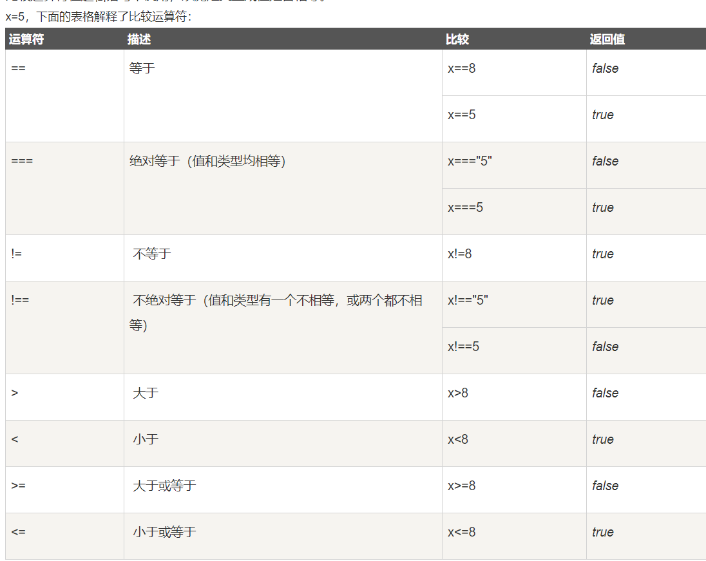
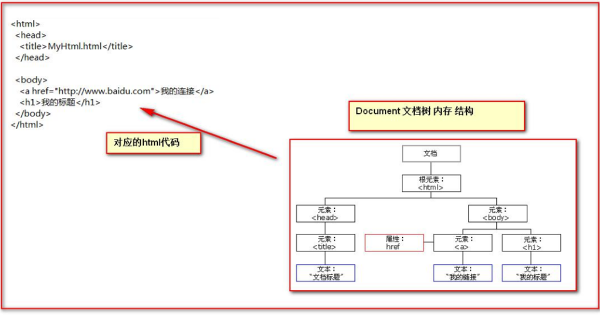
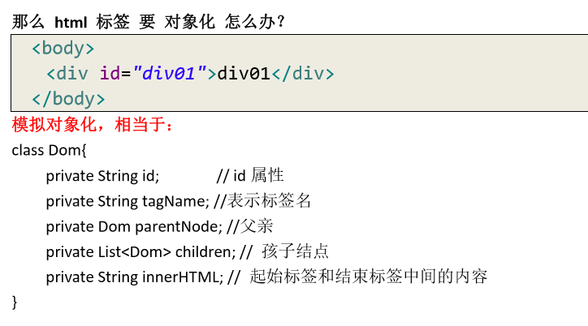
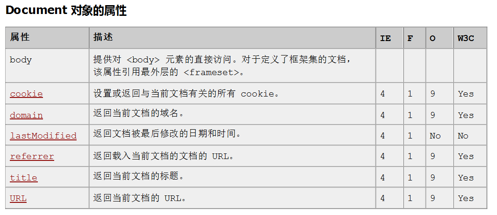
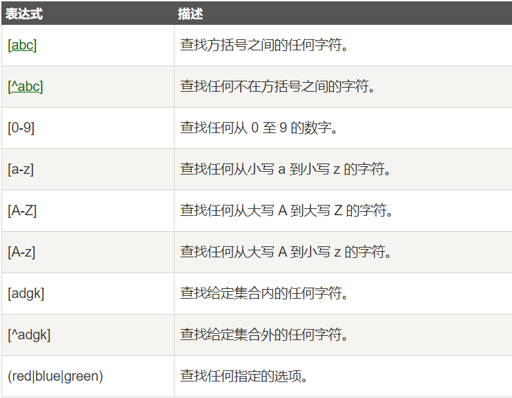
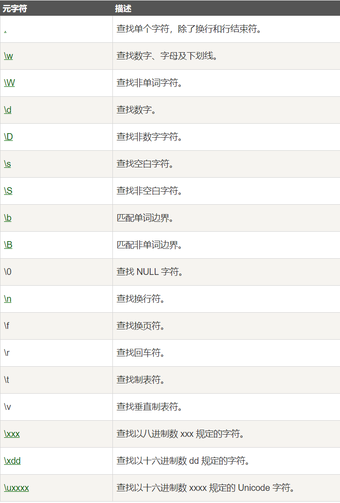

## js 简介
JavaScript 是互联网上最流行的脚本语言，这门语言可用于 HTML 和 web，更可广泛用于服务器、PC、笔记本电脑、平板电脑和智能手机等设备。

Javascript 语言诞生主要是完成页面的数据验证。因此它运行在客户端，需要运行浏览器来解析执行 JavaScript 代码。
JS是Netscape网景公司的产品，最早取名为LiveScript;为了吸引更多java程序员。更名为JavaScript。
**JS是弱类型，Java是强类型。**


### JavaScript 是脚本语言

JavaScript 是可插入 HTML 页面的编程代码。
JavaScript 插入 HTML 页面后，可由所有的现代浏览器执行。
JavaScript 被设计用来向 HTML 页面添加交互行为。 
JavaScript 是一种脚本语言（脚本语言是一种轻量级的编程语言）。 
JavaScript 是一种解释性语言（就是说，代码执行<text style="color: red;">不进行预编译）</text>。 
JavaScript 是脚本语言，浏览器会在读取代码时，<text style="color:red;">逐行地执行脚本代码</text>。而对于传统编程来说，会在执行前对所有代码进行编译。
所有的人无需购买许可证均可使用 JavaScript。 

### 特点
1. 交互性（它可以做的就是信息的动态交互） 
2. 安全性（不允许直接访问本地硬盘） 
3. 跨平台性（只要是可以解释JS的浏览器都可以执行，和平台无关）

### JavaScript 能做什么？
1. JavaScript 为 HTML 设计师提供了一种编程工具 
HTML 创作者往往都不是程序员，但是 JavaScript 却是一种只拥有极其简单的语法的脚本语言！几乎每个人都有能力将短小的代码片断放入他们的 HTML 页面当中。 
2. JavaScript 可以将动态的文本放入 HTML 页面 
类似于这样的一段 JavaScript 声明可以将一段可变的文本放入 HTML 页面：`document.write("<h1>" + name + "</h1>") `
3. JavaScript 可以对事件作出响应 
可以将 JavaScript 设置为当某事件发生时才会被执行，例如页面载入完成或者当用户点击某个 HTML 元素时。 
4. JavaScript 可以读写 HTML 元素 
JavaScript 可以读取及改变 HTML 元素的内容。 
5. JavaScript 可被用来验证数据 
在数据被提交到服务器之前，JavaScript 可被用来验证这些数据。 
6. JavaScript 可被用来检测访问者的浏览器 
JavaScript 可被用来检测访问者的浏览器，并根据所检测到的浏览器，为这个浏览器载入相应的页面。 
7. JavaScript 可被用来创建 cookies 
JavaScript 可被用来存储和取回位于访问者的计算机中的信息.
***

### 真实的名称是 ECMAScript
JavaScript 的正式名称是 "ECMAScript"。这个标准由 ECMA 组织发展和维护。

ECMA-262 是正式的 JavaScript 标准。这个标准基于 JavaScript (Netscape) 和 JScript (Microsoft)。

Netscape (Navigator 2.0) 的 Brendan Eich 发明了这门语言，从 1996 年开始，已经出现在所有的 Netscape 和 Microsoft 浏览器中。

ECMA-262 的开发始于 1996 年，在 1997 年 7 月，ECMA 会员大会采纳了它的首个版本。

在 1998 年，该标准成为了国际 ISO 标准 (ISO/IEC 16262)。

这个标准仍然处于发展之中。

## JavaScript 用法
HTML 中的脚本必须位于 `<script> 与 </script>` 标签之间。

脚本可被放置在 HTML 页面的 <body> 和 <head> 部分中。
1. `<script>` 标签
如需在 HTML 页面中插入 JavaScript，请使用 `<script>` 标签。
`<script> 和 </script>` 会告诉 JavaScript 在何处开始和结束。
`<script> 和 </script> `之间的代码行包含了 JavaScript:
```js
<script>
alert("我的第一个 JavaScript");
</script>
```
>注意：那些老旧的实例可能会在 `<script>` 标签中使用 `type="text/javascript"`。现在已经不必这样做了。JavaScript 是所有现代浏览器以及 HTML5 中的默认脚本语言。

2. `<body>` 中的 JavaScript
代码运行结果：
<!DOCTYPE html>
<html>
<head>
<meta charset="utf-8">
<title>菜鸟教程(runoob.com)</title>
</head>
<body>
	
<p>
JavaScript 能够直接写入 HTML 输出流中：
</p>
<script>
document.write("<h1>这是一个标题</h1>");
document.write("<p>这是一个段落。</p>");
</script>
<p>
您只能在 HTML 输出流中使用 <strong>document.write</strong>。
如果您在文档已加载后使用它（比如在函数中），会覆盖整个文档。
</p>
	
</body>
</html>

3. 在` <head>` 或者` <body>` 的JavaScript
您可以在 HTML 文档中放入不限数量的脚本。
脚本可位于 HTML 的 `<body> 或 <head>` 部分中，或者同时存在于两个部分中。
通常的做法是把函数放入` <head>` 部分中，或者放在页面底部。这样就可以把它们安置到同一处位置，不会干扰页面的内容。
```html
<!DOCTYPE html>
<html>
<head> 
<meta charset="utf-8"> 
<title>菜鸟教程(runoob.com)</title> 
</head>
<body>
	
<h1>我的第一个 Web 页面</h1>
<p id="demo">一个段落。</p>
<button type="button" onclick="myFunction()">点击这里</button>
<script>
function myFunction(){
	document.getElementById("demo").innerHTML="我的第一个 JavaScript 函数";
}
</script>
	
</body>
</html>
```
4. 外部的 JavaScript
也可以把脚本保存到外部文件中。外部文件通常包含被多个网页使用的代码。
外部 JavaScript 文件的文件扩展名是 .js。
如需使用外部文件，请在` <script>` 标签的 "src" 属性中设置该 .js 文件
外部脚本不能包含 `<script>` 标签。
```html
<!DOCTYPE html>
<html lang="en">
<head>
    <meta charset="UTF-8">
    <title>Hello</title>
    <!--现在需要使用 script 引入外部的 js 文件来执行
        src 属性专门用来引入 js 文件路径（可以是相对路径，也可以是绝对路径）
        script 标签可以用来定义 js 代码，也可以用来引入 js 文件
        但是，两个功能二选一使用。不能同时使用两个功能
    -->
    <script type="text/javascript">
        //alert是js提供的一个警告框函数，
        // 可以接受任意类型的参数，作为提示信息
        alert("hello javaScript,根据顺序，先执行")
    </script>
    <script type="text/javascript" src="1.js"></script>
</head>
<body>

</body>
</html>
```

## Chrome 浏览器中执行 JavaScript
菜鸟教程：https://www.runoob.com/js/js-chrome.html

## JavaScript 输出
JavaScript 没有任何打印或者输出的函数。

### JavaScript 显示数据
JavaScript 可以通过不同的方式来输出数据：

- 使用 window.alert() 弹出警告框。
- 使用 document.write() 方法将内容写到 HTML 文档中。
- 使用 innerHTML 写入到 HTML 元素。
- 用 console.log() 写入到浏览器的控制台。
```html
<!DOCTYPE html>
<html>
<head> 
<meta charset="utf-8"> 
<title>菜鸟教程(runoob.com)</title> 
</head>
<body>

<p id="demo"></p>
<script>
var length;
length = 6;
document.getElementById("demo").innerHTML = length;
</script>

</body>
</html>
```
具体实例：https://www.runoob.com/js/js-output.html

## JavaScript 语句标识符
JavaScript 语句通常以一个 语句标识符 为开始，并执行该语句。

语句标识符是保留关键字不能作为变量名使用。

下表列出了 JavaScript 语句标识符 (关键字) ：
|语句	|描述|
|:------|:---|
|break|	用于跳出循环。|
|catch|	语句块，在 try 语句块执行出错时执行 catch 语句块。|
|continue|	跳过循环中的一个迭代。|
|do ... while|	执行一个语句块，在条件语句为 true 时继续执行该语句块。|
|for|	在条件语句为 true 时，可以将代码块执行指定的次数。|
|for ... in|	用于遍历数组或者对象的属性（对数组或者对象的属性进行循环操作）。|
|function|	定义一个函数|
|if ... else|	用于基于不同的条件来执行不同的动作。|
|return|	退出函数|
|switch|	用于基于不同的条件来执行不同的动作。|
|throw|	抛出（生成）错误 。|
|try|	实现错误处理，与 catch 一同使用。|
|var|	声明一个变量。|
|while|	当条件语句为 true 时，执行语句块。|

### 对代码行进行折行
您可以在文本字符串中使用反斜杠对代码行进行换行。下面的例子会正确地显示：
```js
document.write("你好 \
世界!");
```
不过，不能像这样折行：
```js
document.write \ 
("你好世界!");
```

## 变量
变量是用于存储信息的"容器"。
变量必须以字母开头
变量也能以 $ 和 _ 符号开头（不过我们不推荐这么做）
变量名称对大小写敏感（y 和 Y 是不同的变量）
JavaScript 语句和 JavaScript 变量都对大小写敏感。

### JavaScript 数据类型
值类型(基本类型)：
字符串（String）、数字(Number)、布尔(Boolean)、对空（Null）、未定义（Undefined）、Symbol。

引用数据类型：对象(Object)、数组(Array)、函数(Function)。
>注：Symbol 是 ES6 引入了一种新的原始数据类型，表示独一无二的值。

>在 JavaScript 语言中，所有的变量，都可以做为一个 boolean 类型的变量去使用。
0 、null、 undefined、””(空串) 都认为是 false；

JavaScript 里特殊的值： 
undefined 未定义，所有 js 变量未赋于初始值的时候，默认值都是 undefined. 
null 空值 
NaN 全称是：NotaNumber。非数字。非数值。
### 特殊值
#### null
在 JavaScript 中 null 表示 "什么都没有"。

null是一个只有一个值的特殊类型。表示一个空对象引用。

用 typeof 检测 null 返回是object。
```js
var person = null;           // 值为 null(空), 但类型为对象
```

#### undefined
在 JavaScript 中, undefined 是一个没有设置值的变量。

typeof 一个没有值的变量会返回 undefined。
```js
var person;              // 值为 undefined(空), 类型是undefined
```

任何变量都可以通过设置值为 undefined 来清空。 类型为 undefined.
```js
person = undefined;       // 值为 undefined, 类型是undefined
```

#### undefined 和 null 的区别
null 和 undefined 的值相等，但类型不等：
```js
typeof undefined             // undefined
typeof null                  // object
null === undefined           // false
null == undefined            // true
```

1. 定义
    1. undefined：是所有没有赋值变量的默认值，自动赋值。
    2. null：主动释放一个变量引用的对象，表示一个变量不再指向任何对象地址。
2. 何时使用null?
当使用完一个比较大的对象时，需要对其进行释放内存时，设置为 null。

3. null 与 undefined 的异同点是什么呢？

    1. 共同点：都是原始类型，保存在栈中变量本地。

    2. 不同点：
    （1）undefined——表示变量声明过但并未赋过值。
    它是所有未赋值变量默认值，例如：
    `var a;    // a 自动被赋值为 undefined`
    （2）null——表示一个变量将来可能指向一个对象。
    一般用于主动释放指向对象的引用，例如：
    `var emps = ['ss','nn'];`
    `emps = null;     // 释放指向数组的引用`
4. 延伸——垃圾回收站
它是专门释放对象内存的一个程序。
（1）在底层，后台伴随当前程序同时运行；引擎会定时自动调用垃圾回收期；
（2）总有一个对象不再被任何变量引用时，才释放。

#### 实例
```html
<!DOCTYPE html>
<html lang="en">
<head>
    <meta charset="UTF-8">
    <title>Title</title>
    <script type="text/javascript"> 
        var i; 
    // alert(i);// undefined 
    // i = 12; 
    // typeof() 是 JavaScript 语 言 提 供 的 一 个 函 数 。
    // 它 可 以 取 变 量 的 数 据 类 型 返 回     
    // alert( typeof(i) ); // number
    i = "abc"; 
    // alert( typeof(i) ); // String
    var a = 12;
    var b = "abc";
    alert(a * b); // NaN是非数字 ， 非数值 。
    </script>
</head>
<body>
</body>
</html>
```
### 声明（创建） JavaScript 变量
在 JavaScript 中创建变量通常称为"声明"变量。
#### var
- 我们使用 var 关键词来声明变量：
`var carname;`
变量声明之后，该变量是空的（它没有值）。

- 如需向变量赋值，请使用等号：
`carname="Volvo";`

- 不过，您也可以在声明变量时对其赋值：
`var carname="Volvo";`

- 一条语句，多个变量
您可以在一条语句中声明很多变量。该语句以 var 开头，并使用逗号分隔变量即可：
`var lastname="Doe", age=30, job="carpenter";`

- 声明也可横跨多行：
`var lastname="Doe",`
`age=30,`
`job="carpenter";`

- 一条语句中声明的多个变量不可以同时赋同一个值:
`var x,y,z=1;`
x,y 为 undefined， z 为 1。

- 重新声明 JavaScript 变量
如果重新声明 JavaScript 变量，该变量的值不会丢失：
在以下两条语句执行后，变量 carname 的值依然是 "Volvo"：
`var carname="Volvo";`
`var carname;`

***
#### let
#### const
let 的声明方式与 var 相同，用 let 来代替 var 来声明变量，就可以把变量限制在当前代码块中。

使用 const 声明的是常量，其值一旦被设定便不可被更改。
>更多细节用时可以再去查阅
***

### 声明变量类型
当您声明新变量时，可以使用关键词 "new" 来声明其类型：
```js
var carname=new String;
var x=      new Number;
var y=      new Boolean;
var cars=   new Array;
var person= new Object;
```
>JavaScript 变量均为对象。当您声明一个变量时，就创建了一个新的对象。
### typeof 操作符
使用 typeof 操作符来检测变量的数据类型。
```js
typeof "John"                // 返回 string
typeof 3.14                  // 返回 number
typeof false                 // 返回 boolean
typeof [1,2,3,4]             // 返回 object
typeof {name:'John', age:34} // 返回 object
```


### 局部 JavaScript 变量
在 JavaScript 函数内部声明的变量（使用 var）是局部变量，所以只能在函数内部访问它。（该变量的作用域是局部的）。

您可以在不同的函数中使用名称相同的局部变量，因为只有声明过该变量的函数才能识别出该变量。

只要函数运行完毕，本地变量就会被删除。
```js
// 此处不能调用 carName 变量
function myFunction() {
    var carName = "Volvo";
    // 函数内可调用 carName 变量
}
```
### 全局 JavaScript 变量
在函数外声明的变量是全局变量，网页上的所有脚本和函数都能访问它。
```js
var carName = " Volvo";
 
// 此处可调用 carName 变量
function myFunction() {
    // 函数内可调用 carName 变量
}
```
如果变量在函数内没有声明（没有使用 var 关键字），该变量为全局变量。

以下实例中 carName 在函数内，但是为全局变量。

实例
```js
// 此处可调用 carName 变量
 
function myFunction() {
    carName = "Volvo";
    // 此处可调用 carName 变量
}
```
总结：
- 局部变量：在函数中通过var声明的变量。

- 全局变量：在函数外通过var声明的变量。

- 没有声明就使用的变量，默认为全局变量，不论这个变量在哪被使用。
### HTML 中的全局变量
在 HTML 中, 全局变量是 window 对象: 所有数据变量都属于 window 对象。

实例
```js
//此处可使用 window.carName
 
function myFunction() {
    carName = "Volvo";
}
```
### JavaScript 变量的生存期
JavaScript 变量的生命期从它们被声明的时间开始。

局部变量会在函数运行以后被删除。

全局变量会在页面关闭后被删除。

### 向未声明的 JavaScript 变量分配值
如果您把值赋给尚未声明的变量，该变量将被自动作为 window 的一个属性。
这条语句：
```js
carname="Volvo";
```
将声明 window 的一个属性 carname。

非严格模式下给未声明变量赋值创建的全局变量，是全局对象的可配置属性，可以删除。
```js
var var1 = 1; // 不可配置全局属性
var2 = 2; // 没有使用 var 声明，可配置全局属性

console.log(this.var1); // 1
console.log(window.var1); // 1
console.log(window.var2); // 2

delete var1; // false 无法删除
console.log(var1); //1

delete var2; 
console.log(delete var2); // true
console.log(var2); // 已经删除 报错变量未定义
```

## 运算符
### 比较运算符
```
等于： == 等于是简单的做字面值的比较 
全等于： === 除了做字面值的比较之外，还会比较两个变量的数据类型
其它的和Java几乎一样
```

实例
```js
<body>
    <p id="p1"></p>
    <script>
        var a="12";
        var b=12;
        // document.getElementById("p1").innerText=(a==b);//true
        document.getElementById("p1").innerText=(a===b);//false
    </script>
</body>
```

### 逻辑运算符
&& 逻辑与
|| 逻辑或
! 取反，非

首先要明确的是：
>在 JavaScript 语言中，所有的变量，都可以做为一个 boolean 类型的变量去使用。
0 、null、 undefined、””(空串) 都认为是 false；

- && 且运算。 
有两种情况： 
    - 第一种：当表达式全为真的时候。返回最后一个表达式的值。 
    - 第二种：当表达式中，有一个为假的时候。返回第一个为假的表达式的值
```html
<p id="p1"></p>
<script>
    /*
    && 且运算。
    有两种情况：
    第一种：当表达式全为真的时候。返回最后一个表达式的值。
    第二种：当表达式中，有一个为假的时候。返回第一个为假的表达式的值
    */
    var a = "abc";
    var b = true;
    var c = null;
    var d = false;
    // document.getElementById("p1").innerHTML=(a&&b);//true
    document.getElementById("p1").innerHTML=(b&&a);//abc
    alert(c&&d);//null
    alert(d&&c);//false
</script>
```

- || 或运算 
    - 第一种情况：当表达式全为假时，返回最后一个表达式的值 
    - 第二种情况：只要有一个表达式为真。就会把回第一个为真的表达式的值

- 其实就是短路 

## 数组
数组的定义： 
格式： 
`var 数组名 =[]; // 空数组 `
`var 数组名 =[1,’abc’,true]; // 定义数组同时赋值元素`
`var mycars=new Array()`
`var mycars=new Array(3)`
实例：
```html
<script>
    var arr=[];//定义了一个空数组
    alert(arr.length);//0

    arr[0]=12;
    alert(arr[0]);
    alert(arr.length);//1

    arr[3]="abc";
    alert(arr.length);//4
    //js中的数组，若通过数组下标赋值，最大的下标值，会自动数组扩容
    //并且中间未定义的下标的值为undefined
    alert(arr[2]);//undefined
</script>
```
```html
<script type="text/javascript">
var x
var mycars = new Array()
mycars[0] = "Saab"
mycars[1] = "Volvo"
mycars[2] = "BMW"

for (x in mycars)
{
document.write(mycars[x] + "<br />")
}
</script>
```

## 函数
函数是由事件驱动的或者当它被调用时执行的可重复使用的代码块。

**注：在 Java 中函数允许重载。但是在 JS 中函数的重载会直接覆盖掉上一次的定义**

### 定义函数：
`function 函数名(形参列表){ 函数体 }`
或
`var 函数名 =function(形参列表){ 函数体 }`
带参数的函数
```js
function myFunction(var1,var2)
{
代码
}
```
实例
```html
<p>点击这个按钮，来调用带参数的函数。</p>
<button onclick="myFunction('Harry Potter','Wizard')">点击这里</button>
<script>
function myFunction(name,job){
	alert("Welcome " + name + ", the " + job);
}
</script>
```

### 带有返回值的函数
有时，我们会希望函数将值返回调用它的地方。

通过使用 return 语句就可以实现。

在使用 return 语句时，函数会停止执行，并返回指定的值。
```html
<p>本例调用的函数会执行一个计算，然后返回结果：</p>
<p id="demo"></p>
<script>
function myFunction(a,b){
	return a*b;
}
document.getElementById("demo").innerHTML=myFunction(4,3);
</script>
```


###  arguments 隐形参数
函数的 arguments 隐形参数（只在 function 函数内）

就是在 function 函数中不需要定义，但却可以直接用来获取所有参数的变量。我们管它叫隐形参数。 
隐形参数特别像 java 基础的可变长参数一样。 
`public void fun(Object...args);`
可变长参数其实是一个数组。
那么 js 中的隐形参数也跟 java 的可变长参数一样。操作类似数组。
实例
```html
<!DOCTYPE html>
<html lang="en">
<head>
    <meta charset="UTF-8">
    <title>Title</title>
    <script type="text/javascript"> function fun(a) {
        alert(arguments.length);// 可 看 参 数 个 数
        alert(arguments[0]);
        alert(arguments[1]);
        alert(arguments[2]);
        alert("a = " + a);
        for (var i = 0; i < arguments.length; i++) {
            alert(arguments[i]);
        }
        alert("无参函数 fun()");
    } // fun(1,"ad",true);
    //需求 ： 要求编写一个函数 。 用于计算所有参数相加的和并返回

    function sum(num1, num2) {
        var result = 0;
        for (var i = 0; i < arguments.length; i++) {
            if (typeof (arguments[i]) == "number") {
                result += arguments[i];
            }
        }
        return result;
    }

    alert(sum(1, 2, 3, 4, "abc", 5, 6, 7, 8, 9));
    </script>
</head>
<body>
</body>
</html>
```

## 对象
JavaScript 对象是拥有属性和方法的数据。
对象也是一个变量，但对象可以包含多个值（多个变量）。
JavaScript 对象是变量的容器。

### 对象定义
方式1：**以逗号作分隔**
```js
var person = {
    firstName: "John",
    lastName : "Doe",
    id : 5566,
    fullName : function() 
	{
       return this.firstName + " " + this.lastName;
    }
};
```
方式2：
javaScript 可以通过 new Object 来创建对象，再添加属性和属性值，比如：
```js
var person=new Object();
person.name='小明'；
person.sex='男'；
person.method=function(){
  return this.name+this.sex;
}
```
**javaScript对象中属性具有唯一性（这里的属性包括方法），如果有两个重复的属性，则以最后赋值为准。**
### 对象属性
可以说 "JavaScript 对象是变量的容器"。

但是，我们通常认为 "JavaScript 对象是键值对的容器"。

键值对通常写法为 name : value (键与值以冒号分割)。

键值对在 JavaScript 对象通常称为 对象属性。

JavaScript 对象是属性变量的容器。

### 访问对象属性
可以通过两种方式访问对象属性:

`person.lastName;`

`person["lastName"];`

### 对象方法
对象的方法定义了一个函数，并作为对象的属性存储。

对象方法通过添加 () 调用 (作为一个函数)。

**通常 fullName() 是作为 person 对象的一个方法， fullName 是作为一个属性。**
实例
```html
<p>创建和使用对象方法。</p>
<p>对象方法是一个函数定义,并作为一个属性值存储。</p>
<p id="demo1"></p>
<p id="demo2"></p>
<script>
var person = {
    firstName: "John",
    lastName : "Doe",
    id : 5566,
    fullName : function() 
	{
       return this.firstName + " " + this.lastName;
    }
};
document.getElementById("demo1").innerHTML = "不加括号输出函数表达式："  + person.fullName;
document.getElementById("demo2").innerHTML = "加括号输出函数执行结果："  +  person.fullName();
</script>
```
运行结果
```
创建和使用对象方法。

对象方法是一个函数定义,并作为一个属性值存储。

不加括号输出函数表达式：function() { return this.firstName + " " + this.lastName; }

加括号输出函数执行结果：John Doe
```


## 事件
什么是事件？事件是电脑输入设备与页面进行交互的响应。我们称之为事件。

HTML 事件是发生在 HTML 元素上的事情。

当在 HTML 页面中使用 JavaScript 时， JavaScript 可以触发这些事件。

### HTML 事件
HTML 事件可以是浏览器行为，也可以是用户行为。

以下是 HTML 事件的实例：
```
HTML 页面完成加载
HTML input 字段改变时
HTML 按钮被点击
```
通常，当事件发生时，你可以做些事情。

在事件触发时 JavaScript 可以执行一些代码。

HTML 元素中可以添加事件属性，使用 JavaScript 代码来添加 HTML 元素。


在以下实例中，按钮元素中添加了 onclick 属性 (并加上代码):

1. 实例中，JavaScript 代码将修改 id="demo" 元素的内容。
    ```html
    <button onclick="getElementById('demo').innerHTML=Date()">现在的时间是?</button>
    <p id="demo"></p>
    ```

2. 在下一个实例中，代码将修改自身元素的内容 (使用 `this.innerHTML`):
    ```html
    <body>

    <button onclick="this.innerHTML=Date()">现在的时间是?</button>

    </body>
    ```

3. JavaScript代码通常是几行代码。比较常见的是通过事件属性来调用：
    ```html
    <p>点击按钮执行 <em>displayDate()</em> 函数.</p>
    <button onclick="displayDate()">点这里</button>
    <script>
    function displayDate(){
        document.getElementById("demo").innerHTML=Date();
    }
    </script>
    <p id="demo"></p>
    ```

### 常见的HTML事件

|事件|	描述|
|:----|:------|
|onchange|	HTML 元素改变，内容发生改变事件： 常用于下拉列表和输入框内容发生改变后操作 |
|onclick|	用户点击 HTML 元素|
|onmouseover|	用户在一个HTML元素上移动鼠标|
|onmouseout|	用户从一个HTML元素上移开鼠标|
|onkeydown	|用户按下键盘按键|
|onload	|浏览器已完成页面的加载，常用于做页面 js 代码初始化操作 |
|onsubmit |表单提交事件： 常用于表单提交前，验证所有表单项是否合法。|
|onblur |失去焦点事件： 常用用于输入框失去焦点后验证其输入内容是否合法|

更多的html事件：https://www.runoob.com/jsref/dom-obj-event.html

### JavaScript 可以做什么?
事件可以用于处理表单验证，用户输入，用户行为及浏览器动作:
1. 页面加载时触发事件
2. 页面关闭时触发事件
3. 用户点击按钮执行动作
4. 验证用户输入内容的合法性
等等 ...

可以使用多种方法来执行 JavaScript 事件代码：

1. HTML 事件属性可以直接执行 JavaScript 代码
2. HTML 事件属性可以调用 JavaScript 函数
3. 你可以为 HTML 元素指定自己的事件处理程序
4. 你可以阻止事件的发生。
等等 ...


### 事件的注册
事件的注册又分为静态注册和动态注册两种：
什么是事件的注册（绑定）？ 其实就是告诉浏览器，当事件响应后要执行哪些操作代码，叫事件注册或事件绑定。

#### 静态注册
通过 html 标签的事件属性直接赋于事件响应后的代码，这种方式我们叫静态注册。
实例：
```html
<!DOCTYPE html>
<html lang="en">
<head>
    <meta charset="UTF-8">
    <title>onload事件</title>
    <script>
        //onload事件的方法
        function onload_fun(){
            alert("静态注册onload事件，模拟有很多代码");
        }
    </script>
</head>
<body onload="onload_fun();">
    <!--静态注册onload事件
        onload事件是浏览器解析完页面就会自动执行的事件-->

</body>
</html>
```
#### 动态注册
动态注册事件：
是指先通过 js 代码得到标签的 dom 对象，然后再通过 dom 对象.事件名 =function(){} 这种形式赋于事件响应后的代码，叫动态注册。

动态注册基本步骤： 
1. 获取标签对象 
2. 标签对象.事件名 =fucntion(){}

##### onload
实例：
```html
<!DOCTYPE html>
<html lang="en">
<head>
    <meta charset="UTF-8">
    <title>onload1动态注册</title>
    <script>
        //onload事件动态注册是固定写法
        window.onload=function () {
            alert("动态注册onload事件，模拟有很多代码");
        }
    </script>
</head>
<body>

</body>
</html>
```
##### onclick
实例2：
```html
<!DOCTYPE html>
<html lang="en">
<head>
    <meta charset="UTF-8">
    <title>Title</title>

</head>
<body>
    <!--静态注册-->
    <button onclick="onclick_fun()" id="button1">静态注册按钮：当前的时间</button>
    <!--动态注册-->
    <button id="button2">按钮2</button>
    <script>
        function onclick_fun() {
            document.getElementById("button1").innerHTML=Date();
        }

        //动态注册onclick事件
        //1. 获取标签对象
        /*
        * document 是js提供的一个对象(文档)
        * getElementById 就是通过id属性获取对象
        * */
        var btn = document.getElementById("button2");
        //2. 标签对象.事件名=function(){}
        btn.onclick = function onclick_fun1(){
            alert("当前时间："+Date());
        }
    </script>
</body>
</html>
```
##### onchange
```html
<!DOCTYPE html>
<html lang="en">
<head>
    <meta charset="UTF-8">
    <title>Title</title>
    <script>
        window.onload=function (){
            let select1 = document.getElementById("select1");
            select1.onchange=function (){
                alert("选择已改变！");
            }
        }
    </script>
</head>
<body>
    <select id="select1">
        <option>--爱好--</option>
        <option value="java">java</option>
        <option>js</option>
        <option>c++</option>
    </select>
</body>
</html>
```
##### onblur
```html
<!DOCTYPE html>
<html lang="en">
<head>
    <meta charset="UTF-8">
    <title>Title</title>
    <style type="text/css">
        table{
            border:1px solid black;
            /*设置边框*/
            border-collapse:collapse;
            /*将边框合并*/
        }
        td,th{
            border:1px solid black;/*设置边框*/
        }
    </style>
</head>
<body>
    <table align="center">
        <tr>
            <td>用户名：</td>
            <td><input id="i1" type="text"></td>
        </tr>
        <tr>
            <td>密码：</td>
            <td><input id="i2" type="text"></td>
        </tr>
    </table>

    <script>
        let i1 = document.getElementById("i1");
        i1.onblur = function () {
            //console 是控制台对象，由js提供，
            //专门用来向浏览器的控制台打印输出，用于测试使用
            //log是打印的方法
            console.log("失去焦点事件：用于检测输入是否合法");
        }
    </script>
</body>
</html>
```

##### onsubmit
```html
<!DOCTYPE html>
<html lang="en">
<head>
    <meta charset="UTF-8">
    <title>Title</title>
    <script>
        window.onload=function (){
            let form1 = document.getElementById("form1");
            form1.onsubmit=function () {
                //要验证表单是否合法，如果不合法，就阻止提交
                alert("表单不合法！");
                //return false 可以阻止表单不提交
                return false;
            }
        }
        function fun2(){
            alert("表单不合法！")
            return false;
        }
    </script>
</head>
<body>
    <!--动态注册-->
    <form action="http://localhost:8080" id="form1">
        <input type="submit" value="表单1提交"/>
    </form>
    <!--静态注册
        这里阻止不提交需要设置onsubmit="return false"
        故设置onsubmit="return fun2()"-->
    <form action="http://localhost:8080" id="form2" onsubmit="return fun2()">
        <input type="submit" value="表单2提交"/>
    </form>
</body>
</html>
```


## DOM 模型
DOM 全称是 Document Object Model 文档对象模型
大白话，就是把文档中的标签，属性，文本，转换成为对象来管理。 那么 它们是如何实现把标签，属性，文本转换成为对象来管理呢。这就是我们马上要学习的重点。

### Document
>菜鸟教程：https://www.runoob.com/jsref/dom-obj-document.html

Document 对象代表整个 HTML 文档，可用来访问页面中的所有元素。

当浏览器载入 HTML 文档, 它就会成为 Document 对象。

Document 对象是 HTML 文档的根节点。

Document 对象是 Window 对象的一个部分，可通过 window.document 属性来访问。

HTML DOM 把 HTML 文档呈现为带有元素、属性和文本的树结构（节点树）。



<text style="color: red;">Document 对象的理解：
第一点：Document 它管理了所有的 HTML 文档内容。 
第二点：document 它是一种树结构的文档。有层级关系。 
第三点：它让我们把所有的标签 都 对象化 
第四点：我们可以通过 document 访问所有的标签对象。
</text>



#### Document 对象中属性


#### Document 对象中的方法

|方法名|描述|
|-----|:----|
|getElementById(elementId) |返回对拥有指定 id 的第一个对象的引用|
|getElementsByName(elementName) |返回带有指定名称的对象集合。|
|getElementsByTagName(tagname) |返回带有指定标签名的对象集合。|
|createElement( tagName) |通过给定的标签名，创建一个标签对象。tagName 是要创建的标签名|
|write()|向文档写 HTML 表达式 或 JavaScript 代码|
|writeln()|等同于 write() 方法，不同的是在每个表达式之后写一个换行符。|

注： document 对象的三个查询方法，
如果有 id 属性，优先使用 getElementById 方法来进行查询 
如果没有 id 属性，则优先使用 getElementsByName 方法来进行查询 
如果 id 属性和 name 属性都没有最后再按标签名查 getElementsByTagName

以上三个方法，一定要在**页面加载完成之后执行**，才能查询到标签对象。

实例：getElementById
```html
<!DOCTYPE html>
<html lang="en">
<head>
    <meta charset="UTF-8">
    <title>Title</title>
    <script>
        window.onload=function (){
            // 需 求 ： 当用户点击了较验按钮，要获取输出框中内容。
            // 然后验证其是否合法。<br/>
            // 验证的规则是：必须由字母，数字。下划线组成。并且长度是5到12位
            // 1.获取标签对象
            let username=document.getElementById("username");
            // alert(username)  //[object HTMLInputElement],它就是dom对象
            // 2.监听是否失去焦点
            username.onblur=function () {
                // 3. 取值
                let value = username.value;
                // 4. 采用正则表达式进行校验
                let patt=/^\w{5,12}$/;
                if(!patt.test(value)){
                    let span1 = document.getElementById("span1");
                    //innerHTML 表示起始标签和结束标签之间的内容
                    // span1.innerHTML= "用户名不合法！"
                    span1.innerHTML="";
                }else{
                    let span1 = document.getElementById("span1");
                    span1.innerHTML="";
                }
            }
        }
    </script>
</head>
<body>
    用户名：<input type="text" id="username" aria-label="请输入"/>
    <span style="color:red;" id="span1"></span>
</body>
</html>
```
实例：getElementsByName
```html
<!DOCTYPE html>
<html lang="en">
<head>
    <meta charset="UTF-8">
    <title>Title</title>
    <script>
        function checkAll() {
            //让所有复选框选中
            let hobbies = document.getElementsByName("hobby");
            // alert(hobbies);//[object NodeList]
            //集合中每个元素都是dom对象,并且是有序的
            //顺序为他们在html页面中的顺序,这里第一个是cpp，第二个是java
            for(var i=0;i<hobbies.length;i++){
                //checked表示复选框的选择状态，如果选择是true
                hobbies[i].checked=true;
            }
        }
        function checkNo(){
            //全不选
            let hobbies = document.getElementsByName("hobby");
            for(var i=0;i<hobbies.length;i++){
                //checked表示复选框的选择状态，如果选择是true
                hobbies[i].checked=false;
            }
        }
        function checkReverse(){
            //反选
            let hobbies = document.getElementsByName("hobby");
            for(var i=0;i<hobbies.length;i++){
                //checked表示复选框的选择状态，如果选择是true
                hobbies[i].checked=!hobbies[i].checked;
            }
        }
    </script>
</head>
<body>
    兴趣爱好：
    <input type="checkbox" name="hobby" value="cpp" checked="checked">C++
    <input type="checkbox" name="hobby" value="java">Java
    <input type="checkbox" name="hobby" value="js">JavaScript
    <br/>
    <button onclick="checkAll()">全选</button>
    <button onclick="checkNo()">全不选</button>
    <button onclick="checkReverse()">反选</button>
</body>
</html>
```
实例：getElementsByTagName
```html
<!DOCTYPE html>
<html lang="en">
<head>
    <meta charset="UTF-8">
    <title>Title</title>
    <script>
        //全选
        // document.getElementsByTagName("input");
        // 是 按 照 指 定 标 签 名 来 进 行 查 询 并 返 回 集 合
        // 这 个 集 合 的 操 作 跟 数 组 一 样
        // 集 合 中 都 是 dom 对 象
        // 集 合 中 元 素 顺 序 是 他 们 在 html 页 面 中 从 上 到 下 的 顺 序 。
        function checkAll() {
            let elements = document.getElementsByTagName("input");
            for (var i = 0; i < elements.length; i++) {
                elements[i].checked = true;
            }
        }
    </script>
</head>
<body>
    兴趣爱好：
    <input type="checkbox" value="cpp" checked="checked">C++
    <input type="checkbox" value="java">Java
    <input type="checkbox" value="js">JavaScript
    <br/>
    <button onclick="checkAll()">全选</button>
</body>
</html>
```

## HTML DOM 元素 (节点)

创建新的 HTML 元素 (节点) - appendChild()
要创建新的 HTML 元素 (节点)需要先创建一个元素，然后在已存在的元素中添加它。

### 方法：
通过具体的元素节点调用 getElementsByTagName() 方法，获取当前节点的指定标签名孩子节点

appendChild(oChildNode) 方法，可以添加一个子节点，oChildNode 是要添加的孩子节点
实例：
```html
<script>
    window.onload=function (){
        //现在需要使用js代码创建html标签，并且显示在页面上
        let divObj = document.createElement("div");
        //此时的div在内存中, <div></div>
        divObj.innerHTML="fzk最帅";
        //此时<div>fzk最帅</div>，但是还是在内存中，
        // 要显示需要将它放在body标签中
        //向body节点中添加子节点
        document.body.appendChild(divObj);

        //方式二：
        let textNode = document.createTextNode("fzk最帅2");
        divObj.appendChild(textNode);
        //说明文本也是一个节点
    }
</script>
```
### 属性
|属性名 |描述 |
|:------|:-----|
|childNodes |获取当前节点的所有子节点 |
|firstChild 属性|获取当前节点的第一个子节点 |
|lastChild 属性|获取当前节点的最后一个子节点 |
|parentNode 属性|获取当前节点的父节点 |
|nextSibling 属性|获取当前节点的下一个节点 |
|previousSibling 属性|获取当前节点的上一个节点 |
|className| 用于获取或设置标签的 class 属性值 |
|innerHTML 属性|表示获取/设置起始标签和结束标签中的内容|
|innerText 属性|表示获取/设置起始标签和结束标签中的文本|

实例：
css文件：
```css
@CHARSET "UTF-8";

body {
	width: 800px;
	margin-left: auto;
	margin-right: auto;
}

button {
	width: 300px;
	margin-bottom: 10px;
}

#btnList {
	float:left;
}

#total{
	width: 450px;
	float:left;
}

ul{
	list-style-type: none;
	margin: 0px;
	padding: 0px;
}

.inner li{
	border-style: solid;
	border-width: 1px;
	padding: 5px;
	margin: 5px;
	background-color: #99ff99;
	float:left;
}

.inner{
	width:400px;
	border-style: solid;
	border-width: 1px;
	margin-bottom: 10px;
	padding: 10px;
	float: left;
}
```
html页面
```html
<!DOCTYPE html>
<html>
<head>
<meta charset="UTF-8">
<title>dom查询</title>
<link rel="stylesheet" type="text/css" href="style/css.css" />
<script type="text/javascript">
	window.onload = function(){
		//1.查找#bj节点
		document.getElementById("btn01").onclick=function (){
			let bj = document.getElementById("bj");
			alert(bj.innerHTML);
		};

		//2.查找所有li节点
		var btn02Ele = document.getElementById("btn02");
		btn02Ele.onclick = function(){
			let lis = document.getElementsByTagName("li");
			alert(lis.length);
		};
		//3.查找name=gender的所有节点
		var btn03Ele = document.getElementById("btn03");
		btn03Ele.onclick = function(){
			let genders = document.getElementsByName("gender");
			alert(genders.length);
		};
		//4.查找#city下所有li节点
		var btn04Ele = document.getElementById("btn04");
		btn04Ele.onclick = function(){
			let city = document.getElementById("city");
			let lis = city.getElementsByTagName("li");
			alert(lis.length);//4个
		};
		//5.返回#city的所有子节点
		var btn05Ele = document.getElementById("btn05");
		btn05Ele.onclick = function(){
			let city = document.getElementById("city");
			let childNodes = city.childNodes;
			alert(childNodes.length);//9个
			//为什么呢？
			/**
			 * 因为空格会被认为是字符串，从而成为一个节点
			 * 有4个li，加上5个多个空格构成的字符串
			 */
		};
		//6.返回#phone的第一个子节点
		var btn06Ele = document.getElementById("btn06");
		btn06Ele.onclick = function(){
			//查询id为 phone的节点
			alert( document.getElementById("phone").firstChild.innerHTML);
		};
		//7.返回#bj的父节点
		var btn07Ele = document.getElementById("btn07");
		btn07Ele.onclick = function(){
			alert(document.getElementById("bj").parentNode.innerHTML)
		};
		//8.返回#android的前一个兄弟节点
		var btn08Ele = document.getElementById("btn08");
		btn08Ele.onclick = function(){
			alert(document.getElementById("android").previousElementSibling.innerHTML);
		};
		//9.读取#username的value属性值
		var btn09Ele = document.getElementById("btn09");
		btn09Ele.onclick = function(){
			alert(document.getElementById("username").value);
		};
		//10.设置#username的value属性值
		var btn10Ele = document.getElementById("btn10");
		btn10Ele.onclick = function(){
			document.getElementById("username").value="fzk最帅";
		};
		//11.返回#bj的文本值
		var btn11Ele = document.getElementById("btn11");
		btn11Ele.onclick = function(){
			alert(document.getElementById("bj").innerText);
		};
	};
</script>
</head>
<body>
<div id="total">
	<div class="inner">
		<p>
			你喜欢哪个城市?
		</p>

		<ul id="city">
			<li id="bj">北京</li>
			<li>上海</li>
			<li>东京</li>
			<li>首尔</li>
		</ul>

		<br>
		<br>

		<p>
			你喜欢哪款单机游戏?
		</p>

		<ul id="game">
			<li id="rl">红警</li>
			<li>实况</li>
			<li>极品飞车</li>
			<li>魔兽</li>
		</ul>

		<br />
		<br />

		<p>
			你手机的操作系统是?
		</p>

		<ul id="phone"><li>IOS</li><li id="android">Android</li><li>Windows Phone</li></ul>
	</div>

	<div class="inner">
		gender:
		<input type="radio" name="gender" value="male"/>
		Male
		<input type="radio" name="gender" value="female"/>
		Female
		<br>
		<br>
		name:
		<input type="text" name="name" id="username" value="abcde"/>
	</div>
</div>
<div id="btnList">
	<div><button id="btn01">查找#bj节点</button></div>
	<div><button id="btn02">查找所有li节点</button></div>
	<div><button id="btn03">查找name=gender的所有节点</button></div>
	<div><button id="btn04">查找#city下所有li节点</button></div>
	<div><button id="btn05">返回#city的所有子节点</button></div>
	<div><button id="btn06">返回#phone的第一个子节点</button></div>
	<div><button id="btn07">返回#bj的父节点</button></div>
	<div><button id="btn08">返回#android的前一个兄弟节点</button></div>
	<div><button id="btn09">返回#username的value属性值</button></div>
	<div><button id="btn10">设置#username的value属性值</button></div>
	<div><button id="btn11">返回#bj的文本值</button></div>
</div>
</body>
</html>
```


## RegExp 对象
RegExp：是正则表达式（regular expression）的简写。
正则表达式是描述字符模式的对象。

正则表达式用于对字符串模式匹配及检索替换，是对字符串执行模式匹配的强大工具。

### 语法
```js
var patt=new RegExp(pattern,modifiers);

或更简单的方法

var patt=/pattern/modifiers;
```
- pattern（模式） 描述了表达式的模式
- modifiers(修饰符) 用于指定全局匹配、区分大小写的匹配和多行匹配

**注意：当使用构造函数创造正则对象时，需要常规的字符转义规则（在前面加反斜杠 \）**。比如，以下是等价的：
```js
var re = new RegExp("\\w+");
var re = /\w+/;
```

### 修饰符
修饰符用于执行区分大小写和全局匹配:
|修饰符	|描述|
|:------|:----|
|i|	执行对大小写不敏感的匹配。|
|g|	执行全局匹配（查找所有匹配而非在找到第一个匹配后停止）。|
|m|	执行多行匹配。|

### 方括号


### 元字符
元字符（Metacharacter）是拥有特殊含义的字符：


### 量词


### RegExp 对象方法

|方法|	描述|
|:----|:-----|
|compile	|在 1.5 版本中已废弃。 编译正则表达式。|
|exec|	检索字符串中指定的值。返回找到的值，并确定其位置。|
|test|	检索字符串中指定的值。返回 true 或 false。|
|toString	|返回正则表达式的字符串。|

#### test()
test()方法搜索字符串指定的值，根据结果并返回真或假。
```js
var patt1=new RegExp("e");
document.write(patt1.test("The best things in life are free"));//返回true
```
#### exec()
exec() 方法检索字符串中的指定值。返回值是被找到的值。如果没有发现匹配，则返回 null。
```js
var patt1=new RegExp("e");
document.write(patt1.exec("The best things in life are free"));//返回e
```

### 支持正则表达式的 String 对象的方法
|方法|	描述|	FF|	IE|
|----|-----|-----|---|
|search	|检索与正则表达式相匹配的值。|	1|	4|
|match	|找到一个或多个正则表达式的匹配。|	1	|4|
|replace|	替换与正则表达式匹配的子串。|	1|	4|
|split|	把字符串分割为字符串数组。|	1|	4|


### RegExp 对象属性
|属性	|描述|
|-------|---|
|constructor|	返回一个函数，该函数是一个创建 RegExp 对象的原型。|
|global	|判断是否设置了 "g" 修饰符|
|ignoreCase	|判断是否设置了 "i" 修饰符|
|lastIndex	|用于规定下次匹配的起始位置|
|multiline|	判断是否设置了 "m" 修饰符|
|source|	返回正则表达式的匹配模式|