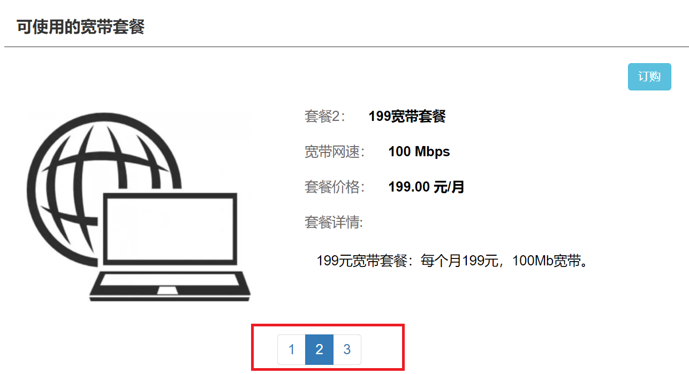

# layUI

## 安装

CDN引入：

```html
   	<!-- 引入 layui.css -->
    <link rel="stylesheet" type="text/css" href="https://www.layuicdn.com/layui/css/layui.css"/>

    <!-- 引入 layui.js -->
    <script src="https://www.layuicdn.com/layui/layui.js"></script>
```


## 内置模块

### Layer弹层

#### 使用

1. 作为独立组件使用

2. layUI模块化使用：引入*layui.css*和*layui.js*，通过*layui.use('layer', callback)*加载模块

   ```html
       <!--引入jQuery-->
       <script src="https://apps.bdimg.com/libs/jquery/2.1.4/jquery.min.js"></script>
   
       <!-- 引入 layui.css -->
       <link rel="stylesheet" type="text/css" href="https://www.layuicdn.com/layui/css/layui.css"/>
   
       <!-- 引入 layui.js -->
       <script src="https://www.layuicdn.com/layui/layui.js"></script>
   ```


#### 内置方法

##### ready

> layer.ready(callback) - 初始化就绪

由于我们的layer内置了轻量级加载器，所以你根本不需要单独引入css等文件。

```js
//页面一打开就执行弹层，layer 的css加载需要过程，如果是一打开页面就执行弹层的那种，最好是放在ready函数中
layer.ready(function () {
//layer.msg('很高兴一开场就见到你');
});
```

可以自己试试，如果一打开页面就打开layer，有时候就会出现css样式的问题。


##### open

> layer.open(options) - 原始核心方法
> 使用率最高的方法：不管是使用哪种方式创建层，都是走*layer.open()*
>
> **注意：当type为1 的时候的页面层，就相当于bootstrap的模态窗口了。**

使用示例：

```js
layui.use(['layer'], function () {
    var layer = layui.layer;

    //layer.msg('hello');
    /*
        如果是页面层
        */
    let index = layer.open({//拿到的index是一个重要的凭据，它是诸如layer.close(index)等方法的必传参数。
        id: 'layer01',   //设置该值后，不管是什么类型的层，都只允许同时弹出一个。一般用于页面层和iframe层模式
        type: 1,//类型：Number，默认：0    layer提供了5种层类型。可传入的值有：0（信息框，默认）1（页面层）2（iframe层）3（加载层）4（tips层）。 若你采用layer.open({type: 1})方式调用，则type为必填项（信息框除外）
        title: "弹层",
        content: $('#div01'),//这里content是一个DOM，注意：最好该元素要存放在body最外层，否则可能被其它的相对元素所影响
        area: ['500px', '200px'],//弹层宽和高
        offset: 'auto',   //默认坐标，即垂直水平居中
        icon: 4,    //提示图标
        btn: ['按钮1', '按钮2', '按钮3'],  // 提示按钮，第一个默认是确认按钮：确认按钮设置回调方法需要手动关弹层
        yes: function (index, layero) {//确定按钮回调方法
            layer.close(index); //如果设定了yes回调，需进行手工关闭
        },
        btn2: function (index, layero) {
            //按钮2 的回调
            return false;   //开启该代码可禁止点击该按钮自动关闭
        },
        cancel: function (index, layero) {//当前层索引参数（index）、当前层的DOM对象（layero）
            //右上角关闭 的回调
            if (confirm('确定要关闭么')) {
                layer.close(index)
            }
            return false;//默认会自动触发关闭。如果不想关闭，return false即可
        },
        success: function (layero, index) {// 弹层出现后的回调方法 success会携带两个参数，分别是当前层DOM，当前层索引
            console.log(layero, index);
        },
        end: function () {//弹层销毁后触发的回调
            alert("弹层销毁");
        },
        btnAlign: 'l',   //按钮对其方式：l,c,r. 默认是r,即右对齐
        closeBtn: 2, //右上角关闭按钮：可通过配置1和2来展示，如果不显示，则closeBtn: 0
        shade: [0.8, '#393D49'],  //遮罩 默认是0.3透明度的黑色背景。不想显示遮罩，可以shade: 0
        //time:3000, // 自动关闭时间，毫秒    默认为0，不会关闭
        anim: 3, //弹出动画：0-6,默认为0
        //maxmin:true,  //该参数值对type:1和type:2有效。默认不显示最大小化按钮。

    });
});
```

html内容：

```html
<div id="div01" style="width: 400px" hidden>哈哈哈哈<br/>
    <label for="input01"><input id="input01"></label></div>

<div id="div02" style="width: 400px">hello2</div>
```

注意：这里我试用出一种方法，即将将弹层所需要的元素标签隐藏，这样就只会在弹层中出现该元素标签了。


##### alert

> 弹窗；完完全全可以拿来代替`window.alert()`，还可以自己配置图标，超级好看。
> 但是感觉没必要用这个了，可以直接用msg提示框

```js
let alert_index=layer.alert('您无权访问', {icon: 4},function (index){
    alert(124);// do something
    layer.close(index);//一旦使用回调函数，就需要手动关闭
}); //当只是做为弹窗的时候，完全可以不用第3个参数
```

icon默认是-1，即没有图标，可以传入0-6.都好看。


##### msg

> layer.msg(content, options, end) - 提示框
> 超级好用，以后提示信息完全不需要alert，直接layer.msg。
>
> 默认3s后**自动消失**，当然这都是可以在options里配置的，就像open那样。
> 坚持**零用户操作**
> 可以用来做一些提示信息用，比如在某种DOM事件之后触发，作提示。
> 参数是自动补齐的：即可以只有1个参数或者2个参数或者3个参数都有。

```js
layer.msg('有表情地提示', {icon: 3,time:1000},function (index){
    layer.msg('msg框自动关闭了',{icon:5,time:500});
});
```


##### load

>layer.load(icon, options) - 加载层
>type:3的深度定制。load并不需要你传太多的参数，但如果你不喜欢默认的加载风格，你还有选择空间。icon支持传入*0-2*如果是0，无需传。另外特别注意一点：*load默认是不会自动关闭的*，因为你一般会在ajax回调体中关闭它。
>
>这个也好用，用来加载一些请求或页面的时候，打开这个弹层，缓冲一下呗。感觉icon=0好看一点

```js
var load_index = layer.load(0, {shade: [0.8, '##cccccc'],time: 10*1000}); //设定最长等待10秒
//关闭
//layer.close(load_index);	//一般在ajax请求完成并更换完页面内容之后，手动关闭加载层
// 最好设置上遮罩，不然似乎不太明显，可以自己写页面的时候，调一下遮罩shade
```


##### tips

> 吸附层
>
> type:4的深度定制。它拥有和msg一样的**低调和自觉**，而且会***智能定位***，即灵活地判断它应该出现在哪边。默认是在元素右边弹出

```js
$("#div02").click(function (){
    layer.tips('您点击了div02','#div02',{tips:[3,'#123456']});//第一个是信息，第2个是吸附于哪个元素对象，第3个是选项
    // tips参数可以设置吸附层吸附在元素的位置，1,2,3,4对于上右下左，默认2
})
```


##### close和closeAll

> layer.close(index) - 关闭指定层；index的获取，通过每个弹层的调用的方法的返回值即可获取。
>
> 即let index=layer.opon();

```js
//当你想关闭当前页的某个层时
var index = layer.open();
var index = layer.alert();
var index = layer.load();
var index = layer.tips();
//正如你看到的，每一种弹层调用方式，都会返回一个index
layer.close(index); //此时你只需要把获得的index，轻轻地赋予layer.close即可
 
//如果你想关闭最新弹出的层，直接获取layer.index即可
layer.close(layer.index); //它获取的始终是最新弹出的某个层，值是由layer内部动态递增计算的
 
//当你在iframe页面关闭自身时
var index = parent.layer.getFrameIndex(window.name); //先得到当前iframe层的索引
parent.layer.close(index); //再执行关闭 
 
//关闭后的回调（layui 2.6.5、layer 3.4.0 新增）
layer.close(index, function(){
  //do something
});  
```

> layer.closeAll(type) - 关闭所有层
>
> 如果不指向层类型的话，它会销毁掉当前页所有的layer层。

```js
layer.closeAll(); //疯狂模式，关闭所有层
layer.closeAll('dialog'); //关闭信息框
layer.closeAll('page'); //关闭所有页面层
layer.closeAll('iframe'); //关闭所有的iframe层
layer.closeAll('loading'); //关闭加载层
layer.closeAll('tips'); //关闭所有的tips层    
 
//关闭后的回调（layui 2.6.5、layer 3.4.0 新增）
layer.closeAll('loading', function(){ //关闭 loading 并执行回调
  //do something
}); 
layer.closeAll(function(){ //关闭所有层并执行回调
  //do something
}); 
```

#### 其他内置层

除了open的type里自带的5种层之外，还有以下3种。

##### prompt输入层

> layer.prompt(options, yes) - 输入层
>
> 还是挺好用的，就一个**表单文本输入框**：textarea
>
> prompt的参数也是**向前补齐**的。options不仅可支持传入基础参数，还可以传入prompt专用的属性。当然，也可以不传。yes携带*value 表单值	**index 索引**	elem 表单元素*

```js
layer.prompt({
    formType: 2,
    title: '标题',
    value: '初始值',
    area: ['800px', '350px'] //自定义文本域宽高
}, function (value, index, elem) {
    layer.msg(value, {icon: 3, time: 1000});//得到value
    layer.close(index);
});
```

##### tab选项卡层

>layer.tab(options) - tab层
>
>tab层只单独定制了一个成员，即*tab: []*，这个好像没有什么可介绍的，简单粗暴看例子

```js
layer.tab({
    area: ['600px', '300px'],
    tab: [{
        title: 'TAB1',
        content: '<div id="div02" style="width: 400px">hello2</div>'
    }, {
        title: 'TAB2',
        content: '<div id="div01" style="width: 400px">哈哈哈哈<br/>\n' +
        '    <label for="input01"><input id="input01"></label></div>'
    }, {
        title: 'TAB3',
        content: '内容3'
    }]
})
```

感觉这玩意不太好用，content不能像其他层那样传入DOM标签。嗯？难道是因为能传dom是因为type=1，即页面层？

不过可以直接传入html的字符串来构成html。
就是一个表格弹层，可以选择看上面的几个框任何一个。不过用好了肯定超级强大。


##### photos相册层

> layer.photos(options) - 相册层
>
> 相册层，也可以称之为**图片查看器**。它的出场动画从layer内置的动画类型中随机展现。photos支持传入json和直接读取页面图片两种方式.

用时研究。


#### 一些问题

当使用open函数的时候，type为1，即对话框的时候，将弹层关闭后，可能会出现DOM元素出现在页面之中，即使设置了hidden=true，依旧会显示在页面中。这与我想要其只在弹层中出现的想法是违背的。

尝试了一种比较有效的方法如下：

```js
let add_layer_index = layer.open({
            type: 1,
            title: "增加",
            content: $("#add_edit_type_layer"),
            closeBtn: 2,
            anim: 3,
            success: function (layero, index) {
                $("#reset_btn").click();//清空值
               // $("#add_edit_type_layer").prop("hidden",false);
            },
            end: function () {
                //$("#add_edit_type_layer").prop("hidden",true).attr("style","");--->这样也可以
                // 一种更好的方式是
                $("#add_edit_type_layer").css("display","none");
            }
        })
```

在关闭弹层后，发现其样式style多了一个属性`display:block;`，导致其出现在页面中，只需要将其style属性中的`display: block;`删掉即可。

这样我们的hidden属性就可以生效了。

另一种不是很好的解决方法是

```js
			success: function (layero, index) {
                $("#reset_btn").click();//清空值
                $("#add_edit_type_layer").prop("hidden",false).removeClass("layui-hide");
            },
            end: function () {
                $("#add_edit_type_layer").prop("hidden",true).addClass("layui-hide");
            }
```

这样也能解决，但是会弹层在第二次的打开offset=auto定位有一定的问题。


### 日期时间

layUI的日期时间插件，好看也好用。
这个可以直接去看官网的用法教程，非常简单。这里简单记录一下。

1. 引入
   可以下载单个日期插件引入，也可以直接引入整个layUI。这里下载的单个进行测试。

```html
<!--引入laydate-->
<script src="../static/laydate/laydate.js"></script>
```

主要是要引入其js和css文件，css文件也在laydate文件夹下，会自动引入的js文所被引入。

2. html

```html
<input id="test1" type="text">
<script>
    //执行一个laydate实例
    laydate.render({
        elem: '#test1', //指定元素
        //type: 'datetime', //日期+时间，默认是date
        //range: true   // 开启两个面板，范围选择：即开始和结束都有
        //showBottom: false,//    是否开启底部栏，默认为true
        theme:'#2F4056',    //自定义背景主题
        //min:-7, // 7天前
        //max:7,  // 7天后
        min:'2021-07-01',   // 最小日期
        max:'2021-07-28',   // 最大日期
    });
</script>
```

就这样，没了。基本就够用了，其他更多定制的细节看文档。

### layUI分页

layUI的分页远远方便与bootstrap的分页。

1. 引入

```html
<!-- 引入 layui.css -->
<link rel="stylesheet" type="text/css" href="https://www.layuicdn.com/layui/css/layui.css"/>

<!-- 引入 layui.js -->
<script src="https://www.layuicdn.com/layui/layui.js"></script>
```

2. 分页

```js
layui.use('laypage', function () {
    var laypage = layui.laypage;

    //执行一个laypage实例
    laypage.render({
        elem: 'test1', //注意，这里的 test1 是 ID，不用加 # 号
        count: 50, //数据总数，从服务端得到
        limit: 5,    //每页显示的条数。laypage将会借助 count 和 limit 计算出分页数。
        theme: '#123456',//自定义主题
        jump: function (obj, first) {//
            // 当分页被切换时触发，函数返回两个参数：
            // obj（当前分页的所有选项值）、first（是否首次，一般用于初始加载的判断）
            //obj包含了当前分页的所有参数，比如：
            //console.log(obj.curr); //得到当前页，以便向服务端请求对应页的数据。
            //console.log(obj.limit); //得到每页显示的条数

            //首次不执行
            if (!first) {
                //do something
                alert(123);
                //pageList(obj.curr,obj.limit);
            }
        }
    });
});
```


## 一些问题

### 表单更新渲染问题

有些时候，你的有些**表单元素可能是动态插入**的。这时 form 模块 的自动化渲染是会对其失效的。但没有关系，只需要执行 `form.render(type, filter); `方法重新渲染即可。

如以下例子：

```js
layui.use(['form','layer'], function(){// 这里即完成了对表单的渲染
    let form=layui.form,
        layer=layui.layer;
})

//$("input[name='sex']").prop("value", result.data.sex);//单选框选中不能这么写
$("input[value=\'"+result.data.sex+"\']").prop("checked",true);// 这里虽然选中了，但是没有渲染
layui.form.render('radio'); //刷新radio单选框框渲染
```

> 注意：
> 如果用浏览器看单选框这里的话，单击单选框的时候，会发现选中的div的class里动态出现了一些layui-xxx;说明做了单击事件绑定的。
> 而如果是通过prop方法设置属性值的话，无法触发单击事件，则不会增加class，则样式不会改变。所以需要手动渲染。

**`form.render(type, filter); `**

第一个参数：type，为表单的 type 类型，可选。默认对全部类型的表单进行一次更新。可局部刷新的 type 如下表：

| 参数（type）值 | 描述                             |
| :------------- | :------------------------------- |
| select         | 刷新select选择框渲染             |
| checkbox       | 刷新checkbox复选框（含开关）渲染 |
| radio          | 刷新radio单选框框渲染            |

```js
form.render(); //更新全部
form.render('select'); //刷新select选择框渲染
form.render('radio');
```

第二个参数：filter，为 *`class="layui-form"`* 所在元素的 *`lay-filter=""`* 的值。你可以借助该参数，对表单完成**局部更新**

```html
【HTML】
<div class="layui-form" lay-filter="test1">
  …
</div>
 
<div class="layui-form" lay-filter="test2">
  …
</div>
      
【JavaScript】
form.render(null, 'test1'); //更新 lay-filter="test1" 所在容器内的全部表单状态
form.render('select', 'test2'); //更新 lay-filter="test2" 所在容器内的全部 select 状态
//……
```


# bootstrap

## 老版本分页插件

1. 资源引入

```html
<!--jquery-->
<script src="/js/jquery-1.11.1-min.js"></script>
<!--    <script src="/js/jquery-3.6.0.min.js"></script>-->

<!--bootstrap-->
<link rel="stylesheet" href="/bootstrap-3.4.1-dist/css/bootstrap.min.css">
<script src="/bootstrap-3.4.1-dist/js/bootstrap.min.js"></script>

<!--分页插件必须位于bootstrap之下，要先加载-->
<link rel="stylesheet" type="text/css" href="/bs_pagination/jquery.bs_pagination.min.css">
<script type="text/javascript" src="/bs_pagination/jquery.bs_pagination.min.js"></script>
<script type="text/javascript" src="/bs_pagination/en.js"></script>
```

> 老版本的分页插件不能用太新版本的jQuery。而且还得自己引入分页插件。

2. html内容

```html
<!--放页面内容-->
<div id="mainMealBody"></div>
<!--放页面索引-->
<div id="mainMealPage"></div>
```

3. js内容：

```js
$(function () {
    // 初始化的时候，打开分页，第一页，页面大小为2
    pageList(1, 2);
})


function pageList(pageNo, pageSize) {
    $.ajax({
        url: "/mainMeal/pageList",
        method: "get",
        data: {
            "pageNo": pageNo,
            "pageSize": pageSize,
            "token": localStorage.getItem("token")
        },
        dataType: "json",
        success: function (result) {
            let html = "";
            $.each(result.data, function (i, n) {
                /* 模板如下：
                <li>1</li>
                      */
              html+='<li>'+n.id+'</li>';
            });

            //显示套餐页面列表
            $("#mainMealBody").html(html);//生成页面内容

            //下面为分页查询bootstrap组件
            //计算总页数
            let totalPages = Math.ceil(result.total / pageSize);
            //数据处理完毕之后，结合分页查询，对前端展现分页信息
            $("#mainMealPage").bs_pagination({
                currentPage: pageNo, // 页码
                rowsPerPage: pageSize, // 每页显示的记录条数
                maxRowsPerPage: 20, // 每页最多显示的记录条数
                totalPages: totalPages, // 总页数
                totalRows: result.total, // 总记录条数

                visiblePageLinks: 3, // 页面索引显示几个卡片

                showGoToPage: true,
                showRowsPerPage: true,
                showRowsInfo: true,
                showRowsDefaultInfo: true,

                //注意：这里要调用自己写的这个查询方法进行分页查询：自动进行分页查询
                onChangePage: function (event, data) {
                    pageList(data.currentPage, data.rowsPerPage);
                }
            });
        }
    })
}
```

4. 后端响应数据：必须要有total和data，且data是一个集合
   total是数据表中所有数据总共的行数，用来展示页面索引数量的，
   即`let totalPages = Math.ceil(result.total / pageSize);`

```json
{
    "msg": "查询成功",
    "total": 2,
    "code": 200,
    "data": [
        {
            "id": 1,
            "name": "49主套餐",
            "fee": "49.00",
            "description": "49元主套餐：100分钟通话，10G流量。",
            "callMinutes": 100,
            "flow": 10,
            "flag": 0,
            "createTime": "2021-07-14T13:56:06.000+00:00",
            "createBy": 1,
            "editTime": "2021-07-14T13:56:06.000+00:00",
            "editBy": 1
        },
        {
            "id": 2,
            "name": "59主套餐",
            "fee": "59.00",
            "description": "59元主套餐：200分钟通话，10G流量。",
            "callMinutes": 200,
            "flow": 10,
            "flag": 0,
            "createTime": "2021-07-15T13:12:41.000+00:00",
            "createBy": 1,
            "editTime": "2021-07-15T13:12:41.000+00:00",
            "editBy": 1
        }
    ]
}
```

5. 初始化之后的在此页面的**手动更新**分页查询都可以这样来了：

```js
pageList($("#mainMealPage").bs_pagination('getOption', 'currentPage')) ,$("#mainMealPage").bs_pagination('getOption', 'rowsPerPage'));//获取当前页和当前页大小进行分页

pageList(2,3);

// 注意：点击页面索引会自动发送pageList，在上面js那里有说明。
```


## 新分页插件

这个要好看很多，而且支持新版本的jQuery

1. 引入资源：CDN方式

```html
<!--引入jQuery-->
<script src="https://apps.bdimg.com/libs/jquery/2.1.4/jquery.min.js"></script>

<!--引入bootstrap-->
<link href="https://cdn.jsdelivr.net/npm/bootstrap@5.0.2/dist/css/bootstrap.min.css" rel="stylesheet"
      integrity="sha384-EVSTQN3/azprG1Anm3QDgpJLIm9Nao0Yz1ztcQTwFspd3yD65VohhpuuCOmLASjC" crossorigin="anonymous">
<script src="https://cdn.jsdelivr.net/npm/bootstrap@5.0.2/dist/js/bootstrap.bundle.min.js"
        integrity="sha384-MrcW6ZMFYlzcLA8Nl+NtUVF0sA7MsXsP1UyJoMp4YLEuNSfAP+JcXn/tWtIaxVXM"
        crossorigin="anonymous"></script>
```

2. html内容：

```html
<div id="MyBody"></div><!--放每页展示的内容-->
<nav aria-label="...">
    <ul id="MyPage" class="pagination pagination-sm">
        <li class="page-item active"><a class="page-link" href="#">1</a></li>
    </ul>
</nav>
```

3. 初始化：生成按钮

```js
$(function () {
    // 加载按钮
    // 真实场景需要发ajax
    let result = jsonString;
    if (result.code != 200)
        return false;
    let html = "";
    /*模板：
        <li class="page-item active"><a class="page-link" href="#">2</a></li>
         */
    $.each(result.data, function (i, n) {
        html += '<li id="li' + n.id + '" class="page-item"><a class="page-link" href="#" onclick="make_active(\'' + n.id + '\',\'' + (i + 1) + '\');">' + (i + 1) + '</a></li>';
    })

    //显示按钮内容
    $("#MyPage").html(html);

    // 选择第一个按钮
    make_active(result.data[0].id, 1);
})
```

4. 按钮生效函数

```js
function make_active(id, pageNo) {
    $("li").removeClass("active");

    $("#li" + id).addClass("active");// 选择该按钮

    // 宽带套餐展示更换
    pageList(pageNo, 1);// 刷新页面内容

    // 将id保存到隐藏域
    $("#broadBandIdToSave").val(id);
}
```

模拟的json数据

```js
let jsonString = {"msg":"查询成功","code":200,"data":[{"id":1},{"id":2},{"id":3}]};
```

5. 分页函数

```js
function pageList(pageNo, pageSize) {
    $.ajax({
        url: "/broadBand/pageList",
        type: "get",
        data: {
            "pageNo": pageNo,
            "pageSize": pageSize,
            "token": localStorage.getItem("token")
        },
        dataType: "json",
        success: function (result) {

            let html = "";
            $.each(result.data, function (i, n) {
                /* 模板如下：
                 */
				html+='';
            });

            //显示宽带套餐列表
            $("#MyBody").html(html);
        }
    })
}
```

> 注意：这种按钮就没有老版本灵活了，更多的需要自己去调配。
> 实现的主要重点在于：点击按钮，**激活按钮且将其他按钮变灰**，并且发送pageList函数进行页面内容刷新，并且可以将id保存在隐藏域中，以供其他方法使用。如下图的订购按钮。

效果如下：




