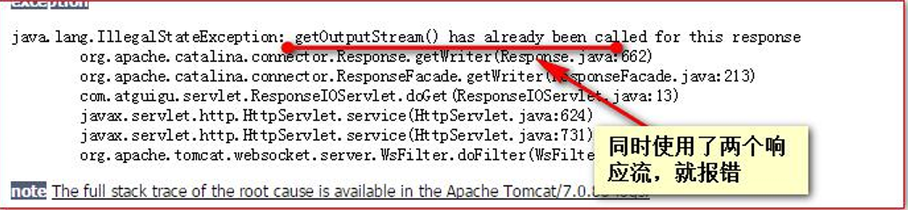

# JavaWeb概念和环境搭建

主要包含一些基础概念和工具的使用配置。

## 1. JavaWeb 的概念
- a)什么是 JavaWeb
JavaWeb 是指，所有通过 Java 语言编写可以通过浏览器访问的程序的总称，叫 JavaWeb。 JavaWeb 是基于请求和响应来开发的。
- b)什么是请求
请求是指客户端给服务器发送数据，叫请求 Request。
- c)什么是响应
响应是指服务器给客户端回传数据，叫响应 Response。
- d)请求和响应的关系
请求和响应是成对出现的，有请求就有响应。


## 2. Web 资源的分类
web 资源按实现的技术和呈现的效果的不同，又分为静态资源和动态资源两种。
- 静态资源： html、css、js、txt、mp4 视频 ,jpg 图片 
- 动态资源： jsp 页面、Servlet 程序
## 3. 常用的 Web 服务器
- **Tomcat**：由 Apache 组织提供的一种 Web 服务器，提供对 jsp 和  Servlet 的支持。它是一种轻量级的 javaWeb 容器（服务器），也是当前应用最广的 JavaWeb 服务器（免费）。
- Jboss：是一个遵从 JavaEE 规范的、开放源代码的、纯 Java 的 EJB 服务器，它支持所有的 JavaEE 规范（免费）。
- GlassFish： 由 Oracle 公司开发的一款 JavaWeb 服务器，是一款强健的商业服务器，达到产品级质量（应用很少）。
- Resin：是 CAUCHO 公司的产品，是一个非常流行的服务器，对 servlet 和 JSP 提供了良好的支持， 性能也比较优良，resin 自身采用 JAVA 语言开发（收费，应用比较多）。
- WebLogic：是 Oracle 公司的产品，是目前应用最广泛的 Web 服务器，支持 JavaEE 规范， 而且不断的完善以适应新的开发要求，适合大型项目（收费，用的不多，适合大公司）。

## 4. Tomcat 服务器和 Servlet 版本的对应关系

当前企业常用的版本 7.\*、8.\*


Servlet 程序从 2.5 版本是现在世面使用最多的版本（xml 配置） 到了 Servlet3.0 之后。就是注解版本的 Servlet 使用。

## 5. Tomcat 的使用
- a)安装
找到你需要用的 Tomcat 版本对应的 zip 压缩包，解压到需要安装的目录即可。
我安装在D:\developer_tools\Java_install
- b)目录介绍
    - bin 专门用来存放 Tomcat 服务器的可执行程序 
    - conf 专门用来存放 Tocmat 服务器的配置文件 
    - lib 专门用来存放 Tomcat 服务器的 jar 包 
    - logs 专门用来存放 Tomcat 服务器运行时输出的日记信息 
    - temp 专门用来存放 Tomcdat 运行时产生的临时数据 
    - webapps 专门用来存放部署的 Web 工程。 
    - work 是 Tomcat 工作时的目录，用来存放 Tomcat 运行时 jsp 翻译为 Servlet 的源码，和 Session 钝化的目录。

- c)如何启动 Tomcat 服务器
    - 找到 Tomcat 目录下的 bin 目录下的 startup.bat 文件，双击，就可以启动 Tomcat 服务器
    - 如何测试 Tomcat 服务器启动成功？？？
        >打开浏览器，在浏览器地址栏中输入以下地址测试： 
        1、http://localhost:8080 
        2、http://127.0.0.1:8080 
        3、http://真实 ip:8080
    - 另一种启动 tomcat 服务器的方式
    1、打开命令行 
    2、cd 到 Tomcat 的 bin 目录下
    3、敲入启动命令： catalinarun

- d)Tomcat 的停止
1、点击 tomcat 服务器窗口的 x 关闭按钮 
2、把 Tomcat 服务器窗口置为当前窗口，然后按快捷键 Ctrl+C 
3、找到 Tomcat 的 bin 目录下的 shutdown.bat 双击，就可以停止 Tomcat 服务器

- e)如何修改 Tomcat 的端口号
Mysql 默认的端口号是：3306 
Tomcat 默认的端口号是：8080
    >找到 Tomcat 目录下的 conf 目录，找到 server.xml 配置文件
    平时上百度：http://www.baidu.com:80
    HTTP 协议默认的端口号是：80.

- f) 如何部暑 web 工程到 Tomcat 中
具体细节看讲义

- g)手托html页面到浏览器和在浏览器中输入http://ip:端 口号/工程名/访问的区别


- h)ROOT 的工程的访问，以及默认 index.html 页面的访问
当我们在浏览器地址栏中输入访问地址如下： 
    >http://ip:port/ ====>>>> 没有工程名的时候，默认访问的是 ROOT 工程。

    >http://ip:port/工程名/ ====>>>> 没有资源名，默认访问 index.html 页面

## 6. IDEA 整合 Tomcat 服务器
操作的菜单如下：File | Settings | Build, Execution, Deployment | Application Servers


## 7. IDEA 中动态 web 工程的操作
### a)IDEA 中如何创建动态 web 工程
1.以java新建module，然后add webapp
2.导入servlet-api.jar（可以在Tomcat的lib中找到）在内的javaweb所需的jar包
3.配置Tomcat
4.跑一下

或者 b站视频p116开始
或者 CSDN收藏的两种web创建方式结合
>https://blog.csdn.net/m0_43435611/article/details/109196723

>https://blog.csdn.net/weixin_43716048/article/details/108639475

### b)Web 工程的目录介绍


### c)如何给动态 web 工程添加额外 jar 包
1、可以打开项目结构菜单操作界面，添加一个自己的类库：

2、添加你你类库需要的 jar 包文件。

3、选择你添加的类库，给哪个模块使用：

4、选择 Artifacts 选项，将类库，添加到打包部署中


### d)如何在 IDEA 中部署工程到 Tomcat 上运行
1、建议修改 web 工程对应的 Tomcat 运行实例名称：


2、确认你的 Tomcat 实例中有你要部署运行的 web 工程模块：


3、你还可以修改你的 Tomcat 实例启动后默认的访问地址


4、重启 Tomcat 运行实例：


5、配置资源热部署


***


# Servlet 学习
## 1.Servlet 技术
### 1.1 什么是 Servlet

>1、Servlet 是 JavaEE 规范之一。规范就是接口 

>2、Servlet 就 JavaWeb 三大组件之一。三大组件分别是：Servlet 程序、Filter 过滤器、Listener 监听器。 

>3、Servlet 是运行在服务器上的一个 java 小程序，它可以接收客户端发送过来的请求，并响应数据给客户端。

### 1.2 手动实现 Servlet 程序
步骤：
1.2.1、编写一个类去实现 Servlet 接口 
1.2.2、实现 service 方法，处理请求，并响应数据 
1.2.3、到 web.xml 中去配置 servlet 程序的访问地址</br>

1.2.1 实现Servlet接口程序的示例：
```java
/**
 * @author fzkstart
 * @create 2020-12-12 21:53
 */
public class HelloServlet implements Servlet {
    public HelloServlet() {
        System.out.println("1.执行构造器方法");
    }

    @Override
    public void init(ServletConfig servletConfig) throws ServletException {
        System.out.println("2.执行init初始化");

//        1、可以获取 Servlet 程序的别名 servlet-name 的值
        System.out.println("HelloServlet的别名是："+servletConfig.getServletName());
//        2、获取初始化参数 init-param
        System.out.println("初始化参数username的值是："+servletConfig.getInitParameter("username"));
        System.out.println("初始化参数url的值是："+servletConfig.getInitParameter("url"));
//        3、获取 ServletContext 对象
        System.out.println(servletConfig.getServletContext());
    }

    @Override
    public ServletConfig getServletConfig() {
        return null;
    }

    /**
     * service 方法是专门用来处理请求和响应的
     * @param servletRequest
     * @param servletResponse
     * @throws ServletException
     * @throws IOException
     */
    @Override
    public void service(ServletRequest servletRequest, ServletResponse servletResponse) throws ServletException, IOException {
        System.out.println("3.执行service方法；Hello,servlet");
        // 类型转换（因为它有getMethod()方法）
        HttpServletRequest httpServletRequest = (HttpServletRequest) servletRequest;
        // 获取请求的方式
        String method = httpServletRequest.getMethod();

        if ("GET".equals(method)) {
            System.out.println("get请求");
        } else if ("POST".equals(method)) {
            System.out.println("post请求");
        }

    }

    @Override
    public String getServletInfo() {
        return null;
    }

    @Override
    public void destroy() {
        System.out.println("4.执行销毁方法");
    }
}
```
1.2.3 web.xml 中的配置:
```xml
<?xml version="1.0" encoding="UTF-8"?>
<web-app xmlns="http://xmlns.jcp.org/xml/ns/javaee"
         xmlns:xsi="http://www.w3.org/2001/XMLSchema-instance"
         xsi:schemaLocation="http://xmlns.jcp.org/xml/ns/javaee http://xmlns.jcp.org/xml/ns/javaee/web-app_4_0.xsd"
         version="4.0">

    <!--context-param是上下文参数(它属于整个web工程)-->
    <context-param>
        <param-name>username</param-name>
        <param-value>context</param-value>
    </context-param>
    <!--context-param是上下文参数(它属于整个web工程)-->
    <context-param>
        <param-name>password</param-name>
        <param-value>root</param-value>
    </context-param>

    <!--servlet标签给Tomcat配置servlet程序-->
    <servlet>
        <!--servlet-name标签 Servlet程序起一个别名（一般是类名） -->
        <servlet-name>HelloServlet</servlet-name>
        <!--servlet-class是Servlet程序的全类名-->
        <servlet-class>com.learn1.servlet.HelloServlet</servlet-class>
        <!--init-param是初始化参数-->
        <init-param>
            <!--是参数名-->
            <param-name>username</param-name>
            <!--是参数值-->
            <param-value>root</param-value>
        </init-param>
        <!--init-param是初始化参数-->
        <init-param>
            <!--是参数名-->
            <param-name>url</param-name>
            <!--是参数值-->
            <param-value>jdbc:mysql://localhost:3306/test</param-value>
        </init-param>
    </servlet>

    <!--servlet-mapping标签给servlet程序配置访问地址-->
    <servlet-mapping>
        <!--servlet-name标签的作用是告诉服务器，我当前配置的地址给哪个Servlet程序使用-->
        <servlet-name>HelloServlet</servlet-name>
        <!--
           url-pattern标签配置访问地址                                     <br/>
              / 斜杠在服务器解析的时候，表示地址为：http://ip:port/工程路径          <br/>
              /hello 表示地址为：http://ip:port/工程路径/hello              <br/>
       -->
        <url-pattern>/hello</url-pattern>
    </servlet-mapping>
</web-app>
```

### 1.3 url 地址到 Servlet 程序的访问


### 1.4 Servlet 的生命周期
- 1、执行 Servlet 构造器方法 
    >不用自己写，用默认的就行。
- 2、执行 init 初始化方法
    >第一、二步，是在第一次访问的时候创建 Servlet 程序会调用。
    一般不覆盖，如果有初始化代码（如得到一个数据库连接，或向其他对象注册），就需要覆盖init()，同时要注意覆盖的时候必须注意
    注意点：
    

- 3、执行 service 方法 第三步，每次访问都会调用。
    >每个客户的请求到来的时候，容器都会开始一个新的**线程**，或者从线程池分配一个线程，并调用Servlet的service方法。一般都不会去覆盖这个方法。要覆盖的是doGet和doPost方法。
- 4、执行 destroy 销毁方法 第四步，在 web 工程停止的时候调用。


## 2. HTTPServlet
### 2.1 通过继承 HttpServlet 实现 Servlet 程序
一般在实际项目开发中，都是使用继承 HttpServlet 类的方式去实现 Servlet 程序。
步骤：
>1、编写一个类去继承 HttpServlet 类 
2、根据业务需要重写 doGet 或 doPost 方法
3、到 web.xml 中的配置 Servlet 程序的访问地址

HttpServlet 类的代码：
```java
/**
 * @author fzkstart
 * @create 2020-12-13 0:09
 */
public class HelloServlet2 extends HttpServlet {
    public HelloServlet2() {
        super();
    }

    @Override
    public void init(ServletConfig config) throws ServletException {
        super.init(config);
        System.out.println("重写了init初始化方法,做了一些工作");
    }

    /**
     * 在get请求时候调用
     * @param req
     * @param resp
     * @throws ServletException
     * @throws IOException
     */
    @Override
    protected void doGet(HttpServletRequest req, HttpServletResponse resp) throws ServletException, IOException {
        System.out.println("HelloServlet2 的doGet方法");
        // 也可以使用.
        ServletConfig servletConfig = getServletConfig();
        System.out.println(servletConfig);

        //        2、获取初始化参数init-param
        System.out.println("初始化参数username的值是;" + servletConfig.getInitParameter("username"));
        System.out.println("初始化参数url的值是;" + servletConfig.getInitParameter("url"));
    }

    /**
     * 在post请求时调用
     * @param req
     * @param resp
     * @throws ServletException
     * @throws IOException
     */
    @Override
    protected void doPost(HttpServletRequest req, HttpServletResponse resp) throws ServletException, IOException {
        System.out.println("HelloServlet2 doPost请求");
    }
}
```
web.xml 中的配置
```xml
    <servlet>
        <servlet-name>HelloServlet2</servlet-name>
        <servlet-class>com.learn1.servlet.HelloServlet2</servlet-class>
        <!--init-param是初始化参数-->
        <init-param>
            <!--是参数名-->
            <param-name>username</param-name>
            <!--是参数值-->
            <param-value>root2</param-value>
        </init-param>
        <init-param>
            <!--是参数名-->
            <param-name>url</param-name>
            <!--是参数值-->
            <param-value>jdbc:mysql://localhost:3306/test</param-value>
        </init-param>
    </servlet>

    <servlet-mapping>
        <servlet-name>HelloServlet2</servlet-name>
        <url-pattern>/hello2</url-pattern>
    </servlet-mapping>
```

### 2.2 使用 IDEA 创建 Servlet 程序


h)Servlet 类的继承体系


## 3. ServletConfig 类
### 3.1 ServletConfig类的介绍
>ServletConfig 类从类名上来看，就知道是 Servlet 程序的**配置信息类**。
Servlet 程序和 ServletConfig 对象都是由 Tomcat 负责创建，我们负责使用。 
Servlet 程序默认是第一次访问的时候创建，
ServletConfig 是每个 Servlet 程序创建时，就创建一个对应的 ServletConfig 对象。

### 3.2 ServletConfig 类的三大作用
1、可以获取 Servlet 程序的别名 servlet-name 的值 
2、获取初始化参数 init-param （如数据库或企业bean的查找名）
3、获取 ServletContext 对象，用于访问ServletContext。
代码可以参考前面的。


## 4. ServletContext 类
### 4.1 ServletContext介绍
1、ServletContext 是一个接口，它表示 Servlet 上下文对象 
2、一个 web 工程，只有一个 ServletContext 对象实例。 
3、ServletContext 对象是一个域对象。 
4、ServletContext 是在 web 工程部署启动的时候创建。在 web 工程停止的时候销毁。
5、相当于应用公告栏，访问web应用参数。

什么是域对象? 
域对象，是可以像 Map 一样存取数据的对象，叫域对象。 这里的域指的是存取数据的操作范围，整个 web 工程。

|       |存数据           | 取数据          |删除数据          |
|-------|----------------|-----------------|------------------|
|Map    |put()           | get()           |remove()          | 
|域对象  | setAttribute() |getAttribute()   |removeAttribute() |


### 4.2 ServletContext 类的四个作用
1、获取 web.xml 中配置的上下文参数 context-param 
2、获取当前的工程路径，格式:/工程路径 
3、获取工程部署后在服务器硬盘上的绝对路径 
4、像 Map 一样存取数据

代码演示：
```java
/**
 * @author fzkstart
 * @create 2020-12-13 23:38
 */
public class ContextServlet extends HttpServlet {
    protected void doPost(HttpServletRequest request, HttpServletResponse response) throws ServletException, IOException {

    }

    protected void doGet(HttpServletRequest request, HttpServletResponse response) throws ServletException, IOException {
//        1、获取web.xml中配置的上下文参数context-param
        ServletContext context = getServletConfig().getServletContext();

        String username = context.getInitParameter("username");
        System.out.println("context-param参数username的值是:" + username);
        System.out.println("context-param参数password的值是:" + context.getInitParameter("password"));
//        2、获取当前的工程路径，格式: /工程路径
        System.out.println( "当前工程路径:" + context.getContextPath() );
//        3、获取工程部署后在服务器硬盘上的绝对路径
        /**
         *  / 斜杠被服务器解析地址为:http://ip:port/工程名/  映射到IDEA代码的web目录<br/>
         */
        System.out.println("工程部署的路径是:" + context.getRealPath("/"));
        System.out.println("工程下css目录的绝对路径是:" + context.getRealPath("/css"));
        System.out.println("工程下imgs目录1.jpg的绝对路径是:" + context.getRealPath("/imgs/1.jpg"));
    }
}
```

ServletContext 像 Map 一样存取数据
ContextServlet1 代码
```java
/**
 * @author fzkstart
 * @create 2020-12-14 14:27
 */
public class ContextServlet1 extends HttpServlet {
    protected void doPost(HttpServletRequest request, HttpServletResponse response) throws ServletException, IOException {

    }

    protected void doGet(HttpServletRequest request, HttpServletResponse response) throws ServletException, IOException {
        ServletContext context = getServletContext();
        System.out.println(context);
        System.out.println("保存之前: Context1 获取 key1的值是:"+ context.getAttribute("key1"));
        context.setAttribute("key1","value1");
        System.out.println("Context1 中获取域数据key1的值是:"+ context.getAttribute("key1"));
    }
}
```
ContextServlet2 代码
```java
public class ContextServlet2 extends HttpServlet {
    protected void doGet(HttpServletRequest request, HttpServletResponse response) throws ServletException, IOException {
        ServletContext context = getServletContext();
        System.out.println(context);
        System.out.println("Context2 中获取域数据key1的值是:"+ context.getAttribute("key1"));
    }
}
```

## 5. HTTP 协议
a)什么是 HTTP 协议
什么是协议? 
协议是指双方，或多方，相互约定好，大家都需要遵守的规则，叫协议。
所谓 HTTP 协议，就是指，客户端和服务器之间通信时，发送的数据，需要遵守的规则，叫 HTTP 协议。
HTTP 协议中的数据又叫报文。

b)请求的 HTTP 协议格式
客户端给服务器发送数据叫请求。 
服务器给客户端回传数据叫响应。
请求又分为 GET 请求，和 POST 请求两种

**具体细节看讲义**
***


## 6. HttpServletRequest 类

### 6.1 作用
每次只要有请求进入 Tomcat 服务器，Tomcat 服务器就会把请求过来的 HTTP 协议信息解析好封装到 Request 对象中。 
然后传递到 service 方法（doGet 和 doPost）中给我们使用。我们可以通过 HttpServletRequest 对象，获取到所有请求的信息。

### 6.2 常用方法
|方法名              |作用                      |
|-------------------|--------------------------|
|i. getRequestURI() |     获取请求的资源路径    |
|ii.getRequestURL() | 获取请求的统一资源定位符(绝对路径)| 
|iii. getRemoteHost()|    获取客户端的 ip 地址| 
|iv.getHeader()      |   获取请求头           |
|v. getParameter()   |获取请求的参数           |  
|vi. getParameterValues()|获取请求的参数(多个值的时候使用)|
|vii. getMethod() |获取请求的方式 GET 或 POST |
|viii. setAttribute(key, value)| 设置域数据 |
|ix.getAttribute(key)| 获取域数据 |
|x. getRequestDispatcher() |获取请求转发对象|

API使用示例：
```java
public class RequestAPIServlet extends HttpServlet {
    @Override
    protected void doGet(HttpServletRequest req, HttpServletResponse resp) throws ServletException, IOException {
        //        i.getRequestURI()					获取请求的资源路径
        System.out.println("URI => " + req.getRequestURI());
//        ii.getRequestURL()					获取请求的统一资源定位符（绝对路径）
        System.out.println("URL => " + req.getRequestURL());
//        iii.getRemoteHost()				获取客户端的ip地址
        /**
         * 在IDEA中，使用localhost访问时，得到的客户端 ip 地址是 ===>>> 127.0.0.1<br/>
         * 在IDEA中，使用127.0.0.1访问时，得到的客户端 ip 地址是 ===>>> 127.0.0.1<br/>
         * 在IDEA中，使用 真实ip 访问时，得到的客户端 ip 地址是 ===>>> 真实的客户端 ip 地址<br/>
         */
        System.out.println("客户端 ip地址 => " + req.getRemoteHost());
//        iv.getHeader()						获取请求头
        System.out.println("请求头User-Agent ==>> " + req.getHeader("User-Agent"));
//        vii.getMethod()					获取请求的方式GET或POST
        System.out.println( "请求的方式 ==>> " + req.getMethod() );
    }
}
```

### 6.3 获取请求参数
#### 6.3.1 表单：
```html
<body>
    <form action="http://localhost:8080/demo07_servlet_war_exploded/ParameterServlet" method="get">
        用户名：<input type="text" name="username"><br/>
        密码：<input type="password" name="password"><br/>
        兴趣爱好：<input type="checkbox" name="hobby" value="cpp">C++
        <input type="checkbox" name="hobby" value="java">Java
        <input type="checkbox" name="hobby" value="js">JavaScript<br/>
        <input type="submit">
    </form>
    <form action="http://localhost:8080/demo07_servlet_war_exploded/Servlet1" method="get">
        <input type="hidden" name="action" value="login" />
        <input type="hidden" name="username" value="root" />
        <input type="submit">
    </form>
</body>
```
#### 6.3.2 java代码
```java
/**
 * 中文乱码问题的解决
 * @author fzkstart
 * @create 2020-12-14 15:56
 */
public class ParameterServlet extends HttpServlet {
    @Override
    protected void doGet(HttpServletRequest req, HttpServletResponse resp) throws ServletException, IOException {
        System.out.println("----------doGet--------");
        //获取请求的参数
        String username = req.getParameter("username");

        //doGet 请求的中文乱码解决
        //1.先 以 iso8859-1进 行 编 码
        //2.再 以 utf-8 进 行 解 码
//        username = new String(username.getBytes("iso-8859-1"), "UTF-8");

        String password = req.getParameter("password");
//        String hobby = req.getParameter("hobby");
        String[] hobbies = req.getParameterValues("hobby");
        System.out.println("用户名："+username);
        System.out.println("密码："+password);
//        System.out.println("兴趣爱好："+hobby);
        System.out.println("兴趣爱好："+ Arrays.asList(hobbies));
    }

    @Override
    protected void doPost(HttpServletRequest req, HttpServletResponse resp) throws ServletException, IOException {
        //POST 请求的中文乱码解决
        //设置请求体的字符集为UTF-8，从而解决post请求的中文乱码问题
        req.setCharacterEncoding("UTF-8");

        System.out.println("----------doPost--------");
        //获取请求的参数
        String username = req.getParameter("username");
        String password = req.getParameter("password");
//        String hobby = req.getParameter("hobby");
        String[] hobbies = req.getParameterValues("hobby");
        System.out.println("用户名："+username);
        System.out.println("密码："+password);
//        System.out.println("兴趣爱好："+hobby);
        System.out.println("兴趣爱好："+ Arrays.asList(hobbies));
    }
}
```
#### doGet 请求的中文乱码解决
```java
//获取请求参数 String username = req.getParameter("username");
//1.先以 iso8859-1进行编码
//2.再以 utf-8进行解码 
username = new String(username.getBytes("iso-8859-1"), "UTF-8");
```
#### doPOST 请求的中文乱码解决
```java
//POST 请求的中文乱码解决
//设置请求体的字符集为UTF-8，从而解决post请求的中文乱码问题
req.setCharacterEncoding("UTF-8");
```

### 6.4 请求转发
什么是请求的转发? 
>请求转发是指，服务器收到请求后，从一次资源跳转到另一个资源的操作叫请求转发。


Servlet1 代码：
```java
/**
 * 什么是请求的转发?
 * 请求转发是指，服务器收到请求后，从一次资源跳转到另一个资源的操作叫请求转发。
 * @author fzkstart
 * @create 2020-12-14 16:20
 */
public class Servlet1 extends HttpServlet {
    protected void doPost(HttpServletRequest request, HttpServletResponse response) throws ServletException, IOException {

    }

    @Override
    protected void doGet(HttpServletRequest req, HttpServletResponse resp) throws ServletException, IOException {

        // 获取请求的参数（办事的材料）查看
        String username = req.getParameter("username");
        System.out.println("在Servlet1（柜台1）中查看参数（材料）：" + username);

        // 给材料 盖一个章，并传递到Servlet2（柜台 2）去查看
        req.setAttribute("key1","柜台1的章");

        // 问路：Servlet2（柜台 2）怎么走
        /**
         * 请求转发必须要以斜杠打头，/ 斜杠表示地址为：http://ip:port/工程名/ , 映射到IDEA代码的web目录<br/>
         *
         */
//        RequestDispatcher requestDispatcher = req.getRequestDispatcher("/WEB-INF/form.html");
//        RequestDispatcher requestDispatcher = req.getRequestDispatcher("http://www.baidu.com");
        RequestDispatcher requestDispatcher = req.getRequestDispatcher("/Servlet2");

        // 走向Sevlet2（柜台 2）
        requestDispatcher.forward(req,resp);

    }
}
```
Servlet2 代码：
```java
public class Servlet2 extends HttpServlet {
    protected void doPost(HttpServletRequest request, HttpServletResponse response) throws ServletException, IOException {

    }

    protected void doGet(HttpServletRequest req, HttpServletResponse response) throws ServletException, IOException {
        // 获取请求的参数（办事的材料）查看
        String username = req.getParameter("username");
        System.out.println("在Servlet2（柜台2）中查看参数（材料）：" + username);

        //查看柜台1 是否盖章
        Object key1 = req.getAttribute("key1");
        System.out.println("柜台1是否有章："+key1);

        //处理自己的业务
        System.out.println("Servlet2处理自己的业务");
    }
}
```

### 6.5 base 标签


## Web 中的相对路径和绝对路径
在 javaWeb 中，路径分为相对路径和绝对路径两种：
相对路径是： 
>. 表示当前目录
.. 表示上一级目录 
资源名 表示当前目录/资源名

绝对路径：
> http://ip:port/工程路径/资源路径

在实际开发中，路径都使用绝对路径，而不简单的使用相对路径。 
>1、绝对路径 
2、base+相对

## web 中 / 斜杠的不同意义
在 web 中 / 斜杠 是一种绝对路径。
/ 斜杠 如果被浏览器解析，得到的地址是：http://ip:port/
>\<a href="/">斜杠\</a>

/ 斜杠 如果被服务器解析，得到的地址是：http://ip:port/工程路径 

1、\<url-pattern>/servlet1\</url-pattern> 
2、servletContext.getRealPath(“/”);
3、request.getRequestDispatcher(“/”);

特殊情况： response.sendRediect(“/”); 把斜杠发送给浏览器解析。得到http://ip:port/


## 7. HttpServletResponse 类

### 7.1 作用
HttpServletResponse 类和 HttpServletRequest 类一样。
每次请求进来，Tomcat 服务器都会创建一个 Response 对象传递给 Servlet 程序去使用。
HttpServletRequest 表示请求过来的信息，HttpServletResponse 表示所有响应的信息，我们如果需要设置返回给客户端的信息，都可以通过 HttpServletResponse 对象来进行设置。

### 7.2 两个输出流

|类型     |方法                |作用              |
|---------|-------------------|------------------|
|字节流 |getOutputStream()| 常用于下载（传递二进制数据）|
|字符流| getWriter()| 常用于回传字符串（常用）|

**注意：两个流同时只能使用一个。 使用了字节流，就不能再使用字符流，反之亦然，否则就会报错。**



### 7.3 往客户端回传数据
```java
protected void doGet(HttpServletRequest request, HttpServletResponse response) throws Exception {
//        ServletOutputStream os = response.getOutputStream();
//        System.out.println(response.getCharacterEncoding());//默认ISO-8859-1
//   响应的乱码解决方法：
//   方式1：//设置服务器的字符集为UTF-8
//        response.setCharacterEncoding("UTF-8");
//
//        //通过响应头，设置浏览器字符集为UTF-8
//        response.setHeader("Content-type","text/html;charset=UTF-8");
//    方式2：（推荐）
        // 它会同时设置服务器和客户端都使用UTF-8字符集，还设置了响应头
        // 此方法一定要在获取流对象之前调用才有效
        response.setContentType("text/html; charset=UTF-8");
        PrintWriter writer = response.getWriter();
        writer.print(name);
        writer.println(id);
        writer.write(email);
        writer.println(birth);
        writer.close();
}
```
### 7.4 响应的乱码解决
解决响应中文乱码方案一（不推荐使用）：
```java
//设置服务器字符集为 UTF-8 
resp.setCharacterEncoding("UTF-8"); 
//通过响应头，设置浏览器也使用 UTF-8 字符集 
resp.setHeader("Content-Type", "text/html; charset=UTF-8");
```
解决响应中文乱码方案二（推荐）：
```java
//它会同时设置服务器和客户端都使用UTF-8字符集，还设置了响应头
//此方法一定要在获取流对象之前调用才有效
resp.setContentType("text/html; charset=UTF-8");
```
### 7.5 查看当前服务器端字符集
>System.out.println( response.getCharacterEncoding() );


### 7.6 请求重定向
请求重定向，是指客户端给服务器发请求，然后服务器告诉客户端说我给你一些地址。你去新地址访问。叫请求重定向（因为之前的地址可能已经被废弃）。


请求重定向的两种方案
```java
    @Override
    protected void doGet(HttpServletRequest req, HttpServletResponse resp) throws ServletException, IOException {
        System.out.println("曾到此一游 Response1 ");

        req.setAttribute("key1", "value1");
    //不推荐使用方法1：
        // 1.设置响应状态码302 ，表示重定向，（已搬迁）
//        resp.setStatus(302);
        // 2.设置响应头，说明 新的地址在哪里
//        resp.setHeader("Location", "http://localhost:8080/demo07_servlet_war_exploded/Response2");
//        resp.setHeader("Location", "http://www.baidu.com");//可以访问
//        resp.setHeader("Location", "http://localhost:8080");
    //推荐使用方法2： 也可以使用相对URL
        resp.sendRedirect("http://localhost:8080/demo07_servlet_war_exploded");
    }
```


# Listener监听器
## 什么是 Listener 监听器？
1、Listener 监听器它是 JavaWeb 的三大组件之一。JavaWeb 的三大组件分别是：Servlet 程序、Filter 过滤器、Listener 监 听器。 

2、Listener 它是 JavaEE 的规范，就是接口 

3、监听器的作用是，监听某种事物的变化。然后通过回调函数，反馈给客户（程序）去做一些相应的处理。

## ServletContextListener 监听器
javax.servlet.ServletContextListener 
ServletContext 监听器

ServletContextListener 它可以监听 ServletContext 对象的创建和销毁。

ServletContext 对象在 web 工程启动的时候创建，在 web 工程停止的时候销毁。

监听到创建和销毁之后都会分别调用 ServletContextListener 监听器的方法反馈。


## 监听步骤
1、编写一个类去实现 ServletContextListener 
2、实现其两个回调方法 
3、到 web.xml 中去配置监听器

监听器实现类
```java
package com.fzk.listener;

import javax.servlet.ServletContextEvent;
import javax.servlet.ServletContextListener;

/**
 * @author fzkstart
 * @create 2021-02-11 12:28
 */
public class MyServletListenerImpl implements ServletContextListener {
    @Override
    public void contextInitialized(ServletContextEvent sce) {
        System.out.println("ServletContextListener对象创建了...");
    }

    @Override
    public void contextDestroyed(ServletContextEvent sce) {
        System.out.println("ServletContextListener对象销毁了...");
    }
}
```
web.xml 中的配置：
```xml
<!--配置监听器-->
<listener>
    <listener-class>com.fzk.listener.MyServletListenerImpl</listener-class>
</listener>
```

这个时候，启动 web 工程和正常停止 web 工程，后台都会如下打印：


>**注意：这里的监听器具体应用在后面的Spring框架。**


# filter过滤器
## 用法步骤
### 1. 实现filter接口
**注意**：这里必须将三个方法都实现，只实现doFilter方法虽然不报错，但是服务器将无法启动，即页面找不到对应的服务网站
```java
public class EncodingFilter implements Filter {
    @Override
    public void doFilter(ServletRequest servletRequest, ServletResponse servletResponse, FilterChain filterChain) throws IOException, ServletException {
        System.out.println("进入到过滤中文编码的过滤器");

        //过滤post请求中文乱码参数
        servletRequest.setCharacterEncoding("utf-8");
        //过滤响应流响应中文乱码
        servletResponse.setContentType("text/html;charset=utf-8");

        //将请求放行
        filterChain.doFilter(servletRequest,servletResponse);
    }

    @Override
    public void init(FilterConfig filterConfig) throws ServletException {

    }

    @Override
    public void destroy() {

    }
}
```
### 2. 配置过滤器
在web.xml中配置过滤器，写在servlet映射的前面
```xml
    <!--配置过滤器-->
    <filter>
        <filter-name>EncodingFilter</filter-name>
        <filter-class>com.fzk.crm.web.filter.EncodingFilter</filter-class>
    </filter>
    <filter-mapping>
        <filter-name>EncodingFilter</filter-name>
        <url-pattern>*.do</url-pattern>
    </filter-mapping>

    <servlet>
        <servlet-name>UserController</servlet-name>
        <servlet-class>com.fzk.crm.settings.controller.UserController</servlet-class>
    </servlet>
    <servlet-mapping>
        <servlet-name>UserController</servlet-name>
        <url-pattern>/settings/user/login.do</url-pattern>
    </servlet-mapping>
```
**注意**：

    对于url-pattern，要过滤后台方法（如上以.do结尾的）
    /abc/myServlet.do
    /abc/*
    /*      这样写将会过滤所有资源，那么静态页面这些也会过滤，所有不要这么写
    *.do
    /abc/*.do 错误
    abc/*.do 错误
**那么jsp页面是否需要中文编码过滤呢？**
答：一般来说，jsp页面顶部的page指令会设置编码方式，到时候去看看，如果没有可以过滤，最好还是就在jsp页面加上page指令
```html
<%@ page contentType="text/html;charset=UTF-8" language="java" isELIgnored="false" %>
```
## 登录验证的过滤器
对于一个浏览器访问站内资源，需要对每一个站内资源的连接拦截过滤，检验是否登录过。
**3个方法都要重写哦**
java代码
```java
public class LoginFilter implements Filter {
    @Override
    public void init(FilterConfig filterConfig) throws ServletException {

    }

    @Override
    public void doFilter(ServletRequest servletRequest, ServletResponse servletResponse, FilterChain filterChain) throws IOException, ServletException {
        System.out.println("进入到登录验证的过滤器");

        //验证session中有没有user对象
        //ServletRequest中没有session对象，所以强转为其子接口
        HttpServletRequest request = (HttpServletRequest) servletRequest;
        HttpServletResponse response = (HttpServletResponse) servletResponse;

        //注意：这里必须验证是不是登录页面，不然会循环进入这个过滤器
        String servletPath = request.getServletPath();
        System.out.println(servletPath);
        if ("/login.jsp".equals(servletPath) || "/settings/user/login.do".equals(servletPath)) {
            //登录页面，放行
            filterChain.doFilter(servletRequest, servletResponse);
        } else {
            Object user = request.getSession().getAttribute("user");
            if (user == null) {
                //说明没有登录过，重定向到登录页
            /*
                为什么这里使用重定向？
                    转发之后，路劲停留在老路径上，而不是跳转之后的新资源路劲
             */
                response.sendRedirect(request.getContextPath() + "/login.jsp");
            } else {
                //说明登录过，放行
                filterChain.doFilter(servletRequest, servletResponse);
            }
        }
    }

    @Override
    public void destroy() {

    }
}
```
web.xml配置拦截资源
```xml
    <!--登录验证过滤器-->
    <filter>
        <filter-name>LoginFilter</filter-name>
        <filter-class>com.fzk.crm.web.filter.LoginFilter</filter-class>
    </filter>
    <filter-mapping>
        <filter-name>LoginFilter</filter-name>
        <url-pattern>*.jsp</url-pattern>
        <url-pattern>*.do</url-pattern>
    </filter-mapping>
```


# Cookie
## Cookie 简介
cookie 是 servlet 发送到 Web 浏览器的少量信息，这些信息由浏览器保存，然后发送回服务器。cookie 的值可以**唯一地标识客户端**，因此 cookie 常用于**会话管理**。 

servlet 通过使用 HttpServletResponse#addCookie 方法将 cookie 发送到浏览器，该方法将字段添加到 HTTP 响应头，以便一次一个地将 cookie 发送到浏览器。浏览器应该支持每台 Web 服务器有 20 个 cookie，总共有 300 个 cookie，并且可能将每个 cookie 的大小限定为 **4 KB**。 


Cookie 是存储在客户端计算机上的文本文件，并保留了各种跟踪信息。Java Servlet 显然支持 HTTP Cookie。

识别返回用户包括三个步骤：

1. 服务器脚本向浏览器发送一组 Cookie。例如：姓名、年龄或识别号码等。
2. 浏览器将这些信息存储在本地计算机上，以备将来使用。
3. 当下一次浏览器向 Web 服务器发送任何请求时，浏览器会把这些 Cookie 信息发送到服务器，服务器将使用这些信息来识别用户。


## Servlet Cookie 方法
以下是在 Servlet 中操作 Cookie 时可使用的有用的方法列表。


|序号	|方法       |  描述|
|------|---------|-----|
|1|	public void setDomain(String pattern)|该方法设置 cookie 适用的域，例如 runoob.com。|
|2|	public String getDomain()|该方法获取 cookie 适用的域，例如 runoob.com。|
|3|	public void setMaxAge(int expiry)|该方法设置 cookie 过期的时间（以秒为单位）。如果不这样设置，cookie 只会在当前 session 会话中持续有效。|
|4|	public int getMaxAge()|该方法返回 cookie 的最大生存周期（以秒为单位），默认情况下，-1 表示 cookie 将持续下去，直到浏览器关闭。|
|5	|public String getName()|该方法返回 cookie 的名称。名称在创建后不能改变。|
|6|	public void setValue(String newValue)|该方法设置与 cookie 关联的值。|
|7|	public String getValue()|该方法获取与 cookie 关联的值。|
|8|	public void setPath(String uri)|该方法设置 cookie 适用的路径。如果您不指定路径，与当前页面相同目录下的（包括子目录下的）所有 URL 都会返回 cookie。|
|9|	public String getPath()|该方法获取 cookie 适用的路径。|
|10|	public void setSecure(boolean flag)|该方法设置布尔值，表示 cookie 是否应该只在加密的（即 SSL）连接上发送。|
|11|	public void setComment(String purpose)|设置cookie的注释。该注释在浏览器向用户呈现 cookie 时非常有用。|
|12|	public String getComment()|获取 cookie 的注释，如果 cookie 没有注释则返回 null。|

### 通过 Servlet 设置 Cookie
通过 Servlet 设置 Cookie 包括三个步骤：

(1) 创建一个 Cookie 对象：您可以调用带有 cookie 名称和 cookie 值的 Cookie 构造函数，cookie 名称和 cookie 值都是字符串。
```java
Cookie cookie = new Cookie("key","value");
```
请记住，无论是名字还是值，都不应该包含空格或以下任何字符：
`[ ] ( ) = , " / ? @ : ;`

(2) 设置最大生存周期：您可以使用 setMaxAge 方法来指定 cookie 能够保持有效的时间(**以秒为单位**)。下面将设置一个最长有效期为 24 小时的 cookie。
```java
cookie.setMaxAge(60*60*24); 
```
(3) 发送 Cookie 到 HTTP 响应头：您可以使用 response.addCookie 来添加 HTTP 响应头中的 Cookie，如下所示：
```java
response.addCookie(cookie);
```


### 通过 Servlet 读取 Cookie
要读取 Cookie，需要通过调用 HttpServletRequest 的 getCookies( ) 方法创建一个 javax.servlet.http.Cookie 对象的数组。然后循环遍历数组，并使用 getName() 和 getValue() 方法来访问每个 cookie 和关联的值。
```java
protected void getCookie(HttpServletRequest req,HttpServletResponse resp) throws IOException {
    Cookie[] cookies = req.getCookies();
    for(Cookie cookie:cookies){
        resp.getWriter().println("Cookie["+cookie.getName()+
        "="+cookie.getValue()+"]<br/>");
    }
}
```

### 通过 Servlet 删除 Cookie
删除 Cookie 是非常简单的。如果您想删除一个 cookie，那么您只需要按照以下三个步骤进行：

    1. 读取一个现有的 cookie，并把它存储在 Cookie 对象中。
    2. 使用 setMaxAge() 方法设置 cookie 的年龄为零，来删除现有的 cookie。
    3. 把这个 cookie 添加到响应头。

### 通过 Servlet 修改 Cookie
    方案一： 
        1、先创建一个要修改的同名（指的就是 key）的 Cookie 对象 
        2、在构造器，同时赋于新的 Cookie 值。 
        3、调用 response.addCookie(Cookie);
    方案二： 
        1、先查找到需要修改的 Cookie 对象 
        2、调用 setValue()方法赋于新的 Cookie 值。 
        3、调用 response.addCookie()通知客户端保存修改

## 浏览器查看Cookie


## Cookie的生存周期
Cookie 的生命控制指的是如何管理 Cookie 什么时候被销毁（删除）

    setMaxAge() 
        正数，表示在指定的秒数后过期 
        负数，表示浏览器一关，Cookie 就会被删除（默认值是-1） 
        零，表示马上删除 Cookie


## Cookie 有效路径 Path 的设置
Cookie 的 path 属性可以有效的过滤哪些 Cookie 可以发送给服务器。哪些不发。

path 属性是通过请求的地址来进行有效的过滤。


```java
protected void testPath(HttpServletRequest request, HttpServletResponse response) throws IOException {

    //1 创建 Cookie对象
    Cookie cookie = new Cookie("path1", "path1");
    // 2.设置最大生存周期
    cookie.setMaxAge(60*60);//-1是默认值，以秒为单位
    //3. 设置路径
    cookie.setPath( request.getContextPath() + "/abc" ); // ===>>>> / 工 程 路 径 /abc
    //4. 通 知 客 户 端 保 存 Cookie
    response.addCookie(cookie);

    response.getWriter().println("Cookie创建成功！");
}
```

## Cookie 练习---免输入用户名登录


login.jsp 页面
```html
<form action="http://localhost:8080/cookie_session/loginServlet" method="get">
    用户名：<input type="text" name="username" value="${cookie.username.value}"> <br/>
    密码：<input type="password" name="password" value="${cookie.password.value}"> <br/>
    <input type="submit" value="登录">
</form>
```
LoginServlet 程序：
```java
/**
 * @author fzkstart
 * @create 2021-02-16 16:00
 */
public class LoginServlet extends HttpServlet {
    @Override
    protected void doGet(HttpServletRequest request, HttpServletResponse response) throws ServletException, IOException {
        // 解决post乱码问题，设置请求的参数字符集为UTf-8
        request.setCharacterEncoding("UTF-8");
        response.setContentType("text/html; charset=UTF-8");
        //获取登录信息
        String username = request.getParameter("username");
        String password = request.getParameter("password");

        if("fzk".equals(username)&&"123456".equals(password)){
            //登录成功，保存Cookie
            //1 创建 Cookie对象
            Cookie cookie = new Cookie("username", username);
            Cookie cookie1 = new Cookie("password", password);
            // 2.设置最大生存周期
            cookie.setMaxAge(60*60*24*7);//保存一周
            cookie1.setMaxAge(-1);//保存在当前会话
            //4. 通 知 客 户 端 保 存 Cookie
            response.addCookie(cookie);
            response.addCookie(cookie1);

            response.getWriter().println("登录成功！");
        } else{
            //登录失败
            response.getWriter().println("登录失败！");
        }
    }
}
```


***

# Session会话
## Session 简介
    1、Session 就一个接口（HttpSession）。 
    2、Session 就是会话。它是用来维护一个客户端和服务器之间关联的一种技术。 
    3、每个客户端都有自己的一个 Session 会话。 
    4、Session 会话中，我们经常用来保存用户登录之后的信息。

## Servlet Session 跟踪
HTTP 是一种"无状态"协议，这意味着每次客户端检索网页时，客户端打开一个单独的连接到 Web 服务器，服务器会自动不保留之前客户端请求的任何记录。

但是仍然有以下三种方式来维持 Web 客户端和 Web 服务器之间的 session 会话：

### Cookies
一个 Web 服务器可以分配一个唯一的 session 会话 ID 作为每个 Web 客户端的 cookie，对于客户端的后续请求可以使用接收到的 cookie 来识别。

这可能不是一个有效的方法，因为很多浏览器不支持 cookie，所以我们建议不要使用这种方式来维持 session 会话。

### 隐藏的表单字段
一个 Web 服务器可以发送一个隐藏的 HTML 表单字段，以及一个唯一的 session 会话 ID，如下所示：
```html
<input type="hidden" name="sessionid" value="12345">
```
该条目意味着，当表单被提交时，指定的名称和值会被自动包含在 GET 或 POST 数据中。每次当 Web 浏览器发送回请求时，session_id 值可以用于保持不同的 Web 浏览器的跟踪。

这可能是一种保持 session 会话跟踪的有效方式，但是点击常规的超文本链接`（<A HREF...>）`不会导致表单提交，因此隐藏的表单字段也不支持常规的 session 会话跟踪。

### URL 重写
您可以在每个 URL 末尾追加一些额外的数据来标识 session 会话，服务器会把该 session 会话标识符与已存储的有关 session 会话的数据相关联。

例如，`http://w3cschool.cc/file.htm;sessionid=12345`，session 会话标识符被附加为 sessionid=12345，标识符可被 Web 服务器访问以识别客户端。

URL 重写是一种更好的维持 session 会话的方式，它在浏览器不支持 cookie 时能够很好地工作，但是它的缺点是会动态生成每个 URL 来为页面分配一个 session 会话 ID，即使是在很简单的静态 HTML 页面中也会如此。

## HttpSession 对象
除了上述的三种方式，Servlet 还提供了 HttpSession 接口，该接口提供了一种跨多个页面请求或访问网站时识别用户以及存储有关用户信息的方式。

javax.servlet.http 
Interface HttpSession

public interface HttpSession

提供一种方式，跨多个页面请求或对 Web 站点的多次访问标识用户并存储有关该用户的信息。 
servlet 容器使用此接口创建 HTTP 客户端和 HTTP 服务器之间的会话。会话将保留指定的时间段，跨多个连接或来自用户的页面请求。一个会话通常对应于一个用户，该用户可能多次访问一个站点。服务器能够以多种方式维护会话，比如使用 cookie 或重写 URL。 

此接口允许 servlet 
>1.查看和操作有关某个会话的信息，比如会话标识符、创建时间和最后一次访问时间 
2.将对象绑定到会话，允许跨多个用户连接保留用户信息 

您会通过调用 HttpServletRequest 的公共方法 getSession() 来获取 HttpSession 对象，如下所示：
`HttpSession session = request.getSession();`

你需要在向客户端发送任何文档内容之前调用 request.getSession()。
### 常用方法


### Session的创建和获取
    如何创建和获取 Session。它们的 API 是一样的。 
        request.getSession() 
            第一次调用是：创建 Session 会话 
            之后调用都是：获取前面创建好的 Session 会话对象。
        isNew(); 判断到底是不是刚创建出来的（新的） 
            true 表示刚创建 
            false 表示获取之前创建

    每个会话都有一个身份证号。也就是 ID 值。而且这个 ID 是唯一的。 
        getId() 得到 Session 的会话 id 值。


### Session 域数据的存取
```java
public void getAttribute(HttpServletRequest request, HttpServletResponse response) throws IOException {
    //创建和获取Session对象
    HttpSession session = request.getSession();
    Object key1 = session.getAttribute("key1");
    response.getWriter().write("从 Session 中获取出 key1 的数据是：" + key1);
}

public void setAttribute(HttpServletRequest request, HttpServletResponse response) throws IOException {
    //创建和获取Session对象
    HttpSession session = request.getSession();
    session.setAttribute("key1", "value1");
    response.getWriter().write("已经往 Session 中保存了数据");
}
```

### Session 生命周期控制
    public void setMaxInactiveInterval(intinterval) 
    设置 Session 的超时时间（**以秒为单位**），超过指定的时长，Session 就会被销毁。 
        值为正数的时候，设定 Session 的超时时长。 
        负数表示永不超时（极少使用）
    public int getMaxInactiveInterval()获取 Session 的超时时间
    public void invalidate() 让当前 Session 会话马上超时无效。

Session **默认的超时时间长为 30 分钟**。 
因为在Tomcat服务器的配置文件web.xml中默认有以下的配置，它就表示配置了当前Tomcat服务器下所有的Session 超时配置默认时长为：30 分钟。 
```xml
<session-config> 
    <session-timeout>30</session-timeout> 
</session-config>
```
如果希望你的 web 工程，默认的 Session 的超时时长为其他时长。你可以在你自己的 web.xml 配置文件中做 以上相同的配置。就可以修改你的 web 工程所有 Seession 的默认超时时长。 
```xml
<!--表示当前web工程。创建出来的所有Session默认是20分钟超时时长--> 
<session-config>
    <session-timeout>20</session-timeout> 
</session-config>
```
如果你想只**修改个别 Session 的超时时长**。就可以使用上面的 API。setMaxInactiveInterval(intinterval)来进行单独的设
置。
session.setMaxInactiveInterval(intinterval)单独设置超时时长。


#### 实例
```java
public void defaultLife(HttpServletRequest request, HttpServletResponse response) throws IOException {
    //创建和获取Session对象
    HttpSession session = request.getSession();
    int maxInactiveInterval = session.getMaxInactiveInterval();
    response.getWriter().write("MaxInactiveInterval:" + maxInactiveInterval);
}

public void life3(HttpServletRequest request, HttpServletResponse response) throws IOException {
    //创建和获取Session对象
    HttpSession session = request.getSession();
    //设置session 3秒后超时
    session.setMaxInactiveInterval(3);
    response.getWriter().write("当前 Session 已经设置为 3 秒后超时");
}

public void deleteNow(HttpServletRequest request, HttpServletResponse response) throws IOException {
    //创建和获取Session对象
    HttpSession session = request.getSession();
    //让 Session会 话 马 上 超 时
    session.invalidate();
    response.getWriter().write("Session 已经设置为超时（无效）");
}
```

## 浏览器和 Session 之间关联的技术内幕
Session 技术，底层其实是基于 Cookie 技术来实现的。
