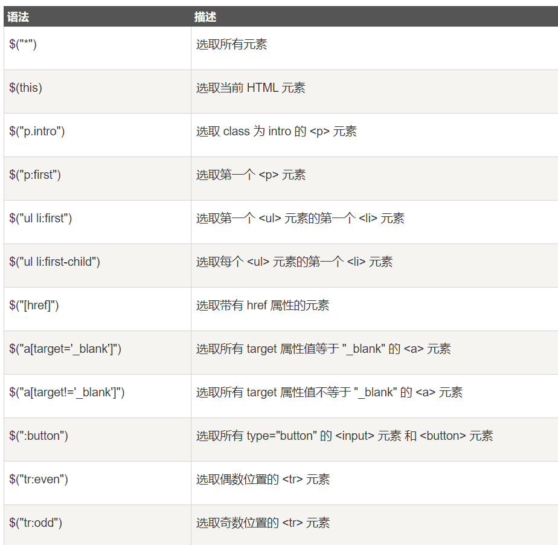
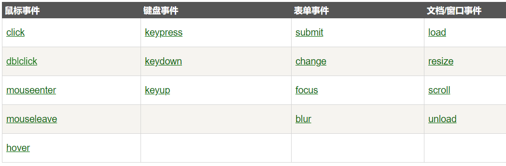
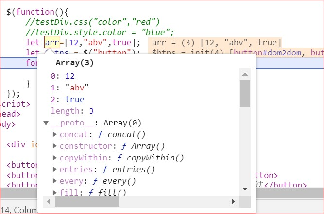
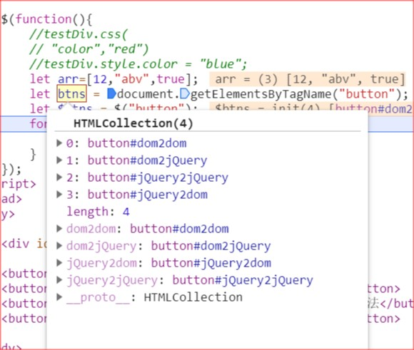
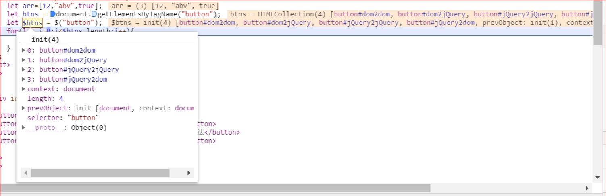
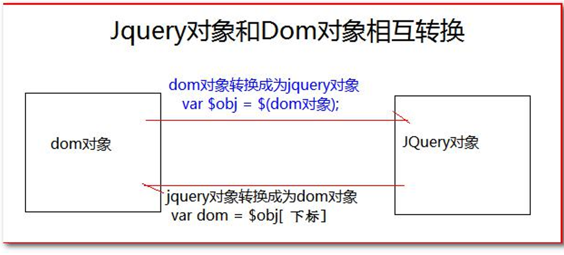
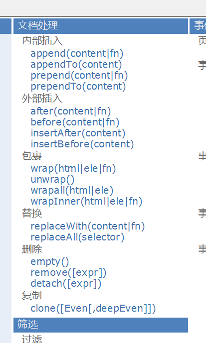

## jQuery 简介

- 什么是 jQuery?
jQuery，顾名思义，也就是 JavaScript 和查询（Query），它就是辅助 JavaScript 开发的 js 类库。
- jQuery 核心思想
它的核心思想是 write less,do more(写得更少,做得更多)，所以它实现了很多浏览器的兼容问题。
- jQuery 流行程度 
jQuery 现在已经成为最流行的 JavaScript 库，在世界前 10000 个访问最多的网站中，有超过 55%在使用 jQuery。
- jQuery 好处 
jQuery 是免费、开源的，jQuery 的语法设计可以使开发更加便捷，例如操作文档对象、选择 DOM 元素、 制作动画效果、事件处理、使用 Ajax 以及其他功能

- jQuery 的功能概括
    1、html 的元素选取

    2、html的元素操作

    3、html dom遍历和修改

    4、js特效和动画效果

    5、css操作

    6、html事件操作

    7、ajax异步请求方式

### jQuery 安装
https://www.runoob.com/jquery/jquery-install.html
两种方法：
1. 从 jquery.com 下载 jQuery 库
2. 从 CDN 中载入 jQuery, 如从 Google 中加载 jQuery

方式二：
如果您不希望下载并存放 jQuery，那么也可以通过 CDN（内容分发网络） 引用它。

Staticfile CDN、百度、又拍云、新浪、谷歌和微软的服务器都存有 jQuery 。

如果你的站点用户是国内的，建议使用百度、又拍云、新浪等国内CDN地址，如果你站点用户是国外的可以使用谷歌和微软。

Staticfile CDN:
```js
<head>
<script src="https://cdn.staticfile.org/jquery/1.10.2/jquery.min.js">
</script>
</head>
```
百度 CDN:
```js
<head>
<script src="https://apps.bdimg.com/libs/jquery/2.1.4/jquery.min.js">
</script>
</head>
```
又拍云 CDN:
```js
<head>
<script src="https://upcdn.b0.upaiyun.com/libs/jquery/jquery-2.0.2.min.js">
</script>
</head>
```
其它的cdn自行去菜鸟教程或者百度

**使用 Staticfile CDN、百度、又拍云、新浪、谷歌或微软的 jQuery，有一个很大的优势**：
>许多用户在访问其他站点时，已经从百度、又拍云、新浪、谷歌或微软加载过 jQuery。所以结果是，当他们访问您的站点时，会从缓存中加载 jQuery，这样可以减少加载时间。同时，大多数 CDN 都可以确保当用户向其请求文件时，会从离用户最近的服务器上返回响应，这样也可以提高加载速度。

## jQuery语法
常见问题？ 
1. 使用 jQuery 一定要引入 jQuery 库吗？ 
答案： 是，必须
<br/>
2. jQuery 中的$到底是什么？ 
答案： 它是一个函数
<br/>
3. 怎么为按钮添加点击响应函数的？ 
答案： 
1、使用 jQuery 查询到标签对象 
2、使用标签对象.click(function(){});

### 基础语法： 
**$(selector).action()**
- 美元符号定义 jQuery
- 选择符（selector）"查询"和"查找" HTML 元素
- jQuery 的 action() 执行对元素的操作
实例:
```
$(this).hide() - 隐藏当前元素

$("p").hide() - 隐藏所有 <p> 元素

$("p.test").hide() - 隐藏所有 class="test" 的 <p> 元素

$("#test").hide() - 隐藏 id="test" 的元素
```

### 文档就绪事件
```js
$(document).ready(function(){
   // 开始写 jQuery 代码...
});
```
这是为了防止文档在完全加载（就绪）之前运行 jQuery 代码，即在 DOM 加载完成后才可以对 DOM 进行操作。

如果在文档没有完全加载之前就运行函数，操作可能失败。

提示：**简洁写法（与以上写法效果相同）:**
```js
$(function(){
   // 开始写 jQuery 代码...
});
```

jQuery 入口函数:
```js
$(document).ready(function(){
    // 执行代码
});
或者
$(function(){
    // 执行代码
});
```
JavaScript 入口函数:
```js
window.onload = function () {
    // 执行代码
}
```
#### jQuery 入口函数与 JavaScript 入口函数的区别：

- jQuery 的入口函数是在 html 所有标签(DOM)都加载之后，就会去执行。
- JavaScript 的 window.onload 事件是等到所有内容，包括外部图片之类的文件加载完后，才会执行。

load和ready区别
||window.onload|$(document.ready())|
|-|:------------|:-------------------|
|执行时机|必须等待网页全部加装完毕（包括图片等），然后再执行包裹代码|只需要等待网页中的DOM结构加载完毕，就能执行包裹代码|
|执行次数|只能执行一次，如果第二次，那么第一次的执行会被覆盖|可以执行多次，第n次的执行不会覆盖上一次|

他们分别是在什么时候触发？ 
1、jQuery 的页面加载完成之后是浏览器的内核解析完页面的标签创建好 DOM 对象之后就会马上执行。 
2、原生 js 的页面加载完成之后，除了要等浏览器内核解析完标签创建好 DOM 对象，还要等标签显示时需要的内容加载完成。

他们执行的次数？ 
1、原生 js 的页面加载完成之后，只会执行最后一次的赋值函数。 
2、jQuery 的页面加载完成之后是全部把注册的 function 函数，依次顺序全部执行。

### $ 核心函数
\$ 是 jQuery 的核心函数，能完成 jQuery 的很多功能。\$()就是调用$这个函数
```
1、传入参数为 [ 函数 ] 时： 
    表示页面加载完成之后。相当于 window.onload=function(){}
2、传入参数为 [HTML 字符串 ] 时： 
    会对我们创建这个 html 标签对象
3、传入参数为 [ 选择器字符串 ] 时： 
    $(“#id 属性值”);        id 选择器，根据 id 查询标签对象 
    $(“标签名”);            标签名选择器，根据指定的标签名查询标签对象 
    $(“.class 属性值”);     类型选择器，可以根据 class 属性查询标签对象
4、传入参数为 [DOM 对象 ] 时： 会把这个 dom 对象转换为 jQuery 对象
```

### jQuery 选择器
jQuery 选择器允许您对 HTML 元素组或单个元素进行操作。

jQuery 选择器基于元素的 id、类、类型、属性、属性值等"查找"（或选择）HTML 元素。 它基于已经存在的 **CSS 选择器**，除此之外，它还有一些自定义的选择器。

jQuery 中所有选择器都以美元符号开头：$()。



```js
$("#id", ".class")  复合选择器
$(div p span)       层级选择器 //div下的p元素中的span元素
$(div>p)            父子选择器 //div下的所有p元素
$(div+p)            相邻元素选择器 //div后面的p元素(仅一个p)
$(div~p)            兄弟选择器  //div后面的所有p元素(同级别)
$(.p:last)          类选择器 加 过滤选择器  第一个和最后一个（first 或者 last）
$("#mytable td:odd")      层级选择 加 过滤选择器 奇偶（odd 或者 even）
$("div p:eq(2)")    索引选择器 div下的第三个p元素（索引是从0开始）
$("a[href='www.baidu.com']")  属性选择器
$("p:contains(test)")        // 内容过滤选择器，包含text内容的p元素
$(":emtyp")        //内容过滤选择器，所有空标签（不包含子标签和内容的标签）parent 相反
$(":hidden")       //所有隐藏元素 visible 
$("input:enabled") //选取所有启用的表单元素
$(":disabled")     //所有不可用的元素
$("input:checked") //获取所有选中的复选框单选按钮等
$("select option:selected") //获取选中的选项元素
```

`$(":button")` 为 jQuery 中表单选择器（貌似与过滤选择器同级），旨在选择所有的按钮，所以会找到  `<input>、<button>` 元素；而` $("button") `则为基本选择器，旨在选择为 `<button>` 的标签。

`: `即为 jQuery 的过滤选择器，语法类似于 css 中的伪类选择器；其过滤选择器大概可以分为基本过滤`（p:first 之类）、内容过滤（:empty）、子元素过滤(:first-child)和属性过滤 [href]` 选择器。

## jQuery 事件
jQuery 是为事件处理特别设计的。

### 常见事件

常见 DOM 事件：

菜鸟教程事件方法参考手册：https://www.runoob.com/jquery/jquery-ref-events.html
或者参考手册：

### jQuery 事件方法语法
在 jQuery 中，大多数 DOM 事件都有一个等效的 jQuery 方法。
```js
$("p").click(function(){
    // 动作触发后执行的代码!!
});
```
- hover()
hover()方法用于模拟光标悬停事件。
当鼠标移动到元素上时，会触发指定的第一个函数(mouseenter);当鼠标移出这个元素时，会触发指定的第二个函数(mouseleave)。
    ```js
    $("#p1").hover(
        function(){
            alert("你进入了 p1!");
        },
        function(){
            alert("拜拜! 现在你离开了 p1!");
        }
    );
    ```
- focus()
当元素获得焦点时，发生 focus 事件。
当通过鼠标点击选中元素或通过 tab 键定位到元素时，该元素就会获得焦点。
    ```html
    <!DOCTYPE html>
    <html>
    <head>
    <meta charset="utf-8"> 
    <title>菜鸟教程(runoob.com)</title> 
    <script src="https://cdn.staticfile.org/jquery/1.10.2/jquery.min.js">
    </script>
    <script>
    $(document).ready(function(){
    $("input").focus(function(){
        $(this).css("background-color","#cccccc");
    });
    $("input").blur(function(){
        $(this).css("background-color","#ffffff");
    });
    });
    </script>
    </head>
    <body>

    Name: <input type="text" name="fullname"><br>
    Email: <input type="text" name="email">

    </body>
    </html>
    ```
***

#### on() 动态绑定事件
```
click() 它可以绑定单击事件，以及触发单击事件 
mouseover() 鼠标移入事件
mouseout() 鼠标移出事件 
bind() 可以给元素一次性绑定一个或多个事件。 
one() 使用上跟 bind 一样。但是 one 方法绑定的事件只会响应一次。 
unbind() 跟 bind 方法相反的操作，解除事件的绑定 
live() 也是用来绑定事件。它可以用来绑定选择器匹配的所有元素的事件。哪怕这个元素是后面动态创建出 来的也有效
```
<strong>定义和用法</strong>
on() 方法在被选元素及子元素上添加一个或多个事件处理程序。

自 jQuery 版本 1.7 起，on() 方法是 bind()、live() 和 delegate() 方法的新的替代品。该方法给 API 带来很多便利，我们推荐使用该方法，它简化了 jQuery 代码库。

**注意**：使用 on() 方法添加的事件处理程序适用于当前及**未来的元素**（比如由脚本创建的新元素）。

**提示**：如需移除事件处理程序，请使用 off() 方法。

**提示**：如需添加只运行一次的事件然后移除，请使用 one() 方法。

语法
`$(selector).on(event,childSelector,data,function)`

|参数|	描述|
|:---|:------|
|event	|必需。规定要从被选元素添加的一个或多个事件或命名空间。由空格分隔多个事件值，也可以是数组。必须是有效的事件。|
|childSelector|	可选。规定只能添加到指定的**子元素上的事件处理程序（且不是选择器本身**，比如已废弃的 delegate() 方法）。<br/>这里对于动态生成的元素，可以对其父元素使用on方法，选择器里选择生成的新元素，这样绑定的事件只会在新元素上。|
|data|	可选。规定传递到函数的额外数据。|
|function|	可选。规定当事件发生时运行的函数。|
>**注意**：如果要绑定在动态生成的元素上，需要将selector设置为其祖辈元素，childSelector再筛选到需要绑定事件的子元素上。

更详细教程：https://www.runoob.com/jquery/event-on.html

#### on() 和 click() 的区别:

二者在绑定静态控件时没有区别，但是如果面对动态产生的控件，只有 **on() 能成功的绑定到动态控件中**。

#### 动态绑定的另一种方法
在动态生成的元素中加入一个onclick=myfunction("参数")的属性。
myfunction定义在js代码中。
**注意：此处的参数必须被引号引起来，这是硬性规定，不然参数传不进去。**


### 事件的冒泡
什么是事件的冒泡？ 
事件的冒泡是指，父子元素同时监听同一个事件。当触发子元素的事件的时候，同一个事件也被传递到了父元素的事件里去响应.
实例：
html代码：
```html
<div id="content">
    外层div元素
    <span>内层span元素</span>
    外层div元素
</div>
```
jQuery代码
```js
$(function(){
    $("#content").click(function (){
        alert("我是父亲div");
    });
    $("span").click(function (){
        alert("我是孩子span");

        //return false;
    });
})
```
结果：在这里点击了span内容会先弹出span提示，再弹div提示。

那么如何阻止事件冒泡呢？ 在子元素事件函数体内，`return false;` 可以阻止事件的冒泡传递。

### javaScript 事件对象
事件对象，是封装有触发的事件信息的一个 javascript 对象。 
我们重点关心的是怎么拿到这个 javascript 的事件对象。以及使用。

如何获取呢 javascript 事件对象呢？ 
在给元素绑定事件的时候，在事件的 function(event) 参数列表中添加一个参数，这个参数名，我们习惯取名为 event。 这个 event 就是 javascript 传递参事件处理函数的事件对象。

比如：
1. 原生 javascript 获取 事件对象
    ```js
    window.onload = function () { 
        document.getElementById("areaDiv").onclick = 
        function (event) { 
            console.log(event); 
            } 
    }
    ```
2. jQuery 代码获取 事件对象
    ```js
    $(function () { 
        $("#areaDiv").click(function (event) { 
            console.log(event); 
        }); 
    });
    ```
3. 使用 bind 同时对多个事件绑定同一个函数。怎么获取当前操作是什么事件。
    ```js
    $("#areaDiv").bind("mouseover mouseout",function (event) { 
        if (event.type == "mouseover") { 
            console.log("鼠标移入"); 
        } else if (event.type == "mouseout") { 
                console.log("鼠标移出"); 
        } 
    });
    ```


## jQuery 对象

### jQuery 对象和 dom 对象区分
#### Dom对象 
1.通过 getElementById()查询出来的标签对象是 Dom 对象 
2.通过 getElementsByName()查询出来的标签对象是 Dom 对象 
3.通过 getElementsByTagName()查询出来的标签对象是 Dom 对象 
4.通过 createElement() 方法创建的对象，是 Dom 对象

DOM 对象 Alert 出来的效果是：[object HTML标签名Element]

#### jQuery对象 
5.通过 JQuery 提供的 API 创建的对象，是 JQuery 对象 
6.通过 JQuery 包装的 Dom 对象，也是 JQuery 对象 
7.通过 JQuery 提供的 API 查询到的对象，是 JQuery 对象

jQuery 对象 Alert 出来的效果是：[object Object]

#### jQuery 对象的本质是什么？
jQuery 对象是 dom 对象的数组 +jQuery 提供的一系列功能函数。





**jQuery 对象和 Dom 对象使用区别**
```
jQuery 对象不能使用 DOM 对象的属性和方法 
    如innerHTML
DOM 对象也不能使用 jQuery 对象的属性和方法
    如$(selector).action()
```

### Dom 对象和 jQuery 对象互转
1. dom对象转化为 jQuery 对象
    1. 先有 DOM 对象 
    2. $(DOM 对象 ) 就可以转换成为 jQuery 对象

2. jQuery 对象转为 dom 对象
    1. 先有 jQuery 对象 
    2. jQuery 对象[下标]取出相应的 DOM 对象


```js
alert($(document.getElementById("testDiv"))[0]);
/*
document.getElementById("testDiv")          //dom对象
$(document.getElementById("testDiv"))       //jQuery对象
$(document.getElementById("testDiv"))[0]    //dom对象
*/
```


## jQuery选择器
更详细的可以看参考手册学习

### 1. 基本选择器
```js
$("#id")            //ID选择器
$("div")            //元素选择器
$(".classname")     //类选择器
$(".classname,.classname1,#id1")     //组合选择器(满足其一即可)
$("p.myClass")  //表示标签名必须是 p 标签，而且 class 类型还要是 myClass
```

### 2. 层级选择器
```js
$("#id>.classname ")        //子元素选择器
$("#id .classname ")        //后代元素选择器
$("#id + .classname ")      //下一个元素选择器
$("#id ~ .classname ")      //兄弟元素选择器
```

### 3. 过滤选择器

#### 3.1 基本过滤器
```js
$("li:first")    //第一个li
$("li:last")     //最后一个li
$("li:even")     //挑选下标为偶数的li
$("li:odd")      //挑选下标为奇数的li
$("li:eq(4)")    //下标等于 4 的li(第五个 li 元素)
$("li:gt(2)")    //下标大于 2 的li
$("li:lt(2)")    //下标小于 2 的li
$("li:not(#runoob)") //挑选除 id="runoob" 以外的所有li

$(":header").css("background", "#EEE"); 
//给页面内所有标题加上背景色
//匹配如 h1, h2, h3之类的标题元素


/*  :animated   返回值:Array<Element(s)>
匹配所有正在执行动画效果的元素
*/
//例子
$("#run").click(function(){
    //只有对不在执行动画效果的元素执行一个动画特效
  $("div:not(:animated)").animate({ left: "+=20" }, 1000);
});

/*  :focus  返回值:jQuery
触发每一个匹配元素的focus事件。
这将触发所有绑定的focus函数，注意，某些对象不支持focus方法。
*/
//例子：当页面加载后将 id 为 'login' 的元素设置焦点:
$("#login:focus");
```

#### 3.2 内容过滤器
```js
$("div:contains('Runob')")    // 包含 Runob文本的元素
$("td:empty")                 //不包含子元素或者文本的空元素
$("div:has(selector)")        //含有选择器所匹配的元素
$("td:parent")                //含有子元素或者文本的元素,即非空
```

#### 3.3可见性过滤选择器
```js
$("li:hidden")       //匹配所有不可见元素，或type为hidden的元素
$("li:visible")      //匹配所有可见元素
```

#### 3.4属性过滤选择器
```js
$("div[id]")        //所有含有 id 属性的 div 元素
$("div[id='123']")        // id属性值为123的div 元素
$("div[id!='123']")        // id属性值不等于123的div 元素

$("div[id^='qq']")        // id属性值以qq开头的div 元素,
                        //注意：这里没有id属性的也会被匹配

$("div[id$='zz']")        // id属性值以zz结尾的div 元素
$("div[id*='bb']")        // id属性值包含bb的div 元素
$("input[id][name$='man']") //多属性选过滤，同时满足两个属性的条件的元素

//注意：引号在大多数情况下是可选的。但在遇到诸如属性值包含"]"时，用以避免冲突。

```
```js
//8.选取 含有 title 属性值, 且title 属性值不等于 test 的 div 元素
$("#btn8").click(function() {
    $("div[title][title!='test']").css("background", "#bbffaa");
});
```

#### 3.5状态过滤选择器
```js
$("input:enabled")    // 匹配可用的 input
$("input:disabled")   // 匹配不可用的 input
$("input:checked")    // 匹配选中的 input
$("option:selected")  // 匹配选中的 option
```

### 4.表单选择器
```js
$(":input")      //匹配所有 input, textarea, select 和 button 元素
$(":text")       //所有的单行文本框，$(":text") 等价于$("[type=text]")，推荐使用$("input:text")效率更高，下同
$(":password")   //所有密码框
$(":radio")      //所有单选按钮
$(":checkbox")   //所有复选框
$(":submit")     //所有提交按钮
$(":reset")      //所有重置按钮
$(":button")     //所有button按钮
$(":file")       //所有文件域
```

#### 5. 表单对象属性过滤器
```js
    //匹配所有可用元素 
:enabled    返回值:Array<Element(s)>
    //匹配所有不可用元素
:disabled   返回值:Array<Element(s)>
    //匹配所有选中的被选中元素(复选框、单选框等，不包括select中的option)
:checked    返回值:Array<Element(s)>
    //匹配所有选中的option元素
:selected   返回值:Array<Element(s)>
```

实例1：
html代码：
```html
<form>
<input name="email" disabled="disabled" />
<input name="id" />
</form>
```
jQuery 代码:
`$("input:enabled")`
结果:
`[ <input name="id" /> ]`
jQuery 代码:
`$("input:disabled")`
结果:
`[ <input name="email" disabled="disabled" /> ]`

实例2：
HTML 代码:
```html
<form>
  <input type="checkbox" name="newsletter" checked="checked" value="Daily" />
  <input type="checkbox" name="newsletter" value="Weekly" />
  <input type="checkbox" name="newsletter" checked="checked" value="Monthly" />
</form>
```
jQuery 代码:
`$("input:checked")`
结果:
`[ <input type="checkbox" name="newsletter" checked="checked" value="Daily" />, <input type="checkbox" name="newsletter" checked="checked" value="Monthly" /> ]`

实例3:
HTML 代码:
```html
<select>
  <option value="1">Flowers</option>
  <option value="2" selected="selected">Gardens</option>
  <option value="3">Trees</option>
</select>
```
jQuery 代码:
`$("select option:selected")`
结果:
`[ <option value="2" selected="selected">Gardens</option> ]`

#### 表单选择器实例
```js
//1.对表单内 可用input 赋值操作
$("#btn1").click(function(){
    //val()可以操作表单项的value属性值
    //可以获取和设置value值，无参即为获取
    $("input:text:enabled").val("New Value");
});
//2.对表单内 不可用input 赋值操作
$("#btn2").click(function(){
    $("input:text:disabled").val("New Value Too");
});
//3.获取多选框选中的个数  使用size()方法获取选取到的元素集合的元素个数
$("#btn3").click(function(){
    alert($(":checkbox:checked").size())
});
//4.获取多选框，每个选中的value值
$("#btn4").click(function(){
    var str = "";
    var $eles = $(":checkbox:checked");
    console.log($eles);
    //遍历方式1：
    /*for(var i=0;i<$eles.size();i++){
        str += "【"+$eles[i].value+"】";
    }*/
    //方式2：
    //each方法是jQuery对象提供的用来遍历元素的方法
    //在遍历的function函数中，有一个this对象，就是当前遍历到的dom对象
    $eles.each(function(){
        str += "【"+this.value+"】";
    });
    alert(str)
});
//5.获取下拉框选中的内容  
$("#btn5").click(function(){
    var str = "";
    //注意这个选择器的特殊，因为select里面的option是真正的被选择项，
    //所以 :selected 选择器和 select[name='test']选择器的关系是子父关系
    //必须按照基本选择器选择后代的方法选
    var els = $("select option:checked");
    console.log(els);
    for(var i=0;i<els.size();i++){
        str += "【"+$(els[i]).val()+"】";
    }
    alert(str)
});
```

## jQuery元素筛选
**这里细节看参考手册使用示例和说明**
### 过滤
||描述|备注|
|-|---|---|
|eq() |获取给定索引的元素 |功能跟 :eq() 一样|
|first()| 获取第一个元素 |功能跟 :first 一样 |
|last() |获取最后一个元素 |功能跟 :last 一样 |
|filter(exp) |留下匹配的元素 ||
|is(exp) |判断是否匹配给定的选择器，只要有一个匹配就返回，true|
|has(exp)| 返回包含有匹配选择器的元素的元素| 功能跟 :has 一样 |
|not(exp) |删除匹配选择器的元素| 功能跟 :not 一样 |

### 查找
||描述|备注|
|-|:---|:---|
|children(exp)| 返回匹配给定选择器的子元素 |功能跟 parent>child 一样 |
|find(exp) |返回匹配给定选择器的后代元素 |功能跟 ancestordescendant 一样|
|next() |返回当前元素的下一个兄弟元素 |功能跟 prev+next 功能一样|
|nextAll() |返回当前元素后面所有的兄弟元素 |功能跟 prev~siblings 功能一样 |
|nextUntil() |返回当前元素到指定匹配的元素为止的后面元素||
|parent() |返回父元素|
|prev(exp)|返回当前元素的上一个兄弟元素||
|prevAll() |返回当前元素前面所有的兄弟元素 ||
|prevUnit(exp)| 返回当前元素到指定匹配的元素为止的前面元素 |
|siblings(exp) |返回所有兄弟元素 |

### 串联
add() 把 add 匹配的选择器的元素添加到当前 jquery 对象中


### 实例：
```js
//(1)eq()  选择索引值为等于 3 的 div 元素
$("#btn1").click(function(){
    $("div").eq(3).css("background-color","#bfa");
});
//(2)first()选择第一个 div 元素
    $("#btn2").click(function(){
        //first()   选取第一个元素
    $("div").first().css("background-color","#bfa");
});
//(3)last()选择最后一个 div 元素
$("#btn3").click(function(){
    //last()  选取最后一个元素
    $("div").last().css("background-color","#bfa");
});
//(4)filter()在div中选择索引为偶数的
$("#btn4").click(function(){
    //filter()  过滤   传入的是选择器字符串
    $("div").filter(":even").css("background-color","#bfa");
});
    //(5)is()判断#one是否为:empty或:parent
//is用来检测jq对象是否符合指定的选择器
$("#btn5").click(function(){
    alert($("#one").is(":empty"));
    alert($("#one").is(":parent"));
});

//(6)has()选择div中包含.mini的
$("#btn6").click(function(){
    //has(selector)  选择器字符串    是否包含selector
    $("div").has(".mini").css("background-color","#bfa");
});
//(7)not()选择div中class不为one的
$("#btn7").click(function(){
    //not(selector)  选择不是selector的元素
    $("div").not(".one").css("background-color","#bfa");
});
//(8)children()在body中选择所有class为one的div子元素
$("#btn8").click(function(){
    //children()  选出所有的子元素
    $("body").children("div.one").css("background-color","#bfa");
});


//(9)find()在body中选择所有class为mini的div元素
$("#btn9").click(function(){
    //find()  选出所有的后代元素
    $("body").find("div.mini").css("background-color","#bfa");
});
//(10)next() #one的下一个div
$("#btn10").click(function(){
    //next()  选择下一个兄弟元素
    $("div#one").next("div").css("background-color","#bfa");
});
//(11)nextAll() #one后面所有的span元素
$("#btn11").click(function(){
    //nextAll()   选出后面所有的元素
    $("#one").nextAll("span").css("background-color","#bfa");
});
//(12)nextUntil() #one和span之间的元素
$("#btn12").click(function(){
    //
    $("#one").nextUntil("span").css("background-color","#bfa")
});
//(13)parent() .mini的父元素
$("#btn13").click(function(){
    $(".mini").parent().css("background-color","#bfa");
});
//(14)prev() #two的上一个div
$("#btn14").click(function(){
    //prev()  
    $("#two").prev("div").css("background-color","#bfa")
});
//(15)prevAll() span前面所有的div
$("#btn15").click(function(){
    //prevAll()   选出前面所有的元素
    $("span").prevAll("div").css("background-color","#bfa")
});
//(16)prevUntil() span向前直到#one的元素
$("#btn16").click(function(){
    //prevUntil(exp)   找到之前所有的兄弟元素直到找到exp停止
    $("span").prevUntil("#one").css("background-color","#bfa")
});
//(17)siblings() #two的所有兄弟元素
$("#btn17").click(function(){
    //siblings()    找到所有的兄弟元素，包括前面的和后面的
    $("#two").siblings().css("background-color","#bfa")
});


//(18)add()选择所有的 span 元素和id为two的元素
$("#btn18").click(function(){

    //   $("span,#two,.mini,#one")
    $("span").add("#two")
            .add(".mini").add("#one").css("background-color","#bfa");
    
});
```


## jQuery HTML

jQuery 拥有可操作 HTML 元素和属性的强大方法。

**jQuery DOM 操作**
jQuery 中非常重要的部分，就是操作 DOM 的能力。

jQuery 提供一系列与 DOM 相关的方法，这使访问和操作元素和属性变得很容易。

菜鸟教程：https://www.runoob.com/jquery/jquery-dom-get.html
### 属性获取和设置


|属性和方法|描述|备注|
|:---------|:----|:----|
|html() |它可以设置和获取起始标签和结束标签中的内容。 |跟 dom 属性innerHTML 一样。|
|text() |它可以设置和获取起始标签和结束标签中的文本。 |跟 dom 属性 innerText 一样。|
| val() |它可以设置和获取表单项的 value 属性值。| 跟 dom 属性 value 一样|
|attr()|可以设置和获取属性的值，不推荐操作 checked、readOnly、selected、disabled 等等|attr 方法还可以操作非标准的属性。比如自定义属性：abc,bbj|
|prop() |可以设置和获取属性的值,只推荐操作 checked、readOnly、selected、disabled 等等||


实例：
```js
//批量操作单选
$(":radio").val(["radio2"]);
//批量操作复选框的选中状态
$(":checkbox").val(["checkbox3","checkbox1","checkbox2"]);
//批量操作下拉多选
$("#multiple").val(["mul3","mul2"]);
//批量操作下拉单选
$("#single").val(["sin2"]);


//attr()
//获取属性值
alert($(":checkbox:first").attr("name"));
//设置属性值
$(":checkbox:first").attr("name","abc");
//同时设置多个属性值
$("#runoob").attr({
    "href" : "http://www.runoob.com/jquery",
    "title" : "jQuery 教程"
});


//prop()
alert($(":checkbox:first").prop("checked"));
$(":checkbox:first").prop("checked",true);
```

#### attr 和 prop 的区别介绍：

对于 HTML 元素本身就带有的固有属性，在处理时，使用 prop 方法。

对于 HTML 元素我们自己自定义的 DOM 属性，在处理时，使用 attr 方法。

实例 1：
`<a href="https://www.runoob.com" target="_self" class="btn">菜鸟教程</a>`
    这个例子里` <a> `元素的 DOM 属性有: href、target 和 class，这些属性就是` <a> `元素本身就带有的属性，也是 W3C 标准里就包含有这几个属性，或者说在 IDE 里能够智能提示出的属性，这些就叫做固有属性。处理这些属性时，建议使用 prop 方法。

`<a href="#" id="link1" action="delete" rel="nofollow">删除</a>`
这个例子里` <a>` 元素的 DOM 属性有: href、id 和 action，很明显，前两个是固有属性，而后面一个 action 属性是我们自己自定义上去的，`<a> `元素本身是没有这个属性的。这种就是自定义的 DOM 属性。处理这些属性时，建议使用 attr 方法。


#### prop()函数的结果:

    1.如果有相应的属性，返回指定属性值。
    
    2.如果没有相应的属性，返回值是空字符串。

#### attr()函数的结果:

    1.如果有相应的属性，返回指定属性值。
    
    2.如果没有相应的属性，返回值是 undefined。

对于HTML元素本身就带有的固有属性，在处理时，使用prop方法。

对于HTML元素我们自己自定义的DOM属性，在处理时，使用 attr 方法。

具有 true 和 false 两个属性的属性，如 checked, selected 或者 disabled 使用prop()


#### 回调函数
jQuery的方法text()、html()、val()、attr() 拥有回调函数
回调函数有两个参数：被选元素列表中当前元素的下标，以及原始（旧的）值。然后以函数新值返回您希望使用的字符串。
```js
$("#btn1").click(function(){
    $("#test1").text(function(i,origText){
        return "旧文本: " + origText + " 新文本: Hello world! (index: " + i + ")"; 
    });
});
 
$("#btn2").click(function(){
    $("#test2").html(function(i,origText){
        return "旧 html: " + origText + " 新 html: Hello <b>world!</b> (index: " + i + ")"; 
    });
});

$("button").click(function(){
  $("#runoob").attr("href", function(i,origValue){
    return origValue + "/jquery"; 
  });
});
```

### DOM 的增删改



通过 jQuery，可以很容易地添加新元素/内容。

#### 内部插入
```
append() - 在被选元素的结尾插入内容
prepend() - 在被选元素的开头插入内容
appendTo()      a.appendTo(b)   把 a 插入到 b 子元素末尾，成为最后一个子元素
prependTo()     a.prependTo(b)  把 a 插到 b 所有子元素前面，成为第一个子元素
```

```js
$("#btn1").click(function(){
$("p").append(" <b>追加文本</b>。");
});

$("#btn2").click(function(){
$("ol").append("<li>追加列表项</li>");
});

$("#btn1").click(function(){
$("<b>追加文本</b>。").appendTo("p");
});

function appendText(){
	var txt1="<p>文本-1。</p>";              // 使用 HTML 标签创建文本
	var txt2=$("<p></p>").text("文本-2。");  // 使用 jQuery 创建文本
	var txt3=document.createElement("p");
	txt3.innerHTML="文本-3。";               // 使用 DOM 创建文本 text with DOM
	$("body").append(txt1,txt2,txt3);        // 追加新元素
}
```

#### 外部插入
```
after() -   在被选元素之后插入内容
before() -  在被选元素之前插入内容
insertAfter()   a.insertAfter(b)        得到 ba 
insertBefore()  a.insertBefore(b)       得到 ab
```
```js
$("#btn1").click(function(){
$("img").before("<b>之前</b>");
});

$("#btn2").click(function(){
$("img").after("<i>之后</i>");
});
```

#### 替换
```
replaceWith()   a.replaceWith(b)    用 b 替换掉 a 
replaceAll()    a.replaceAll(b)     用 a 替换掉所有 b
```

#### 删除
```
remove()    a.remove();     删除 a 标签 
empty()     a.empty();      清空 a 标签里的内容
remove() - 删除被选元素（及其子元素）
empty() - 从被选元素中删除子元素
```
##### 过滤被删除的元素
jQuery remove() 方法也可接受一个参数，允许您对被删元素进行过滤。

该参数可以是任何 jQuery 选择器的语法。
```js
//下面的例子删除 class="italic" 的所有 <p> 元素：
$("p").remove(".italic");
```


**注意：**
    插入替换和删除都具有破坏性


#### 一定要看的实例
```html
<!DOCTYPE HTML PUBLIC "-//W3C//DTD HTML 4.01//EN" "http://www.w3.org/TR/html4/strict.dtd">
<html>
<head>
<meta http-equiv="Content-Type" content="text/html; charset=UTF-8">
<title>Untitled Document</title>
<link rel="stylesheet" type="text/css" href="styleB/css.css" />
<script type="text/javascript" src="../../script/jquery-1.7.2.js"></script>
<script type="text/javascript">

	$(function (){
		//给submit绑定单击事件
		$("#addEmpButton").click(function (){
			//获取输入框中的参数
			let empName = $("#empName").val();
			let email = $("#email").val();
			let salary = $("#salary").val();

			//创建tr,添加到显示表格
			$("<tr></tr>").append("<td>"+empName+"</td>")
						.append("<td>"+email+"</td>")
						.append("<td>"+salary+"</td>")
						.append("<td><a href='deleteEmp?id=003'>Delete</a></td>")
						.appendTo("#employeeTable");
			//给新增的a标签绑定单击事件
			$("a").click(delA);//注意，这里一定不能写成delA()

		});

		//给原来的a标签绑定单击事件
		$("a").click(delA);//注意，这里一定不能写成delA()

		//删除函数
		function delA(){
			//获取点击准备删除的对象
			let name = $(this).parent().parent().find("td:eq(0)").text();
			let confirm1 = confirm("你确定要删除" +name+
					"吗？");
			//返回true要删除
			if(confirm1===true){
				$(this).parent().parent().remove();
			}
			//return false 可以阻止 元素的默认行为。
			return false;
		}
	});


	
</script>
</head>
<body>

	<table id="employeeTable">
		<tr>
			<th>Name</th>
			<th>Email</th>
			<th>Salary</th>
			<th>&nbsp;</th>
		</tr>
		<tr>
			<td>Tom</td>
			<td>tom@tom.com</td>
			<td>5000</td>
			<td><a href="deleteEmp?id=001">Delete</a></td>
		</tr>
		<tr>
			<td>Jerry</td>
			<td>jerry@sohu.com</td>
			<td>8000</td>
			<td><a href="deleteEmp?id=002">Delete</a></td>
		</tr>
		<tr>
			<td>Bob</td>
			<td>bob@tom.com</td>
			<td>10000</td>
			<td><a href="deleteEmp?id=003">Delete</a></td>
		</tr>
	</table>

	<div id="formDiv">
	
		<h4>添加新员工</h4>

		<table>
			<tr>
				<td class="word">name: </td>
				<td class="inp">
					<input type="text" name="empName" id="empName" />
				</td>
			</tr>
			<tr>
				<td class="word">email: </td>
				<td class="inp">
					<input type="text" name="email" id="email" />
				</td>
			</tr>
			<tr>
				<td class="word">salary: </td>
				<td class="inp">
					<input type="text" name="salary" id="salary" />
				</td>
			</tr>
			<tr>
				<td colspan="2" align="center">
					<button id="addEmpButton" value="abc">
						Submit
					</button>
				</td>
			</tr>
		</table>

	</div>

</body>
</html>
```

### css类
jQuery 拥有若干进行 CSS 操作的方法。我们将学习下面这些：
```
addClass() - 向被选元素添加一个或多个类
removeClass() - 从被选元素删除一个或多个类
toggleClass() - 对被选元素进行添加/删除类的切换操作
css() - 设置或返回样式属性
offset() 获取和设置元素的坐标。
```
```js
addClass('c1 c2 ...' | function(i, c)) -- 添加一个或多个类。

removerClass('c1 c2 ...' | function(i, c)) -- 删除一个或多个类。

toggleClass('c1 c2 ...' | function(i, c), switch?) -- 切换一个或多个类的添加和删除。
```
第一个参数表示要添加或删除的类，既可以用类列表，也可以用函数返回值指定（i 是选择器选中的所有元素中当前对象的索引值，c 是当前对象的类名）。

**switch**: 布尔值，true 表示只添加，false 表示只删除。

实例：
```js
    var $divEle = $('div:first');
    
    $('#btn01').click(function(){
        //addClass() - 向被选元素添加一个或多个类
        $divEle.addClass("redDiv blueBorder");
    });
    
    $('#btn02').click(function(){
        //removeClass() - 从被选元素删除一个或多个类
        $divEle.removeClass("redDiv blueBorder");
    });

    
    $('#btn03').click(function(){
        //toggleClass() - 对被选元素进行添加/删除类的切换操作 
        $divEle.toggleClass("redDiv")
    });
    
    
    $('#btn04').click(function(){
        //offset() - 返回第一个匹配元素相对于文档的位置。
        let offset = $divEle.offset();
        console.log(offset);
        //设置元素的坐标
        $divEle.offset({
            top:100,
            left:50
        })
    });
```
### css() 方法
css() 方法设置或返回被选元素的一个或多个样式属性。

#### 返回 CSS 属性
下面的例子将返回首个匹配元素的 background-color 值：
`$("p").css("background-color");`

#### 设置 CSS 属性

下面的例子将为所有匹配元素设置 background-color 值：
`$("p").css("background-color","yellow");`

#### 设置多个 CSS 属性
如需设置多个 CSS 属性，请使用如下语法：

`css({"propertyname":"value","propertyname":"value",...});`
下面的例子将为所有匹配元素设置 background-color 和 font-size：

`$("p").css({"background-color":"yellow","font-size":"200%"});`


### jQuery 尺寸
通过 jQuery，很容易处理元素和浏览器窗口的尺寸。
jQuery 尺寸方法
jQuery 提供多个处理尺寸的重要方法：
```
width()
height()
innerWidth()
innerHeight()
outerWidth()
outerHeight()
```

菜鸟教程：https://www.runoob.com/jquery/jquery-dimensions.html

## jQuery 动画


### 隐藏和显示
```
show()      将隐藏的元素显示 
hide()      将可见的元素隐藏。 
toggle()    可见就隐藏，不可见就显示。
```
语法:
```js
$(selector).hide(speed,callback);

$(selector).show(speed,callback);

$(selector).toggle(speed,callback);

可选的 speed 参数规定隐藏/显示的速度，可以取以下值："slow"、"fast" 或毫秒。

可选的 callback 参数是隐藏或显示完成后所执行的函数名称。
//第二个参数是动画的回调函数 (动画完成后自动调用的函数)
```
对于可选的 callback 参数，有以下两点说明：

1.$(selector)选中的元素的个数为n个，则callback函数会执行n次；

2.callback函数名后加括号，会立刻执行函数体，而不是等到显示/隐藏完成后才执行；函数立即执行，只会调用一次， 如果不加括号，元素显示或隐藏后调用函数，才会调用多次。

3.callback既可以是函数名，也可以是匿名函数。

实例：
```js
$(document).ready(function(){
  $(".hidebtn").click(function(){
    $("div").hide(1000, "linear", add());
      // 只需要记住 有括号就先执行括号里面的,就跟我们数学基础运算一样
  });
});
    
function  add() {
    alert("Hide() 方法已完成!");
}

//add()加上括号 add是执行函数,直接执行
//若是 add 那么则可以理解为把add当作参数,由click函数调用add函数
```

### 淡入淡出
通过 jQuery，您可以实现元素的淡入淡出效果。

jQuery 拥有下面四种 fade 方法
```
fadeIn()        淡入（慢慢可见） 
fadeOut()       淡出（慢慢消失） 
fadeTo()        在指定时长内慢慢的将透明度修改到指定的值。0 透明，1 完成可见，0.5 半透明 
fadeToggle()    淡入/淡出 切换
```
语法：
```js
$(selector).fadeIn(speed,callback);

$(selector).fadeOut(speed,callback);

$(selector).fadeToggle(speed,callback);

$(selector).fadeTo(speed,opacity,callback);
注意：
fadeTo方法必需的 speed 参数规定效果的时长。它可以取以下值："slow"、"fast" 或毫秒。
fadeTo()方法中必需的 opacity 参数将淡入淡出效果设置为给定的不透明度（值介于 0 与 1 之间）。

可选的 callback 参数是该函数完成后所执行的函数名称。
```