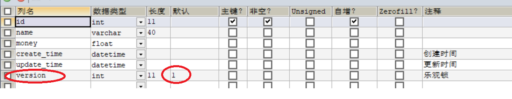

# 资料
>苞米豆官网：https://baomidou.com/

# mybatis-plus

- 润物无声：只做增强不做改变，引入它不会对现有工程产生影响，如丝般顺滑。

框架结构


## 快速开始

### 安装

> **注意**：引入 `MyBatis-Plus` 之后请不要再次引入 `MyBatis` 以及 `MyBatis-Spring`，以避免因版本差异导致的问题。

**Spring Boot**

Maven：

```xml
<dependency>
    <groupId>com.baomidou</groupId>
    <artifactId>mybatis-plus-boot-starter</artifactId>
    <version>3.4.2</version>
</dependency>
```

**Spring MVC**

Maven:

```xml
<dependency>
    <groupId>com.baomidou</groupId>
    <artifactId>mybatis-plus</artifactId>
    <version>3.4.2</version>
</dependency>
```

### 配置

1. 引入数据库驱动依赖

2. 引入数据源Druid的starter

   ```xml
   <!--mysql-->
   <dependency>
      <groupId>mysql</groupId>
      <artifactId>mysql-connector-java</artifactId>
     <!-- <version>5.1.6</version>-->
   </dependency>
   
   <!--Druid的starter-->
   <dependency>
      <groupId>com.alibaba</groupId>
      <artifactId>druid-spring-boot-starter</artifactId>
      <version>1.1.20</version>
   </dependency>
   ```

3. 配置连接数据库
    ```yaml
    spring:
      # 关闭thymeleaf的缓存可以不用重启项目而刷新页面，按ctrl+9即可
      thymeleaf:
    	cache: false
	
    # 这个是MySQL5的连接方式
      datasource:
        url: "jdbc:mysql://localhost:3306/test?useSSL=false&useUnicode=true&characterEncoding=utf-8&serverTimezone=GMT%2B8"
        username: "root"
        password: "123456"
	    # 这是mysql5的驱动
	    #driver-class-name: com.mysql.jdbc.Driver
	    # 这是mysql8的驱动
	    driver-class-name: com.mysql.cj.jdbc.Driver
	```
4. bean实体类User的书写

   ```java
   @AllArgsConstructor
   @NoArgsConstructor
   @Data
   @TableName("user_table")	// 指定表名  
   public class UserVO {
       @TableField(value = "username")
       private String userName;	// 可以通过@TableField指定列名
       private String password;
       private Integer balance;
   }
   ```

5. 新建mapper包，UserMapper接口，并继承BaseMapper<T>接口

   ```java
   @Repository
   public interface UserMapper extends BaseMapper<UserVO> {
   }
   ```

6. MyBatis-Plus 的配置异常的简单，我们仅需要一些简单的配置即可使用 MyBatis-Plus 的强大功能！

- spring boot工程

  - 配置@MapperScan注解

      ```java
      @SpringBootApplication
      @MapperScan("com.fzk.boot.mapper")
      @EnableTransactionManagement// 开启事务
      public class Springboot5MybatisplusApplication {
        public static void main(String[] args) {
            SpringApplication.run(Springboot5MybatisplusApplication.class, args);
        }
      }
      ```

- Spring 工程

  - 配置@MapperScan注解

    ```xml
    <bean class="org.mybatis.spring.mapper.MapperScannerConfigurer">
        <property name="basePackage" value="com.baomidou.mybatisplus.samples.quickstart.mapper"/>
    </bean>
    ```
  
  - 调整 SqlSessionFactory 为 MyBatis-Plus 的 SqlSessionFactory

    ```xml
    <bean id="sqlSessionFactory" class="com.baomidou.mybatisplus.extension.spring.MybatisSqlSessionFactoryBean">
        <property name="dataSource" ref="dataSource"/>
    </bean>
    ```

### 日志

在没有配置日志的时候，无法在控制台看到sql语句；

```properties
# 配置日志 
mybatis-plus.configuration.log-impl=org.apache.ibatis.logging.stdout.StdOutImpl
```

```yaml
# 配置日志  选择了默认的控制台输出   如果选择log4j或slf4j，需要导入包
mybatis-plus:
  configuration:
    log-impl: org.apache.ibatis.logging.stdout.StdOutImpl # 项目上线需要关闭日志哦
    map-underscore-to-camel-case: true # 开启驼峰命名。默认是开启了的
    auto-mapping-unknown-column-behavior: warning # 配置未在实体类找到对应属性的时候抛出异常：主要是提醒作用哦。默认是忽略
```

> 注意：配置日志会**影响性能**，建议线上环境关闭日志

## CRUD扩展

### insert

#### 自定义ID生成器

##### id生成策略

> 数据库中的主键生成策略：UUID，自增ID，雪花算法
>
> 分布式系统唯一id生成方案汇总：https://www.cnblogs.com/haoxinyue/p/5208136.html
>
> snowflake是Twitter开源的分布式ID生成算法，结果是一个long型的ID。其核心思想是：使用41bit作为毫秒数，10bit作为机器的ID（5个bit是数据中心，5个bit的机器ID），12bit作为毫秒内的流水号（意味着每个节点在每毫秒可以产生 4096 个 ID），最后还有一个符号位，永远是0。具体实现的代码可以参看https://github.com/twitter/snowflake。雪花算法支持的TPS可以达到419万左右（2^22*1000）。几乎可保证全球唯一。
>
> 自3.3.0开始,默认使用雪花算法+UUID(不含中划线)

实体类中给ID属性增加@TableId注解

```java
@TableId(type = IdType.AUTO)
private Integer id;
```

```java
public enum IdType { 
    AUTO(0), // 数据库id自增 
    NONE(1), // 未设置主键 
    INPUT(2), // 手动输入 
    ASSIGN_ID(3), // 默认的全局唯一id 雪花算法
    ASSIGN_UUID(4), // 全局唯一id uuid 
}
```

### update

```java
// 根据 whereWrapper 条件，更新记录
int update(@Param(Constants.ENTITY) T updateEntity, @Param(Constants.WRAPPER) Wrapper<T> whereWrapper);
// 根据 ID 修改
int updateById(@Param(Constants.ENTITY) T entity);
```

#### 动态SQL


#### 自动填充

创建时间、修改时间！这些个操作一遍都是自动化完成的，我们不希望手动更新！

> 阿里巴巴开发手册：所有的数据库表：create_time、update_time字段几乎所有的表都要配置上！而且需要自动化！


> 方式二：代码级别  new Date()

1. 删除上一个方式中的默认值和更新操作

2. 注解填充字段 `@TableField(.. fill = FieldFill.INSERT)` 生成器策略部分也可以配置！

   ```java
   @TableField(fill= FieldFill.INSERT)
   private Date createTime;
   @TableField(fill=FieldFill.INSERT_UPDATE)
   private Date updateTime;
   ```

3. 自定义实现MyMetaObjectHandler，编写处理器来处理这个注解即可

   ```java
   @Slf4j
   @Component
   public class MyMetaObjectHandler implements MetaObjectHandler {
   	// 插入时候的字段填充策略
       @Override
       public void insertFill(MetaObject metaObject) {
           log.info("start insert fill......");
           this.strictInsertFill(metaObject,
                   "createTime", Date.class,
                   new Date()); // 起始版本 3.3.0(推荐使用)
           this.strictUpdateFill(metaObject,
                   "updateTime", Date.class,
                   new Date()); // 起始版本 3.3.0(推荐)
       }
   	// 更新时候的字段填充策略
       @Override
       public void updateFill(MetaObject metaObject) {
           log.info("start update fill ....");
   
           this.strictUpdateFill(metaObject,
                   "updateTime", Date.class,
                   new Date()); // 起始版本 3.3.0(推荐)
       }
   }
   ```

   注意事项：

   - 填充原理是直接给`entity`的属性设置值!!!
   - 注解则是指定该属性在对应情况下必有值,如果无值则入库会是`null`
   - `MetaObjectHandler`提供的默认方法的策略均为:如果属性有值则不覆盖,如果填充值为`null`则不填充
   - 字段必须声明`TableField`注解,属性`fill`选择对应策略,该声明告知`Mybatis-Plus`需要预留注入`SQL`字段
   - 填充处理器`MyMetaObjectHandler`在 Spring Boot 中需要声明`@Component`或`@Bean`注入
   - 要想根据注解`FieldFill.xxx`和`字段名`以及`字段类型`来区分必须使用父类的`strictInsertFill`或者`strictUpdateFill`方法
   - 不需要根据任何来区分可以使用父类的`fillStrategy`方法

### select

```java
// 根据 ID 查询
T selectById(Serializable id);
// 根据 entity 条件，查询一条记录
T selectOne(@Param(Constants.WRAPPER) Wrapper<T> queryWrapper);

// 查询（根据ID 批量查询）
List<T> selectBatchIds(@Param(Constants.COLLECTION) Collection<? extends Serializable> idList);
// 根据 entity 条件，查询全部记录
List<T> selectList(@Param(Constants.WRAPPER) Wrapper<T> queryWrapper);
// 查询（根据 columnMap 条件）
List<T> selectByMap(@Param(Constants.COLUMN_MAP) Map<String, Object> columnMap);
// 根据 Wrapper 条件，查询全部记录
List<Map<String, Object>> selectMaps(@Param(Constants.WRAPPER) Wrapper<T> queryWrapper);
// 根据 Wrapper 条件，查询全部记录。注意： 只返回第一个字段的值
List<Object> selectObjs(@Param(Constants.WRAPPER) Wrapper<T> queryWrapper);

// 根据 entity 条件，查询全部记录（并翻页）
IPage<T> selectPage(IPage<T> page, @Param(Constants.WRAPPER) Wrapper<T> queryWrapper);
// 根据 Wrapper 条件，查询全部记录（并翻页）
IPage<Map<String, Object>> selectMapsPage(IPage<T> page, @Param(Constants.WRAPPER) Wrapper<T> queryWrapper);
// 根据 Wrapper 条件，查询总记录数
Integer selectCount(@Param(Constants.WRAPPER) Wrapper<T> queryWrapper);
```

测试代码：

```java
	@Test
	void testSelect(){
		Map<String,Object> map=new HashMap<>();
		map.put("name","李四");
		List<Account> accounts = accountMapper.selectByMap(map);
		accounts.forEach(System.out::println);
	}
/*
与之对应的SQL查询语句为：
==>  Preparing: SELECT id,name,money,create_time,update_time,version FROM account WHERE name = ?
==> Parameters: 李四(String)
*/
```

### delete

```java
// 根据 entity 条件，删除记录
int delete(@Param(Constants.WRAPPER) Wrapper<T> wrapper);
// 删除（根据ID 批量删除）
int deleteBatchIds(@Param(Constants.COLLECTION) Collection<? extends Serializable> idList);
// 根据 ID 删除
int deleteById(Serializable id);
// 根据 columnMap 条件，删除记录
int deleteByMap(@Param(Constants.COLUMN_MAP) Map<String, Object> columnMap);
```

|                类型                |  参数名   |                描述                |
| :--------------------------------: | :-------: | :--------------------------------: |
|             Wrapper<T>             |  wrapper  | 实体对象封装操作类（可以为 null）  |
| Collection<? extends Serializable> |  idList   | 主键ID列表(不能为 null 以及 empty) |
|            Serializable            |    id     |               主键ID               |
|        Map<String, Object>         | columnMap |          表字段 map 对象           |

#### 逻辑删除

>物理删除 ：从数据库中直接移除 
>
>逻辑删除 ：再数据库中没有被移除，而是通过一个变量来让他失效！ deleted = 0 => deleted = 1

管理员可以查看被删除的记录！防止数据的丢失，类似于回收站！

1. 给表增加一个deleted字段

2. 实体类字段上加上`@TableLogic`注解

   ```java
       @TableLogic // 逻辑删除
       private Integer deleted;
   ```

3. 配置`com.baomidou.mybatisplus.core.config.GlobalConfig$DbConfig`

   ```yaml
   mybatis-plus:
     global-config:
       db-config:
         logic-delete-field: flag  # 全局逻辑删除的实体字段名(since 3.3.0,配置后可以忽略不配置步骤2)
         logic-delete-value: 1 # 逻辑已删除值(默认为 1)
         logic-not-delete-value: 0 # 逻辑未删除值(默认为 0)
   ```

   

> 说明：
>
> 只对自动注入的sql起效:
>
> - 插入: 不作限制
> - 查找: 追加where条件过滤掉已删除数据,且使用 wrapper.entity 生成的where条件会忽略该字段
> - 更新: 追加where条件防止更新到已删除数据,且使用 wrapper.entity 生成的where条件会忽略该字段
> - 删除: 转变为 更新
> - 例如:
>   - 删除: `update user set deleted=1 where id = 1 and deleted=0`
>   - 查找: `select id,name,deleted from user where deleted=0`
>
> 附录:
>
> - 逻辑删除是为了方便数据恢复和保护数据本身价值等等的一种方案，但实际就是删除。
> - 如果你需要频繁查出来看就不应使用逻辑删除，而是以一个状态去表示

**常见问题**：

1. **如何 insert ?**

> 1. 字段在数据库定义默认值(推荐)   
> 2. insert 前自己 set 值(插入与更新的时候是动态SQL)
> 3. 使用自动填充功能(设置拦截器将字段设置某个值)

2. **删除接口自动填充功能失效**

> 1. 使用 `update` 方法并: `UpdateWrapper.set(column, value)`(推荐)
> 2. 使用 `update` 方法并: `UpdateWrapper.setSql("column=value")`
> 3. 使用[Sql注入器](https://mybatis.plus/guide/sql-injector.html)注入`com.baomidou.mybatisplus.extension.injector.methods.LogicDeleteByIdWithFill`并使用(推荐)

## 插件

### 乐观锁

>乐观锁 : 故名思意十分乐观，它总是认为不会出现问题，无论干什么不去上锁！如果出现了问题，再次更新值测试
>
>悲观锁：故名思意十分悲观，它总是认为总是出现问题，无论干什么都会上锁！再去操作！
>
>OptimisticLockerInnerInterceptor
>
>> 当要更新一条记录的时候，希望这条记录没有被别人更新
>> 乐观锁实现方式：
>>
>> > - 取出记录时，获取当前version
>> > - 更新时，带上这个version
>> > - 执行更新时， set version = newVersion where version = oldVersion
>> > - 如果version不对，就更新失败

```sql
-- 乐观锁：1、先查询，获得版本号 version = 1
-- A 
update user set name = "kuangshen", version = version + 1 where id = 2 and version = 1 
-- B 线程抢先完成，这个时候 version = 2，会导致 A 修改失败！ 
update user set name = "kuangshen", version = version + 1 where id = 2 and version = 1
```

1. 给数据库表中增加version字段

   

2. 在实体类的字段上加上`@Version`注解

   ```java
       @Version    // 乐观锁Version注解
       private Integer version;
   ```

3. 配置插件

   ```java
   @Configuration
   @EnableTransactionManagement    // 开启事务
   @MapperScan("com.fzk.boot.mapper")
   public class MybatisPlusConfig {
       // 注册乐观锁插件
       @Bean
       public MybatisPlusInterceptor mybatisPlusInterceptor() {
           MybatisPlusInterceptor interceptor = new MybatisPlusInterceptor();
           interceptor.addInnerInterceptor(new OptimisticLockerInnerInterceptor());
           return interceptor;
       }
   }
   ```

4. 测试

   ```java
   	// 测试乐观锁失败；模拟多线程
   	@Test
   	void testLock1(){
   		// 线程1
   		Account account1 = accountMapper.selectById(1);
   		account1.setName("李四1");
   		account1.setUpdateTime(null);
   
   		// 线程2
   		Account account2 = accountMapper.selectById(1);
   		account2.setName("李四2");
   		account2.setUpdateTime(null);
   		accountMapper.updateById(account2);
   
   		accountMapper.updateById(account1);
   	}
   ```

   

### 分页

分页在网站使用的十分之多！

1、原始的 limit 进行分页

2、pageHelper 第三方插件

3、MP 其实也内置了分页插件！

1. 配置拦截器PaginationInnerInterceptor

   ```java
   // 最新版
   /*
    * 新的分页插件,一缓和二缓遵循mybatis的规则,
    * 需要设置 MybatisConfiguration#useDeprecatedExecutor = false
    * 避免缓存出现问题(该属性会在旧插件移除后一同移除)
    */
   @Bean
   public MybatisPlusInterceptor mybatisPlusInterceptor() {
       MybatisPlusInterceptor interceptor = new MybatisPlusInterceptor();
       interceptor.addInnerInterceptor(new PaginationInnerInterceptor(DbType.MYSQL));
       return interceptor;
   }
   ```

2. 使用Page对象

   ```java
   // 测试分页查询
   @Test
   void testPagination() {
       // 第一个参数是当前页数，从1开始
       // 第二个参数是每页大小，默认为10
       Page<Account> page=new Page<>(3,5);
   
       Page<Account> accountPage = accountMapper.selectPage(page, null);
       accountPage.getRecords().forEach(System.out::println);
   }
   ```

   

## 动态SQL构建器(MyBatis)

SQL语句构建器来自于MyBatis的API。

### SqlProvider

| SqlProvider注解   | Sql注解   | 描述                |
| ----------------- | --------- | ------------------- |
| `@InsertProvider` | `@Insert` | 提供插入时的动态SQL |
| `@UpdateProvider` | `@Update` |                     |
| `@DeleteProvider` | `@Delete` |                     |
| `@SelectProvider` | `@Select` | 这个是用的最多的    |

使用案例：

```java
// 指定哪个类的哪个方法提供sql
@SelectProvider(type = UserSqlBuilder.class, method = "buildGetUsersByName")
List<User> getUsersByName(@Param("name") String name, @Param("orderByColumn") String orderByColumn);

class UserSqlBuilder{
  // 如果不使用 @Param，就应该定义与 mapper 方法相同的参数
  public static String buildGetUsersByName(
      final String name, final String orderByColumn) {
    return new SQL(){{
      SELECT("*");
      FROM("users");
      WHERE("name like #{name} || '%'");
      ORDER_BY(orderByColumn);
    }}.toString();
  }

  // 如果使用 @Param，就可以只定义需要使用的参数
  public static String buildGetUsersByName(@Param("orderByColumn") final String orderByColumn) {
    return new SQL(){{
      SELECT("*");
      FROM("users");
      WHERE("name like #{name} || '%'");
      ORDER_BY(orderByColumn);
    }}.toString();
  }
}
```

以下例子展示了 `ProviderMethodResolver`（3.5.1 后可用）的默认实现使用方法：

```java
// 可以仅指定sql提供类，而不指定sql提供方法
@SelectProvider(type=UserSqlProvider.class)
List<User> getUsersByName(String name);

// 实现了ProviderMethodResolver的sql提供类，可以不指定方法，由其自动解析
// 默认是解析到同名方法，即参数是被忽略的
// 如果要自定义方法映射，需重写ProviderMethodResolver.resolveMethod方法
class UserSqlProvider implements ProviderMethodResolver {
  // 默认实现中，会将映射器方法的调用解析到实现的同名方法上
  public static String getUsersByName(final String name) {
    return new SQL(){{
      SELECT("*");
      FROM("users");
      if (name != null) {
        WHERE("name like #{value} || '%'");
      }
      ORDER_BY("id");
    }}.toString();
  }
}
```

点进去看一下ProviderMethodResolver类：

```java
public interface ProviderMethodResolver {
  default Method resolveMethod(ProviderContext context) {
    List<Method> sameNameMethods = Arrays.stream(getClass().getMethods())
        .filter(m -> m.getName().equals(context.getMapperMethod().getName()))
        .collect(Collectors.toList());
    if (sameNameMethods.isEmpty()) {
      throw new BuilderException("Cannot resolve the provider method because '"
          + context.getMapperMethod().getName() + "' not found in SqlProvider '" + getClass().getName() + "'.");
    }
    List<Method> targetMethods = sameNameMethods.stream()
        .filter(m -> CharSequence.class.isAssignableFrom(m.getReturnType()))
        .collect(Collectors.toList());
    if (targetMethods.size() == 1) {
      return targetMethods.get(0);
    }
    // 省略异常抛出
  }
}
```

如果非得出现同名方法的话，就必须实现ProviderMethodResolver接口并重写其resolveMethod方法，自定义实现方法映射。

### SQL语句构建器

MyBatis 3 提供了方便的工具类来帮助动态生成SQL。借助 `SQL` 类，我们只需要简单地创建一个实例，并调用它的方法即可生成 SQL 语句。

```java
/**
 * @author fzk
 * @date 2021-08-22 21:08
 * <p>
 * 提供动态BlogMapper的SQL语句
 */
public class BlogSqlProvider implements ProviderMethodResolver {
    // 动态条件（注意参数需要使用 final 修饰，以便匿名内部类对它们进行访问）
    // 虽然我试过了，不用final也不会报错
    public static String getBlogInfoPage(final String title, final Integer typeId, final Integer userId, final Integer[] tagId, final Boolean published, final Integer flag, final int index, final int pageSize) {
        StringBuilder str = new StringBuilder();
        // 因为没有提供IN，所以就自己拼SQL串了
        if (tagId != null && tagId.length != 0) {
            str.append("(");
            int len = tagId.length;
            for (int i = 0; i < (len - 1); ++i) {
                str.append(tagId[i]);
                str.append(",");
            }
            str.append(tagId[len - 1]);
            str.append(")");
        }
        // 匿名内部类风格
        return new SQL() {{
            SELECT("b.id,b.type_id typeId,b.recommend_level recommendLevel,b.create_flag createFlag,b.title,b.description,b.image_url imageUrl,b.view_times viewTimes,b.published,b.publish_date publishDate,t.name typeName,b.create_by createBy,b.edit_time editTime");
            FROM("tbl_blog b");
            LEFT_OUTER_JOIN("tbl_type t ON (b.type_id=t.id AND t.flag=0)");
            if (tagId != null && tagId.length != 0) {
                INNER_JOIN("tbl_blog_tag_reference r ON(b.id=r.blog_id AND r.flag=0)");
                INNER_JOIN("tbl_tag tag ON(r.tag_id=tag.id AND tag.flag=0)");
            }
            if(flag!=null){
                WHERE("b.flag=#{flag}");
            }else{ // 还可以使用else了
                WHERE("b.flag=0");
            }
            if(title!=null){
                WHERE("b.title LIKE '%' #{title} '%' ");
            }
            if (typeId != null) {
                WHERE("type_id=#{typeId}");
            }
            if(userId!=null){
                WHERE("b.create_by=#{userId}");
            }
            if(published!=null){
                WHERE("b.published=#{published} ");
            }
            if (tagId != null && tagId.length != 0) {
                WHERE("tag.id IN " + str.toString()); // 拼串SQL
            }
            GROUP_BY("b.id");
            ORDER_BY("b.recommend_level DESC,b.id ASC");
            LIMIT("#{pageSize}");
            OFFSET("#{index}");
        }}.toString();
    }
}
```

可以看到`SQL`类提供的方法是非常多而且几乎够用了。
用Java的流程控制语句也能非常好的构建想要的条件查询SQL语句。
而且对于一些没有提供的sql，也能自己拼串。

## 代码生成器

作用：根据数据库表结构自动生成dao层代码。有一定的作用。