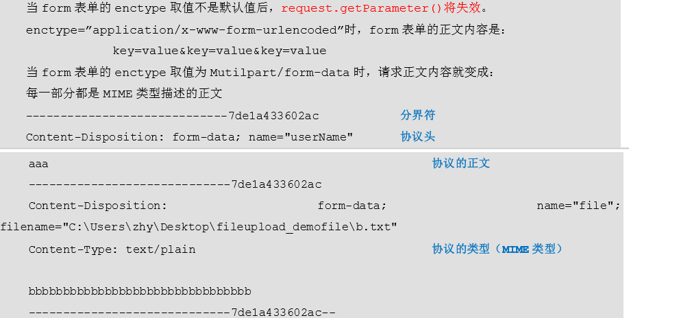

# SpringMVC的基本概念 

## 1.1 关于三层架构和 MVC 

### 1.1.1 三层架构

我们的开发架构一般都是基于两种形式，一种是 C/S 架构，也就是客户端/服务器，另一种是 B/S 架构，也就是浏览器服务器。
在 JavaEE 开发中，几乎全都是基于 B/S架构的开发。那么在 B/S架构中，系统标准的三层架构包括：表现层、业务层、持久层。 

三层架构中，每一层各司其职，接下来我们就说说每层都负责哪些方面： 
表现层：负责接收客户端请求，向客户端响应结果，通常客户端使用http协议请求 web 层，web 需要接收 http 请求，完成 http 响应。

- 表现层包括展示层和控制层：控制层负责接收请求，展示层负责结果的展示。 
- 表现层依赖业务层，接收到客户端请求一般会调用业务层进行业务处理，并将处理结果响应给客户端。 
- 表现层的设计一般都使用 MVC 模型。（MVC 是表现层的设计模型，和其他层没有关系） 

业务层：service 层。负责业务逻辑处理，事务应该放到业务层来控制 

持久层：dao 层。负责数据持久化


### 1.1.2 MVC 模型 

MVC 全名是 **Model View Controller**，是模型(model)－视图(view)－控制器(controller)的缩写， 是一种用于设计创建 Web 应用程序表现层的模式。

MVC 中每个部分各司其职： 

Model：指的就是我们的数据模型。作用一般情况下用于封装数据。

View（视图）：通常指的就是我们的 jsp 或者 html。作用一般就是展示数据的。   通常视图是依据模型数据创建的。 
Controller（控制器）：是应用程序中处理用户交互的部分。作用一般就是处理程序逻辑的。

## 1.2 SpringMVC 概述 
#### 1.2.1 SpringMVC 是什么 

SpringMVC 是一种基于 Java 的实现 MVC 设计模型的请求驱动类型的轻量级 Web 框架，属于 Spring FrameWork 的后续产品，已经融合在 Spring Web Flow 里面。
Spring 框架提供了构建 Web 应用程序的全功能 MVC 模块。
使用 Spring 可插入的 MVC 架构，从而在使用 Spring 进行 WEB 开发时，可以选择使用 Spring 的 Spring MVC 框架或集成其他 MVC 开发框架，如 Struts1(现在一般不用)，Struts2 等。 
SpringMVC 已经成为目前最主流的 MVC 框架之一，并且随着 Spring3.0 的发布，全面超越 Struts2，成为最优秀的 MVC 框架。 
它通过一套注解，让一个简单的 Java 类成为处理请求的控制器，而无须实现任何接口。同时它还支持 RESTful 编程风格的请求。 

#### 1.2.2 SpringMVC 在三层架构的位置 


#### 1.2.3 SpringMVC 的优势 
```
1、清晰的角色划分：  
    前端控制器（DispatcherServlet） 
    请求到处理器映射（HandlerMapping）  
    处理器适配器（HandlerAdapter）  
    视图解析器（ViewResolver）  
    处理器或页面控制器（Controller）  
    验证器（ Validator）  
    命令对象（Command  请求参数绑定到的对象就叫命令对象）  
    表单对象（Form Object 提供给表单展示和提交到的对象就叫表单对象）。 
2、分工明确，而且扩展点相当灵活，可以很容易扩展，虽然几乎不需要。 
3、由于命令对象就是一个 POJO，无需继承框架特定 API，可以使用命令对象直接作为业务对象。 
4、和 Spring 其他框架无缝集成，是其它 Web 框架所不具备的。 
5、可适配，通过 HandlerAdapter 可以支持任意的类作为处理器。
6、可定制性，HandlerMapping、ViewResolver 等能够非常简单的定制。 
7、功能强大的数据验证、格式化、绑定机制。 
8、利用 Spring 提供的 Mock 对象能够非常简单的进行 Web 层单元测试。 
9、本地化、主题的解析的支持，使我们更容易进行国际化和主题的切换。 
10、强大的 JSP 标签库，使 JSP 编写更容易。 
………………还有比如RESTful风格的支持、简单的文件上传、约定大于配置的契约式编程支持、基于注解的零配置支持等等。 
```

#### 1.2.4 SpringMVC 和 Struts2 的优略分析 
```
共同点：  
    它们都是表现层框架，都是基于 MVC 模型编写的。  
    它们的底层都离不开原始 ServletAPI。  
    它们处理请求的机制都是一个核心控制器。 
区别：  
    Spring MVC 的入口是 Servlet, 而 Struts2 是 Filter   
    Spring MVC 是基于方法设计的，而 Struts2 是基于类，Struts2 每次执行都会创建一个动作类。
    所以 Spring MVC 会稍微比 Struts2 快些。  
    Spring MVC 使用更加简洁,同时还支持 JSR303, 处理 ajax 的请求更方便  
    (JSR303 是一套 JavaBean 参数校验的标准，它定义了很多常用的校验注解，
    我们可以直接将这些注解加在我们 JavaBean 的属性上面，就可以在需要校验的时候进行校验了。)  
    Struts2 的 OGNL 表达式使页面的开发效率相比 Spring MVC 更高些，
    但执行效率并没有比 JSTL 提升，尤其是 struts2 的表单标签，远没有 html 执行效率高。 
```

## 核心组件

### DispatcherServlet：前端控制器 

>用户请求到达前端控制器，它就相当于 mvc 模式中的 c，dispatcherServlet 是整个流程控制的中心，由 它调用其它组件处理用户的请求，dispatcherServlet 的存在降低了组件之间的耦合性。 

### HandlerMapping：处理器映射器 
>HandlerMapping 负责根据用户请求找到 Handler 即处理器，SpringMVC 提供了不同的映射器实现不同的 映射方式，例如：配置文件方式，实现接口方式，注解方式等。

### Handler：处理器 
>它就是我们开发中要编写的具体业务控制器。由 DispatcherServlet 把用户请求转发到 Handler。由 Handler 对具体的用户请求进行处理。 

### HandlAdapter：处理器适配器 
>通过 HandlerAdapter 对处理器进行执行，这是适配器模式的应用，通过扩展适配器可以对更多类型的处理器进行执行。 

### View Resolver：视图解析器 
>View Resolver 负责将处理结果生成 View 视图，View Resolver 首先根据逻辑视图名解析成物理视图名 即具体的页面地址，再生成 View 视图对象，最后对 View 进行渲染将处理结果通过页面展示给用户。 

### View：视图 
>SpringMVC 框架提供了很多的 View 视图类型的支持，包括：jstlView、freemarkerView、pdfView 等。我们最常用的视图就是 jsp。 一般情况下需要通过页面标签或页面模版技术将模型数据通过页面展示给用户，需要由程序员根据业务需求开发具体的页面。 


## @RequestMapping 注解 
```java
源码： 
@Target({ElementType.METHOD, ElementType.TYPE}) 
@Retention(RetentionPolicy.RUNTIME) 
@Documented 
@Mapping 
public @interface RequestMapping { 

} 
 
作用：  用于建立请求 URL 和处理请求方法之间的对应关系。 

出现位置： 
类上：   请求 URL 的第一级访问目录。
        此处不写的话，就相当于应用的根目录。写的话需要以/开头。   
        它出现的目的是为了使我们的 URL 可以按照模块化管理
方法上：   请求 URL 的第二级访问目录。 

属性：  
    value：用于指定请求的 URL。它和 path 属性的作用是一样的。  
    method：用于指定请求的方式。  
    params：用于指定限制请求参数的条件。它支持简单的表达式。要求请求参数的 key 和 value 必须和配置的一模一样。
    headers：用于指定限制请求消息头的条件。 
    注意：   以上四个属性只要出现2个或以上时，他们的关系是与的关系。 
```

**使用示例** 

```java
/**
 * @author fzkstart
 * @create 2021-01-20 16:29
 * 控制器
 */
@Controller(value = "helloController")
@RequestMapping(path = "/user")
public class HelloController {
    /**
     * RequestMapping注解
     * @return
     */
    @RequestMapping(path="/testRequestMapping",method={RequestMethod.POST})
    public String testRequestMapping(){
        System.out.println("测试RequestMapping注解....");
        return "success";
    }
}
```
当使用 get 请求时，提示错误信息是 405，提示信息是方法不支持 get 方式请求 

```java
    //method设置多个值就可以接受多种请求
    //@RequestMapping(path="/testRequestMapping",method={RequestMethod.POST,RequestMethod.GET})
    //必须传入参数username，否则不执行此方法,若设置了username的值，则传入的值必须匹配才能执行
    @RequestMapping(path="/testRequestMapping",params = {"username=hehe"}
    ,headers = {"Accept"})
    public String testRequestMapping(){
        System.out.println("测试RequestMapping注解....");
        return "success";
    }
```

# 请求参数的绑定 
## 绑定说明 

1. 绑定机制 
    1. 表单提交的数据都是k=v格式的 username=haha&password=123 
    2. SpringMVC的参数绑定过程是把表单提交的请求参数，作为控制器中方法的参数进行绑定的 
    3. 要求：提交表单的name和参数的名称是相同的 
2. 支持的数据类型 
    1. 基本数据类型和字符串类型 
    2. 实体类型（JavaBean） 
    3. 集合数据类型（List、map集合等） 
    SpringMVC 绑定请求参数是自动实现的，但是要想使用，必须遵循使用要求。 
3. 使用要求
    1. 基本类型或者 String类型：  
    要求我们的参数名称必须和控制器中方法的形参名称保持一致。(严格区分大小写) 
    2. POJO类型，或者它的关联对象：  
    要求表单中参数名称和 POJO 类的属性名称保持一致。并且控制器方法的参数类型是 POJO 类型。 
    如果一个JavaBean类中包含其他的引用类型，那么表单的name属性需要编写成：对象.属性 例如： address.nam
    3. 集合类型,有两种方式： 
        - 第一种：   
            要求集合类型的请求参数必须在 POJO 中。在表单中请求参数名称要和 POJO 中集合属性名称相同。
            给 List 集合中的元素赋值，使用下标。   
            给 Map 集合中的元素赋值，使用键值对。  
            JSP页面编写方式：
            list[0].属性 
            map[key].属性
        - 第二种：   
        接收的请求参数是 json 格式数据。需要借助一个注解实现。 

4. 请求参数中文乱码的解决 
post 请求方式： 
在web.xml中配置Spring提供的过滤器类
过滤器需要放在配置前端控制器servlet的前面，不然会有报错

### 使用原生的ServletAPI对象 
1. 只需要在控制器的方法参数定义HttpServletRequest和HttpServletResponse对象
```java
    /**
     * 测试获取Servlet原生API
     * @return
     */
    @RequestMapping("/testServlet")
    public String testServlet(HttpServletRequest request, HttpServletResponse response){
        System.out.println("执行了testServlet...");
        System.out.println(request);
        System.out.println(response);
        HttpSession session = request.getSession();
        System.out.println(session);
        ServletContext servletContext = session.getServletContext();
        System.out.println(servletContext);
        return "success";
    }
```
要获取哪个就直接在方法参数中定义即可。

## forward 转发
controller 方法在提供了 String 类型的返回值之后，默认就是请求转发。也可以返回关键字方式。 

注意：
>如果用了 formward：则路径必须写成实际视图 url，不能写逻辑视图。(说明不经过视图解析器)
它相当于“request.getRequestDispatcher("url").forward(request,response)”。使用请求转发，既可以转发到 jsp，也可以转发到其他的控制器方法。 

## Redirect 重定向 
contrller 方法提供了一个 String 类型返回值之后，它需要在返回值里使用:redirect: 

它相当于“response.sendRedirect(url)”。需要注意的是，如果是重定向到 jsp 页面，则 jsp 页面不 能写在 WEB-INF 目录中，否则无法找到。 
```java
/**
* 使用关键字方式进行转发或者重定向
* @param model
* @return
*/
@RequestMapping(path="/testForwardOrRedirect")
public String testForwardOrRedirect(Model model){
    System.out.println("testForwardOrRedirect执行了...");

    //1.请求的转发
    //固定语法，表请求转发
    //        return "forward:/WEB-INF/pages/success.jsp";


    //2.重定向
    //注意：原生的Servlet在重定向的时候必须加上项目名
    //这里的关键字不用加，说明框架已经默认加好了
    return "redirect:/index.jsp";
}
```

# 文件上传

## 文件上传的回顾 

### 文件上传的必要前提 
A form 表单的 enctype 取值必须是：multipart/form-data      (默认值是:application/x-www-form-urlencoded)     enctype:是表单请求正文的类型 
B method 属性取值必须是 Post (get请求会将参数都放在地址栏内，放不下)
C 提供一个文件选择域\<input type=”file” /> 
### 文件上传的原理分析 


####2.1.3 借助第三方组件实现文件上传 
使用 Commons-fileupload 组件实现文件上传，需要导入该组件相应的支撑 jar 包：Commons-fileupload 和commons-io。
commons-io 不属于文件上传组件的开发 jar 文件，但Commons-fileupload 组件从 1.1 版本开始，它工作时需要 commons-io 包的支持。 

1. 导入文件上传的jar包
```xml
    <!--导入文件上传的jar包-->
    <dependency>
      <groupId>commons-fileupload</groupId>
      <artifactId>commons-fileupload</artifactId>
      <version>1.3.1</version>
    </dependency>
    <dependency>
      <groupId>commons-io</groupId>
      <artifactId>commons-io</artifactId>
      <version>2.4</version>
    </dependency>
```
2. 编写文件上传的JSP页面
```html
<h3>传统方式文件上传</h3>
<form action="user/testUpload1" method="post" enctype="multipart/form-data" >
    选择文件：<input type="file" name="upload"/><br/>
    <input type="submit" value="上传"/>
</form>
```
3. 编写文件上传的Controller控制器
```java
/**
* 文件上传
* @param request
* @param response
* @return
* @throws Exception
*/
@RequestMapping(path="/testUpload1",method = {RequestMethod.POST,RequestMethod.GET})
public String testUpload1(HttpServletRequest request, HttpServletResponse response) throws Exception {
    System.out.println("文件上传...");

    //使用fileupload组件完成文件上传
    //先获取到要上传的文件目录
    String path = request.getSession().getServletContext().getRealPath("/uploads/");
    //创建File对象，一会向该路径下上传文件
    File file=new File(path);
     // 判断路径是否存在，如果不存在，创建该路径
    if(!file.exists()){
        //创建该文件夹
        file.mkdirs();
    }

    // 创建磁盘文件项工厂
    DiskFileItemFactory factory = new DiskFileItemFactory();
    ServletFileUpload fileUpload = new ServletFileUpload(factory);
    //解析request对象，获取上传文件项
    List<FileItem> fileItems = fileUpload.parseRequest(request);
    //遍历
    for(FileItem item: fileItems){
        // 判断文件项是普通字段，还是上传的文件
        if(item.isFormField()){
            //说明是普通表单项
        }else{
            //说明上传文件项
            //获取上传文件的名称
            String name = item.getName();
            //把文件的名称设为唯一值，uuid
            String uuid = UUID.randomUUID().toString().replace("-", "");
            name=uuid+"_"+name;
            //完成文件上传
            item.write(new File(path,name));
            //删除临时文件
            item.delete();
        }
    }
    return "success";
}
```

## springmvc 传统方式的文件上传 
####2.2.1 说明 
    传统方式的文件上传，指的是我们上传的文件和访问的应用存在于同一台服务器上。 
    并且上传完成之后，浏览器可能跳转。 


####2.2.2 实现步骤 
1. 导入文件上传的jar包
```xml
    <!--导入文件上传的jar包-->
    <dependency>
      <groupId>commons-fileupload</groupId>
      <artifactId>commons-fileupload</artifactId>
      <version>1.3.1</version>
    </dependency>
    <dependency>
      <groupId>commons-io</groupId>
      <artifactId>commons-io</artifactId>
      <version>2.4</version>
    </dependency>
```
2. 编写文件上传的JSP页面
```html
<h3>springmvc文件上传</h3>
<form action="user/testUpload2" method="post" enctype="multipart/form-data" >
    选择文件：<input type="file" name="upload"/><br/>
    <input type="submit" value="上传"/>
</form>
```
3. 编写文件上传的Controller控制器
SpringMVC框架提供了MultipartFile对象，该对象表示上传的文件，要求变量名称必须和表单file标签的 name属性名称相同。 
```java
    /**
     * springmvc传统方式文件上传
     * @param request
     * @return
     * @throws Exception
     */
    @RequestMapping(path="/testUpload2",method = {RequestMethod.POST,RequestMethod.GET})
    public String testUpload2(HttpServletRequest request, MultipartFile upload) throws Exception {
        System.out.println("SpringMVC方式的文件上传....");

        //使用fileupload组件完成文件上传
        //上传的位置
        String path = request.getSession().getServletContext().getRealPath("/uploads/");
        //判断路径是否存在
        File file=new File(path);
        if(!file.exists()){
            //创建该文件夹
            file.mkdirs();
        }

        //说明上传文件项
        //获取上传文件的名称
        String name = upload.getOriginalFilename();
        //把文件的名称设为唯一值，uuid
        String uuid = UUID.randomUUID().toString().replaceAll("-", "");
        name=uuid+"_"+name;
        //完成文件上传
        upload.transferTo(new File(path,name));
        return "success";
    }
```
4. 配置文件解析器对象
在springmvc.xml中配置
```xml
<!-- 配置文件解析器对象，要求id名称必须是multipartResolver,注意空格问题-->
<bean id="multipartResolver" class="org.springframework.web.multipart.commons.CommonsMultipartResolver">
    <!-- 设置上传文件的最大尺寸为 10MB --> 
    <property name="maxUploadSize" value="10485760"/>
</bean>
```
**注意**：  文件上传的解析器 id是固定的，不能起别的名称，否则无法实现请求参数的绑定。（不光是文件，其他字段也将无法绑定）

# MVC Config

## MVC Config API

在 Java 配置中，可以使用`@EnableWebMvc`注解来启用 MVC 配置。

可以实现该`WebMvcConfigurer`接口来定制化配置。比如下面这个跨域配置：

```java
@Configuration
@EnableWebMvc
public class WebConfig implements WebMvcConfigurer {

    @Override
    public void addCorsMappings(CorsRegistry registry) {

        registry.addMapping("/**")
                .allowedOrigins("*")
                .allowedMethods("*")
                .allowedHeaders("*")
                .exposedHeaders("*")
                .allowCredentials(false).maxAge(3600);

        // Add more mappings...
    }
}
```

## CORS处理

出于安全原因，浏览器禁止对当前来源之外的资源进行AJAX调用。

跨源资源共享（CORS）是由大多数浏览器实现的W3C规范，它允许您指定授权的跨域请求类型，而不是使用基于IFRAME或JSONP的不太安全和功能不太强大的解决方案。

### @CrossOrigin

```java
@RestController
@RequestMapping("/account")
public class AccountController {

    @CrossOrigin
    @GetMapping("/{id}")
    public Account retrieve(@PathVariable Long id) {
        // ...
    }

    @DeleteMapping("/{id}")
    public void remove(@PathVariable Long id) {
        // ...
    }
}
```

By default, `@CrossOrigin` allows:

- All origins.
- All headers.
- All HTTP methods to which the controller method is mapped.

`@CrossOrigin` 在类级别也受支持，并由所有方法继承

```java
@CrossOrigin(maxAge = 3600)
@RestController
@RequestMapping("/account")
public class AccountController {

    @CrossOrigin("https://domain2.com")
    @GetMapping("/{id}")
    public Account retrieve(@PathVariable Long id) {
        // ...
    }

    @DeleteMapping("/{id}")
    public void remove(@PathVariable Long id) {
        // ...
    }
}
```

### 全局配置

**Java配置**

```java
@Configuration
@EnableWebMvc
public class WebConfig implements WebMvcConfigurer {

    @Override
    public void addCorsMappings(CorsRegistry registry) {

        registry.addMapping("/api/**")
            .allowedOrigins("https://domain2.com")
            .allowedMethods("PUT", "DELETE")
            .allowedHeaders("header1", "header2", "header3")
            .exposedHeaders("header1", "header2")
            .allowCredentials(true).maxAge(3600);

        // Add more mappings...
    }
}
```

需要注意的是，当allowCredentials设置为true的时候，allowedOrigins不能为`*`。可以直接改为false。

### CORS Filter

文档的相关配置，目前SpringBoot中的web5.3.10版本中不能使用了。新的过滤器配置方法暂未去研究。

## 拦截器

注册拦截器

```java
@Configuration
@EnableWebMvc
public class WebConfig implements WebMvcConfigurer {
    @Override
    public void addInterceptors(InterceptorRegistry registry) {
        registry.addInterceptor(new MyInterceptor()).addPathPatterns("/hello/**");
    }
}
```

拦截器需要自己去实现`HandlerInterceptor`接口。前置处理返回true为放行，false不放行。

这个可以用来自定义鉴权。

## 高级Java配置

@EnableWebMvc导入DelegatingWebMVC配置，其中： 

- 为SpringMVC应用程序提供默认Spring配置 
- 检测并委托WebMVCConfiguer实现以自定义该配置。

```java
@Configuration
public class WebConfig extends DelegatingWebMvcConfiguration {

    // ...
}
```

您可以在WebConfig中保留现有方法，但现在还可以重写基类中的bean声明，并且在类路径上仍然可以有任意数量的其他WebMvcConfigurer实现。

因为这个玩意把WebMvcConfigurer包含为自己的一个属性了。
这是它的构造方法：

```java
   @Autowired(required = false)
    public void setConfigurers(List<WebMvcConfigurer> configurers) {
        if (!CollectionUtils.isEmpty(configurers)) {
            this.configurers.addWebMvcConfigurers(configurers);
        }
    }
```

如果去SpringBoot找到`WebMvcAutoConfiguration`中，就可以看到它在此配置类的基础上进行了进一步的继承和配置。

# WebSocket

## WebSocket简介

> 以下内容来自百度百科，以及一个教程：https://www.ruanyifeng.com/blog/2017/05/websocket.html，以及SpringFramework文档

**WebSocket**是一种在单个[TCP](https://baike.baidu.com/item/TCP)连接上进行[全双工](https://baike.baidu.com/item/全双工)通信的协议。WebSocket通信协议于2011年被[IETF](https://baike.baidu.com/item/IETF)定为标准RFC 6455，并由RFC7936补充规范。WebSocket [API](https://baike.baidu.com/item/API)也被[W3C](https://baike.baidu.com/item/W3C)定为标准。

WebSocket使得浏览器和服务器只需要完成一次握手，两者之间就直接可以创建持久性的连接，并进行双向数据传输。

它是与 HTTP 不同的 TCP 协议，但旨在通过 HTTP 工作，使用端口 80 和 443，并允许重新使用现有的防火墙规则。WebSocket 交互以 HTTP 请求开始，该请求使用 HTTP`Upgrade`标头升级或在这种情况下切换到 WebSocket 协议。以下示例显示了这样的交互：

```http
GET /spring-websocket-portfolio/portfolio HTTP/1.1
Host: localhost:8080
Upgrade: websocket 
Connection: Upgrade 
Sec-WebSocket-Key: Uc9l9TMkWGbHFD2qnFHltg==
Sec-WebSocket-Protocol: v10.stomp, v11.stomp
Sec-WebSocket-Version: 13
Origin: http://localhost:8080
```

与通常的 200 状态代码不同，具有 WebSocket 支持的服务器返回类似于以下的输出：

```http
HTTP/1.1 101 Switching Protocols 
Upgrade: websocket
Connection: Upgrade
Sec-WebSocket-Accept: 1qVdfYHU9hPOl4JYYNXF623Gzn0=
Sec-WebSocket-Protocol: v10.stomp
```

成功握手后，HTTP 升级请求底层的 TCP 套接字保持打开状态，客户端和服务器都可以继续发送和接收消息。

请注意，如果 WebSocket 服务器运行在 Web 服务器（例如 nginx）之后，您可能需要对其进行配置，以将 WebSocket 升级请求传递到 WebSocket 服务器。同样，如果应用程序在云环境中运行，请查看与 WebSocket 支持相关的云提供商的说明。

**背景：**

很多网站为了实现[推送技术](https://baike.baidu.com/item/推送技术)，所用的技术都是[轮询](https://baike.baidu.com/item/轮询)。轮询是在特定的的时间间隔（如每1秒），由浏览器对服务器发出[HTTP请求](https://baike.baidu.com/item/HTTP请求/10882159)，然后由服务器返回最新的数据给客户端的浏览器。这种传统的模式带来很明显的缺点，即浏览器需要不断的向服务器发出请求，然而HTTP请求可能包含较长的[头部](https://baike.baidu.com/item/头部)，其中真正有效的数据可能只是很小的一部分，显然这样会浪费很多的带宽等资源。

而比较新的技术去做轮询的效果是[Comet](https://baike.baidu.com/item/Comet)。这种技术虽然可以双向通信，但依然需要反复发出请求。而且在Comet中，普遍采用的长链接，也会消耗服务器资源。

在这种情况下，[HTML5](https://baike.baidu.com/item/HTML5)定义了WebSocket协议，能更好的节省服务器资源和带宽，并且能够更实时地进行通讯。

**握手协议：**

WebSocket 是独立的、创建在 TCP 上的协议。Websocket 通过[HTTP](https://baike.baidu.com/item/HTTP)/1.1 协议的101状态码进行握手。

为了创建Websocket连接，需要通过浏览器发出请求，之后服务器进行回应，这个过程通常称为“[握手](https://baike.baidu.com/item/握手)”（handshaking）。


**HTTP与WebSocket：**

尽管 WebSocket 被设计为与 HTTP 兼容并从 HTTP 请求开始，但重要的是要了解这两种协议会导致非常不同的架构和应用程序编程模型。

在 HTTP 和 REST 中，一个应用程序被建模为多个 URL。为了与应用程序交互，客户端访问这些 URL，请求-响应样式。服务器根据 HTTP URL、方法和标头将请求路由到适当的处理程序。

相比之下，在 WebSockets 中，通常只有一个 URL 用于初始连接。随后，==**所有应用程序消息都在同一个 TCP 连接上流动**==。这指向一个完全不同的异步、事件驱动、消息传递架构。

WebSocket 也是一种低级传输协议，与 HTTP 不同，它不对消息内容规定任何语义。这意味着除非客户端和服务器就消息语义达成一致，否则无法路由或处理消息。

WebSocket 客户端和服务器可以通过`Sec-WebSocket-Protocol`HTTP 握手请求上的标头协商使用更高级别的消息传递协议（例如，STOMP）

**特点：**

> 1.建立在 TCP 协议之上，服务器端的实现比较容易。
> 2.与 HTTP 协议有着良好的兼容性。默认端口也是80和443，并且握手阶段采用 HTTP 协议，因此握手时不容易屏蔽，能通过各种 HTTP 代理服务器
> 3.数据格式比较轻量，性能开销小，通信高效
> 4.可以发送文本，也可以发送二进制数据
> 5.没有同源限制，客户端可以与任意服务器通信
> 6.协议标识符是`ws`（如果加密，则为`wss`），服务器网址就是 URL。

**优点：**

> 1.较小的控制开销
> 2.更强的实时性
> 3.保持连接状态
> 4.更好的二进制支持。Websocket定义了[二进制](https://baike.baidu.com/item/二进制)帧，相对HTTP，可以更轻松地处理二进制内容
> 5.更好的压缩效果

## 前端实现

前端实现是比较简单的，仅仅需要绑定几个典型的事件即可。当然这里仅仅是基本使用，更详细的使用请看教程。

以下示例仅为发送文本信息，发送blob和Arraybuffer请看教程。

```java
<!DOCTYPE html>
<html lang="zh">
<head>
    <meta charset="UTF-8">
    <title>demo</title>
    <script src="https://cdn.bootcss.com/jquery/3.3.1/jquery.js"></script>

</head>
<body>
<script>
    let socket;

    function openSocket() {
        if (typeof (WebSocket) == "undefined") {
            console.log("您的浏览器不支持WebSocket");
        } else {
            //实现化WebSocket对象，指定要连接的服务器地址与端口  建立连接
            //等同于socket = new WebSocket("ws://localhost:8888/xxxx/im/25");
            //var socketUrl="${request.contextPath}/im/"+$("#userId").val();
            let articleId=$("#articleId").val();
            let shareId=$("#shareId").val();
            let openid=$("#openid").val();
            let socketUrl = "https://www.fzk-tx.top/mk/article/ws?openid="+openid+"&articleId="
                +articleId+"&shareId="+shareId;
            socketUrl = socketUrl.replace("https", "ws").replace("http", "ws");
            console.log(socketUrl);
            if (socket != null) {
                socket.close();
                socket = null;
            }
            // 创建WebSocket
            socket = new WebSocket(socketUrl);
            //打开事件
            socket.onopen = function () {
                console.log("websocket已打开");
                //socket.send("这是来自客户端的消息" + location.href + new Date());
            };
            //获得消息事件
            socket.onmessage = function (msg) {
                console.log(msg.data);
                //发现消息进入    开始处理前端触发逻辑
            };
            //关闭事件
            socket.onclose = function () {
                console.log("websocket已关闭");
            };
            //发生了错误事件
            socket.onerror = function () {
                console.log("websocket发生了错误");
            }
        }
    }

    function sendMessage() {
        if (typeof (WebSocket) == "undefined") {
            console.log("您的浏览器不支持WebSocket");
        } else {
            // 发送心跳
            socket.send('{"articleId":"' + $("#articleId").val() + '",' +
                '"shareId":"' + $("#shareId").val() + '",' +
                '"readTime": 23,' +
                '"openid":"' + $("#openid").val() + '"}')
        }
    }

    function closeSocket() {
        if (socket != null) {
            socket.close();
            socket = null;
        }
    }
</script>
<p>【articleId】：
<div><input id="articleId" name="articleId" type="text" value="10"></div>
<p>【shareId】：
<div><input id="shareId" name="shareId" type="text" value="4"></div>
<p>【openid】：
<div><input id="openid" name="openid" type="text" value="oSLXk6DwZJ1VQH4aPfkss"></div>
<p>【操作】：
<div>
    <button onclick="openSocket()">开启socket</button>
</div>
<p>【操作】：
<div>
    <button onclick="sendMessage()">发送消息</button>
</div>
<p>【关闭】：
<div>
    <button onclick="closeSocket()">关闭socket</button>
</div>
</p>
</body>
</html>
```

## 原始WebSocket交互

Spring Framework 提供了一个 WebSocket API，您可以使用它来编写处理 WebSocket 消息的客户端和服务器端应用程序。

引入依赖：

```xml
<!-- https://mvnrepository.com/artifact/org.springframework.boot/spring-boot-starter-websocket -->
<dependency>
    <groupId>org.springframework.boot</groupId>
    <artifactId>spring-boot-starter-websocket</artifactId>
    <!--<version>2.6.0</version>-->
</dependency>
```

### WebSocketHandler

创建WebSocket服务器，需要实现WebSocketHandler，或者可以选择扩展TextWebSocketHandler或BinaryWebSocketHandler，分别处理文本消息或二进制消息。

如以下示例为扩展TextWebSocket：

```java
public class MyHandler extends TextWebSocketHandler {
	// 连接创建时调用
    @Override
    public void afterConnectionEstablished(WebSocketSession session) throws Exception {
        super.afterConnectionEstablished(session);
    }
	// 收到前端发送的消息时调用
    @Override
    protected void handleTextMessage(WebSocketSession session, TextMessage message) throws Exception {
        super.handleTextMessage(session, message);
    }
	// 出现连接异常时调用
    @Override
    public void handleTransportError(WebSocketSession session, Throwable exception) throws Exception {
        super.handleTransportError(session, exception);
        // 关闭session
        if (session.isOpen())
            session.close();
    }
	// 连接关闭后调用
    @Override
    public void afterConnectionClosed(WebSocketSession session, CloseStatus status) throws Exception {
        super.afterConnectionClosed(session, status);
    }
}
```

有专用的 WebSocket Java 配置和 XML 命名空间支持，用于将前面的 WebSocket 处理程序映射到特定 URL

```java
@Configuration
@EnableWebSocket // 开启WebSocket配置
public class MyWebSocketConfig implements WebSocketConfigurer {
    @Override
    public void registerWebSocketHandlers(WebSocketHandlerRegistry registry) {
        MyHandler myHandler = new MyHandler();
		// 将这个Handler映射到此URI地址
        registry.addHandler(myHandler, "/mk/article/ws")
                .setAllowedOrigins("*");// 允许所有跨域
    }
}
```

从这个handler中可以看到，在Handler中是拿不到request对象的(因为TCP长链接建立之后，直接发送消息)，但是可以拿到uri，可以手动处理uri参数。但更好的方式是通过下面的拦截器提前处理url，将参数传递给WebSocketSession.

### WebSocket握手拦截器

自定义初始 HTTP WebSocket 握手请求的最简单方法是实现`HandshakeInterceptor`，它公开握手“之前”和“之后”的方法。您可以使用这样的拦截器来拒绝握手或使任何属性可用于`WebSocketSession`.更好的选择是扩展`HttpSessionHandshakeInterceptor`.

```java
public class MyInterceptor extends HttpSessionHandshakeInterceptor {
	// 握手前调用，返回false就拒绝握手
    @Override
    public boolean beforeHandshake(ServerHttpRequest request, ServerHttpResponse response, WebSocketHandler wsHandler,Map<String, Object> attributes) throws Exception {
        HttpServletRequest servletRequest = ((ServletServerHttpRequest) request).getServletRequest();
        String openid = servletRequest.getParameter("openid");
        String articleId = servletRequest.getParameter("articleId");
        String shareId = servletRequest.getParameter("shareId");

        if (openid == null || articleId == null || shareId == null)
            throw new MyException(CodeEum.CODE_PARAM_MISS, "缺少参数：articleId or shareId or openid ?");

        attributes.put("articleId", articleId);
        attributes.put("shareId", shareId);
        attributes.put("openid", openid);
		// 这里需要调用父类方法，因为父类方法会处理HttpSession会话中的属性也加入到attributes中
        return super.beforeHandshake(request, response, wsHandler, attributes);
    }
	// 握手后调用
    @Override
    public void afterHandshake(ServerHttpRequest request, ServerHttpResponse response, WebSocketHandler wsHandler,
                               Exception ex) {
        super.afterHandshake(request, response, wsHandler, ex);
    }
}
```

从这里可以看到，通过拦截器能够拿到request，能够获取uri参数信息，并将其放入到attributes中以传递给WebSocketSession。同时HttpSession中的属性也会被处理给attributes从而传递给WebSocketSession.

定义好拦截器后，需要注册到容器中：

```java
@Configuration
@EnableWebSocket // 开启WebSocket配置
public class MyWebSocketConfig implements WebSocketConfigurer {
    @Override
    public void registerWebSocketHandlers(WebSocketHandlerRegistry registry) {
        MyHandler myHandler = new MyHandler();// 处理器
        MyInterceptor myInterceptor = new MyInterceptor();// 拦截器

        registry.addHandler(myHandler, "/mk/article/ws")
                .addInterceptors(myInterceptor)// 添加拦截器
                .setAllowedOrigins("*");// 允许跨域
    }
}
```

### Allowed Origins

从 Spring Framework 4.1.5 开始，WebSocket 和 SockJS 的默认行为是仅接受同源请求。

三种可能的行为是：

- 仅允许同源请求（默认）：在此模式下，启用 SockJS 时，Iframe HTTP 响应标头`X-Frame-Options`设置为`SAMEORIGIN`，并且禁用 JSONP 传输，因为它不允许检查请求的来源。因此，启用此模式时不支持 IE6 和 IE7。
- 允许指定的来源列表：每个允许的来源必须以`http://` 或开头`https://`。在这种模式下，当 SockJS 启用时，IFrame 传输被禁用。因此，启用此模式时，不支持 IE6 到 IE9。
- 允许所有来源：要启用此模式，您应该提供`*`允许的来源值。在这种模式下，所有传输都可用。

```java
@Configuration
@EnableWebSocket
public class WebSocketConfig implements WebSocketConfigurer {
    @Override
    public void registerWebSocketHandlers(WebSocketHandlerRegistry registry) {
        registry.addHandler(myHandler(), "/myHandler").setAllowedOrigins("https://mydomain.com");
    }
    @Bean
    public WebSocketHandler myHandler() {
        return new MyHandler();
    }
}
```

### 使用示例

```java
/**
 * 开启WebSocket
 *
 * @author fzk
 * @date 2021-11-30 17:00
 */
@Configuration
@EnableWebSocket // 开启WebSocket配置
public class MyWebSocketConfig implements WebSocketConfigurer {
    private final RedisTemplate<String, String> redisTemplate;
    private final RestTemplate restTemplate;

    public MyWebSocketConfig(@Autowired RedisTemplate<String, String> redisTemplate, @Autowired RestTemplate restTemplate) {
        this.redisTemplate = redisTemplate;
        this.restTemplate = restTemplate;
    }

    @Override
    public void registerWebSocketHandlers(WebSocketHandlerRegistry registry) {
        MyHandler myHandler = new MyHandler(redisTemplate, restTemplate);
        MyInterceptor myInterceptor = new MyInterceptor();// 拦截器

        registry.addHandler(myHandler, "/mk/article/ws")
                .addInterceptors(myInterceptor)
                .setAllowedOrigins("*");// 允许跨域
    }


    public static class MyHandler extends TextWebSocketHandler {
        private final RedisTemplate<String, String> redisTemplate;
        private final RestTemplate restTemplate;
        private static final String keyPrefix = "WebSocketSession:";
        // 用微服务负载均衡的方式进行远程调用
        private static final String addReadRecordUrl = "http://marketing/mk/article/addReadRecord";

        public MyHandler(RedisTemplate<String, String> redisTemplate, RestTemplate restTemplate) {
            this.redisTemplate = redisTemplate;
            this.restTemplate = restTemplate;
        }

        @Override
        public void afterConnectionEstablished(WebSocketSession session) throws Exception {
            super.afterConnectionEstablished(session);
            Map<String, Object> attributes = session.getAttributes();

            ReadInfo readInfo = new ReadInfo();
            readInfo.setArticleId(Long.valueOf(attributes.get("articleId").toString()));
            readInfo.setShareId(Long.valueOf(attributes.get("shareId").toString()));
            readInfo.setOpenid(attributes.get("openid").toString());

            readInfo.setStartTimeStamp(System.currentTimeMillis());

            // 放入缓存
            redisTemplate.opsForValue().set(keyPrefix + session.getId(), MyJsonUtil.toJsonStr(readInfo),
                    1000 * 60 * 20, TimeUnit.MILLISECONDS);
        }

        @Override
        protected void handleTextMessage(WebSocketSession session, TextMessage message) throws Exception {
            super.handleTextMessage(session, message);

            System.out.println("WebSocket心跳: from:" + session.getId() + " ,text消息：" + message.getPayload());
            session.sendMessage(message);// 将消息直接返回给发送者
        }

        @Override
        public void handleTransportError(WebSocketSession session, Throwable exception) throws Exception {
            super.handleTransportError(session, exception);
            // 添加阅读记录
            addReadRecord(session.getId());
            // 关闭session
            if (session.isOpen())
                session.close();
        }

        @Override
        public void afterConnectionClosed(WebSocketSession session, CloseStatus status) throws Exception {
            super.afterConnectionClosed(session, status);
            // 添加阅读记录
            addReadRecord(session.getId());
        }

        private void addReadRecord(String sessionId) {
            // 取出缓存：计算阅读时间
            String readInfo_json = redisTemplate.opsForValue().get(keyPrefix + sessionId);
            if (readInfo_json != null) {
                ReadInfo readInfo = MyJsonUtil.toBean(readInfo_json, ReadInfo.class);
                redisTemplate.delete(keyPrefix + sessionId);

                int readTime = (int) (System.currentTimeMillis() - readInfo.getStartTimeStamp()) / 1000;
                readInfo.setReadTime(readTime);

                // 请求头
                HttpHeaders headers = new HttpHeaders();
                headers.setContentType(MediaType.APPLICATION_FORM_URLENCODED);
                // 请求体
                LinkedMultiValueMap<String, Object> map = new LinkedMultiValueMap<>();
                map.add("articleId", readInfo.getArticleId());
                map.add("shareId", readInfo.getShareId());
                map.add("openid", readInfo.getOpenid());
                map.add("readTime", readInfo.getReadTime());
                System.out.println(map);
                HttpEntity<MultiValueMap<String, Object>> httpEntity = new HttpEntity<>(map, headers);

                try {
                    restTemplate.postForObject(addReadRecordUrl, httpEntity, Result.class);
                } catch (Exception e) {
                    e.printStackTrace();
                }
            }
        }
    }

    public static class MyInterceptor extends HttpSessionHandshakeInterceptor {

        @Override
        public boolean beforeHandshake(ServerHttpRequest request, ServerHttpResponse response, WebSocketHandler wsHandler,
                                       Map<String, Object> attributes) throws Exception {
            //System.out.println("Before Handshake");

            HttpServletRequest servletRequest = ((ServletServerHttpRequest) request).getServletRequest();
            String openid = servletRequest.getParameter("openid");
            String articleId = servletRequest.getParameter("articleId");
            String shareId = servletRequest.getParameter("shareId");

            if (openid == null || articleId == null || shareId == null)
                throw new MyException(CodeEum.CODE_PARAM_MISS, "缺少参数：articleId or shareId or openid ?");

            attributes.put("articleId", articleId);
            attributes.put("shareId", shareId);
            attributes.put("openid", openid);

            return super.beforeHandshake(request, response, wsHandler, attributes);
        }

        @Override
        public void afterHandshake(ServerHttpRequest request, ServerHttpResponse response, WebSocketHandler wsHandler,
                                   Exception ex) {
            //System.out.println("After Handshake");
            super.afterHandshake(request, response, wsHandler, ex);
        }
    }

    @Data
    public static class ReadInfo {
        private Long articleId;
        private Long shareId;
        private String openid;

        private Integer readTime;
        private long startTimeStamp;
    }
}
```

### nginx配置WebSocket代理

在经过上面的配置之后，ws协议直接使用是没问题的，但是如果走了像nginx这类反向代理服务器之后，就需要注意，**因为ws协议多出来的几个请求头nginx没有正确传递**，需要手动配置一下，让这个请求头也代理过去。同时，代理服务器往往会关闭看似空闲的长期连接，这个也是需要注意的(前端发送心跳，或者nginx配置连接超时时间以覆盖默认断开时间)。

>官方解决方案：http://nginx.org/en/docs/http/websocket.html

为了将客户端和服务器之间的连接从 HTTP/1.1 转换为 WebSocket，使用了 HTTP/1.1 中可用的[协议切换](https://tools.ietf.org/html/rfc2616#section-14.42)机制。

然而，有一个微妙之处：由于“Upgrade”是一个 [ hop-by-hop](https://tools.ietf.org/html/rfc2616#section-13.5.1) 标头，它不会从客户端传递到代理服务器。通过正向代理，客户端可以使用该`CONNECT` 方法来规避此问题。然而，这不适用于反向代理，因为客户端不知道任何代理服务器，并且需要在代理服务器上进行特殊处理。

从 1.3.13 版本开始，nginx 实现了特殊的操作模式，如果代理服务器返回代码为 101（切换协议）的响应，并且客户端通过请求中的“Upgrade”标头。

如上所述，包括“Upgrade”和“Connection”在内的逐跳标头不会从客户端传递到代理服务器，因此为了让代理服务器了解客户端将协议切换到 WebSocket 的意图，这些标头必须明确传递：

```tex
location /chat/ {
    proxy_pass http://backend;
    proxy_http_version 1.1;
    proxy_set_header Upgrade $http_upgrade;
    proxy_set_header Connection "upgrade";
}
```

默认情况下，如果代理服务器在 60 秒内没有传输任何数据，连接将被关闭。可以使用[proxy_read_timeout](http://nginx.org/en/docs/http/ngx_http_proxy_module.html#proxy_read_timeout)指令增加此超时 。或者，可以将代理服务器配置为定期发送 WebSocket ping 帧以重置超时并检查连接是否仍然有效。

如果不配置超时时间，隔一会就会断开 具体超时时间具体要根据业务来调整。最终的配置如下：

```tex
server{
    listen  80;
    charset utf-8;
    server_name www.xxx.com;
     proxy_set_header Host $host:$server_port;
     proxy_set_header X-Real-IP $remote_addr;
     proxy_set_header REMOTE-HOST $remote_addr;
     proxy_set_header X-Forwarded-For $proxy_add_x_forwarded_for;
     client_max_body_size 100m;
     location = /mk/article/ws  {
        proxy_pass http://127.0.0.1:30000; # 指向网关
        proxy_http_version 1.1;
        proxy_set_header Upgrade $http_upgrade;
        proxy_set_header Connection "upgrade";
         
        proxy_connect_timeout 4s; 
        proxy_read_timeout 720s; 
        proxy_send_timeout 12s; 
     }
     location / {
     	proxy_pass http://127.0.0.1:30000;
     }
 }
```

# RestTemplate

Spring 框架提供了两种调用 REST 端点的选择：

- [`RestTemplate`](https://docs.spring.io/spring-framework/docs/current/reference/html/integration.html#rest-resttemplate)：带有同步模板方法 API 的原始 Spring REST 客户端。
- [WebClient](https://docs.spring.io/spring-framework/docs/current/reference/html/web-reactive.html#webflux-client)：一种非阻塞、反应式的替代方案，支持同步和异步以及流场景。

>  从 5.0 开始，`RestTemplate`它处于维护模式，只有很小的更改和错误请求才会被接受。请考虑使用 [WebClient](https://docs.spring.io/spring-framework/docs/current/reference/html/web-reactive.html#webflux-client)，它提供更现代的 API 并支持同步、异步和流方案。

## 初始化

默认构造函数用于`java.net.HttpURLConnection`执行请求。

## 参数传递

get请求和post请求的参数传递方式很不同，get可以直接拼接url字符串，而post稍微复杂一点。

### 路径变量

```java
// 可变形参传参
String url="https://example.com/hotels/{hotel}/bookings/{booking}";
String result = restTemplate.getForObject(url, String.class, "42", "21");

// 用map传参也是可以的
Map<String, String> vars = Collections.singletonMap("hotel", "42");
String result = restTemplate.getForObject("https://example.com/hotels/{hotel}/rooms/{hotel}", String.class, vars);
```

### 请求头

```java
@Test
void test6(){
    RestTemplate restTemplate=new RestTemplate();
    // 路径变量
    String uriTemplate = "https://example.com/hotels/{hotel}";
    URI uri = UriComponentsBuilder.fromUriString(uriTemplate).build(42);

    RequestEntity<Void> requestEntity = RequestEntity.get(uri)
            .header("MyRequestHeader", "MyValue")
            .build();

    ResponseEntity<String> response = restTemplate.exchange(requestEntity, String.class);

    String responseHeader = response.getHeaders().getFirst("MyResponseHeader");
    String body = response.getBody();
}
```

### post传递请求体

```java
@Test
void test1() {
    RestTemplate restTemplate = new RestTemplate();
    String url = "https://www.fzk-tx.top/mk/article/addReadRecord";

    // 请求头
    HttpHeaders headers = new HttpHeaders();
    headers.setContentType(MediaType.APPLICATION_FORM_URLENCODED);// 设置ContentType
    // 请求体
    LinkedMultiValueMap<String, Object> map = new LinkedMultiValueMap<>();
    map.add("articleId", 1);
    map.add("shareId", 1);
    map.add("openid", 1);
    map.add("readTime", 1);
    HttpEntity<MultiValueMap<String, Object>> httpEntity = new HttpEntity<>(map, headers);

    try {
        restTemplate.postForObject(url, httpEntity, Void.class);
    } catch (Exception e) {
        e.printStackTrace();
    }
}
```

## 消息转换

https://docs.spring.io/spring-framework/docs/current/reference/html/integration.html#rest-message-conversion

