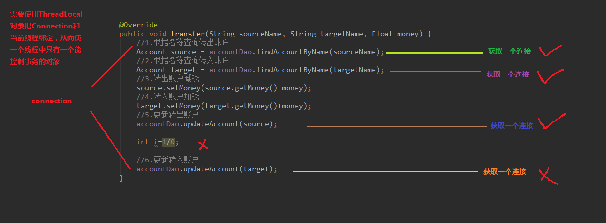

# 0.Spring初步了解

## 第1章 Spring概述 
### 1.spring 是什么 
>Spring是分层的 Java SE/EE应用 **full-stack** 轻量级开源框架，以**IoC（Inverse Of Control： 反转控制**）和 **AOP（Aspect Oriented Programming：面向切面编程**）为内核，提供了展现层 Spring MVC 和持久层 Spring JDBC 以及业务层事务管理等众多的企业级应用技术，还能整合开源世界众多著名的第三方框架和类库，逐渐成为使用最多的Java EE 企业应用开源框架。 
2017 年 9 月份发布了 spring 的最新版本 **spring 5.0** 通用版（GA） 
### 2. spring 的优势
- 2.1 方便解耦，简化开发  
  
    >通过 Spring提供的 IoC容器，可以将对象间的依赖关系交由 Spring进行控制，避免硬编码所造成的过度程序耦合。用户也不必再为单例模式类、属性文件解析等这些很底层的需求编写代码，可以更专注于上层的应用。 
- 2.2 AOP编程的支持  
  
    >通过 Spring的 AOP 功能，方便进行面向切面的编程，许多不容易用传统 OOP 实现的功能可以通过 AOP 轻松应付。 
- 2.3 声明式事务的支持  
  
    >可以将我们从单调烦闷的事务管理代码中解脱出来，通过声明式方式灵活的进行事务的管理，提高开发效率和质量。 
- 2.4 方便程序的测试  
  
    >可以用非容器依赖的编程方式进行几乎所有的测试工作，测试不再是昂贵的操作，而是随手可做的事情。 
- 2.5 方便集成各种优秀框架  
  
    >Spring可以降低各种框架的使用难度，提供了对各种优秀框架（Struts、Hibernate、Hessian、Quartz 等）的直接支持。 
- 2.6 降低 JavaEE API的使用难度  
  
    >Spring对 JavaEE API（如 JDBC、JavaMail、远程调用等）进行了薄薄的封装层，使这些 API 的使用难度大为降低。 
- 2.7 Java源码是经典学习范例  
  
    >Spring的源代码设计精妙、结构清晰、匠心独用，处处体现着大师对**Java 设计模式**灵活运用以及对 Java技术的高深造诣。它的源代码无疑是 Java 技术的最佳实践的范例。 
### 3. spring 的体系结构 


## 第2章 IoC 的概念和作用 

### 2.1 程序的耦合和解耦

#### 2.1.1 什么是程序的耦合
- 耦合性(Coupling)，也叫耦合度，是对模块间关联程度的度量。
    >耦合的强弱取决于模块间接口的复杂性、调用模块的方式以及通过界面传送数据的多少。
    模块间的耦合度是指模块之间的依赖关系，包括控制关系、调用关系、数据传递关系。模块间联系越多，其耦合性越强，同时表明其独立性越差( 降低耦合性，可以提高其独立性)。
    耦合性存在于各个领域，而非软件设计中独有的，但是我们只讨论软件工程中的耦合。 
- 在软件工程中，耦合指的就是就是对象之间的依赖性。对象之间的耦合越高，维护成本越高。
- 因此对象的设计应使类和构件之间的耦合最小。软件设计中通常用耦合度和内聚度作为衡量模块独立程度的标准。**划分模块的一个准则就是高内聚低耦合**。
- 耦合的分类
    - （1） 内容耦合
    >当一个模块直接修改或操作另一个模块的数据时，或一个模块不通过正常入口而转入另一个模块时，这样的耦合被称为内容耦合。内容耦合是最高程度的耦合，应该避免使用之。  

    - （2） 公共耦合
    >两个或两个以上的模块共同引用一个全局数据项，这种耦合被称为公共耦合。在具有大量公共耦合的结构中，确定究竟是哪个模块给全局变量赋了一个特定的值是十分困难的。  

    - （3） 外部耦合 
    >一组模块都访问同一全局简单变量而不是同一全局数据结构，而且不是通过参数表传递该全局变量的信息，则称之为外部耦合。  
    - （4） 控制耦合 
    >一个模块通过接口向另一个模块传递一个控制信号，接受信号的模块根据信号值而进行适当的动作，这种耦合被称为控制耦合。  
    - （5） 标记耦合 
    >若一个模块 A 通过接口向两个模块 B 和 C 传递一个公共参数，那么称模块 B 和 C 之间存在一个标记耦合。  
    - （6） 数据耦合
    >模块之间通过参数来传递数据，那么被称为数据耦合。数据耦合是最低的一种耦合形式，系统中一般都存在这种类型的耦合，因为为了完成一些有意义的功能，往往需要将某些模块的输出数据作为另一些模块的输入数据。  
    - （7） 非直接耦合 
    >两个模块之间没有直接关系，它们之间的联系完全是通过主模块的控制和调用来实现的。 
    - 总结：  
    耦合是影响软件复杂程度和设计质量的一个重要因素，在设计上我们应采用以下原则：如果模块间必须存在耦合，就尽量使用数据耦合，少用控制耦合，限制公共耦合的范围，尽量避免使用内容耦合。
- 内聚与耦合  
    > - 内聚标志一个模块内各个元素彼此结合的紧密程度，它是信息隐蔽和局部化概念的自然扩展。内聚是从功能角度来度量模块内的联系，一个好的内聚模块应当恰好做一件事。它描述的是模块内的功能联系。
    > - 耦合是软件结构中各模块之间相互连接的一种度量，耦合强弱取决于模块间接口的复杂程度、进入或访问一个模块的点以及通过接口的数据。 
- 程序讲究的是低耦合，高内聚。
    >就是同一个模块内的各个元素之间要高度紧密，但是各个模块之间的相互依存度却要不那么紧密。 
    内聚和耦合是密切相关的，同其他模块存在高耦合的模块意味着低内聚，而高内聚的模块意味着该模块同其他模块之间是低耦合。在进行软件设计时，应力争做到高内聚，低耦合。 


#### 2.1.2 解决程序耦合的思路
```
程序的耦合
 *  耦合：程序间的依赖关系包括：
 *      类之间的依赖
 *      方法之间的依赖
 *  解耦：降低程序间的依赖关系
 *  实际开发中应该做到
 *          编译期不依赖
 *          运行期依赖
 *  解耦的思路：
 *      第一步：在创建对象的时候应该使用反射来创建对象，而不使用new关键字
 *      第二步：通过读取配置文件来获取要创建对象的全限定类名
```
#### 2.1.3 工厂模式解耦 
>在实际开发中我们可以把三层的对象都使用配置文件配置起来，当启动服务器应用加载的时候，让一个类中的方法通过读取配置文件，把这些对象创建出来并存起来。在接下来的使用的时候，直接拿过来用就好了。 
那么，这个读取配置文件，创建和获取三层对象的类就是**工厂**。 
#### 2.1.4 控制反转-Inversion Of Control


# 1.Spring核心之IOC

## 第0章 spring的开发包
官网：http://spring.io/ 
下载地址： http://repo.springsource.org/libs-release-local/org/springframework/spring 

解压:(Spring 目录结构:) 
* docs  :API 和开发规范. 
* libs  :jar 包和源码. 
* schema ：约束
特别说明：  spring5 版本是用 jdk8 编写的，所以要求我们的 jdk版本是 8 及以上。  同时 tomcat 的版本要求 8.5及以上。 

|jar包名称         |说明                          |
|-----------------|------------------------------|
|spring.jar       |整个Spring模块，包含表中所有jar的功能|
|spring-core.jar  |Spring的核心模块，包含IOC容器|
|spring-aop.jar   |Spring的AOP模块|
|spring-context.jar|Spring的上下文，包含ApplicationContext容器|
|spring-dao.jar   |Spring的DAO模块，包含对DAO和JDBC的支持|
|spring-orm.jar   |Spring的ORM模块，支持Hibernate、JDO等ORM工具|
|spring-web.jar   |Spring的Web模块，包含Web application context|
|spring-webmvc.ajr|Spring的MVC框架模块|
注意：Spring内置了**日志组件log4j.jar**，所以使用Spring之前需要对log4j进行简单的配置。

### 了解Spring中的bean
在spring中，那些组成应用的主体(backbone)及由IoC容器管理的对象称为bean。
简单来说，bean就是由Spring容器初始化、装配及管理的对象。除此之外，bean和其他的实体类也没什么区别了。
Spring中bean的定义和bean相互间的依赖关系是通过配置XML文件的元数据来实现的。


***

## 第1章 IOC 解决程序耦合 

### 1.0 自定义工厂解耦
- 1.1.1 创建持久层接口和实现类
    ```java
    /**
    * @author fzkstart
    * @create 2020-12-21 19:26
    * 账户的持久层接口
    */
    public interface IAccountDao {
        void saveAccount();
    }
    ```
    ```java
    /**
    * @author fzkstart
    * @create 2020-12-21 19:28
    * 账户的持久层实现类
    */
    public class AccountDaoImpl implements IAccountDao {
        @Override
        public void saveAccount() {
            System.out.println("保存了账户");
        }
    }
    ```
   
- 1.1.2 创建业务层接口和实现类 
    ```java
    /**
    * @author fzkstart
    * @create 2020-12-21 19:23
    * 账户业务层的接口
    */
    public interface IAccountService {
        /**
        * 模拟保存
        */
        void saveAccount();
    }
    ```
    ```java
    /**
    * @author fzkstart
    * @create 2020-12-21 19:24
    * 账户的业务层实现类
    */
    public class AccountServiceImpl implements IAccountService {
    //    private IAccountDao accountDao=new AccountDaoImpl();

        private int i=1;
        private IAccountDao accountDao=null;
        public void saveAccount(){
            accountDao= (IAccountDao) BeanFactory.getBean("accountDao");
            System.out.println(accountDao);
            accountDao.saveAccount();
            System.out.println(i);
            i++;
        }
    }
    ```
- 1.1.3 创建模拟表现层类
    ```java
    /**
    * @author fzkstart
    * @create 2020-12-21 19:32
    * 模拟一个表现层，用于调用业务层
    */
    public class Client {
        public static void main(String[] args) {
    //        IAccountService as=new AccountServiceImpl();
            for(int i=0;i<5;i++){
                IAccountService as= (IAccountService) BeanFactory.getBean("accountService");
                System.out.println(as);
                as.saveAccount();
            }
        }
    }
    ```
- 1.1.4 一个创建Bean对象的工厂
    ```java
    /**
    * @author fzkstart
    * @create 2020-12-21 19:38
    *
    * 一个创建Bean对象的工厂
    * Bean：在计算机英语中，有可重用组件的含义
    * JavaBean: 用java编写的可重用组件
    *      javabean > 实体类
    *
    * 它就是创建我们的service和dao对象的
    *
    * 第一个：需要一个配置文件来配置我们的service和dao
    *          配置的内容：唯一标志=全限定类名(key=value)
    * 第二个：通过读取配置文件中的配置的内容，反射创建对象
    *
    * 配置文件可以是xml也可以是properties
    */
    public class BeanFactory {
        //定义一个Properties对象
        private static Properties props;

        //定义一个Map，用于存放我们要创建的对象，我们把它称为容器
        private static Map<String,Object> beans;

        //使用静态代码块为Properties对象赋值
        static{
            try {
                //实例化对象
                props=new Properties();
                //获取properties文件的流对象
                InputStream is=BeanFactory.class.getClassLoader().getResourceAsStream("bean.properties");
                props.load(is);
                //实例化容器
                beans=new HashMap<String,Object>();
                //取出配置文件中所有的key
                Enumeration keys = props.keys();
                //遍历枚举
                while(keys.hasMoreElements()){
                    //取出每个key
                    String key=keys.nextElement().toString();
                    System.out.println(key);
                    //根据key获取value
                    String beanPath=props.getProperty(key);
                    //反射创建对象
                    Object value=Class.forName(beanPath).newInstance();
                    //把key和value存入容器中
                    beans.put(key,value);
                }
            } catch (Exception e) {
                throw new ExceptionInInitializerError("初始化未成功");
            }
        }

        /**
        * 根据bean的名称获取对象
        * @param beanName
        * @return
        */
        public static Object getBean(String beanName){
            return beans.get(beanName);
        }

    /*
        */
    /**
        * 根据bean的名称获取bean的对象
        * @param beanName
        * @return
        *//*

        public static Object getBean(String beanName){
            Object bean=null;
            try {
                String beanPath=props.getProperty(beanName);
                bean=Class.forName(beanPath).newInstance();//每次都会调用默认构造函数创建对象
            } catch (Exception e) {
                e.printStackTrace();
            }
            return bean;
        }
    */
    }
    ```


```java
/**
* @author fzkstart
* @create 2020-12-21 19:32
* 模拟一个表现层，用于调用业务层
*/
public class Client {
    /**
    * 获取spring的IOC核心容器，并根据id获取对象
    *
    * ApplicationContext的三个常用实现类：
    *      ClassPathXmlApplicationContext      它可以加载类路径下的配置文件，要求配置文件必须在类路径下
    *      FileSystemXmlApplicationContext     它可以加载磁盘任意路径下的配置文件(必须与访问权限)
    *      AnnotationConfigApplicationContext  它是用于读取注解创建容器的
    *
    * 核心容器的两个接口引发出的问题：
    * ApplicationContext:      单例对象适用      更多采用此接口
    *              它在构建核心容器时，创建对象采取的策略是立即加载方式，
    *              也就是说，只要一读取完配置文件马上就创建配置文件中配置的对象
    * BeanFactory:             多例对象适用
    *              它在构建核心容器时，创建对象采取的策略是延迟加载方式
    *              也就是说，什么时候根据id获取对象，什么时候才真正创建对象
    * @param args
    */
    public static void main(String[] args) {
        //1.获取核心容器对象
        ApplicationContext ac=new ClassPathXmlApplicationContext("bean.xml");
//        ApplicationContext ac=new FileSystemXmlApplicationContext(
//        "D:\\developer_tools\\IDEA-workspace\\Spring\\spring1.1\\src\\main\\resources\\bean.xml");
        //2.根据id获取bean对象
        //两种方式都可以
        IAccountService accountService =(IAccountService) ac.getBean("accountService");
        IAccountDao accountDao = ac.getBean("accountDao",IAccountDao.class);

        System.out.println(accountService);
        System.out.println(accountDao);
//        as.saveAccount();
    }
}
```

### spring 中工厂的类结构图 


- 1.3.1.1 BeanFactory和 ApplicationContext 的区别
    ```java
    BeanFactory 才是 Spring 容器中的顶层接口。 
    ApplicationContext 是它的子接口。 
    BeanFactory 和 ApplicationContext 的区别：  
        创建对象的时间点不一样。   
        ApplicationContext:      单例对象适用      更多采用此接口
        它在构建核心容器时，创建对象采取的策略是立即加载方式，
        也就是说，只要一读取完配置文件马上就创建配置文件中配置的对象
        BeanFactory:             多例对象适用
        它在构建核心容器时，创建对象采取的策略是延迟加载方式
        也就是说，什么时候根据id获取对象，什么时候才真正创建对象
    ```
- 1.3.1.2 ApplicationContext 接口的实现类 
    ```java
    ClassPathXmlApplicationContext：  
        它是从类的根路径下加载配置文件  推荐使用这种 
    FileSystemXmlApplicationContext：  
        它是从磁盘路径上加载配置文件，配置文件可以在磁盘的任意位置。 
    AnnotationConfigApplicationContext: 
        当我们使用注解配置容器对象时，需要使用此类来创建 spring 容器。它用来读取注解
    ```
### bean概述

在容器本身内，这些 bean 定义表示为`BeanDefinition` 对象，其中包含（除其他信息外）以下元数据：

- 包限定的类名：通常是定义的 bean 的实际实现类。
- Bean 行为配置元素，它说明 Bean 在容器中的行为方式（范围、生命周期回调等）。
- 对 bean 执行其工作所需的其他 bean 的引用。这些引用也称为协作者或依赖项。
- 在新创建的对象中设置的其他配置设置——例如，池的大小限制或在管理连接池的 bean 中使用的连接数。

- bean 标签 
    ```
    作用：  用于配置对象让 spring 来创建的。  
    默认情况下它调用的是类中的无参构造函数。如果没有无参构造函数则不能创建成功。 
    属性：  
    id：给对象在容器中提供一个唯一标识。用于获取对象。  
    class：指定类的全限定类名。用于反射创建对象。默认情况下调用无参构造函数。  
    scope：指定对象的作用范围。    
    * singleton :默认值，单例的.    
    * prototype :多例的.    
    * request :WEB 项目中,Spring 创建一个 Bean 的对象,将对象存入到 request 域中.    
    * session :WEB 项目中,Spring 创建一个 Bean 的对象,将对象存入到 session 域中.    
    * global session :WEB 项目中,应用在 Portlet 环境.如果没有 Portlet 环境那么 globalSession 相当于 session. 
    init-method：指定类中的初始化方法名称.
    destroy-method：指定类中销毁方法名称。 
    ```

#### beanName

默认id属性为beanName。

如果要为 bean 引入其他别名，也可以在`name` 属性中指定它们，用逗号 ( `,`)、分号 ( `;`) 或空格分隔。

如果您没有明确提供 `name`或`id`，则容器会为该 bean 生成一个唯一的名称。

然而，在实际定义 bean 的地方指定所有别名并不总是足够的。有时需要为在别处定义的 bean 引入别名。这在大型系统中很常见，其中配置在每个子系统之间拆分，每个子系统都有自己的一组对象定义。在基于 XML 的配置元数据中，您可以使用`<alias/>`元素来完成此操作。以下示例显示了如何执行此操作：

```xml
<alias name="fromName" alias="toName"/>
```

如果用`@Bean`放入bean也可以起别名。

#### 实例化 Bean 的三种方式

- 1.使用默认无参构造器
- 2.spring管理实例工厂-使用实例工厂的方法创建对象
```java
/**
 * @author fzkstart
 * @create 2020-12-25 23:34
 * 模拟一个工厂类（该类可能存在于jar包中，我们无法通过修改源码方式来提供默认构造函数）
 */
public class InstanceFactory {
    public IAccountService getAccountService(){
        return new AccountServiceImpl();
    }
}
```
- 3.spring管理静态工厂-使用静态工厂的方法创建对象
```java
/**
 * @author fzkstart
 * @create 2020-12-25 23:34
 * 模拟一个工厂类（该类可能存在于jar包中，我们无法通过修改源码方式来提供默认构造函数）
 */
public class StaticFactory {
    public static IAccountService getAccountService(){
        return new AccountServiceImpl();
    }
}
```

```xml
    <!--创建bean的三种方式-->
    <!--第一种方式：使用默认构造函数创建
            在spring的配置文件中使用bean标签，配以id和class属性之后，且没有其他属性标签时，
            采用的就是默认构造函数创建，此时如果类中没有默认无参构造函数，则对象无法创建-->
    <!--配置service-->
    <!-- <bean id="accountService" class="com.fzk.service.impl.AccountServiceImpl"></bean> -->
    
    <!--第二种方式：使用普通工厂中的方法创建对象（使用某个类中的方法创建对象，并存入spring容器）-->
    <!-- 此种方式是：    先把工厂的创建交给 spring 来管理。   然后在使用工厂的 bean 来调用里面的方法   
        factory-bean 属性：用于指定实例工厂 bean 的 id。   
        factory-method 属性：用于指定实例工厂中创建对象的方法。  --> 
    <!--<bean id="instanceFactory" class="com.fzk.factory.InstanceFactory"></bean>-->
    <!--<bean id="accountService" factory-bean="instanceFactory" factory-method="getAccountService"/>-->
    
    <!--第三种方式：使用工厂中的静态方法创建对象（使用某个类中的静态方法创建对象，并存入spring容器中）-->
    <!-- 此种方式是:   使用 StaticFactory 类中的静态方法 getAccountService 创建对象，并存入 spring 容器   
        id 属性：指定 bean 的 id，用于从容器中获取   
        class 属性：指定静态工厂的全限定类名   
        factory-method 属性：指定生产对象的静态方法  --> 
    <bean id="accountService" class="com.fzk.factory.StaticFactory" factory-method="getAccountService"/>
```

- 1.3.2.3 bean 的作用范围
    ```xml
    <!--bean标签的作用范围调整
        bean标签的scope属性：
            作用：用于指定bean的作用范围
            取值：常用的就是单例和多例的
                singleton:单例的（默认值）
                prototyoe:多例的
                request：作用于web应用的请求范围
                session：作用于web应用的会话范围
                global-session：作用于集群环境的会话范围（全局会话范围），
                    当不是集群环境时，它就是session
                -->
    <bean id="accountService" class="com.fzk.factory.StaticFactory" 
    factory-method="getAccountService"
    scope="prototype"></bean>
    ```
    

- 1.3.2.4 bean 的生命周期
    ```xml
    <!--bean对象的生命周期：
        单例对象：scope="singleton"
            出生：当容器创建时，对象创建
            活着：容器在，对象一直活着
            死亡：容器销毁，对象死亡
            总结：单例对象的生命周期和容器相同
        多例对象：scope="prototype"
            出生：当我们使用对象时创建
            活着：对象使用过程一直存在
            死亡：当对象长时间不用且没有别的对象引用时，由Java的垃圾回收器解决。
        -->
    <bean id="accountService" class="com.fzk.service.impl.AccountServiceImpl"
    scope="prototype"
    init-method="init"
    destroy-method="destory"></bean>
    ```

### 依赖关系

#### 依赖注入

**依赖注入的概念**

依赖注入：**Dependency Injection**
它是 spring 框架核心 ioc 的具体实现。 
我们的程序在编写时，通过控制反转，把对象的创建交给了 spring，但是代码中不可能出现没有依赖的情况。
ioc 解耦只是降低他们的依赖关系，但不会消除。
例如：我们的业务层仍会调用持久层的方法。 那这种业务层和持久层的依赖关系，在使用 spring 之后，就让 spring 来维护了。

依赖注入 (DI) 是一个过程，其中对象仅通过构造函数参数、工厂方法的参数或在对象实例被构造或从工厂方法返回。然后容器在创建 bean 时注入这些依赖项。这个过程基本上是 bean 本身的逆过程（因此得名，控制反转），通过使用类的直接构造或服务定位器模式自行控制其依赖项的实例化或位置。
    
```
spring 的依赖注入
依赖注入：
    Dependency Injection
IOC的作用：
    降低程序间的耦合（依赖关系）
依赖关系的管理：
    以后都交给spring来维护
    在当前类中需要用到其他类的对象，由spring来为我们提供，
    我们只需要在配置文件中说明
依赖关系的维护就称为依赖注入
    依赖注入：
        能注入的数据有三类：
            基本类型和String
            其他bean类型（在配置文件中或者注解配置过的bean）
            复杂类型/集合类型
        注入的方式：三种
            第一种：使用构造函数提供
            第二种：使用set方法提供
            第三种：使用注解提供
```

##### 构造函数注入 

>顾名思义，就是使用类中的构造函数，给成员变量赋值。注意，赋值的操作不是我们自己做的，而是通过配置的方式，让 spring 框架来为我们注入.
>

```java
/**
* @author fzkstart
* @create 2020-12-26 14:01
* 账户的业务层接口实现类1
*/
public class AccountServiceImpl1 implements IAccountService {
    //如果是经常变化的数据，并不适用于构造器注入的方式
    private String name;
    private Integer age;
    private Date birthday;
    public AccountServiceImpl1(String name, Integer age, Date birthday) {
        this.name = name;
        this.age = age;
        this.birthday = birthday;
    }
    @Override
    public void saveAccount() {
        System.out.println("AccountServiceImpl1中的saveAccount方法执行了..."
        +name+","+age+","+birthday);
    }
}
```

```xml
<!--第一种：    构造函数注入  调用是指定的构造方法创建对象
    使用的标签：constructor-arg
    标签的位置：bean标签的内部
    标签中的属性：
        type: 用于指定要注入的数据的数据类型，该数据类型也是构造函数中某个或某些参数的属性
        index: 用于指定要注入的数据给构造函数中指定索引位置的参数赋值。索引位置从0开始
        name：用于给构造方法中指定名称的参数赋值
        =============以上三个用于指定给构造函数中哪个参数赋值====================
        value：用于给基本类型和String赋值
    ref：用于指定其他的bean类型，它指的就是在Spring的IOC核心容器中出现过的bean对象

    优势：
        在获取bean对象时，注入数据是必须的操作，否则不能成功
    弊端：
        改变了bean对象的实例化方式，使我们在创建数据时，如果用不到这些数据，也必须提供。
-->
<bean id="accountService1" class="com.fzk.service.impl.AccountServiceImpl1">
    <constructor-arg  name="name" value="冯稚科"></constructor-arg>
    <constructor-arg name="age" value="18"></constructor-arg>
    <constructor-arg name="birthday" ref="now"></constructor-arg>
</bean>

<!--配置一个日期对象-->
<bean id="now" class="java.util.Date"></bean>
```


##### setter方法注入 

>顾名思义，就是在类中提供需要注入成员的 set 方法
java代码中需提供set方法

配置信息：
```xml
<!--第二种：    set方法注入         一般用这个
    调用的是默认构造方法创建对象，然后通过set赋值属性
    涉及的标签：property
    出现的位置：bean标签内部
    标签的属性：
        name：用于指定注入时候所调用的set方法名称，只关心方法名称，不关心属性名称
        value：用于给基本类型和String赋值
        ref：用于指定其他的bean类型，它指的就是在Spring的IOC核心容器中出现过的bean对象
    优势：
        创建对象时候，没有明确的限制，可以直接使用默认构造函数
    弊端：
        如果有某个成员必须有值，则获取对象时set方法无法保证一定注入
-->
<bean id="accountService2" class="com.fzk.service.impl.AccountServiceImpl2">
    <property name="name" value="fzk"></property>
    <property name="age" value="18"></property>
    <property name="birthday" ref="now"></property>
</bean>
<!--配置一个日期对象-->
<bean id="now" class="java.util.Date"></bean>
```

#### 注入集合属性 
顾名思义，就是给类中的集合成员传值，它用的也是set方法注入的方式，只不过变量的数据类型都是集合。 我们这里介绍注入数组，List,Set,Map,Properties。

```java
/**
* @author fzkstart
* @create 2020-12-26 14:31
* 账户的业务层接口实现类3
*/
public class AccountServiceImpl3 implements IAccountService {
    private String [] myStrs;
    private List<String> myList;
    private Set<String> mySet;
    private Map<String,String> myMap;
    private Properties myProps;
    public String[] getMyStrs() {
        return myStrs;
    }
    public void setMyStrs(String[] myStrs) {
        this.myStrs = myStrs;
    }
    ........
}
```

```xml
<!--复杂类型的注入/集合类型的注入
    用于给List集合注入的标签有
        list array set
    用于给Map或properties注入的标签：
        map props
    结构相同，标签是可以互换的，所以只需要记住list和map就够用了
-->
<bean id="accountService3" class="com.fzk.service.impl.AccountServiceImpl3">
    <property name="myStrs">
        <array>
            <value>AAA</value>
            <value>BBB</value>
        </array>
    </property>
    <property name="myList">
        <list>
            <value>AAA</value>
            <value>BBB</value>
        </list>
    </property>
    <property name="mySet">
        <set>
            <value>AAA</value>
            <value>BBB</value>
        </set>
    </property>
    <property name="myMap">
        <map>
            <entry key="1" value="AAA"></entry>
            <entry key="2">
                <value>BBB</value>
            </entry>
        </map>
    </property>
    <property name="myProps">
        <props>
            <prop key="1">AAA</prop>
            <prop key="2">BBB</prop>
        </props>
    </property>
</bean>
```

#### inner bean

A `<bean/>` element inside the `<property/>` or `<constructor-arg/>` elements defines an inner bean, as the following example shows:

```xml
<bean id="outer" class="...">
    <!-- instead of using a reference to a target bean, simply define the target bean inline -->
    <property name="target">
        <bean class="com.example.Person"> <!-- this is the inner bean -->
            <property name="name" value="Fiona Apple"/>
            <property name="age" value="25"/>
        </bean>
    </property>
</bean>
```

内部 bean 定义不需要 ID 或名称。因为内部 bean 始终是匿名的，并且始终与外部 bean 一起创建。不可能独立访问内部 bean 或将它们注入除封闭 bean 之外的协作 bean 中。

作为一个极端情况，可以从自定义范围接收销毁回调——例如，对于包含在单例 bean 中的请求范围内的 bean。内部 bean 实例的创建与其包含的 bean 相关联，但销毁回调让它参与请求范围的生命周期。这不是一个常见的场景。内部 bean 通常只是共享它们包含的 bean 的作用域。

#### depends-on

depens-on可以在初始化该bean之前，先去初始化指定的依赖bean。

> 如果一个 bean 是另一个 bean 的依赖项，这通常意味着一个 bean 被设置为另一个 bean 的属性。
> 通常，使用基于 XML 的配置元数据中的`<ref/>`来完成此操作。
> 但是，有时 bean 之间的依赖关系不那么直接。例如，当需要触发类中的静态初始化程序时，例如数据库驱动程序注册。
> `depends-on`在初始化使用此元素的 bean 之前，该属性可以显式地强制初始化一个或多个 bean。

```xml
<bean id="beanOne" class="ExampleBean" depends-on="manager,accountDao">    <!--逗号、空格和分号都是有效的分隔符-->
    <property name="manager" ref="manager" />
</bean>

<bean id="manager" class="ManagerBean" />
<bean id="accountDao" class="x.y.jdbc.JdbcAccountDao" />
```

#### Lazy-initialized Beans

默认，ApplicationContext会在初始化的时候，急切的创建和配置所有单例bean。
这种预实例化的好处是可以立即发现配置和环境的错误。

当配置为延迟初始化，bean会在第1次被请求时才会创建。

```xml
<bean id="helloServiceImpl" class="com.fzk.service.impl.HelloServiceImpl" lazy-init="true"></bean>
```

但是，如果延迟初始化bean被非延迟初始化单例bean所依赖，则ApplicationContext启动的时候，它依旧会被初始化。

```xml
<bean id="helloController" name="helloController2" class="com.fzk.controller.HelloController" scope="singleton">
    <property name="helloService" ref="helloServiceImpl"></property>
</bean>
<alias name="helloController" alias="helloController3,helloController4"></alias>

<bean id="helloServiceImpl" class="com.fzk.service.impl.HelloServiceImpl" lazy-init="true">
<!--它依旧会在创建容器的时候进行初始化-->
</bean>
```

可以通过使用元素`default-lazy-init`上的属性来控制容器级别的延迟初始化 `<beans/>`，如以下示例所示：

```xml
<beans default-lazy-init="true">
    <!-- no beans will be pre-instantiated... -->
</beans>
```


### bean作用域

Spring Framework 支持六个范围，其中四个仅在您使用 web-aware 时才可用`ApplicationContext`。

| Scope                                                        | Description                                                  |
| :----------------------------------------------------------- | :----------------------------------------------------------- |
| [singleton](https://docs.spring.io/spring-framework/docs/current/reference/html/core.html#beans-factory-scopes-singleton) | (Default) Scopes a single bean definition to a single object instance for each Spring IoC container. |
| [prototype](https://docs.spring.io/spring-framework/docs/current/reference/html/core.html#beans-factory-scopes-prototype) | Scopes a single bean definition to any number of object instances. |
| [request](https://docs.spring.io/spring-framework/docs/current/reference/html/core.html#beans-factory-scopes-request) | Scopes a single bean definition to the lifecycle of a single HTTP request. That is, each HTTP request has its own instance of a bean created off the back of a single bean definition. Only valid in the context of a web-aware Spring `ApplicationContext`. |
| [session](https://docs.spring.io/spring-framework/docs/current/reference/html/core.html#beans-factory-scopes-session) | Scopes a single bean definition to the lifecycle of an HTTP `Session`. Only valid in the context of a web-aware Spring `ApplicationContext`. |
| [application](https://docs.spring.io/spring-framework/docs/current/reference/html/core.html#beans-factory-scopes-application) | Scopes a single bean definition to the lifecycle of a `ServletContext`. Only valid in the context of a web-aware Spring `ApplicationContext`. |
| [websocket](https://docs.spring.io/spring-framework/docs/current/reference/html/web.html#websocket-stomp-websocket-scope) | Scopes a single bean definition to the lifecycle of a `WebSocket`. Only valid in the context of a web-aware Spring `ApplicationContext`. |

#### Singleton Scope

默认。该单个实例存储在此类单例 bean 的缓存中，并且对该命名 bean 的所有后续请求和引用都返回缓存对象。

好处：

1、减少生成新实例的资源消耗
2、减少JVM垃圾回收
3、快速获取bean，从缓存中直接获取

缺点：

***线程不安全***

所有请求都共享一个bean实例，所以这个bean要是有状态的话可能在并发场景下出现问题，而原型的bean则不会有这样问题（但也有例外，比如他被单例bean依赖），因为给每个请求都新创建实例。

#### Prototype Scope

每次对特定 bean 发出请求时都会创建一个新 bean 实例。

> 推荐：
>
> 有状态记录的bean------> Prototype
> 无状态记录的bean------> Singleton

Spring 不管理原型 bean 的完整生命周期，不会记录原型实例，客户端代码必须清理原型范围内的对象并释放原型 bean 持有的昂贵资源。

要让 Spring 容器释放原型作用域 bean 持有的资源，请尝试使用自定义[bean post-processor](https://docs.spring.io/spring-framework/docs/current/reference/html/core.html#beans-factory-extension-bpp)，它保存对需要清理的 bean 的引用。

在某些方面，Spring 容器在原型作用域 bean 方面的角色是 Java`new`运算符的替代品。超过该点的所有生命周期管理都必须由客户端处理。（有关 Spring 容器中 bean 生命周期的详细信息，请参阅[生命周期回调](https://docs.spring.io/spring-framework/docs/current/reference/html/core.html#beans-factory-lifecycle)。）

### bean定义继承

子 bean 定义从父定义继承配置数据。子定义可以根据需要覆盖某些值或添加其他值。

子 bean 定义由`ChildBeanDefinition`类表示。

可以通过使用`parent`属性来指示子 bean 定义，将父 bean 指定为该属性的值。以下示例显示了如何执行此操作：

```xml
<bean id="inheritedTestBean" abstract="true"
        class="org.springframework.beans.TestBean">
    <property name="name" value="parent"/>
    <property name="age" value="1"/>
</bean>

<bean id="inheritsWithDifferentClass"
        class="org.springframework.beans.DerivedTestBean"
        parent="inheritedTestBean" init-method="initialize">  
    <property name="name" value="override"/>
    <!-- the age property value of 1 will be inherited from parent -->
</bean>
```

子 bean 定义从父 bean 继承范围、构造函数参数值、属性值和方法覆盖，并可以选择添加新值或覆盖。

其余设置始终取自子定义：依赖、自动装配模式、依赖项检查、单例和惰性初始化。

注意：`ApplicationContext`默认情况下预实例化所有单例。如果**仅将其用作模板**，并且该定义指定了一个类，则必须确保将`abstract`属性设置为`true`，否则应用程序上下文将实际（尝试）预实例化`abstract`bean，那就会报错。容器的内部 `preInstantiateSingletons()`方法忽略定义为抽象的 bean 定义。

## 第2章 IoC实现CRUD 

2.1技术要求 
>使用 spring 的 IoC 实现对象的管理 
使用 DBUtils 作为持久层解决方案 
使用 c3p0 数据源 

### 2.2 环境搭建 
2.2.1 拷贝 jar包 

```xml
    <packaging>jar</packaging>
    <dependencies>
        <dependency>
            <groupId>org.springframework</groupId>
            <artifactId>spring-context</artifactId>
            <version>5.0.2.RELEASE</version>
        </dependency>
        <dependency>
            <groupId>org.glassfish.main.javaee-api</groupId>
            <artifactId>javax.annotation</artifactId>
            <version>3.1.2</version>
        </dependency>
        <dependency>
            <groupId>commons-dbutils</groupId>
            <artifactId>commons-dbutils</artifactId>
            <version>1.4</version>
        </dependency>

        <dependency>
            <groupId>mysql</groupId>
            <artifactId>mysql-connector-java</artifactId>
            <version>5.1.6</version>
        </dependency>

        <dependency>
            <groupId>c3p0</groupId>
            <artifactId>c3p0</artifactId>
            <version>0.9.1.2</version>
        </dependency>

        <dependency>
            <groupId>junit</groupId>
            <artifactId>junit</artifactId>
            <version>4.10</version>
            <scope>test</scope>
        </dependency>
    </dependencies>
```
2.2.2 创建数据库和编写实体类 

2.2.3 编写持久层代码 

2.2.4 编写业务层代码 

### 2.3 创建并编写配置文件 
```xml
<?xml version="1.0" encoding="UTF-8"?>
<beans xmlns="http://www.springframework.org/schema/beans"
       xmlns:xsi="http://www.w3.org/2001/XMLSchema-instance"
       xmlns:context="http://www.springframework.org/schema/context"
       xsi:schemaLocation="http://www.springframework.org/schema/beans
        http://www.springframework.org/schema/beans/spring-beans.xsd
        http://www.springframework.org/schema/context
        http://www.springframework.org/schema/context/spring-context.xsd">

    <context:annotation-config/>

    <!--配置Service-->
    <bean id="accountService" class="com.fzk.service.impl.AccountServiceImpl">
        <!--注入dao-->
        <property name="accountDao" ref="accountDao"></property>
    </bean>

    <!--配置Dao对象-->
    <bean id="accountDao" class="com.fzk.dao.impl.AccountDaoImpl">
        <!--注入QueryRunner-->
        <property name="runner" ref="runner"/>
    </bean>

    <!--配置QueryRunner对象-->
    <bean id="runner" class="org.apache.commons.dbutils.QueryRunner" scope="prototype">
        <!--注入数据源-->
        <constructor-arg name="ds" ref="dataSource"></constructor-arg>
    </bean>

    <!--配置数据源-->
    <bean id="dataSource" class="com.mchange.v2.c3p0.ComboPooledDataSource">
        <!--注入连接数据库的4个必备信息-->
        <property name="driverClass" value="com.mysql.jdbc.Driver"></property>
        <property name="jdbcUrl" value="jdbc:mysql://localhost:3306/test"></property>
        <property name="user" value="root"></property>
        <property name="password" value="010326"></property>
    </bean>
</beans>
```
### 2.4 测试用例
#### 2.4.1 测试用例代码
```java
/**
 * @author fzkstart
 * @create 2020-12-26 20:17
 * 使用Junit单元测试，测试我们的配置
 */
public class AccountServiceTest {
    private IAccountService accountService=null;
    @Before
    public void init(){
        //1.获取IOC容器
        ClassPathXmlApplicationContext context =
                new ClassPathXmlApplicationContext("bean.xml");
        //2.获取bean对象
        accountService =
                context.getBean("accountService", IAccountService.class);
    }

    @Test
    public void testFindAll() {
//        //1.获取IOC容器
//        ClassPathXmlApplicationContext context = new ClassPathXmlApplicationContext("bean.xml");
//        //2.获取bean对象
//        IAccountService accountService = context.getBean("accountService", IAccountService.class);

        //3.执行sql操作
        List<Account> accounts = accountService.findAll();
        for (Account account:accounts) {
            System.out.println(account);
        }
    }
    //其他方法测试同上
}
```
## 第3章 基于注解的 IOC 配置
<p>&nbsp;&nbsp;学习基于注解的 IoC 配置，大家脑海里首先得有一个认知，即注解配置和 xml 配置要实现的功能都是一样的，都是要降低程序间的耦合。只是配置的形式不一样。</p>
<p>&nbsp;&nbsp;关于实际的开发中到底使用xml还是注解，每家公司有着不同的使用习惯。所以这两种配置方式我们都需要掌握。</p> 
<p>&nbsp;&nbsp;我们在讲解注解配置时，采用上一章节的案例，把 spring 的 xml 配置内容改为使用注解逐步实现。 </p>

### 3.1 环境搭建
注意：
基于注解整合时，导入约束时需要多导入一个 context 名称空间下的约束。 

#### 3.1.1 创建 spring 的 xml配置文件并开启对注解的支持 
第一步：在spring的core 中找到xml配置


第二步：复制下来
第三步：导入坐标和扫描包
```xml
<?xml version="1.0" encoding="UTF-8"?>
<beans xmlns="http://www.springframework.org/schema/beans"
       xmlns:xsi="http://www.w3.org/2001/XMLSchema-instance"
       xmlns:context="http://www.springframework.org/schema/context"
       xsi:schemaLocation="http://www.springframework.org/schema/beans
        http://www.springframework.org/schema/beans/spring-beans.xsd
        http://www.springframework.org/schema/context
        http://www.springframework.org/schema/context/spring-context.xsd">

    <context:annotation-config/>
    <!-- 注解嘛 都是要扫描包的 -->
    <!--告知spring创建容器时要扫描的包，配置所需要的标签不是在bean是的约束中，
    而是一个名称为context的空间和约束中-->
    <context:component-scan base-package="com.fzk"></context:component-scan>
   
    <!--注意：
        此处相比于之前少配置了service和dao，由注解来完成，
        但是依旧存在依赖xml配置，没有做到完全依赖注解 -->

    <!--配置QueryRunner对象-->
    <bean id="runner" class="org.apache.commons.dbutils.QueryRunner" scope="prototype">
        <!--注入数据源-->
        <constructor-arg name="ds" ref="dataSource"></constructor-arg>
    </bean>

    <!--配置数据源-->
    <bean id="dataSource" class="com.mchange.v2.c3p0.ComboPooledDataSource">
        <!--注入连接数据库的4个必备信息-->
        <property name="driverClass" value="com.mysql.jdbc.Driver"></property>
        <property name="jdbcUrl" value="jdbc:mysql://localhost:3306/test"></property>
        <property name="user" value="root"></property>
        <property name="password" value="010326"></property>
    </bean>
</beans>
```
#### 3.1.2 使用@Component注解配置管理的资源 
- 3.1.2.1 修改业务层
```java
/**
 * @author fzkstart
 * @create 2020-12-21 19:24
 * 账户的业务层实现类
 * 曾经xml的配置
 * <bean id="accountService" class="com.fzk.service.impl.AccountServiceImpl"
 *          scope="" init-method="" destory-mothod="">
 *      <property name="" value=""|ref=""></property>
 *      </bean>
 *
 * 用于改变作用范围的
 *      和在bean标签中使用scope属性类似
 *      @Scope:
 *          作用：指定bean的作用范围
 *          属性： value：指定范围的取值：常用取值：singleton prototype
 * 和生命周期有关的(了解)
 *      和在bean标签中使用init-method和destroy-method一样
 *      @PreDestroy： 指定销毁方法
 *      @PostConstruct： 指定初始化方法
 *
 */
@Component(value="accountService")
@Scope(value="singleton")
public class AccountServiceImpl implements IAccountService {
//    @Autowired
//    @Qualifier(value="accountDao2")
    @Resource(name="accountDao1")
    private IAccountDao accountDao = null;

    @PostConstruct
    public void init(){
        System.out.println("AccountServiceImpl初始化");
    }
    @PreDestroy
    public void destory(){
        System.out.println("AccountServiceImpl销毁");
    }
}
```
- 3.1.2.2 修改持久层
### 3.2 常用注解 

#### @Component

用于创建对象的，相当于：\<bean id="" class=""> 

```
@Component  
@Controller  @Service  @Repository 
他们三个注解都是针对一个的衍生注解，他们的作用及属性都是一模一样的。 他们只不过是提供了更加明确的语义化。  
@Controller：一般用于表现层的注解。  
@Service：一般用于业务层的注解。  
@Repository：一般用于持久层的注解。 
细节：如果注解中有且只有一个属性要赋值时，且名称是 value，value在赋值是可以不写。 
```

#### @Autowired等

用于注入数据
相当于：
\<property name="" ref="">
\<property name="" value=""> 

```
@Autowired 
  作用：  自动按照类型注入。当使用注解注入属性时，set方法可以省略。它只能注入其他 bean 类型。当有多个 类型匹配时，使用要注入的对象变量名称作为 bean 的 id，在 spring 容器查找，找到了也可以注入成功。找不到 就报错。 
  出现位置：可以是变量上，也可以是方法上
@Qualifier
   用在属性或参数上
   Autowire注入bean的时候，有多个候选者时，可以限定哪个候选者注册
      
@Resource 
  作用：  直接按照 Bean 的 id 注入。它也只能注入其他 bean 类型。 属性：  name：指定 bean 的 id。 
  未指定名称的情况下，id来源于属性名或者setter方法名
  找不到，再根据类型匹配。

 注意：
   以上三个注解都只能注入其他bean类型，而基本类型和String类型注入不能使用上述注解实现
   而且集合类型只能通过xml配置实现注入
 
@Value
     作用：用于注入基本数据类型和 String
     属性：value：指定数据的值。可以使用spring中的SpEL（spring中的el表达式）
         SpEL写法：${表达式}。关于SpEL语法，请看官网
```
比如：将@Autowired和@Qulifier结合使用

```java
    @Bean("helloService")
    @Scope(ConfigurableBeanFactory.SCOPE_SINGLETON)
    @Qualifier("getHelloService1")
    public HelloService getHelloService1() {
        return new HelloServiceImpl();
    }

    @Bean("helloService")
    @Scope(ConfigurableBeanFactory.SCOPE_SINGLETON)
    @Qualifier("getHelloService2")
    public HelloService getHelloService2() {
        return new HelloServiceImpl();
    }

    @Bean
    public HelloController getHelloController(@Qualifier("getHelloService1") HelloService helloService, @Value("100") String value) {
        System.out.println(value);
        HelloController helloController = new HelloController();
        helloController.setHelloService(helloService);
        return helloController;
    }
```

注意：对于参数的自动注入，依赖的是beanName，而@Bean如果不配置beanName的话，默认使用方法名，将注入失败。


@Autowired自动按照类型注入


将`@Autowired`注释添加到需要该类型数组的字段或方法来指示 Spring 提供特定类型的所有 bean， 如下例所示：

```java
public class MovieRecommender {
    @Autowired
    private MovieCatalog[] movieCatalogs;
}
```

#### @Primary

按类型自动装配可能会导致多个候选对象，`@Primary`表示当多个 bean 是自动装配到单值依赖项的候选者时，应优先考虑特定 bean。

```java
@Configuration
public class MovieConfiguration {
    @Bean
    @Primary
    public MovieCatalog firstMovieCatalog() { ... }
    
    @Bean
    public MovieCatalog secondMovieCatalog() { ... }
}
```

#### @Scope

用于改变作用范围的： 
相当于：\<bean id="" class="" scope=""> 
作用：  指定 bean 的作用范围。 
属性：  value：指定范围的值。取值：singleton  prototype request session globalsession 

```java
@Controller
@Scope(value= ConfigurableBeanFactory.SCOPE_SINGLETON)
public class HelloController {}
```

#### 生命周期相关

和生命周期相关的：(了解) 
相当于：\<bean id="" class="" init-method="" destroy-method="" /> 
@PostConstruct  指定初始化方法
@PreDestroy     指定销毁方法 

#### 类路径扫描

添加@ConponentScan到@Configuration类中。

```java
@Configuration
@ComponentScan(basePackages = "org.example"）
public class AppConfig {
    // ...
}
```

XML方案：

```xml
<?xml version="1.0" encoding="UTF-8"?>
<beans xmlns="http://www.springframework.org/schema/beans"
    xmlns:xsi="http://www.w3.org/2001/XMLSchema-instance"
    xmlns:context="http://www.springframework.org/schema/context"
    xsi:schemaLocation="http://www.springframework.org/schema/beans
        https://www.springframework.org/schema/beans/spring-beans.xsd
        http://www.springframework.org/schema/context
        https://www.springframework.org/schema/context/spring-context.xsd">

    <context:component-scan base-package="org.example"/>

</beans>
```

注意： 使用`<context:component-scan>`隐式启用 `<context:annotation-config>`. `<context:annotation-config>`使用时通常不需要包含 元素`<context:component-scan>`。

**使用过滤器自定义扫描**

```java
@Configuration
@ComponentScan(basePackages = "org.example",
        includeFilters = @Filter(type = FilterType.REGEX, pattern = ".*Stub.*Repository"),
        excludeFilters = @Filter(Repository.class))
public class AppConfig {
    // ...
}
```

等效的xml：

```xml
<beans>
    <context:component-scan base-package="org.example">
        <context:include-filter type="regex"
                expression=".*Stub.*Repository"/>
        <context:exclude-filter type="annotation"
                expression="org.springframework.stereotype.Repository"/>
    </context:component-scan>
</beans>
```

#### @Configuration和@Bean

可以在@Configuration类中给方法标注@Bean注解来为IOC容器提供bean
@Bean类似于XML的`<bean/>`标签，@Configuration类似于`<beans/>`标签

```java
@Configuration
public class AppConfig {
    /**
     * 此处会自动将参数注入，对于bean类型参数，写不写Autowire都会去注入，基本数据类型和string的话，需要用@Value注入
     *
     * @param helloService
     * @param value
     * @return
     */
    @Bean(name = "helloController")
    @Qualifier("public")
    public HelloController getHelloController(@Autowired HelloService helloService, @Value("100") String value) {
        System.out.println(value);
        return new HelloController();
    }

    /**
     * @return 返回了bean组件
     * @Lazy 懒加载
     */
    @Bean(name = "helloService")
    @Scope(ConfigurableBeanFactory.SCOPE_SINGLETON)
    @Lazy
    public HelloService getHelloService() {
        return new HelloServiceImpl();
    }
}

```

**bean命名**

默认情况下，@Bean注解将会使用方法名作为beanName，最好还是配上name属性指定其beanName。

**bean别名**

注解不像xml配置，有专门的id属性。
别名也是用name属性配置，可以传入数组。

```java
@Bean({"helloController","helloController1"})
public HelloController getHelloController(){}
```

#### Full模式和Lite模式

@Configuration和@Bean是Spring3推出可以完全替代XML配置的注解方案。一个@Configuration类就类似于XML中的`<beans></beans>`标签对，里面的`@Bean`就类似于`<bean></bean>`标签对，`@Import`类似于`<import></import>`标签对，而别名的话，直接就在注解里配置就行。

XML中存在bean依赖关系的时候，可以通过ref属性指定bean的id，但是在注解中，不能直接指定。可以通过@Autowire等注解依赖注入。

- Full：而在@Configuration类中，允许@Bean调用类中的其他@Bean方法来定义组件依赖关系，因为在默认Full模式下，配置类将被CGLIB子类代理，@Bean方法将返回共享的单例bean。

- Lite：而如果配置为Lite模式，那么方法不会被代理，即将执行原始的方法，得到一个初始方法返回的bean，在方法内部它可能是new的，也可能是其它方法得到的，总之一般不会是初始化配置时候生成的bean了。

```java
/**
 * 指定 {@code @Bean} 方法是否应该被代理以强制执行 bean 生命周期行为，例如即使在用户代码中直接调用 {@code @Bean} 方法的情况下，也能返回共享的单例 bean 实例。
 * 此功能需要方法拦截，通过运行时生成的 CGLIB 子类实现，该子类具有诸如配置类及其方法不允许声明 {@code final} 等限制。 
 * 默认为 {@code true}，允许通过配置类中的直接方法调用进行“bean 间引用”，以及对此配置的 {@code @Bean} 方法的外部调用，例如来自另一个配置类。
 * 如果由于此特定配置的每个 {@code @Bean} 方法都是自包含的并设计为容器使用的普通工厂方法而不需要这样做，请将此标志切换为 {@code false} 以避免 CGLIB 子类处理。 
 * 关闭 bean 方法拦截可以有效地单独处理 {@code @Bean} 方法，就像在非 {@code @Configuration} 类上声明时一样，又名“@Bean Lite 模式”（参见 {@link Bean @Bean 的 javadoc}） .因此，它在行为上等同于删除 {@code @Configuration} 构造
 */
boolean proxyBeanMethods() default true;
```


### 3.3 关于 Spring 注解和 XML的选择问题 


### 3.4 Spring的纯注解配置 
写到此处，基于注解的 IoC 配置已经完成，但是发现了一个问题：我们依然离不开 spring 的 xml 配置文件，那么能不能不写这个 bean.xml，所有配置都用注解来实现呢？

#### 待改造的问题 
>我们发现，之所以我们现在离不开 xml 配置文件，是因为我们有一句很关键的配置：开启注解配置以及扫描包

```xml
<context:annotation-config/>
<!-- 注解嘛 都是要扫描包的 -->
<!--告知spring创建容器时要扫描的包，配置所需要的标签不是在bean是的约束中，
    而是一个名称为context的空间和约束中-->
<context:component-scan base-package="com.fzk"></context:component-scan>
```
同时主启动类也是使用的如下：ClassPathXmlApplicationContext去加载xml文件

```java
public class MainApp {
    public static void main(String[] args) {
        ApplicationContext context = new ClassPathXmlApplicationContext("bean.xml");
        HelloController helloController = context.getBean("helloController", HelloController.class);
        System.out.println(helloController.hello());
    }
}
```

另外，数据源和 JdbcTemplate 的配置也需要靠注解来实现。 
```xml
<!--配置QueryRunner对象-->
<bean id="runner" class="org.apache.commons.dbutils.QueryRunner" scope="prototype">
    <!--注入数据源-->
    <constructor-arg name="ds" ref="dataSource"></constructor-arg>
</bean>
<!--配置数据源-->
<bean id="dataSource" class="com.mchange.v2.c3p0.ComboPooledDataSource">
    <!--注入连接数据库的4个必备信息-->
    <property name="driverClass" value="com.mysql.jdbc.Driver"></property>
    <property name="jdbcUrl" value="jdbc:mysql://localhost:3306/test"></property>
    <property name="user" value="root"></property>
    <property name="password" value="010326"></property>
</bean>
```

#### 基于注解的容器配置

在上面的配置中，都是以ClassPathXmlApplicationContext这个类去构建IOC容器，加载的是XML配置文件。
要使用注解加载IOC容器，应该以`AnnotationConfigApplicationContex`加载容器。

- [基本概念：`@Bean`和`@Configuration`](https://docs.spring.io/spring-framework/docs/current/reference/html/core.html#beans-java-basic-concepts)
- [使用实例化 Spring 容器 `AnnotationConfigApplicationContext`](https://docs.spring.io/spring-framework/docs/current/reference/html/core.html#beans-java-instantiating-container)
- [使用`@Bean`注释](https://docs.spring.io/spring-framework/docs/current/reference/html/core.html#beans-java-bean-annotation)
- [使用`@Configuration`注释](https://docs.spring.io/spring-framework/docs/current/reference/html/core.html#beans-java-configuration-annotation)
- [编写基于 Java 的配置](https://docs.spring.io/spring-framework/docs/current/reference/html/core.html#beans-java-composing-configuration-classes)
- [Bean 定义配置文件](https://docs.spring.io/spring-framework/docs/current/reference/html/core.html#beans-definition-profiles)
- [`PropertySource` 抽象](https://docs.spring.io/spring-framework/docs/current/reference/html/core.html#beans-property-source-abstraction)
- [使用 `@PropertySource`](https://docs.spring.io/spring-framework/docs/current/reference/html/core.html#beans-using-propertysource)
- [Placeholder Resolution in Statements](https://docs.spring.io/spring-framework/docs/current/reference/html/core.html#beans-placeholder-resolution-in-statements)

@PropertySource 
>作用：用于加载.properties 文件中的配置。例如我们配置数据源时，可以把连接数据库的信息写到 properties 配置文件中，就可以使用此注解指定 properties 配置文件的位置。 
属性：  value[]：用于指定 properties 文件位置。如果是在类路径下，需要写上 classpath: 

@Import 
>作用：  用于导入其他配置类，在引入其他配置类时，可以不用再写@Configuration 注解。当然，写上也没问题。 
属性：  value[]：用于指定其他配置类的字节码。 

- 配置类代码
```java
/**
 * @author fzkstart
 * @create 2020-12-26 22:30
 * 该类是一个配置类，它的作用和bean.xml是一样的
 *
 */
@Configuration
@ComponentScan(value="com.fzk")
@Import(JdbcConfig.class)
@PropertySource(value="classpath:jdbcConfig.properties")//这里classpath是可以省略的
public class SpringConfiguration {
}
```
- 子配置类
(其实也没啥必要加个子配置类，可以都放在一个配置类中，这里是为了演示加上)
```java
/**
 * @author fzkstart
 * @create 2020-12-26 23:14
 * 和spring连接数据库相关的配置类
 */
public class JdbcConfig {
    @Value("${jdbc.driver}")
    private String driver;
    @Value("${jdbc.url}")
    private String url;
    @Value("${jdbc.user}")
    private String user;
    @Value("${jdbc.password}")
    private String password;

    /**
     * 用于创建一个QueryRunner对象
     * @param dataSource
     * @return
     */
    @Bean(name = "runner")
    @Scope(value="prototype")
    public QueryRunner creatQueryRunner(@Qualifier(value="dataSource1") DataSource dataSource){
        return new QueryRunner(dataSource);
    }

    /**
     * 创建数据源对象
     * @return
     */
    @Bean(name="dataSource1")
    public DataSource createDataSource() throws Exception {
        ComboPooledDataSource dataSource = new ComboPooledDataSource();
        dataSource.setDriverClass(driver);
        dataSource.setJdbcUrl(url);
        dataSource.setUser(user);
        dataSource.setPassword(password);
        return dataSource;
    }
    @Bean(name="dataSource2")
    public DataSource createDataSource1() throws Exception {
        ComboPooledDataSource dataSource = new ComboPooledDataSource();
        dataSource.setDriverClass(driver);
        dataSource.setJdbcUrl(url);
        dataSource.setUser(user);
        dataSource.setPassword(password);
        return dataSource;
    }
}
```
- jdbcConfig.properties配置文件
```java
jdbc.driver=com.mysql.jdbc.Driver
jdbc.url=jdbc:mysql://localhost:3306/test
jdbc.user=root
jdbc.password=123456
```
测试类：要以`AnnotationConfigApplicationContext`加载容器。

```java
public class AccountServiceTest {
    private IAccountService accountService=null;
    @Before
    public void init(){
//        ClassPathXmlApplicationContext context =
//                new ClassPathXmlApplicationContext("bean.xml");
        //1.获取IOC容器
        ApplicationContext context=new
                AnnotationConfigApplicationContext(SpringConfiguration.class);
        //2.获取bean对象
        accountService =
                context.getBean("accountService", IAccountService.class);
    }

    @Test
    public void testFindAll() {
        //3.执行sql操作
        List<Account> accounts = accountService.findAll();
        for (Account account:accounts) {
            System.out.println(account);
        }
    }
}
```

### 3.5 条件加载

条件加载有两种注解：`@Profile`和`@Conditional`
`@Profile`只有在 Spring 中启用了特定配置文件时才使用注释激活 bean
`@Conditional`使用更灵活的配置，判断是否激活bean。它的功能取决于自己实现的方法。

其实`@Profile`属于`@Conditional`的一种条件判断

```java
@Target({ElementType.TYPE, ElementType.METHOD})
@Retention(RetentionPolicy.RUNTIME)
@Documented
@Conditional(ProfileCondition.class)
public @interface Profile {
   /**
    * The set of profiles for which the annotated component should be registered.
    */
   String[] value();
}
```

这个玩意看文档吧：https://docs.spring.io/spring-framework/docs/current/reference/html/core.html#beans-java-conditional

它需要自己去重写是否加载的判断方法，不像SpringBoot那样有很多条件加载的注释让自己选择，还挺麻烦。

**@Profile**配置逻辑

- `!`：配置文件的逻辑“非”
- `&`：配置文件的逻辑“与”
- `|`：配置文件的逻辑“或”

```java
    @Bean({"helloController", "helloController1"})

//    @Profile({"env1","develop"})//默认是或逻辑
//    @Profile({"!develop"})// 非逻辑
    @Profile({"env1","!develop"})//在env1启动 或者 develop 没有启动 可满足
    //@Profile({"env1 ! develop"})//离谱：不能这么用？
    public HelloController getHelloController() {}
```

主启动方法：

```java
public static void main(String[] args) {
    AnnotationConfigApplicationContext context = new AnnotationConfigApplicationContext();// 不能再用接口咯
    // 先激活环境，再注册bean
    context.getEnvironment().setActiveProfiles("develop","env1");
    context.register(AppConfig.class);
    context.refresh();//注册bean之后刷新
    HelloController helloController = context.getBean("helloController", HelloController.class);
    System.out.println(helloController.hello());
}
```

这样的结果是可以注册成功的。

感觉这个玩意的与或逻辑不好用，默认或逻辑使得其他逻辑难以处理。
非得这么用的话，最好是去实现`@Condition`提供的方法自己配置。

## 第4章 Spring 整合 Junit

```java
1、应用程序的入口
	main方法
2、junit单元测试中，没有main方法也能执行
	junit集成了一个main方法
	该方法就会判断当前测试类中哪些方法有 @Test注解
	junit就让有Test注解的方法执行
3、junit不会管我们是否采用spring框架
	在执行测试方法时，junit根本不知道我们是不是使用了spring框架
	所以也就不会为我们读取配置文件/配置类创建spring核心容器
4、由以上三点可知
	当测试方法执行时，没有Ioc容器，就算写了Autowired注解，也无法实现注入
```
- 问题 
在测试类中，有以下两行代码来获取IOC容器和bean对象： 
```java 
@Before
public void init(){
    //1.获取IOC容器
    //ClassPathXmlApplicationContext context =
    //    new ClassPathXmlApplicationContext("bean.xml");
    ApplicationContext context=new
            AnnotationConfigApplicationContext
            (SpringConfiguration.class);
    //2.获取bean对象
    accountService =
            context.getBean("accountService", 
            IAccountService.class);
} 
```
这两行代码的作用是获取容器，如果不写的话，直接会提示空指针异常。所以又不能轻易删掉。 
- 解决思路分析 
junit 单元测试的原理（在 web 阶段课程中讲过），但显然，junit 是无法实现的，因为它自己都无法知晓我们是否使用了 spring 框架，更不用说帮我们创建 spring 容器了。不过好在，junit 给我们暴露 了一个注解，可以让我们替换掉它的运行器。 这时，我们需要依靠 spring 框架，因为它提供了一个运行器，可以读取配置文件（或注解）来创建容器。我们只需要告诉它配置文件在哪就行了。 

- 4.1 拷贝整合 junit 的必备 jar 包到 lib 目录，版本最好和spring一致，**junit版本jar为4.12**
    ```xml
    <dependency>
        <groupId>org.springframework</groupId>
        <artifactId>spring-test</artifactId>
        <version>5.0.2.RELEASE</version>
    </dependency>
    <dependency>
        <groupId>junit</groupId>
        <artifactId>junit</artifactId>
        <version>4.12</version>
        <scope>test</scope>
    </dependency>
    ```
- 4.2 使用@RunWith 注解替换原有运行器 

- 4.3 使用@ContextConfiguration 指定 spring 配置文件的位置

- 4.4 @Autowired 给测试类中的变量注入数据 

### 使用注解的整合：
```java
/**
 * @author fzkstart
 * @create 2020-12-26 20:17
 * 使用Junit单元测试，测试我们的配置
 * Spring整合junit的配置
 *      1.导入spring整合junit的jar（坐标）
 *      2.使用junit提供的一个注解把原有的main方法替换了，替换成spring提供的
 *          @Runwith
 *      3.告知spring的运行器，spring的ioc创建是基于xml还是注解，并说明位置
 *          @ContextConfiguration
 *              locations:执行xml文件的位置，加上classpath关键字，表示在类路径下
 *              classes：指定注解类所在位置
 *      当我们使用spring 5.x的版本的时候，要求junit的jar版本必须在4.12及以上
 */
@RunWith(SpringJUnit4ClassRunner.class)
@ContextConfiguration(classes=SpringConfiguration.class)
public class AccountServiceTest {
    @Autowired
    private IAccountService accountService=null;
   /* @Before
    public void init(){
        //1.获取IOC容器
//        ClassPathXmlApplicationContext context =
//                new ClassPathXmlApplicationContext("bean.xml");
        ApplicationContext context=new
                AnnotationConfigApplicationContext(SpringConfiguration.class);
        //2.获取bean对象
        accountService =
                context.getBean("accountService", IAccountService.class);
    }*/

    @Test
    public void testFindAll() {
        //3.执行sql操作
        List<Account> accounts = accountService.findAll();
        for (Account account:accounts) {
            System.out.println(account);
        }
    }
}
```
### 使用xml配置文件的整合
```java
/**
 * @author fzkstart
 * @create 2020-12-26 20:17
 * 使用Junit单元测试，测试我们的配置
 */
@RunWith(SpringJUnit4ClassRunner.class)
@ContextConfiguration(locations = "classpath:bean.xml")
//classpath必写
public class AccountServiceTest {
    @Autowired
    private IAccountService accountService;
   /* @Before
    public void init(){
        //1.获取IOC容器
        ClassPathXmlApplicationContext context =
                new ClassPathXmlApplicationContext("bean.xml");
        //2.获取bean对象
        accountService =
                context.getBean("accountService", IAccountService.class);
    }*/
}
```


# 2.资源、环境、数据绑定

## Environment

接口Environment是容器环境的抽象，它对应用程序环境的两个关键方面建模： profiles and properties.

属性在几乎所有应用程序中都扮演着重要的角色，并且可能来自各种来源：属性文件、JVM 系统属性、系统环境变量、JNDI、servlet 上下文参数、ad-hoc`Properties`对象、`Map`对象等。`Environment`与属性相关的对象的作用是为用户提供方便的服务接口，用于配置属性源并从中解析属性。

Spring的[`StandardEnvironment`](https://docs.spring.io/spring-framework/docs/5.3.10/javadoc-api/org/springframework/core/env/StandardEnvironment.html) 配置了两个 PropertySource 对象——一个表示 JVM 系统属性集 ( `System.getProperties()`) 和一个表示系统环境变量集 ( `System.getenv()`)。

### @PropertySource

[`@PropertySource`](https://docs.spring.io/spring-framework/docs/5.3.10/javadoc-api/org/springframework/context/annotation/PropertySource.html) 注解提供了一种方便且声明性的机制来将 `PropertySource`添加 到 Spring 的`Environment`.

```java
@Configuration
@PropertySource("classpath:application.properties")
public class AppConfig {}
```

application.properties:

```properties
my.value=hello
```

主启动类：

```java
public static void main(String[] args) {
    AnnotationConfigApplicationContext context = new AnnotationConfigApplicationContext(AppConfig.class);

    System.out.println(context.getEnvironment().getProperty("my.value"));
}
```

也可以使用占位符，如：资源位置中`${…}`存在的任何占位符`@PropertySource`都针对已针对环境注册的一组属性源进行解析

```xml
<beans>
    <import resource="com/bank/service/${my.value}-config.xml"/>
</beans>
```

## Resource

这节包含了Spring如何处理资源和使用资源。

**问题引入**

java.net.URL，Java 的各种 URL 前缀的标准类和标准处理程序不足以满足所有对低级资源的访问。
没有标准化的`URL`实现可用于访问需要从类路径或相对于 `ServletContext`

Resource接口提供了对低级资源访问的抽象。

### 接口简介

```java
public interface Resource extends InputStreamSource {

   boolean exists();// 资源是否以物理形式存在

   /**
	* 返回一个布尔值，指示此资源是否表示具有开放流的句柄。
	* 如果为true，则不能多次读取InputStream，必须只读取一次，然后关闭以避免资源泄漏。
	* 对于所有常见的资源实现返回false，InputStreamResource除外。
    */
   default boolean isOpen() { return false; }

   default boolean isFile() { return false; }
    
   URL getURL() throws IOException;

   URI getURI() throws IOException;

   File getFile() throws IOException;

   default ReadableByteChannel readableChannel() throws IOException {
      return Channels.newChannel(getInputStream());
   }

   long contentLength() throws IOException;

   long lastModified() throws IOException;

   Resource createRelative(String relativePath) throws IOException;
   @Nullable
   String getFilename();
    
   String getDescription();
}
```

Resource接口扩展了**`InputStreamSource` **接口。

```java
public interface InputStreamSource {
    InputStream getInputStream() throws IOException;//定位并打开资源，返回一个InputStream用于读取资源
}
```

Resource接口很强大，不仅在Spring中使用，也可以自己使用来访问资源，虽然这样会与Spring耦合。

### 内置Resource实现

Spring 包括几个内置的`Resource`实现：


**1、UrlResource**

包装java.net.URL，可用于访问通常可通过 URL 访问的任何对象。如`https:`，`ftp:`，`file:`

JavaBeans`PropertyEditor` 最终决定`Resource`创建哪种类型。如果路径字符串包含一个众所周知的（对于属性编辑器来说）前缀（例如`classpath:`），它会`Resource`为该前缀创建一个合适的。但是，如果它不识别前缀，则假定该字符串是标准 URL 字符串并创建一个`UrlResource`.

**2、ClassPathResource**

从类路径获取资源，使用线程上下文类加载器、给定的类加载器或给定的类来加载资源。

JavaBeans `PropertyEditor`识别`classpath:`字符串路径上的特殊前缀 ,在这种情况下创建。

**3、FileSystemResource**

为支持`java.io.File`处理的Resource实现，同时支持`java.nio.Path`处理。

For pure java.nio.path.Path based support use a PathResource instead. FileSystemResource supports resolution as a File and as a URL.

**4、PathResource**

这是java.nio.file.Path句柄的资源实现，通过Path API执行所有操作和转换。它支持解析为文件和URL，还实现了扩展的WritableResource接口。PathResource实际上是一个纯基于java.nio.path.path的替代品，它可以替代具有不同createRelative行为的FileSystemResource。

还有其他实现类，请看文档。


### ResourceLoader接口

此接口的实现类需要能够返回`Resource`的实例。

```java
public interface ResourceLoader {

   /** Pseudo URL prefix for loading from the class path: "classpath:". */
   String CLASSPATH_URL_PREFIX = ResourceUtils.CLASSPATH_URL_PREFIX;


   /**
    * 返回一个能够处理此location的Resource接口的实例
    */
   Resource getResource(String location);

   /**
    * Expose the {@link ClassLoader} used by this {@code ResourceLoader}.
    * <p>Clients which need to access the {@code ClassLoader} directly can do so
    * in a uniform manner with the {@code ResourceLoader}, rather than relying
    * on the thread context {@code ClassLoader}.
    * @return the {@code ClassLoader}
    * (only {@code null} if even the system {@code ClassLoader} isn't accessible)
    * @see org.springframework.util.ClassUtils#getDefaultClassLoader()
    * @see org.springframework.util.ClassUtils#forName(String, ClassLoader)
    */
   @Nullable
   ClassLoader getClassLoader();

}
```

在调用getResource()时，将根据location的前缀以及当前的ApplicationContext类型返回不同的Resource实现类实例。

```java
// 1、对于这种没有前缀的，会根据上下文来返回不同的Resource实例，
// 如ClassPathXmlApplicationContext将返回 ClassPathResource实例
// WebApplicationContext将返回 ServletContextResource实例
Resource template1 = context.getResource("some/resource/path/myTemplate.txt");


// 2、location指定了前缀的，根据前缀返回不同实例
// 如"classpath:"将返回 ClassPathResource 实例
// "ftp:"和"https:"和"file:"将返回 UrlResource 实例
Resource template = context.getResource("classpath:some/resource/path/myTemplate.txt");
Resource template2 = context.getResource("https://myhost.com/resource/path/myTemplate.txt");
Resource template3 = context.getResource("file:///some/resource/path/myTemplate.txt");
```

总结：

| Prefix     | Example                         | Explanation                                                  |
| :--------- | :------------------------------ | :----------------------------------------------------------- |
| classpath: | `classpath:com/myapp/config.xml | 从类路径加载                                                 |
| file:      | `file:///data/config.xml`       | Loaded as a `URL` from the filesystem. See also [`FileSystemResource` Caveats](https://docs.spring.io/spring-framework/docs/current/reference/html/core.html#resources-filesystemresource-caveats). |
| https:     | `https://myserver/logo.png`     | Loaded as a `URL`.                                           |
| (none)     | `/data/config.xml`              | Depends on the underlying `ApplicationContext`.              |


### ResourcePatternResolver


### ResourceLoaderAware

一个特殊的回调接口


## Spring表达式语言SpEL

看文档

# 3.Spring核心之AOP

## 第1章 AOP的相关概念

### 1.1 AOP 概述 

**1.1.1 什么是 AOP** 
AOP（Aspect Oriented Program）面向切面编程。
AOP是一种思想，所有符合AOP思想的技术，都可以看做是AOP的实现。

简单的说它就是把我们程序重复的代码抽取出来，在需要执行的时候，使用**动态代理**的技术，在不修改源码的基础上，对我们的已有方法进行增强。 

**1.1.2 AOP 的作用及优势** 

- 作用：  
    - 在程序运行期间，不修改源码对已有方法进行增强。 
- 优势：  
    - 减少重复代码     
    - 提高开发效率     
    - 维护方便 

**1.1.3 AOP 的实现方式** 
使用动态代理技术 

**1.1.4 AOP在Spring中的应用**

- 提供声明式服务。最重要的此类服务是 [声明式事务管理](https://docs.spring.io/spring-framework/docs/current/reference/html/data-access.html#transaction-declarative)。
- 让用户实现自定义方面，用 AOP 补充他们对 OOP 的使用。


### 1.2 AOP 的具体应用 

#### 1.2.1 案例中问题 
请看下面的示例：  我们在业务层中多加入一个方法。
```java 
    业务层接口
    /**
     * 转账
     * @param sourceName    转出账户名称
     * @param targetName    转入账户名称
     * @param money         转账金额
     */
    void transfer(String sourceName,String targetName,Float money);

    业务层实现类： 
    @Override
    public void transfer(String sourceName, String targetName, Float money) {
        //1.根据名称查询转出账户
        Account source = accountDao.findAccountByName(sourceName);
        //2.根据名称查询转入账户
        Account target = accountDao.findAccountByName(targetName);
        //3.转出账户减钱
        source.setMoney(source.getMoney()-money);
        //4.转入账户加钱
        target.setMoney(target.getMoney()+money);
        //5.更新转出账户
        accountDao.updateAccount(source);
        int i=1/0;//模拟转账异常
        //6.更新转入账户
        accountDao.updateAccount(target);
    }
```
当我们执行时，由于执行有异常，转账失败。但是因为我们是每次执行持久层方法都是独立事务，导致无法实现事务控制（不符合事务的一致性） 
问题就是：  
事务被自动控制了。换言之，我们使用了 connection 对象的 setAutoCommit(true)  此方式控制事务，如果我们每次都执行一条 sql 语句，没有问题，但是如果业务方法一次要执行多条 sql 语句，这种方式就无法实现功能了。

#### 1.2.2 问题的解决 
解决办法：  
让业务层来控制事务的提交和回滚。（这个之前已经在 web 阶段应用过） 


第一步：先建立工具类：
1. 连接管理器：ConnectionUtils
```java
/**
 * @author fzkstart
 * @create 2020-12-27 14:57
 * 连接管理器
 * 连接的工具类，它用于从数据源中获取一个连接，并且实现和线程的绑定
 */
public class ConnectionUtils {
    private ThreadLocal<Connection> threadLocal=new ThreadLocal<>();

    private DataSource dataSource;

    //依赖spring的set注入
    public void setDataSource(DataSource dataSource) {
        this.dataSource = dataSource;
    }

    /**
     * 获取当前线程的连接
     * @return
     */
    public Connection getThreadConnection(){
        //1.先从ThreadLocal上获取
        Connection conn = threadLocal.get();
        //2.判断当前线程上是否有连接
        if(conn==null){
            //3.从数据源中获取一个连接，并存入ThreadLocal中
            try {
                conn=dataSource.getConnection();
                threadLocal.set(conn);
            } catch (SQLException throwables) {
                throwables.printStackTrace();
            }
        }
        //4.返回当前线程上的连接
        return conn;
    }

    /**
     * 把连接和线程解绑
     */
    public void removeConnection(){
        threadLocal.remove();
    }
}
```
2. 事务管理器
```java
/**
 * @author fzkstart
 * @create 2020-12-27 15:04
 * 事务管理器
 * 和事务管理相关的工具类，包含开启事务，提交事务，回滚事务，关闭事务，释放连接
 */
public class TransactionManager {

    private ConnectionUtils connectionUtils;
    //由spring来注入
    public void setConnectionUtils(ConnectionUtils connectionUtils) {
        this.connectionUtils = connectionUtils;
    }

    /**
     * 开启事务
     */
    public void beginTransaction(){
        try {
            connectionUtils.getThreadConnection().setAutoCommit(false);
        } catch (SQLException throwables) {
            throwables.printStackTrace();
        }
    }
    /**
     * 提交事务
     */
    public void commit(){
        try {
            connectionUtils.getThreadConnection().commit();
        } catch (SQLException throwables) {
            throwables.printStackTrace();
        }
    }
    /**
     * 回滚事务
     */
    public void rollback(){
        try {
            connectionUtils.getThreadConnection().rollback();
        } catch (SQLException throwables) {
            throwables.printStackTrace();
        }
    }
    /**
     * 释放连接
     */
    public void release(){
        try {
            //先关闭事务
            connectionUtils.getThreadConnection().setAutoCommit(true);
            //再将连接释放到连接池
            connectionUtils.getThreadConnection().close();
            //解绑连接和线程
            connectionUtils.removeConnection();
        } catch (SQLException throwables) {
            throwables.printStackTrace();
        }
    }
}
```

第二步：改进后的业务层实现类
```java
/**
 * @author fzkstart
 * @create 2020-12-26 19:48
 * 账户的业务层实现类
 *
 * 事务的控制应该都在业务层，而不是持久层
 */
public class AccountServiceImpl implements IAccountService {
    private IAccountDao accountDao=null;
    private TransactionManager transactionManager=null;

    //依赖spring的set注入
    public void setTransactionManager(TransactionManager transactionManager) {
        this.transactionManager = transactionManager;
    }

    //通过xml方式注入
    public void setAccountDao(IAccountDao accountDao) {
        this.accountDao = accountDao;
    }

    @Override
    public void transfer(String sourceName, String targetName, Float money) {
        Account source=null,target=null;
        try {
            //1.开启事务
            transactionManager.beginTransaction();
            //2.执行操作
            //2.1根据名称查询转出账户
             source = accountDao.findAccountByName(sourceName);
            //2.2根据名称查询转入账户
             target = accountDao.findAccountByName(targetName);
            //2.3.转出账户减钱
            source.setMoney(source.getMoney()-money);
            //2.4.转入账户加钱
            target.setMoney(target.getMoney()+money);
            //2.5.更新转出账户
            accountDao.updateAccount(source);

            int i=1/0;//模拟网络异常

            //2.6.更新转入账户
            accountDao.updateAccount(target);
            //3.提交事务
            transactionManager.commit();
            //4.返回结果

        } catch (Exception e) {
            //5.回滚操作
            transactionManager.rollback();
            e.printStackTrace();
        }finally {
            //6.释放连接
            transactionManager.release();
        }
    }
}
```
第三步：改进的持久层
```java
/**
 * @author fzkstart
 * @create 2020-12-26 19:53
 * 账户的持久层实现类
 */
public class AccountDaoImpl implements IAccountDao {

    private QueryRunner runner = null;
    private ConnectionUtils connectionUtils;
    //通过set方法注入
    public void setConnectionUtils(ConnectionUtils connectionUtils) {
        this.connectionUtils = connectionUtils;
    }

    //通过set方法注入
    public void setRunner(QueryRunner runner) {
        this.runner = runner;
    }

    @Override
    public Account findAccountByName(String accountName) {
        try {
            //这里需要传入conn了
            List<Account> accounts = runner.query
                    (connectionUtils.getThreadConnection(),"select * from account where name=?",
                            new BeanListHandler<Account>(Account.class), accountName);
            if (accounts.size() > 1)
                throw new RuntimeException("结果集不唯一!");
            if (accounts.size() == 0 || accounts == null)
                return null;
            return accounts.get(0);
        } catch (Exception e) {
            throw new RuntimeException();
        }
    }
}
```
第四步：配置xml
```xml
    <!--配置Service-->
    <bean id="accountService" class="com.fzk.service.impl.AccountServiceImpl">
        <!--注入dao-->
        <property name="accountDao" ref="accountDao"/>
        <!--注入事务管理器TransactionManager-->
        <property name="transactionManager" ref="transactionManager"/>
    </bean>

    <!--配置Dao对象-->
    <bean id="accountDao" class="com.fzk.dao.impl.AccountDaoImpl">
        <!--注入QueryRunner-->
        <property name="runner" ref="runner"/>
        <!--注入ConnectionUtils-->
        <property name="connectionUtils" ref="connectionUtils"/>
    </bean>

    <!--配置QueryRunner对象-->
    <bean id="runner" class="org.apache.commons.dbutils.QueryRunner" scope="prototype">
        <!--注意：
        这里不再通过构造方法传入Connection,则在执行runner.query()等方法时候，要把conn传进去-->
    </bean>

    <!--配置数据源-->
    <bean id="dataSource" class="com.mchange.v2.c3p0.ComboPooledDataSource">
        <!--注入连接数据库的4个必备信息-->
        <property name="driverClass" value="com.mysql.jdbc.Driver"/>
        <property name="jdbcUrl" value="jdbc:mysql://localhost:3306/test"/>
        <property name="user" value="root"/>
        <property name="password" value="010326"/>
    </bean>

    <!--配置连接管理器：工具类ConnectionUtils-->
    <bean id="connectionUtils" class="com.fzk.utils.ConnectionUtils">
        <!--注入数据源挪到了这里哦-->
        <property name="dataSource" ref="dataSource"/>
    </bean>
    <!--配置事务管理器：TransactionManager工具类-->
    <bean id="transactionManager" class="com.fzk.utils.TransactionManager">
        <!--注入ConnectionUtils-->
        <property name="connectionUtils" ref="connectionUtils"/>
    </bean>
```
#### 1.2.3 新的问题 
>上一小节的代码，通过对业务层改造，已经可以实现事务控制了，但是由于我们**添加了事务控制**，也产生了一个新的问题： 
**业务层方法变得臃肿了**，里面充斥着很多重复代码。并且业务层方法和事务控制方法耦合了。 
试想一下，如果我们此时提交，回滚，释放资源中任何一个方法名变更，都需要修改业务层的代码，况且这还只是一个业务层实现类，而实际的项目中这种业务层实现类可能有十几个甚至几十个。 

思考：  这个问题能不能解决呢？  答案是肯定的，使用下一小节中提到的技术。 

#### 1.2.4 动态代理回顾 
1.2.4.1 动态代理的特点 

    字节码随用随创建，随用随加载。  
    它与静态代理的区别也在于此。
    因为静态代理是字节码一上来就创建好，并完成加载。  
    装饰者模式就是静态代理的一种体现。 

1.2.4.2 动态代理常用的有两种方式 
>基于接口的动态代理 

    提供者：JDK 官方的 Proxy 类。  
    要求：被代理类最少实现一个接口。 
>基于子类的动态代理  

    提供者：第三方的 CGLib，如果报 asmxxxx 异常，需要导入 asm.jar。  
    要求：被代理类不能用 final 修饰的类（最终类）。 

1.2.4.3 使用 JDK 官方的 Proxy 类创建代理对象 
**基于接口的动态代理**
第一步：新建beanFactory类进行代理

```java
/**
 * @author fzkstart
 * @create 2020-12-27 19:34
 * 用于创建service 代理对象的工厂
 */
public class BeanFactory {
    private IAccountService accountService=null;

    //spring依赖注入，set方法注入
    public void setAccountService(IAccountService accountService) {
        this.accountService = accountService;
    }
    private TransactionManager transactionManager=null;

    //依赖spring的set注入
    public final void setTransactionManager(TransactionManager transactionManager) {
        this.transactionManager = transactionManager;
    }

    /**
     * 动态代理：
     *  特点：字节码随用随创建，随用随加载
     *  作用：不修改源码的基础上对方法增强
     *  分类：
     *      基于接口的动态代理
     *      基于子类的动态代理
     *  基于接口的动态代理：
     *      涉及的类：Proxy
     *      提供者：JDK官方
     *  如何创建代理对象：
     *      使用Proxy类中的newProxyInstance方法
     *  创建代理对象的要求：
     *      被代理类最少实现一个接口，如果没有则不能使用
     *  newProxyInstance方法的参数：
     *      ClassLoader：类加载器
     *          它是用于加载代理对象字节码的。和被代理对象使用相同的类加载器。固定写法。
     *      Class[]：字节码数组
     *          它是用于让代理对象和被代理对象有相同方法。固定写法。
     *          Interfaces：和被代理对象具有相同的行为。实现相同的接口。 
     *      InvocationHandler：用于提供增强的代码
     *          它是让我们写如何代理。我们一般都是些一个该接口的实现类，通常情况下都是匿名内部类，但不是必须的。
     *          此接口的实现类都是谁用谁写。
     *
     * @return
     */
    public IAccountService getAccountService() {
        return (IAccountService) Proxy.newProxyInstance(accountService.getClass().getClassLoader(), accountService.getClass().getInterfaces(),
                new InvocationHandler() {
                    /**
                     * 添加事务的支持
                     * 作用：执行被代理对象的任何接口方法都会经过该方法
                     * 方法参数的含义
                     * @param proxy   代理对象的引用
                     * @param method  当前执行的方法
                     * @param args    当前执行方法所需的参数
                     * @return        和被代理对象方法有相同的返回值
                     * @throws Throwable
                     */
                    @Override
                    public Object invoke(Object proxy, Method method, Object[] args) throws Throwable {
                        //提供增强的代码
                        Object returnValue=null;
                        try {
                            //1.开启事务
                            transactionManager.beginTransaction();
                            //2.执行操作
                            returnValue = method.invoke(accountService, args);
                            //3.提交事务
                            transactionManager.commit();
                        } catch (Exception e) {
                            //5.回滚操作
                            transactionManager.rollback();
                            e.printStackTrace();
                        }finally {
                            //6.释放连接
                            transactionManager.release();
                        }
                        //4.返回结果
                        return returnValue;
                    }
                });
    }
}
```
第二步：修改(改回初版)业务层实现类
```java
/**
 * @author fzkstart
 * @create 2020-12-26 19:48
 * 账户的业务层实现类
 *
 * 事务的控制应该都在业务层，而不是持久层
 *
 * 手动开启事务这些会使得每一个方法都要去控制事务，显得繁琐，动态代理可以解决这个问题。
 */
public class AccountServiceImpl implements IAccountService {
    private IAccountDao accountDao=null;
    private TransactionManager transactionManager;

    //依赖spring的set注入
    public void setTransactionManager(TransactionManager transactionManager) {
        this.transactionManager = transactionManager;
    }

    //通过xml方式注入
    public void setAccountDao(IAccountDao accountDao) {
        this.accountDao = accountDao;
    }
    @Override
    public void transfer(String sourceName, String targetName, Float money) {
        Account source=null,target=null;
            //2.1根据名称查询转出账户
             source = accountDao.findAccountByName(sourceName);
            //2.2根据名称查询转入账户
             target = accountDao.findAccountByName(targetName);
            //2.3.转出账户减钱
            source.setMoney(source.getMoney()-money);
            //2.4.转入账户加钱
            target.setMoney(target.getMoney()+money);
            //2.5.更新转出账户
            accountDao.updateAccount(source);

//            int i=1/0;//模拟网络异常

            //2.6.更新转入账户
            accountDao.updateAccount(target);
    }
}
```
第三步：配置xml
```xml
    <!--配置beanFactory-->
    <bean id="beanFactory" class="com.fzk.factory.BeanFactory">
        <!--注入Service-->
        <property name="accountService" ref="accountService"/>
        <property name="transactionManager" ref="transactionManager"/>
    </bean>
    <!--配置代理的service对象-->
    <bean id="proxyAccountService" factory-bean="beanFactory" factory-method="getAccountService"/>
```
第四步：测试
```java
/**
 * @author fzkstart
 * @create 2020-12-26 20:17
 * 使用Junit单元测试，测试我们的配置
 */
@RunWith(SpringJUnit4ClassRunner.class)
@ContextConfiguration(locations = "classpath:bean.xml")
public class AccountServiceTest {
    @Autowired
    //改为拿动态代理产生的service
    @Qualifier(value="proxyAccountService")
    private IAccountService accountService;

    @Test
    public void testTransfer(){
        accountService.transfer("aaa","bbb",100.0f);
    }
}
```
当我们改造完成之后，业务层用于控制事务的重复代码就都可以删掉了。 
1.2.4.4 使用 CGLib 的 Enhancer 类创建代理对象 
**基于子类的动态代理**
第一步  导入cglib依赖
```xml
<!-- https://mvnrepository.com/artifact/cglib/cglib -->
<dependency>
    <groupId>cglib</groupId>
    <artifactId>cglib</artifactId>
    <version>3.3.0</version>
</dependency>
```
第二步：新建BeanFactory1类进行代理
```java
/**
 * @author fzkstart
 * @create 2020-12-27 20:30
 * 使用 CGLib 的 Enhancer 类创建代理对象
 * 用于创建service 代理对象的工厂
 */
public class BeanFactory1 {
    private AccountServiceImpl accountService = null;
    private TransactionManager transactionManager = null;

    //依赖spring的set注入
    public void setAccountService(AccountServiceImpl accountService) {
        this.accountService = accountService;
    }

    //spring依赖注入，set方法注入
    public final void setTransactionManager(TransactionManager transactionManager) {
        this.transactionManager = transactionManager;
    }


    /**
     * 动态代理：
     *  特点：字节码随用随创建，随用随加载
     *  作用：不修改源码的基础上对方法增强
     *  分类：
     *      基于接口的动态代理
     *      基于子类的动态代理
     *  基于子类的动态代理：
     *      涉及的类：Enhancer
     *      提供者：第三方cglib库
     *  如何创建代理对象：
     *      使用Enhancer类中的create方法
     *  创建代理对象的要求：
     *      被代理类不能是最终类
     *  create方法的参数：
     *      Class：字节码
     *          它是用于指定被代理对象的字节码。
     *
     *      Callback：用于提供增强的代码
     *          它是让我们写如何代理。我们一般都是些一个该接口的实现类，通常情况下都是匿名内部类，但不是必须的。
     *          此接口的实现类都是谁用谁写。
     *          我们一般写的都是该接口的子接口实现类：MethodInterceptor
     */
    public AccountServiceImpl getProxyAccountService() {
        return   (AccountServiceImpl) Enhancer.create(accountService.getClass(), new MethodInterceptor() {
            /**
             * 执行被代理对象的任何方法都会经过该方法
             *
             * @param proxy
             * @param method
             * @param args        以上三个参数和基于接口的动态代理中invoke方法的参数是一样的
             * @param methodProxy ：当前执行方法的代理对象
             * @return
             * @throws Throwable
             */
            @Override
            public Object intercept(Object proxy, Method method, Object[] args, MethodProxy methodProxy) {
                //提供增强的代码
                Object returnValue=null;
                try {
                    //1.开启事务
                    transactionManager.beginTransaction();
                    //2.执行操作
                    returnValue = method.invoke(accountService, args);
                    //3.提交事务
                    transactionManager.commit();
                } catch (Exception e) {
                    //5.回滚操作
                    transactionManager.rollback();
                    e.printStackTrace();
                }finally {
                    //6.释放连接
                    transactionManager.release();
                }
                //4.返回结果
                return returnValue;
            }
        });
    }
}

```
第三步：配置xml
```xml
    <!--配置beanFactory1-->
    <bean id="beanFactory1" class="com.fzk.factory.BeanFactory1">
        <!--注入Service-->
        <property name="accountService" ref="accountService"/>
        <!--注入事务管理器-->
        <property name="transactionManager" ref="transactionManager"/>
    </bean>
    <!--配置代理的service对象-->
    <bean id="proxyAccountService1" factory-bean="beanFactory1" factory-method="getProxyAccountService"/>
```


## 第2章 Spring中的 AOP
### 2.1 Spring中 AOP 的细节 
我们学习 spring 的 aop，就是通过配置的方式，实现上一章节的功能。 
#### AOP 相关术语 


Aspect(切面):   
>是切入点和通知（引介）的结合。 
切面是对象操作过程中的截面，如图拦截了程序流程，Spring形象地称之为切面。所谓面向切面编程正是指这个。
实际上切面是一段程序代码，这段代码将被植入到程序流程中。

Join point(连接点):   
>所谓连接点是指那些被拦截到的点。在 spring 中,这些点指的是方法,因为 spring 只支持方法类型的连接点。被代理对象的全部方法。 

Pointcut(切入点):   
>所谓切入点是指我们要对哪些 Joinpoint 进行拦截的定义。即被增强的方法(我们是可以选择增强一些，而不增强另一些方法的)。 
如图，切面和程序流程的交叉点就是切入点，。它是切面注入到程序流程的位置。

Advice(通知/增强):   
>所谓通知是指拦截到 Joinpoint 之后所要做的事情就是通知。某个切入点被横切之后，所采取的逻辑处理。   
通知的类型：前置通知,后置通知,异常通知,最终通知,环绕通知。 


Introduction(引介):   
>引介是一种特殊的通知在不修改类代码的前提下, Introduction 可以在运行期为类动态地添加一些方法或 Field。 

Target(目标对象):   
>代理的目标对象。 即被代理对象。

Weaving(织入):   
>是指把增强的切面功能应用到目标对象的过程，由代理工厂来创建新的代理对象，这个代理对象可以为目标对象执行切面功能。
spring 采用动态代理织入，而 AspectJ 采用编译期织入和类装载期织入。 
AOP织入方式有三种：编译时期(Compile time)织入、类加载时期(Classload)织入、执行期(Runtime)织入。Spring AOP一般是执行期织入。

Proxy（代理）:   
>一个类被 AOP 织入增强后，就产生一个结果代理类。 即代理对象。


#### 学习 spring 中的 AOP 要明确的事 

    a、开发阶段（我们做的）  
        编写核心业务代码（开发主线）：大部分程序员来做，要求熟悉业务需求。  
        把公用代码抽取出来，制作成通知。（开发阶段最后再做）：AOP 编程人员来做。  
        在配置文件中，声明切入点与通知间的关系，即切面。：AOP 编程人员来做。 
    b、运行阶段（Spring框架完成的）  
        Spring 框架监控切入点方法的执行。
        一旦监控到切入点方法被运行，使用代理机制，动态创建目标对象的代理对象，
        根据通知类别，在代理对象的对应位置，将通知对应的功能织入，完成完整的代码逻辑运行。 
#### 关于代理的选择 
在 Spring 中，框架会根据目标类是否实现了接口来决定采用哪种动态代理的方式。 

Spring AOP 默认为 AOP 代理使用标准的 JDK 动态代理。这允许代理任何接口（或接口集）。这就要求被代理的类必须要实现接口。

如果要代理的目标对象至少实现了一个接口，则使用 JDK 动态代理。目标类型实现的所有接口都被代理。如果目标对象没有实现任何接口，则创建一个 CGLIB 代理。

**强制使用CGLIB**

将元素的`proxy-target-class`属性值设置`<aop:config>`为true，如下：

```xml
<aop:config proxy-target-class="true">
    <!-- other beans defined here... -->
</aop:config>
```

要在使用 @AspectJ 自动代理支持时强制使用 CGLIB 代理，请将元素的`proxy-target-class`属性设置 `<aop:aspectj-autoproxy>`为`true`，如下所示：

```xml
<aop:aspectj-autoproxy proxy-target-class="true"/>
```

注解方式配置如下：

```java
@Configuration
@ComponentScan("com.fzk")//扫描此包下所有注解
@EnableAspectJAutoProxy(proxyTargetClass = true) // 开启AOP，启用@AspectJ支持，并强制使用CGLIB代理而不是默认JDK接口代理
public class AppConfig {
}
```

这样做需要考虑以下问题：

- final方法不能在运行时生成的子类中被覆盖
- 从 Spring 4.0 开始，代理对象的构造函数不再被调用两次，因为 CGLIB 代理实例是通过 Objenesis 创建的。仅当您的 JVM 不允许构造函数绕过时，您可能会看到来自 Spring 的 AOP 支持的双重调用和相应的调试日志条目。


### 2.2 基于XML的AOP配置 

此处只需要将上一节代码中的那两种产生代理对象工厂转换为spring中AOP配置事务控制既可。

#### 2.2.1 环境搭建 
2.2.1.1 第一步：准备必要的代码 
此处包含了实体类，业务层和持久层代码。沿用上一章节转账中的代码。

2.2.1.2 第二步：拷贝必备的 jar 包到工程的 lib 目录 
```xml
    <packaging>jar</packaging>
    <dependencies>
        <!--spring Context模块jar-->
        <dependency>
            <groupId>org.springframework</groupId>
            <artifactId>spring-context</artifactId>
            <version>5.0.2.RELEASE</version>
        </dependency>
        <!--AOP必备的jar-->
        <dependency>
            <groupId>org.aspectj</groupId>
            <artifactId>aspectjweaver</artifactId>
            <version>1.9.7</version>
        </dependency>
        <!--spring注解jar-->
        <dependency>
            <groupId>org.glassfish.main.javaee-api</groupId>
            <artifactId>javax.annotation</artifactId>
            <version>3.1.2</version>
        </dependency>
        <!--spring整合junit的jar-->
        <dependency>
            <groupId>org.springframework</groupId>
            <artifactId>spring-test</artifactId>
            <version>5.0.2.RELEASE</version>
        </dependency>
        <dependency>
            <groupId>junit</groupId>
            <artifactId>junit</artifactId>
            <version>4.12</version>
            <scope>test</scope>
        </dependency>
        <!--jdbc所需的jar-->
        <dependency>
            <groupId>commons-dbutils</groupId>
            <artifactId>commons-dbutils</artifactId>
            <version>1.4</version>
        </dependency>
        <dependency>
            <groupId>c3p0</groupId>
            <artifactId>c3p0</artifactId>
            <version>0.9.1.2</version>
        </dependency>
        <dependency>
            <groupId>mysql</groupId>
            <artifactId>mysql-connector-java</artifactId>
            <version>5.1.6</version>
        </dependency>
        <!--基于子类的动态代理所需的jar-->
        <!-- <dependency>
            <groupId>cglib</groupId>
            <artifactId>cglib</artifactId>
            <version>3.3.0</version>
        </dependency> -->
    </dependencies>
```
2.2.1.3 第三步：创建 spring 的配置文件并导入AOP名称空间


2.2.1.4 第四步：配置 spring 的 ioc
同上一节
2.2.1.5 第五步：抽取公共代码制作成通知 
就用上一节的连接管理器ConnectionUtils和事务管理器TransactionManager类作为通知类

#### 2.2.2 配置步骤 
2.2.2.1 第一步：把通知类用 bean 标签配置起来 
```xml
    <!--配置连接管理器：工具类ConnectionUtils-->
    <bean id="connectionUtils" class="com.fzk.utils.ConnectionUtils">
        <!--注入数据源挪到了这里哦-->
        <property name="dataSource" ref="dataSource"/>
    </bean>
    <!--配置事务管理器：TransactionManager工具类-->
    <bean id="transactionManager" class="com.fzk.utils.TransactionManager">
        <!--注入ConnectionUtils-->
        <property name="connectionUtils" ref="connectionUtils"/>
    </bean>
```
其实也和上一节一样的。
2.2.2.2 第二步：使用 aop:config 声明 aop 配置 
```xml
aop:config: 
作用：用于声明开始 aop 的配置  
<aop:config> 
    <!-- 配置的代码都写在此处 --> 
</aop:config> 
```
2.2.2.3 第三步：使用 aop:aspect 配置切面 
```xml
aop:aspect: 
 作用：   用于配置切面。  
 属性：   id：给切面提供一个唯一标识。   
        ref：引用配置好的通知类 bean 的 id。 
<aop:config>
    <aop:aspect id="myAspect" ref="aBean">
        ...
    </aop:aspect>
</aop:config>

<bean id="aBean" class="...">
    ...
</bean>
```
2.2.2.4 第四步：使用 aop:pointcut 配置切入点表达式 
```xml
<!--配置切入点表达式，
        id属性指定表达式唯一标识，
        expression属性指定表达式内容
    注意：此标签写在aop:aspect标签内部只能当前切面使用
        所以它还可以写在aop:aspect切面的外面，此时就所有切面都可以用了，
        不过要写在切面之前不然会报错-->
<aop:config>
    <aop:pointcut id="pt1" expression="execution(* com.fzk.service.impl.*.*(..))"/>
</aop:config>
```
2.2.2.5 第五步：使用 aop:xxx 配置对应的通知类型
```xml
    <!--spring中基于xml的AOP配置步骤
        1.把通知bean交给spring管理
        2.使用aop:config标签表明开始AOP的配置
        3.使用aop:aspect标签表明配置切面
            id属性：给切面提供唯一标志
            ref：指定通知类bean的id
        4.在aop:aspect标签的内部使用对应的标签来配置通知的类型
            我们现在的示例是让printLog方法在切入点方法执行之前通知，所有是前置通知
            aop:before：表示前置通知
                method属性：指定哪个方法是前置通知
                pointcut属性：指定切入点表达式，该表达式的含义是对业务层中哪些方法增强
                pointcut-ref属性：
    -->

    <!--配置通知类：TransactionManager工具类-->
    <!--上面配置的有-->

    <!--配置AOP-->
    <aop:config>
        <!--配置切面-->
        <aop:aspect id="transactionAdvice" ref="transactionManager">
            <!--配置通知的类型并且建立通知方法和切入点方法的关联-->
            <!--配置前置通知，在切入点方法之前执行-->
            <aop:before method="beginTransaction" pointcut=
            "execution(* com.fzk.service.impl.AccountServiceImpl.*(..))"/>
            <!--配置后置通知，切入点方法之后执行-->
            <aop:after-returning method="commit" pointcut-ref="pt1"/>
            <!--配置异常通知，切入点方法产生异常执行-->
            <aop:after-throwing method="rollback" pointcut-ref="pt1"/>
            <!--配置最终通知，无论切入点方法是否异常，都最后执行-->
            <aop:after method="release" pointcut-ref="pt1"/>

            <!--配置切入点表达式，
                    id属性指定表达式唯一标识，
                    expression属性指定表达式内容
                注意：此标签写在aop:aspect标签内部只能当前切面使用
                    所以它还可以写在aop:aspect切面的外面，此时就所有切面都可以用了，
                    不过要写在切面之前不然会报错-->
            <aop:pointcut id="pt1" expression="execution(* com.fzk.service.impl.*.*(..))"/>
        </aop:aspect>
    </aop:config>
```
#### 2.2.3 切入点表达式说明 
```java
切入点表达式写法：
    关键字：execution(表达式)
    表达式：
        访问修饰符   返回值     包名.包名...类名.方法名(参数列表)
    标准写法：
        public void com.fzk.service.impl.AccountServiceImpl.saveAccount()
        访问修饰符可以省略
            void com.fzk.service.impl.AccountServiceImpl.saveAccount()
        返回值可以使用通配符*
            * com.fzk.service.impl.AccountServiceImpl.saveAccount()
        包名可以使用通配符*表示任意包，有几级包写几个包
            * *.*.*.*.AccountServiceImpl.saveAccount()
        包名可以使用..表示当前包及其子包
            * *..*.AccountServiceImpl.saveAccount()
        类名和方法名都可以使用*实现通配
            * *..*.*.*()
        参数列表：
            可以直接写数据类型：
                基本类型直接写名称   int
                引用类型写包名.类名的方式   java.lang.String
            可以使用通配符*表示任意类型
                但是必须有参数的方法才能配
            可以使用..表示有无参数均可以，有参数可以是任意类型
    全通配写法：
        * *..*.*(..)
    实际开发中切入点表达式的通常写法：
        很少用全通配写法
        切到业务层类下的所有方法：
            * com.fzk.service.impl.*.*(..)
```
对于切入点表达式更加深入的用法，请看文档。

#### 2.2.4 环绕通知 

第一步：在TransactionManager通知类中加上环绕通知的方法
```java
    /**
     * 环绕通知
     *      问题：当我们配置了环绕通知之后，切入点方法没有执行，而通知方法执行了
     *      分析：
     *          通过对比动态代理中的环绕通知代码，动态代理中的环绕通知有明确的切入点方法调用，
     *          而这里的代码没有
     *      解决：
     *          spring框架提供了一个接口：ProceedingJoinPoint,该接口有一个方法proceed(),
     *          此方法相当于明确调用切入点方法。该接口可以作为环绕通知的方法参数，在程序执行时，
     *          spring框架会为我们提供该接口的实现类供我们使用
     *
     *      spring中的环绕通知：
     *          它是spring框架为我们提供的一种可以在代码中手动控制增强方法何时执行的方式
     *          即可以靠配置实现，也可以靠自己编码实现
     */
    /*public void aroundPrintLog(){
        System.out.println("Logger中的aroundPrintLog方法开始记录日志...");
    }*/
    public Object transactionAround(ProceedingJoinPoint proceedingJoinPoint){
        Object returnValue=null;
        try{
            Object[] args = proceedingJoinPoint.getArgs();//得到方法执行所需参数
            //前置通知，开启事务
            connectionUtils.getThreadConnection().setAutoCommit(false);
            //明确调用切入点方法（业务层方法），执行操作
            returnValue = proceedingJoinPoint.proceed(args);
            //后置通知，提交事务
            connectionUtils.getThreadConnection().commit();
        }catch(Throwable throwable){//这里必须写Throwable，Exception拦不住
            //异常通知，回滚事务
            try {
                connectionUtils.getThreadConnection().rollback();
            } catch (SQLException throwables) {
                throwables.printStackTrace();
            }
            throwable.printStackTrace();
        }finally {
            //最终通知，释放连接
            //先关闭事务
            try {
                connectionUtils.getThreadConnection().setAutoCommit(true);
            } catch (SQLException throwables) {
                throwables.printStackTrace();
            }
            //再将连接释放到连接池
            try {
                connectionUtils.getThreadConnection().close();
            } catch (SQLException throwables) {
                throwables.printStackTrace();
            }
            //解绑连接和线程
            connectionUtils.removeConnection();
        }
        return returnValue;
    }
```
第二步：在xml中配置环绕通知
```xml
    <!--配置AOP-->
    <aop:config>
        <aop:aspect id="transactionAdvice" ref="transactionManager">
            <!--配置环绕通知-->
            <aop:around method="transactionAround" pointcut-ref="pt1"/>
            <!--配置切入点表达式-->
            <aop:pointcut id="pt1" expression="execution(* com.fzk.service.impl.*.*(..))"/>
        </aop:aspect>
    </aop:config>
```

### 2.3 @AspectJ 的 AOP 配置 

#### @Aspectj支持

1、无论是xml还是注解，要使用@AspectJ都需要引入其依赖：

```xml
<!-- https://mvnrepository.com/artifact/org.aspectj/aspectjweaver -->
<dependency>
    <groupId>org.aspectj</groupId>
    <artifactId>aspectjweaver</artifactId>
    <version>1.9.7</version>
</dependency>
```

2、开启@Aspectj支持

```java
@Configuration
@ComponentScan("com.fzk")//扫描此包下所有注解
@EnableAspectJAutoProxy(proxyTargetClass = false) // 开启AOP，启用@AspectJ支持，设为true将强制使用CGLIB子类代理
public class AppConfig {}
```
#### 切面

`@Aspect`注解声明一个切面。注意：`@Aspect`不会被Spring自动检测到，需要添加一个单独的`@Component`注解。

```java
@Component
@Aspect //标注为切面类
public class MyAspect {}
```

#### 切入点

Spring AOP 仅支持 Spring bean 的方法执行连接点，因此您可以将切入点视为匹配 Spring bean 上方法的执行。

```java
// 声明切入点，关于切入点表达式，请看上面有讲述
@Pointcut(value = "execution(* com.fzk.service.impl.*.*(..))") // the pointcut expression
private void anyOldTransfer() {} // the pointcut signature
```

#### 通知

```java
@Before  ---》前置通知
@AfterReturning ---》后置通知
@AfterThrowing ---》异常通知
@After ---》 最终通知
@Around ---》 环绕通知
	共同属性：
    作用：   把当前方法看成是某种通知。  
    属性：   value：用于指定切入点表达式，还可以指定切入点表达式的引用。
    
@Pointcut 
    作用：  指定切入点表达式 
    属性：  value：指定表达式的内容 
@Pointcut("execution(* com.homework.service.impl.*.*(..))") 
private void pt1() {} 
```

使用前面4个通知如下：

```java
@Component
@Aspect //标注为切面类
public class MyAspect {
    // 声明切入点
    @Pointcut(value = "execution(* com.fzk.service..*.*(..))") // the pointcut expression
    private void myPointcut() {} // the pointcut signature

    /**
     * 前置通知 其切入点可以写死，也可以用上面配的切入点表达式
     */
//    @Before(value="execution(* com.fzk.service.impl.HelloServiceImpl.*(..))")
    @Before(value = "myPointcut()") // 也可以这么写
    public void beforeAdvice() {
        System.out.println("前置通知执行...");
    }

    @AfterReturning(value = "myPointcut()")
    public void afterReturning() {
        System.out.println("后置通知执行...");
    }

    /**
     * 可以用throwing属性来限定匹配的异常类型
     * 比如，如果只想匹配MyException，就可以如下配置
     */
    @AfterThrowing(value = "myPointcut()", throwing = "e")
    public void afterThrowing(MyException e) {
        System.out.println(e.getMessage());
        System.out.println("异常通知执行...");
    }

    @After(value = "myPointcut()")
    public void after() {
        System.out.println("最终通知执行...");
    }
}
```

**环绕通知**

```java
@Component
@Aspect //标注为切面类
public class MyAroundAspect {

    @Around(value = "execution(* com.fzk.service.impl.*.*(..))")
    public Object doBasicProfiling(ProceedingJoinPoint pjp) throws Throwable {
        Object retVal = null;

        try {
            System.out.println("环绕通知：前置处理");
            // start stopwatch
            retVal = pjp.proceed();// 方法的执行在这里
            // stop stopwatch
            System.out.println("环绕通知：后置处理");
        } catch (Exception e) {
            System.out.println("环绕通知：异常处理");
            System.out.println(e.getMessage());
        } finally {
            System.out.println("环绕通知：最终处理");
        }

        return retVal;
    }
}
```

环绕通知更符合编程习惯。

#### Advice参数

通知可以获取到被代理方法的参数，在某些情况下可能会很有用。具体操作看文档。

#### Advice顺序

当多个通知都想在同一个连接点运行时会发生什么？Spring AOP 遵循与 AspectJ 相同的优先级规则来确定通知执行的顺序。

@Order注解标注在切面类上，将对切面进行排序。

比如一个Order为1

```java
@Component
@Aspect //标注为切面类
@Order(1)
public class MyAspect1 {
    ......
}
```

另一个Order为0

```java
@Component
@Aspect //标注为切面类
@Order(0)
public class MyAspect {
    ......
}
```

执行结果如下：


Order的数值越小，优先级越高。

**对于通知的执行顺序分析**


### 2.4 XML与注解混合AOP

XML与注解混合的话，可以用注解`AnnotationConfigApplicationContext`来启动容器，也可以用Xml的`ClassPathXmlApplicationContext`来启动容器。

以下示例以Xml启动容器：xml启动容器需要在配置文件中开启注解支持，同时需要指定扫描的包

1、bean.xml，需要引入AOP名称空间，因为需要开启注解支持，还要引入context名称空间

```xml
<?xml version="1.0" encoding="UTF-8"?>
<beans xmlns="http://www.springframework.org/schema/beans"
       xmlns:xsi="http://www.w3.org/2001/XMLSchema-instance"
       xmlns:aop="http://www.springframework.org/schema/aop"
       xmlns:context="http://www.springframework.org/schema/context"
       xsi:schemaLocation="
        http://www.springframework.org/schema/beans https://www.springframework.org/schema/beans/spring-beans.xsd
         http://www.springframework.org/schema/context https://www.springframework.org/schema/context/spring-context.xsd
       http://www.springframework.org/schema/aop https://www.springframework.org/schema/aop/spring-aop.xsd">

    <!-- bean definitions here -->
</beans>
```

2、开启注解支持

```xml
    <context:annotation-config/>
    <!-- 注解嘛 都是要扫描包的 -->
    <!--告知spring创建容器时要扫描的包，配置所需要的标签不是在bean是的约束中，
    而是一个名称为context的空间和约束中-->
    <context:component-scan base-package="com.fzk.config"></context:component-scan>
```

如果不想在这里扫描包，可以看IOC章节中，用context注册配置类，在刷新上下文即可。

3、开启@AspectJ的支持

```xml
<!--基于 XML 的配置启用 @AspectJ 支持-->
<aop:aspectj-autoproxy/>
```

4、切面、切入点、通知的编码，同上一节。

5、主启动类，那必然要用ClassPathXmlApplicationContext

```java
public class MainXmlApp {
    public static void main(String[] args) {
        ClassPathXmlApplicationContext context =
                new ClassPathXmlApplicationContext("classpath:bean.xml");
        HelloController helloController = context.getBean("helloController", HelloController.class);
        helloController.hello();
    }
}
```

6、结果


这么看下来，其实注解真比xml配置简洁。


# 4.Spring持久化


## 第1章 JdbcTemplate
### 1.1 JdbcTemplate 概述 
它是 spring 框架中提供的一个对象，是对原始 Jdbc API 对象的简单封装。
spring 框架为我们提供了很多的操作模板类。 
操作关系型数据的：  JdbcTemplate  HibernateTemplate 
操作 nosql 数据库的：  RedisTemplate 
操作消息队列的：  JmsTemplate 
我们今天的主角在 spring-jdbc-5.0.2.RELEASE.jar 中，我们在导包的时候，除了要导入这个 jar 包 外，还需要导入一个 spring-tx-5.0.2.RELEASE.jar（它是和事务相关的）。 
### 1.2 JdbcTemplate 对象的创建 
```java
我们可以参考它的源码，来一探究竟：  
    public JdbcTemplate() {  
    } 
 
    public JdbcTemplate(DataSource dataSource) {
       setDataSource(dataSource); 
        afterPropertiesSet();  
    } 
 
    public JdbcTemplate(DataSource dataSource, boolean lazyInit) {   
        setDataSource(dataSource); 
        setLazyInit(lazyInit);   
        afterPropertiesSet();  
    } 
除了默认构造函数之外，都需要提供一个数据源。既然有set方法，依据我们之前学过的依赖注入，我们可以在配置文件中配置这些对象。 
```
### 1.3 spring中配置数据源 
1.3.1 导入相应的jar
```xml
    <packaging>jar</packaging>
    <dependencies>
        <dependency>
            <groupId>org.springframework</groupId>
            <artifactId>spring-context</artifactId>
            <version>5.0.2.RELEASE</version>
        </dependency>
        <dependency>
            <groupId>org.springframework</groupId>
            <artifactId>spring-jdbc</artifactId>
            <version>5.0.2.RELEASE</version>
        </dependency>
        <dependency>
            <groupId>org.springframework</groupId>
            <artifactId>spring-tx</artifactId>
            <version>5.0.2.RELEASE</version>
        </dependency>

        <dependency>
            <groupId>mysql</groupId>
            <artifactId>mysql-connector-java</artifactId>
            <version>5.1.6</version>
        </dependency>
    </dependencies>
```
1.3.2 编写 spring 的配置文件 
```xml
    <!--配置Spring的IOC容器-->
    <!--配置JdbcTemplate-->
    <bean id="jdbcTemplate" class="org.springframework.jdbc.core.JdbcTemplate">
        <property name="dataSource" ref="dataSource"/>
    </bean>

    <!--配置spring内置数据源-->
    <bean id="dataSource" class="org.springframework.jdbc.datasource.DriverManagerDataSource">
        <property name="driverClassName" value="com.mysql.jdbc.Driver"/>
        <property name="url" value="jdbc:mysql://localhost:3306/test"/>
        <property name="username" value="root"/>
        <property name="password" value="010326"/>
    </bean>
```
配置c3p0数据源

配置dbcp数据源


### 1.4 JdbcTemplate 的CRUD


```java
/**
 * @author fzkstart
 * @create 2020-12-28 14:38
 * jdbcTemplate 的CRUD操作
 */
public class JdbcTemplateDemo1 {
    public static void main(String[] args) {
        //1.获取Spring的ioc容器
        ClassPathXmlApplicationContext context =
                new ClassPathXmlApplicationContext("bean.xml");
        //2.创建JdbcTemplate对象
        //取出bean对象
        JdbcTemplate jdbcTemplate = context.getBean("jdbcTemplate",JdbcTemplate.class);
        //3.执行操作
        //保存
//        jdbcTemplate.update("insert into account(name,money)values(?,?)","kkk",1000.0f);
        //更新
//        jdbcTemplate.update("update account set name=?,money=? where id=?","aaa",1000.0f,1);
        //删除
//        jdbcTemplate.update("delete from account where id=?",8);
        //查询所有
//        List<Account> accounts = jdbcTemplate.query("select * from account where money>?",
//                new AccountRowMapper(), 100.0f);
//        List<Account> accounts1 = jdbcTemplate.query("select * from account where money>?",
//                new BeanPropertyRowMapper<>(Account.class), 100.0f);
//
//        for(Account account:accounts1){
//            System.out.println(account);
//        }
        //查询一个
//        List<Account> accounts = jdbcTemplate.query("select * from account where id=?",
//                new BeanPropertyRowMapper<>(Account.class), 11);
//        System.out.println(accounts.isEmpty()?"没有内容":accounts.get(0));
        //查询返回一行一列(使用聚合函数，但不加group by子句)
        Integer count = jdbcTemplate.queryForObject("select count(*) from account where money>?",
                Integer.class, 100.0f);
        System.out.println(count);
    }
}

/**
 * 定义Account的封装策略
 */
class AccountRowMapper implements RowMapper<Account>{
    /**
     *  自定义结果集封装
     * 把结果集数据封装到Account中，然后由spring把每个Account加到集合中
     * @param rs
     * @param rowNum
     * @return
     */
    @Override
    public Account mapRow(ResultSet rs,int rowNum) throws SQLException {
        Account account = new Account();
        account.setId(rs.getInt("id"));
        account.setName(rs.getString("name"));
        account.setMoney(rs.getFloat("money"));
        return account;
    }
}
```
使用 RowMapper 的方式对结果集进行封装：常用的方式 ，一般不自定义封装

该方式和commons-dbutils的区别：


### 1.5 在 dao 中使用 JdbcTemplate

1.5.2 第一种方式：在 dao 中新建 JdbcTemplate
1.5.3 第二种方式：让 dao 继承 JdbcDaoSupport 
看讲义


## 第2章 Spring中的事务控制 

### 2.1 Spring事务控制前言
第一：JavaEE 体系进行分层开发，事务处理位于业务层，Spring 提供了分层设计业务层的事务处理解决方案。 
第二：spring 框架为我们提供了一组事务控制的接口。这组接口是在**spring-tx-5.0.2.RELEASE.jar** 中。 
第三：spring 的事务控制都是基于 AOP 的，有两种方式：1.声明式事务管理，2.编程式事务管理(了解) 

### 2.2 Spring中事务控制的API 
<h4>2.2.1 PlatformTransactionManager</h4>

此接口是 spring 的事务管理器，它里面提供了我们常用的操作事务的方法，如下图：


我们在开发中都是使用它的实现类，如下： 

真正管理事务的对象 
>org.springframework.jdbc.datasource.DataSourceTransactionManager 使用 Spring JDBC 或 iBatis 进行持久化数据时使用 
org.springframework.orm.hibernate5.HibernateTransactionManager  使用 Hibernate 版本进行持久化数据时使用 


<h4>2.2.2 TransactionDefinition</h4>

它是事务的定义信息对象，里面有如下方法： 
|方法                 |作用          |
|---------------------|-------------|
|String getName()|获取事务对象的名称|
|int getIsolationLevel()|获取事务隔离级别|
|int getPropagationBehavior()|获取事务传播行为|
|int getTimeout()|获取事务超时时间|
|boolean isReadOnly()|获取事务是否只读|

- 2.2.2.1 事务的隔离级别 

|隔离级别|解读|解决问题|
|-------|----|-------|
|ISOLATION_DEFAULT|默认级别，归属于下列某种级别||
|ISOLATION_READ_UNCOMMITTED|可以读取未提交数据||
|ISOLATION_READ_COMMITTED|只能读取已提交数据(Oracle默认)|解决脏读问题|
|ISOLATION_REPEATABLE_READ|是否读取其他事务提交修改后的数据(MySQL默认)|解决不可重复读|
|ISOLATION_SERIALIZABLE|是否服务其它事务提交后的数据|解决幻读|


- 2.2.2.2 事务的传播行为 
    - REQUIRED:如果当前没有事务，就新建一个事务，如果已经存在一个事务中，加入到这个事务中。一般的选 择（默认值） 
    - SUPPORTS:支持当前事务，如果当前没有事务，就以非事务方式执行（没有事务） 
    - MANDATORY：使用当前的事务，如果当前没有事务，就抛出异常 
    - REQUERS_NEW:新建事务，如果当前在事务中，把当前事务挂起。 
    - NOT_SUPPORTED:以非事务方式执行操作，如果当前存在事务，就把当前事务挂起 
    - NEVER:以非事务方式运行，如果当前存在事务，抛出异常 
    - NESTED:如果当前存在事务，则在嵌套事务内执行。如果当前没有事务，则执行 REQUIRED 类似的操作。 

- 2.2.2.3 超时时间 
默认值是-1，没有超时限制。如果有，以秒为单位进行设置。 

- 2.2.2.4 是否是只读事务 
建议查询时设置为只读。 


<h4>2.2.3 TransactionStatus</h4> 
此接口提供的是事务具体的运行状态，方法介绍如下表： 

|方法名|作用|
|-----|----|
|void flush()|刷新事务|
|boolean hasSavepoint()|获取是否存在存储点|
|boolean isCompleted()|获取事务是否完成|
|boolean isNewTransaction()|获取事务是否成为新的事务|
|boolean isRollbackOnly()|获取事务是否回滚|
|void setRollbackOnly()|设置事务回滚|


### 2.3 基于XML的声明式事务控制
重点 
#### 2.3.1 环境搭建

- 2.3.1.1 第一步：拷贝必要的 jar 包到工程的 lib 目录 
```xml
    <packaging>jar</packaging>
    <dependencies>
        <!--spring context模块jar-->
        <dependency>
            <groupId>org.springframework</groupId>
            <artifactId>spring-context</artifactId>
            <version>5.0.2.RELEASE</version>
        </dependency>
        <!--spring的AOP切面jar-->
        <dependency>
            <groupId>org.aspectj</groupId>
            <artifactId>aspectjweaver</artifactId>
            <version>1.8.7</version>
        </dependency>
        <!--spring的jdbc jar-->
        <dependency>
            <groupId>org.springframework</groupId>
            <artifactId>spring-jdbc</artifactId>
            <version>5.0.2.RELEASE</version>
        </dependency>
        <!--spring的事务控制jar-->
        <dependency>
            <groupId>org.springframework</groupId>
            <artifactId>spring-tx</artifactId>
            <version>5.0.2.RELEASE</version>
        </dependency>
        <!--spring整合junit-->
        <dependency>
            <groupId>org.springframework</groupId>
            <artifactId>spring-test</artifactId>
            <version>5.0.2.RELEASE</version>
        </dependency>
        <dependency>
            <groupId>junit</groupId>
            <artifactId>junit</artifactId>
            <version>4.12</version>
            <scope>test</scope>
        </dependency>
        <!--数据库驱动jar-->
        <dependency>
            <groupId>mysql</groupId>
            <artifactId>mysql-connector-java</artifactId>
            <version>5.1.6</version>
        </dependency>
    </dependencies>
```
- 2.3.1.2 第二步：创建 spring 的配置文件并导入约束
此处需要导入 aop 和 tx 两个名称空间 


- 2.3.1.3 第三步：准备数据库表和实体类
    - 用前面的。

- 2.3.1.4 第四步：编写业务层接口和实现类 

```java
    /**
    * @author fzkstart
    * @create 2020-12-26 19:48
    * 账户的业务层实现类
    */
    public class AccountServiceImpl implements IAccountService {
        private IAccountDao accountDao = null;

        //spring依赖注入
        public void setAccountDao(IAccountDao accountDao) {
            this.accountDao = accountDao;
        }

        public Account findAccountById(Integer id) {
            return accountDao.findAccountById(id);
        }

        @Override
        public void transfer(String sourceName, String targetName, Float money) {
            Account source = null, target = null;
            //2.1根据名称查询转出账户
            source = accountDao.findAccountByName(sourceName);
            //2.2根据名称查询转入账户
            target = accountDao.findAccountByName(targetName);
            //2.3.转出账户减钱
            source.setMoney(source.getMoney() - money);
            //2.4.转入账户加钱
            target.setMoney(target.getMoney() + money);
            //2.5.更新转出账户
            accountDao.updateAccount(source);

            int i = 1 / 0;//模拟网络异常

            //2.6.更新转入账户
            accountDao.updateAccount(target);
        }
    }
```
- 2.3.1.5 第五步：编写 Dao 接口和实现类 
```java
/**
 * @author fzkstart
 * @create 2020-12-28 15:51
 * 账户的持久层实现类
 */
public class AccountDao extends JdbcDaoSupport implements IAccountDao {
//    private JdbcTemplate jdbcTemplate=null;
    //spring依赖注入
//    public void setJdbcTemplate(JdbcTemplate jdbcTemplate) {
//        this.jdbcTemplate = jdbcTemplate;
//    }

    @Override
    public Account findAccountById(Integer id) {
//        List<Account> accounts = jdbcTemplate.query("select * from account where id=?",
//                new BeanPropertyRowMapper<>(Account.class), id);
        List<Account> accounts = super.getJdbcTemplate().query("select * from account where id=?",
                new BeanPropertyRowMapper<>(Account.class), id);

        return accounts.isEmpty()?null:accounts.get(0);
    }

    @Override
    public List<Account> findAll() {
        List<Account> accounts = super.getJdbcTemplate().query("select * from account",
                new BeanPropertyRowMapper<>(Account.class));

        return accounts;
    }

    @Override
    public Account findAccountByName(String name) {
        List<Account> accounts = super.getJdbcTemplate().query("select * from account where name=?",
                new BeanPropertyRowMapper<>(Account.class),name);
        return accounts.isEmpty()?null:accounts.get(0);
    }

    @Override
    public void updateAccount(Account account) {
        super.getJdbcTemplate().update("update account set name=?,money=? where id=?",
                account.getName(),account.getMoney(),account.getId());
    }
}
```
- 2.3.1.6 第六步：在配置文件中配置业务层和持久层对
```xml
    <!--配置Spring的IOC容器-->
    <!--配置AccountService-->
    <bean id="accountService" class="com.fzk.service.impl.AccountServiceImpl">
        <property name="accountDao" ref="accountDao"/>
    </bean>
    <!--配置AccountDao-->
    <bean id="accountDao" class="com.fzk.dao.impl.AccountDao">
<!--        <property name="jdbcTemplate" ref="jdbcTemplate"/>-->
        <!--此处的DataSource是继承自spring提供的JdbcDaoSupport-->
        <property name="dataSource" ref="dataSource"/>
    </bean>

    <!--配置spring内置数据源-->
    <bean id="dataSource" class="org.springframework.jdbc.datasource.DriverManagerDataSource">
        <property name="driverClassName" value="com.mysql.jdbc.Driver"/>
        <property name="url" value="jdbc:mysql://localhost:3306/test"/>
        <property name="username" value="root"/>
        <property name="password" value="010326"/>
    </bean>
```

#### 2.3.2 配置步骤

2.3.2.1 第一步：配置事务管理器 
2.3.2.2 第二步：配置事务的通知引用事务管理器 
2.3.2.3 第三步：配置事务的属性 
2.3.2.4 第四步：配置 AOP 切入点表达式 
2.3.2.5 第五步：配置切入点表达式和事务通知的对应关系 

```xml
    <!--Spring中基于xml的声明式事务控制
        1.配置事务管理器
        2.配置事务通知，此时我们需要导入事务的约束
            标签tx:advice
                属性:
                    id: 给事务通知起唯一标识
                    transaction-manager：给事务通知提供一个事务管理器引用
        3.配置AOP中的通用切入点表达式
        4.建立事务通知和切入点表达式对应关系
        5.配置事务的属性
            在事务的通知tx:advice标签的内部
            属性
    -->

    <!--1.配置事务管理器-->
    <bean id="transactionManager" class="org.springframework.jdbc.datasource.DataSourceTransactionManager">
        <!--注入数据源-->
        <property name="dataSource" ref="dataSource"/>
    </bean>

    <!--2.配置事务的通知-->
    <tx:advice id="txAdvice" transaction-manager="transactionManager">
        <!--配置事物的属性
            isolation=""    指定事务隔离级别 默认值是default 表示使用数据库隔离级别
            propagation=""  指定事务的传播行为，默认值是REQUIRED，表示一定有事务，增
                                删改必须选这个，查询可以选择SUPPORTS。
            read-only=""    指定事务是否只读，只有查询方法才可以设为true，默认为false
            timeout=""      指定事务超时时间，默认为-1，表示永不超时，指定数值时以秒为单位
            rollback-for="" 指定一个异常，产生此异常，事务回滚，其它异常不回滚。
                                没有默认值，表示任何异常都回滚。
            no-rollback-for=""指定一个异常，产生该异常事务不回滚，其它异常都回滚。
                                没有默认值，所有异常都回滚
        -->
        <tx:attributes>
            <tx:method name="*" propagation="REQUIRED"/>
            <tx:method name="find" propagation="SUPPORTS" read-only="true"/>
        </tx:attributes>
    </tx:advice>

    <!--配置AOP-->
    <aop:config>
        <!--配置切入点表达式-->
        <aop:pointcut id="pt1" expression="execution(* com.fzk.service.impl.*.*(..))"/>
        <!--建立切入点表达式和事务通知的对应关系-->
        <aop:advisor advice-ref="txAdvice" pointcut-ref="pt1"/>
    </aop:config>
```

### 2.4 基于注解的声明式事务控制

#### 2.4.1 环境搭建 
- 2.4.1.1 第一步：拷贝必备的 jar 包到工程的 lib 目录 
    同上
- 2.4.1.2 第二步：创建 spring 的配置文件导入约束并配置扫描的包
  
    >相比于上诉xml主要是要加入context名称空间及其对应约束
- 2.4.1.3 第三步：创建数据库表和实体类 
    同上
- 2.4.1.4 第四步：创建业务层接口和实现类并使用注解让 spring 管理 
    同之前的那样在相应位置加上
    @Service(value="accountService")
- 2.4.1.5 第五步：创建 Dao 接口和实现类并使用注解让 spring 管理 
    @Repository(value="accountDao")

#### 2.4.2 配置步骤 
>**注意：注解就不能再用Dao直接继承JdbcDaoSupport，而要新建JdbcTemplate了。**
因为不可能去JdbcDaoSupport源码里面把DataSource上面的注解加上一个@Autowired吧，而这个类中有set方法，只能通过XML的set注入方式注入数据源。

2.4.2.1 第一步：配置事务管理器并注入数据源 
2.4.2.2 第二步：在配置文件中开启 spring 对注解事务的支持 
```xml
    <!--配置Spring的创建IOC容器要扫描的包-->
    <context:component-scan base-package="com.fzk"/>
    <!--配置JdbcTemplate-->
    <bean id="jdbcTemplate" class="org.springframework.jdbc.core.JdbcTemplate">
        <property name="dataSource" ref="dataSource"/>
    </bean>
    <!--配置spring内置数据源-->
    <bean id="dataSource" class="org.springframework.jdbc.datasource.DriverManagerDataSource">
        <property name="driverClassName" value="com.mysql.jdbc.Driver"/>
        <property name="url" value="jdbc:mysql://localhost:3306/test"/>
        <property name="username" value="root"/>
        <property name="password" value="010326"/>
    </bean>

    <!--Spring中基于注解的声明式事务控制
        1.配置事务管理器
        2.开启spring对注解事务的支持
        3.在需要事务支持的地方使用@Transactional注解
    -->
    <!--1.配置事务管理器-->
    <bean id="transactionManager" class="org.springframework.jdbc.datasource.DataSourceTransactionManager">
        <!--注入数据源-->
        <property name="dataSource" ref="dataSource"/>
    </bean>
    <!--2.开启spring对注解事务的支持-->
    <tx:annotation-driven transaction-manager="transactionManager"/>
```
2.4.2.3 第三步：在业务层使用@Transactional 注解 
```java
/**
 * @author fzkstart
 * @create 2020-12-26 19:48
 * 账户的业务层实现类
 */
@Service(value="accountService")
//@Transactional    //这样就行啦，这个注解很强大
@Transactional(propagation = Propagation.SUPPORTS,readOnly = true)//只读型事务的配置
public class AccountServiceImpl implements IAccountService {
    @Autowired
    private IAccountDao accountDao = null;

    public Account findAccountById(Integer id) {
        return accountDao.findAccountById(id);
    }

    @Override
    @Transactional(propagation = Propagation.REQUIRED,readOnly = false)//读写型事务配置
    public void transfer(String sourceName, String targetName, Float money) {
        Account source = null, target = null;
        //2.1根据名称查询转出账户
        source = accountDao.findAccountByName(sourceName);
        //2.2根据名称查询转入账户
        target = accountDao.findAccountByName(targetName);
        //2.3.转出账户减钱
        source.setMoney(source.getMoney() - money);
        //2.4.转入账户加钱
        target.setMoney(target.getMoney() + money);
        //2.5.更新转出账户
        accountDao.updateAccount(source);

//        int i = 1 / 0;//模拟网络异常

        //2.6.更新转入账户
        accountDao.updateAccount(target);
    }
}
```
#### 2.4.3 纯注解的配置方式
具体步骤看IOC纯注解步骤，这里直接拉代码。

此时的bean.xml中还有4项需要转为注解：
扫描的包，JdbcTemplate和内置数据源、以及声明式事务控制。
@Configuration//配置类
@ComponentScan("com.fzk")//扫描包
@EnableTransactionManagement//开启事务支持
@Bean(name="jdbcTemplate")
@Bean(name="dataSource")
- 第一步：新建父配置类
```java
/**
 * @author fzkstart
 * @create 2020-12-29 10:31
 * spring的父配置类，相当于bean.xml
 */
@Configuration//配置类
@ComponentScan("com.fzk")//扫描包
@Import(value={JdbcConfig.class, TransactionConfig.class})
@PropertySource("jdbcConfig.properties")
@EnableTransactionManagement//开启事务支持
public class SpringConfiguration {
}
```
相当于xml中配置的JdbcTemplate和DataSource
```java
/**
 * @author fzkstart
 * @create 2020-12-29 10:33
 * 和连接数据库相关的配置类
 */
public class JdbcConfig {
    @Value("${jdbc.driver}")
    private String driver;

    @Value("${jdbc.url}")
    private String url;

    @Value("${jdbc.username}")
    private String username;

    @Value("${jdbc.password}")
    private String password;
    /**
     * 创建jdbcTemplate对象
     * @param dataSource
     * @return
     */
    @Bean(name="jdbcTemplate")
    public JdbcTemplate createJdbcTemplate(DataSource dataSource){
        return new JdbcTemplate(dataSource);
    }
    /**
     * 创建数据源对象
     * @return
     */
    @Bean(name="dataSource")
    public DataSource createDataSource(){
        DriverManagerDataSource dataSource=new DriverManagerDataSource();
        dataSource.setDriverClassName(driver);
        dataSource.setUrl(url);
        dataSource.setUsername(username);
        dataSource.setPassword(password);
        return dataSource;
    }
}
```
相当于xml配置中的基于注解的声明式事务控制
```java
/**
 * @author fzkstart
 * @create 2020-12-29 10:43
 * 和事务相关的配置类
 */
public class TransactionConfig {
    /**
     * 用于创建事务管理器对象
     * @param dataSource
     * @return
     */
    @Bean(name="transactionManager")
    public PlatformTransactionManager createPlatformTransactionManager(DataSource dataSource){
        return new DataSourceTransactionManager(dataSource);
    }
}
```
- 第二步：新建jdbcConfig.properties配置文件
```properties
jdbc.driver=com.mysql.jdbc.Driver
jdbc.url=jdbc:mysql://localhost:3306/test
jdbc.username=root
jdbc.password=010326
```
- 第三步：小小修改测试类整合junit部分的注解属性
```java
@RunWith(SpringJUnit4ClassRunner.class)
//修改这里
@ContextConfiguration(classes = SpringConfiguration.class)
public class AccountServiceTest {
    @Autowired
    private IAccountService accountService=null;

    @Test
    public void testTransfer(){
        accountService.transfer("aaa","bbb",100.0f);
    }
}
```


### 2.5 基于编程式的事务控制(了解)
实际开发中几乎不用
在基于xml的事务控制案例中进行修改
只需要修改AccountServiceImpl和bean.xml
```java
/**
 * @author fzkstart
 * @create 2020-12-26 19:48
 * 账户的业务层实现类
 * 编程式事务控制每个方法都要重复这一段匿名内部类的代码，又变得冗余了,所以不怎么用
 */
public class AccountServiceImpl implements IAccountService {
    private IAccountDao accountDao = null;
    private TransactionTemplate transactionTemplate=null;
    //spring依赖注入
    public void setAccountDao(IAccountDao accountDao) {
        this.accountDao = accountDao;
    }
    //spring依赖注入
    public void setTransactionTemplate(TransactionTemplate transactionTemplate) {
        this.transactionTemplate = transactionTemplate;
    }

    //service的每个方法都要这么写
    public Account findAccountById(Integer id) {
        return transactionTemplate.execute(new TransactionCallback<Account>() {
            @Override
            public Account doInTransaction(TransactionStatus transactionStatus) {
                return accountDao.findAccountById(id);
            }
        });
    }

    @Override
    public void transfer(String sourceName, String targetName, Float money) {
        transactionTemplate.execute(new TransactionCallback<Object>() {
            @Override
            public Object doInTransaction(TransactionStatus transactionStatus) {
                Account source = null, target = null;
                //2.1根据名称查询转出账户
                source = accountDao.findAccountByName(sourceName);
                //2.2根据名称查询转入账户
                target = accountDao.findAccountByName(targetName);
                //2.3.转出账户减钱
                source.setMoney(source.getMoney() - money);
                //2.4.转入账户加钱
                target.setMoney(target.getMoney() + money);
                //2.5.更新转出账户
                accountDao.updateAccount(source);

//                int i = 1 / 0;//模拟网络异常

                //2.6.更新转入账户
                accountDao.updateAccount(target);
                return null;
            }
        });
    }
}
```
```xml
    <!--配置Spring的IOC容器-->
    <!--配置AccountService-->
    <bean id="accountService" class="com.fzk.service.impl.AccountServiceImpl">
        <property name="accountDao" ref="accountDao"/>
        <property name="transactionTemplate" ref="transactionTemplate"/>
    </bean>
    <!--配置AccountDao-->
    <bean id="accountDao" class="com.fzk.dao.impl.AccountDao">
<!--        <property name="jdbcTemplate" ref="jdbcTemplate"/>-->
        <!--此处的DataSource是继承自spring提供的JdbcDaoSupport-->
        <property name="dataSource" ref="dataSource"/>
    </bean>

    <!--配置spring内置数据源-->
    <bean id="dataSource" class="org.springframework.jdbc.datasource.DriverManagerDataSource">
        <property name="driverClassName" value="com.mysql.jdbc.Driver"/>
        <property name="url" value="jdbc:mysql://localhost:3306/test"/>
        <property name="username" value="root"/>
        <property name="password" value="010326"/>
    </bean>


    <!--1.配置事务管理器-->
    <bean id="transactionManager" class="org.springframework.jdbc.datasource.DataSourceTransactionManager">
        <property name="dataSource" ref="dataSource"/>
    </bean>

    <!--2.事务模板对象-->
    <bean id="transactionTemplate" class="org.springframework.transaction.support.TransactionTemplate">
        <property name="transactionManager" ref="transactionManager"/>
    </bean>
```
相比于spring声明式事务控制，都用到了内置的是事务管理器DataSourceTransactionManager，没有用AOP切面和配置事务通知（这些都在事务模板对象的代码中）。
缺点就是没有在配置文件里指明哪些方法添加事务管理，则需要在AccountServiceImpl中的每个方法都去添加这些重复代码。
这就脱离了AOP抽离重复代码的代理思想。


# 5.Spring小特性

## Null-safety

- [`@Nullable`](https://docs.spring.io/spring-framework/docs/5.3.10/javadoc-api/org/springframework/lang/Nullable.html): 表示特定参数、返回值或字段的注解可以是`null`.
- [`@NonNull`](https://docs.spring.io/spring-framework/docs/5.3.10/javadoc-api/org/springframework/lang/NonNull.html): 用于指示特定参数、返回值或字段不能为的注释`null`（参数/返回值和字段 where`@NonNullApi`和`@NonNullFields`apply 分别不需要）。
- [`@NonNullApi`](https://docs.spring.io/spring-framework/docs/5.3.10/javadoc-api/org/springframework/lang/NonNullApi.html): 包级别的注解，将非空声明为参数和返回值的默认语义。
- [`@NonNullFields`](https://docs.spring.io/spring-framework/docs/5.3.10/javadoc-api/org/springframework/lang/NonNullFields.html): 包级别的注释，将非空声明为字段的默认语义。

除了为 Spring Framework API 可空性提供显式声明之外，IDE（例如 IDEA 或 Eclipse）可以使用这些注释来提供与空安全相关的有用警告，以避免`NullPointerException`在运行时发生。
