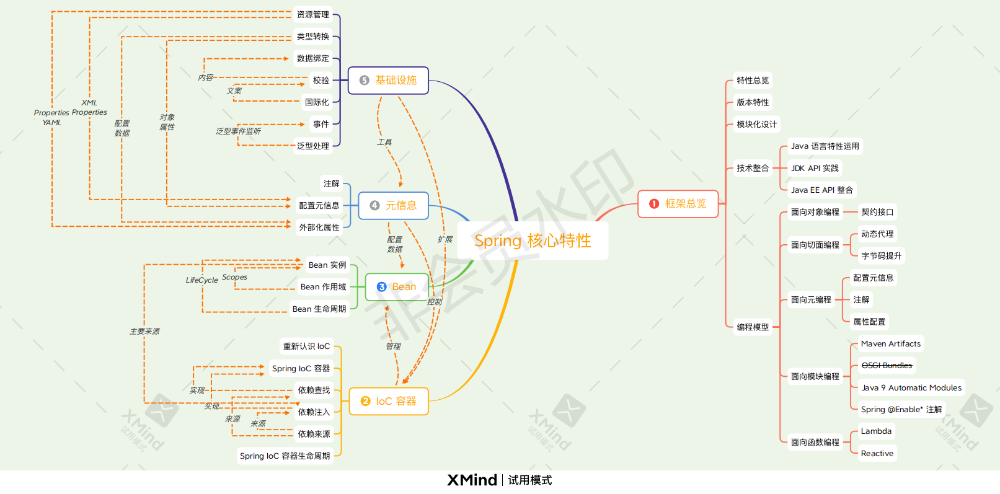
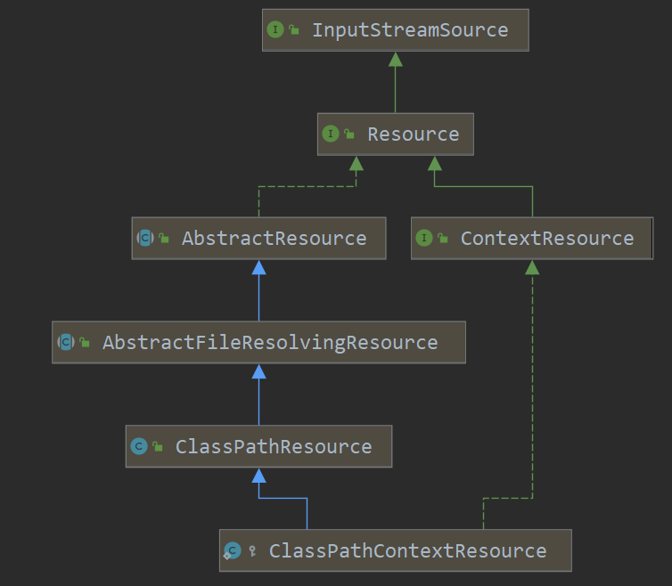
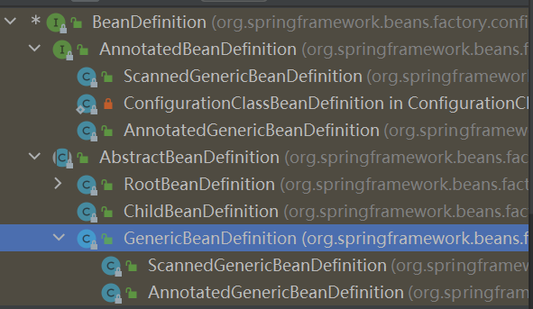

# 资料

极客时间《小马哥讲Spring核心编程思想》：https://time.geekbang.org/course/detail/100042601-264662

配套资料：https://gitee.com/geektime-geekbang/geekbang-lessons

Spring官方文档：https://spring.io/projects/spring-boot

# 前言

## Spring核心特性

直接看SpringFramework有哪些包模块就知道有哪些功能特性了。

- IoC 容器（IoC Container） 

- Spring 事件（Events） 

- 资源管理（Resources） 

- 国际化（i18n） 

- 校验（Validation） 

- 数据绑定（Data Binding） 

- 类型装换（Type Conversion） 

- Spring 表达式（Spring Express Language） 

- 面向切面编程（AOP）
- Web技术
  - Web Servlet技术(SpringWebMVC+WebSocket+SockJS)
  - Web Reactive技术(SpringWebFlux+WebClient+WebSocket)

最核心的5个模块：

- spring-core：Spring 基础 API 模块，如资源管理，泛型处理 

- spring-beans：Spring Bean 相关，如依赖查找，依赖注入 

- spring-aop : Spring AOP 处理，如动态代理，AOP 字节码提升 

- spring-context : 事件驱动、注解驱动，模块驱动等 

- spring-expression：Spring 表达式语言模块




## IOC

> 控制反转，好莱坞原则。**Hollywood Principle: Don't call us, we'll call you".**

职责：依赖处理(依赖查找+依赖注入) 、生命周期管理、配置

**主要实现** :

- Java SE 
  - Java Beans 
  - Java ServiceLoader SPI
  - JNDI（Java Naming and Directory Interface） 

- Java EE 
  - EJB（Enterprise Java Beans） 
  - Servlet 

- 开源
  - Apache Avalon（http://avalon.apache.org/closed.html） 
  - PicoContainer（http://picocontainer.com/） 
  - Google Guice（https://github.com/google/guice） 
  - Spring Framework（https://spring.io/projects/spring-framework）

### ApplicationContext和BeanFactory

**BeanFactory是IOC容器**，ApplicationContext在IOC基础上扩展了AOP、配置元信息(注解)、资源管理(Resource)、事件、国际化、Environment抽象，即**ApplicationContext是具有应用特性功能的IOC容器超集**。

```java
public class GenericApplicationContext extends AbstractApplicationContext implements BeanDefinitionRegistry {
	private final DefaultListableBeanFactory beanFactory;
}
```

其实ApplicationContext接口还继承了BeanFactory接口。

通过这种**继承+组合**的方式，GenericApplicationContext以内置DefaultListableBeanFactory实现了BeanFactory所有方法。

所有就有下面这种情况：

```java
// application和beanFactory不是同一个对象
// ApplicationContext不仅继承了BeanFactory接口，还组合了BeanFactory对象！
ConfigurableListableBeanFactory beanFactory = application.getBeanFactory();
System.out.println(beanFactory == application);// 永远为false
```

## Bean

### BeanDefinition

BeanDefinition 是 Spring Framework 中定义 Bean 的配置元信息接口，包含：

- 类名

- 配置元素，如作用域、自动绑定的模式，生命周期回调等 

- 其他 Bean 引用，又可称作合作者（collaborators）或者依赖（dependencies） 

- 配置设置，比如 Bean 属性（Properties）

比较重要的是：

| 属性                  | 描述                                                 |
| --------------------- | ---------------------------------------------------- |
| Class                 | Bean的全类名                                         |
| Name                  | BeanName，容器内唯一                                 |
| Scope                 | Bean作用域，如Singleton、Prototype                   |
| Primary               | 是否为首选bean，当以类型注入时发现多个候选bean则优先 |
| Constructor Arguments | 构造器参数，用于依赖注入                             |
| Properties            | Bean属性，用于依赖注入                               |
| AutowireMode          | Bean 自动绑定模式(如：通过名称 byName)               |
| LazyInit              | Bean延迟初始化模式                                   |
| initMethodName        | Bean初始化回调方法名称                               |
| destroyMethodName     | Bean销毁回调方法名称                                 |

**手动构建BeanDefinition**: `BeanDefinitionBuilder`

```java
public static void main(String[] args) {
    try (AnnotationConfigApplicationContext application = new AnnotationConfigApplicationContext()) {
        // 1.手动构建BeanDefinition
        BeanDefinitionBuilder builder = BeanDefinitionBuilder.genericBeanDefinition(TestBean.class);
        builder.addPropertyValue("testField", "testValue");// 在BeanDefinition中设置属性初始值
        builder.setPrimary(true); // 设置为primary
        System.out.println(builder.getBeanDefinition());

        // 2.beanName生成, 默认通过 DefaultBeanNameGenerator 实现: className + '#' + 数字(从0开始)
        String beanName = new DefaultBeanNameGenerator().generateBeanName(builder.getBeanDefinition(), application);
        System.out.println(beanName);// BeanDefinitionDemo$TestBean#0
        System.out.println(new AnnotationBeanNameGenerator().generateBeanName(builder.getBeanDefinition(), application));//beanDefinitionDemo.TestBean

        // 3.手动注册BeanDefinition方式来注册Bean
        application.registerBeanDefinition(beanName, builder.getBeanDefinition());
        application.refresh();// 需要刷新容器
        System.out.println(application.getBean(TestBean.class));

        // 4.注册BeanDefinition和Bean方式有以下几种：
        // 4.1 XML配置
        // 4.2 注解：@Bean; @Component; @Import
        // 4.3 Java API方式: AnnotatedBeanDefinitionReader#register()或BeanDefinitionRegistry#registerBeanDefinition(String,BeanDefinition)
        application.register(PersonController.class);

        // 5.直接注册实例作为单例Bean，比如注册线程池啥的
        ConfigurableListableBeanFactory beanFactory = application.getBeanFactory();
        beanFactory.registerSingleton("myThreadPool", new ThreadPoolExecutor(5, 10, 5, TimeUnit.SECONDS, new LinkedBlockingQueue<>()));

        ThreadPoolExecutor myThreadPool = application.getBean("myThreadPool", ThreadPoolExecutor.class);
        myThreadPool.execute(() -> System.out.println("从ioc容器取出线程池成功"));
        myThreadPool.shutdown();
    }
}

@Data
static class TestBean implements BeanNameAware {
    private String beanName;
    private String testField;
}
```

> 注意：在上面案例中，第5步以直接注册某个实例作为单例bean加入IOC容器，这个在**注册线程池作为bean**的时候比较有用。

### beanName

IOC容器内每个Bean可以有1个beanName和多个别名Alias，这些标识符都必须唯一。beanName就类似于Bean在容器内的Id。

Bean名称生成器(BeanNameGenerator)：

- `DefaultBeanNameGenerator`：默认通用 BeanNameGenerator 实现 

- `AnnotationBeanNameGenerator`：基于注解扫描的 BeanNameGenerator 实现

案例可以看上一节BeanDefinition中的案例。

> @Bean注解在未指定beanName时默认用方法名作为beanName。

### 初始化和销毁

> @PostConstruct和@PreDestory来自于javax.annotation包，需额外引入

指定**Bean初始化**方法有3种方式：

1、javax插件式：`@PostConstruct `标注方法 

2、Spring 接口：实现 InitializingBean 接口的 afterPropertiesSet() 方法 

3、Spring BeanDefinition：

- XML 配置：`<bean init-method=”init” ... /> `

- Java 注解：`@Bean(initMethod=”methodName”) `

- Java API：`BeanDefinition#setInitMethodName(String)`

**延迟初始化**：

- XML配置：`<bean lazy-init=”true” ... />`

- 在@Bean标注方法上同时标注@Lazy
- Java API：`BeanDefinition#setLazyInit(boolean)`

指定**Bean销毁方法**有3种方式：

1、javax插件式方式：`@PreDestroy `标注方法 

2、Spring 接口：实现 DisposableBean 接口的 destroy() 方法 

3、Spring BeanDefinition：

- XML 配置：`<bean destroy="destroy" ... /> `

- Java 注解：`@Bean(destroy="destroy") `

- Java API：`BeanDefinition#setDestroyMethodName(String)`

案例如下：

```java
public class BeanInitAndDestroyDemo {
    public static void main(String[] args) {
        try (AnnotationConfigApplicationContext application = new AnnotationConfigApplicationContext()) {
            application.register(BeanInitAndDestroyDemo.class);
            application.refresh();
            System.out.println(application.getBeansOfType(TestBean.class));
        }
    }

    @Bean(initMethod = "initMethod", destroyMethod = "destroyMethod")
    @Lazy   // 延迟初始化
    public TestBean getTestBean() {
        return new TestBean();
    }
}

@Data
class TestBean implements InitializingBean, DisposableBean, BeanNameAware {
    private String beanName;

    @PostConstruct
    // 此注解来自于javax包，需要引入
    public void init() {
        System.out.println("@PostConstruct注解指定的初始化方法执行了...");
    }

    @PreDestroy
    // 此注解来自于javax包，需要引入
    public void preDestroy() {
        System.out.println("@PreDestroy注解指定的销毁方法执行了...");
    }

    @Override
    public void afterPropertiesSet() throws Exception {
        System.out.println("InitializingBean接口指定的初始化方法执行了...");
    }

    @Override
    public void destroy() throws Exception {
        System.out.println("DisposableBean接口指定的销毁方法执行了...");
    }

    public void initMethod() {
        System.out.println("@Bean注解指定的初始化方法指定了...");
    }

    public void destroyMethod() {
        System.out.println("@Bean注解指定的销毁方法指定了...");
    }
}
```

执行结果：

```shell
@PostConstruct注解指定的初始化方法执行了...
InitializingBean接口指定的初始化方法执行了...
@Bean注解指定的初始化方法指定了...
{getTestBean=TestBean(beanName=getTestBean)}
@PreDestroy注解指定的销毁方法执行了...
DisposableBean接口指定的销毁方法执行了...
@Bean注解指定的销毁方法指定了...
```

Bean初始化方法执行顺序是: 

> `@PostConstruct --> InitializingBean --> @Bean(initMethod="methodName")`

Bean销毁方法执行顺序是：

> `@Bean(destroyMethod="methodName") --> @PreDestroy --> DisposableBean`

## 依赖查找

### jdk提供的依赖查找

1、单一类型依赖查找 

- JNDI - javax.naming.Context#lookup(javax.naming.Name) 

- JavaBeans - java.beans.beancontext.BeanContext 

2、集合类型依赖查找 

- java.beans.beancontext.BeanContext 

3、层次性依赖查找 

- java.beans.beancontext.BeanContext

### 依赖查找类型

1、根据beanName查找

2、根据bean类型查找

3、Bean延迟查找

- getBeanProvider(Class) 

- getBeanProvider(ResolvableType) 

4、根据注解查找

```java
public static void main(String[] args) {
    try (AnnotationConfigApplicationContext application = 
         new AnnotationConfigApplicationContext(MyBeanConfig.class)) {
        // 1.依赖查找
        // 1.1 根据beanName找bean
        System.out.println(application.getBean("personService", PersonService.class));
        // 1.2 根据类型找bean
        System.out.println(application.getBean(PersonService.class));
        // 1.3 根据类型找多个bean对象
        Map<String, PersonService> beansOfType = application.getBeansOfType(PersonService.class);// beanName-->bean
        System.out.println(beansOfType);

        // 1.4 根据注解找bean，需要注意注解的作用范围必须是RUNTIME级别哦
        System.out.println(application.getBeansWithAnnotation(Indexed.class));// 查找标注有@Indexed注解的所有bean
        System.out.println(application.findAnnotationOnBean("personService", Indexed.class));// 获取指定名称 + 标注类型 Bean 实例

        // 1.5 获取BeanProvider
        ObjectProvider<PersonService> beanProvider = application.getBeanProvider(PersonService.class);
        System.out.println("beanProvider: " + beanProvider.getObject());

        // 2.获取容器内建bean
        Environment environment = application.getBean(Environment.class);
        System.out.println(Arrays.toString(environment.getDefaultProfiles()));

        // 3.application和beanFactory不是同一个对象, ApplicationContext不仅继承了BeanFactory接口，还组合了BeanFactory对象！
        ConfigurableListableBeanFactory beanFactory = application.getBeanFactory();
        System.out.println(beanFactory == application);// 永远为false
    }
}
```

**延迟查找的作用：**

> 通过BeanProvider查找bean是安全的，而通过名称或类型查找是不安全的，不存在或存在多个匹配bean都会报错。

### 内建可查找bean

```java
// 4.查出所有单例beanName及其类型
for (String singletonName : application.getBeanFactory().getSingletonNames())
    System.out.println(singletonName + ": " + application.getBean(singletonName).getClass());
```

内建bean有如下：

| beanName                    | 类型                        | 使用场景                |
| --------------------------- | --------------------------- | ----------------------- |
| enviroment                  | Environment                 | 外部化配置以及 Profiles |
| systemProperties            | java.util.Properties        | java系统属性，如jdk版本 |
| systemEnvironment           | java.util.Map               | 操作系统环境变量        |
| messageSource               | MessageSource               | 国际化文案              |
| lifecycleProcessor          | LifecycleProcessor          | LifeCycle Bean处理器    |
| applicationEventMulticaster | ApplicationEventMulticaster | Spring 事件广播器       |


## 依赖注入DI

依赖注入有手动模式：比如XML配置、注解配置、Java API。

依赖注入更多是用自动模式：@Autowired、@Value、@Inject、@Resource。

### DI类型

| 注入类型      | 例子                                                         |
| ------------- | ------------------------------------------------------------ |
| 方法参数      | `@Autowired public void setUser(User user) { this.user= user; }` |
| 构造器参数    | `@Autowired public TestBean(User user) { this.user= user; }` |
| 字段          | `@Autowired User user;`                                      |
| Aware接口回调 | `class MyBean implements BeanFactoryAware { ... }`           |

> 注意：方法参数是创建完bean填充属性时，`AutowiredAnnotationBeanPostProcessor`以**参数名查找IOC容器内的bean**，然后调用方法。
>
> 构造器参数的注入则是在bean实例化的时候传入。
>
> **方法参数是根据参数名称查找bean，属性字段根据类型查找bean。**

Setter方法注入也可以在BeanDefinition中添加属性：JavaAPI

```java
User user=application.getBean("user",User.class);
BeanDefinitionBuilder builder=BeanDefinitionBuilder.genericBeanDefinition(TestBean.class);
builder.addPropertyValue("user", user);
application.registerBeanDefinition("testBean", builder.getBeanDefinition());
```

构造器参数注入也可以在BeanDefinition中添加参数：JavaAPI

```java
BeanDefinitionBuilder builder = BeanDefinitionBuilder.genericBeanDefinition(TestBean.class);
builder.addConstructorArgValue(application.getBean("testField"));
application.registerBeanDefinition("testBean", builder.getBeanDefinition());
```

### Qualifier

作用：用于给bean标记分组。在用@Autowired注解时可以同时标注此注解用于限定候选bean范围。

```java
@Configuration
@Data
public class DependencyInjectDemo {
    public static void main(String[] args) {
        try (AnnotationConfigApplicationContext application = new AnnotationConfigApplicationContext()) {
            application.register(DependencyInjectDemo.class);
            application.refresh();
            System.out.println(application.getBean(DependencyInjectDemo.class).testBean.name);// v1
        }
    }

    @Autowired
    @Qualifier("group1")
    private TestBean testBean;

    @Bean
    @Qualifier("group1")
    public TestBean getTestBean1() {
        return new TestBean("v1");
    }

    @Bean
    @Qualifier("group2")
    public TestBean getTestBean2() {
        return new TestBean("v2");
    }

    @Data
    @NoArgsConstructor
    @AllArgsConstructor
    static class TestBean {
        private String name;
    }
}
```

可以看到在有多个候选bean的时候，根据`@Qualifier`成功定位到了需要的bean。

> 注意：默认情况下，每个bean都自己单独一个组，组名为beanName。所以在有多个候选bean的时候，可以用@Qualifier("beanName")筛选需要的bean。

### 延迟注入

所谓延迟注入，就是在调用getObject()方法的时候才去ioc容器里查bean。

有两个方式：ObjectFactory和ObjectProvider.
## Bean作用域

| 作用域      | 描述                                                       |
| ----------- | ---------------------------------------------------------- |
| singleton   | 默认 Spring Bean 作用域，一个 BeanFactory 有且仅有一个实例 |
| prototype   | 原型作用域，每次依赖查找和依赖注入生成新 Bean 对象         |
| request     | Bean 存储在 ServletRequest 上下文中                        |
| session     | Bean 存储在 HttpSession 中                                 |
| application | Bean 存储在 ServletContext 中                              |

随着模板引擎的边缘化，只需要关注前两种作用域即可。

> 注意：singletonBean有完整生命周期，而prototypeBean只能执行指定的初始化方法回调，不会执行销毁方法。

## 自定义bean性质

Spring Framework 提供了许多可用于自定义 bean 性质的接口。本节将它们分组如下：

- [生命周期回调](https://docs.spring.io/spring-framework/docs/current/reference/html/core.html#beans-factory-lifecycle)
- [`Aware`接口](https://docs.spring.io/spring-framework/docs/current/reference/html/core.html#aware-list)

### LifeCycle

```java
// 定义启动/停止生命周期控制方法的通用接口。典型的用例是控制异步处理。
public interface Lifecycle {
    // 容器启动完成时调用
    void start();

    // 容器停止前调用
    void stop();

    // 检查此组件当前是否正在运行
    boolean isRunning();
}
```

还有一个SmartLifeCycle，它支持在ApplicationContext刷新时重新启动再次调用start()方法：

```java
// 对于那些需要在ApplicationContext刷新和/或以特定顺序关闭时启动的对象的Lifecycle接口的扩展。
public interface SmartLifecycle extends Lifecycle, Phased {
    int DEFAULT_PHASE = Integer.MAX_VALUE;

    /**
	 * true表示ApplicationContext刷新时此bean需要自动重启，即调用start()方法
	 * false值表示该组件旨在通过显式start()调用来启动，类似于普通的Lifecycle实现。
	 */
    default boolean isAutoStartup() { return true; }

    default void stop(Runnable callback) {
        stop();
        callback.run();
    }
}
```

### Aware

这个和Autowire长得挺像，其实功能也差不多，就是属性注入。

```java
/**
一个标记超级接口，指示 bean 有资格通过回调样式的方法被特定框架对象的 Spring 容器通知。
实际的方法签名由各个子接口确定，但通常应仅由一个接受单个参数的返回空值的方法组成。
请注意，仅实现Aware提供默认功能。 相反，处理必须明确完成，例如在org.springframework.beans.factory.config.BeanPostProcessor 。 
有关处理特定*Aware接口回调的示例，请参阅org.springframework.context.support.ApplicationContextAwareProcessor 。
 */
public interface Aware {
}
```

简而言之，这就是一个顶层接口，实现了该接口的bean会被容器通知获取某个容器内部对象，如ApplicationContext。

在bean生命周期的初始化阶段时执行回调，初始化操作的第一步就是执行Aware调用。

| Name                             | 注入依赖                                                     |
| :------------------------------- | :----------------------------------------------------------- |
| `ApplicationContextAware`        | 声明`ApplicationContext`.                                    |
| `ApplicationEventPublisherAware` | 封闭的事件发布者`ApplicationContext`。                       |
| `BeanClassLoaderAware`           | 类加载器用于加载 bean 类。                                   |
| `BeanFactoryAware`               | 声明`BeanFactory`.                                           |
| `BeanNameAware`                  | 声明 bean 的名称。                                           |
| `LoadTimeWeaverAware`            | 用于在加载时处理类定义的定义编织器。                         |
| `MessageSourceAware`             | Configured strategy for resolving messages (with support for parametrization and internationalization). |
| `NotificationPublisherAware`     | Spring JMX 通知发布者。                                      |
| `ResourceLoaderAware`            | 为低级访问资源配置加载器。                                   |
| `ServletConfigAware`             | 当前`ServletConfig`容器运行。仅在 web-aware Spring 中有效 `ApplicationContext`。 |
| `ServletContextAware`            | 当前`ServletContext`容器运行。仅在 web-aware Spring 中有效 `ApplicationContext`。 |

再次注意，使用这些接口会将代码绑定到SpringAPI，而不会遵循控制风格的反转。因此，对于需要对容器进行编程访问的基础结构bean，才建议使用它们。

## 容器扩展点

通常，应用程序开发人员不需要对`ApplicationContext` 实现类进行子类化。相反，可以通过插入特殊集成接口的实现来扩展 Spring IoC 容器。

### BeanPostProcessor

这是Spring开放式架构的一个必不可少的亮点，**给用户充足的权限去更改或者扩展Spring**，比如AOP就是基于此实现。

可以配置多个BeanPostProcessor，并设置order属性控制运行顺序。

BeanPostProcessor在调用用户自定义初始化方法前以及调用自定义初始化方法后分别会调用BeanPostProcessor的postProcessBeforeInitialization和postProcessAfterinitialization方法，使用户可以根据自己的业务需求就行相应的处理，这里相应的处理顺序可以看看bean生命周期中初始化阶段的处理逻辑。

BeanPostProcessor接口如下：

```java
/**
 * 允许自定义修改新 bean 实例的 Factory hook ——例如，检查标记接口 或 用代理包装bean
 * 通常，通过标记接口等填充 bean 的后处理器将实现 postProcessBeforeInitialization，
 * 而使用代理包装 bean 的后处理器通常将实现postProcessAfterInitialization。
 *
 * 顺序性：
 * ApplicationContext自动检测的BeanPostProcessor bean 将根据PriorityOrdered和Ordered接口进行排序。 
 * 而以编程方式注册到BeanFactory的BeanPostProcessor bean 将按注册顺序应用； 
 * 对于以编程方式注册的后处理器，通过实现PriorityOrdered或Ordered接口表达的任何排序语义都将被忽略
 * 此外，@Order注释不会被BeanPostProcessor bean 考虑在内。
 */
public interface BeanPostProcessor {

    /**
     * 任何bean初始化前回调此方法
     * @return bean实例，可能是原始实例(默认情况)，可能是包装的实例，如果为null，则不会调用后续的 BeanPostProcessors
     */
    default Object postProcessBeforeInitialization(Object bean, String beanName) throws BeansException {
        return bean;
    }

    /**
     * 任何bean初始化后回调此方法
     * 在 FactoryBean 的情况下，将为 FactoryBean 实例和 FactoryBean 创建的对象调用此回调（从 Spring 2.0 开始）。 后处理器可以通过相应的bean instanceof FactoryBean检查来决定是应用于 FactoryBean 或创建的对象还是两者。
	 * @return bean实例，可能是原始实例(默认情况)，可能是包装的实例，如果为null，则不会调用后续的 BeanPostProcessors
     * @see org.springframework.beans.factory.FactoryBean
     */
    default Object postProcessAfterInitialization(Object bean, String beanName) throws BeansException {
        return bean; // 默认实现按原样返回给定的bean，啥也不干
    }
}
```

对于BeanPostProcessor，有一个非常重要的实现`AutowiredAnnotationBeanPostProcessor`，可自动装配带注解的字段、setter 方法和任意配置方法。 通过检测`@Autowired`和`@Value`注解这些要注入的成员。

#### 自定义注意的地方

自定义BeanPostProcessor的实现类时，**最好直接用@Component注解标注为顶级组件类**。

如果用@Bean注解放入到@Configuration配置类中，会导致这个配置类提前实例化、初始化，因为ApplicationContext的refresh()方法**在注册BeanPostProcessor阶段会将所有BeanPostProcessor实例化**，这将导致@Configuration类提前实例化。

而一般情况下，单例bean是在ApplicationContext生命周期的BeanFactory初始化完成阶段才会去预实例化所有单例bean。

```java
@Configuration
@PropertySource("classpath:application.properties") // 只能解析properties文件，不能解析yaml文件
@ComponentScan({"com.fzk.controller", "com.fzk.service"})
public class AppConfig {
    @Bean
    public MyBeanPostProcessor getMyBeanPostProcessor() {
        return new MyBeanPostProcessor();
    }
}
```

像这种配置的BeanPostProcessor，必然会导致这个AppConfig配置类提前实例化。

在PostProcessorRegistrationDelegate.registerBeanPostProcessors方法中，对于自定义的没有实现`Ordered`接口的BeanPostProcessor注册步骤如下：getBean()方法会导致其所依赖的AppConfig提前实例化。

```java
// Now, register all regular BeanPostProcessors.
List<BeanPostProcessor> nonOrderedPostProcessors = new ArrayList<>(nonOrderedPostProcessorNames.size());
for (String ppName : nonOrderedPostProcessorNames) {
   BeanPostProcessor pp = beanFactory.getBean(ppName, BeanPostProcessor.class);
   nonOrderedPostProcessors.add(pp);
   if (pp instanceof MergedBeanDefinitionPostProcessor) {
      internalPostProcessors.add(pp);
   }
}
registerBeanPostProcessors(beanFactory, nonOrderedPostProcessors);
```

因此最好直接用@Component注解加入到容器中，减少对自定义单例bean的依赖。

### BeanFactoryPostProcessor

另一个扩展点是 `org.springframework.beans.factory.config.BeanFactoryPostProcessor`。此接口的语义类似于`BeanPostProcessor` 的语义，但有一个主要区别：`BeanFactoryPostProcessor`对 bean 配置元数据进行操作。

```java
// Factory hook，允许自定义修改应用程序上下文的 BeanDefinition，调整上下文底层 BeanFactory的bean属性值
@FunctionalInterface
public interface BeanFactoryPostProcessor {
   // 在ApplicationContext生命周期的BeanFactory后置处理阶段回调执行
   void postProcessBeanFactory(ConfigurableListableBeanFactory beanFactory) throws BeansException;
}
```

#### BeanDefinitionRegistryPostProcessor

它有一个子接口，也是在ApplicationContext生命周期的BeanFactory后置处理阶段回调执行，且先于父接口回调。

```java
/**
 * 对标准BeanFactoryPostProcessor SPI 的扩展，
 * 允许在常规 BeanFactoryPostProcessor 检测开始之前 注册进一步的 BeanDefinition
 * 特别重要的是可以用此接口注册 BeanFactoryPostProcessor接口实现类的BeanDefinition
 * @see org.springframework.context.annotation.ConfigurationClassPostProcessor
 */
public interface BeanDefinitionRegistryPostProcessor extends BeanFactoryPostProcessor {
   void postProcessBeanDefinitionRegistry(BeanDefinitionRegistry registry) throws BeansException;
}
```

它的主要作用是在调用其他的BeanFactoryPostProcessor之前，进一步进行bean定义注册。比如在此时只注册了@Configuration类，其@Bean标注的还没有注册，就需要用它来注册了。

它有一个非常重要的实现类类：`ConfigurationClassPostProcessor`

#### ConfigurationClassPostProcessor

位于org.springframework.context.annotation包，先看看相关的有哪些类


此类将在这个回调期间，解析容器内所有的组件bean，从其标注的@Import、@ComponentScan、@Bean等注解引入新的BeanDefinition。

# Bean生命周期

1、Spring Bean 元信息配置阶段 

- 基于XML配置
- 基于注解配置
- 基于JavaAPI配置

2、Spring Bean 元信息解析阶段 

- XML解析器 - BeanDefinitionParser
- 注解 BeanDefinition 解析 AnnotatedBeanDefinitionReader

3、Spring Bean 注册阶段：BeanDefinition 注册接口 BeanDefinitionRegistry

```java
try (AnnotationConfigApplicationContext application = new AnnotationConfigApplicationContext()) {
    // application.register(BeanLifeCycleDemo.class); // 其实这里的注册就是调用的下面这个reader.register()
    AnnotatedBeanDefinitionReader reader = new AnnotatedBeanDefinitionReader(application);
    // 其实这个也是调用的DefaultListableBeanFactory#registerBeanDefinition()
    reader.register(BeanLifeCycleDemo.class);
    application.refresh();
}
```

所以注册得看DefaultListableBeanFactory怎么实现的：

```java
public void registerBeanDefinition(String beanName, BeanDefinition beanDefinition)
    throws BeanDefinitionStoreException {
	// 省略检查
    BeanDefinition existingDefinition = this.beanDefinitionMap.get(beanName);
    if (existingDefinition != null) {
        // 是否运行覆盖BeanDefinition
        if (!isAllowBeanDefinitionOverriding()) {/*省略抛异常*/}
       	// 省略覆盖提示的日志
        // 覆盖BeanDefinition定义
        this.beanDefinitionMap.put(beanName, beanDefinition);
    }
    else {
        if (hasBeanCreationStarted()) {/*省略*/}
        else {
            // Still in startup registration phase
            this.beanDefinitionMap.put(beanName, beanDefinition);
            this.beanDefinitionNames.add(beanName);
            removeManualSingletonName(beanName);
        }
        this.frozenBeanDefinitionNames = null;
    }
	// 省略部分代码
}
```

4、Spring BeanDefinition 合并阶段 

父子 BeanDefinition 合并，没有父类bean的class可以用RootBeanDefinition表示，有父类bean的可用GenericBeanDefinition。

现在默认是GenericBeanDefinition，其中有个parent属性用来表示父类bean定义。

BeanDefinition合并没搞懂：https://time.geekbang.org/course/detail/100042601-209704

5、Spring Bean Class 加载阶段 

如果BeanDefinition中的属性beanClass是String类型，即类路径时，则去加载这个Class对象，并赋给beanClass属性。

按理说BeanDefinition中肯定有bean的Class对象啊？为什么要加载一下呢？

因为XML定义的是bean的类路劲，需要加载为Class对象；

JavaAPI方式直接生成的BeanDefinition也可能没有加载。

注解方式的BeanDefinition一般都有Class对象。

## createBean

```java
protected Object createBean(String beanName, RootBeanDefinition mbd, @Nullable Object[] args)
    throws BeanCreationException {

    RootBeanDefinition mbdToUse = mbd;
	// 确保已经加载Class对象
    Class<?> resolvedClass = resolveBeanClass(mbd, beanName);
    if (resolvedClass != null && !mbd.hasBeanClass() && mbd.getBeanClassName() != null) {
        mbdToUse = new RootBeanDefinition(mbd);
        mbdToUse.setBeanClass(resolvedClass);
    }
	// 实例化前回调执行
    // 这里要注意，如果返回的bean不能null，将被视为代理对象，后面的生命周期回调都不再执行
    Object bean = resolveBeforeInstantiation(beanName, mbdToUse);
    if (bean != null) {return bean;}
    
	// 省略了所有异常处理和日志
    Object beanInstance = doCreateBean(beanName, mbdToUse, args);
    return beanInstance;   
}
```

### 6.Bean实例化前回调

`InstantiationAwareBeanPostProcessor#postProcessBeforeInstantiation()`

```java
//AbstractAutowireCapableBeanFactory.java
protected Object resolveBeforeInstantiation(String beanName, RootBeanDefinition mbd) {
    Object bean = null;
   	// 省略无关紧要的代码后：
    bean = applyBeanPostProcessorsBeforeInstantiation(targetType, beanName);
    if (bean != null) {
        // 若实例化前回调返回代理bean，则只执行实例化后回调
        bean = applyBeanPostProcessorsAfterInitialization(bean, beanName);
    }     
    return bean;
}

protected Object applyBeanPostProcessorsBeforeInstantiation(Class<?> beanClass, String beanName) {
    // 将容器内的InstantiationAwareBeanPostProcessor接口实现bean
    // 的实例化前回调都执行一次
    for (InstantiationAwareBeanPostProcessor bp : getBeanPostProcessorCache().instantiationAware) {
        Object result = bp.postProcessBeforeInstantiation(beanClass, beanName);
        if (result != null)
            return result;
    }
    return null;
}
```

从这能看出，实例化前回调返回的代理对象会执行实例化后回调，但是不会执行之后的初始化回调和属性填充了。

> 实例化回调的目的：是否需要IOC提供的实例化方式，**在这里拦截可以自定义实例化**。

## doCreateBean

### 7.Bean实例化

实例化前回调执行完成后，若无代理对象产生，将进入doCreateBean()方法，开始实例化：

```java
// AbstractAutowireCapableBeanFactory.java
protected Object doCreateBean(String beanName, RootBeanDefinition mbd, @Nullable Object[] args)
    throws BeanCreationException {
    // bean包装器
    BeanWrapper instanceWrapper = null;
    if (mbd.isSingleton()) {
        instanceWrapper = this.factoryBeanInstanceCache.remove(beanName);
    }
    if (instanceWrapper == null) {
        // 创建实例
        instanceWrapper = createBeanInstance(beanName, mbd, args);
    }
    
    Object bean = instanceWrapper.getWrappedInstance();
    Class<?> beanType = instanceWrapper.getWrappedClass();
    if (beanType != NullBean.class) {
        mbd.resolvedTargetType = beanType;
    }

    // Allow post-processors to modify the merged bean definition.
    synchronized (mbd.postProcessingLock) {
        if (!mbd.postProcessed) {
            try {
                applyMergedBeanDefinitionPostProcessors(mbd, beanType, beanName);
            }
            catch (Throwable ex) {
                throw new BeanCreationException(mbd.getResourceDescription(), beanName,
                                                "Post-processing of merged bean definition failed", ex);
            }
            mbd.postProcessed = true;
        }
    }

    // Eagerly cache singletons to be able to resolve circular references
    // even when triggered by lifecycle interfaces like BeanFactoryAware.
    boolean earlySingletonExposure = (mbd.isSingleton() && this.allowCircularReferences &&
                                      isSingletonCurrentlyInCreation(beanName));
    if (earlySingletonExposure) {
        if (logger.isTraceEnabled()) {
            logger.trace("Eagerly caching bean '" + beanName +
                         "' to allow for resolving potential circular references");
        }
        addSingletonFactory(beanName, () -> getEarlyBeanReference(beanName, mbd, bean));
    }

    // Initialize the bean instance.
    Object exposedObject = bean;
    try {
        populateBean(beanName, mbd, instanceWrapper);
        exposedObject = initializeBean(beanName, exposedObject, mbd);
    }
    catch (Throwable ex) {
        if (ex instanceof BeanCreationException && beanName.equals(((BeanCreationException) ex).getBeanName())) {
            throw (BeanCreationException) ex;
        }
        else {
            throw new BeanCreationException(
                mbd.getResourceDescription(), beanName, "Initialization of bean failed", ex);
        }
    }

    if (earlySingletonExposure) {
        Object earlySingletonReference = getSingleton(beanName, false);
        if (earlySingletonReference != null) {
            if (exposedObject == bean) {
                exposedObject = earlySingletonReference;
            }
            else if (!this.allowRawInjectionDespiteWrapping && hasDependentBean(beanName)) {
                String[] dependentBeans = getDependentBeans(beanName);
                Set<String> actualDependentBeans = new LinkedHashSet<>(dependentBeans.length);
                for (String dependentBean : dependentBeans) {
                    if (!removeSingletonIfCreatedForTypeCheckOnly(dependentBean)) {
                        actualDependentBeans.add(dependentBean);
                    }
                }
                if (!actualDependentBeans.isEmpty()) {
                    throw new BeanCurrentlyInCreationException(beanName,
                                                               "Bean with name '" + beanName + "' has been injected into other beans [" +
                                                               StringUtils.collectionToCommaDelimitedString(actualDependentBeans) +
                                                               "] in its raw version as part of a circular reference, but has eventually been " +
                                                               "wrapped. This means that said other beans do not use the final version of the " +
                                                               "bean. This is often the result of over-eager type matching - consider using " +
                                                               "'getBeanNamesForType' with the 'allowEagerInit' flag turned off, for example.");
                }
            }
        }
    }

    // Register bean as disposable.
    try {
        registerDisposableBeanIfNecessary(beanName, bean, mbd);
    }
    catch (BeanDefinitionValidationException ex) {
        throw new BeanCreationException(
            mbd.getResourceDescription(), beanName, "Invalid destruction signature", ex);
    }

    return exposedObject;
}
```

#### 选择构造器

```java
// 使用适当的实例化策略为指定的 bean 创建一个新实例：工厂方法、构造函数自动装配或简单实例化。
protected BeanWrapper createBeanInstance(String beanName, RootBeanDefinition mbd, @Nullable Object[] args) {
	// 省略部分代码
    // 1.根据@Autowired确定构造器，有则调用该构造器
    Constructor<?>[] ctors = determineConstructorsFromBeanPostProcessors(beanClass, beanName);
    if (ctors != null || mbd.getResolvedAutowireMode() == AUTOWIRE_CONSTRUCTOR ||
        mbd.hasConstructorArgumentValues() || !ObjectUtils.isEmpty(args)) {
        return autowireConstructor(beanName, mbd, ctors, args);
    }

    // 2.从BeanDefinition中获取是否设置有偏好的构造器? 
    // Spring5.1 新增，可以自己手动设置到BeanDefinition
    ctors = mbd.getPreferredConstructors();
    if (ctors != null) {
        return autowireConstructor(beanName, mbd, ctors, null);
    }

    // 3.直接用默认无参构造器创建实例
    return instantiateBean(beanName, mbd);
}
```

构造器的挑选是执行SmartInstantiationAwareBeanPostProcessor#determineCandidateConstructors()回调方法，目前容器和@Autowired注入有关的只有AutowiredAnnotationBeanPostProcessor：

它确定构造器规则为

> 1、判断构造器是否标记有@Autowired，有则直接用(只有1个构造方法能被标记@Autowired)
>
> 2、只有1个构造器且为有参构造器也直接用
>
> 3、返回null，即最后会进行默认无参构造器构造

```java
protected Constructor<?>[] determineConstructorsFromBeanPostProcessors(@Nullable Class<?> beanClass, String beanName)
    throws BeansException {
    if (beanClass != null && hasInstantiationAwareBeanPostProcessors())
        for (SmartInstantiationAwareBeanPostProcessor bp : 
             getBeanPostProcessorCache().smartInstantiationAware) {
            Constructor<?>[] ctors = bp.determineCandidateConstructors(beanClass, beanName);
            if (ctors != null) return ctors;
        }
    return null;
}
```

#### autowire参数注入

若挑选出的构造器带参数，则需要进行参数注入。

从下面代码看，构造器参数注入的逻辑是将所有参数类型都进行依赖解析处理，然后反射调用构造器即可。

依赖解析的具体实现看@Autowired分析环节里的依赖解析。

```java
// ConstructorResolver.java
// autowire构造函数，从容器内找bean注入参数
public BeanWrapper autowireConstructor(String beanName, RootBeanDefinition mbd,
                                       @Nullable Constructor<?>[] chosenCtors, 
                                       @Nullable Object[] explicitArgs) {
    // 省略部分代码
    if (constructorToUse == null || argsToUse == null) {
        // 省略部分代码
        // 解析@Autowired是否必须注入
        boolean autowiring = (chosenCtors != null ||
                              mbd.getResolvedAutowireMode() 
                              == AutowireCapableBeanFactory.AUTOWIRE_CONSTRUCTOR);
        // 省略部分代码
        for (Constructor<?> candidate : candidates) {
            int parameterCount = candidate.getParameterCount();
            // 省略部分代码
            argsHolder = createArgumentArray(
                beanName, mbd, resolvedValues, bw, 
                paramTypes, paramNames,getUserDeclaredConstructor(candidate), 
                autowiring, candidates.length == 1);
            // 省略部分代码
        }
        // 省略部分代码
    }
    // 构造器反射调用创建实例
    bw.setBeanInstance(instantiate(beanName, mbd, constructorToUse, argsToUse));
    return bw;
}

// 找到构造器参数bean，它的核心逻辑其实就是根据参数类型进行 依赖解析
private ArgumentsHolder createArgumentArray(
    String beanName, RootBeanDefinition mbd, 
    @Nullable ConstructorArgumentValues resolvedValues,
    BeanWrapper bw, Class<?>[] paramTypes, 
    @Nullable String[] paramNames, Executable executable,
    boolean autowiring, boolean fallback) {
	// 省略部分代码
	// 遍历参数挨着找bean
    for (int paramIndex = 0; paramIndex < paramTypes.length; paramIndex++) {
        // 参数类型
        Class<?> paramType = paramTypes[paramIndex];
        String paramName = (paramNames != null ? paramNames[paramIndex] : "");
 		// 省略部分代码
        MethodParameter methodParam = MethodParameter.forExecutable(executable, paramIndex);
     	// 解析自动注入参数：这个就是 依赖解析
        // 它会调用 beanFactory.resolveDependency()根据类型查找需要的bean
        // 具体实现看@Autowired注解详解的 依赖解析部分
        Object autowiredArgument = resolveAutowiredArgument(
            methodParam, beanName, autowiredBeanNames, converter, fallback);
        args.rawArguments[paramIndex] = autowiredArgument;
        args.arguments[paramIndex] = autowiredArgument;
        args.preparedArguments[paramIndex] = autowiredArgumentMarker;
        args.resolveNecessary = true;
        // 省略部分代码           
    }
	// 注册依赖关系
    for (String autowiredBeanName : autowiredBeanNames) {
        this.beanFactory.registerDependentBean(autowiredBeanName, beanName);
    }
    return args;
}
```

#### 实例化

不管是参数注入构造，还是无参构造，都调用了SimpleInstantiationStrategy#instantiate()进行实例化：

```java
public Object instantiate(RootBeanDefinition bd, @Nullable String beanName, BeanFactory owner,
                          final Constructor<?> ctor, Object... args) {
    if (!bd.hasMethodOverrides()) {
       	// 省略安全检查
        // 无方法覆盖需求则直接反射调用构造器即可创建实例
        return BeanUtils.instantiateClass(ctor, args);
    }
    // 需要方法覆盖情况：@Configuration标记的类中有@Bean方法时需要覆盖
    // 此时必须CGLIB生成子类
    else return instantiateWithMethodInjection(bd, beanName, owner, ctor, args);
}
```

### populate

#### 8.Bean实例化后回调

这个bean实例化后回调居然是在AbstractAutowireCapableBeanFactory#populateBean()方法中执行?

实例化后回调为：`InstantiationAwareBeanPostProcessors#postProcessBeforeInstantiation()`

```java
// 使用来自BeanDefinition属性值填充bean实例
protected void populateBean(String beanName, RootBeanDefinition mbd, @Nullable BeanWrapper bw) {
    // 遍历所有InstantiationAwareBeanPostProcessors执行实例化后回调
    if (!mbd.isSynthetic() && hasInstantiationAwareBeanPostProcessors()) {
        for (InstantiationAwareBeanPostProcessor bp : 
             getBeanPostProcessorCache().instantiationAware) {
            if (!bp.postProcessAfterInstantiation(bw.getWrappedInstance(), beanName)) {
                return;
            }
        }
    }
  	// 省略部分代码
}
```

#### 9.属性填充前回调

在populate()方法执行完实例化后回调后，将执行`InstantiationAwareBeanPostProcessors#postProcessProperties()`回调。

这里最典型的是`AutowiredAnnotationBeanPostProcessor`对标记有@Autowired或@Value的属性和set方法进行注入。

```java
// 使用来自BeanDefinition属性值填充bean实例
protected void populateBean(String beanName, RootBeanDefinition mbd, @Nullable BeanWrapper bw) {
  	// 省略
    if (hasInstAwareBpps) {
        if (pvs == null) { pvs = mbd.getPropertyValues(); }
        // postProcessProperties回调执行
        // 此处典型的就是AutowiredAnnotationBeanPostProcessor进行属性和set方法的注入
        for (InstantiationAwareBeanPostProcessor bp : 
             getBeanPostProcessorCache().instantiationAware) {
            PropertyValues pvsToUse = bp.postProcessProperties(
                pvs, bw.getWrappedInstance(), beanName);
            pvs = pvsToUse;
        }
    }
  	// 省略部分代码
}
```

使用示例：可以添加一些属性赋值进去

```java
@Override
public PropertyValues postProcessProperties(PropertyValues pvs, Object bean, String beanName) throws BeansException {
    System.out.println(beanName + "属性填充回调...");
    if ("beanLifeCycleDemo".equals(beanName)) {
        MutablePropertyValues myPvs = (MutablePropertyValues) pvs;
        myPvs.addPropertyValue("属性名", "属性值");
    }
    return pvs;
}
```

> 属性填充前回调的目的是：添加一些属性赋值到pvs，后面是属性赋值将此填充到属性中。

#### 10.属性填充

```java
protected void populateBean(String beanName, RootBeanDefinition mbd, @Nullable BeanWrapper bw) {
   	// 省略实例化后回调

   	// 省略postProcessProperties回调

    // 属性填充
    if (pvs != null) {
        applyPropertyValues(beanName, mbd, bw, pvs);
    }
}
```

AbstractAutowireCapableBeanFactory#applyPropertyValues()如下：

```java
protected void applyPropertyValues(String beanName, BeanDefinition mbd, BeanWrapper bw, PropertyValues pvs) {
 	// 省略
    // 创建一个pvs的深拷贝
    List<PropertyValue> deepCopy = new ArrayList<>(original.size());
	// 省略过程

    // Set our (possibly massaged) deep copy.
	// 省略try/catch
 	bw.setPropertyValues(new MutablePropertyValues(deepCopy));
}
```

上面这个属性设置方法最终会对添加的每个属性都调用BeanWrapperImpl#setValue()方法：

```java
// BeanWrapperImpl.java
public void setValue(@Nullable Object value) throws Exception {
    Method writeMethod = (this.pd instanceof GenericTypeAwarePropertyDescriptor ?
                          ((GenericTypeAwarePropertyDescriptor) this.pd).getWriteMethodForActualAccess() :
                          this.pd.getWriteMethod());
   	// 省略安全检查
    ReflectionUtils.makeAccessible(writeMethod);
    writeMethod.invoke(getWrappedInstance(), value);
}
```

 从这里可以看到会调用添加属性的setter方法进行写入。

> 注意：经过测试，若没有setter方法，通过属性填充前回调添加的属性值将无法注入并报错。

### initializeBean

doCreateBean()方法在执行完populate()方法会立刻执行initializeBean()方法，进行bean实例的初始化。

```java
protected Object initializeBean(String beanName, Object bean, @Nullable RootBeanDefinition mbd) {
	// 省略安全检查
    // aware接口回调执行
    invokeAwareMethods(beanName, bean);
   
    Object wrappedBean = bean;
    // 初始化前回调执行
    if (mbd == null || !mbd.isSynthetic()) {
        wrappedBean = applyBeanPostProcessorsBeforeInitialization(wrappedBean, beanName);
    }

    // 初始化方法执行
    invokeInitMethods(beanName, wrappedBean, mbd);

    // 初始化后回调执行
    if (mbd == null || !mbd.isSynthetic()) {
        wrappedBean = applyBeanPostProcessorsAfterInitialization(wrappedBean, beanName);
    }
    return wrappedBean;
}
```

#### 11.Aware接口回调

在初始化阶段，首先进行aware接口回调执行：

可以看到这里仅有3个aware接口的回调会执行，那ApplicationContextAware接口的回调去哪了？它挪到了下面的初始化回调。

```java
private void invokeAwareMethods(String beanName, Object bean) {
    if (bean instanceof Aware) {
        if (bean instanceof BeanNameAware) 
            ((BeanNameAware) bean).setBeanName(beanName);
        if (bean instanceof BeanClassLoaderAware) {
            ClassLoader bcl = getBeanClassLoader();
            if (bcl != null) 
                ((BeanClassLoaderAware) bean).setBeanClassLoader(bcl);
        }
        if (bean instanceof BeanFactoryAware) 
            ((BeanFactoryAware) bean).setBeanFactory(
            AbstractAutowireCapableBeanFactory.this);
    }
}
```

#### 12.Bean初始化前回调

初始化阶段的第2步是回调`BeanPostProcessor#postProcessBeforeInitialization()`执行初始化前回调：

```java
public Object applyBeanPostProcessorsBeforeInitialization(Object existingBean, String beanName)
    throws BeansException {
    Object result = existingBean;
    for (BeanPostProcessor processor : getBeanPostProcessors()) {
        Object current = processor.postProcessBeforeInitialization(result, beanName);
        if (current == null) {
            return result;
        }
        result = current;
    }
    return result;
}
```

在这需要注意有个`ApplicationContextAwareProcessor`的bean，它实现了BeanPostProcessor接口的初始化前回调，在这个回调中它会将ApplicationContext注入到bean内。

还需要注意有个`CommonAnnotationBeanPostProcessor`在这里会处理生命周期中的`@PostConstruct`指定的初始化方法。这个算是javax方式指定的初始化方法，是Spring对javax的插件式支持。

> 为什么不放到下一部分真正的初始化阶段执行呢？
>
> 因为对javax注解Spring是用CommonAnnotationBeanPostProcessor方式作为插件式bean提供的支持，这样可以不改动Spring构建bean的执行逻辑。在javax.annotation包在类路劲时才会去主动加载这个bean插件。
>
> 它支持@Resource、@PostConstruct、@PreDestory等注解。

#### 13.Bean初始化

初始化前回调执行完成后，就该执行Spring方式指定的初始化方法了：

```java
// AbstractAutowireCapableBeanFactory.java
protected void invokeInitMethods(
    String beanName,  Object bean, @Nullable RootBeanDefinition mbd)
    throws Throwable {

    boolean isInitializingBean = (bean instanceof InitializingBean);
    if (isInitializingBean && (mbd == null || !mbd.hasAnyExternallyManagedInitMethod("afterPropertiesSet"))) {
        // 省略部分代码
		// InitializingBean接口指定的初始化方法执行
        ((InitializingBean) bean).afterPropertiesSet();
    }
	// 执行BeanDefinition中设置的初始化方法
    // 来源：1、XML配置, 2、@Bean指定, 3、Java API直接设置到BeanDefinition 
    if (mbd != null && bean.getClass() != NullBean.class) {
        String initMethodName = mbd.getInitMethodName();
        if (StringUtils.hasLength(initMethodName) &&
            !(isInitializingBean && "afterPropertiesSet".equals(initMethodName)) &&
            !mbd.hasAnyExternallyManagedInitMethod(initMethodName)) {
            invokeCustomInitMethod(beanName, bean, mbd);
        }
    }
}
```

> 初始化方法的指定：
> Spring方式：1.xml指定，2.@Bean指定，3.JavaAPI设置BeanDefinition，4.实现InitializingBean接口
> javax方式：@PostConstruct指定

这里仅会执行Spring方式指定的初始化方法，而javax方式是以插件式bean提供支持，在实例化前回调阶段执行。

#### 14.Bean初始化后回调

 在初始化bean阶段的最后是初始化后回调执行：`BeanPostProcessor#postProcessAfterInitialization()`

```java
public Object applyBeanPostProcessorsAfterInitialization(Object existingBean, String beanName)
      throws BeansException {

   Object result = existingBean;
   for (BeanPostProcessor processor : getBeanPostProcessors()) {
      Object current = processor.postProcessAfterInitialization(result, beanName);
      if (current == null) {
         return result;
      }
      result = current;
   }
   return result;
}
```

这里好像没什么熟悉的bean回调啊。

#### 15.注册销毁回调

在doCreateBean()方法创建好bean之后，会根据bean是否定义销毁回调方法将其注册到销毁回调集合中。

```java
protected void registerDisposableBeanIfNecessary(String beanName, Object bean, RootBeanDefinition mbd) {
	// 省略部分代码
    /* 	判断bean是否实现DisposableBean或BeanDefinition设置有销毁方法
    	或者bean中有标记@PreDestory的方法*/
    if (!mbd.isPrototype() && requiresDestruction(bean, mbd)) {
        if (mbd.isSingleton()) {
            // 将此bean包装到适配器DisposableBeanAdapter并注册到销毁集合
            registerDisposableBean(beanName, new DisposableBeanAdapter(
                bean, beanName, mbd, getBeanPostProcessorCache().destructionAware, acc));
        }
        // 省略其它scope处理
    }
}
```

从上面的条件可知只有原型bean没有销毁回调。这个适配器就不再这里分析了。

## 16.单例bean预实例化完成回调

在IOC容器refresh()的最后阶段，调用preInstantiateSingletons()预实例化所有单例bean完成后，会回调执行：`SmartInitializingSingleton#afterSingletonsInstantiated()`

```java
public void preInstantiateSingletons() throws BeansException {
	// 省略部分代码
    // 1、预实例化所有单例非懒加载bean
    for (String beanName : beanNames) {
		// 省略很多代码
        getBean(beanName);
    }

    // SmartInitializingSingleton回调
    for (String beanName : beanNames) {
        Object singletonInstance = getSingleton(beanName);
        if (singletonInstance instanceof SmartInitializingSingleton) {
			// 省略无关代码后
            smartSingleton.afterSingletonsInstantiated();
        }
    }
}
```

在预实例化单例bean完成后，会把容器内所有实现了`SmartInitializingSingleton`接口的bean都进行回调通知。

典型实现`EventListenerMethodProcessor`。

> 作用：可以在这里对bean做一个检查，防止早期初始化带来的影响。比如ListableBeanFactory.getBeansOfType()的副作用，它可能在早期不能完全获取所有匹配bean。因为检查类型时，只会检查顶级bean，忽略嵌套bean。

## doClose

当调用AbstractApplicationContext#close()方法结束Spring运行时，会进入到doClose()方法：

```java
// AbstractApplicationContext.java
// 推送上下文关闭事件，销毁单例bean
protected void doClose() {
	// 省略一些前置检查
    
    // 推送关闭消息
    publishEvent(new ContextClosedEvent(this));
    
    // 停止所有生命周期bean
    if (this.lifecycleProcessor != null) {
        this.lifecycleProcessor.onClose();
    }

    // 销毁所有单例bean
    destroyBeans();

    // Close the state of this context itself.
    closeBeanFactory();

    // Let subclasses do some final clean-up if they wish...
    onClose();

    // Reset local application listeners to pre-refresh state.
    if (this.earlyApplicationListeners != null) {
        this.applicationListeners.clear();
        this.applicationListeners.addAll(this.earlyApplicationListeners);
    }

    // Switch to inactive.
    this.active.set(false);
}
```


### 17.Bean销毁前回调 

在doClose()方法的销毁单例bean步骤，会对所有注册到销毁集合的单例bean进行销毁方法的回调：

注册到销毁集合的是bean的适配器：`DisposableBeanAdapter`

```java
public void destroy() {
    if (!CollectionUtils.isEmpty(this.beanPostProcessors)) {
        // 1.调用DestructionAwareBeanPostProcessor#postProcessBeforeDestruction()回调
        for (DestructionAwareBeanPostProcessor processor : this.beanPostProcessors) {
            processor.postProcessBeforeDestruction(this.bean, this.beanName);
        }
    }
	// 2.bean实现了DisposableBean接口则调用销毁bean.destory()方法
    if (this.invokeDisposableBean) {
        ((DisposableBean) this.bean).destroy();
    }
	// 3.bean实现了AutoCloseable接口，Spring会贴心的主动调用close()方法释放资源
    if (this.invokeAutoCloseable) {
        ((AutoCloseable) this.bean).close();
    }
    // 4.调用BeanDefinition指定的销毁方法
    else if (this.destroyMethod != null) {
        invokeCustomDestroyMethod(this.destroyMethod);
    }
    else if (this.destroyMethodName != null) {
        Method destroyMethod = determineDestroyMethod(this.destroyMethodName);
        if (destroyMethod != null) {
            invokeCustomDestroyMethod(ClassUtils.getInterfaceMethodIfPossible(destroyMethod, this.bean.getClass()));
        }
    }
}
```

在这里需要注意的是第1步对DestructionAwareBeanPostProcessor的回调执行，有一个典型的实现者`CommonAnnotationBeanPostProcessor`，它会对bean中标记`@PreDestory`的销毁方法进行回调。

### 18.Bean销毁 

在bean的销毁前回调方法都执行完成后，Spring会将该bean及其BeanDefinition从所有相关集合中移除，无指向它的引用后，JVM自动回收内存。

# Spring注解驱动

Spring注解编程模型：[官网说明](https://github.com/spring-projects/spring-framework/wiki/Spring-Annotation-Programming-Model)

- 元注解(Meta-Annotations)

- Spring模式注解(Stereotype Annotations)
  如@Component、@Repository、@Service、@Controller、@RestController、@Coniguration
- Spring组合注解（Composed Annotations）
- Spring 注解属性别名和覆盖（Attribute Aliases and Overrides）

Spring Framework 为基于 Java 的现代企业应用程序提供了一个全面的编程和配置模型。

Spring从3.0开始渐渐的以Java注解代替原来的非常繁重冗余XML配置，以@Component表示一个Bean组件，@Configuration+@Bean替代了XML配置文件。

以@Autowire、@Value对Bean的属性进行注入，以@Enablexxx，内部其实是@Import表示模块驱动，以@Conditional进行条件装配。

用CommonAnnotationBeanPostProcessor这个后置处理器对javax包下的一些注解提供了支持。

## Spring组合注解

Spring 组合注解（Composed Annotations）中的元注允许是 Spring 模式注解（Stereotype Annotation）与其 

他 Spring 功能性注解的任意组合。

组合注解最典型的就是`@SpringBootApplication`：

```java
@Target(ElementType.TYPE)
@Retention(RetentionPolicy.RUNTIME)
@Documented
@Inherited
@SpringBootConfiguration
@EnableAutoConfiguration
@ComponentScan(excludeFilters = { @Filter(type = FilterType.CUSTOM, classes = TypeExcludeFilter.class),
		@Filter(type = FilterType.CUSTOM, classes = AutoConfigurationExcludeFilter.class) })
public @interface SpringBootApplication {
}
```

### 注解属性别名

@AliasFor是一个注解，用于声明注解属性的别名。

- 显性别名

```java
// 在@ContextConfiguration中， value和locations是彼此的显式别名。
public @interface ContextConfiguration {

    @AliasFor("locations")
    String[] value() default {};

    @AliasFor("value")
    String[] locations() default {};
}
```

- 元注释中属性的显性别名：

```java
// 在@XmlTestConfig中， xmlFiles是@ContextConfiguration中locations的显式别名。
// 换句话说， xmlFiles覆盖了@ContextConfiguration中的locations属性。
@ContextConfiguration
public @interface XmlTestConfig {

    @AliasFor(annotation = ContextConfiguration.class, attribute = "locations")
    String[] xmlFiles();
}
```

- 隐式别名

```java
// 在@MyTestConfig中， value 、 groovyScripts和xmlFiles都是
// @ContextConfiguration中locations属性的显式元注释属性覆盖。因此，这三个属性也是彼此的隐式别名。
@ContextConfiguration
public @interface MyTestConfig {

    @AliasFor(annotation = ContextConfiguration.class, attribute = "locations")
    String[] value() default {};

    @AliasFor(annotation = ContextConfiguration.class, attribute = "locations")
    String[] groovyScripts() default {};

    @AliasFor(annotation = ContextConfiguration.class, attribute = "locations")
    String[] xmlFiles() default {};
}
```

## @Enable模块驱动

@Enable 模块驱动是以 @Enable 为前缀的注解驱动编程模型。所谓“模块”是指具备相同领域的功能组件集合 ，组合所形成⼀个独⽴的单元。⽐如 Web MVC 模块、AspectJ代理模块、Caching（缓存）模块、JMX（Java 管理扩展）模块、Async（异步处理）模块等。 

举例说明 

- @EnableWebMvc 

- @EnableTransactionManagement 

- @EnableCaching 

- @EnableMBeanExport 

- @EnableAsync

@Enable 模块驱动编程模式 

- 驱动注解：@EnableXXX 

- 导入注解：@Import 具体实现 

- 具体实现
  - 基于 Configuration Class 
  - 基于 ImportSelector 接口实现 
  - 基于 ImportBeanDefinitionRegistrar 接口实现

例子：

```java
@Retention(RetentionPolicy.RUNTIME)
@Target(ElementType.TYPE)
@Documented
// 方式1：引入 @Configuration类
// 方式2：引入 ImportSelector接口
// 方式3：引入 ImportBeanDefinitionRegistrar接口
@Import({MyBeanConfig.class, MyImportSelector.class, MyImportBeanDefinitionRegistrar.class})
public @interface MyEnableDemo {
}


public class MyImportSelector implements ImportSelector {
    @Override
    public String[] selectImports(AnnotationMetadata importingClassMetadata) {
        return new String[]{"config.MyBeanConfig"}; // 返回要引入的类名
    }
}


public class MyImportBeanDefinitionRegistrar implements ImportBeanDefinitionRegistrar {
    @Override
    public void registerBeanDefinitions(AnnotationMetadata importingClassMetadata, BeanDefinitionRegistry registry, BeanNameGenerator importBeanNameGenerator) {
        // 手动注册BeanDefinition到ioc容器
        AnnotatedBeanDefinition beanDefinition = new AnnotatedGenericBeanDefinition(MyBeanConfig.class);
        String beanName = importBeanNameGenerator.generateBeanName(beanDefinition, registry);
        registry.registerBeanDefinition(beanName, beanDefinition);
    }
}

```

对于此种实现的原理解析直接看@Configuration处理部分的@Import处理。

## @Conditional条件装配

- 基于配置文件的条件装配：@Profile，@Profile 基于 @Conditional 实现 
- 基于编程条件的条件装配：@Conditional，需要实现Condition接口

案例如下：

```java
@Configuration
@PropertySource("application.properties")
public class ProfileDemo {
    public static void main(String[] args) {
        AnnotationConfigApplicationContext application = new AnnotationConfigApplicationContext();

        ConfigurableEnvironment environment = application.getEnvironment();
        environment.setDefaultProfiles("test");// 默认环境, 若没有设置环境将用此默认环境
        environment.addActiveProfile("prod");// 激活了生产环境

        application.register(ProfileDemo.class);
        application.refresh();
        // 输出结果为：{"fzk-prod"}
        System.out.println(application.getBeansOfType(String.class));
    }

    @Bean
    @Profile("test")
    public String developer() {
        return "fzk-test";
    }

    @Bean
    @Profile("prod")
    @Conditional(MyCondition.class)
    public String admin() {
        return "fzk-prod";
    }

    static class MyCondition implements Condition {

        @Override
        public boolean matches(ConditionContext context, AnnotatedTypeMetadata metadata) {
            String[] activeProfiles = context.getEnvironment().getActiveProfiles();
            for (String p : activeProfiles) {
                if ("prod".equals(p)) return true;
            }
            return false;
        }
    }
}
```

分析：

```java
/**Conditional注解可以通过以下任何方式使用：
	作为直接或间接使用@Component注释的任何类的类型级注释，包括@Configuration类
	作为元注释，用于编写自定义构造型注释
	作为任何@Bean方法的方法级注释
*/
public @interface Conditional {
	// 必须匹配所有Condition类才能注册BeanDefinition
	Class<? extends Condition>[] value();
}

@Conditional(ProfileCondition.class)
public @interface Profile {
	// 激活那些profile的时候才能注册此BeanDefinition
	String[] value();
}

// 下面的匹配方法能看出，只有匹配@Profile中指定的所有profile条件时才返回true
class ProfileCondition implements Condition {
	public boolean matches(ConditionContext context, AnnotatedTypeMetadata metadata) {
		MultiValueMap<String, Object> attrs = metadata.
            getAllAnnotationAttributes(Profile.class.getName());
		if (attrs != null) {
			for (Object value : attrs.get("value")) {
				if (context.getEnvironment().
                    acceptsProfiles(Profiles.of((String[]) value))) {
					return true;
				}
			}
			return false;
		}
		return true;
	}
}
```

@Conditional注解可以标注在@Bean方法上，也能标注在@Component组件类上。

条件装配的核心处理方法是：`ConditionEvaluator#shouldSkip()`

```java
// 根据@Conditional注释确定是否应跳过某个BeanDefinition注入。
public boolean shouldSkip(@Nullable AnnotatedTypeMetadata metadata, @Nullable ConfigurationPhase phase) {
    if (metadata == null || !metadata.isAnnotated(Conditional.class.getName()))
        return false;
    
    // 省略部分代码
    // 1.将@Conditional指定的所有匹配器找出
    List<Condition> conditions = new ArrayList<>();
    for (String[] conditionClasses : getConditionClasses(metadata)) {
        for (String conditionClass : conditionClasses) {
            Condition condition = getCondition(conditionClass, this.context.getClassLoader());
            conditions.add(condition);
        }
    }

    // 2.将匹配器按Spring的顺序排序
    AnnotationAwareOrderComparator.sort(conditions);

    // 3.每个匹配器都调用matches()方法匹配，不匹配则返回true，即代表跳过注册
    for (Condition condition : conditions) {
        ConfigurationPhase requiredPhase = null;
        if (condition instanceof ConfigurationCondition) {
            requiredPhase = ((ConfigurationCondition) condition).getConfigurationPhase();
        }
        if ((requiredPhase == null || requiredPhase == phase) && !condition.matches(this.context, metadata)) {
            return true;
        }
    }
    return false;
}
```

那么，这个shouldSkip()方法在哪些地方被调用了呢？通过对方法的追踪，可以发现有以下几处：

- AnnotatedBeanDefinitionReader类在解析时会判断是否需要跳过；
- ClassPathBeanDefinitionScanner在类路劲扫描时，对扫描到的组件类会先判断是否需要跳过；

- 对@Component标注的类，在解析配置类的分析步骤的第3步解析处理结果调用ConfigurationClassBeanDefinitionReader#loadBeanDefinitionsForConfigurationClass()方法时会调用此方法判断是否需要跳过，若跳过将从容器删除该配置类的BeanDefinition，并跳过后续的@Bean方法的BeanDefinition注入。
- 对@Bean标注的方法，同上在第3步解析处理结果方法中，去注册@Bean方法的BeanDefinition时会先调用此shouldSkip()方法判断是否能注册。

对于该步骤具体的调用请看@Configuration处理中第3步解析处理结果。

## @Configuration处理

> 注意：@Component标注的类都会进入这里的处理，而@Configuration标注的类会额外的增强为CGLIB子类替换其@Bean方法。

配置类处理由`BeanDefinitionRegistryPostProcessor`接口的实现类`ConfigurationClassPostProcessor`进行处理。


即@Configuration配置类的处理入口为: `ConfigurationClassPostProcessor#postProcessBeanDefinitionRegistry()`

```java
public void postProcessBeanDefinitionRegistry(BeanDefinitionRegistry registry) {
    // 省略
    processConfigBeanDefinitions(registry);
}

// 基于Configuration类的注册表构建 配置模型
public void processConfigBeanDefinitions(BeanDefinitionRegistry registry) {
    List<BeanDefinitionHolder> configCandidates = new ArrayList<>();
    String[] candidateNames = registry.getBeanDefinitionNames();
	// 1.找出此时容器内的配置类
    for (String beanName : candidateNames) {
        BeanDefinition beanDef = registry.getBeanDefinition(beanName);
        if (ConfigurationClassUtils.checkConfigurationClassCandidate(beanDef, this.metadataReaderFactory)) {
            configCandidates.add(new BeanDefinitionHolder(beanDef, beanName));
        }
    }
    // 无配置类则直接返回
    if (configCandidates.isEmpty()) return;

    // 通过@Order给配置类排序
    configCandidates.sort((bd1, bd2) -> {
        int i1 = ConfigurationClassUtils.getOrder(bd1.getBeanDefinition());
        int i2 = ConfigurationClassUtils.getOrder(bd2.getBeanDefinition());
        return Integer.compare(i1, i2);
    });

	// 省略

    // 2.解析配置类Parse each @Configuration class
    ConfigurationClassParser parser = new ConfigurationClassParser(/*省略参数*/);

    Set<BeanDefinitionHolder> candidates = new LinkedHashSet<>(configCandidates);
    Set<ConfigurationClass> alreadyParsed = new HashSet<>(configCandidates.size());
    // dfs递归解析每个配置类，目的在于配置类可能内嵌一个配置类
    do {
        // 解析配置类，解析信息放入到ConfigurationClass对象
        parser.parse(candidates);
       
       	// 省略部分代码

        // 3.配置类解析完后会把解析信息放入到ConfigurationClass对象中
        // 读取ConfigurationClass对象，为配置类本身及其所有@Bean方法注册BeanDefinition。
        this.reader.loadBeanDefinitions(configClasses);
        
      	// 省略部分代码
        
        // 如果有新的BeanDefinition，则进一步检查check是否出现新的@Configuration配置类
        // 如果有，放入到candidates，进入下1个循环
        if (registry.getBeanDefinitionCount() > candidateNames.length) {
            // 省略
        }
    } while (!candidates.isEmpty());

   	// 省略
}
```

### 1.判断配置类

这一步主要是判断给定的BeanDefinition是否为一个配置类。

```java
// 检查是不是配置类，如果是，打标签：即将其full或者lite设置到BeanDefinition中，同时设置order值
public static boolean checkConfigurationClassCandidate(
    BeanDefinition beanDef, MetadataReaderFactory metadataReaderFactory) {
	// 省略metadata处理
    // 从metadata中获取@Configuration相关的属性
    Map<String, Object> config = metadata.
        getAnnotationAttributes(Configuration.class.getName());
    // 判断proxyBeanMethods，true则设置BeanDefinition的相应属性为full，否则为lite
    if (config != null && !Boolean.FALSE.equals(config.get("proxyBeanMethods"))) {
        beanDef.setAttribute(CONFIGURATION_CLASS_ATTRIBUTE, CONFIGURATION_CLASS_FULL);
    }
    // 若为其它配置类如@Component则为lite模式
    else if (config != null || isConfigurationCandidate(metadata)) {
        beanDef.setAttribute(CONFIGURATION_CLASS_ATTRIBUTE, CONFIGURATION_CLASS_LITE);
    }
    else { return false; }

    // 获取@Order的order值并放入BeanDefinition
    Integer order = getOrder(metadata);
    if (order != null) { beanDef.setAttribute(ORDER_ATTRIBUTE, order);}
    return true;
}
```

检查配置类策略：

1、是否标记以下注解：@Configuration被@Component所标记。


2、类中存在@Bean标记方法

> 默认情况下@Configuration标记配置类将被设为**FULL模式**，即代理其@Bean标记的方法。
>
> 其它如@Component标记的配置类为**LITE模式**，不代理其@Bean方法。

那么哪些BeanDefinition不算是配置类呢？

一般来说没有被上面几个注解标记的类，但是其BeanDefinition被注册到了ioc容器内，比如通过@Enablexx的几种策略引入的BeanDefinition，或者手动通过JavaAPI方式引入的BeanDefinition。

### 2.解析配置类

```java
// 通过从源类中读取注解、成员和方法来应用处理并构建一个完整的ConfigurationClass
protected final SourceClass doProcessConfigurationClass(
    ConfigurationClass configClass, SourceClass sourceClass, Predicate<String> filter)
    throws IOException {

    if (configClass.getMetadata().isAnnotated(Component.class.getName())) {
        // 递归处理任何成员（嵌套）类，它会对成员嵌套配置类进行递归解析
        processMemberClasses(configClass, sourceClass, filter);
    }

    // 处理@PropertySource
    for (AnnotationAttributes propertySource : AnnotationConfigUtils.attributesForRepeatable(
        sourceClass.getMetadata(), PropertySources.class,
        org.springframework.context.annotation.PropertySource.class)) {
        if (this.environment instanceof ConfigurableEnvironment) {
            processPropertySource(propertySource);
        }
    }

    // 处理@ComponentScan
    Set<AnnotationAttributes> componentScans = AnnotationConfigUtils.attributesForRepeatable(
        sourceClass.getMetadata(), ComponentScans.class, ComponentScan.class);
    if (!componentScans.isEmpty() &&
        !this.conditionEvaluator.shouldSkip(sourceClass.getMetadata(), ConfigurationPhase.REGISTER_BEAN)) {
        for (AnnotationAttributes componentScan : componentScans) {
            // 解析@ComponentScan并进行扫描
            Set<BeanDefinitionHolder> scannedBeanDefinitions =
                this.componentScanParser.parse(componentScan, sourceClass.getMetadata().getClassName());
            // 经过扫描后得到的BeanDefinition如果是配置类则递归 解析配置类
            for (BeanDefinitionHolder holder : scannedBeanDefinitions) {
                BeanDefinition bdCand = holder.getBeanDefinition().
                    getOriginatingBeanDefinition();
                if (bdCand == null) 
                    bdCand = holder.getBeanDefinition();
                // 检查是否为配置类
                if (ConfigurationClassUtils.checkConfigurationClassCandidate(bdCand, this.metadataReaderFactory)) {
                    // 递归 解析配置类
                    parse(bdCand.getBeanClassName(), holder.getBeanName());
                }
            }
        }
    }

    // 处理@Import
    processImports(configClass, sourceClass, getImports(sourceClass), filter, true);

    // 省略处理@ImportResource
    
    // 处理@Bean 方法
    Set<MethodMetadata> beanMethods = retrieveBeanMethodMetadata(sourceClass);
    for (MethodMetadata methodMetadata : beanMethods) {
        // 这个就是直接把BeanMethod包装的@Bean方法添加到配置类的beanMethods集合即可
       configClass.addBeanMethod(new BeanMethod(methodMetadata, configClass));
    }

	// 省略
    return null;
}
```

#### @PropertySource处理

@PropertySource是将properties文件引入容器的方式。

它的大致逻辑就是根据路劲找到文件并包装为Resource接口后添加到资源属性列表，供之后获取属性值，如@Value注解的使用。

```java
// ConfigurationClassParser.java
// 处理给定的@PropertySource注释元数据。
private void processPropertySource(AnnotationAttributes propertySource) throws IOException {
    // 省略注解的属性获取
    for (String location : locations) {// 循环处理所有指定的location
        // 解析给定文本中的 ${...} 占位符，将它们替换为由getProperty解析的相应属性值。
        String resolvedLocation = this.environment.resolveRequiredPlaceholders(location);
        // 根据路劲获取Resource
        Resource resource = this.resourceLoader.getResource(resolvedLocation);
        // 添加到系统资源属性列表
        addPropertySource(factory.createPropertySource(name, new EncodedResource(resource, encoding)));
    }
}

private void addPropertySource(PropertySource<?> propertySource) {
    String name = propertySource.getName();
    // 默认包含systemProperties和systemEnvironment
    MutablePropertySources propertySources = ((ConfigurableEnvironment) this.environment).getPropertySources();

	// 省略

    // 注意这里资源加入列表的顺序！
    if (this.propertySourceNames.isEmpty()) {
        propertySources.addLast(propertySource);
    }
    else {
        String firstProcessed = this.propertySourceNames.get(
            this.propertySourceNames.size() - 1);
        propertySources.addBefore(firstProcessed, propertySource);
    }
    this.propertySourceNames.add(name);// 2个系统资源属性不会加入这个集合
}
```


> 属性资源的添加顺序需要注意：环境属性资源列表中，后找到属性文件放到了上一次找到的属性文件的前面， 那么看图可以知道，前两个的顺序是固定的。之后是自定义属性文件，后面扫描到的属性文件反而放在前面，即会放到2号位。
> 那么优先级会可以确定了：**系统属性优先级最高，配置文件则是所谓的覆盖。**

##### 内建属性源

@PropertySource主要是引入外部自定义属性文件，而Spring应用有一些内建的属性源：

| PropertySource 类型                                          | 说明                      |
| ------------------------------------------------------------ | ------------------------- |
| org.springframework.core.env.CommandLinePropertySource       | 命令行配置属性源          |
| org.springframework.jndi.JndiPropertySource                  | JDNI 配置属性源           |
| org.springframework.core.env.PropertiesPropertySource        | Properties 配置属性源     |
| org.springframework.web.context.support.ServletConfigPropertySoure | Servlet 配置属性源        |
| org.springframework.web.context.support.ServletContextPropertySource | ServletContext 配置属性源 |
| org.springframework.core.env.SystemEnvironmentPropertySource | 环境变量配置属性源        |

#### 处理@ComponentScan

`ComponentScanAnnotationParser#parse()`方法

```java
public Set<BeanDefinitionHolder> parse(AnnotationAttributes componentScan, String declaringClass) {
    // 1、BeanDefinition扫描器，用于检测类路径上的bean
	// 主要扫描@Component注释的类
    ClassPathBeanDefinitionScanner scanner = new ClassPathBeanDefinitionScanner(this.registry,
                                                                                componentScan.getBoolean("useDefaultFilters"), this.environment, this.resourceLoader);
	// 省略对@ComponentScan属性的处理，如果有需要，自己再来看
	
    // 2、找到待扫描包
    Set<String> basePackages = new LinkedHashSet<>();
    String[] basePackagesArray = componentScan.getStringArray("basePackages");
    for (String pkg : basePackagesArray) {
        // 单个字符串值中多个上下文配置路径之间的分隔符，有(",; \t\n")
        String[] tokenized = StringUtils.
            tokenizeToStringArray(this.environment.resolvePlaceholders(pkg), 
                                  ConfigurableApplicationContext.CONFIG_LOCATION_DELIMITERS);
        Collections.addAll(basePackages, tokenized);
    }
    for (Class<?> clazz : componentScan.getClassArray("basePackageClasses")) 
        basePackages.add(ClassUtils.getPackageName(clazz));
   
    // 如果没有指定扫描包，则扫描此类所在包
    if (basePackages.isEmpty()) 
        basePackages.add(ClassUtils.getPackageName(declaringClass));
    
	// 排除对自己的扫描
    scanner.addExcludeFilter(new AbstractTypeHierarchyTraversingFilter(false, false) {
        @Override
        protected boolean matchClassName(String className) {
            return declaringClass.equals(className);
        }
    });
	// 3、扫描指定的包，注册并返回BeanDefinition
    return scanner.doScan(StringUtils.toStringArray(basePackages));
}
```

以逗号分隔多个路劲算是Spring老特点了。这里不去分析具体的扫描过程。

#### @Import处理

```java
// 处理@Import引入
private void processImports(
    ConfigurationClass configClass, SourceClass currentSourceClass,
    Collection<SourceClass> importCandidates, Predicate<String> exclusionFilter,  
    boolean checkForCircularImports) {
    // 省略循环引入报错

    this.importStack.push(configClass);
    // 省略try/catch
    for (SourceClass candidate : importCandidates) {
        // 1.处理 配置选择类 ImportSelector接口
        if (candidate.isAssignable(ImportSelector.class)) {
            // 加载类并将此类直接实例化
            Class<?> candidateClass = candidate.loadClass();
            ImportSelector selector = ParserStrategyUtils.instantiateClass(/*省略参数*/);
            // 省略部分代码
            // 调用接口方法返回引入的bean全类名
            String[] importClassNames = selector.selectImports(
                currentSourceClass.getMetadata());
            // 获取这些bean的Class对象
            Collection<SourceClass> importSourceClasses = asSourceClasses(importClassNames, exclusionFilter);
            // 将这些Class对象作为待 引入bean 递归调用此方法解析
            // 下次递归它很可能走本方法的第3种情况
            processImports(configClass, currentSourceClass, importSourceClasses, exclusionFilter, false);

        }
        // 2.处理 BeanDefinition注册类 ImportBeanDefinitionRegistrar接口
        // 它会注册一些额外的 BeanDefinition
        else if (candidate.isAssignable(ImportBeanDefinitionRegistrar.class)) {
            // 加载类并将此类直接实例化
            Class<?> candidateClass = candidate.loadClass();
            ImportBeanDefinitionRegistrar registrar =
                ParserStrategyUtils.instantiateClass(/*省略参数*/);
            // 它没有立刻处理，而是放入了 ConfigurationClass对象 ，之后处理
            configClass.addImportBeanDefinitionRegistrar(registrar, currentSourceClass.getMetadata());
        }
        // 3.单纯引入一个bean
        else {
            // 把此类作为配置类 递归调用 解析配置类 方法
            this.importStack.registerImport(
                currentSourceClass.getMetadata(), candidate.getMetadata().getClassName());
            processConfigurationClass(candidate.asConfigClass(configClass), exclusionFilter);
        }
    }
    this.importStack.pop();
}
```

可以看到**配置选择类**和**BeanDefinition注册类**都不会被作为bean注册到ioc容器。而配置bean的处理最后是会将其注册到容器的。

#### 检索@Bean方法

检索@Bean方法，然后再通过ASM按照类中定义的顺序来排序。

```java
// 检索所有@Bean方法的元数据
private Set<MethodMetadata> retrieveBeanMethodMetadata(SourceClass sourceClass) {
    // 获取所有标注了@Bean的方法的MethodMetadata
   AnnotationMetadata original = sourceClass.getMetadata();
   Set<MethodMetadata> beanMethods = original.getAnnotatedMethods(Bean.class.getName());
   if (beanMethods.size() > 1 && original instanceof StandardAnnotationMetadata) {
	  // 尝试通过 ASM 读取类文件以获得确定性声明顺序......
      // 不幸的是，JVM 的标准反射以任意顺序返回方法，即使在同一 JVM 上同一应用程序的不同运行之间也是如此
      try {
         AnnotationMetadata asm =
               this.metadataReaderFactory.getMetadataReader(original.getClassName()).getAnnotationMetadata();
         Set<MethodMetadata> asmMethods = asm.getAnnotatedMethods(Bean.class.getName());
         if (asmMethods.size() >= beanMethods.size()) {
            Set<MethodMetadata> selectedMethods = new LinkedHashSet<>(asmMethods.size());
            for (MethodMetadata asmMethod : asmMethods) {
               for (MethodMetadata beanMethod : beanMethods) {
                  if (beanMethod.getMethodName().equals(asmMethod.getMethodName())) {
                     selectedMethods.add(beanMethod);
                     break;
                  }
               }
            }
            if (selectedMethods.size() == beanMethods.size()) {
               // All reflection-detected methods found in ASM method set -> proceed
               beanMethods = selectedMethods;
            }
         }
      } catch (IOException ex) {......}
   }
   return beanMethods;// 返回的将是类中定义的@Bean方法顺序
}
```


从图上来看，反射获取到的@Bean方法顺序确实和ASM获取到的不一样，ASM获取到的和定义顺序一样。

这里将所有的@Bean标记方法的MethodMetadata返回，它们会被放入到ConfigurationClass对象中。

### 3.处理解析结果

在每个配置类的最后的处理阶段，是将解析得到的`ConfigurationClass配置类模型`里的数据进行处理，比如@Bean方法的BeanDefinition注册，配置类本身的BeanDefinition注册以及@Import引入的BeanDefinition注册类处理。

```java
// ConfigurationClassBeanDefinitionReader.java
// 读取configurationModel ，根据其内容向容器注册BeanDefinition
public void loadBeanDefinitions(Set<ConfigurationClass> configurationModel) {
    TrackedConditionEvaluator trackedConditionEvaluator = new TrackedConditionEvaluator();
    for (ConfigurationClass configClass : configurationModel) {
        loadBeanDefinitionsForConfigurationClass(configClass, trackedConditionEvaluator);
    }
}

// 读取特定的ConfigurationClass ，为类本身及其@Bean方法注册BeanDefinition
private void loadBeanDefinitionsForConfigurationClass(
    ConfigurationClass configClass, TrackedConditionEvaluator trackedConditionEvaluator) {
    // 省略
    // 1、如果此类是被@Import进来的，那么需要注册本身为BeanDefinition
    if (configClass.isImported()) 
        registerBeanDefinitionForImportedConfigurationClass(configClass);

    // 2、遍历配置类的BeanMethod，将其转为ConfigurationClassBeanDefinition并配置好后注册到容器
    for (BeanMethod beanMethod : configClass.getBeanMethods()) 
        loadBeanDefinitionsForBeanMethod(beanMethod);

    // 不知道干嘛的
    loadBeanDefinitionsFromImportedResources(configClass.getImportedResources());
    // 3、之前在处理@Import时仅仅是将BeanDefinition注册类放入ConfigurationClass了
    // 现在来处理@Import引入的 BeanDefinition注册类
    // 其实就是简单的调用接口方法直接注册BeanDefinition
    loadBeanDefinitionsFromRegistrars(configClass.getImportBeanDefinitionRegistrars());
}
```

#### @Bean方法BeanDefinition注册

@Bean方法的BeanDefinition注册其实就是解析该方法上标记的那些注解并将其设置到BeanDefinition罢了。

```java
// 读取给定的BeanMethod ，根据其内容向 BeanDefinitionRegistry 注册 bean 定义。
private void loadBeanDefinitionsForBeanMethod(BeanMethod beanMethod) {
	// 省略
    // 1.beanName 和 alias处理
    // 以name属性数组的第一个作为beanName，若为空则默认以方法名作为beanName
    List<String> names = new ArrayList<>(Arrays.asList(bean.getStringArray("name")));
    String beanName = (!names.isEmpty() ? names.remove(0) : methodName);
    // name属性数组的非第一个注册为别名alias
    for (String alias : names) {this.registry.registerAlias(beanName, alias);}

    // ..省略一点....
    
   	// 2.将@Bean方法作为工厂方法设置到BeanDefinition
	// 静态@bean方法处理
    if (metadata.isStatic()) {
       	// 设置此bean的工厂全类名及工厂方法名
        beanDef.setBeanClassName(configClass.getMetadata().getClassName());
        beanDef.setUniqueFactoryMethodName(methodName);
    }
    // 实例@bean方法处理
    else {
        // 设置工厂bean的beanName和工厂方法名
        beanDef.setFactoryBeanName(configClass.getBeanName());
        beanDef.setUniqueFactoryMethodName(methodName);
    }

    if (metadata instanceof StandardMethodMetadata) {
        // 把@Bean标注的方法设置到BeanDefinition的工厂方法
        beanDef.setResolvedFactoryMethod(((StandardMethodMetadata) metadata).getIntrospectedMethod());
    }
 	// 省略
    // 3.处理通用注解：@Lazy，@Primary，@DependsOn等
    AnnotationConfigUtils.processCommonDefinitionAnnotations(beanDef, metadata);

    // 4.省略对@Bean属性的处理，如autowire、initMethod、destroyMethod等
   
    // 5.这里就算是把@Bean方法指向的BeanDefinition注册到容器了
    this.registry.registerBeanDefinition(beanName, beanDefToRegister);
}
```

### 4.配置类增强

`ConfigurationClassPostProcessor`的实现的接口`BeanDefinitionRegistryPostProcessor`主要是解析配置类从而注册BeanDefinition，而该接口还有个父接口`BeanFactoryPostProcessor`，对该接口方法`postProcessBeanFactory()`实现为增强容器内所有的配置类，代理其@Bean方法从而使得再次调用能返回同一个bean。

```java
// 通过用 CGLIB 增强的子类替换它们，准备在运行时为 bean 请求提供服务的配置类。
public void postProcessBeanFactory(ConfigurableListableBeanFactory beanFactory) {
   int factoryId = System.identityHashCode(beanFactory);
   if (this.factoriesPostProcessed.contains(factoryId)) {......}
   this.factoriesPostProcessed.add(factoryId);
   if (!this.registriesPostProcessed.contains(factoryId)) {
      // 在BeanDefinitionRegistryPostProcessor的hook不受支持情况下，才手动调用这个方法去处理配置类的BeanDefinition
       // 即手动调用上面的3个步骤要执行的ConfigurationClassPostProcessor
       // 实现的BeanDefinitionRegistryPostProcessor的方法
        processConfigBeanDefinitions((BeanDefinitionRegistry) beanFactory);
   }
   // 调用增强方法增强配置类
   enhanceConfigurationClasses(beanFactory);
   // 增加了一个BeanPostProcessor的子接口InstantiationAwareBeanPostProcessor
   beanFactory.addBeanPostProcessor(new ImportAwareBeanPostProcessor(beanFactory));
}
private static class ImportAwareBeanPostProcessor implements InstantiationAwareBeanPostProcessor {
    private final BeanFactory beanFactory;
    public ImportAwareBeanPostProcessor(BeanFactory beanFactory) {
        this.beanFactory = beanFactory;
    }

    @Override
    public PropertyValues postProcessProperties(@Nullable PropertyValues pvs, Object bean, String beanName) {
        // Inject the BeanFactory before AutowiredAnnotationBeanPostProcessor's
        // postProcessProperties method attempts to autowire other configuration beans.
        if (bean instanceof EnhancedConfiguration) {
            ((EnhancedConfiguration) bean).setBeanFactory(this.beanFactory);
        }
        return pvs;
    }

    @Override
    public Object postProcessBeforeInitialization(Object bean, String beanName) {
        if (bean instanceof ImportAware) {
            ImportRegistry ir = this.beanFactory.getBean(IMPORT_REGISTRY_BEAN_NAME, ImportRegistry.class);
            AnnotationMetadata importingClass = ir.getImportingClassFor(ClassUtils.getUserClass(bean).getName());
            if (importingClass != null) {
                ((ImportAware) bean).setImportMetadata(importingClass);
            }
        }
        return bean;
    }
}
```

在ConfigurationClassPostProcessor的BeanFactory后置处理方法中，主要是去增强配置类：

```java
/**
 * 对 BeanFactory 进行后处理以搜索配置类 BeanDefinitions
 * 然后通过ConfigurationClassEnhancer增强任何候选对象。 
 * 候选状态由 BeanDefinition 属性元数据确定
 * @see ConfigurationClassEnhancer
 */
public void enhanceConfigurationClasses(ConfigurableListableBeanFactory beanFactory) {
   StartupStep enhanceConfigClasses = this.applicationStartup.start("spring.context.config-classes.enhance");
   Map<String, AbstractBeanDefinition> configBeanDefs = new LinkedHashMap<>();
   // 遍历注册的BeanDefinition，将其中full模式的配置类的BeanDefinition加入到configBeanDefs，准备增强
   for (String beanName : beanFactory.getBeanDefinitionNames()) {
      BeanDefinition beanDef = beanFactory.getBeanDefinition(beanName);
       // 配置类返回full或者lite；其他返回null
      Object configClassAttr = beanDef.getAttribute(ConfigurationClassUtils.CONFIGURATION_CLASS_ATTRIBUTE);
      AnnotationMetadata annotationMetadata = null;
      MethodMetadata methodMetadata = null;
      if (beanDef instanceof AnnotatedBeanDefinition) {//元数据获取
         AnnotatedBeanDefinition annotatedBeanDefinition = (AnnotatedBeanDefinition) beanDef;
         annotationMetadata = annotatedBeanDefinition.getMetadata();
         methodMetadata = annotatedBeanDefinition.getFactoryMethodMetadata();
      }
      if ((configClassAttr != null || methodMetadata != null) && beanDef instanceof AbstractBeanDefinition) {
        // 配置类(full或lite) 或配置派生的@Bean 方法 -> 此时急切地解析 bean 类,除非它是没有@Bean方法的lite配置类或组件类
         AbstractBeanDefinition abd = (AbstractBeanDefinition) beanDef;
         if (!abd.hasBeanClass()) {// 没有@Bean方法
            boolean liteConfigurationCandidateWithoutBeanMethods =
                  (ConfigurationClassUtils.CONFIGURATION_CLASS_LITE.equals(configClassAttr) &&
                     annotationMetadata != null && !ConfigurationClassUtils.hasBeanMethods(annotationMetadata));
            if (!liteConfigurationCandidateWithoutBeanMethods) {
               try {
                  abd.resolveBeanClass(this.beanClassLoader);
               } catch (Throwable ex) {......}
            }
         }
      }
      // full模式
      if (ConfigurationClassUtils.CONFIGURATION_CLASS_FULL.equals(configClassAttr)) {
         if (!(beanDef instanceof AbstractBeanDefinition)) {......}
         else if (logger.isInfoEnabled() && beanFactory.containsSingleton(beanName)) {......}
          // 加入到需要处理的配置bean定义 的map
         configBeanDefs.put(beanName, (AbstractBeanDefinition) beanDef);
      }
   }
   // 不需要增强，直接返回
   if (configBeanDefs.isEmpty() || NativeDetector.inNativeImage()) {
      enhanceConfigClasses.end();
      return;
   }
   // new 个增强器
   ConfigurationClassEnhancer enhancer = new ConfigurationClassEnhancer();
   for (Map.Entry<String, AbstractBeanDefinition> entry : configBeanDefs.entrySet()) {
      AbstractBeanDefinition beanDef = entry.getValue();
      // If a @Configuration class gets proxied, always proxy the target class
      beanDef.setAttribute(AutoProxyUtils.PRESERVE_TARGET_CLASS_ATTRIBUTE, Boolean.TRUE);
      // Set enhanced subclass of the user-specified bean class
      Class<?> configClass = beanDef.getBeanClass();// 原来的Class对象
      // 这个增强方法进去看看
      Class<?> enhancedClass = enhancer.enhance(configClass, this.beanClassLoader);// 增强后的Class对象
      if (configClass != enhancedClass) {
         if (logger.isTraceEnabled()) {
            logger.trace(String.format("Replacing bean definition '%s' existing class '%s' with " +
                  "enhanced class '%s'", entry.getKey(), configClass.getName(), enhancedClass.getName()));
         }
         // 用增强后的子类Class对象替换原有的Class对象
         beanDef.setBeanClass(enhancedClass);
      }
   }
   enhanceConfigClasses.tag("classCount", () -> String.valueOf(configBeanDefs.keySet().size())).end();
}
```

接下来，进入增强器ConfigurationClassEnhancer的enhance方法：

```java
/**
所有@Configuration CGLIB 子类要实现的标记接口。 
通过检查候选类是否已经可以分配给它，例如已经被增强，从而促进用于enhance幂等行为。
扩展了BeanFactoryAware ，因为所有增强的@Configuration类都需要访问创建它们的BeanFactory，返回@Bean方法指向的单例bean
 */
public interface EnhancedConfiguration extends BeanFactoryAware {
}

/**
加载指定的类并生成它的 CGLIB 子类，该子类配备了能够符合作用域和其他 bean 语义的容器感知回调。
 * @return 增强的子类
 */
public Class<?> enhance(Class<?> configClass, @Nullable ClassLoader classLoader) {
   // 如果实现了EnhancedConfiguration接口，表明已经增强了，直接返回
   // 这是一个所有@Configuration CGLIB 子类要实现的标记接口
   if (EnhancedConfiguration.class.isAssignableFrom(configClass)) {
      if (logger.isDebugEnabled()) {
         logger.debug(String.format("Ignoring request to enhance %s as it has " +
               "already been enhanced. This usually indicates that more than one " +
               "ConfigurationClassPostProcessor has been registered (e.g. via " +
               "<context:annotation-config>). This is harmless, but you may " +
               "want check your configuration and remove one CCPP if possible",
               configClass.getName()));
      }
      return configClass;
   }
   Class<?> enhancedClass = createClass(newEnhancer(configClass, classLoader));
   if (logger.isTraceEnabled()) {
      logger.trace(String.format("Successfully enhanced %s; enhanced class name is: %s",
            configClass.getName(), enhancedClass.getName()));
   }
   return enhancedClass;// 返回注册了回调的增强的子类
}

// 使用增强器生成超类的子类，确保为新子类注册回调
private Class<?> createClass(Enhancer enhancer) {
    Class<?> subclass = enhancer.createClass();
    // Registering callbacks statically (as opposed to thread-local)
    // is critical for usage in an OSGi environment (SPR-5932)...
    Enhancer.registerStaticCallbacks(subclass, CALLBACKS);
    return subclass;// 返回注册了回调的增强的子类
}

// The callbacks to use. Note that these callbacks must be 无状态.
private static final Callback[] CALLBACKS = new Callback[] {
    new BeanMethodInterceptor(),
    new BeanFactoryAwareMethodInterceptor(),
    NoOp.INSTANCE
};
```

我䒑了，完全看不懂。这里先把这几个CLAABACKS好好眼熟一下，后面肯定会有调用的地方。

## @Autowired和@Value注入

**@Autowired标注在字段或普通方法上**注入处理的入口方法是`AutowiredAnnotationBeanPostProcessor#postProcessProperties()`。

此类实现了`InstantiationAwareBeanPostProcessor`接口。

bean生命周期中**属性填充阶段(populateBean)**会调用所有实现了`InstantiationAwareBeanPostProcessor`接口的bean的`postProcessProperties()`方法。

首先看`AutowiredAnnotationBeanPostProcessor`类的构造器：

```java
// 这是一个有序set, 说明优先级@Autowired > @Value > @Inject
private final Set<Class<? extends Annotation>> 
    autowiredAnnotationTypes = new LinkedHashSet<>(4);
/**
 * 为 Spring 的标准@Autowired和@Value注解提供支持
 * 如果JSR-330存在于 ClassPath 中，还支持JSR-330的@Inject注释。
 */
public AutowiredAnnotationBeanPostProcessor() {
    this.autowiredAnnotationTypes.add(Autowired.class);
    this.autowiredAnnotationTypes.add(Value.class);
    // 这里会尝试加载@Inject注解，若没有则忽略
    try {
        this.autowiredAnnotationTypes.add((Class<? extends Annotation>)
                                          ClassUtils.forName("javax.inject.Inject", AutowiredAnnotationBeanPostProcessor.class.getClassLoader()));
        logger.trace("JSR-330 'javax.inject.Inject' annotation found and supported for autowiring");
    }
    catch (ClassNotFoundException ex) {
        // JSR-330 API not available - simply skip.
    }
}
```

也就是说此BeanPostProcessor实现类默认支持@Autowired注入和@Value注入，若@Inject注入在类路劲中则也提供支持。@Inject由javax.inject包提供，需要额外引入。

### 处理入口

案例如下：在`AutowiredAnnotationBeanPostProcessor#postProcessProperties()`处打断点调试

```java
@Configuration
@Data
public class DependencyProgressDemo {
    public static void main(String[] args) {
        try (AnnotationConfigApplicationContext application =
             new AnnotationConfigApplicationContext()) {
            application.register(DependencyProgressDemo.class);
            application.refresh();
            System.out.println(application.getBean(DependencyProgressDemo.class).userMap);
        }
    }
    @Value("${user.name}")
    private String username;// 这里会注入系统变量{user.name}
    @Autowired
    private User user;// 注入最合适User对象bean
    @Autowired
    private List<User> userList;// 注入所有User对象bean
    @Autowired
    private Map<String, User> userMap;// 会自动将beanName-->bean
    @Autowired
    @Lazy
    private User lazyUser;// 延迟注入

    @Bean
    public User getUser1() {
        return new User("fzk", 21);
    }

    @Bean
    @Primary
    public User getUser2() {
        return new User("fzk", 21);
    }
}
```

然后就来到了注入处理入口：

```java
// AutowiredAnnotationBeanPostProcessor#postProcessProperties()
public PropertyValues postProcessProperties(PropertyValues pvs, Object bean, String beanName){
    // 1.先找到这个bean内需要注入的元数据，即标注了注入注解的地方
    InjectionMetadata metadata = findAutowiringMetadata(
        beanName, bean.getClass(), pvs);
    // 省略try/catch
    // 2.将bean内所有需要注入的字段都注入，此处会进入一个依赖解析过程
    metadata.inject(bean, beanName, pvs);
    return pvs;
}
```

这个注入处理可以看出大概就两步：

- 查找注入字段和方法
- 依赖查找并注入

### 查找注入字段和方法


```java
private InjectionMetadata findAutowiringMetadata(String beanName, Class<?> clazz, @Nullable PropertyValues pvs) {
    // 省略一大堆缓存查找
    metadata = buildAutowiringMetadata(clazz);
    // 省略一大堆缓存处理
}

// 循环查找bean及其父类的需要注入的字段和方法
private InjectionMetadata buildAutowiringMetadata(Class<?> clazz) {
 	// 省略
	// 循环查找bean及其父类的需要注入的字段
    do {
        final List<InjectionMetadata.InjectedElement> currElements = new ArrayList<>();
        // 1、对此类的所有字段遍历，查找需要注入的字段
        ReflectionUtils.doWithLocalFields(targetClass, field -> {
            // 1.1 判断此字段是否标注有@Autowired或@Value或@Inject
            MergedAnnotation<?> ann = findAutowiredAnnotation(field);
            if (ann != null) {
                if (Modifier.isStatic(field.getModifiers())) {
                   // 省略日志打印
                    return;
                }
                // 解析@Autowired或@Value是否必须注入
                boolean required = determineRequiredStatus(ann);
                // 1.2 包装为AutowiredFieldElement
                currElements.add(new AutowiredFieldElement(field, required));
            }
        });
        // 2、对此类所有方法遍历，查找需要注入的方法
        ReflectionUtils.doWithLocalMethods(targetClass, method -> {
            Method bridgedMethod = BridgeMethodResolver.findBridgedMethod(method);
            if (!BridgeMethodResolver.isVisibilityBridgeMethodPair(method, bridgedMethod)) {
                return;
            }
            // 2.1 判断此方法是否标注有@Autowired或@Value或@Inject
            MergedAnnotation<?> ann = findAutowiredAnnotation(bridgedMethod);
            if (ann != null && 
                method.equals(ClassUtils.getMostSpecificMethod(method, clazz))) {
                if (Modifier.isStatic(method.getModifiers())) 
                    // 注入方法不能是静态的, 忽略日志
                if (method.getParameterCount() == 0) 
                    // 注入方法必须由参数, 忽略日志
                boolean required = determineRequiredStatus(ann);
                PropertyDescriptor pd = BeanUtils.findPropertyForMethod(bridgedMethod, clazz);
                // 2.2 包装为AutowiredMethodElement
                currElements.add(new AutowiredMethodElement(method, required, pd));
            }
        });
        // 省略部分代码
        targetClass = targetClass.getSuperclass();
    }while (targetClass != null && targetClass != Object.class);
    // 省略
}

// 查找字段或方法上是否有注入注解
private MergedAnnotation<?> findAutowiredAnnotation(AccessibleObject ao) {
    // 拿到字段或方法上标记的所有注解，然后判断是否出现注入注解
    MergedAnnotations annotations = MergedAnnotations.from(ao);
    for (Class<? extends Annotation> type : this.autowiredAnnotationTypes) {
        MergedAnnotation<?> annotation = annotations.get(type);
        if (annotation.isPresent()) {
            return annotation;
        }
    }
    return null;
}
```

在上面需要注意的是，找到的注入字段和注入方法分别包装为了AutowiredFieldElement和AutowiredMethodElement，它们都继承了InjectionMetadata.InjectedElement并实现了各自的inject()方法。

### 依赖查找并注入

```java
// InjectionMetadata#inject()
public void inject(Object target, @Nullable String beanName, @Nullable PropertyValues pvs) throws Throwable {
    // 省略部分代码
    // 遍历所有需要注入的字段，解析依赖并注入
    if (!elementsToIterate.isEmpty()) 
        for (InjectedElement element : elementsToIterate) 
            element.inject(target, beanName, pvs);
}
```

这里字段和方法的注入inject()实现各不相同：

1、字段的注入：由AutowiredAnnotationBeanPostProcessor.AutowiredFieldElement类实现

```java
private class AutowiredFieldElement extends InjectionMetadata.InjectedElement {
    private final boolean required;
    private volatile boolean cached;
    private volatile Object cachedFieldValue;

    protected void inject(Object bean, @Nullable String beanName, @Nullable PropertyValues pvs) throws Throwable {
        Field field = (Field) this.member;
        Object value;
        // 省略部分代码
        // 解析该字段依赖的bean或值
        value = resolveFieldValue(field, bean, beanName);
        // 直接反射将字段赋值!
        if (value != null) {
            ReflectionUtils.makeAccessible(field);
            field.set(bean, value);
        }
    }
    // 解析字段依赖的bean或值：此处会进入 依赖解析过程
    private Object resolveFieldValue(Field field, Object bean, @Nullable String beanName) {
        // 将字段包装为 字段依赖描述符DependencyDescriptor
        DependencyDescriptor desc = new DependencyDescriptor(field, this.required);
        desc.setContainingClass(bean.getClass());
        Set<String> autowiredBeanNames = new LinkedHashSet<>(1);
        TypeConverter typeConverter = beanFactory.getTypeConverter();
        Object value;
        // 依赖解析处理，解析完成返回合适的
        value = beanFactory.resolveDependency(
            desc, beanName, autowiredBeanNames, typeConverter);

        // 省略缓存处理部分代码
        return value;
    }
}
```

字段注入过程就是先依赖解析得到合适的字段值然后直接反射写入即可。依赖解析的过程在后面给出。

2、方法参数注入：AutowiredAnnotationBeanPostProcessor.AutowiredMethodElement实现

```java
private class AutowiredMethodElement extends InjectionMetadata.InjectedElement {
    private final boolean required;
    private volatile boolean cached;
    private volatile Object[] cachedMethodArguments;

    protected void inject(Object bean, @Nullable String beanName, @Nullable PropertyValues pvs) throws Throwable {
        // 省略检查
        Method method = (Method) this.member;
        Object[] arguments;
		// 省略缓存处理
        arguments = resolveMethodArguments(method, bean, beanName);
        // 将方法参数依赖解析完成后直接反射调用方法
        if (arguments != null) {
            ReflectionUtils.makeAccessible(method);
            method.invoke(bean, arguments);
        }
    }

    private Object[] resolveMethodArguments(Method method, Object bean, @Nullable String beanName) {
        int argumentCount = method.getParameterCount();
        Object[] arguments = new Object[argumentCount];
        DependencyDescriptor[] descriptors = new DependencyDescriptor[argumentCount];
        Set<String> autowiredBeans = new LinkedHashSet<>(argumentCount);
        TypeConverter typeConverter = beanFactory.getTypeConverter();
        // 将所需参数都 解析依赖
        for (int i = 0; i < arguments.length; i++) {
            MethodParameter methodParam = new MethodParameter(method, i);
            DependencyDescriptor currDesc = new DependencyDescriptor(methodParam, this.required);
            currDesc.setContainingClass(bean.getClass());
            descriptors[i] = currDesc;
			// 依赖解析处理，返回合适的bean或value
            Object arg = beanFactory.resolveDependency(
                currDesc, beanName, autowiredBeans, typeConverter);
            if (arg == null && !this.required) {
                arguments = null;
                break;
            }
            arguments[i] = arg;
        }
       	// 省略缓存处理
        return arguments;
    }
}
```

方法参数注入和字段注入过程差不多，核心都在依赖解析。

### 依赖解析过程

在上面的字段注入和方法参数注入中，都是先解析依赖拿到需要的bean或value，从而反射注入或反射调用方法。

- 入口 - `DefaultListableBeanFactory#resolveDependency`

- 依赖描述符 - `DependencyDescriptor`

- 自定绑定候选对象处理器 - `AutowireCandidateResolver`

#### 依赖描述符

首先先看这个依赖描述符：它可以描述一个待注入字段或方法

```java
// 描述一个依赖，包装构造函数参数、方法参数或字段，允许统一访问它们的元数据
public class DependencyDescriptor extends InjectionPoint implements Serializable {

	private final Class<?> declaringClass;

	@Nullable
	private String methodName;// 若方法注入，则此处为注入方法名
	@Nullable
	private Class<?>[] parameterTypes;// 方法或构造器参数类型
	private int parameterIndex;

	@Nullable
	private String fieldName;// 若字段注入，则此处为字段名
	private final boolean required;// 是否必须，对应于@Autowired(required=true)
	private final boolean eager;// 是否急切，对应@Lazy
	private int nestingLevel = 1;// 嵌入层次，因为@Autowired可以被放入的是嵌套类

	@Nullable
	private Class<?> containingClass;
	@Nullable
	private transient volatile ResolvableType resolvableType;
	@Nullable
	private transient volatile TypeDescriptor typeDescriptor;
}

// 注入点的简单描述符，指向方法/构造函数参数或字段
// 主要是要看它的子类AutowiredFieldElement和AutowiredMethodElement
public class InjectionPoint {
	@Nullable
	protected MethodParameter methodParameter;
	@Nullable
	protected Field field;
	@Nullable
	private volatile Annotation[] fieldAnnotations;// 字段上标注的所有注解
}
```

#### 依赖解析入口

来到依赖处理入口处：`DefaultListableBeanFactory#resolveDependency()`

```java
public Object resolveDependency(DependencyDescriptor descriptor, 
                                @Nullable String requestingBeanName,
                                @Nullable Set<String> autowiredBeanNames,
                                @Nullable TypeConverter typeConverter) throws BeansException {
	// 一些特殊情况处理：如ObjectFactory与ObjectProvider延迟bean
    descriptor.initParameterNameDiscovery(getParameterNameDiscoverer());
    if (Optional.class == descriptor.getDependencyType())
        return createOptionalDependency(descriptor, requestingBeanName);
    else if (ObjectFactory.class == descriptor.getDependencyType() ||
             ObjectProvider.class == descriptor.getDependencyType())
        return new DependencyObjectProvider(descriptor, requestingBeanName);
    else if (javaxInjectProviderClass == descriptor.getDependencyType())
        return new Jsr330Factory().createDependencyProvider(descriptor, requestingBeanName);
    else {
        // @Lazy延迟注入入口在这：
        // 这里会用cglib库生成一个bean的代理对象，在第1次使用的时候才去ioc容器获取该bean
        Object result = getAutowireCandidateResolver().getLazyResolutionProxyIfNecessary(
            descriptor, requestingBeanName);
        if (result == null) 
            // 默认入口：
            result = doResolveDependency(
                descriptor, requestingBeanName, autowiredBeanNames, typeConverter);
        return result;
    }
}

public Object doResolveDependency(DependencyDescriptor descriptor, 
                                  @Nullable String beanName,
                                  @Nullable Set<String> autowiredBeanNames, 
                                  @Nullable TypeConverter typeConverter) 
throws BeansException {
    // 省略try/finally和部分代码
    // 1.获取@Value中的值，即先处理是否为@Value注解
  
    // 2.集合或map类型bean注入处理

    // 3.单bean字段bean注入处理
}
```

`doResolveDependency()`方法依赖解析大致分为3种可能：

- @Value的解析
- 集合或map类型字段或参数类型的依赖解析
- 单bean字段或参数类型的依赖解析

具体细节在下面分开描述。

#### @Value处理(待完善)

`doResolveDependency()`依赖解析最开始是处理@Value注解标记的字段：

```java
public Object doResolveDependency(DependencyDescriptor descriptor, 
                                  @Nullable String beanName,
                                  @Nullable Set<String> autowiredBeanNames, 
                                  @Nullable TypeConverter typeConverter) 
throws BeansException {
    // 省略try/finally和部分代码
    // 1.获取@Value中的值，即先处理是否为@Value注解
    Object value = getAutowireCandidateResolver().getSuggestedValue(descriptor);
    if (value != null) {
        if (value instanceof String) {
            // 1.1 解析出该值，可能从系统属性或配置文件中获取，没有则默认值
            String strVal = resolveEmbeddedValue((String) value);
            BeanDefinition bd = (beanName != null && containsBean(beanName) ?
                                 getMergedBeanDefinition(beanName) : null);
            value = evaluateBeanDefinitionString(strVal, bd);
        }
        // 1.2 将String类型转换为需要的类型
        TypeConverter converter = (typeConverter != null ? typeConverter : getTypeConverter());
        return converter.convertIfNecessary(value, type, descriptor.getTypeDescriptor());
    }

    // 2.集合或map类型bean注入处理
   	// 省略
    // 3.单bean字段bean注入处理
    // 省略
}
```

对@Value的处理就两步，先通过对@Value中的值解析占位符，然后从Environment中获取其String类型的值，然后通过类型转换器转为需要的类型。

##### 占位符解析

@Value的处理是先解析注解中的占位符里的值，然后去Environment中获取。

解析占位符最终会调用PropertyPlaceholderHelper#parseStringValue()方法

```java
//parseStringValue
protected String parseStringValue(String value, PlaceholderResolver placeholderResolver, @Nullable Set<String> visitedPlaceholders) {
    // 1.1 占位符"${"的开始索引
    int startIndex = value.indexOf(this.placeholderPrefix);
    // 没有占位符则直接返回注解值，这会让@Value注解无效
    if (startIndex == -1) {return value;}

    StringBuilder result = new StringBuilder(value);
    while (startIndex != -1) {
        // 1.2 占位符"}"的索引作为结束索引
        int endIndex = findPlaceholderEndIndex(result, startIndex);

        // 2.获取占位符内的值
        String placeholder = result.substring(startIndex + this.placeholderPrefix.length(), endIndex);
        String originalPlaceholder = placeholder;
        if (visitedPlaceholders == null) {
            visitedPlaceholders = new HashSet<>(4);
        }
        
        // 3.递归调用解析占位符，@Value支持递归，如@Value("{${name}}")
        placeholder = parseStringValue(placeholder, placeholderResolver, visitedPlaceholders);
        // 4.从Environment中获取该属性值
        String propVal = placeholderResolver.resolvePlaceholder(placeholder);
        // 5.若没有，则尝试根据分隔符为":"解析出默认值，直接返回
        // @Value("${name:fzk}") , 此时fzk为默认值将直接返回
        if (propVal == null && this.valueSeparator != null) {
            int separatorIndex = placeholder.indexOf(this.valueSeparator);
            if (separatorIndex != -1) { /*省略*/ }
        }
        // 省略部分代码
    }
    return result.toString();
}

// PropertySourcesPropertyResolver.java
// 从Environment中获取属性值
protected <T> T getProperty(String key, Class<T> targetValueType, boolean resolveNestedPlaceholders) {
    if (this.propertySources != null) {
        // 这里的递归顺序从@PropertySource指定的属性文件添加顺序可知：
        // systemProperties-->systemEnviroment-->自定义属性文件
        for (PropertySource<?> propertySource : this.propertySources) {
            Object value = propertySource.getProperty(key);
            if (value != null) {
                if (resolveNestedPlaceholders && value instanceof String) {
                    value = resolveNestedPlaceholders((String) value);
                }
                logKeyFound(key, propertySource, value);
                // 这里的所谓转换在这里没啥用，因为传入的都是String类型，后面会进行类型转换
                return convertValueIfNecessary(value, targetValueType);
            }
        }
    }
    return null;
}
```

递归解析占位符然后去Environment中获取属性值，此时是String类型，下一步将进行转换。

##### 类型转换

在上一步得到的是String类型，这一步进行转换，其实所谓的转换，主要是考虑集合、数组和Map这些特殊情况，其他情况直接强转就可以了。

```java
// TypeConverterDelegate.java
public <T> T convertIfNecessary(@Nullable String propertyName, @Nullable Object oldValue, @Nullable Object newValue,@Nullable Class<T> requiredType, @Nullable TypeDescriptor typeDescriptor) throws IllegalArgumentException {
    // 省略部分代码
    // Try to apply some standard type conversion rules if appropriate.
    if (Object.class == requiredType) {
        return (T) convertedValue;
    }
    // 数组类型
    else if (requiredType.isArray()) {
        // Array required -> apply appropriate conversion of elements.
        if (convertedValue instanceof String && Enum.class.isAssignableFrom(requiredType.getComponentType())) {
            convertedValue = StringUtils.commaDelimitedListToStringArray((String) convertedValue);
        }
        return (T) convertToTypedArray(convertedValue, propertyName, requiredType.getComponentType());
    }
    // 集合类型
    else if (convertedValue instanceof Collection) {
        // Convert elements to target type, if determined.
        convertedValue = convertToTypedCollection(
            (Collection<?>) convertedValue, propertyName, requiredType, typeDescriptor);
        standardConversion = true;
    }
    // map类型
    else if (convertedValue instanceof Map) {
        // Convert keys and values to respective target type, if determined.
        convertedValue = convertToTypedMap(
            (Map<?, ?>) convertedValue, propertyName, requiredType, typeDescriptor);
        standardConversion = true;
    }

	// 省略部分代码
	// 其他情况则强转
    return (T) convertedValue;
}
```

#### 单bean注入

`doResolveDependency()`中如果不是@Value注解，则再解析是否是集合或map类型bean注入处理，最后才是最常见的单bean处理：

```java
public Object doResolveDependency(DependencyDescriptor descriptor, 
                                  @Nullable String beanName,
                                  @Nullable Set<String> autowiredBeanNames, 
                                  @Nullable TypeConverter typeConverter) 
throws BeansException {
    // 省略try/finally和部分代码
    // 1.获取@Value中的值，即先处理是否为@Value注解
	// 省略
    // 2.集合或map类型bean注入处理
	// 省略
    
    // 3.单bean字段bean注入处理
    // 3.1 查询类型匹配的beanName-->Class映射
    Map<String, Object> matchingBeans = findAutowireCandidates(beanName, type, descriptor);
    if (matchingBeans.isEmpty()) {/* 省略*/}

    String autowiredBeanName;
    Object instanceCandidate;
	// 3.2 多个bean匹配
    if (matchingBeans.size() > 1) {
        // 根据@Primary和@Priority查找最匹配bean
        autowiredBeanName = determineAutowireCandidate(matchingBeans, descriptor);
        if (autowiredBeanName == null) {/*省略*/}
        instanceCandidate = matchingBeans.get(autowiredBeanName);
    }
    else {// 3.3 只有1个bean匹配
        Map.Entry<String, Object> entry = matchingBeans.entrySet().iterator().next();
        autowiredBeanName = entry.getKey();
        instanceCandidate = entry.getValue();
    }
    if (autowiredBeanNames != null)
        autowiredBeanNames.add(autowiredBeanName);
    // 3.4 beanFactory.getBean()根据beanName获取bean对象
    if (instanceCandidate instanceof Class)
        instanceCandidate = descriptor.resolveCandidate(autowiredBeanName, type, this);
    
    Object result = instanceCandidate;
 	// 3.5 判断是否符合类型要求
    if (!ClassUtils.isAssignableValue(type, result))
        throw new BeanNotOfRequiredTypeException(
        autowiredBeanName, type, instanceCandidate.getClass());
    return result;
}
```

单bean依赖解析过程就：根据注入类型查找候选者beanName，然后根据一些规则选出最佳候选bean，获取其对象实例返回。

##### 类型匹配候选者

根据类型查找所有候选者beanName：

```java
// 查找与所需类型匹配的 bean 实例。在指定 bean 的自动装配期间调用
protected Map<String, Object> findAutowireCandidates(
    @Nullable String beanName, Class<?> requiredType, 
    DependencyDescriptor descriptor) {
	// 根据类型获取所有beanName
    String[] candidateNames = BeanFactoryUtils.beanNamesForTypeIncludingAncestors(
        this, requiredType, true, descriptor.isEager());
    Map<String, Object> result = CollectionUtils.newLinkedHashMap(candidateNames.length);
    // 省略部分代码
    return result;// 这里返回的map映射为：beanName-->Class
}
```

##### 决定最佳候选者

排序选出最佳候选者bean：

```java
/**
 * 确定给定 bean 集中的自动装配候选者bean
 * 顺序规则如下：@Primary-->@Priority/Ordered接口-->DependencyDescriptor中的字段名或参数名
 */
protected String determineAutowireCandidate(Map<String, Object> candidates, DependencyDescriptor descriptor) {
    Class<?> requiredType = descriptor.getDependencyType();
    // 1.先找有无标记为@Primary的bean，有则返回(只会有1个同类型bean可以标为Primary)
    // 即根据beanName找到BeanDefinition来判断是否为Primary
    String primaryCandidate = determinePrimaryCandidate(candidates, requiredType);
    if (primaryCandidate != null) return primaryCandidate;
         
    // 2.再找最高优先级的候选者: @Priority或Ordered接口
    String priorityCandidate = determineHighestPriorityCandidate(candidates, requiredType);
    if (priorityCandidate != null) return priorityCandidate;
    
    // 3.冗余处理：根据要注入的字段名或参数名匹配候选者
    for (Map.Entry<String, Object> entry : candidates.entrySet()) {
        String candidateName = entry.getKey();
        Object beanInstance = entry.getValue();
        if ((beanInstance != null && 
             this.resolvableDependencies.containsValue(beanInstance)) ||
            matchesBeanName(candidateName, descriptor.getDependencyName())) {
            return candidateName;
        }
    }
    return null;
}
```

#### 多bean注入

`doResolveDependency()`依赖解析对于集合或map类型的字段或参数也能处理解析：

```java
public Object doResolveDependency(DependencyDescriptor descriptor, 
                                  @Nullable String beanName,
                                  @Nullable Set<String> autowiredBeanNames, 
                                  @Nullable TypeConverter typeConverter) 
throws BeansException {
    // 省略try/finally和部分代码
    // 1.获取@Value中的值，即先处理是否为@Value注解
	// 省略
    
    // 2.集合或map类型bean注入处理
    Object multipleBeans = resolveMultipleBeans(
        descriptor, beanName, autowiredBeanNames, typeConverter);
    if (multipleBeans != null) return multipleBeans;

    // 3.单bean字段bean注入处理
	// 省略
}

// 数组、集合或map类型bean注入解析
private Object resolveMultipleBeans(
    DependencyDescriptor descriptor, 
    @Nullable String beanName,
    @Nullable Set<String> autowiredBeanNames, 
    @Nullable TypeConverter typeConverter) {
	// 1.取出要注入字段或参数的类型
    Class<?> type = descriptor.getDependencyType();
	// 2.数组、集合、map类型注入解析
    // 2.1 stream流类型
    if (descriptor instanceof StreamDependencyDescriptor) { /*省略*/ }
    // 2.2 数组类型
    else if (type.isArray()) {/*处理逻辑和2.3差不多，省略*/}
    // 2.3 集合类型
    else if (Collection.class.isAssignableFrom(type) && type.isInterface()) { /*省略*/ }
    // 2.4 map类型
    else if (Map.class == type) { /*省略*/ }
    else return null;// 其它类型不在这里解析
}
```

当待注入字段或参数类型为stream、数组、集合、map时都会将类型匹配的所有bean全部返回。不同的是map类型中的元素为：`beanName-->bean`。

##### 集合类型

集合类型为Collection，大致有Set和List。

```java
// 数组、集合或map类型bean注入解析
private Object resolveMultipleBeans(
	// 省略
    // 2.3 集合类型
    else if (Collection.class.isAssignableFrom(type) && type.isInterface()) {
        // 2.3.1 获取集合元素类型
        Class<?> elementType = descriptor.getResolvableType().asCollection().resolveGeneric();
        if (elementType == null) return null;
        // 2.3.2 找到集合元素类型的匹配的bean
        Map<String, Object> matchingBeans =findAutowireCandidates(
            beanName, elementType, 
            new MultiElementDescriptor(descriptor));
        if (matchingBeans.isEmpty()) return null;
        
        if (autowiredBeanNames != null) 
            autowiredBeanNames.addAll(matchingBeans.keySet());
        // 2.3.3 转换为需要的集合类型
        TypeConverter converter = (typeConverter != null ? typeConverter : getTypeConverter());
        Object result = converter.convertIfNecessary(matchingBeans.values(), type);
		// 2.3.4 根据PriorityOrdered和Ordered接口给定的顺序排序
        if (result instanceof List) 
            if (((List<?>) result).size() > 1) {
                Comparator<Object> comparator = adaptDependencyComparator(matchingBeans);
                if (comparator != null) {
                    ((List<?>) result).sort(comparator);
                }
            }
        return result;
    }
    // 2.4 map类型
    else if (Map.class == type) {/*省略*/}
}
```

##### map类型

```java
// 数组、集合或map类型bean注入解析
private Object resolveMultipleBeans(
    // 省略
    // 2.4 map类型
    else if (Map.class == type) {
        // 2.4.1 获取map的key和value类型
        ResolvableType mapType = descriptor.getResolvableType().asMap();
        Class<?> keyType = mapType.resolveGeneric(0);
        // 只有key为String时才有效
        if (String.class != keyType) return null;
        Class<?> valueType = mapType.resolveGeneric(1);
        if (valueType == null) return null;
        // 2.4.2 找到value元素类型的匹配的bean
        Map<String, Object> matchingBeans = findAutowireCandidates(
            beanName, valueType,
            new MultiElementDescriptor(descriptor));
        if (matchingBeans.isEmpty()) return null; 
        if (autowiredBeanNames != null) 
            autowiredBeanNames.addAll(matchingBeans.keySet());
        return matchingBeans;
    }
    else return null;// 其它类型不在这里解析
}
```

map类型字段或参数时这里返回的结果也是map类型：`beanName-->bean`，会查出所有类型匹配的bean。

> 注意：上面代码中可以看到，只有当map的key为String时才会查出所有bean，并返回beanName->bean的map。

## Java通用注解处理

Spring通过`CommonAnnotationBeanPostProcessor`支持javax.annotation包中对bean管理的注解：

- 注入注解
  - javax.xml.ws.WebServiceRef 
  - javax.ejb.EJB 
  - javax.annotation.Resource 

- 生命周期注解 
  - javax.annotation.PostConstruct 
  - javax.annotation.PreDestroy

### @Resource注入

```java
public class CommonAnnotationBeanPostProcessor extends InitDestroyAnnotationBeanPostProcessor
		implements InstantiationAwareBeanPostProcessor, BeanFactoryAware, Serializable {
	private static final Set<Class<? extends Annotation>> resourceAnnotationTypes = 
        new LinkedHashSet<>(4);

	static {
        // 提供对@Resource支持
		resourceAnnotationTypes.add(Resource.class);
		// 提供对@WebSrviceRef支持
		webServiceRefClass = loadAnnotationType("javax.xml.ws.WebServiceRef");
		if (webServiceRefClass != null) 
			resourceAnnotationTypes.add(webServiceRefClass);
		// 提供对@EJB支持
		ejbClass = loadAnnotationType("javax.ejb.EJB");
		if (ejbClass != null) 
			resourceAnnotationTypes.add(ejbClass);
    }

    // 通过实现InstantiationAwareBeanPostProcessor接口的属性填充阶段的回调方法
    // 实现了@Resource等注解的注入
    public PropertyValues postProcessProperties(PropertyValues pvs, Object bean, String beanName) {
        // 寻找标注有上诉3个注解的方法或字段进行注入
        InjectionMetadata metadata = findResourceMetadata(beanName, bean.getClass(), pvs);
        metadata.inject(bean, beanName, pvs);
        // 省略部分代码
        return pvs;
    }
}
```

可以很明显的看到此处对于@Resource的实现和@Autowired注解的实现几乎一样，所以不详细分析了。

### @PostConstruct和@PreDestory回调

@PostConstruct和@PreDestroy的由其父类`InitDestroyAnnotationBeanPostProcessor`支持。

```java
// 此类实现了BeanPostProcessor接口的
public class InitDestroyAnnotationBeanPostProcessor
		implements DestructionAwareBeanPostProcessor, MergedBeanDefinitionPostProcessor, PriorityOrdered, Serializable {
    // 通过实现BeanPostProcessor接口的初始化前回调
    // 实现了@PostConstruct指定的初始化方法执行
    public Object postProcessBeforeInitialization(Object bean, String beanName) 
        throws BeansException {
        LifecycleMetadata metadata = findLifecycleMetadata(bean.getClass());
        try {
            metadata.invokeInitMethods(bean, beanName);
        }
        // 省略部分代码
        return bean;
    }
    
	// 通过实现DestructionAwareBeanPostProcessor接口的销毁前回调
    // 实现@PreDestroy指定的销毁方法执行
    public void postProcessBeforeDestruction(Object bean, String beanName) 
        throws BeansException {
        LifecycleMetadata metadata = findLifecycleMetadata(bean.getClass());
        try {
            metadata.invokeDestroyMethods(bean, beanName);
        }
      	// 省略部分代码
    }
}
```

更多细节这里不列出了，可以直接看源码，比较简单。

### @Resource和@Autowired处理顺序

从上面得知@Resouce由`CommonAnnotationBeanPostProcessor`处理，而`@Autowired`由`AutowiredAnnotationBeanPostProcessor`处理，它们都实现了`InstantiationAwareBeanPostProcessors#postProcessProperties()`回调，那么这两的优先级就决定了谁的处理顺序在前：order越小优先级越高。

```java
public class CommonAnnotationBeanPostProcessor{// 此处忽略其实现接口
	public CommonAnnotationBeanPostProcessor() {
		setOrder(Ordered.LOWEST_PRECEDENCE - 3);// 优先级在这
		setInitAnnotationType(PostConstruct.class);
		setDestroyAnnotationType(PreDestroy.class);
		// 省略部分代码
	}
}

public class AutowiredAnnotationBeanPostProcessor {// 此处忽略其实现接口
	private int order = Ordered.LOWEST_PRECEDENCE - 2;
}
```

从这里看出`AutowiredAnnotationBeanPostProcessor`优先级更低，说明**@Resource先于@Autowired注解处理**，即后者会覆盖前者。

### @Resource和@Autowired区别(待续)

在注入上没有任何区别，因为都是**调用的同一个依赖解析方法**，都会先通过类型查出所有bean，再根据优先级选择bean，选不出来再根据名称选择。

在注解的属性上有区别。

## 自定义依赖注入注解

要自定义的依赖注入注解生效，也得像`AutowiredAnnotationBeanPostProcessor`那样解析元数据，依赖查找，依赖注入。

最简单的方式就是扩展`AutowiredAnnotationBeanPostProcessor`这个并注入到容器内。

```java
@Target({ElementType.CONSTRUCTOR, ElementType.METHOD, ElementType.PARAMETER, ElementType.FIELD, ElementType.ANNOTATION_TYPE})
@Retention(RetentionPolicy.RUNTIME)
@Documented
public @interface MyAutowired {
}

@Configuration
@Data
public class DependencyProgressDemo {
    public static void main(String[] args) {
        try (AnnotationConfigApplicationContext application = 
             new AnnotationConfigApplicationContext()) {
            application.register(DependencyProgressDemo.class);
            application.refresh();
            System.out.println(application.getBean(DependencyProgressDemo.class));
        }
    }

    @MyAutowired
    private User user;
    @Autowired
    private List<User> userList;

    // 用这个内部的beanName目的是覆盖默认的注入处理BeanPostProcessor
    @Bean(org.springframework.context.annotation.AnnotationConfigUtils.
          AUTOWIRED_ANNOTATION_PROCESSOR_BEAN_NAME)
    // 此处必须是static静态方法，这样这个bean才能尽早注册，从而覆盖掉默认的
    public static AutowiredAnnotationBeanPostProcessor getMy() {
        AutowiredAnnotationBeanPostProcessor postProcessor = 
            new AutowiredAnnotationBeanPostProcessor();
        // 这里其实就是非常简单的把默认要解析的@Autowired和@Value注解
        // 换成了自己的注解
        postProcessor.setAutowiredAnnotationTypes(Set.of(MyAutowired.class));
        return postProcessor;
    }

    @Bean
    public User getUser1() {
        return new User("fzk", 21);
    }

    @Bean
    @Primary
    public User getUser2() {
        return new User("fzk", 21);
    }
}
```

在上面的例子中，扩展的处理器覆盖了默认的注入处理器，因此user字段可以成功注入，而userList字段将为null，因为`@Autowired`注解已经不再支持了。

## 依赖查找和依赖注入来源

| 来源                  | SpringBean对象 | 生命周期管理 | 配置元信息 | 使用场景           |
| --------------------- | -------------- | ------------ | ---------- | ------------------ |
| BeanDefinition        | √              | √            | √          | 依赖查找、依赖注入 |
| 直接注册单例bean      | √              | ×            | ×          | 依赖查找、依赖注入 |
| Resolvable Dependency | ×              | ×            | ×          | 依赖注入           |

依赖查找指通过这种方式：`application.getBean("beanName")`获取IOC容器内bean对象，其实就是bean查找。

依赖注入是指将bean对象、BeanFactory或Application、外部化配置注入到指定对象中，如@Autowired、@Value。

- BeanDefinition就是Spring正常启动流程扫描到的bean定义或者通过Java API手动注册的bean定义。

- 直接注册的单例bean指的是直接将某个对象put到ioc容器的单例容器map中：

```java
// 直接注入一个单例对象到ioc的单例容器map中
application.getBeanFactory().registerSingleton("username", "fzk");
```

- ResolvableDependency其实指的就是Application和BeanFactory，这两个并没有注入IOC容器，不能通过依赖查找从容器内获得。

# ApplicationContext生命周期

ApplicationContext的生命周期大部分在`AbstractApplicationContext#refresh()`中完成。

1. Spring 应用上下文启动准备阶段：AbstractApplicationContext#prepareRefresh()

2. BeanFactory 创建阶段 

3. BeanFactory 准备阶段 

4. BeanFactory 后置处理阶段 

5. BeanFactory 注册 BeanPostProcessor 阶段 

6. 初始化內建 Bean：MessageSource 

7. 初始化內建 Bean：Spring 事件广播器 

8. Spring 应用上下文刷新阶段 

9. Spring 事件监听器注册阶段 

10. BeanFactory 初始化完成阶段
11. Spring 应用上下刷新完成阶段 

12. Spring 应用上下文启动阶段 

13. Spring 应用上下文停止阶段 

14. Spring 应用上下文关闭阶段

## 0.上下文实例化

> 注意：**注解驱动会有一个引导的配置类或待扫描的类路劲**，就像xml驱动会有一个主xml配置文件一样。
>
> xml驱动情况下，实例化是很简单的，只创建上下文对象，其它的如BeanFactory在下面的第2步BeanFactory创建阶段去新建，而BeanDefinition也是这一步去解析xml文件从而注册到容器内。
>
> 但是注解驱动不同，为了复用refresh()方法，它不得不在上下文对象实例化时做更多工作，如：新建BeanFactory，调用AnnotatedBeanDefinitionReader或ClassPathBeanDefinitionScanner立刻注册引导配置类或扫描类路劲下的组件类。

注解驱动的入口是`AnnotationConfigApplicationContext`，看看它的UML图.


可以看到这里并没有熟知的`DefaultListableBeanFactory`，那么它在哪里呢？在本类中没有找到，而是在其父类`GenericApplicationContext`中。

```java
/**
独立的应用程序上下文，接受组件类作为输入——特别是@Configuration注释的类，还有普通的@Component类型和使用javax.inject注释的 JSR-330 兼容类。
允许使用register(Class...)以及使用scan(String...)进行类路径扫描一一register(Class...) 。
在多个@Configuration类的情况下，在后面的类中定义的@Bean方法将覆盖在前面的类中定义的方法。 这可以用来通过额外的@Configuration类故意覆盖某些 bean 定义。
 * @see AnnotatedBeanDefinitionReader
 * @see ClassPathBeanDefinitionScanner
 */
public class AnnotationConfigApplicationContext extends GenericApplicationContext implements AnnotationConfigRegistry {

    private final AnnotatedBeanDefinitionReader reader;// 读取以编程方式定义的bean

    private final ClassPathBeanDefinitionScanner scanner;// bean定义扫描器
    // 无参构造器创建的应用上下文没有注册BeanDefinition，而且需要手动刷新
    public AnnotationConfigApplicationContext() {
        StartupStep createAnnotatedBeanDefReader = this.getApplicationStartup().start("spring.context.annotated-bean-reader.create");
        this.reader = new AnnotatedBeanDefinitionReader(this);
        createAnnotatedBeanDefReader.end();
        this.scanner = new ClassPathBeanDefinitionScanner(this);
    }
    
    // 创建一个新的 AnnotationConfigApplicationContext，从给定的组件类派生 bean 定义并自动刷新上下文
    public AnnotationConfigApplicationContext(Class<?>... componentClasses) {
        this();
        register(componentClasses);
        refresh();
    }
    
    // 创建一个新的 AnnotationConfigApplicationContext，扫描给定包中的组件并注册
    // 并自动刷新上下文
    public AnnotationConfigApplicationContext(String... basePackages) {
        this();
        scan(basePackages);
        refresh();
    }
}
// 需要注意：DefaultListableBeanFactory的新建在其父类的无参构造方法中
// 父类无参构造器会被自动调用
public class GenericApplicationContext extends AbstractApplicationContext implements BeanDefinitionRegistry {
    public GenericApplicationContext() {
        this.beanFactory = new DefaultListableBeanFactory();
    }
}
```

一般都是调用第三个构造函数，扫描组件类后自动刷新应用上下文。

但是在SpringBoot启动时，调用的是第1个无参构造器哦，然后扫描类路劲再调用的refresh()方法。

### 注册组件类

AnnotationConfigApplicationContext可以传入**引导配置类**进行上下文的实例化，在解析该组件类后会直接注册到容器内：

```java
// 创建一个新的 AnnotationConfigApplicationContext，从给定的组件类派生 bean 定义并自动刷新上下文
public AnnotationConfigApplicationContext(Class<?>... componentClasses) {
    this();
    register(componentClasses);
    refresh();
}
public void register(Class<?>... componentClasses) {
    // 省略
    this.reader.register(componentClasses);//调用了reader去注册
    // 省略
}
```

可以看到是AnnotationConfigApplication的属性`AnnotatedBeanDefinitionReader`去注册组件类。

**AnnotatedBeanDefinitionReader**

```java
/**
 * 以编程形式注册BeanDefinition的适配器
 * 是ClassPathBeanDefinitionScanner的替代方案，应用相同的注解解析。
 */
public class AnnotatedBeanDefinitionReader {
    // BeanDefinition注册器，就是ApplicationContext本身
    private final BeanDefinitionRegistry registry;

    // 用于为 bean 定义生成 bean 名称的策略接口
    private BeanNameGenerator beanNameGenerator = AnnotationBeanNameGenerator.INSTANCE;

    // 用于解析 bean 定义范围的策略接口
    private ScopeMetadataResolver scopeMetadataResolver = new AnnotationScopeMetadataResolver();

    // 用于评估@Conditional注释的内部类。
    private ConditionEvaluator conditionEvaluator;
    ......
}
```

接下来就进入到`AnnotatedBeanDefinitionReader`中的register方法：
此时我们应该想想在xml配置中，就像`XMLBeanDefinitionReader`需要先去loadBeanDefinitions一样，需要先获取到bean定义的元数据：

```java
/**
 * 注册一个或多个要处理的组件类。
 * register调用是幂等的； 多次添加相同的组件类没有额外的效果。
 */
public void register(Class<?>... componentClasses) {
   for (Class<?> componentClass : componentClasses) {
      registerBean(componentClass);
   }
}
public void registerBean(Class<?> beanClass) {
    doRegisterBean(beanClass, null, null, null, null);
}

/**
 * @param name 给定 bean 的显式名称（或null用于生成默认 bean 名称）
 * @param qualifiers除了 bean 类级别的限定符之外，要考虑的特定限定符注释（如果有）
 * @param supplier 用于创建bean实例的回调，可null
 * @param customizers 用于定制工厂的BeanDefinition一个或多个回调，例如设置lazy-init或primary标志
 */
private <T> void doRegisterBean(Class<T> beanClass, @Nullable String name,
                                @Nullable Class<? extends Annotation>[] qualifiers, 
                                @Nullable Supplier<T> supplier,
                                @Nullable BeanDefinitionCustomizer[] customizers) {
	// 1、为给定的 bean 类创建一个新的 AnnotatedGenericBeanDefinition
    AnnotatedGenericBeanDefinition abd = new AnnotatedGenericBeanDefinition(beanClass);
    // 根据可能标记的@Conditional判断是否满足注册条件
    if (this.conditionEvaluator.shouldSkip(abd.getMetadata())) 
        return;
    
	// 2、指定用于创建 bean 实例的回调，作为声明式指定工厂方法的替代方法。
    // 如果设置了这样的回调，它将覆盖任何其他构造函数或工厂方法元数据。
    // 但是，bean 属性填充和潜在的注释驱动注入仍将照常应用
    abd.setInstanceSupplier(supplier);
    // 3、解析bean的作用范围scope，并包装为ScopeMetadata
    ScopeMetadata scopeMetadata = this.scopeMetadataResolver.resolveScopeMetadata(abd);
    abd.setScope(scopeMetadata.getScopeName());// 将作用范围设置到BeanDefinition
    
    // 4、用 给定的名称 或 生成默认beanName 作为beanName
    // 这里不同于xml，而是AnnotationBeanNameGenerator.generateBeanName(BeanDefinition definition, BeanDefinitionRegistry registry)去生成beanName
    /* 生成步骤：4.1返回null将执行4.2
    4.1 从类上的注释之一派生一个 bean 名称
          4.1.1.从AnnotatedBeanDefinition拿到AnnotationMetadata
          4.1.2.拿到所有注解，遍历，拿到其中的value属性的值，beanName为null的话设为beanName
          4.1.3.有值的话就和beanName比较，不一致说明多个注解设置了value但却不一致，就抛异常了。
          4.1.4.遍历完，beanName返回，如果都没设置value，则返回null
    4.2 从给定的 bean 定义派生一个默认的 bean 名称。默认实现只是构建短类名称的去大写版本
    	  4.2.1 获取beanClassName：com.fzk.config.AppConfig
    	  4.2.2 生成shortClassName：AppConfig
    	  4.2.3 调用java.beans包下的Introspector.decapitalize(String name)方法，生成普通 Java 变量名：appConfig
    */
    String beanName = (name != null ? name : this.beanNameGenerator.generateBeanName(abd, this.registry));

	// 5、处理通用注解：@Lazy、@Primary、@Dependson、@Role、@Description。都是打标记啥的
    AnnotationConfigUtils.processCommonDefinitionAnnotations(abd);
    if (qualifiers != null) {
        for (Class<? extends Annotation> qualifier : qualifiers) {
            if (Primary.class == qualifier) {
                abd.setPrimary(true);
            }
            else if (Lazy.class == qualifier) {
                abd.setLazyInit(true);
            }
            else {
                abd.addQualifier(new AutowireCandidateQualifier(qualifier));
            }
        }
    }
    if (customizers != null) {
        for (BeanDefinitionCustomizer customizer : customizers) {
            customizer.customize(abd);
        }
    }

    // 6、生成BeanDefinitionHolder，它包含3个属性：beanDefinition、beanName、aliases
    BeanDefinitionHolder definitionHolder = new BeanDefinitionHolder(abd, beanName);
    // 没看懂
    definitionHolder = AnnotationConfigUtils.applyScopedProxyMode(scopeMetadata, definitionHolder, this.registry);
    
    // 7、注册这个BeanDefinition
    BeanDefinitionReaderUtils.registerBeanDefinition(definitionHolder, this.registry);
}
```

### AnnotatedGenericBeanDefinition

注册组件第一步是将组件类解析为`AnnotatedGenericBeanDefinition`
BeanDefinition 描述了一个 bean 实例，它具有属性值、构造函数参数值以及由具体实现提供的更多信息。


```java
public class AnnotatedGenericBeanDefinition extends GenericBeanDefinition implements AnnotatedBeanDefinition {
   // 以不需要加载该类的形式定义对 特定类的注解 的抽象访问的接口
   private final AnnotationMetadata metadata;

   @Nullable
   private MethodMetadata factoryMethodMetadata;
   ......
}
```

这个时候先补一点Metadata的知识。

### 扫描组件类

AnnotationConfigApplicationContext的构造函数中也能传入一个路劲，扫描器将直接扫描该路劲下所有的组件bean进行注册。

```java
// 创建一个新的 AnnotationConfigApplicationContext，扫描给定包中的组件并注册
// 并自动刷新上下文。
public AnnotationConfigApplicationContext(String... basePackages) {
    this();
    scan(basePackages);
    refresh();
}

public void scan(String... basePackages) {
   	// 省略
    this.scanner.scan(basePackages);
    // 省略
}
```

先看一下扫描器代码：

```java
/**
 * BeanDefinition扫描器，它检测 classpath 上的候选bean并注册
 * 默认过滤器包括使用@Component 、 @Repository 、 @Service或@Controller原型注释的类
 * 还支持 JavaEE6 的javax.annotation.ManagedBean和 JSR-330 的javax.inject.Named注释(如果可用)
 */
public class ClassPathBeanDefinitionScanner extends ClassPathScanningCandidateComponentProvider {

    // BeanDefinition注册器，就是ApplicationContext本身
    private final BeanDefinitionRegistry registry;
    // BeanDefinition属性默认值的简单持有者
    // 可以通过它设置默认初始化方法和销毁方法
    private BeanDefinitionDefaults beanDefinitionDefaults = new BeanDefinitionDefaults();

    private String[] autowireCandidatePatterns; // 确定自动装配候选的名称匹配模式
    // 用于为 bean 定义生成 bean 名称的策略接口。
    private BeanNameGenerator beanNameGenerator = AnnotationBeanNameGenerator.INSTANCE;
    // 用于解析 bean 定义范围的策略接口
    private ScopeMetadataResolver scopeMetadataResolver = new AnnotationScopeMetadataResolver();

    /**
	 * 注册默认过滤器，即只扫描@Component注解标记的类、
	 * 如果可用，还支持 Java EE 6 的javax.annotation.ManagedBean和
     * JSR-330 的javax.inject.Named注解
	 */
    protected void registerDefaultFilters() {
        this.includeFilters.add(new AnnotationTypeFilter(Component.class));
        ClassLoader cl = ClassPathScanningCandidateComponentProvider.class.getClassLoader();
        try {
            this.includeFilters.add(new AnnotationTypeFilter(
                ((Class<? extends Annotation>) ClassUtils.forName("javax.annotation.ManagedBean", cl)), false));    
        } catch (ClassNotFoundException ex) {
            // JSR-250 1.1 API (as included in Java EE 6) not available - simply skip.
        }
        try {
            this.includeFilters.add(new AnnotationTypeFilter(
                ((Class<? extends Annotation>) ClassUtils.forName("javax.inject.Named", cl)), false));
        } catch (ClassNotFoundException ex) {
            // JSR-330 API not available - simply skip.
        }
    }
}

```

这个扫描器只会扫描类路劲下标记有@Component注解的类，并对其进行注册。当然它也会尝试对javax包提供一定的支持。

接下来进入ClassPathBeanDefinitionScanner#scan()方法：

```java
public int scan(String... basePackages) {
    // 省略
    doScan(basePackages);
    // Register annotation config processors, if necessary.
    if (this.includeAnnotationConfig) 
        AnnotationConfigUtils.registerAnnotationConfigProcessors(this.registry);

    // 省略
}

protected Set<BeanDefinitionHolder> doScan(String... basePackages) {
    Assert.notEmpty(basePackages, "At least one base package must be specified");
    Set<BeanDefinitionHolder> beanDefinitions = new LinkedHashSet<>();
    for (String basePackage : basePackages) {
        // 1.查找路劲下的组件类，根据过滤器和筛选器选出组件bean，
        // 然后根据可能存在的@Conditional注解判断是否跳过
        Set<BeanDefinition> candidates = findCandidateComponents(basePackage);
        // 2.对扫描到的组件bean进一步解析并设置到BeanDefinition，如scope、beanName、@Lazy
        for (BeanDefinition candidate : candidates) {
            // 解析scope
            ScopeMetadata scopeMetadata = this.scopeMetadataResolver.
                resolveScopeMetadata(candidate);
            candidate.setScope(scopeMetadata.getScopeName());
            // 生成beanName
            String beanName = this.beanNameGenerator.
                generateBeanName(candidate, this.registry);
            if (candidate instanceof AbstractBeanDefinition) 
                postProcessBeanDefinition((AbstractBeanDefinition) candidate, beanName);
			// 对注解标注的bean解析，如@Lazy,@Primary
            if (candidate instanceof AnnotatedBeanDefinition) 
                AnnotationConfigUtils.processCommonDefinitionAnnotations(
                (AnnotatedBeanDefinition) candidate);
            // 3.检查beanName是否重复，不重复则注册到容器内
            if (checkCandidate(beanName, candidate)) {
                BeanDefinitionHolder definitionHolder = new BeanDefinitionHolder(
                    candidate, beanName);
                definitionHolder = AnnotationConfigUtils.applyScopedProxyMode(
                    scopeMetadata, definitionHolder, this.registry);
                beanDefinitions.add(definitionHolder);
                registerBeanDefinition(definitionHolder, this.registry);
            }
        }
    }
    return beanDefinitions;
}
```

## refresh

AnnotationConfigApplicationContext的构造方法执行完成并注册引导配置类或扫描包路径后，就该执行继承自AbstractApplicationContext的refresh()刷新上下文方法了。

这个方法和ClassPathXMLApplicationContext执行的是一样的(毕竟都是继承的)，不过其中几个步骤调用的实现类不一样，因此最后结果是不一样的。

> 注意：经过上诉的注册或扫描，目前只是将组件类注册到了容器内，像@Bean方法及其代表的BeanDefinition并没有处理与注册哦。
>
> 这会在refresh()方法中BeanFactory后置处理BeanDefinition注册回调时解析配置类从而注册@Bean方法的BeanDefinition。

```java
public void refresh() throws BeansException, IllegalStateException {
    synchronized (this.startupShutdownMonitor) {
        StartupStep contextRefresh = this.applicationStartup.start("spring.context.refresh");

        // 1、上下文启动准备阶段
        prepareRefresh();

        // 2、BeanFactory创建阶段
        // 几乎啥也没干，因为DefaultListableBeanFactory早已创建，组件类也已经注册
        // 而在xml驱动中，这里new了DefaultListableBeanFactory，加载xml文件，注册BeanDefinition
        ConfigurableListableBeanFactory beanFactory = obtainFreshBeanFactory();

        // 3、BeanFactory准备阶段
        prepareBeanFactory(beanFactory);

        try {
            // 4、BeanFactory后置处理阶段1
            // 当前是空的，springboot里面是实现了的
            postProcessBeanFactory(beanFactory);

            StartupStep beanPostProcess = this.applicationStartup.start("spring.context.beans.post-process");
            // 4、BeanFactory后置处理阶段2
           	// 这里会回调执行BeanDefinitionRegistryPostProcessor和BeanFactoryPostProcessor
            // 如@Configuration是在这里处理的，从而注册了@Import/@Bean等引入的BeanDefinition
            // 并增强配置类，代理了@Bean方法
            invokeBeanFactoryPostProcessors(beanFactory);

            // 5、注册BeanPostProcessor
            // 注意：这里注册了AutowiredAnnotationBeanPostProcessor：
            // 自动装配带注释的字段、setter 方法和任意配置方法
            registerBeanPostProcessors(beanFactory);
            beanPostProcess.end();

            // 6、初始化内建bean-MessageSource
            // 为上下文初始化Message源，即不同语言的消息体，国际化处理
            initMessageSource();

            // 7、初始化内建bean-Spring事件多播器
            initApplicationEventMulticaster();

            // 8、应用上下文刷新阶段，默认无实现，由子类扩展，如Web会创建web服务
            onRefresh();// 又是一个扩展点

            // 9、注册事件监听器
            registerListeners();

            // 10、BeanFactory初始化完成阶段
            // 这里有：预实例化单例非惰性bean
            finishBeanFactoryInitialization(beanFactory);

            // 11、应用上下文刷新完成阶段
            finishRefresh();
        } catch (BeansException ex) {/*...*/}
        finally {
            // Reset common introspection caches in Spring's core, since we
            // might not ever need metadata for singleton beans anymore...
            resetCommonCaches();
            contextRefresh.end();
        }
    }
}
```

## 1.应用上下文启动准备阶段

refresh()方法第一步就是调用prepareRefresh()，准备应用上下文。

AbstractApplicationContext#prepareRefresh() 方法 

- 启动时间 - startupDate 

- 状态标识 - closed(false)、active(true) 

- 初始化 PropertySources - initPropertySources() 

- 检验 Environment 中必须属性 

- 初始化事件监听器集合 

- 初始化早期 Spring 事件集合

```java
protected void prepareRefresh() {
    // Switch to active.
    this.startupDate = System.currentTimeMillis();// 启动时间戳
    this.closed.set(false);// 状态标识
    this.active.set(true);

    // Initialize any placeholder property sources in the context environment.
    initPropertySources();

    // Validate that all properties marked as required are resolvable:
    // see ConfigurablePropertyResolver#setRequiredProperties
    getEnvironment().validateRequiredProperties();

    // Store pre-refresh ApplicationListeners...
    if (this.earlyApplicationListeners == null) {
        this.earlyApplicationListeners = new LinkedHashSet<>(this.applicationListeners);
    }
    else {
        // Reset local application listeners to pre-refresh state.
        this.applicationListeners.clear();
        this.applicationListeners.addAll(this.earlyApplicationListeners);
    }

    // Allow for the collection of early ApplicationEvents,
    // to be published once the multicaster is available...
    this.earlyApplicationEvents = new LinkedHashSet<>();
}
```

在目前这个纯Spring应用中这些都没做什么事。

## 2.BeanFactory创建阶段

AbstractApplicationContext#obtainFreshBeanFactory() 方法 

- 刷新 Spring 应用上下文底层 BeanFactory - refreshBeanFactory() 

  - 销毁或关闭 BeanFactory，如果已存在的话 

  - 创建 BeanFactory - createBeanFactory() 

  - 设置 BeanFactory Id 

  - 设置“是否允许 BeanDefinition 重复定义” - customizeBeanFactory(DefaultListableBeanFactory) 

  - 设置“是否允许循环引用（依赖）” - customizeBeanFactory(DefaultListableBeanFactory) 

  - 加载 BeanDefinition - loadBeanDefinitions(DefaultListableBeanFactory) 方法 

  - 关联新建 BeanFactory 到 Spring 应用上下文 

- 返回 Spring 应用上下文底层 BeanFactory - getBeanFactory()

```java
protected ConfigurableListableBeanFactory obtainFreshBeanFactory() {
    refreshBeanFactory();
    return getBeanFactory();
}
```

`ClassPathXmlApplicationContext`和`AnnotationConfigApplicationContext`在创建BeanFactory容器的时间点不同，前者xml那个则是调用的`AbstractRefreshableApplicationContext#refreshBeanFactory()`进行容器的创建。后者注解驱动的由于继承了`GenericApplicationContext`，其构造方法就直接把BeanFactory容器创建了，所以此时的刷新方法就没干什么事情：

```java
public class GenericApplicationContext extends AbstractApplicationContext implements BeanDefinitionRegistry {
    public GenericApplicationContext() {
        this.beanFactory = new DefaultListableBeanFactory();
    }

    protected final void refreshBeanFactory() throws IllegalStateException {
        if (!this.refreshed.compareAndSet(false, true)) {
            // 说明注解驱动的ApplicationContext只能refresh一次，否则报异常
        }
        this.beanFactory.setSerializationId(getId());
    }
}
```

可以看一下`AbstractRefreshableApplicationContext#refreshBeanFactory()`：

```java
public abstract class AbstractRefreshableApplicationContext extends AbstractApplicationContext {
    protected final void refreshBeanFactory() throws BeansException {
        if (hasBeanFactory()) {
            destroyBeans();
            closeBeanFactory();
        }

        DefaultListableBeanFactory beanFactory = createBeanFactory();// 创建ioc容器
        beanFactory.setSerializationId(getId());
        customizeBeanFactory(beanFactory);// 设置一下BeanFactory
        loadBeanDefinitions(beanFactory);// 加载xml文件定义的BeanDefinition
        this.beanFactory = beanFactory;
    }
}
```

## 3.BeanFactory准备阶段

AbstractApplicationContext#prepareBeanFactory(ConfigurableListableBeanFactory) 方法 

- 关联 ClassLoader 

- 设置 Bean 表达式处理器 

- 添加 PropertyEditorRegistrar 实现 - ResourceEditorRegistrar 

- 添加 Aware 回调接口 BeanPostProcessor 实现 - ApplicationContextAwareProcessor 

- 忽略 Aware 回调接口作为依赖注入接口 

- 注册 ResolvableDependency 对象 - BeanFactory、ResourceLoader、ApplicationEventPublisher 以及ApplicationContext 

- 注册 ApplicationListenerDetector 对象 

- 注册 LoadTimeWeaverAwareProcessor 对象 

- 注册单例对象 - Environment、Java System Properties 以及 OS 环境变量

```java
protected void prepareBeanFactory(ConfigurableListableBeanFactory beanFactory) {
    // Tell the internal bean factory to use the context's class loader etc.
    beanFactory.setBeanClassLoader(getClassLoader());
    if (!shouldIgnoreSpel) {
        beanFactory.setBeanExpressionResolver(new StandardBeanExpressionResolver(beanFactory.getBeanClassLoader()));
    }
    beanFactory.addPropertyEditorRegistrar(new ResourceEditorRegistrar(this, getEnvironment()));

    // Configure the bean factory with context callbacks.
    beanFactory.addBeanPostProcessor(new ApplicationContextAwareProcessor(this));
    // 忽略 Aware 回调接口作为依赖注入接口
    // 所以不能通过@Autowired方法获取到这些aware对象，因为没有必要
    beanFactory.ignoreDependencyInterface(EnvironmentAware.class);
    beanFactory.ignoreDependencyInterface(EmbeddedValueResolverAware.class);
    beanFactory.ignoreDependencyInterface(ResourceLoaderAware.class);
    beanFactory.ignoreDependencyInterface(ApplicationEventPublisherAware.class);
    beanFactory.ignoreDependencyInterface(MessageSourceAware.class);
    beanFactory.ignoreDependencyInterface(ApplicationContextAware.class);
    beanFactory.ignoreDependencyInterface(ApplicationStartupAware.class);

    // BeanFactory 本身是没有被注册到容器内的
    // 将下面4个对象注册为可解析依赖，目的是用于@Autowired可以自动注入这几种类型
    beanFactory.registerResolvableDependency(BeanFactory.class, beanFactory);
    beanFactory.registerResolvableDependency(ResourceLoader.class, this);
    beanFactory.registerResolvableDependency(ApplicationEventPublisher.class, this);
    beanFactory.registerResolvableDependency(ApplicationContext.class, this);

    // 早点注册ApplicationListenerDetector作为后处理器
    // 用于尽早检测内部 bean 的添加为ApplicationListener
    beanFactory.addBeanPostProcessor(new ApplicationListenerDetector(this));

  	// 省略部分代码
}
```

## 4.BeanFactory后置处理阶段

BeanFactory后置处理阶段在refresh()方法中有两步：

- 1、AbstractApplicationContext#postProcessBeanFactory(ConfigurableListableBeanFactory) 方法 
  **由子类覆盖该方法** 

- 2、AbstractApplicationContext#invokeBeanFactoryPostProcessors(ConfigurableListableBeanFactory 方法
- 调用 `BeanFactoryPostProcessor` 或 `BeanDefinitionRegistryPostProcessor` 后置处理方法 
  
- 注册 LoadTimeWeaverAwareProcessor 对象

```java
/**
 * 在标准初始化之后修改应用程序上下文的内部 bean 工厂。
 * 所有 bean 定义都将被加载，但还没有 bean 被实例化。这允许在某些 ApplicationContext 实现中注册特殊的 BeanPostProcessors 等
 */
protected void postProcessBeanFactory(ConfigurableListableBeanFactory beanFactory) {
}
```

这里后置处理由ApplicationContext的子类覆盖实现，在Web系统上下文实现类中是有覆盖的。

接下来分析BeanFactory后置处理的第二个主要方法：调用BeanFactoryPostProcessor实现类

这一步会先调用实现了`BeanDefinitionRegistryPostProcessor`接口的后置处理器去注册BeanDefinition，如非常经典的`ConfigurationClassPostProcessor`，它会解析@Configuration标注的配置类从而引入更多的BeanDefinition。

然后再调用实现了`BeanFactoryPostProcessor`接口的后置处理器，如`ServletComponentRegisteringPostProcessor`扫描找到的 Servlet 组件注册 bean。

```java
/**
 * 实例化并调用所有已注册的 BeanFactoryPostProcessor bean, 按照Spring顺序
 * PriorityOrdered-->Ordered-->普通bean
 */
protected void invokeBeanFactoryPostProcessors(ConfigurableListableBeanFactory beanFactory) {
    PostProcessorRegistrationDelegate.
        invokeBeanFactoryPostProcessors(beanFactory, getBeanFactoryPostProcessors());
    // 省略部分代码
}

// 接下里进入到PostProcessorRegistrationDelegate类的静态方法中：这个方法很长也很难，但是非常重要。
public static void invokeBeanFactoryPostProcessors(
    ConfigurableListableBeanFactory beanFactory, List<BeanFactoryPostProcessor> beanFactoryPostProcessors) {
    // 1.调用BeanDefinitionRegistryPostProcessor接口实现类
    Set<String> processedBeans = new HashSet<>();

    // 省略部分代码
    List<BeanDefinitionRegistryPostProcessor> currentRegistryProcessors = new ArrayList<>();

    // 1.1 调用实现了PriorityOrdered接口的bean定义注册处理器
    // 1.2 调用实现了Ordered接口的bean定义注册处理器
    // 处理逻辑类似，省略

    // 1.3 调用常规的bean定义注册处理器
    // 1.4 调用所有的bean定义注册处理器的postProcessBeanFactory()回调
    // 因为BeanDefinitionRegistryPostProcessor其实是BeanFactoryPostProcessor子接口

    // 2.调用BeanFactoryPostProcessors接口实现类
    // 2.1 把BeanFactoryPostProcessors分隔为
    // PriorityOrdered接口实现类，Ordered实现类, 和其他类.
    // 2.2 调用实现了PriorityOrdered接口的bean工厂处理器
    // 2.3 调用实现了Ordered接口的bean工厂处理器
    // 和上面类似，省略
    // 2.4 调用其它常规bean工厂处理器
    // 和上面类似，省略
}
```

### 1.Bean定义注册回调

首先是对BeanDefinitionRegistryPostProcessor接口实现类进行回调，顺序为：PriorityOrdered-->Ordered-->普通bean

```java
public static void invokeBeanFactoryPostProcessors(
    ConfigurableListableBeanFactory beanFactory, List<BeanFactoryPostProcessor> beanFactoryPostProcessors) {

    // 1.调用BeanDefinitionRegistryPostProcessor接口实现类
    Set<String> processedBeans = new HashSet<>();

    // 省略部分代码
    List<BeanDefinitionRegistryPostProcessor> currentRegistryProcessors = new ArrayList<>();

    // 1.1 调用实现了PriorityOrdered接口的bean定义注册处理器
    String[] postProcessorNames = beanFactory.getBeanNamesForType(
        BeanDefinitionRegistryPostProcessor.class, true, false);
    for (String ppName : postProcessorNames) {
        if (beanFactory.isTypeMatch(ppName, PriorityOrdered.class)) {
            currentRegistryProcessors.add(beanFactory.getBean(ppName, BeanDefinitionRegistryPostProcessor.class));
            processedBeans.add(ppName);
        }
    }
    // 排序后调用
    sortPostProcessors(currentRegistryProcessors, beanFactory);
    registryProcessors.addAll(currentRegistryProcessors);
    invokeBeanDefinitionRegistryPostProcessors(currentRegistryProcessors, registry, beanFactory.getApplicationStartup());
    currentRegistryProcessors.clear();

    // 1.2 调用实现了Ordered接口的bean定义注册处理器
    // 处理逻辑类似，省略

    // 1.3 调用常规的bean定义注册处理器
    boolean reiterate = true;
    while (reiterate) {
        reiterate = false;
        postProcessorNames = beanFactory.getBeanNamesForType(BeanDefinitionRegistryPostProcessor.class, true, false);
        for (String ppName : postProcessorNames) {
            if (!processedBeans.contains(ppName)) {
                currentRegistryProcessors.add(beanFactory.getBean(ppName, BeanDefinitionRegistryPostProcessor.class));
                processedBeans.add(ppName);
                reiterate = true;
            }
        }
        sortPostProcessors(currentRegistryProcessors, beanFactory);
        registryProcessors.addAll(currentRegistryProcessors);
        invokeBeanDefinitionRegistryPostProcessors(currentRegistryProcessors, registry, beanFactory.getApplicationStartup());
        currentRegistryProcessors.clear();
    }

    // 1.4 调用所有的bean定义注册处理器的postProcessBeanFactory()回调
    // 因为BeanDefinitionRegistryPostProcessor其实是BeanFactoryPostProcessor子接口
    invokeBeanFactoryPostProcessors(registryProcessors, beanFactory);
    invokeBeanFactoryPostProcessors(regularPostProcessors, beanFactory);


    // 2.调用BeanFactoryPostProcessors接口实现类
    // 2.1 把BeanFactoryPostProcessors分隔为
    // PriorityOrdered接口实现类，Ordered实现类, 和其他类.
    // 2.2 调用实现了PriorityOrdered接口的bean工厂处理器
    // 2.3 调用实现了Ordered接口的bean工厂处理器
    // 和上面类似，省略
    // 2.4 调用其它常规bean工厂处理器
    // 和上面类似，省略
}
```

bean定义注册回调有一个很常用的实现类`ConfigurationClassPostProcessor.java`，它在这里解析配置类，注册引入的BeanDefinition。

同时需要注意步骤1.4，它会回调BeanFactoryPostProcessor#postProcessBeanFactory()方法，经典的@Configuration配置类处理器：`ConfigurationClassPostProcessor.java`，它在上面的回调注册好BeanDefinition后，这里的回调会将所有的配置类以cglib增强，代理对象会代理配置类的@Bean方法让其返回同一个bean。

### 2.BeanFactoryPostProcessor回调

接下来对BeanFactoryPostProcessor回调处理：PriorityOrdered-->Ordered-->普通bean

```java
public static void invokeBeanFactoryPostProcessors(
    ConfigurableListableBeanFactory beanFactory, List<BeanFactoryPostProcessor> beanFactoryPostProcessors) {

    // 1.调用BeanDefinitionRegistryPostProcessor接口实现类
   
    // 2.调用BeanFactoryPostProcessors接口实现类
    // 2.1 把BeanFactoryPostProcessors分隔为
    // PriorityOrdered接口实现类，Ordered实现类, 和其他类.
    String[] postProcessorNames = beanFactory.getBeanNamesForType(
        BeanFactoryPostProcessor.class, true, false);
    List<BeanFactoryPostProcessor> priorityOrderedPostProcessors = new ArrayList<>();
    List<String> orderedPostProcessorNames = new ArrayList<>();
    List<String> nonOrderedPostProcessorNames = new ArrayList<>();
    for (String ppName : postProcessorNames) {
        if (processedBeans.contains(ppName)){
            // 说明是bean定义注册处理器，前面已经处理了，这里跳过
        }
        else if (beanFactory.isTypeMatch(ppName, PriorityOrdered.class)) 
            priorityOrderedPostProcessors.add(beanFactory.getBean(ppName, BeanFactoryPostProcessor.class));
        else if (beanFactory.isTypeMatch(ppName, Ordered.class))
            orderedPostProcessorNames.add(ppName);
        else nonOrderedPostProcessorNames.add(ppName);
    }
    // 2.2 调用实现了PriorityOrdered接口的bean工厂处理器
    sortPostProcessors(priorityOrderedPostProcessors, beanFactory);
    invokeBeanFactoryPostProcessors(priorityOrderedPostProcessors, beanFactory);

    // 2.3 调用实现了Ordered接口的bean工厂处理器
    // 和上面类似，省略

    // 2.4 调用其它常规bean工厂处理器
    // 和上面类似，省略
}
```

## 5.注册BeanPostProcessor

AbstractApplicationContext#registerBeanPostProcessors(ConfigurableListableBeanFactory) 方法，它**会实例化所有的BeanPostProcessor接口实现bean并添加到容器内**。

- 注册 PriorityOrdered 类型的 BeanPostProcessor Beans 

- 注册 Ordered 类型的 BeanPostProcessor Beans 

- 注册普通 BeanPostProcessor Beans 

- 注册 MergedBeanDefinitionPostProcessor Beans 

- 注册 ApplicationListenerDetector 对象

```java
// PostProcessorRegistrationDelegate.java
public static void registerBeanPostProcessors(
    ConfigurableListableBeanFactory beanFactory, AbstractApplicationContext applicationContext) {
    // 1.1 取出所有BeanPostProcessor的beanName
    String[] postProcessorNames = beanFactory.getBeanNamesForType(
        BeanPostProcessor.class, true, false);

    // 注册BeanPostProcessorChecker,它会在BeanPostProcessor实例化期间创建 bean 时记录一条信息消息
    int beanProcessorTargetCount = beanFactory.getBeanPostProcessorCount() + 1 + postProcessorNames.length;
    beanFactory.addBeanPostProcessor(new BeanPostProcessorChecker(beanFactory, beanProcessorTargetCount));

    // 1.2 分隔BeanPostProcessors为PriorityOrdered,Ordered 和 其它.
    List<BeanPostProcessor> priorityOrderedPostProcessors = new ArrayList<>();
    List<BeanPostProcessor> internalPostProcessors = new ArrayList<>();
    List<String> orderedPostProcessorNames = new ArrayList<>();
    List<String> nonOrderedPostProcessorNames = new ArrayList<>();
    for (String ppName : postProcessorNames) {
        if (beanFactory.isTypeMatch(ppName, PriorityOrdered.class)) {
            // 2.通过getBean()将BeanPostProcessor实例化
            BeanPostProcessor pp = beanFactory.getBean(ppName, BeanPostProcessor.class);
            priorityOrderedPostProcessors.add(pp);
            if (pp instanceof MergedBeanDefinitionPostProcessor) 
                internalPostProcessors.add(pp);
        }
        else if (beanFactory.isTypeMatch(ppName, Ordered.class)) 
            orderedPostProcessorNames.add(ppName);
        else nonOrderedPostProcessorNames.add(ppName);
    }

    // 3.添加 PriorityOrdered 类型的 BeanPostProcessor到容器内
    sortPostProcessors(priorityOrderedPostProcessors, beanFactory);
    registerBeanPostProcessors(beanFactory, priorityOrderedPostProcessors);

    // 4.添加 Ordered 类型的 BeanPostProcessor到容器内
 	// 5.添加普通的BeanPostProcessor到容器内
    // 省略

    // 6.添加MergedBeanDefinitionPostProcessor到容器内
    sortPostProcessors(internalPostProcessors, beanFactory);
    registerBeanPostProcessors(beanFactory, internalPostProcessors);

    // 7.重新注册用于将内部 bean 检测为 ApplicationListeners 的后处理器，
    // 将其移动到处理器链的末尾（用于拾取代理等）。
    beanFactory.addBeanPostProcessor(new ApplicationListenerDetector(applicationContext));
}
```

这个方法主要是将所有的BeanPostProcessor提前实例化并添加到容器内。

比如这里注册了AutowiredAnnotationBeanPostProcessor，它会自动装配带注释的字段、setter 方法和任意配置方法。

> 注意：自定义BeanPostProcessor的实现类时，**最好直接用@Component注解标注为顶级组件类**。
>
> 如果用@Bean注解放入到@Configuration配置类中，会导致这个配置类提前实例化、初始化，因为ApplicationContext的refresh()方法**在注册BeanPostProcessor阶段会将所有BeanPostProcessor实例化**，这将导致@Configuration类提前实例化。
>
> 而一般情况下，单例bean是在ApplicationContext生命周期的BeanFactory初始化完成阶段才会去预实例化所有单例bean。

## 6.MessageSource初始化

忽略国际化处理。

若之后要分析：https://time.geekbang.org/course/detail/100042601-229866

## 7.事件广播器初始化

AbstractApplicationContext#initApplicationEventMulticaster() 方法

```java
// 初始化ApplicationEventMulticaster。如果上下文中没有定义则使用SimpleApplicationEventMulticaster
protected void initApplicationEventMulticaster() {
    ConfigurableListableBeanFactory beanFactory = getBeanFactory();
    if (beanFactory.containsLocalBean(APPLICATION_EVENT_MULTICASTER_BEAN_NAME)) {
        this.applicationEventMulticaster = beanFactory.getBean(
            APPLICATION_EVENT_MULTICASTER_BEAN_NAME, ApplicationEventMulticaster.class);
    }
    else {
        this.applicationEventMulticaster = new SimpleApplicationEventMulticaster(beanFactory);
        beanFactory.registerSingleton(
            APPLICATION_EVENT_MULTICASTER_BEAN_NAME, this.applicationEventMulticaster);
    }
}
```

直接用getBean()方法提前初始化。

对于事件广播这里不深入分析，若之后要研究，资料：https://time.geekbang.org/course/detail/100042601-244942

## 8.应用上下文刷新阶段

AbstractApplicationContext#onRefresh() 方法，默认无实现，由不同应用子类覆盖该方法 

- org.springframework.web.context.support.AbstractRefreshableWebApplicationContext#onRefresh() 

- org.springframework.web.context.support.GenericWebApplicationContext#onRefresh() 

- org.springframework.boot.web.reactive.context.ReactiveWebServerApplicationContext#onRefresh() 

- org.springframework.boot.web.servlet.context.ServletWebServerApplicationContext#onRefresh() 

- org.springframework.web.context.support.StaticWebApplicationContext#onRefresh()

比如最常用的SpringWebMVC在这里的子类实现为：

```java
public class ServletWebServerApplicationContext extends GenericWebApplicationContext
    implements ConfigurableWebServerApplicationContext {
    protected void onRefresh() {
        super.onRefresh();
        try {
            createWebServer();
        }
        catch (Throwable ex) {
            throw new ApplicationContextException("Unable to start web server", ex);
        }
    }
	// 创建web服务
    private void createWebServer() {
        WebServer webServer = this.webServer;
        ServletContext servletContext = getServletContext();
        if (webServer == null && servletContext == null) {
            StartupStep createWebServer = this.getApplicationStartup().start("spring.boot.webserver.create");
            ServletWebServerFactory factory = getWebServerFactory();
            createWebServer.tag("factory", factory.getClass().toString());
            this.webServer = factory.getWebServer(getSelfInitializer());
            createWebServer.end();
            getBeanFactory().registerSingleton("webServerGracefulShutdown",
                                               new WebServerGracefulShutdownLifecycle(this.webServer));
            getBeanFactory().registerSingleton("webServerStartStop",
                                               new WebServerStartStopLifecycle(this, this.webServer));
        }
        else if (servletContext != null) {
            try {
                getSelfInitializer().onStartup(servletContext);
            }
            catch (ServletException ex) {
                throw new ApplicationContextException("Cannot initialize servlet context", ex);
            }
        }
        initPropertySources();
    }
}
```

## 9.注册事件监听器

AbstractApplicationContext#registerListeners() 方法 

- 添加当前应用上下文所关联的 ApplicationListener 对象（集合） 

- 添加 BeanFactory 所注册 ApplicationListener Beans 

- 广播早期 Spring 事件

```java
// 添加实现 ApplicationListener 作为侦听器的 bean
protected void registerListeners() {
    // Register statically specified listeners first.
    for (ApplicationListener<?> listener : getApplicationListeners()) 
        getApplicationEventMulticaster().addApplicationListener(listener);

    // Do not initialize FactoryBeans here: We need to leave all regular beans
    // uninitialized to let post-processors apply to them!
    String[] listenerBeanNames = getBeanNamesForType(ApplicationListener.class, true, false);
    for (String listenerBeanName : listenerBeanNames) 
        getApplicationEventMulticaster().addApplicationListenerBean(listenerBeanName);

    // Publish early application events now that we finally have a multicaster...
    Set<ApplicationEvent> earlyEventsToProcess = this.earlyApplicationEvents;
    this.earlyApplicationEvents = null;
    if (!CollectionUtils.isEmpty(earlyEventsToProcess)) {
        for (ApplicationEvent earlyEvent : earlyEventsToProcess) 
            getApplicationEventMulticaster().multicastEvent(earlyEvent);
    }
}
```

## 10.BeanFactory初始化完成阶段

AbstractApplicationContext#finishBeanFactoryInitialization(ConfigurableListableBeanFactory) 方法

- BeanFactory 关联 ConversionService Bean，如果存在 

- 添加 StringValueResolver 对象 

- 依赖查找 LoadTimeWeaverAware Bean 

- BeanFactory 临时 ClassLoader 置为 null 

- BeanFactory 冻结配置 

- BeanFactory 初始化非延迟单例 Beans

```java
protected void finishBeanFactoryInitialization(ConfigurableListableBeanFactory beanFactory) {
    // 初始化类型转换服务
    if (beanFactory.containsBean(CONVERSION_SERVICE_BEAN_NAME) &&
        beanFactory.isTypeMatch(CONVERSION_SERVICE_BEAN_NAME, ConversionService.class)) {
        beanFactory.setConversionService(
            beanFactory.getBean(CONVERSION_SERVICE_BEAN_NAME, ConversionService.class));
    }

    // Register a default embedded value resolver if no BeanFactoryPostProcessor
    // (such as a PropertySourcesPlaceholderConfigurer bean) registered any before:
    // at this point, primarily for resolution in annotation attribute values.
    if (!beanFactory.hasEmbeddedValueResolver()) {
        beanFactory.addEmbeddedValueResolver(strVal -> getEnvironment().resolvePlaceholders(strVal));
    }

    // Initialize LoadTimeWeaverAware beans early to allow for registering their transformers early.
    String[] weaverAwareNames = beanFactory.getBeanNamesForType(LoadTimeWeaverAware.class, false, false);
    for (String weaverAwareName : weaverAwareNames) {
        getBean(weaverAwareName);
    }

    // Stop using the temporary ClassLoader for type matching.
    beanFactory.setTempClassLoader(null);

    // 设置冻住BeanDefinition元数据，不再期待有更改
    // 目的是缓存优化，其实约束力不强
    beanFactory.freezeConfiguration();

    // 重要：实例化所有非lazy单例bean
    beanFactory.preInstantiateSingletons();
}
```

### 预实例化单例bean

BeanFactory初始化完成阶段就最后一行代码最重要，**提前初始化所有的非懒加载的单例bean**：

```java
// DefaultListableBeanFactory.java
public void preInstantiateSingletons() throws BeansException {
    // 迭代一个副本以允许 init 方法依次注册新的 bean 定义。
    // 虽然这可能不是常规工厂引导程序的一部分，但它确实可以正常工作。
    List<String> beanNames = new ArrayList<>(this.beanDefinitionNames);

    for (String beanName : beanNames) {
        RootBeanDefinition bd = getMergedLocalBeanDefinition(beanName);
        // 触发所有非惰性单例 bean 的初始化
        if (!bd.isAbstract() && bd.isSingleton() && !bd.isLazyInit()) {
            // FactoryBean处理
            if (isFactoryBean(beanName)) {
                Object bean = getBean(FACTORY_BEAN_PREFIX + beanName);
                if (bean instanceof FactoryBean) {
                    FactoryBean<?> factory = (FactoryBean<?>) bean;
                    boolean isEagerInit;
                    if (System.getSecurityManager() != null && factory instanceof SmartFactoryBean) {
                        isEagerInit = AccessController.doPrivileged(
                            (PrivilegedAction<Boolean>) ((SmartFactoryBean<?>) factory)::isEagerInit,
                            getAccessControlContext());
                    }
                    else {
                        isEagerInit = (factory instanceof SmartFactoryBean &&
                                       ((SmartFactoryBean<?>) factory).isEagerInit());
                    }
                    if (isEagerInit) {
                        getBean(beanName);
                    }
                }
            }
            // 其它单例非惰性bean则直接getBean()方法初始化即可
            else getBean(beanName);
        }
    }

    // 为所有适用的 bean 触发初始化后回调...
    for (String beanName : beanNames) {
        Object singletonInstance = getSingleton(beanName);
        if (singletonInstance instanceof SmartInitializingSingleton) {
            SmartInitializingSingleton smartSingleton = 
                (SmartInitializingSingleton) singletonInstance;
			// 省略部分代码
            smartSingleton.afterSingletonsInstantiated();
        }
    }
}
```

预实例化就是简单调用getBean()，然后对于实现了SmartInitializingSingleton接口的单例bean调用其单例初始化完成回调。

```java
// 在BeanFactory引导期间的单例预实例化阶段结束时触发的回调接口
// 它是InitializingBean的替代方案，它在 bean 的本地构造阶段结束时立即触发。
// 注意：如果您打算启动/管理异步任务，最好实现org.springframework.context.Lifecycle代替它为运行时管理提供更丰富的模型并允许分阶段启动/关闭
public interface SmartInitializingSingleton {
	void afterSingletonsInstantiated();
}
```

对于此接口更多的使用细节可以看文档或源码。

## 11.应用上下文刷新完成阶段

`AbstractApplicationContext#finishRefresh()` 方法 

- 清除 ResourceLoader 缓存 - clearResourceCaches() @since 5.0 

- 初始化 LifecycleProcessor 对象 - initLifecycleProcessor() 

- 调用 LifecycleProcessor#onRefresh() 方法 

- 发布 Spring 应用上下文已刷新事件 - ContextRefreshedEvent 

- 向 MBeanServer 托管 Live Beans

```java
// 完成此上下文的刷新，调用 LifecycleProcessor 的 onRefresh() 方法
// 并发布ContextRefreshedEvent
protected void finishRefresh() {
    // 清除上下文级别的资源缓存(例如扫描中的 ASM 元数据)
    clearResourceCaches();

    // 初始化LifecycleProcessor
    initLifecycleProcessor();

    // 首先将刷新传播到生命周期处理器
    // 这里会将容器内实现了SmartLifecycle且设置为随容器刷新而重启的单例bean调用start()方法
    getLifecycleProcessor().onRefresh();

    // 发布Spring应用上下文完成事件
    publishEvent(new ContextRefreshedEvent(this));

    // Participate in LiveBeansView MBean, if active.
    if (!NativeDetector.inNativeImage()) 
        LiveBeansView.registerApplicationContext(this); 
}
```

### SmartLifeCycle回调

```java
// 对于那些需要在ApplicationContext刷新和/或以特定顺序关闭时启动的对象的Lifecycle接口的扩展。
public interface SmartLifecycle extends Lifecycle, Phased {
    int DEFAULT_PHASE = Integer.MAX_VALUE;

    /**
	 * true表示ApplicationContext刷新时此bean需要自动重启，即调用start()方法
	 * false值表示该组件旨在通过显式start()调用来启动，类似于普通的Lifecycle实现。
	 */
    default boolean isAutoStartup() { return true; }

    default void stop(Runnable callback) {
        stop();
        callback.run();
    }
}
```

SmartLifeCycle相比于普通的LifeCycle，可以在ApplicationContext刷新时而自动重启再次调用start()方法，这在一些Web应用中很常见，如Tomcat。

在**应用上下文刷新完成阶段**，实现了该接口的bean将被调用其实现于LifeCycle接口的**start()方法**。

## 12.应用上下文启动阶段

`AbstractApplicationContext#start()` 方法 

- 启动 LifecycleProcessor 
  - 依赖查找 Lifecycle Beans 
  - 启动 Lifecycle Beans 

- 发布 Spring 应用上下文已启动事件 - ContextStartedEvent

```java
	public void start() {
        // 这里会调用所有LifeCycle实现bean的start()方法
		getLifecycleProcessor().start();
        // 广播应用启动事件
		publishEvent(new ContextStartedEvent(this));
	}
```

### LifeCycle回调

```java
// 定义启动/停止生命周期控制方法的通用接口。典型的用例是控制异步处理。
public interface Lifecycle {
    // 容器启动完成时调用
    void start();

    // 容器停止前调用
    void stop();

    // 检查此组件当前是否正在运行
    boolean isRunning();
}
```

在SpringWeb项目中应用较多，如Tomcat就需要同Spring容器的启动和销毁而执行自己的启动与销毁。

在**应用上下文的启动阶段**会调用所有实现了LifeCycle的单例bean的start()方法。

## 13.应用上下文停止阶段

`AbstractApplicationContext#stop()` 方法 

- 停止 LifecycleProcessor 
  - 依赖查找 Lifecycle Beans 
  - 停止 Lifecycle Beans 

- 发布 Spring 应用上下文已停止事件 - ContextStoppedEvent

```java
	public void stop() {
        // 这里会调用所有LifeCycle实现bean的stop()方法
		getLifecycleProcessor().stop();
        // 广播应用停止事件
		publishEvent(new ContextStoppedEvent(this));
	}
```

## 14.应用上下文关闭阶段

`AbstractApplicationContext#close()` 方法 

- 状态标识：active(false)、closed(true) 

- Live Beans JMX 撤销托管 
  - LiveBeansView.unregisterApplicationContext(ConfigurableApplicationContext) 

- 发布 Spring 应用上下文已关闭事件 - ContextClosedEvent 

- 关闭 LifecycleProcessor 

  - 依赖查找 Lifecycle Beans 

  - 停止 Lifecycle Beans 

- 销毁 Spring Beans 
- 关闭 BeanFactory 

- 回调 onClose() 

- 注册 Shutdown Hook 线程（如果曾注册）

```java
// 关闭此应用程序上下文，销毁其 bean 工厂中的所有 bean。
// 委托doClose()执行实际的关闭过程。如果已注册，还会删除 JVM 关闭挂钩，因为它不再需要
public void close() {
    synchronized (this.startupShutdownMonitor) {
        doClose();
        
        // 若注册了JVM关闭钩子，移除它
        // 因为close()方法已经调用了，就不需要JVM关闭钩子了
        if (this.shutdownHook != null) {
            Runtime.getRuntime().removeShutdownHook(this.shutdownHook);
        }
    }
}

// 实际执行上下文关闭：发布一个ContextClosedEvent,并销毁此应用程序上下文的 bean工厂中的单例
protected void doClose() {
    // 下面所有代码省略try/catch
    // Check whether an actual close attempt is necessary...
    if (this.active.get() && this.closed.compareAndSet(false, true)) {
        if (!NativeDetector.inNativeImage()) 
            LiveBeansView.unregisterApplicationContext(this);

        // 广播应用已关闭事件
        publishEvent(new ContextClosedEvent(this));

        // 调用了LifeCycleProcessor的onClose()方法
        // 其实这和其stop()方法是一模一样的，这里也会调用所有LifeCycle实现bean的stop()方法
        if (this.lifecycleProcessor != null) {
            this.lifecycleProcessor.onClose();
        }

        // 销毁所有单例bean缓存
        // 调用所有单例bean各自指定的销毁方法，然后清空容器内所有单例bean相关的集合缓存
        destroyBeans();

        // Close the state of this context itself.
        closeBeanFactory();

        // Let subclasses do some final clean-up if they wish...
        onClose();

        // Reset local application listeners to pre-refresh state.
        if (this.earlyApplicationListeners != null) {
            this.applicationListeners.clear();
            this.applicationListeners.addAll(this.earlyApplicationListeners);
        }

        // Switch to inactive.
        this.active.set(false);
    }
}
```

在这里需要注意这个JVM关闭钩子。

### JVM关闭钩子

在上面的应用上下文停止阶段会调用doClose()方法广播关闭事件和清理资源。

但是一般的部署到服务器的Spring应用是用kill命令关闭的，一般不会调用这个close()方法了，那就无法发出关闭通知。那么对于那些需要监听到应用关闭的监听器该怎么办呢？

可以给Spring应用注册一个JVM关闭钩子，从而优雅的关闭Spring应用：

```java
public class Main {
    public static void main(String[] args) throws IOException {
        AnnotationConfigApplicationContext application = 
            new AnnotationConfigApplicationContext();
        application.addApplicationListener(new ApplicationListener<ContextClosedEvent>() {
            @Override
            public void onApplicationEvent(ContextClosedEvent event) {
                System.out.println("监听到应用上下文已经关闭了...");
            }
        });

        application.refresh();

        // 注册JVM关闭钩子
        // 若这里不注册关闭钩子，在主线程结束后，ApplicationListener根本不会收到关闭事件
        application.registerShutdownHook();
    }
}
```

接下来分析这个注册方法：

```java
// AbstractApplicationContext.java	
public void registerShutdownHook() {
    if (this.shutdownHook == null) {
        // No shutdown hook registered yet.
        // 线程名为 "SpringContextShutdownHook"
        this.shutdownHook = new Thread(SHUTDOWN_HOOK_THREAD_NAME) {
            @Override
            public void run() {
                synchronized (startupShutdownMonitor) {
                    // JVM钩子会主动去调用这个doClose()方法从而优雅的关闭Spring应用
                    doClose();
                }
            }
        };
        // 将钩子线程添加到运行时
        Runtime.getRuntime().addShutdownHook(this.shutdownHook);
    }
}
```

从这里也能知道为什么close()方法会移除关闭钩子了，因为关闭钩子的目的就是调用doClose()方法。close()方法已经主从调用此方法了，所以不需要关闭钩子。

# ClassPathXmlApplicationContext

引入依赖

```xml
<dependency>
     <groupId>org.springframework</groupId>
     <artifactId>spring-context</artifactId>
   <!--  <version>自己看着引入新版本的</version>-->
</dependency>
```

写1个HelloController和1个HelloService，并配置bean.xml如下：

```xml
<bean id="helloController" class="com.fzk.controller.HelloController">
    <property name="helloService" ref="helloServiceImpl"></property>
    <!-- collaborators and configuration for this bean go here -->
</bean>

<bean id="helloServiceImpl" class="com.fzk.service.impl.HelloServiceImpl">
    <!-- collaborators and configuration for this bean go here -->
</bean>
```

主启动类的main方法如下：

```java
public class MainApp {
    public static void main(String[] args) {
        ApplicationContext context = new ClassPathXmlApplicationContext("bean.xml");

        HelloController helloController = context.getBean("helloController", HelloController.class);
        System.out.println(helloController.hello());
    }
}
```

然后给第一行代码打断点，debug进入其中。

非常自然的就来到了refresh方法。

```java
public ClassPathXmlApplicationContext(
      String[] configLocations, boolean refresh, @Nullable ApplicationContext parent)
      throws BeansException {

   super(parent);
   setConfigLocations(configLocations);
   if (refresh) {
      refresh();
   }
}
```

## refresh方法

进入AbstractApplicationContext.refresh()方法，代码如下：`refresh方法`


```java
public void refresh() throws BeansException, IllegalStateException {
    synchronized (this.startupShutdownMonitor) {
        // Prepare this context for refreshing.
        // 准备此上下文以进行刷新、设置其启动日期和活动标志以及执行属性源的任何初始化。
        prepareRefresh(); // 初始化了一些系统环境，Environment接口

        // Tell the subclass to refresh the internal bean factory.
        // 0.bean工厂刷新：有则销毁，初始化一个新bean工厂
        // 1.创建了DefaultListableBeanFactory，这个类很重要
        // 2.加载了xml文件里配置的beanDefinition定义信息
        ConfigurableListableBeanFactory beanFactory = obtainFreshBeanFactory();

        // 配置工厂的标准上下文特征，例如上下文的 ClassLoader 和后处理器。
        prepareBeanFactory(beanFactory);

        try {
            // 当前是空的，springboot里面是实现了的
            // 在标准初始化之后修改应用程序上下文的内部 bean 工厂。
            // 所有 bean 定义都将被加载，但尚未实例化任何 bean。
            // 这允许在某些 ApplicationContext 实现中注册特殊的 BeanPostProcessor 等。
            postProcessBeanFactory(beanFactory);

            // Invoke factory processors registered as beans in the context.
            invokeBeanFactoryPostProcessors(beanFactory);

            // Register bean processors that intercept bean creation.
            registerBeanPostProcessors(beanFactory);

            // Initialize message source for this context.
            // 国际化处理
            initMessageSource();

            // Initialize event multicaster for this context.
            // 为此上下文初始化事件多播器。
            initApplicationEventMulticaster();

            // Initialize other special beans in specific context subclasses.
            // 可以覆盖的模板方法以添加特定于上下文的刷新工作。在单例实例化之前调用特殊 bean 的初始化。
            // 目前为空
            onRefresh();

            // Check for listener beans and register them.
            // 添加实现 ApplicationListener 作为侦听器的 bean。
            registerListeners();

            // Instantiate all remaining (non-lazy-init) singletons.
            // 建立bean步骤在这里
            finishBeanFactoryInitialization(beanFactory);

            // Last step: publish corresponding event.
            finishRefresh();
        }
        ......
        finally {
            // 重置 Spring 核心中的常见内省缓存，因为我们可能不再需要单例 bean 的元数据
            // 重置spring的共同核心高速缓存，特别是ReflectionUtils ， ResolvableType和CachedIntrospectionResults缓存
            resetCommonCaches();
        }
    }
    ......
}
```


## 加载BeanDefinitions

new了一个XmlBeanDefinitionReader

```java
XmlBeanDefinitionReader beanDefinitionReader = new XmlBeanDefinitionReader(beanFactory);
```

将beanFactory放进去的原因是读取出来的bean定义要放入到`DefaultListableBeanFactory`的beanDefinitionMap中。


可以看到`bean.xml`在这里即将被读取。


从上述时序图可以看到，将`location`指向的`bean.xml`包装为Resource。
其解析location的时候，会先判断是否以`if (locationPattern.startsWith(CLASSPATH_ALL_URL_PREFIX)`，其中`String CLASSPATH_ALL_URL_PREFIX = "classpath*:";`

```java
if (location.startsWith("/")) {
   return getResourceByPath(location);
}
else if (location.startsWith(CLASSPATH_URL_PREFIX)) {
   return new ClassPathResource(location.substring(CLASSPATH_URL_PREFIX.length()), getClassLoader());
}
else {
   try {
      // Try to parse the location as a URL...
      URL url = new URL(location);
      return (ResourceUtils.isFileURL(url) ? new FileUrlResource(url) : new UrlResource(url));
   }
   catch (MalformedURLException ex) {
      // No URL -> resolve as resource path.
      return getResourceByPath(location);
   }
}
```

这几个加载方式进去之后，最后都是new了一个`ClassPathContextResource`返回，它会定义一些资源，并处理路径location的无用信息(如去掉开始的`/`)，还会将`ClassUtils.getDefaultClassLoader()`放进去。



获取到Resource之后，再将其包装为EncodedResource：

```java
private final Resource resource;

@Nullable
private final String encoding;

@Nullable
private final Charset charset;
```

可以看到引入了编码和字符集用于读取资源。

资源包装好之后，来到加载资源的关键方法：XmlBeanDefinitionReader下的doLoadBeanDefinitions

```java
protected int doLoadBeanDefinitions(InputSource inputSource, Resource resource)
      throws BeanDefinitionStoreException {

   try {
       // 1、根据 xml 文件获取相应的 Document 实例
      Document doc = doLoadDocument(inputSource, resource);
       // 根据 Document 实例，获取 Bean定义信息
      int count = registerBeanDefinitions(doc, resource);
      if (logger.isDebugEnabled()) {
         logger.debug("Loaded " + count + " bean definitions from " + resource);
      }
      return count;
   }
```

注册beanDefinition方法中会创建`BeanDefinitionDocumentReader`接口，由这个reader接口去读取bean定义信息。

```java
public int registerBeanDefinitions(Document doc, Resource resource) throws BeanDefinitionStoreException {
   BeanDefinitionDocumentReader documentReader = createBeanDefinitionDocumentReader();// 这里新建了一个reader
   int countBefore = getRegistry().getBeanDefinitionCount();
   documentReader.registerBeanDefinitions(doc, createReaderContext(resource));
   return getRegistry().getBeanDefinitionCount() - countBefore;
}
```

真正去读取Document的是DefaultBeanDefinitionDocumentReader，解析逻辑的核心方法doRegisterBeanDefinitions：

```java
protected void doRegisterBeanDefinitions(Element root) {
    BeanDefinitionParserDelegate parent = this.delegate;
    this.delegate = createDelegate(getReaderContext(), root, parent);

    // 这里是在判断profile环境
    if (this.delegate.isDefaultNamespace(root)) {
        String profileSpec = root.getAttribute(PROFILE_ATTRIBUTE);
        if (StringUtils.hasText(profileSpec)) {
            String[] specifiedProfiles = StringUtils.tokenizeToStringArray(
                profileSpec, BeanDefinitionParserDelegate.MULTI_VALUE_ATTRIBUTE_DELIMITERS);
            // We cannot use Profiles.of(...) since profile expressions are not supported
            // in XML config. See SPR-12458 for details.
            if (!getReaderContext().getEnvironment().acceptsProfiles(specifiedProfiles)) {
                if (logger.isDebugEnabled()) {
                    logger.debug("Skipped XML bean definition file due to specified profiles [" + profileSpec +
                                 "] not matching: " + getReaderContext().getResource());
                }
                return;
            }
        }
    }

   preProcessXml(root); // 默认实现是空的，留来扩展的
   parseBeanDefinitions(root, this.delegate);// 真正解析bean定义
   postProcessXml(root);// 默认实现也是空的

   this.delegate = parent;
}
```

先判断profile环境，如果不满足，则不会加载此环境下的bean。

```xml
<beans profile="develop">
    
</beans>
```

真正开始解析的方法：parseBeanDefinitions

```java
/**
 * Parse the elements at the root level in the document:
 * "import", "alias", "bean".
 * @param root the DOM root element of the document
 */
protected void parseBeanDefinitions(Element root, BeanDefinitionParserDelegate delegate) {
   if (delegate.isDefaultNamespace(root)) {
      NodeList nl = root.getChildNodes();
      for (int i = 0; i < nl.getLength(); i++) {
         Node node = nl.item(i);
         if (node instanceof Element) {
            Element ele = (Element) node;
            if (delegate.isDefaultNamespace(ele)) {
               parseDefaultElement(ele, delegate);
            }
            else {
               delegate.parseCustomElement(ele);
            }
         }
      }
   }
   else {
      delegate.parseCustomElement(root);
   }
}
```

最终解析动作落地在两个方法处：`parseDefaultElement(ele, delegate)` 和 `delegate.parseCustomElement(root)`。我们知道在 Spring 有两种 Bean 声明方式：

- 配置文件式声明：`<bean id="myTestBean" class="com.chenhao.spring.MyTestBean"/>`
- 自定义注解方式：`<tx:annotation-driven>`

两种方式的读取和解析都存在较大的差异，所以采用不同的解析方法，如果根节点或者子节点采用默认命名空间的话，则调用 `parseDefaultElement()` 进行解析，否则调用 `delegate.parseCustomElement()` 方法进行自定义解析。

而判断是否默认命名空间还是自定义命名空间的办法其实是使用node.getNamespaceURI()获取命名空间，并与Spring中固定的命名空间http://www.springframework.org/schema/beans进行对比，如果一致则认为是默认，否则就认为是自定义。

### 默认标签解析

Spring的标签中有默认标签和自定义标签，两者的解析有着很大的不同，默认标签的解析是在`DefaultBeanDefinitionDocumentReader.parseDefaultElement`函数中进行的，分别对4种不同的标签（import,alias,bean和beans）做了不同处理。我们先看下此函数的源码：

```java
private void parseDefaultElement(Element ele, BeanDefinitionParserDelegate delegate) {
   if (delegate.nodeNameEquals(ele, IMPORT_ELEMENT)) {
      importBeanDefinitionResource(ele);
   }
   else if (delegate.nodeNameEquals(ele, ALIAS_ELEMENT)) {
      processAliasRegistration(ele);
   }
   else if (delegate.nodeNameEquals(ele, BEAN_ELEMENT)) {
      processBeanDefinition(ele, delegate);
   }
   else if (delegate.nodeNameEquals(ele, NESTED_BEANS_ELEMENT)) {
      // recurse
      doRegisterBeanDefinitions(ele);
   }
}
```

对于beans标签的解析，可以看到就是对上面的注册方法的递归调用，因此不作赘述。

### bean标签解析

4对标签中，显然bean标签解析最重要，先从bean标签开始。其解析函数为`processBeanDefinition`

```java
protected void processBeanDefinition(Element ele, BeanDefinitionParserDelegate delegate) {
    // 1.解析bean中的默认元素标签
   BeanDefinitionHolder bdHolder = delegate.parseBeanDefinitionElement(ele);
   if (bdHolder != null) {
       // 2、自定义标签解析
      bdHolder = delegate.decorateBeanDefinitionIfRequired(ele, bdHolder);
      try {
         // 3、 Register the final decorated instance.对解析后的bdHolder进行注册
         BeanDefinitionReaderUtils.registerBeanDefinition(bdHolder, getReaderContext().getRegistry());
      }
      catch (BeanDefinitionStoreException ex) {
         getReaderContext().error("Failed to register bean definition with name '" +
               bdHolder.getBeanName() + "'", ele, ex);
      }
      // Send registration event.
      getReaderContext().fireComponentRegistered(new BeanComponentDefinition(bdHolder));
   }
}
```

大致流程：

> - 首先委托BeanDefinitionDelegate类的parseBeanDefinitionElement方法进行元素的解析，返回BeanDefinitionHolder类型的实例bdHolder，经过这个方法后bdHolder实例已经包含了我们配置文件中的各种属性了，例如class，name，id，alias等。
> - 当返回的dbHolder不为空的情况下若存在默认标签的子节点下再有自定义属性，还需要再次对自定义标签进行解析。
> - 当解析完成后，需要对解析后的bdHolder进行注册，注册过程委托给了BeanDefinitionReaderUtils的registerBeanDefinition方法。
> - 最后发出响应事件，通知相关的监听器已经加载完这个Bean了。 

#### 1、解析bean标签的默认标签

1、BeanDefinitionParserDelegate委托类进行标签元素解析，返回BeanDefinitionHolder，这个类包含了bean的基本信息

这个类定义如下：

```java
public class BeanDefinitionHolder implements BeanMetadataElement {

   private final BeanDefinition beanDefinition;

   private final String beanName; // bean的名称

   @Nullable
   private final String[] aliases; // 别名
    ......
}
```

看到BeanDefinition就很眼熟了。接下来进入到`parseBeanDefinitionElement(ele)`方法中：

```java
public BeanDefinitionHolder parseBeanDefinitionElement(Element ele, @Nullable BeanDefinition containingBean) {
   // 1.1 解析id和name属性，形成beanName和别名
   String id = ele.getAttribute(ID_ATTRIBUTE);// 解析id
   String nameAttr = ele.getAttribute(NAME_ATTRIBUTE);// 解析name

   List<String> aliases = new ArrayList<>();
   if (StringUtils.hasLength(nameAttr)) {// 将name属性以','或者';'进行分隔，作为bean的别名
      String[] nameArr = StringUtils.tokenizeToStringArray(nameAttr, MULTI_VALUE_ATTRIBUTE_DELIMITERS);
      aliases.addAll(Arrays.asList(nameArr));
   }

   String beanName = id; // bean的名称默认是id。若id为空，默认以第一个别名作为bean名称，并打印警告信息
   if (!StringUtils.hasText(beanName) && !aliases.isEmpty()) {
      beanName = aliases.remove(0);
      if (logger.isTraceEnabled()) {
         logger.trace("No XML 'id' specified - using '" + beanName +
               "' as bean name and " + aliases + " as aliases");
      }
   }

   if (containingBean == null) {// 检查bean名称的唯一性，以及别名没有被使用
      checkNameUniqueness(beanName, aliases, ele);
   }
   // 1.2 解析标签元素其他属性，构造bean定义信息
   AbstractBeanDefinition beanDefinition = parseBeanDefinitionElement(ele, beanName, containingBean);
   if (beanDefinition != null) {
      // 1.3 如果检测到bean没有指定beanName，那么使用默认规则为此bean生成beanName
      if (!StringUtils.hasText(beanName)) {
         try {
            if (containingBean != null) {
               beanName = BeanDefinitionReaderUtils.generateBeanName(
                     beanDefinition, this.readerContext.getRegistry(), true);
            }
            else {
               beanName = this.readerContext.generateBeanName(beanDefinition);
               // Register an alias for the plain bean class name, if still possible,
               // if the generator returned the class name plus a suffix.
               // This is expected for Spring 1.2/2.0 backwards compatibility.
               String beanClassName = beanDefinition.getBeanClassName();
               if (beanClassName != null &&
                     beanName.startsWith(beanClassName) && beanName.length() > beanClassName.length() &&
                     !this.readerContext.getRegistry().isBeanNameInUse(beanClassName)) {
                  aliases.add(beanClassName);
               }
            }
            if (logger.isTraceEnabled()) {
               logger.trace("Neither XML 'id' nor 'name' specified - " +
                     "using generated bean name [" + beanName + "]");
            }
         }
         catch (Exception ex) {
            error(ex.getMessage(), ele);
            return null;
         }
      }
      String[] aliasesArray = StringUtils.toStringArray(aliases);
       // 1.4 将信息封装到BeanDefinitionHolder返回
      return new BeanDefinitionHolder(beanDefinition, beanName, aliasesArray);
   }

   return null;
}
```

可以看到此函数解析bean标签大致分为以下几部：

1.1 解析id和name属性，形成beanName和别名
1.2 解析标签的其他属性，返回AbstractBeanDefinition
1.3 如果检测到bean没有指定beanName，那么使用默认规则为此bean生成beanName
1.4 将信息封装到BeanDefinitionHolder返回

先看第1.2步，parseBeanDefinitionElement(ele, beanName, containingBean)，代码如下：

```java
public AbstractBeanDefinition parseBeanDefinitionElement(
      Element ele, String beanName, @Nullable BeanDefinition containingBean) {

   this.parseState.push(new BeanEntry(beanName));

   String className = null;
   if (ele.hasAttribute(CLASS_ATTRIBUTE)) {
      className = ele.getAttribute(CLASS_ATTRIBUTE).trim();// 解析class属性
   }
   String parent = null;
   if (ele.hasAttribute(PARENT_ATTRIBUTE)) {
      parent = ele.getAttribute(PARENT_ATTRIBUTE);// 解析parent属性
   }

   try {
      //创建用于承载属性的AbstractBeanDefinition类型的GenericBeanDefinition实例
      AbstractBeanDefinition bd = createBeanDefinition(className, parent);
	 //硬编码解析bean的各种属性
      parseBeanDefinitionAttributes(ele, beanName, containingBean, bd);
      bd.setDescription(DomUtils.getChildElementValueByTagName(ele, DESCRIPTION_ELEMENT));//设置description属性

      parseMetaElements(ele, bd); //解析子标签：meta子标签元素
      parseLookupOverrideSubElements(ele, bd.getMethodOverrides()); //解析子标签：lookup-method子标签属性
      parseReplacedMethodSubElements(ele, bd.getMethodOverrides());//解析子标签：replace-method子标签属性

      parseConstructorArgElements(ele, bd); //解析子标签：构造函数的参数
      parsePropertyElements(ele, bd);  //解析子标签：properties子元素
      parseQualifierElements(ele, bd);  //解析子标签：qualifier子元素

      bd.setResource(this.readerContext.getResource());
      bd.setSource(extractSource(ele));

      return bd;
   }
   .......
}
```

接下来对这些步骤挨着挨着看。

##### 1.2 bean详细解析

###### BeanDefinition 

这个类主要用于封装bean的各种属性



从这里可以看到通用的BeanDefinition和注解式的AnnotatedBeanDefinition。

元素标签拥有class、scope、lazy-init等属性，BeanDefinition则提供了相应的beanClass、scope、lazyInit属性，BeanDefinition和`<bean>`中的属性一一对应。

Spring通过BeanDefinition将配置文件中的配置信息转换为容器的内部表示，并将这些BeanDefinition注册到BeanDefinitionRegistry中。Spring容器的BeanDefinitionRegistry就像是Spring配置信息的内存数据库，主要是以map的形式保存，后续操作直接从BeanDefinitionResistry中读取配置信息。

因此，要解析属性首先要创建用于承载属性的实例，也就是创建GenericBeanDefinition类型的实例。而上面的代码`createBeanDefinition(className,parent)`的作用就是实现此功能。

```java
public static AbstractBeanDefinition createBeanDefinition(
      @Nullable String parentName, @Nullable String className, @Nullable ClassLoader classLoader) throws ClassNotFoundException {

   GenericBeanDefinition bd = new GenericBeanDefinition();
   bd.setParentName(parentName);
   if (className != null) {
      if (classLoader != null) {
         bd.setBeanClass(ClassUtils.forName(className, classLoader));// 将bean的Class对象设置到BeanDefinition中
      }
      else {
         bd.setBeanClassName(className);// 将className设置进去
      }
   }
   return bd;
}
```

###### 各种属性解析

当创建好了承载bean信息的实例后，接下来就是解析各种属性了。看上述代码的这个方法`parseBeanDefinitionAttributes(ele, beanName, containingBean, bd);`

```java
public AbstractBeanDefinition parseBeanDefinitionAttributes(Element ele, String beanName,
      @Nullable BeanDefinition containingBean, AbstractBeanDefinition bd) {

   if (ele.hasAttribute(SINGLETON_ATTRIBUTE)) {//解析singleton属性
      error("Old 1.x 'singleton' attribute in use - upgrade to 'scope' declaration", ele);
   }
   else if (ele.hasAttribute(SCOPE_ATTRIBUTE)) { //解析scope属性
      bd.setScope(ele.getAttribute(SCOPE_ATTRIBUTE));
   }
   else if (containingBean != null) {
      // Take default from containing bean in case of an inner bean definition.
      bd.setScope(containingBean.getScope());
   }

   if (ele.hasAttribute(ABSTRACT_ATTRIBUTE)) {//解析abstract属性
      bd.setAbstract(TRUE_VALUE.equals(ele.getAttribute(ABSTRACT_ATTRIBUTE)));
   }

   String lazyInit = ele.getAttribute(LAZY_INIT_ATTRIBUTE);
   if (isDefaultValue(lazyInit)) {//解析lazy_init属性
      lazyInit = this.defaults.getLazyInit();
   }
   bd.setLazyInit(TRUE_VALUE.equals(lazyInit));

   String autowire = ele.getAttribute(AUTOWIRE_ATTRIBUTE);
   bd.setAutowireMode(getAutowireMode(autowire)); //解析autowire属性

   if (ele.hasAttribute(DEPENDS_ON_ATTRIBUTE)) {//解析dependsOn属性
      String dependsOn = ele.getAttribute(DEPENDS_ON_ATTRIBUTE);
      bd.setDependsOn(StringUtils.tokenizeToStringArray(dependsOn, MULTI_VALUE_ATTRIBUTE_DELIMITERS));
   }

   String autowireCandidate = ele.getAttribute(AUTOWIRE_CANDIDATE_ATTRIBUTE);//解析autowireCandidate属性
   if (isDefaultValue(autowireCandidate)) {
      String candidatePattern = this.defaults.getAutowireCandidates();
      if (candidatePattern != null) {
         String[] patterns = StringUtils.commaDelimitedListToStringArray(candidatePattern);
         bd.setAutowireCandidate(PatternMatchUtils.simpleMatch(patterns, beanName));
      }
   }
   else {
      bd.setAutowireCandidate(TRUE_VALUE.equals(autowireCandidate));
   }

   if (ele.hasAttribute(PRIMARY_ATTRIBUTE)) {   //解析primary属性
      bd.setPrimary(TRUE_VALUE.equals(ele.getAttribute(PRIMARY_ATTRIBUTE)));
   }

   if (ele.hasAttribute(INIT_METHOD_ATTRIBUTE)) { //解析init_method属性
      String initMethodName = ele.getAttribute(INIT_METHOD_ATTRIBUTE);
      bd.setInitMethodName(initMethodName);
   }
   else if (this.defaults.getInitMethod() != null) {
      bd.setInitMethodName(this.defaults.getInitMethod());
      bd.setEnforceInitMethod(false);
   }

   if (ele.hasAttribute(DESTROY_METHOD_ATTRIBUTE)) { //解析destroy_method属性
      String destroyMethodName = ele.getAttribute(DESTROY_METHOD_ATTRIBUTE);
      bd.setDestroyMethodName(destroyMethodName);
   }
   else if (this.defaults.getDestroyMethod() != null) {
      bd.setDestroyMethodName(this.defaults.getDestroyMethod());
      bd.setEnforceDestroyMethod(false);
   }

   if (ele.hasAttribute(FACTORY_METHOD_ATTRIBUTE)) { //解析factory_method属性
      bd.setFactoryMethodName(ele.getAttribute(FACTORY_METHOD_ATTRIBUTE));
   }
   if (ele.hasAttribute(FACTORY_BEAN_ATTRIBUTE)) {   //解析factory_bean属性
      bd.setFactoryBeanName(ele.getAttribute(FACTORY_BEAN_ATTRIBUTE));
   }

   return bd;
}
```

从这里可以看到bean标签能够配置的大部分属性。

###### 解析constructor-arg 子标签

看上述这个`parseConstructorArgElements(ele, bd); //解析子标签：构造函数的参数`

```java
public void parseConstructorArgElement(Element ele, BeanDefinition bd) {
   String indexAttr = ele.getAttribute(INDEX_ATTRIBUTE);//提取constructor-arg标签：index属性
   String typeAttr = ele.getAttribute(TYPE_ATTRIBUTE);//提取constructor-arg标签：type属性
   String nameAttr = ele.getAttribute(NAME_ATTRIBUTE);//提取constructor-arg标签：name属性
   if (StringUtils.hasLength(indexAttr)) {
      try {
         int index = Integer.parseInt(indexAttr);
         if (index < 0) {
            error("'index' cannot be lower than 0", ele);
         }
         else {
            try {
               this.parseState.push(new ConstructorArgumentEntry(index));
               Object value = parsePropertyValue(ele, bd, null);
               ConstructorArgumentValues.ValueHolder valueHolder = new ConstructorArgumentValues.ValueHolder(value);
               if (StringUtils.hasLength(typeAttr)) {
                  valueHolder.setType(typeAttr);
               }
               if (StringUtils.hasLength(nameAttr)) {
                  valueHolder.setName(nameAttr);
               }
               valueHolder.setSource(extractSource(ele));
               if (bd.getConstructorArgumentValues().hasIndexedArgumentValue(index)) {
                  error("Ambiguous constructor-arg entries for index " + index, ele);
               }
               else {
                  bd.getConstructorArgumentValues().addIndexedArgumentValue(index, valueHolder);
               }
            }
            finally {
               this.parseState.pop();
            }
         }
      }
      catch (NumberFormatException ex) {
         error("Attribute 'index' of tag 'constructor-arg' must be an integer", ele);
      }
   }
   else {
      try {
         this.parseState.push(new ConstructorArgumentEntry());
         Object value = parsePropertyValue(ele, bd, null);
         ConstructorArgumentValues.ValueHolder valueHolder = new ConstructorArgumentValues.ValueHolder(value);
         if (StringUtils.hasLength(typeAttr)) {
            valueHolder.setType(typeAttr);
         }
         if (StringUtils.hasLength(nameAttr)) {
            valueHolder.setName(nameAttr);
         }
         valueHolder.setSource(extractSource(ele));
         bd.getConstructorArgumentValues().addGenericArgumentValue(valueHolder);
      }
      finally {
         this.parseState.pop();
      }
   }
}
```

上述代码的流程可以简单的总结为如下：
（1）首先提取index、type、name等属性
（2）根据是否配置了index属性解析流程不同
如果配置了index属性，解析流程如下：
（1）使用parsePropertyValue(ele, bd, null)方法读取constructor-arg的子元素
（2）使用ConstructorArgumentValues.ValueHolder封装解析出来的元素
（3）将index、type、name属性也封装进ValueHolder中，然后将ValueHoder添加到当前beanDefinition的ConstructorArgumentValues的indexedArgumentValues，而indexedArgumentValues是一个map类型

如果没有配置index属性，将index、type、name属性也封装进ValueHolder中，然后将ValueHoder添加到当前beanDefinition的ConstructorArgumentValues的genericArgumentValues中

```java
public Object parsePropertyValue(Element ele, BeanDefinition bd, @Nullable String propertyName) {
   String elementName = (propertyName != null ?
         "<property> element for property '" + propertyName + "'" :
         "<constructor-arg> element");// 从这里可以看出，这里的属性解析服务于构造参数解析和property解析(即setter注入)

   // Should only have one child element: ref, value, list, etc.
   NodeList nl = ele.getChildNodes();
   Element subElement = null;
   for (int i = 0; i < nl.getLength(); i++) {
      Node node = nl.item(i);
       //略过description和meta属性
      if (node instanceof Element && !nodeNameEquals(node, DESCRIPTION_ELEMENT) &&
            !nodeNameEquals(node, META_ELEMENT)) {
         // Child element is what we're looking for.
         if (subElement != null) {
            error(elementName + " must not contain more than one sub-element", ele);
         }
         else {
            subElement = (Element) node;
         }
      }
   }

   boolean hasRefAttribute = ele.hasAttribute(REF_ATTRIBUTE);
   boolean hasValueAttribute = ele.hasAttribute(VALUE_ATTRIBUTE);
   if ((hasRefAttribute && hasValueAttribute) ||
         ((hasRefAttribute || hasValueAttribute) && subElement != null)) {
      error(elementName +
            " is only allowed to contain either 'ref' attribute OR 'value' attribute OR sub-element", ele);
   }

   if (hasRefAttribute) {//解析ref属性
      String refName = ele.getAttribute(REF_ATTRIBUTE);
      if (!StringUtils.hasText(refName)) {
         error(elementName + " contains empty 'ref' attribute", ele);
      }//使用RuntimeBeanReference来封装ref对应的bean
      RuntimeBeanReference ref = new RuntimeBeanReference(refName);
      ref.setSource(extractSource(ele));
      return ref;
   }
   else if (hasValueAttribute) {//解析value属性
      //使用TypedStringValue 来封装value属性
      TypedStringValue valueHolder = new TypedStringValue(ele.getAttribute(VALUE_ATTRIBUTE));
      valueHolder.setSource(extractSource(ele)); 
      return valueHolder;
   }
   else if (subElement != null) {
      //解析子元素
      return parsePropertySubElement(subElement, bd);
   }
   else {
      // Neither child element nor "ref" or "value" attribute found.
      error(elementName + " must specify a ref or value", ele);
      return null;
   }
}
```

上述代码逻辑如下：
（1）首先略过decription和meta属性
（2）提取ref和value属性，并验证是否存在
（3）存在ref属性时，用RuntimeBeanReference来封装ref
（4）存在value属性时，用TypedStringValue来封装
（5）存在子元素时，对于子元素的处理使用了方法parsePropertySubElement(subElement, bd);，其代码如下：

```java
public Object parsePropertySubElement(Element ele, @Nullable BeanDefinition bd, @Nullable String defaultValueType) {
   if (!isDefaultNamespace(ele)) {//判断是否是默认标签处理
      return parseNestedCustomElement(ele, bd);
   }
   else if (nodeNameEquals(ele, BEAN_ELEMENT)) { //对于bean标签的处理
      BeanDefinitionHolder nestedBd = parseBeanDefinitionElement(ele, bd);
      if (nestedBd != null) {
         nestedBd = decorateBeanDefinitionIfRequired(ele, nestedBd, bd);
      }
      return nestedBd;
   }
   else if (nodeNameEquals(ele, REF_ELEMENT)) {
      // A generic reference to any name of any bean.
      String refName = ele.getAttribute(BEAN_REF_ATTRIBUTE);
      boolean toParent = false;
      if (!StringUtils.hasLength(refName)) {
         // A reference to the id of another bean in a parent context.
         refName = ele.getAttribute(PARENT_REF_ATTRIBUTE);
         toParent = true;
         if (!StringUtils.hasLength(refName)) {
            error("'bean' or 'parent' is required for <ref> element", ele);
            return null;
         }
      }
      if (!StringUtils.hasText(refName)) {
         error("<ref> element contains empty target attribute", ele);
         return null;
      }
      RuntimeBeanReference ref = new RuntimeBeanReference(refName, toParent);
      ref.setSource(extractSource(ele));
      return ref;
   }
   else if (nodeNameEquals(ele, IDREF_ELEMENT)) {//idref元素处理
      return parseIdRefElement(ele);
   }
   else if (nodeNameEquals(ele, VALUE_ELEMENT)) {//value元素处理
      return parseValueElement(ele, defaultValueType);
   }
   else if (nodeNameEquals(ele, NULL_ELEMENT)) {//null处理
      // It's a distinguished null value. Let's wrap it in a TypedStringValue
      // object in order to preserve the source location.
      TypedStringValue nullHolder = new TypedStringValue(null);
      nullHolder.setSource(extractSource(ele));
      return nullHolder;
   }
   else if (nodeNameEquals(ele, ARRAY_ELEMENT)) {//array元素处理
      return parseArrayElement(ele, bd);
   }
   else if (nodeNameEquals(ele, LIST_ELEMENT)) {//list元素处理
      return parseListElement(ele, bd);
   }
   else if (nodeNameEquals(ele, SET_ELEMENT)) {//set元素处理
      return parseSetElement(ele, bd);
   }
   else if (nodeNameEquals(ele, MAP_ELEMENT)) {//map元素处理
      return parseMapElement(ele, bd);
   }
   else if (nodeNameEquals(ele, PROPS_ELEMENT)) {//props元素处理
      return parsePropsElement(ele);
   }
   else {
      error("Unknown property sub-element: [" + ele.getNodeName() + "]", ele);
      return null;
   }
}
```

###### 解析properties 子标签

看上述这个代码：` parsePropertyElements(ele, bd);  //解析子标签：properties子元素`

```java
public void parsePropertyElement(Element ele, BeanDefinition bd) {
   String propertyName = ele.getAttribute(NAME_ATTRIBUTE);
   if (!StringUtils.hasLength(propertyName)) {
      error("Tag 'property' must have a 'name' attribute", ele);
      return;
   }
   this.parseState.push(new PropertyEntry(propertyName));
   try {
       //不允许多次对同一属性配置
      if (bd.getPropertyValues().contains(propertyName)) {
         error("Multiple 'property' definitions for property '" + propertyName + "'", ele);
         return;
      }
      Object val = parsePropertyValue(ele, bd, propertyName);// 属性值解析同上一节
      PropertyValue pv = new PropertyValue(propertyName, val);// 将解析出的值封装
      parseMetaElements(ele, pv);
      pv.setSource(extractSource(ele));
      bd.getPropertyValues().addPropertyValue(pv);// 加入到BeanDefinition 的 List<PropertyValue>
   }
   finally {
      this.parseState.pop();
   }
}
```


其他的子标签解析都大同小异。
至此，完成了对 XML 文档中bean标签到 GenericBeanDefinition 的转换，  XML 中bean标签所有的配置都可以在 GenericBeanDefinition的实例类中应找到对应的配置。

###### beanDefinition属性

GenericBeanDefinition 只是子类实现，而大部分的通用属性都保存在了 AbstractBeanDefinition 中，观察其属性来回顾一 下我们都解析了哪些对应的配置。

```java
@Nullable
private volatile Object beanClass; // bean的Class属性

@Nullable
private String scope = SCOPE_DEFAULT; //bean的作用范围，对应bean属性scope

private boolean abstractFlag = false;//是否是抽象，对应bean属性abstract

@Nullable
private Boolean lazyInit;// 是否延迟加载，对应bean属性lazy-init

private int autowireMode = AUTOWIRE_NO;//自动注入模式，对应bean属性autowire

private int dependencyCheck = DEPENDENCY_CHECK_NONE;//依赖检查

@Nullable
private String[] dependsOn;//用来表示一个bean的实例化依靠另一个bean先实例化，对应bean属性depend-on
	/**
     * autowire-candidate属性设置为false，这样容器在查找自动装配对象时，
     * 将不考虑该bean，即它不会被考虑作为其他bean自动装配的候选者，
     * 但是该bean本身还是可以使用自动装配来注入其他bean的
     */
private boolean autowireCandidate = true;

private boolean primary = false;//自动装配时出现多个bean候选者时，将作为首选者，对应bean属性primary
// 用于记录Qualifier，对应子元素qualifier
private final Map<String, AutowireCandidateQualifier> qualifiers = new LinkedHashMap<>();

@Nullable
private Supplier<?> instanceSupplier;

private boolean nonPublicAccessAllowed = true;// 允许访问非公开的构造器和方法，程序设置
  /**
     * 是否以一种宽松的模式解析构造函数，默认为true，
     * 如果为false，则在以下情况
     * interface ITest{}
     * class ITestImpl implements ITest{};
     * class Main {
     *     Main(ITest i) {}
     *     Main(ITestImpl i) {}
     * }
     * 抛出异常，因为Spring无法准确定位哪个构造函数程序设置
     */
private boolean lenientConstructorResolution = true;
	/**
     * 对应bean属性factory-bean，用法：
     * <bean id = "instanceFactoryBean" class = "example.chapter3.InstanceFactoryBean" />
     * <bean id = "currentTime" factory-bean = "instanceFactoryBean" factory-method = "createTime" />
     */
@Nullable
private String factoryBeanName;

@Nullable
private String factoryMethodName;//对应bean属性factory-method

@Nullable
private ConstructorArgumentValues constructorArgumentValues;// 记录构造函数注入属性，对应bean属性constructor-arg

@Nullable
private MutablePropertyValues propertyValues;//记录设置了的bean的属性的值，对应bean子标签property，即setter注入

private MethodOverrides methodOverrides = new MethodOverrides();//方法重写的持有者，记录lookup-method、replaced-method元素

@Nullable
private String initMethodName;//初始化方法，对应bean属性init-method

@Nullable
private String destroyMethodName;//销毁方法，对应bean属性destroy-method

private boolean enforceInitMethod = true;//是否执行init-method，程序设置

private boolean enforceDestroyMethod = true;// 是否执行destroy-method，程序设置

private boolean synthetic = false;//是否是用户定义的而不是应用程序本身定义的，创建AOP时候为true，程序设置

private int role = BeanDefinition.ROLE_APPLICATION;

@Nullable
private String description;// bean的描述信息

@Nullable
private Resource resource;//这个bean定义的资源
```


#### 2、装饰自定义标签

```java
   // 2、自定义标签解析
  bdHolder = delegate.decorateBeanDefinitionIfRequired(ele, bdHolder);
```
对于这段代码，其有何作用呢？首先我们看下这种场景，如下配置文件：

```xml
 <bean id="demo" class="com.chenhao.spring.MyTestBean">
     <property name="beanName" value="bean demo1"/>
     <meta key="demo" value="demo"/>
     <mybean:username="mybean"/>
 </bean>
```

此配置文件中含有自定义标签，`decorateBeanDefinitionIfRequired`就是应对这种情况的。其中的null是用来传递父级BeanDefinition的，我们进入到其方法体：

```java
public BeanDefinitionHolder decorateBeanDefinitionIfRequired(Element ele, BeanDefinitionHolder originalDef) {
   return decorateBeanDefinitionIfRequired(ele, originalDef, null);
}

public BeanDefinitionHolder decorateBeanDefinitionIfRequired(
    Element ele, BeanDefinitionHolder originalDef, @Nullable BeanDefinition containingBd) {

    BeanDefinitionHolder finalDefinition = originalDef;

    // Decorate based on custom attributes first.
    NamedNodeMap attributes = ele.getAttributes();
    for (int i = 0; i < attributes.getLength(); i++) {
        Node node = attributes.item(i);
        finalDefinition = decorateIfRequired(node, finalDefinition, containingBd);
    }

    // Decorate based on custom nested elements.
    NodeList children = ele.getChildNodes();
    for (int i = 0; i < children.getLength(); i++) {
        Node node = children.item(i);
        if (node.getNodeType() == Node.ELEMENT_NODE) {
            finalDefinition = decorateIfRequired(node, finalDefinition, containingBd);
        }
    }
    return finalDefinition;
}
```

可以看到先对所有的属性进行遍历，逐一从其中处理自定义属性，再对所有子标签进行遍历，逐一从其中处理自定义标签。
两个遍历操作都用到了decorateIfRequired(node, finalDefinition, containingBd);方法，我们继续跟踪代码，进入方法体：

```java
public BeanDefinitionHolder decorateIfRequired(
      Node node, BeanDefinitionHolder originalDef, @Nullable BeanDefinition containingBd) {
	// 获取标签的命名空间
   String namespaceUri = getNamespaceURI(node);
    // 过滤掉默认命名标签
   if (namespaceUri != null && !isDefaultNamespace(namespaceUri)) {// 只处理非默认名称空间的属性或标签
       // 获取相应的处理器
      NamespaceHandler handler = this.readerContext.getNamespaceHandlerResolver().resolve(namespaceUri);
      if (handler != null) { 
           // 进行装饰处理
         BeanDefinitionHolder decorated =
               handler.decorate(node, originalDef, new ParserContext(this.readerContext, this, containingBd));
         if (decorated != null) {
            return decorated;
         }
      }
      else if (namespaceUri.startsWith("http://www.springframework.org/schema/")) {
         error("Unable to locate Spring NamespaceHandler for XML schema namespace [" + namespaceUri + "]", node);
      }
      else {
         // A custom namespace, not to be handled by Spring - maybe "xml:...".
         if (logger.isDebugEnabled()) {
            logger.debug("No Spring NamespaceHandler found for XML schema namespace [" + namespaceUri + "]");
         }
      }
   }
   return originalDef;
}

public boolean isDefaultNamespace(@Nullable String namespaceUri) {
    return !StringUtils.hasLength(namespaceUri) || BEANS_NAMESPACE_URI.equals(namespaceUri);
}
```

首先获取标签的命名空间，如果不是默认的命名空间则根据该命名空间获取相应的处理器，最后调用处理器的 `decorate()` 进行装饰处理。

如果对自定义标签有需求，可以继续深入：https://www.cnblogs.com/java-chen-hao/p/11125600.html

#### 3、注册BeanDefinition

```java
// Register the final decorated instance.
BeanDefinitionReaderUtils.registerBeanDefinition(bdHolder, getReaderContext().getRegistry());
```

在解析和装饰完成之后，终于来到了对BeanDefinition的注册。进入方法体中：

```java
public static void registerBeanDefinition(
      BeanDefinitionHolder definitionHolder, BeanDefinitionRegistry registry)
      throws BeanDefinitionStoreException {

   // 3.1、Register bean definition under primary name.
   String beanName = definitionHolder.getBeanName();
   registry.registerBeanDefinition(beanName, definitionHolder.getBeanDefinition());

   ///3.2、Register aliases for bean name, if any.
   String[] aliases = definitionHolder.getAliases();
   if (aliases != null) {
      for (String alias : aliases) {
         registry.registerAlias(beanName, alias);
      }
   }
}
```

其中registry就是Bean工厂。


可以看到分为两步：

- 3.1、以beanName注册bean到DefaultListableBeanFactory工厂的`beanDefinitionMap`中
- 3.2、注册bean的所有别名到SimpleAliasRegistry的`aliasMap`，DefaultListableBeanFactory继承了这个类

##### 3.1 注册beanName

在spring中除了使用beanName作为key将BeanDefinition放入Map中还做了其他一些事情，我们看下方法registerBeanDefinition代码，BeanDefinitionRegistry是一个接口，他有三个实现类，DefaultListableBeanFactory、SimpleBeanDefinitionRegistry、GenericApplicationContext，其中SimpleBeanDefinitionRegistry非常简单，而GenericApplicationContext最终也是使用的DefaultListableBeanFactory中的实现方法，我们看下代码：

```java
public void registerBeanDefinition(String beanName, BeanDefinition beanDefinition)
      throws BeanDefinitionStoreException {
	// 校验 beanName 与 beanDefinition
    ......
 	// 从缓存中查看是否已经存在此 beanName 的 BeanDefinition
   BeanDefinition existingDefinition = this.beanDefinitionMap.get(beanName);
    /**
     * 如果存在
     */
   if (existingDefinition != null) {
      if (!isAllowBeanDefinitionOverriding()) {// 如果存在但是不允许覆盖，抛出异常
         throw new BeanDefinitionOverrideException(beanName, beanDefinition, existingDefinition);
      }
      else if (existingDefinition.getRole() < beanDefinition.getRole()) {
         // e.g. was ROLE_APPLICATION, now overriding with ROLE_SUPPORT or ROLE_INFRASTRUCTURE
         if (logger.isInfoEnabled()) {
            logger.info("Overriding user-defined bean definition for bean '" + beanName +
                  "' with a framework-generated bean definition: replacing [" +
                  existingDefinition + "] with [" + beanDefinition + "]");
         }
      }
       // 如果两者不是同类，覆盖
      else if (!beanDefinition.equals(existingDefinition)) {
         if (logger.isDebugEnabled()) {
            logger.debug("Overriding bean definition for bean '" + beanName +
                  "' with a different definition: replacing [" + existingDefinition +
                  "] with [" + beanDefinition + "]");
         }
      }
      else {// 如果两者是同类，覆盖
         if (logger.isTraceEnabled()) {
            logger.trace("Overriding bean definition for bean '" + beanName +
                  "' with an equivalent definition: replacing [" + existingDefinition +
                  "] with [" + beanDefinition + "]");
         }
      }
      this.beanDefinitionMap.put(beanName, beanDefinition);
   }
    /**
    * 不存在
    */
   else {
        // 检测创建 Bean 阶段是否已经开启，如果开启了则需要对 beanDefinitionMap 进行并发控制
      if (hasBeanCreationStarted()) {
         // Cannot modify startup-time collection elements anymore (for stable iteration)
         synchronized (this.beanDefinitionMap) {
            this.beanDefinitionMap.put(beanName, beanDefinition);
            List<String> updatedDefinitions = new ArrayList<>(this.beanDefinitionNames.size() + 1);
            updatedDefinitions.addAll(this.beanDefinitionNames);
            updatedDefinitions.add(beanName);
            this.beanDefinitionNames = updatedDefinitions;
            removeManualSingletonName(beanName);
         }
      }
      else {// 依旧处于注册阶段：不会存在并发情况，直接设置
         // Still in startup registration phase
         this.beanDefinitionMap.put(beanName, beanDefinition);// 直接把beanDefinition放到map即可
         this.beanDefinitionNames.add(beanName);
         removeManualSingletonName(beanName);
      }
      this.frozenBeanDefinitionNames = null;
   }

   if (existingDefinition != null || containsSingleton(beanName)) {
      resetBeanDefinition(beanName);// 重置此bean的beanDefinition缓存
   }
   else if (isConfigurationFrozen()) {
      clearByTypeCache();
   }
}
```

处理流程：

- 首先 BeanDefinition 进行校验，该校验也是注册过程中的最后一次校验了，主要是对 AbstractBeanDefinition 的 methodOverrides 属性进行校验
- 根据 beanName 从缓存中获取 BeanDefinition，如果缓存中存在，则根据 allowBeanDefinitionOverriding 标志来判断是否允许覆盖，如果允许则直接覆盖，否则抛出 BeanDefinitionStoreException 异常
- 若缓存中没有指定 beanName 的 BeanDefinition，则判断当前阶段是否已经开始了 Bean 的创建阶段，如果是，则需要对 beanDefinitionMap 进行加锁控制并发问题，否则直接设置即可。对于 `hasBeanCreationStarted()` 方法后续做详细介绍，这里不过多阐述。
- 若缓存中存在该 beanName 或者 单例 bean 集合中存在该 beanName，则调用 `resetBeanDefinition()` **重置 此bean的BeanDefinition 缓存。**

从这里可以看到，所谓的注册BeanDefinition就是将beanName作为key，beanDefinition作为value，
保存到DefaultListableBeanFactory的ConcurrentHashMap中：

```java
/** Map of bean definition objects, keyed by bean name. */
private final Map<String, BeanDefinition> beanDefinitionMap = new ConcurrentHashMap<>(256);
```

##### 3.2 注册别名

别名将会注册到SimpleAliasRegistry

```java
/** Map from alias to canonical name. */
private final Map<String, String> aliasMap = new ConcurrentHashMap<>(16);// 存放别名到beanName的映射

public void registerAlias(String name, String alias) {
   Assert.hasText(name, "'name' must not be empty");
   Assert.hasText(alias, "'alias' must not be empty");
   synchronized (this.aliasMap) {
      if (alias.equals(name)) {
         this.aliasMap.remove(alias);
         if (logger.isDebugEnabled()) {
            logger.debug("Alias definition '" + alias + "' ignored since it points to same name");
         }
      }
      else {
         String registeredName = this.aliasMap.get(alias);
         if (registeredName != null) {
            if (registeredName.equals(name)) {
               // An existing alias - no need to re-register
               return;
            }
            if (!allowAliasOverriding()) {
               throw new IllegalStateException("Cannot define alias '" + alias + "' for name '" +
                     name + "': It is already registered for name '" + registeredName + "'.");
            }
            if (logger.isDebugEnabled()) {
               logger.debug("Overriding alias '" + alias + "' definition for registered name '" +
                     registeredName + "' with new target name '" + name + "'");
            }
         }
         checkForAliasCircle(name, alias);// 检查是否出现别名circle，即A-->B,B-->A
         this.aliasMap.put(alias, name);// 没有问题了，再以alias为key，beanName为value存入map
         if (logger.isTraceEnabled()) {
            logger.trace("Alias definition '" + alias + "' registered for name '" + name + "'");
         }
      }
   }
}
```

处理流程：

- 若alias与beanName名称相同则不需要处理并删除原有aliasMap中保存的原有alias
- 若map中存在此alias，则判断是否指向同一个beanName
  - 若指向同，则返回
  - 否则，若设置为可以覆盖则覆盖原值
- 检查是否出现别名circle
- 以alias为key，beanName为value存入aliasMap

### alias标签解析

在默认标签解析中，已经分析了bean标签解析，接下来分析alias标签解析。
对bean进行定义时，除了用id来 指定名称外，为了提供多个别名，可以使用alias标签来指定。
回到`DefaultBeanDefinitionDocumentReader.parseDefaultElement`函数：


在xml中可以直接使用bean标签中的name属性定义别名，如下：这样的话解析走的是bean标签解析

```xml
<bean id="helloController" name="helloController2" class="com.fzk.controller.HelloController" scope="prototype">
    <property name="helloService" ref="helloServiceImpl"></property>
</bean>
```

在Spring还有另外一种声明别名的方式：使用alias标签，走alias标签解析

```xml
<bean id="helloController" name="helloController2" class="com.fzk.controller.HelloController" scope="prototype">
    <property name="helloService" ref="helloServiceImpl"></property>
</bean>
<alias name="helloController" alias="helloController3,helloController4"></alias>
```

进入方法内：

```java
protected void processAliasRegistration(Element ele) {
   String name = ele.getAttribute(NAME_ATTRIBUTE);//获取alias标签的name属性，即beanName
   String alias = ele.getAttribute(ALIAS_ATTRIBUTE);//获取alias标签的alias属性，即别名
   boolean valid = true;
   if (!StringUtils.hasText(name)) {
      getReaderContext().error("Name must not be empty", ele);
      valid = false;
   }
   if (!StringUtils.hasText(alias)) {
      getReaderContext().error("Alias must not be empty", ele);
      valid = false;
   }
   if (valid) {
      try {
          // 注册alias到aliasMap中
         getReaderContext().getRegistry().registerAlias(name, alias);
      }
      catch (Exception ex) {
         getReaderContext().error("Failed to register alias '" + alias +
               "' for bean with name '" + name + "'", ele, ex);
      }
      getReaderContext().fireAliasRegistered(name, alias, extractSource(ele));
   }
}
```

主要就是看`getReaderContext().getRegistry().registerAlias(name, alias);`这一行代码，getRegistry()将返回DefaultListableBeanFactory。


其registerAlias(name,alias)将进入父类SimpleAliasRegistry中进行注册。
跟踪代码最终使用了SimpleAliasRegistry中的registerAlias(String name, String alias)方法，即上一节的注册别名部分那里相同的方法。

### import标签解析

对于Spring配置文件的编写，大型项目里面有很多的配置文件。基本采用的方式都是分模块，分模块的方式很多，使用import就是其中一种，例如我们可以构造这样的Spring配置文件：

bean.xml

```xml
<import resource="classpath:bean1.xml"></import>
```

bean1.xml

```xml
<bean id="helloController" name="helloController2" class="com.fzk.controller.HelloController" scope="prototype">
    <property name="helloService" ref="helloServiceImpl"></property>
    <!-- collaborators and configuration for this bean go here -->
</bean>
<alias name="helloController" alias="helloController3,helloController4"></alias>

<bean id="helloServiceImpl" class="com.fzk.service.impl.HelloServiceImpl"></bean>
```

回到`DefaultBeanDefinitionDocumentReader.parseDefaultElement`函数：


进入这个方法importBeanDefinitionResource(ele)：

```java
protected void importBeanDefinitionResource(Element ele) {
    // 1、获取resource属性，得到配置文件的location
   String location = ele.getAttribute(RESOURCE_ATTRIBUTE);
   if (!StringUtils.hasText(location)) {
      getReaderContext().error("Resource location must not be empty", ele);
      return;
   }

   // 2、Resolve system properties: e.g. "${user.dir}"    解析系统属性
   location = getReaderContext().getEnvironment().resolveRequiredPlaceholders(location);

   Set<Resource> actualResources = new LinkedHashSet<>(4);

   // Discover whether the location is an absolute or relative URI
   boolean absoluteLocation = false;// 3、判断路径是否为绝对路径
   try {
      absoluteLocation = ResourcePatternUtils.isUrl(location) || ResourceUtils.toURI(location).isAbsolute();
   }
   catch (URISyntaxException ex) {
      // cannot convert to an URI, considering the location relative
      // unless it is the well-known Spring prefix "classpath*:"
   }

   // Absolute or relative?
   if (absoluteLocation) {// 4、绝对路径：调用XmlBeanDefinitionReaader去加载BeanDefinitions
      try {
         int importCount = getReaderContext().getReader().loadBeanDefinitions(location, actualResources);
         if (logger.isTraceEnabled()) {
            logger.trace("Imported " + importCount + " bean definitions from URL location [" + location + "]");
         }
      }
      catch (BeanDefinitionStoreException ex) {
         getReaderContext().error(
               "Failed to import bean definitions from URL location [" + location + "]", ele, ex);
      }
   }
   else {
      // 5、No URL -> considering resource location as relative to the current file.
      try {
         int importCount;
         Resource relativeResource = getReaderContext().getResource().createRelative(location);
         if (relativeResource.exists()) {
            importCount = getReaderContext().getReader().loadBeanDefinitions(relativeResource);
            actualResources.add(relativeResource);
         }
         else {
            String baseLocation = getReaderContext().getResource().getURL().toString();
            importCount = getReaderContext().getReader().loadBeanDefinitions(
                  StringUtils.applyRelativePath(baseLocation, location), actualResources);
         }
         if (logger.isTraceEnabled()) {
            logger.trace("Imported " + importCount + " bean definitions from relative location [" + location + "]");
         }
      }
      catch (IOException ex) {
         getReaderContext().error("Failed to resolve current resource location", ele, ex);
      }
      catch (BeanDefinitionStoreException ex) {
         getReaderContext().error(
               "Failed to import bean definitions from relative location [" + location + "]", ele, ex);
      }
   }
   Resource[] actResArray = actualResources.toArray(new Resource[0]);// 6、解析成功后，进行监听器激活处理
   getReaderContext().fireImportProcessed(location, actResArray, extractSource(ele));
}
```

解析 import 过程较为清晰，整个过程如下：

1、获取 source 属性的值，该值表示资源的路径
2、解析路径中的系统属性，如”${user.dir}”
3、判断资源路径 location 是绝对路径还是相对路径
4、如果是绝对路径，则调递归调用 Bean 的解析过程，进行另一次的解析
5、如果是相对路径，则先计算出类资源路径得到 Resource，然后进行解析，其实和上一步差不多
6、通知监听器，完成解析

#### 判断绝对路径

```java
boolean absoluteLocation = ResourcePatternUtils.isUrl(location) || ResourceUtils.toURI(location).isAbsolute();
```

第一个判断规则：

- 以`CLASSPATH_ALL_URL_PREFIX`开头，即`classpath*:`
- 以`CLASSPATH_URL_PREFIX `开头，即`classpath:`
- `new URL(resourceLocation);`不抛出异常，即可以构建出 `java.net.URL`为绝对路径。这个玩意可以深究。

第2个判断规则：

- `new URI(StringUtils.replace(location, " ", "%20"));`
  - 根据 location 构造 `java.net.URI` ，调用 `isAbsolute()` 判断是否为绝对路径
  - `A URI is absolute if, and only if, it has a scheme component.`

#### 相对路径转换

如果是相对路径，如直接写`bean1.xml`，将其转换为**类资源路径**，使用类加载器加载。


## 预实例化bean

接下来先看看getBean(beanName)这个方法。

### getBean(beanName)

```java
@Override
public Object getBean(String name) throws BeansException {
   return doGetBean(name, null, null, false);
}
```

进入：

```java
protected <T> T doGetBean(
      String name, @Nullable Class<T> requiredType, @Nullable Object[] args, boolean typeCheckOnly)
      throws BeansException {

   String beanName = transformedBeanName(name);//必要时去除工厂取消引用前缀'&'，并将别名解析为规范名称。即找到别名最终指向的beanName
   Object beanInstance;

   // Eagerly check singleton cache for manually registered singletons.
   // 先检查单例缓存中是否已经有bean实例了
   Object sharedInstance = getSingleton(beanName);
   if (sharedInstance != null && args == null) {
      /* 日志打印操作：循环依赖 */
      ......
      beanInstance = getObjectForBeanInstance(sharedInstance, name, beanName, null);
   }

   else {
      // 如果已经在创建此bean实例，则异常，因为可能处于循环引用中了
      // 循环依赖只有在单例情况下才能解决
      if (isPrototypeCurrentlyInCreation(beanName)) { throw new BeanCurrentlyInCreationException(beanName);}

      // Check if bean definition exists in this factory.
      BeanFactory parentBeanFactory = getParentBeanFactory();
      if (parentBeanFactory != null && !containsBeanDefinition(beanName)) {   ......   }

      if (!typeCheckOnly) { // 获取实例是否是为了类型检查，而不是实际使用
          // 将指定的 bean 标记为已创建（或即将创建）。
          // 这允许 bean 工厂优化其缓存以重复创建指定的 bean。
         markBeanAsCreated(beanName); }
      // 应用启动步骤记录
      StartupStep beanCreation = this.applicationStartup.start("spring.beans.instantiate").tag("beanName", name);
      
       try {
         if (requiredType != null) {// 创建bean的时候指定了转化类型，即Class类型
            beanCreation.tag("beanType", requiredType::toString);
         }
         // 将存储XML配置文件的GenericBeanDefinition转换为RootBeanDefinition，
         // 同时如果存在父bean的话则合并父bean的相关属性
         RootBeanDefinition mbd = getMergedLocalBeanDefinition(beanName);
         checkMergedBeanDefinition(mbd, beanName, args);//检查是否是抽象的

         // 如果存在依赖则需要递归实例化依赖的bean
         String[] dependsOn = mbd.getDependsOn();
         if (dependsOn != null) {
            for (String dep : dependsOn) {
               if (isDependent(beanName, dep)) {//判断是否循环依赖
                  throw new BeanCreationException(mbd.getResourceDescription(), beanName,
                        "Circular depends-on relationship between '" + beanName + "' and '" + dep + "'");
               }
               registerDependentBean(dep, beanName);// 注册依赖关系
               try {
                  getBean(dep); // 递归调用自己，实例化依赖的bean
               } catch (NoSuchBeanDefinitionException ex) { ...... }
            }
         }

         // 单例bean创建
         if (mbd.isSingleton()) {// 判断是否是单例的
            sharedInstance = getSingleton(beanName, () -> {
               try {
                   // 此处的详细解析请看下面内容
                  return createBean(beanName, mbd, args);
               }
               catch (BeansException ex) {
                  // Explicitly remove instance from singleton cache: It might have been put there
                  // eagerly by the creation process, to allow for circular reference resolution.
                  // Also remove any beans that received a temporary reference to the bean.
                  destroySingleton(beanName);
                  throw ex;
               }
            });
            beanInstance = getObjectForBeanInstance(sharedInstance, name, beanName, mbd);
         }
		// 原型bean创建
         else if (mbd.isPrototype()) {
            // It's a prototype -> create a new instance.
            Object prototypeInstance = null;
            try {
               beforePrototypeCreation(beanName);
               prototypeInstance = createBean(beanName, mbd, args);
            }
            finally {
               afterPrototypeCreation(beanName);
            }
            beanInstance = getObjectForBeanInstance(prototypeInstance, name, beanName, mbd);
         }
 		// 从指定的 scope 下创建 bean
         else {
            String scopeName = mbd.getScope();
            if (!StringUtils.hasLength(scopeName)) {
               throw new IllegalStateException("No scope name defined for bean ´" + beanName + "'");
            }
            Scope scope = this.scopes.get(scopeName);
            if (scope == null) {
               throw new IllegalStateException("No Scope registered for scope name '" + scopeName + "'");
            }
            try {
               Object scopedInstance = scope.get(beanName, () -> {
                  beforePrototypeCreation(beanName);
                  try {
                     return createBean(beanName, mbd, args);
                  }
                  finally {
                     afterPrototypeCreation(beanName);
                  }
               });
               beanInstance = getObjectForBeanInstance(scopedInstance, name, beanName, mbd);
            }
            catch (IllegalStateException ex) {
               throw new ScopeNotActiveException(beanName, scopeName, ex);
            }
         }
      }
      catch (BeansException ex) {
         beanCreation.tag("exception", ex.getClass().toString());
         beanCreation.tag("message", String.valueOf(ex.getMessage()));
         cleanupAfterBeanCreationFailure(beanName);
         throw ex;
      }
      finally {
         // 记录步骤的状态以及可能的其他指标，例如执行时间。
         // 结束后，不允许更改步骤状态。
         beanCreation.end();// 步骤记录器，调用结束方法，目前实现为空
      }
   }
   // 对返回的bean实例(此时已经完成了初始化工作了)，按照需要的类型进行调整
   return adaptBeanInstance(name, beanInstance, requiredType);
}

<T> T adaptBeanInstance(String name, Object bean, @Nullable Class<?> requiredType) {
    // Check if required type matches the type of the actual bean instance.
    if (requiredType != null && !requiredType.isInstance(bean)) {// 有类型需求，且不能转换
        try {
            // 再去拿到类型转换器TypeConvertor，进行测试能否转换
            Object convertedBean = getTypeConverter().convertIfNecessary(bean, requiredType);
            if (convertedBean == null) {
                throw new BeanNotOfRequiredTypeException(name, requiredType, bean.getClass());
            }
            return (T) convertedBean;// 没有异常，可以强转
        } catch (TypeMismatchException ex) { ...... }
    }
    return (T) bean;// 没有类型需求如null，或者能直接转换，则转换就行
}
```

### getSingleton(beanName)

单例在Spring的同一个容器内只会被创建一次，后续再获取bean直接从单例缓存中获取，当然这里也只是尝试加载，首先尝试从缓存中加载，然后再次尝试从singletonFactorry加载因为在创建单例bean的时候会存在依赖注入的情况，而在创建依赖的时候为了避免循环依赖，Spring创建bean的原则不等bean创建完成就会创建bean的ObjectFactory提早曝光加入到缓存中，一旦下一个bean创建时需要依赖上个bean，则直接使用ObjectFactory；就算没有循环依赖，只是单纯的依赖注入，如B依赖A，如果A已经初始化完成，B进行初始化时，需要递归调用getBean获取A，这是A已经在缓存里了，直接可以从这里取到。

类：DefaultSingletonBeanRegistry：默认单例bean注册类，是DefaultListableBeanFactory的祖类

```java
@Override
@Nullable
public Object getSingleton(String beanName) {
    //参数true是允许早期依赖
   return getSingleton(beanName, true);
}
/**
 * 返回在给定名称下注册的（原始）单例对象。
 * 检查已经实例化的单例，并允许早期引用当前创建的单例（解决循环引用）。
 * 
 * param beanName – 要查找的 bean 的名称
 * param allowEarlyReference – 是否应该创建早期引用
*/
@Nullable
protected Object getSingleton(String beanName, boolean allowEarlyReference) {
    // Quick check for existing instance without full singleton lock
    // 检查缓存中是否存在实例,这里就是上面说的单纯的依赖注入，
    // 如B依赖A，如果A已经初始化完成，B进行初始化时，需要递归调用getBean获取A，
    // 这时A已经在缓存里了，直接可以从这里取到
    Object singletonObject = this.singletonObjects.get(beanName);// 这是一个ConcurrentHashMap，保存了单例bean实例
    // 如果缓存为空且单例bean正在创建中，则锁定全局变量，为什么要判断bean在创建中呢？这里就是可以判断是否循环依赖了。
    // A依赖B，B也依赖A，A实例化的时候，发现依赖B，则递归去实例化B，B发现依赖A，则递归实例化A，此时会走到原点A的实例化，第一次A的实例化还没完成，只不过把实例化的对象加入到缓存中，但是状态还是正在创建中，由此回到原点发现A正在创建中，由此可以判断是循环依赖了
    if (singletonObject == null && isSingletonCurrentlyInCreation(beanName)) {
        singletonObject = this.earlySingletonObjects.get(beanName);
        if (singletonObject == null && allowEarlyReference) {
            synchronized (this.singletonObjects) {// 等锁，锁住单例bean缓存
                // Consistent creation of early reference within full singleton lock
                singletonObject = this.singletonObjects.get(beanName);// 拿到锁，再尝试去拿bean实例
                if (singletonObject == null) {// 还是没有，从早期单例bean缓存拿
                    singletonObject = this.earlySingletonObjects.get(beanName);
                    if (singletonObject == null) {// 还是没有，从单例工厂缓存拿创建bean的工厂
                        ObjectFactory<?> singletonFactory = this.singletonFactories.get(beanName);
                        if (singletonFactory != null) {
                            singletonObject = singletonFactory.getObject();// 拿到工厂里的bean实例
                            this.earlySingletonObjects.put(beanName, singletonObject);//放入早期bean缓存
                            this.singletonFactories.remove(beanName);// 移除创建bean的工厂
                        }
                    }
                }
            }
        }
    }
    return singletonObject;
}

/** 单例bean缓存: bean name --> bean instance. */
private final Map<String, Object> singletonObjects = new ConcurrentHashMap<>(256);

/** 单例工厂缓存: 用于保存BeanName和创建bean的工厂之间的关系，bean name --> ObjectFactory. */
private final Map<String, ObjectFactory<?>> singletonFactories = new HashMap<>(16);

/** 早期单例bean缓存，存放还在创建中的单例bean: bean name to bean instance. */
private final Map<String, Object> earlySingletonObjects = new ConcurrentHashMap<>(16);
```


#### getSingleton(beanName,()->)

DefaultSingletonBeanRegistry.getSingleton(String beanName, ObjectFactory<?> singletonFactory)

```java
public Object getSingleton(String beanName, ObjectFactory<?> singletonFactory) {
   Assert.notNull(beanName, "Bean name must not be null");
   synchronized (this.singletonObjects) { // 单例bean缓存加锁
      Object singletonObject = this.singletonObjects.get(beanName);// 先检查缓存中有没有，没有再创建
      if (singletonObject == null) {
         if (this.singletonsCurrentlyInDestruction) {
            throw new BeanCreationNotAllowedException(beanName,
                  "Singleton bean creation not allowed while singletons of this factory are in destruction " +
                  "(Do not request a bean from a BeanFactory in a destroy method implementation!)");
         }
         if (logger.isDebugEnabled()) {
            logger.debug("Creating shared instance of singleton bean '" + beanName + "'");
         }
         // 单例创建之前的回调。
         // 默认实现:将单例注册到 正在创建缓存 中，即标记为正在创建。这一步对循环依赖很重要
         beforeSingletonCreation(beanName);
         boolean newSingleton = false;
         boolean recordSuppressedExceptions = (this.suppressedExceptions == null);
         if (recordSuppressedExceptions) {// 不晓得是干嘛的
            this.suppressedExceptions = new LinkedHashSet<>();
         }
         try {
            singletonObject = singletonFactory.getObject();// 这个方法被上面的lambda表达式重写了哦，调用的是createBean
            newSingleton = true;
         }
         catch (IllegalStateException ex) { ...... }
         catch (BeanCreationException ex) { ...... }
         finally {
            if (recordSuppressedExceptions) {
               this.suppressedExceptions = null;
            }
            // 单例bean创建之后的回调
		   // 从创建缓存中移除
            afterSingletonCreation(beanName);
         }
         if (newSingleton) {
            addSingleton(beanName, singletonObject);// 加入单例bean缓存
         }
      }
      return singletonObject;// 返回单例bean实例，不是BeanWrapper啊
   }
}
```

步骤：

- 先检查缓存，没有再创建，有则返回
- 单例bean创建之前的回调：将单例注册到 正在创建缓存 中，即标记为正在创建。这一步对循环依赖很重要
- 创建bean实例
- 单例bean创建之后的回调：将正在创建标记移除
- 加入到单例缓存中

先看看finally块中的addSingleton方法：

```java
protected void addSingleton(String beanName, Object singletonObject) {
   synchronized (this.singletonObjects) {// 上个锁
      this.singletonObjects.put(beanName, singletonObject);// 放入单例bean缓存
      this.singletonFactories.remove(beanName); // 移除此单例bean的创建工厂
      this.earlySingletonObjects.remove(beanName);// 移除早期单例bean缓存
      this.registeredSingletons.add(beanName);// 放入已经注册bean的set集合
   }
}
/** Set of registered singletons, containing the bean names in registration order. */
private final Set<String> registeredSingletons = new LinkedHashSet<>(256);// 链表，按注册顺序加入
```


#### createBean方法

AbstractAutowireCapableBeanFactory.createBean(String beanName, RootBeanDefinition mbd, @Nullable Object[] args)

```java
/**
 * 这个类的中心方法：创建bean实例，填充 bean 实例，应用后处理器等
 * @see #doCreateBean
 */
@Override
protected Object createBean(String beanName, RootBeanDefinition mbd, @Nullable Object[] args)
      throws BeanCreationException {

   if (logger.isTraceEnabled()) {logger.trace("Creating instance of bean '" + beanName + "'");}
   
   RootBeanDefinition mbdToUse = mbd;

   // 确保此时真正解析了 bean 类，并在动态解析的类无法存储在共享合并 bean 定义中的情况下克隆 bean 定义。
   // 就是确保在RootBeanDefinition已经将bean的Class对象设置进去
   Class<?> resolvedClass = resolveBeanClass(mbd, beanName);
   if (resolvedClass != null && !mbd.hasBeanClass() && mbd.getBeanClassName() != null) {
      mbdToUse = new RootBeanDefinition(mbd);
      mbdToUse.setBeanClass(resolvedClass);
   }

   // 验证并准备为此 bean 定义的方法覆盖
   try { mbdToUse.prepareMethodOverrides(); }
   catch (BeanDefinitionValidationException ex) {......}

   try {
      // 让 BeanPostProcessors 有机会返回一个 代理 而不是目标 bean 实例。
      // 很重要哦：AOP功能实现于此
      Object bean = resolveBeforeInstantiation(beanName, mbdToUse);
      if (bean != null) {
         return bean;
      } } catch (Throwable ex) { ......   }

   try {
       // 真正开始创建bean实例了，详细解析看下面内容
      Object beanInstance = doCreateBean(beanName, mbdToUse, args);
      if (logger.isTraceEnabled()) {
         logger.trace("Finished creating instance of bean '" + beanName + "'");
      }
      return beanInstance;
   } catch (BeanCreationException | ImplicitlyAppearedSingletonException ex) { ...... } 
    catch (Throwable ex) { ...... }
}
```

#### doCreateBean方法(*)

```java
/**
 * 实际创建指定的bean。
 * 预创建处理此时已经发生，例如检查 {@code postProcessBeforeInstantiation} 回调。 
 * 区分默认 bean 实例化、使用工厂方法和自动装配构造函数。
 
 * @param mbd the merged bean definition for the bean
 * @param args explicit arguments to use for constructor or factory method invocation

 * @see #instantiateBean
 * @see #instantiateUsingFactoryMethod
 * @see #autowireConstructor
 */
protected Object doCreateBean(String beanName, RootBeanDefinition mbd, @Nullable Object[] args)
    throws BeanCreationException {

    // Instantiate the bean.
    BeanWrapper instanceWrapper = null;
    if (mbd.isSingleton()) {
        // 移除并获取可能未完成的 FactoryBean 实例的缓存
        instanceWrapper = this.factoryBeanInstanceCache.remove(beanName);}
    if (instanceWrapper == null) {
        // 创建BeanWrapper，里面包装有bean实例哦，具体解析看下面内容
        instanceWrapper = createBeanInstance(beanName, mbd, args); }
    
    Object bean = instanceWrapper.getWrappedInstance();//取出被包装的bean实例
    Class<?> beanType = instanceWrapper.getWrappedClass();//取出bean的Class对象
    if (beanType != NullBean.class) {
        mbd.resolvedTargetType = beanType;//用于缓存给定 bean 定义的确定类的包可见字段
    }

    // Allow post-processors to modify the merged bean definition.
    // 如果有后置处理，则允许后置处理修改 RootBeanDefinition
    synchronized (mbd.postProcessingLock) {
        if (!mbd.postProcessed) {
            try {
                applyMergedBeanDefinitionPostProcessors(mbd, beanType, beanName);
            }
            catch (Throwable ex) {
                throw new BeanCreationException(mbd.getResourceDescription(), beanName,
                                                "Post-processing of merged bean definition failed", ex);
            }
            mbd.postProcessed = true;
        }
    }

    // Eagerly cache singletons to be able to resolve circular references
    // even when triggered by lifecycle interfaces like BeanFactoryAware.
    boolean earlySingletonExposure = (mbd.isSingleton() && this.allowCircularReferences &&
                                      isSingletonCurrentlyInCreation(beanName));
    if (earlySingletonExposure) {
        if (logger.isTraceEnabled()) {
            logger.trace("Eagerly caching bean '" + beanName +
                         "' to allow for resolving potential circular references");
        }
        // 提前将创建的 bean 实例加入到ObjectFactory 中
        // 这里是为了后期避免循环依赖
        //为避免后期循环依赖，可以在bean初始化完成前将创建实例的ObjectFactory加入工厂  
        //依赖处理：在Spring中会有循环依赖的情况，例如，当A中含有B的属性，而B中又含有A的属性时就会  
        //构成一个循环依赖，此时如果A和B都是单例，那么在Spring中的处理方式就是当创建B的时候，涉及  
        //自动注入A的步骤时，并不是直接去再次创建A，而是通过放入缓存中的ObjectFactory来创建实例，  
        //这样就解决了循环依赖的问题。
        addSingletonFactory(beanName, () -> getEarlyBeanReference(beanName, mbd, bean));
    }

    // bean实例初始化
    Object exposedObject = bean;
    try {
        // 使用 bean 定义中的属性值填充给定 BeanWrapper 中的 bean 实例
        // 可能存在依赖于其他 bean 的属性，则会递归初始依赖 bean
        populateBean(beanName, mbd, instanceWrapper);
        // 调用初始化方法：初始化给定的 bean 实例，应用工厂回调以及 init 方法和 bean 后处理器。
        exposedObject = initializeBean(beanName, exposedObject, mbd);
    }
    catch (Throwable ex) {
        if (ex instanceof BeanCreationException && beanName.equals(((BeanCreationException) ex).getBeanName())) {
            throw (BeanCreationException) ex;
        }
        else {
            throw new BeanCreationException(
                mbd.getResourceDescription(), beanName, "Initialization of bean failed", ex);
        }
    }

    // 循环依赖的处理
    if (earlySingletonExposure) {
        Object earlySingletonReference = getSingleton(beanName, false);
        if (earlySingletonReference != null) {
            if (exposedObject == bean) {
                exposedObject = earlySingletonReference;
            }
            else if (!this.allowRawInjectionDespiteWrapping && hasDependentBean(beanName)) {
                String[] dependentBeans = getDependentBeans(beanName);
                Set<String> actualDependentBeans = new LinkedHashSet<>(dependentBeans.length);
                for (String dependentBean : dependentBeans) {
                    if (!removeSingletonIfCreatedForTypeCheckOnly(dependentBean)) {
                        actualDependentBeans.add(dependentBean);
                    }
                }
                if (!actualDependentBeans.isEmpty()) {
                    throw new BeanCurrentlyInCreationException(beanName,
                                                               "Bean with name '" + beanName + "' has been injected into other beans [" +
                                                               StringUtils.collectionToCommaDelimitedString(actualDependentBeans) +
                                                               "] in its raw version as part of a circular reference, but has eventually been " +
                                                               "wrapped. This means that said other beans do not use the final version of the " +
                                                               "bean. This is often the result of over-eager type matching - consider using " +
                                                               "'getBeanNamesForType' with the 'allowEagerInit' flag turned off, for example.");
                }
            }
        }
    }

    // Register bean as disposable.
    try {
        registerDisposableBeanIfNecessary(beanName, bean, mbd);
    }
    catch (BeanDefinitionValidationException ex) {
        throw new BeanCreationException(
            mbd.getResourceDescription(), beanName, "Invalid destruction signature", ex);
    }

    return exposedObject;
}
```

大致流程：

- 创建BeanWrapper`createBeanInstance(beanName, mbd, args);`

- 急切地缓存单例工厂到singletonFactories，以解决循环依赖

  ```java
  /** Cache of singleton factories: bean name to ObjectFactory. */
  private final Map<String, ObjectFactory<?>> singletonFactories = new HashMap<>(16);
  ```

- 初始化 `populateBean(beanName, mbd, instanceWrapper);`属性填充

- 循环依赖的处理


#### 单例工厂缓存

##### 添加单例工厂缓存

```java
// 对这条代码进行解析，位于AbstractAutowireCapableBeanFactory类中的doCreateBean方法
addSingletonFactory(beanName, () -> getEarlyBeanReference(beanName, mbd, bean));

// 首先lambda表达式对函数式接口ObjectFactory的getObject()方法
// 重写为返回getEarlyBeanReference(beanName, mbd, bean)，方法如下：

AbstractAutowireCapableBeanFactory类中：
// 获取对指定 bean 的早期访问的引用，通常用于解析循环引用
protected Object getEarlyBeanReference(String beanName, RootBeanDefinition mbd, Object bean) {
    Object exposedObject = bean;
    if (!mbd.isSynthetic() && hasInstantiationAwareBeanPostProcessors()) {
        for (SmartInstantiationAwareBeanPostProcessor bp : getBeanPostProcessorCache().smartInstantiationAware) {
            exposedObject = bp.getEarlyBeanReference(exposedObject, beanName);
        }
    }
    return exposedObject;
}

// 基本情况下就是返回的bean实例本身
// 然后对addSingletonFactory进行解析：
protected void addSingletonFactory(String beanName, ObjectFactory<?> singletonFactory) {
    Assert.notNull(singletonFactory, "Singleton factory must not be null");
    synchronized (this.singletonObjects) {
        if (!this.singletonObjects.containsKey(beanName)) {
            this.singletonFactories.put(beanName, singletonFactory);// 加入单例工厂缓存
            this.earlySingletonObjects.remove(beanName);// 移除早期单例对象缓存
            this.registeredSingletons.add(beanName);// 将beanName加入已经注册的单例bean集合
        }
    }
}

```

从这里我们看到，在实例化之后，加入到了单例工厂缓存，并将beanName加入到注册bean集合。不过还没有加入到单例bean缓存，那个要在创建完成并实例化完成之后，再进行处理。


# AnnotationConfigApplicationContext

## AOP

AOP的对于bean的代理，应该是对于bean的元数据进行了修改，即应该是实现了BeanPostProcessor。那么先看看第6步实例化了哪个BeanPostProcessor进去。

在配置类上使用`@EnableAspectJAutoProxy`开启AOP代理后，在refresh()方法第6步发现即将实例化这么一个bean：`AnnotationAwareAspectJAutoProxyCreator`


### AnnotationAwareAspectJAutoProxyCreator

它这个类的继承图：


这个类里面实现的回调接口的4个回调方法：


可以看到，覆盖了其中的2个，实例化前回调：用于标记是否需要代理，可能存在的自定义；初始化后回调：添加代理拦截

#### 实例化前回调

```java
@Override
public Object postProcessBeforeInstantiation(Class<?> beanClass, String beanName) {
   Object cacheKey = getCacheKey(beanClass, beanName);//简单返回beanName

   if (!StringUtils.hasLength(beanName) || !this.targetSourcedBeans.contains(beanName)) {
      if (this.advisedBeans.containsKey(cacheKey)) {// 被通知bean缓存中已经有了，说明解析过了
         return null;
      }
      // 返回给定的 bean 类是否表示不应被代理的基础结构类。默认实现将 Advices、Advisors 和 AopInfrastructureBeans 视为基础结构类。
      if (isInfrastructureClass(beanClass) || shouldSkip(beanClass, beanName)) {
         // 不应被代理或者需要跳过，则往缓存中放入key为beanName，value为false，表示不被代理
         this.advisedBeans.put(cacheKey, Boolean.FALSE);
         return null;
      }
   }
   // 执行这里就意味着这个bean需要被代理
   // 如果我们有自定义 TargetSource，请在此处创建代理。禁止目标 bean 的不必要的默认实例化：TargetSource 将以自定义方式处理目标实例。
   TargetSource targetSource = getCustomTargetSource(beanClass, beanName);
   if (targetSource != null) {// 默认没有配置将为false
      if (StringUtils.hasLength(beanName)) {
         this.targetSourcedBeans.add(beanName);
      }
      Object[] specificInterceptors = getAdvicesAndAdvisorsForBean(beanClass, beanName, targetSource);
      Object proxy = createProxy(beanClass, beanName, specificInterceptors, targetSource);
      this.proxyTypes.put(cacheKey, proxy.getClass());
      return proxy;
   }

   return null;// 不过在默认情况下，还是返回null，先默认实例化之后，由下面这个初始化后回调去处理拦截
}


/**
返回给定的 bean 类是否表示不应被代理的基础结构类。
默认实现将 Advices、Advisors 和 AopInfrastructureBeans 视为基础结构类。
*/
protected boolean isInfrastructureClass(Class<?> beanClass) {
    // 判断此类是否是以下这些类的子类，如果是就返回true
    boolean retVal = Advice.class.isAssignableFrom(beanClass) ||
        Pointcut.class.isAssignableFrom(beanClass) ||
            Advisor.class.isAssignableFrom(beanClass) ||
                AopInfrastructureBean.class.isAssignableFrom(beanClass);
    if (retVal && logger.isTraceEnabled()) {
        logger.trace("Did not attempt to auto-proxy infrastructure class [" + beanClass.getName() + "]");
    }
    return retVal;
}
```

其实这个回调，主要就是在`AbstractAutoProxyCreator`类的`advisedBeans`缓存中，先为基础结构类标记为false。

其他的bean在初始化后回调那里要么创建代理对象后标记为true，要么没有合适的通知，则不代理，标记false。

即这个缓存中标记的，false就是不需要代理的，true就是已经产生了代理的bean。

#### 初始化后回调

```java
/**
 * 如果 bean 被子类标识为代理，则使用配置的拦截器创建一个代理
 * @see #getAdvicesAndAdvisorsForBean
 */
@Override
public Object postProcessAfterInitialization(@Nullable Object bean, String beanName) {
   if (bean != null) {
      Object cacheKey = getCacheKey(bean.getClass(), beanName);
      if (this.earlyProxyReferences.remove(cacheKey) != bean) {
         return wrapIfNecessary(bean, beanName, cacheKey);
      }
   }
   return bean;
}

/**
 * 如有必要，包装给定的 bean，即它是否有资格被代理
 * @return a proxy wrapping the bean, or the raw bean instance as-is
 */
protected Object wrapIfNecessary(Object bean, String beanName, Object cacheKey) {
    if (StringUtils.hasLength(beanName) && this.targetSourcedBeans.contains(beanName)) {
        return bean;
    }
    if (Boolean.FALSE.equals(this.advisedBeans.get(cacheKey))) {
        return bean;// 不需要代理，直接返回
    }
    if (isInfrastructureClass(bean.getClass()) || shouldSkip(bean.getClass(), beanName)) {
        this.advisedBeans.put(cacheKey, Boolean.FALSE);
        return bean;
    }

    // 如果有通知，就创建代理
    // 1.查找合适通知，解析见下面
    Object[] specificInterceptors = getAdvicesAndAdvisorsForBean(bean.getClass(), beanName, null);
    // 2.创建代理，解析见下面
    if (specificInterceptors != DO_NOT_PROXY) {
        this.advisedBeans.put(cacheKey, Boolean.TRUE);// 向缓存中标记创建了代理
        Object proxy = createProxy(
            bean.getClass(), beanName, specificInterceptors, new SingletonTargetSource(bean));
        this.proxyTypes.put(cacheKey, proxy.getClass());// 将生成的代理对象的Class对象保存到缓存中
        return proxy;// 返回代理对象
    }

    this.advisedBeans.put(cacheKey, Boolean.FALSE);// 没有合适的
    return bean;
}
```

##### 查找合适通知

AbstractAdvisorAutoProxyCreator类中：

```java
@Override
@Nullable
protected Object[] getAdvicesAndAdvisorsForBean(
      Class<?> beanClass, String beanName, @Nullable TargetSource targetSource) {
   // 根据bean的class对象和beanName查找合适通知
   List<Advisor> advisors = findEligibleAdvisors(beanClass, beanName);
   if (advisors.isEmpty()) {
      return DO_NOT_PROXY;// 返回null
   }
   return advisors.toArray();
}

/**
 * 查找所有符合条件的通知以自动代理此类
 * @see #findCandidateAdvisors
 * @see #sortAdvisors
 * @see #extendAdvisors
 */
protected List<Advisor> findEligibleAdvisors(Class<?> beanClass, String beanName) {
    List<Advisor> candidateAdvisors = findCandidateAdvisors();//1、 取出所有通知
    //2、 找到所有合适通知，解析见下面
    List<Advisor> eligibleAdvisors = findAdvisorsThatCanApply(candidateAdvisors, beanClass, beanName);
    extendAdvisors(eligibleAdvisors);
    if (!eligibleAdvisors.isEmpty()) {
        eligibleAdvisors = sortAdvisors(eligibleAdvisors);// 对所有合适通知进行排序
    }
    return eligibleAdvisors;
}
```

###### 1、查找所有通知

在查找合适通知第一步是先找出所有的通知并返回。

在AnnotationAwareAspectJAutoProxyCreator类中的

```java
@Override
protected List<Advisor> findCandidateAdvisors() {
    // 当使用注解方式配置AOP的时候并不是丢弃了对XML配置的支持，
    // 在这里调用父类方法加载配置文件中的AOP声明
    List<Advisor> advisors = super.findCandidateAdvisors();
    // Build Advisors for all AspectJ aspects in the bean factory.
    if (this.aspectJAdvisorsBuilder != null) {
        // 进入到这个构建方法
        advisors.addAll(this.aspectJAdvisorsBuilder.buildAspectJAdvisors());
    }
    return advisors;
}
```

AnnotationAwareAspectJAutoProxyCreator间接继承了AbstractAdvisorAutoProxyCreator，在实现获取增强的方法中除了保留父类的获取配置文件中定义的增强外，同时添加了获取Bean的注解增强的功能，那么其实现正是由this.aspectJAdvisorsBuilder.buildAspectJAdvisors()来实现的。

先了解一下这个类：`BeanFactoryAspectJAdvisorsBuilder`是一个Helper类

```java
/**
用于从 BeanFactory 检索 @AspectJ bean 并基于它们构建 Spring Advisors 的助手，用于自动代理。
 * @see AnnotationAwareAspectJAutoProxyCreator
 */
public class BeanFactoryAspectJAdvisorsBuilder {

   private final ListableBeanFactory beanFactory;

   private final AspectJAdvisorFactory advisorFactory;

   @Nullable
   private volatile List<String> aspectBeanNames;//缓存切面beanName

   private final Map<String, List<Advisor>> advisorsCache = new ConcurrentHashMap<>();//保存某个切面的所有通知

   private final Map<String, MetadataAwareAspectInstanceFactory> aspectFactoryCache = new ConcurrentHashMap<>();
}
```

可以看到这里有一些缓存用来保存解析的切面bean所得到的通知

这个类的buildAspectJAdvisors()方法就是获取到容器内的切面bean并解析返回所有的通知列表

```java
//在当前 bean 工厂中查找 AspectJ 注释的切面 bean，并返回到代表它们的 Spring AOP Advisor列表。
//为每个 AspectJ 建议方法创建一个 Spring Advisor
public List<Advisor> buildAspectJAdvisors() {
    List<String> aspectNames = this.aspectBeanNames;//取出缓存中的切面beanName
	// 没有解析过，先解析放入缓存中
    if (aspectNames == null) {
        synchronized (this) {
            aspectNames = this.aspectBeanNames;
            if (aspectNames == null) {
                List<Advisor> advisors = new ArrayList<>();// 即将返回的所有通知列表
                aspectNames = new ArrayList<>();
                // 这里获取所有的beanName
                String[] beanNames = BeanFactoryUtils.beanNamesForTypeIncludingAncestors(
                    this.beanFactory, Object.class, true, false);
                // 遍历所有beanName，找到切面bean，解析处理
                for (String beanName : beanNames) {
                    if (!isEligibleBean(beanName)) { continue;}
       
                    // 获取bean的Class对象
                    Class<?> beanType = this.beanFactory.getType(beanName, false);
                    if (beanType == null) { continue; }
                    // 是否标注@Aspect注解
                    if (this.advisorFactory.isAspect(beanType)) {
                        aspectNames.add(beanName);// 将切面bean的beanName放入缓存
                        AspectMetadata amd = new AspectMetadata(beanType, beanName);// 构建切面元数据
                        if (amd.getAjType().getPerClause().getKind() == PerClauseKind.SINGLETON) {
                            // 切面工厂，包含IOC容器，beanName以及切面元数据
                            MetadataAwareAspectInstanceFactory factory =
                                new BeanFactoryAspectInstanceFactory(this.beanFactory, beanName);
                            // 获取到切面的所有通知：根据工厂内元数据获取class，然后获取所有方法，遍历找到通知方法
                            // 这个方法具体见下面进一步解析
                            List<Advisor> classAdvisors = this.advisorFactory.getAdvisors(factory);
                            if (this.beanFactory.isSingleton(beanName)) {
                                // 将beanName作为key，此bean定义的通知列表作为value存入缓存
                                this.advisorsCache.put(beanName, classAdvisors);
                            }
                            else {
                                this.aspectFactoryCache.put(beanName, factory);
                            }
                            advisors.addAll(classAdvisors);// class通知列表放入返回通知列表
                        }
                        else { ... }
                    }
                }
                this.aspectBeanNames = aspectNames;
                return advisors;// 将所有切面的所有通知列表返回
            }
        }
    }
	// 缓存中存在解析的切面beanName，说明已经解析过了，可以直接用
    if (aspectNames.isEmpty()) {
        return Collections.emptyList();
    }
    List<Advisor> advisors = new ArrayList<>();
    for (String aspectName : aspectNames) {
        List<Advisor> cachedAdvisors = this.advisorsCache.get(aspectName);
        if (cachedAdvisors != null) {
            advisors.addAll(cachedAdvisors);
        }
        else {
            MetadataAwareAspectInstanceFactory factory = this.aspectFactoryCache.get(aspectName);
            advisors.addAll(this.advisorFactory.getAdvisors(factory));
        }
    }
    return advisors;
}
```

在这个构建切面通知的方法中：

1、首先会判断缓存中有没有解析过的切面beanName，如果有，则直接从缓存中遍历所有切面beanName并拿到所有通知返回；
2、如果没有，则需要先解析，取出所有beanName，遍历，找到其中标注有@Aspect的注解，即切面bean
3、构建切面工厂，放入IOC容器、beanName和切面元数据
4、获取到切面的所有通知：根据工厂内元数据获取class，然后获取所有方法，遍历找到通知方法
5、将每个切面的通知列表以beanName为key保存到缓存中
6、将所有切面的所有通知返回

在一步中的获取切面的所有通知很重要，进去看看：

###### 获取切面所有通知

在上一个方法的这一步`List<Advisor> classAdvisors = this.advisorFactory.getAdvisors(factory);`，把构建的切面实例工厂传入`ReflectiveAspectJAdvisorFactory`的方法中进行解析，拿到通知

```java
@Override
public List<Advisor> getAdvisors(MetadataAwareAspectInstanceFactory aspectInstanceFactory) {
   Class<?> aspectClass = aspectInstanceFactory.getAspectMetadata().getAspectClass();// 获取class
   String aspectName = aspectInstanceFactory.getAspectMetadata().getAspectName();// 获取beanName
   validate(aspectClass);

   // 我们需要用装饰器包装 MetadataAwareAspectInstanceFactory 以便它只会实例化一次
   MetadataAwareAspectInstanceFactory lazySingletonAspectInstanceFactory =
         new LazySingletonAspectInstanceFactoryDecorator(aspectInstanceFactory);

   List<Advisor> advisors = new ArrayList<>();
   // getAdvisorMethods方法将会过滤Pointcut方法，拿到其余所有方法，并对其中通知方法进行排序
   for (Method method : getAdvisorMethods(aspectClass)) {
      // 对方法进行获取通知尝试，通知方法将会方法通知实例，其他返回null
       // 这个方法的解析见下面
      Advisor advisor = getAdvisor(method, lazySingletonAspectInstanceFactory, 0, aspectName);
      if (advisor != null) {
         advisors.add(advisor);
      }
   }

   // If it's a per target aspect, emit the dummy instantiating aspect.
   if (!advisors.isEmpty() && lazySingletonAspectInstanceFactory.getAspectMetadata().isLazilyInstantiated()) {
      Advisor instantiationAdvisor = new SyntheticInstantiationAdvisor(lazySingletonAspectInstanceFactory);
      advisors.add(0, instantiationAdvisor);
   }

   // Find introduction fields.
   for (Field field : aspectClass.getDeclaredFields()) {
      Advisor advisor = getDeclareParentsAdvisor(field);
      if (advisor != null) {
         advisors.add(advisor);
      }
   }

   return advisors;// 将获取到的通知返回
}


@Override
@Nullable
public Advisor getAdvisor(Method candidateAdviceMethod, MetadataAwareAspectInstanceFactory aspectInstanceFactory,
                          int declarationOrderInAspect, String aspectName) {

    validate(aspectInstanceFactory.getAspectMetadata().getAspectClass());
    // 1、获取PointCut信息（主要是PointCut里的表达式）
    // 把Method对象也传进去的目的是，比较Method对象上的注解，是不是下面注解其中一个
    // 如果不是，返回null；如果是，就把取得PointCut内容包装返回
    // 被比较注解：Before.class, Around.class, After.class, AfterReturning.class, AfterThrowing.class, Pointcut.class
    AspectJExpressionPointcut expressionPointcut = getPointcut(
        candidateAdviceMethod, aspectInstanceFactory.getAspectMetadata().getAspectClass());
    if (expressionPointcut == null) {
        return null;
    }
    // 2、根据Pointcut信息生成增强器
    return new InstantiationModelAwarePointcutAdvisorImpl(expressionPointcut, candidateAdviceMethod,
                                                          this, aspectInstanceFactory, declarationOrderInAspect, aspectName);
}
```

###### 获取Pointcut信息

所谓获取切点信息就是指定注解的表达式信息的获取，如`@Before("myPointcut()")`中表达式的获取就是`"myPointcut()"`

```java
@Nullable
private AspectJExpressionPointcut getPointcut(Method candidateAdviceMethod, Class<?> candidateAspectClass) {
   // 1、获取方法上的注解
   // 比较Method对象上的注解，是不是下面注解其中一个，如果不是返回null
   // 被比较注解：Before.class, Around.class, After.class, AfterReturning.class, AfterThrowing.class, Pointcut.class
   AspectJAnnotation<?> aspectJAnnotation =
         AbstractAspectJAdvisorFactory.findAspectJAnnotationOnMethod(candidateAdviceMethod);
   if (aspectJAnnotation == null) {
      return null;
   }
  // 使用AspectJExpressionPointcut 实例封装获取的信息
   AspectJExpressionPointcut ajexp =
         new AspectJExpressionPointcut(candidateAspectClass, new String[0], new Class<?>[0]);
   // 提取得到的注解中的切入点表达式如此时是："myPointcut()"
   ajexp.setExpression(aspectJAnnotation.getPointcutExpression());
   if (this.beanFactory != null) {
      ajexp.setBeanFactory(this.beanFactory);
   }
   return ajexp;
}
```

从这里可以看到，获取切入点信息，只是拿到了注解中value属性的值，并没有对其进行解析，甚至这个值还指向的是一个切入点表达式方法。

###### 根据Pointcut信息生成Advisor

所有的增强都有Advisor实现类InstantiationModelAwarePontcutAdvisorImpl进行统一封装的。

在上面的获取通知方法最后一步是将切入点信息、通知方法、切面实例工厂和beanName作为参数用来构造`InstantiationModelAwarePontcutAdvisorImpl`作为通知并返回。进入这个构造方法：

这个构造方法前半截都是在设置属性，最后有这么个步骤：

```java
else {
   // A singleton aspect.
   this.pointcut = this.declaredPointcut;
   this.lazy = false;
   // 实例化通知
   this.instantiatedAdvice = instantiateAdvice(this.declaredPointcut);
}
```

在信息初始化完成后，实例化了一个通知并放入到这个实现类中：

```java
private Advice instantiateAdvice(AspectJExpressionPointcut pointcut) {
    Advice advice = this.aspectJAdvisorFactory.getAdvice(this.aspectJAdviceMethod, pointcut,
                                                         this.aspectInstanceFactory, this.declarationOrder, this.aspectName);
    return (advice != null ? advice : EMPTY_ADVICE);
}
```

由回到这个切面通知工厂来获取通知

```java
@Override
@Nullable
public Advice getAdvice(Method candidateAdviceMethod, AspectJExpressionPointcut expressionPointcut,
      MetadataAwareAspectInstanceFactory aspectInstanceFactory, int declarationOrder, String aspectName) {

   // 省略......

   AbstractAspectJAdvice springAdvice;
   // 根据不同的注解类型封装不同的增强器
   switch (aspectJAnnotation.getAnnotationType()) {
      case AtPointcut:
         if (logger.isDebugEnabled()) {
            logger.debug("Processing pointcut '" + candidateAdviceMethod.getName() + "'");
         }
         return null;
      case AtAround:
         springAdvice = new AspectJAroundAdvice(
               candidateAdviceMethod, expressionPointcut, aspectInstanceFactory);
         break;
      case AtBefore:
         springAdvice = new AspectJMethodBeforeAdvice(
               candidateAdviceMethod, expressionPointcut, aspectInstanceFactory);
         break;
      case AtAfter:
         springAdvice = new AspectJAfterAdvice(
               candidateAdviceMethod, expressionPointcut, aspectInstanceFactory);
         break;
      case AtAfterReturning:
         springAdvice = new AspectJAfterReturningAdvice(
               candidateAdviceMethod, expressionPointcut, aspectInstanceFactory);
         AfterReturning afterReturningAnnotation = (AfterReturning) aspectJAnnotation.getAnnotation();
         if (StringUtils.hasText(afterReturningAnnotation.returning())) {
            springAdvice.setReturningName(afterReturningAnnotation.returning());
         }
         break;
      case AtAfterThrowing:
         springAdvice = new AspectJAfterThrowingAdvice(
               candidateAdviceMethod, expressionPointcut, aspectInstanceFactory);
         AfterThrowing afterThrowingAnnotation = (AfterThrowing) aspectJAnnotation.getAnnotation();
         if (StringUtils.hasText(afterThrowingAnnotation.throwing())) {
            springAdvice.setThrowingName(afterThrowingAnnotation.throwing());
         }
         break;
      default:
         throw new UnsupportedOperationException(
               "Unsupported advice type on method: " + candidateAdviceMethod);
   }

   // Now to configure the advice...
   springAdvice.setAspectName(aspectName);
   springAdvice.setDeclarationOrder(declarationOrder);
   String[] argNames = this.parameterNameDiscoverer.getParameterNames(candidateAdviceMethod);
   if (argNames != null) {
      springAdvice.setArgumentNamesFromStringArray(argNames);
   }
   springAdvice.calculateArgumentBindings();

   return springAdvice;
}
```

从上述函数代码中可以看到，Spring会根据不同的注解生成不同的增强器，正如代码switch (aspectJAnnotation.getAnnotationType())，根据不同的类型来生成。例如AtBefore会对应AspectJMethodBeforeAdvice。

在AspectJMethodBeforeAdvice中完成了增强逻辑，这里的 **AspectJMethodBeforeAdvice** 最后会被适配器封装成**MethodBeforeAdviceInterceptor**


###### 2、找到合适通知

在前面已经找到了所有的通知，接下来要找到适合的通知进行代理增强。

AbstractAdvisorAutoProxyCreator类中：找到指定bean的所有合适通知

```java
/**
 * 搜索给定的候选通知以查找可应用于指定 bean 的所有通知
 * @see ProxyCreationContext#getCurrentProxiedBeanName()
 */
protected List<Advisor> findAdvisorsThatCanApply(
      List<Advisor> candidateAdvisors, Class<?> beanClass, String beanName) {

   ProxyCreationContext.setCurrentProxiedBeanName(beanName);
   try {
      // 进这个方法
      return AopUtils.findAdvisorsThatCanApply(candidateAdvisors, beanClass);
   }
   finally {
      ProxyCreationContext.setCurrentProxiedBeanName(null);
   }
}
```

AopUtils的findAdvisorsThatCanApply方法如下：

findAdvisorsThatCanApply函数的主要功能是寻找增强器中适用于当前class的增强器。引介增强与普通的增强的处理是不一样的，所以分开处理。而对于真正的匹配在canApply中实现。

```java
// 从候选列表中找到适合此Class对象的通知
public static List<Advisor> findAdvisorsThatCanApply(List<Advisor> candidateAdvisors, Class<?> clazz) {
   if (candidateAdvisors.isEmpty()) {    return candidateAdvisors;  }
    
   List<Advisor> eligibleAdvisors = new ArrayList<>();
    // 首先处理引介增强
   for (Advisor candidate : candidateAdvisors) {// 这个IntroductionAdvisor没看懂
      if (candidate instanceof IntroductionAdvisor && canApply(candidate, clazz)) {
         eligibleAdvisors.add(candidate);
      }
   }
   boolean hasIntroductions = !eligibleAdvisors.isEmpty();
   for (Advisor candidate : candidateAdvisors) {
      if (candidate instanceof IntroductionAdvisor) {
         // already processed
         continue;
      }
      // 自定义的通知在这里被加入了，下面解析一下canApply方法
      if (canApply(candidate, clazz, hasIntroductions)) {
         eligibleAdvisors.add(candidate);
      }
   }
   return eligibleAdvisors;
}

/**
判断通知是否能应用于class对象
* @return 切入点是否可以应用于任何方法
*/
public static boolean canApply(Advisor advisor, Class<?> targetClass, boolean hasIntroductions) {
    if (advisor instanceof IntroductionAdvisor) {
        return ((IntroductionAdvisor) advisor).getClassFilter().matches(targetClass);
    }
    else if (advisor instanceof PointcutAdvisor) {// 切入点通知走这里
        PointcutAdvisor pca = (PointcutAdvisor) advisor;
        return canApply(pca.getPointcut(), targetClass, hasIntroductions);// 判断切入点是否完全使用给定的类
    }
    else {
        // It doesn't have a pointcut so we assume it applies.
        return true;
    }
}
```

根据通知的切入点，判断是否使用给定的类：

```java
/**
 给定的切入点是否完全适用于给定的类？
 这是一个重要的测试，因为它可用于优化类的切入点。
 * @return 切入点是否可以应用于任何方法
 */
public static boolean canApply(Pointcut pc, Class<?> targetClass, boolean hasIntroductions) {
    Assert.notNull(pc, "Pointcut must not be null");
    if (!pc.getClassFilter().matches(targetClass)) {// 切入点不匹配则返回false
        return false;
    }

    MethodMatcher methodMatcher = pc.getMethodMatcher();
    if (methodMatcher == MethodMatcher.TRUE) {
        // 匹配任何方法就不需要遍历了方法了
        return true;
    }

    IntroductionAwareMethodMatcher introductionAwareMethodMatcher = null;
    if (methodMatcher instanceof IntroductionAwareMethodMatcher) {
        introductionAwareMethodMatcher = (IntroductionAwareMethodMatcher) methodMatcher;
    }

    Set<Class<?>> classes = new LinkedHashSet<>();
    if (!Proxy.isProxyClass(targetClass)) {
       classes.add(ClassUtils.getUserClass(targetClass));// 没看懂，不过这里是返回自身这个class对象
    }
    // 获取实现的所有接口
    classes.addAll(ClassUtils.getAllInterfacesForClassAsSet(targetClass));

    for (Class<?> clazz : classes) {
        Method[] methods = ReflectionUtils.getAllDeclaredMethods(clazz);//反射获取类中所有的方法
        for (Method method : methods) {
            if (introductionAwareMethodMatcher != null ?
                introductionAwareMethodMatcher.matches(method, targetClass, hasIntroductions) :
                methodMatcher.matches(method, targetClass)) {
                // 只要有一个方法匹配切入点表达式就返回true
                return true;
            }
        }
    }
    return false;
}
```

首先判断bean是否满足切点的规则，如果能满足，则获取bean的所有方法，判断是否有方法能匹配规则，有方法匹配规则，就代表此 Advisor 能作用于该bean,然后将该Advisor加入 eligibleAdvisors 集合中。


##### 创建代理

在上面找到合适的通知且不为空之后，就需要创建代理是AbstractAutoProxyCreator类的方法：

```java
/**
 * 为给定的 bean 创建一个 AOP 代理
 * @return the AOP proxy for the bean
 * @see #buildAdvisors
 */
protected Object createProxy(Class<?> beanClass, @Nullable String beanName,
      @Nullable Object[] specificInterceptors, TargetSource targetSource) {

   if (this.beanFactory instanceof ConfigurableListableBeanFactory) {
       // 如果可能，公开指定 bean 的给定目标类。
      AutoProxyUtils.exposeTargetClass((ConfigurableListableBeanFactory) this.beanFactory, beanName, beanClass);
   }

   ProxyFactory proxyFactory = new ProxyFactory();// new代理工厂
   proxyFactory.copyFrom(this);// 复制配置

   // 1、判断是否配置了强制CGLIB代理
   if (proxyFactory.isProxyTargetClass()) {
      // 决定对于给定的bean是否应该使用targetClass而不是他的接口代理，
      // 检査 proxyTargetClass 设置以及 preserveTargetClass 属性
      if (Proxy.isProxyClass(beanClass)) {
         // Must allow for introductions; can't just set interfaces to the proxy's interfaces only.
         for (Class<?> ifc : beanClass.getInterfaces()) {
            proxyFactory.addInterface(ifc);
         }
      }
   }
   // 2、检查判断用哪种代理
   else {
      // No proxyTargetClass flag enforced, let's apply our default checks...
      if (shouldProxyTargetClass(beanClass, beanName)) {// 2.1 检查是否子类代理，默认false
         proxyFactory.setProxyTargetClass(true);
      }
      else {
         /* 2.2 如果合适，检查给定 bean 类上的接口并将它们应用到ProxyFactory 。
          2.2.1 遍历所有接口，排除不合理代理接口：
          	不是容器回调接口，
            不是众所周知的内部语言接口，
            不是没有方法的接口
          2.2.2 如果有合适接口，则将所有接口都加入到proxyFactory
          2.2.3 否则proxyFactory.setProxyTargetClass(true);回到到子类代理*/
         evaluateProxyInterfaces(beanClass, proxyFactory);
      }
   }

   // 3、通知处理到代理工厂
   Advisor[] advisors = buildAdvisors(beanName, specificInterceptors);
   proxyFactory.addAdvisors(advisors);// 将所有通知加入到proxyFactory
   proxyFactory.setTargetSource(targetSource);// 将被代理的源bean的class对象放进去
   customizeProxyFactory(proxyFactory);// 默认实现为空
   // 用来控制代理工厂被配置之后，是否还允许修改通知。
   // 缺省值是false (即在代理被配置之后，不允许修改代理的配置)。
   proxyFactory.setFrozen(this.freezeProxy);
   if (advisorsPreFiltered()) {
      proxyFactory.setPreFiltered(true);
   }

   // Use original ClassLoader if bean class not locally loaded in overriding class loader
   ClassLoader classLoader = getProxyClassLoader();
   if (classLoader instanceof SmartClassLoader && classLoader != beanClass.getClassLoader()) {
      classLoader = ((SmartClassLoader) classLoader).getOriginalClassLoader();
   }
   // 4、根据此工厂中的设置创建新代理
   return proxyFactory.getProxy(classLoader);
}
```

在上面这个最后一步，最后来到这里：`DefaultAopProxyFactory`类中：

```java
@Override
public AopProxy createAopProxy(AdvisedSupport config) throws AopConfigException {
    // 根据上面的proxyFactory的配置确定是jdk代理还是CGLIB代理
    if (!NativeDetector.inNativeImage() &&
        (config.isOptimize() || config.isProxyTargetClass() || hasNoUserSuppliedProxyInterfaces(config))) {
        Class<?> targetClass = config.getTargetClass();
        if (targetClass == null) {
            throw new AopConfigException("TargetSource cannot determine target class: " +
                                         "Either an interface or a target is required for proxy creation.");
        }
        if (targetClass.isInterface() || Proxy.isProxyClass(targetClass)) {
            return new JdkDynamicAopProxy(config);
        }
        return new ObjenesisCglibAopProxy(config);// CGLIB代理
    }
    else {
        return new JdkDynamicAopProxy(config);// 默认JDK代理
    }
}
```

从if的判断条件中可以看到3个方面影响这Spring的判断。

- optimize：用来控制通过CGLIB创建的代理是否使用激进的优化策略，除非完全了解AOP代理如何处理优化，否则不推荐用户使用这个设置。目前这个属性仅用于CGLIB 代理，对于JDK动态代理（缺省代理）无效。
- proxyTargetClass：这个属性为true时，目标类本身被代理而不是目标类的接口。如果这个属性值被设为true，CGLIB代理将被创建。
- hasNoUserSuppliedProxylnterfaces：是否存在可用的用户接口

先看看JDK代理：在这个构造函数中：

```java
// 为给定的 AOP 配置构造一个新的 JdkDynamicAopProxy
public JdkDynamicAopProxy(AdvisedSupport config) throws AopConfigException {
   Assert.notNull(config, "AdvisedSupport must not be null");
   if (config.getAdvisorCount() == 0 && config.getTargetSource() == AdvisedSupport.EMPTY_TARGET_SOURCE) {
      throw new AopConfigException("No advisors and no TargetSource specified");
   }
   this.advised = config;
   // 确定代理给定 AOP 配置的完整接口集。
   // 这将始终添加Advised接口，除非 AdvisedSupport 的"opaque"标志打开。 始终添加SpringProxy标记接口。
   this.proxiedInterfaces = AopProxyUtils.completeProxiedInterfaces(this.advised, true);
   findDefinedEqualsAndHashCodeMethods(this.proxiedInterfaces);// 查找这些接口是否自定义了equals和hashcode方法
}
```


##### JdkDynamicAopProxy

接下来这里就需要去好好的看看Spring中这个`JdkDynamicAopProxy`类是如何代理的：以下是简化了的代码

```java
/**
 * Spring AOP 框架的基于 JDK 的AopProxy实现，基于 JDK dynamic proxies 
 * 创建动态代理，实现 AopProxy 公开的接口
 * @see java.lang.reflect.Proxy
 * @see AdvisedSupport
 * @see ProxyFactory
 */
final class JdkDynamicAopProxy implements AopProxy, InvocationHandler, Serializable {

   /** 用于配置此代理的配置：里面包含有advisors集合. */
   private final AdvisedSupport advised;

   private final Class<?>[] proxiedInterfaces;

   /** 为给定的 AOP 配置构造一个新的 JdkDynamicAopProxy */
   public JdkDynamicAopProxy(AdvisedSupport config) throws AopConfigException {
      Assert.notNull(config, "AdvisedSupport must not be null");
      if (config.getAdvisorCount() == 0 && config.getTargetSource() == AdvisedSupport.EMPTY_TARGET_SOURCE) {
         throw new AopConfigException("No advisors and no TargetSource specified");
      }
      this.advised = config;
      this.proxiedInterfaces = AopProxyUtils.completeProxiedInterfaces(this.advised, true);
      findDefinedEqualsAndHashCodeMethods(this.proxiedInterfaces);
   }


   @Override
   public Object getProxy() { return getProxy(ClassUtils.getDefaultClassLoader()); }

   @Override
   public Object getProxy(@Nullable ClassLoader classLoader) {
      return Proxy.newProxyInstance(classLoader, this.proxiedInterfaces, this);
   }

   /** InvocationHandler.invoke实现。 */
   @Override
   @Nullable
   public Object invoke(Object proxy, Method method, Object[] args) throws Throwable {
      Object oldProxy = null;
      boolean setProxyContext = false;

      TargetSource targetSource = this.advised.targetSource;
      Object target = null;

      try {
         if (!this.equalsDefined && AopUtils.isEqualsMethod(method)) {
            // The target does not implement the equals(Object) method itself.
            return equals(args[0]);
         }
         else if (!this.hashCodeDefined && AopUtils.isHashCodeMethod(method)) {
            // The target does not implement the hashCode() method itself.
            return hashCode();
         }
         else if (method.getDeclaringClass() == DecoratingProxy.class) {
            // There is only getDecoratedClass() declared -> dispatch to proxy config.
            return AopProxyUtils.ultimateTargetClass(this.advised);
         }
         else if (!this.advised.opaque && method.getDeclaringClass().isInterface() &&
               method.getDeclaringClass().isAssignableFrom(Advised.class)) {
            // Service invocations on ProxyConfig with the proxy config...
            return AopUtils.invokeJoinpointUsingReflection(this.advised, method, args);
         }

         Object retVal;

         if (this.advised.exposeProxy) {
            // Make invocation available if necessary.
            oldProxy = AopContext.setCurrentProxy(proxy);
            setProxyContext = true;
         }

         // Get as late as possible to minimize the time we "own" the target,
         // in case it comes from a pool.
         target = targetSource.getTarget();
         Class<?> targetClass = (target != null ? target.getClass() : null);

         // 1、获取此方法的拦截链
         List<Object> chain = this.advised.getInterceptorsAndDynamicInterceptionAdvice(method, targetClass);

         // 检查是否有通知
         if (chain.isEmpty()) {
            // 可以跳过创建 MethodInvocation：直接调用目标
            Object[] argsToUse = AopProxyUtils.adaptArgumentsIfNecessary(method, args);
            retVal = AopUtils.invokeJoinpointUsingReflection(target, method, argsToUse);
         }
         else {
            // We need to create a method invocation...
            MethodInvocation invocation =
                  new ReflectiveMethodInvocation(proxy, target, method, args, targetClass, chain);
            // 2、处理连接点的拦截器链
            retVal = invocation.proceed();
         }

         // Massage return value if necessary.
         Class<?> returnType = method.getReturnType();
         if (retVal != null && retVal == target &&
               returnType != Object.class && returnType.isInstance(proxy) &&
               !RawTargetAccess.class.isAssignableFrom(method.getDeclaringClass())) {
            // Special case: it returned "this" and the return type of the method
            // is type-compatible. Note that we can't help if the target sets
            // a reference to itself in another returned object.
            retVal = proxy;
         }
         else if (retVal == null && returnType != Void.TYPE && returnType.isPrimitive()) {
            throw new AopInvocationException(
                  "Null return value from advice does not match primitive return type for: " + method);
         }
         return retVal;
      }
      finally {
         if (target != null && !targetSource.isStatic()) {
            // Must have come from TargetSource.
            targetSource.releaseTarget(target);
         }
         if (setProxyContext) {
            // Restore old proxy.
            AopContext.setCurrentProxy(oldProxy);
         }
      }
   }
}
```

在这个`JdkDynamicAopProxy`类所实现的InvocationHandler接口的invoke()方法中，核心的处理步骤就是：

1、将通知列表中适合即将调用的方法的通知取出来封装为拦截器链；
2、拦截器链的处理以及代理方法的执行，返回结果

此时要知道的是前面所处理得到的合适通知是针对整个类的，这里还需要对方法进行一次筛选。

###### 1、获取拦截器链

先看看invoke方法中的第一步，获取拦截器链，在`AdvisedSupport`类中的`getInterceptorsAndDynamicInterceptionAdvice()`方法：

```java
/**
根据此配置确定给定方法的org.aopalliance.intercept.MethodInterceptor对象列表。
 * @return a List of MethodInterceptors (may also include InterceptorAndDynamicMethodMatchers)
 */
public List<Object> getInterceptorsAndDynamicInterceptionAdvice(Method method, @Nullable Class<?> targetClass) {
   MethodCacheKey cacheKey = new MethodCacheKey(method);// 简单方法包装类作为key
   List<Object> cached = this.methodCache.get(cacheKey);// 找找缓存有没有
   if (cached == null) {
      // 缓存没有就要去 通知链条工厂 解析后再放入缓存中
      cached = this.advisorChainFactory.getInterceptorsAndDynamicInterceptionAdvice(
            this, method, targetClass);
      this.methodCache.put(cacheKey, cached);
   }
   return cached;// 返回找到的MethodInterceptor对象列表
}
```

接下来就去这个通知链工厂的getInterceptorsAndDynamicInterceptionAdvice方法看看：

`AdvisorChainFactory`接口是Advisor链的工厂接口，它就上面这么一个方法，主要功能就是获取`MethodInterceptor`列表

它的默认实现是`DefaultAdvisorChainFactory`，看看它如何实现：

```java
public List<Object> getInterceptorsAndDynamicInterceptionAdvice(
    Advised config, Method method, @Nullable Class<?> targetClass) {

    // This is somewhat tricky... We have to process introductions first,
    // but we need to preserve order in the ultimate list.
    AdvisorAdapterRegistry registry = GlobalAdvisorAdapterRegistry.getInstance();
    Advisor[] advisors = config.getAdvisors();
    List<Object> interceptorList = new ArrayList<>(advisors.length);
    Class<?> actualClass = (targetClass != null ? targetClass : method.getDeclaringClass());
    Boolean hasIntroductions = null;
    // 遍历被代理类的所有advisor
    for (Advisor advisor : advisors) {
        if (advisor instanceof PointcutAdvisor) {
            // Add it conditionally.
            PointcutAdvisor pointcutAdvisor = (PointcutAdvisor) advisor;
            if (config.isPreFiltered() || pointcutAdvisor.getPointcut().getClassFilter().matches(actualClass)) {
                MethodMatcher mm = pointcutAdvisor.getPointcut().getMethodMatcher();
                boolean match;
                if (mm instanceof IntroductionAwareMethodMatcher) {
                    if (hasIntroductions == null) {
                        hasIntroductions = hasMatchingIntroductions(advisors, actualClass);
                    }
                    match = ((IntroductionAwareMethodMatcher) mm).matches(method, actualClass, hasIntroductions);
                }
                else {
                    // 1.1判断当前通知是否匹配这个方法
                    match = mm.matches(method, actualClass);
                }
                if (match) {
                    // 1.2 如果能匹配，就将advisor封装成MethodInterceptor加入到interceptorList中
                    MethodInterceptor[] interceptors = registry.getInterceptors(advisor);
                    if (mm.isRuntime()) {
                        // Creating a new object instance in the getInterceptors() method
                        // isn't a problem as we normally cache created chains.
                        for (MethodInterceptor interceptor : interceptors) {
                            interceptorList.add(new InterceptorAndDynamicMethodMatcher(interceptor, mm));
                        }
                    }
                    else {
                        interceptorList.addAll(Arrays.asList(interceptors));
                    }
                }
            }
        }
        else if (advisor instanceof IntroductionAdvisor) {
            IntroductionAdvisor ia = (IntroductionAdvisor) advisor;
            if (config.isPreFiltered() || ia.getClassFilter().matches(actualClass)) {
                Interceptor[] interceptors = registry.getInterceptors(advisor);
                interceptorList.addAll(Arrays.asList(interceptors));
            }
        }
        else {
            Interceptor[] interceptors = registry.getInterceptors(advisor);
            interceptorList.addAll(Arrays.asList(interceptors));
        }
    }

    return interceptorList;
}
```

目标Bean中并不是所有的方法都需要增强，所以要遍历所有的 Advisor ，根据**Pointcut判断增强器是否能匹配当前类中的method，取出能匹配的增强器，封装成 MethodInterceptor，加入到拦截器链中**

###### 1.2 封装MethodInterceptor

在上面方法中的这一行代码：`MethodInterceptor[] interceptors = registry.getInterceptors(advisor);`，将通知封装成为拦截器。进入这个方法：`DefaultAdvisorAdapterRegistry.getInterceptors(Advisor advisor)`

```java
/**
AdvisorAdapterRegistry接口的默认实现。 
支持MethodInterceptor,MethodBeforeAdvice,AfterReturningAdvice,ThrowsAdvice 
*/
public class DefaultAdvisorAdapterRegistry implements AdvisorAdapterRegistry, Serializable {

	private final List<AdvisorAdapter> adapters = new ArrayList<>(3);
	public void registerAdvisorAdapter(AdvisorAdapter adapter) {this.adapters.add(adapter);}
	/**	创建一个新的 DefaultAdvisorAdapterRegistry，注册众所周知的适配器。*/
	public DefaultAdvisorAdapterRegistry() {
		registerAdvisorAdapter(new MethodBeforeAdviceAdapter());
		registerAdvisorAdapter(new AfterReturningAdviceAdapter());
		registerAdvisorAdapter(new ThrowsAdviceAdapter());
	}

	@Override
	public MethodInterceptor[] getInterceptors(Advisor advisor) throws UnknownAdviceTypeException {
		List<MethodInterceptor> interceptors = new ArrayList<>(3);
		Advice advice = advisor.getAdvice();
		if (advice instanceof MethodInterceptor) {
			interceptors.add((MethodInterceptor) advice);
		}
        //这里遍历三个适配器，将对应的advisor转化成Interceptor
        //这三个适配器分别是MethodBeforeAdviceAdapter，AfterReturningAdviceAdapter，ThrowsAdviceAdapter
		for (AdvisorAdapter adapter : this.adapters) {
			if (adapter.supportsAdvice(advice)) {
				interceptors.add(adapter.getInterceptor(advisor));
			}
		}
		if (interceptors.isEmpty()) {throw new UnknownAdviceTypeException(advisor.getAdvice());}
		return interceptors.toArray(new MethodInterceptor[0]);
	}
}
```

这里的3个适配器作用是将前置通知、后置通知、异常通知适配为相应的拦截器。

为什么这3个需要用适配器来getIntrceptor呢？

> 其他的通知`AspectJAroundAdvice`、`AspectJAfterAdvice`、`AspectJAfterThrowingAdvice`这几个增强器都实现了 MethodInterceptor 接口。
>
> 而`AspectJMethodBeforeAdvice`、`AspectJAfterReturningAdvice`并没有实现MethodIntegerceptor接口，不能满足MethodInterceptor 接口中的invoke方法，所以这里使用适配器模式将`AspectJMethodBeforeAdvice `和`AspectJAfterReturningAdvice`转化成能满足需求的MethodInterceptor实现类。
>
> 遍历adapters，通过adapter.supportsAdvice(advice)找到advice对应的适配器，adapter.getInterceptor(advisor)将advisor转化成对应的interceptor

这里可以去看看`org.springframework.aop.aspectj`包下的这几个通知，没有实现MethodInterceptor接口的通知就没有invoke方法。

然后再去看看`org.springframework.aop.framework.adapter`包下的这几个适配器及其会返回的MethodInterceptor实现类。

这里就以`AspectJMethodBeforeAdvice`举例子：它的适配器是`MethodBeforeAdviceAdapter`，而它被适配器包装为`MethodBeforeAdviceInterceptor`

```java
// 使MethodBeforeAdvice能够在 Spring AOP 框架中使用的适配器。
class MethodBeforeAdviceAdapter implements AdvisorAdapter, Serializable {
   @Override
   public boolean supportsAdvice(Advice advice) {
      return (advice instanceof MethodBeforeAdvice);
   }
   @Override
   public MethodInterceptor getInterceptor(Advisor advisor) {
      MethodBeforeAdvice advice = (MethodBeforeAdvice) advisor.getAdvice();
      return new MethodBeforeAdviceInterceptor(advice);
   }
}
//包装MethodBeforeAdvice拦截器。由 AOP 框架内部使用； 应用程序开发人员应该不需要直接使用这个类。
public class MethodBeforeAdviceInterceptor implements MethodInterceptor, BeforeAdvice, Serializable {
	private final MethodBeforeAdvice advice;
	/** 为给定的Advice创建一个新的 MethodBeforeAdviceInterceptor */
	public MethodBeforeAdviceInterceptor(MethodBeforeAdvice advice) {
		Assert.notNull(advice, "Advice must not be null");
		this.advice = advice;
	}
	@Override
	@Nullable
	public Object invoke(MethodInvocation mi) throws Throwable {
		this.advice.before(mi.getMethod(), mi.getArguments(), mi.getThis());
		return mi.proceed();
	}
}
```

也许，会疑惑为什么前置通知和后置通知没有去实现MethodInterceptor，而异常通知、最终通知以及环绕通知就实现了呢？可以去看看实现了的执行顺序，而没有实现的，在包装类中的执行顺序。实现了的invoke方法里都是try、catch、finally块包裹好了的，也许和这个有关？

而且在拦截器链中的顺序也挺有意思，和通知执行顺序不太一样：


先执行了前置通知，然后用最终通知的try-finally块包裹后面要执行的，然后执行后置通知的invoke(后置通知的invoke又是先执行process方法再执行自己的afterReturning方法)，即直接来到异常通知，异常通知用try-catch块包裹process方法。

大概是这么个流程：


这个MethodInvocation就是下面即将要讲的类`ReflectiveMethodInvocation`，它有一个`proceed()`方法，递归调用这个方法来执行拦截器链。

###### 2、处理连接点的拦截器链

至此我们获取到了一个拦截器链，链中包括AspectJAroundAdvice、AspectJAfterAdvice、AspectJAfterThrowingAdvice、MethodBeforeAdviceInterceptor、AfterReturningAdviceInterceptor

接下来 ReflectiveMethodInvocation 类进行了链的封装，而在ReflectiveMethodInvocation类的proceed方法中实现了拦截器的逐一调用，继续探究，在proceed方法中是怎么实现前置增强在目标方法前调用后置增强在目标方法后调用的逻辑呢？

先来看看ReflectiveMethodInvocation的构造器

```java
private int currentInterceptorIndex = -1;// 这个变量代表执行Interceptor的下标，从-1开始

protected ReflectiveMethodInvocation(
      Object proxy, @Nullable Object target, Method method, @Nullable Object[] arguments,
      @Nullable Class<?> targetClass, List<Object> interceptorsAndDynamicMethodMatchers) {

   this.proxy = proxy;
   this.target = target;
   this.targetClass = targetClass;
   this.method = BridgeMethodResolver.findBridgedMethod(method);
   this.arguments = AopProxyUtils.adaptArgumentsIfNecessary(method, arguments);
   this.interceptorsAndDynamicMethodMatchers = interceptorsAndDynamicMethodMatchers;//拦截器链
}


public Object proceed() throws Throwable {
    //  首先，判断是不是所有的interceptor（也可以想像成advisor）都被执行完了。
    // 判断的方法是看currentInterceptorIndex这个变量的值，增加到Interceptor总个数-1这个数值没有，
    // 如果到了，就执行被代理方法(invokeJoinpoint())；如果没到，就继续执行Interceptor。
    if (this.currentInterceptorIndex == this.interceptorsAndDynamicMethodMatchers.size() - 1) {
        return invokeJoinpoint();// 使用反射调用连接点
    }
    // 取出当前需要执行的interceptor
    Object interceptorOrInterceptionAdvice =
        this.interceptorsAndDynamicMethodMatchers.get(++this.currentInterceptorIndex);
    // 如果Interceptor是PointCut类型
    if (interceptorOrInterceptionAdvice instanceof InterceptorAndDynamicMethodMatcher) {
        // 在这里评估动态方法匹配器：静态部分已经被评估并发现匹配。
        InterceptorAndDynamicMethodMatcher dm =
            (InterceptorAndDynamicMethodMatcher) interceptorOrInterceptionAdvice;
        Class<?> targetClass = (this.targetClass != null ? this.targetClass : this.method.getDeclaringClass());
        if (dm.methodMatcher.matches(this.method, targetClass, this.arguments)) {
            return dm.interceptor.invoke(this);
        }
        else {
            // 动态匹配失败，跳过这个拦截器
            return proceed();
        }
    }
    else {
        // 它是一个拦截器，所以我们只需调用它：在构造这个对象之前，切入点将被静态评估。
        // 这里把this传入很重要哦，在拦截器处理的时候，会递归调用proceed方法来执行完拦截器链
        return ((MethodInterceptor) interceptorOrInterceptionAdvice).invoke(this);
    }
}
/** 使用反射调用连接点。 子类可以覆盖它以使用自定义调用 */
@Nullable
protected Object invokeJoinpoint() throws Throwable {
    return AopUtils.invokeJoinpointUsingReflection(this.target, this.method, this.arguments);
}
```

关于切入点动态评估和静态评估吧，可以看看MethodMatcher接口，当前配置下都是静态的。

在执行完所有拦截器后，currentInterceptorIndex就满足条件了，使用反射调用连接点，执行连接点的方法。

这个代理类调用过程，可以看到是一个递归的调用过程，通过ReflectiveMethodInvocation类中Proceed方法递归调用，顺序执行拦截器链中MethodBeforeAdviceInterceptor、AspectJAfterAdvice、AfterReturingIntercepor、AspectJAfterThrowingAdvice这几个拦截器，在拦截器中反射调用增强方法。


# 事务

## spring事务抽象

Spring 事务抽象的关键是事务策略的概念。事务策略由 `TransactionManager` 定义。其子接口有：

命令式事务管理接口：`PlatformTransactionManager`
反应式事务管理的接口：`ReactiveTransactionManager`

从 Spring Framework 5.2 开始，Spring 为使用反应式类型或 Kotlin 协程的反应式应用程序提供了事务管理抽象`ReactiveTransactionManager`

主要看命令式事务管理接口即可。

### PlatformTransactionManager

```java
/** 这是 Spring 的声明式事务基础结构中的中心接口
 * 该策略接口的默认实现是org.springframework.transaction.jta.JtaTransactionManager和org.springframework.jdbc.datasource.DataSourceTransactionManager ，可以作为其他事务策略的实现指南。
 *
 * @see org.springframework.transaction.support.TransactionTemplate
 * @see org.springframework.transaction.interceptor.TransactionInterceptor
 */
public interface PlatformTransactionManager extends TransactionManager {
   /**
    * 根据 TransactionDefinition 参数返回一个 TransactionStatus 对象
    * 根据指定的传播行为，返回当前活动的事务或创建一个新事务。
    * 请注意，隔离级别或超时等参数仅适用于新事务，因此在参与活动事务时会被忽略  
    * @param definition TransactionDefinition 实例（默认情况下可以为null ），描述传播行为、隔离级别、超时等
    */
   TransactionStatus getTransaction(@Nullable TransactionDefinition definition) throws TransactionException;
   /**
    * 就给定事务的状态提交给定事务。 
    * 如果事务已以编程方式标记为仅回滚，则执行回滚。
    * 如果事务不是新事务，则省略提交以正确参与周围的事务。
    * 如果先前的事务已暂停以便能够创建新事务，则在提交新事务后恢复先前的事务。
    * @param status getTransaction方法返回的对象
    * @see TransactionStatus#setRollbackOnly
    */
   void commit(TransactionStatus status) throws TransactionException;
   /**
    * 执行给定事务的回滚。
    * 如果事务不是新事务，只需将其设置为仅回滚，以便正确参与周围的事务。 
    * 如果先前的事务已暂停以能够创建新事务，则在回滚新事务后恢复先前的事务。
    * 如果提交引发异常，则不要在事务上调用回滚。 即使在提交异常的情况下，事务也将在提交返回时已经完成并清理。 因此，提交失败后的回滚调用将导致 IllegalTransactionStateException。
    * @param status getTransaction方法返回的对象
    */
   void rollback(TransactionStatus status) throws TransactionException;
}
```

Spring将事物管理委托给底层的持久化框架来完成，因此，Spring为不同的持久化框架提供了不同的PlatformTransactionManager接口实现。列举几个Spring自带的事物管理器：

| 事物管理器                                                   | 说明                                                         |
| ------------------------------------------------------------ | ------------------------------------------------------------ |
| org.springframework.jdbc.datasource.DataSourceTransactionManager | 提供对单个javax.sql.DataSource事务管理，用于Spring JDBC抽象框架、iBATIS或MyBatis框架的事务管理 |
| org.springframework.orm.jpa.JpaTransactionManager            | 提供对单个javax.persistence.EntityManagerFactory事务支持，用于集成JPA实现框架时的事务管理 |
| org.springframework.transaction.jta.JtaTransactionManager    | 提供对分布式事务管理的支持，并将事务管理委托给Java EE应用服务器事务管理器 |

### TransactionDefinition

该`TransactionDefinition`接口指定：

- 传播：通常，事务范围内的所有代码都在该事务中运行。但是，如果在事务上下文已经存在时运行事务方法，您可以指定行为。例如，代码可以在现有事务中继续运行（常见情况），或者可以暂停现有事务并创建新事务。Spring 提供了 EJB CMT 中熟悉的所有事务传播选项。要了解 Spring 中事务传播的语义，请参阅[事务传播](https://docs.spring.io/spring-framework/docs/current/reference/html/data-access.html#tx-propagation)。
- 隔离度：此事务与其他事务的工作隔离的程度。例如，这个事务可以看到来自其他事务的未提交的写入吗？
- 超时：此事务在超时和被底层事务基础设施自动回滚之前运行的时间。
- 只读状态：当您的代码读取但不修改数据时，您可以使用只读事务。在某些情况下，只读事务可能是一种有用的优化，例如当您使用 Hibernate 时。

```java
/**
 * 符合 Spring 的事务属性的定义接口。  基于类似于 EJB CMT 属性的传播行为定义。
 * 请意，除非启动实际的新事务，否则不会应用隔离级别和超时设置。 
 * 由于只有PROPAGATION_REQUIRED 、 PROPAGATION_REQUIRES_NEW和PROPAGATION_NESTED会导致这种情况，因此在其他情况下指定这些设置通常没有意义。 此外，请注意并非所有事务管理器都支持这些高级功能，因此在给定非默认值时可能会抛出相应的异常。
 * read-only flag适用于任何事务上下文，无论是由实际资源事务支持还是在资源级别以非事务方式操作。 在后一种情况下，该标志仅适用于应用程序内的托管资源，例如 Hibernate Session 。
 *
 * @see org.springframework.transaction.support.DefaultTransactionDefinition
 * @see org.springframework.transaction.interceptor.TransactionAttribute
 */
public interface TransactionDefinition {
    /** 
    事务传播相关属性定义
    */
	/**	如果当前没有事物，则新建一个事物；如果已经存在一个事物，则加入到这个事物中。
	默认设置，并且通常定义事务同步范围 */
	int PROPAGATION_REQUIRED = 0;
	/** 支持当前事务；如果不存在则以非事务方式执行。 
	通常，请谨慎使用PROPAGATION_SUPPORTS ！*/
	int PROPAGATION_SUPPORTS = 1;
    /**使用当前事务，如果当前没有事务，则抛出异常。*/
	int PROPAGATION_MANDATORY = 2;
	/** 创建一个新事务，如果存在则暂停当前事务。 */
	int PROPAGATION_REQUIRES_NEW = 3;
	/** 不支持当前事务； 而是始终以非事务方式执行，如果当前存在事物，则挂起当前事物 */
	int PROPAGATION_NOT_SUPPORTED = 4;
	/** 不支持当前事务； 如果当前事务存在则抛出异常*/	
	int PROPAGATION_NEVER = 5;
	/**	如果当前事务存在，则在嵌套事务中执行，否则行为类似于PROPAGATION_REQUIRED */
	int PROPAGATION_NESTED = 6;

    /** 
    隔离级别相关属性定义
    */
	/** 使用底层数据存储的默认隔离级别 */
	int ISOLATION_DEFAULT = -1;
	/** 读未提交 */
	int ISOLATION_READ_UNCOMMITTED = 1;  // same as java.sql.Connection.TRANSACTION_READ_UNCOMMITTED;
	/** 读已提交 */
	int ISOLATION_READ_COMMITTED = 2;  // same as java.sql.Connection.TRANSACTION_READ_COMMITTED;
	/** 可重复读 */
	int ISOLATION_REPEATABLE_READ = 4;  // same as java.sql.Connection.TRANSACTION_REPEATABLE_READ
	/** 序列化 */
	int ISOLATION_SERIALIZABLE = 8;  // same as java.sql.Connection.TRANSACTION_SERIALIZABLE;

	/**	使用底层事务系统的默认超时，如果不支持超时，则不使用 */
	int TIMEOUT_DEFAULT = -1;

	// 返回传播行为	
	default int getPropagationBehavior() {	return PROPAGATION_REQUIRED; }
	// 返回隔离级别
	default int getIsolationLevel() { return ISOLATION_DEFAULT; }
	// 返回事务超时，单位s
	default int getTimeout() { return TIMEOUT_DEFAULT; }
	// 返回是否优化为只读事务。
	default boolean isReadOnly() { return false; }
	// 返回事务名称
	@Nullable
	default String getName() { return null; }
}
```

隔离级别，MySQL默认隔离级别是 可重复读

| 隔离级别         | 脏读   | 不可重复读 | 幻读   |
| ---------------- | ------ | ---------- | ------ |
| READ UNCOMMITTED | 允许   | 允许       | 允许   |
| READ COMMITTED   | 脏读   | 允许       | 允许   |
| REPEATABLE READ  | 不允许 | 不允许     | 允许   |
| SERIALIZABLE     | 不允许 | 不允许     | 不允许 |

### TransactionStatus

该`TransactionStatus`接口为事务代码提供了一种简单的方式来控制事务执行和查询事务状态

```java
/**
 * 事务状态表示.
 * 事务代码可以使用它来检索状态信息，并以编程方式请求回滚（而不是抛出导致隐式回滚的异常）。
包括SavepointManager接口以提供对保存点管理工具的访问。 请注意，保存点管理仅在底层事务管理器支持时才可用。
 * @see #setRollbackOnly()
 * @see org.springframework.transaction.support.TransactionCallback#doInTransaction
 * @see org.springframework.transaction.interceptor.TransactionInterceptor#currentTransactionStatus()
 */
public interface TransactionStatus extends TransactionExecution, SavepointManager, Flushable {

   /** 返回此事务内部是否带有保存点，即是否已创建为基于保存点的嵌套事务 */
   boolean hasSavepoint();

   /** 将底层会话刷新到数据存储区 */
   @Override
   void flush();
}

/** 事务当前状态的通用表示。 作为TransactionStatus和ReactiveTransaction基本接口 */
public interface TransactionExecution {
	// 返回当前事务是否为新事务（否则将参与到现有事务中，或者可能一开始就不在实际事务中运行）
	boolean isNewTransaction();

	/** 设置事务仅回滚。这指示事务管理器事务的唯一可能结果可能是回滚，作为抛出异常的替代方法，该异常反过来会触发回滚*/
	void setRollbackOnly();

	/** 返回事务是否已标记为仅回滚 */
	boolean isRollbackOnly();

	/** 返回此事务是否完成，即是否已经提交或回滚*/
	boolean isCompleted();
}
```

SavePointManager接口：

```java
/** 指定 API 以通用方式以编程方式管理事务保存点的接口。
 由 TransactionStatus 扩展以公开特定事务的保存点管理功能。
请注意，保存点只能在活动事务中工作。 只需使用此编程保存点处理来满足高级需求； 否则，最好使用 PROPAGATION_NESTED 的子事务。
 */
public interface SavepointManager {
   /** 创建新保存点 */
   Object createSavepoint() throws TransactionException;
   /** 回滚到给定的保存点。
	保存点之后不会自动释放 可以显式调用releaseSavepoint(Object)或依赖于事务完成时的自动释放 */
   void rollbackToSavepoint(Object savepoint) throws TransactionException;
   /** 显式释放给定的保存点。请注意，大多数事务管理器会在事务完成时自动释放保存点 */
   void releaseSavepoint(Object savepoint) throws TransactionException;
}
```


#### DefaultTransactionStatus

```java
public class DefaultTransactionStatus extends AbstractTransactionStatus {

   @Nullable
   private final Object transaction; // 事务对象，它又保存有数据源获取的一个连接

   private final boolean newTransaction;// 标记是否是新事务

   private final boolean newSynchronization;

   private final boolean readOnly;

   private final boolean debug;

   @Nullable
   private final Object suspendedResources;
}
```


### TransactionInterceptor

AOP 与事务元数据的组合产生了一个 AOP 代理，该代理`TransactionInterceptor`结合适当的`TransactionManager`实现来驱动围绕方法调用的事务。

`TransactionInterceptor`为命令式和反应式编程模型提供事务管理。拦截器通过检查方法返回类型来检测所需的事务管理风格。返回响应式类型的方法，例如`Publisher`或 Kotlin `Flow`（或它们的子类型）有资格进行响应式事务管理。所有其他返回类型包括`void`使用代码路径进行命令式事务管理。

`@Transactional`通常与`PlatformTransactionManager`管理的线程绑定事务一起工作，将事务公开给当前执行线程中的所有数据访问操作。注意：这不会传播到方法中新启动的线程。


```java
/**
 * AOP 联盟 MethodInterceptor 使用公共 Spring 事务基础结构（ PlatformTransactionManager / ReactiveTransactionManager ）进行声明式事务管理。
派生自TransactionAspectSupport类，该类包含与 Spring 的底层事务 API 的集成。 TransactionInterceptor 只是以正确的顺序调用相关的超类方法，例如invokeWithinTransaction 。
TransactionInterceptor 是线程安全的。
 *
 * @see TransactionProxyFactoryBean
 * @see org.springframework.aop.framework.ProxyFactoryBean
 * @see org.springframework.aop.framework.ProxyFactory
 */
@SuppressWarnings("serial")
public class TransactionInterceptor extends TransactionAspectSupport implements MethodInterceptor, Serializable {
   public TransactionInterceptor() {}
   /**
    * Create a new TransactionInterceptor.
    * @param ptm 执行实际事务管理的默认事务管理器
    * @param tas 用于查找事务属性的事务属性源
    */
   public TransactionInterceptor(TransactionManager ptm, TransactionAttributeSource tas) {
      setTransactionManager(ptm);
      setTransactionAttributeSource(tas);
   }
   @Override
   @Nullable
   public Object invoke(MethodInvocation invocation) throws Throwable {
      // Work out the target class: may be {@code null}.
      // The TransactionAttributeSource should be passed the target class
      // as well as the method, which may be from an interface.
      Class<?> targetClass = (invocation.getThis() != null ? AopUtils.getTargetClass(invocation.getThis()) : null);

      // Adapt to TransactionAspectSupport's invokeWithinTransaction...
      return invokeWithinTransaction(invocation.getMethod(), targetClass, new CoroutinesInvocationCallback() {
         @Override
         @Nullable
         public Object proceedWithInvocation() throws Throwable {
            return invocation.proceed();
         }
         @Override
         public Object getTarget() {
            return invocation.getThis();
         }
         @Override
         public Object[] getArguments() {
            return invocation.getArguments();
         }
      });
   }
}
```


在AOP中，通知的获取是遍历所有BeanDefinition，看有没有@Aspect注解拿到切面，再解析切面的通知，为通知创建增强器。

事务解析过程，直接往容器中放TransactionInterceptor，它是直接放入拦截器，再以它作为增强器BeanFactoryTransactionAttributeSourceAdvisor的属性也放入容器。

## 配置类解读

声明式事务的入口是在配置类上标注`EnableTransactionManagement`，先进入这个注解看看

### 开启事务管理

```java
/** 
 * @see TransactionManagementConfigurer
 * @see TransactionManagementConfigurationSelector
 * @see ProxyTransactionManagementConfiguration
 * @see org.springframework.transaction.aspectj.AspectJTransactionManagementConfiguration
 */
@Target(ElementType.TYPE)
@Retention(RetentionPolicy.RUNTIME)
@Documented
@Import(TransactionManagementConfigurationSelector.class)// 注意这里引入了一个配置
public @interface EnableTransactionManagement {
	/** true为强制CGLIB代理，false为jdk代理  仅当mode()设置为AdviceMode.PROXY 时有效 */
	boolean proxyTargetClass() default false;
	/**	指明应如何应用事务通知 默认值为AdviceMode.PROXY 
	请注意，代理模式只允许通过代理拦截呼叫。不能以这种方式拦截同一类中的本地调用；本地调用中此类方法上的Transactional注释将被忽略，因为 Spring 的拦截器甚至不会针对此类运行时场景启动。 对于更高级的拦截模式，请考虑将其切换为AdviceMode.ASPECTJ */
	AdviceMode mode() default AdviceMode.PROXY;
	int order() default Ordered.LOWEST_PRECEDENCE;
}
```

### 事务管理配置选择器

通过@Import 引入了TransactionManagementConfigurationSelector：事务管理器配置选择器

```java
/**
 * 根据导入@Configuration类上的EnableTransactionManagement.mode的值，选择应使用AbstractTransactionManagementConfiguration哪个实现。
 * @see ProxyTransactionManagementConfiguration
 * @see TransactionManagementConfigUtils#TRANSACTION_ASPECT_CONFIGURATION_CLASS_NAME
 * @see TransactionManagementConfigUtils#JTA_TRANSACTION_ASPECT_CONFIGURATION_CLASS_NAME
 */
public class TransactionManagementConfigurationSelector extends AdviceModeImportSelector<EnableTransactionManagement> {

   /** 分别为EnableTransactionManagement.mode() PROXY和ASPECTJ值返回ProxyTransactionManagementConfiguration或AspectJ(Jta)TransactionManagementConfiguration */
   @Override
   protected String[] selectImports(AdviceMode adviceMode) {
      switch (adviceMode) {
         case PROXY:
            return new String[] {AutoProxyRegistrar.class.getName(),
                  ProxyTransactionManagementConfiguration.class.getName()};
         case ASPECTJ:
            return new String[] {determineTransactionAspectClass()};
         default:
            return null;
      }
   }

   private String determineTransactionAspectClass() {
      return (ClassUtils.isPresent("javax.transaction.Transactional", getClass().getClassLoader()) ?
            TransactionManagementConfigUtils.JTA_TRANSACTION_ASPECT_CONFIGURATION_CLASS_NAME :
            TransactionManagementConfigUtils.TRANSACTION_ASPECT_CONFIGURATION_CLASS_NAME);
   }
}
```

关于@Import引入的配置选择器的解析，可以去看看refresh()方法中调用BeanFactoryPostProcessor部分处理BeanDefinitionRegistryPostProcessors里关于@Configuration类解析@Import部分。这里它会判断引入的类是不是一个配置选择类。

在默认情况下，这里会返回一个ProxyTransactionManagementConfiguration的类名，这是一个配置类：org.springframework.transaction.annotation.ProxyTransactionManagementConfiguration， 这个类注入了几个重要的事务相关bean

### 代理事务管理配置类

```java
/** @Configuration类，用于注册启用基于代理的注解驱动的事务管理所需的 Spring 基础设施 bean */
@Configuration(proxyBeanMethods = false)
@Role(BeanDefinition.ROLE_INFRASTRUCTURE)
public class ProxyTransactionManagementConfiguration extends AbstractTransactionManagementConfiguration {
   // 
   @Bean(name = TransactionManagementConfigUtils.TRANSACTION_ADVISOR_BEAN_NAME)
   @Role(BeanDefinition.ROLE_INFRASTRUCTURE)
   public BeanFactoryTransactionAttributeSourceAdvisor transactionAdvisor(
         TransactionAttributeSource transactionAttributeSource, TransactionInterceptor transactionInterceptor) {

      BeanFactoryTransactionAttributeSourceAdvisor advisor = new BeanFactoryTransactionAttributeSourceAdvisor();
      advisor.setTransactionAttributeSource(transactionAttributeSource);
      advisor.setAdvice(transactionInterceptor);
      if (this.enableTx != null) {
         advisor.setOrder(this.enableTx.<Integer>getNumber("order"));
      }
      return advisor;
   }
   // 事务属性源
   @Bean
   @Role(BeanDefinition.ROLE_INFRASTRUCTURE)
   public TransactionAttributeSource transactionAttributeSource() {
      return new AnnotationTransactionAttributeSource();
   }
   // 事务拦截器
   @Bean
   @Role(BeanDefinition.ROLE_INFRASTRUCTURE)
   public TransactionInterceptor transactionInterceptor(TransactionAttributeSource transactionAttributeSource) {
      TransactionInterceptor interceptor = new TransactionInterceptor();
      interceptor.setTransactionAttributeSource(transactionAttributeSource);
      if (this.txManager != null) {
         interceptor.setTransactionManager(this.txManager);
      }
      return interceptor;
   }
}
```

在这个配置类中，放了几个重要的bean，都在`org.springframework.transaction.interceptor`包下，都是和事务代理相关的。

- BeanFactoryTransactionAttributeSourceAdvisor 可以理解为切面Aspect的角色(内部维护Pointcut与Advisor)

- TransactionAttributeSource 用于获取TransactionAttribute 事务属性，也就是读取@Transactional 注解上的相关属性 

- TransactionAttributeSourcePointcut (是否需要进行事务的控制是在这个类进行判断的，内含matches()方法)

- TransactionInterceptor 事务拦截器。 (对事务的处理是在这个类)

从上面配置看到`BeanFactoryTransactionAttributeSourceAdvisor` 将事务拦截器和事务属性源都作为属性注入，而其内部又new了一个`TransactionAttributeSourcePointcut `的匿名内部类。总之这个类很重要，一定要好好看看。

经过debug发现，在处理这个配置类的时候，还处理了其父类，即其父类也是一个配置类：

```java
/** 抽象基础@Configuration类，为启用 Spring 的注解驱动的事务管理功能提供通用结构。 */
@Configuration
public abstract class AbstractTransactionManagementConfiguration implements ImportAware {
   @Nullable
   protected AnnotationAttributes enableTx;
   /** 默认事务管理器，通过TransactionManagementConfigurer配置  */
   @Nullable
   protected TransactionManager txManager;

   @Override
   public void setImportMetadata(AnnotationMetadata importMetadata) {
      this.enableTx = AnnotationAttributes.fromMap(
            importMetadata.getAnnotationAttributes(EnableTransactionManagement.class.getName(), false));
      if (this.enableTx == null) { /*抛异常*/ }
   }

   @Autowired(required = false)
   void setConfigurers(Collection<TransactionManagementConfigurer> configurers) {
      if (CollectionUtils.isEmpty(configurers)) { return; }
      if (configurers.size() > 1) { /*抛异常*/ }
      TransactionManagementConfigurer configurer = configurers.iterator().next();
      this.txManager = configurer.annotationDrivenTransactionManager();
   }

   // internalTransactionalEventListenerFactory
   @Bean(name = TransactionManagementConfigUtils.TRANSACTIONAL_EVENT_LISTENER_FACTORY_BEAN_NAME)
   @Role(BeanDefinition.ROLE_INFRASTRUCTURE)
   public static TransactionalEventListenerFactory transactionalEventListenerFactory() {
      return new TransactionalEventListenerFactory();
   }
}
```

这个抽象配置类放入了一个事务事件监听器工厂。

接下来对ProxyTransactionManagementConfiguration放入的几个bean进行解析。可以看到的另外2个都依赖了`TransactionAttributeSource`，那么先看看这个

#### TransactionAttributeSource

```java
/**
TransactionInterceptor用于元数据检索的策略接口。
实现知道如何获取事务属性，无论是来自配置、源级别的元数据属性（例如 Java 5 注释），还是其他任何地方。
 * @see org.springframework.transaction.annotation.AnnotationTransactionAttributeSource
 */
public interface TransactionAttributeSource {
   /**
  确定给定类是否是此TransactionAttributeSource元数据格式中的事务属性的候选者。
如果此方法返回false ，则不会遍历给定类上的方法以进行getTransactionAttribute内省。 
因此，返回false是对未受影响的类的优化，而true仅意味着该类需要针对给定类上的每个方法单独进行完全内省
    * @return 如果已知该类在类或方法级别没有事务属性，则为false；否则为true。 默认实现返回true,导致定期自省。
    */
   default boolean isCandidateClass(Class<?> targetClass) { return true; }
   /**
    * 返回给定方法的事务属性，如果该方法是非事务性的，则返回null 。
    * @return 匹配的事务属性，如果没有找到则为null
    */
   @Nullable
   TransactionAttribute getTransactionAttribute(Method method, @Nullable Class<?> targetClass);
}
```

对于这个接口的两个方法，可以看看`AnnotationTransactionAttributeSource`是如何实现的：

```java
/** TransactionAttributeSource接口的实现，用于处理 JDK 1.5+ 注释格式的事务元数据
该类读取 Transactional注解并将相应的事务属性暴露给 Spring 的事务基础结构。 还支持 JTA 1.2 的javax.transaction.Transactional和 EJB3 的javax.ejb.TransactionAttribute注释（如果存在）。 此类还可以用作自定义 TransactionAttributeSource 的基类，或者通过TransactionAnnotationParser策略进行自定义。 */
@SuppressWarnings("serial")
public class AnnotationTransactionAttributeSource extends AbstractFallbackTransactionAttributeSource
		implements Serializable {

	private static final boolean jta12Present;
	private static final boolean ejb3Present;
	static {
		ClassLoader classLoader = AnnotationTransactionAttributeSource.class.getClassLoader();
		jta12Present = ClassUtils.isPresent("javax.transaction.Transactional", classLoader);
		ejb3Present = ClassUtils.isPresent("javax.ejb.TransactionAttribute", classLoader);
	}
	private final boolean publicMethodsOnly;
	private final Set<TransactionAnnotationParser> annotationParsers;

	public AnnotationTransactionAttributeSource() {	this(true);	}
	/** 创建自定义 AnnotationTransactionAttributeSource，支持带有Transactional注释或 EJB3 javax.ejb.TransactionAttribute注释的公共方法
     * @Param publicMethodsOnly 是否支持仅携带Transactional注释的公共方法（通常用于基于代理的 AOP），或受保护/私有方法（通常用于 AspectJ 类编织）*/
	public AnnotationTransactionAttributeSource(boolean publicMethodsOnly) {
		this.publicMethodsOnly = publicMethodsOnly;
		if (jta12Present || ejb3Present) {
			this.annotationParsers = new LinkedHashSet<>(4);
			this.annotationParsers.add(new SpringTransactionAnnotationParser());
			if (jta12Present) {
				this.annotationParsers.add(new JtaTransactionAnnotationParser());
			}
			if (ejb3Present) {
				this.annotationParsers.add(new Ejb3TransactionAnnotationParser());
			}
		}
		else {
			this.annotationParsers = Collections.singleton(new SpringTransactionAnnotationParser());
		}
	}

	/**	 创建自定义 AnnotationTransactionAttributeSource	 */
	public AnnotationTransactionAttributeSource(TransactionAnnotationParser... annotationParsers) {
		this.publicMethodsOnly = true;
		this.annotationParsers = new LinkedHashSet<>(Arrays.asList(annotationParsers));
	}

	@Override
	public boolean isCandidateClass(Class<?> targetClass) {
		for (TransactionAnnotationParser parser : this.annotationParsers) {
			if (parser.isCandidateClass(targetClass)) {
				return true;
			}
		}
		return false;
	}

	@Override
	@Nullable
	protected TransactionAttribute findTransactionAttribute(Class<?> clazz) {
		return determineTransactionAttribute(clazz);
	}

	@Override
	@Nullable
	protected TransactionAttribute findTransactionAttribute(Method method) {
		return determineTransactionAttribute(method);
	}

	/**
	 * 确定给定方法或类的事务属性。
	此实现委托已配置的TransactionAnnotationParsers将已知注释解析为 Spring 的元数据属性类。
    如果不是事务性的，则返回null
	 * @param element 带注释的方法或类
	 * @return the 配置的事务属性，如果没有找到，则为null
	 */
	@Nullable
	protected TransactionAttribute determineTransactionAttribute(AnnotatedElement element) {
		for (TransactionAnnotationParser parser : this.annotationParsers) {
			TransactionAttribute attr = parser.parseTransactionAnnotation(element);
			if (attr != null) {
				return attr;
			}
		}
		return null;
	}

	/** 默认情况下，只有公共方法可以成为事务性的 */
	protected boolean allowPublicMethodsOnly() { return this.publicMethodsOnly; }
}
```

`AnnotationTransactionAttributeSource`类默认情况下主要就是根据默认的`SpringTransactionAnnotationParser`解析器去解析方法或者类上的`@Transactional`注解，判断其是否是事务属性的候选者，并解析出事务属性，返回`TransactionAttribute`。

#### BeanFactoryTransactionAttributeSourceAdvisor

`ProxyTransactionManagementConfiguration`配置类放入了`TransactionAttributeSource`和`TransactionInterceptor`组件后，又放入了以前两个组件为参数的第3个组件`BeanFactoryTransactionAttributeSourceAdvisor`

```java
/** 由TransactionAttributeSource驱动的adivisor，用于包含事务性方法的事务建议 bean 
 以下为精简内容*/
@SuppressWarnings("serial")
public class BeanFactoryTransactionAttributeSourceAdvisor extends AbstractBeanFactoryPointcutAdvisor {

   	@Nullable
   	private TransactionAttributeSource transactionAttributeSource;
    @Nullable
	private String adviceBeanName;
	@Nullable
	private BeanFactory beanFactory;
	@Nullable
	private transient volatile Advice advice;// 这里放的是TransactionInterceptor
	private transient volatile Object adviceMonitor = new Object();

   private final TransactionAttributeSourcePointcut pointcut = new TransactionAttributeSourcePointcut() {
      @Override
      @Nullable
      protected TransactionAttributeSource getTransactionAttributeSource() {
         return transactionAttributeSource;
      }
   };
}

abstract class TransactionAttributeSourcePointcut extends StaticMethodMatcherPointcut implements Serializable {
	protected TransactionAttributeSourcePointcut() {
		setClassFilter(new TransactionAttributeSourceClassFilter());
	}
	@Override
	public boolean matches(Method method, Class<?> targetClass) {
		TransactionAttributeSource tas = getTransactionAttributeSource();
		return (tas == null || tas.getTransactionAttribute(method, targetClass) != null);
	}
}
```

这个就是事务增强器(通知器)，里面放了一个pointcut切点负责方法匹配，匹配方式就是用TransactionAttributeSource去解析@Transaction注解看有没有返回值。里面还放了一个通知advice，即`TransactionInterceptor`

到这里，配置类几乎看的差不多了，总结如下：

> ==TransactionInterceptor== 这就是事务的通知 Advice。
> ==BeanFactoryTransactionAttributeSourceAdvisor== 事务的增强器。
> ==TransactionAttributeSourcePointcut==: 切点。主要负责方法匹配，就是找方法上有没有注解 @Transactional。
> ==TransactionAttributeSource==：解析方法上的 @Transaction 注解中属性。并且将解析结果缓存到 map 中。
> ==InfrastructureAdvisorAutoProxyCreator== : 这是个 beanBostProcessor，为增强器命中的目标对象创建代理对象。

这里最后一个类是自动代理创建者，由配置选择器引入的两个配置类的另一个注册。

### AutoProxyRegistrar

自动代理注册器将 自动代理创建者 注册到容器中

`AutoProxyRegistrar` 将 `InfrastructureAdvisorAutoProxyCreator` 注入到了容器。

```java
/**根据将mode和proxyTargetClass属性设置为正确值的@Enable*注释，根据当前BeanDefinitionRegistry注册自动代理创建者。*/
public class AutoProxyRegistrar implements ImportBeanDefinitionRegistrar {
   /**
    * 针对给定的注册表注册、升级和配置标准自动代理创建者 (APC)。 
    * 通过查找在具有mode和proxyTargetClass属性的导入@Configuration类上声明的最近注释来工作。 
    * 如果mode设置为PROXY ，则注册 APC； 如果proxyTargetClass设置为true ，则 APC 将被迫使用子类 (CGLIB) 代理。
    * 几个@Enable*注释公开了mode和proxyTargetClass属性。 需要注意的是，这些功能中的大多数最终都会共享一个APC 。 出于这个原因，这个实现并不“关心”它找到了哪个注释——只要它公开了正确的mode和proxyTargetClass属性，APC 就可以被注册和配置
    */
   @Override
   public void registerBeanDefinitions(AnnotationMetadata importingClassMetadata, BeanDefinitionRegistry registry) {
      boolean candidateFound = false;
      Set<String> annTypes = importingClassMetadata.getAnnotationTypes();
      for (String annType : annTypes) {
         AnnotationAttributes candidate = AnnotationConfigUtils.attributesFor(importingClassMetadata, annType);
         if (candidate == null) {
            continue;
         }
         Object mode = candidate.get("mode");
         Object proxyTargetClass = candidate.get("proxyTargetClass");
         if (mode != null && proxyTargetClass != null && AdviceMode.class == mode.getClass() &&
               Boolean.class == proxyTargetClass.getClass()) {
            candidateFound = true;
            if (mode == AdviceMode.PROXY) {
               // 看这里，这里会注册自动代理创建者
               AopConfigUtils.registerAutoProxyCreatorIfNecessary(registry);
               if ((Boolean) proxyTargetClass) {
                  AopConfigUtils.forceAutoProxyCreatorToUseClassProxying(registry);
                  return;
               }
            }
         }
      }
      if (!candidateFound && logger.isInfoEnabled()) {
         String name = getClass().getSimpleName();
         // 打日志
      }
   }
}
```

从这里可以看到，凡是关于`@Enable*`的注解都会去注册一个自动代理创建者APC。

进入这个方法：AopConfigUtils类：

```java
@Nullable
public static BeanDefinition registerAutoProxyCreatorIfNecessary(BeanDefinitionRegistry registry) {
   return registerAutoProxyCreatorIfNecessary(registry, null);
}
@Nullable
public static BeanDefinition registerAutoProxyCreatorIfNecessary(
    BeanDefinitionRegistry registry, @Nullable Object source) {
	// 在这里就看到了这个InfrastructureAdvisorAutoProxyCreator自动代理创建者
    return registerOrEscalateApcAsRequired(InfrastructureAdvisorAutoProxyCreator.class, registry, source);
}

@Nullable
private static BeanDefinition registerOrEscalateApcAsRequired(
    Class<?> cls, BeanDefinitionRegistry registry, @Nullable Object source) {
	// 当已经有自动代理创建者时，优先级判断一下
    if (registry.containsBeanDefinition(AUTO_PROXY_CREATOR_BEAN_NAME)) {
        BeanDefinition apcDefinition = registry.getBeanDefinition(AUTO_PROXY_CREATOR_BEAN_NAME);
        if (!cls.getName().equals(apcDefinition.getBeanClassName())) {
            int currentPriority = findPriorityForClass(apcDefinition.getBeanClassName());
            int requiredPriority = findPriorityForClass(cls);
            if (currentPriority < requiredPriority) {
                apcDefinition.setBeanClassName(cls.getName());
            }
        }
        return null;
    }

    RootBeanDefinition beanDefinition = new RootBeanDefinition(cls);
    beanDefinition.setSource(source);
    beanDefinition.getPropertyValues().add("order", Ordered.HIGHEST_PRECEDENCE);
    beanDefinition.setRole(BeanDefinition.ROLE_INFRASTRUCTURE);
    // 将BeanDefinition注入容器
    registry.registerBeanDefinition(AUTO_PROXY_CREATOR_BEAN_NAME, beanDefinition);
    return beanDefinition;
}
```

## 自动代理创建者

InfrastructureAdvisorAutoProxyCreator是基础增强器自动代理创建者


这张图和AOP中的注解通知切面自动代理创建者几乎差不到，都是实现了BeanPostProcessor接口。

那么可以想象，它和AOP切面的工作流程将会几乎一致。

同时需要注意的是，如果同时开启了事务管理和AOP，如下：

```java
@EnableTransactionManagement // 开启事务管理
@EnableAspectJAutoProxy // 开启AOP
```

会使用AOP的那个自动代理创建者，不过，这对于事务不会有任何影响，因为事务的那个创建者几乎啥也没干，主要功能都在抽象类中实现的，这个抽象类也被AOP的自动代理创建者所继承了。

在refresh()方法执行到注册所有的BeanPostProcessor之后：


可以看到容器中已经有了这个自动代理创建者的实例，并且它实现了BeanPostProcessor接口，将会去拦截bean的创建。

这里和AOP一样，都是直接从`AbstractAutoProxyCreator`继承的`postProcessBeforeInstantiation()`和`postProcessAfterInitialization`，对于是实例化前后置处理就去看AOP部分吧，这里将只会分析初始化后后置处理。

## 将目标对象转为代理对象

这个阶段和普通 aop 几乎是一样的：先是生成 bean，在bean 的初始化阶段，如果 bean 被切了，就为bean生成代理对象。

案例如下：

```java
@Service("helloService")
public class HelloServiceImpl implements HelloService {
    @Autowired
    private JdbcTemplate jdbcTemplate;
    private static String insert_sql = "insert into tbl_user(phone,username,password) values (\"15082687458\",\"fzk\",\"123456\")";

    @Override
    @Transactional(propagation = Propagation.REQUIRED)
    public String hello() {
        System.out.println("==开始执行sql");
        jdbcTemplate.update(insert_sql);
        System.out.println("==结束执行sql");

        System.out.println("==准备抛出异常");
//        throw new RuntimeException("==手动抛出一个异常");
//        int i=10/0;
        return "hello transaction";
    }
}
```

这个过程要做三件事情：

1. 从容器中获取增强器，是通过解析切面的方式，还是直接拿增强器，增强器都会被拿到。
2. 判断 bean 是否被增强器切了。
3. 如果被增强器切了，为 bean 生成代理对象。

先来看看在创建HelloService的 自动代理创建者 的初始化后后置处理：


接下来进入这个wrapIfNecessary()方法，它将会返回bean本身或者它的代理：关于这个方法的解析可以看看AOP

```java
/** 如有必要，包装给定的 bean，即它是否有资格被代理 */
protected Object wrapIfNecessary(Object bean, String beanName, Object cacheKey) {
   if (StringUtils.hasLength(beanName) && this.targetSourcedBeans.contains(beanName)) {
      return bean;
   }
   if (Boolean.FALSE.equals(this.advisedBeans.get(cacheKey))) {
      return bean;
   }
   if (isInfrastructureClass(bean.getClass()) || shouldSkip(bean.getClass(), beanName)) {
      this.advisedBeans.put(cacheKey, Boolean.FALSE);
      return bean;
   }

   // 1、从容器中获取 对应bean的 通知和增强器
   Object[] specificInterceptors = getAdvicesAndAdvisorsForBean(bean.getClass(), beanName, null);
   if (specificInterceptors != DO_NOT_PROXY) {
      this.advisedBeans.put(cacheKey, Boolean.TRUE);
      // 2、创建代理
      Object proxy = createProxy(
            bean.getClass(), beanName, specificInterceptors, new SingletonTargetSource(bean));
      this.proxyTypes.put(cacheKey, proxy.getClass());
      return proxy;
   }

   this.advisedBeans.put(cacheKey, Boolean.FALSE);
   return bean;
}
```

### 1、从容器中获取增强器

这个增强器，目前的话没有配置AOP切面，那么只会获取到事务的advisor。而如果配置了AOP，则会先从缓存中取得advisor，没有的话则会去解析所有的BeanDefinition，找到有@Aspect标注的，将里面的方法包装为Advisor，也会将事务相关的Advisor一起放入增强器缓存中。

```java
@Override
@Nullable
protected Object[] getAdvicesAndAdvisorsForBean(
      Class<?> beanClass, String beanName, @Nullable TargetSource targetSource) {

   List<Advisor> advisors = findEligibleAdvisors(beanClass, beanName);
   if (advisors.isEmpty()) {
      return DO_NOT_PROXY;
   }
   return advisors.toArray();
}
/** 找到所有的合适的增强器Advisor */
protected List<Advisor> findEligibleAdvisors(Class<?> beanClass, String beanName) {
    // 1.1 找到所有增强器，包括事务和AOP的
    List<Advisor> candidateAdvisors = findCandidateAdvisors();
    // 1.2 找到合适增强器
    List<Advisor> eligibleAdvisors = findAdvisorsThatCanApply(candidateAdvisors, beanClass, beanName);
    extendAdvisors(eligibleAdvisors);
    if (!eligibleAdvisors.isEmpty()) {
        eligibleAdvisors = sortAdvisors(eligibleAdvisors);// 对增强器排序
    }
    return eligibleAdvisors;// 返回合适增强器
}
```

#### 1.1 找到所有增强器

```java
public List<Advisor> findAdvisorBeans() {
   // 先看下增强器之前有没有被获取到，如果有就直接去缓存中拿，没有再创建，第一次是肯定要解析的，后续都是缓存拿
   String[] advisorNames = this.cachedAdvisorBeanNames;
   if (advisorNames == null) {
      // 缓存没有，从 beanFactory 中获取所有的 Advisor.class 类型的 beanName
      advisorNames = BeanFactoryUtils.beanNamesForTypeIncludingAncestors(
            this.beanFactory, Advisor.class, true, false);
      this.cachedAdvisorBeanNames = advisorNames;// 拿到的增强器放入缓存
   }
   if (advisorNames.length == 0) { return new ArrayList<>();  }

   List<Advisor> advisors = new ArrayList<>();
   for (String name : advisorNames) {
      if (isEligibleBean(name)) {
         if (this.beanFactory.isCurrentlyInCreation(name)) { /*打日志*/        
         } else {
            try {
               // 从容器中获取增强器，可能是从单例缓存直接拿，也可能需要创建
               advisors.add(this.beanFactory.getBean(name, Advisor.class));
            } catch (BeanCreationException ex) { /*打日志*/   throw ex;  }
         }
      }
   }
   return advisors;// 返回所有增强器
}
```

在找到所有的增强器之后，需要从中找出拦截了这个bean的增强器。

#### 1.2 找到合适增强器

判断逻辑就是根据pointcut对象的matches()方法进行判断。事务的话，matches()判断逻辑就是有没有`@Transaction`注解

```java
protected List<Advisor> findAdvisorsThatCanApply(
      List<Advisor> candidateAdvisors, Class<?> beanClass, String beanName) {

   ProxyCreationContext.setCurrentProxiedBeanName(beanName);
   try {
      // 走这里
      return AopUtils.findAdvisorsThatCanApply(candidateAdvisors, beanClass);
   }
   finally {
      ProxyCreationContext.setCurrentProxiedBeanName(null);
   }
}
```

进入到AOPUtils类：

```java
public static List<Advisor> findAdvisorsThatCanApply(List<Advisor> candidateAdvisors, Class<?> clazz) {
   if (candidateAdvisors.isEmpty()) {
      return candidateAdvisors;
   }
   List<Advisor> eligibleAdvisors = new ArrayList<>();
   for (Advisor candidate : candidateAdvisors) {// 这个玩意还是看不懂
      if (candidate instanceof IntroductionAdvisor && canApply(candidate, clazz)) {
         eligibleAdvisors.add(candidate);
      }
   }
   boolean hasIntroductions = !eligibleAdvisors.isEmpty();
   for (Advisor candidate : candidateAdvisors) {
      if (candidate instanceof IntroductionAdvisor) {
         // already processed
         continue;
      }
      // 这里来判断
      if (canApply(candidate, clazz, hasIntroductions)) {
         eligibleAdvisors.add(candidate);
      }
   }
   return eligibleAdvisors;
}
```

此时，要去回顾一下，在上面配置类解读部分，放入了哪些bean，这些bean的作用是什么，更利于理解这里。上面其实都是AOP部分，这里判断能否应用，才算是真正走进了事务部分。

```java
// 还是在AOPUtils类中
public static boolean canApply(Advisor advisor, Class<?> targetClass, boolean hasIntroductions) {
    if (advisor instanceof IntroductionAdvisor) {
        return ((IntroductionAdvisor) advisor).getClassFilter().matches(targetClass);
    }
    else if (advisor instanceof PointcutAdvisor) {
        // 类型转换，准备使用PointcutAdvisor的matches()方法了
        // 此时的PointcutAdvisor是 BeanFactoryTransactionAttributeSourceAdvisor 增强器
        PointcutAdvisor pca = (PointcutAdvisor) advisor;
        return canApply(pca.getPointcut(), targetClass, hasIntroductions);
    }
    else {
        // It doesn't have a pointcut so we assume it applies.
        return true;
    }
}
// 此时的Pointcut是 增强器内所创建的 TransactionAttributeSourcePointcut 匿名内部类，重写了getMethodMatcher()方法
public static boolean canApply(Pointcut pc, Class<?> targetClass, boolean hasIntroductions) {
    Assert.notNull(pc, "Pointcut must not be null");
    if (!pc.getClassFilter().matches(targetClass)) {
        return false;
    }
    // 方法匹配器，在此处拿到的是 本身this
    MethodMatcher methodMatcher = pc.getMethodMatcher();
    if (methodMatcher == MethodMatcher.TRUE) { return true; }

    IntroductionAwareMethodMatcher introductionAwareMethodMatcher = null;
    if (methodMatcher instanceof IntroductionAwareMethodMatcher) {// 这个introduction真是到处都是
        introductionAwareMethodMatcher = (IntroductionAwareMethodMatcher) methodMatcher;
    }
    Set<Class<?>> classes = new LinkedHashSet<>();
    if (!Proxy.isProxyClass(targetClass)) {
        classes.add(ClassUtils.getUserClass(targetClass));// 返回用户定义类，通常是本身，如果是CGLIB，返回原始类
    }
    classes.addAll(ClassUtils.getAllInterfacesForClassAsSet(targetClass));// 得到所有的可见接口
	// 那么此时，classes集合就有HelloServiceImpl和HelloService接口了
    for (Class<?> clazz : classes) {
        Method[] methods = ReflectionUtils.getAllDeclaredMethods(clazz);
        for (Method method : methods) {
            // 这里就是对所有方法用 方法匹配器 调用 matches()方法进行匹配，
            // 只要有一个匹配，返回true，即这个增强器是合适的
            if (introductionAwareMethodMatcher != null ?
                introductionAwareMethodMatcher.matches(method, targetClass, hasIntroductions) :
                methodMatcher.matches(method, targetClass)) {
                return true;
            }
        }
    }
    return false;
}
```

在上面知道了这个增强器BeanFactoryTransactionAttributeSourceAdvisor的Pointcut是TransactionAttributeSourcePointcut的匿名内部类，它返回的方法匹配器是它本身。

判断增强器能否应用于bean，是拿到所有的方法，逐一matches()方法判断，有一个返回true，就返回true，即增强器合适。

##### matches()

接下来就看看它的matches()方法是如何判断的：终于来到了事务相关的类了

进入TransactionAttributeSourcePointcut类的matches()：

```java
	@Override
	public boolean matches(Method method, Class<?> targetClass) {
        // 这个get方法就是匿名内部类所重写的方法，
        // 返回的是TransactionAttributeSource的实现类AnnotationTransactionAttributeSource
		TransactionAttributeSource tas = getTransactionAttributeSource();
		return (tas == null || tas.getTransactionAttribute(method, targetClass) != null);
	}
```

它判断能否匹配的逻辑就是用TransactionAttributeSource去获取事务属性，不为空即为匹配成功。其实就是找有没有`@Transaction`注解

`AbstractFallBackTransactionAttributeSource` 执行了真正的找 `@Transaction` 注解 的逻辑。

```java
/**返回此方法的 TransactionAttribute，如果该方法不是事务性的，则为null*/
// 此时的targetClass是HelloServiceImpl，而方法是它的某个方法
public TransactionAttribute getTransactionAttribute(Method method, @Nullable Class<?> targetClass) {
   if (method.getDeclaringClass() == Object.class) {  return null; }

   // First, 看看有没有缓存
   Object cacheKey = getCacheKey(method, targetClass);// 这个key吧，是MethodClassKey
   TransactionAttribute cached = this.attributeCache.get(cacheKey);
   if (cached != null) {
      // 如果能找到，但属性信息是空，那就表示，该方法上没有事务
      if (cached == NULL_TRANSACTION_ATTRIBUTE) { return null; }
      else { return cached; } }
   else {
      // 缓存里没有就需要解析了
      // 从目标类的方法、目标类、目标类实现的接口的方法、目标类实现的接口上依次查@Transactional注解，
      // 如果有就解析注解的属性，并返回
      TransactionAttribute txAttr = computeTransactionAttribute(method, targetClass);
      // 无论是否为空，都放入缓存.
      if (txAttr == null) {
         this.attributeCache.put(cacheKey, NULL_TRANSACTION_ATTRIBUTE);
      }
      else {
         String methodIdentification = ClassUtils.getQualifiedMethodName(method, targetClass);
         if (txAttr instanceof DefaultTransactionAttribute) {
            DefaultTransactionAttribute dta = (DefaultTransactionAttribute) txAttr;
            dta.setDescriptor(methodIdentification);
            dta.resolveAttributeStrings(this.embeddedValueResolver);
         }
         if (logger.isTraceEnabled()) {
            logger.trace("Adding transactional method '" + methodIdentification + "' with attribute: " + txAttr);
         }
         this.attributeCache.put(cacheKey, txAttr);
      }
      return txAttr;
   }
}
```

其实这个get方法只是下面这个核心方法的装饰器，这个get方法只是一个缓存作用

```java
/**与getTransactionAttribute相同的签名，但不缓存结果。 getTransactionAttribute实际上是此方法的缓存装饰器*/
protected TransactionAttribute computeTransactionAttribute(Method method, @Nullable Class<?> targetClass) {
   // 如果 @Transcational 标注在 非 public 方法上，则不解析。
   // 在前面Spring事务抽象部分有对于这个的配置，默认配的就是只能访问public
   if (allowPublicMethodsOnly() && !Modifier.isPublic(method.getModifiers())) { return null;}
	
   // 这里是处理来自接口的方法，而targetClass却是其子类的情况，返回的将是其子类的对应方法
   Method specificMethod = AopUtils.getMostSpecificMethod(method, targetClass);

   // 先检查目标类的方法。它上面如果有 @Transactional 注解，就能解析事务属性信息
   TransactionAttribute txAttr = findTransactionAttribute(specificMethod);
   if (txAttr != null) {  return txAttr; }

   // 其次，检查目标类上有没有标 @Transactional 注解
   txAttr = findTransactionAttribute(specificMethod.getDeclaringClass());
   if (txAttr != null && ClassUtils.isUserLevelMethod(method)) {  return txAttr; }

   if (specificMethod != method) {
      // 从原始方法即接口方法上找 @Transactional 注解
      txAttr = findTransactionAttribute(method);
      if (txAttr != null) { return txAttr;  }   
      // 最后，检查接口上有没有标 @Transactional  注解
      txAttr = findTransactionAttribute(method.getDeclaringClass());
      if (txAttr != null && ClassUtils.isUserLevelMethod(method)) {return txAttr;}
   }
   return null;// 没找到@Transaction注解
}
```

从这里的代码可以知道，`@Transaction`需要标注在public方法上，而且标注在方法上、类上、接口的方法上、接口上都是有效的。

接下来就看看是如何解析@Transaction注解的：

进入了`AnnotationTransactionAttributeSource`类：

```java
protected TransactionAttribute findTransactionAttribute(Method method) {
    return determineTransactionAttribute(method);
}
protected TransactionAttribute determineTransactionAttribute(AnnotatedElement element) {
    // 在前面的配置类解读中，应该知道这里的事务属性解析器就放了一个默认的SpringTransactionAnnotationParser
    for (TransactionAnnotationParser parser : this.annotationParsers) {
        TransactionAttribute attr = parser.parseTransactionAnnotation(element);
        if (attr != null) {   return attr;   }
    }
    return null;
}
// SpringTransactionAnnotationParser 类中
public TransactionAttribute parseTransactionAnnotation(AnnotatedElement element) {
    // 先找有没有@Transaction注解
    AnnotationAttributes attributes = AnnotatedElementUtils.findMergedAnnotationAttributes(
        element, Transactional.class, false, false);
    if (attributes != null) {
        // 解析@Transaction注解上的各个属性，至于解析细节，暂不细究
        return parseTransactionAnnotation(attributes);
    }
    else { return null; }
}
```

那么，如果在上诉4种情况下，标注了@Transaction注解的话，就会返回解析的属性，被判断不为null以后，matches()方法就返回true，则此增强器就会被认为是合适的，从而放入合适的增强器列表，在返回增强器列表之前，会进行一次排序。

然后将所有合适的增强器返回，接下来就是生成代理对象了，算是又进入AOP环节了。

### 2、创建代理对象

回到在拿到所有排序过的合适增强器之后，回到wrapIfNecessary方法创建代理部分：

```java
// 1、从容器中获取 对应bean的 通知和增强器
Object[] specificInterceptors = getAdvicesAndAdvisorsForBean(bean.getClass(), beanName, null);
if (specificInterceptors != DO_NOT_PROXY) {
    this.advisedBeans.put(cacheKey, Boolean.TRUE);// 将这个bean标记为会被代理
    // 2、创建代理
    Object proxy = createProxy(
        bean.getClass(), beanName, specificInterceptors, new SingletonTargetSource(bean));
    this.proxyTypes.put(cacheKey, proxy.getClass());
    return proxy;
}
```

这一块的逻辑和普通的 aop 没有什么区别。

1、创建代理工厂

```java
ProxyFactory proxyFactory = new ProxyFactory();
```

2、将目标对象和它的增强器都 set 到 代理工厂中

```java
/**返回包装给定Advice的Advisor
默认情况下至少应该支持MethodInterceptor， org.springframework.aop.MethodBeforeAdvice ， org.springframework.aop.AfterReturningAdvice ， org.springframework.aop.ThrowsAdvice 。*/
Advisor[] advisors = buildAdvisors(beanName, specificInterceptors);
proxyFactory.addAdvisors(advisors);
proxyFactory.setTargetSource(targetSource);
```

此时的事务增强器是BeanFactoryTransactionAttributeSourceAdvisor，已经是advisor了，因此构建将会直接返回本身。
这个构建函数，如果是Advisor，则直接返回，如果是其它的如上述4种情况则需要包装为Advisor。

3、代理工厂创建代理对象，并返回

```java
return proxyFactory.getProxy(classLoader);
```

如果走的是JDK代理的话，最后创建代理对象：

```java
// JdkDynamicAopProxy 类
public Object getProxy(@Nullable ClassLoader classLoader) {
    if (logger.isTraceEnabled()) {
        logger.trace("Creating JDK dynamic proxy: " + this.advised.getTargetSource());
    }
    return Proxy.newProxyInstance(classLoader, this.proxiedInterfaces, this);
}
```

## 代理对象执行

在经过上述自动代理创建者InfrastructureAdvisorAutoProxyCreator的初始化后后置处理之后，返回的已经是一个代理对象了。默认是JDK接口代理。

代理对象方法执行的时候，代理对象会先来到JdkDynamicAopProxy的invoke方法

```java
// proxy 是 HelloServiceImpl 的代理对象, method 是 hello() 方法, args 是空数组。
public Object invoke(Object proxy, Method method, Object[] args) throws Throwable {
   Object oldProxy = null;
   boolean setProxyContext = false;

   TargetSource targetSource = this.advised.targetSource;// 获取到目标源对象
   Object target = null;

   try {
  	  // 省略一部分

      Object retVal;

      if (this.advised.exposeProxy) {
         // Make invocation available if necessary.
         oldProxy = AopContext.setCurrentProxy(proxy);
         setProxyContext = true;
      }

      target = targetSource.getTarget();// 获取被代理的目标对象
      Class<?> targetClass = (target != null ? target.getClass() : null);

      // 1、从代理对象中获取 method 上的拦截器链
      List<Object> chain = this.advised.getInterceptorsAndDynamicInterceptionAdvice(method, targetClass);

      // 检查有么有拦截器
      if (chain.isEmpty()) {
         // 可以跳过创建 MethodInvocation：直接调用目标
         Object[] argsToUse = AopProxyUtils.adaptArgumentsIfNecessary(method, args);
         retVal = AopUtils.invokeJoinpointUsingReflection(target, method, argsToUse);
      }
      else {
         // 创建MethodInvocation
         MethodInvocation invocation =
               new ReflectiveMethodInvocation(proxy, target, method, args, targetClass, chain);
         // 2、处理连接点的拦截器链
         retVal = invocation.proceed();
      }

      // Massage return value if necessary.
      Class<?> returnType = method.getReturnType();
      if (retVal != null && retVal == target &&
            returnType != Object.class && returnType.isInstance(proxy) &&
            !RawTargetAccess.class.isAssignableFrom(method.getDeclaringClass())) {
         // Special case: it returned "this" and the return type of the method
         // is type-compatible. Note that we can't help if the target sets
         // a reference to itself in another returned object.
         retVal = proxy;
      }
      else if (retVal == null && returnType != Void.TYPE && returnType.isPrimitive()) {
         throw new AopInvocationException(
               "Null return value from advice does not match primitive return type for: " + method);
      }
      return retVal;
   }
   finally {
      if (target != null && !targetSource.isStatic()) {
         // Must have come from TargetSource.
         targetSource.releaseTarget(target);
      }
      if (setProxyContext) {
         // Restore old proxy.
         AopContext.setCurrentProxy(oldProxy);
      }
   }
}
```

从这里看，事务和AOP都是一样的处理逻辑，只是事务的增强器不一样而已。

### 1、获取拦截器链

```java
/** 根据此配置确定给定方法的org.aopalliance.intercept.MethodInterceptor对象列表 */
public List<Object> getInterceptorsAndDynamicInterceptionAdvice(Method method, @Nullable Class<?> targetClass) {
   MethodCacheKey cacheKey = new MethodCacheKey(method);
   List<Object> cached = this.methodCache.get(cacheKey);// 找找缓存有没有
   if (cached == null) {// 缓存没有再去增强器链工厂解析 再放入缓存
      cached = this.advisorChainFactory.getInterceptorsAndDynamicInterceptionAdvice(
            this, method, targetClass);
      this.methodCache.put(cacheKey, cached);
   }
   return cached;
}
```

MethodCacheKey是围绕方法的简单包装类。 用作缓存方法时的键，用于有效的 equals 和 hashCode 比较。

之所以以方法为key，因为在代理对象中的放入的拦截器是整个类的，这里需要对每个增强器遍历，调用matches方法判断这个增强器是否适用于此方法。

这里和AOP一模一样，所以跳过。

最终拿到的是事务增强器：`BeanFactoryTransactionAttributeSourceAdvisor`

### 2、处理连接点的拦截器链

这里所涉及的几乎和AOP一致，关键类`ReflectiveMethodInvocation`和`MethodInterceptor`都可以去看看AOP部分。

在调用proceed()方法来到这里TransactionInterceptor的invoke方法：

```java
public Object invoke(MethodInvocation invocation) throws Throwable {
    
   Class<?> targetClass = (invocation.getThis() != null ? AopUtils.getTargetClass(invocation.getThis()) : null);
   // 事务的执行过程就是这里了
   return invokeWithinTransaction(invocation.getMethod(), targetClass, new CoroutinesInvocationCallback() {
      @Override
      @Nullable
      public Object proceedWithInvocation() throws Throwable {
         return invocation.proceed();
      }
      @Override
      public Object getTarget() {
         return invocation.getThis();
      }
      @Override
      public Object[] getArguments() {
         return invocation.getArguments();
      }
   });
}
```

#### 声明式事务执行总体过程

注意：这里最好先去看看Spring事务抽象部分对于一些关键类的介绍。编程式事务暂不深入。

进入到TransactionInterceptor的父类TransactionAspectSupport的关于事务调用方法：

```java
/**
 * 基于环绕建议的子类的一般委托，委托给此类的其他几个模板方法。 
 * 能够处理CallbackPreferringPlatformTransactionManager以及常规PlatformTransactionManager实现和反应返回类型的ReactiveTransactionManager实现。
 * @param invocation 用于继续目标调用的回调
 */
@Nullable
protected Object invokeWithinTransaction(Method method, @Nullable Class<?> targetClass,
                                         final InvocationCallback invocation) throws Throwable {

    // 获取 TransactionAttributeSource，用它解析@Transaction注解的属性值
    // TransactionAttributeSource 的实现类 AnnotationTransactionAttributeSource 作为成员变量,注到了 TransactionInterceptor
    TransactionAttributeSource tas = getTransactionAttributeSource();
    // 从 TransactionAttributeSource 中拿已经解析好的事务属性：TransactionAttribute
    final TransactionAttribute txAttr = (tas != null ? tas.getTransactionAttribute(method, targetClass) : null);
    // 确定用于给定事务的特定事务管理器
    final TransactionManager tm = determineTransactionManager(txAttr);
    
 	// 这里响应式事务，SpringFrameWork 5.2 以后，支持响应式事务
    if (this.reactiveAdapterRegistry != null && tm instanceof ReactiveTransactionManager) {
       // 省略一大堆
       return result;
    }

    PlatformTransactionManager ptm = asPlatformTransactionManager(tm);// 强转为这个事务管理器
    // 采用 类名+方法名，创建事务的id。就是一个字符串，格式是：全限定类名+方法名
    final String joinpointIdentification = methodIdentification(method, targetClass, txAttr);
	// 当前是 声明式事务 判断方式：事务管理器是不是 编程式事务管理器
    if (txAttr == null || !(ptm instanceof CallbackPreferringPlatformTransactionManager)) {
        // 1、创建事务
        TransactionInfo txInfo = createTransactionIfNecessary(ptm, txAttr, joinpointIdentification);

        Object retVal;
        try {
            // 2、执行目标方法(或调用拦截器链下个拦截器)
            retVal = invocation.proceedWithInvocation();
        }
        catch (Throwable ex) {
            // 3、目标方法抛出异常，执行异常处理
            completeTransactionAfterThrowing(txInfo, ex);
            throw ex;
        }
        finally {
            // 目标方法执行结束了。
            // 4、清空事务。因为事务信息都保存在当前的线程中，所以要清空。
            // 将 ThreadLocal 中的一些信息清掉了。
            cleanupTransactionInfo(txInfo);
        }

        if (retVal != null && vavrPresent && VavrDelegate.isVavrTry(retVal)) {
            // 如果 Vavr 失败符合我们的回滚规则，请设置回滚...
            TransactionStatus status = txInfo.getTransactionStatus();
            if (status != null && txAttr != null) {
                retVal = VavrDelegate.evaluateTryFailure(retVal, txAttr, status);
            }
        }
	    // 5、提交事务
        commitTransactionAfterReturning(txInfo);
        return retVal;
    }

    else { /*编程式事务处理*/ }
}
```

声明式事务处理的四件事情：

1. 创建事务。
2. 目标方法
3. 如果业务代码抛异常，捕获后执行异常处理。
4. 业务代码执行完毕后，清空事务。
5. 提交事务。

#### 1.创建事务

进入`TransactionAspectSupport`的事务创建方法：

```java
/**
 * 如有必要，根据给定的 TransactionAttribute 创建一个事务。
 * @return TransactionInfo 对象，无论是否创建了事务.TransactionInfo 上的hasTransaction()方法可用于判断是否创建了事务。
 */
// joinpointIdentification 是计算出来的事务id（全限定类名 + 方法名）
protected TransactionInfo createTransactionIfNecessary(@Nullable PlatformTransactionManager tm,
                                                       @Nullable TransactionAttribute txAttr, final String joinpointIdentification) {

    // 1.1 如果没配事务名称，以 joinpointIdentification 作为事务的名字
    if (txAttr != null && txAttr.getName() == null) {
        txAttr = new DelegatingTransactionAttribute(txAttr) {
            @Override
            public String getName() {
                return joinpointIdentification;
            }
        };
    }

    TransactionStatus status = null;
    if (txAttr != null) {
        if (tm != null) {
            // 1.2. 根据指定的传播行为，返回当前活动的事务状态或创建一个新事务状态
            // 这里涉及事务传播特性、老事务挂起，新事务创建、自动提交关闭等等设置
            status = tm.getTransaction(txAttr);
        } else { /*打日志*/ }
    }
    // 1.3 创建事务信息对象，事务信息中有事务装填，事务定义等等。
    return prepareTransactionInfo(tm, txAttr, joinpointIdentification, status);
}


/**
 * 为给定的属性和状态对象准备一个 TransactionInfo
 * @param joinpointIdentification 完全限定的方法名称（用于监控和记录目的）
 * @param status 当前事务的状态
 */
protected TransactionInfo prepareTransactionInfo(@Nullable PlatformTransactionManager tm,
                                                 @Nullable TransactionAttribute txAttr, String joinpointIdentification,
                                                 @Nullable TransactionStatus status) {
	// 创建新的事务信息对象
    TransactionInfo txInfo = new TransactionInfo(tm, txAttr, joinpointIdentification);
    if (txAttr != null) {
        // 将事务状态set到新创建的事务信息中
        txInfo.newTransactionStatus(status);
    }
    else { /*打日志*/ }

    // 1.4 将事务信息绑定到当前线程中。就是将事务放到了threadlocal 中
    txInfo.bindToThread();
    return txInfo;
}
```

在创建事务的这个过程：

>1. 确定事务名称。
>2. 创建事务状态对象：TransactionStatus。
>3. 创建事务信息对象：TransactionInfo。
>4. 将创建的事物信息绑定到当前线程中。

1和3比较简单，4需要理解多线程，接下来就解析步骤2

##### 1.2 创建事务状态对象

AbstractPlatformTransactionManager类中
将解析@Transaction得到的TransactionAttribute作为TransactionDefinition传入，构建事务状态对象

```java
/** 此实现处理传播行为。 委托doGetTransaction 、 isExistingTransaction和doBegin 。
 * @see #doGetTransaction
 * @see #isExistingTransaction
 * @see #doBegin
 */
@Override
public final TransactionStatus getTransaction(@Nullable TransactionDefinition definition)
      throws TransactionException {

   // 如果没有给出事务定义，用默认的，一般是有的
   TransactionDefinition def = (definition != null ? definition : TransactionDefinition.withDefaults());
   // 1、创建事务，一个 DatasetSourceTransactionObject 类型的对象。
   // 它里面有个通向数据源的连接：ConnectionHolder 对象。
   Object transaction = doGetTransaction();
   boolean debugEnabled = logger.isDebugEnabled();
    
   // 2、判断已有事务是否存在。
   if (isExistingTransaction(transaction)) {
      // 2.1 如果事务已经存在，执行事务传播处理
      return handleExistingTransaction(def, transaction, debugEnabled);
   }

   // 如果事务定义设定的超时时间小于 -1，报异常
   if (def.getTimeout() < TransactionDefinition.TIMEOUT_DEFAULT) {
      throw new InvalidTimeoutException("Invalid transaction timeout", def.getTimeout());
   }

   // 外围方法不存在事务，但当前事务传播特性是 PROPAGATION_MANDATORY，报异常
   if (def.getPropagationBehavior() == TransactionDefinition.PROPAGATION_MANDATORY) {
      throw new IllegalTransactionStateException(
            "No existing transaction found for transaction marked with propagation 'mandatory'");
   }
   // 外围方法不存在事务，如果当前事务的传播特性是：PROPAGATION_REQUIRED、PROPAGATION_REQUIRES_NEW、PROPAGATION_NESTED
   // 创建新的事务。（管你有没有，我都要创建新事务）
   else if (def.getPropagationBehavior() == TransactionDefinition.PROPAGATION_REQUIRED ||
         def.getPropagationBehavior() == TransactionDefinition.PROPAGATION_REQUIRES_NEW ||
         def.getPropagationBehavior() == TransactionDefinition.PROPAGATION_NESTED) {
      // 创建挂起对象，空挂起。
      SuspendedResourcesHolder suspendedResources = suspend(null);
      if (debugEnabled) { /*打日志*/ }
      try {
         // 3、开启一个新事务。
         // def: 要创建的事务的定义;transaction: 当前事务对象;suspendedResources: 挂起的事务对象
         // 挂起的事物为什么要加到新的事物中去？因为新的事务执行完了，还要再执行挂起的事物。
         return startTransaction(def, transaction, debugEnabled, suspendedResources);
      }
      catch (RuntimeException | Error ex) {
         resume(null, suspendedResources);
         throw ex;
      }
   }
   else {
      // Create "empty" transaction: no actual transaction, but potentially synchronization.
      if (def.getIsolationLevel() != TransactionDefinition.ISOLATION_DEFAULT && logger.isWarnEnabled()) {
         /*打日志*/
      }
      boolean newSynchronization = (getTransactionSynchronization() == SYNCHRONIZATION_ALWAYS);
       // 以非事务方式运行
      return prepareTransactionStatus(def, null, true, newSynchronization, debugEnabled, null);
   }
}
```

创建事务状态对象的逻辑：

> 1、 **创建事务对象：DatasetSourceTransactionObject，里面有个通向数据库的连接**。
> 2、判断外围方法是否有事务，进行不同处理逻辑
> 2.1、外围有事务，执行事务传播处理，并返回事务状态对象
> 3、外围没事务，判断隔离级别，可能会执行挂起老事务、创建新事务或者抛异常；创建一个新的事物状态对象：DefaultTransactionStatus，并启动事务。
> 4、返回创建的事物状态对象。

###### 1.2.1 创建事务对象

新建一个 DataSourceTransactionObject 对象，接着从事务管理器中获取一个连接 set 到新建的事务中

```java
protected Object doGetTransaction() {
   DataSourceTransactionObject txObject = new DataSourceTransactionObject();
   txObject.setSavepointAllowed(isNestedTransactionAllowed());
   // 从事物同步管理器中获取连接
   ConnectionHolder conHolder =
         (ConnectionHolder) TransactionSynchronizationManager.getResource(obtainDataSource());
   txObject.setConnectionHolder(conHolder, false);// 将connectionHolder放入事务对象
   return txObject;
}
```

###### 1.2.3 创建默认事务状态对象

外围方法没有事务，执行流程如上所示：

case1： `PROPAGATION_MANDATORY` 类型直接抛异常。
Case2：`PROPAGATION_REQUIRED` 或 `PROPAGATION_REQUIRES_NEW` 或 `PROPAGATION_NESTED` 类型，空挂起（可以理解为啥都没干），新建事务并启动。

```java
// AbstractPlatformTransactionManager类
/** Start a new transaction.*/
private TransactionStatus startTransaction(TransactionDefinition definition, Object transaction,
      boolean debugEnabled, @Nullable SuspendedResourcesHolder suspendedResources) {

   boolean newSynchronization = (getTransactionSynchronization() != SYNCHRONIZATION_NEVER);
   // 创建了 DefaultTransactionStatus
   DefaultTransactionStatus status = newTransactionStatus(
         definition, transaction, true, newSynchronization, debugEnabled, suspendedResources);
   // 根据给定的事务定义开始一个具有语义的新事务
   doBegin(transaction, definition);
   // 根据需要初始化事务同步
   prepareSynchronization(status, definition);
   return status;
}
protected DefaultTransactionStatus newTransactionStatus(
    TransactionDefinition definition, @Nullable Object transaction, boolean newTransaction,
    boolean newSynchronization, boolean debug, @Nullable Object suspendedResources) {

    boolean actualNewSynchronization = newSynchronization &&
        !TransactionSynchronizationManager.isSynchronizationActive();
    return new DefaultTransactionStatus(
        transaction, newTransaction, actualNewSynchronization,
        definition.isReadOnly(), debug, suspendedResources);
}

// DataSourceTransactionManager类：
protected void doBegin(Object transaction, TransactionDefinition definition) {
    DataSourceTransactionObject txObject = (DataSourceTransactionObject) transaction;
    Connection con = null;
    try {
        // 如果事务对象没有连接，则获取连接并放入事务对象
        if (!txObject.hasConnectionHolder() ||
            txObject.getConnectionHolder().isSynchronizedWithTransaction()) {
            Connection newCon = obtainDataSource().getConnection();// 从数据源获取连接
            txObject.setConnectionHolder(new ConnectionHolder(newCon), true);//放入事务对象
        }
	    // 将资源标记为与事务同步
        txObject.getConnectionHolder().setSynchronizedWithTransaction(true);
        con = txObject.getConnectionHolder().getConnection();// 获取数据库连接
	    // 使用给定的事务语义准备给定的 Connection
        Integer previousIsolationLevel = DataSourceUtils.prepareConnectionForTransaction(con, definition);
        // 设置隔离级别，（如果没有手动设置隔离级别，就会使用数据库默认的
        txObject.setPreviousIsolationLevel(previousIsolationLevel);
        txObject.setReadOnly(definition.isReadOnly());

        // 关闭自动提交
        if (con.getAutoCommit()) {
            txObject.setMustRestoreAutoCommit(true);
            con.setAutoCommit(false);// 设置连接的自动提交为false
        }
	    // 在事务开始后立即准备事务Connection;如果"enforceReadOnly"标志设置为true并且事务定义指示只读事务，则默认实现执行"SET TRANSACTION READ ONLY"的sql语句。
        prepareTransactionalConnection(con, definition);
        // 设置标记当前连接的事务已经激活
        txObject.getConnectionHolder().setTransactionActive(true);

        int timeout = determineTimeout(definition);
        if (timeout != TransactionDefinition.TIMEOUT_DEFAULT) {
            txObject.getConnectionHolder().setTimeoutInSeconds(timeout);
        }

        // 绑定连接ConnectionHolder到当前线程
        if (txObject.isNewConnectionHolder()) {
            TransactionSynchronizationManager.bindResource(obtainDataSource(), txObject.getConnectionHolder());
        }
    }catch (Throwable ex) {/*抛异常打日志*/}
}
```

新创建的 DataSourceTransactionObject 对象中有 connection 以及设置了一些其他的信息，事务对象被绑定到了线程里面。

connection 在这里关闭了连接的自动提交功能，那么接下来对数据库的所有操作都必须手动提交，所以数据库的提交操作就交给了Spring来管理

###### 1.2.2 事务传播处理

外围方法有事务：根据不同的传播特性执行不同的逻辑代码。

```java
// AbstractPlatformTransactionManager.java
// transaction 是已存在的事务，definition 是新事务的定义。
private TransactionStatus handleExistingTransaction(
    TransactionDefinition definition, Object transaction, boolean debugEnabled)
    throws TransactionException {
    // 如果已经存在了事务，但是新事务的传播特性是 PROPAGATION_NEVER，报异常。
    if (definition.getPropagationBehavior() == TransactionDefinition.PROPAGATION_NEVER) {
        throw new IllegalTransactionStateException(
            "Existing transaction found for transaction marked with propagation 'never'");
    }
    // 如果已经存在了事务，但是新事务的传播特性是 PROPAGATION_NOT_SUPPORTED。
    if (definition.getPropagationBehavior() == TransactionDefinition.PROPAGATION_NOT_SUPPORTED) {
        if (debugEnabled) {
            logger.debug("Suspending current transaction");
        }
        // 挂起已存在的事务，
        Object suspendedResources = suspend(transaction);
        // 新事务标记
        boolean newSynchronization = (getTransactionSynchronization() == SYNCHRONIZATION_ALWAYS);
        // 创建一个新的事务状态，以非事务状态运行。
        // 参数2 事务对象为null，参数3 是否为新事务，参数6 挂起的事务信息。
        return prepareTransactionStatus(
            definition, null, false, newSynchronization, debugEnabled, suspendedResources);
    }
    // 如果已经存在了事务，当前事务的传播特性为 PROPAGATION_REQUIRES_NEW，挂起已有的事务，子方法新建一个事务。
    if (definition.getPropagationBehavior() == TransactionDefinition.PROPAGATION_REQUIRES_NEW) {
        if (debugEnabled) {
            logger.debug("Suspending current transaction, creating new transaction with name [" +
                         definition.getName() + "]");
        }
        // 挂起当前事务
        SuspendedResourcesHolder suspendedResources = suspend(transaction);
        try {
            // 创建一个新的事务。
            return startTransaction(definition, transaction, debugEnabled, suspendedResources);
        }
        catch (RuntimeException | Error beginEx) {
            resumeAfterBeginException(transaction, suspendedResources, beginEx);
            throw beginEx;
        }
    }
    // 如果已经存在了事务，子方法的传播类型是 PROPAGATION_NESTED
    if (definition.getPropagationBehavior() == TransactionDefinition.PROPAGATION_NESTED) {
        if (!isNestedTransactionAllowed()) {
            throw new NestedTransactionNotSupportedException(
                "Transaction manager does not allow nested transactions by default - " +
                "specify 'nestedTransactionAllowed' property with value 'true'");
        }
        if (debugEnabled) {
            logger.debug("Creating nested transaction with name [" + definition.getName() + "]");
        }
        if (useSavepointForNestedTransaction()) {
            // Create savepoint within existing Spring-managed transaction,
            // through the SavepointManager API implemented by TransactionStatus.
            // Usually uses JDBC 3.0 savepoints. Never activates Spring synchronization.
            // 嵌套事务，设置一个事务保存点。
            // 这里虽然也创建了一个事务状态，但它传入的当前事务的状态。而且是否是新事务标记为 false。
            DefaultTransactionStatus status =
                prepareTransactionStatus(definition, transaction, false, false, debugEnabled, null);
            // 设置一个保存点，意思是说，可以回滚到这里来。
            status.createAndHoldSavepoint();
            return status;
        }
        else {
            // Nested transaction through nested begin and commit/rollback calls.
            // Usually only for JTA: Spring synchronization might get activated here
            // in case of a pre-existing JTA transaction.
            // 其他情况创建一个新事务。
            return startTransaction(definition, transaction, debugEnabled, null);
        }
    }

    // Assumably PROPAGATION_SUPPORTS or PROPAGATION_REQUIRED.
    if (debugEnabled) {
        logger.debug("Participating in existing transaction");
    }
    if (isValidateExistingTransaction()) {
        if (definition.getIsolationLevel() != TransactionDefinition.ISOLATION_DEFAULT) {
            Integer currentIsolationLevel = TransactionSynchronizationManager.getCurrentTransactionIsolationLevel();
            if (currentIsolationLevel == null || currentIsolationLevel != definition.getIsolationLevel()) {
                Constants isoConstants = DefaultTransactionDefinition.constants;
                // 抛异常
            }
        }
        if (!definition.isReadOnly()) {
            if (TransactionSynchronizationManager.isCurrentTransactionReadOnly()) { /* 抛异常*/  }
        }
    }
    boolean newSynchronization = (getTransactionSynchronization() != SYNCHRONIZATION_NEVER);
    return prepareTransactionStatus(definition, transaction, false, newSynchronization, debugEnabled, null);
}
```

#### 3、异常处理

声明式事务的精简核心执行流程如下：

```java
// 1、创建事务。
TransactionInfo txInfo = createTransactionIfNecessary(ptm, txAttr, joinpointIdentification);
try {
    // 2、执行目标方法(或调用拦截器链下个拦截器)
    retVal = invocation.proceedWithInvocation();
}
catch (Throwable ex) {
     // 3、目标方法抛出异常，执行异常处理
    completeTransactionAfterThrowing(txInfo, ex);
    throw ex;
}
finally {
    // 4、清空事务。
    cleanupTransactionInfo(txInfo);
}
// 5、提交事务。
commitTransactionAfterReturning(txInfo);
```

在创建完事务状态对象之后，会把事务管理器tm, 事务属性txAttr, 方法连接点标识信息joinpointIdentification以及事务状态TransactionStatus(它里面有个通向数据源的连接 connection，而且关闭了数据库的自动提交功能)都放入事务信息对象TransactionInfo。

然后把事务信息对象绑定到当前线程threadlocal 。执行目标方法操作数据库通常使用的是 mybatis 框架，它的底层也是调用 JDBC，完全可以从当前线程中拿出这个连接执行SQL语句。异常处理、清空事务、提交事务 是直接将 txInfo 给传了进去。再配合上 try…catch 代码块，目标方法抛异常就回滚。

Spring 事务是个什么东西？

`try...catch 代码块` 和 `TransactionInfo` 站在 java 的层级实现操控了 InnoDB 的事务管理。

接下来就看看异常如何处理事务？TransactionAspectSupport类：

```java
/** 处理一个throwable，完成事务 可能会提交或回滚，具体取决于配置 */
protected void completeTransactionAfterThrowing(@Nullable TransactionInfo txInfo, Throwable ex) {
    if (txInfo != null && txInfo.getTransactionStatus() != null) {
        // 如果有事务，而且满足回滚条件(默认情况下只对 RuntimeException 和 Error 做回滚) 才执行回滚操作。
        if (txInfo.transactionAttribute != null && txInfo.transactionAttribute.rollbackOn(ex)) {
            try {
                // 从事务状态对象获取事务对象，再从之获取连接Connection，执行回滚方法
                txInfo.getTransactionManager().rollback(txInfo.getTransactionStatus());
            }
            catch (TransactionSystemException ex2) {
                logger.error("Application exception overridden by rollback exception", ex);
                ex2.initApplicationException(ex);
                throw ex2;
            }
            catch (RuntimeException | Error ex2) {
                logger.error("Application exception overridden by rollback exception", ex);
                throw ex2;
            }
        }
        else {
            // 不会回滚这个异常，而是直接提交。如果 TransactionStatus.isRollbackOnly() 为真,最终仍将回滚。
            try {
                txInfo.getTransactionManager().commit(txInfo.getTransactionStatus());
            }
            catch (TransactionSystemException ex2) {
                logger.error("Application exception overridden by commit exception", ex);
                ex2.initApplicationException(ex);
                throw ex2;
            }
            catch (RuntimeException | Error ex2) {
                logger.error("Application exception overridden by commit exception", ex);
                throw ex2;
            }
        }
    }
}
```

目标方法抛出异常，会被catch代码块捕捉到，判断这个异常是否满足回滚条件(默认情况下，事务将在RuntimeException和Error上回滚)，满足则获取到连接Connection执行回滚，否则执行提交。然后将异常继续抛出。

#### 4、清空事务

try块或者catch块执行后，就执行finally块的清空事务方法：TransactionAspectSupport类：

```java
/** 重置 TransactionInfo ThreadLocal。 在所有情况下都调用它：异常或正常返回！ */
protected void cleanupTransactionInfo(@Nullable TransactionInfo txInfo) {
    if (txInfo != null) {
        txInfo.restoreThreadLocalStatus();
    }
}
private void restoreThreadLocalStatus() {
    // 将当前线程绑定的TransactionInfo改绑为： 使用堆栈恢复旧事务 TransactionInfo 如果没有设置，则为 null
    transactionInfoHolder.set(this.oldTransactionInfo);
}
```

#### 5、提交事务

```java
/** 在成功完成调用后执行，但不在处理异常后执行。 如果我们没有创建事务，则什么都不做*/
protected void commitTransactionAfterReturning(@Nullable TransactionInfo txInfo) {
   if (txInfo != null && txInfo.getTransactionStatus() != null) {
      if (logger.isTraceEnabled()) {
         logger.trace("Completing transaction for [" + txInfo.getJoinpointIdentification() + "]");
      }
      txInfo.getTransactionManager().commit(txInfo.getTransactionStatus());
   }
}
```

就是拿到connection直接提交了。

# 一些知识

#### 循环依赖处理(待续)

首先需要理解什么是循环依赖：其实就是循环引用，也就是两个或则两个以上的bean互相持有对方，最终形成闭环。比如A依赖于B，B依赖于C，C又依赖于A。如下图所示：


需要注意的是，这里是属性的循环引用，不是方法的循环调用哦(这个是走不出来的)。

更要注意的是，Spring能处理的是属性之间的依赖，不能处理构造器之间的依赖(这个会抛异常BeanCurrentlyInCreationException)。

还要注意的是，Spring能处理scope为singleton的bean的循环引用，对于prototype 也会排除BeanCurrentlyInCreationException。


## Metadata

元数据：对于数据的数据
元注解：注解的注解

一篇不错的博客：https://blog.csdn.net/f641385712/article/details/88765470

这里讲述的不是jdk源码里的Metadata，而是org.springframework.core.type包下的那些Metadata。如图


可以看到最顶层的接口是`ClassMetadata`和`AnnotatedTypeMetadata`

### ClassMetadata

对`Class`的抽象和适配，此接口的所有方法，基本上都跟Class有关。

```java
/**
 * 以不需要加载该类的形式定义特定类的抽象元数据的接口
 * @see StandardClassMetadata
 * @see org.springframework.core.type.classreading.MetadataReader#getClassMetadata()
 */
public interface ClassMetadata {
   // 返回类型，如com.fzk.controller.HelloController
   String getClassName();
   boolean isInterface();//是不是接口
   boolean isAnnotation();//是不是注解
   boolean isAbstract();//是不是抽象的
    
   default boolean isConcrete() {// 是否允许创建  不是接口且不是抽象类  这里就返回true了
      return !(isInterface() || isAbstract());
   }
   boolean isFinal();
   // 判断底层类是否独立，即是顶层类还是可以独立于封闭类构造的嵌套类（静态内部类）
   boolean isIndependent();

   /**
    * 返回底层类是否在封闭类中声明（即底层类是内部/嵌套类还是方法中的本地类）。
    * 如果此方法返回false ，则底层类是顶级类
    */
   default boolean hasEnclosingClass() {
      return (getEnclosingClassName() != null);
   }
   @Nullable
   String getEnclosingClassName();
   default boolean hasSuperClass() { return (getSuperClassName() != null);}
   @Nullable
   String getSuperClassName();
   String[] getInterfaceNames();

   /**返回声明为此 ClassMetadata 对象表示的类的成员的所有类的名称。 
      这包括公共、受保护、默认（包）访问以及类声明的私有类和接口，但不包括继承的类和接口。
      如果不存在成员类或接口，则返回空数组。*/
   String[] getMemberClassNames();
}
```

#### StandardClassMetadata

基于Java标准的（Standard）反射实现元数据的获取。

```java
/**
 * ClassMetadata的实现，使用标准反射来内省给定的Class 
 */
public class StandardClassMetadata implements ClassMetadata {

   private final Class<?> introspectedClass;//被包装的Class对象
   /**
    * 为给定的类创建一个新的 StandardClassMetadata 包装器
    * @deprecated since 5.2 in favor of {@link StandardAnnotationMetadata}
    */
   @Deprecated
   public StandardClassMetadata(Class<?> introspectedClass) {
      Assert.notNull(introspectedClass, "Class must not be null");
      this.introspectedClass = introspectedClass;
   }
   /**
    * Return the underlying Class.
    */
   public final Class<?> getIntrospectedClass() {
      return this.introspectedClass;
   }
   // 省略对接口方法的重写
    ......
}
```

在这里发现了StandardClassMetadata的构造方法已经过时了，看来它的子类StandardAnnotationMetadata更重要。

### MethodMetadata和StandardMethodMetadata

略，和ClassMetadata类似，定义了一堆获取方法属性的方法。


### AnnotatedTypeMetadata

```java
/**
 * 以不一定需要类加载的形式定义对特定类型（ class或method ）的注解的访问
 */
public interface AnnotatedTypeMetadata {

   /**
    * 根据底层元素的直接注解返回注解详细信息
    * @return 直接注解的合并注解
    * @since 5.2
    */
   MergedAnnotations getAnnotations();

   /**
    * 是否被某个注解标注
    * 如果此方法返回true ，则getAnnotationAttributes将返回一个非空 Map。
    */
   default boolean isAnnotated(String annotationName) {
      return getAnnotations().isPresent(annotationName);
   }

   /**
    * 获取给定注解的属性值，如果有的话（即如果在底层元素上定义，作为直接注解或元注解），同时考虑组合注解上的属性覆盖
    * 这个就很重要了
    */
   @Nullable
   default Map<String, Object> getAnnotationAttributes(String annotationName) {
      return getAnnotationAttributes(annotationName, false);
   }
   @Nullable
   default Map<String, Object> getAnnotationAttributes(String annotationName,
         boolean classValuesAsString) { ...... }

    // 这个MultiValueMap可以自己去看看是啥，Map<K,List<V>>
   @Nullable
   default MultiValueMap<String, Object> getAllAnnotationAttributes(String annotationName) {
      return getAllAnnotationAttributes(annotationName, false);
   }
   @Nullable
   default MultiValueMap<String, Object> getAllAnnotationAttributes(
         String annotationName, boolean classValuesAsString) { ...... }
}
```

#### AnnotateMetadata

这是理解`Spring`注解编程的必备知识，它是`ClassMetadata`和`AnnotatedTypeMetadata`的子接口，具有两者共同能力，并且新增了访问注解的相关方法。可以简单理解为它是对注解的抽象。

```java
/**
 * 以不需要加载该类的形式定义对特定类的注解的抽象访问的接口。
 *
 * @see StandardAnnotationMetadata
 * @see org.springframework.core.type.classreading.MetadataReader#getAnnotationMetadata()
 * @see AnnotatedTypeMetadata
 */
public interface AnnotationMetadata extends ClassMetadata, AnnotatedTypeMetadata {
   // 拿到当前类上所有注解的全类名
   default Set<String> getAnnotationTypes() { ...... }
    
   // 获取存在于基础类的给定注解类型上的所有元注解类型的完全限定类名
   default Set<String> getMetaAnnotationTypes(String annotationName) { ...... }
   // 是否存在某个注解
   default boolean hasAnnotation(String annotationName) {
      return getAnnotations().isDirectlyPresent(annotationName);
   }

  // 确定基础类是否有一个注解，该注释本身用给定类型的元注解进行了注释。
   // 如@Controller被@Component元注解注释
   default boolean hasMetaAnnotation(String metaAnnotationName) {
      return getAnnotations().get(metaAnnotationName,
            MergedAnnotation::isMetaPresent).isPresent();
   }

   // 判定基础类是否具有使用给定注释类型注释（或元注释）的任何方法。
    // 估计@Bean就是这么被判断的
    // getDeclaredMethods获得所有方法， AnnotatedElementUtils.isAnnotated是否标注有指定注解
   default boolean hasAnnotatedMethods(String annotationName) {
      return !getAnnotatedMethods(annotationName).isEmpty();
   }
   // 返回给定注解标注的所有方法的方法元数据
   Set<MethodMetadata> getAnnotatedMethods(String annotationName);
	
   // 使用标准反射为给定类创建新AnnotationMetadata实例的工厂方法
   static AnnotationMetadata introspect(Class<?> type) {
      return StandardAnnotationMetadata.from(type);
   }
}
```

由于我实在不理解Metadata，因此还是去看博客吧：https://blog.csdn.net/f641385712/article/details/88765470

