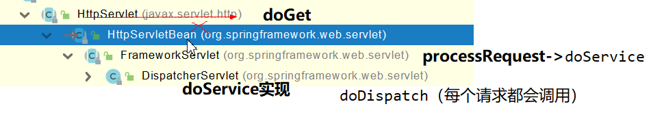
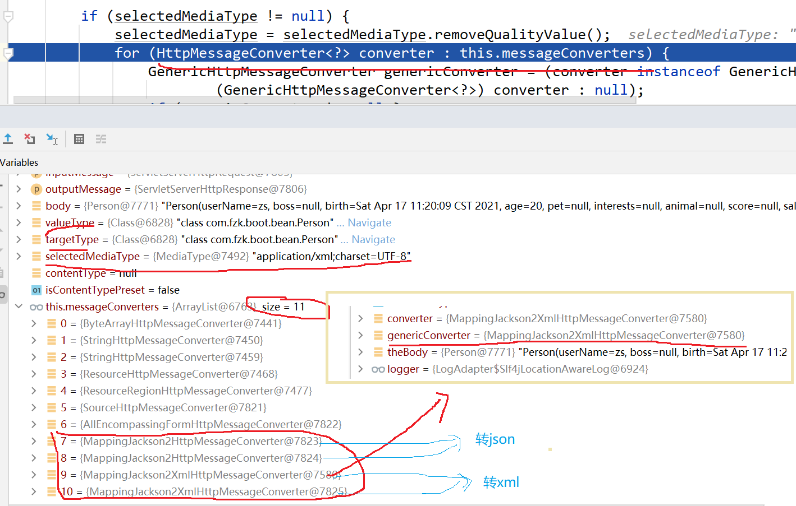

# 资料

**官网**

```https
https://docs.spring.io/spring-boot/docs/current/reference/html/
```

查看版本新特性：https://github.com/spring-projects/spring-boot/wiki#release-notes

所有的starter依赖：https://docs.spring.io/spring-boot/docs/current/reference/html/using-spring-boot.html#using-boot-starter

## 官方文档


## 尚硅谷md文档
```https
https://www.yuque.com/atguigu/springboot
```


# 基础入门

## 环境要求


## maven设置
主要是设置阿里云镜像和jdk版本锁定
需要去更改下载的本地maven的conf文件夹下的settings.xml文件
已经配置了阿里镜像就不需要再配置啦。

阿里云MAVEN镜像地址：https://developer.aliyun.com/mirror/maven

```xml
<mirrors>
       	<mirror>
        	<id>aliyunmaven</id>
       	 	<mirrorOf>*</mirrorOf>
        	<name>阿里云公共仓库</name>
        	<url>https://maven.aliyun.com/repository/public</url>
    	</mirror>
  </mirrors>
 
  <profiles>
         <profile>
              <id>jdk-1.8</id>
              <activation>
                <activeByDefault>true</activeByDefault>
                <jdk>1.8</jdk>
              </activation>
              <properties>
                <maven.compiler.source>1.8</maven.compiler.source>
                <maven.compiler.target>1.8</maven.compiler.target>
                <maven.compiler.compilerVersion>1.8</maven.compiler.compilerVersion>
              </properties>
         </profile>
  </profiles>
```

## Spring与SpringBoot
Spring能做什么?
为什么用SpringBoot?
时代背景?

这里需要去看md文档
```https
https://www.yuque.com/atguigu/springboot/na3pfd
```

## SpringBoot2入门
官方文档入门指导：https://docs.spring.io/spring-boot/docs/current/reference/html/getting-started.html#getting-started-first-application-code

### 1.创建maven工程
#### 在pom.xml中引入依赖
```xml
    <!--springBOOT的父依赖-->
    <parent>
        <groupId>org.springframework.boot</groupId>
        <artifactId>spring-boot-starter-parent</artifactId>
        <version>2.4.4</version>
    </parent>

    <dependencies>
        <!--web场景依赖-->
        <dependency>
            <groupId>org.springframework.boot</groupId>
            <artifactId>spring-boot-starter-web</artifactId>
        </dependency>
    </dependencies>


    <!--引入插件：可以将springboot项目打包为jar 此jar包含了所需运行的全部环境
            因为containing your compiled classes along with
            all of the jar dependencies that your code needs to run
            所以sometimes called “fat jars” 小胖jar-->
    <build>
        <plugins>
            <plugin>
                <groupId>org.springframework.boot</groupId>
                <artifactId>spring-boot-maven-plugin</artifactId>
            </plugin>
        </plugins>
    </build>
```

### 2.创建主程序
**直接运行此main程序即可运行springboot程序**

```java
/**
 * 主程序类
 * @SpringBootApplication： 这是一个springboot应用
 */
@SpringBootApplication
public class MainApplication {
    public static void main(String[] args) {
        SpringApplication.run(MainApplication.class,args);
    }
}
```
### 3.编写业务
```java
@RestController
@RequestMapping(path="/hello")
public class HelloController {
    @RequestMapping(path="/handler01")
    public String handler01(){
        return "Hello SpringBoot";
    }
}
```
@RestController和@RequestMapping注解都是spring mvc的注解。

### 4.简化配置

只需要在resources目录下新建application.properties文件


比如设置Tomcat的端口号为8888
```xml
server.port=8888
```
由于application.properties的存在，使得配置信息极大的简化。

### 5.简化部署
把项目打成jar包，直接在目标服务器执行即可。
当pom.xml没有指定打包方式的时候，默认jar包。

#### 创建一个可执行的Jar

>说明
可执行jar和Java
Java没有提供加载嵌套jar文件（jar中本身包含的jar文件）的标准方法。如果您要分发独立的应用程序，则可能会出现问题。
>
>为了解决这个问题，许多开发人员使用“超级”罐子。uber jar将来自应用程序所有依赖项的所有类打包到单个存档中。这种方法的问题在于，很难查看应用程序中包含哪些库。如果在多个jar中使用相同的文件名（但具有不同的内容），也可能会产生问题。
>
>Spring Boot采用了<a href="https://docs.spring.io/spring-boot/docs/current/reference/html/appendix-executable-jar-format.html#executable-jar">另一种方法</a><sup>(点击此处跳转)</sup>，实际上允许您直接嵌套jar。

需要导入插件
```xml
    <build>
        <plugins>
            <plugin>
                <groupId>org.springframework.boot</groupId>
                <artifactId>spring-boot-maven-plugin</artifactId>
                <configuration>
                    <excludes>
                        <exclude>
                            <groupId>org.projectlombok</groupId>
                            <artifactId>lombok</artifactId>
                        </exclude>
                    </excludes>
                </configuration>
            </plugin>
        </plugins>
    </build>
```


需要点击跳过test，打包为jar后，可以在命令行中直接运行此jar包

```shell
$ java -jar target/myproject-0.0.1-SNAPSHOT.jar
```
您还应该在target目录中看到一个更小的文件`myproject-0.0.1-SNAPSHOT.jar.original`。这是Maven在Spring Boot重新打包之前创建的原始jar文件。

**注意点**：
• 取消掉cmd的快速编辑模式
在命令行属性设置即可，不然在命令行点击某个字段后，将会停止运行springboot而进去编辑模式。
在其他需要快速编辑模式时候，再设置回来即可。

## 了解自动配置原理
### 1.SpringBoot特点
#### 1.1依赖管理
- 父项目做依赖管理
```xml
依赖管理    
<parent>
    <groupId>org.springframework.boot</groupId>
    <artifactId>spring-boot-starter-parent</artifactId>
    <version>2.4.4</version>
</parent>
ctrl点击上一个之后进入下面这个：
他的父项目
  <parent>
    <groupId>org.springframework.boot</groupId>
    <artifactId>spring-boot-dependencies</artifactId>
    <version>2.4.4</version>
  </parent>
再ctrl点击之后，可以看到此时的pom里面，
几乎声明了所有开发中常用的依赖的版本号,自动版本仲裁机制
```

- 开发导入starter场景启动器
```xml
1、见到很多 spring-boot-starter-* ： *就某种场景
2、只要引入starter，这个场景的所有常规需要的依赖我们都自动引入
3、SpringBoot所有支持的场景
https://docs.spring.io/spring-boot/docs/current/reference/html/using-spring-boot.html#using-boot-starter
4、见到的  *-spring-boot-starter： 第三方为我们提供的简化开发的场景启动器。
5、所有场景启动器最底层的依赖
    <dependency>
      <groupId>org.springframework.boot</groupId>
      <artifactId>spring-boot-starter</artifactId>
      <version>2.4.4</version>
      <scope>compile</scope>
    </dependency>
```


- 无需关注版本号，自动版本仲裁
```xml
1、引入依赖默认都可以不写版本
2、引入非版本仲裁的jar，要写版本号。
3、以后要写哪方面的业务，只需要参考官方文档引入相应的starter即可。
```

- 可以修改默认版本号
```xml
1、查看spring-boot-dependencies里面规定当前依赖的版本用的 key。
2、在当前项目的pom.xml里面重写配置
    <properties>
        <mysql.version>5.1.43</mysql.version>
    </properties>
就近原则，在pom中修改之后，先按照pom中的版本号，否则遵循父类中的版本。

3. 添加依赖的时候添加上<version>版本号</version> 也可以的
    <dependency>
        <groupId>mysql</groupId>
        <artifactId>mysql-connector-java</artifactId>
        <version>5.1.6</version>
    </dependency>
```

#### 1.2自动配置

Spring Boot自动配置会尝试根据添加的jar依赖项自动配置Spring应用程序。

例如，如果`HSQLDB`位于类路径上，并且尚未手动配置任何数据库连接bean，则Spring Boot会自动配置内存数据库。

查看配置的一种方法，在main方法中将返回的ioc容器里的组件打印输出。可以看看都配置了哪些bean组件。

第二种方法是去看工程中External Libraries里的`org\springframework\boot\spring-boot-autoconfigure\2.4.4\spring-boot-autoconfigure-2.4.4.jar!\org\springframework\boot\autoconfigure`，这里面的都是**自动的配置类**。

```java
public static void main(String[] args) {
    //1. 返回的是ioc容器
    ConfigurableApplicationContext run = SpringApplication.run(MainApplication.class, args);

    //2. 查看容器里的组件
    String[] beanDefinitionNames = run.getBeanDefinitionNames();
    for(String name:beanDefinitionNames){
        System.out.println(name);
    }
}
```
- 自动配好Tomcat
    - 引入Tomcat依赖。
    - 配置Tomcat
```xml
    <dependency>
      <groupId>org.springframework.boot</groupId>
      <artifactId>spring-boot-starter-tomcat</artifactId>
      <version>2.4.4</version>
      <scope>compile</scope>
    </dependency>
```
- 自动配好SpringMVC
    - 引入SpringMVC全套组件
    - 自动配好SpringMVC常用组件（功能）
    如视图解析器,文件上传解析器
- 自动配好Web常见功能，如：字符编码问题
  
    - SpringBoot帮我们配置好了所有web开发的常见场景
- 默认的包结构
    - 主程序所在包及其下面的所有子包里面的组件都会被默认扫描进来
    因此典型的包布局：
      
        ```
        com 
         +-示例
            +-myapplication 
                + -Application.java 
                | 
                +-客户
                | +-Customer.java 
                | +-CustomerController.java 
                | +-CustomerService.java 
                | +-CustomerRepository.java 
                | 
                +-订单
                    +-Order.java 
                    +-OrderController.java 
                    + -OrderService.java + 
                    -OrderRepository.java
        ```
    - 无需以前的包扫描配置
    - 想要改变扫描路径，@SpringBootApplication(scanBasePackages="com.fzk")
    或者@ComponentScan 指定扫描路径
    这样可以扩大包扫描范围。
```java
@SpringBootApplication(scanBasePackages="com.fzk.boot")
等同于
@SpringBootConfiguration
@EnableAutoConfiguration
@ComponentScan("com.fzk.boot")
```
- 各种配置拥有默认值
    - (application.properties)里的默认配置最终都是映射到每个类上，如：MultipartProperties
    - 配置文件的值最终会绑定每个类上，这个类会在ioc容器中创建对象
- 按需加载所有自动配置项
    - 非常多的starter
    - 引入了哪些场景这个场景的自动配置才会开启
    - SpringBoot所有的自动配置功能都在 spring-boot-autoconfigure 包里面

##### @SpringBootApplication

单个`@SpringBootApplication`注释可用于启用这三个功能，即：

- `@EnableAutoConfiguration`：启用[Spring Boot的自动配置机制](https://docs.spring.io/spring-boot/docs/current/reference/html/using-spring-boot.html#using-boot-auto-configuration)
- `@ComponentScan`：`@Component`在应用程序所在的软件包上启用扫描（请参阅[最佳实践](https://docs.spring.io/spring-boot/docs/current/reference/html/using-spring-boot.html#using-boot-structuring-your-code)）
- `@Configuration`：允许在上下文中注册额外的bean或导入其他配置类
```java
@SpringBootApplication(scanBasePackages="com.fzk.boot")
等同于
@SpringBootConfiguration
@EnableAutoConfiguration
@ComponentScan("com.fzk.boot")
```

这些功能都不是强制性的，您可以选择用它启用的任何功能替换此单个注释。例如，您可能不想在应用程序中使用组件扫描或配置属性扫描：

```java
package com.example.myapplication;

import org.springframework.boot.SpringApplication;
import org.springframework.context.annotation.ComponentScan
import org.springframework.context.annotation.Configuration;
import org.springframework.context.annotation.Import;

@Configuration(proxyBeanMethods = false)
@EnableAutoConfiguration
@Import({ MyConfig.class, MyAnotherConfig.class })
public class Application {

    public static void main(String[] args) {
            SpringApplication.run(Application.class, args);
    }

}
```

在此示例中，`Application`与其他任何Spring Boot应用程序一样，除了不会自动检测`@Component`-annotated类和`@ConfigurationProperties`-annotated类，并且显式导入用户定义的Bean（请参阅参考资料`@Import`）。

##### 禁用特定的自动配置类

- 如果发现正在应用不需要的特定自动配置类，则可以使用`@SpringBootApplication`的exclude属性来禁用它们

- ```java
  @SpringBootApplication(exclude={DataSourceAutoConfiguration.class})
  public class MyApplication {
  }
  ```

  如果该类不在类路径中，则可以使用`excludeName`注释的属性，并指定完全限定的名称。如果您更喜欢使用`@EnableAutoConfiguration`而不是`@SpringBootApplication`，`exclude`并且`excludeName`也可以使用。最后，您还可以使用该`spring.autoconfigure.exclude`属性来控制要排除的自动配置类的列表。

### 2.容器功能

#### 2.1组件添加

##### 1.@Configuration

- 基本使用
- **Full模式与Lite模式**
- 示例
  
  - - 配置类组件之间无依赖关系用Lite模式加速容器启动过程，减少判断
    - 配置类组件之间有依赖关系，方法会被调用得到之前单例组件，用Full模式


```java
#############################Configuration使用示例######################################################
/**
 * 1、配置类里面使用@Bean标注在方法上给容器注册组件，默认也是单例的
 * 2、配置类本身也是组件
 * 3、proxyBeanMethods：代理bean的方法
 *      Full(proxyBeanMethods = true)、【保证每个@Bean方法被调用多少次返回的组件都是单例的】
 *      Lite(proxyBeanMethods = false)【每个@Bean方法被调用多少次返回的组件都是新创建的】
 *      组件依赖必须使用Full模式默认。默认是Full模式
 *
 *
 *
 */
@Configuration(proxyBeanMethods = false)
public class MyConfig {
    /**
     * Full:外部无论对配置类中的这个组件注册方法调用多少次获取的都是之前注册容器中的单例对象
     * @return
     */
    @Bean
    public User user01(){
        User zhangsan = new User("zhangsan", 18);
        //user组件依赖了Pet组件
        zhangsan.setPet(tomcatPet());
        return zhangsan;
    }

    @Bean("tom")
    public Pet tomcatPet(){
        return new Pet("tomcat");
    }
}


################################@Configuration测试代码如下########################################
@SpringBootConfiguration
@EnableAutoConfiguration
@ComponentScan("com.fzk.boot")
public class MainApplication {

    public static void main(String[] args) {
        //1、返回IOC容器
        ConfigurableApplicationContext run = SpringApplication.run(MainApplication.class, args);

        //2、查看容器里面的组件
        String[] names = run.getBeanDefinitionNames();
        for (String name : names) {
            System.out.println(name);
        }

        //3、从容器中获取组件
        Pet tom01 = run.getBean("tom", Pet.class);
        Pet tom02 = run.getBean("tom", Pet.class);
        System.out.println("组件："+(tom01 == tom02));

        //4、com.fzk.boot.config.MyConfig$$EnhancerBySpringCGLIB$$51f1e1ca@1654a892
        MyConfig bean = run.getBean(MyConfig.class);
        System.out.println(bean);

        //如果@Configuration(proxyBeanMethods = true)代理对象调用方法。SpringBoot总会检查这个组件是否在容器中有。
        //保持组件单实例
        User user = bean.user01();
        User user1 = bean.user01();
        System.out.println(user == user1);

        User user01 = run.getBean("user01", User.class);
        Pet tom = run.getBean("tom", Pet.class);

        System.out.println("用户的宠物："+(user01.getPet() == tom));
    }
}
```

Full模式和Lite模式是针对java配置而言的，和xml配置无关。(xml之间的组件依赖关系都是写死在ref的)

何时为Lite模式：

1.类上有@Component注解

2.类上有@ComponentScan注解

3.类上有@Import注解

4.类上有@ImportResource注解

5.类上没有任何注解，但是类中存在@Bean方法

6.类上有@Configuration(proxyBeanMethods = false)注解

Lite总结：运行时不用生成CGLIB子类，提高运行性能，降低启动时间，可以作为普通类使用。但是不能声明@Bean之间的依赖


何时为Full模式：

1.标注有@Configuration或者@Configuration(proxyBeanMethods = true)的类被称为Full模式的配置类。

Full模式总结：单例模式能有效避免Lite模式下的错误。性能没有Lite模式好


##### 2.@Bean、@Component、@Controller、@Service、@Repository

这些都可以添加bean组件

##### 3.@ComponentScan、@Import

```java
 * 4、@Import({User.class, DBHelper.class})
 *      给容器中自动创建出这两个类型的组件、默认组件的名字就是全类名
 */

@Import({User.class, DBHelper.class})
@Configuration(proxyBeanMethods = false) //告诉SpringBoot这是一个配置类 == 配置文件
public class MyConfig {
}
```

@Import 高级用法： https://www.bilibili.com/video/BV1gW411W7wy?p=8

##### 4.@Conditional条件装配

条件装配：满足Conditional指定的条件，则进行组件注入


```java
    @Bean(name = "dog01") //也可以设置组件的id
    public Pet getPet(){
        Pet pet = new Pet();
        pet.setName("dog");
        return pet;
    }
    @ConditionalOnBean(name="dog01")	//先检查ioc容器中有没有dog01，有才创建此bean
    @Bean //将组件user01加到容器中，组件id默认为方法名
    public User user01(){
        User user = new User("fzk", 19);
        user.setPet(getPet());
        return user;
    }
```

#### 2.2原生配置文件引入

```java
@ImportResource(locations = "classpath:bean.xml")
```

这个可以用来导入一些xml配置文件。

#### 2.3配置绑定

将application.propertyies中的属性信息，绑定到类中，该类可以通过@Autowired等多种方式进行组件注册。

比如先在application.properties中加入以下信息

```xml
mycar.brand=BYD
mycar.price=100000
```
##### @Component + @ConfigurationProperties

注意得把前缀加上呢`@ConfigurationProperties(prefix = "mycar")`

```java
/**
 * 只有在容器中的组件，才会拥有SpringBoot提供的强大功能
 */
@Component
@ConfigurationProperties(prefix = "mycar")
public class Car {

    private String brand;
    private Integer price;
    ......
```

此时的car就被注册到容器，并且也取到了在application.properties中的属性。

如果是自己写的配置属性类 可以使用这种方法，很便捷的就把类得属性注入了，并且添加到容器中，如果是第三方类，没有@Component注解，就要使用@EnableConfigurationProperties(xxx.class) 

##### @EnableConfigurationProperties + @ConfigurationProperties

```java
@EnableConfigurationProperties(Car.class)
//1、开启Car配置绑定功能
//2、把这个Car这个组件自动注册到容器中
public class MyConfig {
}
```

不过很可惜的是，在Car类上依然必须要有@ConfigurationProperties(prefix="mycar")注解，不然报错呢。
@EnableConfigurationProperties是开启配置绑定，而@Component是将类注册到容器中，殊途同归。

##### @ConfigurationProperties

默认读取类路径下的application.properties
也可以使用以下注解选择指定属性文件

```java
@PropertySource(value={” classpath : jdbc. properties ”｝， ignoreResourceNotFound=true)
```

### 3.自动配置原理入门

原理讲解部分以后可以深入研究：p13-16

```https
https://www.bilibili.com/video/BV19K4y1L7MT?p=13
```

#### 3.1引导加载自动配置类

@SpringBootApplication中的三个注解

```java
@SpringBootConfiguration
@EnableAutoConfiguration
@ComponentScan(excludeFilters = { @Filter(type = FilterType.CUSTOM, classes = TypeExcludeFilter.class),
        @Filter(type = FilterType.CUSTOM, classes = AutoConfigurationExcludeFilter.class) })
public @interface SpringBootApplication{
	......
}
```

- @SpringBootConfiguration点进去包含@Configuration
  @Configuration。代表当前是一个配置类

- @ComponentScan
  指定扫描哪些，是Spring注解；

##### @EnableAutoConfiguration

```java
@AutoConfigurationPackage
@Import(AutoConfigurationImportSelector.class)
public @interface EnableAutoConfiguration {
    ......
}
```

###### @AutoConfigurationPackage

点进去之后：

```java
@Import(AutoConfigurationPackages.Registrar.class)  //给容器中导入一个组件
public @interface AutoConfigurationPackage {}

//利用Registrar给容器中导入一系列组件
//将指定的一个包下的所有组件导入进来？MainApplication 所在包下。
```

自动配置包？指定了默认的包规则

###### @Import(AutoConfigurationImportSelector.class)

```java
1、利用getAutoConfigurationEntry(annotationMetadata);给容器中批量导入一些组件
2、调用List<String> configurations = getCandidateConfigurations(annotationMetadata, attributes)获取到所有需要导入到容器中的配置类
3、利用工厂加载 Map<String, List<String>> loadSpringFactories(@Nullable ClassLoader classLoader)；得到所有的组件
4、从META-INF/spring.factories位置来加载一个文件。
    默认扫描我们当前系统里面所有META-INF/spring.factories位置的文件
    spring-boot-autoconfigure-2.3.4.RELEASE.jar包里面也有META-INF/spring.factories
```


```xml
文件里面写死了spring-boot一启动就要给容器中加载的所有配置类
spring-boot-autoconfigure-2.3.4.RELEASE.jar/META-INF/spring.factories
# Auto Configure
org.springframework.boot.autoconfigure.EnableAutoConfiguration=\
org.springframework.boot.autoconfigure.admin.SpringApplicationAdminJmxAutoConfiguration,\
org.springframework.boot.autoconfigure.aop.AopAutoConfiguration,\
org.springframework.boot.autoconfigure.amqp.RabbitAutoConfiguration,\
org.springframework.boot.autoconfigure.batch.BatchAutoConfiguration,\
org.springframework.boot.autoconfigure.cache.CacheAutoConfiguration,\
org.springframework.boot.autoconfigure.cassandra.CassandraAutoConfiguration,\
org.springframework.boot.autoconfigure.context.ConfigurationPropertiesAutoConfiguration,\
org.springframework.boot.autoconfigure.context.LifecycleAutoConfiguration,\
org.springframework.boot.autoconfigure.context.MessageSourceAutoConfiguration,\
org.springframework.boot.autoconfigure.context.PropertyPlaceholderAutoConfiguration,\
org.springframework.boot.autoconfigure.couchbase.CouchbaseAutoConfiguration,\
org.springframework.boot.autoconfigure.dao.PersistenceExceptionTranslationAutoConfiguration,\
org.springframework.boot.autoconfigure.data.cassandra.CassandraDataAutoConfiguration,\
org.springframework.boot.autoconfigure.data.cassandra.CassandraReactiveDataAutoConfiguration,\
org.springframework.boot.autoconfigure.data.cassandra.CassandraReactiveRepositoriesAutoConfiguration,\
org.springframework.boot.autoconfigure.data.cassandra.CassandraRepositoriesAutoConfiguration,\
org.springframework.boot.autoconfigure.data.couchbase.CouchbaseDataAutoConfiguration,\
org.springframework.boot.autoconfigure.data.couchbase.CouchbaseReactiveDataAutoConfiguration,\
org.springframework.boot.autoconfigure.data.couchbase.CouchbaseReactiveRepositoriesAutoConfiguration,\
org.springframework.boot.autoconfigure.data.couchbase.CouchbaseRepositoriesAutoConfiguration,\
org.springframework.boot.autoconfigure.data.elasticsearch.ElasticsearchDataAutoConfiguration,\
org.springframework.boot.autoconfigure.data.elasticsearch.ElasticsearchRepositoriesAutoConfiguration,\
org.springframework.boot.autoconfigure.data.elasticsearch.ReactiveElasticsearchRepositoriesAutoConfiguration,\
org.springframework.boot.autoconfigure.data.elasticsearch.ReactiveElasticsearchRestClientAutoConfiguration,\
org.springframework.boot.autoconfigure.data.jdbc.JdbcRepositoriesAutoConfiguration,\
org.springframework.boot.autoconfigure.data.jpa.JpaRepositoriesAutoConfiguration,\
org.springframework.boot.autoconfigure.data.ldap.LdapRepositoriesAutoConfiguration,\
org.springframework.boot.autoconfigure.data.mongo.MongoDataAutoConfiguration,\
org.springframework.boot.autoconfigure.data.mongo.MongoReactiveDataAutoConfiguration,\
org.springframework.boot.autoconfigure.data.mongo.MongoReactiveRepositoriesAutoConfiguration,\
org.springframework.boot.autoconfigure.data.mongo.MongoRepositoriesAutoConfiguration,\
org.springframework.boot.autoconfigure.data.neo4j.Neo4jDataAutoConfiguration,\
org.springframework.boot.autoconfigure.data.neo4j.Neo4jRepositoriesAutoConfiguration,\
org.springframework.boot.autoconfigure.data.solr.SolrRepositoriesAutoConfiguration,\
org.springframework.boot.autoconfigure.data.r2dbc.R2dbcDataAutoConfiguration,\
org.springframework.boot.autoconfigure.data.r2dbc.R2dbcRepositoriesAutoConfiguration,\
org.springframework.boot.autoconfigure.data.r2dbc.R2dbcTransactionManagerAutoConfiguration,\
org.springframework.boot.autoconfigure.data.redis.RedisAutoConfiguration,\
org.springframework.boot.autoconfigure.data.redis.RedisReactiveAutoConfiguration,\
org.springframework.boot.autoconfigure.data.redis.RedisRepositoriesAutoConfiguration,\
org.springframework.boot.autoconfigure.data.rest.RepositoryRestMvcAutoConfiguration,\
org.springframework.boot.autoconfigure.data.web.SpringDataWebAutoConfiguration,\
org.springframework.boot.autoconfigure.elasticsearch.ElasticsearchRestClientAutoConfiguration,\
org.springframework.boot.autoconfigure.flyway.FlywayAutoConfiguration,\
org.springframework.boot.autoconfigure.freemarker.FreeMarkerAutoConfiguration,\
org.springframework.boot.autoconfigure.groovy.template.GroovyTemplateAutoConfiguration,\
org.springframework.boot.autoconfigure.gson.GsonAutoConfiguration,\
org.springframework.boot.autoconfigure.h2.H2ConsoleAutoConfiguration,\
org.springframework.boot.autoconfigure.hateoas.HypermediaAutoConfiguration,\
org.springframework.boot.autoconfigure.hazelcast.HazelcastAutoConfiguration,\
org.springframework.boot.autoconfigure.hazelcast.HazelcastJpaDependencyAutoConfiguration,\
org.springframework.boot.autoconfigure.http.HttpMessageConvertersAutoConfiguration,\
org.springframework.boot.autoconfigure.http.codec.CodecsAutoConfiguration,\
org.springframework.boot.autoconfigure.influx.InfluxDbAutoConfiguration,\
org.springframework.boot.autoconfigure.info.ProjectInfoAutoConfiguration,\
org.springframework.boot.autoconfigure.integration.IntegrationAutoConfiguration,\
org.springframework.boot.autoconfigure.jackson.JacksonAutoConfiguration,\
org.springframework.boot.autoconfigure.jdbc.DataSourceAutoConfiguration,\
org.springframework.boot.autoconfigure.jdbc.JdbcTemplateAutoConfiguration,\
org.springframework.boot.autoconfigure.jdbc.JndiDataSourceAutoConfiguration,\
org.springframework.boot.autoconfigure.jdbc.XADataSourceAutoConfiguration,\
org.springframework.boot.autoconfigure.jdbc.DataSourceTransactionManagerAutoConfiguration,\
org.springframework.boot.autoconfigure.jms.JmsAutoConfiguration,\
org.springframework.boot.autoconfigure.jmx.JmxAutoConfiguration,\
org.springframework.boot.autoconfigure.jms.JndiConnectionFactoryAutoConfiguration,\
org.springframework.boot.autoconfigure.jms.activemq.ActiveMQAutoConfiguration,\
org.springframework.boot.autoconfigure.jms.artemis.ArtemisAutoConfiguration,\
org.springframework.boot.autoconfigure.jersey.JerseyAutoConfiguration,\
org.springframework.boot.autoconfigure.jooq.JooqAutoConfiguration,\
org.springframework.boot.autoconfigure.jsonb.JsonbAutoConfiguration,\
org.springframework.boot.autoconfigure.kafka.KafkaAutoConfiguration,\
org.springframework.boot.autoconfigure.availability.ApplicationAvailabilityAutoConfiguration,\
org.springframework.boot.autoconfigure.ldap.embedded.EmbeddedLdapAutoConfiguration,\
org.springframework.boot.autoconfigure.ldap.LdapAutoConfiguration,\
org.springframework.boot.autoconfigure.liquibase.LiquibaseAutoConfiguration,\
org.springframework.boot.autoconfigure.mail.MailSenderAutoConfiguration,\
org.springframework.boot.autoconfigure.mail.MailSenderValidatorAutoConfiguration,\
org.springframework.boot.autoconfigure.mongo.embedded.EmbeddedMongoAutoConfiguration,\
org.springframework.boot.autoconfigure.mongo.MongoAutoConfiguration,\
org.springframework.boot.autoconfigure.mongo.MongoReactiveAutoConfiguration,\
org.springframework.boot.autoconfigure.mustache.MustacheAutoConfiguration,\
org.springframework.boot.autoconfigure.orm.jpa.HibernateJpaAutoConfiguration,\
org.springframework.boot.autoconfigure.quartz.QuartzAutoConfiguration,\
org.springframework.boot.autoconfigure.r2dbc.R2dbcAutoConfiguration,\
org.springframework.boot.autoconfigure.rsocket.RSocketMessagingAutoConfiguration,\
org.springframework.boot.autoconfigure.rsocket.RSocketRequesterAutoConfiguration,\
org.springframework.boot.autoconfigure.rsocket.RSocketServerAutoConfiguration,\
org.springframework.boot.autoconfigure.rsocket.RSocketStrategiesAutoConfiguration,\
org.springframework.boot.autoconfigure.security.servlet.SecurityAutoConfiguration,\
org.springframework.boot.autoconfigure.security.servlet.UserDetailsServiceAutoConfiguration,\
org.springframework.boot.autoconfigure.security.servlet.SecurityFilterAutoConfiguration,\
org.springframework.boot.autoconfigure.security.reactive.ReactiveSecurityAutoConfiguration,\
org.springframework.boot.autoconfigure.security.reactive.ReactiveUserDetailsServiceAutoConfiguration,\
org.springframework.boot.autoconfigure.security.rsocket.RSocketSecurityAutoConfiguration,\
org.springframework.boot.autoconfigure.security.saml2.Saml2RelyingPartyAutoConfiguration,\
org.springframework.boot.autoconfigure.sendgrid.SendGridAutoConfiguration,\
org.springframework.boot.autoconfigure.session.SessionAutoConfiguration,\
org.springframework.boot.autoconfigure.security.oauth2.client.servlet.OAuth2ClientAutoConfiguration,\
org.springframework.boot.autoconfigure.security.oauth2.client.reactive.ReactiveOAuth2ClientAutoConfiguration,\
org.springframework.boot.autoconfigure.security.oauth2.resource.servlet.OAuth2ResourceServerAutoConfiguration,\
org.springframework.boot.autoconfigure.security.oauth2.resource.reactive.ReactiveOAuth2ResourceServerAutoConfiguration,\
org.springframework.boot.autoconfigure.solr.SolrAutoConfiguration,\
org.springframework.boot.autoconfigure.task.TaskExecutionAutoConfiguration,\
org.springframework.boot.autoconfigure.task.TaskSchedulingAutoConfiguration,\
org.springframework.boot.autoconfigure.thymeleaf.ThymeleafAutoConfiguration,\
org.springframework.boot.autoconfigure.transaction.TransactionAutoConfiguration,\
org.springframework.boot.autoconfigure.transaction.jta.JtaAutoConfiguration,\
org.springframework.boot.autoconfigure.validation.ValidationAutoConfiguration,\
org.springframework.boot.autoconfigure.web.client.RestTemplateAutoConfiguration,\
org.springframework.boot.autoconfigure.web.embedded.EmbeddedWebServerFactoryCustomizerAutoConfiguration,\
org.springframework.boot.autoconfigure.web.reactive.HttpHandlerAutoConfiguration,\
org.springframework.boot.autoconfigure.web.reactive.ReactiveWebServerFactoryAutoConfiguration,\
org.springframework.boot.autoconfigure.web.reactive.WebFluxAutoConfiguration,\
org.springframework.boot.autoconfigure.web.reactive.error.ErrorWebFluxAutoConfiguration,\
org.springframework.boot.autoconfigure.web.reactive.function.client.ClientHttpConnectorAutoConfiguration,\
org.springframework.boot.autoconfigure.web.reactive.function.client.WebClientAutoConfiguration,\
org.springframework.boot.autoconfigure.web.servlet.DispatcherServletAutoConfiguration,\
org.springframework.boot.autoconfigure.web.servlet.ServletWebServerFactoryAutoConfiguration,\
org.springframework.boot.autoconfigure.web.servlet.error.ErrorMvcAutoConfiguration,\
org.springframework.boot.autoconfigure.web.servlet.HttpEncodingAutoConfiguration,\
org.springframework.boot.autoconfigure.web.servlet.MultipartAutoConfiguration,\
org.springframework.boot.autoconfigure.web.servlet.WebMvcAutoConfiguration,\
org.springframework.boot.autoconfigure.websocket.reactive.WebSocketReactiveAutoConfiguration,\
org.springframework.boot.autoconfigure.websocket.servlet.WebSocketServletAutoConfiguration,\
org.springframework.boot.autoconfigure.websocket.servlet.WebSocketMessagingAutoConfiguration,\
org.springframework.boot.autoconfigure.webservices.WebServicesAutoConfiguration,\
org.springframework.boot.autoconfigure.webservices.client.WebServiceTemplateAutoConfiguration
```

#### 3.2按需开启自动配置项

```xml
虽然我们127个场景的所有自动配置启动的时候默认全部加载。xxxxAutoConfiguration
按照条件装配规则（@Conditional），最终会按需配置。

底层有大量的@Conditional，有很多自动配置类并不能完全开启。(按需配置)
```

#### 3.3修改默认配置

```java
@Bean
@ConditionalOnBean(MultipartResolver.class)  //容器中有这个类型组件
@ConditionalOnMissingBean(name = DispatcherServlet.MULTIPART_RESOLVER_BEAN_NAME) //容器中没有这个名字 multipartResolver 的组件
public MultipartResolver multipartResolver(MultipartResolver resolver) {
    //给@Bean标注的方法传入了对象参数，这个参数的值会从容器中找。找到了就会返回符合规范的文件解析器
    //SpringMVC multipartResolver。防止有些用户配置的文件上传解析器不符合规范命名规范
    // Detect if the user has created a MultipartResolver but named it incorrectly
    return resolver;
}
给容器中加入了文件上传解析器；
```

SpringBoot默认会在底层配好所有的组件。但是如果用户自己配置了以用户的优先(约定大于配置)

如HttpEncodingAutoConfiguration中的配置包含如下：

```java
@Bean
@ConditionalOnMissingBean  //这里就是说如果没有容器中没有自己配置的CharacterEncodingFilter，才会把这个默认配置的组件注册
public CharacterEncodingFilter characterEncodingFilter() {
    ......
}
```

#### 3.4最佳实践

- 引入场景依赖

  - https://docs.spring.io/spring-boot/docs/current/reference/html/using-spring-boot.html#using-boot-starter

- 查看自动配置了哪些（选做）

  - 自己分析，引入场景对应的自动配置一般都生效了
  - 配置文件中**debug=true**开启自动配置报告。Negative（不生效）/Positive（生效）

- 是否需要修改

  - 参照文档修改配置项

  - - https://docs.spring.io/spring-boot/docs/current/reference/html/appendix-application-properties.html#common-application-properties
    - 自己分析。 **xxxxxAutoConfiguration源码**里的xxxxProperties绑定了配置文件的哪些。

- - 自定义加入或者替换组件

    - @Bean、@Component。。。

- - 自定义器  **XXXXXCustomizer**；
  - ......

#### 总结：

- SpringBoot先加载所有的自动配置类  xxxxxAutoConfiguration
- 每个自动配置类按照条件进行生效，默认都会绑定配置文件指定的值。xxxxProperties类里面拿。xxxProperties类和默认配置文件application.properties进行了绑定。这里可以去看自动配置类的源码如HttpEncodingAutoConfiguration可以很直观。
- 生效的配置类就会给容器中装配很多组件
- 只要容器中有这些组件，相当于这些功能就有了
- 定制化配置

  - 可以直接自己@Bean替换底层的组件
  - 也可以去看这个组件是获取的配置文件什么值就去修改。

**xxxxxAutoConfiguration ---> 组件  --->** **xxxxProperties里面拿值  ----> application.properties**

所以呢，以后要想改某个方面的配置，要么去官方手册查，或者直接找相应的**自动配置类源码**里去找出相应的配置，再到application.properties里改动。

## 开发小技巧

### 4.0关于配置

由于自动配置类**xxxxxAutoConfiguration**是绑定了 **xxxxProperties**属性类的，而这个属性类又是绑定了application.properties和application.yaml的，所以只要改配置文件即可改自动配置类的默认实现值。

那么如何更改呢？以server.port为例子的话：

1. 官网手册查所有可以改的配置。
2. 点开**xxxxxAutoConfiguration**配置类的源码，找到绑定的**xxxxProperties**属性类，再点开找到这个属性类绑定的前缀以及其所设置的默认值，即可在配置文件里进行更改。
3. 自动配置类的位置：在maven的External Libraries中找如下：
   如异常自动配置类：org/springframework/boot/autoconfigure/web/servlet/error/ErrorMvcAutoConfiguration.java


### 4.1Lombok

简化JavaBean开发

```xml
<dependency>
    <groupId>org.projectlombok</groupId>
    <artifactId>lombok</artifactId>
</dependency>


然后idea中搜索安装lombok插件
```

@Data 提供set/get方法
@ToString 提供toString方法
@NoArgsConstructor 提供无参构造器
@AllArgsConstructor 提供全参构造器
@EqualsAndHashCode 提供equals和hashcode方法
@Slf4j 简化日志开发

```java
===============================简化JavaBean开发===================================
@Data
@NoArgsConstructor
@AllArgsConstructor
@ToString
@EqualsAndHashCode
public class User {
    private String name;
    private Integer age;
    private Pet pet;

    public User(String name,Integer age){
        this.name = name;
        this.age = age;
    }
}

================================简化日志开发===================================
@Slf4j
@RestController
public class HelloController {
    @RequestMapping("/hello")
    public String handle01(@RequestParam("name") String name){
        
        log.info("请求进来了....");
        
        return "Hello, Spring Boot 2!"+"你好："+name;
    }
}
```

### 4.2 dev-tools

```xml
<dependency>
    <groupId>org.springframework.boot</groupId>
    <artifactId>spring-boot-devtools</artifactId>
    <optional>true</optional>
</dependency>
项目或者页面修改以后：Ctrl+F9；
```

`spring-boot-devtools`只要类路径上的文件发生更改，使用的应用程序就会**自动重新启动**。在IDE中工作时，这可能是一个有用的功能，因为它为代码更改提供了非常快速的反馈循环。默认情况下，将监视类路径上指向目录的任何条目的更改。请注意，某些资源（例如静态资产和视图模板）[不需要重新启动应用程序](https://docs.spring.io/spring-boot/docs/current/reference/html/using-spring-boot.html#using-boot-devtools-restart-exclude)。
[更详细官方文档使用说明请点击这里](https://docs.spring.io/spring-boot/docs/current/reference/html/using-spring-boot.html#using-boot-devtools-restart)

**重新启动与重新加载的区别**

Spring Boot提供的重启技术通过使用两个类加载器来工作。不变的类（例如，来自第三方jar的类）将被加载到*基*类加载器中。您正在积极开发的类将加载到*重新启动*类加载器中。重新启动应用程序后，将丢弃*重新启动*类加载器，并创建一个新的类加载器。这种方法意味着应用程序的**重启通常比“冷启动”要快得多**，因为*基本*类加载器已经可用并已填充。

如果您发现重新启动对于您的应用程序来说不够快，或者遇到类加载问题，则可以考虑从ZeroTurnaround重新加载技术，例如[JRebel](https://jrebel.com/software/jrebel/)。这些方法通过在加载类时重写类来使它们更适合于重新加载，但是这个要钱。

### 4.3、Spring Initailizr（项目初始化向导）


### 4.4 日志记录

Spring Boot使用[Commons Logging](https://commons.apache.org/logging)进行所有内部日志记录，但是使底层日志实现保持打开状态。提供了[Java Util Logging](https://docs.oracle.com/javase/8/docs/api/java/util/logging/package-summary.html)，[Log4J2](https://logging.apache.org/log4j/2.x/)和[Logback的](https://logback.qos.ch/)默认配置。在每种情况下，记录器都已预先配置为使用控制台输出，同时还提供可选文件输出。

> 更多细节：https://docs.spring.io/spring-boot/docs/current/reference/html/spring-boot-features.html#boot-features-logging

# SpringBoot2核心技术-核心功能

## 外部化配置

> 更多细节：https://docs.spring.io/spring-boot/docs/current/reference/html/spring-boot-features.html#boot-features-external-config

Spring Boot使您可以外部化配置，以便可以在不同环境中使用相同的应用程序代码。您可以使用各种外部配置源，包括**Java属性文件**，**YAML文件**，**环境变量**和**命令行参数**。

属性值可以通过直接注射到你的bean`@Value`注释，通过Spring的访问`Environment`抽象，或者被[绑定到结构化对象](https://docs.spring.io/spring-boot/docs/current/reference/html/spring-boot-features.html#boot-features-external-config-typesafe-configuration-properties)通过`@ConfigurationProperties`。

Spring Boot使用一个**非常特殊的`PropertySource`顺序**，该顺序旨在允许合理地覆盖值。(更多细节看文档)

### 1.文件类型

#### 1.1.properties

同以前的properties用法

> 建议整个应用程序使用一种格式。如果您的配置文件的格式`.properties`和`.yml`格式都位于同一位置，**则以`.properties`优先级为准**。
> 注意：properties中文不兼容。而yaml则没有这个问题。

#### 1.2.yaml

##### 1.2.1简介

YAML 是 "YAML Ain't Markup Language"（YAML 不是一种标记语言）的递归缩写。在开发的这种语言时，YAML 的意思其实是："Yet Another Markup Language"（仍是一种标记语言）。 

非常适合用来做以**数据为中心**的配置文件

> **注意：**无法使用`@PropertySource`或`@TestPropertySource`注释加载YAML文件。因此，在需要以这种方式加载值的情况下，需要使用属性文件。

##### 1.2.2基本语法

- key: value；k,v之间有空格
- 大小写敏感
- 使用缩进表示层级关系
- 缩进**不允许使用tab**，只允许空格(不过由于idea默认将tab转为4个空格，在idea中似乎又可以用tab)
- 缩进的空格数不重要，只要相同层级的**元素左对齐**即可
- '#'表示注释
- 字符串无需加引号，如果要加，''与""表示字符串内容 会被 不转义/转义
  如果字符串为一段数字，该数字以零开头，必须添加上""  不然Springboot会将数字解析成八进制
  如\n，单引号中作为字符串输出，双引号会换行

##### 1.2.3数据类型

- 字面量：单个的、不可再分的值。date、boolean、string、number、null

```yaml
k: v
```

- 对象：键值对的集合。map、hash、set、object 

```yaml
行内写法：  k: {k1:v1,k2:v2,k3:v3}
#或
k: 
  k1: v1
  k2: v2
  k3: v3
```

- 数组：一组按次序排列的值。array、list、queue

```yaml
行内写法：  k: [v1,v2,v3]
#或者
k:
 - v1
 - v2
 - v3
```

### 2.配置属性

#### 2.1 配置文件位置

spring boot启动就会自动查找和加载`application.properties`和`application.yaml`文件，从以下位置：

1. The classpath root
2. The classpath `/config` package
3. The current directory
4. The `/config` subdirectory in the current directory
5. Immediate child directories of the `/config` subdirectory

下面的将会覆盖上面的。Documents from the loaded files are added as `PropertySources` to the Spring `Environment`.

#### 2.2 处理多文档文件

Spring Boot允许您将单个物理文件拆分为多个逻辑文档，每个逻辑文档都是独立添加的。从上到下按顺序处理文档。以后的文档可以覆盖以前的文档中定义的属性。

对于`application.yml`文件，使用标准的YAML多文档语法。三个连续的连字符代表一个文档的末尾，以及下一个的开始。

例如，以下文件具有两个逻辑文档：

```yaml
spring.application.name: MyApp
---
spring.config.activate.on-cloud-platform: kubernetes
spring.application.name: MyCloudApp
```

对于`application.properties`文件，特殊`#---`注释用于标记文档拆分：

```properties
spring.application.name=MyApp
#---
spring.config.activate.on-cloud-platform=kubernetes
spring.application.name=MyCloudApp
```

注意： 
多文档属性文件通常与激活属性（例如`spring.config.activate.on-profile`）结合使用。
属性文件分隔符不得包含任何前导空格，并且必须恰好具有三个连字符。分隔符之前和之后的行不得为注释。
不能使用`@PropertySource`或`@TestPropertySource`注释加载多文档属性文件。

#### 2.3 激活属性

有时仅在满足某些条件时才激活给定的属性获取，这很有用。例如，您可能具有仅在特定配置文件处于活动状态时才相关的属性。

您可以使用`spring.config.activate.*`来有条件地激活属性文档。

| Property            | Note                                                         |
| :------------------ | ------------------------------------------------------------ |
| `on-profile`        | A profile expression that must match for the document to be active. |
| `on-cloud-platform` | The `CloudPlatform` that must be detected for the document to be active. |

例如，以下内容指定第二个文档仅在Kubernetes上运行时才处于活动状态，并且仅在“ prod”或“ staging”配置文件处于活动状态时才处于活动状态：

```properties
myprop=always-set
#---
spring.config.activate.on-cloud-platform=kubernetes
spring.config.activate.on-profile=prod | staging
myotherprop=sometimes-set
```

```yaml
myprop:
  always-set
---
spring:
  config:
    activate:
      on-cloud-platform: "kubernetes"
      on-profile: "prod | staging"
myotherprop: sometimes-set
```

### 3.配置绑定

将.properties或者.yaml中配置的属性绑定到spring bean中；
[更多细节如绑定Map、List等查询官方文档](https://docs.spring.io/spring-boot/docs/current/reference/html/spring-boot-features.html#boot-features-external-config-typesafe-configuration-properties)

#### 轻松绑定

Spring Boot使用一些宽松的规则将`Environment`属性绑定到`@ConfigurationProperties`Bean，因此`Environment`属性名称和Bean属性名称之间不需要完全匹配。有用的常见示例包括破折号分隔的环境属性（例如，`context-path`绑定到`contextPath`）和大写的环境属性（例如，`PORT`绑定到`port`）。

示例：

```java
@ConfigurationProperties(prefix="acme.my-project.person")
public class OwnerProperties {
    private String firstName;
    public String getFirstName() {
        return this.firstName;
    }
    public void setFirstName(String firstName) {
        this.firstName = firstName;
    }
}
```

使用前面的代码，可以全部使用以下属性名称：

| property                            | 笔记                                                         |
| :---------------------------------- | :----------------------------------------------------------- |
| `acme.my-project.person.first-name` | 烤肉串盒，建议在`.properties`和`.yml`文件中使用。            |
| `acme.myProject.person.firstName`   | 标准驼峰式语法。                                             |
| `acme.my_project.person.first_name` | 下划线表示法，是在`.properties`和`.yml`文件中使用的另一种格式。 |
| `ACME_MYPROJECT_PERSON_FIRSTNAME`   | 大写格式，在使用系统环境变量时建议使用。                     |

> 注意：The `prefix` value for the annotation *must* be in kebab case (lowercase and separated by `-`, such as `acme.my-project.person`).

#### @ConfigurationProperties与@Value

`@Value`注释是核心容器的功能，@Value可以给单个属性配置值，而@ConfigurationProperties则是给一个类配置属性。

| 特征                                                         | `@ConfigurationProperties` | `@Value` |
| :----------------------------------------------------------- | :------------------------- | :------- |
| [宽松的装订](https://docs.spring.io/spring-boot/docs/current/reference/html/spring-boot-features.html#boot-features-external-config-relaxed-binding) | 是的                       | 受限     |
| [元数据支持](https://docs.spring.io/spring-boot/docs/current/reference/html/appendix-configuration-metadata.html#configuration-metadata) | 是的                       | 不       |
| `SpEL` 评估                                                  | 不                         | 是的     |

> **注意**：如果您确实想使用`@Value`，我们建议您使用规范形式来引用属性名称（kebab-case仅使用小写字母）。
> 这将使Spring Boot可以使用与`@ConfigurationProperties`放松绑定时相同的逻辑
>
> 例如，`@Value("{demo.item-price}")`将从`application.properties`文件拿起`demo.item-price`和`demo.itemPrice`，以及从系统环境中拿`DEMO_ITEMPRICE`。
>
> 如果你使用的`@Value("{demo.itemPrice}")`，`demo.item-price`并`DEMO_ITEMPRICE`不会予以考虑。

```java
@Value("${person.name:李四}")	// 从配置文件中取出值绑定给属性name 如果没有找到，则默认为李四
private String name;
```

### 4.配置提示

使用注释处理器生成您自己的元数据

自定义的类和配置文件绑定一般没有提示，此时配置注释处理器就可以有提示了。

可以使用`spring-boot-configuration-processor`jar轻松地从带有注释`@ConfigurationProperties`的项目中生成自己的配置元数据文件。该jar包含一个**Java注释处理器**，在项目被**编译时**会被调用。

#### 配置注释处理器

要使用处理器，需要包含对的依赖`spring-boot-configuration-processor`。

使用Maven时，应将依赖项声明为可选，如以下示例所示：

配置对应的pom文件，且打包时排除，以免多出一个processor的jar占用jvm空间

```xml
        <dependency>
            <groupId>org.springframework.boot</groupId>
            <artifactId>spring-boot-configuration-processor</artifactId>
            <optional>true</optional>
        </dependency>


	<build>
		<plugins>
			<plugin>
				<groupId>org.springframework.boot</groupId>
				<artifactId>spring-boot-maven-plugin</artifactId>
				<!--不过在2.4.2版本之后就不需要再显示声明了，已经自动过滤了-->
				<configuration>
					<excludes>
						<exclude>
							<groupId>org.springframework.boot</groupId>
							<artifactId>spring-boot-configuration-processor</artifactId>
						</exclude>
					</excludes>
				</configuration>
			</plugin>
		</plugins>
	</build>
```

#### 自动元数据生成

处理器选择用`@ConfigurationProperties`注释的类和方法。

此时再去yaml文件或者是properties文件配置自己的写了`@ConfigurationProperties`注释的类的属性时候，就有提示了。

#### 更多官方文档细节

```https
https://docs.spring.io/spring-boot/docs/current/reference/html/appendix-configuration-metadata.html#configuration-metadata-annotation-processor
```

------------------


## Web开发


[官方参考文档位置](https://docs.spring.io/spring-boot/docs/current/reference/html/spring-boot-features.html#boot-features-spring-mvc-welcome-page)

### 1.Spring MVC自动配置

Spring Boot provides auto-configuration for Spring MVC that **works well with most applications.(大多场景我们都无需自定义配置)**

The auto-configuration adds the following features on top of Spring’s defaults:

- Inclusion of `ContentNegotiatingViewResolver` and `BeanNameViewResolver` beans.
	- 内容协商视图解析器和BeanName视图解析器

- Support for serving static resources, including support for WebJars (covered [later in this document](https://docs.spring.io/spring-boot/docs/current/reference/html/spring-boot-features.html#boot-features-spring-mvc-static-content))).
  - 静态资源（包括webjars）

- Automatic registration of `Converter`, `GenericConverter`, and `Formatter` beans.
  - 自动注册 `Converter，GenericConverter，Formatter `

- Support for `HttpMessageConverters` (covered [later in this document](https://docs.spring.io/spring-boot/docs/current/reference/html/spring-boot-features.html#boot-features-spring-mvc-message-converters)).
  - 支持 `HttpMessageConverters` （后来我们配合内容协商理解原理）

- Automatic registration of `MessageCodesResolver` (covered [later in this document](https://docs.spring.io/spring-boot/docs/current/reference/html/spring-boot-features.html#boot-features-spring-message-codes)).
  - 自动注册 `MessageCodesResolver` （国际化用）

- Static `index.html` support.
  - 静态index.html 页支持

- Custom `Favicon` support (covered [later in this document](https://docs.spring.io/spring-boot/docs/current/reference/html/spring-boot-features.html#boot-features-spring-mvc-favicon)).
  - 自定义 `Favicon`  

- Automatic use of a `ConfigurableWebBindingInitializer` bean (covered [later in this document](https://docs.spring.io/spring-boot/docs/current/reference/html/spring-boot-features.html#boot-features-spring-mvc-web-binding-initializer)).
  - 自动使用 `ConfigurableWebBindingInitializer` ，（DataBinder负责将请求数据绑定到JavaBean上）

> If you want to keep those Spring Boot MVC customizations and make more [MVC customizations](https://docs.spring.io/spring/docs/5.2.9.RELEASE/spring-framework-reference/web.html#mvc) (interceptors, formatters, view controllers, and other features), you can add your own `@Configuration` class of type `WebMvcConfigurer` but **without** `@EnableWebMvc`.
>
> **不用@EnableWebMvc注解。使用** **`@Configuration`** **+** **`WebMvcConfigurer`** **自定义规则**

> If you want to provide custom instances of `RequestMappingHandlerMapping`, `RequestMappingHandlerAdapter`, or `ExceptionHandlerExceptionResolver`, and still keep the Spring Boot MVC customizations, you can declare a bean of type `WebMvcRegistrations` and use it to provide custom instances of those components.
>
> **声明** **`WebMvcRegistrations`** **改变默认底层组件**

> If you want to take complete control of Spring MVC, you can add your own `@Configuration` annotated with `@EnableWebMvc`, or alternatively add your own `@Configuration`-annotated `DelegatingWebMvcConfiguration` as described in the Javadoc of `@EnableWebMvc`.
>
> **使用** **`@EnableWebMvc+@Configuration+DelegatingWebMvcConfiguration 全面接管SpringMVC`**

### 2.简单功能分析

#### 2.1、静态资源访问

##### 1、静态资源目录

默认情况下，Spring Boot从类路径中名为`/static`（`/public`或`/resources`或`/META-INF/resources`）的目录中或从的根中提供静态内容`ServletContext`。它使用`ResourceHttpRequestHandler`Spring MVC中的from，因此您可以通过添加自己`WebMvcConfigurer`的`addResourceHandlers`方法并覆盖该方法来修改该行为。

原理： 静态映射/**。
请求进来，先去找Controller看能不能处理。不能处理的所有请求又都交给静态资源处理器。静态资源也找不到则响应404页面

默认情况下，资源映射到`/**`，但是您可以使用`spring.mvc.static-path-pattern`属性对其进行调整。例如，将所有资源重新定位到以下位置`/resources/**`：两种方式都可以。

```properties
spring.mvc.static-path-pattern=/resources/**
```

```yaml
spring:
  mvc:
    static-path-pattern: "/resources/**"
```

您还可以使用`spring.web.resources.static-locations`属性来自定义静态资源位置（用目录位置列表替换默认值）。根Servlet上下文路径`"/"`也会自动添加为位置。

改变默认的静态资源路径

```yaml
spring:
  web:
    resources:
      static-locations: ["classpath:/haha/"]
```

##### 2、静态资源访问前缀

默认无前缀

```yaml
spring:
  mvc:
    static-path-pattern: /resources/**
```

当前项目 + static-path-pattern + 静态资源名 = 静态资源文件夹下找

static-path-patten是虚拟的路径，不是真实存在的 

目的：以免静态资源被拦截

##### 3、webjar

自动映射 /[webjars](http://localhost:8080/webjars/jquery/3.5.1/jquery.js)/**

https://www.webjars.org/

```xml
        <dependency>
            <groupId>org.webjars</groupId>
            <artifactId>jquery</artifactId>
            <version>3.5.1</version>
        </dependency>
```

访问地址：[http://localhost:8080/webjars/**jquery/3.5.1/jquery.js**](http://localhost:8080/webjars/jquery/3.5.1/jquery.js)  后面地址要按照依赖里面的包路径

webjar就是将前端的静态资源：比如说jquery、bootstarp等资源以jar包的方式导入。
了解即可，毕竟这些资源没必要以jar包来导入。

#### 2.2、欢迎页支持

Spring Boot支持静态和模板欢迎页面。它首先在配置的静态内容位置中查找文件`index.html`。如果找不到，它将寻找一个`index`模板。如果找到任何一个，它将自动用作应用程序的欢迎页面。

- 静态资源路径下  index.html

- - 可以配置静态资源路径
  - 但是不可以配置静态资源的访问前缀。否则导致 index.html不能被默认访问

```yaml
spring:
#  mvc:
#    static-path-pattern: /res/**   这个会导致welcome page功能失效，在访问的时候不得不加上res这个路径

  resources:
    static-locations: [classpath:/haha/]
```

- controller能处理/index

#### 2.3、自定义 `Favicon`

favicon.ico 放在静态资源目录下即可。**(只能放在static下)**
一定得叫这个名字，然后这个图片就将作为网站的图标哦。
浏览器会发送/favicon.ico请求获取图标，之后整个**session期间不再发送**。


```yaml
spring:
#  mvc:
#    static-path-pattern: /res/**   这个会导致 Favicon 功能失效
```


#### 2.4、静态资源配置原理

- SpringBoot启动默认加载  xxxAutoConfiguration 类（自动配置类）

- SpringMVC功能的自动配置类 WebMvcAutoConfiguration，生效

```java
@Configuration(proxyBeanMethods = false)
@ConditionalOnWebApplication(type = Type.SERVLET)
@ConditionalOnClass({ Servlet.class, DispatcherServlet.class, WebMvcConfigurer.class })
@ConditionalOnMissingBean(WebMvcConfigurationSupport.class)
@AutoConfigureOrder(Ordered.HIGHEST_PRECEDENCE + 10)
@AutoConfigureAfter({ DispatcherServletAutoConfiguration.class, TaskExecutionAutoConfiguration.class,
      ValidationAutoConfiguration.class })
public class WebMvcAutoConfiguration {
    ......
}
```

- 给容器中配了什么。

```java
@Configuration(proxyBeanMethods = false)
@Import(EnableWebMvcConfiguration.class)
@EnableConfigurationProperties({ WebMvcProperties.class,
      org.springframework.boot.autoconfigure.web.ResourceProperties.class, WebProperties.class })
@Order(0)
public static class WebMvcAutoConfigurationAdapter implements WebMvcConfigurer {
    ......
}
```

配置文件的相关属性和xxx进行了绑定。WebMvcProperties绑定spring.mvc前缀; ResourceProperties绑定spring.resources前缀；
WebProperties绑定spring.web前缀。

##### 1.配置类只有一个有参构造器

```java
    //有参构造器所有参数的值都会从容器中确定
//WebProperties webProperties；获取和spring.web绑定的所有的值的对象
//WebMvcProperties mvcProperties 获取和spring.mvc绑定的所有的值的对象
//ListableBeanFactory beanFactory Spring的beanFactory
//HttpMessageConverters 找到所有的HttpMessageConverters
//ResourceHandlerRegistrationCustomizer 找到 资源处理器的自定义器。=========
//DispatcherServletPath  
//ServletRegistrationBean   给应用注册Servlet、Filter....
public WebMvcAutoConfigurationAdapter(WebProperties webProperties, WebMvcProperties mvcProperties,
                                      ListableBeanFactory beanFactory, ObjectProvider<HttpMessageConverters> messageConvertersProvider,
                                      ObjectProvider<ResourceHandlerRegistrationCustomizer> resourceHandlerRegistrationCustomizerProvider,
                                      ObjectProvider<DispatcherServletPath> dispatcherServletPath,
                                      ObjectProvider<ServletRegistrationBean<?>> servletRegistrations) {
    this.mvcProperties = mvcProperties;
    this.beanFactory = beanFactory;
    this.messageConvertersProvider = messageConvertersProvider;
    this.resourceHandlerRegistrationCustomizer = resourceHandlerRegistrationCustomizerProvider.getIfAvailable();
    this.dispatcherServletPath = dispatcherServletPath;
    this.servletRegistrations = servletRegistrations;
    this.mvcProperties.checkConfiguration();
}
```
#####  2、资源处理的默认规则

```java
protected void addResourceHandlers(ResourceHandlerRegistry registry) {
   super.addResourceHandlers(registry);
   if (!this.resourceProperties.isAddMappings()) {
      logger.debug("Default resource handling disabled");
      return;
   }
   ServletContext servletContext = getServletContext();
    //webjars的规则
   addResourceHandler(registry, "/webjars/**", "classpath:/META-INF/resources/webjars/");
   addResourceHandler(registry, this.mvcProperties.getStaticPathPattern(), (registration) -> {
      registration.addResourceLocations(this.resourceProperties.getStaticLocations());
      if (servletContext != null) {
         registration.addResourceLocations(new ServletContextResource(servletContext, SERVLET_LOCATION));
      }
   });
}
```

从第一个if判断可以得到:

```yaml
spring:
#  mvc:
#    static-path-pattern: /resources/**
  web:
    resources:
      static-locations: ["classpath:/haha/"]
      add-mappings: false   禁用所有静态资源规则
```

然后this.resourceProperties.getStaticLocations()调用的是WebProperties类里的静态类Resource里的值为下：(前缀如上图所示)

```java
public static class Resources {

   private static final String[] CLASSPATH_RESOURCE_LOCATIONS = { "classpath:/META-INF/resources/",
         "classpath:/resources/", "classpath:/static/", "classpath:/public/" };

   /**
    * Locations of static resources. Defaults to classpath:[/META-INF/resources/,
    * /resources/, /static/, /public/].
    */
   private String[] staticLocations = CLASSPATH_RESOURCE_LOCATIONS;
```

this.mvcProperties.getStaticPathPattern()调用的是WebMvcProperties(绑定spring.mvc前缀)里的值：

```java
/**
 * Path pattern used for static resources.
 */
private String staticPathPattern = "/**";
```

##### 3、欢迎页的处理规则

HandlerMapping：处理器映射。保存了每一个Handler能处理哪些请求。  

```java
@Bean
public WelcomePageHandlerMapping welcomePageHandlerMapping(ApplicationContext applicationContext,
      FormattingConversionService mvcConversionService, ResourceUrlProvider mvcResourceUrlProvider) {
   WelcomePageHandlerMapping welcomePageHandlerMapping = new WelcomePageHandlerMapping(
         new TemplateAvailabilityProviders(applicationContext), applicationContext, getWelcomePage(),
         this.mvcProperties.getStaticPathPattern());
   welcomePageHandlerMapping.setInterceptors(getInterceptors(mvcConversionService, mvcResourceUrlProvider));
   welcomePageHandlerMapping.setCorsConfigurations(getCorsConfigurations());
   return welcomePageHandlerMapping;
}
```
new WelcomePageHandlerMapping(...)调用这个构造器：
```java
WelcomePageHandlerMapping(TemplateAvailabilityProviders templateAvailabilityProviders,
      ApplicationContext applicationContext, Resource welcomePage, String staticPathPattern) {
   if (welcomePage != null && "/**".equals(staticPathPattern)) {
        //要用欢迎页功能，得是/**
      logger.info("Adding welcome page: " + welcomePage);
      setRootViewName("forward:index.html");
   }
   else if (welcomeTemplateExists(templateAvailabilityProviders, applicationContext)) {
       // 否则就调用Controller 看能不能处理  /index
      logger.info("Adding welcome page template: index");
      setRootViewName("index");
   }
}
```

##### 4、favicon

浏览器会发送/favicon.ico请求获取图标，然后整个session期间不再获取。

### 3.请求参数处理

#### 0、请求映射

##### 1、rest使用与原理

- @xxxMapping；
- Rest风格支持（*使用**HTTP**请求方式动词来表示对资源的操作*）

- - 以前：/getUser  获取用户   /deleteUser 删除用户  /editUser  修改用户    /saveUser 保存用户

  - 现在： /user   GET-获取用户   DELETE-删除用户   PUT-修改用户    POST-保存用户

  - 核心Filter；HiddenHttpMethodFilter

  - ```java
    @Bean
    @ConditionalOnMissingBean(HiddenHttpMethodFilter.class)
    @ConditionalOnProperty(prefix = "spring.mvc.hiddenmethod.filter", name = "enabled", matchIfMissing = false)
    public OrderedHiddenHttpMethodFilter hiddenHttpMethodFilter() {
        return new OrderedHiddenHttpMethodFilter();
    }
    ```

  - 可以看到是如果你没配置，再开启自动配置，并且第二个conditional是默认不开启的，要开启需要手动开启。

- - - 用法： 表单method=post，**隐藏域 _method=put/delete/post**

      `<input type="hidden" name="_method" value="put">`

      ```java
      @RequestMapping(value = "/user",method = RequestMethod.GET)
      public String getUser(){
          return "GET-张三";
      }
      @RequestMapping(value = "/user",method = RequestMethod.POST)
      public String saveUser(){
          return "POST-张三";
      }
      @RequestMapping(value = "/user",method = RequestMethod.PUT)
      public String putUser(){
          return "PUT-张三";
      }
      
      //@RequestMapping(value = "/user",method = RequestMethod.DELETE)
      /* 
      	对于每一种方法都有类似于下面这种mapping相应去处理，
      	ctrl点进去看就是上面这一种方式的简写
      */
      @DeleteMapping(value="/user")
      public String deleteUser(){
          return "DELETE-张三";
      }
      ```
    
    - application.yaml中手动开启
    
      ```yaml
      spring:
        mvc:
      #    static-path-pattern: /resources/**
         hiddenmethod:
           filter:
             enabled: true	#开启页面表单的Rest功能(因为表单只能发送get和post请求,ajax不存在这个问题)
      ```

- - 扩展：如何把_method 这个名字换成我们自己喜欢的。

  - ```java
    	//自定义filter
        @Bean
        public HiddenHttpMethodFilter hiddenHttpMethodFilter(){
            HiddenHttpMethodFilter methodFilter = new HiddenHttpMethodFilter();
            methodFilter.setMethodParam("_m");
            return methodFilter;
        }
    ```

**Rest原理（表单提交要使用REST的时候）**

- 表单提交会带上**_method=PUT**
- 请求过来被**HiddenHttpMethodFilter**拦截
  - 请求是否正常，并且是POST
  - - 获取到**_method**的值。
    - 兼容以下请求：**PUT**.**DELETE**.**PATCH**
    - 原生request（post），**装饰者模式requesWrapper重写了getMethod方法**，返回的是传入的值，即不再是post，而是_method的值。
    - 过滤器链放行的时候用wrapper。以后调用request.getMethod是调用**requesWrapper的getMethod()。**


**Rest使用客户端工具**

- 如PostMan直接发送Put、delete等方式请求，无需Filter。
- 之所以是选择性开启而不是默认开启，是因为ajax这些可以直接发put等请求，没必要开启这个过滤器来过滤post请求。


##### 2、请求映射原理

<div id="01"/>

视频讲解地址：

```https
https://www.bilibili.com/video/BV19K4y1L7MT?p=25&spm_id_from=pageDriver
```


FrameworkServlet类中的doGet/doPost/doPut等会调用本类中的processRequest方法后调用doService方法，此方法在其子类DispathServlet类中实现后调用doDispatch方法，在其中处理请求。

SpringMVC功能分析都从 org.springframework.web.servlet.DispatcherServlet---> **doDispatch()**

```java
protected void doDispatch(HttpServletRequest request, HttpServletResponse response) throws Exception {
        HttpServletRequest processedRequest = request;
        HandlerExecutionChain mappedHandler = null;
        boolean multipartRequestParsed = false;

        WebAsyncManager asyncManager = WebAsyncUtils.getAsyncManager(request);

        try {
            ModelAndView mv = null;
            Exception dispatchException = null;

            try {
                processedRequest = checkMultipart(request);
                multipartRequestParsed = (processedRequest != request);

                // 找到当前请求使用哪个Handler（Controller的方法）处理
                mappedHandler = getHandler(processedRequest);
                
                //HandlerMapping：处理器映射。/xxx->>xxxx
```


**RequestMappingHandlerMapping**：保存了所有@RequestMapping 和handler的映射规则。


所有的请求映射都在HandlerMapping中。

在WebMvcAutoConfiguration自动配置类中：

- SpringBoot自动配置欢迎页的 WelcomePageHandlerMapping 。访问 /能访问到index.html；
- SpringBoot自动配置了默认的 **RequestMappingHandlerMapping**
- 请求进来，挨个尝试所有的HandlerMapping看是否有请求信息。

- - 如果有就找到这个请求对应的handler
  - 如果没有就是下一个 HandlerMapping

- 我们需要一些自定义的映射处理，我们也可以自己给容器中放**HandlerMapping**。自定义 **HandlerMapping**

```java
    protected HandlerExecutionChain getHandler(HttpServletRequest request) throws Exception {
        if (this.handlerMappings != null) {
            for (HandlerMapping mapping : this.handlerMappings) {
                HandlerExecutionChain handler = mapping.getHandler(request);
                if (handler != null) {
                    return handler;
                }
            }
        }
        return null;
    }
```

#### 1、普通参数与基本注解

##### 1.1、注解：

@PathVariable、@RequestHeader、@ModelAttribute、@RequestParam、@MatrixVariable、@CookieValue、@RequestBody
对于每一个注释都可以点进去直接看**文档对于注释使用的介绍**。

- @pathVariable 		获取路径变量

- @RequestHeader 	获取请求头

- @RequestParam 	获取请求参数

  ```java
  @GetMapping("/car/{id}/owner/{username}")
  public Map<String, Object> getCar(
      @PathVariable("id") Integer id,
      @PathVariable("username") String name,
      @PathVariable Map<String, String> pv,
  
      @RequestHeader("User-Agent") String userAgent,
      @RequestHeader Map<String,String> header,
  
      @RequestParam("age") Integer age,
      @RequestParam("interest") List<String> interest,
      @RequestParam Map<String,Object> param,
  
      @CookieValue("Idea-27e619e4") String _ga) {
      ......
  }
  /*
  请求如下：
  <a href="/param/car/3/owner/zs?age=19&interest=篮球&interest=足球">Get-car</a>
  不过需要注意的是，请求参数这里由于有多个值(interest=篮球&interest=足球)，map那里只能得到一个值即interest=篮球
  */
  ```
这三个注释后面的参数是`Map<String,String>`，then the map is populated with all path variable names and values.

- @RequestBody		获取请求体的内容(如表单提交内容)

  ```java
  @PostMapping("/save")
  public Map<String,Object> postMethod(@RequestBody String content){
      ......
  }
  ```

- @RequestAttribute	获取request域属性(HttpServetRequest在request域中添加属性)

- @MatrixVariable 矩阵变量 ；用的很少

  ```java
      //1、语法： 请求路径：/cars/sell;low=34;brand=byd,audi,yd
      //2、SpringBoot默认是禁用了矩阵变量的功能
      //      手动开启：原理。对于路径的处理。UrlPathHelper进行解析。
      //              removeSemicolonContent（移除分号内容）支持矩阵变量的
      //3、矩阵变量必须有url路径变量才能被解析
      @GetMapping("/cars/{path}")
      public Map carsSell(@MatrixVariable("low") Integer low,
                          @MatrixVariable("brand") List<String> brand,
                          @PathVariable("path") String path){
          Map<String,Object> map = new HashMap<>();
  
          map.put("low",low);
          map.put("brand",brand);
          map.put("path",path);
          return map;
      }
  
      // /boss/1;age=20/2;age=10
  
      @GetMapping("/boss/{bossId}/{empId}")
      public Map boss(@MatrixVariable(value = "age",pathVar = "bossId") Integer bossAge,
                      @MatrixVariable(value = "age",pathVar = "empId") Integer empAge){
          Map<String,Object> map = new HashMap<>();
  
          map.put("bossAge",bossAge);
          map.put("empAge",empAge);
          return map;
  
      }
  ```
  
##### 1.2、Servlet API：

WebRequest、ServletRequest、MultipartRequest、 HttpSession、javax.servlet.http.PushBuilder、Principal、InputStream、Reader、HttpMethod、Locale、TimeZone、ZoneId

**ServletRequestMethodArgumentResolver  可以解析以上的部分参数**

```java
@Override
public boolean supportsParameter(MethodParameter parameter) {
    Class<?> paramType = parameter.getParameterType();
    return (WebRequest.class.isAssignableFrom(paramType) ||
            ServletRequest.class.isAssignableFrom(paramType) ||
            MultipartRequest.class.isAssignableFrom(paramType) ||
            HttpSession.class.isAssignableFrom(paramType) ||
            (pushBuilder != null && pushBuilder.isAssignableFrom(paramType)) ||
            Principal.class.isAssignableFrom(paramType) ||
            InputStream.class.isAssignableFrom(paramType) ||
            Reader.class.isAssignableFrom(paramType) ||
            HttpMethod.class == paramType ||
            Locale.class == paramType ||
            TimeZone.class == paramType ||
            ZoneId.class == paramType);
    }
```

##### 1.3、复杂参数：

**Map**、**Model（map、model里面的数据会被放在request的请求域  request.setAttribute）、**Errors/BindingResult、**RedirectAttributes（ 重定向携带数据）**、**ServletResponse（response）**、SessionStatus、UriComponentsBuilder、ServletUriComponentsBuilder

```java
Map<String,Object> map,  Model model, HttpServletRequest request 都是可以给request域中放数据，
request.getAttribute();
```

**Map**、**Model**类型的参数，会返回mavContainer.getModel();----->new BindingAwareModelMap(); 这个是Map也是Model；

```java
public class ModelAndViewContainer {
   private boolean ignoreDefaultModelOnRedirect = false;
   @Nullable
   private Object view;
   private final ModelMap defaultModel = new BindingAwareModelMap();
```


##### 1.4、自定义对象参数

可以自动类型转换与格式化，可以级联封装。

#### 2、POJO封装过程

- ServletModelAttributeMethodProcessor

#### 3、参数处理原理

视频讲解地址：p32-p42

```https
https://www.bilibili.com/video/BV19K4y1L7MT?p=32
```

- HandlerMapping中找到能处理请求的Handler（Controller.method()）([上面的请求映射原理有](#01))

- 为当前Handler 找一个适配器 HandlerAdapter； **RequestMappingHandlerAdapter**
- 适配器执行目标方法并确定方法参数的每一个值

##### 1、HandlerAdapter


0 - 支持方法上标注@RequestMapping 
1 - 支持函数式编程的

##### 2、执行目标方法

DispatcherServlet -- doDispatch()

```java
// Actually invoke the handler.
mv = ha.handle(processedRequest, response, mappedHandler.getHandler());
```


debug进入这个方法之后会进入到RequestMappingHandlerAdapter的handleInternal()中，这里执行时会有一个`invocableMethod.invokeAndHandle(webRequest, mavContainer);`，debug进入后：

```java
//ServletInvocableHandlerMethod类，在这里是真正执行目标方法了
Object returnValue = invokeForRequest(webRequest, mavContainer, providedArgs);
//debug进入后：
//获取方法的参数值
Object[] args = getMethodArgumentValues(request, mavContainer, providedArgs);//这里如何获取参数值看第5步
return doInvoke(args);
```

##### 3、参数解析器

**HandlerMethodArgumentResolver**
确定将要执行的目标方法的每一个参数的值是什么;
SpringMVC目标方法能写多少种参数类型。取决于参数解析器。


参数解析器有很多种，
supportsParameter：判断该参数解析器是否支持解析该参数
resolveArgument：进行具体的参数解析操作，获取参数的值

- 当前解析器是否支持解析这种参数
- 支持就调用 resolveArgument

##### 4、返回值处理器


##### 5、如何确定目标方法的每一个参数值

```java
//============InvocableHandlerMethod类==========================
protected Object[] getMethodArgumentValues(NativeWebRequest request, @Nullable ModelAndViewContainer mavContainer,
      Object... providedArgs) throws Exception {

   MethodParameter[] parameters = getMethodParameters();
   if (ObjectUtils.isEmpty(parameters)) {
      return EMPTY_ARGS;
   }

   Object[] args = new Object[parameters.length];
   for (int i = 0; i < parameters.length; i++) {
      MethodParameter parameter = parameters[i];
      parameter.initParameterNameDiscovery(this.parameterNameDiscoverer);
      args[i] = findProvidedArgument(parameter, providedArgs);
      if (args[i] != null) {
         continue;
      }
      //5.1、挨个判断所有参数解析器哪个支持解析这个参数
      if (!this.resolvers.supportsParameter(parameter)) {
         throw new IllegalStateException(formatArgumentError(parameter, "No suitable resolver"));
      }
      //5.2、解析这个参数的值
      try {
         args[i] = this.resolvers.resolveArgument(parameter, mavContainer, request, this.dataBinderFactory);
      }
      catch (Exception ex) {
         // Leave stack trace for later, exception may actually be resolved and handled...
         if (logger.isDebugEnabled()) {
            String exMsg = ex.getMessage();
            if (exMsg != null && !exMsg.contains(parameter.getExecutable().toGenericString())) {
               logger.debug(formatArgumentError(parameter, exMsg));
            }
         }
         throw ex;
      }
   }
   return args;
}
```

###### 5.1、挨个判断所有参数解析器哪个支持解析这个参数

```java
@Nullable
private HandlerMethodArgumentResolver getArgumentResolver(MethodParameter parameter) {
   HandlerMethodArgumentResolver result = this.argumentResolverCache.get(parameter);
   if (result == null) {
      for (HandlerMethodArgumentResolver resolver : this.argumentResolvers) {
         if (resolver.supportsParameter(parameter)) {
            result = resolver;
            this.argumentResolverCache.put(parameter, result);
            break;
         }
      }
   }
   return result;
}
```

###### 5.2、解析这个参数的值

调用各自 HandlerMethodArgumentResolver 的 resolveArgument 方法即可

###### 5.3、自定义类型参数 封装POJO

ServletModelAttributeMethodProcessor这个参数处理器支持

**没看懂，需要再去看视频**

```https
https://www.bilibili.com/video/BV19K4y1L7MT?p=35&spm_id_from=pageDriver
```


##### 6、目标方法执行完成

将所有的数据都放在 **ModelAndViewContainer**；包含要去的页面地址View。还包含Model数据。


##### 7、处理派发结果

**我裂开了。呜呜呜...**

反正Model和Map中设置的键值对都将被设置到request域中去。

```htttps
https://www.bilibili.com/video/BV19K4y1L7MT?p=35&spm_id_from=pageDriver
```


### 4.数据响应与内容协商


#### 1.响应JSON

##### 1.1.jackson.jar+@ResponseBody

- 在web场景依赖下，点击去看可以看见已经引入了json的starter依赖。

- 在方法顶部标注`@ResponseBody`注解后，将会把方法的返回值转换为json数据，然后返回给前端。

- 原理解析：`@ResponseBody`注解将会利用`返回值处理器`里的`消息转换器`进行处理。

  

###### 1.返回值获取

经过一番debug
找到了在`RequestMappingHandlerAdapter`类存在这么一段代码：
至于内部如何找到这个RequestMappingHandlerAdapter的，可以去看看之前的源码解析。

```java
if (this.argumentResolvers != null) {	//参数解析器
    invocableMethod.setHandlerMethodArgumentResolvers(this.argumentResolvers);
}
if (this.returnValueHandlers != null) {	//返回值处理
    invocableMethod.setHandlerMethodReturnValueHandlers(this.returnValueHandlers);
}
```


还是这个类中方法执行到这里：
invocableMethod.invokeAndHandle(webRequest, mavContainer);
点进去：这里就是拿到方法调用之后的返回值了。

```java
Object returnValue = invokeForRequest(webRequest, mavContainer, providedArgs);
setResponseStatus(webRequest);
```

再点进去：

```java
public Object invokeForRequest(NativeWebRequest request, @Nullable ModelAndViewContainer mavContainer,
      Object... providedArgs) throws Exception {
	//参数处理在这里哦，可以点进去看这个方法是如何处理参数的哦
   Object[] args = getMethodArgumentValues(request, mavContainer, providedArgs);
   if (logger.isTraceEnabled()) {
      logger.trace("Arguments: " + Arrays.toString(args));
   }
    //拿到请求的参数，通过代理方式调用的方法
   return doInvoke(args);
}
```

接下里是进入到应对请求所写的方法(@RequestMapping等注解标注的方法)；然后方法有返回值，并且这个方法标注了`@ResponseBody`
然后回到拿到returnValue这个类：
对返回值的处理开始：

```java
try {
    //可以看到是先取得了返回值类型
   this.returnValueHandlers.handleReturnValue(
         returnValue, getReturnValueType(returnValue), mavContainer, webRequest);
}
```

点进去：是HandlerMethodReturnValueHandlerComposite类

```java
public void handleReturnValue(@Nullable Object returnValue, MethodParameter returnType,
      ModelAndViewContainer mavContainer, NativeWebRequest webRequest) throws Exception {
	//根据返回值和返回值的类型找到能处理的handler
   HandlerMethodReturnValueHandler handler = selectHandler(returnValue, returnType);
   if (handler == null) {
      throw new IllegalArgumentException("Unknown return value type: " + returnType.getParameterType().getName());
   }
    //找到匹配到handler之后处理返回值
   handler.handleReturnValue(returnValue, returnType, mavContainer, webRequest);
}
```

###### 2.返回值处理器的寻找

HandlerMethodReturnValueHandler是一个接口，内部就两个方法


寻找handler的方法就是遍历前面的那15个HandlerMethodReturnValueHandler，判断支持(如：`return ModelAndView.class.isAssignableFrom(returnType.getParameterType());`)则返回这个handler
支持的返回值类型：

```
ModelAndView
Model
View
ResponseEntity 
ResponseBodyEmitter
StreamingResponseBody
HttpEntity
HttpHeaders
Callable
DeferredResult
ListenableFuture
CompletionStage
WebAsyncTask
有 @ModelAttribute 且为对象类型的
@ResponseBody 注解 ---> RequestResponseBodyMethodProcessor；
```

- 1、返回值处理器判断是否支持这种类型返回值 supportsReturnType
- 2、返回值处理器调用 handleReturnValue 进行处理
- 3、**RequestResponseBodyMethodProcessor** 可以处理返回值标了@ResponseBody 注解的。

  - 1.  利用 **MessageConverters** 进行处理 将数据写为json

    - 1、内容协商（浏览器默认会以请求头的方式告诉服务器他能接受什么样的内容类型）
    - 2、服务器最终根据自己自身的能力，决定服务器能生产出什么样内容类型的数据，
    - 3、SpringMVC会挨个遍历所有容器底层的 HttpMessageConverter ，看谁能处理？
      - 1、得到MappingJackson2HttpMessageConverter可以将对象写为json
      - 2、利用MappingJackson2HttpMessageConverter将对象转为json再写出去。

```java
return (AnnotatedElementUtils.hasAnnotation(returnType.getContainingClass(), ResponseBody.class) ||
      returnType.hasMethodAnnotation(ResponseBody.class));
```

###### 3.消息转换器

> **HttpMessageConvertor**

RequestResponseBodyMethodProcessor重写的handleReturnValue()方法将调用

首先**内容协商**

SpringMVC会挨个遍历所有容器底层的 HttpMessageConverter ，根据canWrite()判断能处理？

- 1、得到MappingJackson2HttpMessageConverter可以将对象写为json
- 2、利用MappingJackson2HttpMessageConverter将对象转为json再写出去。


HttpMessageConverter: 看是否支持将此 Class类型的对象，转为MediaType类型的数据。
例子：Person对象转为JSON。或者 JSON转为Person

然后调用write方法
最终 **MappingJackson2HttpMessageConverter**  把对象转为JSON（利用底层的jackson的objectMapper转换的）


#### 2.内容协商

根据客户端接收能力不同，返回不同媒体类型的数据。

##### 1.引入xml依赖

```xml
 <dependency>
     <groupId>com.fasterxml.jackson.dataformat</groupId>
     <artifactId>jackson-dataformat-xml</artifactId>
</dependency>
```

导入了jackson处理xml的包，xml的converter就会自动进来

```java
----------WebMvcConfigurationSupport类--------
private static final boolean jackson2XmlPresent;
jackson2XmlPresent = ClassUtils.isPresent("com.fasterxml.jackson.dataformat.xml.XmlMapper", classLoader);

if (jackson2XmlPresent) {
   Jackson2ObjectMapperBuilder builder = Jackson2ObjectMapperBuilder.xml();
   if (this.applicationContext != null) {
      builder.applicationContext(this.applicationContext);
   }
   messageConverters.add(new MappingJackson2XmlHttpMessageConverter(builder.build()));
}
```

##### 2.postman分别测试返回json和xml


##### 3.开启浏览器参数方式内容协商功能

由于浏览器无法像postman或者ajax请求可以方便更改请求体的内容，
所以为了方便内容协商，可以在boot开启基于请求参数的内容协商功能。

```yaml
spring:
    contentnegotiation:
      favor-parameter: true  #开启请求参数内容协商模式
```

发请求：在请求url中加入参数**format=xxx**就行。
http://localhost:8080/test/person?format=json

[http://localhost:8080/test/person?format=](http://localhost:8080/test/person?format=json)xml


不过看这个默认的参数内容协商策略里似乎只支持xml和json呀。

##### 4.内容协商原理

1、判断当前响应头中是否已经有确定的媒体类型。MediaType

**2、获取客户端（PostMan、浏览器）支持接收的内容类型。（获取客户端Accept请求头字段）【application/xml】**

```java
List<MediaType> acceptableTypes;
try {
   acceptableTypes = getAcceptableMediaTypes(request);
}
```

- 点进去将来到**ContentNegotiationManager类：内容协商管理器**


3、遍历循环所有当前系统的 **MessageConverter**，返回能够处理的媒体类型(Person)

```java
List<MediaType> producibleTypes = getProducibleMediaTypes(request, valueType, targetType);
```

4、找到支持操作Person的converter，把converter支持的媒体类型统计出来。

这个方法点进去后发现通过判断convertor是否canWrite值的类型，找到convertor，再返回此convertor能处理的媒体类型。

```java
if (((GenericHttpMessageConverter<?>) converter).canWrite(targetType, valueClass, null)) {
   result.addAll(converter.getSupportedMediaTypes(valueClass));
}
```

5、客户端需要【application/xml】。服务端能处理的类型【10种、json、xml】


6、进行内容协商的最佳匹配媒体类型

```java
List<MediaType> mediaTypesToUse = new ArrayList<>();
for (MediaType requestedType : acceptableTypes) {
   for (MediaType producibleType : producibleTypes) {
      if (requestedType.isCompatibleWith(producibleType)) {
         mediaTypesToUse.add(getMostSpecificMediaType(requestedType, producibleType));
      }
   }
}
......
MediaType.sortBySpecificityAndQuality(mediaTypesToUse);
......
		selectedMediaType = mediaType;//selectedMediaType: application/xml;charset=UTF-8
......
```

7、用 支持 将对象转为 最佳匹配媒体类型 的converter。调用它进行转化 。



内容协商完成找到适合处理返回数据的convertor，然后消息转换器再将数据处理返回。

##### 5.自定义消息转换器

0、`@ResponseBody` 响应数据出去 调用 **RequestResponseBodyMethodProcessor** 处理

1、Processor 处理方法返回值。通过 **MessageConvertor** 处理

2、所有 **MessageConvertor** 合起来可以支持各种媒体类型数据的操作（读、写）

3、内容协商找到最终的 **messageConvertor**；


```java
@Configuration(proxyBeanMethods = false)
public class WebConfig /*implements WebMvcConfigurer*/ {

    // WebMvcConfigurer 定制化springmvc的功能
    @Bean
    public WebMvcConfigurer webMvcConfigurer(){
        return new WebMvcConfigurer() {
            //添加额外的消息转换器
            @Override
            public void extendMessageConverters(List<HttpMessageConverter<?>> converters) {
                converters.add(new MyConvertor());
            }
        };
    }
}
```

```java
public class MyConvertor implements HttpMessageConverter<Person> {
    //判断是否能读，将用于判断是否能够处理前端传来的参数类型
    @Override
    public boolean canRead(Class<?> clazz, MediaType mediaType) {
        return false;
    }
	// 判断是否能写，将用于判断能都返回这一类型的参数
    @Override
    public boolean canWrite(Class<?> clazz, MediaType mediaType) {
        return clazz.isAssignableFrom(com.fzk.boot.bean.Person.class);
    }

    /**
     * 服务器要统计所有messageConvertor都能写出哪些类型的内容
     * @return
     */
    @Override
    public List<MediaType> getSupportedMediaTypes() {
        return MediaType.parseMediaTypes("application/fzk");
    }

    @Override
    public Person read(Class<? extends Person> clazz, HttpInputMessage inputMessage) throws IOException, HttpMessageNotReadableException {
        return null;
    }
	// 自定义写出数据的方式：
    @Override
    public void write(Person person, MediaType contentType, HttpOutputMessage outputMessage) throws IOException, HttpMessageNotWritableException {
        //自定义协议数据的写出 : 以';'作为分隔
        String data=person.getUserName()+";"+person.getAge()+";"+person.getBirth();

        //写出数据
        OutputStream body = outputMessage.getBody();
        body.write(data.getBytes());
    }
}
```

这种方法是只能将自定义的媒体类型设置在请求头的，而浏览器参数方式的又该如何解决呢？（有些情况下是不能始终发送正确的“ Accept”请求标头）
即`http://localhost:8080/response/person?format=fzk`
很显然的是必须要去更改ParameterContentNegotiationStrategy，因为在上面我们是可以看到参数内容协商策略是默认只支持json和xml方式，当然可以去application.yaml中配置啦。

```yaml
spring:
  mvc:
   contentnegotiation:
     favor-parameter: true  # 开启请求参数内容协商模式
     parameter-name: "myFormat" # 自定义参数名称
     media-types: 			# 自定义媒体类型
       fzk: application/fzk
```

还有一种比较暴力的方法：自定义内容协商策略

```java
/**
 * 自定义内容协商策略
 * @param configurer
*/
@Override
public void configureContentNegotiation(ContentNegotiationConfigurer configurer) {
    Map<String, MediaType> mediaTypes=new HashMap<>();
    mediaTypes.put("json",MediaType.APPLICATION_JSON);
    mediaTypes.put("xml",MediaType.APPLICATION_XML);
    mediaTypes.put("fzk",MediaType.parseMediaType("application/fzk"));
    //指定支持解析哪些参数对应的媒体类型
    ParameterContentNegotiationStrategy parameterContentNegotiationStrategy =
        new ParameterContentNegotiationStrategy(mediaTypes);
    //可以改个参数名称
    parameterContentNegotiationStrategy.setParameterName("myFormat");

    //得把默认的请求头内容协商策略加上，不然都就只能用参数策略了
    HeaderContentNegotiationStrategy headerContentNegotiationStrategy =
        new HeaderContentNegotiationStrategy();
    configurer.strategies(Arrays.
                          asList(parameterContentNegotiationStrategy,headerContentNegotiationStrategy));
}
```

##### 6.自定义内容协商策略

如上。

有可能我们添加的自定义的功能会覆盖默认很多功能，导致一些默认的功能失效(条件装配嘛)。

### 5.视图解析与模板引擎

视图解析：**SpringBoot默认不支持 JSP，需要引入第三方模板引擎技术实现页面渲染。**

#### 1.视图解析

##### 1.视图解析原理流程

1. 目标方法处理的过程中，所有数据都会被放在 **ModelAndViewContainer** 里面。包括数据和视图地址

2. 方法的参数是一个自定义类型对象（从请求参数中确定的），把他重新放在ModelAndViewContainer

3. 任何目标方法执行完成以后都会返回 ModelAndView（数据和视图地址）。

```java
// Actually invoke the handler.
mv = ha.handle(processedRequest, response, mappedHandler.getHandler());
```

4. **processDispatchResult()  处理派发结果（页面该如何响应）**

   - `render(mv, request, response);` 进行页面渲染
     
     - 1.根据方法的String返回值得到 **View** 对象【定义了页面的渲染逻辑】
       `view = resolveViewName(viewName, mv.getModelInternal(), locale, request);`
     
       - 1.所有的视图解析器尝试是否能根据当前返回值得到**View**对象
     - 2.得到了  **redirect:/index.html** --> Thymeleaf new **RedirectView**()
       - 3.`ContentNegotiationViewResolver` 里面包含了下面所有的视图解析器，内部还是利用下面所有视图解析器得到视图对象。
     - 4.`view.render(mv.getModelInternal(), request, response);` 视图对象调用自定义的render进行页面渲染工作 RedirectView 如何渲染【重定向到一个页面】
         1、获取targetUrl，然后经过一些设置编码过程
       2、response.sendRedirect(encodedURL);


**视图解析：**

- - 返回值以 forward: 开始： new InternalResourceView(forwardUrl); -->  转发request.getRequestDispatcher(path).forward(request, response);
  - 返回值以 redirect: 开始： new RedirectView() --》 render就是重定向
  - 返回值是普通字符串： new ThymeleafView（）---> 之后调用模板引擎的process方法进行页面渲染(用writer输出)

如果需要深入自定义视图解析器+自定义视图： **大厂学院。**

#### 2. 模板引擎

除了REST Web服务之外，您还可以使用Spring MVC来提供动态HTML内容。Spring MVC支持各种模板技术，包括Thymeleaf，FreeMarker和JSP。同样，许多其他模板引擎包括它们自己的Spring MVC集成。

Spring Boot包括对以下模板引擎的自动配置支持：

- [FreeMarker](https://freemarker.apache.org/docs/)
- [Groovy](https://docs.groovy-lang.org/docs/next/html/documentation/template-engines.html#_the_markuptemplateengine)
- [Thymeleaf](https://www.thymeleaf.org/)
- [Mustache](https://mustache.github.io/)

当使用默认配置的这些模板引擎之一时，会自动从中提取模板`src/main/resources/templates`。

> 注意：如果可能，应**避免使用JSP**。将它们与嵌入式servlet容器一起使用时，存在几个[已知的限制](https://docs.spring.io/spring-boot/docs/current/reference/html/spring-boot-features.html#boot-features-jsp-limitations)。
>
> 运行使用嵌入式Servlet容器（并打包为可执行档案）的Spring Boot应用程序时，JSP支持存在一些限制。
>
> - 对于Jetty和Tomcat，如果使用war包装，它应该可以工作。与`java -jar`一起启动时，可执行的War将起作用，并且也可以部署到任何标准容器中。使用可执行jar时，不支持JSP。
> - Undertow不支持JSP。
> - 创建自定义`error.jsp`页面不会覆盖默认视图以进行[错误处理](https://docs.spring.io/spring-boot/docs/current/reference/html/spring-boot-features.html#boot-features-error-handling)。 应改用[自定义错误页面](https://docs.spring.io/spring-boot/docs/current/reference/html/spring-boot-features.html#boot-features-error-handling-custom-error-pages)。

对于模板引擎的学习，可以选择**Thymeleaf**；那么可以在[官网学习](https://www.thymeleaf.org/doc/tutorials/3.0/thymeleafspring.html)；并可以[语雀md文档](https://www.yuque.com/atguigu/springboot/vgzmgh#E21jG)为参考。
并在pom中加入依赖：

```xml
<dependency>
    <groupId>org.springframework.boot</groupId>
    <artifactId>spring-boot-starter-thymeleaf</artifactId>
</dependency>
```

### 6.拦截器

需要实现HandlerInterceptor接口。
如下面这个登录拦截的例子：

#### 1.实现HandlerInterceptor接口

```java
/**
 * 做登录检查
 * 1、配置好拦截器要拦截哪些请求
 * 2、把这些配置放在容器中
 */
@Slf4j
public class LoginInterceptor implements HandlerInterceptor {
    @Override
    public boolean preHandle(HttpServletRequest request, HttpServletResponse response, Object handler) throws Exception {
        // 登录检查
        log.info("拦截的请求："+request.getRequestURI());
        HttpSession session=request.getSession();
        if(session.getAttribute("user")!=null){
            return true;
        }

        //跳转到登录页
        request.setAttribute("msg","请登录");
        request.getRequestDispatcher("/").forward(request,response);
        return false;
    }

    @Override
    public void postHandle(HttpServletRequest request, HttpServletResponse response, Object handler, ModelAndView modelAndView) throws Exception {
        log.info("postHandle执行了...");
    }

    @Override
    public void afterCompletion(HttpServletRequest request, HttpServletResponse response, Object handler, Exception ex) throws Exception {
        log.info("afterCompletion执行了...");

    }
}
```

然后将这个拦截器放到容器中：

#### 2.配置拦截器

```java
/**
 * 1、编写一个拦截器实现HandlerInterceptor接口
 * 2、拦截器注册到容器中（实现WebMvcConfigurer的addInterceptors）
 * 3、指定拦截规则【如果是拦截所有，静态资源也会被拦截】
 */
@Configuration
public class WebConfig implements WebMvcConfigurer {
    @Override
    public void addInterceptors(InterceptorRegistry registry) {
        registry.addInterceptor(new LoginInterceptor())
                .addPathPatterns("/**") //所有请求都被拦截包括静态资源
                .excludePathPatterns("/", "/login", "/css/**", "/js/**", "/images/**", "/fonts/**","*/error/**"); //放行的请求
    }
}
```

#### 3.拦截器原理

1、根据当前请求，找到**HandlerExecutionChain【**可以处理请求的handler以及handler的所有 拦截器 】

```java
----------DispatcherServlet-----------------
// Determine handler for the current request.
mappedHandler = getHandler(processedRequest);
```


2、先来顺序执行拦截器链的 preHandle方法

```java
-------DispatcherServlet---------------------
if (!mappedHandler.applyPreHandle(processedRequest, response)) {
    //从这里看出只要有一个拦截器返回false，这里就将直接return;
   return;
}
-------HandlerExecutionChain-----------
boolean applyPreHandle(HttpServletRequest request, HttpServletResponse response) throws Exception {
    for (int i = 0; i < this.interceptorList.size(); i++) {
        HandlerInterceptor interceptor = this.interceptorList.get(i);
        if (!interceptor.preHandle(request, response, this.handler)) {
            triggerAfterCompletion(request, response, null);
            return false;
        }
        this.interceptorIndex = i;
    }
    return true;
}
void triggerAfterCompletion(HttpServletRequest request, HttpServletResponse response, @Nullable Exception ex) {
    for (int i = this.interceptorIndex; i >= 0; i--) {
        HandlerInterceptor interceptor = this.interceptorList.get(i);
        try {
            interceptor.afterCompletion(request, response, this.handler, ex);
        }
        catch (Throwable ex2) {
            logger.error("HandlerInterceptor.afterCompletion threw exception", ex2);
        }
    }
}
```

- 1、如果当前拦截器prehandler返回为true。则执行下一个拦截器的 preHandle
- 2、如果当前拦截器返回为false。直接倒序执行所有已经执行了的拦截器的 afterCompletion；

4、所有拦截器都返回True。执行目标方法

```java
// Actually invoke the handler.
mv = ha.handle(processedRequest, response, mappedHandler.getHandler());
```
5、倒序执行所有拦截器的postHandle方法。
`mappedHandler.applyPostHandle(processedRequest, response, mv);`

**6、前面的步骤有任何异常都会直接倒序触发** afterCompletion

```java
catch (Exception ex) {
   triggerAfterCompletion(processedRequest, response, mappedHandler, ex);
}
```

7、页面成功渲染完成以后，也会倒序触发 afterCompletion


### 7.文件上传

#### 1.页面表单

```html
<form method="post" action="/upload" enctype="multipart/form-data">
    <input type="file" name="headerImg"><br/>
    <input type="file" name="photos" multiple> // mutiple使得可以上传多个文件
	<br/> 
    <input type="submit" value="提交">
</form>
```

注意：上传文件必须是post请求，且表单属性必须设置`enctype="multipart/form-data"`；`mutiple`属性可以使得input标签上传多个文件。

#### 2.处理传来文件的代码

```java
/**
 * MultipartFile 自动封装上传来的文件
 */
@PostMapping("/upload")
public String upload(@RequestParam("email") String email,
                     @RequestParam("username") String username,
                     @RequestPart("headerImg")MultipartFile headerImg,
                     @RequestPart("photos")MultipartFile[] photos) throws IOException {
    log.info("上传的信息：email={}, username={}, headerImg={}, photos={}",
            email,username,headerImg.getSize(),photos.length);

    if(!headerImg.isEmpty()){
        //保存文件到文件服务器，OSS服务器
        String originalFilename = headerImg.getOriginalFilename();
        headerImg.transferTo(new File("D:/cache/"+originalFilename));
    }
    if(photos.length!=0){
        for(MultipartFile photo:photos){
            if(photo==null)
                break;
            String originalFilename = photo.getOriginalFilename();
            photo.transferTo(new File("D:/cache/"+originalFilename));
        }
    }
    return "index";
}
```

#### 3.自动配置原理

文件上传自动配置类**MultipartAutoConfiguration**，绑定的配置属性类**MultipartProperties**，绑定的前缀为`spring.servlet.multipart`
其自动配置了`StandardServletMultipartResolver`文件上传解析器

步骤：去DispatcherServlet中打断点开始debug

1. 请求进来使用标准文件上传解析器判断（isMultipart）是不是文件上传请求；并封装（resolveMultipart，返回MultipartHttpServletRequest）文件上传请求

   ```java
   public boolean isMultipart(HttpServletRequest request) {
      return StringUtils.startsWithIgnoreCase(request.getContentType(), "multipart/");
   }
   ```

2. 参数解析器(RequestPartMethodArgumentResolver)来解析请求中的文件内容封装成MultipartFile

3. 将request中文件信息封装为一个Map；MultiValueMap<String, MultipartFile>


### 8.异常处理

#### 1.默认行为

默认情况下，Spring Boot提供了`/error`一种可明智地处理所有错误的映射，并且已在servlet容器中注册为“全局”错误页面；
对于机器客户端，它将生成JSON响应，其中包含错误，HTTP状态和异常消息的详细信息；
对于浏览器客户端，存在一个“ whitelabel”错误视图，该视图以HTML格式呈现相同的数据（要对其进行自定义，请添加`View`解析为的`error`）

如果要自定义默认错误处理行为，可以设置`server.error`许多属性。请参阅附录的[“服务器属性”](https://docs.spring.io/spring-boot/docs/current/reference/html/appendix-application-properties.html#common-application-properties-server)部分。

要完全替换默认行为，可以实现`ErrorController`并注册该类型的Bean定义，或添加`ErrorAttributes`类型的Bean以使用现有机制但替换其内容。


#### 2.自定义错误页面

如果要显示给定状态代码的自定义HTML错误页面，则可以将文件添加到`/error`目录中。错误页面可以是静态HTML（即添加到任何静态资源目录下），也可以使用模板来构建。文件名应为确切的状态代码或系列掩码。

error/下的4xx，5xx页面会被自动解析；


有精确的错误状态码页面就匹配精确，没有就找 4xx.html；如果都没有就触发白页


#### 3.异常处理自动配置原理

`ErrorMvcAutoConfiguration`，异常自动配置类，绑定了`ServerProperties`, `WebMvcProperties`

其给容器中放了以下组件bean：

- **DefaultErrorAttributes**：id=errorAttributes

  ```java
  public class DefaultErrorAttributes implements ErrorAttributes, HandlerExceptionResolver, Ordered {
      ......
      public Map<String, Object> getErrorAttributes(WebRequest webRequest, boolean includeStackTrace) {
         Map<String, Object> errorAttributes = new LinkedHashMap<>();
         errorAttributes.put("timestamp", new Date());
         addStatus(errorAttributes, webRequest);
         addErrorDetails(errorAttributes, webRequest, includeStackTrace);
         addPath(errorAttributes, webRequest);
         return errorAttributes;
      }
  }
  ```

- **BasicErrorController**：id=basicErrorController;
  其响应的请求为`@RequestMapping("${server.error.path:${error.path:/error}}")`

  - 处理默认`/error`路劲的请求：要么响应一个ModelAndView，要么响应ResponseEntity(json数据)

- **View**：id=error；响应默认的错误页

- **BeanNameViewResolver**：按照返回的视图名作为组件的id去容器中找View对象。

- **DefaultErrorViewResolver**：id=conventionErrorViewResolver
  如果发生错误，会以HTTP的状态码 作为视图页地址（viewName=SERIES_VIEWS.get(status.series())），找到真正的页面
  String errorViewName = "error/" + viewName;

#### 4.异常处理步骤流程

在**DispatcherServlet**中打断点开始debug；并在controller的某个方法中编码int a=10/0;

1、执行目标方法，目标方法运行期间有任何异常都会被catch、而且标志当前请求结束；并且用 dispatchException 接收异常

```java
try {
 	.......
   // Determine handler for the current request.
   mappedHandler = getHandler(processedRequest);
	......
   // Determine handler adapter for the current request.
   HandlerAdapter ha = getHandlerAdapter(mappedHandler.getHandler());
	......
   // 拦截器前置处理
   if (!mappedHandler.applyPreHandle(processedRequest, response)) {
      return;
   }
   // Actually invoke the handler. 真正执行方法
   mv = ha.handle(processedRequest, response, mappedHandler.getHandler());
    ......
}
catch (Exception ex) {
   dispatchException = ex;
}
```

2、处理派发结果
`processDispatchResult(processedRequest, response, mappedHandler, mv, dispatchException);`此时的mv=null;

- 判断有异常则处理异常，处理handler发生的异常，并返回视图
  `mv = processHandlerException(request, response, handler, exception);`
  1. 遍历所有的 **handlerExceptionResolvers**，看谁能处理当前异常【HandlerExceptionResolver处理器异常解析器】
     
  2. **DefaultErrorAttributes**先来处理异常。把异常信息保存到request域，并且返回null；
  3. **自定义异常处理器进行处理**：(下一节的方式1和方式2)
     第二个异常解析器是组合的；里面的这3个处理器异常解析器前面2个默认无法处理
     (**自定义的异常处理将被纳入这2个中**，到时候就能处理并返回mv，就不会进入第3个处理)；
  4. 第3个DefaultHandlerExceptionResolver(下一节的方式3)
     **tomcat底层发出/error请求；**
     - /error请求将被**BasicErrorController**接收进行处理
     - 解析错误视图：遍历所有的  ErrorViewResolver  看谁能解析(默认就只有一个)
       
     - 默认的 DefaultErrorViewResolver ,作用是把响应状态码作为错误页的地址，error/500.html
     - **模板引擎最终响应这个页面** **error/500.html** 

#### 5.自定义异常处理

##### 1.方式1

`@ControllerAdvice`+`@ExceptionHandler`处理全局异常；底层是 **ExceptionHandlerExceptionResolver** 支持的；
手动处理了异常。

```java
@Slf4j
@ControllerAdvice
public class GlobalExceptionHandler {
    // 这个注解 进行异常处理
    @ExceptionHandler({ArithmeticException.class,NullPointerException.class})
    public String handleArithException(Exception e){
        log.error("捕获到的异常是：{}",e);
        return "login"; //返回登录页面
    }
}
```

如果`@ExceptionHandler`如果为空，将会拦截全局异常。可以不配置值，然后根据异常类型进行各种不同的处理。
然后还可以再加上一个`@ResponseBody`，对前端返回友好的错误信息。

```json
{"msg":"服务器错误：错误原因xxx","code":500,"data":null}
```

##### 2.方式2

**@ResponseStatus**+**自定义异常** ；底层是 **ResponseStatusExceptionResolver** ，把responsestatus注解的信息底层调用 response.sendError(statusCode, resolvedReason)；tomcat发送的/error

```java
@ResponseStatus(value = HttpStatus.FORBIDDEN,reason = "拒绝访问:403") //value是响应状态码;reason是错误原因
public class MyException extends RuntimeException{
    public MyException(){
        super();
    }
    public MyException(String message){
        super(message);
    }
}
```

在上一节的处理步骤中，遍历所有的 **handlerExceptionResolvers** 进行异常处理时候，遍历到ResponseStatusExceptionResolver将会把将`@ResponseStatus`注解的**状态码和错误原因**组装成ModelAndView返回
`mv = processHandlerException(request, response, handler, exception);`
没有处理异常，异常层层抛出。

##### 3.方式3

Spring底层的异常，如 参数类型转换异常；**DefaultHandlerExceptionResolver 处理框架底层的异常。**
返回一个直接创建的mv；

```java
   //此处请求立即结束；Tomcat发出error请求
	response.sendError(HttpServletResponse.SC_UNSUPPORTED_MEDIA_TYPE);
    return new ModelAndView();
```

Tomcat发出的error请求如果不能被处理，则会响应Tomcat原生的处理页面


##### 4.方式4 

自定义实现 **HandlerExceptionResolver** 处理异常；可以作为默认的全局异常处理规则。
观察前面的异常处理解析器的图片可以看出，往里面加一个自定义的组件也是可以的。

```java
@Component  //放进容器中
public class MyHandlerExceptionResolver implements HandlerExceptionResolver {
    // 解析异常逻辑处理，需要返回一个mv
    @Override
    public ModelAndView resolveException(HttpServletRequest request,
                                         HttpServletResponse response,
                                         Object handler, Exception ex) {
        try {
            //仿照方式3：DefaultHandlerExceptionResolver 的写法
            response.sendError(HttpServletResponse.SC_UNSUPPORTED_MEDIA_TYPE,
                    "自定义HandlerExceptionResolver处理异常");
        } catch (IOException e) {
            e.printStackTrace();
        }
        return new ModelAndView();
    }
}
```

然后这样加进去的几乎没效果：在遍历解析器的时候的**优先级问题**。


解决方法：通过`@Order`注解设置优先级

```java
@Order(value= Ordered.HIGHEST_PRECEDENCE) //数字越小，优先级越高
@Component  //放进容器中
public class MyHandlerExceptionResolver implements HandlerExceptionResolver {
}
```


### 9.Web原生组件注入（Servlet、Filter、Listener）

#### 1.使用Servlet API

- **@ServletComponentScan(basePackages = "com.fzk.admin.servlet")** : 指定原生Web组件都放在那里

```java
--------------需要在MainApplication中添加这个注解：将其扫描进容器-------------------------------
@ServletComponentScan(basePackages = "com.fzk.admin.servlet")
@SpringBootApplication
public class MainApplication {
	public static void main(String[] args) {
		SpringApplication.run(MainApplication.class, args);
	}
}
```

- @WebServlet(urlPatterns = "/MyServlet")：效果：直接响应，**没有经过Spring的拦截器？**

```java
@WebServlet(urlPatterns = {"/MyServlet"})
public class MyServlet extends HttpServlet {
    @Override
    protected void doGet(HttpServletRequest req, HttpServletResponse resp) throws ServletException, IOException {
        resp.getWriter().println("MyServlet");
    }
}

```

根据**精确优先原则**，DispatcherServlet处理"/**"请求，MyServlet处理"/MyServlet"请求，更精确，所以由原生的servlet（Tomcat处理）,而只有由DispatcherServlet(Spring)处理的请求才会经过spring的拦截器。(拦截器是在DispatcherServlet中执行的)。

- @WebFilter(urlPatterns={**"/css/\*"**,**"/images/\*"**})

```java
@WebFilter(urlPatterns = {"/images/*"})
@Slf4j
public class MyFilter implements Filter {
    @Override
    public void init(FilterConfig filterConfig) throws ServletException {
        log.info("Filter:init....");
    }
    @Override
    public void doFilter(ServletRequest request, ServletResponse response, FilterChain chain) throws IOException, ServletException {
        log.info("Filter:doFilter....");
        chain.doFilter(request,response);
    }
    @Override
    public void destroy() {
        log.info("Filter:destroy....");
    }
}
```

- @WebListener

```java
@WebListener
@Slf4j
public class MyServletContextListener implements ServletContextListener {
    @Override
    public void contextInitialized(ServletContextEvent sce) {
        log.info("监听到项目初始化");
    }
    @Override
    public void contextDestroyed(ServletContextEvent sce) {
        log.info("监听到项目销毁");
    }
}
```


#### 2.使用RegistrationBean

`ServletRegistrationBean`，`FilterRegistrationBean`以及`ServletListenerRegistrationBean`
在上诉的3个组件实现情况下，不用@WebServlet等注解时候的配置：
此时不需要在主程序再进行Web原生组件的扫描

```java
@Configuration(proxyBeanMethods=true)	//默认是true；保证容器中这些组件唯一，避免冗余
public class MyRegistrationConfig {
    @Bean
    public ServletRegistrationBean<MyServlet> myServlet(){
        MyServlet myServlet= new MyServlet();
        return new ServletRegistrationBean<>(myServlet,"/MyServlet");
    }

    @Bean
    public FilterRegistrationBean<MyFilter> myFilter(){
        MyFilter myFilter=new MyFilter();
        FilterRegistrationBean<MyFilter> bean = new FilterRegistrationBean<>(myFilter);
        bean.setUrlPatterns(Arrays.asList("/css/*","/images/*"));
        return bean;
    }

    @Bean
    public ServletListenerRegistrationBean<MyServletContextListener> myListener(){
        MyServletContextListener listener=new MyServletContextListener();
        return new ServletListenerRegistrationBean<>(listener);
    }
}
```

#### 3.DispatcherServlet的注册

`DispatcherServletAutoConfiguration`自动配置类

- 容器中自动配置了  DispatcherServlet  ，绑定的属性配置类为 WebMvcProperties；对应的配置文件配置项前缀是 **spring.mvc。**
- **默认映射的是 `/` 路径**。属性类中：`private String path = "/";`

- 通过 `ServletRegistrationBean<DispatcherServlet>` 把 DispatcherServlet  配置进来。


### 10.嵌入式Servlet容器

#### 1.切换嵌入式Servlet容器

Spring Boot包含对嵌入式[Tomcat](https://tomcat.apache.org/)，[Jetty](https://www.eclipse.org/jetty/)和[Undertow](https://github.com/undertow-io/undertow)服务器的支持。大多数开发人员使用适当的“启动器”来获取完全配置的实例。默认情况下，嵌入式服务器在port上侦听HTTP请求`8080`。

- 默认支持的webServer
- - `Tomcat`, `Jetty`, or `Undertow`
  - `ServletWebServerApplicationContext` 容器启动寻找`ServletWebServerFactory `并引导创建服务器
- 切换服务器 
  
  在pom.xml中排除tomcat依赖,再将要切换到的服务器的starter导入即可实现切换
 ```xml
  <dependency>
     <groupId>org.springframework.boot</groupId>
     <artifactId>spring-boot-starter-web</artifactId>
     <!--移除tomcat的starter-->
     <exclusions>
        <exclusion>
           <groupId>org.springframework.boot</groupId>
           <artifactId>spring-boot-starter-tomcat</artifactId>
        </exclusion>
     </exclusions>
  </dependency>
  <!--引入其他的服务器-->
  <dependency>
     <groupId>org.springframework.boot</groupId>
     <artifactId>spring-boot-starter-undertow</artifactId>
  </dependency>
 ```

- 原理

- - SpringBoot应用启动发现当前是Web应用。web场景包-导入tomcat
  - web应用会创建一个web版的ioc容器 `ServletWebServerApplicationContext` 
  - `ServletWebServerApplicationContext`  启动的时候寻找 **`ServletWebServerFactory`**`（Servlet 的web服务器工厂---> Servlet 的web服务器）`  
  - SpringBoot底层默认有很多的WebServer工厂；`TomcatServletWebServerFactory`, `JettyServletWebServerFactory`, or `UndertowServletWebServerFactory`
  - `底层直接会有一个自动配置类。ServletWebServerFactoryAutoConfiguration`
  - `ServletWebServerFactoryAutoConfiguration导入了ServletWebServerFactoryConfiguration（配置类）`
  - `ServletWebServerFactoryConfiguration 配置类 根据动态判断系统中到底导入了那个Web服务器的包。（默认是web-starter导入tomcat包），容器中就有 TomcatServletWebServerFactory`
  - `TomcatServletWebServerFactory 创建出Tomcat服务器并启动；TomcatWebServer 的构造器拥有初始化方法initialize---this.tomcat.start();`
  - `内嵌服务器，就是手动把启动服务器的代码调用（tomcat核心jar包存在）`

#### 2.配置嵌入式Servlet容器

可以使用Spring`Environment`属性来配置常见的servlet容器设置。通常，您将在`application.properties`或`application.yaml`文件中定义属性。

常用服务器设置包括：

- 网络设置：侦听传入HTTP请求的端口（`server.port`），绑定到的接口地址`server.address`，等等。
- 会话设置：会话是否为持久（`server.servlet.session.persistent`），会话超时（`server.servlet.session.timeout`），会话数据的位置（`server.servlet.session.store-dir`）和会话Cookie配置（`server.servlet.session.cookie.*`）。
- 错误管理：错误页面的位置（`server.error.path`），依此类推。
- [SSL协议](https://docs.spring.io/spring-boot/docs/current/reference/html/howto.html#howto-configure-ssl)
- [HTTP压缩](https://docs.spring.io/spring-boot/docs/current/reference/html/howto.html#how-to-enable-http-response-compression)

**程序化定制**等高级特性可以参考官方文档。


### 11.定制化总结

#### 1.定制化的常见方式 

- 修改配置文件；
- **xxxxxCustomizer；**
- **编写自定义的配置类  xxxConfiguration；+** **@Bean替换、增加容器中默认组件；视图解析器** 
- **Web应用 编写一个配置类实现 WebMvcConfigurer 即可定制化web功能；+ @Bean给容器中再扩展一些组件**

```java
@Configuration
public class AdminWebConfig implements WebMvcConfigurer
```

#### 2.原理分析套路

**场景starter** **- xxxxAutoConfiguration - 导入xxx组件 - 绑定xxxProperties --** **绑定配置文件项** 


---


## 数据访问

在Spring框架提供了利用使用SQL数据库，直接JDBC访问广泛的支持JdbcTemplate来完成“对象关系映射”技术，比如Hibernate。 

Spring Data提供了更高级别的功能：Repository直接从接口创建实现，并使用约定从您的方法名称生成查询。

### 1.使用SQL数据库

#### 0.数据源配置

```yaml
spring:
  datasource:
    url: "jdbc:mysql://localhost/test"
    username: "root"
    password: "123456"
#    driver-class-name: com.mysql.jdbc.Driver
```

至少应通过设置`spring.datasource.url`属性来指定URL 。否则，Spring Boot会尝试自动配置嵌入式数据库。

Spring Boot可以从URL推断出大多数数据库的JDBC驱动程序类。如果需要指定特定的类，则可以使用该`spring.datasource.driver-class-name`属性。

##### 支持的连接池

Spring Boot使用以下算法来选择特定的实现：

1. boot更喜欢[HikariCP](https://github.com/brettwooldridge/HikariCP)的性能和并发性。如果HikariCP可用，总是选择它。
2. 否则，如果Tomcat池`DataSource`可用，将使用它。
3. 否则，如果[Commons DBCP2](https://commons.apache.org/proper/commons-dbcp/)可用，将使用它。
4. 如果没有HikariCP，Tomcat和DBCP2，并且如果有Oracle UCP，将使用它。

> 如果使用`spring-boot-starter-jdbc`或`spring-boot-starter-data-jpa`“启动器”，则会自动获得对的`HikariCP`依赖。 

可以完全绕过该算法，并通过设置`spring.datasource.type`属性来指定要使用的连接池。如果您在`tomcat-jdbc`默认情况下提供的Tomcat容器中运行应用程序，则这一点尤其重要。


#### 1.HikariDataSource

##### 1.导入jdbc依赖

导入数据访问的starter依赖

```xml
<dependency>
    <groupId>org.springframework.boot</groupId>
    <artifactId>spring-boot-starter-data-jdbc</artifactId>
</dependency>
```


这个jdbc依赖的导入同时也导入了HikariCP数据源，即boot默认使用这个数据源；

在上图中似乎没有数据库驱动？
为什么导入JDBC场景，官方不导入驱动？官方不知道我们接下要操作什么数据库管理系统。

注意：导入的驱动一定要和安装的数据库管理系统版本相同。

```xml
默认版本：<mysql.version>8.0.22</mysql.version>

    <dependency>
        <groupId>mysql</groupId>
        <artifactId>mysql-connector-java</artifactId>
        <!--<version>5.1.49</version>-->
    </dependency>
想要修改版本
1、直接依赖引入具体版本（maven的就近依赖原则）
2、重新声明版本（maven的属性的就近优先原则）
<properties>
    <java.version>1.8</java.version>
    <mysql.version>5.1.49</mysql.version>
</properties>
```

##### 2.自动配置类
- **DataSourceAutoConfiguration** ： 数据源的自动配置类，
    绑定的属性类是**DataSourceProperties**，其绑定的前缀是`spring.datasource`
    
    - 修改数据源相关的配置：spring.datasource

    - 数据库连接池的配置，是自己容器中没有DataSource才自动配置的
    
    - 底层配置好的连接池是：HikariDataSource
    
      ```java
      @Configuration(proxyBeanMethods = false)
      @Conditional(PooledDataSourceCondition.class)
      @ConditionalOnMissingBean({ DataSource.class, XADataSource.class })
      @Import({ DataSourceConfiguration.Hikari.class, DataSourceConfiguration.Tomcat.class,
            DataSourceConfiguration.Dbcp2.class, DataSourceConfiguration.OracleUcp.class,
            DataSourceConfiguration.Generic.class, DataSourceJmxConfiguration.class })
      protected static class PooledDataSourceConfiguration {
      
      }
      ```
    
- DataSourceTransactionManagerAutoConfiguration： 事务管理器的自动配置
  
- JdbcTemplateAutoConfiguration： spring的**JdbcTemplate的自动配置，可以来对数据库进行crud**

    - 可以修改这个配置项@ConfigurationProperties(prefix = **"spring.jdbc"**) 来修改JdbcTemplate
    - @Bean@Primary   JdbcTemplate；容器中有这个组件

- JndiDataSourceAutoConfiguration： jndi的自动配置
  
- XADataSourceAutoConfiguration： 分布式事务相关的
  
    

#### 2.Druid数据源

> 官方地址：https://github.com/alibaba/druid
>
> 常见问题和用法：https://github.com/alibaba/druid/wiki/%E5%B8%B8%E8%A7%81%E9%97%AE%E9%A2%98
>
> 注意：Druid数据源很强大，功能非常多，可以在官方地址里好好学习如何使用

```xml
<!--Druid 数据源-->
<dependency>
   <groupId>com.alibaba</groupId>
   <artifactId>druid</artifactId>
   <version>1.1.9</version>
</dependency>

<!--以前的xml配置方式如下：-->
<bean id="dataSource" class="com.alibaba.druid.pool.DruidDataSource"
    destroy-method="close">
    <property name="url" value="${jdbc.url}" />
    <property name="username" value="${jdbc.username}" />
    <property name="password" value="${jdbc.password}" />
    <property name="maxActive" value="20" />
    <property name="initialSize" value="1" />
    <property name="maxWait" value="60000" />
    <property name="minIdle" value="1" />
    <property name="timeBetweenEvictionRunsMillis" value="60000" />
    <property name="minEvictableIdleTimeMillis" value="300000" />
    <property name="testWhileIdle" value="true" />
    <property name="testOnBorrow" value="false" />
    <property name="testOnReturn" value="false" />
    <property name="poolPreparedStatements" value="true" />
    <property name="maxOpenPreparedStatements" value="20" />
```

在以前，是在mybatis-config.xml文件里配置druid数据源；现在依旧要配置数据源，不过方式如下：

整合第三方技术的两种方式

- 自定义配置类
- 找官方给定的starter

##### 1.自定义数据源

将自定义的druid数据源作为组件加入到ioc容器。

```java
@Configuration
public class MyDataSourceConfig {
    @Bean
    @ConfigurationProperties(prefix = "spring.datasource")  //绑定spring.datasource前缀
    public DataSource dataSource(){
        DruidDataSource druidDataSource = new DruidDataSource();
        //这样也可以设置属性
		druidDataSource.setXXX();
        
        //加入监控功能: stat  是SQL监控
        //这不加的话，监控页就只有一些基本的功能
        druidDataSource.setFilters("stat");
        return druidDataSource;	// 要将数据源作为组件加入到ioc容器
    }
}
```

注意：一般都是去yaml里设置，而不是在配置类里配置。

##### 2.StatViewServlet

>StatViewServlet的用途包括：
>- 提供监控信息展示的html页面
>- 提供监控信息的JSON API
>
>注意：
>
>- 需要在配置数据源的时候加入监控功能，可以像上面那样自定义，也可以yaml文件里设置

通过servlet注册将监控页注册进入容器中。这个bean需要放入一个Configuration类中，如上面这个。

```java
/**
 * 配置druid监控页 功能
 */
@Bean
public ServletRegistrationBean<StatViewServlet> statViewServlet(){

    StatViewServlet statViewServlet = new StatViewServlet();
    //构造器的选择可以直接点进去看看都有哪些构造器，并看其使用说明
    return new ServletRegistrationBean(statViewServlet,"/druid/*");
}
```


从上面这图可以看出，有非常多的功能，其中如SQL监控功能这些都是需要手动开启监控，更多细节看官方文档使用教程。

##### 3.使用官方starter方式

> 官方教程地址：https://github.com/alibaba/druid/tree/master/druid-spring-boot-starter

###### 引入starter
去看druid官网。

###### 分析自动配置

```java
@Configuration
@ConditionalOnClass({DruidDataSource.class})	//导入有druid的数据源类，开启自动配置
@AutoConfigureBefore({DataSourceAutoConfiguration.class})	// 在boot自己的默认数据源配置之前配置(因为boot默认的数据源为HikariDataSource)
@EnableConfigurationProperties({DruidStatProperties.class, DataSourceProperties.class}) //前一个绑定了自己的前缀(spring.datasource.druid)，后一个绑定默认数据源的前缀(spring.datasource)
@Import({DruidSpringAopConfiguration.class, DruidStatViewServletConfiguration.class, DruidWebStatFilterConfiguration.class, DruidFilterConfiguration.class})
// 导入了一些其他的配置类
public class DruidDataSourceAutoConfigure {
    private static final Logger LOGGER = LoggerFactory.getLogger(DruidDataSourceAutoConfigure.class);

    @Bean(initMethod = "init")
    @ConditionalOnMissingBean
    public DataSource dataSource() {
        LOGGER.info("Init DruidDataSource");
        return new DruidDataSourceWrapper();
    }
}
```

- DruidSpringAopConfiguration.class,  监控SpringBean的；配置项：**spring.datasource.druid.aop-patterns**

- DruidStatViewServletConfiguration.class, 监控页的配置：**spring.datasource.druid.stat-view-servlet；默认开启**

-  DruidWebStatFilterConfiguration.class, web监控配置；**spring.datasource.druid.web-stat-filter；默认开启**

- DruidFilterConfiguration.class}) 所有Druid自己filter的配置

如何对这些功能进行配置呢？
可以去官网看。

也可以直接在源码点点点：
比如可以对于web监控配置：`DruidWebStatFilterConfiguration`

在yaml文件里配置其前缀的某个属性之后直接点进去，就会来到配置属性类`DruidStatProperties`，观察到里面有如下属性：

```java
private boolean enabled;
private String urlPattern;
private String exclusions;
private String sessionStatMaxCount;
private String sessionStatEnable;
private String principalSessionName;
private String principalCookieName;
private String profileEnable;
```

再结合配置类`DruidWebStatFilterConfiguration`对这些属性的默认配置，学习它自动配置的方式，就可以在yaml文件里自定义配置啦。

> SpringBoot配置示例：https://github.com/alibaba/druid/tree/master/druid-spring-boot-starter
>
> 配置项列表:[https://github.com/alibaba/druid/wiki/DruidDataSource%E9%85%8D%E7%BD%AE%E5%B1%9E%E6%80%A7%E5%88%97%E8%A1%A8](https://github.com/alibaba/druid/wiki/DruidDataSource配置属性列表)


#### 3.整合Mybatis

> 像这种第三方技术，在boot文档中是找不到对应的starter的，可以尝试去Mybatis的官方找找有没有。
> Mybatis的GitHub地址：https://github.com/mybatis  这里可以找到starter
> Mybatis的官网：https://mybatis.org/mybatis-3/zh/index.html
>
> SpringBoot官方的Starter：spring-boot-starter-*
> 第三方的： *-spring-boot-starter


##### 1.配置步骤

- 全局配置文件 `mybatis-config.xml`
- SqlSessionFactory: 自动配置好了
- SqlSession：自动配置了 **SqlSessionTemplate 组合了SqlSession**
- @Import(**AutoConfiguredMapperScannerRegistrar**.**class**）；
- Mapper： 只要我们写的操作MyBatis的接口标注了 `@Mapper` 就会被自动扫描进来

```java
@Configuration
@ConditionalOnClass({SqlSessionFactory.class, SqlSessionFactoryBean.class})
@ConditionalOnSingleCandidate(DataSource.class)
@EnableConfigurationProperties({MybatisProperties.class})
@AutoConfigureAfter({DataSourceAutoConfiguration.class, MybatisLanguageDriverAutoConfiguration.class})
public class MybatisAutoConfiguration implements InitializingBean {
}

@ConfigurationProperties(prefix = "mybatis") //绑定的前缀
public class MybatisProperties {
}    
```

1. 导入mybatis官方starter

   ```xml
   <dependency>
      <groupId>org.mybatis.spring.boot</groupId>
      <artifactId>mybatis-spring-boot-starter</artifactId>
      <version>2.1.4</version>
   </dependency>
   ```

   

2. 编写mapper接口。标准@Mapper注解

   ```java
   @Mapper
   public interface AccountDao {
       List<Account> getAll();
   }
   ```

3. 编写sql映射文件并绑定mapper接口(可以编写全局配置文件mybatis-config.xml)
   **mybatis-config.xml和*.xml映射文件去官网找模板。**
   
	如果是纯注解方式，映射配置文件也可以不写。

4. 在application.yaml中指定Mapper配置文件的位置，以及指定全局配置文件的信息 
   (不过最好不写全局配置文件mybatis-config.xml；**配置在mybatis.configuration**即可)

   ```yaml
   # 配置mybatis规则
   mybatis:
   #  config-location: classpath:mybatis/mybatis-config.xml   # 全局配置文件位置
     mapper-locations: classpath:mybatis/mapper/*.xml		   # 映射文件位置
     configuration:
       map-underscore-to-camel-case: true  # 开启驼峰命名 将数据库中的字段 user_id 绑定到实体类的属性 userId
       
   # 可以不写全局配置文件mybatis-config.xml，所有全局配置文件的配置都放在configuration配置项中即可
   # 注意：如果说配置了configuration，则不能写config-location,否则报错
   # 因为：Property 'configuration' and 'configLocation' can not specified with together
   # 注解和xml映射配置文件绑定的方法可以不同，如果对同一个方法都赋给了SQL语句，将报错
   ```

   
   更多的mybatis配置可以看官网。

##### 2.建议

**最佳实战：**

- 引入mybatis-starter
- **配置application.yaml中，指定mapper-location位置即可**
- 编写Mapper接口并标注@Mapper注解
- 简单方法直接注解方式
- 复杂方法编写mapper.xml进行绑定映射
- 在主程序标记*`@MapperScan("com.fzk.admin.dao")`简化，其他的接口就可以不用标注@Mapper注解*

```java
@Mapper
public interface CityMapper {

    @Select("select * from city where id=#{id}")
    public City getById(Long id);
    
    public void insert(City city); //这个用的是mapper映射方式呢

}
```

##### 3.主键回填

注解方式：

```java
@Insert("insert into account(name,money) values(#{name},#{money})")
@Options(useGeneratedKeys = true,keyProperty = "id")
void insert(Account account);
```

xml配置方式：

```xml
<insert id="insert" useGeneratedKeys="true" keyProperty="id">
    insert into account(name,money) values(#{name},#{money});
</insert>
```

虽然这里的插入没有返回值，但是，对于传入的account，是一个对象。那么这个account在插入完成后，主键id就会别赋予值。

#### 4.整合MyBatis-Plus

> Mybatis-Plus官网：https://baomidou.com/
> https://mybatis.plus/
>
> MyBatis-Plus 已连续 4 年（[2017 (opens new window)](https://www.oschina.net/project/top_cn_2017)、[2018 (opens new window)](https://www.oschina.net/project/top_cn_2018)、[2019 (opens new window)](https://www.oschina.net/project/top_cn_2019)、[2020 (opens new window)](https://www.oschina.net/project/top_cn_2020)）获得“OSC 年度最受欢迎中国开源软件”殊荣
>
> 因为是国人开发的框架，因此官网教程很容易看懂。官网内有详细整合步骤。
> 对于持久层框架能力的提高可以深入学习。


### 2.NoSQL

百度简介：

Redis 是一个开源（BSD许可）的，内存中的数据结构存储系统，它可以用作数据库、**缓存**和消息中间件。 它支持多种类型的数据结构，如 [字符串（strings）](http://www.redis.cn/topics/data-types-intro.html#strings)， [散列（hashes）](http://www.redis.cn/topics/data-types-intro.html#hashes)， [列表（lists）](http://www.redis.cn/topics/data-types-intro.html#lists)， [集合（sets）](http://www.redis.cn/topics/data-types-intro.html#sets)， [有序集合（sorted sets）](http://www.redis.cn/topics/data-types-intro.html#sorted-sets) 与范围查询， [bitmaps](http://www.redis.cn/topics/data-types-intro.html#bitmaps)， [hyperloglogs](http://www.redis.cn/topics/data-types-intro.html#hyperloglogs) 和 [地理空间（geospatial）](http://www.redis.cn/commands/geoadd.html) 索引半径查询。 Redis 内置了 [复制（replication）](http://www.redis.cn/topics/replication.html)，[LUA脚本（Lua scripting）](http://www.redis.cn/commands/eval.html)， [LRU驱动事件（LRU eviction）](http://www.redis.cn/topics/lru-cache.html)，[事务（transactions）](http://www.redis.cn/topics/transactions.html) 和不同级别的 [磁盘持久化（persistence）](http://www.redis.cn/topics/persistence.html)， 并通过 [Redis哨兵（Sentinel）](http://www.redis.cn/topics/sentinel.html)和自动 [分区（Cluster）](http://www.redis.cn/topics/cluster-tutorial.html)提供高可用性（high availability）。

```xml
<!--redis 的starter-->
<dependency>
    <groupId>org.springframework.boot</groupId>
    <artifactId>spring-boot-starter-data-redis</artifactId>
</dependency>
```

- RedisAutoConfiguration

```java
@Configuration(proxyBeanMethods = false)
@ConditionalOnClass(RedisOperations.class)
@EnableConfigurationProperties(RedisProperties.class)
@Import({ LettuceConnectionConfiguration.class, JedisConnectionConfiguration.class })
public class RedisAutoConfiguration {
}
```

- 注入了RedisTemplate<Object, Object>   k和v都是Object
- 注入了StringRedisTemplate	k和v都是String 

> redis还没有学习。这里的整合先跳过。


-----

## 单元测试

> JUnit5官网地址：https://junit.org/junit5/

### 0.快速开始

如果不是boot项目，需要导入junit5依赖：

```xml
<!--引入JUnit5-->
<dependency>
    <groupId>org.junit.jupiter</groupId>
    <artifactId>junit-jupiter-api</artifactId>
    <version>5.7.2</version>
    <scope>test</scope>
</dependency>
<dependency>
    <groupId>org.junit.jupiter</groupId>
    <artifactId>junit-jupiter-engine</artifactId>
    <version>5.7.2</version>
    <scope>test</scope>
</dependency>
```

如果是boot项目：自己去boot官网找starter。

在idea中快速创建Test类有2中方法：

1. 鼠标点中类名，再'Alt Enter':

   

2. 鼠标右键某个方法名，点击'Go to'，选择创建test

   

3. 创建测试类如下：

   


### 1.JUnit5 的变化

#### 1.1 变化

**Spring Boot 2.2.0 版本开始引入 JUnit 5 作为单元测试默认库**

作为最新版本的JUnit框架，JUnit5与之前版本的Junit框架有很大的不同。由三个不同子项目的几个不同模块组成。

> **JUnit 5 = JUnit Platform + JUnit Jupiter + JUnit Vintage**

**JUnit Platform**: Junit Platform是在JVM上启动测试框架的基础，不仅支持Junit自制的测试引擎，其他测试引擎也都可以接入。

**JUnit Jupiter**: JUnit Jupiter提供了JUnit5的新的编程模型，是JUnit5新特性的核心。内部 包含了一个**测试引擎**，用于在Junit Platform上运行。

**JUnit Vintage**: 由于JUint已经发展多年，为了照顾老的项目，JUnit Vintage提供了兼容JUnit4.x,Junit3.x的测试引擎。


注意：

**SpringBoot 2.4 以上版本移除了默认对 Vintage 的依赖。如果需要兼容junit4需要自行引入**

**JUnit 5’s Vintage Engine Removed from** **`spring-boot-starter-test,如果需要继续兼容junit4需要自行`**

```xml
<dependency>
   <groupId>org.springframework.boot</groupId>
   <artifactId>spring-boot-starter-test</artifactId>
   <scope>test</scope>
</dependency>
```

将`@SpringBootTest`注解添加到测试类即可。
如果使用的是JUnit 4，不要忘记也将`@RunWith(SpringRunner.class)`添加到测试类。

```java
@SpringBootTest
class Springboot3Web02AdminApplicationTests {

	@Autowired
	JdbcTemplate jdbcTemplate;
	@Autowired
	DataSource dataSource;
	@Test
	void contextLoads() {
		Long aLong = jdbcTemplate.queryForObject("select count(*) from tbl_article", Long.class);
		log.info("记录总数：{}",aLong);
		log.info("数据源类型：{}",dataSource.getClass());
	}

	@Autowired
	AccountService accountService;
	@Test
	void testDao(){
	}
}
```

SpringBoot整合Junit5以后。

- 编写测试方法：@Test标注（注意需要使用junit5版本的@Test注解,如果不小心导入了4版本，就会有2个@Test）
- Junit类具有Spring的功能：@Autowired、@Transactional 标注测试方法，测试完成后自动回滚

#### 1.2 从JUnit 4迁移

> 官网迁移指南：https://junit.org/junit5/docs/current/user-guide/#migrating-from-junit4
>
> 包含了注解的转变以及迁移技巧

在进行迁移的时候需要注意如下的变化：

- 注解在 org.junit.jupiter.api 包中，断言在 org.junit.jupiter.api.Assertions 类中，前置条件在 org.junit.jupiter.api.Assumptions 类中。
- 把@Before 和@After 替换成@BeforeEach 和@AfterEach。
- 把@BeforeClass 和@AfterClass 替换成@BeforeAll 和@AfterAll。
- 把@Ignore 替换成@Disabled。
- 把@Category 替换成@Tag。
- 把@RunWith、@Rule 和@ClassRule 替换成@ExtendWith。

### 2.JUnit5常用注解

> 常用注解：https://junit.org/junit5/docs/current/user-guide/#writing-tests-annotations

JUnit5的注解与JUnit4的注解有所变化

**@Test :**表示方法是测试方法。但是与JUnit4的@Test不同，他的职责非常单一不能声明任何属性，拓展的测试将会由Jupiter提供额外测试

**@ParameterizedTest :**表示方法是参数化测试，下方会有详细介绍

**@RepeatedTest :**表示方法可重复执行，下方会有详细介绍

**@DisplayName :**为测试类或者测试方法设置展示名称

**@BeforeEach :**表示在每个单元测试(@Test)之前执行

**@AfterEach :**表示在每个单元测试之后执行

**@BeforeAll :**表示在所有单元测试之前执行

**@AfterAll :**表示在所有单元测试之后执行

**@Tag :**表示单元测试类别，类似于JUnit4中的@Categories

**@Disabled :**表示测试类或测试方法可以不执行，类似于JUnit4中的@Ignore

**@Timeout :**表示测试方法运行如果超过了指定时间将会返回错误

**@ExtendWith :**为测试类或测试方法提供扩展类引用

```java
@DisplayName("JUnit5Test的测试")
public class JUnit5Test {
    @Test
    @DisplayName("第一次测试")
    public void test1(){
        System.out.println("第一次测试");
    }

    @Test
    @DisplayName("第二次测试")
    @Disabled
    public void test2(){
        System.out.println("第二次测试");
    }

    @Test
    @DisplayName("第三次测试")
    @Timeout(value = 2,unit = TimeUnit.SECONDS)
    public void test3() throws InterruptedException {
        Thread.sleep(3000);
    }

    @DisplayName("第4次测试")
    @RepeatedTest(5)
    public void test4(){
        System.out.println("第4次测试");
    }
}

```


### 3.断言assertions

断言（assertions）是测试方法中的核心部分，用来对测试需要满足的条件进行验证。**这些断言方法都是 org.junit.jupiter.api.Assertions 的静态方法**。JUnit 5 内置的断言可以分成如下几个类别：

**检查业务逻辑返回的数据是否合理。**

**所有的测试运行结束以后，会有一个详细的测试报告；**

#### 1.简单断言

| 方法            | 说明                                 |
| --------------- | ------------------------------------ |
| assertEquals    | 判断两个对象或两个原始类型是否相等   |
| assertNotEquals | 判断两个对象或两个原始类型是否不相等 |
| assertSame      | 判断两个对象引用是否指向同一个对象   |
| assertNotSame   | 判断两个对象引用是否指向不同的对象   |
| assertTrue      | 判断给定的布尔值是否为 true          |
| assertFalse     | 判断给定的布尔值是否为 false         |
| assertNull      | 判断给定的对象引用是否为 null        |
| assertNotNull   | 判断给定的对象引用是否不为 null      |

```java
@Test
@DisplayName("简单断言")
void test1(){
    Assertions.assertEquals(5,cal(2,4),"业务逻辑失败");
}

int cal(int i,int j){
    return i+j;
}
```

#### 2.数组断言

通过 assertArrayEquals 方法来判断两个对象或原始类型的数组是否相等

```java
@Test
@DisplayName("array assertion")
public void array() {
    Assertions.assertArrayEquals(new int[]{0, 2}, new int[] {1, 2},"数组内容不相等");
}
```

#### 3.组合断言

assertAll()方法接受多个 org.junit.jupiter.api.Executable 函数式接口的实例作为要验证的断言，可以通过 lambda 表达式很容易的提供这些断言。

```java
@Test
@DisplayName("组合断言")
public void all() {
    Assertions.assertAll("head",
            ()->Assertions.assertTrue(1<2,"结果不为true"),
            ()->Assertions.assertFalse(1<2,"结果不为false"));
}
```

#### 4.异常断言

断定一定抛异常。

在JUnit4时期，想要测试方法的异常情况时，需要用**@Rule**注解的ExpectedException变量还是比较麻烦的。而JUnit5提供了一种新的断言方式**Assertions.assertThrows()** ,配合函数式编程就可以进行使用。

```java
@Test
@DisplayName("异常断言")
public void exception() {
    Assertions.assertThrows(ArithmeticException.class,
            ()->{int a=10/1;},"居然没有抛异常？");
}
```

#### 5.超时断言

Junit5还提供了**Assertions.assertTimeout()** 为测试方法设置了超时时间

```java
@Test
@DisplayName("超时测试")
public void timeoutTest() {
    //如果测试方法时间超过1s将会异常
    Assertions.assertTimeout(Duration.ofMillis(1000), () -> Thread.sleep(500));
}
```

#### 6.快速失败

通过 fail 方法**直接使得测试失败**

```java
@Test
@DisplayName("fail")
public void shouldFail() {
    System.out.println("快速失败");
    if(2==2)
    Assertions.fail("This should fail");
}
```

### 4.单元测试报告


### 5.前置条件assumptions

JUnit 5 中的前置条件（**assumptions【假设】**）类似于断言，不同之处在于**不满足的断言会使得测试方法失败**，而不满足的**前置条件只会使得测试方法的执行终止**。前置条件可以看成是测试方法执行的前提，当该前提不满足时，就没有继续执行的必要。

```java
@Test
@DisplayName("测试前置条件")
public void test0(){
    Assumptions.assumeTrue(1==2,"结果不是true");
    System.out.println("测试前置条件");
}
```

assumeTrue 和 assumFalse 确保给定的条件为 true 或 false，不满足条件会使得测试执行终止。assumingThat 的参数是表示条件的布尔值和对应的 Executable 接口的实现对象。只有条件满足时，Executable 对象才会被执行；当条件不满足时，测试执行并不会终止。

### 6.嵌套测试

JUnit 5 可以通过 Java 中的内部类和@Nested 注解实现嵌套测试，从而可以更好的把相关的测试方法组织在一起。在内部类中可以使用@BeforeEach 和@AfterEach 注解，而且嵌套的层次没有限制。

```java
@DisplayName("A stack")
class TestingAStackDemo {

    Stack<Object> stack;

    @Test
    @DisplayName("is instantiated with new Stack()")
    void isInstantiatedWithNew() {
        new Stack<>();
        // 在嵌套测试下，外层的test不能驱动内层的before(after)Each/All之类的方法提前或之后运行
        assertNull(stack);
    }

    @Nested
    @DisplayName("when new")
    class WhenNew {

        @BeforeEach
        void createNewStack() {
            stack = new Stack<>();
        }

        @Test
        @DisplayName("is empty")
        void isEmpty() {
            assertTrue(stack.isEmpty());
        }

        @Test
        @DisplayName("throws EmptyStackException when popped")
        void throwsExceptionWhenPopped() {
            assertThrows(EmptyStackException.class, stack::pop);
        }

        @Test
        @DisplayName("throws EmptyStackException when peeked")
        void throwsExceptionWhenPeeked() {
            assertThrows(EmptyStackException.class, stack::peek);
        }

        @Nested
        @DisplayName("after pushing an element")
        class AfterPushing {

            String anElement = "an element";

            @BeforeEach
            void pushAnElement() {
                stack.push(anElement);
            }

            /*
           在嵌套测试下，内层的test能驱动外层的before(after)Each/All之类的方法提前或之后运行
             */
            @Test
            @DisplayName("it is no longer empty")
            void isNotEmpty() {
                assertFalse(stack.isEmpty());
            }

            @Test
            @DisplayName("returns the element when popped and is empty")
            void returnElementWhenPopped() {
                assertEquals(anElement, stack.pop());
                assertTrue(stack.isEmpty());
            }

            @Test
            @DisplayName("returns the element when peeked but remains not empty")
            void returnElementWhenPeeked() {
                assertEquals(anElement, stack.peek());
                assertFalse(stack.isEmpty());
            }
        }
    }
}
```

### 7.参数化测试

参数化测试是JUnit5很重要的一个新特性，它使得用不同的参数多次运行测试成为了可能，也为我们的单元测试带来许多便利。

利用**`@ValueSource`**等注解，指定入参，我们将可以使用不同的参数进行多次单元测试，而不需要每新增一个参数就新增一个单元测试，省去了很多冗余代码。

**@ValueSource**: 为参数化测试指定入参来源，支持八大基础类以及String类型,Class类型

**@NullSource**: 表示为参数化测试提供一个null的入参

**@EnumSource**: 表示为参数化测试提供一个枚举入参

**@CsvFileSource**：表示读取指定CSV文件内容作为参数化测试入参

**@MethodSource**：表示读取指定方法的返回值作为参数化测试入参(注意方法返回需要是一个流)

```java
public class TestParameter {

    @ParameterizedTest
    @DisplayName("参数化测试")
    @ValueSource(ints = {1,2,3,4,5})
    void testParameterized(int i) {
        System.out.println(i);
    }

    @ParameterizedTest
    @ValueSource(strings = {"one", "two", "three"})
    @DisplayName("参数化测试1")
    public void parameterizedTest1(String string) {
        System.out.println(string);
        Assertions.assertTrue(StringUtils.isNotBlank(string));
    }

    @ParameterizedTest
    @MethodSource("method")    //指定方法名
    @DisplayName("方法来源参数")
    public void testWithExplicitLocalMethodSource(String name) {
        System.out.println(name);
        Assertions.assertNotNull(name);
    }

    static Stream<String> method() {
        return Stream.of("apple", "banana");
    }
}
```

## 指标监控

> 官网：https://docs.spring.io/spring-boot/docs/current/reference/html/production-ready-features.html#production-ready

未来每一个微服务在云上部署以后，我们都需要对其进行监控、追踪、审计、控制等。SpringBoot就抽取了Actuator场景，使得我们每个微服务快速引用即可获得生产级别的应用监控、审计等功能。

可以选择使用HTTP端点或JMX管理和监视您的应用程序。审核，运行状况和指标收集也可以自动应用于您的应用程序。

### SpringBoot Actuator

#### 1. 启动

```xml
<dependency>
    <groupId>org.springframework.boot</groupId>
    <artifactId>spring-boot-starter-actuator</artifactId>
</dependency>
```


#### 2. 1.x和2.x的不同


#### 3.如何使用

- 引入场景
- 访问 http://localhost:8080/actuator/**
- 暴露所有监控信息为HTTP

```yaml
management:
  endpoints:
    enabled-by-default: true #暴露所有端点信息
    web:
      exposure:
        include: '*'  #以web方式暴露
```

- 测试

http://localhost:8080/actuator/beans
http://localhost:8080/actuator/configprops
http://localhost:8080/actuator/metrics
http://localhost:8080/actuator/metrics/jvm.gc.pause
http://localhost:8080/actuator/metrics

通用请求地址：http://localhost:8080/actuator/	+ endpointName/detailPath
....

### 端点

Actuator Endpoints

执行器端点使您可以监视应用程序并与之交互。Spring Boot包含许多内置端点，您可以添加自己的端点。例如，`health`端点提供基本的应用程序运行状况信息。

每个单独的端点都可以[通过HTTP或JMX](https://docs.spring.io/spring-boot/docs/current/reference/html/production-ready-features.html#production-ready-endpoints-exposing-endpoints)[启用或禁用](https://docs.spring.io/spring-boot/docs/current/reference/html/production-ready-features.html#production-ready-endpoints-enabling-endpoints)和[公开（可远程访问）](https://docs.spring.io/spring-boot/docs/current/reference/html/production-ready-features.html#production-ready-endpoints-exposing-endpoints)。

当端点同时启用和公开时，它被视为可用。内置端点只有在可用时才会自动配置。大多数应用程序选择通过HTTP进行公开，HTTP将端点的ID和前缀`/actuator`映射到URL。例如，默认情况下，`health`端点映射到`/actuator/health`。

#### 1.启用端点

默认情况下，除`shutdown`之外的**所有端点均处于启用状态**。

要配置端点的启用，使用`management.endpoint.<id>.enabled`属性。以下示例启用`shutdown`端点：

```yaml
management:
  endpoint:
    shutdown:
      enabled: true
```

或者禁用所有的Endpoint然后手动开启指定的Endpoint
以下示例启用该`info`端点并禁用所有其他端点：

```yaml
management:
  endpoints:
    enabled-by-default: false # 禁用所有endpoint
  endpoint:	
    info:
      enabled: true
```

禁用的端点将从应用程序上下文中完全删除。如果只想更改公开端点的技术，使用[`include`和`exclude`属性](https://docs.spring.io/spring-boot/docs/current/reference/html/production-ready-features.html#production-ready-endpoints-exposing-endpoints)。

#### 2.暴露端点

由于端点可能包含敏感信息，因此应谨慎考虑何时公开它们。

支持的暴露方式

- HTTP：默认只暴露**health**和**info** Endpoint
- **JMX**：默认暴露所有Endpoint
- 除过health和info，剩下的Endpoint都应该进行保护访问。如果引入SpringSecurity，则会默认配置安全访问规则

> 官方文档有内置端点的默认暴露配置信息。更多细节看文档。

到端点暴露的变化，使用下面的特定技术`include`和`exclude`特性：

| property                                    | 默认           |
| ------------------------------------------- | -------------- |
| `management.endpoints.jmx.exposure.exclude` |                |
| `management.endpoints.jmx.exposure.include` | `*`            |
| `management.endpoints.web.exposure.exclude` |                |
| `management.endpoints.web.exposure.include` | `info, health` |

该`include`属性列出了公开的端点的ID。该`exclude`属性列出了不应公开的端点的ID。该`exclude`属性优先于该`include`属性

`*`可用于选择所有端点。例如，要通过HTTP公开除`env`和`beans`端点之外的所有内容，请使用以下属性：

```yaml
# 指标监控 ： 暴露端点
management:
  endpoints:
  #  enabled-by-default: true  # 默认开启所有监控端点
    web:
      exposure:
        include: "*"  # 以web方式暴露所有端点
        exclude: "env,beans"
```

> 注意：`*` 在YAML中具有特殊含义，因此，如果要包括（或排除）所有端点，请确保添加引号。

#### 3.常用端点

所有端点信息功能需要看手册。

最常用的Endpoint

- **Health：监控状况**
- **Metrics：运行时指标**
- **Loggers：日志记录**

##### 3.1 health endpoint

健康检查端点，我们一般用于在云平台，平台会定时的检查应用的健康状况，我们就需要Health Endpoint可以为平台返回当前应用的一系列组件健康状况的集合。

重要的几点：

- health endpoint返回的结果，应该是一系列健康检查后的一个**汇总报告**(有任何一个应用是宕机状态，整个就是宕机状态)
- 很多的健康检查默认已经自动配置好了，比如：数据库、redis等
- 可以很容易的添加自定义的健康检查机制

开启健康端点的详细报告

```yaml
management:
  endpoint:
    health:
      show-details: always
```


##### 3.2 metrics endpoint

提供详细的、层级的、空间指标信息，这些信息可以被pull（主动推送）或者push（被动获取）方式得到；

- 通过Metrics对接多种监控系统
- 简化核心Metrics开发
- 添加自定义Metrics或者扩展已有Metrics

访问：http://localhost:8080/actuator/metrics得：


如上图，访问请求的信息：http://localhost:8080/actuator/metrics/http.server.requests

#### 4.自定义端点

具体细节看文档或者语雀或者视频。

### 可视化

> https://github.com/codecentric/spring-boot-admin
>
> 其快速开始地址：https://codecentric.github.io/spring-boot-admin/2.3.1/#set-up-admin-server

#### 1.[设置Spring Boot Admin Server](https://codecentric.github.io/spring-boot-admin/2.3.1/#set-up-admin-server)

需要一个简单的启动项目。新建一个web项目。
注意：由于是新建的web项目，用于监视其他web项目，可能出现端口冲突，建议将此端口设为8888
`server.port=8888`

1. 将Spring Boot Admin Server启动器添加到您的依赖项中：pom.xml

   ```xml
   <dependency>
       <groupId>de.codecentric</groupId>
       <artifactId>spring-boot-admin-starter-server</artifactId>
       <version>2.3.1</version>
   </dependency>
   <dependency>
       <groupId>org.springframework.boot</groupId>
       <artifactId>spring-boot-starter-web</artifactId>
   </dependency>
   ```

2. 通过添加`@EnableAdminServer`到配置中来引入Spring Boot Admin Server配置：

   ```java
   @Configuration
   @EnableAutoConfiguration
   @EnableAdminServer
   public class SpringBootAdminApplication {
       public static void main(String[] args) {
           SpringApplication.run(SpringBootAdminApplication.class, args);
       }
   }
   ```

#### 2. [注册客户端应用程序](https://codecentric.github.io/spring-boot-admin/2.3.1/#register-client-applications)

要在SBA服务器上注册您的应用程序，您可以包括SBA客户端或使用[Spring Cloud Discovery](http://projects.spring.io/spring-cloud/spring-cloud.html)（例如Eureka，Consul等）。还有一个[简单的选项，可以在SBA服务器端使用静态配置](https://codecentric.github.io/spring-boot-admin/2.3.1/#spring-cloud-discovery-static-config)。

##### 1.[Spring Boot Admin客户端](https://codecentric.github.io/spring-boot-admin/2.3.1/#register-clients-via-spring-boot-admin)

每个要注册的应用程序都必须包括Spring Boot Admin Client。为了保护端点，还添加`spring-boot-starter-security`。

1. 将spring-boot-admin-starter-client添加到您的依赖项中：pom.xml

   ```xml
   <dependency>
       <groupId>de.codecentric</groupId>
       <artifactId>spring-boot-admin-starter-client</artifactId>
       <version>2.3.1</version>
   </dependency>
   <dependency>
       <groupId>org.springframework.boot</groupId>
       <artifactId>spring-boot-starter-security</artifactId>
   </dependency>
   ```

2. 通过配置Spring Boot Admin Server的URL来启用SBA客户端：

   application.properties

   ```properties
   spring.boot.admin.client.url=http://localhost:8080  
   management.endpoints.web.exposure.include=*  
   ```

- 要在其中注册的Spring Boot Admin Server的URL。
- 与Spring Boot 2一样，默认情况下，大多数端点都不通过http公开，我们公开了所有端点。对于生产，您应该仔细选择要公开的端点。 |


启动admin server 和客户端的boot项目，admin server就能监控到客户端boot项目的情况了。


---

---

## profile

Spring Profiles提供了一种隔离应用程序配置的各部分并使之仅在某些环境中可用的方法。任何`@Component`，`@Configuration`或`@ConfigurationProperties`可与被标记`@Profile`，当它被加载到限制

### application-profile功能

- 默认配置文件  application.yaml；任何时候都会加载
- 指定环境配置文件  application-xxx.yaml
- 激活指定环境

- - 配置文件激活
  - 命令行激活：java -jar xxx.jar --**spring.profiles.active=product  --person.name=haha**

- - - **修改配置文件的任意值，命令行优先**

- 默认配置与环境配置同时生效
- 同名配置项，profile配置优先


可以使用`spring.profiles.active` 属性来指定`Environment`哪些配置文件处于活动状态

```yaml
spring:
  profiles:
    active: "product,hsqldb"
```

在已经打包为jar后，还是可以通过命令行来切换配置环境。

### @Profile条件装配功能

```java
@Configuration(proxyBeanMethods = false)
@Profile("production")
public class ProductionConfiguration {

    // ...

}
```

在@Profile注解中指定配置环境，则只有在指定的配置环境下才会进行装配。

### profile分组

有时，您在应用程序中定义和使用的配置文件的粒度太细，使用起来很麻烦。例如，您可能具有`proddb`和`prodmq`用于分别启用数据库和消息传递功能的配置文件。

为了解决这个问题，Spring Boot允许您定义配置文件组。使用配置文件组，您可以为相关的配置文件组定义逻辑名。

```yaml
spring:
  profiles:
    group:
      production:
      - "proddb"
      - "prodmq"
```

```xml
spring.profiles.group.myproduction[0]=product
spring.profiles.group.myproduction[1]=test

spring.profiles.active=myproduction
```

## 自定义starter

详细步骤：https://www.bilibili.com/video/BV19K4y1L7MT?p=83


### spring boot 启动过程

没看懂。

深入的时候可以再研究研究。