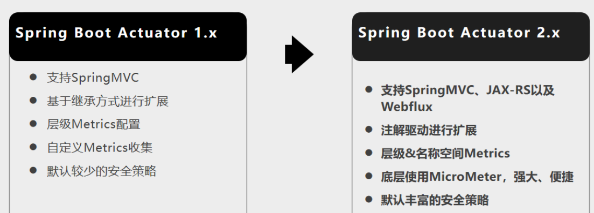
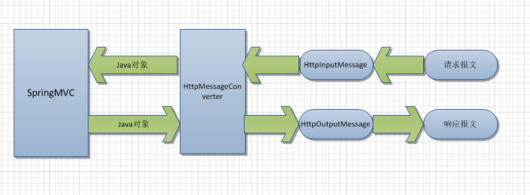

# 资料

**官网**

```https
https://docs.spring.io/spring-boot/docs/current/reference/html/
```

查看版本新特性：https://github.com/spring-projects/spring-boot/wiki#release-notes

所有的starter依赖：https://docs.spring.io/spring-boot/docs/current/reference/html/using-spring-boot.html#using-boot-starter

## 官方文档


## 尚硅谷md文档
```https
https://www.yuque.com/atguigu/springboot
```


# 基础入门

## 环境要求


## maven设置
主要是设置阿里云镜像和jdk版本锁定
需要去更改下载的本地maven的conf文件夹下的settings.xml文件
已经配置了阿里镜像就不需要再配置啦。

阿里云MAVEN镜像地址：https://developer.aliyun.com/mirror/maven

```xml
<mirrors>
       	<mirror>
        	<id>aliyunmaven</id>
       	 	<mirrorOf>*</mirrorOf>
        	<name>阿里云公共仓库</name>
        	<url>https://maven.aliyun.com/repository/public</url>
    	</mirror>
  </mirrors>
 
  <profiles>
         <profile>
              <id>jdk-1.8</id>
              <activation>
                <activeByDefault>true</activeByDefault>
                <jdk>1.8</jdk>
              </activation>
              <properties>
                <maven.compiler.source>1.8</maven.compiler.source>
                <maven.compiler.target>1.8</maven.compiler.target>
                <maven.compiler.compilerVersion>1.8</maven.compiler.compilerVersion>
              </properties>
         </profile>
  </profiles>
```

## Spring与SpringBoot
Spring能做什么?
为什么用SpringBoot?
时代背景?

这里需要去看md文档
```https
https://www.yuque.com/atguigu/springboot/na3pfd
```

## SpringBoot2入门
官方文档入门指导：https://docs.spring.io/spring-boot/docs/current/reference/html/getting-started.html#getting-started-first-application-code

### 1.创建maven工程
#### 在pom.xml中引入依赖
```xml
    <!--springBOOT的父依赖-->
    <parent>
        <groupId>org.springframework.boot</groupId>
        <artifactId>spring-boot-starter-parent</artifactId>
        <version>2.4.4</version>
    </parent>

    <dependencies>
        <!--web场景依赖-->
        <dependency>
            <groupId>org.springframework.boot</groupId>
            <artifactId>spring-boot-starter-web</artifactId>
        </dependency>
    </dependencies>


    <!--引入插件：可以将springboot项目打包为jar 此jar包含了所需运行的全部环境
            因为containing your compiled classes along with
            all of the jar dependencies that your code needs to run
            所以sometimes called “fat jars” 小胖jar-->
    <build>
        <plugins>
            <plugin>
                <groupId>org.springframework.boot</groupId>
                <artifactId>spring-boot-maven-plugin</artifactId>
            </plugin>
        </plugins>
    </build>
```

### 2.创建主程序
**直接运行此main程序即可运行springboot程序**

```java
/**
 * 主程序类
 * @SpringBootApplication： 这是一个springboot应用
 */
@SpringBootApplication
public class MainApplication {
    public static void main(String[] args) {
        SpringApplication.run(MainApplication.class,args);
    }
}
```
### 3.编写业务
```java
@RestController
@RequestMapping(path="/hello")
public class HelloController {
    @RequestMapping(path="/handler01")
    public String handler01(){
        return "Hello SpringBoot";
    }
}
```
@RestController和@RequestMapping注解都是spring mvc的注解。

### 4.简化配置

只需要在resources目录下新建application.properties文件


比如设置Tomcat的端口号为8888
```xml
server.port=8888
```
由于application.properties的存在，使得配置信息极大的简化。

### 5.简化部署
把项目打成jar包，直接在目标服务器执行即可。
当pom.xml没有指定打包方式的时候，默认jar包。

#### 创建一个可执行的Jar

>说明
可执行jar和Java
Java没有提供加载嵌套jar文件（jar中本身包含的jar文件）的标准方法。如果您要分发独立的应用程序，则可能会出现问题。
>
>为了解决这个问题，许多开发人员使用“超级”罐子。uber jar将来自应用程序所有依赖项的所有类打包到单个存档中。这种方法的问题在于，很难查看应用程序中包含哪些库。如果在多个jar中使用相同的文件名（但具有不同的内容），也可能会产生问题。
>
>Spring Boot采用了<a href="https://docs.spring.io/spring-boot/docs/current/reference/html/appendix-executable-jar-format.html#executable-jar">另一种方法</a><sup>(点击此处跳转)</sup>，实际上允许您直接嵌套jar。

需要导入插件
```xml
    <build>
        <plugins>
            <plugin>
                <groupId>org.springframework.boot</groupId>
                <artifactId>spring-boot-maven-plugin</artifactId>
                <configuration>
                    <excludes>
                        <exclude>
                            <groupId>org.projectlombok</groupId>
                            <artifactId>lombok</artifactId>
                        </exclude>
                    </excludes>
                </configuration>
            </plugin>
        </plugins>
    </build>
```


需要点击跳过test，打包为jar后，可以在命令行中直接运行此jar包

```shell
$ java -jar target/myproject-0.0.1-SNAPSHOT.jar
```
您还应该在target目录中看到一个更小的文件`myproject-0.0.1-SNAPSHOT.jar.original`。这是Maven在Spring Boot重新打包之前创建的原始jar文件。

**注意点**：
• 取消掉cmd的快速编辑模式
在命令行属性设置即可，不然在命令行点击某个字段后，将会停止运行springboot而进去编辑模式。
在其他需要快速编辑模式时候，再设置回来即可。

## 了解自动配置原理
### 1.SpringBoot特点
#### 1.1依赖管理
- 父项目做依赖管理
```xml
依赖管理    
<parent>
    <groupId>org.springframework.boot</groupId>
    <artifactId>spring-boot-starter-parent</artifactId>
    <version>2.4.4</version>
</parent>
ctrl点击上一个之后进入下面这个：
他的父项目
  <parent>
    <groupId>org.springframework.boot</groupId>
    <artifactId>spring-boot-dependencies</artifactId>
    <version>2.4.4</version>
  </parent>
再ctrl点击之后，可以看到此时的pom里面，
几乎声明了所有开发中常用的依赖的版本号,自动版本仲裁机制
```

- 开发导入starter场景启动器
```xml
1、见到很多 spring-boot-starter-* ： *就某种场景
2、只要引入starter，这个场景的所有常规需要的依赖我们都自动引入
3、SpringBoot所有支持的场景
https://docs.spring.io/spring-boot/docs/current/reference/html/using-spring-boot.html#using-boot-starter
4、见到的  *-spring-boot-starter： 第三方为我们提供的简化开发的场景启动器。
5、所有场景启动器最底层的依赖
    <dependency>
      <groupId>org.springframework.boot</groupId>
      <artifactId>spring-boot-starter</artifactId>
      <version>2.4.4</version>
      <scope>compile</scope>
    </dependency>
```


- 无需关注版本号，自动版本仲裁
```xml
1、引入依赖默认都可以不写版本
2、引入非版本仲裁的jar，要写版本号。
3、以后要写哪方面的业务，只需要参考官方文档引入相应的starter即可。
```

- 可以修改默认版本号
```xml
1、查看spring-boot-dependencies里面规定当前依赖的版本用的 key。
2、在当前项目的pom.xml里面重写配置
    <properties>
        <mysql.version>5.1.43</mysql.version>
    </properties>
就近原则，在pom中修改之后，先按照pom中的版本号，否则遵循父类中的版本。

3. 添加依赖的时候添加上<version>版本号</version> 也可以的
    <dependency>
        <groupId>mysql</groupId>
        <artifactId>mysql-connector-java</artifactId>
        <version>5.1.6</version>
    </dependency>
```

#### 1.2自动配置

Spring Boot自动配置会尝试根据添加的jar依赖项自动配置Spring应用程序。

例如，如果`HSQLDB`位于类路径上，并且尚未手动配置任何数据库连接bean，则Spring Boot会自动配置内存数据库。

查看配置的一种方法，在main方法中将返回的ioc容器里的组件打印输出。可以看看都配置了哪些bean组件。

第二种方法是去看工程中External Libraries里的`org\springframework\boot\spring-boot-autoconfigure\2.4.4\spring-boot-autoconfigure-2.4.4.jar!\org\springframework\boot\autoconfigure`，这里面的都是**自动的配置类**。

```java
public static void main(String[] args) {
    //1. 返回的是ioc容器
    ConfigurableApplicationContext run = SpringApplication.run(MainApplication.class, args);

    //2. 查看容器里的组件
    String[] beanDefinitionNames = run.getBeanDefinitionNames();
    for(String name:beanDefinitionNames){
        System.out.println(name);
    }
}
```
- 自动配好Tomcat
    - 引入Tomcat依赖。
    - 配置Tomcat
```xml
    <dependency>
      <groupId>org.springframework.boot</groupId>
      <artifactId>spring-boot-starter-tomcat</artifactId>
      <version>2.4.4</version>
      <scope>compile</scope>
    </dependency>
```
- 自动配好SpringMVC
    - 引入SpringMVC全套组件
    - 自动配好SpringMVC常用组件（功能）
    如视图解析器,文件上传解析器
- 自动配好Web常见功能，如：字符编码问题
  
    - SpringBoot帮我们配置好了所有web开发的常见场景
- 默认的包结构
    - 主程序所在包及其下面的所有子包里面的组件都会被默认扫描进来
      因此典型的包布局：
      
        ```
        com 
         +-示例
            +-myapplication 
                + -Application.java 
                | 
                +-客户
                | +-Customer.java 
                | +-CustomerController.java 
                | +-CustomerService.java 
                | +-CustomerRepository.java 
                | 
                +-订单
                    +-Order.java 
                    +-OrderController.java 
                    + -OrderService.java + 
                    -OrderRepository.java
        ```
    - 无需以前的包扫描配置
    - 想要改变扫描路径，@SpringBootApplication(scanBasePackages="com.fzk")
    或者@ComponentScan 指定扫描路径
    这样可以扩大包扫描范围。
```java
@SpringBootApplication(scanBasePackages="com.fzk.boot")
等同于
@SpringBootConfiguration
@EnableAutoConfiguration
@ComponentScan("com.fzk.boot")
```
- 各种配置拥有默认值
    - (application.properties)里的默认配置最终都是映射到每个类上，如：MultipartProperties
    - 配置文件的值最终会绑定每个类上，这个类会在ioc容器中创建对象
- 按需加载所有自动配置项
    - 非常多的starter
    - 引入了哪些场景这个场景的自动配置才会开启
    - SpringBoot所有的自动配置功能都在 spring-boot-autoconfigure 包里面

##### @SpringBootApplication

单个`@SpringBootApplication`注释可用于启用这三个功能，即：

- `@EnableAutoConfiguration`：启用[Spring Boot的自动配置机制](https://docs.spring.io/spring-boot/docs/current/reference/html/using-spring-boot.html#using-boot-auto-configuration)
- `@ComponentScan`：`@Component`在应用程序所在的软件包上启用扫描（请参阅[最佳实践](https://docs.spring.io/spring-boot/docs/current/reference/html/using-spring-boot.html#using-boot-structuring-your-code)）
- `@Configuration`：允许在上下文中注册额外的bean或导入其他配置类
```java
@SpringBootApplication(scanBasePackages="com.fzk.boot")
等同于
@SpringBootConfiguration
@EnableAutoConfiguration
@ComponentScan("com.fzk.boot")
```

这些功能都不是强制性的，您可以选择用它启用的任何功能替换此单个注释。例如，您可能不想在应用程序中使用组件扫描或配置属性扫描：

```java
package com.example.myapplication;

import org.springframework.boot.SpringApplication;
import org.springframework.context.annotation.ComponentScan
import org.springframework.context.annotation.Configuration;
import org.springframework.context.annotation.Import;

@Configuration(proxyBeanMethods = false)
@EnableAutoConfiguration
@Import({ MyConfig.class, MyAnotherConfig.class })
public class Application {

    public static void main(String[] args) {
            SpringApplication.run(Application.class, args);
    }

}
```

在此示例中，`Application`与其他任何Spring Boot应用程序一样，除了不会自动检测`@Component`-annotated类和`@ConfigurationProperties`-annotated类，并且显式导入用户定义的Bean（请参阅参考资料`@Import`）。

##### 禁用特定的自动配置类

- 如果发现正在应用不需要的特定自动配置类，则可以使用`@SpringBootApplication`的exclude属性来禁用它们

- ```java
  @SpringBootApplication(exclude={DataSourceAutoConfiguration.class})
  public class MyApplication {
  }
  ```

  如果该类不在类路径中，则可以使用`excludeName`注释的属性，并指定完全限定的名称。如果您更喜欢使用`@EnableAutoConfiguration`而不是`@SpringBootApplication`，`exclude`并且`excludeName`也可以使用。最后，您还可以使用该`spring.autoconfigure.exclude`属性来控制要排除的自动配置类的列表。

### 2.容器功能

#### 2.1组件添加

##### 1.@Configuration

- 基本使用
- **Full模式与Lite模式**
- 示例
  
  - - 配置类组件之间无依赖关系用Lite模式加速容器启动过程，减少判断
    - 配置类组件之间有依赖关系，方法会被调用得到之前单例组件，用Full模式


```java
#############################Configuration使用示例######################################################
/**
 * 1、配置类里面使用@Bean标注在方法上给容器注册组件，默认也是单例的
 * 2、配置类本身也是组件
 * 3、proxyBeanMethods：代理bean的方法
 *      Full(proxyBeanMethods = true)、【保证每个@Bean方法被调用多少次返回的组件都是单例的】
 *      Lite(proxyBeanMethods = false)【每个@Bean方法被调用多少次返回的组件都是新创建的】
 *      组件依赖必须使用Full模式默认。默认是Full模式
 *
 *
 *
 */
@Configuration(proxyBeanMethods = false)
public class MyConfig {
    /**
     * Full:外部无论对配置类中的这个组件注册方法调用多少次获取的都是之前注册容器中的单例对象
     * @return
     */
    @Bean
    public User user01(){
        User zhangsan = new User("zhangsan", 18);
        //user组件依赖了Pet组件
        zhangsan.setPet(tomcatPet());
        return zhangsan;
    }

    @Bean("tom")
    public Pet tomcatPet(){
        return new Pet("tomcat");
    }
}


################################@Configuration测试代码如下########################################
@SpringBootConfiguration
@EnableAutoConfiguration
@ComponentScan("com.fzk.boot")
public class MainApplication {

    public static void main(String[] args) {
        //1、返回IOC容器
        ConfigurableApplicationContext run = SpringApplication.run(MainApplication.class, args);

        //2、查看容器里面的组件
        String[] names = run.getBeanDefinitionNames();
        for (String name : names) {
            System.out.println(name);
        }

        //3、从容器中获取组件
        Pet tom01 = run.getBean("tom", Pet.class);
        Pet tom02 = run.getBean("tom", Pet.class);
        System.out.println("组件："+(tom01 == tom02));

        //4、com.fzk.boot.config.MyConfig$$EnhancerBySpringCGLIB$$51f1e1ca@1654a892
        MyConfig bean = run.getBean(MyConfig.class);
        System.out.println(bean);

        //如果@Configuration(proxyBeanMethods = true)代理对象调用方法。SpringBoot总会检查这个组件是否在容器中有。
        //保持组件单实例
        User user = bean.user01();
        User user1 = bean.user01();
        System.out.println(user == user1);

        User user01 = run.getBean("user01", User.class);
        Pet tom = run.getBean("tom", Pet.class);

        System.out.println("用户的宠物："+(user01.getPet() == tom));
    }
}
```

Full模式和Lite模式是针对java配置而言的，和xml配置无关。(xml之间的组件依赖关系都是写死在ref的)

何时为Lite模式：

1.类上有@Component注解

2.类上有@ComponentScan注解

3.类上有@Import注解

4.类上有@ImportResource注解

5.类上没有任何注解，但是类中存在@Bean方法

6.类上有@Configuration(proxyBeanMethods = false)注解

Lite总结：运行时不用生成CGLIB子类，提高运行性能，降低启动时间，可以作为普通类使用。但是不能声明@Bean之间的依赖


何时为Full模式：

1.标注有@Configuration或者@Configuration(proxyBeanMethods = true)的类被称为Full模式的配置类。

Full模式总结：单例模式能有效避免Lite模式下的错误。性能没有Lite模式好


##### 2.@Bean、@Component、@Controller、@Service、@Repository

这些都可以添加bean组件

##### 3.@ComponentScan、@Import

```java
 * 4、@Import({User.class, DBHelper.class})
 *      给容器中自动创建出这两个类型的组件、默认组件的名字就是全类名
 */

@Import({User.class, DBHelper.class})
@Configuration(proxyBeanMethods = false) //告诉SpringBoot这是一个配置类 == 配置文件
public class MyConfig {
}
```

@Import 高级用法： https://www.bilibili.com/video/BV1gW411W7wy?p=8

##### 4.@Conditional条件装配

条件装配：满足Conditional指定的条件，则进行组件注入


```java
    @Bean(name = "dog01") //也可以设置组件的id
    public Pet getPet(){
        Pet pet = new Pet();
        pet.setName("dog");
        return pet;
    }
    @ConditionalOnBean(name="dog01")	//先检查ioc容器中有没有dog01，有才创建此bean
    @Bean //将组件user01加到容器中，组件id默认为方法名
    public User user01(){
        User user = new User("fzk", 19);
        user.setPet(getPet());
        return user;
    }
```

#### 2.2原生配置文件引入

```java
@ImportResource(locations = "classpath:bean.xml")
```

这个可以用来导入一些xml配置文件。

#### 2.3配置绑定

将application.propertyies中的属性信息，绑定到类中，该类可以通过@Autowired等多种方式进行组件注册。

比如先在application.properties中加入以下信息

```xml
mycar.brand=BYD
mycar.price=100000
```
##### @Component + @ConfigurationProperties

注意得把前缀加上呢`@ConfigurationProperties(prefix = "mycar")`

```java
/**
 * 只有在容器中的组件，才会拥有SpringBoot提供的强大功能
 */
@Component
@ConfigurationProperties(prefix = "mycar")
public class Car {

    private String brand;
    private Integer price;
    ......
```

此时的car就被注册到容器，并且也取到了在application.properties中的属性。

如果是自己写的配置属性类 可以使用这种方法，很便捷的就把类得属性注入了，并且添加到容器中，如果是第三方类，没有@Component注解，就要使用@EnableConfigurationProperties(xxx.class) 

##### @EnableConfigurationProperties + @ConfigurationProperties

```java
@EnableConfigurationProperties(Car.class)
//1、开启Car配置绑定功能
//2、把这个Car这个组件自动注册到容器中
public class MyConfig {
}
```

不过很可惜的是，在Car类上依然必须要有@ConfigurationProperties(prefix="mycar")注解，不然报错呢。
@EnableConfigurationProperties是开启配置绑定，而@Component是将类注册到容器中，殊途同归。

##### @ConfigurationProperties

默认读取类路径下的application.properties
也可以使用以下注解选择指定属性文件

```java
@PropertySource(value={” classpath : jdbc. properties ”｝， ignoreResourceNotFound=true)
```

### 3.自动配置原理入门

原理讲解部分以后可以深入研究：p13-16

```https
https://www.bilibili.com/video/BV19K4y1L7MT?p=13
```

#### 3.1引导加载自动配置类

@SpringBootApplication中的三个注解

```java
@SpringBootConfiguration
@EnableAutoConfiguration
@ComponentScan(excludeFilters = { @Filter(type = FilterType.CUSTOM, classes = TypeExcludeFilter.class),
        @Filter(type = FilterType.CUSTOM, classes = AutoConfigurationExcludeFilter.class) })
public @interface SpringBootApplication{
	......
}
```

- @SpringBootConfiguration点进去包含@Configuration
  @Configuration。代表当前是一个配置类

- @ComponentScan
  指定扫描哪些，是Spring注解；

##### @EnableAutoConfiguration

```java
@AutoConfigurationPackage
@Import(AutoConfigurationImportSelector.class)
public @interface EnableAutoConfiguration {
    ......
}
```

###### @AutoConfigurationPackage

点进去之后：

```java
@Import(AutoConfigurationPackages.Registrar.class)  //给容器中导入一个组件
public @interface AutoConfigurationPackage {}

//利用Registrar给容器中导入一系列组件
//将指定的一个包下的所有组件导入进来？MainApplication 所在包下。
```

自动配置包？指定了默认的包规则

###### @Import(AutoConfigurationImportSelector.class)

```java
1、利用getAutoConfigurationEntry(annotationMetadata);给容器中批量导入一些组件
2、调用List<String> configurations = getCandidateConfigurations(annotationMetadata, attributes)获取到所有需要导入到容器中的配置类
3、利用工厂加载 Map<String, List<String>> loadSpringFactories(@Nullable ClassLoader classLoader)；得到所有的组件
4、从META-INF/spring.factories位置来加载一个文件。
    默认扫描我们当前系统里面所有META-INF/spring.factories位置的文件
    spring-boot-autoconfigure-2.3.4.RELEASE.jar包里面也有META-INF/spring.factories
```


```xml
文件里面写死了spring-boot一启动就要给容器中加载的所有配置类
spring-boot-autoconfigure-2.3.4.RELEASE.jar/META-INF/spring.factories
# Auto Configure
org.springframework.boot.autoconfigure.EnableAutoConfiguration=\
org.springframework.boot.autoconfigure.admin.SpringApplicationAdminJmxAutoConfiguration,\
org.springframework.boot.autoconfigure.aop.AopAutoConfiguration,\
org.springframework.boot.autoconfigure.amqp.RabbitAutoConfiguration,\
org.springframework.boot.autoconfigure.batch.BatchAutoConfiguration,\
org.springframework.boot.autoconfigure.cache.CacheAutoConfiguration,\
org.springframework.boot.autoconfigure.cassandra.CassandraAutoConfiguration,\
org.springframework.boot.autoconfigure.context.ConfigurationPropertiesAutoConfiguration,\
org.springframework.boot.autoconfigure.context.LifecycleAutoConfiguration,\
org.springframework.boot.autoconfigure.context.MessageSourceAutoConfiguration,\
org.springframework.boot.autoconfigure.context.PropertyPlaceholderAutoConfiguration,\
org.springframework.boot.autoconfigure.couchbase.CouchbaseAutoConfiguration,\
org.springframework.boot.autoconfigure.dao.PersistenceExceptionTranslationAutoConfiguration,\
org.springframework.boot.autoconfigure.data.cassandra.CassandraDataAutoConfiguration,\
org.springframework.boot.autoconfigure.data.cassandra.CassandraReactiveDataAutoConfiguration,\
org.springframework.boot.autoconfigure.data.cassandra.CassandraReactiveRepositoriesAutoConfiguration,\
org.springframework.boot.autoconfigure.data.cassandra.CassandraRepositoriesAutoConfiguration,\
org.springframework.boot.autoconfigure.data.couchbase.CouchbaseDataAutoConfiguration,\
org.springframework.boot.autoconfigure.data.couchbase.CouchbaseReactiveDataAutoConfiguration,\
org.springframework.boot.autoconfigure.data.couchbase.CouchbaseReactiveRepositoriesAutoConfiguration,\
org.springframework.boot.autoconfigure.data.couchbase.CouchbaseRepositoriesAutoConfiguration,\
org.springframework.boot.autoconfigure.data.elasticsearch.ElasticsearchDataAutoConfiguration,\
org.springframework.boot.autoconfigure.data.elasticsearch.ElasticsearchRepositoriesAutoConfiguration,\
org.springframework.boot.autoconfigure.data.elasticsearch.ReactiveElasticsearchRepositoriesAutoConfiguration,\
org.springframework.boot.autoconfigure.data.elasticsearch.ReactiveElasticsearchRestClientAutoConfiguration,\
org.springframework.boot.autoconfigure.data.jdbc.JdbcRepositoriesAutoConfiguration,\
org.springframework.boot.autoconfigure.data.jpa.JpaRepositoriesAutoConfiguration,\
org.springframework.boot.autoconfigure.data.ldap.LdapRepositoriesAutoConfiguration,\
org.springframework.boot.autoconfigure.data.mongo.MongoDataAutoConfiguration,\
org.springframework.boot.autoconfigure.data.mongo.MongoReactiveDataAutoConfiguration,\
org.springframework.boot.autoconfigure.data.mongo.MongoReactiveRepositoriesAutoConfiguration,\
org.springframework.boot.autoconfigure.data.mongo.MongoRepositoriesAutoConfiguration,\
org.springframework.boot.autoconfigure.data.neo4j.Neo4jDataAutoConfiguration,\
org.springframework.boot.autoconfigure.data.neo4j.Neo4jRepositoriesAutoConfiguration,\
org.springframework.boot.autoconfigure.data.solr.SolrRepositoriesAutoConfiguration,\
org.springframework.boot.autoconfigure.data.r2dbc.R2dbcDataAutoConfiguration,\
org.springframework.boot.autoconfigure.data.r2dbc.R2dbcRepositoriesAutoConfiguration,\
org.springframework.boot.autoconfigure.data.r2dbc.R2dbcTransactionManagerAutoConfiguration,\
org.springframework.boot.autoconfigure.data.redis.RedisAutoConfiguration,\
org.springframework.boot.autoconfigure.data.redis.RedisReactiveAutoConfiguration,\
org.springframework.boot.autoconfigure.data.redis.RedisRepositoriesAutoConfiguration,\
org.springframework.boot.autoconfigure.data.rest.RepositoryRestMvcAutoConfiguration,\
org.springframework.boot.autoconfigure.data.web.SpringDataWebAutoConfiguration,\
org.springframework.boot.autoconfigure.elasticsearch.ElasticsearchRestClientAutoConfiguration,\
org.springframework.boot.autoconfigure.flyway.FlywayAutoConfiguration,\
org.springframework.boot.autoconfigure.freemarker.FreeMarkerAutoConfiguration,\
org.springframework.boot.autoconfigure.groovy.template.GroovyTemplateAutoConfiguration,\
org.springframework.boot.autoconfigure.gson.GsonAutoConfiguration,\
org.springframework.boot.autoconfigure.h2.H2ConsoleAutoConfiguration,\
org.springframework.boot.autoconfigure.hateoas.HypermediaAutoConfiguration,\
org.springframework.boot.autoconfigure.hazelcast.HazelcastAutoConfiguration,\
org.springframework.boot.autoconfigure.hazelcast.HazelcastJpaDependencyAutoConfiguration,\
org.springframework.boot.autoconfigure.http.HttpMessageConvertersAutoConfiguration,\
org.springframework.boot.autoconfigure.http.codec.CodecsAutoConfiguration,\
org.springframework.boot.autoconfigure.influx.InfluxDbAutoConfiguration,\
org.springframework.boot.autoconfigure.info.ProjectInfoAutoConfiguration,\
org.springframework.boot.autoconfigure.integration.IntegrationAutoConfiguration,\
org.springframework.boot.autoconfigure.jackson.JacksonAutoConfiguration,\
org.springframework.boot.autoconfigure.jdbc.DataSourceAutoConfiguration,\
org.springframework.boot.autoconfigure.jdbc.JdbcTemplateAutoConfiguration,\
org.springframework.boot.autoconfigure.jdbc.JndiDataSourceAutoConfiguration,\
org.springframework.boot.autoconfigure.jdbc.XADataSourceAutoConfiguration,\
org.springframework.boot.autoconfigure.jdbc.DataSourceTransactionManagerAutoConfiguration,\
org.springframework.boot.autoconfigure.jms.JmsAutoConfiguration,\
org.springframework.boot.autoconfigure.jmx.JmxAutoConfiguration,\
org.springframework.boot.autoconfigure.jms.JndiConnectionFactoryAutoConfiguration,\
org.springframework.boot.autoconfigure.jms.activemq.ActiveMQAutoConfiguration,\
org.springframework.boot.autoconfigure.jms.artemis.ArtemisAutoConfiguration,\
org.springframework.boot.autoconfigure.jersey.JerseyAutoConfiguration,\
org.springframework.boot.autoconfigure.jooq.JooqAutoConfiguration,\
org.springframework.boot.autoconfigure.jsonb.JsonbAutoConfiguration,\
org.springframework.boot.autoconfigure.kafka.KafkaAutoConfiguration,\
org.springframework.boot.autoconfigure.availability.ApplicationAvailabilityAutoConfiguration,\
org.springframework.boot.autoconfigure.ldap.embedded.EmbeddedLdapAutoConfiguration,\
org.springframework.boot.autoconfigure.ldap.LdapAutoConfiguration,\
org.springframework.boot.autoconfigure.liquibase.LiquibaseAutoConfiguration,\
org.springframework.boot.autoconfigure.mail.MailSenderAutoConfiguration,\
org.springframework.boot.autoconfigure.mail.MailSenderValidatorAutoConfiguration,\
org.springframework.boot.autoconfigure.mongo.embedded.EmbeddedMongoAutoConfiguration,\
org.springframework.boot.autoconfigure.mongo.MongoAutoConfiguration,\
org.springframework.boot.autoconfigure.mongo.MongoReactiveAutoConfiguration,\
org.springframework.boot.autoconfigure.mustache.MustacheAutoConfiguration,\
org.springframework.boot.autoconfigure.orm.jpa.HibernateJpaAutoConfiguration,\
org.springframework.boot.autoconfigure.quartz.QuartzAutoConfiguration,\
org.springframework.boot.autoconfigure.r2dbc.R2dbcAutoConfiguration,\
org.springframework.boot.autoconfigure.rsocket.RSocketMessagingAutoConfiguration,\
org.springframework.boot.autoconfigure.rsocket.RSocketRequesterAutoConfiguration,\
org.springframework.boot.autoconfigure.rsocket.RSocketServerAutoConfiguration,\
org.springframework.boot.autoconfigure.rsocket.RSocketStrategiesAutoConfiguration,\
org.springframework.boot.autoconfigure.security.servlet.SecurityAutoConfiguration,\
org.springframework.boot.autoconfigure.security.servlet.UserDetailsServiceAutoConfiguration,\
org.springframework.boot.autoconfigure.security.servlet.SecurityFilterAutoConfiguration,\
org.springframework.boot.autoconfigure.security.reactive.ReactiveSecurityAutoConfiguration,\
org.springframework.boot.autoconfigure.security.reactive.ReactiveUserDetailsServiceAutoConfiguration,\
org.springframework.boot.autoconfigure.security.rsocket.RSocketSecurityAutoConfiguration,\
org.springframework.boot.autoconfigure.security.saml2.Saml2RelyingPartyAutoConfiguration,\
org.springframework.boot.autoconfigure.sendgrid.SendGridAutoConfiguration,\
org.springframework.boot.autoconfigure.session.SessionAutoConfiguration,\
org.springframework.boot.autoconfigure.security.oauth2.client.servlet.OAuth2ClientAutoConfiguration,\
org.springframework.boot.autoconfigure.security.oauth2.client.reactive.ReactiveOAuth2ClientAutoConfiguration,\
org.springframework.boot.autoconfigure.security.oauth2.resource.servlet.OAuth2ResourceServerAutoConfiguration,\
org.springframework.boot.autoconfigure.security.oauth2.resource.reactive.ReactiveOAuth2ResourceServerAutoConfiguration,\
org.springframework.boot.autoconfigure.solr.SolrAutoConfiguration,\
org.springframework.boot.autoconfigure.task.TaskExecutionAutoConfiguration,\
org.springframework.boot.autoconfigure.task.TaskSchedulingAutoConfiguration,\
org.springframework.boot.autoconfigure.thymeleaf.ThymeleafAutoConfiguration,\
org.springframework.boot.autoconfigure.transaction.TransactionAutoConfiguration,\
org.springframework.boot.autoconfigure.transaction.jta.JtaAutoConfiguration,\
org.springframework.boot.autoconfigure.validation.ValidationAutoConfiguration,\
org.springframework.boot.autoconfigure.web.client.RestTemplateAutoConfiguration,\
org.springframework.boot.autoconfigure.web.embedded.EmbeddedWebServerFactoryCustomizerAutoConfiguration,\
org.springframework.boot.autoconfigure.web.reactive.HttpHandlerAutoConfiguration,\
org.springframework.boot.autoconfigure.web.reactive.ReactiveWebServerFactoryAutoConfiguration,\
org.springframework.boot.autoconfigure.web.reactive.WebFluxAutoConfiguration,\
org.springframework.boot.autoconfigure.web.reactive.error.ErrorWebFluxAutoConfiguration,\
org.springframework.boot.autoconfigure.web.reactive.function.client.ClientHttpConnectorAutoConfiguration,\
org.springframework.boot.autoconfigure.web.reactive.function.client.WebClientAutoConfiguration,\
org.springframework.boot.autoconfigure.web.servlet.DispatcherServletAutoConfiguration,\
org.springframework.boot.autoconfigure.web.servlet.ServletWebServerFactoryAutoConfiguration,\
org.springframework.boot.autoconfigure.web.servlet.error.ErrorMvcAutoConfiguration,\
org.springframework.boot.autoconfigure.web.servlet.HttpEncodingAutoConfiguration,\
org.springframework.boot.autoconfigure.web.servlet.MultipartAutoConfiguration,\
org.springframework.boot.autoconfigure.web.servlet.WebMvcAutoConfiguration,\
org.springframework.boot.autoconfigure.websocket.reactive.WebSocketReactiveAutoConfiguration,\
org.springframework.boot.autoconfigure.websocket.servlet.WebSocketServletAutoConfiguration,\
org.springframework.boot.autoconfigure.websocket.servlet.WebSocketMessagingAutoConfiguration,\
org.springframework.boot.autoconfigure.webservices.WebServicesAutoConfiguration,\
org.springframework.boot.autoconfigure.webservices.client.WebServiceTemplateAutoConfiguration
```

#### 3.2按需开启自动配置项

```xml
虽然我们127个场景的所有自动配置启动的时候默认全部加载。xxxxAutoConfiguration
按照条件装配规则（@Conditional），最终会按需配置。

底层有大量的@Conditional，有很多自动配置类并不能完全开启。(按需配置)
```

#### 3.3修改默认配置

```java
@Bean
@ConditionalOnBean(MultipartResolver.class)  //容器中有这个类型组件
@ConditionalOnMissingBean(name = DispatcherServlet.MULTIPART_RESOLVER_BEAN_NAME) //容器中没有这个名字 multipartResolver 的组件
public MultipartResolver multipartResolver(MultipartResolver resolver) {
    //给@Bean标注的方法传入了对象参数，这个参数的值会从容器中找。找到了就会返回符合规范的文件解析器
    //SpringMVC multipartResolver。防止有些用户配置的文件上传解析器不符合规范命名规范
    // Detect if the user has created a MultipartResolver but named it incorrectly
    return resolver;
}
给容器中加入了文件上传解析器；
```

SpringBoot默认会在底层配好所有的组件。但是如果用户自己配置了以用户的优先(约定大于配置)

如HttpEncodingAutoConfiguration中的配置包含如下：

```java
@Bean
@ConditionalOnMissingBean  //这里就是说如果没有容器中没有自己配置的CharacterEncodingFilter，才会把这个默认配置的组件注册
public CharacterEncodingFilter characterEncodingFilter() {
    ......
}
```

#### 3.4最佳实践

- 引入场景依赖

  - https://docs.spring.io/spring-boot/docs/current/reference/html/using-spring-boot.html#using-boot-starter

- 查看自动配置了哪些（选做）

  - 自己分析，引入场景对应的自动配置一般都生效了
  - 配置文件中**debug=true**开启自动配置报告。Negative（不生效）/Positive（生效）

- 是否需要修改

  - 参照文档修改配置项

  - - https://docs.spring.io/spring-boot/docs/current/reference/html/appendix-application-properties.html#common-application-properties
    - 自己分析。 **xxxxxAutoConfiguration源码**里的xxxxProperties绑定了配置文件的哪些。

- - 自定义加入或者替换组件

    - @Bean、@Component。。。

- - 自定义器  **XXXXXCustomizer**；
  - ......

#### 总结：

- SpringBoot先加载所有的自动配置类  xxxxxAutoConfiguration
- 每个自动配置类按照条件进行生效，默认都会绑定配置文件指定的值。xxxxProperties类里面拿。xxxProperties类和默认配置文件application.properties进行了绑定。这里可以去看自动配置类的源码如HttpEncodingAutoConfiguration可以很直观。
- 生效的配置类就会给容器中装配很多组件
- 只要容器中有这些组件，相当于这些功能就有了
- 定制化配置

  - 可以直接自己@Bean替换底层的组件
  - 也可以去看这个组件是获取的配置文件什么值就去修改。

**xxxxxAutoConfiguration ---> 组件  --->** **xxxxProperties里面拿值  ----> application.properties**

所以呢，以后要想改某个方面的配置，要么去官方手册查，或者直接找相应的**自动配置类源码**里去找出相应的配置，再到application.properties里改动。

## 开发小技巧

### 4.0关于配置

由于自动配置类**xxxxxAutoConfiguration**是绑定了 **xxxxProperties**属性类的，而这个属性类又是绑定了application.properties和application.yaml的，所以只要改配置文件即可改自动配置类的默认实现值。

那么如何更改呢？以server.port为例子的话：

1. 官网手册查所有可以改的配置。
2. 点开**xxxxxAutoConfiguration**配置类的源码，找到绑定的**xxxxProperties**属性类，再点开找到这个属性类绑定的前缀以及其所设置的默认值，即可在配置文件里进行更改。
3. 自动配置类的位置：在maven的External Libraries中找如下：
   如异常自动配置类：org/springframework/boot/autoconfigure/web/servlet/error/ErrorMvcAutoConfiguration.java


### 4.1Lombok

简化JavaBean开发

```xml
<dependency>
    <groupId>org.projectlombok</groupId>
    <artifactId>lombok</artifactId>
</dependency>


然后idea中搜索安装lombok插件
```

@Data 提供set/get方法
@ToString 提供toString方法
@NoArgsConstructor 提供无参构造器
@AllArgsConstructor 提供全参构造器
@EqualsAndHashCode 提供equals和hashcode方法
@Slf4j 简化日志开发

```java
===============================简化JavaBean开发===================================
@Data
@NoArgsConstructor
@AllArgsConstructor
@ToString
@EqualsAndHashCode
public class User {
    private String name;
    private Integer age;
    private Pet pet;

    public User(String name,Integer age){
        this.name = name;
        this.age = age;
    }
}

================================简化日志开发===================================
@Slf4j
@RestController
public class HelloController {
    @RequestMapping("/hello")
    public String handle01(@RequestParam("name") String name){
        
        log.info("请求进来了....");
        
        return "Hello, Spring Boot 2!"+"你好："+name;
    }
}
```

### 4.2 dev-tools

```xml
<dependency>
    <groupId>org.springframework.boot</groupId>
    <artifactId>spring-boot-devtools</artifactId>
    <optional>true</optional>
</dependency>
项目或者页面修改以后：Ctrl+F9；
```

`spring-boot-devtools`只要类路径上的文件发生更改，使用的应用程序就会**自动重新启动**。在IDE中工作时，这可能是一个有用的功能，因为它为代码更改提供了非常快速的反馈循环。默认情况下，将监视类路径上指向目录的任何条目的更改。请注意，某些资源（例如静态资产和视图模板）[不需要重新启动应用程序](https://docs.spring.io/spring-boot/docs/current/reference/html/using-spring-boot.html#using-boot-devtools-restart-exclude)。
[更详细官方文档使用说明请点击这里](https://docs.spring.io/spring-boot/docs/current/reference/html/using-spring-boot.html#using-boot-devtools-restart)

**重新启动与重新加载的区别**

Spring Boot提供的重启技术通过使用两个类加载器来工作。不变的类（例如，来自第三方jar的类）将被加载到*基*类加载器中。您正在积极开发的类将加载到*重新启动*类加载器中。重新启动应用程序后，将丢弃*重新启动*类加载器，并创建一个新的类加载器。这种方法意味着应用程序的**重启通常比“冷启动”要快得多**，因为*基本*类加载器已经可用并已填充。

如果您发现重新启动对于您的应用程序来说不够快，或者遇到类加载问题，则可以考虑从ZeroTurnaround重新加载技术，例如[JRebel](https://jrebel.com/software/jrebel/)。这些方法通过在加载类时重写类来使它们更适合于重新加载，但是这个要钱。

### 4.3、Spring Initailizr（项目初始化向导）


### 4.4 日志记录

Spring Boot使用[Commons Logging](https://commons.apache.org/logging)进行所有内部日志记录，但是使底层日志实现保持打开状态。提供了[Java Util Logging](https://docs.oracle.com/javase/8/docs/api/java/util/logging/package-summary.html)，[Log4J2](https://logging.apache.org/log4j/2.x/)和[Logback的](https://logback.qos.ch/)默认配置。在每种情况下，记录器都已预先配置为使用控制台输出，同时还提供可选文件输出。

> 更多细节：https://docs.spring.io/spring-boot/docs/current/reference/html/spring-boot-features.html#boot-features-logging

# SpringBoot2核心技术-核心功能

## 外部化配置

> 更多细节：https://docs.spring.io/spring-boot/docs/current/reference/html/spring-boot-features.html#boot-features-external-config

Spring Boot使您可以外部化配置，以便可以在不同环境中使用相同的应用程序代码。您可以使用各种外部配置源，包括**Java属性文件**，**YAML文件**，**环境变量**和**命令行参数**。

属性值可以通过直接注射到你的bean`@Value`注释，通过Spring的访问`Environment`抽象，或者被[绑定到结构化对象](https://docs.spring.io/spring-boot/docs/current/reference/html/spring-boot-features.html#boot-features-external-config-typesafe-configuration-properties)通过`@ConfigurationProperties`。

Spring Boot使用一个**非常特殊的`PropertySource`顺序**，该顺序旨在允许合理地覆盖值。(更多细节看文档)

### 1.文件类型

#### 1.1.properties

同以前的properties用法

> 建议整个应用程序使用一种格式。如果您的配置文件的格式`.properties`和`.yml`格式都位于同一位置，**则以`.properties`优先级为准**。
> 注意：properties中文不兼容。而yaml则没有这个问题。

#### 1.2.yaml

##### 1.2.1简介

YAML 是 "YAML Ain't Markup Language"（YAML 不是一种标记语言）的递归缩写。在开发的这种语言时，YAML 的意思其实是："Yet Another Markup Language"（仍是一种标记语言）。 

非常适合用来做以**数据为中心**的配置文件

> **注意：**无法使用`@PropertySource`或`@TestPropertySource`注释加载YAML文件。因此，在需要以这种方式加载值的情况下，需要使用属性文件。

##### 1.2.2基本语法

- key: value；k,v之间有空格
- 大小写敏感
- 使用缩进表示层级关系
- 缩进**不允许使用tab**，只允许空格(不过由于idea默认将tab转为4个空格，在idea中似乎又可以用tab)
- 缩进的空格数不重要，只要相同层级的**元素左对齐**即可
- '#'表示注释
- 字符串无需加引号，如果要加，''与""表示字符串内容 会被 不转义/转义
  如果字符串为一段数字，该数字以零开头，必须添加上""  不然Springboot会将数字解析成八进制
  如\n，单引号中作为字符串输出，双引号会换行

##### 1.2.3数据类型

- 字面量：单个的、不可再分的值。date、boolean、string、number、null

```yaml
k: v
```

- 对象：键值对的集合。map、hash、set、object 

```yaml
行内写法：  k: {k1:v1,k2:v2,k3:v3}
#或
k: 
  k1: v1
  k2: v2
  k3: v3
```

- 数组：一组按次序排列的值。array、list、queue

```yaml
行内写法：  k: [v1,v2,v3]
#或者
k:
 - v1
 - v2
 - v3
```

### 2.配置属性

#### 2.1 配置文件位置

spring boot启动就会自动查找和加载`application.properties`和`application.yaml`文件，从以下位置：

1. The classpath root
2. The classpath `/config` package
3. The current directory
4. The `/config` subdirectory in the current directory
5. Immediate child directories of the `/config` subdirectory

下面的将会覆盖上面的。Documents from the loaded files are added as `PropertySources` to the Spring `Environment`.

#### 2.2 处理多文档文件

Spring Boot允许您将单个物理文件拆分为多个逻辑文档，每个逻辑文档都是独立添加的。从上到下按顺序处理文档。以后的文档可以覆盖以前的文档中定义的属性。

对于`application.yml`文件，使用标准的YAML多文档语法。三个连续的连字符代表一个文档的末尾，以及下一个的开始。

例如，以下文件具有两个逻辑文档：

```yaml
spring.application.name: MyApp
---
spring.config.activate.on-cloud-platform: kubernetes
spring.application.name: MyCloudApp
```

对于`application.properties`文件，特殊`#---`注释用于标记文档拆分：

```properties
spring.application.name=MyApp
#---
spring.config.activate.on-cloud-platform=kubernetes
spring.application.name=MyCloudApp
```

注意： 
多文档属性文件通常与激活属性（例如`spring.config.activate.on-profile`）结合使用。
属性文件分隔符不得包含任何前导空格，并且必须恰好具有三个连字符。分隔符之前和之后的行不得为注释。
不能使用`@PropertySource`或`@TestPropertySource`注释加载多文档属性文件。

#### 2.3 激活属性

有时仅在满足某些条件时才激活给定的属性获取，这很有用。例如，您可能具有仅在特定配置文件处于活动状态时才相关的属性。

您可以使用`spring.config.activate.*`来有条件地激活属性文档。

| Property            | Note                                                         |
| :------------------ | ------------------------------------------------------------ |
| `on-profile`        | A profile expression that must match for the document to be active. |
| `on-cloud-platform` | The `CloudPlatform` that must be detected for the document to be active. |

例如，以下内容指定第二个文档仅在Kubernetes上运行时才处于活动状态，并且仅在“ prod”或“ staging”配置文件处于活动状态时才处于活动状态：

```properties
myprop=always-set
#---
spring.config.activate.on-cloud-platform=kubernetes
spring.config.activate.on-profile=prod | staging
myotherprop=sometimes-set
```

```yaml
myprop:
  always-set
---
spring:
  config:
    activate:
      on-cloud-platform: "kubernetes"
      on-profile: "prod | staging"
myotherprop: sometimes-set
```

### 3.配置绑定

将.properties或者.yaml中配置的属性绑定到spring bean中；
[更多细节如绑定Map、List等查询官方文档](https://docs.spring.io/spring-boot/docs/current/reference/html/spring-boot-features.html#boot-features-external-config-typesafe-configuration-properties)

#### 轻松绑定

Spring Boot使用一些宽松的规则将`Environment`属性绑定到`@ConfigurationProperties`Bean，因此`Environment`属性名称和Bean属性名称之间不需要完全匹配。有用的常见示例包括破折号分隔的环境属性（例如，`context-path`绑定到`contextPath`）和大写的环境属性（例如，`PORT`绑定到`port`）。

示例：

```java
@ConfigurationProperties(prefix="acme.my-project.person")
public class OwnerProperties {
    private String firstName;
    public String getFirstName() {
        return this.firstName;
    }
    public void setFirstName(String firstName) {
        this.firstName = firstName;
    }
}
```

使用前面的代码，可以全部使用以下属性名称：

| property                            | 笔记                                                         |
| :---------------------------------- | :----------------------------------------------------------- |
| `acme.my-project.person.first-name` | 烤肉串盒，建议在`.properties`和`.yml`文件中使用。            |
| `acme.myProject.person.firstName`   | 标准驼峰式语法。                                             |
| `acme.my_project.person.first_name` | 下划线表示法，是在`.properties`和`.yml`文件中使用的另一种格式。 |
| `ACME_MYPROJECT_PERSON_FIRSTNAME`   | 大写格式，在使用系统环境变量时建议使用。                     |

> 注意：The `prefix` value for the annotation *must* be in kebab case (lowercase and separated by `-`, such as `acme.my-project.person`).

#### @ConfigurationProperties与@Value

`@Value`注释是核心容器的功能，@Value可以给单个属性配置值，而@ConfigurationProperties则是给一个类配置属性。

| 特征                                                         | `@ConfigurationProperties` | `@Value` |
| :----------------------------------------------------------- | :------------------------- | :------- |
| [宽松的装订](https://docs.spring.io/spring-boot/docs/current/reference/html/spring-boot-features.html#boot-features-external-config-relaxed-binding) | 是的                       | 受限     |
| [元数据支持](https://docs.spring.io/spring-boot/docs/current/reference/html/appendix-configuration-metadata.html#configuration-metadata) | 是的                       | 不       |
| `SpEL` 评估                                                  | 不                         | 是的     |

> **注意**：如果您确实想使用`@Value`，我们建议您使用规范形式来引用属性名称（kebab-case仅使用小写字母）。
> 这将使Spring Boot可以使用与`@ConfigurationProperties`放松绑定时相同的逻辑
>
> 例如，`@Value("{demo.item-price}")`将从`application.properties`文件拿起`demo.item-price`和`demo.itemPrice`，以及从系统环境中拿`DEMO_ITEMPRICE`。
>
> 如果你使用的`@Value("{demo.itemPrice}")`，`demo.item-price`并`DEMO_ITEMPRICE`不会予以考虑。

```java
@Value("${person.name:李四}")	// 从配置文件中取出值绑定给属性name 如果没有找到，则默认为李四
private String name;
```

### 4.配置提示

使用注释处理器生成您自己的元数据

自定义的类和配置文件绑定一般没有提示，此时配置注释处理器就可以有提示了。

可以使用`spring-boot-configuration-processor`jar轻松地从带有注释`@ConfigurationProperties`的项目中生成自己的配置元数据文件。该jar包含一个**Java注释处理器**，在项目被**编译时**会被调用。

#### 配置注释处理器

要使用处理器，需要包含对的依赖`spring-boot-configuration-processor`。

使用Maven时，应将依赖项声明为可选，如以下示例所示：

配置对应的pom文件，且打包时排除，以免多出一个processor的jar占用jvm空间

```xml
        <dependency>
            <groupId>org.springframework.boot</groupId>
            <artifactId>spring-boot-configuration-processor</artifactId>
            <optional>true</optional>
        </dependency>


	<build>
		<plugins>
			<plugin>
				<groupId>org.springframework.boot</groupId>
				<artifactId>spring-boot-maven-plugin</artifactId>
				<!--不过在2.4.2版本之后就不需要再显示声明了，已经自动过滤了-->
				<configuration>
					<excludes>
						<exclude>
							<groupId>org.springframework.boot</groupId>
							<artifactId>spring-boot-configuration-processor</artifactId>
						</exclude>
					</excludes>
				</configuration>
			</plugin>
		</plugins>
	</build>
```

#### 自动元数据生成

处理器选择用`@ConfigurationProperties`注释的类和方法。

此时再去yaml文件或者是properties文件配置自己的写了`@ConfigurationProperties`注释的类的属性时候，就有提示了。

#### 更多官方文档细节

```https
https://docs.spring.io/spring-boot/docs/current/reference/html/appendix-configuration-metadata.html#configuration-metadata-annotation-processor
```

------------------


## Web开发


[官方参考文档位置](https://docs.spring.io/spring-boot/docs/current/reference/html/spring-boot-features.html#boot-features-spring-mvc-welcome-page)

### 1.Spring MVC自动配置

Spring Boot provides auto-configuration for Spring MVC that **works well with most applications.(大多场景我们都无需自定义配置)**

The auto-configuration adds the following features on top of Spring’s defaults:

- Inclusion of `ContentNegotiatingViewResolver` and `BeanNameViewResolver` beans.
	- 内容协商视图解析器和BeanName视图解析器

- Support for serving static resources, including support for WebJars (covered [later in this document](https://docs.spring.io/spring-boot/docs/current/reference/html/spring-boot-features.html#boot-features-spring-mvc-static-content))).
  - 静态资源（包括webjars）

- Automatic registration of `Converter`, `GenericConverter`, and `Formatter` beans.
  - 自动注册 `Converter，GenericConverter，Formatter `

- Support for `HttpMessageConverters` (covered [later in this document](https://docs.spring.io/spring-boot/docs/current/reference/html/spring-boot-features.html#boot-features-spring-mvc-message-converters)).
  - 支持 `HttpMessageConverters` （后来我们配合内容协商理解原理）

- Automatic registration of `MessageCodesResolver` (covered [later in this document](https://docs.spring.io/spring-boot/docs/current/reference/html/spring-boot-features.html#boot-features-spring-message-codes)).
  - 自动注册 `MessageCodesResolver` （国际化用）

- Static `index.html` support.
  - 静态index.html 页支持

- Custom `Favicon` support (covered [later in this document](https://docs.spring.io/spring-boot/docs/current/reference/html/spring-boot-features.html#boot-features-spring-mvc-favicon)).
  - 自定义 `Favicon`  

- Automatic use of a `ConfigurableWebBindingInitializer` bean (covered [later in this document](https://docs.spring.io/spring-boot/docs/current/reference/html/spring-boot-features.html#boot-features-spring-mvc-web-binding-initializer)).
  - 自动使用 `ConfigurableWebBindingInitializer` ，（DataBinder负责将请求数据绑定到JavaBean上）

> If you want to keep those Spring Boot MVC customizations and make more [MVC customizations](https://docs.spring.io/spring/docs/5.2.9.RELEASE/spring-framework-reference/web.html#mvc) (interceptors, formatters, view controllers, and other features), you can add your own `@Configuration` class of type `WebMvcConfigurer` but **without** `@EnableWebMvc`.
>
> **不用@EnableWebMvc注解。使用** **`@Configuration`** **+** **`WebMvcConfigurer`** **自定义规则**

> If you want to provide custom instances of `RequestMappingHandlerMapping`, `RequestMappingHandlerAdapter`, or `ExceptionHandlerExceptionResolver`, and still keep the Spring Boot MVC customizations, you can declare a bean of type `WebMvcRegistrations` and use it to provide custom instances of those components.
>
> **声明** **`WebMvcRegistrations`** **改变默认底层组件**

> If you want to take complete control of Spring MVC, you can add your own `@Configuration` annotated with `@EnableWebMvc`, or alternatively add your own `@Configuration`-annotated `DelegatingWebMvcConfiguration` as described in the Javadoc of `@EnableWebMvc`.
>
> **使用** **`@EnableWebMvc+@Configuration+DelegatingWebMvcConfiguration 全面接管SpringMVC`**

### 2.简单功能分析

#### 2.1、静态资源访问

##### 1、静态资源目录

默认情况下，Spring Boot从类路径中名为`/static`（`/public`或`/resources`或`/META-INF/resources`）的目录中或从的根中提供静态内容`ServletContext`。它使用`ResourceHttpRequestHandler`Spring MVC中的from，因此您可以通过添加自己`WebMvcConfigurer`的`addResourceHandlers`方法并覆盖该方法来修改该行为。

原理： 静态映射/**。
请求进来，先去找Controller看能不能处理。不能处理的所有请求又都交给静态资源处理器。静态资源也找不到则响应404页面

默认情况下，资源映射到`/**`，但是您可以使用`spring.mvc.static-path-pattern`属性对其进行调整。例如，将所有资源重新定位到以下位置`/resources/**`：两种方式都可以。

```properties
spring.mvc.static-path-pattern=/resources/**
```

```yaml
spring:
  mvc:
    static-path-pattern: "/resources/**"
```

您还可以使用`spring.web.resources.static-locations`属性来自定义静态资源位置（用目录位置列表替换默认值）。根Servlet上下文路径`"/"`也会自动添加为位置。

改变默认的静态资源路径

```yaml
spring:
  web:
    resources:
      static-locations: ["classpath:/haha/"]
```

##### 2、静态资源访问前缀

默认无前缀

```yaml
spring:
  mvc:
    static-path-pattern: /resources/**
```

当前项目 + static-path-pattern + 静态资源名 = 静态资源文件夹下找

static-path-patten是虚拟的路径，不是真实存在的 

目的：以免静态资源被拦截

##### 3、webjar

自动映射 /[webjars](http://localhost:8080/webjars/jquery/3.5.1/jquery.js)/**

https://www.webjars.org/

```xml
        <dependency>
            <groupId>org.webjars</groupId>
            <artifactId>jquery</artifactId>
            <version>3.5.1</version>
        </dependency>
```

访问地址：[http://localhost:8080/webjars/**jquery/3.5.1/jquery.js**](http://localhost:8080/webjars/jquery/3.5.1/jquery.js)  后面地址要按照依赖里面的包路径

webjar就是将前端的静态资源：比如说jquery、bootstarp等资源以jar包的方式导入。
了解即可，毕竟这些资源没必要以jar包来导入。

#### 2.2、欢迎页支持

Spring Boot支持静态和模板欢迎页面。它首先在配置的静态内容位置中查找文件`index.html`。如果找不到，它将寻找一个`index`模板。如果找到任何一个，它将自动用作应用程序的欢迎页面。

- 静态资源路径下  index.html

- - 可以配置静态资源路径
  - 但是不可以配置静态资源的访问前缀。否则导致 index.html不能被默认访问

```yaml
spring:
#  mvc:
#    static-path-pattern: /res/**   这个会导致welcome page功能失效，在访问的时候不得不加上res这个路径

  resources:
    static-locations: [classpath:/haha/]
```

- controller能处理/index

#### 2.3、自定义 `Favicon`

favicon.ico 放在静态资源目录下即可。**(只能放在static下)**
一定得叫这个名字，然后这个图片就将作为网站的图标哦。
浏览器会发送/favicon.ico请求获取图标，之后整个**session期间不再发送**。


```yaml
spring:
#  mvc:
#    static-path-pattern: /res/**   这个会导致 Favicon 功能失效
```


#### 2.4、静态资源配置原理

- SpringBoot启动默认加载  xxxAutoConfiguration 类（自动配置类）

- SpringMVC功能的自动配置类 WebMvcAutoConfiguration，生效

```java
@Configuration(proxyBeanMethods = false)
@ConditionalOnWebApplication(type = Type.SERVLET)
@ConditionalOnClass({ Servlet.class, DispatcherServlet.class, WebMvcConfigurer.class })
@ConditionalOnMissingBean(WebMvcConfigurationSupport.class)
@AutoConfigureOrder(Ordered.HIGHEST_PRECEDENCE + 10)
@AutoConfigureAfter({ DispatcherServletAutoConfiguration.class, TaskExecutionAutoConfiguration.class,
      ValidationAutoConfiguration.class })
public class WebMvcAutoConfiguration {
    ......
}
```

- 给容器中配了什么。

```java
@Configuration(proxyBeanMethods = false)
@Import(EnableWebMvcConfiguration.class)
@EnableConfigurationProperties({ WebMvcProperties.class,
      org.springframework.boot.autoconfigure.web.ResourceProperties.class, WebProperties.class })
@Order(0)
public static class WebMvcAutoConfigurationAdapter implements WebMvcConfigurer {
    ......
}
```

配置文件的相关属性和xxx进行了绑定。WebMvcProperties绑定spring.mvc前缀; ResourceProperties绑定spring.resources前缀；
WebProperties绑定spring.web前缀。

##### 1.配置类只有一个有参构造器

```java
    //有参构造器所有参数的值都会从容器中确定
//WebProperties webProperties；获取和spring.web绑定的所有的值的对象
//WebMvcProperties mvcProperties 获取和spring.mvc绑定的所有的值的对象
//ListableBeanFactory beanFactory Spring的beanFactory
//HttpMessageConverters 找到所有的HttpMessageConverters
//ResourceHandlerRegistrationCustomizer 找到 资源处理器的自定义器。=========
//DispatcherServletPath  
//ServletRegistrationBean   给应用注册Servlet、Filter....
public WebMvcAutoConfigurationAdapter(WebProperties webProperties, WebMvcProperties mvcProperties,
                                      ListableBeanFactory beanFactory, ObjectProvider<HttpMessageConverters> messageConvertersProvider,
                                      ObjectProvider<ResourceHandlerRegistrationCustomizer> resourceHandlerRegistrationCustomizerProvider,
                                      ObjectProvider<DispatcherServletPath> dispatcherServletPath,
                                      ObjectProvider<ServletRegistrationBean<?>> servletRegistrations) {
    this.mvcProperties = mvcProperties;
    this.beanFactory = beanFactory;
    this.messageConvertersProvider = messageConvertersProvider;
    this.resourceHandlerRegistrationCustomizer = resourceHandlerRegistrationCustomizerProvider.getIfAvailable();
    this.dispatcherServletPath = dispatcherServletPath;
    this.servletRegistrations = servletRegistrations;
    this.mvcProperties.checkConfiguration();
}
```
#####  2、资源处理的默认规则

```java
protected void addResourceHandlers(ResourceHandlerRegistry registry) {
   super.addResourceHandlers(registry);
   if (!this.resourceProperties.isAddMappings()) {
      logger.debug("Default resource handling disabled");
      return;
   }
   ServletContext servletContext = getServletContext();
    //webjars的规则
   addResourceHandler(registry, "/webjars/**", "classpath:/META-INF/resources/webjars/");
   addResourceHandler(registry, this.mvcProperties.getStaticPathPattern(), (registration) -> {
      registration.addResourceLocations(this.resourceProperties.getStaticLocations());
      if (servletContext != null) {
         registration.addResourceLocations(new ServletContextResource(servletContext, SERVLET_LOCATION));
      }
   });
}
```

从第一个if判断可以得到:

```yaml
spring:
#  mvc:
#    static-path-pattern: /resources/**
  web:
    resources:
      static-locations: ["classpath:/haha/"]
      add-mappings: false   禁用所有静态资源规则
```

然后this.resourceProperties.getStaticLocations()调用的是WebProperties类里的静态类Resource里的值为下：(前缀如上图所示)

```java
public static class Resources {

   private static final String[] CLASSPATH_RESOURCE_LOCATIONS = { "classpath:/META-INF/resources/",
         "classpath:/resources/", "classpath:/static/", "classpath:/public/" };

   /**
    * Locations of static resources. Defaults to classpath:[/META-INF/resources/,
    * /resources/, /static/, /public/].
    */
   private String[] staticLocations = CLASSPATH_RESOURCE_LOCATIONS;
```

this.mvcProperties.getStaticPathPattern()调用的是WebMvcProperties(绑定spring.mvc前缀)里的值：

```java
/**
 * Path pattern used for static resources.
 */
private String staticPathPattern = "/**";
```

##### 3、欢迎页的处理规则

HandlerMapping：处理器映射。保存了每一个Handler能处理哪些请求。  

```java
@Bean
public WelcomePageHandlerMapping welcomePageHandlerMapping(ApplicationContext applicationContext,
      FormattingConversionService mvcConversionService, ResourceUrlProvider mvcResourceUrlProvider) {
   WelcomePageHandlerMapping welcomePageHandlerMapping = new WelcomePageHandlerMapping(
         new TemplateAvailabilityProviders(applicationContext), applicationContext, getWelcomePage(),
         this.mvcProperties.getStaticPathPattern());
   welcomePageHandlerMapping.setInterceptors(getInterceptors(mvcConversionService, mvcResourceUrlProvider));
   welcomePageHandlerMapping.setCorsConfigurations(getCorsConfigurations());
   return welcomePageHandlerMapping;
}
```
new WelcomePageHandlerMapping(...)调用这个构造器：
```java
WelcomePageHandlerMapping(TemplateAvailabilityProviders templateAvailabilityProviders,
      ApplicationContext applicationContext, Resource welcomePage, String staticPathPattern) {
   if (welcomePage != null && "/**".equals(staticPathPattern)) {
        //要用欢迎页功能，得是/**
      logger.info("Adding welcome page: " + welcomePage);
      setRootViewName("forward:index.html");
   }
   else if (welcomeTemplateExists(templateAvailabilityProviders, applicationContext)) {
       // 否则就调用Controller 看能不能处理  /index
      logger.info("Adding welcome page template: index");
      setRootViewName("index");
   }
}
```

##### 4、favicon

浏览器会发送/favicon.ico请求获取图标，然后整个session期间不再获取。

### 3.请求参数处理

#### 0、请求映射

##### 1、rest使用与原理

- @xxxMapping；
- Rest风格支持（*使用**HTTP**请求方式动词来表示对资源的操作*）

- - 以前：/getUser  获取用户   /deleteUser 删除用户  /editUser  修改用户    /saveUser 保存用户

  - 现在： /user   GET-获取用户   DELETE-删除用户   PUT-修改用户    POST-保存用户

  - 核心Filter；HiddenHttpMethodFilter

  - ```java
    @Bean
    @ConditionalOnMissingBean(HiddenHttpMethodFilter.class)
    @ConditionalOnProperty(prefix = "spring.mvc.hiddenmethod.filter", name = "enabled", matchIfMissing = false)
    public OrderedHiddenHttpMethodFilter hiddenHttpMethodFilter() {
        return new OrderedHiddenHttpMethodFilter();
    }
    ```

  - 可以看到是如果你没配置，再开启自动配置，并且第二个conditional是默认不开启的，要开启需要手动开启。

- - - 用法： 表单method=post，**隐藏域 _method=put/delete/post**

      `<input type="hidden" name="_method" value="put">`

      ```java
      @RequestMapping(value = "/user",method = RequestMethod.GET)
      public String getUser(){
          return "GET-张三";
      }
      @RequestMapping(value = "/user",method = RequestMethod.POST)
      public String saveUser(){
          return "POST-张三";
      }
      @RequestMapping(value = "/user",method = RequestMethod.PUT)
      public String putUser(){
          return "PUT-张三";
      }
      
      //@RequestMapping(value = "/user",method = RequestMethod.DELETE)
      /* 
      	对于每一种方法都有类似于下面这种mapping相应去处理，
      	ctrl点进去看就是上面这一种方式的简写
      */
      @DeleteMapping(value="/user")
      public String deleteUser(){
          return "DELETE-张三";
      }
      ```
    
    - application.yaml中手动开启
    
      ```yaml
      spring:
        mvc:
      #    static-path-pattern: /resources/**
         hiddenmethod:
           filter:
             enabled: true	#开启页面表单的Rest功能(因为表单只能发送get和post请求,ajax不存在这个问题)
      ```

- - 扩展：如何把_method 这个名字换成我们自己喜欢的。

  - ```java
    	//自定义filter
        @Bean
        public HiddenHttpMethodFilter hiddenHttpMethodFilter(){
            HiddenHttpMethodFilter methodFilter = new HiddenHttpMethodFilter();
            methodFilter.setMethodParam("_m");
            return methodFilter;
        }
    ```

**Rest原理（表单提交要使用REST的时候）**

- 表单提交会带上**_method=PUT**
- 请求过来被**HiddenHttpMethodFilter**拦截
  - 请求是否正常，并且是POST
  - - 获取到**_method**的值。
    - 兼容以下请求：**PUT**.**DELETE**.**PATCH**
    - 原生request（post），**装饰者模式requesWrapper重写了getMethod方法**，返回的是传入的值，即不再是post，而是_method的值。
    - 过滤器链放行的时候用wrapper。以后调用request.getMethod是调用**requesWrapper的getMethod()。**


**Rest使用客户端工具**

- 如PostMan直接发送Put、delete等方式请求，无需Filter。
- 之所以是选择性开启而不是默认开启，是因为ajax这些可以直接发put等请求，没必要开启这个过滤器来过滤post请求。


##### 2、请求映射原理

<div id="01"/>

视频讲解地址：

```https
https://www.bilibili.com/video/BV19K4y1L7MT?p=25&spm_id_from=pageDriver
```


FrameworkServlet类中的doGet/doPost/doPut等会调用本类中的processRequest方法后调用doService方法，此方法在其子类DispathServlet类中实现后调用doDispatch方法，在其中处理请求。

SpringMVC功能分析都从 org.springframework.web.servlet.DispatcherServlet---> **doDispatch()**

```java
protected void doDispatch(HttpServletRequest request, HttpServletResponse response) throws Exception {
        HttpServletRequest processedRequest = request;
        HandlerExecutionChain mappedHandler = null;
        boolean multipartRequestParsed = false;

        WebAsyncManager asyncManager = WebAsyncUtils.getAsyncManager(request);

        try {
            ModelAndView mv = null;
            Exception dispatchException = null;

            try {
                processedRequest = checkMultipart(request);
                multipartRequestParsed = (processedRequest != request);

                // 找到当前请求使用哪个Handler（Controller的方法）处理
                mappedHandler = getHandler(processedRequest);
                
                //HandlerMapping：处理器映射。/xxx->>xxxx
```


**RequestMappingHandlerMapping**：保存了所有@RequestMapping 和handler的映射规则。


所有的请求映射都在HandlerMapping中。

在WebMvcAutoConfiguration自动配置类中：

- SpringBoot自动配置欢迎页的 WelcomePageHandlerMapping 。访问 /能访问到index.html；
- SpringBoot自动配置了默认的 **RequestMappingHandlerMapping**
- 请求进来，挨个尝试所有的HandlerMapping看是否有请求信息。

- - 如果有就找到这个请求对应的handler
  - 如果没有就是下一个 HandlerMapping

- 我们需要一些自定义的映射处理，我们也可以自己给容器中放**HandlerMapping**。自定义 **HandlerMapping**

```java
    protected HandlerExecutionChain getHandler(HttpServletRequest request) throws Exception {
        if (this.handlerMappings != null) {
            for (HandlerMapping mapping : this.handlerMappings) {
                HandlerExecutionChain handler = mapping.getHandler(request);
                if (handler != null) {
                    return handler;
                }
            }
        }
        return null;
    }
```

#### 1、普通参数与基本注解

##### 1.1、注解：

@PathVariable、@RequestHeader、@ModelAttribute、@RequestParam、@MatrixVariable、@CookieValue、@RequestBody
对于每一个注释都可以点进去直接看**文档对于注释使用的介绍**。

- @pathVariable 		获取路径变量

- @RequestHeader 	获取请求头

- @RequestParam 	获取请求参数

  ```java
  @GetMapping("/car/{id}/owner/{username}")
  public Map<String, Object> getCar(
      @PathVariable("id") Integer id,
      @PathVariable("username") String name,
      @PathVariable Map<String, String> pv,
  
      @RequestHeader("User-Agent") String userAgent,
      @RequestHeader Map<String,String> header,
  
      @RequestParam("age") Integer age,
      @RequestParam("interest") List<String> interest,
      @RequestParam Map<String,Object> param,
  
      @CookieValue("Idea-27e619e4") String _ga) {
      ......
  }
  /*
  请求如下：
  <a href="/param/car/3/owner/zs?age=19&interest=篮球&interest=足球">Get-car</a>
  不过需要注意的是，请求参数这里由于有多个值(interest=篮球&interest=足球)，map那里只能得到一个值即interest=篮球
  */
  ```
这三个注释后面的参数是`Map<String,String>`，then the map is populated with all path variable names and values.

- @RequestBody		获取请求体的内容(如表单提交内容)

  ```java
  @PostMapping("/save")
  public Map<String,Object> postMethod(@RequestBody String content){
      ......
  }
  ```

- @RequestAttribute	获取request域属性(HttpServetRequest在request域中添加属性)

- @MatrixVariable 矩阵变量 ；用的很少

  ```java
      //1、语法： 请求路径：/cars/sell;low=34;brand=byd,audi,yd
      //2、SpringBoot默认是禁用了矩阵变量的功能
      //      手动开启：原理。对于路径的处理。UrlPathHelper进行解析。
      //              removeSemicolonContent（移除分号内容）支持矩阵变量的
      //3、矩阵变量必须有url路径变量才能被解析
      @GetMapping("/cars/{path}")
      public Map carsSell(@MatrixVariable("low") Integer low,
                          @MatrixVariable("brand") List<String> brand,
                          @PathVariable("path") String path){
          Map<String,Object> map = new HashMap<>();
  
          map.put("low",low);
          map.put("brand",brand);
          map.put("path",path);
          return map;
      }
  
      // /boss/1;age=20/2;age=10
  
      @GetMapping("/boss/{bossId}/{empId}")
      public Map boss(@MatrixVariable(value = "age",pathVar = "bossId") Integer bossAge,
                      @MatrixVariable(value = "age",pathVar = "empId") Integer empAge){
          Map<String,Object> map = new HashMap<>();
  
          map.put("bossAge",bossAge);
          map.put("empAge",empAge);
          return map;
  
      }
  ```
  
##### 1.2、Servlet API：

WebRequest、ServletRequest、MultipartRequest、 HttpSession、javax.servlet.http.PushBuilder、Principal、InputStream、Reader、HttpMethod、Locale、TimeZone、ZoneId

**ServletRequestMethodArgumentResolver  可以解析以上的部分参数**

```java
@Override
public boolean supportsParameter(MethodParameter parameter) {
    Class<?> paramType = parameter.getParameterType();
    return (WebRequest.class.isAssignableFrom(paramType) ||
            ServletRequest.class.isAssignableFrom(paramType) ||
            MultipartRequest.class.isAssignableFrom(paramType) ||
            HttpSession.class.isAssignableFrom(paramType) ||
            (pushBuilder != null && pushBuilder.isAssignableFrom(paramType)) ||
            Principal.class.isAssignableFrom(paramType) ||
            InputStream.class.isAssignableFrom(paramType) ||
            Reader.class.isAssignableFrom(paramType) ||
            HttpMethod.class == paramType ||
            Locale.class == paramType ||
            TimeZone.class == paramType ||
            ZoneId.class == paramType);
    }
```

##### 1.3、复杂参数：

**Map**、**Model（map、model里面的数据会被放在request的请求域  request.setAttribute）、**Errors/BindingResult、**RedirectAttributes（ 重定向携带数据）**、**ServletResponse（response）**、SessionStatus、UriComponentsBuilder、ServletUriComponentsBuilder

```java
Map<String,Object> map,  Model model, HttpServletRequest request 都是可以给request域中放数据，
request.getAttribute();
```

**Map**、**Model**类型的参数，会返回mavContainer.getModel();----->new BindingAwareModelMap(); 这个是Map也是Model；

```java
public class ModelAndViewContainer {
   private boolean ignoreDefaultModelOnRedirect = false;
   @Nullable
   private Object view;
   private final ModelMap defaultModel = new BindingAwareModelMap();
```


##### 1.4、自定义对象参数

可以自动类型转换与格式化，可以级联封装。

#### 2、POJO封装过程

- ServletModelAttributeMethodProcessor

#### 3、参数处理原理

视频讲解地址：p32-p42

```https
https://www.bilibili.com/video/BV19K4y1L7MT?p=32
```

- HandlerMapping中找到能处理请求的Handler（Controller.method()）([上面的请求映射原理有](#01))

- 为当前Handler 找一个适配器 HandlerAdapter； **RequestMappingHandlerAdapter**
- 适配器执行目标方法并确定方法参数的每一个值

##### 1、HandlerAdapter


0 - 支持方法上标注@RequestMapping 
1 - 支持函数式编程的

##### 2、执行目标方法

DispatcherServlet -- doDispatch()

```java
// Actually invoke the handler.
mv = ha.handle(processedRequest, response, mappedHandler.getHandler());
```


debug进入这个方法之后会进入到RequestMappingHandlerAdapter的handleInternal()中，这里执行时会有一个`invocableMethod.invokeAndHandle(webRequest, mavContainer);`，debug进入后：

```java
//ServletInvocableHandlerMethod类，在这里是真正执行目标方法了
Object returnValue = invokeForRequest(webRequest, mavContainer, providedArgs);
//debug进入后：
//获取方法的参数值
Object[] args = getMethodArgumentValues(request, mavContainer, providedArgs);//这里如何获取参数值看第5步
return doInvoke(args);
```

##### 3、参数解析器

**HandlerMethodArgumentResolver**
确定将要执行的目标方法的每一个参数的值是什么;
SpringMVC目标方法能写多少种参数类型。取决于参数解析器。


参数解析器有很多种，
supportsParameter：判断该参数解析器是否支持解析该参数
resolveArgument：进行具体的参数解析操作，获取参数的值

- 当前解析器是否支持解析这种参数
- 支持就调用 resolveArgument

##### 4、返回值处理器


##### 5、如何确定目标方法的每一个参数值

```java
//============InvocableHandlerMethod类==========================
protected Object[] getMethodArgumentValues(NativeWebRequest request, @Nullable ModelAndViewContainer mavContainer,
      Object... providedArgs) throws Exception {

   MethodParameter[] parameters = getMethodParameters();
   if (ObjectUtils.isEmpty(parameters)) {
      return EMPTY_ARGS;
   }

   Object[] args = new Object[parameters.length];
   for (int i = 0; i < parameters.length; i++) {
      MethodParameter parameter = parameters[i];
      parameter.initParameterNameDiscovery(this.parameterNameDiscoverer);
      args[i] = findProvidedArgument(parameter, providedArgs);
      if (args[i] != null) {
         continue;
      }
      //5.1、挨个判断所有参数解析器哪个支持解析这个参数
      if (!this.resolvers.supportsParameter(parameter)) {
         throw new IllegalStateException(formatArgumentError(parameter, "No suitable resolver"));
      }
      //5.2、解析这个参数的值
      try {
         args[i] = this.resolvers.resolveArgument(parameter, mavContainer, request, this.dataBinderFactory);
      }
      catch (Exception ex) {
         // Leave stack trace for later, exception may actually be resolved and handled...
         if (logger.isDebugEnabled()) {
            String exMsg = ex.getMessage();
            if (exMsg != null && !exMsg.contains(parameter.getExecutable().toGenericString())) {
               logger.debug(formatArgumentError(parameter, exMsg));
            }
         }
         throw ex;
      }
   }
   return args;
}
```

###### 5.1、挨个判断所有参数解析器哪个支持解析这个参数

```java
@Nullable
private HandlerMethodArgumentResolver getArgumentResolver(MethodParameter parameter) {
   HandlerMethodArgumentResolver result = this.argumentResolverCache.get(parameter);
   if (result == null) {
      for (HandlerMethodArgumentResolver resolver : this.argumentResolvers) {
         if (resolver.supportsParameter(parameter)) {
            result = resolver;
            this.argumentResolverCache.put(parameter, result);
            break;
         }
      }
   }
   return result;
}
```

###### 5.2、解析这个参数的值

调用各自 HandlerMethodArgumentResolver 的 resolveArgument 方法即可

###### 5.3、自定义类型参数 封装POJO

ServletModelAttributeMethodProcessor这个参数处理器支持

**没看懂，需要再去看视频**

```https
https://www.bilibili.com/video/BV19K4y1L7MT?p=35&spm_id_from=pageDriver
```


##### 6、目标方法执行完成

将所有的数据都放在 **ModelAndViewContainer**；包含要去的页面地址View。还包含Model数据。


##### 7、处理派发结果

**我裂开了。呜呜呜...**

反正Model和Map中设置的键值对都将被设置到request域中去。

```htttps
https://www.bilibili.com/video/BV19K4y1L7MT?p=35&spm_id_from=pageDriver
```


### 4.数据响应与内容协商


#### 1.响应JSON

##### 1.1.jackson.jar+@ResponseBody

- 在web场景依赖下，点击去看可以看见已经引入了json的starter依赖。

- 在方法顶部标注`@ResponseBody`注解后，将会把方法的返回值转换为json数据，然后返回给前端。

- 原理解析：`@ResponseBody`注解将会利用`返回值处理器`里的`消息转换器`进行处理。

  

###### 1.返回值获取

经过一番debug
找到了在`RequestMappingHandlerAdapter`类存在这么一段代码：
至于内部如何找到这个RequestMappingHandlerAdapter的，可以去看看之前的源码解析。

```java
if (this.argumentResolvers != null) {	//参数解析器
    invocableMethod.setHandlerMethodArgumentResolvers(this.argumentResolvers);
}
if (this.returnValueHandlers != null) {	//返回值处理
    invocableMethod.setHandlerMethodReturnValueHandlers(this.returnValueHandlers);
}
```


还是这个类中方法执行到这里：
invocableMethod.invokeAndHandle(webRequest, mavContainer);
点进去：这里就是拿到方法调用之后的返回值了。

```java
Object returnValue = invokeForRequest(webRequest, mavContainer, providedArgs);
setResponseStatus(webRequest);
```

再点进去：

```java
public Object invokeForRequest(NativeWebRequest request, @Nullable ModelAndViewContainer mavContainer,
      Object... providedArgs) throws Exception {
	//参数处理在这里哦，可以点进去看这个方法是如何处理参数的哦
   Object[] args = getMethodArgumentValues(request, mavContainer, providedArgs);
   if (logger.isTraceEnabled()) {
      logger.trace("Arguments: " + Arrays.toString(args));
   }
    //拿到请求的参数，通过代理方式调用的方法
   return doInvoke(args);
}
```

接下里是进入到应对请求所写的方法(@RequestMapping等注解标注的方法)；然后方法有返回值，并且这个方法标注了`@ResponseBody`
然后回到拿到returnValue这个类：
对返回值的处理开始：

```java
try {
    //可以看到是先取得了返回值类型
   this.returnValueHandlers.handleReturnValue(
         returnValue, getReturnValueType(returnValue), mavContainer, webRequest);
}
```

点进去：是HandlerMethodReturnValueHandlerComposite类

```java
public void handleReturnValue(@Nullable Object returnValue, MethodParameter returnType,
      ModelAndViewContainer mavContainer, NativeWebRequest webRequest) throws Exception {
	//根据返回值和返回值的类型找到能处理的handler
   HandlerMethodReturnValueHandler handler = selectHandler(returnValue, returnType);
   if (handler == null) {
      throw new IllegalArgumentException("Unknown return value type: " + returnType.getParameterType().getName());
   }
    //找到匹配到handler之后处理返回值
   handler.handleReturnValue(returnValue, returnType, mavContainer, webRequest);
}
```

###### 2.返回值处理器的寻找

HandlerMethodReturnValueHandler是一个接口，内部就两个方法


寻找handler的方法就是遍历前面的那15个HandlerMethodReturnValueHandler，判断支持(如：`return ModelAndView.class.isAssignableFrom(returnType.getParameterType());`)则返回这个handler
支持的返回值类型：

```
ModelAndView
Model
View
ResponseEntity 
ResponseBodyEmitter
StreamingResponseBody
HttpEntity
HttpHeaders
Callable
DeferredResult
ListenableFuture
CompletionStage
WebAsyncTask
有 @ModelAttribute 且为对象类型的
@ResponseBody 注解 ---> RequestResponseBodyMethodProcessor；
```

- 1、返回值处理器判断是否支持这种类型返回值 supportsReturnType
- 2、返回值处理器调用 handleReturnValue 进行处理
- 3、**RequestResponseBodyMethodProcessor** 可以处理返回值标了@ResponseBody 注解的。

  - 1.  利用 **MessageConverters** 进行处理 将数据写为json

    - 1、内容协商（浏览器默认会以请求头的方式告诉服务器他能接受什么样的内容类型）
    - 2、服务器最终根据自己自身的能力，决定服务器能生产出什么样内容类型的数据，
    - 3、SpringMVC会挨个遍历所有容器底层的 HttpMessageConverter ，看谁能处理？
      - 1、得到MappingJackson2HttpMessageConverter可以将对象写为json
      - 2、利用MappingJackson2HttpMessageConverter将对象转为json再写出去。

```java
return (AnnotatedElementUtils.hasAnnotation(returnType.getContainingClass(), ResponseBody.class) ||
      returnType.hasMethodAnnotation(ResponseBody.class));
```

###### 3.消息转换器

> **HttpMessageConvertor**

RequestResponseBodyMethodProcessor重写的handleReturnValue()方法将调用

首先**内容协商**

SpringMVC会挨个遍历所有容器底层的 HttpMessageConverter ，根据canWrite()判断能处理？

- 1、得到MappingJackson2HttpMessageConverter可以将对象写为json
- 2、利用MappingJackson2HttpMessageConverter将对象转为json再写出去。


HttpMessageConverter: 看是否支持将此 Class类型的对象，转为MediaType类型的数据。
例子：Person对象转为JSON。或者 JSON转为Person

然后调用write方法
最终 **MappingJackson2HttpMessageConverter**  把对象转为JSON（利用底层的jackson的objectMapper转换的）


#### 2.内容协商

根据客户端接收能力不同，返回不同媒体类型的数据。

##### 1.引入xml依赖

```xml
 <dependency>
     <groupId>com.fasterxml.jackson.dataformat</groupId>
     <artifactId>jackson-dataformat-xml</artifactId>
</dependency>
```

导入了jackson处理xml的包，xml的converter就会自动进来

```java
----------WebMvcConfigurationSupport类--------
private static final boolean jackson2XmlPresent;
jackson2XmlPresent = ClassUtils.isPresent("com.fasterxml.jackson.dataformat.xml.XmlMapper", classLoader);

if (jackson2XmlPresent) {
   Jackson2ObjectMapperBuilder builder = Jackson2ObjectMapperBuilder.xml();
   if (this.applicationContext != null) {
      builder.applicationContext(this.applicationContext);
   }
   messageConverters.add(new MappingJackson2XmlHttpMessageConverter(builder.build()));
}
```

##### 2.postman分别测试返回json和xml


##### 3.开启浏览器参数方式内容协商功能

由于浏览器无法像postman或者ajax请求可以方便更改请求体的内容，
所以为了方便内容协商，可以在boot开启基于请求参数的内容协商功能。

```yaml
spring:
    contentnegotiation:
      favor-parameter: true  #开启请求参数内容协商模式
```

发请求：在请求url中加入参数**format=xxx**就行。
http://localhost:8080/test/person?format=json

[http://localhost:8080/test/person?format=](http://localhost:8080/test/person?format=json)xml


不过看这个默认的参数内容协商策略里似乎只支持xml和json呀。

##### 4.内容协商原理

1、判断当前响应头中是否已经有确定的媒体类型。MediaType

**2、获取客户端（PostMan、浏览器）支持接收的内容类型。（获取客户端Accept请求头字段）【application/xml】**

```java
List<MediaType> acceptableTypes;
try {
   acceptableTypes = getAcceptableMediaTypes(request);
}
```

- 点进去将来到**ContentNegotiationManager类：内容协商管理器**


3、遍历循环所有当前系统的 **MessageConverter**，返回能够处理的媒体类型(Person)

```java
List<MediaType> producibleTypes = getProducibleMediaTypes(request, valueType, targetType);
```

4、找到支持操作Person的converter，把converter支持的媒体类型统计出来。

这个方法点进去后发现通过判断convertor是否canWrite值的类型，找到convertor，再返回此convertor能处理的媒体类型。

```java
if (((GenericHttpMessageConverter<?>) converter).canWrite(targetType, valueClass, null)) {
   result.addAll(converter.getSupportedMediaTypes(valueClass));
}
```

5、客户端需要【application/xml】。服务端能处理的类型【10种、json、xml】


6、进行内容协商的最佳匹配媒体类型

```java
List<MediaType> mediaTypesToUse = new ArrayList<>();
for (MediaType requestedType : acceptableTypes) {
   for (MediaType producibleType : producibleTypes) {
      if (requestedType.isCompatibleWith(producibleType)) {
         mediaTypesToUse.add(getMostSpecificMediaType(requestedType, producibleType));
      }
   }
}
......
MediaType.sortBySpecificityAndQuality(mediaTypesToUse);
......
		selectedMediaType = mediaType;//selectedMediaType: application/xml;charset=UTF-8
......
```

7、用 支持 将对象转为 最佳匹配媒体类型 的converter。调用它进行转化 。


内容协商完成找到适合处理返回数据的convertor，然后消息转换器再将数据处理返回。

##### 5.自定义消息转换器

0、`@ResponseBody` 响应数据出去 调用 **RequestResponseBodyMethodProcessor** 处理

1、Processor 处理方法返回值。通过 **MessageConvertor** 处理

2、所有 **MessageConvertor** 合起来可以支持各种媒体类型数据的操作（读、写）

3、内容协商找到最终的 **messageConvertor**；


```java
@Configuration(proxyBeanMethods = false)
public class WebConfig /*implements WebMvcConfigurer*/ {

    // WebMvcConfigurer 定制化springmvc的功能
    @Bean
    public WebMvcConfigurer webMvcConfigurer(){
        return new WebMvcConfigurer() {
            //添加额外的消息转换器
            @Override
            public void extendMessageConverters(List<HttpMessageConverter<?>> converters) {
                converters.add(new MyConvertor());
            }
        };
    }
}
```

```java
public class MyConvertor implements HttpMessageConverter<Person> {
    //判断是否能读，将用于判断是否能够处理前端传来的参数类型
    @Override
    public boolean canRead(Class<?> clazz, MediaType mediaType) {
        return false;
    }
	// 判断是否能写，将用于判断能都返回这一类型的参数
    @Override
    public boolean canWrite(Class<?> clazz, MediaType mediaType) {
        return clazz.isAssignableFrom(com.fzk.boot.bean.Person.class);
    }

    /**
     * 服务器要统计所有messageConvertor都能写出哪些类型的内容
     * @return
     */
    @Override
    public List<MediaType> getSupportedMediaTypes() {
        return MediaType.parseMediaTypes("application/fzk");
    }

    @Override
    public Person read(Class<? extends Person> clazz, HttpInputMessage inputMessage) throws IOException, HttpMessageNotReadableException {
        return null;
    }
	// 自定义写出数据的方式：
    @Override
    public void write(Person person, MediaType contentType, HttpOutputMessage outputMessage) throws IOException, HttpMessageNotWritableException {
        //自定义协议数据的写出 : 以';'作为分隔
        String data=person.getUserName()+";"+person.getAge()+";"+person.getBirth();

        //写出数据
        OutputStream body = outputMessage.getBody();
        body.write(data.getBytes());
    }
}
```

这种方法是只能将自定义的媒体类型设置在请求头的，而浏览器参数方式的又该如何解决呢？（有些情况下是不能始终发送正确的“ Accept”请求标头）
即`http://localhost:8080/response/person?format=fzk`
很显然的是必须要去更改ParameterContentNegotiationStrategy，因为在上面我们是可以看到参数内容协商策略是默认只支持json和xml方式，当然可以去application.yaml中配置啦。

```yaml
spring:
  mvc:
   contentnegotiation:
     favor-parameter: true  # 开启请求参数内容协商模式
     parameter-name: "myFormat" # 自定义参数名称
     media-types: 			# 自定义媒体类型
       fzk: application/fzk
```

还有一种比较暴力的方法：自定义内容协商策略

```java
/**
 * 自定义内容协商策略
 * @param configurer
*/
@Override
public void configureContentNegotiation(ContentNegotiationConfigurer configurer) {
    Map<String, MediaType> mediaTypes=new HashMap<>();
    mediaTypes.put("json",MediaType.APPLICATION_JSON);
    mediaTypes.put("xml",MediaType.APPLICATION_XML);
    mediaTypes.put("fzk",MediaType.parseMediaType("application/fzk"));
    //指定支持解析哪些参数对应的媒体类型
    ParameterContentNegotiationStrategy parameterContentNegotiationStrategy =
        new ParameterContentNegotiationStrategy(mediaTypes);
    //可以改个参数名称
    parameterContentNegotiationStrategy.setParameterName("myFormat");

    //得把默认的请求头内容协商策略加上，不然都就只能用参数策略了
    HeaderContentNegotiationStrategy headerContentNegotiationStrategy =
        new HeaderContentNegotiationStrategy();
    configurer.strategies(Arrays.
                          asList(parameterContentNegotiationStrategy,headerContentNegotiationStrategy));
}
```

##### 6.自定义内容协商策略

如上。

有可能我们添加的自定义的功能会覆盖默认很多功能，导致一些默认的功能失效(条件装配嘛)。

### 5.视图解析与模板引擎

视图解析：**SpringBoot默认不支持 JSP，需要引入第三方模板引擎技术实现页面渲染。**

#### 1.视图解析

##### 1.视图解析原理流程

1. 目标方法处理的过程中，所有数据都会被放在 **ModelAndViewContainer** 里面。包括数据和视图地址

2. 方法的参数是一个自定义类型对象（从请求参数中确定的），把他重新放在ModelAndViewContainer

3. 任何目标方法执行完成以后都会返回 ModelAndView（数据和视图地址）。

```java
// Actually invoke the handler.
mv = ha.handle(processedRequest, response, mappedHandler.getHandler());
```

4. **processDispatchResult()  处理派发结果（页面该如何响应）**

   - `render(mv, request, response);` 进行页面渲染
     
     - 1.根据方法的String返回值得到 **View** 对象【定义了页面的渲染逻辑】
       `view = resolveViewName(viewName, mv.getModelInternal(), locale, request);`
     
       - 1.所有的视图解析器尝试是否能根据当前返回值得到**View**对象
     - 2.得到了  **redirect:/index.html** --> Thymeleaf new **RedirectView**()
       - 3.`ContentNegotiationViewResolver` 里面包含了下面所有的视图解析器，内部还是利用下面所有视图解析器得到视图对象。
     - 4.`view.render(mv.getModelInternal(), request, response);` 视图对象调用自定义的render进行页面渲染工作 RedirectView 如何渲染【重定向到一个页面】
         1、获取targetUrl，然后经过一些设置编码过程
       2、response.sendRedirect(encodedURL);


**视图解析：**

- - 返回值以 forward: 开始： new InternalResourceView(forwardUrl); -->  转发request.getRequestDispatcher(path).forward(request, response);
  - 返回值以 redirect: 开始： new RedirectView() --》 render就是重定向
  - 返回值是普通字符串： new ThymeleafView（）---> 之后调用模板引擎的process方法进行页面渲染(用writer输出)

如果需要深入自定义视图解析器+自定义视图： **大厂学院。**

#### 2. 模板引擎

除了REST Web服务之外，您还可以使用Spring MVC来提供动态HTML内容。Spring MVC支持各种模板技术，包括Thymeleaf，FreeMarker和JSP。同样，许多其他模板引擎包括它们自己的Spring MVC集成。

Spring Boot包括对以下模板引擎的自动配置支持：

- [FreeMarker](https://freemarker.apache.org/docs/)
- [Groovy](https://docs.groovy-lang.org/docs/next/html/documentation/template-engines.html#_the_markuptemplateengine)
- [Thymeleaf](https://www.thymeleaf.org/)
- [Mustache](https://mustache.github.io/)

当使用默认配置的这些模板引擎之一时，会自动从中提取模板`src/main/resources/templates`。

> 注意：如果可能，应**避免使用JSP**。将它们与嵌入式servlet容器一起使用时，存在几个[已知的限制](https://docs.spring.io/spring-boot/docs/current/reference/html/spring-boot-features.html#boot-features-jsp-limitations)。
>
> 运行使用嵌入式Servlet容器（并打包为可执行档案）的Spring Boot应用程序时，JSP支持存在一些限制。
>
> - 对于Jetty和Tomcat，如果使用war包装，它应该可以工作。与`java -jar`一起启动时，可执行的War将起作用，并且也可以部署到任何标准容器中。使用可执行jar时，不支持JSP。
> - Undertow不支持JSP。
> - 创建自定义`error.jsp`页面不会覆盖默认视图以进行[错误处理](https://docs.spring.io/spring-boot/docs/current/reference/html/spring-boot-features.html#boot-features-error-handling)。 应改用[自定义错误页面](https://docs.spring.io/spring-boot/docs/current/reference/html/spring-boot-features.html#boot-features-error-handling-custom-error-pages)。

对于模板引擎的学习，可以选择**Thymeleaf**；那么可以在[官网学习](https://www.thymeleaf.org/doc/tutorials/3.0/thymeleafspring.html)；并可以[语雀md文档](https://www.yuque.com/atguigu/springboot/vgzmgh#E21jG)为参考。
并在pom中加入依赖：

```xml
<dependency>
    <groupId>org.springframework.boot</groupId>
    <artifactId>spring-boot-starter-thymeleaf</artifactId>
</dependency>
```

### 6.拦截器

需要实现HandlerInterceptor接口。
如下面这个登录拦截的例子：

#### 1.实现HandlerInterceptor接口

```java
/**
 * 做登录检查
 * 1、配置好拦截器要拦截哪些请求
 * 2、把这些配置放在容器中
 */
@Slf4j
public class LoginInterceptor implements HandlerInterceptor {
    @Override
    public boolean preHandle(HttpServletRequest request, HttpServletResponse response, Object handler) throws Exception {
        // 登录检查
        log.info("拦截的请求："+request.getRequestURI());
        HttpSession session=request.getSession();
        if(session.getAttribute("user")!=null){
            return true;
        }

        //跳转到登录页
        request.setAttribute("msg","请登录");
        request.getRequestDispatcher("/").forward(request,response);
        return false;
    }

    @Override
    public void postHandle(HttpServletRequest request, HttpServletResponse response, Object handler, ModelAndView modelAndView) throws Exception {
        log.info("postHandle执行了...");
    }

    @Override
    public void afterCompletion(HttpServletRequest request, HttpServletResponse response, Object handler, Exception ex) throws Exception {
        log.info("afterCompletion执行了...");

    }
}
```

然后将这个拦截器放到容器中：

#### 2.配置拦截器

```java
/**
 * 1、编写一个拦截器实现HandlerInterceptor接口
 * 2、拦截器注册到容器中（实现WebMvcConfigurer的addInterceptors）
 * 3、指定拦截规则【如果是拦截所有，静态资源也会被拦截】
 */
@Configuration
public class WebConfig implements WebMvcConfigurer {
    @Override
    public void addInterceptors(InterceptorRegistry registry) {
        registry.addInterceptor(new LoginInterceptor())
                .addPathPatterns("/**") //所有请求都被拦截包括静态资源
                .excludePathPatterns("/", "/login", "/css/**", "/js/**", "/images/**", "/fonts/**","*/error/**"); //放行的请求
    }
}
```

#### 3.拦截器原理

1、根据当前请求，找到**HandlerExecutionChain【**可以处理请求的handler以及handler的所有 拦截器 】

```java
----------DispatcherServlet-----------------
// Determine handler for the current request.
mappedHandler = getHandler(processedRequest);
```


2、先来顺序执行拦截器链的 preHandle方法

```java
-------DispatcherServlet---------------------
if (!mappedHandler.applyPreHandle(processedRequest, response)) {
    //从这里看出只要有一个拦截器返回false，这里就将直接return;
   return;
}
-------HandlerExecutionChain-----------
boolean applyPreHandle(HttpServletRequest request, HttpServletResponse response) throws Exception {
    for (int i = 0; i < this.interceptorList.size(); i++) {
        HandlerInterceptor interceptor = this.interceptorList.get(i);
        if (!interceptor.preHandle(request, response, this.handler)) {
            triggerAfterCompletion(request, response, null);
            return false;
        }
        this.interceptorIndex = i;
    }
    return true;
}
void triggerAfterCompletion(HttpServletRequest request, HttpServletResponse response, @Nullable Exception ex) {
    for (int i = this.interceptorIndex; i >= 0; i--) {
        HandlerInterceptor interceptor = this.interceptorList.get(i);
        try {
            interceptor.afterCompletion(request, response, this.handler, ex);
        }
        catch (Throwable ex2) {
            logger.error("HandlerInterceptor.afterCompletion threw exception", ex2);
        }
    }
}
```

- 1、如果当前拦截器prehandler返回为true。则执行下一个拦截器的 preHandle
- 2、如果当前拦截器返回为false。直接倒序执行所有已经执行了的拦截器的 afterCompletion；

4、所有拦截器都返回True。执行目标方法

```java
// Actually invoke the handler.
mv = ha.handle(processedRequest, response, mappedHandler.getHandler());
```
5、倒序执行所有拦截器的postHandle方法。
`mappedHandler.applyPostHandle(processedRequest, response, mv);`

**6、前面的步骤有任何异常都会直接倒序触发** afterCompletion

```java
catch (Exception ex) {
   triggerAfterCompletion(processedRequest, response, mappedHandler, ex);
}
```

7、页面成功渲染完成以后，也会倒序触发 afterCompletion


### 7.文件上传

#### 1.页面表单

```html
<form method="post" action="/upload" enctype="multipart/form-data">
    <input type="file" name="headerImg"><br/>
    <input type="file" name="photos" multiple> // mutiple使得可以上传多个文件
	<br/> 
    <input type="submit" value="提交">
</form>
```

注意：上传文件必须是post请求，且表单属性必须设置`enctype="multipart/form-data"`；`mutiple`属性可以使得input标签上传多个文件。

#### 2.处理传来文件的代码

```java
/**
 * MultipartFile 自动封装上传来的文件
 */
@PostMapping("/upload")
public String upload(@RequestParam("email") String email,
                     @RequestParam("username") String username,
                     @RequestPart("headerImg")MultipartFile headerImg,
                     @RequestPart("photos")MultipartFile[] photos) throws IOException {
    log.info("上传的信息：email={}, username={}, headerImg={}, photos={}",
            email,username,headerImg.getSize(),photos.length);

    if(!headerImg.isEmpty()){
        //保存文件到文件服务器，OSS服务器
        String originalFilename = headerImg.getOriginalFilename();
        headerImg.transferTo(new File("D:/cache/"+originalFilename));
    }
    if(photos.length!=0){
        for(MultipartFile photo:photos){
            if(photo==null)
                break;
            String originalFilename = photo.getOriginalFilename();
            photo.transferTo(new File("D:/cache/"+originalFilename));
        }
    }
    return "index";
}
```

#### 3.自动配置原理

文件上传自动配置类**MultipartAutoConfiguration**，绑定的配置属性类**MultipartProperties**，绑定的前缀为`spring.servlet.multipart`
其自动配置了`StandardServletMultipartResolver`文件上传解析器

步骤：去DispatcherServlet中打断点开始debug

1. 请求进来使用标准文件上传解析器判断（isMultipart）是不是文件上传请求；并封装（resolveMultipart，返回MultipartHttpServletRequest）文件上传请求

   ```java
   public boolean isMultipart(HttpServletRequest request) {
      return StringUtils.startsWithIgnoreCase(request.getContentType(), "multipart/");
   }
   ```

2. 参数解析器(RequestPartMethodArgumentResolver)来解析请求中的文件内容封装成MultipartFile

3. 将request中文件信息封装为一个Map；MultiValueMap<String, MultipartFile>


### 8.异常处理

#### 1.默认行为

默认情况下，Spring Boot提供了`/error`一种可明智地处理所有错误的映射，并且已在servlet容器中注册为“全局”错误页面；
对于机器客户端，它将生成JSON响应，其中包含错误，HTTP状态和异常消息的详细信息；
对于浏览器客户端，存在一个“ whitelabel”错误视图，该视图以HTML格式呈现相同的数据（要对其进行自定义，请添加`View`解析为的`error`）

如果要自定义默认错误处理行为，可以设置`server.error`许多属性。请参阅附录的[“服务器属性”](https://docs.spring.io/spring-boot/docs/current/reference/html/appendix-application-properties.html#common-application-properties-server)部分。

要完全替换默认行为，可以实现`ErrorController`并注册该类型的Bean定义，或添加`ErrorAttributes`类型的Bean以使用现有机制但替换其内容。


#### 2.自定义错误页面

如果要显示给定状态代码的自定义HTML错误页面，则可以将文件添加到`/error`目录中。错误页面可以是静态HTML（即添加到任何静态资源目录下），也可以使用模板来构建。文件名应为确切的状态代码或系列掩码。

error/下的4xx，5xx页面会被自动解析；


有精确的错误状态码页面就匹配精确，没有就找 4xx.html；如果都没有就触发白页


#### 3.异常处理自动配置原理

`ErrorMvcAutoConfiguration`，异常自动配置类，绑定了`ServerProperties`, `WebMvcProperties`

其给容器中放了以下组件bean：

- **DefaultErrorAttributes**：id=errorAttributes

  ```java
  public class DefaultErrorAttributes implements ErrorAttributes, HandlerExceptionResolver, Ordered {
      ......
      public Map<String, Object> getErrorAttributes(WebRequest webRequest, boolean includeStackTrace) {
         Map<String, Object> errorAttributes = new LinkedHashMap<>();
         errorAttributes.put("timestamp", new Date());
         addStatus(errorAttributes, webRequest);
         addErrorDetails(errorAttributes, webRequest, includeStackTrace);
         addPath(errorAttributes, webRequest);
         return errorAttributes;
      }
  }
  ```

- **BasicErrorController**：id=basicErrorController;
  其响应的请求为`@RequestMapping("${server.error.path:${error.path:/error}}")`

  - 处理默认`/error`路劲的请求：要么响应一个ModelAndView，要么响应ResponseEntity(json数据)

- **View**：id=error；响应默认的错误页

- **BeanNameViewResolver**：按照返回的视图名作为组件的id去容器中找View对象。

- **DefaultErrorViewResolver**：id=conventionErrorViewResolver
  如果发生错误，会以HTTP的状态码 作为视图页地址（viewName=SERIES_VIEWS.get(status.series())），找到真正的页面
  String errorViewName = "error/" + viewName;

#### 4.异常处理步骤流程

在**DispatcherServlet**中打断点开始debug；并在controller的某个方法中编码int a=10/0;

1、执行目标方法，目标方法运行期间有任何异常都会被catch、而且标志当前请求结束；并且用 dispatchException 接收异常

```java
try {
 	.......
   // Determine handler for the current request.
   mappedHandler = getHandler(processedRequest);
	......
   // Determine handler adapter for the current request.
   HandlerAdapter ha = getHandlerAdapter(mappedHandler.getHandler());
	......
   // 拦截器前置处理
   if (!mappedHandler.applyPreHandle(processedRequest, response)) {
      return;
   }
   // Actually invoke the handler. 真正执行方法
   mv = ha.handle(processedRequest, response, mappedHandler.getHandler());
    ......
}
catch (Exception ex) {
   dispatchException = ex;
}
```

2、处理派发结果
`processDispatchResult(processedRequest, response, mappedHandler, mv, dispatchException);`此时的mv=null;

- 判断有异常则处理异常，处理handler发生的异常，并返回视图
  `mv = processHandlerException(request, response, handler, exception);`
  1. 遍历所有的 **handlerExceptionResolvers**，看谁能处理当前异常【HandlerExceptionResolver处理器异常解析器】
     
  2. **DefaultErrorAttributes**先来处理异常。把异常信息保存到request域，并且返回null；
  3. **自定义异常处理器进行处理**：(下一节的方式1和方式2)
     第二个异常解析器是组合的；里面的这3个处理器异常解析器前面2个默认无法处理
     (**自定义的异常处理将被纳入这2个中**，到时候就能处理并返回mv，就不会进入第3个处理)；
  4. 第3个DefaultHandlerExceptionResolver(下一节的方式3)
     **tomcat底层发出/error请求；**
     - /error请求将被**BasicErrorController**接收进行处理
     - 解析错误视图：遍历所有的  ErrorViewResolver  看谁能解析(默认就只有一个)
       
     - 默认的 DefaultErrorViewResolver ,作用是把响应状态码作为错误页的地址，error/500.html
     - **模板引擎最终响应这个页面** **error/500.html** 

#### 5.自定义异常处理

##### 1.方式1

`@ControllerAdvice`+`@ExceptionHandler`处理全局异常；底层是 **ExceptionHandlerExceptionResolver** 支持的；
手动处理了异常。

```java
@Slf4j
@ControllerAdvice
public class GlobalExceptionHandler {
    // 这个注解 进行异常处理
    @ExceptionHandler({ArithmeticException.class,NullPointerException.class})
    public String handleArithException(Exception e){
        log.error("捕获到的异常是：{}",e);
        return "login"; //返回登录页面
    }
}
```

如果`@ExceptionHandler`如果为空，将会拦截全局异常。可以不配置值，然后根据异常类型进行各种不同的处理。
然后还可以再加上一个`@ResponseBody`，对前端返回友好的错误信息。

```json
{"msg":"服务器错误：错误原因xxx","code":500,"data":null}
```

##### 2.方式2

**@ResponseStatus**+**自定义异常** ；底层是 **ResponseStatusExceptionResolver** ，把responsestatus注解的信息底层调用 response.sendError(statusCode, resolvedReason)；tomcat发送的/error

```java
@ResponseStatus(value = HttpStatus.FORBIDDEN,reason = "拒绝访问:403") //value是响应状态码;reason是错误原因
public class MyException extends RuntimeException{
    public MyException(){
        super();
    }
    public MyException(String message){
        super(message);
    }
}
```

在上一节的处理步骤中，遍历所有的 **handlerExceptionResolvers** 进行异常处理时候，遍历到ResponseStatusExceptionResolver将会把将`@ResponseStatus`注解的**状态码和错误原因**组装成ModelAndView返回
`mv = processHandlerException(request, response, handler, exception);`
没有处理异常，异常层层抛出。

##### 3.方式3

Spring底层的异常，如 参数类型转换异常；**DefaultHandlerExceptionResolver 处理框架底层的异常。**
返回一个直接创建的mv；

```java
   //此处请求立即结束；Tomcat发出error请求
	response.sendError(HttpServletResponse.SC_UNSUPPORTED_MEDIA_TYPE);
    return new ModelAndView();
```

Tomcat发出的error请求如果不能被处理，则会响应Tomcat原生的处理页面


##### 4.方式4 

自定义实现 **HandlerExceptionResolver** 处理异常；可以作为默认的全局异常处理规则。
观察前面的异常处理解析器的图片可以看出，往里面加一个自定义的组件也是可以的。

```java
@Component  //放进容器中
public class MyHandlerExceptionResolver implements HandlerExceptionResolver {
    // 解析异常逻辑处理，需要返回一个mv
    @Override
    public ModelAndView resolveException(HttpServletRequest request,
                                         HttpServletResponse response,
                                         Object handler, Exception ex) {
        try {
            //仿照方式3：DefaultHandlerExceptionResolver 的写法
            response.sendError(HttpServletResponse.SC_UNSUPPORTED_MEDIA_TYPE,
                    "自定义HandlerExceptionResolver处理异常");
        } catch (IOException e) {
            e.printStackTrace();
        }
        return new ModelAndView();
    }
}
```

然后这样加进去的几乎没效果：在遍历解析器的时候的**优先级问题**。


解决方法：通过`@Order`注解设置优先级

```java
@Order(value= Ordered.HIGHEST_PRECEDENCE) //数字越小，优先级越高
@Component  //放进容器中
public class MyHandlerExceptionResolver implements HandlerExceptionResolver {
}
```


### 9.Web原生组件注入（Servlet、Filter、Listener）

#### 1.使用Servlet API

- **@ServletComponentScan(basePackages = "com.fzk.admin.servlet")** : 指定原生Web组件都放在那里

```java
--------------需要在MainApplication中添加这个注解：将其扫描进容器-------------------------------
@ServletComponentScan(basePackages = "com.fzk.admin.servlet")
@SpringBootApplication
public class MainApplication {
	public static void main(String[] args) {
		SpringApplication.run(MainApplication.class, args);
	}
}
```

- @WebServlet(urlPatterns = "/MyServlet")：效果：直接响应，**没有经过Spring的拦截器？**

```java
@WebServlet(urlPatterns = {"/MyServlet"})
public class MyServlet extends HttpServlet {
    @Override
    protected void doGet(HttpServletRequest req, HttpServletResponse resp) throws ServletException, IOException {
        resp.getWriter().println("MyServlet");
    }
}

```

根据**精确优先原则**，DispatcherServlet处理"/**"请求，MyServlet处理"/MyServlet"请求，更精确，所以由原生的servlet（Tomcat处理）,而只有由DispatcherServlet(Spring)处理的请求才会经过spring的拦截器。(拦截器是在DispatcherServlet中执行的)。

- @WebFilter(urlPatterns={**"/css/\*"**,**"/images/\*"**})

```java
@WebFilter(urlPatterns = {"/images/*"})
@Slf4j
public class MyFilter implements Filter {
    @Override
    public void init(FilterConfig filterConfig) throws ServletException {
        log.info("Filter:init....");
    }
    @Override
    public void doFilter(ServletRequest request, ServletResponse response, FilterChain chain) throws IOException, ServletException {
        log.info("Filter:doFilter....");
        chain.doFilter(request,response);
    }
    @Override
    public void destroy() {
        log.info("Filter:destroy....");
    }
}
```

- @WebListener

```java
@WebListener
@Slf4j
public class MyServletContextListener implements ServletContextListener {
    @Override
    public void contextInitialized(ServletContextEvent sce) {
        log.info("监听到项目初始化");
    }
    @Override
    public void contextDestroyed(ServletContextEvent sce) {
        log.info("监听到项目销毁");
    }
}
```


#### 2.使用RegistrationBean

`ServletRegistrationBean`，`FilterRegistrationBean`以及`ServletListenerRegistrationBean`
在上诉的3个组件实现情况下，不用@WebServlet等注解时候的配置：
此时不需要在主程序再进行Web原生组件的扫描

```java
@Configuration(proxyBeanMethods=true)	//默认是true；保证容器中这些组件唯一，避免冗余
public class MyRegistrationConfig {
    @Bean
    public ServletRegistrationBean<MyServlet> myServlet(){
        MyServlet myServlet= new MyServlet();
        return new ServletRegistrationBean<>(myServlet,"/MyServlet");
    }

    @Bean
    public FilterRegistrationBean<MyFilter> myFilter(){
        MyFilter myFilter=new MyFilter();
        FilterRegistrationBean<MyFilter> bean = new FilterRegistrationBean<>(myFilter);
        bean.setUrlPatterns(Arrays.asList("/css/*","/images/*"));
        return bean;
    }

    @Bean
    public ServletListenerRegistrationBean<MyServletContextListener> myListener(){
        MyServletContextListener listener=new MyServletContextListener();
        return new ServletListenerRegistrationBean<>(listener);
    }
}
```

#### 3.DispatcherServlet的注册

`DispatcherServletAutoConfiguration`自动配置类

- 容器中自动配置了  DispatcherServlet  ，绑定的属性配置类为 WebMvcProperties；对应的配置文件配置项前缀是 **spring.mvc。**
- **默认映射的是 `/` 路径**。属性类中：`private String path = "/";`

- 通过 `ServletRegistrationBean<DispatcherServlet>` 把 DispatcherServlet  配置进来。


### 10.嵌入式Servlet容器

#### 1.切换嵌入式Servlet容器

Spring Boot包含对嵌入式[Tomcat](https://tomcat.apache.org/)，[Jetty](https://www.eclipse.org/jetty/)和[Undertow](https://github.com/undertow-io/undertow)服务器的支持。大多数开发人员使用适当的“启动器”来获取完全配置的实例。默认情况下，嵌入式服务器在port上侦听HTTP请求`8080`。

- 默认支持的webServer
- - `Tomcat`, `Jetty`, or `Undertow`
  - `ServletWebServerApplicationContext` 容器启动寻找`ServletWebServerFactory `并引导创建服务器
- 切换服务器 
  
  在pom.xml中排除tomcat依赖,再将要切换到的服务器的starter导入即可实现切换
 ```xml
  <dependency>
     <groupId>org.springframework.boot</groupId>
     <artifactId>spring-boot-starter-web</artifactId>
     <!--移除tomcat的starter-->
     <exclusions>
        <exclusion>
           <groupId>org.springframework.boot</groupId>
           <artifactId>spring-boot-starter-tomcat</artifactId>
        </exclusion>
     </exclusions>
  </dependency>
  <!--引入其他的服务器-->
  <dependency>
     <groupId>org.springframework.boot</groupId>
     <artifactId>spring-boot-starter-undertow</artifactId>
  </dependency>
 ```

- 原理

- - SpringBoot应用启动发现当前是Web应用。web场景包-导入tomcat
  - web应用会创建一个web版的ioc容器 `ServletWebServerApplicationContext` 
  - `ServletWebServerApplicationContext`  启动的时候寻找 **`ServletWebServerFactory`**`（Servlet 的web服务器工厂---> Servlet 的web服务器）`  
  - SpringBoot底层默认有很多的WebServer工厂；`TomcatServletWebServerFactory`, `JettyServletWebServerFactory`, or `UndertowServletWebServerFactory`
  - `底层直接会有一个自动配置类。ServletWebServerFactoryAutoConfiguration`
  - `ServletWebServerFactoryAutoConfiguration导入了ServletWebServerFactoryConfiguration（配置类）`
  - `ServletWebServerFactoryConfiguration 配置类 根据动态判断系统中到底导入了那个Web服务器的包。（默认是web-starter导入tomcat包），容器中就有 TomcatServletWebServerFactory`
  - `TomcatServletWebServerFactory 创建出Tomcat服务器并启动；TomcatWebServer 的构造器拥有初始化方法initialize---this.tomcat.start();`
  - `内嵌服务器，就是手动把启动服务器的代码调用（tomcat核心jar包存在）`

#### 2.配置嵌入式Servlet容器

可以使用Spring`Environment`属性来配置常见的servlet容器设置。通常，您将在`application.properties`或`application.yaml`文件中定义属性。

常用服务器设置包括：

- 网络设置：侦听传入HTTP请求的端口（`server.port`），绑定到的接口地址`server.address`，等等。
- 会话设置：会话是否为持久（`server.servlet.session.persistent`），会话超时（`server.servlet.session.timeout`），会话数据的位置（`server.servlet.session.store-dir`）和会话Cookie配置（`server.servlet.session.cookie.*`）。
- 错误管理：错误页面的位置（`server.error.path`），依此类推。
- [SSL协议](https://docs.spring.io/spring-boot/docs/current/reference/html/howto.html#howto-configure-ssl)
- [HTTP压缩](https://docs.spring.io/spring-boot/docs/current/reference/html/howto.html#how-to-enable-http-response-compression)

**程序化定制**等高级特性可以参考官方文档。


### 11.定制化总结

#### 1.定制化的常见方式 

- 修改配置文件；
- **xxxxxCustomizer；**
- **编写自定义的配置类  xxxConfiguration；+** **@Bean替换、增加容器中默认组件；视图解析器** 
- **Web应用 编写一个配置类实现 WebMvcConfigurer 即可定制化web功能；+ @Bean给容器中再扩展一些组件**

```java
@Configuration
public class AdminWebConfig implements WebMvcConfigurer
```

#### 2.原理分析套路

**场景starter** **- xxxxAutoConfiguration - 导入xxx组件 - 绑定xxxProperties --** **绑定配置文件项** 


---


## 数据访问

在Spring框架提供了利用使用SQL数据库，直接JDBC访问广泛的支持JdbcTemplate来完成“对象关系映射”技术，比如Hibernate。 

Spring Data提供了更高级别的功能：Repository直接从接口创建实现，并使用约定从您的方法名称生成查询。

### 1.使用SQL数据库

#### 0.数据源配置

```yaml
spring:
  datasource:
    url: "jdbc:mysql://localhost/test"
    username: "root"
    password: "123456"
#    driver-class-name: com.mysql.jdbc.Driver
```

至少应通过设置`spring.datasource.url`属性来指定URL 。否则，Spring Boot会尝试自动配置嵌入式数据库。

Spring Boot可以从URL推断出大多数数据库的JDBC驱动程序类。如果需要指定特定的类，则可以使用该`spring.datasource.driver-class-name`属性。

##### 支持的连接池

Spring Boot使用以下算法来选择特定的实现：

1. boot更喜欢[HikariCP](https://github.com/brettwooldridge/HikariCP)的性能和并发性。如果HikariCP可用，总是选择它。
2. 否则，如果Tomcat池`DataSource`可用，将使用它。
3. 否则，如果[Commons DBCP2](https://commons.apache.org/proper/commons-dbcp/)可用，将使用它。
4. 如果没有HikariCP，Tomcat和DBCP2，并且如果有Oracle UCP，将使用它。

> 如果使用`spring-boot-starter-jdbc`或`spring-boot-starter-data-jpa`“启动器”，则会自动获得对的`HikariCP`依赖。 

可以完全绕过该算法，并通过设置`spring.datasource.type`属性来指定要使用的连接池。如果您在`tomcat-jdbc`默认情况下提供的Tomcat容器中运行应用程序，则这一点尤其重要。


#### 1.HikariDataSource

##### 1.导入jdbc依赖

导入数据访问的starter依赖

```xml
<dependency>
    <groupId>org.springframework.boot</groupId>
    <artifactId>spring-boot-starter-data-jdbc</artifactId>
</dependency>
```


这个jdbc依赖的导入同时也导入了HikariCP数据源，即boot默认使用这个数据源；

在上图中似乎没有数据库驱动？
为什么导入JDBC场景，官方不导入驱动？官方不知道我们接下要操作什么数据库管理系统。

注意：导入的驱动一定要和安装的数据库管理系统版本相同。

```xml
默认版本：<mysql.version>8.0.22</mysql.version>

    <dependency>
        <groupId>mysql</groupId>
        <artifactId>mysql-connector-java</artifactId>
        <!--<version>5.1.49</version>-->
    </dependency>
想要修改版本
1、直接依赖引入具体版本（maven的就近依赖原则）
2、重新声明版本（maven的属性的就近优先原则）
<properties>
    <java.version>1.8</java.version>
    <mysql.version>5.1.49</mysql.version>
</properties>
```

##### 2.自动配置类
- **DataSourceAutoConfiguration** ： 数据源的自动配置类，
    绑定的属性类是**DataSourceProperties**，其绑定的前缀是`spring.datasource`
    
    - 修改数据源相关的配置：spring.datasource

    - 数据库连接池的配置，是自己容器中没有DataSource才自动配置的
    
    - 底层配置好的连接池是：HikariDataSource
    
      ```java
      @Configuration(proxyBeanMethods = false)
      @Conditional(PooledDataSourceCondition.class)
      @ConditionalOnMissingBean({ DataSource.class, XADataSource.class })
      @Import({ DataSourceConfiguration.Hikari.class, DataSourceConfiguration.Tomcat.class,
            DataSourceConfiguration.Dbcp2.class, DataSourceConfiguration.OracleUcp.class,
            DataSourceConfiguration.Generic.class, DataSourceJmxConfiguration.class })
      protected static class PooledDataSourceConfiguration {
      
      }
      ```
    
- DataSourceTransactionManagerAutoConfiguration： 事务管理器的自动配置
  
- JdbcTemplateAutoConfiguration： spring的**JdbcTemplate的自动配置，可以来对数据库进行crud**

    - 可以修改这个配置项@ConfigurationProperties(prefix = **"spring.jdbc"**) 来修改JdbcTemplate
    - @Bean@Primary   JdbcTemplate；容器中有这个组件

- JndiDataSourceAutoConfiguration： jndi的自动配置
  
- XADataSourceAutoConfiguration： 分布式事务相关的
  
    

#### 2.Druid数据源

> 官方地址：https://github.com/alibaba/druid
>
> 常见问题和用法：https://github.com/alibaba/druid/wiki/%E5%B8%B8%E8%A7%81%E9%97%AE%E9%A2%98
>
> 注意：Druid数据源很强大，功能非常多，可以在官方地址里好好学习如何使用

```xml
<!--Druid 数据源-->
<dependency>
   <groupId>com.alibaba</groupId>
   <artifactId>druid</artifactId>
   <version>1.1.9</version>
</dependency>

<!--以前的xml配置方式如下：-->
<bean id="dataSource" class="com.alibaba.druid.pool.DruidDataSource"
    destroy-method="close">
    <property name="url" value="${jdbc.url}" />
    <property name="username" value="${jdbc.username}" />
    <property name="password" value="${jdbc.password}" />
    <property name="maxActive" value="20" />
    <property name="initialSize" value="1" />
    <property name="maxWait" value="60000" />
    <property name="minIdle" value="1" />
    <property name="timeBetweenEvictionRunsMillis" value="60000" />
    <property name="minEvictableIdleTimeMillis" value="300000" />
    <property name="testWhileIdle" value="true" />
    <property name="testOnBorrow" value="false" />
    <property name="testOnReturn" value="false" />
    <property name="poolPreparedStatements" value="true" />
    <property name="maxOpenPreparedStatements" value="20" />
```

在以前，是在mybatis-config.xml文件里配置druid数据源；现在依旧要配置数据源，不过方式如下：

整合第三方技术的两种方式

- 自定义配置类
- 找官方给定的starter

##### 1.自定义数据源

将自定义的druid数据源作为组件加入到ioc容器。

```java
@Configuration
public class MyDataSourceConfig {
    @Bean
    @ConfigurationProperties(prefix = "spring.datasource")  //绑定spring.datasource前缀
    public DataSource dataSource(){
        DruidDataSource druidDataSource = new DruidDataSource();
        //这样也可以设置属性
		druidDataSource.setXXX();
        
        //加入监控功能: stat  是SQL监控
        //这不加的话，监控页就只有一些基本的功能
        druidDataSource.setFilters("stat");
        return druidDataSource;	// 要将数据源作为组件加入到ioc容器
    }
}
```

注意：一般都是去yaml里设置，而不是在配置类里配置。

##### 2.StatViewServlet

>StatViewServlet的用途包括：
>- 提供监控信息展示的html页面
>- 提供监控信息的JSON API
>
>注意：
>
>- 需要在配置数据源的时候加入监控功能，可以像上面那样自定义，也可以yaml文件里设置

通过servlet注册将监控页注册进入容器中。这个bean需要放入一个Configuration类中，如上面这个。

```java
/**
 * 配置druid监控页 功能
 */
@Bean
public ServletRegistrationBean<StatViewServlet> statViewServlet(){

    StatViewServlet statViewServlet = new StatViewServlet();
    //构造器的选择可以直接点进去看看都有哪些构造器，并看其使用说明
    return new ServletRegistrationBean(statViewServlet,"/druid/*");
}
```


从上面这图可以看出，有非常多的功能，其中如SQL监控功能这些都是需要手动开启监控，更多细节看官方文档使用教程。

##### 3.使用官方starter方式

> 官方教程地址：https://github.com/alibaba/druid/tree/master/druid-spring-boot-starter

###### 引入starter
去看druid官网。

###### 分析自动配置

```java
@Configuration
@ConditionalOnClass({DruidDataSource.class})	//导入有druid的数据源类，开启自动配置
@AutoConfigureBefore({DataSourceAutoConfiguration.class})	// 在boot自己的默认数据源配置之前配置(因为boot默认的数据源为HikariDataSource)
@EnableConfigurationProperties({DruidStatProperties.class, DataSourceProperties.class}) //前一个绑定了自己的前缀(spring.datasource.druid)，后一个绑定默认数据源的前缀(spring.datasource)
@Import({DruidSpringAopConfiguration.class, DruidStatViewServletConfiguration.class, DruidWebStatFilterConfiguration.class, DruidFilterConfiguration.class})
// 导入了一些其他的配置类
public class DruidDataSourceAutoConfigure {
    private static final Logger LOGGER = LoggerFactory.getLogger(DruidDataSourceAutoConfigure.class);

    @Bean(initMethod = "init")
    @ConditionalOnMissingBean
    public DataSource dataSource() {
        LOGGER.info("Init DruidDataSource");
        return new DruidDataSourceWrapper();
    }
}
```

- DruidSpringAopConfiguration.class,  监控SpringBean的；配置项：**spring.datasource.druid.aop-patterns**

- DruidStatViewServletConfiguration.class, 监控页的配置：**spring.datasource.druid.stat-view-servlet；默认开启**

-  DruidWebStatFilterConfiguration.class, web监控配置；**spring.datasource.druid.web-stat-filter；默认开启**

- DruidFilterConfiguration.class}) 所有Druid自己filter的配置

如何对这些功能进行配置呢？
可以去官网看。

也可以直接在源码点点点：
比如可以对于web监控配置：`DruidWebStatFilterConfiguration`

在yaml文件里配置其前缀的某个属性之后直接点进去，就会来到配置属性类`DruidStatProperties`，观察到里面有如下属性：

```java
private boolean enabled;
private String urlPattern;
private String exclusions;
private String sessionStatMaxCount;
private String sessionStatEnable;
private String principalSessionName;
private String principalCookieName;
private String profileEnable;
```

再结合配置类`DruidWebStatFilterConfiguration`对这些属性的默认配置，学习它自动配置的方式，就可以在yaml文件里自定义配置啦。

> SpringBoot配置示例：https://github.com/alibaba/druid/tree/master/druid-spring-boot-starter
>
> 配置项列表:[https://github.com/alibaba/druid/wiki/DruidDataSource%E9%85%8D%E7%BD%AE%E5%B1%9E%E6%80%A7%E5%88%97%E8%A1%A8](https://github.com/alibaba/druid/wiki/DruidDataSource配置属性列表)


#### 3.整合Mybatis

> 像这种第三方技术，在boot文档中是找不到对应的starter的，可以尝试去Mybatis的官方找找有没有。
> Mybatis的GitHub地址：https://github.com/mybatis  这里可以找到starter
> Mybatis的官网：https://mybatis.org/mybatis-3/zh/index.html
>
> SpringBoot官方的Starter：spring-boot-starter-*
> 第三方的： *-spring-boot-starter


##### 1.配置步骤

- 全局配置文件 `mybatis-config.xml`
- SqlSessionFactory: 自动配置好了
- SqlSession：自动配置了 **SqlSessionTemplate 组合了SqlSession**
- @Import(**AutoConfiguredMapperScannerRegistrar**.**class**）；
- Mapper： 只要我们写的操作MyBatis的接口标注了 `@Mapper` 就会被自动扫描进来

```java
@Configuration
@ConditionalOnClass({SqlSessionFactory.class, SqlSessionFactoryBean.class})
@ConditionalOnSingleCandidate(DataSource.class)
@EnableConfigurationProperties({MybatisProperties.class})
@AutoConfigureAfter({DataSourceAutoConfiguration.class, MybatisLanguageDriverAutoConfiguration.class})
public class MybatisAutoConfiguration implements InitializingBean {
}

@ConfigurationProperties(prefix = "mybatis") //绑定的前缀
public class MybatisProperties {
}    
```

1. 导入mybatis官方starter

   ```xml
   <dependency>
      <groupId>org.mybatis.spring.boot</groupId>
      <artifactId>mybatis-spring-boot-starter</artifactId>
      <version>2.1.4</version>
   </dependency>
   ```

   

2. 编写mapper接口。标准@Mapper注解

   ```java
   @Mapper
   public interface AccountDao {
       List<Account> getAll();
   }
   ```

3. 编写sql映射文件并绑定mapper接口(可以编写全局配置文件mybatis-config.xml)
   **mybatis-config.xml和*.xml映射文件去官网找模板。**
   
	如果是纯注解方式，映射配置文件也可以不写。

4. 在application.yaml中指定Mapper配置文件的位置，以及指定全局配置文件的信息 
   (不过最好不写全局配置文件mybatis-config.xml；**配置在mybatis.configuration**即可)

   ```yaml
   # 配置mybatis规则
   mybatis:
   #  config-location: classpath:mybatis/mybatis-config.xml   # 全局配置文件位置
     mapper-locations: classpath:mybatis/mapper/*.xml		   # 映射文件位置
     configuration:
       map-underscore-to-camel-case: true  # 开启驼峰命名 将数据库中的字段 user_id 绑定到实体类的属性 userId
       
   # 可以不写全局配置文件mybatis-config.xml，所有全局配置文件的配置都放在configuration配置项中即可
   # 注意：如果说配置了configuration，则不能写config-location,否则报错
   # 因为：Property 'configuration' and 'configLocation' can not specified with together
   # 注解和xml映射配置文件绑定的方法可以不同，如果对同一个方法都赋给了SQL语句，将报错
   ```

   
   更多的mybatis配置可以看官网。

##### 2.建议

**最佳实战：**

- 引入mybatis-starter
- **配置application.yaml中，指定mapper-location位置即可**
- 编写Mapper接口并标注@Mapper注解
- 简单方法直接注解方式
- 复杂方法编写mapper.xml进行绑定映射
- 在主程序标记*`@MapperScan("com.fzk.admin.dao")`简化，其他的接口就可以不用标注@Mapper注解*

```java
@Mapper
public interface CityMapper {

    @Select("select * from city where id=#{id}")
    public City getById(Long id);
    
    public void insert(City city); //这个用的是mapper映射方式呢

}
```

##### 3.主键回填

注解方式：

```java
@Insert("insert into account(name,money) values(#{name},#{money})")
@Options(useGeneratedKeys = true,keyProperty = "id")
void insert(Account account);
```

xml配置方式：

```xml
<insert id="insert" useGeneratedKeys="true" keyProperty="id">
    insert into account(name,money) values(#{name},#{money});
</insert>
```

虽然这里的插入没有返回值，但是，对于传入的account，是一个对象。那么这个account在插入完成后，主键id就会别赋予值。

#### 4.整合MyBatis-Plus

> Mybatis-Plus官网：https://baomidou.com/
> https://mybatis.plus/
>
> MyBatis-Plus 已连续 4 年（[2017 (opens new window)](https://www.oschina.net/project/top_cn_2017)、[2018 (opens new window)](https://www.oschina.net/project/top_cn_2018)、[2019 (opens new window)](https://www.oschina.net/project/top_cn_2019)、[2020 (opens new window)](https://www.oschina.net/project/top_cn_2020)）获得“OSC 年度最受欢迎中国开源软件”殊荣
>
> 因为是国人开发的框架，因此官网教程很容易看懂。官网内有详细整合步骤。
> 对于持久层框架能力的提高可以深入学习。


### 2.NoSQL

百度简介：

Redis 是一个开源（BSD许可）的，内存中的数据结构存储系统，它可以用作数据库、**缓存**和消息中间件。 它支持多种类型的数据结构，如 [字符串（strings）](http://www.redis.cn/topics/data-types-intro.html#strings)， [散列（hashes）](http://www.redis.cn/topics/data-types-intro.html#hashes)， [列表（lists）](http://www.redis.cn/topics/data-types-intro.html#lists)， [集合（sets）](http://www.redis.cn/topics/data-types-intro.html#sets)， [有序集合（sorted sets）](http://www.redis.cn/topics/data-types-intro.html#sorted-sets) 与范围查询， [bitmaps](http://www.redis.cn/topics/data-types-intro.html#bitmaps)， [hyperloglogs](http://www.redis.cn/topics/data-types-intro.html#hyperloglogs) 和 [地理空间（geospatial）](http://www.redis.cn/commands/geoadd.html) 索引半径查询。 Redis 内置了 [复制（replication）](http://www.redis.cn/topics/replication.html)，[LUA脚本（Lua scripting）](http://www.redis.cn/commands/eval.html)， [LRU驱动事件（LRU eviction）](http://www.redis.cn/topics/lru-cache.html)，[事务（transactions）](http://www.redis.cn/topics/transactions.html) 和不同级别的 [磁盘持久化（persistence）](http://www.redis.cn/topics/persistence.html)， 并通过 [Redis哨兵（Sentinel）](http://www.redis.cn/topics/sentinel.html)和自动 [分区（Cluster）](http://www.redis.cn/topics/cluster-tutorial.html)提供高可用性（high availability）。

```xml
<!--redis 的starter-->
<dependency>
    <groupId>org.springframework.boot</groupId>
    <artifactId>spring-boot-starter-data-redis</artifactId>
</dependency>
```

- RedisAutoConfiguration

```java
@Configuration(proxyBeanMethods = false)
@ConditionalOnClass(RedisOperations.class)
@EnableConfigurationProperties(RedisProperties.class)
@Import({ LettuceConnectionConfiguration.class, JedisConnectionConfiguration.class })
public class RedisAutoConfiguration {
}
```

- 注入了RedisTemplate<Object, Object>   k和v都是Object
- 注入了StringRedisTemplate	k和v都是String 

> redis还没有学习。这里的整合先跳过。


-----

## 单元测试

> JUnit5官网地址：https://junit.org/junit5/

### 0.快速开始

如果不是boot项目，需要导入junit5依赖：

```xml
<!--引入JUnit5-->
<dependency>
    <groupId>org.junit.jupiter</groupId>
    <artifactId>junit-jupiter-api</artifactId>
    <version>5.7.2</version>
    <scope>test</scope>
</dependency>
<dependency>
    <groupId>org.junit.jupiter</groupId>
    <artifactId>junit-jupiter-engine</artifactId>
    <version>5.7.2</version>
    <scope>test</scope>
</dependency>
```

如果是boot项目：自己去boot官网找starter。

在idea中快速创建Test类有2中方法：

1. 鼠标点中类名，再'Alt Enter':

   

2. 鼠标右键某个方法名，点击'Go to'，选择创建test

   

3. 创建测试类如下：

   


### 1.JUnit5 的变化

#### 1.1 变化

**Spring Boot 2.2.0 版本开始引入 JUnit 5 作为单元测试默认库**

作为最新版本的JUnit框架，JUnit5与之前版本的Junit框架有很大的不同。由三个不同子项目的几个不同模块组成。

> **JUnit 5 = JUnit Platform + JUnit Jupiter + JUnit Vintage**

**JUnit Platform**: Junit Platform是在JVM上启动测试框架的基础，不仅支持Junit自制的测试引擎，其他测试引擎也都可以接入。

**JUnit Jupiter**: JUnit Jupiter提供了JUnit5的新的编程模型，是JUnit5新特性的核心。内部 包含了一个**测试引擎**，用于在Junit Platform上运行。

**JUnit Vintage**: 由于JUint已经发展多年，为了照顾老的项目，JUnit Vintage提供了兼容JUnit4.x,Junit3.x的测试引擎。


注意：

**SpringBoot 2.4 以上版本移除了默认对 Vintage 的依赖。如果需要兼容junit4需要自行引入**

**JUnit 5’s Vintage Engine Removed from** **`spring-boot-starter-test,如果需要继续兼容junit4需要自行`**

```xml
<dependency>
   <groupId>org.springframework.boot</groupId>
   <artifactId>spring-boot-starter-test</artifactId>
   <scope>test</scope>
</dependency>
```

将`@SpringBootTest`注解添加到测试类即可。
如果使用的是JUnit 4，不要忘记也将`@RunWith(SpringRunner.class)`添加到测试类。

```java
@SpringBootTest
class Springboot3Web02AdminApplicationTests {

	@Autowired
	JdbcTemplate jdbcTemplate;
	@Autowired
	DataSource dataSource;
	@Test
	void contextLoads() {
		Long aLong = jdbcTemplate.queryForObject("select count(*) from tbl_article", Long.class);
		log.info("记录总数：{}",aLong);
		log.info("数据源类型：{}",dataSource.getClass());
	}

	@Autowired
	AccountService accountService;
	@Test
	void testDao(){
	}
}
```

SpringBoot整合Junit5以后。

- 编写测试方法：@Test标注（注意需要使用junit5版本的@Test注解,如果不小心导入了4版本，就会有2个@Test）
- Junit类具有Spring的功能：@Autowired、@Transactional 标注测试方法，测试完成后自动回滚

#### 1.2 从JUnit 4迁移

> 官网迁移指南：https://junit.org/junit5/docs/current/user-guide/#migrating-from-junit4
>
> 包含了注解的转变以及迁移技巧

在进行迁移的时候需要注意如下的变化：

- 注解在 org.junit.jupiter.api 包中，断言在 org.junit.jupiter.api.Assertions 类中，前置条件在 org.junit.jupiter.api.Assumptions 类中。
- 把@Before 和@After 替换成@BeforeEach 和@AfterEach。
- 把@BeforeClass 和@AfterClass 替换成@BeforeAll 和@AfterAll。
- 把@Ignore 替换成@Disabled。
- 把@Category 替换成@Tag。
- 把@RunWith、@Rule 和@ClassRule 替换成@ExtendWith。

### 2.JUnit5常用注解

> 常用注解：https://junit.org/junit5/docs/current/user-guide/#writing-tests-annotations

JUnit5的注解与JUnit4的注解有所变化

**@Test :**表示方法是测试方法。但是与JUnit4的@Test不同，他的职责非常单一不能声明任何属性，拓展的测试将会由Jupiter提供额外测试

**@ParameterizedTest :**表示方法是参数化测试，下方会有详细介绍

**@RepeatedTest :**表示方法可重复执行，下方会有详细介绍

**@DisplayName :**为测试类或者测试方法设置展示名称

**@BeforeEach :**表示在每个单元测试(@Test)之前执行

**@AfterEach :**表示在每个单元测试之后执行

**@BeforeAll :**表示在所有单元测试之前执行

**@AfterAll :**表示在所有单元测试之后执行

**@Tag :**表示单元测试类别，类似于JUnit4中的@Categories

**@Disabled :**表示测试类或测试方法可以不执行，类似于JUnit4中的@Ignore

**@Timeout :**表示测试方法运行如果超过了指定时间将会返回错误

**@ExtendWith :**为测试类或测试方法提供扩展类引用

```java
@DisplayName("JUnit5Test的测试")
public class JUnit5Test {
    @Test
    @DisplayName("第一次测试")
    public void test1(){
        System.out.println("第一次测试");
    }

    @Test
    @DisplayName("第二次测试")
    @Disabled
    public void test2(){
        System.out.println("第二次测试");
    }

    @Test
    @DisplayName("第三次测试")
    @Timeout(value = 2,unit = TimeUnit.SECONDS)
    public void test3() throws InterruptedException {
        Thread.sleep(3000);
    }

    @DisplayName("第4次测试")
    @RepeatedTest(5)
    public void test4(){
        System.out.println("第4次测试");
    }
}

```


### 3.断言assertions

断言（assertions）是测试方法中的核心部分，用来对测试需要满足的条件进行验证。**这些断言方法都是 org.junit.jupiter.api.Assertions 的静态方法**。JUnit 5 内置的断言可以分成如下几个类别：

**检查业务逻辑返回的数据是否合理。**

**所有的测试运行结束以后，会有一个详细的测试报告；**

#### 1.简单断言

| 方法            | 说明                                 |
| --------------- | ------------------------------------ |
| assertEquals    | 判断两个对象或两个原始类型是否相等   |
| assertNotEquals | 判断两个对象或两个原始类型是否不相等 |
| assertSame      | 判断两个对象引用是否指向同一个对象   |
| assertNotSame   | 判断两个对象引用是否指向不同的对象   |
| assertTrue      | 判断给定的布尔值是否为 true          |
| assertFalse     | 判断给定的布尔值是否为 false         |
| assertNull      | 判断给定的对象引用是否为 null        |
| assertNotNull   | 判断给定的对象引用是否不为 null      |

```java
@Test
@DisplayName("简单断言")
void test1(){
    Assertions.assertEquals(5,cal(2,4),"业务逻辑失败");
}

int cal(int i,int j){
    return i+j;
}
```

#### 2.数组断言

通过 assertArrayEquals 方法来判断两个对象或原始类型的数组是否相等

```java
@Test
@DisplayName("array assertion")
public void array() {
    Assertions.assertArrayEquals(new int[]{0, 2}, new int[] {1, 2},"数组内容不相等");
}
```

#### 3.组合断言

assertAll()方法接受多个 org.junit.jupiter.api.Executable 函数式接口的实例作为要验证的断言，可以通过 lambda 表达式很容易的提供这些断言。

```java
@Test
@DisplayName("组合断言")
public void all() {
    Assertions.assertAll("head",
            ()->Assertions.assertTrue(1<2,"结果不为true"),
            ()->Assertions.assertFalse(1<2,"结果不为false"));
}
```

#### 4.异常断言

断定一定抛异常。

在JUnit4时期，想要测试方法的异常情况时，需要用**@Rule**注解的ExpectedException变量还是比较麻烦的。而JUnit5提供了一种新的断言方式**Assertions.assertThrows()** ,配合函数式编程就可以进行使用。

```java
@Test
@DisplayName("异常断言")
public void exception() {
    Assertions.assertThrows(ArithmeticException.class,
            ()->{int a=10/1;},"居然没有抛异常？");
}
```

#### 5.超时断言

Junit5还提供了**Assertions.assertTimeout()** 为测试方法设置了超时时间

```java
@Test
@DisplayName("超时测试")
public void timeoutTest() {
    //如果测试方法时间超过1s将会异常
    Assertions.assertTimeout(Duration.ofMillis(1000), () -> Thread.sleep(500));
}
```

#### 6.快速失败

通过 fail 方法**直接使得测试失败**

```java
@Test
@DisplayName("fail")
public void shouldFail() {
    System.out.println("快速失败");
    if(2==2)
    Assertions.fail("This should fail");
}
```

### 4.单元测试报告


### 5.前置条件assumptions

JUnit 5 中的前置条件（**assumptions【假设】**）类似于断言，不同之处在于**不满足的断言会使得测试方法失败**，而不满足的**前置条件只会使得测试方法的执行终止**。前置条件可以看成是测试方法执行的前提，当该前提不满足时，就没有继续执行的必要。

```java
@Test
@DisplayName("测试前置条件")
public void test0(){
    Assumptions.assumeTrue(1==2,"结果不是true");
    System.out.println("测试前置条件");
}
```

assumeTrue 和 assumFalse 确保给定的条件为 true 或 false，不满足条件会使得测试执行终止。assumingThat 的参数是表示条件的布尔值和对应的 Executable 接口的实现对象。只有条件满足时，Executable 对象才会被执行；当条件不满足时，测试执行并不会终止。

### 6.嵌套测试

JUnit 5 可以通过 Java 中的内部类和@Nested 注解实现嵌套测试，从而可以更好的把相关的测试方法组织在一起。在内部类中可以使用@BeforeEach 和@AfterEach 注解，而且嵌套的层次没有限制。

```java
@DisplayName("A stack")
class TestingAStackDemo {

    Stack<Object> stack;

    @Test
    @DisplayName("is instantiated with new Stack()")
    void isInstantiatedWithNew() {
        new Stack<>();
        // 在嵌套测试下，外层的test不能驱动内层的before(after)Each/All之类的方法提前或之后运行
        assertNull(stack);
    }

    @Nested
    @DisplayName("when new")
    class WhenNew {

        @BeforeEach
        void createNewStack() {
            stack = new Stack<>();
        }

        @Test
        @DisplayName("is empty")
        void isEmpty() {
            assertTrue(stack.isEmpty());
        }

        @Test
        @DisplayName("throws EmptyStackException when popped")
        void throwsExceptionWhenPopped() {
            assertThrows(EmptyStackException.class, stack::pop);
        }

        @Test
        @DisplayName("throws EmptyStackException when peeked")
        void throwsExceptionWhenPeeked() {
            assertThrows(EmptyStackException.class, stack::peek);
        }

        @Nested
        @DisplayName("after pushing an element")
        class AfterPushing {

            String anElement = "an element";

            @BeforeEach
            void pushAnElement() {
                stack.push(anElement);
            }

            /*
           在嵌套测试下，内层的test能驱动外层的before(after)Each/All之类的方法提前或之后运行
             */
            @Test
            @DisplayName("it is no longer empty")
            void isNotEmpty() {
                assertFalse(stack.isEmpty());
            }

            @Test
            @DisplayName("returns the element when popped and is empty")
            void returnElementWhenPopped() {
                assertEquals(anElement, stack.pop());
                assertTrue(stack.isEmpty());
            }

            @Test
            @DisplayName("returns the element when peeked but remains not empty")
            void returnElementWhenPeeked() {
                assertEquals(anElement, stack.peek());
                assertFalse(stack.isEmpty());
            }
        }
    }
}
```

### 7.参数化测试

参数化测试是JUnit5很重要的一个新特性，它使得用不同的参数多次运行测试成为了可能，也为我们的单元测试带来许多便利。

利用**`@ValueSource`**等注解，指定入参，我们将可以使用不同的参数进行多次单元测试，而不需要每新增一个参数就新增一个单元测试，省去了很多冗余代码。

**@ValueSource**: 为参数化测试指定入参来源，支持八大基础类以及String类型,Class类型

**@NullSource**: 表示为参数化测试提供一个null的入参

**@EnumSource**: 表示为参数化测试提供一个枚举入参

**@CsvFileSource**：表示读取指定CSV文件内容作为参数化测试入参

**@MethodSource**：表示读取指定方法的返回值作为参数化测试入参(注意方法返回需要是一个流)

```java
public class TestParameter {

    @ParameterizedTest
    @DisplayName("参数化测试")
    @ValueSource(ints = {1,2,3,4,5})
    void testParameterized(int i) {
        System.out.println(i);
    }

    @ParameterizedTest
    @ValueSource(strings = {"one", "two", "three"})
    @DisplayName("参数化测试1")
    public void parameterizedTest1(String string) {
        System.out.println(string);
        Assertions.assertTrue(StringUtils.isNotBlank(string));
    }

    @ParameterizedTest
    @MethodSource("method")    //指定方法名
    @DisplayName("方法来源参数")
    public void testWithExplicitLocalMethodSource(String name) {
        System.out.println(name);
        Assertions.assertNotNull(name);
    }

    static Stream<String> method() {
        return Stream.of("apple", "banana");
    }
}
```

## 指标监控

> 官网：https://docs.spring.io/spring-boot/docs/current/reference/html/production-ready-features.html#production-ready

未来每一个微服务在云上部署以后，我们都需要对其进行监控、追踪、审计、控制等。SpringBoot就抽取了Actuator场景，使得我们每个微服务快速引用即可获得生产级别的应用监控、审计等功能。

可以选择使用HTTP端点或JMX管理和监视您的应用程序。审核，运行状况和指标收集也可以自动应用于您的应用程序。

### SpringBoot Actuator

#### 1. 启动

```xml
<dependency>
    <groupId>org.springframework.boot</groupId>
    <artifactId>spring-boot-starter-actuator</artifactId>
</dependency>
```


#### 2. 1.x和2.x的不同



#### 3.如何使用

- 引入场景
- 访问 http://localhost:8080/actuator/**
- 暴露所有监控信息为HTTP

```yaml
management:
  endpoints:
    enabled-by-default: true #暴露所有端点信息
    web:
      exposure:
        include: '*'  #以web方式暴露
```

- 测试

http://localhost:8080/actuator/beans
http://localhost:8080/actuator/configprops
http://localhost:8080/actuator/metrics
http://localhost:8080/actuator/metrics/jvm.gc.pause
http://localhost:8080/actuator/metrics

通用请求地址：http://localhost:8080/actuator/	+ endpointName/detailPath
....

### 端点

Actuator Endpoints

执行器端点使您可以监视应用程序并与之交互。Spring Boot包含许多内置端点，您可以添加自己的端点。例如，`health`端点提供基本的应用程序运行状况信息。

每个单独的端点都可以[通过HTTP或JMX](https://docs.spring.io/spring-boot/docs/current/reference/html/production-ready-features.html#production-ready-endpoints-exposing-endpoints)[启用或禁用](https://docs.spring.io/spring-boot/docs/current/reference/html/production-ready-features.html#production-ready-endpoints-enabling-endpoints)和[公开（可远程访问）](https://docs.spring.io/spring-boot/docs/current/reference/html/production-ready-features.html#production-ready-endpoints-exposing-endpoints)。

当端点同时启用和公开时，它被视为可用。内置端点只有在可用时才会自动配置。大多数应用程序选择通过HTTP进行公开，HTTP将端点的ID和前缀`/actuator`映射到URL。例如，默认情况下，`health`端点映射到`/actuator/health`。

#### 1.启用端点

默认情况下，除`shutdown`之外的**所有端点均处于启用状态**。

要配置端点的启用，使用`management.endpoint.<id>.enabled`属性。以下示例启用`shutdown`端点：

```yaml
management:
  endpoint:
    shutdown:
      enabled: true
```

或者禁用所有的Endpoint然后手动开启指定的Endpoint
以下示例启用该`info`端点并禁用所有其他端点：

```yaml
management:
  endpoints:
    enabled-by-default: false # 禁用所有endpoint
  endpoint:	
    info:
      enabled: true
```

禁用的端点将从应用程序上下文中完全删除。如果只想更改公开端点的技术，使用[`include`和`exclude`属性](https://docs.spring.io/spring-boot/docs/current/reference/html/production-ready-features.html#production-ready-endpoints-exposing-endpoints)。

#### 2.暴露端点

由于端点可能包含敏感信息，因此应谨慎考虑何时公开它们。

支持的暴露方式

- HTTP：默认只暴露**health**和**info** Endpoint
- **JMX**：默认暴露所有Endpoint
- 除过health和info，剩下的Endpoint都应该进行保护访问。如果引入SpringSecurity，则会默认配置安全访问规则

> 官方文档有内置端点的默认暴露配置信息。更多细节看文档。

到端点暴露的变化，使用下面的特定技术`include`和`exclude`特性：

| property                                    | 默认           |
| ------------------------------------------- | -------------- |
| `management.endpoints.jmx.exposure.exclude` |                |
| `management.endpoints.jmx.exposure.include` | `*`            |
| `management.endpoints.web.exposure.exclude` |                |
| `management.endpoints.web.exposure.include` | `info, health` |

该`include`属性列出了公开的端点的ID。该`exclude`属性列出了不应公开的端点的ID。该`exclude`属性优先于该`include`属性

`*`可用于选择所有端点。例如，要通过HTTP公开除`env`和`beans`端点之外的所有内容，请使用以下属性：

```yaml
# 指标监控 ： 暴露端点
management:
  endpoints:
  #  enabled-by-default: true  # 默认开启所有监控端点
    web:
      exposure:
        include: "*"  # 以web方式暴露所有端点
        exclude: "env,beans"
```

> 注意：`*` 在YAML中具有特殊含义，因此，如果要包括（或排除）所有端点，请确保添加引号。

#### 3.常用端点

所有端点信息功能需要看手册。

最常用的Endpoint

- **Health：监控状况**
- **Metrics：运行时指标**
- **Loggers：日志记录**

##### 3.1 health endpoint

健康检查端点，我们一般用于在云平台，平台会定时的检查应用的健康状况，我们就需要Health Endpoint可以为平台返回当前应用的一系列组件健康状况的集合。

重要的几点：

- health endpoint返回的结果，应该是一系列健康检查后的一个**汇总报告**(有任何一个应用是宕机状态，整个就是宕机状态)
- 很多的健康检查默认已经自动配置好了，比如：数据库、redis等
- 可以很容易的添加自定义的健康检查机制

开启健康端点的详细报告

```yaml
management:
  endpoint:
    health:
      show-details: always
```


##### 3.2 metrics endpoint

提供详细的、层级的、空间指标信息，这些信息可以被pull（主动推送）或者push（被动获取）方式得到；

- 通过Metrics对接多种监控系统
- 简化核心Metrics开发
- 添加自定义Metrics或者扩展已有Metrics

访问：http://localhost:8080/actuator/metrics得：


如上图，访问请求的信息：http://localhost:8080/actuator/metrics/http.server.requests

#### 4.自定义端点

具体细节看文档或者语雀或者视频。

### 可视化

> https://github.com/codecentric/spring-boot-admin
>
> 其快速开始地址：https://codecentric.github.io/spring-boot-admin/2.3.1/#set-up-admin-server

#### 1.[设置Spring Boot Admin Server](https://codecentric.github.io/spring-boot-admin/2.3.1/#set-up-admin-server)

需要一个简单的启动项目。新建一个web项目。
注意：由于是新建的web项目，用于监视其他web项目，可能出现端口冲突，建议将此端口设为8888
`server.port=8888`

1. 将Spring Boot Admin Server启动器添加到您的依赖项中：pom.xml

   ```xml
   <dependency>
       <groupId>de.codecentric</groupId>
       <artifactId>spring-boot-admin-starter-server</artifactId>
       <version>2.3.1</version>
   </dependency>
   <dependency>
       <groupId>org.springframework.boot</groupId>
       <artifactId>spring-boot-starter-web</artifactId>
   </dependency>
   ```

2. 通过添加`@EnableAdminServer`到配置中来引入Spring Boot Admin Server配置：

   ```java
   @Configuration
   @EnableAutoConfiguration
   @EnableAdminServer
   public class SpringBootAdminApplication {
       public static void main(String[] args) {
           SpringApplication.run(SpringBootAdminApplication.class, args);
       }
   }
   ```

#### 2. [注册客户端应用程序](https://codecentric.github.io/spring-boot-admin/2.3.1/#register-client-applications)

要在SBA服务器上注册您的应用程序，您可以包括SBA客户端或使用[Spring Cloud Discovery](http://projects.spring.io/spring-cloud/spring-cloud.html)（例如Eureka，Consul等）。还有一个[简单的选项，可以在SBA服务器端使用静态配置](https://codecentric.github.io/spring-boot-admin/2.3.1/#spring-cloud-discovery-static-config)。

##### 1.[Spring Boot Admin客户端](https://codecentric.github.io/spring-boot-admin/2.3.1/#register-clients-via-spring-boot-admin)

每个要注册的应用程序都必须包括Spring Boot Admin Client。为了保护端点，还添加`spring-boot-starter-security`。

1. 将spring-boot-admin-starter-client添加到您的依赖项中：pom.xml

   ```xml
   <dependency>
       <groupId>de.codecentric</groupId>
       <artifactId>spring-boot-admin-starter-client</artifactId>
       <version>2.3.1</version>
   </dependency>
   <dependency>
       <groupId>org.springframework.boot</groupId>
       <artifactId>spring-boot-starter-security</artifactId>
   </dependency>
   ```

2. 通过配置Spring Boot Admin Server的URL来启用SBA客户端：

   application.properties

   ```properties
   spring.boot.admin.client.url=http://localhost:8080  
   management.endpoints.web.exposure.include=*  
   ```

- 要在其中注册的Spring Boot Admin Server的URL。
- 与Spring Boot 2一样，默认情况下，大多数端点都不通过http公开，我们公开了所有端点。对于生产，您应该仔细选择要公开的端点。 |


启动admin server 和客户端的boot项目，admin server就能监控到客户端boot项目的情况了。


---

---

## profile

Spring Profiles提供了一种隔离应用程序配置的各部分并使之仅在某些环境中可用的方法。任何`@Component`，`@Configuration`或`@ConfigurationProperties`可与被标记`@Profile`，当它被加载到限制

### application-profile功能

- 默认配置文件  application.yaml；任何时候都会加载
- 指定环境配置文件  application-xxx.yaml
- 激活指定环境

- - 配置文件激活
  - 命令行激活：java -jar xxx.jar --**spring.profiles.active=product  --person.name=haha**

- - - **修改配置文件的任意值，命令行优先**

- 默认配置与环境配置同时生效
- 同名配置项，profile配置优先


可以使用`spring.profiles.active` 属性来指定`Environment`哪些配置文件处于活动状态

```yaml
spring:
  profiles:
    active: "product,hsqldb"
```

在已经打包为jar后，还是可以通过命令行来切换配置环境。

### @Profile条件装配功能

```java
@Configuration(proxyBeanMethods = false)
@Profile("production")
public class ProductionConfiguration {

    // ...

}
```

在@Profile注解中指定配置环境，则只有在指定的配置环境下才会进行装配。

### profile分组

有时，您在应用程序中定义和使用的配置文件的粒度太细，使用起来很麻烦。例如，您可能具有`proddb`和`prodmq`用于分别启用数据库和消息传递功能的配置文件。

为了解决这个问题，Spring Boot允许您定义配置文件组。使用配置文件组，您可以为相关的配置文件组定义逻辑名。

```yaml
spring:
  profiles:
    group:
      production:
      - "proddb"
      - "prodmq"
```

```xml
spring.profiles.group.myproduction[0]=product
spring.profiles.group.myproduction[1]=test

spring.profiles.active=myproduction
```

## 自定义starter

详细步骤：https://www.bilibili.com/video/BV19K4y1L7MT?p=83


### spring boot 启动过程

没看懂。

深入的时候可以再研究研究。

# Jar包启动流程

Jar包启动机制由Java提供，具体看《Java核心技术》对jar的分析。

Spring Boot 提供了 Maven 插件 [`spring-boot-maven-plugin`](https://docs.spring.io/spring-boot/docs/current/reference/html/build-tool-plugins.html#build-tool-plugins-maven-plugin)，可以很方便的将我们的 Spring Boot 项目打成 `jar` 包，`jar` 包中主要分为三个模块：

- `BOOT-INF` 目录，里面保存了我们自己 Spring Boot 项目编译后的所有文件，其中 `classes` 目录下面就是编译后的 .class 文件，包括项目中的配置文件等，`lib` 目录下就是我们引入的第三方依赖
- `META-INF` 目录，通过 `MANIFEST.MF` 文件提供 `jar` 包的**元数据**，声明 `jar` 的启动类等信息。每个 Java `jar` 包应该是都有这个文件的，参考 [Oracle 官方](https://docs.oracle.com/javase/8/docs/technotes/guides/jar/jar.html)对于 `jar` 的说明，里面有一个 `Main-Class` 配置用于指定启动类
- `org.springframework.boot.loader` 目录，也就是 Spring Boot 的 `spring-boot-loader` 子模块，它就是 `java -jar xxx.jar` 启动 Spring Boot 项目的秘密所在，上面的 `Main-Class` 指定的就是里面的一个类

通过 `java -jar` 启动应用时，根据通过 `MANIFEST.MF` 文件提供的 `Main-Class` 配置会调用 `org.springframework.boot.loader.JarLauncher` 的`main(String[])` 方法；其中会先创建一个**自定义的 ClassLoader 类加载器**(它可从`BOOT-INF`目录下加载出我们 Spring Boot 应用的 Class 类对象，包括依赖的第三方 `jar` 包中的 Class 类对象)；然后根据 `Start-Class` 配置调用我们 Spring Boot 应用启动类的 `main(String[])` 方法（反射），这样也就启动了应用。

# SpringBoot启动流程

资料来源：小马哥的书《SpringBoot 编程思想》；https://www.cnblogs.com/lifullmoon/p/14957398.html；

启动类如下：

```java
@SpringBootApplication
public class SpringBootDemoApplication {
    public static void main(String[] args) {
        SpringApplication.run(SpringBootDemoApplication.class, args);
    }
}
```

由jar包启动流程得知，启动类的main方法将被JarLauncher#launch()调用。

## 	新建SpringApplication

先看看SpringApplication这个类：

```java
public class SpringApplication {
	// Spring应用关闭钩子
	static final SpringApplicationShutdownHook shutdownHook = new SpringApplicationShutdownHook();
    
	// 原始来源配置类（通常为我们的启动类，优先注册）
	private Set<Class<?>> primarySources;
	// 来源 Bean（优先注册）
	private Set<String> sources = new LinkedHashSet<>();
	// 启动类
	private Class<?> mainApplicationClass;
	
	// 是否接收命令行中的参数
	private boolean addCommandLineProperties = true;
	// 是否设置 ConversionService 类型转换器
	private boolean addConversionService = true;

    // 资源加载器
	private ResourceLoader resourceLoader;
	// beanName生成器
	private BeanNameGenerator beanNameGenerator;
	// 应用环境
	private ConfigurableEnvironment environment;

    // Web 应用的类型（Servlet、Reactive）
	private WebApplicationType webApplicationType;

	// ApplicationContextInitializer对象（主要是对 Spring 应用上下文做一些初始化工作）
	private List<ApplicationContextInitializer<?>> initializers;
	// ApplicationListener 监听器（支持在整个 SpringBoot 的多个时间点进行扩展）
	private List<ApplicationListener<?>> listeners;

	// 额外的profile环境
	private Set<String> additionalProfiles = Collections.emptySet();

	// ApplicationContext工厂，将由它新建(Servlet或Reactive的应用上下文)
	private ApplicationContextFactory applicationContextFactory = ApplicationContextFactory.DEFAULT;
}
```

SpringBoot启动的SpringApplication.run()会调用如下方法：

它会先新建SpringApplication实例，再调用实例的run方法：

```java
public static ConfigurableApplicationContext run(Class<?>[] primarySources, String[] args) {
    return new SpringApplication(primarySources).run(args);
}

public SpringApplication(ResourceLoader resourceLoader, Class<?>... primarySources) {
    this.resourceLoader = resourceLoader;
    Assert.notNull(primarySources, "PrimarySources must not be null");
    this.primarySources = new LinkedHashSet<>(Arrays.asList(primarySources));
    // 1.通过`classpath`判断是否存在相应的Class对象，决定当前Web应用的类型(REACTIVE、SERVLET、NONE)
    this.webApplicationType = WebApplicationType.deduceFromClasspath();

    this.bootstrapRegistryInitializers = new ArrayList<>(
        getSpringFactoriesInstances(BootstrapRegistryInitializer.class));
    /*
    2.通过类加载器从`META-INF/spring.factories`文件中获取ApplicationContextInitializer类型的类名称
    并进行实例化
     */
    setInitializers((Collection) getSpringFactoriesInstances(
        ApplicationContextInitializer.class));
    /*
     3.通过类加载器从`META-INF/spring.factories`文件中获取ApplicationListener类型的类名称，并进行实例化
     例如有一个 {@link ConfigFileApplicationListener}
     */
    setListeners((Collection) getSpringFactoriesInstances(ApplicationListener.class));
    this.mainApplicationClass = deduceMainApplicationClass();
}
```

### 判断Web应用类型

Web应用类型有Servlet、Reactive、None，根据各自相关的类是否在类路径上判断：

> 注意：从下面代码可知，当webmvc和webflux包都在类路径时，默认启动Servlet应用。

```java
static WebApplicationType deduceFromClasspath() {
    // 当存在DispatcherHandler而不存在DispatcherServlet时为Reactive Web应用
    if (ClassUtils.isPresent(WEBFLUX_INDICATOR_CLASS, null) && !ClassUtils.isPresent(WEBMVC_INDICATOR_CLASS, null)
        && !ClassUtils.isPresent(JERSEY_INDICATOR_CLASS, null)) {
        return WebApplicationType.REACTIVE;
    }
    // 当不存在Servlet类时为非Web应用
    for (String className : SERVLET_INDICATOR_CLASSES) {
        if (!ClassUtils.isPresent(className, null)) {
            return WebApplicationType.NONE;
        }
    }
    // 否则为Servlet Web应用
    return WebApplicationType.SERVLET;
}
```

### 实例化Initializer和Listener

接下来是对`ApplicationContextInitializer`和`ApplicationListener`的实例化，它们都调用`getSpringFactoriesInstances(Class)`方法从`META-INF/spring.factories`文件中获取所有实现类名称并将其实例化：所以只看这个方法的实现：

#### getSpringFactoriesInstances

对于这个spring.factories文件，比如spring-boot这个jar包：关于`ApplicationContextInitializer`和`ApplicationListener`指定的实现类：

```properties
# Application Context Initializers
org.springframework.context.ApplicationContextInitializer=\
org.springframework.boot.context.ConfigurationWarningsApplicationContextInitializer,\
org.springframework.boot.context.ContextIdApplicationContextInitializer,\
org.springframework.boot.context.config.DelegatingApplicationContextInitializer,\
org.springframework.boot.rsocket.context.RSocketPortInfoApplicationContextInitializer,\
org.springframework.boot.web.context.ServerPortInfoApplicationContextInitializer

# Application Listeners
org.springframework.context.ApplicationListener=\
org.springframework.boot.ClearCachesApplicationListener,\
org.springframework.boot.builder.ParentContextCloserApplicationListener,\
org.springframework.boot.context.FileEncodingApplicationListener,\
org.springframework.boot.context.config.AnsiOutputApplicationListener,\
org.springframework.boot.context.config.DelegatingApplicationListener,\
org.springframework.boot.context.logging.LoggingApplicationListener,\
org.springframework.boot.env.EnvironmentPostProcessorApplicationListener
```

此方法的任务就是从`META-INF/spring.factories`文件中获取某类Class的所有**指定**的实现类全类名。

```java
private <T> Collection<T> getSpringFactoriesInstances(Class<T> type) {
    return getSpringFactoriesInstances(type, new Class<?>[] {});
}

private <T> Collection<T> getSpringFactoriesInstances(Class<T> type, Class<?>[] parameterTypes, Object... args) {
    ClassLoader classLoader = getClassLoader();
    // 通过类加载器从`META-INF/spring.factories`文件中获取类型为`type`的子类名称
    Set<String> names = new LinkedHashSet<>(SpringFactoriesLoader.loadFactoryNames(type, classLoader));
    // 根据所有类名进行反射调用构造器实例化
    List<T> instances = createSpringFactoriesInstances(type, parameterTypes, classLoader, args, names);
    // 通过 `@Order` 注解进行排序
    AnnotationAwareOrderComparator.sort(instances);
    return instances;
}
```

接下来进入SpringFactoriesLoader.loadFactoryNames(type, classLoader)方法：

```java
// SpringFactoriesLoader.java
public static List<String> loadFactoryNames(Class<?> factoryType, @Nullable ClassLoader classLoader) {
    ClassLoader classLoaderToUse = classLoader;
    if (classLoaderToUse == null)
        classLoaderToUse = SpringFactoriesLoader.class.getClassLoader();

    String factoryTypeName = factoryType.getName();
    return loadSpringFactories(classLoaderToUse).getOrDefault(factoryTypeName, Collections.emptyList());
}

// 解析从`META-INF/spring.factories`文件，将每个类型对应的所有类名转为map
// key--> 类型, 如ApplicationContextInitializer
// value-->所有指定的类，封装为List<String>
private static Map<String, List<String>> loadSpringFactories(ClassLoader classLoader) {
    // 从缓存中直接获取
    Map<String, List<String>> result = cache.get(classLoader);
    if (result != null)
        return result;

    result = new HashMap<>();
    // 省略try/catch
    Enumeration<URL> urls = classLoader.getResources(FACTORIES_RESOURCE_LOCATION);
    while (urls.hasMoreElements()) {
        URL url = urls.nextElement();
        UrlResource resource = new UrlResource(url);
        Properties properties = PropertiesLoaderUtils.loadProperties(resource);
        for (Map.Entry<?, ?> entry : properties.entrySet()) {
            String factoryTypeName = ((String) entry.getKey()).trim();
            String[] factoryImplementationNames =
                StringUtils.commaDelimitedListToStringArray((String) entry.getValue());
            for (String factoryImplementationName : factoryImplementationNames) {
                result.computeIfAbsent(factoryTypeName, key -> new ArrayList<>())
                    .add(factoryImplementationName.trim());
            }
        }
    }

    // Replace all lists with unmodifiable lists containing unique elements
    result.replaceAll((factoryType, implementations) -> implementations.stream().distinct()
                      .collect(Collectors.collectingAndThen(Collectors.toList(), Collections::unmodifiableList)));
    cache.put(classLoader, result);
    return result;
}
```

## SpringApplication#run()

新建SpringApplication对象后就会调用其run()方法：

```java
public ConfigurableApplicationContext run(String... args) {
    long startTime = System.nanoTime();
    // 1.创建BootstrapContext--->引导上下文
    DefaultBootstrapContext bootstrapContext = createBootstrapContext();
    ConfigurableApplicationContext context = null;
    configureHeadlessProperty();
    // 2.从从`META-INF/spring.factories`文件找到所有SpringApplicationRunListener并实例化
    SpringApplicationRunListeners listeners = getRunListeners(args);
    // 3.SpringApplicationRunListener#starting回调
    // 如EventPublishingRunListener在此处会广播ApplicationStartingEvent事件
    listeners.starting(bootstrapContext, this.mainApplicationClass);
    try {
        ApplicationArguments applicationArguments = new DefaultApplicationArguments(args);
        // 4.准备Environment环境
        ConfigurableEnvironment environment = prepareEnvironment(listeners, bootstrapContext, applicationArguments);
        configureIgnoreBeanInfo(environment);
        // 打印banner
        Banner printedBanner = printBanner(environment);
        // 5.创建ApplicationContext--->应用程序上下文
        context = createApplicationContext();
        context.setApplicationStartup(this.applicationStartup);
        // 6.应用上下文初始化，如执行ApplicationContextInitializer#initialize(..)方法
        prepareContext(bootstrapContext, context, environment, listeners, applicationArguments, printedBanner);
        // 7.应用上下文刷新！即调用applicationContext.refresh()方法
        // 刷新 Spring 应用上下文，在这里会完成bean扫描、注册、预实例化
		// 同时会初始化好 Servlet 容器，例如 Tomcat
        refreshContext(context);
        // 8.完成刷新 Spring 应用上下文的后置操作，空实现，扩展点
        afterRefresh(context, applicationArguments);
        Duration timeTakenToStartup = Duration.ofNanos(System.nanoTime() - startTime);
        if (this.logStartupInfo) {
            new StartupInfoLogger(this.mainApplicationClass).logStarted(getApplicationLog(), timeTakenToStartup);
        }
        // 9.RunListener#started回调
        listeners.started(context, timeTakenToStartup);
        // 10.回调IoC容器中所有 ApplicationRunner 和 CommandLineRunner 类型的启动器
        callRunners(context, applicationArguments);
    }
    catch (Throwable ex) {
        handleRunFailure(context, ex, listeners);
        throw new IllegalStateException(ex);
    }
    try {
        Duration timeTakenToReady = Duration.ofNanos(System.nanoTime() - startTime);
        // 11.RunListener#ready回调
        listeners.ready(context, timeTakenToReady);
    }
    catch (Throwable ex) {
        handleRunFailure(context, ex, null);
        throw new IllegalStateException(ex);
    }
    return context;
}
```

### SpringApplicationRunListener

**SpringApplication#run方法侦听器，它会随着SpringApplication的启动流程而执行各个阶段回调：**

```java
// SpringApplication run方法的侦听器。 SpringApplicationRunListener通过SpringFactoriesLoader加载，并且应该声明一个接受SpringApplication实例和String[]参数的公共构造函数。每次运行都会创建一个新的SpringApplicationRunListener实例
public interface SpringApplicationRunListener {
	// run方法第1次启动时立即调用，用于非常早期初始化
    // @param bootstrapContext – 引导上下文
    default void starting(ConfigurableBootstrapContext bootstrapContext) {}

    // 环境Environment准备好的回调
    // @param bootstrapContext – 引导上下文
    default void environmentPrepared(ConfigurableBootstrapContext bootstrapContext,
                                     ConfigurableEnvironment environment) {}

  	// 在创建和准备ApplicationContext后，但在加载源之前调用
    // @param context – 应用程序上下文
    default void contextPrepared(ConfigurableApplicationContext context) {}
    
	// 应用上下文加载完成回调
    default void contextLoaded(ConfigurableApplicationContext context) {}

    // 上下文已刷新，应用程序已启动，但尚未调用CommandLineRunners和ApplicationRunners
    default void started(ConfigurableApplicationContext context, Duration timeTaken) {
        started(context);
    }
    @Deprecated// 2.8将删除
    default void started(ConfigurableApplicationContext context) { }

    /**
	 * 在run方法完成之前回调，此时应用程序上下文已刷新并且所有CommandLineRunners和ApplicationRunners已被调用
	 * @param timeTaken 应用程序准备就绪所用的时间，如果未知，则为null
	 * @since 2.6.0
	 */
    default void ready(ConfigurableApplicationContext context, Duration timeTaken) {
        running(context);
    }

    @Deprecated// 由ready()替代了
    default void running(ConfigurableApplicationContext context){}

    // 当运行应用程序发生故障时回调
    default void failed(ConfigurableApplicationContext context, Throwable exception){}
}
```

这个run方法全程跟踪回调器有一个经典实现：`EventPublishingRunListener`

#### EventPublishingRunListener

事件发布run方法监听器：

```java
// 在run方法各个阶段发布SpringApplicationEvent 。
// 对在实际刷新上下文之前触发的事件使用内部ApplicationEventMulticaster 
public class EventPublishingRunListener implements SpringApplicationRunListener, Ordered {
    private final SpringApplication application;
    private final String[] args;
    private final SimpleApplicationEventMulticaster initialMulticaster;

    public EventPublishingRunListener(SpringApplication application, String[] args) {
        this.application = application;
        this.args = args;
        // 事件多播器
        this.initialMulticaster = new SimpleApplicationEventMulticaster();
        for (ApplicationListener<?> listener : application.getListeners()) {
            this.initialMulticaster.addApplicationListener(listener);
        }
    }

    @Override
    public void starting(ConfigurableBootstrapContext bootstrapContext) {
        this.initialMulticaster
            .multicastEvent(new ApplicationStartingEvent(bootstrapContext, this.application, this.args));
    }

    @Override
    public void environmentPrepared(ConfigurableBootstrapContext bootstrapContext,
                                    ConfigurableEnvironment environment) {
        this.initialMulticaster.multicastEvent(
            new ApplicationEnvironmentPreparedEvent(bootstrapContext, this.application, this.args, environment));
    }

    @Override
    public void contextPrepared(ConfigurableApplicationContext context) {
        this.initialMulticaster
            .multicastEvent(new ApplicationContextInitializedEvent(this.application, this.args, context));
    }

    @Override
    public void contextLoaded(ConfigurableApplicationContext context) {
        for (ApplicationListener<?> listener : this.application.getListeners()) {
            if (listener instanceof ApplicationContextAware) {
                ((ApplicationContextAware) listener).setApplicationContext(context);
            }
            context.addApplicationListener(listener);
        }
        this.initialMulticaster.multicastEvent(new ApplicationPreparedEvent(this.application, this.args, context));
    }

    @Override
    public void started(ConfigurableApplicationContext context, Duration timeTaken) {
        context.publishEvent(new ApplicationStartedEvent(this.application, this.args, context, timeTaken));
        AvailabilityChangeEvent.publish(context, LivenessState.CORRECT);
    }

    @Override
    public void ready(ConfigurableApplicationContext context, Duration timeTaken) {
        context.publishEvent(new ApplicationReadyEvent(this.application, this.args, context, timeTaken));
        AvailabilityChangeEvent.publish(context, ReadinessState.ACCEPTING_TRAFFIC);
    }
}
```

此实现类就是在run()方法各个阶段发布Spring事件通知。

### 准备Environment

```java
// SpringApplication.java
private ConfigurableEnvironment prepareEnvironment(SpringApplicationRunListeners listeners,
                                                   DefaultBootstrapContext bootstrapContext, ApplicationArguments applicationArguments) {
    // 根据Web类型创建StandardServletEnvironment的子类，如ApplicationServletEnvironment
    ConfigurableEnvironment environment = getOrCreateEnvironment();
    configureEnvironment(environment, applicationArguments.getSourceArgs());
    ConfigurationPropertySources.attach(environment);
    // SpringApplicationRunListener#environmentPrepared回调，即环境准备好了的回调
    // 比如EventPublishingRunListener在此处发布ApplicationEnvironmentPreparedEvent事件
    listeners.environmentPrepared(bootstrapContext, environment);
    DefaultPropertiesPropertySource.moveToEnd(environment);
    Assert.state(!environment.containsProperty("spring.main.environment-prefix"),
                 "Environment prefix cannot be set via properties.");
    // 将 `environment` 绑定到当前 SpringApplication 上
    bindToSpringApplication(environment);
    if (!this.isCustomEnvironment) {
        environment = convertEnvironment(environment);
    }
    ConfigurationPropertySources.attach(environment);
    return environment;
}
```

准备Web应用环境部分需要关注的就是这个RunListener的回调了。


### 应用上下文创建

默认的应用上下文创建工厂将根据Web应用类型创建不同ApplicationContext：

```java
// ApplicationContextFactory.java
ApplicationContextFactory DEFAULT = (webApplicationType) -> {
    // 省略try/catch
    switch (webApplicationType) {
        case SERVLET:
            return new AnnotationConfigServletWebServerApplicationContext();
        case REACTIVE:
            return new AnnotationConfigReactiveWebServerApplicationContext();
        default:
            return new AnnotationConfigApplicationContext();
    }
};
```

如Servlet应用就创建`AnnotationConfigServletWebServerApplicationContext`。

### 应用上下文初始化

这里需要注意的有：

- ApplicationContextInitializer应用**初始化器回调**
- RunListener的contextPrepared上下文准备回调
- RunListener的contextLoaded上下文加载完成回调

```java
// SpringApplication.java
private void prepareContext(DefaultBootstrapContext bootstrapContext, 
                            ConfigurableApplicationContext context, 
                            ConfigurableEnvironment environment, 
                            SpringApplicationRunListeners listeners,
                            ApplicationArguments applicationArguments, 
                            Banner printedBanner) {
    context.setEnvironment(environment);
    // 将一些工具 Bean 设置到 Spring 应用上下文中，如beanNameGenerator
    postProcessApplicationContext(context);
    // 1.ApplicationContextInitializer的initialize()方法回调
    applyInitializers(context);
    // 2.RunListener的contextPrepared回调
    listeners.contextPrepared(context);
    // 3.关闭引导上下文
    bootstrapContext.close(context);
    if (this.logStartupInfo) {
        logStartupInfo(context.getParent() == null);
        logStartupProfileInfo(context);
    }
    // 4.添加SpringBoot特殊的单例bean，如`main(String[])`方法的参数和命令行参数Bean和Banner对象 
    ConfigurableListableBeanFactory beanFactory = context.getBeanFactory();
    beanFactory.registerSingleton("springApplicationArguments", applicationArguments);
    if (printedBanner != null)
        beanFactory.registerSingleton("springBootBanner", printedBanner);
    
    if (beanFactory instanceof AbstractAutowireCapableBeanFactory) {
        ((AbstractAutowireCapableBeanFactory) beanFactory).setAllowCircularReferences(this.allowCircularReferences);
        if (beanFactory instanceof DefaultListableBeanFactory) {
            ((DefaultListableBeanFactory) beanFactory)
            .setAllowBeanDefinitionOverriding(this.allowBeanDefinitionOverriding);
        }
    }
    if (this.lazyInitialization)
        context.addBeanFactoryPostProcessor(new LazyInitializationBeanFactoryPostProcessor());
    
    // 5.将源对象注册为BeanDefinition
    // 取`primarySources`（启动类）和 `sources`（例如 Spring Cloud 中的BootstrapConfiguration）源对象
    Set<Object> sources = getAllSources();
    Assert.notEmpty(sources, "Sources must not be empty");
    load(context, sources.toArray(new Object[0]));// 将源对象注册到BeanFactory
    // 6.RunListener的contextLoaded回调
    listeners.contextLoaded(context);
}
```

### 应用上下文刷新

```java
// SpringApplication.java
private void refreshContext(ConfigurableApplicationContext context) {
    // 为当前 Spring 应用上下文注册一个钩子函数
    // 在 JVM 关闭时先关闭 Spring 应用上下文
    if (this.registerShutdownHook) {
        shutdownHook.registerApplicationContext(context);
    }
    refresh(context);
}
```

关于这个刷新方法，它是SpringIOC中最重要的启动方法，它最后会提前实例化所有单例bean，具体看Spring分析部分，此处不赘述。

根据 **createApplicationContext 方法** ，默认情况下是 **SERVLET** 应用类型，也就是创建一个 `AnnotationConfigServletWebServerApplicationContext` 对象，在其父类 `ServletWebServerApplicationContext` 中重写了 `onRefresh()` 方法，会创建一个 Servlet 容器（默认为 Tomcat），也就是当前 Spring Boot 应用所运行的 Web 环境，这部分内容后面分析。

# SpringBoot自动装配

## @SpringBootApplication

首先分析这个`@SpringBootApplication`：

```java
@SpringBootConfiguration // 继承 `@Configuration` 注解
@EnableAutoConfiguration // 开启自动配置功能
// 扫描指定路径下的 Bean
@ComponentScan( excludeFilters = {
    // 默认没有 TypeExcludeFilter
    @Filter(type = FilterType.CUSTOM, classes = TypeExcludeFilter.class),
    // 排除掉自动配置类
    @Filter(type = FilterType.CUSTOM, classes = AutoConfigurationExcludeFilter.class) })
public @interface SpringBootApplication {
    // 省略属性
}
```

`@ComponentScan`注解通常需要和 `@Configuration` 注解一起使用，因为需要先被当做一个**配置类**，然后解析到上面有 `@ComponentScan` 注解后则处理该注解，通过 ClassPathBeanDefinitionScanner 扫描器去扫描指定路径下标注了 `@Component` 注解的类，将他们解析成 BeanDefinition，注册到IOC容器内。

> 如果该注解没有通过 `basePackages` 指定路径，Spring 会选在以该注解标注的类所在的包作为基础路径，然后扫描包下面的这些类

## @EnableAutoConfiguration

SpringBoot的自动转配呢，主要核心就是这个`@EnableAutoConfiguration`注解：

```java
@AutoConfigurationPackage	// 这个呢会把当前注解标注类(一般是启动类)所在包注册为bean，比如JPA会用
@Import(AutoConfigurationImportSelector.class)
public @interface EnableAutoConfiguration {
	// 是否启动自动配置
    String ENABLED_OVERRIDE_PROPERTY = "spring.boot.enableautoconfiguration";

   	// 排除特定的自动配置类
    Class<?>[] exclude() default {};
    // 排除特定的自动配置类名称
    String[] excludeName() default {};
}
```

它引入了`AutoConfigurationImportSelector`自动配置引入选择器：同时也可以指定排除哪些自动配置类：

进入此类的`selectImports()`：关于@Import注解的和配置选择器的解析请看Spring对@Configuration解析部分。

```java
// AutoConfigurationImportSelector.java
public String[] selectImports(AnnotationMetadata annotationMetadata) {
    // 如果配置了不允许自动配置，将不引入自动配置类
    if (!isEnabled(annotationMetadata))
        return NO_IMPORTS;

    AutoConfigurationEntry autoConfigurationEntry = 
        getAutoConfigurationEntry(annotationMetadata);
    return StringUtils.toStringArray(autoConfigurationEntry.getConfigurations());
}
// 从所有的 `META-INF/spring.factories` 文件中找到`@EnableAutoConfiguration`注解对应的类
// 这些就是自动配置类
protected AutoConfigurationEntry getAutoConfigurationEntry(AnnotationMetadata annotationMetadata) {
    if (!isEnabled(annotationMetadata)) {
        return EMPTY_ENTRY;
    }
    AnnotationAttributes attributes = getAttributes(annotationMetadata);
    // 1.从所有的`META-INF/spring.factories`文件中找到`@EnableAutoConfiguration`注解对应的类
    // 读取候选自动配置类
    List<String> configurations = getCandidateConfigurations(annotationMetadata, attributes);
    configurations = removeDuplicates(configurations);// 去重
    // 2.获取需要排除的自动配置类
    // 从@EnableAutoConfiguration配置的exclude()和`spring.autoconfigure.exclude`配置获取
    Set<String> exclusions = getExclusions(annotationMetadata, attributes);
    checkExcludedClasses(configurations, exclusions);
    // 排除自动配置类
    configurations.removeAll(exclusions);
    // 3.过滤自动配置类
    configurations = getConfigurationClassFilter().filter(configurations);
    // 4.自动装配事件回调
    fireAutoConfigurationImportEvents(configurations, exclusions);
    return new AutoConfigurationEntry(configurations, exclusions);
}
```

## 1.读取候选自动配置类

获取自动配置类的第1步是从所有的 `META-INF/spring.factories` 文件中找到`@EnableAutoConfiguration`注解对应的类：

```java
// AutoConfigurationImportSelector.java	
protected List<String> getCandidateConfigurations(AnnotationMetadata metadata, AnnotationAttributes attributes) {
    List<String> configurations = SpringFactoriesLoader.loadFactoryNames(getSpringFactoriesLoaderFactoryClass(),
                                                                         getBeanClassLoader());
   	// 省略非空检查
    return configurations;
}
```

可以看到还是用的`SpringFactoriesLoader`去 `META-INF/spring.factories` 加载，从而避免直接加载Class的字节码。

## 2.排除自动配置类

排除自动配置类，SpringBoot提供了2种方式：

- 代码配置方式：
  - `@EnableAutoConfiguration.exclude()`属性方法，排除指定自动配置类
  - `@EnableAutoConfiguration.excludeName()`属性方法，排除指定自动配置类名

- 外部化配置方式：
  - 配置属性：`spring.autoconfigure.exclude`

所有在获取排除的自动配置类时将从这3个方面出发：

```java
// 获取需要排除的自动配置类
protected Set<String> getExclusions(AnnotationMetadata metadata, AnnotationAttributes attributes) {
    Set<String> excluded = new LinkedHashSet<>();
    excluded.addAll(asList(attributes, "exclude"));
    excluded.addAll(Arrays.asList(attributes.getStringArray("excludeName")));
    excluded.addAll(getExcludeAutoConfigurationsProperty());
    return excluded;
}
// 返回spring.autoconfigure.exclude属性排除的自动配置类
protected List<String> getExcludeAutoConfigurationsProperty() {
    Environment environment = getEnvironment();
    if (environment == null) {
        return Collections.emptyList();
    }
    if (environment instanceof ConfigurableEnvironment) {
        Binder binder = Binder.get(environment);
        return binder.bind(PROPERTY_NAME_AUTOCONFIGURE_EXCLUDE, String[].class).map(Arrays::asList)
            .orElse(Collections.emptyList());
    }
    String[] excludes = environment.getProperty(PROPERTY_NAME_AUTOCONFIGURE_EXCLUDE, String[].class);
    return (excludes != null) ? Arrays.asList(excludes) : Collections.emptyList();
}

private static final String PROPERTY_NAME_AUTOCONFIGURE_EXCLUDE = "spring.autoconfigure.exclude";
```

在获取到排除的自动配置类后，将从候选自动配置类集合中将它们移除，这里不详细分析。

## 3.过滤自动配置类

这里是自动装配的重点：

```java
// 从所有的 `META-INF/spring.factories` 文件中找到`@EnableAutoConfiguration`注解对应的类
// 这些就是自动配置类
protected AutoConfigurationEntry getAutoConfigurationEntry(AnnotationMetadata annotationMetadata) {
    if (!isEnabled(annotationMetadata)) {
        return EMPTY_ENTRY;
    }
    AnnotationAttributes attributes = getAttributes(annotationMetadata);
    // 1.从所有的`META-INF/spring.factories`文件中找到`@EnableAutoConfiguration`注解对应的类
    // 读取候选自动配置类
    List<String> configurations = getCandidateConfigurations(annotationMetadata, attributes);
    configurations = removeDuplicates(configurations);// 去重
    // 2.获取需要排除的自动配置类
    // 从@EnableAutoConfiguration配置的exclude()和`spring.autoconfigure.exclude`配置获取
    Set<String> exclusions = getExclusions(annotationMetadata, attributes);
    checkExcludedClasses(configurations, exclusions);
    // 排除自动配置类
    configurations.removeAll(exclusions);
    // 3.过滤自动配置类
    configurations = getConfigurationClassFilter().filter(configurations);
    // 4.自动装配事件回调
    fireAutoConfigurationImportEvents(configurations, exclusions);
    return new AutoConfigurationEntry(configurations, exclusions);
}
```

在这里第3步，过滤自动配置类将**会过滤掉绝大多数配置类**。

首先是获取自动配置过滤器链：`ConfigurationClassFilter`

```java
// AutoConfigurationImportSelector.java
private ConfigurationClassFilter getConfigurationClassFilter() {
    if (this.configurationClassFilter == null) {
        // 从`META-INF/spring.factories`文件获得自动配置过滤器类
        List<AutoConfigurationImportFilter> filters = getAutoConfigurationImportFilters();
        for (AutoConfigurationImportFilter filter : filters)
            invokeAwareMethods(filter);
        // 新建过滤器链：将自动配置过滤器类都放入这个过滤器链中
        this.configurationClassFilter = new ConfigurationClassFilter(this.beanClassLoader, filters);
    }
    return this.configurationClassFilter;
}

// 从`META-INF/spring.factories`文件找到AutoConfigurationImportFilter过滤器类
protected List<AutoConfigurationImportFilter> getAutoConfigurationImportFilters() {
    return SpringFactoriesLoader.loadFactories(AutoConfigurationImportFilter.class, this.beanClassLoader);
}
```

自动配置顾虑器在spring-boot-autoconfigure包下的spring.factories文件有以下几个：

```properties
# Auto Configuration Import Filters
org.springframework.boot.autoconfigure.AutoConfigurationImportFilter=\
org.springframework.boot.autoconfigure.condition.OnBeanCondition,\
org.springframework.boot.autoconfigure.condition.OnClassCondition,\
org.springframework.boot.autoconfigure.condition.OnWebApplicationCondition
```

### 自动配置过滤器链

接下来分析这个自动配置过滤器链类：`ConfigurationClassFilter`

```java
private static class ConfigurationClassFilter {
    // 自动配置元信息
    // 封装了`META-INF/spring-autoconfigure-metadata.properties`下的配置信息
    private final AutoConfigurationMetadata autoConfigurationMetadata;
    // 自动配置过滤器链，来自于`META-INF/spring.factories`文件
    private final List<AutoConfigurationImportFilter> filters;

    ConfigurationClassFilter(ClassLoader classLoader, List<AutoConfigurationImportFilter> filters) {
        // 从`META-INF/spring-autoconfigure-metadata.properties`文件加载自动配置元信息
        this.autoConfigurationMetadata = AutoConfigurationMetadataLoader.loadMetadata(classLoader);
        this.filters = filters;
    }

    /**
     * 过滤方法就是用每个过滤器链对所有的候选自动配置类进行过滤
     * 返回所有过滤器都匹配成功的自动配置类
     */
    List<String> filter(List<String> configurations) {
        // 省略
    }
}
```

自动配置过滤器链在创建时会先从`META-INF/spring-autoconfigure-metadata.properties`文件的获取自动配置元信息，这个**元信息将辅助过滤器进行过滤筛选**。

> 注意：此处对于自动过滤器类如OnClassCondition或OnBeanCondition在此处的快速过滤自动配置类的具体分析就不展开了，如果之后想研究可以来到上诉的filter方法去探究。
>
> 总之它们在此处的过滤都是借助下面的自动配置元信息，直接判断需要的Class类是否存在于类路径即可。

### 自动配置元信息

```java
// 用于加载AutoConfigurationMetadata的内部实用程序
final class AutoConfigurationMetadataLoader {
    protected static final String PATH = "META-INF/spring-autoconfigure-metadata.properties";

    static AutoConfigurationMetadata loadMetadata(ClassLoader classLoader) {
        return loadMetadata(classLoader, PATH);
    }

    static AutoConfigurationMetadata loadMetadata(ClassLoader classLoader, String path) {
		// 省略try/catch
        Enumeration<URL> urls = (classLoader != null) ? classLoader.getResources(path)
            : ClassLoader.getSystemResources(path);
        Properties properties = new Properties();
        // 将"META-INF/spring-autoconfigure-metadata.properties"的配置元信息都放入Properties对象
        while (urls.hasMoreElements()) {
            properties.putAll(PropertiesLoaderUtils.loadProperties(new UrlResource(urls.nextElement())));
        }
        return loadMetadata(properties);
    }
}
```

> 这个自动配置元信息有什么用？
>
> 答：以**文件形式记录自动配置类的元信息**，方便自动配置过滤器快速过滤自动配置类，而**不去加载器字节码**

1. 在引入 `spring-boot-autoconfigure-processor` 工具模块依赖后，其中会通过 Java SPI 机制引入 **AutoConfigureAnnotationProcessor** 注解处理器在编译阶段进行相关处理
2. 其中 `spring-boot-autoconfigure` 模块会引入该工具模块（不具有传递性），那么 Spring Boot 在编译 `spring-boot-autoconfigure` 这个 `jar` 包的时候，在编译阶段会扫描到带有 `@ConditionalOnClass` 等注解的 `.class` 文件，也就是自动配置类，然后将自动配置类的一些信息保存至 `META-INF/spring-autoconfigure-metadata.properties` 文件中
3. 文件中保存了`自动配置类类名` --> `空字符串`， `自动配置类类名.注解简称` --> `注解中的值(逗号分隔)`
4. 当然，自己写的 Spring Boot Starter 中的自动配置模块也可以引入这个 Spring Boot 提供的插件

至于为什么这么做，是因为 Spring Boot 提供的自动配置类比较多，大部分都不会使用，如果每次启动应用的过程中，都一个一个去加载自动配置类的Class字节码并解析上面的 Conditional 注解，那么肯定会有不少的性能损耗。

所以，Spring Boot 做了一个优化，通过自己提供的工具，在编译阶段将自动配置类的一些注解信息保存在一个 `properties` 文件中，这样一来，在启动应用的过程中，就可以直接读取该文件中的信息，提前过滤掉一些自动配置类，相比于每次都去解析它们所有的注解，性能提升不少。

比如在该文件中对于`WebMvcAutoConfiguration`的元信息记录：该类如下：

```java
@Configuration(proxyBeanMethods = false)
@ConditionalOnWebApplication(type = Type.SERVLET)
@ConditionalOnClass({ Servlet.class, DispatcherServlet.class, WebMvcConfigurer.class })
@ConditionalOnMissingBean(WebMvcConfigurationSupport.class)
@AutoConfigureOrder(Ordered.HIGHEST_PRECEDENCE + 10)
@AutoConfigureAfter({ DispatcherServletAutoConfiguration.class, TaskExecutionAutoConfiguration.class,
		ValidationAutoConfiguration.class })
public class WebMvcAutoConfiguration {
    // 省略了内部的其它配置
}
```

其元信息保存到文件如下：

```properties
org.springframework.boot.autoconfigure.web.servlet.WebMvcAutoConfiguration=
org.springframework.boot.autoconfigure.web.servlet.WebMvcAutoConfiguration.AutoConfigureAfter=org.springframework.boot.autoconfigure.web.servlet.DispatcherServletAutoConfiguration,org.springframework.boot.autoconfigure.task.TaskExecutionAutoConfiguration,org.springframework.boot.autoconfigure.validation.ValidationAutoConfiguration
org.springframework.boot.autoconfigure.web.servlet.WebMvcAutoConfiguration.AutoConfigureOrder=-2147483638
org.springframework.boot.autoconfigure.web.servlet.WebMvcAutoConfiguration.ConditionalOnClass=javax.servlet.Servlet,org.springframework.web.servlet.config.annotation.WebMvcConfigurer,org.springframework.web.servlet.DispatcherServlet
org.springframework.boot.autoconfigure.web.servlet.WebMvcAutoConfiguration.ConditionalOnWebApplication=SERVLET
```

大致保存了自动配置类如下信息：

- `类名.ConditionalOnClass=xxx`，该配置类标注的@ConditionalOnClass注解的值，即需要哪些类存在才启动，由`OnClassCondition自动配置过滤器类`使用过滤

- `类名.AutoConfigureOrder=-2147483638`，自动配置顺序，用于排序配置类
- `类名.AutoConfigureAfter=xxx`，保存了@AutoConfigureAfter注解的值，在xxx之后自动配置，用于配置类排序，将排在xxx后面
- `类名.AutoConfigureBefore=xxx`，同上，排于xxx前面
- `类名.ConditionalOnWebApplication=SERVLET`，@ConditionalOnWebApplication注解的值，指在Web类型为SERVLET时才能装配，由`OnWebApplicationCondition过滤器类`使用过滤

还有一些其它注解如`@ConditionalOnBean`如果配置了的话这里也将记录。

不过似乎`@ConditionalOnMissingBean`并不会记录，在文件也未查到任何一条它的记录。


## 4.自动配置事件回调

获取自动配置类的前3步已经成功选出所有合适的自动配置类，此时第4步将回调自动配置事件：

```java
// AutoConfigurationImportSelector.java
private void fireAutoConfigurationImportEvents(List<String> configurations, Set<String> exclusions) {
    // 查出所有自动配置类引入监听器
    List<AutoConfigurationImportListener> listeners = getAutoConfigurationImportListeners();
    // 监听器事件回调
    if (!listeners.isEmpty()) {
        AutoConfigurationImportEvent event = new AutoConfigurationImportEvent(this, configurations, exclusions);
        for (AutoConfigurationImportListener listener : listeners) {
            invokeAwareMethods(listener);
            listener.onAutoConfigurationImportEvent(event);
        }
    }
}

// 从`META-INF/spring.factories`文件找到AutoConfigurationImportListener自动配置类引入监听器
protected List<AutoConfigurationImportListener> getAutoConfigurationImportListeners() {
    return SpringFactoriesLoader.loadFactories(AutoConfigurationImportListener.class, this.beanClassLoader);
}
```

这个没啥好分析的。

自己新建个自动配置引入监听器实现类，统计有多少个自动配置类启用：

```java
public class MyImportListener implements AutoConfigurationImportListener {
    @Override
    public void onAutoConfigurationImportEvent(AutoConfigurationImportEvent event) {
        // 1. 获取所有的自动配置类；从`META-INF/spring.factories`文件
        // 注意：这里必须传入Spring加载的类加载器或null
        List<String> candidates = SpringFactoriesLoader.loadFactoryNames(
                EnableAutoConfiguration.class, event.getClass().getClassLoader());

        // 2.配置了被排除的自动配置类
        Set<String> exclusions = event.getExclusions();

        // 3.实际的自动配置类
        List<String> configurations = event.getCandidateConfigurations();

        // 输出结果：
        // 自动配置类： 候选数量=133 排除数量=0 最终数量=24
        System.out.printf("自动配置类： 候选数量=%d 排除数量=%d 最终数量=%d \n", candidates.size(), exclusions.size(), configurations.size());
    }
}
```

可以新建个META-INF目录，再新建个spring.factories文件让SpringFactoriesLoader找到这个自定义监听器：

```properties
org.springframework.boot.autoconfigure.AutoConfigurationImportListener=\
com.example.springbootdemo.listener.MyImportListener
```

## 5.自动配置类排序

上面分析的4步都是在`AutoConfigurationImportSelector`自动配置引入选择器中进行的，同时它实现了`DeferredImportSelector`，从名字看它是**延迟的引入选择器**，Spring在解析@Import注解时，针对此接口会单独处理，将其先包装为DeferredImportSelectorHolder对象，放入队列，待所有ConfigurationClass处理完毕后，再处理这个延迟引入选择器队列。

总之具体的流程可以去看源码中`ConfigurationClassParser`对配置类@Import的解析过程。

反正此处的这个自动配置类选择器会调用下面这个方法对引入的自动配置类进行排序：

```java
// AutoConfigurationSorter.java
List<String> getInPriorityOrder(Collection<String> classNames) {
    AutoConfigurationClasses classes = new AutoConfigurationClasses(this.metadataReaderFactory,
                                                                    this.autoConfigurationMetadata, classNames);
    List<String> orderedClassNames = new ArrayList<>(classNames);
    // 1.初始排序：根据字典序
    Collections.sort(orderedClassNames);
    // 2.根据顺序排序：@AutoConfigureOrder
    orderedClassNames.sort((o1, o2) -> {
        int i1 = classes.get(o1).getOrder();
        int i2 = classes.get(o2).getOrder();
        return Integer.compare(i1, i2);
    });
    // 3.最后遵循 @AutoConfigureBefore 和 @AutoConfigureAfter
    orderedClassNames = sortByAnnotation(classes, orderedClassNames);
    return orderedClassNames;
}
```

SpringBoot提供了2中自动配置类的排序手段：

- 绝对自动配置类顺序：`@AutoConfigureOrder`
- 相对自动配置类顺序：`@AutoConfigureBefore`和`@AutoConfigureAfter`

一般都是用后者来控制装配顺序。

**这3个注解的信息也是来自于上面分析的`META-INF/spring-autoconfigure-metadata.properties`文件的自动配置元信息，不需要去通过ASM读取类元信息。**

 # SpringBootCondition

在上面的自动配置分析过程中得知，可以根据保存于文件的自动配置元信息提前过滤一些不必要的自动配置类，它们的过滤器都是在原本的Spring的Condition接口上进行的扩展。(对于Condition接口和@Conditional注解的解析去看Spring注解驱动分析部分)。

但是提前过滤自动配置类只对ConditionOnClass这种是否存在某个类有效，对是否存在某个bean或不存在某些类则无效了，而且也可能有些自动配置类没有用`spring-boot-autoconfigure-processor` 工具提前保存自动配置元信息。

所以在注册BeanDefinition之前的对shouldSkip()方法的调用判断`Condition#match()`是否满足这里才是处理关键(对于Condition接口在哪生效请看Spring注解驱动分析环节)。

SpringBootCondition扩展抽象类如下：它是SpringBoot扩展Condition的基础

```java
// Spring Boot 使用的所有Condition实现的基础
public abstract class SpringBootCondition implements Condition {

    @Override
    public final boolean matches(ConditionContext context, AnnotatedTypeMetadata metadata) {
        // 1.获取条件注解标注的 类名 或 方法名
        String classOrMethodName = getClassOrMethodName(metadata);
        // 省略try/catch
        
        // 2.匹配结果，由子类实现
        ConditionOutcome outcome = getMatchOutcome(context, metadata);
        // 3.向 ConditionEvaluationReport 中记录本次的匹配结果
        recordEvaluation(context, classOrMethodName, outcome);
        return outcome.isMatch();// 返回是否匹配成功
    }
	// 获取注解标注的 类名 或 方法名
    private static String getClassOrMethodName(AnnotatedTypeMetadata metadata) {
        if (metadata instanceof ClassMetadata) {
            ClassMetadata classMetadata = (ClassMetadata) metadata;
            return classMetadata.getClassName();
        }
        MethodMetadata methodMetadata = (MethodMetadata) metadata;
        return methodMetadata.getDeclaringClassName() + "#" + methodMetadata.getMethodName();
    }
}
```

可以看到Condition接口的核心方法match()在SpringBootCondition接口呢又转向去调用`getMatchOutcome()`方法了，各个子类对此方法进行实现，比如OnClassCondition。

## OnClassCondition

它既是`自动配置过滤器类AutoConfigurationImportFilter`的子类，也是SpringBootCondition的子类，可以在两处都进行过滤：

```java
// 检查特定类是否存在的Condition和AutoConfigurationImportFilter
// 处理 @ConditionalOnClass 与 @ConditionalOnMissingClass
@Order(Ordered.HIGHEST_PRECEDENCE)
class OnClassCondition extends FilteringSpringBootCondition {

    public ConditionOutcome getMatchOutcome(ConditionContext context, AnnotatedTypeMetadata metadata) {
        ClassLoader classLoader = context.getClassLoader();
        ConditionMessage matchMessage = ConditionMessage.empty();
        // 1.获取@ConditionalOnClass的值，可能为空
        List<String> onClasses = getCandidates(metadata, ConditionalOnClass.class);
        if (onClasses != null) {
            // 1.1 找到这些需要的Class中哪些是不存在的
            List<String> missing = filter(onClasses, ClassNameFilter.MISSING, classLoader);
            // 1.2 如果有不存在的，那么不符合条件，返回不匹配
            if (!missing.isEmpty()) {
                return ConditionOutcome.noMatch(ConditionMessage.forCondition(ConditionalOnClass.class)
                                                .didNotFind("required class", "required classes").items(Style.QUOTE, missing));
            }
            // 1.3 添加 `@ConditionalOnClass` 满足条件的匹配信息
            matchMessage = matchMessage.andCondition(ConditionalOnClass.class)
                .found("required class", "required classes")
                .items(Style.QUOTE, filter(onClasses, ClassNameFilter.PRESENT, classLoader));
        }
        // 2.获取@ConditionalOnMissingClass的值，可能为空
        List<String> onMissingClasses = getCandidates(metadata, ConditionalOnMissingClass.class);
        if (onMissingClasses != null) {
            // 2.1 找到这些要求不存在 但却 存在的Class
            List<String> present = filter(onMissingClasses, ClassNameFilter.PRESENT, classLoader);
            // 2.2 如果有一个存在，那么不符合条件，返回不匹配
            if (!present.isEmpty()) {
                return ConditionOutcome.noMatch(ConditionMessage.forCondition(ConditionalOnMissingClass.class)
                                                .found("unwanted class", "unwanted classes").items(Style.QUOTE, present));
            }
            // 2.3 添加 `@ConditionalOnMissingClass` 满足条件的匹配信息
            matchMessage = matchMessage.andCondition(ConditionalOnMissingClass.class)
                .didNotFind("unwanted class", "unwanted classes")
                .items(Style.QUOTE, filter(onMissingClasses, ClassNameFilter.MISSING, classLoader));
        }
        // 3.返回符合条件的结果
        return ConditionOutcome.match(matchMessage);
    }
}
```

上面这个不管是找应该存在而不存在的，还是找不该存在却存在的，都是以filter方法并传入一个Filter对象：

```java
// FilteringSpringBootCondition.java
protected final List<String> filter(Collection<String> classNames, ClassNameFilter classNameFilter, ClassLoader classLoader) {
    if (CollectionUtils.isEmpty(classNames))
        return Collections.emptyList();
    
    List<String> matches = new ArrayList<>(classNames.size());
    for (String candidate : classNames) {
        if (classNameFilter.matches(candidate, classLoader))
            matches.add(candidate);
    }
    return matches;
}

protected enum ClassNameFilter {
    PRESENT {
        // 判断该Class是否存在于类路劲
        public boolean matches(String className, ClassLoader classLoader) {
            return isPresent(className, classLoader);
        }
    },

    MISSING {
        // 判断该Class是否不存在于类路劲
        public boolean matches(String className, ClassLoader classLoader) {
            return !isPresent(className, classLoader);
        }
    };

    abstract boolean matches(String className, ClassLoader classLoader);

    static boolean isPresent(String className, ClassLoader classLoader) {
        if (classLoader == null)
            classLoader = ClassUtils.getDefaultClassLoader();
        
        try {
            resolve(className, classLoader);
            return true;
        }
        catch (Throwable ex) {
            return false;
        }
    }
}
```

所以判断某类存在则传入PRESENT，不存在则传入MISSING过滤器。

> 注意：此处的判断结果不仅仅用于是否跳过BeanDefinition的注册，在前面分析自动配置类提前过滤也是这种方式。

## OnBeanCondition

对于条件注解`@ConditionalOnBean`和`@ConditionalOnMissingBean`以及`@ConditionalOnSingleCandidate`，都是以`OnBeanCondition`类进行过滤的：

```java
/**
 * 检查特定 bean 是否存在的Condition
 * 对@ConditionalOnBean,@ConditionalOnMissingBean,@ConditionalOnSingleCandidate处理
 */
@Order(Ordered.LOWEST_PRECEDENCE)
class OnBeanCondition extends FilteringSpringBootCondition implements ConfigurationCondition {

    public ConditionOutcome getMatchOutcome(ConditionContext context, AnnotatedTypeMetadata metadata) {
        ConditionMessage matchMessage = ConditionMessage.empty();
        MergedAnnotations annotations = metadata.getAnnotations();
        // 1.对@ConditionalOnBean进行处理
        if (annotations.isPresent(ConditionalOnBean.class)) {
            Spec<ConditionalOnBean> spec = new Spec<>(context, metadata, annotations, ConditionalOnBean.class);
            // 获取匹配结果，具体分析见下面
            MatchResult matchResult = getMatchingBeans(context, spec);
            if (!matchResult.isAllMatched()) {
                String reason = createOnBeanNoMatchReason(matchResult);
                return ConditionOutcome.noMatch(spec.message().because(reason));
            }
            matchMessage = spec.message(matchMessage).found("bean", "beans").items(Style.QUOTE,
                                                                                   matchResult.getNamesOfAllMatches());
        }
        // 2.对@ConditionalOnSingleCandidate进行处理
        if (metadata.isAnnotated(ConditionalOnSingleCandidate.class.getName())) {
            // 省略
        }
        // 3.对@ConditionalOnMissingBean进行处理
        if (metadata.isAnnotated(ConditionalOnMissingBean.class.getName())) {
            // 省略
        }
        return ConditionOutcome.match(matchMessage);
    }   
}
```

在对@ConditionalOnBean处理时会对需要的bean类型进行匹配处理：

```java
protected final MatchResult getMatchingBeans(ConditionContext context, Spec<?> spec) {
    ClassLoader classLoader = context.getClassLoader();
    ConfigurableListableBeanFactory beanFactory = context.getBeanFactory();
    // 省略部分代码
    
    MatchResult result = new MatchResult();
    // 计算排除的beanName
    Set<String> beansIgnoredByType = getNamesOfBeansIgnoredByType(classLoader, beanFactory, considerHierarchy, spec.getIgnoredTypes(), parameterizedContainers);
    for (String type : spec.getTypes()) {
        // 1.关键方法在这里，为需要的bean类型从BeanFactory中找到匹配的beanName
        Collection<String> typeMatches = getBeanNamesForType(classLoader, considerHierarchy, beanFactory, type, parameterizedContainers);
        Iterator<String> iterator = typeMatches.iterator();
        while (iterator.hasNext()) {
            String match = iterator.next();
            if (beansIgnoredByType.contains(match) || ScopedProxyUtils.isScopedTarget(match)) {
                iterator.remove();
            }
        }
        if (typeMatches.isEmpty()) result.recordUnmatchedType(type);
        else result.recordMatchedType(type, typeMatches);
    }
    // 2.从BeanFactory中查出所有指定标注有注解的beanName
    for (String annotation : spec.getAnnotations()) {
        Set<String> annotationMatches = getBeanNamesForAnnotation(classLoader, beanFactory, annotation,
                                                                  considerHierarchy);
        annotationMatches.removeAll(beansIgnoredByType);
        if (annotationMatches.isEmpty()) {
            result.recordUnmatchedAnnotation(annotation);
        }
        else {
            result.recordMatchedAnnotation(annotation, annotationMatches);
        }
    }
    // 3.从BeanFactory中查出指定beanName的集合
    for (String beanName : spec.getNames()) {
        if (!beansIgnoredByType.contains(beanName) && containsBean(beanFactory, beanName, considerHierarchy)) {
            result.recordMatchedName(beanName);
        }
        else result.recordUnmatchedName(beanName);
    }
    return result;
}
```

因为@ConditionOnBean注解呢有多个筛选条件，所以这里会从3个方面去匹配，某一项不满足就将不匹配而无法装配。

看一下@ConditionalOnBean注解：

```java
// 仅当满足所有指定要求的 bean 已包含在BeanFactory中时才匹配
// 必须满足所有要求才能匹配条件，但不必由同一个 bean 满足
@Conditional(OnBeanCondition.class)
public @interface ConditionalOnBean {
    // 应该检查的 bean 的Class类型。当所有指定类的 bean 都包含在BeanFactory中时，条件匹配
    Class<?>[] value() default {};

    // 应检查的 bean 的Class类型名称。当所有指定类的 bean 都包含在BeanFactory中时，条件匹配
    String[] type() default {};

    // 装饰应检查的 bean 的注释类型。当指定的所有注释都在BeanFactory中的 bean 上定义时，条件匹配
    Class<? extends Annotation>[] annotation() default {};

    // 要检查的 bean 的名称。当指定的所有 bean 名称都包含在BeanFactory中时，条件匹配。
    String[] name() default {};
}
```

> 注意：该条件只能匹配到目前已由BeanFactory处理的BeanDefinition，因此，强烈建议仅在自动配置类上使用此条件。如果候选 bean 可能由另一个自动配置创建，请确保使用此条件的 bean 在之后运行。
>
> 就是BeanDefinition的检查只能检查到目前BeanFactory中已经注册的部分，如果某个条件注解所指向的依赖bean在其之后才会被注册，那就会误判了。
>
> 所以自动配置类一定要制定好前后注册顺序，合理利用@AutoConfigureBefore和@AutoConfigureAfter来控制顺序。

对于@ConditionalOnBean解析到这结束，另外两个就不解析了，大同小异。

# 内嵌Tomcat

SpringBoot的内嵌Tomcat容器，让servlet程序无须放入servlet容器即可运行。

在Spring的ApplicationContext#refresh()方法中有个`onRefresh()回调`，这个默认空实现，而在`ServletWebServerApplicationContext`中重写了该方法，它将去创建一个Servlet容器(默认为Tomcat)，并将IOC容器内的Servlet、Filter、EventListener添加到Servlet上下文中。

## DispatcherServlet自动配置类

onRefresh()方法创建好容器会从ioc容器内查到Servlet这些，可以先看看DispatcherServlet的自动配置类：

```java
@AutoConfigureOrder(Ordered.HIGHEST_PRECEDENCE)// 最高优先级自动配置类
@Configuration(proxyBeanMethods = false)
@ConditionalOnWebApplication(type = Type.SERVLET)// 只有Servlet的Web类型才生效
@ConditionalOnClass(DispatcherServlet.class) // 必须存在DispatcherServlet类
@AutoConfigureAfter(ServletWebServerFactoryAutoConfiguration.class)
public class DispatcherServletAutoConfiguration {
	// DispatcherServlet的beanName
	public static final String DEFAULT_DISPATCHER_SERVLET_BEAN_NAME = "dispatcherServlet";
    // DispatcherServlet的Servlet注册bean的beanName
	public static final String DEFAULT_DISPATCHER_SERVLET_REGISTRATION_BEAN_NAME = "dispatcherServletRegistration";

	@Configuration(proxyBeanMethods = false)
	@Conditional(DefaultDispatcherServletCondition.class)
	@ConditionalOnClass(ServletRegistration.class)
	@EnableConfigurationProperties(WebMvcProperties.class)
	protected static class DispatcherServletConfiguration {

        // 注册DispatcherServlet作为bean
		@Bean(name = DEFAULT_DISPATCHER_SERVLET_BEAN_NAME)
		public DispatcherServlet dispatcherServlet(WebMvcProperties webMvcProperties) {
			DispatcherServlet dispatcherServlet = new DispatcherServlet();
			// 省略配置
			return dispatcherServlet;
		}

		@Bean
		@ConditionalOnBean(MultipartResolver.class)
		@ConditionalOnMissingBean(name = DispatcherServlet.MULTIPART_RESOLVER_BEAN_NAME)
		public MultipartResolver multipartResolver(MultipartResolver resolver) {
			// Detect if the user has created a MultipartResolver but named it incorrectly
			return resolver;
		}
	}

	@Configuration(proxyBeanMethods = false)
	@Conditional(DispatcherServletRegistrationCondition.class)
	@ConditionalOnClass(ServletRegistration.class)
	@EnableConfigurationProperties(WebMvcProperties.class)
	@Import(DispatcherServletConfiguration.class)
	protected static class DispatcherServletRegistrationConfiguration {

        // DispatcherServlet的Servlet注册bean的bean
		@Bean(name = DEFAULT_DISPATCHER_SERVLET_REGISTRATION_BEAN_NAME)
		@ConditionalOnBean(value = DispatcherServlet.class, name = DEFAULT_DISPATCHER_SERVLET_BEAN_NAME)
		public DispatcherServletRegistrationBean dispatcherServletRegistration(DispatcherServlet dispatcherServlet,
				WebMvcProperties webMvcProperties, ObjectProvider<MultipartConfigElement> multipartConfig) {
			// 省略
		}
	}
    // 省略
}
```

这个 `DispatcherServletAutoConfiguration` 自动配置类，会在你引入 `spring-boot-starter-web` 模块后生效，因为该模块引入了 `spring mvc` 和 `tomcat` 相关依赖。

在这里会注入 `DispatcherServletRegistrationBean`（继承 **RegistrationBean** ）对象，它关联着一个 `DispatcherServlet` 对象。 在后面的ApplicationContext#onRefresh()方法创建tomcat容器时会找到所有 **RegistrationBean**对象，然后往 Servlet 上下文中添加 Servlet 或者 Filter。

> 为什么不直接找到Servlet对象，直接添加到Servlet上下文中呢？而是要通过这个RegistrationBean呢？

## refresh()#onRefresh()回调

在SpringBoot启动过程中，应用上下文ApplicationContext创建并初始化之后会调用refresh()上下文刷新操作，该方法在执行完BeanFactoryPostProcessor回调、提前实例化BeanPostProcessor实现bean之后，在预实例化单例bean之前会调用onRefresh()方法，refresh()方法如下：

```java
public void refresh() throws BeansException, IllegalStateException {
    // <1> 来个锁，不然 refresh() 还没结束，你又来个启动或销毁容器的操作，那不就乱套了嘛
    synchronized (this.startupShutdownMonitor) {

        // <2> 刷新上下文环境的准备工作，记录下容器的启动时间、标记'已启动'状态、对上下文环境属性进行校验
        prepareRefresh();

        // <3> 创建并初始化一个 BeanFactory 对象 `beanFactory`，会加载出对应的 BeanDefinition 元信息们
        ConfigurableListableBeanFactory beanFactory = obtainFreshBeanFactory();

        // <4> 为 `beanFactory` 进行一些准备工作，例如添加几个 BeanPostProcessor，手动注册几个特殊的 Bean
        prepareBeanFactory(beanFactory);

		// 以下代码省略try/catch/finally
        
        // <5> 对 `beanFactory` 在进行一些后期的加工，交由子类进行扩展
        postProcessBeanFactory(beanFactory);

        // <6> 执行 BeanFactoryPostProcessor 处理器，包含 BeanDefinitionRegistryPostProcessor 处理器
        invokeBeanFactoryPostProcessors(beanFactory);

        // <7> 对 BeanPostProcessor 处理器进行初始化，并添加至 BeanFactory 中
        registerBeanPostProcessors(beanFactory);

        // <8> 设置上下文的 MessageSource 对象
        initMessageSource();

        // <9> 设置上下文的 ApplicationEventMulticaster 对象，上下文事件广播器
        initApplicationEventMulticaster();

        // <10> 刷新上下文时再进行一些初始化工作，交由子类进行扩展
        onRefresh();

        // <11> 将所有 ApplicationListener 监听器添加至 `applicationEventMulticaster` 事件广播器，如果已有事件则进行广播
        registerListeners();

        // <12> 设置 ConversionService 类型转换器，**初始化**所有还未初始化的 Bean（不是抽象、单例模式、不是懒加载方式）
        finishBeanFactoryInitialization(beanFactory);

        // <13> 刷新上下文的最后一步工作，会发布 ContextRefreshedEvent 上下文完成刷新事件
        finishRefresh();
    }
}
```

onRefresh()方法在ServletWebServerApplicationContext中重写如下：

```java
// ServletWebServerApplicationContext.java
protected void onRefresh() {
    super.onRefresh();
    try {
        // 创建Web容器
        // 如Tomcat，并将ioc容器内所有的Servlet、Filter、EventListener添加到Servlet上下文中。
        createWebServer();
    }
    catch (Throwable ex) {
        throw new ApplicationContextException("Unable to start web server", ex);
    }
}
```

## createWebServer()

```java
// ServletWebServerApplicationContext.java
private void createWebServer() {
    WebServer webServer = this.webServer;
    ServletContext servletContext = getServletContext();
    // 内嵌式Tomcat首次必然为空
    if (webServer == null && servletContext == null) {
        // 1.获取ServletWeb服务工厂，默认是TomcatServletWebServerFactory
        ServletWebServerFactory factory = getWebServerFactory();
        /* 2.
		从工厂中创建1个WebServer容器对象，默认是TomcatWebServer
		在创建过程中会触发TomcatStarter#onStartup()方法，它会调用这个传入的ServletContextInitializer
		*/
        this.webServer = factory.getWebServer(getSelfInitializer());
        
		// 3.注册webServer的优雅关闭单例bean，这些单例bean实现了SmartLifeCycle接口
        // 从而在Spring应用停止时能够及时关闭Web容器
        getBeanFactory().registerSingleton("webServerGracefulShutdown",
                                           new WebServerGracefulShutdownLifecycle(this.webServer));
        getBeanFactory().registerSingleton("webServerStartStop",
                                           new WebServerStartStopLifecycle(this, this.webServer));
    }
    // 走到这里说明是外部容器Tomcat
    else if (servletContext != null) {
        // 省略try/catch
        getSelfInitializer().onStartup(servletContext);
    }
    initPropertySources();
}

private org.springframework.boot.web.servlet.ServletContextInitializer getSelfInitializer() {
    return this::selfInitialize;
}
// 这个方法很重要
private void selfInitialize(ServletContext servletContext) throws ServletException {
    prepareWebApplicationContext(servletContext);
    registerApplicationScope(servletContext);
    WebApplicationContextUtils.registerEnvironmentBeans(getBeanFactory(), servletContext);
    for (ServletContextInitializer beans : getServletContextInitializerBeans()) {
        beans.onStartup(servletContext);
    }
}
```

在上面这个createWebServer()方法中，目前最需要关注的就是这个getWebServer()方法和selfInitialize()方法。

### TomcatServletWebServerFactory

在 `spring-boot-autoconfigure` 中有一个 `ServletWebServerFactoryConfiguration` 配置类会注册一个 `TomcatServletWebServerFactory` 对象；加上 `TomcatServletWebServerFactoryCustomizer` 自动配置类，可以将 `server.*` 相关的配置设置到该对象中，这一步不深入分析。

在onRefresh()方法中的createWebServer()方法，通过`ServletWebServerFactory#getWebServer()`方法获取到web容器，默认是`TomcatServletWebServerFactory`创建该容器：

#### 2.1创建Tomcat和Connector

```java
// 用于创建TomcatWebServer
// 可以使用 Spring 的ServletContextInitializer或 Tomcat LifecycleListener进行初始化。
// 默认工厂将创建侦听端口8080上的 HTTP 请求的web容器
public class TomcatServletWebServerFactory extends AbstractServletWebServerFactory
    implements ConfigurableTomcatWebServerFactory, ResourceLoaderAware {	
    public WebServer getWebServer(ServletContextInitializer... initializers) {
        // 省略部分代码
        // 1.创建Tomcat对象
        Tomcat tomcat = new Tomcat();
        // 2.创建临时目录作为tomcat目录，退出时删除
        File baseDir = (this.baseDirectory != null) ? this.baseDirectory : createTempDir("tomcat");
        tomcat.setBaseDir(baseDir.getAbsolutePath());
        for (LifecycleListener listener : this.serverLifecycleListeners) {
            tomcat.getServer().addLifecycleListener(listener);
        }
        // 3.创建一个 NIO 协议的 Connector 连接器对象并放入tomcat中
        Connector connector = new Connector(this.protocol);
        connector.setThrowOnFailure(true);
        tomcat.getService().addConnector(connector);
        // 4.对 Connector 进行配置，设置 `server.port` 端口、编码
        // `server.tomcat.min-spare-threads`最小空闲线程和`server.tomcat.accept-count`最大线程数
        customizeConnector(connector);
        tomcat.setConnector(connector);
        tomcat.getHost().setAutoDeploy(false);
        configureEngine(tomcat.getEngine());
        for (Connector additionalConnector : this.additionalTomcatConnectors) {
            tomcat.getService().addConnector(additionalConnector);
        }
        // 5.创建一个 TomcatEmbeddedContext 上下文对象，并进行初始化工作，配置 TomcatStarter 作为启动器
        // 会将这个上下文对象设置到当前 `tomcat` 中去
        prepareContext(tomcat.getHost(), initializers);

        // 6.创建TomcatWebServer对象，封装tomcat对象
        // 启动tomcat
        return getTomcatWebServer(tomcat);
    }
}
```

在这上面的步骤中：

- 第3步创建了NIO的Connector连接器对象，并放入了Tomcat对象中，**如果要研究真正的请求全流程，则必须从这个Connector对象出发！**
- 第5步创建了TomcatEmbeddedContext 上下文对象，需要注意`TomcatStarter对象`
- 第6步创建`TomcatWebServer对象`，对tomcat对象封装，**用于控制其start和stop**，可以看看上面的优雅开始/关闭WebServer是如何控制其生命周期的。

#### 2.5.创建tomcat context

`prepareContext(Host, ServletContextInitializer[])` 方法，**创建一个 TomcatEmbeddedContext 上下文对象**，并进行初始化工作，配置 TomcatStarter 作为启动器，会将这个上下文对象设置到 Tomcat 的 Host 中去，如下：

```java
// TomcatServletWebServerFactory.java	
protected void prepareContext(Host host, ServletContextInitializer[] initializers) {
    File documentRoot = getValidDocumentRoot();
    // 1.创建TomcatEmbeddedContext上下文对象context
    TomcatEmbeddedContext context = new TomcatEmbeddedContext();
    if (documentRoot != null) 
        context.setResources(new LoaderHidingResourceRoot(context));
    
	// 省略一堆配置
    
    //  Tomcat 上下文对象设置了 context-path，也就是配置的 server.servlet.context-path 属性值
    context.setPath(getContextPath());
    // 省略一堆代码
    
    // 2.这里会得到3个ServletContextInitializer
    ServletContextInitializer[] initializersToUse = mergeInitializers(initializers);
    host.addChild(context);
    // 3.对 TomcatEmbeddedContext 进行配置
    // 例如配置 TomcatStarter 启动器，它是对 ServletContext 上下文对象的初始器 `initializersToUse` 的封装
    configureContext(context, initializersToUse);
    postProcessContext(context);
}
```

注意第3步调用 `configureContext(..)` 方法，对 `context` 进行配置，例如配置 `TomcatStarter` 启动器，它是对 ServletContext 上下文对象的初始器 `initializersToUse` 的封装

##### 2.5.3创建TomcatStarter

此方法进一步配置tomcat上下文对象`TomcatEmbeddedContext`：创建TomcatStarter启动器并放入tomcat上下文对象TomcatEmbeddedContext中：

```java
/**
 * 配置tomcat 上下文
 * @param context tomcat 上下文
 * @param initializers 要应用的初始化器
 */
protected void configureContext(Context context, ServletContextInitializer[] initializers) {
    // 1.创建TomcatStarter启动器，将Servlet上下文初始化器传入其中
    // 并将其设置到tomcat 上下文中
    TomcatStarter starter = new TomcatStarter(initializers);
    if (context instanceof TomcatEmbeddedContext) {
        TomcatEmbeddedContext embeddedContext = (TomcatEmbeddedContext) context;
        embeddedContext.setStarter(starter);
        embeddedContext.setFailCtxIfServletStartFails(true);
    }
    // 省略部分代码
    // 2.设置错误页面
    for (ErrorPage errorPage : getErrorPages()) {
        org.apache.tomcat.util.descriptor.web.ErrorPage tomcatErrorPage = new org.apache.tomcat.util.descriptor.web.ErrorPage();
        tomcatErrorPage.setLocation(errorPage.getPath());
        tomcatErrorPage.setErrorCode(errorPage.getStatusCode());
        tomcatErrorPage.setExceptionType(errorPage.getExceptionName());
        context.addErrorPage(tomcatErrorPage);
    }
    for (MimeMappings.Mapping mapping : getMimeMappings()) {
        context.addMimeMapping(mapping.getExtension(), mapping.getMimeType());
    }
    // 3.配置 TomcatEmbeddedContext 上下文的 Session 会话，例如超时会话时间
    configureSession(context);
    configureCookieProcessor(context);

    // 省略
}
```

这个TomcatStarter对象，实现了`javax.servlet.ServletContainerInitializer`接口，目的是用来触发SpringBoot自己的这个`ServletContextInitializer`接口对象。

注意：目前的3个ServletContextInitializer接口实现类有1个很重要的函数式编程产生的对象：`ServletWebServerApplicationContext#selfInitialize(ServletContext)` ，这个在后面分析。

> `javax.servlet.ServletContainerInitializer` 是 Servlet 3.0 新增的一个接口，容器在启动时使用 JAR 服务 API(JAR Service API) 来发现 **ServletContainerInitializer** 的实现类，并且容器将 WEB-INF/lib 目录下 JAR 包中的类都交给该类的 `onStartup(..)` 方法处理，我们通常需要在该实现类上使用 @HandlesTypes 注解来指定希望被处理的类，过滤掉不希望给 `onStartup(..)` 处理的类。
>
> 至于为什么这样做，可参考[**《精尽Spring MVC源码分析 - 寻找遗失的 web.xml》**](https://www.cnblogs.com/lifullmoon/p/14122704.html) 这篇文章

#### 2.6.创建TomcatWebServer

在TomcatServletWebServerFactory创建WebServer的最后一步是将已经创建好的Tomcat对象用来创建WebServer对象：

```java
// 用于创建TomcatWebServer
// 可以使用 Spring 的ServletContextInitializer或 Tomcat LifecycleListener进行初始化。
// 默认工厂将创建侦听端口8080上的 HTTP 请求的web容器
public class TomcatServletWebServerFactory extends AbstractServletWebServerFactory
    implements ConfigurableTomcatWebServerFactory, ResourceLoaderAware {	
    public WebServer getWebServer(ServletContextInitializer... initializers) {
        // 省略部分代码
        // 1.创建Tomcat对象
        Tomcat tomcat = new Tomcat();
        // 2.创建临时目录作为tomcat目录，退出时删除

        // 3.创建一个 NIO 协议的 Connector 连接器对象并放入tomcat中

        // 4.对 Connector 进行配置，设置 `server.port` 端口、编码
        // `server.tomcat.min-spare-threads`最小空闲线程和`server.tomcat.accept-count`最大线程数

        // 5.创建一个 TomcatEmbeddedContext 上下文对象，并进行初始化工作，配置 TomcatStarter 作为启动器
        // 会将这个上下文对象设置到当前 `tomcat` 中去
        prepareContext(tomcat.getHost(), initializers);

        // 6.创建TomcatWebServer对象，封装tomcat对象
        // 启动tomcat
        return getTomcatWebServer(tomcat);
    }

    // 调用工厂方法来创建TomcatWebServer
    protected TomcatWebServer getTomcatWebServer(Tomcat tomcat) {
        return new TomcatWebServer(tomcat, getPort() >= 0, getShutdown());
    }
}
```

接下来看看TomcatWebServer的构造器：

```java
// 可用于控制 Tomcat Web 服务器的WebServer
public class TomcatWebServer implements WebServer {

    private static final AtomicInteger containerCounter = new AtomicInteger(-1);
    private final Object monitor = new Object();
    private final Map<Service, Connector[]> serviceConnectors = new HashMap<>();

    private final Tomcat tomcat;// 持有tomcat服务器

    private final boolean autoStart;
    private final GracefulShutdown gracefulShutdown;
    private volatile boolean started;	

    public TomcatWebServer(Tomcat tomcat, boolean autoStart, Shutdown shutdown) {
        Assert.notNull(tomcat, "Tomcat Server must not be null");
        this.tomcat = tomcat;
        this.autoStart = autoStart;
        this.gracefulShutdown = (shutdown == Shutdown.GRACEFUL) ? new GracefulShutdown(tomcat) : null;
        // 初始化tomcat web容器，并触发 TomcatStarter#onStartup()方法
        initialize();
    }

    public void start() throws WebServerException {
        // 省略 Web服务器启动
    }

    public void stop() throws WebServerException {
        // 省略 Web服务器停止
    }
    public void shutDownGracefully(GracefulShutdownCallback callback) {
        // 省略 Web服务器的正常关闭，它需要在结束时调用给定的callback
    }
}
```

##### 启动Tomcat

```java
// TomcatWebServer.java	
private void initialize() throws WebServerException {
    // 以下代码省略了try/catch
    synchronized (this.monitor) {
        addInstanceIdToEngineName();

        // 之前创建的TomcatEmbeddedContext上下文
        Context context = findContext();
		// 省略部分代码

        // 启动 Tomcat 容器，这里会触发初始化监听器，
        // 例如异步触发了 {@link TomcatStarter#onStartup} 方法
        this.tomcat.start();

       	// 省略部分代码
    }
}
```

可以看到，这个方法的关键在于 `this.tomcat.start()` 这一步，启动 Tomcat 容器，tomcat容器启动流程会触发 `javax.servlet.ServletContainerInitializer` 的 `onStartup(..)` 方法。

关于它的具体start()方法可以之后分析，现在先看看它启动流程中会触发的`javax.servlet.ServletContainerInitializer#onStartup()`方法，在目前打断点发现这个接口实现类仅有TomcatStarter。

##### TomcatStarter#onStartup

> 首先要知道的是，SpringBoot并没有选择沿用servlet规范中启动流程会触发的`javax.servlet.ServletContainerInitializer`接口实现类，而是通过`TomcatStarter`这个实现类来回调SpringBoot自己的`ServletContextInitializer`接口实现类。
>
> 至于 `TomcatStarter` 为什么这做，是 Spring Boot **有意**为之，我们在使用 Spring Boot 时，开发阶段一般都是使用内嵌 Tomcat 容器，但部署时却存在两种选择：一种是打成 jar 包，使用 `java -jar` 的方式运行；另一种是打成 war 包，交给外置容器去运行。
>
> **前者就会导致容器搜索算法出现问题，因为这是 jar 包的运行策略，不会按照 Servlet 3.0 的策略以SPI机制去加载 ServletContainerInitializer**！
>
> 所以 Spring Boot 提供了 Servlet**Context**Initializer 去替代。

```java
// ServletContainerInitializer用于触发ServletContextInitializers并跟踪启动错误
class TomcatStarter implements ServletContainerInitializer {	
    public void onStartup(Set<Class<?>> classes, ServletContext servletContext) throws ServletException {
		// 省略try/catch
        for (ServletContextInitializer initializer : this.initializers) {
            initializer.onStartup(servletContext);
        }
    }
}

@FunctionalInterface
public interface ServletContextInitializer {
    // 使用初始化所需的任何servlet、过滤器、侦听器上下文参数和属性配置给定的ServletContext
    void onStartup(ServletContext servletContext) throws ServletException;
}
```


##### ServletContextInitializer回调

从上面图中可知默认有3个，只需要关注最后1个lambda表达式即可。

先回到最初的ServletWebServerApplicationContext#createWebServer()方法，它在一TomcatServletWebServerFactory工厂创建WebServer时传入了lambda表达式：

```java
// Servlet的ApplicationContext上下文
public class ServletWebServerApplicationContext extends GenericWebApplicationContext
    implements ConfigurableWebServerApplicationContext {
    private void createWebServer() {
        WebServer webServer = this.webServer;
        ServletContext servletContext = getServletContext();
        // 内嵌式Tomcat首次必然为空
        if (webServer == null && servletContext == null) {
            // 1.获取ServletWeb服务工厂，默认是TomcatServletWebServerFactory
            ServletWebServerFactory factory = getWebServerFactory();
            /* 2.
		从工厂中创建1个WebServer容器对象，默认是TomcatWebServer
		在创建过程中会触发TomcatStarter#onStartup()方法，它会调用这个传入的ServletContextInitializer
		*/
            // 注意这里传入的lambda表达式
            this.webServer = factory.getWebServer(getSelfInitializer());

            // 3.注册webServer的优雅关闭单例bean，这些单例bean实现了SmartLifeCycle接口
            // 从而在Spring应用停止时能够及时关闭Web容器
            // 省略
        }
        // 省略
    }
    // 这里传入lambda表达式
    private org.springframework.boot.web.servlet.ServletContextInitializer getSelfInitializer() {
        return this::selfInitialize;
    }

    // 这个方法很重要
    private void selfInitialize(ServletContext servletContext) throws ServletException {
        // 1.将当前Spring应用上下文设置到 ServletContext 上下文的属性中
        // 同时将 ServletContext 上下文设置到 Spring 应用上下文中
        prepareWebApplicationContext(servletContext);
        registerApplicationScope(servletContext);
        // 2.向Spring应用上下文注册`contextParameters`和`contextAttributes`属性（会先被封装成 Map）
        WebApplicationContextUtils.registerEnvironmentBeans(getBeanFactory(), servletContext);

        /** 3.【重点】
     	 * 先从 Spring ioc容器内找到所有的  ServletContextInitializer 实现bean
     	 * 也就会找到各种 {@link RegistrationBean}，然后依次调用他们的 `onStartup` 方法，向 ServletContext 上下文注册 Servlet、Filter 和 EventListener
     	 * 例如 DispatcherServletAutoConfiguration中的DispatcherServletRegistrationBean
     	 * 就会注册DispatcherServlet对象
     	 * 所以这里执行完了，也就启动了 Tomcat，同时注册了所有的 Servlet，那么 Web 应用准备就绪了
     	 */
        for (ServletContextInitializer beans : getServletContextInitializerBeans()) {
            beans.onStartup(servletContext);
        }
    }
}
```

也就是说，通过lambda表达式，以selfInitialize方法覆盖了函数式接口ServletContextInitializer的onStartup()方法。

> 同时这个方法会去ioc容器内找到所有的`ServletContextInitializer`接口实现bean并调用其`onStartup()`方法。
>
> 需要注意的是这里有个很重要的实现类：`RegistrationBean`。在SpringBoot应用中注册Servlet、Filter、EventListener一般都是去继承这个类。

##### RegistrationBean回调

这里的分析先留着，具体细节看下面。之所以在这里留个标题，目的是知道Servlet、Filter这些放入Tomcat容器内是在哪里执行的。

### 3.优雅开启/关闭WebServer

在第3步中：可以知道Tomcat容器的关闭依赖的是SmartLifyCycle接口的实现类：

> 通过该SmartLifeCycle接口实现bean从而让WebServer和IOC容器的生命周期关联起来。 

```java
class WebServerStartStopLifecycle implements SmartLifecycle {
    @Override
    public void start() {
        this.webServer.start();
        this.running = true;
        this.applicationContext
            .publishEvent(new ServletWebServerInitializedEvent(this.webServer, this.applicationContext));
    }

    @Override
    public void stop() {
        this.webServer.stop();
    }
}
```

这里的关于WebServer#start()方法里面有很多细节，具体分析看下面的优雅开启/关闭WebServer。

## RegistrationBean注册Servlet/Filter

`org.springframework.boot.web.servlet.RegistrationBean`，基于 Servlet 3.0+，往 ServletContext 注册 Servlet、Filter 和 EventListener。

> 一般在SpringBoot应用中若想往Web容器内添加Servlet、Filter等都要实现这个注册bean，它的回调处理请看上面Tomcat容器启动部分对TomcatStarter的处理。

```java
// 基于 Servlet 3.0+ 的注册 bean 的基类
public abstract class RegistrationBean implements ServletContextInitializer, Ordered {
    @Override
    public final void onStartup(ServletContext servletContext) throws ServletException {
        String description = getDescription();
        register(description, servletContext);
    }

    // 返回注册的描述，例如“Servlet 资源Servlet”
    protected abstract String getDescription();

    // 将此 bean 注册到 servlet 上下文。
    protected abstract void register(String description, ServletContext servletContext);
}
```

呃，直接看最经典的实现，在DispatcherServlet自动配置类中注册的关于DispatcherServlet的注册bean的这个实现：

```java
// DispatcherServlet的Servlet注册bean的bean
@Bean(name = DEFAULT_DISPATCHER_SERVLET_REGISTRATION_BEAN_NAME)
@ConditionalOnBean(value = DispatcherServlet.class, name = DEFAULT_DISPATCHER_SERVLET_BEAN_NAME)
public DispatcherServletRegistrationBean dispatcherServletRegistration(DispatcherServlet dispatcherServlet, WebMvcProperties webMvcProperties, ObjectProvider<MultipartConfigElement> multipartConfig) {
    // 将DispatcherServlet作为这个Servlet注册bean的属性
    DispatcherServletRegistrationBean registration = 
        new DispatcherServletRegistrationBean(
        dispatcherServlet, webMvcProperties.getServlet().getPath());
    registration.setName(DEFAULT_DISPATCHER_SERVLET_BEAN_NAME);
    registration.setLoadOnStartup(webMvcProperties.getServlet().getLoadOnStartup());
    multipartConfig.ifAvailable(registration::setMultipartConfig);
    return registration;
}
```

然后看看它的onStartup()方法是如何注册到Servlet上下文的：就是直接调用add方法

```java
public final void onStartup(ServletContext servletContext) throws ServletException {
    String description = getDescription();

    register(description, servletContext);
}	

protected final void register(String description, ServletContext servletContext) {
    D registration = addRegistration(description, servletContext);
    configure(registration);
}

protected ServletRegistration.Dynamic addRegistration(String description, ServletContext servletContext) {
    String name = getServletName();
    // 调用ServletContext#addServlet添加Servlet
    return servletContext.addServlet(name, this.servlet);
}

protected void configure(ServletRegistration.Dynamic registration) {
    super.configure(registration);
    // 设置需要拦截的URL，DispatcherServlet默认是"/*"
    String[] urlMapping = StringUtils.toStringArray(this.urlMappings);
    if (urlMapping.length == 0 && this.alwaysMapUrl) {
        urlMapping = DEFAULT_MAPPINGS;
    }
    if (!ObjectUtils.isEmpty(urlMapping)) {
        registration.addMapping(urlMapping);
    }
    registration.setLoadOnStartup(this.loadOnStartup);
    if (this.multipartConfig != null) {
        registration.setMultipartConfig(this.multipartConfig);
    }
}
```

> 注意：当要自己想要注册一些Filter、Servlet时，就需要类似DispatcherServletRegistrationBean这样**继承RegistrationBean**，才能在回调处理时将其添加到Servlet上下文中。

## 优雅开启/关闭WebServer

在Spring应用上下文的refresh()方法中，onRefresh()回调创建了WebServer，这里面封装有Tomcat容器。

> WebServer是Spring提供来管理Tomcat容器生命周期的。在上面分析的3.优雅开启/关闭WebServer中知道，SmartLifeCycle接口的回调处理会触发WebServer的start()或stop()方法！

而SmartLifeCycle的start()方法回调处理是在Spring应用上下文refresh()方法中的最后：finishRefresh()

```java
public void refresh() throws BeansException, IllegalStateException {
    // <1> 来个锁，不然 refresh() 还没结束，你又来个启动或销毁容器的操作，那不就乱套了嘛
    synchronized (this.startupShutdownMonitor) {

        // <2> 刷新上下文环境的准备工作，记录下容器的启动时间、标记'已启动'状态、对上下文环境属性进行校验
        prepareRefresh();

        // <3> 创建并初始化一个 BeanFactory 对象 `beanFactory`，会加载出对应的 BeanDefinition 元信息们
        ConfigurableListableBeanFactory beanFactory = obtainFreshBeanFactory();

        // <4> 为 `beanFactory` 进行一些准备工作，例如添加几个 BeanPostProcessor，手动注册几个特殊的 Bean
        prepareBeanFactory(beanFactory);

        // 以下代码省略try/catch/finally

        // <5> 对 `beanFactory` 在进行一些后期的加工，交由子类进行扩展
        postProcessBeanFactory(beanFactory);

        // <6> 执行 BeanFactoryPostProcessor 处理器，包含 BeanDefinitionRegistryPostProcessor 处理器
        invokeBeanFactoryPostProcessors(beanFactory);

        // <7> 对 BeanPostProcessor 处理器进行初始化，并添加至 BeanFactory 中
        registerBeanPostProcessors(beanFactory);

        // <8> 设置上下文的 MessageSource 对象
        initMessageSource();

        // <9> 设置上下文的 ApplicationEventMulticaster 对象，上下文事件广播器
        initApplicationEventMulticaster();

        // <10> 刷新上下文时再进行一些初始化工作，交由子类进行扩展
        onRefresh();

        // <11> 将所有 ApplicationListener 监听器添加至 `applicationEventMulticaster` 事件广播器，如果已有事件则进行广播
        registerListeners();

        // <12> 设置 ConversionService 类型转换器，**初始化**所有还未初始化的 Bean（不是抽象、单例模式、不是懒加载方式）
        finishBeanFactoryInitialization(beanFactory);

        // <13> 刷新上下文的最后一步工作，会发布 ContextRefreshedEvent 上下文完成刷新事件
        finishRefresh();
    }
}
```

这个finishRefresh()方法呢，可以去看我在Spring的分析，总之它会调用SmartLifeCycle#start()方法。

### WebServer#start()

总之，Spring应用上下文的refresh()方法的最后调用的finishRefresh()方法会调用SmartLifeCycle#start()方法，就会来到WebServer#start()方法：

```java
// TomcatWebServer.java
public void start() throws WebServerException {
    synchronized (this.monitor) {
        if (this.started)  return;

        // 省略了try/catch/finally

        addPreviouslyRemovedConnectors();
        Connector connector = this.tomcat.getConnector();
        if (connector != null && this.autoStart) {
            /**
             * 对每一个 TomcatEmbeddedContext 中的 Servlet 进行加载并初始化，先找到容器中所有的 {@link org.apache.catalina.Wrapper}
             * 它是对 {@link javax.servlet.Servlet} 的封装，依次加载并初始化它们
    		 */
            performDeferredLoadOnStartup();
        }
        checkThatConnectorsHaveStarted();
        this.started = true;
    }
}

private void performDeferredLoadOnStartup() {
    // 省略try/catch
    for (Container child : this.tomcat.getHost().findChildren()) {
        /**
         * 找到容器中所有的 {@link org.apache.catalina.Wrapper}，它是对 {@link javax.servlet.Servlet} 的封装
         * 那么这里将依次加载并初始化它们
         */
        if (child instanceof TomcatEmbeddedContext) {
            ((TomcatEmbeddedContext) child).deferredLoadOnStartup();
        }
    }
}
```

> 我打断点发现：DispatcherServlet的关于Servlet的init()方法未被调用？
>
> 不过我又发现，**当请求到来时，Servlet#init()方法才会调用**！

### WebServer#stop()

当Spring容器停止时，回调SmartLifeCycle#stop()，那么Web容器的stop方法也将回调：

```java
public void stop() throws WebServerException {
    synchronized (this.monitor) {
        boolean wasStarted = this.started;
        try {
            this.started = false;
            try {
                if (this.gracefulShutdown != null) {
                    this.gracefulShutdown.abort();
                }
                // 停止Tomcat容器
                stopTomcat();
                // 销毁Tomcat容器
                this.tomcat.destroy();
            }
            catch (LifecycleException ex) {
                // swallow and continue
            }
        }
        catch (Exception ex) {
            throw new WebServerException("Unable to stop embedded Tomcat", ex);
        }
        finally {
            if (wasStarted) {
                containerCounter.decrementAndGet();
            }
        }
    }
}
```

## 总结

本文分析了 Spring Boot 内嵌 Tomcat 容器的实现，主要是 Spring Boot 的 Spring 应用上下文（`ServletWebServerApplicationContext`）在 `refresh()` 刷新阶段进行了扩展，分别在 `onRefresh()` 和 `finishRefresh()` 两个地方，分别做了以下事情：

1. 创建一个 WebServer 服务对象，例如 TomcatWebServer 对象，对 Tomcat 的封装，用于优雅控制 Tomcat 服务器启动和关闭
   1. 先创建一个 `org.apache.catalina.startup.Tomcat` 对象 `tomcat`，使用临时目录作为基础目录（`tomcat.端口号`），退出时删除，同时会设置端口、编码、最小空闲线程和最大线程数
   2. 为 `tomcat` 创建一个 `TomcatEmbeddedContext` 上下文对象，会添加一个 `TomcatStarter`（实现 `javax.servlet.ServletContainerInitializer` 接口）到这个上下文对象中
   3. 将 `tomcat` 封装到 TomcatWebServer 对象中，实例化过程会启动 `tomcat`，启动后会触发 `javax.servlet.ServletContainerInitializer` 实现类的回调，也就会触发 `TomcatStarter` 的回调，在其内部会调用 Spring Boot 自己的 `ServletContextInitializer` 初始器，例如 `ServletWebServerApplicationContext#selfInitialize(ServletContext)` 匿名方法
   4. 在这个匿名方法中会找到所有的 `RegistrationBean`，执行他们的 `onStartup` 方法，将其关联的 Servlet、Filter 和 EventListener 添加至 Servlet 上下文中，包括 Spring MVC 的 DispatcherServlet 对象
2. 接下来在finishRefresh()方法中会涉及到对SmartLifeCycle接口的start()方法回调处理，**从而优雅的将Tomcat容器生命周期和SpringIOC容器的生命周期绑在了一起！**

> **ServletContainerInitializer** 也是 Servlet 3.0 新增的一个接口，容器在启动时使用 JAR 服务 API(JAR Service API) 来发现 **ServletContainerInitializer** 的实现类，并且容器将 WEB-INF/lib 目录下 JAR 包中的类都交给该类的 `onStartup()` 方法处理，我们通常需要在该实现类上使用 @HandlesTypes 注解来指定希望被处理的类，过滤掉不希望给 `onStartup()` 处理的类。

# Tomcat处理流程

关于Tomcat如何以NIO监听端口，如何分发到Servlet的流程，这里先不分析。

目前定位到的Selector选择器在`org.apache.tomcat.util.net.NioEndpoint`类中，之后有时间具体分析这个流程。

其入口方法是`NioEndpoint#startInternal()`，它启动了1个线程以Selector监听8080端口。

# DispatcherServlet处理流程


Spring MVC 处理请求的流程大致如上图所示：

1. 浏览器发送一个请求，Servlet 容器首先接待了这个请求，并将该请求委托给 `DispatcherServlet` 进行处理。
2. `DispatcherServlet` 将该请求传给了处理器映射组件 `HandlerMapping`，并获取到适合该请求的 HandlerExecutionChain 拦截器和处理器对象。
3. 在获取到处理器后，`DispatcherServlet` 还不能直接调用处理器的逻辑，需要进行对处理器进行适配。处理器适配成功后，`DispatcherServlet` 通过处理器适配器 `HandlerAdapter` 调用处理器的逻辑，并获取返回值 `ModelAndView` 对象。
4. 之后，`DispatcherServlet` 需要根据 ModelAndView 解析视图。解析视图的工作由 `ViewResolver` 完成，若能解析成功，`ViewResolver` 会返回相应的 View 视图对象。
5. 在获取到具体的 View 对象后，最后一步要做的事情就是由 View 渲染视图，并将渲染结果返回给用户。

## WebMVC的重要组件

| 组件                        | 说明                                                         |
| :-------------------------- | :----------------------------------------------------------- |
| DispatcherServlet           | Spring MVC 的核心组件，是请求的入口，负责协调各个组件工作    |
| MultipartResolver           | 内容类型( `Content-Type` )为 `multipart/*` 的请求的解析器，例如解析处理文件上传的请求，便于获取参数信息以及上传的文件 |
| HandlerMapping              | 请求的处理器匹配器，负责为请求找到合适的 `HandlerExecutionChain` 处理器执行链，包含处理器（`handler`）和拦截器链（`interceptors`） |
| HandlerAdapter              | 处理器的适配器。因为处理器 `handler` 的类型是 Object 类型，需要有一个调用者来实现 `handler` 是怎么被执行。Spring 中的处理器的实现多变，比如用户处理器可以实现 Controller 接口、HttpRequestHandler 接口，也可以用 `@RequestMapping` 注解将方法作为一个处理器等，这就导致 Spring MVC 无法直接执行这个处理器。所以这里需要一个处理器适配器，由它去执行处理器 |
| HandlerExceptionResolver    | 处理器异常解析器，将处理器（ `handler` ）执行时发生的异常，解析( 转换 )成对应的 ModelAndView 结果 |
| RequestToViewNameTranslator | 视图名称转换器，用于解析出请求的默认视图名                   |
| LocaleResolver              | 本地化（国际化）解析器，提供国际化支持                       |
| ThemeResolver               | 主题解析器，提供可设置应用整体样式风格的支持                 |
| ViewResolver                | 视图解析器，根据视图名和国际化，获得最终的视图 View 对象     |
| FlashMapManager             | FlashMap 管理器，负责重定向时，保存参数至临时存储（默认 Session） |

DispatcherServlet负责协调各个组件完成各自职责。

## FrameworkServlet

### service

FrameworkServlet是DispatcherServlet的父类，它覆盖了`HttpServlet#service()`方法：

```java
/*
Spring Web 框架的基本 servlet
在基于 JavaBean 的整体解决方案中提供与 Spring 应用程序上下文的集成。
*/
public abstract class FrameworkServlet extends HttpServletBean implements ApplicationContextAware {
    // 覆盖父类实现以拦截 PATCH 请求
    @Override
    protected void service(HttpServletRequest request, HttpServletResponse response)
        throws ServletException, IOException {
		// 对于PATCH请求直接处理
        HttpMethod httpMethod = HttpMethod.resolve(request.getMethod());
        if (httpMethod == HttpMethod.PATCH || httpMethod == null) {
            processRequest(request, response);
        }
        // 其它请求类型交由父类进行分发，如分发到doGet()/doPost()
        else super.service(request, response);
    }
}
```

可以看到`FrameworkServlet#service()`重写的目的就1个，支持PATCH请求，因为 HttpServlet 默认没提供处理 `Patch` 请求类型的请求 ，所以只能通过覆盖父类的 `service` 方法来实现。

其父类`javax.servlet.http.HttpServlet`提供的Service方法将分发请求到各个处理分支：

```java
// HttpServlet.java
// 从公共service方法接收标准 HTTP 请求，并将它们分派到此类中定义的do Method方法
protected void service(HttpServletRequest req, HttpServletResponse resp)
    throws ServletException, IOException {

    String method = req.getMethod();
	// 对于条件GET的处理
    if (method.equals(METHOD_GET)) {
        long lastModified = getLastModified(req);
        if (lastModified == -1) {
            // servlet doesn't support if-modified-since, no reason
            // to go through further expensive logic
            doGet(req, resp);
        } else {
            long ifModifiedSince;
            try {
                ifModifiedSince = req.getDateHeader(HEADER_IFMODSINCE);
            } catch (IllegalArgumentException iae) {
                // Invalid date header - proceed as if none was set
                ifModifiedSince = -1;
            }
            if (ifModifiedSince < (lastModified / 1000 * 1000)) {
                // If the servlet mod time is later, call doGet()
                // Round down to the nearest second for a proper compare
                // A ifModifiedSince of -1 will always be less
                maybeSetLastModified(resp, lastModified);
                doGet(req, resp);
            } else {
                // 上次未修改，返回304状态码
                resp.setStatus(HttpServletResponse.SC_NOT_MODIFIED);
            }
        }
    } else if (method.equals(METHOD_HEAD)) {
        long lastModified = getLastModified(req);
        maybeSetLastModified(resp, lastModified);
        doHead(req, resp);
    } else if (method.equals(METHOD_POST)) {
        doPost(req, resp);
    } else if (method.equals(METHOD_PUT)) {
        doPut(req, resp);
    } else if (method.equals(METHOD_DELETE)) {
        doDelete(req, resp);
    } else if (method.equals(METHOD_OPTIONS)) {
        doOptions(req,resp);
    } else if (method.equals(METHOD_TRACE)) {
        doTrace(req,resp);
    } else {
        //
        // Note that this means NO servlet supports whatever
        // method was requested, anywhere on this server.
        //
        String errMsg = lStrings.getString("http.method_not_implemented");
        Object[] errArgs = new Object[1];
        errArgs[0] = method;
        errMsg = MessageFormat.format(errMsg, errArgs);
        resp.sendError(HttpServletResponse.SC_NOT_IMPLEMENTED, errMsg);
    }
}
```

其中METHOD_OPTIONS使用场景：AJAX 进行跨域请求时的预检，需要向另外一个域名的资源发送一个HTTP OPTIONS请求头，用以判断实际发送的请求是否安全。

### processRequest

在FrameworkServlet中，重写了上面所有的do Method方法，不过它们都直接交由processRequest()方法处理：

```java
// 将 GET 请求委托给 processRequest/doService
protected final void doGet(HttpServletRequest request, HttpServletResponse response)
    throws ServletException, IOException {
    processRequest(request, response);
}

// 处理此请求，无论结果如何都发布事件。
// 实际的事件处理由抽象的doService模板方法执行。
protected final void processRequest(HttpServletRequest request, HttpServletResponse response)
    throws ServletException, IOException {
	// 1.记录当前时间，用于计算请求处理花费时间
    long startTime = System.currentTimeMillis();
    Throwable failureCause = null;

    LocaleContext previousLocaleContext = LocaleContextHolder.getLocaleContext();
    LocaleContext localeContext = buildLocaleContext(request);

    RequestAttributes previousAttributes = RequestContextHolder.getRequestAttributes();
    ServletRequestAttributes requestAttributes = buildRequestAttributes(request, response, previousAttributes);

    WebAsyncManager asyncManager = WebAsyncUtils.getAsyncManager(request);
    asyncManager.registerCallableInterceptor(FrameworkServlet.class.getName(), new RequestBindingInterceptor());

    initContextHolders(request, localeContext, requestAttributes);

    try {
        // 委托给doService方法处理
        doService(request, response);
    }
    catch (ServletException | IOException ex) {
        failureCause = ex;
        throw ex;
    }
    catch (Throwable ex) {
        failureCause = ex;
        throw new NestedServletException("Request processing failed", ex);
    }
    finally {
        resetContextHolders(request, previousLocaleContext, previousAttributes);
        if (requestAttributes != null)
            requestAttributes.requestCompleted();
        
        logResult(request, response, failureCause, asyncManager);
        // 发布 ServletRequestHandledEvent 请求处理完成事件
        publishRequestHandledEvent(request, response, startTime, failureCause);
    }
}
```

processRequest()方法将具体的处理逻辑委托给doService()方法，它由DispatcherServlet实现，而从这里来看的话，processRequest()方法主要用于**统计花费时间**、**发布请求处理完成事件**。

### 自定义请求监听器

根据FrameworkServlet的processRequest()方法最后的通知事件，那么可以自己写一个请求监听器：

```java
@Component
@Log4j2
public class ServletRequestHandledEventListener implements ApplicationListener<ServletRequestHandledEvent>{
    @Override
    public void onApplicationEvent(ServletRequestHandledEvent event) {
        log.info("请求描述：{}", event.getDescription());
        log.info("请求路径：{}", event.getRequestUrl());
        log.info("开始时间：{}", event.getTimestamp());
        log.info("请求耗时：{}", event.getProcessingTimeMillis());
        log.info("状 态 码：{}", event.getStatusCode());
        log.info("失败原因：{}", event.getFailureCause());
    }
}
```

## DispatcherServlet

FrameworkServlet#processServlet()方法真正处理逻辑委托给doService()方法，这就来到SpringMVC核心组件DispatcherServlet了：

```java
/*
HTTP 请求处理程序/控制器的中央调度程序，分派给已注册的处理程序以处理 Web 请求，提供方便的映射和异常处理设施。

它提供了以下功能，将其与其他请求驱动的 Web MVC 框架区分开来：
它基于 JavaBeans 配置机制。
它可以使用任何HandlerMapping实现——预先构建或作为应用程序的一部分提供——来控制请求到处理程序对象的路由。默认是org.springframework.web.servlet.handler.BeanNameUrlHandlerMapping和org.springframework.web.servlet.mvc.method.annotation.RequestMappingHandlerMapping 。 

默认适配器是org.springframework.web.servlet.mvc.HttpRequestHandlerAdapter ， org.springframework.web.servlet.mvc.SimpleControllerHandlerAdapter ，分别用于 Spring 的org.springframework.web.HttpRequestHandler和org.springframework.web.servlet.mvc.Controller接口。

默认的org.springframework.web.servlet.mvc.method.annotation.RequestMappingHandlerAdapter也将被注册。 HandlerAdapter 对象可以作为bean 添加到应用程序上下文中，覆盖默认的HandlerAdapters。与 HandlerMappings 一样，可以为 HandlerAdapters 指定任何 bean 名称（它们按类型进行测试）。

调度程序的异常解决策略可以通过HandlerExceptionResolver指定，例如将某些异常映射到错误页面。默认为org.springframework.web.servlet.mvc.method.annotation.ExceptionHandlerExceptionResolver 、 org.springframework.web.servlet.mvc.annotation.ResponseStatusExceptionResolver和org.springframework.web.servlet.mvc.support.DefaultHandlerExceptionResolver 。这些 HandlerExceptionResolver 可以通过应用程序上下文覆盖。 HandlerExceptionResolver 可以被赋予任何 bean 名称（它们按类型进行测试）。

它的视图解析策略可以通过ViewResolver实现指定，将符号视图名称解析为视图对象。默认是org.springframework.web.servlet.view.InternalResourceViewResolver 。 ViewResolver 对象可以作为 bean 添加到应用程序上下文中，覆盖默认的 ViewResolver。 ViewResolvers 可以被赋予任何 bean 名称（它们按类型进行测试）。

如果用户未提供View或视图名称，则配置的RequestToViewNameTranslator会将当前请求转换为视图名称。对应的bean名称为“viewNameTranslator”；默认是org.springframework.web.servlet.view.DefaultRequestToViewNameTranslator 。

调度程序解决多部分请求的策略由MultipartResolver实现确定。包括 Apache Commons FileUpload 和 Servlet 3 的实现；典型的选择是org.springframework.web.multipart.commons.CommonsMultipartResolver 。 MultipartResolver bean 名称是“multipartResolver”；默认为无。

其语言环境解析策略由LocaleResolver确定。开箱即用的实现通过 HTTP 接受标头、cookie 或会话工作。 LocaleResolver bean 名称是“localeResolver”；默认是org.springframework.web.servlet.i18n.AcceptHeaderLocaleResolver 。

其主题解析策略由ThemeResolver确定。包括固定主题和 cookie 和会话存储的实现。 ThemeResolver bean 名称是“themeResolver”；默认是org.springframework.web.servlet.theme.FixedThemeResolver 。

Web 应用程序可以定义任意数量的 DispatcherServlet。每个 servlet 将在自己的命名空间中运行，使用映射、处理程序等加载自己的应用程序上下文。只有org.springframework.web.context.ContextLoaderListener加载的根应用程序上下文（如果有）将被共享。
*/
public class DispatcherServlet extends FrameworkServlet {
    
	/**multipart 数据(文件)处理器 */
	@Nullable
	private MultipartResolver multipartResolver;

	/** 语言处理器，支持国际化 */
	@Nullable
	private LocaleResolver localeResolver;

	/** 主题处理器，设置需要应用的整体样式 */
	@Nullable
	private ThemeResolver themeResolver;

	/** 处理器映射器，返回请求对应的处理器和拦截器 */
	@Nullable
	private List<HandlerMapping> handlerMappings;

	/** 处理器适配器，用于执行处理器 */
	@Nullable
	private List<HandlerAdapter> handlerAdapters;

	/** 异常处理器，用于解析处理器发生的异常 */
	@Nullable
	private List<HandlerExceptionResolver> handlerExceptionResolvers;

	/** 视图名称转换器 */
	@Nullable
	private RequestToViewNameTranslator viewNameTranslator;

	/** FlashMap管理器，负责重定向时保存参数到临时存储(默认是session) */
	@Nullable
	private FlashMapManager flashMapManager;

	/** 视图解析器，根据视图名称、语言获取View视图 */
	@Nullable
	private List<ViewResolver> viewResolvers;
}
```

### Servlet#init()

当请求到达端口，tomcat的Connector监听到连接后，交由指定的Servlet处理时，**若Servlet还未初始化init()，则先执行Servlet的init()方法**。

**DispatcherServlet的init()初始化方法主要是初始化各个组件**。

> 关于Servlet在Servlet容器的生命周期，可以直接看Servlet类的注释：
>
> init()---> service() --> destroy()

```java
// HttpServletBean.java
// 将配置参数映射到此 servlet 的 bean 属性，并调用子类初始化
public final void init() throws ServletException {
    // Set bean properties from init parameters.
    PropertyValues pvs = new ServletConfigPropertyValues(getServletConfig(), this.requiredProperties);
    if (!pvs.isEmpty()) {
        // 省略
    }

    // 让子类自定义初始化
    initServletBean();
}

// FrameworkServlet.java
@Override
protected final void initServletBean() throws ServletException {
    // 省略
    // 初始化web应用上下文，会初始化DispatcherServlet的各个组件
    this.webApplicationContext = initWebApplicationContext();
    initFrameworkServlet();// 这个目前是空实现
}

protected WebApplicationContext initWebApplicationContext() {
    WebApplicationContext rootContext =
        WebApplicationContextUtils.getWebApplicationContext(getServletContext());
    WebApplicationContext wac = null;
    
    // 省略部分代码

    if (!this.refreshEventReceived) {
        // Either the context is not a ConfigurableApplicationContext with refresh
        // support or the context injected at construction time had already been
        // refreshed -> trigger initial onRefresh manually here.
        synchronized (this.onRefreshMonitor) {
            onRefresh(wac);
        }
    }
	// 省略部分代码
    return wac;
}
```

可以看到Servlet的init()方法，主要是调用onRefresh()方法：

```java
protected void onRefresh(ApplicationContext context) {
    initStrategies(context);
}
// 初始化DispatcherServlet的各个组件
protected void initStrategies(ApplicationContext context) {
    initMultipartResolver(context);
    initLocaleResolver(context);
    initThemeResolver(context);
    initHandlerMappings(context);
    initHandlerAdapters(context);
    initHandlerExceptionResolvers(context);
    initRequestToViewNameTranslator(context);
    initViewResolvers(context);
    initFlashMapManager(context);
}
```

### doService

`FrameworkServlet#processServlet()`方法真正处理逻辑委托给`doService()`方法：

```java
// DispatcherServlet.java
protected void doService(HttpServletRequest request, HttpServletResponse response) throws Exception {
    // 1.保存当前请求属性的快照
    Map<String, Object> attributesSnapshot = null;
    if (WebUtils.isIncludeRequest(request)) {
        attributesSnapshot = new HashMap<>();
        Enumeration<?> attrNames = request.getAttributeNames();
        while (attrNames.hasMoreElements()) {
            String attrName = (String) attrNames.nextElement();
            if (this.cleanupAfterInclude || attrName.startsWith(DEFAULT_STRATEGIES_PREFIX)) {
                attributesSnapshot.put(attrName, request.getAttribute(attrName));
            }
        }
    }

	// 省略杂七杂八的属性设置

    try {
        // 2.执行请求的分派
        doDispatch(request, response);
    }
    finally {
        if (!WebAsyncUtils.getAsyncManager(request).isConcurrentHandlingStarted()) {
            // Restore the original attribute snapshot, in case of an include.
            if (attributesSnapshot != null) {
                restoreAttributesAfterInclude(request, attributesSnapshot);
            }
        }
        if (this.parseRequestPath) 
            ServletRequestPathUtils.setParsedRequestPath(previousRequestPath, request);
    }
}
```

这就来到了最最重要的`doDispatch()`请求分派处理方法。

## doDispatch

```java
/*
处理对处理程序的实际调度
将通过依次应用 servlet 的 HandlerMappings 来获取处理程序
HandlerAdapter 将通过查询 servlet 已安装的 HandlerAdapter 来找到第一个支持该处理程序类的
*/
protected void doDispatch(HttpServletRequest request, HttpServletResponse response) throws Exception {
    HttpServletRequest processedRequest = request;
    HandlerExecutionChain mappedHandler = null;
    boolean multipartRequestParsed = false;
    // 1.获取异步管理器
    WebAsyncManager asyncManager = WebAsyncUtils.getAsyncManager(request);

    try {
        ModelAndView mv = null;
        Exception dispatchException = null;

        try {
            // 2.检测请求是否为上传请求，如果是则通过 multipartResolver 将其封装成 MultipartHttpServletRequest 对象
            processedRequest = checkMultipart(request);
            multipartRequestParsed = (processedRequest != request);

            // 3.获得请求对应的 HandlerExecutionChain 对象（HandlerMethod 和 HandlerInterceptor 拦截器们）
            mappedHandler = getHandler(processedRequest);
            if (mappedHandler == null) {
                // 3.1 如果获取不到，返回 404 错误，一般是不支持该url
                noHandlerFound(processedRequest, response);
                return;
            }

            // 4.获得当前handler的HandlerAdapter
            HandlerAdapter ha = getHandlerAdapter(mappedHandler.getHandler());

            // 4.1 处理有Last-Modified请求头的场景
            String method = request.getMethod();
            boolean isGet = HttpMethod.GET.matches(method);
            if (isGet || HttpMethod.HEAD.matches(method)) {
                // 获取请求中服务器端最后被修改时间
                long lastModified = ha.getLastModified(request, mappedHandler.getHandler());
                if (new ServletWebRequest(request, response).checkNotModified(lastModified) 
                    && isGet) {
                    return;
                }
            }

            // 5.拦截器链 前置拦截 回调
            // 注意：如果某个拦截器返回false，会立刻回调执行已经拦截过的拦截器的afterCompletion回调
            if (!mappedHandler.applyPreHandle(processedRequest, response))
                return;

            // 6.HandlerAdapter真正调用handler方法，即执行controller对应的方法，并返回视图mv
            mv = ha.handle(processedRequest, response, mappedHandler.getHandler());

            if (asyncManager.isConcurrentHandlingStarted())
                return;
            
            // 无视图的情况下设置默认视图名称
            applyDefaultViewName(processedRequest, mv);

            // 7.倒序执行拦截器链 后置拦截 回调
            mappedHandler.applyPostHandle(processedRequest, response, mv);
        }
        catch (Exception ex) {
            dispatchException = ex;
        }
        catch (Throwable err) {
            // As of 4.3, we're processing Errors thrown from handler methods as well,
            // making them available for @ExceptionHandler methods and other scenarios.
            dispatchException = new NestedServletException("Handler dispatch failed", err);
        }
        
        // 8.处理请求结果，页面渲染
        // 这里会包含请求处理成功时的 拦截器链的 afterCompletion完成回调
        processDispatchResult(processedRequest, response, mappedHandler, mv, dispatchException);
    }
    // 9.如果出现异常，则倒序执行已经执行过前置拦截但未执行afterCompletion回调的拦截器
    catch (Exception ex) {
        triggerAfterCompletion(processedRequest, response, mappedHandler, ex);
    }
    catch (Throwable err) {
        triggerAfterCompletion(processedRequest, response, mappedHandler,
                               new NestedServletException("Handler processing failed", err));
    }
    finally {
        if (asyncManager.isConcurrentHandlingStarted()) {
            // Instead of postHandle and afterCompletion
            if (mappedHandler != null) {
                mappedHandler.applyAfterConcurrentHandlingStarted(processedRequest, response);
            }
        }
        // 10.如果是上传请求则清理资源
        else if (multipartRequestParsed) cleanupMultipart(processedRequest);
    }
}
```

从doDispatch()方法得知大概的请求处理流程为：

- 若`Content-type`为`multipart/*`，则将 `HttpServletRequest` 封装成 `MultipartHttpServletRequest` 对象，便于获取参数信息以及上传的文件
- 根据HandlerMapping处理器映射器获得请求对应的handler，没有-->404
- 获取HandlerAdapter
- 拦截器链前置处理回调，**若某拦截器返回false，则从它开始将逆序执行之前拦截器的afterCompletion回调**
- HandlerAdapter调用目标handler方法，即controller方法，得到ModelAndView对象
- 拦截器链后置处理回调
- 处理请求结果：
  - 有异常：由HandlerExceptionResolver组件处理异常，得到新的ModelAndView对象
  - ViewResolver组件根据ModelAndView得到View，渲染视图
  - 回调拦截器链的afterCompletion回调

## HandlerMapping

HandlerMapping组件是`处理器映射器`，负责为请求找到合适的`HandlerExecutionChain处理器执行链`，包含`处理器handler`和`拦截器链interceptors`。

- `handler` 处理器是 Object 类型，可以将其理解成 HandlerMethod 对象（例如使用最多的 `@RequestMapping` 注解所标注的方法会解析成该对象），包含了方法的所有信息，通过该对象能够执行该方法
- `HandlerInterceptor` 拦截器对处理请求进行**增强处理**，可用于在执行方法前、成功执行方法后、处理完成后进行一些逻辑处理

### 接口实现体系

HandlerMapping接口实现体系如下：


- 蓝色框 **AbstractHandlerMapping** 抽象类，实现了“为请求找到合适的 `HandlerExecutionChain` 处理器执行链”对应的的骨架逻辑，而暴露 `getHandlerInternal(HttpServletRequest request)` 抽象方法，交由子类实现。
- AbstractHandlerMapping 的子类，分成两派，分别是：
  - 黄色框 **AbstractUrlHandlerMapping** 系，基于 URL 进行匹配。例如 [《基于 XML 配置的 Spring MVC 简单的 HelloWorld 实例应用》](https://www.cnblogs.com/liuhongfeng/p/4769076.html)，当然，目前这种方式已经基本不用了，被 `@RequestMapping` 等注解的方式所取代。不过，Spring MVC 内置的一些路径匹配，还是使用这种方式。
  - 红色框 **AbstractHandlerMethodMapping** 系，基于 Method 进行匹配。例如，我们所熟知的 `@RequestMapping` 等注解的方式。
- 绿色框的 MatchableHandlerMapping 接口，定义了**判断请求和指定 `pattern` 路径是否匹配的match()方法**。

```java
public interface MatchableHandlerMapping extends HandlerMapping {
    @Nullable
    default PathPatternParser getPatternParser() {
        return null;
    }

    /**
	 * 确定请求是否与给定正则pattern匹配。
	 * 当getPatternParser()返回null时使用此方法，这意味着HandlerMapping正在使用字符串模式匹配。
	 */
    @Nullable
    RequestMatchResult match(HttpServletRequest request, String pattern);
}
```


### 初始化

在DispatcherServlet的init()方法中会调用onRefresh()方法初始化其所用到的各个组件，包括HandlerMapping组件：

```java
// DispatcherServlet.java
protected void initStrategies(ApplicationContext context) {
    initMultipartResolver(context);
    initLocaleResolver(context);
    initThemeResolver(context);
    initHandlerMappings(context);// 初始化HandlerMapping组件
    initHandlerAdapters(context);
    initHandlerExceptionResolvers(context);
    initRequestToViewNameTranslator(context);
    initViewResolvers(context);
    initFlashMapManager(context);
}
// 初始化此类使用的 HandlerMappings
private void initHandlerMappings(ApplicationContext context) {
    this.handlerMappings = null;

    if (this.detectAllHandlerMappings) {
        // 从容器内找到所有HandlerMapping实现bean
        Map<String, HandlerMapping> matchingBeans =
            BeanFactoryUtils.beansOfTypeIncludingAncestors(context, HandlerMapping.class, true, false);
        if (!matchingBeans.isEmpty()) {
            this.handlerMappings = new ArrayList<>(matchingBeans.values());
            // bean组件排序
            AnnotationAwareOrderComparator.sort(this.handlerMappings);
        }
    }
    // 省略
}
```

### getHandler

在doDispatch()方法中，先对请求找到其handler和Interceptor，并包装为HandlerExecutionChain处理器执行链：

```java
// AbstractHandlerMapping.java
// 查找给定请求的处理程序链
public final HandlerExecutionChain getHandler(HttpServletRequest request) throws Exception {
    // 1.获得handler处理器
    Object handler = getHandlerInternal(request);
    if (handler == null)// 没找到则用默认的
        handler = getDefaultHandler();
    if (handler == null) return null;

    // 省略

    // 2.包装为HandlerExecutionChain对象(包含处理器和拦截器)
    // 会将拦截器与请求路劲匹配从而判断是否需要加入拦截器
    HandlerExecutionChain executionChain = getHandlerExecutionChain(handler, request);

    // 3.判断是否需要更新 HandlerExecutionChain 以进行 CORS 相关处理
    if (hasCorsConfigurationSource(handler) || CorsUtils.isPreFlightRequest(request)) {
        CorsConfiguration config = getCorsConfiguration(handler, request);
        if (getCorsConfigurationSource() != null) {
            CorsConfiguration globalConfig = getCorsConfigurationSource().getCorsConfiguration(request);
            config = (globalConfig != null ? globalConfig.combine(config) : config);
        }
        if (config != null) {
            config.validateAllowCredentials();
        }
        executionChain = getCorsHandlerExecutionChain(request, executionChain, config);
    }

    return executionChain;
}
// 查找匹配的Interceptor并与handler封装为HandlerExecutionChain处理器执行链
protected HandlerExecutionChain getHandlerExecutionChain(Object handler, HttpServletRequest request) {
    HandlerExecutionChain chain = (handler instanceof HandlerExecutionChain ?
	 (HandlerExecutionChain) handler : new HandlerExecutionChain(handler));
	// 检查各个拦截器是否匹配该请求，若匹配则加入到处理器执行链
    for (HandlerInterceptor interceptor : this.adaptedInterceptors) {
        if (interceptor instanceof MappedInterceptor) {
            MappedInterceptor mappedInterceptor = (MappedInterceptor) interceptor;
            if (mappedInterceptor.matches(request)) {
                chain.addInterceptor(mappedInterceptor.getInterceptor());
            }
        }
        else chain.addInterceptor(interceptor);
    }
    return chain;
}
```

## HandlerInterceptor

HandlerMapping处理器映射器中得到的HandlerExecutionChain中不仅有Handler，还有匹配的Interceptor，它有3个回调点：

```java
public interface HandlerInterceptor {
    /**
	 * handler执行前的拦截器前置回调
	 * @return true-->执行链继续向下执行；false--> 不再向后执行，直接返回
	 */
    default boolean preHandle(HttpServletRequest request, HttpServletResponse response, Object handler) throws Exception {
        return true;
    }

    /**
	 * handler成功执行后的拦截器后置回调
	 * 注意：后置拦截是逆序调用的，这样才符合拦截器逻辑
	 */
    default void postHandle(HttpServletRequest request, HttpServletResponse response, 
                            Object handler, @Nullable ModelAndView mv) throws Exception {
    }

    /**
	 * 请求处理完成后的回调，即渲染视图后。
	 * 注意：仅当此拦截器的preHandle方法成功完成并返回true时才会调用！
	 * 与postHandle方法一样，逆序调用
	 */
    default void afterCompletion(HttpServletRequest request, HttpServletResponse response,
                                 Object handler,@Nullable Exception ex) throws Exception {
    }
}
```

注意：**后置回调只有在handler成功执行后才能执行**，而afterCompletion完成回调**只要其前置回调执行并返回true，则它必执行。**

> 使用场景：可以用拦截器实现**登录授权**、**记录请求耗时**、**请求异常率**等

### 添加自定义拦截器

在项目中如何添加自定义拦截器呢：

```java
@Configuration
public class WebConfig implements WebMvcConfigurer {
    @Override
    public void addInterceptors(InterceptorRegistry registry) {
        // 添加拦截器，并制定拦截路径和排除路径
        registry.addInterceptor(new JwtInterceptor()).addPathPatterns("/**").excludePathPatterns("/hello2");
    }

    static class JwtInterceptor implements HandlerInterceptor {
        @Override
        public boolean preHandle(HttpServletRequest request, HttpServletResponse response, Object handler) throws Exception {
            System.out.println("前置拦截：" + request.getRequestURI());

            HandlerMethod handlerMethod = (HandlerMethod) handler;
            // 获取controller方法上的注解
            MyNeedLogin annotation = handlerMethod.getMethod().getAnnotation(MyNeedLogin.class);
            // 判断是否登录
            if (annotation != null) {
                System.out.println("用户未登录");
                return false;// 这里可以选择抛出未登录异常，从而附带上401消息
            }
            return true;
        }

        @Override
        public void postHandle(HttpServletRequest request, HttpServletResponse response, Object handler, ModelAndView modelAndView) throws Exception {
            System.out.println("后置拦截：" + response.getStatus());
        }

        @Override
        public void afterCompletion(HttpServletRequest request, HttpServletResponse response, Object handler, Exception ex) throws Exception {
            System.out.println("完成拦截：exception=" + ex);
        }
    }

    @Retention(RetentionPolicy.RUNTIME)
    public @interface MyNeedLogin { // 需要登录的注解
    }
}
```

### 拦截器放入HandlerMapping

拦截器的添加如上所示，那它是如何添加到HandlerMapping中的呢？比如最常用的`RequestMappingHandlerMapping`

在spring-webmvc的自动配置类`WebMvcAutoConfiguration.java`中引入了这个bean：

```java
@Configuration(proxyBeanMethods = false)
@EnableConfigurationProperties(WebProperties.class)
public static class EnableWebMvcConfiguration extends DelegatingWebMvcConfiguration implements ResourceLoaderAware {
    // 省略
}

@Configuration(proxyBeanMethods = false)
public class DelegatingWebMvcConfiguration extends WebMvcConfigurationSupport {

    private final WebMvcConfigurerComposite configurers = new WebMvcConfigurerComposite();

    // 1.这里通过@Autowired注解将容器内所有的WebMvcConfigurer实现bean都注入
    @Autowired(required = false)
    public void setConfigurers(List<WebMvcConfigurer> configurers) {
        if (!CollectionUtils.isEmpty(configurers)) {
            this.configurers.addWebMvcConfigurers(configurers);
        }
    }

    // 2.依次执行 WebMvcConfigurer 实现类的 addInterceptors 方法，将对应的拦截器添加至 registry 中
    protected void addInterceptors(InterceptorRegistry registry) {
        this.configurers.addInterceptors(registry);
    }
}
public class WebMvcConfigurationSupport implements ApplicationContextAware, ServletContextAware {

    @Bean
    @SuppressWarnings("deprecation")
    public RequestMappingHandlerMapping requestMappingHandlerMapping(
        @Qualifier("mvcContentNegotiationManager") ContentNegotiationManager contentNegotiationManager,
        @Qualifier("mvcConversionService") FormattingConversionService conversionService,
        @Qualifier("mvcResourceUrlProvider") ResourceUrlProvider resourceUrlProvider) {
        RequestMappingHandlerMapping mapping = createRequestMappingHandlerMapping();
        mapping.setOrder(0);
        // 3.在构建RequestMappingHandlerMapping这个bean的时候会获取拦截器
        mapping.setInterceptors(getInterceptors(conversionService, resourceUrlProvider));
        // 省略其它参数设置
        return mapping;
    }
    protected final Object[] getInterceptors(
        FormattingConversionService mvcConversionService,
        ResourceUrlProvider mvcResourceUrlProvider) {
		// 若无拦截器会触发加载
        if (this.interceptors == null) {
            InterceptorRegistry registry = new InterceptorRegistry();
            // 2.依次执行 WebMvcConfigurer 实现类的 addInterceptors 方法，将对应的拦截器添加至 registry 中
            addInterceptors(registry);
            registry.addInterceptor(new ConversionServiceExposingInterceptor(mvcConversionService));
            registry.addInterceptor(new ResourceUrlProviderExposingInterceptor(mvcResourceUrlProvider));
            this.interceptors = registry.getInterceptors();
        }
        return this.interceptors.toArray();
    }
}
```

- 首先通过**@Autowired注解将容器内所有的WebMvcConfigurer实现bean都注入**
- 依次执行 WebMvcConfigurer 实现类的 addInterceptors 方法，将对应的拦截器添加至 registry 中
- **在构建RequestMappingHandlerMapping这个bean的时候会获取拦截器**

原理很简单，就是过程有点绕了。

## RequestMappingHandlerMapping

在上面可以看到webmvc的自动配置类中引入了`RequestMappingHandlerMapping`这个bean：

```java
// 从@Controller类中的类型和方法级别的@RequestMapping注释创建RequestMappingInfo实例
public class RequestMappingHandlerMapping extends RequestMappingInfoHandlerMapping
    implements MatchableHandlerMapping, EmbeddedValueResolverAware {
    // 内容协商管理器
    private ContentNegotiationManager contentNegotiationManager = new ContentNegotiationManager();

    // 注意这个InitializingBean的初始化回调
    public void afterPropertiesSet() {
        this.config = new RequestMappingInfo.BuilderConfiguration();
        this.config.setTrailingSlashMatch(useTrailingSlashMatch());
        this.config.setContentNegotiationManager(getContentNegotiationManager());

        if (getPatternParser() != null) {
            this.config.setPatternParser(getPatternParser());
            Assert.isTrue(!this.useSuffixPatternMatch && !this.useRegisteredSuffixPatternMatch,
                          "Suffix pattern matching not supported with PathPatternParser.");
        }
        else {
            this.config.setSuffixPatternMatch(useSuffixPatternMatch());
            this.config.setRegisteredSuffixPatternMatch(useRegisteredSuffixPatternMatch());
            this.config.setPathMatcher(getPathMatcher());
        }

        super.afterPropertiesSet();
    }
}
```

### 探测HandlerMethod

这个类的父类实现了`InitializingBean`的初始化回调`afterPropertiesSet()`，在其父类方法中去ioc容器内探测handler并将其构建为HandlerMethod对象：

```java
//HandlerMapping实现的抽象基类，它定义了请求和HandlerMethod之间的映射
public abstract class AbstractHandlerMethodMapping<T> extends AbstractHandlerMapping implements InitializingBean {

    public void afterPropertiesSet() {
        initHandlerMethods();
    }
    // 遍历容器内所有beanName，探测handler
    protected void initHandlerMethods() {
        for (String beanName : getCandidateBeanNames()) {
            if (!beanName.startsWith(SCOPED_TARGET_NAME_PREFIX)) {
                // 探测handler
                processCandidateBean(beanName);
            }
        }
        handlerMethodsInitialized(getHandlerMethods());
    }

    // 判断beanName的Class类型上是否标有@Controller或@RequestMapping注解
    // 若有则探测其中的handler
    protected void processCandidateBean(String beanName) {
        Class<?> beanType = null;
        beanType = obtainApplicationContext().getType(beanName);
        // 若标有@Controller或@RequestMapping注解则探测handler
        if (beanType != null && isHandler(beanType)) 
            detectHandlerMethods(beanName);
    }

    // 查找handler并注册
    protected void detectHandlerMethods(Object handler) {
        // 1.获取Class对象
        Class<?> handlerType = (handler instanceof String ?
                                obtainApplicationContext().getType((String) handler) : handler.getClass());
        // 2.获得真实的 Class 对象，因为`handlerType`可能是cglib代理类
        if (handlerType != null) {
            Class<?> userType = ClassUtils.getUserClass(handlerType);
            // 3.这一步就是找到所有标注有@RequestMapping注解的方法及其元数据
            Map<Method, T> methods = MethodIntrospector.selectMethods(userType, (MethodIntrospector.MetadataLookup<T>) method -> {  
                return getMappingForMethod(method, userType);  });

            // 4.将找到method注册为HandlerMethod
            methods.forEach((method, mapping) -> {
                Method invocableMethod = AopUtils.selectInvocableMethod(method, userType);
                registerHandlerMethod(handler, invocableMethod, mapping);
            });
        }
    }
	// 注册HandlerMethod，下面分析
    protected void registerHandlerMethod(Object handler, Method method, RequestMappingInfo mapping) {
        super.registerHandlerMethod(handler, method, mapping);
        updateConsumesCondition(mapping, method);
    }
}
```

第3步的lambda表达式有点绕，但是它的目的就是找到`@RequestMapping`标注的方法及其元数据封装为Map对象；交由第4步去生成HandlerMethod并注册。

### 注册HandlerMethod

在上面已经成功探测到了每个@Controller或@ReqeustMapping标注的Bean的标注有@RequestMapping的方法，接下来要将这些方法封装为HandlerMethod并注册：

```java
// RequestMappingHandlerMapping.java
// @param handler bean或者beanName
// @param method 处理器方法
// @param mapping 方法上的@RequestMapping注解的元信息等
protected void registerHandlerMethod(Object handler, Method method, RequestMappingInfo mapping) {
    super.registerHandlerMethod(handler, method, mapping);
    // 标记是否有@RequestBody注解解析请求体的需求
    updateConsumesCondition(mapping, method);
}
// 标记该method是否需要解析请求体到参数中，即是否存在@RequestBody注解
private void updateConsumesCondition(RequestMappingInfo info, Method method) {
    ConsumesRequestCondition condition = info.getConsumesCondition();
    if (!condition.isEmpty()) {
        for (Parameter parameter : method.getParameters()) {
            MergedAnnotation<RequestBody> annot = MergedAnnotations.from(parameter).get(RequestBody.class);
            if (annot.isPresent()) {
                condition.setBodyRequired(annot.getBoolean("required"));
                break;
            }
        }
    }
}

// AbstractHandlerMethodMapping.java
protected void registerHandlerMethod(Object handler, Method method, T mapping) {
    // 将handler和method注册到注册表
    this.mappingRegistry.register(mapping, handler, method);
}
```

### MappingRegistry注册表

在上面注册handler和method可以知道会调用此类进行注册：

```java
// 一个注册表，它维护到处理程序方法的所有映射，公开方法以执行查找并提供并发访问。
// 它是AbstractHandlerMethodMapping内部类
class MappingRegistry {
    /**
     * 注册表
     *
     * Key: Mapping
     * Value：{@link MappingRegistration}（Mapping + HandlerMethod）
     */
    private final Map<T, MappingRegistration<T>> registry = new HashMap<>();
    /**
     * 注册表2
     *
     * Key：Mapping
     * Value：{@link HandlerMethod}
     */
    private final Map<T, HandlerMethod> mappingLookup = new LinkedHashMap<>();
    /**
     * 直接 URL 的映射
     *
     * Key：直接 URL（就是固定死的路径，而非多个）
     * Value：Mapping 数组
     */
    private final MultiValueMap<String, T> urlLookup = new LinkedMultiValueMap<>();
    /**
     * Mapping 的名字与 HandlerMethod 的映射
     *
     * Key：Mapping 的名字
     * Value：HandlerMethod 数组
     */
    private final Map<String, List<HandlerMethod>> nameLookup = new ConcurrentHashMap<>();

    private final Map<HandlerMethod, CorsConfiguration> corsLookup = new ConcurrentHashMap<>();
	// 读写锁
    private final ReentrantReadWriteLock readWriteLock = new ReentrantReadWriteLock();
}
```

#### register

```java
// MappingRegistry.java
public void register(T mapping, Object handler, Method method) {
    this.readWriteLock.writeLock().lock();
    try {
        // 1.创建HandlerMethod对象
        HandlerMethod handlerMethod = createHandlerMethod(handler, method);
        validateMethodMapping(handlerMethod, mapping);

        // 2.获取直接url路径数组
        Set<String> directPaths = AbstractHandlerMethodMapping.this.getDirectPaths(mapping);
        for (String path : directPaths) {
            this.pathLookup.add(path, mapping);
        }

        String name = null;
        if (getNamingStrategy() != null) {
            name = getNamingStrategy().getName(handlerMethod, mapping);
            addMappingName(name, handlerMethod);
        }

        CorsConfiguration corsConfig = initCorsConfiguration(handler, method, mapping);
        if (corsConfig != null) {
            corsConfig.validateAllowCredentials();
            this.corsLookup.put(handlerMethod, corsConfig);
        }

        // 3.创建 MappingRegistration 对象
        // 并与 mapping 映射添加到 registry 注册表中
        this.registry.put(mapping, new MappingRegistration<>(mapping, handlerMethod, directPaths, name, corsConfig != null));
    }
    finally {
        this.readWriteLock.writeLock().unlock();
    }
}
```

第2步的直接url是指非模式url：

- 例如，`@RequestMapping("/user/login")` 注解对应的路径，就是直接路径
- 例如，`@RequestMapping("/user/${id}")` 注解对应的路径，不是直接路径，因为不确定性


### getHandlerInternal

在DispatcherServlet#doDispatch()方法中，首先要获得请求对应的 HandlerExecutionChain 对象（HandlerMethod 和 HandlerInterceptor 拦截器们），而其中获得HandlerMethod是通过getHandlerInternal()方法获得：

```java
// AbstractHandlerMethodMapping.java
// 查找给定请求的HandlerMethod
protected HandlerMethod getHandlerInternal(HttpServletRequest request) throws Exception {
    // 1.获取请求url路径
    String lookupPath = initLookupPath(request);
    this.mappingRegistry.acquireReadLock();
    try {
        // 2.查找当前请求的最佳匹配HandlerMethod
        HandlerMethod handlerMethod = lookupHandlerMethod(lookupPath, request);
        return (handlerMethod != null ? handlerMethod.createWithResolvedBean() : null);
    }
    finally {
        this.mappingRegistry.releaseReadLock();
    }
}
// 查找当前请求的最佳匹配处理程序方法。如果找到多个匹配项，则选择最佳匹配项。
protected HandlerMethod lookupHandlerMethod(String lookupPath, HttpServletRequest request) throws Exception {
    List<Match> matches = new ArrayList<>();
    // 1.优先基于直接URL匹配
    List<T> directPathMatches = this.mappingRegistry.getMappingsByDirectPath(lookupPath);
    if (directPathMatches != null) 
        addMatchingMappings(directPathMatches, matches, request);
    
    // 2.直接URL没有匹配的情况下，再基于注册表的其它Mapping进行匹配，如路径变量、HTTP方法匹配等
    if (matches.isEmpty()) 
        addMatchingMappings(this.mappingRegistry.getRegistrations().keySet(), matches, request);
    
    // 3.若有多个匹配则排序，选择最佳匹配
    if (!matches.isEmpty()) {
        Match bestMatch = matches.get(0);
        if (matches.size() > 1) {
            Comparator<Match> comparator = new MatchComparator(getMappingComparator(request));
            matches.sort(comparator);
            bestMatch = matches.get(0);

            // 省略
        }
        request.setAttribute(BEST_MATCHING_HANDLER_ATTRIBUTE, bestMatch.getHandlerMethod());
        handleMatch(bestMatch.mapping, lookupPath, request);
        return bestMatch.getHandlerMethod();
    }
    // 4.没找到匹配的，可能抛出404
    else return handleNoMatch(this.mappingRegistry.getRegistrations().keySet(), lookupPath, request);
}
```

### RequestMappingInfo

在上面的getHandlerInternal()方法获取HandlerMethod时，**除了直接URL匹配的情况，其它如路径变量、参数匹配、HTTP请求方法匹配是在哪做的呢？**

在getHandlerInternal()第2步时进行处理的，它调用各个注册表内所有Mapping映射去匹配：

```java
// AbstractHandlerMethodMapping.java
private void addMatchingMappings(Collection<T> mappings, List<Match> matches, HttpServletRequest request) {
    for (T mapping : mappings) {
        T match = getMatchingMapping(mapping, request);
        if (match != null) {
            matches.add(new Match(match, this.mappingRegistry.getRegistrations().get(mapping)));
        }
    }
}

// RequestMappingInfoHandlerMapping.java
protected RequestMappingInfo getMatchingMapping(RequestMappingInfo info, HttpServletRequest request) {
    return info.getMatchingCondition(request);
}
```

那么此时匹配的细节就来到了RequestMappingInfo对象了：

```java
public final class RequestMappingInfo implements RequestCondition<RequestMappingInfo> {
 
	private final String name;
	/**
	 * 请求路径的条件
	 */
	private final PatternsRequestCondition patternsCondition;
	/**
	 * 请求方法的条件
	 */
	private final RequestMethodsRequestCondition methodsCondition;
	/**
	 * 请求参数的条件
	 */
	private final ParamsRequestCondition paramsCondition;
	/**
	 * 请求头的条件
	 */
	private final HeadersRequestCondition headersCondition;
	/**
	 * 可消费的 Content-Type 的条件
	 */
	private final ConsumesRequestCondition consumesCondition;
	/**
	 * 可生产的 Content-Type 的条件
	 */
	private final ProducesRequestCondition producesCondition;
	/**
	 * 自定义的条件
	 */
	private final RequestConditionHolder customConditionHolder;
}
```

这些属性和@RequestMapping注解是一一对应的。

#### getMatchingCondition

```java
public RequestMappingInfo getMatchingCondition(HttpServletRequest request) {
    // 匹配 methodsCondition、paramsCondition、headersCondition、consumesCondition、producesCondition
    // 如果任一为空，则返回 null ，表示匹配失败
    RequestMethodsRequestCondition methods = this.methodsCondition.getMatchingCondition(request);
    if (methods == null) {
        return null;
    }
    ParamsRequestCondition params = this.paramsCondition.getMatchingCondition(request);
    if (params == null) {
        return null;
    }
    HeadersRequestCondition headers = this.headersCondition.getMatchingCondition(request);
    if (headers == null) {
        return null;
    }
    ConsumesRequestCondition consumes = this.consumesCondition.getMatchingCondition(request);
    if (consumes == null) {
        return null;
    }
    ProducesRequestCondition produces = this.producesCondition.getMatchingCondition(request);
    if (produces == null) {
        return null;
    }
    PatternsRequestCondition patterns = this.patternsCondition.getMatchingCondition(request);
    if (patterns == null) {
        return null;
    }
    RequestConditionHolder custom = this.customConditionHolder.getMatchingCondition(request);
    if (custom == null) {
        return null;
    }
    /*
     * 创建匹配的 RequestMappingInfo 对象
     * 为什么要创建 RequestMappingInfo 对象呢？
     *
     * 因为当前 RequestMappingInfo 对象，一个 methodsCondition 可以配置 GET、POST、DELETE 等等条件，
     * 但是实际就匹配一个请求类型，此时 methods 只代表其匹配的那个。
     */
    return new RequestMappingInfo(this.name, patterns,
            methods, params, headers, consumes, produces, custom.getCondition());
}
```

可能你会疑惑，如果一个 `@RequestMapping(value = "user/login")` 注解，并未写 **RequestMethod** 的条件，岂不是会报空？

实际上不会。在这种情况下，会创建一个 RequestMethodsRequestCondition 对象，并且在匹配时，直接返回自身，代码如下：

```java
public RequestMethodsRequestCondition getMatchingCondition(HttpServletRequest request) {
    if (CorsUtils.isPreFlightRequest(request)) {
        return matchPreFlight(request);
    }
    // 空的情况下，就返回自身
    if (getMethods().isEmpty()) {
        if (RequestMethod.OPTIONS.name().equals(request.getMethod()) &&
                !DispatcherType.ERROR.equals(request.getDispatcherType())) {
            return null; // No implicit match for OPTIONS (we handle it)
        }
        return this;
    }
    // 非空，逐个匹配
    return matchRequestMethod(request.getMethod());
}
```

也就是说，没有 **RequestMethod** 的条件，则一定匹配成功，且结果就是自身 RequestMethodsRequestCondition 对象

**总结**：就是根据配置的 `@RequestMapping` 注解，如果所有条件都满足，则创建一个 RequestMappingInfo 对象返回，如果某个条件不满足则直接返回 `null`，表示不匹配

## HandlerAdapter

HandlerAdapter 组件，处理器的适配器。因为处理器 `handler` 的类型是 Object 类型，需要有一个调用者来实现 `handler` 是怎么被执行。Spring 中的处理器的实现多变，比如用户的处理器可以实现 Controller 接口或者 HttpRequestHandler 接口，也可以用 `@RequestMapping` 注解将方法作为一个处理器等，这就导致 Spring MVC 无法直接执行这个处理器。所以这里需要一个处理器适配器，由它去执行处理器

在DispatcherServlet#doDispatch()方法中获取到HandlerMethod和Interceptor并将其包装为HandlerExecutionChain后，就会去获取HandlerAdapter：

```java
// 返回此Handler的HandlerAdapter
protected HandlerAdapter getHandlerAdapter(Object handler) throws ServletException {
    if (this.handlerAdapters != null) {
        for (HandlerAdapter adapter : this.handlerAdapters) {
            if (adapter.supports(handler)) {
                return adapter;
            }
        }
    }
    throw new ServletException("No adapter for handler [" + handler +
                               "]: The DispatcherServlet configuration needs to include a HandlerAdapter that supports this handler");
}
```

通过遍历 HandlerAdapter 组件们，判断是否支持处理该 `handler` 处理器，支持则返回该 HandlerAdapter 组件。**注意**，这里是通过一个一个的 HandlerAdapter 组件去判断是否支持该处理器，如果支持则直接返回这个 HandlerAdapter 组件，不会继续下去，所以获取处理器对应 HandlerAdapter 组件是有一定的先后顺序的，默认是HttpRequestHandlerAdapter -> SimpleControllerHandlerAdapter -> RequestMappingHandlerAdapter

其中 `RequestMappingHandlerAdapter` 就是基于`@RequestMapping` 等注解的 HandlerMethod 的 HandlerMethodAdapter 实现类，名字都差不多。

HttpRequestHandlerAdapter 直接忽略，SimpleControllerHandlerAdapter 用来处理实现了Controller接口的处理器handler：也可以忽略。

```java
@FunctionalInterface
public interface Controller {
	/**
	 * 处理请求
	 */
	@Nullable
	ModelAndView handleRequest(HttpServletRequest request, HttpServletResponse response) throws Exception;
}
```

所以还是只需要关注`RequestMappingHandlerAdapter`即可。

先看下HandlerAdapter接口：

```java
public interface HandlerAdapter {
	// 此HandlerAdapter是否支持该handler
    boolean supports(Object handler);

    // 调用适配该handler的处理方法进行处理
    @Nullable
    ModelAndView handle(HttpServletRequest request, HttpServletResponse response, Object handler) throws Exception;

    @Deprecated
    long getLastModified(HttpServletRequest request, Object handler);
}
```

### AbstractHandlerMethodAdapter

RequestMappingHandlerAdapter的父类是AbstractHandlerMethodAdapter，提供了对HandlerAdapter的上述几个方法的实现：

```java
public abstract class AbstractHandlerMethodAdapter extends WebContentGenerator implements HandlerAdapter, Ordered {
    public final boolean supports(Object handler) {
        // 后面那个默认返回true
        return (handler instanceof HandlerMethod && supportsInternal((HandlerMethod) handler));
    }
    
    public final ModelAndView handle(HttpServletRequest request, HttpServletResponse response, Object handler)
        throws Exception {
        // 由子类RequestMappingHandlerAdapter实现
        return handleInternal(request, response, (HandlerMethod) handler);
    }
}
```

可以看到该Adapter支持的HandlerMethod 处理器，也就是@RequestMapping注解标注产生的HandlerMethod对象。

### RequestMappingHandlerAdapter

```java
// AbstractHandlerMethodAdapter的扩展，支持@RequestMapping注释的HandlerMethod
public class RequestMappingHandlerAdapter extends AbstractHandlerMethodAdapter
    implements BeanFactoryAware, InitializingBean {

    @Nullable
    private List<HandlerMethodArgumentResolver> customArgumentResolvers;
    // 参数解析器
    private HandlerMethodArgumentResolverComposite argumentResolvers;
    
    // HTTP消息转换器集合
    private List<HttpMessageConverter<?>> messageConverters;
    // RequestResponseAdvice 集合对象
    private final List<Object> requestResponseBodyAdvice = new ArrayList<>();

    public RequestMappingHandlerAdapter() {
        this.messageConverters = new ArrayList<>(4);
        this.messageConverters.add(new ByteArrayHttpMessageConverter());
        this.messageConverters.add(new StringHttpMessageConverter());
        if (!shouldIgnoreXml) {
            this.messageConverters.add(new SourceHttpMessageConverter<>());
        }
        this.messageConverters.add(new AllEncompassingFormHttpMessageConverter());
    }
}

```

在构造方法中默认会添加了四个 HttpMessageConverter 对象，当然，默认还会添加其他的，例如 MappingJackson2HttpMessageConverter 为 JSON 消息格式的转换器

#### 初始化

这个Adapter实现了 InitializingBean 接口，在 Sping 初始化该 Bean 的时候，会调用该afterPropertiesSet()方法：

```java
public void afterPropertiesSet() {
    // Do this first, it may add ResponseBody advice beans
    // 1.初始化ControllerAdvice相关，如@ResponseBody
    initControllerAdviceCache();
	
    // 2.初始化 参数解析器 属性
    if (this.argumentResolvers == null) {
        List<HandlerMethodArgumentResolver> resolvers = getDefaultArgumentResolvers();
        this.argumentResolvers = new HandlerMethodArgumentResolverComposite().addResolvers(resolvers);
    }
    // 3.初始化 参数绑定器 属性
    if (this.initBinderArgumentResolvers == null) {
        List<HandlerMethodArgumentResolver> resolvers = getDefaultInitBinderArgumentResolvers();
        this.initBinderArgumentResolvers = new HandlerMethodArgumentResolverComposite().addResolvers(resolvers);
    }
    // 4.初始化 返回值处理器 属性
    if (this.returnValueHandlers == null) {
        List<HandlerMethodReturnValueHandler> handlers = getDefaultReturnValueHandlers();
        this.returnValueHandlers = new HandlerMethodReturnValueHandlerComposite().addHandlers(handlers);
    }
}
```

##### 初始化ControllerAdvice相关

```java
private void initControllerAdviceCache() {
    if (getApplicationContext() == null) {
        return;
    }

    // 1.扫描 @ControllerAdvice 注解的 Bean 们，生成对应的 ControllerAdviceBean 对象，并将进行排序
    List<ControllerAdviceBean> adviceBeans = ControllerAdviceBean.findAnnotatedBeans(getApplicationContext());
    AnnotationAwareOrderComparator.sort(adviceBeans);

    List<Object> requestResponseBodyAdviceBeans = new ArrayList<>();

    // 2.遍历 ControllerAdviceBean 数组
    for (ControllerAdviceBean adviceBean : adviceBeans) {
        Class<?> beanType = adviceBean.getBeanType();
        if (beanType == null) {
            throw new IllegalStateException("Unresolvable type for ControllerAdviceBean: " + adviceBean);
        }
        // 2.1 扫描有 `@ModelAttribute` ，无 `@RequestMapping` 注解的方法，添加到 `modelAttributeAdviceCache` 属性中
		// 该类方法用于在执行方法前修改 Model 对象
        Set<Method> attrMethods = MethodIntrospector.selectMethods(beanType, MODEL_ATTRIBUTE_METHODS);
        if (!attrMethods.isEmpty()) {
            this.modelAttributeAdviceCache.put(adviceBean, attrMethods);
        }
        // 2.2 扫描有 `@InitBinder` 注解的方法，添加到 `initBinderAdviceCache` 属性中
		// 该类方法用于在执行方法前初始化数据绑定器
        Set<Method> binderMethods = MethodIntrospector.selectMethods(beanType, INIT_BINDER_METHODS);
        if (!binderMethods.isEmpty()) {
            this.initBinderAdviceCache.put(adviceBean, binderMethods);
        }
        // 2.3 如果是 RequestBodyAdvice 或 ResponseBodyAdvice 的子类，添加到 requestResponseBodyAdviceBeans 中
        if (RequestBodyAdvice.class.isAssignableFrom(beanType) || ResponseBodyAdvice.class.isAssignableFrom(beanType)) {
            requestResponseBodyAdviceBeans.add(adviceBean);
        }
    }

    // 3.将 requestResponseBodyAdviceBeans 添加到 this.requestResponseBodyAdvice 属性种
    if (!requestResponseBodyAdviceBeans.isEmpty()) {
        this.requestResponseBodyAdvice.addAll(0, requestResponseBodyAdviceBeans);
    }
}
```

`@ControllerAdvice` 注解：用于 Controller 类的增强类，其中可定义多种增强的方法，例如 `@ExceptionHandler` 注解的方法用于处理器 Controller 抛出的异常

遍历 `1` 中生成 ControllerAdviceBean 数组

1. 扫描**有** `@ModelAttribute` ，**无** `@RequestMapping` 注解的方法，添加到 `modelAttributeAdviceCache` 属性中，该类方法用于在执行方法前修改 Model 对象
2. 扫描**有** `@InitBinder` 注解的方法，添加到 `initBinderAdviceCache` 属性中，该类方法用于在执行方法前初始化数据绑定器
3. 如果是 RequestBodyAdvice 或 ResponseBodyAdvice 的子类，保存至 requestResponseBodyAdviceBeans 临时变量中

##### 参数解析器

```java
// 返回要使用的参数解析器列表，包括内置解析器和通过setCustomArgumentResolvers提供的自定义解析器
private List<HandlerMethodArgumentResolver> getDefaultArgumentResolvers() {
   List<HandlerMethodArgumentResolver> resolvers = new ArrayList<>(30);

   // Annotation-based argument resolution
   resolvers.add(new RequestParamMethodArgumentResolver(getBeanFactory(), false));
   resolvers.add(new RequestParamMapMethodArgumentResolver());
   resolvers.add(new PathVariableMethodArgumentResolver());
   resolvers.add(new PathVariableMapMethodArgumentResolver());
   resolvers.add(new MatrixVariableMethodArgumentResolver());
   resolvers.add(new MatrixVariableMapMethodArgumentResolver());
   resolvers.add(new ServletModelAttributeMethodProcessor(false));
   resolvers.add(new RequestResponseBodyMethodProcessor(getMessageConverters(), this.requestResponseBodyAdvice));
   resolvers.add(new RequestPartMethodArgumentResolver(getMessageConverters(), this.requestResponseBodyAdvice));
   resolvers.add(new RequestHeaderMethodArgumentResolver(getBeanFactory()));
   resolvers.add(new RequestHeaderMapMethodArgumentResolver());
   resolvers.add(new ServletCookieValueMethodArgumentResolver(getBeanFactory()));
   resolvers.add(new ExpressionValueMethodArgumentResolver(getBeanFactory()));
   resolvers.add(new SessionAttributeMethodArgumentResolver());
   resolvers.add(new RequestAttributeMethodArgumentResolver());

   // Type-based argument resolution
   resolvers.add(new ServletRequestMethodArgumentResolver());
   resolvers.add(new ServletResponseMethodArgumentResolver());
   resolvers.add(new HttpEntityMethodProcessor(getMessageConverters(), this.requestResponseBodyAdvice));
   resolvers.add(new RedirectAttributesMethodArgumentResolver());
   resolvers.add(new ModelMethodProcessor());
   resolvers.add(new MapMethodProcessor());
   resolvers.add(new ErrorsMethodArgumentResolver());
   resolvers.add(new SessionStatusMethodArgumentResolver());
   resolvers.add(new UriComponentsBuilderMethodArgumentResolver());
   if (KotlinDetector.isKotlinPresent()) {
      resolvers.add(new ContinuationHandlerMethodArgumentResolver());
   }

   // Custom arguments
   if (getCustomArgumentResolvers() != null) {
      resolvers.addAll(getCustomArgumentResolvers());
   }

   // Catch-all
   resolvers.add(new PrincipalMethodArgumentResolver());
   resolvers.add(new RequestParamMethodArgumentResolver(getBeanFactory(), true));
   resolvers.add(new ServletModelAttributeMethodProcessor(true));

   return resolvers;
}
```

##### 参数绑定器

添加默认的参数绑定器

```java
// 返回要用于@InitBinder方法的参数解析器列表，包括内置和自定义解析器
private List<HandlerMethodArgumentResolver> getDefaultInitBinderArgumentResolvers() {
    List<HandlerMethodArgumentResolver> resolvers = new ArrayList<>(20);

    // Annotation-based argument resolution
    resolvers.add(new RequestParamMethodArgumentResolver(getBeanFactory(), false));
    resolvers.add(new RequestParamMapMethodArgumentResolver());
    resolvers.add(new PathVariableMethodArgumentResolver());
    resolvers.add(new PathVariableMapMethodArgumentResolver());
    resolvers.add(new MatrixVariableMethodArgumentResolver());
    resolvers.add(new MatrixVariableMapMethodArgumentResolver());
    resolvers.add(new ExpressionValueMethodArgumentResolver(getBeanFactory()));
    resolvers.add(new SessionAttributeMethodArgumentResolver());
    resolvers.add(new RequestAttributeMethodArgumentResolver());

    // Type-based argument resolution
    resolvers.add(new ServletRequestMethodArgumentResolver());
    resolvers.add(new ServletResponseMethodArgumentResolver());

    // Custom arguments
    if (getCustomArgumentResolvers() != null) {
        resolvers.addAll(getCustomArgumentResolvers());
    }

    // Catch-all
    resolvers.add(new PrincipalMethodArgumentResolver());
    resolvers.add(new RequestParamMethodArgumentResolver(getBeanFactory(), true));

    return resolvers;
}
```

##### 返回值处理器

添加默认的返回值处理器对象。

```java
// 返回要使用的返回值处理程序列表，包括通过setReturnValueHandlers提供的内置和自定义处理程序。
private List<HandlerMethodReturnValueHandler> getDefaultReturnValueHandlers() {
    List<HandlerMethodReturnValueHandler> handlers = new ArrayList<>(20);

    // Single-purpose return value types
    handlers.add(new ModelAndViewMethodReturnValueHandler());
    handlers.add(new ModelMethodProcessor());
    handlers.add(new ViewMethodReturnValueHandler());
    handlers.add(new ResponseBodyEmitterReturnValueHandler(getMessageConverters(),
                                                           this.reactiveAdapterRegistry, this.taskExecutor, this.contentNegotiationManager));
    handlers.add(new StreamingResponseBodyReturnValueHandler());
    handlers.add(new HttpEntityMethodProcessor(getMessageConverters(),
                                               this.contentNegotiationManager, this.requestResponseBodyAdvice));
    handlers.add(new HttpHeadersReturnValueHandler());
    handlers.add(new CallableMethodReturnValueHandler());
    handlers.add(new DeferredResultMethodReturnValueHandler());
    handlers.add(new AsyncTaskMethodReturnValueHandler(this.beanFactory));

    // Annotation-based return value types
    handlers.add(new ServletModelAttributeMethodProcessor(false));
    handlers.add(new RequestResponseBodyMethodProcessor(getMessageConverters(),
                                                        this.contentNegotiationManager, this.requestResponseBodyAdvice));

    // Multi-purpose return value types
    handlers.add(new ViewNameMethodReturnValueHandler());
    handlers.add(new MapMethodProcessor());

    // Custom return value types
    if (getCustomReturnValueHandlers() != null) {
        handlers.addAll(getCustomReturnValueHandlers());
    }

    // Catch-all
    if (!CollectionUtils.isEmpty(getModelAndViewResolvers())) {
        handlers.add(new ModelAndViewResolverMethodReturnValueHandler(getModelAndViewResolvers()));
    }
    else {
        handlers.add(new ServletModelAttributeMethodProcessor(true));
    }

    return handlers;
}
```

#### handleInternal

在DispatcherServlet#doDispatch()方法中，执行完拦截器前置回调后，就以适配器Adapter#handle()方法去执行处理器。在RequestMappingHandlerMapping会调用handlerInternal()方法去执行处理器：

```java
protected ModelAndView handleInternal(HttpServletRequest request,
                                      HttpServletResponse response, HandlerMethod handlerMethod) throws Exception {

    ModelAndView mav;
    checkRequest(request);
	// 1.调用HandlerMethod的执行方法
    // Execute invokeHandlerMethod in synchronized block if required.
    if (this.synchronizeOnSession) {
        HttpSession session = request.getSession(false);
        if (session != null) {
            Object mutex = WebUtils.getSessionMutex(session);
            synchronized (mutex) {
                mav = invokeHandlerMethod(request, response, handlerMethod);
            }
        }
        else {
            // No HttpSession available -> no mutex necessary
            mav = invokeHandlerMethod(request, response, handlerMethod);
        }
    }
    else {
        // No synchronization on session demanded at all...
        mav = invokeHandlerMethod(request, response, handlerMethod);
    }

    // 2.session缓存处理
    if (!response.containsHeader(HEADER_CACHE_CONTROL)) {
        if (getSessionAttributesHandler(handlerMethod).hasSessionAttributes())
            applyCacheSeconds(response, this.cacheSecondsForSessionAttributeHandlers);
        else prepareResponse(response);
    }

    return mav;
}
```

这里会判断 `synchronizeOnSession` 属性，控制是否**同步相同 Session** 的逻辑，其中 `WebUtils#getSessionMutex(session)` 方法，获得用来锁的对象，方法如下：

```java
public static Object getSessionMutex(HttpSession session) {
    Assert.notNull(session, "Session must not be null");
    Object mutex = session.getAttribute(SESSION_MUTEX_ATTRIBUTE);
    if (mutex == null) mutex = session;
    return mutex;
}
```

当然，因为锁是通过 `synchronized` 是 JVM 进程级，所以在分布式环境下，无法达到**同步相同 Session** 的功能。

默认情况下，`synchronizeOnSession` 为 `false`

#### 调用HandlerMethod方法

```java
// RequestMappingHandlerAdapter.java
@Nullable
protected ModelAndView invokeHandlerMethod(HttpServletRequest request, HttpServletResponse response,  HandlerMethod handlerMethod) throws Exception {
    try{	
        // 省略部分代码
        // 1.执行调用
        invocableMethod.invokeAndHandle(webRequest, mavContainer);

        // 省略部分代码

        // 2.获得 ModelAndView 对象
        return getModelAndView(mavContainer, modelFactory, webRequest);
    }
    finally {
        // 3.标记请求完成
        webRequest.requestCompleted();
    }
}
```

这里暂时先不管ModelAndView对象，先分析执行调用处理：

```java
// ServletInvocableHandlerMethod.java
public void invokeAndHandle(ServletWebRequest webRequest, ModelAndViewContainer mavContainer,
                            Object... providedArgs) throws Exception {
    // 1.执行调用
    Object returnValue = invokeForRequest(webRequest, mavContainer, providedArgs);
    // 2.设置响应状态码
    setResponseStatus(webRequest);

    // 若无返回值则直接设置请求已处理并返回
    if (returnValue == null) {
        if (isRequestNotModified(webRequest) || getResponseStatus() != null || mavContainer.isRequestHandled()) {
            disableContentCachingIfNecessary(webRequest);
            mavContainer.setRequestHandled(true);
            return;
        }
    }
    else if (StringUtils.hasText(getResponseStatusReason())) {
        mavContainer.setRequestHandled(true);
        return;
    }

    mavContainer.setRequestHandled(false);
    Assert.state(this.returnValueHandlers != null, "No return value handlers");

    // 3.由返回值处理器处理返回值
    this.returnValueHandlers.handleReturnValue(
        returnValue, getReturnValueType(returnValue), mavContainer, webRequest);
}


public Object invokeForRequest(NativeWebRequest request, @Nullable ModelAndViewContainer mavContainer, Object... providedArgs) throws Exception {
    // 1.由参数解析器解析参数
    Object[] args = getMethodArgumentValues(request, mavContainer, providedArgs);

    // 2.传入参数并反射调用
    return doInvoke(args);
}
```

设置响应状态码就是response.setStatus()调用。

**核心步骤就是解析参数，然后反射调用，处理返回值**，接下来分析如何解析参数：

##### 参数解析

在HandlerMethod的调用中，核心步骤是**解析参数-->反射调用-->结果处理**，先分析参数解析：

```java
// 获取当前请求的方法参数值，检查提供的参数值并回退到配置的参数解析器。
// 结果数组将被传递到doInvoke(args)
protected Object[] getMethodArgumentValues(NativeWebRequest request, @Nullable ModelAndViewContainer mavContainer, Object... providedArgs) throws Exception {
    // 1.获取处理器方法的参数列表
    MethodParameter[] parameters = getMethodParameters();
    // 不需要参数的就不解析参数了，一般controller层方法都会有参数
    if (ObjectUtils.isEmpty(parameters)) 
        return EMPTY_ARGS;

    Object[] args = new Object[parameters.length];
    for (int i = 0; i < parameters.length; i++) {
        MethodParameter parameter = parameters[i];
        parameter.initParameterNameDiscovery(this.parameterNameDiscoverer);
        // 先从 providedArgs 中获得参数。
        // 如果获得到，则进入下一个参数的解析，默认情况 providedArgs 不会传参
        args[i] = findProvidedArgument(parameter, providedArgs);
        if (args[i] != null) {
            continue;
        }
        if (!this.resolvers.supportsParameter(parameter)) {
            throw new IllegalStateException(formatArgumentError(parameter, "No suitable resolver"));
        }
        // 2.委托参数解析器链去解析每个参数
        args[i] = this.resolvers.resolveArgument(parameter, mavContainer, request, this.dataBinderFactory);
    }
    return args;
}
```

这里又是策略模式、责任链模式的体现了。
**解析器链中找到合适的参数解析器并解析参数值**：

```java
// 遍历已注册的参数解析器，调用支持该参数的解析器进行参数解析
public Object resolveArgument(MethodParameter parameter, @Nullable ModelAndViewContainer mavContainer, NativeWebRequest webRequest, @Nullable WebDataBinderFactory binderFactory) throws Exception {
    // 1.找到匹配的参数解析器
    HandlerMethodArgumentResolver resolver = getArgumentResolver(parameter);
    // 全部参数解析器都无法解析则抛异常
    if (resolver == null) {
        throw new IllegalArgumentException("Unsupported parameter type [" +
                                           parameter.getParameterType().getName() + "]. supportsParameter should be called first.");
    }
    // 2.该参数解析器解析参数
    return resolver.resolveArgument(parameter, mavContainer, webRequest, binderFactory);
}

// 寻找匹配的参数解析器就是遍历所有解析器，依次调用其supportsParameter()方法判断是否支持解析
private HandlerMethodArgumentResolver getArgumentResolver(MethodParameter parameter) {
    HandlerMethodArgumentResolver result = this.argumentResolverCache.get(parameter);
    if (result == null) {
        for (HandlerMethodArgumentResolver resolver : this.argumentResolvers) {
            if (resolver.supportsParameter(parameter)) {
                result = resolver;
                this.argumentResolverCache.put(parameter, result);
                break;
            }
        }
    }
    return result;
}
```

> 注意：关于参数解析器的如何支持参数解析的分析这里不具体深入，后面进行分析。

##### 返回值处理

在HandlerMethod的掉用中，核心步骤是**解析参数-->反射调用-->结果处理**，接下来分析返回结果处理：

```java
// 遍历已注册的HandlerMethodReturnValueHandlers并调用支持它的那个
public void handleReturnValue(@Nullable Object returnValue, MethodParameter returnType,
                              ModelAndViewContainer mavContainer, NativeWebRequest webRequest) throws Exception {
	// 1.查找结果处理器
    HandlerMethodReturnValueHandler handler = selectHandler(returnValue, returnType);
	// 省略没找到的报错
    // 2.结果处理器进行结果处理
    handler.handleReturnValue(returnValue, returnType, mavContainer, webRequest);
}
```

> 注意：这里关于结果处理器如何处理结果不作具体分析，后面进行分析。

### 总结

Spring MVC 通过 `HandlerMapping` 组件会为请求找到合适的 `HandlerExecutionChain` 处理器执行链，包含处理器（`handler`）和拦截器（`interceptors`）。其中处理器的实现有多种，例如通过实现 Controller 接口、HttpRequestHandler 接口，或者使用 `@RequestMapping` 注解将方法作为一个处理器等。这就导致 Spring MVC 无法直接执行这个处理器，所以这里需要一个处理器适配器，由它去执行处理器。(**适配器模式**)

`HandlerAdapter` 处理器适配器对应的也有多种，那种适配器支持处理这种类型的处理器，则由该适配器去执行，如下：

- `HttpRequestHandlerAdapter`：执行实现了 HttpRequestHandler 接口的处理器
- `SimpleControllerHandlerAdapter`：执行实现了 Controller 接口的处理器
- `SimpleServletHandlerAdapter`：执行实现了 Servlet 接口的处理器
- `RequestMappingHandlerAdapter`：执行 HandlerMethod 类型的处理器，也就是通过 `@RequestMapping` 等注解标注的方法

重点分析 **RequestMappingHandlerAdapter** 对象，因为这种方式是目前使用最普遍的，其他类型的 `HandlerAdapter` 处理器适配器做了解即可。

**RequestMappingHandlerAdapter** 处理执行器的整个流程，大致逻辑如下：

1. 通过 `ServletInvocableHandlerMethod`（`HandlerMethod` 处理器的封装）对象去执行
2. 需要通过 `HandlerMethodArgumentResolver` 对象进行**参数解析**
3. 通过**反射执行**对应的 Method 方法对象
4. 需要通过 `HandlerMethodReturnValueHandler` 对象对执行**结果进行处理**，设置到 `response` 响应中，生成对应的 ModelAndView 对象

上面涉及到的三个组件分别在后续的文档中进行解析。

## 参数解析器

在HandlerAdapter调用HandlerMethod中，核心步骤是**解析参数-->反射调用-->结果处理**。

参数解析时将controller方法中需要的参数委托给**参数解析器**进行解析，先查找匹配的解析器，再调用解析。

先看下参数解析器接口的两个方法：

```java
// 将方法参数解析为参数值的策略接口
public interface HandlerMethodArgumentResolver {
	// 此解析器是否支持该方法参数类型
	boolean supportsParameter(MethodParameter parameter);

	/** 
	 * 从给定请求中解析出该方法参数的值参形：
	 * @param parameter 要解析的方法参数
	 * @param mavContainer 当前请求的 ModelAndViewContainer
	 * @param webRequest 当前请求
	 * @param binderFactory 用于创建WebDataBinder实例的工厂
	 * @return 解析的参数值，如果不可解析，则返回null
	 */
	Object resolveArgument(MethodParameter parameter, @Nullable ModelAndViewContainer mavContainer, NativeWebRequest webRequest, @Nullable WebDataBinderFactory binderFactory) throws Exception;
}
```

请求参数需要解析的类型非常多：

- `@RequestParam`注解标注普通请求参数--->`RequestParamMethodArgumentResolver`
- `@PathVariable`注解标注的路径变量参数-->`PathVariableMethodArgumentResolver`
- `@RequestHeader`注解标注的请求头参数-->`RequestHeaderMethodArgumentResolver`
- `@RequestBody`注解标注的请求体参数-->`RequestResponseBodyMethodProcessor`

因为前3者都是以参数名方式获取参数，所有它们有1个共同的父类抽象类`AbstractNamedValueMethodArgumentResolver`提供一些公有实现。

所以先分析这个抽象类，再分析这3者的实现，最后分析请求头参数的解析。

### 名称参数解析抽象类

此抽象类主要提供了

```java
// 用于从命名值解析方法参数的抽象基类。如请求参数、请求头和路径变量
// 子类定义如何执行以下操作：
// 1.获取方法参数的命名值信息
// 2.将名称解析为参数值
// 3.在需要参数值时处理缺失的参数值

// 默认值字符串可以包含 ${...} 占位符和 Spring Expression Language #{...} 表达式。为此，必须将ConfigurableBeanFactory提供给类构造函数。

// 如果解析的参数值与方法参数类型不匹配，则会创建一个WebDataBinder以将类型转换应用于解析的参数值
public abstract class AbstractNamedValueMethodArgumentResolver implements HandlerMethodArgumentResolver {
    public final Object resolveArgument(MethodParameter parameter, @Nullable ModelAndViewContainer mavContainer,  NativeWebRequest webRequest, @Nullable WebDataBinderFactory binderFactory) throws Exception {

        // 1.获取参数的NamedValueInfo消息
        NamedValueInfo namedValueInfo = getNamedValueInfo(parameter);
        MethodParameter nestedParameter = parameter.nestedIfOptional();
        // 2.如果给定参数名是${...} 占位符形式，则进一步解析
        Object resolvedName = resolveEmbeddedValuesAndExpressions(namedValueInfo.name);
        if (resolvedName == null) { /* 省略解析失败抛异常*/ }

        // 3.从请求的不同来源解析出参数值，交由子类实现
        Object arg = resolveName(resolvedName.toString(), nestedParameter, webRequest);
        // 3.1 如果请求中该参数不存在
        if (arg == null) {
            // 3.2 尝试使用默认值
            if (namedValueInfo.defaultValue != null)
                arg = resolveEmbeddedValuesAndExpressions(namedValueInfo.defaultValue);

            // 3.3 若该参数是必须的，交由子类去实现自定义异常抛出
            else if (namedValueInfo.required && !nestedParameter.isOptional())
                handleMissingValue(namedValueInfo.name, nestedParameter, webRequest);

            arg = handleNullValue(namedValueInfo.name, arg, nestedParameter.getNestedParameterType());
        }
        // 4.如果参数是空串""，则尝试使用默认值
        else if ("".equals(arg) && namedValueInfo.defaultValue != null) {
            arg = resolveEmbeddedValuesAndExpressions(namedValueInfo.defaultValue);
        }

        // 5.参数类型转换
        if (binderFactory != null) {
            WebDataBinder binder = binderFactory.createBinder(webRequest, null, namedValueInfo.name);
            // 将解析的值转换为需要的参数类型
            arg = binder.convertIfNecessary(arg, parameter.getParameterType(), parameter);

            // 参数转换之后，若参数为null，则判断是否需要抛异常
            if (arg == null && namedValueInfo.defaultValue == null &&
                namedValueInfo.required && !nestedParameter.isOptional()) {
                handleMissingValueAfterConversion(namedValueInfo.name, nestedParameter, webRequest);
            }
        }

        // 6.值解析完成的回调
        handleResolvedValue(arg, namedValueInfo.name, parameter, mavContainer, webRequest);
        return arg;
    }

    private NamedValueInfo getNamedValueInfo(MethodParameter parameter) {
        // 1.从 namedValueInfoCache 缓存中，获得 NamedValueInfo 对象
        NamedValueInfo namedValueInfo = this.namedValueInfoCache.get(parameter);
        if (namedValueInfo == null) {
            // 2.获得不到，则创建 namedValueInfo 对象。这是一个抽象方法，子类来实现
            namedValueInfo = createNamedValueInfo(parameter);
            namedValueInfo = updateNamedValueInfo(parameter, namedValueInfo);
            this.namedValueInfoCache.put(parameter, namedValueInfo);
        }
        return namedValueInfo;
    }
}
```

这个抽象类提供了公共代码，如对于NamedValueInfo的缓存处理，参数名的占位符处理，参数值的类型转换等。

而从参数注解中获取NamedValueInfo和从请求中获取参数值则交由子类来实现。

这个**NamedValueInfo是内部类，封装了请求参数注解的一些属性**：

比如`@RequestParam(name = "id", required = false, defaultValue = "1")`

```java
protected static class NamedValueInfo {
    private final String name;
    private final boolean required;
    @Nullable
    private final String defaultValue;

    public NamedValueInfo(String name, boolean required, @Nullable String defaultValue) {
        this.name = name;
        this.required = required;
        this.defaultValue = defaultValue;
    }
}
```

### 请求参数解析

对于请求参数的解析由`RequestParamMethodArgumentResolver`完成，它将从url参数中解析参数值：

```java
public class RequestParamMethodArgumentResolver extends AbstractNamedValueMethodArgumentResolver implements UriComponentsContributor {
    /*
	支持以下内容：
		@RequestParam 注释的方法参数。
		MultipartFile类型的参数，除非使用RequestPart注释。
		Part类型的参数，除非用RequestPart注释。
		在默认解析模式下，即使不使用RequestParam也是简单的类型参数。
	*/
    public boolean supportsParameter(MethodParameter parameter) {
        // 1.如果有@RequestParam注解
        if (parameter.hasParameterAnnotation(RequestParam.class)) {
            // 这里是指如果接受类型为Map，则必须@RequestParam(name="必须有值?")
            if (Map.class.isAssignableFrom(parameter.nestedIfOptional().getNestedParameterType())) {
                RequestParam requestParam = parameter.getParameterAnnotation(RequestParam.class);
                return (requestParam != null && StringUtils.hasText(requestParam.name()));
            }
            else return true;
        }
        else {
            if (parameter.hasParameterAnnotation(RequestPart.class)) {
                return false;
            }
            parameter = parameter.nestedIfOptional();
            // 2.如果参数是MultipartFile类型也支持
            if (MultipartResolutionDelegate.isMultipartArgument(parameter)) {
                return true;
            }
            // 3.若为标记@RequestParam时，若参数类型是简单类型，也支持
            else if (this.useDefaultResolution) {
                return BeanUtils.isSimpleProperty(parameter.getNestedParameterType());
            }
            else return false;
        }
    }

    protected NamedValueInfo createNamedValueInfo(MethodParameter parameter) {
        // 解析参数上标注的@RequestParam注解的属性并封装到NamedValueInfo
        RequestParam ann = parameter.getParameterAnnotation(RequestParam.class);
        return (ann != null ? new RequestParamNamedValueInfo(ann) : new RequestParamNamedValueInfo());
    }
}
```

可以看到这个`RequestParamMethodArgumentResolver`参数解析器不仅仅支持`@RequestParam`参数注解，还支持MultipartFile类型的参数。

默认不标参数注解，也支持简单参数类型，如基本数据类型及其包装类、字符串、日期时间、URL等类。

接下来分析该解析器的`resolveName()`方法从请求中获取参数值：

```java
// RequestParamMethodArgumentResolver.java
protected Object resolveName(String name, MethodParameter parameter, NativeWebRequest request) throws Exception {
    HttpServletRequest servletRequest = request.getNativeRequest(HttpServletRequest.class);
	// 1.HttpServletRequest 情况下的 MultipartFile 和 Part 的情况
    if (servletRequest != null) {
        Object mpArg = MultipartResolutionDelegate.resolveMultipartArgument(name, parameter, servletRequest);
        if (mpArg != MultipartResolutionDelegate.UNRESOLVABLE) {
            return mpArg;
        }
    }
	// 2.MultipartHttpServletRequest 情况下的 MultipartFile 的情况
    Object arg = null;
    MultipartRequest multipartRequest = request.getNativeRequest(MultipartRequest.class);
    if (multipartRequest != null) {
        List<MultipartFile> files = multipartRequest.getFiles(name);
        if (!files.isEmpty()) {
            arg = (files.size() == 1 ? files.get(0) : files);
        }
    }
    // 3.直接调用request.getParametreValues()
    if (arg == null) {
        String[] paramValues = request.getParameterValues(name);
        if (paramValues != null) {
            arg = (paramValues.length == 1 ? paramValues[0] : paramValues);
        }
    }
    return arg;
}
```

所谓参数值的获取其实就是直接调用`request.getParameterValues()`方法.

- 情况一、二，是处理参数类型为**文件** `org.springframework.web.multipart.MultipartFile` 和 `javax.servlet.http.Part` 的参数的获取，例如我们常用到 MultipartFile 作为参数就是在这里处理的

### 路劲变量解析

这个解析器主要是支持@PathVariable注解标注的参数，处理逻辑类似上一个解析器：

```java
public class PathVariableMethodArgumentResolver extends AbstractNamedValueMethodArgumentResolver implements UriComponentsContributor {
    // 只支持标注了@PathVariable注解的参数
    // 若参数类型为Map，则必须指定注解的value属性
    public boolean supportsParameter(MethodParameter parameter) {
        if (!parameter.hasParameterAnnotation(PathVariable.class))
            return false;

        if (Map.class.isAssignableFrom(parameter.nestedIfOptional().getNestedParameterType())) {
            PathVariable pathVariable = parameter.getParameterAnnotation(PathVariable.class);
            return (pathVariable != null && StringUtils.hasText(pathVariable.value()));
        }
        return true;
    }

    // 解析uri路径上的变量，转换为Map对象
    protected Object resolveName(String name, MethodParameter parameter, NativeWebRequest request) throws Exception {
        Map<String, String> uriTemplateVars = (Map<String, String>) request.getAttribute(
            HandlerMapping.URI_TEMPLATE_VARIABLES_ATTRIBUTE, RequestAttributes.SCOPE_REQUEST);
        return (uriTemplateVars != null ? uriTemplateVars.get(name) : null);
    }
}
```

这个解析转换懒得看了。


### 请求头参数解析

请求头参数解析器`RequestHeaderMethodArgumentResolver.java`想都不用想，肯定和前两个解析大差不差，最后肯定是来到了原生的`request.getHeaders()`。

### 请求体参数解析

**请求体参数解析器是`RequestResponseBodyMethodProcessor`，处理`@RequestBody`注解标注的参数；同时它也是`@ResponseBody`注解的返回值处理器。**

```java
/*
解析使用@RequestBody注释的方法参数，并通过使用@ResponseBody读取和写入请求或响应的主体来处理使用HttpMessageConverter注释的方法的返回值。
如果@RequestBody方法参数被任何触发验证的注释所注释，它也会被验证。在验证失败的情况下，如果配置了DefaultHandlerExceptionResolver ，则会引发MethodArgumentNotValidException并导致 HTTP 400 响应状态代码。
*/
public class RequestResponseBodyMethodProcessor extends AbstractMessageConverterMethodProcessor {
    // 支持对@RequestBody注解标注的参数解析
    public boolean supportsParameter(MethodParameter parameter) {
        return parameter.hasParameterAnnotation(RequestBody.class);
    }
    // 支持对@ResonseBody注解标注的方法或controller类的返回值处理
    public boolean supportsReturnType(MethodParameter returnType) {
        return (AnnotatedElementUtils.hasAnnotation(returnType.getContainingClass(), ResponseBody.class) ||
                returnType.hasMethodAnnotation(ResponseBody.class));
    }
}
```

接下来看看它如何将请求体转换为需要的参数类型，在此之前先了解HttpServletRequest如何获取请求体数据：

```java
    String contentType = request.getContentType();// 常用的有application/json
    byte[] buf = request.getInputStream().readAllBytes();// 将请求体二进制数据读入缓存
    // 接下来要做的就是根据content-type进行二进制数据转换了
```

那么可以合理的猜测请求体参数的解析就是根据请求内容类型，如json，对二进制数据进行解析，并解析到参数类型对象中。

> **因为Content-type类型非常多，所以肯定得有专门的转换器来做这件事。在SpringMVC中`HttpMessageConverter`消息转换器接口就是做这件事的。**

看一下该参数解析器的解析参数方法：

```java
// RequestResponseBodyMethodProcessor.java
public Object resolveArgument(MethodParameter parameter, @Nullable ModelAndViewContainer mavContainer, NativeWebRequest webRequest, @Nullable WebDataBinderFactory binderFactory) throws Exception {

    parameter = parameter.nestedIfOptional();
    // 1.以消息转换器读取数据并解析到参数类型对象中
    Object arg = readWithMessageConverters(webRequest, parameter, parameter.getNestedGenericParameterType());
    String name = Conventions.getVariableNameForParameter(parameter);
	// 2.数据绑定校验，即@Validated注解处理
    if (binderFactory != null) {
		// 省略
    }
    return adaptArgumentIfNecessary(arg, parameter);
}
```

这个以消息转换器读取数据的方法最终会来到这里：

```java
// AbstractMessageConverterMethodArgumentResolver#readWithMessageConverters()
// 以下为部分关键代码

// 1.又tm包一层，包得有请求体的InputStream
message = new EmptyBodyCheckingHttpInputMessage(inputMessage);
// 2.遍历所有消息转换器，能支持该content-type的转换器进行解析处理
for (HttpMessageConverter<?> converter : this.messageConverters) {
    Class<HttpMessageConverter<?>> converterType = (Class<HttpMessageConverter<?>>) converter.getClass();
    GenericHttpMessageConverter<?> genericConverter =
        (converter instanceof GenericHttpMessageConverter ? (GenericHttpMessageConverter<?>) converter : null);
    // 3.找到能支持读取该content-type的转换器
    if (genericConverter != null ? genericConverter.canRead(targetType, contextClass, contentType) :
        (targetClass != null && converter.canRead(targetClass, contentType))) {
        if (message.hasBody()) {
            // 3.1 消息体读取-前置处理
            HttpInputMessage msgToUse =
                getAdvice().beforeBodyRead(message, parameter, targetType, converterType);
            // 3.2 消息转换器读取并转换并解析到参数对象
            body = (genericConverter != null ? genericConverter.read(targetType, contextClass, msgToUse) :  ((HttpMessageConverter<T>) converter).read(targetClass, msgToUse));
            // 3.3 消息体读取-后置处理
            body = getAdvice().afterBodyRead(body, msgToUse, parameter, targetType, converterType);
        }
        else {
            body = getAdvice().handleEmptyBody(null, message, parameter, targetType, converterType);
        }
        break;
    }
}
```

所以这个@RequestBody注解的处理关键步骤又转移到消息转换器了。同时返回值处理也需要消息转换器。这里暂时不分析这个转换器，后面专门来分析。

### 总结

在处理器适配器HandlerAdapter调用HandlerMethod中，核心步骤是**解析参数-->反射调用-->结果处理**。

解析参数这里吧，就是根据不同的参数注解如`@RequestParam`以不同的参数解析器进行值的获取，**最后都是来到`request.getXxx(name)`，**这个name一般由参数注解value属性指定，没指定则是参数名称。

这里面关于`@RequestBody`注解的参数解析器`RequestResponseBodyMethodProcessor`需要注意，它对于请求体的二进制数据的处理实际交付给了`消息转换器HttpMessageConverter`进行处理。同时它也是`@ResponseBody`的结果处理器，当然也是委托给消息转换器处理的。

对于请求体的解析具体看后面的关于消息转换器的分析吧。

## 返回值处理器

在处理器适配器HandlerAdapter调用HandlerMethod中，核心步骤是**解析参数-->反射调用-->结果处理**。

前面分析了参数解析器，反射调用没啥好说的，接下来分析结果处理器对于结果的处理过程。主要分析`@ResponseBody`注解的处理过程吧。

返回值处理器接口如下：

```java
// 用于处理从处理程序方法调用返回的值的策略接口
public interface HandlerMethodReturnValueHandler {
    // 此处理器是否支持该返回值类型
    boolean supportsReturnType(MethodParameter returnType);

    /**
	 * 通过向模型添加属性并设置视图
	 * 或将ModelAndViewContainer.setRequestHandled标志设置为true以指示已直接处理响应来处理给定的返回值
	 * @param returnValue 处理器方法返回值
	 * @param returnType 返回值类型
	 * @param mavContainer 当前请求的 ModelAndViewContainer
	 * @param webRequest 当前请求
	 */
    void handleReturnValue(@Nullable Object returnValue, MethodParameter returnType,
                           ModelAndViewContainer mavContainer, NativeWebRequest webRequest) throws Exception;
}
```


返回值处理器有很多实现类，图中仅仅列出了最常用的`@ResponseBody`注解标注情况下的返回值处理器`RequestResponseBodyMethodProcessor`。

在上面分析的处理器适配器HandlerAdapter调用HandlerMethod中，核心步骤是**解析参数-->反射调用-->结果处理**，结果处理调用的方法是：

```java
// HandlerMethodReturnValueHandlerComposite.java
// 遍历已注册的HandlerMethodReturnValueHandlers并调用支持它的那个
public void handleReturnValue(@Nullable Object returnValue, MethodParameter returnType,
                              ModelAndViewContainer mavContainer, NativeWebRequest webRequest) throws Exception {
	// 1.查找结果处理器
    HandlerMethodReturnValueHandler handler = selectHandler(returnValue, returnType);
	// 省略没找到的报错
    // 2.结果处理器进行结果处理
    handler.handleReturnValue(returnValue, returnType, mavContainer, webRequest);
}

```

这个选择结果处理器的过程肯定是遍历结果处理器并根据其support方法判断能否支持，能支持则返回处理器并进行处理。

### ResponseBody

在上面的返回值处理器的具体选择过程就不分析了，接下来直接分析`@ResponseBody`注解的返回值处理器：

```java
/*
解析使用@RequestBody注释的方法参数，并通过使用@ResponseBody读取和写入请求或响应的主体来处理使用HttpMessageConverter注释的方法的返回值。
如果@RequestBody方法参数被任何触发验证的注释所注释，它也会被验证。在验证失败的情况下，如果配置了DefaultHandlerExceptionResolver ，则会引发MethodArgumentNotValidException并导致 HTTP 400 响应状态代码。
*/
public class RequestResponseBodyMethodProcessor extends AbstractMessageConverterMethodProcessor {
    // 若controller类上或者方法上标注了@ResponseBody注解则支持
    public boolean supportsReturnType(MethodParameter returnType) {
        return (AnnotatedElementUtils.hasAnnotation(returnType.getContainingClass(), ResponseBody.class) ||  returnType.hasMethodAnnotation(ResponseBody.class));
    }

    @Override
    public void handleReturnValue(@Nullable Object returnValue, MethodParameter returnType,
                                  ModelAndViewContainer mavContainer, NativeWebRequest webRequest) throws IOException, HttpMediaTypeNotAcceptableException, HttpMessageNotWritableException {
		// 设置已处理
        mavContainer.setRequestHandled(true);
        // 这tm又包一层，把请求和响应都包一层
        // 传入请求request目的在于获取Accept请求头，进行内容协商
        ServletServerHttpRequest inputMessage = createInputMessage(webRequest);
        ServletServerHttpResponse outputMessage = createOutputMessage(webRequest);

        // 将给定的返回值写入给定的输出
        writeWithMessageConverters(returnValue, returnType, inputMessage, outputMessage);
    }
}
```

这里又将具体的内容协商、响应输出委托给其它类去实现了，而这个实现又大致可以分为内容协商和返回值写入response。

其具体的返回值写入过程如下：

```java
/**
 * 将返回值写入响应response
 * @param value 要写的返回值
 * @param returnType 返回值类型
 * @param inputMessage request的包装，用于获取Accept请求头
 * @param outputMessage response的包装
 * @throws HttpMediaTypeNotAcceptableException 当消息转换器无法满足请求中Accept标头指示的条件时抛出
 */
protected <T> void writeWithMessageConverters(@Nullable T value, MethodParameter returnType,
                                              ServletServerHttpRequest inputMessage, ServletServerHttpResponse outputMessage)
    throws IOException, HttpMediaTypeNotAcceptableException, HttpMessageNotWritableException {

    Object body;
    Class<?> valueType;
    Type targetType;

    // 1.如果返回值类型是String则直接写
    if (value instanceof CharSequence) {
        body = value.toString();
        valueType = String.class;
        targetType = String.class;
    }
    else {
        body = value;
        valueType = getReturnValueType(body, returnType);
        targetType = GenericTypeResolver.resolveType(getGenericType(returnType), returnType.getContainingClass());
    }
    // 2.对Resource类型处理，比如资源文件HTML等
    if (isResourceType(value, returnType)) {
        outputMessage.getHeaders().set(HttpHeaders.ACCEPT_RANGES, "bytes");
        if (value != null && inputMessage.getHeaders().getFirst(HttpHeaders.RANGE) != null &&
            outputMessage.getServletResponse().getStatus() == 200) {
            Resource resource = (Resource) value;
            try {
                List<HttpRange> httpRanges = inputMessage.getHeaders().getRange();
                outputMessage.getServletResponse().setStatus(HttpStatus.PARTIAL_CONTENT.value());
                body = HttpRange.toResourceRegions(httpRanges, resource);
                valueType = body.getClass();
                targetType = RESOURCE_REGION_LIST_TYPE;
            }
            catch (IllegalArgumentException ex) {
                outputMessage.getHeaders().set(HttpHeaders.CONTENT_RANGE, "bytes */" + resource.contentLength());
                outputMessage.getServletResponse().setStatus(HttpStatus.REQUESTED_RANGE_NOT_SATISFIABLE.value());
            }
        }
    }

    // 3.内容协商：选择响应的MediaType
    MediaType selectedMediaType = null;
    // 省略内容协商部分
   
    // 4.返回值写入response
    // 选出最合适的MediaType后，选择支持该MediaType的消息转换器把返回值写入response
    if (selectedMediaType != null) {
        selectedMediaType = selectedMediaType.removeQualityValue();
        for (HttpMessageConverter<?> converter : this.messageConverters) {
            /* 省略
			大致逻辑是：
			遍历所有消息转换器：
			调用转换器canWrite()判断是否支持该返回值类型和MediaType
			若支持则调用其write()方法写入response
			*/
        }
    }

    if (body != null) {
        // 没有找到合适的消息转换器，报异常
    }
}
```

大致步骤为：

- **内容协商：根据请求头Accept和消息转换器支持的选出最佳的响应MediaType**
- **消息写入：将MediaType、返回值、返回值类型传入消息转换器，委托其将返回值以该MediaType类型写入response**

#### 内容协商MediaType

**内容协商：根据请求头Accept和消息转换器支持的选出最佳的响应MediaType**，如`application/json`

```java
/**
 * 将返回值写入响应response
 * @param value 要写的返回值
 * @param returnType 返回值类型
 * @param inputMessage request的包装，用于获取Accept请求头
 * @param outputMessage response的包装
 * @throws HttpMediaTypeNotAcceptableException 当消息转换器无法满足请求中Accept标头指示的条件时抛出
 */
protected <T> void writeWithMessageConverters(@Nullable T value, MethodParameter returnType,
                                              ServletServerHttpRequest inputMessage, ServletServerHttpResponse outputMessage)
    throws IOException, HttpMediaTypeNotAcceptableException, HttpMessageNotWritableException {

    Object body;
    Class<?> valueType;
    Type targetType;

    // 1.如果返回值类型是String则直接写

    // 2.对Resource类型处理，比如资源文件HTML等


    // 3.内容协商：选择响应的MediaType
    MediaType selectedMediaType = null;

    HttpServletRequest request = inputMessage.getServletRequest();
    List<MediaType> acceptableTypes;
    try {
        // 内容协商1：根据request的请求头Accept字段解析需要的响应MediaType类型
        acceptableTypes = getAcceptableMediaTypes(request);
    }
    catch (HttpMediaTypeNotAcceptableException ex) {
        int series = outputMessage.getServletResponse().getStatus() / 100;
        if (body == null || series == 4 || series == 5) {
            if (logger.isDebugEnabled()) {
                logger.debug("Ignoring error response content (if any). " + ex);
            }
            return;
        }
        throw ex;
    }
    // 内容协商2：返回支持的响应MediaType类型
    // 遍历所有消息转换器能支持的MediaType类型
    List<MediaType> producibleTypes = getProducibleMediaTypes(request, valueType, targetType);

    if (body != null && producibleTypes.isEmpty()) {
        throw new HttpMessageNotWritableException(
            "No converter found for return value of type: " + valueType);
    }
    // 内容协商3：找到request请求头Accept字段需要的且消息转换器能支持的MediaType
    List<MediaType> mediaTypesToUse = new ArrayList<>();
    for (MediaType requestedType : acceptableTypes) {
        for (MediaType producibleType : producibleTypes) {
            if (requestedType.isCompatibleWith(producibleType)) {
                mediaTypesToUse.add(getMostSpecificMediaType(requestedType, producibleType));
            }
        }
    }
    if (mediaTypesToUse.isEmpty()) {
        // 如果没有支持的MediaType，省略报错
    }
    // 按作为主要标准的特异性和次要标准的质量值对给定的MediaType对象列表进行排序。
    MediaType.sortBySpecificityAndQuality(mediaTypesToUse);

    // 选出最合适的MediaType
    for (MediaType mediaType : mediaTypesToUse) {
        if (mediaType.isConcrete()) {
            selectedMediaType = mediaType;
            break;
        }
        else if (mediaType.isPresentIn(ALL_APPLICATION_MEDIA_TYPES)) {
            selectedMediaType = MediaType.APPLICATION_OCTET_STREAM;
            break;
        }
    }

    // 4.返回值写入response
    // 选出最合适的MediaType后，选择支持该MediaType的消息转换器把返回值写入response
}
```

内容协商过程就是根据请求头Accept中需要的响应类型，从服务端消息转换器支持的MediaType中选择最合适的那个。

#### 消息转换器将写入response

在内容协商之后，选出响应的MediaType了，就可以将返回值以该MediaType形式写入response，这个过程交由消息转换器去实现：

```java
// 4.返回值写入response
// 选出最合适的MediaType后，选择支持该MediaType的消息转换器把返回值写入response
if (selectedMediaType != null) {
    selectedMediaType = selectedMediaType.removeQualityValue();
    for (HttpMessageConverter<?> converter : this.messageConverters) {
        /* 省略
			大致逻辑是：
			遍历所有消息转换器：
			调用转换器canWrite()判断是否支持该返回值类型和MediaType
			若支持则调用其write()方法写入response
			*/
    }
}
```

遍历所有消息转换器，找到能支持该MediaType和返回值类型的转化器，委托该转换器去写入。

> 关于消息转换器如何写入返回值到response，具体分析看后面消息转换器部分。

### 总结

在处理器适配器HandlerAdapter调用HandlerMethod中，核心步骤是**解析参数-->反射调用-->结果处理**。

结果处理这一块，先找到合适的结果处理器，再让结果处理器去处理结果。

现在一般都是用`@ResponseBody`注解将结果以json形式响应给前端，所以这里仅仅分析了`RequestResponseBodyMethodProcessor`这一个处理器。

这个处理器如何处理结果：

- **内容协商：根据请求头Accept和消息转换器支持的选出最佳的响应MediaType**，如`application/json`

- **消息写入：将MediaType、返回值、返回值类型传入消息转换器，委托其将返回值以该MediaType类型写入response**

## 消息转换器

在处理器适配器HandlerAdapter调用HandlerMethod中，核心步骤是**解析参数-->反射调用-->结果处理**。

在解析参数和结果处理过程中，最关键核心的部分都交由了消息转换器去**获取请求体二进制数据并解析到参数类型**和**处理返回值并将其序列化为二进制数据输出到响应流**中。

消息转换器是个策略接口，提供参数的读入解析和响应的打印输出。



```java
// 转换HTTP的request输入和response输出的策略接口
public interface HttpMessageConverter<T> {

	/**
	 * 此转换器能否解析MediaType类型请求体到到指定的参数类型
	 * @param clazz 该类是否可读
	 * @param mediaType 要读取的媒体类型（如果未指定，可以为null）,通常是请求头Content-Type值
	 */
    boolean canRead(Class<?> clazz, @Nullable MediaType mediaType);

    /**
	 * 此转换器能否将该clazz类型结果输出为MediaType类型响应体
	 * @param clazz 结果类型
	 * @param mediaType 要写入的媒体类型（如果未指定，可以为null）,通常是请求头Accept的值。
	 */
    boolean canWrite(Class<?> clazz, @Nullable MediaType mediaType);

    // 返回此消息转换器支持的MediaType
    List<MediaType> getSupportedMediaTypes();

    /**
	 * 从request请求体中读取数据并转换为指定参数类型
	 * @param clazz 解析并返回的参数类型
	 * @param inputMessage 对request的封装
	 */
    T read(Class<? extends T> clazz, HttpInputMessage inputMessage)
        throws IOException, HttpMessageNotReadableException;

    /**
	 * 将返回值以给定MediaType写入response响应体
	 * @param t 返回值
	 * @param contentType 内容协商得到的MediaType
	 * @param outputMessage response的封装
	 */
    void write(T t, @Nullable MediaType contentType, HttpOutputMessage outputMessage)
        throws IOException, HttpMessageNotWritableException;
}
```

消息转换器的实现类有很多，这里仅列出三个经典的消息转换器官：

- `StringHttpMessageConverter`：支持所有媒体类型` (*/*)`，并使用`text/plain`的Content-Type进行写入
- `ByteArrayHttpMessageConverter`：此转换器支持所有媒体类型 `(*/*)`，并使用Content-Type的`application/octet-stream`进行写入
- `MappingJackson2HttpMessageConverter`：支持UTF-8字符集的`application/json`和`application/*+json`

一般情况下用的是后者，后者默认使用`Jackson 2.x` 的 ObjectMapper读写JSON。

### StringHttpMessageConverter

```java
// 默认情况下，此转换器支持所有媒体类型 (*/*)，并使用text/plain的Content-Type进行写入
// 这可以通过设置supportedMediaTypes属性来覆盖。
public class StringHttpMessageConverter extends AbstractHttpMessageConverter<String> {
	// 支持String类型参数解析和返回值输出
    public boolean supports(Class<?> clazz) {
        return String.class == clazz;
    }

    // 从请求体读数据并解析为String类型参数
    protected String readInternal(Class<? extends String> clazz, HttpInputMessage inputMessage) throws IOException {
        // 从request的content-type判断字符集，默认是UTF_8
        Charset charset = getContentTypeCharset(inputMessage.getHeaders().getContentType());
        // 将流拷贝到字符串中
        return StreamUtils.copyToString(inputMessage.getBody(), charset);
    }


    
    protected void writeInternal(String str, HttpOutputMessage outputMessage) throws IOException {
        // 设置字符集到响应头
        HttpHeaders headers = outputMessage.getHeaders();
        if (this.writeAcceptCharset && headers.get(HttpHeaders.ACCEPT_CHARSET) == null) {
            headers.setAcceptCharset(getAcceptedCharsets());
        }
        Charset charset = getContentTypeCharset(headers.getContentType());
        // 以该字符集将字符串写入响应流中
        StreamUtils.copy(str, charset, outputMessage.getBody());
    }
}
```

String类型的消息转换器就很简单，直接将请求体的二进制流转为String字符串，而打印输出到响应流时也是直接将字符串以某个字符集转换为二进制数据。

最后都是调用的request和response原生的输入流和输出流：

```java
    ServletInputStream inputStream = request.getInputStream();
    ServletOutputStream outputStream = response.getOutputStream();
```

### ByteArrayHttpMessageConverter

分析过前面的String类型的消息转换器后，这个byte数组类型的实现基本差不多：

```java
/**
 * Implementation of {@link HttpMessageConverter} that can read and write byte arrays.
 *
 * <p>By default, this converter supports all media types (<code>&#42;/&#42;</code>), and
 * writes with a {@code Content-Type} of {@code application/octet-stream}. This can be
 * overridden by setting the {@link #setSupportedMediaTypes supportedMediaTypes} property.
 *
 * @author Arjen Poutsma
 * @author Juergen Hoeller
 * @since 3.0
 */
public class ByteArrayHttpMessageConverter extends AbstractHttpMessageConverter<byte[]> {
	// 支持字节数组的参数类型解析和返回值类型输出
    public boolean supports(Class<?> clazz) {
        return byte[].class == clazz;
    }

    @Override
    public byte[] readInternal(Class<? extends byte[]> clazz, HttpInputMessage inputMessage) throws IOException {
        long contentLength = inputMessage.getHeaders().getContentLength();
        ByteArrayOutputStream bos =
            new ByteArrayOutputStream(contentLength >= 0 ? (int) contentLength : StreamUtils.BUFFER_SIZE);
        StreamUtils.copy(inputMessage.getBody(), bos);
        return bos.toByteArray();
    }
    @Override
    protected void writeInternal(byte[] bytes, HttpOutputMessage outputMessage) throws IOException {
        StreamUtils.copy(bytes, outputMessage.getBody());
    }
}
```

这个实现甚至比String类型消息转化器更简单。

### MappingJackson2HttpMessageConverter

前面两个都比较简单，这个JSON格式的稍微复杂一点，它需要将请求体中的二进制数据转为字符串后再**以JSON格式反序列化为相应的参数类型**，输出到响应流时则**将对象序列化为JSON字符串**再输出到流中。

```java
/**
 * 默认使用jackson 2.x的ObjectMapper读写JSON
 *
 * 默认情况下，此转换器支持UTF-8字符集的application/json和application/*+json 。这可以通过设置supportedMediaTypes属性来覆盖。
 */
public class MappingJackson2HttpMessageConverter extends AbstractJackson2HttpMessageConverter {
    @Override
    protected Object readInternal(Class<?> clazz, HttpInputMessage inputMessage)
        throws IOException, HttpMessageNotReadableException {

        JavaType javaType = getJavaType(clazz, null);
        return readJavaType(javaType, inputMessage);
    }

    private Object readJavaType(JavaType javaType, HttpInputMessage inputMessage) throws IOException {
        MediaType contentType = inputMessage.getHeaders().getContentType();
        Charset charset = getCharset(contentType);

        ObjectMapper objectMapper = selectObjectMapper(javaType.getRawClass(), contentType);
        Assert.state(objectMapper != null, "No ObjectMapper for " + javaType);

        boolean isUnicode = ENCODINGS.containsKey(charset.name()) ||
            "UTF-16".equals(charset.name()) ||
            "UTF-32".equals(charset.name());
        try {
            InputStream inputStream = StreamUtils.nonClosing(inputMessage.getBody());
            if (inputMessage instanceof MappingJacksonInputMessage) {
                Class<?> deserializationView = ((MappingJacksonInputMessage) inputMessage).getDeserializationView();
                if (deserializationView != null) {
                    ObjectReader objectReader = objectMapper.readerWithView(deserializationView).forType(javaType);
                    if (isUnicode) {
                        return objectReader.readValue(inputStream);
                    }
                    else {
                        Reader reader = new InputStreamReader(inputStream, charset);
                        return objectReader.readValue(reader);
                    }
                }
            }
            if (isUnicode) {
                return objectMapper.readValue(inputStream, javaType);
            }
            else {
                Reader reader = new InputStreamReader(inputStream, charset);
                return objectMapper.readValue(reader, javaType);
            }
        }
        catch (InvalidDefinitionException ex) {
            throw new HttpMessageConversionException("Type definition error: " + ex.getType(), ex);
        }
        catch (JsonProcessingException ex) {
            throw new HttpMessageNotReadableException("JSON parse error: " + ex.getOriginalMessage(), ex, inputMessage);
        }
    }

    @Override
    protected void writeInternal(Object object, @Nullable Type type, HttpOutputMessage outputMessage)
        throws IOException, HttpMessageNotWritableException {

        MediaType contentType = outputMessage.getHeaders().getContentType();
        JsonEncoding encoding = getJsonEncoding(contentType);

        Class<?> clazz = (object instanceof MappingJacksonValue ?
                          ((MappingJacksonValue) object).getValue().getClass() : object.getClass());
        ObjectMapper objectMapper = selectObjectMapper(clazz, contentType);
        Assert.state(objectMapper != null, "No ObjectMapper for " + clazz.getName());

        OutputStream outputStream = StreamUtils.nonClosing(outputMessage.getBody());
        try (JsonGenerator generator = objectMapper.getFactory().createGenerator(outputStream, encoding)) {
            writePrefix(generator, object);

            Object value = object;
            Class<?> serializationView = null;
            FilterProvider filters = null;
            JavaType javaType = null;

            if (object instanceof MappingJacksonValue) {
                MappingJacksonValue container = (MappingJacksonValue) object;
                value = container.getValue();
                serializationView = container.getSerializationView();
                filters = container.getFilters();
            }
            if (type != null && TypeUtils.isAssignable(type, value.getClass())) {
                javaType = getJavaType(type, null);
            }

            ObjectWriter objectWriter = (serializationView != null ?
                                         objectMapper.writerWithView(serializationView) : objectMapper.writer());
            if (filters != null) {
                objectWriter = objectWriter.with(filters);
            }
            if (javaType != null && javaType.isContainerType()) {
                objectWriter = objectWriter.forType(javaType);
            }
            SerializationConfig config = objectWriter.getConfig();
            if (contentType != null && contentType.isCompatibleWith(MediaType.TEXT_EVENT_STREAM) &&
                config.isEnabled(SerializationFeature.INDENT_OUTPUT)) {
                objectWriter = objectWriter.with(this.ssePrettyPrinter);
            }
            objectWriter.writeValue(generator, value);

            writeSuffix(generator, object);
            generator.flush();
        }
        catch (InvalidDefinitionException ex) {
            throw new HttpMessageConversionException("Type definition error: " + ex.getType(), ex);
        }
        catch (JsonProcessingException ex) {
            throw new HttpMessageNotWritableException("Could not write JSON: " + ex.getOriginalMessage(), ex);
        }
    }
}
```

### 总结

在处理器适配器HandlerAdapter调用HandlerMethod中，核心步骤是**解析参数-->反射调用-->结果处理**。

在参数解析器解析参数和返回值处理器处理结果过程中，最关键核心的部分都交由了消息转换器去**获取请求体二进制数据并解析到参数类型**和**处理返回值并将其序列化为二进制数据输出到响应流**中。

Spring MVC 默认的 JSON 消息格式的转换器是 `MappingJackson2HttpMessageConverter` 这个类，不过它仅定义了一个 JSON 前缀属性，主要的实现在其父类 `AbstractJackson2HttpMessageConverter` 完成的
