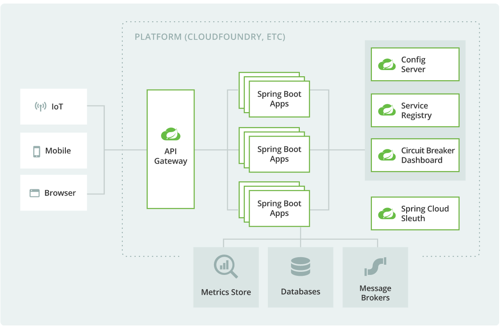
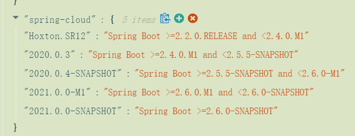
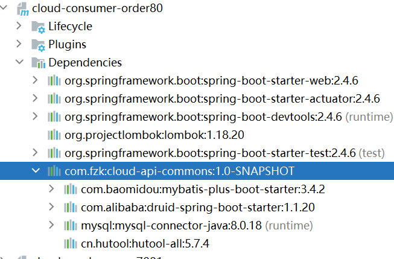
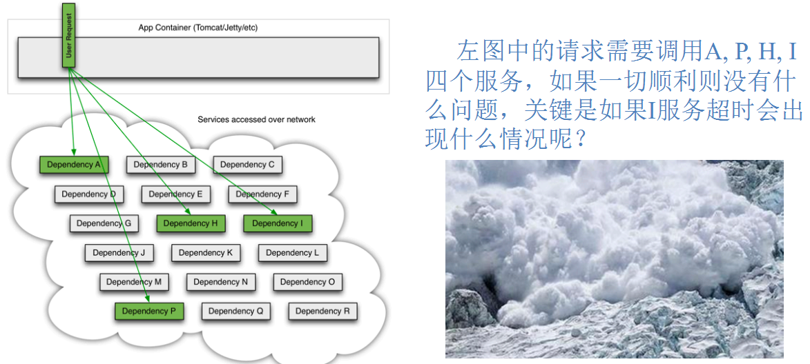

# 资料

> SpringCloud全家桶：https://spring.io/projects/spring-cloud#learn
>
> Spring Cloud Alibaba(即nacos、sentinel与SpringCloud整合)：https://github.com/alibaba/spring-cloud-alibaba
>
> 阿里全家桶：https://github.com/alibaba
>
> ~~SpringCloud中国社区~~：http://docs.springcloud.cn/
>
> ~~SpringCloud中文网~~：https://www.springcloud.cc/
>
> 2021-09-15：开始微服务全家桶的学习......
>
> 2021-09-24：完成Seata学习
> ~~Netflix系列：Eureka，Ribbon，Hystrix，Zuul~~(全系停更维护ing)
> SpringCloud系列：<u>LoadBalancer</u>，<u>Gateway</u>，Config，Bus，Sleuth
> Alibaba系列：<u>nacos</u>，<u>sentinel</u>，<u>Seata</u>
> 其它：consul，<u>OpenFeign</u>

# SpringCloud入门

## 概述

Spring Cloud为开发人员提供了工具，用以快速的在**分布式系统**中建立一些通用方案（例如配置管理，服务发现，断路器，智能路由，微代理，控制总线，一次性令牌，全局锁，领导选举，分布式会话，集群状态）。协调分布式系统有固定样板模型，使用Spring Cloud开发人员可以快速地搭建基于实现了这些模型的服务和应用程序。他们将在任何分布式环境中工作，包括开发人员自己的笔记本电脑，裸机数据中心，和管理的平台，如云计算。

### 什么是微服务？

微服务是一种现代软件方法，其中应用程序代码以小的、可管理的、独立于其他部分的方式交付。

微服务架构是一种架构模式，或者说是一种架构风格， 它**提倡将单一的应用程序划分成一组小的服务**，每个服务运行在其独立的自己的进程内，服务之间互相协调，互相配置，为用户提供最终价值。服务之间采用轻量级的通信机制互相沟通，每个服务都围绕着具体的业务进行构建，并且能够被独立的部署到生产环境中，另外，应尽量避免统一的，集中式的服务管理机制，对具体的一个服务而言，应根据业务上下文，选择合适的语言，工具对其进行构建，可以有一个非常轻量级的集中式管理来协调这些服务，可以使用不同的语言来编写服务，也可以使用不同的数据存储；

我们在此引用 ThoughtWorks 公司的首席科学家 Martin Fowler于2014年提出的一段话：

> 原文：https://martinfowler.com/articles/microservices.html
> 汉化：https://www.cnblogs.com/liuning8023/p/4493156.html

**为什么构建微服务？**

它们的小规模和相对隔离可以带来许多额外的好处，例如更容易维护、提高生产力、更大的容错能力、更好的业务一致性等等。

**SpringCloud常用的5个组件**

- 服务发现——Netflix Eureka
- 客户端负载均衡 Netflix Ribbon
- 服务端负载均衡：Feign
- 断路器——Netflix Hystrix
- 服务网关——Netflix Zuul
- 分布式配置——Spring Cloud Config

**Cloud的微服务弹性**

cloud可以帮助发现服务、负载平衡、断路、分布式跟踪和监控。它甚至可以充当 API 网关。



### Cloud与Boot版本对应

SpringCloud没有采用数字编号的方式命名版本号，而是采用了**伦敦地铁站**的名称，同时根据字母表的顺序来对应版本时间顺序，比如最早的Realse版本：Angel，第二个Realse版本：Brixton，然后是Camden、Dalston\Edgware。不过从H版本之后，采用年份命名了。

同时需要非常注意的是，SpringCloud和SpringBoot的版本号对应，这两个框架目前都在迅速迭代，因此各个版本是可能出现不兼容问题的。

那么如何查看版本对应关系呢：

1、官网查看：https://spring.io/projects/spring-cloud#overview


可以看到当前最新的2020.0.x版本对应于boot的2.4到2.5.那我就用最新的版本吧。

2、更详细的版本查看：https://start.spring.io/actuator/info

这样将会得到一个json串，将其用在线工具转换一下就能看到：



呃，那还是用稳定版本2020.0.3和2.5.4吧。
但是，有点尴尬的是，当我们点进去SpringCloud2020.0.3的文档第一页就发现：它支持boot2.4.6。


那至此明白了，以后boot版本将由所使用的cloud版本决定。

那么，此处学习将使用boot2.4.6和cloud2020.0.3

### Cloud组件现状


processon地址：https://www.processon.com/mindmap/614162297d9c083db053cf4c

## 微服务架构构建

> 资料：https://blog.csdn.net/qq_36903261/article/details/106507150

建完之后差不多长这样的：


### 父工程

#### 新建maven工程

新建maven项目，删掉src目录，在pom.xml中添加`<packaging>pom</packaging>`。

然后把其下面的所有内容换为下面的：仔细研究以下这些版本，要与时俱进的更新版本号呀。

```xml
    <!--统一管理jar包版本-->
    <properties>
        <project.build.sourceEncoding>UTF-8</project.build.sourceEncoding>
        <maven.compiler.source>11</maven.compiler.source>
        <maven.compiler.target>11</maven.compiler.target>
        <junit.version>4.12</junit.version>
        <lombok.version>1.18.10</lombok.version>
        <log4j.version>1.2.17</log4j.version>
        <mysql.version>8.0.18</mysql.version>
        <druid.version>1.1.20</druid.version>
        <mybatis.spring.boot.version>1.3.2</mybatis.spring.boot.version>
    </properties>

    <!--子模块继承之后，提供作用：锁定版本+子module不用写groupId和version-->
    <dependencyManagement>
        <dependencies>
            <!--spring boot 2.4.6-->
            <dependency>
                <groupId>org.springframework.boot</groupId>
                <artifactId>spring-boot-dependencies</artifactId>
                <version>2.4.6</version>
                <type>pom</type>
                <scope>import</scope>
            </dependency>
            <!--spring cloud 2020.0.3-->
            <dependency>
                <groupId>org.springframework.cloud</groupId>
                <artifactId>spring-cloud-dependencies</artifactId>
<!--                <version>Hoxton.SR1</version>-->
                <version>2020.0.3</version>
                <type>pom</type>
                <scope>import</scope>
            </dependency>
            <!--spring cloud alibaba 2021.1-->
            <dependency>
                <groupId>com.alibaba.cloud</groupId>
                <artifactId>spring-cloud-alibaba-dependencies</artifactId>
                <version>2021.1</version>
                <type>pom</type>
                <scope>import</scope>
            </dependency>
            <!--mysql-->
            <dependency>
                <groupId>mysql</groupId>
                <artifactId>mysql-connector-java</artifactId>
                <version>${mysql.version}</version>
                <scope>runtime</scope>
            </dependency>
            <!-- druid-->
            <dependency>
                <groupId>com.alibaba</groupId>
                <artifactId>druid-spring-boot-starter</artifactId>
                <version>${druid.version}</version>
            </dependency>

            <!--mybatis-->
            <dependency>
                <groupId>org.mybatis.spring.boot</groupId>
                <artifactId>mybatis-spring-boot-starter</artifactId>
                <version>${mybatis.spring.boot.version}</version>
            </dependency>
            <!--junit-->
            <dependency>
                <groupId>junit</groupId>
                <artifactId>junit</artifactId>
                <version>${junit.version}</version>
            </dependency>
            <!--log4j-->
            <dependency>
                <groupId>log4j</groupId>
                <artifactId>log4j</artifactId>
                <version>${log4j.version}</version>
            </dependency>
        </dependencies>

    </dependencyManagement>

    <build>
        <plugins>
            <plugin>
                <groupId>org.springframework.boot</groupId>
                <artifactId>spring-boot-maven-plugin</artifactId>
                <configuration>
                    <fork>true</fork>
                    <addResources>true</addResources>
                </configuration>
            </plugin>
        </plugins>
    </build>
```

> `<dependencyManagement></dependencyManagement>`标签对使得父工程的子项目引用一个依赖可以不列出版本号。maven会沿着层次向上找，直到找到一个dependencyManagement元素的项目，然后它会使用这个项目dependencyManagement中所指定的版本号。可以去看看springboot的parent项目看看它是如何使用的。
>
> 子项目中，如果不指定，默认和父项目dependencyManagement标签中的版本一致。
>
> 父项目dependencyManagement标签只是规定了版本号，并不实现引入，具体引入依赖还是子项目引入。


从这张图就能看出来，父工程中并没有引入依赖，子项目才有依赖的存在。

#### 发布父工程

1、maven中跳过单元测试


父工程创建完成后执行`mvn:install`将父工程发布到仓库方便子工程继承。


### 子项目


大致构建3个子项目，2个作为服务提供者，1个作为应对用户需求的微服务。

可以选择新建maven子项目，也可以选择直接`spring initializr`构建boot项目。

大致步骤：

1、建module

2、改pom.xml

```xml
    <dependencies>
        <!--web-->
        <dependency>
            <groupId>org.springframework.boot</groupId>
            <artifactId>spring-boot-starter-web</artifactId>
        </dependency>
        <dependency>
            <groupId>org.springframework.boot</groupId>
            <artifactId>spring-boot-starter-actuator</artifactId>
        </dependency>

        <!--数据库相关-->
        <dependency>
            <groupId>com.baomidou</groupId>
            <artifactId>mybatis-plus-boot-starter</artifactId>
            <version>3.4.2</version>
        </dependency>
        <dependency>
            <groupId>com.alibaba</groupId>
            <artifactId>druid-spring-boot-starter</artifactId>
            <version>1.1.20</version>
            <!--子工程写了版本号，就使用子工程的版本号，如果没写版本,找父工程中规定的版本号-->
        </dependency>
        <!--mysql-connector-java-->
        <dependency>
            <groupId>mysql</groupId>
            <artifactId>mysql-connector-java</artifactId>
        </dependency>
        
        <!--热部署-->
        <dependency>
            <groupId>org.springframework.boot</groupId>
            <artifactId>spring-boot-devtools</artifactId>
            <scope>runtime</scope>
            <optional>true</optional>
        </dependency>
        <dependency>
            <groupId>org.projectlombok</groupId>
            <artifactId>lombok</artifactId>
            <optional>true</optional>
        </dependency>
        <dependency>
            <groupId>org.springframework.boot</groupId>
            <artifactId>spring-boot-starter-test</artifactId>
            <scope>test</scope>
        </dependency>

        <!-- 引用自己定义的api通用包，可以使用Payment支付Bean -->
        <dependency>
            <groupId>com.fzk</groupId>
            <artifactId>cloud-api-commons</artifactId>
            <version>${project.version}</version>
        </dependency>
    </dependencies>
```

3、写yaml

```yaml
#微服务建议一定要写服务端口号和微服务名称
server:
  #端口号
  port: 8001

spring:
  application:
    #微服务名称
    name: cloud-provider-payment
  #数据库配置
  datasource:
    type: com.alibaba.druid.pool.DruidDataSource
    #mysql5.x的没有cj
    driver-class-name: com.mysql.cj.jdbc.Driver
    #记得先创建数据库
    url: "jdbc:mysql://localhost:3306/test?useSSL=false&useUnicode=true&characterEncoding=utf-8&serverTimezone=GMT%2B8"
    username: "root"
    password: "密码"


# 配置日志  选择了默认的控制台输出   如果选择log4j或slf4j，需要导入包
mybatis-plus:
  configuration:
    log-impl: org.apache.ibatis.logging.stdout.StdOutImpl
```

4、主启动类修改

```java
@SpringBootApplication
@MapperScan("com.fzk.springcloud.mapper")
@EnableTransactionManagement// 开启事务
public class PaymentMain8001App {
    public static void main(String[] args) {
        SpringApplication.run(PaymentMain8001App.class, args);
    }
}
```

5、写业务

order80只写controller层，用于返回给前端json串即可。数据从哪来？答：调用payment的服务。

呃，因为只要导入了mybatis-plus和druid的依赖，就会去建立数据库连接池，这对于order80就显得很多于了。因此，order80就只需要保留与前端交互相关的依赖即可。

payment8001和payment8002的**微服务名称一定要一致**。这两个只有端口不一样，其他都是一样的，而这如果是在真实项目发布的话，只需要一个jar包，在部署的时候指定端口号即可。这里之所以建立两个几乎一样的module，那也是没办法。

对于cloud-provider-payment微服务而言，所需要做的就是普通的boot项目那样，如下图：


而对于cloud-consumer-order微服务，所需要的就是controller，然后还需要加入一个bean：

```java
@Configuration
public class AppContextConfig {
    //往容器中添加一个RestTemplate
    //RestTemplate提供了多种便捷访问远程http访问的方法
    @Bean
    //@LoadBalanced //这个需要引入服务注册与发现
    public RestTemplate restTemplate() {
        return new RestTemplate();
    }
}
```

controller:

```java
@RestController
@Slf4j
public class OrderController {
    private final String PAYMENT_URL = "http://cloud-provider-payment"; // 需要调用的微服务的名称地址
    @Resource
    private RestTemplate restTemplate;

    @PostMapping(path = "/consumer/payment")
    public Map<String, Object> insertPayment(@RequestBody Payment payment) {
        log.info("********插入的数据：" + payment);
        //postForObject分别有三个参数：请求地址，请求参数，返回的对象类型
        return restTemplate.postForObject(PAYMENT_URL + "/payment", payment, Map.class);
    }

    @GetMapping(path = "/consumer/payment")
    public Map<String, Object> getPayment(@RequestParam("id") long id) {
        log.info("********查询的id：" + id);
        Map<String,Object> map=new HashMap<>();
        map.put("id",id);
        //getForObject两个参数：请求地址，返回的对象类型
        return restTemplate.getForObject(PAYMENT_URL + "/payment?id="+id, Map.class);
    }
}
```

上图中所调用的服务要求payment微服务都要提供呀。

6、测试

我们启动这3个项目，此时我们去测试就会出现这个情况：http://localhost/consumer/payment?id=1

```json
{
    "msg": "服务器异常：I/O error on GET request for \"http://cloud-provider-payment/payment\": cloud-provider-payment; nested exception is java.net.UnknownHostException: cloud-provider-payment",
    "code": 500,
    "data": null
}
```

可以看到提示了未知主机错误，即没法将cloud-provide-payment转为主机ip。

此时就需要引入**服务注册**了。

当然，如果在order微服务的controller的调用微服务的URL改为真实的URL如localhost，而不是微服务名称的话，这里是可以成功的。
但是，这样的话ip就绑定死了，开2个payment微服务进行负载均衡就没有意义了。

注意：启动两个项目进行测试，两个都启动后，右下角会弹出个services提示，点击show。
然后会把运行的项目合并在一起显示：


### 抽离公共模块

可以看到的是，在这几个项目中，存在大量的重复：如bean目录，utils目录。可以把它们抽离出来形成一个module，发布为jar包，让其它几个项目引入。

1、新建cloud-api-commons模块：


2、pom.xml

```xml
    <dependencies>
        <dependency>
            <groupId>org.springframework.boot</groupId>
            <artifactId>spring-boot-devtools</artifactId>
            <scope>runtime</scope>
            <optional>true</optional>
        </dependency>
        <dependency>
            <groupId>org.projectlombok</groupId>
            <artifactId>lombok</artifactId>
            <optional>true</optional>
        </dependency>

        <!--持久层相关-->
        <dependency>
            <groupId>com.baomidou</groupId>
            <artifactId>mybatis-plus-boot-starter</artifactId>
            <version>3.4.2</version>
        </dependency>
        <dependency>
            <groupId>com.alibaba</groupId>
            <artifactId>druid-spring-boot-starter</artifactId>
            <version>1.1.20</version>
            <!--子工程写了版本号，就使用子工程的版本号，如果没写版本,找父工程中规定的版本号-->
        </dependency>
        <!-- mysql-connector-java -->
        <dependency>
            <groupId>mysql</groupId>
            <artifactId>mysql-connector-java</artifactId>
        </dependency>

        <!--   一个Java工具包     -->
        <dependency>
            <groupId>cn.hutool</groupId>
            <artifactId>hutool-all</artifactId>
            <version>5.7.4</version>
        </dependency>
    </dependencies>
```

这个commons模块还可以作为公共的依赖引入。
说明：为什么这里引入了数据库相关的依赖：看下面：

```java
@Data
@NoArgsConstructor
@AllArgsConstructor
@TableName(value="tbl_payment")
public class Payment {
    @TableId(type= IdType.AUTO)
    private BigInteger id;

    private String serial;
}
```

用mybatis-plus操作数据库，需要对bean加上许多注解，需要引入mybatis-plus的依赖。

3、此项目打包


clean就是把target包清了，install就是打包为jar并发布了。

4、引入公共module

```xml
<!-- 引用自己定义的api通用包，可以使用Payment支付Bean -->
<dependency>
    <groupId>com.fzk</groupId>
    <artifactId>cloud-api-commons</artifactId>
    <version>${project.version}</version>
</dependency>
```

引入依赖之后如下：



### RestTemplate使用

它有2个类似的方法：


大致区别：


它还有post方法，使用和get差不多。不过其put方法和delete方法似乎没有返回值？


## ~~服务注册Eureka~~

> 资料：https://blog.csdn.net/qq_36903261/article/details/106551120
>
> 官网文档：https://docs.spring.io/spring-cloud-netflix/docs/3.0.3/reference/html/#spring-cloud-eureka-server
>
> 目前Eureka没有进行维护了。

### Eureka注册中心集群

EurekaServer端：以2个localhost实例作为集群Eureka服务器搭建：7001,7002

1、引入依赖

```xml
<!-- eureka-server -->
<dependency>
    <groupId>org.springframework.cloud</groupId>
    <artifactId>spring-cloud-starter-netflix-eureka-server</artifactId>
</dependency>
```

2、yaml配置

```yaml
#微服务建议一定要写服务端口号和微服务名称
server:
  #端口号
  port: 7001

spring:
  application:
    #微服务名称
    name: cloud-eureka-server

eureka:
  instance:
    hostname: localhost7001  #eureka服务端的实例名称，尽量用域名，集群用localhost的话无法互相注册
  client:
    #false表示不向注册中心注册自己（想注册也可以，不过没必要）
    register-with-eureka: false
    #false表示自己端就是注册中心，职责就是维护服务实例，并不需要去检索服务
    fetch-registry: false
    service-url:
      # 单机版：设置与eurekaServer交互的地址查询服务和注册服务都需要依赖这个地址
      # defaultZone: http://${eureka.instance.hostname}:${server.port}/eureka/

      # 集群版  相互注册，相互守望，不要把自己的ip放进去了，放的是要检测的其他注册中心的url
      # defaultZone: http://localhost:7002/eureka/,http://localhost:7003/eureka/
      defaultZone: http://localhost:7002/eureka/

  server:
    # 自我保护，默认为true
    enable-self-preservation: true
    # 心跳的间隔时间，单位毫秒
    eviction-interval-timer-in-ms: 2000
```

3、在主启动类上增加注解`@Eureka`

```java
@EnableEurekaServer //表示此项目是eureka的服务注册中心
@SpringBootApplication
public class EurekaMain7001 {
    public static void main(String[] args) {
        SpringApplication.run(EurekaMain7001.class, args);
    }
}
```

4、启动这两个7001和7002先看一下


### 注册服务

EurekaClient端：用的是前面架构构建的3个微服务：1个consumer，2个provider

1、引入依赖

```xml
<!-- eureka-client -->
<dependency>
    <groupId>org.springframework.cloud</groupId>
    <artifactId>spring-cloud-starter-netflix-eureka-client</artifactId>
</dependency>
```

2、yaml配置

```yaml
eureka:
  client:
    #true表示向注册中心注册自己，默认为true
    register-with-eureka: true
    #是否从EurekaServer抓取已有的注册信息，默认为true。单节点无所谓，集群必须设置为true才能配合ribbon使用负载均衡
    fetch-registry: true
    service-url:
      # 这里写服务注册中心的url
      defaultZone: http://localhost:7001/eureka,http://localhost:7002/eureka

  instance:
    instance-id: payment8001 # 修改显示主机名
    prefer-ip-address: true   #访问路径可以显示ip地址
    lease-renewal-interval-in-seconds: 30 # Eureka客户端向服务端发送心跳的时间间隔，单位秒（默认30秒）
    lease-expiration-duration-in-seconds: 90 # Eureka服务端在收到最后一次心跳后等待的时间上限，单位秒（默认90秒），超时剔除服务
```

3、在主启动类上标注解`@EnableEurekaClient`

```java
@EnableEurekaClient
@SpringBootApplication
@MapperScan("com.fzk.springcloud.mapper")
@EnableTransactionManagement// 开启事务
public class PaymentMain8001App {
    public static void main(String[] args) {
        SpringApplication.run(PaymentMain8001App.class, args);
    }
}
```

4、先启动2个注册中心


可以看到目前还没有注册的实例。

5、启动3个微服务


去另一个注册中心7002结果差不多。3个微服务都注册成功。

6、测试是否可用：http://localhost/comsumer/payment?id=3


多刷新几次就会发现serverPort一会是8001，一会是8002。

### 服务发现

1、在需要使用服务发现的微服务的主启动类上增加注解`@EnableDiscoveryClient`

```java
@EnableEurekaClient
@EnableDiscoveryClient // 启用服务发现，经过测试，不写这个注解也能发现
@SpringBootApplication
public class OrderMain80 {
    public static void main(String[] args) {
        SpringApplication.run(OrderMain80.class, args);
    }
}
```

2、获取`EurekaClient`这个bean

```java
@RestController
@Slf4j
public class OrderController {
    private final String PAYMENT_URL = "http://cloud-provider-payment"; // 微服务的名称
    @Resource
    private RestTemplate restTemplate;

    @Resource
    private DiscoveryClient discoveryClient;    //springframework的DiscoveryClient（不要导错包了）

    @GetMapping(path = "/consumer/payment")
    public Map<String, Object> getPayment(@RequestParam("id") long id) {
        //获取CLOUD-PROVIDER-PAYMENT服务的所有具体实例
        List<ServiceInstance> instances =
                discoveryClient.getInstances("CLOUD-PROVIDER-PAYMENT");
        for (ServiceInstance instance : instances) {
            //getServiceId服务器id getHost主机名称 getPort端口号  getUri地址
            log.info(instance.getServiceId() + "\t" + instance.getHost() + "\t" + instance.getPort() + "\t" + instance.getUri());
        }

        Map<String,Object> map=new HashMap<>();
        map.put("id",id);
        //getForObject两个参数：请求地址，返回的对象类型
        return restTemplate.getForObject(PAYMENT_URL + "/payment?id="+id, Map.class);
    }
}
```

3、查看结果：


### jdk11支持

Eureka 服务器所依赖的 JAXB 模块已在 JDK 11 中删除。如果您打算在运行 Eureka 服务器时使用 JDK 11，则必须在 POM 或 Gradle 文件中包含这些依赖项。

```xml
<dependency>
    <groupId>org.glassfish.jaxb</groupId>
    <artifactId>jaxb-runtime</artifactId>
</dependency>
```

## Consul

> Consul官网：https://www.consul.io/
> Consul中文文档：https://www.springcloud.cc/spring-cloud-consul.html
>
> SpringCloud官网也有关于Consul的配置：https://docs.spring.io/spring-cloud-consul/docs/3.0.3/reference/html/#quick-start
> 这个是3.0.3版本的

### 简介

Consul 是一套开源的分布式服务发现和配置管理系统，由 HashiCorp 公司用 Go 语言开发。

提供服务治理、配置中心、控制总线功能。这些功能可单独使用，也可以构建全方位微服务架构。

**提供的功能**

1、服务发现：提供http和dns两种发现方式

2、健康监测：支持多种方式，HTTP、TCP、Docker、Shell脚本定制化监控

3、KV存储

4、多数据中心

5、可视化Web界面

### docker安装Consul

首先得学习docker，百度吧。这个参考：https://blog.csdn.net/lqpf199681/article/details/110518692

1、先去[镜像中心](https://hub.daocloud.io/)找consul

2、找到latest版本号复制其下载链接`daocloud.io/library/consul:latest`

3、拉取镜像

```shell
docker pull daocloud.io/library/consul:latest
# 然后查看一下镜像
[root@iZuf6el32a2l9b73omo6cgZ ~]# docker images
REPOSITORY                   TAG       IMAGE ID       CREATED        SIZE
daocloud.io/library/consul   latest    d53140f5924e   5 months ago   122MB
```

4、启动镜像

```shell
[root@iZuf6el32a2l9b73omo6cgZ ~]# docker run -d  -p 8500:8500/tcp --name myConsul  daocloud.io/library/consul agent -server -ui -bootstrap-expect=1 -client=0.0.0.0
b6c5428ff3277a6096c3502f940575a681ad5ec3d9e803d35d06a3bc33436156
```

在这个启动设置的参数中，`-p 8500:8500/tcp`，第一个8500可以改为Linux上的任意端口，第二个8500代表的是docker容器里的8500端口映射，对于consul而言，其默认端口是8500，所以第二个必须是8500.

5、启动结果：


### 服务发现

1、新建子module，引入项目需要的依赖。

2、引入consul依赖

```xml
        <!--SpringCloud consul-server-->
        <dependency>
            <groupId>org.springframework.cloud</groupId>
            <artifactId>spring-cloud-starter-consul-discovery</artifactId>
        </dependency>
```

3、yaml配置

```yaml
server:
  port: 8005


spring:
  application:
    name: cloud-provider-consul-payment
  cloud:
    consul:
      host: "www.fzk-love.cc"  #用linux的ip地址（consul在本机就填localhost）
      port: 8500
      discovery:
        service-name: ${spring.application.name}
        prefer-ip-address: true # docker配置consul的情况下配置这个，以免爆红
        heartbeat:
          enabled: true # 解决服务发现的爆红问题
```

4、主启动类上加上`EnableDiscoveryClient`注解

```java
@SpringBootApplication
@EnableDiscoveryClient //该注解用于向使用consul或者Zookeeper作为注册中心时注册服务
public class PaymentMain8005 {
    public static void main(String[] args) {
        SpringApplication.run(PaymentMain8005.class,args);
    }
}
```

5、微服务之间的调用看前面的微服务构建部分。

6、测试

启动3个服务，1个consumer，2个provider：


测试能否获取数据：


### 3者异同


## ~~Ribbon负载均衡~~

### 简介

GitHub地址：https://github.com/Netflix/ribbon/wiki/Getting-Started

Spring Cloud Ribbon是基于Netflix Ribbon实现的一套客户端       负载均衡的工具。

Ribbon是Netflix发布的开源项目，主要功能是提供客户端的**软件负载均衡算法和服务调用**。Ribbon客户端组件提供一系列完善的配置项如连接超时，重试等。简单的说，就是在配置文件中列出Load Balancer（简称LB）后面所有的机器，Ribbon会自动的帮助你基于某种规则（如简单轮询，随机连接等）去连接这些机器。我们很容易使用Ribbon实现自定义的负载均衡算法。

打开GitHub地址发现：ribbon还在维护......


**功能**

Ribbon 是一个客户端 IPC 库，在云中经过实战测试。它提供以下功能

- 负载均衡
- 容错
- 异步和反应模型中的多协议（HTTP、TCP、UDP）支持
- 缓存和批处理

**Ribbon本地负载均衡客户端 VS Nginx服务端负载均衡区别**

> Nginx是服务器负载均衡，客户端所有请求都会交给nginx，然后由nginx实现转发请求。即负载均衡是由服务端实现的。
>
> Ribbon本地负载均衡，在调用微服务接口时候，会在注册中心上获取注册信息服务列表之后缓存到JVM本地，从而在本地实现RPC远程服务调用技术。

### 与Eureka整合

```xml
<!--Ribbon的依赖-->
  <dependency>
      <groupId>org.springframework.cloud</groupId>
      <artifactId>spring-cloud-starter-netflix-ribbon</artifactId>
</dependency>
<!--服务消费者引入上面这个和这个-->
<!-- eureka-client -->
<dependency>
    <groupId>org.springframework.cloud</groupId>
    <artifactId>spring-cloud-starter-netflix-eureka-client</artifactId>
</dependency>

<!--服务提供者引入这个即可 -->
<!-- eureka-server -->
<dependency>
    <groupId>org.springframework.cloud</groupId>
    <artifactId>spring-cloud-starter-netflix-eureka-server</artifactId>
</dependency>
```

注意：目前2020.0.3cloud版本引入的Eureka默认引入了`LoadBanlancer`


注意：如果是2020.0.3版本的SpringCloud，Ribbon依赖仅仅写为上面的是会报错的：


报错显示没有指定版本号，说明 SpringCloud 的依赖中没有定义ribbon的版本号，也就是说，springcloud已经彻底转为Loadbalancer了。

这里为了演示ribbon，去maven仓库找到最新版本为上图中的2.2.9.就先用这个吧。

```xml
        <!--Ribbon的依赖-->
        <!-- https://mvnrepository.com/artifact/org.springframework.cloud/spring-cloud-starter-netflix-ribbon -->
        <dependency>
            <groupId>org.springframework.cloud</groupId>
            <artifactId>spring-cloud-starter-netflix-ribbon</artifactId>
            <version>2.2.9.RELEASE</version>
        </dependency>
        <!-- eureka-client -->
        <dependency>
            <groupId>org.springframework.cloud</groupId>
            <artifactId>spring-cloud-starter-netflix-eureka-client</artifactId>
            <!--把自带的loadbalancer移除-->
            <exclusions>
                <exclusion>
                    <groupId>org.springframework.cloud</groupId>
                    <artifactId>spring-cloud-starter-loadbalancer</artifactId>
                </exclusion>
            </exclusions>
        </dependency>
```


### IRule


官方文档明确给出了警告：
这个自定义配置类不能放在@ComponentScan所扫描的当前包下以及子包下，
否则我们自定义的这个配置类就会被所有的Ribbon客户端所共享，达不到特殊化定制的目的了。


我按照那个教程的步骤来，会发现不了实例，但是Eureka的服务发现却打印出了实例。应该是哪里配置不对。不过Ribbon已经停更了，cloud都已经自己出了LoadBalancer了，就不去细究了。

# OpenFeign服务调用

## 简介

[Feign](https://github.com/OpenFeign/feign)是一个声明式 Web 服务客户端。它使编写 Web 服务客户端变得更容易。要使用 Feign ，需**创建一个接口**并对其进行注释。它具有可插入的注释支持，包括 Feign 注释和 JAX-RS 注释。Feign 还支持可插拔的编码器和解码器。SpringCloud增加了对SpringMVC注释和使用SpringWeb中默认使用的相同HttpMessageConverters的支持。Spring Cloud集成了Eureka、Spring Cloud CircuitBreaker 以及Spring Cloud LoadBalancer，以便在使用FIGN时提供负载平衡的http客户端。

**Feign能干嘛**

Feign旨在使编写Java Http客户端变得更容易。
利用RestTemplate对http请求的封装处理，形成了一套模版化的调用方法。但是在实际开发中，由于对服务依赖的调用可能不止一处，往往一个接口会被多处调用，所以通常都会针对每个微服务自行封装一些客户端类来包装这些依赖服务的调用。

所以，Feign在此基础上做了进一步封装，由他来帮助我们定义和实现依赖服务接口的定义。在Feign的实现下，我们只需创建一个接口并使用注解的方式来配置它(以前是Dao接口上面标注Mapper注解,现在是一个微服务接口上面标注一个Feign注解即可)，即可完成对服务提供方的接口绑定，简化了使用Spring cloud Ribbon时，自动封装服务调用客户端的开发量。

**Feign和OpenFeign区别**

| Feign                                                        | OpenFeign                                                    |
| ------------------------------------------------------------ | ------------------------------------------------------------ |
| Feign是Spring Cloud组件中的一个轻量级RESTful的HTTP服务客户端<br/>Feign内置了Ribbon，用来做客户端负载均衡，去调用服务注册中心的服务。Feign的使用方式是：使用Feign的注解定义接口，调用这个接口，就可以调用服务注册中心的服务 | OpenFeign是Spring Cloud 在Feign的基础上支持了SpringMVC的注解，如@RequesMapping等等。OpenFeign的@FeignClient可以解析SpringMVC的@RequestMapping注解下的接口，并通过动态代理的方式产生实现类，实现类中做负载均衡并调用其他服务。 |
| <dependency><br/>    <groupId>org.springframework.cloud</groupId><br/>    <artifactId>spring-cloud-starter-feign</artifactId><br/></dependency> | <dependency><br/>    <groupId>org.springframework.cloud</groupId><br/>    <artifactId>spring-cloud-starter-openfeign</artifactId><br/></dependency> |

## 使用

消费者端使用，即服务调用端。此时的demo是在Eureka基础上做的。

1、引入依赖

```xml
<!-- openfeign 需要导入负载均衡loadbalancer或者ribbon -->
<dependency>
    <groupId>org.springframework.cloud</groupId>
    <artifactId>spring-cloud-starter-openfeign</artifactId>
</dependency>
<!--loadBalancer-->
<dependency>
    <groupId>org.springframework.cloud</groupId>
    <artifactId>spring-cloud-starter-loadbalancer</artifactId>
</dependency>
```

2、在主启动类增加注解`@EnableFeignClients`

```java
@EnableEurekaClient
@EnableDiscoveryClient // 启用服务发现，经过测试，不写这个注解也能发现
@SpringBootApplication
@EnableFeignClients // 使用OpenFeign
public class OrderMain80 {
    public static void main(String[] args) {
        SpringApplication.run(OrderMain80.class, args);
    }
}
```

3、新建Feign的客户端接口，可以放在service层

```java
@FeignClient(value = "CLOUD-PROVIDER-PAYMENT")
// 作为feign的接口，找CLOUD-PAYMENT-SERVICE服务
// 还可以使用url属性（绝对值或仅主机名）指定 URL
public interface PaymentClient {
    // 直接复制8001的controller的方法，并将其实现删掉
    @GetMapping(path = "/payment")
    public Map<String, Object> getPayment(@RequestParam("id") long id);
}
```

4、新建一个controller来使用这个客户端接口

```java
@Slf4j
@RestController
public class OrderFeignController {
    @Resource
    private PaymentClient paymentClient;

    @GetMapping("/consumer/feign/payment")
    public Map<String, Object> getPayment(@RequestParam("id") long id) {
        return paymentClient.getPayment(id);
    }
}
```

5、按序启动2个注册中心和3个微服务


## 超时处理

如果服务提供者服务处理时间过长，服务调用者将被长时间阻塞，而有些情况下，用户不愿意等太长时间。

可以在Feign客户端设置超时，OpenFeign 使用两个超时参数：

- `connectTimeout` 防止由于服务器处理时间长而阻塞调用者。
- `readTimeout` 从连接建立时开始应用，在返回响应时间过长时触发。

在测试服务提供者可以休眠10s时，感觉似乎Feign默认并没有配置超时。

配置超时：

```yaml
feign:
  client:
    config:
      default:
        connectTimeout: 1000 # 防止由于服务器处理时间长而阻塞调用者，单位ms
        readTimeout: 1000 # 从连接建立时开始应用，在返回响应时间过长时触发，单位ms
        loggerLevel: basic
```

如果，此时服务提供者超过1s则抛出超时异常：`服务器异常：Read timed out executing GET http://CLOUD-PROVIDER-PAYMENT/payment?id=3`

## 回退处理

配置了feign超时总不能就让它返回这样的异常消息吧。

当Feign Client接口执行的超时或者出错的时候，配置的回退方法将执行，将`@FeignClient`的属性指向实现回退方法的类。

```java
@FeignClient(value = "cloud-alibaba-provider-payment",fallback = FeignFallback.class)
// 作为feign的接口，找CLOUD-PAYMENT-SERVICE服务
// 还可以使用url属性（绝对值或仅主机名）指定 URL
public interface PaymentClient {
    // 这里直接复制服务提供者的方法
    @GetMapping("/payment/nacos/{id}")
    public String getPayment(@PathVariable("id") Integer id);
}
```

回退方法实现类：它需要实现FeignClient标注的接口。

```java
@Component
public class FeignFallback implements PaymentClient {// 需要实现feign client

    @Override
    public String getPayment(Integer id) {
        return "请求超时,请稍后再试";
    }

}
```


## Feign 日志

将为创建的Feign客户端创建一个记录器。默认情况下，记录器的名称是用于创建Feign客户端的接口的完整类名。

注意：Feign日志记录只响应DEBUG级别。

```yaml
#开启日志的feign客户端
logging:
  level:
    #feign日志以什么级别监控哪个接口
    com.fzk.springcloud.service.PaymentClient: debug	#写Feign客户端的全类名
```

`Logger.Level`可以为每个客户端配置 Feign 日记记录级别。选择是：

- `NONE`，无日志记录（**默认**）。
- `BASIC`, 只记录请求方法和 URL 以及响应状态码和执行时间。
- `HEADERS`, 记录基本信息以及请求和响应标头。
- `FULL`, 记录请求和响应的标头、正文和元数据。

```java
@Configuration
public class FeignConfig {
    @Bean
    Logger.Level feignLoggerLevel() {// Logger要导入feign包下的
        return Logger.Level.FULL; // 打印最详细的日志
    }
}
```

测试一下呢：

```text
2021-09-17 20:53:39.458 DEBUG 17016 --- [p-nio-80-exec-1] c.fzk.springcloud.service.PaymentClient  : [PaymentClient#getPayment] ---> GET http://CLOUD-PROVIDER-PAYMENT/payment?id=3 HTTP/1.1
2021-09-17 20:53:39.894 DEBUG 17016 --- [p-nio-80-exec-1] c.fzk.springcloud.service.PaymentClient  : [PaymentClient#getPayment] <--- HTTP/1.1 200 (431ms)


2021-09-17 20:54:06.542 DEBUG 17016 --- [p-nio-80-exec-4] c.fzk.springcloud.service.PaymentClient  : [PaymentClient#getPayment] ---> GET http://CLOUD-PROVIDER-PAYMENT/payment?id=3 HTTP/1.1
2021-09-17 20:54:07.555 DEBUG 17016 --- [p-nio-80-exec-4] c.fzk.springcloud.service.PaymentClient  : [PaymentClient#getPayment] <--- ERROR SocketTimeoutException: Read timed out (1011ms)
```

可以看到第一次查询调用结果正常，第2次调用了那个刻意休眠了10s的服务提供者，在上面一节中，此Feign客户端配置了超时时间为1s，可以看到在时间到1s时抛出了`SocketTimeoutException`


## @RefreshScope支持

若开启以下配置，每个feign client都会被创建为`a refresh-scoped bean`。即是说Feign client的比如`connectTimeout` 属性将是可以被刷新的 through `POST /actuator/refresh`。

这个主要是SpringCloud Config或nacos配置动态刷新的话需要配上。

```properties
feign.client.refresh-enabled=true # 默认false不开启
```

**注意：DO NOT annotate the `@FeignClient` interface with the `@RefreshScope` annotation.**

# ~~SpringCloud断路器~~

## 简介

Spring Cloud Circuit breaker 提供了跨不同断路器实现的抽象。它提供了在您的应用程序中使用的一致 API，允许您的开发人员选择最适合您的应用程序需求的断路器实现。

**Supported Implementations**

- [Netfix Hystrix](https://github.com/Netflix/Hystrix)
- [Resilience4J](https://github.com/resilience4j/resilience4j)
- [Sentinel](https://github.com/alibaba/Sentinel)
- [Spring Retry](https://github.com/spring-projects/spring-retry)

> 对于Hystrix而言：目前并不建议使用
>
> Github：https://github.com/Netflix/Hystrix
> 它自己都建议用like [resilience4j](https://github.com/resilience4j/resilience4j) for new internal projects.
>
> 如何使用：https://github.com/Netflix/Hystrix/wiki/How-To-Use

**Spring Boot Config**

The following starters are available with the Spring Cloud BOM

- Hystrix - `org.springframework.cloud:spring-cloud-starter-netflix-hystrix`
- Resilience4J - `org.springframework.cloud:spring-cloud-starter-circuitbreaker-resilience4j`
- Reactive Resilience4J - `org.springframework.cloud:spring-cloud-starter-circuitbreaker-reactor-resilience4j`
- Spring Retry - `org.springframework.cloud:spring-cloud-starter-circuitbreaker-spring-retry`
- Sentinal - `org.springframework.cloud:spring-cloud-starter-circuitbreaker-sentinal`

## 概述

**分布式系统面临的问题**

复杂分布式体系结构中的应用程序有数十个依赖关系，每个依赖关系在某些时候将不可避免地失败。



**服务雪崩**

多个微服务之间调用的时候，假设微服务A调用微服务B和微服务C，微服务B和微服务C又调用其它的微服务，这就是所谓的“扇出”。如果扇出的链路上某个微服务的调用响应时间过长或者不可用，对微服务A的调用就会占用越来越多的系统资源，进而引起系统崩溃，所谓的“雪崩效应”。

对于高流量的应用来说，单一的后端依赖可能会导致所有服务器上的所有资源都在几秒钟内饱和。比失败更糟糕的是，这些应用程序还可能导致服务之间的延迟增加，备份队列，线程和其他系统资源紧张，导致整个系统发生更多的级联故障。这些都表示需要对故障和延迟进行隔离和管理，以便单个依赖关系的失败，不能取消整个应用程序或系统。

所以，通常当你发现一个模块下的某个实例失败后，这时候这个模块依然还会接收流量，然后这个有问题的模块还调用了其他的模块，这样就会发生级联故障，或者叫雪崩。

**Hystrix简介**

Hystrix是一个用于**处理分布式系统的延迟和容错的开源库**，在分布式系统里，许多依赖不可避免的会调用失败，比如超时、异常等，Hystrix能够**保证在一个依赖出问题的情况下，不会导致整体服务失败，避免级联故障，以提高分布式系统的弹性。**

“断路器”本身是一种开关装置，当某个服务单元发生故障之后，通过断路器的故障监控（类似熔断保险丝），**向调用方返回一个符合预期的、可处理的备选响应（FallBack），而不是长时间的等待或者抛出调用方无法处理的异常**，这样就保证了服务调用方的线程不会被长时间、不必要地占用，从而避免了故障在分布式系统中的蔓延，乃至雪崩。

**服务降级fallback**


**服务熔断break**

**服务限流flowlimit**


比如对自己上面的Eureka搭建的微服务架构用jmeter进行压力测试的话，当达到一定的负载的时候，再用浏览器发送请求的时候，原本很快就会返回结果，却出现了一定时间的转圈圈。

正是因为大并发情况下存在的高延迟，甚至导致服务宕机，才会有降级、容错、限流等技术应对需求。


## Resilience4j

> 官网文档：https://resilience4j.readme.io/

### 简介

[Resilience4j](https://github.com/resilience4j/resilience4j)是一个受 Netflix Hystrix 启发的轻量级容错库，专为函数式编程而设计。

Resilience4j 提供高阶函数（装饰器），以通过断路器、速率限制器、重试或隔板增强任何功能接口、lambda 表达式或方法引用。您可以在任何函数式接口、lambda 表达式或方法引用上堆叠多个装饰器。优点是你可以选择你需要的装饰器而不是别的。

注：懒得看了，sentinel更好用。

# SpringCloud Gateway

> 官网文档：https://docs.spring.io/spring-cloud-gateway/docs/current/reference/html/

## 概述

cloud全家桶中有个很重要的组件就是网关，在1.x版本中都是采用的Zuul网关；但在2.x版本中，zuul的升级一直跳票，SpringCloud最后自己研发了一个网关替代Zuul，那就是SpringCloud Gateway。即gateway是原zuul1.x版的替代

在 Spring WebFlux 之上构建 API 网关的库。Spring Cloud Gateway 旨在提供一种简单而有效的方式来路由到 API 并为它们提供交叉关注点，例如：安全性、监控/指标和弹性。

**Spring Cloud Gateway 特性：**

- 基于 Spring Framework 5、Project Reactor 和 Spring Boot 2.0
- 动态路由：能够匹配任何请求属性的路由。
- 对路由指定 Predicate（断言）和 Filter（过滤器）
- 集成Hystrix的断路器功能；
- 集成 Spring Cloud 服务发现功能；
- 易于编写断言和过滤器
- 请求限流
- 路径重写

**网关位置**


**3个重要概念**

> **Route路由**：路由是构建网关的基本模块，它由ID，目标URI，一系列的断言和过滤器组成，如果断言为true则匹配该路由
>
> **Predicate断言**：参考的是Java8的java.util.function.Predicate。开发人员可以匹配HTTP请求中的所有内容(例如请求头或请求参数)，如果请求与断言相匹配则进行路由
>
> **Filter过滤**：指的是Spring框架中GatewayFilter的实例，使用过滤器，可以在请求被路由前或者之后对请求进行修改。

**gateway工作流程**


## 路由与断言配置

### 引入Maven依赖

```xml
<!--spring-cloud gateway-->
<dependency>
    <groupId>org.springframework.cloud</groupId>
    <artifactId>spring-cloud-starter-gateway</artifactId>
</dependency>
<!--loadBalancer-->
<dependency>
    <groupId>org.springframework.cloud</groupId>
    <artifactId>spring-cloud-starter-loadbalancer</artifactId>
</dependency>
```

同时需要注意的是，gateway基于WebFlux实现，最好不要引入SpringMVC，即不要引入`spring-boot-starter-web`这个依赖。


### 配置方式

有两种配置方式：快捷方式配置和完全展开的参数配置

1、快捷配置：建议用这个

```yaml
spring:
  application:
    # 微服务名称
    name: cloud-gateway
  cloud:
    gateway:
      routes:
        - id: payment_route8001 # 路由的id,没有规定规则但要求唯一,建议配合服务名
          #匹配后提供服务的路由地址
          uri: http://localhost:8001
          predicates:
            - Path=/payment/** # 断言，路径相匹配的进行路由

        - id: payment_route80
          uri: http://localhost
          predicates:
            - Path=/consumer/feign/payment/** #断言,路径相匹配的进行路由
  # gateway是基于WebFlux开发的，不能引入springmvc，或者这里配置web环境为reactive
  main:
    web-application-type: reactive
```

2、参数完全展开的话：挺麻烦的，但是更符合yaml规范

```yaml
spring:
  application:
    #微服务名称
    name: cloud-gateway
  cloud:
    gateway:
      routes:
        - id: payment_route80
          uri: http://localhost
          predicates:
            - name: Path
              args:
                name: path1
                regexp: /consumer/feign/payment/**
```

### 路由断言工厂

Spring Cloud Gateway 包含许多内置的路由断言工厂。所有这些断言匹配 HTTP 请求的不同属性。您可以将多个路由断言工厂与逻辑`and`语句组合在一起。

#### 时间断言

After/Before/Between

```yaml
spring:
  application:
    #微服务名称
    name: cloud-gateway
  cloud:
    gateway:
      routes:
        - id: payment_route8001 # 路由的id,没有规定规则但要求唯一,建议配合服务名
          #匹配后提供服务的路由地址
          uri: http://localhost:8001
          predicates:
            - Path=/payment/** # 断言，路径相匹配的进行路由
            # 路由匹配 该时间之后 提出的请求
            - After=2021-09-18T23:45:46.914255800+08:00[Asia/Shanghai]
            # 路由匹配 该时间之前 提出的请求
            - Before=2021-09-20T23:45:46.914255800+08:00[Asia/Shanghai]
            # 路由匹配 两个时间之间 提出的请求
            - Between=2021-09-18T23:45:46.914255800+08:00[Asia/Shanghai], 2021-09-20T23:45:46.914255800+08:00[Asia/Shanghai]
```

那么时间如何获取呢？a `datetime` (which is a java `ZonedDateTime`).

```java
@Test
void test1(){
    //获取当前时间串
    ZonedDateTime now = ZonedDateTime.now();
    System.out.println(now);
}
```

#### Cookie断言

Cookie断言有2个参数，1个是cookie名，另一个是cookie值的Java正则表达式。

```yaml
spring:
  application:
    #微服务名称
    name: cloud-gateway
  cloud:
    gateway:
      routes:
        - id: payment_route8001 # 路由的id,没有规定规则但要求唯一,建议配合服务名
          #匹配后提供服务的路由地址
          uri: http://localhost:8001
          predicates:
            - Path=/payment/** # 断言，路径相匹配的进行路由
            # Cookie匹配
            - Cookie=myCookie,^[1-9]?hello
```

但是正则表达式会和这种简写模式产生一定的冲突，如这种情况：

```yaml
# Cookie匹配
- Cookie=myCookie,^[1-9]?hello(1){1,2}
```

会出现这种错误：`java.util.regex.PatternSyntaxException: Unclosed counted closure near index 17  ^[1-9]?hello(1){1`

为什么呢？因为这种简写的配置方式把逗号用来作为参数分段的标记了。

那么解决方法很明显就是完全参数展开的配置方式：

```yaml
# Cookie匹配
# - Cookie=myCookie,^[1-9]?hello(1){1,2}
- name: Cookie
  args:
    name: myCookie
    regexp: ^[1-9]?hello(1){1,2}
```

#### Header断言

两个参数：Header_Name和值的正则表达式

```yaml
spring:
  application:
    #微服务名称
    name: cloud-gateway
  cloud:
    gateway:
      routes:
        - id: payment_route8001 # 路由的id,没有规定规则但要求唯一,建议配合服务名
          #匹配后提供服务的路由地址
          uri: http://localhost:8001
          predicates:
            - Path=/payment/** # 断言，路径相匹配的进行路由
            # Header 匹配
            - Header=myHeader,\d+
```

#### Host断言

1个参数：主机名的列表`patterns`

```yaml
spring:
  cloud:
    gateway:
      routes:
      - id: host_route
        uri: https://example.org
        predicates:
        - Host=**.somehost.org,**.anotherhost.org
```

还支持URI 模板变量（例如）`{sub}.myhost.org`。

如果请求具有这种路由匹配`Host`用的头值`www.somehost.org`或`beta.somehost.org`或`www.anotherhost.org`。

此谓词提取 URI 模板变量（例如`sub`，在前面的示例中定义的）作为名称和值的映射，并将其放置在 中`ServerWebExchange.getAttributes()`，键定义在 中`ServerWebExchangeUtils.URI_TEMPLATE_VARIABLES_ATTRIBUTE`。然后这些值可供[工厂](https://docs.spring.io/spring-cloud-gateway/docs/current/reference/html/#gateway-route-filters)使用[`GatewayFilter`](https://docs.spring.io/spring-cloud-gateway/docs/current/reference/html/#gateway-route-filters)

#### Method断言

需要 HTTP `methods`的参数，它是一个或多个参数

```yaml
spring:
  cloud:
    gateway:
      routes:
      - id: method_route
        uri: https://example.org
        predicates:
        - Method=GET,POST
```

#### Path断言

两个参数：Spring Path Matcher模式的列表和名为matchTrailingSlash（默认为true）的可选标志。

```yaml
spring:
  cloud:
    gateway:
      routes:
      - id: path_route
        uri: https://example.org
        predicates:
        - Path=/red/{segment},/blue/{segment}
```

此断言提取 URI 模板变量（例如`segment`，在前面的示例中定义的）作为名称和值的映射，并将其放置在`ServerWebExchange.getAttributes()`，键定义在`ServerWebExchangeUtils.URI_TEMPLATE_VARIABLES_ATTRIBUTE`。然后这些值可供[工厂](https://docs.spring.io/spring-cloud-gateway/docs/current/reference/html/#gateway-route-filters)使用[`GatewayFilter`](https://docs.spring.io/spring-cloud-gateway/docs/current/reference/html/#gateway-route-filters)

可以使用下面的方法来访问这些变量。以下示例显示了如何使用该`get`方法：

```java
Map<String, String> uriVariables = ServerWebExchangeUtils.getPathPredicateVariables(exchange);

String segment = uriVariables.get("segment");
```

#### Query断言

用途：可以用来检查是否正确携带某个参数。

两个参数：a required `param` and an optional `regexp` (which is a Java regular expression)

```yaml
spring:
  application:
    #微服务名称
    name: cloud-gateway
  cloud:
    gateway:
      routes:
        - id: payment_route8001 # 路由的id,没有规定规则但要求唯一,建议配合服务名
          #匹配后提供服务的路由地址
          uri: http://localhost:8001
          predicates:
            - Path=/payment/** # 断言，路径相匹配的进行路由
            # Query 匹配
            -  Query=id, \d+   #url请求地址必须带上id参数，并且值必须为整数
```

试了一下，参数放在请求体内，也不能匹配成功。也就是说，只能检查url里的请求参数。

#### 权重路由

作用：负载均衡

两个参数：group和weight，weight是int类型。权重是按组计算的。

```yaml
spring:
  application:
    #微服务名称
    name: cloud-gateway
  cloud:
    gateway:
      routes:
        - id: payment_route8001 # 路由的id,没有规定规则但要求唯一,建议配合服务名
          #匹配后提供服务的路由地址
          uri: http://localhost:8001
          predicates:
            - Path=/payment/** # 断言，路径相匹配的进行路由
            # Query 匹配
            - Query=id, \d+   #url请求地址必须带上id参数，并且值必须为整数
            - Weight=group1,2

        - id: payment_route8002
          uri: http://localhost:8002
          predicates:
            - Path=/payment/**
            - Weight=group1,8
```

该路由将把80%的流量发到8002.

## Filter

路由过滤器允许以某种方式修改传入的 HTTP 请求或传出的 HTTP 响应。路由过滤器的范围是特定的路由。Spring Cloud Gateway 包含许多内置的 GatewayFilter 工厂。

有3种过滤器：GatewayFilter(31种)，GlobalFilter(9种)，[HttpHeadersFilters](https://docs.spring.io/spring-cloud-gateway/docs/current/reference/html/#httpheadersfilters)(3种)

常用的话：


Spring Gateway的断路器功能正是在GatewayFilter中实现。

### 自定义全局过滤器

```java
@Component
@Slf4j
public class MyGlobalFilter implements GlobalFilter, Ordered {

    @Override
    public Mono<Void> filter(ServerWebExchange exchange, GatewayFilterChain chain) {
        log.info("**************come in MyLogGateWayFilter：" + new Date());
        //获取request中的token参数
        String token = exchange.getRequest().getQueryParams().getFirst("token");
        if (token == null) {
            log.info("*******token为null，非法请求！！");
            //设置响应，不被接受
            exchange.getResponse().setStatusCode(HttpStatus.NOT_ACCEPTABLE);

            return exchange.getResponse().setComplete();
        }

        //返回chain.filter(exchange)，放行
        return chain.filter(exchange);
    }

    @Override
    public int getOrder() {
        //返回值是过滤器的优先级，越小优先级越高（最小-2147483648，最大2147483648）
        return 0;
    }
}
```

## 服务发现路由定位

可以将网关配置为基于向`DiscoveryClient`兼容服务注册表注册的服务创建路由。
设置`spring.cloud.gateway.discovery.locator.enabled=true`并确保`DiscoveryClient`实现（例如 Netflix Eureka、Consul 或 Zookeeper）位于类路径上并已启用。

```yaml
spring:
  application:
    #微服务名称
    name: cloud-gateway
  cloud:
    gateway:
      discovery:
        locator:
          enabled: true  #开启从注册中心动态创建路由的功能，利用微服务名称进行路由(默认false)
      routes:
        - id: payment_route8001 # 路由的id,没有规定规则但要求唯一,建议配合服务名
          #匹配后提供服务的路由地址
          # uri: http://localhost:8001
          uri: lb://cloud-provider-payment
          predicates:
            - Path=/payment/** # 断言，路径相匹配的进行路由
```

需要注意的是uri的协议为lb，表示启用Gateway的负载均衡功能。

默认情况下，当无法找到服务实例时，`ReactorLoadBalancer`将`503`返回。您可以通过设置`spring.cloud.gateway.loadbalancer.use404=true`将网关配置为返回 404

## HTTP超时

可以为所有路由配置响应和连接超时。

### 全局超时

要配置全局 http 超时：
`connect-timeout`必须以毫秒为单位指定。
`response-timeout`必须指定为 java.time.Duration

```yaml
spring:
  cloud:
    gateway:
      httpclient:
        connect-timeout: 1000
        response-timeout: 5s
```

### 单个路由超时

要配置每条路由超时：
`connect-timeout`必须以毫秒为单位指定。
`response-timeout`必须以毫秒为单位指定。

```yaml
  - id: per_route_timeouts
        uri: https://example.org
        predicates:
          - name: Path
            args:
              pattern: /delay/{timeout}
        metadata:
          response-timeout: 200
          connect-timeout: 200
```

## 配置跨域

```java
import org.springframework.context.annotation.Bean;
import org.springframework.context.annotation.Configuration;
import org.springframework.http.HttpHeaders;
import org.springframework.http.HttpMethod;
import org.springframework.http.HttpStatus;
import org.springframework.http.server.reactive.ServerHttpRequest;
import org.springframework.http.server.reactive.ServerHttpResponse;
import org.springframework.web.cors.reactive.CorsUtils;
import org.springframework.web.server.ServerWebExchange;
import org.springframework.web.server.WebFilter;
import org.springframework.web.server.WebFilterChain;
import reactor.core.publisher.Mono;

/**
 * @author fzk
 * @date 2021-10-13 21:06
 * 配置跨域
 */
@Configuration
public class CorsConfig {
    @Bean
    public WebFilter corsFilter() {
        return (ServerWebExchange ctx, WebFilterChain chain) -> {
            ServerHttpRequest request = ctx.getRequest();
            if (CorsUtils.isCorsRequest(request)) {
                ServerHttpResponse response = ctx.getResponse();
                HttpHeaders headers = response.getHeaders();
                headers.set(HttpHeaders.ACCESS_CONTROL_ALLOW_ORIGIN, request.getHeaders().getOrigin());
                headers.add(HttpHeaders.ACCESS_CONTROL_ALLOW_HEADERS, "X-Token,Authorization,x-requested-with,Content-Type");
                headers.add(HttpHeaders.ACCESS_CONTROL_ALLOW_METHODS, "PUT,POST,GET,OPTIONS,DELETE");
                headers.add(HttpHeaders.ACCESS_CONTROL_ALLOW_CREDENTIALS, "true");
                headers.add(HttpHeaders.ACCESS_CONTROL_EXPOSE_HEADERS, "*");
                headers.add(HttpHeaders.ACCESS_CONTROL_MAX_AGE, "3600");
                if (request.getMethod() == HttpMethod.OPTIONS) {
                    response.setStatusCode(HttpStatus.OK);
                    return Mono.empty();
                }
            }
            return chain.filter(ctx);
        };
    }
}
```

# ~~SpringCloud Config & Bus~~

## Config

### 概述

微服务意味着要将单体应用中的业务拆分成一个个子服务，每个服务的粒度相对较小，因此系统中会出现大量的服务。由于每个服务都需要必要的配置信息才能运行，所以一套集中式的、动态的配置管理设施是必不可少的。

Spring Cloud Config 为分布式系统中的外部化配置提供服务器端和客户端支持。使用配置服务器，您可以**集中管理所有环境中应用程序的外部属性**。

服务器存储后端的默认实现使用 **git**，因此它可以轻松支持配置环境的标记版本，并且可以访问用于管理内容的各种工具。

**特性功能**

- HTTP
- 加密解密属性值
- 使用简单，`@EnableConfigServer`
- 绑定到配置服务器，使用远程属性源初始化 Spring Environment


**SpringCloud Config分为服务端和客户端两部分**

**服务端**也称为**分布式配置中心**，它是一个独立的微服务应用，用来连接配置服务器并为客户端提供获取配置信息，加密/解密信息等访问接口。

客户端则是通过指定的配置中心来管理应用资源，以及与业务相关的配置内容，并在启动的时候从配置中心获取和加载配置信息。

配置服务器默认采用git来存储配置信息，这样就有助于对环境配置进行版本管理，并且可以通过git客户端工具来方便的管理和访问配置内容。

### Config Server

0、新建Git仓库

由于服务端拿去配置信息是从Git上获取，所以先去gitee或github上建一个仓库，可以命名为`springcloud-config`。注意仓库需要公开，私有需要配置账号密码。

1、初始化仓库


本demo新建下面这3个yaml文件。其内容分别如下：

```yaml
#config-dev.yml
config:
  info: "master branch,springcloud-config/config-dev.yml version=1"
  
#######################################

#config-prod.yml
config:
  info: "master branch,springcloud-config/config-prod.yml version=1"

#######################################

#config-test.yml
config:
  info: "master branch,springcloud-config/config-test.yml version=1"
```

2、新建一个微服务module，并引入依赖

```xml
        <!-- spring-cloud config server-->
        <dependency>
            <groupId>org.springframework.cloud</groupId>
            <artifactId>spring-cloud-config-server</artifactId>
        </dependency>
        <!--  eureka-client -->
        <dependency>
            <groupId>org.springframework.cloud</groupId>
            <artifactId>spring-cloud-starter-netflix-eureka-client</artifactId>
        </dependency>

        <!--web-->
        <dependency>
            <groupId>org.springframework.boot</groupId>
            <artifactId>spring-boot-starter-web</artifactId>
        </dependency>
        <dependency>
            <groupId>org.springframework.boot</groupId>
            <artifactId>spring-boot-starter-actuator</artifactId>
        </dependency>

        <!--热部署-->
        <dependency>
            <groupId>org.springframework.boot</groupId>
            <artifactId>spring-boot-devtools</artifactId>
            <scope>runtime</scope>
            <optional>true</optional>
        </dependency>
        <dependency>
            <groupId>org.projectlombok</groupId>
            <artifactId>lombok</artifactId>
            <optional>true</optional>
        </dependency>
        <dependency>
            <groupId>org.springframework.boot</groupId>
            <artifactId>spring-boot-starter-test</artifactId>
            <scope>test</scope>
        </dependency>
```

3、主启动类新增注解`@EnableConfigServer`

```java
@SpringBootApplication
@EnableEurekaClient // 注册进入Eureka
@EnableConfigServer // 开启配置服务器
public class Config3344 {
    public static void main(String[] args) {
        SpringApplication.run(Config3344.class,args);
    }
}
```

4、修改yaml配置

```yaml
#微服务建议一定要写服务端口号和微服务名称
server:
  #端口号
  port: 3344

spring:
  application:
    #微服务名称
    name: cloud-config
  cloud:
    config:
      server:
        git:
          # 配置仓库的git地址
          uri: "https://gitee.com/uestc-fzk/springcloud-config.git"
          # search-paths:   # 同时搜索顶级目录、指定子目录
          #  - example
      label: master   #读取的分支

# 注册进Eureka的配置
eureka:
  client:
    #true表示向注册中心注册自己，默认为true
    register-with-eureka: true
    #是否从EurekaServer抓取已有的注册信息，默认为true。单节点无所谓，集群必须设置为true才能配合ribbon使用负载均衡
    fetch-registry: true
    service-url:
      # 这里写服务注册中心的url
      # 单机版
      defaultZone: http://localhost:7001/eureka
      # 集群版
      # defaultZone: http://localhost:7001/eureka,http://localhost:7002/eureka

  instance:
    instance-id: config # 修改显示主机名
    prefer-ip-address: true   #访问路径可以显示ip地址
    lease-renewal-interval-in-seconds: 30 # Eureka客户端向服务端发送心跳的时间间隔，单位秒（默认30秒）
    lease-expiration-duration-in-seconds: 90 # Eureka服务端在收到最后一次心跳后等待的时间上限，单位秒（默认90秒），超时剔除服务

```

5、启动Eureka注册中心，再启动此配置服务中心


测试其它几个文件也没问题。

那么至此，已经实现了cloud配置中心服务端获取git上的配置信息。

6、研究一下请求的uri

定位属性源的默认策略是克隆一个 git 存储库（at `spring.cloud.config.server.git.uri`）并使用它来初始化一个 mini `SpringApplication`

HTTP 服务具有以下形式的资源：

```
/{application}/{profile}[/{label}] 
/{application}-{profile}.yml 
/{label}/{application}-{profile}.yml 
/{application}-{profile}.properties 
/{ label}/{application}-{profile}.properties
```

- application： 映射到`spring.application.name`客户端
- profile：映射到`spring.profiles.active`客户端（逗号分隔的列表
- label：是可选的Git标签，默认是master

如果后缀不加.yml或者properties的话，默认是返回JSON串。

7、子目录搜索

每个存储库还可以选择将配置文件存储在子目录中，搜索这些目录的模式可以指定为`search-paths`. 以下示例显示了顶层的配置文件：

```yaml
spring:
  cloud:
    config:
      server:
        git:
          uri: https://github.com/spring-cloud-samples/config-repo
          search-paths:
            - foo
            - bar*
```

在示例中，服务器在顶级目录和`foo/`子目录以及名称以`bar`开头的子目录中搜索配置文件。

8、Git刷新率

可以通过`spring.cloud.config.server.git.refreshRate`进行配置。
此属性的值以秒为单位指定。默认情况下，该值为 0，这意味着配置服务器将在每次请求时从 Git 存储库中获取更新的配置。

### Config Client

要在应用程序中使用这些功能，您可以将其构建为依赖于 spring-cloud-config-client 的 Spring Boot 应用程序）。添加依赖项的最方便的方法是使用 Spring Boot starter `org.springframework.cloud:spring-cloud-starter-config`。

1、对已有的微服务项目添加依赖

```xml
<!--spring-cloud config client-->
<dependency>
    <groupId>org.springframework.cloud</groupId>
    <artifactId>spring-cloud-starter-config</artifactId>
</dependency>
```

2、设置微服务名称，这个一般情况下，微服务项目都会设置

```yaml
spring:
  application:
    #微服务名称
    name: cloud-provider-payment # 默认情况下是application
```

Config Client将根据微服务名字去Config Server找

3、配置数据导入

Spring Boot 2.4 引入了一种通过`spring.config.import`属性导入配置数据的新方法。这是现在绑定到配置服务器的默认方式。

```properties
spring.config.import=optional:configserver
```

上诉默认情况下是从localhost:8888上获取配置信息，要修改启动行为，可以使用如下所示更改配置服务器的位置：

```properties
spring.config.import=optional:configserver:http://localhost:3344
```

- optional：无法连接到配置服务器，也不会使得Config Client失败

需要注意的是，url只能是配置服务器的地址，不能自作聪明的直接指向配置服务器提供的配置文件的url地址：`http://localhost:3344/master/cloud-provider-payment.yaml`

4、定位远程配置资源

在上面的配置数据导入之后，它只指定了ConfigServer的地址，对于配置文件资源的定位行为是默认的，或者说还没有配置。

通过设置`spring.cloud.config.*`（其中`*`是`name`,`profile`或`label`）来指定配置资源。

```yaml
spring:
  # 配置数据导入
  config:
    import: optional:configserver:http://localhost:3344
  application:
    #微服务名称
    name: cloud-provider-payment
  cloud:
    config:
      profile: dev # 激活dev配置
      label: master # 默认是 git 的master分支
    # name: cloud-provider-payment # 默认会使用微服务名称，可以点进去看看，用了@Value
```

那么，此时的ConfigClient将会去ConfigServer寻找这样的资源：


这就要求Config Server的git仓库master分支里有这个文件：cloud-provider-payment-dev.yaml之类的。

## Bus

### 概述

**问题引入**

在上面的Config Server与Config Client 的demo中，有这样一个问题，那就是如果在微服务运行过程中，修改了Git仓库的配置文件，会出现什么问题呢？

Config Server 可以获取修改后的数据，毕竟是HTTP获取。(这和其配置的Git刷新率有关)

但是，已经启动了的Config Client的配置是不会改变的，因为它是启动时才去ConfigServer获取配置信息。

那么，要适用新的配置，就要重启或者刷新相关的所有client。这总不能手动吧？那不然叫啥微服务。

**Bus简介**

Spring Cloud Bus 将分布式系统的节点与**轻量级消息代理**连接起来，它整合了Java的事件处理机制和**消息中间件**的功能。然后可以使用此代理来**广播状态更改**（例如配置更改）或其他**管理指令**。一个关键的想法是，总线就像一个用于横向扩展的 Spring Boot 应用程序的**分布式执行器**。但是，它也可以用作应用程序之间的**通信渠道**。该项目为 AMQP 代理或 Kafka 提供启动器作为传输。

**配置动态刷新**

Spring Cloud Bus 配合 Spring Cloud Config 使用可以实现配置的动态刷新。


**消息总线**

在微服务架构的系统中，通常会**使用轻量级的消息代理来构建一个共用的消息主题**，并让系统中所有微服务实例都连接上来。由于**该主题中产生的消息会被所有实例监听和消费**，所以称它为消息总线。在总线上的各个实例，都可以方便地广播一些需要让其他连接在该主题上的实例都知道的消息。

### docker安装RabbitMQ

先去[镜像市场](https://hub.daocloud.io/)找RabbitMQ.

docker拉取RabbitMQ镜像（management是带web的管理界面）。
5672是客户端和RabbitMQ进行通信的端口。
15672是管理界面访问web页面的端口。

```shell
docker pull daocloud.io/library/rabbitmq:3.8.8-management
```

运行docker镜像

```shell
[root@iZuf6el32a2l9b73omo6cgZ ~]# docker images
REPOSITORY                     TAG                IMAGE ID       CREATED         SIZE
daocloud.io/library/consul     latest             d53140f5924e   5 months ago    122MB
daocloud.io/library/rabbitmq   3.8.8-management   cc20c50012e2   12 months ago   186MB
[root@iZuf6el32a2l9b73omo6cgZ ~]# docker run -d -p 5672:5672 -p 15672:15672 --name myRabbitMQ cc20c50012e2
e043b57e32556a169297fe4f149302d49b8c145590e9a110c6a582f9db156711
```

防火墙开一下这连个端口，然后浏览器访问15672端口：


用户名和密码默认都是`guest`。

### Bus动态刷新


#### ConfigServer端配置

1、给ConfigServer微服务增加消息总线依赖

```xml
<!-- spring-cloud Bus：RabbitMQ-->
<dependency>
    <groupId>org.springframework.cloud</groupId>
    <artifactId>spring-cloud-starter-bus-amqp</artifactId>
</dependency>
```

2、配置yaml

```yaml
spring:
  # RabbitMQ的连接配置
  rabbitmq:
    host: www.fzk-love.cc #本机写localhost，服务器的写服务器地址
    port: 5672   #客户端和RabbitMQ进行通信的端口
    username: guest #默认也是guest
    password: guest #默认也是guest

#RabbitMQ相关配置
management:
  endpoints:  #暴露bus刷新配置的端点
    web:
      exposure:
        include: 'busrefresh'
```

关于Bus EndPoints：

> Spring Cloud Bus提供了2个endpoints, `/actuator/busrefresh` 和`/actuator/busenv`。
>
> 1、`/actuator/busrefresh` endpoint 清空`RefreshScope` cache 并rebinds `@ConfigurationProperties`. See the [Refresh Scope](https://docs.spring.io/spring-cloud-bus/docs/current/reference/html/#refresh-scope) documentation for more information.
>
> 要暴露`/actuator/busrefresh` endpoint, you need to add following configuration to your application:
>
> ```properties
> management.endpoints.web.exposure.include=busrefresh
> ```
> 2、Bus Env Endpoint
>
> The `/actuator/busenv` endpoint updates each instances environment with the specified key/value pair across multiple instances.
>
> To expose the `/actuator/busenv` endpoint, you need to add following configuration to your application:
>
> ```properties
> management.endpoints.web.exposure.include=busenv
> ```
>
> The `/actuator/busenv` endpoint accepts `POST` requests with the following shape:
>
> ```json
> {
>     "name": "key1",
>     "value": "value1"
> }
> ```

#### ConfigClient端配置

从config Server获取配置信息的ConfigClient微服务，配置刷新配置步骤如下：

1、引入消息总线依赖

```xml
<!--添加消息总线RabbitMQ的支持-->
<dependency>
    <groupId>org.springframework.cloud</groupId>
    <artifactId>spring-cloud-starter-bus-amqp</artifactId>
</dependency>
```

2、yaml配置

```yaml
spring:
  # RabbitMQ的连接配置
  rabbitmq:
    host: www.fzk-love.cc #本机写localhost，服务器的写服务器地址
    port: 5672   #客户端和RabbitMQ进行通信的端口
    username: guest #默认也是guest
    password: guest #默认也是guest
```

3、在需要的controller类上增加`@RefreshScope`注解，刷新配置缓存

```java
@RestController
@RefreshScope//刷新配置缓存
@Slf4j
public class PaymentController {}
```

#### 全局广播刷新

当在Git仓库更改某个配置之后，可以进行全部节点刷新。

如果ConfigServer暴露了`busrefresh`端点，可以向ConfigServer微服务发送**POST**请求通知全部节点刷新配置：`http://localhost:3344/actuator/busrefresh`

#### 定点刷新

Git仓库改了某个配置，没有必要通知所有微服务配置刷新。

可以向ConfigServer微服务发送POST请求通知某个结点刷新配置：`http://localhost:3344/actuator/busrefresh/cloud-provider-payment`。

上例将刷新微服务名：`cloud-provider-payment`下的所有微服务。

也可以指定微服务名和端口号从而限定只刷新一个微服务：`http://localhost:3344/actuator/busrefresh/cloud-provider-payment:8001`

#### @RefreshScope

> **注意：并不是通知刷新了就能得到新配置的。**

在配置刷新通知完成后，通过看控制台，可以看到的是被通知刷新的微服务并没有重启，而且如果就算是修改了其比如mybatis-plus的配置，也无法看到mybatis-plus的重启，说明**与其相关的bean没有重载，那么配置必然不会改变**。

经过测试确实发现，改变在Git仓库改变mybatis-plus的配置，通知之后并没有效果。即与其相关的bean还是以前的配置。

这个问题确实令人头疼，可以看看@RefreshScope注解内的解释：

```java
/**
 * Convenience annotation to put a <code>@Bean</code> definition in
 * {@link org.springframework.cloud.context.scope.refresh.RefreshScope refresh scope}.
 * Beans annotated this way can be refreshed at runtime and any components that are using
 * them will get a new instance on the next method call, fully initialized and injected
 * with all dependencies.
 *
 * @author Dave Syer
 *
 */
@Target({ ElementType.TYPE, ElementType.METHOD })
@Retention(RetentionPolicy.RUNTIME)
@Scope("refresh")
@Documented
public @interface RefreshScope {

   /**
    * @see Scope#proxyMode()
    * @return proxy mode
    */
   ScopedProxyMode proxyMode() default ScopedProxyMode.TARGET_CLASS;

}
```

从注释可以看出，注释`@RefreshScope`的bean可以在运行时刷新，使用它们的任何组件都将在下一次方法调用时获得一个新实例，完全初始化并注入所有依赖项。

也就是说，通知了配置刷新了之后，对于微服务应用而言，也**只有标注了`@RefreshScope`的新产生的bean才会得到新配置**。这是一个挺大的局限。

## SpringCloud Stream

消息驱动。

Spring Cloud Stream是整合不同消息中间件，提供统一接口的框架，目前官方自己维护了RabbitMQ和Kafka。

注意：由于目前不打算学习Cloud整合RabbitMQ，因此没有做笔记。

> SpringCloudStream官网教程：https://spring.io/projects/spring-cloud-stream
>
> b站教程：https://www.bilibili.com/video/BV18E411x7eT?p=83
> 与该教程配套的CSDN资料：https://blog.csdn.net/qq_36903261/article/details/106834598
> 以及本笔记收藏的资料文件，都有相关的教程。

# SpringCloud Sleuth

## 概述

Spring Cloud Sleuth为SpringBoot自动配置提供**分布式追踪**。

**问题引入**

在微服务框架中，一个由客户端发起的请求在后端系统中会经过多个不同的的服务节点调用来协同产生最后的请求结果，每一个前段请求都会形成一条复杂的分布式服务调用链路，链路中的任何一环出现高延时或错误都会引起整个请求最后的失败。


Sleuth提供了一套完整的服务跟踪的解决方案。在分布式系统中提供追踪解决方案并且兼容支持了zipkin

## 安装zipkin

zipkin官网：https://zipkin.io/

按其官网介绍，可以docker安装，也可以jar包部署。

docker安装：

```shell
docker pull openzipkin/zipkin
docker run -d -p 9411:9411 镜像id
```

运行成功后访问9411端口：


## 微服务配置

想要对某个微服务的请求进行链路追踪，配置步骤如下：

1、引入依赖

```xml
<!-- Sleuth with Brave tracer implementation -->
<dependency>
    <groupId>org.springframework.cloud</groupId>
    <artifactId>spring-cloud-starter-sleuth</artifactId>
</dependency>
<!--引入zipkin-->
<dependency>
    <groupId>org.springframework.cloud</groupId>
    <artifactId>spring-cloud-sleuth-zipkin</artifactId>
</dependency>
```

2、yaml配置

```yaml
spring:
  application:
    #微服务名称
    name: cloud-consumer-order


  # 链路追踪zipkin配置
  zipkin:
    base-url: http://www.fzk-love.cc:9411 # zipkin客户端所在位置
  sleuth:
    sampler:
      probability: 1  # 对request请求的采样率值介于0到1之间，1则表示全部采集（一般不为1，不然高并发性能会有影响）
      rate: 10 # 每s最多采样几次
```

3、测试


# *<u>SpringCloud Alibaba</u>*

## 资料

> Spring Cloud Alibaba的GitHub地址(中文)：https://github.com/alibaba/spring-cloud-alibaba/blob/master/README-zh.md
> 
>Spring提供的官网：https://spring.io/projects/spring-cloud-alibaba
> 
>阿里所有开源项目：https://github.com/alibaba

## 概述

**Spring Cloud Netflix项目进入维护模式**

在学习前面的Cloud组件的时候就发现，很多Netflix提供的组件都进入维护状态，


netflix的Eureka也已经进入了维护模式，虽然还可以用，但是毕竟不再提供新功能了。

虽然SpringCloud采取了一些替代组件，但是阿里抓住了这个机会，发布了自己的一站式解决方案----Spring Cloud Alibaba

**主要功能**

- **服务限流降级**：默认支持 WebServlet、WebFlux、OpenFeign、RestTemplate、Spring Cloud Gateway、Zuul、Dubbo 和 RocketMQ 限流降级功能的接入，可以在运行时通过控制台实时修改限流降级规则，还支持查看限流降级 Metrics 监控。
- **服务注册与发现**：适配 Spring Cloud 服务注册与发现标准，默认集成了 Ribbon 的支持。
- **分布式配置管理**：支持分布式系统中的外部化配置，配置更改时自动刷新。
- **消息驱动能力**：基于 Spring Cloud Stream 为微服务应用构建消息驱动能力。
- **分布式事务**：使用 @GlobalTransactional 注解， 高效并且对业务零侵入地解决分布式事务问题。
- **阿里云对象存储**：阿里云提供的海量、安全、低成本、高可靠的云存储服务。支持在任何应用、任何时间、任何地点存储和访问任意类型的数据。
- **分布式任务调度**：提供秒级、精准、高可靠、高可用的定时（基于 Cron 表达式）任务调度服务。同时提供分布式的任务执行模型，如网格任务。网格任务支持海量子任务均匀分配到所有 Worker（schedulerx-client）上执行。
- **阿里云短信服务**：覆盖全球的短信服务，友好、高效、智能的互联化通讯能力，帮助企业迅速搭建客户触达通道。

更多功能请参考 [Roadmap](https://github.com/alibaba/spring-cloud-alibaba/blob/master/Roadmap-zh.md)。

**组件**

**[Sentinel](https://github.com/alibaba/Sentinel)**：把流量作为切入点，从流量控制、熔断降级、系统负载保护等多个维度保护服务的稳定性。

**[Nacos](https://github.com/alibaba/Nacos)**：一个更易于构建云原生应用的动态服务发现、配置管理和服务管理平台。

**[RocketMQ](https://rocketmq.apache.org/)**：一款开源的分布式消息系统，基于高可用分布式集群技术，提供低延时的、高可靠的消息发布与订阅服务。

**[Dubbo](https://github.com/apache/dubbo)**：Apache Dubbo™ 是一款高性能 Java RPC 框架。

**[Seata](https://github.com/seata/seata)**：阿里巴巴开源产品，一个易于使用的高性能微服务分布式事务解决方案。

**[Alibaba Cloud OSS](https://www.aliyun.com/product/oss)**: 阿里云对象存储服务（Object Storage Service，简称 OSS），是阿里云提供的海量、安全、低成本、高可靠的云存储服务。您可以在任何应用、任何时间、任何地点存储和访问任意类型的数据。

**[Alibaba Cloud SchedulerX](https://help.aliyun.com/document_detail/43136.html)**: 阿里中间件团队开发的一款分布式任务调度产品，提供秒级、精准、高可靠、高可用的定时（基于 Cron 表达式）任务调度服务。

**[Alibaba Cloud SMS](https://www.aliyun.com/product/sms)**: 覆盖全球的短信服务，友好、高效、智能的互联化通讯能力，帮助企业迅速搭建客户触达通道。

更多组件请参考 [Roadmap](https://github.com/alibaba/spring-cloud-alibaba/blob/master/Roadmap-zh.md)。

## 版本说明

由于 Spring Boot 1 和 Spring Boot 2 在 Actuator 模块的接口和注解有很大的变更，且 spring-cloud-commons 从 1.x.x 版本升级到 2.0.0 版本也有较大的变更，因此我们采取跟 SpringBoot 版本号一致的版本:

- 1.5.x 版本适用于 Spring Boot 1.5.x
- 2.0.x 版本适用于 Spring Boot 2.0.x
- 2.1.x 版本适用于 Spring Boot 2.1.x
- 2.2.x 版本适用于 Spring Boot 2.2.x
- 2021.x 版本适用于 Spring Boot 2.4.x

**毕业版本依赖关系**

| Spring Cloud Version        | Spring Cloud Alibaba Version      | Spring Boot Version |
| --------------------------- | --------------------------------- | ------------------- |
| Spring Cloud 2020.0.1       | 2021.1                            | 2.4.2               |
| Spring Cloud Hoxton.SR9     | 2.2.6.RELEASE                     | 2.3.2.RELEASE       |
| Spring Cloud Greenwich.SR6  | 2.1.4.RELEASE                     | 2.1.13.RELEASE      |
| Spring Cloud Hoxton.SR3     | 2.2.1.RELEASE                     | 2.2.5.RELEASE       |
| Spring Cloud Hoxton.RELEASE | 2.2.0.RELEASE                     | 2.2.X.RELEASE       |
| Spring Cloud Greenwich      | 2.1.2.RELEASE                     | 2.1.X.RELEASE       |
| Spring Cloud Finchley       | 2.0.4.RELEASE(停止维护，建议升级) | 2.0.X.RELEASE       |
| Spring Cloud Edgware        | 1.5.1.RELEASE(停止维护，建议升级) | 1.5.X.RELEASE       |

**组件版本关系**

| Spring Cloud Alibaba Version                              | Sentinel Version | Nacos Version | RocketMQ Version | Dubbo Version | Seata Version |
| --------------------------------------------------------- | ---------------- | ------------- | ---------------- | ------------- | ------------- |
| 2.2.6.RELEASE                                             | 1.8.1            | 1.4.2         | 4.4.0            | 2.7.8         | 1.3.0         |
| 2021.1 or 2.2.5.RELEASE or 2.1.4.RELEASE or 2.0.4.RELEASE | 1.8.0            | 1.4.1         | 4.4.0            | 2.7.8         | 1.3.0         |
| 2.2.3.RELEASE or 2.1.3.RELEASE or 2.0.3.RELEASE           | 1.8.0            | 1.3.3         | 4.4.0            | 2.7.8         | 1.3.0         |
| 2.2.1.RELEASE or 2.1.2.RELEASE or 2.0.2.RELEASE           | 1.7.1            | 1.2.1         | 4.4.0            | 2.7.6         | 1.2.0         |
| 2.2.0.RELEASE                                             | 1.7.1            | 1.1.4         | 4.4.0            | 2.7.4.1       | 1.0.0         |
| 2.1.1.RELEASE or 2.0.1.RELEASE or 1.5.1.RELEASE           | 1.7.0            | 1.1.4         | 4.4.0            | 2.7.3         | 0.9.0         |
| 2.1.0.RELEASE or 2.0.0.RELEASE or 1.5.0.RELEASE           | 1.6.3            | 1.1.1         | 4.4.0            | 2.7.3         | 0.7.1         |

这组件版本还倒退呀......

## Nacos

nacos官网：https://nacos.io/zh-cn/
nacos GitHub地址(有更详细的配置文档)：https://github.com/alibaba/spring-cloud-alibaba/wiki

Nacos是阿里开发的，文档有中文，文档看着非常爽。

### 安装Nacos

**docker安装(可选的)**

```shell
docker pull nacos/nacos-server
docker run --env MODE=standalone --name nacos -d -p 8848:8848 nacos/nacos-server
```

**Linux安装(推荐)**

虽然可以docker安装，但是Nacos以后肯定用的很多，配置也会很多，所以采用Linux安装。

根据版本说明，应该下载1.4.1版本。

虽然看着版本挺小的，其实可以看到更新时间就是2021年5月份。

下载之后解压

```shell
tar -xvf nacos-server-1.4.1.tar.gz 
cd nacos/bin
sh startup.sh -m standalone # 启动命令(standalone代表着单机模式运行，非集群模式):
```

由于其默认端口是8848，所以Linux防火墙开放一下这个端口。然后访问：`http://www.fzk-love.cc:8848/nacos/`

默认用户名和密码都是`nacos`


### 服务注册发现

1、向微服务项目添加依赖

```xml
<!--SpringCloud Alibaba nacos 服务发现-->
<dependency>
    <groupId>com.alibaba.cloud</groupId>
    <artifactId>spring-cloud-starter-alibaba-nacos-discovery</artifactId>
</dependency>
```


可以看到是cloudalibaba2021.1版本引入的nacos版本是1.4.1，所以下载的nacos最好也是这个版本。
并且可以看到没有引入loadbalancer或者ribbon。在服务消费者需要引入loadbalancer。

2、配置服务提供者，从而服务提供者可以通过 Nacos 的服务注册发现功能将其服务注册到 Nacos server 上

2.1、配置 Nacos server 的地址：

```yaml
#微服务建议一定要写服务端口号和微服务名称
server:
  port: 9001

spring:
  application:
    name: cloud-alibaba-provider-payment # 微服务名称
  cloud:
    nacos:
      discovery:
        server-addr: http://www.fzk-love.cc:8848  #配置的Nacos地址
```

2.2、通过 Spring Cloud 原生注解 `@EnableDiscoveryClient` 开启服务注册发现功能

```java
@SpringBootApplication
@EnableDiscoveryClient // 开启服务注册发现功能
public class AlibabaPayment9001 {
    public static void main(String[] args) {
        SpringApplication.run(AlibabaPayment9001.class,args);
    }
}
```

3、配置服务消费者，从而服务消费者可以通过 Nacos 的服务注册发现功能从 Nacos server 上获取到它要调用的服务。

3.1、引入依赖

```xml
<!-- openfeign -->
<dependency>
    <groupId>org.springframework.cloud</groupId>
    <artifactId>spring-cloud-starter-openfeign</artifactId>
</dependency>
<!-- loadbalancer -->
<dependency>
    <groupId>org.springframework.cloud</groupId>
    <artifactId>spring-cloud-starter-loadbalancer</artifactId>
</dependency>
<!--SpringCloud Alibaba nacos：服务注册发现-->
<dependency>
    <groupId>com.alibaba.cloud</groupId>
    <artifactId>spring-cloud-starter-alibaba-nacos-discovery</artifactId>
</dependency>
```

3.2、配置 Nacos server 的地址

```yaml
# 微服务一定要配置端口和名称
server:
  port: 80

spring:
  application:
    name: cloud-alibaba-consumer-order
  cloud:
    nacos:
      discovery:
        server-addr: http://www.fzk-love.cc:8848  #配置的Nacos地址
```

3.3、通过 Spring Cloud 原生注解 `@EnableDiscoveryClient` 开启服务注册发现功能

```java
@EnableDiscoveryClient // 开启服务注册发现
@SpringBootApplication
@EnableFeignClients // 使用OpenFeign
public class AlibabaOrder80 {
    public static void main(String[] args) {
        SpringApplication.run(AlibabaOrder80.class, args);
    }
}
```

3.4、给 [RestTemplate](https://docs.spring.io/spring-boot/docs/current/reference/html/boot-features-resttemplate.html) 实例添加 `@LoadBalanced` 注解，开启 `@LoadBalanced` 与 `LoadBalancer`的集成

```java
@RestController
@Slf4j
public class OrderController {
    private final String PAYMENT_URL = "http://cloud-alibaba-provider-payment"; // 微服务的名称

    @Resource
    private RestTemplate restTemplate;

    @GetMapping("/consumer/payment/nacos/{id}")
    public String getPayment(@PathVariable("id") Integer id){
        log.info("********查询的id：" + id);

        //getForObject两个参数：请求地址，返回的对象类型
        return restTemplate.getForObject(PAYMENT_URL + "/payment/nacos/" + id, String.class);
    }
}
```

3.5、OpenFeign的客户端接口

```java
 */
@FeignClient(value = "cloud-alibaba-provider-payment")
// 作为feign的接口，找上面配置的服务
// 还可以使用url属性（绝对值或仅主机名）指定 URL
public interface PaymentClient {
    // 这里直接复制的提供者的方法
    @GetMapping("/payment/nacos/{id}")
    public String getPayment(@PathVariable("id") Integer id);
}
```

3.6、Controller调用OpenFeign提供的客户端接口

```java
@Slf4j
@RestController
public class OrderFeignController {
    @Resource
    private PaymentClient paymentClient;

    @GetMapping("/consumer/feign/payment/nacos/{id}")
    public String getPayment(@PathVariable("id") Integer id) {
        return paymentClient.getPayment(id);
    }
}
```

注意：3.4配置的RestTemplate与3.5,3.6配置的OpenFeign客户端接口是可选的。虽然RestTemplate也可以用，但是还是最好用OpenFeign。

4、测试，启动建立的2个服务提供者9001和9002，1个服务消费者80

先去看看服务注册：nacos server的地址：`http://www.fzk-love.cc:8848/nacos`


再看看接口服务调用能否成功：http://localhost/consumer/feign/payment/nacos/2与http://localhost/consumer/payment/nacos/2


测试发现，其负载均衡：轮询策略是没问题的。

### 服务注册中心对比

nacos全景图：nacos将与springcloud、dubbo等微服务整合


nacos可以在AP和CP之间切换。默认是AP。

切换到CP：`PUT请求： '$NACOS_SERVER:8848/nacos/v1/ns/operator/switches?entry=serverMode&value=CP'`

### 服务配置中心

Nacos 提供用于存储配置和其他元数据的 key/value 存储，为分布式系统中的外部化配置提供服务器端和客户端支持。使用 Spring Cloud Alibaba Nacos Config，您可以在 Nacos Server 集中管理你 Spring Cloud 应用的外部属性配置。

Spring Cloud Alibaba Nacos Config 是 Config Server 和 Client 的替代方案，客户端和服务器上的概念与 Spring Environment 和 PropertySource 有着一致的抽象，在特殊的 bootstrap 阶段，配置被加载到 Spring 环境中。当应用程序通过部署管道从开发到测试再到生产时，您可以管理这些环境之间的配置，并确保应用程序具有迁移时需要运行的所有内容。

在springcloud config部分学习知道，外部化配置管理需要一个配置中心ConfigServer，其它的作为客户端ConfigClient从ConfigServer获取配置信息。而nacos提供了Nacos Config功能，自身**不但作为服务注册中心，也作为服务配置中心**。即，不需要像springcloud config那样还需要单独部署一个boot项目作为ConfigServer。

1、给需要的微服务引入依赖

```xml
<!--解决boot2.4以后不读取bootstrap.yaml的问题-->
<dependency>
    <groupId>org.springframework.cloud</groupId>
    <artifactId>spring-cloud-starter-bootstrap</artifactId>
</dependency>
<!--Nacos 外部化配置管理-->
<dependency>
    <groupId>com.alibaba.cloud</groupId>
    <artifactId>spring-cloud-starter-alibaba-nacos-config</artifactId>
</dependency>
<!--SpringCloud Alibaba nacos：服务注册发现-->
<dependency>
    <groupId>com.alibaba.cloud</groupId>
    <artifactId>spring-cloud-starter-alibaba-nacos-discovery</artifactId>
</dependency>
```

2、新建**bootstrap.yaml**配置文件：其优先级高于application.yaml
注意：SpringBoot在2.4之后，不再默认读取bootstrap.yaml文件，需要导入依赖`spring-cloud-starter-bootstrap`

```yaml
spring:
  application:
    name: cloud-alibaba-consumer-order # 微服务名称
  cloud:
    nacos:
      discovery:
        server-addr: http://www.fzk-love.cc:8848 #Nacos服务注册中心地址（本机的写localhost）
      config:
        server-addr: http://www.fzk-love.cc:8848 #Nacos作为配置中心地址（本机的写localhost）
        refresh-enabled: true # 是否开启配置动态刷新，默认true
        file-extension: yaml #指定yml格式配置
        group: My_Group # 默认是DEFAULT_GROUP
        namespace: 75d5afab-1a64-45e7-ac70-b67cf2cefe36 # namespace的id，不指定默认是public

  profiles:
    active: "dev" # 启动开发环境配置，将从nacos config server获取
```

说明：微服务名称是构成 Nacos 配置管理 `dataId`字段的一部分。

在 Nacos Spring Cloud 中，`dataId` 的完整格式如下：

```plain
${prefix}-${spring.profiles.active}.${file-extension}
```

- `prefix` 默认为 `spring.application.name` 的值，也可以通过配置项 `spring.cloud.nacos.config.prefix`来配置。
- `spring.profiles.active` 即为当前环境对应的 profile，详情可以参考 [Spring Boot文档](https://docs.spring.io/spring-boot/docs/current/reference/html/boot-features-profiles.html#boot-features-profiles)。 **注意：当 `spring.profiles.active` 为空时，对应的连接符 `-` 也将不存在，dataId 的拼接格式变成 `${prefix}.${file-extension}`**
- `file-exetension` 为配置内容的数据格式，可以通过配置项 `spring.cloud.nacos.config.file-extension` 来配置。目前只支持 `properties` 和 `yaml` 类型。

3、通过 Spring Cloud 原生注解 `@RefreshScope` 实现配置自动更新：这个只能刷新新建的bean的配置哦，可以点进去看看注释

```java
@Slf4j
@RestController
@RefreshScope // 实现配置自动更新
public class OrderFeignController {
    @Resource
    private PaymentClient paymentClient;
    
    @Value("${my.info}")
    private String myInfo;

    @GetMapping("/consumer/feign/payment/nacos/{id}")
    public String getPayment(@PathVariable("id") Integer id) {
        return myInfo + "\n" + paymentClient.getPayment(id);
    }
}
```

4、在nacos管理后台增加配置文件：`${prefix}-${spring.profiles.active}.${file-extension}`格式的文件


在mynamespace下的My_Group下新增DataId为`cloud-alibaba-provider-payment-dev.yaml`的配置文件


配置寻找机制：namespace-->group-->DataId


5、启动2个服务提供者，1个服务消费者，测试如下：


6、在nacos后台修改配置文件，再次测试：


可以看到修改的配置信息成功被获取，说明配置动态刷新是默认开启的。
你可以通过配置 `spring.cloud.nacos.config.refresh.enabled=false` 来关闭动态刷新。

**配置的优先级**

Spring Cloud Alibaba Nacos Config 目前提供了三种配置能力从 Nacos 拉取相关的配置。

- A: 通过 `spring.cloud.nacos.config.shared-configs[n].data-id` 支持多个共享 Data Id 的配置
- B: 通过 `spring.cloud.nacos.config.extension-configs[n].data-id` 的方式支持多个扩展 Data Id 的配置
- C: 通过内部相关规则(应用名、应用名+ Profile )自动生成相关的 Data Id 配置

当三种方式共同使用时，他们的一个优先级关系是:A < B < C 
上面的案例是通过方式C从nacos拉取的配置。另两种方式可以看文档：https://github.com/alibaba/spring-cloud-alibaba/wiki/Nacos-config

### MySQL持久化支持

在0.7版本之前，在单机模式时nacos使用嵌入式数据库实现数据的存储，不方便观察数据存储的基本情况。0.7版本增加了支持mysql数据源能力，具体的操作步骤：

1、安装数据库，版本要求：5.6.5+
2、初始化mysql数据库，数据库初始化文件：nacos-mysql.sql

初始化sql文件位于解压包的conf目录下，需要先自己建立一个数据库，SQL文件中有说明其数据库名，然后将SQL文件的语句执行创建表即可。

```shell
[root@iZuf6el32a2l9b73omo6cgZ conf]# ls
1.4.0-ipv6_support-update.sql  application.properties.example  cluster.conf.example  nacos-mysql.sql
application.properties         nacos-logback.xml     schema.sql
```

3、修改conf/application.properties文件，增加支持mysql数据源配置（目前只支持mysql），添加mysql数据源的url、用户名和密码。

```properties
spring.datasource.platform=mysql

db.num=1
db.url.0=jdbc:mysql://localhost:3306/nacos_config?characterEncoding=utf8&connectTimeout=1000&socketTimeout=3000&autoReconnect=true
db.user=root
db.password=youdontknow
```

如果是MySQL8，需要加时区`serverTimezone=GMT%2B8`

4、以单机模式重新启动即可

```shell
[root@iZuf6el32a2l9b73omo6cgZ bin]# ./shutdown.sh
[root@iZuf6el32a2l9b73omo6cgZ bin]# ./startup.sh -m standalone
```

### nacos集群

文档：https://nacos.io/zh-cn/docs/cluster-mode-quick-start.html


就是通过NGINX分发到3台nacos服务器上。再通过一个统一的持久化数据库实现数据一致性。

## Sentinel

> GitHub地址：https://github.com/alibaba/Sentinel
> 官方网站：https://sentinelguard.io/zh-cn/
> SpringCloudAlibaba整合Sentinel文档：https://github.com/alibaba/spring-cloud-alibaba/wiki/Sentinel

**Sentinel: 分布式系统的流量防卫兵**

Sentinel 的使用可以分为两个部分:

- 核心库（Java 客户端）：不依赖任何框架/库，能够运行于 Java 7 及以上的版本的运行时环境，同时对 Dubbo / Spring Cloud 等框架也有较好的支持（见 [主流框架适配](https://sentinelguard.io/zh-cn/docs/open-source-framework-integrations.html)）。
- 控制台（Dashboard）：Dashboard 主要负责管理推送规则、监控、管理机器信息等

这两个都是可以分别运行的，有控制台只是更方便与对微服务进行监控和管理而已。

### Sentinel控制台

Sentinel 提供一个轻量级的开源控制台，它提供机器发现以及健康情况管理、监控（单机和集群），规则管理和推送的功能。

1、启动控制台

可以从 [release 页面](https://github.com/alibaba/Sentinel/releases) 下载最新版本的控制台 jar 包。按照版本对应关系，需要下载1.8.0版本的sentinel。

> **注意**：启动 Sentinel 控制台需要 JDK 版本为 1.8 及以上版本。

使用如下命令启动控制台：

```bash
java -Dserver.port=8080 -Dcsp.sentinel.dashboard.server=localhost:8080 -Dproject.name=sentinel-dashboard -jar sentinel-dashboard-1.8.0.jar
```

其中 `-Dserver.port=8080` 用于指定 Sentinel 控制台端口为 `8080`。

从 Sentinel 1.6.0 起，Sentinel 控制台引入基本的**登录**功能，默认用户名和密码都是 `sentinel`。可以参考 [鉴权模块文档](https://sentinelguard.io/zh-cn/docs/dashboard.html#鉴权) 配置用户名和密码。

> 注：若您的应用为 Spring Boot 或 Spring Cloud 应用，您可以通过 Spring 配置文件来指定配置，详情请参考 [Spring Cloud Alibaba Sentinel 文档](https://github.com/spring-cloud-incubator/spring-cloud-alibaba/wiki/Sentinel)。

2、注意事项：客户端接入控制台的话，**必须必须在同一内网**，即不能开发的时候直接连云服务器上的控制台。不然sentinel 报fetch metric。因此，可以在window直接启动jar包，微服务上线的时候再到服务器上启动jar包。

3、由于可能需要在window上运行sentinel，而其在8719端口创建的进程可能会一直跑，附赠一些window命令

```shell
# 查看端口号被哪个进程号给占用了
netstat -ano |findstr 8719

# 查看进程号对应的应用名称
tasklist |findstr 进程id

# 根据进程号杀死进程
taskkill /f /t /im 进程id

# 根据应用名杀死一堆进程
taskkill /f /t /im 进程名称

# 杀死所有java应用：会杀死sentinel以及idea中在跑的服务
taskkill /f /t /im java.exe
```

### 使用sentinel

1、引入依赖

```xml
<!-- SpringCloud ailibaba sentinel-datasource-nacos 持久化需要用到-->
<dependency>
    <groupId>com.alibaba.csp</groupId>
    <artifactId>sentinel-datasource-nacos</artifactId>
</dependency>
<!-- SpringCloud ailibaba sentinel-->
<dependency>
    <groupId>com.alibaba.cloud</groupId>
    <artifactId>spring-cloud-starter-alibaba-sentinel</artifactId>
</dependency>
```

2、如果有连接控制台的话，需要配置一下

```yaml
spring:
  cloud:
    sentinel:
      transport:
        port: 8719 # 默认8719端口，如果此端口被占用，会用8720，依次+1
        dashboard: localhost:8080 # 配置sentinel dashboard地址
```

`spring.cloud.sentinel.transport.port` 端口配置会在应用对应的机器上启动一个 Http Server，该 Server 会与 Sentinel 控制台做交互。比如 Sentinel 控制台添加了一个限流规则，会把规则数据 push 给这个 Http Server 接收，Http Server 再将规则注册到 Sentinel 中。

3、Feign支持

Sentinel 适配了 [Feign](https://github.com/OpenFeign/feign) 组件。如果想使用，除了引入 `spring-cloud-starter-alibaba-sentinel` 的依赖外还需要 2 个步骤：

- 配置文件打开 Sentinel 对 Feign 的支持：`feign.sentinel.enabled=true`
- 加入 `spring-cloud-starter-openfeign` 依赖使 Sentinel starter 中的自动化配置类生效：

```xml
<!--OpenFeign-->
<dependency>
    <groupId>org.springframework.cloud</groupId>
    <artifactId>spring-cloud-starter-openfeign</artifactId>
</dependency>
```

4、RestTemplate支持，看文档：https://github.com/alibaba/spring-cloud-alibaba/wiki/Sentinel

5、Gateway支持，看文档

### 流量控制

**流量控制**（flow control），其原理是监控应用流量的 QPS 或并发线程数等指标，当达到指定的阈值时对流量进行控制，以避免被瞬时的流量高峰冲垮，从而保障应用的高可用性。

限流的直接表现是在执行 `Entry nodeA = SphU.entry(resourceName)` 的时候抛出 `FlowException` 异常。`FlowException` 是 `BlockException` 的子类，您可以捕捉 `BlockException` 来自定义被限流之后的处理逻辑。

一条限流规则主要由下面几个因素组成，我们可以组合这些元素来实现不同的限流效果：

- `resource`：资源名，即限流规则的作用对象
- `count`: 限流阈值
- `grade`: 限流阈值类型（QPS 或并发线程数）
- `limitApp`: 流控针对的调用来源，若为 `default` 则不区分调用来源
- `strategy`: 调用关系限流策略
- `controlBehavior`: 流量控制效果（直接拒绝、Warm Up、匀速排队）


可以直接通过控制台配置限流，不过仅仅这样的话，返回的消息是`Blocked by Sentinel (flow limiting)`，不够友好，需要自定义。

1、`@SentinelResource`注解的`value`属性标识一个资源

2、`blockHandler`对应处理 `BlockException` 的函数名称

3、`fallback`：fallback 函数名称。用于在抛出异常的时候提供 fallback 处理逻辑。fallback 函数可以针对所有类型的异常（除了 `exceptionsToIgnore` 里面排除掉的异常类型）进行处理

4、`exceptionsToIgnore`（since 1.6.0）：用于指定哪些异常被排除掉，不会计入异常统计中，也不会进入 fallback 逻辑中，而是会原样抛出。

特别地，若 blockHandler 和 fallback 都进行了配置，则被限流降级而抛出 `BlockException` 时只会进入 `blockHandler` 处理逻辑。若未配置 `blockHandler`、`fallback` 和 `defaultFallback`，则被限流降级时会将 `BlockException` **直接抛出**

```java
@Slf4j
@RestController
@RefreshScope // 实现配置自动更新
public class OrderFeignController {
    @Resource
    private PaymentClient paymentClient;

    @Value("${my.info}")
    private String myInfo;

    @SentinelResource(value="getPayment",blockHandler = "myHandler",fallback = "myFallback")
    @GetMapping("/consumer/feign/payment/nacos/{id}")
    public String getPayment(@PathVariable("id") Integer id) {
        return myInfo + "<br/>" + paymentClient.getPayment(id);
    }

    // Block 异常处理函数，参数最后多一个 BlockException，其余与原函数一致.
    public String myHandler(Integer id, BlockException ex) {
        // Do some log here.
        ex.printStackTrace();
        return "别慌，慢点" + id;
    }
	// Fallback 函数，函数签名与原函数一致或加一个 Throwable 类型的参数.
    public String myFallback(Integer id,Throwable e) {
        return "你特么慢点，点这么快干什么";
    }
}
```

5、再去控制台给标注的服务'getPayment'增加流量限制规则


6、测试，多点几次


自定义消息返回成功。

更多细节看文档吧：https://github.com/alibaba/Sentinel/wiki/%E6%B5%81%E9%87%8F%E6%8E%A7%E5%88%B6

**@SentinelResource**

文档：https://github.com/alibaba/Sentinel/wiki/%E6%B3%A8%E8%A7%A3%E6%94%AF%E6%8C%81

### 熔断降级

文档：https://github.com/alibaba/Sentinel/wiki/%E7%86%94%E6%96%AD%E9%99%8D%E7%BA%A7

#### 熔断策略

1、慢调用比例 (`SLOW_REQUEST_RATIO`)


RT：最大响应时间(ms)，请求的响应时间大于该值则统计为慢调用

当单位统计时长（`statIntervalMs`）内请求数目大于设置的最小请求数目，并且慢调用的比例大于阈值，则接下来的熔断时长内请求会自动被熔断。

熔断时长结束后，熔断器会进入探测恢复状态（HALF-OPEN 状态），若接下来的一个请求响应时间小于设置的慢调用 RT 则结束熔断，若大于设置的慢调用 RT 则会再次被熔断。

2、异常比例 (`ERROR_RATIO`)


当单位统计时长（`statIntervalMs`）内请求数目大于设置的最小请求数目，并且异常的比例大于阈值，则接下来的熔断时长内请求会自动被熔断。

过熔断时长后熔断器会进入探测恢复状态（HALF-OPEN 状态），若接下来的一个请求成功完成（没有错误）则结束熔断，否则会再次被熔断。

3、异常数 (`ERROR_COUNT`)


当单位统计时长内的异常数目超过阈值之后会自动进行熔断。经过熔断时长后熔断器会进入探测恢复状态（HALF-OPEN 状态），若接下来的一个请求成功完成（没有错误）则结束熔断，否则会再次被熔断。

#### 熔断示例

此次示例仅展示熔断策略1：慢调用比例

1、给某个资源新增如上图的降级规则。

2、资源定义及返回提示信息

```java
@Slf4j
@RestController
@RefreshScope // 实现配置自动更新
public class OrderFeignController {
    @Resource
    private PaymentClient paymentClient;

    @Value("${my.info}")
    private String myInfo;

    @SentinelResource(value = "getPayment", blockHandler = "myHandler", fallback = "myFallback")
    @GetMapping("/consumer/feign/payment/nacos/{id}")
    public String getPayment(@PathVariable("id") Integer id) {
        try {
            Thread.sleep(1000);
        } catch (InterruptedException e) {
            e.printStackTrace();
        }
        return myInfo + "<br/>" + paymentClient.getPayment(id);
    }

    // Block 异常处理函数，参数最后多一个 BlockException，其余与原函数一致.
    public String myHandler(Integer id, BlockException ex) {
        // Do some log here.
        ex.printStackTrace();
        return "别慌，慢点" + ex.getMessage();
    }

    // Fallback 函数，函数签名与原函数一致或加一个 Throwable 类型的参数.
    public String myFallback(Integer id, Throwable e) {
        return "你特么慢点，点这么快干什么"+e.getMessage();
    }
}
```

3、jmeter模拟1s内发出10次请求，设为永久


4、在jmeter运行期间访问：


5、停止jmeter，5s后访问：等待其进入半熔断状态


但是这1次访问时间超过了RT，又使得其进入了熔断状态。毕竟是写死的休眠1s，不是网络延迟啥的造成的。

#### 熔断框架对比


### @SentinelResource

文档地址：https://github.com/alibaba/Sentinel/wiki/%E6%B3%A8%E8%A7%A3%E6%94%AF%E6%8C%81
在上面的流量控制与熔断降级中，都用到了`@SentinelResource`来**定义资源**和**设置blockhandler**以及rollback方法。

@Sentinel注解会定义一个资源，此资源名称可以自定义，而SpringCloud Alibaba与Sentinel的结合使得Sentinel会根据每次请求的URI地址自动定义一些资源。这些自动定义的URI资源，不能自定义blockHandler，即不能自定义返回结果。


@SentinelResource注解有以下属性：

| 属性                | 说明                                                         |
| ------------------- | ------------------------------------------------------------ |
| `value`             | 资源名称，必须                                               |
| entryType           | entry 类型，可选项（默认为 `EntryType.OUT`）                 |
| `blockHandler`      | 处理 `BlockException` 的函数名称。函数要求：1、是public；2、返回类型需要与原方法相匹配，参数类型需要和原方法相匹配并且最后加一个额外的参数，类型为 `BlockException`；3、函数默认需要和原方法在同一个类中，或者指定blockHandlerClass中的static方法 |
| `blockHandlerClass` | 指定放一些自定义blockHandler方法的类，方法必须是static，且可以被访问 |
| `fallback`          | 在**抛出异常**的时候提供 fallback 处理逻辑。函数要求：1、返回类型与原方法一致；2、参数一致，可以最后多一个`Throwable` 类型的参数用于接收对应的异常；3、默认需要和原方法在同一个类中。若希望使用其他类的函数，可指定fallbackClass |
| `fallbackClass`     | 指定放fallback方法的类，方法必须static，且可被访问           |
| `defaultFallback`   | 配置默认的fallback的函数名                                   |
| exceptionsToIgnore  | 指定哪些异常被排除掉，不会计入异常统计中，也不会进入 fallback 逻辑中，而是会原样抛出。 |
| exceptionsToTrace   | the list of exception classes to trace, {@link Throwable} by default |

blockHandler方法在原方法在一个类中，已经在上面进行展示，那样做的问题在于，每个资源都要写那么一套，比较繁琐。

接下来的例子使用类来指定：可以将一部分参数相同的方法使用一个公共的blockException异常处理函数

先建两个工具类，同时这个方法也是有要求的。

```java
public class MyBlockHandlerUtil {

    // Block 异常处理函数，参数最后多一个 BlockException，其余与原函数一致.
    public static String myHandler(Integer id, BlockException ex) {
        // Do some log here.
        ex.printStackTrace();
        System.out.println("here");
        return "服务不可用：" + ex.getClass().getName();
    }
}
//////////////////////////////////////////
public class MyFallbackHandlerUtil {
    // Fallback 函数，函数签名与原函数一致或加一个 Throwable 类型的参数.
    public static String myFallback(Integer id, Throwable e) {
        System.out.println("thiis");
        return "服务器异常："+e.getClass().getName()+" "+e.getMessage();
    }
}
```

对@SentinelResource方法的改变：

```java
    @SentinelResource(value = "getPayment", blockHandlerClass = {MyBlockHandlerUtil.class}, blockHandler = "myHandler", fallbackClass = {MyFallbackHandlerUtil.class}, fallback = "myFallback")
    @GetMapping("/consumer/feign/payment/nacos/{id}")
    public String getPayment(@PathVariable("id") Integer id) {
        return myInfo + "<br/>" + paymentClient.getPayment(id);
    }
```

> **注意：**有一个很致命的问题存在，blockHandlerClass必须在blockHandler之前，fallback同理。必须先定义方法处理类，不然blockHandler就会默认在本类中找。很离谱。
>
> blockHandler只能处理BlockException，其他异常可以自定义fallback去处理，若不处理，则向上抛。

sentinel后台增加一个限流规则之后测试：


让代码抛出其他运行时异常：

```java
    @SentinelResource(value = "getPayment", blockHandlerClass = {MyBlockHandlerUtil.class}, blockHandler = "myHandler", fallbackClass = {MyFallbackHandlerUtil.class}, fallback = "myFallback")
    @GetMapping("/consumer/feign/payment/nacos/{id}")
    public String getPayment(@PathVariable("id") Integer id) {
        int i=10/0;// 定义一个其它运行时异常，即不是抛出blockException
        return myInfo + "<br/>" + paymentClient.getPayment(id);
    }
```

结果如下：fallback执行了。


### 自定义规则

在上面的例子中，都是通过sentinel控制台进行规则定义，也可以在代码中定义。

Sentinel 支持以下几种规则：**流量控制规则**、**熔断降级规则**、**系统保护规则**、**来源访问控制规则** 和 **热点参数规则**。

#### 流量规则的定义

重要属性：

|      Field      | 说明                                                         | 默认值                        |
| :-------------: | :----------------------------------------------------------- | :---------------------------- |
|    resource     | 资源名，资源名是限流规则的作用对象                           |                               |
|      count      | 限流阈值                                                     |                               |
|      grade      | 限流阈值类型，QPS 或线程数模式                               | QPS 模式                      |
|    limitApp     | 流控针对的调用来源                                           | `default`，代表不区分调用来源 |
|    strategy     | 调用关系限流策略：直接、链路、关联                           | 根据资源本身（直接）          |
| controlBehavior | 流控效果（直接拒绝 / 排队等待 / 慢启动模式），不支持按调用关系限流 | 直接拒绝                      |

同一个资源可以同时有多个限流规则。

```java
@Component
public class MyFlowRule {
    static {
        List<FlowRule> rules = new ArrayList<>();
        FlowRule rule = new FlowRule();
        rule.setResource("getPayment");
        rule.setGrade(RuleConstant.FLOW_GRADE_QPS);
        // Set limit QPS to 20.
        rule.setCount(10);
        rules.add(rule);
        FlowRuleManager.loadRules(rules); // 主要是要往这个Manager中加规则，然后让这个代码跑1次
    }
}
```

看看效果：


其他规则看文档吧。

### 动态规则扩展

Sentinel 的理念是开发者只需要关注资源的定义，当资源定义成功后可以动态增加各种流控降级规则。Sentinel 提供两种方式修改规则：

- 通过 API 直接修改 (`loadRules`)
- 通过 `DataSource` 适配不同数据源修改

手动修改规则（硬编码方式）一般仅用于测试和演示，生产上一般**通过动态规则源的方式来动态管理规则**。

在上面所有的案例中，都是内存态的规则对象，但更多时候规则存储在文件、数据库或者配置中心当中。`DataSource` 接口给我们提供了对接任意配置源的能力。相比直接通过 API 修改规则，实现 `DataSource` 接口是更加可靠的做法。

推荐**通过控制台设置规则后将规则推送到统一的规则中心，客户端实现** `ReadableDataSource` **接口端监听规则中心实时获取变更**，流程如下：


有多种DataSource扩展方式，以下使用 Nacos 配置规则：

1、引入依赖

```xml
<dependency>
    <groupId>com.alibaba.csp</groupId>
    <artifactId>sentinel-datasource-nacos</artifactId>
    <!--<version>x.y.z</version>-->
</dependency>
```

2、yaml修改指向nacos server的某个配置文件

```yaml
spring:
  application:
    name: cloud-alibaba-consumer-order # 微服务名称
  cloud:
    sentinel:
      transport:
        port: 8719 # 默认8719端口，假如被占用了会自动从8719端口+1进行扫描，直到找到未被占用的 端口
        dashboard: http://localhost:8080 # 配置sentinel dashboard地址
      # 用nacos进行动态规则扩展
      datasource:
        ds1:
          nacos:
            serverAddr: http://www.fzk-love.cc:8848  #nacos server的地址
            dataId: ${spring.application.name} # 必须，不能为空
            groupId: DEFAULT_GROUP # 默认是DEFAULT_GROUP
            dataType: json # 指定数据类型
            ruleType: flow # 指定rule规则
```

一番点点点，找到了绑定nacos属性的属性类：按照下面的属性进行配置

```java
public class NacosDataSourceProperties extends AbstractDataSourceProperties {
    private String serverAddr;
    private String username;
    private String password;
    @NotEmpty
    private String groupId = "DEFAULT_GROUP";
    @NotEmpty
    private String dataId;
    private String endpoint;
    private String namespace;
    private String accessKey;
    private String secretKey;
}
```

3、去nacos server控制台新增以下文件：


```json
[
    {
        "resource": "getPayment",
        "limitApp": "default",
        "grade": 1,
        "count": 1,
        "strategy": 0,
        "controlBehavior": 0,
        "clusterMode": false
    },
    {
        "resource": "getPayment",
        "limitApp": "default",
        "grade": 1,
        "count": 100,
        "strategy": 0,
        "controlBehavior": 0,
        "clusterMode": false
    }
]
```

4、启动项目，看看情况：


狂点：


5、测试动态刷新：将阈值100那个删掉，刷新sentinel控制台看看：规则只剩下一个了


## Seata

官网文档：http://seata.io/zh-cn/docs/overview/what-is-seata.html

Seata 是一款开源的分布式事务解决方案，致力于提供高性能和简单易用的分布式事务服务。Seata 将为用户提供了 AT、TCC、SAGA 和 XA 事务模式，为用户打造一站式的分布式解决方案。

### 概述

**两阶段提交协议的演变：**

- 一阶段：业务数据和回滚日志记录在同一个本地事务中提交，释放本地锁和连接资源。
- 二阶段：
  - 提交异步化，非常快速地完成。
  - 回滚通过一阶段的回滚日志进行反向补偿。

分布式事务的详细描述去看文档：http://seata.io/zh-cn/docs/overview/what-is-seata.html

**Seata术语**

1、**TC (Transaction Coordinator) - 事务协调者**

维护全局和分支事务的状态，驱动全局事务提交或回滚。

2、**TM (Transaction Manager) - 事务管理器**

定义全局事务的范围：开始全局事务、提交或回滚全局事务。

3、**RM (Resource Manager) - 资源管理器**

管理分支事务处理的资源，与TC交谈以注册分支事务和报告分支事务的状态，并驱动分支事务提交或回滚。

### 安装

0、先看看新人文档：http://seata.io/zh-cn/docs/ops/deploy-guide-beginner.html

1、在[RELEASE](https://github.com/seata/seata/releases)页面下载相应版本并解压，按照版本对应，需要下载1.3.0版本

2、备份其conf目录下的配置文件：file.conf和registry.conf，因为这两个文件需要修改

```shell
[root@iZuf6el32a2l9b73omo6cgZ conf]# ls
file.conf  file.conf.example  file_备份.conf  logback.xml  META-INF  README.md  README-zh.md  registry.conf  registry_备份.conf
```

3、在这里发现了一个readme文件，读它。读完之后发现啊这里给出了SQL文件所在位置，去搞到sql语句之后保存起来，新建数据库`seata`，执行SQL语句。


全局事务会话信息由3块内容构成，全局事务-->分支事务-->全局锁，对应表global_table、branch_table、lock_table

4、修改store.mode

在file.conf修改store.mode="db"，并将其之后的数据库连接信息改为自己的数据库相关属性，还有如果是MySQL8，需要改driverClassName和url。

5、配置nacos作为注册中心(默认是file模式)，将registry.conf修改一下

```json
registry {
  type = "nacos"

  nacos {
    application = "seata-server"
    serverAddr = "127.0.0.1:8848"
    group = "SEATA_GROUP"
    namespace = ""
    cluster = "default"
    username = "nacos"
    password = "nacos"
  }
}
```

namespace是nacos命名空间id，""为nacos保留public空间控件，勿配置namespace = "public"

6、配置nacos作为配置中心，将registry.conf修改一下

```json
config {
  type = "nacos"

  nacos {
    serverAddr = "127.0.0.1:8848"
    group = "SEATA_GROUP"
    namespace = ""
    username = "nacos"
    password = "nacos"
  }
}
```

7、既然是以nacos作为配置中心，那么就会去nacos拿配置(注意，此时本地的file.conf就没作用了，在里面改配置是无效的)，所以需要在nacos那里写入配置。官方给了脚本，一键导入。

有两个文件需要用到，一个shell脚本，一个config.txt文件，里面都是即将传入到nacos的参数配置。

shell脚本：https://gitee.com/seata-io/seata/blob/v1.3.0/script/config-center/nacos/nacos-config.sh
config.txt：https://gitee.com/seata-io/seata/blob/v1.3.0/script/config-center/config.txt

注意啊，如果不是1.3.0版本的seata，很可能参数配置不一样，需要自己去seata仓库找一找这个脚本在哪。

将其中的config.txt改一改：service开头的部分要改，store开头的也要改为db方式并随之改数据库连接之类的

```properties
service.vgroupMapping.fzk_tx_group=default  # 这个fzk_tx_group是可以随意定义的，但是服务端必须和客户端的这个事务组名称一致，值也要一致哦
service.default.grouplist=127.0.0.1:8091
service.enableDegrade=false
service.disableGlobalTransaction=false


store.mode=db
store.db.datasource=druid
store.db.dbType=mysql
store.db.driverClassName=com.mysql.cj.jdbc.Driver
store.db.url=jdbc:mysql://localhost:3306/seata?useSSL=false&useUnicode=true&characterEncoding=utf-8&serverTimezone=GMT%2B8
store.db.user=root
store.db.password=密码
```

然后如何执行这个shell呢，需要传哪些参数呢，txt文件要放在哪里呢，seata仓库这边都是有教程的：https://gitee.com/seata-io/seata/tree/v1.3.0/script/config-center

导入成功差不多这个样子：


这么多，只能用它的脚本去导入了。然后以后需要改什么，都可以在这里改，然后seata重启就好。
怎么感觉这个这么多配置文件有点傻呢？从v1.4.2开始，seata支持可以从一个dataId文件中获取所有配置。

8、进入bin目录，启动一下试试，看看会不会报错，如果报无法建立log文件的错误，可能是没权限，看它那个提示消息，然后手动去下那个目录下建立log文件。

如果是报JVM内存不足的错误，可以修改一下启动的脚本：先备份脚本
将下面这行的4个内存都改小到一半，VIM底线命令模式下快速搜索：`:/-Xms`

```shell
exec "$JAVACMD" $JAVA_OPTS -server -Xmx2048m -Xms2048m -Xmn1024m -Xss512k
```

然后尽量把一些其他占内存的东西都关了，比如NGINX，redis，以及自己跑的一些项目什么的。

9、看一下nacos注册中心后台管理有没有出现`seata-server`服务呢？


10、启动的一些问题
~~`./seata-server`~~，最好这样：`./seata-server -h 外网ip(不要127.0.0.1) -p 8091`，demo部分会说明原因。

### demo

1.3.0版本教程：https://gitee.com/itCjb/spring-cloud-alibaba-seata-demo

由于在安装部分，以及选择了保存方式为db，那么那些local锁和global锁就会保存到数据库中，同时呢，还需要一个undo_log表来记录日志以便回滚。

1、创建seata数据库
sql：https://gitee.com/seata-io/seata/blob/v1.3.0/script/server/db/mysql.sql


2、给所有的需要参数全局事务的数据库新建一个undo_log表

sql：https://gitee.com/seata-io/seata/blob/v1.3.0/script/client/at/db/mysql.sql


3、在需要引入全局事务的相关微服务中引入依赖

```xml
<!--springcloud整合seata--> 
<dependency>
      <groupId>com.alibaba.cloud</groupId>
      <artifactId>spring-cloud-starter-alibaba-seata</artifactId>
      <version>2.2.2.RELEASE</version>
      <exclusions>
          <exclusion>
              <groupId>io.seata</groupId>
              <artifactId>seata-spring-boot-starter</artifactId>
          </exclusion>
      </exclusions>
</dependency>
<dependency>
    <groupId>io.seata</groupId>
    <artifactId>seata-spring-boot-starter</artifactId>
    <version>1.3.0</version>
</dependency>
```

dubbo的依赖不一样的。

4、yaml配置
seata仓库的例子以及教程中都可以找到所有全的配置(版本不同，配置很可能不一样，所以要去seata仓库找到相应版本的配置)

```yaml
# seata 配置
seata:
  enabled: true
  application-id: cloud-seata-order
  tx-service-group: fzk_tx_group # 事务组，必须和nacos配置中心那里配置得一样
  enable-auto-data-source-proxy: true
  use-jdk-proxy: false
  #excludes-for-auto-proxying: firstClassNameForExclude,secondClassNameForExclude
  service: # 事务组配置
    vgroup-mapping:
      fzk_tx_group: default # 这里必须和nacos配置的事务组的名称和值一样
    grouplist:
      default: 101.34.5.36:8091
    enable-degrade: false
    disable-global-transaction: false
  config: # nacos配置中心
    type: nacos
    nacos:
      namespace:
      serverAddr: 101.34.5.36:8848
      group: "SEATA_GROUP"
      username: "nacos"
      password: "nacos"
  registry: # nacos注册中心
    type: nacos
    nacos:
      application: seata-server
      server-addr: 101.34.5.36:8848
      group: "SEATA_GROUP"
      namespace:
      username: "nacos"
      password: "nacos"
```

5、在需要全局事务的地方配置`@GlobalTransactional`注解，不需要标注`@Transactional`注解

```java
@GlobalTransactional// 开启分布式事务
public Order insertOrder(Order order) {
    // 1. 插入订单
    if (1 != orderMapper.insert(order))
        throw new RuntimeException("订单插入失败");
    // 2. RPC调用
    accountClient.accountDecrease(order.getUserId(), order.getMoney());

    return order;
}
```

测试一下：

6、启动seata-server
`./seata-server.sh -h 101.34.5.36 -p 8091`

7、postman发post请求成功的情况：


8、让某个被调用的service休眠3s，OpenFeign设置1s超时，且不设置fallback，那么将抛出异常：
GlobalTransaction注解在的微服务：


被调用的微服务：


此时，去数据库看，确实是回滚了。

9、对于启动方式的说明

