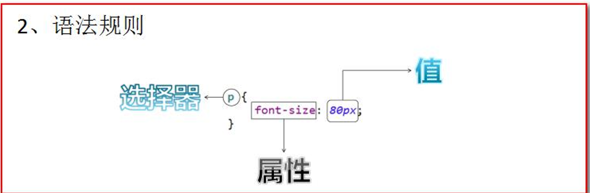
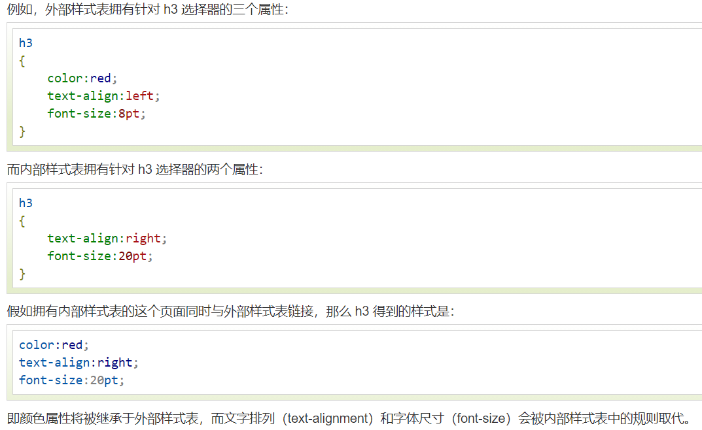
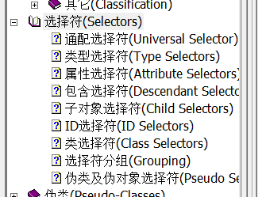
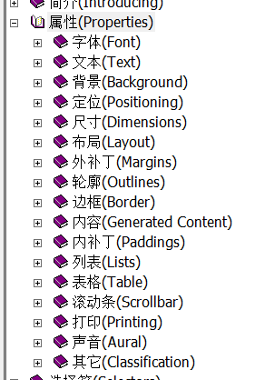
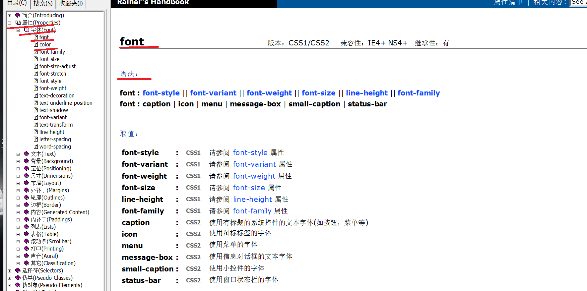

参考文档:CSS2.0.chm 
***

## css简介
CSS 是 Cascading Style Sheet 的缩写。译作「层叠样式表单」。是用于(增强)控制网页样式并允许将样式信息与网页内容分离的一种标记性语言。 
- CSS 指层叠样式表 (Cascading Style Sheets)
- 样式定义如何显示 HTML 元素
- 样式通常存储在样式表中
- 把样式添加到 HTML 4.0 中，是为了解决内容与表现分离的问题
- 外部样式表可以极大提高工作效率
- 外部样式表通常存储在 CSS 文件中
- 多个样式定义可层叠为一个

## css语法
CSS 规则由两个主要的部分构成：选择器，以及一条或多条声明:

选择器通常是您需要改变样式的 HTML 元素。

每条声明由一个属性和一个值组成。

属性（property）是您希望设置的样式属性（style attribute）。每个属性有一个值。属性和值被冒号分开。

CSS声明总是以分号(;)结束，声明总以大括号({})括起来
为了让CSS可读性更强，你可以每行只描述一个属性

####CSS 注释
注释是用来解释你的代码，并且可以随意编辑它，浏览器会忽略它。
CSS注释以 /* 开始, 以 */ 结束

## CSS 和 HTML 的结合方式

>可以用以下三种方式将样式表加入您的网页。
而最接近目标的样式定义优先权越高。高优先权样式将继承低优先权样式的未重叠定义但覆盖重叠的定义。
例外请参阅 !important 声明。 (参考手册)


### 内联样式
内联定义 (Inline Styles)
内联定义即是在对象的标记内使用对象的style属性定义适用其的样式表属性。示例如下：
```html
<p style="margin-left: 0.5in; margin-right:0.5in">这一行被增加了左右的外补丁<p> 
```
问题：这种方式的缺点？
1. 如果标签多了。样式多了。代码量非常庞大。 
2. 可读性非常差。 
3. css 代码没什么复用性可方言。

### 内部样式表
定义内部样式块对象 (Embedding a Style Block)

```html
你可以在你的HTML文档的<HTML>和<BODY>标记之间插入一个
<style>...</style>块对象。 
```
```html
<head>
    <meta charset="UTF-8">
    <title>2-CSS</title>
    <!--style标签专门用来定义css样式代码-->
    <style type="text/css">
        /*需求1：分别定义两个 div、span标签，分别修改每个 div 标签的样式为：边框1个像素，实线，红色。*/
        div{
            border: 1px solid red;
        }
        span{
            border: 1px solid red;
        }
    </style>
    <!--link标签专门用来引入css样式代码-->
<!--    <link rel="stylesheet" type="text/css" href="1.css"/>-->
</head>
```
**注意，这里将style对象的type属性设置为"text/css"，是允许不支持这类型的浏览器忽略样式表单。**
问题：这种方式的缺点。 
1. 只能在同一页面内复用代码，不能在多个页面中复用 css 代码。
2. 维护起来不方便，实际的项目中会有成千上万的页面，要到每个页面中去修改。工作量太大了。

### 外部样式表
链入外部样式表文件 (Linking to a Style Sheet)
    把 css 样式写成一个单独的 css 文件，再通过 link 标签引入即可复用。
    使用 html 的 <link rel="stylesheet" type="text/css" href="./styles.css" /> 标签 
    导入 css 样 式文件。

css文件
```css
div{
    border:1px solid yellow;
    font-size:30px;
    color: blue;
}
span{
    border: 1px dashed blue;
    color:yellow;
    font-size:20px;
}
```
html代码：
```html
<!DOCTYPE html> 
<html lang="en"> 
<head> 
    <meta charset="UTF-8"> 
    <title>Title</title> 
    <!--link 标签专门用来引入 css 样式代码--> 
    <link rel="stylesheet" type="text/css" href="1.css"/>
</head>
<body> 
    <div>div 标签 1</div> 
    <div>div 标签 2</div>
    <span>span 标签 1</span> 
    <span>span 标签 2</span> 
</body> 
</html>
```

### 多重样式
如果某些属性在不同的样式表中被同样的选择器定义，那么属性值将从更具体的样式表中被继承过来。 


#### 多重样式优先级
>菜鸟教程：https://www.runoob.com/w3cnote/css-style-priority.html

样式表允许以多种方式规定样式信息。
样式可以规定在单个的 HTML 元素中，在 HTML 页的头元素中，或在一个外部的 CSS 文件中。甚至可以在同一个 HTML 文档内部引用多个外部样式表。

一般情况下，优先级如下：

**内联样式）Inline style > （内部样式）Internal style sheet >（外部样式）External style sheet > 浏览器默认样式**

#### 多重样式优先级深入概念
优先级是浏览器是通过判断哪些属性值与元素最相关以决定并应用到该元素上的。优先级仅由选择器组成的匹配规则决定的。

优先级就是分配给指定的CSS声明的一个权重，它由匹配的选择器中的每一种选择器类型的数值决定。

#####选择器优先级顺序
下列是一份优先级逐级增加的选择器列表：
- 通用选择器（*）
- 元素(类型)选择器
- 类选择器
- 属性选择器
- 伪类
- ID 选择器
- 内联样式
#####CSS 优先规则3：
>优先级关系：内联样式 > ID 选择器 > 类选择器 = 属性选择器 = 伪类选择器 > 标签选择器 = 伪元素选择器
## CSS 选择器
### 标签名选择器
也称类型选择器
标签名选择器的格式是： 
标签名{ 属性：值; }
标签名选择器，可以决定哪些标签被动的使用这个样式。
td { font-size:14px; width:120px; } 
a { text-decoration:none; } 

### id 选择器
id 选择器的格式是： 
```
#id 属性值{ 属性：值; }
```
id 选择器，可以让我们通过 id 属性选择性的去使用这个样式。
ID属性不要以数字开头，数字开头的ID在 Mozilla/Firefox 浏览器中不起作用。
```html
<head>
    <meta charset="UTF-8">
    <title>ID选择器</title>
    <style type="text/css">
        #id001{
            color:blue;
            font-size:30px;
            border: 1px solid yellow;
        }
        #id002{
            color:red;
            font-size: 20px;
            border: 5px dotted blue;
        }
    </style>
</head>
<body>
    <!--
    需求 1：分别定义两个 div 标签， 第一个 div 标签定义 id 为 id001 ，
    然后根据 id 属性定义 css 样式修改字体颜色为蓝色，
    字体大小 30 个像素。边框为 1 像素黄色实线。

    第二个 div 标签定义 id 为 id002 ，
    然后根据 id 属性定义 css 样式 修改的字体颜色为红色，
    字体大小 20 个像 素。边框为 5 像素蓝色点线。-->
    <div id="id001">div标签001</div>
    <div id="id002">div标签002</div>
</body>
```
### class 选择器（类选择器）
class 类型选择器的格式是： 
```
.class 属性值{ 属性：值; }
```
class 选择器用于描述一组元素的样式，class 选择器有别于id选择器，class可以在多个元素中使用。

在IE5+，可以为对象的 class 属性(特性)指定多于一个值( className )，其方法是指定用空格隔开的一组样式表的类名。例如：\<div class="class1 class2">。 
```
div.note { font-size:14px; } 
/* 所有class属性值等于（包含）"note"的div对象字体尺寸为14px */ 
 
.dream { font-size:14px; } 
/* 所有class属性值等于（包含）"note"的对象字体尺寸为14px */ 
```
类名的第一个字符不能使用数字！它无法在 Mozilla 或 Firefox 中起作用。
### 组合选择器
组合选择器的格式是： 
```
选择器 1，选择器 2，选择器 n{ 属性：值; }
```
组合选择器可以让多个选择器共用同一个 css 样式代码。
```html
<head>
    <meta charset="UTF-8">
    <title>组合选择器</title>
    <style type="text/css">
        .class01,#id001{
            border: 1px solid yellow;
            color:blue;
            font-size:20px;
        }
    </style>
</head>
<body>
    <!--
    需求 1：修改 class="class01"的 div 标签 和
     id="id01" 所有的 span 标签，字体颜色为蓝色，字体大小 20 个像素。
    边框为 1 像素黄色实线。
    -->
    <div class="class01">div 标签 class01</div>
    <div class="class02">div 标签02</div>
    <span id="id001" class="class01">span 标签 class01</span>
    <span>span 标签 2</span>
</body>
```
### 其它选择器
在参考文档中有



## 常用样式
1. 字体颜色 
color：red； 
颜色可以写颜色名如：black,blue,red,green 等 
颜色也可以写 rgb 值和十六进制表示值：如 rgb(255,0,0)，#00F6DE，如果写十六进制值必 须加#
2. 宽度 
width:19px; 
宽度可以写像素值：19px； 
也可以写百分比值：20%；
3. 高度 
height:20px; 
高度可以写像素值：19px； 
也可以写百分比值：20%；
4. 背景颜色 
background-color:#0F2D4C
5. 字体样式： 
color：#FF0000；字体颜色红色 
font-size：20px; 字体大小
6. 红色 1 像素实线边框 
border：1px solid red;
7. DIV 居中 
margin-left:auto; 
margin-right:auto;
8. 文本居中： 
text-align:center;
9. 超连接去下划线 
text-decoration:none;
10. 表格细线 
    ```css
    table{ 
        border:1px solid black;
        /*设置边框*/ 
        border-collapse:collapse;
        /*将边框合并*/ 
        } 
    td,th{ 
        border:1px solid black;/*设置边框*/ 
        }
    ```
11. 列表去除修饰 
ul{ list-style:none;}


## 属性
在css参考文档中寻找需要的属性

查询步骤
