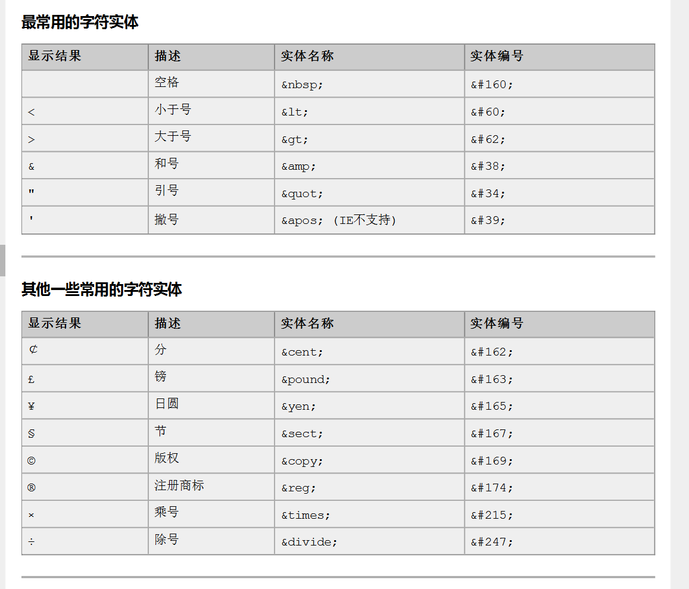
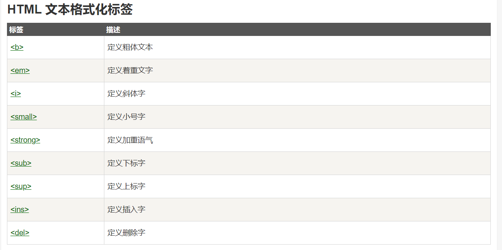
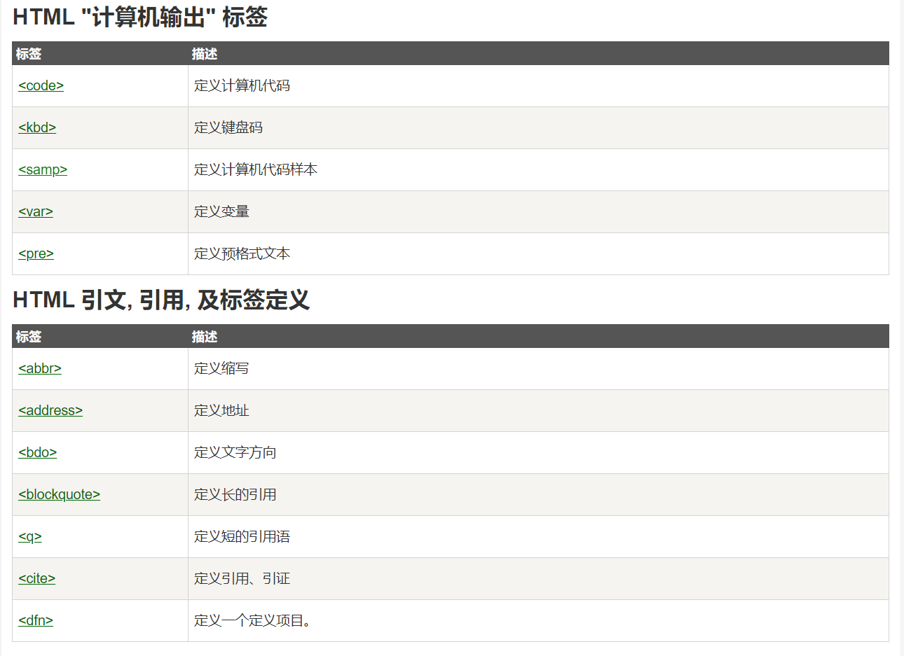
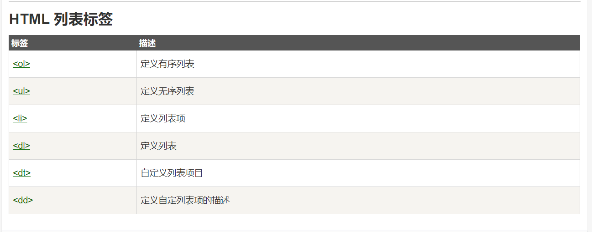
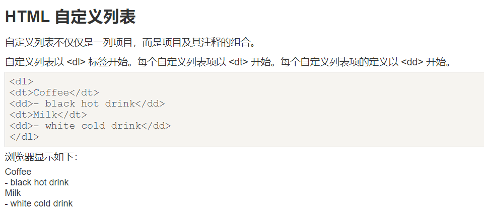
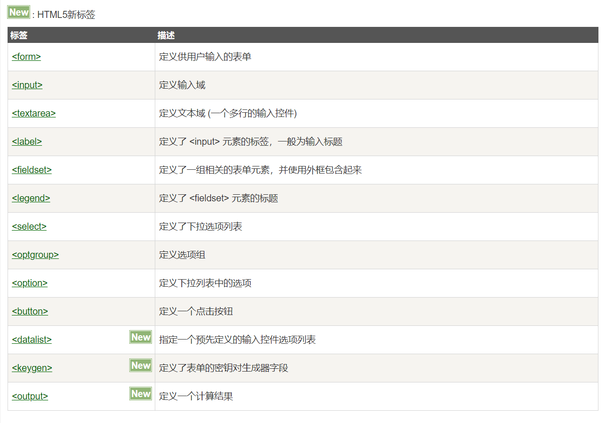

<b>页面由三部分内容组成！</b>
分别是内容（结构）、表现、行为。

内容（结构），是我们在页面中可以看到的数据。我们称之为内容。一般内容我们使用html 技术来展示。

表现，指的是这些内容在页面上的展示形式。比如说。布局，颜色，大小等等。一般使用CSS 技术实现

行为，指的是页面中元素与输入设备交互的响应。一般使用 javascript 技术实现。
***

<h3>可以结合w3cschool.CHM的中文手册文档学习</h3>

***

## HTML 简介
Hyper Text Markup Language （超文本标记语言） 简写：HTML 
HTML 通过标签来标记要显示的网页中的各个部分。
网页文件本身是一种文本文件，
通过在文本文件中添加标记符，可以告诉浏览器如何显示其中的内容（如：文字如何处理，画面如何安排，图片如何显示等）
<ul>
    <li>HTML 指的是超文本标记语言: HyperText Markup Language
    <li>HTML 不是一种编程语言，而是一种标记语言
    <li>标记语言是一套标记标签 (markup tag)
    <li>HTML 使用标记标签来描述网页
    <li>HTML 文档包含了HTML 标签及文本内容
    <li>HTML文档也叫做 web 页面
</ul>
注：Java 文件是需要先编译，再由 java 虚拟机跑起来。但 HTML 文件它不需要编译，直接由浏览器进行解析执行。

## HTML 文件的书写规范
```html
<!DOCTYPE html><!--约束，声明-->
<html lang="zh_CN"><!--html标签表示html的开始    lang="en"表示英文 lang="zh_CN"表示中文 -->
<head>
    <meta charset="UTF-8"><!--表示当前页面使用UTF-8字符集-->
    <title>憨憨</title><!--表示标题-->
</head>
<body  bgcolor="#ffefd5" ><!--body标签是整个html主体页面显示的内容-->
        hello,JavaWeb
        <!-- hr标签定义水平线 -->
        <hr/> 
        <sup>吼</sup>吼<sub>吼</sub>
    <button onclick="alert('点击')">一个按钮</button>
    <!--alert 是JavaScript提供的一个警告框函数-->
</body>
</html>
```

实例解析
```html
<!DOCTYPE html>声明为 HTML5 文档
<html> 元素是 HTML 页面的根元素
<head> 元素包含了文档的元（meta）数据，如 <meta charset="utf-8"> 定义网页编码格式为 utf-8。
<title> 元素描述了文档的标题
<body> 元素包含了可见的页面内容
<h1> 元素定义一个大标题
<p> 元素定义一个段落
```
1. 标签的格式: <标签名>封装的数据</标签名> 
2. 标签名大小写不敏感。 
3. 标签拥有自己的属性。 
    1. 基本属性：bgcolor="red" 可以修改简单的样式效果 
    2. 事件属性： onclick="alert('你好！');" 可以直接设置事件响应后的代码。 
    3. 具体属性可以查看参看手册。
4. 标签又分为，单标签和双标签。 
    1. 单标签格式： <标签名 /> br 换行 hr 水平线 
    2. 双标签格式: <标签名> ...封装的数据...</标签名>

### head 元素
>菜鸟教程相关地址：https://www.runoob.com/html/html-head.html

\<head> 元素包含了所有的头部标签元素。在\<head>元素中你可以插入脚本（scripts）, 样式文件（CSS），及各种meta信息。

可以添加在头部区域的元素标签为: \<title>, \<style>, \<meta>, \<link>, \<script>, \<noscript> 和 \<base>。

#### base 元素
\<base> 标签描述了基本的链接地址/链接目标，该标签作为HTML文档中所有的链接标签的默认链接:
```html
<head>
<base href="http://www.runoob.com/images/" target="_blank">
</head>
```
#### link 元素
\<link> 标签定义了文档与外部资源之间的关系。

\<link> 标签通常用于链接到样式表:
```html
<head>
<link rel="stylesheet" type="text/css" href="mystyle.css">
</head>
```
#### style 元素
\<style> 标签定义了HTML文档的样式文件引用地址.

在\<style> 元素中你也可以直接添加样式来渲染 HTML 文档:
```html
<head>
<style type="text/css">
body {background-color:yellow}
p {color:blue}
</style>
</head>
```

#### meta 元素
#####meta标签描述了一些基本的元数据。

\<meta> 标签提供了元数据.元数据也不显示在页面上，但会被浏览器解析。

META 元素通常用于指定网页的描述，关键词，文件的最后修改时间，作者，和其他元数据。

元数据可以使用于浏览器（如何显示内容或重新加载页面），搜索引擎（关键词），或其他Web服务。

\<meta> 一般放置于 \<head> 区域

#####\<meta> 标签- 使用实例

为搜索引擎定义关键词:
```html
<meta name="keywords" content="HTML, CSS, XML, XHTML, JavaScript">
```
为网页定义描述内容:
```html
<meta name="description" content="免费 Web & 编程 教程">
```
定义网页作者:
```html
<meta name="author" content="Runoob">
```
每30秒钟刷新当前页面:
```html
<meta http-equiv="refresh" content="30">
```
#### script 元素
\<script>标签用于加载脚本文件，如： JavaScript。


## 常用标签
### font
字体标签
```html
<body>
<!-- 字体标签
	 需求1：在网页上显示 我是字体标签 ，并修改字体为 宋体，颜色为红色。

	 font标签是字体标签,它可以用来修改文本的字体,颜色,大小(尺寸)
	 	color属性修改颜色
	 	face属性修改字体
	 	size属性修改文本大小
	 -->
<font color="red" face="宋体" size="5">我是字体标签</font>
</body>
```
### 相对路径
* ./：代表文件所在的目录（可以省略不写）如果写成image/background就相当于是在html文件下找image文件夹，当然是找不到的
* ../：代表文件所在的父级目录
* ../../：代表文件所在的父级目录的父级目录
* /：代表文件所在的根目录

### 字符实体



### 文本格式化


* 标题标签  
HTML中有六级标签：h1、h2、h3、h4、h5、h6。其中h1标签重要性最高，h6最低。  
`<h1>一级标签</h1>`  
`<h6>六级标签</h6>`  
* 段落标签  
使用p标签。  
`<p>段落内容</p>`  
段落签会自动换行，且有一定间距。  
若想自己换行，且没用间距，可以使用换行标签`<br/>`  
* 文本标签  
1、粗体标签：strong、b  
`<stiong>strong</stong>`  
<strong>strong</strong>  
b同理  
2、 斜体标签：em  
`<em>斜体</em>`  
<em>斜体</em>  
3、上标标签  
`2<sup>2</sup>`  
2<sup>2</sup>
4、下标标签  
`a<sub>b</sub>`  
a<sub>b</sub>  
5、中划线标签  
`<s>删除</s>`  
<s>删除</s>  
6、下划线标签
`<u>underline</u>`  
<u>underline</u>  
7、大字号、小字号标签  
`<big>bigger</big>`  
<big>bigger</big>  
`<small>smaller</small>`  
<small>smaller</small>  
其中斜体、粗体、上下标较为重要。  

* 水平线标签  
hr标签  
`<hr/>`  
<hr/>  
  
* div标签  
使用div标签划分html结构，配合CSS来整体控制某块的样式。  
`<div>  </div>`  
  
+ 特殊标签  
网页中的空格：  
`"&nbsp;>"`  
"&nbsp;"  
网页中1个汉字约等于3个nbsp；  
诸如此类，等等。  

### a 
```html
<body>
<!-- a标签是 超链接
        href属性设置连接的地址
        target属性设置哪个目标进行跳转
            _self		表示当前页面(默认值)
            _blank		表示打开新页面来进行跳转
	 -->
    <a href="3.标题标签.html">3.标题标签</a><br/>
<a href="http://localhost:8080" target="_self">百度</a><br/>
<a href="http://localhost:8080" target="_blank">百度</a><br/>
<a href="http://localhost:8080" target="_top">百度</a><br/>

</body>
```

HTML中通过a标签实现超链接。  
<a href="https://www.baidu.com">超链接</a>  
href表示跳转的路径，可以是**相对路径**也可以是<strong>绝对路径</strong>  
  
* 文本超链接  
<a href="https://www.baidu.com">超链接</a>   

* 图片超链接  
<a href="http://www.baidu.com"></a>  

* target属性  
+ _self： 在原窗口打开  
+ _blank：在新窗口打开  
+ _parent:在父窗口打开  
+ _top:  在顶层窗口打开  
#### 内部链接
在xxx.html之间跳转。  
<a href="../../html练习/csstest01.html">页面跳转！</a>  

#### 锚点链接
单页面内跳转。  
<a href="#shuaiqi">帅气</a>  
点击上面的链接，可直接跳转到下面的链接。（配套使用）  
需要注意href“”内加一个#号，代表是锚点链接。  


<div id="shuaiqi">帅气</div>


### 列表标签

#### ul 无序列表
#### ol 有序列表
```html
<body>
<!--需求1：使用无序，列表方式，把东北F4，赵四，刘能，小沈阳，宋小宝，展示出来
        ul 是无序列表
            type属性可以修改列表项前面的符号
        li  是列表项

        ol 是有序列表
    -->
<ul type="">
    <li>吼吼吼</li>
    <li>第二行</li>
    <li>赵四</li>
    <li>刘能</li>
    <li>小沈阳</li>
    <li>宋小宝</li>
</ul>
```
#### 自定义列表
自定义列表不仅仅是一列项目，而是项目及其注释的组合。

自定义列表以 \<dl> 标签开始。每个自定义列表项以 \<dt> 开始。每个自定义列表项的定义以 \<dd> 开始。


### img
```html
<body>
<!--需求1：使用img标签显示一张美女的照片。并修改宽高，和边框属性

       img标签是图片标签,用来显示图片
           src属性可以设置图片的路径
           width属性设置图片的宽度
           height属性设置图片的高度
           border属性设置图片边框大小 (默认为0，一般设置1，数字代表像素)
           alt属性设置当指定路径找不到图片时,用来代替显示的文本内容

       在JavaSE中路径也分为相对路径和绝对路径.
           相对路径:从工程名开始算

           绝对路径:盘符:/目录/文件名

       在web中路径分为相对路径和绝对路径两种
           相对路径:
               .           表示当前文件所在的目录
               ..          表示当前文件所在的上一级目录
               文件名      表示当前文件所在目录的文件,相当于 ./文件名            ./ 可以省略

           绝对路径:
               正确格式是:  http://ip:port/工程名/资源路径

               错误格式是:  盘符:/目录/文件名
   -->


</body>
```

### table
表格由 \<table> 标签来定义。每个表格均有若干行（由 \<tr> 标签定义），每行被分割为若干单元格（由 \<td> 标签定义）。字母 td 指表格数据（table data），即数据单元格的内容。数据单元格可以包含文本、图片、列表、段落、表单、水平线、表格等等。

表格的表头使用 \<th> 标签进行定义。大多数浏览器会把表头显示为粗体居中的文本
```xml
table 标签是表格标签
    border 设置表格标签
    width 设置表格宽度
    height 设置表格高度
    align 设置表格相对于页面的对齐方式
    cellspacing 设置单元格间距
    cellpadding 设置单元格边距
tr	 是行标签
th	是表头标签
td  是单元格标签
    align 设置单元格文本对齐方式
    colspan 属性设置跨列
    rowspan 属性设置跨行
```
### iframe
了解 iframe 框架标签 (内嵌窗口)
ifarme 标签它可以在一个 html 页面上,打开一个小窗口,去加载一个单独的页面.
```html
<body>
<!--ifarme标签可以在页面上开辟一个小区域显示一个单独的页面
           ifarme和a标签组合使用的步骤:
               1 在iframe标签中使用name属性定义一个名称
               2 在a标签的target属性上设置iframe的name的属性值
   -->
我是一个单独的完整的页面<bt/><br/>
<iframe src="6.表格标签.html" width="500"height="500" name="iframe"></iframe>

<ul>
    <li><a href="./3.标题标签.html" target="iframe">3.标题标签</a></li>
    <li><a href="./6.表格标签.html" target="iframe">6.表格标签</a></li>
    <li><a href="./7.表格跨行跨列.html" target="iframe">7.表格跨行跨列标签</a></li>
</ul>
</body>
```
Iframe - 移除边框
frameborder 属性用于定义iframe表示是否显示边框。

设置属性值为 "0" 移除iframe的边框

### form
什么是表单? 
表单就是 html 页面中,用来收集用户信息的所有元素集合.然后把这些信息发送给服务器.
```html
<body>
<!--需求1:创建一个个人信息注册的表单界面。包含用户名，密码，确认密码。性别（单选），兴趣爱好（多选），国籍（下拉列表）。
隐藏域，自我评价（多行文本域）。重置，提交。-->

<!--
    form标签就是表单
        input type=text     是文件输入框  value设置默认显示内容
        input type=password 是密码输入框  value设置默认显示内容
        input type=radio    是单选框    name属性可以对其进行分组   checked="checked"表示默认选中
        input type=checkbox 是复选框   checked="checked"表示默认选中
        input type=reset    是重置按钮      value属性修改按钮上的文本
        input type=submit   是提交按钮      value属性修改按钮上的文本
        input type=button   是按钮          value属性修改按钮上的文本
        input type=file     是文件上传域
        input type=hidden   是隐藏域    当我们要发送某些信息，而这些信息，不需要用户参与，就可以使用隐藏域（提交的时候同时发送给服务器）

        select 标签是下拉列表框
            option 标签是下拉列表框中的选项 selected="selected"设置默认选中

        textarea 表示多行文本输入框 （起始标签和结束标签中的内容是默认值）
            rows 属性设置可以显示几行的高度
            cols 属性设置每行可以显示几个字符宽度


        form标签是表单标签
            action属性设置提交的服务器地址
            method属性设置提交的方式GET(默认值)或POST

        表单提交的时候，数据没有发送给服务器的三种情况：
            1、表单项没有name属性值
            2、单选、复选（下拉列表中的option标签）都需要添加value属性，以便发送给服务器
            3、表单项不在提交的form标签中

        GET请求的特点是：
            1、浏览器地址栏中的地址是：action属性[+?+请求参数]
                请求参数的格式是：name=value&name=value
            2、不安全
            3、它有数据长度(100)的限制

        POST请求的特点是：
            1、浏览器地址栏中只有action属性值
            2、相对于GET请求要安全
            3、理论上没有数据长度的限制

-->
<form action="http://localhost:8080" method="get">
    <td><input type="hidden" name="action" value="login"/></td>
    <h1 align="center">用户注册</h1>
    <table align="center">
        <tr>
            <td>用户账户：</td>
            <td><input name="username" type="text" value="默认值"></td>
        </tr>
        <tr>
            <td>用户密码：</td>
            <td><input name="password" type="password" value="123456" maxlength="12">(最大长度为12)<br/></td>
        </tr>
        <tr><td>确认密码：</td>
            <td><input type="password" value="123456" maxlength="12"></input><br/></td>
        </tr>
        <tr>
            <td>性别：</td>
            <td><input name="sex" type="radio" value="boy" checked="checked">男
                <input name="sex" type="radio" value="girl">女<br/></td>
        </tr>
        <tr>
            <td>兴趣爱好：</td>
            <td><input name="interst" type="checkbox">乒乓球<input name="interst" type="checkbox">篮球
                <input name="interst" type="checkbox">游泳<input name="interst" type="checkbox" value="java">Java
                <input name="interst" type="checkbox" checked="checked">C++<br/></td>
        </tr>
        <tr>
            <td>国籍：</td>
            <td><select name="country">
                <option>--请选择国籍--</option>
                <option selected="selected">中国</option>
                <option>美国</option>
                <option>日本</option>
            </select><br/></td>
        </tr>
        <tr>
            <td>自我评价：</td>
            <td><textarea name="desc" rows="10" cols="20">默认值</textarea><br/></td>
        </tr>
        <tr>
            <td><input type="reset" value="reset"></td>
            <td><input type="submit" value="submit"></td>
        </tr>
        <tr>
            <td><input type="button" value="按钮"></td>
            <td><input type="file" ></td>
        </tr>
    </table>
</form>
</body>
</body>
```



+ form标签：  
<form>  
各种表单标签  
</form>  
均放置在from中。  

> form标签属性:  
    * name：   表单名称  
    为区分不同表单，name用于命名。
    * method： 提交方式  
    两个：get，post。  
    post安全性较好，一般使用它。
    * action： 提交地址  
    指定交于哪一个地址进行处理。
    * target： 打开方式  
    同a标签，指定打开窗口的方式。
    * enctype：编码方式  
    一般不设置。
>  

+ input标签  
大部分表单用input标签来实现。  
如图：  
  

>>单行文本框  
type值取为text。  
常用于登录注册。  
<input type="text">  

属性：  
* value：设置默认值。  
* size:设置文本框长度。
* maxlength：设置文本框最多可以输入的字符数。  
<input type="text" value="默认" size="8"  maxlength="5">  

>>密码文本框  
<input type="password">  

* 属性：同上  
<input type="password" value="123456" size="8" maxlength="6">  

>>单选框  
type值为radio。  

属性：  
* name：表示单选按钮所在的组名。  
* value：表示单选按钮的取值。  
* checked：用于默认选择。  
<input type="radio" name="age" value="80后">80后  
<input type="radio" name="age" value="90后" checked>90后  


复选框  
type取值为checkbox，其余同上。  
<input type="checkbox" name="strong" value="莱万" checked>  莱万  
<input type="checkbox" name="strong" value="凯恩" checked>  凯恩  
<input type="checkbox" name="strong" value="维尔纳" checked>  维尔纳  
<input type="checkbox" name="strong" value="本泽马" checked>  本泽马  
>>

>>按钮  
>>> **普通按钮**  
type取值为button。
配合JavaScript进行操作。  
属性：
value：即按钮上的文字。  
<input type="button" value="Lengend">  
>>> **提交按钮**  
type取值为submit。用来给服务器提交数据。  
属性：value：即按钮上的文字。  
<input type="submit" value="submit">  
>>> **重置按钮**  
type取值为reset，重置所在from表单中的内容。  
属性：value：即按钮上的文字。  
<input type="reset" value="Reset">  

>>
>>文件上传  
type取值为file
<input type=file>


+ 多行文本框  
**不用input标签！！！**  
使用textarea标签。  
<textarea rows="10" cols="10" value="">Begin!</textarea>  

+ 下拉列表  
一般用select配合option标签使用。
<form>  
<select size="2">
<option>First</option>  
<option>Second</option>  
<option>Third</option>  
<option>Fourth</option>  
<option>Fifth</option>  
</select>
</form>  

属性：  
multiple：设置下拉列表可以选择多项。  
size：设置下拉列表显示几个列表项。  
selected:默认选择。  
value:你懂的。
<form>  
<select multiple size="5">
<option>First</option>  
<option selected>Second</option>  
<option>Third</option>  
<option>Fourth</option>  
<option>Fifth</option>  
</select>
</form>  

### 区块
HTML 可以通过 <div> 和 <span>将元素组合起来。
- HTML 区块元素
>大多数 HTML 元素被定义为块级元素或内联元素。
块级元素在浏览器显示时，通常会以新行来开始（和结束）。
实例: \<h1>,\<p>, \<ul>, \<table>
- HTML 内联元素
>内联元素在显示时通常不会以新行开始。
实例: \<b>, \<td>, \<a>, \

- HTML \<div> 元素
>HTML \<div> 元素是块级元素，它可用于组合其他 HTML 元素的容器。
>\<div> 元素没有特定的含义。除此之外，由于它属于块级元素，浏览器会在其前后显示折行。
如果与 CSS 一同使用，\<div> 元素可用于对大的内容块设置样式属性。
>\<div> 元素的另一个常见的用途是文档布局。它取代了使用表格定义布局的老式方法。使用 \<table> 元素进行文档布局不是表格的正确用法。\<table> 元素的作用是显示表格化的数据。

- HTML \<span> 元素
>HTML <span> 元素是内联元素，可用作文本的容器
\<span> 元素也没有特定的含义。
当与 CSS 一同使用时，\<span> 元素可用于为部分文本设置样式属性。

|标签|描述|特点|
|---|----|---|
|div标签|定义了文档的区域，块级 (block-level)|默认独占一行|
|span标签|用来组合文档中的行内元素， 内联元素(inline)|它的长度是封装数据的长度|
|p段落标签||默认会在段落的上方或下方各空出一行来（如果已有就不再空）|
