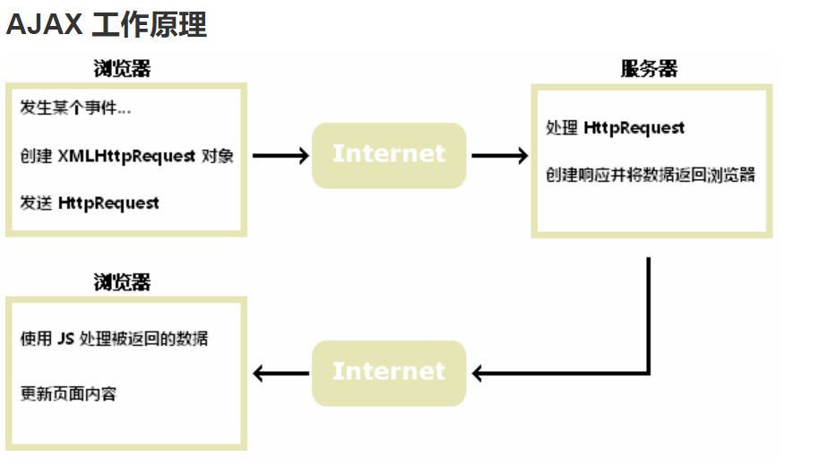
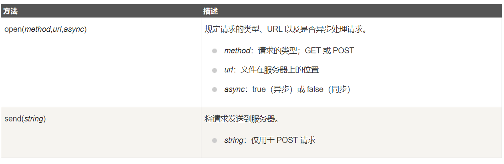
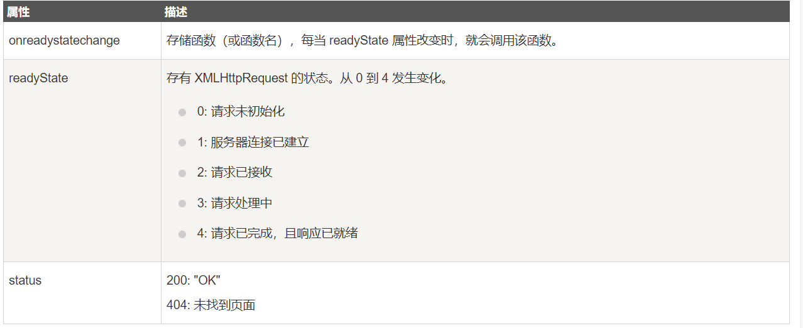
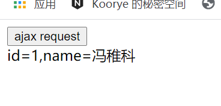
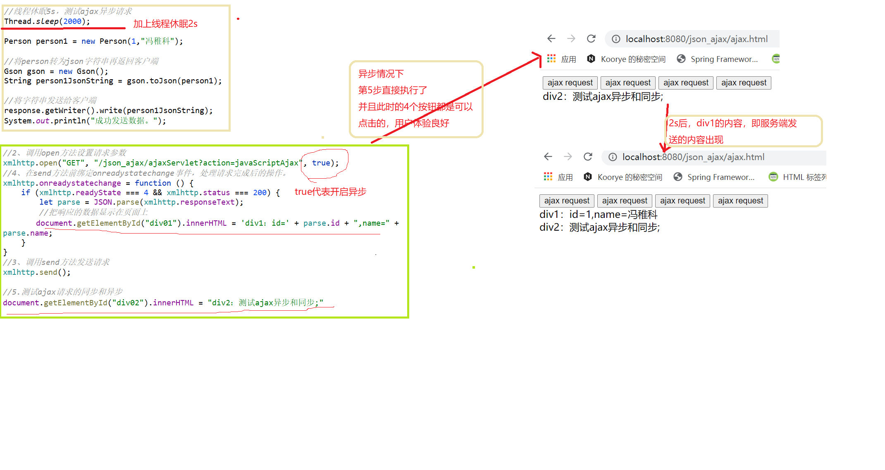
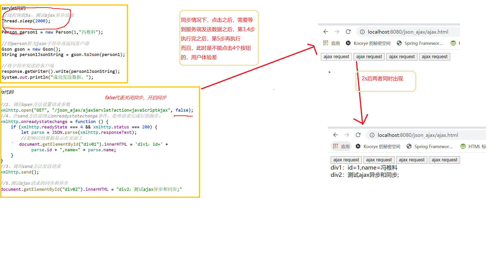

# JSON
## json简介
**JSON: JavaScript Object Notation(JavaScript 对象表示法)**

JSON 是存储和交换文本信息的语法，类似 XML。

JSON 比 XML 更小、更快，更易解析。

JSON (JavaScript Object Notation) 是一种**轻量级的数据交换格式**。易于人阅读和编写。同时也易于机器解析和生成。JSON 采用完全独立于语言的文本格式，而且很多语言都提供了对 json 的支持（包括 C, C++, C#, Java, JavaScript, Perl, Python 等）。 这样就使得 JSON 成为理想的数据交换格式。

json 是一种轻量级的数据交换格式。
轻量级指的是跟 xml 做比较。
数据交换指的是客户端和服务器之间业务数据的传递格式。
### 与 XML 相同之处
>JSON 是纯文本
JSON 具有"自我描述性"（人类可读）
JSON 具有层级结构（值中存在值）
JSON 可通过 JavaScript 进行解析
JSON 数据可使用 AJAX 进行传输
### 与 XML 不同之处
>没有结束标签
更短
读写的速度更快
能够使用内建的 JavaScript eval() 方法进行解析
使用数组
不使用保留字
### 为什么使用 JSON？
对于 AJAX 应用程序来说，JSON 比 XML 更快更易使用：

1. 使用 XML
    1. 读取 XML 文档
    2. 使用 XML DOM 来循环遍历文档
    3. 读取值并存储在变量中
2. 使用 JSON
    1. 读取 JSON 字符串
    2. 用 eval() 处理 JSON 字符串

## JSON 语法
    JSON 语法是 JavaScript 语法的子集。
    数据在名称/值对中
    数据由逗号分隔
    大括号 {} 保存对象
    中括号 [] 保存数组，数组可以包含多个对象

### JSON 名称/值对
JSON 数据的书写格式是：
```json
key : value
```
名称/值对包括字段名称（在双引号中），后面写一个冒号，然后是值：
```json
"name" : "菜鸟教程"
```
这很容易理解，等价于这条 JavaScript 语句：
```js
name = "菜鸟教程"
```
### JSON 数据类型
JSON 值可以是：

    数字（整数或浮点数）
    字符串（在双引号中）
    逻辑值（true 或 false）
    数组（在中括号中）
    对象（在大括号中）
    null
### JSON 数字
JSON 数字可以是整型或者浮点型：
```json
{ "age":30 }
```
### JSON 对象
JSON 对象在大括号 {} 中书写：
`{key1 : value1, key2 : value2, ... keyN : valueN }`
对象可以包含多个名称/值对：
```json
{ "name":"菜鸟教程" , "url":"www.runoob.com" }
```
这一点也容易理解，与这条 JavaScript 语句等价：
```js
name = "菜鸟教程"
url = "www.runoob.com"
```
### JSON 数组
JSON 数组在中括号 [] 中书写：

数组可包含多个对象：
```json
{
    "sites": [
        { "name":"菜鸟教程" , "url":"www.runoob.com" }, 
        { "name":"google" , "url":"www.google.com" }, 
        { "name":"微博" , "url":"www.weibo.com" }
    ]
}
```
在上面的例子中，对象 sites 是包含三个对象的数组。每个对象代表一条关于某个网站（name、url）的记录。
#### 删除数组元素
我们可以使用 delete 关键字来删除数组元素：

实例
`delete myObj.sites[1];`
delete 运算符并不是彻底删除元素，而是删除它的值，但仍会保留空间。

运算符 delete 只是将该值置为 undefined，而不会影响数组长度，即将其变为稀疏数组

### JSON 布尔值
JSON 布尔值可以是 true 或者 false：
```json
{ "flag":true }
```
### JSON null
JSON 可以设置 null 值：
```html
{ "runoob":null }
```
### JSON 使用 JavaScript 语法
```json
<script>
var sites = [
	{ "name":"runoob" , "url":"www.runoob.com" }, 
	{ "name":"google" , "url":"www.google.com" }, 
	{ "name":"微博" , "url":"www.weibo.com" }
];

document.getElementById("name1").innerHTML=sites[0].name;
// 修改网站名称
sites[0].name="菜鸟教程";
document.getElementById("name2").innerHTML=sites[0].name;
</script>
```
### JSON 文件
JSON 文件的文件类型是 .json
JSON 文本的 MIME 类型是 application/json

## JSON 对象
### 对象语法
实例
`{ "name":"runoob", "alexa":10000, "site":null }`
JSON 对象使用在大括号({})中书写。

对象可以包含多个 key/value（键/值）对。

key 必须是字符串，value 可以是合法的 JSON 数据类型（字符串, 数字, 对象, 数组, 布尔值或 null）。

key 和 value 中使用冒号(:)分割。

每个 key/value 对使用逗号(,)分割

### 访问对象值
1. 你可以使用点号（.）来访问对象的值：
    实例
    ```js
    var myObj, x;
    myObj = { "name":"runoob", "alexa":10000, "site":null };
    x = myObj.name;
    ```
2. 你也可以使用中括号（[]）来访问对象的值：
    实例
    ```js
    var myObj, x;
    myObj = { "name":"runoob", "alexa":10000, "site":null };
    x = myObj["name"];
    ```
3. 两种方式区别
    json 在进行通过键名来获取值时，需要特别注意一下。

    把键名赋值给另外一个变量，然后通过.方式去获取值。这种方式是行不通的。
    ```js
    var myObj, x;
    myObj = { "name":"runoob", "alexa":10000, "site":null };
    x = "name";
    document.getElementById("demo").innerHTML = myObj.x;  // 结果是 undefined
    //只能通过 [] 方式去访问:

    var myObj, x;
    myObj = { "name":"runoob", "alexa":10000, "site":null };
    x = "name";
    document.getElementById("demo").innerHTML = myObj[x];  // 结果是 runoob
    ```
### 循环对象
你可以使用 for-in 来循环对象的属性：

实例
```js
var myObj = { "name":"runoob", "alexa":10000, "site":null };
for (x in myObj) {
    document.getElementById("demo").innerHTML += x + "<br/>";
}
```
在 for-in 循环对象的属性时，使用中括号（[]）来访问属性的值：

实例
```js
var myObj = { "name":"runoob", "alexa":10000, "site":null };
for (x in myObj) {
    document.getElementById("demo").innerHTML += myObj[x] + "<br/>";
    //这里只能使用中括号而不能使用.进行取值
}
```

## json 的两个常用方法
    json 的存在有两种形式。 
    一种是：对象的形式存在，我们叫它 json 对象。 
    一种是：字符串的形式存在，我们叫它 json 字符串。
    一般我们要操作 json 中的数据的时候，需要 json 对象的格式。 
    一般我们要在客户端和服务器之间进行数据交换的时候，使用 json 字符串。

    JSON.stringify() 
        把 json 对象转换成为 json 字符串
    JSON.parse() 
        把 json 字符串转换成为 json 对象
实例
```js
// json对象转字符串
let jsonObjString = JSON.stringify(jsonObj);//类似于java中的toString()
document.writeln(jsonObjString+"<br/>");
// json字符串转json对象
let jsonObj2 = JSON.parse(jsonObjString);
document.writeln(jsonObj2.key1+"<br/>");
```
### JSON.parse()
JSON 通常用于与服务端交换数据。

在接收服务器数据时一般是字符串。

我们可以使用 JSON.parse() 方法将数据转换为 JavaScript 对象。
**语法**
`JSON.parse(text[, reviver])`
参数说明：
1. text:必需， 一个有效的 JSON 字符串。
2. reviver: 可选，一个转换结果的函数， 将**为对象的每个成员调用此函数**。

**JSON 不能存储 Date 对象**。

如果你需要存储 Date 对象，需要将其转换为字符串。

之后再将字符串转换为 Date 对象。

实例
```js
var text = '{ "name":"Runoob", "initDate":"2013-12-14", "site":"www.runoob.com"}';
var obj = JSON.parse(text);
obj.initDate = new Date(obj.initDate);
 
document.getElementById("demo").innerHTML = obj.name + "创建日期: " + obj.initDate;
```

我们可以启用 JSON.parse 的第二个参数 reviver，一个转换结果的函数，对象的每个成员调用此函数。

```js
var text = '{ "name":"Runoob", "initDate":"2013-12-14", "site":"www.runoob.com"}';
var obj = JSON.parse(text, function (key, value) {
    if (key == "initDate") {
        return new Date(value);
    } else {
        return value;
}});
 
document.getElementById("demo").innerHTML = obj.name + "创建日期：" + obj.initDate;
```

### JSON.stringify()
JSON 通常用于与服务端交换数据。

在向服务器发送数据时一般是字符串。

我们可以使用 JSON.stringify() 方法将 JavaScript 对象转换为字符串。

**语法**
`JSON.stringify(value[, replacer[, space]])`
参数说明：

    value:
        必需， 要转换的 JavaScript 值（通常为对象或数组）。

    replacer:
        可选。用于转换结果的函数或数组。

        如果 replacer 为函数，则 JSON.stringify 将调用该函数，并传入每个成员的键和值。
        使用返回值而不是原始值。如果此函数返回 undefined，则排除成员。根对象的键是一个空字符串：""。

        如果 replacer 是一个数组，则仅转换该数组中具有键值的成员。
        成员的转换顺序与键在数组中的顺序一样。当 value 参数也为数组时，将忽略 replacer 数组。

    space:
        可选，文本添加缩进、空格和换行符，如果 space 是一个数字，则返回值文本在每个级别缩进指定数目的空格，
        如果 space 大于 10，则文本缩进 10 个空格。space 也可以使用非数字，如：\t。


## Java 中 JSON 的使用

### 类库选择
Java中并没有内置JSON的解析，因此使用JSON需要借助第三方类库。

下面是几个常用的 JSON 解析类库：

    Gson: 谷歌开发的 JSON 库，功能十分全面。
    FastJson: 阿里巴巴开发的 JSON 库，性能十分优秀。
    Jackson: 社区十分活跃且更新速度很快。

### 环境配置
在 Maven 构建的项目中，在 pom.xml 文件中加入以下依赖中的一个即可。
1. FastJson:
```xml
<!-- https://mvnrepository.com/artifact/com.alibaba/fastjson -->
<dependency>
    <groupId>com.alibaba</groupId>
    <artifactId>fastjson</artifactId>
    <version>1.2.59</version>
</dependency>
```
2. Gson
```xml
<dependency>
    <groupId>com.google.code.gson</groupId>
    <artifactId>gson</artifactId>
    <version>2.8.2</version>
</dependency>
```
3. Jackson
```xml
<dependency>
    <groupId>com.fasterxml.jackson.core</groupId>
    <artifactId>jackson-core</artifactId>
    <version>2.0.1</version>
</dependency>
<dependency>
    <groupId>com.fasterxml.jackson.core</groupId>
    <artifactId>jackson-databind</artifactId>
    <version>2.0.0</version>
</dependency>
```
### FastJson 使用示例

#### 编码
从 Java 变量到 JSON 格式的编码过程如下：

实例
```java
public void testJson() {
    JSONObject object = new JSONObject();
    //string
    object.put("string","string");
    //int
    object.put("int",2);
    //boolean
    object.put("boolean",true);
    //array
    List<Integer> integers = Arrays.asList(1,2,3);
    object.put("list",integers);
    //null
    object.put("null",null);
​
    System.out.println(object);
}
```
在上例中，首先建立一个 JSON 对象，然后依次添加字符串、整数、布尔值以及数组，最后将其打印为字符串。

输出结果如下：
```java
{"boolean":true,"string":"string","list":[1,2,3],"int":2}
```

#### 解码
从 JSON 对象到 Java 变量的解码过程如下：

实例
```java
public void testJson2() {
​
  JSONObject object = JSONObject
      .parseObject("{\"boolean\":true,\"string\":\"string\",\"list\":[1,2,3],\"int\":2}");
  //string
  String s = object.getString("string");
  System.out.println(s);
  //int
  int i = object.getIntValue("int");
  System.out.println(i);
  //boolean
  boolean b = object.getBooleanValue("boolean");
  System.out.println(b);
  //list
  List<Integer> integers = JSON.parseArray(object.getJSONArray("list").toJSONString(),Integer.class);
  integers.forEach(System.out::println);
  //null
  System.out.println(object.getString("null"));
​
}
```
在上例中，首先从 JSON 格式的字符串中构造一个 JSON 对象，之后依次读取字符串、整数、布尔值以及数组，最后分别打印，打印结果如下：
```java
string
2
true
1
2
3
null
```

### Gson 使用示例

1、javaBean 和 json 的互转
```java
//1.2.1、javaBean 和 json 的互转
@Test
public void testJson1() {
    Person person = new Person(1, "fzk好帅!");
    // 创 建 Gson 对 象 实 例
    Gson gson = new Gson();
    // toJson 方 法 可 以 把 java 对 象 转 换 成 为 json 字 符 串
    String personJsonString = gson.toJson(person);
    System.out.println(personJsonString);
    // fromJson 把 json 字 符 串 转 换 回 Java 对 象
    // 第 一 个 参 数 是 json 字 符 串
    // 第 二 个 参 数 是 转 换 回 去 的 Java 对 象 类 型
    Person person1 = gson.fromJson(personJsonString, Person.class);
    System.out.println(person1);
}
```
结果：
```java
{"id":1,"name":"fzk好帅!"}
Person{id=1, name='fzk好帅!'}
```
2、List 和 json 的互转
先建一个工具类
```java
/**
 * @author fzkstart
 * @create 2021-02-16 22:03
 */
public class PersonListType extends TypeToken<ArrayList<Person>> {
    //什么都不用写，继承那里写泛型
}
```
测试
```java
//1.2.2、List 和 json 的互转
@Test
public void testJson2(){
    List<Person> list = new ArrayList<>();

    list.add(new Person(1,"fzk"));
    list.add(new Person(1,"wn"));

    Gson gson = new Gson();
    //把list转换为json字符串
    String listJsonString = gson.toJson(list);
    System.out.println(listJsonString);//[{"id":1,"name":"fzk"},{"id":1,"name":"wn"}]

    //把json字符串转为list
    List<Person> jsonToList = gson.fromJson(listJsonString, new PersonListType().getType());
    System.out.println(jsonToList);
}
```
结果：
```java
[{"id":1,"name":"fzk"},{"id":1,"name":"wn"}]
[Person{id=1, name='fzk'}, Person{id=1, name='wn'}]
```
3、map 和 json 的互转
```java
//1.2.3、map 和 json 的互转
@Test
public void testJson3(){
    HashMap<String, Person> personMap = new HashMap<>();
    personMap.put("key1",new Person(1,"fzk"));
    personMap.put("key2",new Person(2,"wn"));
    //新建Gson对象
    Gson gson = new Gson();
    //map转json
    String personMapJsonString = gson.toJson(personMap);
    System.out.println(personMapJsonString);//{"key1":{"id":1,"name":"fzk"},"key2":{"id":2,"name":"wn"}}

    //json转map
    //这里没有像上一个案例新建一个工具类，而是直接新建了匿名内部类
    Map<Integer,Person> personMap2 = gson.fromJson(personMapJsonString,
            new TypeToken<HashMap<String,Person>>(){}.getType());

    System.out.println(personMap2);
}
```
结果：
```java
{"key1":{"id":1,"name":"fzk"},"key2":{"id":2,"name":"wn"}}
{key1=Person{id=1, name='fzk'}, key2=Person{id=2, name='wn'}}
```

***


# AJAX
## ajax简介
#### 什么是ajax请求
AJAX = Asynchronous JavaScript and XML（异步的 JavaScript 和 XML）。

AJAX 不是新的编程语言，而是一种使用现有标准的新方法。

AJAX 是一种用于创建快速动态网页的技术。

**AJAX 最大的优点是在不重新加载整个页面的情况下，可以与服务器交换数据并更新部分网页内容。**

传统的网页（不使用 AJAX）如果需要更新内容，必需重载整个网页面。
ajax 是一种浏览器通过 js 异步发起请求，局部更新页面的技术。

Ajax 请求的局部更新，浏览器地址栏不会发生变化 局部更新不会舍弃原来页面的内容

AJAX 不需要任何浏览器插件，但需要用户允许JavaScript在浏览器上执行。

#### AJAX 应用
    运用XHTML+CSS来表达资讯；

    运用JavaScript操作DOM（Document Object Model）来执行动态效果；

    运用XML和XSLT操作资料;

    运用XMLHttpRequest或新的Fetch API与网页服务器进行异步资料交换；

    注意：AJAX与Flash、Silverlight和Java Applet等RIA技术是有区分的。

#### ajax工作原理


#### AJAX是基于现有的Internet标准
AJAX是基于现有的Internet标准，并且联合使用它们：

- XMLHttpRequest 对象 (异步的与服务器交换数据)
- JavaScript/DOM (信息显示/交互)
- CSS (给数据定义样式)
- XML (作为转换数据的格式)
- lamp  AJAX应用程序与浏览器和平台无关的！

#### Google Suggest
在 2005 年，Google 通过其 Google Suggest 使 AJAX 变得流行起来。

Google Suggest 使用 AJAX 创造出动态性极强的 web 界面：当您在谷歌的搜索框输入关键字时，JavaScript 会把这些字符发送到服务器，然后服务器会返回一个搜索建议的列表。

## 原生ajax请求步骤

### 1. 创建 XMLHttpRequest 对象
XMLHttpRequest 是 AJAX 的基础。

所有现代浏览器均支持 XMLHttpRequest 对象（IE5 和 IE6 使用 ActiveXObject）。

XMLHttpRequest 用于在后台与服务器交换数据。这意味着可以在不重新加载整个网页的情况下，对网页的某部分进行更新。

所有现代浏览器（IE7+、Firefox、Chrome、Safari 以及 Opera）均内建 XMLHttpRequest 对象。

创建 XMLHttpRequest 对象的**语法**：
```js
variable=new XMLHttpRequest();
```
老版本的 Internet Explorer （IE5 和 IE6）使用 ActiveX 对象：
```js
variable=new ActiveXObject("Microsoft.XMLHTTP");
```
为了应对所有的现代浏览器，包括 IE5 和 IE6，请检查浏览器是否支持 XMLHttpRequest 对象。如果支持，则创建 XMLHttpRequest 对象。如果不支持，则创建 ActiveXObject ：
```js
var xmlhttp;
if (window.XMLHttpRequest)
{
    //  IE7+, Firefox, Chrome, Opera, Safari 浏览器执行代码
    xmlhttp=new XMLHttpRequest();
}
else
{
    // IE6, IE5 浏览器执行代码
    xmlhttp=new ActiveXObject("Microsoft.XMLHTTP");
}
```

### 2. 向服务器发送请求请求
XMLHttpRequest 对象用于和服务器交换数据。

如需将请求发送到服务器，我们使用 XMLHttpRequest 对象的 open() 和 send() 方法：

xmlhttp.open("GET","ajax_info.txt",true);
xmlhttp.send();


#### GET 还是 POST？
与 POST 相比，GET 更简单也更快，并且在大部分情况下都能用。

然而，在以下情况中，请使用 POST 请求：

无法使用缓存文件（更新服务器上的文件或数据库）
向服务器发送大量数据（POST 没有数据量限制）
发送包含未知字符的用户输入时，POST 比 GET 更稳定也更可靠
##### GET 请求
一个简单的 GET 请求：
实例
```js
xmlhttp.open("GET","/try/ajax/demo_get.php",true);
xmlhttp.send();
```
在上面的例子中，您可能得到的是缓存的结果。
为了避免这种情况，请向 URL 添加一个唯一的 ID：
实例
```js
xmlhttp.open("GET","/try/ajax/demo_get.php?t=" + Math.random(),true);
xmlhttp.send();
```
如果您希望通过 GET 方法发送信息，请向 URL 添加信息：
实例
```js
xmlhttp.open("GET","/try/ajax/demo_get2.php?fname=Henry&lname=Ford",true);
xmlhttp.send();
```
##### POST 请求
一个简单 POST 请求：
```js
xmlhttp.open("POST","/try/ajax/demo_post.php",true);
xmlhttp.send();
```
如果需要像 HTML 表单那样 POST 数据，请使用 setRequestHeader() 来添加 HTTP 头。然后在 send() 方法中规定您希望发送的数据：
```js
xmlhttp.open("POST","/try/ajax/demo_post2.php",true);
xmlhttp.setRequestHeader("Content-type","application/x-www-form-urlencoded");
xmlhttp.send("fname=Henry&lname=Ford");
```
|方法	|描述|
|-------|----|
|setRequestHeader(header,value)	|向请求添加 HTTP 头。header: 规定头的名称；value: 规定头的值|

##### url - 服务器上的文件
open() 方法的 url 参数是服务器上文件的地址：
```js
xmlhttp.open("GET","ajax_test.html",true);
```
该文件可以是任何类型的文件，比如 .txt 和 .xml，或者服务器脚本文件，比如 .asp 和 .php （在传回响应之前，能够在服务器上执行任务）。

##### 异步 - True 或 False？
AJAX 指的是异步 JavaScript 和 XML（Asynchronous JavaScript and XML）。

XMLHttpRequest 对象如果要用于 AJAX 的话，其 open() 方法的 async 参数必须设置为 true：
`xmlhttp.open("GET","ajax_test.html",true);`
对于 web 开发人员来说，发送异步请求是一个巨大的进步。很多在服务器执行的任务都相当费时。AJAX 出现之前，这可能会引起应用程序挂起或停止。

通过 AJAX，JavaScript 无需等待服务器的响应，而是：

- 在等待服务器响应时执行其他脚本
- 当响应就绪后对响应进行处理

###### Async=true
当使用 async=true 时，请规定在响应处于 onreadystatechange 事件中的就绪状态时执行的函数：

```js
xmlhttp.onreadystatechange=function()
{
    if (xmlhttp.readyState==4 && xmlhttp.status==200)
    {
        document.getElementById("myDiv").innerHTML=xmlhttp.responseText;
    }
}
xmlhttp.open("GET","/try/ajax/ajax_info.txt",true);
xmlhttp.send();
```

###### Async = false
如需使用 async=false，请将 open() 方法中的第三个参数改为 false：

`xmlhttp.open("GET","test1.txt",false);`
我们不推荐使用 async=false，但是对于一些小型的请求，也是可以的。

请记住，JavaScript 会等到服务器响应就绪才继续执行。如果服务器繁忙或缓慢，应用程序会挂起或停止。

注意：当您使用 async=false 时，请不要编写 onreadystatechange 函数 - 把代码放到 send() 语句后面即可：
```js
xmlhttp.open("GET","/try/ajax/ajax_info.txt",false);
xmlhttp.send();
document.getElementById("myDiv").innerHTML=xmlhttp.responseText;
```


### 3. 服务器 响应
如需获得来自服务器的响应，请使用 XMLHttpRequest 对象的 responseText 或 responseXML 属性。

|属性|	描述|
|----|------|
|responseText|	获得字符串形式的响应数据。|
|responseXML	|获得 XML 形式的响应数据。|

#### responseText 属性
如果来自服务器的响应并非 XML，请使用 responseText 属性。

responseText 属性返回字符串形式的响应，因此您可以这样使用：
```js
document.getElementById("myDiv").innerHTML=xmlhttp.responseText;
```

#### responseXML 属性
如果来自服务器的响应是 XML，而且需要作为 XML 对象进行解析，请使用 responseXML 属性：

实例
请求 cd_catalog.xml 文件，并解析响应：
```js
xmlDoc=xmlhttp.responseXML;
txt="";
x=xmlDoc.getElementsByTagName("ARTIST");
for (i=0;i<x.length;i++)
{
    txt=txt + x[i].childNodes[0].nodeValue + "<br>";
}
document.getElementById("myDiv").innerHTML=txt;
```

### 4. AJAX-onreadystatechange 事件
#### onreadystatechange 事件
当请求被发送到服务器时，我们需要执行一些基于响应的任务。

每当 readyState 改变时，就会触发 onreadystatechange 事件。

readyState 属性存有 XMLHttpRequest 的状态信息。

下面是 XMLHttpRequest 对象的三个重要的属性：

在 onreadystatechange 事件中，我们规定当服务器响应已做好被处理的准备时所执行的任务。

当 readyState 等于 4 且状态为 200 时，表示响应已就绪：

实例
```js
xmlhttp.onreadystatechange=function()
{
    if (xmlhttp.readyState==4 && xmlhttp.status==200)
    {
        document.getElementById("myDiv").innerHTML=xmlhttp.responseText;
    }
}
```
>**注意**： onreadystatechange 事件被触发 4 次（0 - 4）, 分别是： 0-1、1-2、2-3、3-4，对应着 readyState 的每个变化。

#### 使用回调函数
回调函数是一种以参数形式传递给另一个函数的函数。

如果您的网站上存在多个 AJAX 任务，那么您应该为创建 XMLHttpRequest 对象编写一个标准的函数，并为每个 AJAX 任务调用该函数。

该函数调用应该包含 URL 以及发生 onreadystatechange 事件时执行的任务（每次调用可能不尽相同）：

实例
```js
function myFunction()
{
    loadXMLDoc("/try/ajax/ajax_info.txt",function()
    {
        if (xmlhttp.readyState==4 && xmlhttp.status==200)
        {
            document.getElementById("myDiv").innerHTML=xmlhttp.responseText;
        }
    });
}
```

### 5. 实例
java中的servlet代码
```java
//继承了自定义BaseServlet类，里面有反射调用方法
public class AjaxServlet extends BaseServlet{
    protected void javaScriptAjax(HttpServletRequest request, HttpServletResponse response) throws ServletException, IOException, InterruptedException {
        System.out.println("成功运行到这里.");

//        //线程休眠5s，测试ajax异步请求
//        Thread.sleep(5000);
        Person person1 = new Person(1,"冯稚科");

        //将person转为json字符串再返回客户端
        Gson gson = new Gson();
        String person1JsonString = gson.toJson(person1);

        //将字符串发送给客户端
        response.getWriter().write(person1JsonString);
        System.out.println("成功发送数据。");
    }
}
```

js代码：
```js
<head>
    <meta http-equiv="pragma" content="no-cache"/>
    <meta http-equiv="cache-control" content="no-cache"/>
    <meta http-equiv="Expires" content="0"/>
    <meta http-equiv="Content-Type" content="text/html; charset=UTF-8">
    <title>Insert title here</title>
    <script type="text/javascript">
        //在这里使用javaScript语言发起Ajax请求，访问服务器AjaxServlet中javaScriptAjax
        function ajaxRequest() {
            //1、我们首先要创建XMLHttpRequest
            var xmlhttp = new XMLHttpRequest();
            //2、调用open方法设置请求参数
            xmlhttp.open("GET", "/json_ajax/ajaxServlet?action=javaScriptAjax", true);
            //4、在send方法前绑定onreadystatechange事件，处理请求完成后的操作。
            xmlhttp.onreadystatechange = function () {
                if (xmlhttp.readyState === 4 && xmlhttp.status === 200) {
                    let parse = JSON.parse(xmlhttp.responseText);
					//把响应的数据显示在页面上
					document.getElementById("div01").innerHTML='id='+parse.id+",name="+parse.name;
				}
            }
            //3、调用send方法发送请求
            xmlhttp.send();

            //5.测试ajax请求的同步和异步
			alert("js中最后一行代码");
        }
    </script>
</head>
<body>
<button onclick="ajaxRequest()">ajax request</button>
<div id="div01">
</div>
</body>
```
结果网页：


### 6. 测试ajax的异步
异步：可以点击且有反应，体验较好

同步：不能随便点击，点击后反应有，不过都得等线程完后，一个个出现，体验不好


## jQuery 中的 AJAX 请求
***
***看jQuery参考手册***
***
### $.ajax方法
    $.ajax 方法 
        url 表示请求的地址 
        type 表示请求的类型，GET 或 POST 请求 
        data 表示发送给服务器的数据 
            格式有两种： 
            一：name=value&name=value 
            二：{key:value} 
        success 请求成功，响应的回调函数 
        dataType 响应的数据类型 
            常用的数据类型有： 
            text 表示纯文本 
            xml 表示 xml 数据 
            json 表示 json 对象
        
        async   Boolean(默认: true) 
            默认设置下，所有请求均为异步请求。
            如果需要发送同步请求，请将此选项设置为 false。
            注意，同步请求将锁住浏览器，用户其它操作必须等待请求完成才可以执行。

        其他的更多参数和细节，去看jQuery参考手册


实例：
```js
$(function(){
    // ajax请求
    $("#ajaxBtn").click(function(){
        $.ajax({
            url:"/json_ajax/ajaxServlet",
            data:'action=jQueryAjax',
            type:"GET",
            success:function (message){
                $("#div01").html("服务器传回的数据："+message+"<br/>id="
                        +message.id+",name="+message.name);
            },
            dataType:"json"
        });
    });
}
```

### `$.get 方法和$.post 方法`
    这是一个简单的 GET 请求功能以取代复杂 $.ajax 。请求成功时可调用回调函数。
    
    如果需要在出错时执行函数，请使用 $.ajax。
`jQuery.get(url, [data], [callback], [type])    返回值:XMLHttpRequest`
`jQuery.post(url, [data], [callback], [type])       返回值:XMLHttpRequest`
参数

    url,[data],[callback],[type]        String,Map,Function,String
    
    url:待载入页面的URL地址

    data:待发送 Key/value 参数。

    callback:载入成功时回调函数。

    type:返回内容格式，xml, html, script, json, text, _default。
实例：
```js
// ajax--get请求
$("#getBtn").click(function(){
    $.get("/json_ajax/ajaxServlet",'action=jQueryGet',function (message) {
        $("#div01").html("服务器传回的数据："+message+"<br/>id="
                +message.id+",name="+message.name);
    },'json');
});

// ajax--post请求
$("#postBtn").click(function(){
    // post请求
    $.post("/json_ajax/ajaxServlet",'action=jQueryPost',function (message) {
        $("#div01").html("服务器传回的数据："+message+"<br/>id="
                +message.id+",name="+message.name);
    },'json');
});
```
实例2：
```js
$("button").click(function(){
  $.get("demo_test.php",function(data,status){
    alert("数据: " + data + "\n状态: " + status);
  });
});
```
$.get() 的第一个参数是我们希望请求的 URL（"demo_test.php"）。

第二个参数是回调函数。第一个回调参数存有被请求页面的内容，第二个回调参数存有请求的状态。
### $.getJSON方法
在 jQuery 1.2 中，您可以通过使用JSONP形式的回调函数来加载其他网域的JSON数据，如 "myurl?callback=?"。jQuery 将自动替换 ? 为正确的函数名，以执行回调函数。 注意：此行以后的代码将在这个回调函数执行前执行
`jQuery.getJSON(url, [data], [callback])  返回值:XMLHttpRequest`
参数

    url,[data],[callback]   String,Map,Function
    
    url:发送请求地址。

    data:待发送 Key/value 参数。

    callback:载入成功时回调函数。
实例：
```js
// ajax--getJson请求
$("#getJSONBtn").click(function(){
    // 调用
    $.getJSON('/json_ajax/ajaxServlet','action=jQueryGetJson',function (message) {
        $("#div01").html("服务器传回的数据："+message+"<br/>id="
                +message.id+",name="+message.name);
    });
});
```

### 表单序列化 serialize()
serialize()可以把表单中所有表单项的内容都获取到，并以 name=value&name=value 的形式进行拼接。

实例：
```js
// ajax请求
$("#submit").click(function () {
    // 把参数序列化
    $.getJSON('/json_ajax/ajaxServlet', 'action=jQuerySerialize&' +
        $("#form01").serialize(), function (message) {
        $("#div01").html("编号：" + message.id +
            ",用户名：" + message.name);
        $("#div01").append($("#form01").serialize());
    })
});
```