## EL 表达式 

    EL 表达式的全称是： Expression Language。   是表达式语言。
    EL 表达式的什么作用：
        EL 表达式主要是代替 jsp 页面中的表达式脚本在 jsp 页面中进行数据的输出。 
        因为 EL 表达式在输出数据的时候，要比 jsp 的表达式脚本要简洁很多。

JSP 表达式语言
JSP表达式语言（EL）使得访问存储在JavaBean中的数据变得非常简单。JSP EL既可以用来创建算术表达式也可以用来创建逻辑表达式。在JSP EL表达式内可以使用整型数，浮点数，字符串，常量true、false，还有null。
### 在js中使用el注意：
**在js中使用el表达式，必须将其套在字符串中 ，否则会出错；在jsp中不用套在字符串中**。
```js
//注意：在js中使用el表达式，必须套在字符串中，不然会出错
$("#create-marketActivityOwner").val("${user.id}");
```
### 忽略EL表达式
默认是忽略了EL表达式的，需要先开启，使用page指令
`<%@ page isELIgnored ="true|false" %>`
这样，EL表达式就会被忽略。若设为false，则容器将会计算EL表达式。
想要停用对EL表达式的评估的话，需要使用page指令将isELIgnored属性值设为true


### 简单的语法
`${expr}`
其中，expr指的是表达式。在JSP EL中通用的操作符是` . 和 {} `。这两个操作符允许您通过内嵌的JSP对象访问各种各样的JavaBean属性。


实例：
```java
<body>
<%
    request.setAttribute("key", "值");
%>
表达式脚本输出 key 的值是： <%=request.getAttribute("key1") == null ? "" : request.getAttribute("key1")%>
<br/>
EL 表达式输出 key 的值是：${key1}
</body>
```
**注意：EL 表达式在输出 null 值的时候，输出的是空串。jsp 表达式脚本输出 null 值的时候，输出的是 null 字符串。**
所以
`${key1}`
等价于
`<%=request.getAttribute("key1") == null ? "" : request.getAttribute("key1")%>`

### EL 表达式搜索域数据的顺序

EL 表达式主要是在 jsp 页面中输出数据。 
主要是输出域对象中的数据。
当四个域中都有相同的 key 的数据的时候，EL 表达式会按照四个域的从小到大的顺序去进行搜索，找到就输出。
```java
<%
    // 往 四 个 域 中 都 保 存 了 相 同 的 key的 数 据 。
    request.setAttribute("key", "request");
    session.setAttribute("key", "session");
    application.setAttribute("key", "application");
    pageContext.setAttribute("key", "pageContext");
%>
${ key }
```
EL表达式根据键去4个域中找值，找到就输出，先找pageContext域。


### EL 表达式——运算
语法：${ 运算表达式 } ， EL 表达式支持如下运算符：
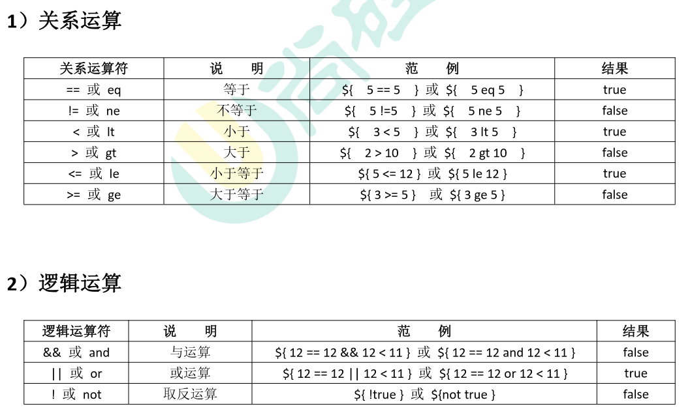
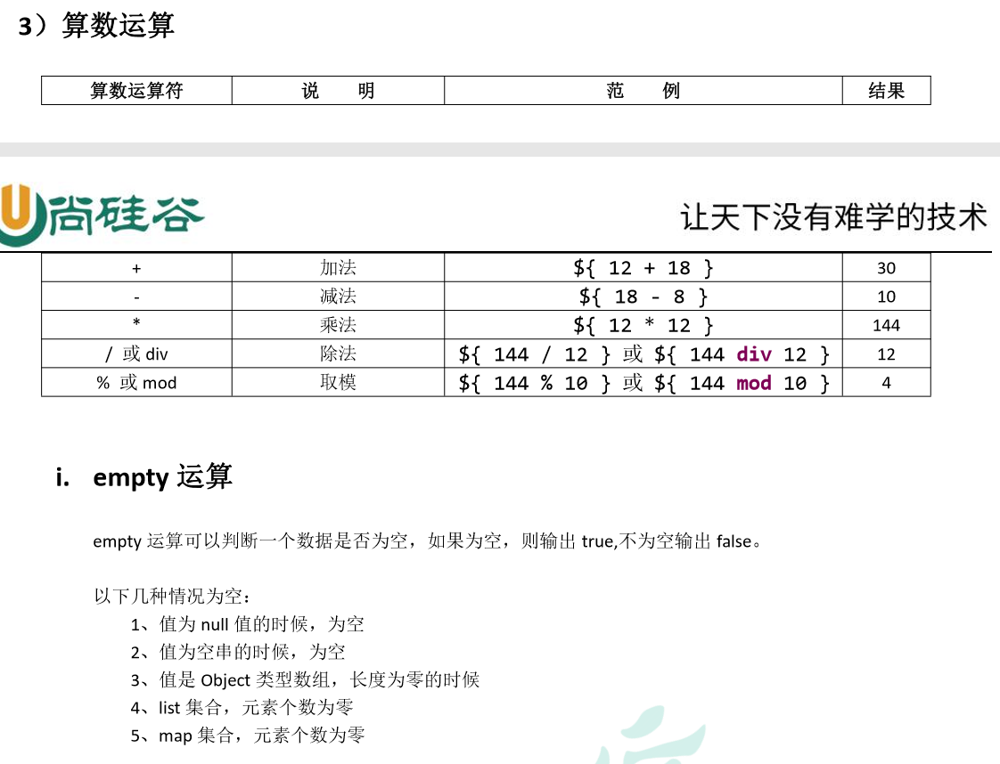
EL表达式也有三元运算符
表达式 1？表达式 2：表达式 3

### EL中的基础操作符
EL表达式支持大部分Java所提供的算术和逻辑操作符：

|操作符|	描述|
|:----|:-------|
|`.`	|访问一个Bean属性或者一个映射条目|
|`[]	`|访问一个数组或者链表的元素|
<br/>
<br/>
<br/>
<b>EL 表达式输出 Bean 的普通属性，数组属性。List 集 合属性，map 集合属性</b>

实例：*需求——输出 Person 类中普通属性，数组属性。list 集合属性和 map 集合属性。*

Person类
```java
public class Person {
    //i. 需 求 —— 输 出 Person类 中 普 通 属 性 ， 数 组 属 性 ，
    // list集 合 属 性 和 map集 合 属 性
    private String name;
    private String[] phones;
    private List<String> cities;
    private Map<String, Object> map;
    //这里只给出了age的get方法，而没有写age属性
    //并且是直接返回一个值18
    public int getAge(){
        return 18;
    }
    ......
}
```
person.jsp
要导入java包和设置不忽略EL表达式
```java
<body>
<%
    Person person = new Person();
    person.setName("fzk");
    person.setPhones(new String[]{"18610541354", "18688886666", "18699998888"});
    List<String> cities = new ArrayList<String>();
    cities.add("北京");
    cities.add("上海");
    cities.add("深圳");
    person.setCities(cities);
    Map<String, Object> map = new HashMap<>();
    map.put("key1", "value1");
    map.put("key2", "value2");
    map.put("3", "value3");
    person.setMap(map);
    pageContext.setAttribute("p", person);
%>
输出 Person：${p}  <br/>
输出 Person 的 name 属性：${p.name}   <br/>
输出 Person 的 phones 数组属性值：${p.phones[0]}    <br/>
输出 Person 的 cities 集合中的元素值：${p.cities}  <br/>
输出 Person 的 List 集合中个别元素值：${p.cities[0]}    <br/>
输出 Person 的 Map 集合: ${p.map}    <br/>
输出 Person 的 Map 集合中某个 key 的值:${p.map['3']}    <br/>
输出 Person 的 age 属性：${p.age}

</body>
```
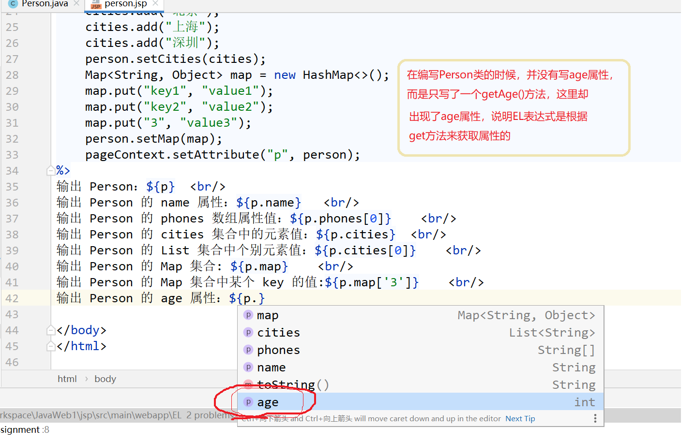

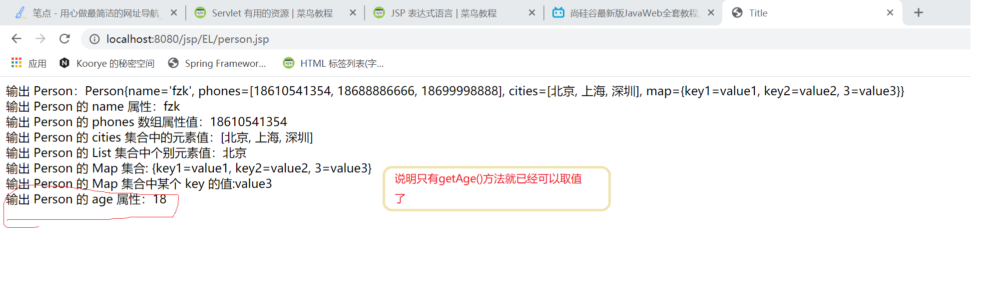

.点运算，可以输出 Bean 对象中某个属性的值。 
[]中括号运算，可以输出有序集合中某个元素的值。 
>注意：并且[]中括号运算，还可以输出 map 集合中 key 里含有特殊字符的 key 的值。
实例：
```java
请求头：${header['User-Agent']} <br/>
请求头：${header.User-Agent}
```
结果：
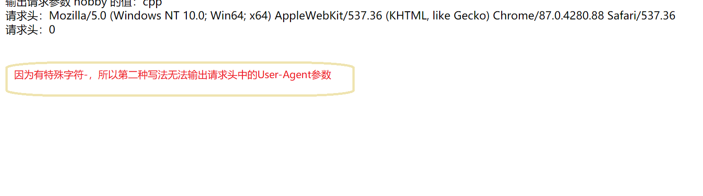
### EL的11个隐含对象
EL 个达式中 11 个隐含对象，是 EL 表达式中自己定义的，可以直接使用。
|变量| 类型| 作用|
|:--|:----|:-----|
|pageContext| PageContextImpl|<b style="color:red;">它可以获取 jsp 中的九大内置对象</b><br/>所以el中并没有jsp中的9个内置对象|
|pageScope |Map<String,Object>| 它可以获取 pageContext 域中的数据| 
|requestScope| Map<String,Object>| 它可以获取 Request 域中的数据| 
|sessionScope |Map<String,Object> |它可以获取 Session 域中的数据 |
|applicationScope |Map<String,Object> |它可以获取 ServletContext 域中的数据|
||||
|param |Map<String,String> |它可以获取请求参数的值 |
|paramValues| Map<String,String[]>| 它也可以获取请求参数的值，获取多个值的时候使用。|
||||
|header |Map<String,String>|HTTP 信息头，字符串。 它可以获取请求头的信息|
| headerValues| Map<String,String[]> |它可以获取请求头的信息，它可以获取多个值的情况|
|cookie| Map<String,Cookie>| 它可以获取当前请求的 Cookie 信息|
|initParam |Map<String,String>| 它可以获取在 web.xml 中配置的<context-param>上下文参数|


#### EL 获取四个特定域中的属性
```
pageScope ====== pageContext 域 
requestScope ====== Request 域 
sessionScope ====== Session 域 
applicationScope ====== ServletContext 域
```
实例：
```java
<%
    // 往 四 个 域 中 都 保 存 了 相 同 的 key的 数 据 。
    request.setAttribute("key2", "request");
    session.setAttribute("key2", "session");
    application.setAttribute("key2", "application");
    pageContext.setAttribute("key2", "pageContext");
%>
${applicationScope.key2}
```

#### pageContext 对象的使用
1. 协议： 
2. 服务器 ip： 
3. 服务器端口： 
4. 获取工程路径： 
5. 获取请求方法： 
6. 获取客户端 ip 地址： 
7. 获取会话的 id 编号

实例：
```java
<body>
<%--
    request.getScheme() 获取请求的协议
    request.getServerName()获取请求的服务器ip或域名
    request.getServerPort()获取请求的服务器端口号
    getContextPath()获取当前工程路径
    request.getMethod() 获取请求的方式（GET或POST）
    request.getRemoteHost()获取客户端的ip地址
    session.getId()获取会话的唯一标识
--%>
<%= request.getScheme()%>   <br/>
1. 协议：${pageContext.request.scheme} <br/>
2. 服务器 ip：${pageContext.request.serverName} <br/>
3. 服务器端口：${pageContext.request.serverPort} <br/>
4. 获取工程路径：${pageContext.request.contextPath} <br/>
5. 获取请求方法：${pageContext.request.method} <br/>
6. 获取客户端 ip 地址：${pageContext.request.remoteHost} <br/>
7. 获取会话的 id 编号: ${pageContext.session.id} <br/>
</body>
```
结果：
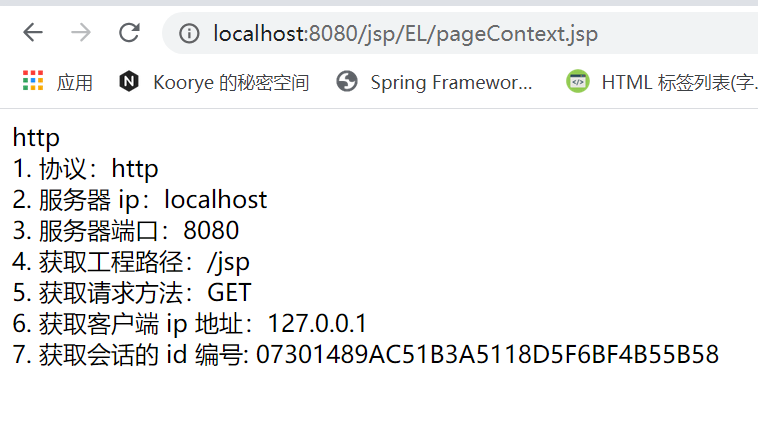
其实从这里也可以看出来，EL中获取属性都是直接`域对象.属性名`

#### 请求参数获取EL
param Map<String,String> 它可以获取请求参数的值 
paramValues Map<String,String[]> 它也可以获取请求参数的值，获取多个值的时候使用。

param和paramValues对象用来访问参数值，通过使用request.getParameter方法和request.getParameterValues方法。

举例来说，访问一个名为order的参数，可以这样使用表达式：`${param.order}`，或者`${param["order"]}`。
实例：
```java
<body>
输出请求参数 username 的值：${ param.username } <br>
输出请求参数 password 的值：${ param.password } <br>
输出请求参数 username 的值：${ paramValues.username[0] } <br>
输出请求参数 hobby 的值：${ paramValues.hobby[0]} <br>
输出请求参数 hobby 的值：${ paramValues.hobby[1] } <br>
</body>
```
结果：
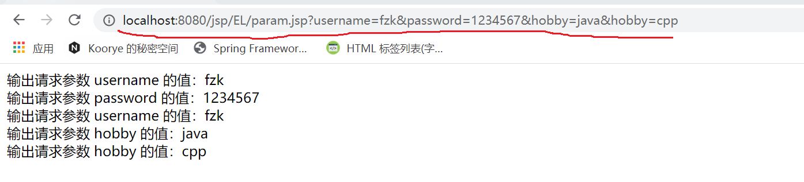
**param对象返回单一的字符串，而paramValues对象则返回一个字符串数组。**

#### header和headerValues对象
header和headerValues对象用来访问信息头，通过使用 request.getHeader方法和request.getHeaders方法。

举例来说，要访问一个名为user-agent的信息头，可以这样使用表达式：`${header.user-agent}`，或者`${header["user-agent"]}`。
**注意**：因为user-agent中含有特殊字符，所以只能是第二种有中括号的写法，第一种agent会被识别为一个变量。

实例：
```java
输出请求头【User-Agent】的值：${header['User-Agent']} <br/>
输出请求头【Connection】的值：${ header.Connection } <br>
输出请求头【User-Agent】的值：${ headerValues['User-Agent'][0] } <br>
```

#### cookie
    cookie  Map<String,Cookie>  它可以获取当前请求的 Cookie 信息

实例：
```java
获取 Cookie 的名称：${ cookie.JSESSIONID.name } <br>
获取 Cookie 的值：${ cookie.JSESSIONID.value } <br>
```

#### initParam
initParam Map<String,String> 它可以获取在 web.xml 中配置的<context-param>上下文参数
web.xml 中的配置：
```xml
<context-param> 
    <param-name>username</param-name> 
    <param-value>root</param-value> 
</context-param>
<context-param> 
    <param-name>url</param-name> 
    <param-value>jdbc:mysql:///test</param-value> 
</context-param>
```
示例代码：
```html
输出&lt;Context-param&gt;username 的值：${ initParam.username } <br/> 
输出&lt;Context-param&gt;url 的值：${ initParam.url } <br/>
```
结果：
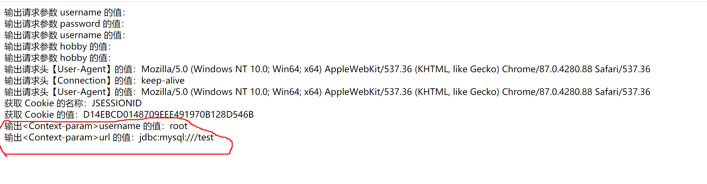

***


## JSTL 标签库
    JSTL 标签库 全称是指 JSP Standard TagLibrary 
    JSP 标准标签库。是一个不断完善的开放源代码的 JSP 标签库。
    EL 表达式主要是为了替换 jsp 中的表达式脚本，而标签库则是为了替换代码脚本。
    这样使得整个 jsp 页面 变得更佳简洁。

根据JSTL标签所提供的功能，可以将其分为5个类别。
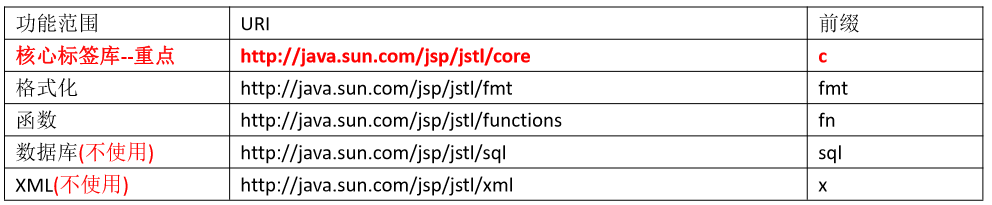


### 使用步骤

JSTL 标签库的使用步骤
1、先导入 jstl 标签库的 jar 包。 

    taglibs-standard-impl-1.2.1.jar 
    taglibs-standard-spec-1.2.1.jar
2、第二步，使用 taglib 指令引入标签库。
`<%@ taglib prefix="c" uri="http://java.sun.com/jsp/jstl/core" %>`

**注意**：在IDEA中使用jstl的时候，IDEA会自动导入。


#### 导入Maven依赖
方式一：
导入下列依赖：
```xml
<!--页面的jstl表达式-->
<dependency>
    <groupId>jstl</groupId>
    <artifactId>jstl</artifactId>
    <version>1.2</version>
</dependency>
```
方式二：
1、在Maven项目的pom.xml的<dependencies></dependencies>标签中加入以下内容：
```xml
<!-- https://mvnrepository.com/artifact/javax.servlet/jstl -->
<dependency>
    <groupId>javax.servlet</groupId>
    <artifactId>jstl</artifactId>
    <version>1.2</version>
</dependency>
<!-- https://mvnrepository.com/artifact/taglibs/standard -->
<dependency>
    <groupId>taglibs</groupId>
    <artifactId>standard</artifactId>
    <version>1.1.2</version>
</dependency>
<!-- https://mvnrepository.com/artifact/org.apache.taglibs/taglibs-standard-impl -->
<dependency>
    <groupId>org.apache.taglibs</groupId>
    <artifactId>taglibs-standard-impl</artifactId>
    <version>1.2.5</version>
</dependency>
```
2、在jsp头部加上jstl的引入标签：
`<%@ taglib prefix="c" uri="http://java.sun.com/jsp/jstl/core" %>`
3、说明：jstl包为必须,standard和taglibs-standard-impl包二选一。
当然两个一起写进去也没问题，jsp默认选择用第一个standard jar包

#### 引入标签库

在 jsp 标签库中使用 taglib 指令引入标签库 
1. CORE 标签库 
`<%@ taglib prefix="c" uri="http://java.sun.com/jsp/jstl/core" %>`
2. XML 标签库
`<%@ taglib prefix="x" uri="http://java.sun.com/jsp/jstl/xml" %> `
3. FMT 标签库 
`<%@ taglib prefix="fmt" uri="http://java.sun.com/jsp/jstl/fmt" %> `
4. SQL 标签库 
`<%@ taglib prefix="sql" uri="http://java.sun.com/jsp/jstl/sql" %> `
5. FUNCTIONS 标签库 
`<%@ taglib prefix="fn" uri="http://java.sun.com/jsp/jstl/functions" %>`

**注意**：在IDEA中，可以不手动导入依赖，IDEA会自动导入，就像导入jdk内的java包一样。

### core 核心库
核心标签
核心标签是最常用的 JSTL标签。
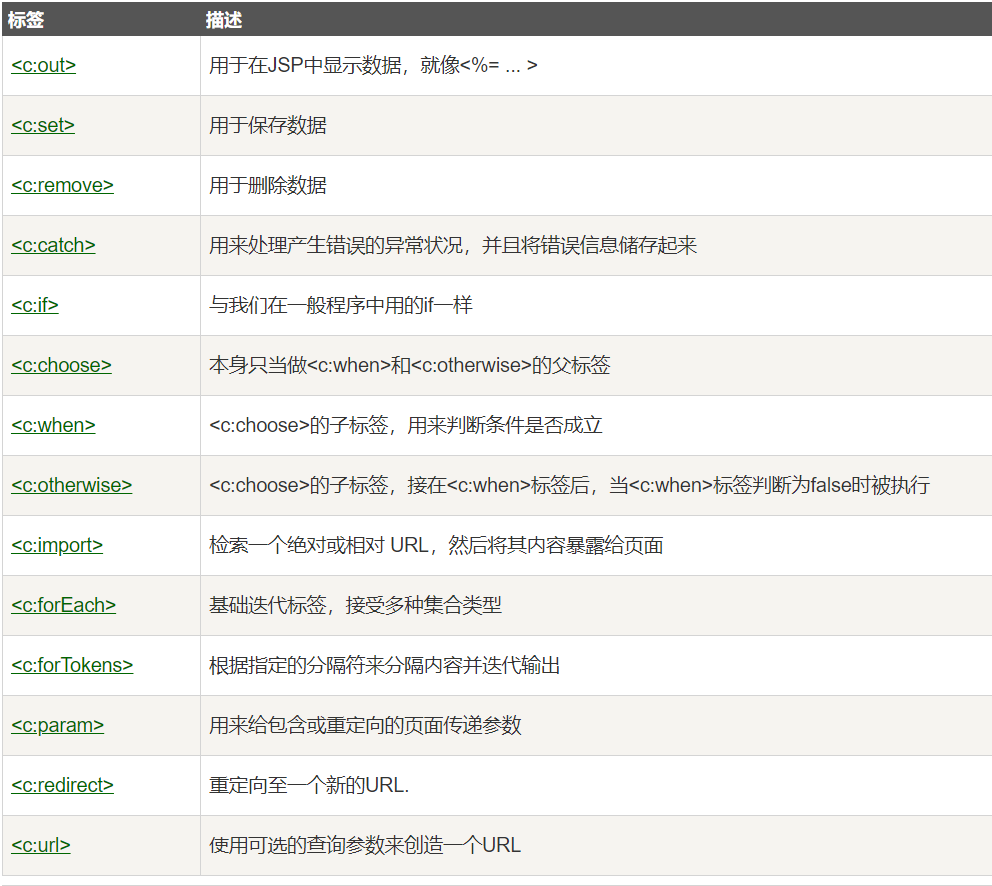
####  <c:set/>（使用很少）
作用：set 标签可以往域中保存数据
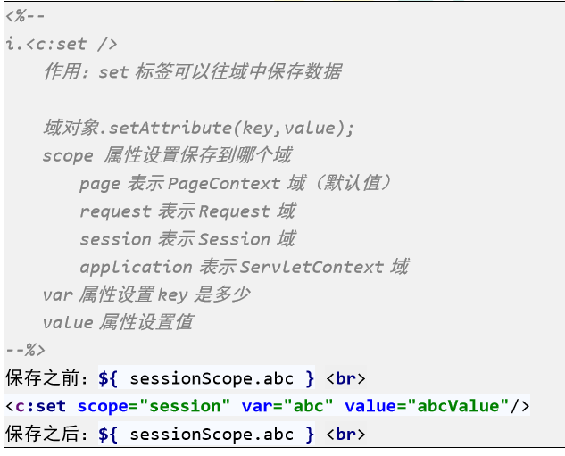

####  <c:if/>
if 标签用来做 if 判断。
<c:if>标签判断表达式的值，如果表达式的值为 true 则执行其主体内容。

语法格式
```java
<c:if test="<boolean>" var="<string>" scope="<string>">
   ...
</c:if>
```

|属性|	描述|	是否必要|	默认值|
|:---|:------|:----------|:---------|
|test	|表示判断的条件（使用EL表达式输出）|是	|无|
|var	|用于存储条件结果的变量	|否|	无|
|scope	|var属性的作用域	|否|	page|

模拟 if-else：
```java
<c:if test="${salary > 2000}" var="flag" scope="session">
   <p>我的工资为: <c:out value="${salary}"/><p>
</c:if>
<c:if test="${not flag}">
   <p>我的工资为: <c:out value="${salary}"/><p>
</c:if>
```

#### <c:choose><c:when><c:otherwise>标签
作用：多路判断。跟 switch...case....default 非常接近

<c:choose>标签与Java switch语句的功能一样，用于在众多选项中做出选择。

switch语句中有case，而<c:choose>标签中对应有<c:when>，switch语句中有default，而<c:choose>标签中有<c:otherwise>。

语法格式
```java
<c:choose>
    <c:when test="<boolean>">
        ...
    </c:when>
    <c:when test="<boolean>">
        ...
    </c:when>
    ...
    ...
    <c:otherwise>
        ...
    </c:otherwise>
</c:choose>
```

<c:choose>标签没有属性。
<c:when>标签只有一个属性test。表示判断的条件（使用EL表达式输出）。
<c:otherwise>标签没有属性。


```java
<%@ page language="java" contentType="text/html; charset=UTF-8"
    pageEncoding="UTF-8" isELIgnored="false" %>
<%@ taglib uri="http://java.sun.com/jsp/jstl/core" prefix="c" %>
<html>
<head>
<title>c:choose 标签实例</title>
</head>
<body>
<c:set var="salary" scope="session" value="${2000*2}"/>
<p>你的工资为 : <c:out value="${salary}"/></p>
<c:choose>
    <c:when test="${salary <= 0}">
       太惨了。
    </c:when>
    <c:when test="${salary > 1000}">
       不错的薪水，还能生活。
    </c:when>
    <c:otherwise>
        什么都没有。
    </c:otherwise>
</c:choose>
</body>
</html>
```

####  <c:forEach/>
作用：遍历输出使用。
相比而言，<c:forEach>标签是更加通用的标签，因为它迭代一个集合中的对象。

forEach 语法格式
```java
<c:forEach
    items="<object>"
    begin="<int>"
    end="<int>"
    step="<int>"
    var="<string>"
    varStatus="<string>">

    ...
```
##### 属性
<c:forEach>标签有如下属性：

|属性|	描述|	是否必要|	默认值|
|---|------|----------|---------|
|items|	要被循环的信息	|否|	无|
|begin	|开始的元素(0=第一个元素,1=第二个元素)|否	|0|
|end|	最后一个元素(0=第一个元素,1=第二个元素)|	否|	Last element|
|step	|每一次迭代的步长|	否|	1|
|var	|代表当前条目的变量名称	|否|	无|
|varStatus	|表示当前遍历到的数据状态	|否	|无|

1. 遍历：
```html
<table border="1px">
    <c:forEach begin="1" end="10" var="i">
        <tr>
            <td>第${i}行</td>
        </tr>
    </c:forEach>
</table>
```
2. 遍历 Object 数组
```html
<%--Object数组遍历--%>
<%
    request.setAttribute("arr", new String[]{"18610541354","18688886666","18699998888"});
%>
<c:forEach items="${requestScope.arr}" var="i" >
    ${i} <br/>
</c:forEach>
```

3. 遍历 Map 集合
```html
<%--遍历map集合--%>
<%
    Map<String, Object> map = new HashMap<String, Object>();
    map.put("key1", "value1");
    map.put("key2", "value2");
    map.put("key3", "value3");
    // for ( Map.Entry<String,Object> entry : map.entrySet()) {

    // }
    request.setAttribute("map", map);
%>
<c:forEach items="${requestScope.map}" var="entry">
    ${entry.key}=${entry.value}
</c:forEach>
```
4. 遍历list集合
```java
<%--遍历List集合，存放Student类--%>
<%
    List<Student> students = new ArrayList<>();
    for(int i=1;i<10;i++){
        students.add(new Student(i,"fzk",19+i,"1508268745"+i));
    }
    request.setAttribute("list",students);
%>
<table border="1px" align="center">
    <tr>
        <th>编号</th>
        <th>姓名</th>
        <th>年龄</th>
        <th>电话</th>
        <th>操作</th>
    </tr>
    <c:forEach items="${requestScope.list}" var="student">
        <tr>
            <td>${student.id}</td>
            <td>${student.name}</td>
            <td>${student.age}</td>
            <td>${student.phone}</td>
            <td>删除、修改</td>
        </tr>
    </c:forEach>
</table>
```

5. 结果


##### varStatus的说明
    表示当前遍历到的数据状态
```
c:forEach varStatus 属性

    current: 当前这次迭代的（集合中的）项
    index: 当前这次迭代从 0 开始的迭代索引
    count: 当前这次迭代从 1 开始的迭代计数
    first: 用来表明当前这轮迭代是否为第一次迭代的标志
    last: 用来表明当前这轮迭代是否为最后一次迭代的标志
    begin: 属性值
    end: 属性值
    step: 属性值
```
例如：
```html
<c:forEach  items="${sessionScope.userList}"  
var="userItem"  begin="1"  end="10"  step="3"  
varStatus="userStatus"> XXX </c:foreach>
```
**实例解读**： 对 session 对象存储的 userList 集合对象进行遍历，每次访问的项暂时存储在 userItem 变量中，从索引 1 开始至索引 10 进行访问，但不是依次访问，每隔 3 个元素访问一次。每次访问项的状态相关值由 userStatus 对象暂存。

`<c:foreach>` 的 varStatus 属性暂存项的相关状态属性，可由 EL 表达式引用。
```java
${userStatus.index} 此项的索引，从0开始 
${userStatus.count} 此项的计数序号，从1开始 
${userStatus.first} 此项是否是第一项，布尔值 
${userStatus.last} 此项是否是最后一项，布尔值 
${userStatus.begin} 此次迭代的起始索引，对应<c:foreach>中begin属性值 
${userStatus.end} 此次迭代的终止索引，对应<c:foreach>中end属性值 
${userStatus.step} 此次迭代的跳跃步伐，对应<c:foreach>中step属性值  
```

**底层源码**：
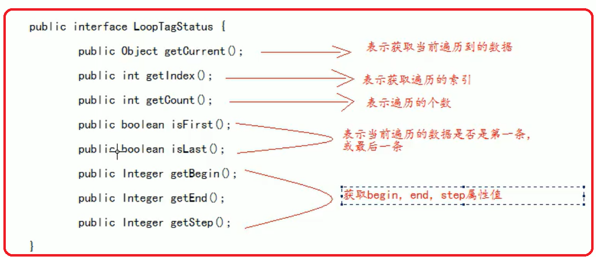