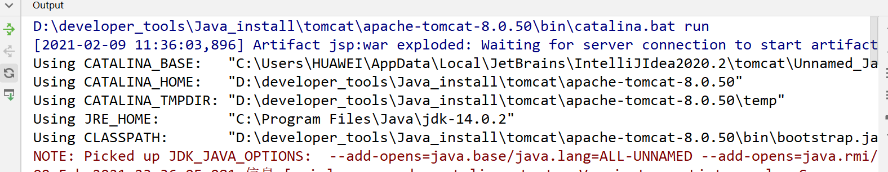
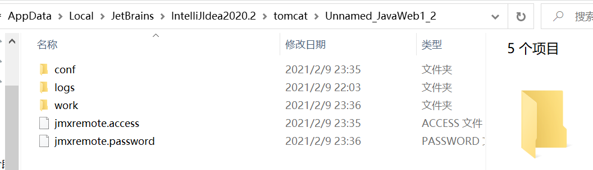
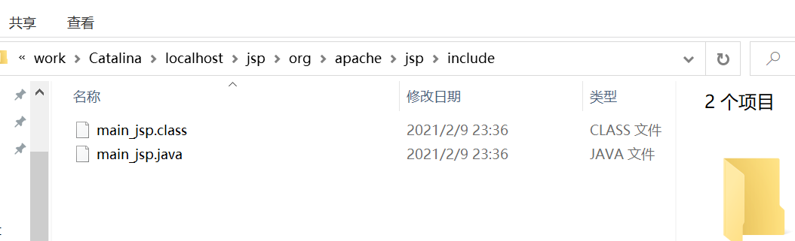
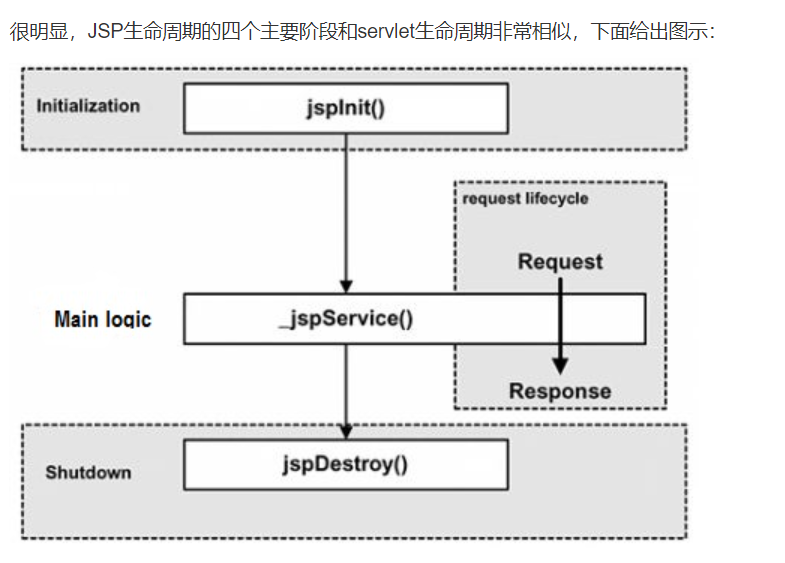
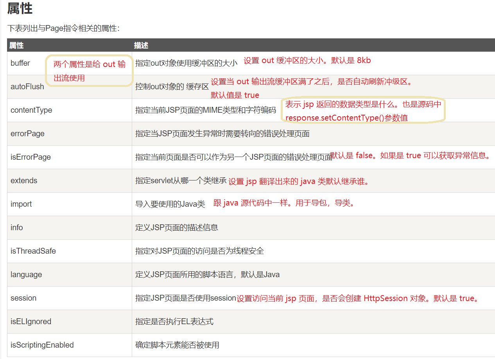
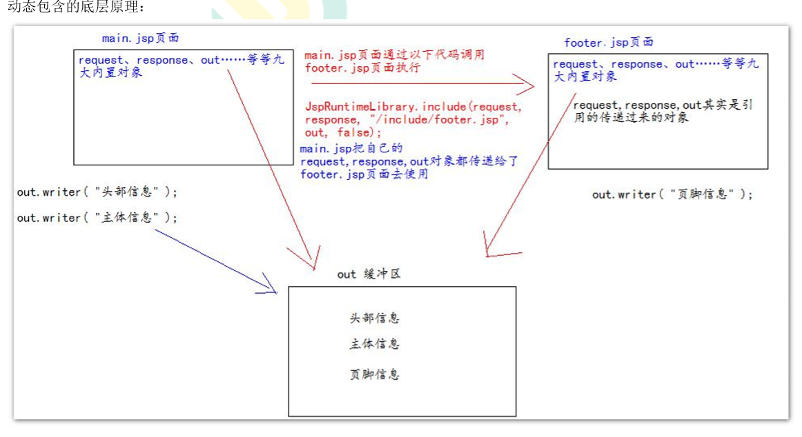
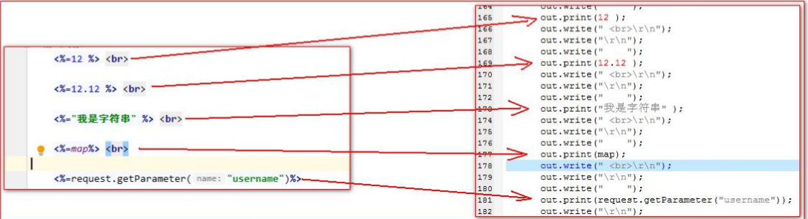
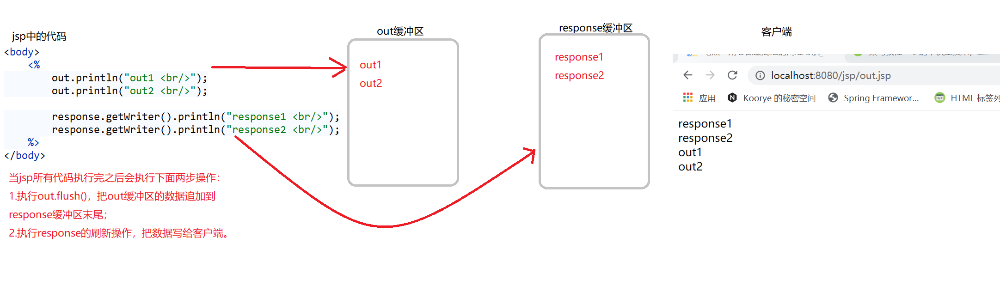
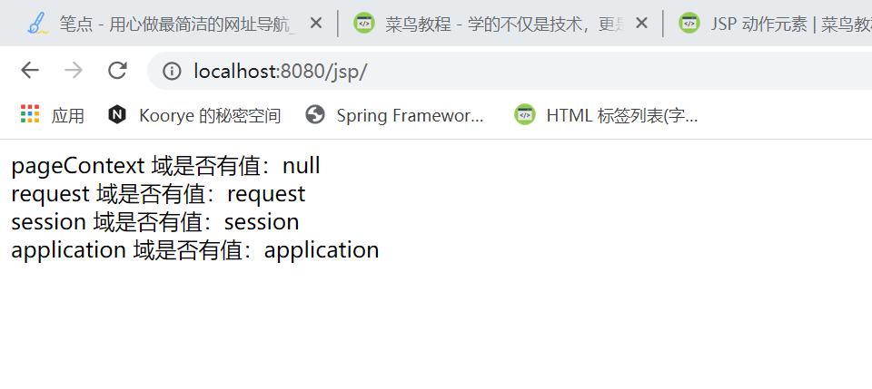

# jsp
## jsp 导入依赖(第一步)
```xml
<dependency>
    <groupId>javax.servlet.jsp</groupId>
    <artifactId>jsp-api</artifactId>
    <version>2.1.3-b06</version>
    <scope>provided</scope>
</dependency>
```

## jsp 简介
### 什么是Java Server Pages?
JSP全称Java Server Pages，是一种动态网页开发技术。它使用JSP标签在HTML网页中插入Java代码。标签通常以<%开头，以%>结束。

JSP是一种Java servlet，主要用于实现Java web应用程序的用户界面部分。网页开发者们通过结合HTML代码、XHTML代码、XML元素以及嵌入JSP操作和命令来编写JSP。

JSP通过网页表单获取用户输入数据、访问数据库及其他数据源，然后动态地创建网页。

JSP标签有多种功能，比如访问数据库、记录用户选择信息、访问JavaBeans组件等，还可以在不同的网页中传递控制信息和共享信息。

### 为什么使用JSP？
JSP程序与CGI程序有着相似的功能，但和CGI程序相比，JSP程序有如下优势：

- 性能更加优越，因为JSP可以直接在HTML网页中动态嵌入元素而不需要单独引用CGI文件。
- 服务器调用的是已经编译好的JSP文件，而不像CGI/Perl那样必须先载入解释器和目标脚本。
- JSP 基于Java Servlet API，因此，JSP拥有各种强大的企业级Java API，包括JDBC，JNDI，EJB，JAXP等等。
- JSP页面可以与处理业务逻辑的 Servlet 一起使用，这种模式被Java servlet 模板引擎所支持。

最后，JSP是Java EE不可或缺的一部分，是一个完整的企业级应用平台。这意味着JSP可以用最简单的方式来实现最复杂的应用。

### JSP的优势
以下列出了使用JSP带来的其他好处：

- 与ASP相比：JSP有两大优势。首先，动态部分用Java编写，而不是VB或其他MS专用语言，所以更加强大与易用。第二点就是JSP易于移植到非MS平台上。
- 与纯 Servlet 相比：JSP可以很方便的编写或者修改HTML网页而不用去面对大量的println语句。
- 与SSI相比：SSI无法使用表单数据、无法进行数据库链接。
- 与JavaScript相比：虽然JavaScript可以在客户端动态生成HTML，但是很难与服务器交互，因此不能提供复杂的服务，比如访问数据库和图像处理等等。
- 与静态HTML相比：静态HTML不包含动态信息。

### jsp 的本质是什么
菜鸟教程：https://www.runoob.com/jsp/jsp-architecture.html
这里也可以去看pdf讲义

jsp 页面本质上是一个 Servlet 程序。
当我们第一次访问 jsp 页面的时候。Tomcat 服务器会帮我们把 jsp 页面翻译成为一个 java 源文件。并且对它进行编译成为.class 字节码程序。

我们跟踪原代码发现，HttpJspBase 类。它直接地继承了 HttpServlet 类。也就是说。jsp 翻译出来的 java 类，它间接了继 承了 HttpServlet 类。也就是说，翻译出来的是一个 Servlet 程序

总结：通过翻译的 java 源代码我们就可以得到结果：jsp 就是 Servlet 程序。
也可以去观察翻译出来的 Servlet 程序的源代码，不难发现。其底层实现，也是通过输出流。把 html 页面数据回传 给客户端。

### jsp 的编译源文件位置
当我们第一次访问 jsp 页面的时候。Tomcat 服务器会帮我们把 jsp 页面翻译成为一个 java 源文件。并且对它进行编译成为.class 字节码程序。
位置示例
web项目jsp文件被tomcat转换成java以后的java源文件的位置
`C:\Users\HUAWEI\AppData\Local\JetBrains\IntelliJIdea2020.2\tomcat\Unnamed_JavaWeb1_2`
`C:\Users\HUAWEI\AppData\Local\JetBrains\IntelliJIdea2020.2\tomcat\Unnamed_JavaWeb1_2\work\Catalina\localhost\jsp\org\apache\jsp\include`


在work文件夹深层


### JSP 生命周期
理解JSP底层功能的关键就是去理解它们所遵守的生命周期。

JSP生命周期就是从创建到销毁的整个过程，类似于servlet生命周期，区别在于JSP生命周期还包括将JSP文件编译成servlet。

- 编译阶段：
    - servlet容器编译servlet源文件，生成servlet类

- 初始化阶段：
    - 加载与JSP对应的servlet类，创建其实例，并调用它的初始化方法

- 执行阶段：
    - 调用与JSP对应的servlet实例的服务方法

- 销毁阶段：
    - 调用与JSP对应的servlet实例的销毁方法，然后销毁servlet实例



#### 1. JSP编译
当浏览器请求JSP页面时，JSP引擎会首先去检查是否需要编译这个文件。如果这个文件没有被编译过，或者在上次编译后被更改过，则编译这个JSP文件。

编译的过程包括三个步骤：

1. 解析JSP文件。
2. 将JSP文件转为servlet。
3. 编译servlet。

#### 2. JSP初始化
容器载入JSP文件后，它会在为请求提供任何服务前调用jspInit()方法。如果您需要执行自定义的JSP初始化任务，复写jspInit()方法就行了，就像下面这样：
```java
public void jspInit(){
  // 初始化代码
}
```
一般来讲程序只初始化一次，servlet也是如此。通常情况下您可以在jspInit()方法中初始化数据库连接、打开文件和创建查询表。

#### 3. JSP执行
这一阶段描述了JSP生命周期中一切与请求相关的交互行为，直到被销毁。

当JSP网页完成初始化后，JSP引擎将会调用_jspService()方法。

_jspService()方法需要一个HttpServletRequest对象和一个HttpServletResponse对象作为它的参数，就像下面这样：
```java
void _jspService(HttpServletRequest request,
                 HttpServletResponse response)
{
   // 服务端处理代码
}
```
_jspService()方法在每个request中被调用一次并且负责产生与之相对应的response，并且它还负责产生所有7个HTTP方法的回应，比如GET、POST、DELETE等等。

#### 4. JSP清理
JSP生命周期的销毁阶段描述了当一个JSP网页从容器中被移除时所发生的一切。

jspDestroy()方法在JSP中等价于servlet中的销毁方法。当您需要执行任何清理工作时复写jspDestroy()方法，比如释放数据库连接或者关闭文件夹等等。

jspDestroy()方法的格式如下：
```java
public void jspDestroy()
{
   // 清理代码
}
```

实例
JSP生命周期代码实例如下所示：
```java
<%@ page language="java" contentType="text/html; charset=UTF-8"
    pageEncoding="UTF-8"%>
<html>
<head>
<title>life.jsp</title>
</head>
<body>

<%! 
  private int initVar=0;
  private int serviceVar=0;
  private int destroyVar=0;
%>
  
<%!
  public void jspInit(){
    initVar++;
    System.out.println("jspInit(): JSP被初始化了"+initVar+"次");
  }
  public void jspDestroy(){
    destroyVar++;
    System.out.println("jspDestroy(): JSP被销毁了"+destroyVar+"次");
  }
%>

<%
  serviceVar++;
  System.out.println("_jspService(): JSP共响应了"+serviceVar+"次请求");

  String content1="初始化次数 : "+initVar;
  String content2="响应客户请求次数 : "+serviceVar;
  String content3="销毁次数 : "+destroyVar;
%>
<h1>菜鸟教程 JSP 测试实例</h1>
<p><%=content1 %></p>
<p><%=content2 %></p>
<p><%=content3 %></p>

</body>
</html>
```


## jsp 语法

### JSP指令
JSP指令用来设置与整个JSP页面相关的属性。

JSP指令语法格式：
```java
<%@ directive attribute="value" %>
```

这里有三种指令标签：

|指令|	描述|
|:---|:----|
|`<%@ page ... %>`|	定义页面的依赖属性，比如脚本语言、error页面、缓存需求等等|
|`<%@ include ... %>`|	包含其他文件|
|`<%@ taglib ... %>`|	引入标签库的定义，可以是自定义标签|


#### Page指令
Page指令为容器提供当前页面的使用说明。
一个JSP页面可以包含多个page指令。
Page指令的语法格式：
```java
<%@ page attribute="value" %>
```
等价的XML格式：
```xml
<jsp:directive.page attribute="value" />
```


`pageEncoding` 属性 表示当前 jsp 页面文件本身的字符集。 
```java
<!-errorPage
表 示 错 误 后 自 动 跳 转 去 的 路 径
<br/> 这 个 路 径 一 般 都 是 以 斜 杠 打 头 ， 它 表 示 请 求 地 址 为 http://ip:port/ 工 程 路 径 /
映 射 到 代 码 的 Web
目 录
-->
```

#### Include指令
JSP可以通过include指令来包含其他文件。被包含的文件可以是JSP文件、HTML文件或文本文件。包含的文件就好像是该JSP文件的一部分，会被同时编译执行。

Include指令的语法格式如下：
```java
<%@ include file="文件相对 url 地址" %>
```
include 指令中的文件名实际上是一个相对的 URL 地址。

如果您没有给文件关联一个路径，JSP编译器默认在当前路径下寻找。

等价的XML语法：
```xml
<jsp:directive.include file="文件相对 url 地址" />
```

##### jsp 静态包含
```java
<%-
    <%@ include file=""%>就是静态包含
    file属性指定你要包含的jsp页面的路径地址中
    第一个斜杠/表示为http://ip:port/工程路径/映射到代码的web目录

静态包含的特点：
1 、静态包含不会翻译被包含的jsp页面。
2 、静态包含其实是把被包含的jsp页面的代码拷贝到包含的位置执行输出。
--%>
```
main.jsp代码：
```java
<body>
    头部信息 <br/>
    主题信息 <br/>
    <%--页脚信息 <br/>--%>
    <%@ include file="/include/footer.jsp"%>
</body>
```
footer.jsp代码：
```java
<body>
页脚信息 <br/>
模拟需求改动。。。<br/>
</body>
```
main.jsp编译后的main_jsp.java文件部分代码如下：
此时只能找到这一个java文件，footer_jsp.java是没有的。
<div style="border:1px solid gray">

</div>

##### jsp 动态包含
```java
< jsp:includepage=""></jsp:include>这是动态包含
page属性是指定你要包含的jsp页面的路径动态包含也可以像静态包含一样 。
把被包含的内容执行输出到包含位置

动态包含的特点 ：
1 、 动态包含会把包含的jsp页面也翻译成为java代码
2 、 动态包含底层代码使用如下代码去调用被包含的jsp页面执行输出 。
    JspRuntimeLibrary.include(request,response,"/include/footer.jsp",out,false);
3 、 动态包含，还可以传递参数
```



此时的main.jsp代码：
```java
<body>
头部信息 <br/>
主题信息 <br/>
<%--页脚信息 <br/>--%>
<%--<%@ include file="/include/footer.jsp" %>--%>
<jsp:include page="/include/footer.jsp">
    <jsp:param name="username" value="bbj"/>
    <jsp:param name="password" value="root"/>
</jsp:include>
</body>
```

#### Taglib指令
JSP API允许用户自定义标签，一个自定义标签库就是自定义标签的集合。

Taglib指令引入一个自定义标签集合的定义，包括库路径、自定义标签。

Taglib指令的语法：
`<%@ taglib uri="uri" prefix="prefixOfTag" %>`
uri属性确定标签库的位置，prefix属性指定标签库的前缀。

等价的XML语法：
`<jsp:directive.taglib uri="uri" prefix="prefixOfTag" />`


### JSP 动作元素
与JSP指令元素不同的是，JSP动作元素在请求处理阶段起作用。JSP动作元素是用XML语法写成的。

利用JSP动作可以动态地插入文件、重用JavaBean组件、把用户重定向到另外的页面、为Java插件生成HTML代码。

动作元素只有一种语法，它符合XML标准：
```xml
<jsp:action_name attribute="value" />
```
动作元素基本上都是预定义的函数，JSP规范定义了一系列的标准动作，它用JSP作为前缀，可用的标准动作元素如下：
|语法|	描述|
|:---|:-----|
|jsp:include|	在页面被请求的时候引入一个文件。|
|jsp:useBean	|寻找或者实例化一个JavaBean。|
|jsp:setProperty|	设置JavaBean的属性。|
|jsp:getProperty	|输出某个JavaBean的属性。|
|jsp:forward	|把请求转到一个新的页面。|
|jsp:plugin|	根据浏览器类型为Java插件生成OBJECT或EMBED标记。|
|jsp:element|	定义动态XML元素|
|jsp:attribute	|设置动态定义的XML元素属性。|
|jsp:body|	设置动态定义的XML元素内容。|
|jsp:text|	在JSP页面和文档中使用写入文本的模板|
更多细节：https://www.runoob.com/jsp/jsp-actions.html


#### jsp 标签-转发

<b>`<jsp:forward> `动作元素</b>
　jsp:forward动作把请求转到另外的页面。jsp:forward标记只有一个属性page。语法格式如下所示：
`<jsp:forward page="相对 URL 地址" />`

以下是forward相关联的属性：
|属性	|描述|
|:------|:---|
|page|	page属性包含的是一个相对URL。page的值既可以直接给出，也可以在请求的时候动态计算，可以是一个JSP页面或者一个 Java Servlet.|


### 中文编码问题
如果我们要在页面正常显示中文，我们需要在 JSP 文件头部添加以下代码：
```java
<%@ page language="java" contentType="text/html; charset=UTF-8" 
    pageEncoding="UTF-8"%>
```

### 脚本程序
脚本程序可以包含任意量的Java语句、变量、方法或表达式，只要它们在脚本语言中是有效的。

脚本程序的语法格式：
```java
<% 代码片段 %>
```
或者，您也可以编写与其等价的XML语句，就像下面这样：
```xml
<jsp:scriptlet>
   代码片段
</jsp:scriptlet>
```
#### 声明脚本(极少使用)
声明脚本的格式是：` <%! 声明 java 代码 %> `
或者，您也可以编写与其等价的XML语句，就像下面这样：
```xml
<jsp:declaration>
   代码片段
</jsp:declaration>
```
作用：可以给 jsp 翻译出来的 java 类定义属性和方法甚至是静态代码块。内部类等。
```java
<%--1 、 声 明 类 属 性 --%> 
<%! 
private Integer id; 
private String name; 
private static Map<String,Object> map; 
%> 

<%--2 、 声 明 static 静 态 代 码 块 --%> 
<%! 
static { 
    map = new HashMap<String,Object>(); 
    map.put("key1", "value1"); 
    map.put("key2", "value2"); 
    map.put("key3", "value3"); 
    } 
%> 

<%--3 、 声 明 类 方 法 --%> 
<%! public int abc(){ return 12; } %>

<%--4 、 声 明 内 部 类 --%> 
<%! 
public static class A { 
    private Integer id = 12; 
    private String abc = "abc"; 
    } 
%>
```

#### 表达式脚本（常用）
表达式脚本的格式是：`<%=表达式%> `
同样，您也可以编写与之等价的XML语句：
```xml
<jsp:expression>
   表达式
</jsp:expression>
```
表达式脚本的作用是：
```
一个JSP表达式中包含的脚本语言表达式，先被转化成String，然后插入到表达式出现的地方。

由于表达式的值会被转化成String，所以您可以在一个文本行中使用表达式而不用去管它是否是HTML标签。

表达式元素中可以包含任何符合Java语言规范的表达式，但是不能使用分号来结束表达式。
```

<b>表达式脚本的特点</b>： 
>1、所有的表达式脚本都会被翻译到_jspService() 方法中 
2、表达式脚本都会被翻译成为 out.print()输出到页面上 
3、由于表达式脚本翻译的内容都在_jspService() 方法中,所以_jspService()方法中的对象都可以直接使用。 
4、表达式脚本中的表达式不能以分号结束。

实例：
```java
<%=12 %> <br> 
<%=12.12 %> <br> 
<%="我是字符串" %> <br> 
<%=map%> <br> 
<%=request.getParameter("username")%>
```



实例2：
```html
<p>
   今天的日期是: <%= (new java.util.Date()).toLocaleString()%>
</p>
```
运行后得到以下结果：
`今天的日期是: 2021年2月9日 下午10:05:47`


#### 代码脚本
代码脚本的格式是： `<% java 语句 %> `
代码脚本的作用是：可以在 jsp 页面中，编写我们自己需要的功能（写的是 **java 语句**）。

<b>代码脚本的特点是</b>： 
>1、代码脚本翻译之后都在_jspService 方法中 
2、代码脚本由于翻译到_jspService()方法中，所以在_jspService()方法中的现有对象都可以直接使用。 
3、还可以由多个代码脚本块组合完成一个完整的 java 语句。 
4、代码脚本还可以和表达式脚本一起组合使用，在 jsp 页面上输出数据

>注意：更多细节可以看pdf讲义

for循环示例：
```html
<%@ page language="java" contentType="text/html; charset=UTF-8"
    pageEncoding="UTF-8"%>
<%! int fontSize; %> 
<!DOCTYPE html>
<html>
<head>
<meta charset="utf-8">
<title>菜鸟教程(runoob.com)</title>
</head>
<body>
<h3>For 循环实例</h3>
<%for ( fontSize = 1; fontSize <= 3; fontSize++){ %>
   <font color="green" size="<%= fontSize %>">
    菜鸟教程
   </font><br />
<%}%>
</body> 
</html> 
```

### jsp 中的三种注释
1. html 注释
`<!-这 是 html注 释-->`
html 注释会被翻译到 java 源代码中。在_jspService 方法里，以 out.writer 输出到客户端。

2. java注释
    ```java
    <%
    //单行java注释
    /*
    多 行 java 注 释
    */
    %>
    ```
    java 注释会被翻译到 java 源代码中。
3. jsp 注释
    ```java
    <%-这 是 jsp注 释--%>
    ```
    jsp 注释可以注掉，jsp 页面中所有代码。

4. 不同情况下使用注释的语法规则：

|语法|	描述|
|:---|:-----|
|`<%-- 注释 --%>`|JSP注释，注释内容不会被发送至浏览器甚至不会被编译|
|`<!-- 注释 -->`|	HTML注释，通过浏览器查看网页源代码时可以看见注释内容|
|`<\%`|	代表静态 <%常量|
|`%\>`|	代表静态 %> 常量|
|`\'`|	在属性中使用的单引号|
|`\"`|	在属性中使用的双引号|


### jsp 九大内置对象
jsp 中的内置对象，是指 Tomcat 在翻译 jsp 页面成为 Servlet 源代码后，内部提供的九大对象，叫内置对象。
<b>JSP隐含对象</b>
JSP隐式对象是JSP容器为每个页面提供的Java对象，开发者可以直接使用它们而不用显式声明。JSP隐式对象也被称为预定义变量。
这九个隐含对象的简介见下表：

|对象|	描述|
|:---|:----|
|request|	HttpServletRequest类的实例|
|response|	HttpServletResponse类的实例|
|out|	PrintWriter类的实例，用于把结果输出至网页上|
|session|	HttpSession类的实例|
|application|	ServletContext类的实例，与应用上下文有关|
|config	|ServletConfig类的实例|
|pageContext|	PageContext类的实例，提供对JSP页面所有对象以及命名空间的访问|
|page|	类似于Java类中的this关键字|
|exception	|exception 类的对象，代表发生错误的 JSP 页面中对应的异常对象|


#### jsp 中的 out 输出和 response.getWriter 输出的区别
response 中表示响应，我们经常用于设置返回给客户端的内容（输出） 
out 也是给用户做输出使用的。



由于 jsp 翻译之后，底层源代码都是使用 out 来进行输出，所以一般情况下。我们在 jsp 页面中统一使用 out 来进行输出。避 免打乱页面输出内容的顺序。

    out.write() 输出字符串没有问题 
    out.print() 输出任意数据都没有问题（都转换成为字符串后调用的 write 输出）

<p style="color:red;">深入源码，浅出结论：在 jsp 页面中，可以统一使用 out.print()来进行输出 </p>


更多细节：https://www.runoob.com/jsp/jsp-implicit-objects.html

### jsp 四大域对象

四个域对象分别是：
```java
pageContext (PageContextImpl 类) 
    当前 jsp 页面范围内有效 ，页面跳转就没了
request (HttpServletRequest 类)、 
    一次请求内有效 ，重新请求就是一个新的request域
session (HttpSession 类)、 
    一个会话范围内有效（打开浏览器访问服务器，直到关闭浏览器） ，
    浏览器关闭后，再次访问就是一个新的session域
application (ServletContext 类) 
    整个 web 工程范围内都有效（只要 web 工程不停止，数据都在）
    web工程重新部署，域对象刷新
```
域对象是可以像 Map 一样存取数据的对象。四个域对象功能一样。不同的是它们对数据的存取范围。

虽然四个域对象都可以存取数据。在使用上它们是有优先顺序的。

四个域在使用的时候，优先顺序分别是，他们从小到大的范围的顺序。**可以减小服务器内存压力。**
```
pageContext ====>>> request ====>>> session ====>>> application
```

#### 实例
index.jsp
```java
<body>
hello jsp<br/>
<% out.println("你是一个憨憨！");%>
<p>
    今天的日期是: <%= (new java.util.Date()).toLocaleString()%>
</p>
<%
    //往4个域分别保存对象
    pageContext.setAttribute("key", "pageContext");
    request.setAttribute("key", "request");
    session.setAttribute("key", "session");
    application.setAttribute("key", "application");
%>
pageContext 域是否有值：<%=pageContext.getAttribute("key")%> <br>
request 域是否有值：<%=request.getAttribute("key")%> <br>
session 域是否有值：<%=session.getAttribute("key")%> <br>
application 域是否有值：<%=application.getAttribute("key")%> <br>

<%//请求转发
    request.getRequestDispatcher("/scope.jsp").forward(request,response);
%>
</body>
```
scope.jsp
```java
<body>
pageContext 域是否有值：<%=pageContext.getAttribute("key")%> <br>
request 域是否有值：<%=request.getAttribute("key")%> <br>
session 域是否有值：<%=session.getAttribute("key")%> <br>
application 域是否有值：<%=application.getAttribute("key")%> <br>

</body>
```
结果：

其他的如重新开个页面进行访问前两个为null
关闭浏览器重新访问之类的就是前三个都为null
web工程重新部署就是全null


## 练习
练习一：在 jsp 页面中输出九九乘法口诀表
练习二：jsp 输出一个表格，里面有 10 个学生信息。


### 练习1
```html
<%--
  Created by IntelliJ IDEA.
  User: HUAWEI
  Date: 2021/2/11
  Time: 11:24
  To change this template use File | Settings | File Templates.
--%>
<%@ page contentType="text/html;charset=UTF-8" language="java" %>
<html>
<head>
    <title>test1</title>
    <style type="text/css">
        table{
            color:red;
            width: 90px;
            height: 90px;
        }
    </style>
</head>
<body>
<%--练习一：在 jsp 页面中输出九九乘法口诀表--%>
<h1 align="center">九九乘法表</h1>
<table align="center">
    <%--外层遍历--%>
    <%for (int i = 1; i < 10; i++) {%>
        <tr>
            <%--内层遍历--%>
            <%for (int j = 1; j <= i; j++){%>
                <td><%=j+"*"+i+"="+(i*j)%></td>
            <%}%>
        </tr>
        <%}%>
</table>
</body>
</html>
```
### 练习2
1. Student 类：
```java
public class Student {
    private Integer id; 
    private String name; 
    private Integer age; 
    private String phone;
    ......
}
```
2. SearchStudentServlet 程序：
```java
/**
 * @author fzkstart
 * @create 2021-02-11 11:45
 */
public class SearchStudentServlet extends HttpServlet {
    @Override
    protected void doGet(HttpServletRequest req, HttpServletResponse resp) throws ServletException, IOException {
        //获 取 请 求 的 参 数
        //发 sql语 句 查 询 学 生 的 信 息
        //使 用 for循 环 生 成 查 询 到 的 数 据 做 模 拟
        List<Student> students = new ArrayList<Student>();
        for (int i = 0; i < 10; i++) {
            students.add(new Student(i + 1, "name" + (i + 1),
                    18 + i, "phone" + (i + 1)));
        }
        //保 存 查 询 到 的 结 果 （ 学 生 信 息 ） 到 request域 中
        req.setAttribute("students",students);
        //请 求 转 发 到 showStudent.jsp页 面
        req.getRequestDispatcher("/test/showStudent.jsp").forward(req,resp);
    }
}
```
3. 写完servlet程序需要去web.xml里去配置servlet
4. showStudent.jsp 页面
这里的jsp页面需要用到page指令进行导包
```java
<%--
  Created by IntelliJ IDEA.
  User: HUAWEI
  Date: 2021/2/11
  Time: 11:42
  To change this template use File | Settings | File Templates.
--%>
<%@ page contentType="text/html;charset=UTF-8" language="java" %>
<%@ page import="com.fzk.domain.Student" %>
<%@ page import="java.util.List" %>
<%@ page import="java.util.ArrayList" %>
<html>
<head>
    <title>test2</title>
    <style type="text/css">
        table {
            border: 1px red solid;
            width: 600px;
            border-collapse: collapse;
        }

        th, td {
            border: 1px gray solid;
        }
    </style>
</head>
<body>
<%--练习二：jsp 输出一个表格，里面有 10 个学生信息。--%>
<%
    List<Student> students = (List<Student>) request.getAttribute("students");
%>
<table align="center">
    <tr>
        <th>编号</th>
        <th>姓名</th>
        <th>年龄</th>
        <th>电话</th>
        <th>操作</th>
    </tr>
    <% for (Student student : students) {%>
    <tr>
        <td><%=student.getId() %></td>
        <td><%=student.getName() %></td>
        <td><%=student.getAge() %></td>
        <td><%=student.getPhone() %></td>
        <td>删除/修改</td>
    </tr>
    <%}%>
</table>
</body>
</html>
```
