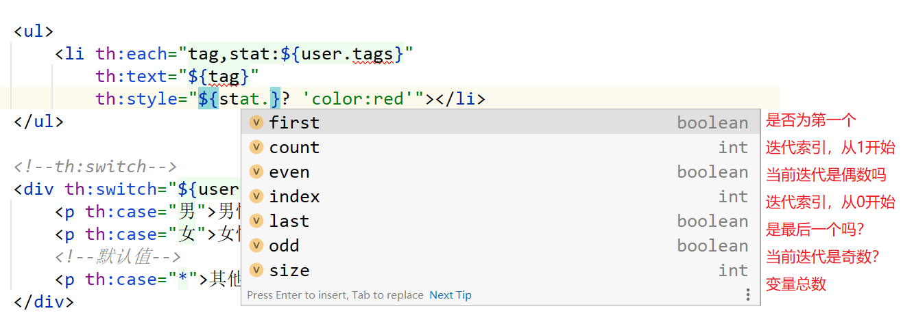

# 资料

> 官网：https://www.thymeleaf.org/
>
> 官方使用教程：https://www.thymeleaf.org/doc/tutorials/3.0/usingthymeleaf.html
>
> Thymeleaf和spring结合：https://www.thymeleaf.org/doc/tutorials/3.0/thymeleafspring.html

# Thymeleaf


## 模板+防止飘红

```html
<!DOCTYPE html>
<html lang="en" xmlns:th="http://www.thymeleaf.org">

<head>
    <title th:text="${title}">Good Thymes Virtual Grocery</title>
    <meta charset="UTF-8" />
</head>

<body>
<!--/*@thymesVar id="user" type="com.fzk.boot.bean.User"*/-->
    <h3 th:text="${user.getName()}"></h3>
</body>
</html>   

```

使用Themeleaf模板需要加入`xmlns:th="http://www.thymeleaf.org"`;

而使用java entity则需要指定这个entity位置：`<!--/*@thymesVar id="user" type="com.fzk.boot.bean.User"*/-->`

即使不指定这个位置，也不会出错，只是IDEA会飘红。

## 常用语法

```html
简单表达式：
    变量表达式： ${...}；获取请求域、session域、对象的值
    选择变量表达式： *{...}，获取上下文对象的值
    消息表达： #{...}
    链接URL表达式： @{...}
    片段表达式： ~{...}；引入公共的页面部分
文字
    文字文字： 'one text', 'Another one!',…
    数字文字： 0, 34, 3.0, 12.3,…
    布尔文字： true, false
    空文字： null
    文字令牌： one, sometext, main,…
文字操作：
    字符串串联： +	th:text="'名字是'+${user.name}"
    文字替换： th:text="|名字是：${user.name}|"  注意：会飘红，但是结果没问题
算术运算：
    二进制运算符： +, -, *, /, %
    减号（一元运算符）： -
布尔运算：
    二进制运算符： and, or
    布尔取反（一元运算符）： !, not
比较和平等：
    比较器： >, <, >=, <= ( gt, lt, ge, le)
    平等经营者： ==, != ( eq, ne)
条件运算符：
    如果-则： (if) ? (then)
    如果-则-否则： (if) ? (then) : (else)
    默认： (value) ?: (defaultvalue)	
           例子：th:text="*{age}?: '(no age specified)'" age为null，则用默认值
特殊令牌：
    无操作： _
 	<span th:text="${user.name} ?: 'no user authenticated'">...</span>
	我们可以直接将 “未经用户身份验证” 用作原型文本，从设计的角度来看，这使得代码既简洁又通用：
	<span th:text="${user.name} ?: _">no user authenticated</span>
```
嵌套使用案例：
```html
th:text="'User is of type ' + (${user.isAdmin()} ? 'Administrator' : (${user.type} ?: 'Unknown'))"
```

## 标准表达语法

### 变量
#### 取值表达式

`${...}`表达式实际上是在上下文中包含的变量映射上执行的OGNL（对象图导航语言）表达式。 

>有关OGNL语法和功能的详细信息，您应该阅读《 OGNL语言指南》
>http://commons.apache.org/proper/commons-ognl/developer-guide.html
>
>在启用Spring MVC的应用程序中，OGNL将替换为 SpringEL ，但是其语法与OGNL的语法非常相似（实际上，在大多数情况下完全相同）。

OGNL:
```java
/*
 * Access to properties using the point (.). Equivalent to calling property getters.
 */
${person.father.name}

/*
 * Access to properties can also be made by using brackets ([]) and writing 
 * the name of the property as a variable or between single quotes.
 */
${person['father']['name']}

/*
 * If the object is a map, both dot and bracket syntax will be equivalent to 
 * executing a call on its get(...) method.
 */
${countriesByCode.ES}
${personsByName['Stephen Zucchini'].age}

/*
 * Indexed access to arrays or collections is also performed with brackets, 
 * writing the index without quotes.
 */
${personsArray[0].name}

/*
 * Methods can be called, even with arguments.
 */
${person.createCompleteName()}
${person.createCompleteNameWithSeparator('-')}
```


#### 基本对象

> #ctx：上下文对象。
> #vars:上下文变量。
> #locale：上下文语言环境。
> #request：（仅在Web上下文中） HttpServletRequest目的。
> #response：（仅在Web上下文中） HttpServletResponse目的。
> #session：（仅在Web上下文中） HttpSession目的。
> #servletContext：（仅在Web上下文中） ServletContext目的。

例子
```html
<p th:text="${#request.getAttribute('user').name}"></p>
```

#### 实用程序对象 
除了这些基本对象之外，Thymeleaf将为我们提供一组实用程序对象，这些对象将帮助我们在表达式中执行常见任务。

```html
#execInfo：有关正在处理的模板的信息。
#messages：用于获取变量表达式内的外部化消息的方法，与使用＃{…}语法获得消息的方法相同。
#uris：用于转义部分URL / URI的方法
#conversions：用于执行已配置的 转换服务 （如果有）的方法。
#dates：方法 java.util.Date对象：格式化，组件提取等。
#calendars：类似于 #dates， 但对于 java.util.Calendar对象。
#numbers：格式化数字对象的方法。
#strings：方法 String对象：包含，startsWith，前置/附加等。
#objects：通常用于对象的方法。
#bools：布尔值评估的方法。
#arrays：数组方法。
#lists：列表方法。
#sets：套方法。
#maps：地图方法。
#aggregates：用于在数组或集合上创建聚合的方法。
#ids：用于处理可能重复的id属性的方法（例如，由于迭代的结果）。
```
案例：格式化java传来的Date类型数据
```html
<p th:text="${#dates.format(user.createTime,'yyyy-MM-dd HH:mm:ss')}"></p>
```

> 更多使用细节：https://www.thymeleaf.org/doc/tutorials/3.0/usingthymeleaf.html#appendix-b-expression-utility-objects

### 选择表达式（星号语法）

变量表达式不仅可以写成 `${...}`，也可以` *{...}`. 
区别：如果星号语法没有**选定对象**的话，两者一致。

什么是选定对象？  使用的表达式 `th:object`属性的结果。

```html
<div th:object="${user}">
    <h3 th:text="*{name}"></h3>
    <p th:text="${#dates.format(user.createTime,'yyyy-MM-dd HH:mm:ss')}"></p>
</div>
```

如果未执行任何对象选择，则美元和星号语法是等效的。 

### 链接网址

 `@{...}`

```html
<!-- Will produce 'http://localhost:8080/gtvg/order/details?orderId=3' (plus rewriting) -->
<a href="details.html" 
   th:href="@{http://localhost:8080/gtvg/order/details(orderId=${o.id})}">view</a>

<!-- Will produce '/gtvg/order/details?orderId=3' (plus rewriting) -->
<a href="details.html" th:href="@{/order/details(orderId=${o.id})}">view</a>

<!-- Will produce '/gtvg/order/3/details' (plus rewriting) -->
<a href="details.html" th:href="@{/order/{orderId}/details(orderId=${o.id})}">view</a>
```

这里要注意一些事情： 

- `th:href`是修饰符属性：处理后，它将计算要使用的链接网址，并将该值设置为 `href`的属性 `<a>`标签。 
- 我们被允许对URL参数使用表达式（如您所见） `orderId=${o.id}`）。  所需的URL参数编码操作也将自动执行。 
- 如果需要几个参数，这些参数将以逗号分隔： `@{/order/process(execId=${execId},execType='FAST')}`
- URL路径中也允许使用变量模板： `@{/order/{orderId}/details(orderId=${orderId})}`
- 相对网址开头 `/`（例如： `/order/details`）将自动以应用程序上下文名称作为前缀。 
- 如果未启用Cookie或尚不知道，则a `";jsessionid=..."`可以将后缀添加到相对URL中，以便保留会话。 这称为 *URL重写* ，Thymeleaf允许您使用 `response.encodeURL(...)`Servlet API中针对每个URL的机制。 
- 这 `th:href`属性允许我们（可选）具有工作静态 `href`属性在我们的模板中，这样我们的模板链接在直接出于原型目的而打开时仍可被浏览器导航。 

> **服务器根目录相对URL** 
>
> 可以使用其他语法来创建相对于服务器根目录（而不是上下文根目录）的URL，以便链接到同一服务器中的不同上下文。  这些网址的指定方式如下 `@{~/path/to/something}`

### 碎片

片段表达式是表示标记片段并将其在模板中移动的简便方法。  这使我们能够复制它们，并将它们作为参数传递给其他模板，依此类推。 

在component.html文件中：

```html
<footer th:fragment="frag1">
    <p th:text="frag1"></p>
    <!--/*@thymesVar id="user" type="com.fzk.boot.bean.User"*/-->
    <p th:text="${user.name}"></p>
</footer>
<div id="frag2">
    <p th:text="frag2"></p>
</div>
```

将上面两个碎片加入页面最常见的是使用 `th:insert`或者 `th:replace`。

```html
    <div th:replace="~{component.html::frag1}"></div> 
    <div th:insert="~{component.html::#frag2}"></div>
```

区别：replace将会把div标签替换为这个组件，而insert是将组件插入这个div中。

### th:text和th:utext

th:utext为未转义的文本 。

```html
<!--可以表示 文字-->
<p>
  Now you are looking at a <span th:text="'working web application'">template file</span>.
</p>
<!--可以表示 数字-->
<p>The year is <span th:text="2013">1492</span>.</p>
<p>In two years, it will be <span th:text="2013 + 2">1494</span>.</p>
```


### th:object

```html
    <div th:object="${user}">
        <h3 th:text="*{name}"></h3>
        <p th:text="${#dates.format(user.createTime,'yyyy-MM-dd HH:mm:ss')}"></p>
    </div>
```

在指定了**选定对象**user后，星号表达式可以直接访问其name属性。而不用`${user.name}`.


## 设置属性值

### th:attr

```html
<!--一次设置多个值：以逗号分隔-->


<form action="subscribe.html" th:attr="action=@{/subscribe}">
  <fieldset>
    <input type="text" name="email" />
    <input type="submit" value="Subscribe!" th:attr="value=#{subscribe.submit}"/>
  </fieldset>
</form>
```

当然，对于HTML5的每个属性，tymeleaf都有与之对应的属性设置。

如value，th:value。style，th:style。

### 追加和前置 

Thymeleaf还提供 `th:attrappend`和 `th:attrprepend`属性，将评估结果附加（后缀）或前缀（前缀）到现有属性值。

例如，您可能想将要添加（未设置，只是添加）的CSS类的名称存储在上下文变量中，因为要使用的特定CSS类将取决于用户所做的操作前： 

```html
<input type="button" value="Do it!" class="btn" th:attrappend="class=${' ' + cssStyle}" />
```

如果您使用 `cssStyle`变量设置为 `"warning"`， 你会得到： 

```html
<input type="button" value="Do it!" class="btn warning" />
```

中还有两个特定的 *附加属性* 标准方言 ： `th:classappend`和 `th:styleappend`属性，用于在 属性的 添加CSS类或 片段 *样式* 不覆盖现有 情况下向元素 ： 

```html
<tr th:each="prod : ${prods}" class="row" th:classappend="${prodStat.odd}? 'odd'">
```

（不必担心 `th:each`属性。 这是一个 *迭代属性* ，我们稍后会讨论。） 


## 迭代th:each

```html
<ul>
    <li th:each="tag,stat:${user.tags}" 
        th:text="${tag}" 
        th:style="${stat.first}? 'color:red'"></li>
</ul>
```

- 第一个属性 tag 为当前遍历到的元素，作用域为li标签。

- 第二个属性 stat 是状态变量，可以不设置

### 状态变量

使用时 `th:each`，Thymeleaf提供了一种有助于跟踪迭代状态的机制： *status变量* 。 

状态变量在 `th:each`属性并包含以下数据： 



注意：如果您未明确设置状态变量，则Thymeleaf将始终通过后缀为您创建一个状态变量 `Stat`到迭代变量的名称

```html
  <tr th:each="prod : ${prods}" th:class="${prodStat.odd}? 'odd'">
    <td th:text="${prod.name}">Onions</td>
    <td th:text="${prod.price}">2.41</td>
    <td th:text="${prod.inStock}? #{true} : #{false}">yes</td>
  </tr>
```

## 条件评估

### th:if和null

布尔文字是 `true`和 `false`。  例如： 

```html
<div th:if="${user.isAdmin()} == false"> ...
```

在此示例中， `== false`是写在牙套外面的，因此Thymeleaf负责处理。  如果将其写在花括号内，则OGNL / SpringEL引擎应负责： 

```html
<div th:if="${user.isAdmin() == false}"> ...
```

这 `null`文字也可以使用： 

```html
<div th:if="${variable.something} == null"> ...
```

th:if评估指定的表达式为 `true`遵循以下规则

- 如果value不为null： 
  - 如果value是一个布尔值并且是 `true`. 
  - 如果value是一个数字且非零 
  - 如果value是一个字符并且非零 
  - 如果value是一个String且不是“ false”，“ off”或“ no” 
  - 如果value不是布尔值，数字，字符或字符串。 
- （如果value为null，则th：if的值为false）。 

### th:switch

```html
   <!--th:switch-->
    <div th:switch="${user.sex}">
        <p th:case="男">男性</p>
        <p th:case="女">女性</p>
        <!--默认值-->
        <p th:case="*">其他</p>
    </div>
```

匹配到case成立后，后面的case都不会再判断(break)。

默认选项指定为 `th:case="*"`；default。

## 属性优先级

当您写多个时会发生什么 `th:*`同一标签中的属性？  例如： 

```html
<ul>
  <li th:each="item : ${items}" th:text="${item.description}">Item description here...</li>
</ul>
```

Thymeleaf属性都定义了数字优先级，从而确定了它们在标签中执行的顺序。 

| 命令 | 特征                 | 属性                                         |
| :--- | :------------------- | :------------------------------------------- |
| 1    | 碎片夹杂             | `th:insert`  `th:replace`                    |
| 2    | 片段迭代             | `th:each`                                    |
| 3    | 条件评估             | `th:if`  `th:unless`  `th:switch`  `th:case` |
| 4    | 局部变量定义         | `th:object`  `th:with`                       |
| 5    | 常规属性修改         | `th:attr`  `th:attrprepend`  `th:attrappend` |
| 6    | 特定属性修改         | `th:value`  `th:href`  `th:src`  `...`       |
| 7    | 文字（标签正文修改） | `th:text`  `th:utext`                        |
| 8    | 片段规格             | `th:fragment`                                |
| 9    | 碎片清除             | `th:remove`                                  |

这种优先机制意味着，如果属性位置反转，则上述迭代片段将给出完全相同的结果（尽管可读性稍差）： 

```html
<ul>
  <li th:text="${item.description}" th:each="item : ${items}">Item description here...</li>
</ul>
```

## 注释块

### 1.html注释

标准HTML / XML注释 `<!-- ... -->`可以在Thymeleaf模板中的任何位置使用。  这些注释中的所有内容都不会被Thymeleaf处理，并将逐字复制到结果中。

### 2.Thymeleaf解析器级注释块 

解析器级别的注释块是在Thymeleaf对其进行解析时将简单地从模板中删除的代码。

```html
<!--/* This code will be removed at Thymeleaf parsing time! */-->
```

Thymeleaf会删除之间的所有内容 `<!--/*`和 `*/-->`

```html
<!--/*--> 
  <div>
     you can see me only before Thymeleaf processes me!
  </div>
<!--*/-->
```

对于具有很多功能的表原型制作来说，这可能会非常方便 `<tr>`例如： 

```html
<table>
   <tr th:each="x : ${xs}">
     ...
   </tr>
   <!--/*-->
   <tr>
     ...
   </tr>
   <tr>
     ...
   </tr>
   <!--*/-->
</table>
```


## 表达式基本对象

某些对象和变量映射始终可以被调用。

### 基础对象 

- `#ctx` ：上下文对象。 一个实现 `org.thymeleaf.context.IContext`或者 `org.thymeleaf.context.IWebContext`取决于我们的环境（独立或网络）。 

```java
/*
 * ======================================================================
 * See javadoc API for class org.thymeleaf.context.IContext
 * ======================================================================
 */

${#ctx.locale}
${#ctx.variableNames}

/*
 * ======================================================================
 * See javadoc API for class org.thymeleaf.context.IWebContext
 * ======================================================================
 */

${#ctx.request}
${#ctx.response}
${#ctx.session}
${#ctx.servletContext}
```

- `#locale` ：直接访问 `java.util.Locale`与当前请求关联。 

```java
${#locale}
```

### 请求/会话属性等的Web上下文名称空间

在Web环境中使用Thymeleaf时，我们可以使用一系列快捷方式来访问请求参数，会话属性和应用程序属性。

> 请注意，这些不是 *上下文对象* ，而是作为变量添加到上下文中的映射，因此我们无需 `#`即可访问它们。 在某种程度上，它们充当 *命名空间* 。 

- **param** ：用于检索请求参数。 `${param.foo}`是一个`foo`请求参数的 `String[]`值 ，所以 `${param.foo[0]}`通常将用于获取第一个值。 

```java
/*
 * ============================================================================
 * See javadoc API for class org.thymeleaf.context.WebRequestParamsVariablesMap
 * ============================================================================
 */

${param.foo}              // Retrieves a String[] with the values of request parameter 'foo'
${param.foo[0]}
${param.size()}
${param.isEmpty()}
${param.containsKey('foo')}
${param.get('foo')}
...
```

示例：对于以下参数请求，在没有该参数的时候，将显示默认值，如果没有给默认值，则赋值为null

```html
    <div>
        参数：
        <p th:text="${param.sex}?:'boy'"></p>
        <P th:text="${param.hobby}?:'php'"></P>
        <P th:text="${param.size()}"></P>
<!--        <P th:text="${param.hobby[0]?: 'php'}"></P>-->
        <ul>
            <li th:each="tag,stat:${param.hobby}"
                th:text="${tag}"
                th:style="${stat.first}? 'color:red'"></li>
        </ul>
    </div>
```

> 注意：对于这种写法：`${param.hobby[0]`，如果没有该参数，那么将报错：无法解析此EL表达式
>
> Caused by: org.attoparser.ParseException: Exception evaluating SpringEL expression: "param.hobby[0]?: 'php'"

- **session** ：用于获取会话属性。 

```java
/*
 * ======================================================================
 * See javadoc API for class org.thymeleaf.context.WebSessionVariablesMap
 * ======================================================================
 */

${session.foo}                 // Retrieves the session atttribute 'foo'
${session.size()}
${session.isEmpty()}
${session.containsKey('foo')}
...
```

- **application** ：用于检索应用程序/ servlet上下文属性。 

```java
/*
 * =============================================================================
 * See javadoc API for class org.thymeleaf.context.WebServletContextVariablesMap
 * =============================================================================
 */

${application.foo}              // Retrieves the ServletContext atttribute 'foo'
${application.size()}
${application.isEmpty()}
${application.containsKey('foo')}
......
```

请注意， **无需指定用于访问请求属性的名称空间** （与 `*request参数* ` 相反 ），因为所有请求属性都作为变量自动添加到上下文中，作为上下文根目录中的变量.

### Web上下文对象 

在Web环境中，还可以直接访问以下对象（请注意，这些是对象，而不是映射/命名空间）：

- **#request** ：直接访问 `javax.servlet.http.HttpServletRequest`与当前请求关联的对象。 

```java
${#request.getAttribute('foo')}
${#request.getParameter('foo')}
${#request.getContextPath()}
${#request.getRequestName()}
...
```

- **#session** ：直接访问 `javax.servlet.http.HttpSession`与当前请求关联的对象。 

```java
${#session.getAttribute('foo')}
${#session.id}
${#session.lastAccessedTime}
...
```

- **#servletContext** ：直接访问 `javax.servlet.ServletContext`与当前请求关联的对象。 

```java
${#servletContext.getAttribute('foo')}
${#servletContext.contextPath}
...
```