Mybatis中文官网，可用来当字典
>https://mybatis.org/mybatis-3/zh/logging.html

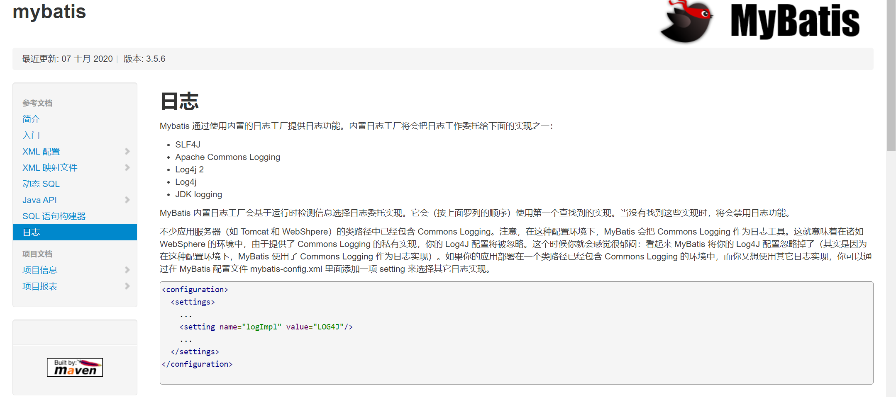

***

# mybatis初步了解
### mybatis框架
#### 1、什么是框架？
>它是我们软件开发中的一套解决方案，不同的框架解决的是不同的问题。

>使用框架的好处：
		框架封装了很多的细节，使开发者可以使用极简的方式实现功能。大大提高开发效率。
#### 2、三层架构
	表现层：
		是用于展示数据的
	业务层：
		是处理业务需求
	持久层：
		是和数据库交互的
#### 3、持久层技术解决方案
	JDBC技术：
		Connection
		PreparedStatement
		ResultSet
	Spring的JdbcTemplate：
		Spring中对jdbc的简单封装
	Apache的DBUtils：
		它和Spring的JdbcTemplate很像，也是对Jdbc的简单封装

	以上这些都不是框架
		JDBC是规范
		Spring的JdbcTemplate和Apache的DBUtils都只是工具类
#### 4、mybatis的概述
>mybatis是一个持久层框架，用java编写的。
它封装了jdbc操作的很多细节，使开发者只需要关注sql语句本身，而无需关注注册驱动，创建连接等繁杂过程
它使用了ORM思想实现了结果集的封装。

    ORM：
        Object Relational Mappging 对象关系映射
        简单的说：
        就是把数据库表和实体类及实体类的属性对应起来
        让我们可以操作实体类就实现操作数据库表。

        use             User
        idu             serId
        user_name       userName
#### 5、mybatis的入门
	mybatis的环境搭建
		第一步：创建maven工程并导入坐标
		第二步：创建实体类和dao的接口
		第三步：创建Mybatis的主配置文件
				SqlMapConifg.xml
		第四步：创建映射配置文件
				IUserDao.xml
	环境搭建的注意事项：
		第一个：创建IUserDao.xml 和 IUserDao.java时名称是为了和我们之前的知识保持一致。
			在Mybatis中它把持久层的操作接口名称和映射文件也叫做：Mapper
			所以：IUserDao 和 IUserMapper是一样的
		第二个：在idea中创建目录的时候，它和包是不一样的
			包在创建时：com.itheima.dao它是三级结构
			目录在创建时：com.itheima.dao是一级目录,所以要一级一级创建
		第三个：mybatis的映射配置文件位置必须和dao接口的包结构相同
		第四个：映射配置文件的mapper标签namespace属性的取值必须是dao接口的全限定类名
		第五个：映射配置文件的操作配置（select），id属性的取值必须是dao接口的方法名

		当我们遵从了第三，四，五点之后，我们在开发中就无须再写dao的实现类。
	mybatis的入门案例
		第一步：读取配置文件
		第二步：创建SqlSessionFactory工厂
		第三步：创建SqlSession
		第四步：创建Dao接口的代理对象
		第五步：执行dao中的方法
		第六步：释放资源

		注意事项：
			不要忘记在映射配置中告知mybatis要封装到哪个实体类中
			配置的方式：指定实体类的全限定类名
		
		mybatis基于注解的入门案例：
			把IUserDao.xml移除，在dao接口的方法上使用@Select注解，并且指定SQL语句
			同时需要在SqlMapConfig.xml中的mapper配置时，使用class属性指定dao接口的全限定类名。
	明确：
		我们在实际开发中，都是越简便越好，所以都是采用不写dao实现类的方式。
		不管使用XML还是注解配置。
		但是Mybatis它是支持写dao实现类的。

#### 6、自定义Mybatis的分析：
	mybatis在使用代理dao的方式实现增删改查时做什么事呢？
		只有两件事：
			第一：创建代理对象
			第二：在代理对象中调用selectList
		
	自定义mybatis能通过入门案例看到类
		class Resources
		class SqlSessionFactoryBuilder
		interface SqlSessionFactory
		interface SqlSession
### Mybatis部分知识       
1、Mybatis中的延迟加载

	问题：在一对多中，当我们有一个用户，它有100个账户。
	      在查询用户的时候，要不要把关联的账户查出来？
	      在查询账户的时候，要不要把关联的用户查出来？
		
	      在查询用户时，用户下的账户信息应该是，什么时候使用，什么时候查询的。
	      在查询账户时，账户的所属用户信息应该是随着账户查询时一起查询出来。

	什么是延迟加载
		在真正使用数据时才发起查询，不用的时候不查询。按需加载（懒加载）
	什么是立即加载
		不管用不用，只要一调用方法，马上发起查询。
	
	在对应的四种表关系中：一对多，多对一，一对一，多对多
		一对多，多对多：通常情况下我们都是采用延迟加载。
		多对一，一对一：通常情况下我们都是采用立即加载。
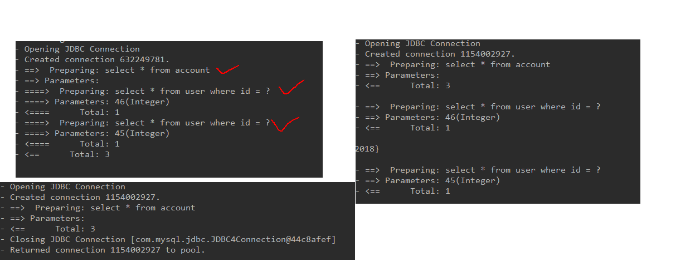
2、Mybatis中的缓存

	什么是缓存
		存在于内存中的临时数据。
	为什么使用缓存
		减少和数据库的交互次数，提高执行效率。
	什么样的数据能使用缓存，什么样的数据不能使用
		适用于缓存：
			经常查询并且不经常改变的。
			数据的正确与否对最终结果影响不大的。
		不适用于缓存：
			经常改变的数据
			数据的正确与否对最终结果影响很大的。
			例如：商品的库存，银行的汇率，股市的牌价。
	Mybatis中的一级缓存和二级缓存
		一级缓存：
			它指的是Mybatis中SqlSession对象的缓存。
			当我们执行查询之后，查询的结果会同时存入到SqlSession为我们提供一块区域中。
			该区域的结构是一个Map。当我们再次查询同样的数据，mybatis会先去sqlsession中
			查询是否有，有的话直接拿出来用。
			当SqlSession对象消失时，mybatis的一级缓存也就消失了。
		
		二级缓存:
			它指的是Mybatis中SqlSessionFactory对象的缓存。由同一个SqlSessionFactory对象创建的SqlSession共享其缓存。
			二级缓存的使用步骤：
				第一步：让Mybatis框架支持二级缓存（在SqlMapConfig.xml中配置）
				第二步：让当前的映射文件支持二级缓存（在IUserDao.xml中配置）
				第三步：让当前的操作支持二级缓存（在select标签中配置）


# mybatis学习
## 第1章 Mybatis环境搭建
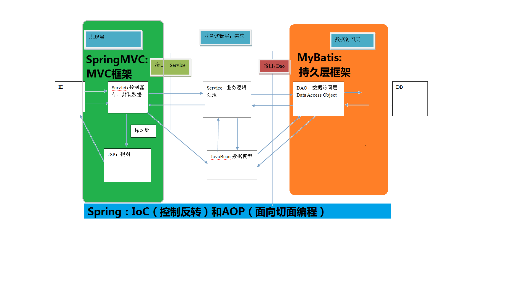


#### MAVEN的下载与配置
>1.上MAVEN官网上直接下载maven 我下载的3.6.3版本
2.配置环境变量，bin目录配置到MAVEN_HOME，然后再将%MAVEN_HOME%;加入到path路径最后面
3.测试是否配置成功：命令行输入 mvn -v  

>IDEA中配置MAVEN
收藏在博客中。


#### MAVEN项目的创建：
>**忘记了就去b站重新看怎么配置，黑马的mybatis教程前几集或者P21回顾**

1.new project 选择maven
2.目前不用点那个勾：Create from archetype
3.改一改GroupId和ArtifactId
4.配置maven中的pom.xml：
```xml
    <packaging>jar</packaging>
    <!-- 引入的jar包 -->
    <dependencies>
        <dependency>
            <groupId>org.mybatis</groupId>
            <artifactId>mybatis</artifactId>
            <version>3.4.5</version>
        </dependency>
        <!-- MySQL驱动 -->
        <dependency>
            <groupId>mysql</groupId>
            <artifactId>mysql-connector-java</artifactId>
            <version>5.1.6</version>
        </dependency>
        <dependency>
            <groupId>junit</groupId>
            <artifactId>junit</artifactId>
            <version>4.10</version>
            <scope>test</scope>
        </dependency>
        <!-- 日志坐标 -->
        <dependency>
            <groupId>log4j</groupId>
            <artifactId>log4j</artifactId>
            <version>1.2.12</version>
        </dependency>
    </dependencies>

    <!-- 指定jdk版本 -->
    <properties>
        <maven.compiler.source>14</maven.compiler.source>
        <maven.compiler.target>14</maven.compiler.target>
    </properties>
```
5.复制log4j.properties的配置文件到src/mian下的resources
#### 入门案例讲解
6.在main/java中新建类：com.fzk.domain.User
7.在resources中新建SqlMapConfig.xml文件，配置这个文件（很重要）
```xml
<?xml version="1.0" encoding="UTF-8"?>
<!DOCTYPE configuration
        PUBLIC "-//mybatis.org//DTD Config 3.0//EN"
        "http://mybatis.org/dtd/mybatis-3-config.dtd">
<!--mybatis的主配置文件-->
<configuration>
    <!--配置环境-->
    <environments default="mysql">
        <!--配置mysql的环境-->
        <environment id="mysql">
            <!--配置事物类型-->
            <transactionManager type="JDBC"></transactionManager>
            <!--配置数据源（连接池）-->
            <dataSource type="POOLED">
                <!--配置连接数据库的四个基本信息-->
                <property name="driver" value="com.mysql.jdbc.Driver"/>
                <property name="url" value="jdbc:mysql://localhost:3306/test"/>
                <property name="username" value="root"/>
                <property name="password" value="010326"/>
            </dataSource>
        </environment>
    </environments>

    <!--指定映射配置文件的位置，映射配置文件指的是每个dao独立的 配置文件
    如果是用注解来配置的话，此处应该使用class属性指定被注解的dao全限定类名
    -->
    <!-- 告知 mybatis 映射配置的位置 -->
    <mappers>
       <mapper resource="com/fzk/dao/IUserDao.xml"></mapper>
        <!-- <mapper class="com.fzk.dao.IUserDao"></mapper> -->
    </mappers>


</configuration>
```
8.接下来是一些实体类User和持久层接口IUserDao的编写，以及编写持久层接口的映射文件 IUserDao.xml （有编写规范要求），sql语句在映射文件xml中
```xml
<?xml version="1.0" encoding="UTF-8"?>
<!DOCTYPE mapper
        PUBLIC "-//mybatis.org//DTD Mapper 3.0//EN"
        "http://mybatis.org/dtd/mybatis-3-mapper.dtd">

        <!-- namespace指定哪个接口 -->
<mapper namespace="com.fzk.dao.IUserDao">
    <!--配置查询所有-->
        <!-- id指定哪个方法 resultType表示封装到哪里去-->
    <select id="findAll" resultType="com.fzk.domain.User">
        <!-- 写sql语句 -->
        select * from user
    </select>
</mapper>
```
9.编写测试类
```java
/**
 * @author fzkstart
 * @create 2020-12-16 16:26
 *
 * mybatis 的入门案例
 */
public class MybatisTest {
    /**
     * 入门案例
     * @param args
     */
    public static void main(String[] args) throws Exception {
        //1.读取配置文件
        InputStream is= Resources.getResourceAsStream("SqlMapConfig.xml");

        //2.创建SqlSessionFactory工厂
        SqlSessionFactoryBuilder builder=new SqlSessionFactoryBuilder();
        SqlSessionFactory factory= builder.build(is);

        //3.使用工厂生产SqlSession对象
        SqlSession session=factory.openSession();

        //4.使用SqlSession创建Dao接口的代理对象
        IUserDao userDao = session.getMapper(IUserDao.class);

        //5.使用代理对象执行方法
        List<User> users=userDao.findAll();
        for(User user:users){
            System.out.println(user);
        }

        //6.释放资源
        session.close();
        is.close();

    }
}
```
10.**更多细节去看Mybatis的第一天讲义**
11.基于注解的MyBatis使用：
首先在持久层接口的方法上添加注解：注解就是sql语句
```java
public interface IUserDao {
    /**
     * 查询所有操作
     * @return
     */
    @Select("select * from user")
    List<User> findAll();
}
```
12.然后修改SqlMapConfig.xml这个配置文件中的映射配置
```xml
    <!-- 告知 mybatis 映射配置的位置 -->
    <mappers>
    <!--<mapper resource="com/fzk/dao/IUserDao.xml"></mapper>-->
        <mapper class="com.fzk.dao.IUserDao"></mapper>
    </mappers>
```
13.显然注解更加简洁，不用再去写每个Dao独立的映射配置文件

#### MyBatis框架的分析
1.自定义案例的分析：
 


**构建者模式、工厂模式、代理模式**
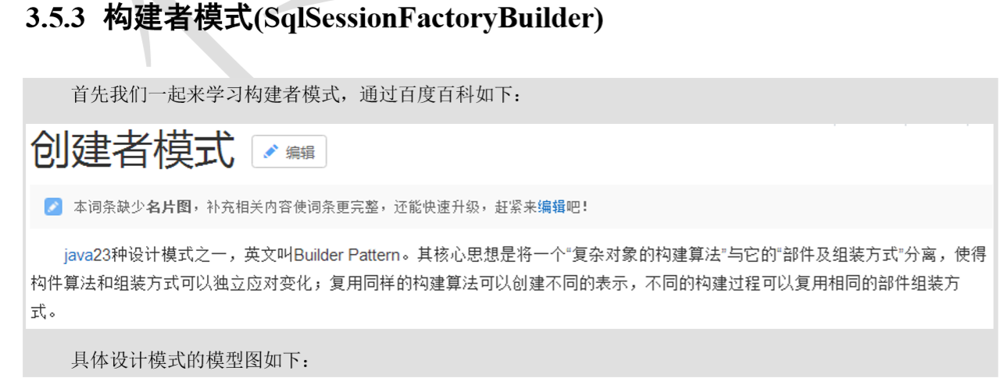
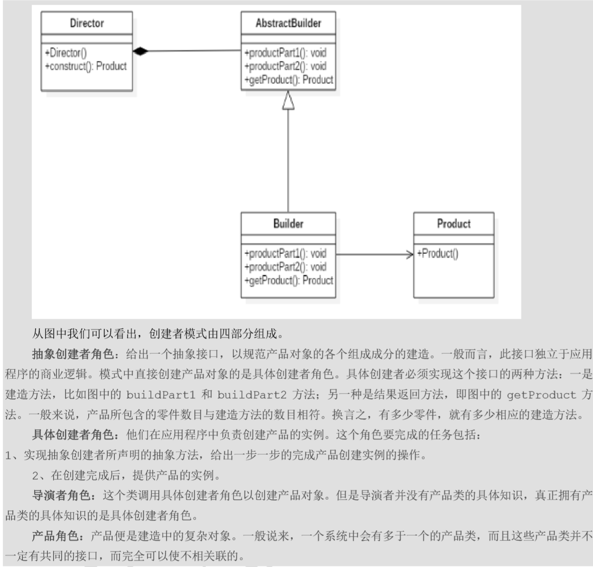
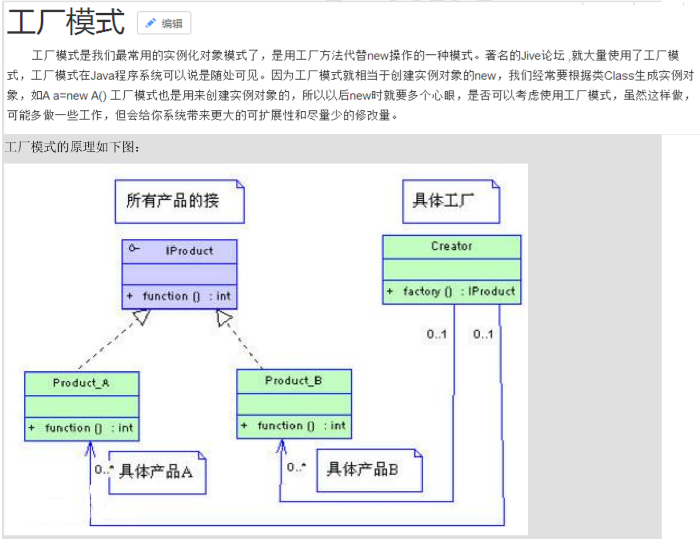
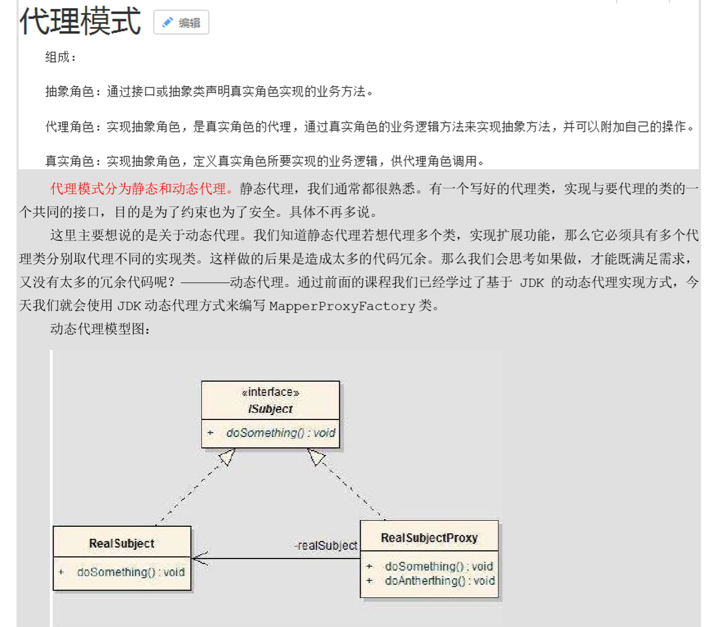


2.**自定义MyBatis一定要去看懂**
自定义mybatis流程图：


## 第2章 基于代理Dao实现CRUD操作
### 2.1 查询和插入
#### 步骤
1.在持久层接口中添加方法
```java
    /**
     * 保存用户
     * @param user
     */
    void insert(User user);
    /**
     * 获取总行数
     * @return
     */
    int getCount();
```
2.在用户的映射配置文件中配置 
```xml
    <!--保存用户操作       -->
    <!--    parameterType 是传入参数类型-->
    <insert id="insert" parameterType="com.fzk.domain.User">
        insert into user(username,address,sex,birthday)
        values(#{username},#{address},#{sex},#{birthday});
    </insert>

    <!--    获取总行数-->
    <select id="getCount" resultType="int">
        select COUNT(username) from user;
    </select>
```
>resultType 属性：  用于指定结果集的类型。

>parameterType 属性：   用于指定传入参数的类型。

>sql 语句中使用#{}字符：   它代表占位符，相当于原来 jdbc 部分所学的?，都是用于执行语句时替换实际的数据。 
具体的数据是由#{}里面的内容决定的。  

>#{}中内容的写法：    由于我们保存方法的参数是 一个 User 对象，此处要写 User 对象中的属性名称。它用的是 ognl 表达式。 


##### **ognl 表达式**： 
>它是 apache 提供的一种表达式语言，全称是：   **Object Graphic Navigation Language  对象图导航语言**  

    它是通过对象的取值方法来获取数据的。在写法上把get省略了。
    比如：我们获取用户的名称
        类中的写法是：user.getUsername();
        OGNL表达式写法：user.username
    语法格式就是使用  #{对象.对象}的方式 #{user.username}它会先去找 user 对象，
    然后在 user 对象中找到 username 属性，并调用 getUsername()方法把值取出来。
    但是我们在 parameterType 属性上指定了实体类名称，所以可以省略 user. 而直接写 username。

3.在测试类添加测试 
3.1测试方法中的通用部分
```java
    private InputStream is=null;
    private SqlSession sqlSession=null;
    private IUserDao iUserDao=null;

    @Before//用于在测试方法执行之前执行
    public void init() throws IOException {
        //1.读取配置文件
         is = Resources.getResourceAsStream("SqlMapConfig.xml");
        //2.获取SqlSessionFactory对象
        SqlSessionFactory factory = new SqlSessionFactoryBuilder().build(is);
        //3.获取SqlSession对象
         sqlSession = factory.openSession();
        //4.获取Dao代理对象
         iUserDao = sqlSession.getMapper(IUserDao.class);
    }

    @After//用于在测试方法执行之后执行
    public void resourcesClose(){
        //6.释放资源
        try {
            if(sqlSession!=null)
            sqlSession.close();
            if(is!=null)
            is.close();
        } catch (Exception e) {
            e.printStackTrace();
        }
    }
```
3.2测试插入方法部分
```java
    /**
     * 测试插入操作
     */
    @Test
    public void testInsert() {
        User user=new User("冯稚科","成都","男",  new Date());
        // init();
        System.out.println("插入之前："+user);
        //5.执行代理对象中的方法
        iUserDao.insert(user);
        //也可以将这里的事务提交挪到关闭资源方法中，为了记住，我就不挪了
        //6.事务提交
        sqlSession.commit();
        //7.释放资源
        System.out.println("插入成功");
        System.out.println("插入之后"+user);

    }
```
4.问题扩展：新增用户 id 的返回值 
>新增用户后，同时还要返回当前新增用户的 id 值，因为 id 是由数据库的自动增长来实现的，所以就相当于我们要在新增后将自动增长 auto_increment 的值返回。这个值将保存到User类的实例中。
```xml
    <insert id="insert" parameterType="com.fzk.domain.User">
        <!-- 配置保存时获取插入的 id -->
        <selectKey keyProperty="id" keyColumn="id" resultType="int" order="AFTER">
            select last_insert_id();
        </selectKey>
        insert into user(username,address,sex,birthday)
        values(#{username},#{address},#{sex},#{birthday});
    </insert>
```
###  2.2 模糊查询
#### 步骤
1.在持久层接口中添加模糊查询方法
```java
    /**
     * 根据名称模糊查询
     * @param username
     * @return
     */
    List<User> queryByName(String username);
```
2.在用户的映射配置文件中配置
```xml
    <!--    根据名称模糊查询一个用户-->
    <select id="queryByName" resultType="com.fzk.domain.User" parameterType="String">
        select * from user where username like #{username};
    </select>
```
3.加入模糊查询的测试方法 
#### 三种配置查询SQL语句标识符方式
>方式1：以在传入字符串实参时，就需要给定模糊查询的标识%。配置文件中的#{username}也只是一个占位符，所以 SQL 语句显示为“？”。 
```java
    /**
     * 根据名称模糊查询一个用户
     */
    @Test
    public void testQueryByName()  {
        String username="%冯%";
        //5.执行代理对象中的方法
        List<User> users = iUserDao.queryByName(username);
        //也可以将这里的事务提交挪到关闭资源方法中，为了记住，我就不挪了
        //6.事务提交
        sqlSession.commit();
        for(User user:users)
            System.out.println(user);
        System.out.println("查询成功");
    }
```
>方式2:在用户的映射配置文件中的sql语句中加入标识符%
```xml
    <select id="findByName" parameterType="string" resultType="com.itheima.domain.User">           
        select * from user where username like '%${value}%' 
    </select> 
```
```java
    /**
     * 根据名称模糊查询一个用户
     */
    @Test
    public void testQueryByName()  {
        //5.执行代理对象中的方法
        List<User> users = iUserDao.queryByName("冯");
        //也可以将这里的事务提交挪到关闭资源方法中，为了记住，我就不挪了
        //6.事务提交
        sqlSession.commit();
        for(User user:users)
            System.out.println(user);
        System.out.println("查询成功");
    }
```
>我们在上面将原来的#{}占位符，改成了${value}。注意如果用模糊查询的这种写法，那么写法就是固定的，不能写成其它名字。

>可以发现，我们在程序代码中就不需要加入模糊查询的匹配符%了，这两种方式的实现效果是一样的，但执行的语句是不一样的。 

-  #{}与${}的区别 
    - #{}表示一个占位符号  
    通过#{}可以实现 preparedStatement 向占位符中设置值，自动进行 java 类型和 jdbc 类型转换， #{}可以有效防止 sql 注入。 #{}可以接收简单类型值或 pojo 属性值。 如果 parameterType 传输单个简单类型值，#{}括号中可以是 value 或其它名称。 
    - \${}表示拼接 sql 串  
    通过\${}可以将 parameterType 传入的内容拼接在 sql中且不进行 jdbc 类型转换，\${}可以接收简单类型值或 pojo 属性值，如果 parameterType 传输单个简单类型值，\${}括号中只能是 value。 

>方式3：建议使用方式3
```xml
<!-- 根据用户名称模糊查询，参数变成一个 QueryVo 对象了 -->
<!--ognl表达式的一个用法-->
<select id="queryByQueryVo" parameterType="com.fzk.domain.QueryVo" resultMap="userMap">
    select * from user where username like '%' #{user.username} '%';
    <!-- 这里的左右两个空格必须要有 -->
</select>
```

### 2.3 Mybatis与JDBC编程的比较
>1.数据库链接创建、释放频繁造成系统资源浪费从而影响系统性能，如果使用数据库链接池可解决此问题。 
解决：  在 SqlMapConfig.xml 中配置数据链接池，使用连接池管理数据库链接。 
 
>2.Sql 语句写在代码中造成代码不易维护，实际应用 sql 变化的可能较大，sql 变动需要改变 java 代码。 
解决：  将 Sql 语句配置在 XXXXmapper.xml 文件中与 java 代码分离。 

>3.向sql语句传参数麻烦，因为sql语句的where 条件不一定，可能多也可能少，占位符需要和参数对应。 
解决：  Mybatis自动将 java 对象映射至 sql 语句，通过 statement 中的 parameterType 定义输入参数的 类型。 

>4.对结果集解析麻烦，sql 变化导致解析代码变化，且解析前需要遍历，如果能将数据库记录封装成 pojo 对 象解析比较方便。 
解决：  Mybatis自动将 sql执行结果映射至 java 对象，通过statement中的resultType 定义输出结果的 类型。 

## 第3章 Mybatis的参数深入 
### 3.1 引入
>我们在上一章节中已经介绍了SQL语句传参，使用标签的 parameterType 属性来设定。该属性的取值可以 是基本类型，引用类型（例如:String 类型），还可以是实体类类型（POJO 类）。同时也可以使用实体类的包装类，本章节将介绍如何使用实体类的包装类作为参数传递。 
基本类型和String我们可以直接写类型名称，也可以使用包名.类名的方式，例如 ： java.lang.String。  
实体类类型，目前我们只能使用全限定类名。
究其原因，是 mybaits 在加载时已经把常用的数据类型注册了别名，从而我们在使用时可以不写包名，而我们的是实体类并没有注册别名，所以必须写全限定类名。 
### 3.2 传递 pojo 包装对象 
3.2.1 编写 QueryVo
```java
public class QueryVo {
    private User user;

    public User getUser() {
        return user;
    }

    public void setUser(User user) {
        this.user = user;
    }
}
```
3.2.2 编写持久层接口 
```java
    /**
     * 根据QueryVo模糊查询
     * @return
     */
    List<User> queryByQueryVo(QueryVo queryVo);
```
3.2.3 持久层接口的映射文件
```xml
    <!-- 根据用户名称模糊查询，参数变成一个 QueryVo 对象了 -->
    <!--ognl表达式的一个用法-->
    <select id="queryByQueryVo" parameterType="com.fzk.domain.QueryVo" resultType="com.fzk.domain.User">
        select * from user where username like #{user.username};
    </select>
```
3.2.4 测试包装类作为参数
```java
    /**
     * 根据名称模糊查询一个用户
     * 测试使用QueryVo作为查询条件
     */
    @Test
    public void testQueryByQueryVo()  {
        QueryVo queryVo = new QueryVo();
        User user=new User();
        user.setUsername("%冯%");
        queryVo.setUser(user);
        //5.执行代理对象中的方法
        List<User> users = iUserDao.queryByQueryVo(queryVo);
        //也可以将这里的事务提交挪到关闭资源方法中，为了记住，我就不挪了
        //6.事务提交
        sqlSession.commit();
        for(User u:users)
            System.out.println(u);
        System.out.println("查询成功");
    }
```


## 第4章 Mybatis的输出结果封装 
### 4.1 resultType配置结果类型 
>resultType 属性可以指定结果集的类型，它支持基本类型和实体类类型。 我们在前面的 CRUD 案例中已经对此属性进行过应用了。 需要注意的是，它和 parameterType 一样，如果注册过类型别名的，可以直接使用别名。没有注册过的必须 使用全限定类名。例如：我们的实体类此时必须是全限定类名（下一个章节会讲解如何配置实体类的别名） 同时，当是实体类名称是，还有一个要求，实体类中的属性名称必须和查询语句中的列名保持一致，否则无法 实现封装。

4.1.1 特殊情况示例 
4.1.1.1 实例类的属性名和表中的字段名不一致
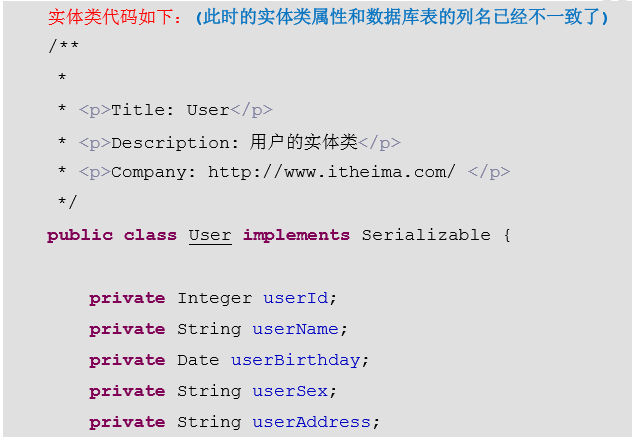
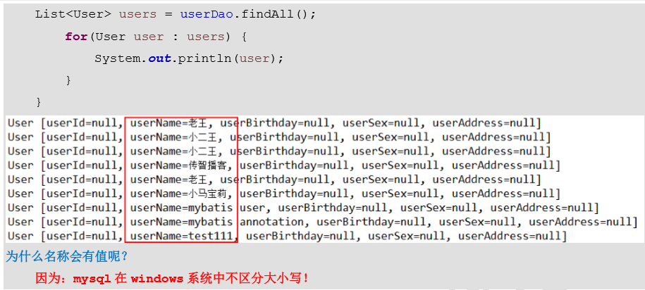
但是其他的属性都无法赋值。数据无法封装。

4.1.1.2 或者是这样的话：
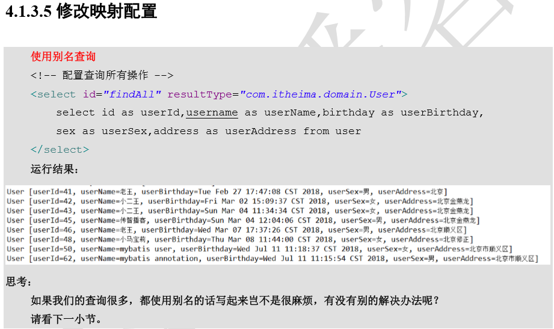

### 4.2 resultMap 结果类型 
>resultMap 标签可以建立查询的列名和实体类的属性名称不一致时建立对应关系。从而实现封装。 
在 select 标签中使用 resultMap 属性指定引用即可。
同时 resultMap 可以实现将查询结果映射为复杂类 型的 pojo，比如在查询结果映射对象中包括 pojo 和 list 实现一对一查询和一对多查询。 
```xml
    <!--  配置查询结果的字段名和实体类属性名的对应关系  -->
    <!--要使用这种对应关系的话，就不能用resultType="com.fzk.domain.User"，
    而要用resultMap="userMap",
    有点复杂，所以还是实体类那里对应好字段名
    或者是sql语句那里取别名吧-->
    <!-- 建立 User 实体和数据库表的对应关系
    type 属性：指定实体类的全限定类名
    id 属性：给定一个唯一标识，是给查询 select 标签引用用的。-->
    <resultMap id="userMap" type="com.fzk.domain.User">
        <!--id 标签：用于指定主键字段
        result 标签：用于指定非主键字段
        column 属性：用于指定数据库列名
        property 属性：用于指定实体类属性名称-->
        <!--主键字段的对应-->
        <id property="id" column="id"></id>
        <!--非主键字段的对应-->
        <result property="username" column="username"></result>
        <result property="address" column="address"></result>
        <result property="sex" column="sex"></result>
        <result property="birthday" column="birthday"></result>
    </resultMap>

    <!-- 根据用户名称模糊查询，参数变成一个 QueryVo 对象了 -->
    <!--ognl表达式的一个用法-->
    <select id="queryByQueryVo" parameterType="com.fzk.domain.QueryVo" resultMap="userMap">
        select * from user where username like #{user.username};
    </select>
```

### 4.3 返回主键ID(自增和非自增)
csdn地址：https://blog.csdn.net/u014268482/article/details/80601532?ops_request_misc=%257B%2522request%255Fid%2522%253A%2522161761450516780271544522%2522%252C%2522scm%2522%253A%252220140713.130102334..%2522%257D&request_id=161761450516780271544522&biz_id=0&utm_medium=distribute.pc_search_result.none-task-blog-2~all~sobaiduend~default-2-80601532.first_rank_v2_pc_rank_v29&utm_term=mybatis%E8%BF%94%E5%9B%9E%E8%87%AA%E5%A2%9Eid


## 第5章 Mybatis 传统 DAO 层开发[了解] 
源码分析：
>https://www.bilibili.com/video/BV1mE411X7yp?p=30

学习各种设计模式之后，对Mybatis了解更多之后，再来突击源码。
***

## 第6章 SqlMapConfig.xml配置文件 

### 6.1 SqlMapConfig.xml 中配置的内容和顺序 
```java
-properties（属性）  
    --property 
-settings（全局配置参数）  
    --setting   一般用不到，开启二级缓存什么的，对于海量数据而言，效果不明显，不如换数据库为redis，更高级的是加入搜索引擎。
-typeAliases（类型别名）
    --typeAliase  
    --package 
-typeHandlers（类型处理器） 
-objectFactory（对象工厂） 
-plugins（插件） 
-environments（环境集合属性对象）  
    --environment（环境子属性对象）   
        ---transactionManager（事务管理）   
        ---dataSource（数据源） 
-mappers（映射器）  
    --mapper  
    --package
```
### 6.2 properties（属性） 
>在使用 properties 标签配置时，我们可以采用两种方式指定属性配置。
6.2.1 第一种 
```xml
<properties resource="jdbcConfig.properties">
    <property name="driver" value="com.mysql.jdbc.Driver"/>
    <property name="url" value="jdbc:mysql://localhost:3306/students"/>
    <property name="username" value="root"/>
    <property name="password" value="010326"/>
</properties>
```
6.2.2 第二种
6.2.2.1 在 classpath 下定义 jdbc.properties 文件
6.2.2.2 properties 标签配置 
```xml
    <!--配置properties
    可以在标签内部配置属性文件信息，也可以通过属性引用外部配置文件信息
    resource属性：
        用于指定配置文件的位置，是按照类路径的写法来写，并且必须存在于类路径下
    url 属性：
        URL： Uniform Resource Locator 统一资源定位符
            http://localhost:8080/mystroe/CategoryServlet  URL
            协议      主机      端口  URI
        URI：Uniform Resource Identifier 统一资源标识符
            /mystroe/CategoryServlet
            它是可以在 web 应用中唯一定位一个资源的路径
    -->
    <properties resource="jdbc.properties">
        <!-- <property name="driver" value="com.mysql.jdbc.Driver"/>
        <property name="url" value="jdbc:mysql://localhost:3306/students"/>
        <property name="username" value="root"/>
        <property name="password" value="010326"/>-->
    </properties>
```
6.2.3 此时我们的 dataSource 标签就变成了引用上面的配置
```xml
    <!--配置环境-->
    <environments default="mysql">
        <!--配置mysql的环境-->
        <environment id="mysql">
            <!--配置事物类型-->
            <transactionManager type="JDBC"></transactionManager>
            <!--配置数据源（连接池）-->
            <dataSource type="POOLED">
                <!--配置连接数据库的四个基本信息-->
                <property name="driver" value="${driver}"/>
                <property name="url" value="${url}"/>
                <property name="username" value="${username}"/>
                <property name="password" value="${password}"/>
            </dataSource>
        </environment>
    </environments>
```
### 6.3 typeAliases（类型别名）
>在前面有 Mybatis 支持的默认别名，我们也可以采用自定义别名方式来开发。
```xml
    <!--使用typeAliases配置别名，它只能配置domain中类的别名-->
    <typeAliases>
        <!--type属性指定实体类的全限定类名
            alias属性指定别名，当指定了别名就不再区分大小写-->
        <!-- 单个别名定义 -->
        <typeAlias type="com.fzk.domain.User" alias="user"/>
        <!-- 多个别名定义 -->
        <!-- 用于指定要配置别名的包，当指定之后，该包下的实体类都会注册别名，
            并且别名就是类名，不再区分大小写 -->
        <package name="com.fzk.domain"/>
    </typeAliases>
```
### 6.4 mappers（映射器） 

6.4.1 \<mapper resource=" " /> 
>使用相对于类路径的资源 如：
```xml
<!-- 注意是/而不是. -->
<mapper resource="com/fzk/dao/IUserDao.xml" /> 
```
6.4.2 \<mapper class=" " /> 
>使用 mapper 接口类路径 如：
\<mapper class="com.fzk.dao.IUserDao"/> 
注意：此种方法要求 mapper 接口名称和 mapper 映射文件名称相同，且放在同一个目录中

6.4.3 \<package name=""/> 
>注册指定包下的所有 mapper 接口 如：
\<package name="cn.itcast.mybatis.mapper"/> 
注意：此种方法要求 mapper 接口名称和 mapper 映射文件名称相同，且放在同一个目录中。 
```xml
    <!--指定映射配置文件的位置，映射配置文件指的是每个dao独立的 配置文件
    如果是用注解来配置的话，此处应该使用class属性指定被注解的dao全限定类名
    -->
    <mappers>
        <!--<mapper resource="com/fzk/dao/IUserDao.xml"/>-->
        <!--<mapper class="com.fzk.dao.IUserDao"></mapper>-->
        <!--package标签是用于指定dao接口所在的包，当指定之后就不需要再写mapper以及resource和class了-->
        <package name="com.fzk.dao"/>
    </mappers>
```

## 第7章 Mybatis 连接池与动态SQL语句 
### 7.1 Mybatis 的连接池技术

7.1.1 Mybatis 连接池的分类 

```
1. 连接池：
	我们在实际开发中都会使用连接池。
	因为它可以减少我们获取连接所消耗的时间。
2. mybatis中的连接池
	mybatis连接池提供了3种方式的配置：
		配置的位置：
			主配置文件SqlMapConfig.xml中的dataSource标签，type属性就是表示采用何种连接池方式。
		type属性的取值：
			POOLED	 采用传统的javax.sql.DataSource规范中的连接池，mybatis中有针对规范的实现
			UNPOOLED 采用传统的获取连接的方式，虽然也实现Javax.sql.DataSource接口，但是并没有使用池的思想。
			JNDI	 采用服务器提供的JNDI技术实现，来获取DataSource对象，不同的服务器所能拿到DataSource是不一样。
				 注意：如果不是web或者maven的war工程，是不能使用的。
				 我们课程中使用的是tomcat服务器，采用连接池就是dbcp连接池。
```


7.1.2  Mybatis 中数据源的配置
前面有，这里就不贴出了。

7.1.3 Mybatis 中 DataSource 的存取
>MyBatis 是通过工厂模式来创建数据源 DataSource 对象的， MyBatis 定义了抽象的工厂接：org.apache.ibatis.datasource.DataSourceFactory,通过其 getDataSource()方法返回数据源 DataSource。 

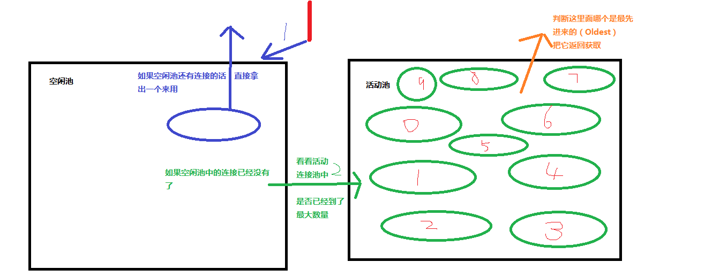


### 7.2 Mybatis 的动态 SQL 语句
#### 7.2.1 动态 SQL 之\<if>和\<where>标签
>注意：\<if>标签的 test 属性中写的是对象的属性名，如果是包装类的对象要使用 OGNL 表达式的写法。 另外要注意 where 1=1 的作用~！ 
```xml
    <!--根据条件查询-->
    <select id="queryByCondition" resultMap="userMap" parameterType="com.fzk.domain.User">
        select * from user
        <where>
            <if test="username!=null and username!=''">
                and username=#{username}
            </if>
            <if test="sex!=null">
                and sex=#{sex}
            </if>
        </where>
    </select>
```
>**注意**：where标签会自动忽略匹配到的第一个and

>**注意**：mybatis.xml中大于小于等符号需要用到xml语法中的符号，不然会报错


#### 7.2.2 动态标签之\<foreach>标签 
```
传入多个 id 查询用户信息，用下边两个 sql 实现： 
SELECT * FROM USERS WHERE username LIKE '%张%' AND (id =10 OR id =89 OR id=16) 
SELECT * FROM USERS WHERE username LIKE '%张%' AND id IN (10,89,16) 
 
这样我们在进行范围查询时，就要将一个集合中的值，作为参数动态添加进来。 
这样我们将如何进行参数的传递？ 
```
7.2.2.1 在 QueryVo 中加入一个 List 集合用于封装参数 
```java
public class QueryVo {
    private User user;
    private List<Integer> ids;

    public List<Integer> getIds() {
        return ids;
    }
    public void setIds(List<Integer> ids) {
        this.ids = ids;
    }
    public User getUser() {
        return user;
    }
    public void setUser(User user) {
        this.user = user;
    }
}
```
7.2.2.2 持久层 Dao 接口
```java
    /**
     * 根据QueryVo中提供的id集合，查询用户信息
     * @param queryVo
     * @return
     */
    List<User> queryByIdInIds(QueryVo queryVo);
```
7.2.2.3 持久层 Dao 映射配置
```xml
<!--根据QueryVo中的id集合查询用户信息-->
<select id="queryByIdInIds" resultMap="userMap" parameterType="com.fzk.domain.QueryVo">
    select * from user
    <where>
        <if test="ids!=null and ids.size()>0">
            <foreach collection="ids" open="and id in (" close=")" item="id" separator=",">
                #{id}
            </foreach>
        </if>
    </where>
</select>
SQL 语句：    
    select 字段 from user where id in (?) 
<foreach>标签用于遍历集合，它的属性：  
    collection:代表要遍历的集合元素，注意编写时不要写#{} 
    open:代表语句的开始部分  
    close:代表结束部分 
    item:代表遍历集合的每个元素，生成的变量名  
    sperator:代表分隔符 
```
7.2.2.4 编写测试方法 
```java
    /**
    * 根据QueryVo中提供的id集合，查询用户信息
    * 测试foreach标签的使用
    */
    @Test
    public void testQueryByIdInIds(){
        QueryVo queryVo = new QueryVo();
        queryVo.setIds(Arrays.asList(41,42,43));
        List<User> users = iUserDao.queryByIdInIds(queryVo);
        for (User user1:users) {
            System.out.println(user1);
        }
    }
```
7.2.2.5 注意：
当传入的不是VO而是一个数组的时候，不能直接用参数的名称如ids，而是要用array。
下面的这种直接写where写法和上一种组合where标签写法效果差不多。
```xml
<delete id="deleteByAids">
    delete from tbl_activity_remark
    where activityId in
    <foreach collection="array" item="aid" open="(" close=")" separator=",">
        #{aid}
    </foreach>
</delete>
```
当要判断传入的参数是否为空时，写法如下：
在这里传入的参数类型其实也可以像上面那样不写。
```xml
<delete id="deleteActivity" parameterType="arraylist">
    delete from tbl_activity
    <where>
        <if test="array!=null and array.length>0">
            <foreach collection="array" open="and id in (" close=")" item="id" separator=",">
                #{id}
            </foreach>
        </if>
    </where>
</delete>
```
## 第8章 Mybatis 多表查询之一对多和多对多 

粗略过了一遍，复习的时候再回顾。
>https://www.bilibili.com/video/BV1mE411X7yp?p=48
***

## 第9章 Mybatis 延迟加载策略和缓存
1.1 何为延迟加载? 
延迟加载：   就是在需要用到数据时才进行加载，不需要用到数据时就不加载数据。延迟加载也称懒加载. 
好处：先从单表查询，需要时再从关联表去关联查询，大大提高数据库性能，因为查询单表要比关联查询多张表速度要快。  
坏处：因为只有当需要用到数据时，才会进行数据库查询，这样在大批量数据查询时，因为查询工作也要消耗时间，所以可能造成用户等待时间变长，造成用户体验下降。 

**第10章注解开发有延迟加载和缓存，这里的是xml开发，之后回顾的时候再学习xml开发延迟加载和二级缓存**
***

## 第10章 Mybatis 注解开发 
Mybatis 也可以使用注解开发方式，这样就可以减少编写 Mapper 映射文件了。
### 10.1 mybatis 的常用注解
```java
@Insert:实现新增 
@Update:实现更新 
@Delete:实现删除 
@Select:实现查询 
@Result:实现结果集封装 
@Results:可以与@Result 一起使用，封装多个结果集 
@ResultMap:实现引用@Results 定义的封装 
@One:实现一对一结果集封装 
@Many:实现一对多结果集封装 
@SelectProvider: 实现动态 SQL 映射 
@CacheNamespace:实现注解二级缓存的使用 
```
### 10.2 使用 Mybatis 注解实现基本 CRUD 
10.2.1 编写实体类
10.2.2 使用注解方式开发持久层接口
10.2.3 编写 SqlMapConfig 配置文件
10.2.4 编写测试方法
### 10.3 使用注解实现复杂关系映射开发 
>实现复杂关系映射之前我们可以在映射文件中通过配置\<resultMap>来实现，在使用注解开发时我们需要借助@Results 注解，@Result 注解，@One 注解，@Many 注解
#### 10.3.1 复杂关系映射的注解说明 
```xml
@Results 注解 代替的是标签<resultMap>  
该注解中可以使用单个@Result 注解，也可以使用@Result 集合 @Results（{@Result（），@Result（）}）或@Results（@Result（）） 

@Resutl 注解 代替了 <id>标签和<result>标签  
@Result 中 属性介绍：      
    id 是否是主键字段  
    column 数据库的列名  
    property 需要装配的属性名  
    one  需要使用的@One 注解（@Result（one=@One）（）））  
    many  需要使用的@Many 注解（@Result（many=@many）（））） 
 
@One 注解（一对一）  代替了<assocation>标签，是多表查询的关键，在注解中用来指定子查询返回单一对象。 
@One 注解属性介绍：  
    select  指定用来多表查询的 sqlmapper  
    fetchType 会覆盖全局的配置参数 lazyLoadingEnabled。 
    使用格式：  @Result(column=" ",property="",one=@One(select="")) 
 
@Many 注解（多对一）  代替了<Collection>标签,是是多表查询的关键，在注解中用来指定子查询返回对象集合。  
    注意：聚集元素用来处理“一对多”的关系。需要指定映射的 Java 实体类的属性，
    属性的 javaType （一般为 ArrayList）但是注解中可以不定义；
    select 属性：代表将要执行的 sql 语句  
    fetchType 属性：代表加载方式，一般如果要延迟加载都设置为 LAZY 的值  
    使用格式：   @Result(property="",column="",many=@Many(select="")) 
```
#### 10.3.2 使用注解实现一对一复杂关系映射及延迟加载 
10.3.2.1 添加 User 实体类及 Account 实体类
```java
/**
 * @author fzkstart
 * @create 2020-12-20 23:46
 */
public class Account implements Serializable {
    private Integer id;
    private Integer uid;
    private Double money;

    //多对一（mybatis中称为1对1）的映射，一个账户只能属于一个用户
    private User user;
    //set和get等方法
    ......
    ......
}
```
10.3.2.2 添加账户的持久层接口并使用注解配置 
```java
/**
 * @author fzkstart
 * @create 2020-12-20 23:48
 */
public interface IAccountDao {
    /**
     * 查询所有账户，并且获取每个账户下的用户信息
     * @return
     */
    @Select("select * from account")
    @Results(id="accountMap",value={
            @Result(id=true,column = "id",property="id"),
            @Result(column="uid",property="uid"),
            @Result(column="money",property="money"),
            @Result(column = "uid",property="user",one=@One(select = "com.fzk.dao.IUserDao.findById",fetchType = FetchType.EAGER))
    })
    List<Account> findAll();

    /**
     * 根据用户id查询账户信息
     * @param userId
     * @return
     */
    @Select("select * from account where uid=#{userId}")
    @ResultMap(value="accountMap")
    List<User> findAccountByUid(Integer userId);
}
```
10.3.2.3 添加用户的持久层接口并使用注解配置
```java
/**
 * @author fzkstart
 * @create 2020-12-20 14:50
 * 在mybatis中针对CRUD有4个注解
 * @Select @Insert @Update @Delete
 */
public interface IUserDao {
    /**
     * 查询所有用户
     * @return
     */
    @Select("select * from user")
    @Results(id="userMap", value={
            @Result(id = true,column="id",property = "userId"),
            @Result(column="username",property = "userName"),
            @Result(column="address",property = "userAddress"),
            @Result(column="sex",property = "userSex"),
            @Result(column="birthday",property = "userBirthday"),
            @Result(property = "accounts",column = "id",
                    many = @Many(select = "com.fzk.dao.IAccountDao.findAccountByUid",
                            fetchType= FetchType.LAZY))
                })
    List<User> findAll();

    /**
     * 根据id查询
     * @param id
     * @return
     */
    @Select("select * from user where id=#{id}")
    @ResultMap(value={"userMap"})
    User findById(Integer id);
    
    /*@Many: 
    相当于<collection>的配置  
    select 属性：代表将要执行的 sql 语句  
    fetchType 属性：代表加载方式，一般如果要延迟加载都设置为 LAZY 的值 */
}
```
10.3.2.4 测试一对一关联及延迟加载 
```java
    @Test
    public void testFindAll1(){
        List<Account> accounts = iAccountDao.findAll();
        for(Account account:accounts){
            System.out.println("每个账户的信息");
            System.out.println(account);
            System.out.println("每个用户的信息");
            System.out.println(account.getUser());
        }
    }
```
#### 10.3.3 使用注解实现一对多复杂关系映射
10.3.3.1 User 实体类加入 List\<Account> 
```java
/**
 * @author fzkstart
 * @create 2020-12-20 14:48
 */
public class User implements Serializable {
    private Integer userId;
    private String userName;
    private String userAddress;
    private String userSex;
    private Date userBirthday;

    //一对多关系映射，一个用户对应多个账户
    private List<Account> accounts;

    //get和set方法
    ······
    ······
}
```
10.3.3.2 编写用户的持久层接口并使用注解配置
代码如10.3.2.3
10.3.3.3 编写账户的持久层接口并使用注解配置 
代码如10.3.2.2
10.3.3.4 添加测试方法 
```java
    @Test
    public void testFindAll(){
        List<User> users = iUserDao.findAll();
        for(User user:users){
            System.out.println("每个用户的信息");
            System.out.println(user);
            System.out.println("每个用户下的账户信息");
            System.out.println(user.getAccounts());
        }
    }
```

### 10.4 mybatis 基于注解的二级缓存 
10.4.1 在 SqlMapConfig 中开启二级缓存支持 
```xml
    <!--配置开启二级缓存，不配置其实默认也是开启的-->
    <settings>
        <!-- 开启二级缓存的支持 --> 
        <setting name="cacheEnabled" value="true"/>
    </settings>
```
10.4.2 在持久层接口中使用注解配置二级缓存 
```java
@CacheNamespace(blocking = true)
public interface IUserDao {
    ......
    ......
}
```
10.4.3 测试二级缓存
```java
/**
 * @author fzkstart
 * @create 2020-12-21 15:15
 */
public class SecondLevelCacheTest {
    private InputStream is;
    private SqlSessionFactory factory;
    private SqlSession sqlSession;
    private IUserDao iUserDao;
    private IAccountDao iAccountDao;
    @Before
    public void init() throws IOException {
        is= Resources.getResourceAsStream("SqlMapConfig.xml");
        factory = new SqlSessionFactoryBuilder().build(is);
        sqlSession = factory.openSession();
        iUserDao=sqlSession.getMapper(IUserDao.class);
        iAccountDao=sqlSession.getMapper(IAccountDao.class);
    }
    @After
    public void closeResource() throws IOException {
        is.close();
    }
    @Test
    public void testFindById(){
        User user = iUserDao.findById(45);
        System.out.println(user);

        //释放一级缓存
        sqlSession.close();

        sqlSession=factory.openSession();
        IUserDao iUserDao1 = sqlSession.getMapper(IUserDao.class);
        User user1 = iUserDao1.findById(45);
        System.out.println(user1);

        System.out.println(user==user1);
    }
}
```

## 第11章 一些附加使用说明
### sql标签
```xml
<!--使用sql标签制作sql片段
    sql片段的作用是用来代替sql语句中的代码
    mapper映射文件中某些sql片段大量重复，可以使用sql标签来代替
属性： id： 唯一标识

    将来的实际开发项目中，会用到sql片段来代替重复率高且复杂的子查询-->
<sql id="sql1">
    select * from user
</sql>

<!-- 根据用户名称模糊查询，参数变成一个 QueryVo 对象了 -->
<!--ognl表达式的一个用法-->
<select id="queryByQueryVo" parameterType="com.fzk.domain.QueryVo" resultMap="userMap">
    <include refid="sql1"></include>
    where username like '%' #{user.username} '%';
</select>
```

# 遇到的Bug
#### 1.配置maven 不能使用下载的JDK版本
java: 错误: 不支持发行版本 5
有三种解决方法：博客
>https://blog.csdn.net/DD04567/article/details/107205871?ops_request_misc=%25257B%252522request%25255Fid%252522%25253A%252522160810792716780277894842%252522%25252C%252522scm%252522%25253A%25252220140713.130102334..%252522%25257D&request_id=160810792716780277894842&biz_id=0&utm_medium=distribute.pc_search_result.none-task-blog-2

#### 2.The error may exist in com/fzk/dao/IUserDao.xml
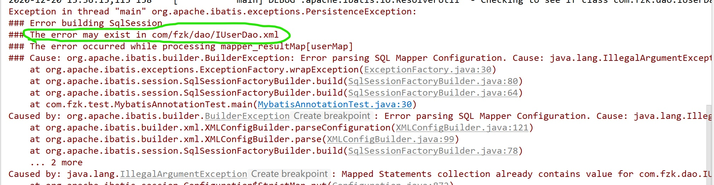
引发原因：在使用注解的时候，IUserDao相对应的resources中存在相对应的xml文件，就会报错。
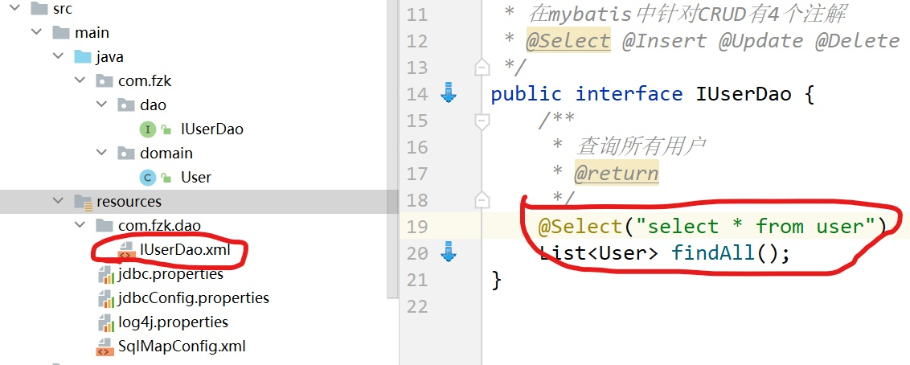
解决方法：使用注解就不使用映射配置文件xml，删掉或者移动到其他地方去。

#### 读配置文件的或者文件的时候，方式有：
1.绝对路径
2.相对路径
3.使用类加载器，它只能读取类路径的配置文件
4.使用ServletContext对象的getRealPath()
- 一般都是使用后两个，前两个都不太靠谱
- 在实际开发中读取配置文件:  
    > 第一：使用类加载器。但是有要求：
    a、 文件不能过大。 
    b、 文件必须在类路径下(classpath)   
    第二：使用 ServletContext 的 getRealPath() 