# 第1章 SpringMVC的基本概念 

## 1.1 关于三层架构和 MVC 

### 1.1.1 三层架构
```xml
我们的开发架构一般都是基于两种形式，一种是 C/S 架构，也就是客户端/服务器，另一种是 B/S 架构，也就是浏览器服务器。
在 JavaEE 开发中，几乎全都是基于 B/S架构的开发。那么在 B/S架构中，系统标准的三层架构包括：表现层、业务层、持久层。 

三层架构中，每一层各司其职，接下来我们就说说每层都负责哪些方面： 
表现层：  
    也就是我们常说的web层。
    它负责接收客户端请求，向客户端响应结果，通常客户端使用http协议请求 web 层，web 需要接收 http 请求，完成 http 响应。  
    表现层包括展示层和控制层：控制层负责接收请求，展示层负责结果的展示。  
    表现层依赖业务层，接收到客户端请求一般会调用业务层进行业务处理，并将处理结果响应给客户端。  
    表现层的设计一般都使用 MVC 模型。（MVC 是表现层的设计模型，和其他层没有关系） 
业务层：  
    也就是我们常说的 service 层。它负责业务逻辑处理，和我们开发项目的需求息息相关。
    web 层依赖业务层，但是业务层不依赖 web 层。  
    业务层在业务处理时可能会依赖持久层，如果要对数据持久化需要保证事务一致性。（也就是我们说的，事务应该放到业务层来控制） 
持久层：  
    也就是我们是常说的 dao 层。负责数据持久化，包括数据层即数据库和数据访问层，数据库是对数据进行持久化的载体，
    数据访问层是业务层和持久层交互的接口，业务层需要通过数据访问层将数据持久化到数据库中。
    通俗的讲，持久层就是和数据库交互，对数据库表进行曾删改查的。 
```


### 1.1.2 MVC 模型 

>MVC 全名是 Model View Controller，是模型(model)－视图(view)－控制器(controller)的缩写， 是一种用于设计创建 Web 应用程序表现层的模式。
MVC 中每个部分各司其职： 
Model（模型）：   通常指的就是我们的数据模型。作用一般情况下用于封装数据。  
View（视图）：   通常指的就是我们的 jsp 或者 html。作用一般就是展示数据的。   通常视图是依据模型数据创建的。 
Controller（控制器）：   是应用程序中处理用户交互的部分。作用一般就是处理程序逻辑的。   
它相对于前两个不是很好理解，这里举个例子：   例如：    我们要保存一个用户的信息，该用户信息中包含了姓名，性别，年龄等等。    这时候表单输入要求年龄必须是 1~100 之间的整数。姓名和性别不能为空。并且把数据填充 到模型之中。    此时除了 js 的校验之外，服务器端也应该有数据准确性的校验，那么校验就是控制器的该做 的。    当校验失败后，由控制器负责把错误页面展示给使用者。    如果校验成功，也是控制器负责把数据填充到模型，并且调用业务层实现完整的业务需求。 

## 1.2 SpringMVC 概述 
#### 1.2.1 SpringMVC 是什么 

SpringMVC 是一种基于 Java 的实现 MVC 设计模型的请求驱动类型的轻量级 Web 框架，属于 Spring FrameWork 的后续产品，已经融合在 Spring Web Flow 里面。
Spring 框架提供了构建 Web 应用程序的全功能 MVC 模块。
使用 Spring 可插入的 MVC 架构，从而在使用 Spring 进行 WEB 开发时，可以选择使用 Spring 的 Spring MVC 框架或集成其他 MVC 开发框架，如 Struts1(现在一般不用)，Struts2 等。 
SpringMVC 已经成为目前最主流的 MVC 框架之一，并且随着 Spring3.0 的发布，全面超越 Struts2，成为最优秀的 MVC 框架。 
它通过一套注解，让一个简单的 Java 类成为处理请求的控制器，而无须实现任何接口。同时它还支持 RESTful 编程风格的请求。 

#### 1.2.2 SpringMVC 在三层架构的位置 


#### 1.2.3 SpringMVC 的优势 
```xml
1、清晰的角色划分：  
    前端控制器（DispatcherServlet） 
    请求到处理器映射（HandlerMapping）  
    处理器适配器（HandlerAdapter）  
    视图解析器（ViewResolver）  
    处理器或页面控制器（Controller）  
    验证器（ Validator）  
    命令对象（Command  请求参数绑定到的对象就叫命令对象）  
    表单对象（Form Object 提供给表单展示和提交到的对象就叫表单对象）。 
2、分工明确，而且扩展点相当灵活，可以很容易扩展，虽然几乎不需要。 
3、由于命令对象就是一个 POJO，无需继承框架特定 API，可以使用命令对象直接作为业务对象。 
4、和 Spring 其他框架无缝集成，是其它 Web 框架所不具备的。 
5、可适配，通过 HandlerAdapter 可以支持任意的类作为处理器。
6、可定制性，HandlerMapping、ViewResolver 等能够非常简单的定制。 
7、功能强大的数据验证、格式化、绑定机制。 
8、利用 Spring 提供的 Mock 对象能够非常简单的进行 Web 层单元测试。 
9、本地化、主题的解析的支持，使我们更容易进行国际化和主题的切换。 
10、强大的 JSP 标签库，使 JSP 编写更容易。 
………………还有比如RESTful风格的支持、简单的文件上传、约定大于配置的契约式编程支持、基于注解的零配置支持等等。 
```

#### 1.2.4 SpringMVC 和 Struts2 的优略分析 
```xml
共同点：  
    它们都是表现层框架，都是基于 MVC 模型编写的。  
    它们的底层都离不开原始 ServletAPI。  
    它们处理请求的机制都是一个核心控制器。 
区别：  
    Spring MVC 的入口是 Servlet, 而 Struts2 是 Filter   
    Spring MVC 是基于方法设计的，而 Struts2 是基于类，Struts2 每次执行都会创建一个动作类。
    所以 Spring MVC 会稍微比 Struts2 快些。  
    Spring MVC 使用更加简洁,同时还支持 JSR303, 处理 ajax 的请求更方便  
    (JSR303 是一套 JavaBean 参数校验的标准，它定义了很多常用的校验注解，
    我们可以直接将这些注解加在我们 JavaBean 的属性上面，就可以在需要校验的时候进行校验了。)  
    Struts2 的 OGNL 表达式使页面的开发效率相比 Spring MVC 更高些，
    但执行效率并没有比 JSTL 提升，尤其是 struts2 的表单标签，远没有 html 执行效率高。 
```


# 第2章 SpringMVC的入门 

### 2.1 SpringMVC 的入门案例 
#### 2.1.1 前期准备 
1. 新建maven工程
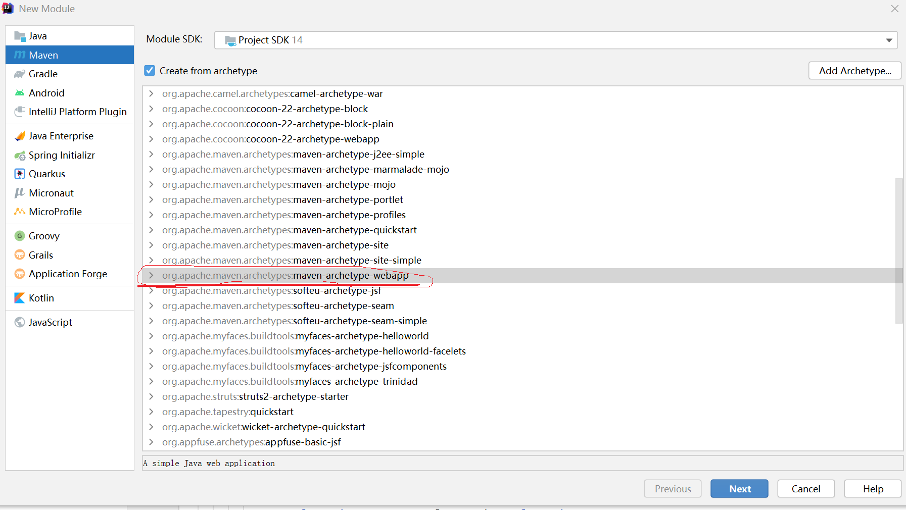
解决maven项目创建过慢的问题
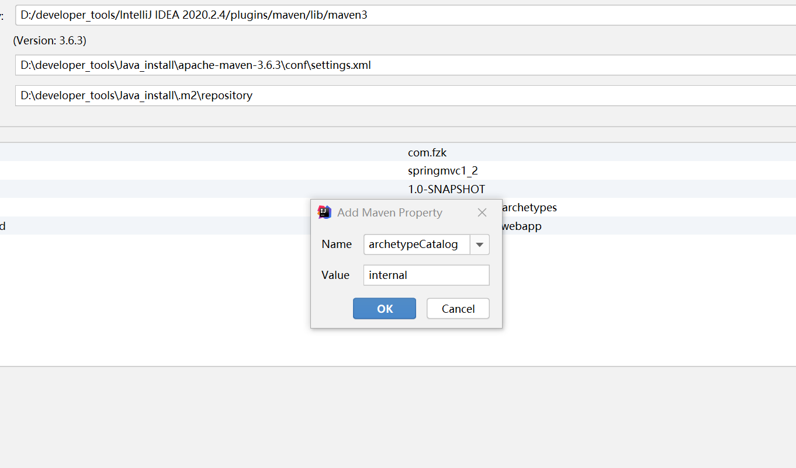
2. 删掉原index.jsp
新建index.jsp
    ```html
    <html>
    <head>
        <title>Title</title>
    </head>
    <body>

        <h3>入门程序</h3>

        <%--注意：  当我们使用此种方式配置时，
        在 jsp中第二种写法时，不要在访问 URL 前面加/，
        否则无法找到资源。 --%>
        <a href="hello">入门程序</a>
    </body>
    </html>
    ```
3. 在main文件夹下新建java和resources文件夹
并分别标记为Sources Root和Resouces Root
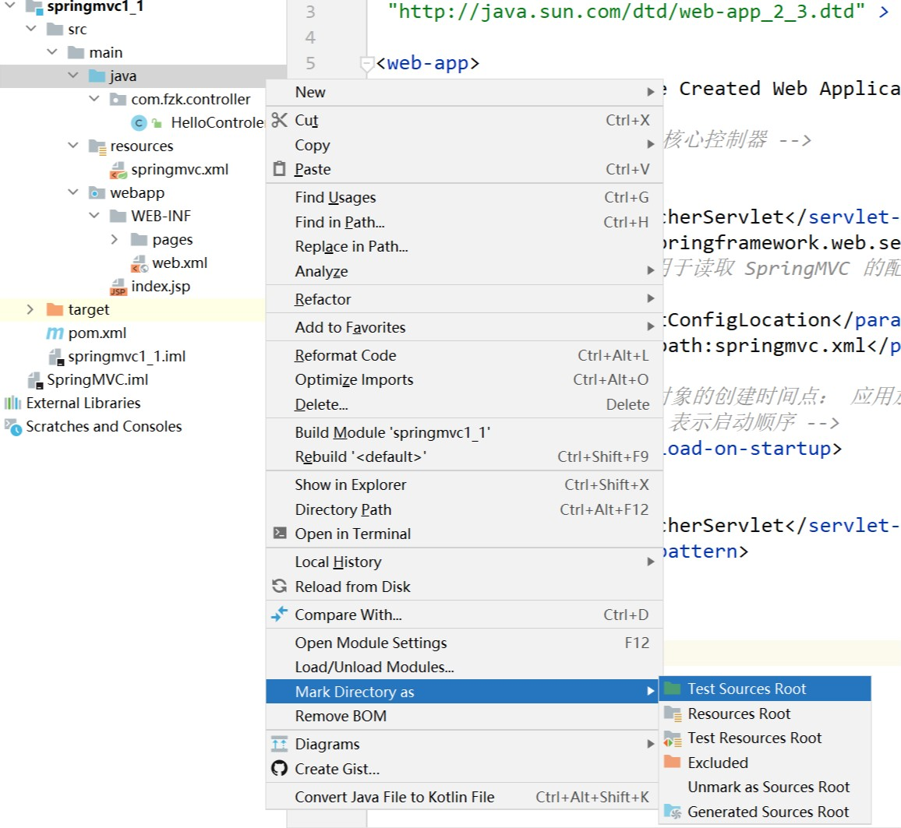

4. 新建success.jsp作为跳转页面
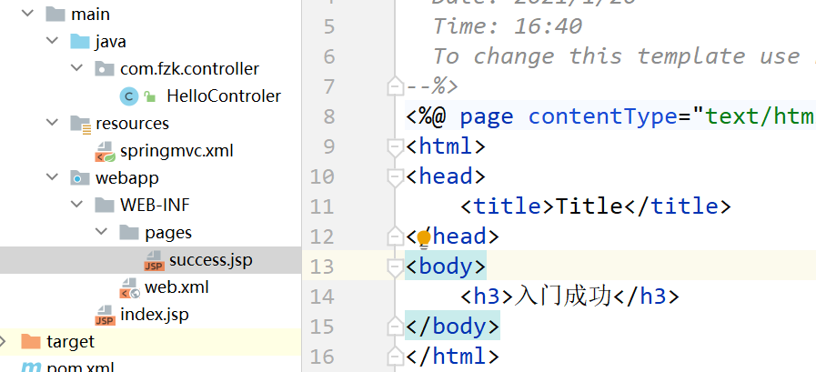


#### 2.1.2 导入 jar包 
```xml
<properties>
    <project.build.sourceEncoding>UTF-8</project.build.sourceEncoding>
    <maven.compiler.source>14</maven.compiler.source>
    <maven.compiler.target>14</maven.compiler.target>
    <!--版本锁定-->
    <spring.version>5.0.2.RELEASE</spring.version>
  </properties>

  <dependencies>
    <dependency>
      <groupId>org.springframework</groupId>
      <artifactId>spring-context</artifactId>
      <version>${spring.version}</version>
    </dependency>

    <dependency>
      <groupId>org.springframework</groupId>
      <artifactId>spring-webmvc</artifactId>
      <version>${spring.version}</version>
    </dependency>

      <!-- https://mvnrepository.com/artifact/javax.servlet/javax.servlet-api -->
      <dependency>
          <groupId>javax.servlet</groupId>
          <artifactId>javax.servlet-api</artifactId>
          <version>4.0.1</version>
          <scope>provided</scope>
      </dependency>

      <!-- https://mvnrepository.com/artifact/javax.servlet.jsp/jsp-api -->
      <dependency>
          <groupId>javax.servlet.jsp</groupId>
          <artifactId>jsp-api</artifactId>
          <version>2.2</version>
          <scope>provided</scope>
      </dependency>
  </dependencies>
```

#### 2.1.3 配置核心控制器
在web.xml中配置一个 DispatcherServlet
```xml
<web-app>
    <listener>
        <listener-class>org.springframework.web.context.ContextLoaderListener</listener-class>
    </listener>
    
    <context-param>
        <param-name>contextConfigLocation</param-name>
        <param-value>classpath:springmvc.xml</param-value>
    </context-param>
    
  <!-- 配置 spring mvc 的核心控制器 -->
  <!--前端控制器-->
  <servlet>
    <servlet-name>dispatcherServlet</servlet-name>
    <servlet-class>org.springframework.web.servlet.DispatcherServlet</servlet-class>
    <!-- 配置初始化参数，用于读取 SpringMVC 的配置文件 -->
    <init-param>
      <param-name>contextConfigLocation</param-name>
      <param-value></param-value>
    </init-param>
    <!-- 配置 servlet 的对象的创建时间点： 应用加载时创建。
    取值只能是非 0 正整数，表示启动顺序 -->
    <load-on-startup>1</load-on-startup>
  </servlet>
  <servlet-mapping>
    <servlet-name>dispatcherServlet</servlet-name>
    <url-pattern>/app/*</url-pattern>
  </servlet-mapping>
    
</web-app>
```
#### 2.1.4 创建 spring mvc 的配置文件 
在resouces中新建springmvc.xml，注意的是要引入context和mvc的名称空间
```xml
<?xml version="1.0" encoding="UTF-8"?>
<beans xmlns="http://www.springframework.org/schema/beans"
       xmlns:mvc="http://www.springframework.org/schema/mvc"
       xmlns:context="http://www.springframework.org/schema/context"
       xmlns:xsi="http://www.w3.org/2001/XMLSchema-instance"
       xsi:schemaLocation="
           http://www.springframework.org/schema/beans
           http://www.springframework.org/schema/beans/spring-beans.xsd
           http://www.springframework.org/schema/mvc
           http://www.springframework.org/schema/mvc/spring-mvc.xsd
           http://www.springframework.org/schema/context
           http://www.springframework.org/schema/context/spring-context.xsd">

    <!--开启注解的扫描-->
    <context:component-scan base-package="com.fzk"/>

    <!--视图的解析器-->
    <bean id="internalResourceViewResolver" class="org.springframework.web.servlet.view.InternalResourceViewResolver">
        <!--跳转文件所在目录-->
        <property name="prefix" value="/WEB-INF/pages/"/>
        <!--文件的后缀名-->
        <property name="suffix" value=".jsp"/>
    </bean>

    <!--开启springmvc框架注解的支持-->
    <mvc:annotation-driven/>
</beans>
```
#### 2.1.5 编写控制器并使用注解配置 
```java
/**
 * @author fzkstart
 * @create 2021-01-20 16:29
 * 控制器
 */
@Controller(value = "helloController")
public class HelloController {
    @RequestMapping(path="/hello")
    public String sayHello(){
        System.out.println("hello SpringMVC");
        return "success";
    }
}
```
#### 2.1.6 测试 
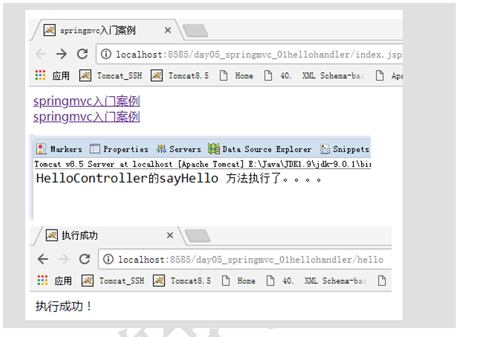

### 2.2 入门案例的执行过程及原理分析 
#### 2.2.1 案例的执行过程 
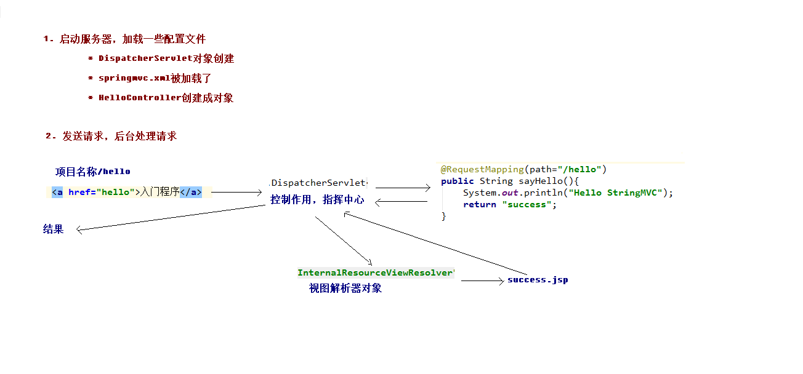
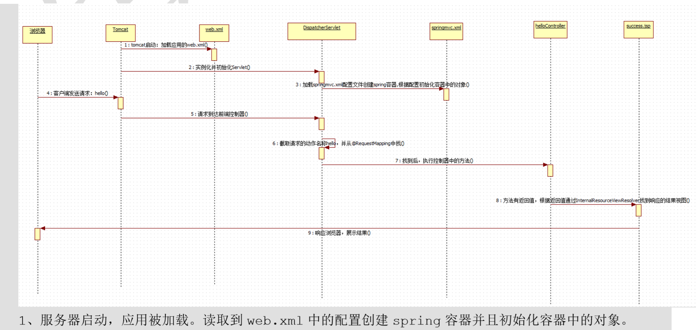
1、服务器启动，应用被加载。读取到 web.xml 中的配置创建 spring 容器并且初始化容器中的对象。 
从入门案例中可以看到的是：HelloController 和 InternalResourceViewResolver，但是远不止这些。 
2、浏览器发送请求，被 DispatherServlet 捕获，该 Servlet 并不处理请求，而是把请求转发出去。
转发的路径是根据请求 URL，匹配@RequestMapping 中的内容。 
3、匹配到了后，执行对应方法。该方法有一个返回值。 
4、根据方法的返回值，借助 InternalResourceViewResolver 找到对应的结果视图。 
5、渲染结果视图，响应浏览器。 

#### 2.2.2 SpringMVC 的请求响应流程 
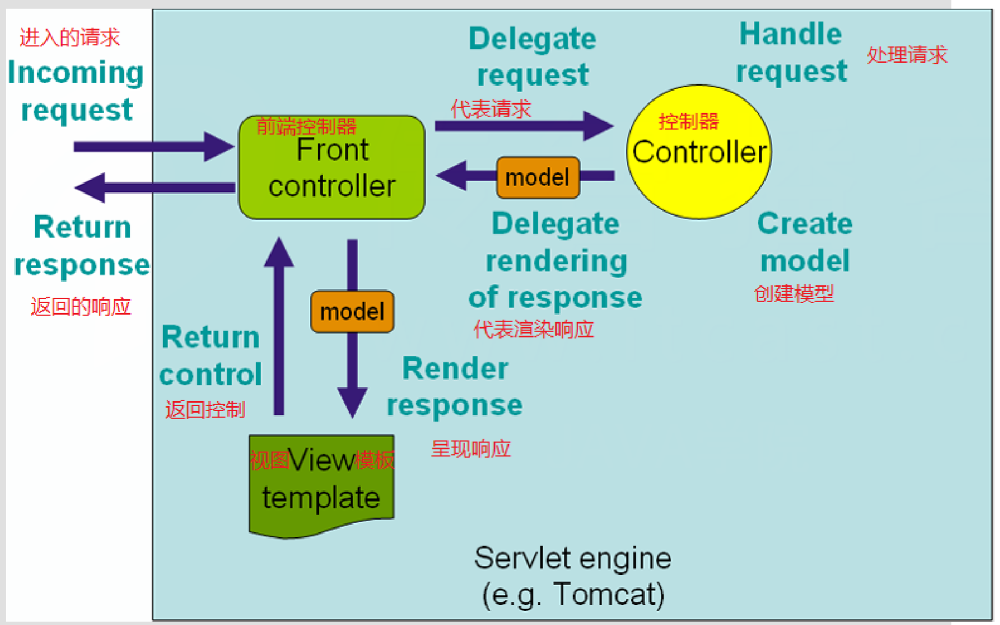


### 2.3 入门案例中涉及的组件 

#### 2.3.1 DispatcherServlet：前端控制器 

>用户请求到达前端控制器，它就相当于 mvc 模式中的 c，dispatcherServlet 是整个流程控制的中心，由 它调用其它组件处理用户的请求，dispatcherServlet 的存在降低了组件之间的耦合性。 

#### 2.3.2 HandlerMapping：处理器映射器 
>HandlerMapping 负责根据用户请求找到 Handler 即处理器，SpringMVC 提供了不同的映射器实现不同的 映射方式，例如：配置文件方式，实现接口方式，注解方式等。

#### 2.3.3 Handler：处理器 
>它就是我们开发中要编写的具体业务控制器。由 DispatcherServlet 把用户请求转发到 Handler。由 Handler 对具体的用户请求进行处理。 

#### 2.3.4 HandlAdapter：处理器适配器 
>通过 HandlerAdapter 对处理器进行执行，这是适配器模式的应用，通过扩展适配器可以对更多类型的处理器进行执行。 

#### 2.3.5 View Resolver：视图解析器 
>View Resolver 负责将处理结果生成 View 视图，View Resolver 首先根据逻辑视图名解析成物理视图名 即具体的页面地址，再生成 View 视图对象，最后对 View 进行渲染将处理结果通过页面展示给用户。 

#### 2.3.6 View：视图 
>SpringMVC 框架提供了很多的 View 视图类型的支持，包括：jstlView、freemarkerView、pdfView 等。我们最常用的视图就是 jsp。 一般情况下需要通过页面标签或页面模版技术将模型数据通过页面展示给用户，需要由程序员根据业务需求开发具体的页面。 

#### 2.3.7 \<mvc:annotation-driven>说明 
>在 SpringMVC 的各个组件中，处理器映射器、处理器适配器、视图解析器称为 SpringMVC 的三大组件。 
使用\<mvc:annotation-driven> 自动加载 RequestMappingHandlerMapping （处理映射器）和 RequestMappingHandlerAdapter （ 处 理 适 配 器 ） ， 可 用 在 SpringMVC.xml 配 置 文 件 中 使 用 \<mvc:annotation-driven>替代注解处理器和适配器的配置。 

>注意：  一般开发中，我们都需要写上此标签（虽然从入门案例中看，我们不写也行，随着课程的深入，该标签还 有具体的使用场景）。 
明确：  我们只需要编写处理具体业务的控制器以及视图。 


### 2.4 RequestMapping 注解 
#### 2.4.1 使用说明
```java
源码： 
@Target({ElementType.METHOD, ElementType.TYPE}) 
@Retention(RetentionPolicy.RUNTIME) 
@Documented 
@Mapping 
public @interface RequestMapping { 

} 
 
作用：  用于建立请求 URL 和处理请求方法之间的对应关系。 

出现位置： 
类上：   请求 URL 的第一级访问目录。
        此处不写的话，就相当于应用的根目录。写的话需要以/开头。   
        它出现的目的是为了使我们的 URL 可以按照模块化管理
方法上：   请求 URL 的第二级访问目录。 

属性：  
    value：用于指定请求的 URL。它和 path 属性的作用是一样的。  
    method：用于指定请求的方式。  
    params：用于指定限制请求参数的条件。它支持简单的表达式。要求请求参数的 key 和 value 必须和配置的一模一样。
    headers：用于指定限制请求消息头的条件。 
    注意：   以上四个属性只要出现2个或以上时，他们的关系是与的关系。 
```

#### 2.4.2 使用示例 
```java
/**
 * @author fzkstart
 * @create 2021-01-20 16:29
 * 控制器
 */
@Controller(value = "helloController")
@RequestMapping(path = "/user")
public class HelloController {
    /**
     * RequestMapping注解
     * @return
     */
    @RequestMapping(path="/testRequestMapping",method={RequestMethod.POST})
    public String testRequestMapping(){
        System.out.println("测试RequestMapping注解....");
        return "success";
    }
}
```
当使用 get 请求时，提示错误信息是 405，提示信息是方法不支持 get 方式请求 

```java
    //method设置多个值就可以接受多种请求
    //@RequestMapping(path="/testRequestMapping",method={RequestMethod.POST,RequestMethod.GET})
    //必须传入参数username，否则不执行此方法,若设置了username的值，则传入的值必须匹配才能执行
    @RequestMapping(path="/testRequestMapping",params = {"username=hehe"}
    ,headers = {"Accept"})
    public String testRequestMapping(){
        System.out.println("测试RequestMapping注解....");
        return "success";
    }
```
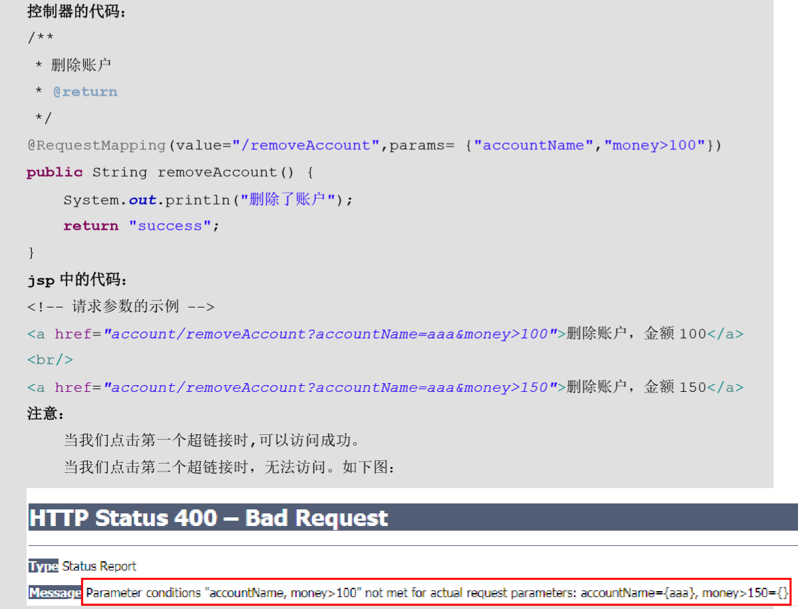


# 第3章 请求参数的绑定 
### 3.1 绑定说明 

1. 绑定机制 
    1. 表单提交的数据都是k=v格式的 username=haha&password=123 
    2. SpringMVC的参数绑定过程是把表单提交的请求参数，作为控制器中方法的参数进行绑定的 
    3. 要求：提交表单的name和参数的名称是相同的 
2. 支持的数据类型 
    1. 基本数据类型和字符串类型 
    2. 实体类型（JavaBean） 
    3. 集合数据类型（List、map集合等） 
    SpringMVC 绑定请求参数是自动实现的，但是要想使用，必须遵循使用要求。 
3. 使用要求
    1. 基本类型或者 String类型：  
    要求我们的参数名称必须和控制器中方法的形参名称保持一致。(严格区分大小写) 
    2. POJO类型，或者它的关联对象：  
    要求表单中参数名称和 POJO 类的属性名称保持一致。并且控制器方法的参数类型是 POJO 类型。 
    如果一个JavaBean类中包含其他的引用类型，那么表单的name属性需要编写成：对象.属性 例如： address.nam
    3. 集合类型,有两种方式： 
        - 第一种：   
            要求集合类型的请求参数必须在 POJO 中。在表单中请求参数名称要和 POJO 中集合属性名称相同。
            给 List 集合中的元素赋值，使用下标。   
            给 Map 集合中的元素赋值，使用键值对。  
            JSP页面编写方式：
            list[0].属性 
            map[key].属性
        - 第二种：   
        接收的请求参数是 json 格式数据。需要借助一个注解实现。 

4. 请求参数中文乱码的解决 
post 请求方式： 
在web.xml中配置Spring提供的过滤器类
过滤器需要放在配置前端控制器servlet的前面，不然会有报错
```xml
<!-- 配置 springMVC 编码过滤器 --> 
<!--配置解决POST请求中文乱码的过滤器-->
<filter>
    <filter-name>characterEncodingFilter</filter-name>
    <filter-class>org.springframework.web.filter.CharacterEncodingFilter</filter-class>
    <!-- 指定字符集 -->
    <init-param>
    <param-name>encoding</param-name>
    <param-value>UTF-8</param-value>
    </init-param>
</filter>
<filter-mapping>
    <filter-name>characterEncodingFilter</filter-name>
    <!-- 过滤所有请求 -->
    <url-pattern>/*</url-pattern>
</filter-mapping>
```
get 请求方式：  tomacat 对 GET和 POST 请求处理方式是不同的，GET请求的编码问题，要改 tomcat 的 server.xml 配置文件，如下： 
```xml
<Connector  connectionTimeout="20000"  port="8080"    
    protocol="HTTP/1.1"  redirectPort="8443"/> 
改为： 
<Connector  connectionTimeout="20000"  port="8080"     
    protocol="HTTP/1.1"  redirectPort="8443"  
    useBodyEncodingForURI="true"/> 
如果遇到 ajax 请求仍然乱码，请把：  
useBodyEncodingForURI="true"改为 URIEncoding="UTF-8" 即可。 
```

### 3.2 用例测试
1. 实体类Account和User
```java
public class Account implements Serializable {
    private String username;
    private String password;
    private Double money;
//    private User user;
    private List<User> list;
    private Map<String,User> map;
    ......
}
```
```java
public class User implements Serializable {
    private String uname;
    private Integer age;
    ......
}
```
2. 前端控制器代码
```java
/**
 * @author fzkstart
 * @create 2021-01-20 23:09
 * 请求参数绑定
 */
@Controller(value="paramController")
@RequestMapping(path="/param")
public class ParamController {
    /**
     * 请求参数绑定
     * 把数据封装到javabean类中
     * @return
     */
    @RequestMapping(path="/saveAccount",method = {RequestMethod.POST})
    public String saveAccount(Account account){
        System.out.println("执行了saveAccount()...");
        System.out.println(account);
        return "success";
    }
}
```
3. jsp代码
```html
    <%--把数据封装到Account类中，类中存在list和map集合--%>
    <form action="param/saveAccount" method="post">
        姓名：<input type="text" name="username"/><br/>
        密码：<input type="text" name="password"/><br/>
        金额：<input type="text" name="money"/><br/>

        用户1姓名：<input type="text" name="list[0].uname"/><br/>
        用户1年龄：<input type="text" name="list[0].age"/><br/>

        用户2姓名：<input type="text" name="map['one'].uname"/><br/>
        用户2年龄：<input type="text" name="map['one'].age"/><br/>

        <input type="submit" value="提交"/><br/>
    </form>
```

### 3.3 自定义类型转换器
1. 表单提交的任何数据类型全部都是字符串类型，但是后台定义Integer类型，数据也可以封装上，说明 Spring框架内部会默认进行数据类型转换。 
2. 如果想自定义数据类型转换，可以实现Converter的接口 
    1. 定义一个类，实现 Converter 接口，该接口有两个泛型。 
    ```java
    /**
    * @author fzkstart
    * @create 2021-01-21 14:22
    * 自定义类型转换器
    * 把字符串转换为日期
    */
    public class StringToDateConverter implements Converter<String, Date> {
        /**
        *
        * String source  传入进来的字符串
        * @param source
        * @return
        */
        @Override
        public Date convert(String source) {
            //判断
            if(source==null){
                throw new RuntimeException("请你传入数据");
            }
            DateFormat df=new SimpleDateFormat("yyyy-MM-dd");
            try {
                //吧字符串转换为日期
            return df.parse(source);
            } catch (ParseException e) {
                throw new RuntimeException("数据类型转换出现错误");
            }
        }
    }
    ```
    2. springmvc配置文件中配置类型转换器。  
    springmvc配置类型转换器的机制是，将自定义的转换器注册到类型转换服务中去。 
    ```xml
    <!--配置类型转换器工厂-->
    <bean id="conversionService" class="org.springframework.context.support.ConversionServiceFactoryBean">
        <!-- 给工厂注入一个新的类型转换器 --> 
        <property name="converters">
            <set>
                <!-- 配置自定义类型转换器 --> 
                <bean class="com.fzk.utils.StringToDateConverter"/>
            </set>
        </property>
    </bean>
    ```
    3. annotation-driven标签中引用配置的类型转换服务
    ```xml
    <!-- 引用自定义类型转换器 -->      
    <!--开启springmvc框架注解的支持-->
    <mvc:annotation-driven conversion-service="conversionService"/>
    ```
### 3.4 在控制器中使用原生的ServletAPI对象 
1. 只需要在控制器的方法参数定义HttpServletRequest和HttpServletResponse对象
```java
    /**
     * 测试获取Servlet原生API
     * @return
     */
    @RequestMapping("/testServlet")
    public String testServlet(HttpServletRequest request, HttpServletResponse response){
        System.out.println("执行了testServlet...");
        System.out.println(request);
        System.out.println(response);
        HttpSession session = request.getSession();
        System.out.println(session);
        ServletContext servletContext = session.getServletContext();
        System.out.println(servletContext);
        return "success";
    }
```
要获取哪个就直接在方法参数中定义即可。

# 第4章：常用的注解 

## 参数注解

### 4.1 RequestParam 

1. 使用说明 
作用：  把请求中指定名称的参数给控制器中的形参赋值。 
属性：  
value：请求参数中的名称。  
required：请求参数中是否必须提供此参数。默认值：true。表示必须提供，如果不提供将报错
2. 使用示例 
    1. jsp 中的代码： 
    ```html
    <!-- requestParams 注解的使用 --> 
    <a href="springmvc/useRequestParam?name=test">requestParam 注解</a> 
    ```
    2. 控制器中的代码： 
    ```java
    /** 
    * requestParams 注解的使用  
    * @param username  
    * @return 
    */ 
    @RequestMapping("/useRequestParam") 
    public String useRequestParam(@RequestParam("name")String username,       
        @RequestParam(value="age",required=false)Integer age){
            System.out.println(username+","+age);  
            return "success"; 
    } 
    ```
    3. 运行结果

    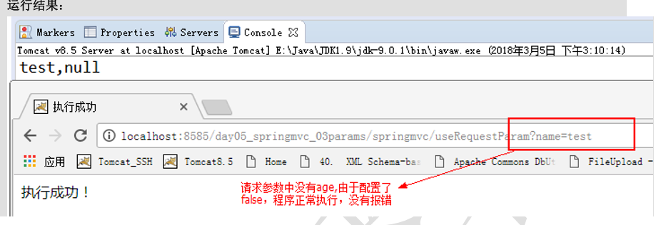

### 4.2 RequestBody 
####4.2.1 使用说明
    作用：  用于获取请求体内容。
    直接使用得到是 key=value&key=value...结构的数据。 
    get 请求方式不适用。 
    属性：  
        required：是否必须有请求体。默认值是:true。
        当取值为 true 时,get 请求方式会报错。
        如果取值为 false，get 请求得到是 null。 
    
####4.2.2 使用示例 
```html
post 请求 jsp代码： 
<!-- request body 注解 --> 
<form action="springmvc/useRequestBody" method="post"> 
    用户名称：<input type="text" name="username" ><br/>  
    用户密码：<input type="password" name="password" ><br/>  
    用户年龄：<input type="text" name="age" ><br/> 
    <input type="submit" value=" 保存 "> 
</form> 
get 请求 jsp代码： 
<a href="springmvc/useRequestBody?body=test">requestBody 注解 get 请求</a> 
```
控制器代码： 
```java
/** 
 * RequestBody 注解  
 * @param user  
 * @return  
 */ 
@RequestMapping("/useRequestBody") 
public String useRequestBody(@RequestBody(required=false) String body){  
    System.out.println(body);  
    return "success"; 
} 
```
运行结果
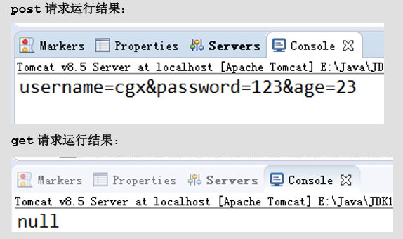

### 4.3 PathVaribale 
####4.3.1 使用说明 
    作用：  用于绑定 url 中的占位符。
    例如：请求 url 中 /delete/{id}，这个{id}就是 url 占位符。  
    url 支持占位符是 spring3.0 之后加入的。是 springmvc 支持 rest 风格 URL 的一个重要标志。 

    属性：  
        value：用于指定 url 中占位符名称。  
        required：是否必须提供占位符。 

####4.3.2 使用示例 
```
jsp代码：
    <a href="anno/testPathVariable/10">PathVariable注解</a><br/>
控制器代码：
    /**
     * PathVariable注解
     * @param id
     * @return
     */
    @RequestMapping("/testPathVariable/{sid}")
    public String testPathVariable(@PathVariable(value="sid") String id){
        System.out.println("执行了testPathVariable...");
        System.out.println(id);
        return "success";
    }
```
### 4.3.3 REST 风格 URL


### 4.4 RequestHeader 

作用：  用于获取请求消息头。 
属性：  value：提供消息头名称  required：是否必须有此消息头 
注：  在实际开发中一般不怎么用。 

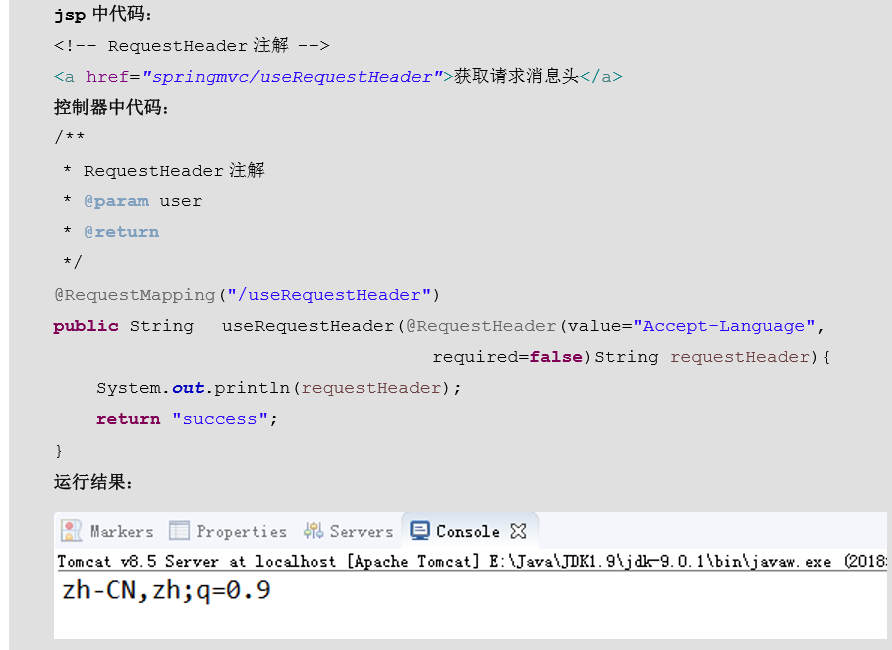

### 4.5 CookieValue

实例：

```java
    /**
     * 获取Cookie的值
     * @param cookieValue
     * @return
     */
    @RequestMapping(value="/testCookieValue")
    public String testCookieValue(@CookieValue(value="JSESSIONID") String cookieValue){
        System.out.println("执行了testPathVariable...");
        System.out.println(cookieValue);
        return "success";
    }
```
jsp代码：
```html
    <a href="anno/testCookieValue">CookieValue注解</a><br/>
```

### 4.6 ModelAttribute 

作用：  该注解是 SpringMVC4.3 版本以后新加入的。它可以用于修饰方法和参数。  
出现在方法上，表示当前方法会在控制器的方法执行之前，先执行。
它可以修饰没有返回值的方法，也可以修饰有具体返回值的方法。  
出现在参数上，获取指定的数据给参数赋值。 

属性：  
value：用于获取数据的 key。key 可以是 POJO 的属性名称，也可以是 map 结构的 key。 
        
应用场景：  当表单提交数据不是完整的实体类数据时，保证没有提交数据的字段使用数据库对象原来的数据。  
例如：   我们在编辑一个用户时，用户有一个创建信息字段，该字段的值是不允许被修改的。
在提交表单数据是肯定没有此字段的内容，一旦更新会把该字段内容置为 null，此时就可以使用此注解解决问题。 

jsp代码：

```html
    <form action="anno/testModelAttribute" method="post">

        用户1姓名：<input type="text" name="uname"/><br/>
        用户1年龄：<input type="text" name="age"/><br/>

        <input type="submit" value="提交"/><br/>
    </form>
```
#####4.6.2.1 基于 POJO 属性的基本使用： 
```java
    /**
     * ModelAttribute注解
     * @return
     */
    @RequestMapping(value="/testModelAttribute")
    public String testModelAttribute(User user){
        System.out.println("执行了testModelAttribute...");
        System.out.println(user);
        return "success";
    }
    /**
     * 该方法会先执行
     * 先执行这个MOdelAttribute方法，再将前端的值取出赋给对象
     */
    @ModelAttribute
    public User showUser(String uname){
        System.out.println("执行了showUser...");
        //通过用户查询数据库（模拟）
        User user=new User();
        user.setUname("fzk");
        user.setAge(20);
        user.setDate(new Date());
        return user;
    }
```
此处的值应该是传给
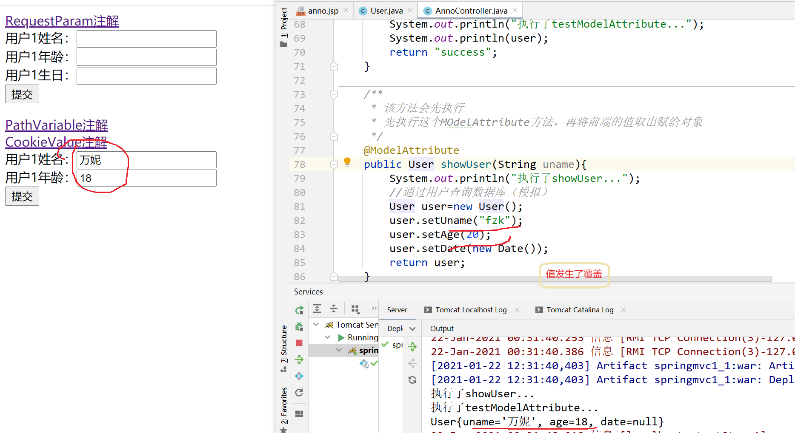

#####4.6.2.3 基于 Map 的应用场景示例 1：ModelAttribute 修饰方法不带返回值 
```java
    /**
     * ModelAttribute注解
     * @return
     */
    @RequestMapping(value="/testModelAttribute")
    public String testModelAttribute(@ModelAttribute(value="abc") User user){
        System.out.println("执行了testModelAttribute...");
        System.out.println(user);
        return "success";
    }
    @ModelAttribute
    public Map<String, User> showUser1(String uname, Map<String,User> map){
        System.out.println("执行了showUser...");
        //通过用户查询数据库（模拟）
        User user=new User();
        user.setUname("fzk");
        user.setAge(20);
        user.setDate(new Date());
        map.put("abc",user);
        return map;
    }
```

此处的执行应该是前端的参数传入了两个方法之中，第一个方法的返回值也传入了第二个方法，之后发生了值覆盖。
### 4.7 SessionAttribute 
jsp代码：

```html
    <a href="anno/testSessionAttributes">SessionAttributes</a><br/>
    <a href="anno/getSessionAttributes">getSessionAttributes</a><br/>
    <a href="anno/deleteSessionAttributes">deleteSessionAttributes</a><br/>
```
控制器代码：
```java
/**
 * @author fzkstart
 * @create 2021-01-21 15:18
 * 常用注解
 */
@Controller(value="annoController")
@RequestMapping(path="/anno")
//存入到session域中
@SessionAttributes(value={"username","password"},types = {Integer.class})
public class AnnoController {
    /**
     * 把数据存入 SessionAttribute
     * @param model
     * @return
     *  Model 是 spring 提供的一个接口，该接口有一个实现类 ExtendedModelMap
     *  该类继承了 ModelMap，而 ModelMap 就是 LinkedHashMap 子类
     */
    @RequestMapping(value="/testSessionAttributes")
    public String testSessionAttributes(Model model){
        System.out.println("执行了testSessionAttributes...");
        //底层会存储到request域对象中
        model.addAttribute("username","fzk");
        model.addAttribute("password","123456");
        model.addAttribute("age",18);
        //跳转之前将数据保存到 username、password 和 age 中，
        // 因为注解@SessionAttributes 中有这几个参数
        return "success";
    }
    /**
     * 获取session域中的值
     * @param model
     * @return
     */
    @RequestMapping(value="/getSessionAttributes")
    public String getSessionAttributes(ModelMap model){
        System.out.println("执行了getSessionAttributes...");
        String fzk =(String) model.get("username");
        String password =(String) model.get("password");
        Integer age = (Integer)model.get("age");
        System.out.println(fzk+password+age);
        return "success";
    }
    /**
     * 清除session域中的值
     * @param status
     * @return
     */
    @RequestMapping(value="/deleteSessionAttributes")
    public String deleteSessionAttributes(SessionStatus status){
        System.out.println("执行了deleteSessionAttributes...");
        status.setComplete();//表示设置完成，会清除session域中的值
        return "success";
    }
}
```
显示页面代码：success.jsp
```html
<%-- 这里添加了一个isELIgnored="false" --%>
<%@ page contentType="text/html;charset=UTF-8" language="java" isELIgnored="false" %>
<html>
<head>
    <title>Title</title>
</head>
<body>
    <h3>入门成功</h3>
    <%--request域对象--%>
    ${requestScope.username}
    ${requestScope.password}
    ${requestScope.age}

    <%--session域对象--%>
    ${sessionScope}
</body>
</html>
```
运行结果
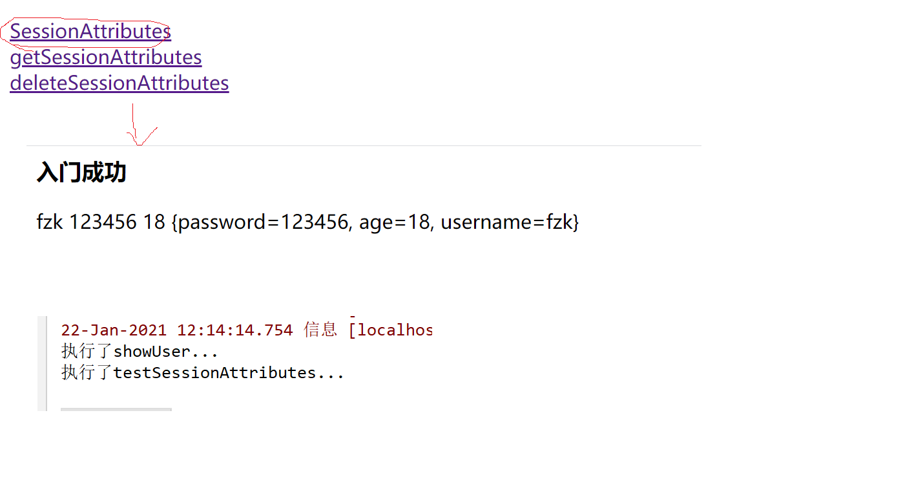

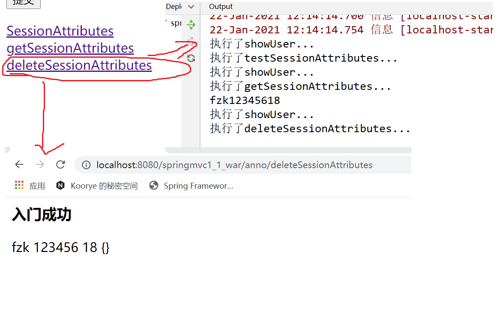
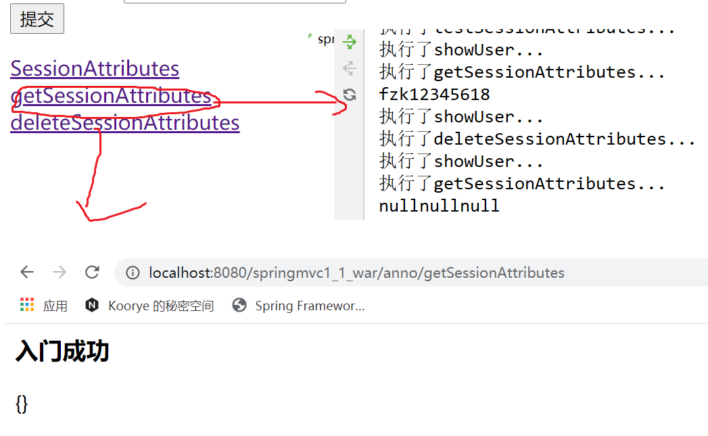

# 第5章 响应数据和结果视图 

### 1.1 返回值分类 

#### 1.1.1 字符串 
controller 方法返回字符串可以指定逻辑视图名，通过视图解析器解析为物理视图地址。 

```java
//指定逻辑视图名，经过视图解析器解析为 jsp 物理路径：/WEB-INF/pages/success.jsp 
/**
* 返回String
* @param model
* @return
*/
@RequestMapping(path="/testString")
public String testString(Model model){
    System.out.println("testString执行了...");
    //模拟从数据库中查询出User对象
    User user=new User();
    user.setUsername("fzk");
    user.setPassword("123456");
    user.setAge(19);

    //model对象
    model.addAttribute("user",user);
    return "success";
}
```

#### 1.1.2 void 
Servlet 原始 API 可以作为控制器中方法的参数：
```java
    /**
     * 返回值是void
     *
     * 请求转发一次请求，不用编写项目名称
     * @param request
     */
    @RequestMapping(path="/testVoid")
    public void testVoid(HttpServletRequest request, HttpServletResponse response) throws Exception {
        System.out.println("testVoid执行了...");
        //1、使用 request 转向页面，如下：编写请求转发的程序
//        request.getRequestDispatcher("/WEB-INF/pages/success.jsp").forward(request,response);

        //2、也可以通过 response 页面重定向
//        response.sendRedirect(request.getContextPath()+"/index.jsp");

        //3、也可以通过 response 指定响应结果，例如响应 json 数据： 
        //解决中文乱码
        response.setContentType("text/html;charset=UTF-8");

        //直接进行响应
        PrintWriter writer = response.getWriter();
        writer.println("你好");
        return;
    }
```

#### 1.1.3 ModelAndView
ModelAndView 是 SpringMVC 为我们提供的一个对象，该对象也可以用作控制器方法的返回值。
该对象中有两个方法： 
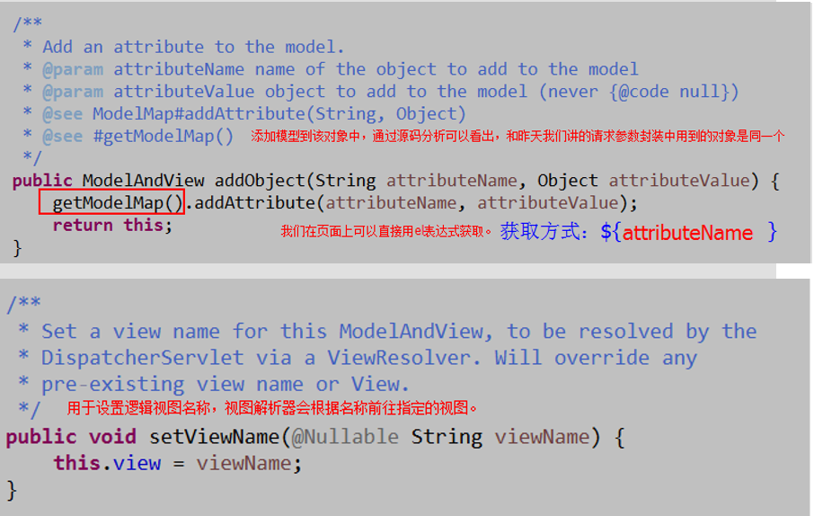
控制器代码：
```java
/**
* 返回ModelAndView对象
* @return
*/
@RequestMapping(path="/testModelAndView")
public ModelAndView testModelAndView(){
    System.out.println("testModelAndView执行了...");
    //创建ModelAndView对象
    ModelAndView mv = new ModelAndView();
    //模拟从数据库中查询出User对象
    User user=new User();
    user.setUsername("fzk");
    user.setPassword("123456");
    user.setAge(19);

    //吧user对象存储在mv对象中，也会吧user对象存储到request域
    mv.addObject("user",user);

    //跳转到某个页面，利用视图解析器
    mv.setViewName("success");
    return mv;
}
```
响应的jsp页面代码
```html
<%-- 设置isELIgnored="false" --%>
<%@ page contentType="text/html;charset=UTF-8" language="java" isELIgnored="false" %>
<html>
<head>
    <title>Title</title>
</head>
<body>
    <h3>执行成功</h3>
    <%--request域--%>
    ${user.username}
    ${user.toString()}
    ${requestScope.user}
</body>
</html>
```
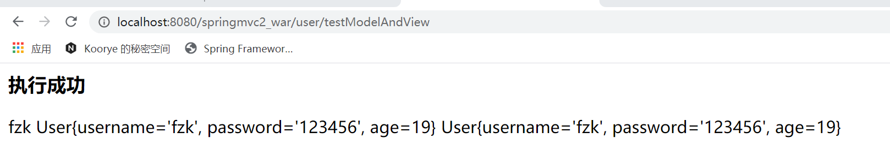
注意：  在页面上获取使用的是 requestScope.username 取的，所以返回 ModelAndView 类型时，浏览器跳转只能是请求转发。 

### 1.2 关键字转发或重定向
这个是SpringMVC框架提供的转发和重定
#### 1.2.1 forward 转发
controller 方法在提供了 String 类型的返回值之后，默认就是请求转发。也可以返回关键字方式。 

注意：
>如果用了 formward：则路径必须写成实际视图 url，不能写逻辑视图。(说明不经过视图解析器)
它相当于“request.getRequestDispatcher("url").forward(request,response)”。使用请求转发，既可以转发到 jsp，也可以转发到其他的控制器方法。 

#### 1.2.2 Redirect 重定向 
contrller 方法提供了一个 String 类型返回值之后，它需要在返回值里使用:redirect: 

它相当于“response.sendRedirect(url)”。需要注意的是，如果是重定向到 jsp 页面，则 jsp 页面不 能写在 WEB-INF 目录中，否则无法找到。 
```java
/**
* 使用关键字方式进行转发或者重定向
* @param model
* @return
*/
@RequestMapping(path="/testForwardOrRedirect")
public String testForwardOrRedirect(Model model){
    System.out.println("testForwardOrRedirect执行了...");

    //1.请求的转发
    //固定语法，表请求转发
    //        return "forward:/WEB-INF/pages/success.jsp";


    //2.重定向
    //注意：原生的Servlet在重定向的时候必须加上项目名
    //这里的关键字不用加，说明框架已经默认加好了
    return "redirect:/index.jsp";
}
```

### 1.3 ResponseBody 响应 json 数据 
1. 使用说明 
作用：  该注解用于将 Controller 的方法返回的对象，通过 HttpMessageConverter 接口转换为指定格式的数据如：json,xml 等，通过 Response 响应给客户端 
2.  使用示例 
    1. 需求：  使用@ResponseBody 注解实现将 controller 方法返回对象转换为 json 响应给客户端。 
    2. 前置知识点：  Springmvc 默认用 MappingJacksonHttpMessageConverter 对 json 数据进行转换，需要加入 jackson 的包。 
    注意：2.7.0以下的版本用不了 
        ```xml
        <!-- json字符串和JavaBean对象互相转换的过程中，
        需要使用jackson的jar包-->
        <dependency>
            <groupId>com.fasterxml.jackson.core</groupId>
            <artifactId>jackson-databind</artifactId>
            <version>2.9.0</version>
        </dependency>
        <dependency>
            <groupId>com.fasterxml.jackson.core</groupId>
            <artifactId>jackson-core</artifactId>
            <version>2.9.0</version>
        </dependency>
        <dependency>
            <groupId>com.fasterxml.jackson.core</groupId>
            <artifactId>jackson-annotations</artifactId>
            <version>2.9.0</version>
        </dependency>
        ```
3. DispatcherServlet会拦截到所有的资源，导致一个问题就是静态资源（img、css、js）也会被拦截到，从而不能被使用。解决问题就是需要配置静态资源不进行拦截，在springmvc.xml配置文件添加如下配置 
    1. mvc:resources标签配置不过滤 
        1. location元素表示webapp目录下的包下的所有文件
        2. mapping元素表示以/static开头的所有请求路径，如/static/a 或者/static/a/b
    ```xml
    <!-- 设置静态资源不过滤 -->    
    <mvc:resources location="/css/" mapping="/css/**"/>  <!-- 样式 -->    
    <mvc:resources location="/images/" mapping="/images/**"/>  <!-- 图片 -->    
    <mvc:resources location="/js/" mapping="/js/**"/>  <!-- javascript -->
    ```

步骤：

1. 使用@RequestBody获取请求体数据
    jsp代码：
    ```html
    <%@ page contentType="text/html;charset=UTF-8" language="java" %>
    <html>
    <head>
        <title>Title</title>
        <%--引入js文件--%>
        <script src="js/jquery.min.js"></script>
        <script>
            //页面加载，绑定单击事件
            $(function (){
                $("#btn").click(function () {
                    // alert("hello btn");
                    //发送ajax请求
                    $.ajax({
                        //编写json格式，设置属性和值
                        url:"user/testAjax",
                        contentType:"application/json;charset=UTF-8",
                        data:'{"username":"hehe","password":"123","age":19}',
                        dataType:"json",
                        type:"post",
                        success:function(data){
                            //data 服务器端响应的json数据，进行解析
                            alert(data);
                            alert(data.username);
                            alert(data.password)
                        }
                    });
                });
            });
        </script>
    </head>
    <body>
        <button id="btn">发送ajax请求</button><br/>
    </body>
    </html>
    ```
    控制器代码：
    ```java
    /**
    * 获取请求体的数据     
    * @param body     
    */
    @RequestMapping(path="/testAjax")
    public @ResponseBody User testAjax(@RequestBody String body){
        System.out.println(body);
    }
    ```

2. 使用@RequestBody注解把json的字符串转换成JavaBean的对象
    ```java
    /**     
    * 获取请求体的数据     
    * @param user     
    */    
    @RequestMapping("/testJson")    
    public void testJson(@RequestBody User user) {        
        System.out.println(user);   
    }
    ```

3. 使用@ResponseBody注解把JavaBean对象转换成json字符串，直接响应
    ```java
    /**
     * 模拟异步请求响应
     * @param user
     * RequestBody注解将传来的json字符集转为User对象
     * ResponseBody注解将返回的user转为json字符串
     */
    @RequestMapping(path="/testAjax")
    public @ResponseBody User testAjax(@RequestBody User user){
        System.out.println("testAjax执行了...");
        //客户端发送的是ajax请求，传的是json字符串，
        // 后端把json字符串封装到User对象中
        System.out.println(user);
        //模拟查询数据库
        user.setUsername("fzk");
        user.setAge(20);
        //响应前端
        return user;
    }
    ```
4. 结果

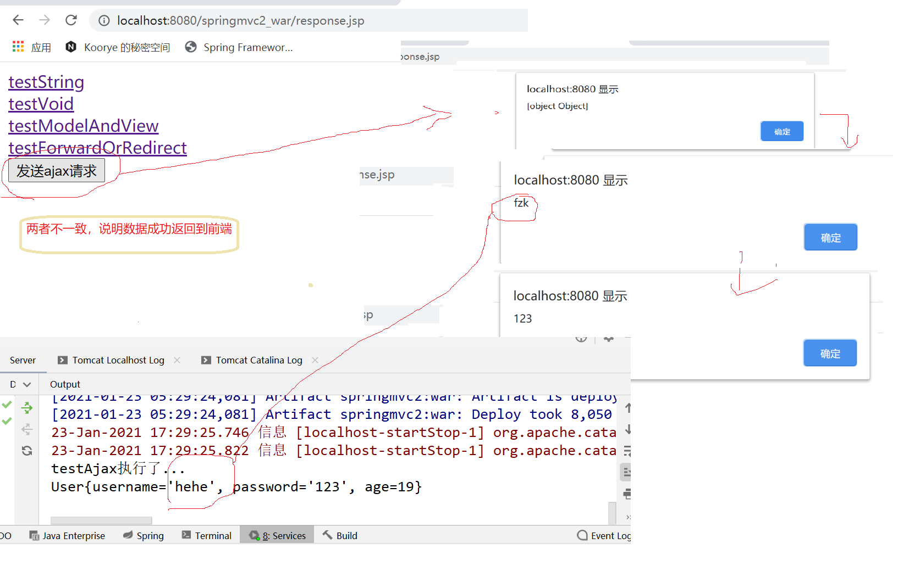
5. 同步响应和异步响应
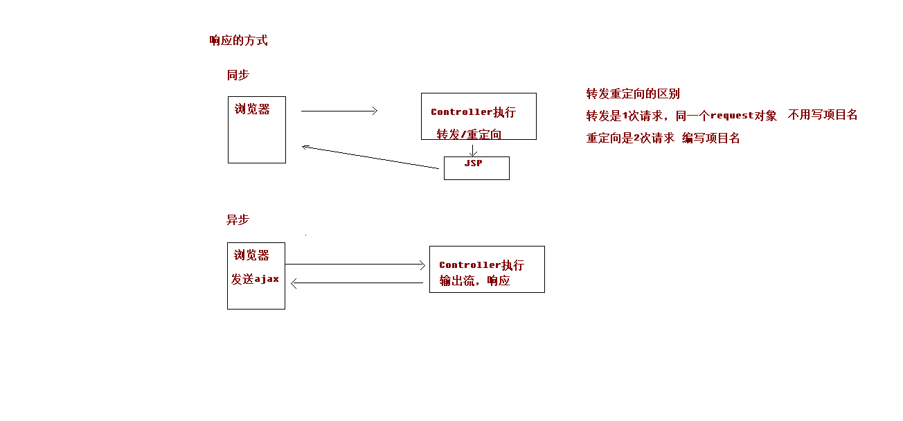

# 第6章：SpringMVC实现文件上传 

### 2.1 文件上传的回顾 

####2.1.1 文件上传的必要前提 
A form 表单的 enctype 取值必须是：multipart/form-data      (默认值是:application/x-www-form-urlencoded)     enctype:是表单请求正文的类型 
B method 属性取值必须是 Post (get请求会将参数都放在地址栏内，放不下)
C 提供一个文件选择域\<input type=”file” /> 
####2.1.2 文件上传的原理分析 


####2.1.3 借助第三方组件实现文件上传 
使用 Commons-fileupload 组件实现文件上传，需要导入该组件相应的支撑 jar 包：Commons-fileupload 和commons-io。
commons-io 不属于文件上传组件的开发 jar 文件，但Commons-fileupload 组件从 1.1 版本开始，它工作时需要 commons-io 包的支持。 
1. 导入文件上传的jar包
```xml
    <!--导入文件上传的jar包-->
    <dependency>
      <groupId>commons-fileupload</groupId>
      <artifactId>commons-fileupload</artifactId>
      <version>1.3.1</version>
    </dependency>
    <dependency>
      <groupId>commons-io</groupId>
      <artifactId>commons-io</artifactId>
      <version>2.4</version>
    </dependency>
```
2. 编写文件上传的JSP页面
```html
<h3>传统方式文件上传</h3>
<form action="user/testUpload1" method="post" enctype="multipart/form-data" >
    选择文件：<input type="file" name="upload"/><br/>
    <input type="submit" value="上传"/>
</form>
```
3. 编写文件上传的Controller控制器
```java
/**
* 文件上传
* @param request
* @param response
* @return
* @throws Exception
*/
@RequestMapping(path="/testUpload1",method = {RequestMethod.POST,RequestMethod.GET})
public String testUpload1(HttpServletRequest request, HttpServletResponse response) throws Exception {
    System.out.println("文件上传...");

    //使用fileupload组件完成文件上传
    //先获取到要上传的文件目录
    String path = request.getSession().getServletContext().getRealPath("/uploads/");
    //创建File对象，一会向该路径下上传文件
    File file=new File(path);
     // 判断路径是否存在，如果不存在，创建该路径
    if(!file.exists()){
        //创建该文件夹
        file.mkdirs();
    }

    // 创建磁盘文件项工厂
    DiskFileItemFactory factory = new DiskFileItemFactory();
    ServletFileUpload fileUpload = new ServletFileUpload(factory);
    //解析request对象，获取上传文件项
    List<FileItem> fileItems = fileUpload.parseRequest(request);
    //遍历
    for(FileItem item: fileItems){
        // 判断文件项是普通字段，还是上传的文件
        if(item.isFormField()){
            //说明是普通表单项
        }else{
            //说明上传文件项
            //获取上传文件的名称
            String name = item.getName();
            //把文件的名称设为唯一值，uuid
            String uuid = UUID.randomUUID().toString().replace("-", "");
            name=uuid+"_"+name;
            //完成文件上传
            item.write(new File(path,name));
            //删除临时文件
            item.delete();
        }
    }
    return "success";
}
```

### 2.2 springmvc 传统方式的文件上传 
####2.2.1 说明 
    传统方式的文件上传，指的是我们上传的文件和访问的应用存在于同一台服务器上。 
    并且上传完成之后，浏览器可能跳转。 


####2.2.2 实现步骤 
1. 导入文件上传的jar包
```xml
    <!--导入文件上传的jar包-->
    <dependency>
      <groupId>commons-fileupload</groupId>
      <artifactId>commons-fileupload</artifactId>
      <version>1.3.1</version>
    </dependency>
    <dependency>
      <groupId>commons-io</groupId>
      <artifactId>commons-io</artifactId>
      <version>2.4</version>
    </dependency>
```
2. 编写文件上传的JSP页面
```html
<h3>springmvc文件上传</h3>
<form action="user/testUpload2" method="post" enctype="multipart/form-data" >
    选择文件：<input type="file" name="upload"/><br/>
    <input type="submit" value="上传"/>
</form>
```
3. 编写文件上传的Controller控制器
SpringMVC框架提供了MultipartFile对象，该对象表示上传的文件，要求变量名称必须和表单file标签的 name属性名称相同。 
```java
    /**
     * springmvc传统方式文件上传
     * @param request
     * @return
     * @throws Exception
     */
    @RequestMapping(path="/testUpload2",method = {RequestMethod.POST,RequestMethod.GET})
    public String testUpload2(HttpServletRequest request, MultipartFile upload) throws Exception {
        System.out.println("SpringMVC方式的文件上传....");

        //使用fileupload组件完成文件上传
        //上传的位置
        String path = request.getSession().getServletContext().getRealPath("/uploads/");
        //判断路径是否存在
        File file=new File(path);
        if(!file.exists()){
            //创建该文件夹
            file.mkdirs();
        }

        //说明上传文件项
        //获取上传文件的名称
        String name = upload.getOriginalFilename();
        //把文件的名称设为唯一值，uuid
        String uuid = UUID.randomUUID().toString().replaceAll("-", "");
        name=uuid+"_"+name;
        //完成文件上传
        upload.transferTo(new File(path,name));
        return "success";
    }
```
4. 配置文件解析器对象
在springmvc.xml中配置
```xml
<!-- 配置文件解析器对象，要求id名称必须是multipartResolver,注意空格问题-->
<bean id="multipartResolver" class="org.springframework.web.multipart.commons.CommonsMultipartResolver">
    <!-- 设置上传文件的最大尺寸为 10MB --> 
    <property name="maxUploadSize" value="10485760"/>
</bean>
```
**注意**：  文件上传的解析器 id是固定的，不能起别的名称，否则无法实现请求参数的绑定。（不光是文件，其他字段也将无法绑定）


### 2.3 springmvc 跨服务器方式的文件上传 

#### 2.3.1 分服务器的目的 
    在实际开发中，我们会有很多处理不同功能的服务器。
    例如：  
        应用服务器：负责部署我们的应用  
        数据库服务器：运行我们的数据库  
        缓存和消息服务器：负责处理大并发访问的缓存和消息  
        文件服务器：负责存储用户上传文件的服务器。 
        (注意：此处说的不是服务器集群） 

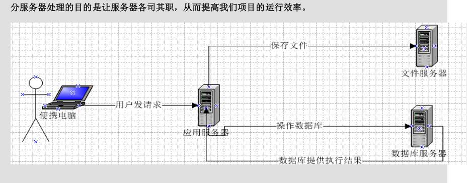


####2.3.2 准备两个 tomcat 服务器，并创建一个用于存放图片的 web 工程 
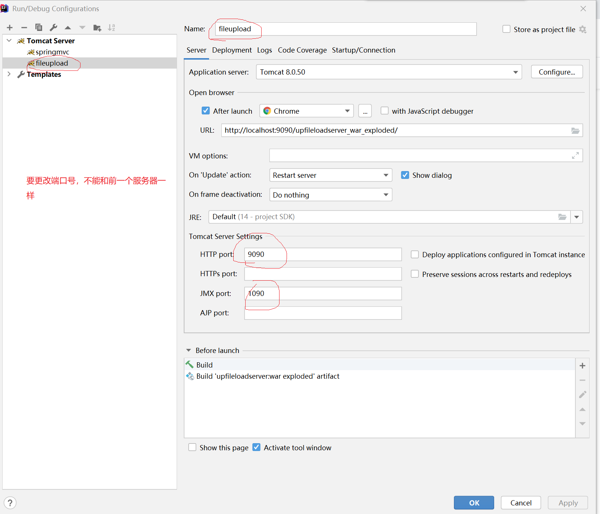
在 tomcat的web.xml 配置中加入下列配置中的最后一行配置，允许读写操作。 
```xml
    <servlet>
        <servlet-name>default</servlet-name>
        <servlet-class>org.apache.catalina.servlets.DefaultServlet</servlet-class>
        <init-param>
            <param-name>debug</param-name>
            <param-value>0</param-value>
        </init-param>
        <init-param>
            <param-name>listings</param-name>
            <param-value>false</param-value>
        </init-param>
        <load-on-startup>1</load-on-startup>
        <init-param>
	        <param-name>readonly</param-name>
	        <param-value>false</param-value>
        </init-param>
    </servlet>
```
加入此行的含义是：接收文件的目标服务器可以支持写入操作

####2.3.3 拷贝 jar包 
在我们负责处理文件上传的项目中拷贝文件上传的必备 jar 包 
```xml
    <!--实现SpringMVC跨服务器方式文件上传所需的jar包-->
    <dependency>
      <groupId>com.sun.jersey</groupId>
      <artifactId>jersey-core</artifactId>
      <version>1.18.1</version>
    </dependency>
    <dependency>
      <groupId>com.sun.jersey</groupId>
      <artifactId>jersey-client</artifactId>
      <version>1.18.1</version>
    </dependency>
```
####2.3.4 编写控制器实现上传图片 
```java
    /**
     * 跨服务器文件上传
     * @param upload
     * @return
     * @throws Exception
     */
    @RequestMapping(path="/testUpload3",method = {RequestMethod.POST,RequestMethod.GET})
    public String testUpload3( MultipartFile upload) throws Exception {
        System.out.println("SpringMVC跨服务器方式的文件上传....");

        //定义上传文件路径
        String path="http://localhost:9090/upfileloadserver_war_exploded/uploads/";

        //说明上传文件项
        //获取上传文件的名称
        String name = upload.getOriginalFilename();
        //把文件的名称设为唯一值，uuid
        String uuid = UUID.randomUUID().toString().replaceAll("-", "");
        name=uuid+"_"+name;

        //完成文件上传，跨服务器上传
        //创建客户端对象
        //5.创建 sun 公司提供的 jersey 包中的 Client 对象 
        Client client=Client.create();
        //和图片服务器进行连接
        WebResource webResource = client.resource(path + name);
        //上传文件
        webResource.put(upload.getBytes());
        return "success";
    }
```
pdf中的更详细
2.3.5 编写 jsp 页面 
2.3.6 配置解析器 
同上
如果出现403错误，则是Tomcat的web.xml配置没有开放权限
409错误可能是因为上传的文件路径不存在，可以手动去创建，也可以像前面那样编码判断之后创建

# 第7章 MVC中异常处理 

## 自定义异常解析器

### 异常处理的思路 
系统中异常包括两类：预期异常和运行时异常 RuntimeException，前者通过捕获异常从而获取异常信息， 后者主要通过规范代码开发、测试通过手段减少运行时异常的发生。 
系统的 dao、service、controller 出现都通过 throws Exception 向上抛出，最后由 springmvc 前端控制器交由异常处理器进行异常处理，如下图： 
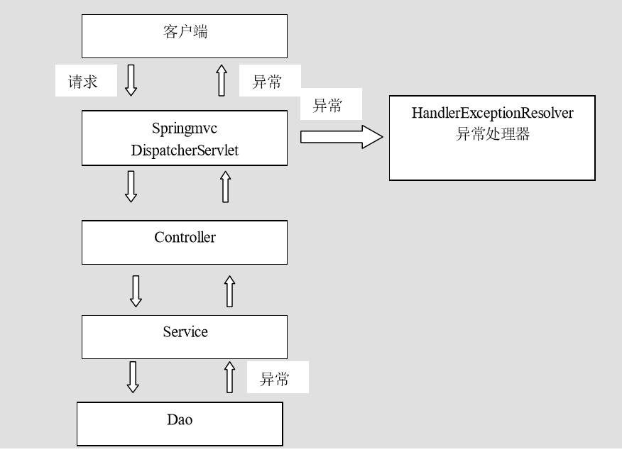


### 实现步骤 
1. 编写异常类和错误页面 
```java
/**
 * @author fzkstart
 * @create 2021-01-24 15:52
 * 自定义的异常类
 */
public class SysException extends Exception{
    //存储提示信息
    private String message;

    public SysException(String message) {
        this.message = message;
    }

    @Override
    public String getMessage() {
        return message;
    }

    public void setMessage(String message) {
        this.message = message;
    }
}
```
```html
<%@ page contentType="text/html;charset=UTF-8" language="java" isELIgnored="false" %>
<html>
<head>
    <title>Title</title>
</head>
<body>
    ${requestScope.errorMsg}
</body>
</html>
```
2. 自定义异常处理器
```java
public class SysExceptionResolver implements HandlerExceptionResolver {
    /**
     * 处理异常的业务逻辑,跳转到具体的错误页面
     * @param httpServletRequest
     * @param httpServletResponse
     * @param o
     * @param exception
     * @return
     */
    @Override
    public ModelAndView resolveException(HttpServletRequest httpServletRequest, HttpServletResponse httpServletResponse, Object o, Exception exception) {
        //获取异常对象
        SysException e=null;
        if(exception instanceof SysException){
            e=(SysException)exception;
        }else{
            e=new SysException("系统正在维护....");
        }
        //创建ModelAndView对象
        ModelAndView mv = new ModelAndView();
        // 存入错误的提示信息
        mv.addObject("errorMsg",e.getMessage());
        // 跳转的Jsp页面
        mv.setViewName("error");
        return mv;
    }
}
```
3. 配置异常处理器
在springmvc.xml中配置
```xml
<!--配置异常处理器-->
<bean id="sysExceptionResolver" class="com.fzk.exception.SysExceptionResolver"/>
```
4. 结果
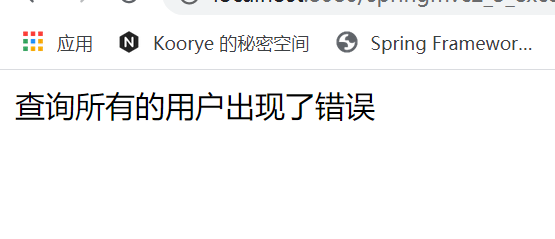

## @ExceptionHandler

`@Controller`和`@ControllerAdvice`标注的类可以用`@ExceptionHandler`注解标注方法来处理来自于Controller的异常。

```java
@RestController
public class HelloController {
    @RequestMapping(path = "/hello")
    public String sayHello(HttpServletRequest request, HttpServletResponse response) {
        int i = 1 / 0;
        return "成功啦success";
    }

    @ExceptionHandler // 为空将默认拦截参数中标明的异常类型
    //@ExceptionHandler({IOException.class, ArithmeticException.class})//也可以这里标明拦截异常类型
    public String exceptionHandler(IOException e) {
        return e.getClass() + "<br/>" + e.getMessage();
    }
}
```

比如，调用第一个方法，此时的配置只会拦截参数中标明的IOException，ArithmeticException是无法拦截的。

最佳实践是这样的：

```java
@ExceptionHandler({IOException.class, ArithmeticException.class})//这里指明拦截异常类型
public String exceptionHandler(Exception e) {// 这里用Exception来接受异常参数
    // 然后可以根据不同异常类型，进行不同处理逻辑
    return e.getClass() + "<br/>" + e.getMessage();
}
```

**注意：在@Controller或者@RestController中的@ExceptionHandler只能处理本类抛出的异常**

## @ControllerAdvice

通常，@ExceptionHandler、@InitBinder和@ModelAttribute方法在声明它们的@Controller类（或类层次结构）中应用。如果希望这些方法更全局地（跨控制器）应用，可以在用`@ControllerAdvice`或`@RestControllerAdvice`注释的类中声明它们。

默认情况下，@ControllerAdvice会处理所有Controller类中的异常。可以配置注解使得其处理某些Controller类。

```java
// Target all Controllers annotated with @RestController
@ControllerAdvice(annotations = RestController.class)
public class ExampleAdvice1 {}

// Target all Controllers within specific packages
@ControllerAdvice("org.example.controllers")
public class ExampleAdvice2 {}

// Target all Controllers assignable to specific classes
@ControllerAdvice(assignableTypes = {ControllerInterface.class, AbstractController.class})
public class ExampleAdvice3 {}

// 可以指明要处理哪些类的异常
@RestControllerAdvice(basePackageClasses = {HelloController2.class})
public class MyExceptionHandler {
    @ExceptionHandler({Exception.class})
    public String handler(Exception e) {
        return e.getMessage();
    }
}
```


# 第8章 拦截器 

### 4.1 拦截器的作用 
    Spring MVC 的处理器拦截器类似于 Servlet 开发中的过滤器 Filter，用于对处理器进行预处理和后处理。 
    用户可以自己定义一些拦截器来实现特定的功能。 
    谈到拦截器，还要向大家提一个词——拦截器链（Interceptor Chain）。
    拦截器链就是将拦截器按一定的顺序联结成一条链。在访问被拦截的方法或字段时，拦截器链中的拦截器就会按其之前定义的顺序被调用。 
    说到这里，可能大家脑海中有了一个疑问，这不是我们之前学的过滤器吗？是的它和过滤器是有几分相似，但是也有区别，接下来我们就来说说他们的区别： 
        过滤器是 servlet 规范中的一部分，任何 java web 工程都可以使用。  
        拦截器是 SpringMVC 框架自己的，只有使用了 SpringMVC 框架的工程才能用。  
        过滤器在 url-pattern 中配置了/*之后，可以对所有要访问的资源拦截。  
        拦截器它是只会拦截访问的控制器方法，如果访问的是 jsp，html,css,image 或者 js 是不会进行拦截的。 
        它也是 AOP 思想的具体应用。 
        我们要想自定义拦截器， 要求必须实现：HandlerInterceptor 接口。 
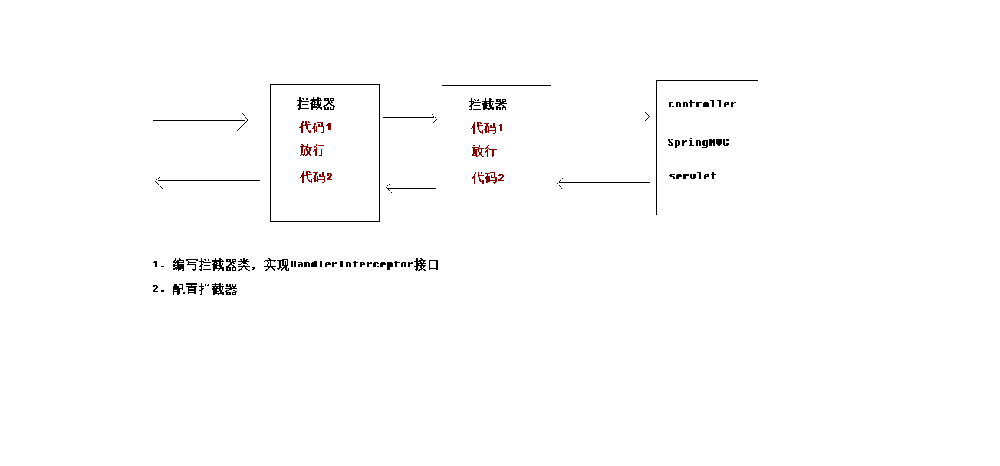

### 4.2 自定义拦截器的步骤 
1. 第一步：编写一个普通类实现 HandlerInterceptor 接口 
```java
/**
 * @author fzkstart
 * @create 2021-01-24 17:04
 * 自定义拦截器
 * 必须实现HandlerInterceptor接口
 */
public class Myinterceptor1 implements HandlerInterceptor {
    //该接口中的方法都已经有默认实现，故可以不实现方法，
    // 且不报错，jdk1.8增强的特性

    /**
     * 预处理，controller方法执行前执行
     * return true 表示放行，执行下一个拦截器，如果没有，执行controller中的方法
     * return false 不放行，可以直接跳转页面，如提示页面
     * @param request
     * @param response
     * @param handler
     * @return
     * @throws Exception
     */
    @Override
    public boolean preHandle(HttpServletRequest request, HttpServletResponse response, Object handler) throws Exception {
        System.out.println("MyInterceptor1执行了...preHandle");
        //request.getRequestDispatcher("/WEB-INF/pages/error.jsp").forward(request,response);
        return true;
    }
    /**
    * 后处理方法，controller方法执行后，success.jsp执行前执行
    * 有什么用：   
    *  在业务处理器处理完请求后，但是 DispatcherServlet 向客户端返回响应前被调用，  
    *  在该方法中对用户请求 request 进行处理。
    * @param request
    * @param response
    * @param handler
    * @param modelAndView
    * @throws Exception
    */
    @Override
    public void postHandle(HttpServletRequest request, HttpServletResponse response, Object handler, ModelAndView modelAndView) throws Exception {
        System.out.println("MyInterceptor1执行了...postHandle");
    }
    /**
    *  success.jsp执行后再执行这个方法
    * 有什么用：   
    *  在 DispatcherServlet 完全处理完请求后被调用，   
    *   可以在该方法中进行一些资源清理的操作。 
    * @param request
    * @param response
    * @param handler
    * @param ex
    * @throws Exception
    */
    @Override
    public void afterCompletion(HttpServletRequest request, HttpServletResponse response, Object handler, Exception ex) throws Exception {
        System.out.println("MyInterceptor1执行了...afterCompletion");
    }
}
```
2. 第二步：在springmvc.xml配置拦截器
```xml
<!--配置拦截器群-->
<mvc:interceptors>
    <!--配置拦截器-->
    <mvc:interceptor>
        <!--配置拦截的方法-->
        <mvc:mapping path="/user/**"/>
        <!--不拦截的方法-->
        <!--<mvc:exclude-mapping path=""/>-->
        <!--配置拦截器对象-->
        <bean class="com.fzk.interceptor.Myinterceptor1"/>
    </mvc:interceptor>
</mvc:interceptors>
```
3. jsp页面
```html
<%@ page contentType="text/html;charset=UTF-8" language="java" %>
<html>
<head>
    <title>Title</title>
</head>
<body>
    <h3>执行成功</h3>
    <!-- 打印到控制台 -->
    <% System.out.println("success.jsp执行了...");%>
</body>
</html>
```
4. 执行结果
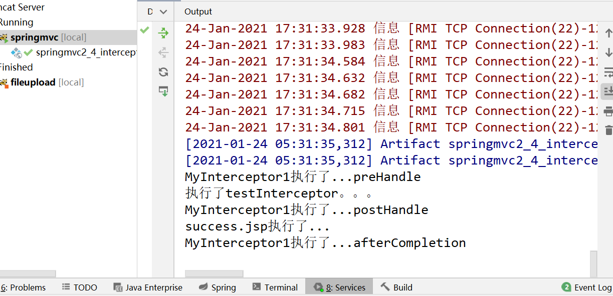

5. 当再增加一个拦截器2的时候
```xml
    <!--配置拦截器群-->
    <mvc:interceptors>
        <!--配置拦截器1-->
        <mvc:interceptor>
            <!--配置拦截的方法-->
            <mvc:mapping path="/user/**"/>
            <!--不拦截的方法-->
            <!--<mvc:exclude-mapping path=""/>-->
            <!--配置拦截器对象-->
            <bean class="com.fzk.interceptor.Myinterceptor1"/>
        </mvc:interceptor>

        <!--配置拦截器2-->
        <mvc:interceptor>
            <!--配置拦截的方法-->
            <mvc:mapping path="/user/**"/>
            <!--不拦截的方法-->
            <!--<mvc:exclude-mapping path=""/>-->
            <!--配置拦截器对象-->
            <bean class="com.fzk.interceptor.Myinterceptor2"/>
        </mvc:interceptor>
    </mvc:interceptors>
```
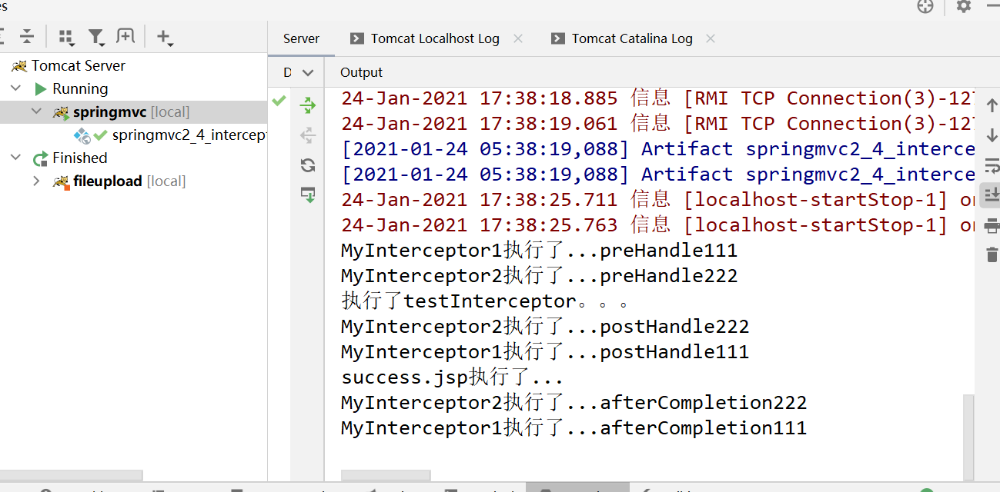
**执行顺序需要注意**，结合上面的图来看。

6. 思考：  
如果有多个拦截器，这时拦截器 1 的 preHandle 方法返回 true，但是拦截器 2 的 preHandle 方法返回 false，而此时拦截器 1 的 afterCompletion 方法是否执行？ 
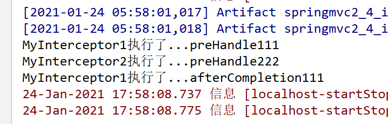


# 第9章 异步请求

Spring MVC与Servlet 3.0异步请求处理进行了广泛集成：

- 控制器方法中的[`DeferredResult`](https://docs.spring.io/spring-framework/docs/current/reference/html/web.html#mvc-ann-async-deferredresult) and [`Callable`](https://docs.spring.io/spring-framework/docs/current/reference/html/web.html#mvc-ann-async-callable)返回值为单个异步返回值提供了基本支持。 

- 控制器可以传输多个值，包括SSE和原始数据。

- 控制器可以使用反应式客户端并返回反应式类型以进行响应处理。

Spring项目的话，需要设置Servlet容器开启异步请求。方式如下：

没看懂文档...

SpringBoot项目是自动开了异步请求的，所以可以选择去配置文件中配置超时时间。

## DeferredResult

没看懂


## Callable

A controller can wrap any supported return value with `java.util.concurrent.Callable`。

controller代码：

```java
@RestController
@RequestMapping("/comprehensive")
public class DemoController {
    @Resource
    private UserService userService;

    @RequestMapping("/demo")
    public Callable<Map> asyGetUser() {
        System.out.println("1.UserController的get方法执行开始，" + Thread.currentThread().getName());
        Callable<Map> callable = new Callable<>() {
            public Map call() throws Exception {
                return userService.getUserInfo(1L);
            }
        };
        System.out.println("4.UserController的get方法执行结束，" + Thread.currentThread().getName());
        System.out.println("5.响应结果:" + callable);
        return callable;
    }
}
```

service代码：

```java
@Service
public class UserServiceImpl implements UserService {
    @Resource
    private UserMapper userMapper;

    @Override
    public Map<String, Object> getUserInfo(Long loginId) {
        System.out.println("3.userService的get方法开始"+Thread.currentThread().getName());
        User user = userMapper.selectById(loginId);
        System.out.println("4.userService的get方法结束"+Thread.currentThread().getName());
        return ResponseResult.success("ok", user);
    }
}
```

结果：如果成功的话，输出的顺序将是1-4-5-3-4

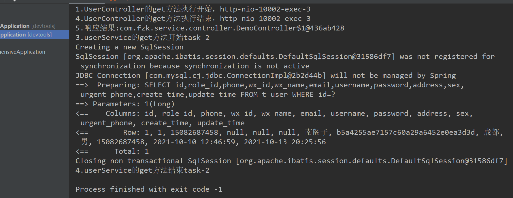

注意：异步请求只是将Request处理线程解脱，但响应保持打开状态。

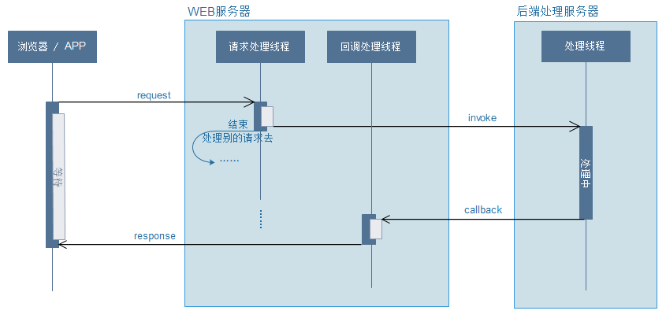

更多细节还是要看文档。

# 第10章 MVC Config

## MVC Config API

在 Java 配置中，可以使用`@EnableWebMvc`注解来启用 MVC 配置。

可以实现该`WebMvcConfigurer`接口来定制化配置。比如下面这个跨域配置：

```java
@Configuration
@EnableWebMvc
public class WebConfig implements WebMvcConfigurer {

    @Override
    public void addCorsMappings(CorsRegistry registry) {

        registry.addMapping("/**")
                .allowedOrigins("*")
                .allowedMethods("*")
                .allowedHeaders("*")
                .exposedHeaders("*")
                .allowCredentials(false).maxAge(3600);

        // Add more mappings...
    }
}
```

## CORS处理

出于安全原因，浏览器禁止对当前来源之外的资源进行AJAX调用。

跨源资源共享（CORS）是由大多数浏览器实现的W3C规范，它允许您指定授权的跨域请求类型，而不是使用基于IFRAME或JSONP的不太安全和功能不太强大的解决方案。

### @CrossOrigin

```java
@RestController
@RequestMapping("/account")
public class AccountController {

    @CrossOrigin
    @GetMapping("/{id}")
    public Account retrieve(@PathVariable Long id) {
        // ...
    }

    @DeleteMapping("/{id}")
    public void remove(@PathVariable Long id) {
        // ...
    }
}
```

By default, `@CrossOrigin` allows:

- All origins.
- All headers.
- All HTTP methods to which the controller method is mapped.

`@CrossOrigin` 在类级别也受支持，并由所有方法继承

```java
@CrossOrigin(maxAge = 3600)
@RestController
@RequestMapping("/account")
public class AccountController {

    @CrossOrigin("https://domain2.com")
    @GetMapping("/{id}")
    public Account retrieve(@PathVariable Long id) {
        // ...
    }

    @DeleteMapping("/{id}")
    public void remove(@PathVariable Long id) {
        // ...
    }
}
```

### 全局配置

**Java配置**

```java
@Configuration
@EnableWebMvc
public class WebConfig implements WebMvcConfigurer {

    @Override
    public void addCorsMappings(CorsRegistry registry) {

        registry.addMapping("/api/**")
            .allowedOrigins("https://domain2.com")
            .allowedMethods("PUT", "DELETE")
            .allowedHeaders("header1", "header2", "header3")
            .exposedHeaders("header1", "header2")
            .allowCredentials(true).maxAge(3600);

        // Add more mappings...
    }
}
```

需要注意的是，当allowCredentials设置为true的时候，allowedOrigins不能为`*`。可以直接改为false。

### CORS Filter

文档的相关配置，目前SpringBoot中的web5.3.10版本中不能使用了。新的过滤器配置方法暂未去研究。

## 拦截器

注册拦截器

```java
@Configuration
@EnableWebMvc
public class WebConfig implements WebMvcConfigurer {
    @Override
    public void addInterceptors(InterceptorRegistry registry) {
        registry.addInterceptor(new MyInterceptor()).addPathPatterns("/hello/**");
    }
}
```

拦截器需要自己去实现`HandlerInterceptor`接口。前置处理返回true为放行，false不放行。

这个可以用来自定义鉴权。

## 高级Java配置

@EnableWebMvc导入DelegatingWebMVC配置，其中： 

- 为SpringMVC应用程序提供默认Spring配置 
- 检测并委托WebMVCConfiguer实现以自定义该配置。

```java
@Configuration
public class WebConfig extends DelegatingWebMvcConfiguration {

    // ...
}
```

您可以在WebConfig中保留现有方法，但现在还可以重写基类中的bean声明，并且在类路径上仍然可以有任意数量的其他WebMvcConfigurer实现。

因为这个玩意把WebMvcConfigurer包含为自己的一个属性了。
这是它的构造方法：

```java
   @Autowired(required = false)
    public void setConfigurers(List<WebMvcConfigurer> configurers) {
        if (!CollectionUtils.isEmpty(configurers)) {
            this.configurers.addWebMvcConfigurers(configurers);
        }
    }
```

如果去SpringBoot找到`WebMvcAutoConfiguration`中，就可以看到它在此配置类的基础上进行了进一步的继承和配置。

# 第11章 WebSocket

## WebSocket简介

> 以下内容来自百度百科，以及一个教程：https://www.ruanyifeng.com/blog/2017/05/websocket.html，以及SpringFramework文档

**WebSocket**是一种在单个[TCP](https://baike.baidu.com/item/TCP)连接上进行[全双工](https://baike.baidu.com/item/全双工)通信的协议。WebSocket通信协议于2011年被[IETF](https://baike.baidu.com/item/IETF)定为标准RFC 6455，并由RFC7936补充规范。WebSocket [API](https://baike.baidu.com/item/API)也被[W3C](https://baike.baidu.com/item/W3C)定为标准。

WebSocket使得浏览器和服务器只需要完成一次握手，两者之间就直接可以创建持久性的连接，并进行双向数据传输。

它是与 HTTP 不同的 TCP 协议，但旨在通过 HTTP 工作，使用端口 80 和 443，并允许重新使用现有的防火墙规则。WebSocket 交互以 HTTP 请求开始，该请求使用 HTTP`Upgrade`标头升级或在这种情况下切换到 WebSocket 协议。以下示例显示了这样的交互：

```http
GET /spring-websocket-portfolio/portfolio HTTP/1.1
Host: localhost:8080
Upgrade: websocket 
Connection: Upgrade 
Sec-WebSocket-Key: Uc9l9TMkWGbHFD2qnFHltg==
Sec-WebSocket-Protocol: v10.stomp, v11.stomp
Sec-WebSocket-Version: 13
Origin: http://localhost:8080
```

与通常的 200 状态代码不同，具有 WebSocket 支持的服务器返回类似于以下的输出：

```http
HTTP/1.1 101 Switching Protocols 
Upgrade: websocket
Connection: Upgrade
Sec-WebSocket-Accept: 1qVdfYHU9hPOl4JYYNXF623Gzn0=
Sec-WebSocket-Protocol: v10.stomp
```

成功握手后，HTTP 升级请求底层的 TCP 套接字保持打开状态，客户端和服务器都可以继续发送和接收消息。

请注意，如果 WebSocket 服务器运行在 Web 服务器（例如 nginx）之后，您可能需要对其进行配置，以将 WebSocket 升级请求传递到 WebSocket 服务器。同样，如果应用程序在云环境中运行，请查看与 WebSocket 支持相关的云提供商的说明。

**背景：**

很多网站为了实现[推送技术](https://baike.baidu.com/item/推送技术)，所用的技术都是[轮询](https://baike.baidu.com/item/轮询)。轮询是在特定的的时间间隔（如每1秒），由浏览器对服务器发出[HTTP请求](https://baike.baidu.com/item/HTTP请求/10882159)，然后由服务器返回最新的数据给客户端的浏览器。这种传统的模式带来很明显的缺点，即浏览器需要不断的向服务器发出请求，然而HTTP请求可能包含较长的[头部](https://baike.baidu.com/item/头部)，其中真正有效的数据可能只是很小的一部分，显然这样会浪费很多的带宽等资源。

而比较新的技术去做轮询的效果是[Comet](https://baike.baidu.com/item/Comet)。这种技术虽然可以双向通信，但依然需要反复发出请求。而且在Comet中，普遍采用的长链接，也会消耗服务器资源。

在这种情况下，[HTML5](https://baike.baidu.com/item/HTML5)定义了WebSocket协议，能更好的节省服务器资源和带宽，并且能够更实时地进行通讯。

**握手协议：**

WebSocket 是独立的、创建在 TCP 上的协议。Websocket 通过[HTTP](https://baike.baidu.com/item/HTTP)/1.1 协议的101状态码进行握手。

为了创建Websocket连接，需要通过浏览器发出请求，之后服务器进行回应，这个过程通常称为“[握手](https://baike.baidu.com/item/握手)”（handshaking）。


**HTTP与WebSocket：**

尽管 WebSocket 被设计为与 HTTP 兼容并从 HTTP 请求开始，但重要的是要了解这两种协议会导致非常不同的架构和应用程序编程模型。

在 HTTP 和 REST 中，一个应用程序被建模为多个 URL。为了与应用程序交互，客户端访问这些 URL，请求-响应样式。服务器根据 HTTP URL、方法和标头将请求路由到适当的处理程序。

相比之下，在 WebSockets 中，通常只有一个 URL 用于初始连接。随后，==**所有应用程序消息都在同一个 TCP 连接上流动**==。这指向一个完全不同的异步、事件驱动、消息传递架构。

WebSocket 也是一种低级传输协议，与 HTTP 不同，它不对消息内容规定任何语义。这意味着除非客户端和服务器就消息语义达成一致，否则无法路由或处理消息。

WebSocket 客户端和服务器可以通过`Sec-WebSocket-Protocol`HTTP 握手请求上的标头协商使用更高级别的消息传递协议（例如，STOMP）

**特点：**

> 1.建立在 TCP 协议之上，服务器端的实现比较容易。
> 2.与 HTTP 协议有着良好的兼容性。默认端口也是80和443，并且握手阶段采用 HTTP 协议，因此握手时不容易屏蔽，能通过各种 HTTP 代理服务器
> 3.数据格式比较轻量，性能开销小，通信高效
> 4.可以发送文本，也可以发送二进制数据
> 5.没有同源限制，客户端可以与任意服务器通信
> 6.协议标识符是`ws`（如果加密，则为`wss`），服务器网址就是 URL。

**优点：**

> 1.较小的控制开销
> 2.更强的实时性
> 3.保持连接状态
> 4.更好的二进制支持。Websocket定义了[二进制](https://baike.baidu.com/item/二进制)帧，相对HTTP，可以更轻松地处理二进制内容
> 5.更好的压缩效果

## 前端实现

前端实现是比较简单的，仅仅需要绑定几个典型的事件即可。当然这里仅仅是基本使用，更详细的使用请看教程。

以下示例仅为发送文本信息，发送blob和Arraybuffer请看教程。

```java
<!DOCTYPE html>
<html lang="zh">
<head>
    <meta charset="UTF-8">
    <title>demo</title>
    <script src="https://cdn.bootcss.com/jquery/3.3.1/jquery.js"></script>

</head>
<body>
<script>
    let socket;

    function openSocket() {
        if (typeof (WebSocket) == "undefined") {
            console.log("您的浏览器不支持WebSocket");
        } else {
            //实现化WebSocket对象，指定要连接的服务器地址与端口  建立连接
            //等同于socket = new WebSocket("ws://localhost:8888/xxxx/im/25");
            //var socketUrl="${request.contextPath}/im/"+$("#userId").val();
            let articleId=$("#articleId").val();
            let shareId=$("#shareId").val();
            let openid=$("#openid").val();
            let socketUrl = "https://www.fzk-tx.top/mk/article/ws?openid="+openid+"&articleId="
                +articleId+"&shareId="+shareId;
            socketUrl = socketUrl.replace("https", "ws").replace("http", "ws");
            console.log(socketUrl);
            if (socket != null) {
                socket.close();
                socket = null;
            }
            // 创建WebSocket
            socket = new WebSocket(socketUrl);
            //打开事件
            socket.onopen = function () {
                console.log("websocket已打开");
                //socket.send("这是来自客户端的消息" + location.href + new Date());
            };
            //获得消息事件
            socket.onmessage = function (msg) {
                console.log(msg.data);
                //发现消息进入    开始处理前端触发逻辑
            };
            //关闭事件
            socket.onclose = function () {
                console.log("websocket已关闭");
            };
            //发生了错误事件
            socket.onerror = function () {
                console.log("websocket发生了错误");
            }
        }
    }

    function sendMessage() {
        if (typeof (WebSocket) == "undefined") {
            console.log("您的浏览器不支持WebSocket");
        } else {
            // 发送心跳
            socket.send('{"articleId":"' + $("#articleId").val() + '",' +
                '"shareId":"' + $("#shareId").val() + '",' +
                '"readTime": 23,' +
                '"openid":"' + $("#openid").val() + '"}')
        }
    }

    function closeSocket() {
        if (socket != null) {
            socket.close();
            socket = null;
        }
    }
</script>
<p>【articleId】：
<div><input id="articleId" name="articleId" type="text" value="10"></div>
<p>【shareId】：
<div><input id="shareId" name="shareId" type="text" value="4"></div>
<p>【openid】：
<div><input id="openid" name="openid" type="text" value="oSLXk6DwZJ1VQH4aPfkss"></div>
<p>【操作】：
<div>
    <button onclick="openSocket()">开启socket</button>
</div>
<p>【操作】：
<div>
    <button onclick="sendMessage()">发送消息</button>
</div>
<p>【关闭】：
<div>
    <button onclick="closeSocket()">关闭socket</button>
</div>
</p>
</body>
</html>
```

## 原始WebSocket交互

Spring Framework 提供了一个 WebSocket API，您可以使用它来编写处理 WebSocket 消息的客户端和服务器端应用程序。

引入依赖：

```xml
<!-- https://mvnrepository.com/artifact/org.springframework.boot/spring-boot-starter-websocket -->
<dependency>
    <groupId>org.springframework.boot</groupId>
    <artifactId>spring-boot-starter-websocket</artifactId>
    <!--<version>2.6.0</version>-->
</dependency>
```

### WebSocketHandler

创建WebSocket服务器，需要实现WebSocketHandler，或者可以选择扩展TextWebSocketHandler或BinaryWebSocketHandler，分别处理文本消息或二进制消息。

如以下示例为扩展TextWebSocket：

```java
public class MyHandler extends TextWebSocketHandler {
	// 连接创建时调用
    @Override
    public void afterConnectionEstablished(WebSocketSession session) throws Exception {
        super.afterConnectionEstablished(session);
    }
	// 收到前端发送的消息时调用
    @Override
    protected void handleTextMessage(WebSocketSession session, TextMessage message) throws Exception {
        super.handleTextMessage(session, message);
    }
	// 出现连接异常时调用
    @Override
    public void handleTransportError(WebSocketSession session, Throwable exception) throws Exception {
        super.handleTransportError(session, exception);
        // 关闭session
        if (session.isOpen())
            session.close();
    }
	// 连接关闭后调用
    @Override
    public void afterConnectionClosed(WebSocketSession session, CloseStatus status) throws Exception {
        super.afterConnectionClosed(session, status);
    }
}
```

有专用的 WebSocket Java 配置和 XML 命名空间支持，用于将前面的 WebSocket 处理程序映射到特定 URL

```java
@Configuration
@EnableWebSocket // 开启WebSocket配置
public class MyWebSocketConfig implements WebSocketConfigurer {
    @Override
    public void registerWebSocketHandlers(WebSocketHandlerRegistry registry) {
        MyHandler myHandler = new MyHandler();
		// 将这个Handler映射到此URI地址
        registry.addHandler(myHandler, "/mk/article/ws")
                .setAllowedOrigins("*");// 允许所有跨域
    }
}
```

从这个handler中可以看到，在Handler中是拿不到request对象的(因为TCP长链接建立之后，直接发送消息)，但是可以拿到uri，可以手动处理uri参数。但更好的方式是通过下面的拦截器提前处理url，将参数传递给WebSocketSession.

### WebSocket握手拦截器

自定义初始 HTTP WebSocket 握手请求的最简单方法是实现`HandshakeInterceptor`，它公开握手“之前”和“之后”的方法。您可以使用这样的拦截器来拒绝握手或使任何属性可用于`WebSocketSession`.更好的选择是扩展`HttpSessionHandshakeInterceptor`.

```java
public class MyInterceptor extends HttpSessionHandshakeInterceptor {
	// 握手前调用，返回false就拒绝握手
    @Override
    public boolean beforeHandshake(ServerHttpRequest request, ServerHttpResponse response, WebSocketHandler wsHandler,Map<String, Object> attributes) throws Exception {
        HttpServletRequest servletRequest = ((ServletServerHttpRequest) request).getServletRequest();
        String openid = servletRequest.getParameter("openid");
        String articleId = servletRequest.getParameter("articleId");
        String shareId = servletRequest.getParameter("shareId");

        if (openid == null || articleId == null || shareId == null)
            throw new MyException(CodeEum.CODE_PARAM_MISS, "缺少参数：articleId or shareId or openid ?");

        attributes.put("articleId", articleId);
        attributes.put("shareId", shareId);
        attributes.put("openid", openid);
		// 这里需要调用父类方法，因为父类方法会处理HttpSession会话中的属性也加入到attributes中
        return super.beforeHandshake(request, response, wsHandler, attributes);
    }
	// 握手后调用
    @Override
    public void afterHandshake(ServerHttpRequest request, ServerHttpResponse response, WebSocketHandler wsHandler,
                               Exception ex) {
        super.afterHandshake(request, response, wsHandler, ex);
    }
}
```

从这里可以看到，通过拦截器能够拿到request，能够获取uri参数信息，并将其放入到attributes中以传递给WebSocketSession。同时HttpSession中的属性也会被处理给attributes从而传递给WebSocketSession.

定义好拦截器后，需要注册到容器中：

```java
@Configuration
@EnableWebSocket // 开启WebSocket配置
public class MyWebSocketConfig implements WebSocketConfigurer {
    @Override
    public void registerWebSocketHandlers(WebSocketHandlerRegistry registry) {
        MyHandler myHandler = new MyHandler();// 处理器
        MyInterceptor myInterceptor = new MyInterceptor();// 拦截器

        registry.addHandler(myHandler, "/mk/article/ws")
                .addInterceptors(myInterceptor)// 添加拦截器
                .setAllowedOrigins("*");// 允许跨域
    }
}
```

### Allowed Origins

从 Spring Framework 4.1.5 开始，WebSocket 和 SockJS 的默认行为是仅接受同源请求。

三种可能的行为是：

- 仅允许同源请求（默认）：在此模式下，启用 SockJS 时，Iframe HTTP 响应标头`X-Frame-Options`设置为`SAMEORIGIN`，并且禁用 JSONP 传输，因为它不允许检查请求的来源。因此，启用此模式时不支持 IE6 和 IE7。
- 允许指定的来源列表：每个允许的来源必须以`http://` 或开头`https://`。在这种模式下，当 SockJS 启用时，IFrame 传输被禁用。因此，启用此模式时，不支持 IE6 到 IE9。
- 允许所有来源：要启用此模式，您应该提供`*`允许的来源值。在这种模式下，所有传输都可用。

```java
@Configuration
@EnableWebSocket
public class WebSocketConfig implements WebSocketConfigurer {
    @Override
    public void registerWebSocketHandlers(WebSocketHandlerRegistry registry) {
        registry.addHandler(myHandler(), "/myHandler").setAllowedOrigins("https://mydomain.com");
    }
    @Bean
    public WebSocketHandler myHandler() {
        return new MyHandler();
    }
}
```

### 使用示例

```java
/**
 * 开启WebSocket
 *
 * @author fzk
 * @date 2021-11-30 17:00
 */
@Configuration
@EnableWebSocket // 开启WebSocket配置
public class MyWebSocketConfig implements WebSocketConfigurer {
    private final RedisTemplate<String, String> redisTemplate;
    private final RestTemplate restTemplate;

    public MyWebSocketConfig(@Autowired RedisTemplate<String, String> redisTemplate, @Autowired RestTemplate restTemplate) {
        this.redisTemplate = redisTemplate;
        this.restTemplate = restTemplate;
    }

    @Override
    public void registerWebSocketHandlers(WebSocketHandlerRegistry registry) {
        MyHandler myHandler = new MyHandler(redisTemplate, restTemplate);
        MyInterceptor myInterceptor = new MyInterceptor();// 拦截器

        registry.addHandler(myHandler, "/mk/article/ws")
                .addInterceptors(myInterceptor)
                .setAllowedOrigins("*");// 允许跨域
    }


    public static class MyHandler extends TextWebSocketHandler {
        private final RedisTemplate<String, String> redisTemplate;
        private final RestTemplate restTemplate;
        private static final String keyPrefix = "WebSocketSession:";
        // 用微服务负载均衡的方式进行远程调用
        private static final String addReadRecordUrl = "http://marketing/mk/article/addReadRecord";

        public MyHandler(RedisTemplate<String, String> redisTemplate, RestTemplate restTemplate) {
            this.redisTemplate = redisTemplate;
            this.restTemplate = restTemplate;
        }

        @Override
        public void afterConnectionEstablished(WebSocketSession session) throws Exception {
            super.afterConnectionEstablished(session);
            Map<String, Object> attributes = session.getAttributes();

            ReadInfo readInfo = new ReadInfo();
            readInfo.setArticleId(Long.valueOf(attributes.get("articleId").toString()));
            readInfo.setShareId(Long.valueOf(attributes.get("shareId").toString()));
            readInfo.setOpenid(attributes.get("openid").toString());

            readInfo.setStartTimeStamp(System.currentTimeMillis());

            // 放入缓存
            redisTemplate.opsForValue().set(keyPrefix + session.getId(), MyJsonUtil.toJsonStr(readInfo),
                    1000 * 60 * 20, TimeUnit.MILLISECONDS);
        }

        @Override
        protected void handleTextMessage(WebSocketSession session, TextMessage message) throws Exception {
            super.handleTextMessage(session, message);

            System.out.println("WebSocket心跳: from:" + session.getId() + " ,text消息：" + message.getPayload());
            session.sendMessage(message);// 将消息直接返回给发送者
        }

        @Override
        public void handleTransportError(WebSocketSession session, Throwable exception) throws Exception {
            super.handleTransportError(session, exception);
            // 添加阅读记录
            addReadRecord(session.getId());
            // 关闭session
            if (session.isOpen())
                session.close();
        }

        @Override
        public void afterConnectionClosed(WebSocketSession session, CloseStatus status) throws Exception {
            super.afterConnectionClosed(session, status);
            // 添加阅读记录
            addReadRecord(session.getId());
        }

        private void addReadRecord(String sessionId) {
            // 取出缓存：计算阅读时间
            String readInfo_json = redisTemplate.opsForValue().get(keyPrefix + sessionId);
            if (readInfo_json != null) {
                ReadInfo readInfo = MyJsonUtil.toBean(readInfo_json, ReadInfo.class);
                redisTemplate.delete(keyPrefix + sessionId);

                int readTime = (int) (System.currentTimeMillis() - readInfo.getStartTimeStamp()) / 1000;
                readInfo.setReadTime(readTime);

                // 请求头
                HttpHeaders headers = new HttpHeaders();
                headers.setContentType(MediaType.APPLICATION_FORM_URLENCODED);
                // 请求体
                LinkedMultiValueMap<String, Object> map = new LinkedMultiValueMap<>();
                map.add("articleId", readInfo.getArticleId());
                map.add("shareId", readInfo.getShareId());
                map.add("openid", readInfo.getOpenid());
                map.add("readTime", readInfo.getReadTime());
                System.out.println(map);
                HttpEntity<MultiValueMap<String, Object>> httpEntity = new HttpEntity<>(map, headers);

                try {
                    restTemplate.postForObject(addReadRecordUrl, httpEntity, Result.class);
                } catch (Exception e) {
                    e.printStackTrace();
                }
            }
        }
    }

    public static class MyInterceptor extends HttpSessionHandshakeInterceptor {

        @Override
        public boolean beforeHandshake(ServerHttpRequest request, ServerHttpResponse response, WebSocketHandler wsHandler,
                                       Map<String, Object> attributes) throws Exception {
            //System.out.println("Before Handshake");

            HttpServletRequest servletRequest = ((ServletServerHttpRequest) request).getServletRequest();
            String openid = servletRequest.getParameter("openid");
            String articleId = servletRequest.getParameter("articleId");
            String shareId = servletRequest.getParameter("shareId");

            if (openid == null || articleId == null || shareId == null)
                throw new MyException(CodeEum.CODE_PARAM_MISS, "缺少参数：articleId or shareId or openid ?");

            attributes.put("articleId", articleId);
            attributes.put("shareId", shareId);
            attributes.put("openid", openid);

            return super.beforeHandshake(request, response, wsHandler, attributes);
        }

        @Override
        public void afterHandshake(ServerHttpRequest request, ServerHttpResponse response, WebSocketHandler wsHandler,
                                   Exception ex) {
            //System.out.println("After Handshake");
            super.afterHandshake(request, response, wsHandler, ex);
        }
    }

    @Data
    public static class ReadInfo {
        private Long articleId;
        private Long shareId;
        private String openid;

        private Integer readTime;
        private long startTimeStamp;
    }
}
```


### nginx配置WebSocket代理

在经过上面的配置之后，ws协议直接使用是没问题的，但是如果走了像nginx这类反向代理服务器之后，就需要注意，**因为ws协议多出来的几个请求头nginx没有正确传递**，需要手动配置一下，让这个请求头也代理过去。同时，代理服务器往往会关闭看似空闲的长期连接，这个也是需要注意的(前端发送心跳，或者nginx配置连接超时时间以覆盖默认断开时间)。

>官方解决方案：http://nginx.org/en/docs/http/websocket.html

为了将客户端和服务器之间的连接从 HTTP/1.1 转换为 WebSocket，使用了 HTTP/1.1 中可用的[协议切换](https://tools.ietf.org/html/rfc2616#section-14.42)机制。

然而，有一个微妙之处：由于“Upgrade”是一个 [ hop-by-hop](https://tools.ietf.org/html/rfc2616#section-13.5.1) 标头，它不会从客户端传递到代理服务器。通过正向代理，客户端可以使用该`CONNECT` 方法来规避此问题。然而，这不适用于反向代理，因为客户端不知道任何代理服务器，并且需要在代理服务器上进行特殊处理。

从 1.3.13 版本开始，nginx 实现了特殊的操作模式，如果代理服务器返回代码为 101（切换协议）的响应，并且客户端通过请求中的“Upgrade”标头。

如上所述，包括“Upgrade”和“Connection”在内的逐跳标头不会从客户端传递到代理服务器，因此为了让代理服务器了解客户端将协议切换到 WebSocket 的意图，这些标头必须明确传递：

```tex
location /chat/ {
    proxy_pass http://backend;
    proxy_http_version 1.1;
    proxy_set_header Upgrade $http_upgrade;
    proxy_set_header Connection "upgrade";
}
```

默认情况下，如果代理服务器在 60 秒内没有传输任何数据，连接将被关闭。可以使用[proxy_read_timeout](http://nginx.org/en/docs/http/ngx_http_proxy_module.html#proxy_read_timeout)指令增加此超时 。或者，可以将代理服务器配置为定期发送 WebSocket ping 帧以重置超时并检查连接是否仍然有效。

如果不配置超时时间，隔一会就会断开 具体超时时间具体要根据业务来调整。最终的配置如下：

```tex
server{
    listen  80;
    charset utf-8;
    server_name www.xxx.com;
     proxy_set_header Host $host:$server_port;
     proxy_set_header X-Real-IP $remote_addr;
     proxy_set_header REMOTE-HOST $remote_addr;
     proxy_set_header X-Forwarded-For $proxy_add_x_forwarded_for;
     client_max_body_size 100m;
     location = /mk/article/ws  {
        proxy_pass http://127.0.0.1:30000; # 指向网关
        proxy_http_version 1.1;
        proxy_set_header Upgrade $http_upgrade;
        proxy_set_header Connection "upgrade";
         
        proxy_connect_timeout 4s; 
        proxy_read_timeout 720s; 
        proxy_send_timeout 12s; 
     }
     location / {
     	proxy_pass http://127.0.0.1:30000;
     }
 }
```


## SockJS回退

没跑起来....


# 第12章 RestTemplate

Spring 框架提供了两种调用 REST 端点的选择：

- [`RestTemplate`](https://docs.spring.io/spring-framework/docs/current/reference/html/integration.html#rest-resttemplate)：带有同步模板方法 API 的原始 Spring REST 客户端。
- [WebClient](https://docs.spring.io/spring-framework/docs/current/reference/html/web-reactive.html#webflux-client)：一种非阻塞、反应式的替代方案，支持同步和异步以及流场景。

>  从 5.0 开始，`RestTemplate`它处于维护模式，只有很小的更改和错误请求才会被接受。请考虑使用 [WebClient](https://docs.spring.io/spring-framework/docs/current/reference/html/web-reactive.html#webflux-client)，它提供更现代的 API 并支持同步、异步和流方案。

## 初始化

默认构造函数用于`java.net.HttpURLConnection`执行请求。

## 参数传递

get请求和post请求的参数传递方式很不同，get可以直接拼接url字符串，而post稍微复杂一点。

### 路径变量

```java
// 可变形参传参
String url="https://example.com/hotels/{hotel}/bookings/{booking}";
String result = restTemplate.getForObject(url, String.class, "42", "21");

// 用map传参也是可以的
Map<String, String> vars = Collections.singletonMap("hotel", "42");
String result = restTemplate.getForObject("https://example.com/hotels/{hotel}/rooms/{hotel}", String.class, vars);
```

### 请求头

```java
@Test
void test6(){
    RestTemplate restTemplate=new RestTemplate();
    // 路径变量
    String uriTemplate = "https://example.com/hotels/{hotel}";
    URI uri = UriComponentsBuilder.fromUriString(uriTemplate).build(42);

    RequestEntity<Void> requestEntity = RequestEntity.get(uri)
            .header("MyRequestHeader", "MyValue")
            .build();

    ResponseEntity<String> response = restTemplate.exchange(requestEntity, String.class);

    String responseHeader = response.getHeaders().getFirst("MyResponseHeader");
    String body = response.getBody();
}
```

### post传递请求体

```java
@Test
void test1() {
    RestTemplate restTemplate = new RestTemplate();
    String url = "https://www.fzk-tx.top/mk/article/addReadRecord";

    // 请求头
    HttpHeaders headers = new HttpHeaders();
    headers.setContentType(MediaType.APPLICATION_FORM_URLENCODED);// 设置ContentType
    // 请求体
    LinkedMultiValueMap<String, Object> map = new LinkedMultiValueMap<>();
    map.add("articleId", 1);
    map.add("shareId", 1);
    map.add("openid", 1);
    map.add("readTime", 1);
    HttpEntity<MultiValueMap<String, Object>> httpEntity = new HttpEntity<>(map, headers);

    try {
        restTemplate.postForObject(url, httpEntity, Void.class);
    } catch (Exception e) {
        e.printStackTrace();
    }
}
```

## 消息转换

https://docs.spring.io/spring-framework/docs/current/reference/html/integration.html#rest-message-conversion


# 3. SSM 整合

## 第1章 SSM 整合 
1. 整合说明：SSM整合可以使用**多种方式**，咱们会选择**XML + 注解**的方式 
2. 整合的思路 
    1. 先搭建整合的环境 
    2. 先把Spring的配置搭建完成 
    3. 再使用Spring整合SpringMVC框架 
    4. 最后使用Spring整合MyBatis框架 
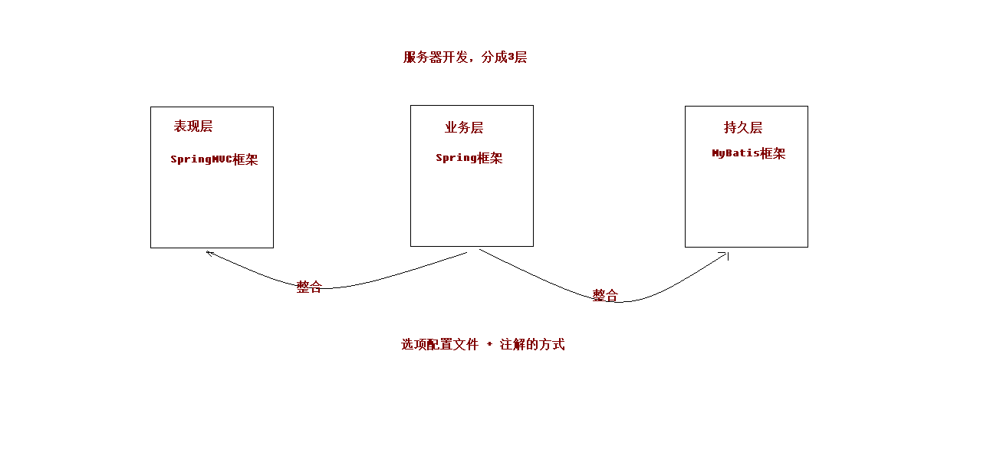
3. 本笔记记录的是一个模块整合ssm，父子模块整合ssm去看PDF
### 1.1 环境准备 
#### 1 创建数据库和表结构 
```sql
create database ssm; 
create table account(  
    id int primary key auto_increment,  
    name varchar(100),  
    money double(7,2), 
); 
```
#### 2 创建 Maven 工程 
选择webapp项目
#### 3 导入坐标并建立依赖 
```xml
  <properties>
    <project.build.sourceEncoding>UTF-8</project.build.sourceEncoding>
    <maven.compiler.source>14</maven.compiler.source>
    <maven.compiler.target>14</maven.compiler.target>
    <!--版本锁定-->
    <spring.version>5.0.2.RELEASE</spring.version>
    <slf4j.version>1.6.6</slf4j.version>
    <log4j.version>1.2.12</log4j.version>
    <mysql.version>5.1.6</mysql.version>
    <mybatis.version>3.4.5</mybatis.version>
  </properties>

  <dependencies>
    <!--springAOP-->
    <dependency>
      <groupId>org.aspectj</groupId>
      <artifactId>aspectjweaver</artifactId>
      <version>1.6.8</version>
    </dependency>
    <dependency>
      <groupId>org.springframework</groupId>
      <artifactId>spring-aop</artifactId>
      <version>${spring.version}</version>
    </dependency>
    <!--spring容器-->
    <dependency>
      <groupId>org.springframework</groupId>
      <artifactId>spring-context</artifactId>
      <version>${spring.version}</version>
    </dependency>
    <!--springmvc-->
    <dependency>
      <groupId>org.springframework</groupId>
      <artifactId>spring-web</artifactId>
      <version>${spring.version}</version>
    </dependency>
    <dependency>
      <groupId>org.springframework</groupId>
      <artifactId>spring-webmvc</artifactId>
      <version>${spring.version}</version>
    </dependency>
    <!--spring整合单元测试-->
    <dependency>
      <groupId>org.springframework</groupId>
      <artifactId>spring-test</artifactId>
      <version>${spring.version}</version>
    </dependency>
    <!--spring事务-->
    <dependency>
      <groupId>org.springframework</groupId>
      <artifactId>spring-tx</artifactId>
      <version>${spring.version}</version>
    </dependency>
    <!--spring的jdbc模板-->
    <dependency>
      <groupId>org.springframework</groupId>
      <artifactId>spring-jdbc</artifactId>
      <version>${spring.version}</version>
    </dependency>

    <dependency>
      <groupId>junit</groupId>
      <artifactId>junit</artifactId>
      <version>4.12</version>
      <scope>compile</scope>
    </dependency>

    <dependency>
      <groupId>mysql</groupId>
      <artifactId>mysql-connector-java</artifactId>
      <version>${mysql.version}</version>
    </dependency>

    <!--servlet API-->
    <dependency>
      <groupId>javax.servlet</groupId>
      <artifactId>servlet-api</artifactId>
      <version>2.5</version>
      <scope>provided</scope>
    </dependency>
    <!--jsp API-->
    <dependency>
      <groupId>javax.servlet.jsp</groupId>
      <artifactId>jsp-api</artifactId>
      <version>2.0</version>
      <scope>provided</scope>
    </dependency>

    <!--页面的jstl表达式-->
    <dependency>
      <groupId>jstl</groupId>
      <artifactId>jstl</artifactId>
      <version>1.2</version>
    </dependency>

    <!--log start-->
    <dependency>
      <groupId>log4j</groupId>
      <artifactId>log4j</artifactId>
      <version>${log4j.version}</version>
    </dependency>

    <dependency>
      <groupId>org.slf4j</groupId>
      <artifactId>slf4j-api</artifactId>
      <version>${slf4j.version}</version>
    </dependency>
    <dependency>
      <groupId>org.slf4j</groupId>
      <artifactId>slf4j-log4j12</artifactId>
      <version>${slf4j.version}</version>
    </dependency>

    <!--log end-->

    <!--mybatis-->
    <dependency>
      <groupId>org.mybatis</groupId>
      <artifactId>mybatis</artifactId>
      <version>${mybatis.version}</version>
    </dependency>
    <!--mybatis和spring的整合-->
    <dependency>
      <groupId>org.mybatis</groupId>
      <artifactId>mybatis-spring</artifactId>
      <version>1.3.0</version>
    </dependency>

    <dependency>
      <groupId>c3p0</groupId>
      <artifactId>c3p0</artifactId>
      <version>0.9.1.2</version>
      <type>jar</type>
      <scope>compile</scope>
    </dependency>
  </dependencies>
```
#### 4 编写实体类 
```java
/**
 * @author fzkstart
 * @create 2021-01-26 15:11
 * 实体类 账户
 */
public class Account implements Serializable {
    private Integer id;
    private String name;
    private Double money;
    ......
    ......
}
```
#### 5 持久层dao接口 
只需要写接口就可以了
```java
/**
 * @author fzkstart
 * @create 2021-01-26 15:13
 * 账户dao接口
 */
@Repository
public interface IAcccountDao {
    //查询所有
    @Select("select * from account")
    List<Account> findAll();
    //保存账户信息
    @Insert("insert into account(name,money) values(#{name},#{money})")
    void saveAccount(Account account);
}
```
#### 6 编写业务层接口和实现类
业务层需要编写实现类
```java
/**
 * @author fzkstart
 * @create 2021-01-26 15:16
 * 账户的service接口
 */
public interface IAccountService {
    //查询所有
    List<Account> findAll();
    //保存账户信息
    void saveAccount(Account account);
}
```
```java
/**
 * @author fzkstart
 * @create 2021-01-26 15:17
 * 账户的service实现类
 */
@Service(value="accountService")
public class AccountService implements IAccountService {
    @Autowired
    private IAcccountDao accountDao;

    @Override
    public List<Account> findAll() {
        System.out.println("业务层：findAll()。。。");
        return accountDao.findAll();
    }

    @Override
    public void saveAccount(Account account) {
        System.out.println("业务层：saveAccount()...");
        accountDao.saveAccount(account);
    }
}
```

### 1.2 整合步骤 
#### 1.保证 Spring 框架在 web 工程中独立运行 
1. 第一步：编写 spring 配置文件applicationConfig.xml并导入约束 
```xml
<?xml version="1.0" encoding="UTF-8"?>
<beans xmlns="http://www.springframework.org/schema/beans"
       xmlns:xsi="http://www.w3.org/2001/XMLSchema-instance"
       xmlns:context="http://www.springframework.org/schema/context"
       xmlns:aop="http://www.springframework.org/schema/aop"
       xmlns:tx="http://www.springframework.org/schema/tx"
       xsi:schemaLocation="
        http://www.springframework.org/schema/beans
        http://www.springframework.org/schema/beans/spring-beans.xsd
        http://www.springframework.org/schema/context
        http://www.springframework.org/schema/context/spring-context.xsd
        http://www.springframework.org/schema/tx
        http://www.springframework.org/schema/tx/spring-tx.xsd
        http://www.springframework.org/schema/aop
        http://www.springframework.org/schema/aop/spring-aop.xsd">

    <!-- 开启注解扫描，要扫描的是service和dao层的注解，
    要忽略web层注解，因为web层让SpringMVC框架 去管理 -->
    <context:component-scan base-package="com.fzk">
        <!--配置需要忽略的注解-->
        <context:exclude-filter type="annotation" expression="org.springframework.stereotype.Controller"/>
    </context:component-scan>
</beans>
```
2. 第二步：使用注解配置业务层和持久层 
见上面代码

3. 第三步：测试 spring 能否独立运行 
```java
public class TestSpring {
    @Test
    public void test1(){
        //1.加载配置文件，获取IOC容器
        ClassPathXmlApplicationContext context =
                new ClassPathXmlApplicationContext("applicationContext.xml");

        //2.获取bean对象
        IAccountService accountService = context.getBean("accountService", IAccountService.class);

        //3.调用方法
        accountService.findAll();
        accountService.saveAccount(new Account());
    }
}
```

#### 2.Spring整合SpringMVC

1. 搭建和测试SpringMVC的开发环境 
    1. 在web.xml中配置DispatcherServlet前端控制器
    ```xml
    <!-- 配置前端控制器：服务器启动必须加载，需要加载springmvc.xml配置文件 -->
    <servlet>
        <servlet-name>dispatcherServlet</servlet-name>
        <servlet-class>org.springframework.web.servlet.DispatcherServlet</servlet-class>
        <!-- 配置初始化参数，用于读取 SpringMVC 的配置文件 -->
        <init-param>
        <param-name>contextConfigLocation</param-name>
        <param-value>classpath:springmvc.xml</param-value>
        </init-param>
        <!-- 配置 servlet 的对象的创建时间点： 应用加载时创建。
        取值只能是非 0 正整数，表示启动顺序 -->
        <load-on-startup>1</load-on-startup>
    </servlet>
    <servlet-mapping>
        <servlet-name>dispatcherServlet</servlet-name>
        <url-pattern>/</url-pattern>
    </servlet-mapping>
    ```
    2. 在web.xml中配置DispatcherServlet过滤器解决中文乱码
    ```xml
    <!--配置解决POST请求中文乱码的过滤器-->
    <filter>
        <filter-name>characterEncodingFilter</filter-name>
        <filter-class>org.springframework.web.filter.CharacterEncodingFilter</filter-class>
        <!--配置编码字符集-->
        <init-param>
        <param-name>encoding</param-name>
        <param-value>UTF-8</param-value>
        </init-param>
    </filter>
    <filter-mapping>
        <filter-name>characterEncodingFilter</filter-name>
        <url-pattern>/*</url-pattern>
    </filter-mapping>
    ```
    3. 创建springmvc.xml的配置文件，编写配置文件
    ```xml
    <?xml version="1.0" encoding="UTF-8"?>
    <beans xmlns="http://www.springframework.org/schema/beans"
        xmlns:mvc="http://www.springframework.org/schema/mvc"
        xmlns:context="http://www.springframework.org/schema/context"
        xmlns:xsi="http://www.w3.org/2001/XMLSchema-instance"
        xsi:schemaLocation="
            http://www.springframework.org/schema/beans
            http://www.springframework.org/schema/beans/spring-beans.xsd
            http://www.springframework.org/schema/context
            http://www.springframework.org/schema/context/spring-context.xsd
            http://www.springframework.org/schema/mvc
            http://www.springframework.org/schema/mvc/spring-mvc.xsd">

        <!--开启注解扫描，只扫描Controller注解-->
        <context:component-scan base-package="com.fzk">
            <!--只扫描Controller注解-->
            <context:include-filter type="annotation" expression="org.springframework.stereotype.Controller"/>
        </context:component-scan>
        <!--配置视图解析器-->
        <bean id="internalResourceViewResolver" class="org.springframework.web.servlet.view.InternalResourceViewResolver">
            <property name="prefix" value="/WEB-INF/pages/"/>
            <property name="suffix" value=".jsp"/>
        </bean>
        <!-- 设置静态资源不过滤 -->
        <mvc:resources location="/css/" mapping="/css/**"/>  <!-- 样式 -->
        <mvc:resources location="/images/" mapping="/images/**"/>  <!-- 图片 -->
        <mvc:resources location="/js/" mapping="/js/**"/>  <!-- javascript -->
        <!--开启springmvc注解的支持-->
        <mvc:annotation-driven enable-matrix-variables="true"/>
    </beans>
    ```
2. Spring整合SpringMVC的框架 
    1. 目的：在controller中能成功的调用service对象中的方法
    2. 配置监听器实现启动服务创建容器 
    在项目启动的时候，就去加载applicationContext.xml的配置文件，在web.xml中配置 ContextLoaderListener监听器（该监听器只能加载WEB-INF目录下的applicationContext.xml的配置文件）。
    ```xml
    <!--配置spring的监听器-->
    <!--默认只加载WEB-INF目录下的applicationContext.xml配置文件-->
    <listener>
        <listener-class>org.springframework.web.context.ContextLoaderListener</listener-class>
    </listener>
    <!-- 手动指定 spring 配置文件位置 --> 
    <context-param>
        <param-name>contextConfigLocation</param-name>
        <param-value>classpath:applicationContext.xml</param-value>
    </context-param>
    ```
    3. 在controller中注入service对象，调用service对象的方法进行测试
    ```java
    /**
    * @author fzkstart
    * @create 2021-01-26 15:18
    * 账户的前端控制器
    */
    @Controller(value="accountController")
    @RequestMapping(path="/account")
    public class AccountController {
        @Autowired
        private IAccountService accountService;

        @RequestMapping(path="/findAll")
        public String findAll(Model model){
            System.out.println("表现层：findAll...");
            //调用业务层方法
            List<Account> accounts = accountService.findAll();
            model.addAttribute("list",accounts);
            return "list";
        }

        @RequestMapping(path="/saveAccount")
        public void saveAccount(Account account, HttpServletRequest request,HttpServletResponse response) throws IOException {
            System.out.println("表现层：saveAccount...");
            accountService.saveAccount(account);
            response.sendRedirect(request.getContextPath()+"/account/findAll");
        }
    }
    ```

#### 3.Spring整合MyBatis
##### 3.1 搭建和测试MyBatis的环境 
1. 在web项目中编写SqlMapConfig.xml的配置文件，编写核心配置文件
```xml
<?xml version="1.0" encoding="UTF-8"?> 
<!DOCTYPE configuration   
     PUBLIC "-//mybatis.org//DTD Config 3.0//EN"    
     "http://mybatis.org/dtd/mybatis-3-config.dtd"> 
<configuration>    
    <environments default="mysql">        
        <environment id="mysql">            
            <transactionManager type="JDBC"/>            
            <dataSource type="POOLED">                
                <property name="driver" value="com.mysql.jdbc.Driver"/>                
                <property name="url" value="jdbc:mysql:///ssm"/>                
                <property name="username" value="root"/>                
                <property name="password" value="010326"/>            
            </dataSource>        
        </environment>    
    </environments>        
    
    <!-- 使用的是注解 -->    
    <mappers>        
        <!-- <mapper class="com.fzk.dao.IAccountDao"/> -->        
        <!-- 该包下所有的dao接口都可以使用 -->        
        <package name="com.fzk.dao"/>    
    </mappers> 
</configuration>
```
2. 在AccountDao接口的方法上添加注解，编写SQL语句
```java
/**
 * @author fzkstart
 * @create 2021-01-26 15:13
 * 账户dao接口
 */
@Repository(value="accountDao")
public interface IAcccountDao {
    //查询所有
    @Select("select * from account")
    List<Account> findAll();
    //保存账户信息
    @Insert("insert into account(name,money) values(#{name},#{money})")
    void saveAccount(Account account);
}
```
3. 编写测试的方法
```java
/**
 * @author fzkstart
 * @create 2021-01-26 18:30
 */
public class TestMybatis {
    @Test
    public void test1() throws Exception {
        //1.读取配置文件
        InputStream inputStream = Resources.getResourceAsStream("sqlMapConfig.xml");
        //2.创建SqlSessionFactory对象
        SqlSessionFactory factory = new SqlSessionFactoryBuilder().build(inputStream);
        //3.获取SqlSession对象
        SqlSession sqlSession = factory.openSession();
        //4.获取Dao代理对象
        IAcccountDao iAcccountDao = sqlSession.getMapper(IAcccountDao.class);
        //5.执行方法
        Account account1 = new Account();
        account1.setName("fzk");
        account1.setMoney(1000.0d);
        iAcccountDao.saveAccount(account1);
        List<Account> accounts = iAcccountDao.findAll();
        for(Account account:accounts){
            System.out.println(account);
        }
        //事务提交
        sqlSession.commit();

        //6.释放资源
        inputStream.close();
        sqlSession.close();
    }
}
```
##### 3.2 Spring整合MyBatis框架 
**注意：基于xml配置文件的CRUD的ssm整合去看PDF讲义，此处是基于注解的CRUD**
1. 目的：把SqlMapConfig.xml配置文件中的内容配置到applicationContext.xml配置文件中
第一步：Spring 接管 MyBatis 的 Session 工厂 
第二步：配置自动扫描所有 Mapper 接口和文件 
第三步：配置 spring 的事务 
```xml
    <!--Spring整合Mybatis框架-->
    <!--目的：把SqlMapConfig.xml配置文件中的内容配置到applicationContext.xml配置文件中-->
    <!--配置c3p0连接池-->
    <bean id="dataSource" class="com.mchange.v2.c3p0.ComboPooledDataSource">
        <property name="driverClass" value="com.mysql.jdbc.Driver"/>
        <property name="jdbcUrl" value="jdbc:mysql:///ssm"/>
        <property name="user" value="root"/>
        <property name="password" value="010326"/>
    </bean>
    <!--配置SqlSessionFac工厂-->
    <bean id="sqlSessionFactory" class="org.mybatis.spring.SqlSessionFactoryBean">
        <property name="dataSource" ref="dataSource"/>
    </bean>
    <!-- 配置扫描dao的包 -->
    <bean id="mapperScanner" class="org.mybatis.spring.mapper.MapperScannerConfigurer">
        <property name="basePackage" value="com.fzk.dao"/>
    </bean>

    <!--配置Spring框架声明式事务管理-->
    <!--配置事务管理器-->
    <bean id="transactionManager" class="org.springframework.jdbc.datasource.DataSourceTransactionManager">
        <property name="dataSource" ref="dataSource"/>
    </bean>
    <!--配置事务通知-->
    <tx:advice id="txAdvice" transaction-manager="transactionManager">
        <tx:attributes>
            <tx:method name="*" propagation="REQUIRED"/>
            <tx:method name="find" propagation="SUPPORTS" read-only="true"/>
        </tx:attributes>
    </tx:advice>
    <!--配置AOP增强-->
    <aop:config>
        <!--配置切入点表达式-->
        <aop:pointcut id="pt1" expression="execution(* com.fzk.service.impl.*.*(..))"/>
        <!--建立切入点表达式和事务通知的对应关系-->
        <aop:advisor advice-ref="txAdvice" pointcut-ref="pt1"/>
    </aop:config>
```
2. 在AccountDao接口中添加@Repository注解 
3. 配置Spring的声明式事务管理
4. 在service中注入dao对象，进行测试 

### 1.3 测试SSM整合效果
1. 前端页面请求页面index.jsp和响应list.jsp
index.jsp
```html
<%@ page contentType="text/html;charset=UTF-8" language="java" %>
<html>
<head>
    <title>Title</title>
</head>
<body>
    <a href="account/findAll">测试</a><br/>
    <h3>测试包</h3>
    <form action="account/saveAccount">
        姓名：<input type="text" name="name"/><br/>
        金额：<input type="text" name="money"/><br/>
        <input type="submit" value="保存">
    </form>
</body>
</html>
```
list.jsp
```html
<%@ page contentType="text/html;charset=UTF-8" language="java" isELIgnored="false" %>
<%-- 添加了这一行 --%>
<%@ taglib prefix="c" uri="http://java.sun.com/jsp/jstl/core" %>
<html>
<head>
    <title>Title</title>
</head>
<body>
    <h3>查询所有的账户信息</h3>
    <table border="1px" align="center" width="300px">
        <tr>
            <th>编号</th>
            <th>名称</th>
            <th>金额</th>
        </tr>
        <c:forEach items="${list}" var="account" varStatus="vs">
            <tr>
                <td>${account.id}</td>
                <td>${account.name}</td>
                <td>${account.money}</td>
            </tr>
        </c:forEach>
    </table>
</body>
</html>
```
2. 修改控制器中的方法
```java
/**
 * @author fzkstart
 * @create 2021-01-26 15:18
 * 账户的前端控制器
 */
@Controller(value="accountController")
@RequestMapping(path="/account")
public class AccountController {
    @Autowired
    private IAccountService accountService;

    @RequestMapping(path="/findAll")
    public ModelAndView findAll(Model model){
        System.out.println("表现层：findAll...");
        //调用业务层方法
        List<Account> accounts = accountService.findAll();
        ModelAndView mv = new ModelAndView();
        mv.addObject("list",accounts);
        mv.setViewName("list");
        return mv;
    }

    @RequestMapping(path="/saveAccount")
    public String saveAccount(Account account) throws IOException {
        System.out.println("表现层：saveAccount...");
        accountService.saveAccount(account);
        return "redirect:findAll";
    }
}
```
3. 结果：
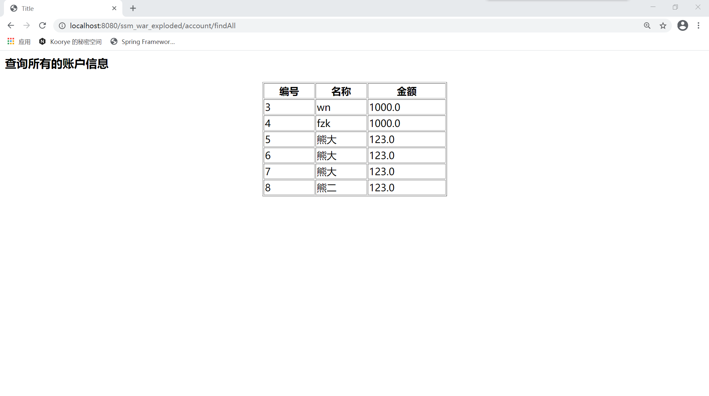