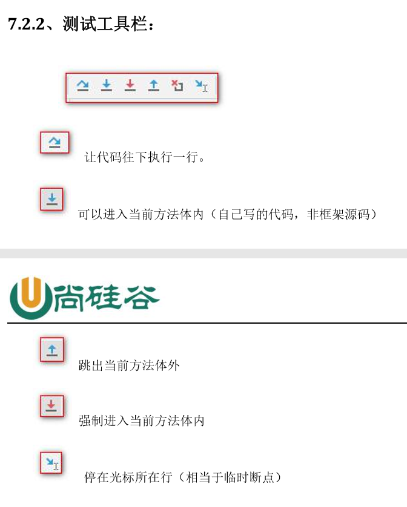
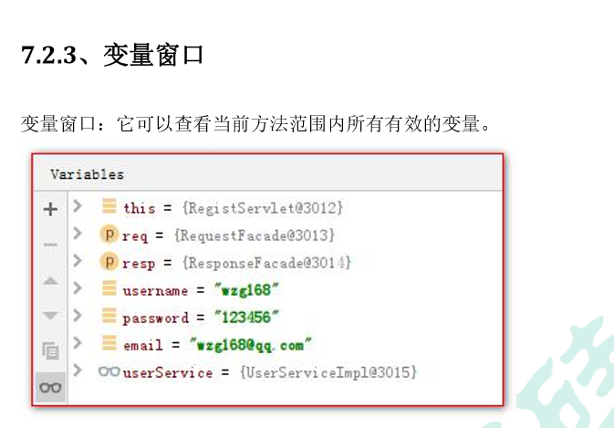
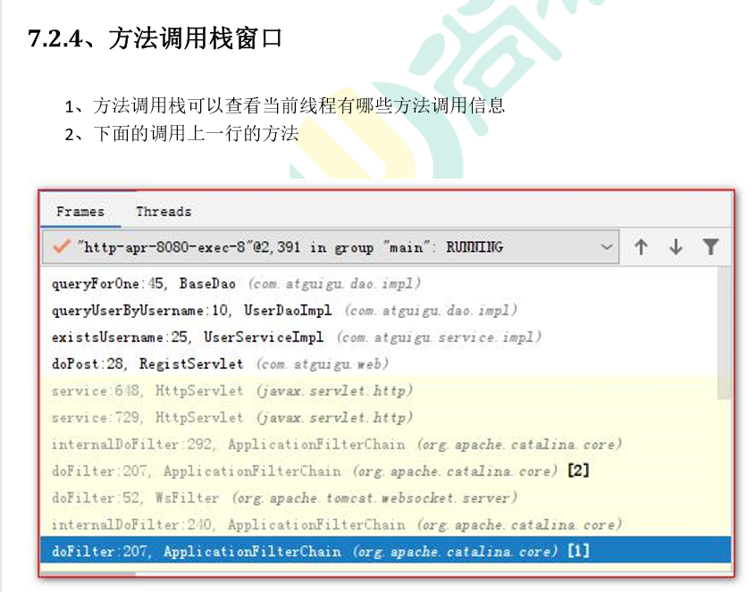
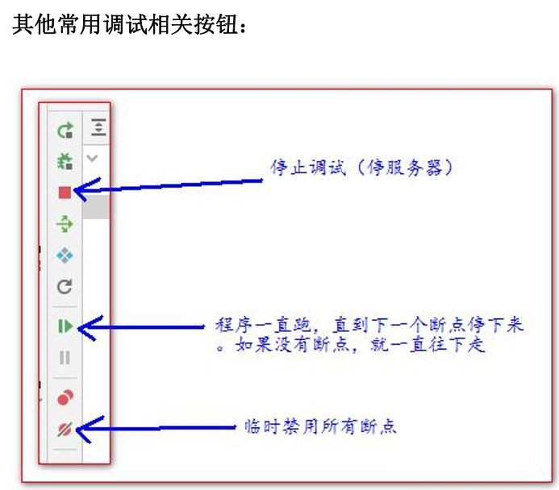
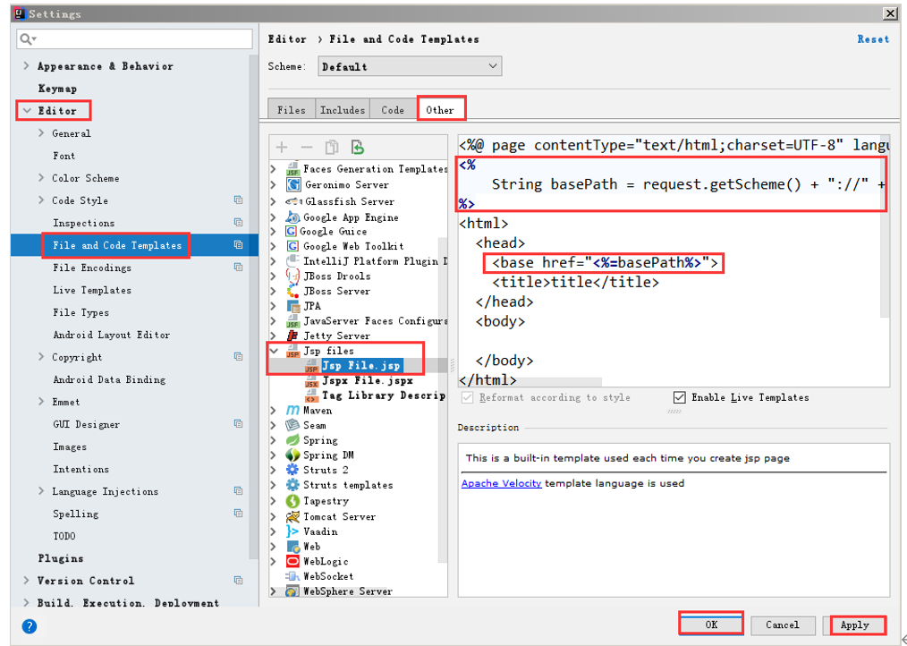
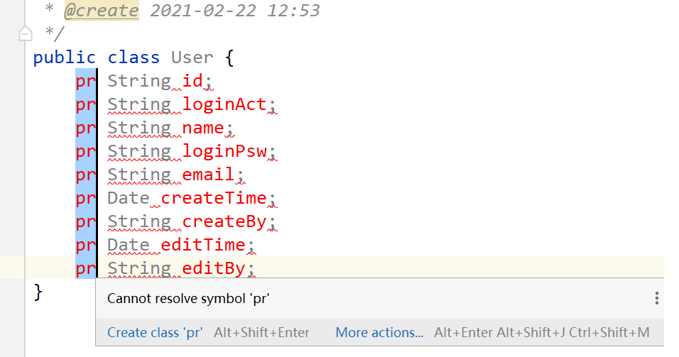

## debug测试






## 设置jsp模板
File-settings

```java
<%
    String basePath = request.getScheme() + "://" 
        + request.getServerName() + ":" + 
        request.getServerPort() + 
        request.getContextPath() + "/";
%>
<base href="<%=basePath%>">
```

## 批量操作

Alt 按住左键上滑或者下滑；
