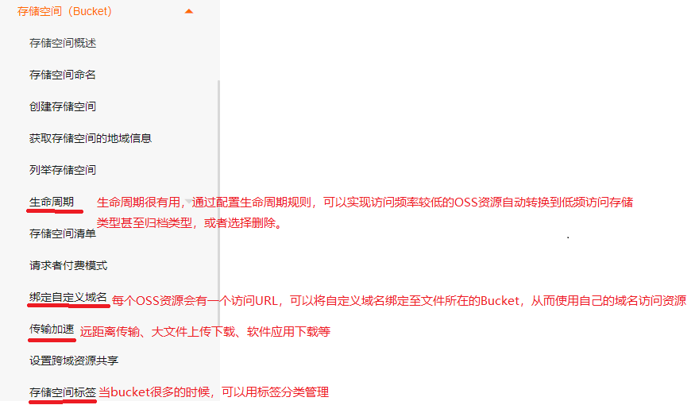

# 资料

阿里云OSS文档：https://help.aliyun.com/product/31815.html?spm=5176.7933691.J_5253785160.6.7b804c59L0NGSc
亚马逊云S3介绍文档：https://aws.amazon.com/cn/s3/?nc2=h_ql_prod_fs_s3
aliyun-oss-go-sdk：https://help.aliyun.com/document_detail/87712.html
AWS SDK for Go：https://docs.aws.amazon.com/zh_cn/sdk-for-go/?id=docs_gateway

亚马逊S3就是Simple Storage Service的简称，和阿里云的OSS(Object Storage Service)差不多，且阿里云对aws SDK的API是兼容的，即可以用aws SDK操作阿里云的OSS服务。

# OSS概述

这个可以在阿里云文档了解，这里仅仅对其文档进行一些重要的点进行copy，更多细节还是要看阿里云文档。

阿里云对象存储OSS（Object Storage Service）是一款海量、安全、低成本、高可靠的**云存储服务**，可提供99.9999999999%（12个9）的数据持久性，99.995%的数据可用性。多种存储类型供选择，全面优化存储成本。

您可以使用阿里云提供的API、SDK接口或者OSS迁移工具轻松地将海量数据移入或移出阿里云OSS。数据存储到阿里云OSS以后，您可以选择**标准存储（Standard）**作为移动应用、大型网站、图片分享或热点音视频的主要存储方式，也可以选择成本更低、存储期限更长的**低频访问存储（Infrequent Access）**、**归档存储（Archive）**、**冷归档存储（Cold Archive）**作为不经常访问数据的存储方式。

## OSS相关概念

### 1.存储类型Storage Class

**1.1 标准存储Standard**

高可靠、高可用、高性能，应用场景如图片、音视频、软件程序等。数据冗余存储方式：

- 标准存储-本地冗余（LRS）

  采用数据冗余存储机制，将每个对象的不同冗余存储在同一个可用区内多个设施的多个设备上，确保硬件失效时的数据持久性和可用性。

- 标准存储-同城冗余（ZRS）

  采用多可用区（AZ）机制，将用户的数据分散存放在同一地域（Region）的3个可用区。当某个可用区不可用时，仍然能够保障数据的正常访问。

**1.2 低频访问存储Infrequent Access**

高持久性，平均每月访问1~2次。数据访问会产生取回费用。数据冗余存储方式同上。应用场景：热备数据、监控视频数据等。

**1.3 归档存储Archive**

高持久性，长期保存的归档数据。数据解冻后才能访问并产生费用。应用场景：档案数据、医疗影像、科学资料、影视素材等。

**1.4 冷归档存储Cold Archive**

高持久性，超长时间的极冷数据。数据解冻后才能访问并产生费用。应用场景：同上。

### 2.存储空间Bucket

存储空间是用于存储对象（Object）的容器。Bucket具有各种配置属性，包括地域、访问权限、存储类型等。

同一个Bucket的内部是扁平的，**没有文件系统的目录等概念**，所有的Object都直接隶属于其对应的Bucket。Bucket的名称在OSS范围内全局唯一，且创建之后无法修改。

### 3.对象/文件Object

对象（Object）是OSS存储数据的基本单元，也被称为OSS的文件。和传统的文件系统不同，OSS内部使用扁平结构存储数据，**Object没有文件目录层级结构的关系**，所有对象均以

**三种类型**：

- Normal：简单上传的文件
- Multipart：分片上传的文件
- Appendable：追加上传，且仅支持在Appendable类型的Object后直接追加内容。

**Object信息**：

- key：Object的名称，可用于查询文件
- Data：存储的数据
- VersionID：bucket开启版本控制后，上传的对象有版本id

- Object Meta：Object元信息，一组键值对

虽然说，OSS中没有目录这个概念，但是为方便您对Object进行分组并简化权限管理，您可以创建目录，然后将目标文件存放至指定目录。**OSS将以`/`结尾的Object视作目录**。