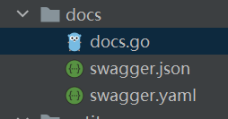
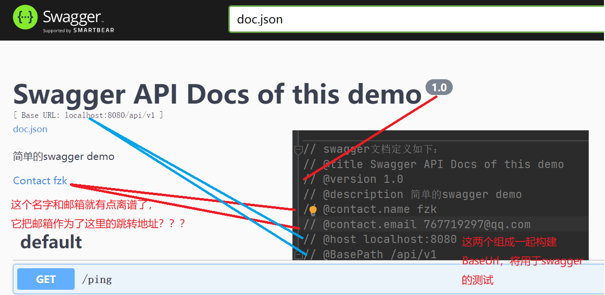
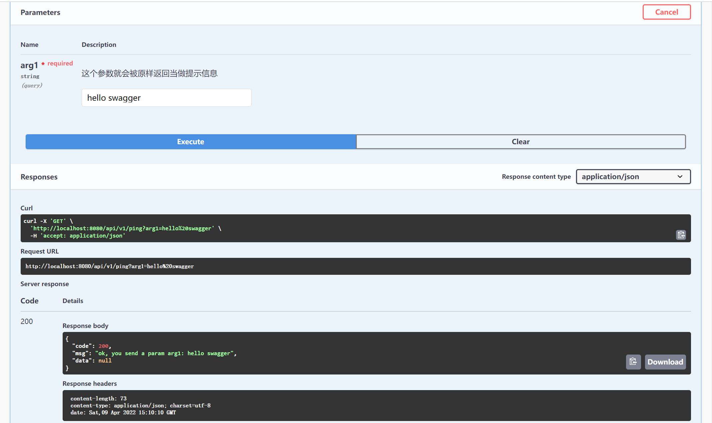

# 资料

gin-swagger：https://github.com/swaggo/gin-swagger
gin-swagger的GitHub文档：https://swaggo.github.io/swaggo.io/

# gin-swagger

一个gin的中间件，可以结合swagger2.0规范自动生成restful风格API的文档。

## 快速开始

1、下载依赖

```shell
go get -u github.com/gin-gonic/gin  # gin依赖
go get -u github.com/swaggo/swag/cmd/swag  # swag命令的依赖
```

2、文档初始化`swag init` ，这里建议先`swag init -h`看看如何有哪些选项

```shell
USAGE:
   swag.exe init [command options] [arguments...]

选项：这里仅列了一些感觉常用的
-g 指定生成API的go文件路径，一般是指main.go
-d 指定生成的文档目录，默认是"./"
-exclude 扫描时排除那些目录或者文件
-p 属性名称策略，有snakecase，camelcase(默认)，pascalcase
-o 所有生成文件(swagger.json, swagger.yaml and docs.go)的输出目,default: "./docs"
--generatedTime Generate timestamp at the top of docs.go, disabled by default (default: false)
```

那么很显然，这里可以先暂时在项目根目录下的Makefile中这么定义初始化命令：

```makefile
swag-init: # swag文档重新生成
	swag init -g ./cmd/main.go -o ./docs --generatedTime
```

如果顺利，此时能看到项目根目录下会出现一个docs目录并且里面出现了3个文件：



3、再引入gin-swagger依赖

```shell
go get -u github.com/swaggo/gin-swagger
go get -u github.com/swaggo/files
```

并且需要在代码中引入这些包：

```go
import (
   ginSwagger "github.com/swaggo/gin-swagger" // gin-swagger middleware
   swaggerFiles "github.com/swaggo/files" // swagger embed files
)
```

4、绑定swagger文档绑定的url地址并注册gin-swagger的中间件

```go
router.GET("/swagger/*any", ginSwagger.WrapHandler(swaggerFiles.Handler))
```

5、引入生成的docs包，因为生成的docs目录中的docs.go有一个init函数需要执行诶

```go
import docs "SwaggerDemo/docs" // 这里非常重要，必须引入 swag init 命令在自己项目生成的这个docs目录
```

6、案例全代码如下：

```go
package main

import (
	docs "SwaggerDemo/docs" // 这里非常重要，必须引入 swag init 命令在自己项目生成的这个docs目录
	"SwaggerDemo/entity"
	"github.com/gin-gonic/gin"
	swaggerFiles "github.com/swaggo/files"
	ginSwagger "github.com/swaggo/gin-swagger"
	"log"
)

// swagger文档定义如下：
// @title Swagger API Docs of this demo
// @version 1.0
// @description 简单的swagger demo
// @contact.name fzk
// @contact.email 767719297@qq.com
// @host localhost:8080
// @BasePath /api/v1
func main() {
	router := gin.Default()
	group := router.Group("/api/v1")
	group.GET("/ping", PingHandler)

	docs.SwaggerInfo.BasePath = "/api/v1"	// 这里的目的是引入生成的docs包
	router.GET("/swagger/*any", ginSwagger.WrapHandler(swaggerFiles.Handler))

	log.Fatalln(router.Run(":8080"))
}

// PingHandler just a demo
// @title ping测试
// @version 1.0
// @description 这是一个ping接口
// @accept application/json
// @produce application/json
// @param arg1 query string true "这个参数就会被原样返回当做提示信息"  // 提示信息必须加引号
// @success 200 {object} entity.Result "成功提示"
// @failure 400 {object} entity.Result "失败提示"
// @router /ping [GET]	// 必须加中括号
func PingHandler(c *gin.Context) {
	arg1, b := c.GetQuery("arg1")
	if !b {
		c.JSON(400, &entity.Result{Code: 200, Msg: "缺少参数：arg1"})
	}
	c.JSON(200, &entity.Result{Code: 200, Msg: "ok, you send a param arg1: " + arg1})
}

// Result 统一返回结果视图
type Result struct {
	Code int         `json:"code"`
	Msg  string      `json:"msg"`
	Data interface{} `json:"data"`
}
```

7、之后每次有api更新都可以去更新一下swagger文档，并启动项目，访问这个demo项目的swagger文档地址：http://localhost:8080/swagger/index.html



## swagger直接测试接口

这个swagger居然还能直接测试接口



在每个restful接口点进去，会有一个`try it out`的按钮，点击就能输入参数开始测试啦，还可以。

> note：这个测试的接口地址是按照你配置的@host+@BasePath+@router进行请求的，所以需要进行swagger接口测试的话，这3个玩意得好好填

## API info注解

通过上面简单的案例，可以看到文档信息都是来自于main函数或者是每个接口的handler上的注释里的注解。

这些注释的详细说明文档：https://swaggo.github.io/swaggo.io/

### general API info

通用api信息是配置整个swagger文档的，可以配置在main函数的注释里。

可以看文档，也可以看这个案例的main函数，几乎有用的注解都在这个main注释里了。

### 接口注解

直接看官方文档吧。在其中需要注意的有这两个注解：

| 注解     | 描述                                                         | 例子                                              |
| -------- | ------------------------------------------------------------ | ------------------------------------------------- |
| @param   | 参数格式定义：<br />`param name`,`param type`,`data type`,`is mandatory?`,`comment` ,`attribute(optional)` | // @param arg1 query string true "提示信息"       |
| @success | 成功返回格式定义：<br />`return code`,`{param type}`,`data type`,`comment` | // @success 200 {object} entity.Result "成功提示" |

这个param type需要注意，官方文档写的是错误的(有点离谱了)，自己测试有以下类型：`query`,`path`,`body`，分别代表参数来自于url的query参数，url的路径变量，请求体。

这个@success和@failure，指定的是成功或者失败的返回格式，在返回格式统一采用`{code:200,msg:"ok",data:null}`这种格式的情况下呢，`param type`是object，`data type`就得指定返回的那个结构体了。

> note：需要注意的是，这个gin-swagger对于注释信息的判断是有点sb的，像通用注解后面跟着的都会被当做是注解信息，所以用`//`进行注释是不行的。然后每个接口的注解呢，有些注解是需要多个配置信息的，会进行一个以空格进行的切分操作，只要将它需要的配置信息写完了，再自己搞个`//`进行注释是没问题的。