在web开发中，安全第一位。

过滤器，拦截器

设计之初就需要考虑安全。

shiro，springsecurity很像。

认证，授权。

# 资料

> 官方文档：https://docs.spring.io/spring-security/site/docs/current/reference/html5/
>
> 别人翻译的中文文档：https://www.springcloud.cc/spring-security.html#overall-architecture

Spring Security是一个提供身份验证，授权和保护以防止常见攻击的框架。

凭借对命令式和响应式应用程序的一流支持，它是用于保护基于Spring的应用程序的事实上的标准。


# spring security

## 简介

Spring Security 基于 Spring框架，提供了一套Web应用安全性的完整解决方案。一般来说，Web应用的安全性包括**用户认证（Authentication）**和**用户授权（Authorization）**两个部分。

- **用户认证**指的是验证某个用户是否为系统中的合法主体，也就是说用户是否能访问该系统。用户认证一般要求用户提供用户名和密码。系统通过校验用户名和密码来完成认证过程。
- **用户授权**指的是验证某个用户是否有权限执行某个操作。在一个系统中不同用户所具有的权限是不同的。

> 对于上面提到的两种应用情景，Spring Security 框架都有很好的支持。在用户认证方面，Spring Security框架支持主流的认证方式，包括HTTP基本认证、HTTP表单验证、HTTP摘要认证、OpenID和LDAP等。在用户授权方面，Spring Security提供了基于角色的访问控制和访问控制列表（Access Control List,ACL），可以对用用中的领域对象进行细粒度的控制。

### maven引入

```xml
<dependencies>
    <!-- ... other dependency elements ... -->
    <dependency>
        <groupId>org.springframework.boot</groupId>
        <artifactId>spring-boot-starter-security</artifactId>
    </dependency>
</dependencies>
```

### 特点

#### 验证

- 认证支持
- 密码储存

spring security的 `PasswordEncoder`接口用于执行密码的一种单向转换，以允许安全地存储密码。 给定 `PasswordEncoder`这是一种单向转换，它不打算在密码转换需要两种方式（即存储用于对数据库进行身份验证的凭据）时使用。 通常 `PasswordEncoder`用于存储验证时需要与用户提供的密码进行比较的密码。

##### DelegatingPasswordEncoder 

目前默认的密码编码算法。

在Spring Security 5.0之前的默认 `PasswordEncoder`曾是 `NoOpPasswordEncoder`需要纯文本密码。

Spring Security引入了 `DelegatingPasswordEncoder`通过以下方法解决了所有问题： 

- 确保使用当前密码存储建议对密码进行编码 
- 允许以现代和旧式格式验证密码 
- 允许将来升级编码 

1. 创建默认的DelegatingPasswordEncoder 

```java
PasswordEncoder passwordEncoder =
    PasswordEncoderFactories.createDelegatingPasswordEncoder();
```

2.自定义DelegatingPasswordEncoder 

```java
String idForEncode = "bcrypt";
Map encoders = new HashMap<>();
encoders.put(idForEncode, new BCryptPasswordEncoder());
encoders.put("noop", NoOpPasswordEncoder.getInstance());
encoders.put("pbkdf2", new Pbkdf2PasswordEncoder());
encoders.put("scrypt", new SCryptPasswordEncoder());
encoders.put("sha256", new StandardPasswordEncoder());

PasswordEncoder passwordEncoder =
    new DelegatingPasswordEncoder(idForEncode, encoders);
```

- withDefaultPasswordEncoder例子 

```java
User user = User.withDefaultPasswordEncoder()
  .username("user")
  .password("password")
  .roles("user")
  .build();
System.out.println(user.getPassword());
// {bcrypt}$2a$10$dXJ3SW6G7P50lGmMkkmwe.20cQQubK3.HZWzG3YB1tlRy.fqvM/BG
```

如果要创建多个用户，则还可以重复使用该构建器。 

- withDefaultPasswordEncoder重用构建器 

```java
UserBuilder users = User.withDefaultPasswordEncoder();
User user = users
  .username("user")
  .password("password")
  .roles("USER")
  .build();
User admin = users
  .username("admin")
  .password("password")
  .roles("USER","ADMIN")
  .build();
```

> 更多细节：https://docs.spring.io/spring-security/site/docs/current/reference/html5/#authentication-password-storage-dpe

##### BCryptPasswordEncoder 

​	这 `BCryptPasswordEncoder`实现使用广泛支持的 [bcrypt ](https://en.wikipedia.org/wiki/Bcrypt)算法对密码进行哈希处理。  为了使它更能抵抗密码破解，bcrypt的速度故意降低。  与其他自适应单向功能一样，应将其调整为大约1秒钟，以验证系统上的密码。  默认实现 `BCryptPasswordEncoder`使用 的Javadoc中提到的强度10 [BCryptPasswordEncoder ](https://docs.spring.io/spring-security/site/docs/current/api/org/springframework/security/crypto/bcrypt/BCryptPasswordEncoder.html)。 鼓励您  在您自己的系统上调整并测试强度参数，以使验证密码大约需要1秒钟。 

```java
// Create an encoder with strength 16
BCryptPasswordEncoder encoder = new BCryptPasswordEncoder(16);
String result = encoder.encode("myPassword");
assertTrue(encoder.matches("myPassword", result));
```

#### 防止利用漏洞

Spring Security提供了针对常见漏洞的保护。 只要有可能，默认情况下就启用保护。

1. 跨站请求伪造(CSRF)

- [什么是CSRF攻击？ ](https://docs.spring.io/spring-security/site/docs/current/reference/html5/#csrf-explained)
- [防范CSRF攻击 ](https://docs.spring.io/spring-security/site/docs/current/reference/html5/#csrf-protection)
- [CSRF注意事项 ](https://docs.spring.io/spring-security/site/docs/current/reference/html5/#csrf-considerations)

2. 安全HTTP响应标头 

3. HTTP 

所有基于HTTP的通信（包括 [静态资源 ](https://www.troyhunt.com/heres-why-your-static-website-needs-https/)）都应 进行保护 [使用TLS ](https://cheatsheetseries.owasp.org/cheatsheets/Transport_Layer_Protection_Cheat_Sheet.html)。 

作为一个框架，Spring Security不处理HTTP连接，因此不直接提供对HTTPS的支持。 但是，它确实提供了许多有助于HTTPS使用的功能。 

更多细节看文档。

## 快速开始

### 记住几个类：

- WebSecurityConfigurerAdapter：自定义Security策略
- AuthenticationManagerBuilder：自定义认证策略
- @EnableWebSecurity：开启WebSecurity模式

### 导入依赖

创建好boot项目之后(最好在创建的时候就选择web和security项目)，导入security的starter。

```xml
		<!--security-->
		<dependency>
			<groupId>org.springframework.boot</groupId>
			<artifactId>spring-boot-starter-security</artifactId>
		</dependency>
		<dependency>
			<groupId>org.springframework.security</groupId>
			<artifactId>spring-security-test</artifactId>
			<scope>test</scope>
		</dependency>

		<!--Thymeleaf-->
		<dependency>
			<groupId>org.springframework.boot</groupId>
			<artifactId>spring-boot-starter-thymeleaf</artifactId>
		</dependency>
		<!--Thymeleaf和spring sucurity5的整合包
			对Thymeleaf添加对spring security的标签支持-->
		<dependency>
			<groupId>org.thymeleaf.extras</groupId>
			<artifactId>thymeleaf-extras-springsecurity5</artifactId>
		</dependency>
```

### 配置

- 编写security的配置类，需要继承**WebSecurityConfigurerAdapter**类。

- 标注`@EnableWebSecurity`注解：里面包含有`@Configuration`。

```java
@EnableWebSecurity
public class MySecurityConfig1 extends WebSecurityConfigurerAdapter {
    // 认证
    @Override
    protected void configure(AuthenticationManagerBuilder auth) throws Exception {
    }

    // 加密
    @Bean
    PasswordEncoder passwordEncoder() {
        return new BCryptPasswordEncoder();
    }

    // 授权
    @Override
    protected void configure(HttpSecurity http) throws Exception {
    }
}
```

- 加密最好就是这样，把passwordEncoder转化为bean。且加密算法简单选择为BCrypt即可。
- 密码这里是必须要有加密算法的，不然会报错(更多加密算法看文档)。
- 数据库和数据源等配置不再列出。

### 认证Authentication

1.实现**`UserDetailsService`**接口：这个接口很重要，几乎所有的认证以及角色权限都和它有关。

```java
@Service("userDetailService")
public class MyUserDetailService implements UserDetailsService {
    @Autowired
    UserMapper userMapper;
    @Override
    public UserDetails loadUserByUsername(String username) throws UsernameNotFoundException {
        // 这里从数据库中查到的用户信息
        Map<String,Object> map=new HashMap<>();
        map.put("username",username);
        List<UserVO> userVOS = userMapper.selectByMap(map);
        if(userVOS.size()!=1){
            throw new UsernameNotFoundException("用户名不存在！");
        }
        String password=userVOS.get(0).getPassword();

        // 赋予权限：以ROLE_开头，则为赋予角色，否则为赋予权限
        List<GrantedAuthority> auths= AuthorityUtils.
                commaSeparatedStringToAuthorityList("vip1,ROLE_vip1");
        return new User(username,   // 注意：这个User类是security核心core包里的类
                new BCryptPasswordEncoder().encode(password),auths);
    }
}
```

2.在配置类中加入认证

```java
@Autowired
@Qualifier("userDetailService")
private UserDetailsService userDetailsService;

// 认证
@Override
protected void configure(AuthenticationManagerBuilder auth) throws Exception {
    // 需要传入密码编码器
    auth.userDetailsService(userDetailsService).passwordEncoder(passwordEncoder());
}

// 加密
@Bean
PasswordEncoder passwordEncoder() {
    return new BCryptPasswordEncoder();
}
```

此时无论访问资源的什么路劲，在未登录的情况下，都将跳转到security默认自带的login页面，即/login。

security默认自带的login页面登录成功之后，可以访问任何路劲下的资源，因为此时还没有配置权限。

### 授权Authorization

在授权中，可以更改默认的login页面为自己的登录界面。

1.一个简单的thmeleaf模板界面：表单登录

```html
<div th:if="${param.error}">	
    Invalid username and password.</div>
<div th:if="${param.logout}">
    You have been logged out.</div>
<form th:action="@{/login123}" method="post">
    <div>
        <input type="text" name="username" placeholder="Username"/>
    </div>
    <div>
        <input type="password" name="password" placeholder="Password"/>
    </div>
    <input type="checkbox" name="remember"> 自动登录
    <input type="submit" value="Log in" />
</form>
```

- 第一个div是用来提示登录出错的，第二个是用来提示登出的。

2.配置路劲访问权限和自定义登录表单

```java
// 授权
@Override
protected void configure(HttpSecurity http) throws Exception {
    // 授权
    // 自定义规则：首页和登录页所有人可以访问，其他页面需要登录授权
    http.authorizeRequests()
        .antMatchers("/", "/toLogin").permitAll()
        // 设置路径访问权限
        .antMatchers("/level1/**").hasAuthority("vip1")//只能设置一个权限
        // hasAnyAuthority可以设置多个权限
        .antMatchers("/level2/**").hasAnyAuthority("vip1","vip2")
        // 设置角色访问路径权限
        .antMatchers("/level1/**").hasRole("vip1")
        .antMatchers("/level2/**").hasRole("vip3")
        .antMatchers("/level3/**").hasAnyRole("admin","vip3")//设置多个角色可以访问这条路劲
 // 	.antMatchers("/**").hasIpAddress("127.0.0.1")	// 设置网路ip地址访问权限
        .and().csrf().disable();    // 关闭csrf防护

    // 自定义表单登录
    http.formLogin()    // 自定义自己编写的登录页面
            .loginPage("/toLogin")  // 登录页面：需要在controller那里将toLogin请求返回一个登录页面login.html，
        							// 即上面那个表单页面
            .usernameParameter("username") // default is username，设置用户名参数
            .passwordParameter("password")  // default is password，设置密码参数
            .loginProcessingUrl("/login123") // 设置处理用户验证的url：
            // 此时的登录表单的action必须与这里的处理url一致才能处理登录。
        	// 处理请求的方式即为上一步认证中的密码验证和权限给与和角色授予
            .successForwardUrl("/index");   //用户密码正确之后的跳转请求
}
```

> 注意：认证和授权的地方的配置，就上面这些配置，都可以直接点进去看源码注释，有配置示例。

### 其他功能

- 自定义权限不足禁止访问页面
- 用户注销(登出)功能
- 自动登录功能

> 注意：用户登出功能与自动登录功能最好结合使用。
>
> 注销功能和自动登录功能的详细配置都在下面的认证章节。

```java
    protected void configure(HttpSecurity http) throws Exception {
		......
        ......
        // 自定义403页面
        http.exceptionHandling().accessDeniedPage("/error/403");

        // 用户注销：根据源码给出的模板，退出后，跳到首页
        http.logout().deleteCookies("remove").invalidateHttpSession(true)
//                .logoutSuccessUrl("/") 如果这里不加的话，将会是默认的/login?logout
                .logoutUrl("/logout");

        // 记住我
        http.rememberMe()
                .tokenRepository(persistentTokenRepository())
                .tokenValiditySeconds(600)   // 设置有效时长：单位s
                .userDetailsService(userDetailsService)
                .rememberMeParameter("remember");   // 默认为remember-me
    }
```

## 认证

### 认证机制 

- [用户名和密码 ](https://docs.spring.io/spring-security/site/docs/current/reference/html5/#servlet-authentication-unpwd)-如何使用用户名/密码进行身份验证 
- [OAuth 2.0登录 ](https://docs.spring.io/spring-security/site/docs/current/reference/html5/#oauth2login)-使用OpenID Connect和非标准OAuth 2.0登录（即GitHub）登录的OAuth 2.0 
- [SAML 2.0登录 ](https://docs.spring.io/spring-security/site/docs/current/reference/html5/#servlet-saml2)-SAML 2.0登录 
- [中央身份验证服务器（CAS） ](https://docs.spring.io/spring-security/site/docs/current/reference/html5/#servlet-cas)-中央身份验证服务器（CAS）支持 
- [记住我 ](https://docs.spring.io/spring-security/site/docs/current/reference/html5/#servlet-rememberme)-如何记住用户过期的会话 
- [JAAS认证 ](https://docs.spring.io/spring-security/site/docs/current/reference/html5/#servlet-jaas)-使用JAAS进行认证 
- [OpenID ](https://docs.spring.io/spring-security/site/docs/current/reference/html5/#servlet-openid)-OpenID身份验证（请勿与OpenID Connect混淆） 
- [预先身份验证方案 ](https://docs.spring.io/spring-security/site/docs/current/reference/html5/#servlet-preauth)-使用诸如 类的外部机制进行身份验证， [SiteMinder ](https://www.siteminder.com/)或Java EE安全性之 但仍使用Spring Security进行授权和防范常见漏洞利用。 
- [X509身份验证 ](https://docs.spring.io/spring-security/site/docs/current/reference/html5/#servlet-x509)-X509身份验证 

### 用户名/密码认证 

Spring Security提供了以下内置机制，用于从 `HttpServletRequest`: 

- [表格登入 ](https://docs.spring.io/spring-security/site/docs/current/reference/html5/#servlet-authentication-form)
- [基本认证 ](https://docs.spring.io/spring-security/site/docs/current/reference/html5/#servlet-authentication-basic)
- [摘要式身份验证 ](https://docs.spring.io/spring-security/site/docs/current/reference/html5/#servlet-authentication-digest)

**储存机制** 

用于读取用户名和密码的每种受支持的机制都可以利用任何受支持的存储机制： 

- 通过 简单存储 [内存中身份验证进行 ](https://docs.spring.io/spring-security/site/docs/current/reference/html5/#servlet-authentication-inmemory)
- 具有 关系数据库 [JDBC身份验证的 ](https://docs.spring.io/spring-security/site/docs/current/reference/html5/#servlet-authentication-jdbc)
- 使用 自定义数据存储 [UserDetailsService的 ](https://docs.spring.io/spring-security/site/docs/current/reference/html5/#servlet-authentication-userdetailsservice)
- 具有 LDAP存储 [LDAP身份验证的 ](https://docs.spring.io/spring-security/site/docs/current/reference/html5/#servlet-authentication-ldap)

#### 表单登录

1.登录表单(thmeleaf模板)

```html
<div th:if="${param.error}">
    Invalid username and password.</div>
<div th:if="${param.logout}">
    You have been logged out.</div>
<form th:action="@{/login123}" method="post">
    <div>
        <input type="text" name="username" placeholder="Username"/>
    </div>
    <div>
        <input type="password" name="password" placeholder="Password"/>
    </div>
    <input type="submit" value="Log in" />
</form>
```

2.自定义登录表单配置

```java
protected void configure(HttpSecurity http) throws Exception {
    // 授权
    // 自定义规则：首页和登录页所有人可以访问，其他页面需要登录授权
    http.authorizeRequests()
            .antMatchers("/", "/toLogin").permitAll()
            .antMatchers("/level1/**").hasRole("vip1")
            .antMatchers("/level2/**").hasRole("vip2")
            .antMatchers("/level3/**").hasRole("vip3")
            .and().csrf().disable();    // 关闭csrf防护

    // 自定义表单登录
    http.formLogin()    // 自定义自己编写的登录页面
            .loginPage("/toLogin")  // 登录页面：需要在controller那里将toLogin请求返回一个登录页面login.html
            .usernameParameter("username") // default is username
            .passwordParameter("password")  // default is password
            .loginProcessingUrl("/login123") // 设置处理用户验证的url：
            // 此时的登录表单的action必须与这里的处理url一致才能处理登录。
            .successForwardUrl("/index");   //用户密码正确之后的跳转页面
}
```

- 登录用户名参数可以自定义，需要和表单中的登录名相同；密码同理；

- 如果登录成功，将跳转到设置的页面；

- 如果登录失败，请求转发：`http://localhost:9090/toLogin?error`；即转发到登录页并附带一个error参数；

  - 可以根据这error参数，来进行编写登录login.html，指出登录错误

  - ```html
    <div th:if="${param.error}">Invalid username and password.</div>
    ```

  - 必须给出错误信息，不然的话，用户将无法知道是否登录错误，因为登录错误之后，还是停留在login.html页面

- 如果找到HTTP参数logout，则表明用户已成功注销 ；用法类似于参数error。

#### 内存中身份验证

- 带User.withDefaultPasswordEncoder的InMemoryUserDetailsManager 

```java
// 认证
// Spring security 5.0+ 中新增了许多加密方式
@Override
protected void configure(AuthenticationManagerBuilder auth) throws Exception {
    // 这些数据正常来说，应该去数据库中读取
    // 在内存中认证
    auth.inMemoryAuthentication().passwordEncoder(new BCryptPasswordEncoder())
            .withUser("fzk").password(new BCryptPasswordEncoder().encode("010326"))
            .roles("vip1", "vip2")
            .and().withUser("root").password(new BCryptPasswordEncoder().encode("010326"))
            .roles("vip1", "vip2", "vip3");
}
// 当然 也可以将存在的用户转为bean来进行验证，如下：
@Bean
public UserDetailsService users() {
    // The builder will ensure the passwords are encoded before saving in memory
    UserBuilder users = User.withDefaultPasswordEncoder();
    UserDetails user = users
        .username("user")
        .password("password")
        .roles("USER")
        .build();
    UserDetails admin = users
        .username("admin")
        .password("password")
        .roles("USER", "ADMIN")
        .build();
    return new InMemoryUserDetailsManager(user, admin);
}
```

但是，它不能防止通过反编译源代码来获取密码。  为此原因， `User.withDefaultPasswordEncoder`只能用于“入门”，而不能用于生产。

当然，第一个如果从数据库中取出用户，也是可以的。

#### jdbc验证


### 用户注销

```html
<a class="item" th:href="@{/logout}">
    <i class="sign-out icon"></i> 注销
</a>
```

当写出http.logout()方法不知道怎么写的时候，直接点进去，看注释的示例。

```java
    protected void configure(HttpSecurity http) throws Exception {
		......
        // 用户注销：根据源码给出的模板，退出后，跳到首页
        http.logout().deleteCookies("remove").invalidateHttpSession(true)
              //  .logoutSuccessUrl("/") 如果这里不加的话，将会是默认的/login?logout
                .logoutUrl("/logout");
    }
```

对于logoutSuccessUrl，建议不加，因为它会自动**重定向**到配置了的**`登录页面请求url?logout`**。

这样可以用来进行信息提示。

比如：

```html
<div th:if="${param.logout}" style="text-align: center">
    You have been logged out.
</div>
```

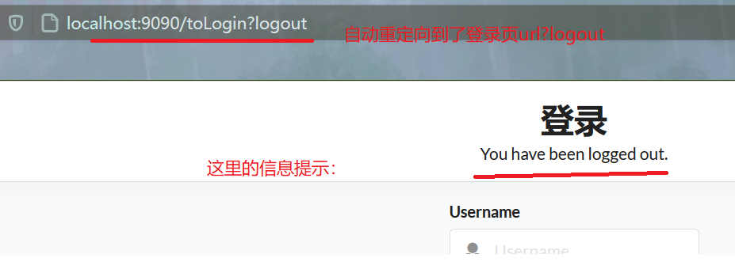

### 自动登录

基于数据库实现记住我。

> 通常，这是通过向浏览器发送一个cookie来实现的，该cookie在以后的会话中被检测到并导致自动登录。 Spring Security提供了进行这些操作所需的钩子，并具有两个具体的“记住我”实现。 一种使用散列来保留基于cookie的令牌的安全性，另一种使用数据库或其他持久性存储机制来存储生成的令牌。 

**注意，这两种实现都需要一个 `UserDetailsService`**

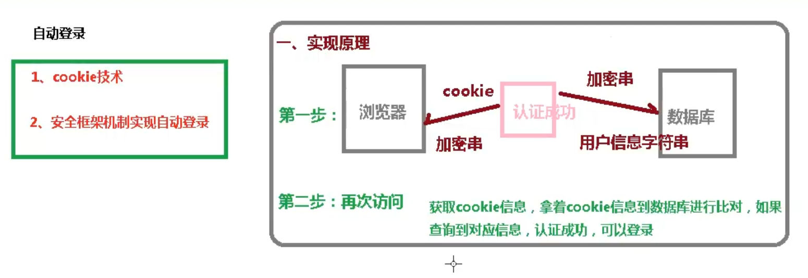

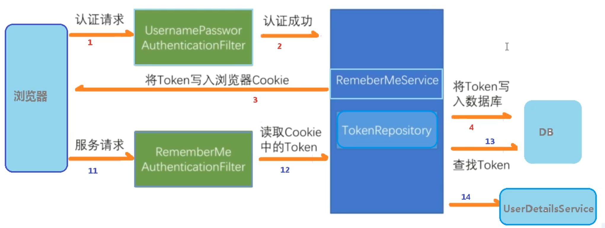

**持久令牌方法** 

这种方法是基于 文章 [http://jaspan.com/improved_persistent_login_cookie_best_practice ](http://jaspan.com/improved_persistent_login_cookie_best_practice)进行的一些细微修改 [ [4 ](https://docs.spring.io/spring-security/site/docs/current/reference/html5/#_footnotedef_4)] 。 

#### 1.前期准备

1. 该数据库应包含一个 `persistent_logins`表：

```sql
create table persistent_logins (username varchar(64) not null,
                                series varchar(64) primary key,
                                token varchar(64) not null,
                                last_used timestamp not null)
```

2. 登录页面加入自动登录(记住我)复选框

```html
<label>
    <input type="checkbox" name="remember-me"> 自动登录
</label>
```

#### 2.配置存储令牌

需要配置一个 `PersistentTokenRepository`存储令牌。 有两种标准实现。 

- `InMemoryTokenRepositoryImpl`仅用于测试。 
- `JdbcTokenRepositoryImpl`将令牌存储在数据库中。 

在自定义的SecurityConfig类中配置：

```java
    // 记住我：自动登录，基于数据库
    @Autowired
    private DataSource dataSource; // 这个dataSource将会得到一个前面配置的DruidDataSource
    @Bean
    public PersistentTokenRepository persistentTokenRepository(){
        JdbcTokenRepositoryImpl jdbcTokenRepository=new JdbcTokenRepositoryImpl();
        jdbcTokenRepository.setDataSource(dataSource);
        // 开启创建登录表功能：非常不建议开启，自己去sqlyog中手动创建
//        jdbcTokenRepository.setCreateTableOnStartup(true);
        return jdbcTokenRepository;
    }
```

#### 3.自动登录实现

```java
    protected void configure(HttpSecurity http) throws Exception {
		......
        // 记住我
        http.rememberMe()
                .tokenRepository(persistentTokenRepository())
                .tokenValiditySeconds(600)   // 设置有效时长：单位s
                .userDetailsService(userDetailsService)
                .rememberMeParameter("remember-me");   // 默认为remember-me
    }
```

#### 4.结果

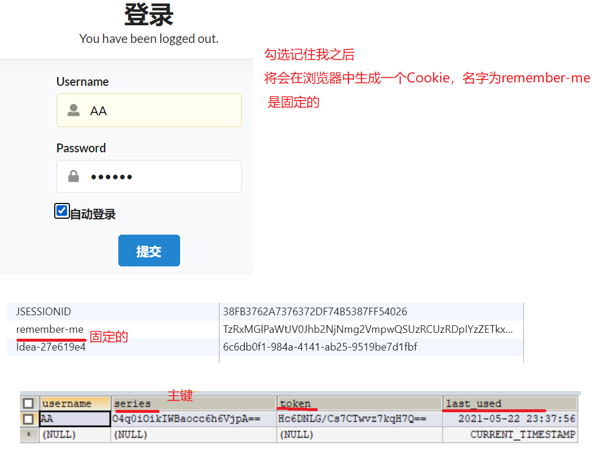

关闭浏览器，重新打开这个路径，自动登录成功。

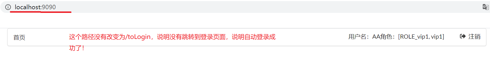

**当点击注销之后：会自动删除cookie**

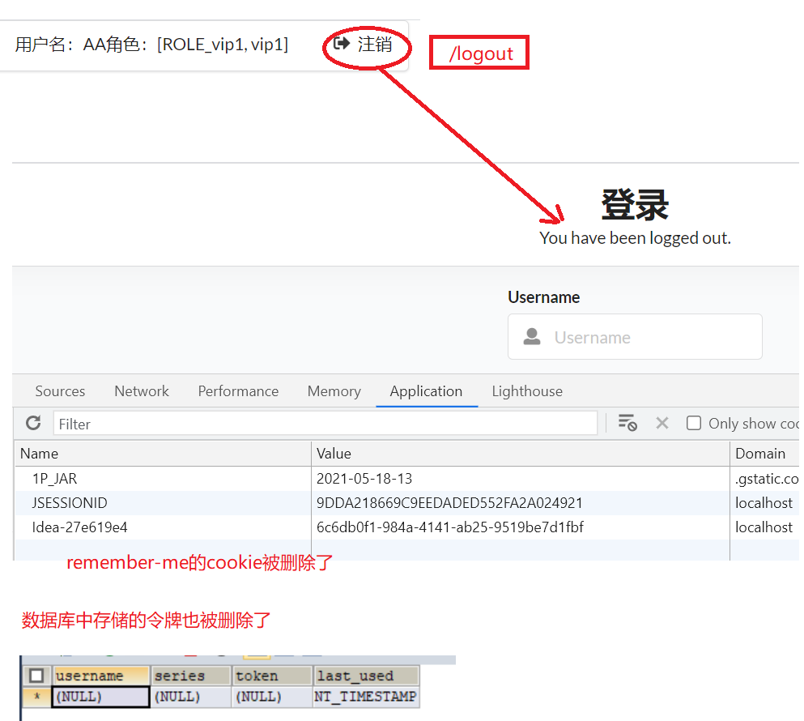

## 授权

- 设置每个请求必须被认证 

```java
protected void configure(HttpSecurity http) throws Exception {
    http
        // ...
        .authorizeRequests(authorize -> authorize
            .anyRequest().authenticated()
        );
}
```

### 权限Authority

#### 给路径设置权限

|方法|说明|
|----|----|
| `hasAuthority(String authority)`       | 若返回 `true`，当前委托人具有指定的权限。  例如， `hasAuthority('read')` |
| `hasAnyAuthority(String… authorities)` | 若返回`true`，当前委托人具有任何提供的授权（以逗号分隔的字符串列表形式提供）  例如， `hasAnyAuthority('read', 'write')` |
| `permitAll` | 总是评估为 `true`  |
| `denyAll`   | 总是评估为 `false` |

```java
    // 授权
    @Override
    protected void configure(HttpSecurity http) throws Exception {
        // 授权
        // 自定义规则：首页和登录页所有人可以访问，其他页面需要登录授权
        http.authorizeRequests()
                .antMatchers("/", "/toLogin").permitAll()
                // 设置具有什么权限才能访问这个路径
                .antMatchers("/level1/**").hasAuthority("vip1")//只能设置一个权限
                // hasAnyAuthority可以设置多个权限
                .antMatchers("/level2/**").hasAnyAuthority("vip1","vip2")
//                .antMatchers("/level3/**").hasRole("vip3")
//                .antMatchers("/**").hasIpAddress("127.0.0.1")
                .and().csrf().disable();    // 关闭csrf防护
        ......
    }
```

#### 给登录用户赋予权限

注意：这里的UserDetailsService需要结合认证使用。因为这是用于认证的。

```java
@Service("userDetailService")
public class MyUserDetailService implements UserDetailsService {
    @Autowired
    UserMapper userMapper;
    @Override
    public UserDetails loadUserByUsername(String username) throws UsernameNotFoundException {
        // 这里从数据库中查到的用户信息
        Map<String,Object> map=new HashMap<>();
        map.put("username",username);
        List<UserVO> userVOS = userMapper.selectByMap(map);
        if(userVOS.size()!=1){
            throw new UsernameNotFoundException("用户名不存在！");
        }
        String password=userVOS.get(0).getPassword();

        // 赋予权限：以ROLE_开头，则为赋予角色，否则为赋予权限
        List<GrantedAuthority> auths= AuthorityUtils.
                commaSeparatedStringToAuthorityList("vip1,ROLE_vip1");

        return new User(username,   // 注意：这个User类是security核心core包里的类
                new BCryptPasswordEncoder().encode(password),auths);
    }
}
```

### 角色Role

角色是权限的集合。

角色都是以`ROLE_`开头，如`ROLE_vip1`。

#### 给路径设置角色权限

| 表达                        | 描述                                                         |
| --------------------------- | ------------------------------------------------------------ |
| `hasRole(String role)`      | 返回 `true`，则当前委托人是否具有指定角色。  例如， `hasRole('admin')` 默认情况下，如果提供的角色不是以“ ROLE_”开头，则会添加该角色。 可以通过修改 `defaultRolePrefix`上 `DefaultWebSecurityExpressionHandler`. |
| `hasAnyRole(String… roles)` | 返回 `true`，则当前委托人是否具有提供的任何角色（以逗号分隔的字符串列表形式提供）。  例如， `hasAnyRole('admin', 'user')` 默认情况下，如果提供的角色不是以“ ROLE_”开头，则会添加该角色。 可以通过修改 `defaultRolePrefix`上 `DefaultWebSecurityExpressionHandler`. |

**注意：hasRole添加角色的时候，不能以`ROlE_`开头；**

因为hasRole方法如下：

```java
private static String hasRole(String role) {
   Assert.notNull(role, "role cannot be null");
   Assert.isTrue(!role.startsWith("ROLE_"),
         () -> "role should not start with 'ROLE_' since it is automatically inserted. Got '" + role + "'");
   return "hasRole('ROLE_" + role + "')";
}
```

从这个方法也可以看出，**hasRole方法会将角色加上`ROLE_`前缀。**

```java
        http.authorizeRequests()
                .antMatchers("/", "/toLogin").permitAll()
                // 设置具有什么权限才能访问这个路径
                .antMatchers("/level1/**").hasAuthority("vip1")//只能设置一个权限
                // hasAnyAuthority可以设置多个权限
                .antMatchers("/level2/**").hasAnyAuthority("vip1","vip2")
            	// 设置具有什么角色才能访问这路径
                .antMatchers("/level3/**").hasRole("vip3")
//                .antMatchers("/**").hasIpAddress("127.0.1.1")
                .and().csrf().disable();    // 关闭csrf防护
```

#### 给登录用户赋予角色

也是在UserDetailsService类的方法实现中，赋予登录用户角色。这个UserDetailsService请看前一小节的权限或者快速开始。

```java
// 赋予权限：以ROLE_开头，则为赋予角色，否则为赋予权限
List<GrantedAuthority> auths= AuthorityUtils.
        commaSeparatedStringToAuthorityList("vip1,ROLE_vip1");
```


### 自定义403页面

用户访问没有权限的路径时候，将会被禁止访问：403

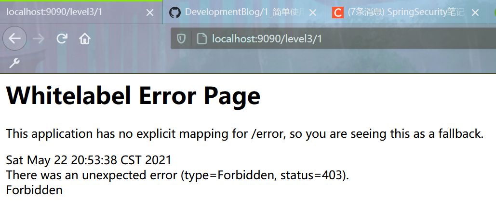

```java
    protected void configure(HttpSecurity http) throws Exception {
		......
        // 自定义403页面
        http.exceptionHandling().accessDeniedPage("/error/403");	// 这里权限不足时候的请求url
    }
```

在controller方法中，配置这个url，再在资源中新增这个403.html页面。

这里也可以去看spring boot 笔记的异常处理的自定义错误页面，两者结合使用更好。

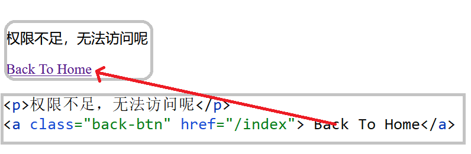

### 方法安全性

方法安全性比简单的允许或拒绝规则要复杂一些。 为了提供对表达式使用的全面支持，Spring Security 3.0引入了一些新的注释。

从2.0版开始，Spring Security大大改进了对在服务层方法中增加安全性的支持。 它提供对JSR-250注释安全性以及框架原始版本的支持。 `@Secured`注解。  从3.0开始，您还可以使用新 [的基于表达式的注释 ](https://docs.spring.io/spring-security/site/docs/current/reference/html5/#el-access)。  您可以使用 `intercept-methods`元素来装饰Bean声明，或者您可以使用AspectJ样式切入点在整个服务层中保护多个Bean。 


> 注意：
>
> 带注释的方法仅对于定义为Spring bean的实例（在启用方法安全性的同一应用程序上下文中）是安全的。 如果您想保护不是由Spring创建的实例（使用 `new`运算符），则您需要使用AspectJ。

#### 1.开启全局方法安全检验

可以使用 `@EnableGlobalMethodSecurity`。将其配置在任何注有@Configuration的类上即可。

建议就配置在自己写的SecurityConfig类上。

#### 2.在方法上添加注解

##### 2.1@Secured

在任意配置类上配置：`@EnableGlobalMethodSecurity(securedEnabled = true)`；

在方法上标注@Secured

```java
@Secured({"ROLE_vip2","ROLE_vip3"})	// 只有此两个用户可以访问这个方法
@RequestMapping("/{level}/{id}")
public String level(@PathVariable String level, @PathVariable("id") int id) {
    // 将错误页面放过去
    if ("error".equals(level))
        return ("/error/" + id);
    return ("/views/" + level + "/" + id);
}
```

##### 2.2@PreAuthorize

最明显有用的注释是 `@PreAuthorize`决定是否可以实际调用方法。 

先开启方法检查：

`@EnableGlobalMethodSecurity(securedEnabled = true,prePostEnabled = true)`

在方法上标注@PreAuthorize

```java
    // 以下角色可以访问这个方法
//    @Secured({"ROLE_vip1","ROLE_vip2","ROLE_vip3"})
    @PreAuthorize("hasAnyRole('vip1','vip2','vip3')")
    @RequestMapping("/{level}/{id}")
    public String level(@PathVariable String level, @PathVariable("id") int id) {
        // 将错误页面放过去
        if ("error".equals(level))
            return ("/error/" + id);
        return ("/views/" + level + "/" + id);
    }
```

```java
@PreAuthorize("hasAuthority('ROLE_TELLER')")
public Account post(Account account, double amount);
}
```

##### 2.3@PostAuthorize

在方法执行之后，再验证是否有权限：可以用来记录是否有人非法访问哦。

先开启方法检查：

`@EnableGlobalMethodSecurity(securedEnabled = true,prePostEnabled = true)`

在方法上标注@PostAuthorize

```java
@RequestMapping("/update")
@ResponseBody
@PostAuthorize("hasAnyAuthority('update')")	// 需要有update权限才能访问输出
public String update(){
    // 这里可以记录是否有非法访问哦

    System.out.println("update已经被访问了");
    return "update success !";
}
```

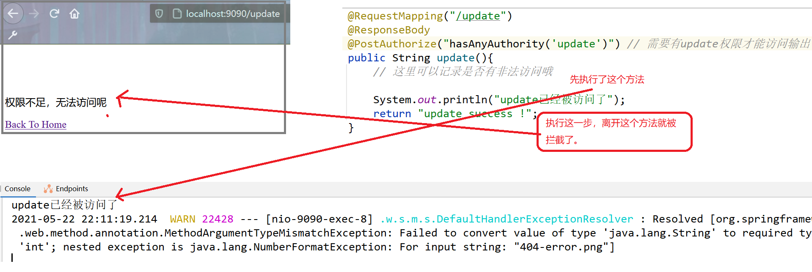

##### @PostFilter和PreFilter

很少用。

需要用的时候去看文档就行了。

分别的作用：

- 对返回值做过滤。

- 对方法传入的参数做过滤。


## CSRF

### 简介

Spring为防止 提供了全面的支持 [跨站点请求伪造（CSRF） ](https://en.wikipedia.org/wiki/Cross-site_request_forgery)攻击 。  在以下各节中，我们将探讨： 

- [什么是CSRF攻击？ ](https://docs.spring.io/spring-security/site/docs/current/reference/html5/#csrf-explained)
- [防范CSRF攻击 ](https://docs.spring.io/spring-security/site/docs/current/reference/html5/#csrf-protection)
- [CSRF注意事项 ](https://docs.spring.io/spring-security/site/docs/current/reference/html5/#csrf-considerations)

简单的身份验证只能保证请求发自用户的浏览器，却**不能保证请求是用户自愿发送的**。

尽管恶意网站无法看到您的cookie，但是与您的银行关联的cookie仍与请求一起发送。

CSRF攻击的可能原因是受害者网站的HTTP请求与攻击者网站的请求完全相同。 这意味着没有办法拒绝来自邪恶网站的请求并允许来自银行网站的请求。 为了防御CSRF攻击，我们需要确保恶意站点无法提供请求中的某些内容，因此我们可以区分这两个请求。 

Spring提供了两种机制来防御CSRF攻击： 

- [同步器令牌模式 ](https://docs.spring.io/spring-security/site/docs/current/reference/html5/#csrf-protection-stp)
- 指定 [SameSite属性 ](https://docs.spring.io/spring-security/site/docs/current/reference/html5/#csrf-protection-ssa)在会话Cookie上 

> 两种保护都要求 [安全方法必须是幂等的 ](https://docs.spring.io/spring-security/site/docs/current/reference/html5/#csrf-protection-idempotent)
>
> 为了使 [任何一种保护 ](https://docs.spring.io/spring-security/site/docs/current/reference/html5/#csrf-protection)针对CSRF的 都起作用，应用程序必须确保 [“安全” HTTP方法是幂等的 ](https://tools.ietf.org/html/rfc7231#section-4.2.1)。  这意味着使用HTTP方法的请求 `GET`,  `HEAD`,  `OPTIONS`， 和 `TRACE`不应更改应用程序的状态。 
>
> spring security会对HTTP方法中的PATCH，**POST**，**PUT**和**DELETE**方法进行防护。

### 同步器令牌模式 

抵御CSRF攻击的最主要和最全面的方法是使用 [同步令牌模式 ](https://www.owasp.org/index.php/Cross-Site_Request_Forgery_(CSRF)_Prevention_Cheat_Sheet#General_Recommendation:_Synchronizer_Token_Pattern)。  此解决方案是为了确保每个HTTP请求除了我们的会话cookie之外，还必须在HTTP请求中包含一个安全的，随机生成的值，称为CSRF令牌。 

提交HTTP请求时，服务器必须查找预期的CSRF令牌，并将其与HTTP请求中的实际CSRF令牌进行比较。 如果值不匹配，则应拒绝HTTP请求。 

这项工作的关键在于，实际的CSRF令牌应该位于浏览器不会自动包含的HTTP请求的一部分中。 例如，在HTTP参数或HTTP标头中要求实际的CSRF令牌将防止CSRF攻击。 要求cookie中的实际CSRF令牌不起作用，因为浏览器会自动将cookie包含在HTTP请求中。 

仅对每个**更新应用程序状态**的HTTP请求仅**要求实际的CSRF令牌**。  为此，我们的应用程序必须确保 [安全的HTTP方法是幂等的 ](https://docs.spring.io/spring-security/site/docs/current/reference/html5/#csrf-protection-idempotent)。  因为我们希望允许使用外部站点的链接来链接到我们的网站，所以这提高了可用性。

此外，我们**不想在HTTP GET中包含随机令牌**，因为这可能**导致令牌泄漏**。 


这里需要引入Thmeleaf模板和Security结合的依赖，**快速开始**中有。

1.CSRF令牌必须位于名为HTTP的**HTTP请求参数**中 `_csrf`：在post请求的表单中添加这个隐藏域

(当然是可以不加的，后面有解释)

```html
<form th:action="@{/update}" method="post">
    <input type="hidden"
           th:name="${_csrf.parameterName}"
           th:value="${_csrf.token}"/>
    
    <input type="text" placeholder="Username" name="username">
    <input type="password" name="password">
    <input type="submit" class="ui blue submit button"/>
</form>
```

2.打开csrf防护功能

```java
    protected void configure(HttpSecurity http) throws Exception {
        // 授权
        // 自定义规则：首页和登录页所有人可以访问，其他页面需要登录授权
        http.authorizeRequests()
                .antMatchers("/", "/toLogin").permitAll()
                // 设置具有什么权限才能访问这个路径
                .antMatchers("/level1/**").hasAuthority("vip1")//只能设置一个权限
                // hasAnyAuthority可以设置多个权限
                .antMatchers("/level2/**").hasAnyAuthority("vip1","vip2")
                .antMatchers("/level3/**").hasRole("vip3")
                .antMatchers("/level3/**").hasAnyRole("vip3");
//                .antMatchers("/**").hasIpAddress("127.0.1.1")
//                .and().csrf().disable();    // 关闭csrf防护
```

可以看到csrf 防护功能是默认开启的。

3.controller代码

```java
@PostMapping("/update")
@ResponseBody
@PostAuthorize("hasAnyAuthority('update')") // 需要有update权限才能访问输出
public String update(@RequestParam String _csrf){
    // 这里可以记录是否有非法访问哦

    System.out.println("update已经被访问了");
    return "update success ! _csrf："+_csrf;
}
```

4.结果如下

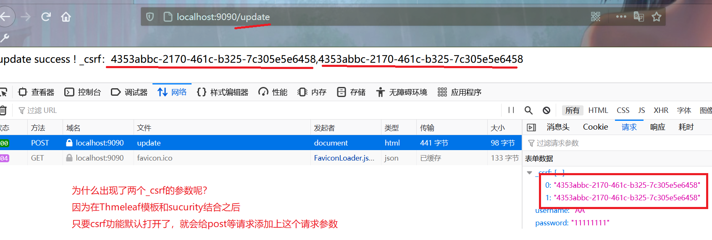

若去看刚才那个表单此时的前端页面源码就会发现：

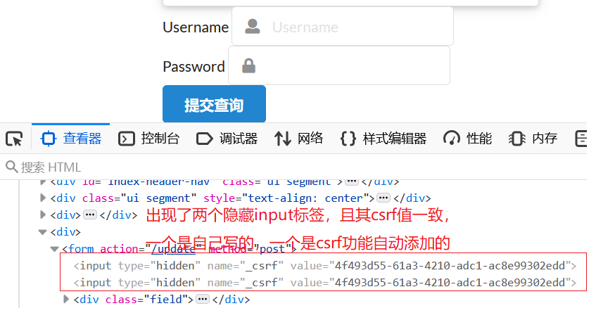

说明，在开启了csrf功能后，Thmeleaf模板引擎和security结合使用时候，会自动给post表单生成这个隐藏input标签，并赋予csrf令牌。

而如果是其他恶意网站想要模拟这个请求，若不是本网站生成的前端页面表单，则不会具备这个隐藏的input标签，则不会在提交的时候附带一个`_csrf`的请求参数。

说明我们只需要在security配置类中开启这个csrf功能即可，csrf令牌由模板自动生成。

### 注销问题

虽然这样csrf功能已经可以使用，但是当点击注销按钮，发出/logout请求的时候，却出现了这个问题：

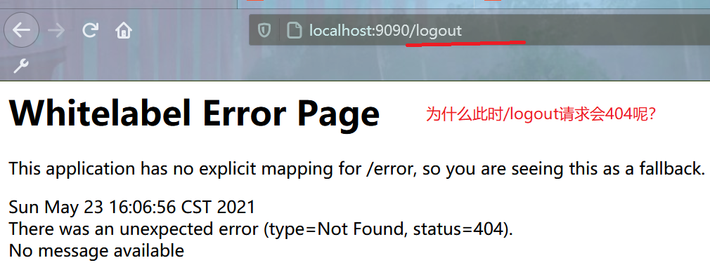

解决问题：

- 它默认防止csrf跨站请求伪造，因为会产生安全问题
- 将注销请求改为post表单提交，a标签为get请求
- 在spring security中关闭csrf功能`http.csrf().disable();`

将注销改为表单post提交

```html
<!--已经登录，显示注销按钮-->
<!--注销功能在开启csrf后不能是get方式提交
    必须是post等方式提交，如表单post-->
<div sec:authorize="isAuthenticated()">
    <form th:action="@{/logout}" method="post">
        <!--<a class="item" th:href="@{/logout}">
            <i class="sign-out icon"></i> 注销
        </a>-->
        <input type="submit" class="ui blue submit button" value="注销"/>
    </form>
</div>
```

此时可以成功注销，并返回到配置类中指定的`logoutSuccessUrl`或默认情况下的`登录页?logout`。


## 功能菜单动态显示

将Thmeleaf和security结合之后，可以实现**用户功能菜单的动态显示**，不同的角色显示不同的菜单。

需要导入thymeleaf和springsecurity结合的依赖。(在快速开始中已经导入)

在需要动态显示的html页面中引入以下**名称空间**：第二个是用来在IDEA中提示输入的。

```html
<html lang="en" xmlns:th="http://www.thymeleaf.org"
      xmlns:sec="http://www.thymeleaf.org/extras/spring-security">
```

1. sec：authorize=“isAuthenticated()”：根据是否认证登录！来显示不同的页面

    ```html
    <!--登录注销-->
    <div class="right menu">
        <!--如果未登录：显示登录按钮-->
        <div sec:authorize="!isAuthenticated()">
            <a class="item" th:href="@{/toLogin}">
                <i class="address card icon"></i> 登录
            </a>
        </div>
    
        <!--已经登录，显示用户名和角色-->
        <div sec:authorize="isAuthenticated()">
            <a class="item">
                用户名：<span sec:authentication="principal.username"></span>
                角色：<span sec:authentication="principal.authorities"></span>
            </a>
        </div>
        <!--已经登录，显示注销按钮-->
        <!--注销功能在开启csrf后不能是get方式提交
            必须是post等方式提交，如表单post-->
        <div sec:authorize="isAuthenticated()">
            <form th:action="@{/logout}" method="post">
                <!--<a class="item" th:href="@{/logout}">
                    <i class="sign-out icon"></i> 注销
                    </a>-->
                <input type="submit" class="ui blue submit button" value="注销"/>
            </form>
        </div>
    </div>
    ```

    > sec:authentication=“principal.username”：显示用户名
    >
    > sec:authentication=“principal.authorities”：显示角色的权限

2. 根据角色或权限来显示功能菜单
    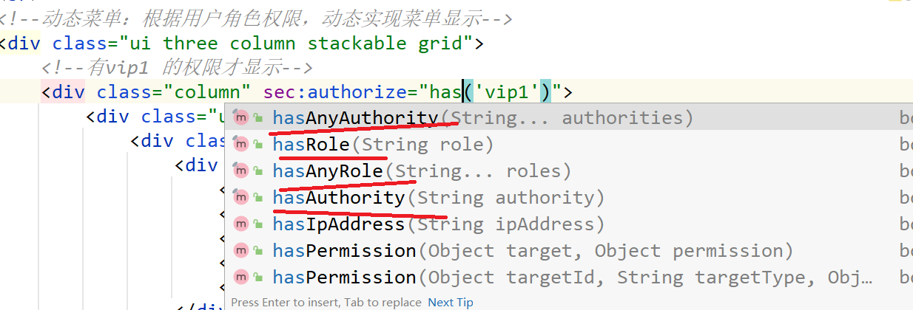

    ```html
    <!--动态菜单：根据用户角色权限，动态实现菜单显示-->
    <div class="ui three column stackable grid">
        <!--有vip1角色 的权限才显示-->
        <div class="column" sec:authorize="hasRole('vip1')">
            <div class="ui raised segment">
                <div class="ui">
                    <div class="content">
                        <h5 class="content">Level 1</h5>
                        <hr>
                        <div><a th:href="@{/level1/1}"><i class="bullhorn icon"></i> Level-1-1</a></div>
                        <div><a th:href="@{/level1/2}"><i class="bullhorn icon"></i> Level-1-2</a></div>
                        <div><a th:href="@{/level1/3}"><i class="bullhorn icon"></i> Level-1-3</a></div>
                    </div>
                </div>
            </div>
        </div>
    
        <!--有vip2角色 的权限才显示-->
        <div class="column" sec:authorize="hasRole('vip2')">
            <div class="ui raised segment">
                <div class="ui">
                    <div class="content">
                        <h5 class="content">Level 2</h5>
                        <hr>
                        <div><a th:href="@{/level2/1}"><i class="bullhorn icon"></i> Level-2-1</a></div>
                        <div><a th:href="@{/level2/2}"><i class="bullhorn icon"></i> Level-2-2</a></div>
                        <div><a th:href="@{/level2/3}"><i class="bullhorn icon"></i> Level-2-3</a></div>
                    </div>
                </div>
            </div>
        </div>
    
        <!--有vip3角色 的权限 才显示-->
        <div class="column" sec:authorize="hasRole('vip3')">
            <div class="ui raised segment">
                <div class="ui">
                    <div class="content">
                        <h5 class="content">Level 3</h5>
                        <hr>
                        <div><a th:href="@{/level3/1}"><i class="bullhorn icon"></i> Level-3-1</a></div>
                        <div><a th:href="@{/level3/2}"><i class="bullhorn icon"></i> Level-3-2</a></div>
                        <div><a th:href="@{/level3/3}"><i class="bullhorn icon"></i> Level-3-3</a></div>
                    </div>
                </div>
            </div>
        </div>
    </div>
    ```

3. 结果如下
    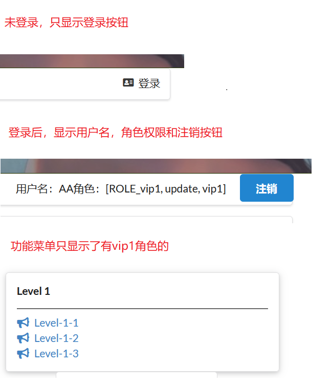

# Spring security OAuth2

通过上面的学习，目前了解了Spring Security的认证和授权功能，接下来的OAuth2可以实现的是第三方授权登录。

## 简介

OAuth 2.0登录功能为应用程序提供了使用户能够通过使用他们在OAuth 2.0提供程序（例如GitHub）或OpenID Connect 1.0提供程序（例如Google）上的现有帐户登录到该应用程序的功能。 OAuth 2.0登录实现了以下用例：“使用Google登录”或“使用GitHub登录”。 

### Oauth设计理念

OAuth在"客户端"与"服务提供商"之间，设置一个**授权层**（authorization layer）。

"**客户端**"不能直接登录"服务提供商"，**只能登录授权层**，以此将用户与客户端区分开来。

**"客户端"登录授权层所用的令牌（token）**，**与用户的密码不同**。用户可在登录时，指定授权层令牌的权限范围和有效期。

"客户端"登录授权层以后，**"服务提供商"**根据**令牌的权限范围和有效期**，向"客户端"**开放用户储存的资料**。


### OAuth 2.0的运行流程

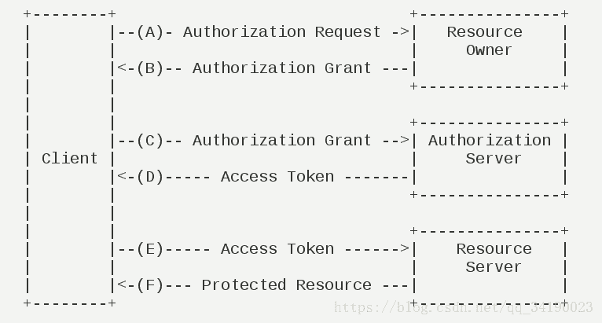

（A）用户打开客户端，客户端要求用户给予授权。

（B）用户同意给予客户端授权。

（C）客户端使用上一步获得的授权（一般是Code），向认证服务器**申请令牌TOKEN**。

（D）认证服务器对客户端进行认证以后，**确认无误，同意发放令牌**。

（E）客户端使用令牌，向资源服务器申请获取资源（用户信息等）。

（F）资源服务器确认令牌无误，同意向客户端开放资源。


重点是如何获取Token？

### 客户端获取授权的五种模式

客户端必须得到用户的授权（authorization grant），才能获得令牌（access token）。

OAuth 2.0定义了五种授权方式：

    授权码模式（authorization code）
    简化模式（implicit）
    密码模式（resource owner password credentials）
    客户端模式（client credentials）
    扩展模式（Extension）
#### 1.授权码模式（authorization code）：

***功能最完整、流程最严密的授权模式。***

特点是通过客户端的后台服务器，与"服务提供商"的认证服务器进行互动。

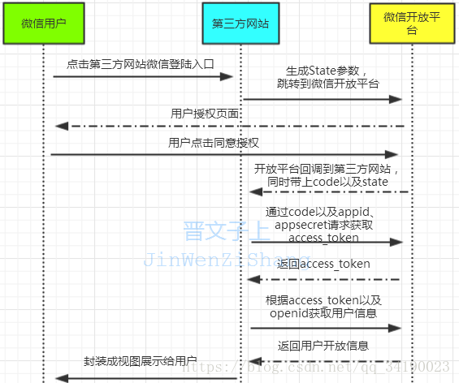

> 更多细节CSDN：https://blog.csdn.net/qq_34190023/article/details/82629092?ops_request_misc=%257B%2522request%255Fid%2522%253A%2522162175896216780264031796%2522%252C%2522scm%2522%253A%252220140713.130102334..%2522%257D&request_id=162175896216780264031796&biz_id=0&utm_medium=distribute.pc_search_result.none-task-blog-2~all~top_positive~default-1-82629092.first_rank_v2_pc_rank_v29&utm_term=oauth2.0&spm=1018.2226.3001.4187


# 后续说明

目前security只学了认证和授权

其中的OAuth2.0和SAML2.0都没有学。

而且无论是尚硅谷的还是黑马的教学，对于OAuth的教学都是结合spring cloud，尤其是尚硅谷的security教学，后面是结合了谷粒学院项目进行实战，技术栈还可以。

加油！接下来学习cloud和redis。