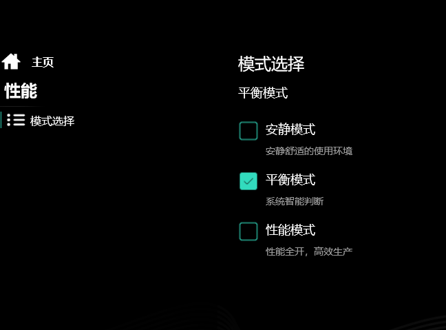

# computer

# notebook

## wujie14x

机械革命无界14x 32+1TB版本

### cpu-z

#### 测试参数

windows电源模式/插电

机械革命控制中心性能模式选项：影响cpu package功耗释放，可通过Fn+x快捷键控制

#### 测试记录

#### 结论

| 电源模式       | 性能模式 | cpu-z单核 | cpu-z多核 | cpu package max(w) | cpu clock max(mhz) |
| -------------- | -------- | --------- | --------- | ------------------ | ------------------ |
| 最佳能效       | 安静     | 318       | 3738      | 13                 | 2480               |
|                | 平衡     | 327       | 3715      | 13                 | 2480               |
|                | 性能     | 324       | 3686      | 13                 | 2480               |
| 平衡           | 安静     | 511       | 5306      | 28                 | 3975               |
|                | 平衡     | 512       | 5170      | 28                 | 3975               |
|                | 性能     | 517       | 5186      | 28                 | 3975               |
| 最佳性能       | 安静     | 588       | 5268      | 28                 | 4200               |
|                | 平衡     | 591       | 5305      | 28                 | 4200               |
|                | 性能     | 588       | 5275      | 28                 | 4200               |
| 最佳能效(插电) | 安静     | 457       | 5232      | 24                 | 3475               |
|                | 平衡     | 444       | 5031      | 24                 | 3475               |
|                | 性能     | 447       | 5255      | 24                 | 3475               |
| 平衡(插电)     | 安静     | 692       | 5686      | 30                 | 4875               |
|                | 平衡     | 692       | 6641      | 50                 | 4875               |
|                | 性能     | 681       | 7101      | 70                 | 4875               |
| 最佳性能(插电) | 安静     | 694       | 5762      | 30                 | 4900               |
|                | 平衡     | 690       | 6674      | 50                 | 4975               |
|                | 性能     | 687       | 7101      | 70                 | 4950               |

结论：

- 未插电最大28w功耗

- windows电源模式决定核心频率
  - 最佳能效：2480mhz，插电时3475mhz
  - 平衡：3975mhz，插电时4875mhz
  - 最佳性能：4200mhz，插电时4975mhz
- 机械革命控制中心性能模式决定最大功耗
  - 安静：30w
  - 平衡：50w
  - 性能：70w

> 单核性能决定单个应用是否卡顿，功耗决定多核性能。

最佳实践：**windows电源模式离电和插电都设为最佳性能来保证单核性能**，机械革命控制中心性能模式设为安静限制功耗。

