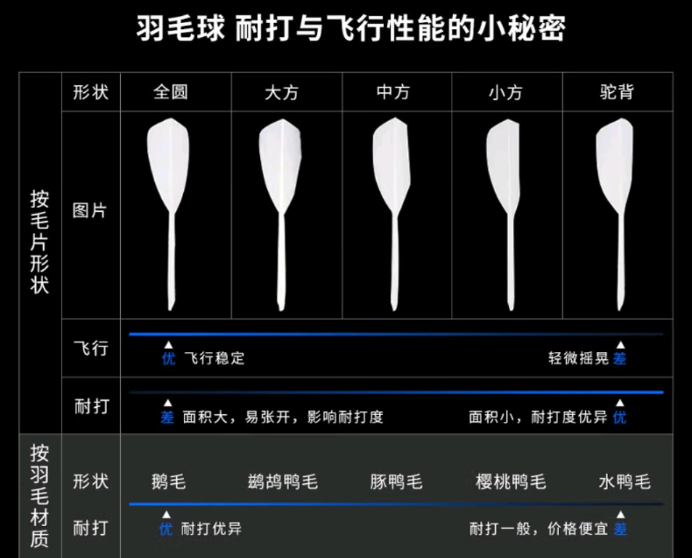
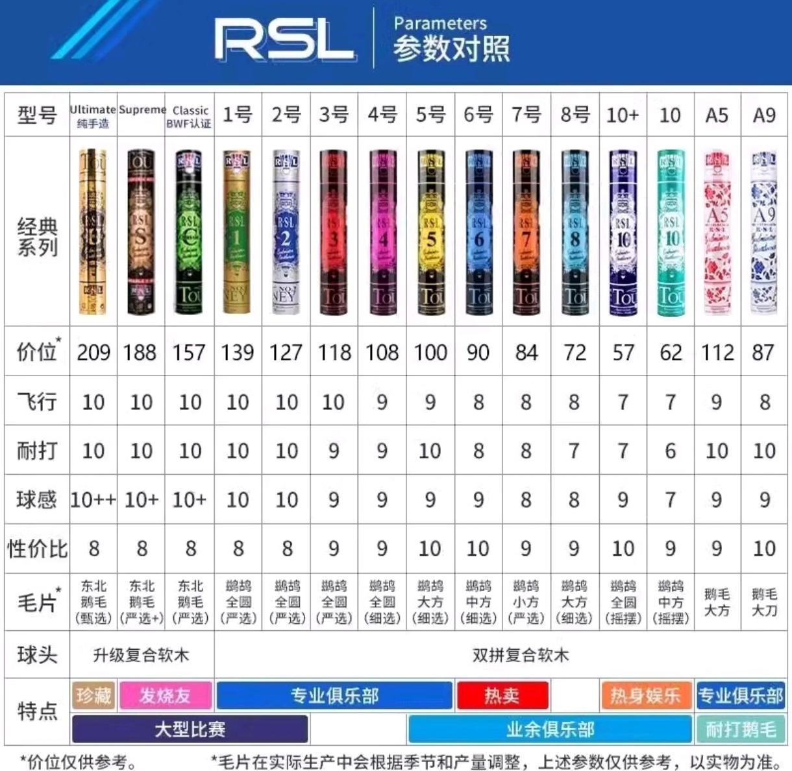
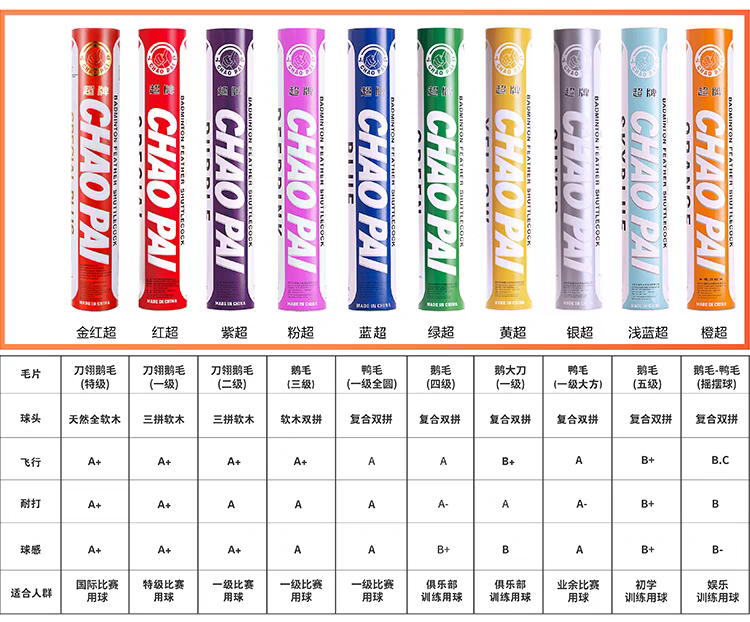

# 球

羽毛分类：

水鸭、豚鸭、鹚鸪鸭：全圆、大方、中方(中驼)、小方(驼背)、单边。

鹅毛：全圆刀翎(1~5级)、驼背、鹅毛拉直。鹅毛由于成长周期长，大方、中方、小方较少。

球头：整体软木>复合软木>再生软木

RSL官网：http://www.rsl-1928.cn/

以下只列出RSL传统系列羽毛球，其他系列要么是皮肤版(金冠)，要么廉价版(如DTL系列)。

| 品牌   | 型号                 | 毛片                  | 球头         | 京东价 | 淘宝价 | info             |
| ------ | -------------------- | --------------------- | ------------ | ------ | ------ | ---------------- |
| 亚狮龙 | RSL 10plus           | 鹚鸪全圆              | 复合双拼     | 98     |        |                  |
|        | RSL 8                | 鹚鸪大方              |              | 99     |        |                  |
|        | RSL 7                | 鹚鸪一二级小方(驼背)  |              | 113    | 108    | 很耐打的垃圾     |
|        | RSL 6                | 鹚鸪/豚鸭中方(一二级) |              | 119    |        |                  |
|        | RSL 5                | 鹚鸪/豚鸭大方(二三级) |              | 129    | 127    | 不耐打           |
|        | RSL 4                | 鹚鸪全圆(二三级)      |              | 145    | 134    | 飞行稳定，不耐打 |
|        | RSL 3                | 鹚鸪全圆(一级)        |              | 157    | 146    | 飞行稳定，耐打   |
|        | RSL 2                | 鹚鸪全圆(一级)        |              | 164    | 150    | 飞行稳定，耐打   |
|        | RSL 1                | 鹚鸪全圆(一级)        |              | 172    | 160    |                  |
|        | RSL D5               | 鹅毛全圆              | 复合三拼     | 160    | 149    |                  |
|        | RSL Classic          | 东北鹅毛              | 升级复合软木 | 188    | 176    | BWF认证          |
|        | RSL Supreme          | 东北鹅毛(+)           |              | 200    | 188    |                  |
|        | RSL Ultimate(纯手造) | 东北鹅毛(++)          |              | 215    | 199    |                  |

| 品牌 | 型号   | 毛片                | 球头       | 淘宝价 | info                   |
| ---- | ------ | ------------------- | ---------- | ------ | ---------------------- |
| 华美 | F1     | 刀翎鹅毛(一级)      | 软木三拼   | 140    | 对标红超、AS50         |
|      | F2     | 刀翎鹅毛(三级)      | 复合双拼   | 118    |                        |
|      | F3     | 水鸭/豚鸭全圆(一级) |            | 114    | 亚5、胜利比赛3号       |
|      | F5     | 水鸭/豚鸭全圆(三级) |            | 100    | 飞行亚4，耐打比亚5好点 |
|      | F6     | 豚鸭(看着像大方)    |            | 88     |                        |
|      | CT700  | 鹚鸪鸭大方(一级)    |            | 140    |                        |
|      | CT800  | 鹚鸪全圆(一级)      |            | 140    |                        |
|      | GT500  | 一级鹅毛大刀        |            | 119    |                        |
|      |        |                     |            |        |                        |
| YY   | AS02   | 鹚鸪鸭中方(一二级)  | 复合双拼   | 135    |                        |
|      | AS03   | 鹚鸪鸭大方          |            | 155    |                        |
|      | AS05   | 鹚鸪鸭全圆          |            | 194    | 鸭毛球之王！           |
|      | AS50   | 刀翎鹅毛(特级)      | 天然软木   | 260    |                        |
|      | AS40   | 刀翎鹅毛(高级)      | 软木       | 237    |                        |
|      | AS30   | 刀翎鹅毛            | 复合双拼   | 220    |                        |
|      | AS20   | 刀翎鹅毛            |            | 200    |                        |
|      | AS7    | 中方鹅毛            |            |        | 绝版                   |
|      | AS9    | 中方鹅毛            |            | 150    |                        |
|      | F90    |                     |            | 700    | 国际高级比赛用球       |
|      |        |                     |            |        |                        |
| 超牌 | 金红超 | 刀翎鹅毛(特级)      | 天然全软木 | 197    | BWF认证                |
|      | 红超   | 刀翎鹅毛(一级)      | 软木三拼   | 179    |                        |
|      | 紫超   | 刀翎鹅毛(二级)      | 软木三拼   | 162    |                        |
|      | 粉超   | 鹅毛(三级)          | 软木双拼   | 157    |                        |
|      | 蓝超   | 鸭毛全圆(一级)      | 复合双拼   |        |                        |
|      | 绿超   | 鹅毛四级            | 复合双拼   | 135    |                        |
|      | 黄超   | 鹅毛大刀(一级)      | 复合双拼   | 120    |                        |
|      | 银超   | 鸭毛大方(一级)      | 复合双拼   | 110    |                        |

| 品牌      | 型号 | 毛片              | 球头       | 淘宝价 | info             |
| --------- | ---- | ----------------- | ---------- | ------ | ---------------- |
| 李宁C     | C90  | 鹚鸪全圆(特级)    | 复合双拼   | 142    |                  |
| 鹚鸪/豚鸭 | C80  | 鹚鸪全圆          |            | 137    |                  |
|           | C70  | 鹚鸪全圆          |            | 126    |                  |
|           | C60  | 三级鹚鸪/豚鸭全圆 |            | 130    |                  |
|           | C50  | 二三级鹚鸪全圆    |            | 116    |                  |
|           | C30  | 鹚鸪中方          |            | 111    |                  |
|           | C20  | 鹚鸪小方          |            | 93     | 侧重耐打         |
|           | C10  | 四级豚鸭          |            | 90     | 侧重飞行         |
|           |      |                   |            |        |                  |
| 李宁D     | D8   | 水鸭全圆          | 复合双拼   | 125    |                  |
| 水鸭      | D6   | 水鸭大方          |            | 114    |                  |
|           | D3   | 水鸭中小方        |            | 105    | 侧重耐打         |
|           | D1   | 四级鸭毛          |            | 94     | 侧重飞行         |
|           |      |                   |            |        |                  |
| 李宁G     | G900 | 刀翎鹅毛(特级)    | 全天然软木 | 211    | BWF认证          |
| 鹅毛      | G800 | 刀翎鹅毛(一级)    | 全天然软木 | 173    | BWF认证          |
|           | G700 | 刀翎鹅毛(一二级)  | 全天然软木 | 156    |                  |
|           | G600 | 刀翎鹅毛(三级)    | 三拼软木   | 156    |                  |
|           | G500 | 四级鹅毛全圆大方  | 软木双拼   | 126    |                  |
|           | G400 | 五级鹅毛全圆大方  | 复合双拼   | 98     | 外观差，毛片发黄 |
|           | G300 | 鹅毛中小方        | 软木双拼   | 122    | 侧重耐打         |
|           | G200 | 鹅弯拉直          | 复合双拼   | 100    | 侧重飞行         |
|           | G100 | 鹅小方            | 复合双拼   | 104    | 超耐打           |

| 品牌            | 型号    | 毛片               | 球头     | 淘宝价 | info     |
| --------------- | ------- | ------------------ | -------- | ------ | -------- |
| Victor Master   | ACE     |                    | 全软木   | 238    | BWF认证  |
| 鹅毛            | NO.1    |                    | 软木双拼 | 193    | BWF认证  |
|                 | NO.3    |                    | 复合双拼 | 169    |          |
|                 | NO.5    |                    |          | 144    |          |
|                 | NO.6    | 鹅大刀             |          | 135    |          |
|                 | NO.7    | 鹅弯拉直/全圆      |          | 104    |          |
|                 |         |                    |          |        |          |
| Victor CHAMPION | NO.1    | 鹚鸪全圆大方(干拔) | 复合双拼 | 150    |          |
| 鹚鸪鸭          | NO.3    | 鹚鸪全圆大方       |          | 130    |          |
|                 | NO.5    | 鹚鸪全圆大方       |          | 114    |          |
|                 | NO.6    | 鹚鸪中方           |          | 111    | 侧重耐打 |
|                 | NO.7    |                    |          | 103    |          |
|                 | NO.8    | 豚鸭全圆大方       |          | 96     | 侧重飞行 |
|                 |         |                    |          |        |          |
| Victor GOLD     | NO.1    | 水鸭全圆大方       | 复合双拼 | 129    |          |
| 水鸭            | NO.3    | 水鸭大驼           |          | 108    |          |
|                 | NO.5    | 水鸭全圆大方       |          | 98     |          |
|                 | NO.6    | 水鸭中方           |          | 85     |          |
|                 | SPECIAL | 水鸭全圆大方       |          |        |          |

胜利确实良心不少啊。

# 球拍

进攻拍：天斧88DPro

均衡拍(控制拍)：战戟8000

速度拍：锋影700

# 球鞋

# 球包

