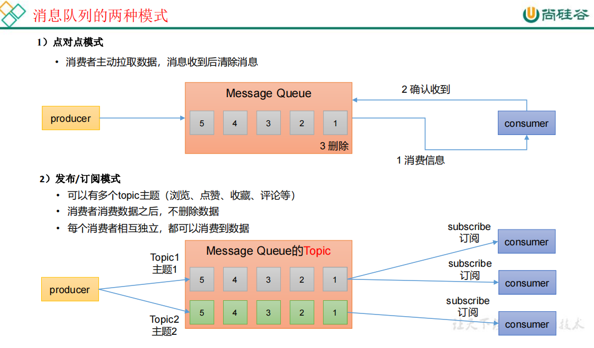
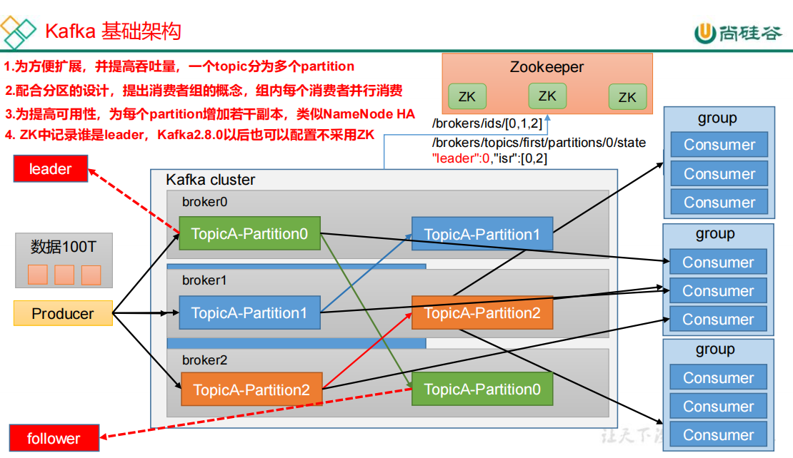

# 资料

官网：https://kafka.apache.org/#

尚硅谷资料及视频：https://www.bilibili.com/video/BV1vr4y1677k?p=1

Go操作kafka的sarama库：https://github.com/Shopify/sarama
还有一个库：https://github.com/segmentio/kafka-go
这两个的stars都挺多的

# 概述

Apache Kafka 是一个开源**分布式事件流平台**，被数千家公司用于高性能数据管道、流分析、数据集成和任务关键型应用程序。

## 简介

**事件流**

事件流是从事件源（如数据库、传感器、移动设备、云服务和软件应用程序）以事件流的形式实时捕获数据的实践；持久存储这些事件流以供以后检索；实时和回顾性地操纵、处理和响应事件流；并根据需要将事件流路由到不同的目标技术。因此，事件流确保了数据的连续流动和解释，以便正确的信息在正确的时间出现在正确的位置。

**事件**：在文档中也称为记录或消息。事件具有键、值、时间戳和元数据。
**生产者：**是那些向 Kafka 发布（写入）事件的客户端应用程序。
**消费者：**是订阅（读取和处理）这些事件的那些客户端应用程序。

**Topic：**

topic中的事件可以根据需要随时读取——与传统的消息传递系统不同，事件在消费后不会被删除。可以通过每个topic的配置设置来定义 Kafka 应该将事件保留多长时间，之后旧事件将被丢弃。Kafka 的性能在数据大小方面实际上是恒定的，因此长时间存储数据是非常好的。

## 应用场景

传统消息队列主要应用场景：缓存、消峰、解耦、异步通信。

用例：

- 消息传递

- 网站活动跟踪
- 指标
- 日志聚合
- 流处理
- 事件溯源
- 提交日志

## 基础架构

Consumer Group：消费者组，由多个 consumer 组成。消费者组内每个消费者负责消费不同分区的数据，一个分区只能由一个组内消费者消费；消费者组之间互不影响。所有的消费者都属于某个消费者组，即消费者组是逻辑上的一个订阅者。

Broker：一台 Kafka 服务器就是一个 broker。一个集群由多个 broker 组成。一个broker 可以容纳多个 topic。

Topic：可以理解为一个队列，生产者和消费者面向的都是一个 topic。 

Partition：为了实现扩展性，一个非常大的 topic 可以分布到多个 broker（即服务器）上*一* 个topic 可以分为多个p、Partition，每个 partition 是一个有序的队列。 

Replica：副本。一个 topic 的每个分区都有若干个副本，一个 Leader 和若干个Follower。 

Leader：每个分区多个副本的“主”，生产者发送数据的对象，以及消费者消费数据的对象都是 Leader。 

Follower：每个分区多个副本中的“从”，实时从 Leader 中同步数据，保持和Leader 数据的同步。Leader 发生故障时，某个 Follower 会成为新的 Leader。