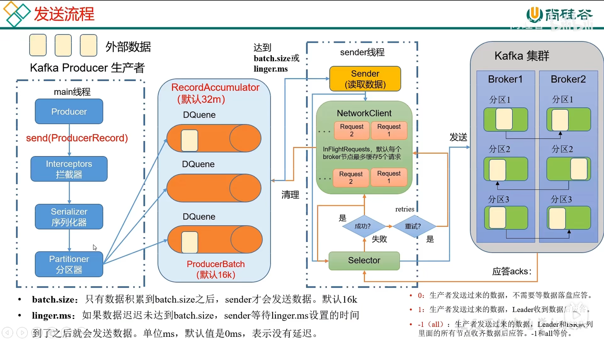
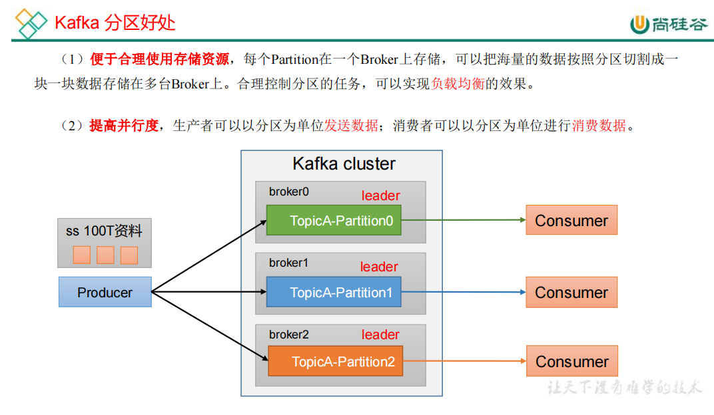
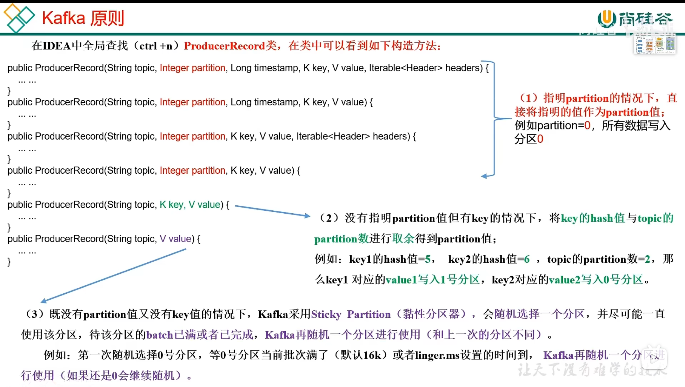
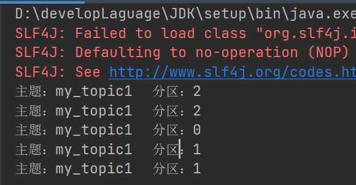

# 资料

官网：https://kafka.apache.org/#

尚硅谷资料及视频：https://www.bilibili.com/video/BV1vr4y1677k?p=1

Go操作kafka的sarama库：https://github.com/Shopify/sarama
还有一个库：https://github.com/segmentio/kafka-go
这两个的stars都挺多的

# 概述

Apache Kafka 是一个开源**分布式事件流平台**，被数千家公司用于高性能数据管道、流分析、数据集成和任务关键型应用程序。

## 简介

**事件流**

事件流是从事件源（如数据库、传感器、移动设备、云服务和软件应用程序）以事件流的形式实时捕获数据的实践；持久存储这些事件流以供以后检索；实时和回顾性地操纵、处理和响应事件流；并根据需要将事件流路由到不同的目标技术。因此，事件流确保了数据的连续流动和解释，以便正确的信息在正确的时间出现在正确的位置。

**事件**：在文档中也称为记录或消息。事件具有键、值、时间戳和元数据。
**生产者：**是那些向 Kafka 发布（写入）事件的客户端应用程序。
**消费者：**是订阅（读取和处理）这些事件的那些客户端应用程序。

**Topic：**

topic中的事件可以根据需要随时读取——与传统的消息传递系统不同，事件在消费后不会被删除。可以通过每个topic的配置设置来定义 Kafka 应该将事件保留多长时间，之后旧事件将被丢弃。Kafka 的性能在数据大小方面实际上是恒定的，因此长时间存储数据是非常好的。

## 应用场景

传统消息队列主要应用场景：缓存、消峰、解耦、异步通信。

用例：

- 消息传递

- 网站活动跟踪
- 指标
- 日志聚合
- 流处理
- 事件溯源
- 提交日志


## 基础架构


Consumer Group：消费者组，由多个 consumer 组成。消费者组内每个消费者负责消费不同分区的数据，一个分区只能由一个组内消费者消费；消费者组之间互不影响。所有的消费者都属于某个消费者组，即消费者组是逻辑上的一个订阅者。

Broker：一台 Kafka 服务器就是一个 broker。一个集群由多个 broker 组成。一个broker 可以容纳多个 topic。

Topic：可以理解为一个队列，生产者和消费者面向的都是一个 topic。 

Partition：为了实现扩展性，一个非常大的 topic 可以分布到多个 broker（即服务器）上*一* 个topic 可以分为多个Partition，每个 partition 是一个有序的队列。 

Replica：副本。一个 topic 的每个分区都有若干个副本，一个 Leader 和若干个Follower。 

Leader：每个分区多个副本的“主”，生产者发送数据的对象，以及消费者消费数据的对象都是 Leader。 

Follower：每个分区多个副本中的“从”，实时从 Leader 中同步数据，保持和Leader 数据的同步。Leader 发生故障时，某个 Follower 会成为新的 Leader。

# 命令行操作

## 快速开始

官方文档单节点kafka快速开始：https://kafka.apache.org/documentation/#quickstart

## topic命令

在kafka的安装包的bin目录下，有一个kafka-topic.sh的shell脚本可以操作topic。

```shell
bin/kafka-topic.sh [--help]  #不加任何参数的话，就会返回有哪些参数可选，类似于--help

# 下面列举一些常用的
Option                                   Description                            
------                                   -----------        
--bootstrap-server 					     必须: 连接kafka服务器,如localhost:9092
--topic <String: topic>                  指定topic名称
--alter                                  修改partition数量，replica assignment,configuration 										 for the topic.
--create                                 Create a new topic.                    
--delete                                 Delete a topic  
--list                                   列出所有topic 
--describe								 查看topic具体描述
--partitions <Integer>  				 指定partitions数量
--replication-factor <Integer>           指定每个分区的副本因子
```

测试一下：

```shell
# 新建topic
[root@k8s-master kafka_2.12-3.0.1]# bin/kafka-topics.sh --bootstrap-server localhost:9092 --topic my_topic1 --create
Created topic my_topic1.
[root@k8s-master kafka_2.12-3.0.1]# bin/kafka-topics.sh --bootstrap-server localhost:9092 --list
my_log
my_topic
my_topic1
web_log
# 修改分区数量为3
[root@k8s-master kafka_2.12-3.0.1]# bin/kafka-topics.sh --bootstrap-server localhost:9092 --topic web_log --alter --partitions 3
[root@k8s-master kafka_2.12-3.0.1]# bin/kafka-topics.sh --bootstrap-server localhost:9092 --topic web_log --describe
Topic: web_log	TopicId: mpav7dCVQWSJYovnmjBlpw	PartitionCount: 3	ReplicationFactor: 1	Configs: segment.bytes=1073741824
	Topic: web_log	Partition: 0	Leader: 0	Replicas: 0	Isr: 0
	Topic: web_log	Partition: 1	Leader: 0	Replicas: 0	Isr: 0
	Topic: web_log	Partition: 2	Leader: 0	Replicas: 0	Isr: 0
[root@k8s-master kafka_2.12-3.0.1]# 
```

> 注意：分区数量修改的时候，只能增加不能减少，否则报错。

## 生产者命令

在kafka的安装包bin目录下，有一个kafka-console-producer.sh的shell脚本可以模拟生产者。

```shell
bin/kafka-console-producer.sh [--help]  #不加任何参数的话，就会返回有哪些参数可选，类似于--help
# 列举常用的参数
Option                                   Description                            
------                                   -----------                                
--bootstrap-server						 必须：kafka服务器地址,如localhost:9092
--topic <String: topic>                  必须: 连接的主题topic                     
--sync                                   If set message send requests to the    
                                           brokers are synchronously, one at a  
                                           time as they arrive.                 
--timeout <Integer: timeout_ms>          If set and the producer is running in  
                                           asynchronous mode, this gives the    
                                           maximum amount of time a message     
                                           will queue awaiting sufficient batch 
                                           size. The value is given in ms.      
                                           (default: 1000)                      
```

## 消费者命令

在kafka的安装包bin目录下，有一个kafka-console-consumer.sh的shell脚本可以模拟消费者。

```shell
bin/kafka-console-consumer.sh [--help]  # 不加任何参数的话，就会返回有哪些参数可选，类似于--help
# 列举常用的参数
Option                                   Description                            
------                                   -----------                            
--bootstrap-server 						 必须：连接的kafka服务器地址,如localhost:9092
--topic <String: topic>                  指定topic                             
--from-beginning                         指定消费者也消费日志中存在的历史消息             
--group <String: consumer group id>      指定消费者group id       
--offset <String: consume offset>        指定消费消息的偏移量,or 'earliest'      
                                           which means from beginning, or       
                                           'latest' which means from end        
                                           (default: latest)                    
--partition <Integer: partition>         指定分区        
                                           Consumption starts from the end of   
                                           the partition unless '--offset' is   
                                           specified.  
--timeout-ms <Integer: timeout_ms>       如果设置，指定时间内未收到消息就退出
```

生产者和消费者命令一般一起使用：

```shell
# xshell打开一个窗口执行生产者命令，然后会让你一直输入信息，每次输入的信息都会发送到kafka
[root@k8s-master kafka_2.12-3.0.1]# bin/kafka-console-producer.sh --bootstrap-server localhost:9092 --topic web_log
>hello kafka
>hello

# 此时再新开窗口，执行消费者命令，消费者命令会显示接收到的信息；
# 消费者配置的未收到消息1s后自动关闭
[root@k8s-master kafka_2.12-3.0.1]# bin/kafka-console-consumer.sh --bootstrap-server localhost:9092 --topic web_log --from-beginning --timeout-ms 1000
hello kafka
hello
[2022-04-12 22:19:10,904] ERROR Error processing message, terminating consumer process:  (kafka.tools.ConsoleConsumer$)
org.apache.kafka.common.errors.TimeoutException
Processed a total of 21 messages
```

# kafka生产者

## 发送流程

在消息发送的过程中，涉及到了**两个线程——****main** **线程和** **Sender** **线程**。在 main 线程中创建了**一个双端队列** **RecordAccumulator**。main 线程将消息发送给 RecordAccumulator，Sender 线程不断从 RecordAccumulator 中拉取消息发送到 Kafka Broker。



## 生产者API

需要引入生产者API依赖

```xml
 <dependency>
     <groupId>org.apache.kafka</groupId>
     <artifactId>kafka-clients</artifactId>
     <version>3.1.0</version>
 </dependency>
```

**生产者代码如下：异步发送**

```java
/**
 * @author fzk
 * @date 2022-04-12 22:53
 */
public class Producer {
    public static void main(String[] args) {
        // 0.准备配置
        Properties properties = new Properties();
        // 0.1 必须：连接kafka集群：bootstrap.servers
        properties.put(ProducerConfig.BOOTSTRAP_SERVERS_CONFIG, "124.223.192.8:9092");
        // 0.2 必须：指定key和value的序列化方式
        properties.put(ProducerConfig.KEY_SERIALIZER_CLASS_CONFIG, StringSerializer.class.getName());
        properties.put(ProducerConfig.VALUE_SERIALIZER_CLASS_CONFIG, StringSerializer.class.getName());

        // 1.创建kafka生产者
        KafkaProducer<String, String> producer = new KafkaProducer<>(properties);

        // 2.发送消息
        for (int i = 0; i < 5; i++) {
            // 发送消息并设置回调函数
            // 注意：消息发送失败会自动重试，不需要我们在回调函数中手动重试
            producer.send(new ProducerRecord<>("my_topic1", "k" + i, "v" + i),
                    (RecordMetadata metadata, Exception exception) -> {
                        if (exception == null) {
                            System.out.println("主题：" + metadata.topic() + "\t分区：" + metadata.partition());
                        }
                    });
        }
        // 3.关闭资源
        producer.close();
    }
}
```

执行上面的生产者代码，然后去xshell连接上消费者端后查看信息：可以看到成功了。

```shell
# 消费者命令连接上kafka并查看my_topic1主题的消息
[root@k8s-master kafka_2.12-3.0.1]# bin/kafka-console-consumer.sh --bootstrap-server localhost:9092 --topic my_topic1 --from-beginning
v0
v1
v2
v3
v4
```

**同步发送**：只需在异步发送的基础上，再调用一下 get()方法即可。因为send()方法返回的是一个`Future`对象，直接调用get()方法会阻塞直到结果出现。(所以呢也不算真正的同步发送，毕竟不是主线程去发送消息，只是主线程在等待发送线程完成工作而已)。改成下面这样：

```java
        // 2.发送消息
        for (int i = 0; i < 5; i++) {
            // 发送消息并设置回调函数
            // 注意：消息发送失败会自动重试，不需要我们在回调函数中手动重试
            producer.send(
                    new ProducerRecord<>("my_topic1", "k" + i, "v" + i),
                    (RecordMetadata metadata, Exception exception) -> {
                        if (exception == null) {
                            System.out.println("主题：" + metadata.topic() + "\t分区：" + metadata.partition());
                        }
                    }).get(); // 就是这个加个get()
        }
```

## 生产者分区

### 分区好处



### 分区策略

默认分区策略的分区器是`DefaultPartitioner`

```java
/**默认分区策略
如果指定了分区则直接使用
未指定分区但是有key，则根据key进行hash选择分区
未指定分区或且未指定key，选择粘性分区直至它满为止
*/
public class DefaultPartitioner implements Partitioner {
}
```



比如上面的生产者同步方式发送消息代码，就未指定分区，指定了key，那么看看它发送的分区情况呢：
前提：需要配置topic的分区数量大于1哦

```shell
bin/kafka-topics.sh --bootstrap-server localhost:9092 --topic my_topic1 --alter --partitions 3
```

然后结果如下：



### 自定义分区器

在上面的默认分区器`DefaultPartitioner`中可以看到它是实现了`Partitioner`分区器接口，那么自定义分区器也需要从它下手。

```java
/**
 * 自定义分区器
 *
 * @author fzk
 * @date 2022-04-13 0:07
 */
public class MyPartitioner implements Partitioner {
    @Override
    public int partition(String topic, Object key, byte[] keyBytes, Object value, byte[] valueBytes, Cluster cluster) {
        //System.out.println("自定义分区器运行...");
        // 分区数量
        int partitionCount = cluster.partitionsForTopic(topic).size();
        // 对value进行hash选择分区
        if (partitionCount > 1) {
            return Utils.toPositive(Utils.murmur2(valueBytes)) % partitionCount;
        }
        return 0;
    }
    @Override
    public void close() {}
    @Override
    public void configure(Map<String, ?> configs) {}
}
```

如何配置使用自定义的分区器呢？
在上面的生产者发送消息代码中，配置生产者的地方增加配置自定义分区器即可：

```java
// 0.3 optional：自定义分区器
properties.put(ProducerConfig.PARTITIONER_CLASS_CONFIG, MyPartitioner.class.getName());
```

运行效果如下：为什么会运行两次分区器呢？

```
自定义分区器运行...
自定义分区器运行...
主题：my_topic1	分区：2
自定义分区器运行...
自定义分区器运行...
主题：my_topic1	分区：1
自定义分区器运行...
自定义分区器运行...
主题：my_topic1	分区：0
自定义分区器运行...
自定义分区器运行...
主题：my_topic1	分区：2
自定义分区器运行...
自定义分区器运行...
主题：my_topic1	分区：0
```

## 生产经验调优

### 提高吞吐量

`ProducerConfig`类中与吞吐量有关的几个配置如下：

```java
public static final String BATCH_SIZE_CONFIG = "batch.size";// 默认16K
public static final String LINGER_MS_CONFIG = "linger.ms";// 默认0
/*压缩方式. 默认为none，即不压缩. 可选的有none,gzip,snappy,lz4,zstd.Compression is of full batches of data, so the efficacy of batching will also impact the compression ratio (more batching means better compression).*/
public static final String COMPRESSION_TYPE_CONFIG = "compression.type";// 默认none
public static final String BUFFER_MEMORY_CONFIG = "buffer.memory";// 默认32M
```

建议将上面分别修改为：

```java
// 0.4 optional: 配置和吞吐量相关的配置
properties.put(ProducerConfig.BATCH_SIZE_CONFIG, 16 * 1024);// 默认16k
properties.put(ProducerConfig.LINGER_MS_CONFIG, 100);// 默认0，修改为500ms
properties.put(ProducerConfig.COMPRESSION_TYPE_CONFIG, "snappy");// 默认none，开启snappy压缩
properties.put(ProducerConfig.BUFFER_MEMORY_CONFIG, 64 * 1024 * 1024);// 默认32M，改为64M
```

### 数据可靠性

