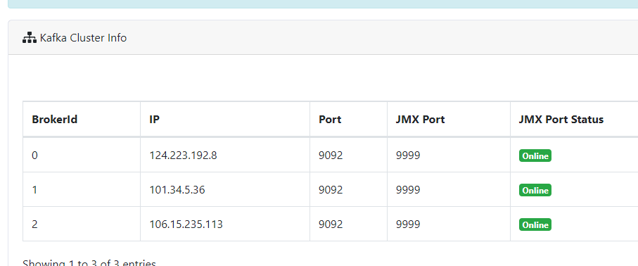
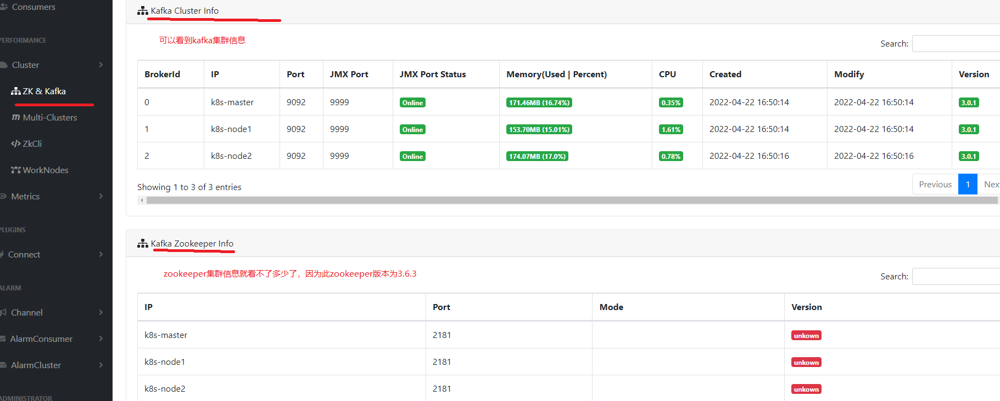
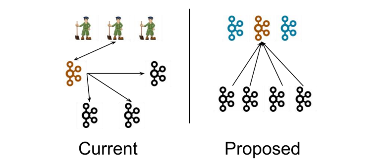

# 资料

书籍：《深入理解Kafka 核心设计与实践原理》，作者朱忠华

官网：https://kafka.apache.org/#

尚硅谷资料及视频：https://www.bilibili.com/video/BV1vr4y1677k?p=1

Go操作kafka的sarama库：https://github.com/Shopify/sarama
还有一个库：https://github.com/segmentio/kafka-go
这两个的stars都挺多的

# 概述

Apache Kafka 是一个开源**分布式事件流平台**，被数千家公司用于高性能数据管道、流分析、数据集成和任务关键型应用程序。

## 简介

**事件流**

事件流是从事件源（如数据库、传感器、移动设备、云服务和软件应用程序）以事件流的形式实时捕获数据的实践；持久存储这些事件流以供以后检索；实时和回顾性地操纵、处理和响应事件流；并根据需要将事件流路由到不同的目标技术。因此，事件流确保了数据的连续流动和解释，以便正确的信息在正确的时间出现在正确的位置。

**事件**：在文档中也称为记录或消息。事件具有键、值、时间戳和元数据。
**生产者：**是那些向 Kafka 发布（写入）事件的客户端应用程序。
**消费者：**是订阅（读取和处理）这些事件的那些客户端应用程序。

**Topic：**

topic中的事件可以根据需要随时读取——与传统的消息传递系统不同，事件在消费后不会被删除。可以通过每个topic的配置设置来定义 Kafka 应该将事件保留多长时间，之后旧事件将被丢弃。Kafka 的性能在数据大小方面实际上是恒定的，因此长时间存储数据是非常好的。

## 应用场景

传统消息队列主要应用场景：缓存、消峰、解耦、异步通信。

用例：

- 消息传递

- 网站活动跟踪
- 指标
- 日志聚合
- 流处理
- 事件溯源
- 提交日志


## 基础架构


Consumer Group：消费者组，由多个 consumer 组成。消费者组内每个消费者负责消费不同分区的数据，一个分区只能由一个组内消费者消费；消费者组之间互不影响。所有的消费者都属于某个消费者组，即消费者组是逻辑上的一个订阅者。

Broker：一台 Kafka 服务器就是一个 broker。一个集群由多个 broker 组成。一个broker 可以容纳多个 topic。

Topic：可以理解为一个队列，生产者和消费者面向的都是一个 topic。 

Partition：为了实现扩展性，一个非常大的 topic 可以分布到多个 broker（即服务器）上*一* 个topic 可以分为多个Partition，每个 partition 是一个有序的队列。 

Replica：副本。一个 topic 的每个分区都有若干个副本，一个 Leader 和若干个Follower。 

Leader：每个分区多个副本的“主”，生产者发送数据的对象，以及消费者消费数据的对象都是 Leader。 

Follower：每个分区多个副本中的“从”，实时从 Leader 中同步数据，保持和Leader 数据的同步。Leader 发生故障时，某个 Follower 会成为新的 Leader。

# 快速开始

## 下载

官方的太慢了，阿里云镜像地址：https://mirrors.aliyun.com/apache/kafka/

## 单节点

官方文档单节点kafka快速开始：https://kafka.apache.org/documentation/#quickstart，适合学习使用。

结合官方文档写的简单的快速启动脚本：

```shell
[root@k8s-master kafka]# cat quick-allStart-zookeeper-kafka.sh 
#!/bin/bash
echo "后台启动zookeeper..."
bin/zookeeper-server-start.sh config/zookeeper.properties &
sleep 5 # 休眠5s等待zookeeper启动完成
echo "start kafka..."
bin/kafka-server-start.sh config/server.properties
```

与之对应的快速关闭脚本：

```shell
[root@k8s-master kafka]# cat quick-allStop-zookeeper-kafka.sh 
#!/bin/bash
echo "先关闭kafka"
./bin/kafka-server-stop.sh
sleep 5 # 休眠5s等待kafka完全关闭
echo "5s后关闭zookeeper"
./bin/zookeeper-server-stop.sh
```

这种单节点简单部署可以直接用kafka内置的zookeeper。

## kafka集群

前置条件：java环境已搭建(最好以安装包方式安装，别用yum安装)，zookeeper集群已经搭建。

搭建环境：3台云服务器，使用主机名方式搭建，确保各个主机名都能ping通。主机名分别为k8s-master、k8s-node1、k8s-node2。

> 注意：直接指向zookeeper集群的公网ip会报错，提示连接超时。未找到解决措施，所以只能配置为主机名了。

1、下载并解压安装包

```shell
tar -zxvf kafka_2.12-3.0.1.tgz
mv kafka_2.12-3.0.1/ kafka  # 把名字搞短点
```

2、修改配置文件

```shell
vim config/server.properties
```

有3个重要的配置必须修改：

```shell
# broker的id，每个broker必须唯一 
broker.id=0

# 日志目录，因为kafka靠日志保存数据，因此不能放在默认的/tmp目录下，建议放到 kafka安装目录/logData
log.dirs=/opt/kafkaDemo/kafka/logData

# zookeeper集群地址
# 配置连接 Zookeeper 集群地址（在 zk 根目录下创建/kafka，方便管理）
zookeeper.connect=k8s-master:2181,k8s-node1:2181,k8s-node2:2181/kafka
```

3个不同的云服务对应的broker.id可以分别为0,1,2。

3、配置环境变量

```shell
vim /etc/profile
# 在此文件中新增如下配置

# KAFKA_HOME
export KAFKA_HOME=你的kafka安装目录
export PATH=$PATH:$KAFKA_HOME/bin

# 生效一波
source /etc/profile
```

4、启动集群，bin目录下的启动命令`bin/kafka-server-start.sh config/server.properties`，停止命令是`bin/kafka-server-stop.sh`。
后台启动方式：`bin/kafka-server-start.sh -daemon config/server.properties`

5、如果此时搭建kafka集群成功，最好立刻去把kafka监控EFAK也搭建好，这样可以方便学习，也可以更快理解kafka的一些原理。

### 公网ip访问

上面配置的kafka集群是只能内网访问的，或者是修改测试机器的hosts文件增加对k8s-master等主机名的ip映射规则。其实在学习阶段，也是可以开启kafka集群的公网ip访问的(在生产环境中禁止此行为)

kafka服务器启动所指定的`server.properties`配置文件：

```properties
# 此broker将告诉生产者和消费者的host:port. 在这里可以指定公网ip，实现外部生产者消费者直接访问kafka
# 如果不配置，它会用listeners，如果这个也没配置，它会用 returned from java.net.InetAddress.getCanonicalHostName().
#advertised.listeners=PLAINTEXT://localhost:9092
advertised.listeners=PLAINTEXT://公网ip或主机名或域名:9092
```

学习阶段可以将此处配置为公网ip，生产环境必须设置为主机名或者内网ip。

如果这里指向了公网ip，那么在EFAK监控系统中可以看到其公网ip：如果不配置的话，默认将会是主机名，即k8s-master



## EFAK监控

**EAGLE FOR APACHE KAFKA**的简称，简单且高性能的监控系统。

此监控框架依赖于zookeeper集群和MySQL数据库。

**首先得有MySQL数据库，版本最好是8.0以上。**

### kafka内存限制扩大

首先要修改kafka服务器的配置

```shell
vim bin/kafka-server-start.sh # 修改其启动脚本，配置其内存大小限制

# 找到如下的参数值
if [ "x$KAFKA_HEAP_OPTS" = "x" ]; then
    export KAFKA_HEAP_OPTS="-Xmx1G -Xms1G"
fi

# 将其内存限制1G修改为2G，并配置端口为9999，修改完成后如下：当然，如果修改后启动报错，提示内存不足，也是可以改小点的。
if [ "x$KAFKA_HEAP_OPTS" = "x" ]; then
    export JMX_PORT="9999"
    export KAFKA_HEAP_OPTS="-Xmx2G -Xms2G"
fi
# 开启监控，需要大一点点的内存
```

如果这样使得kafka启动失败，提示内存申请失败的话，可以改小点。

### EFAK安装配置

1、先去官网下载安装包：https://www.kafka-eagle.org/，目前最新版是v2.1.0。

2、上传压缩包 kafka-eagle-bin-2.1.0.tar.gz 到云服务器上，解压，然后进去，还有一个压缩包再一次解压才行。

3、修改配置文件system-config.properties，这里可以先搞个副本再修改。

```shell
[root@k8s-master kafka_2.12-3.0.1]# cd /opt/efak-web-2.1.0/
[root@k8s-master efak-web-2.1.0]# ls
bin  conf  db  font  kms  logs
[root@k8s-master efak-web-2.1.0]# cd conf
[root@k8s-master conf]# ls
log4j.properties  system-config.properties  system-config_副本.properties  works
[root@k8s-master conf]# vim system-config.properties 
```

要修改的地方如下：

3.1 zookeeper集群地址需要修改

```properties
######################################
# multi zookeeper & kafka cluster list
# Settings prefixed with 'kafka.eagle.' will be deprecated, use 'efak.' instead
######################################
efak.zk.cluster.alias=cluster1,cluster2
cluster1.zk.list=xdn10:2181,xdn11:2181,xdn12:2181
cluster2.zk.list=xdn10:2181,xdn11:2181,xdn12:2181

# 改成下面这样
efak.zk.cluster.alias=cluster1
# 如果搭建的zookeeper单机版
cluster1.zk.list=localhost:2181/kafka
# 如果是搭建的zookeeper集群的话
#cluster1.zk.list=k8s-master:2181,k8s-node1:2181,k8s-node2:2181/kafka
```

3.2 offset保存地址也要修改，只需要保存在kafka即可，将第二行保存与zookeeper注释掉即可

```shell
######################################
# kafka offset storage
######################################
cluster1.efak.offset.storage=kafka
#cluster2.efak.offset.storage=zk # 将此行注释掉即可
```

3.3 MySQL连接地址也要改啦，连接的`ke`这个数据库不用提前创建，会自动创建。

```shell
######################################
# kafka mysql jdbc driver address
######################################
efak.driver=com.mysql.cj.jdbc.Driver # 这是连接MySQL8的驱动程序
efak.url=jdbc:mysql://你的MySQL地址:3306/ke?useUnicode=true&characterEncoding=UTF-8&zeroDateTimeBehavior=convertToNull
efak.username=root
efak.password=123456
```

注意这个驱动程序，如果是MySQL8以前的，驱动程序为`com.mysql.jdbc.Driver`。

4、添加环境变量`KE_HOME`并导出其bin目录到PATH变量

> 注意：EFAK需要Java环境，会用到JAVA_HOME变量，yum方式安装的open-jdk即使是找到了软链接最终指向的java安装目录并配置好JAVA_HOME，依旧提示找不到某个依赖。所以建议下载oracle jdk安装包，并通过配置环境变量JAVA_HOME来安装java环境。

```shell
sudo vim /etc/profile.d/my_env.sh
# kafkaEFAK
export KE_HOME=/opt/efak-web-2.1.0
export PATH=$PATH:$KE_HOME/bin
# java 环境变量
export JAVA_HOME=/usr/local/java/jdk-17.0.2
export PATH=$PATH:$JAVA_HOME/bin

# 生效一下
source /etc/profile
```

5、启动zookeeper集群和kafka集群，并且MySQL服务器是可以正常访问的，此时就可以启动EFAK了
进入EFAK安装目录下的bin目录，并输入启动命令`./ke.sh start`

顺利的话，可以看到如下成功提示：并且此时MySQL数据库中`ke`这个数据库也会自动创建。

```shell
[2022-04-21 22:11:35] INFO: [Job done!]
Welcome to
    ______    ______    ___     __ __
   / ____/   / ____/   /   |   / //_/
  / __/     / /_      / /| |  / ,<   
 / /___    / __/     / ___ | / /| |  
/_____/   /_/       /_/  |_|/_/ |_|  
( Eagle For Apache Kafka® )

Version 2.1.0 -- Copyright 2016-2022
*******************************************************************
* EFAK Service has started success.
* Welcome, Now you can visit 'http://你的公网ip:8048'
* Account:admin ,Password:123456
*******************************************************************
* <Usage> ke.sh [start|status|stop|restart|stats] </Usage>
* <Usage> https://www.kafka-eagle.org/ </Usage>
*******************************************************************
[root@k8s-master bin]# 
```

可以按照提示去云服务器的公网ip:8048端口访问，即可进入控制平台了。



如果看不到kafka集群或者zookeeper集群的各个节点的存活情况，说明搭建失败了。

6、关闭EFAK命令`./ke.sh stop`

## 集群脚本

到这里，zookeeper集群已经搭建好了，kafka集群已经搭建好了，EFAK监控也搭建好了，但是无论是启动zookeeper还是kafka都很麻烦，所以下面写一个简单的快速启动集群的脚本：

```shell
[root@k8s-master kafkaDemo]# cat quickStartAllKafka.sh 
#!/bin/bash
echo "此命令需要3个服务器同时开始执行哦..."
echo "1.后台启动zookeeper"
./zookeeper/bin/zkServer.sh start
sleep 5 # 等一会

echo "2.后台启动kafka"
./kafka/bin/kafka-server-start.sh -daemon kafka/config/server.properties
sleep 5 # 等一会

echo "只有k8s-master主机会启动EFAK监控kafka集群"
./efak-web-2.1.0/bin/ke.sh start
```

与之对应的快速关闭脚本：

```shell
[root@k8s-master kafkaDemo]# cat quickStopAllKafka.sh 
#!/bin/bash
echo "停止kafka"
./kafka/bin/kafka-server-stop.sh
sleep 3

echo "停止zookeeper"
./zookeeper/bin/zkServer.sh stop
sleep 3

echo "停止EFAK"
./efak-web-2.1.0/bin/ke.sh stop
```

# 命令行操作

## Topic命令

在kafka的安装包的bin目录下，有一个kafka-topic.sh的shell脚本可以操作topic。

```shell
bin/kafka-topic.sh [--help]  #不加任何参数的话，就会返回有哪些参数可选，类似于--help

# 下面列举一些常用的
Option                                   Description                            
------                                   -----------        
--bootstrap-server 					     必须: 连接kafka服务器,如localhost:9092
--topic <String: topic>                  指定topic名称
--alter                                  修改partition数量，replica assignment,configuration 										 for the topic.
--create                                 Create a new topic.                    
--delete                                 Delete a topic  
--list                                   列出所有topic 
--describe								 查看topic具体描述
--partitions <Integer>  				 指定partitions数量
--replication-factor <Integer>           指定每个分区的副本个数
```

测试一下：

```shell
# 新建topic
bin/kafka-topics.sh --bootstrap-server localhost:9092 --topic my_topic1 --create --partition 3 --replication-factor 3

# 列举所有topic
[root@k8s-master kafka_2.12-3.0.1]# bin/kafka-topics.sh --bootstrap-server localhost:9092 --list
my_log
my_topic
my_topic1
web_log

# 修改分区数量
bin/kafka-topics.sh --bootstrap-server localhost:9092 --topic web_log --alter --partitions 3
[root@k8s-master kafka_2.12-3.0.1]# bin/kafka-topics.sh --bootstrap-server localhost:9092 --topic web_log --describe
Topic: web_log	TopicId: mpav7dCVQWSJYovnmjBlpw	PartitionCount: 3	ReplicationFactor: 1	Configs: segment.bytes=1073741824
	Topic: web_log	Partition: 0	Leader: 0	Replicas: 0	Isr: 0
	Topic: web_log	Partition: 1	Leader: 0	Replicas: 0	Isr: 0
	Topic: web_log	Partition: 2	Leader: 0	Replicas: 0	Isr: 0
```

> 注意：分区数量修改的时候，只能增加不能减少，否则报错。

## 生产者命令

在kafka的安装包bin目录下，有一个kafka-console-producer.sh的shell脚本可以模拟生产者。

```shell
bin/kafka-console-producer.sh [--help]  #不加任何参数的话，就会返回有哪些参数可选，类似于--help
# 列举常用的参数
Option                                   Description                            
------                                   -----------                                
--bootstrap-server						 必须：kafka服务器地址,如localhost:9092
--topic <String: topic>                  必须: 连接的主题topic                     
--sync                                   If set message send requests to the    
                                           brokers are synchronously, one at a  
                                           time as they arrive.                 
--timeout <Integer: timeout_ms>          If set and the producer is running in  
                                           asynchronous mode, this gives the    
                                           maximum amount of time a message     
                                           will queue awaiting sufficient batch 
                                           size. The value is given in ms.      
                                           (default: 1000)                      
```

## 消费者命令

在kafka的安装包bin目录下，有一个kafka-console-consumer.sh的shell脚本可以模拟消费者。

```shell
bin/kafka-console-consumer.sh [--help]  # 不加任何参数的话，就会返回有哪些参数可选，类似于--help
# 列举常用的参数
Option                                   Description                            
------                                   -----------                            
--bootstrap-server 						 必须：连接的kafka服务器地址,如localhost:9092
--topic <String: topic>                  指定topic                             
--from-beginning                         指定消费者也消费日志中存在的历史消息             
--group <String: consumer group id>      指定消费者group id       
--offset <String: consume offset>        指定消费消息的偏移量,or 'earliest'      
                                           which means from beginning, or       
                                           'latest' which means from end        
                                           (default: latest)                    
--partition <Integer: partition>         指定分区        
                                           Consumption starts from the end of   
                                           the partition unless '--offset' is   
                                           specified.  
--timeout-ms <Integer: timeout_ms>       如果设置，指定时间内未收到消息就退出
```

生产者和消费者命令一般一起使用：

```shell
# xshell打开一个窗口执行生产者命令，然后会让你一直输入信息，每次输入的信息都会发送到kafka
[root@k8s-master kafka_2.12-3.0.1]# bin/kafka-console-producer.sh --bootstrap-server localhost:9092 --topic web_log
>hello kafka
>hello

# 此时再新开窗口，执行消费者命令，消费者命令会显示接收到的信息；
# 消费者配置的未收到消息1s后自动关闭
[root@k8s-master kafka_2.12-3.0.1]# bin/kafka-console-consumer.sh --bootstrap-server localhost:9092 --topic web_log --from-beginning --timeout-ms 1000
hello kafka
hello
[2022-04-12 22:19:10,904] ERROR Error processing message, terminating consumer process:  (kafka.tools.ConsoleConsumer$)
org.apache.kafka.common.errors.TimeoutException
Processed a total of 21 messages
```

# kafka-kraft模式

## 简介



该图为 Kafka 现有架构，元数据在 zookeeper 中，运行时动态选举 controller，由controller 进行 Kafka 集群管理。右图为 kraft 模式架构（实验性），**不再依赖 zookeeper 集群**，而是用三台 controller 节点代替 zookeeper，元数据保存在controller 中，由 controller 直接进行 Kafka 集群管理。

从kafka安装包的config/kraft目录下的README.md得知：

```markdown
## Warning
KRaft mode in Kafka 3.1 is provided for testing only, *NOT* for production.  We do not yet support upgrading existing ZooKeeper-based Kafka clusters into this mode.  
There may be bugs, including serious ones.  You should *assume that your data could be lost at any time* if you try the preview release of KRaft mode.
```

**kraft模式在目前最新的3.1版本依旧是测试状态，不能用于生产环境**，可能会有bug。用来学习的话还是不错的。

## kfaft集群部署

1、下载安装包并解压

```shell
wget https://mirrors.aliyun.com/apache/kafka/3.1.0/kafka_2.12-3.1.0.tgz
```

2、修改配置

注意：kraft配置文件位于安装目录下config/kraft中。三台都需要修改，且需要根据自身情况修改，如node.id需要分别为1,2,3，以下以k8s-master主机为例：

```shell
vim config/kraft/server.properties

# 将其以下相关配置修改如下
# The node id associated with this instance's roles
node.id=1
# controller控制器的节点列表，集群中所有控制器都必须在此处列出，每个controller和broker都要配置
# 格式：id1@host1:port1,id2@host2:port2, etc.
controller.quorum.voters=1@k8s-master:9093,2@k8s-node1:9093,3@k8s-node2:9093

# 此broker将告诉生产者和消费者的host:port. 在这里可以指定公网ip，实现外部生产者消费者直接访问kafka
# 如果不配置，它会用listeners，如果这个也没配置，它会用 returned from java.net.InetAddress.getCanonicalHostName().
#advertised.listeners=PLAINTEXT://localhost:9092
advertised.listeners=PLAINTEXT://k8s-master:9092

# 日志数据目录
#log.dirs=/tmp/kraft-combined-logs
log.dirs=/opt/kafkaDemo2/kafka_2.12-3.1.0/data
```

在 k8s-node1和 k8s-node2主机上 需 要 对 node.id 相应改变 ， 值 需 要 和controller.quorum.voters 对应，并修改相应的advertised.Listeners 地址。

3、初始化集群数据目录

3.1 首先生成存储目录唯一 ID

```shell
[root@k8s-master kafka_2.12-3.1.0]# bin/kafka-storage.sh random-uuid
EG9wq5zaRb2nk4QPhrr_Wg
```

3.2 用该 ID 格式化 kafka 存储目录：3台节点都执行此命令

```shell
[root@k8s-master kafka_2.12-3.1.0]# bin/kafka-storage.sh format -t EG9wq5zaRb2nk4QPhrr_Wg -c /opt/kafkaDemo2/kafka_2.12-3.1.0/config/kraft/server.properties 
Formatting /opt/kafkaDemo2/kafka_2.12-3.1.0/data
```

4、后台启动kafka-kraft集群：3台节点执行，注意此时选择启动的配置文件必须是config/kraft/server.properties，别搞成config/server.properties了。

```shell
[root@k8s-master kafka_2.12-3.1.0]# bin/kafka-server-start.sh -daemon config/kraft/server.properties 
[root@k8s-master kafka_2.12-3.1.0]# jps
3748 Kafka
3849 Jps
```

此时在3台服务器通过jps命令都能发现kafka进程的运行说明正确部署了，如果没有kafka进程，说明部署失败，则用`bin/kafka-server-start.sh config/kraft/server.properties `命令非后台启动查看错误原因。可能的原因是内存不足，此时则需要去修改`kafka-server-start.sh`启动脚本，将其指定的虚拟机内存设置小一点，默认是1G，可以改512m。

5、如果部署成功了， 则用命令行操作测试下

```shell
# 如果此命令能够正常建立改topic，说明集群肯定部署成功了
[root@k8s-master kafka_2.12-3.1.0]# bin/kafka-topics.sh --bootstrap-server localhost:9092 --topic test_topic --create --partitions 3 --replication-factor 3

# 检查创建的topic
[root@k8s-master kafka_2.12-3.1.0]# bin/kafka-topics.sh --bootstrap-server localhost:9092 --topic test_topic --describe 
Topic: test_topic	TopicId: J3B3Gd7XTSKyusq0nRQgLw	PartitionCount: 3	ReplicationFactor: 3	Configs: segment.bytes=1073741824
	Topic: test_topic	Partition: 0	Leader: 3	Replicas: 3,1,2	Isr: 3,1,2
	Topic: test_topic	Partition: 1	Leader: 1	Replicas: 1,2,3	Isr: 1,2,3
	Topic: test_topic	Partition: 2	Leader: 2	Replicas: 2,3,1	Isr: 2,3,1

# 接下来也可以用生产者命令和消费者命令测试发送和接受消息是否正常
```

6、关闭集群命令`bin/kafka-server-stop.sh`

## server.properties解析

在config/kraft目录下有一些文件可以看一看：建议先看看README.md，它会告诉咱们如何部署kraft集群

```shell
[root@k8s-master kraft]# ls
broker.properties  controller.properties  README.md  server.properties
```

接下来就对server.properties进行解读

```properties
############################# Server Basics #############################

# 此节点的角色. 设置了这个属性将告知kafka当前是kraft模式，不设置的话就走的是zookeeper模式
# broker，节点作为broker
# controller，节点作为集群的controller，控制服务器将参与元数据仲裁，类似于原来的zookeeper作用
# broker,controller，同时充当代理和控制器的节点称为“组合”节点。主要缺点是控制器与系统其他部分的隔离度较低。例如，如果代理上的活动导致内存条件下，服务器的控制器部分不会与该OOM条件隔离。
process.roles=broker,controller

# 节点id，全局唯一
node.id=1

# controller控制器的节点列表，集群中所有控制器都必须在此处列出，每个controller和broker都要配置
# 格式：id1@host1:port1,id2@host2:port2, etc.
controller.quorum.voters=1@k8s-master:9093,2@k8s-node1:9093,3@k8s-node2:9093

############################# Socket Server Settings #############################

# The address the socket server listens on. It will get the value returned from
# java.net.InetAddress.getCanonicalHostName() if not configured.
#   FORMAT:
#     listeners = listener_name://host_name:port
#   EXAMPLE:
#     listeners = PLAINTEXT://your.host.name:9092
listeners=PLAINTEXT://:9092,CONTROLLER://:9093
inter.broker.listener.name=PLAINTEXT

# 此broker将告诉生产者和消费者的host:port. 在这里可以指定公网ip，实现外部生产者消费者直接访问kafka
# 如果不配置，它会用listeners，如果这个也没配置，它会用 returned from java.net.InetAddress.getCanonicalHostName().
#advertised.listeners=PLAINTEXT://localhost:9092
advertised.listeners=PLAINTEXT://k8s-master:9092

# Listener, host name, and port for the controller to advertise to the brokers. If
# this server is a controller, this listener must be configured.
controller.listener.names=CONTROLLER

# Maps listener names to security protocols, the default is for them to be the same. See the config documentation for more details
listener.security.protocol.map=CONTROLLER:PLAINTEXT,PLAINTEXT:PLAINTEXT,SSL:SSL,SASL_PLAINTEXT:SASL_PLAINTEXT,SASL_SSL:SASL_SSL

# 接受网络request和响应response的线程数量
num.network.threads=3

# 实际处理request的线程数量
num.io.threads=8

# The send buffer (SO_SNDBUF) used by the socket server
socket.send.buffer.bytes=102400

# The receive buffer (SO_RCVBUF) used by the socket server
socket.receive.buffer.bytes=102400

# The maximum size of a request that the socket server will accept (protection against OOM)
socket.request.max.bytes=104857600


############################# Log Basics #############################

# 日志数据目录，因为kafka以日志格式存储数据，所以最好别放在/tmp目录下
log.dirs=/opt/kafkaDemo2/kafka_2.12-3.1.0/data

# topic的分区数量. 更多分区数量运行消费者组更大并发，也会产生更多文件，默认1，建议设为broker数量的倍数
num.partitions=3

# The number of threads per data directory to be used for log recovery at startup and flushing at shutdown.
# This value is recommended to be increased for installations with data dirs located in RAID array.
num.recovery.threads.per.data.dir=1

############################# Internal Topic Settings  #############################
# The replication factor for the group metadata internal topics "__consumer_offsets" and "__transaction_state"
# 生成环境副本因子最好大于1，比如3
offsets.topic.replication.factor=3
transaction.state.log.replication.factor=1
transaction.state.log.min.isr=1

############################# Log Flush Policy #############################

# Messages are immediately written to the filesystem but by default we only fsync() to sync
# the OS cache lazily. The following configurations control the flush of data to disk.
# There are a few important trade-offs here:
#    1. Durability: Unflushed data may be lost if you are not using replication.
#    2. Latency: Very large flush intervals may lead to latency spikes when the flush does occur as there will be a lot of data to flush.
#    3. Throughput: The flush is generally the most expensive operation, and a small flush interval may lead to excessive seeks.
# The settings below allow one to configure the flush policy to flush data after a period of time or
# every N messages (or both). This can be done globally and overridden on a per-topic basis.

# The number of messages to accept before forcing a flush of data to disk
#log.flush.interval.messages=10000

# The maximum amount of time a message can sit in a log before we force a flush
#log.flush.interval.ms=1000

############################# Log Retention Policy #############################

# The following configurations control the disposal of log segments. The policy can
# be set to delete segments after a period of time, or after a given size has accumulated.
# A segment will be deleted whenever *either* of these criteria are met. Deletion always happens
# from the end of the log.

# The minimum age of a log file to be eligible for deletion due to age
log.retention.hours=168

# A size-based retention policy for logs. Segments are pruned from the log unless the remaining
# segments drop below log.retention.bytes. Functions independently of log.retention.hours.
#log.retention.bytes=1073741824

# The maximum size of a log segment file. When this size is reached a new log segment will be created.
log.segment.bytes=1073741824

# The interval at which log segments are checked to see if they can be deleted according
# to the retention policies
log.retention.check.interval.ms=300000
```

### 最佳实践

最好是controller和broker分开，如果是学习环境的话，倒是可以3台服务器直接既当controller，又当broker。

1、`process.roles`，最好是3台controller，3台broker

2、`node.id`以controller为1,2,3，broker分别为4,5,6

3、`controller.quorum.voters`，指明3台controller列表

4、`advertised.listeners`，在学习环境可以指定公网ip，生产环境一般都是内网

5、`log.dirs`，日志数据目录，最好放在kafka安装目录下

6、`num.partitions`，建议为3

7、`offsets.topic.replication.factor`，建议为3

其它的配置其实默认的就很好了。

# kafka Broker

## broker总体工作流程


如果leader挂了：


## 节点服役与退役

看pdf和视频资料：https://www.bilibili.com/video/BV1vr4y1677k?p=24

## kafka副本

建议看PDF文档即可。

### leader partition的自动平衡


下面关于这个自动平衡的参数可以在kafka官方文档中的broker 配置处找到：

| 参数名称                                                     | 说明                                                         |
| ------------------------------------------------------------ | ------------------------------------------------------------ |
| [auto.leader.rebalance.enable](https://kafka.apache.org/documentation/#brokerconfigs_auto.leader.rebalance.enable) | 默认是 true。 自动 Leader Partition 平衡。生产环境中，leader 重选举的代价比较大，可能会带来性能影响，建议设置为 false 关闭 |
| [leader.imbalance.per.broker.percentage](https://kafka.apache.org/documentation/#brokerconfigs_leader.imbalance.per.broker.percentage) | 默认是 10%。每个 broker 允许的不平衡的 leader的比率。如果每个 broker 超过了这个值，控制器会触发 leader 的平衡 |
| [leader.imbalance.check.interval.seconds](https://kafka.apache.org/documentation/#brokerconfigs_leader.imbalance.check.interval.seconds) | 默认值 300 秒。检查 leader 负载是否平衡的间隔时间。          |

## 文件存储

这个挺重要的，多看看PDF文档就可以了。

## 高效读写

页缓存+零拷贝技术。

多看看PDF文档。

# kafka生产者

## 发送流程

在消息发送的过程中，涉及到了两个线程——**main线程和Sender** **线程**。在 main 线程中创建了**一个双端队列RecordAccumulator**。main 线程将消息发送给 RecordAccumulator，Sender 线程不断从 RecordAccumulator 中拉取消息发送到 Kafka Broker。


`RecordAccumulator`为每个分区维护一个双端队列，队列内容为`ProducerBatch`，即`Deque<ProducerBatch>`。

`ProducerBatch`是消息批次，包含一个或多个生产者消息`ProducerRecord`。

Sender线程将消息封装成<Node,Request>形式，Request在发送之前会保存到`InFlihtRequests`，其存储对象的形式为`Map<NodeId,Deque<Request>>`，缓存已经发送出去但是未收到响应ack的请求，类似于TCP协议中的滑动窗口。参数`max.in.flight.requests.per.connection`指定每个连接(即客户端和broker之间的连接)最多缓存的未响应请求个数，默认5.

## 生产者API

需要引入生产者API依赖

```xml
 <dependency>
     <groupId>org.apache.kafka</groupId>
     <artifactId>kafka-clients</artifactId>
     <version>3.1.0</version>
 </dependency>
```

**生产者代码如下：异步发送**

```java
/**
 * 生产者
 * @author fzk
 * @date 2022-04-12 22:53
 */
public class Producer {
    public static void main(String[] args) {
        // 0.准备配置
        Properties properties = new Properties();
        // 0.1 必须：连接kafka集群：bootstrap.servers
        properties.put(ProducerConfig.BOOTSTRAP_SERVERS_CONFIG, "124.223.192.8:9092");
        // 0.2 必须：指定key和value的序列化方式
        properties.put(ProducerConfig.KEY_SERIALIZER_CLASS_CONFIG, StringSerializer.class.getName());
        properties.put(ProducerConfig.VALUE_SERIALIZER_CLASS_CONFIG, StringSerializer.class.getName());

        // 1.创建kafka生产者
        KafkaProducer<String, String> producer = new KafkaProducer<>(properties);

        // 2.发送消息
        for (int i = 0; i < 5; i++) {
            // 发送消息并设置回调函数
            // 注意：消息发送失败会自动重试，不需要我们在回调函数中手动重试
            producer.send(new ProducerRecord<>("my_topic1", "k" + i, "v" + i),
                    (RecordMetadata metadata, Exception exception) -> {
                        if (exception == null) {
                            System.out.println("主题：" + metadata.topic() + "\t分区：" + metadata.partition());
                        }
                    });
        }
        // 3.关闭资源
        producer.close();
    }
}
```

执行上面的生产者代码，然后去xshell连接上消费者端后查看信息：可以看到成功了。

```shell
# 消费者命令连接上kafka并查看my_topic1主题的消息
[root@k8s-master kafka_2.12-3.0.1]# bin/kafka-console-consumer.sh --bootstrap-server localhost:9092 --topic my_topic1 --from-beginning
v0
v1
v2
v3
v4
```

**同步发送**：只需在异步发送的基础上，再调用一下 get()方法即可。因为send()方法返回的是一个`Future`对象，直接调用get()方法会阻塞直到结果出现。(所以呢也不算真正的同步发送，毕竟不是主线程去发送消息，只是主线程在等待发送线程完成工作而已)。改成下面这样：

```java
        // 2.发送消息
        for (int i = 0; i < 5; i++) {
            // 发送消息并设置回调函数
            // 注意：消息发送失败会自动重试，不需要我们在回调函数中手动重试
            producer.send(
                    new ProducerRecord<>("my_topic1", "k" + i, "v" + i),
                    (RecordMetadata metadata, Exception exception) -> {
                        if (exception == null) {
                            System.out.println("主题：" + metadata.topic() + "\t分区：" + metadata.partition());
                        }
                    }).get(); // 就是这个加个get()
        }
```

## 生产者分区

### 分区好处


### 分区策略

默认分区策略的分区器是`DefaultPartitioner`

```java
/**默认分区策略
如果指定了分区则直接使用
未指定分区但是有key，则根据key进行hash选择分区
未指定分区或且未指定key，选择粘性分区直至它满为止
*/
public class DefaultPartitioner implements Partitioner {
}
```


比如上面的生产者同步方式发送消息代码，就未指定分区，指定了key，那么看看它发送的分区情况呢：
前提：需要配置topic的分区数量大于1哦

```shell
bin/kafka-topics.sh --bootstrap-server localhost:9092 --topic my_topic1 --alter --partitions 3
```

然后结果如下：


### 自定义分区器

在上面的默认分区器`DefaultPartitioner`中可以看到它是实现了`Partitioner`分区器接口，那么自定义分区器也需要从它下手。

```java
/**
 * 自定义分区器
 *
 * @author fzk
 * @date 2022-04-13 0:07
 */
public class MyPartitioner implements Partitioner {
    @Override
    public int partition(String topic, Object key, byte[] keyBytes, Object value, byte[] valueBytes, Cluster cluster) {
        //System.out.println("自定义分区器运行...");
        // 分区数量
        int partitionCount = cluster.partitionsForTopic(topic).size();
        // 对value进行hash选择分区
        if (partitionCount > 1) {
            return Utils.toPositive(Utils.murmur2(valueBytes)) % partitionCount;
        }
        return 0;
    }
    @Override
    public void close() {}
    @Override
    public void configure(Map<String, ?> configs) {}
}
```

如何配置使用自定义的分区器呢？
在上面的生产者发送消息代码中，配置生产者的地方增加配置自定义分区器即可：

```java
// 0.3 optional：自定义分区器
properties.put(ProducerConfig.PARTITIONER_CLASS_CONFIG, MyPartitioner.class.getName());
```

运行效果如下：为什么会运行两次分区器呢？

```
自定义分区器运行...
自定义分区器运行...
主题：my_topic1	分区：2
自定义分区器运行...
自定义分区器运行...
主题：my_topic1	分区：1
自定义分区器运行...
自定义分区器运行...
主题：my_topic1	分区：0
自定义分区器运行...
自定义分区器运行...
主题：my_topic1	分区：2
自定义分区器运行...
自定义分区器运行...
主题：my_topic1	分区：0
```

## 生产经验调优

### 提高吞吐量

`ProducerConfig`类中与吞吐量有关的几个配置如下：

```java
public static final String BATCH_SIZE_CONFIG = "batch.size";// 默认16K
public static final String LINGER_MS_CONFIG = "linger.ms";// 默认0
/*压缩方式. 默认为none，即不压缩. 可选的有none,gzip,snappy,lz4,zstd.Compression is of full batches of data, so the efficacy of batching will also impact the compression ratio (more batching means better compression).*/
public static final String COMPRESSION_TYPE_CONFIG = "compression.type";// 默认none
public static final String BUFFER_MEMORY_CONFIG = "buffer.memory";// 默认32M
```

建议将上面分别修改为：

```java
// 0.4 optional: 配置和吞吐量相关的配置
properties.put(ProducerConfig.BATCH_SIZE_CONFIG, 16 * 1024);// 默认16k
properties.put(ProducerConfig.LINGER_MS_CONFIG, 100);// 默认0，修改为500ms
properties.put(ProducerConfig.COMPRESSION_TYPE_CONFIG, "snappy");// 默认none，开启snappy压缩
properties.put(ProducerConfig.BUFFER_MEMORY_CONFIG, 64 * 1024 * 1024);// 默认32M，改为64M
```

### 数据可靠性：ACK应答

在官方文档中对于配置`acsk`说明如下：

生产者要求leader在请求完成请求之前收到的确认数量。这控制了发送的记录的持久性。允许以下设置：
- `acks=0`：生产者不会等待服务器的确认。该记录将立即添加到套接字缓冲区并被视为已发送。这种情况下不能保证服务器已经收到记录，`retries`配置不会生效（因为客户端一般不会知道有任何故障）。为每条记录返回的偏移量将始终设置为`-1`.
- `acks=1`：leader会将记录写入其本地日志，在不会等待所有replica的完全确认的情况下做出响应。在这种情况下，如果leader在确认消息后但在replica复制它之前立即失败，那么消息将丢失。
- `acks=all`：leader将等待完整的同步replica set来确认记录。这保证了只要至少一个同步副本保持活动状态，记录就不会丢失。这是最有力的保证。相当于 `acks=-1` 设置。

直接粘贴尚硅谷的图：


生产者配置增加如下：

```java
        // 0.5 optional：配置应答策略acks，默认为all
        properties.put(ProducerConfig.ACKS_CONFIG, "all");
        // 配置重试次数retries，默认Integer.MAX_VALUE
        // 官方文档：用户通常应该更喜欢不设置此配置，而是使用delivery.timeout.ms来控制重试行为
        properties.put(ProducerConfig.RETRIES_CONFIG, 3);
```

但是只是这样配置的话，可能会导致数据重复问题。

### 数据去重

在上面的acks设置为`all`后的可能会产生一个数据重复问题：


#### 幂等性

生产者保证每个消息的序列号是不变的，并且单调递增，类似于计算机网络中TCP协议的可靠传输机制呢。


在官方文档的生产者配置中，[enable.idempotence](https://kafka.apache.org/documentation/#producerconfigs_enable.idempotence)配置是否开启幂等性，默认为true，当它为true时，要求`max.in.flight.requests.per.connection`小于或等于 5（保留任何允许值的消息顺序），`retries`大于 0，并且`acks=all`。

#### 事务


kafka的官方文档关于事务`transactional.id`的说明：

这启用了跨越多个生产者会话的可靠性语义，因为它允许客户端保证在开始任何新事务之前已完成使用相同TransactionalId 的事务。如果没有提供 TransactionalId，则生产者仅限于幂等交付。默认情况下没有配置TransactionId，即不能使用事务。请注意，**默认情况下，事务需要至少三个代理的集群，这是生产的推荐设置**；对于开发，您可以通过调整代理设置来更改此设置`transaction.state.log.replication.factor`

kafka的事务API：在KafkaProducer类中有如下方法：


使用事务保证消息的可靠发送：要使用事务，必须开启事务配置，即配置事务id：`transactional.id`

```java
        // 0.6 optional: 如果开启事务，则是必须指定事务id并保证全局唯一
        properties.put(ProducerConfig.TRANSACTIONAL_ID_CONFIG, "transaction_id_01");
```

使用事务的示例：

```java
private static void kafkaSendMsgWithTransaction(KafkaProducer<String, String> producer) {
    // 1.初始化事务
    producer.initTransactions();
    // 2.开启事务
    producer.beginTransaction();

    try {
        // 3.发送消息
        for (int i = 0; i < 5; i++) {
            // 发送消息并设置回调函数
            // 注意：消息发送失败会自动重试，不需要我们在回调函数中手动重试
            producer.send(
                new ProducerRecord<>("my_topic1", "k" + i, "v" + i),
                (RecordMetadata metadata, Exception exception) -> {
                    if (exception == null) {
                        System.out.println("主题：" + metadata.topic() + "\t分区：" + metadata.partition());
                    }
                });
            //.get(); // 主线程同步等待发送线程发送完成
        }

        // 4.提交事务
        producer.commitTransaction();
    } catch (Exception e) {
        // 5.异常则取消事务
        producer.abortTransaction();
    }
}
```

### 数据有序性


官方文档中关于[max.in.flight.requests.per.connection](https://kafka.apache.org/documentation/#producerconfigs_max.in.flight.requests.per.connection)的说明：类似于TCP中的发送窗口。

客户端在阻塞之前将在单个连接上发送的未收到ack确认请求的最大数量。默认为5。

# kafka消费者

## 消费流程

### 总体流程


### 消费者组


消费者组模型让整体消费能力具备横向伸缩性。

## 消费者API

消费者API和生产者API是一样的依赖：

```xml
 <dependency>
     <groupId>org.apache.kafka</groupId>
     <artifactId>kafka-clients</artifactId>
     <version>3.1.0</version>
 </dependency>
```

消费者组代码如下：

```java
/**
 * 消费者组
 *
 * @author fzk
 * @date 2022-04-18 22:33
 */
public class MyConsumer {
    public static void main(String[] args) {
        // 0.准备配置
        Properties properties = new Properties();
        // 0.1 必须：连接kafka集群：bootstrap.servers
        properties.put(ConsumerConfig.BOOTSTRAP_SERVERS_CONFIG, "124.223.192.8:9092");
        // 0.2 必须：指定key和value的反序列化方式
        properties.put(ConsumerConfig.KEY_DESERIALIZER_CLASS_CONFIG, StringDeserializer.class.getName());
        properties.put(ConsumerConfig.VALUE_DESERIALIZER_CLASS_CONFIG, StringDeserializer.class.getName());
        // 0.3 必须：指定groupId，每个消费者组只能消费某个topic的消息1次，
        // 当消费组消费此消息时，默认配置enable.auto.commit为true情况下会自动提交此消息，此消息会被打上被此消费者组消费过的标签
        properties.put(ConsumerConfig.GROUP_ID_CONFIG, "myGroupId:1");

        // 1.创建消费者组：当然这里只创建了一个消费者，生产环境可以多创建几个
        KafkaConsumer<String, String> consumer = new KafkaConsumer<>(properties);
        // 查询一些基本信息
        Map<String, List<PartitionInfo>> listTopics = consumer.listTopics();
        System.out.println("一共有" + listTopics.size() + "个topic");// 查询所有topic的信息
        listTopics.forEach((key, partitions) -> {
            System.out.printf("topic：%s 有%d个分区\n", key, partitions.size());
        });

        try {
            // 2.订阅topic
            // Note；下面这两种订阅方式是互斥的，对于某个消费者，只能有一种订阅方式
            // 2.1 方式1：直接订阅topic所有分区
            //consumer.subscribe(List.of("my_topic1", "my_topic2"));
            // 2.2 方式2：订阅topic指定分区
            consumer.assign(List.of(new TopicPartition("my_topic1", 0),
                    new TopicPartition("my_topic1", 1),
                    new TopicPartition("my_topic2", 0)));

            // 3.消息处理
            for (int i = 0; i < 10; i++) {
                // 3.1 消息拉取：配置为每s拉取一次数据
                ConsumerRecords<String, String> consumerRecords = consumer.poll(Duration.ofSeconds(1L));
                // 3.2 消息分派：这里需要对不同topic的消息作不同处理，而且最好是借助线程池做异步处理
                for (ConsumerRecord<String, String> record : consumerRecords) {
                    System.out.println(record.toString());
                }
            }
        } finally {
            // 4.关闭消费者组
            consumer.close();
        }
    }
}
```

> 注意：在默认情况下，消费者组会消费**新到来**的且**未标记**为已经消费过的消息，auto.offset.reset可以配置初始消费偏移量，默认为latest，即消费新消息。
>
> 消息分派：在golang中倒是可以直接用协程跑，Java这边需要专门准备线程池来跑了。好处：可以早点提交消息，避免消费者线程一直忙于消息处理的业务逻辑，而不能即时拉取和处理新消息。即消费者线程应该用于**消息拉取**和**消息分派**。

## 分区分配和再平衡


相关的配置

| 参数                          | 描述                                                         |
| ----------------------------- | ------------------------------------------------------------ |
| heartbeat.interval.ms         | Kafka 消费者和 coordinator 之间的心跳时间，默认 3s。该条目的值必须小于 session.timeout.ms，典型的应该低于session.timeout.ms 的 1/3。可以调整小点以缩小触发再平衡时间。 |
| session.timeout.ms            | Kafka 消费者和 coordinator 之间连接超时时间，默认 45s。超过该值，该消费者被移除，消费者组执行再平衡。 |
| max.poll.interval.ms          | 消费者处理消息的最大时长，默认是 5 分钟。超过该值，该消费者被移除，消费者组执行再平衡。 |
| partition.assignment.strategy | 消 费 者 分 区 分 配 策 略 ， 默 认 策 略 是 Range +CooperativeSticky。Kafka 可以同时使用多个分区分配策略。可 以 选 择 的 策 略 包 括 ： Range 、 RoundRobin 、 Sticky 、CooperativeSticky |

实现该`org.apache.kafka.clients.consumer.ConsumerPartitionAssignor`接口允许自定义分区分配策略。
CooperativeSticky类似于粘性分区策略，但是又允许自动平衡。

### 分区策略Range


一个有趣的测试案例**RoundRobin** **分区分配策略案例**去看PDF文档

###  分区策略RoundRobin


修改分区分配策略为RoundRobin：

```java
// 0.4 optional：修改分区分配策略为RoundRobin，默认是Range+CooperativeStickyAssignor
properties.put(ConsumerConfig.PARTITION_ASSIGNMENT_STRATEGY_CONFIG, org.apache.kafka.clients.consumer.RoundRobinAssignor.class.getName());
```

**RoundRobin** **分区分配再平衡案例**去看PDF

### 分区策略Sticky

粘性分区：保证分配是最大平衡的，同时保留尽可能多的现有分区分配结果。可以理解为分配的结果带有“粘性的”。即在执行一次新的分配之前，考虑上一次分配的结果，尽量少的调整分配的变动，可以节省大量的开销。

粘性分区是 Kafka 从 0.11.x 版本开始引入这种分配策略，首先会尽量均衡的放置分区到消费者上面，在出现同一消费者组内消费者出现问题的时候，会尽量保持原有分配的分区不变化。

**Sticky** **分区分配再平衡案例**看PDF文档。

### 再均衡

再均衡指分区所属权从一个消费者转移到另一个消费者的行为。它为消费者组提供了高可用性和伸缩性的保障，使得我们可以方便安全的对消费者组内的消费者进行删除或新增。

再均衡期间，消费者组无法读取消息，会变得不可用。一般情况下，应避免不必要的再均衡，因为它可能造成消息重复消费。

再均衡监听器`ConsumerRebalanceListener`接口可以设定一些再均衡动作前后的准备和收尾动作。比如说在均衡前立刻提交消费偏移，避免重复消费。也可以在均衡后使用seek()方法指定消费位移(如果将消费位移保存在其它地方如数据库中)。

相应的示例代码可以看书。

## offset

### offset存储


`__consumer_offsets` 主题里面采用 key 和 value 的方式存储数据。key 是 `group.id+topic+分区号`，value 就是当前 offset 的值。每隔一段时间，kafka 内部会对这个 topic 进行compact，也就是每个 `group.id+topic+分区号`就保留最新数据。

**offset在_consumer_offsets中存储的案例**去看PDF文档。

内部topic默认是不对消费者开放的，需要专门配置一下才能访问：

```java
// 0.5 optional：配置为不排除内部topic，默认true
properties.put(ConsumerConfig.EXCLUDE_INTERNAL_TOPICS_CONFIG, false);
```

### 自动提交offset

相关配置：

| 参数                    | 描述                                                         |
| ----------------------- | ------------------------------------------------------------ |
| enable.auto.commit      | 消费者是否会自动周期性地向服务器提交偏移量，默认是true       |
| auto.commit.interval.ms | 如果设置了 enable.auto.commit 的值为 true， 则该值定义了消费者偏移量向 Kafka 提交的频率，默认 5s |


自动提交的动作是在poll()方法的逻辑里完成的，每次向服务端发送拉取请求前，都会检查是否有位移可以提交。

自动提交虽然简单，但是有重复消费和消息丢失的问题。问题详情描述可以看书。

配置自动提交：

```java
// 0.6 optional: 配置offset的自动提交
properties.put(ConsumerConfig.ENABLE_AUTO_COMMIT_CONFIG, true);// 默认true
properties.put(ConsumerConfig.AUTO_COMMIT_INTERVAL_MS_CONFIG, 3000);// 默认5000ms
```

### 手动提交offset

虽然自动提交offset十分简单，但其是基于时间提交的，开发人员难以把握offset提交的时机。所以有时候还得手动提交。

kafka提供两种手动提交方式：都会将本次拉取的一批数据最高的偏移量提交

- commitSync：同步提交，阻塞当前线程，一直到提交成功，自动失败重试
- commitAsync：异步提交，没有失败重试机制，有可能提交失败，一般用这个，可以在回调方法中进行失败重试


下面是一个同步提交的案例：

1、先关闭自动提交

```java
// 0.6 optional: 关闭offset的自动提交
properties.put(ConsumerConfig.ENABLE_AUTO_COMMIT_CONFIG, false);// 默认true
```

2、消费者组完整代码

```java
/**
 * 消费者组
 *
 * @author fzk
 * @date 2022-04-18 22:33
 */
public class MyConsumer {
    public static void main(String[] args) {
        // 0.准备配置
        Properties properties = new Properties();
        // 0.1 必须：连接kafka集群：bootstrap.servers
        properties.put(ConsumerConfig.BOOTSTRAP_SERVERS_CONFIG, "124.223.192.8:9092");
        // 0.2 必须：指定key和value的反序列化方式
        properties.put(ConsumerConfig.KEY_DESERIALIZER_CLASS_CONFIG, StringDeserializer.class.getName());
        properties.put(ConsumerConfig.VALUE_DESERIALIZER_CLASS_CONFIG, StringDeserializer.class.getName());
        // 0.3 必须：指定groupId，每个消费者组只能消费某个topic的消息1次，
        // 当消费组消费此消息时，默认配置enable.auto.commit为true情况下会自动提交此消息，此消息会被打上被此消费者组消费过的标签
        properties.put(ConsumerConfig.GROUP_ID_CONFIG, "myGroupId:2");

        // 0.4 optional：修改分区分配策略为RoundRobin，默认是Range+CooperativeStickyAssignor
        properties.put(ConsumerConfig.PARTITION_ASSIGNMENT_STRATEGY_CONFIG, org.apache.kafka.clients.consumer.RoundRobinAssignor.class.getName());
        // 0.5 optional：配置为不排除内部topic，默认true
        properties.put(ConsumerConfig.EXCLUDE_INTERNAL_TOPICS_CONFIG, false);
        // 0.6 optional: 关闭offset的自动提交
        properties.put(ConsumerConfig.ENABLE_AUTO_COMMIT_CONFIG, false);// 默认true
        //properties.put(ConsumerConfig.AUTO_COMMIT_INTERVAL_MS_CONFIG, 3000);// 默认5000ms


        // 1.创建消费者组：当然这里只创建了一个消费者，生产环境可以多创建几个
        KafkaConsumer<String, String> consumer = new KafkaConsumer<>(properties);
        // 查询一些基本信息
        Map<String, List<PartitionInfo>> listTopics = consumer.listTopics();
        System.out.println("一共有" + listTopics.size() + "个topic");// 查询所有topic的信息
        listTopics.forEach((key, partitions) -> System.out.printf("topic：%s 有%d个分区\n", key, partitions.size()));

        try {
            // 2.订阅topic
            // Note；下面这两种订阅方式是互斥的，对于某个消费者，只能有一种订阅方式
            // 2.1 方式1：直接订阅topic所有分区
            consumer.subscribe(List.of("my_topic1", "my_topic2"));
            // 2.2 方式2：订阅topic指定分区
            //consumer.assign(List.of(new TopicPartition("my_topic1", 0),
            //        new TopicPartition("my_topic1", 1),
            //        new TopicPartition("my_topic2", 0)));

            // 3.消息处理
            for (int i = 0; i < 10; i++) {
                // 3.1 消息拉取：配置为每s拉取一次数据
                ConsumerRecords<String, String> consumerRecords = consumer.poll(Duration.ofSeconds(1L));
                // 3.2 消息分派：这里需要对不同topic的消息作不同处理，而且最好是借助线程池做异步处理
                for (ConsumerRecord<String, String> record : consumerRecords) {
                    System.out.println(record.toString());
                }
                // 3.3 手动提交offset
                // 3.3.1 方式1：同步提交
                //consumer.commitSync();
                // 3.3.2 方式2：异步提交，一般用异步提交
                consumer.commitAsync();// 这里还能传入一个回调方法，如果出现了错误可以在回调方法里进行失败重试
            }
        } finally {
            // 4.关闭消费者组
            consumer.close();
        }
    }
}
```

异步提交不会使得消费者线程被阻塞，使得消费者性能有一定提高，缺点是可能提交消费位移的结果还未返回之前就开始了新一轮的拉取poll()方法。

### 初始offset和指定offset消费

在上面的消费者组的情况下，根据groupId会找到上一次提交的消费偏移量offset。但当此消费者组第一次消费此topic的partition时(或_consumer_offsets主题中关于此消费者组的位移信息过期被删除时)，初始偏移量由配置`auto.offset.reset`决定。

| 参数              | 可选值       | 描述                                                         |
| ----------------- | ------------ | ------------------------------------------------------------ |
| auto.offset.reset | earliest     | 自动将偏移量重置为最早的偏移量，类似于命令行操作消费者指定--from-beginning参数，即消费所有历史消息和新消息 |
|                   | latest(默认) | 自动将偏移量重置为最新偏移量，即只消费新到来的消息           |
|                   | none         | 如果未找到消费者组的先前偏移量，则向消费者抛出异常           |


配置初始偏移量为earliest，建议就默认的

```java
// 0.7 optional: 配置初始消费偏移量offset，默认latest
properties.put(ConsumerConfig.AUTO_OFFSET_RESET_CONFIG, "earliest");// 初始消费偏移量配置为最小偏移量，即须要消费历史消息
```

#### 指定offset消费

指定offset的API是KafkaConsumer.seek(TopicPartition partition, long offset)，从参数来看需要传入topic分区和指定偏移量。

示例如下：

```java
/**
 * 消费者组
 *
 * @author fzk
 * @date 2022-04-18 22:33
 */
public class MyConsumer {
    public static void main(String[] args) {
        // 0.准备配置
        Properties properties = new Properties();
        // 0.1 必须：连接kafka集群：bootstrap.servers
        properties.put(ConsumerConfig.BOOTSTRAP_SERVERS_CONFIG, "124.223.192.8:9092");
        // 0.2 必须：指定key和value的反序列化方式
        properties.put(ConsumerConfig.KEY_DESERIALIZER_CLASS_CONFIG, StringDeserializer.class.getName());
        properties.put(ConsumerConfig.VALUE_DESERIALIZER_CLASS_CONFIG, StringDeserializer.class.getName());
        // 0.3 必须：指定groupId，每个消费者组只能消费某个topic的消息1次，
        // 当消费组消费此消息时，默认配置enable.auto.commit为true情况下会自动提交此消息，此消息会被打上被此消费者组消费过的标签
        properties.put(ConsumerConfig.GROUP_ID_CONFIG, "myGroupId:2");

        // 0.4 optional：修改分区分配策略为RoundRobin，默认是Range+CooperativeStickyAssignor
        properties.put(ConsumerConfig.PARTITION_ASSIGNMENT_STRATEGY_CONFIG, org.apache.kafka.clients.consumer.RoundRobinAssignor.class.getName());

        // 0.5 optional：配置为不排除内部topic，默认true
        properties.put(ConsumerConfig.EXCLUDE_INTERNAL_TOPICS_CONFIG, false);

        // 0.6 optional: 关闭offset的自动提交
        properties.put(ConsumerConfig.ENABLE_AUTO_COMMIT_CONFIG, false);// 默认true
        //properties.put(ConsumerConfig.AUTO_COMMIT_INTERVAL_MS_CONFIG, 3000);// 默认5000ms

        // 0.7 optional: 配置初始消费偏移量offset，默认latest
        properties.put(ConsumerConfig.AUTO_OFFSET_RESET_CONFIG, "earliest");// 初始消费偏移量配置为最小偏移量，即须要消费历史消息

        // 1.创建消费者组：当然这里只创建了一个消费者，生产环境可以多创建几个
        KafkaConsumer<String, String> consumer = new KafkaConsumer<>(properties);
        // 查询一些基本信息
        Map<String, List<PartitionInfo>> listTopics = consumer.listTopics();
        System.out.println("一共有" + listTopics.size() + "个topic");// 查询所有topic的信息
        listTopics.forEach((key, partitions) -> System.out.printf("topic：%s 有%d个分区\n", key, partitions.size()));

        try {
            // 2.订阅topic
            // Note；下面这两种订阅方式是互斥的，对于某个消费者，只能有一种订阅方式
            // 2.1 方式1：直接订阅topic所有分区
            consumer.subscribe(List.of("my_topic1", "my_topic2"));
            // 2.2 方式2：订阅topic指定分区
            //consumer.assign(List.of(new TopicPartition("my_topic1", 0),
            //        new TopicPartition("my_topic1", 1),
            //        new TopicPartition("my_topic2", 0)));

            // 3.指定消费偏移量offset
            // 3.1 获取消费者分区分配信息（有了分区分配信息才能开始消费）
            // 这里用循环的原因是须要等待消费者组同kafka服务器沟通出消费方案才能拿到分区分配信息
            Set<TopicPartition> topicPartitions = consumer.assignment();
            while (topicPartitions.size() == 0) {
                consumer.poll(Duration.ofSeconds(1L));
                topicPartitions = consumer.assignment();
            }

            // 3.2 遍历所有分区，并指定 offset 从 5 的位置开始消费
            for (TopicPartition tp : topicPartitions) {
                consumer.seek(tp, 5);
            }

            // 4.消息处理
            for (int i = 0; i < 10; i++) {
                // 4.1 消息拉取：配置为每s拉取一次数据
                ConsumerRecords<String, String> consumerRecords = consumer.poll(Duration.ofSeconds(1L));
                // 4.2 消息分派：这里需要对不同topic的消息作不同处理，而且最好是借助线程池做异步处理
                for (ConsumerRecord<String, String> record : consumerRecords) {
                    System.out.println(record.toString());
                }
                // 4.3 手动提交offset
                // 4.3.1 方式1：同步提交
                //consumer.commitSync();
                // 4.3.2 方式2：异步提交，一般用异步提交
                consumer.commitAsync();// 这里还能传入一个回调方法，如果出现了错误可以在回调方法里进行失败重试
            }
        } finally {
            // 5.关闭消费者组
            consumer.close();
        }
    }
}
```

还可以根据时间戳获取到offset，然后再将offset指定消费：

```java
            // 3.指定消费偏移量offset
            // 3.1 获取消费者分区分配信息（有了分区分配信息才能开始消费）
            // 这里用循环的原因是须要等待消费者组同kafka服务器沟通出消费方案才能拿到分区分配信息
            Set<TopicPartition> topicPartitions = consumer.assignment();
            while (topicPartitions.size() == 0) {
                consumer.poll(Duration.ofSeconds(1L));
                topicPartitions = consumer.assignment();
            }

            // 3.2 遍历所有分区，并指定 offset 从 昨天 的位置开始消费
            // 封装每个topic分区对应的需要的时间戳
            HashMap<TopicPartition, Long> timestampToSearch = new HashMap<>();
            for (TopicPartition tp : topicPartitions) {
                timestampToSearch.put(tp, System.currentTimeMillis() - 24 * 60 * 60 * 1000L);
            }
            // 取得每个topic分区对应时间戳对应的offset信息
            Map<TopicPartition, OffsetAndTimestamp> offsetAndTimestampMap
                    = consumer.offsetsForTimes(timestampToSearch);

            // 指定每个topic分区消费的offset
            for (TopicPartition tp : topicPartitions) {
                OffsetAndTimestamp offsetAndTimestamp = offsetAndTimestampMap.get(tp);
                consumer.seek(tp, offsetAndTimestamp.offset());
            }
```

## 消费者事务


如果想完成Consumer端的精准一次性消费，那么需要Kafka消费端将消费过程和提交offset过程做原子绑定，即支持事务。


# Golang操作kafka

golang操作kafka的库有两个，一个是[sarama](https://github.com/Shopify/sarama)，一个是[kafka-go](https://github.com/segmentio/kafka-go)，目前第一个star数更多，本笔记使用第一个库。

下载sarama依赖库：`go get github.com/Shopify/sarama`

在下面的生产者和消费者组中：生产者的测试代码都是自己直接写的，消费者组的代码都是模仿官方案例写的。

## 生产者

### 生产者API封装

1、用到的常量定义：一般来说，下面这些都是要配置到配置文件中去的，这里简化为写死到常量中

```go
const (
	TestTopic     = "test_topic"         // 测试topic
	TestKafkaAddr = "124.223.192.8:9092" // kafka连接地址，逗号分隔
)
```

2、创建生产者连接的代码：

```go
var (
	// 同步生产者
	producer sarama.SyncProducer
	// 异步生产者
	asyncProducer sarama.AsyncProducer
)

// InitProducer 初始化生产者，在main函数中调用
func InitProducer(kafkaAddr []string) {
	// 1.准备配置
	config := sarama.NewConfig()
	config.Producer.RequiredAcks = sarama.WaitForAll // 发送完数据需要leader和follow都确认，默认WaitForLocal RequiredAcks，即1
	// 分区器建议用默认的就好，不用改啦，默认情况：有key则hash，无key则粘性分区
	//config.Producer.Partitioner = sarama.NewRandomPartitioner // 新选出一个partition
	config.Producer.Return.Errors = true    // 发送消息出现异常把错误放入管道，默认true
	config.Producer.Return.Successes = true // 异步发送最好开启消息发送成功后返回通知并放入管道，默认false

	//  2.初始化同步生产者
	initSyncProducerClient(config, kafkaAddr)

	// 3.初始化异步生产者
	config.Producer.Return.Successes = true // 异步发送最好开启消息发送成功后返回通知并放入管道，默认false
	initAsyncProducerClient(config, kafkaAddr)
}

// CloseProducer 关闭生产者连接，如果有初始化生产者则必须在main函数中调用
func CloseProducer() {
	closeSyncProducerClient()  // 关闭同步生产者
	closeAsyncProducerClient() // 关闭异步生产者
}

// SyncPublishMsg 同步推送消息
func SyncPublishMsg(producerMsg *sarama.ProducerMessage) error {
	if producer == nil {
		log.Fatalln("同步生产者客户端未进行初始化，请在main函数中调用InitProducerClient()手动初始化并注册关闭函数CloseProducerClient()")
	}
	// 发送消息
	partitionId, offset, err := producer.SendMessage(producerMsg)
	if err != nil {
		fmt.Printf("发送消息失败，产生错误%+v \n", err)
		return err
	}
	fmt.Printf("同步发送方式：消息已经成功发送到：topic: %v, partitionId:%v , offset:%v\n", producerMsg.Topic, partitionId, offset)
	return nil
}

// AsyncPublishMsg 异步推送消息
func AsyncPublishMsg(producerMsg *sarama.ProducerMessage) error {
	if asyncProducer == nil {
		log.Fatalln("异步生产者客户端未进行初始化，请在main函数中调用InitAsyncProducerClient()手动初始化并注册关闭函数CloseAsyncProducerClient()")
	}
	// 异步发送消息： 从AsyncProducer接口的注释得知
	// 1.必须从asyncProducer.Errors()管道中读取错误信息，否则会造成死锁，除非手动将Producer.Return.Errors设置为false
	// 2.如果手动将Producer.Return.Successes设置为true，则必须从asyncProducer.Successes()管道中读取成功信息，否则会造成死锁
	select {
	// 把消息往管道一放就完事了，再读取一下错误和成功消息免得死锁就行啦
	case asyncProducer.Input() <- producerMsg:
		log.Printf("消息已经放入管道，等待异步发送...\n")
	case err := <-asyncProducer.Errors():
		log.Printf("发送消息失败了: %+v \n", err)
	case <-asyncProducer.Successes():
		log.Printf("消息已经成功交付\n")
	}
	return nil
}

// initSyncProducerClient 初始化同步生产者客户端，应在main函数中调用
func initSyncProducerClient(config *sarama.Config, kafkaAddr []string) {
	var err error

	// 同步的生产者客户端连接
	producer, err = sarama.NewSyncProducer(kafkaAddr, config) // note：这里先连接自己的kafka
	if err != nil {
		log.Fatalln(err)
	}
	log.Printf("同步生产者客户端初始化成功\n")
}

// closeSyncProducerClient 关闭同步生产者客户端连接，最好放在main函数中
func closeSyncProducerClient() {
	if err := producer.Close(); err != nil {
		fmt.Printf("关闭同步生产者客户端出现异常：%+v \n", err)
	}
}

// InitAsyncProducerClient 初始化异步生产者客户端，应在main函数中调用
func initAsyncProducerClient(config *sarama.Config, kafkaAddr []string) {
	var err error

	// 同步的生产者客户端连接
	asyncProducer, err = sarama.NewAsyncProducer(kafkaAddr, config) // note：这里先连接自己的kafka
	if err != nil {
		log.Fatalln(err)
	}
	log.Printf("异步生产者客户端初始化成功\n")
}

// closeAsyncProducerClient 关闭异步生产者客户端，应在main函数中调用
func closeAsyncProducerClient() {
	if err := asyncProducer.Close(); err != nil {
		log.Printf("关闭异步生产者客户端出现异常：%+v\n", err)
	}
}
```

3、使用一波

```go
func main() {
	// 1.初始化生产者
	InitProducer(strings.Split(TestKafkaAddr, ","))
	defer CloseProducer()

	// 2.构造消息
	producerMsg := &sarama.ProducerMessage{
		Topic:     TestTopic,
		Headers:   []sarama.RecordHeader{{Key: []byte("k1"), Value: []byte("v1")}}, // 可以设置消息头
		Key:       sarama.StringEncoder("myKey"),                                   // 一般会根据key进行hash 分区
		Value:     sarama.ByteEncoder("this is a test msg"),
		Timestamp: time.Now(),
		//Partition: int32(0), // 分区可以指定，也可以不指定，不指定则默认情况下，有key则hash 分区，无key则粘性分区
	}

	// 3.同步发送消息
	if err := SyncPublishMsg(producerMsg); err != nil {
		log.Fatalln(err)
	}

	// 4.异步发送消息
	for i := 0; i < 5; i++ {
		if err := AsyncPublishMsg(producerMsg); err != nil {
			log.Fatalln(err)
		}
	}
	time.Sleep(time.Second * 5) // 主线程等一会
}
```

### 异步发送消息失败的问题

**背景**

在测试环境中，发现用户角色信息的全量同步存在问题，即全量同步响应消息有时候有消息，有时候则没有任何消息，但是呢，查询数据库的操作已经执行了，说明请求消息已经收到，且进行了处理，但是响应消息没有发出去。最终定位到异步发送存在问题：有时候消息可以发送成功，有时候则不会发送且没有提示异常。

**问题分析**

先看看此时异步发送流程：

```go
// AsyncPublishMsg 异步推送消息
func AsyncPublishMsg(producerMsg *sarama.ProducerMessage) error {
	if asyncProducer == nil {
		log.Fatalln("异步生产者客户端未进行初始化，请在main函数中调用InitAsyncProducerClient()手动初始化并注册关闭函数CloseAsyncProducerClient()")
	}
	// 异步发送消息： 从AsyncProducer接口的注释得知
	// 1.必须从asyncProducer.Errors()管道中读取错误信息，否则会造成死锁，除非手动将Producer.Return.Errors设置为false
	// 2.如果手动将Producer.Return.Successes设置为true，则必须从asyncProducer.Successes()管道中读取成功信息，否则会造成死锁
	select {
	// 把消息往管道一放就完事了，再读取一下错误和成功消息免得死锁就行啦
	case asyncProducer.Input() <- producerMsg:
		log.Printf("消息已经放入管道，等待异步发送...\n")
	case err := <-asyncProducer.Errors():
		log.Printf("发送消息失败了: %+v \n", err)
	case <-asyncProducer.Successes():
		log.Printf("消息已经成功交付\n")
	}
	return nil
}
```

它看起来似乎没有问题，因为sarama库就是这么建议你写的：

```go
type AsyncProducer interface {
	
   // 异步消息往这个管道塞就行
   Input() chan<- *ProducerMessage

   // Successes is the success output channel back to the user when Return.Successes is
   // enabled. If Return.Successes is true, you MUST read from this channel or the
   // Producer will deadlock. It is suggested that you send and read messages
   // together in a single select statement.
   Successes() <-chan *ProducerMessage

   // 错误消息会放入这个管道.你必须从这个管道读消息，否则当管道满了生产者会死锁. 
   // 你也可以把 Producer.Return.Errors 设为false, 这样就不会返回异常消息了，可是也就不知道发送失败了哦
   Errors() <-chan *ProducerError
}
```

就看这个成功消息`Successes() <-chan *ProducerMessage`的管道，**它建议你把发消息和读成功消息放在一个select**。

但是select关键字是多路复用的，它会监听多个通道，所有通道都没消息，则阻塞，任何一个通道可读或者可写，则处理该分支流程，如果多个都可读或可写，则随机选择一个分支处理。

那么可以得出，当第一批次的消息都发送出去之后，一定时间后会得到这一批次的成功消息放入管道`Successes() <-chan *ProducerMessage`中。此时如果再进行一批次的消息异步发送，则select会优先处理该成功消息管道所在那个分支，所以这一批次的消息就全部忽略了，这样就出现了背景描述中所说的有时候有消息，有时候没有。

**解决方法**

既然成功消息管道和异常消息管道内的消息都必须处理，那么就单独起一个协程来处理它们。

修改之后的异步生产者代码如下：

```go
var (
	// 异步生产者
	asyncProducer sarama.AsyncProducer
	// 异常处理协程的关闭信号
	asyncCloseSignal chan bool
)
// InitProducer 初始化生产者，在main函数中调用
func InitProducer(kafkaAddr []string) {
	// 1.准备配置
	config := sarama.NewConfig()
	config.Producer.RequiredAcks = sarama.WaitForAll // 发送完数据需要leader和follow都确认，默认WaitForLocal RequiredAcks，即1
	// 分区器建议用默认的就好，不用改啦，默认情况：有key则hash，无key则粘性分区
	//config.Producer.Partitioner = sarama.NewRandomPartitioner // 新选出一个partition
	config.Producer.Return.Errors = true    // 发送消息出现异常把错误放入管道，默认true
	config.Producer.Return.Successes = true // 异步发送最好开启消息发送成功后返回通知并放入管道，默认false

	// 2.初始化异步生产者
	config.Producer.Return.Successes = true // 异步发送最好开启消息发送成功后返回通知并放入管道，默认false
	asyncCloseSignal = make(chan bool, 1)
	initAsyncProducerClient(config, kafkaAddr, asyncCloseSignal)
}
// InitAsyncProducerClient 初始化异步生产者客户端，应在main函数中调用
func initAsyncProducerClient(config *sarama.Config, kafkaAddr []string, closeSignal <-chan bool) {
	var err error

	// 同步的生产者客户端连接
	asyncProducer, err = sarama.NewAsyncProducer(kafkaAddr, config)
	if err != nil {
		log.Fatalln(err)
	}
	log.Infof("异步生产者客户端初始化成功\n")

	// 必须异步处理异常和成功消息
	go asyncHandleError(closeSignal)
}

// 异常处理方法：异步发送消息必须处理返回的成功消息和可能的失败消息，此方法必须 异步 调用
func asyncHandleError(closeSignal <-chan bool) {
	//处理异常消息和成功消息的
	for {
		// 异步发送消息： 从AsyncProducer接口的注释得知
		// 1.必须从asyncProducer.Errors()管道中读取错误信息，否则会造成死锁，除非手动将Producer.Return.Errors设置为false
		// 2.如果手动将Producer.Return.Successes设置为true，则必须从asyncProducer.Successes()管道中读取成功信息，否则会造成死锁
		select {
		case err := <-asyncProducer.Errors():
			log.Errorf("发送消息失败了: %+v\n", err)
		case <-asyncProducer.Successes():
			//log.Infof("消息已经成功交付\n")
		case <-closeSignal: // 监听到结束信号
			log.Infof("kafka处理异常的协程收到结束信号，已经结束...\n")
			return
		}
	}
}
// AsyncPublishMsg 异步推送消息
func AsyncPublishMsg(producerMsg *sarama.ProducerMessage) error {
	if asyncProducer == nil {
		log.Fatalln("异步生产者客户端未进行初始化，请在main函数中调用InitAsyncProducerClient()手动初始化并注册关闭函数CloseAsyncProducerClient()")
	}
	// 异步发送消息： 从AsyncProducer接口的注释得知
	// 1.必须从asyncProducer.Errors()管道中读取错误信息，否则会造成死锁，除非手动将Producer.Return.Errors设置为false
	// 2.如果手动将Producer.Return.Successes设置为true，则必须从asyncProducer.Successes()管道中读取成功信息，否则会造成死锁
	// 把消息往管道一放就完事了，再读取一下错误和成功消息免得死锁就行啦
	asyncProducer.Input() <- producerMsg
	return nil
}
// closeAsyncProducerClient 关闭异步生产者客户端，应在main函数中调用
func closeAsyncProducerClient() {
	// 1.先关闭异常处理协程
	asyncCloseSignal <- true
	defer close(asyncCloseSignal)
	// 2.再关闭异步生产者
	if err := asyncProducer.Close(); err != nil {
		log.Errorf("关闭异步生产者客户端出现异常：%+v\n", err)
	}
}
```

> 改进如下：初始化异步生产者的时候，新起一个异常处理协程死循环监听异步消息的成功消息通道、失败消息通道和关闭信号通道；关闭异步生产者之前先发信号关闭此异常处理协程，再关闭生产者。

## 消费者组

1、常量定义：

```go
const (
	TestTopic           = "test_topic"         // 测试topic
	TestKafkaAddr       = "124.223.192.8:9092" // kafka地址，当前暂时用自己的
	TestConsumerGroupId = "test_group"         // 消费者组id
)
```

2、消费者组配置代码

```go
var consumerGroup sarama.ConsumerGroup

// InitConsumer 建议在main函数中调用
func InitConsumer(groupId string, config *sarama.Config, kafkaAddr []string, cancelCtx context.Context, topicListeners ...*MyTopicListener) {
	// 1.参数检查
	if groupId == "" {
		panic("groupId不能为空")
	}
	if topicListeners == nil || len(topicListeners) == 0 {
		panic("必须指定topic处理器")
	}

	// 2.初始化消费者组
	var err error
	consumerGroup, err = sarama.NewConsumerGroup(kafkaAddr, groupId, config)
	if err != nil {
		panic("init kafka consumer group error: " + err.Error())
	}

	// 3.添加topic监听器
	topics := make([]string, 0, len(topicListeners))
	msgHandlers := make(map[string]MyMsgHandler, len(topicListeners))
	for _, topicListener := range topicListeners {
		topics = append(topics, topicListener.Topic)
		msgHandlers[topicListener.Topic] = topicListener.MsgHandler
	}
	cgh := MyConsumerGroupHandler{
		topics:      topics,
		msgHandlers: msgHandlers,
	}

	// 4.监听消息
	go func(cancelContext context.Context) {
		for {
			// `Consume` should be called inside an infinite loop, when a
			// server-side rebalance happens, the consumer session will need to be
			// recreated to get the new claims
			if err := consumerGroup.Consume(cancelContext, topics, &cgh); err != nil {
				// 说明消费者组已经关闭了
				if err == sarama.ErrClosedConsumerGroup {
					log.Printf("感知到消费者组已经关闭，监听消息线程将结束...")
					return
				}
				log.Println("Error from consumer:" + err.Error())
			}
			// check if context was cancelled, signaling that the consumer should stop
			if cancelContext.Err() != nil {
				return
			}
		}
	}(cancelCtx)

	log.Printf("消费者组已经初始化成功\n")
}

// CloseConsumer 如果调用了消费者的初始化函数，则必须在main函数中注册此关闭函数
func CloseConsumer() {
	if err := consumerGroup.Close(); err != nil {
		log.Printf("关闭kafka consumer group 出现错误：%+v\n", err)
	}
}

// MyTopicListener topic监听器
type MyTopicListener struct {
	Topic string
	// 此topic对应的消息处理器
	MsgHandler MyMsgHandler
}

// MyMsgHandler 消息处理器
type MyMsgHandler func(message *sarama.ConsumerMessage) error

// MyConsumerGroupHandler 实现了ConsumerGroupHandler接口
// 用于处理每个topic/partition 的claims
// Note：处理器会被几个线程并发调用，确保线程安全
type MyConsumerGroupHandler struct {
	topics []string
	// key为topic，value为topic对应的消息处理器
	msgHandlers map[string]MyMsgHandler
}

// Setup 在新建session，调用ConsumerClaim()方法之前执行一次
func (handler *MyConsumerGroupHandler) Setup(consumerGroupSession sarama.ConsumerGroupSession) error {
	// TODO
	log.Printf("消费者组 setup\n")
	return nil
}

// Cleanup session结束时允许，一旦所有ConsumerClaim Goroutine退出，但在最后一次提交偏移之前执行一次
func (handler *MyConsumerGroupHandler) Cleanup(consumerGroupSession sarama.ConsumerGroupSession) error {
	// TODO
	log.Printf("消费者组 cleanup\n")
	return nil
}

// ConsumeClaim 必须开始一个对于claim.Messages()的消费循环，只要这个管道被关闭，这个处理器必须退出循环处理
func (handler *MyConsumerGroupHandler) ConsumeClaim(consumerGroupSession sarama.ConsumerGroupSession, consumerGroupClaim sarama.ConsumerGroupClaim) error {
	// NOTE:
	// Do not move the code below to a goroutine.
	// The `ConsumeClaim` itself is called within a goroutine, see:
	// https://github.com/Shopify/sarama/blob/master/consumer_group.go#L27-L29
	for message := range consumerGroupClaim.Messages() {
		// 让每个topic指定的消息处理器进行处理
		if err := handler.msgHandlers[message.Topic](message); err != nil {
			// 消息处理错误，但是跳过了
			log.Printf("message : topic: %+v, key:= %+v, 处理出现错误：%+v\n", message.Topic, message.Key, err)
		}
		// 标记信息已经被此消费者组消费
		// 作用：此消费者组的groupId对应的这个消息会被标记为已经消费了，一般来说最好是消费完消息标记已经消费过了
		consumerGroupSession.MarkMessage(message, "")
	}
	return nil
}
```

> 备注：经过对源码中这两个函数MarkMessage()和Commit()的分析，明确了MarkMessage()函数会把此消息的偏移量offset更新到与此Topic的partition相关的partitionOffsetManager中。而Commit()函数则会提交每个Topic每个Partition的消费偏移量，这个offset就来自于前面的partitionOffsetManager。

3、main函数

```go
func main() {
	// 1.新建配置
	config := sarama.NewConfig()
	config.Consumer.Offsets.Initial = sarama.OffsetOldest // 配置为：消费所有未被此消费者组标记已经消费过的历史消息

	// 2.初始化消费者组
	InitConsumer(GroupId, config, context.Background(), &MyTopicListener{
		Topic: TestTopic,
		MsgHandler: func(message *sarama.ConsumerMessage) error {
			log.Printf("topic: %s, key: %s, value: %s\n", message.Topic, string(message.Key), string(message.Value))
			return nil
		},
	})
	defer CloseConsumer()

	log.Printf("准备开始休眠\n")
	time.Sleep(time.Second * 10)
}
```

> 注意：此时配置的消费组id是`test_group`，在指定了消费者组id，并且初始的`config.Consumer.Offsets.Initial`配置为-2即消费历史消息和新消息时，此时消费者组只会消费那些没有被此消费者组标记过的消息，比如历史消息中未被标记消费过的，和新到来的消息。

# 可能出现的问题


错误信息提示无法找到名为k8s-master的主机名，确实找不到，只能修改host文件，手动指定它到外网ip。在host文件加入下面这些内容：这个k8s-master是我部署kafka的主机名称。

```
# 这个是连接kafka服务器的
124.223.192.8 k8s-master
```

在sarama库这边提示比较快，但是Java库那边就几乎不会提示了，所以最好一来就把主机名配置到DNS配置中。