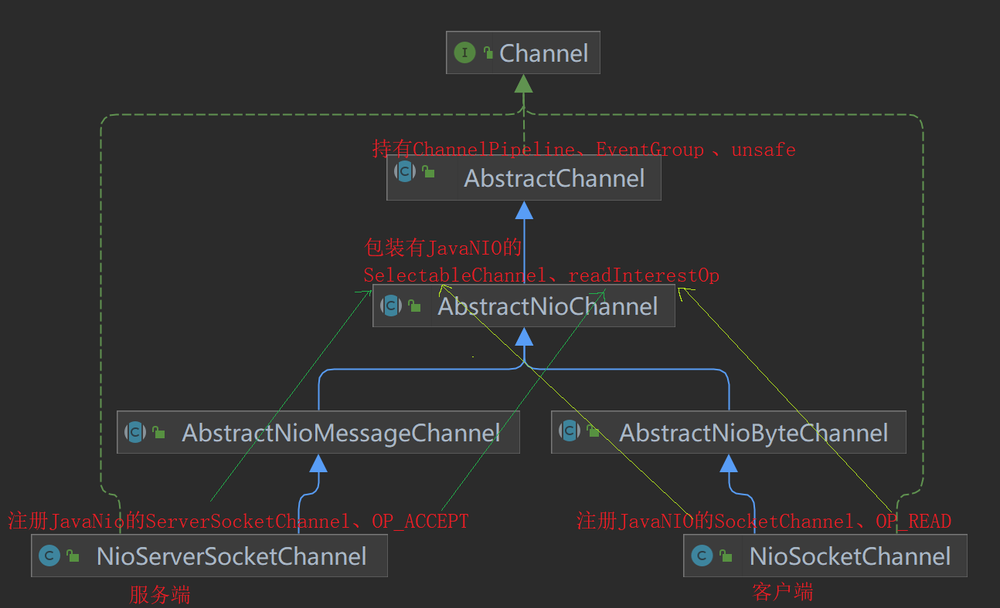

# 资料

官网：https://netty.io/index.html

芋道源码-Netty源码分析：http://svip.iocoder.cn/Netty

本文将根据当前netty最新稳定版本`4.1.83.Final-SNAPSHOT`进行源码分析。

# 概述

Netty是**异步事件驱动**的网络应用程序框架，用于**快速**和**简单**的开发可维护的**高性能协议**服务器和客户端。

Netty是NIO客户端服务器框架，实现多种协议(FTP、SMTP、HTTP以及各种二进制和基于文本的旧协议)。

Netty在Java网络编程应用框架中的地位就如Spring在JavaEE中的地位。

以下的框架都使用了 Netty：

* Cassandra - nosql 数据库
* Spark - 大数据分布式计算框架
* Hadoop - 大数据分布式存储框架
* RocketMQ - 阿里开源的消息队列
* ElasticSearch - 搜索引擎
* gRPC - rpc 框架
* Dubbo - rpc 框架
* Spring 5.x - flux api 完全抛弃了 tomcat ，使用 netty 作为服务器端
* Zookeeper - 分布式协调框架

## 整体架构


- Core：核心部分，是底层的网络通用抽象和部分实现。
  - Extensible Event Model ：可拓展的事件模型。Netty 是基于事件模型的网络应用框架。
  - Universal Communication API ：通用的通信 API 层。Netty 定义了一套抽象的通用通信层的 API 。
  - Zero-Copy-Capable Rich Byte Buffer ：支持零拷贝特性的 Byte Buffer 实现。
- Transport Services：传输( 通信 )服务，具体的网络传输的定义与实现。
  - Socket & Datagram ：TCP 和 UDP 的传输实现。
  - HTTP Tunnel ：HTTP 通道的传输实现。
  - In-VM Piple ：JVM 内部的传输实现。
- **Protocol Support** ：协议支持。Netty 对于一些通用协议的编解码实现。例如：HTTP、Redis、DNS 等等。

## 模块结构


common模块：该项目是一个通用的工具类项目，几乎被所有的其它项目依赖使用，它提供了一些数据类型处理工具类，并发编程以及多线程的扩展，计数器等等通用的工具类。

buffer模块：Netty 自行实现的一个 Byte Buffer 字节缓冲区。该包的实现相对于 JDK 自带的 ByteBuffer 有很多**优点**：无论是 API 的功能，使用体验，性能都要更加优秀。它提供了**一系列( 多种 )**的抽象定义以及实现，以满足不同场景下的需要。核心类`ByteBuf`

transport模块：该项目是网络传输通道的抽象和实现。它定义通信的统一通信 API ，统一了 JDK 的 OIO、NIO ( 不包括 AIO )等多种编程接口。核心类`Channel`

codec模块：实现Protocol Support，协议编解码的抽象与部分实现：JSON、protobuf、Base64、XML 等等。

handler模块：提供**内置的**连接通道处理器( ChannelHandler )实现类。例如：SSL 处理器、日志处理器等等。

## 线程模型

Netty基于主从Reactor多线程模型：

- Netty抽象出两组线程池：NioEventLoopGroup
  - BossGroup线程专门接受客户端连接
  - WorkerGroup专门负责网络的读写
- NioEventLoopGroup是事件循环组，组内可以含有多个事件循环NioEventLoop
- NioEventLoop表示一个不断循环的执行处理任务的线程，并含有1个Selector，监听读写事件
- Boss NioEventLoop循环执行3个步骤：
  - 轮询accept事件
  - 与客户端建立连接，生成NioSocketChannel，注册到某个worker NioEventLoop的selector中
  - 处理任务队列的任务，即runAllTasks
- Worker NioEventLoop循环执行3个步骤：
  - 在Selector轮询read/write事件
  - 在对应的NioSocketChannel处理I/O事件，调用pipeline维护的handler处理业务
  - 处理任务队列的任务，即runAllTasks
- NioEventLoop内部采用串行化设计，从消息的`读取-->解码-->处理-->编码-->发送`，始终由IO线程NioEventLoop负责


- NioEventLoopGroup包含多个NioEventLoop
- NioEventLoop包含1个Selector，1个taskQueue
- NioEventLoop的selector可以注册多个NioChannel
- 每个NioChannel只会绑定到1个NioEventLoop上
- 每个NioChannel会绑定1个自己的ChannelPipeline

## 简单入门

使用案例可以按照netty提供的example模块进行学习，下面以其中的echo案例进行小改：

服务端EchoServer：

```java
public final class EchoClient {
    static final String HOST = System.getProperty("host", "127.0.0.1");
    static final int PORT = Integer.parseInt(System.getProperty("port", "8007"));
    static final int SIZE = Integer.parseInt(System.getProperty("size", "256"));

    public static void main(String[] args) throws Exception {
        // 配置SSL
        final SslContext sslCtx = ServerUtil.buildSslContext();

        // Configure the client.
        EventLoopGroup group = new NioEventLoopGroup();
        try {
            // 创建Bootstrap客户端启动器
            Bootstrap b = new Bootstrap();
            b.group(group)
                    .channel(NioSocketChannel.class)    // 设置Channel类型
                    .option(ChannelOption.TCP_NODELAY, true)    // 关闭TCP延迟
                    .handler(new ChannelInitializer<SocketChannel>() {
                        @Override
                        public void initChannel(SocketChannel ch) throws Exception {
                            ChannelPipeline p = ch.pipeline();
                            if (sslCtx != null) {
                                p.addLast(sslCtx.newHandler(ch.alloc(), HOST, PORT));
                            }
                            //p.addLast(new LoggingHandler(LogLevel.INFO));
                            p.addLast(new EchoClientHandler());// 添加自定义处理器
                        }
                    });

            // 连接服务器并等待
            ChannelFuture f = b.connect(HOST, PORT).sync();

            // 发心跳消息测试
            Thread.sleep(100);
            f.channel().writeAndFlush(Unpooled.copiedBuffer("ping", CharsetUtil.UTF_8));
            for (int i = 0; i < 10; i++) {
                Thread.sleep(100);
                f.channel().writeAndFlush(Unpooled.copiedBuffer("ping" + i, CharsetUtil.UTF_8));
            }
            // Wait until the connection is closed.
            f.channel().close().sync(); // 手动关闭通道并等待
//            f.channel().closeFuture().sync(); // 等待直至通道关闭
        } finally {
            // Shut down the event loop to terminate all threads.
            group.shutdownGracefully();
        }
    }
}
```

服务端Handler：

```java
@Sharable
public class EchoServerHandler extends ChannelInboundHandlerAdapter {
    @Override
    public void channelRead(final ChannelHandlerContext ctx, Object msg) {
        ByteBuf buf = (ByteBuf) msg;
        System.out.printf("服务端收到来自 %s 消息 %s\n", ctx.channel().remoteAddress(), buf.toString(CharsetUtil.UTF_8));
        if ("ping".equals(buf.toString(CharsetUtil.UTF_8))) {
            // 1.自定义普通任务放入Worker线程池
            ctx.channel().eventLoop().execute(new Runnable() {
                @Override
                public void run() {
                    ctx.writeAndFlush(Unpooled.copiedBuffer("pong", CharsetUtil.UTF_8));
                }
            });

            // 2.自定义定时任务放入Worker线程池
            ctx.channel().eventLoop().schedule(new Runnable() {
                @Override
                public void run() {
                    ctx.writeAndFlush(Unpooled.copiedBuffer("pong", CharsetUtil.UTF_8));
                }
            }, 1, TimeUnit.SECONDS);
        }
    }

    @Override
    public void channelReadComplete(ChannelHandlerContext ctx) {
        ctx.flush();
    }

    @Override
    public void exceptionCaught(ChannelHandlerContext ctx, Throwable cause) {
        // Close the connection when an exception is raised.
        cause.printStackTrace();
        ctx.close();
    }
}
```

客户端EchoClient：

```java
public final class EchoClient {
    static final String HOST = System.getProperty("host", "127.0.0.1");
    static final int PORT = Integer.parseInt(System.getProperty("port", "8007"));
    static final int SIZE = Integer.parseInt(System.getProperty("size", "256"));

    public static void main(String[] args) throws Exception {
        // Configure SSL.git
        final SslContext sslCtx = ServerUtil.buildSslContext();

        // Configure the client.
        EventLoopGroup group = new NioEventLoopGroup();
        try {
            Bootstrap b = new Bootstrap();
            b.group(group)
                .channel(NioSocketChannel.class)
                .option(ChannelOption.TCP_NODELAY, true)
                .handler(new ChannelInitializer<SocketChannel>() {
                    @Override
                    public void initChannel(SocketChannel ch) throws Exception {
                        ChannelPipeline p = ch.pipeline();
                        if (sslCtx != null) {
                            p.addLast(sslCtx.newHandler(ch.alloc(), HOST, PORT));
                        }
                        //p.addLast(new LoggingHandler(LogLevel.INFO));
                        p.addLast(new EchoClientHandler());
                    }
                });

            // Start the client.
            ChannelFuture f = b.connect(HOST, PORT).sync();

            // 1.客户端发送心跳
            Thread.sleep(100);
            f.channel().writeAndFlush(Unpooled.copiedBuffer("ping", CharsetUtil.UTF_8));
            for (int i = 0; i < 10; i++) {
                Thread.sleep(100);
                f.channel().writeAndFlush(Unpooled.copiedBuffer("ping" + i, CharsetUtil.UTF_8));
            }
 			// 2.关闭通道连接
            f.channel().close().sync(); // 手动关闭通道并等待
            // f.channel().closeFuture().sync(); // 等待直至通道关闭
        } finally {
            // Shut down the event loop to terminate all threads.
            group.shutdownGracefully();
        }
    }
}
```

客户端Handler：

```java
public class EchoClientHandler extends ChannelInboundHandlerAdapter {

    private final ByteBuf firstMessage;

    public EchoClientHandler() {
        firstMessage = Unpooled.copiedBuffer("hello i am client", CharsetUtil.UTF_8);
    }

    // 通道就绪时触发
    @Override
    public void channelActive(ChannelHandlerContext ctx) {
        ChannelFuture channelFuture = ctx.writeAndFlush(firstMessage);
    }

    // 通道可读时触发
    @Override
    public void channelRead(ChannelHandlerContext ctx, Object msg) {
        //        ctx.write(msg);
        System.out.println("客户端收到消息：" + ((ByteBuf) msg).toString(CharsetUtil.UTF_8));
    }

    // 读取完成时触发
    @Override
    public void channelReadComplete(ChannelHandlerContext ctx) {
        ctx.flush();
    }

    @Override
    public void exceptionCaught(ChannelHandlerContext ctx, Throwable cause) {
        // Close the connection when an exception is raised.
        cause.printStackTrace();
        ctx.close();
    }
}
```

## HTTP服务端示例

在netty项目的example模块的http服务端示例的基础上修改了一点：

```java
// 一个简单HTTP服务器
public final class HttpHelloWorldServer {
    static final boolean SSL = System.getProperty("ssl") != null;
    static final int PORT = Integer.parseInt(System.getProperty("port", SSL? "8443" : "8080"));

    public static void main(String[] args) throws Exception {
        // 配置SSL
        final SslContext sslCtx = ServerUtil.buildSslContext();

        // 1.创建两个EventLoopGroup对象
        // boss线程组：用于服务端接受客户端连接，一般1个Acceptor线程就够了
        EventLoopGroup bossGroup = new NioEventLoopGroup(1);
        // worker线程组：用于Channel的IO操作和业务处理，默认线程数=CPU*2
        EventLoopGroup workerGroup = new NioEventLoopGroup();
        try {
            // 2.创建并配置服务端启动器
            ServerBootstrap b = new ServerBootstrap();
            b.option(ChannelOption.SO_BACKLOG, 1024);
            b.group(bossGroup, workerGroup) // 配置主从线程组
                .channel(NioServerSocketChannel.class) // 配置要使用的Channel类
                .handler(new LoggingHandler(LogLevel.INFO))
                .childHandler(new ChannelInitializer<SocketChannel>() {
                    @Override
                    protected void initChannel(SocketChannel ch) throws Exception {
                        ChannelPipeline p = ch.pipeline();
                        if (sslCtx != null) {
                            p.addLast(sslCtx.newHandler(ch.alloc()));
                        }
                        // 3.设置接入服务端的SocketChannel的处理器管道
                        // 向管道内加入HTTP协议的编码/解码器
                        p.addLast(new HttpServerCodec());
                        p.addLast(new HttpServerExpectContinueHandler());
                        p.addLast(new HttpHelloWorldServerHandler());// 自定义handler
                    }
                });

            // 4.绑定端口，同步等待
            Channel ch = b.bind(PORT).sync().channel();

            System.err.println("Open your web browser and navigate to " +
                               (SSL ? "https" : "http") + "://127.0.0.1:" + PORT + '/');

            // 5.同步等待直至监听服务端关闭
            ch.closeFuture().sync();
        } finally {
            // 6.优雅的关闭两个线程组
            bossGroup.shutdownGracefully();
            workerGroup.shutdownGracefully();
        }
    }
}
```

这里向pipeline中首先添加的是HTTP协议的编码解码器HttpServerCodec，它将HTTP请求数据转换为HttpRequest对象交由后面的pipeline继续处理。

处理器Handler：

```java
public class HttpHelloWorldServerHandler extends SimpleChannelInboundHandler<HttpObject> {
    private static final byte[] CONTENT = {'H', 'e', 'l', 'l', 'o', ' ', 'W', 'o', 'r', 'l', 'd'};

    @Override
    public void channelReadComplete(ChannelHandlerContext ctx) {
        ctx.flush();
    }

    @Override
    public void channelRead0(ChannelHandlerContext ctx, HttpObject msg) {
        if (msg instanceof HttpRequest) {
            HttpRequest req = (HttpRequest) msg;

            System.out.printf("收到客户端：%s 的HTTP请求\n", ctx.channel().remoteAddress());
            if("/favicon.ico".equals(req.uri())){
                System.out.println("请求了favicon.ico");
            }

            // 构造响应并输出
            boolean keepAlive = HttpUtil.isKeepAlive(req);
            FullHttpResponse response = new DefaultFullHttpResponse(req.protocolVersion(), OK,
                    Unpooled.wrappedBuffer(CONTENT));
            response.headers()
                    .set(CONTENT_TYPE, TEXT_PLAIN)
                    .setInt(CONTENT_LENGTH, response.content().readableBytes());

            if (keepAlive) {
                if (!req.protocolVersion().isKeepAliveDefault()) {
                    response.headers().set(CONNECTION, KEEP_ALIVE);
                }
            } else {
                // Tell the client we're going to close the connection.
                response.headers().set(CONNECTION, CLOSE);
            }

            ChannelFuture f = ctx.write(response);

            if (!keepAlive) {
                f.addListener(ChannelFutureListener.CLOSE);
            }
        }
    }

    @Override
    public void exceptionCaught(ChannelHandlerContext ctx, Throwable cause) {
        cause.printStackTrace();
        ctx.close();
    }
}
```

从此案例可以看出来用Netty实现HTTP服务器非常简单，在处理器这边只需要根据业务进行分派处理即可。

## 核心组件

Netty 有如下几个核心组件：

- Bootstrap & ServerBootstrap
- Channel
- ChannelFuture
- EventLoop & EventLoopGroup
- ChannelHandler
- ChannelPipeline

### Bootstrap


Bootstrap意思为引导启动器，Netty应用通常由Bootstrap引导启动，配置整个netty应用.

Bootstrap对于Netty就如同SpringBoot是Spring的启动器。

- Bootstrap：引导客户端Channel
  - `connect()`方法用于连接远程服务端，作为TCP客户端
  - `bind()`方法绑定本地一个端口，作为UDP的一端
- ServerBootstrap：引导服务端ServerChannel
  - `bind()`方法绑定本地端口，作为服务端
  - 使用**两个EventLoopGroup**对象，第1个接受Socket连接，第2个处理Socket连接IO事件

先看看两者的父类AbstractBootstrap：

```java
public abstract class AbstractBootstrap<B extends AbstractBootstrap<B, C>, C extends Channel> implements Cloneable {
    volatile EventLoopGroup group;
    private volatile SocketAddress localAddress;
    private volatile ChannelHandler handler;

    public B group(EventLoopGroup group) {
        // 省略参数检查
        this.group = group;
        return self();
    }

    // 设置Channel的实现类
    public B channel(Class<? extends C> channelClass) {
        return channelFactory(new ReflectiveChannelFactory<C>(
            ObjectUtil.checkNotNull(channelClass, "channelClass")
        ));
    }

    // 配置Channel，一般用于服务端ServerChannel或客户端的Channel
    public <T> B option(ChannelOption<T> option, T value) {
        // 省略
    }
    
    // 用于服务端则是绑定监听端口，用于客户端则往往用于UDP
    public ChannelFuture bind(int inetPort) {
        return bind(new InetSocketAddress(inetPort));
    }
}
```

父类AbstractBootstrap提供了一些共有实现，在使用服务端ServerBootstrap时，父类的group及其handler则扮演主从Reactor模型中的主Reactor，负责监听新连接，子类ServerBootstrap的childGroup和childHandler则判断主从Reactor模型中的从Reactor，负责监听连接的IO事件和业务处理。

```java
// 引导ServerChannel
public class ServerBootstrap extends AbstractBootstrap<ServerBootstrap, ServerChannel> {
    private volatile EventLoopGroup childGroup;
    private volatile ChannelHandler childHandler;

    /**
     * 为父级（Acceptor）和子级(client)设置EventLoopGroup。
     * 这些EventLoopGroup用于处理ServerChannel和Channel的所有事件和 IO。
     */
    public ServerBootstrap group(EventLoopGroup parentGroup, EventLoopGroup childGroup) {
        super.group(parentGroup);
        if (this.childGroup != null)
            throw new IllegalStateException("childGroup set already");
        this.childGroup = ObjectUtil.checkNotNull(childGroup, "childGroup");
        return this;
    }
    
    // 此处的配置将用于配置Acceptor接受新连接所建立的Channel
    public <T> ServerBootstrap childOption(ChannelOption<T> childOption, T value) {
        // 省略
    }

    // 设置用于为Channel的请求提供服务的ChannelHandler
    public ServerBootstrap childHandler(ChannelHandler childHandler) {
        this.childHandler = ObjectUtil.checkNotNull(childHandler, "childHandler");
        return this;
    }
}
```

### Channel

Channel 是 Netty 网络操作抽象类，它除了包括基本的 I/O 操作，如 bind、connect、read、write 之外，还包括了 Netty 框架相关的一些功能，如获取该 Channel 的 EventLoop 。

不同协议的连接有不同Channel，常见如下：

- NioSocketChannel：客户端TCP Socket连接
- NioServerSocketChannel：服务端TCP Socket连接
- NioDatagramChannel：UDP连接
- NioSctpChannel：客户端Sctp连接
- NioSctpServerChannel：Sctp服务端连接

为什么Netty要额外提供一个Channel呢？JDK提供的Socket对程序员不是很友好，使用成本较高。而相对于原生 NIO 的 Channel，Netty 的 Channel 具有如下优势( 摘自《Netty权威指南( 第二版 )》) ：

- 在 Channel 接口层，采用 Facade 模式进行统一封装，将网络 I/O 操作、网络 I/O 相关联的其他操作封装起来，统一对外提供。
- Channel 接口的定义尽量大而全，为 SocketChannel 和 ServerSocketChannel 提供统一的视图，由不同子类实现不同的功能，公共功能在抽象父类中实现，最大程度地实现功能和接口的重用。
- 具体实现采用聚合而非包含的方式，将相关的功能类聚合在 Channel 中，由 Channel 统一负责和调度，功能实现更加灵活。

可以把 Netty Channel 和 Java 原生 Socket 对应，而 Netty NIO Channel 和 Java 原生 NIO SocketChannel 对象。

### EventLoopGroup

EventLoopGroup是一组EventLoop的抽象，一般有多个EventLoop同时工作，每个EventLoop维护一个Selector实例。

在Netty的服务端中，一般会提供2个EventLoopGroup：BossEventLoopGroup和WorkerEventLoopGroup。

Channel 为Netty 网络操作抽象类，EventLoop 负责处理注册到其Selector的 Channel 处理 I/O 操作，两者配合参与 I/O 操作。

- 一个 EventLoopGroup 包含一个或多个 EventLoop ，即 EventLoopGroup : EventLoop = `1 : n` 。
- 一个 EventLoop 在它的生命周期内，只能与一个 Thread 绑定，即 EventLoop : Thread = `1 : 1` 。
- 所有有 EventLoop 处理的 I/O 事件都将在它**专有**的 Thread 上被处理，从而保证线程安全，即 Thread : EventLoop = `1 : 1`。
- 一个 Channel 在它的生命周期内只能注册到一个 EventLoop 上，即 Channel : EventLoop = `n : 1` 。
- 一个 EventLoop 可被分配至一个或多个 Channel ，即 EventLoop : Channel = `1 : n` 。

当一个连接到达时，Netty 就会创建一个 Channel，然后从 EventLoopGroup 中分配一个 EventLoop 来给这个 Channel 绑定上，在该 Channel 的整个生命周期中都是有这个绑定的 EventLoop 来服务的。

### ChannelFuture

**Netty中所有I/O操作都是异步的**，可以等待其操作完成或者注册一个监听器：

- `ChannelFuture#sync()`将等待异步操作执行结束
- `ChannelFuture#addListener()`注册一个ChannelFutureListener对象，在I/O操作完成后回调执行

```java
/**
 * Netty中所有I/O操作都是异步的，即任何I/O调用都会立刻返回ChannelFuture对象
 * <pre>
 *                                      +---------------------------+
 *                                      | Completed successfully    |
 *                                      +---------------------------+
 *                                 +---->      isDone() = true      |
 * +--------------------------+    |    |   isSuccess() = true      |
 * |        Uncompleted       |    |    +===========================+
 * +--------------------------+    |    | Completed with failure    |
 * |      isDone() = false    |    |    +---------------------------+
 * |   isSuccess() = false    |----+---->      isDone() = true      |
 * | isCancelled() = false    |    |    |       cause() = non-null  |
 * |       cause() = null     |    |    +===========================+
 * +--------------------------+    |    | Completed by cancellation |
 *                                 |    +---------------------------+
 *                                 +---->      isDone() = true      |
 *                                      | isCancelled() = true      |
 *                                      +---------------------------+
 * </pre>
 *
 * 建议addListener()添加监听器，以便在 I/O 操作完成时收到通知并执行任何后续任务
 * 不要在ChannelHandler中调用await()，很可能出现死锁
 */
public interface ChannelFuture extends Future<Void> {
    // 添加监听器
    ChannelFuture addListener(GenericFutureListener<? extends Future<? super Void>> listener);

    // 移除监听器
    ChannelFuture removeListener(GenericFutureListener<? extends Future<? super Void>> listener);

    // 等待此I/O操作直至完成
    ChannelFuture sync() throws InterruptedException;

    // 等待指定时间
    boolean await(long timeout, TimeUnit unit) throws InterruptedException;
}
```

### ChannelHandler

连接通道处理器，我们使用 Netty 中**最常用**的组件。ChannelHandler 主要用来处理各种事件，这里的事件很广泛，比如可以是连接、数据接收、异常、数据转换等。

通常实现ChannelHandler 的两个核心子类：

- `ChannelInboundHandler`：处理入站IO事件
- `ChannelOutboundHandler`：处理出站IO事件

更方便的可以实现以下适配器类：

- `ChannelInboudHandlerAdapter`：处理入站IO，实现类还包括一系列的 **Decoder** 类，对输入字节流进行解码。
- `ChannelOutboundHandlerAdapter`：处理出站IO，实现类还包括一系列的 **Encoder** 类，对输入字节流进行编码。
- `ChannelDuplexHandler`：处理入站和出站IO事件，经典实现类如HttpServerCodec，解码和编码HTTP服务请求和响应


`@Shareble`注解，如果ChannelHandler**标注有@Shareble注解**，则程序员应该只创建1次ChannelHandler实例，将其添加到多个ChannelPipeline中，即该ChannelHandler是线程安全的，如下：

```java
public static void main(String[] args) throws Exception {
    // Configure SSL.
    final SslContext sslCtx = ServerUtil.buildSslContext();

    // Configure the server.
    EventLoopGroup bossGroup = new NioEventLoopGroup(1);
    EventLoopGroup workerGroup = new NioEventLoopGroup();
    // 只创建1次
    HttpHelloWorldServerHandler h=new HttpHelloWorldServerHandler();
    try {
        ServerBootstrap b = new ServerBootstrap();
        b.option(ChannelOption.SO_BACKLOG, 1024);
        b.group(bossGroup, workerGroup)
            .channel(NioServerSocketChannel.class)
            .handler(new LoggingHandler(LogLevel.INFO))
            .childHandler(new ChannelInitializer<SocketChannel>() {
                @Override
                protected void initChannel(SocketChannel ch) throws Exception {
                    ChannelPipeline p = ch.pipeline();
                    if (sslCtx != null) {
                        p.addLast(sslCtx.newHandler(ch.alloc()));
                    }
                    // 向管道内加入HTTP协议的编码/解码器
                    p.addLast(new HttpServerCodec());
                    p.addLast(new HttpServerExpectContinueHandler());
                    p.addLast(h);// 对于每个ChannelPipeline都添加同1个ChannelHandler
                }
            });

        Channel ch = b.bind(PORT).sync().channel();

        System.err.println("Open your web browser and navigate to " +
                           (SSL? "https" : "http") + "://127.0.0.1:" + PORT + '/');

        ch.closeFuture().sync();
    } finally {
        bossGroup.shutdownGracefully();
        workerGroup.shutdownGracefully();
    }
}
```

而如果ChannelHandler中**保存有状态信息，非线程安全的**，则最好是每个Channel连接创建1个ChannelHandler。只需要改动如下：

```java
p.addLast(new HttpHelloWorldServerHandler());// 每个Channel连接1个ChannelHandler
```

注意：`@Shareble`注解仅是标注作用。

### ChannelPipeline

ChannelPipeline是ChannelHandler链，负责处理和拦截inbound或outbound事件。

```java
/**
 * 处理或拦截Channel的入站事件和出站操作的ChannelHandler列表
 * 拦截过滤器模式：用户可以完全控制事件的处理方式以及管道中ChannelHandler的相互交互方式。
 * 
 * 每个Channel都有自己的ChannelPipeline，在创建Channel时自动创建pipeline
 *
 * 下图描述了ChannelPipeline中的ChannelHandler通常如何处理 I/O 事件。 
 * I/O 事件由ChannelInboundHandler或ChannelOutboundHandler处理，并通过调用ChannelHandlerContext中定义的事件传播方法（例如ChannelHandlerContext.fireChannelRead(Object)和ChannelHandlerContext.write(Object)转发到其最近的处理程序。
 *
 * <pre>
 *                                                 I/O Request
 *                                            via {@link Channel} or
 *                                        {@link ChannelHandlerContext}
 *                                                      |
 *  +---------------------------------------------------+---------------+
 *  |                           ChannelPipeline         |               |
 *  |                                                  \|/              |
 *  |    +---------------------+            +-----------+----------+    |
 *  |    | Inbound Handler  N  |            | Outbound Handler  1  |    |
 *  |    +----------+----------+            +-----------+----------+    |
 *  |              /|\                                  |               |
 *  |               |                                  \|/              |
 *  |    +----------+----------+            +-----------+----------+    |
 *  |    | Inbound Handler N-1 |            | Outbound Handler  2  |    |
 *  |    +----------+----------+            +-----------+----------+    |
 *  |              /|\                                  .               |
 *  |               .                                   .               |
 *  | ChannelHandlerContext.fireIN_EVT() ChannelHandlerContext.OUT_EVT()|
 *  |        [ method call]                       [method call]         |
 *  |               .                                   .               |
 *  |               .                                  \|/              |
 *  |    +----------+----------+            +-----------+----------+    |
 *  |    | Inbound Handler  2  |            | Outbound Handler M-1 |    |
 *  |    +----------+----------+            +-----------+----------+    |
 *  |              /|\                                  |               |
 *  |               |                                  \|/              |
 *  |    +----------+----------+            +-----------+----------+    |
 *  |    | Inbound Handler  1  |            | Outbound Handler  M  |    |
 *  |    +----------+----------+            +-----------+----------+    |
 *  |              /|\                                  |               |
 *  +---------------+-----------------------------------+---------------+
 *                  |                                  \|/
 *  +---------------+-----------------------------------+---------------+
 *  |               |                                   |               |
 *  |       [ Socket.read() ]                    [ Socket.write() ]     |
 *  |                                                                   |
 *  |  Netty Internal I/O Threads (Transport Implementation)            |
 *  +-------------------------------------------------------------------+
 * </pre>
 *
 * 例如，假设我们创建了以下管道：
 * <pre>
 * {@link ChannelPipeline} p = ...;
 * p.addLast("1", new InboundHandlerA());
 * p.addLast("2", new InboundHandlerB());
 * p.addLast("3", new OutboundHandlerA());
 * p.addLast("4", new OutboundHandlerB());
 * p.addLast("5", new InboundOutboundHandlerX());
 * </pre>
 * 入站事件处理顺序为：1->2->5
 * 出站事件处理顺序为：5->4->3
 *
 * 典型的服务器将在每个通道的管道中具有以下处理程序：
 *  1.协议解码器 - 将二进制数据（例如ByteBuf ）转换为 Java 对象。
 *  2.协议编码器 - 将 Java 对象转换为二进制数据。
 *  3.Business Logic Handler - 执行实际的业务逻辑（例如数据库访问）
 */
public interface ChannelPipeline
    extends ChannelInboundInvoker, ChannelOutboundInvoker, Iterable<Entry<String, ChannelHandler>> {

    // 将ChannelHandler插入管道头部
    ChannelPipeline addFirst(String name, ChannelHandler handler);

    // 将ChannelHandler插入管道尾部
    ChannelPipeline addLast(String name, ChannelHandler handler);

    // 返回此管道中具有指定名称的ChannelHandler的上下文对象。
    ChannelHandlerContext context(String name);
    
    Channel channel();// 返回此pipeline所属的Channel
}
```

ChannelPipeline中还有很多执行链向后传递的入站方法和出站方法，这里不列出了。

### ChannelHandlerContext

保存和Channel相关的上下文信息，关联有1个ChannelHandler对象。同时也绑定对应的Channel和ChannelPipeline。

```java
/**
 * 使ChannelHandler能够与其ChannelPipeline和其他处理程序进行交互。
 *
 * 存储有状态信息
 * attr(AttributeKey)允许您存储和访问与ChannelHandler/Channel及其上下文相关的有状态信息
 * 因为1个ChannelHandler实例可以添加到多个ChannelPipeline中，因此可以用此上下文保存一些状态信息
 * 另请注意，添加到多个ChannelPipeline的ChannelHandler应标记为@Sharable注解
 */
public interface ChannelHandlerContext extends AttributeMap, ChannelInboundInvoker, ChannelOutboundInvoker {

    // 此绑定的Channel
    Channel channel();

    // 将用于此ChannelHandler的EventExecutor线程池
    EventExecutor executor();

    // 此绑定的ChannelHandler
    ChannelHandler handler();

    // 请求通过此 ChannelOutboundInvoker 刷新所有待处理消息。
    ChannelHandlerContext flush();

    // 此绑定的pipeline
    ChannelPipeline pipeline();
}
```

# 启动器


因为ServerBootstrap启动器和Bootstrap启动器大部分方法和职责是相同的，所以接下来将先分析AbstractBootstrap启动器，再分析服务端ServerBootstrap启动器，最后分析客户端Serverstrap启动器。



## AbstractBootstrap

在以下的HTTP服务端示例中可以得知：服务端启动的入口是`AbstractBootstrap#bind()`

```java
public static void main(String[] args) throws Exception {
    // 配置SSL
    final SslContext sslCtx = ServerUtil.buildSslContext();

    // 1.创建两个EventLoopGroup对象
    // boss线程组：用于服务端接受客户端连接，一般1个Acceptor线程就够了
    EventLoopGroup bossGroup = new NioEventLoopGroup(1);
    // worker线程组：用于Channel的IO操作和业务处理，默认线程数=CPU*2
    EventLoopGroup workerGroup = new NioEventLoopGroup();
    try {
        // 2.创建并配置服务端启动器
        ServerBootstrap b = new ServerBootstrap();
        b.option(ChannelOption.SO_BACKLOG, 1024);
        b.group(bossGroup, workerGroup) // 配置主从线程组
            .channel(NioServerSocketChannel.class) // 配置要使用的Channel类
            .handler(new LoggingHandler(LogLevel.INFO))
            .childHandler(new ChannelInitializer<SocketChannel>() {
                @Override
                protected void initChannel(SocketChannel ch) throws Exception {
                    ChannelPipeline p = ch.pipeline();
                    if (sslCtx != null) {
                        p.addLast(sslCtx.newHandler(ch.alloc()));
                    }
                    // 3.设置接入服务端的SocketChannel的处理器管道
                    // 向管道内加入HTTP协议的编码/解码器
                    p.addLast(new HttpServerCodec());
                    p.addLast(new HttpServerExpectContinueHandler());
                    p.addLast(new HttpHelloWorldServerHandler());// 自定义handler
                }
            });

        // 4.绑定端口，同步等待
        Channel ch = b.bind(PORT).sync().channel();

        System.err.println("Open your web browser and navigate to " +
                           (SSL ? "https" : "http") + "://127.0.0.1:" + PORT + '/');

        // 5.同步等待直至监听服务端关闭
        ch.closeFuture().sync();
    } finally {
        // 6.优雅的关闭两个线程组
        bossGroup.shutdownGracefully();
        workerGroup.shutdownGracefully();
    }
}
```

可以看到启动器调用bind()方法后就启动服务了，接下来分析这个AbstractBootstrap#bind()方法。

### bind

`AbstractBootstrap#bind()`方法核心流程如下图：


```java
// AbstractBootstrap.java
private ChannelFuture doBind(final SocketAddress localAddress) {
    // 1.创建Channel并注册到EventLoop中
    final ChannelFuture regFuture = initAndRegister();
    final Channel channel = regFuture.channel();
    if (regFuture.cause() != null) 
        return regFuture;
    // 如果已经完成异步操作注册成功了则直接调用doBind0()
    if (regFuture.isDone()) {
        ChannelPromise promise = channel.newPromise();
        doBind0(regFuture, channel, localAddress, promise);
        return promise;
    } else {
        // 添加监听器，在注册成功后回调doBind0()方法
        final PendingRegistrationPromise promise = new PendingRegistrationPromise(channel);
        regFuture.addListener(new ChannelFutureListener() {
            @Override
            public void operationComplete(ChannelFuture future) throws Exception {
                Throwable cause = future.cause();
                if (cause != null) {
                    promise.setFailure(cause);
                } else {
                    // Registration was successful, so set the correct executor to use.
                    // See https://github.com/netty/netty/issues/2586
                    promise.registered();

                    // 2.执行channel的端口绑定逻辑
                    doBind0(regFuture, channel, localAddress, promise);
                }
            }
        });
        return promise;
    }
}
```

`AbstractBootstrap#doBind()`方法：

- 先根据配置创建Channel，
- 将Channel注册到EventLoopGroup中
- 最后再执行Channel的端口绑定并注册到SelectionKey中。

### initAndRegister

`AbstractBootstrap#initAndRegister()`方法将根据传入的Channel实现类Class反射创建其实例，并对其初始化后，注册到EventLoopGroup中。

```java
// AbstractBootstrap.java
final ChannelFuture initAndRegister() {
    Channel channel = null;
    try {
        // 1.根据启动器配置的Channel类，反射创建对象
        channel = channelFactory.newChannel();
        // 2.初始化Channel对象
        init(channel);
    } catch (Throwable t) {/*省略*/ }
    
    // 3.注册Channel到EventLoopGroup中
    // 在方法内部会分配一个EventLoop对象并将channel注册到其上
    ChannelFuture regFuture = config().group().register(channel);
    if (regFuture.cause() != null) {/*省略*/  }

    return regFuture;
}
```

#### 创建Channel

从上面代码分析可知，创建Channel就是反射调用启动器传入的Channel类对象的构造器来创建实例，服务端一般传入的是NioServerSocketChannel，而客户端一般是NioSocketChannel。

从下图可以知道，创建Channel过程中会相应的创建ChannelPipeline，并创建JavaNIO下的SelectableChannel，将其包装起来，如果是服务端传入`SelectionKey.OP_ACCEPT`，用于之后监听连接事件，而客户端传入`SelectionKey.OP_READ`监听读事件：


#### 初始化Channel

`AbstractBootstrap#init()`初始化方法是空实现，交予子类实现：

- 在`ServerBootstrap#init()`中会往ChannelPipeline中添加一个`ServerBootstrapAcceptor`的处理器ChannelHandler，它会将新连接注册到workerEventLoopGroup中。具体分析在ServerBootstrap中分析。
- 在`Bootstrap#init()`中则仅仅设置Channel属性。

#### 注册Channel到EventLoopGroup

在`NioEventLoopGroup#register(Channel channel)`方法中，注册流程大致如下：


EventLoopGroup会调用某个`EventLoop#register()`注册Channel，即将Channel绑定到某个EventLoop。

这最终会调用`AbstractUnsafe#register0()`：

```java
// AbstractChannel.AbstractUnsafe.java
private void register0(ChannelPromise promise) {
    try {
        if (!promise.setUncancellable() || !ensureOpen(promise)) {return;}
        boolean firstRegistration = neverRegistered;
        // 1.执行注册逻辑
        // 将SelectableChannel注册到此EventLoop的Selector上，不过此时注册的兴趣集为0
        doRegister();
        neverRegistered = false;
        registered = true;

        // 2.触发ChannelHandler#handlerAdded()回调
        // 比如ChannelInitializer就是在这回调初始化，此回调常用来添加ChannelHandler
        pipeline.invokeHandlerAddedIfNeeded();

        safeSetSuccess(promise);
        // 3.触发ChannelInboundHandler#channelRegistered()回调
        pipeline.fireChannelRegistered();
        // 省略部分代码
    } catch (Throwable t) {
        // Close the channel directly to avoid FD leak.
        closeForcibly();
        closeFuture.setClosed();
        safeSetFailure(promise, t);
    }
}
```

注册到Selector代码如下：

```java
// AbstractNioChannel.java
protected void doRegister() throws Exception {
    boolean selected = false;
    for (;;) {
        try {
            // 将SelectableChannel注册到Selector，不过此时的兴趣集为0?
            selectionKey = javaChannel().register(eventLoop().unwrappedSelector(), 0, this);
            return;
        } catch (CancelledKeyException e) {
            // 省略
        }
    }
}
```

这里为什么兴趣集设置0呢？对于服务端来说，需要注册 `SelectionKey.OP_ACCEPT` 事件呢！这样做的**目的是获取`SelectionKey`保存起来**。

`SelectionKey#interestOps(int ops)`方法可以随时修改兴趣集，所以此处将其保存到了AbstractNioChannel中。

### doBind0

由上诉的bind()方法得知，此doBind0()以监听器形式监听到Channel注册Selector成功后回调。

`AbstractBootstrap#doBind0()`方法主要是绑定Channel的端口，同时触发`ChannelPipeline#fireChannelActive()`回调

```java
// AbstractBootstrap.java
private static void doBind0(
    final ChannelFuture regFuture, final Channel channel,
    final SocketAddress localAddress, final ChannelPromise promise) {

    // This method is invoked before channelRegistered() is triggered.  Give user handlers a chance to set up
    // the pipeline in its channelRegistered() implementation.
    channel.eventLoop().execute(new Runnable() {
        @Override
        public void run() {
            if (regFuture.isSuccess()) {
                channel.bind(localAddress, promise).addListener(ChannelFutureListener.CLOSE_ON_FAILURE);
            } else promise.setFailure(regFuture.cause());
        }
    });
}
```

它最终会调用`AbstractUnsafe#bind()`进行端口绑定：

```java
// AbstractChannel.AbstractUnsafe.java
public final void bind(final SocketAddress localAddress, final ChannelPromise promise) {
    // 省略检查

    boolean wasActive = isActive();
    try {
        // 1.Channel 绑定端口
        doBind(localAddress);
    } catch (Throwable t) {
        safeSetFailure(promise, t);
        closeIfClosed();
        return;
    }

    if (!wasActive && isActive()) {
        invokeLater(new Runnable() {
            @Override
            public void run() {
                // 2.ChannelPipeline#fireChannelActive()回调
                pipeline.fireChannelActive();
            }
        });
    }

    safeSetSuccess(promise);
}
```

第1步调用`AbstractChannel#doBind()`方法进行端口绑定，它是抽象方法，在不同的Channel实现类中调用不同的绑定方式，最终都是以JavaNio的Socket去绑定该端口地址。

第2步则是回调该AbstractChannel绑定的`ChannelPipeline#fireChannelActive()`回调，这将触发该pipeline内所有的`ChannelInboundHandler#channelActive()`回调。

## ServerBootstrap

### 初始化Channel

在AbstractBootstrap#initAndRegister()中，创建Channel之后，将对其进行初始化，ServerBootstrap的init()方法实现如下：

在`ServerBootstrap#init()`中会往ChannelPipeline中添加一个`ServerBootstrapAcceptor`的处理器ChannelHandler，它会将新连接注册到workerEventLoopGroup中。

```java
void init(Channel channel) {
    // 将配置是Option设置到Channel中
    setChannelOptions(channel, newOptionsArray(), logger);
    setAttributes(channel, newAttributesArray());

    ChannelPipeline p = channel.pipeline();

    final EventLoopGroup currentChildGroup = childGroup;
    final ChannelHandler currentChildHandler = childHandler;
    final Entry<ChannelOption<?>, Object>[] currentChildOptions = newOptionsArray(childOptions);
    final Entry<AttributeKey<?>, Object>[] currentChildAttrs = newAttributesArray(childAttrs);

    // 这里添加的ChannelInitializer将在Channel注册Selector完成后进行回调
    p.addLast(new ChannelInitializer<Channel>() {
        @Override
        public void initChannel(final Channel ch) {
            final ChannelPipeline pipeline = ch.pipeline();
            // 将启动器配置的ChannelHandler加入到pipeline中
            ChannelHandler handler = config.handler();
            if (handler != null) {
                pipeline.addLast(handler);
            }
            // 同时再添加一个ServerBootstrapAcceptor的handler到pipeline中
            ch.eventLoop().execute(new Runnable() {
                @Override
                public void run() {
                    pipeline.addLast(new ServerBootstrapAcceptor(
                        ch, currentChildGroup, currentChildHandler, currentChildOptions, currentChildAttrs));
                }
            });
        }
    });
}
```

这个ServerBootstrapstrapAcceptor作为ChannelHandler放入Bossgroup的ChannelPipeline中，用于将监听到的新连接放入注册到workgroup中。

注意：这里使用ChannelInitializer方式将ServerBootstrapAcceptor加入到Pipeline中

## Bootstrap

在概述的简单入门的EchoClient案例如下：

```java
public final class EchoClient {
    static final String HOST = System.getProperty("host", "127.0.0.1");
    static final int PORT = Integer.parseInt(System.getProperty("port", "8007"));
    static final int SIZE = Integer.parseInt(System.getProperty("size", "256"));

    public static void main(String[] args) throws Exception {
        // 配置SSL
        final SslContext sslCtx = ServerUtil.buildSslContext();

        // Configure the client.
        EventLoopGroup group = new NioEventLoopGroup();
        try {
            // 创建Bootstrap客户端启动器
            Bootstrap b = new Bootstrap();
            b.group(group)
                .channel(NioSocketChannel.class)    // 设置Channel类型
                .option(ChannelOption.TCP_NODELAY, true)    // 关闭TCP延迟
                .handler(new ChannelInitializer<SocketChannel>() {
                    @Override
                    public void initChannel(SocketChannel ch) throws Exception {
                        ChannelPipeline p = ch.pipeline();
                        if (sslCtx != null) 
                            p.addLast(sslCtx.newHandler(ch.alloc(), HOST, PORT));

                        //p.addLast(new LoggingHandler(LogLevel.INFO));
                        p.addLast(new EchoClientHandler());// 添加自定义处理器
                    }
                });

            // 连接服务器并等待
            ChannelFuture f = b.connect(HOST, PORT).sync();

            // 发心跳消息测试
            Thread.sleep(100);
            f.channel().writeAndFlush(Unpooled.copiedBuffer("ping", CharsetUtil.UTF_8));
            for (int i = 0; i < 10; i++) {
                Thread.sleep(100);
                f.channel().writeAndFlush(Unpooled.copiedBuffer("ping" + i, CharsetUtil.UTF_8));
            }
            // Wait until the connection is closed.
            f.channel().close().sync(); // 手动关闭通道并等待
            //            f.channel().closeFuture().sync(); // 等待直至通道关闭
        } finally {
            // 关闭EventLoopGroup
            group.shutdownGracefully();
        }
    }
}
```

### connect

从上面案例可知客户端的启动入口是`Bootstrap#connect()`：

其核心流程如下图：


```java
public ChannelFuture connect(SocketAddress remoteAddress) {
    ObjectUtil.checkNotNull(remoteAddress, "remoteAddress");
    validate();
    return doResolveAndConnect(remoteAddress, config.localAddress());
}

private ChannelFuture doResolveAndConnect(final SocketAddress remoteAddress, final SocketAddress localAddress) {
    // 1.创建并初始化Channel，将其注册到EventLoopGroup
    final ChannelFuture regFuture = initAndRegister();
    final Channel channel = regFuture.channel();

    // 省略异步处理
    // 2.解析远程地址并进行连接
    doResolveAndConnect0(channel, remoteAddress, localAddress, promise);
}
```

- 第1步调用`AbstractBootstrap#initAndRegister()`方法创建并初始化Channel，并将其注册到EventLoopGroup，分析见上文。
- 第2步就是这个客户端启动器调用`Channel#connect()`连接到服务端。

第2步最终会来到这里：

```java
// AbstractNioChannel.AbstractNioUnsafe.java
public final void connect(
    final SocketAddress remoteAddress, final SocketAddress localAddress, final ChannelPromise promise) {
    // 省略检查
    // 省略try/catch
    boolean wasActive = isActive();
    // 1.连接远程地址，最终调用SocketChannel#connect()方法连接服务端
    if (doConnect(remoteAddress, localAddress)) {
        // 2.这里面会回调ChannelPipeline#fireChannelActive()回调
        fulfillConnectPromise(promise, wasActive);
    }
}
```

### 初始化Channel

在AbstractBootstrap#initAndRegister()方法创建完Channel后会初始化Channel，客户端启动器的实现如下：

仅仅将启动器配置的Channel配置设置到Channel中。

```java
// Bootstrap.java
void init(Channel channel) {
    ChannelPipeline p = channel.pipeline();
    p.addLast(config.handler());// 将启动器配置到ChannelHandler配置到pipeline中
	// 将启动器配置的Channel配置设置到Channel中
    setChannelOptions(channel, newOptionsArray(), logger);
    setAttributes(channel, newAttributesArray());
}
```

# Reactor模型

Reactor模型核心思想：


> 将关注的 I/O 事件注册到多路复用器上，一旦有 I/O 事件触发，将事件分发到事件处理器中，执行就绪 I/O 事件对应的处理函数中。模型中有三个重要的组件：
>
> **多路复用器**：由操作系统提供接口，Linux 提供的 I/O 复用接口有select、poll、epoll 。
> **事件分发器**：将多路复用器返回的就绪事件分发到事件处理器中。
> **事件处理器**：处理就绪事件处理函数。

Reactor有3种模型实现：

- 单Reactor单线程模型
- 单Reactor多线程模型
- 多Reactor多线程模型

可以看看这篇文章：https://mp.weixin.qq.com/s/GRkZ1IEfTalQSkErWe1SAg

当下开源软件如Redis、Nginx、Netty做到网络高性能的原因就是使用I/O多路复用，而多路复用网络编程一般是面向过程方式写代码，开发效率不高，于是大佬们基于面向对象的思想，对 I/O 多路复用作了一层封装，让使用者不用考虑底层网络 API 的细节，只需要关注应用代码的编写，这种模式就是Reactor模式。

## 单Reactor单线程


- Reactor通过Selector监听到事件后，进行dispatch分发，连接事件分发给Acceptor，读写事件分发给Handler
- Acceptor 通过accept()方法获取连接，并创建一个handler绑定到此连接
- Handler 对象的作用是处理业务，当监听到连接的读写事件则交由其绑定的handler处理，Handler 对象通过 `read -> 业务处理 -> send` 的流程来完成完整的业务流程。

Redis在未采用I/O多线程之前呢，正是这种单Reactor单进程/线程模型，后来Redis把响应send交给专门I/O线程去输出了。业务处理依旧是单线程，因为Redis的内存操作不会阻塞，单个线程不用上下文切换更能长时间占有CPU。

## 单Reactor多线程


该模型**和单Reactor单线程的区别在于将业务处理逻辑分派到线程池中处理**，其它如I/O事件的监听/分派、read、send依旧由主线程处理。

这里很明显，出现性能瓶颈的地方肯定会是Reactor所在主线程。

Tomcat大致采用此模型，一个Acceptor线程负责监听新连接，Poller线程负责监听IO事件，监听到的Socket的IO事件将其包装为`read->业务处理->send`任务放入线程池处理。和这个模型的区别在于将耗时的read和send也交由线程池来处理。

## 多Reactor多线程


主Reactor就负责监听新连接，通过Acceptor的accept获取连接后分配给某个子线程SubReactor(一个SubReactor可以注册监听多个连接，不是一个连接一个线程哈)。

SubReactor就负责监听IO事件，并进行`read -> 业务处理 -> send`流程。

Netty采用此模型，其EventLoopGroup和EventLoop就以这种模型开发。

# EventLoop

Netty的EventLoop基于Reactor模型思想设计的，所以需要先理解Reactor模型。
