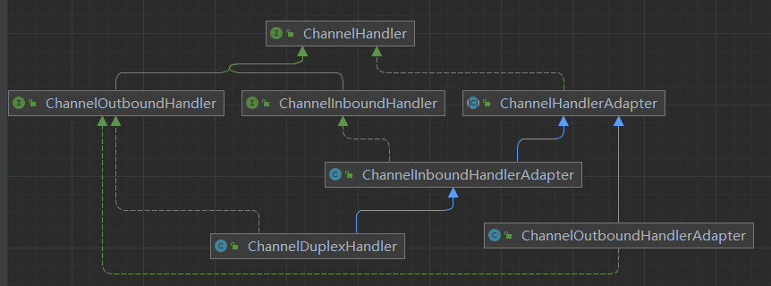
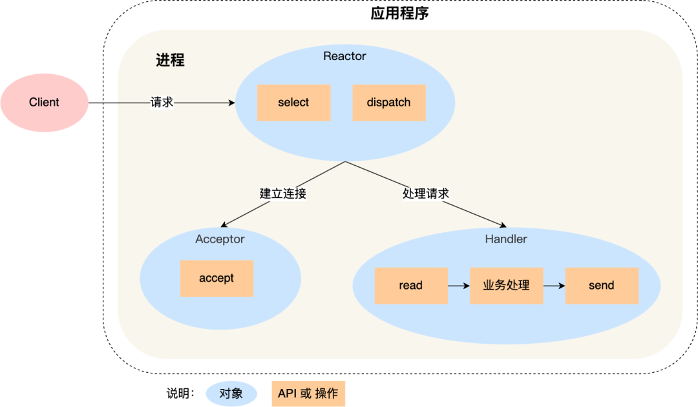
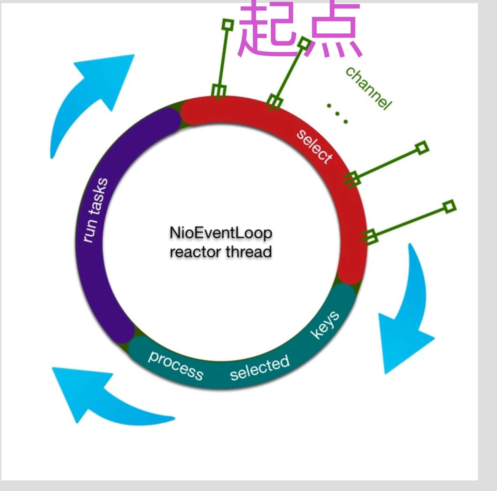
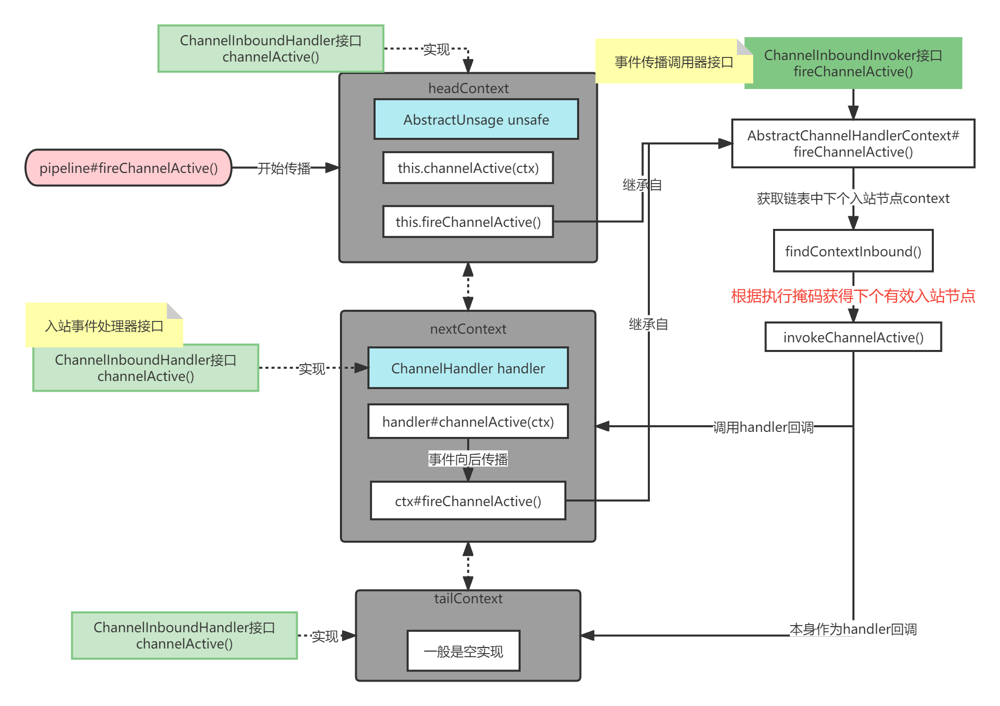

# 资料

官网：https://netty.io/index.html

芋道源码-Netty源码分析：http://svip.iocoder.cn/Netty

本文将根据当前netty最新稳定版本`4.1.83.Final-SNAPSHOT`进行源码分析。

# 概述

Netty是**异步事件驱动**的网络应用程序框架，用于**快速**和**简单**的开发可维护的**高性能协议**服务器和客户端。

Netty是NIO客户端服务器框架，实现多种协议(FTP、SMTP、HTTP以及各种二进制和基于文本的旧协议)。

Netty在Java网络编程应用框架中的地位就如Spring在JavaEE中的地位。

以下的框架都使用了 Netty：

* Cassandra - nosql 数据库
* Spark - 大数据分布式计算框架
* Hadoop - 大数据分布式存储框架
* RocketMQ - 阿里开源的消息队列
* ElasticSearch - 搜索引擎
* gRPC - rpc 框架
* Dubbo - rpc 框架
* Spring 5.x - flux api 完全抛弃了 tomcat ，使用 netty 作为服务器端
* Zookeeper - 分布式协调框架

## 整体架构


- Core：核心部分，是底层的网络通用抽象和部分实现。
  - Extensible Event Model ：可拓展的事件模型。Netty 是基于事件模型的网络应用框架。
  - Universal Communication API ：通用的通信 API 层。Netty 定义了一套抽象的通用通信层的 API 。
  - Zero-Copy-Capable Rich Byte Buffer ：支持零拷贝特性的 Byte Buffer 实现。
- Transport Services：传输( 通信 )服务，具体的网络传输的定义与实现。
  - Socket & Datagram ：TCP 和 UDP 的传输实现。
  - HTTP Tunnel ：HTTP 通道的传输实现。
  - In-VM Piple ：JVM 内部的传输实现。
- **Protocol Support** ：协议支持。Netty 对于一些通用协议的编解码实现。例如：HTTP、Redis、DNS 等等。

## 模块结构


common模块：该项目是一个通用的工具类项目，几乎被所有的其它项目依赖使用，它提供了一些数据类型处理工具类，并发编程以及多线程的扩展，计数器等等通用的工具类。

buffer模块：Netty 自行实现的一个 Byte Buffer 字节缓冲区。该包的实现相对于 JDK 自带的 ByteBuffer 有很多**优点**：无论是 API 的功能，使用体验，性能都要更加优秀。它提供了**一系列( 多种 )**的抽象定义以及实现，以满足不同场景下的需要。核心类`ByteBuf`

transport模块：该项目是网络传输通道的抽象和实现。它定义通信的统一通信 API ，统一了 JDK 的 OIO、NIO ( 不包括 AIO )等多种编程接口。核心类`Channel`

codec模块：实现Protocol Support，协议编解码的抽象与部分实现：JSON、protobuf、Base64、XML 等等。

handler模块：提供**内置的**连接通道处理器( ChannelHandler )实现类。例如：SSL 处理器、日志处理器等等。

## 线程模型

Netty基于主从Reactor多线程模型：

- Netty抽象出两组线程池：NioEventLoopGroup
  - BossGroup线程专门接受客户端连接
  - WorkerGroup专门负责网络的读写
- NioEventLoopGroup是事件循环组，组内可以含有多个事件循环NioEventLoop
- NioEventLoop表示一个不断循环的执行处理任务的线程，并含有1个Selector，监听读写事件
- Boss NioEventLoop循环执行3个步骤：
  - 轮询accept事件
  - 与客户端建立连接，生成NioSocketChannel，注册到某个worker NioEventLoop的selector中
  - 处理任务队列的任务，即runAllTasks
- Worker NioEventLoop循环执行3个步骤：
  - 在Selector轮询read/write事件
  - 在对应的NioSocketChannel处理I/O事件，调用pipeline维护的handler处理业务
  - 处理任务队列的任务，即runAllTasks
- NioEventLoop内部采用串行化设计，从消息的`读取-->解码-->处理-->编码-->发送`，始终由IO线程NioEventLoop负责


- NioEventLoopGroup包含多个NioEventLoop
- NioEventLoop包含1个Selector，1个taskQueue
- NioEventLoop的selector可以注册多个NioChannel
- 每个NioChannel只会绑定到1个NioEventLoop上
- 每个NioChannel会绑定1个自己的ChannelPipeline

## 简单入门

使用案例可以按照netty提供的example模块进行学习，下面以其中的echo案例进行小改：

服务端EchoServer：

```java
public final class EchoClient {
    static final String HOST = System.getProperty("host", "127.0.0.1");
    static final int PORT = Integer.parseInt(System.getProperty("port", "8007"));
    static final int SIZE = Integer.parseInt(System.getProperty("size", "256"));

    public static void main(String[] args) throws Exception {
        // 配置SSL
        final SslContext sslCtx = ServerUtil.buildSslContext();

        // Configure the client.
        EventLoopGroup group = new NioEventLoopGroup();
        try {
            // 创建Bootstrap客户端启动器
            Bootstrap b = new Bootstrap();
            b.group(group)
                    .channel(NioSocketChannel.class)    // 设置Channel类型
                    .option(ChannelOption.TCP_NODELAY, true)    // 关闭TCP延迟
                    .handler(new ChannelInitializer<SocketChannel>() {
                        @Override
                        public void initChannel(SocketChannel ch) throws Exception {
                            ChannelPipeline p = ch.pipeline();
                            if (sslCtx != null) {
                                p.addLast(sslCtx.newHandler(ch.alloc(), HOST, PORT));
                            }
                            //p.addLast(new LoggingHandler(LogLevel.INFO));
                            p.addLast(new EchoClientHandler());// 添加自定义处理器
                        }
                    });

            // 连接服务器并等待
            ChannelFuture f = b.connect(HOST, PORT).sync();

            // 发心跳消息测试
            Thread.sleep(100);
            f.channel().writeAndFlush(Unpooled.copiedBuffer("ping", CharsetUtil.UTF_8));
            for (int i = 0; i < 10; i++) {
                Thread.sleep(100);
                f.channel().writeAndFlush(Unpooled.copiedBuffer("ping" + i, CharsetUtil.UTF_8));
            }
            // Wait until the connection is closed.
            f.channel().close().sync(); // 手动关闭通道并等待
//            f.channel().closeFuture().sync(); // 等待直至通道关闭
        } finally {
            // Shut down the event loop to terminate all threads.
            group.shutdownGracefully();
        }
    }
}
```

服务端Handler：

```java
@Sharable
public class EchoServerHandler extends ChannelInboundHandlerAdapter {
    @Override
    public void channelRead(final ChannelHandlerContext ctx, Object msg) {
        ByteBuf buf = (ByteBuf) msg;
        System.out.printf("服务端收到来自 %s 消息 %s\n", ctx.channel().remoteAddress(), buf.toString(CharsetUtil.UTF_8));
        if ("ping".equals(buf.toString(CharsetUtil.UTF_8))) {
            // 1.自定义普通任务放入Worker线程池
            ctx.channel().eventLoop().execute(new Runnable() {
                @Override
                public void run() {
                    ctx.writeAndFlush(Unpooled.copiedBuffer("pong", CharsetUtil.UTF_8));
                }
            });

            // 2.自定义定时任务放入Worker线程池
            ctx.channel().eventLoop().schedule(new Runnable() {
                @Override
                public void run() {
                    ctx.writeAndFlush(Unpooled.copiedBuffer("pong", CharsetUtil.UTF_8));
                }
            }, 1, TimeUnit.SECONDS);
        }
    }

    @Override
    public void channelReadComplete(ChannelHandlerContext ctx) {
        ctx.flush();
    }

    @Override
    public void exceptionCaught(ChannelHandlerContext ctx, Throwable cause) {
        // Close the connection when an exception is raised.
        cause.printStackTrace();
        ctx.close();
    }
}
```

客户端EchoClient：

```java
public final class EchoClient {
    static final String HOST = System.getProperty("host", "127.0.0.1");
    static final int PORT = Integer.parseInt(System.getProperty("port", "8007"));
    static final int SIZE = Integer.parseInt(System.getProperty("size", "256"));

    public static void main(String[] args) throws Exception {
        // Configure SSL.git
        final SslContext sslCtx = ServerUtil.buildSslContext();

        // Configure the client.
        EventLoopGroup group = new NioEventLoopGroup();
        try {
            Bootstrap b = new Bootstrap();
            b.group(group)
                .channel(NioSocketChannel.class)
                .option(ChannelOption.TCP_NODELAY, true)
                .handler(new ChannelInitializer<SocketChannel>() {
                    @Override
                    public void initChannel(SocketChannel ch) throws Exception {
                        ChannelPipeline p = ch.pipeline();
                        if (sslCtx != null) {
                            p.addLast(sslCtx.newHandler(ch.alloc(), HOST, PORT));
                        }
                        //p.addLast(new LoggingHandler(LogLevel.INFO));
                        p.addLast(new EchoClientHandler());
                    }
                });

            // Start the client.
            ChannelFuture f = b.connect(HOST, PORT).sync();

            // 1.客户端发送心跳
            Thread.sleep(100);
            f.channel().writeAndFlush(Unpooled.copiedBuffer("ping", CharsetUtil.UTF_8));
            for (int i = 0; i < 10; i++) {
                Thread.sleep(100);
                f.channel().writeAndFlush(Unpooled.copiedBuffer("ping" + i, CharsetUtil.UTF_8));
            }
 			// 2.关闭通道连接
            f.channel().close().sync(); // 手动关闭通道并等待
            // f.channel().closeFuture().sync(); // 等待直至通道关闭
        } finally {
            // Shut down the event loop to terminate all threads.
            group.shutdownGracefully();
        }
    }
}
```

客户端Handler：

```java
public class EchoClientHandler extends ChannelInboundHandlerAdapter {

    private final ByteBuf firstMessage;

    public EchoClientHandler() {
        firstMessage = Unpooled.copiedBuffer("hello i am client", CharsetUtil.UTF_8);
    }

    // 通道就绪时触发
    @Override
    public void channelActive(ChannelHandlerContext ctx) {
        ChannelFuture channelFuture = ctx.writeAndFlush(firstMessage);
    }

    // 通道可读时触发
    @Override
    public void channelRead(ChannelHandlerContext ctx, Object msg) {
        //        ctx.write(msg);
        System.out.println("客户端收到消息：" + ((ByteBuf) msg).toString(CharsetUtil.UTF_8));
    }

    // 读取完成时触发
    @Override
    public void channelReadComplete(ChannelHandlerContext ctx) {
        ctx.flush();
    }

    @Override
    public void exceptionCaught(ChannelHandlerContext ctx, Throwable cause) {
        // Close the connection when an exception is raised.
        cause.printStackTrace();
        ctx.close();
    }
}
```

## HTTP服务端示例

在netty项目的example模块的http服务端示例的基础上修改了一点：

```java
// 一个简单HTTP服务器
public final class HttpHelloWorldServer {
    static final boolean SSL = System.getProperty("ssl") != null;
    static final int PORT = Integer.parseInt(System.getProperty("port", SSL? "8443" : "8080"));

    public static void main(String[] args) throws Exception {
        // 配置SSL
        final SslContext sslCtx = ServerUtil.buildSslContext();

        // 1.创建两个EventLoopGroup对象
        // boss线程组：用于服务端接受客户端连接，一般1个Acceptor线程就够了
        EventLoopGroup bossGroup = new NioEventLoopGroup(1);
        // worker线程组：用于Channel的IO操作和业务处理，默认线程数=CPU*2
        EventLoopGroup workerGroup = new NioEventLoopGroup();
        try {
            // 2.创建并配置服务端启动器
            ServerBootstrap b = new ServerBootstrap();
            b.option(ChannelOption.SO_BACKLOG, 1024);
            b.group(bossGroup, workerGroup) // 配置主从线程组
                .channel(NioServerSocketChannel.class) // 配置要使用的Channel类
                .handler(new LoggingHandler(LogLevel.INFO))
                .childHandler(new ChannelInitializer<SocketChannel>() {
                    @Override
                    protected void initChannel(SocketChannel ch) throws Exception {
                        ChannelPipeline p = ch.pipeline();
                        if (sslCtx != null) {
                            p.addLast(sslCtx.newHandler(ch.alloc()));
                        }
                        // 3.设置接入服务端的SocketChannel的处理器管道
                        // 向管道内加入HTTP协议的编码/解码器
                        p.addLast(new HttpServerCodec());
                        p.addLast(new HttpServerExpectContinueHandler());
                        p.addLast(new HttpHelloWorldServerHandler());// 自定义handler
                    }
                });

            // 4.绑定端口，同步等待
            Channel ch = b.bind(PORT).sync().channel();

            System.err.println("Open your web browser and navigate to " +
                               (SSL ? "https" : "http") + "://127.0.0.1:" + PORT + '/');

            // 5.同步等待直至监听服务端关闭
            ch.closeFuture().sync();
        } finally {
            // 6.优雅的关闭两个线程组
            bossGroup.shutdownGracefully();
            workerGroup.shutdownGracefully();
        }
    }
}
```

这里向pipeline中首先添加的是HTTP协议的编码解码器HttpServerCodec，它将HTTP请求数据转换为HttpRequest对象交由后面的pipeline继续处理。

处理器Handler：

```java
public class HttpHelloWorldServerHandler extends SimpleChannelInboundHandler<HttpObject> {
    private static final byte[] CONTENT = {'H', 'e', 'l', 'l', 'o', ' ', 'W', 'o', 'r', 'l', 'd'};

    @Override
    public void channelReadComplete(ChannelHandlerContext ctx) {
        ctx.flush();
    }

    @Override
    public void channelRead0(ChannelHandlerContext ctx, HttpObject msg) {
        if (msg instanceof HttpRequest) {
            HttpRequest req = (HttpRequest) msg;

            System.out.printf("收到客户端：%s 的HTTP请求\n", ctx.channel().remoteAddress());
            if("/favicon.ico".equals(req.uri())){
                System.out.println("请求了favicon.ico");
            }

            // 构造响应并输出
            boolean keepAlive = HttpUtil.isKeepAlive(req);
            FullHttpResponse response = new DefaultFullHttpResponse(req.protocolVersion(), OK,
                    Unpooled.wrappedBuffer(CONTENT));
            response.headers()
                    .set(CONTENT_TYPE, TEXT_PLAIN)
                    .setInt(CONTENT_LENGTH, response.content().readableBytes());

            if (keepAlive) {
                if (!req.protocolVersion().isKeepAliveDefault()) {
                    response.headers().set(CONNECTION, KEEP_ALIVE);
                }
            } else {
                // Tell the client we're going to close the connection.
                response.headers().set(CONNECTION, CLOSE);
            }

            ChannelFuture f = ctx.write(response);

            if (!keepAlive) {
                f.addListener(ChannelFutureListener.CLOSE);
            }
        }
    }

    @Override
    public void exceptionCaught(ChannelHandlerContext ctx, Throwable cause) {
        cause.printStackTrace();
        ctx.close();
    }
}
```

从此案例可以看出来用Netty实现HTTP服务器非常简单，在处理器这边只需要根据业务进行分派处理即可。

## 核心组件

Netty 有如下几个核心组件：

- Bootstrap & ServerBootstrap
- Channel
- ChannelFuture
- EventLoop & EventLoopGroup
- ChannelHandler
- ChannelPipeline

### Bootstrap


Bootstrap意思为引导启动器，Netty应用通常由Bootstrap引导启动，配置整个netty应用.

Bootstrap对于Netty就如同SpringBoot是Spring的启动器。

- Bootstrap：引导客户端Channel
  - `connect()`方法用于连接远程服务端，作为TCP客户端
  - `bind()`方法绑定本地一个端口，作为UDP的一端
- ServerBootstrap：引导服务端ServerChannel
  - `bind()`方法绑定本地端口，作为服务端
  - 使用**两个EventLoopGroup**对象，第1个接受Socket连接，第2个处理Socket连接IO事件

先看看两者的父类AbstractBootstrap：

```java
public abstract class AbstractBootstrap<B extends AbstractBootstrap<B, C>, C extends Channel> implements Cloneable {
    volatile EventLoopGroup group;
    private volatile SocketAddress localAddress;
    private volatile ChannelHandler handler;

    public B group(EventLoopGroup group) {
        // 省略参数检查
        this.group = group;
        return self();
    }

    // 设置Channel的实现类
    public B channel(Class<? extends C> channelClass) {
        return channelFactory(new ReflectiveChannelFactory<C>(
            ObjectUtil.checkNotNull(channelClass, "channelClass")
        ));
    }

    // 配置Channel，一般用于服务端ServerChannel或客户端的Channel
    public <T> B option(ChannelOption<T> option, T value) {
        // 省略
    }
    
    // 用于服务端则是绑定监听端口，用于客户端则往往用于UDP
    public ChannelFuture bind(int inetPort) {
        return bind(new InetSocketAddress(inetPort));
    }
}
```

父类AbstractBootstrap提供了一些共有实现，在使用服务端ServerBootstrap时，父类的group及其handler则扮演主从Reactor模型中的主Reactor，负责监听新连接，子类ServerBootstrap的childGroup和childHandler则判断主从Reactor模型中的从Reactor，负责监听连接的IO事件和业务处理。

```java
// 引导ServerChannel
public class ServerBootstrap extends AbstractBootstrap<ServerBootstrap, ServerChannel> {
    private volatile EventLoopGroup childGroup;
    private volatile ChannelHandler childHandler;

    /**
     * 为父级（Acceptor）和子级(client)设置EventLoopGroup。
     * 这些EventLoopGroup用于处理ServerChannel和Channel的所有事件和 IO。
     */
    public ServerBootstrap group(EventLoopGroup parentGroup, EventLoopGroup childGroup) {
        super.group(parentGroup);
        if (this.childGroup != null)
            throw new IllegalStateException("childGroup set already");
        this.childGroup = ObjectUtil.checkNotNull(childGroup, "childGroup");
        return this;
    }
    
    // 此处的配置将用于配置Acceptor接受新连接所建立的Channel
    public <T> ServerBootstrap childOption(ChannelOption<T> childOption, T value) {
        // 省略
    }

    // 设置用于为Channel的请求提供服务的ChannelHandler
    public ServerBootstrap childHandler(ChannelHandler childHandler) {
        this.childHandler = ObjectUtil.checkNotNull(childHandler, "childHandler");
        return this;
    }
}
```

### Channel

Channel 是 Netty 网络操作抽象类，它除了包括基本的 I/O 操作，如 bind、connect、read、write 之外，还包括了 Netty 框架相关的一些功能，如获取该 Channel 的 EventLoop 。

不同协议的连接有不同Channel，常见如下：

- NioSocketChannel：客户端TCP Socket连接
- NioServerSocketChannel：服务端TCP Socket连接
- NioDatagramChannel：UDP连接
- NioSctpChannel：客户端Sctp连接
- NioSctpServerChannel：Sctp服务端连接

为什么Netty要额外提供一个Channel呢？JDK提供的Socket对程序员不是很友好，使用成本较高。而相对于原生 NIO 的 Channel，Netty 的 Channel 具有如下优势( 摘自《Netty权威指南( 第二版 )》) ：

- 在 Channel 接口层，采用 Facade 模式进行统一封装，将网络 I/O 操作、网络 I/O 相关联的其他操作封装起来，统一对外提供。
- Channel 接口的定义尽量大而全，为 SocketChannel 和 ServerSocketChannel 提供统一的视图，由不同子类实现不同的功能，公共功能在抽象父类中实现，最大程度地实现功能和接口的重用。
- 具体实现采用聚合而非包含的方式，将相关的功能类聚合在 Channel 中，由 Channel 统一负责和调度，功能实现更加灵活。

可以把 Netty Channel 和 Java 原生 Socket 对应，而 Netty NIO Channel 和 Java 原生 NIO SocketChannel 对象。

### EventLoopGroup

EventLoopGroup是一组EventLoop的抽象，一般有多个EventLoop同时工作，每个EventLoop维护一个Selector实例。

在Netty的服务端中，一般会提供2个EventLoopGroup：BossEventLoopGroup和WorkerEventLoopGroup。

Channel 为Netty 网络操作抽象类，EventLoop 负责处理注册到其Selector的 Channel 处理 I/O 操作，两者配合参与 I/O 操作。

- 一个 EventLoopGroup 包含一个或多个 EventLoop ，即 EventLoopGroup : EventLoop = `1 : n` 。
- 一个 EventLoop 在它的生命周期内，只能与一个 Thread 绑定，即 EventLoop : Thread = `1 : 1` 。
- 所有有 EventLoop 处理的 I/O 事件都将在它**专有**的 Thread 上被处理，从而保证线程安全，即 Thread : EventLoop = `1 : 1`。
- 一个 Channel 在它的生命周期内只能注册到一个 EventLoop 上，即 Channel : EventLoop = `n : 1` 。
- 一个 EventLoop 可被分配至一个或多个 Channel ，即 EventLoop : Channel = `1 : n` 。

当一个连接到达时，Netty 就会创建一个 Channel，然后从 EventLoopGroup 中分配一个 EventLoop 来给这个 Channel 绑定上，在该 Channel 的整个生命周期中都是有这个绑定的 EventLoop 来服务的。

### ChannelFuture

**Netty中所有I/O操作都是异步的**，可以等待其操作完成或者注册一个监听器：

- `ChannelFuture#sync()`将等待异步操作执行结束
- `ChannelFuture#addListener()`注册一个ChannelFutureListener对象，在I/O操作完成后回调执行

```java
/**
 * Netty中所有I/O操作都是异步的，即任何I/O调用都会立刻返回ChannelFuture对象
 * <pre>
 *                                      +---------------------------+
 *                                      | Completed successfully    |
 *                                      +---------------------------+
 *                                 +---->      isDone() = true      |
 * +--------------------------+    |    |   isSuccess() = true      |
 * |        Uncompleted       |    |    +===========================+
 * +--------------------------+    |    | Completed with failure    |
 * |      isDone() = false    |    |    +---------------------------+
 * |   isSuccess() = false    |----+---->      isDone() = true      |
 * | isCancelled() = false    |    |    |       cause() = non-null  |
 * |       cause() = null     |    |    +===========================+
 * +--------------------------+    |    | Completed by cancellation |
 *                                 |    +---------------------------+
 *                                 +---->      isDone() = true      |
 *                                      | isCancelled() = true      |
 *                                      +---------------------------+
 * </pre>
 *
 * 建议addListener()添加监听器，以便在 I/O 操作完成时收到通知并执行任何后续任务
 * 不要在ChannelHandler中调用await()，很可能出现死锁
 */
public interface ChannelFuture extends Future<Void> {
    // 添加监听器
    ChannelFuture addListener(GenericFutureListener<? extends Future<? super Void>> listener);

    // 移除监听器
    ChannelFuture removeListener(GenericFutureListener<? extends Future<? super Void>> listener);

    // 等待此I/O操作直至完成
    ChannelFuture sync() throws InterruptedException;

    // 等待指定时间
    boolean await(long timeout, TimeUnit unit) throws InterruptedException;
}
```

### ChannelHandler

连接通道处理器，我们使用 Netty 中**最常用**的组件。ChannelHandler 主要用来处理各种事件，这里的事件很广泛，比如可以是连接、数据接收、异常、数据转换等。

通常实现ChannelHandler 的两个核心子类：

- `ChannelInboundHandler`：处理入站IO事件
- `ChannelOutboundHandler`：处理出站IO事件

更方便的可以实现以下适配器类：

- `ChannelInboudHandlerAdapter`：处理入站IO，实现类还包括一系列的 **Decoder** 类，对输入字节流进行解码。
- `ChannelOutboundHandlerAdapter`：处理出站IO，实现类还包括一系列的 **Encoder** 类，对输入字节流进行编码。
- `ChannelDuplexHandler`：处理入站和出站IO事件，经典实现类如HttpServerCodec，解码和编码HTTP服务请求和响应



`@Shareble`注解，如果ChannelHandler**标注有@Shareble注解**，则程序员应该只创建1次ChannelHandler实例，将其添加到多个ChannelPipeline中，即该ChannelHandler是线程安全的，如下：

```java
public static void main(String[] args) throws Exception {
    // Configure SSL.
    final SslContext sslCtx = ServerUtil.buildSslContext();

    // Configure the server.
    EventLoopGroup bossGroup = new NioEventLoopGroup(1);
    EventLoopGroup workerGroup = new NioEventLoopGroup();
    // 只创建1次
    HttpHelloWorldServerHandler h=new HttpHelloWorldServerHandler();
    try {
        ServerBootstrap b = new ServerBootstrap();
        b.option(ChannelOption.SO_BACKLOG, 1024);
        b.group(bossGroup, workerGroup)
            .channel(NioServerSocketChannel.class)
            .handler(new LoggingHandler(LogLevel.INFO))
            .childHandler(new ChannelInitializer<SocketChannel>() {
                @Override
                protected void initChannel(SocketChannel ch) throws Exception {
                    ChannelPipeline p = ch.pipeline();
                    if (sslCtx != null) {
                        p.addLast(sslCtx.newHandler(ch.alloc()));
                    }
                    // 向管道内加入HTTP协议的编码/解码器
                    p.addLast(new HttpServerCodec());
                    p.addLast(new HttpServerExpectContinueHandler());
                    p.addLast(h);// 对于每个ChannelPipeline都添加同1个ChannelHandler
                }
            });

        Channel ch = b.bind(PORT).sync().channel();

        System.err.println("Open your web browser and navigate to " +
                           (SSL? "https" : "http") + "://127.0.0.1:" + PORT + '/');

        ch.closeFuture().sync();
    } finally {
        bossGroup.shutdownGracefully();
        workerGroup.shutdownGracefully();
    }
}
```

而如果ChannelHandler中**保存有状态信息，非线程安全的**，则最好是每个Channel连接创建1个ChannelHandler。只需要改动如下：

```java
p.addLast(new HttpHelloWorldServerHandler());// 每个Channel连接1个ChannelHandler
```

注意：`@Shareble`注解仅是标注作用。

### ChannelPipeline

ChannelPipeline是ChannelHandler链，负责处理和拦截inbound或outbound事件。

```java
/**
 * 处理或拦截Channel的入站事件和出站操作的ChannelHandler列表
 * 拦截过滤器模式：用户可以完全控制事件的处理方式以及管道中ChannelHandler的相互交互方式。
 * 
 * 每个Channel都有自己的ChannelPipeline，在创建Channel时自动创建pipeline
 *
 * 下图描述了ChannelPipeline中的ChannelHandler通常如何处理 I/O 事件。 
 * I/O 事件由ChannelInboundHandler或ChannelOutboundHandler处理，并通过调用ChannelHandlerContext中定义的事件传播方法（例如ChannelHandlerContext.fireChannelRead(Object)和ChannelHandlerContext.write(Object)转发到其最近的处理程序。
 *
 * <pre>
 *                                                 I/O Request
 *                                            via {@link Channel} or
 *                                        {@link ChannelHandlerContext}
 *                                                      |
 *  +---------------------------------------------------+---------------+
 *  |                           ChannelPipeline         |               |
 *  |                                                  \|/              |
 *  |    +---------------------+            +-----------+----------+    |
 *  |    | Inbound Handler  N  |            | Outbound Handler  1  |    |
 *  |    +----------+----------+            +-----------+----------+    |
 *  |              /|\                                  |               |
 *  |               |                                  \|/              |
 *  |    +----------+----------+            +-----------+----------+    |
 *  |    | Inbound Handler N-1 |            | Outbound Handler  2  |    |
 *  |    +----------+----------+            +-----------+----------+    |
 *  |              /|\                                  .               |
 *  |               .                                   .               |
 *  | ChannelHandlerContext.fireIN_EVT() ChannelHandlerContext.OUT_EVT()|
 *  |        [ method call]                       [method call]         |
 *  |               .                                   .               |
 *  |               .                                  \|/              |
 *  |    +----------+----------+            +-----------+----------+    |
 *  |    | Inbound Handler  2  |            | Outbound Handler M-1 |    |
 *  |    +----------+----------+            +-----------+----------+    |
 *  |              /|\                                  |               |
 *  |               |                                  \|/              |
 *  |    +----------+----------+            +-----------+----------+    |
 *  |    | Inbound Handler  1  |            | Outbound Handler  M  |    |
 *  |    +----------+----------+            +-----------+----------+    |
 *  |              /|\                                  |               |
 *  +---------------+-----------------------------------+---------------+
 *                  |                                  \|/
 *  +---------------+-----------------------------------+---------------+
 *  |               |                                   |               |
 *  |       [ Socket.read() ]                    [ Socket.write() ]     |
 *  |                                                                   |
 *  |  Netty Internal I/O Threads (Transport Implementation)            |
 *  +-------------------------------------------------------------------+
 * </pre>
 *
 * 例如，假设我们创建了以下管道：
 * <pre>
 * {@link ChannelPipeline} p = ...;
 * p.addLast("1", new InboundHandlerA());
 * p.addLast("2", new InboundHandlerB());
 * p.addLast("3", new OutboundHandlerA());
 * p.addLast("4", new OutboundHandlerB());
 * p.addLast("5", new InboundOutboundHandlerX());
 * </pre>
 * 入站事件处理顺序为：1->2->5
 * 出站事件处理顺序为：5->4->3
 *
 * 典型的服务器将在每个通道的管道中具有以下处理程序：
 *  1.协议解码器 - 将二进制数据（例如ByteBuf ）转换为 Java 对象。
 *  2.协议编码器 - 将 Java 对象转换为二进制数据。
 *  3.Business Logic Handler - 执行实际的业务逻辑（例如数据库访问）
 */
public interface ChannelPipeline
    extends ChannelInboundInvoker, ChannelOutboundInvoker, Iterable<Entry<String, ChannelHandler>> {

    // 将ChannelHandler插入管道头部
    ChannelPipeline addFirst(String name, ChannelHandler handler);

    // 将ChannelHandler插入管道尾部
    ChannelPipeline addLast(String name, ChannelHandler handler);

    // 返回此管道中具有指定名称的ChannelHandler的上下文对象。
    ChannelHandlerContext context(String name);
    
    Channel channel();// 返回此pipeline所属的Channel
}
```

ChannelPipeline中还有很多执行链向后传递的入站方法和出站方法，这里不列出了。

### ChannelHandlerContext

保存和Channel相关的上下文信息，关联有1个ChannelHandler对象。同时也绑定对应的Channel和ChannelPipeline。

ChannelPipeline中就是以ChannelHandlerContext封装ChannelHandler，并将其组装成链。

```java
/**
 * 使ChannelHandler能够与其ChannelPipeline和其他处理程序进行交互。
 *
 * 存储有状态信息
 * attr(AttributeKey)允许您存储和访问与ChannelHandler/Channel及其上下文相关的有状态信息
 * 因为1个ChannelHandler实例可以添加到多个ChannelPipeline中，因此可以用此上下文保存一些状态信息
 * 另请注意，添加到多个ChannelPipeline的ChannelHandler应标记为@Sharable注解
 */
public interface ChannelHandlerContext extends AttributeMap, ChannelInboundInvoker, ChannelOutboundInvoker {

    // 此绑定的Channel
    Channel channel();

    // 将用于此ChannelHandler的EventExecutor线程池
    EventExecutor executor();

    // 此绑定的ChannelHandler
    ChannelHandler handler();

    // 请求通过此 ChannelOutboundInvoker 刷新所有待处理消息。
    ChannelHandlerContext flush();

    // 此绑定的pipeline
    ChannelPipeline pipeline();
}
```

# Reactor模型

Reactor模型核心思想：


> 将关注的 I/O 事件注册到多路复用器上，一旦有 I/O 事件触发，将事件分发到事件处理器中，执行就绪 I/O 事件对应的处理函数中。模型中有三个重要的组件：
>
> **多路复用器**：由操作系统提供接口，Linux 提供的 I/O 复用接口有select、poll、epoll 。
> **事件分发器**：将多路复用器返回的就绪事件分发到事件处理器中。
> **事件处理器**：处理就绪事件处理函数。

Reactor有3种模型实现：

- 单Reactor单线程模型
- 单Reactor多线程模型
- 多Reactor多线程模型

可以看看这篇文章：https://mp.weixin.qq.com/s/GRkZ1IEfTalQSkErWe1SAg

当下开源软件如Redis、Nginx、Netty做到网络高性能的原因就是使用I/O多路复用，而多路复用网络编程一般是面向过程方式写代码，开发效率不高，于是大佬们基于面向对象的思想，对 I/O 多路复用作了一层封装，让使用者不用考虑底层网络 API 的细节，只需要关注应用代码的编写，这种模式就是Reactor模式。

## 单Reactor单线程



- Reactor通过Selector监听到事件后，进行dispatch分发，连接事件分发给Acceptor，读写事件分发给Handler
- Acceptor 通过accept()方法获取连接，并创建一个handler绑定到此连接
- Handler 对象的作用是处理业务，当监听到连接的读写事件则交由其绑定的handler处理，Handler 对象通过 `read -> 业务处理 -> send` 的流程来完成完整的业务流程。

Redis在未采用I/O多线程之前呢，正是这种单Reactor单进程/线程模型，后来Redis把响应send交给专门I/O线程去输出了。业务处理依旧是单线程，因为Redis的内存操作不会阻塞，单个线程不用上下文切换更能长时间占有CPU。

## 单Reactor多线程


该模型**和单Reactor单线程的区别在于将业务处理逻辑分派到线程池中处理**，其它如I/O事件的监听/分派、read、send依旧由主线程处理。

这里很明显，出现性能瓶颈的地方肯定会是Reactor所在主线程。

Tomcat大致采用此模型，一个Acceptor线程负责监听新连接，Poller线程负责监听IO事件，监听到的Socket的IO事件将其包装为`read->业务处理->send`任务放入线程池处理。和这个模型的区别在于将耗时的read和send也交由线程池来处理。

## 多Reactor多线程


主Reactor就负责监听新连接，通过Acceptor的accept获取连接后分配给某个子线程SubReactor(一个SubReactor可以注册监听多个连接，不是一个连接一个线程哈)。

SubReactor就负责监听IO事件，并进行`read -> 业务处理 -> send`流程。

Netty采用此模型，其EventLoopGroup和EventLoop就以这种模型开发。

1. mainReactor 负责监听 ServerSocketChannel ，用来处理客户端新连接的建立，并将建立的客户端的 SocketChannel 指定注册给 subReactor 。
2. subReactor 维护自己的 Selector ，基于 mainReactor 建立的客户端的 SocketChannel 多路分离 IO 读写事件，读写网络数据。对于业务处理的功能，另外扔给 worker 线程池来完成。

### 案例

下面代码是多Reactor多线程示例“

MainReactor如下：

```java
/**
 * @author fzk
 * @datetime 2022-10-14 10:15
 */
public class MainReactor implements Runnable {
    public static void main(String[] args) throws IOException {
        ServerSocketChannel serverSocketChannel = ServerSocketChannel.open().bind(new InetSocketAddress("localhost", 8080));
        serverSocketChannel.configureBlocking(false);
        MainReactor mainReactor = new MainReactor(serverSocketChannel);
        mainReactor.start();
    }

    private final Selector mainSelector;
    private final ServerSocketChannel serverSocketChannel;
    private final Acceptor acceptor;
    private final SubReactor[] subReactors;
    private volatile int nextSunReactor = 0;

    public MainReactor(ServerSocketChannel serverSocketChannel) throws IOException {
        this.serverSocketChannel = serverSocketChannel;
        this.mainSelector = SelectorProvider.provider().openSelector();
        this.acceptor = new Acceptor(mainSelector);
        this.serverSocketChannel.register(mainSelector, SelectionKey.OP_ACCEPT);

        this.subReactors = new SubReactor[Runtime.getRuntime().availableProcessors() + 1];
        for (int i = 0; i < subReactors.length; i++) {
            subReactors[i] = new SubReactor();
        }
    }

    public void start() throws IOException {
        // 1.启动SubReactor线程组
        ThreadGroup subReactorGroup = new ThreadGroup("subReactors");
        for (int i = 0; i < subReactors.length; i++) {
            new Thread(subReactorGroup, subReactors[i], "subReactor-" + i).start();
        }

        // 2.启动MainReactor/Acceptor线程
        new Thread(this, "mainReactor").start();
    }

    /**
     * 将SocketChannel转发到各个SubReactor中
     *
     * @param socketChannel 新连接
     */
    private void dispatch(SocketChannel socketChannel) throws IOException {
        // 将SocketChannel分派到各个SubReactor中
        synchronized (subReactors) {
            System.out.printf("监听到新连接: %s 即将分派到%s\n", socketChannel.getRemoteAddress(), "subReactor-" + nextSunReactor);
            SubReactor subReactor = subReactors[nextSunReactor++];
            if (nextSunReactor >= subReactors.length) nextSunReactor = 0;
            subReactor.registerChannel(socketChannel);
        }
    }

    @Override
    public void run() {
        while (!Thread.interrupted()) {
            try {
                // 监听新连接并转发
                SocketChannel socketChannel = this.acceptor.accept();
                if (socketChannel != null) {
                    dispatch(socketChannel);
                }
            } catch (IOException e) {
                e.printStackTrace();
            }
        }
    }   
}
```

Acceptor如下：感觉这个Acceptor有点不必要啊？

```java
static class Acceptor {
    private final Selector mainSelector;

    public Acceptor(Selector selector) {
        this.mainSelector = selector;
    }

    public SocketChannel accept() throws IOException {
        // 接收器获取新连接并返回
        if (mainSelector.select(1000) > 0) {
            Iterator<SelectionKey> keys = mainSelector.selectedKeys().iterator();
            while (keys.hasNext()) {
                SelectionKey selectionKey = keys.next();
                keys.remove();

                if (selectionKey.isAcceptable()) {
                    ServerSocketChannel serverSocketChannel = (ServerSocketChannel) (selectionKey.channel());
                    SocketChannel sc = serverSocketChannel.accept();
                    sc.configureBlocking(false);
                    sc.write(ByteBuffer.wrap("您已经连上服务器".getBytes(StandardCharsets.UTF_8)));
                    return sc;
                }
            }
        }
        return null;
    }
}
```

SubReactor如下：每个SubReactor都有1个Selector和1个线程池。

```java
static class SubReactor implements Runnable {
    final Selector subSelector;

    //多线程处理业务逻辑
    ExecutorService executorService;

    SubReactor() throws IOException {
        this.subSelector = SelectorProvider.provider().openSelector();
        this.executorService = Executors.newFixedThreadPool(Runtime.getRuntime().availableProcessors());
    }

    // 注册chanel，关注读事件
    public void registerChannel(SocketChannel sc) throws IOException {
        sc.configureBlocking(false);
        sc.register(subSelector, SelectionKey.OP_READ);
        wakeup();// 必须唤醒Selector才能检测到新加入的SocketChannel
    }

    /**
     * wakeup的目的在于唤醒Selector，原因如下：
     * 1.新加入的SocketChannel必须让Selector重新调用select()方法才能检测到
     * 2.SocketChannel修改兴趣集也必须让Selector重新调用select()方法才能检测到新兴趣集
     * 因此必须调用Selector#wakeup()让其立刻从select()阻塞调用中唤醒并重新发起select()监听
     */
    public void wakeup() {
        this.subSelector.wakeup();
    }

    public void updateInterestOps(SelectionKey key, int interest) {
        key.interestOps(interest);
        wakeup();// 修改兴趣集必须唤醒Selector让其重新发起select()监听才能监听到新兴趣集
    }

    @Override
    public void run() {
        while (!Thread.interrupted()) {
            try {
                if (subSelector.select() > 0) {
                    Set<SelectionKey> keys = subSelector.selectedKeys();
                    Iterator<SelectionKey> iterator = keys.iterator();
                    while (iterator.hasNext()) {
                        SelectionKey key = iterator.next();
                        iterator.remove();
                        // 监听到可读事件，进行处理
                        if (key.isReadable()) {
                            // 暂时将其兴趣集设置为0，防止多次触发可读操作
                            updateInterestOps(key, 0);
                            processRead(key);
                        }
                    }
                }
            } catch (Exception e) {
                e.printStackTrace();
            }
        }
    }

    private void processRead(SelectionKey key) {
        // 线程池异步处理
        executorService.execute(() -> {
            try {
                SocketChannel sc = (SocketChannel) key.channel();
                StringBuilder sb = new StringBuilder(128);
                ByteBuffer buf = ByteBuffer.allocate(128);

                while (sc.read(buf) > 0) {
                    buf.flip();
                    sb.append(StandardCharsets.UTF_8.decode(buf));
                    buf.clear();
                }
                String message = sb.toString();
                System.out.printf("服务端收到来自%s的消息：%s\n", sc.getRemoteAddress(), message);
                if ("ping".equals(message)) sc.write(ByteBuffer.wrap("pong".getBytes()));// 心跳

                // 将兴趣集恢复，监听读事件
                updateInterestOps(key, SelectionKey.OP_READ);
            } catch (IOException e) {
                e.printStackTrace();
            }
        });
    }
}
```

客户端代码示例：

```java
/**
 * @author fzk
 * @datetime 2022-10-14 11:19
 */
public class Client {
    public static void main(String[] args) {
        new Client().startClient("client");
    }

    public void startClient(String clientName) {
        try (
            // 1.新建客户端通道
            SocketChannel sc = SocketChannel.open(new InetSocketAddress("localhost", 8080));
            // 2.新建选择器
            Selector selector = Selector.open();
        ) {
            sc.configureBlocking(false);// 设为非阻塞模式
            // 3.客户端通道注册到选择器
            sc.register(selector, SelectionKey.OP_READ);

            // 4.接受者线程
            Thread sender = new Thread(new Receiver(selector, clientName));
            sender.start();

            // 5.主线程做发送者
            System.out.printf("%s 启动成功...\n", clientName);
            Scanner scanner = new Scanner(System.in);
            while (scanner.hasNextLine()) {
                String nextLine = scanner.nextLine();
                try {
                    sc.write(ByteBuffer.wrap(nextLine.getBytes(StandardCharsets.UTF_8)));
                } catch (IOException e) {
                    e.printStackTrace();
                    System.exit(1);
                }
            }
        } catch (IOException e) {
            e.printStackTrace();
        }
    }

    private static class Receiver implements Runnable {
        private Selector selector;
        private String clientName;

        public Receiver(Selector selector, String clientName) {
            this.selector = selector;
            this.clientName = clientName;
        }

        @Override
        public void run() {
            try {
                // 1.监听通道
                while (selector.select() > 0) {
                    // 2.取出可操作的通道
                    Set<SelectionKey> selectionKeys = selector.selectedKeys();
                    Iterator<SelectionKey> iterator = selectionKeys.iterator();
                    while (iterator.hasNext()) {
                        SelectionKey next = iterator.next();
                        iterator.remove();
                        // 2.读取消息
                        if (next.isReadable()) {
                            SocketChannel socketChannel = (SocketChannel) next.channel();
                            ByteBuffer buf = ByteBuffer.allocate(128);
                            StringBuilder sb = new StringBuilder();
                            while (socketChannel.read(buf) > 0) {
                                buf.flip();
                                sb.append(StandardCharsets.UTF_8.decode(buf));
                            }
                            String message = sb.toString();
                            System.out.printf("客户端%s收到消息: %s\n", clientName, message);
                        }
                    }
                }
            } catch (IOException e) {
                e.printStackTrace();
                System.exit(1);
            }
        }
    }
}
```

# 启动器


因为ServerBootstrap启动器和Bootstrap启动器大部分方法和职责是相同的，所以接下来将先分析AbstractBootstrap启动器，再分析服务端ServerBootstrap启动器，最后分析客户端Serverstrap启动器。


## AbstractBootstrap

在以下的HTTP服务端示例中可以得知：服务端启动的入口是`AbstractBootstrap#bind()`

```java
public static void main(String[] args) throws Exception {
    // 配置SSL
    final SslContext sslCtx = ServerUtil.buildSslContext();

    // 1.创建两个EventLoopGroup对象
    // boss线程组：用于服务端接受客户端连接，一般1个Acceptor线程就够了
    EventLoopGroup bossGroup = new NioEventLoopGroup(1);
    // worker线程组：用于Channel的IO操作和业务处理，默认线程数=CPU*2
    EventLoopGroup workerGroup = new NioEventLoopGroup();
    try {
        // 2.创建并配置服务端启动器
        ServerBootstrap b = new ServerBootstrap();
        b.option(ChannelOption.SO_BACKLOG, 1024);
        b.group(bossGroup, workerGroup) // 配置主从线程组
            .channel(NioServerSocketChannel.class) // 配置要使用的Channel类
            .handler(new LoggingHandler(LogLevel.INFO))
            .childHandler(new ChannelInitializer<SocketChannel>() {
                @Override
                protected void initChannel(SocketChannel ch) throws Exception {
                    ChannelPipeline p = ch.pipeline();
                    if (sslCtx != null) {
                        p.addLast(sslCtx.newHandler(ch.alloc()));
                    }
                    // 3.设置接入服务端的SocketChannel的处理器管道
                    // 向管道内加入HTTP协议的编码/解码器
                    p.addLast(new HttpServerCodec());
                    p.addLast(new HttpServerExpectContinueHandler());
                    p.addLast(new HttpHelloWorldServerHandler());// 自定义handler
                }
            });

        // 4.绑定端口，同步等待
        Channel ch = b.bind(PORT).sync().channel();

        System.err.println("Open your web browser and navigate to " +
                           (SSL ? "https" : "http") + "://127.0.0.1:" + PORT + '/');

        // 5.同步等待直至监听服务端关闭
        ch.closeFuture().sync();
    } finally {
        // 6.优雅的关闭两个线程组
        bossGroup.shutdownGracefully();
        workerGroup.shutdownGracefully();
    }
}
```

可以看到启动器调用bind()方法后就启动服务了，接下来分析这个AbstractBootstrap#bind()方法。

### bind

`AbstractBootstrap#bind()`方法核心流程如下图：


```java
// AbstractBootstrap.java
private ChannelFuture doBind(final SocketAddress localAddress) {
    // 1.创建Channel并注册到EventLoop中
    final ChannelFuture regFuture = initAndRegister();
    final Channel channel = regFuture.channel();
    if (regFuture.cause() != null) 
        return regFuture;
    // 如果已经完成异步操作注册成功了则直接调用doBind0()
    if (regFuture.isDone()) {
        ChannelPromise promise = channel.newPromise();
        doBind0(regFuture, channel, localAddress, promise);
        return promise;
    } else {
        // 添加监听器，在注册成功后回调doBind0()方法
        final PendingRegistrationPromise promise = new PendingRegistrationPromise(channel);
        regFuture.addListener(new ChannelFutureListener() {
            @Override
            public void operationComplete(ChannelFuture future) throws Exception {
                Throwable cause = future.cause();
                if (cause != null) {
                    promise.setFailure(cause);
                } else {
                    // Registration was successful, so set the correct executor to use.
                    // See https://github.com/netty/netty/issues/2586
                    promise.registered();

                    // 2.执行channel的端口绑定逻辑
                    doBind0(regFuture, channel, localAddress, promise);
                }
            }
        });
        return promise;
    }
}
```

`AbstractBootstrap#doBind()`方法：

- 先根据配置创建Channel，
- 将Channel注册到EventLoopGroup中
- 最后再执行Channel的端口绑定并注册到SelectionKey中。

### initAndRegister

`AbstractBootstrap#initAndRegister()`方法将根据传入的Channel实现类Class反射创建其实例，并对其初始化后，注册到EventLoopGroup中。

```java
// AbstractBootstrap.java
final ChannelFuture initAndRegister() {
    Channel channel = null;
    try {
        // 1.根据启动器配置的Channel类，反射创建对象
        channel = channelFactory.newChannel();
        // 2.初始化Channel对象
        init(channel);
    } catch (Throwable t) {/*省略*/ }
    
    // 3.注册Channel到EventLoopGroup中
    // 在方法内部会分配一个EventLoop对象并将channel注册到其上
    ChannelFuture regFuture = config().group().register(channel);
    if (regFuture.cause() != null) {/*省略*/  }

    return regFuture;
}
```

#### 创建Channel

从上面代码分析可知，创建Channel就是反射调用启动器传入的Channel类对象的构造器来创建实例，服务端一般传入的是NioServerSocketChannel，而客户端一般是NioSocketChannel。

从下图可以知道，创建Channel过程中会相应的创建ChannelPipeline，并创建JavaNIO下的SelectableChannel，将其包装起来，如果是服务端传入`SelectionKey.OP_ACCEPT`，用于之后监听连接事件，而客户端传入`SelectionKey.OP_READ`监听读事件：


#### 初始化Channel

`AbstractBootstrap#init()`初始化方法是空实现，交予子类实现：

- 在`ServerBootstrap#init()`中会往ChannelPipeline中添加一个`ServerBootstrapAcceptor`的处理器ChannelHandler，它会将新连接注册到workerEventLoopGroup中。具体分析在ServerBootstrap中分析。
- 在`Bootstrap#init()`中则仅仅设置Channel属性。

#### 注册Channel到EventLoopGroup

在`NioEventLoopGroup#register(Channel channel)`方法中，注册流程大致如下：


EventLoopGroup会调用某个`EventLoop#register()`注册Channel，即将Channel绑定到某个EventLoop。

这最终会调用`AbstractUnsafe#register0()`：

```java
// AbstractChannel.AbstractUnsafe.java
private void register0(ChannelPromise promise) {
    try {
        if (!promise.setUncancellable() || !ensureOpen(promise)) {return;}
        boolean firstRegistration = neverRegistered;
        // 1.执行注册逻辑
        // 将SelectableChannel注册到此EventLoop的Selector上，不过此时注册的兴趣集为0
        doRegister();
        neverRegistered = false;
        registered = true;

        // 2.执行可能的挂起的ChannelHandler#handlerAdded()回调任务
        // 比如ChannelInitializer就是在这回调初始化，此回调常用来添加ChannelHandler
        pipeline.invokeHandlerAddedIfNeeded();

        safeSetSuccess(promise);
        // 3.向管道传播入站事件pipeline#channelRegistered() 
        pipeline.fireChannelRegistered();
        // 省略部分代码
    } catch (Throwable t) {
        // Close the channel directly to avoid FD leak.
        closeForcibly();
        closeFuture.setClosed();
        safeSetFailure(promise, t);
    }
}
```

这里第2步骤执行挂起的回调任务在后面的`ChannelPipeline#addLast()`方法添加ChannelHandler时会分析到。

注册到Selector代码如下：

```java
// AbstractNioChannel.java
protected void doRegister() throws Exception {
    boolean selected = false;
    for (;;) {
        try {
            // 将SelectableChannel注册到Selector，不过此时的兴趣集为0?
            selectionKey = javaChannel().register(eventLoop().unwrappedSelector(), 0, this);
            return;
        } catch (CancelledKeyException e) {
            // 省略
        }
    }
}
```

这里为什么兴趣集设置0呢？对于服务端来说，需要注册 `SelectionKey.OP_ACCEPT` 事件呢！这样做的**目的是获取`SelectionKey`保存起来**。

`SelectionKey#interestOps(int ops)`方法可以随时修改兴趣集，所以此处将其保存到了AbstractNioChannel中。

### doBind0

由上诉的bind()方法得知，此doBind0()以监听器形式监听到Channel注册Selector成功后回调。

`AbstractBootstrap#doBind0()`方法主要是绑定Channel的端口，同时触发`ChannelPipeline#fireChannelActive()`回调

```java
// AbstractBootstrap.java
private static void doBind0(
    final ChannelFuture regFuture, final Channel channel,
    final SocketAddress localAddress, final ChannelPromise promise) {

    // This method is invoked before channelRegistered() is triggered.  Give user handlers a chance to set up
    // the pipeline in its channelRegistered() implementation.
    channel.eventLoop().execute(new Runnable() {
        @Override
        public void run() {
            if (regFuture.isSuccess()) {
                channel.bind(localAddress, promise).addListener(ChannelFutureListener.CLOSE_ON_FAILURE);
            } else promise.setFailure(regFuture.cause());
        }
    });
}
public abstract class AbstractChannel extends DefaultAttributeMap implements Channel {
    @Override
    public ChannelFuture bind(SocketAddress localAddress, ChannelPromise promise) {
        return pipeline.bind(localAddress, promise);// 传播出站事件bind
    }
}
```

这里的`AbstractChannel#bind(SocketAddress localAddress, ChannelPromise promise)`是一个pipeline出站事件，从`tail->head`，最终会调用HeadContext这个pipeline头节点里保存的`AbstractUnsafe#bind()`进行端口绑定：(关于bind事件在pipeline的传播，可以看后面专门的分析)

```java
// AbstractChannel.AbstractUnsafe.java
public final void bind(final SocketAddress localAddress, final ChannelPromise promise) {
    // 省略检查

    boolean wasActive = isActive();
    try {
        // 1.Channel 绑定端口
        doBind(localAddress);
    } catch (Throwable t) {
        safeSetFailure(promise, t);
        closeIfClosed();
        return;
    }

    if (!wasActive && isActive()) {
        invokeLater(new Runnable() {
            @Override
            public void run() {
                // 2.ChannelPipeline#fireChannelActive()回调
                pipeline.fireChannelActive();
            }
        });
    }

    safeSetSuccess(promise);
}
```

第1步调用`AbstractChannel#doBind()`方法进行端口绑定，它是抽象方法，在不同的Channel实现类中调用不同的绑定方式，最终都是以JavaNio的Socket去绑定该端口地址。

第2步则是回调该AbstractChannel绑定的`ChannelPipeline#fireChannelActive()`回调，这将触发该pipeline内所有的`ChannelInboundHandler#channelActive()`回调。

## ServerBootstrap

### 初始化Channel

在AbstractBootstrap#initAndRegister()中，创建Channel之后，将对其进行初始化，ServerBootstrap的init()方法实现如下：

在`ServerBootstrap#init()`中会往ChannelPipeline中添加一个`ServerBootstrapAcceptor`的处理器ChannelHandler，它会将新连接注册到workerEventLoopGroup中。

```java
void init(Channel channel) {
    // 将配置是Option设置到Channel中
    setChannelOptions(channel, newOptionsArray(), logger);
    setAttributes(channel, newAttributesArray());

    ChannelPipeline p = channel.pipeline();

    final EventLoopGroup currentChildGroup = childGroup;
    final ChannelHandler currentChildHandler = childHandler;
    final Entry<ChannelOption<?>, Object>[] currentChildOptions = newOptionsArray(childOptions);
    final Entry<AttributeKey<?>, Object>[] currentChildAttrs = newAttributesArray(childAttrs);

    // 这里添加的ChannelInitializer将在Channel注册Selector完成后进行回调
    p.addLast(new ChannelInitializer<Channel>() {
        @Override
        public void initChannel(final Channel ch) {
            final ChannelPipeline pipeline = ch.pipeline();
            // 将启动器配置的ChannelHandler加入到pipeline中
            ChannelHandler handler = config.handler();
            if (handler != null) {
                pipeline.addLast(handler);
            }
            // 同时再添加一个ServerBootstrapAcceptor的handler到pipeline中
            ch.eventLoop().execute(new Runnable() {
                @Override
                public void run() {
                    pipeline.addLast(new ServerBootstrapAcceptor(
                        ch, currentChildGroup, currentChildHandler, currentChildOptions, currentChildAttrs));
                }
            });
        }
    });
}
```

这个ServerBootstrapstrapAcceptor作为ChannelHandler放入Bossgroup的ChannelPipeline中，用于将监听到的新连接放入注册到workgroup中。

注意：这里使用ChannelInitializer方式将ServerBootstrapAcceptor加入到Pipeline中

## Bootstrap

在概述的简单入门的EchoClient案例如下：

```java
public final class EchoClient {
    static final String HOST = System.getProperty("host", "127.0.0.1");
    static final int PORT = Integer.parseInt(System.getProperty("port", "8007"));
    static final int SIZE = Integer.parseInt(System.getProperty("size", "256"));

    public static void main(String[] args) throws Exception {
        // 配置SSL
        final SslContext sslCtx = ServerUtil.buildSslContext();

        // Configure the client.
        EventLoopGroup group = new NioEventLoopGroup();
        try {
            // 创建Bootstrap客户端启动器
            Bootstrap b = new Bootstrap();
            b.group(group)
                .channel(NioSocketChannel.class)    // 设置Channel类型
                .option(ChannelOption.TCP_NODELAY, true)    // 关闭TCP延迟
                .handler(new ChannelInitializer<SocketChannel>() {
                    @Override
                    public void initChannel(SocketChannel ch) throws Exception {
                        ChannelPipeline p = ch.pipeline();
                        if (sslCtx != null) 
                            p.addLast(sslCtx.newHandler(ch.alloc(), HOST, PORT));

                        //p.addLast(new LoggingHandler(LogLevel.INFO));
                        p.addLast(new EchoClientHandler());// 添加自定义处理器
                    }
                });

            // 连接服务器并等待
            ChannelFuture f = b.connect(HOST, PORT).sync();

            // 发心跳消息测试
            Thread.sleep(100);
            f.channel().writeAndFlush(Unpooled.copiedBuffer("ping", CharsetUtil.UTF_8));
            for (int i = 0; i < 10; i++) {
                Thread.sleep(100);
                f.channel().writeAndFlush(Unpooled.copiedBuffer("ping" + i, CharsetUtil.UTF_8));
            }
            // Wait until the connection is closed.
            f.channel().close().sync(); // 手动关闭通道并等待
            //            f.channel().closeFuture().sync(); // 等待直至通道关闭
        } finally {
            // 关闭EventLoopGroup
            group.shutdownGracefully();
        }
    }
}
```

### connect

从上面案例可知客户端的启动入口是`Bootstrap#connect()`：

其核心流程如下图：


```java
public ChannelFuture connect(SocketAddress remoteAddress) {
    ObjectUtil.checkNotNull(remoteAddress, "remoteAddress");
    validate();
    return doResolveAndConnect(remoteAddress, config.localAddress());
}

private ChannelFuture doResolveAndConnect(final SocketAddress remoteAddress, final SocketAddress localAddress) {
    // 1.创建并初始化Channel，将其注册到EventLoopGroup
    final ChannelFuture regFuture = initAndRegister();
    final Channel channel = regFuture.channel();

    // 省略异步处理
    // 2.解析远程地址并进行连接
    doResolveAndConnect0(channel, remoteAddress, localAddress, promise);
}
```

- 第1步调用`AbstractBootstrap#initAndRegister()`方法创建并初始化Channel，并将其注册到EventLoopGroup，分析见上文。
- 第2步就是这个客户端启动器调用`Channel#connect()`连接到服务端。

第2步最终会来到这里：

```java
// AbstractNioChannel.AbstractNioUnsafe.java
public final void connect(
    final SocketAddress remoteAddress, final SocketAddress localAddress, final ChannelPromise promise) {
    // 省略检查
    // 省略try/catch
    boolean wasActive = isActive();
    // 1.连接远程地址，最终调用SocketChannel#connect()方法连接服务端
    if (doConnect(remoteAddress, localAddress)) {
        // 2.这里面会回调ChannelPipeline#fireChannelActive()回调
        fulfillConnectPromise(promise, wasActive);
    }
}
```

### 初始化Channel

在AbstractBootstrap#initAndRegister()方法创建完Channel后会初始化Channel，客户端启动器的实现如下：

仅仅将启动器配置的Channel配置设置到Channel中。

```java
// Bootstrap.java
void init(Channel channel) {
    ChannelPipeline p = channel.pipeline();
    p.addLast(config.handler());// 将启动器配置到ChannelHandler配置到pipeline中
	// 将启动器配置的Channel配置设置到Channel中
    setChannelOptions(channel, newOptionsArray(), logger);
    setAttributes(channel, newAttributesArray());
}
```

# EventLoop

Netty的EventLoop基于Reactor模型思想设计的，所以需要先理解Reactor模型。

EventLoop对应一个Reactor，EventLoopGroup是EventLoop分组，相当于一组Reactor。

对于Netty NIO客户端而言，一般仅创建1个EventLoopGroup，因为客户端启动器Bootstrap只能连接一个远程服务端，一般仅分配一个EventLoop，即一个Reactor。

Netty NIO服务端一般会创建2个EventLoopGroup：

- `bossGroup`：对应Reactor模型MainReactor，一般会传入参数`nThreads=1`，表示只使用1个EventLoop，即1个Reactor。
- `wokerGroup`：对应Reactor模型SubReactor，默认SubReactor个数和CPU核心数*2相等。

`bossGroup` 如果配置多个线程，是否可以使用**多个 mainReactor** 呢？一个 Netty NIO 服务端**同一时间**，只能 bind 一个端口，那么只能使用一个 Selector 处理客户端连接事件。又因为，Selector 操作是非线程安全的，所以无法在多个 EventLoop ( 多个线程 )中，同时操作。所以这样就导致，即使 `bossGroup` 配置多个线程，实际能够使用的也就是一个线程。

## NioEventLoopGroup

NioEventLoopGroup就是管理着一组NioEventLoop(作用如Reactor)，当设置数量为1时可作为主Reactor，数量大于1时可作为从Reactor组。


先分析具有chooser和children属性的MultithreadEventExecutorGroup：

```java
// EventExecutorGroup实现的抽象基类，它同时使用多个线程处理其任务
public abstract class MultithreadEventExecutorGroup extends AbstractEventExecutorGroup {
    private final EventExecutor[] children;// 类似Reactor组

    // 选择器：选择哪个EventExecutor，选择方式就是平均分配，即自增序列取余
    private final EventExecutorChooserFactory.EventExecutorChooser chooser;

    protected MultithreadEventExecutorGroup(int nThreads, Executor executor, EventExecutorChooserFactory chooserFactory, Object... args) {
        checkPositive(nThreads, "nThreads");
        // 1.创建执行器线程池
        if (executor == null) {
            executor = new ThreadPerTaskExecutor(newDefaultThreadFactory());
        }
        // 2.创建EventExecutor数组，默认是NioEventLoop
        children = new EventExecutor[nThreads];
        for (int i = 0; i < nThreads; i++) {
            boolean success = false;
            // 省略try/catch
            children[i] = newChild(executor, args);// 由子类实现
            success = true;
        }
        // 3.创建EventExecutor选择器
        chooser = chooserFactory.newChooser(children);

     	// 省略部分代码
    }

    // 由选择器选择下个EventExecutor，默认是平均选择
    public EventExecutor next() {
        return chooser.next();
    }
    // 创建新的EventExecutor，由子类实现，如NioEventLoopGroup就会创建NioEventLoop
    protected abstract EventExecutor newChild(Executor executor, Object... args) throws Exception;
}
```

EventExecutor选择器默认是`GenericEventExecutorChooser`：就是自增序列取余，平均分配到每个EventExecutor。

```java
private static final class GenericEventExecutorChooser implements EventExecutorChooser {
    private final AtomicLong idx = new AtomicLong();
    private final EventExecutor[] executors;

    GenericEventExecutorChooser(EventExecutor[] executors) {
        this.executors = executors;
    }

    @Override
    public EventExecutor next() {
        return executors[(int) Math.abs(idx.getAndIncrement() % executors.length)];
    }
}
```

接下来分析NioEventLoopGroup，它主要提供了创建EventExecutor即Reactor的方法newChild()：

```java
// MultithreadEventLoopGroup实现，用于基于 NIO Selector的Channel
public class NioEventLoopGroup extends MultithreadEventLoopGroup {
    // 设置子事件循环中用于 I/O 所需时间量的百分比。
    // 默认值为50 ，这意味着事件循环将尝试在 I/O 上花费与非 I/O 任务相同的时间。
    public void setIoRatio(int ioRatio) {
        // 设置所有 EventLoop 的 IO 任务占用执行时间的比例，默认50，即I/O和非I/O各占50%
        for (EventExecutor e : this) {
            ((NioEventLoop) e).setIoRatio(ioRatio);
        }
    }

    // 用新创建的Selector替换子事件循环的当前Selector以解决臭名昭著的 epoll 100% CPU 错误
    public void rebuildSelectors() {
        // 因为 JDK 有 epoll 100% CPU Bug
        // 实际上，NioEventLoop 当触发该 Bug 时，也会自动调用 NioEventLoop#rebuildSelector() 方法，
        // 进行重建 Selector 对象，以修复该问题。
        for (EventExecutor e : this) {
            ((NioEventLoop) e).rebuildSelector();
        }
    }

    // 创建child EventLoop，即Reactor模型中的子/从Reactor
    protected EventLoop newChild(Executor executor, Object... args) throws Exception {
        // 省略参数获取
        return new NioEventLoop(this, executor, selectorProvider,
                                selectStrategyFactory.newSelectStrategy(),
                                rejectedExecutionHandler, taskQueueFactory, tailTaskQueueFactory);
    }
}
```

## NioEventLoop


NioEventLoop就是Reactor模型中的Reactor，保存有Selector和线程池。

```java
// SingleThreadEventLoop实现将Channel注册到Selector并且在事件循环中对这些进行多路复用
public final class NioEventLoop extends SingleThreadEventLoop {
    // 是否禁用SelectionKey的优化，默认开启
    private static final boolean DISABLE_KEY_SET_OPTIMIZATION =
        SystemPropertyUtil.getBoolean("io.netty.noKeySetOptimization", false);
    // 少于该值，不开启空轮训重建新的Selector对象
    private static final int MIN_PREMATURE_SELECTOR_RETURNS = 3;
    // Selector空轮询N次后，重建新的Selector对象，用以解决JDK NIO的epoll空轮询bug，默认512
    private static final int SELECTOR_AUTO_REBUILD_THRESHOLD;

    // 经过优化后包装的Selector对象
    private Selector selector;
    private Selector unwrappedSelector;// 未包装的原始Selector对象
    // 注册的SelectedKey集合，Netty自己实现，经过优化
    private SelectedSelectionKeySet selectedKeys;

    // nextWakeupNanos is: 下次唤醒时间，因为Selector#wakeup()开销较大，尽量减少调用
    //    AWAKE            when EL is awake
    //    NONE             when EL is waiting with no wakeup scheduled
    //    other value T    when EL is waiting with wakeup scheduled at time T
    private final AtomicLong nextWakeupNanos = new AtomicLong(AWAKE);

    /**
     * 处理 Channel 的I就绪的 IO 事件，占处理任务的总时间的比例
     * 有3中类型任务：
     * 1.Channel的就绪I/O事件
     * 2.普通任务
     * 3.定时任务
     * */
    private volatile int ioRatio = 50;
}
```

### openSelector

```java
private SelectorTuple openSelector() {
    // 1.创建JavaNIO的Selector
    final Selector unwrappedSelector;
    unwrappedSelector = provider.openSelector();

    if (DISABLE_KEY_SET_OPTIMIZATION) // 如果禁用优化则直接返回，默认开始优化
        return new SelectorTuple(unwrappedSelector);
    
    // 2.获得SelectorImpl类
    Object maybeSelectorImplClass = AccessController.doPrivileged(new PrivilegedAction<Object>() {/*省略*/});
	// 省略获取失败的异常处理

    final Class<?> selectorImplClass = (Class<?>) maybeSelectorImplClass;
    // 3.创建 SelectedSelectionKeySet 对象，这是 Netty 对 Selector 的 selectionKeys 的优化
    final SelectedSelectionKeySet selectedKeySet = new SelectedSelectionKeySet();
    
    // 4.设置 SelectedSelectionKeySet 对象到 unwrappedSelector中，替换其以HashSet实现的selectedKey
    Object maybeException = AccessController.doPrivileged(new PrivilegedAction<Object>() {
		// 省略
    });
	// 省略异常处理
    
    // 5.创建 SelectedSelectionKeySetSelector 对象，这是 Netty 对 Selector 的优化实现类
    return new SelectorTuple(unwrappedSelector,
                             new SelectedSelectionKeySetSelector(unwrappedSelector, selectedKeySet));
}
```

从上面的代码知道，Netty以`SelectedSelectionKeySetSelector`包装了Selector，将其selectedKey()方法返回的HashSet替换为了`SelectedSelectionKeySet`，为什么要替换呢？

这就得从`SelectedSelectionKeySet`和`SelectedSelectionKeySetSelector`来分析了。

#### 优化的SelectedKeySet

Netty以`SelectedSelectionKeySetSelector`作为JavaNIO Selector的包装类，并以`SelectedSelectionKeySet`替换了原本Selector容纳选中的selectedKey的集合HashSet，使得其处理发生IO事件的selectionKeys的平均添加/删除时间复杂度从O(logN)下降至O(1)。

```java
/**
 * 这是Netty对SelectorImpl的selectedKeys的小优化，相比于其HashSet的实现，此实现事件复杂度从 O(logn) 降低到 O(1)
 * 因为 #remove(Object o)、#contains(Object o) 不会使用到，索性不进行实现
 */
final class SelectedSelectionKeySet extends AbstractSet<SelectionKey> {
    SelectionKey[] keys; // 以数组容纳发生IO事件的SelectionKey
    int size;// 数组可读大小

    SelectedSelectionKeySet() {
        keys = new SelectionKey[1024];// 默认1024大小数组
    }

    @Override
    public boolean add(SelectionKey o) {
        if (o == null) 
            return false;
        if (size == keys.length) 
            increaseCapacity();// 2倍扩容
        keys[size++] = o;
        return true;
    }

    // 每次读取使用完数据，调用该方法，进行重置。
    void reset() {
        reset(0);
    }

    void reset(int start) {
        Arrays.fill(keys, start, size, null);
        size = 0;
    }

    private void increaseCapacity() {
        SelectionKey[] newKeys = new SelectionKey[keys.length << 1];
        System.arraycopy(keys, 0, newKeys, 0, size);
        keys = newKeys;
    }
}
```

这个类以数组容纳新发生IO事件的SelectionKey，而原本Selector的以HashSet作为容器。

这样在Selector检测到新IO事件时添加操作为O(1)，而原本的HashSet为O(logN)。

在我们自己写网络编程时，处理发生IO事件的SelectionKey集合时，会获取其迭代器并每处理一个就移除一个，每次移除的时间复杂度为O(log N)，总得时间复杂度为O(NlogN)，而这个Netty简单优化的容器类则不会移除，而是直接`reset()`方法清空数组就行了，时间复杂度为O(1)。

那么何时清空该集合呢？`SelectedSelectionKeySetSelector#select()`包装类会先清空集合，再调用包装的`selector#select()`。

#### 优化的Selector

Netty以`SelectedSelectionKeySetSelector`作为JavaNIO Selector的包装类，并以`SelectedSelectionKeySet`替换了原本Selector容纳选中的selectedKey的集合HashSet，使得其处理发生IO事件的selectionKeys的平均添加/删除时间复杂度从O(logN)下降至O(1)。

```java
// 基于 Netty SelectedSelectionKeySet 作为 selectionKeys 的 Selector 实现类
// 其每次select()调用前都会调用 SelectedSelectionKeySet#reset() 方法，重置 selectionKeys
final class SelectedSelectionKeySetSelector extends Selector {
    private final SelectedSelectionKeySet selectionKeys;
    private final Selector delegate;// 包装的原始Selector

    SelectedSelectionKeySetSelector(Selector delegate, SelectedSelectionKeySet selectionKeys) {
        this.delegate = delegate;
        this.selectionKeys = selectionKeys;
    }

    @Override
    public boolean isOpen() {
        return delegate.isOpen();
    }

    @Override
    public Set<SelectionKey> selectedKeys() {
        return delegate.selectedKeys();
    }

    @Override
    public int select() throws IOException {
        selectionKeys.reset();
        return delegate.select();
    }

    @Override
    public Selector wakeup() {
        return delegate.wakeup();
    }
}
```

上面代码只列出了一些关键方法。

### run



```java
protected void run() {
    int selectCnt = 0;
    for (; ; ) {
        // 省略最外层try/catch/finally
        int strategy;
        try {
            strategy = selectStrategy.calculateStrategy(selectNowSupplier, hasTasks());
            switch (strategy) {
                // 省略其它情况
                case SelectStrategy.SELECT:
                    // 1.监听到下个定时任务达到时间，没有则-1
                    long curDeadlineNanos = nextScheduledTaskDeadlineNanos();
                    if (curDeadlineNanos == -1L) 
                        curDeadlineNanos = NONE; // nothing on the calendar
                    nextWakeupNanos.set(curDeadlineNanos);
                    try {
                        // 2.所有任务都处理完了再进行IO事件监听
                        if (!hasTasks()) 
                            strategy = select(curDeadlineNanos);
                    } finally {
                        // This update is just to help block unnecessary selector wakeups
                        // so use of lazySet is ok (no race condition)
                        nextWakeupNanos.lazySet(AWAKE);
                    }
                    // fall through
                default:
            }
        } catch (IOException e) {
            // 如果这里出现IO错误，则是Selector出问题了，重构它
            // https://github.com/netty/netty/issues/8566
            rebuildSelector0();
            selectCnt = 0;
            handleLoopException(e);
            continue;
        }

        selectCnt++;
        cancelledKeys = 0;
        needsToSelectAgain = false;
        final int ioRatio = this.ioRatio;
        boolean ranTasks;
        // 3.根据设置的IO处理时间占比，运行IO处理和普通任务处理，默认50，即各占一半
        if (ioRatio == 100) {
            try {
                // 处理检测到的IO事件
                if (strategy > 0) processSelectedKeys();
            } finally {
                // 运行所有普通任务和定时任务，不限制时间
                ranTasks = runAllTasks();
            }
        } else if (strategy > 0) {
            final long ioStartTime = System.nanoTime();
            try {
                // 4.处理IO事件
                processSelectedKeys();
            } finally {
                // 5.按设置的IO运行时间比例限制运行普通任何和定时任务的时间
                final long ioTime = System.nanoTime() - ioStartTime;
                ranTasks = runAllTasks(ioTime * (100 - ioRatio) / ioRatio);
            }
        } else ranTasks = runAllTasks(0); // This will run the minimum number of tasks

        if (ranTasks || strategy > 0) {
            selectCnt = 0;
        }
        // 用新创建的Selector替换此事件循环的当前Selector以解决臭名昭著的 epoll 100% CPU 错误。
        else if (unexpectedSelectorWakeup(selectCnt)) { // Unexpected wakeup (unusual case)
            selectCnt = 0;
        }
    }
}
```

#### 执行3个任务队列

在上面的`NioEventLoop#run()`方法中，默认配置下处理IO的时间和运行普通任务的时间是相同的，在处理完检测到的IO事件后，将花费相同时间去执行任务队列taskQueue中的任务：

```java
// 从任务队列中轮询所有任务并通过Runnable.run()方法运行它们。此方法停止运行任务队列中的任务，如果运行时间超过timeoutNanos则返回
protected boolean runAllTasks(long timeoutNanos) {
    // 1.将定时任务队列scheduledTaskQueue中已经到达时间的任务取出并放入taskQueue中等待执行
    fetchFromScheduledTaskQueue();
    // 2.从taskQueue中取出1个任务
    Runnable task = pollTask();
    if (task == null) {
        afterRunningAllTasks();
        return false;
    }

    final long deadline = timeoutNanos > 0 ? getCurrentTimeNanos() + timeoutNanos : 0;
    long runTasks = 0;
    long lastExecutionTime;
    for (;;) {
        // 3.安全的执行任务，即出现异常仅日志提醒
        safeExecute(task);// 调用Runnable#run()
        runTasks ++;

        // 4.每64个任务检查1次超时，因为nanoTime()调用比较昂贵
        // 目前是硬编码，如果它真会出现问题的话会考虑将其设为可配置
        if ((runTasks & 0x3F) == 0) {
            lastExecutionTime = getCurrentTimeNanos();
            if (lastExecutionTime >= deadline) {// 运行时间超过限制则跳出
                break;
            }
        }

        task = pollTask();
        if (task == null) {
            lastExecutionTime = getCurrentTimeNanos();
            break;
        }
    }
    // 5.任务执行时间完成回调
    // 目前的实现是执行tailQueue中所有任务
    afterRunningAllTasks();
    this.lastExecutionTime = lastExecutionTime;
    return true;
}
```

> 注意：这里发现一个小优化，因为`System.nanoTime()`调用相对昂贵，因此每执行64个任务才进行1次超时检查。Netty真是优化到极致了。

这里出现了3个任务队列：`scheduledTaskQueue`、`taskQueue`、`tailQueue`。

将定时任务队列中到达的任务放入taskQueue末尾待执行，执行taskQueue中的任务，到达时间限制则执行tailQueue中所有任务。

到底什么样的任务适合放入到tailQueue中呢？观察如下Handler：

```java
public class BatchFlushHandler extends ChannelOutboundHandlerAdapter {

    private CompositeByteBuf compositeByteBuf;
    /**
    * 是否使用 CompositeByteBuf 对象，用于数据写入
    **/
    private boolean preferComposite;

    private SingleThreadEventLoop eventLoop;

    private Channel.Unsafe unsafe;

    /**
    * 是否添加任务到 tailTaskQueue 队列中
    */
    private boolean hasAddTailTask = false;

    public BatchFlushHandler() {
        this(true);
    }

    public BatchFlushHandler(boolean preferComposite) {
        this.preferComposite = preferComposite;
    }

    @Override
    public void handlerAdded(ChannelHandlerContext ctx) {
        // 初始化 CompositeByteBuf 对象，如果开启 preferComposite 功能
        if (preferComposite) {
            compositeByteBuf = ctx.alloc().compositeBuffer();
        }
        eventLoop = (SingleThreadEventLoop) ctx.executor();
        unsafe = ctx.channel().unsafe();
    }

    @Override
    public void write(ChannelHandlerContext ctx, Object msg, ChannelPromise promise) {
        // 写入到 CompositeByteBuf 对象中
        if (preferComposite) {
            compositeByteBuf.addComponent(true, (ByteBuf) msg);
            // 普通写入
        } else {
            ctx.write(msg);
        }
    }

    @Override
    public void flush(ChannelHandlerContext ctx) {
        // 通过 hasAddTailTask 有且仅有每个 EventLoop 执行循环( run )，只添加一次任务
        if (!hasAddTailTask) {
            hasAddTailTask = true;

            // 【重点】添加最终批量提交( flush )的任务
            // 【重点】添加最终批量提交( flush )的任务
            // 【重点】添加最终批量提交( flush )的任务
            eventLoop.executeAfterEventLoopIteration(() -> {
                if (preferComposite) {
                    ctx.writeAndFlush(compositeByteBuf).addListener(future -> compositeByteBuf = ctx.alloc()
                                                                    .compositeBuffer());
                } else {
                    unsafe.flush();
                }

                // 重置 hasAddTailTask ，从而实现下个 EventLoop 执行循环( run )，可以再添加一次任务
                hasAddTailTask = false;
            });
        }
    }
}
```

作用：如此能减少 `pipeline` 的执行次数，同时提升吞吐量。这个模式在低并发场景，并没有什么优势，而在高并发场景下对提升吞吐量有不小的性能提升。

这样做会有好处呢？在 [《蚂蚁通信框架实践》](https://mp.weixin.qq.com/s/JRsbK1Un2av9GKmJ8DK7IQ) 的 **批量解包与批量提交**章节有相关分享。

#### 处理IO事件

在run()方法调用`NioEventLoop#selector#select()`检测到新IO事件的SelectionKey后，就会调用`processSelectedKeys()`方法处理IO事件：

```java
private void processSelectedKeys() {
    // 当 selectedKeys 非空，意味着使用优化的 SelectedSelectionKeySetSelector
    if (selectedKeys != null) processSelectedKeysOptimized();// 默认会优化调用这个
    else processSelectedKeysPlain(selector.selectedKeys());
}

private void processSelectedKeysOptimized() {
    // 优化后以数组存selectedKey，比HashSet迭代器方便多了
    for (int i = 0; i < selectedKeys.size; ++i) {
        final SelectionKey k = selectedKeys.keys[i];
        // null out entry in the array to allow to have it GC'ed once the Channel close
        // See https://github.com/netty/netty/issues/2363
        selectedKeys.keys[i] = null;

        final Object a = k.attachment();

        // 1.处理Channel的就绪IO事件
        if (a instanceof AbstractNioChannel) 
            processSelectedKey(k, (AbstractNioChannel) a);
        // 2.如果是用户自己注册的Channel，则交由用户程序NioTask处理就绪的 IO 事件
        else {
            NioTask<SelectableChannel> task = (NioTask<SelectableChannel>) a;
            processSelectedKey(k, task);
        }
        // 省略
    }
}
```

这里以优化后的SeletedKeySet集合处理选中key时就无须原来那种迭代器访问并移除了。

对于选中的每个key，判断其`SelectionKey#attachment()`粘贴：

- `AbstractNioChannel`：说明是Netty创建的Channel，则以`NioEventLoop#processSelectedKey()`处理该IO事件，这将涉及pipeline的处理。
- `NioTask`：说明是用户手动创建的Channel，则以将回调`NioTask#channelReady()`自定义处理程序。

### 处理selectedKey

在上面分析的`NioEventLoop#processSelectedKeys()`处理选中的key集合，对每个选中key都会先判断其`SelectionKey#attachment()`是否为用户自定义`NioTask`，默认是Netty的`AbstractNioChannel`则调用`NioEventLoop#processSelectedKey()`处理该Channel的IO事件：

```java
private void processSelectedKey(SelectionKey k, AbstractNioChannel ch) {
    final AbstractNioChannel.NioUnsafe unsafe = ch.unsafe();
    // 1.如果SelectionKey失效了则关闭Channel
    if (!k.isValid()) {
        // 省略try/catch
        final EventLoop eventLoop = ch.eventLoop();
        // 只有在该Channel仍然注册在此EventLoop时才能关闭该通道。
        // 通道可能因为从此EventLoop取消注册(如因Selector重构)，此时不应关闭通道
        // https://github.com/netty/netty/issues/5125
        if (eventLoop == this) 
            unsafe.close(unsafe.voidPromise());
        return;
    }

    // 省略try/catch
    // 2.获取就绪集操作
    int readyOps = k.readyOps();
    // 3.OP_CONNECT 事件就绪，需要先完成连接建立
    if ((readyOps & SelectionKey.OP_CONNECT) != 0) {
        // 修改兴趣集
        int ops = k.interestOps();
        ops &= ~SelectionKey.OP_CONNECT;
        k.interestOps(ops);

        unsafe.finishConnect();
    }

    // 4.OP_WRITE事件就绪
    if ((readyOps & SelectionKey.OP_WRITE) != 0)
        unsafe.forceFlush();// 将缓冲的数据写入Channel

    // 5.SelectionKey.OP_READ 或 SelectionKey.OP_ACCEPT 就绪
    // readyOps == 0 是对 JDK Bug 的处理，防止空的死循环
    if ((readyOps & (SelectionKey.OP_READ | SelectionKey.OP_ACCEPT)) != 0 || readyOps == 0)
        unsafe.read();
}
```

从第5步可知，unsafe.read()会处理选中的SelectionKey.OP_ACCEPT或SelectionKey.OP_READ事件，其根据该EventLoop中注册的Channel类型的不同有不同Unsafe实现，则有不同的处理逻辑：

- 服务端即`NioServerSocketChannel`的`NioMessageUnsafe#read()`处理accept事件，封装JavaNIO的SocketChannel为Netty的NioSocketChannel并注册到某个wokerEventLoop中。
- 客户端或服务端创建的`NioSocketChannel`的`NioByteUnsafe#read()`处理read事件，并发布pipeline#fireChannelRead()事件。

关于其read()的具体实现解析在后面的Channel分析部分进行解析。

### 自定义NioTask处理selectedKey

在上面分析的`NioEventLoop#processSelectedKeys()`处理选中的key集合，对每个选中key都会先判断其`SelectionKey#attachment()`是否为用户自定义`NioTask`，如果是则调用用户自定义程序处理IO事件。

这里的NioTask接口在Netty中并没有相应的实现类，是留给用户进行自定义扩展处理IO事件的扩展接口：

```java
/**
 * 当SelectableChannel准备好时， NioEventLoop可以执行的任意任务
 * @see NioEventLoop#register(SelectableChannel, int, NioTask)
 */
public interface NioTask<C extends SelectableChannel> {
    // 当Selector选中该SelectableChannel时调用，用户可自定义Channel的IO事件处理
    void channelReady(C ch, SelectionKey key) throws Exception;

    /**
     * 指定SelectableChannel的SelectionKey被取消时调用
     * @param cause 注销的原因。如果用户调用了SelectionKey.cancel()或事件循环已关闭，则为null
     */
    void channelUnregistered(C ch, Throwable cause) throws Exception;
}
```

那么这个NioTask接口该如何使用呢？即如何将NioTask绑定到指定的SelectableChannel上呢？

官方案例：

```java
public void testSelectableChannel() throws Exception {
    NioEventLoopGroup group = new NioEventLoopGroup(1);
    NioEventLoop loop = (NioEventLoop) group.next();

    try {
        Channel channel = new NioServerSocketChannel();
        loop.register(channel).syncUninterruptibly();
        channel.bind(new InetSocketAddress(0)).syncUninterruptibly();

        SocketChannel selectableChannel = SocketChannel.open();
        selectableChannel.configureBlocking(false);
        selectableChannel.connect(channel.localAddress());

        final CountDownLatch latch = new CountDownLatch(1);

        loop.register(selectableChannel, SelectionKey.OP_CONNECT, new NioTask<SocketChannel>() {
            @Override
            public void channelReady(SocketChannel ch, SelectionKey key) {
                latch.countDown();
            }

            @Override
            public void channelUnregistered(SocketChannel ch, Throwable cause) {
            }
        });

        latch.await();

        selectableChannel.close();
        channel.close().syncUninterruptibly();
    } finally {
        group.shutdownGracefully();
    }
}
```

从这个案例得知，需要手动创建SelectableChannel并将其注册到NioEventLoop的Selector中。

> 从此案例可知，用户可以自己创建Channel，并自定义处理程序`NioTask`以`attachment()`方法粘贴到Channel上，将Channel注册到Netty提供的`NioEventLoop`的`Selector`中，享受Netty`主从Reactor模型`带来的高性能。

#### 注册

从上面案例得知，用户创建的Channel可调用`NioEventLoop#register()`将Channel进行注册：

```java
// 将不由 Netty 创建的SelectableChannel注册到此EventLoop的Selector 
// 当SelectableChannel准备好时，该事件循环将执行指定的NioTask
public void register(final SelectableChannel ch, final int interestOps, final NioTask<?> task) {
    // 省略参数检查

    if (inEventLoop()) {
        register0(ch, interestOps, task);
    } else {
        // 省略丢进线程池处理
    }
}
// 注册方式就是将NioTask作为粘贴，注册到该EventLoop的非包装的原始Selector中
private void register0(SelectableChannel ch, int interestOps, NioTask<?> task) {
    ch.register(unwrappedSelector, interestOps, task);
}
```

#### 处理IO事件

在上面分析的`NioEventLoop#processSelectedKeys()`处理选中的key集合，对每个选中key都会先判断其`SelectionKey#attachment()`是否为用户自定义`NioTask`，如果是则调用用户自定义程序处理IO事件。

```java
// NioEventLoop.java    
private static void processSelectedKey(SelectionKey k, NioTask<SelectableChannel> task) {
    int state = 0;
    try {
        // 1.直接调用用户自定义处理程序捏
        task.channelReady(k.channel(), k);
        state = 1;
    } catch (Exception e) {
        k.cancel();// 2.出现异常则将其从EventLoop的Selector取消注册
        invokeChannelUnregistered(task, k, e);// 取消注册回调
        state = 2;
    } finally {
        switch (state) {
            case 0:
                k.cancel();
                invokeChannelUnregistered(task, k, null);
                break;
            case 1:
                if (!k.isValid()) { // Cancelled by channelReady()
                    invokeChannelUnregistered(task, k, null);
                }
                break;
            default:
                break;
        }
    }
}
```

> 注意：从这里的处理程序来看，当自定义处理逻辑出现了异常，Netty并不会帮我们关闭Channel，因此如有必要，可以在`NioTask#channelUnregistered()`回调方法中手动关闭Channel捏。

# ChannelPipeline

ChannelPipeline是ChannelHandler链，负责处理和拦截inbound或outbound事件流。


```java
// 通常在创建Channel时一起创建
public class DefaultChannelPipeline implements ChannelPipeline {
    // 自定义的ChannelHandler加入在head和tail之间
    final HeadContext head;// pipeline执行链头结点
    final TailContext tail;// pipeline执行链尾结点

    private final Channel channel;// 所属的Channel
    private final ChannelFuture succeededFuture;
    private final VoidChannelPromise voidPromise;

    // 挂起的ChannelHandler回调任务
    // 如可以存放的是还未执行ChannelHandler#handlerAdded()回调的处理器Context任务PendingHandlerAddedTask
    private PendingHandlerCallback pendingHandlerCallbackHead;
    private boolean registered;// 所属的Channel是否注册到EventLoop

    protected DefaultChannelPipeline(Channel channel) {
        this.channel = ObjectUtil.checkNotNull(channel, "channel");
        succeededFuture = new SucceededChannelFuture(channel, null);
        voidPromise = new VoidChannelPromise(channel, true);

        tail = new TailContext(this);
        head = new HeadContext(this);

        head.next = tail;
        tail.prev = head;
    }
}
```

## 添加ChannelHandler

注意：在pipeline的双向执行链中，以`AbstractChannelHandlerContext`作为执行节点，其中封装有ChannlerHandler，默认实现是`DefaultChannelHandlerContext`。

往ChannelPipeline中添加ChannelHandler的方法是`DefaultChannelPipeline#addLast()`：

```java
public final ChannelPipeline addLast(EventExecutorGroup group, String name, ChannelHandler handler) {
    final AbstractChannelHandlerContext newCtx;
    synchronized (this) {// 加锁防止多线程并发操作pipeline的双向链表
        // 1.检查重复handler，若某个handler被多次添加到pipeline，且未标注@Shareble注解则抛异常
        checkMultiplicity(handler);

        // 2.创建DefaultChannelHandlerContext封装handler作为新节点，并添加到pipeline的双向执行链中
        newCtx = newContext(group, filterName(name, handler), handler);
        addLast0(newCtx);

        // 3.如果此时pipeline所属的Channel还未注册到EventLoop，
        // 则包装为PendingHandlerAddedTask任务挂起，该任务将在通道注册后再回调此ChannelHandler.handlerAdded()
        // 详细见 DefaultChannelPipeline#invokeHandlerAddedIfNeeded()
        if (!registered) {
            newCtx.setAddPending();
            callHandlerCallbackLater(newCtx, true);
            return this;// 直接返回
        }

        // 省略
    }
    // 4.回调ChannelHandler#handlerAdded()方法
    callHandlerAdded0(newCtx);
    return this;
}
```

注意第3步的挂起回调任务，下面分析为什么要挂起而不是如第4步那样直接回调。

### 挂起Handler回调任务

DefaultChannelPipeline中有个属性`PendingHandlerCallback pendingHandlerCallbackHead`，它保存了一些挂起任务，比如像这个`PendingHandlerAddedTask`任务，它其实就是保存了ChannelHandlerContext，以执行`ChannelHandler#handlerAdded()`回调。

```java
private abstract static class PendingHandlerCallback implements Runnable {
    final AbstractChannelHandlerContext ctx;// 保存的ChannelHandler上下文
    PendingHandlerCallback next;// 下一个挂起的回调任务
    PendingHandlerCallback(AbstractChannelHandlerContext ctx) {
        this.ctx = ctx;
    }
    abstract void execute();
}

// 挂起的ChannelHandler#handlerAdded()回调任务
private final class PendingHandlerAddedTask extends PendingHandlerCallback {
    @Override
    void execute() {
        EventExecutor executor = ctx.executor();
        if (executor.inEventLoop()) {
            callHandlerAdded0(ctx);// 这里就是调用ChannelHandler#handlerAdded()回调
        } else {
            // 省略
        }
    }
}
```

**那为什么会有`PendingHandlerCallback`挂起任务，而不直接执行handlerAdded()回调？**

> 因为 ChannelHandler 添加到 pipeline 中，会触发 `ChannelHandler#handlerAdded()`回调，并且该事件需要在 Channel 所属的 EventLoop 中执行。
>
> 但是 Channel 并未注册在 EventLoop 上时，需要暂时将“触发 ChannelHandler 的添加完成( added )事件”的逻辑，作为一个 PendingHandlerCallback 进行“缓存”。在 Channel 注册到 EventLoop 上时，进行回调执行。
>
> 在`EventLoop#register()`注册Channel到EventLoop的Selector完成后，会调用`DefaultChannelPipeline#invokeHandlerAddedIfNeeded()`去执行这些挂起的回调任务。
>
> 移除ChannelHandler时也会有一个挂起任务PendingHandlerRemovedTask，就不细究了。

如下面是Channel注册到EventLoop的方法：第2步会触发这些挂起任务的执行。

```java
// AbstractChannel.AbstractUnsafe.java
private void register0(ChannelPromise promise) {
    try {
        if (!promise.setUncancellable() || !ensureOpen(promise)) {return;}
        boolean firstRegistration = neverRegistered;
        // 1.执行注册逻辑
        // 将SelectableChannel注册到此EventLoop的Selector上，不过此时注册的兴趣集为0
        doRegister();
        neverRegistered = false;
        registered = true;

        // 2.执行可能的挂起的ChannelHandler#handlerAdded()回调任务
        // 比如ChannelInitializer就是在这回调初始化，此回调常用来添加ChannelHandler
        pipeline.invokeHandlerAddedIfNeeded();

        safeSetSuccess(promise);
        // 3.触发ChannelInboundHandler#channelRegistered()回调
        pipeline.fireChannelRegistered();
        // 省略部分代码
    } catch (Throwable t) {
        // 省略
    }
}
```

## ChannelHandlerContext

注意：在pipeline的双向执行链中，以`AbstractChannelHandlerContext`作为执行节点，其中封装有ChannlerHandler，默认实现是`DefaultChannelHandlerContext`。


### Abstract

```java
abstract class AbstractChannelHandlerContext implements ChannelHandlerContext, ResourceLeakHint {
    volatile AbstractChannelHandlerContext next;// 上一个节点
    volatile AbstractChannelHandlerContext prev;// 下一个节点

    private final DefaultChannelPipeline pipeline;// 所属pipeline
    private final String name;// 此context在pipeline中的唯一名字
    private final boolean ordered;
    // 此context的执行码，可用于快速判断入站和出站各个事件拦截
    private final int executionMask;

    AbstractChannelHandlerContext(DefaultChannelPipeline pipeline, EventExecutor executor,
                                  String name, Class<? extends ChannelHandler> handlerClass) {
        this.name = ObjectUtil.checkNotNull(name, "name");
        this.pipeline = pipeline;
        this.executor = executor;
        this.executionMask = mask(handlerClass);// 根据传入的Handler类型计算执行掩码
        ordered = executor == null || executor instanceof OrderedEventExecutor;
    }
}
```

### 执行掩码

在上面AbstractChannelHandlerContext中有`executionMask`执行掩码属性，它用于快速判断此context包含的handler是否能拦截某个出站或入站事件，它由`ChannelHandlerMask`管理：

```java
// 入站和出站的执行掩码，这种以掩码方式快速计算某个方法是否拦截执行的方式值得学习
final class ChannelHandlerMask {
    // Using to mask which methods must be called for a ChannelHandler.
    static final int MASK_EXCEPTION_CAUGHT = 1;
    static final int MASK_CHANNEL_REGISTERED = 1 << 1;
    static final int MASK_CHANNEL_UNREGISTERED = 1 << 2;
    static final int MASK_CHANNEL_ACTIVE = 1 << 3;
    static final int MASK_CHANNEL_INACTIVE = 1 << 4;
    static final int MASK_CHANNEL_READ = 1 << 5;
    static final int MASK_CHANNEL_READ_COMPLETE = 1 << 6;
    static final int MASK_USER_EVENT_TRIGGERED = 1 << 7;
    static final int MASK_CHANNEL_WRITABILITY_CHANGED = 1 << 8;
    static final int MASK_BIND = 1 << 9;
    static final int MASK_CONNECT = 1 << 10;
    static final int MASK_DISCONNECT = 1 << 11;
    static final int MASK_CLOSE = 1 << 12;
    static final int MASK_DEREGISTER = 1 << 13;
    static final int MASK_READ = 1 << 14;
    static final int MASK_WRITE = 1 << 15;
    static final int MASK_FLUSH = 1 << 16;
    // 所有入站事件掩码
    static final int MASK_ONLY_INBOUND = MASK_CHANNEL_REGISTERED |
        MASK_CHANNEL_UNREGISTERED | MASK_CHANNEL_ACTIVE | MASK_CHANNEL_INACTIVE | MASK_CHANNEL_READ |
        MASK_CHANNEL_READ_COMPLETE | MASK_USER_EVENT_TRIGGERED | MASK_CHANNEL_WRITABILITY_CHANGED;
    private static final int MASK_ALL_INBOUND = MASK_EXCEPTION_CAUGHT | MASK_ONLY_INBOUND;
    // 所有出站事件掩码
    static final int MASK_ONLY_OUTBOUND = MASK_BIND | MASK_CONNECT | MASK_DISCONNECT |
        MASK_CLOSE | MASK_DEREGISTER | MASK_READ | MASK_WRITE | MASK_FLUSH;
    private static final int MASK_ALL_OUTBOUND = MASK_EXCEPTION_CAUGHT | MASK_ONLY_OUTBOUND;

    private static final FastThreadLocal<Map<Class<? extends ChannelHandler>, Integer>> MASKS =
        new FastThreadLocal<Map<Class<? extends ChannelHandler>, Integer>>() {
        @Override
        protected Map<Class<? extends ChannelHandler>, Integer> initialValue() {
            return new WeakHashMap<Class<? extends ChannelHandler>, Integer>(32);
        }
    };

    // 根据ChannelHandler的具体类型获取执行掩码
    static int mask(Class<? extends ChannelHandler> clazz) {
        // 先从缓存获取，没有则计算再放入缓存
        Map<Class<? extends ChannelHandler>, Integer> cache = MASKS.get();
        Integer mask = cache.get(clazz);
        if (mask == null) {
            mask = mask0(clazz);
            cache.put(clazz, mask);
        }
        return mask;
    }

    // 判断handler的某个方法上是否标有@Skip注解以判断是否在执行链中跳过该方法
    private static boolean isSkippable(
        final Class<?> handlerType, final String methodName, final Class<?>... paramTypes) throws Exception {
        return AccessController.doPrivileged(new PrivilegedExceptionAction<Boolean>() {
            @Override
            public Boolean run() throws Exception {
                // 省略try/catch
                Method m = handlerType.getMethod(methodName, paramTypes);
                return m.isAnnotationPresent(Skip.class);// 是否标有@Skip
            }
        });
    }

    // ChannelHandler中的带此注解的事件处理方法不会被pipeline调用
    @Target(ElementType.METHOD)
    @Retention(RetentionPolicy.RUNTIME)
    @interface Skip {}
}
```

根据handler类型计算掩码的细节如下：

```java
/**
 * 计算某个ChannelHandler类型的执行掩码
 * 这种以掩码方式快速计算某个方法是否拦截执行的方式值得学习
 */
private static int mask0(Class<? extends ChannelHandler> handlerType) {
    int mask = MASK_EXCEPTION_CAUGHT;
	// 省略try/catch
    // 1.如果实现了入站事件接口
    if (ChannelInboundHandler.class.isAssignableFrom(handlerType)) {
        mask |= MASK_ALL_INBOUND;
        // 判断是否以@Skip注解跳过某些入站事件回调
        if (isSkippable(handlerType, "channelRegistered", ChannelHandlerContext.class)) {
            mask &= ~MASK_CHANNEL_REGISTERED;
        }
        if (isSkippable(handlerType, "channelUnregistered", ChannelHandlerContext.class)) {
            mask &= ~MASK_CHANNEL_UNREGISTERED;
        }
        if (isSkippable(handlerType, "channelActive", ChannelHandlerContext.class)) {
            mask &= ~MASK_CHANNEL_ACTIVE;
        }
        if (isSkippable(handlerType, "channelInactive", ChannelHandlerContext.class)) {
            mask &= ~MASK_CHANNEL_INACTIVE;
        }
        if (isSkippable(handlerType, "channelRead", ChannelHandlerContext.class, Object.class)) {
            mask &= ~MASK_CHANNEL_READ;
        }
        if (isSkippable(handlerType, "channelReadComplete", ChannelHandlerContext.class)) {
            mask &= ~MASK_CHANNEL_READ_COMPLETE;
        }
        if (isSkippable(handlerType, "channelWritabilityChanged", ChannelHandlerContext.class)) {
            mask &= ~MASK_CHANNEL_WRITABILITY_CHANGED;
        }
        if (isSkippable(handlerType, "userEventTriggered", ChannelHandlerContext.class, Object.class)) {
            mask &= ~MASK_USER_EVENT_TRIGGERED;
        }
    }
    // 2.如果实现了出站事件接口
    if (ChannelOutboundHandler.class.isAssignableFrom(handlerType)) {
        mask |= MASK_ALL_OUTBOUND;
        // 判断是否以@Skip注解跳过某些出站事件回调
        if (isSkippable(handlerType, "bind", ChannelHandlerContext.class,
                        SocketAddress.class, ChannelPromise.class)) {
            mask &= ~MASK_BIND;
        }
        if (isSkippable(handlerType, "connect", ChannelHandlerContext.class, SocketAddress.class,SocketAddress.class, ChannelPromise.class)) {
            mask &= ~MASK_CONNECT;
        }
        if (isSkippable(handlerType, "disconnect", ChannelHandlerContext.class, ChannelPromise.class)) {
            mask &= ~MASK_DISCONNECT;
        }
        if (isSkippable(handlerType, "close", ChannelHandlerContext.class, ChannelPromise.class)) {
            mask &= ~MASK_CLOSE;
        }
        if (isSkippable(handlerType, "deregister", ChannelHandlerContext.class, ChannelPromise.class)) {
            mask &= ~MASK_DEREGISTER;
        }
        if (isSkippable(handlerType, "read", ChannelHandlerContext.class)) {
            mask &= ~MASK_READ;
        }
        if (isSkippable(handlerType, "write", ChannelHandlerContext.class,
                        Object.class, ChannelPromise.class)) {
            mask &= ~MASK_WRITE;
        }
        if (isSkippable(handlerType, "flush", ChannelHandlerContext.class)) {
            mask &= ~MASK_FLUSH;
        }
    }

    if (isSkippable(handlerType, "exceptionCaught", ChannelHandlerContext.class, Throwable.class)) {
        mask &= ~MASK_EXCEPTION_CAUGHT;
    }

    return mask;
}
```

这种通过执行掩码以**位运算**判断是否执行某些回调方法的方式非常值得学习，远远比每次都通过反射调用判断是否某个注解再决定是否执行的方式快的多。

## outbound事件传播

**outbound事件发起者是Channel，处理者是`Unsafe`**，在pipeline中传播方向：`tail->head`。

在 ChannelHandler 中处理事件时, 如果这个 Handler 不是最后一个 Handler ，则需要调用 `ctx.xxx` (如 `ctx.connect()` ) 将此事件继续传播下去，否则此事件的传播会提前终止。

在 `io.netty.channel.ChannelOutboundInvoker` 接口中，定义了所有 Outbound 事件对应的方法：

```java
ChannelFuture bind(SocketAddress localAddress, ChannelPromise promise);
ChannelFuture connect(SocketAddress remoteAddress, SocketAddress localAddress, ChannelPromise promise);
ChannelFuture disconnect(ChannelPromise promise);
ChannelFuture close(ChannelPromise promise);
ChannelFuture deregister(ChannelPromise promise);
ChannelOutboundInvoker read();
ChannelFuture write(Object msg, ChannelPromise promise);
ChannelOutboundInvoker flush();
ChannelFuture writeAndFlush(Object msg, ChannelPromise promise);
```

pipeline的处理节点DefaultChannelHandlerContext实现了该出站事件调用器，用于出站事件传播。

### bind事件传播

在上面分析AbstractBootstrap启动器时分析了其bind()方法，其在初始化并注册了Channel后会调用`AbstractBootstrap#doBind0()`方法：

```java
// AbstractBootstrap.java
private static void doBind0(
    final ChannelFuture regFuture, final Channel channel,
    final SocketAddress localAddress, final ChannelPromise promise) {
    channel.eventLoop().execute(new Runnable() {
        @Override
        public void run() {
            if (regFuture.isSuccess()) {
                channel.bind(localAddress, promise).addListener(ChannelFutureListener.CLOSE_ON_FAILURE);
            } else promise.setFailure(regFuture.cause());
        }
    });
}
public abstract class AbstractChannel extends DefaultAttributeMap implements Channel {
    @Override
    public ChannelFuture bind(SocketAddress localAddress, ChannelPromise promise) {
        return pipeline.bind(localAddress, promise);// 想管道pipeline传播出站事件bind
    }
}
```

这里的`AbstractChannel#bind(SocketAddress localAddress, ChannelPromise promise)`是一个pipeline的出站事件，从`tail->head`，最终会调用HeadContext这个pipeline头节点里保存的`AbstractUnsafe#bind()`进行端口绑定。

**bind事件的出站传播过程如下**：其它出站事件传播过程和这个一模一样，将bind换成write是完全可以的。


pipeline以`AbstractChannelHandlerContext`作为处理节点构建成双向链表，其实现了`ChannelOutboundInvoker`接口和`ChannelInboundInvoker`接口作为**出站和入站事件传播调用器**，其实现的各个方法如bind(args)唯一作用是将事件传播到下个节点并调用其handler相应回调函数。

每个节点处理出站或入站事件时以内置的`ChannelHandler`调用相应的出站或入站事件回调，并**将自己作为ctx传入回调函数**如bind(ctx,args)，**处理完成后需要调用ctx#bind(args)将此事件向后传播**，否则该事件传播就将提前终止了。

从这可以猜测`ChannelOutboundHandler`的实现`ChannelOutboundHandlerAdapter`的每个方法肯定是直接调用`ctx#xxx(args)`进行事件传播，而当我们要实现某个handler时，就重写其中某些方法即可：

```java
public class ChannelOutboundHandlerAdapter extends ChannelHandlerAdapter implements ChannelOutboundHandler {

    // 调用ChannelHandlerContext.bind(SocketAddress, ChannelPromise)以转发到ChannelPipeline中的下一个ChannelOutboundHandler 
    // 子类可以会覆盖此方法以更改行为。
    @Skip
    @Override
    public void bind(ChannelHandlerContext ctx, SocketAddress localAddress,
                     ChannelPromise promise) throws Exception {
        ctx.bind(localAddress, promise);
    }
    // 其它方法是一样的，不列出
}
```

注意到还多了一个注解`@Skip`，根据前面分析的ChannelHandlerContext的执行掩码可知，如果我们自定义handler未覆盖某个事件方法如bind(args)，bind事件根本不会传播到此处理节点，也就是说只会传播到覆盖了某个事件处理方法并且未标注`@Skip`注解的节点。不得不感叹优化到极致了。

## inbound事件传播

**inbound事件发起者是Unsafe，处理者是TailContext**，如果用户没有实现自定义的处理方法, 那么Inbound 事件默认的处理者是 TailContext, 并且其处理方法是空实现。

inbound事件传播方向：`head->tail`，如果这个 Handler 不是最后一个 Handler，则需要调用 `ctx.fireIN_EVT` (如 `ctx.fireChannelActive` ) 将此事件继续传播下去，否则此事件的传播会提前终止。

在 `io.netty.channel.ChannelInboundInvoker` 接口中，定义了所有 Inbound 事件传播对应的方法：

```java
ChannelInboundInvoker fireChannelRegistered();
ChannelInboundInvoker fireChannelUnregistered();

ChannelInboundInvoker fireChannelActive();
ChannelInboundInvoker fireChannelInactive();

ChannelInboundInvoker fireExceptionCaught(Throwable cause);

ChannelInboundInvoker fireUserEventTriggered(Object event);

ChannelInboundInvoker fireChannelRead(Object msg);
ChannelInboundInvoker fireChannelReadComplete();

ChannelInboundInvoker fireChannelWritabilityChanged();
```

`ChannelInboundInvoker`接口的入站事件传播方法多了fire前缀，`ChannelInboundHandler`接口的入站事件处理方法没有此前缀，这和出站事件那边全是同名方法有了明显的区分性。

### channelActive事件传播

`pipeline#fireChannelActive()`事件触发点如下：

- 服务端启动器`AbstractBootstrap#bind()`方法绑定端口，绑定成功向服务端Channel对应的pipeline发布此事件

- 客户端启动器`Bootstrap#connect()`连接服务端，连接成功向客户端Channel对应的pipeline发布此事件

在DefaultChannelPipeline中实现如下：

```java
// DefaultChannelPipeline.java
public final ChannelPipeline fireChannelActive() {
    AbstractChannelHandlerContext.invokeChannelActive(head);
    return this;
}
```

**channelActive事件的出站传播过程如下**：其它入站事件传播过程和这个一模一样，将channelActive换成channelRead是完全可以的。



每个节点处理出站或入站事件时以内置的`ChannelHandler`调用相应的出站或入站事件回调，并**将自己作为ctx传入回调函数**如channelActive(ctx)，**处理完成后需要调用ctx#fireChannelActive()将此事件向后传播**，否则该事件传播就将提前终止了。

如`io.netty.handler.logging.LoggingHandler`处理器的方法如下：

```java
final class LoggingHandler implements ChannelInboundHandler, ChannelOutboundHandler {
    //... 省略无关方法
    @Override
    public void channelActive(ChannelHandlerContext ctx) throws Exception {
        // 打印日志
        if (logger.isEnabled(internalLevel)) {
            logger.log(internalLevel, format(ctx, "ACTIVE"));
        }
        // 传递 Channel active 事件，给下一个节点
        ctx.fireChannelActive();
    }
}
```

# Channel

`io.netty.channel.Channel`是 Netty 网络操作抽象类，它除了包括基本的 I/O 操作，如 bind、connect、read、write 之外，还包括了 Netty 框架相关的一些功能，如获取该 Channel 的 EventLoop。

在传统的网络编程中，作为核心类的 Socket ，它对程序员来说并不是那么友好，直接使用其成本还是稍微高了点。而 Netty 的 Channel 则提供的一系列的 API ，它大大降低了直接与 Socket 进行操作的复杂性。而相对于原生 NIO 的 Channel，Netty 的 Channel 具有如下优势( 摘自《Netty权威指南( 第二版 )》) ：

- 在 Channel 接口层，采用 Facade 模式进行统一封装，将网络 I/O 操作、网络 I/O 相关联的其他操作封装起来，统一对外提供。
- Channel 接口的定义尽量大而全，**为 SocketChannel 和 ServerSocketChannel 提供统一的视图**，由不同子类实现不同的功能，公共功能在抽象父类中实现，最大程度地实现功能和接口的重用。
- 具体实现采用聚合而非包含的方式，将相关的功能类聚合在 Channel 中，由 Channel 统一负责和调度，功能实现更加灵活。


oio是old io，即bio阻塞io。


## Unsafe

Unsafe接口定义在`io.netty.channel.Channel`内部，和Channel的操作紧密结合。

Unsafe接口不应在用户代码中调用unsafe方法。


**Unsafe和Channel的关系：**

- EventLoop检测到一些入站事件如accept和read，交由该Channel关联的Unsafe处理并**发布入站pipeline事件**。

- Channel实现了ChannelOutboundInvoker接口，其实现了各个出站方法如write()，Channel出站方法仅仅负责发布`pipeline#write()`这类出站事件，最后交由管道内的HeadContext里持有的Unsafe处理具体的逻辑。

即Unsafe通过与Channel关联的pipeline交互，并通过ByteBuf等缓冲，实现了Netty Channel的各个具体处理逻辑，并发布入站pipeline事件。
注意其实真正和JavaNio的SocketChannel交互部分还是有Netty Channel去实现，并命名为doWrite()这种方法名字。

## accept处理

accept处理由bossEventLoop中注册的NioServerSocketChannel触发。

在前面分析EventLoop轮询到IO事件并处理`NioEventLoop#processSelectedKey()`部分第5步：

```java
private void processSelectedKey(SelectionKey k, AbstractNioChannel ch) {
    final AbstractNioChannel.NioUnsafe unsafe = ch.unsafe();
    // 1.如果SelectionKey失效了则关闭Channel
    // 省略

    // 省略try/catch
    // 2.获取就绪集操作
    int readyOps = k.readyOps();
    // 3.OP_CONNECT 事件就绪，需要先完成连接建立
    // 4.OP_WRITE事件就绪
    // 省略
    
    // 5.SelectionKey.OP_READ 或 SelectionKey.OP_ACCEPT 就绪
    // readyOps == 0 是对 JDK Bug 的处理，防止空的死循环
    if ((readyOps & (SelectionKey.OP_READ | SelectionKey.OP_ACCEPT)) != 0 || readyOps == 0)
        unsafe.read();
}
```

unsafe.read()会处理选中的SelectionKey.OP_ACCEPT或SelectionKey.OP_READ事件，其根据该EventLoop中注册的Channel类型的不同有不同Unsafe实现，则有不同的处理逻辑：

- 服务端即`NioServerSocketChannel`的`NioMessageUnsafe#read()`处理accept事件，封装JavaNIO的SocketChannel为Netty的NioSocketChannel并注册到某个wokerEventLoop中。
- 客户端或服务端创建的`NioSocketChannel`的`NioByteUnsafe#read()`处理read事件，并发布`pipeline#fireChannelRead()`事件。

### 接受新连接

服务端bossEventLoop轮询到新连接事件，调用`NioMessageUnsafe#read()`，新建JavaNio的SocketChannel并封装为Netty的NioSocketChannel对象，选择某个workerEventLoop注册并监听读事件：

```java
private final class NioMessageUnsafe extends AbstractNioUnsafe {
    // 保存新连接
    private final List<Object> readBuf = new ArrayList<Object>();

    // NioServerSocketChannel的NioMessageUnsafe#read()用于接受新连接
    @Override
    public void read() {
        // 省略
        // 省略try/catch/finally
        do {
            // 1.通过ServerSocketChannel#accept()获取新连接
            // 并封装为NioSocketChannel后保存到readBuf中
            int localRead = doReadMessages(readBuf);// 默认只读1个新连接
            if (localRead == 0) // 没有新连接
                break;
            if (localRead < 0) {// 读取出错则标记关闭
                closed = true;
                break;
            }
            // 读取连接数量 + localRead
            allocHandle.incMessagesRead(localRead);
        } while (continueReading(allocHandle));

        // 2.处理每个新连接
        int size = readBuf.size();
        for (int i = 0; i < size; i++) {
            readPending = false;
            // 3.发布服务端管道事件pipeline#fireChannelRead()
            // 服务端管道中的ServerBootstrapAcceptor处理器，将创建的NioSocketChannel 注册到 workerEventLoop 上
            pipeline.fireChannelRead(readBuf.get(i));
        }
        readBuf.clear();
        allocHandle.readComplete();
        pipeline.fireChannelReadComplete();// 4.发布pipeline#fireChannelReadComplete()事件
		// 省略
    }
}
```

这里通过`pipeline#fireChannelRead()`将新连接NioSocketChannel发布到管道中，入站事件，流向为`head-->tail`。

在前面分析的服务端启动器初始化Channel的过程中会往pipeline中添加`ServerBootstrapAcceptor`处理器，它的作用就是将新连接注册到workerEventLoop中。

### 注册到workerEventLoop

服务端Channel对应的pipeline中ServerBootstrapAcceptor处理器在channelRead()回调事件中将新连接NioSocketChannel注册到选出的某个EventLoop的Selector上。

```java
private static class ServerBootstrapAcceptor extends ChannelInboundHandlerAdapter {

    private final EventLoopGroup childGroup;// 即workerGroup
    private final ChannelHandler childHandler;// 保存用户指定的handler，一般是ChannelInitializer

    @Override
    public void channelRead(ChannelHandlerContext ctx, Object msg) {
        // 1.取出新连接NioSocketChannel
        final Channel child = (Channel) msg;

        // 2.将用户配置的childHandler放入管道，一般是ChannelInitializer，用于用户添加一些ChannelHandler
        child.pipeline().addLast(childHandler);
		// 3.配置Channel
        setChannelOptions(child, childOptions, logger);
        setAttributes(child, childAttrs);

        try {
            // 4.将此新连接NioSocketChannel注册到workerEventLoopGroup中
            childGroup.register(child).addListener(new ChannelFutureListener() {
                @Override
                public void operationComplete(ChannelFuture future) throws Exception {
                    if (!future.isSuccess()) {
                        forceClose(child, future.cause());
                    }
                }
            });
        } catch (Throwable t) {
            forceClose(child, t);
        }
    }
}
```

注册到workerEventLoop是`EventLoopGroup#register(Channel)`方法，在前面分析EventLoopGroup部分分析过此方法会选择下一个EventLoop，并将Channel注册到其持有的Selector上。

## read处理

在前面分析EventLoop轮询到IO事件并处理`NioEventLoop#processSelectedKey()`部分可知，客户端或服务端建立的NioSocketChannel注册的EventLoop监听到其读事件后，将调用`NioByteUnsafe#read()`处理读事件，并发布`pipeline#fireChannelRead()`事件。

```java
protected class NioByteUnsafe extends AbstractNioUnsafe {
    // NioSocketChannel 读取新的数据
    public final void read() {
        // 省略
        // 1.获得并重置 RecvByteBufAllocator.Handle 对象
        final ByteBufAllocator allocator = config.getAllocator();
        final RecvByteBufAllocator.Handle allocHandle = recvBufAllocHandle();
        allocHandle.reset(config);

        ByteBuf byteBuf = null;
        boolean close = false;// 是否关闭连接
        // 省略try/catch/finally
        do {
            // 2.申请 ByteBuf 对象
            byteBuf = allocHandle.allocate(allocator);
            // 3.读取数据到ByteBuf
            // 设置最后读取字节数
            allocHandle.lastBytesRead(doReadBytes(byteBuf));
            // 没读取到数据则释放ByteBuf对象并关闭连接
            if (allocHandle.lastBytesRead() <= 0) {
                // nothing was read. release the buffer.
                byteBuf.release();
                byteBuf = null;
                // 如果读取字节数小于0，说明对端已关闭连接
                close = allocHandle.lastBytesRead() < 0;
                if (close) {
                    // There is nothing left to read as we received an EOF.
                    readPending = false;
                }
                break;
            }
            // 读取消息数量 + localRead
            allocHandle.incMessagesRead(1);
            readPending = false;
            // 4.发布pipeline#fireChannelRead(byteBuf)事件
            pipeline.fireChannelRead(byteBuf);
            byteBuf = null;
        } while (allocHandle.continueReading());

        allocHandle.readComplete();
        // 5.发布pipeline#fireChannelReadComplete()
        pipeline.fireChannelReadComplete();
        // 6.如果读取字节数小于0，说明对端已关闭连接，此时关闭Channel
        if (close) {
            closeOnRead(pipeline);
        }
    }
}
```

对于NioSocketChannel的读事件，将数据读入ByteBuf后发布`pipeline#fireChannelRead(byteBuf)`事件，将byteBuf交由各个ChannelHandler进行处理，一般情况下都会设置一些编解码器，再设置业务处理器。

关键的读取操作交给ByteBuf进行处理，这里不对其进行深入分析。总之对于套接字数据的读取最终肯定是调用JavaNio的API：`SocketChannel#read(ByteBuffer buf)`。

## write处理

Netty的Channel有3中写入API方法，都继承自`ChannelOutboundInvoker`接口：

```java
ChannelFuture write(Object msg)
ChannelFuture write(Object msg, ChannelPromise promise);

ChannelOutboundInvoker flush();

ChannelFuture writeAndFlush(Object msg);
ChannelFuture writeAndFlush(Object msg, ChannelPromise promise);
```

- write()：将数据写入内存缓存ByteBuf中，还没写入套接字
- flush()：将内存缓存ByteBuf中数据写入到套接字
- writeAndFlush()：前两者的结合

> 有一点要注意，write()返回的ChannelFuture只有在数据真正flush()到套接字后才会执行相应的回调通知。

AbstractChannel中各个方法的实现如下：

```java
@Override
public ChannelFuture write(Object msg) {
    return pipeline.write(msg);
}

@Override
public ChannelFuture write(Object msg, ChannelPromise promise) {
    return pipeline.write(msg, promise);
}

@Override
public ChannelFuture writeAndFlush(Object msg) {
    return pipeline.writeAndFlush(msg);
}

@Override
public ChannelFuture writeAndFlush(Object msg, ChannelPromise promise) {
    return pipeline.writeAndFlush(msg, promise);
}

@Override
public Channel flush() {
    pipeline.flush();
    return this;
}
```

write和flush都是outbound事件，最终会由`HeadContext`节点的`Unsafe`处理。

```java
protected abstract class AbstractUnsafe implements Unsafe {

    private volatile ChannelOutboundBuffer outboundBuffer = new ChannelOutboundBuffer(AbstractChannel.this);

    @Override
    public final void write(Object msg, ChannelPromise promise) {
        // 省略
        ChannelOutboundBuffer outboundBuffer = this.outboundBuffer;
        // 内存队列为空，一般是 Channel 已经关闭，所以通知 Promise 异常结果
        if (outboundBuffer == null) {
            // 省略
            return;
        }

        // 省略try/catch
        int size;
        // 1.过滤写入的消息，默认转为直接内存ByteBuf
        msg = filterOutboundMessage(msg);
        size = pipeline.estimatorHandle().size(msg);
        if (size < 0) size = 0;
        // 2.写入内存队列中暂存
        outboundBuffer.addMessage(msg, size, promise);
    }
}
// AbstractNioByteChannel.java
protected final Object filterOutboundMessage(Object msg) {
    // 将堆内存ByteBuf转换为直接内存的ByteBuf
    if (msg instanceof ByteBuf) {
        ByteBuf buf = (ByteBuf) msg;
        if (buf.isDirect()) {
            return msg;
        }
        return newDirectBuffer(buf);
    }

    if (msg instanceof FileRegion) {
        return msg;
    }
    throw new UnsupportedOperationException(
        "unsupported message type: " + StringUtil.simpleClassName(msg) + EXPECTED_TYPES);
}
```

**将堆内存的ByteBuf转换为直接内存ByteBuf的原因是JVM堆内存写入Socket套接字时拷贝次数较多。**

**注意：在自定义ChannelHandler中想要写数据到对端时，一般有2种写法：**

```java
public void channelRead(ChannelHandlerContext ctx, Object msg) {
    ctx.write(msg); // 1
    ctx.channel().write(msg); // 2
}
```

- 第2 种，实际就是本文所描述的，将 write 事件，从 pipeline 的 `tail` 节点到 `head` 节点的过程。
- 第1种，将 write 事件，从当前的 `ctx` 节点的**下一个**节点传播到 `head` 节点的过程。

这两种都会交由`head`节点处理，都能成功发送到对端Socket，具体使用哪一种呢，看自己的ChannelHandler是否有拦截`write()出站事件`的需求(一般不会拦截)，有则必须第2种。

## flush处理

Netty `Channel#write()`方法最后仅将数据写入了内存缓冲ByteBuf中，调用`Channel#flush()`才会将数据写入Socket套接字。

flush同write一样是出站事件，最后由`HeadContext`节点的`Unsafe`进行处理：

```java
protected abstract class AbstractUnsafe implements Unsafe {
    private volatile ChannelOutboundBuffer outboundBuffer = new ChannelOutboundBuffer(AbstractChannel.this);

    private boolean inFlush0;
    @Override
    public final void flush() {
        assertEventLoop();
        // 内存队列为 null ，一般是 Channel 已经关闭，所以直接返回
        ChannelOutboundBuffer outboundBuffer = this.outboundBuffer;
        if (outboundBuffer == null || outboundBuffer.isEmpty()) return;
        // 标记内存队列开始 flush
        outboundBuffer.addFlush();
        flush0();
    }

    protected void flush0() {
        // 正在刷，避免重复刷
        if (inFlush0) return;

        // 内存队列为 null ，一般是 Channel 已经关闭，所以直接返回
        final ChannelOutboundBuffer outboundBuffer = this.outboundBuffer;
        if (outboundBuffer == null || outboundBuffer.isEmpty()) return;

        inFlush0 = true;
        // 省略部分检查代码

        try {
            // 真正写入到套接字
            doWrite(outboundBuffer);
        } catch (Throwable t) {
            handleWriteError(t);
        } finally {
            inFlush0 = false;
        }
    }
}
```

一般真正和JavaNio的SocketChannel套接字交互的方法还是有Netty Channel实现，并命名为doXxx()：

```java
// NioSocketChannel.java
protected void doWrite(ChannelOutboundBuffer in) throws Exception {
    // 1.取出此Netty Channel包装的JavaNio SocketChannel
    SocketChannel ch = javaChannel();
    // 2.配置的自旋写入次数，默认16
    int writeSpinCount = config().getWriteSpinCount();
    do {
        // 内存队列为空，结束循环，直接返回
        if (in.isEmpty()) {
            // 取消对 SelectionKey.OP_WRITE 的感兴趣
            clearOpWrite();
            // Directly return here so incompleteWrite(...) is not called.
            return;
        }

        // 配置的每次写入最大字节数，默认无限制
        int maxBytesPerGatheringWrite = ((NioSocketChannelConfig) config).getMaxBytesPerGatheringWrite();
        // 3.从内存队列中获得待写入的JavaNio的ByteBuffer数组
        ByteBuffer[] nioBuffers = in.nioBuffers(1024, maxBytesPerGatheringWrite);
        int nioBufferCnt = in.nioBufferCount();

        switch (nioBufferCnt) {
            case 0:
                // 内部的数据为 FileRegion，可以暂时无视
                writeSpinCount -= doWrite0(in);
                break;
            case 1: {
                ByteBuffer buffer = nioBuffers[0];
                int attemptedBytes = buffer.remaining();
                // 4.将数据写入SocketChannel套接字
                final int localWrittenBytes = ch.write(buffer);
                // 写入字节小于等于 0 ，说明 NIO Channel 不可写，
                // 所以注册 SelectionKey.OP_WRITE ，等待 NIO Channel 可写，并返回以结束循环
                if (localWrittenBytes <= 0) {
                    incompleteWrite(true);
                    return;
                }
                adjustMaxBytesPerGatheringWrite(attemptedBytes, localWrittenBytes, maxBytesPerGatheringWrite);
                in.removeBytes(localWrittenBytes);// 从内存队列中，移除已经写入的数据( 消息 )
                --writeSpinCount;
                break;
            }
            default: {
                long attemptedBytes = in.nioBufferSize();
                // 5.将多个ByteBuffer聚合写入到SocketChannel套接字
                final long localWrittenBytes = ch.write(nioBuffers, 0, nioBufferCnt);
                // 写入字节小于等于 0 ，说明 NIO Channel 不可写，
                // 所以注册 SelectionKey.OP_WRITE ，等待 NIO Channel 可写，并返回以结束循环
                if (localWrittenBytes <= 0) {
                    incompleteWrite(true);
                    return;
                }
                adjustMaxBytesPerGatheringWrite((int) attemptedBytes, (int) localWrittenBytes,
                                                maxBytesPerGatheringWrite);
                in.removeBytes(localWrittenBytes);
                --writeSpinCount;
                break;
            }
        }
    } while (writeSpinCount > 0);// 循环自旋写入
    // 6.内存队列中的数据未完全写入，说明 NIO Channel 不可写，
    // 所以注册 SelectionKey.OP_WRITE ，等待 NIO Channel 可写
    incompleteWrite(writeSpinCount < 0);
}
```

为什么写入时要判断ByteBuffer的数量为1或多个呢？因为`SocketChannel#write()`有2个重载方法，分别写入单个ByteBuffer对象，或者批量写入ByteBuffer对象。

注意：写入过程中会判断写入量是否小于0，如果小于0说明此时SocketChannel的内核缓冲区已经写满，所以注册 `SelectionKey.OP_WRITE` ，等待 NIO Channel 可写。因此，调用 `#incompleteWrite(true)` 方法。

## ChannelOutboundBuffer

`Channel#write()`写入消息时，pipeline末尾的HeadContext的`AbstractUnsafe#write()`先将消息写入`ChannelOutboundBuffer内存队列`中，调用flush()方法时才将内存队列所有消息写入SocketChannel套接字。

写入内存队列过程如下：

`Unsafe#write()`-->转化为直接内存ByteBuf-->`outboundBuffer#addMessage(msg)`

flush过程如下：

`Unsafe#flush()`-->`outboundBuffer#addFlush()`-->`Unsafe#flush0()`-->`NioSocketChannel#doWrite()`-->`outboundBuffer#nioBuffers()`-->`SocketChannel#write(buf)`-->`outboundBuffer#removeBytes()`

```java
public final class ChannelOutboundBuffer {
    // Assuming a 64-bit JVM:
    //  - 16 bytes object header --> 16B
    //  - 6 reference fields     --> 48B
    //  - 2 long fields          --> 16B
    //  - 2 int fields           --> 8B
    //  - 1 boolean field        --> 1B
    //  - padding  补齐8B整数倍    --> 7B
    // 默认每个Entry占用96B
    static final int CHANNEL_OUTBOUND_BUFFER_ENTRY_OVERHEAD =
        SystemPropertyUtil.getInt("io.netty.transport.outboundBufferEntrySizeOverhead", 96);

    /**
     * 线程对应的 ByteBuffer 数组缓存
     * 每次调用 {@link #nioBuffers(int, long)} 会重新生成
     */
    private static final FastThreadLocal<ByteBuffer[]> NIO_BUFFERS = new FastThreadLocal<ByteBuffer[]>() {
        @Override
        protected ByteBuffer[] initialValue() throws Exception {
            return new ByteBuffer[1024];
        }
    };

    private final Channel channel;// 所属Channel

    // Entry(flushedEntry) --> ... Entry(unflushedEntry) --> ... Entry(tailEntry)
    // 第1个标记flush的Entry，即还未写入套接字的第一个Entry
    private Entry flushedEntry;
    // 第1个未flush的Entry
    private Entry unflushedEntry;

    private Entry tailEntry;
    // 已标记 flush 但未写入SocketChannel套接字的 Entry 数量
    private int flushed;

    private int nioBufferCount;
    private long nioBufferSize;

    // 以下几个字段用于限流
    // 所有 Entry 预计占用的内存大小，通过 Entry.pendingSize 来合计
    private volatile long totalPendingSize;
	// 此ChannelOutboundBuffer是否可写入，即限流
    private static final AtomicIntegerFieldUpdater<ChannelOutboundBuffer> UNWRITABLE_UPDATER =
        AtomicIntegerFieldUpdater.newUpdater(ChannelOutboundBuffer.class, "unwritable");
    private volatile int unwritable;
}
```

### Entry单链表

内存队列以`Entry单向链表`组织待写入消息：

```java
static final class Entry {
    // Recycler 对象池，用于重用 Entry 对象
    private static final ObjectPool<Entry> RECYCLER = ObjectPool.newPool(new ObjectCreator<Entry>() {
        @Override
        public Entry newObject(Handle<Entry> handle) {
            return new Entry(handle);
        }
    });
    // Recycler处理器，用于回收Entry对象
    private final Handle<Entry> handle;
    Entry next;
    Object msg;// 保存的消息，一般是ByteBuf
    ByteBuffer[] bufs;// 当 count > 1 时使用，表示 msg 属性转化的 NIO ByteBuffer 数组
    ByteBuffer buf;// 当 count = 1 时使用，表示 msg 属性转化的 NIO ByteBuffer 对象
    ChannelPromise promise;
    long progress;// 当前这个Entry已写入套接字的字节数
    long total;// msg可读字节数
    int pendingSize;//  每个 Entry 预计占用的内存大小，计算方式为消息msg的字节数 + Entry 对象自身占用内存的大小。
    /**
     * {@link #msg} 转化的 NIO ByteBuffer 的数量
     * <p>
     * 当 = 1 时，使用 {@link #buf}
     * 当 > 1 时，使用 {@link #bufs}
     */
    int count = -1;
    boolean cancelled;

    // 从对象池内获取一个新的Entry并初始化
    static Entry newInstance(Object msg, int size, long total, ChannelPromise promise) {
        Entry entry = RECYCLER.get();
        entry.msg = msg;
        entry.pendingSize = size + CHANNEL_OUTBOUND_BUFFER_ENTRY_OVERHEAD;
        entry.total = total;
        entry.promise = promise;
        return entry;
    }
}
```

### addMessage

`AbstractUnsafe#write()`写入消息时调用`ChannelOutboundBuffer#addMessage()`方法将消息放入内存队列：`Unsafe#write()`-->转化为直接内存ByteBuf-->`outboundBuffer#addMessage(msg)`

```java
/**
 * 将指定消息放入内存队列中.
 * 注意：只有真正写入套接字后才会通知ChannelPromise
 */
public void addMessage(Object msg, int size, ChannelPromise promise) {
    // 1.从对象池获取一个Entry对象
    Entry entry = Entry.newInstance(msg, size, total(msg), promise);
    if (tailEntry == null) {
        flushedEntry = null;
    } else {
        Entry tail = tailEntry;
        tail.next = entry;
    }
    tailEntry = entry;
    if (unflushedEntry == null)
        unflushedEntry = entry;// 此时相当于首节点

    // 增加 totalPendingSize 计数
    incrementPendingOutboundBytes(entry.pendingSize, false);
}
```

在前面分析该`AbstractUnsafe#write()`可知Netty的堆内存ByteBuf消息会转换为直接内存ByteBuf，总之`Entry#msg字段`一般是直接内存ByteBuf。

调用多次`#addMessage(Object msg, int size, ChannelPromise promise)` 之后：


### addFlush

`Unsafe#flush()`将内存队列中数据刷入套接字过程如下：

`Unsafe#flush()`-->`outboundBuffer#addFlush()`-->`Unsafe#flush0()`-->`NioSocketChannel#doWrite()`-->`outboundBuffer#nioBuffers()`-->`SocketChannel#write(buf)`-->`outboundBuffer#removeBytes()`

addFlush如下：它就是标记现有的Entry全部为已刷新

```java
// 标记内存队列中Entry都已刷新
public void addFlush() {
    Entry entry = unflushedEntry;
    if (entry != null) {
        if (flushedEntry == null) {
            // there is no flushedEntry yet, so start with the entry
            flushedEntry = entry;
        }
        // 计算 flush 的数量，并设置每个 Entry 对应的 Promise 不可取消
        do {
            flushed++;
            if (!entry.promise.setUncancellable()) {
               // 省略
            }
            entry = entry.next;
        } while (entry != null);

        // 设置 unflushedEntry 为空，表示所有都 flush
        unflushedEntry = null;
    }
}
```

调用此方法后Entry队列如下：


我觉得叫flushedEntry不如叫flushingEntry更见名知意。

### 其他flush相关方法

`Unsafe#flush()`将内存队列中数据刷入套接字过程如下：

`Unsafe#flush()`-->`outboundBuffer#addFlush()`-->`Unsafe#flush0()`-->`NioSocketChannel#doWrite()`-->`outboundBuffer#nioBuffers()`-->`SocketChannel#write(buf)`-->`outboundBuffer#removeBytes()`

前面分析了addFlush()方法，就是将所有unFlushedEntry指向的新的Entry移到flushedEntry后面表示待写入套接字。

剩下两个方法内容较多，就不列出了，其实完全可以根据ChanneOutboundBuffer和Entry的各个属性猜测出其实现逻辑，具体实现逻辑就不列出了：

```java
// 将每个标记flush的Entry持有的Netty ByteBuf对象转为JavaNio的ByteBuffer并返回其数组
// 用于SocketChannel写入
public ByteBuffer[] nioBuffers(int maxCount, long maxBytes) {}

// 根据写入SocketChannel套接字的字节数，对Entry单链表进行删除
// 对于某个只写了一部分的ByteBuffer所属的Entry，其中有个属性`long progress`记录当前写入进度
public void removeBytes(long writtenBytes) {}
```

### 高低水位限流

在上面介绍的几个方法里，似乎有几个字段从未使用：

```java
// 以下几个字段用于限流
// 所有 Entry 预计占用的内存大小，通过 Entry.pendingSize 来合计
private volatile long totalPendingSize;
// 此ChannelOutboundBuffer是否可写入，即限流
private static final AtomicIntegerFieldUpdater<ChannelOutboundBuffer> UNWRITABLE_UPDATER =
    AtomicIntegerFieldUpdater.newUpdater(ChannelOutboundBuffer.class, "unwritable");
private volatile int unwritable;
```

当不断调用 `#addMessage(Object msg, int size, ChannelPromise promise)` 方法，添加消息到 ChannelOutboundBuffer 内存队列中，如果**不及时** flush 写到对端( 例如程序一直未调用 `Channel#flush()` 方法，或者对端接收数据比较慢导致 Channel 不可写 )，可能会导致 **OOM 内存溢出**。所以，在 ChannelOutboundBuffer 使用 `totalPendingSize` 属性，存储所有 Entry 预计占用的内存大小(`pendingSize`)。

- 当`totalPendingSize`大于高水位阈值`ChannelConfig.writeBufferHighWaterMark`默认64KB，关闭写开关`unwritable`
- 当`totalPendingSize`小于低水位阈值`ChannelConfig.writeBufferLowWaterMark`默认32KB，打开写开关`unwritable`

`ChannelOutboundBuffer#addMessage()`添加待写入套接字的消息时，会增加`totalPendingSize`属性：

```java
private void incrementPendingOutboundBytes(long size, boolean invokeLater) {
    if (size == 0) return;
    // 增加 totalPendingSize 计数
    long newWriteBufferSize = TOTAL_PENDING_SIZE_UPDATER.addAndGet(this, size);
    // totalPendingSize 大于高水位阀值时，设置为不可写
    if (newWriteBufferSize > channel.config().getWriteBufferHighWaterMark()) {
        setUnwritable(invokeLater);
    }
}

private void setUnwritable(boolean invokeLater) {
    for (; ; ) {
        final int oldValue = unwritable;
        // 或位操作，修改第 0 位 bits 为 1
        final int newValue = oldValue | 1;
        if (UNWRITABLE_UPDATER.compareAndSet(this, oldValue, newValue)) {
            // 若之前可写，现在不可写，触发pipeline#fireChannelWritabilityChanged()事件
            if (oldValue == 0) {
                fireChannelWritabilityChanged(invokeLater);
            }
            break;
        }
    }
}

public long bytesBeforeUnwritable() {
    // 根据高水位阈值计算还有多少字节不可写，如果已经不可写则返回0
    long bytes = channel.config().getWriteBufferHighWaterMark() - totalPendingSize;
    if (bytes > 0) return isWritable() ? bytes : 0;
    return 0;
}
```

当消息写入套接字后会调用`ChannelOutboundBuffer#removeBytes(long writtenBytes)`移除Entry，它会减少`totalPendingSize`属性：

```java
private void decrementPendingOutboundBytes(long size, boolean invokeLater, boolean notifyWritability) {
    if (size == 0) return;
    // 减少 totalPendingSize 计数
    long newWriteBufferSize = TOTAL_PENDING_SIZE_UPDATER.addAndGet(this, -size);
    // totalPendingSize 小于低水位阀值时，设置为可写
    if (notifyWritability && newWriteBufferSize < channel.config().getWriteBufferLowWaterMark()) {
        setWritable(invokeLater);
    }
}

private void setWritable(boolean invokeLater) {
    for (; ; ) {
        final int oldValue = unwritable;
        // 并位操作，修改第 0 位 bits 为 0
        final int newValue = oldValue & ~1;
        if (UNWRITABLE_UPDATER.compareAndSet(this, oldValue, newValue)) {
            // 若之前不可写，现在可写，触发pipeline#fireChannelWritabilityChanged()事件
            if (oldValue != 0 && newValue == 0) {
                fireChannelWritabilityChanged(invokeLater);
            }
            break;
        }
    }
}

public long bytesBeforeWritable() {
    // 根据低水位阈值计算还有多少字节可以变为可写，如果已经可写则返回0
    long bytes = totalPendingSize - channel.config().getWriteBufferLowWaterMark();
    if (bytes > 0) return isWritable() ? 0 : bytes;
    return 0;
}
```

从上面这点代码来看，这个`unwritable`属性仅仅当前ChannelOutboundBuffer是否可写的标记，并没有去实现限流，而是通过`pipeline#fireChannelWritabilityChanged()`这个inbound事件通知ChannelHandler，**具体的限流逻辑交由用户实现！**

即我们要实现`ChannelHandler#channelWritabilityChanged()`方法监听`unwritable`状态变化，从而进行限流：

```java
@Override
public void channelWritabilityChanged(ChannelHandlerContext ctx) throws Exception {
    if (!ctx.channel().unsafe().outboundBuffer().isWritable()) {
		// 限制业务继续往Channel写入数据
    }
    ctx.fireChannelWritabilityChanged();// 继续传播该事件
}
```

#### 自定义流控标记bit位

`unwritable`属性是`int`类型，而判断其高低水位限流仅用了1位bit，剩下的31个bit可用于用户扩展。

有时用户业务需求不仅想基于内存使用限流，还想根据一些业务规则来判断是否可发消息到套接字，且还想用到netty的pipeline自动事件发布功能，那么下面几个API可以考虑：

`#getUserDefinedWritability(int index)` 方法，获得指定 bits 是否可写。代码如下：

```java
public boolean getUserDefinedWritability(int index) {
    return (unwritable & writabilityMask(index)) == 0;
}

private static int writabilityMask(int index) {
    // 不能 < 1 ，因为第 0 bits 为 ChannelOutboundBuffer 自己使用
    // 不能 > 31 ，因为超过 int 的 bits 范围
    if (index < 1 || index > 31) {
        throw new IllegalArgumentException("index: " + index + " (expected: 1~31)");
    }
    return 1 << index;
}
```

`#setUserDefinedWritability(int index, boolean writable)` 方法，设置指定 bits 是否可写。代码如下：

```java
public void setUserDefinedWritability(int index, boolean writable) {
    // 设置可写
    if (writable) {
        setUserDefinedWritability(index);
    // 设置不可写
    } else {
        clearUserDefinedWritability(index);
    }
}

private void setUserDefinedWritability(int index) {
    final int mask = ~writabilityMask(index);
    for (;;) {
        final int oldValue = unwritable;
        final int newValue = oldValue & mask;
        // CAS 设置 unwritable 为新值
        if (UNWRITABLE_UPDATER.compareAndSet(this, oldValue, newValue)) {
            // 若之前不可写，现在可写，触发 Channel WritabilityChanged 事件到 pipeline 中。
            if (oldValue != 0 && newValue == 0) {
                fireChannelWritabilityChanged(true);
            }
            break;
        }
    }
}

private void clearUserDefinedWritability(int index) {
    final int mask = writabilityMask(index);
    for (;;) {
        final int oldValue = unwritable;
        final int newValue = oldValue | mask;
        if (UNWRITABLE_UPDATER.compareAndSet(this, oldValue, newValue)) {
            // 若之前可写，现在不可写，触发 Channel WritabilityChanged 事件到 pipeline 中。
            if (oldValue == 0 && newValue != 0) {
                fireChannelWritabilityChanged(true);
            }
            break;
        }
    }
}
```

# Bytebuf


