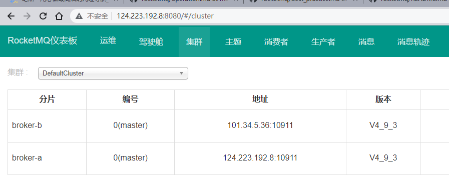
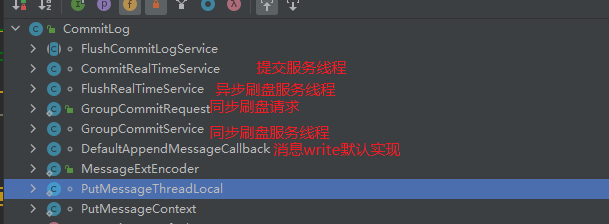

# 资料

书籍《RocketMQ技术内幕》第2版

官方中文文档：https://github.com/apache/rocketmq/tree/master/docs/cn

# RocketMQ运维

## 单机版安装

首先，Linux系统要安装有Java8以上，最好是压缩包安装，不要用yum安装。

官网快速开始：https://rocketmq.apache.org/docs/quick-start/

1、下载安装包

```shell
wget https://dlcdn.apache.org/rocketmq/4.9.3/rocketmq-all-4.9.3-bin-release.zip
```

2、解压并**修改初始内存**

```shell
unzip rocketmq-all-4.9.3-bin-release.zip

# 必须修改配置内存大小，因为它默认设置的是固定4g，哪那么多内存给你用啊，会启动失败的
cd rocketmq-4.9.3/
# 先修改NameServer启动文件
vim bin/runserver.sh 
# 再修改broker启动文件
vim bin/runbroker.sh

# 分别修改的是这个设置内存的地方
JAVA_OPT="${JAVA_OPT} -server -Xms512m -Xmx512m -Xmn256m ....."
JAVA_OPT="${JAVA_OPT} -server -Xms512m -Xmx512m"
```

3、NameServer启动

```shell
# 后台启动NameServer
nohup sh bin/mqnamesrv &
# 查看启动日志，如果成功的话，会有成功信息提示
tail -f ~/logs/rocketmqlogs/namesrv.log
```

4、broker启动

```shell
# 后台启动broker；这个也可以前台启动
nohup sh bin/mqbroker -n localhost:9876 &
# 查看启动日志
tail -f ~/logs/rocketmqlogs/broker.log 
```

5、发消息测试

```shell
# 先暂时设个环境变量
export NAMESRV_ADDR=localhost:9876
# 这个吧，和kafka那个工具不一样，这个是一次性向某个topic发送1000条消息，然后结束
sh bin/tools.sh org.apache.rocketmq.example.quickstart.Producer
```

6、消费消息测试

```shell
# 这个消费者工具倒是会一直阻塞等新消息
sh bin/tools.sh org.apache.rocketmq.example.quickstart.Consumer
```

从这里可以看出，这个命令行工具不太好用啊？是不是有其它工具啊？

7、关闭服务

```shell
# 先关闭broker
sh bin/mqshutdown broker
# 再关闭NameServer
sh bin/mqshutdown namesrv
```

## 运维管理

地址：https://github.com/apache/rocketmq/blob/master/docs/cn/operation.md

### 集群理论

#### 复制策略

复制策略是Broker的Master与Slave间的数据同步方式。分为同步复制与异步复制：

- 同步复制：消息写入master后，master会等待slave同步数据成功后才向producer返回成功ACK

- 异步复制：消息写入master后，master立即向producer返回成功ACK，无需等待slave同步数据成功

异步复制策略会降低系统的写入延迟，*RT*变小，提高了系统的吞吐量，但是如果发送者发送的消息到master后，master返回ACK后就挂掉了，则此条消息就丢失了。

#### 刷盘策略

刷盘策略指的是broker中消息的落盘方式，即消息发送到broker内存后消息持久化到磁盘的方式。分为同步刷盘与异步刷盘：

- 同步刷盘：当消息持久化到broker的磁盘后才算是消息写入成功。

- 异步刷盘：当消息写入到broker的内存后即表示消息写入成功，无需等待消息持久化到磁盘。

*1*）异步刷盘策略会降低系统的写入延迟，*RT*变小，提高了系统的吞吐量 

*2*）消息写入到*Broker*的内存，一般是写入到了*PageCache* 

*3*）对于异步 刷盘策略，消息会写入到*PageCache*后立即返回成功*ACK*。但并不会立即做落盘操作，而是当*PageCache*到达一定量时会自动进行落盘

#### 集群模式

##### 1.单master

这种方式风险较大，一旦Broker重启或者宕机时，会导致整个服务不可用。不建议线上环境使用,可以用于本地测试。

单master的安装方式就很简单。

##### 2.多master

一个集群无Slave，全是Master，例如2个Master或者3个Master，这种模式的优缺点如下：

- 优点：配置简单，单个Master宕机或重启维护对应用无影响，在磁盘配置为RAID10时，即使机器宕机不可恢复情况下，由于RAID10磁盘非常可靠，消息也不会丢（异步刷盘丢失少量消息，同步刷盘一条不丢），性能最高；
- 缺点：单台机器宕机期间，这台机器上未被消费的消息在机器恢复之前不可订阅，消息实时性会受到影响。

##### 3.多master多slave-异步复制

每个Master配置一个Slave，有多对Master-Slave，HA采用异步复制方式，即消息写入master成功后，master立即向producer返回成功ACK，无需等待slave同步数据成功。主备有短暂消息延迟（毫秒级），这种模式的优缺点如下：

- 优点：即使磁盘损坏，消息丢失的非常少，且消息实时性不会受影响，同时Master宕机后，消费者仍然可以从Slave消费，而且此过程对应用透明，不需要人工干预，性能同多Master模式几乎一样；
- 缺点：Master宕机，磁盘损坏情况下会丢失少量消息。

##### 4.多master多slave-同步双写

每个Master配置一个Slave，有多对Master-Slave，HA采用同步双写方式，指的是消息写入master成功后，master会等待slave同步数据成功后才向producer返回成功ACK，即master与slave都要写入成功后才会返回成功ACK，也即双写。这种模式的优缺点如下：

- 优点：数据与服务都无单点故障，Master宕机情况下，消息无延迟，服务可用性与数据可用性都非常高；
- 缺点：性能比异步复制模式略低（大约低10%左右），发送单个消息的RT会略高，**且目前版本在主节点宕机后，备机不能自动切换为主机**

### 多master集群安装

官方中文运维教程：https://github.com/apache/rocketmq/blob/master/docs/cn/operation.md

这里用两台轻量云服务器124.233.192.8和101.34.5.36以多master集群为例子进行记录。(多master多slave-异步复制集群安装可以看PDF文档)。

首先可以看下rocketmq的conf目录下有哪些配置文件：其中2m-2s-async需要关注，这个目录中放着多master多slave-异步复制集群模式的配置文件。

```shell
[root@k8s-master conf]# ls
2m-2s-async  2m-2s-sync  2m-noslave  acl  broker.conf  dledger  logback_broker.xml  logback_namesrv.xml  logback_tools.xml  tools.yml
[root@k8s-master conf]# cd 2m-2s-async/
[root@k8s-master 2m-2s-async]# ls
broker-a.properties  broker-a-s.properties  broker-b.properties  broker-b-s.properties
```

再看一下此时需要的多master目录：

```shell
[root@k8s-master ~]# cd /opt/rocketmqDemo/rocketmq-4.9.3/
[root@k8s-master rocketmq-4.9.3]# cd conf/2m-noslave/
[root@k8s-master 2m-noslave]# ls
broker-a.properties  broker-b.properties  broker-trace.properties
```

0、两台服务器都需要修改启动文件，详细参看单机版安装步骤。

1、首先是一个基本的详细配置如下：待会所有的配置文件修改都基于此，所以就得确保两台服务器的rocketMQ是安装在同样的文件目录`/opt/rocketmqDemo/rocketmq-4.9.3`中的。

```properties
listenPort=10911 # 接受客户端连接的监听端口
# nameServer 地址，分号分隔
namesrvAddr=124.223.192.8:9876;101.34.5.36:9876
# 强制指定本机IP，需要根据每台机器进行修改。官方介绍可为空，系统默认自动识别，但多网卡时IP地址可能读取错误
brokerIP1=124.223.192.8
# 指定master-slave集群的名称。一个RocketMQ集群可以包含多个master-slave集群。
# master和slave的名字要求一样，毕竟slave是根据brokerName找到它的master的
brokerName=broker-a
# 指定整个broker集群的名称，或者说是RocketMQ集群的名称
brokerClusterName=DefaultCluster
brokerId=0 # broker id, 0 表示 master, 其他的正整数表示 slave
# 主从复制策略：指定当前broker为异步复制master
brokerRole=ASYNC_MASTER
# 落盘策略：异步刷盘
flushDiskType=ASYNC_FLUSH

# 指定消息存储相关的路径。默认路径为$HOME/store目录
# 存储根路径
storePathRootDir=/opt/rocketmqDemo/rocketmq-4.9.3/store/
storePathCommitLog=/opt/rocketmqDemo/rocketmq-4.9.3/store/commitlog/
storePathConsumeQueue=/opt/rocketmqDemo/rocketmq-4.9.3/store/consumequeue
storePathIndex=/opt/rocketmqDemo/rocketmq-4.9.3/store/index
storeCheckpoint=/opt/rocketmqDemo/rocketmq-4.9.3/store/checkpoint
abortFile=/opt/rocketmqDemo/rocketmq-4.9.3/store/abort

# mappedFileSizeCommitLog=1024*1024*1024 # (1G)	commit log 的映射文件大小
deleteWhen=04 # 在每天的凌晨4点删除已经超过文件保留时间的 commit log
fileReservedTime=72 # 指定未发生更新的消息存储文件的保留时长
```

2、服务器1修改broker-a.properties，在上面的基础修改如下几条：

```properties
namesrvAddr=124.223.192.8:9876;101.34.5.36:9876
brokerIP1=124.223.192.8
brokerName=broker-a
brokerId=0 # broker id, 0 表示 master, 其他的正整数表示 slave
```

> 注意：这个NameServer的地址是分号`;`作为分隔！不是传统的逗号`,`

3、服务器2修改broker-b.properties

```properties
namesrvAddr=124.223.192.8:9876;101.34.5.36:9876
brokerIP1=101.34.5.36
brokerName=broker-b
brokerId=0 # broker id, 0 表示 master, 其他的正整数表示 slave
```

4、两台服务器都先启动NameServer

上面只修改了broker的数据存储地址，namesrv的日志地址没有修改，还在默认位置。

```shell
# 后台启动NameServer
nohup sh bin/mqnamesrv &
# 查看启动日志，如果成功的话，会有成功信息提示
tail -f ~/logs/rocketmqlogs/namesrv.log
```

5、服务器1启动broker-a集群的master

> 注意：启动集群前先删除原有的测试单节点是mq所创建的存储，默认是~/store，否则集群会启动失败。

```shell
nohup sh bin/mqbroker -c conf/2m-noslave/broker-a.properties & 

tail -f ~/logs/rocketmqlogs/broker.log
```

6、服务器2启动broker-b集群的master

```shell
nohup sh bin/mqbroker -c conf/2m-noslave/broker-b.properties & 

tail -f ~/logs/rocketmqlogs/broker.log
```

> 注意：这两台服务器启动指定的配置文件是不同的噶，分别代表了两个集群的master节点配置。

如果启动失败，则改为前台启动`sh bin/mqbroker -c conf/2m-noslave/broker-b.properties`查看错误原因，如果是下面的样子：

```shell
[root@k8s-node1 rocketmq-4.9.3]# sh bin/mqbroker -c conf/2m-noslave/broker-b.properties
Java HotSpot(TM) 64-Bit Server VM warning: Option UseBiasedLocking was deprecated in version 15.0 and will likely be removed in a future release.
The Name Server Address[124.223.192.8:9876;101.34.5.36:9876 # nameServer å°åï¼éå·åé] illegal, please set it as follows, "127.0.0.1:9876;192.168.0.1:9876"
```

经过自己多次尝试，应该是程序读配置namesrvAddr时的一些读取方式有问题，导致了其它配置这么写都没问题，就这一行有问题。

避免措施：用vim命令行手动输入`namesrvAddr=xxx`，并且后面不能跟注释，不能出现中文，**末尾不能有任何空格**！

7、顺利的话，可以在dashboard监控界面中看到如下结果：



然后再去看一下配置的store目录是否创建成功：

下面这种就是成功了的，如果这里目录乱码了，说明配置文件那里又有空格或中文，vim操作，删掉所有空格和中文注释！

```shell
[root@k8s-master store]# cd /opt/rocketmqDemo/rocketmq-4.9.3/store/
[root@k8s-master store]# ls
abort  checkpoint  commitlog  config  consumequeue  lock
```

8、集群关闭

```shell
# 先关闭broker
sh bin/mqshutdown broker
# 再关闭NameServer
sh bin/mqshutdown namesrv
```

### mqadmin管理工具

在mq解压目录的bin目录下有一个mqadmin命令，该命令是一个运维指令，用于对mq的主题，集群，broker 等信息进行管理。

官方手册：https://github.com/apache/rocketmq/blob/master/docs/cn/operation.md#2-mqadmin%E7%AE%A1%E7%90%86%E5%B7%A5%E5%85%B7

```shell
./bin/mqadmin # 可以查看能执行的全部命令参数

[root@k8s-master rocketmq-4.9.3]# ./bin/mqadmin topicList
RocketMQLog:WARN No appenders could be found for logger (io.netty.util.internal.InternalThreadLocalMap).
RocketMQLog:WARN Please initialize the logger system properly.
org.apache.rocketmq.tools.command.SubCommandException: TopicListSubCommand command faile
......
```

如果出现了上面这个错误，那没法了，PDF中的解决措施是修改tool.sh指定jre下的ext目录，可是Java17早已经没了jre目录了。

> 虽然这个mqadmin管理工具用不了，但是dashboard可以用啊。

### dashboard管理

上面已经知道mqadmin工具好像用不了，但是dashboard更好用！

用dashboard直接创建topic：非常方便！


## Broker配置

broker所有配置如下：

| 参数名                  | 默认值                 | 说明                                                         |
| ----------------------- | ---------------------- | ------------------------------------------------------------ |
| listenPort              | 10911                  | 接受客户端连接的监听端口                                     |
| namesrvAddr             | null                   | nameServer 地址                                              |
| brokerIP1               | 网卡的 InetAddress     | 当前 broker 监听的 IP                                        |
| brokerIP2               | 跟 brokerIP1 一样      | 存在主从 broker 时，如果在 broker 主节点上配置了 brokerIP2 属性，broker 从节点会连接主节点配置的 brokerIP2 进行同步 |
| brokerName              | null                   | broker 的名称                                                |
| brokerClusterName       | DefaultCluster         | 本 broker 所属的 Cluster 名称                                |
| brokerId                | 0                      | broker id, 0 表示 master, 其他的正整数表示 slave             |
| storePathRootDir        | $HOME/store/           | 存储根路径                                                   |
| storePathCommitLog      | $HOME/store/commitlog/ | 存储 commit log 的路径                                       |
| mappedFileSizeCommitLog | 1024 * 1024 * 1024(1G) | commit log 的映射文件大小                                    |
| deleteWhen              | 04                     | 在每天的什么时间删除已经超过文件保留时间的 commit log        |
| fileReservedTime        | 72                     | 以小时计算的文件保留时间                                     |
| brokerRole              | ASYNC_MASTER           | SYNC_MASTER/ASYNC_MASTER/SLAVE                               |
| flushDiskType           | ASYNC_FLUSH            | SYNC_FLUSH/ASYNC_FLUSH SYNC_FLUSH 模式下的 broker 保证在收到确认生产者之前将消息刷盘。ASYNC_FLUSH 模式下的 broker 则利用刷盘一组消息的模式，可以取得更好的性能。 |

- Broker 角色：分为 ASYNC_MASTER（异步主机）、SYNC_MASTER（同步主机）以及SLAVE（从机）。如果对消息的可靠性要求比较严格，可以采用 SYNC_MASTER加SLAVE的部署方式。如果对消息可靠性要求不高，可以采用ASYNC_MASTER加SLAVE的部署方式。如果只是测试方便，则可以选择仅ASYNC_MASTER或仅SYNC_MASTER的部署方式。

- 落盘策略：SYNC_FLUSH（同步刷新）相比于ASYNC_FLUSH（异步处理）会损失很多性能，但是也更可靠，所以需要根据实际的业务场景做好权衡。

## 最佳实践

官方文档最佳实践(中文)：https://github.com/apache/rocketmq/blob/master/docs/cn/best_practice.md

一定要看！！！非常重要！！！

### 生产者

看官方文档：https://github.com/apache/rocketmq/blob/master/docs/cn/best_practice.md

### 消费者

看官方文档：https://github.com/apache/rocketmq/blob/master/docs/cn/best_practice.md

### broker

看官方文档：https://github.com/apache/rocketmq/blob/master/docs/cn/best_practice.md

## RocketMQ Dashboard

地址：https://github.com/apache/rocketmq-dashboard

可以直接用docker部署，非常简单，缺点是要用8080端口！

```shell
docker pull apacherocketmq/rocketmq-dashboard:latest

docker run -d --name rocketmq-dashboard -e "JAVA_OPTS=-Drocketmq.namesrv.addr=你的RocketMQ地址:9876" -p 8080:8080 -t apacherocketmq/rocketmq-dashboard:latest
```

要想改端口的话，只能按照文档教程，从源码下载然后改`application.properties`，并用maven构建jar包部署，也不是很麻烦。

颜值还可以：


# Java操作rocketmq

使用的库是rocketmq-client

在官方文档中，还有一个库值得关注rocketmq-spring。

引入依赖

```xml
<!--rocketmq 依赖-->
<dependency>
    <groupId>org.apache.rocketmq</groupId>
    <artifactId>rocketmq-client</artifactId>
    <version>4.9.3</version>
</dependency>
```

## 生产者

### 3种发送方式

RocketMQ发送消息有3中方式，分别为：

- 同步发送，即Producer发送消息后会阻塞等待broker返回ACK，消息可靠性最高，效率低
- 异步发送，Producer发送消息不等待ACK，而是注册一个回调方法处理ACK，有一定可靠性，发送效率高
- 单向发送，Producer只负责发消息，不等待、不处理MQ的ACK，且此方式broker不会返回ACK，效率最高，可靠性最差

```java
/**
 * @author fzk
 * @date 2022-05-30 15:02
 */
public class MyProducer {
    private static final String TestTopic = "test_topic";
    private static final String TestTag = "test_tag";
    private static final String TestKey = "test_key";
    // 需要注意的是NameServer集群需要以分好;分隔
    private static final String NameServer = "124.223.192.8:9876;101.34.5.36:9876";
    private static final String ProducerGroupName = "producerGroup1";
    private static DefaultMQProducer producerGroup = null;

    public static void main(String[] args) throws MQClientException, MQBrokerException, RemotingException, UnsupportedEncodingException, InterruptedException {
        try {
            // 1.初始化生产者并构造消息
            initProducer();
            Message msg = new Message(TestTopic, TestTag, TestKey, "hello world".getBytes(StandardCharsets.UTF_8));
            // 发送方式1：同步发消息
            syncSendMsg(msg);
            // 发送方式2：异步发消息
            asyncSendMsg(msg);
            /* 发送方式3：单向发消息
            单向发送消息是指，Producer仅负责发送消息，不等待、不处理MQ的ACK；该发送方式时MQ也不返回ACK。
            该方式的消息发送效率最高，但消息可靠性较差*/
            oneWaySendMsg(msg);
            Thread.sleep(1 << 11);// 等待2s等单向发消息执行完成
        } finally {
            // 关闭生产者
            closeProducer();
        }
    }

    static void initProducer() throws MQClientException {
        // 1.初始化生产者组
        producerGroup = new DefaultMQProducer(ProducerGroupName);
        // 2.指定NameServer集群
        producerGroup.setNamesrvAddr(NameServer);
        // 3.启动生产者
        producerGroup.start();
        // 设置异步发送的失败重试次数，默认2次
        producerGroup.setRetryTimesWhenSendAsyncFailed(0);
    }

    static void closeProducer() {
        // 关闭生产者
        producerGroup.shutdown();
    }

    // 同步发送消息
    public static void syncSendMsg(Message msg) throws UnsupportedEncodingException, MQBrokerException, RemotingException, InterruptedException, MQClientException {
        for (int i = 0; i < 3; i++) {
            // 发送消息到某个broker
            SendResult sendResult = producerGroup.send(msg);
            System.out.printf("%s\n", sendResult);
        }
    }

    // 异步发送消息
    public static void asyncSendMsg(Message msg) throws InterruptedException {
        int messageCount = 3;
        final CountDownLatch countDownLatch = new CountDownLatch(messageCount);
        for (int i = 0; i < messageCount; i++) {
            try {
                final int index = i;
                producerGroup.send(msg, new SendCallback() {
                    @Override
                    public void onSuccess(SendResult sendResult) {
                        countDownLatch.countDown();
                        System.out.printf("%-10d OK %s %n", index, sendResult.getMsgId());
                    }

                    @Override
                    public void onException(Throwable e) {
                        countDownLatch.countDown();
                        System.out.printf("%-10d Exception %s %n", index, e);
                        e.printStackTrace();
                    }
                });
            } catch (Exception e) {
                e.printStackTrace();
            }
        }
        countDownLatch.await(5, TimeUnit.SECONDS);
    }

    // 单向发送，即调用此API将直接返回，不等消息结果也不注册回调函数，只管发！
    public static void oneWaySendMsg(Message msg) throws UnsupportedEncodingException, RemotingException, InterruptedException, MQClientException {
        for (int i = 0; i < 3; i++) {
            producerGroup.sendOneway(msg);
        }
    }
}
```

### 发送结果

同步发送会阻塞到broker返回ACK，这个被包装到`SendResult`类中

```java
public class SendResult {
    private SendStatus sendStatus;// 发送状态
    private String msgId;// 由broker端生产的消息id，不能确保唯一性
    private MessageQueue messageQueue;// 这个就包含了3个属性topic、brokerName、queueId
    private long queueOffset;// 此消息的队内偏移量
    private String transactionId;
    private String offsetMsgId;
    private String regionId;
    private boolean traceOn = true;
}

public enum SendStatus {
    SEND_OK, // 发送成功
    FLUSH_DISK_TIMEOUT, // 刷盘超时，只有在broke设置刷盘策略为同步刷盘时才可能出现，默认的异步刷盘不会出现
    FLUSH_SLAVE_TIMEOUT,// slave同步超时，当Broker集群设置的Master-Slave的复制方式为同步复制时才可能出现这种异常状态。异步复制不会出现
    SLAVE_NOT_AVAILABLE, // 没有可用的Slave。当Broker集群设置为Master-Slave的复制方式为同步复制时才可能出现这种异常状态。异步复制不会出现
}
```

## 消费者

```java
/**
 * @author fzk
 * @date 2022-05-15 22:24
 */
public class MyConsumer {
    private static final String TestTopic = "test_topic";
    private static final String TestTag = "test_tag";
    private static final String NameServer = "124.223.192.8:9876;101.34.5.36:9876";
    private static final String ConsumerGroupName = "consumerGroup1";
    private static DefaultMQPushConsumer consumerGroup = null;

    static void initConsumer() throws MQClientException {
        // 1.初始化消费者组
        consumerGroup = new DefaultMQPushConsumer(ConsumerGroupName);
        // 2.指定NameServer集群
        consumerGroup.setNamesrvAddr(NameServer);
        // 设置初始偏移量
        consumerGroup.setConsumeFromWhere(ConsumeFromWhere.CONSUME_FROM_LAST_OFFSET);
        /*
         设置消费模型：
         1.广播消费：消费者组内每个消费者都能消费每条消息，消费偏移offset保存在消费者端
         2.集群消费(默认)：消费者组内每条消息只能被一个消费者消费，消费偏移offset保存在broker端
         */
        consumerGroup.setMessageModel(MessageModel.CLUSTERING);
        // 3.订阅topic的所有tag消息
        // 标签过滤表达式格式："tag1 || tag2 || tag3 || *"
        consumerGroup.subscribe(TestTopic, TestTag);
        // 4.注册消息监听器
        consumerGroup.registerMessageListener(new MessageListenerConcurrently() {
            @Override
            public ConsumeConcurrentlyStatus consumeMessage(List<MessageExt> msgs,
                                                            ConsumeConcurrentlyContext context) {
                System.out.printf("%s Receive New Messages: %s %n", Thread.currentThread().getName(), msgs);
                return ConsumeConcurrentlyStatus.CONSUME_SUCCESS;
            }
        });
        // 5.启动消费者
        consumerGroup.start();
        System.out.printf("Consumer Started.%n");
    }

    public static void main(String[] args) throws InterruptedException, MQClientException {
        try {
            // 1.初始化消费者
            initConsumer();
            Thread.sleep(1000 * 60);// 休眠60s
        } finally {
            consumerGroup.shutdown();
        }
    }
}
```

## 顺序消息

顺序消息是严格按照发送顺序进行消费的消息(FIFO)。

默认情况下生产者会把消息以Round Robin轮询方式发送到不同的Queue队列；而消费消息时会从多个Queue上拉取消息，这种情况下的发送和消费是不能保证顺序的。如果将消息仅发送到同一个 Queue中，消费时也只从这个Queue上拉取消息，就严格保证了消息的顺序性。

要实现消息的业务顺序性，需要自定义消息队列选择器`MessageQueueSelector`。

可以像kafka那样以key的hash进行分区，可以自定义实现，也可以直接用官方提供的消息选择器：`SelectMessageQueueByHash`，可以看到代码非常简单。

```java
public class SelectMessageQueueByHash implements MessageQueueSelector {

    @Override
    public MessageQueue select(List<MessageQueue> mqs, Message msg, Object arg) {
        int value = arg.hashCode() % mqs.size();
        if (value < 0) {
            value = Math.abs(value);
        }
        return mqs.get(value);
    }
}
```

只需要在发送消息时指定消息选择器就可以了：

```java
producer.send(msg,new SelectMessageQueueByHash(),msg.getKeys());
```

这样就实现了以key选择队列，并使得业务消息存在依赖性的消息的key保持一致就好了，如用户id或者订单id。

## 延时消息

延时消息：消息写入broker后，在**等待一定时长后**才能被消费者消费的消息。

RocketMQ的延时消息可以实现一些定时任务功能，而无需使用定时器。典型场景：电商交易超时未支付订单的关闭

> 在电商平台中，订单创建时会发送一条延迟消息，30分钟后投递给后台业务系统(Consumer)。
>
> 后台业务系统收到该消息后会判断对应的订单是否已经支付，如果未完成，则取消订单，将商品放回库存；如果完成支付，则忽略。

像这种场景，实现方案有多种，除了采用MQ，还有定时任务去数据库轮询等。相对于数据库轮询，肯定是MQ相对开销低一点。那么如果放入Redis再进行轮询呢？这个也许得看RocketMQ如何实现的延时消息了。

### 延时等级

延时消息的延迟时长不支持随意时长，是通过特定的延迟等级来指定的。延时等级定义在 RocketMQ服务端的`org.apache.rocketmq.store.config.MessageStoreConfig`类中的如下变量中：

```java
private String messageDelayLevel = "1s 5s 10s 30s 1m 2m 3m 4m 5m 6m 7m 8m 9m 10m 20m 30m 1h 2h";
```

当然如果需要自定义延时等级，肯定是可以在broker的配置文件中进行配置的。

若指定的延时等级为3，则表示延迟时长为10s，即延迟等级是从1开始计数的。

```java
Message message = new Message("TestTopic", ("Hello scheduled message " + i).getBytes());
// 延时级别3，即10s此消息才能被消费
message.setDelayTimeLevel(3);
producer.send(message);
```

## 事务消息


## 批量消息

生产者进行消息发送时可以一次发送多条消息，这可以大大提升Producer的发送效率。不过需要注意以下几点： 

- 批量发送的消息必须具有**相同的Topic** 
- 批量发送的消息必须具有**相同的刷盘策略**
- 批量发送的消息**不能是延时消息与事务消息**

默认情况下，批量消息大小不能超过4MB。

Producer发送的消息结构如下：


其中properties是一堆属性，包括生产者地址、生产时间、queueId、是否为延迟消息等。


# 消息发送分析

## 发送流程

发送流程如下图：由于图片较大，建议看[processon原图](https://www.processon.com/view/link/6294c102e401fd2eed167ac6)


# 消息存储分析

从存储方式和效率来看，`文件系统>KV存储>关系型数据库`，直接操作文件系统是最快的，但是可靠性是最低的。

- CommitLog

RocketMQ将所有主题topic的消息都存在同一个CommitLog文件中，确保顺序写消息，尽最大化保证消息发送的高性能和高吞吐量，但是消费消息时的拉取性能相对kafka较弱。

- ConsumeQueue

每个消息topic包含多个消息队列，每个消息队列有一个ConsumeQueue文件。queue上每个消息记录的是在CommitLog的物理偏移量。可以看作是基于topic的CommitLog索引文件

ConsumeQueue文件能提供消费者消费消息。该文件**给消费端提供了消息按topic分类的假象**，但**也实现了消息按Queue分区负载均衡**。

- Index

Index索引文件加速消息按key检索的性能，便于消息查询。存储key和消息在CommitLog的物理偏移量phyoffset对应关系。

存储store目录如下：

```shell
[root@k8s-master store]# ll
total 24
-rw-r--r-- 1 root root    0 May 15 21:34 abort
-rw-r--r-- 1 root root 4096 May 30 22:46 checkpoint
drwxr-xr-x 2 root root 4096 May 15 22:32 commitlog
drwxr-xr-x 2 root root 4096 May 30 22:46 config
drwxr-xr-x 3 root root 4096 May 15 22:32 consumequeue
drwxr-xr-x 2 root root 4096 May 15 22:32 index
-rw-r--r-- 1 root root    4 May 15 21:34 lock
```

> abort：该文件在Broker启动后会自动创建，正常关闭Broker，该文件会自动消失。若在没有启动Broker的情况下，发现这个文件是存在的，则说明之前Broker的关闭是非正常关闭。
>
> checkpoint：其中存储着commitlog、consumequeue、index文件的最后刷盘时间戳。
>
> commitlog：其中存放着commitlog文件，而消息是写在commitlog文件中的。
>
> config：存放着Broker运行期间的一些配置数据。
>
> consumequeue：其中存放着consumequeue文件，队列就存放在这个目录中。
>
> index：其中存放着消息索引文件indexFile。
>
> lock：运行期间使用到的全局资源锁，文件锁

## DefaultMessageStore

消息存储服务是`DefaultMessageStore`这个类提供的，其中`CommitLog`的落盘实现在CommitLog类中，`ConsumeQueue`和`Index`文件同理。

此类提供对`Message`消息的接受、写入CommitLog并转发到ConsumeQueue和Index中的功能。当然了这些的具体实现肯定都是在各自的实现类里。

### 启动流程

首先先看`DefaultMessageStore`这个类，下面只给出一些重要的属性：

```java
/**
 * 默认消息存储实现类
 *
 * @see DefaultMessageStore#start() 启动方法
 * @see DefaultMessageStore#addScheduleTask() 添加定时任务方法，如定时清理过期文件
 */
public class DefaultMessageStore implements MessageStore {
    private final MessageStoreConfig messageStoreConfig;// 消息存储配置
    private final BrokerConfig brokerConfig;// broker配置
   
    private final CommitLog commitLog; // CommitLog服务
    // Topic的ConsumeQueue队列
    private final ConcurrentMap<String/* topic */, ConcurrentMap<Integer/* queueId */, ConsumeQueue>> consumeQueueTable;
    
    // ------------------------文件服务-------------------------------------
    // ConsumeQueue文件的刷盘服务线程
    private final FlushConsumeQueueService flushConsumeQueueService;
    // CommitLog文件过期清理服务--以定时任务形式
    private final CleanCommitLogService cleanCommitLogService;
    // ConsumeQueue文件过期清理服务--以定时任务形式
    private final CleanConsumeQueueService cleanConsumeQueueService;
    // 提供索引服务
    private final IndexService indexService;
    // MappedFile分配服务线程
    private final AllocateMappedFileService allocateMappedFileService;
    // ------------------------文件服务-------------------------------------
    
    
    // ------------------------消息服务--------------------------------------
    /*
     转发消息服务线程
     作用是转发CommitLog文件的更新事件到ConsumeQueue和Index以使其更新
     */
    private final ReputMessageService reputMessageService;
    // 延迟消息服务
    private final ScheduleMessageService scheduleMessageService;
	// ------------------------消息服务--------------------------------------
    
    // 瞬态内存池，里面有1个ByteBuffer的队列可用于分配使用
    private final TransientStorePool transientStorePool;

    // 定时任务调度器，上面两个清理文件服务线程都是以这个进行的定时调度
    private final ScheduledExecutorService scheduledExecutorService =
            Executors.newSingleThreadScheduledExecutor(new ThreadFactoryImpl("StoreScheduledThread"));
}
```

在这些属性中，需要更加重点关注的是CommitLog服务、刷盘服务线程、转发消息服务线程、瞬态缓冲池。

在上面的属性中，一部分是其内部类：


其它的类大部分在CommitLog中。服务类按功能分散于不同的基类中。

在这个存储类中，重要的方法有它的构造方法`DefaultMessageStore()`和启动方法`start()`

这个建议直接看源码，这里给出我绘制的[DefaultMessageStore启动流程图](https://www.processon.com/view/link/62962c1c5653bb788c85bdaa)

### 发送存储流程

#### putMessage

消息在broker收到后的存储流程入口是`org.apache.rocketmq.store.DefaultMessageStore#putMessage(MessageExtBrokerInner)`。

```java
/**
 * TODO 消息存储入口函数
 */
@Override
public PutMessageResult putMessage(MessageExtBrokerInner msg) {
    return waitForPutResult(asyncPutMessage(msg));
}

@Override
public CompletableFuture<PutMessageResult> asyncPutMessage(MessageExtBrokerInner msg) {
    // 1.存储状态检查，不通过将拒绝写入
    PutMessageStatus checkStoreStatus = this.checkStoreStatus();
    // 省略部分代码
    
    // 1.2 检查消息topic长度和属性长度
    PutMessageStatus msgCheckStatus = this.checkMessage(msg);
	// 省略部分代码
    
    // 2.向CommitLog服务提交消息
    long beginTime = this.getSystemClock().now();
    CompletableFuture<PutMessageResult> putResultFuture = this.commitLog.asyncPutMessage(msg);
    putResultFuture.thenAccept((result) -> {
        // 省略消息写入完成后的一些日志打印和计数
    });

    return putResultFuture;
}
```

#### asyncPutMessage

接下来进入`CommitLog.asyncPutMessage()`

```java
public CompletableFuture<PutMessageResult> asyncPutMessage(final MessageExtBrokerInner msg) {
    // 1.消息前置处理: 保存时间、CRC码、topic等
	// 省略部分代码
    
    // 不是事务消息且为延时消息
    if (tranType == MessageSysFlag.TRANSACTION_NOT_TYPE
        || tranType == MessageSysFlag.TRANSACTION_COMMIT_TYPE) {
        // 1.3 延时消息处理：隐藏真正的topic和queueId到属性中，并设置延时topic和queueId
        if (msg.getDelayTimeLevel() > 0) {
            if (msg.getDelayTimeLevel() > this.defaultMessageStore.getScheduleMessageService().getMaxDelayLevel()) {
                msg.setDelayTimeLevel(this.defaultMessageStore.getScheduleMessageService().getMaxDelayLevel());
            }
            topic = TopicValidator.RMQ_SYS_SCHEDULE_TOPIC;
            int queueId = ScheduleMessageService.delayLevel2QueueId(msg.getDelayTimeLevel());

            /*  将真正的topic和queueId保存到消息属性中，
                    并把延迟消息topic和延迟级别的queueId设置到消息的topic和queueId中
                    从而把消息发到延迟topic的ConsumeQueue里去，进而实现消息的延迟交付*/
            MessageAccessor.putProperty(msg, MessageConst.PROPERTY_REAL_TOPIC, msg.getTopic());
            MessageAccessor.putProperty(msg, MessageConst.PROPERTY_REAL_QUEUE_ID, String.valueOf(msg.getQueueId()));
            msg.setPropertiesString(MessageDecoder.messageProperties2String(msg.getProperties()));
            msg.setTopic(topic);// topic=SCHEDULE_TOPIC_XXXX
            msg.setQueueId(queueId);// queueId=延迟级别-1
        }
    }
	// 省略部分代码
    
    long elapsedTimeInLock = 0;
    MappedFile unlockMappedFile = null;
    // 2.加锁：自旋或可重入锁，默认配置是可重入锁
    putMessageLock.lock();
    try {
        // 3.获取当前最后一个CommitLog文件的内存映射文件MappedFile
        MappedFile mappedFile = this.mappedFileQueue.getLastMappedFile();
        long beginLockTimestamp = this.defaultMessageStore.getSystemClock().now();
        this.beginTimeInLock = beginLockTimestamp;

        // Here settings are stored timestamp, in order to ensure an orderly
        // global
        msg.setStoreTimestamp(beginLockTimestamp);
        // 空或者满，则创建新的CommitLog文件
        if (null == mappedFile || mappedFile.isFull()) {
            mappedFile = this.mappedFileQueue.getLastMappedFile(0); // Mark: NewFile may be cause noise
        }
       	// 省略创建失败的部分代码

        /* 4.将消息追加到MappedFile中
           传入的Callback就是真正的写入缓冲区方法实现
           因为MappedFile是公共服务类，服务CommitLog、ConsumeQueue、index，所以具体写入逻辑由各个实现并作为回调方法传入*/
        result = mappedFile.appendMessage(msg, this.appendMessageCallback, putMessageContext);
        // 5.处理追加结果
        switch (result.getStatus()) {
            case PUT_OK:
                break;
            // 5.2 如果返回结果提示文件已满，则新建CommitLog文件并再次写入消息
            case END_OF_FILE:
                unlockMappedFile = mappedFile;
                 mappedFile = this.mappedFileQueue.getLastMappedFile(0);
                 return CompletableFuture.completedFuture(new PutMessageResult(PutMessageStatus.CREATE_MAPEDFILE_FAILED, result));
                }
                result = mappedFile.appendMessage(msg, this.appendMessageCallback, putMessageContext);
                break;
            // 省略其它结果处理
        }

        elapsedTimeInLock = this.defaultMessageStore.getSystemClock().now() - beginLockTimestamp;
    } finally {
        beginTimeInLock = 0;
        // 6.释放锁
        putMessageLock.unlock();
    }

    if (elapsedTimeInLock > 500) {
        log.warn("[NOTIFYME]putMessage in lock cost time(ms)={}, bodyLength={} AppendMessageResult={}", elapsedTimeInLock, msg.getBody().length, result);
    }

    if (null != unlockMappedFile && this.defaultMessageStore.getMessageStoreConfig().isWarmMapedFileEnable()) {
        this.defaultMessageStore.unlockMappedFile(unlockMappedFile);
    }

    PutMessageResult putMessageResult = new PutMessageResult(PutMessageStatus.PUT_OK, result);

    // Statistics
    storeStatsService.getSinglePutMessageTopicTimesTotal(msg.getTopic()).add(1);
    storeStatsService.getSinglePutMessageTopicSizeTotal(topic).add(result.getWroteBytes());

    // 7.提交刷盘请求
    CompletableFuture<PutMessageStatus> flushResultFuture = submitFlushRequest(result, msg);
    // 8.提交HA主从同步复制请求
    CompletableFuture<PutMessageStatus> replicaResultFuture = submitReplicaRequest(result, msg);
	// 返回刷盘请求集合
    return flushResultFuture.thenCombine(replicaResultFuture, (flushStatus, replicaStatus) -> {
        if (flushStatus != PutMessageStatus.PUT_OK) {
            putMessageResult.setPutMessageStatus(flushStatus);
        }
        if (replicaStatus != PutMessageStatus.PUT_OK) {
            putMessageResult.setPutMessageStatus(replicaStatus);
        }
        return putMessageResult;
    });
}
```

在第2步首先上锁，默认是可重入锁，也可配置为自旋锁，在能确保消息写入不太频繁的时候，可以改为自旋锁从而避免加锁的资源消耗。

第4步调用MappedFile.appenMessage()方法追加消息到内存映射文件中，并传入了追加回调方法，里面有真正的写入逻辑。

第7步和第8步都只是提交了刷盘或复制请求，将返回的Future对象组合在一起就直接返回了，整个消息发送存储流程就基本结束了。

需要注意的是到这里只是将消息写入了内存映射缓冲区，还没有flush刷盘哦。甚至如果开启了瞬态缓冲区的话，这里仅仅是写入了堆外直接内存，还没有commit到内存映射缓冲区。

#### doAppend

在上面的第4步将消息追加到MappedFile。

```java
// TODO 将消息追加到MappedFile
public AppendMessageResult appendMessagesInner(final MessageExt messageExt, final AppendMessageCallback cb,PutMessageContext putMessageContext) {
    // 1.获取写指针writePosition
    int currentPos = this.wrotePosition.get();
	// 2.获取缓冲区切片
    if (currentPos < this.fileSize) {
        // 这里其实相当于判断是否开启瞬态缓冲区：
        // yes-->堆外直接内存缓冲区；no-->CommitLog文件内存映射缓冲区
        ByteBuffer byteBuffer = writeBuffer != null ? writeBuffer.slice() : this.mappedByteBuffer.slice();
        byteBuffer.position(currentPos);
        AppendMessageResult result;
        if (messageExt instanceof MessageExtBrokerInner) {
            // 3.写消息
            result = cb.doAppend(this.getFileFromOffset(), byteBuffer, this.fileSize - currentPos,
                    (MessageExtBrokerInner) messageExt, putMessageContext);
        } else if (messageExt instanceof MessageExtBatch) {
            result = cb.doAppend(this.getFileFromOffset(), byteBuffer, this.fileSize - currentPos,
                    (MessageExtBatch) messageExt, putMessageContext);
        } else {
            return new AppendMessageResult(AppendMessageStatus.UNKNOWN_ERROR);
        }
        // 4.写完消息更新writePosition
        this.wrotePosition.addAndGet(result.getWroteBytes());
        this.storeTimestamp = result.getStoreTimestamp();
        return result;
    }
	// 省略
}
```

MappedFile.appendMessage()方法实际上并没有写入缓冲区的具体实现，因为MappedFile是对文件内存映射缓冲区的包装，具有通用性，同时对CommitLog文件、ConsumeQueue文件、Index文件提供服务，所以只提供了对缓冲区操作的共同方法和属性，如写指针、Commit指针、flush指针等。

它调用的是CommitLog传入的回调方法`CommitLog.DefaultAppendMessageCallback.doAppend()`方法

```java
/**
 * 真正写入CommitLog文件
 */
public AppendMessageResult doAppend(final long fileFromOffset, final ByteBuffer byteBuffer, final int maxBlank, final MessageExtBrokerInner msgInner, PutMessageContext putMessageContext) {
    // STORETIMESTAMP + STOREHOSTADDRESS + OFFSET <br>
    // 1.消息的物理偏移量
    long wroteOffset = fileFromOffset + byteBuffer.position();
    // 2.创建全局唯一消息Id，16B
    // |brokerIP 4B | 端口 4B | 消息偏移量 8B |
    Supplier<String> msgIdSupplier = () -> {
        int sysflag = msgInner.getSysFlag();
        int msgIdLen = (sysflag & MessageSysFlag.STOREHOSTADDRESS_V6_FLAG) == 0 ? 4 + 4 + 8 : 16 + 4 + 8;
        ByteBuffer msgIdBuffer = ByteBuffer.allocate(msgIdLen);
        MessageExt.socketAddress2ByteBuffer(msgInner.getStoreHost(), msgIdBuffer);
        msgIdBuffer.clear();//because socketAddress2ByteBuffer flip the buffer
        msgIdBuffer.putLong(msgIdLen - 8, wroteOffset);
        return UtilAll.bytes2string(msgIdBuffer.array());
    };
	// 省略部分代码
    
    ByteBuffer preEncodeBuffer = msgInner.getEncodedBuff();
    final int msgLen = preEncodeBuffer.getInt(0);

    // 3.判断是否有足够的空间存消息
    // 3.1 消息长度+8>剩余空间，则返回文件已满结果，这最终会再次调用appendMessage()方法
    if ((msgLen + END_FILE_MIN_BLANK_LENGTH) > maxBlank) {
       	// 省略部分代码，并返回END_OF_FILE
    }

    // 3.2 写入缓冲区中，可能在CommitLog的内存映射缓冲区；也可能在堆外内存
    int pos = 4 + 4 + 4 + 4 + 4;
    // 6 QUEUEOFFSET
    preEncodeBuffer.putLong(pos, queueOffset);
    pos += 8;
    // 7 PHYSICALOFFSET
    preEncodeBuffer.putLong(pos, fileFromOffset + byteBuffer.position());
    int ipLen = (msgInner.getSysFlag() & MessageSysFlag.BORNHOST_V6_FLAG) == 0 ? 4 + 4 : 16 + 4;
    // 8 SYSFLAG, 9 BORNTIMESTAMP, 10 BORNHOST, 11 STORETIMESTAMP
    pos += 8 + 4 + 8 + ipLen;
    // refresh store time stamp in lock
    preEncodeBuffer.putLong(pos, msgInner.getStoreTimestamp());


    final long beginTimeMills = CommitLog.this.defaultMessageStore.now();
    // 4.将消息写入缓冲区
    byteBuffer.put(preEncodeBuffer);
    msgInner.setEncodedBuff(null);
    // 返回 PUT_OK
    AppendMessageResult result = new AppendMessageResult(AppendMessageStatus.PUT_OK, wroteOffset, msgLen, msgIdSupplier,
                                                         msgInner.getStoreTimestamp(), queueOffset, CommitLog.this.defaultMessageStore.now() - beginTimeMills);

    // 省略事务处理
    return result;
}
```

第2步构建全局唯一消息Id，长度是16B：

| 4B       | 4b   | 8B        |
| -------- | ---- | --------- |
| brokerIP | port | phyOffset |

第3步，在文件不能写入消息的时候，返回`END_OF_FILE`提示上层方法创建新CommitLog并再次写入消息，然而此文件是没有填充满的哦。默认情况下消息最大4MB，CommitLog文件1GB，利用率并不会因这一点点空间的浪费而降低多少哦。

每个CommitLog文件最少空闲8字节，高4字节存储当前文件剩余空间，低4字节存储魔数`CommitLog.BLANK_MAGIC_CODE`.

`doAppend()`方法是将消息真正写入缓冲区的，写完后将回到`asyncPutMessage()`方法进行刷盘处理。

## MappedFile内存映射文件

在这里开始之前，一定要先看`java.nio`包源码和`零拷贝`知识。

无论是CommitLog、ConsumeQueue还是Index文件，单个文件都设计为固定长度，写满就创建新文件。

RocketMQ用MappedFile来封装存储单个文件的内存映射缓冲区，但单个文件设计为固定大小，所以用MappedFileQueue组织一类相关联的文件。比如所有CommitLog文件对应1个MappedFileQueue，某个Topic下某个队列ConsumeQueue对应1个MappedFileQueue，这些队列可能有1个MappedFile，也可能多个，这取决于文件是否写满。

```java
public class MappedFileQueue {
    private final String storePath;// 存储路径

    protected final int mappedFileSize;// 单个MappedFile的大小限制

    protected final CopyOnWriteArrayList<MappedFile> mappedFiles = new CopyOnWriteArrayList<MappedFile>();// MappedFile队列，指向一批文件缓冲区

    private final AllocateMappedFileService allocateMappedFileService;// 文件分配服务

    protected long flushedWhere = 0;// 刷盘指针
    private long committedWhere = 0;// 提交指针
    
    /**
     * 通过offset定位mappedFile
     */
    public MappedFile findMappedFileByOffset(final long offset, final boolean returnFirstOnNotFound) {
        // 省略外层try/catch
        MappedFile firstMappedFile = this.getFirstMappedFile();
        MappedFile lastMappedFile = this.getLastMappedFile();
        if (firstMappedFile != null && lastMappedFile != null) {
            if (offset < firstMappedFile.getFileFromOffset() || offset >= lastMappedFile.getFileFromOffset() + this.mappedFileSize) {
                // 省略日志打印
            } else {
                // 减去第一个文件的偏移量
                int index = (int) ((offset / this.mappedFileSize) - (firstMappedFile.getFileFromOffset() / this.mappedFileSize));
                MappedFile targetFile = null;
                try {
                    targetFile = this.mappedFiles.get(index);
                } catch (Exception ignored) {
                }
				// 省略部分代码
            }
        }
        return null;
    }
}
```

在上面的根据offset定位文件时为什么要先减去第一个MappedFile的偏移量呢，不能用offset/mappedFileSize吗？

> 因为只要是存储在目录下的文件都要创建内存映射文件，会造成极大内存压力和资源浪费，所以RocketMQ会定时删除文件。即第一个文件起始偏移量可能不是`00000000000000000000`.

MappedFileQueue代表的是一类文件，接下来看看MappedFile，这才是真正操作单个文件的：下面列出重要属性

```java
public class MappedFile extends ReferenceResource {
    public static final int OS_PAGE_SIZE = 1024 * 4;// 页大小，4KB
    private static final AtomicLong TOTAL_MAPPED_VIRTUAL_MEMORY = new AtomicLong(0);// 总的映射的虚拟内存大小
    private static final AtomicInteger TOTAL_MAPPED_FILES = new AtomicInteger(0);// 总的映射文件数
    protected final AtomicInteger wrotePosition = new AtomicInteger(0);// 当前缓冲区写指针
    protected final AtomicInteger committedPosition = new AtomicInteger(0);// 当前缓冲区提交指针(只有开启瞬态缓冲区才有效)
    private final AtomicInteger flushedPosition = new AtomicInteger(0);// 当前缓冲区刷盘指针
    
    protected FileChannel fileChannel;// 文件通道，指向文件
    
    /**
     * 如果开启了transientStorePool，则消息会先存储在这个堆外内存缓冲区DirectByteBuffer，再定时commit到fileChannel，再定时落盘
     * 目的：内存级别的读写分离，写入堆外缓冲区，但消费者从fileChannel中即页缓存中读
     */
    protected ByteBuffer writeBuffer = null;// 堆外直接内存缓冲区
    protected TransientStorePool transientStorePool = null;// 瞬态缓冲池
    private long fileFromOffset;// 文件开始的偏移量，不一定是0
    private MappedByteBuffer mappedByteBuffer;// 内存映射缓冲区(写入这里的消息即可读)
}
```

这其实就是对`java.nio`下的缓冲区、文件通道的一个简单封装嘛。

注意这个`fileFromOffset`文件开始偏移量，它一般是0或者`fileSize*n`，消息的物理偏移量`phyOffset=fileFromOffset + 文件内offset`

注意内存映射缓冲区和堆外直接内存区域，后者只有在开启瞬态缓冲区后才会使用并且多了一个commit操作。

### 初始化

MappedFile有两个初始化方法：

```java
// 开启了瞬态缓冲区则走这个
public void init(final String fileName, final int fileSize,
                 final TransientStorePool transientStorePool) throws IOException {
    init(fileName, fileSize);
    // 向缓冲池申请堆外直接缓冲区
    this.writeBuffer = transientStorePool.borrowBuffer();
    this.transientStorePool = transientStorePool;
}
// 默认走这个
private void init(final String fileName, final int fileSize) throws IOException {
    this.fileName = fileName;
    this.fileSize = fileSize;
    this.file = new File(fileName);
    // 文件名就是文件其实偏移量！
    this.fileFromOffset = Long.parseLong(this.file.getName());
    boolean ok = false;

    ensureDirOK(this.file.getParent());

    // 省略try/catch
    // 打开文件通道
    this.fileChannel = new RandomAccessFile(this.file, "rw").getChannel();
    // 将整个文件都映射到虚拟内存中!(CommitLog文件足足有1GB)
    this.mappedByteBuffer = this.fileChannel.map(MapMode.READ_WRITE, 0, fileSize);
    TOTAL_MAPPED_VIRTUAL_MEMORY.addAndGet(fileSize);
    TOTAL_MAPPED_FILES.incrementAndGet();
    ok = true;
    // 省略try/catch
}
```

可以看到在初始化的时候会将整个文件都映射到虚拟内存中，这对于ConsumeQueue和Index文件还好，对于足足1GB的CommitLog文件是一个很大的开销。

### 提交

Commit操作仅仅在开启瞬态缓冲区后会被调用，因为瞬态缓冲开启后，消息存储流程为：`write到堆外直接内存-->commit到文件通道-->flush落盘`

```java
/**
 * 从堆外内存提交到内存映射缓冲区，只有开启瞬态缓冲区有效
 * @param commitLeastPages 最少commit脏页数
 */
public int commit(final int commitLeastPages) {
	// 省略部分代码
    if (this.isAbleToCommit(commitLeastPages)) {
        if (this.hold()) {// 同步方法，互斥
            commit0();// 将脏页写入文件通道
            this.release();
        } else {
            log.warn("in commit, hold failed, commit offset = " + this.committedPosition.get());
        }
    }

    // 如果该文件所有脏页都写入文件通道，则返还堆外缓冲区
    if (writeBuffer != null && this.transientStorePool != null && this.fileSize == this.committedPosition.get()) {
        this.transientStorePool.returnBuffer(writeBuffer);
        this.writeBuffer = null;
    }
	// 返回commit指针
    return this.committedPosition.get();
}
// 此方法将堆外直接内存writeBuffer中从上次提交指针-->写指针之间的数据都提交到文件通道中
protected void commit0() {
    int writePos = this.wrotePosition.get();
    int lastCommittedPosition = this.committedPosition.get();

    if (writePos - lastCommittedPosition > 0) {
        try {
            ByteBuffer byteBuffer = writeBuffer.slice();
            byteBuffer.position(lastCommittedPosition);
            byteBuffer.limit(writePos);
            this.fileChannel.position(lastCommittedPosition);
            this.fileChannel.write(byteBuffer);
            this.committedPosition.set(writePos);
        } catch (Throwable e) {
            log.error("Error occurred when commit data to FileChannel.", e);
        }
    }
}
```

### 刷盘

刷盘即将内存中的数据写入磁盘，永久存储。

```java
/**
 * @return 返回当前刷盘指针
 */
public int flush(final int flushLeastPages) {
    // 1.先判断是否满足最少要刷的脏页数
    if (this.isAbleToFlush(flushLeastPages)) {
        if (this.hold()) {// 同步方法，互斥
            int value = getReadPosition();// 如果开启了瞬态缓冲区则commit指针，否则write指针
            try {
                //We only append data to fileChannel or mappedByteBuffer, never both.
                if (writeBuffer != null || this.fileChannel.position() != 0) {
                    this.fileChannel.force(false);// 开启了瞬态缓冲区，则从文件通道刷
                } else {
                    this.mappedByteBuffer.force();// 默认从内存映射缓冲区刷
                }
            } catch (Throwable e) {
                log.error("Error occurred when force data to disk.", e);
            }
            // 将读指针(提交指针)设置为刷盘指针
            this.flushedPosition.set(value);
            this.release();
        } else {
            log.warn("in flush, hold failed, flush offset = " + this.flushedPosition.get());
            this.flushedPosition.set(getReadPosition());
        }
    }
    return this.getFlushedPosition();
}
```

这里需要注意的是读指针的获取，只有提交了的数据(直接写入MappedByteBuffer或提交到FileChannel的数据)才是可读的，才能被消费者看见，因为此时这些数据即使RocketMQ崩了它也是安全的，除非系统崩了。

## TransientStorePool

TransientStorePool从名字看是短暂的存储池。RocketMQ在开启了瞬态缓冲池后，会默认维护5个1GB的DirectByteBuffer内存作为缓冲池，临时存储数据。

开启这个后，消息存储流程为：`write到堆外直接内存-->commit到文件通道-->flush落盘`。

```java
/**
 * 瞬态缓冲池
 */
public class TransientStorePool {
    private final int poolSize;// 默认5个
    private final int fileSize;// 默认1GB
    private final Deque<ByteBuffer> availableBuffers;// 堆外内存队列

    /**
     * It's a heavy init method.
     */
    public void init() {
        // 默认申请5个1GB堆外直接内存区域
        for (int i = 0; i < poolSize; i++) {
            ByteBuffer byteBuffer = ByteBuffer.allocateDirect(fileSize);

            final long address = ((DirectBuffer) byteBuffer).address();
            Pointer pointer = new Pointer(address);
            LibC.INSTANCE.mlock(pointer, new NativeLong(fileSize));

            availableBuffers.offer(byteBuffer);
        }
    }

    public void destroy() {
        for (ByteBuffer byteBuffer : availableBuffers) {
            final long address = ((DirectBuffer) byteBuffer).address();
            Pointer pointer = new Pointer(address);
            LibC.INSTANCE.munlock(pointer, new NativeLong(fileSize));
        }
    }

    // 将内存还给缓冲池
    public void returnBuffer(ByteBuffer byteBuffer) {
        byteBuffer.position(0);
        byteBuffer.limit(fileSize);
        this.availableBuffers.offerFirst(byteBuffer);
    }
    // 向缓冲池申请内存
    public ByteBuffer borrowBuffer() {
        ByteBuffer buffer = availableBuffers.pollFirst();
        if (availableBuffers.size() < poolSize * 0.4) {
            log.warn("TransientStorePool only remain {} sheets.", availableBuffers.size());
        }
        return buffer;
    }
}
```

这个初始化方法会申请5个1GB堆外直接内存区放入队列中，销毁方法看不懂。

它会利用com.sun.jna.Library库锁定该批内存，避免被换到交换区，以此提高性能。

## CommitLog

 消息主题及元数据的存储主题，消息内容不定长。

存储目录为`$ROCKET_HOME/store/commitlog`，文件默认大小1GB，文件名长度20位，即起始偏移量，左边补0。第一个文件名为00000000000000000000，第二个为00000000001073741824。

CommitLog文件中，消息大概这么存的，由于每条条目不像ConsumeQueue或者Index文件那样是定长的，所以不能直接根据第几条消息直接定位，因此ConsumeQueue和Index文件中都保存了消息的物理偏移量而不是逻辑偏移量。


CommitLog类中有很多重要的内部类：



CommitLog类中还有很多重要的方法：如写消息、commit消息、刷盘方法等，还有查询消息方法。这些方法会在各个功能点原理中介绍，这里不赘述。 

## ConsumeQueue

消息消费队列的引入目的是提高消息消费性能，并对消息进行topic模拟分类，消费者通过订阅消息队列来消费消息。ConsumeQueue可以看作是基于topic的CommitLog索引文件。

具体存储路劲为`$ROCKET_HOME/store/consumequeue/{topic}/{queueId}/{fileName}`。

消息采用定长20字节设计，30万条目组成，可以像数组一样随机访问，**每个文件大约5.72MB**。

| 8B                      | 4B       | 8B        |
| ----------------------- | -------- | --------- |
| 消息物理偏移量phyOffset | 文件大小 | tag哈希码 |
| phyOffset               | 文件大小 | tag哈希码 |

ConsumeQueue文件是提供给消费者根据topic消费消息的，那么重要的方法就是查询消息：

```java
/**
 * 根据此消息队列起始消息索引查询之后所有条目
 * @param startIndex 起始索引
 */
public SelectMappedBufferResult getIndexBuffer(final long startIndex) {
    int mappedFileSize = this.mappedFileSize;
    long offset = startIndex * CQ_STORE_UNIT_SIZE;
    if (offset >= this.getMinLogicOffset()) {
        MappedFile mappedFile = this.mappedFileQueue.findMappedFileByOffset(offset);
        if (mappedFile != null) {
            // 这里会返回从给定位置到readPosition指针之间的缓冲区切片
            return mappedFile.selectMappedBuffer((int) (offset % mappedFileSize));
        }
        
    }
    return null;
}
```

此方法可实现顺序读消息，根据返回的所有消息索引条目，遍历并取出物理偏移量再去CommitLog文件查询消息内容。

ConsumeQueue也提供根据时间戳查消息在此消息队列中的偏移量，从上面的存储条目来看，并没有保存时间戳，那这个是如何实现的呢？

大致步骤就是：

1、先根据时间搓定位到ConsumeQueue的MappedFileQueue队列中的哪个MappedFile

2、在这个队列中进行二分查找，将mid索引的条目指向的物理消息的存储时间戳从CommitLog文件中查出来，进行比较，进行下一循环判断。

ConsumeQueue可以看做是索引文件，而CommitLog则是物理文件，每次去CommitLog中查就类似于MySQL回表查询。

具体方法实现可以看方法`ConsumeQueue.getOffsetInQueueByTime(final long timestamp) `

## Index

Index文件是以消息的key为索引，消息物理偏移量为value的索引文件。这一个Index文件能存储消息索引条目为2000万。

index文件大小=`40B+500万*4B+2000万*20B`

index文件布局，[原图](https://www.processon.com/view/link/629a14cde0b34d0728fdf19b)


```java
/**
 * 索引文件
 */
public class IndexFile {
    private static final InternalLogger log = InternalLoggerFactory.getLogger(LoggerName.STORE_LOGGER_NAME);
    private static int hashSlotSize = 4;// 哈希槽大小
    private static int indexSize = 20;// index条目大小
    private static int invalidIndex = 0;// 非法index，必须将0设为非法index，因为哈希槽数组默认初始值都是0
    private final int hashSlotNum;// 默认500w
    private final int indexNum;// 默认2000w
    private final MappedFile mappedFile;// 代表index文件
    private final MappedByteBuffer mappedByteBuffer;// index文件的内存映射缓冲区
    private final IndexHeader indexHeader;// 文件头
}
```

这些属性还是比较常规的，接下来分析index文件如果存入key索引并查询的。

### putKey

```java
/**
 * 存入key到index文件缓冲区
 * @param key 消息key
 * @param phyOffset 消息物理偏移量
 * @param storeTimestamp 消息存储时间搓
 */
public boolean putKey(final String key, final long phyOffset, final long storeTimestamp) {
    if (this.indexHeader.getIndexCount() < this.indexNum) {
        // 1.计算key的哈希码从而计算待存入的哈希槽
        int keyHash = indexKeyHashMethod(key);
        int slotPos = keyHash % this.hashSlotNum;
        // 待存入哈希槽的index文件绝对定位
        int absSlotPos = IndexHeader.INDEX_HEADER_SIZE + slotPos * hashSlotSize;

        try {
            // 2.取出哈希槽原来的值
            int slotValue = this.mappedByteBuffer.getInt(absSlotPos);
            // 如果小于等于0或大于最大索引数，则说明此哈希槽没有被使用
            if (slotValue <= invalidIndex || slotValue > this.indexHeader.getIndexCount()) {
                slotValue = invalidIndex;
            }
            // 3.计算待存入索引条目的时间戳差值
            long timeDiff = storeTimestamp - this.indexHeader.getBeginTimestamp();

            timeDiff = timeDiff / 1000;

            if (this.indexHeader.getBeginTimestamp() <= 0) {
                timeDiff = 0;
            } else if (timeDiff > Integer.MAX_VALUE) {
                timeDiff = Integer.MAX_VALUE;
            } else if (timeDiff < 0) {
                timeDiff = 0;
            }

            // 4.计算即将存入的index条目在index文件的绝对位置
            int absIndexPos =
                IndexHeader.INDEX_HEADER_SIZE + this.hashSlotNum * hashSlotSize
                + this.indexHeader.getIndexCount() * indexSize;

            // 5.写入index索引条目
            this.mappedByteBuffer.putInt(absIndexPos, keyHash);
            this.mappedByteBuffer.putLong(absIndexPos + 4, phyOffset);
            this.mappedByteBuffer.putInt(absIndexPos + 4 + 8, (int) timeDiff);
            // 将哈希槽旧值写入索引条目的pre index no，以形成链表解决哈希冲突
            this.mappedByteBuffer.putInt(absIndexPos + 4 + 8 + 4, slotValue);

            // 6.更新哈希槽指向该索引条目
            this.mappedByteBuffer.putInt(absSlotPos, this.indexHeader.getIndexCount());

            // 设置最小存储时间戳和最小物理偏移量
            if (this.indexHeader.getIndexCount() <= 1) {
                this.indexHeader.setBeginPhyOffset(phyOffset);
                this.indexHeader.setBeginTimestamp(storeTimestamp);
            }
            // 如果是新哈希槽被使用了，则增加使用哈希槽数量
            if (invalidIndex == slotValue) {
                this.indexHeader.incHashSlotCount();
            }
            // 增加index使用个数
            this.indexHeader.incIndexCount();
            // 更新最大物理偏移量和最大存储时间戳
            this.indexHeader.setEndPhyOffset(phyOffset);
            this.indexHeader.setEndTimestamp(storeTimestamp);

            return true;
        } catch (Exception e) {
            log.error("putKey exception, Key: " + key + " KeyHashCode: " + key.hashCode(), e);
        }
    } else {
        log.warn("Over index file capacity: index count = " + this.indexHeader.getIndexCount()
                 + "; index max num = " + this.indexNum);
    }

    return false;
}
```

从第1步和第5步可以推断出，保存的是key的哈希码，也就是根据key来查消息的话，实际是根据哈希码查的，不一定完全匹配key，在查找到消息后还得验证key值。之所以存储哈希码而不是key，是为了索引条目定长20B。

从第2步和第5步可以推动出，该index文件解决哈希冲突用的链表法，在2000w索引条目500w哈希槽情况下，平均链表长度为4。这样要求我们要处理好消息的key，不然可能会导致查询消息时遍历超长链表。

### seletePhyOffset

```java
/**
 * 根据key查找消息偏移量
 * @param phyOffsets 用于返回的查找到的消息物理偏移量
 * @param key 消息key
 * @param maxNum 最多查几条
 * @param begin 开始时间戳
 * @param end 结束时间戳
 */
public void selectPhyOffset(final List<Long> phyOffsets, final String key, final int maxNum,
                            final long begin, final long end) {
    if (this.mappedFile.hold()) {// 同步方法，互斥
        // 1.计算key的哈希码，进而计算哈希槽及其绝对位置
        int keyHash = indexKeyHashMethod(key);
        int slotPos = keyHash % this.hashSlotNum;
        int absSlotPos = IndexHeader.INDEX_HEADER_SIZE + slotPos * hashSlotSize;

        try {
            // 2.获取哈希槽的值，如果非法则直接返回
            int slotValue = this.mappedByteBuffer.getInt(absSlotPos);
            if (slotValue <= invalidIndex || slotValue > this.indexHeader.getIndexCount()
                || this.indexHeader.getIndexCount() <= 1) {
            } else {
                // 3.沿链表遍历
                for (int nextIndexToRead = slotValue; ; ) {
                    if (phyOffsets.size() >= maxNum) {
                        break;
                    }
                    // 4.获取索引条目内容
                    int absIndexPos =
                        IndexHeader.INDEX_HEADER_SIZE + this.hashSlotNum * hashSlotSize
                        + nextIndexToRead * indexSize;

                    int keyHashRead = this.mappedByteBuffer.getInt(absIndexPos);
                    long phyOffsetRead = this.mappedByteBuffer.getLong(absIndexPos + 4);

                    long timeDiff = this.mappedByteBuffer.getInt(absIndexPos + 4 + 8);
                    int prevIndexRead = this.mappedByteBuffer.getInt(absIndexPos + 4 + 8 + 4);

                    if (timeDiff < 0) {
                        break;
                    }

                    timeDiff *= 1000L;
                    // 5.开始和结束时间戳是否匹配
                    long timeRead = this.indexHeader.getBeginTimestamp() + timeDiff;
                    boolean timeMatched = (timeRead >= begin) && (timeRead <= end);
                    // 匹配则加入结果集
                    if (keyHash == keyHashRead && timeMatched) {
                        phyOffsets.add(phyOffsetRead);
                    }
                    // 6.如果链表到尾或此消息时间戳已经小于开始时间戳了则退出循环
                    if (prevIndexRead <= invalidIndex
                        || prevIndexRead > this.indexHeader.getIndexCount()
                        || prevIndexRead == nextIndexToRead || timeRead < begin) {
                        break;
                    }

                    nextIndexToRead = prevIndexRead;
                }
            }
        } catch (Exception e) {
            log.error("selectPhyOffset exception ", e);
        } finally {
            this.mappedFile.release();
        }
    }
}
```

大致步骤：`key-->定位哈希槽-->Index条目-->沿链表向上找`

此方法仅仅只是将key的哈希码与开始时间戳和结束时间戳一起过滤后得到的消息物理偏移量集合。上层方法如果需要根据key查消息还得去CommitLog查询消息key进一步验证。

## 消息转发reput

消息转发由`DefaultMessageStore`类的内部类`ReputMessageService`转发服务线程类实现。

ConsumeQueue和Index文件都是基于CommitLog文件构建，消息写入CommitLog文件后，需要即使更新ConsumeQueue和Index文件。RocketMQ通过开启一个ReputMessageService的线程来定时转发CommitLog文件的更新内容。

### 转发线程服务


```java
/**
 * TODO 消息转发服务线程
 */
class ReputMessageService extends ServiceThread {

    private volatile long reputFromOffset = 0;// 消息转发偏移量
	/** 此方法判断是否需要进行消息转发 */
    private boolean isCommitLogAvailable() {
        return this.reputFromOffset < DefaultMessageStore.this.commitLog.getMaxOffset();
    }
	
    @Override
    public void run() {
        DefaultMessageStore.log.info(this.getServiceName() + " service started");

        while (!this.isStopped()) {
            try {
                Thread.sleep(1);// 每毫秒启动1次
                this.doReput();// 此方法的详细内容在下面给出
            } catch (Exception e) {
                DefaultMessageStore.log.warn(this.getServiceName() + " service has exception. ", e);
            }
        }

        DefaultMessageStore.log.info(this.getServiceName() + " service end");
    }
}
```

存储服务`DefaultMessageStore.start()`会初始化转发偏移量reputFromOffset，并启动此转发线程：

```java
// 2.1 计算转发偏移量
long maxPhysicalPosInLogicQueue = commitLog.getMinOffset();
for (ConcurrentMap<Integer, ConsumeQueue> maps : this.consumeQueueTable.values()) {
    for (ConsumeQueue logic : maps.values()) {
        if (logic.getMaxPhysicOffset() > maxPhysicalPosInLogicQueue) {
            maxPhysicalPosInLogicQueue = logic.getMaxPhysicOffset();
        }
    }
}
// 省略部分代码，一些检查和日志打印

this.reputMessageService.setReputFromOffset(maxPhysicalPosInLogicQueue);
```

从这里大致能判断`reputFromOffset=所有消费队列最大物理偏移量`。

此检查服务的`run()`会每隔1ms进行1次转发调度`doReput()`：

```java
private void doReput() {
    // 省略部分代码
    
    // 1.有可以转发的消息便一直循环
    for (boolean doNext = true; this.isCommitLogAvailable() && doNext; ) {
		// 省略部分代码
        // 2.从CommitLog获取从reputFromOffset到readPosition之间的数据切片
        SelectMappedBufferResult result = DefaultMessageStore.this.commitLog.getData(reputFromOffset);

        // 省略外层if/else try/catch
        this.reputFromOffset = result.getStartOffset();
        // 3.从切片中循环读取消息，并创建DispatchRequest对象
        for (int readSize = 0; readSize < result.getSize() && doNext; ) {
            DispatchRequest dispatchRequest=DefaultMessageStore.this.commitLog.
                checkMessageAndReturnSize(result.getByteBuffer(), false, false);
            int size = dispatchRequest.getBufferSize() == -1 ? dispatchRequest.getMsgSize() : dispatchRequest.getBufferSize();

            if (dispatchRequest.isSuccess()) {
                if (size > 0) {
                    // 4.为每个DispatchRequest调用转发接口CommitLogDispatcher列表
                    // 目前有CommitLogDispatcherBuildIndex和CommitLogDispatcherBuildConsumeQueue
                    DefaultMessageStore.this.doDispatch(dispatchRequest);

                   // 省略部分代码
                    // 5.更新reputFromOffset
                    this.reputFromOffset += size;
                    readSize += size;
                  	// 省略部分代码
                } 
          	// 省略外层if/else try/catch
            }
        }
    } 
	// 省略外层if/else try/catch
}
// 调用转发接口的dispatch()方法进行消息转发
public void doDispatch(DispatchRequest req) {
    for (CommitLogDispatcher dispatcher : this.dispatcherList) {
        dispatcher.dispatch(req);
    }
}
```

转发线程服务每1ms调用1次转发方法，从CommitLog中查询未转发的消息，并依次调用`CommitLogDispatcherBuildConsumeQueue.dispatch()`和`CommitLogDispatcherBuildIndex.dispatch()`

### 更新ConsumeQueue

先看`CommitLogDispatcherBuildConsumeQueue.dispatch()`，如和将消息更新的：

```java
/**
 * 更新ConsumeQueue
 */
class CommitLogDispatcherBuildConsumeQueue implements CommitLogDispatcher {

    @Override
    public void dispatch(DispatchRequest request) {
        final int tranType = MessageSysFlag.getTransactionValue(request.getSysFlag());
        switch (tranType) {
                // 不是事务消息或事务的提交消息则进行构建
            case MessageSysFlag.TRANSACTION_NOT_TYPE:
            case MessageSysFlag.TRANSACTION_COMMIT_TYPE:
                DefaultMessageStore.this.putMessagePositionInfo(request);
                break;
                // 否则忽略
            case MessageSysFlag.TRANSACTION_PREPARED_TYPE:
            case MessageSysFlag.TRANSACTION_ROLLBACK_TYPE:
                break;
        }
    }
}
// 然后调用DefaultMessageStore的这个方法进行写入
public void putMessagePositionInfo(DispatchRequest dispatchRequest) {
    // 1.找到ConsumeQueue
    ConsumeQueue cq = this.findConsumeQueue(dispatchRequest.getTopic(), dispatchRequest.getQueueId());
    // 2.写入ConsumeQueue文件，会调用ConsumeQueue的方法来写入
    cq.putMessagePositionInfoWrapper(dispatchRequest, checkMultiDispatchQueue(dispatchRequest));
}
```

怎么感觉跳来跳去的？接下来又跳到ConsumeQueue类中：

```java
/**
 * 真正写入ConsumeQueue文件
 *
 * @param offset   消息物理偏移量
 * @param size     消息大小
 * @param tagsCode 消息tag哈希码
 * @param cqOffset 消息在此ConsumeQueue的偏移量，即第几条消息
 */
private boolean putMessagePositionInfo(final long offset, final int size, final long tagsCode, final long cqOffset) {
	// 省略部分检查代码
    // 1.准备数据缓存
    this.byteBufferIndex.flip();
    this.byteBufferIndex.limit(CQ_STORE_UNIT_SIZE);
    this.byteBufferIndex.putLong(offset);// 消息物理偏移量
    this.byteBufferIndex.putInt(size);// 消息大小
    this.byteBufferIndex.putLong(tagsCode);// 消息tag哈希码

    final long expectLogicOffset = cqOffset * CQ_STORE_UNIT_SIZE;// 计算在ConsumeQueue文件中的偏移量
    // 2.获取最后一个MappedFile文件
    MappedFile mappedFile = this.mappedFileQueue.getLastMappedFile(expectLogicOffset);
    if (mappedFile != null) {
		// 省略很多检查代码
        
        this.maxPhysicOffset = offset + size;
        // 3.调用MappedFile的appendMessage方法将数组数据直接追加到文件末尾
        return mappedFile.appendMessage(this.byteBufferIndex.array());
    }
    return false;
}
```

可以看到消费队列的写入的条目就是20字节，并且直接写入文件末尾。

| 8B                      | 4B       | 8B        |
| ----------------------- | -------- | --------- |
| 消息物理偏移量phyOffset | 文件大小 | tag哈希码 |
| phyOffset               | 文件大小 | tag哈希码 |

### 更新Index

分析完ConsumeQueue的更新，接下来分析Index的更新，它的更新类为：`DefaultMessageStore.CommitLogDispatcherBuildIndex`

```java
/**
 * TODO 更新Index转发类
 */
class CommitLogDispatcherBuildIndex implements CommitLogDispatcher {

    @Override
    public void dispatch(DispatchRequest request) {
        if (DefaultMessageStore.this.messageStoreConfig.isMessageIndexEnable()) {
            DefaultMessageStore.this.indexService.buildIndex(request);
        }
    }
}
```

接下来进入`IndexService.buildIndex()`方法：

```java
/**
 * @param req
 * @see IndexService#putKey(IndexFile, DispatchRequest , String )
 */
public void buildIndex(DispatchRequest req) {
    // 1.获取index文件
    IndexFile indexFile = retryGetAndCreateIndexFile();
    if (indexFile != null) {
        // 2.一堆检查
        // 省略
        
        // 3.唯一key的索引添加
        if (req.getUniqKey() != null) {
            // 以topic+"#"+uniqKey作为key构建索引
            indexFile = putKey(indexFile, msg, buildKey(topic, req.getUniqKey()));
            if (indexFile == null) {
                log.error("putKey error commitlog {} uniqkey {}", req.getCommitLogOffset(), req.getUniqKey());
                return;
            }
        }
        // 4.对keys以空格分割，对每个key都添加索引
        if (keys != null && keys.length() > 0) {
            String[] keyset = keys.split(MessageConst.KEY_SEPARATOR);
            for (int i = 0; i < keyset.length; i++) {
                String key = keyset[i];
                if (key.length() > 0) {
                    indexFile = putKey(indexFile, msg, buildKey(topic, key));
                    if (indexFile == null) {
                        log.error("putKey error commitlog {} uniqkey {}", req.getCommitLogOffset(), req.getUniqKey());
                        return;
                    }
                }
            }
        }
    } else {
        log.error("build index error, stop building index");
    }
}
```

这里构建索引的时候，如果有唯一key，则以`topic+#+uniqkey`作为key插入索引。

第4步看出，消息是可以以空格方式传入多个key的，并且会对每个key都构建索引，这对于用key查询消息是很有用处的。

putKey()方法呢可以看上面Index部分，具体描述了Index索引的插入和查询过程。

## 刷盘

RocketMQ的读写基于java NIO 内存映射机制。

这里只分析CommitLog文件的刷盘，ConsumeQueue和Index文件刷盘机制类似。


在上面的DefaultMessageStore的发送存储流程分析的部分，消息在写入内存后，会提交刷盘请求，将根据刷盘策略(同步刷盘或异步刷盘)在不同时间刷盘。

```java
/**
 * 提交刷盘请求
 * 此方法在消息写入内存后被调用
 *
 * @param result     追加消息结果
 * @param messageExt 消息
 */
public CompletableFuture<PutMessageStatus> submitFlushRequest(AppendMessageResult result, MessageExt messageExt) {
    // Synchronization flush
    // TODO 1.同步刷盘
    if (FlushDiskType.SYNC_FLUSH == this.defaultMessageStore.getMessageStoreConfig().getFlushDiskType()) {
        final GroupCommitService service = (GroupCommitService) this.flushCommitLogService;
        // 1.1 默认发消息要等待ACK确认，即等待消息存储成功
        if (messageExt.isWaitStoreMsgOK()) {
            // 构造刷盘请求GroupCommitRequest
            GroupCommitRequest request = new GroupCommitRequest(result.getWroteOffset() + result.getWroteBytes(),
                                                                this.defaultMessageStore.getMessageStoreConfig().getSyncFlushTimeout());
            // 注册一个刷盘超时检查
            flushDiskWatcher.add(request);
            // 提交刷盘请求
            service.putRequest(request);
            return request.future();// 返回future对象，调用者会主动去等待这个future对象
        } else {
            // 1.2 单向发送方式，不需要等待消息是否存储成功，无须ACK
            service.wakeup();// 唤醒刷盘服务即可
            return CompletableFuture.completedFuture(PutMessageStatus.PUT_OK);// 这里直接返回了ok
        }
    }
    // Asynchronous flush
    // TODO 2.异步刷盘，默认
    else {
        // 2.1 如果没开瞬态缓冲区，则缓存异步刷盘线程
        if (!this.defaultMessageStore.getMessageStoreConfig().isTransientStorePoolEnable()) {
            flushCommitLogService.wakeup();// 缓存异步刷盘线程
        } else {
            // 2.2 开启了瞬态缓冲区，则唤醒提交线程
            commitLogService.wakeup();// 唤醒提交线程
        }
        return CompletableFuture.completedFuture(PutMessageStatus.PUT_OK);
    }
}
```

在同步刷盘且需要返回ACK情况下，则发送者线程会等待消息落盘才能返回。其他情况都是可以直接返回PUT_OK了。

其实在异步刷盘情况下，

### 同步刷盘

同步刷盘用的是`CommitLog.GroupCommitService`服务类：默认情况下，CommitLog服务启动不会启动这个线程，而是启动异步刷盘服务线程，如果刷盘策略配置为同步刷盘，才会启动这个线程服务。

```java
/**
 * GroupCommit Service
 * TODO: 同步刷盘服务线程
 * 从名字就能看出，这个是组提交方式进行的刷盘，在读队列和写队列的交换下，每次刷盘都会刷一批请求
 *
 * @see GroupCommitService#run()
 * @see GroupCommitService#doCommit() 刷盘请求处理
 */
class GroupCommitService extends FlushCommitLogService {
    // 写队列
    private volatile LinkedList<GroupCommitRequest> requestsWrite = new LinkedList<GroupCommitRequest>();
    // 读队列
    private volatile LinkedList<GroupCommitRequest> requestsRead = new LinkedList<GroupCommitRequest>();
    private final PutMessageSpinLock lock = new PutMessageSpinLock();// 自旋锁，内部用CAS+自旋实现
        
    // 提交刷盘请求并唤醒刷盘线程
    // 这里为什么在已经有自旋锁的情况下还要用同步方法呢？
    public synchronized void putRequest(final GroupCommitRequest request) {
        lock.lock();
        try {
            // 刷盘请求直接放入写队列即可
            this.requestsWrite.add(request);
        } finally {
            lock.unlock();
        }
        // 唤醒刷盘线程
        this.wakeup();
    }
    
    public void run() {
        CommitLog.log.info(this.getServiceName() + " service started");

        while (!this.isStopped()) {
            try {
                /*
                    刷盘线程检查唤醒状态：
                    唤醒：则马上进行读写队列交换，处理下一批
                    否则：
                        等待唤醒 或 10ms 超时
                        等待完成会调用onWaitEnd()方法，交换读写队列
                     */
                this.waitForRunning(10);

                this.doCommit();// 将读队列里的刷盘请求都处理完成
            } catch (Exception e) { /*省略部分代码*/ }
        }
		// 省略部分代码
    }
    
    // 等待结束，交换读写队列
    @Override
    protected void onWaitEnd() {
        this.swapRequests();
    }
    /* 这个设计有点巧妙哈
         提供两个队列: 读队列和写队列
         提交刷盘请求都锁定放入写队列
         而执行刷盘操作的时候则从读队列中读取请求
         读队列刷完后，将写队列和读队列进行交换
         避免了任务提交和任务执行的锁冲突*/
    private void swapRequests() {
        lock.lock();// 这里想拿到锁，得和提交刷盘请求的线程竞争，高并发的时候可以让写队列多屯几个请求
        try {
            // 交换读写队列
            LinkedList<GroupCommitRequest> tmp = this.requestsWrite;
            this.requestsWrite = this.requestsRead;
            this.requestsRead = tmp;
        } finally {
            lock.unlock();
        }
    }

    // 真正处理刷盘请求的方法
    private void doCommit() {
        // 1.处理读队列刷盘请求，并设置其刷盘结果：ok或超时
        if (!this.requestsRead.isEmpty()) {
            for (GroupCommitRequest req : this.requestsRead) {
                // There may be a message in the next file, so a maximum of
                // two times the flush
                // 1.1 先检查刷盘指针，因为之前的刷盘请求可能早就把这个请求的偏移量刷了
                boolean flushOK = CommitLog.this.mappedFileQueue.getFlushedWhere() >= req.getNextOffset();
                // 1.2 刷盘，最终会调用MapperByteBuffer.force()或fileChannel.force()方法落盘，这个一刷就是内存映射缓冲区的全部更新内容哦!
                for (int i = 0; i < 2 && !flushOK; i++) {
                    CommitLog.this.mappedFileQueue.flush(0);
                    flushOK = CommitLog.this.mappedFileQueue.getFlushedWhere() >= req.getNextOffset();
                }
                // 1.3 通知刷盘结果：调用wakeupCustomer()方法将结果放入future中，这会使得消费者线程唤醒
                req.wakeupCustomer(flushOK ? PutMessageStatus.PUT_OK : PutMessageStatus.FLUSH_DISK_TIMEOUT);
            }

            // 2.更新checkPoint的刷盘时间戳
            long storeTimestamp = CommitLog.this.mappedFileQueue.getStoreTimestamp();
            if (storeTimestamp > 0) {
                CommitLog.this.defaultMessageStore.getStoreCheckpoint().setPhysicMsgTimestamp(storeTimestamp);
            }

            this.requestsRead = new LinkedList<>();
        } else {
            // Because of individual messages is set to not sync flush, it
            // will come to this process
            CommitLog.this.mappedFileQueue.flush(0);
        }
    }
}
```

从上面的代码可以看出大致同步刷盘步骤：

1、`GroupCommitService`线程等待唤醒或10ms超时；

2、生产者发送的消息被写入内存后，会提交刷盘请求，将请求放入写队列，并唤醒同步刷盘线程；

3、同步刷盘线程被唤醒，将读写队列交换，然后处理交换后的读队列中的请求；

4、刷盘处理，调用MappedFile.flush()方法，根据上面对MappedFile的分析可知，此方法最终会根据是否开启瞬态缓冲区分别调用`FileChannel.force()`或`MapperByteBuffer.force()`；

5、更新checkpoint文件的刷盘时间戳；

6、返回刷盘结果PUT_OK。

### 异步刷盘

默认配置是异步刷盘，同步刷盘的话每次消息都要进行刷盘，开销较大，对于生产者而言，ACK延迟也较高。

异步刷盘服务由`FlushRealTimeService`提供，默认情况下，它会在CommitLog服务启动的时候被CommitLog服务选择启动。

注意：由于开启了

```java
/**
 * TODO 异步刷盘服务线程
 * 每500ms循环1次刷盘
 * 两种刷盘策略：
 *   1.达到4页脏数据
 *   2.刷盘间隔10s
 */
class FlushRealTimeService extends FlushCommitLogService {
    private long lastFlushTimestamp = 0;
    private long printTimes = 0;

    public void run() {
        CommitLog.log.info(this.getServiceName() + " service started");
        while (!this.isStopped()) {
            // 1.取出4个参数
            // 默认false，表await()等待，true表Thread.sleep()等待
            boolean flushCommitLogTimed = CommitLog.this.defaultMessageStore.getMessageStoreConfig().isFlushCommitLogTimed();
            // 等待间隔，默认500ms
            int interval = CommitLog.this.defaultMessageStore.getMessageStoreConfig().getFlushIntervalCommitLog();

            /* 两种刷盘策略：
                    1.达到4页脏数据
                    2.刷盘间隔10s
                 */
            // 最少刷盘脏页数
            int flushPhysicQueueLeastPages = CommitLog.this.defaultMessageStore.getMessageStoreConfig().getFlushCommitLogLeastPages();// 默认4
            // 刷盘间隔
            int flushPhysicQueueThoroughInterval = CommitLog.this.defaultMessageStore.getMessageStoreConfig().getFlushCommitLogThoroughInterval();// 默认1000*10

            boolean printFlushProgress = false;

            // Print flush progress
            // 2.判断是否达到最大刷盘间隔10s，达到的话将忽略脏页数量而强制刷盘
            long currentTimeMillis = System.currentTimeMillis();
            if (currentTimeMillis >= (this.lastFlushTimestamp + flushPhysicQueueThoroughInterval)) {
                this.lastFlushTimestamp = currentTimeMillis;
                flushPhysicQueueLeastPages = 0;
                printFlushProgress = (printTimes++ % 10) == 0;
            }

            try {
                // 3.刷盘前先等一波，两种等待策略：默认true，即直接睡500ms；若配置为false，则可以中途唤醒
                // 消息异步刷盘每次写入缓冲区都会进行一次刷盘线程的唤醒，显然只有此处配置为false才会每次都检查是否满足刷盘条件
                if (flushCommitLogTimed) {
                    Thread.sleep(interval);
                } else {
                    this.waitForRunning(interval);
                }

                if (printFlushProgress) {
                    this.printFlushProgress();
                }

                long begin = System.currentTimeMillis();
                // 4.刷盘 并传入 最少刷盘页数
                CommitLog.this.mappedFileQueue.flush(flushPhysicQueueLeastPages);
                long storeTimestamp = CommitLog.this.mappedFileQueue.getStoreTimestamp();
                // 5.更新checkpoint
                if (storeTimestamp > 0) {
                    CommitLog.this.defaultMessageStore.getStoreCheckpoint().
                        setPhysicMsgTimestamp(storeTimestamp);
                }
                // 省略部分代码
            } catch (Throwable e) {
                CommitLog.log.warn(this.getServiceName() + " service has exception. ", e);
                this.printFlushProgress();
            }
        }
		// 省略部分代码
    }
}
```

异步刷盘服务显得没有同步刷盘复杂。

刷盘策略有两种：1、达到4页脏数据；2、间隔10s

从这个刷盘策略来看，异步刷盘性能明显好于同步刷盘，同步刷盘默认策略为有消息就刷且每10ms也刷！

在`java.nio`接口下，写入内存映射缓冲区或写入文件通道后，数据可靠性由操作系统保证，只要操作系统不崩，数据就一定会定时被操作系统落盘，所以其实**异步刷盘可靠性是很高的**。

> 注意：这个等待方式`Thread.sleep()`和`await()`，默认是直接睡死500ms，再检查是否满足刷盘条件。从前面的消息发送存储流程看，消息每次写入都会去唤醒刷盘线程，显然默认情况下，这个唤醒不起作用。

### commit

注意：commit操作只有在开启了瞬态缓冲区才有这个过程，此时消息存储流程为：`write到堆外直接内存-->commit到文件通道-->flush落盘`。

按理说，commit操作不应该放到这个刷盘部分来分析。但是消息发送存储流程中并没有单独的commit环节，因为在提交刷盘请求时，如果开启了瞬态缓冲区，则会去唤醒提交服务线程`CommitRealTimeService`。

```java
/**
 * TODO 提交服务线程
 * <p>
 *  两种提交策略：
 *      1.有4页脏数据
 *      2.等待200ms
 *  这个等待200ms有点sb啊，这是因为消费者只能看见写入了内存映射缓冲区或文件通道的消息，所以这里的延迟不能太久，无法像刷盘那样等10s
 *
 * @see CommitRealTimeService#run()
 */
class CommitRealTimeService extends FlushCommitLogService {
    private long lastCommitTimestamp = 0;
    @Override
    public void run() {
        CommitLog.log.info(this.getServiceName() + " service started");
        while (!this.isStopped()) {
            // 1.获取参数
            // 循环等待时间200ms
            int interval = CommitLog.this.defaultMessageStore.getMessageStoreConfig().getCommitIntervalCommitLog();
            // 最少提交脏页数，默认4页
            int commitDataLeastPages = CommitLog.this.defaultMessageStore.getMessageStoreConfig().getCommitCommitLogLeastPages();
            // 最大提交时间间隔，默认200ms
            int commitDataThoroughInterval = CommitLog.this.defaultMessageStore.getMessageStoreConfig().getCommitCommitLogThoroughInterval();

            long begin = System.currentTimeMillis();
            if (begin >= (this.lastCommitTimestamp + commitDataThoroughInterval)) {
                this.lastCommitTimestamp = begin;
                commitDataLeastPages = 0;
            }

            try {
                // 2.提交到fileChannel
                boolean result = CommitLog.this.mappedFileQueue.commit(commitDataLeastPages);
                long end = System.currentTimeMillis();
                if (!result) {
                    this.lastCommitTimestamp = end; // result = false means some data committed.
                    //now wake up flush thread.
                    flushCommitLogService.wakeup();
                }

                if (end - begin > 500) {
                    log.info("Commit data to file costs {} ms", end - begin);
                }
                // 下一循环等待
                this.waitForRunning(interval);
            } catch (Throwable e) {
                CommitLog.log.error(this.getServiceName() + " service has exception. ", e);
            }
        }
		// 省略部分代码
    }
}
```

在开启了瞬态缓冲区后，提交服务线程也会启动。

在消息发送存储流程中，提交刷盘请求则只会唤醒commit线程，它会检查commit条件：4页脏数据或超过200ms，满足则commit消息到FileChannel文件通道中。在上面得知异步刷盘服务线程会每500ms检查1次是否满足刷盘条件，所以没必要去可以唤醒它。

> 注意：这里和异步刷盘服务线程不同的是，这里的休眠只能是`await()`方式，即每次消息写入，此commit线程必被唤醒，目的在于，**降低消费者看见消息的延迟**。
>
> 同时仅仅等待200ms也是这个目的。

## 删除过期文件

因为RocketMQ会为CommitLog文件、ConsumeQueue文件和Index文件都创建对应的内存映射缓冲区，这很占用内存，所以需要及时删除无用的文件。默认文件删除时间为72h。


在存储服务`DefaultMessageStore`启动的最后，会将`CleanCommitLogService`和`CleanConsumeQueueService`两个服务以任务形式注册到定时任务调度池`ScheduledExecutorService`中，并且每10s调度1次。

```java
private void addScheduleTask() {
    // TODO 1.定时清理过期文件
    // 默认每10s调度1次
    this.scheduledExecutorService.scheduleAtFixedRate(new Runnable() {
        @Override
        public void run() {
            DefaultMessageStore.this.cleanFilesPeriodically();
        }
    }, 1000 * 60, this.messageStoreConfig.getCleanResourceInterval(), TimeUnit.MILLISECONDS);
    // 省略其它任务注册
}

private void cleanFilesPeriodically() {
    // 清理CommitLog和ConsumeQueue文件
    // 虽然这两个清理服务类都继承了Thread，但是这里并没有以start()方法启动新线程去执行哦，而是直接以定时任务形式执行它们的run()
    this.cleanCommitLogService.run();
    this.cleanConsumeQueueService.run();
}
```

那么接下来就先看看`CleanCommitLogService`的run()方法：它会调用`CleanCommitLogService.deleteExpiredFiles()`：

```java
private void deleteExpiredFiles() {
    // 1.取配置参数
    int deleteCount = 0;
    // 文件保留时间，默认72h
    long fileReservedTime = DefaultMessageStore.this.getMessageStoreConfig().getFileReservedTime();
    // 删除文件的时间间隔，默认100ms，在1次清除中可能会有多个文件需要删除
    int deletePhysicFilesInterval = DefaultMessageStore.this.getMessageStoreConfig().getDeleteCommitLogFilesInterval();
    // 第一次拒绝删除后，文件强制删除间隔，默认120s。因为文件可能被其他线程占用(如读消息)，在此时间间隔内可以拒绝删除，但是会记录当前时间戳
    int destroyMapedFileIntervalForcibly = DefaultMessageStore.this.getMessageStoreConfig().getDestroyMapedFileIntervalForcibly();

    /*
      2.两种删除策略：
          2.1.删除时间到了，默认凌晨4点
          2.2.磁盘空间不足
      */
    boolean timeup = this.isTimeToDelete();
    boolean spacefull = this.isSpaceToDelete();
    boolean manualDelete = this.manualDeleteFileSeveralTimes > 0;
    if (timeup || spacefull || manualDelete) {
        if (manualDelete)
            this.manualDeleteFileSeveralTimes--;
        
        boolean cleanAtOnce = DefaultMessageStore.this.getMessageStoreConfig().
            isCleanFileForciblyEnable() && this.cleanImmediately;
        // 省略日志打印
        fileReservedTime *= 60 * 60 * 1000;
        // 3.调用CommitLog自身的方法去删除文件
        deleteCount = DefaultMessageStore.this.commitLog.deleteExpiredFile(fileReservedTime, deletePhysicFilesInterval, destroyMapedFileIntervalForcibly, cleanAtOnce);
        if (deleteCount > 0) {
        } else if (spacefull) {
            log.warn("disk space will be full soon, but delete file failed.");
        }
    }
}
```

CommitLog文件删除条件：`文件超过72h && (到凌晨4点了 || 磁盘空间不足了)`

> 对于ConsumeQueue文件的定期删除这里就不分析了，有一点需要注意，Index定期删除在哪呢？
>
> 要删除Index文件，需要保证此消息索引不会被消费者使用，即它已经在ConsumeQueue上删除了，所以ConsumeQueue定时删除方法在最后会调用`indexService.deleteExpiredFile(minOffset);`去删除ConsumeQueue上消费者已经看不见的消息的索引文件。

有一个问题，CommitLog文件删除的时候会不会判断该文件是否写满？从这里看没写满也会删，再创新文件嘛，但是CommitLog文件名是`0000000000000000000000000`这种消息偏移量，没写满怎么搞？

```shell
[root@k8s-master store]# cd commitlog/
[root@k8s-master commitlog]# ls
00000000000000000000  00000000001073741824
```

去检查了一下，发现000的文件确实还没有删除，说明文件不写满是不会删除的。

# 消息消费分析

消费者组集群有两种消费模式：


广播模式则每个消费者都能消费每条消息，集群模式则是topic下某条消息只能被一个消费者消费。默认是集群模型。

消费进度保存

广播模式：消费进度保存在consumer端。因为广播模式下consumer group中每个consumer都会消费所有消息，但它们的消费进度是不同。所以consumer各自保存各自的消费进度

集群模式：消费进度保存在broker中。consumer group中的所有consumer共同消费同一个Topic中的消息，同一条消息只会被消费一次。消费进度会参与到了消费的负载均衡中，故消费进度是需要共享的。下图是broker中存放的各个Topic的各个Queue的消费进度。

消费进度在broker端保存在`~/store/config/consumerOffset.json`

```shell
[root@k8s-master config]# cd /opt/rocketmqDemo/rocketmq-4.9.3/store/config/
[root@k8s-master config]# ls
consumerFilter.json  consumerFilter.json.bak  consumerOffset.json  consumerOffset.json.bak  delayOffset.json  delayOffset.json.bak  subscriptionGroup.json  topics.json  topics.json.bak
[root@k8s-master config]# cat consumerOffset.json
{
	"offsetTable":{
		"test_topic@consumerGroup1":{0:22,1:26,2:27,3:25
		},
		"%RETRY%consumerGroup1@consumerGroup1":{0:0
		}
	}
}
```

## 负载均衡和再平衡

在集群消费模式下，某个消费队列只能被一个集群中的消费者消费，所以需要将topic的多个queue分配到集群内的消费者。常用的分配算法有AVG和AVG_BY_CIRCLE两种平均算法。

注意当某个消费者组下的消费者实例数量大于队列的数量时，多余的消费者实例将分配不到任何队列。

Rebalance即再均衡，指的是，将⼀个Topic下的多个Queue在同⼀个Consumer Group中的多个Consumer间进行重新分配的过程。


## DefaultMQPushConsumer

此类代表了一个消费者组，一个客户端可以多建几个消费者组。


下面列出`DefaultMQPushConsumer`的一些重要属性：

```java
/**
 * 在大多数情况下，这是最推荐使用消息的类
 * 从技术上讲，这个推送客户端实际上是底层拉取服务的包装器。具体来说，当从代理中提取的消息到达时，它粗略地调用注册的回调处理程序来提供消息。
 * 线程安全
 */
public class DefaultMQPushConsumer extends ClientConfig implements MQPushConsumer {
    // 内部实现类，大部分功能都在这实现
    protected final transient DefaultMQPushConsumerImpl defaultMQPushConsumerImpl;
    // 要求相同角色的消费者拥有完全相同的订阅和消费者组才能正确实现负载均衡。它是必需的，并且必须是唯一的。
    private String consumerGroup;

    /**
     * 消息模型定义了消息如何传递给每个消费者客户端的方式。
     * RocketMQ 支持两种消息模型：集群和广播。
     * 集群：同一个consumerGroup的consumer客户端只会消费订阅消息的分片，实现负载均衡，消费偏移量保存在服务端
     * 广播：每个消费者客户端将分别消费所有订阅的消息，消费偏移量保存在客户端
     */
    private MessageModel messageModel = MessageModel.CLUSTERING;

    /**
     * 消费者启动的消费点
     * 1.CONSUME_FROM_LAST_OFFSET: 消费者客户从之前停止的地方开始。
     * 如果是新启动的consumer客户端，根据consumer group的老化情况，有两种情况：
     * 1.1 订阅的topic最老的消息都没过期，则直接从头消费到尾；
     * 1.2 最早订阅的消息已经过期，则从最新消息开始消费
     * <p>
     * 2.CONSUME_FROM_FIRST_OFFSET: 从最早消息开始消费
     * <p>
     * 3.CONSUME_FROM_TIMESTAMP: 从指定的时间戳开始消费
     */
    private ConsumeFromWhere consumeFromWhere = ConsumeFromWhere.CONSUME_FROM_LAST_OFFSET;

    // 队列分配算法，指定如何将消息队列分配给每个消费者客户端。
    private AllocateMessageQueueStrategy allocateMessageQueueStrategy;
    // topic的订阅关系
    private Map<String /* topic */, String /* sub expression */> subscription = new HashMap<String, String>();
    // 消息业务监听器，将由我们手动传入
    private MessageListener messageListener;

    /**
     * 消费位移保存
     * 有本地保存或远程broker保存，这取决于消费模型
     */
    private OffsetStore offsetStore;

    // 最小消费者线程数
    private int consumeThreadMin = 20;
    // 最大消费者线程数
    private int consumeThreadMax = 20;
    // 动态调整线程池数量的阈值
    private long adjustThreadPoolNumsThreshold = 100000;
    // 并发最大跨度偏移量。它对顺序消费没有影响
    private int consumeConcurrentlyMaxSpan = 2000;

    // 队列级别的流控阈值，每个消息队列默认最多缓存1000条消息，考虑pullBatchSize ，瞬时值可能超过限制
    private int pullThresholdForQueue = 1000;
    // 在队列级别限制缓存消息大小，每个消息队列默认最多缓存 100 MiB 消息，考虑pullBatchSize ，瞬时值可能超过限制
    // 消息的大小（MB）仅由消息体衡量，因此不准确
    private int pullThresholdSizeForQueue = 100;
    // topic级别的流量控制阈值，默认值为-1(无限制)
    // 若设为其他值，则pullThresholdForQueue将被覆盖为(此值/队列数量)
    private int pullThresholdForTopic = -1;
    /**
     * 限制主题级别的缓存消息大小，默认值为-1 MiB（无限制）
     * 若不为-1，则pullThresholdSizeForQueue将被覆盖为(此值/队列数量)
     */
    private int pullThresholdSizeForTopic = -1;

    // 拉取消息间隔，默认为0，说明消费者拉取线程在毫无停息的轮询
    private long pullInterval = 0;
    // 消费拉取条数
    private int pullBatchSize = 32;
    // 每次拉取时是否更新订阅关系
    private boolean postSubscriptionWhenPull = false;

    /**
     * 最大重复消费次数，如果消息消费次数超过此值还未成功，则移入失败队列等待删除
     * 并发模式, -1 means 16;
     * 顺序模式， -1 means Integer.MAX_VALUE.
     */
    private int maxReconsumeTimes = -1;

    // 对于需要慢慢拉取的情况的暂停拉取时间，如触发流控
    private long suspendCurrentQueueTimeMillis = 1000;

    // 一条消息可能阻塞消费线程的最长时间(单位分钟)，即消息消费超时时间
    private long consumeTimeout = 15;
}
```

注意：这里的拉取间隔为0，说明是一直轮询，这就是所谓的推模式的实现方式？

### 启动流程

`DefaultMQPushConsumer#start()` 消费者启动过程如下：

```java
public void start() throws MQClientException {
    setConsumerGroup(NamespaceUtil.wrapNamespace(this.getNamespace(), this.consumerGroup));
    this.defaultMQPushConsumerImpl.start();
    if (null != traceDispatcher) {
        try {
            traceDispatcher.start(this.getNamesrvAddr(), this.getAccessChannel());
        } catch (MQClientException e) {
            log.warn("trace dispatcher start failed ", e);
        }
    }
}
```

这个启动方法会直接启动`DefaultMQPushConsumerImpl`

```java
public synchronized void start() throws MQClientException {
    // 省略外层switch判断
    // 省略部分检查代码

    // 1.构建主题订阅信息SubscriptionData并加入RebalanceImpl的订阅消息中
    // 此处将自动订阅重试主题消息：topic=%RETRY%+消费者组名
    // 重试是以消费者组为单位进行的，而不是topic哦
    this.copySubscription();
    if (this.defaultMQPushConsumer.getMessageModel() == MessageModel.CLUSTERING) {
        this.defaultMQPushConsumer.changeInstanceNameToPID();
    }

    // 2.初始化MQClientInstance、RebalanceImpl类等
    // MQClientInstance创建时会新建拉取消息服务线程PullMessageService和再平衡服务线程RebalanceService
   	// 并注册一堆定时调度任务
    this.mQClientFactory = MQClientManager.getInstance().
        getOrCreateMQClientInstance(this.defaultMQPushConsumer, this.rpcHook);

    this.rebalanceImpl.
        setConsumerGroup(this.defaultMQPushConsumer.getConsumerGroup());
    this.rebalanceImpl.
        setMessageModel(this.defaultMQPushConsumer.getMessageModel());
    // 设置消息队列分配策略
    this.rebalanceImpl.setAllocateMessageQueueStrategy(
        this.defaultMQPushConsumer.getAllocateMessageQueueStrategy());
    this.rebalanceImpl.setmQClientFactory(this.mQClientFactory);

    this.pullAPIWrapper = new PullAPIWrapper(
        mQClientFactory,
        this.defaultMQPushConsumer.getConsumerGroup(), isUnitMode());
    this.pullAPIWrapper.registerFilterMessageHook(filterMessageHookList);

    // 3.初始化消费位移offset
    if (this.defaultMQPushConsumer.getOffsetStore() != null) {
        this.offsetStore = this.defaultMQPushConsumer.getOffsetStore();
    } else {
        switch (this.defaultMQPushConsumer.getMessageModel()) {
                // 3.1 如果是广播模式，消费进度保存在消费端
                // 默认保存在{user.home}/rocketmq_offsets/目录下
            case BROADCASTING:
                this.offsetStore = new LocalFileOffsetStore(this.mQClientFactory, this.defaultMQPushConsumer.getConsumerGroup());
                break;
                // 3.2 如果是集群模式，消费进度保存在broker端
            case CLUSTERING:
                this.offsetStore = new RemoteBrokerOffsetStore(this.mQClientFactory, this.defaultMQPushConsumer.getConsumerGroup());
                break;
            default:
                break;
        }
        this.defaultMQPushConsumer.setOffsetStore(this.offsetStore);
    }
    this.offsetStore.load();

    // 4.则创建消费端消息服务线程池并启动
    // 4.1 如果是顺序消息监听器，则创建顺序消息服务线程池
    if (this.getMessageListenerInner() instanceof MessageListenerOrderly) {
        this.consumeOrderly = true;
        this.consumeMessageService =
            new ConsumeMessageOrderlyService(this, (MessageListenerOrderly) this.getMessageListenerInner());
    }
    // 4.2 如果是并发消息监听器，则创建并发消息服务线程池
    else if (this.getMessageListenerInner() instanceof MessageListenerConcurrently) {
        this.consumeOrderly = false;
        this.consumeMessageService =
            new ConsumeMessageConcurrentlyService(this, (MessageListenerConcurrently) this.getMessageListenerInner());
    }
    // 4.3 启动消费端消息服务
    this.consumeMessageService.start();

    // 5.向MQClientInstance注册消费者组并启动MQClientInstance。
    // JVM中所有消费者、生产者持有同一个MQClientInstance，MQClientInstance只会启动1次
    boolean registerOK = mQClientFactory.registerConsumer(this.defaultMQPushConsumer.getConsumerGroup(), this);
    // 省略部分代码
    mQClientFactory.start();// 启动MQClientInstance

    // 省略switch的其它case判断

    this.updateTopicSubscribeInfoWhenSubscriptionChanged();
    this.mQClientFactory.checkClientInBroker();
    // 6.发送心跳到所有broker
    this.mQClientFactory.sendHeartbeatToAllBrokerWithLock();
    // 7.立刻进行消息队列的再平衡以分配消息队列
    this.mQClientFactory.rebalanceImmediately();
}
```

**DefaultMQPushConsumer代表一个消费者组，而MQClientInstance代表一个客户端，客户端内可以包含多个消费者组**。

在这个很长的启动过程中，有以下需要注意：

1、消费者组会自动订阅属于自己的重试主题`%RETRY%消费者组名`；

2、拉取消息服务线程和再平衡服务线程的创建是在MQClientInstance中创建并启动的，因为这两个是服务所有消费者组的；这个客户端实例启动时会启动上诉两个服务线程并注册一堆定时任务。

3、消费端消息服务线程池是每个消费者组私有的，即1个消费者组有1个消费端消息服务线程池。

> 注意：1个消费服务线程池默认有20个线程，不要在1个客户端内创建多个消费者组，这样会创建多个线程池。一个消费者组完全可以订阅所有感兴趣的topic。

## 拉取消息服务

### PullMessageService

拉取消息服务由`PullMessageService`类提供。

```java
/**
 * 拉取消息服务线程
 */
public class PullMessageService extends ServiceThread {
    // 拉取任务阻塞队列
    private final LinkedBlockingQueue<PullRequest> pullRequestQueue = new LinkedBlockingQueue<PullRequest>();
    private final MQClientInstance mQClientFactory;
    private final ScheduledExecutorService scheduledExecutorService = Executors
            .newSingleThreadScheduledExecutor(new ThreadFactory() {
                @Override
                public Thread newThread(Runnable r) {
                    return new Thread(r, "PullMessageServiceScheduledThread");
                }
            });

    // 延迟执行拉取请求，即延迟将请求放入阻塞队列
    public void executePullRequestLater(final PullRequest pullRequest, final long timeDelay) {
        if (!isStopped()) {
            this.scheduledExecutorService.schedule(new Runnable() {
                @Override
                public void run() {
                    PullMessageService.this.executePullRequestImmediately(pullRequest);
                }
            }, timeDelay, TimeUnit.MILLISECONDS);
        } else {
            log.warn("PullMessageServiceScheduledThread has shutdown");
        }
    }

    // 立刻执行拉取请求，即立刻将请求放入阻塞队列
    public void executePullRequestImmediately(final PullRequest pullRequest) {
        try {
            this.pullRequestQueue.put(pullRequest);
        } catch (InterruptedException e) {
            log.error("executePullRequestImmediately pullRequestQueue.put", e);
        }
    }
    /** 根据拉取请求，执行拉取消息 */
    private void pullMessage(final PullRequest pullRequest) {
        // 获取消费者组
        final MQConsumerInner consumer = this.mQClientFactory.selectConsumer(pullRequest.getConsumerGroup());
        if (consumer != null) {
            DefaultMQPushConsumerImpl impl = (DefaultMQPushConsumerImpl) consumer;
            // 让消费者组自己去拉取消息
            impl.pullMessage(pullRequest);
        } else {
            log.warn("No matched consumer for the PullRequest {}, drop it", pullRequest);
        }
    }

    @Override
    public void run() {
        // 省略了那些日志和try/catch块之后的代码如下：
        while (!this.isStopped()) {
            // 从任务队列中获取任务就进行1次消息拉取
            PullRequest pullRequest = this.pullRequestQueue.take();
            this.pullMessage(pullRequest);
        }
    }
}
```

从这个所谓的拉取消息服务线程代码来看，有点多此一举的感觉。其实并不是的，它的作用只是维护这些`PullRequest`拉取任务，通过`pullMessage()`调用对应消费者组去执行拉取请求任务，而这些任务执行出错或结束都会调用`executePullRequestImmediately()`再把任务放回队列进行下次调度。

### PullRequest

这个拉取请求`PullRequest`还是很重要的：

**消费者组会为订阅的topic的每个queue都保留一个`PullRequest`**，并放入拉取服务线程的阻塞队列中进行调度，它们分别代表了从该topic的不同队列拉取消息的任务。

> 拉取请求是在RebalanceImpl中创建的。

```java
/**
 * 拉取请求
 * 1个请求只能拉取1个topic下1个队列的消息
 */
public class PullRequest {
    private String consumerGroup;
    // 指定待拉取的消息队列：包装有topic、brokerName、queueId
    private MessageQueue messageQueue;
    // 消息处理队列，拉取的消息先存入这里，再提交给消费者组的消费线程池进行消费
    private ProcessQueue processQueue;
    // 待拉取的MessageQueue偏移量
    private long nextOffset;
    private boolean previouslyLocked = false;
}
```

这个拉取请求就决定了拉取消息会从哪个broker的哪个消息队列从哪里开始进行拉取消息。

### ProcessQueue

**每个拉取请求都维护有`ProcessQueue`**，它是消息队列消费快照。PullMessageService每次默认从broker拉32条消息，存入此快照中，消息提交到消费者线程池并被消费后，再从此队列中移除。

```java
/**
 * 队列消费快照
 *
 * @see ProcessQueue#takeMessages(int) 取出消息
 * @see ProcessQueue#commit() 提交此批次消息消费，表示消费成功
 * @see ProcessQueue#rollback() 回滚消息消费
 */
public class ProcessQueue {
    private final ReadWriteLock treeMapLock = new ReentrantReadWriteLock();
    // 消息存储容器：key为消息在ConsumeQueue中的偏移量
    private final TreeMap<Long, MessageExt> msgTreeMap = new TreeMap<Long, MessageExt>();
    // 消息的数量
    private final AtomicLong msgCount = new AtomicLong();
    // 消息的总长度
    private final AtomicLong msgSize = new AtomicLong();
    private final Lock consumeLock = new ReentrantLock();
    // 该结构仅在处理顺序消息时使用，消息从msgTreeMap取出先临时存在这
    private final TreeMap<Long, MessageExt> consumingMsgOrderlyTreeMap = new TreeMap<Long, MessageExt>();
    // 上次拉取消息的时间戳
    private volatile long lastPullTimestamp = System.currentTimeMillis();
    // 上次消费消息的时间戳
    private volatile long lastConsumeTimestamp = System.currentTimeMillis();
    
    /**
     * 从msgTreeMap取出batchSize条消息放入consumingMsgOrderlyTreeMap并返回给调用者
     *
     * @param batchSize 取出消息数量
     */
    public List<MessageExt> takeMessages(final int batchSize) {
        // 省略实现
    }
    /**
     * 清空consumingMsgOrderlyTreeMap中的消息，表示成功处理该批消息
     */
    public long commit() {
        try {
            this.treeMapLock.writeLock().lockInterruptibly();
            try {
                Long offset = this.consumingMsgOrderlyTreeMap.lastKey();
                msgCount.addAndGet(0 - this.consumingMsgOrderlyTreeMap.size());
                for (MessageExt msg : this.consumingMsgOrderlyTreeMap.values()) {
                    msgSize.addAndGet(0 - msg.getBody().length);
                }
                this.consumingMsgOrderlyTreeMap.clear();
                if (offset != null) {
                    return offset + 1;
                }
            } finally {
                this.treeMapLock.writeLock().unlock();
            }
        } catch (InterruptedException e) {
            log.error("commit exception", e);
        }
        return -1;
    }
    /**
     * 将consumingMsgOrderlyTreeMap中所有消息重新放入msgTreeMap，
     * 然后清除consumingMsgOrderlyTreeMap
     */
    public void rollback() {
        try {
            this.treeMapLock.writeLock().lockInterruptibly();
            try {
                this.msgTreeMap.putAll(this.consumingMsgOrderlyTreeMap);
                this.consumingMsgOrderlyTreeMap.clear();
            } finally {
                this.treeMapLock.writeLock().unlock();
            }
        } catch (InterruptedException e) {
            log.error("rollback exception", e);
        }
    }
}
```

### 推模式消息拉取基本流程

这里以并发消息进行分析，顺序消息的拉取流程之后再分析。

基本上消息拉取分为3步：

1、消费者封装并发送拉取请求；

2、broker服务器查找并返回；

3、消费者处理返回消息。

[消息拉取流程图原图](https://www.processon.com/view/link/629ef4d6e401fd2930a4c8ae)


#### 消费者拉取消息请求

在上面的PullMessageService分析中知道，该服务线程只是暂存拉取请求并准发拉取请求到各自的消费者组进行拉取，因此拉取入口为：`DefaultMQPushConsumerImpl.pullMessage(PullRequest)`

```java
/**
 * TODO 客户端拉取消息请求
 */
public void pullMessage(final PullRequest pullRequest) {
    // 1.省略前置检查
    // 2.消息拉取流控，达到流控限制将放弃此次拉取任务
    long cachedMessageCount = processQueue.getMsgCount().get();//ProcessQueue中消息数量
    long cachedMessageSizeInMiB = processQueue.getMsgSize().get() / (1024 * 1024);//ProcessQueue中消息大小
	// 2.1 消息处理总数流控：ProcessQueue中消息处理条数默认不能超过1000
    if (cachedMessageCount > this.defaultMQPushConsumer.getPullThresholdForQueue()) {
        this.executePullRequestLater(pullRequest, PULL_TIME_DELAY_MILLS_WHEN_FLOW_CONTROL);// 默认推迟调度50ms
        // 省略日志打印
        return;
    }
    // 2.2 消息处理总大小流控：ProcessQueue中消息大小默认不能超过100MB
    if (cachedMessageSizeInMiB > this.defaultMQPushConsumer.getPullThresholdSizeForQueue()) {
        this.executePullRequestLater(pullRequest, PULL_TIME_DELAY_MILLS_WHEN_FLOW_CONTROL);// 默认推迟调度50ms
		// 省略日志打印
        return;
    }
    // 2.3 如果是并发消息消费，则消息跨度流控：ProcessQueue中消息偏移量最小和最大之间的跨度默认不能超过2000
    // 考量：若因为1条消息阻塞，消息进度无法向前推进，可能造成大量消息重复消费
    if (!this.consumeOrderly) {
        if (processQueue.getMaxSpan() > this.defaultMQPushConsumer.getConsumeConcurrentlyMaxSpan()) {
            this.executePullRequestLater(pullRequest, PULL_TIME_DELAY_MILLS_WHEN_FLOW_CONTROL);// 默认推迟调度50ms
            // 省略日志打印
            return;
        }
    } else {
        // 2.4 如果是顺序消息消费，看不懂？
       	// 省略顺序消息处理
    }
    // 3.获取该topic的订阅信息
    final SubscriptionData subscriptionData = this.rebalanceImpl.getSubscriptionInner().get(pullRequest.getMessageQueue().getTopic());
   	// 省略检查代码
    final long beginTimestamp = System.currentTimeMillis();
    // 4.构造拉取回调
    PullCallback pullCallback = new PullCallback() {
      /*省略拉取成功或失败回调*/
    };
    // 5.从内存中获取当前队列消费进度位移(即commit了的消息偏移量)
    boolean commitOffsetEnable = false;
    long commitOffsetValue = 0L;
    // 只有集群模式消费者才需要提交消费位移
    if (MessageModel.CLUSTERING == this.defaultMQPushConsumer.getMessageModel()) {
        commitOffsetValue = this.offsetStore.readOffset(pullRequest.getMessageQueue(), ReadOffsetType.READ_FROM_MEMORY);
        if (commitOffsetValue > 0) {
            commitOffsetEnable = true;
        }
    }

    // 5.1 构建消息拉取系统标记
 	// 省略
    // 6.调用pullKernelImpl后与服务端交互异步拉取消息
    // 注意：此处会将内存中的已经消费了的消息偏移量(即消费位移)进行提交
    try {
        this.pullAPIWrapper.pullKernelImpl(
            pullRequest.getMessageQueue(),// 待拉取的消息队列
            subExpression,// 消息过滤表达式
            subscriptionData.getExpressionType(),// 消息表达式类型：TAG(默认)或SQL92
            subscriptionData.getSubVersion(),//
            pullRequest.getNextOffset(),// 消息拉取偏移量
            this.defaultMQPushConsumer.getPullBatchSize(),// 拉取最大条数，默认32
            sysFlag,// 拉取系统标记
            commitOffsetValue,// 当前消息队列的消费进度位移
            BROKER_SUSPEND_MAX_TIME_MILLIS,// broker端挂起时间，默认15s，用于长轮询
            CONSUMER_TIMEOUT_MILLIS_WHEN_SUSPEND,// 拉取超时时间，默认30s
            CommunicationMode.ASYNC,// 拉取模式，默认异步拉取
            pullCallback// 拉取回调
        );
    } catch (Exception e) {
        log.error("pullKernelImpl exception", e);
        this.executePullRequestLater(pullRequest, pullTimeDelayMillsWhenException);
    }
}
```

在上面的第2步流控中，有以下几种流控规则：①ProcessQueue中消息总数流控；②ProcessQueue中消息总大小流控；③ProcessQueue中并发消息跨度流控；④ProcessQueue中顺序消息流控；

> 为什么要进行消息流控呢？
>
> 因为消息拉取请求PullRequest在成功拉取消息后，立刻就放入了拉取消息服务线程的阻塞队列中从而进行下次拉取调度，如果拉取速度很快，而消费速度很慢，这会造成大量的消息积压，这个情况也可能由消费端重启引起。
>
> 为什么流控规则里会专门针对并发消息消费的跨度流控呢？
>
> 因为消费位移的提交是以ProcessQueue中最小偏移量进行提交的，并发消费情况下，最小偏移量消息如果消费时间很长，那么会导致其后的消息都消费了但却无法通知broker提交消费位移，如果此时消费者挂了，那么这些消费过的消息在之后都将被重复消费！跨度流控可以限制重复消费的消息数量。

第4步的回调将在下面分析；

第5步中，消息消费位移的获取与提交，需要注意的是，如果第6步消息拉取选中的broker是slave，则不会提交消费位移。

第6步代码不贴出了，大致步骤如下：

> 1.根据brokerName、brokerId从MQClientInstance中获取broker地址
> 2.如果选中的broker是slave，则不提交CommitOffset
> 3.构造请求头
> 4.根据传入的拉取方式拉取消息-->异步拉取就直接返回null，同步则等待消息返回。

#### broker处理消息拉取请求

broker处理消息拉取请求的入口方法是`org.apache.rocketmq.broker.processor.PullMessageProcessor#processRequest(Channel, RemotingCommand, boolean)`，这个方法处理过程很长，足足400行代码。

```java
/**
 * TODO 处理消息拉取请求
 * 足足400行代码！
 */
private RemotingCommand processRequest(final Channel channel, RemotingCommand request, boolean brokerAllowSuspend)
    throws RemotingCommandException {
    // 省略超长的前置检查
    // 1.根据订阅信息构建消息过滤器：就是将tag解析
    SubscriptionData subscriptionData = null;// tag过滤
    ConsumerFilterData consumerFilterData = null;// 类过滤
    // 1.1 解析tag
    if (hasSubscriptionFlag) {
        subscriptionData = FilterAPI.build(
            requestHeader.getTopic(), requestHeader.getSubscription(), requestHeader.getExpressionType()
        );
       // 省略类过滤构建和其它检查
    }
    // 1.2 构建消息过滤器(省略了大部分无用代码，只保留有用信息)
    MessageFilter messageFilter=new ExpressionMessageFilter(subscriptionData, consumerFilterData,
                                                    this.brokerController.getConsumerFilterManager());
    
    // 2.调用DefaultMessageStore.getMessage()查消息
    // 这里查询消息会调用存储服务类DefaultMessageStore
    final GetMessageResult getMessageResult =
        this.brokerController.getMessageStore().getMessage(requestHeader.getConsumerGroup(), requestHeader.getTopic(),
                                                           requestHeader.getQueueId(), requestHeader.getQueueOffset(), requestHeader.getMaxMsgNums(), messageFilter);
    // 3.根据查询结果，封装响应头
    if (getMessageResult != null) {
        response.setRemark(getMessageResult.getStatus().name());
        responseHeader.setNextBeginOffset(getMessageResult.getNextBeginOffset());
        responseHeader.setMinOffset(getMessageResult.getMinOffset());
        responseHeader.setMaxOffset(getMessageResult.getMaxOffset());
        // 4.建议下次消息拉取从哪个broker拉，默认是master，如果剩余待拉取消息大于物理内存40%，则建议从broker拉
        if (getMessageResult.isSuggestPullingFromSlave()) {
            responseHeader.setSuggestWhichBrokerId(subscriptionGroupConfig.getWhichBrokerWhenConsumeSlowly());
        } else {
            responseHeader.setSuggestWhichBrokerId(MixAll.MASTER_ID);
        }
        // 省略很多代码
    }
    // 省略响应体封装
    // 在这里会有长轮询判断，会将拉取请求保存到专门的轮询线程；
    // 长轮询分析在下面的 推模式长轮询分析
    
    // 5.如果有提交消费位移，且当前broker为master，则更新消费进度
    boolean storeOffsetEnable = brokerAllowSuspend;
    storeOffsetEnable = storeOffsetEnable && hasCommitOffsetFlag;
    storeOffsetEnable = storeOffsetEnable
        && this.brokerController.getMessageStoreConfig().getBrokerRole() != BrokerRole.SLAVE;
    if (storeOffsetEnable) {
        this.brokerController.getConsumerOffsetManager().commitOffset(RemotingHelper.parseChannelRemoteAddr(channel),
                                                                      requestHeader.getConsumerGroup(), requestHeader.getTopic(), requestHeader.getQueueId(), requestHeader.getCommitOffset());
    }
    return response;
}
```

第2步将消息过滤器也传入了查询消息的方法中，说明消息过滤也是在DefaultMessageStore中完成。

第5步消息消费进度更新将在后面进行详细分析。

##### 消息存储查询

在上面broker查消息第2步调用了`DefaultMessageStore.getMessage()`去查询CommitLog文件内存映射中的消息：

```java
/**
 * TODO 查询消息入口
 *
 * @param group         Consumer group that launches this query.
 * @param topic         Topic to query.
 * @param queueId       Queue ID to query.
 * @param offset        Logical offset to start from.
 * @param maxMsgNums    Maximum count of messages to query.
 * @param messageFilter Message filter used to screen desired messages.
 */
public GetMessageResult getMessage(final String group, final String topic, final int queueId, final long offset,
                                   final int maxMsgNums,final MessageFilter messageFilter) {
	// 省略前置检查

    // lazy init when find msg.
    GetMessageResult getResult = null;
    final long maxOffsetPy = this.commitLog.getMaxOffset();
    // 1.根据topic和queueId获取消息消费队列
    ConsumeQueue consumeQueue = findConsumeQueue(topic, queueId);
	// 省略null检查
    // 当前ConsumeQueue最小和最大偏移量
    // 不从0开始是因为ConsumeQueue文件可能会过期删除
    minOffset = consumeQueue.getMinOffsetInQueue();
    maxOffset = consumeQueue.getMaxOffsetInQueue();
    // 2.拉取偏移量异常情况下，校对下一次拉取偏移量
    if (maxOffset == 0) {
        status = GetMessageStatus.NO_MESSAGE_IN_QUEUE;
        nextBeginOffset = nextOffsetCorrection(offset, 0);
    } else if (offset < minOffset) {
        status = GetMessageStatus.OFFSET_TOO_SMALL;
        nextBeginOffset = nextOffsetCorrection(offset, minOffset);
    } else if (offset == maxOffset) {
        status = GetMessageStatus.OFFSET_OVERFLOW_ONE;
        nextBeginOffset = nextOffsetCorrection(offset, offset);
    } else if (offset > maxOffset) {
        status = GetMessageStatus.OFFSET_OVERFLOW_BADLY;
        nextBeginOffset = nextOffsetCorrection(offset, maxOffset);
    } else {
        // 3.如果拉取偏移量在minOffset和maxOffset之间，则尝试拉取32条消息
        SelectMappedBufferResult bufferConsumeQueue = consumeQueue.getIndexBuffer(offset);
        // 省略部分代码
        // 3.1 遍历每条ConsumeQueue的消息索引条目，获取消息物理偏移量和大小
        ConsumeQueueExt.CqExtUnit cqExtUnit = new ConsumeQueueExt.CqExtUnit();
        for (; i < bufferConsumeQueue.getSize() && i < maxFilterMessageCount; i += ConsumeQueue.CQ_STORE_UNIT_SIZE) {						// 取出消息物理偏移量、大小和tag 哈希码
            long offsetPy = bufferConsumeQueue.getByteBuffer().getLong();
            int sizePy = bufferConsumeQueue.getByteBuffer().getInt();
            long tagsCode = bufferConsumeQueue.getByteBuffer().getLong();

            // 省略一堆代码
            // 3.2 先根据消费队列条目的tag 哈希码进行一次消息过滤
            if (messageFilter != null
                && !messageFilter.isMatchedByConsumeQueue(isTagsCodeLegal ? tagsCode : null, extRet ? cqExtUnit : null)) {
                if (getResult.getBufferTotalSize() == 0) {
                    status = GetMessageStatus.NO_MATCHED_MESSAGE;
                }
                continue;// 哈希码不匹配
            }
            // 3.3 根据消息物理偏移量和大小从CommitLog服务中获取消息
            SelectMappedBufferResult selectResult = this.commitLog.getMessage(offsetPy, sizePy);
            // 省略null检查
            // 3.4 消息过滤器过滤此消息(tag过滤器此处默认返回true，class过滤器不知道)
            if (messageFilter != null
                && !messageFilter.isMatchedByCommitLog(selectResult.getByteBuffer().slice(), null)) {
                if (getResult.getBufferTotalSize() == 0) {
                    status = GetMessageStatus.NO_MATCHED_MESSAGE;
                }
                // release...
                selectResult.release();
                continue;
            }

            this.storeStatsService.getGetMessageTransferedMsgCount().add(1);
            getResult.addMessage(selectResult);// 过滤成功则加入结果集
            status = GetMessageStatus.FOUND;
            nextPhyFileStartOffset = Long.MIN_VALUE;

            // 省略部分代码
            // 如果下次待拉取消息总量大于内存的40%，则建议下次从slave拉取
            long diff = maxOffsetPy - maxPhyOffsetPulling;
            long memory = (long) (StoreUtil.TOTAL_PHYSICAL_MEMORY_SIZE
                                  * (this.messageStoreConfig.getAccessMessageInMemoryMaxRatio() / 100.0));
            getResult.setSuggestPullingFromSlave(diff > memory);
        } 
    }
    // 4.结果封装：查询状态、下次拉取偏移量
    getResult.setStatus(status);
    getResult.setNextBeginOffset(nextBeginOffset);
    getResult.setMaxOffset(maxOffset);
    getResult.setMinOffset(minOffset);
    return getResult;
}
```

3.2步是根据ConsumeQueue进行过滤，3.4是根据CommitLog中的消息内容进行过滤。

从第3步来看，**tag过滤是直接根据tag哈希码进行匹配的**，这样查出来的消息可能不一定完全匹配，需要消费者端再次进行过滤。我认为这样返回一条可能无用的消息所占用的网络IO并不见得比CPU计算开销低，完全可以在通过tag哈希检查后，从CommitLog中查出消息后再进行一次tag过滤嘛。

#### 消费者消息拉取回调处理

拉取入口方法：`DefaultMQPushConsumerImpl.pullMessage(PullRequest)`中第4步为构造回调`PullCallBack`，它将在NettyRemotingClient收到服务端响应后调用。

接下来就分析这个回调方法干了什么：

```java
// 4.拉取回调
@Override
public void onSuccess(PullResult pullResult) {
 	// 0.处理拉取结果
    // 注意：这里会对消息以tag进行准确过滤。因为服务端只是以tag的哈希码进行的过滤
    pullResult = DefaultMQPushConsumerImpl.this.pullAPIWrapper.processPullResult(pullRequest.getMessageQueue(), pullResult,subscriptionData);
    
    switch (pullResult.getPullStatus()) {
            // 拉取消息成功
        case FOUND:
          // 省略成功处理代码，代码分析放下面的
            break
        // 没有拉到消息，下次拉取任务调度安排：默认是立刻进行下次拉取消息(这就是伟大的推模式!)
        case NO_NEW_MSG:
        case NO_MATCHED_MSG:
            pullRequest.setNextOffset(pullResult.getNextBeginOffset());
            DefaultMQPushConsumerImpl.this.correctTagsOffset(pullRequest);
            DefaultMQPushConsumerImpl.this.executePullRequestImmediately(pullRequest);
            break;
        case OFFSET_ILLEGAL:
			// 省略
            break;
        default:
            break;
    }
}
@Override
public void onException(Throwable e) {
    if (!pullRequest.getMessageQueue().getTopic().
        startsWith(MixAll.RETRY_GROUP_TOPIC_PREFIX)) {
        log.warn("execute the pull request exception", e);
    }
    // 拉取失败则默认等待3s后再拉取
    DefaultMQPushConsumerImpl.this.executePullRequestLater(pullRequest, pullTimeDelayMillsWhenException);
}
```

拉取到结果**首先进行的是tag过滤，因为服务端只是根据tag的哈希码进行的过滤，不一定完全正确**。

可以看到当没有消息的时候还是要立刻再次调度拉取，推模式有点离谱了。

如果拉取结果是成功的，则：

```java
// 1.根据拉取结果刷新拉取请求的拉取位移nextOffset
long prevRequestOffset = pullRequest.getNextOffset();
pullRequest.setNextOffset(pullResult.getNextBeginOffset());
// 省略一些判断检查和分析

// 2.将消息都放入拉取请求的processQueue中
boolean dispatchToConsume = processQueue.putMessage(pullResult.getMsgFoundList());
// 3.提交消费请求到线程池
DefaultMQPushConsumerImpl.this.consumeMessageService.submitConsumeRequest(
    pullResult.getMsgFoundList(),
    processQueue,
    pullRequest.getMessageQueue(),
    dispatchToConsume);
// 4.下次拉取任务调度安排：默认是立刻进行下次拉取消息(这就是伟大的推模式!)
// 省略if/else判断
DefaultMQPushConsumerImpl.this.executePullRequestImmediately(pullRequest);
// 省略部分代码
break;
```

拉取成功会把消息都放入的拉取请求`PullRequest`的`ProcessQueue`中，并提交一个消费请求到该消费者组的消费线程池中，该消费请求其实是一个`Runnable`对象，一旦提交就会被线程池调度运行。

### 推模式长轮询分析

RocketMQ并没有实现真正的推模式，而是以`拉模式+长轮询+拉请求挂起+消息转发实时通知`实现的。

在上面的推模式消息拉取流程中，broker在处理拉取请求未查询到满足的消息时，并不是立刻返回为找到，而是会进行一个长轮询：

```java
// 5.处理响应结果
switch (response.getCode()) {
        // 5.1 成功则设置响应体，并调用Netty网络接口将响应发送到消费者端
    case ResponseCode.SUCCESS:
		// 省略部分代码
        break;
        // 5.2 消息没找到
    case ResponseCode.PULL_NOT_FOUND:
        if (brokerAllowSuspend && hasSuspendFlag) {
            // 5.2.1 默认开启长轮询，则会挂起等待新消息直至超时默认15s
            long pollingTimeMills = suspendTimeoutMillisLong;
            // 5.2.2 若设为禁用长轮询，则挂起1s，如消息未到则返回未找到
            if (!this.brokerController.getBrokerConfig().isLongPollingEnable()) {
                pollingTimeMills = this.brokerController.getBrokerConfig().getShortPollingTimeMills();
            }

            String topic = requestHeader.getTopic();
            long offset = requestHeader.getQueueOffset();
            int queueId = requestHeader.getQueueId();
            PullRequest pullRequest = new PullRequest(request, channel, pollingTimeMills,
                                                      this.brokerController.getMessageStore().now(), offset, subscriptionData, messageFilter);
            this.brokerController.getPullRequestHoldService().suspendPullRequest(topic, queueId, pullRequest);
            response = null;
            break;
        }
	// 省略其他情况
}

// 6.如果有提交消费位移，且当前broker为master，则更新消费进度
// 省略部分代码
```

默认情况下，未找到消息时，创建一个拉取任务PullRequest并提交到`PullRequestHoldService`拉取请求保持服务线程中进行长轮询。

#### 长轮询服务线程

长轮询由`PullRequestHoldService`实现，下面就分析这个类：

```java
/**
 * 拉取请求保持服务线程
 * 长轮询实现机制
 */
public class PullRequestHoldService extends ServiceThread {
    // 挂起的PullRequest集合
    protected ConcurrentMap<String/* topic@queueId */, ManyPullRequest> pullRequestTable =
            new ConcurrentHashMap<String, ManyPullRequest>(1024);
    
    // 消息拉取为空则调用此方法将拉取请求挂起
    public void suspendPullRequest(final String topic, final int queueId, final PullRequest pullRequest) {
        String key = this.buildKey(topic, queueId);// topic@queueId
        // 将该拉取请求保持到集合中
        ManyPullRequest mpr = this.pullRequestTable.get(key);
        if (null == mpr) {
            mpr = new ManyPullRequest();
            ManyPullRequest prev = this.pullRequestTable.putIfAbsent(key, mpr);
            if (prev != null) {
                mpr = prev;
            }
        }
        mpr.addPullRequest(pullRequest);
    }
    
    public void run() {
        // 省略一些不重要的代码之后：
       while (!this.isStopped()) {
           // 默认开启长轮询则每5s处理1次
           if (this.brokerController.getBrokerConfig().isLongPollingEnable()) {
               this.waitForRunning(5 * 1000);
           } else {// 未开启则每1s处理1次
               this.waitForRunning(this.brokerController.getBrokerConfig().
                                   getShortPollingTimeMills());
           }
           this.checkHoldRequest();// 处理保持的请求
        }
    }
}
```

在这个服务线程的run()方法中，根据是否开启长轮询会有不同的等待间隔，默认每5s判断1次挂起的拉取请求的对应的消息队列是否有新消息到来。

不管有没有新消息都会进行1次通知：因为有些拉取任务可能已经超时了

```java
// 检查挂起的拉取请求对应的消息队列是否有新消息到来，有则通知
protected void checkHoldRequest() {
    for (String key : this.pullRequestTable.keySet()) {
        String[] kArray = key.split(TOPIC_QUEUEID_SEPARATOR);
        if (2 == kArray.length) {
            String topic = kArray[0];
            int queueId = Integer.parseInt(kArray[1]);
            final long offset = this.brokerController.getMessageStore().
                getMaxOffsetInQueue(topic, queueId);
            try {
                this.notifyMessageArriving(topic, queueId, offset);
            } catch (Throwable e) {/*省略*/}
        }
    }
}
```

接下来分析这个通知方法：

```java
public void notifyMessageArriving(final String topic, final int queueId, final long maxOffset, final Long tagsCode, long msgStoreTime, byte[] filterBitMap, Map<String, String> properties) {
    // 1.获取该消息队列对应的所有挂起的拉取任务
    String key = this.buildKey(topic, queueId);
    ManyPullRequest mpr = this.pullRequestTable.get(key);
	// 省略null检查
    List<PullRequest> requestList = mpr.cloneListAndClear();
    // 省略null检查

    List<PullRequest> replayList = new ArrayList<PullRequest>();
    for (PullRequest request : requestList) {
        long newestOffset = maxOffset;
        if (newestOffset <= request.getPullFromThisOffset()) {
            newestOffset = this.brokerController.getMessageStore().getMaxOffsetInQueue(topic, queueId);
        }
        // 2.对每个拉取请求，如果消息满足拉取偏移量，且匹配tag哈希码，
        // 则调用消息拉取处理器PullMessageProcessor#executeRequestWhenWakeup()拉取消息
        // 此方法不会运行拉取请求挂起，所以要么成功，要么失败
        if (newestOffset > request.getPullFromThisOffset()) {
            boolean match = request.getMessageFilter().isMatchedByConsumeQueue(tagsCode,
                                                                               new ConsumeQueueExt.CqExtUnit(tagsCode, msgStoreTime, filterBitMap));
            // match by bit map, need eval again when properties is not null.
            if (match && properties != null) {
                match = request.getMessageFilter().isMatchedByCommitLog(null, properties);
            }
            if (match) {
                this.brokerController.getPullMessageProcessor().
                    executeRequestWhenWakeup(request.getClientChannel(),
                                             request.getRequestCommand());
                continue;
            }
        }
        // 3.如果超时了，也直接调用消息拉取处理器PullMessageProcessor#executeRequestWhenWakeup()拉取消息
        // 此方法不会运行拉取请求挂起，所以要么成功，要么失败
        if (System.currentTimeMillis() >= (request.getSuspendTimestamp() + request.getTimeoutMillis())) {
            this.brokerController.getPullMessageProcessor().
                executeRequestWhenWakeup(request.getClientChannel(),
                                         request.getRequestCommand());
            continue;
        }
        replayList.add(request);
    }
	// 把没处理的拉取请求再放回去
    if (!replayList.isEmpty()) { mpr.addPullRequest(replayList); }
}
```

该方法检查每个拉取请求，不管是消息到来了，还是超时了，都会调用消息拉取处理器`PullMessageProcessor`的`executeRequestWhenWakeup()`方法去拉取消息，这个和该类的另一个方法`processRequest()`的区别在于(该方法就是上面分析的broker处理消息拉取请求的方法)，后者会挂起拉取任务，而前者不会，无论成功与失败都直接返回。

#### 消息转发服务通知

在上面的长轮询线程中，每5s唤醒1次进行拉取任务的检查新消息或过期处理。5s的实时性较差，与推模式的初衷相违背，所以RocketMQ还有一个机制可以保证消息的实时通知。

其实就是消息写入CommitLog内存映射缓冲区后，不是有转发服务线程嘛，这个线程是1ms启动1次，所以实时性非常高，在它检查到新消息到来转发给ConsumeQueue和Index后，会同时调用长轮询服务线程`PullRequestHoldService#notifyMessageArriving()`方法唤醒挂起拉取请求：

`ReputMessageService#doReput()`消息转发方法部分相关代码：


```java
// 4.为每个DispatchRequest调用转发接口CommitLogDispatcher列表
// 目前有CommitLogDispatcherBuildIndex和CommitLogDispatcherBuildConsumeQueue
DefaultMessageStore.this.doDispatch(dispatchRequest);

// 4.1 如果当前broker是master，且开启了长轮询，则通知唤醒在此消息队列挂起的拉取请求
if (BrokerRole.SLAVE != DefaultMessageStore.this.getMessageStoreConfig().getBrokerRole()
    && DefaultMessageStore.this.brokerConfig.isLongPollingEnable()
    && DefaultMessageStore.this.messageArrivingListener != null) {
    DefaultMessageStore.this.messageArrivingListener.arriving(dispatchRequest.getTopic(),
dispatchRequest.getQueueId(), dispatchRequest.getConsumeQueueOffset() + 1,dispatchRequest.getTagsCode(), dispatchRequest.getStoreTimestamp(), dispatchRequest.getBitMap(), dispatchRequest.getPropertiesMap());
    notifyMessageArrive4MultiQueue(dispatchRequest);
}
```

至此，推模式长轮询拉取消息的实时性就实现了。

## 再平衡

在上面拉取消息服务分析中，拉取消息请求`PullRequest`的来源还没有分析，它的来源正是再平衡过程中创建的，消费者组启动过程完成会主动调用1次再平衡。

消息队列的再平衡由`RebalanceService`线程定时调度，它只是负责每20s调度1次，具体的实现是由每个消费者组`DefaultMQPushConsumerImpl`去实现的.

RebalanceService线程的run()方法每20s调度MQClientInstance#doRebalance()，它会遍历注册的所有消费者组，对每个消费者组去调度它自己的`DefaultMQPushConsumerImpl#doRebalance()`。

### RebalanceImpl

每个`DefaultMQPushConsumerImpl`都持有1个自己的`RebalanceImpl`对象，该方法遍历订阅信息对每个topic的队列进行再平衡。

这些最终会调用`RebalanceImpl#rebalanceByTopic()`方法对单个topic进行负载均衡：

RebalanceImpl#rebalanceByTopic(String, boolean)部分代码：

```java
// 获取该topic所有消费队列
Set<MessageQueue> mqSet = this.topicSubscribeInfoTable.get(topic);
// 1.发请求从broker获取该消费者组内所有的消费端id
// broker为什么有所有消费者信息呢？因为消费者组在启动时会向所有broker发心跳包
List<String> cidAll = this.mQClientFactory.findConsumerIdList(topic, consumerGroup);
// 省略null检查

// 2.对所有消费者id和消费队列进行排序
List<MessageQueue> mqAll = new ArrayList<MessageQueue>();
mqAll.addAll(mqSet);
Collections.sort(mqAll);
Collections.sort(cidAll);

// 3.根据分配策略进行队列分配
AllocateMessageQueueStrategy strategy = this.allocateMessageQueueStrategy;
List<MessageQueue> allocateResult = null;
try {
    allocateResult = strategy.allocate(
        this.consumerGroup,
        this.mQClientFactory.getClientId(),
        mqAll,
        cidAll);
} catch (Throwable e) {
    log.error("AllocateMessageQueueStrategy.allocate Exception. allocateMessageQueueStrategyName={}", strategy.getName(),
              e);
    return;
}
Set<MessageQueue> allocateResultSet = new HashSet<MessageQueue>();
if (allocateResult != null) {
    allocateResultSet.addAll(allocateResult);
}

// 4.根据分配结果更新本地的ProcessQueue
boolean changed = this.updateProcessQueueTableInRebalance(topic, allocateResultSet, isOrder);
if (changed) {
    // 省略日志打印
    this.messageQueueChanged(topic, mqSet, allocateResultSet);
}
```

上面的第1步和第2步比较简单，下面就着重分析第3步根据分配策略分配队列和第4步更新本地处理队列。

### 分配策略

`RebalanceImpl#rebalanceByTopic(String, boolean)`的第3步是根据给定的分配策略进行队列分配，当然这里只能分配给自己这个消费端。

分配策略接口是`AllocateMessageQueueStrategy`：


一致性哈希分配：该算法会将consumer的hash值作为Node节点存放到hash环上，然后将queue的hash值也放到hash环 上，通过顺时针方向，距离queue最近的那个consumer就是该queue要分配的consumer。**缺点是分配不均，且消息队列负载信息不容易追踪，优点是消费队列扩容或缩容时再平衡时队列变动少**。不建议使用。

机房策略看不懂。

### 更新处理队列

`RebalanceImpl#rebalanceByTopic(String, boolean)`的第4步更新本地处理队列。

```java
// 4.根据分配结果更新本地的ProcessQueue
boolean changed = this.updateProcessQueueTableInRebalance(topic, allocateResultSet, isOrder);
if (changed) {
    // 省略日志打印
    // 当再平衡结果有改变时，需要通知broker订阅关系修改了
    this.messageQueueChanged(topic, mqSet, allocateResultSet);
}
```

分析第1个方法：`RebalanceImpl#updateProcessQueueTableInRebalance`

```java
private boolean updateProcessQueueTableInRebalance(final String topic, final Set<MessageQueue> mqSet,final boolean isOrder) {
    boolean changed = false;
    // 1.先遍历当前处理队列，与新分配的队列比较，不存在的则移除并停止ProcessQueue的消息消费
    Iterator<Entry<MessageQueue, ProcessQueue>> it = this.processQueueTable.entrySet().iterator();
    while (it.hasNext()) {
        Entry<MessageQueue, ProcessQueue> next = it.next();
        MessageQueue mq = next.getKey();
        ProcessQueue pq = next.getValue();
        if (mq.getTopic().equals(topic)) {
            if (!mqSet.contains(mq)) {// 如果新分配队列不包含该处理队列，则移除并停止ProcessQueue消费
                pq.setDropped(true);
                // 此方法会把MessageQueue及其消费进度和ProcessQueue从缓冲表中移除
                if (this.removeUnnecessaryMessageQueue(mq, pq)) {
                    it.remove();
                    changed = true;
                    log.info("doRebalance, {}, remove unnecessary mq, {}", consumerGroup, mq);
                }
            }
        }// 省略其它判断
    }
    // 2.再遍历新分配队列，与处理队列比较，不存在的则创建PullRequest拉取请求任务
    List<PullRequest> pullRequestList = new ArrayList<PullRequest>();
    for (MessageQueue mq : mqSet) {
        if (!this.processQueueTable.containsKey(mq)) {
            if (isOrder && !this.lock(mq)) {
                log.warn("doRebalance, {}, add a new mq failed, {}, because lock failed", consumerGroup, mq);
                continue;
            }
			// 2.1 新建ProcessQueue
            this.removeDirtyOffset(mq);
            ProcessQueue pq = new ProcessQueue();
			// 2.2 计算拉取偏移量，这里将根据不同消费位移策略进行处理
            // 这里的具体细节在下面的 拉取位移 进行分析
            long nextOffset = this.computePullFromWhereWithException(mq);
  
            if (nextOffset >= 0) {
                ProcessQueue pre = this.processQueueTable.putIfAbsent(mq, pq);
                if (pre != null) {
                    log.info("doRebalance, {}, mq already exists, {}", consumerGroup, mq);
                } else {
                    // 2.3 新建PullRequest
                    log.info("doRebalance, {}, add a new mq, {}", consumerGroup, mq);
                    PullRequest pullRequest = new PullRequest();
                    pullRequest.setConsumerGroup(consumerGroup);
                    pullRequest.setNextOffset(nextOffset);
                    pullRequest.setMessageQueue(mq);
                    pullRequest.setProcessQueue(pq);
                    pullRequestList.add(pullRequest);
                    changed = true;
                }
            }
        }
    }
    // 3.将新的PullRequest派发到拉取服务线程的阻塞队列中
    this.dispatchPullRequest(pullRequestList);
    return changed;
}
```

这个方法就是直接比较新分配队列和处理的旧队列，将不再处理的队列移除，新加入的队列新建PullRequest并加入拉取服务线程的阻塞队列中。

这里面只有2.2步比较复杂，它会根据不同的消费位移策略设置不同消费拉取偏移量，故下面针对这个进行具体分析。

#### 计算拉取位移

在`RebalanceImpl#updateProcessQueueTableInRebalance`的第2步中，新分配的队列需要设置拉取位移，这个位移将根据消费端配置`ConsumeFromWhere`进行不同处理。

`RebalancePushImpl#computePullFromWhereWithException(MessageQueue)`部分代码如下：

```java
// 计算拉取偏移量
public long computePullFromWhereWithException(MessageQueue mq) throws MQClientException {
    long result = -1;
    final ConsumeFromWhere consumeFromWhere = this.defaultMQPushConsumerImpl.getDefaultMQPushConsumer().getConsumeFromWhere();
    final OffsetStore offsetStore = this.defaultMQPushConsumerImpl.getOffsetStore();
    switch (consumeFromWhere) {
        // 1.最新偏移量策略
        case CONSUME_FROM_LAST_OFFSET: {
            // 从broker的磁盘存储中获取消费位移
            long lastOffset = offsetStore.readOffset(mq, ReadOffsetType.READ_FROM_STORE);
            // 1.1 如果有则直接用这个(这里很可能出现重复消费)
            if (lastOffset >= 0) {
                result = lastOffset;
            }
            // 1.2 没有说明该队列是第1次被这个消费者组订阅，从broker获取最大偏移量作为初始消费位移
            else if (-1 == lastOffset) {
                result = this.mQClientFactory.getMQAdminImpl().maxOffset(mq);
            } 
            break;
        }
        // 2.最老偏移量策略
        case CONSUME_FROM_FIRST_OFFSET: {
            long lastOffset = offsetStore.readOffset(mq, ReadOffsetType.READ_FROM_STORE);
            if (lastOffset >= 0) {
                result = lastOffset;// 有则直接用
            } else if (-1 == lastOffset) {
                result = 0L;// 没有则从0开始(如果0偏移量消息已经删了呢？拉取消息过程中会自动修改拉取偏移量)
            }
            break;
        }
        // 3.启动时间戳策略
        case CONSUME_FROM_TIMESTAMP: {
            long lastOffset = offsetStore.readOffset(mq, ReadOffsetType.READ_FROM_STORE);
            if (lastOffset >= 0) {
                result = lastOffset;// 有则直接用
            } else if (-1 == lastOffset) {
                // 以消费者组启动时间戳查询对应的消费位移作为拉取偏移量
                long timestamp = UtilAll.parseDate(this.defaultMQPushConsumerImpl.
                                                   getDefaultMQPushConsumer().getConsumeTimestamp(),
                                                   UtilAll.YYYYMMDDHHMMSS).getTime();
                result = this.mQClientFactory.getMQAdminImpl().searchOffset(mq, timestamp);
            }
            break;
        }
    }
    return result;
}
```

这3中策略都会先判断broker端是否保存有消费记录，如果有，则直接用，这样虽然**可能会重复消费**，但是无疑是最正确的做法；

如果没有，说明该消费者组是第1次订阅该队列：

- CONSUME_FROM_LAST_OFFSET(默认)：以最新消息偏移量作为消费位移
- CONSUME_FROM_FIRST_OFFSET：以0作为消费位移
- CONSUME_FROM_TIMESTAMP：以消费者启动时间戳对应的消息作为消费位移

上面代码其实省略了很多if/else判断，很可能result结果为-1，但是没关系，在上面的拉取消息服务的分析中知道，消息拉取偏移量在拉取过程中会被broker修正！

## 消息消费过程

这部分大致包含消息消费、消息确认ACK、消费进度管理。由于时间有限，这里不再结合源码分析，直接看书吧《RocketMQ技术内幕》p175。

## 延时消息

### 延时等级

延时消息的延迟时长不支持随意时长，是通过特定的延迟等级来指定的。延时等级定义在 RocketMQ服务端的`org.apache.rocketmq.store.config.MessageStoreConfig`类中的如下变量中：

```java
private String messageDelayLevel = "1s 5s 10s 30s 1m 2m 3m 4m 5m 6m 7m 8m 9m 10m 20m 30m 1h 2h";
```

当然如果需要自定义延时等级，肯定是可以在broker的配置文件中进行配置的。

若指定的延时等级为3，则表示延迟时长为10s，即延迟等级是从1开始计数的。

```java
Message message = new Message("TestTopic", ("Hello scheduled message " + i).getBytes());
// 延时级别3，即10s此消息才能被消费
message.setDelayTimeLevel(3);
producer.send(message);
```

### 实现原理

实现原理如图：[延时消息全流程](https://www.processon.com/view/link/6297271f7d9c085adb7d4597)

#### 生产者端

延时消息的发送只需要在发送消息前给消息标记一下就可以了：

```java
Message message = new Message("TestTopic", ("Hello scheduled message " + i).getBytes());
// 延时级别3，即10s此消息才能被消费
message.setDelayTimeLevel(3);
producer.send(message);
```

设置延时标记只是向消息属性中加一个`DELAY=延时级别`的键值对：

```java
public void setDelayTimeLevel(int level) {
    this.putProperty(MessageConst.PROPERTY_DELAY_TIME_LEVEL, String.valueOf(level));
}
```

#### 消息存储

延迟消息其实和正常消息一样都是立刻写入CommitLog的，如果对RocketMQ的消息转发到ConsumeQueue有了解的话，很可能会认为延迟消息是靠延迟转发来实现的。但是其实延迟消息也是立刻转发到ConsumeQueue。

其实，延迟消息和正常消息在存储流程中收到的待遇是一样的，只不过是**转发到了一个特殊的延迟topic和queue从而使得消费者不可见**。

服务端的`CommitLog.asyncPutMessage(MessageExtBrokerInner)`方法会先进行一些前置处理，这里可以看一下消息发送的存储流程。在这些前置处理中，当发现此消息属性中有`DELAY`键值对时则说明是延迟消息，并隐藏真正的topic和queueId，设为延迟topic和延迟级别queueId：

```java
// 1.3 延迟消息处理
if (msg.getDelayTimeLevel() > 0) {// 这里直接查消息属性的`DELAY`，如果有则是延迟消息
    if (msg.getDelayTimeLevel() > this.defaultMessageStore.getScheduleMessageService().getMaxDelayLevel()) {
        msg.setDelayTimeLevel(this.defaultMessageStore.getScheduleMessageService().getMaxDelayLevel());
    }

    topic = TopicValidator.RMQ_SYS_SCHEDULE_TOPIC;
    int queueId = ScheduleMessageService.delayLevel2QueueId(msg.getDelayTimeLevel());

    /*  将真正的topic和queueId保存到消息属性中，
        并把延迟消息topic和延迟级别的queueId设置到消息的topic和queueId中
        从而把消息发到延迟topic的ConsumeQueue里去，进而实现消息的延迟交付*/
    MessageAccessor.putProperty(msg, MessageConst.PROPERTY_REAL_TOPIC, msg.getTopic());
    MessageAccessor.putProperty(msg, MessageConst.PROPERTY_REAL_QUEUE_ID, String.valueOf(msg.getQueueId()));
    msg.setPropertiesString(MessageDecoder.messageProperties2String(msg.getProperties()));

    msg.setTopic(topic);// topic=SCHEDULE_TOPIC_XXXX
    msg.setQueueId(queueId);// queueId=延迟级别-1
}
```

在这里的前置处理后，消息会按照正常消息那样写入CommitLog文件，然后消息转发到topic为`SCHEDULE_TOPIC_XXXX`的ConsumeQueue文件中，queueId就是延迟级别-1，因为延迟级别从1开始嘛。

#### 延迟消息调度服务(轮询)

服务端延时任务调度，检查延时消息队列中是否有消息需要处理：延时消息服务由`ScheduleMessageService`实现：

```java
/**
 * 延迟消息服务线程
 * @see ScheduleMessageService#start()
 */
public class ScheduleMessageService extends ConfigManager {
    private static final long FIRST_DELAY_TIME = 1000L;// 初次调度延时
    private static final long DELAY_FOR_A_WHILE = 100L;// 每次调度延迟100ms
    private static final long DELAY_FOR_A_PERIOD = 10000L;
    private static final long WAIT_FOR_SHUTDOWN = 5000L;
    private static final long DELAY_FOR_A_SLEEP = 10L;

    // 延迟级别与延迟时间对应关系
    private final ConcurrentMap<Integer /* level */, Long/* delay timeMillis */> delayLevelTable =
            new ConcurrentHashMap<Integer, Long>(32);
    // 延迟级别对应的延迟消息队列待处理的最小偏移量
    private final ConcurrentMap<Integer /* level */, Long/* offset */> offsetTable =
            new ConcurrentHashMap<Integer, Long>(32);
    // 调度线程池，所有的延迟消息服务调度任务都是注册在这个线程池
    private ScheduledExecutorService deliverExecutorService;
}
```

它的start()方法在`DefalutMessageStore.start()`中调用，即随着存储服务的启动，延迟消息调度服务也跟着启动了：

```java
    public void start() {
        if (started.compareAndSet(false, true)) {
            // 1.加载延迟等级
            this.load();
            // 2.根据延迟等级个数指定core线程数量构建ScheduledThreadPoolExecutor
            this.deliverExecutorService = new ScheduledThreadPoolExecutor(this.maxDelayLevel, new ThreadFactoryImpl("ScheduleMessageTimerThread_"));
            // 省略部分代码
            for (Map.Entry<Integer, Long> entry : this.delayLevelTable.entrySet()) {
                Integer level = entry.getKey();
                Long timeDelay = entry.getValue();
                Long offset = this.offsetTable.get(level);
                if (null == offset) {
                    offset = 0L;
                }

                if (timeDelay != null) {
                    if (this.enableAsyncDeliver) {
                        this.handleExecutorService.schedule(new HandlePutResultTask(level), FIRST_DELAY_TIME, TimeUnit.MILLISECONDS);
                    }
                    // 3.为每个延迟等级安排1个调度任务
                    this.deliverExecutorService.schedule(new DeliverDelayedMessageTimerTask(level, offset), FIRST_DELAY_TIME, TimeUnit.MILLISECONDS);
                }
            }
			// 省略部分代码
        }
    }
```

步骤：1.加载延迟等级；2.创建调度线程池；3.每个调度等级都注册1个调度任务

`start()`方法对每个延迟级别都设置一个调度任务，默认会注册18个延迟任务，这18个延迟任务每次执行完成后都会再把自己注册回去，并设置延迟时间为100ms，**这轮询频率有点高啊**。

接下来看看调度任务每次调度会干什么：run()方法会调用executeOnTimeup()

```java
class DeliverDelayedMessageTimerTask implements Runnable {
    private final int delayLevel;// 此调度任务的延迟等级
    private final long offset;	// 此延迟等级对应的延迟消息队列ConsumeQueue的逻辑偏移量

    /**
     * run()方法调用这个方法
     * 此方法在每次执行完成后，都会再次以100ms延迟注册到调度线程池中
     */
    public void executeOnTimeup() {
        // 1.获取该延迟等级对应的Topic=SCHEDULE_TOPIC_XXXX的消息队列
        // queueId=delayLevel-1，因为延迟等级从1开始算的
        ConsumeQueue cq =
            ScheduleMessageService.this.defaultMessageStore.findConsumeQueue(TopicValidator.RMQ_SYS_SCHEDULE_TOPIC,
                                                                             delayLevel2QueueId(delayLevel));
        // 说明此queue文件都没创建，直接安排下次调度
        if (cq == null) {
            this.scheduleNextTimerTask(this.offset, DELAY_FOR_A_WHILE);
            return;
        }
        // 2.获取在ConsumeQueue的从当前处理的逻辑偏移量到当前读指针的缓冲区切片
        SelectMappedBufferResult bufferCQ = cq.getIndexBuffer(this.offset);
        if (bufferCQ == null) {  /* 省略部分代码*/ }

        long nextOffset = this.offset;
        try {
            int i = 0;
            ConsumeQueueExt.CqExtUnit cqExtUnit = new ConsumeQueueExt.CqExtUnit();
            // 3.对缓冲区切片的消息进行顺序处理
            for (; i < bufferCQ.getSize() && isStarted(); i += ConsumeQueue.CQ_STORE_UNIT_SIZE) {
                // 3.1 取出此消息的物理偏移量和大小，以及交付时间戳(原本存放hash码的地方)
                // 普通消息的条目：|   phyOffset 8byte   | size 4byte |   tag hashcode 8byte    |
                // 延迟消息的条目：|   phyOffset 8byte   | size 4byte |   deliverTimestamp 8byte|
                long offsetPy = bufferCQ.getByteBuffer().getLong();// 消息物理偏移量
                int sizePy = bufferCQ.getByteBuffer().getInt();// 消息长度
                long tagsCode = bufferCQ.getByteBuffer().getLong();// 本来是消息tag哈希码，但这里是交付时间戳
	
				// 省略部分代码
                // 计算交付时间
                long now = System.currentTimeMillis();
                long deliverTimestamp = this.correctDeliverTimestamp(now, tagsCode);
                nextOffset = offset + (i / ConsumeQueue.CQ_STORE_UNIT_SIZE);

                long countdown = deliverTimestamp - now;
                // 3.2 交付时间未到，则安排下一次调度并直接返回此次调度
                if (countdown > 0) {
                    this.scheduleNextTimerTask(nextOffset, DELAY_FOR_A_WHILE);
                    return;
                }
                // 3.3 交付时间到了，则从CommitLog文件中获取此消息
                MessageExt msgExt = ScheduleMessageService.this.defaultMessageStore.lookMessageByOffset(offsetPy, sizePy);
                if (msgExt == null) { continue; }

                // 3.4 将延迟消息恢复为普通消息
                // 设置真正的topic和queueId，移除属性中的延迟标记键值对`DELAY`
                MessageExtBrokerInner msgInner = ScheduleMessageService.this.messageTimeup(msgExt);
                // 省略

                boolean deliverSuc;
                // 4.交付消息：同步或异步，这里会去调用存储服务的putMessage()方法
                if (ScheduleMessageService.this.enableAsyncDeliver) {
                    deliverSuc = this.asyncDeliver(msgInner, msgExt.getMsgId(), nextOffset, offsetPy, sizePy);
                } else {
                    // 默认同步交付
                    deliverSuc = this.syncDeliver(msgInner, msgExt.getMsgId(), nextOffset, offsetPy, sizePy);
                }
                // 4.1 交付失败则安排下次调度重试
                if (!deliverSuc) {
                    this.scheduleNextTimerTask(nextOffset, DELAY_FOR_A_WHILE);
                    return;
                }
            }
            // 5.本地调度能交付的消息都交付完成后，则计算逻辑偏移量，安排下次调度
            nextOffset = this.offset + (i / ConsumeQueue.CQ_STORE_UNIT_SIZE);
        } catch (Exception e) {
            log.error("ScheduleMessageService, messageTimeup execute error, offset = {}", nextOffset, e);
        } finally {
            bufferCQ.release();
        }
        this.scheduleNextTimerTask(nextOffset, DELAY_FOR_A_WHILE);// 下次调度，100ms延迟任务
    }
}
```

每次调度任务的重要流程就是从指定的延迟topic的某个延迟队列中获取未交付的消息，将其中已经到达交付时间的消息取出来，重新封装之后，**再次发给了存储服务的putMessage()方法**。**消息持久化两次！**

> 1、延时消息把原本的topic和queueId恢复后会直接发给putMessage()方法，那它会将消息再次存入CommitLog，然后再转发给ConsumeQueue，虽然目的是达到了，但是多存了一条消息啊。而且，消息转发给Index服务后，那Index岂不是要存两条相同消息的索引了？
>
> 2、为什么不以延时转发来实现呢，这样可以不用转换为中间topic了啊？
>
> 延时消息写入CommitLog后，转发服务线程会自动进行转发到相应的ConsumeQueue，因此延时转发不考虑。
>
> 3、把延时ConsumeQueue上存储单元条目直接发给原本的ConsumeQueue上不是更简单吗？
>
> 因为CommitLog文件一旦写入是不会进行修改的，若不修改，则该消息的原始topic和queueId就无法恢复，所以从顺序写文件考虑，就直接再存一条消息了。

从延时消息被持久化两次来考虑的话，就**最好不要把大体积消息和很多消息设为延时消息**。

## 顺序消息

RocketMQ只支持**局部消息顺序消费**，即1个消费队列上的消息按顺序消费。

消费队列上的消息是按顺序拉取的，在并发消费模式下每次拉取的32个消息会提交给线程池(默认20个线程)进行消费，那这32条消息并不会按照顺序前后消费，而是一起消费的。这对于某些业务消息是不可取的，所以引入了顺序消息消费模式，其实就是在消费的时候给本地消费队列对应的ProcessQueue加个锁，保证该消费队列的消息同一时刻只会被线程池中1个线程消费。

若需要topic级别的**全局顺序消费**，可以把topic配置为1个队列。

顺序消息要考虑的有两点，一个是消息处理队列中的消息限制为1个线程消费，另一个是再平衡时，确保平衡后消息不会被重复消费(这样很可能引起消费乱序).

[顺序消息流程图原图](https://www.processon.com/view/link/62a06054e401fd2930a8d141)


顺序消息大致流程：(此处需要结合上诉的 **推模式拉取消息基本流程** 处一起分析)

1、拉取消息时，在流控处如果发现是顺序消费，则先判断ProcessQueue处理队列是否锁定；

> 目的在于判断broker端的消费队列是否由此消费端锁定，因为只有后者锁定了，才会去锁定本地的ProcessQueue；
>
> ConsumeMessageOrderlyService会注册1个20s调度1次的定时任务，它会调度RebalanceImpl#lockAll()去broker端锁定此消费端持有的所有消费队列，并对成功锁定的消费队列对应的本地ProcessQueue进行锁定。

2、正常拉取流程，拉取成功后放入处理队列ProcessQueue，并提交消费请求到消费线程池；

3、线程池内线程处理消费请求时，先去锁定此消费队列对应的内部锁，保证同一时间只有一个线程消费ProcessQueue中的消息，此时消息已经是顺序消费了；

> 注意有2处锁定，前者互斥不同消费端拉取消息，后置互斥同一消费端内线程池内不同消费线程消费队列消息。

# HA主从同步分析

主从同步主要由以下类实现：

`HAService`：主从同步核心实现类

`HAService$HAClient`：主从同步客户端实现类

`HAConnection`：master和slave的连接包装，它实现了master读slave请求和写消息

除了这3个最重要的类，还有一些内部类，如：

`HAService$AcceptSocketService`：master服务端实现类

`HAService$GroupTransferService`：主从同步通知实现类，只是通知发送消息的生产者等待结束。

## HAService

```java
/**
 * 高可用主从同步服务类
 *
 * @see HAService#start()
 */
public class HAService {
    private final AtomicInteger connectionCount = new AtomicInteger(0);// 连接数量
    private final List<HAConnection> connectionList = new LinkedList<>();// 保存的tcp连接

    private final AcceptSocketService acceptSocketService;// master服务器
    private final GroupTransferService groupTransferService;// 注册同步通知
    private final AtomicLong push2SlaveMaxOffset = new AtomicLong(0);// slave确认ACK的最大偏移量
    // 启动方法
    public void start() throws Exception {
        this.acceptSocketService.beginAccept();// master服务器配置
        this.acceptSocketService.start();// master服务器启动
        this.groupTransferService.start();// 主从同步通知启动
        this.haClient.start();
    }
}
```

`AcceptSocketService`是HAService的内部类，实现master服务端功能，包装了`java.nio`的`ServerSocketChannel`：

```java
/**
 * 监听端口10912，等待slave连接并将其包装为 HAConnection
 *
 * @see AcceptSocketService#run()
 */
class AcceptSocketService extends ServiceThread {
    private final SocketAddress socketAddressListen;// 监听地址，默认10912
    private ServerSocketChannel serverSocketChannel;// 服务端通道
    private Selector selector;// 选择器
	
    public void beginAccept() throws Exception {
        this.serverSocketChannel = ServerSocketChannel.open();
        this.selector = RemotingUtil.openSelector();
        this.serverSocketChannel.socket().setReuseAddress(true);
        this.serverSocketChannel.socket().bind(this.socketAddressListen);
        this.serverSocketChannel.configureBlocking(false);// 非阻塞模式
        this.serverSocketChannel.register(this.selector, SelectionKey.OP_ACCEPT);// 注册监听事件
    }
    // 很标准的NIO服务端程序，以下代码省略了不重要的部分
    public void run() {
        while (!this.isStopped()) {
            // 1.等待连接，超时1s
            this.selector.select(1000);
            Set<SelectionKey> selected = this.selector.selectedKeys();
            if (selected != null) {
                for (SelectionKey k : selected) {
                    // 2.有新连接到来，将连接包装为HAConnection
                    if ((k.readyOps() & SelectionKey.OP_ACCEPT) != 0) {
                        SocketChannel sc = ((ServerSocketChannel) k.channel()).accept();
                        if (sc != null) {
                            try {
                                HAConnection conn = new HAConnection(HAService.this, sc);
                                conn.start();
                                HAService.this.addConnection(conn);
                            } catch (Exception e) {
                                sc.close();
                            }
                        }
                    }
                }
                selected.clear();
            }
        }
    }
}
```

master服务端会一直监听10912端口等待slave连接，当有新链接，就把它包装为`HAConnection`，这个类会进行消息的同步请求读取和写入消息。

## HAConnection

master监听到slave的TCP连接事件后，就新建`SocketChannel`打开TCP连接，并包装为`HAConnection`。此类包含两个服务线程`WriteSocketService`和`ReadSocketService`，前者定时将CommitLog中新消息写入连接从而发给slave，后者从连接监听slave发送的8字节偏移量ACK。

> 这个ACK还真可以理解为TCP那种序列号ACK了，master收到slave的ACK后，可以理解为slave已经收到并写入了ACK偏移量之前的所有消息，也理解为slave期待的下次拉取消息偏移量。

```java
public class HAConnection {
    private static final InternalLogger log = InternalLoggerFactory.getLogger(LoggerName.STORE_LOGGER_NAME);
    private final SocketChannel socketChannel;// 套接字通道
    // 写服务，将nextTransferFromWhere之后的新消息写入slave
    private final WriteSocketService writeSocketService;
    // 读服务，监听读事件，根据slave反馈的ACK更新slaveAckOffset和slaveRequestOffset
    private final ReadSocketService readSocketService;
	
    // slave请求拉取的偏移量，这个其实只是用来初始化写服务的nextTransferFromWhere，从代码来看只会更改1次
    private volatile long slaveRequestOffset = -1;
    private volatile long slaveAckOffset = -1;// slave反馈拉取完成的偏移量
}
```

### ReadSocketService

先来看读服务是如何处理slave发送的ACK请求的：

```java
class ReadSocketService extends ServiceThread {
    private final Selector selector;// 选择器
    private final SocketChannel socketChannel;// 套接字通道
    // 默认1MB缓冲区
    private final ByteBuffer byteBufferRead = ByteBuffer.allocate(READ_MAX_BUFFER_SIZE);
    private int processPosition = 0;
    private volatile long lastReadTimestamp = System.currentTimeMillis();

    public void run() {
       while (!this.isStopped()) {
           this.selector.select(1000);
           boolean ok = this.processReadEvent();
           if (!ok) {
               HAConnection.log.error("processReadEvent error");
               break;
           }
           // 省略时间检查
       	} 
		// 省略资源清理
    }    
}
```

读服务线程监s通道是否有ACK消息到来：如果有则进行处理

```java
private boolean processReadEvent() {
    // 省略缓冲区前置处理
    while (this.byteBufferRead.hasRemaining()) {
        // 1.从通道读取数据到缓冲区
        int readSize = this.socketChannel.read(this.byteBufferRead);
        if (readSize > 0) {
            readSizeZeroTimes = 0;
            this.lastReadTimestamp = HAConnection.this.haService.getDefaultMessageStore().getSystemClock().now();
            if ((this.byteBufferRead.position() - this.processPosition) >= 8) {
                int pos = this.byteBufferRead.position() - (this.byteBufferRead.position() % 8);
                // 2.读8字节的偏移量ACK
                long readOffset = this.byteBufferRead.getLong(pos - 8);
                this.processPosition = pos;
                // 3.更新slave反馈拉取完成的偏移量
                HAConnection.this.slaveAckOffset = readOffset;
                // slaveRequestOffset的初始化，也是唯一会改变其值的地方
                if (HAConnection.this.slaveRequestOffset < 0) {
                    HAConnection.this.slaveRequestOffset = readOffset;
                    log.info("slave[" + HAConnection.this.clientAddr + "] request offset " + readOffset);
                }
                // 4.更新HAService.push2SlaveMaxOffset，
                // 目的是让GroupCommitLog可以通知等待的发送结果
                HAConnection.this.haService.notifyTransferSome(
                    HAConnection.this.slaveAckOffset);
            }
        } else if (readSize == 0) {
            if (++readSizeZeroTimes >= 3) {
                break;
            }
        } else {
            log.error("read socket[" + HAConnection.this.clientAddr + "] < 0");
            return false;
        }
    } 
    return true;
}
```

读服务线程读到ACK后：

第2步会将HAConnection.slaveAckOffset进行更新，目的是让写线程知道从哪开始发消息给slave；

第4步会更新HAService.push2SlaveMaxOffset，目的是让GroupTransferService这个通知类可以看到那些消息已经同步成功了，从而通知由于同步等待主从复制而阻塞的消息发送者线程。

### WriteSocketService

```java
class WriteSocketService extends ServiceThread {
    private final Selector selector;// 选择器
    private final SocketChannel socketChannel;// 套接字通道

    private final int headerSize = 8 + 4;
    private final ByteBuffer byteBufferHeader = ByteBuffer.allocate(headerSize);
    private long nextTransferFromWhere = -1;// 下次传输偏移量
    private SelectMappedBufferResult selectMappedBufferResult;
    private boolean lastWriteOver = true;
    private long lastWriteTimestamp = System.currentTimeMillis();

    public void run() {
        while (!this.isStopped()) {
            this.selector.select(1000);// 等待上次消息写完，超时1s
            // slaveRequestOffset未初始化，说明slave还没有发过ACK，等待slave发ACK
            if (-1 == HAConnection.this.slaveRequestOffset) {
                Thread.sleep(10);
                continue;
            }
            // 1、说明是初次进行数据传输，计算待传输物理偏移量nextTransferFromWhere
            if (-1 == this.nextTransferFromWhere) {
                // 1.1 说明slave是新启动的，则偏移量为CommitLog最大值，只让它同步最新的消息
                if (0 == HAConnection.this.slaveRequestOffset) {
                    // 省略masterOffset的获取
                    this.nextTransferFromWhere = masterOffset;
                } else {
                    // 1.2 slave之前有同步过，则就用slave传来的ACK偏移量
                    this.nextTransferFromWhere = HAConnection.this.slaveRequestOffset;
                }
				// 省略日志打印
            }
            // 2、如果上次写事件已全部写入且距上次最后写入时间大于5s，则发一个心跳包，避免长连接关闭
            if (this.lastWriteOver) {
				// 省略interval计算
                if (interval > 5000) {
                    // 心跳包
                    this.byteBufferHeader.position(0);
                    this.byteBufferHeader.limit(headerSize);// 心跳包12B
                    this.byteBufferHeader.putLong(this.nextTransferFromWhere);
                    this.byteBufferHeader.putInt(0);// size消息长度默认0
                    this.byteBufferHeader.flip();

                    this.lastWriteOver = this.transferData();
                    if (!this.lastWriteOver)
                        continue;
                }
            } else {
                // 3.如果上次还没传完，则接着传输
                this.lastWriteOver = this.transferData();
                if (!this.lastWriteOver)
                    continue;
            }

            // 4.以待传输偏移量到CommitLog查到消息切片，将消息传输给slave
            SelectMappedBufferResult selectResult =
                HAConnection.this.haService.getDefaultMessageStore().
                getCommitLogData(this.nextTransferFromWhere);
            // 4.1 有新消息则发给slave，并更新nextTransferFromWhere
            if (selectResult != null) {
                int size = selectResult.getSize();
                // 1次最多传32KB，这意味着可能末尾消息会不完整
                if (size > 1024*32) size =1024*32;
      
                long thisOffset = this.nextTransferFromWhere;
                this.nextTransferFromWhere += size;

                selectResult.getByteBuffer().limit(size);
                this.selectMappedBufferResult = selectResult;

                // Build Header
                this.byteBufferHeader.position(0);
                this.byteBufferHeader.limit(headerSize);
                this.byteBufferHeader.putLong(thisOffset);
                this.byteBufferHeader.putInt(size);
                this.byteBufferHeader.flip();

                this.lastWriteOver = this.transferData();
            } else {
                // 4.2 无新消息则等待100ms
                HAConnection.this.haService.getWaitNotifyObject().allWaitForRunning(100);
            }
        }
		// 省略资源释放
    }

    // 此方法将缓冲区ByteBuffer数据写入套接字通道，即发给slave
    private boolean transferData() throws Exception {
		// 省略，比较常规的缓冲区数据写入通道
    }
}
```

上面代码中的5000和1024*32都是为了方便展示将默认值直接给出了，源代码为从配置获取。

从上面4.2步可以看出，写服务线程就是**每100ms检查1次有无新消息写入CommitLog，有则发给slave**。

> 有个疑惑，读服务线程会根据返回ACK维护HAConnection.slaveAckOffset，可是写线程服务几乎没用到这个变量，就单纯自己发自己的，发送偏移量也是自己单独维护一个，那如果发送失败了呢？
>
> 不应该是写服务时刻根据slave返回的ACK偏移量slaveAckOffset来检查消息发送吗？

## HAClient


# RocketMQ与Kafka比较

Kafka性能强于RocketMQ

RocketMQ功能性更好：

> 1.消息名称空间
>
> 2.三种发送方式--单向发送
>
> 3.消息标签tag，消息key+消息时间戳过滤查询
>
> 4.顺序消息
