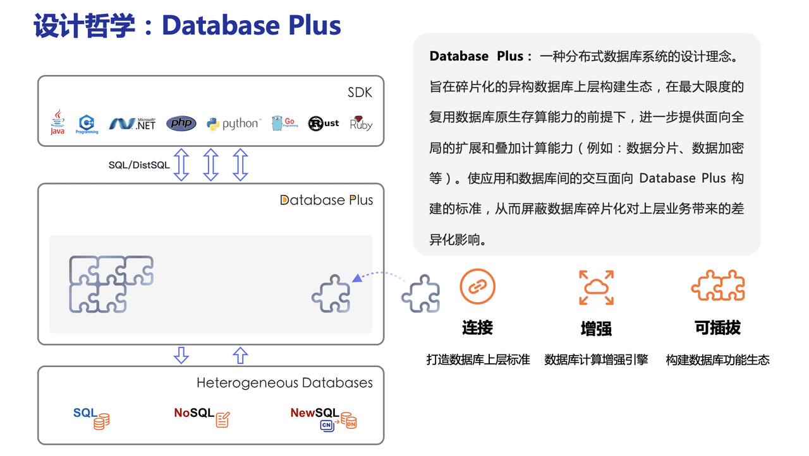

# 资料

官网：https://shardingsphere.apache.org/

系统用户量较多时，比如上亿，单库单表体积飙升，导致CURD性能下降。此时加索引、缓存池、主从读写分离可以提升读能力，但是无法提升主库写能力。此时可通过分库分表同时提升主库读写能力。

> 阿里的开发规范中建议预估三年内单表数据量上500W，或者大小上2G，就要考虑分库分表

垂直分库：**按业务系统垂直分库**，如用户库、交易库。可以减轻数据库压力，减少库内表数量。无法解决单表量大问题。

垂直分表：主要解决一张表太多字段某个字段存储值为大文本会对io查询有损耗所以把本来属于同一个对象描述的属性拆分多个表。比如订单基本信息表和订单详细信息表。

水平分库：将数据分散到多个库。

水平分表：单表量大，将数据分散到多个表。

ShardingSphere是一个关系型数据库中间件，它由Sharding-JDBC、Sharding-Proxy和Sharding-Sidecar（计划中）这3款相互独立的产品组成，主要提供数据库分片以及分布式事务。

核心功能：

- 数据分片：基于底层数据库提供分布式数据库解决方案，可以水平扩展计算和存储。
- **分布式事务**：基于XA和BASE的混合事务引擎，提供分布式事务能力，保证跨数据源数据安全。
- 读写分离：基于对SQL语义理解和对数据库拓扑感知能力，提供**读写流量拆分和负载均衡**。
- 数据迁移：提供跨数据源的数据迁移能力，并可支持重分片扩展。
- 联邦查询：提供跨数据源的复杂查询分析能力，实现跨源的数据关联与聚合。

ShardingSphere致力于构建数据库上层标准和生态，补充数据库缺失能力。

ShardingSphere包含下面3个项目：

ShardingSphere-JDBC：**在JDBC层提供的额外服务**。由jar包引入，适用于很多ORM框架以及数据库连接池，**Sharding-JDBC不做分库分表，主要做两个功能：数据分片和读写分离，简化分库分表后对数据的操作**。

ShardingSphere-Proxy：定位是**透明化数据库代理端**，通过数据库二进制协议，支持多语言。 目前提供 MySQL 和 PostgreSQL 协议，透明化数据库操作，对 DBA 更加友好。

ShardingSphere-Sidecar（规划ing）：kubernetes的云原生数据库代理。

# ShardingSphere-JDBC

ShardingSphere-JDBC在JDBC层提供的额外服务。由jar包引入，适用于很多ORM框架以及数据库连接池，**Sharding-JDBC不做分库分表，主要做两个功能：数据分片和读写分离，简化分库分表后对数据的操作**。

# ShardingSphere-Proxy

ShardingSphere-Proxy定位是透明化数据库代理端，通过数据库二进制协议，支持多语言。 目前提供 MySQL 和 PostgreSQL 协议，透明化数据库操作，对 DBA 更加友好。