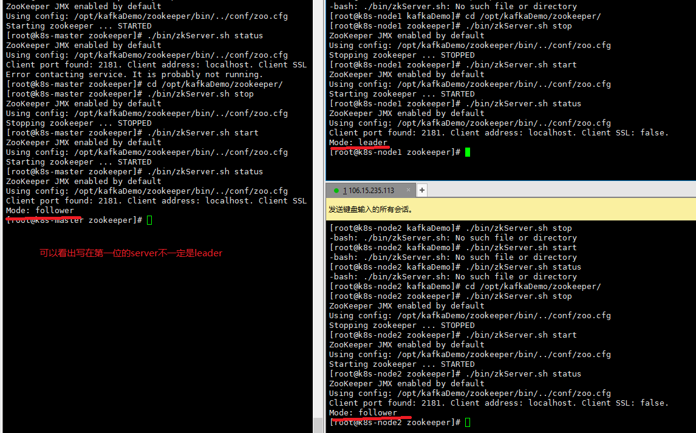

# 资料

zookeeper官网：https://zookeeper.apache.org/

以及本目录下./materials下的PDF资料，来自尚硅谷。

# zookeeper

## 公网ip集群搭建

zookeeper集群搭建是很简单的，直接根据官网文档几下就搭建好了。

不过zookeeper默认只能内网搭建，如果指定公网ip会启动失败。需要其配置文件中增加一条简单的配置即可开启公网访问。

官网文档关于集群搭建的：https://zookeeper.apache.org/doc/r3.6.3/zookeeperStarted.html#sc_ProgrammingToZooKeeper

zookeeper强烈建议搭建奇数数量的集群，如果您只有两台服务器，那么您的情况是，如果其中一台出现故障，则没有足够的机器来形成多数仲裁。两台服务器本质上**不如**一台服务器稳定，因为有两个单点故障。

1、准备好3台云服务器，它们各个的主机名分别为k8s-master、k8s-node1、k8s-node2，配置好DNS保证它们可以直接ping通。

2、下载zookeeper，可能会一点点慢，下载好之后，解压即可。

```shell
wget https://dlcdn.apache.org/zookeeper/zookeeper-3.6.3/apache-zookeeper-3.6.3-bin.tar.gz
```

3、修改配置文件zoo.cfg

```shell
# 把名字改短点
[root@k8s-master kafkaDemo]# mv apache-zookeeper-3.6.3-bin zookeeper
[root@k8s-master kafkaDemo]# cd zookeeper/
[root@k8s-master zookeeper]# ls
bin  conf  docs  lib  LICENSE.txt  NOTICE.txt  README.md  README_packaging.md

# 创建这个目录的目的是作为zookeeper的数据目录，放日志文件啥的
[root@k8s-master zookeeper]# mkdir -m 777 zkData

# 先将它给的一个样例配置文件复制为默认的配置文件名zoo.cfg
cp zoo_sample.cfg zoo.cfg
```

然后修改zoo.cfg文件，必须开启公网访问！只需要修改这两处配置即可。

```properties
# 数据目录，快照保存于此，最好不要用/tmp目录
dataDir=/opt/kafkaDemo/zookeeper/zkData

# cluster
# 因为以下均为公网ip，所以需要开启zookeeper的公网访问
quorumListenOnAllIPs=true
server.1=k8s-master:2888:3888
server.2=k8s-node1:2888:3888
server.3=k8s-node3:2888:3888
```

`server.X`的条目列出了组成 ZooKeeper 服务的服务器。当服务器启动时，它通过在数据目录中查找文件`myid`来知道它是哪个服务器。该文件包含 ASCII 格式的服务器编号。

4、配置服务器编号，在每个zookeeper的数据目录中建立myid文件，并输入在上面`server.X`配置好的服务器编号，比如k8s-master这个机器就需要输入1，主要不能有空格。

5、3台服务器都配置好，就可以启动了，启动命令在安装目录的bin目录下，`./bin/zkServer.sh start`，这个命令还能查看集群情况

```shell
[root@k8s-master zookeeper]# ./bin/zkServer.sh start
ZooKeeper JMX enabled by default
Using config: /opt/kafkaDemo/zookeeper/bin/../conf/zoo.cfg
Starting zookeeper ... STARTED
[root@k8s-master zookeeper]# ./bin/zkServer.sh status
ZooKeeper JMX enabled by default
Using config: /opt/kafkaDemo/zookeeper/bin/../conf/zoo.cfg
Client port found: 2181. Client address: localhost. Client SSL: false.
Mode: follower
```

可以看到这个k8s-master显然是在集群中是一个follower。

3台情况如下：



这和zookeeper的leader选举机制有关，3台服务器的话，几乎每次都会是2号当选。

## 配置解读

默认配置文件是`安装目录/conf/zoo.cfg`

```properties
# 每次tick的毫秒数，指定时间单位
tickTime=2000
# 从节点与主节点建立连接的时间上限，单位为tickTime
initLimit=10
# 允许从节点与主节点处于不同步状态的时间上限，即过期时间，单位tickTime
syncLimit=5

# 数据目录，快照保存于此，最好不要用/tmp目录，建议设为 安装目录/zkData
dataDir=/opt/kafkaDemo/zookeeper/zkData
# 为了降低更新延迟，拥有一个专门的事务日志目录很重要。默认情况下，事务日志与数据快照和myid文件放在同一目录中。dataLogDir 参数指示用于事务日志的不同目录。

# the port at which the clients will connect
clientPort=2181

# 客户端最大连接数
#maxClientCnxns=60

# cluster
# 如果以公网ip部署集群，需要开启zookeeper的公网访问
# quorumListenOnAllIPs=true
# 服务器地址遵循server.x=hostname:peerPort:leaderPort
# x为服务器id，整数，不要求连续，不要求从0开始，自定义的，反正得和myid文件里的内容一致
# hostname 服务器的机器名或ip
# peerPort 节点间通信的tcp端口
# leaderPort 首领选举的tcp端口
#server.1=k8s-master:2888:3888
#server.2=k8s-node1:2888:3888
#server.3=k8s-node3:2888:3888
```

更多配置细节：https://zookeeper.apache.org/doc/r3.6.3/zookeeperAdmin.html#id_multi_address

