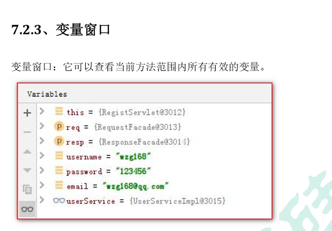
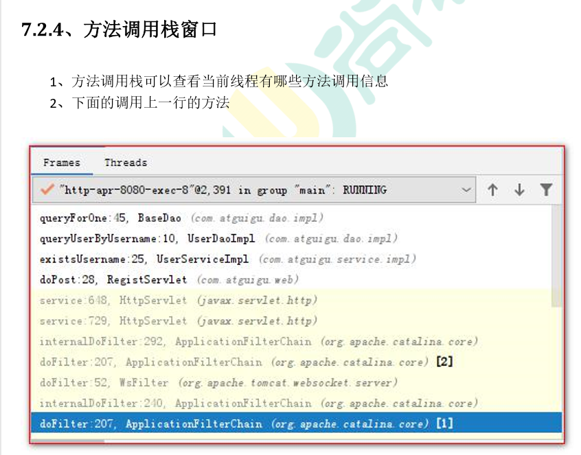
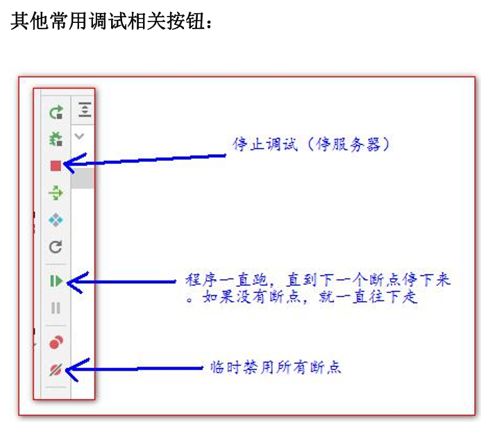
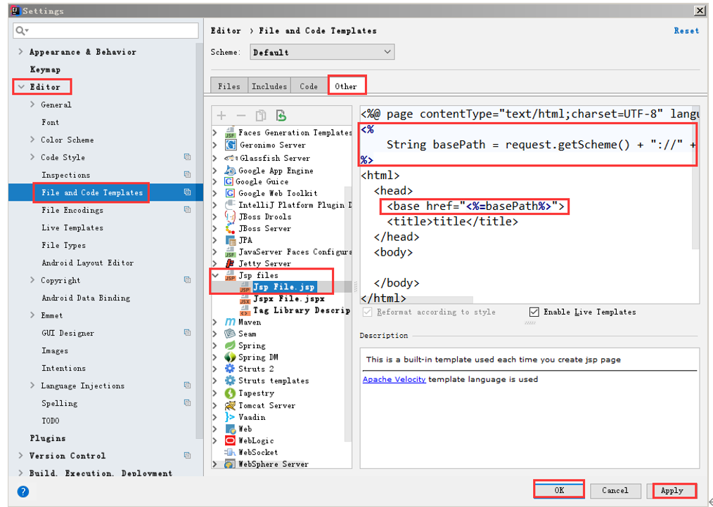
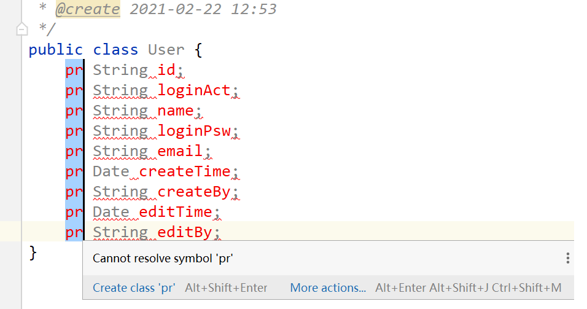
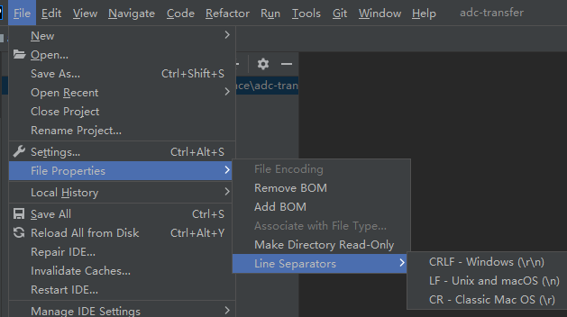
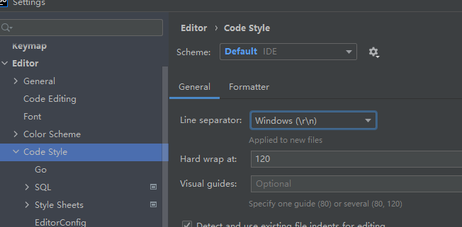

## debug测试






## 设置jsp模板
File-settings

```java
<%
    String basePath = request.getScheme() + "://" 
        + request.getServerName() + ":" + 
        request.getServerPort() + 
        request.getContextPath() + "/";
%>
<base href="<%=basePath%>">
```

## 批量操作

Alt 按住左键上滑或者下滑；


## 换行符问题

windows和Unix和macos换行符不一样，有时项目中的换行符是Windows的CRLF，但是被改成了LF这种情况，如果直接提交，会有很多文件提交到git上，分析大半天。

先点中当前项目，然后如下修改即可：



设置里面也有：

