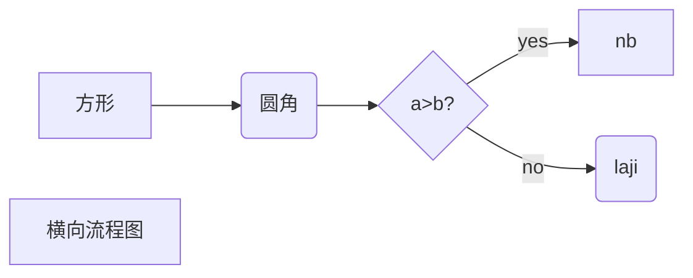
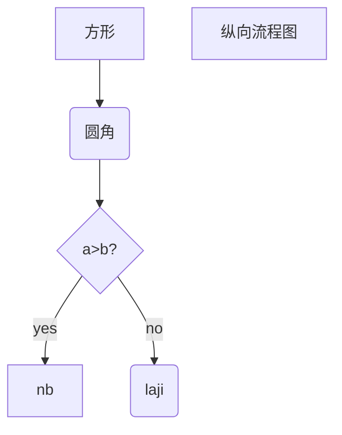
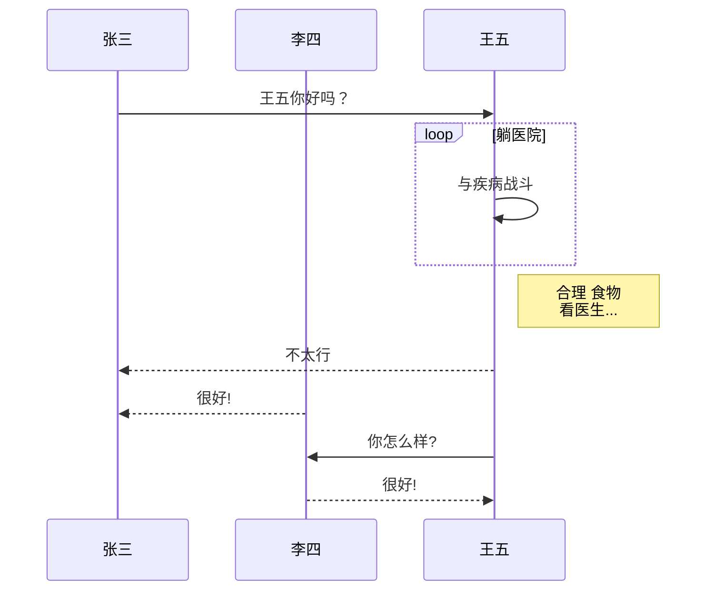
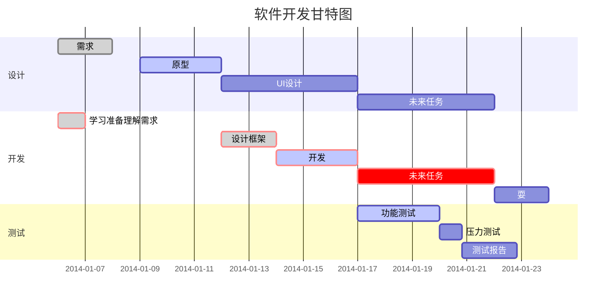

# typora

## 激活

自己买的激活码：限3设备

> email: `767719297@qq.com`
>
> 序列号: `8ABGF3-NM2NXN-ZCTPBS-DS4FAP`

破解：

- https://zhuanlan.zhihu.com/p/521676413
- https://www.bmabk.com/index.php/post/35726.html

## 绘制流程图

1、横向流程图：`graph LR`



2、纵向流程图：`graph TD`



3、标准流程图

`节点名(left/right)`可以控制线条从哪出发

```flow
st=>start: 开始框
op=>operation: 处理框
cond=>condition: 判断框
sub1=>subroutine: 子流程
io=>inputoutput: 输入输出框
e=>end: 结束框
st(right)->op->cond
cond(yes)->io->e
cond(no)->sub1(right)->op
```

4、UML时序图



5、甘特图




# VPN

免费：

- 迷雾通：https://github.com/geph-official/geph4-client/wiki/%E8%BF%B7%E9%9B%BE%E9%80%9A%EF%BC%88%E5%85%8D%E7%BF%BB%E5%A2%99%E9%95%9C%E5%83%8F%EF%BC%89
- 老王VPN：https://reg.laowang123.cc/

收费：

- 薄荷：https://my.bohe7.net

  - 99一年，每月100G，均速5MB/s
  - 不限制设备数

- 喵子：https://fly.catcottage.us

  - 文档很全，有q群

  - 轻量版
    - 175一年，总流量1350GB，150Mbps，限4台设备
    - 88一年，总流量276GB，150Mbps，限4台设备
  - 标准版
    - 350一年，总流量2580GB，300Mbps，限5设备
    - 504两年，总流量4096GB，300Mbps，限5设备
  - 无限流量版 - (注：无限流量版仅在使用“不计流量”节点时不扣除账户流量)
    - 650一年，总流量1024GB，限5设备