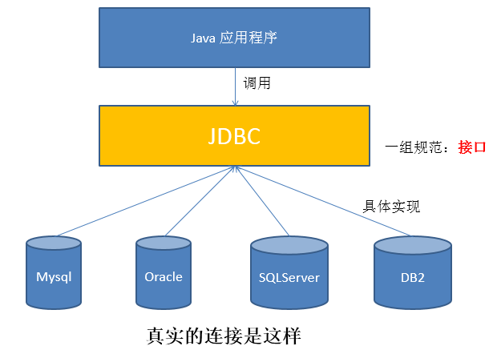
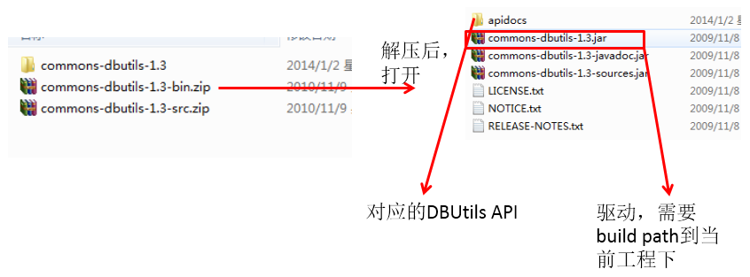
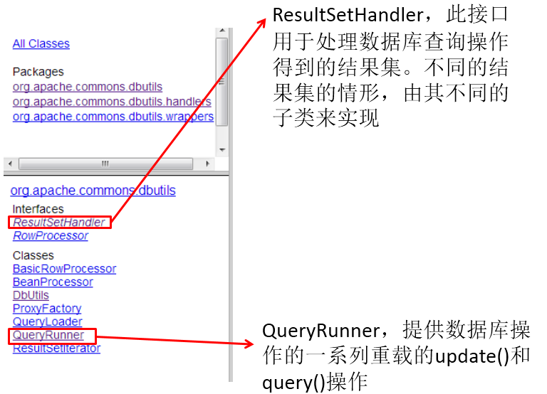

# JDBC概述

## 数据的持久化

- 持久化(persistence)：**把数据保存到可掉电式存储设备中以供之后使用**。大多数情况下，特别是企业级应用，**数据持久化意味着将内存中的数据保存到硬盘**上加以”固化”**，而持久化的实现过程大多通过各种关系数据库来完成**。

- 持久化的主要应用是将内存中的数据存储在关系型数据库中，当然也可以存储在磁盘文件、XML数据文件中。

   

- 在Java中，数据库存取技术可分为如下几类：
  - JDBC直接访问数据库
  - JDO (Java Data Object )技术

  - 第三方O/R工具，如Hibernate, Mybatis 等

- JDBC是java访问数据库的基石，JDO、Hibernate、MyBatis等只是更好的封装了JDBC。

## JDBC介绍

- JDBC(Java Database Connectivity)是一个**独立于特定数据库管理系统、通用的SQL数据库存取和操作的公共接口**（一组API），定义了用来访问数据库的标准Java类库，（**java.sql,javax.sql**）使用这些类库可以以一种**标准**的方法、方便地访问数据库资源。
- JDBC为访问不同的数据库提供了一种**统一的途径**，为开发者屏蔽了一些细节问题。
- JDBC的目标是使Java程序员使用JDBC可以连接任何**提供了JDBC驱动程序**的数据库系统，这样就使得程序员无需对特定的数据库系统的特点有过多的了解，从而大大简化和加快了开发过程。
- 如果没有JDBC，那么Java程序访问数据库时是这样的：


***

- 有了JDBC，Java程序访问数据库时是这样的：




***

- 总结如下：


- JDBC接口（API）包括两个层次：
  - **面向应用的API**：Java API，抽象接口，供应用程序开发人员使用（连接数据库，执行SQL语句，获得结果）。
  -  **面向数据库的API**：Java Driver API，供开发商开发数据库驱动程序用。

> **JDBC是sun公司提供一套用于数据库操作的接口，java程序员只需要面向这套接口编程即可。**
>
> **不同的数据库厂商，需要针对这套接口，提供不同实现。不同的实现的集合，即为不同数据库的驱动。																————面向接口编程**

# 获取数据库连接

## Driver接口实现类

- `java.sql.Driver` 接口是所有 JDBC 驱动程序需要实现的接口，不同数据库厂商提供不同的实现

- 编程时不用直接访问Driver的具体实现类，而是通过驱动程序管理器类(java.sql.DriverManager)去调用这些Driver实现

- 加载驱动：加载 JDBC 驱动需调用 Class 类的静态方法 forName()，向其传递要加载的 JDBC 驱动的类名

  - **Class.forName("com.mysql.jdbc.Driver")**

- 注册驱动：DriverManager 类是驱动程序管理器类，负责管理驱动程序
  - **使用DriverManager.registerDriver(com.mysql.jdbc.Driver)来注册驱动**

  - 通常不用显式调用 DriverManager 类的 registerDriver() 方法来注册驱动程序类的实例，因为一般驱动实现库的 Driver驱动程序类往往包含了静态代码块，在这个静态代码块中，会调用 DriverManager.registerDriver() 方法来注册自身的一个实例。下图是MySQL的Driver实现类的静态代码块：

    

## URL

- JDBC URL 用于标识一个被注册的驱动程序，驱动程序管理器通过这个 URL 选择正确的驱动程序，从而建立到数据库的连接。

- JDBC URL的标准由三部分组成，各部分间用冒号分隔。 
  - **jdbc:子协议:子名称**
  - **协议**：JDBC URL中的协议总是jdbc 
  - **子协议**：子协议用于标识一个数据库驱动程序
  - **子名称**：一种标识数据库的方法。子名称可以依不同的子协议而变化，用子名称的目的是为了**定位数据库**提供足够的信息。包含**主机名**(对应服务端的ip地址)**，端口号，数据库名**

- 举例：

  

- **几种常用数据库的 JDBC URL**

  - MySQL的连接URL编写方式：

    - jdbc:mysql://主机名称:mysql服务端口号/数据库名称?参数=值&参数=值
    - jdbc:mysql://localhost:3306/atguigu
    - jdbc:mysql://localhost:3306/atguigu**?useUnicode=true&characterEncoding=utf8**（如果JDBC程序与服务器端的字符集不一致，会导致乱码，那么可以通过参数指定服务器端的字符集）
    - jdbc:mysql://localhost:3306/atguigu?user=root&password=123456

  - Oracle 9i的连接URL编写方式：

    - jdbc:oracle:thin:@主机名称:oracle服务端口号:数据库名称
    - jdbc:oracle:thin:@localhost:1521:atguigu

  - SQLServer的连接URL编写方式：

    - jdbc:sqlserver://主机名称:sqlserver服务端口号:DatabaseName=数据库名称

    - jdbc:sqlserver://localhost:1433:DatabaseName=atguigu

## 获取单个连接

在resources目录下的配置文件jdbc.properties如下：

```properties
url=jdbc:mysql://localhost:3306/test?charset=utf8
user=root
password=123456
# Mysql8的驱动
driver=com.mysql.cj.jdbc.Driver
# Mysql5的驱动
#driver=com.mysql.jdbc.Driver
```

有两种方式可以获取连接：

```java
// 从配置文件jdbc.properties中加载连接数据库的配置信息
// 必须有url/driver/user/password这四个配置
public Properties getConnInfo() throws Exception {
    Properties p = new Properties();
    try (InputStream in = this.getClass().getClassLoader().getResourceAsStream("jdbc.properties")) {
        p.load(in);
    }
    return p;
}

public Connection getConn1() throws Exception {
    Properties p = getConnInfo();
    // 1.加载驱动
    Driver driver = new com.mysql.cj.jdbc.Driver();
    //// 2.注册驱动
    //DriverManager.registerDriver(driver);
    // 3.建立连接
    return driver.connect(p.getProperty("url"), p);
}

public Connection getConn2() throws Exception {
    Properties p = getConnInfo();
    // 1.加载驱动
    Class clazz = Class.forName(p.getProperty("driver"));
    //// 2.注册驱动
    //Driver driver = (Driver) clazz.getConstructor().newInstance();
    //DriverManager.registerDriver(driver);
    // 3.建立连接
    return DriverManager.getConnection(p.getProperty("url"), p.getProperty("user"), p.getProperty("password"));
}
```

在第二步的注册驱动这里，可以注释的原因是mysql的Driver实现类中静态代码块已经注册过msyql的驱动了：

```java
static {
    try {
        DriverManager.registerDriver(new Driver());
    } catch (SQLException var1) {
        throw new RuntimeException("Can't register driver!");
    }
}
```

> 说明：不必显式的注册驱动了。因为在DriverManager的源码中已经存在静态代码块，实现了驱动的注册。

# CRUD

## JDBC程序编写步骤


> 备注：ODBC(**Open Database Connectivity**，开放式数据库连接)，是微软在Windows平台下推出的。使用者在程序中只需要调用ODBC API，由 ODBC 驱动程序将调用转换成为对特定的数据库的调用请求。

## statement和预编译语句

- 在 java.sql 包中有 3 个接口分别定义了对数据库的调用的不同方式：
  - Statement：用于执行静态 SQL 语句并返回它所生成结果的对象。 
  - PreparedStatement：SQL 语句被**预编译并存储**在此对象中，可以使用此对象**多次高效地执行**该语句。
  - CallableStatement：用于执行 SQL 存储过程

  

**使用Statement操作数据表的弊端**

- 使用Statement操作数据表存在弊端：

  - **问题一：存在拼串操作，繁琐**
  - **问题二：存在SQL注入问题**
- SQL 注入是利用某些系统没有对用户输入的数据进行充分的检查，而在用户输入数据中注入非法的 SQL 语句段或命令(如：SELECT user, password FROM user_table WHERE user='a' OR 1 = ' AND password = ' OR '1' = '1') ，从而利用系统的 SQL 引擎完成恶意行为的做法。
- 对于 Java 而言，要防范 SQL 注入，只要用 PreparedStatement(从Statement扩展而来) 取代 Statement 就可以了。

- **PreparedStatement表示一条预编译过的 SQL 语句**，因此可以防止SQL注入。

- **PreparedStatement 能最大可能提高性能：**
  - DBServer会对**预编译**语句提供性能优化。因为预编译语句有可能被重复调用，所以<u>语句在被DBServer的编译器编译后的执行代码被缓存下来，那么下次调用时只要是相同的预编译语句就不需要编译，只要将参数直接传入编译过的语句执行代码中就会得到执行。</u>
  - 语法检查，语义检查，翻译成二进制命令，缓存

### 更新

```java
// 通用的增、删、改操作
public void update(String sql,Object ... args){
    Connection conn = null;
    PreparedStatement ps = null;
    try {
        //1.获取数据库的连接
        conn = JDBCUtils.getConnection();
        //2.获取PreparedStatement的实例 (或：预编译sql语句)
        ps = conn.prepareStatement(sql);
        //3.填充占位符
        for(int i = 0;i < args.length;i++){
            ps.setObject(i + 1, args[i]);
        }
        //4.执行sql语句
        ps.execute();
    } catch (Exception e) {
        e.printStackTrace();
    }finally{
        //5.关闭资源
        JDBCUtils.closeResource(conn, ps);
    }
}
```

### 查询

```java
// 通用的针对于不同表的查询:返回一个对象 (version 1.0)
public <T> T getInstance(Class<T> clazz, String sql, Object... args) {
    Connection conn = null;
    PreparedStatement ps = null;
    ResultSet rs = null;
    try {
        // 1.获取数据库连接
        conn = JDBCUtils.getConnection();

        // 2.预编译sql语句，得到PreparedStatement对象
        ps = conn.prepareStatement(sql);

        // 3.填充占位符
        for (int i = 0; i < args.length; i++) {
            ps.setObject(i + 1, args[i]);
        }

        // 4.执行executeQuery(),得到结果集：ResultSet
        rs = ps.executeQuery();

        // 5.得到结果集的元数据：ResultSetMetaData
        ResultSetMetaData rsmd = rs.getMetaData();

        // 6.1通过ResultSetMetaData得到columnCount,columnLabel；通过ResultSet得到列值
        int columnCount = rsmd.getColumnCount();
        if (rs.next()) {
            T t = clazz.newInstance();
            for (int i = 0; i < columnCount; i++) {// 遍历每一个列

                // 获取列值
                Object columnVal = rs.getObject(i + 1);
                // 获取列的别名:列的别名，使用类的属性名充当
                String columnLabel = rsmd.getColumnLabel(i + 1);
                // 6.2使用反射，给对象的相应属性赋值
                Field field = clazz.getDeclaredField(columnLabel);
                field.setAccessible(true);
                field.set(t, columnVal);
            }
            return t;
        }
    } catch (Exception e) {
        e.printStackTrace();
    } finally {
        // 7.关闭资源
        JDBCUtils.closeResource(conn, ps, rs);
    }
    return null;
}
```


### 资源的释放

- 释放ResultSet, Statement,Connection。
- 数据库连接（Connection）是非常稀有的资源，用完后必须马上释放，如果Connection不能及时正确的关闭将导致系统宕机。Connection的使用原则是**尽量晚创建，尽量早的释放。**
- 可以在finally中关闭，保证及时其他代码出现异常，资源也一定能被关闭。

## 操作BLOB类型字段

- MySQL中，BLOB是一个二进制大型对象，是一个可以存储大量数据的容器，它能容纳不同大小的数据
- 插入BLOB类型的数据必须使用PreparedStatement，因为BLOB类型的数据无法使用字符串拼接写的

| 类型       | 最大容量(byte) |
| ---------- | -------------- |
| TinyBlob   | 255            |
| Blob       | 65k            |
| MediumBlob | 16M            |
| LongBlob   | 4G             |

插入和更新操作都是相同用法。

```java
//获取连接
Connection conn = JDBCUtils.getConnection();
		
String sql = "insert into customers(name,email,birth,photo)values(?,?,?,?)";
PreparedStatement ps = conn.prepareStatement(sql);

// 填充占位符
ps.setString(1, "徐海强");
ps.setString(2, "xhq@126.com");
ps.setDate(3, new Date(new java.util.Date().getTime()));
// 操作Blob类型的变量
FileInputStream fis = new FileInputStream("xhq.png");
ps.setBlob(4, fis);
//执行
ps.execute();
		
fis.close();
JDBCUtils.closeResource(conn, ps);
```

读取blob

```java
//读取Blob类型的字段
Blob photo = rs.getBlob(5);
InputStream is = photo.getBinaryStream();
// 对输入流进行操作
```

## 批量插入

当需要成批插入或者更新记录时，可以采用Java的批量**更新**机制，这一机制允许多条语句一次性提交给数据库批量处理。通常情况下比单独提交处理更有效率

JDBC的批量处理语句包括下面三个方法：
- **addBatch(String)：添加需要批量处理的SQL语句或是参数；**
- **executeBatch()：执行批量处理语句；**
- **clearBatch():清空缓存的数据**

通常我们会遇到两种批量执行SQL语句的情况：
- 多条SQL语句的批量处理；
- 一个SQL语句的批量传参；

实现1：

```java
/*
 * 修改1： 使用 addBatch() / executeBatch() / clearBatch()
 * 修改2：mysql服务器默认是关闭批处理的，我们需要通过一个参数，让mysql开启批处理的支持。
 * 		 ?rewriteBatchedStatements=true 写在配置文件的url后面
 */
@Test
public void testInsert1() throws Exception{
	long start = System.currentTimeMillis();
		
	Connection conn = JDBCUtils.getConnection();
		
	String sql = "insert into goods(name)values(?)";
	PreparedStatement ps = conn.prepareStatement(sql);
		
	for(int i = 1;i <= 1000000;i++){
		ps.setString(1, "name_" + i);
			
		//1.“攒”sql
		ps.addBatch();
		if(i % 500 == 0){
			//2.执行
			ps.executeBatch();
			//3.清空
			ps.clearBatch();
		}
	}
		
	long end = System.currentTimeMillis();
	System.out.println("花费的时间为：" + (end - start));//20000条：625                                                                         //1000000条:14733  
		
	JDBCUtils.closeResource(conn, ps);
}
```

实现2：

```java
@Test
public void testInsert2() throws Exception{
	long start = System.currentTimeMillis();
		
	Connection conn = JDBCUtils.getConnection();
		
	//1.设置为不自动提交数据
	conn.setAutoCommit(false);
		
	String sql = "insert into goods(name)values(?)";
	PreparedStatement ps = conn.prepareStatement(sql);
		
	for(int i = 1;i <= 1000000;i++){
		ps.setString(1, "name_" + i);
			
		//1.“攒”sql
		ps.addBatch();
			
		if(i % 500 == 0){
			//2.执行
			ps.executeBatch();
			//3.清空
			ps.clearBatch();
		}
	}
		
	//2.提交数据
	conn.commit();
		
	long end = System.currentTimeMillis();
	System.out.println("花费的时间为：" + (end - start));//1000000条:4978 
		
	JDBCUtils.closeResource(conn, ps);
}
```

## 事务

事务具有ACID四个属性。

- 数据什么时候意味着提交？
  - **当一个连接对象被创建时，默认情况下是自动提交事务**：每次执行一个 SQL 语句时，如果执行成功，就会向数据库自动提交，而不能回滚。
  - **关闭数据库连接，数据就会自动的提交。**如果多个操作，每个操作使用的是自己单独的连接，则无法保证事务。即同一个事务的多个操作必须在同一个连接下。
- **JDBC程序中为了让多个 SQL 语句作为一个事务执行：**

  - 调用 Connection 对象的 **setAutoCommit(false);** 以取消自动提交事务
  - 在所有的 SQL 语句都成功执行后，调用 **commit();** 方法提交事务
  - 在出现异常时，调用 **rollback();** 方法回滚事务

  > 若此时 Connection 没有被关闭，还可以被重复使用，则需要恢复其自动提交状态 setAutoCommit(true)。尤其是在使用数据库连接池技术时，执行close()方法前，建议恢复自动提交状态。

【案例：用户AA向用户BB转账100】

```java
public void testJDBCTransaction() {
	Connection conn = null;
	try {
		// 1.获取数据库连接
		conn = JDBCUtils.getConnection();
		// 2.开启事务
		conn.setAutoCommit(false);
		// 3.进行数据库操作
		String sql1 = "update user_table set balance = balance - 100 where user = ?";
		update(conn, sql1, "AA");

		// 模拟网络异常
		//System.out.println(10 / 0);

		String sql2 = "update user_table set balance = balance + 100 where user = ?";
		update(conn, sql2, "BB");
		// 4.若没有异常，则提交事务
		conn.commit();
	} catch (Exception e) {
		e.printStackTrace();
		// 5.若有异常，则回滚事务
		try {
			conn.rollback();
		} catch (SQLException e1) {
			e1.printStackTrace();
		}
    } finally {
        try {
			//6.恢复每次DML操作的自动提交功能
			conn.setAutoCommit(true);
		} catch (SQLException e) {
			e.printStackTrace();
		}
        //7.关闭连接
		JDBCUtils.closeResource(conn, null, null); 
    }  
}

```


## 连接池

### 8.1 JDBC数据库连接池的必要性

- 在使用开发基于数据库的web程序时，传统的模式基本是按以下步骤：　　
  - **在主程序（如servlet、beans）中建立数据库连接**
  - **进行sql操作**
  - **断开数据库连接**

- 这种模式开发，存在的问题:
  - 普通的JDBC数据库连接使用 DriverManager 来获取，每次向数据库建立连接的时候都要将 Connection 加载到内存中，再验证用户名和密码(得花费0.05s～1s的时间)。需要数据库连接的时候，就向数据库要求一个，执行完成后再断开连接。这样的方式将会消耗大量的资源和时间。**数据库的连接资源并没有得到很好的重复利用。**若同时有几百人甚至几千人在线，频繁的进行数据库连接操作将占用很多的系统资源，严重的甚至会造成服务器的崩溃。
  - **对于每一次数据库连接，使用完后都得断开。**否则，如果程序出现异常而未能关闭，将会导致数据库系统中的内存泄漏，最终将导致重启数据库。（回忆：何为Java的内存泄漏？）
  - **这种开发不能控制被创建的连接对象数**，系统资源会被毫无顾及的分配出去，如连接过多，也可能导致内存泄漏，服务器崩溃。 

### 8.2 数据库连接池技术

- 为解决传统开发中的数据库连接问题，可以采用数据库连接池技术。
- **数据库连接池的基本思想**：就是为数据库连接建立一个“缓冲池”。预先在缓冲池中放入一定数量的连接，当需要建立数据库连接时，只需从“缓冲池”中取出一个，使用完毕之后再放回去。

- **数据库连接池**负责分配、管理和释放数据库连接，它**允许应用程序重复使用一个现有的数据库连接，而不是重新建立一个**。
- 数据库连接池在初始化时将创建一定数量的数据库连接放到连接池中，这些数据库连接的数量是由**最小数据库连接数来设定**的。无论这些数据库连接是否被使用，连接池都将一直保证至少拥有这么多的连接数量。连接池的**最大数据库连接数量**限定了这个连接池能占有的最大连接数，当应用程序向连接池请求的连接数超过最大连接数量时，这些请求将被加入到等待队列中。


- **工作原理：**


- **数据库连接池技术的优点**

  **1. 资源重用**

  由于数据库连接得以重用，避免了频繁创建，释放连接引起的大量性能开销。在减少系统消耗的基础上，另一方面也增加了系统运行环境的平稳性。

  **2. 更快的系统反应速度**

  数据库连接池在初始化过程中，往往已经创建了若干数据库连接置于连接池中备用。此时连接的初始化工作均已完成。对于业务请求处理而言，直接利用现有可用连接，避免了数据库连接初始化和释放过程的时间开销，从而减少了系统的响应时间

  **3. 新的资源分配手段**

  对于多应用共享同一数据库的系统而言，可在应用层通过数据库连接池的配置，实现某一应用最大可用数据库连接数的限制，避免某一应用独占所有的数据库资源

  **4. 统一的连接管理，避免数据库连接泄漏**

  在较为完善的数据库连接池实现中，可根据预先的占用超时设定，强制回收被占用连接，从而避免了常规数据库连接操作中可能出现的资源泄露


### 8.3 多种开源的数据库连接池

- JDBC 的数据库连接池使用 javax.sql.DataSource 来表示，DataSource 只是一个接口，该接口通常由服务器(Weblogic, WebSphere, Tomcat)提供实现，也有一些开源组织提供实现：
  - **DBCP** 是Apache提供的数据库连接池。tomcat 服务器自带dbcp数据库连接池。**速度相对c3p0较快**，但因自身存在BUG，Hibernate3已不再提供支持。
  - **C3P0** 是一个开源组织提供的一个数据库连接池，**速度相对较慢，稳定性还可以。**hibernate官方推荐使用
  - **Proxool** 是sourceforge下的一个开源项目数据库连接池，有监控连接池状态的功能，**稳定性较c3p0差一点**
  - **BoneCP** 是一个开源组织提供的数据库连接池，速度快
  - **Druid** 是阿里提供的数据库连接池，据说是集DBCP 、C3P0 、Proxool 优点于一身的数据库连接池，但是速度不确定是否有BoneCP快
- DataSource 通常被称为数据源，它包含连接池和连接池管理两个部分，习惯上也经常把 DataSource 称为连接池
- **DataSource用来取代DriverManager来获取Connection，获取速度快，同时可以大幅度提高数据库访问速度。**
- 特别注意：
  - 数据源和数据库连接不同，数据源无需创建多个，它是产生数据库连接的工厂，因此**整个应用只需要一个数据源即可。**
  - 当数据库访问结束后，程序还是像以前一样关闭数据库连接：conn.close(); 但conn.close()并没有关闭数据库的物理连接，它仅仅把数据库连接释放，归还给了数据库连接池。

#### 8.3.3 Druid（德鲁伊）数据库连接池

Druid是阿里巴巴开源平台上一个数据库连接池实现，它结合了C3P0、DBCP、Proxool等DB池的优点，同时加入了日志监控，可以很好的监控DB池连接和SQL的执行情况，可以说是针对监控而生的DB连接池，**可以说是目前最好的连接池之一。**

```java
package com.atguigu.druid;

import java.sql.Connection;
import java.util.Properties;

import javax.sql.DataSource;

import com.alibaba.druid.pool.DruidDataSourceFactory;

public class TestDruid {
	public static void main(String[] args) throws Exception {
		Properties pro = new Properties();		 pro.load(TestDruid.class.getClassLoader().getResourceAsStream("druid.properties"));
		DataSource ds = DruidDataSourceFactory.createDataSource(pro);
		Connection conn = ds.getConnection();
		System.out.println(conn);
	}
}

```

其中，src下的配置文件为：【druid.properties】

```java
url=jdbc:mysql://localhost:3306/test?rewriteBatchedStatements=true
username=root
password=123456
driverClassName=com.mysql.jdbc.Driver

initialSize=10
maxActive=20
maxWait=1000
filters=wall
```

- 详细配置参数：

| **配置**                      | **缺省** | **说明**                                                     |
| ----------------------------- | -------- | ------------------------------------------------------------ |
| name                          |          | 配置这个属性的意义在于，如果存在多个数据源，监控的时候可以通过名字来区分开来。   如果没有配置，将会生成一个名字，格式是：”DataSource-” +   System.identityHashCode(this) |
| url                           |          | 连接数据库的url，不同数据库不一样。例如：mysql :   jdbc:mysql://10.20.153.104:3306/druid2      oracle :   jdbc:oracle:thin:@10.20.149.85:1521:ocnauto |
| username                      |          | 连接数据库的用户名                                           |
| password                      |          | 连接数据库的密码。如果你不希望密码直接写在配置文件中，可以使用ConfigFilter。详细看这里：<https://github.com/alibaba/druid/wiki/%E4%BD%BF%E7%94%A8ConfigFilter> |
| driverClassName               |          | 根据url自动识别   这一项可配可不配，如果不配置druid会根据url自动识别dbType，然后选择相应的driverClassName(建议配置下) |
| initialSize                   | 0        | 初始化时建立物理连接的个数。初始化发生在显示调用init方法，或者第一次getConnection时 |
| maxActive                     | 8        | 最大连接池数量                                               |
| maxIdle                       | 8        | 已经不再使用，配置了也没效果                                 |
| minIdle                       |          | 最小连接池数量                                               |
| maxWait                       |          | 获取连接时最大等待时间，单位毫秒。配置了maxWait之后，缺省启用公平锁，并发效率会有所下降，如果需要可以通过配置useUnfairLock属性为true使用非公平锁。 |
| poolPreparedStatements        | false    | 是否缓存preparedStatement，也就是PSCache。PSCache对支持游标的数据库性能提升巨大，比如说oracle。在mysql下建议关闭。 |
| maxOpenPreparedStatements     | -1       | 要启用PSCache，必须配置大于0，当大于0时，poolPreparedStatements自动触发修改为true。在Druid中，不会存在Oracle下PSCache占用内存过多的问题，可以把这个数值配置大一些，比如说100 |
| validationQuery               |          | 用来检测连接是否有效的sql，要求是一个查询语句。如果validationQuery为null，testOnBorrow、testOnReturn、testWhileIdle都不会其作用。 |
| testOnBorrow                  | true     | 申请连接时执行validationQuery检测连接是否有效，做了这个配置会降低性能。 |
| testOnReturn                  | false    | 归还连接时执行validationQuery检测连接是否有效，做了这个配置会降低性能 |
| testWhileIdle                 | false    | 建议配置为true，不影响性能，并且保证安全性。申请连接的时候检测，如果空闲时间大于timeBetweenEvictionRunsMillis，执行validationQuery检测连接是否有效。 |
| timeBetweenEvictionRunsMillis |          | 有两个含义： 1)Destroy线程会检测连接的间隔时间2)testWhileIdle的判断依据，详细看testWhileIdle属性的说明 |
| numTestsPerEvictionRun        |          | 不再使用，一个DruidDataSource只支持一个EvictionRun           |
| minEvictableIdleTimeMillis    |          |                                                              |
| connectionInitSqls            |          | 物理连接初始化的时候执行的sql                                |
| exceptionSorter               |          | 根据dbType自动识别   当数据库抛出一些不可恢复的异常时，抛弃连接 |
| filters                       |          | 属性类型是字符串，通过别名的方式配置扩展插件，常用的插件有：   监控统计用的filter:stat日志用的filter:log4j防御sql注入的filter:wall |
| proxyFilters                  |          | 类型是List，如果同时配置了filters和proxyFilters，是组合关系，并非替换关系 |


## 第9章：Apache-DBUtils实现CRUD操作

### 9.1 Apache-DBUtils简介

- commons-dbutils 是 Apache 组织提供的一个开源 JDBC工具类库，它是对JDBC的简单封装，学习成本极低，并且使用dbutils能极大简化jdbc编码的工作量，同时也不会影响程序的性能。

- API介绍：
  - org.apache.commons.dbutils.QueryRunner
  - org.apache.commons.dbutils.ResultSetHandler
  - 工具类：org.apache.commons.dbutils.DbUtils   
- API包说明：






### 9.2 主要API的使用

#### 9.2.1 DbUtils

- DbUtils ：提供如关闭连接、装载JDBC驱动程序等常规工作的工具类，里面的所有方法都是静态的。主要方法如下：
  - **public static void close(…) throws java.sql.SQLException**：　DbUtils类提供了三个重载的关闭方法。这些方法检查所提供的参数是不是NULL，如果不是的话，它们就关闭Connection、Statement和ResultSet。
  - public static void closeQuietly(…): 这一类方法不仅能在Connection、Statement和ResultSet为NULL情况下避免关闭，还能隐藏一些在程序中抛出的SQLEeception。
  - public static void commitAndClose(Connection conn)throws SQLException： 用来提交连接的事务，然后关闭连接
  - public static void commitAndCloseQuietly(Connection conn)： 用来提交连接，然后关闭连接，并且在关闭连接时不抛出SQL异常。 
  - public static void rollback(Connection conn)throws SQLException：允许conn为null，因为方法内部做了判断
  - public static void rollbackAndClose(Connection conn)throws SQLException
  - rollbackAndCloseQuietly(Connection)
  - public static boolean loadDriver(java.lang.String driverClassName)：这一方装载并注册JDBC驱动程序，如果成功就返回true。使用该方法，你不需要捕捉这个异常ClassNotFoundException。

#### 9.2.2 QueryRunner类

- **该类简单化了SQL查询，它与ResultSetHandler组合在一起使用可以完成大部分的数据库操作，能够大大减少编码量。**

- QueryRunner类提供了两个构造器：
  - 默认的构造器
  - 需要一个 javax.sql.DataSource 来作参数的构造器

- QueryRunner类的主要方法：
  - **更新**
    - public int update(Connection conn, String sql, Object... params) throws SQLException:用来执行一个更新（插入、更新或删除）操作。
    -  ......
  - **插入**
    - public <T> T insert(Connection conn,String sql,ResultSetHandler<T> rsh, Object... params) throws SQLException：只支持INSERT语句，其中 rsh - The handler used to create the result object from the ResultSet of auto-generated keys.  返回值: An object generated by the handler.即自动生成的键值
    - ....
  - **批处理**
    - public int[] batch(Connection conn,String sql,Object[][] params)throws SQLException： INSERT, UPDATE, or DELETE语句
    - public <T> T insertBatch(Connection conn,String sql,ResultSetHandler<T> rsh,Object[][] params)throws SQLException：只支持INSERT语句
    - .....
  - **查询**
    - public Object query(Connection conn, String sql, ResultSetHandler rsh,Object... params) throws SQLException：执行一个查询操作，在这个查询中，对象数组中的每个元素值被用来作为查询语句的置换参数。该方法会自行处理 PreparedStatement 和 ResultSet 的创建和关闭。
    - ...... 

- 测试

```java
// 测试添加
@Test
public void testInsert() throws Exception {
	QueryRunner runner = new QueryRunner();
	Connection conn = JDBCUtils.getConnection3();
	String sql = "insert into customers(name,email,birth)values(?,?,?)";
	int count = runner.update(conn, sql, "何成飞", "he@qq.com", "1992-09-08");

	System.out.println("添加了" + count + "条记录");
		
	JDBCUtils.closeResource(conn, null);

}
```

```java
// 测试删除
@Test
public void testDelete() throws Exception {
	QueryRunner runner = new QueryRunner();
	Connection conn = JDBCUtils.getConnection3();
	String sql = "delete from customers where id < ?";
	int count = runner.update(conn, sql,3);

	System.out.println("删除了" + count + "条记录");
		
	JDBCUtils.closeResource(conn, null);

}
```


#### 9.2.3 ResultSetHandler接口及实现类

- 该接口用于处理 java.sql.ResultSet，将数据按要求转换为另一种形式。

- ResultSetHandler 接口提供了一个单独的方法：Object handle (java.sql.ResultSet .rs)。

- 接口的主要实现类：

  - ArrayHandler：把结果集中的第一行数据转成对象数组。
  - ArrayListHandler：把结果集中的每一行数据都转成一个数组，再存放到List中。
  - **BeanHandler：**将结果集中的第一行数据封装到一个对应的JavaBean实例中。
  - **BeanListHandler：**将结果集中的每一行数据都封装到一个对应的JavaBean实例中，存放到List里。
  - ColumnListHandler：将结果集中某一列的数据存放到List中。
  - KeyedHandler(name)：将结果集中的每一行数据都封装到一个Map里，再把这些map再存到一个map里，其key为指定的key。
  - **MapHandler：**将结果集中的第一行数据封装到一个Map里，key是列名，value就是对应的值。
  - **MapListHandler：**将结果集中的每一行数据都封装到一个Map里，然后再存放到List
  - **ScalarHandler：**查询单个值对象

    

- 测试

```java
/*
 * 测试查询:查询一条记录
 * 
 * 使用ResultSetHandler的实现类：BeanHandler
 */
@Test
public void testQueryInstance() throws Exception{
	QueryRunner runner = new QueryRunner();

	Connection conn = JDBCUtils.getConnection3();
		
	String sql = "select id,name,email,birth from customers where id = ?";
		
	//
	BeanHandler<Customer> handler = new BeanHandler<>(Customer.class);
	Customer customer = runner.query(conn, sql, handler, 23);
	System.out.println(customer);	
	JDBCUtils.closeResource(conn, null);
}
```

```java
/*
 * 测试查询:查询多条记录构成的集合
 * 
 * 使用ResultSetHandler的实现类：BeanListHandler
 */
@Test
public void testQueryList() throws Exception{
	QueryRunner runner = new QueryRunner();

	Connection conn = JDBCUtils.getConnection3();
		
	String sql = "select id,name,email,birth from customers where id < ?";
		
	//
	BeanListHandler<Customer> handler = new BeanListHandler<>(Customer.class);
	List<Customer> list = runner.query(conn, sql, handler, 23);
	list.forEach(System.out::println);
		
	JDBCUtils.closeResource(conn, null);
}
```

```java
/*
 * 自定义ResultSetHandler的实现类
 */
@Test
public void testQueryInstance1() throws Exception{
	QueryRunner runner = new QueryRunner();

	Connection conn = JDBCUtils.getConnection3();
		
	String sql = "select id,name,email,birth from customers where id = ?";
		
	ResultSetHandler<Customer> handler = new ResultSetHandler<Customer>() {

		@Override
		public Customer handle(ResultSet rs) throws SQLException {
			System.out.println("handle");
//			return new Customer(1,"Tom","tom@126.com",new Date(123323432L));
				
			if(rs.next()){
				int id = rs.getInt("id");
				String name = rs.getString("name");
				String email = rs.getString("email");
				Date birth = rs.getDate("birth");
					
				return new Customer(id, name, email, birth);
			}
			return null;
				
		}
	};
		
	Customer customer = runner.query(conn, sql, handler, 23);
		
	System.out.println(customer);
		
	JDBCUtils.closeResource(conn, null);
}
```

```java
/*
 * 如何查询类似于最大的，最小的，平均的，总和，个数相关的数据，
 * 使用ScalarHandler
 * 
 */
@Test
public void testQueryValue() throws Exception{
	QueryRunner runner = new QueryRunner();

	Connection conn = JDBCUtils.getConnection3();
		
	//测试一：
//	String sql = "select count(*) from customers where id < ?";
//	ScalarHandler handler = new ScalarHandler();
//	long count = (long) runner.query(conn, sql, handler, 20);
//	System.out.println(count);
		
	//测试二：
	String sql = "select max(birth) from customers";
	ScalarHandler handler = new ScalarHandler();
	Date birth = (Date) runner.query(conn, sql, handler);
	System.out.println(birth);
		
	JDBCUtils.closeResource(conn, null);
}
```

## JDBC总结

```java
总结
@Test
public void testUpdateWithTx() {
		
	Connection conn = null;
	try {
		//1.获取连接的操作（
		//① 手写的连接：JDBCUtils.getConnection();
		//② 使用数据库连接池：C3P0;DBCP;Druid
		//2.对数据表进行一系列CRUD操作
		//① 使用PreparedStatement实现通用的增删改、查询操作（version 1.0 \ version 2.0)
//version2.0的增删改public void update(Connection conn,String sql,Object ... args){}
//version2.0的查询 public <T> T getInstance(Connection conn,Class<T> clazz,String sql,Object ... args){}
		//② 使用dbutils提供的jar包中提供的QueryRunner类
			
		//提交数据
		conn.commit();
			
	
	} catch (Exception e) {
		e.printStackTrace();
			
			
		try {
			//回滚数据
			conn.rollback();
		} catch (SQLException e1) {
			e1.printStackTrace();
		}
			
	}finally{
		//3.关闭连接等操作
		//① JDBCUtils.closeResource();
		//② 使用dbutils提供的jar包中提供的DbUtils类提供了关闭的相关操作
			
	}
}
```

