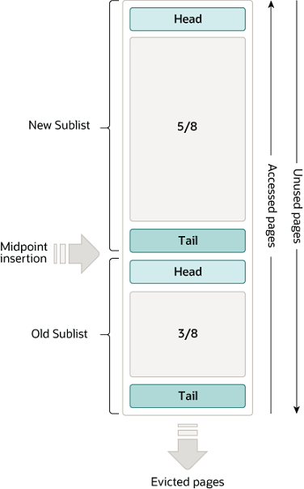

# 资料

MySQL8.0官方参考手册：https://dev.mysql.com/doc/refman/8.0/en/

# 概述

MySQL 是最流行的开源、**关系型 SQL 数据库管理系统**，由 Oracle Corporation 开发、分发和支持。

使用C和C++开发、内核线程实现的多线程。

## jdbc.properties

记录连接MySQL的驱动配置：

```properties
# mysql 5 驱动不同 com.mysql.jdbc.Driver 
# mysql 8 驱动不同com.mysql.cj.jdbc.Driver、需要增加时区的配置 
# serverTimezone=GMT%2B8 

spring.datasource.username=root 
spring.datasource.password=123456 
spring.datasource.url=jdbc:mysql://localhost:3306/test?useSSL=false&useUnicode=true&characterEncoding=utf-8&serverTimezone=GMT%2B8 
# 主要是要加上时区，其它的参数可以加也可以不加
spring.datasource.driver-class-name=com.mysql.cj.jdbc.Driver
```


## 新功能

**MySQL8新增的部分功能如下：**(我简单的选了一些看得懂的)

1. 默认字符集已从 `latin1`更改为`utf8mb4`。

2. [JSON数据类型](https://dev.mysql.com/doc/refman/8.0/en/json.html)

3. 优化器新增功能：
   - 支持不可见索引
   - 支持降序索引
4. [窗口函数](https://dev.mysql.com/doc/refman/8.0/en/window-functions.html)
5. [多值索引](https://dev.mysql.com/doc/refman/8.0/en/create-index.html#create-index-multi-valued)
6. RIGHT JOIN 作为 LEFT JOIN 处理。
7. [数据字典](https://dev.mysql.com/doc/refman/8.0/en/data-dictionary.html)

## 常用命令

```sql
# mysql 命令
# 登录MySQL服务
mysql -h localhost -u root -p # 然后输入密码
# 从文本文件执行SQL语句(需注意文件首句SQL应是 USE db_name来选择导入哪个数据库)
mysql < text_file
mysql db_name text_file # 这样的话则无需在文件中指定数据库名

# 查询MySQL版本/当前用户
mysql> SELECT VERSION(),USER();
+-----------+----------------+
| VERSION() | USER()         |
+-----------+----------------+
| 8.0.30    | root@localhost |
+-----------+----------------+
1 row in set (0.01 sec)

# 展示所有数据库
SHOW DATABASES;
# 使用某个数据库
USE [database_name];
# 展示当前使用的哪个数据库
SELECT DATABASE();

# 展示数据库内所有表
SHOW TABLES;
# 某个表的详细信息
DESCRIBE [table_name];
# 查看表的DDL语句
SHOW CREATE TABLE table_name;
```

## 索引管理

#### 1.添加或删除索引

```sql
-- 普通索引
ALTER table tableName ADD INDEX indexName(列名...)
-- 唯一索引
ALTER table mytable ADD UNIQUE [indexName] (列名...)
-- 全文索引 并指定解析器为ngram
ALTER TABLE 表名 ADD FULLTEXT INDEX 索引名 (列名) WITH PARSER ngram;

-- 显示索引信息
SHOW INDEX FROM table_name\G

-- 删除索引
DROP INDEX 索引名 ON 表名;
```

#### 2.全文索引

在MySQL 5.6版本以前,只有MyISAM存储引擎支持全文引擎.在5.6版本中,InnoDB加入了对全文索引的支持,但是不支持中文全文索引.在5.7.6版本,MySQL内置了ngram全文解析器,用来支持亚洲语种的分词.

MySQL的全文索引查询有多种模式，经常使用两种.
需要注意的是，MySQL的`倒排索引`对于小数据量可以这么做，但是对于大数据量，还是用ElasticSearch比较好。

MySQL全文索引以**词频**作为唯一标准。

缺点：《高性能MySQL》P304

> 1、全文索引的INSERT、UPDATE、DELETE操作代价很高；
> 2、“双B-Tree"结构会有更多的碎片，需要更多的OPTIMIZE TABLE操作；
> 3、影响MySQL查询优化器的工作；

##### 自然语言搜索

就是普通的包含关键词的搜索.

```sql
-- 一个查询中同时使用两次MATCH并不会有额外的消耗
SELECT id,article_title,MATCH (article_title) AGAINST ('应届生' IN NATURAL LANGUAGE MODE) AS relevance
FROM mk_article 
WHERE MATCH (article_title) AGAINST ('应届生' IN NATURAL LANGUAGE MODE);
-- 省略模式说明也是可以的，即默认情况是自然语言搜索
SELECT * FROM articles WHERE MATCH (title,body) AGAINST ('精神');
```

这类搜索会**自动按照相似度进行排序**

> 注意：如果全文索引是多列索引，MATCH函数中指定的列必须和全文索引指定的列完全相同，因为全文索引并不会记录某个关键词来自于哪个列。
>
> 绕过方法：《高性能MySQL》P301

##### 布尔全文索引

在布尔全文索引中，可以在查询里定义某个关键词的相关性，过滤噪声词。
**搜索结果是未经排序的**。

布尔全文索引通用修饰符:

| 修饰符 | 作用                 |
| ------ | -------------------- |
| 无     | rank值更高           |
| ~      | 使得rank值下降       |
| +      | 必须包含             |
| -      | 不能包含             |
| 阿里*  | 以阿里开头的rank更高 |

案例：

```sql
SELECT id,article_title,MATCH (article_title) AGAINST ('~应届生 +阿里 哈佛*' IN BOOLEAN  MODE) AS relevance
FROM mk_article
WHERE MATCH (article_title) AGAINST ('~应届生 +阿里 哈佛*' IN BOOLEAN MODE);
```

# 数据类型

## 数值

注意：**整数类型可以指定显示宽度**，最大为255，其与值范围无关。如INT(4)指定其显示宽度为4位，应用程序可以使用此可选显示宽度来显示宽度小于为列指定的宽度的整数值，方法是用空格向左填充它们。（也就是说，这个宽度存在于随结果集返回的元数据中。是否使用它取决于应用程序。）

**显示宽度**不限制值范围，超过宽度的值将使用完整值显示。

| 类型        | 存储（B） | 有符号最小值  | 最小值无符号 | 有符号最大值 | 最大值无符号 |
| :---------- | :-------- | :------------ | :----------- | :----------- | :----------- |
| `TINYINT`   | 1         | `-128`        | `0`          | `127`        | `255`        |
| `SMALLINT`  | 2         | `-32768`      | `0`          | `32767`      | `65535`      |
| `MEDIUMINT` | 3         | `-8388608`    | `0`          | `8388607`    | `16777215`   |
| `INT`       | 4         | `-2147483648` | `0`          | `2147483647` | `4294967295` |
| `BIGINT`    | 8         | `-2^63`       | `0`          | `2^63-1`     | `2^64-1`     |

- BIT[(M)]：位值，M指示位数，1-64，默认1
- BOOL, BOOLEAN：是TINYINT(1)同义词，即被当做该类型处理。

- SERIAL：是BIGINT UNSIGNED NOT NULL AUTO_INCREMENT UNIQUE同义词。

- DECIMAL[(M[,D])]：M是总位数，默认10最大65，D是小数位数，默认0。
- FLOAT(p)：浮点数，p表示位精度，0-24为单精度浮点数，4B存储；25-53为双精度浮点数，8B存储。
  注：原本的FLOAT(M,D)和DOUBLE(M,D)在MySQL8.0.17已弃用。

## 时间

- DATE：范围`'1000-01-01'到'9999-12-31'`，用于生日字段
- DATETIME[(fsp)]：范围是 `'1000-01-01 00:00:00.000000'`到 `'9999-12-31 23:59:59.999999'`。fsp指定小数秒精度，默认0。
- TIMESTAMP[(fsp)]：时间搓，范围是`'1970-01-01 00:00:01.000000'`UTC 到`'2038-01-19 03:14:07.999999'`UTC。fsp指定小数秒精度，默认0.
  注意：MySQL 将`TIMESTAMP`值从当前时区转换为 UTC 进行存储，然后从 UTC 转换回当前时区以进行检索。如果有海外机房，一定要注意时区问题，最好在连接时给定当地时区。

对于插入时间或更新时间字段，可以通过给默认值或自动更新：这样可以在业务处理时忽略对更新时间的关注。

```sql
CREATE TABLE t1(
  -- 给定默认插入时间
	create_time DATETIME DEFAULT NOW(),
  -- 更新时间自动更新
  update_time DATETIME DEFAULT NOW() ON UPDATE NOW(),
  -- 如果有精度，则必须给定精度函数
  modify_time TIMESTAMP(6) DEFAULT NOW(6) ON UPDATE NOW(6)
);
```

`NOW()`和`CURRENT_TIMESTAMP()`同义。


## 字符串

- CHAR(M)：固定长度字符串，不足时以空格填充，M表示长度，范围0~255，默认1。
- VARCHAR(M)：变长字符串，M表示最大字符个数，受限于行大小(默认65535B)。
  注意：varchar值需额外存储字节长度，如果值不超过255B则用1B存储，超过则用2B存储。
  这也是为什么推荐varchar(255)的原因，不过呢在utf8mb4字符集下，这个255没啥意义。

- TINYBLOB：存储最多255B，额外1B存储长度
- BLOB：存储最多65535B，额外2B存储长度，BLOB值视为二进制字符串(字节字符串)。
- MEDIUMBLOB：存储最多(2^24-1)B，额外3B存储长度
- LONGBLOB：存储最多4GB，额外4B存储长度
- ENUM('v1',...)：枚举，值在内部存储为整数，查询时再翻译回字符串，大大节省存储空间
- SET('v1',...)：集合，值在内部存储为位图，一个SET列最多有64个不同成员。

1、当插入的值超过CHAR或VARCHAR指定长度时，将根据服务器SQL模式有不同策略，默认是报错无法插入。

2、ENUM在内部以数字索引号存储，从1开始，空串为0：

```sql
CREATE TABLE t1(
	id BIGINT AUTO_INCREMENT PRIMARY KEY,
  sex ENUM('male','female'),
  role ENUM('admin','rd','qa')
);
-- 查男性
SELECT * FROM t1 WHERE sex='male'; -- 或 sex=1
-- 查女性
SELECT * FROM t1 WHERE sex='female'; -- 或 sex=2 
```

官方建议枚举不要存储数字，因为MySQL很可能将其和索引号混淆！

**枚举排序将根据索引号排序**，如果业务必须用到枚举排序，请确保按照字典序定义枚举元素。

3、SET在内部也是以整数存储，不过以8B整数的每个bit位表示一个元素，所以最多支持64个元素。

```sql 
-- 查找有rd的列
SELECT * FROM t1 WHERE role & 0b010; 
-- 等价于 WHERE FIND_IN_SET('rd',role)>0
-- 等价与 WHERE role LIKE '%rd%';

-- 查找有admin或rd的列
SELECT * FROM t1 WHERE role & 0b011;
-- 等价于 WHERE FIND_IN_SET('admin',role)>0 OR FIND_IN_SET('rd',role)>0

# 注意：role='x,y'是全等, 即只能是这个值
# 注意：不能直接将其与二进制数比较，即 WHERE role = 0b010无法查出数据
# 但是可以将其转为数字进行操作：role | 0
SELECT * FROM t1 WHERE (role|0)=0b11;
# 等价于 role = 'admin,rd'
```

## JSON

```sql
CREATE TABLE t1(
  id BIGINT AUTO_INCREMENT PRIMARY KEY;
	json_col JSON;
);
```

### 常用函数

- JSON_TYPE()函数将json字符串解析得到其json类型

- JSON_ARRAY()函数将参数拼装为json数组：`SELECT JSON_ARRAY(1,2,NOW());`
- JSON_OBJECT()函数将参数拼装为JSON对象: `SELECT JSON_OBJECT('key1',1,'key2','abc');`

### 合并

MySQL8有2个合并函数：

- JSON_MERGE_PRESERVE()，（mysql5.7的JSON_MERGE()函数是此别名，但已弃用）
- JSON_MERGE_PATCH()

两者在处理重复键有区别：前者保留重复键的值并合并，后者仅保留最后一个重复键的值

1、合并数组：

```sql
mysql> SELECT
    ->   JSON_MERGE_PRESERVE('[1, 2]', '["a", "b", "c"]', '[true, false]') AS Preserve,
    ->   JSON_MERGE_PATCH('[1, 2]', '["a", "b", "c"]', '[true, false]') AS Patch\G
*************************** 1. row ***************************
Preserve: [1, 2, "a", "b", "c", true, false]
   Patch: [true, false]
```

2、合并对象

```sql
mysql> SELECT
    ->   JSON_MERGE_PRESERVE('{"a": 1, "b": 2}', '{"c": 3, "a": 4}', '{"c": 5, "d": 3}') AS Preserve,
    ->   JSON_MERGE_PATCH('{"a": 3, "b": 2}', '{"c": 3, "a": 4}', '{"c": 5, "d": 3}') AS Patch\G
*************************** 1. row ***************************
Preserve: {"a": [1, 4], "b": 2, "c": [3, 5], "d": 3}
   Patch: {"a": 4, "b": 2, "c": 5, "d": 3}
```

3、数组和对象的合并

```sql
mysql> SELECT
	  ->   JSON_MERGE_PRESERVE('[10, 20]', '{"a": "x", "b": "y"}') AS Preserve,
	  ->   JSON_MERGE_PATCH('[10, 20]', '{"a": "x", "b": "y"}') AS Patch\G
*************************** 1. row ***************************
Preserve: [10, 20, {"a": "x", "b": "y"}]
   Patch: {"a": "x", "b": "y"}
```

### 路劲语法

路劲语法：前导`$`，后面跟着选择器：

- `.key`：查找键名对象
- `[N]`：数组元素下标
- `[M to N]`：数组子集，闭区间。
- `last`：数组表示最右边元素下标，用法如：`$[last-3 to last-1]`
- `*`通配符
  - `.[*]`：JSON对象所有成员
  - `[*]`：JSON数组所有元素
  - `prefix**suffix`：前缀满足且后缀满足
- `**`：任意路劲

```sql
mysql> SELECT JSON_EXTRACT('{"a": 1, "b": 2, "c": [3, 4, 5]}', '$.*');
+---------------------------------------------------------+
| JSON_EXTRACT('{"a": 1, "b": 2, "c": [3, 4, 5]}', '$.*') |
+---------------------------------------------------------+
| [1, 2, [3, 4, 5]]                                       |
+---------------------------------------------------------+
mysql> SELECT JSON_EXTRACT('{"a": 1, "b": 2, "c": [3, 4, 5]}', '$.c[*]');
+------------------------------------------------------------+
| JSON_EXTRACT('{"a": 1, "b": 2, "c": [3, 4, 5]}', '$.c[*]') |
+------------------------------------------------------------+
| [3, 4, 5]                                                  |
+------------------------------------------------------------+
```

### CRUD

- JSON-INSERT()
- JSON-REPLACE()
- JSON-SET()
- JSON-EXTRACT()
- JSON-REMOVE

文档：https://dev.mysql.com/doc/refman/8.0/en/json.html#json-paths


# MySQL应用程序

- [mysqld](https://dev.mysql.com/doc/refman/8.0/en/mysqld-server.html)：SQL守护进程（是MySQL服务器，一般以这个启动）
- mysqld_safe：服务器启动脚本
- mysql.server：服务器启动脚本
- mysqlcheck：表维护程序
- mysqldump：数据库备份程序
- mysqlslap：负载仿真客户端，https://dev.mysql.com/doc/refman/8.0/en/mysqlslap.html
- mysqlbinlog：处理二进制日志文件的实用程序
- mysqldumpslow：总结慢查询日志文件

## dump-数据库备份

mysqldump程序将进行**逻辑备份**，生成的是一组SQL语句文件，执行这些SQL来重现数据库原始数据。

更多细节看下面备份与恢复部分描述。


## slap-负载仿真

[**mysqlslap**](https://dev.mysql.com/doc/refman/8.0/en/mysqlslap.html)是一个诊断程序，旨在模拟 MySQL 服务器的客户端负载并报告每个阶段的时间。它的工作方式就好像多个客户端正在访问服务器一样。

文档：https://dev.mysql.com/doc/refman/8.0/en/mysqlslap.html

## binlog-二进制日志

文档：https://dev.mysql.com/doc/refman/8.0/en/mysqlbinlog.html

### 备份binlog

参数选项：

- `--read-from-remote-server`：从远程服务器备份到本地(即本地为远处服务器的副本服务器)。还需结合以下参数：
  - `--host`
  - `--user`
  - `--password`
- `--raw`：写入原始（二进制）输出，而不是文本输出
- `--stop-never`：到达最后一个日志文件的末尾后**保持与服务器的连接**，并继续等待读取新的事件。

- `--result-file`：输出备份文件名的前缀，一般用于指定目录

查看须备份的服务器有哪些binlog：

```sql
mysql> SHOW BINARY LOGS;
+---------------+-----------+-----------+
| Log_name      | File_size | Encrypted |
+---------------+-----------+-----------+
| binlog.000130 |     27459 | No        |
| binlog.000131 |     13719 | No        |
| binlog.000132 |     43268 | No        |
+---------------+-----------+-----------+
```

**1、静态备份**

```sql
-- 指定备份哪些binlog
mysqlbinlog --read-from-remote-server --host=host_name --raw
  binlog.000130 binlog.000131 binlog.000132

-- 备份从某binlog开始到最后
mysqlbinlog --read-from-remote-server --host=host_name --raw
  --to-last-log binlog.000130
```

**2、实时备份**

```sql
-- 从指定的binlog开始复制，并保持连接以复制新事件
mysqlbinlog --read-from-remote-server --host=host_name --raw
  --stop-never binlog.000130
```

使用[`--stop-never`](https://dev.mysql.com/doc/refman/8.0/en/mysqlbinlog.html#option_mysqlbinlog_stop-never)，无需指定 [`--to-last-log`](https://dev.mysql.com/doc/refman/8.0/en/mysqlbinlog.html#option_mysqlbinlog_to-last-log)读取到最后一个日志文件，因为该选项是隐含的。

> 注意：**实时备份的缺点是不会自动重连**。
>
> 实时备份mysqlbinlog的连接终止（如主服务器挂了或该进程被kill），主服务器恢复后，不会进行自动重连，这点不如副本服务器。

**3、输出文件名**

默认在当前目录中写入与原始日志文件同名的文件。`--result-file`可指定文件名前缀(或目录)。

| 选项                   | 输出文件名          |
| ---------------------- | ------------------- |
| `--result-file=x`      | xbinlog.000130      |
| `--result-file=/tmp/`  | /tmp/binlog.000130  |
| `--result-file=/tmp/x` | /tmp/xbinlog.000130 |

### dump+binlog备份和恢复示例

1、定时执行mysqldump命令转储服务器数据快照：

```sql
-- 备份所有数据
-- 选项`--master-data=2`将当前binlog坐标包含在转储文件中
mysqldump --host=host_name --all-databases --events --routines --master-data=2> dump_file
```

2、对binlog进行**实时备份**：

```sql
mysqlbinlog --read-from-remote-server --host=host_name --raw
  --stop-never binlog.000001
```

3、若发生数据丢失，如服务器挂了，**用最新的dump快照先恢复数据，再以binlog修复快照之后的数据**：

```sql
mysql --host=host_name -u root -p < dump_file
```

然后使用二进制日志备份重新执行在转储文件中列出的坐标之后写入的事件。假设文件中的坐标如下所示：

```none
-- CHANGE MASTER TO MASTER_LOG_FILE='binlog.000002', MASTER_LOG_POS=27284;
```

如果最近备份的日志文件名为 `binlog.000004`，则重新执行日志事件，如下所示：

```terminal
mysqlbinlog --start-position=27284 binlog.000002 binlog.000003 binlog.000004
  | mysql --host=host_name -u root -p
```

将备份的dump文件和binlog文件都先复制到服务器主机后再进行恢复操作会更方便。

## dumpslow-慢查询日志

文档：https://dev.mysql.com/doc/refman/8.0/en/mysqldumpslow.html

`mysqldumpslow`程序可解析 MySQL 慢查询日志文件并汇总其内容。

```sql
mysqldumpslow [options] [log_file...]
```


# 服务器日志

| 日志类型               | 日志信息                                                     |
| :--------------------- | :----------------------------------------------------------- |
| Error log              | mysqld程序启动、运行、停止时产生的问题                       |
| General query log      | 已建立的客户端连接和从客户端收到的语句                       |
| Binary log             | 更改数据的语句（也用于复制）                                 |
| Relay log              | Data changes received from a replication source server       |
| Slow query log         | 执行超过参数 [`long_query_time`](https://dev.mysql.com/doc/refman/8.0/en/server-system-variables.html#sysvar_long_query_time) 的SQL语句 |
| DDL log (metadata log) | DDL语句执行的元数据操作                                      |

处理错误日志默认启动，其它日志默认不启动。

## 日志存储

mysql服务器日志的存储载体以`log_output`变量指定：(注redolog属于Innodb日志)

```sql
-- log_output: 日志记录目的地
-- 可选：FILE(记录到文件)、TABLE(记录到表)、NONE(不记录)
mysql> SHOW VARIABLES LIKE 'log_output';
+---------------+-------+
| Variable_name | Value |
+---------------+-------+
| log_output    | FILE  |
+---------------+-------+
```

可以同时将日志写入表和文件中：`log_output=FILE,TABLE`

默认以文件存储日志，用日志表存储有如下优点：

- 格式标准(表结构)
- 可通过SQL查询日志，比如查询某些特殊客户端`user_host`日志

可用如下SQL查询日志表的结构：(建议直接用Navicat等GUI工具看表结构)

```sql
SHOW CREATE TABLE mysql.general_log;
SHOW CREATE TABLE mysql.slow_log;

-- 比如慢查询表DDL如下:
CREATE TABLE `slow_log` (
  `start_time` timestamp(6) NOT NULL DEFAULT CURRENT_TIMESTAMP(6) ON UPDATE CURRENT_TIMESTAMP(6),
  `user_host` mediumtext NOT NULL,
  `query_time` time(6) NOT NULL,
  `lock_time` time(6) NOT NULL,
  `rows_sent` int NOT NULL,
  `rows_examined` int NOT NULL,
  `db` varchar(512) NOT NULL,
  `last_insert_id` int NOT NULL,
  `insert_id` int NOT NULL,
  `server_id` int unsigned NOT NULL,
  `sql_text` mediumblob NOT NULL,
  `thread_id` bigint unsigned NOT NULL
) ENGINE=CSV DEFAULT CHARSET=utf8mb3 COMMENT='Slow log';
```

> 注意：日志表不会写入binlog，因此不会复制到副本。

## 错误日志

```sql
mysql> show variables like 'log_error%';
+----------------------------+----------------------------------------+
| Variable_name              | Value                                  |
+----------------------------+----------------------------------------+
| log_error                  | /var/log/mysqld.log                    |
| log_error_services         | log_filter_internal; log_sink_internal |
| log_error_suppression_list |                                        |
| log_error_verbosity        | 2                                      |
+----------------------------+----------------------------------------+
```

`log_error`参数指定错误日志文件名，可配置`stderr`表示标准控制台错误输出

`log_error_services`参数指定加载哪些日志组件，比如可以配置json组件使日志输出格式为json，具体配置看文档。

## 一般查询日志

**general_log仅记录SELECT和SHOW等不修改数据的语句**。

```sql
-- general_log: 是否开启一般查询日志
mysql> SHOW VARIABLES LIKE '%general%';
+------------------+-------------------------------+
| Variable_name    | Value                         |
+------------------+-------------------------------+
| general_log      | OFF                           |
| general_log_file | /var/lib/mysql/k8s-master.log |
+------------------+-------------------------------+
```

一般查询日志默认不开启；默认文件名为`${主机名}.log`。

## 二进制日志

**binlog记录数据库写操作**，如表DDL和表DML语句。可用`mysqlbinlog`程序显示binlog文件内容。

用途：

- 主从复制
- 数据恢复：dump和binlog结合恢复数据

事务是整体写入文件的，从不在文件之间拆分。

```sql
mysql> show variables like 'log_bin%';
+---------------------------------+-----------------------------+
| Variable_name                   | Value                       |
+---------------------------------+-----------------------------+
| log_bin                         | ON                          |
| log_bin_basename                | /var/lib/mysql/binlog       |
| log_bin_index                   | /var/lib/mysql/binlog.index |
| log_bin_trust_function_creators | OFF                         |
| log_bin_use_v1_row_events       | OFF                         |
+---------------------------------+-----------------------------+
```

`log_bin`：配置是否启动binlog，默认启动。

`log_bin_basename`：指定binlog基本名，然后以自增数字填充完整文件名，如`binlog.000001`

`max_binlog_size`：单个binlog文件大小，默认1GB。

`log_bin_index`：为了跟踪使用了哪些二进制日志文件，创建了二进制日志索引文件，基本名字和binlog相同，扩展名为`.index`

### 日志格式

`binlog_format`：指定binlog记录的日志格式。

- `STATEMENT`：记录写操作SQL语句。**对于非确定性SQL如`now()`等时间函数会出现主从数据不一致问题。**

- `ROW`：默认，记录行的修改
- `MIXED`：混合模式，一般记录SQL，非确定性SQL情况下记录行修改。

在少量SQL语句会修改大量行的情况下，记录SQL更有效，而某些SQL的WHERE过滤可能需要大量执行时间，但只会修改几行，此时记录行修改更有效。

> 注意：如果使用innodb引擎且事务隔离级别为`READ_COMMITTED`或`READ_UNCOMMITED`，只能使用基于行的日志格式。

## 慢查询日志

slowlog记录执行时间超过`long_query_time`的SQL，`mysqldumpslow`命令可处理slowlog并汇总其内容。

| 参数                          | 描述                 | 默认值            |
| ----------------------------- | -------------------- | ----------------- |
| slow_query_log                | 开启慢查询日志       | OFF               |
| slow_query_log_file           | slowlog文件名        | {主机名}-slow.log |
| long_query_time               | 慢查询阈值(second)   | 10                |
| log_queries_not_using_indexes | 未使用索引的查询语句 | OFF               |

以下参数将确定最终是否写入slowlog：

`min_examined_row_limit`：默认0，查询扫过的行，少于此参数的查询语句不会写入slowlog

`log-throttle-queries-not-using-indexes`：如果 [`log_queries_not_using_indexes`](https://dev.mysql.com/doc/refman/8.0/en/server-system-variables.html#sysvar_log_queries_not_using_indexes) 启用，该 [`log_throttle_queries_not_using_indexes`](https://dev.mysql.com/doc/refman/8.0/en/server-system-variables.html#sysvar_log_throttle_queries_not_using_indexes) 变量会限制每分钟可以写入慢速查询日志的此类查询的数量。默认0表示无限制。

### 配置慢查监控

在Linux服务器上的配置文件my.cnf下如下配置：

```properties
# 慢查询日志
slow_query_log=on # 这个参数设置为ON，可以捕获执行时间超过一定数值的SQL语句
slow_query_log_file=/opt/mysql/mysql_slow_query.log  # 记录日志的文件名，必须有写权限
long_query_time=1 # 当SQL语句执行时间超过此数值时，就会被记录到日志中，建议设置为1或者更短
```

重启MySQL服务即可。

也可以选择将未使用索引的查询语句也记录都slow log中：

```properties
# set slow query on 
# 日志输出格式，FILE或TABLE
log_output=file
# 开启慢查询日志
slow_query_log=on
# 慢查询日志文件位置
slow_query_log_file = /tmp/mysql-slow.log
# 慢查询阈值，大于此值的SQL语句会被记录，单位s
long_query_time = 1
# 未使用索引也放入慢查询日志中
log_queries_not_using_indexes=on
# 每分钟允许记录到slow log的且未使用索引的SQL语句次数，默认0
log_throttle_queries_not_using_indexes=10
```


# 备份与恢复

## 备份与恢复类型

一般来说：全量备份(快照)采用物理备份，增量备份采用逻辑备份。

1、物理备份：

物理备份包括存储数据库内容的目录和文件的原始副本。这种备份适用于发生问题时需要快速恢复的大型、重要的数据库。

**物理备份比逻辑备份更快。**

物理备份工具都是企业版功能。

2、逻辑备份：

逻辑备份保存为逻辑数据库结构和内容信息，这种类型的备份适用于您可以编辑数据值或表结构，或在不同机器架构上重新创建数据的少量数据。

逻辑备份输出大于物理备份，尤其是在以文本格式保存时。

具有高度可移植性。

逻辑备份工具包括`mysqldump`、`mysqlimport`程序

3、在线备份（热备份）、离线备份（冷备份）

热备份不停机，需 MySQL Enterprise Backup企业版产品

4、本地与远程备份

`mysqldump`命令可以连接本地或远程服务器进行备份。

5、快照备份：如写时复制技术。

6、全量备份(快照)和增量备份

增量恢复是恢复在给定时间跨度内所做的更改。这也称为时间点恢复，因为它使服务器的状态在给定时间保持最新。时间点恢复基于binlog。

## 备份方法

企业版可用 [MySQL Enterprise Backup](https://dev.mysql.com/doc/refman/8.0/en/glossary.html#glos_mysql_enterprise_backup)产品对整个实例或选定的数据库、表或两者进行物理备份。该产品包括**增量备份**和**压缩备份**的功能。

### mysqldump

mysqldump程序将进行**逻辑备份**，生成的是一组SQL语句文件，执行这些SQL来重现数据库原始数据。

> 注意：[**mysqldump**](https://dev.mysql.com/doc/refman/8.0/en/mysqldump.html)至少需要 [`SELECT`](https://dev.mysql.com/doc/refman/8.0/en/privileges-provided.html#priv_select)转储表、[`SHOW VIEW`](https://dev.mysql.com/doc/refman/8.0/en/privileges-provided.html#priv_show-view)转储视图、[`TRIGGER`](https://dev.mysql.com/doc/refman/8.0/en/privileges-provided.html#priv_trigger)转储触发器的权限

mysqldump优点是便利性和灵活性，可以自行插入一些SQL语句进行微改动。

**mysqldump不是用于备份大量数据的快速或可扩展的解决方案**，对于大量数据，即使备份用时短，但是重放SQL恢复数据耗时长，因为重放 SQL 语句涉及用于插入、索引创建等的磁盘 I/O。

**对于大规模的备份和恢复， [物理](https://dev.mysql.com/doc/refman/8.0/en/glossary.html#glos_physical)备份更为合适**，将数据文件以原始格式复制，以便快速恢复，企业版mysqlbackup命令支持物理备份。

```sql
mysqldump db_name # 备份某个数据库
mysqldump db_name [tbl_name ...] # 备份某个数据库的某些表

# 选项如下：
--database db_name... 	# 备份某些数据库
--all-databases 		# 备份所有数据库
--add-drop-database 	# 在每个 CREATE DATABASE 语句之前添加 DROP DATABASE 语句
--add-drop-table  		# 在每个 CREATE TABLE 语句之前添加 DROP TABLE 语句
--add-drop-trigger		# 在每个 CREATE TRIGGER 语句之前添加 DROP TRIGGER 语句
```

1、全量逻辑备份例子：

```sql
mysqldump --single-transaction --flush-logs --master-data=2 \
         --all-databases > demo1.sql
```

mysqldump命令进行全量备份时会**先读取此时binlog坐标**：此备份操作会获取所有表的全局读锁（使用[`FLUSH TABLES WITH READ LOCK`](https://dev.mysql.com/doc/refman/8.0/en/flush.html#flush-tables-with-read-lock)），一旦获得此锁，就会读取二进制日志坐标并释放锁。

`-flush-logs`：会将旧binlog日志落盘并创建新binlog文件，这个新文件就是增量文件。

若备份前binlog文件为demo-bin.000001：

周一3点逻辑全量备份为demo1.sql，新binlog为demo-bin.000002，将demo1保存到安全地方。

周二3点逻辑全量备份为demo2.sql，新binlog为demo-bin.000003，将demo2.sql和demo-bin.000002都保存到安全地方(如磁带或光盘)。

可以定期清理不需要的binlog以释放空间。

2、复制数据库例子：

```sql
-- 在服务器1
mysqldump --databases db1 > dump.sql

-- 在服务器2
mysql < dump.sql
```

3、分别转储表定义和数据

```sql
mysqldump --no-data db1 > dump-defs.sql # 数据库表定义
mysqldump --no-create-info db1 > dump-data.sql # 数据
```

### 制作带分隔符的文本文件

```sql
-- 仅保存表数据，不能保存表结构
SELECT * INTO OUTFILE `file_name` FROM tbl_name;
-- 加载数据
-- LOAD DATA 或 mysqlimport
```

### 主从复制

文档：https://dev.mysql.com/doc/refman/8.0/en/replication-solutions-backups.html

## 恢复

### 增量恢复

https://dev.mysql.com/doc/refman/8.0/en/point-in-time-recovery.html

### 崩溃恢复

MySQL意外退出后，直接重启即可自动恢复：https://dev.mysql.com/doc/refman/8.0/en/innodb-recovery.html#innodb-recovery-tablespace-discovery

1、表空间发现

2、redo log应用

3、回滚未完成的事务

4、change buffer合并

5、purge


# 优化

文档：https://dev.mysql.com/doc/refman/8.0/en/statement-optimization.html

## 库表列

1. 尽可能**最小数据类型**
2. **索引设为NOT NULL**，避免测试每个值是否为Null，还可以节省一些存储空间，每列一位。
3. 修改Innodb默认的DYNAMIC行格式，选用紧凑的如COMPACT/COMPRESSED，这会增加CPU消耗。如果您的工作负载是受缓存命中率和磁盘速度限制的典型工作负载，则它可能会更快。
4. **列名尽可能短**，利于dump、binlog的备份/复制
5. 数据不冗余（第三范式）和冗余（利于查询）之间的权衡
6. 能用数字就不要用字符串
7. **冷热分离**，热字段放主表，冷字段放详情表（从表）
8. BLOB大文本优化：
   - 压缩
   - 拆为单独的表，让主表数据行紧凑，范围扫描时可减少主表io
   - 放在单独的数据库甚至不同的存储设备：一般以单个id查BLOB，大量顺序读，更适合传统硬盘驱动器而不是 [SSD 设备](https://dev.mysql.com/doc/refman/8.0/en/glossary.html#glos_ssd)。
9. 表大小受操作系统限制，但最好**对超过1TB的表进行分区**
10. MySQL限制表最多4096列，Innodb引擎限制1017列
11. 行大小限制65535B，BLOB和TEXT列存储在其它位置，仅占行空间9-12B。而Innodb限制每页必须存两行以上。innodb_page_size默认16KB，则每行限制8KB。
12. 


## EXPLAIN

**EXPLAIN可用于了解查询执行计划**，它根据表、列、索引等信息，可以在不读取所有行情况下执行对巨大表的查询，优化器选择执行最高效查询的一组操作成为**查询执行计划**，也被称为**EXPLAIN计划**。可以根据其执行计划，判断优化情况，进而改进。

> 可以借助BENCHMARK()函数简单观察优化效果。
>
> [BENCKMARK(count,expr)](https://dev.mysql.com/doc/refman/8.0/en/information-functions.html#function_benchmark)重复执行表达式，可以用客户端执行该函数并观察查询执行时间。
>
> `SELECT BENCKMARK(100, (SELECT id FROM t1 WHERE id=1))`

注意：如果出现索引在您认为应该使用时未被使用的问题，请运行[`ANALYZE TABLE`](https://dev.mysql.com/doc/refman/8.0/en/analyze-table.html)以更新表统计信息，例如键的基数cardinality，这可能会影响优化器所做的选择。

| Column                                                       | JSON Name       | Meaning                      |
| :----------------------------------------------------------- | :-------------- | :--------------------------- |
| [`id`](https://dev.mysql.com/doc/refman/8.0/en/explain-output.html#explain_id) | `select_id`     | The `SELECT` identifier      |
| [`select_type`](https://dev.mysql.com/doc/refman/8.0/en/explain-output.html#explain_select_type) | None            | The `SELECT` type            |
| [`table`](https://dev.mysql.com/doc/refman/8.0/en/explain-output.html#explain_table) | `table_name`    | 表                           |
| [`partitions`](https://dev.mysql.com/doc/refman/8.0/en/explain-output.html#explain_partitions) | `partitions`    | 匹配的分区                   |
| [`type`](https://dev.mysql.com/doc/refman/8.0/en/explain-output.html#explain_type) | `access_type`   | The join type                |
| [`possible_keys`](https://dev.mysql.com/doc/refman/8.0/en/explain-output.html#explain_possible_keys) | `possible_keys` | 供选择的索引                 |
| [`key`](https://dev.mysql.com/doc/refman/8.0/en/explain-output.html#explain_key) | `key`           | 实际选择的索引               |
| [`key_len`](https://dev.mysql.com/doc/refman/8.0/en/explain-output.html#explain_key_len) | `key_length`    | 选择索引的长度               |
| [`ref`](https://dev.mysql.com/doc/refman/8.0/en/explain-output.html#explain_ref) | `ref`           | 与索引相比的列               |
| [`rows`](https://dev.mysql.com/doc/refman/8.0/en/explain-output.html#explain_rows) | `rows`          | 估计要扫过的行               |
| [`filtered`](https://dev.mysql.com/doc/refman/8.0/en/explain-output.html#explain_filtered) | `filtered`      | 按条件过滤的数据行估计百分比 |
| [`Extra`](https://dev.mysql.com/doc/refman/8.0/en/explain-output.html#explain_extra) | None            | 附加信息                     |

如果要强制优化器使用某个索引，可以用`FORCE INDEX`索引提示。

1、type：连接类型，描述表是如何连接的，从最好的类型到最差的排序：

- system：查系统表

- **const**：该表最多有一个匹配行，在查询开始时读取。因为只有一行，所以优化器的其余部分可以将这一行中列的值视为常量。 `const`表非常快，因为它们只读一次。
- **eq_ref**：对于先前表中行的每个组合，从该表中读取一行，当连接使用索引为主键聚族索引或UNIQUE NOT NULL索引时
- **ref**：对于先前表中行的每个组合，从该表中读取具有匹配索引值的所有行。有索引，但无法根据索引选出连接的单个行
- fulltext：连接是使用`FULLTEXT` 索引执行的。
- index merge：使用索引合并优化
- unique_subquery
- index_subquery
- **range**：仅检索给定范围内的行，使用索引来选择行。
- **index**：index连接类型与ALL相同，只是扫描了索引树，有2种情况：
  - 如果查询的是覆盖索引，则只扫描索引树
  - 使用从索引读取以按索引顺序查找数据行来执行全表扫描。
- ALL：对先前表中每个行组合进行全表扫描，性能非常糟糕

2、filtered指示按条件过滤的表行的估计百分比，100表示没发生过滤，值越低说明索引的基数越好，选择性越高。

3、Extra：额外信息

- `Using filesort`：排序是通过根据联接类型遍历所有行，并为匹配WHERE子句的所有行存储排序关键字和指向该行的指针来完成的。

- `Using index`：覆盖索引，仅使用索引树中的信息从表中检索列信息，无须回表。

- `Using index condition`：通过索引过滤。
- `Using index for group-by`：表示MySQL找到了一个索引可用于检索GROUP BY 或 DISTINCT查询的所有列，而无需对实际表进行额外io

- `Using temporary`：为了解析查询，MySQL 需要创建一个临时表来保存结果。GROUP BY通常出现。

- `Using where`：从数据表中读取数据后进行过滤。

## 索引

提高查询性能最佳方法是建立索引，B-tree数据结构可以让索引快速找到一个值、一组值、一个范围。

不必要的索引浪费空间时间，增加插入、更新、删除的成本。找到合适的平衡点以使用最佳索引集实现快速查询。

查询有多个索引匹配时，MySQL通常使用选择性高的索引。

**复合索引**：即多列索引，一个索引最多包含16列，执行最左前缀匹配。

**覆盖索引**：查询列都在索引数据中，无须回表查询。

**前缀索引**：可以仅使用列的前几个字符，大大减小索引文件。Innodb引擎中前缀最长767B(因为超过这个数就要将数据放入到其它段，具体可看《MySQL技术内幕》)。

**全文索引**：用于全文搜索。

**空间索引**：Innodb支持空间类型的R树索引

### 胖索引改散列索引

单列索引字段特别长（超过100B且前缀索引不适用情况，如前几个字符都相同），或者复合索引列数过多，且每列较长的情况下，索引结构会非常的**宽**，此时有一种优化方式：

```sql
-- 摒弃复合索引，自建散列`hash_col`单列索引
CREATE INDEX hash_col_idx ON tbl_name (hash_col);

-- 查询时以散列索引先过滤，再进行比较
SELECT * FROM tbl_name 
WHERE hash_col=MD5(CONCAT(val1,val2,val3)) 
AND col1=val1 AND col2=val2 AND col3=val3;
```

如果col1和col2和col3加起来超过100B(这是非常可能的)，对其散列后的`hash_col`列建立索引则仅有32B，可以大大**减少索引体积**，且**发生碰撞概率很低**，查找效率会大幅提升！

改后缺点和哈希索引一模一样。


### 索引合并

Index merge通过多次扫描索引并将其结果合并，仅能合并单表扫描，不适用于全文索引。

```sql
SELECT * FROM tbl_name WHERE k1=10 AND k2=20;
```

如以上查询sql，若k1和k2都存在单列索引，则优化器尝试**分别以两个索引查询后的结果进行合并取交集**。

在EXPLAIN输出中，若适用索引合并会在type列显示index merge，在Extra字段显示使用的合并算法：

- Using intersect(...)
- Using union(...)
- Using sort_union(...)

```sql
-- 索引合并 交集
SELECT * FROM tbl_name WHERE k1 =10 AND k2=10;

-- 索引合并 联合
SELECT * FROM tbl_name WHERE k1 = 10 OR k2=20;

-- 索引合并 排序联合
SELECT * FROM tbl_name WHERE k1 <10 OR k2<20;

-- 混合
SELECT * FROM tbl_name WHERE (k1=10 AND k2=20) OR (k3=30 AND k4=40);
```

sort-union 算法和 union 算法之间的区别在于，sort-union 算法必须首先获取所有行的行 ID 并在返回任何行之前对它们进行排序。

### 隐形索引

MySQL支持不可见索引，即对优化器不可见。

```sql
-- 创建不可见索引
CREATE INDEX idx_name ON tbl_name (col...) INVISIBLE;
-- 使索引可见/不可见
ALTER TABLE t1 ALTER INDEX i_idx INVISIBLE;
ALTER TABLE t1 ALTER INDEX i_idx VISIBLE;
```

隐形索引主要目的在于测试该索引对于查询性能影响，且无需破坏性更改索引数据（加或删索引对大型表而言代价昂贵）。若设置索引隐形后性能下降明显，则说明索引是必须的，改回可见。

### 降序索引

MySQL  Innodb引擎支持降序索引：在索引定义加`DESC`，按降序存储键值。

以前，可以按相反顺序扫描索引，但会降低性能。降序索引可以正向扫描，效率更高。

```sql
CREATE TABLE t (
  c1 INT, c2 INT,
  INDEX idx1 (c1 ASC, c2 ASC),
  INDEX idx2 (c1 ASC, c2 DESC),
  INDEX idx3 (c1 DESC, c2 ASC),
  INDEX idx4 (c1 DESC, c2 DESC)
);
```

降序索引无法用于没有给出order by语句的`MIN()/MAX()函数`优化，因为此时MySQL无法猜测你想要的是正序或倒序的大小。

使用降序索引时EXPLAIN的Extra列提示：`Backward index scan; Using index`。

### ORDER BY优化

1、以索引进行order by

MySQL会尽量以索引来满足order by并避免执行filesort排序操作。

```sql
SELECT key_part1, key_part2 FROM tbl ORDER BY key_part1, key_part;
SELECT * FROM tbl ORDER BY key_part1, key_part2;
```

第一条SQL，将会直接以索引查询，避免排序。

第二条SQL，扫描整个索引并查找数据行，在数据量很大时会产生大量随机io，这可能比全表扫描并filesort更耗时。

2、以filesort进行order by

若不能以索引避免排序，将执行filesort，此时EXPLAIN结果的Extra列显示`Using filesort`。

`sort_buffer_size`参数控制filesort操作内存，默认256KB。

如果`filesort`结果集太大而无法放入内存，则操作会根据需要使用临时磁盘文件。

3、提高order by 速度

- 优先考虑使用索引自然排序
- 增加`sort_buffer_size`，避免排序集写入磁盘和合并过程
- 增加`read_rnd_buffer_size`以便一次读取更多行

### 避免全表扫描

当MySQL执行全表扫描时，EXPLAIN在type列显示ALL。

在以下情况会全表扫描：

- 表很小，全表扫描比索引快得多
- 没有索引可用
- 查询的结果集过大(20%以上)，走索引反而不如全部扫描
- 索引的cardinality值太低了，走索引反而不如全部扫描

对于大型表，以下技术可以避免优化器选错索引：

- 定时执行`ANALYZE TABLE tbl_name`
- `FORCE INDEX`强制使用某个索引

## 哈希join优化

MySQL 8.0.18 开始会尽可能对join查询使用哈希进行优化，即hash join，通常比以前[块嵌套循环连接算法](https://dev.mysql.com/doc/refman/8.0/en/nested-loop-joins.html#block-nested-loop-join-algorithm) 更快。从 MySQL 8.0.20 开始，删除了对块嵌套循环的支持。

EXPLIAN时的Extra列：`Using join buffer (hash join)`

```sql
SELECT * FROM tbl1 
INNER JOIN tbl2 ON tbl.c1=tbl2.c1;
```

在 MySQL 8.0.20 之前，如果任何一对连接表不具备至少一个 equi-join 条件，则无法使用哈希连接，并且采用较慢的块嵌套循环算法。MySQL 8.0.80后非等值join也能使用hash join。

```sq;
mysql> EXPLAIN FORMAT=TREE SELECT * FROM t1 JOIN t2 ON t1.c1 < t2.c1\G
*************************** 1. row ***************************
EXPLAIN: -> Filter: (t1.c1 < t2.c1)  (cost=4.70 rows=12)
    -> Inner hash join (no condition)  (cost=4.70 rows=12)
        -> Table scan on t2  (cost=0.08 rows=6)
        -> Hash
            -> Table scan on t1  (cost=0.85 rows=6)
```

参数`join_buffer_size`控制hash join的内存使用，默认256KB。超过限制时将使用文件处理。此参数可设高点。

## Multi-Range读取优化

多范围读取(MRR)：在表很大时，通过索引范围读取数据行可能会导致对基表的多次随机io。

MySQL为了减少范围扫描的随机io次数，会先仅扫描索引并收集相关主键id，对其排序后从基表的主键聚族索引顺序读取数据

## 优化innodb表

1、优化存储布局

- 数据稳定时，可使用`OPTIMIZE TABLE`语句重组并压缩任何浪费空间以减少I/O。
  `OPTIMIZE TABLE`复制表的数据并重建索引，减少表空间和磁盘碎片。
- 大量重复文本或数字数据的表，考虑使用`COMPRESSED`行格式。最好先衡量COMPRESSED格式相比`COMPACT`行格式(Innodb默认)可以实现的压缩量。

2、批量数据导入

- 关闭自动提交模式，因为它会为每次插入执行日志刷新到磁盘。
- 关闭唯一性检查：`SET unique_checks=0`，导入后再改回1.

- 在对具有自动递增列的表进行批量插入时，设置 [`innodb_autoinc_lock_mode`](https://dev.mysql.com/doc/refman/8.0/en/innodb-parameters.html#sysvar_innodb_autoinc_lock_mode)为 2（交错）而不是 1（连续）。

3、优化Innodb磁盘i/o：在CPU利用率较低时很可能受磁盘io限制

- 增加缓冲池大小：`innodb_buffer_pool_size`，可设为系统内存的50%-75%
- 通过将[**文件符号链接到不同的磁盘**](https://dev.mysql.com/doc/refman/8.0/en/symbolic-links.html)或条带化磁盘来增加可用磁盘轴的数量（从而减少寻道开销）
- 将NFS与MySQL一起用，但需要谨慎。

4、优化Innodb配置变量

- 配置change buffer：`innodb_change_buffering`

- 如果出现频繁上下文切换至瓶颈，配置线程并发量：[`innodb_thread_concurrency`](https://dev.mysql.com/doc/refman/8.0/en/innodb-performance-thread_concurrency.html)

- 利用多核处理器及其缓存内存配置，最大限度地减少上下文切换的延迟：[“配置自旋锁轮询”](https://dev.mysql.com/doc/refman/8.0/en/innodb-performance-spin_lock_polling.html)。

## 优化锁定操作

1、行锁：

Innodb支持行锁，为避免在单表多个并发写入操作时出现死锁而回滚，可以在事务开始时通过`SELECT ... FOR UPDATE`为每组预期要修改的行发出一条语句来获取必要的锁，即使数据更改语句出现在事务的后面也是如此。

行锁优点：

- 当不同的会话访问不同的行时，锁冲突更少
- 回滚更改更少
- 可能长时间锁定单行

2、表锁

优点：

- 所需内存相对较少（行锁定需要每行或每组行锁定的内存）
- 在表的大部分上使用时速度很快，因为只涉及一个锁。
- 如果您经常`GROUP BY` 对大部分数据进行操作或者必须经常扫描整个表，则速度很快。

**写锁申请优先级高于读锁申请**，这样可以保证写锁申请不会饿死，但是写申请很多时可能会造成读申请饥饿。如Java的ReadWriteLock也是同样逻辑。

```sql
mysql> LOCK TABLES t1 READ;
mysql> SELECT COUNT(*) FROM t1;
+----------+
| COUNT(*) |
+----------+
|        3 |
+----------+
mysql> SELECT COUNT(*) FROM t2;
ERROR 1100 (HY000): Table 't2' was not locked with LOCK TABLES
```


## Innodb缓冲池优化

Innodb在内存中维护有缓冲池，缓存InnoDB表数据、索引和辅助数据，实现为页面链表，采用LRU算法。

`innodb_buffer_pool_size`变量定义缓冲池大小，推荐为系统内存的50%~75%。缓冲池太小可能导致过度搅动，页面刷新频繁，太大可能导致系统内存竞争而导致页面交换。

有关其他`InnoDB`缓冲池配置和调整信息，请参阅以下部分：

- [第 15.8.3.4 节，“配置 InnoDB 缓冲池预取（预读）”](https://dev.mysql.com/doc/refman/8.0/en/innodb-performance-read_ahead.html)
- [第 15.8.3.5 节，“配置缓冲池刷新”](https://dev.mysql.com/doc/refman/8.0/en/innodb-buffer-pool-flushing.html)
- [第 15.8.3.3 节，“使缓冲池抗扫描”](https://dev.mysql.com/doc/refman/8.0/en/innodb-performance-midpoint_insertion.html)
- [第 15.8.3.2 节，“配置多个缓冲池实例”](https://dev.mysql.com/doc/refman/8.0/en/innodb-multiple-buffer-pools.html)
- [第 15.8.3.6 节，“保存和恢复缓冲池状态”](https://dev.mysql.com/doc/refman/8.0/en/innodb-preload-buffer-pool.html)
- [第 15.8.3.1 节，“配置 InnoDB 缓冲池大小”](https://dev.mysql.com/doc/refman/8.0/en/innodb-buffer-pool-resize.html)

# InnoDB存储引擎

Innodb是高可靠性和高性能的通用存储引擎。默认都应该使用Innodb。

- 遵循ACID
- 行级锁定和Oracle风格的一致性读取提高并发性
- 按主键聚族索引在磁盘上组织数据，优化基于主键查询
- 不支持集群数据库
- **不支持哈希索引**（InnoDB 在内部利用哈希索引来实现其自适应哈希索引功能）

**Innodb存储引擎的内存和磁盘架构**：


## 内存结构

### 缓冲池

缓冲池是主内存中一个区域，在专用MySQL服务器上通常将80%物理内存分配给缓冲池。

缓冲池以页面链表实现，LRU算法。

如何利用缓冲池将频繁访问的数据保存在内存中是MySQL调优的重要方面。

新页面将插入链表中间：中点插入策略将列表视为2个子列表

- 头部，维护最近访问的年轻页面的子列表
- 尾部，维护较少访问的旧页面的子列表



默认情况下：

- **新页面会插入到旧子列表头部**。

- 若该新页面是由于用户读取需要而产生，会立刻发生第1次访问，这会使其成为年轻页面移动到新子列表头部。
- 若该页面由预读产生，很可能在该页面被驱逐之前都不会发生访问。

#### 预读

预读请求是IO请求，用于异步读取缓冲池中多个预期需要的页面。Innodb有2种预读算法：线性预读和随机预读。

1、**线性预读**是根据缓冲池中顺序访问的页面来预测可能需要哪些页面。

参数`innodb_read_ahead_threshold`是顺序页面访问次数从而触发预读的阈值。如果从一个区段中顺序读取的页面数大于或等于该阈值，则启动整个后续区段的预读操作。

2、**随机预读**：如果在缓冲池中发现来自同一区段的 13 个连续页面，则 `InnoDB`异步发出请求以预取该区段的剩余页面。

要启动随机预读，配置参数`innodb_random_read_ahead`为on。

#### 刷新

Innodb后台任务包括从缓冲池刷新脏页。

1、**水位**是控制缓冲池中脏页百分比。

- `innodb_max_dirty_pages_pct_lwn`：低水位，默认缓冲池10%
- `innodb_max_dirty_pages_pct`：高水位，默认缓冲池90%

当脏页达到低水位时，将启动缓冲池刷新，主要是防止其达到高水位。

- `innodb_flush_neighbors`：定义从缓冲池中刷新页面是否也刷新相同范围内其它脏页。
  - 默认0，不刷新相邻脏页
  - 1，刷新同一个范围连续脏页
  - 2，刷新相同范围内脏页
  - 存储于磁盘时，刷新相邻页面可减少io寻道时间。但是对于SSD数据，寻道时间不重要，可禁用此设置以分散写入操作。

#### 保存和恢复缓冲池状态

为了减少服务重启后的预热时间，服务器关闭时会将缓存池中一定比例的页面保存在`innodb_buffer_pool_filename`指定文件。启动时从该文件恢复缓冲池，避免冷启动。

`innodb_buffer_pool_dump_pct`配置缓冲池页面转储百分比，默认25.

在线保存和恢复缓冲池状态：

```sql
-- 运行时保存缓冲池状态
SET GLOBAL innodb_buffer_pool_dump_now=ON;
-- 运行时恢复缓冲池状态
SET GLOBAL innodb_buffer_pool_load_now=ON;
```


### change buffer

对表进行INSERT/UPDATE/DELETE等DML操作时，二级索引通过需要大量I/O才能保持最新。当相关页面不在缓冲池时，change buffer缓存对二级索引条目的更改，避免立刻I/O，当页面加载到缓冲池时，将更改合并，更新后的页面稍后刷新到磁盘。

它可以减少磁盘I/O，对有大量DML操作的情况下很有效。

change buffer是缓冲池的一部分，占用缓冲池空间，由变量`innodb_channge_buffer_max_size`控制占用百分比，默认25，最大50。

太大会影响缓冲池页面过早老化，太小会造成change buffer合并跟不上新的change buffer条目，使得I/O增加。

## 表空间

### 通用表空间

通用表空间以CREATE TABLESPACE 语法创建共享表空间。

此表空间数据文件可以独立于MySQL数据目录之外，将数据文件放置在 MySQL 数据目录之外的能力允许您**单独管理关键表的性能**，为特定表设置 RAID 或 DRBD，或者将表绑定到特定磁盘。

```sql
# 在数据目录中创建
mysql> CREATE TABLESPACE `ts1` ADD DATAFILE 'ts1.ibd' Engine=InnoDB;

# 在数据目录外创建
mysql> CREATE TABLESPACE `ts1` ADD DATAFILE '/my/tablespace/directory/ts1.ibd' Engine=InnoDB;


# 将表添加到通用表空间
mysql> CREATE TABLE t1 (c1 INT PRIMARY KEY) TABLESPACE ts1;
mysql> ALTER TABLE t2 TABLESPACE ts1;

# 将表从file-per-table表空间或系统表空间移动到通用表空间：
ALTER TABLE tbl_name TABLESPACE [=] tablespace_name;

# 删除通用表空间, 必须先删除表空间内所有表
DROP TABLESPACE ts1;
```

### undo表空间

undo表空间包含undo log。

MySQL会创建2个默认undo表空间，为回滚段提供位置，至少需要2个来支持undo表空间的自动截断。分别为：`undo_001`和`undo_002`，默认16MB。

清除和截断：

1. purge线程负责清空和截断undo表空间，默认purge线程每128次唤醒会查找并截断一次undo 表空间，由变量[innodb_purge_rseg_truncate_frequency](https://dev.mysql.com/doc/refman/8.0/en/innodb-parameters.html#sysvar_innodb_purge_rseg_truncate_frequency) 控制。

2. 超过变量[`innodb_max_undo_log_size`](https://dev.mysql.com/doc/refman/8.0/en/innodb-parameters.html#sysvar_innodb_max_undo_log_size) 默认1GB的表空间被标记为截断，其中所有回滚段标记为非活跃状态，不再分配给新事务，仅仅允许当前事务使用。
3. purge线程释放其中不再使用的undo log来清空回滚段；表空间中所有undo段都被释放后，将表空间截断为其初始大小。
4. 回滚段激活，可重新分配。

> 注意：截断某个undo表空间时，其中的回滚段停止使用，其它undo表空间的回滚段负载增加，可能会有性能下降，避免性能影响最简单方式是增加undo表空间数量。

```sql
-- 创建undo tablespace
-- 最多支持127个undo tablespace
CREATE UNDO TABLESPACE tablespace_name ADD DATAFILE 'file_name.ibu';

-- 删除
-- 需要先停用再删除
ALTER UNDO TABLESPACE tablespace_name SET INACTIVE;
DROP UNDO TABLESPACE tablespace_name;

-- 以下状态变量允许跟踪
-- 撤消表空间的总数、隐式（InnoDB创建的）撤消表空间、显式（用户创建的）撤消表空间和活动撤消表空间的数量：
mysql> SHOW STATUS LIKE 'Innodb_undo_tablespaces%';
+----------------------------------+-------+
| Variable_name                    | Value |
+----------------------------------+-------+
| Innodb_undo_tablespaces_total    | 2     |
| Innodb_undo_tablespaces_implicit | 2     |
| Innodb_undo_tablespaces_explicit | 0     |
| Innodb_undo_tablespaces_active   | 2     |
+----------------------------------+-------+
```

### 临时表空间

分为session临时表空间和全局临时表空间。

1、会话临时表空间：一个会话最多分配2个表空间：

- 用于用户创建的临时表
- 用于优化器创建的内部临时表

2、全局临时表空间：存储回滚段，用于记录用户创建的临时表更改undo log。


## redo log

redo log是基于磁盘的数据结构，在崩溃后恢复期间使用redo log来纠正不完整的事务写入数据。

redo log在磁盘上由redo log文件进行物理记录。

随着数据修改发生，redo log文件追加数据并增加`LSN(log sequence number，日志序列号)`，LSN是8B无符号整数。

MySQL8.0.30以后redo log文件默认存储于`数据目录/#innodb_redo`目录中，innodb维护32个redo log文件，每个文件大小为`innodb_redo_log_capacity/32`：

```shell
[root@k8s-master mysql]# ls \#innodb_redo/
#ib_redo10_tmp  #ib_redo18_tmp  #ib_redo26_tmp  #ib_redo34_tmp
#ib_redo11_tmp  #ib_redo19_tmp  #ib_redo27_tmp  #ib_redo35_tmp
#ib_redo12_tmp  #ib_redo20_tmp  #ib_redo28_tmp  #ib_redo36_tmp
#ib_redo13_tmp  #ib_redo21_tmp  #ib_redo29_tmp  #ib_redo37_tmp
#ib_redo14_tmp  #ib_redo22_tmp  #ib_redo30_tmp  #ib_redo38_tmp
#ib_redo15_tmp  #ib_redo23_tmp  #ib_redo31_tmp  #ib_redo7
#ib_redo16_tmp  #ib_redo24_tmp  #ib_redo32_tmp  #ib_redo8_tmp
#ib_redo17_tmp  #ib_redo25_tmp  #ib_redo33_tmp  #ib_redo9_tmp
```

无后缀的是正在使用的重做文件，有后缀的是备用重做文件，如上就`#ib_redo7`文件正在使用。

每个正在使用的重做文件都和特定范围的LSN关联：如下查询重做日志文件的START_LSN和END_LSN

```shell
mysql> SELECT FILE_NAME, START_LSN, END_LSN FROM performance_schema.innodb_redo_log_files;
+--------------------------+-----------+----------+
| FILE_NAME                | START_LSN | END_LSN  |
+--------------------------+-----------+----------+
| ./#innodb_redo/#ib_redo7 |  22931456 | 26206208 |
+--------------------------+-----------+----------+
```

MySQL8.0.30以前重做日志文件默认存储于数据目录下，且仅有2个文件分别为：`ib_logfile0`和 `ib_logfile1`，并循环写入这些文件。

## undo log

undo log记录如何撤销事务对数据的更改。undo log存储于undo段，而undo段位于undo表空间或全局临时表空间。

存储于全局临时表空间的undo log记录用户创建的临时表更改，这些undo log不会有redo log，因为它们与崩溃恢复无关。

使用SQL删除语句时，不会立刻进行物理删除，而是将其写入undo log，只有丢弃undo log才算物理删除，此删除操作仅在多版本并发控制 (MVCC) 或回滚不再需要该行之后发生，称为清除purge。

purge后台线程由`innodb_purge_threads`控制，默认4，最大32。

清除系统还负责截断撤消表空间。您可以配置该 [`innodb_purge_rseg_truncate_frequency`](https://dev.mysql.com/doc/refman/8.0/en/innodb-parameters.html#sysvar_innodb_purge_rseg_truncate_frequency) 变量来控制清除系统查找要截断的撤消表空间的频率。有关详细信息，请参阅 [截断撤消表空间](https://dev.mysql.com/doc/refman/8.0/en/innodb-undo-tablespaces.html#truncate-undo-tablespace)。


## 锁与事务

### 锁

一篇讲得比较好的博文：https://blog.csdn.net/cy973071263/article/details/105188519

1、锁范围分类：

- 行锁
  - 共享锁S
  - 排它锁X
- 表锁

`InnoDB`支持*多粒度锁*，允许行锁和表锁并存。

2、意向锁：表锁

- 意向共享锁IS：表示事务打算在表中各个行设置共享锁
- 意向排它锁IX：表示事务打算在表中各个行设置排它锁

3、record lock：索引记录锁，锁住某个索引记录

4、gap lock：间隙锁，在索引记录之间的间隙上的锁，或者是在第一条索引记录之前或最后一条索引记录之后的间隙上的锁。

例如，`SELECT c1 FROM t WHERE c1 BETWEEN 10 and 20 FOR UPDATE;`阻止其他事务将值插入`15`到列 `t.c1`中，无论该列中是否已经存在任何此类值，因为范围内所有现有值之间的间隙都已锁定。

间隙锁`InnoDB`是“纯粹抑制性的”，这意味着它们的唯一目的是防止其他事务插入间隙。

间隙锁可以共存。一个事务获取的间隙锁不会阻止另一个事务在同一间隙上获取间隙锁。

5、Next-Key lock：是索引记录上的记录锁和索引记录之前的间隙上的间隙锁的组合。

假设一个索引包含值 10、11、13 和 20。该索引可能的 next-key 锁涵盖以下区间，其中圆括号表示排除区间端点，方括号表示包含端点：

```
(negative infinity, 10]
(10, 11]
(11, 13]
(13, 20]
(20, positive infinity)
```

对于最后一个时间间隔，next-key 锁锁定索引中最大值上方的间隙以及 值高于索引中实际值的“ supremum ”伪记录。supremum 不是真正的索引记录，因此，实际上，这个下一个键锁只锁定最大索引值之后的间隙。

默认情况下，`InnoDB`在 [`REPEATABLE READ`](https://dev.mysql.com/doc/refman/8.0/en/innodb-transaction-isolation-levels.html#isolevel_repeatable-read)事务隔离级别运行。在这种情况下，`InnoDB`使用下一个键锁进行搜索和索引扫描，以防止出现幻读。

6、AUTO-INC lock：特殊表级锁，由插入到具有 `AUTO_INCREMENT`列的表中的事务获取。

### 事务隔离级别

`InnoDB`提供 SQL:1992 标准描述的所有四种事务隔离级别： [`READ UNCOMMITTED`](https://dev.mysql.com/doc/refman/8.0/en/innodb-transaction-isolation-levels.html#isolevel_read-uncommitted)、 [`READ COMMITTED`](https://dev.mysql.com/doc/refman/8.0/en/innodb-transaction-isolation-levels.html#isolevel_read-committed)、 [`REPEATABLE READ`](https://dev.mysql.com/doc/refman/8.0/en/innodb-transaction-isolation-levels.html#isolevel_repeatable-read)和 [`SERIALIZABLE`](https://dev.mysql.com/doc/refman/8.0/en/innodb-transaction-isolation-levels.html#isolevel_serializable)。默认隔离级别 [`REPEATABLE READ`](https://dev.mysql.com/doc/refman/8.0/en/innodb-transaction-isolation-levels.html#isolevel_repeatable-read)。

- REPEATABLE READ
  快照读：读取undo log快照
  锁定读：如SELECT ... FOR UPDATE 或SELECT ... FOR SHARE，以及update和delete语句，锁定取决于语句是使用具有唯一搜索条件的唯一索引，还是范围类型的搜索条件：
  - 唯一索引条件：仅锁定索引记录，不锁定间隙
  - 其它或扫描索引范围：使用间隙锁或next-key lock

- SERIALIZABLE
  和REPEATABLE READ类似，不过将每个SELECT语句转换为SELECT...FOR SHARE。
  可序列化级别一般用于XA事务。

可重复读级别如何防止幻读：

- 一致性读：快照方式可实现避免幻读
- 锁定读：Next-Key lock，避免其它事务插入数据

### 一致性非锁定读和锁定读

1、锁定读取：

- SELECT...FOR SHARE：在读取的任何行上设置共享锁，SELECT...LOCK IN SAHRE MODE同义
- SELECT...FOR UPDATE：对于搜索遇到的索引记录，锁定行和任何关联的索引条目，就像您为这些行发出 `UPDATE`语句一样。

2、NOWAIT：

锁定读取需要等待行锁，如果不想等待可以使用NOWAIT：出现锁冲突会失败并报错

```sql
mysql> SELECT * FROM t WHERE i = 2 FOR UPDATE NOWAIT;
ERROR 3572 (HY000): Do not wait for lock.
```


锁定读、update、delete语句通常对扫过的每个索引记录设置record lock，无论WHERE条件如何过滤。这些锁通常是Next-key lock。如果是二级索引，还会将其对应的聚集索引锁住。

如果是全表扫描，将会锁住表中所有行，因此索引很重要！

但是如果是唯一索引行，则可以仅锁住该索引记录。

### 死锁

可以启用`innodb_print_all_deadlocks`将所有死锁信息打印到mysql错误日志

MySQL默认启用死锁检测，自动检测事务死锁并回滚1个或多个事务以打破死锁。Innodb尝试选择小事务回滚(事务大小由影响的行数决定)。

如果事务因死锁而失败，请始终准备好重新发出事务。死锁并不危险。再试一次。

保持事务小且持续时间短，以使其不易发生冲突。

建立良好的索引，查询扫描更少的索引记录以减少锁定。

## 优化器统计信息

优化器会统计各个索引cardinality信息来判断各个索引的选择性，进而制定执行计划。

`ANALYZE TABLE table_name`手动采样统计索引cardinality信息。

`innodb_stats_persistent=on`默认开启持久化统计信息：会将优化器统计信息保存到磁盘，以便服务器重启后快速加载，其保存在`mysql.innodb_table_stats`和 `mysql.innodb_index_stats`表中。

`innodb_stats_auto_recalc=on`变量默认开启，控制表中超过10%行发生更改时将自动计算统计信息。

统计信息使用采样法，根据`innodb_stats_persistent_sample_pages`参数默认采样20个页面，预估索引的cardinality，该值越大越准确，但会导致ANALYZE分析运行缓慢。

可以通过`SELECT * FROM mysql.innodb_index_stats`观察各个索引统计情况：

| 列名               | 描述                                     |
| :----------------- | :--------------------------------------- |
| `database_name`    | 数据库名称                               |
| `table_name`       | 表名、分区名或子分区名                   |
| `index_name`       | 索引名称                                 |
| `last_update`      | 指示上次更新行的时间戳                   |
| `stat_name`        | 统计的名称，其值在 `stat_value`列中报告  |
| `stat_value`       | `stat_name` 在列中命名的统计值           |
| `sample_size`      | `stat_value`为列中提供的估计值抽样的页数 |
| `stat_description` | `stat_name`列中命名的统计信息的说明      |

stat_name:

- size：stat_value为索引中总页数
- n_leaf_pages：stat_value为索引中叶子页数量
- n_diff_pfxNN：若为n_diff_pfx01，则stat_value为多列索引第一列不同值数量，若为n_diff_pfx02则为前2列不同值数量。

```sql
-- 如以下表
CREATE TABLE t1 (
  a INT, b INT, c INT, d INT, e INT, f INT,
  PRIMARY KEY (a, b), KEY i1 (c, d), UNIQUE KEY i2uniq (e, f)
) ENGINE=INNODB;

-- 插入一些数据后：
mysql> SELECT index_name, stat_name, stat_value, stat_description
       FROM mysql.innodb_index_stats
       WHERE table_name like 't1' AND stat_name LIKE 'n_diff%';
+------------+--------------+------------+------------------+
| index_name | stat_name    | stat_value | stat_description |
+------------+--------------+------------+------------------+
| PRIMARY    | n_diff_pfx01 |          1 | a                |
| PRIMARY    | n_diff_pfx02 |          5 | a,b              |
| i1         | n_diff_pfx01 |          1 | c                |
| i1         | n_diff_pfx02 |          2 | c,d              |
| i1         | n_diff_pfx03 |          2 | c,d,a            |
| i1         | n_diff_pfx04 |          5 | c,d,a,b          |
| i2uniq     | n_diff_pfx01 |          2 | e                |
| i2uniq     | n_diff_pfx02 |          5 | e,f              |
+------------+--------------+------------+------------------+
```

> 注意：非唯一二级索引，Innodb会将主键列添加到其索引末尾作为索引一部分！

可借助该表统计索引大小：

```sql
mysql> SELECT SUM(stat_value) pages, index_name,
       SUM(stat_value)*@@innodb_page_size size
       FROM mysql.innodb_index_stats WHERE table_name='t1'
       AND stat_name = 'size' GROUP BY index_name;
+-------+------------+-------+
| pages | index_name | size  |
+-------+------------+-------+
|     1 | PRIMARY    | 16384 |
|     1 | i1         | 16384 |
|     1 | i2uniq     | 16384 |
+-------+------------+-------+
```

对于分区表，可以借助WHERE LIKE模糊查询统计其大小。

## 行格式

表的行格式决定行的物理存储方式，会影响SQL性能。

表文件被分成页，页组织为B+树数据结构，一般列都是存储于B+树页面，可变长列太长时无法放入页面时，存储于称为**溢出页面**（单独分配）的单链表中，此类列称为页外列。每个这样的列都有自己的一个或多个溢出页列表。

Innodb引擎支持4种行格式：

| 行格式       | 紧凑的存储特性 | 增强的可变长度列存储 | 大型索引键前缀支持 | 压缩支持 | 支持的表空间类型         |
| :----------- | :------------- | :------------------- | :----------------- | :------- | :----------------------- |
| `REDUNDANT`  | 不             | 不                   | 不                 | 不       | 系统，每个表的文件，一般 |
| `COMPACT`    | 是的           | 不                   | 不                 | 不       | 系统，每个表的文件，一般 |
| `DYNAMIC`    | 是的           | 是的                 | 是的               | 不       | 系统，每个表的文件，一般 |
| `COMPRESSED` | 是的           | 是的                 | 是的               | 是的     | 文件每表，一般           |

默认是DYNAMIC。

### Compact

COMPACT行格式对于可变长列如VARCHAR/VARBINARY/BLOB/TEXT等，在其长度超过768B时，将其前768B存储于B+树节点页，其余部分存储于溢出页。

超过768B的固定长度字段，如CHAR(255)在utf8mb4字符集情况下，会编码为可变长字段。

### Dynamic

DYNAMIC行格式与COMPACT基本相同，但增加了对可变长列的增强存储功能，并支持大索引键前缀。

对于VARCHAR/VARBINARY/BLOB/TEXT等可变长列，聚族索引行记录仅包含指向溢出页的20B指针，其数据存储于溢出页面。

超过768B的固定长度字段，如CHAR(255)在utf8mb4字符集情况下，会编码为可变长字段。

列是否存储在页外取决于页大小和行的总大小。当一行太长时，选择最长的列进行页外存储，直到聚集索引记录适合[B 树](https://dev.mysql.com/doc/refman/8.0/en/glossary.html#glos_b_tree)页。不超过40B的TEXT/BLOB列按行存储。这样避免了长列的大量数据使得节点页存储行数过少的问题。

在Innodb中，最大行长度不能超过页面一半，默认16KB页面，则最大行长度8KB。

## 限制

- 表最多有1017列

- 表最多有64个二级索引
- 多列索引最多16列
- 行必须小于页的一半

# 主从复制

一主多从，默认异步复制，支持半同步复制和延迟复制。MySQL NDB Cluster是同步复制。

半同步复制：直到至少一个副本确认它已经接收并记录了事务的事件，才能事务提交。

延迟复制：副本故意落后主节点至少指定的时间。

## 基于binlog复制

主节点将更新事件写入binlog，副本读取主节点binlog，并执行其中事件。

每个副本会保存各自的binlog坐标：从master中读取和处理的文件名和偏移量。

> 注意：**每个节点必须配置不同的唯一`server_id`**（默认1），主节点必须开启binlog（默认开启）。

以下步骤为正在运行的MySQL实例添加副本：

1、新建客户端连接到master，刷新master的所有表：`FLUSH TABLES WITH READ LOCK;`
注意：不要关闭客户端，此时它会一直持有读锁，从而避免新事务commit成功，期间数据库无法修改。

2、再新建会话：确定当前binlog文件名和坐标：

```sql
mysql> SHOW MASTER STATUS;
+---------------+----------+--------------+------------------+-------------------+
| File          | Position | Binlog_Do_DB | Binlog_Ignore_DB | Executed_Gtid_Set |
+---------------+----------+--------------+------------------+-------------------+
| binlog.000003 |   372918 |              |                  |                   |
+---------------+----------+--------------+------------------+-------------------+
```

记下这些值，它们将被配置在副本中。

3、如果master包含有数据，则必须先将master数据复制到每个副本中，可以使用mysqldump命令。

```sql
$> mysqldump --all-databases --master-data > dbdump.db
```

4、在之前持有读锁的客户端连接上释放读锁：`UNLOCK TABLES;`或直接关闭客户端。

5、启动各个副本，将数据拷贝到副本中：

```sql
$> mysql < dbdump.db
```

6、设置副本与master通信：

```sql
# 旧版本
mysql> CHANGE MASTER TO
    ->     MASTER_HOST='source_host_name',
    ->     MASTER_USER='replication_user_name',
    ->     MASTER_PASSWORD='replication_password',
    ->     MASTER_LOG_FILE='recorded_log_file_name',
    ->     MASTER_LOG_POS=recorded_log_position;

# 8.0.23以后版本
mysql> CHANGE REPLICATION SOURCE TO
    ->     SOURCE_HOST='source_host_name',
    ->     SOURCE_USER='replication_user_name',
    ->     SOURCE_PASSWORD='replication_password',
    ->     SOURCE_LOG_FILE='recorded_log_file_name',
    ->     SOURCE_LOG_POS=recorded_log_position;
        
# 旧版本    
START SLAVE;
# 8.0.23以后版本   
START REPLICA;
```

> 注意：MySQL8默认以`caching_sha_password`插件进行身份验证，必须在CHANGE REPLICATION SOURCE TO | CHANGE MASTER TO语句中指定SOURCE_PUBLIC_KEY_PATH | MASTER_PUBLIC_6EY_PATH或GET_SOURCE_PUBLIC_KEY | GET_MASTER_PPUBLIC_KEY选项，以启用基于RSA密钥对的密码交换。

还可以给出以下选项：

```sql
report_host='xxx' -- 副本报告给master的host
report_port=3306 -- 副本报告给master的端口
report_user='xxx' -- 副本报告给master的用户
report_password='xxx' -- 副本报告给master的密码

# 仅复制指定数据库的指定表
# 此时副本仍然接受所有binlog，但仅处理相关的库表
--replicate-wild-do-table=db_name.tbl_name
--replicate-wild-do-table=db_name.% # 此为复制指定数据库的所有表
```

7、可用`SHOW REPLICA STATUS`查询当前主从复制状态信息。MySQL8.0.22以前为`SHOW SLAVE STATUS`。

8、副本停止复制：`STOP REPLICA`，MySQL8.0.22以前为`STOP SLAVE`。

当复制停止时，复制 I/O（接收方）线程停止从源二进制日志中读取事件并将它们写入中继日志，SQL 线程停止从中继日志中读取事件并执行它们。可以通过指定线程类型单独暂停 I/O（接收方）或 SQL（应用程序）线程：

```sql
mysql> STOP SLAVE IO_THREAD;
mysql> STOP SLAVE SQL_THREAD;
Or from MySQL 8.0.22:
mysql> STOP REPLICA IO_THREAD;
mysql> STOP REPLICA SQL_THREAD;
```

仅停止IO接受线程时，SQL线程会处理执行中继日志中事件直至结束，可用于消耗积压事件，消耗完再重启IO接受线程。

进停止SQL线程时，IO接受线程继续从master读事件，但不执行，可用于执行副本备份，备份完再重启SQL线程。

## 提高复制性能

若并发量很高，需要的副本数量很多，若都连到一个master上，master的网络负载会很重。此时可以采用树形结构：


master1和master2订阅master0的binlog，replica1、replica2订阅master1的binlog，replica3、replica4订阅master2的binlog。

此时master1和master2必须开启`log-slave-updates`选项（默认开启），将接收到的binlog的指令修改也记录到自己的binlog中。

## 延迟复制

副本可以故意比master晚指定时间才执行事务。

在 MySQL 8.0 中，延迟复制的方法取决于两个时间戳， `immediate_commit_timestamp`和 `original_commit_timestamp`

```sql
# 设置延迟n秒
CHANGE REPLICATION SOURCE TO xxx DELAY=n # MySQL8.0.23以后
CHANGE MASTER TO xxx MASTER_DELAY=n # 老版本
```

## 基于GTID复制

GTID是全局事务id，它可以识别跟踪每个事务。

因为基于GTID的复制是完全基于事务的，所以很容易判断master和副本是否一致；只要在master上提交的所有事务也在副本上提交，就可以保证两者之间的一致性。

文档：https://dev.mysql.com/doc/refman/8.0/en/replication-gtids.html

## 复制实现原理

副本从master中拉取binlog数据，跟踪其数据库的更新操作。

### 复制格式

复制从binlog从读取事件，binlog格式有3种，由`binlog_format`选项决定：

- STATEMENT：基于语句的binlog，记录将更新SQL记录到binlog。优点是写入日志文件数据少，但不是所有SQL都能直接记录，对于不确定函数如UUID()/USER()等不安全。
- ROW：默认，基于行的binlog，记录各个表行更改方式。能记录所有修改，但是需要记录的数据较多。如UPDATE语句可能更改了很多行记录，在基于语句记录的binlog中仅记录该SQL语句，而在基于行的binlog就需要记录非常多的修改数据。
- MIXED：混合纪录格式，对于确定性SQL则以语句格式记录，不确定性SQL则以行格式记录。

### 复制线程

MySQL 复制功能是使用三个主线程实现的，一个在master服务器上，两个在副本服务器上：

- binlog转储线程：当副本连接时，master创建线程将binlog内容发送到副本，此线程为binlog dump线程，它会获取binlog的锁。
- 复制I/O接收线程：副本执行`START REPLICA`命令时会创建IO接收线程，它会连接到master，读取master的binlog dump线程发送的更新事件，并将其赋值到中继日志文件。
- 复制SQL应用线程：副本创建一个SQL应用线程读取中继日志并执行其中事件。

### 中继日志和元数据

副本`中继日志relay log`由IO接收线程写入，并由IO应用线程读取并执行。

中继日志由一组编号的文件组成，其中包含描述数据库更改的事件，以及一个包含所有已使用中继日志文件名称的索引文件。中继日志文件的默认位置是数据目录。

中继日志文件与二进制日志文件具有相同的格式，可以使用[**mysqlbinlog**](https://dev.mysql.com/doc/refman/8.0/en/mysqlbinlog.html)读取。中继日志文件大小由`max_relay_log_size`指定。

中继日志文件名：`${host_name}-relay-bin.nnnnnn`，如`fzk-relay-bin.000001`，中继日志索引文件：`${host_name}-relay-bin.index`

> 注意：如果修改主机名，会导致复制出现错误Failed to open the relay log和Could not find target log during relay log initialization。
>
> 可以使用`relay_log`和`relay_log_index`明确指定中继日志文件名。

复制SQL应用线程在执行完中继文件所有事件且不再需要时会自动删除每个中继日志文件。

副本的连接元数据写入`mysql.slave_master_info`表。*连接元数据存储库*包含复制接收器线程连接到复制源服务器并从源的二进制日志检索事务所需的信息。

应用程序元数据写入`mysql.slave_relay_log_info`表。应用程序*元数据存储库* 包含复制应用程序线程需要从副本的中继日志读取和应用事务的信息。

## 故障迁移

可以直接使用以下命令更改新master：

```sql
CHANGE MASTER TO # 老版本
CHANGE REPLICATION TO # 8.0.23以后
```

这个命令不仅可以开启复制，还能用于故障迁移捏。

副本不会检查master的数据库是否与自身的数据库兼容，它只会读取master的binlog的指定坐标。

假设有master、replica1、replica2，若master发生故障，此时将replica2改为从replica1获取binlog，即可实现手动故障迁移。

注意：必须将replica1和replica2的`log-slave-update`选项设置为`OFF`，默认为`ON`。如果replica1的该选项开启，它会记录来自master的binlog的所有更新事件到自己的binlog，若此时将replica2改为从replica1获取binlog，那么replica2会从replica1那里收到它早就从master收到过的更新事件。

若该选项关闭，则replica1的binlog为空，replica2就不会重复收到更新事件，replica1收到update/delete/insert语句后会将这些更新内容写入binlog。

更改新master的具体步骤：

1. 确保所有replica已处理干净中继日志：`STOP REPLICA IO_THREAD`停止复制IO接收线程，然后`SHOW PROCESSLIST`观察输出直到看到Has read all relay log。
2. 将replica1停用复制：`STOP REPLICA`和`RESET MASTER`
3. 其它replica先停止复制：`STOP REPLICA`， 再更改指向新master：`CHANGE REPLICATION SOURCE TO xxx`，然后开启复制：`START REPLICA`

若旧master恢复了，此时应该将其作为replica指向新master，这样在故障期间错过的更新还能从新master中同步过来。

# 分区

仅Innodb、NDB引擎支持分区。

MySQL仅支持水平分区：表中不同行分布在不同的物理分区。MySQL不支持垂直分区同时也不计划引入。

**分区注意点：**

注意：分区会对表中的所有数据和索引都进行分区。

注意：表的分区表达式中使用的列必须是表可能具有的每个唯一键的一部分，如以下表则无法创建分区：

```sql
CREATE TABLE tnp (
    id INT NOT NULL AUTO_INCREMENT,
    ref BIGINT NOT NULL,
    name VARCHAR(255),
    PRIMARY KEY pk (id),
    UNIQUE KEY uk (name)
);
```

因为pk键和uk键没有共同的列，无法用于分区表达式。这种情况下可能的解决方法是将唯一索引改为普通索引。

**分区优点：**

- 分区使得一个表中的数据可以分布在不同磁盘
- 可以删除无用分区
- 查询时可以先限定分区，可以优化查询性能

## 分区类型

- RNAGE分区：范围分区
- LIST分区：列表分区
- Hash分区：散列分区
- KEY分区：

### Range分区

按范围分区的表的分区方式是，每个分区都包含分区表达式值位于给定范围内的行。范围应连续但不重叠，并使用 `VALUES LESS THAN`运算符定义。

比如基于时间分区的案例：

```sql
CREATE TABLE members (
    username VARCHAR(16) NOT NULL,
    email VARCHAR(35),
    joined DATE NOT NULL
)
PARTITION BY RANGE( YEAR(joined) ) (
    PARTITION p0 VALUES LESS THAN (2010),
    PARTITION p1 VALUES LESS THAN (2020),
    PARTITION p2 VALUES LESS THAN (2030),
    PARTITION p3 VALUES LESS THAN (2040),
    PARTITION p4 VALUES LESS THAN MAXVALUE
);
```

**Range多列元组分区：**

```sql
CREATE TABLE rc1 (
    a INT,
    b INT
)
PARTITION BY RANGE COLUMNS(a, b) (
    PARTITION p0 VALUES LESS THAN (5, 12),
    PARTITION p3 VALUES LESS THAN (MAXVALUE, MAXVALUE)
);
```

多个列组成的元组，从左比到右，可以通过SQL语句测试元组大小：

```sql
mysql> SELECT (0,25,50) < (10,20,100), (10,20,100) < (10,30,50);
+-------------------------+--------------------------+
| (0,25,50) < (10,20,100) | (10,20,100) < (10,30,50) |
+-------------------------+--------------------------+
|                       1 |                        1 |
+-------------------------+--------------------------+
1 row in set (0.04 sec)
```

range分区支持的字段类型：

- 时间日期类型：仅支持`DATE`和`DATETIME`类型。
- 数值类型：不支持DECIMAL和FLOAT，其余支持。
- 字符串类型：CHAR、VARCHAR、BINARY、VARBINARY支持，TEXT和BLOB不支持。

### List分区

List分区与Range分区都是按范围分区，但是List分区的值是离散的，定义时指定分区范围内的成员：`PARTITION BY (expr) ... VALUES IN (value_list)`

```sql
CREATE TABLE employees (
    id INT NOT NULL,
    job_code INT,
    store_id INT
)
PARTITION BY LIST(store_id) (
    PARTITION pNorth VALUES IN (3,5,6,9,17),
    PARTITION pEast VALUES IN (1,2,10,11,19,20),
    PARTITION pWest VALUES IN (4,12,13,14,18),
    PARTITION pCentral VALUES IN (7,8,15,16)
);
```

优点：删除某些值的分区很方便。

List分区和Range分区一样支持**多列元组分区**。

List分区支持的字段类型同RANGE分区。

### Hash分区

分区依据`HASH`主要用于确保数据在预定数量的分区之间均匀分布。

优点是数据分布非常均匀，缺点是无法像Range/List分区那样自由删除分区。

```sql
CREATE TABLE employees (
    id INT NOT NULL,
    job_code INT,
    store_id INT
)
PARTITION BY HASH(store_id)
PARTITIONS 4; # 必须指定分区数量
```

基于时间日期的Hash分区：

```sql
CREATE TABLE t1 (col1 INT, col2 CHAR(5), col3 DATE)
    PARTITION BY HASH( YEAR(col3) )
    PARTITIONS 4;# 必须指定分区数量
```

每个值存储的分区为：N=MOD(expr, num)

#### 线性Hash分区

LINEAR Hash分区线性散列使用线性二次幂算法，而常规散列使用散列函数值的模数。

线性二次幂算法利用对2的幂取模可以通过**位运算**快速得到取模值的技术，从而**快速计算行记录应该存储的分区号**。

```sql
CREATE TABLE t1 (col1 INT, col2 CHAR(5), col3 DATE)
    PARTITION BY LINEAR HASH( YEAR(col3) )
    PARTITIONS 6;
```

1、设置线性分区数N为6个，首先计算6的下一个2的幂为8：`V = POWER(2, CEILING(LOG(2, num)))`

2、位运算取模：`expr & (V -1)`，得到i

3、若`i<N`，则分区号为`i`，否则分区号为`i/2`

#### Key分区

一种特殊的Hash分区，不同之处在于Hash分区可以用户自定义表达式，而Key分区使用内置表达式计算hash值。

```sql
CREATE TABLE tm1 (
    s1 CHAR(32) PRIMARY KEY
)
PARTITION BY KEY(s1)
PARTITIONS 10;
```

Key分区就是一种特殊的Hash分区，所以也支持线性二次幂算法。

### 子分区

子分区（也称复合分区）是分区表中每个分区的进一步划分。

```sql
CREATE TABLE ts (id INT, purchased DATE)
    PARTITION BY RANGE( YEAR(purchased) )
    SUBPARTITION BY HASH( TO_DAYS(purchased) )
    SUBPARTITIONS 2 (
        PARTITION p0 VALUES LESS THAN (1990),
        PARTITION p1 VALUES LESS THAN (2000),
        PARTITION p2 VALUES LESS THAN MAXVALUE
    );
```

可以对Range/List分区进一步划分Hash子分区。每个分区必须具有相同数量的子分区。

### 处理NULL

MySQL 中的分区不会禁止 `NULL`分区表达式的值，无论它是列值还是用户提供的表达式的值。

MySQL将其`NULL`视为小于任何非`NULL`值，就像 `ORDER BY`它所做的那样。

**RANGE分区**，NULL将被存入最低分区。

**List分区**，分区范围必须指定NULL，否则报错：

```sql
mysql> CREATE TABLE ts3 (
    ->     c1 INT,
    ->     c2 VARCHAR(20)
    -> )
    -> PARTITION BY LIST(c1) (
    ->     PARTITION p0 VALUES IN (0, 3, 6),
    ->     PARTITION p1 VALUES IN (1, 4, 7, NULL),
    ->     PARTITION p2 VALUES IN (2, 5, 8)
    -> );
```

**Hash分区**，NULL被视作0。

# 单机运行多MySQL实例

在某些情况下，可能需要在一台机器上跑多个MySQL实例。

文档：https://dev.mysql.com/doc/refman/8.0/en/multiple-servers.html


