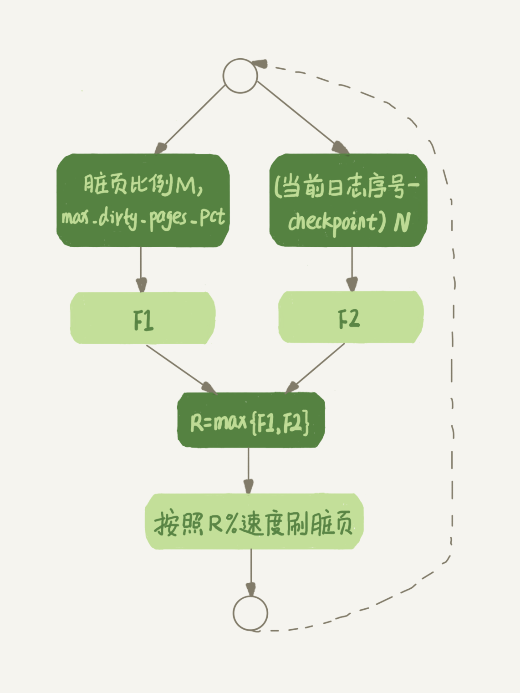

# 资料

MySQL8.0官方参考手册：https://dev.mysql.com/doc/refman/8.0/en/

极客时间MySQL实战45讲：https://time.geekbang.org/column/article/72388

# 概述

MySQL 是最流行的开源、**关系型 SQL 数据库管理系统**，由 Oracle Corporation 开发、分发和支持。

使用C和C++开发、内核线程实现的多线程。

## jdbc.properties

记录连接MySQL的驱动配置：

```properties
# mysql 5 驱动不同 com.mysql.jdbc.Driver 
# mysql 8 驱动不同com.mysql.cj.jdbc.Driver、需要增加时区的配置 
# serverTimezone=GMT%2B8 

spring.datasource.username=root 
spring.datasource.password=123456 
spring.datasource.url=jdbc:mysql://localhost:3306/test?useSSL=false&useUnicode=true&characterEncoding=utf-8&serverTimezone=GMT%2B8 
# 主要是要加上时区，其它的参数可以加也可以不加
spring.datasource.driver-class-name=com.mysql.cj.jdbc.Driver
```


## 新功能

**MySQL8新增的部分功能如下：**(我简单的选了一些看得懂的)

1. 默认字符集已从 `latin1`更改为`utf8mb4`。

2. [JSON数据类型](https://dev.mysql.com/doc/refman/8.0/en/json.html)

3. 优化器新增功能：
   - 支持不可见索引
   - 支持降序索引
4. [窗口函数](https://dev.mysql.com/doc/refman/8.0/en/window-functions.html)
5. [多值索引](https://dev.mysql.com/doc/refman/8.0/en/create-index.html#create-index-multi-valued)
6. RIGHT JOIN 作为 LEFT JOIN 处理。
7. [数据字典](https://dev.mysql.com/doc/refman/8.0/en/data-dictionary.html)

## 常用命令

```sql
# mysql 命令
# 登录MySQL服务
mysql -h localhost -u root -p # 然后输入密码
# 从文本文件执行SQL语句(需注意文件首句SQL应是 USE db_name来选择导入哪个数据库)
mysql < text_file
mysql db_name text_file # 这样的话则无需在文件中指定数据库名

# 查询MySQL版本/当前用户
mysql> SELECT VERSION(),USER();
+-----------+----------------+
| VERSION() | USER()         |
+-----------+----------------+
| 8.0.30    | root@localhost |
+-----------+----------------+
1 row in set (0.01 sec)

# 展示所有数据库
SHOW DATABASES;
# 使用某个数据库
USE [database_name];
# 展示当前使用的哪个数据库
SELECT DATABASE();

# 展示数据库内所有表
SHOW TABLES;
# 某个表的详细信息
DESCRIBE [table_name];
# 查看表的DDL语句
SHOW CREATE TABLE table_name;
```

## 批量更新

一般更新语句只能设置字段为特定值，不能随着条件变化为变化。
如果需要在不同条件下更新为不同值，往往都是执行多条update语句：

```sql
UPDATE tbl_name SET k1=1 WHERE id=101;
UPDATE tbl_name SET k1=10 WHERE id=102;
```

多条语句意味着多次网络IO开销，可以使用 mysql 自带的语句构建批量更新，从而减少网络开销只有1次：

```sql
UPDATE tbl_name
	SET k1 = CASE id
		WHEN 101 THEN 1
		WHEN 102 THEN 10
	END
WHERE id IN (101,102);
```

此批量更新语句的WHERE不会影响代码最终执行结果，但可以提高SQL过滤的效率。

如果有多个字段需要更新：

```sql
UPDATE t1 
    SET sex = CASE id 
        WHEN 1 THEN 'male'
        WHEN 2 THEN 'female'
        WHEN 3 THEN 'male'
    END, 
    name = CASE id 
        WHEN 1 THEN 'fzk1'
        WHEN 2 THEN 'fzk2'
        WHEN 3 THEN 'fzk3'
    END
WHERE id IN (1,2,3);
```

> 批量更新语句不但减少了网络IO次数开销，还能减少事务数量，进而减少磁盘IO次数开销。

## 索引管理

### 1.添加或删除索引

```sql
-- 普通索引
ALTER table tableName ADD INDEX indexName(列名...)
-- 唯一索引
ALTER table mytable ADD UNIQUE [indexName] (列名...)
-- 全文索引 并指定解析器为ngram
ALTER TABLE 表名 ADD FULLTEXT INDEX 索引名 (列名) WITH PARSER ngram;

-- 显示索引信息
SHOW INDEX FROM table_name\G

-- 删除索引
DROP INDEX 索引名 ON 表名;
```

### 2.全文索引

在MySQL 5.6版本以前,只有MyISAM存储引擎支持全文引擎.在5.6版本中,InnoDB加入了对全文索引的支持,但是不支持中文全文索引.在5.7.6版本,MySQL内置了ngram全文解析器,用来支持亚洲语种的分词.

MySQL的全文索引查询有多种模式，经常使用两种.
需要注意的是，MySQL的`倒排索引`对于小数据量可以这么做，但是对于大数据量，还是用ElasticSearch比较好。

MySQL全文索引以**词频**作为唯一标准。

缺点：《高性能MySQL》P304

> 1、全文索引的INSERT、UPDATE、DELETE操作代价很高；
> 2、“双B-Tree"结构会有更多的碎片，需要更多的OPTIMIZE TABLE操作；
> 3、影响MySQL查询优化器的工作；

#### 自然语言搜索

就是普通的包含关键词的搜索.

```sql
-- 一个查询中同时使用两次MATCH并不会有额外的消耗
SELECT id,article_title,MATCH (article_title) AGAINST ('应届生' IN NATURAL LANGUAGE MODE) AS relevance
FROM mk_article 
WHERE MATCH (article_title) AGAINST ('应届生' IN NATURAL LANGUAGE MODE);
-- 省略模式说明也是可以的，即默认情况是自然语言搜索
SELECT * FROM articles WHERE MATCH (title,body) AGAINST ('精神');
```

这类搜索会**自动按照相似度进行排序**

> 注意：如果全文索引是多列索引，MATCH函数中指定的列必须和全文索引指定的列完全相同，因为全文索引并不会记录某个关键词来自于哪个列。
>
> 绕过方法：《高性能MySQL》P301

#### 布尔全文索引

在布尔全文索引中，可以在查询里定义某个关键词的相关性，过滤噪声词。
**搜索结果是未经排序的**。

布尔全文索引通用修饰符:

| 修饰符 | 作用                 |
| ------ | -------------------- |
| 无     | rank值更高           |
| ~      | 使得rank值下降       |
| +      | 必须包含             |
| -      | 不能包含             |
| 阿里*  | 以阿里开头的rank更高 |

案例：

```sql
SELECT id,article_title,MATCH (article_title) AGAINST ('~应届生 +阿里 哈佛*' IN BOOLEAN  MODE) AS relevance
FROM mk_article
WHERE MATCH (article_title) AGAINST ('~应届生 +阿里 哈佛*' IN BOOLEAN MODE);
```

# 数据类型

## 数值

注意：**整数类型可以指定显示宽度**，最大为255，其与值范围无关。如INT(4)指定其显示宽度为4位，应用程序可以使用此可选显示宽度来显示宽度小于为列指定的宽度的整数值，方法是用空格向左填充它们。（也就是说，这个宽度存在于随结果集返回的元数据中。是否使用它取决于应用程序。）

**显示宽度**不限制值范围，超过宽度的值将使用完整值显示。

| 类型        | 存储（B） | 有符号最小值  | 最小值无符号 | 有符号最大值 | 最大值无符号 |
| :---------- | :-------- | :------------ | :----------- | :----------- | :----------- |
| `TINYINT`   | 1         | `-128`        | `0`          | `127`        | `255`        |
| `SMALLINT`  | 2         | `-32768`      | `0`          | `32767`      | `65535`      |
| `MEDIUMINT` | 3         | `-8388608`    | `0`          | `8388607`    | `16777215`   |
| `INT`       | 4         | `-2147483648` | `0`          | `2147483647` | `4294967295` |
| `BIGINT`    | 8         | `-2^63`       | `0`          | `2^63-1`     | `2^64-1`     |

- BIT[(M)]：位值，M指示位数，1-64，默认1
- BOOL, BOOLEAN：是TINYINT(1)同义词，即被当做该类型处理。

- SERIAL：是BIGINT UNSIGNED NOT NULL AUTO_INCREMENT UNIQUE同义词。

- DECIMAL[(M[,D])]：M是总位数，默认10最大65，D是小数位数，默认0。
- FLOAT(p)：浮点数，p表示位精度，0-24为单精度浮点数，4B存储；25-53为双精度浮点数，8B存储。
  注：原本的FLOAT(M,D)和DOUBLE(M,D)在MySQL8.0.17已弃用。

## 时间

- DATE：范围`'1000-01-01'到'9999-12-31'`，用于生日字段
- DATETIME[(fsp)]：范围是 `'1000-01-01 00:00:00.000000'`到 `'9999-12-31 23:59:59.999999'`。fsp指定小数秒精度，默认0。
- TIMESTAMP[(fsp)]：时间搓，范围是`'1970-01-01 00:00:01.000000'`UTC 到`'2038-01-19 03:14:07.999999'`UTC。fsp指定小数秒精度，默认0.
  注意：MySQL 将`TIMESTAMP`值从当前时区转换为 UTC 进行存储，然后从 UTC 转换回当前时区以进行检索。如果有海外机房，一定要注意时区问题，最好在连接时给定当地时区。

对于插入时间或更新时间字段，可以通过给默认值或自动更新：这样可以在业务处理时忽略对更新时间的关注。

```sql
CREATE TABLE t1(
  -- 给定默认插入时间
	create_time DATETIME DEFAULT NOW(),
  -- 更新时间自动更新
  update_time DATETIME DEFAULT NOW() ON UPDATE NOW(),
  -- 如果有精度，则必须给定精度函数
  modify_time TIMESTAMP(6) DEFAULT NOW(6) ON UPDATE NOW(6)
);
```

`NOW()`和`CURRENT_TIMESTAMP()`同义。


## 字符串

- CHAR(M)：固定长度字符串，不足时以空格填充，M表示长度，范围0~255，默认1。
- VARCHAR(M)：变长字符串，M表示最大字符个数，受限于行大小(默认65535B)。
  注意：varchar值需额外存储字节长度，如果值不超过255B则用1B存储，超过则用2B存储。
  这也是为什么推荐varchar(255)的原因，不过呢在utf8mb4字符集下，这个255没啥意义。

- TINYBLOB：存储最多255B，额外1B存储长度
- BLOB：存储最多65535B，额外2B存储长度，BLOB值视为二进制字符串(字节字符串)。
- MEDIUMBLOB：存储最多(2^24-1)B，额外3B存储长度
- LONGBLOB：存储最多4GB，额外4B存储长度
- ENUM('v1',...)：枚举，值在内部存储为整数，查询时再翻译回字符串，大大节省存储空间
- SET('v1',...)：集合，值在内部存储为位图，一个SET列最多有64个不同成员。

1、当插入的值超过CHAR或VARCHAR指定长度时，将根据服务器SQL模式有不同策略，默认是报错无法插入。

2、ENUM在内部以数字索引号存储，从1开始，空串为0：

```sql
CREATE TABLE t1(
	id BIGINT AUTO_INCREMENT PRIMARY KEY,
  sex ENUM('male','female'),
  role ENUM('admin','rd','qa')
);
-- 查男性
SELECT * FROM t1 WHERE sex='male'; -- 或 sex=1
-- 查女性
SELECT * FROM t1 WHERE sex='female'; -- 或 sex=2 
```

官方建议枚举不要存储数字，因为MySQL很可能将其和索引号混淆！

**枚举排序将根据索引号排序**，如果业务必须用到枚举排序，请确保按照字典序定义枚举元素。

3、SET在内部也是以整数存储，不过以8B整数的每个bit位表示一个元素，所以最多支持64个元素。

```sql 
-- 查找有rd的列
SELECT * FROM t1 WHERE role & 0b010; 
-- 等价于 WHERE FIND_IN_SET('rd',role)>0
-- 等价与 WHERE role LIKE '%rd%';

-- 查找有admin或rd的列
SELECT * FROM t1 WHERE role & 0b011;
-- 等价于 WHERE FIND_IN_SET('admin',role)>0 OR FIND_IN_SET('rd',role)>0

# 注意：role='x,y'是全等, 即只能是这个值
# 注意：不能直接将其与二进制数比较，即 WHERE role = 0b010无法查出数据
# 但是可以将其转为数字进行操作：role | 0
SELECT * FROM t1 WHERE (role|0)=0b11;
# 等价于 role = 'admin,rd'
```

## JSON

```sql
CREATE TABLE t1(
  id BIGINT AUTO_INCREMENT PRIMARY KEY;
	json_col JSON;
);
```

### 常用函数

- JSON_TYPE()函数将json字符串解析得到其json类型

- JSON_ARRAY()函数将参数拼装为json数组：`SELECT JSON_ARRAY(1,2,NOW());`
- JSON_OBJECT()函数将参数拼装为JSON对象: `SELECT JSON_OBJECT('key1',1,'key2','abc');`

### 合并

MySQL8有2个合并函数：

- JSON_MERGE_PRESERVE()，（mysql5.7的JSON_MERGE()函数是此别名，但已弃用）
- JSON_MERGE_PATCH()

两者在处理重复键有区别：前者保留重复键的值并合并，后者仅保留最后一个重复键的值

1、合并数组：

```sql
mysql> SELECT
    ->   JSON_MERGE_PRESERVE('[1, 2]', '["a", "b", "c"]', '[true, false]') AS Preserve,
    ->   JSON_MERGE_PATCH('[1, 2]', '["a", "b", "c"]', '[true, false]') AS Patch\G
*************************** 1. row ***************************
Preserve: [1, 2, "a", "b", "c", true, false]
   Patch: [true, false]
```

2、合并对象

```sql
mysql> SELECT
    ->   JSON_MERGE_PRESERVE('{"a": 1, "b": 2}', '{"c": 3, "a": 4}', '{"c": 5, "d": 3}') AS Preserve,
    ->   JSON_MERGE_PATCH('{"a": 3, "b": 2}', '{"c": 3, "a": 4}', '{"c": 5, "d": 3}') AS Patch\G
*************************** 1. row ***************************
Preserve: {"a": [1, 4], "b": 2, "c": [3, 5], "d": 3}
   Patch: {"a": 4, "b": 2, "c": 5, "d": 3}
```

3、数组和对象的合并

```sql
mysql> SELECT
	  ->   JSON_MERGE_PRESERVE('[10, 20]', '{"a": "x", "b": "y"}') AS Preserve,
	  ->   JSON_MERGE_PATCH('[10, 20]', '{"a": "x", "b": "y"}') AS Patch\G
*************************** 1. row ***************************
Preserve: [10, 20, {"a": "x", "b": "y"}]
   Patch: {"a": "x", "b": "y"}
```

### 路劲语法

路劲语法：前导`$`，后面跟着选择器：

- `.key`：查找键名对象
- `[N]`：数组元素下标
- `[M to N]`：数组子集，闭区间。
- `last`：数组表示最右边元素下标，用法如：`$[last-3 to last-1]`
- `*`通配符
  - `.[*]`：JSON对象所有成员
  - `[*]`：JSON数组所有元素
  - `prefix**suffix`：前缀满足且后缀满足
- `**`：任意路劲

```sql
mysql> SELECT JSON_EXTRACT('{"a": 1, "b": 2, "c": [3, 4, 5]}', '$.*');
+---------------------------------------------------------+
| JSON_EXTRACT('{"a": 1, "b": 2, "c": [3, 4, 5]}', '$.*') |
+---------------------------------------------------------+
| [1, 2, [3, 4, 5]]                                       |
+---------------------------------------------------------+
mysql> SELECT JSON_EXTRACT('{"a": 1, "b": 2, "c": [3, 4, 5]}', '$.c[*]');
+------------------------------------------------------------+
| JSON_EXTRACT('{"a": 1, "b": 2, "c": [3, 4, 5]}', '$.c[*]') |
+------------------------------------------------------------+
| [3, 4, 5]                                                  |
+------------------------------------------------------------+
```

### CRUD

- JSON-INSERT()
- JSON-REPLACE()
- JSON-SET()
- JSON-EXTRACT()
- JSON-REMOVE
- JSON-SEARCH()

文档：https://dev.mysql.com/doc/refman/8.0/en/json.html#json-paths

JSON函数文档：https://dev.mysql.com/doc/refman/8.0/en/json-search-functions.html

# SQL与函数与运算符

## 命名锁

文档：https://dev.mysql.com/doc/refman/8.0/en/locking-functions.html

|函数|作用|
|:-|:-|
|`GET_LOCK(str,timeout)`|获取互斥命名锁，timeout表示获取锁的等待超时时间，负值表示永不超时，单位秒。<br/>返回1获取锁成功，返回0表示等锁超时，返回null表示出错了，如线程被杀了。|
|`IS_FREE_LOCK(str)`|命名锁是否未锁定，1空闲，0被锁定，null发生错误|
|`IS_USED_LOCK(str)`|命名锁是被锁住，若是则返回持有锁的客户端会话连接标识符，否则返回null|
|`RELEASE_ALL_LOCKS()`|释放当前会话获取的所有命名锁，返回释放锁的数量|
|`RELEASE_LOCK(str)`|释放命名锁，1表示释放成功，0表示锁不是此客户端线程创建，null表示锁不存在|

获取锁成功只有调用RELEASE_LOCK()函数或会话终止才能解锁。

使用元数据锁定实现(MDL)子系统实现。
获得的唯一命名锁 GET_LOCK()出现在性能模式metadata_locks 表中。列OBJECT_TYPE表示 USER LEVEL LOCK， OBJECT_NAME列表示锁名称。在为同一个名称获取多个锁的情况下 ，只有该名称的第一个锁会在表中注册一行 metadata_locks。名称的后续锁会增加锁中的计数器，但不会获取额外的元数据锁。metadata_locks当名称上的最后一个锁实例被释放时，锁所在的行被删除 。


1个会话可以获取多个锁：

```sql
SELECT GET_LOCK('lock1',10);
SELECT GET_LOCK('lock2',10);
SELECT RELEASE_LOCK('lock2');
SELECT RELEASE_LOCK('lock1');
```

发生死锁情况时，服务器会选择一个调用者并终止其锁定获取请求并报错 ER_USER_LOCK_DEADLOCK。此错误不会导致事务回滚，业务自己决定处理逻辑。

锁定名称最大长度64字符，锁定名称在整个服务器范围内，多个客户端等待锁时，获取锁的顺序是不确定的。

> 优点：相比于一致性读如`SELECT ...FOR UPDATE`的优势就是可以用`IS_FREE_LOCK()`提前判断锁是否空闲，而且`GET_LOCK()`函数可以指定等待时间，在分布式锁的实现上更加优雅。

## 交并除

SQL 标准定义了以下三个集合操作：

- UNION：将来自两个查询块的所有结果组合成一个结果，省略任何重复项。

- INTERSECT：仅合并两个查询块的结果共有的那些行，省略任何重复项。

- EXCEPT：对于两个查询块 A和B ，返回A中所有不存在于中的B结果，省略任何重复项。

3个运算符都支持DISTINCT和ALL关键字：
- DISTINCT：默认，删除任一侧的重复行。
- ALL：结果集将包含重复行。

```sql
query_block [set_op query_block] [set_op query_block] ...

query_block:
    SELECT | TABLE | VALUES

set_op:
    UNION | INTERSECT | EXCEPT
```

注意：INTERSECT和EXCEPT是MySQL8.0.31才支持的新特性。

## REPLACE

REPLACE是 SQL 标准的 MySQL 扩展。它要么插入，要么删除 并插入。
REPLACE工作方式和INSERT完全相同，只是如果表中的旧行与插入的PRIMARY KEY或UNIQUE 索引的新行具有相同的值，则在插入新行之前删除旧行，并返回受影响的行数(删除和插入行数总和)。

```sql
REPLACE INTO table_name (col_names...) VALUES(...),(...)...
```

> 注意：如果表包含多个唯一索引，且新行重复不同唯一索引中不同旧行的值，则单个行可能会替换多个旧行。受影响行数可知其替换了几行。

## 子查询

**标量或列子查询**返回单个值或一列值：

```sql
SELECT * FROM t1 WHERE column1 = (SELECT MAX(column2) FROM t2);
SELECT s1 FROM t1 WHERE s1 IN (SELECT s1 FROM t2);
```

**行子查询**是子查询变体，返回单行：行子查询最多只能返回一行。

```sql
SELECT * FROM t1
  WHERE (col1,col2) = (SELECT col3, col4 FROM t2 WHERE id = 10);
  
SELECT * FROM t1
  WHERE ROW(col1,col2) = (SELECT col3, col4 FROM t2 WHERE id = 10);
  
SELECT column1,column2,column3
  FROM t1
  WHERE (column1,column2,column3) IN
         (SELECT column1,column2,column3 FROM t2);
```

## WITH

公用表表达式 (CTE) 是一个命名的临时结果集，它存在于单个语句的范围内，稍后可以在该语句中引用，可能多次引用。

```sql
WITH
  cte1 AS (SELECT a, b FROM table1),
  cte2 AS (SELECT c, d FROM table2)
SELECT b, d FROM cte1 JOIN cte2
WHERE cte1.a = cte2.c;
```

## 事务

```sql
START TRANSACTION; -- 开启事务
BEGIN; -- 开启事务

COMMIT; -- 提交事务
ROLLBACK; -- 回滚事务

SET autocommit={ 1 | 0 }; -- 开启或关闭自动提交
```

`START TRANSACTION`允许几个控制事务特性的修饰符：

```sql
START TRANSACTION 
	{WITH CONSISTENT SNAPSHOT
	| READ WRITE
	| READ ONLY}
```

- WITH CONSISTENT SNAPSHOT：启动一致性读
- READ WRITE：事务以读写模式运行，允许事务更改数据
- READ ONLY：事务以只读模式运行，禁止事务改数据，只读事务优化：https://dev.mysql.com/doc/refman/8.0/en/innodb-performance-ro-txn.html

`autocommit`是会话变量，每个会话是独立设置的，默认情况下客户端连接是以`autocommit=1`开始。

[默认情况下，MySQL 在启用自动提交](https://dev.mysql.com/doc/refman/8.0/en/glossary.html#glos_autocommit)模式的情况下运行 。这意味着，当不在事务内时，每个语句都是原子的。若关闭自动提交，则SQL语句执行更改后不会立刻生效，需要提交事务或回滚事务。

`START TRANSACTION`和`set autocommit=0`的区别在于：前者提交或回滚后，事务就结束了，需要再次调用START TRANSACTION开启事务；后者是一直开着事务，提交或回滚后自动生成新的事务。

比如在Spring框架的事务管理中，service层的方法标注了@Transactional注解后，线程绑定的MySQL会话连接将被设置为`autocommit=0`，该方法执行完后，提交或回滚事务后再将其恢复为1。

# MySQL应用程序

- [mysqld](https://dev.mysql.com/doc/refman/8.0/en/mysqld-server.html)：SQL守护进程（是MySQL服务器，一般以这个启动）
- mysqld_safe：服务器启动脚本
- mysql.server：服务器启动脚本
- mysqlcheck：表维护程序
- mysqldump：数据库备份程序
- mysqlslap：负载仿真客户端，https://dev.mysql.com/doc/refman/8.0/en/mysqlslap.html
- mysqlbinlog：处理二进制日志文件的实用程序
- mysqldumpslow：总结慢查询日志文件

## dump-数据库备份

mysqldump程序将进行**逻辑备份**，生成的是一组SQL语句文件，执行这些SQL来重现数据库原始数据。

更多细节看下面备份与恢复部分描述。


## slap-负载仿真

[**mysqlslap**](https://dev.mysql.com/doc/refman/8.0/en/mysqlslap.html)是一个诊断程序，旨在模拟 MySQL 服务器的客户端负载并报告每个阶段的时间。它的工作方式就好像多个客户端正在访问服务器一样。

文档：https://dev.mysql.com/doc/refman/8.0/en/mysqlslap.html

## binlog-二进制日志

文档：https://dev.mysql.com/doc/refman/8.0/en/mysqlbinlog.html

### 备份binlog

参数选项：

- `--read-from-remote-server`：从远程服务器备份到本地(即本地为远处服务器的副本服务器)。还需结合以下参数：
  - `--host`
  - `--user`
  - `--password`
- `--raw`：写入原始（二进制）输出，而不是文本输出
- `--stop-never`：到达最后一个日志文件的末尾后**保持与服务器的连接**，并继续等待读取新的事件。

- `--result-file`：输出备份文件名的前缀，一般用于指定目录

查看须备份的服务器有哪些binlog：

```sql
mysql> SHOW BINARY LOGS;
+---------------+-----------+-----------+
| Log_name      | File_size | Encrypted |
+---------------+-----------+-----------+
| binlog.000130 |     27459 | No        |
| binlog.000131 |     13719 | No        |
| binlog.000132 |     43268 | No        |
+---------------+-----------+-----------+
```

**1、静态备份**

```sql
-- 指定备份哪些binlog
mysqlbinlog --read-from-remote-server --host=host_name --raw
  binlog.000130 binlog.000131 binlog.000132

-- 备份从某binlog开始到最后
mysqlbinlog --read-from-remote-server --host=host_name --raw
  --to-last-log binlog.000130
```

**2、实时备份**

```sql
-- 从指定的binlog开始复制，并保持连接以复制新事件
mysqlbinlog --read-from-remote-server --host=host_name --raw
  --stop-never binlog.000130
```

使用[`--stop-never`](https://dev.mysql.com/doc/refman/8.0/en/mysqlbinlog.html#option_mysqlbinlog_stop-never)，无需指定 [`--to-last-log`](https://dev.mysql.com/doc/refman/8.0/en/mysqlbinlog.html#option_mysqlbinlog_to-last-log)读取到最后一个日志文件，因为该选项是隐含的。

> 注意：**实时备份的缺点是不会自动重连**。
>
> 实时备份mysqlbinlog的连接终止（如主服务器挂了或该进程被kill），主服务器恢复后，不会进行自动重连，这点不如副本服务器。

**3、输出文件名**

默认在当前目录中写入与原始日志文件同名的文件。`--result-file`可指定文件名前缀(或目录)。

| 选项                   | 输出文件名          |
| ---------------------- | ------------------- |
| `--result-file=x`      | xbinlog.000130      |
| `--result-file=/tmp/`  | /tmp/binlog.000130  |
| `--result-file=/tmp/x` | /tmp/xbinlog.000130 |

### dump+binlog备份和恢复示例

1、定时执行mysqldump命令转储服务器数据快照：

```sql
-- 备份所有数据
-- 选项`--master-data=2`将当前binlog坐标包含在转储文件中
mysqldump --host=host_name --all-databases --events --routines --master-data=2> dump_file
```

2、对binlog进行**实时备份**：

```sql
mysqlbinlog --read-from-remote-server --host=host_name --raw
  --stop-never binlog.000001
```

3、若发生数据丢失，如服务器挂了，**用最新的dump快照先恢复数据，再以binlog修复快照之后的数据**：

```sql
mysql --host=host_name -u root -p < dump_file
```

然后使用二进制日志备份重新执行在转储文件中列出的坐标之后写入的事件。假设文件中的坐标如下所示：

```none
-- CHANGE MASTER TO MASTER_LOG_FILE='binlog.000002', MASTER_LOG_POS=27284;
```

如果最近备份的日志文件名为 `binlog.000004`，则重新执行日志事件，如下所示：

```terminal
mysqlbinlog --start-position=27284 binlog.000002 binlog.000003 binlog.000004
  | mysql --host=host_name -u root -p
```

将备份的dump文件和binlog文件都先复制到服务器主机后再进行恢复操作会更方便。

## dumpslow-慢查询日志

文档：https://dev.mysql.com/doc/refman/8.0/en/mysqldumpslow.html

`mysqldumpslow`程序可解析 MySQL 慢查询日志文件并汇总其内容。

```sql
mysqldumpslow [options] [log_file...]
```


# 服务器日志

| 日志类型               | 日志信息                                                     |
| :--------------------- | :----------------------------------------------------------- |
| Error log              | mysqld程序启动、运行、停止时产生的问题                       |
| General query log      | 已建立的客户端连接和从客户端收到的语句                       |
| Binary log             | 更改数据的语句（也用于复制）                                 |
| Relay log              | Data changes received from a replication source server       |
| Slow query log         | 执行超过参数 [`long_query_time`](https://dev.mysql.com/doc/refman/8.0/en/server-system-variables.html#sysvar_long_query_time) 的SQL语句 |
| DDL log (metadata log) | DDL语句执行的元数据操作                                      |

处理错误日志默认启动，其它日志默认不启动。

## 日志存储

mysql服务器日志的存储载体以`log_output`变量指定：(注redolog属于Innodb日志)

```sql
-- log_output: 日志记录目的地
-- 可选：FILE(记录到文件)、TABLE(记录到表)、NONE(不记录)
mysql> SHOW VARIABLES LIKE 'log_output';
+---------------+-------+
| Variable_name | Value |
+---------------+-------+
| log_output    | FILE  |
+---------------+-------+
```

可以同时将日志写入表和文件中：`log_output=FILE,TABLE`

默认以文件存储日志，用日志表存储有如下优点：

- 格式标准(表结构)
- 可通过SQL查询日志，比如查询某些特殊客户端`user_host`日志

可用如下SQL查询日志表的结构：(建议直接用Navicat等GUI工具看表结构)

```sql
SHOW CREATE TABLE mysql.general_log;
SHOW CREATE TABLE mysql.slow_log;

-- 比如慢查询表DDL如下:
CREATE TABLE `slow_log` (
  `start_time` timestamp(6) NOT NULL DEFAULT CURRENT_TIMESTAMP(6) ON UPDATE CURRENT_TIMESTAMP(6),
  `user_host` mediumtext NOT NULL,
  `query_time` time(6) NOT NULL,
  `lock_time` time(6) NOT NULL,
  `rows_sent` int NOT NULL,
  `rows_examined` int NOT NULL,
  `db` varchar(512) NOT NULL,
  `last_insert_id` int NOT NULL,
  `insert_id` int NOT NULL,
  `server_id` int unsigned NOT NULL,
  `sql_text` mediumblob NOT NULL,
  `thread_id` bigint unsigned NOT NULL
) ENGINE=CSV DEFAULT CHARSET=utf8mb3 COMMENT='Slow log';
```

> 注意：日志表不会写入binlog，因此不会复制到副本。

## 错误日志

```sql
mysql> show variables like 'log_error%';
+----------------------------+----------------------------------------+
| Variable_name              | Value                                  |
+----------------------------+----------------------------------------+
| log_error                  | /var/log/mysqld.log                    |
| log_error_services         | log_filter_internal; log_sink_internal |
| log_error_suppression_list |                                        |
| log_error_verbosity        | 2                                      |
+----------------------------+----------------------------------------+
```

`log_error`参数指定错误日志文件名，可配置`stderr`表示标准控制台错误输出

`log_error_services`参数指定加载哪些日志组件，比如可以配置json组件使日志输出格式为json，具体配置看文档。

## 一般查询日志

**general_log仅记录SELECT和SHOW等不修改数据的语句**。

```sql
-- general_log: 是否开启一般查询日志
mysql> SHOW VARIABLES LIKE '%general%';
+------------------+-------------------------------+
| Variable_name    | Value                         |
+------------------+-------------------------------+
| general_log      | OFF                           |
| general_log_file | /var/lib/mysql/k8s-master.log |
+------------------+-------------------------------+
```

一般查询日志默认不开启；默认文件名为`${主机名}.log`。

## 二进制日志binlog

**binlog记录数据库写操作**，如表DDL和表DML语句。可用`mysqlbinlog`程序显示binlog文件内容。

用途：

- 主从复制
- 数据恢复：dump和binlog结合恢复数据

事务是整体写入文件的，从不在文件之间拆分。

```sql
mysql> show variables like 'log_bin%';
+---------------------------------+-----------------------------+
| Variable_name                   | Value                       |
+---------------------------------+-----------------------------+
| log_bin                         | ON                          |
| log_bin_basename                | /var/lib/mysql/binlog       |
| log_bin_index                   | /var/lib/mysql/binlog.index |
| log_bin_trust_function_creators | OFF                         |
| log_bin_use_v1_row_events       | OFF                         |
+---------------------------------+-----------------------------+
```

`log_bin`：配置是否启动binlog，默认启动。

`log_bin_basename`：指定binlog基本名，然后以自增数字填充完整文件名，如`binlog.000001`

`max_binlog_size`：单个binlog文件大小，默认1GB。

`log_bin_index`：为了跟踪使用了哪些二进制日志文件，创建了二进制日志索引文件，基本名字和binlog相同，扩展名为`.index`

### 日志格式

`binlog_format`：指定binlog记录的日志格式。

- `STATEMENT`：记录写操作SQL语句。**对于非确定性SQL如`now()`等时间函数会出现主从数据不一致问题。**

- `ROW`：默认，记录行的修改。
- `MIXED`：混合记录格式，对于确定性SQL则以语句格式记录，不确定性SQL则以行格式记录。

在少量SQL语句会修改大量行的情况下，记录SQL更有效，而某些SQL的WHERE过滤可能需要大量执行时间，但只会修改几行，此时记录行修改更有效。

默认为row格式而不是mixed，是因为row格式可用于**恢复数据**：

row格式会将delete删除的行、insert插入的行、update更新行的整行字段信息都保存在binlog中，如果发现误操作了，可以手动把这些数据改回去。MariaDB 的Flashback工具就是基于该原理来回滚数据的。

> 注意：如果使用innodb引擎且事务隔离级别为`READ_COMMITTED`或`READ_UNCOMMITED`，只能使用基于行的日志格式。

### 写入机制

系统为每个线程单独分配了一块binlog cache内存，由参数`binlog_cache`控制，默认32KB。

事务执行时先把日志写到binlog cache中，事务提交时，再把binlog cache中的完整事务写入binlog文件并清空cache。


如图中的write指将binlog cache内存的内容写入到文件系统的page cache，此时未落盘速度是很快的。图中的fsync落盘才会占用磁盘的IOPS，write和fsync的时机由参数`sync_binlog`控制：

- sync_binlog=0：事务提交只write，不fsync
- sync_binlog=1：每次事务提交都fsync。默认。
- sync_binlog=n：累计n个事务提交才fsync

sync_binlog设置较大时可以提升写性能，但风险是主机宕机会导致丢失最近n个binlog日志。


## 慢查询日志

slowlog记录执行时间超过`long_query_time`的SQL，`mysqldumpslow`命令可处理slowlog并汇总其内容。

| 参数                          | 描述                 | 默认值            |
| ----------------------------- | -------------------- | ----------------- |
| slow_query_log                | 开启慢查询日志       | OFF               |
| slow_query_log_file           | slowlog文件名        | {主机名}-slow.log |
| long_query_time               | 慢查询阈值(second)   | 10                |
| log_queries_not_using_indexes | 未使用索引的查询语句 | OFF               |

以下参数将确定最终是否写入slowlog：

`min_examined_row_limit`：默认0，查询扫过的行，少于此参数的查询语句不会写入slowlog

`log-throttle-queries-not-using-indexes`：如果 [`log_queries_not_using_indexes`](https://dev.mysql.com/doc/refman/8.0/en/server-system-variables.html#sysvar_log_queries_not_using_indexes) 启用，该 [`log_throttle_queries_not_using_indexes`](https://dev.mysql.com/doc/refman/8.0/en/server-system-variables.html#sysvar_log_throttle_queries_not_using_indexes) 变量会限制每分钟可以写入慢速查询日志的此类查询的数量。默认0表示无限制。

### 配置慢查监控

在Linux服务器上的配置文件my.cnf下如下配置：

```properties
# 慢查询日志
slow_query_log=on # 这个参数设置为ON，可以捕获执行时间超过一定数值的SQL语句
slow_query_log_file=/opt/mysql/mysql_slow_query.log  # 记录日志的文件名，必须有写权限
long_query_time=1 # 当SQL语句执行时间超过此数值时，就会被记录到日志中，建议设置为1或者更短
```

重启MySQL服务即可。

也可以选择将未使用索引的查询语句也记录都slow log中：

```properties
# set slow query on 
# 日志输出格式，FILE或TABLE
log_output=file
# 开启慢查询日志
slow_query_log=on
# 慢查询日志文件位置
slow_query_log_file = /tmp/mysql-slow.log
# 慢查询阈值，大于此值的SQL语句会被记录，单位s
long_query_time = 1
# 未使用索引也放入慢查询日志中
log_queries_not_using_indexes=on
# 每分钟允许记录到slow log的且未使用索引的SQL语句次数，默认0
log_throttle_queries_not_using_indexes=10
```


# 备份与恢复

## 备份与恢复类型

一般来说：全量备份(快照)采用物理备份，增量备份采用逻辑备份。

1、物理备份：

物理备份包括存储数据库内容的目录和文件的原始副本。这种备份适用于发生问题时需要快速恢复的大型、重要的数据库。

**物理备份比逻辑备份更快。**

物理备份工具都是企业版功能。

2、逻辑备份：

逻辑备份保存为逻辑数据库结构和内容信息，这种类型的备份适用于您可以编辑数据值或表结构，或在不同机器架构上重新创建数据的少量数据。

逻辑备份输出大于物理备份，尤其是在以文本格式保存时。

具有高度可移植性。

逻辑备份工具包括`mysqldump`、`mysqlimport`程序

3、在线备份（热备份）、离线备份（冷备份）

热备份不停机，需 MySQL Enterprise Backup企业版产品

4、本地与远程备份

`mysqldump`命令可以连接本地或远程服务器进行备份。

5、快照备份：如写时复制技术。

6、全量备份(快照)和增量备份

增量恢复是恢复在给定时间跨度内所做的更改。这也称为时间点恢复，因为它使服务器的状态在给定时间保持最新。时间点恢复基于binlog。

## 备份方法

企业版可用 [MySQL Enterprise Backup](https://dev.mysql.com/doc/refman/8.0/en/glossary.html#glos_mysql_enterprise_backup)产品对整个实例或选定的数据库、表或两者进行物理备份。该产品包括**增量备份**和**压缩备份**的功能。

### mysqldump

mysqldump程序将进行**逻辑备份**，生成的是一组SQL语句文件，执行这些SQL来重现数据库原始数据。

> 注意：[**mysqldump**](https://dev.mysql.com/doc/refman/8.0/en/mysqldump.html)至少需要 [`SELECT`](https://dev.mysql.com/doc/refman/8.0/en/privileges-provided.html#priv_select)转储表、[`SHOW VIEW`](https://dev.mysql.com/doc/refman/8.0/en/privileges-provided.html#priv_show-view)转储视图、[`TRIGGER`](https://dev.mysql.com/doc/refman/8.0/en/privileges-provided.html#priv_trigger)转储触发器的权限

mysqldump优点是便利性和灵活性，可以自行插入一些SQL语句进行微改动。

**mysqldump不是用于备份大量数据的快速或可扩展的解决方案**，对于大量数据，即使备份用时短，但是重放SQL恢复数据耗时长，因为重放 SQL 语句涉及用于插入、索引创建等的磁盘 I/O。

**对于大规模的备份和恢复， [物理](https://dev.mysql.com/doc/refman/8.0/en/glossary.html#glos_physical)备份更为合适**，将数据文件以原始格式复制，以便快速恢复，企业版mysqlbackup命令支持物理备份。

```sql
mysqldump db_name # 备份某个数据库
mysqldump db_name [tbl_name ...] # 备份某个数据库的某些表

# 选项如下：
--database db_name... 	# 备份某些数据库
--all-databases 		# 备份所有数据库
--add-drop-database 	# 在每个 CREATE DATABASE 语句之前添加 DROP DATABASE 语句
--add-drop-table  		# 在每个 CREATE TABLE 语句之前添加 DROP TABLE 语句
--add-drop-trigger		# 在每个 CREATE TRIGGER 语句之前添加 DROP TRIGGER 语句
```

1、全量逻辑备份例子：

```sql
mysqldump --single-transaction --flush-logs --master-data=2 \
         --all-databases > demo1.sql
```

mysqldump命令进行全量备份时会**先读取此时binlog坐标**：此备份操作会获取所有表的全局读锁（使用[`FLUSH TABLES WITH READ LOCK`](https://dev.mysql.com/doc/refman/8.0/en/flush.html#flush-tables-with-read-lock)），一旦获得此锁，就会读取二进制日志坐标并释放锁。

`-flush-logs`：会将旧binlog日志落盘并创建新binlog文件，这个新文件就是增量文件。

若备份前binlog文件为demo-bin.000001：

周一3点逻辑全量备份为demo1.sql，新binlog为demo-bin.000002，将demo1保存到安全地方。

周二3点逻辑全量备份为demo2.sql，新binlog为demo-bin.000003，将demo2.sql和demo-bin.000002都保存到安全地方(如磁带或光盘)。

可以定期清理不需要的binlog以释放空间。

2、复制数据库例子：

```sql
-- 在服务器1
mysqldump --databases db1 > dump.sql

-- 在服务器2
mysql < dump.sql
```

3、分别转储表定义和数据

```sql
mysqldump --no-data db1 > dump-defs.sql # 数据库表定义
mysqldump --no-create-info db1 > dump-data.sql # 数据
```

### 制作带分隔符的文本文件

```sql
-- 仅保存表数据，不能保存表结构
SELECT * INTO OUTFILE `file_name` FROM tbl_name;
-- 加载数据
-- LOAD DATA 或 mysqlimport
```

### 主从复制

文档：https://dev.mysql.com/doc/refman/8.0/en/replication-solutions-backups.html

## 恢复

### 增量恢复

https://dev.mysql.com/doc/refman/8.0/en/point-in-time-recovery.html

### 崩溃恢复

MySQL意外退出后，直接重启即可自动恢复：https://dev.mysql.com/doc/refman/8.0/en/innodb-recovery.html#innodb-recovery-tablespace-discovery

1、表空间发现

2、redo log应用

3、回滚未完成的事务

4、change buffer合并

5、purge


# 优化

文档：https://dev.mysql.com/doc/refman/8.0/en/statement-optimization.html

## 库表列

1. 尽可能**最小数据类型**
2. **索引设为NOT NULL**，避免测试每个值是否为Null，还可以节省一些存储空间，每列一位。
3. 修改Innodb默认的DYNAMIC行格式，选用紧凑的如COMPACT/COMPRESSED，这会增加CPU消耗。如果您的工作负载是受缓存命中率和磁盘速度限制的典型工作负载，则它可能会更快。
4. **列名尽可能短**，利于dump、binlog的备份/复制
5. 数据不冗余（第三范式）和冗余（利于查询）之间的权衡
6. 能用数字就不要用字符串
7. **冷热分离**，热字段放主表，冷字段放详情表（从表）
8. BLOB大文本优化：
   - 压缩
   - 拆为单独的表，让主表数据行紧凑，范围扫描时可减少主表io
   - 放在单独的数据库甚至不同的存储设备：一般以单个id查BLOB，大量顺序读，更适合传统硬盘驱动器而不是 [SSD 设备](https://dev.mysql.com/doc/refman/8.0/en/glossary.html#glos_ssd)。
9. 表大小受操作系统限制，但最好**对超过1TB的表进行分区**
10. MySQL限制表最多4096列，Innodb引擎限制1017列
11. 行大小限制65535B，BLOB和TEXT列存储在其它位置，仅占行空间9-12B。而Innodb限制每页必须存两行以上。innodb_page_size默认16KB，则每行限制8KB。
12. 


## EXPLAIN

**EXPLAIN可用于了解查询执行计划**，它根据表、列、索引等信息，可以在不读取所有行情况下执行对巨大表的查询，优化器选择执行最高效查询的一组操作成为**查询执行计划**，也被称为**EXPLAIN计划**。可以根据其执行计划，判断优化情况，进而改进。

> 可以借助BENCHMARK()函数简单观察优化效果。
>
> [BENCKMARK(count,expr)](https://dev.mysql.com/doc/refman/8.0/en/information-functions.html#function_benchmark)重复执行表达式，可以用客户端执行该函数并观察查询执行时间。
>
> `SELECT BENCKMARK(100, (SELECT id FROM t1 WHERE id=1))`

注意：如果出现索引在您认为应该使用时未被使用的问题，请运行[`ANALYZE TABLE`](https://dev.mysql.com/doc/refman/8.0/en/analyze-table.html)以更新表统计信息，例如键的基数cardinality，这可能会影响优化器所做的选择。

| Column                                                       | JSON Name       | Meaning                      |
| :----------------------------------------------------------- | :-------------- | :--------------------------- |
| [`id`](https://dev.mysql.com/doc/refman/8.0/en/explain-output.html#explain_id) | `select_id`     | The `SELECT` identifier      |
| [`select_type`](https://dev.mysql.com/doc/refman/8.0/en/explain-output.html#explain_select_type) | None            | The `SELECT` type            |
| [`table`](https://dev.mysql.com/doc/refman/8.0/en/explain-output.html#explain_table) | `table_name`    | 表                           |
| [`partitions`](https://dev.mysql.com/doc/refman/8.0/en/explain-output.html#explain_partitions) | `partitions`    | 匹配的分区                   |
| [`type`](https://dev.mysql.com/doc/refman/8.0/en/explain-output.html#explain_type) | `access_type`   | The join type                |
| [`possible_keys`](https://dev.mysql.com/doc/refman/8.0/en/explain-output.html#explain_possible_keys) | `possible_keys` | 供选择的索引                 |
| [`key`](https://dev.mysql.com/doc/refman/8.0/en/explain-output.html#explain_key) | `key`           | 实际选择的索引               |
| [`key_len`](https://dev.mysql.com/doc/refman/8.0/en/explain-output.html#explain_key_len) | `key_length`    | 选择索引的长度               |
| [`ref`](https://dev.mysql.com/doc/refman/8.0/en/explain-output.html#explain_ref) | `ref`           | 与索引相比的列               |
| [`rows`](https://dev.mysql.com/doc/refman/8.0/en/explain-output.html#explain_rows) | `rows`          | 估计要扫过的行               |
| [`filtered`](https://dev.mysql.com/doc/refman/8.0/en/explain-output.html#explain_filtered) | `filtered`      | 按条件过滤的数据行估计百分比 |
| [`Extra`](https://dev.mysql.com/doc/refman/8.0/en/explain-output.html#explain_extra) | None            | 附加信息                     |

如果要强制优化器使用某个索引，可以用`FORCE INDEX`索引提示。

1、type：连接类型，描述表是如何连接的，从最好的类型到最差的排序：

- system：查系统表

- **const**：该表最多有一个匹配行，在查询开始时读取。因为只有一行，所以优化器的其余部分可以将这一行中列的值视为常量。 `const`表非常快，因为它们只读一次。
- **eq_ref**：对于先前表中行的每个组合，从该表中读取一行，当连接使用索引为主键聚族索引或UNIQUE NOT NULL索引时
- **ref**：对于先前表中行的每个组合，从该表中读取具有匹配索引值的所有行。有索引，但无法根据索引选出连接的单个行
- fulltext：连接是使用`FULLTEXT` 索引执行的。
- index merge：使用索引合并优化
- unique_subquery
- index_subquery
- **range**：仅检索给定范围内的行，使用索引来选择行。
- **index**：index连接类型与ALL相同，只是扫描了索引树，有2种情况：
  - 如果查询的是覆盖索引，则只扫描索引树
  - 使用从索引读取以按索引顺序查找数据行来执行全表扫描。
- ALL：对先前表中每个行组合进行全表扫描，性能非常糟糕

2、filtered指示按条件过滤的表行的估计百分比，100表示没发生过滤，值越低说明索引的基数越好，选择性越高。

3、Extra：额外信息

- `Using filesort`：排序是通过根据联接类型遍历所有行，并为匹配WHERE子句的所有行存储排序关键字和指向该行的指针来完成的。

- `Using index`：覆盖索引，仅使用索引树中的信息从表中检索列信息，无须回表。

- `Using index condition`：通过索引过滤。
- `Using index for group-by`：表示MySQL找到了一个索引可用于检索GROUP BY 或 DISTINCT查询的所有列，而无需对实际表进行额外io

- `Using temporary`：为了解析查询，MySQL 需要创建一个临时表来保存结果。GROUP BY通常出现。

- `Using where`：从数据表中读取数据后进行过滤。

## 索引

提高查询性能最佳方法是建立索引，B-tree数据结构可以让索引快速找到一个值、一组值、一个范围。

不必要的索引浪费空间时间，增加插入、更新、删除的成本。找到合适的平衡点以使用最佳索引集实现快速查询。

查询有多个索引匹配时，MySQL通常使用选择性高的索引。

**复合索引**：即多列索引，一个索引最多包含16列，执行最左前缀匹配。

**覆盖索引**：查询列都在索引数据中，无须回表查询。

**前缀索引**：可以仅使用列的前几个字符，大大减小索引文件。Innodb引擎中前缀最长767B(因为超过这个数就要将数据放入到其它段，具体可看《MySQL技术内幕》)。

**全文索引**：用于全文搜索。

**空间索引**：Innodb支持空间类型的R树索引

### 胖索引改hash散列索引

单列索引字段特别长（超过100B且前缀索引不适用情况，如前几个字符都相同），或者复合索引列数过多，且每列较长的情况下，索引结构会非常的**宽**，此时有一种优化方式：

```sql
-- 摒弃复合索引，自建散列`hash_col`单列索引
CREATE INDEX hash_col_idx ON tbl_name (hash_col);

-- 查询时以散列索引先过滤，再进行比较
SELECT * FROM tbl_name 
WHERE hash_col=CRC32(CONCAT(val1,val2,val3)) 
AND col1=val1 AND col2=val2 AND col3=val3;
```

如果col1和col2和col3加起来超过100B(这是非常可能的)，对其散列后的`hash_col`列建立索引则仅有4B，可以大大**减少索引体积**，且**发生碰撞概率很低**，查找效率会大幅提升！

改后缺点和哈希索引一模一样。


### 索引合并

Index merge通过多次扫描索引并将其结果合并，仅能合并单表扫描，不适用于全文索引。

```sql
SELECT * FROM tbl_name WHERE k1=10 AND k2=20;
```

如以上查询sql，若k1和k2都存在单列索引，则优化器尝试**分别以两个索引查询后的结果进行合并取交集**。

在EXPLAIN输出中，若适用索引合并会在type列显示index merge，在Extra字段显示使用的合并算法：

- Using intersect(...)
- Using union(...)
- Using sort_union(...)

```sql
-- 索引合并 交集
SELECT * FROM tbl_name WHERE k1 =10 AND k2=10;

-- 索引合并 联合
SELECT * FROM tbl_name WHERE k1 = 10 OR k2=20;

-- 索引合并 排序联合
SELECT * FROM tbl_name WHERE k1 <10 OR k2<20;

-- 混合
SELECT * FROM tbl_name WHERE (k1=10 AND k2=20) OR (k3=30 AND k4=40);
```

sort-union 算法和 union 算法之间的区别在于，sort-union 算法必须首先获取所有行的行 ID 并在返回任何行之前对它们进行排序。

### 隐形索引

MySQL支持不可见索引，即对优化器不可见。

```sql
-- 创建不可见索引
CREATE INDEX idx_name ON tbl_name (col...) INVISIBLE;
-- 使索引可见/不可见
ALTER TABLE t1 ALTER INDEX i_idx INVISIBLE;
ALTER TABLE t1 ALTER INDEX i_idx VISIBLE;
```

隐形索引主要目的在于测试该索引对于查询性能影响，且无需破坏性更改索引数据（加或删索引对大型表而言代价昂贵）。若设置索引隐形后性能下降明显，则说明索引是必须的，改回可见。

### 降序索引

MySQL  Innodb引擎支持降序索引：在索引定义加`DESC`，按降序存储键值。

以前，可以按相反顺序扫描索引，但会降低性能。降序索引可以正向扫描，效率更高。

```sql
CREATE TABLE t (
  c1 INT, c2 INT,
  INDEX idx1 (c1 ASC, c2 ASC),
  INDEX idx2 (c1 ASC, c2 DESC),
  INDEX idx3 (c1 DESC, c2 ASC),
  INDEX idx4 (c1 DESC, c2 DESC)
);
```

降序索引无法用于没有给出order by语句的`MIN()/MAX()函数`优化，因为此时MySQL无法猜测你想要的是正序或倒序的大小。

使用降序索引时EXPLAIN的Extra列提示：`Backward index scan; Using index`。

### ORDER BY优化

1、以索引进行order by

MySQL会尽量以索引来满足order by并避免执行filesort排序操作。

```sql
SELECT key_part1, key_part2 FROM tbl ORDER BY key_part1, key_part;
SELECT * FROM tbl ORDER BY key_part1, key_part2;
```

第一条SQL，将会直接以索引查询，避免排序。

第二条SQL，扫描整个索引并查找数据行，在数据量很大时会产生大量随机io，这可能比全表扫描并filesort更耗时。

2、以filesort进行order by

若不能以索引避免排序，将执行filesort，此时EXPLAIN结果的Extra列显示`Using filesort`。

`sort_buffer_size`参数控制filesort操作内存，默认256KB。

如果`filesort`结果集太大而无法放入内存，则操作会根据需要使用临时磁盘文件。

3、提高order by 速度

- 优先考虑使用索引自然排序
- 增加`sort_buffer_size`，避免排序集写入磁盘和合并过程
- 增加`read_rnd_buffer_size`以便一次读取更多行

### 避免全表扫描

当MySQL执行全表扫描时，EXPLAIN在type列显示ALL。

在以下情况会全表扫描：

- 表很小，全表扫描比索引快得多
- 没有索引可用
- 查询的结果集过大(20%以上)，走索引反而不如全部扫描
- 索引的cardinality值太低了，走索引反而不如全部扫描

对于大型表，以下技术可以避免优化器选错索引：

- 定时执行`ANALYZE TABLE tbl_name`
- `FORCE INDEX`强制使用某个索引

### 索引失效

以下几种情况会造成索引失效而全表扫描：

1、对索引字段使用函数计算，会无法利用索引，如时间函数：

```sql
SELECT COUNT(*) FROM t_user WHERE MONTH(update_time)=7;
```

对索引字段做函数操作，可能会破坏索引值的有序性，因此优化器就决定放弃走树搜索功能。

2、隐式类型转换

```sql
SELECT * FROM t_order WHERE order_id=1024;
```

如果order_id是varchar类型的索引就需要类型转换，如果是1024转为"1024"字符串那么索引有效，可如果是order_id转为数组那么索引失效字

数据类型转换规则中，**一般是字符串转数字**。可以通过`SELECT '10'>9`验证，字符串转数字则结果为1，反之则结果为0，测试结果为1.

上诉sql对于优化器相当于：

```sql
SELECT * FROM t_order WHERE CAST(order_id AS signed INT)=1024;
```

这条语句触发了上面规则：对索引字段做函数操作，优化器会放弃走树搜索功能。

3、隐式字符编码转换

若表1是utf8mb4字符集，表2是utf8字符集，两者以字符串类型索引连接时会造成索引失效。因为需要对字符串进行字符集转换。字符集转换会涉及如下函数调用，索引就失效了：

```sql
select * from trade_detail where CONVERT(traideid USING utf8mb4)=$L2.tradeid.value; 
```

> 上诉3个例子都是同一个原理：**对索引字段做函数操作，可能会破坏索引值的有序性，因此优化器就决定放弃走树搜索功能。**

## 哈希join优化

MySQL 8.0.18 开始会尽可能对join查询使用哈希进行优化，即hash join，通常比以前[块嵌套循环连接算法](https://dev.mysql.com/doc/refman/8.0/en/nested-loop-joins.html#block-nested-loop-join-algorithm) 更快。从 MySQL 8.0.20 开始，删除了对块嵌套循环的支持。

EXPLIAN时的Extra列：`Using join buffer (hash join)`

```sql
SELECT * FROM tbl1 
INNER JOIN tbl2 ON tbl.c1=tbl2.c1;
```

在 MySQL 8.0.20 之前，如果任何一对连接表不具备至少一个 equi-join 条件，则无法使用哈希连接，并且采用较慢的块嵌套循环算法。MySQL 8.0.80后非等值join也能使用hash join。

```sq;
mysql> EXPLAIN FORMAT=TREE SELECT * FROM t1 JOIN t2 ON t1.c1 < t2.c1\G
*************************** 1. row ***************************
EXPLAIN: -> Filter: (t1.c1 < t2.c1)  (cost=4.70 rows=12)
    -> Inner hash join (no condition)  (cost=4.70 rows=12)
        -> Table scan on t2  (cost=0.08 rows=6)
        -> Hash
            -> Table scan on t1  (cost=0.85 rows=6)
```

参数`join_buffer_size`控制hash join的内存使用，默认256KB。超过限制时将使用文件处理。此参数可设高点。

## Multi-Range读取优化

多范围读取(MRR)：在表很大时，通过索引范围读取数据行可能会导致对基表的多次随机io。

MySQL为了减少范围扫描的随机io次数，会先仅扫描索引并收集相关主键id，对其排序后从基表的主键聚族索引顺序读取数据

## 优化innodb表

1、优化存储布局

- 数据稳定时，可使用`OPTIMIZE TABLE`语句重组并压缩任何浪费空间以减少I/O。
  `OPTIMIZE TABLE`复制表的数据并重建索引，减少表空间和磁盘碎片。
- 大量重复文本或数字数据的表，考虑使用`COMPRESSED`行格式。最好先衡量COMPRESSED格式相比`COMPACT`行格式(Innodb默认)可以实现的压缩量。

2、批量数据导入

- 关闭自动提交模式，因为它会为每次插入执行日志刷新到磁盘。
- 关闭唯一性检查：`SET unique_checks=0`，导入后再改回1.

- 在对具有自动递增列的表进行批量插入时，设置 [`innodb_autoinc_lock_mode`](https://dev.mysql.com/doc/refman/8.0/en/innodb-parameters.html#sysvar_innodb_autoinc_lock_mode)为 2（交错）而不是 1（连续）。

3、优化Innodb磁盘i/o：在CPU利用率较低时很可能受磁盘io限制

- 增加缓冲池大小：`innodb_buffer_pool_size`，可设为系统内存的50%-75%
- 通过将[**文件符号链接到不同的磁盘**](https://dev.mysql.com/doc/refman/8.0/en/symbolic-links.html)或条带化磁盘来增加可用磁盘轴的数量（从而减少寻道开销）
- 将NFS与MySQL一起用，但需要谨慎。

4、优化Innodb配置变量

- 配置change buffer：`innodb_change_buffering`

- 如果出现频繁上下文切换至瓶颈，配置线程并发量：[`innodb_thread_concurrency`](https://dev.mysql.com/doc/refman/8.0/en/innodb-performance-thread_concurrency.html)

- 利用多核处理器及其缓存内存配置，最大限度地减少上下文切换的延迟：[“配置自旋锁轮询”](https://dev.mysql.com/doc/refman/8.0/en/innodb-performance-spin_lock_polling.html)。

## 优化锁定操作

1、行锁：

Innodb支持行锁，为避免在单表多个并发写入操作时出现死锁而回滚，可以在事务开始时通过`SELECT ... FOR UPDATE`为每组预期要修改的行发出一条语句来获取必要的锁，即使数据更改语句出现在事务的后面也是如此。

行锁优点：

- 当不同的会话访问不同的行时，锁冲突更少
- 回滚更改更少
- 可能长时间锁定单行

2、表锁

优点：

- 所需内存相对较少（行锁定需要每行或每组行锁定的内存）
- 在表的大部分上使用时速度很快，因为只涉及一个锁。
- 如果您经常`GROUP BY` 对大部分数据进行操作或者必须经常扫描整个表，则速度很快。

**写锁申请优先级高于读锁申请**，这样可以保证写锁申请不会饿死，但是写申请很多时可能会造成读申请饥饿。如Java的ReadWriteLock也是同样逻辑。

```sql
mysql> LOCK TABLES t1 READ;
mysql> SELECT COUNT(*) FROM t1;
+----------+
| COUNT(*) |
+----------+
|        3 |
+----------+
mysql> SELECT COUNT(*) FROM t2;
ERROR 1100 (HY000): Table 't2' was not locked with LOCK TABLES
```


## Innodb缓冲池优化

Innodb在内存中维护有缓冲池，缓存InnoDB表数据、索引和辅助数据，实现为页面链表，采用LRU算法。

`innodb_buffer_pool_size`变量定义缓冲池大小，推荐为系统内存的50%~75%。缓冲池太小可能导致过度搅动，页面刷新频繁，太大可能导致系统内存竞争而导致页面交换。

有关其他`InnoDB`缓冲池配置和调整信息，请参阅以下部分：

- [第 15.8.3.4 节，“配置 InnoDB 缓冲池预取（预读）”](https://dev.mysql.com/doc/refman/8.0/en/innodb-performance-read_ahead.html)
- [第 15.8.3.5 节，“配置缓冲池刷新”](https://dev.mysql.com/doc/refman/8.0/en/innodb-buffer-pool-flushing.html)
- [第 15.8.3.3 节，“使缓冲池抗扫描”](https://dev.mysql.com/doc/refman/8.0/en/innodb-performance-midpoint_insertion.html)
- [第 15.8.3.2 节，“配置多个缓冲池实例”](https://dev.mysql.com/doc/refman/8.0/en/innodb-multiple-buffer-pools.html)
- [第 15.8.3.6 节，“保存和恢复缓冲池状态”](https://dev.mysql.com/doc/refman/8.0/en/innodb-preload-buffer-pool.html)
- [第 15.8.3.1 节，“配置 InnoDB 缓冲池大小”](https://dev.mysql.com/doc/refman/8.0/en/innodb-buffer-pool-resize.html)

# InnoDB存储引擎

Innodb是高可靠性和高性能的通用存储引擎。默认都应该使用Innodb。

- 遵循ACID
- 行级锁定和Oracle风格的一致性读取提高并发性
- 按主键聚族索引在磁盘上组织数据，优化基于主键查询
- 不支持集群数据库
- **不支持哈希索引**（InnoDB 在内部利用哈希索引来实现其自适应哈希索引功能）

**Innodb存储引擎的内存和磁盘架构**：


## 内存结构

### 缓冲池

缓冲池是主内存中一个区域，在专用MySQL服务器上通常将80%物理内存分配给缓冲池。

缓冲池以页面链表实现，LRU算法。

如何利用缓冲池将频繁访问的数据保存在内存中是MySQL调优的重要方面。

新页面将插入链表中间：中点插入策略将列表视为2个子列表

- 头部，维护最近访问的年轻页面的子列表
- 尾部，维护较少访问的旧页面的子列表


默认情况下：

- **新页面会插入到旧子列表头部**。

- 若该新页面是由于用户读取需要而产生，会立刻发生第1次访问，这会使其成为年轻页面移动到新子列表头部。
- 若该页面由预读产生，很可能在该页面被驱逐之前都不会发生访问。

#### 预读

预读请求是IO请求，用于异步读取缓冲池中多个预期需要的页面。Innodb有2种预读算法：线性预读和随机预读。

1、**线性预读**是根据缓冲池中顺序访问的页面来预测可能需要哪些页面。

参数`innodb_read_ahead_threshold`是顺序页面访问次数从而触发预读的阈值。如果从一个区段中顺序读取的页面数大于或等于该阈值，则启动整个后续区段的预读操作。

2、**随机预读**：如果在缓冲池中发现来自同一区段的 13 个连续页面，则 `InnoDB`异步发出请求以预取该区段的剩余页面。

要启动随机预读，配置参数`innodb_random_read_ahead`为on。

#### 刷新

Innodb后台任务包括从缓冲池刷新脏页。

1、**水位**是控制缓冲池中脏页百分比。

- `innodb_max_dirty_pages_pct_lwn`：低水位，默认缓冲池10%
- `innodb_max_dirty_pages_pct`：高水位，默认缓冲池90%

当脏页达到低水位时，将启动缓冲池刷新，主要是防止其达到高水位。

- `innodb_flush_neighbors`：定义从缓冲池中刷新页面是否也刷新相同范围内其它脏页。
  - 默认0，不刷新相邻脏页
  - 1，刷新同一个范围连续脏页
  - 2，刷新相同范围内脏页
  - 存储于磁盘时，刷新相邻页面可减少io寻道时间。但是对于SSD数据，寻道时间不重要，可禁用此设置以分散写入操作。

#### 保存和恢复缓冲池状态

为了减少服务重启后的预热时间，服务器关闭时会将缓存池中一定比例的页面保存在`innodb_buffer_pool_filename`指定文件。启动时从该文件恢复缓冲池，避免冷启动。

`innodb_buffer_pool_dump_pct`配置缓冲池页面转储百分比，默认25.

在线保存和恢复缓冲池状态：

```sql
-- 运行时保存缓冲池状态
SET GLOBAL innodb_buffer_pool_dump_now=ON;
-- 运行时恢复缓冲池状态
SET GLOBAL innodb_buffer_pool_load_now=ON;
```

### change buffer

INSERT/UPDATE/DELETE等DML操作时中往往涉及对二级索引的更新，当普通二级索引的数据页不在缓存池时，InnoDB 会**将更新操作缓存在 change buffer 中，避免立刻I/O**。在之后其它查询访问这个数据页并将其读入缓冲池，会顺便将change buffer中缓存的变更merge。

> 注意：change buffer是缓冲池的一部分，占用缓冲池空间，由变量`innodb_channge_buffer_max_size`控制占用百分比，默认25，最大50。因其占用buffer pool空间，最好不要设置过大。
>
> 太大会影响缓冲池页面过早老化，太小会造成change buffer合并跟不上新的change buffer条目，使得I/O增加。

change buffer使用限制：**实际上只有普通二级索引可以使用change buffer缓存更改**。

- 唯一索引更新操作需要判断是否违反了唯一性约束，而这必须将数据页读入内存池中进行判断，无法使用change buffer。

**优点**：与聚集索引相比，二级索引更新顺序相对随机，可能会访问不相邻的二级索引页，change buffer缓存更改可以避免从磁盘中读取索引页到缓冲池所造成的大量随机I/O。系统后台线程会定期将更改merge到索引页并写入磁盘。

**使用场景**：写多读少业务，页面在写完后马上访问到的概率比较小，此时使用change buffer效果最好，比如账单类、日志类、历史数据类系统。

反过来，若更新并缓存更改到change buffer后，马上访问这个数据页，会立即触发 merge 过程。这样随机I/O 不会减少，反而增加了 change buffer 的维护代价。所以，对于这种业务模式来说，change buffer 反而起到了副作用。

案例：`insert into t(id,k) values(id1,k1),(id2,k2);`，k字段建普通二级索引，假设k1所在page1正好在缓冲池中，k2所在page2不在，更新结果如下：


将page1的内容直接修改，并在change buffer中记录page2的修改，将两个更新顺序记入redo log中，事务提交则落盘redo log。虚线部分是后台线程异步操作落盘。

可以看到更新成本很低，两处内存写，一处磁盘顺序写。

若之后执行`select * from t where k in (k1,k2)`，读请求在这个二级索引上的操作大致如下：


page1直接从缓冲池返回，而page2先从磁盘读入缓冲池，再将change buffer里的更新操作日志merge到数据页再返回。

merge执行过程：

- 从磁盘读取数据页到缓冲池
- 将change buffer中该数据页相关的多行记录依次应用，得到新版数据页
- 写redo log，记录数据变更和change buffer的变更。

**简单对比change buffer和redo log**：

- redo log记录更新操作，让数据页在缓冲池中更新而不用立刻落盘，节省了更新操作引起的随机写I/O。
- change buffer记录二级索引更新操作，避免了立刻加载不在缓冲池的数据页，节省了更新操作引起的随机读I/O。

## 表空间

### 通用表空间

通用表空间以CREATE TABLESPACE 语法创建共享表空间。

此表空间数据文件可以独立于MySQL数据目录之外，将数据文件放置在 MySQL 数据目录之外的能力允许您**单独管理关键表的性能**，为特定表设置 RAID 或 DRBD，或者将表绑定到特定磁盘。

```sql
# 在数据目录中创建
mysql> CREATE TABLESPACE `ts1` ADD DATAFILE 'ts1.ibd' Engine=InnoDB;

# 在数据目录外创建
mysql> CREATE TABLESPACE `ts1` ADD DATAFILE '/my/tablespace/directory/ts1.ibd' Engine=InnoDB;


# 将表添加到通用表空间
mysql> CREATE TABLE t1 (c1 INT PRIMARY KEY) TABLESPACE ts1;
mysql> ALTER TABLE t2 TABLESPACE ts1;

# 将表从file-per-table表空间或系统表空间移动到通用表空间：
ALTER TABLE tbl_name TABLESPACE [=] tablespace_name;

# 删除通用表空间, 必须先删除表空间内所有表
DROP TABLESPACE ts1;
```

### undo表空间

undo表空间包含undo log。

MySQL会创建2个默认undo表空间，为回滚段提供位置，至少需要2个来支持undo表空间的自动截断。分别为：`undo_001`和`undo_002`，默认16MB。

清除和截断：

1. purge线程负责清空和截断undo表空间，默认purge线程每128次唤醒会查找并截断一次undo 表空间，由变量[innodb_purge_rseg_truncate_frequency](https://dev.mysql.com/doc/refman/8.0/en/innodb-parameters.html#sysvar_innodb_purge_rseg_truncate_frequency) 控制。

2. 超过变量[`innodb_max_undo_log_size`](https://dev.mysql.com/doc/refman/8.0/en/innodb-parameters.html#sysvar_innodb_max_undo_log_size) 默认1GB的表空间被标记为截断，其中所有回滚段标记为非活跃状态，不再分配给新事务，仅仅允许当前事务使用。
3. purge线程释放其中不再使用的undo log来清空回滚段；表空间中所有undo段都被释放后，将表空间截断为其初始大小。
4. 回滚段激活，可重新分配。

> 注意：截断某个undo表空间时，其中的回滚段停止使用，其它undo表空间的回滚段负载增加，可能会有性能下降，避免性能影响最简单方式是增加undo表空间数量。

```sql
-- 创建undo tablespace
-- 最多支持127个undo tablespace
CREATE UNDO TABLESPACE tablespace_name ADD DATAFILE 'file_name.ibu';

-- 删除
-- 需要先停用再删除
ALTER UNDO TABLESPACE tablespace_name SET INACTIVE;
DROP UNDO TABLESPACE tablespace_name;

-- 以下状态变量允许跟踪
-- 撤消表空间的总数、隐式（InnoDB创建的）撤消表空间、显式（用户创建的）撤消表空间和活动撤消表空间的数量：
mysql> SHOW STATUS LIKE 'Innodb_undo_tablespaces%';
+----------------------------------+-------+
| Variable_name                    | Value |
+----------------------------------+-------+
| Innodb_undo_tablespaces_total    | 2     |
| Innodb_undo_tablespaces_implicit | 2     |
| Innodb_undo_tablespaces_explicit | 0     |
| Innodb_undo_tablespaces_active   | 2     |
+----------------------------------+-------+
```

### 临时表空间

分为session临时表空间和全局临时表空间。

1、会话临时表空间：一个会话最多分配2个表空间：

- 用于用户创建的临时表
- 用于优化器创建的内部临时表

2、全局临时表空间：存储回滚段，用于记录用户创建的临时表更改undo log。

### 数据删除但表空间大小不变?

有时候删除了一半数据，但是表空间却没变小，空间没有回收，这是为什么呢？

`innodb_file_per_table`：默认ON表示每个表一个表空间文件，OFF表示表数据放在共享表空间，跟数据字典放一起。建议不要修改此参数，因为一个表单独存储为一个文件更容易管理，而且在你不需要这个表的时候，通过 drop table 命令，系统就会直接删除这个文件。而如果是放在共享表空间中，即使表删掉了，空间也是不会回收的。

当删除数据页的某个行记录时，只是将其行记录的头部删除标记bit位从0设为1，表示该行记录空间可复用。当数据页所有行记录被删除时，标记页可复用。

相邻两个数据页利用率都很低时，将这两页合并到一页，另一页标记为可复用。

如果用delete命令删除整个表数据，所有的数据页都会被标记为可复用，但是磁盘上文件不会变小。

delete命令是无法回收表空间的，没有被使用的表空间看起来就像“空洞”。insert、update等命令也会造成“空洞”，因为它们也可能引起页分裂和页合并。

### 重建表

重建表可以空间收缩，增加表空间利用率：

```sql
ALTER TABLE {table_name} engine=InnoDB
```

MySQL5.6引入Online DDL，重建表优化流程如下：假设重建的表为A

1. 建立临时文件，扫描表A 主键的所有数据页；
2. 用数据页中表 A 的记录生成 B+ 树，存储到临时文件中；
3. 生成临时文件的过程中，将所有对 A 的操作记录在一个日志文件（row log）中，对应的是图中 state2 的状态；
4. 临时文件生成后，将日志文件中的操作应用到临时文件，得到一个逻辑数据上与表 A 相同的数据文件，对应的就是图中 state3 的状态；
5. 用临时文件替换表 A 的数据文件。


由于日志文件记录和重放操作这个功能的存在，这个方案在重建表的过程中，允许对表 A 做增删改操作。这也就是 Online DDL 名字的来源。

需要注意DDL是需要获取表元数据MDL写锁的，拿到写锁后，再退化为MDL读锁进行数据拷贝，这样拷贝过程中就不会发生表结构变更，同时允许增删改查数据操作。

对于一个大表来说，Online DDL 最耗时的过程就是拷贝数据到临时表的过程，相对于整个 DDL 过程来说，MDL写锁的时间非常短，基本不阻塞数据增删改查操作，对业务来说，就可以认为是 Online 的。

> 注意不是所有表通过重建表都能收缩表空间的，有时候表空间反而会变大，因为如果表空间本身就已经很紧凑了，而重建表时数据页不会填满（1/16留给UPDATE使用），文件就反而变大了。

## redo log

redo log是基于磁盘的数据结构，在崩溃后恢复期间使用redo log来纠正不完整的事务写入数据。

redo log在磁盘上由redo log文件进行物理记录。

随着数据修改发生，redo log文件追加数据并增加`LSN(log sequence number，日志序列号)`，LSN是8B无符号整数。

MySQL8.0.30以后redo log文件默认存储于`数据目录/#innodb_redo`目录中，innodb维护32个redo log文件，每个文件大小为`innodb_redo_log_capacity/32`：

```shell
[root@k8s-master mysql]# ls \#innodb_redo/
#ib_redo10_tmp  #ib_redo18_tmp  #ib_redo26_tmp  #ib_redo34_tmp
#ib_redo11_tmp  #ib_redo19_tmp  #ib_redo27_tmp  #ib_redo35_tmp
#ib_redo12_tmp  #ib_redo20_tmp  #ib_redo28_tmp  #ib_redo36_tmp
#ib_redo13_tmp  #ib_redo21_tmp  #ib_redo29_tmp  #ib_redo37_tmp
#ib_redo14_tmp  #ib_redo22_tmp  #ib_redo30_tmp  #ib_redo38_tmp
#ib_redo15_tmp  #ib_redo23_tmp  #ib_redo31_tmp  #ib_redo7
#ib_redo16_tmp  #ib_redo24_tmp  #ib_redo32_tmp  #ib_redo8_tmp
#ib_redo17_tmp  #ib_redo25_tmp  #ib_redo33_tmp  #ib_redo9_tmp
```

无后缀的是正在使用的重做文件，有后缀的是备用重做文件，如上就`#ib_redo7`文件正在使用。

每个正在使用的重做文件都和特定范围的LSN关联：如下查询重做日志文件的START_LSN和END_LSN

```shell
mysql> SELECT FILE_NAME, START_LSN, END_LSN FROM performance_schema.innodb_redo_log_files;
+--------------------------+-----------+----------+
| FILE_NAME                | START_LSN | END_LSN  |
+--------------------------+-----------+----------+
| ./#innodb_redo/#ib_redo7 |  22931456 | 26206208 |
+--------------------------+-----------+----------+
```

MySQL8.0.30以前重做日志文件默认存储于数据目录下，且仅有2个文件分别为：`ib_logfile0`和 `ib_logfile1`，并循环写入这些文件。

### 写入机制

Innodb事务执行中，将缓冲池数据页修改记录到`redo log buffer`，事务提交时：

- write：`redo log bufer`的内容write到redo log文件的page cache
- flush：落盘redo log文件

参数`innodb_flush_log_at_trx_commit`控制redo log写入策略：

- 0：事务提交时，redo log 停留在 redo log buffer，此时仅依赖后台线程写文件并落盘。
- 1：每次事务提交时都将日志write到redo log文件的page cache并fsync落盘。默认。
- 2：每次事务提交时只是把日志write到redo log文件的page cache。

Innodb有一个后台线程定时1s将redo log buffer中的日志write到文件系统page cache并fsync落盘。一个没有提交的事务的 redo log，也是可能已经持久化到磁盘的。

在默认配置情况下，binlog和redo log都配置为事务提交就落盘，即**双1配置**，指的就是 sync_binlog 和 innodb_flush_log_at_trx_commit 都设置成 1。

根据事务的两阶段提交可知，事务提交是先写redo log prepare状态，再写binlog，最后写redo log commit状态，理论上有3次刷盘，实际上Innodb只在前两次刷盘，因为redo log每s一次的后台轮询刷盘，再加上崩溃恢复逻辑，redo log 在 commit 的时候只需要write到文件系统的 page cache，无需落盘也是crash安全的。

**表面上看双1配置会造成性能很低，实际上组提交(group commit)机制可以保证同步提交的性能也不错。**

组提交中，每次提交的组员越多(即redo log LSN越大)，节省IO效果就越好。MySQL有一个有趣的优化：将write和fsync分开以拖时间累计更多的write，从而得到更大的LSN。


总所周知从内存缓冲到文件落盘一般都有两个步骤：

- write：从内存缓冲写入文件系统page cache，耗时很短(几乎内存操作)。
- flush：调用fsync落盘文件，耗时较长(IO操作)。

MySQL将redolog和binlog落盘动作都分开间隔执行，使得组提交中每次落盘前暂存的落盘请求更多。


### 两阶段提交

事务执行时，只是将缓冲池的数据页修改，并将修改项记入`redo log buffer`，事务提交时需要将`redo log buffer`内容写入redolog 文件并落盘，同时需要将事务语句写入binlog并落盘，为了保证这两者数据一致性，采用了如下两阶段提交的策略：


在两阶段提交的不通时刻，MySQL异常重启：redolog 和binlog有个共同的数据字段XID

- 时刻A：写入redo log处于prepare阶段时崩溃重启，未写binlog，事务回滚
- 时刻B：binlog写完，redo log未commit前发生崩溃重启，此时数据恢复规则：
  - 若redo log事务完整，有commit标识，直接提交
  - 若redo log事务只有prepare标识，就以 XID 去 binlog 找对应的事务，binlog中存在该事务且完整则提交事务，否则回滚事务。

MySQL如何知道binlog是否完整：

- statement格式的binlog最后有个COMMIT
- row格式的binlog最后有个XID event

在MySQL5.6之后，引入了binlog-checksum参数用来验证 binlog 内容的正确性。

为什么写入binlog的完整事务必须提交呢？

因为binlog用于主从复制、数据归档与恢复，其写入的完整事务会被从库读取使用，以及数据恢复使用，为了保证数据一致性，binlog中的完整事务就必须提交。


问题：为什么 binlog cache 是每个线程自己维护的，而 redo log buffer 是全局共用的？

回答：MySQL 这么设计的主要原因是，binlog 是不能“被打断的”。一个事务的 binlog 必须连续写，因此要整个事务完成后，再一起写到文件里。而 redo log 并没有这个要求，中间有生成的日志可以写到 redo log buffer 中。redo log buffer 中的内容还能“搭便车”，其他事务提交的时候可以被一起写到磁盘中。


## undo log

undo log记录如何撤销事务对数据的更改。undo log存储于undo段，而undo段位于undo表空间或全局临时表空间。

存储于全局临时表空间的undo log记录用户创建的临时表更改，这些undo log不会有redo log，因为它们与崩溃恢复无关。

使用SQL删除语句时，不会立刻进行物理删除，而是将其写入undo log，只有丢弃undo log才算物理删除，此删除操作仅在多版本并发控制 (MVCC) 或回滚不再需要该行之后发生，称为清除purge。

purge后台线程由`innodb_purge_threads`控制，默认4，最大32。

清除系统还负责截断撤消表空间。您可以配置该 [`innodb_purge_rseg_truncate_frequency`](https://dev.mysql.com/doc/refman/8.0/en/innodb-parameters.html#sysvar_innodb_purge_rseg_truncate_frequency) 变量来控制清除系统查找要截断的撤消表空间的频率。有关详细信息，请参阅 [截断撤消表空间](https://dev.mysql.com/doc/refman/8.0/en/innodb-undo-tablespaces.html#truncate-undo-tablespace)。

注意：当没有比这个回滚日志更早的read-view的时候，该回滚日志可以删除，这也就意味着要避免长事务。

## 脏页flush

一个场景：一条 SQL 语句，正常执行的时候特别快，但是有时也不知道怎么回事，它就会变得特别慢，并且这样的场景很难复现，它不只随机，而且持续时间还很短。

平常执行很快的更新操作，其实就只是写内存数据页和日志，**MySQL偶尔抖一下的瞬间，可能是在刷脏页**。

### 刷盘时机

刷脏页时机：

- redo log写满了，**系统停止所有写操作**，把checkpoint往前推进，如图将CP'和CP两点之间的日志对应的脏页都flush，之后write pos和CP'之间就是空白的redo log区域了。


- 缓冲池满了，需要新数据页时，就要淘汰一些旧数据页，若淘汰的是脏页就需要flush
- 空闲时flush脏页
- MySQL正常关闭时将所有脏页都flush

注意：**redo log写满刷脏页这种情况要尽量避免，它会造成系统所有写操作阻塞**

### flush控制策略

`innodb_io_capacity`：它会告诉 InnoDB 你的磁盘能力，这样 InnoDB 才能知道需要全力刷脏页的时候，可以刷多快。建议设置为磁盘的IOPS。

默认为200，对于SSD硬盘来说这太低了，Innodb就会认为系统I/O能力很差，所以刷脏页刷得特别慢，这会造成脏页累计，影响查询和更新性能。

**Innodb刷盘速度主要考虑两个因素：脏页比例、redo log写盘速度。**

`innodb_max_dirty_pages_pct`：脏页比例上限，MySQL8默认为90%。

- 根据当前脏页比例M和脏页比例上限算出F1
- 根据redo log写指针和checkpoint之间的差值N，复杂计算得到一个范围在0-100的F2



按照 `innodb_io_capacity`定义的能力乘以 R% 来控制刷脏页的速度。


### redo log过小的问题

当redo log设置的过小时，比如内存配置为128GB、innodb_io_capacity为20000的高规格机器，正常redo log设置为4个1GB文件，若设为了100MB文件就会造成很多问题：

- redo log很频繁的写满，系统频繁的停止所有写操作去推进checkpoint。
- change buffer也是写入redo log的，checkpoint频繁前推，会造成其频繁merge，这会立刻将二级索引数据页从磁盘读入缓冲池并修改再刷脏页。那change buffer的优化就失效了。

造成的现象就是磁盘压力很小，但是数据库间歇性的性能下滑。

## 锁与事务

> 文档索引：https://dev.mysql.com/doc/refman/8.0/en/dynindex-isolevel.html

一篇讲得比较好的博文：https://blog.csdn.net/cy973071263/article/details/105188519

### 锁分类

1、锁范围分类：

- 行锁
  - 共享锁S
  - 排它锁X
- 表锁
  - 表锁
  - 元数据锁(MDL)
- 全局锁：对整个数据库加锁

`InnoDB`支持*多粒度锁*，允许行锁和表锁并存。

2、意向锁：表锁

- 意向共享锁IS：表示事务打算在表中各个行设置共享锁
- 意向排它锁IX：表示事务打算在表中各个行设置排它锁

3、record lock：索引记录锁，锁住某个索引记录

4、gap lock：间隙锁，在索引记录之间的间隙上的锁，或者是在第一条索引记录之前或最后一条索引记录之后的间隙上的锁。

例如，`SELECT c1 FROM t WHERE c1 BETWEEN 10 and 20 FOR UPDATE;`阻止其他事务将值插入`15`到列 `t.c1`中，无论该列中是否已经存在任何此类值，因为范围内所有现有值之间的间隙都已锁定。

间隙锁`InnoDB`是“纯粹抑制性的”，这意味着它们的唯一目的是防止其他事务插入间隙。

间隙锁可以共存。一个事务获取的间隙锁不会阻止另一个事务在同一间隙上获取间隙锁。

5、Next-Key lock：是索引记录上的记录锁和索引记录之前的间隙上的间隙锁的组合。

假设一个索引包含值 10、11、13 和 20。该索引可能的 next-key 锁涵盖以下区间，其中圆括号表示排除区间端点，方括号表示包含端点：

```
(negative infinity, 10]
(10, 11]
(11, 13]
(13, 20]
(20, positive infinity)
```

对于最后一个时间间隔，next-key 锁锁定索引中最大值上方的间隙以及 值高于索引中实际值的“ supremum ”伪记录。supremum 不是真正的索引记录，因此，实际上，这个下一个键锁只锁定最大索引值之后的间隙。

默认情况下，`InnoDB`在 [`REPEATABLE READ`](https://dev.mysql.com/doc/refman/8.0/en/innodb-transaction-isolation-levels.html#isolevel_repeatable-read)事务隔离级别运行。在这种情况下，`InnoDB`使用下一个键锁进行搜索和索引扫描，以防止出现幻读。

6、AUTO-INC lock：特殊表级锁，由插入到具有 `AUTO_INCREMENT`列的表中的事务获取。

#### 全局锁

`Flush tables with read lock`对整个数据库加全局读锁，其它线程的DML、DDL语句将阻塞。

典型应用场景：全库逻辑备份。

但是注意让全库只读非常危险：主库只读造成业务停摆，仓库只读造成binlog同步主从延迟。

更好的方式的开启一个事务进行拷贝，在可重复读级别下也能拿到一致性视图。比如官方自带的逻辑备份工具是 `mysqldump`。当 `mysqldump` 使用参数`–single-transaction` 的时候，导数据之前就会启动一个事务，来确保拿到一致性视图。而由于 MVCC 的支持，这个过程中数据是可以正常更新的。

对于MyISAM这种不支持事务的引擎也许只能通过全局读锁来全库备份了。

#### 表级锁

有2种表锁：

- 表锁：`lock tables ... read/write`加表锁，`unlock tables`释放锁，连接中断自动释放锁。
- 元数据锁(meta data lock, MDL)：对表数据做增删改查操作时，加MDL读锁，DDL语句对表结构变更时加MDL写锁，防止操作表数据期间发生表结构改变。事务提交后再释放MDL锁。

读写锁的机制应该比较熟悉，当DDL尝试获取写锁时，存在读锁时将阻塞等待，**同时后续的事务请求读锁将排队在DDL之后，这会对业务造成阻塞**，尤其是热点表！

**如何安全对一个热点表进行结构变更呢**？比较理想的机制是，在 alter table 语句里面设定等待时间，如果在这个指定的等待时间里面能够拿到 MDL 写锁最好，拿不到也不要阻塞后面的业务语句，先放弃。之后开发人员或者 DBA 再通过重试命令重复这个过程。

目前MariaDB和AliSQL支持此功能：

```sql
ALTER TABLE tbl_name NOWAIT add column ...
ALTER TABLE tbl_name WAIT N add column ... 
```

MySQL5.6支持online ddl的过程是这样的： 

1. 拿MDL写锁 
1.  降级成MDL读锁 
1. 真正做DDL 
1. 升级成MDL写锁 
1. 释放MDL锁 

1、2、4、5如果没有锁冲突，执行时间非常短。第3步占用了DDL绝大部分时间，这期间这个表可以正常读写数据，是因此称为"online"。

#### 行锁

加锁规则：

- 原则1：加锁的基本单位是next-key lock，前开后闭区间
- 原则2：查找过程中访问到的对象才加锁
- 优化1：索引上的等值查询，给唯一索引加锁时，next-key lock退化为行锁
- 优化2：索引上的等值查询，向右遍历时且最后一个值不满足等值条件时，next-key lock退化为间隙锁
- bug：唯一索引上的范围查询会访问到不满足条件的第一个值为止

关于行锁的更多加锁细节，请看极客时间MySQL实战45讲 19-22章


### 两阶段锁协议

**两阶段锁协议**：在Innodb事务中，行锁是需要的时候才加上，但并不是不需要了就立刻释放，而是要等到事务结束时才释放。

因此事务中要把最可能造成锁冲突、最可能影响并发度的锁尽量往后放。

案例：需要删除表里的前10000行数据，有3种方式：

1. 直接执行`delete from t limit 10000`
2. 一个连接中循环执行20次`delete from t limit 500`
3. 在20个连接中同时执行`delete from t limit 500`

方案1：事务长，占用锁时间长，导致其他客户端等待资源时间长，长事务还会造成主从延迟

方案2：串行化执行，将相对长的事务分成多次相对短的事务，则每次事务占用锁的时间相对较短，其他客户端在等待相应资源的时间也较短。理论上并发性更好。

方案3：竞争量加剧。

理论上方案2更好，但是也要结合业务具体分析。

### 死锁

可以启用`innodb_print_all_deadlocks`将所有死锁信息打印到mysql错误日志。

MySQL默认启用死锁检测（`innodb_deadlock_detect`控制），自动检测事务死锁并回滚1个或多个事务以打破死锁。Innodb尝试选择小事务回滚(事务大小由影响的行数决定)。

如果事务因死锁而失败，请始终准备好重新发出事务。死锁并不危险。再试一次。

保持事务小且持续时间短，以使其不易发生冲突。

建立良好的索引，查询扫描更少的索引记录以减少锁定。

### 事务隔离级别

事务特性：ACID。

`InnoDB`提供 SQL:1992 标准描述的所有四种事务隔离级别： [`READ UNCOMMITTED`](https://dev.mysql.com/doc/refman/8.0/en/innodb-transaction-isolation-levels.html#isolevel_read-uncommitted)、 [`READ COMMITTED`](https://dev.mysql.com/doc/refman/8.0/en/innodb-transaction-isolation-levels.html#isolevel_read-committed)、 [`REPEATABLE READ`](https://dev.mysql.com/doc/refman/8.0/en/innodb-transaction-isolation-levels.html#isolevel_repeatable-read)和 [`SERIALIZABLE`](https://dev.mysql.com/doc/refman/8.0/en/innodb-transaction-isolation-levels.html#isolevel_serializable)。Mysql默认隔离级别 [`REPEATABLE READ`](https://dev.mysql.com/doc/refman/8.0/en/innodb-transaction-isolation-levels.html#isolevel_repeatable-read)，可修改启动参数`transaction-isolation`的值设置成`READ-COMMITTED`改为读已提交。

- REPEATABLE READ
  快照读：读取undo log快照
  锁定读：如SELECT ... FOR UPDATE 或SELECT ... FOR SHARE，以及update和delete语句，锁定取决于语句是使用具有唯一搜索条件的唯一索引，还是范围类型的搜索条件：
  - 唯一索引条件：仅锁定索引记录，不锁定间隙
  - 其它或扫描索引范围：使用间隙锁或next-key lock

- SERIALIZABLE
  和REPEATABLE READ类似，不过将每个SELECT语句转换为SELECT...FOR SHARE。
  可序列化级别一般用于XA事务。

可重复读级别如何防止幻读：

- 一致性读：快照方式可实现避免幻读
- 锁定读：Next-Key lock，避免其它事务插入数据

在实现上，数据库里面会创建一个视图，访问的时候以视图的逻辑结果为准。读已提交级别下，MVCC视图会在每一个语句前创建一个，所以在读已提交级别下，一个事务是可以看到另外一个事务已经提交的内容，因为它在每一次查询之前都会重新给予最新的数据创建一个新的MVCC视图。 可重复读级别下，MVCC视图实在开始事务的时候就创建好了，这个视图会一直使用，直到该事务结束。 这里要注意不同的隔离级别他们的一致性事务视图创建的时间点是不同的。 

读未提交：没有视图的概念，直接返回最新行数据。

读已提交：在每一行SQL语句执行的时候创建。 

可重复读：在事务启动的时候创建。 

串行化：通过锁来实现数据访问，没有视图概念。

### 一致性非锁定读和锁定读

InnoDB 的行数据有多个版本，每个数据版本有自己的 row trx_id，每个事务或者语句有自己的一致性视图。普通查询语句是一致性读，一致性读会根据 row trx_id 和一致性视图确定数据版本的可见性。

**锁定读取**

- `SELECT...FOR SHARE`：在读取的任何行上设置共享锁，`SELECT...LOCK IN SAHRE MODE`同义
- `SELECT...FOR UPDATE`：对于搜索遇到的索引记录，锁定行和任何关联的索引条目，就像您为这些行发出 `UPDATE`语句一样。

**NOWAIT**：锁定读取需要等待行锁，如果不想等待可以使用NOWAIT：出现锁冲突会失败并报错

```sql
mysql> SELECT * FROM t WHERE i = 2 FOR UPDATE NOWAIT;
ERROR 3572 (HY000): Do not wait for lock.
```

锁定读、update、delete语句通常对扫过的每个索引记录设置record lock，无论WHERE条件如何过滤。这些锁通常是Next-key lock。如果是二级索引，还会将其对应的聚集索引锁住。

如果是全表扫描，将会锁住表中所有行，因此索引很重要！

但是如果是唯一索引行，则可以仅锁住该索引记录。

### MVCC

InnoDB 里面每个事务有一个唯一的事务 ID，叫作 transaction id。在事务开始的时候向 InnoDB 的事务系统申请，按申请顺序严格递增的。

每行数据有多个版本，事务更新时都会生成一个新的数据版本，并且把 transaction id 赋值给这个数据版本的事务 ID，记为 row trx_id。同时旧的数据版本要保留在undo log中。


在可重复读级别下，InnoDB 为每个事务构造了一个数组，用来保存这个事务启动瞬间，当前正在“活跃”的所有事务 ID。“活跃”指的就是，启动了但还没提交。

数组里面事务 ID 的最小值记为低水位，当前系统里面已经创建过的事务 ID 的最大值加 1 记为高水位。这个视图数组和高水位，就组成了当前事务的**一致性视图（read-view）。**

而数据版本的可见性规则，就是基于数据的 row trx_id 和这个一致性视图的对比结果得到的。


- 绿色部分是可见的，红色部分是不可见的
- 黄色部分，有两种情况：
  - 如果数据行的row_trx_id在read-view数组中，说明该数据行在read-view数组创建时还未提交事务，不可见
  - 如果数据行的row_trx_id不在read-view数组中，说明该数据行在read-view数组创建之前已经提交事务，可见

通过MVCC机制，实现了事务的一致性非锁定读。

而事务的更新语句会加上写锁，所以更新时将以最新行数据进行更新，同时根据两阶段锁协议，该写锁将持续到事务结束，在这之前，其它事务无法修改必须等待。

读已提交级别的逻辑和可重复读的大致相同，它们最主要的区别是：在可重复读隔离级别下，只需要在事务开始的时候创建一致性视图，之后事务里的其他查询都共用这个一致性视图；在读已提交隔离级别下，每一个语句执行前都会重新算出一个新的视图。

### 事务启动方式

- 显式启动单个事务，`begin`或`start transaction`，`commit`或`rollback`将结束此事务
- `set autocommit=0`，关闭此连接线程的自动提交，意味着如果你只执行一个 select 语句，这个事务就启动了，而且并不会自动提交。当执行`commit`或`rollback`时**结束当前事务并自动开启下一个事务**。

> 注意：begin/start transaction并没有真正启动事务，开启事务后的第一条语句到达才真正启动事务，进行资源的获取，比如表元数据锁MDL和一致性视图的创建。
>
> 如果要立刻开始事务，`start transaction with consistent snapshot`命令立刻创建一致性视图。

### 避免长事务

注意要避免长事务，因为undo log只有当没有比这个回滚日志更早的read-view的时候才能删除。长事务意味着会存在很老的事务视图，**造成undo log占用大量存储空间**。长事务还**占用锁资源**。

可以在 information_schema 库的 innodb_trx 这个表中查询长事务，比如下面这个语句，用于查找持续时间超过 60s 的事务：

```sql
SELECT * FROM information_schema.innodb_trx WHERE TIME_TO_SEC(timediff(now(),trx_started))>60
```

如何避免长事务：

业务上：

1. 确认是否使用了`set autocommit=0`，在很多框架中如Spring会自动将此设为0，你可以考虑手动设为`1`.
2. 确认是否有不必要的只读事务
3. 业务连接数据库的时候，根据业务本身的预估，通过 `SET MAX_EXECUTION_TIME`命令，来控制每个语句执行的最长时间，避免单个语句意外执行太长时间

数据库端：

1. 监控`infomation_schema.INNODB_TRX`表，设置长事务阈值，超过报警
2. 把 `innodb_undo_tablespaces`设置成 2（或更大的值）。如果真的出现大事务导致回滚段过大，这样设置后清理起来更方便。
3. Percona 的 pt-kill 这个工具不错，推荐使用；

### 经典案例

https://time.geekbang.org/column/article/73161

里面有个业务设计问题，巧妙的设计表结构和业务操作逻辑来巧妙锁住了X行锁，从而使当数据行不存在时无法利用X行锁而造成的业务重复问题解决了。

## 优化器统计信息

优化器会统计各个索引cardinality信息来判断各个索引的选择性，进而制定执行计划。

`ANALYZE TABLE table_name`手动采样统计索引cardinality信息。

`innodb_stats_persistent=on`默认开启持久化统计信息：会将优化器统计信息保存到磁盘，以便服务器重启后快速加载，其保存在`mysql.innodb_table_stats`和 `mysql.innodb_index_stats`表中。

`innodb_stats_auto_recalc=on`变量默认开启，控制表中超过10%行发生更改时将自动计算统计信息。

统计信息使用采样法，根据`innodb_stats_persistent_sample_pages`参数默认采样20个页面，预估索引的cardinality，该值越大越准确，但会导致ANALYZE分析运行缓慢。

可以通过`SELECT * FROM mysql.innodb_index_stats`观察各个索引统计情况：

| 列名               | 描述                                     |
| :----------------- | :--------------------------------------- |
| `database_name`    | 数据库名称                               |
| `table_name`       | 表名、分区名或子分区名                   |
| `index_name`       | 索引名称                                 |
| `last_update`      | 指示上次更新行的时间戳                   |
| `stat_name`        | 统计的名称，其值在 `stat_value`列中报告  |
| `stat_value`       | `stat_name` 在列中命名的统计值           |
| `sample_size`      | `stat_value`为列中提供的估计值抽样的页数 |
| `stat_description` | `stat_name`列中命名的统计信息的说明      |

stat_name:

- size：stat_value为索引中总页数
- n_leaf_pages：stat_value为索引中叶子页数量
- n_diff_pfxNN：若为n_diff_pfx01，则stat_value为多列索引第一列不同值数量，若为n_diff_pfx02则为前2列不同值数量。

```sql
-- 如以下表
CREATE TABLE t1 (
  a INT, b INT, c INT, d INT, e INT, f INT,
  PRIMARY KEY (a, b), KEY i1 (c, d), UNIQUE KEY i2uniq (e, f)
) ENGINE=INNODB;

-- 插入一些数据后：
mysql> SELECT index_name, stat_name, stat_value, stat_description
       FROM mysql.innodb_index_stats
       WHERE table_name like 't1' AND stat_name LIKE 'n_diff%';
+------------+--------------+------------+------------------+
| index_name | stat_name    | stat_value | stat_description |
+------------+--------------+------------+------------------+
| PRIMARY    | n_diff_pfx01 |          1 | a                |
| PRIMARY    | n_diff_pfx02 |          5 | a,b              |
| i1         | n_diff_pfx01 |          1 | c                |
| i1         | n_diff_pfx02 |          2 | c,d              |
| i1         | n_diff_pfx03 |          2 | c,d,a            |
| i1         | n_diff_pfx04 |          5 | c,d,a,b          |
| i2uniq     | n_diff_pfx01 |          2 | e                |
| i2uniq     | n_diff_pfx02 |          5 | e,f              |
+------------+--------------+------------+------------------+
```

> 注意：非唯一二级索引，Innodb会将主键列添加到其索引末尾作为索引一部分！

可借助该表统计索引大小：

```sql
mysql> SELECT SUM(stat_value) pages, index_name,
       SUM(stat_value)*@@innodb_page_size size
       FROM mysql.innodb_index_stats WHERE table_name='t1'
       AND stat_name = 'size' GROUP BY index_name;
+-------+------------+-------+
| pages | index_name | size  |
+-------+------------+-------+
|     1 | PRIMARY    | 16384 |
|     1 | i1         | 16384 |
|     1 | i2uniq     | 16384 |
+-------+------------+-------+
```

对于分区表，可以借助WHERE LIKE模糊查询统计其大小。

## 行格式

表的行格式决定行的物理存储方式，会影响SQL性能。

表文件被分成页，页组织为B+树数据结构，一般列都是存储于B+树页面，可变长列太长时无法放入页面时，存储于称为**溢出页面**（单独分配）的单链表中，此类列称为页外列。每个这样的列都有自己的一个或多个溢出页列表。

Innodb引擎支持4种行格式：

| 行格式       | 紧凑的存储特性 | 增强的可变长度列存储 | 大型索引键前缀支持 | 压缩支持 | 支持的表空间类型         |
| :----------- | :------------- | :------------------- | :----------------- | :------- | :----------------------- |
| `REDUNDANT`  | 不             | 不                   | 不                 | 不       | 系统，每个表的文件，一般 |
| `COMPACT`    | 是的           | 不                   | 不                 | 不       | 系统，每个表的文件，一般 |
| `DYNAMIC`    | 是的           | 是的                 | 是的               | 不       | 系统，每个表的文件，一般 |
| `COMPRESSED` | 是的           | 是的                 | 是的               | 是的     | 文件每表，一般           |

默认是DYNAMIC。

### Compact

COMPACT行格式对于可变长列如VARCHAR/VARBINARY/BLOB/TEXT等，在其长度超过768B时，将其前768B存储于B+树节点页，其余部分存储于溢出页。

超过768B的固定长度字段，如CHAR(255)在utf8mb4字符集情况下，会编码为可变长字段。

### Dynamic

DYNAMIC行格式与COMPACT基本相同，但增加了对可变长列的增强存储功能，并支持大索引键前缀。

对于VARCHAR/VARBINARY/BLOB/TEXT等可变长列，聚族索引行记录仅包含指向溢出页的20B指针，其数据存储于溢出页面。

超过768B的固定长度字段，如CHAR(255)在utf8mb4字符集情况下，会编码为可变长字段。

列是否存储在页外取决于页大小和行的总大小。当一行太长时，选择最长的列进行页外存储，直到聚集索引记录适合[B 树](https://dev.mysql.com/doc/refman/8.0/en/glossary.html#glos_b_tree)页。不超过40B的TEXT/BLOB列按行存储。这样避免了长列的大量数据使得节点页存储行数过少的问题。

在Innodb中，最大行长度不能超过页面一半，默认16KB页面，则最大行长度8KB。

## 索引

Innodb引擎使用B+树索引模型，每个索引对应一棵B+树。索引分为：

- 主键索引：又称聚簇索引(clustered index)，叶子节点存储行数据。
- 非主键索引：又称二级索引(secondary index)，叶子节点存储主键值。

基于主键的查询行数据只需搜索主键B+树。普通索引查询行数据需要先搜索二级索引B+树再以主键的值搜主键B+树，这个过程称为**回表**查询。在实际应用中应尽量减少回表查询。

**覆盖索引**：需要查询的字段在二级索引中已经存在，如主键id，无需回表查询，称为覆盖索引。由于覆盖索引可以减少树的搜索次数，显著提升查询性能，所以使用覆盖索引是一个常用的性能优化手段。

例子：比如身份证号和名字建立联合索引，如果根据身份证查名字是高频请求，此时建立的冗余索引所支持的覆盖索引无需回表查询，减少执行时间，代价是索引空间变大，这点需要权衡考虑了。

**主键的选择**：

- 自增id：有序插入，二级索引叶子节点数据占用8B
- 业务字段id，如身份证号：乱序插入，写成本高（B+树叶分裂）

主键长度越小，普通索引的叶子节点就越小，普通索引占用的空间也就越小。

所以从性能和空间角度考虑，自增主键往往更合适。

**最左前缀原则**：联合索引是从左往右匹配的，从等值匹配到第一个非等值匹配的索引列。

**索引下推优化**：MySql5.6引入。

比如`select * from tuser where name like '张%' and age=10;`如果存在联合索引（name,age），那么执行索引下推，在索引遍历过程中，对索引中name和age字段先做判断，直接过滤掉不满足条件的记录，减少回表次数。若没有索引下推，将只能用到该联合索引的第一个name字段，对于满足name字段的进行回表查询判断是否满足age字段。

**唯一二级索引和普通二级索引怎么选择**：

- 查询上，都是B+树，都需要从磁盘读取数据页到缓冲池中，内存中二分查找，查询性能上基本无差别。不过如果查询的数据刚好在页末尾，普通索引就需要读取下一页直到第一个不满足条件的记录。
- 二级索引数据行往往较小，Innodb中数据页16KB可以放成近千行索引数据，出现上诉情况概率很低，因此平均查询性能差异非常小。
- 更新上，唯一索引不能使用change buffer，而普通索引可以，若更新操作之后都伴随着该记录的查询，你最好关闭change buffer。其它情况下，change buffer都能提升写性能。
- 业务允许情况下，更建议普通索引。尤其是归档库，在线上库数据表唯一索引下已经确保了唯一键时，为了提高归档效率，可以考虑将归档库表的唯一索引改为普通索引。

**前缀索引**：如下以字符串类型的字段的前6个字符建立索引

```sql
ALTER TABLE {table_name} ADD INDEX index_name(col_name(6));
```

当字符串长度很长时，比如255，以整个字段建索引会导致索引空间过大，此时可以字符串前n个字符建立索引，缺点是可能造成更多的回表查询。

建立前缀索引需要关注字符串**前n个字符的区分度**，定义好长度n，就可以做到既节省空间，又不用额外增加太多的查询成本。


### 索引统计信息

优化器将根据索引统计信息以决策执行计划。

`SHOW INDEX FROM {table_name}`语句可以查看索引的统计信息：


其中`carinality`是索引的基数，表示索引上不同值的个数，基数越大，索引的区分度越好

如何统计索引的基数呢？**采样统计法**：

- Innodb默认选择N个数据页面，统计上面索引的不同值，得平均值，再乘以索引的总数据页数，就是索引的基数
- 当数据表更新时，不会立刻重新统计，而是在变更数据行超过1/M时，触发重新统计。还可以通过`ANALYZE TABLE {table_name}`手动触发统计。

`innodb_stats_persistent`参数：

- `on`：表示统计信息持久化存储，N为20，M为10
- `off`：表示统计信息只存储内存，N为8，M为16

注意这是采样统计，很容易不准确。

### 索引选择异常处理

大多数时候优化器都能选择正确的索引，偶尔选错索引导致原本可以执行得很快的 SQL 语句，执行速度却比你预期的慢很多时，如何解决呢？

- 可以采用`FORCE INDEX`强制选择某个索引，以"矫正"优化器。但是其会引入新的问题就是当数据变更导致该索引区分度下降时反而会干扰优化器。
- 建立新的索引或删除干扰索引。


## COUNT(*)与COUNT(1)

统计表内所有数据行数时，一般如下写：但是随着系统中记录数越来越多，这条语句执行得也会越来越慢。

```sql
SELECT COUNT(*) FROM {table_name}
```

在不同的引擎中`COUNT(*)`有不同实现：

- MyISAM引擎将表总行数存在磁盘上，查询时直接返回即可，效率很高。但若是增加了WHERE条件也比较慢
- InnoDB引擎因为事务和MVCC的缘故，需要把数据一行一行读出来判断并累积计数。因为MVCC需要判断哪些行对此事务可见。
- 对于COUNT(*)这种操作，每个索引树的遍历结果都一致，Innodb会找最小的那颗树进行遍历，二级索引树往往比主键索引树小的多，这样可以减少读取的数据量。

COUNT()是一个聚合函数，Server层对引擎层返回的结果集判断其是否为NULL，不是NULL则累加1。

COUNT(*)、COUNT(主键 id)、COUNT(1) 都表示返回满足条件的结果集的总行数，而COUNT(字段)，则表示返回满足条件的数据行里该字段不为 NULL 的总行数。

至于性能差距，有以下几个原则：

- Server层要什么字段，Innodb就只给什么字段
- **现在的优化器只优化了COUNT(*)的语义为“取行数”，其它并未优化**

它们的执行逻辑如下：

- `COUNT(主键id)`：Innodb引擎遍历全表，把每一行的id取出来返给Server层，Server判断其不为NULL则累加1

- `COUNT(1)`：Innodb引擎遍历全表，但不取值，Server层对返回的每一行放一个数字1进去，判断不为NULL则累加1

- `COUNT(字段)`：若字段定义为not null，则引擎层一行行地从记录里面读出这个字段，Server层判断不为 null按行累加；否则，引擎层要先判断是否为NULL(因为NULL的存储方式不一样)，还要把值取出来给Server层再判断一下不是 null 才累加。

- `COUNT(*)`：优化器专门优化，不会取出所有字段，而是不取值，Server层按行累加。

COUNT(1)比COUNT(id)快，因为从引擎返回 id 会涉及到解析数据行，以及拷贝字段值的操作。

> 效率排序：`COUNT(字段) < COUNT(主键id) < COUNT(1) < COUNT(*)`，建议尽量使用COUNT(*)

**当数据量很大时，`COUNT(*)`执行比较慢，如何优化呢？**

1. 用Redis保存总数，插入和删除时更新Redis。问题：涉及缓存一致性问题，很难保证视图一致性。
2. 数据库保存：单独建立计数表，以事务保证一致性。

若以方案2优化，需要**先插入或删除数据行，最后再更新计数表**。从两阶段所协议可知，更新计数表时，会设置X行锁直至事务结束，放在最后更新可以最大限度减少X行锁持有时间。

## ORDER BY

MySQL会给每个线程分配一块sort_buffer内存用于排序。

比如这样一个表：

```sql
CREATE TABLE `t` (
  `id` int NOT NULL,
  `city` varchar(16) NOT NULL,
  `name` varchar(16) NOT NULL,
  `age` int NOT NULL,
  `addr` varchar(128) DEFAULT NULL,
  PRIMARY KEY (`id`),
  KEY `city` (`city`)
) ENGINE=InnoDB DEFAULT CHARSET=utf8mb4 COLLATE=utf8mb4_0900_ai_ci;
```

如下查询sql语句：

```sql
select city,name,age from t where city='杭州' order by name limit 1000  ;
```

通常情况下该排序sql执行流程如下：

1. 初始化sort_buffer，确定放入name、city、age三个字段
2. 根据city索引获取主键id并回表获取整行数据，取出name、city、age三个字段存入sort_buffer，重复上诉过程直至不再满足过滤条件
3. 对sort_buffer中的数据按照name字段做快速排序
4. 反回前1000行给客户端。

`sort_buffer_size`参数决定了每个线程的sort_buffer大小，默认256KB，若sort_buffer放不下，将不得不利用磁盘临时文件辅助排序，此时将使用归并排序。

上诉案例中将查询的所有字段放入sort_buffer中进行排序，若是查询字段特别长呢？

`max_length_for_sort_data`参数默认4096，当单行长度超过此阈值，MySQL认为单行太长，在上诉第2步中只将要排序的列name和id放入sort_buffer中，**<u>排序后以id再次回表查询得到所有数据</u>**。

要减少排序操作，最好是对order by字段建立索引，比如上诉案例中可以建立联合索引city和name字段。要减少回表查询则需要索引覆盖，比如建立联合索引city、name、age字段。

## 限制

- 表最多有1017列

- 表最多有64个二级索引
- 多列索引最多16列
- 行必须小于页的一半

# 主从复制

一主多从，**默认异步复制**，支持半同步复制和延迟复制。MySQL NDB Cluster是同步复制。

半同步复制：直到至少一个副本确认它已经接收并记录了事务的事件，才能事务提交。[MySQL 8.0支持通过插件实现的半同步复制接口](https://dev.mysql.com/doc/refman/8.0/en/replication-semisync.html)。

延迟复制：副本故意落后主节点至少指定的时间。

**为保证数据一致性，主从同步必须开启GTID。**

## 基于binlog复制


主节点将更新事件写入binlog，副本读取主节点binlog，并执行其中事件。

每个副本会保存各自的binlog坐标：从master中读取和处理的文件名和偏移量。

> 注意：**每个节点必须配置不同的唯一`server_id`**（默认1），主节点必须开启binlog（默认开启）。

以下步骤为正在运行的MySQL实例添加副本：

1、新建客户端连接到master，刷新master的所有表：`FLUSH TABLES WITH READ LOCK;`
注意：不要关闭客户端，此时它会**一直持有读锁，从而避免新事务commit成功**，期间数据库**无法修改，可以查询**。

2、再新建会话：确定当前binlog文件名和坐标：

```sql
mysql> SHOW MASTER STATUS;
+---------------+----------+--------------+------------------+-------------------+
| File          | Position | Binlog_Do_DB | Binlog_Ignore_DB | Executed_Gtid_Set |
+---------------+----------+--------------+------------------+-------------------+
| binlog.000003 |   372918 |              |                  |                   |
+---------------+----------+--------------+------------------+-------------------+
```

记下这些值，它们将被配置在副本中。

`Executed_Gtid_Set`是GTID集合，若开启了GTID会记录执行了哪些事务的GTID集合。

3、如果master包含有数据，则必须先将master数据复制到每个副本中，可以使用mysqldump命令。

```sql
$> mysqldump --all-databases --master-data > dbdump.db
```

4、在之前持有读锁的客户端连接上释放读锁：`UNLOCK TABLES;`或直接关闭客户端。

**在步骤1到4之间，主库可以查询，事务中的查询可以返回，写操作将阻塞等待锁释放。**

5、启动各个副本，将数据拷贝到副本中：

```sql
$> mysql < dbdump.db
```

6、设置副本与master通信并指定同步位点：

```sql
# 旧版本
mysql> CHANGE MASTER TO
    ->     MASTER_HOST='source_host_name',
    ->     MASTER_USER='replication_user_name',
    ->     MASTER_PASSWORD='replication_password',
    ->     MASTER_LOG_FILE='recorded_log_file_name',
    ->     MASTER_LOG_POS=recorded_log_position;

# 8.0.23以后版本
mysql> CHANGE REPLICATION SOURCE TO
    ->     SOURCE_HOST='source_host_name',
    ->     SOURCE_USER='replication_user_name',
    ->     SOURCE_PASSWORD='replication_password',
    ->     SOURCE_LOG_FILE='recorded_log_file_name',
    ->     SOURCE_LOG_POS=recorded_log_position;
        
# 旧版本    
START SLAVE;
# 8.0.23以后版本   
START REPLICA;
```

上诉参数`MASTER_LOG_FILE`和`MASTER_LOG_POS`需配置为主库日志文件和日志偏移量，需与之前的`SHOW MASTER STATUS`命令的结果对齐，表明从指定日志文件指定位置开始同步。

> 注意：MySQL8默认以`caching_sha_password`插件进行身份验证，必须在`CHANGE REPLICATION SOURCE TO | CHANGE MASTER TO`语句中指定`SOURCE_PUBLIC_KEY_PATH | MASTER_PUBLIC_6EY_PATH`或`GET_SOURCE_PUBLIC_KEY | GET_MASTER_PPUBLIC_KEY`选项，以启用基于RSA密钥对的密码交换。

还可以给出以下选项：

```sql
report_host='xxx' -- 副本报告给master的host
report_port=3306 -- 副本报告给master的端口
report_user='xxx' -- 副本报告给master的用户
report_password='xxx' -- 副本报告给master的密码

# 仅复制指定数据库的指定表
# 此时副本仍然接受所有binlog，但仅处理相关的库表
--replicate-wild-do-table=db_name.tbl_name
--replicate-wild-do-table=db_name.% # 此为复制指定数据库的所有表
```

7、可用`SHOW REPLICA STATUS`查询当前主从复制状态信息。MySQL8.0.22以前为`SHOW SLAVE STATUS`。

8、副本停止复制：`STOP REPLICA`，MySQL8.0.22以前为`STOP SLAVE`。

当复制停止时，复制 I/O（接收方）线程停止从源二进制日志中读取事件并将它们写入中继日志，SQL 线程停止从中继日志中读取事件并执行它们。可以通过指定线程类型单独暂停 I/O（接收方）或 SQL（应用程序）线程：

```sql
mysql> STOP SLAVE IO_THREAD;
mysql> STOP SLAVE SQL_THREAD;
Or from MySQL 8.0.22:
mysql> STOP REPLICA IO_THREAD;
mysql> STOP REPLICA SQL_THREAD;
```

仅停止IO接受线程时，SQL线程会处理执行中继日志中事件直至结束，可用于消耗积压事件，消耗完再重启IO接受线程。

进停止SQL线程时，IO接受线程继续从master读事件，但不执行，可用于执行副本备份，备份完再重启SQL线程。

### 树形复制

若并发量很高，需要的副本数量很多，若都连到一个master上，master的网络负载会很重。此时可以采用树形结构：


master1和master2订阅master0的binlog，replica1、replica2订阅master1的binlog，replica3、replica4订阅master2的binlog。

此时master1和master2必须开启`log-slave-updates`选项（默认开启），将接收到的binlog的指令修改也记录到自己的binlog中。

### 延迟复制

延迟复制：副本故意落后主节点至少指定的时间。

在 MySQL 8.0 中，延迟复制的方法取决于两个时间戳， `immediate_commit_timestamp`和 `original_commit_timestamp`

```sql
# 设置延迟n秒
CHANGE REPLICATION SOURCE TO xxx DELAY=n # MySQL8.0.23以后
CHANGE MASTER TO xxx MASTER_DELAY=n # 老版本
```

### 主从延迟

`SHOW SLAVE STATUS `命令可以显示从库的**同步延迟**，`seconds_behind_master`表示当前从库延迟了多少秒。

每个事务的binlog存在一个时间字段记录主库写入时间，从库用其与当前系统时间的差值作为`seconds_behind_master`，单位秒。

主从同步主要有以下3个时间节点：

- 主库执行事务写binlog时刻为T1
- 从库接受到binlog时刻为T2
- 从库消费中转日志(relay log)执行完该事务时刻为T3

同步时延就是T3-T1。其中在网络正常时，binlog从主库传输到从库是很短的，即T2-T1较小，那么同步时延主要来自T3-T2。

**主从时延来源**：

- 主从性能差距，比如主库位于一个机器，而多个从库位于同一个机器。
  解决：考虑到主从切换情况，尽量还是对称部署。
- 从库可能反而压力大，比如读多写少，从库执行大量查询占用大量资源影响了同步速度。
  解决：一主多从。
- 大事务。如大事务在主库执行10分钟，那么在从库也执行10分钟（即T3-T2），这会导致从库延迟10分钟。比如大表DDL，一次性delete很多数据。建议控制事务的

## 复制实现原理

### 复制线程

MySQL 复制功能是使用三个主线程实现的，一个在master服务器上，两个在副本服务器上：

- binlog转储线程：当副本连接时，master创建线程将binlog内容发送到副本，此线程为binlog dump线程，它会获取binlog的锁。
- 复制I/O接收线程：副本执行`START REPLICA`命令时会创建IO接收线程，它会连接到master，读取master的binlog dump线程发送的更新事件，并将其赋值到中继日志文件。
- 复制SQL应用线程：副本创建一个SQL应用线程读取中继日志并执行其中事件。

### 中继日志和元数据

副本`中继日志relay log`由IO接收线程写入，并由IO应用线程读取并执行。

中继日志由一组编号的文件组成，其中包含描述数据库更改的事件，以及一个包含所有已使用中继日志文件名称的索引文件。中继日志文件的默认位置是数据目录。

中继日志文件与二进制日志文件具有相同的格式，可以使用[**mysqlbinlog**](https://dev.mysql.com/doc/refman/8.0/en/mysqlbinlog.html)读取。中继日志文件大小由`max_relay_log_size`指定。

中继日志文件名：`${host_name}-relay-bin.nnnnnn`，如`fzk-relay-bin.000001`，中继日志索引文件：`${host_name}-relay-bin.index`

> 注意：如果修改主机名，会导致复制出现错误Failed to open the relay log和Could not find target log during relay log initialization。
>
> 可以使用`relay_log`和`relay_log_index`明确指定中继日志文件名。

复制SQL应用线程在执行完中继文件所有事件且不再需要时会自动删除每个中继日志文件。

副本的连接元数据写入`mysql.slave_master_info`表。*连接元数据存储库*包含复制接收器线程连接到复制源服务器并从源的二进制日志检索事务所需的信息。

应用程序元数据写入`mysql.slave_relay_log_info`表。应用程序*元数据存储库* 包含复制应用程序线程需要从副本的中继日志读取和应用事务的信息。

### 并发复制

```shell
mysql> show variables like '%slave_p%';
+-----------------------------+---------------+
| Variable_name               | Value         |
+-----------------------------+---------------+
| slave_parallel_type         | LOGICAL_CLOCK |
| slave_parallel_workers      | 4             |
| slave_pending_jobs_size_max | 134217728     |
| slave_preserve_commit_order | ON            |
+-----------------------------+---------------+
```

**MySQL5.6 版本之前只支持单线程复制，由此在主库并发高、TPS 高时就会出现严重的主从延迟问题。**

在MySQL5.6之后，原本处理中继日志的sql_thread只负责读取中继日志和分发事务event到各个worker线程：


worker线程数量由参数`slave_parallel_workers`控制，默认4.

中继日志中的事务可以被任意分配到不同的worker吗？

不行，因为CPU调度策略可能会导致后面的事务反而先执行完成，若这些事务更新的是同一行数据，在主库和从库上的执行顺序相反，会导致主从数据不一致的问题。

事务分发时有以下要求：

- 事务不能被拆开分发，必须在同一个worker线程
- 不能造成更新覆盖，这要求更新同一行的两个事务必须保持原有的执行顺序。

目前有以下几种分发策略：

- 按库并行：msyql5.6使用，并发性能不算好，存在热点库问题将退化为单线程复制。
- 按表并行：在多个表负载均匀的场景里应用效果很好。存在热点表问题将退化为单线程复制。
- 按行并行：并发度高，但耗内存和CPU
- 基于group commit并行：优秀的设计。

#### 基于库/表/行并发

MySQL5.6支持的并行复制的并发粒度为按库并行。

按库、表、行分发，要求每个worker线程维护一个hash表和一个执行队列，执行队列保存待执行事务，hash表保存执行队列中所有事务所涉及的库/表/行。

如果按库，则key为"库名"，value为数字，表示当前队列有多少个事务涉及修改此库。

如果按表，则key为"库名.表名"。

当有事务分配给该worker时，将涉及的库/表生成key加入到hash表中，若存在key则value加1。执行完成后将value-1，若为0则移除key。

sql_thread分配流程如下：假设事务T涉及修改表t1和表t2，那么它需要判断两个key分别为"库名.t1"和"库名.t2"

1. 判读事务T和各个worker的冲突关系，即判断key是否存在，若有key存在则表示与该worker冲突
2. 若事务T只和一个worker冲突，则将该事务放入冲突worker的执行队列并将两个key放入其hash表并增加计数value。
3. 若事务T和多个worker冲突，sql_thread就进入等待直至仅有1个冲突worker时再分发事务T。

要解决热点表就必须按行分发，其核心思路：如果两个事务没有更新相同的行，它们在备库上可以并行执行。显然，这个模式要求 binlog 格式必须是 row。

那么key的构建方案就是："库名.表名.唯一键名.唯一键值"。

如果涉及唯一键的修改，那么将至少有3个key：

- 主键id构建的key
- 唯一键修改前的值构建的key
- 唯一键修改后的值构建的key

可见，**相比于按表并行分发策略，按行并行策略在决定线程分发的时候，需要消耗更多的计算资源**。

按表分发和按行分发的约束：

- 要能够从 binlog 里面解析出表名、主键值和唯一索引的值。也就是说，主库的 binlog 格式必须是 row；
- 表不能有外键，表上如果有外键，级联更新的行不会记录在 binlog 中，这样冲突检测就不准确。

按行分发虽然并发度更高，但对于大事务存在以下问题：

- 耗费内存：比如一个语句修改了100w行，那hash表就需要插入数百万的key
- 耗费cpu：解析binlog和计算hash值成本高

MySQL5.6之所以只支持按库分发，是因为**按库分发可以兼容不同的binlog格式**，不强制要求row格式。

#### 基于group commit并发

这是MariaDB设计的并行复制策略，它利用了**redolog组提交优化**的特征：

- **能在一组提交的事务一定不会修改同一行，因为行锁。**
- 主库上能并行的事务，从库也一定可以并行。

在实现上，MariaDB 是这么做的：

- 在一组里面一起提交的事务，有一个相同的 commit_id，下一组就是 commit_id+1；commit_id 直接写到 binlog 里面；
- 传到备库应用的时候，相同 commit_id 的事务分发到多个 worker 执行；这一组全部执行完成后，coordinator 再去取下一批。

当时，这个策略出来的时候是相当惊艳的。因为，之前业界的思路都是在“分析 binlog，并拆分到 worker”上。而 MariaDB 的这个策略，目标是“模拟主库的并行模式”。

但是此策略也有问题：它并没有实现“真正的模拟主库并发度”这个目标。在主库上，一组事务在 commit 的时候，下一组事务是同时处于“执行中”状态的。而这里的从库并发复制，必须在一组事务执行并提交完成后，coordinator 才能分配下一组。


MySQL5.7以后，提供参数`slave_parallel_type`控制并行复制策略：

- DATABASE：执行MySQL5.6的按库并行策略
- LOGICAL_CLOCK：默认。基于group commit并行策略

还提供了参数`binlog_transaction_dependency_tracking`控制并行：

- COMMIT_ORDER：默认，基于group commit并行
- WRITESET：基于行并发。对于事务涉及更新的每一行，计算出这一行的 hash 值，组成集合 writeset。如果两个事务没有操作相同的行，也就是说它们的 writeset 没有交集，就可以并行。
- WRITESET_SESSION：是在 WRITESET 的基础上多了一个约束，即在主库上同一个线程先后执行的两个事务，在备库执行的时候，要保证相同的先后顺序。

writeset 是在主库生成后直接写入到 binlog 里面的，这样在备库执行的时候，不需要解析 binlog 内容（event 里的行数据），节省了很多计算量；不需要把整个事务的 binlog 都扫一遍才能决定分发到哪个 worker，更省内存；由于备库的分发策略不依赖于 binlog 内容，所以 binlog 是 statement 格式也是可以的。

当然，对于“表上没主键”和“外键约束”的场景，WRITESET 策略也是没法并行的，也会暂时退化为单线程模型。

## 故障迁移-主从切换


可以直接使用以下命令更改新master：这个命令不仅可以开启复制，还能用于故障迁移捏。

```sql
CHANGE MASTER TO # 老版本
CHANGE REPLICATION TO # 8.0.23以后
```

**副本不会检查master的数据库是否与自身的数据库兼容，它只会读取master的binlog的指定坐标。**

假设有master、replica1、replica2，若master发生故障，此时将replica2改为从replica1获取binlog，即可实现手动故障迁移。

更改新master的具体步骤：

1. 确保所有replica已处理干净中继日志：`STOP REPLICA IO_THREAD`停止复制IO接收线程，然后`SHOW PROCESSLIST`观察输出直到看到Has read all relay log。
2. 将replica1停用复制：`STOP REPLICA`和`RESET MASTER`
3. 其它replica先停止复制：`STOP REPLICA`， 再更改指向新master：`CHANGE REPLICATION SOURCE TO xxx`，然后开启复制：`START REPLICA`

若旧master恢复了，此时应该将其作为replica指向新master，这样在故障期间错过的更新还能从新master中同步过来。

### 无法确定同步位点

**有个问题，`CHANGE MASTER TO xxx`需要指定参数`master_log_name`和`master_log_pos`以确定同步位点，而这种情况下几乎无法指定！**

- 首先无法得知replica1和replica2谁复制进度更靠前。
- 由于并发复制存在，同一个事务在replica1和replica2的binlog的位置很可能不一样。
- 若直接以新master的binlog最新位点开始同步，很可能因事务丢失或重复执行而造成数据不一致。

可以通过旧master崩溃时间点来大致定位一个范围，但是也有问题：https://time.geekbang.org/column/article/77427。

要让replica1和replica2的数据保持一致，就需要知道哪些replica1上执行了哪些事务，replica2上执行了哪些事务，这就是要**得到两者事务集合之间的差集**。

首先要标识事务，每个事务启动时都会分配一个自增的事务xid，这xid可用来算集合吗？很显然不能：

- xid自增但不连续，事务回滚则该xid不会写入binlog。那总不能遍历binlog（耗时）并用hashset统计（耗内存）吧?
- binlog内的xid几乎无序，xid是事务启动时计算，由于事务并发执行，xid写入binlog是乱序的，尤其是长事务甚至会写入下一个binlog文件。

最好是事务写入binlog的时候再分配一个自增的id以标识事务，**保证其在master的binlog内是连续自增有序的**。这就是GTID的作用。

## 基于GTID复制和故障迁移

官网文档：https://dev.mysql.com/doc/refman/8.0/en/replication-gtids.html

MySQL5.6引入的GTID（Global Transaction Identifier）全局事务id，可以识别跟踪每个事务，它可解决主从故障迁移导致的数据不一致问题。**GTID协议可自动识别同步位点**。

**GTID在事务提交时生成，是事务的唯一标识，格式为`GTID = server_uuid:transaction_id`。server_uuid是MySQL实例第一次启动时生成，transaction_id初始值为1，自增。**

默认不开启GTID，开启需要配置参数`gtid_mode=ON`和`enforce_gtid_consistency=ON`。

**master的binlog内GTID是连续自增有序的，在从节点则因为并发复制可能会乱序，但是group commit之间肯定是有序的，组内可能乱序**。

**每个节点都维护了一个GTID集合，保存该节点执行过的所有事务，从节点接收binlog中的事务时，先判断其GTID是否早已执行过，未执行过的事务执行后再将其GTID加入集合。**

基于GTID的主从同步命令如下：故障迁移的切换命令也是这个：

```sql
CHANGE MASTER TO 
MASTER_HOST=$host_name 
MASTER_PORT=$port 
MASTER_USER=$user_name 
MASTER_PASSWORD=$password 
master_auto_position=1 
```

参数`master_auto_position=1`表示主从同步使用GTID协议。

不采用GTID前必须手动指定`master_log_file`和`master_log_pos`参数来确定同步位点了，而GTID协议无须手动指定，因为**GTID协议是自动识别从哪开始同步**。

可以通过`SHOW MASTER STATUS`命令查看GTID集合：


假设有master、replica1、replica2是基于GTID同步的，若某一时刻master的GTID集合为`[uuid_origin_master:1-100]`，而replica1的GTID集合为`[uuid_origin_master:1-99]`，replica2的GTID集合为`[uuid_origin_master:1-95]`，说明master提交了100个事务，而replica1已经同步了99个事务，replica2同步了95个事务。

若此时master挂了，**可以通过`SHOW MASTER STATUS`命令得到replica1和replica2的同步进度，选择replica1作为新master**，将其余从节点指向新master，具体操作流程看上面的主从切换章节。

故障迁移不需要手动找同步位点，切换完成后replica2向新master发起同步请求，处理逻辑为：

- replica2将自己的GTID集合`[uuid_origin_master:1-95]`发给replica1
- replica1计算出差集，判断本地binlog是否包含了这个差集需要的所有 binlog 事务。
- 若不包含，说明replica1已经把部分binlog文件删除了，直接返回错误。
  解决方式：缺少较多时可以基于replica1的dump文件重建从库，缺少很少时可以手动补上事务。
  更多解决方式：https://time.geekbang.org/column/article/77636
- 若全部包含，则replica1在自己的binlog中找到第一个不在replica2的GTID集合的事务发给replica2。从这个事务开始replica1按序往后发binlog给replica2.

若新master又提交了10个事务，此时replica1的GTID集合为`[uuid_replica1:1-10, uuid_origin_master:1-99]`，replica2的GTID集合也应是这个。

节点判断binlog中是否包含GTID：

在binlog文件开头，有一个Previous_gtids, 用于记录 “生成这个binlog的时候，实例的Executed_gtid_set”, 所以启动的时候只需要解析最后一个文件； 同样的，由于有这个Previous_gtids，可以快速地定位GTID在哪个文件里。

上面的例子还有个问题：旧master的有个事务，replica1并未同步到，这会造成数据丢失！有两个解决方式：

- 最终一致性：旧master恢复后，需要将其作为replica指向新master，若事务数据丢失肯定会报错，根据GTID手动补齐。
- 强一致性：配置为半同步复制，确保master的每个事务都至少有一个从节点执行完成。

## 读写分离

主从架构主要用于读写分离，从库分担主库的读压力。

负载均衡策略：

- 直连方案：客户端主动负载均衡，客户端主动将事务进行分发到主库和不同备库。
- 代理方案：中间代理层proxy，客户端只负责连接proxy，proxy根据事务类型分发路由。
  对客户端友好，但是proxy自身需要高可用架构，整体架构会更复杂。

主从复制存在主从时延，在主库执行事务，若立刻在从库查可能查不到数据。为了处理主动时延造成的读写问题，有以下解决方案：

- 强制走主库
- sleep
- 判断主从无延迟方案
	- 配合半同步复制
	- 等主库位点方案
	- 等GTID方案

### 强制走主库方案

开发根据业务需要，自己判断查询请求：

- 对于必须拿到最新数据的查询，手动发到主库。
- 可以容忍旧数据的查询，默认发从库。

**这个方案是目前用的最多的**。

### Sleep方案

不是真在程序里去Sleep，而是在业务上模拟Sleep，不立刻发请求到从库。

比如卖家发布商品，前端发布成功后直接展示在页面，而不是刷新页面立刻查询数据库。之后该卖家再访问商品页时，其实已经过了一段时间了，达到了Sleep效果。

### 判断主从无延迟方案

这个方案比较复杂，适合基于proxy方案，由proxy判断当前事务在主从是否已经同步完成，再分发路由。

资料：https://time.geekbang.org/column/article/77636

# 分区

仅Innodb、NDB引擎支持分区，单表最大分区数为8192。

MySQL仅支持水平分区：表中不同行分布在不同的物理分区。MySQL不支持垂直分区同时也不计划引入。

**分区注意点：**

注意：分区会对表中的所有数据和索引都进行分区。

注意：表的分区表达式中使用的列必须是表可能具有的每个唯一键的一部分，如以下表则无法创建分区：

```sql
CREATE TABLE tnp (
    id INT NOT NULL AUTO_INCREMENT,
    ref BIGINT NOT NULL,
    name VARCHAR(255),
    PRIMARY KEY pk (id),
    UNIQUE KEY uk (name)
);
```

因为pk键和uk键没有共同的列，无法用于分区表达式。这种情况下可能的解决方法是将唯一索引改为普通索引。

**分区优点：**

- 分区使得一个表中的数据可以分布在不同磁盘
- 可以删除无用分区
- 查询时可以先限定分区，可以优化查询性能

## 分区类型

- RNAGE分区：范围分区
- LIST分区：列表分区
- Hash分区：散列分区
- KEY分区：

### Range分区

按范围分区的表的分区方式是，每个分区都包含分区表达式值位于给定范围内的行。范围应连续但不重叠，并使用 `VALUES LESS THAN`运算符定义。

比如基于时间分区的案例：

```sql
CREATE TABLE members (
    username VARCHAR(16) NOT NULL,
    email VARCHAR(35),
    joined DATE NOT NULL
)
PARTITION BY RANGE( YEAR(joined) ) (
    PARTITION p0 VALUES LESS THAN (2010),
    PARTITION p1 VALUES LESS THAN (2020),
    PARTITION p2 VALUES LESS THAN (2030),
    PARTITION p3 VALUES LESS THAN (2040),
    PARTITION p4 VALUES LESS THAN MAXVALUE
);
```

**Range多列元组分区：**

```sql
CREATE TABLE rc1 (
    a INT,
    b INT
)
PARTITION BY RANGE COLUMNS(a, b) (
    PARTITION p0 VALUES LESS THAN (5, 12),
    PARTITION p3 VALUES LESS THAN (MAXVALUE, MAXVALUE)
);
```

多个列组成的元组，从左比到右，可以通过SQL语句测试元组大小：

```sql
mysql> SELECT (0,25,50) < (10,20,100), (10,20,100) < (10,30,50);
+-------------------------+--------------------------+
| (0,25,50) < (10,20,100) | (10,20,100) < (10,30,50) |
+-------------------------+--------------------------+
|                       1 |                        1 |
+-------------------------+--------------------------+
1 row in set (0.04 sec)
```

range分区支持的字段类型：

- 时间日期类型：仅支持`DATE`和`DATETIME`类型。
- 数值类型：不支持DECIMAL和FLOAT，其余支持。
- 字符串类型：CHAR、VARCHAR、BINARY、VARBINARY支持，TEXT和BLOB不支持。

### List分区

List分区与Range分区都是按范围分区，但是List分区的值是离散的，定义时指定分区范围内的成员：`PARTITION BY (expr) ... VALUES IN (value_list)`

```sql
CREATE TABLE employees (
    id INT NOT NULL,
    job_code INT,
    store_id INT
)
PARTITION BY LIST(store_id) (
    PARTITION pNorth VALUES IN (3,5,6,9,17),
    PARTITION pEast VALUES IN (1,2,10,11,19,20),
    PARTITION pWest VALUES IN (4,12,13,14,18),
    PARTITION pCentral VALUES IN (7,8,15,16)
);
```

优点：删除某些值的分区很方便。

List分区和Range分区一样支持**多列元组分区**。

List分区支持的字段类型同RANGE分区。

### Hash分区

分区依据`HASH`主要用于确保数据在预定数量的分区之间均匀分布。

优点是数据分布非常均匀，缺点是无法像Range/List分区那样自由删除分区。

```sql
CREATE TABLE employees (
    id INT NOT NULL,
    job_code INT,
    store_id INT
)
PARTITION BY HASH(store_id)
PARTITIONS 4; # 必须指定分区数量
```

基于时间日期的Hash分区：

```sql
CREATE TABLE t1 (col1 INT, col2 CHAR(5), col3 DATE)
    PARTITION BY HASH( YEAR(col3) )
    PARTITIONS 4;# 必须指定分区数量
```

每个值存储的分区为：N=MOD(expr, num)

#### 线性Hash分区

LINEAR Hash分区线性散列使用线性二次幂算法，而常规散列使用散列函数值的模数。

线性二次幂算法利用对2的幂取模可以通过**位运算**快速得到取模值的技术，从而**快速计算行记录应该存储的分区号**。

```sql
CREATE TABLE t1 (col1 INT, col2 CHAR(5), col3 DATE)
    PARTITION BY LINEAR HASH( YEAR(col3) )
    PARTITIONS 6;
```

1、设置线性分区数N为6个，首先计算6的下一个2的幂为8：`V = POWER(2, CEILING(LOG(2, num)))`

2、位运算取模：`expr & (V -1)`，得到i

3、若`i<N`，则分区号为`i`，否则分区号为`i/2`

#### Key分区

一种特殊的Hash分区，不同之处在于Hash分区可以用户自定义表达式，而Key分区使用内置表达式计算hash值。

```sql
CREATE TABLE tm1 (
    s1 CHAR(32) PRIMARY KEY
)
PARTITION BY KEY(s1)
PARTITIONS 10;
```

Key分区就是一种特殊的Hash分区，所以也支持线性二次幂算法。

### 子分区

子分区（也称复合分区）是分区表中每个分区的进一步划分。

```sql
CREATE TABLE ts (id INT, purchased DATE)
    PARTITION BY RANGE( YEAR(purchased) )
    SUBPARTITION BY HASH( TO_DAYS(purchased) )
    SUBPARTITIONS 2 (
        PARTITION p0 VALUES LESS THAN (1990),
        PARTITION p1 VALUES LESS THAN (2000),
        PARTITION p2 VALUES LESS THAN MAXVALUE
    );
```

可以对Range/List分区进一步划分Hash子分区。每个分区必须具有相同数量的子分区。

### 处理NULL

MySQL 中的分区不会禁止 `NULL`分区表达式的值，无论它是列值还是用户提供的表达式的值。

MySQL将其`NULL`视为小于任何非`NULL`值，就像 `ORDER BY`它所做的那样。

**RANGE分区**，NULL将被存入最低分区。

**List分区**，分区范围必须指定NULL，否则报错：

```sql
mysql> CREATE TABLE ts3 (
    ->     c1 INT,
    ->     c2 VARCHAR(20)
    -> )
    -> PARTITION BY LIST(c1) (
    ->     PARTITION p0 VALUES IN (0, 3, 6),
    ->     PARTITION p1 VALUES IN (1, 4, 7, NULL),
    ->     PARTITION p2 VALUES IN (2, 5, 8)
    -> );
```

**Hash分区**，NULL被视作0。

## 分区管理

### range和list分区管理

range分区和list分区语法基本一致。

创建range分区：

```sql
CREATE TABLE tr (
	name VARCHAR(50), 
	purchased DATE
)PARTITION BY RANGE( YEAR(purchased) ) (
	PARTITION p0 VALUES LESS THAN (1990),
	PARTITION p1 VALUES LESS THAN (2000),
	PARTITION p2 VALUES LESS THAN (2010),
	PARTITION p3 VALUES LESS THAN MAXVALUE);
```

在MySQL的数据目录下，每个表分区都会创建一个表空间文件：

```shell
[root@k8s-master test]# ls
tr#p#p0.ibd  tr#p#p1.ibd  tr#p#p2.ibd  tr#p#p3.ibd
```

查询某个分区内的数据：

```sql
SELECT * FROM tr PARTITION (p2);
```

删除某个分区：这将同时删除该分区内所有数据

```sql
ALTER TABLE tr DROP PARTITION p2;
```

添加分区：对于range分区，只能将新分区添加到分区列表的高端，否则会报错。

```sql
ALTER TABLE tr ADD PARTITION (PARTITION p6 VALUES LESS THAN (2020));-- 此时必报错
```

若某个分区数据过于膨胀，可以将存在的分区重新组织为多个新的分区：注意范围必须兼容

```sql
ALTER TABLE tr 
REORGANIZE PARTITION p3 INTO(
	PARTITION p31 VALUES LESS THAN (2020),
	PARTITION p4 VALUES LESS THAN MAXVALUE
);
```

若发现两个分区数据较少，可合并相邻分区：

```sql
ALTER TABLE tr REORGANIZE PARTITION p0,p1 INTO(
	PARTITION p01 VALUES LESS THAN (2000)
);
```

此时使用`SHOW CREATE TABLE`语句可看到表的DDL语句如下：

```sql
CREATE TABLE `tr` (
  `name` varchar(50) DEFAULT NULL,
  `purchased` date DEFAULT NULL
) ENGINE=InnoDB DEFAULT CHARSET=utf8mb4 COLLATE=utf8mb4_0900_ai_ci
/*!50100 PARTITION BY RANGE (year(`purchased`))
(PARTITION p01 VALUES LESS THAN (2000) ENGINE = InnoDB,
 PARTITION p31 VALUES LESS THAN (2020) ENGINE = InnoDB,
 PARTITION p4 VALUES LESS THAN MAXVALUE ENGINE = InnoDB) */
```

### HASH和KEY分区的管理

HASH分区和KEY分区的管理命令基本一致。

创建HASH分区：

```sql
CREATE TABLE tr(
	id INT,
	signed datetime
)
PARTITION BY HASH(MONTH(signed))
PARTITIONS 12
;
```

缩减分区数量：减少4个分区

```sql
ALTER TABLE tr COALESCE PARTITION 4;
```

增加分区数量：

```sql
ALTER TABLE tr ADD PARTITION PARTITIONS 6;
```

此时该表的DDL语句如下：

```sql
CREATE TABLE `tr` (
  `id` int DEFAULT NULL,
  `signed` datetime DEFAULT NULL
) ENGINE=InnoDB DEFAULT CHARSET=utf8mb4 COLLATE=utf8mb4_0900_ai_ci
/*!50100 PARTITION BY HASH (month(`signed`))
PARTITIONS 14 */
```

### 分区维护

1、重建分区：类似于删除数据并重新插入，可整理碎片

```sql
ALTER TABLE t1 REBUILD PARTITION p0,p1;
```

2、优化分区：回收任何未使用的空间并进行碎片整理分区数据文件

```sql
ALTER TABLE t1 OPTIMIZE PARTITION p0,p1;
```

3、清空分区数据：

```sql
ALTER TABLE t1 TRUNCATE PARTITION p0,p1;
```

### 分区限制

**禁止存储过程**

单表最大分区数为8192

Innodb引擎**分区不支持外键**

分区表不支持全文索引

不能使用空间列如POINT、GEOMETRY等空间数据类型。

分区键必须是整数列或解析为整数的表达式，可以为NULL

**子分区必须使用HASH或KEY分区，可以RANGE和LIST分区可以被子分区。**

> **表上的每个唯一键都必须使用表的分区表达式中的每一列。**

# 单机运行多MySQL实例

在某些情况下，可能需要在一台机器上跑多个MySQL实例。

文档：https://dev.mysql.com/doc/refman/8.0/en/multiple-servers.html

默认情况下MySQL安装在linux的配置文件位于：/etc/my.cnf

```ini
[mysqld]
# 数据目录
datadir=/var/lib/mysql
socket=/var/lib/mysql/mysql.sock

log-error=/var/log/mysqld.log
pid-file=/var/run/mysqld/mysqld.pid
```

以下几个是需要配置的：

datadir：每个MySQL实例应该有自己单独的数据目录

port

socket

pid-file

若开启日志：

general-log-file

log-bin

slow_query_log_file

log-error

