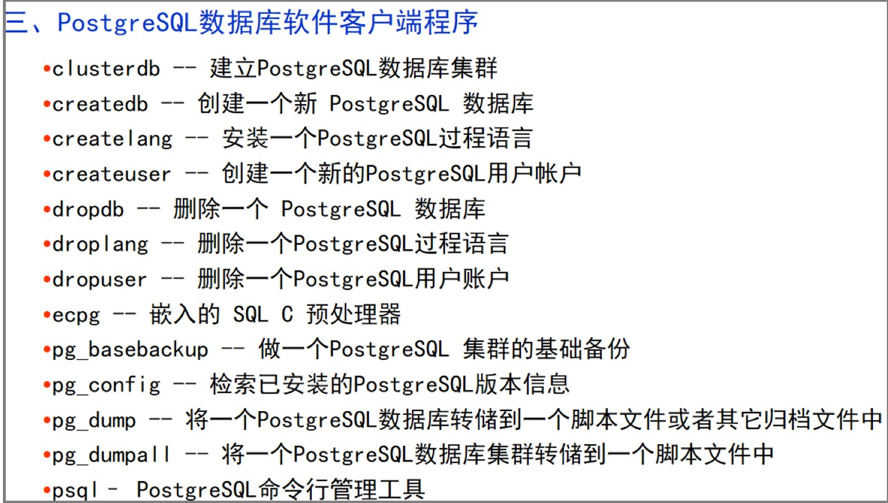
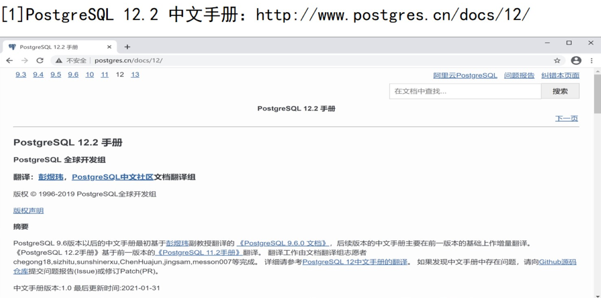

# postgresql

## 简介

### 客户端程序



- psql


- pgAdmin


### 服务器程序


### 资料




postgresql14官方中文文档：http://www.postgres.cn/docs/14/index.html

## jdbc.properties

```properties
driver=org.postgresql.Driver
url=jdbc:postgresql://localhost:5432/GradeDB
username=postgres
password=123456
```
## SQL语言

- DDL	数据定义语言
- DML   数据操纵语言
- DQL    数据查询语言
- DCL    数据控制语言
- TPL     事务处理语言
- CCL     游标控制语言

### DDL

数据定义语言。

#### 数据库

不是很建议直接SQL创建，可以先创建之后，在通过GUI方式修改数据库的各个属性。

```sql
CREATE DATABASE <数据库名>;

ALTER DATABASE <数据库名> RENAME TO <新数据库名>;

DROP DATABASE <数据库名>;
```

> 注意：至于，创建和修改数据库的更多配置参数，可以选择看书p59，或者直接GUI方式。

#### 表

```sql
--1.创建表
CREATE TABLE <表名> (
	<列名> <数据类型> [列完整性约束],
    ...
    [表完整性约束]
);
-- 列约束关键词：
-- PRIMARY KEY,	NOT NULL,	NULL,	UNIQUE,	CHECK,	DEFAULT等
/*注意：列约束中的primary key只能定义单列主键，
若要定义复合主键，需要使用表约束方式*/
-- 表约束关键词
-- CONSTRAINT <表级约束名> PRIMARY KEY(主键列)
-- CONSTRAINT <表级约束名> FOREIGN KEY(外键列) references 表名2(表名2的主键) on delete CASCADE on update CASCADE
-- CASCADE为级联操作，RESTRICT为限制操作，即有依赖时候，不删除或更新
--2.修改表
--修改表看书p64
-- 在修改表的时候，可以添加外键约束
--3.删除表
drop table <表名>
```

例子如下：课程信息表Course

```sql
CREATE TABLE Course(
--	courseId char(4) PRIMARY KEY,
    courseId char(4) not null,
    teacherId char(4) not null,
    courseName varchar(20) NOT NULL UNIQUE,
    courseType varchar(20) NULL CHECK(courseType IN ('基础课','专业','选修')),
    courseCredit smallint null,
    coursePeriod smallint null,
    testMethod char(10) not null default '闭卷考试',
-- 这里用表级约束定义复合主键
    CONSTRAINT Course_PK primary key(couseId,teacherId)
);
-- 定义外键 级联删除
ALTER table Course 
add CONSTRAINT FK_COURSE_TEACHER foreign key(teacherId) 
references teacher(teacherId) on delelte CASCADE;
```

#### 索引

索引是一种针对表中指定列的值进行排序的数据结构，使用它可以**加快表中数据的查询**。

类似于图书的目录结构，将索引列的值及索引指针数据保存在索引结构中。

此后在数据查询时，先在索引结构中查找符合条件的索引指针值，根据索引指针快速找到对应的数据记录。

- 索引优点
  - 提高关系表中数据查询速度
  - 快速连接关联表
  - 减少分组和排序时间
- 索引开销
  - 创建和维护索引需要较大开销
  - 索引额外占用存储空间
  - 数据操纵因维护索引带来系统性能开销

##### 索引操作

```sql
# 创建索引
create [unique] index birthday_index on Student(birthday);
create [unique] INDEX <索引名> on <表名><(列名[,...])>;
# unique 不允许有重复索引值

# 修改索引名
alter index 索引名 rename to new_name;

# 删除索引
drop index 索引名;
```

### DCL

数据控制SQL语句。

对用户数据访问权进行控制的语句。

控制特定用户和角色对表、视图、存储过程、触发器等数据库对象的访问权限。

- GRANT授权语句
- REVOKE权限回收语句
- DENY拒绝权限语句
  - 用于拒绝给用户或角色赋予权限；
  - 并防止用户或角色通过其组或角色成员继承权限；

```sql
-- 授权
GRANT <权限列表> ON <数据库对象> TO <用户|角色> [with GRANT OPTION];
GRANT SELECT,INSERT,UPDATE,DELETE ON table_A TO ROLE_A;

-- 权限回收
REVOKE <权限列表> ON <数据库对象> FROM <用户|角色>;
REVOKE DELETE ON table_A from ROLE_A;

-- 权限拒绝
DENY <权限列表> ON <数据库对象> TO <用户|角色>;
DENY DELETE On table_A TO ROLE_B;
```

## 数据库应用编程

### 存储过程

存储过程是一种数据库对象，由一组能完成特定功能的SQL语句构成。
把重复使用的SQL语句逻辑块封装起来，经编译后，存储在数据库服务器端，被调用时候，不需要再次编译。

PostgreSQL 10之前版本只能使用CREATE FUNCTION命令创建存储过程，
PostgreSQL 10之后版本也可以使用CREATE PRECEDURE命令创建存储过程。

postgresql内置的过程控制语言为PL/pgSQL.

>**postgresql将存储过程和函数统称为存储过程。**

>存储过程与函数的异同：相同点都是过程程序，区别在于存储过程不返回值，因此没有返回类型声明。


#### 创建语法

- default_expr: 指定参数默认值。
- argtype : 函数返回值的数据类型
- retype：returns返回值的数据类型。
如果存在out或者inout参数，可以省略returns语句。


例子1：
创建一个名为countRecords()的过程函数统计STUDENT表的记录数。
```sql
CREATE OR REPLACE FUNCTION countRecords ()  
RETURNS integer AS $$  
declare  
    count integer :=0;  -- 默认为0
BEGIN  
   SELECT count(*) into count FROM STUDENT;  
   RETURN count;  
END;  
$$ LANGUAGE plpgsql;	-- 告诉编译器该函数使用PL/pgSQL实现
```

例2:创建一个名为add_data（a,b,c）的存储过程实现a+b相加运算，并将结果放入c。
```sql
CREATE OR REPLACE PROCEDURE add_data(a integer, b integer,inout c integer)
AS $$
 Begin
  c=a+b;
 End;
$$ LANGUAGE plpgsql;
```

例子3：返回一个表对象的存储过程
```sql
CREATE OR REPLACE FUNCTION countByCourse()  
RETURNS TABLE(c1 bigint, name character varying) AS $$  
begin
 return query
	select	count(*),course.cname as name from grade inner join course on grade.cid=course.cid 
	where grade.score<60
	group by grade.cid,course.cname;
end;
$$ LANGUAGE plpgsql;
```
此时调用这个存储过程：
`select c1,name from countByCourse(); `


#### 调用函数或存储过程
```sql
-- 函数
select 函数名（参数）；
-- 或者：
select  * from 函数名（参数）

-- 存储过程
CALL  存储过程名（参数）
```


#### 删除存储过程


#### PL/pgSQL基本语法(*)
##### 声明局部变量
```sql
variable_name [constant] variable_type [not null] [{default |:=}expression];
```
- constant 修饰的变量为常量，不能修改。
- not null 修饰的变量不能为null值，则必须在声明时候赋予非空默认值。

```sql
/*变量声明的语法如下：
 declare 
     变量名  变量类型；
如果声明变量为记录类型，变量声明格式为： variable_name RECORD;
注：RECORD不是真正的数据类型，只是一个占位符。*/
-- 例如：
declare 
  count intger；
  rec RECORD ；
```

##### 基本语句
###### 赋值语句
```sql
salePrice:=20;
tax:=salePrice*0.13;
```
等号两端的变量和表达式的类型要相容，否则会产生运行时错误。

###### select into
```sql
select into target select_expressions from ...;
```

- target 可以为一个记录变量(record)、行变量、一组用逗号分隔的简单变量和记录/行字段的列表。
- 如果将一行或者一个变量列表作为target，那么查询值必须准确匹配目标的结构。
- 如果target为记录变量(record)，它将自动将自己构造成命令结果行和行列型。
	- 如果命令返回0行，目标赋值为空值。
	- 如果命令返回多行，只有第一行赋值给目标，其他行忽略。
- 执行select into 语句之后，可以检查内置变量found判断本次赋值是否成功。

例子：
```sql
create or replace function mytest(in a integer,in b integer)
returns float as $$
declare 
	price float;
	tax float;
	stu record;
begin
	price :=a+b;
-- 	tax:=price*0.1;
	select into tax price*0.1;
	select into stu * from student where student.sid=100;
	if found then 
		return 0;
	end if;
	return tax;
end;
$$ language plpgsql;

select mytest(4,2); -- 返回0.6
```

##### 控制结构语句
###### 条件语句if

在PL/pgSQL中有以下三种形式的条件语句，与其他高级语言的条件语句意义相同。

```sql
-- 1) IF-THEN 
IF boolean-expression THEN
     statements
END IF; 
-- 2)IF-THEN-ELSE
IF boolean-expression THEN
 statements
ELSE
END IF;
-- 3) IF-THEN-ELSIF-ELSE
IF boolean-expression THEN
 statements
ELSIF boolean-expression THEN
 statements
ELSIF boolean-expression THEN
     statements
ELSE
  statements
END IF; 
```

###### LOOP
```sql
-- 1) LOOP基本循环语句
LOOP
 statements
END LOOP [ label ];
-- lable是可选标签，由exit和continue语句使用，用于嵌套循环中识别循环层次。
```
loop定义了一个无条件循环语句，直到exit或return语句终止。

###### exit和continue

```sql
-- 2) EXIT循环退出语句
 EXIT [ label ] [ WHEN expression ];
例如： LOOP
                   count=count+1;
                   EXIT WHEN count >100;
              END LOOP;

-- 3) CONTINUE循环继续语句
 CONTINUE [ label ] [ WHEN expression ];
例如： LOOP
          count=count+1;
          EXIT WHEN count > 100;
          CONTINUE WHEN count < 50;
          count=count+1;
    END LOOP; 
```
###### while
```sql
-- 4) WHILE
WHILE expression LOOP
    statements
END LOOP [label];
例如：
 WHILE amount_owed > 0 AND  balance > 0 LOOP
     --do something
 END LOOP;
```
###### for
```sql
-- 5) FOR
FOR name IN [ REVERSE ] expression .. expression LOOP
    statements
END LOOP [label];
例如： FOR i IN 1..10 LOOP
                    RAISE NOTICE 'i IS %', i;
              END LOOP;
 FOR i IN REVERSE 10..1  LOOP
      --do something
 END LOOP;
```
- 变量name自动被定义为integer类型；
- name每次迭代自增1；
- 如果声明了reverse，每次迭代自减1

##### 遍历命令结果
```sql
FOR  record_or_row IN query  LOOP
     statements
END LOOP [label]; 
```
例子：从学生表Student查询结果集中，循环输出数据
```sql
create function Out_Record() 
returns RECORD as $$
declare 
    rec RECORD;
begin
 for  rec in  SELECT * FROM student loop
    raise notice  '学生数据：%,%', rec.sid, rec.sname; 
 end loop;
 return rec;
end;
$$ language plpgsql;

-- 调用函数
select Out_Record();
```


#### 修改存储过程
1. 如果是修改存储过程的**业务逻辑**，可以使用`create or replace function`对其源码重新修改。

2. 如果是修改存储过程的**拥有者、名字、所属模式**等，需要用`alter function` 命令。
```sql
-- 修改名字
alter function name ([[argmode][argname]argtype[,...]])
	rename to new_name;

-- 修改所有者
alter function name ([[argmode][argname]argtype[,...]])
	owner to new_owner;

-- 修改所属模式
alter function name ([[argmode][argname]argtype[,...]])
	set schema new_schema;
```


### 触发器

触发器是特殊类型的存储过程，其过程程序由事件(如INSERT、UPDATE、DELETE操作等) 触发而自动执行。
PostgreSQL 触发器是数据库的回调函数，它会在指定的数据库事件发生时**自动执行/调用**。

**触发器用途**：可以实现比约束**更复杂的数据完整性**，经常用于加强数据的完整性约束和业务规则。
如使用触发器来替代外键的参照完整性约束。(见实验作业3)

**触发器特点**
与数据库对象相关：在表或视图上执行DML、DDL操作，其定义的事件触发过程程序执行。 
DML事件触发：由执行INSERT、DELETE、UPDATE操作时触发。
DDL事件触发：由执行CRETE、ALTER、DROP、SELECT INTO操作时触发。

**触发器与存储过程有何异同？**

- 均为过程程序
- 触发器由事件激发自动执行处理程序，存储过程需要由其他程序调用执行

**在数据库应用开发中，触发器主要应用在哪些场景？**

- 验证输入数据的正确性

- 执行复杂的业务规则

- 审计跟踪在数据库表上的数据插入、修改、删除

- 将数据复制到不同数据库表上以实现数据一致性

#### 触发器分类
1. 按**DML**操作语句分类：  
INSERT触发器、DELETE触发器、UPDATE触发器 

2. 按触发器**执行次数**分类： 
（1）**语句级触发器**：由关键字**FOR  EACH  STATEMENT**声明，在触发器作用的表上执行一条SQL语句时，该触发器程序只执行一次，即使是修改了零行数据的SQL，也会导致相应的触发器执行。FOR EACH STATEMENT为**默认值**。
（2）**行级触发器**：由关键字**FOR  EACH  ROW**标记的触发器，当触发器所在表中数据发生变化时，每变化一行就会执行一次触发器程序。
3. 按触发的时间分类： 
（1）**BEFORE**触发器：在触发事件之前执行触发器程序。
（2）**AFTER**触发器：在触发事件之后执行触发器程序。
（3）**INSTEAD OF**触发器：当触发事件发生后，执行触发器中指定的过程程序，而不是执行产生触发事件的SQL语句。


#### 触发器程序中的特殊变量
1. **NEW**
   
   > NEW变量数据类型是RECORD。
   > 对于行级触发器，它保存了INSERT或UPDATE操作产生的**新行记录数据**。
   > 对于语句级触发器，它的值是NULL。
   
2. **OLD**

   > OLD变量数据类型是RECORD。
   > 对于行级触发器，它保存了UPDATE或DELETE操作修改或删除的**旧行记录数据**。
   > 对于语句级触发器，它的值是NULL。

3. **TG_OP**

   > TG_OP变量数据类型是text，其值为INSERT、UPDATE、DELETE 字符串之一。使用它来获取触发器是由哪类操作引发。
   > **注意：如果需要通过比较TG_OP来进行判断操作时，必须是大写的INSERT,而不能是小写的insert。**

4. 其他的特殊变量

   > 看书p247，用得不多。


#### 创建触发器
```sql
CREATE [CONSTRAINT] TRIGGER <触发器名>
{BEFORE | AFTER | INSTEAD OF } {event [OR ...]}
ON 表名|视图名
[FROM referenced_table_name]
[FOR [EACH] { ROW | STATEMENT} ]
[ WHEN (condition) ]
EXECUTE PROCUDURE function_name(arguments)
```

- event 	

  > INSERT、UPDATE、DELETE或TRUNCATE之一，声明激发触发器的事件，可以用OR声明多个；

- referenced_table_name  

  > 用于有外键约束的两张表，触发器所依附的表所参照的主表，但一般不使用此参数；

- condition

  > 条件布尔表达式，关键字when根据此表达式决定下一步的触发器函数是否被实际执行，返回true才调用该函数；

- function_name

  > 触发器函数，必须在创建触发器之前创建，没有接受参数并且返回trigger类型
  >
  > 此函数将在触发器被触发时被调用


#### 触发器使用步骤
练习：在如下雇员表emp中被插入或更新一行数据时，触发函数程序将当前用户名和时间标记在该数据行中,并且检查雇员的姓名以及薪水是否为空，若为空，输出警示信息。

##### 1.建表
```sql
CREATE TABLE emp (
    empID	char(3) primary key,
    empname varchar(20),
    salary integer,
    last_date timestamp,
    last_user varchar(20)
);
```
##### 2.触发器函数程序
**这个函数必须返回trigger类型**
```sql
CREATE FUNCTION emp_stamp() RETURNS trigger AS $$
    BEGIN
        -- 检查给出了 empname 以及 salary
        IF NEW.empname IS NULL THEN
            RAISE EXCEPTION '雇员名不能为空';
        END IF;
        IF NEW.salary IS NULL THEN
            RAISE EXCEPTION '% 薪水不能为空', NEW.empname;
        END IF;
        -- 记住谁在什么时候改变了工资单
        NEW.last_date := current_timestamp;
        NEW.last_user := current_user; -- 返回当前用户
        RETURN NEW;
    END;
$$ LANGUAGE plpgsql;
```

##### 3.触发器定义程序
```sql
CREATE TRIGGER emp_stamp 
BEFORE INSERT OR UPDATE ON emp
    FOR EACH ROW EXECUTE FUNCTION emp_stamp();
```

##### 4.案例

案例为数据库大作业3. 当然更建议看课本。

```sql
-- 删除触发器
drop trigger if exists student_trigger on student;
-- 触发器函数程序
create or replace function student_trigger()
returns trigger as $student_trigger$
begin
	raise notice '进入到触发器';
	if (TG_OP = 'DELETE') then -- 级联删除
		raise notice '删除sid：%,sname：%',old.sid,old.sname;
		delete from grade where sid=old.sid;
		return old;
	elsif (TG_OP='UPDATE') then  -- 级联更新
		raise notice '学生：% 更新',old.sid;
		-- 当修改了学号的时候级联更新
	 	update grade set sid=new.sid where old.sid!=new.sid and sid=old.sid;
		return new;
	end if;
	return null;
end;
$student_trigger$ language plpgsql;

-- 触发器定义程序
create trigger student_trigger
	after delete or update on student
	for each row
	execute function student_trigger(); 
```


#### 触发器管理

##### 列出触发器

```sql
--可以把从 pg_trigger 表中把当前数据库所有触发器列举出来：
SELECT * FROM pg_trigger;


--列举出特定表的触发器，语法如下：
SELECT tgname FROM pg_trigger, pg_class 
	WHERE tgrelid=pg_class.oid AND relname='表名';
```

##### 删除触发器
```sql
DROP TRIGGER [ IF EXISTS ] trigger_name ON table_name [ CASCADE | RESTRICT ]
/*主要参数说明：
IF EXISTS：如果该触发器不存在，则发出提示而不是抛出错误。
table_name：触发器定义所依附的表名称。
CASCADE：级联删除依赖此触发器的对象。
RESTRICT：如果有依赖对象存在，则拒绝删除。该参数缺省是拒绝删除。*/

--  例 将上述触发器score_audit_trig删除，同时级联删除依赖触发器的对象。
  DROP TRIGGER IF EXISTS score_audit_trig ON grade CASCADE;
```

##### 修改触发器

```sql
ALTER TRIGGER name ON table_name RENAME TO new_name
/*主要参数说明：
name：现有触发器名称
table_name：该触发器作用的表名字
new_name：触发器的新名字*/
```


### 事件触发器

事件触发器是针对一个数据库**DDL操作**的触发器，它可以捕获数据库级别上的对象DDL事件。

事件触发器定义在数据库级，权限相对较大，所以只有**超级用户**才能创建和修改事件触发器。

#### 事件触发器与DDL操作

PostgerSQL支持的事件触发器类型：

- ddl_command_start：在DDL开始前触发。

- ddl_command_end：在DDL结束后触发。

- sql_drop：删除一个数据库对象前被触发。


#### 创建事件触发器

```sql
CREATE EVENT TRIGGER name
ON event
[WHEN filter_variable IN (filter_value [, ...]) [ AND ... ] ]
EXECUTE PROCEDURE function_name();
/*
（1）name：触发器名称，在数据库内必须唯一
（2）event：触发器的事件名称
（3）filter_variable：过滤事件的变量名称
（4）filter_value：filter_variable相关值，如('DROP FUNCTION', 'CREATE TABLE')
（5）function_name：过程函数，没有参数，返回值类型为event_trigger。
*/
```

具体细节看书p251。


#### 修改事件触发器

```sql
ALTER EVENT TRIGGER name DISABLE;
ALTER EVENT TRIGGER name ENABLE;
ALTER EVENT TRIGGER name OWNER TO new_owner;
ALTER EVENT TRIGGER name RENAME TO new_name;
/*
（1）DISABLE：禁用已有的触发器
（2）ENABLE：使该事件触发器激活
（3）name：事件触发器的名称
（4）new_owner：事件触发器的新属主名称
（5）new_name：事件触发器的新名称
*/
```

#### 删除事件触发器

```sql
DROP EVENT TRIGGER [ IF EXISTS ] name [ CASCADE | RESTRICT ]
/*
（1）IF EXISTS：如果事件触发器不存在，系统不会抛出错误，只会产生提示信息。 
（2）name：事件触发器名称 
（3）CASCADE：级联删除依赖于事件触发器的对象。 
（4）RESTRICT：如果有依赖于事件触发器的对象，则不允许删除这个事件触发器。这是默认行为。
*/
```


### 游标

存储过程和触发器都是用数据库所支持的过程化语言编写的，处理的对象是函数过程中定义的变量，**除数组和记录型变量(record类型)**外，**一般函数中的每个变量每次只能存储一条记录**。
而查询处理的对象是集合，大多数数据库都提供游标作为新的数据处理方法，用于存储SQL语句查询结果。

游标是一种临时的数据库对象，存放从表中查询返回的数据行副本，提供了从多条数据记录的结果集中，每次提取一条记录的机制。

**游标（Cursor**）是一种指向数据库查询结果集的指针，通过它可以从结果集中**提取每一条记录**进行处理。

#### 游标使用步骤

##### 1.声明游标

```sql
/*
（1）使用refcursor定义的游标变量
（2）游标声明语句
	游标名  CURSOR [ ( arguments ) ] FOR query*/
-- 例子：
Declare
curVars1 	refcursor;	-- 这种方法声明的 游标 尚未绑定查询语句
curStudent CURSOR FOR  SELECT * FROM student;
curStudentOne CURSOR (key integer)  IS 
            SELECT * FROM student WHERE SID = key;
```

注意：此时游标仅为声明，DBMS还没有执行查询语句，游标中没有可访问的数据。

##### 2.打开游标

游标在使用之前必须被打开，打开游标就是执行游标所绑定的查询语句。

```sql
/*（1）OPEN… FOR 
        其语句格式： OPEN unbound_cursor FOR query;
       打开未绑定的游标变量，其query查询语句是返回记录的SELECT语句。*/
-- 例如：
OPEN curVars1 FOR SELECT * FROM student WHERE SID = mykey;
/*（2）OPEN… FOR EXECUTE
     其语句格式为：  OPEN unbound_cursor FOR EXECUTE query-string;   
     打开未绑定的游标变量，EXECUTE将动态执行查询字符串*/
-- 例    
OPEN curVars1 FOR EXECUTE 'SELECT * FROM ' || quote_ident($1);
-- 其中$1是指由存储过程传递的第1个参数。

/*（3）打开绑定游标的语句格式：
         OPEN bound_cursor [ ( argument_values ) ];   
        适用于绑定的游标变量。如果游标变量在声明时包含接收参数，在打开游标时需要传递参数，该参数将传入到游标声明的查询语句中执行。*/
-- 例如：
OPEN curStudent;
OPEN curStudentOne (‘20160230302001’); 
```

##### 3.使用游标提取值

游标的打开和读取必须在同一个事务中，因为事务结束会隐式关闭游标。

```sql
/*其语句格式：    FETCH cursor INTO target;
FETCH命令从游标中读取当前指针所指向记录的数据到目标中。可通过PL/pgSQL内置的系统变量FOUND来判断读取是否成功。*/
--例
FETCH curVars1 INTO rowvar; 
FETCH curStudent INTO SID, Sname, sex;
```

##### 4.关闭游标

```sql
CLOSE cursorName;
-- 当处理结束游标数据后，需要关闭游标，以释放其占有的系统资源，主要是释放占用的内存资源。

-- 游标被关闭后，如果需要再次读取游标中的数据，需要再次open打开游标。
```

#### 例1 

在函数中使用游标查询student表的学号、学生姓名和性别。

```sql
CREATE OR REPLACE FUNCTION cursorDemo() 
returns boolean as $$ 
Declare                       		--定义变量及游标
 unbound_refcursor refcursor;  		--声明游标变量
 vsid varchar;               		--学号变量
 vsname varchar;            			--姓名变量
 vsex varchar;      		 	--性别变量 
begin  
 open unbound_refcursor for execute 'select sid,sname,sex from student';  		--打开未绑定的游标变量执行
loop  						--开始循环
  fetch unbound_refcursor into vsid,vsname,vsex; --从游标中提取值赋予变量 
	 if found then  --如果从游标中取到数据，则输出这些数据
         raise notice '%,%,%',vsid,vsname,vsex; 
     else 
         exit; 
     end if; 
end loop;                    		--结束循环
close unbound_refcursor;        		--关闭游标
raise notice '取数据循环结束...';		--打印消息
return true;                    		--为函数返回布尔值
exception when others then  			--处理异常
  raise exception 'error-(%)', sqlerrm;	-- sqlerrm错误代码变量
end;  						--结束
$$   LANGUAGE plpgsql;  			--规定语言
select cursorDemo();	-- 执行存储过程
drop function cursorDemo();	-- 删除存储过程
```

#### 例2

编写带参数的游标函数，从成绩表中查询分数大于某给定值的学号和课程号。

```sql
create or replace function cusorGrade(myscore int) returns void as $$ 
   declare
     vstuscore Grade%ROWTYPE;  			--声明与表Grade结构相同的行变量
     vstucursor cursor( invalue int) 		
       for select courseid,studentid,grade from Grade where grade>=invalue order by studentid; 						--声明带有输入参数的游标
   begin
     open vstucursor(myscore);  			--打开带有参数的游标
     loop 
	fetch vstucursor into vstuscore;
       exit when not found;  			-- 假如没有检索到记录，结束循环处理
       raise notice '%,%,%',vstuscore.studentid,vstuscore.courseid,vstuscore.grade; 
      end loop;
      close vstucursor;  				--关闭游标
   end;
$$ language plpgsql;
```

## 数据库管理

### 事务管理

Transaction Control Language 事务控制语言.

**事务的特征**

> （ACID）
> 原子性(Atomicity)：要么都执行，要么都回滚
> 一致性(Consistency)：保证数据的状态操作前和操作后保持一致
> 隔离性(Isolation)：多个事务同时操作相同数据库的同一个数据时，一个事务的执行不受另外一个事务的干扰
> 持久性(Durability)：一个事务一旦提交，则数据将持久化到本地，除非其他事务对其进行修改

**TCL语句：**

> - BEGIN或START TRANSACTION	为事务开始语句
> - ROLLBACK  为事务回滚语句
> - COMMIT      为事务提交语句
> - SAVEPOINT 为事务保存点语句
>
> ```sql
> START TRANSACTION;
> insert into table_A values(123);
> update table_A set id=1234;
> select * from table_A;
> COMMIT;	-- 或者是 ROLLBACK;
> 
> BEGIN;
> insert into table_A values(123);
> SAVEPOINT point1;
> update table_A set id=1234;
> select * from table_A;
> ROLLBACK to point1;
> commit;
> ```

**注意**：

在事务处理语句块中，仅能使用DML和DQL语句，不能使用DDL语句，

因为DDL语句会在数据库中自动提交，导致事务中断。

默认情况下，每条SQL语句构成一个单独的事务。

### 并发控制

并发控制指的是DBMS运行多个并发事务程序时，为确保各个事务独立正常运行，并防止相互干扰，保持数据一致性，所采取的控制和管理。

目的是确保一个事务的执行不会对另一个事务的执行产生不合理的影响，解决可能产生的数据不一致、事务程序死锁问题。

保证事务执行的隔离性。

#### 并发问题

##### 1.脏读

Dirty Read。一个事务读取了另一个事务修改后的数据，但修改数据的事务因某种原因失败，数据未提交，读取到了一个脏数据。

脏数据是对未提交数据的统称。


##### 2.不可重复读


注意：如果不是更新操作，而是删除操作，即第二次读取时，发现某些记录消失了，也是不可重复读。

##### 3.幻读

在上面的不可重复读基础上，如果不是更新操作，而是添加操作，即第二次读取发现多了某些记录，称为幻读。

幻读其实是不可重复读的一种，在事务并发控制中，一般将其归于不可重复读。

##### 4.丢失更新

事务T1对共享数据进行更新，再次查询该数据时，发现与自己的更新值不一样。即为丢失更新。


#### 并发事务调度

对于调度机制，数据库锁机制，并发控制协议，事务隔离级别，看书p168.


### 安全管理

#### 风险


#### 数据库系统安全模型


数据库安全一般采用多层安全控制体系进行安全控制和管理。

- 用户管理，每次连接数据库都要在DBMS进行身份验证，合法用户才能进入；

- 权限管理，只有具有一定的数据库对象操作权限，才能操作访问数据库对象；

- 角色管理，为了方便对总多用户及其权限进行管理，DBMS通常将一组具有相同权限的用户定义为角色。不同的角色代表不同的权限集合的用户集合。

数据库系统安全模型中，最基本的安全管理手段是DBMS提供的**用户授权**和**访问权限控制功能**。

一个用户可以对应多个角色，每个角色可以对应多个用户。用户、角色都可以被赋予数据库对象访问权限。


#### 角色管理

> 在DBMS中，为了方便对众多用户及其权限进行管理，通常将一组具有相同权限的用户定义为角色。
> 不同角色代表**不同权限集合**的用户集合。

**角色分类：**

- 系统角色
  - 数据库内建的角色，已经被定义好了相应的操作权限，如postgres就是一个系统角色，具有系统管理员的所有权限。
- 用户定义角色
  - DBA(数据库系统管理员)根据业务应用需求，设计了不同权限范围的用户类别。

角色管理是对用户自定义角色进行操作管理。

**角色管理内容**

- 角色创建
- 角色修改
- 角色删除

**角色管理方式**

- 执行SQL语句管理角色
- GUI操作管理角色

##### SQL语句


option属性如下：


##### GUI方式

看书。

#### 权限管理

##### 权限类别

- 数据库对象**访问**操作权限
  - 指用户被赋予的特定数据库对象的**数据访问操作**权限
  - 如对数据库表的crud
- 数据库对象**定义**操作权限
  - 指用户在数据库中被赋予的**数据库对象**创建、删除、和修改权限。
  - 如对库、表、视图、存储过程、自定义函数、索引等对象的cud。

系统管理员(超级用户)拥有最高权限，可以对其他角色或用户进行权限管理。

数据库对象拥有者(dbo)对其所拥有的对象具有全部权限。

普通用户(user)只具有被赋予的数据库访问操作权限。

##### 权限管理SQL

基本操作：授予权限(GRANT)、收回权限(REVOKE)、拒绝权限(DENY)。

```sql
GRANT SELECT,INSERT,UPDATE,DELETE ON table_name TO "role_A";
REVOKE delete on table_name from "role_A";
DENY delete on table_name to "user_A";
```

> 权限授予之后，如何通过GUI方式简单查看权限情况呢？
> 答：书上p183.
> 即在pgadmin4中，右键点击某个表对象，打开属性对话框，在点击"安全"属性页，即可看到这个表的各个用户/角色的权限情况。

##### 权限继承

```sql
GRANT "role_A" to "user_A";
```

这样即可将用户纳入角色的成员，称为角色分组的一员，并获取角色相同的权限。


##### 权限列表界面


#### 用户管理


> 以下将记录SQL操作。
> GUI方式管理去看书。

##### 用户创建

```sql
CREATE USER user_name [[with] option[...]];
-- 例子
create user "user_A" with
 login
 NOSUPERUSER
 NOCREATEDB
 NOCREATEROLE
 INHERIT
 NOREPLICATION
 CONNECTION LIMIT -1 -- -1 表示连接数不受限
 PASSWORD '123456';
COMMENT on ROLE "user_A" IS "用户A";

-- GRANT "role_A" to "user_A"; 	-- 将角色A分派给用户A，用户A成为角色A的一个分组成员，获得同role_A的权限
```

其option属性如下：


##### 用户修改

```sql
-- 修改用户属性
alter USER user_A 
	connection limit 10
	password '123456';
-- 修改用户名称
alter USER user_A
	rename to user_B;
-- 修改用户的参数值
alter USER user_B
	set <参数项> {TO | =} {value | DEFAULT};
-- 重置用户参数值
alter USER user_B
	RESET <参数项>;	
```

##### 用户删除

```sql
DROP USER user_A;
```


#### 最佳实践

```tex
0.设计好库、表、索引、视图、存储过程、触发器
1.先设计存取权限控制模型
2.创建角色并给角色授权
3.创建用户
4.用户继承角色的权限(GRANT "ROLE_A" TO "USER_A";)
5.验证权限模型正确性
如有不理解的地方，可以去看数据库的实验作业报告。
```

### 备份和恢复

待补充

看书

## java嵌入式SQL

### 获取连接

#### 1.注册驱动

```java
Class.forName("org.postgresql.Driver");
//加载PostgreSQL驱动程序。
```

#### 2.获取连接

```java
String url="jdbc:postgresql://localhost:5432/testdb";
String username="postgre";
String password="123456";
DriverManager.getConnection(String url, String username, String password)
//建立与数据库的连接。
```

### sql操作

#### 1.创建SQL语句对象

```java
// 使用Connection对象方法创建SQL语句对象有如下几种方式： 
① Connection.createStatement()	//创建Statement对象，实现静态SQL语句查询； 
② Connection.prepareStatement(String sql)	//创建PreparedStatement对象，实现动态SQL语句查询； 
③ Connection.prepareCall(String sql)		//创建CallableStatement对象，实现数据库存储过程调用。
```

#### 2.执行sql

```java
//1）执行各种SQL语句，返回一个boolean类型值，true表示执行的SQL语句具备查询结果，可通过Statement.getResultSet()方法获取；
Statement.execute(String sql) 
//2)执行SQL中的insert/update/delete语句，返回一个int值，反馈受影响的记录数；
Statement.executeUpdate(String sql)
//3）执行SQL中的select语句，返回一个表示查询结果的ResultSet对象。
Statement.executeQuery(String sql)
```

### 结果集处理

```java
//Java程序中使用ResultSet对象用于存储查询结果集，并通过游标访问结果集数据。
//1）将游标由当前位置移动到下一行；
    ResultSet.next()
//2）获取当前行指定字段的String类型值；
        ResultSet.getString(String columnName) 
//3） 获取当前行指定列的String类型值；
        ResultSet.getString(int columnIndex)
//4）将游标由当前行移动到上一行。
        ResuleSet.previous（）
```

### PreparedStatement

向SQL语句传递参数

如果Java语言向SQL语句传递参数，则需使用动态查询PreparedStatement对象执行操作。该对象有如下三种执行方式：
1）prepareStatement.executeUpdate()执行更新；
2）prepareStatement对象使用addBatch()方法向批处理中加入更新语句，
3）executeBatch()方法用于成批地执行SQL语句。

### 例子

```java
public class SQLinJava {
public static void main(String[] args) {
    Connection conn = null;
    String URL = "jdbc:postgresql://localhost:5432/testDB";
    String userName = "myuser";
    String passWord = "sa";
    String sid[] = {"14102","14103","14202","14301","14101","14201","14503"};
    String cid[] = {"1205","1208","1205","1208","1201","1201","1201"};
    int score[] = {90,78,89,68,86,96,83};           
    try {
         Class.forName("org.postgresql.Driver");
         conn = DriverManager.getConnection(URL , userName, passWord );
         System.out.println("成功连接数据库！");
         
         String insertSql = "INSERT INTO stu_score(sid, cid, score) VALUES (?,?,?)";
         String querySql = "select sid, cid, score from stu_score where score>=?";
         PreparedStatement psInsert = conn.prepareStatement(insertSql); //定义动态执行SQL语句对象
         PreparedStatement psQuery = conn.prepareStatement(querySql）; //定义动态执行SQL语句对象
       	for (int i=0; i<sid.length; i++)
         {
             psInsert.setString(1, sid[i]);
             psInsert.setString(2, cid[i]);
             psInsert.setInt(3, score[i]);
             psInsert.addBatch();   //添加批处理的记录        
         }
         psInsert.executeBatch();//批处理执行多条数据记录
         
         psQuery.setInt(1, 80);
         ResultSet rs = psQuery.executeQuery();
         while (rs.next()) { // 判断是否还有下一个数据    
             System.out.println(rs.getString("sid") + "  " + 
                                rs.getString("cid") + " " + rs.getInt("score"));  
         }
         // 释放资源
         psQuery.close();
         psInsert.close();
         conn.close();
       } catch ( Exception e ) {
         System.err.println( e.getClass().getName()+": "+ e.getMessage() );
         System.exit(0);
       }
 }
}
```


## 一些问题

1.**sql语句中单引号和双引号有什么区别？**
比如一般字符串使用单引号，但创建角色时使用双引号。

答：数据库对象名称若使用双引号，则在系统中支持大小写区别。一般字符串数据则使用单引号。

2.**如何在数据库中查看一个角色对表的访问权限**？

- SQL

通过SQL语句打印指定角色的所有表权限 `SELECT * FROM information_schema.table_privileges WHERE grantee='xxx';`

- GUI

或者GUI方式：通过SQL语句打印指定角色的所有表权限 SELECT * FROM information_schema.table_privileges WHERE grantee='xxx';


**3.在Pgadmin中创建了一个新用户我该如何用这个用户身份登录，然后来进行访问操作呢？**

GUI：先断开与数据库的连接然后在 propriety 里设置 connection中用户名再点击连接输入 密码。

Shell：在SQL Shell中进行用户名和密码的登录

