# 资料

> redis官网：https://redis.io/
>
> redis中文：http://www.redis.cn/

注意：尽量看redis官网的文档，中文网站的文档更新太慢了，甚至已经出现版本不兼容了。

不过redis中文的命令文档倒是更新的勤快，如果是看命令的话，redis中文倒是能用。

# NoSQL概述

## 为什么用NoSQL

单机数据库的瓶颈，我们来看看数据存储的瓶颈是什么？

1. 数据量的总大小，一个机器放不下时
2. 数据的索引（B+ Tree）一个机器的内存放不下时
3. 访问量（读写混合）一个实例不能承受

随着访问量的上升，几乎大部分使用MySQL架构的网站在数据库上都开始出现了性能问题。

**MySQL 的扩展性瓶颈**

> MySQL数据库也经常存储一些大文本的字段，导致数据库表非常的大，在做数据库恢复的时候就导致非常的慢，不容易快速恢复数据库，比如1000万4KB大小的文本就接近40GB的大小，如果能把这些数据从MySQL省去，MySQL将变的非常的小，关系数据库很强大，但是它并不能很好的应付所有的应用场景，MySQL的扩展性差（需要复杂的技术来实现），大数据下IO压力大，表结构更改困难，正是当前使用MySQL的开发人员面临的问题。

今天我们可以通过第三方平台（如：Google，FaceBook等）可以很容易的访问和抓取数据。用户的个人信息，社交网络，地理位置，用户生成的数据和用户操作日志已经成倍的增加、我们如果要对这些用户数据进行挖掘，那SQL数据库已经不适合这些应用了，而NoSQL数据库的发展却能很好的处理这些大的数据！

## 什么是NoSQL

> NoSQL=Not Only SQL

泛指非关系型的数据库，随着互联网Web2.0网站的兴起，传统的关系数据库在应付web2.0网站，特别是超大规模和高并发的社交网络服务类型的Web2.0纯动态网站已经显得力不从心，暴露了很多难以克服的问题，而非关系型的数据库则由于其本身的特点得到了非常迅速的发展，NoSQL数据库的产生就是为了解决大规模数据集合多种数据种类带来的挑战，尤其是大数据应用难题，包括超大规模数据的存储。

### **NoSQL特点**

1. 易扩展
   NoSQL 数据库种类繁多，但是一个共同的特点都是去掉关系数据库的关系型特性。

   数据之间无关系，这样就非常容易扩展，也无形之间，在架构的层面上带来了可扩展的能力。

2. 大数据量高性能
   官方记录：Redis 一秒可以写8万次，读11万次！

3. 多样灵活数据模型
   NoSQL无需事先为要存储的数据建立字段，随时可以存储自定义的数据格式，而在关系数据库里，增删字段是一件非常麻烦的事情。如果是非常大数据量的表，增加字段简直就是噩梦。

### NoSQL 数据模型简介

可以尝试使用**BSON**。

BSON是一种类json的一种二进制形式的存储格式，简称Binary JSON，它和JSON一样，支持内嵌的文档对象和数组对象

用BSon画出构建的数据模型
```json
{
    "customer":{ 
    "id":1000, 
    "name":"Z3", 
    "billingAddress":[{"city":"beijing"}], 
    "orders":[ 
	{ 
    "id":17, 
    "customerId":1000, 
    "orderItems":[{"productId":27,"price":77.5,"productName":"thinking in java"
     }],
    "shippingAddress":[{"city":"beijing"}],
    "orderPayment":[{"ccinfo":"111-222-333","txnid":"asdfadcd334","billingAddress":{"city":"beijing"}}], 
	} ] 
    } 
} 
```

- 高并发的操作是不太建议有关联查询的，互联网公司用冗余数据来避免关联查询

- 分布式事务是支持不了太多的并发的

### NoSQL的4类


### CAP&ACID

1.关系型数据库遵守ACID原则

- A (Atomicity) 原子性

  > 事务里的所有操作要么全部做完，要么都不做

- C (Consistency) 一致性

  > 事务前后数据的完整性必须保持一致。

- I (Isolation) 隔离性

  > 并发的事务之间不会互相影响

- D (Durability) 持久性

  > 事务提交后，它所做的修改将会永久的保存在数据库上，即使出现宕机也不会丢失。

2.**CAP（三进二）**

- C : Consistency（强一致性）
- A : Availability（可用性）
- P : Partition tolerance（分区容忍性）

**CAP理论就是说在分布式存储系统中，最多只能实现上面的两点**。

由于当前的网络硬件肯定会出现延迟丢包等问题，所以**分区容忍性是必须要实现**的。只能在一致性和可用性之间进行权衡，没有NoSQL系统能同时保证这三点。

大多数Web应用并**不需要强一致性**；很多web实时系统并不要求严格的数据库事务，对读一致性的要求很低， 有些场合对写一致性要求并不高。允许实现最终一致性。

网络分区发生时，节点间不能通信，对某个节点的修改不能同步给另一个节点，数据一致性不能满足。若要满足一致性，除非牺牲可用性，即暂时停止数据修改功能直至网络恢复。

> **CAP理论的核心**是：当网络分区发生时，一致性和可用性两难全。

最多只能同时较好的满足两个。因此，根据 CAP 原理将 NoSQL 数据库分成了满足 CA 原则、满足 CP原则和满足 AP 原则三 大类：

> CA - 单点集群，满足一致性，可用性的系统，通常在可扩展性上不太强大。
>
> CP - 满足一致性，分区容忍性的系统，通常性能不是特别高。
>
> AP - 满足可用性，分区容忍性的系统，通常可能对一致性要求低一些。

### BASE 理论

BASE理论是由eBay架构师提出的。BASE是**对CAP中一致性和可用性权衡的**结果，其来源于对大规模互联网分布式系统实践的总结，是基于CAP定律逐步演化而来。其核心思想是即使无法做到强一致性，但每个应用都可以根据自身业务特点，采用适当的方式来使系统达到<u>**最终一致性**</u>。

**BASE就是为了解决关系数据库强一致性引起的可用性降低的问题而提出的解决方案。**

BASE其实是下面三个术语的缩写：

- 基本可用(Basically Available)： 

  > 基本可用是指分布式系统在出现故障的时候，允许损失部分可用性，即保证核心可用。电商大促时，为了应对访问量激增，部分用户可能会被引导到降级页面，服务层也可能只提供降级服务。这就是损失部分可用性的体现。

- 软状态(Soft State)： 

  > 软状态是指允许系统存在中间状态，而该中间状态不会影响系统整体可用性。分布式存储中一般一份数据至少会有三个副本，允许不同节点间副本同步的延时就是软状态的体现。MySQL Replication 的异步复制也是一种体现。

- 最终一致性(Eventual Consistency)：

  > 最终一致性是指系统中的所有数据副本经过一定时间后，最终能够达到一致的状态。弱一致性和强一致性相反，最终一致性是弱一致性的一种特殊情况。

它的思想是通过让系统放松对某一时刻数据一致性的要求来换取系统整体伸缩性和性能上改观。

为什么这么说呢，缘由就在于大型系统往往由于地域分布和极高性能的要求，不可能采用分布式事务来完成这些指标，要想获得这些指标，我们必须采用另外一种方式来完成，这里BASE就是解决这个问题的办法！

**解释：**

1、分布式：不同的多台服务器上面部署不同的服务模块（工程），他们之间通过Rpc通信和调用，对外提供服务和组内协作。

2、集群：不同的多台服务器上面部署相同的服务模块，通过分布式调度软件进行统一的调度，对外提供服务和访问。

# Redis概述

## 简介

1、redis是什么

Redis是一个主要由Salvatore Sanfilippo（Antirez）开发的开源内存数据结构存储器，经常用作数据库、缓存以及消息代理等。

完全开源、C编写、遵守 BSD 协议、高性能的 key-value 数据库，目前**内存数据库**方面的事实标准。

> Redis：Remote Dictionary Server（远程字典服务器）

Redis 与其他 key - value 缓存产品有以下三个特点：

- Redis支持数据的持久化，可以将内存中的数据保存在磁盘中，重启的时候可以再次加载进行使用。
- Redis不仅仅支持简单的key-value类型的数据，同时还提供list，set，zset，hash等数据结构的存储。
- Redis支持数据的备份，即master-slave模式的数据备份。

2、**redis的特点**：

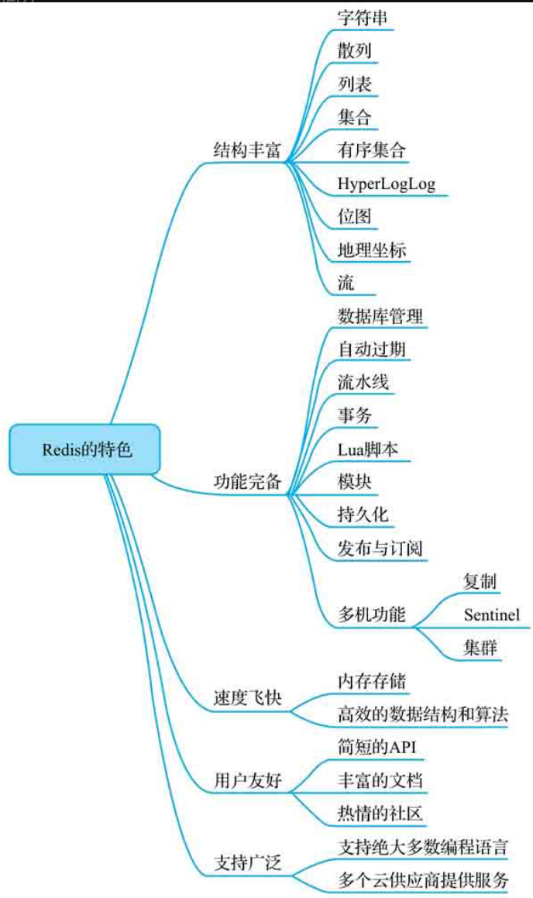

3、redis可以干什么

内存存储和持久化：redis支持异步将内存中的数据写到硬盘上，同时不影响继续服务

取最新N个数据的操作，如：可以将最新的10条评论的ID放在Redis的List集合里面

发布、订阅消息系统

地图信息分析

**定时器**、计数器

## Linux 下安装

> redis中文网安装教程：http://www.redis.cn/download.html
>
> 也可以去菜鸟教程上看。

1、下载安装包`redis-6.0.6.tar.gz` ，放到/opt目录下

2、解压`tar -zxvf redis-6.0.6.tar.gz `

3、先检查gcc版本；redis6需要gcc版本超过5；

```shell
gcc -v
# 如果版本超过5，就不需要升级gcc；否则执行下列命令升级
sudo yum install centos-release-scl
sudo yum install devtoolset-7-gcc*
scl enable devtoolset-7 bash
```

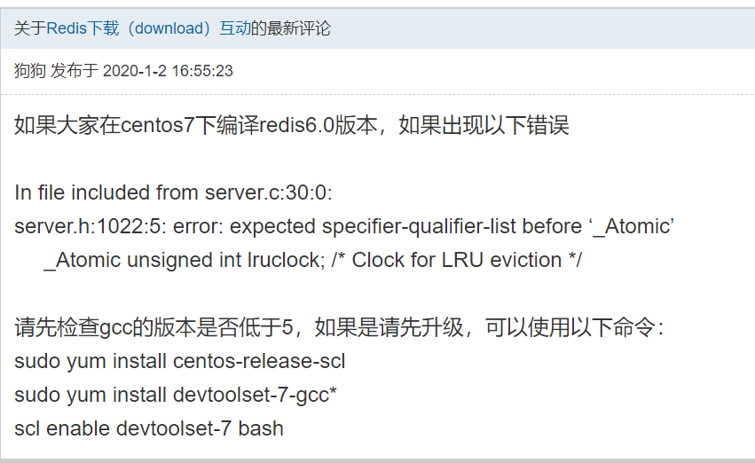

4、进入解压后的目录，执行make

```shell
$ cd redis-6.0.6
$ make
# $ make install
```

`make install`将会默认安装在`/usr/local/bin`下，也可以不执行make install。

执行完 **make** 命令后，redis-6.0.8 的 **src** 目录下会出现编译后的 redis 服务程序 **redis-server**，还有用于测试的客户端程序 **redis-cli**：

下面启动 redis 服务：

```shell
# cd src
# ./redis-server
```

注意这种方式启动 redis 使用的是默认配置。也可以通过启动参数告诉 redis 使用指定配置文件使用下面命令启动。

```shell
# cd src
# ./redis-server ../redis.conf
```

**redis.conf** 是一个默认的配置文件。我们可以根据需要使用自己的配置文件。

5、备份配置文件

```shell
[root@iZuf6el32a2l9b73omo6cgZ redis-6.0.6]# cd /usr/local/bin
#  拷一个备份，养成良好的习惯，我们就修改这个文件
[root@iZuf6el32a2l9b73omo6cgZ bin]# cp /opt/redis-6.0.6/redis.conf ./
# 看看这个配置了什么
[root@iZuf6el32a2l9b73omo6cgZ bin]# vim redis.conf
```

以后启动redis可以就用这个配置文件了，另一个解压包里的src的配置文件(这个是默认的配置文件)就可以留着。

6、启动redis

```shell
[root@iZuf6el32a2l9b73omo6cgZ bin]# cd /usr/local/bin
[root@iZuf6el32a2l9b73omo6cgZ bin]# redis-server redis.conf &


[root@iZuf6el32a2l9b73omo6cgZ bin]# redis-cli -p 6379
127.0.0.1:6379> ping
PONG
# 关闭连接
127.0.0.1:6379> shutdown
not connected> exit
[1]+  Done                    redis-server redis.conf

# 查看是否关闭成功
[root@iZuf6el32a2l9b73omo6cgZ bin]# ps -ef |grep redis
root       35437   35340  0 23:46 pts/1    00:00:00 grep --color=auto redis
[root@iZuf6el32a2l9b73omo6cgZ bin]# netstat -lnpt |grep 6379
[root@iZuf6el32a2l9b73omo6cgZ bin]# 
```

## 一些常识

### 16个数据库

默认16个数据库，类似数组下标从零开始，初始默认使用**零号库**.

- Select命令切换数据库

- Dbsize查看当前数据库的key的数量

- Flushdb：清空当前库

- Flushall：清空全部的库

```shell
127.0.0.1:6379> config get databases
1) "databases"
2) "16"
127.0.0.1:6379> select 6
OK
127.0.0.1:6379[6]> dbsize
(integer) 0
127.0.0.1:6379[6]> flushdb
OK
127.0.0.1:6379[6]> flushall
35468:M 01 Sep 2021 00:09:52.158 * DB saved on disk
OK
127.0.0.1:6379[6]> 
```

### redis是单线程的

官方表示，因为Redis是**基于内存**的操作，**CPU不是Redis的瓶颈**，Redis的**瓶颈最有可能是机器内存**的大小或者**网络带宽**。既然单线程容易实现，而且CPU不会成为瓶颈，那就顺理成章地采用单线程的方案了！Redis每秒可发送100w个请求。

从4.0版本开始，Redis已经实现多线程操作，但仅限于后台删除对象等后台服务线程。

**Redis为什么这么快？**

> Redis 核心就是 如果我的数据全都在内存里，单线程操作就是效率最高的。
>
> 多线程的本质就是 CPU 模拟出来多个线程的情况，这种模拟出来的情况就有一个代价，就是上下文的切换，对于Redis来说，没有上下文的切换就是效率最高的。
>
> 一次CPU上下文的切换大概在 1500ns 左右。从内存中读取 1MB 的连续数据，耗时大约为 250us，假设1MB的数据由多个线程读取了1000次，那么就有1000次时间上下文的切换，那么就有1500ns *1000 = 1500us ，单线程的读完1MB数据才250us ，多线程上下文的切换就用了1500us了，这还没算每次读一点数据的时间。

为了最大化CPU使用率，可以在一个机器中启动多个Redis实例，从而利用多核优势。

### redis工具

```shell
$ find . -type f -executable
./redis-benchmark # 用于进行redis性能测试的工具
./redis-check-dump # 用于修复出问题的dump.rdb文件
./redis-cli # redis的客户端
./redis-server # redis的服务端
./redis-check-aof # 用于修复出问题的AOF文件
./redis-sentinel # 用于集群管理
```

### redis启动

```shell
# 启动redis 服务器
[root@iZuf6el32a2l9b73omo6cgZ bin]# cd /usr/local/bin
[root@iZuf6el32a2l9b73omo6cgZ bin]# redis-server redis.conf &

# 启动redis客户端
[root@iZuf6el32a2l9b73omo6cgZ bin]# redis-cli -p 6379
127.0.0.1:6379> ping
PONG
# 关闭连接
127.0.0.1:6379> shutdown
not connected> exit
[1]+  Done                    redis-server redis.conf

# 查看是否关闭成功
[root@iZuf6el32a2l9b73omo6cgZ bin]# ps -ef |grep redis
root       35437   35340  0 23:46 pts/1    00:00:00 grep --color=auto redis
[root@iZuf6el32a2l9b73omo6cgZ bin]# netstat -lnpt |grep 6379
[root@iZuf6el32a2l9b73omo6cgZ bin]# 
```

# redis学习

## redis数据类型

| 类型        | 简介                           | 特性                                                         | 场景                                                         |
| :---------- | :----------------------------- | :----------------------------------------------------------- | :----------------------------------------------------------- |
| strings     | 二进制安全、最基本类型         | 可以包含任何数据。比如jpg图片或者序列化的对象、最大能存储 **512MB** | key、节拍序列                                                |
| lists       | 双向链表                       | 插入快                                                       | 聊天系统、日志、消息队列                                     |
| sets        | 哈希表实现、不重复             | 添加，删除，查找的复杂度都是 O(1)。                          | 1.共同好友；2.好友推荐时,根据tag求交集,大于某个阈值就可以推荐 |
| sorted sets | 在set基础上，元素多了score权重 | 每个元素都会关联一个 double 类型的分数。通过分数来为集合中的成员进行从小到大的排序。 | 排行榜                                                       |
| hashes      | value保存map                   | 特别适合用于存储对象                                         | 存一些对象信息                                               |
| geo         | 存储地理位置信息               | 数据类型为zset；存储指定的地理空间位置、计算距离等           | 附近的人、摇一摇                                             |
| hyperloglog | 做基数统计的算法               | 每个 HyperLogLog 键只需要花费 12 KB 内存                     | 网页浏览用户数量                                             |

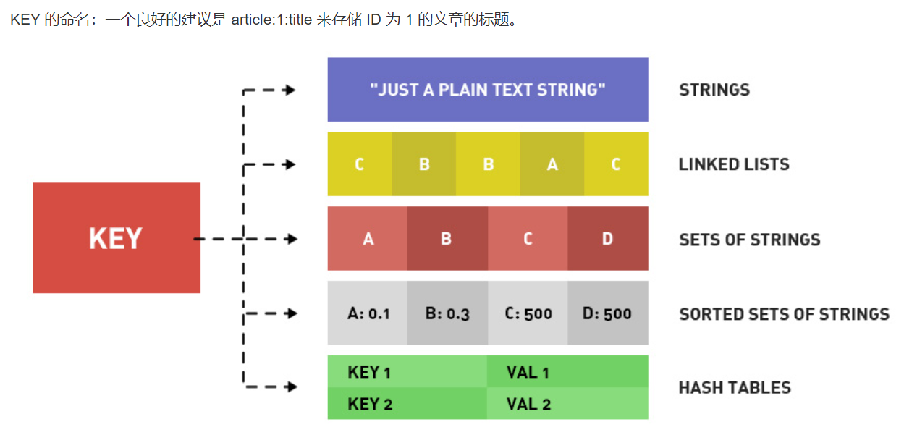

### Redis Value

redis是一种高级的key:value存储系统，其中value支持5种数据类型：

> 1.字符串（strings）
> 2.字符串列表（lists）
> 3.字符串集合（sets）
> 4.有序字符串集合（sorted sets）
> 5.哈希（hashes）
>
> 6.Bit arrays (或者说 simply bitmaps): 通过特殊的命令，你可以将 String 值当作一系列 bits 处理：可以设置和清除单独的 bits，数出所有设为 1 的 bits 的数量，找到最前的被设为 1 或 0 的 bit，等等。
>
> 7.HyperLogLogs: 这是被用于估计一个 set 中元素数量的概率性的数据结构。

### Redis keys
key值是二进制安全的，这意味着可以用任何二进制序列作为key值，JPEG文件的内容可以。空字符串也是有效key值。

关于key的几条规则：

> - 不要太长，消耗内存，数据中查找成本很高；
> - 不要太短，key相对value而言并不会用什么空间；
> - 最好坚持一种模式。例如：`object-type:id:field`，如`user:1000:password`

### Lists

Redis lists基于Linked Lists实现。
Redis 列表是简单的字符串列表，按照插入顺序排序

Redis Lists用linked list实现的原因是：对于数据库系统来说，至关重要的特性是：能非常快的在很大的列表上添加元素。另一个重要因素是，正如你将要看到的：Redis lists能在常数时间取得常数长度。

### hashes

Redis hash 是一个 string 类型的 field（字段） 和 value（值） 的映射表，hash 特别适合用于存储对象。

Redis 中每个 hash 可以存储 2^32^ - 1 键值对（40多亿）。

kv模式不变，但V是一个键值对

值得注意的是，小的 hash 被用特殊方式编码，非常节约内存。

### sets

Redis 的 Set 是 string 类型的无序集合。

集合是通过哈希表实现的，所以添加，删除，查找的复杂度都是 O(1)。

### sorted sets

有序集合是一种类似于集合和哈希混合的数据类型。与集合一样，有序集合由唯一的、不重复的字符串元素组成，因此在某种意义上，有序集合也是一个集合。

然而，虽然集合内的元素没有排序，排序集合中的每个元素都与一个浮点值相关联，称为*分数* （这就是为什么该类型也类似于散列，因为每个元素都映射到一个值）。

此外，有序集合中的元素是按*顺序获取的*（因此它们不是按请求排序的，顺序是用于表示有序集合的数据结构的一个特性）。它们根据以下规则排序：

- 如果 A 和 B 是具有不同分数的两个元素，如果 A.score 是 > B.score，则 A > B 
- 如果 A 和 B 的分数完全相同， 如果 A 字符串按字典顺序大于 B 字符串，则 A > B。A 和 B 字符串不能相等，因为排序集只有唯一元素。


## Redis命令

Redis命令十分丰富，包括的命令组有Cluster、Connection、Geo、Hashes、HyperLogLog、Keys、Lists、Pub/Sub、Scripting、Server、Sets、Sorted Sets、Strings、Transactions一共14个redis命令组两百多个redis命令，Redis中文命令大全。您可以通过下面的检索功能快速查找命令，已下是全部已知的redis命令列表。如果您有兴趣的话也可以查看我们的[网站结构图](http://www.redis.cn/map.html),它以节点图的形式展示了所有redis命令。

> redis命令大全：http://www.redis.cn/commands.html

### redis命令

Redis 命令用于在 redis 服务上执行操作。

要在 redis 服务上执行命令需要一个 redis 客户端。Redis 客户端在我们之前下载的的 redis 的安装包中。

#### 本地redis服务

```shell
127.0.0.1:6379> redis-cli
127.0.0.1:6379> ping
PONG
```

ping命令可以检查redis服务是否启动。

> 注意：连接 redis-cli，增加参数 --raw ，可以**强制输出中文**，不然会乱码

#### 远程服务器

```shell
[root@iZuf6el32a2l9b73omo6cgZ bin]# redis-cli  -h 127.0.0.1 -p 6379 -a "mypass"
Warning: Using a password with '-a' or '-u' option on the command line interface may not be safe.
Warning: AUTH failed
127.0.0.1:6379> ping
PONG
```

这密码咋回事啊，我好像还没有设置密码。

### redis Key

Redis 键命令用于管理 redis 的键。

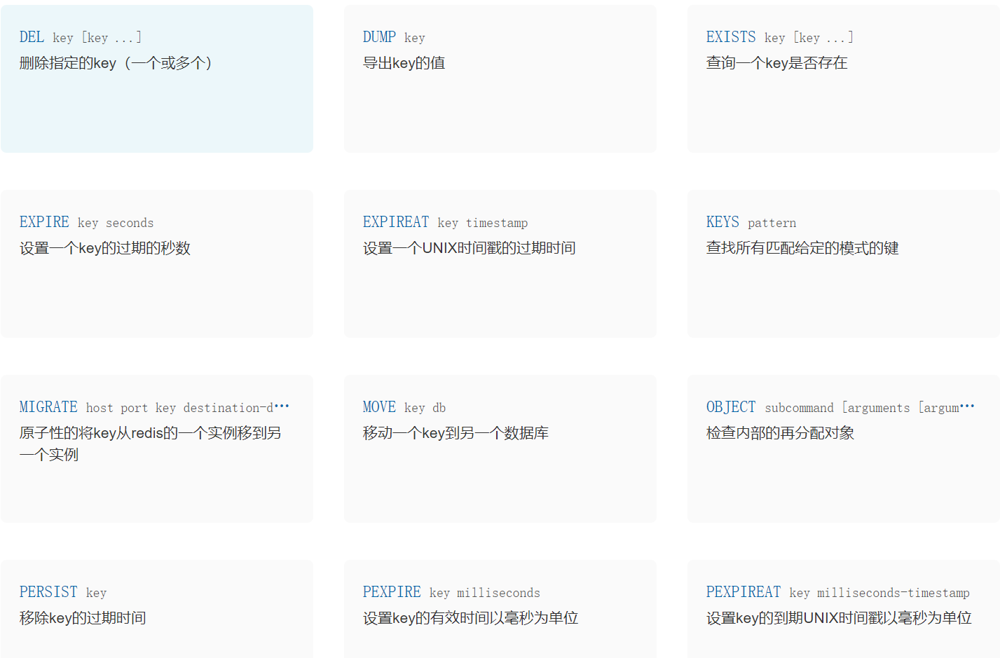

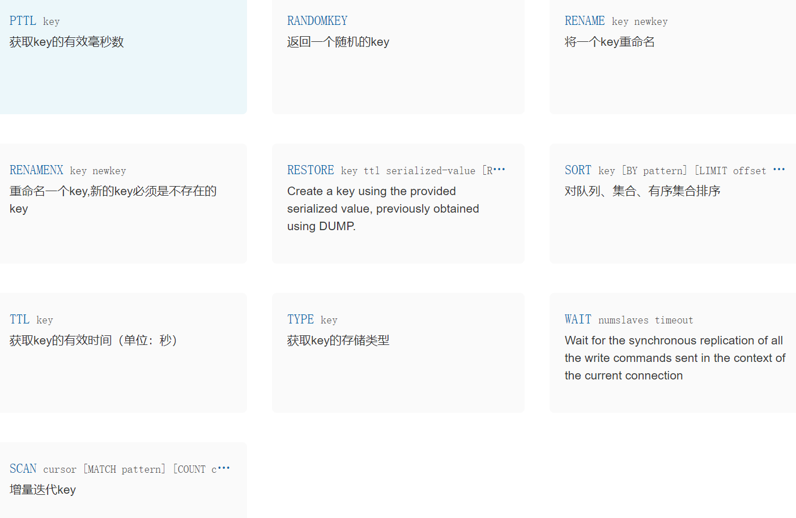

#### KEYS pattern

>查找所有符合给定模式pattern（正则表达式）的 key 。
>
>时间复杂度为O(N)，N为数据库里面key的数量。
>
>例如，Redis在一个有1百万个key的数据库里面执行一次查询需要的时间是40毫秒 。

**警告**: `KEYS` 的速度非常快，但在一个大的数据库中使用它仍然可能造成性能问题，如果你需要从一个数据集中查找特定的 `KEYS`， 你最好还是用 Redis 的集合结构 [SETS](http://www.redis.cn/commands/sets.html) 来代替。

可以用来查询所有key：`keys *`

```shell
127.0.0.1:6379> set mykey1 1
OK
127.0.0.1:6379> set mykey2 2
OK
127.0.0.1:6379> keys *
1) "mykey2"
2) "mykey1"
```

#### MOVE key db

>**时间复杂度：**O(1)
>
>将当前数据库的 key 移动到给定的数据库 db 当中。
>
>如果当前数据库(源数据库)和给定数据库(目标数据库)有相同名字的给定 key ，或者 key 不存在于当前数据库，那么 MOVE 没有任何效果。
>
>因此，也可以利用这一特性，将 `MOVE` 当作锁(locking)原语(primitive)。
>
>成功返回1，失败返回0

```shell
127.0.0.1:6379> move mykey1 2
(integer) 1
127.0.0.1:6379> select 2
OK
127.0.0.1:6379[2]> keys *
1) "mykey1"
127.0.0.1:6379[2]> 
```


> 其他命令细节请看菜鸟教程或中文redis网站。

### redis strings

Redis 字符串数据类型的相关命令用于管理 redis 字符串值.

1. SET  key value

2. GET key

3. APPEND key value

   > 如果 key 已经存在并且是一个字符串， APPEND 命令将指定的 value 追加到该 key 原来值（value）的末尾。

4. STRLEN key

   > 返回 key 所储存的字符串值的长度。

5. INCR等

   > INCR key
   >
   > > 将 key 中储存的数字值增一。
   >
   > INCRBY key increment
   >
   > >  将key对应的数字加increment
   >
   > DECR key
   >
   > > 对key对应的数字做减1操作。 
   >
   > DECRBY key decrement
   >
   > > key对于的值减去decrement
   > 
   > 实际上他们在内部就是同一个命令，只是看上去有点儿不同。

9. GETRANGE和SETRANGE

   >  GETRANGE key start end
   >
   >  > **时间复杂度：**O(N) N是字符串长度，复杂度由最终返回长度决定，但由于通过一个字符串 创建子字符串是很容易的，它可以被认为是O(1)。
   >
   >  SETRANGE key offset value
   >
   >  > 覆盖key对应的string的一部分，从指定的offset处开始，覆盖value的长度
   >  > 如果offset比当前key对应string还要长，那这个string后面就补0以达到offset。
   >  > 不存在的keys被认为是空字符串，所以这个命令可以确保key有一个足够大的字符串，能在offset处设置value。
   
8. SETEX（set with expire）键秒值 
   SETNX（set if not exist） 

9. MSET和MGET和MSETNX

   > Mset 命令用于同时设置一个或多个 key-value 对
   >
   > Mget 命令返回所有(一个或多个)给定 key 的值。  如果给定的 key 里面，有某个 key 不存在，那么这个 key 返回特殊值 nil 。 
   >
   >  msetnx 当所有 key 都成功设置，返回 1 。  如果所有给定 key 都设置失败(至少有一个 key 已经存在)，那么返回 0 。原子操作

9. getset（先get旧值再set新值） 

   > 如果希望每小时对这个信息收集一次。就可以[GETSET](http://www.redis.cn/commands/getset.html)这个key并给其赋值0并读取原值。

#### APPEND key value

> **时间复杂度：**O(1)。均摊时间复杂度是O(1)， 因为redis用的动态字符串的库在每次分配空间的时候会增加一倍的可用空闲空间，所以在添加的value较小而且已经存在的 value是任意大小的情况下，均摊时间复杂度是O(1) 。

> 如果 `key` 已经存在，并且值为字符串，那么这个命令会把 `value` 追加到原来值（value）的结尾。 
> 如果 `key` 不存在，那么它将首先创建一个空字符串的`key`，再执行追加操作，这种情况 [APPEND](http://www.redis.cn/ommands/append.html) 将类似于 [SET](http://www.redis.cn/ommands/set.html) 操作。

**返回值**:[Integer reply](http://www.redis.cn/topics/protocol.html#integer-reply)：返回append后字符串值（value）的长度。

```shell
127.0.0.1:6379> set str1 hhh
OK
127.0.0.1:6379> get str1
"hhh"
127.0.0.1:6379> append str1 jiejgiejiog
(integer) 14
127.0.0.1:6379> strlen str1
(integer) 14
```

**应用：节拍序列(Time series)**

[APPEND](http://www.redis.cn/ommands/append.html) 命令可以用来连接一系列<u>固定长度</u>的样例,与使用列表相比这样更加紧凑. 通常会用来记录节拍序列. 每收到一个新的节拍样例就可以这样记录:

```shell
APPEND timeseries "fixed-size sample"
```

节拍序列在空间占用上效率极好.
在键值中组合Unix时间戳, 可以在构建一系列相关键值时缩短键值长度,更优雅地分配Redis实例.

使用定长字符串进行温度采样的例子(在实际使用时,采用二进制格式会更好).

```shell
redis> APPEND ts "0043"
(integer) 4
redis> APPEND ts "0035"
(integer) 8
redis> GETRANGE ts 0 3
"0043"
redis> GETRANGE ts 4 7
"0035"
redis>
```


#### INCR key

> **时间复杂度：**O(1)

> 对存储在指定`key`的数值执行原子的加1操作。

> 如果指定的key不存在，那么在执行incr操作之前，会先将它的值设定为`0`。
>
> 如果指定的key中存储的值不是字符串类型（fix：）或者存储的字符串类型不能表示为一个整数，那么执行这个命令时服务器会返回一个错误(eq:(error) ERR value is not an integer or out of range)。
>
> 这个操作仅限于64位的有符号整型数据。
>
> 执行这个操作的时候，key对应存储的字符串被解析为10进制的**64位有符号整型数据**。

返回值：执行递增操作后`key`对应的值

```shell
127.0.0.1:6379> set i 100
OK
127.0.0.1:6379> incr i
(integer) 101
127.0.0.1:6379> incrby i 10
(integer) 111
127.0.0.1:6379> decr i
(integer) 110
127.0.0.1:6379> decrby i 100
(integer) 10
127.0.0.1:6379> 
```

**实例1：**计数器

- 通过结合使用`INCR`和[EXPIRE](http://www.redis.cn/commands/expire.html)命令，可以实现一个只记录用户在指定间隔时间内的访问次数的计数器
- 客户端可以通过[GETSET](http://www.redis.cn/commands/getset.html)命令获取当前计数器的值并且重置为0
- 通过类似于[DECR](http://www.redis.cn/commands/decr.html)或者[INCRBY](http://www.redis.cn/commands/incrby.html)等原子递增/递减的命令，可以根据用户的操作来增加或者减少某些值 比如在线游戏，需要对用户的游戏分数进行实时控制，分数可能增加也可能减少。

**实例2**：限速器

限速器是一种可以限制某些操作执行速率的特殊场景。

传统的例子就是限制某个公共api的请求数目。

#### SETRANGE key offset value

>**时间复杂度：**O(1), not counting the time taken to copy the new string in place. Usually, this string is very small so the amortized complexity is O(1). Otherwise, complexity is O(M) with M being the length of the value argument.

这个命令的作用是覆盖key对应的string的一部分，从指定的offset处开始，覆盖value的长度。如果offset比当前key对应string还要长，那这个string后面就补0以达到offset。不存在的keys被认为是空字符串，所以这个命令可以确保key有一个足够大的字符串，能在offset处设置value。

注意，offset最大可以是229-1(536870911),因为redis字符串限制在512M大小。如果你需要超过这个大小，你可以用多个keys。

正因为有了[SETRANGE](http://www.redis.cn/commands/setrange.html)和类似功能的[GETRANGE](http://www.redis.cn/commands/getrange.html)命令，你可以把Redis的字符串当成线性数组，随机访问只要O(1)复杂度。这在很多真实场景应用里非常快和高效。

返回值：该命令修改后的字符串长度

```shell
127.0.0.1:6379> SET str1 123
OK
127.0.0.1:6379> setrange str1 10 hello
(integer) 15
127.0.0.1:6379> get str1
"123\x00\x00\x00\x00\x00\x00\x00hello"
127.0.0.1:6379> getrange str1 0 -1
"123\x00\x00\x00\x00\x00\x00\x00hello"
```

#### MSET和MGET

1. MSET key value [key value ...]

**时间复杂度：**O(N) where N is the number of keys to set.

对应给定的keys到他们相应的values上。`MSET`会用新的value替换已经存在的value，就像普通的[SET](http://www.redis.cn/commands/set.html)命令一样。如果你不想覆盖已经存在的values，请参看命令[MSETNX](http://www.redis.cn/commands/msetnx.html)。

`MSET`是原子的，所以所有给定的keys是一次性set的。客户端不可能看到这种一部分keys被更新而另外的没有改变的情况。

**返回值**：总是OK，因为MSET不会失败

2. MGET key [key ...]

**时间复杂度：**O(N) where N is the number of keys to retrieve.

返回所有指定的key的value。对于每个不对应string或者不存在的key，都返回特殊值`nil`。正因为此，这个操作从来不会失败。

**返回值**:[array-reply](http://www.redis.cn/topics/protocol.html#array-reply): 指定的key对应的values的**list**

3. 实例

**实例：可以用来缓存对象**

```shell
127.0.0.1:6379> mset user:1:username fzk user:1:password 12345678
OK
127.0.0.1:6379> mget user:1:username user:1:password
1) "fzk"
2) "12345678"
```

### redis lists

#### list入门命令

1、插入命令：

> Lpush：将一个或多个值插入到列表头部。（左） 
>
> rpush：将一个或多个值插入到列表尾部。（右） 
>
> lrange：返回列表中指定区间内的元素，区间以偏移量 START 和 END 指定。
>
>> 其中 0 表示列表的第一个元素， 1 表示列表的第二个元素，以此类推。 
>> 你也可以使用负数下标，以 -1 表示列表的最后一个元素， -2 表示列表的倒数第二个元素，以此类推。 

```shell
127.0.0.1:6379> lpush mylist 1
(integer) 1
127.0.0.1:6379> rpush mylist 2
(integer) 2
127.0.0.1:6379> lpush mylist 3
(integer) 3
127.0.0.1:6379> lpush mylist hello
(integer) 4
127.0.0.1:6379> lpush mylist hi redis i am comming 
(integer) 9
127.0.0.1:6379> lrange mylist 0 -1
1) "comming"
2) "am"
3) "i"
4) "redis"
5) "hi"
6) "hello"
7) "3"
8) "1"
9) "2"
```

2、POP命令：

> lpop 命令用于移除并返回列表的第一个元素。当列表 key 不存在时，返回 nil 。 
>
> rpop 移除列表的最后一个元素，返回值为移除的元素。 

```shell
127.0.0.1:6379> rpop mylist
"2"
127.0.0.1:6379> lpop mylist
"comming"
127.0.0.1:6379> ltrim mylist 0 99
OK
```

3、LTRIM

> 修剪(trim)一个已存在的 list，这样 list 就会只包含指定范围的指定元素
> `LTRIM mylist 0 2` 将会对存储在 mylist 的列表进行修剪，只保留列表里的前3个元素。
>
> start 和 end 也可以用负数来表示与表尾的偏移量
>
> 超过范围的下标并不会产生错误：如果 start 超过列表尾部，或者 start > end，结果会是列表变成空表（即该 key 会被移除）。 如果 end 超过列表尾部，Redis 会将其当作列表的最后一个元素

可以从上面的例子中猜到的，list可被用来**实现聊天系统**。还可以作为不同进程间传递消息的队列。关键是，你可以每次都以原先添加的顺序访问数据。这不需要任何SQL ORDER BY 操作，将会非常快，也会很容易扩展到百万级别元素的规模。

用LRANGE可简单的对结果分页。

在博客引擎实现中，你可为每篇日志设置一个list，在该list中推入博客评论，等等。

`LTRIM` 的一个常见用法是和 [LPUSH](http://www.redis.cn/commands/lpush.html) / [RPUSH](http://www.redis.cn/commands/rpush.html) 一起使用。 例如：

- LPUSH mylist someelement
- LTRIM mylist 0 99

这一对命令会将一个新的元素 push 进列表里，并保证该列表不会增长到超过100个元素。这个是很有用的，比如当用 Redis 来存储日志。 需要特别注意的是，当用这种方式来使用 LTRIM 的时候，操作的复杂度是 O(1) ， 因为平均情况下，每次只有一个元素会被移除。

4、其他命令

>Lindex key index
>
>> 按照索引下标获得元素（-1代表最后一个，0代表是第一个） 
>> 当 key 位置的值不是一个列表的时候，会返回一个error。
>
>Llen key 
>
>> 用于返回列表的长度。 
>>  如果 key 不存在，那么就被看作是空list，并且返回长度为 0。
>>  当存储在 key 里的值不是一个list的话，会返回error
>
>Lrem key count value 
>
>> 从存于 key 的列表里移除前 count 次出现的值为 value 的元素。
>
>>  这个 count 参数通过下面几种方式影响这个操作：
>>
>> - count > 0: 从头往尾移除值为 value 的元素。
>> - count < 0: 从尾往头移除值为 value 的元素。
>> - count = 0: 移除所有值为 value 的元素。
>
>LSET key index value
>
>> 设置 index 位置的list元素的值为 value。 
>> 当index超出范围时会返回一个error。
>
>LINSERT key BEFORE|AFTER pivot value
>
>>LINSERT key BEFORE|AFTER pivot value

#### list阻塞操作

可以使用Redis来实现生产者和消费者模型，如使用LPUSH和RPOP来实现该功能。但会遇到这种情景：list是空，这时候消费者就需要轮询来获取数据，这样就会增加redis的访问压力、增加消费端的cpu时间，而很多访问都是无用的。为此redis提供了阻塞式访问 [BRPOP](http://www.redis.cn/commands/brpop.html) 和 [BLPOP](http://www.redis.cn/commands/blpop.html) 命令。 消费者可以在获取数据时指定如果数据不存在阻塞的时间，如果在时限内获得数据则立即返回，如果超时还没有数据则返回null, 0表示一直阻塞。

同时redis还会为所有阻塞的消费者以先后顺序排队。

1、**RPOPLPUSH source destination**

> O(1)
> 原子性地返回并移除存储在 source 的列表的最后一个元素（列表尾部元素）， 并把该元素放入存储在 destination 的列表的第一个元素位置（列表头部）。
> 如果 source 不存在，那么会返回 nil 值，并且不会执行任何操作。 
> 如果 source 和 destination 是同样的，这个命令也可以当作是一个旋转列表的命令。

```shell
127.0.0.1:6379> lpush mylist1 1
(integer) 1
127.0.0.1:6379> lpush mylist 1 2 3 4 5
(integer) 5
127.0.0.1:6379> rpoplpush mylist mylist1
"1"
127.0.0.1:6379> lrange mylist1 0 -1
1) "1"
2) "1"
```

应用1：安全队列

> 在消息队列中，消息被rpop或brpop后，可能会因为网络等问题而丢失。
> RPOPLPUSH (或者其阻塞版本的 [BRPOPLPUSH](http://www.redis.cn/commands/brpoplpush.html)） 提供了一种方法来避免这个问题：消费者端取到消息的同时把该消息放入一个正在处理中的列表。 当消息被处理了之后，该命令会使用 LREM 命令来移除正在处理中列表中的对应消息。
>
> 另外，可以添加一个客户端来监控这个正在处理中列表，如果有某些消息已经在这个列表中存在很长时间了（即超过一定的处理时限）， 那么这个客户端会把这些超时消息重新加入到队列中。

应用2：循环列表

> RPOPLPUSH 命令的 source 和 destination 是相同的话， 那么客户端在访问一个拥有n个元素的列表时，可以在 O(N) 时间里一个接一个获取列表元素， 而不用像 [LRANGE](http://www.redis.cn/commands/lrange.html) 那样需要把整个列表从服务器端传送到客户端。


2、**BRPOPLPUSH source destination timeout**

> `BRPOPLPUSH` 是 [RPOPLPUSH](http://www.redis.cn/commands/rpoplpush.html) 的阻塞版本。 当 source 包含元素的时候，这个命令表现得跟 [RPOPLPUSH](http://www.redis.cn/commands/rpoplpush.html) 一模一样。 当 source 是空的时候，Redis将会阻塞这个连接，直到另一个客户端 push 元素进入或者达到 timeout 时限。 timeout 为 0 能用于无限期阻塞客户端。


3、**BLPOP key [key ...] timeout**

> O(1)
> 命令LPOP的阻塞版本，list中没有元素可弹出的时候，连接将被BLPOP命令阻塞。
> 当给定多个 key 参数时，按参数 key 的先后顺序依次检查各个列表，弹出第一个非空列表的头元素。
>
> 如果所有给定 key 都不存在或包含空列表，那么 [BLPOP](http://www.redis.cn/commands/blpop.html) 命令将阻塞连接， 直到有另一个客户端对给定的这些 key 的任意一个执行 [LPUSH](http://www.redis.cn/commands/lpush.html) 或 [RPUSH](http://www.redis.cn/commands/rpush.html) 命令为止。
>
> **timeout 参数表示的是一个指定阻塞的最大秒数的整型值。**当 timeout 为 0 是表示阻塞时间无限制。
>
> **返回值**：[多批量回复(multi-bulk-reply)](http://www.redis.cn/topics/protocol.html#multi-bulk-reply): 具体来说:
>
> - 当没有元素的时候会弹出一个 nil 的多批量值，并且 timeout 过期。
> - 当有元素弹出时会返回一个双元素的多批量值，其中第一个元素是弹出元素的 key，第二个元素是 value。

```shell
127.0.0.1:6379> lpush mylist 1
(integer) 1
127.0.0.1:6379> blpop mylist 3
1) "mylist"
2) "1"
127.0.0.1:6379> blpop mylist 5
# 等待5s后
(nil)
(5.09s)  --> 等待的时间哦


127.0.0.1:6379> blpop mylist 100		-- > 这个时候去另一个客户端向mylist推入了一个'2'
1) "mylist"
2) "2"
(17.56s)	---->等待了18s
```

- 多个客户端阻塞与同一个key时，从第一个被阻塞的处理到最后一个被阻塞的，即FIFO

- 一个客户端阻塞于多个key时，若多个 key 的元素同时可用（可能是因为事务或者某个Lua脚本向多个list添加元素）， 那么客户端会解除阻塞，并使用第一个接收到 push 操作的 key（假设它拥有足够的元素为我们的客户端服务，因为有可能存在其他客户端同样是被这个key阻塞着）

  > 从根本上来说，在执行完每个命令之后，Redis 会把一个所有 key 都获得数据并且至少使一个客户端阻塞了的 list 运行一次。 这个 list 按照新数据的接收时间进行整理，即是从第一个接收数据的 key 到最后一个。在处理每个 key 的时候，只要这个 key 里有元素， Redis就会对所有等待这个key的客户端按照“先进先出”(FIFO)的顺序进行服务。若这个 key 是空的，或者没有客户端在等待这个 key， 那么将会去处理下一个从之前的命令或事务或脚本中获得新数据的 key，如此等等。


**当多个元素被 push 进入一个 list 时 BLPOP 的行为**

有时候一个 list 会在同一概念的命令的情况下接收到多个元素：

- 像 LPUSH mylist a b c 这样的可变 push 操作。
- 在对一个向同一个 list 进行多次 push 操作的 MULTI 块执行完 EXEC 语句后。
- 使用 Redis 2.6 或者更新的版本执行一个 Lua 脚本。

对于 Redis 2.6 之后来说，所采取的行为是先执行多个 push 命令，然后在执行了这个命令之后再去服务被阻塞的客户端。

```shell
# 客户端1
127.0.0.1:6379> blpop mylist 100
1) "mylist"
2) "c"
(47.70s)
# 客户端2
127.0.0.1:6379> lpush mylist a b c
(integer) 3
```

而如果是redis2.4版本，将会弹出a。

>注意：
>
>在一个 [MULTI](http://www.redis.cn/commands/multi.html) / [EXEC](http://www.redis.cn/commands/exec.html) 块里面使用 [BLPOP](http://www.redis.cn/commands/blpop.html) 并没有很大意义，因为它要求整个服务器被阻塞以保证块执行时的原子性，这就阻止了其他客户端执行一个 push 操作。 因此，一个在 [MULTI](http://www.redis.cn/commands/multi.html) / [EXEC](http://www.redis.cn/commands/exec.html) 里面的 [BLPOP](http://www.redis.cn/commands/blpop.html) 命令会在 list 为空的时候返回一个 `nil` 值，这跟超时(timeout)的时候发生的一样。
>
>如果你喜欢科幻小说，那么想象一下时间是以无限的速度在 MULTI / EXEC 块中流逝……

4、BRPOP key [key ...] timeout

同BLPOP几乎一致。是 [RPOP](http://www.redis.cn/commands/commands/rpop.html) 的阻塞版本

### redis hashes

Redis hash 是一个 string 类型的 field（字段） 和 value（值） 的映射表，hash 特别适合用于存储对象。
Redis 中每个 hash 可以存储 232 - 1 键值对（40多亿）。

1、基本命令

> hset、hget 命令用于为哈希表中的字段赋值 。 
> hmset、hmget 同时将多个field-value对设置到哈希表中。会覆盖哈希表中已存在的字段。 
> hgetall 用于返回哈希表中，所有的字段和值。 
> hdel 用于删除哈希表 key 中的一个或多个指定字段 

```shell
127.0.0.1:6379> hmset myhash f1 hello f2 world
OK
127.0.0.1:6379> hmget myhash f1 f2
1) "hello"
2) "world"
127.0.0.1:6379> hget myhash f1
"hello"
127.0.0.1:6379> hgetall myhash
1) "f1"
2) "hello"
3) "f2"
4) "world"
127.0.0.1:6379> hdel myhash f1
(integer) 1
127.0.0.1:6379> hgetall myhash
1) "f2"
2) "world"
```

2、常用命令

> hlen 获取哈希表中字段的数量。
> hexists 查看哈希表的指定字段是否存在。 
> hkeys 获取哈希表中的所有域（field）。 
> hvals 返回哈希表所有域(field)的值。 
> hincrby 为哈希表中的字段值加上指定增量值。 
> hsetnx 为哈希表中不存在的的字段赋值 。 

感觉和之前的strings以及list的命令都差不多。


### redis sets

Redis 的 Set 是 String 类型的无序集合。集合成员是唯一的，这就意味着集合中不能出现重复的数据。

Redis 中集合是通过哈希表实现的，所以添加，删除，查找的复杂度都是 O(1)。

集合中最大的成员数为 232 - 1 (4294967295, 每个集合可存储40多亿个成员)。

1、基本命令

> SADD key member [member...]	
>
> > 添加一个或多个指定的member元素到集合的 key中 
> >
> > 返回新添加成功的个数
>
> SMEMBERS key
>
> > 返回key集合中所有的元素
> > 该命令的作用与使用一个参数的[SINTER](http://www.redis.cn/commands/sinter.html) 命令作用相同.
>
> SISMEMBER key member
>
> > 返回成员 member 是否是存储的集合 key的成员.
> > 返回值：如果是，1；否则0
>
> SCARD key
>
> > 获取集合元素个数
>
> SREM key member [member...]
>
> > 在key集合中移除指定的元素. 如果指定的元素不是key集合中的元素则忽略 如果key集合不存在则被视为一个空的集合，该命令返回0.
> >
> > 如果key的类型不是一个集合,则返回错误.

```shell
127.0.0.1:6379> sadd myset 1
(integer) 1
127.0.0.1:6379> sadd myset 1 2 3
(integer) 2							------> 返回的是2，而不是3
127.0.0.1:6379> smembers myset
1) "1"
2) "2"
3) "3"
127.0.0.1:6379> sismember myset 100
(integer) 0
127.0.0.1:6379> scard myset
(integer) 3
127.0.0.1:6379> srem myset 100
(integer) 0
127.0.0.1:6379> srem myset 1
(integer) 1
```

2、常用命令

> SRANDMEMBER key [count]
>
> > 仅提供key参数，那么随机返回key集合中的一个元素.
> >
> > Redis 2.6开始，可以接受 count 参数，如果count是整数且小于元素的个数，返回含有 count 个不同的元素的数组，如果count是个整数且大于集合中元素的个数时，仅返回整个集合的所有元素，当count是负数，则会返回一个包含count的绝对值的个数元素的数组，如果count的绝对值大于元素的个数，则返回的结果集里会出现一个元素出现多次的情况.
> >
> > 仅提供key参数时，该命令作用类似于SPOP命令，不同的是SPOP命令会将被选择的随机元素从集合中移除，而SRANDMEMBER仅仅是返回该随记元素，而不做任何操作.
> >
> > **对于count的情况：**
> >
> > 1.正数：
> >
> > - 不会返回重复的元素。
> > - 如果count参数的值大于集合内的元素数量，此命令将会仅返回整个集合，没有额外的元素。
> >
> > 2.负数：
> >
> > - 此时，就像是从盒子拿了又放回去，所有是很大可能有重复元素出现的哦
> >
> > **返回元素的分布：**分布并不是绝对均匀的哦
> >
> > > 所使用的算法（在dict.c中实现）对哈希表桶进行采样以找到非空桶。一旦找到非空桶，由于我们在哈希表的实现中使用了链接法，因此会检查桶中的元素数量，并且选出一个随机元素。
> >
> > > 这意味着，如果你在整个哈希表中有两个非空桶，其中一个有三个元素，另一个只有一个元素，那么其桶中单独存在的元素将以更高的概率返回。

```shell
127.0.0.1:6379> srandmember myset 1
1) "2"		-------------> 返回的是一个元素数组
127.0.0.1:6379> srandmember myset
"2" 			---------> 返回的是元素
127.0.0.1:6379> srandmember myset -5
1) "5"
2) "5"
3) "2"
4) "4"
5) "2"
```

> SPOP key [count]
>
> >从存储在`key`的集合中移除并返回一个或多个随机元素。
> >
> >返回：被删除的元素，或者当`key`不存在时返回`nil`。
> >
> >应用：实现一个基于 web 的扑克游戏

```shell
127.0.0.1:6379> smembers myset
1) "1"
2) "2"
3) "3"
4) "4"
5) "5"
127.0.0.1:6379> spop myset 1
1) "2"
127.0.0.1:6379> smembers myset
1) "1"
2) "3"
3) "4"
4) "5"
```

> SMOVE source destination member
>
> > 将member从source集合移动到destination集合中. 对于其他的客户端,在特定的时间元素将会作为source或者destination集合的成员出现.
> >
> > 返回：
> >
> > - 如果该元素成功移除,返回1
> > - 如果该元素不是 source集合成员,无任何操作,则返回0.

```shell
127.0.0.1:6379> sadd myset1 a b  c
(integer) 3
127.0.0.1:6379> smove myset myset1 1
(integer) 1
127.0.0.1:6379> smove myset myset1 1000
(integer) 0
127.0.0.1:6379> smembers myset1
1) "c"
2) "1"
3) "b"
4) "a"
```

3、集合间命令

- 差集： sdiff  key [key...]

- 交集： sinter  key [key...]

- 并集： sunion key [key...]

```shell
127.0.0.1:6379> sadd myset1 1 2 3
(integer) 3
127.0.0.1:6379> sadd myset2 2 3 4 
(integer) 3
127.0.0.1:6379> sadd myset3 3 4 5
(integer) 3
127.0.0.1:6379> sdiff myset1 myset2 myset3
1) "1"
127.0.0.1:6379> sinter myset1 myset2 myset3
1) "3"
127.0.0.1:6379> sunion myset1 myset2 myset3
1) "1"
2) "2"
3) "3"
4) "4"
5) "5"
```

应用：在微博应用中，可以将一个用户所有的关注人存在一个集合中，将其所有粉丝存在一个集合。Redis还为集合提供了求交集、并集、差集等操作，可以非常方便的实现如**共同关注、共同喜好、二度好友**等功能，对上面的所有集合操作，你还可以使用不同的命令选择将结果返回给客户端还是存集到一个新的集合中。


- 差集保存： sdiffstore  destination  key [key...]

- 交集保存： sinterstore destination   key [key...]

- 并集保存： sunionstore destination  key [key...]

> 命令作用类似于[SUNION](http://www.redis.cn/commands/sunion.html)命令,不同的是它并不返回结果集,而是将结果存储在destination集合中.
>
> 如果destination 已经存在,则将其覆盖.
>
> 返回：结果集元素的个数.

```shell
127.0.0.1:6379> sdiffstore myset4 myset1 myset2 myset3
(integer) 1
127.0.0.1:6379> smembers myset4
1) "1"
```


### redis sorted sets

Redis 有序集合和集合一样也是 string 类型元素的集合,且不允许重复的成员。

不同的是每个元素都会关联一个 **double 类型的分数**。redis 正是通过分数来为集合中的成员进行从小到大的排序。

有序集合的成员是唯一的,但分数(score)却可以重复。

集合是通过哈希表实现的，所以添加，删除，查找的复杂度都是 O(1)。 集合中最大的成员数为 2^32^ - 1 (4294967295, 每个集合可存储40多亿个成员)。

#### ZADD

ZADD key [NX|XX] [CH] [INCR] score member [score member ...]

>**时间复杂度：**O(log(N)) for each item added, where N is the number of elements in the sorted set.
>
>将所有指定成员添加到键为`key`有序集合（sorted set）里面。 添加时可以指定多个分数/成员（score/member）对。 如果指定添加的成员已经是有序集合里面的成员，则会更新改成员的分数（scrore）并更新到正确的排序位置。
>
>如果`key`不存在，将会创建一个新的有序集合（sorted set）并将分数/成员（score/member）对添加到有序集合，就像原来存在一个空的有序集合一样。如果`key`存在，但是类型不是有序集合，将会返回一个错误应答。
>
>分数值是一个双精度的浮点型数字字符串。`+inf`和`-inf`都是有效值。
>
>**返回值**
>
>[Integer reply](http://www.redis.cn/topics/protocol.html#integer-reply), 包括:
>
>- 添加到有序集合的成员数量，不包括已经存在更新分数的成员。如果指定`INCR`参数, 返回将会变成[bulk-string-reply](http://www.redis.cn/topics/protocol.html#bulk-string-reply) ：
>
>- 成员的新分数（双精度的浮点型数字）字符串。

**ZADD 参数（options） (>= Redis 3.0.2)**

ZADD 命令在`key`后面分数/成员（score/member）对前面支持一些参数，他们是：

- **XX**: 仅仅更新存在的成员，不添加新成员。
- **NX**: 不更新存在的成员。只添加新成员。
- **CH**: 修改返回值为发生变化的成员总数，原始是返回新添加成员的总数 (CH 是 *changed* 的意思)。更改的元素是**新添加的成员**，已经存在的成员**更新分数**。 所以在命令中指定的成员有相同的分数将不被计算在内。注：在通常情况下，`ZADD`返回值只计算新添加成员的数量。
- **INCR**: 当`ZADD`指定这个选项时，成员的操作就等同[ZINCRBY](http://www.redis.cn/commands/zincrby.html)命令，对成员的分数进行递增操作。

#### 常用命令

1、zrange

> **ZRANGE key start stop [WITHSCORES]**
>
> > 返回存储在有序集合`key`中的指定范围的元素。 返回的元素可以认为是按得分从最低到最高排列。 
> > 如果得分相同，将按字典排序。

```shell
127.0.0.1:6379> zadd myzset 1 hello 2 world 3 !
(integer) 3
127.0.0.1:6379> zrange myzset 0 -1
1) "hello"
2) "world"
3) "!"
127.0.0.1:6379> zrange myzset 0 -1 withscores
1) "hello"
2) "1"
3) "world"
4) "2"
5) "!"
6) "3"
```

> **ZRANGEBYSCORE key min max [WITHSCORES] [LIMIT offset count]**
>
> > 返回key的有序集合中的分数在min和max之间的所有元素（包括分数等于max或者min的元素）。
> >
> > 可选的LIMIT参数指定返回结果的数量及区间（类似SQL中SELECT LIMIT offset, count）。
> >
> > 可选参数WITHSCORES会返回元素和其分数，而不只是元素
> >
> > min和max可以是-inf和+inf，这样一来，你就可以在不知道有序集的最低和最高score值的情况下，使用ZRANGEBYSCORE这类命令。
> > inf表示无穷大
> >
> > 默认情况下，区间的取值使用闭区间(小于等于或大于等于)，你也可以通过给参数前增加(符号来使用可选的开区间(小于或大于)。

```shell
127.0.0.1:6379> zadd salary 1000 fzk 1200 wn 500 fhl
(integer) 3
127.0.0.1:6379> zrangebyscore salary (500 (1200 withscores
1) "fzk"
2) "1000"
127.0.0.1:6379> zrangebyscore salary -inf inf withscores
1) "fhl"
2) "500"
3) "fzk"
4) "1000"
5) "wn"
6) "1200"
```

2、ZREM

> **ZREM key member [member ...]**
>
> >当key存在，但是其不是有序集合类型，就返回一个错误。
> >
> >返回值：返回的是从有序集合中删除的成员个数，不包括不存在的成员。

3、ZCARD

> 返回key的有序集元素个数。
>
> **时间复杂度：**O(1)
>
> 返回值：key存在的时候，返回有序集的元素个数，否则返回0。

4、ZCOUNT

> **ZCOUNT key min max**
>
> 计算有序集合中指定分数区间的成员数量。

5、ZRANK

> **ZRANK key member**
>
> > 返回有序集key中成员member的排名，排名以0为底  
>
> **ZREVRANK key member**
>
> >返回有序集中成员的排名。其中有序集成员按分数值递减(从大到小)排序。

```shell
127.0.0.1:6379> zcount salary (500 1200
(integer) 2
127.0.0.1:6379> zrank salary fzk
(integer) 1
127.0.0.1:6379> zrevrank salary wn
(integer) 0
```

和set相比，sorted set增加了一个权重参数score，使得集合中的元素能够按score进行有序排列，
比如一个存储全班同学成绩的sorted set，其集合value可以是同学的学号，而score就可以是其考试得分，

这样在数据插入集合的时候，就已经进行了天然的排序。
可以用sorted set来做带权重的队列，比如普通消息的score为1，重要消息的score为2，然后工作线程可以选择按score的倒序来获取工作任务。让重要的任务优先执行。

排行榜应用，取TOP N操作 ！ 

### redis Geo

Redis 的 GEO 特性在 Redis 3.2 版本中推出， 这个功能可以将用户给定的地理位置信息储存起来， 并对这些信息进行操作。来实现诸如**附近位置、摇一摇**这类依赖于地理位置信息的功能。geo的数据类型为zset。

> 可能需要的经纬度网站：https://jingweidu.bmcx.com/

业界比较通用的地理位置距离排序算法是GeoHash算法，**将二维的经纬度数据映射到一维的整数**，距离近的二维坐标映射到一维后也很近。

Redis中经纬度用52位整数进行编码，以GeoHash算法得到的52位整数值作为score放入zset中，即**存储数据结构为zset**。

1、GEOADD：添加地理位置的坐标

> GEOADD key longitude latitude member [longitude latitude member ...]

**时间复杂度：**每一个元素添加是O(logN)，N是zset的元素数量。

将指定的地理空间位置（纬度、经度、名称）添加到指定的`key`中。这些数据将会存储到`zset`，目的是为了方便使用[GEORADIUS](http://www.redis.cn/commands/georadius.html)或者[GEORADIUSBYMEMBER](http://www.redis.cn/commands/georadiusbymember.html)命令对数据进行半径查询等操作。

- 有效的经度从-180度到180度。
- 有效的纬度从-85.05112878度到85.05112878度。

2、GEOPOS：获取地理位置的坐标

> geopos key member [member...] 
>

3、GEODIST：计算两个位置之间的距离

> **GEODIST key member1 member2 [unit]**

**时间复杂度：**O(logN)
指定单位的参数 unit 必须是以下单位的其中一个：

- m 米[默认]
- km 千米
- mi 英里
- ft 英尺

`GEODIST` 命令在计算距离时会假设地球为完美的球形，在极限情况下，这一假设最大会造成 0.5% 的误差

```shell
127.0.0.1:6379> geoadd china:sichuan 104.10194 30.65984 chengdu
(integer) 1
127.0.0.1:6379> geoadd china:sichuan 106.64188 30.47392 guangan 106.54041 29.40268 chongqing
(integer) 2
127.0.0.1:6379> geopos china:sichuan chengdu
1) 1) "104.10194188356399536"
   2) "30.65983886217613019"
127.0.0.1:6379> geodist china:sichuan chengdu guangan
"244121.6926"
```

4、GEORADIUS：根据用户给定的经纬度坐标来获取指定范围内的地理位置集合

如根据用户定位计算“附近的车”、“附近的餐馆”等。

> GEORADIUS key longitude latitude radius m|km|ft|mi [WITHCOORD] [WITHDIST] [WITHHASH] [COUNT count]

以给定的经纬度为中心， 返回键包含的位置元素当中， 与中心的距离不超过给定最大距离radius的所有位置元素。范围同GEODIST命令。

在给定以下可选项时， 命令会返回额外的信息：

> - `WITHDIST`: 在返回位置元素的同时， 将位置元素与中心之间的距离也一并返回。 距离的单位和用户给定的范围单位保持一致。
>- `WITHCOORD`: 将位置元素的经度和维度也一并返回。
> - `WITHHASH`: 以 52 位有符号整数的形式， 返回位置元素经过原始 geohash 编码的有序集合分值。 这个选项主要用于底层应用或者调试， 实际中的作用并不大。
> 
> 命令默认返回未排序的位置元素。 通过以下两个参数， 用户可以指定被返回位置元素的排序方式：
>
> - `ASC`: 根据中心的位置， 按照从近到远的方式返回位置元素。
> - `DESC`: 根据中心的位置， 按照从远到近的方式返回位置元素。
>

在默认情况下， GEORADIUS 命令会返回所有匹配的位置元素。 虽然用户可以使用 **COUNT `<count>`** 选项去获取前 N 个匹配元素， 但是因为命令在内部可能会需要对所有被匹配的元素进行处理， 所以在对一个非常大的区域进行搜索时， 即使只使用 `COUNT` 选项去获取少量元素， 命令的执行速度也可能会非常慢。 但是从另一方面来说， 使用 `COUNT` 选项去减少需要返回的元素数量， 对于减少带宽来说仍然是非常有用的。

```shell
127.0.0.1:6379>  georadius china:sichuan 108.93425 34.23053 1000 km withcoord withdist COUNT 2 ASC
1) 1) "guangan"
   2) "470.0438"
   3) 1) "106.64188116788864136"
      2) "30.4739195998597765"
2) 1) "chongqing"
   2) "582.6435"					# 距离
   3) 1) "106.54040783643722534"  	# 经度
      2) "29.40268053517299762"		# 纬度
127.0.0.1:6379> georadius china:sichuan 108.93425 34.23053 1000 km  COUNT 2 ASC
1) "guangan"
2) "chongqing"
```

5、GEORADIUSBYMEMBER：查询元素附近的其它元素

> **GEORADIUSBYMEMBER key member radius m|km|ft|mi [WITHCOORD] [WITHDIST] [WITHHASH] [COUNT count]**

同上一个命令几乎一致，区别在于，上一个是自己输入经度纬度，这个是从key中选择一个元素做中心点

```shell
redis:6379> GEORADIUSBYMEMBER company baidu 7000 km COUNT 3
1) "baidu"
2) "juejin"
3) "jingdong"
```

6、GEOHASH：返回一个或多个位置对象的 geohash 值

> GEOHASH key member [member ...]

返回一个或多个位置元素的 [Geohash](https://en.wikipedia.org/wiki/Geohash) 值。
该命令将返回11个字符的Geohash字符串；两个字符串越相似 表示距离越近。
可以用这个编码去http://geohash.org上查看定位是否正确。

```shell
127.0.0.1:6379> geohash china:sichuan chengdu guangan
1) "wm6n2vkwx00"
2) "wm7v6ew5ry0"
```

7、zset命令

GEO没有提供删除成员的命令，但是因为GEO的底层实现是zset，所以可以借用zrem命令实现对地理位置信息的删除。其他的z系列命令都是有效的哦。

> 注意：GEO数据用zset存储，在一个地图应用中，车、餐馆、人的数据可能会有几百万条，全部存入一个zset集合中，在Redis集群环境下，zset可能会迁移到另一个节点，单个key过大会对集群迁移造成影响，集群环境中单个key不要超过1MB。
>
> 建议Geo的数据单独用一个Redis实例部署，不用集群环境。而且数据量过大的情况要进行拆分，如按城市拆、区域拆等。

### redis HyperLogLog

Redis 在 2.8.9 版本添加了 HyperLogLog 结构。

Redis HyperLogLog 是用来做基数统计的算法，HyperLogLog 的优点是，在输入元素的数量或者体积非常非常大时，计算基数所需的空间总是固定 的、并且是很小的。

在 Redis 里面，每个 HyperLogLog 键只需要花费 12 KB 内存，就可以计算接近 2^64^ 个不同元素的基数。这和计算基数时，元素越多耗费内存就越多的集合形成鲜明对比。

但是，因为 HyperLogLog 只会根据输入元素来计算基数，而不会储存输入元素本身，所以 HyperLogLog 不能像集合那样，返回输入的各个元素。

> HyperLogLog则是一种算法，它提供了不精确的去重计数方案。
>
> **举个栗子**：假如我要统计网页的UV（**浏览用户数量**，一天内同一个用户多次访问只能算一次），传统的解决方案是使用Set来保存用户id，然后统计Set中的元素数量来获取页面UV。但这种方案只能承载少量用户，一旦用户数量大起来就需要消耗大量的空间来存储用户id。我的目的是统计用户数量而不是保存用户，这简直是个吃力不讨好的方案！而使用Redis的HyperLogLog最多需要12k就可以统计大量的用户数，尽管它大概有0.81%的错误率，但对于统计UV这种不需要很精确的数据是可以忽略不计的。

**基数**

> 比如数据集 {1, 3, 5, 7, 5, 7, 8}， 那么这个数据集的基数集为 {1, 3, 5 ,7, 8}, 基数(不重复元素)为5。 基数估计就是在误差可接受的范围内，快速计算基数。

**命令：**

| 序号 | 命令及描述                                                   |
| :--- | :----------------------------------------------------------- |
| 1    | [PFADD key element [element ...\]](https://www.runoob.com/redis/hyperloglog-pfadd.html) 添加指定元素到 HyperLogLog 中。 |
| 2    | [PFCOUNT key [key ...\]](https://www.runoob.com/redis/hyperloglog-pfcount.html) 返回给定 HyperLogLog 的基数估算值。 |
| 3    | [PFMERGE destkey sourcekey [sourcekey ...\]](https://www.runoob.com/redis/hyperloglog-pfmerge.html) 将多个 HyperLogLog 合并为一个 HyperLogLog |

```shell
127.0.0.1:6379> pfadd hyperloglog 1 2 3 4 5 5 4
(integer) 1
127.0.0.1:6379> pfcount hyperloglog
(integer) 5
127.0.0.1:6379> pfadd hyperloglog 2 7 
(integer) 1
127.0.0.1:6379> pfcount hyperloglog
(integer) 6
127.0.0.1:6379> pfadd hyperloglog2 1 2 3 a b c
(integer) 1
127.0.0.1:6379> pfmerge hyperloglog hyperloglog2
OK
127.0.0.1:6379> pfcount hyperloglog
(integer) 9
```


### redis BitMap

Bitmap 就是通过操作二进制位来进行记录，即为 0 和 1；如果要记录 365 天的打卡情况，使用 Bitmap表示的形式大概如下：0101000111000111...........................，这样有什么好处呢？当然就是**节约内存**了，365 天相当于 365 bit，又 1 字节 = 8 bit , 所以相当于使用 46 个字节即可。

位图并不是实际的数据类型，而是在string类型上定义的一组面向位的操作。

由于字符串是二进制安全的 blob，并且它们的最大长度为 512 MB，因此它们适合设置最多 2^32 个不同的位。

位操作分为两组：恒定时间的**单个位操作**，例如将位设置为 1 或 0，或获取其值，以及**对位组的操作**，例如计算给定位范围内设置位的数量（例如，人口计数）。

#### 位操作

| 命令：单个位操作                     | 操作                                                     | 返回值            |
| ------------------------------------ | -------------------------------------------------------- | ----------------- |
| Setbit KEY_NAME OFFSET value(1 or 0) | 对 key 所储存的字符串值，设置或清除指定偏移量上的位(bit) | 0                 |
| GETBIT KEY_NAME OFFSET               | 对 key 所储存的字符串值，获取指定偏移量上的位(bit)       | 对应位的值 1 or 0 |
| bitcount key [start, end]            | 统计 key 上位为1的个数                                   | 1的个数           |
`SETBIT`命令将位编号作为其第一个参数，并将该位设置为 1 或 0 的值作为其第二个参数。如果寻址位超出当前字符串长度，该命令会自动放大字符串。

`GETBIT`只返回指定索引处的位值。超出范围的位（寻址存储在目标键中的字符串长度之外的位）总是被认为是零。

```shell
# 使用 bitmap 来记录上述事例中一周的打卡记录如下所示： 
# 周一：1，周二：0，周三：1，周四：1，周五：1，周六：1，周天：0 （1 为打卡，0 为不打卡）
127.0.0.1:6379> setbit week_sign 0 1
(integer) 0
127.0.0.1:6379> setbit week_sign 1 0
(integer) 0
127.0.0.1:6379> setbit week_sign 2 1
(integer) 0
127.0.0.1:6379> setbit week_sign 3 1
(integer) 0
127.0.0.1:6379> setbit week_sign 4 1
(integer) 0
127.0.0.1:6379> setbit week_sign 5 1
(integer) 0
127.0.0.1:6379> setbit week_sign 6 0
(integer) 0
127.0.0.1:6379> getbit week_sign 1		# 查看周二是否打卡
(integer) 0
127.0.0.1:6379> bitcount week_sign 		# 统计打卡次数
(integer) 5
127.0.0.1:6379> bitcount week_sign 0 -1
(integer) 5
```

#### 位组操作

| 命令：位组操作            | 操作                                                         | 返回值 |
| ------------------------- | ------------------------------------------------------------ | ------ |
| BITOP                     | 在不同的字符串之间执行按位操作。提供的操作是 AND、OR、XOR 和 NOT |        |
| BITCOUNT key [start, end] | 计数1的个数                                                  |        |
| BITPOS                    | 查找指定值为 0 或 1 的第一位。                               |        |

```shell
127.0.0.1:6379> setbit year_sign 0 1
(integer) 0
127.0.0.1:6379> setbit year_sign 365 1
(integer) 0
127.0.0.1:6379> bitcount year_sign 
(integer) 2
127.0.0.1:6379> bitpos year_sign 1
(integer) 0
127.0.0.1:6379> bitpos year_sign 0
(integer) 1
127.0.0.1:6379> bitop and destkey week_sign year_sign
(integer) 46
127.0.0.1:6379> bitcount destkey
(integer) 1
```


## redis配置

其默认配置文件在解压包的目录下，我拷贝了配置文件(/usr/local/bin/redis.conf)；

### 查看配置

可以通过 **CONFIG** 命令查看或设置配置项。

语法：

```shell
redis 127.0.0.1:6379> CONFIG GET CONFIG_SETTING_NAME
```

1.获取所有配置项`*`

```shell
127.0.0.1:6379> CONFIG GET *
  1) "rdbchecksum"
  2) "yes"
  3) "daemonize"
  4) "no"
  5) "io-threads-do-reads"
  6) "no"
  7) "lua-replicate-commands"
  8) "yes"
......
```

2.获取某个配置项

```shell
127.0.0.1:6379> CONFIG GET daemonize
1) "daemonize"
2) "no"
127.0.0.1:6379> 
```


可以去看一看配置文件里面的东西：

```shell
################################## INCLUDES ###################################

# Include one or more other config files here.  This is useful if you
# have a standard template that goes to all Redis servers but also need
# to customize a few per-server settings.  Include files can include
# other files, so use this wisely.
#
# Notice option "include" won't be rewritten by command "CONFIG REWRITE"
# from admin or Redis Sentinel. Since Redis always uses the last processed
# line as value of a configuration directive, you'd better put includes
# at the beginning of this file to avoid overwriting config change at runtime.
#
# If instead you are interested in using includes to override configuration
# options, it is better to use include as the last line.
#
# include /path/to/local.conf
# include /path/to/other.conf
```

和Spring配置文件类似，可以通过includes包含，redis.conf 可以作为总文件，可以包含其他文件！

> NETWORK 网络配置

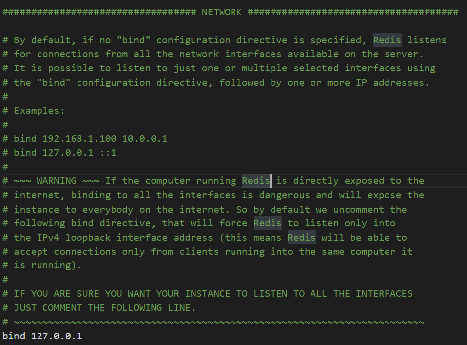

```shell
127.0.0.1:6379> config get bind
1) "bind"
2) "127.0.0.1"
127.0.0.1:6379> config get port
1) "port"
2) "6379"
127.0.0.1:6379> config get protected-mode
1) "protected-mode"
2) "yes"
```

> GENERAL	通用

```shell
# By default Redis does not run as a daemon. Use 'yes' if you need it.
# Note that Redis will write a pid file in /var/run/redis.pid when daemonized.
daemonize no	# 默认情况下，Redis不作为守护进程运行。需要开启的话，改为 yes

supervised no # 可通过upstart和systemd管理Redis守护进程

# If a pid file is specified, Redis writes it where specified at startup
# and removes it at exit.
pidfile /var/run/redis_6379.pid

# Specify the server verbosity level.
# This can be one of:
# debug (a lot of information, useful for development/testing) ----开发、测试环境
# verbose (many rarely useful info, but not a mess like the debug level)
# notice (moderately verbose, what you want in production probably)	----生产环境
# warning (only very important / critical messages are logged)
loglevel notice

# Specify the log file name. Also the empty string can be used to force
# Redis to log on the standard output. Note that if you use standard
# output for logging but daemonize, logs will be sent to /dev/null
logfile ""			# 日志文件的位置，当指定为空字符串时，为标准输出

databases 16	# 设置数据库的数目。默认的数据库是DB 0

always-show-logo yes		# 这玩意就是启动 redis 的那个图案
```

> SNAPSHOTTING 快照

```shell
# 900秒（15分钟）内至少1个key值改变（则进行数据库保存--持久化） 
save 900 1 
# 300秒（5分钟）内至少10个key值改变（则进行数据库保存--持久化） 
save 300 10 
# 60秒（1分钟）内至少10000个key值改变（则进行数据库保存--持久化） 
save 60 10000 

stop-writes-on-bgsave-error yes # 持久化出现错误后，是否依然进行继续进行工作 

rdbcompression yes # 使用压缩rdb文件 yes：压缩，但是需要一些cpu的消耗。no：不压 缩，需要更多的磁盘空间 

rdbchecksum yes # 是否校验rdb文件，更有利于文件的容错性，但是在保存rdb文件的时 候，会有大概10%的性能损耗 

dbfilename dump.rdb # dbfilenamerdb文件名称 

dir ./ # dir 数据目录，数据库的写入会在这个目录。rdb、aof文件也会写在这个目录
```

> REPLICATION  复制 后面主从复制	这里先跳过！


> SECURITY 安全
>
> 警告：由于Redis的速度非常快，外部用户可以在一个现代化的盒子上每秒尝试100万个密码。所以密码必须必须非常复杂。

```shell
127.0.0.1:6379> config get requirepass
1) "requirepass"
2) ""
127.0.0.1:6379> config set requirepass '123456'
OK
127.0.0.1:6379> ping
PONG
127.0.0.1:6379> 
[root@iZuf6el32a2l9b73omo6cgZ bin]# redis-cli
127.0.0.1:6379> ping
(error) NOAUTH Authentication required.  
127.0.0.1:6379> auth 123456
OK
127.0.0.1:6379> ping
PONG
```

> 限制

```shell
# maxclients 10000 # 设置能连上redis的最大客户端连接数量 

# maxmemory <bytes> # redis配置的最大内存容量 

# maxmemory-policy noeviction 
		# maxmemory-policy 内存达到上限的处理策略 
		#volatile-lru：利用LRU算法移除设置过过期时间的key。 
		#volatile-random：随机移除设置过过期时间的key。 
		#volatile-ttl：移除即将过期的key，根据最近过期时间来删除（辅以TTL） 
		#allkeys-lru：利用LRU算法移除任何key。 
		#allkeys-random：随机移除任何key。 
		#noeviction：不移除任何key，只是返回一个写错误。
```

> append only模式

```shell
append127.0.0.1:6379> config get appendonly
1) "appendonly"
2) "no"			# 是否以append only模式作为持久化方式，默认使用的是rdb方式持久化，这种 方式在许多应用中已经足够用了
127.0.0.1:6379> config get appendfilename
1) "appendfilename"
2) "appendonly.aof"		# appendfilename AOF 文件名称
127.0.0.1:6379> config get appendfsync
1) "appendfsync"
2) "everysec"
					# appendfsync aof持久化策略的配置 
					# no表示不执行fsync，由操作系统保证数据同步到磁盘，速度最快。 
					# always表示每次写入都执行fsync，以保证数据同步到磁盘。 
					# everysec表示每秒执行一次fsync，可能会导致丢失这1s数据。
```


### 设置配置

#### 运行时配置更改

可以通过修改 redis.conf 文件或使用 **CONFIG SET** 设置。

语法：

```shell
redis 127.0.0.1:6379> CONFIG SET CONFIG_SETTING_NAME NEW_CONFIG_VALUE
```

例子：

```shell
127.0.0.1:6379> CONFIG GET daemonize
1) "daemonize"
2) "no"
127.0.0.1:6379> CONFIG SET daemonize 'yes'
(error) ERR Unsupported CONFIG parameter: daemonize

127.0.0.1:6379> CONFIG SET loglevel 'notice'
OK
127.0.0.1:6379> CONFIG GET loglevel
1) "loglevel"
2) "notice"
127.0.0.1:6379> 
```

> 为什么daemonize参数不能设置呢？
>
> 设置完成后，可以运行`config rewrite`将配置持久化到配置文件中。

#### 命令行传参

> 在做开发测试的时候可以这样，但是上线的话，还是写在配置文件比较好。

```shell
./redis-server --port 6380 --slaveof 127.0.0.1 6379
```

需要注意的是通过命令行传递参数的过程会在内存中生成一个临时的配置文件(也许会直接追加在 命令指定的配置文件后面)，这些传递的参数也会转化为跟Redis配置文件一样的形式。


### 参数说明

> 菜鸟教程详细参数说明：https://www.runoob.com/redis/redis-conf.html

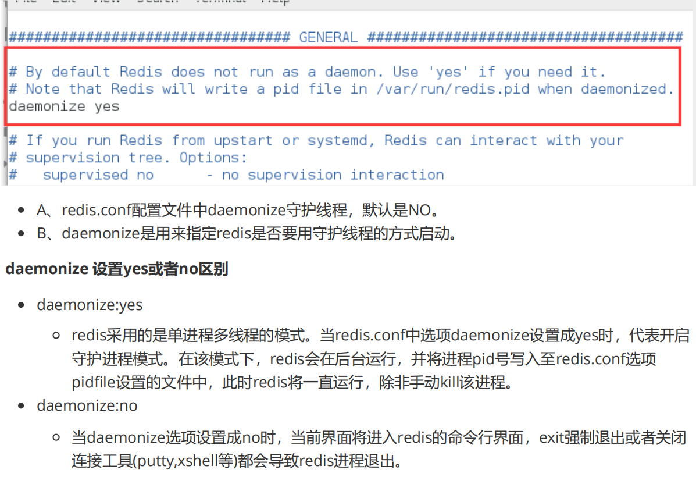


**什么是守护进程？**

> 守护进程（Daemon Process），也就是通常说的 Daemon 进程（精灵进程），是 Linux 中的后台服务进程。它是一个生存期较长的进程，通常独立于控制终端并且周期性地执行某种任务或等待处理某些发生的事件。

> 守护进程是个特殊的孤儿进程，这种进程脱离终端，为什么要脱离终端呢？之所以脱离于终端是为了避免进程被任何终端所产生的信息所打断，其在执行过程中的信息也不在任何终端上显示。由于在 linux 中，每一个系统与用户进行交流的界面称为终端，每一个从此终端开始运行的进程都会依附于这个终端，这个终端就称为这些进程的控制终端，当控制终端被关闭时，相应的进程都会自动关闭

## redis 事务

Redis 事务可以一次执行多个命令， 并且带有以下三个重要的保证：

- 批量操作在发送 EXEC 命令前被放入队列缓存且不执行。
- 收到 EXEC 命令后进入事务执行，事务中任意命令执行失败，其余的命令依然被执行。
- Redis的单线程特性，保证了执行队列命令时不被其它命令打扰，串行化执行满足了"隔离性"。

### 命令

| 命令         | 描述                                                         |
| :----------- | :----------------------------------------------------------- |
| MULTI        | 开启事务，总是返回OK                                         |
| EXEC         | 执行所有事务块内的命令                                       |
| DISCARD      | 取消事务，放弃执行事务块内的所有命令                         |
| UNWATCH      | 取消 WATCH 命令对所有 key 的监视                             |
| WATCH key... | 监视一个(或多个) key ，如果在事务执行之前这个(或这些) key 被其他命令所改动，那么事务将取消 |

```shell
127.0.0.1:6379> multi
OK
127.0.0.1:6379> set k1 hello
QUEUED # 同OK只是一个简单答复，表示指令已经缓存到服务端队列了
127.0.0.1:6379> set k2 world
QUEUED
127.0.0.1:6379> get k1
QUEUED
127.0.0.1:6379> set k3 redis
QUEUED
127.0.0.1:6379> exec			# 执行事务
1) OK
2) OK
3) "hello"
4) OK


127.0.0.1:6379> multi 
OK
127.0.0.1:6379> set k1 wwuwuwu
QUEUED
127.0.0.1:6379> discard			# 取消事务
OK
127.0.0.1:6379> get k1
"hello"
```

优化：一般来说，事务命令最好**结合pipeline流水线**一起使用，将多次io减少到1次，可以减少网络io等待。

### 事务出错

使用事务时可能会遇上以下两种错误：

- 事务在执行 [EXEC](http://www.redis.cn/commands/exec.html) 之前，入队的命令可能会出错。比如说，命令可能会产生语法错误（参数数量错误，参数名错误，等等），或者其他更严重的错误，比如内存不足（如果服务器使用 `maxmemory` 设置了最大内存限制的话）。
  - 类似于Java**编译性错误**。
  - 对于执行exec之前的错误，从 Redis 2.6.5 开始，服务器会对命令入队失败的情况进行记录，并在客户端调用 [EXEC](http://www.redis.cn/commands/exec.html) 命令时，拒绝执行并自动放弃这个事务
- 命令可能在 [EXEC](http://www.redis.cn/commands/exec.html) 调用之后失败。举个例子，事务中的命令可能处理了错误类型的键，比如将列表命令用在了字符串键上面，诸如此类。
  - 类似于Java**运行时错误**。
  - 那些在 [EXEC](http://www.redis.cn/commands/exec.html) 命令执行之后所产生的错误， 并没有对它们进行特别处理： 即使事务中有某个/某些命令在执行时产生了错误， 事务中的其他命令仍然会继续执行。

第一种错误：

```shell
127.0.0.1:6379> multi 
OK
127.0.0.1:6379> setget k1		#	-----> 参数错误：不能入队
(error) ERR unknown command `setget`, with args beginning with: `k1`, 
127.0.0.1:6379> set k2 lalala
QUEUED
127.0.0.1:6379> exec			# -----> 拒绝执行事务，并且事务已经被discard了
(error) EXECABORT Transaction discarded because of previous errors.
127.0.0.1:6379> get k2			# 事务并没有成功哦
"world"
```

第2种错误：

```shell
127.0.0.1:6379> multi
OK
127.0.0.1:6379> incr k1		# ----> 对 k1 的值 'hello' 自增，但是必然会错误
QUEUED
127.0.0.1:6379> set k2 lalala
QUEUED
127.0.0.1:6379> set k3 wuwuwu
QUEUED
127.0.0.1:6379> exec		# 虽然出错了，但是其他命令正常进行，不回滚
1) (error) ERR value is not an integer or out of range
2) OK
3) OK
127.0.0.1:6379> get k2
"lalala"
127.0.0.1:6379> get k3
"wuwuwu"
```

> 注意：
>
> 单个 Redis 命令的执行是原子性的，但 Redis 没有在事务上增加任何维持原子性的机制，所以 Redis 事务的执行并不是原子性的。
>
> 事务可以理解为一个打包的批量执行脚本，但批量指令并非原子化的操作，中间某条指令的失败不会导致前面已做指令的回滚，也不会造成后续的指令不做。

### Redis 不支持回滚

Redis 不支持事务回滚，因为支持回滚会对 Redis 的简单性和性能产生重大影响。

以下是这种做法的优点：

- Redis 命令只会因为错误的语法而失败（并且这些问题不能在入队时发现），或是命令用在了错误类型的键上面：这也就是说，从实用性的角度来说，失败的命令是由编程错误造成的，而这些错误应该在开发的过程中被发现，而不应该出现在生产环境中。
- 因为不需要对回滚进行支持，所以 Redis 的内部可以保持简单且快速。

有种观点认为 Redis 处理事务的做法会产生 bug ， 然而需要注意的是， 在通常情况下， 回滚并不能解决编程错误带来的问题。 举个例子， 如果你本来想通过 [INCR](http://www.redis.cn/commands/incr.html) 命令将键的值加上 1 ， 却不小心加上了 2 ， 又或者对错误类型的键执行了 [INCR](http://www.redis.cn/commands/incr.html) ， 回滚是没有办法处理这些情况的。

### WATCH与乐观锁

> **悲观锁：**
>
> 悲观锁(Pessimistic Lock)，顾名思义，就是很悲观，每次去拿数据的时候都认为别人会修改，所以每次在拿数据的时候都会上锁，这样别人想拿到这个数据就会block直到它拿到锁。
>
> 传统的关系型数据库里面就用到了很多这种锁机制，比如**行锁，表锁等，读锁，写锁**等，都是在**操作之前先上锁**。Redis的分布式锁实现也是一种悲观锁。
>
> **乐观锁：**
>
> 乐观锁(Optimistic Lock)，顾名思义，就是很乐观，每次去拿数据的时候都认为别人不会修改，所以不会上锁。
>
> 但是在更新的时候会判断一下再此期间别人有没有去更新这个数据，可以使用版本号等机制，乐观锁适用于多读写少的应用类型，这样可以提高吞吐量，乐观锁策略：提交版本必须大于记录当前版本才能执行更新。

如果在 [WATCH](http://www.redis.cn/commands/watch.html) 执行之后， [EXEC](http://www.redis.cn/commands/exec.html) 执行之前， 有其他客户端修改了监视的 `key` 的值， 那么当前客户端的事务就会取消， [EXEC](http://www.redis.cn/commands/exec.html) 返回nil来表示事务已经失败。

而我们客户端程序需要做的， 就是**不断重试这个操作**， 直到没有发生碰撞为止，即直到 [EXEC](http://www.redis.cn/commands/exec.html) 的返回值不是[nil-reply](http://www.redis.cn/topics/protocol.html#nil-reply)回复即可。

示例：使用watch检测balance，事务期间balance数据变动，事务执行失败！

```shell
# 窗口一 
127.0.0.1:6379> watch balance 
OK
127.0.0.1:6379> MULTI # 执行完毕后，执行窗口二代码测试 
OK
127.0.0.1:6379> decrby balance 20 
QUEUED 
127.0.0.1:6379> incrby debt 20 
QUEUED 
127.0.0.1:6379> exec # 修改失败！ 
(nil) 

# 窗口二 
127.0.0.1:6379> get balance "80" 
127.0.0.1:6379> set balance 200 
OK

# 窗口一：出现问题后放弃监视，然后重来！ 
127.0.0.1:6379> UNWATCH # 放弃监视 
OK
127.0.0.1:6379> watch balance 
OK
127.0.0.1:6379> MULTI 
OK
127.0.0.1:6379> decrby balance 20 
QUEUED 
127.0.0.1:6379> incrby debt 20
QUEUED 
127.0.0.1:6379> exec # 成功！ 
1) (integer) 180 
2) (integer) 40
```

注意：

> 当 [EXEC](http://www.redis.cn/commands/exec.html) 被调用时， 不管事务是否成功执行， 对所有键的监视都会被取消。
>
> 另外， 当客户端断开连接时， 该客户端对键的监视也会被取消。
>
> UNWATCH命令可手动关闭监视。
>
> 故当事务执行失败后，需重新执行WATCH命令对变量进行监控，并开启新的事务进行操作。

## redis发布订阅

Redis 发布订阅 (pub/sub) 是一种消息通信模式：发送者 (pub) 发送消息，订阅者 (sub) 接收消息。

Redis 客户端可以订阅任意数量的频道。


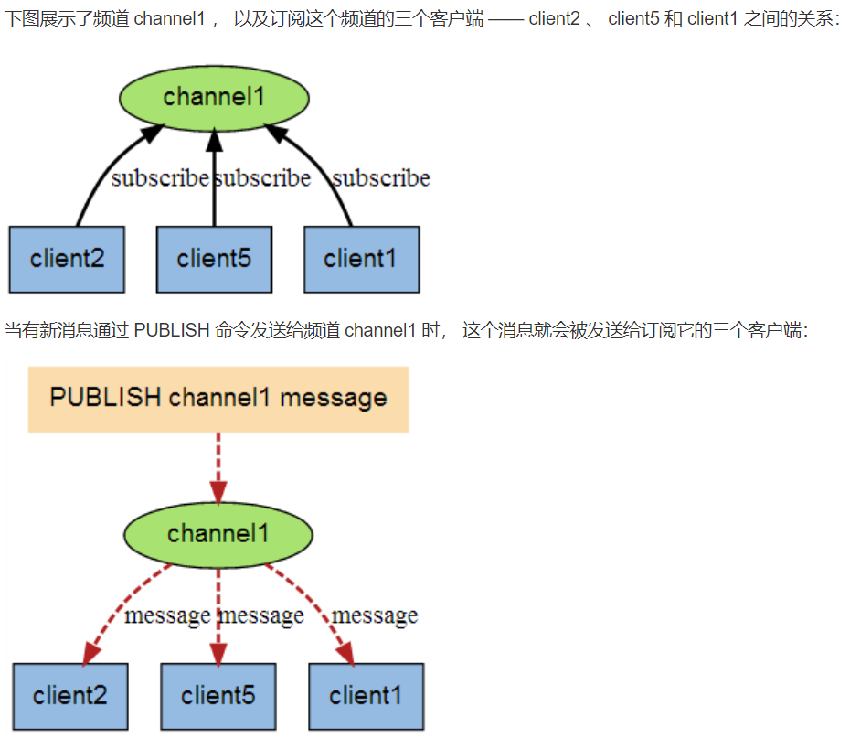

客户端1创建订阅频道：

```shell
127.0.0.1:6379> subscribe redisChat
Reading messages... (press Ctrl-C to quit)
1) "subscribe"
2) "redisChat"
3) (integer) 1
```

客户端2发布消息：

```shell
[root@iZuf6el32a2l9b73omo6cgZ bin]# redis-cli
127.0.0.1:6379> publish redisChat 'hello redis'
(integer) 1
```

此时客户端1接收到信息：

```shell
127.0.0.1:6379> subscribe redisChat
Reading messages... (press Ctrl-C to quit)
1) "subscribe"
2) "redisChat"
3) (integer) 1
1) "message"				# 接受的信息
2) "redisChat"
3) "hello redis"
```

应用：构建实时的消息系统


## 缓存问题

Redis缓存的使用，极大的提升了应用程序的性能和效率，特别是数据查询方面。但同时，它也带来了一些问题。其中，最要害的问题，就是数据的一致性问题，从严格意义上讲，这个问题无解。如果对数据的一致性要求很高，那么就不能使用缓存。

另外的一些典型问题就是，缓存穿透、缓存雪崩和缓存击穿。目前，业界也都有比较流行的解决方案。

### 缓存穿透

> 相关文章：https://baijiahao.baidu.com/s?id=1655304940308056733&wfr=spider&for=pc

正常访问流程：

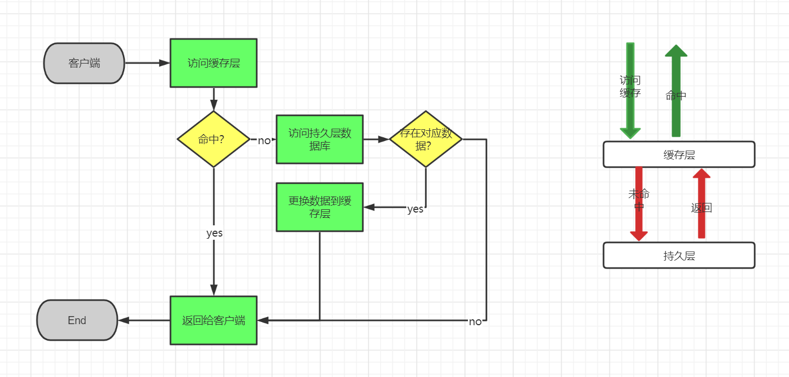

概念

> 缓存穿透就是，当数据库中没有某条记录的时候，客户端来查询，穿过缓存层，没有查询到数据，自然不会更新缓存层。
>
> 可如果此时有大量用户查询此数据，那么都会去查询数据库，造成较大压力，缓存层就像没有存在一样，这就是缓存穿透了。
>
> key对应的数据在数据源并不存在，每次针对此key的请求从缓存获取不到，请求都会压到数据源，从而可能压垮数据源。比如用一个不存在的用户id获取用户信息，不论缓存还是数据库都没有，若黑客利用此漏洞进行攻击可能压垮数据库。

**解决方法1：设置空值**

如果一个查询返回的数据为空（不管是数据是否不存在），我们仍然把这个空结果（null）进行缓存，设置空结果的过期时间会很短，最长不超过五分钟

但是这种方法会存在两个问题：

- 如果空值能够被缓存起来，这就意味着缓存需要更多的空间存储更多的键，因为这当中可能会有很多的空值的键；

- 即使对空值设置了过期时间，还是会存在缓存层和存储层的数据会有一段时间窗口的不一致，这对于需要保持一致性的业务会有影响。

**解决方法2：设置白名单**

使用bitmaps类型定义一个可以访问的名单，名单id作为bitmaps的偏移量，每次访问和bitmap里面的id进行比较，如果访问id不在bitmaps里面，进行拦截，不允许访问。

**解决方法3：布隆过滤器**

布隆过滤器（Bloom Filter）是1970年由布隆提出的。它实际上是一个很长的二进制向量(位图)和一系列随机映射函数（哈希函数）。布隆过滤器可以用于检索一个元素是否在一个集合中。它的优点是空间效率和查询时间都远远超过一般的算法，缺点是有一定的误识别率和删除困难。

将所有可能存在的数据哈希到一个足够大的bitmaps中，一个一定不存在的数据会被 这个bitmaps拦截掉，从而避免了对底层存储系统的查询压力。

布隆过滤器是一种数据结构，垃圾网站和正常网站加起来全世界据统计也有几十亿个。网警要过滤这些垃圾网站，总不能到数据库里面一个一个去比较吧，这就可以使用布隆过滤器。

那这个布隆过滤器是如何解决redis中的缓存穿透呢？很简单首先也是对所有可能查询的参数以hash形式存储，当用户想要查询的时候，使用布隆过滤器发现不在集合中，就直接丢弃，不再对持久层查询。

深入的话，需要查更多资料咯。

**解决方法4：实时检测**

当发现Redis的命中率开始急速降低，需要排查访问对象和访问的数据，和运维人员配合，可以设置**黑名单**限制服务

### 缓存击穿

**概念**

> 缓存击穿，是指一个key非常热点，在不停的扛着大并发，大并发集中对这一个点进行访问，当这个key在失效的瞬间，持续的大并发就穿破缓存，直接请求数据库，就像在一个屏障上凿开了一个洞。
>
> 当某个key在过期的瞬间，有大量的请求并发访问，这类数据一般是热点数据，由于缓存过期，会同时访问数据库来查询最新数据，并且回写缓存，会导使数据库瞬间压力过大。

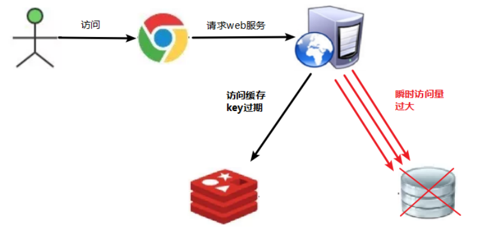

key可能会在某些时间点被超高并发地访问，是一种非常“热点”的数据。这个时候，需要考虑一个问题：缓存被“击穿”的问题。

解决问题：

**（1）预先设置热门数据：**在redis高峰访问之前，把一些热门数据提前存入到redis里面，加大这些热门数据key的时长

**（2）实时调整：**现场监控哪些数据热门，实时调整key的过期时长

**（3）使用锁：**

- （1） 就是在缓存失效的时候（判断拿出来的值为空），不是立即去load db。

- （2） 先使用缓存工具的某些带成功操作返回值的操作（比如Redis的SETNX）去set一个mutex key

- （3） 当操作返回成功时，再进行load db的操作，并回设缓存,最后删除mutex key；

- （4） 当操作返回失败，证明有线程在load db，当前线程睡眠一段时间再重试整个get缓存的方法。

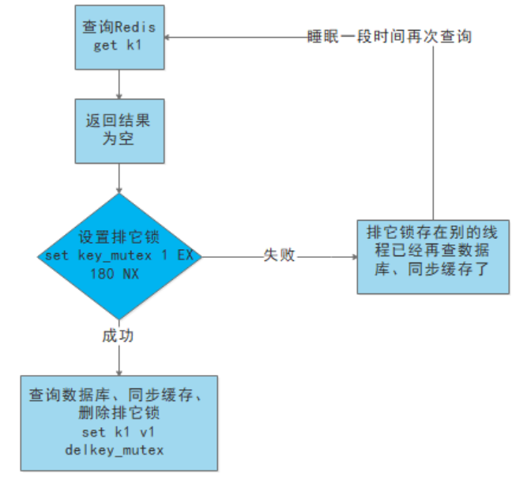

### 缓存雪崩

> 缓存雪崩，是指在某一个时间段，缓存集中过期失效。
>
> 缓存雪崩是由于**大量原有缓存集体失效(过期)**，新缓存未到期间。所有请求都去查询数据库，而对数据库CPU和内存造成巨大压力，严重的会造成数据库宕机。从而形成一系列连锁反应，造成整个系统崩溃。
>
> 缓存雪崩与缓存击穿的区别在于这里针对很多key缓存，后者是对某个key的高并发访问。
>
> 产生雪崩的原因之一，比如马上就要到双十二零点，很快就会迎来一波抢购，这波商品时间比较集中的放入了缓存，假设缓存一个小时。那么到了凌晨一点钟的时候，这批商品的缓存就都过期了。而对这批商品的访问查询，都落到了数据库上，对于数据库而言，就会产生周期性的压力波峰。于是所有的请求都会达到存储层，存储层的调用量会暴增，造成存储层也会挂掉的情况。

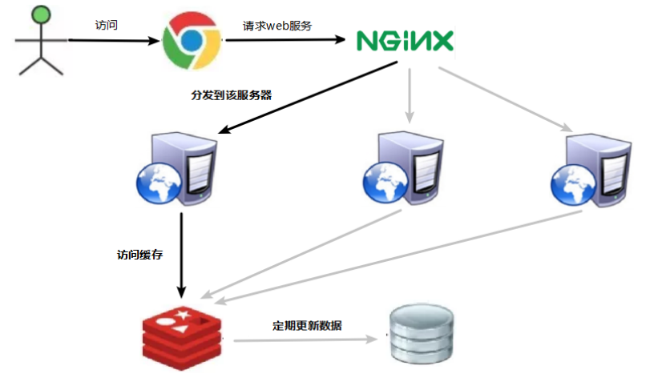

缓存失效瞬间

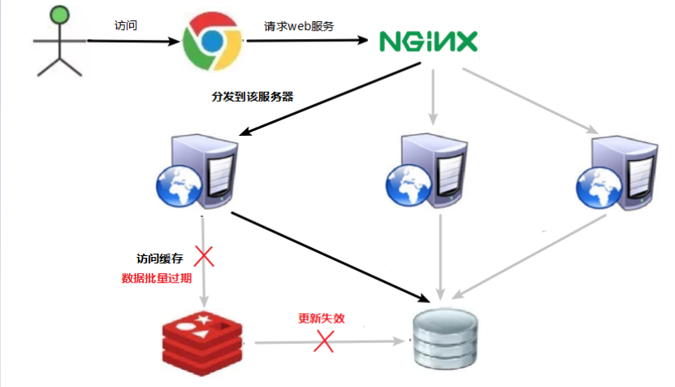

**解决方法：**

缓存失效时的雪崩效应对底层系统的冲击非常可怕！

解决方案：

（1） **构建多级缓存架构：**nginx缓存 + redis缓存 +其他缓存（ehcache等）

（2） **使用锁或队列：**
用加锁或者队列的方式保证来保证不会有大量的线程对数据库一次性进行读写，从而避免失效时大量的并发请求落到底层存储系统上。不适用高并发情况

（3） **设置过期标志更新缓存：**
记录缓存数据是否过期（设置提前量），如果过期会触发通知另外的线程在后台去更新实际key的缓存。

（4） **将缓存失效时间分散开：**
比如我们可以在原有的失效时间基础上增加一个随机值，比如1-5分钟随机，这样每一个缓存的过期时间的重复率就会降低，就很难引发集体失效的事件。

 

### 分布式锁

待更新......


## Jedis

### 连接注意事项

阿里云开放6379端口，Linux防火墙开放6379端口；

redis.conf中注释掉`bind 127.0.0.1`，开放外网连接

然后 protected-mode no，关闭保护模式，

然后还要设置密码`requirepass`，为了安全，开放外网连接必须设置密码，而且还必须非常复杂。否则你的redis就会被某些不知道哪来的进行利用攻击。


### Jedis使用

首先引入依赖

```xml
<!-- https://mvnrepository.com/artifact/redis.clients/jedis -->
<dependency>
    <groupId>redis.clients</groupId>
    <artifactId>jedis</artifactId>
    <version>3.2.0</version>
</dependency>

<dependency>
    <groupId>com.alibaba</groupId>
    <artifactId>fastjson</artifactId>
    <version>1.2.59</version>
</dependency>
```

1、测试连接

```java
    @Test
    void test1() {
        Jedis jedis = new Jedis("106.15.235.113", 6379);
        jedis.auth("!MyRedis123456");
        
        System.out.println("服务正在运行: "+jedis.ping());//PONG
        jedis.close();
    }
```

2、其他API

呃，其他API和redis的命令差不多。

3、事务

```java
    @Test
    void test2() throws InterruptedException {
        Jedis jedis = new Jedis("106.15.235.113", 6379);
        jedis.auth("!MyRedis123456");
        JSONObject jsonObject = new JSONObject();
        jsonObject.put("username", "fzk");
        jsonObject.put("id", 1);
        jsonObject.put("age", 18);
        String s = jsonObject.toJSONString();

        // 开启事务
        Transaction multi = jedis.multi();
        multi.watch("k1");
        multi.set("user:id:1", s);
        try{
            int i=100/0;//模拟执行出错
            multi.exec();
        }catch (Exception e){
            e.printStackTrace();
            // 取消事务哦
            multi.discard();
        }finally {
            jedis.close();
        }

        System.out.println(jedis.get("user:id:1"));
    }
```

注意：呃，这里需要注意哈，这个所谓的事务，只是能防住Java代码运行时错误，不能防住redis事务块的错误，可以详细看看redis事务章节。

比如将try块里的顺序换一下，就会出现`Read timed out`的错误，从catch块抛出来，来自于取消事务那里。

## Boot 整合Redis

在SpringBoot中一般使用RedisTemplate提供的方法来操作Redis。那么使用SpringBoot整合Redis需要那些步骤呢。

需要注意是在boot2.x版本之后，jedis不再使用，转而使用lettuce。

jedis采用直连方式，多个线程操作，不安全。要避免不安全，使用jedis pool连接池。像BIO模式

lettuce：采用netty，实例可以在多个线程进行共享，线程安全，可以减少线程数据。像NIO模式。

1、引入starter依赖

```xml
<dependency>
    <groupId>org.springframework.boot</groupId>
    <artifactId>spring-boot-starter-data-redis</artifactId>
</dependency>
<!-- spring2.X集成redis所需common-pool2-->
<dependency>
    <groupId>org.apache.commons</groupId>
    <artifactId>commons-pool2</artifactId>
    <version>2.6.0</version>
</dependency>
```

其中第2个依赖是在使用lettuce时才需要引用，如果使用jedis，就不需要引入。

2、读一下`RedisAutoConfiguration`类呢

```java
@Configuration(proxyBeanMethods = false)
@ConditionalOnClass(RedisOperations.class)
@EnableConfigurationProperties(RedisProperties.class)
@Import({ LettuceConnectionConfiguration.class, JedisConnectionConfiguration.class })
public class RedisAutoConfiguration {

	@Bean
	@ConditionalOnMissingBean(name = "redisTemplate")// 我们可以自己写配置类来替换这个默认的RedisTemplate
	@ConditionalOnSingleCandidate(RedisConnectionFactory.class)
	public RedisTemplate<Object, Object> redisTemplate(RedisConnectionFactory redisConnectionFactory) {
		RedisTemplate<Object, Object> template = new RedisTemplate<>();
		template.setConnectionFactory(redisConnectionFactory);
		return template;
	}

	@Bean// 因为redis中大部分都是String类型，所以单独提了一个bean出来
	@ConditionalOnMissingBean
	@ConditionalOnSingleCandidate(RedisConnectionFactory.class)
	public StringRedisTemplate stringRedisTemplate(RedisConnectionFactory redisConnectionFactory) {
		StringRedisTemplate template = new StringRedisTemplate();
		template.setConnectionFactory(redisConnectionFactory);
		return template;
	}

}
```

可以看到绑定的配置属性类是`RedisProperties`；

往容器中放了一个redisTemplate；

引入了`Lettuce`的配置类；

> 注意：不知道为什么，直接用第一个redisTemplate，取出的值都是null， 猜测可能是没有配置序列化器。第2个应该是配置了序列化器。
> redis使用的话，应该都是存string对象，所以**直接用第2个**就行了。

3、`RedisProperties`

```java
@ConfigurationProperties(prefix = "spring.redis")

	/**
	 * Redis server host.
	 */
	private String host = "localhost";

	/**
	 * Login username of the redis server.
	 */
	private String username;

	/**
	 * Login password of the redis server.
	 */
	private String password;

	/**
	 * Redis server port.
	 */
	private int port = 6379;
```

这个类是拿来配置连接登录的。

3、配置文件

```properties
#Redis服务器地址
spring.redis.host=ip
#Redis服务器连接端口
spring.redis.port=6379
#密码
spring.redis.password=密码
#Redis数据库索引（默认为0）
spring.redis.database= 0
#读取超时时间（毫秒）
spring.redis.timeout=1800000
#连接池最大连接数（使用负值表示没有限制）
spring.redis.lettuce.pool.max-active=20
#最大阻塞等待时间(负数表示没限制)
spring.redis.lettuce.pool.max-wait=-1
#连接池中的最大空闲连接
spring.redis.lettuce.pool.max-idle=5
#连接池中的最小空闲连接
spring.redis.lettuce.pool.min-idle=0
```

Sa-token整合Redis里抄到的配置文件：

```yaml
# 端口
spring:
  # redis配置
  redis:
    # Redis数据库索引（默认为0）
    database: 1
    # Redis服务器地址
    host: 106.15.235.113
    # Redis服务器连接端口
    port: 6379
    # Redis服务器连接密码（默认为空）
    password: '!MyRedis123456'
    # 连接超时时间（毫秒）
    timeout: 1000ms
    lettuce:
      pool:
        max-active: 200 # 连接池最大连接数
        max-wait: -1ms  # 连接池最大阻塞等待时间（使用负值表示没有限制）
        max-idle: 10 # 连接池中的最大空闲连接
        min-idle: 0 # 连接池中的最小空闲连接
```


4、测试

```java
@SpringBootTest
class DemoApplicationTests {
	@Resource
	private StringRedisTemplate stringRedisTemplate;

	@Resource
	private RedisTemplate<Object,Object> redisTemplate;

	@Test
	void contextLoads() {
		ValueOperations<String, String> opsForValue = stringRedisTemplate.opsForValue();
		opsForValue.set("你好","你好");
		System.out.println(opsForValue.get("k1"));
		System.out.println(opsForValue.get("你好"));
	}

	@Test
	void test1(){
		ValueOperations<Object,Object> opsForValue = redisTemplate.opsForValue();
		Object k1 = opsForValue.get("k1");// -----> 不知道为什么？这里返回的是null
		System.out.println(k1);
	}

}
```

所以直接用StringRedisTemplate吧。

5、看看RedisTemplate提供的方法如下：

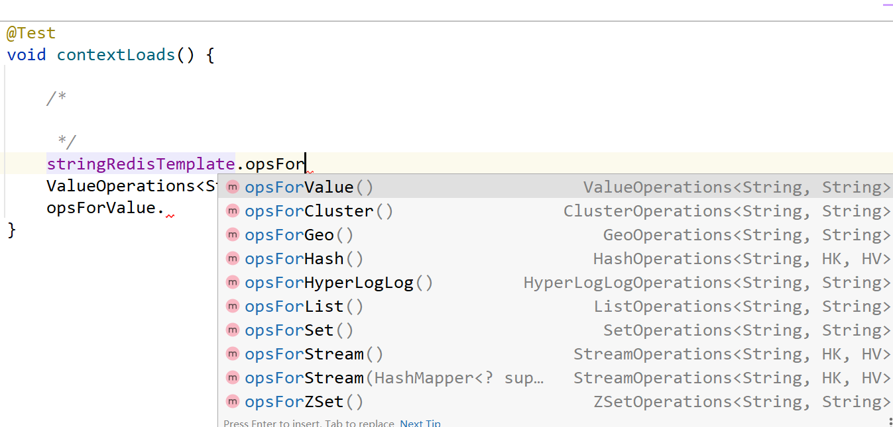

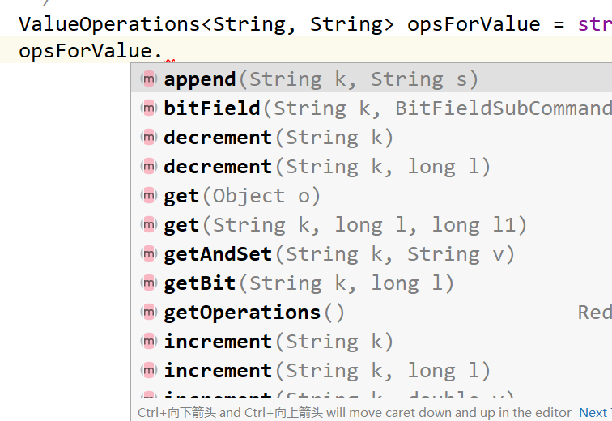

6、如果不满意自动配置类提供的2个RedisTemplate，可以自己配置：

```java
@Configuration
public class RedisConfig {
    @Bean
    @SuppressWarnings("all")
    public RedisTemplate<String, Object> redisTemplate(RedisConnectionFactory factory) {
        RedisTemplate<String, Object> template = new RedisTemplate<String, Object>();
        template.setConnectionFactory(factory);
        Jackson2JsonRedisSerializer jackson2JsonRedisSerializer = new Jackson2JsonRedisSerializer(Object.class);
        ObjectMapper om = new ObjectMapper();
        om.setVisibility(PropertyAccessor.ALL, JsonAutoDetect.Visibility.ANY);
        om.enableDefaultTyping(ObjectMapper.DefaultTyping.NON_FINAL);
        jackson2JsonRedisSerializer.setObjectMapper(om);
        StringRedisSerializer stringRedisSerializer = new StringRedisSerializer(); // key采用String的序列化方式 template.setKeySerializer(stringRedisSerializer); // hash的key也采用String的序列化方式 
        template.setHashKeySerializer(stringRedisSerializer); // value序列化方式采用jackson 
        template.setValueSerializer(jackson2JsonRedisSerializer); // hash的value序列化方式采用jackson 
        template.setHashValueSerializer(jackson2JsonRedisSerializer);
        template.afterPropertiesSet();
        return template;
    }
}
```

其中的ObjectMapper是Jackson的类。


## Boot整合Redis集群

### Jedis整合步骤

> 本案例使用3主3从模式
>
> 使用Jedis连接池，并用其连接集群
>
> 为什么不用lettuce呢？
>
> 不知道为什么？用它好像在并发情况下有一定问题，要报错。
> 不过测试着又没问题了？？？？
>
> 为了稳定，还是选用了jedis。当然这两个切换其实非常简单，一条配置就OK了`spring.redis.client-type: lettuce`。
>
> 不得不说一句，Spring Data Redis 的文档也太令人无语了。哎。

1、cluster集群搭建

...看redis cluster部分

2、boot项目引入依赖

```xml
<dependency>
    <groupId>org.springframework.boot</groupId>
    <artifactId>spring-boot-starter-data-redis</artifactId>
    <!-- 移除lettuce：
 		如果配置了spring.redis.client-type选项，那么可以不移除-->
    <exclusions>
        <exclusion>
            <groupId>io.lettuce</groupId>
            <artifactId>lettuce-core</artifactId>
        </exclusion>
    </exclusions>
</dependency>
<!-- spring2.X集成redis所需common-pool2-->
<dependency>
    <groupId>org.apache.commons</groupId>
    <artifactId>commons-pool2</artifactId>
    <version>2.6.0</version>
</dependency>
<!--Jedis-->
<dependency>
    <groupId>redis.clients</groupId>
    <artifactId>jedis</artifactId>
    <version>3.6.0</version>
</dependency>
```

必须要移除lettuce，里面有一个连接工厂`LettuceConnectionFactory`，会影响注册到RedisTemplate连接工厂。

3、yaml配置

```yaml
# 端口
spring:
  # redis配置
  redis:
    # Redis数据库索引（默认为0）
    database: 0
    # Redis服务器地址
    host: 106.15.235.113
    # Redis服务器连接端口
    port: 6379
    # Redis服务器连接密码（默认为空）
    password: '!MyRedis123456'
    # 连接超时时间（毫秒）
    timeout: 1000ms

    # 选择jedis还是lettuce
    client-type: jedis
    #    lettuce: # 使用lettuce连接池
    #      pool: 
    #        # 连接池最大连接数
    #        max-active: 200
    #        # 连接池最大阻塞等待时间（使用负值表示没有限制）
    #        max-wait: -1ms
    #        # 连接池中的最大空闲连接
    #        max-idle: 10
    #        # 连接池中的最小空闲连接
    #        min-idle: 0
    
    jedis:  # 使用jedis的连接池
      pool:
        max-active: 1000  # 连接池最大连接数（使用负值表示没有限制）
        max-wait: -1ms      # 连接池最大阻塞等待时间（使用负值表示没有限制）
        max-idle: 10      # 连接池中的最大空闲连接
        min-idle: 5       # 连接池中的最小空闲连接

    # 集群配置
    cluster:
      nodes:
        - 106.15.235.113:6379
        - 106.15.235.113:6380
        - 106.15.235.113:6381
        - 106.15.235.113:6389
        - 106.15.235.113:6390
        - 106.15.235.113:6391
      # max-redirects: 3 # 获取失败 最大重定向次数
```

4、连接池注入配置信息

```java
@Configuration
public class MyRedisConfig {
    @Autowired
    private RedisConnectionFactory factory;

    @Bean(name="redisTemplate")
    public RedisTemplate<String, Object> redisTemplate() {
        RedisTemplate<String, Object> redisTemplate = new RedisTemplate<>();
		// 注入序列化器
        redisTemplate.setKeySerializer(new StringRedisSerializer());
        redisTemplate.setHashKeySerializer(new StringRedisSerializer());
        redisTemplate.setHashValueSerializer(new StringRedisSerializer());
        redisTemplate.setValueSerializer(new StringRedisSerializer());
        redisTemplate.setConnectionFactory(factory);
        return redisTemplate;
    }
}
```

5、使用
可以使用的redisTemplate有两个啦，一个是自己上面配的`RedisTemplate<String,Object>`，还有一个是在RedisAutoConfiguration里面配的`StringRedisTemplate`。


### 配置解析

**RedisConnectionFactory**

首先我们需要注意的是RedisConnectionFactory这个类，我们要使用的RedisTemplate里面需要注入它。

为什么需要它呢？因为它可以获取`RedisConnection`和`RedisClusterConnection`
`Thread-safe factory of Redis connections.`用来获取线程安全的连接的工厂。

**RedisAutoConfiguration**

```java
@Configuration(proxyBeanMethods = false)
@ConditionalOnClass(RedisOperations.class)
@EnableConfigurationProperties(RedisProperties.class)
@Import({ LettuceConnectionConfiguration.class, JedisConnectionConfiguration.class })
public class RedisAutoConfiguration {

	@Bean
	@ConditionalOnMissingBean(name = "redisTemplate")
	@ConditionalOnSingleCandidate(RedisConnectionFactory.class)
	public RedisTemplate<Object, Object> redisTemplate(RedisConnectionFactory redisConnectionFactory) {
		RedisTemplate<Object, Object> template = new RedisTemplate<>();
		template.setConnectionFactory(redisConnectionFactory);
		return template;
	}

	@Bean
	@ConditionalOnMissingBean
	@ConditionalOnSingleCandidate(RedisConnectionFactory.class)
	public StringRedisTemplate stringRedisTemplate(RedisConnectionFactory redisConnectionFactory) {
		StringRedisTemplate template = new StringRedisTemplate();
		template.setConnectionFactory(redisConnectionFactory);
		return template;
	}
}
```

可以看到这两个RedisTemplate都放入了RedisConnectionFactory。我们的上面自己配的RedisTemplate就阻止了第一个bean的注册。因为它没有放序列化器，所以呢，就会出现无法将key设置到数据库中，所以获取就是null。

`@Import({ LettuceConnectionConfiguration.class, JedisConnectionConfiguration.class })`这一行引入了2种不同连接方法的配置。我们进去看看看呢。

**LettuceConnectionConfiguration**

```java
@Configuration(proxyBeanMethods = false)
@ConditionalOnClass(RedisClient.class)
@ConditionalOnProperty(name = "spring.redis.client-type", havingValue = "lettuce", matchIfMissing = true)
class LettuceConnectionConfiguration extends RedisConnectionConfiguration {
    ......
	@Bean
	@ConditionalOnMissingBean(RedisConnectionFactory.class)
	LettuceConnectionFactory redisConnectionFactory(
			ObjectProvider<LettuceClientConfigurationBuilderCustomizer> builderCustomizers,
			ClientResources clientResources) {
		LettuceClientConfiguration clientConfig = getLettuceClientConfiguration(builderCustomizers, clientResources,
				getProperties().getLettuce().getPool());
		return createLettuceConnectionFactory(clientConfig);
	}
    ......
}
```

它在配置了spring.redis.client-type=lettuce情况下会启动，不配置也启动。
就干一件事：**把LettuceConnectionFactory放入容器。**

**JedisConnectionConfiguration**

```java
@Configuration(proxyBeanMethods = false)
@ConditionalOnClass({ GenericObjectPool.class, JedisConnection.class, Jedis.class })
@ConditionalOnMissingBean(RedisConnectionFactory.class)
@ConditionalOnProperty(name = "spring.redis.client-type", havingValue = "jedis", matchIfMissing = true)
class JedisConnectionConfiguration extends RedisConnectionConfiguration {
	.......
   @Bean
   JedisConnectionFactory redisConnectionFactory(
         ObjectProvider<JedisClientConfigurationBuilderCustomizer> builderCustomizers) {
      return createJedisConnectionFactory(builderCustomizers);
   }
    .......
}
```

它和上面那个相似，也就干一件事：**把JedisConnectionFactory放入容器**
在`spring.redis.client-type=jedis`的时候启动，或者没配置这个值也启动。

**所以看到这里相信已经很清晰了，要切换连接工具jedis还是lettuce，一条配置即可。当然这两个的依赖都引入才能自由切换。**

**StringRedisTemplate的细节**

```java
public class StringRedisTemplate extends RedisTemplate<String, String> {

	/**
	 * Constructs a new <code>StringRedisTemplate</code> instance. {@link #setConnectionFactory(RedisConnectionFactory)}
	 * and {@link #afterPropertiesSet()} still need to be called.
	 */
	public StringRedisTemplate() {
		setKeySerializer(RedisSerializer.string());
		setValueSerializer(RedisSerializer.string());
		setHashKeySerializer(RedisSerializer.string());
		setHashValueSerializer(RedisSerializer.string());
	}

	/**
	 * Constructs a new <code>StringRedisTemplate</code> instance ready to be used.
	 *
	 * @param connectionFactory connection factory for creating new connections
	 */
	public StringRedisTemplate(RedisConnectionFactory connectionFactory) {
		this();
		setConnectionFactory(connectionFactory);
		afterPropertiesSet();
	}

	protected RedisConnection preProcessConnection(RedisConnection connection, boolean existingConnection) {
		return new DefaultStringRedisConnection(connection);
	}
}
```

可以看到是，它就是帮我们把序列化器给注册进去了，其实我们自己写的话，效果是一样的。

**RedisConnectionFactory**

```java
/**
 * Thread-safe factory of Redis connections.
 *
 * @author Costin Leau
 * @author Christoph Strobl
 */
public interface RedisConnectionFactory extends PersistenceExceptionTranslator {

   /**
    * Provides a suitable connection for interacting with Redis.
    *
    * @return connection for interacting with Redis.
    * @throws IllegalStateException if the connection factory requires initialization and the factory was not yet
    *           initialized.
    */
   RedisConnection getConnection();

   /**
    * Provides a suitable connection for interacting with Redis Cluster.
    *
    * @return
    * @throws IllegalStateException if the connection factory requires initialization and the factory was not yet
    *           initialized.
    * @since 1.7
    */
   RedisClusterConnection getClusterConnection();
    ......
}
```

这个玩意就是获取和Redis的连接的工厂，用连接来操作redis嘛。

它有两个实现类：

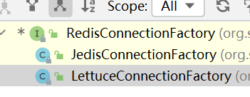

而我们真正去操作的RedisTemplate需要注入的是RedisConnectionFactory就是这两个中的某一个。同时啊，在我们的上面RedisAutoConfiguration中的2个RedisTemplate实例都要求只有一个工厂bean才能注入。

接下来去看看这两个实现类吧：

**JedisConnectionFactory**

我草，看不懂。这里面方法特别多，能拿到很多的配置信息，如password。

里面放有Pool。

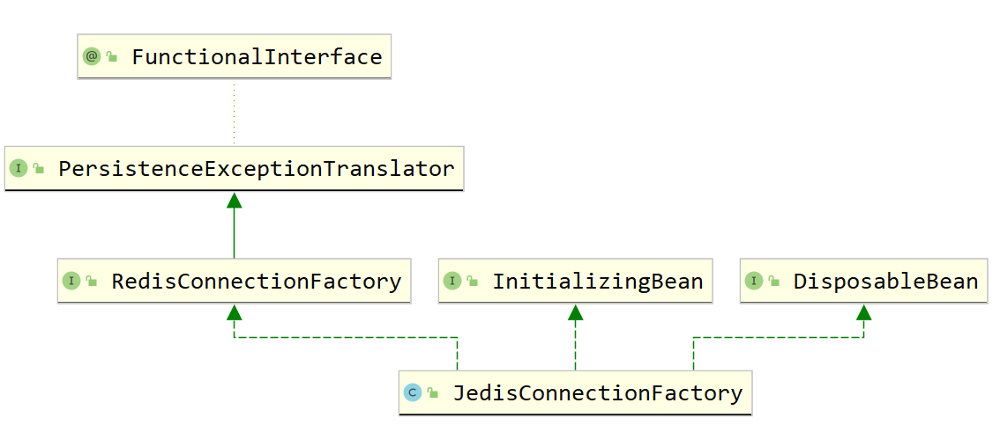

**LettuceConnectionFactory**

放了一个LettucePool，感觉和上面这个差不太多了。

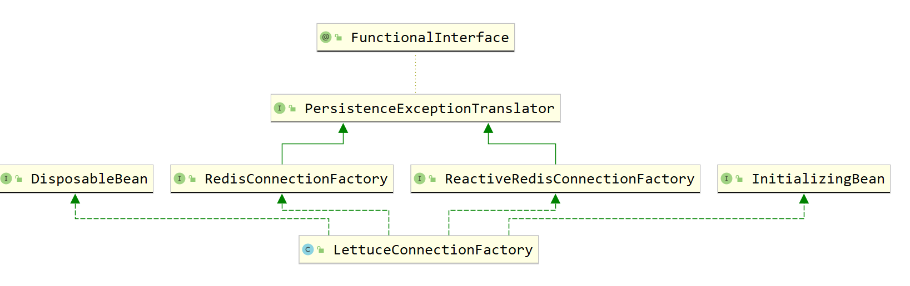

### 测试lettuce连接

这个和jedis连接其实在配置上差不多。
在jedis连接基础上需要改的yaml：把lettuce连接池的配置打开，jedis连接池配置关了，其实关不关无所谓，只要client-type是lettuce就行了，它就只会启动lettuce的配置。

```yaml
# 端口
spring:
  # redis配置
  redis:
    # Redis数据库索引（默认为0）
    database: 0
    # Redis服务器地址
    host: 106.15.235.113
    # Redis服务器连接端口
    port: 6379
    # Redis服务器连接密码（默认为空）
    password: '!MyRedis123456'
    # 连接超时时间（毫秒）
    timeout: 1000ms
    
    # 选择jedis还是lettuce
    client-type: lettuce
    
    lettuce:  # 使用lettuce连接池
      pool:
        max-active: 200  # 连接池最大连接数
        max-wait: -1ms # 连接池最大阻塞等待时间（使用负值表示没有限制）
        max-idle: 10 # 连接池中的最大空闲连接
        min-idle: 0 # 连接池中的最小空闲连接

    #    jedis: # 使用jedis的连接池
    #      pool:
    #        max-active: 1000  # 连接池最大连接数（使用负值表示没有限制）
    #        max-wait: -1ms      # 连接池最大阻塞等待时间（使用负值表示没有限制）
    #        max-idle: 10      # 连接池中的最大空闲连接
    #        min-idle: 5       # 连接池中的最小空闲连接

    # 集群配置
    cluster:
      nodes:
        - 106.15.235.113:6379
        - 106.15.235.113:6380
        - 106.15.235.113:6381
        - 106.15.235.113:6389
        - 106.15.235.113:6390
        - 106.15.235.113:6391
      # max-redirects: 3 # 获取失败 最大重定向次数
```

还有就是pom.xml文件把lettuce依赖引入。在原有基础上把移除关闭即可。

```xml
        <dependency>
            <groupId>org.springframework.boot</groupId>
            <artifactId>spring-boot-starter-data-redis</artifactId>
            <!--<exclusions>
                <exclusion>
                    <groupId>io.lettuce</groupId>
                    <artifactId>lettuce-core</artifactId>
                </exclusion>
            </exclusions>-->
        </dependency>
        <!-- spring2.X集成redis所需common-pool2-->
        <dependency>
            <groupId>org.apache.commons</groupId>
            <artifactId>commons-pool2</artifactId>
            <version>2.6.0</version>
        </dependency>
```

这样就能保证只有**LettuceConnectionFactory**进入容器了。说白了，这两种客户端连接方法最大的区别就是这个工厂。

测试代码：

```java
@Resource // 在这个案例里面，这个是RedisAutoConfiguration提供的
private StringRedisTemplate stringRedisTemplate;

@Resource // 在这个案例里面，这个是我们自己配的
private RedisTemplate<String,Object> redisTemplate;
@Test
void test1(){
    ValueOperations<String, String> opsForValue = stringRedisTemplate.opsForValue();
    log.info("StringRedisTemplate的里放的RedisConnectionFactory类："+stringRedisTemplate.getConnectionFactory().getClass());

    opsForValue.set("k1","hello");
    System.out.println(opsForValue.get("k1"));
    opsForValue.set("k100","world", Duration.ofMillis(10000));
    System.out.println(opsForValue.get("k100"));
    opsForValue.set("k1{group1}","hello");
    System.out.println(opsForValue.get("k1{group1}"));
    opsForValue.set("k100{group1}","redis");
    System.out.println(opsForValue.get("k100{group1}"));
    opsForValue.set("user:id:1","{'username':'冯闲人','age':20}");
    System.out.println(opsForValue.get("user:id:1"));
}
```

返回结果：

```shell
2021-09-08 16:38:45.516  INFO 8916 --- [           main] com.fzk.boot.DemoApplicationTests        : StringRedisTemplate的里放的RedisConnectionFactory类：class org.springframework.data.redis.connection.lettuce.LettuceConnectionFactory
2021-09-08 16:38:47.823  WARN 8916 --- [ioEventLoop-4-2] i.l.c.c.t.DefaultClusterTopologyRefresh  : Unable to connect to [172.24.12.69:6389]: java.nio.channels.ClosedChannelException
2021-09-08 16:38:47.823  WARN 8916 --- [ioEventLoop-4-3] i.l.c.c.t.DefaultClusterTopologyRefresh  : Unable to connect to [172.24.12.69:6390]: java.nio.channels.ClosedChannelException
2021-09-08 16:38:47.823  WARN 8916 --- [ioEventLoop-4-4] i.l.c.c.t.DefaultClusterTopologyRefresh  : Unable to connect to [172.24.12.69:6391]: java.nio.channels.ClosedChannelException
2021-09-08 16:38:47.823  WARN 8916 --- [ioEventLoop-4-7] i.l.c.c.t.DefaultClusterTopologyRefresh  : Unable to connect to [172.24.12.69:6379]: java.nio.channels.ClosedChannelException
2021-09-08 16:38:47.823  WARN 8916 --- [ioEventLoop-4-8] i.l.c.c.t.DefaultClusterTopologyRefresh  : Unable to connect to [172.24.12.69:6380]: java.nio.channels.ClosedChannelException
2021-09-08 16:38:47.823  WARN 8916 --- [ioEventLoop-4-1] i.l.c.c.t.DefaultClusterTopologyRefresh  : Unable to connect to [172.24.12.69:6381]: java.nio.channels.ClosedChannelException
hello
world
hello
redis
{'username':'冯闲人','age':20}
```

但是，有一定的概率会失败：

```tex
2021-09-08 16:40:49.456  INFO 13616 --- [           main] com.fzk.boot.DemoApplicationTests        : StringRedisTemplate的里放的RedisConnectionFactory类：class org.springframework.data.redis.connection.lettuce.LettuceConnectionFactory

org.springframework.dao.QueryTimeoutException: Redis command timed out; nested exception is io.lettuce.core.RedisCommandTimeoutException: Command timed out after 1 second(s)
```

而且这个不能连接到我的阿里云内部IP怎么会弹出来呢？不过似乎影响不大。


**用Jedis连接的结果**

```shell
2021-09-08 16:45:03.657  INFO 18064 --- [           main] com.fzk.boot.DemoApplicationTests        : StringRedisTemplate的里放的RedisConnectionFactory类：class org.springframework.data.redis.connection.jedis.JedisConnectionFactory
hello
world
hello
redis
{'username':'冯闲人','age':20}
```

这个不会报不能连接，而且试过很多很多次，都没有出现上面那个指令超时的情况。可能是对指令超时的内部设计不一样吧。

# redis管理

## redis安全

Redis实例最好不要暴露在公网，即使有密码也很可能暴力破解，毕竟Redis非常快，百万级QPS。

在redis.conf文件中增加下面这一行配置就可以把Redis绑定在只有本机能连接。

```shell
bind 127.0.0.1
```

呃，在开发的时候，用轻量云服务器的话，这里需要注释掉，部署项目上线后，尽量还是绑定本机，毕竟这样安全。

**密码验证**

最好设置密码，在redis.conf中设置：`requirepass your_password`   

它需要足够长以应对暴力攻击，这样子设置有以下两个原因：

- Redis的查询速度非常快。外部用户每秒可以尝试非常多个密码。
- Redis的密码存储在redis.conf文件中和存储在客户端的配置中，因此系统管理员没必要去记住它，因此可以设置得非常长。

AUTH命令就像其它Redis命令一样，是通过非加密方式发送的，因此无法防止拥有足够的访问网络权限的攻击者进行窃听。 

身份验证是可选的，目的是在防火墙故障的时候提供一层冗余，不要期盼它的可靠性。

**保护模式**

从3.2.0版本开始，默认配置会开启保护模式，此时无需密码，但是**Redis只回复本机访问**，其它客户端访问则返回错误。此模式的目的好像是Redis希望系统管理员不要默认使用，而是好好考虑Redis安全配置。

**禁用特殊命令**

在Redis中可以禁用命令或者将它们重命名成难以推测的名称，这样子普通用户就只能使用部分命令了。

例如，一个虚拟化的服务器提供商可能提供管理Redis实例的服务。在这种情况下，普通用户可能不被允许调用CONFIG命令去修改实例的配置，但是能够提供删除实例的系统需要支持修改配置。

在这种情况下，可以从命令表中重命名命令或者禁用命令。这个特性可以在redis.conf文件中进行配置。例如：

```shell
# CONFIG命令被重命名成一个不好猜测的名称
rename-command CONFIG b840fc02d524045429941cc15f59e41cb7be6c52

# 把命令重命名成一个空字符串可以禁用掉该命令
rename-command CONFIG ""
```

可以看到的是，Redis的安全似乎让人不太满意，没办法，暴力撞库。

## redis 的持久化

Redis 是内存数据库，如果不将内存中的数据库状态保存到磁盘，那么一旦服务器进程退出，服务器中的数据库状态也会消失

Redis 提供了两种持久化方式:

- RDB：在指定的时间间隔对数据进行**快照存储**.

- AOF：**记录每次对服务器写的操作**，当服务器重启时会重新执行这些命令来恢复原始的数据。Redis还能对AOF文件进行后台重写，对AOF日志进行瘦身。

可以同时开启两种持久化方式，在这种情况下， 当redis重启的时候会**优先载入AOF文件**来恢复原始的数据，因为在通常情况下AOF文件保存的数据集要比RDB文件保存的数据集要完整。

### RDB

> 在指定的时间间隔内将内存中的数据集快照写入磁盘，也就是Snapshot快照，它恢复时是将快照文件直接读到内存里。

#### 原理

> 原理：操作系统多进程的**COW(Copy On Write)机制**。
>
> 持久化时Redis调用glibc的函数fork一个子进程来进行持久化处理，父进程继续处理客户端请求。子进程刚开始是和父进程共享内存的代码段和数据段，当父进程对某个页面数据进行修改时，**会将共享的页面复制一份分离出来进行修改**，子进程的数据没有变化。

随着父进程修改操作的进行，内存不断扩大，但不会超过2倍。一般Redis中冷数据较多，分离的页面是少数，每个页4KB。子进程看到的在进程产生的瞬间便已经凝固了，所以叫快照。

当 Redis 需要保存 `dump.rdb` 文件时， 服务器执行以下操作:

- Redis 调用forks. 同时拥有父进程和子进程。
- 子进程将数据集写入到一个临时 RDB 文件中。
- 当子进程完成对新 RDB 文件的写入时，Redis 用新 RDB 文件替换原来的 RDB 文件，并删除旧的 RDB 文件。

可以通过调用 SAVE或者 BGSAVE ， 手动让 Redis 进行数据集保存操作。

**快照**

在默认情况下， Redis 将数据库快照保存在名字为 dump.rdb的二进制文件中。

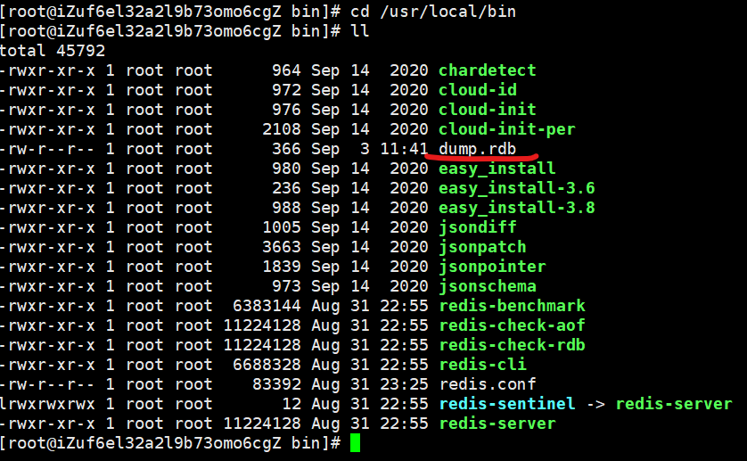

#### 配置解析

```shell
################################ SNAPSHOTTING  ################################
#   save <seconds> <changes>
#   在指定时间间隔后发生多少次修改会触发快照保存
#	关闭rdb保存方式：
#   1.注释掉下面所有的策略即可
#   2.save "" # 这个方式一般是用于命令临时关闭如：config set save ''

save 900 1 # 900s后超过1个key修改
save 300 10 # 300s后超过10个key修改
save 60 10000 # 60s后超过1万个key修改
```

其余配置解析：

> - Stop-writes-on-bgsave-error：如果配置为no，表示你不在乎数据不一致或者有其他的手段发现和控制，默认为yes。
> - rbdcompression：对于存储到磁盘中的快照，可以设置是否进行压缩存储。如果是的话，redis会采用LZF算法进行压缩，如果你不想消耗CPU来进行压缩的话，可以设置为关闭此功能。
> - rdbchecksum：在存储快照后，还可以让redis使用CRC64算法来进行数据校验，但是这样做会增加大约10%的性能消耗，如果希望获取到最大的性能提升，可以关闭此功能。默认为yes。

#### 数据备份与恢复

**如何触发RDB快照**

1、触发配置文件中的快照策略，建议多用一台机子作为备份，复制一份 dump.rdb。

2、命令`save`或者是`bgsave`

- save 时只管保存，其他不管，全部阻塞

- bgsave，Redis 会在后台异步进行快照操作，快照同时还可以响应客户端请求。可以通过lastsave命令获取最后一次成功执行快照的时间。

3、执行`flushall`命令，也会产生 dump.rdb 文件，但里面是空的，无意义 。

4、退出的时候也会产生 dump.rdb 文件。

**如何恢复**

将备份文件 (dump.rdb) 移动到 redis 安装目录并启动服务即可

获取 redis 目录可以使用 **CONFIG** 命令

```shell
127.0.0.1:6379> config get dir
1) "dir"
2) "/usr/local/bin"
```

### AOF

> **只追加操作的文件（Append-only file，AOF）**
>
> 快照功能并不是非常耐久（durable）： 如果 Redis 因为某些原因而造成故障停机， 那么服务器将丢失最近写入、且仍未保存到快照中的那些数据。 从 1.1 版本开始， Redis 增加了一种完全耐久的持久化方式： AOF 持久化。
>
> 以日志的形式来记录每个写操作，**将Redis执行过的所有修改指令记录下来**（读操作不记录），只追加文件但不可以改写文件，redis启动之初会读取该文件重新构建数据，换言之，redis重启的话就根据日志文件的内容将写指令从前到后重放一次以完成数据的恢复工作。
>
> Redis收到指令先进行参数校验、逻辑处理，成功后才写入AOF日志，说明是**先执行指令再添加日志**。
>
> 从 Redis 7 开始，Redis 使用了**多部分 AOF 机制**。将原来的单个AOF文件拆分为**基础文件(最多一个)**和**增量文件(可能不止一个)**。[基本文件表示重写](https://redis.io/docs/manual/persistence/#log-rewriting)AOF 时存在的数据初始(RDB 或 AOF 格式)快照。增量文件包含自创建最后一个基本 AOF 文件以来的增量更改。所有这些文件都放在一个单独的目录中。

#### 日志重写原理

AOF 不断地将命令追加到文件的末尾，AOF 文件的体积会变得越来越大。

Redis提供`bgrewriteaof`命令对AOF日志进行瘦身。

**工作原理**

AOF 重写和 RDB 快照一样，都巧妙地利用了COW(copy on write)机制：

Redis<7.0：

- Redis 执行 fork() ，现在同时拥有父进程和子进程。
- 子进程开始将新 AOF 文件的内容写入到临时文件。
- 对于所有新执行的写入命令，父进程一边将它们累积到一个内存缓存中，一边将这些改动**追加到现有 AOF 文件的末尾**，这样样即使在重写的中途发生停机，现有的 AOF 文件也还是安全的。
- 当子进程完成重写工作时，它给父进程发送一个信号，父进程在接收到信号之后，将内存缓存中的所有数据追加到新 AOF 文件的末尾。
- Redis 以原子方式将新文件重命名为旧文件，并开始将新数据附加到新文件中。

原理大概：**新AOF文件=快照数据转化的指令+瘦身期间指令**

Redis>=7.0：

- Redis forks，子进程执行重写逻辑并生成新的**基础 AOF文件**；
- Redis 父进程会打开一个新的**增量 AOF 文件**继续写入更新。如果重写失败，旧的基础和增量文件（如果有的话）加上这个新打开的增量文件就代表了完整的更新数据集，所以是安全的。
- 当子进程完成基础文件的重写后，父进程会收到一个信号，并使用新打开的增量文件和子进程生成的基础文件来构建临时清单文件，并将其持久化。
- 完成后Redis 对清单文件进行原子交换，Redis 还会清理旧的基础文件和任何未使用的增量文件。

为了避免在 AOF 重写失败和重试的情况下创建大量增量文件的问题，Redis 引入了 AOF 重写限制机制，以确保失败的 AOF 重写以越来越慢的速度重试。

#### fsync和配置解析

Redis对AOF文件写操作时，实际是将内容写到了内核为文件描述符分配的一个内存缓存中**，内核会异步将脏数据刷回磁盘**(如Java NIO包中的FileChannel和内存映射缓存这些)。如果机器宕机，可能会丢失部分AOF日志数据。

Linux的glibc提供了**fsync(int fd)函数将指定文件内容强制刷盘**，但是这毕竟是磁盘io，比较慢，和Redis高性能要求有一定冲突。所以默认是每1s进行一次fsync调用。

AOF提供更好的容灾性，默认策略下意外情况只丢失1s的数据：

```shell
appendonly no	# 是否开启append only模式作为持久化方式，默认使用的是rdb方式持久化

# aof文件名(default: "appendonly.aof")
appendfilename "appendonly.aof"

# aof持久化策略的配置 
# no表示不执行fsync，由操作系统保证数据同步到磁盘，速度最快。 
# always表示每次写入都执行fsync，以保证数据同步到磁盘。非常慢，也非常安全，但和Redis高性能冲突了。
# everysec表示每秒执行一次fsync，可能会导致丢失这1s数据。 ----> 推荐
appendfsync everysec	

no-appendfsync-on-rewrite no #重写AOF文件时是否可以运用Appendfsync，用默认no即可，保证数据安全性

# 这两个玩意吧，第二个就是最小的重写的标准，第一个没看懂；第一个满足之后，再判断是否达到64mb，才会重写
auto-aof-rewrite-percentage 100
auto-aof-rewrite-min-size 64mb
```

#### 数据备份与恢复

**如果AOF文件损坏了怎么办？**

服务器可能在程序正在对 AOF 文件进行写入时停机， 如果停机造成了 AOF 文件出错（corrupt）， 那么 Redis 在重启时会拒绝载入这个 AOF 文件， 从而确保数据的一致性不会被破坏。当发生这种情况时， 可以用以下方法来修复出错的 AOF 文件：

- 为现有的 AOF 文件创建一个备份。

- 使用 Redis 附带的 redis-check-aof 程序，对原来的 AOF 文件进行修复:`$ redis-check-aof –fix`

- （可选）使用 diff -u 对比修复后的 AOF 文件和原始 AOF 文件的备份，查看两个文件之间的不同之处。

- 重启 Redis 服务器，等待服务器载入修复后的 AOF 文件，并进行数据恢复。

不过呢，**在新版本Redis则能够加载 AOF，会截断AOF文件，自动丢弃文件中最后一个格式不正确的命令**。如果需要，可以以更改默认配置以强制 Redis 在这种情况下停止。

**正常恢复**：

> 启动：设置Yes，修改默认的appendonly no，改为yes
>
> 将有数据的aof文件复制一份保存到对应目录（config get dir）
>
> 恢复：重启redis然后重新加载

**异常恢复：**

> 启动：设置Yes
>
> 故意破坏 appendonly.aof 文件！
>
> 修复： redis-check-aof --fix appendonly.aof 进行修复
>
> 恢复：重启 redis 然后重新加载

### 如何选择持久化方式

1、一般来说， 如果想达到足以媲美 PostgreSQL 的数据安全性， 应该同时使用两种持久化功能。

2、可以承受数分钟以内的数据丢失，可以只使用 RDB 持久化。

3、不推荐只用AOF方式： 因为定时生成 RDB 快照（snapshot）非常便于进行数据库备份， 并且 RDB 恢复数据集的速度也要比 AOF 恢复的速度要快， 除此之外， 使用 RDB 还可以避免之前提到的 AOF 程序的 bug 。

4、只做缓存可以不使用任何持久化。

5、同时开启两种持久化方式

- 在这种情况下，当redis重启的时候会**优先载入AOF文件**来恢复原始的数据，因为在通常情况下AOF文件保存的数据集要比RDB文件保存的数据集要完整。

- RDB 的数据不实时，同时使用两者时服务器重启也只会找AOF文件，那要不要只使用AOF呢？作者建议不要，因为RDB更适合用于备份数据库（AOF在不断变化不好备份），快速重启，而且不会有AOF可能潜在的Bug，留着作为一个万一的手段。

6、性能建议

- 因为RDB文件只用作后备用途，建议只在Slave上持久化RDB文件，而且只要15分钟备份一次就够了，只保留 `save 900 1 `这条规则。

- 如果Enable AOF ，好处是在最恶劣情况下也只会丢失不超过两秒数据，启动脚本较简单只load自己的AOF文件就可以了，代价一是带来了持续的IO，二是AOF rewrite 的最后将 rewrite 过程中产生的新数据写到新文件造成的阻塞几乎是不可避免的。只要硬盘许可，应该尽量减少AOF rewrite的频率，AOF重写的基础大小默认值64M太小了，可以设到5G以上，默认超过原大小100%大小重写可以改到适当的数值。

- 如果不Enable AOF ，仅靠 Master-Slave Repllcation 实现高可用性也可以，能省掉一大笔IO，也减少了rewrite时带来的系统波动。代价是如果Master/Slave 同时倒掉，会丢失十几分钟的数据，启动脚本也要比较两个 Master/Slave 中的 RDB文件，载入较新的那个，微博就是这种架构。

### 容灾备份

可以定时复制rdb和aof文件到其它地方存着，更多细节看官网：https://redis.io/docs/manual/persistence/#backing-up-redis-data


## 配置Redis作缓存

### 概述

LRU是Redis唯一支持的回收方法,这个实际上只是近似的LRU。
作为缓存的话，一般是所有的key都有一个过期时间，那么，这个过期时间也需要存储。

其实可以直接设置缓存的最大容量`maxmemory`和配置`回收策略`。

比如假设我们将缓存设置最大10Mb

```shell
127.0.0.1:6379> config get maxmemory
1) "maxmemory"
2) "0"
127.0.0.1:6379> config set maxmemory 10mb
OK
127.0.0.1:6379> config set maxmemory-policy allkeys-lru
OK
```

这样设置之后呢，我们就不需要去设置过期时间了，因为到达10mb之后，Redis就会使用类LRU算法自动删除某些key。

相比使用额外内存空间存储多个键的过期时间，使用缓存设置是一种更加有效利用内存的方式。而且相比每个键固定的过期时间，使用LRU也是一种更加推荐的方式，因为这样能使应用的热数据(更频繁使用的键) 在内存中停留时间更久。

基本上这么配置下的Redis可以当成memcached使用。

当我们把Redis当成缓存来使用的时候，如果应用程序同时也需要把Redis当成存储系统来使用，那么强烈建议 使用**两个Redis实例**。一个是缓存，使用上述方法进行配置，另一个是存储，根据应用的持久化需求进行配置，并且 只存储那些不需要被缓存的数据。

**近似LRU算法**

Redis的LRU算法并非完整实现，Redis并没办法选择最佳候选来进行回收，也就是最久未被访问的键。相反它会尝试运行一个近似LRU的算法，通过对少量keys进行取样，然后回收其中一个最好的key（被访问时间较早的）。

不过从Redis 3.0算法已经改进为回收键的候选池子。这改善了算法的性能，使得更加近似真是的LRU算法的行为。

Redis LRU有个很重要的点，你通过调整每次回收时检查的采样数量，以实现**调整**算法的精度。这个参数可以通过以下的配置指令调整:
`maxmemory-samples 5`

Redis为什么不使用真实的LRU实现是因为这需要太多的内存。不过近似的LRU算法对于应用而言应该是等价的。

> 更多细节文档：http://www.redis.cn/topics/lru-cache.html
>
> 非常有意思的一个案例。


### 配置解析

```shell
# redis配置的最大内存容量 ，当 内存上限处理策略 是noeviction时，此配置无效
# 默认0,没有限制
# maxmemory <bytes> 


# maxmemory-policy noeviction 
		# maxmemory-policy 内存上限处理策略 
		# noeviction：不移除任何key，只是返回一个写错误,但DEL和几个例外。 默认
		# allkeys-lru：尝试回收最少使用的键（LRU），使得新添加的数据有空间存放。
		# volatile-lru：利用LRU算法移除设置过过期时间的key。 
		# volatile-random：随机移除设置过过期时间的key。 
		# volatile-ttl：移除即将过期的key，根据最近过期时间来删除（辅以TTL） 
		# allkeys-random：随机移除任何key。 


# replica默认是忽略内存策略这些配置的，因为master配置了的话，master会发del命令来删除replica的key的
# 如果你想要replica是可写的，并有不同的内存策略配置，你可以改为no，但是要确保你要做的将会是什么
#
# replica-ignore-maxmemory yes


# LRU、LFU和最小TTL算法不是精确算法，而是近似算法（为了节省内存），因此可以对其进行调整以提高速度或精度。默认情况下，Redis将检查五个键并选择最近使用的键，您可以使用以下配置指令更改样本大小。
# 默认值为5会产生足够好的结果。10非常接近真实的LRU，但CPU成本更高。3更快，但不是很准确。
#
# maxmemory-samples 5


# 没看懂
# 好像是内存回收使用CPU 的effort，越大，CPU使用越多，最大10
# active-expire-effort 1
```

一般的经验规则:

- 使用**allkeys-lru**策略：当你希望你的请求符合一个幂定律分布，也就是说，你希望部分的子集元素将比其它其它元素被访问的更多。如果你不确定选择什么，这是个很好的选择。.
- 使用**allkeys-random**：如果你是循环访问，所有的键被连续的扫描，或者你希望请求分布正常（所有元素被访问的概率都差不多）。
- 使用**volatile-ttl**：如果你想要通过创建缓存对象时设置TTL值，来决定哪些对象应该被过期。

**allkeys-lru** 和 **volatile-random**策略对于当你想要单一的实例实现缓存及持久化一些键时很有用。不过一般运行两个实例是解决这个问题的更好方法。

为键设置过期时间也是需要消耗内存的，所以使用**allkeys-lru**这种策略更加高效，因为当内存有压力时，没有必要为键取设置过期时间。

## redis 主从复制

> Redis Replication中文相关文档：http://www.redis.cn/topics/replication.html

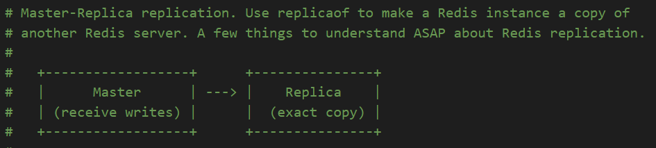

### 概述

将主服务器的数据，复制到从服务器上。前者称为主节点(master/leader)，后者称为从节点(slave/follower)

**主从复制的作用：**

1、数据冗余：主从复制实现了数据的热备份，是持久化之外的一种数据冗余方式。

2、故障恢复：当主节点出现问题时，可以由从节点提供服务，实现快速的故障恢复；实际上是一种服务的冗余。

3、负载均衡：在主从复制的基础上，配合读写分离，可以由主节点提供写服务，由从节点提供读服务，分担服务器负载；尤其是在写少读多的场景下，通过多个从节点分担读负载，可以大大提高Redis服务器的并发量。

4、高可用基石：主从复制还是哨兵和集群能够实施的基础，因此说主从复制是Redis高可用的基础。

**主从复制依赖的3个重要机制：**

- master与slave正常连接时，master发送**命令流**保存slave的更新，包括：写、key的过期或逐出；
- 当 master 和 slave 之间的连接断开之后，因为网络问题、或者是主从意识到连接超时， slave 重新连接上 master 并会尝试进行**部分重同步**：这意味着它会尝试只获取在断开连接期间内丢失的命令流。
- 当无法进行部分重同步时， slave 会请求进行**全量重同步**。这会涉及到一个更复杂的过程，例如 master 需要创建所有数据的快照，将之发送给 slave ，之后在数据集更改时持续发送命令流到 slave 。

**Redis复制的一些重要事实：**

- Redis使用默认的**异步复制**，其特点是低延迟和高性能，slave 和 master 之间异步地确认处理的数据量
- slave 可以接受其他 slave 的连接。除了多个 slave 可以连接到同一个 master 之外， slave 之间也可以像**层叠状的结构**（cascading-like structure）连接到其他 slave 。自 Redis 4.0 起，所有的 sub-slave 将会从 master 收到完全一样的复制流。
- Redis复制在master侧是**非阻塞**的，复制在 slave 侧大部分也是非阻塞的。在初次同步之后，旧数据集必须被删除，同时加载新的数据集。 slave 在这个短暂的时间窗口内（如果数据集很大，会持续较长时间），会阻塞到来的连接请求。
- 可以使用复制来避免 master 将全部数据集写入磁盘造成的开销：一种典型的技术是配置你的 master Redis.conf 以避免对磁盘进行持久化，然后连接一个 slave ，其配置为不定期保存或是启用 AOF。但是，这个设置必须小心处理，因为重新启动的 master 程序将从一个空数据集开始：如果一个 slave 试图与它同步，那么这个 slave 也会被清空。

> 注意：强烈建议在 master 和在 slave 中启用持久化(默认是RDF模式的)。
>
> 因为如果不开启持久化，那么master重启之后，数据集为空，slave也将会被清空。
>
> 如果必须关闭持久化（比如你的磁盘是个辣鸡），那么自动重启进程这项应该被禁用。即那个`精灵进程`(孤儿进程)配置不能打开。

### 复制原理

#### 增量同步

1、Redis同步的是`指令流`，master将修改指令记录在本地的内存buffer中；该内存buffer是一个**定长环形数组**，内容写满则从头开始覆盖；若因网络问题导致从节点尚未同步的指令被覆盖了，则会激发**快照同步(全量同步)**。

2、master 有个 replication ID(一个较大的伪随机字符串，标记了一个给定的数据集)。 master 也持有一个偏移量，master 将自己产生的复制流发送给 slave 时，发送多少个字节的数据，自身的偏移量就会增加多少。复制偏移量即使在没有 slave 连接时也会自增，所以基本上每一对给定的`Replication ID, offset`都会标识一个 master 数据集的确切版本。

3、当 slave 连接到 master 时，使用` PSYNC `命令发送记录的旧的` master replication ID `和它们至今为止处理的偏移量。

4、master仅发送slave需要的增量部分。但是如果 master 的缓冲区中没有足够的命令积压缓冲记录，或者如果 slave 引用了不再知道的历史记录(replication ID)，则会转而进行一个**全量重同步(快照同步)**：在这种情况下， slave 会得到一个完整的数据集副本，从头开始。

#### 全量同步

下面是一个全量同步(快照同步)的工作细节：

1、master节点进行1次**bgsave即rdb持久化**，同时缓冲新到的写命令；

2、后台保存完成后**将rdb文件传输给slave**，slave接收完成后立刻加载它；

3、slave加载完成则通知master**继续增量同步**，master将所有缓冲命令流发给slave。

之前说过，当主从之间的连接因为一些原因崩溃之后， slave 能够自动重连。如果 master 收到了多个 slave 要求同步的请求，它会执行一个单独的后台rdb保存，以便于为多个 slave 服务。

**无盘复制**

正常情况下，一个全量重同步会在磁盘上创建一个 RDB 文件，然后将它发给slave，slave以此进行数据同步。

master进行快照同步在非SSD磁盘时会比较耗时，对master产生较大影响。

Redis 2.8.18 开始支持无磁盘复制。子进程**直接通过套接字将快照内容发给 slave**，master子进程一边遍历内存，一边序列化内容发给slave，无需使用磁盘作为中间储存介质。slave接受内容并保持到本地rdb，然后加载。

**Redis如何处理key的过期**

Redis 的过期机制可以限制 key 的生存时间。此功能取决于 Redis 实例计算时间的能力，但是，即使使用 Lua 脚本更改了这些 key，Redis slaves 也能正确地复制具有过期时间的 key。

为了实现这样的功能，Redis 不能依靠主从使用同步时钟，因为这是一个无法解决的并且会导致 race condition 和数据集不一致的问题，所以 Redis 使用三种主要的技术使过期的 key 的复制能够正确工作：

- slave 不会让 key 过期，而是等待 master 让 key 过期。当一个 master 让一个 key 到期（或由于 LRU 算法将之驱逐）时，它会合成一个 DEL 命令并传输到所有的 slave。
- 但是，由于这是 master 驱动的 key 过期行为，master 无法及时提供 DEL 命令，所以有时候 slave 的内存中仍然可能存在在逻辑上已经过期的 key 。为了处理这个问题，slave 使用它的逻辑时钟以报告只有在不违反数据集的一致性的读取操作（从主机的新命令到达）中才存在 key。用这种方法，slave 避免报告逻辑过期的 key 仍然存在。在实际应用中，使用 slave 程序进行缩放的 HTML 碎片缓存，将避免返回已经比期望的时间更早的数据项。
- 在Lua脚本执行期间，不执行任何 key 过期操作。当一个Lua脚本运行时，从概念上讲，master 中的时间是被冻结的，这样脚本运行的时候，一个给定的键要么存在要么不存在。这可以防止 key 在脚本中间过期，保证将相同的脚本发送到 slave ，从而在二者的数据集中产生相同的效果。

一旦一个 slave 被提升为一个 master ，它将开始独立地过期 key，而不需要任何旧 master 的帮助。

**重新启动和故障转移后的部分重同步**

从 Redis 4.0 开始，当一个实例在故障转移后被提升为 master 时，它仍然能够与旧 master 的 slaves 进行部分重同步。为此，slave 会记住旧 master 的旧 `replication ID` 和`复制偏移量`，因此即使询问旧的 replication ID，其也可以将部分复制缓冲提供给连接的 slave 。

但是，升级的 slave 的新 replication ID 将不同，因为它构成了数据集的不同历史记录。例如，master 可以返回可用，并且可以在一段时间内继续接受写入命令，因此在被提升的 slave 中使用相同的 replication ID 将违反一对复制标识和偏移对只能标识单一数据集的规则。

另外，slave 在关机并重新启动后，能够在 RDB 文件中存储所需信息，以便与 master 进行重同步。这在升级的情况下很有用。当需要时，最好使用 SHUTDOWN 命令来执行 slave 的保存和退出操作。

### demo

一般来说，工程中应用redis往往是多台服务器，因为：

1、从结构上，单个Redis服务器会发生单点故障，并且一台服务器需要处理所有的请求负载，压力较大；

2、从容量上，单个Redis服务器内存容量有限，就算一台Redis服务器内存容量为256G，也不能将所有内存用作Redis存储内存，一般来说，==单台Redis最大使用内存不应该超过20G==。

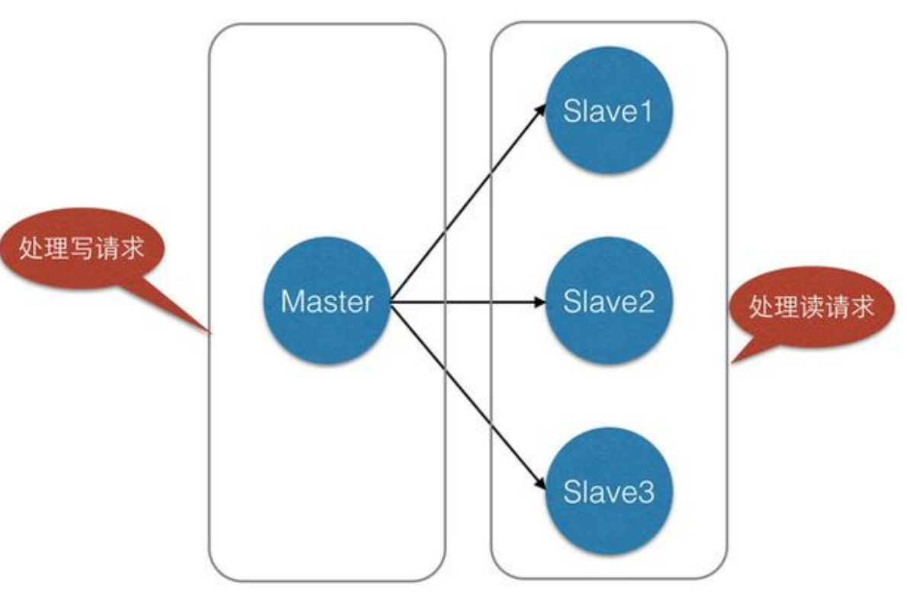

读写分离，真实项目80%以上都是读。

#### 环境搭建

只需要修改从服务器即可，因为每台redis服务器默认都是主服务器。

```shell
127.0.0.1:6379> info replication	# 查看当前库信息
# Replication
role:master							# 角色：主库
connected_slaves:0					# 没有从库
master_replid:b41ef105e7f671517951e8038cadfd62729a1001
master_replid2:0000000000000000000000000000000000000000
master_repl_offset:0
second_repl_offset:-1
repl_backlog_active:0
repl_backlog_size:1048576
repl_backlog_first_byte_offset:0
repl_backlog_histlen:0
```

准备工作：我们配置主从复制，至少需要三个，一主二从！配置三个客户端 

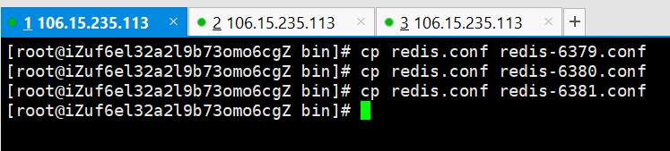

1、拷贝多个配置文件，并命名为相应端口

2、分别修改每个配置文件：

- 修改端口号分别为6379、6380、6381
- 开启daemonize yes
- Pid文件名字 pidfile /var/run/redis_6379.pid , 依次类推
- Log文件名字 logfile "6379.log" , 依次类推；这个玩意必须改，否则3个都往标准输出里面打印了
- Dump.rdb 名字 dbfilename dump6379.rdb , 依次类推

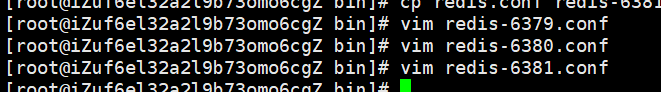

3、根据3个不同的配置文件，启动3个redis服务

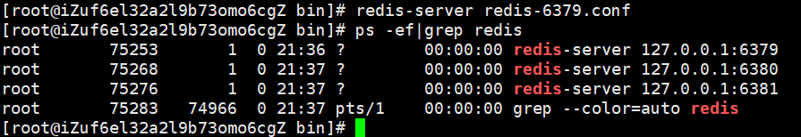

单机集群搭建成功。

#### 一主二从

==默认情况，每一台都是主节点==；一般情况下，只需要配置从节点即可。

```shell
slaveof host post  # 在从库配置
```

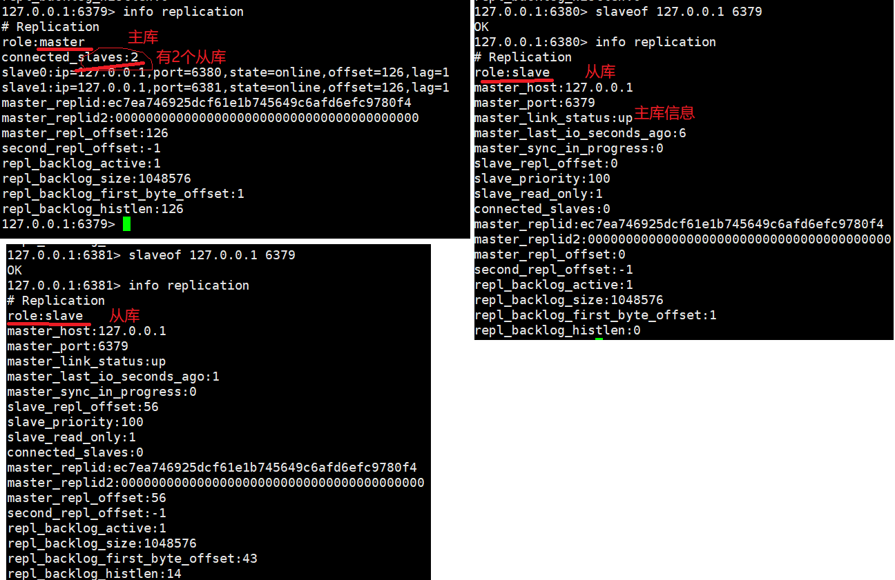

不过，命令方式重启之后就无效了，真实的配置应该是在配置文件中进行配置，那样是永久的。

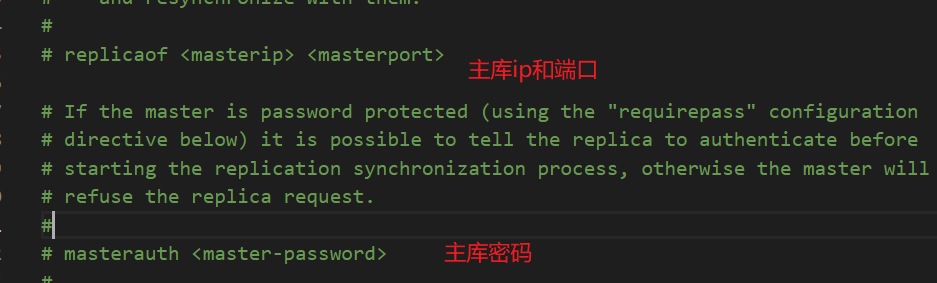

主机可以写，可以读，从机只能读哦。

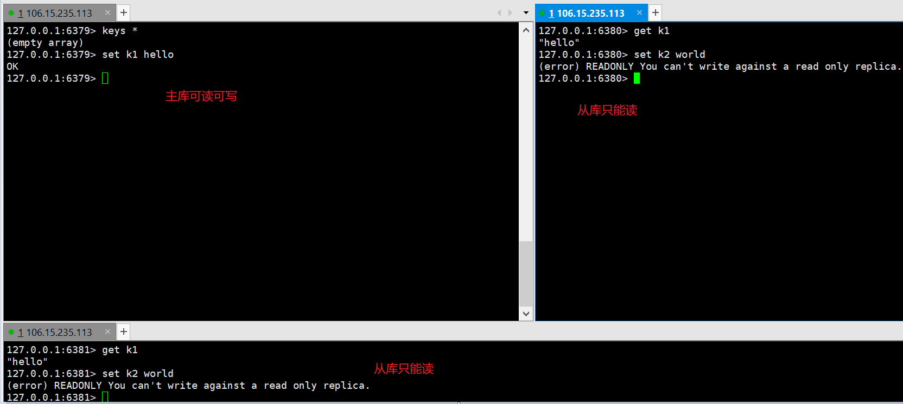

测试1：主机挂了，从机查看信息；主机恢复，从机查看信息：

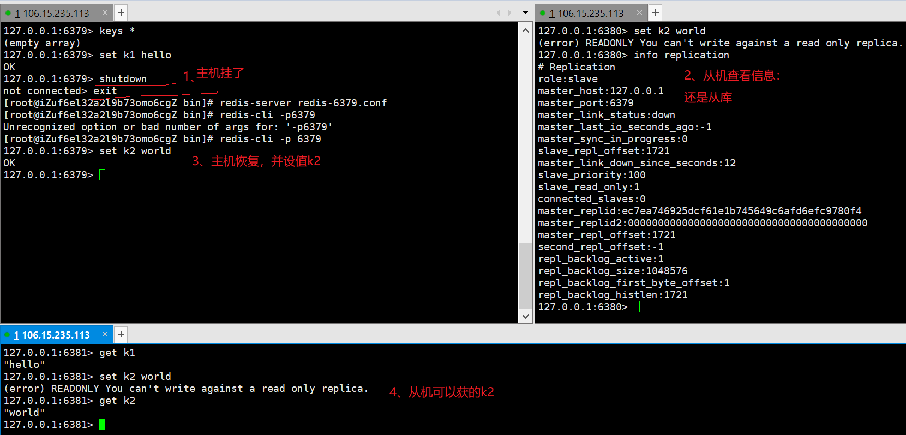

测试2：从机挂了，查看主机信息；从机恢复，查看从机信息：

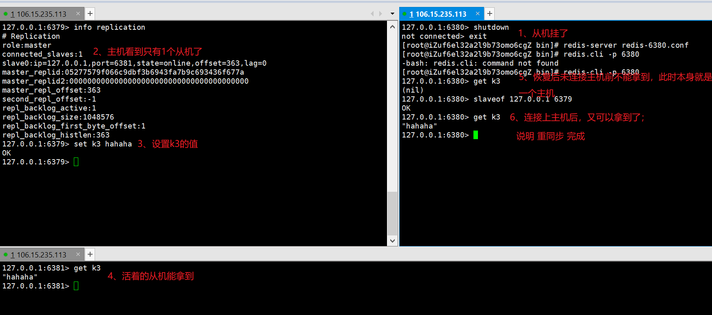

#### 层层链路

上一个Slave 可以是下一个slave 和 Master，Slave 同样可以接收其他 slaves 的连接和同步请求，那么该 slave 作为了链条中下一个的master，可以有效减轻 master 的写压力


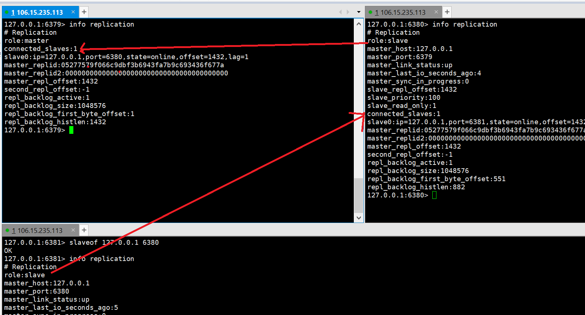

在原始主机上设置之后，从机都能取到；但是第二台主机依旧不能写。

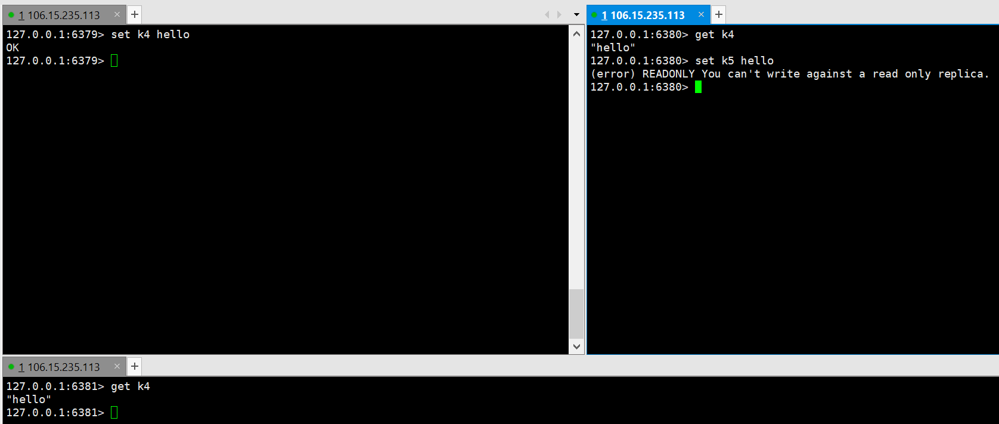


在没有哨兵模式的情况下呢，如果主节点挂了，这个时候，可以手动让从节点变为主节点。

`slaveof no one`，可以让从节点变为主节点，然后再去将其他从节点配置到这个新的主节点即可。

### 配置解析

```shell
# 作为某个master的replica
#
# replicaof <masterip> <masterport>


# 如果主机受密码保护（使用下面的“requirepass”配置指令），则可以在启动复制同步过程之前通知复制副本进行身份验证，否则主机将拒绝复制副本请求。
#
# masterauth <master-password>


# 配置replica是否只能读，默认yes
# 只读模式下的 slave 将会拒绝所有写入命令。
replica-read-only yes
# 注意：只读副本的设计目的不是向internet上不受信任的客户端公开。它只是一个防止实例误用的保护层。默认情况下，只读副本仍会导出所有管理命令，如CONFIG、DEBUG等。在一定程度上，您可以使用“rename-command”来隐藏所有管理/危险命令，从而提高只读副本的安全性。


# 全量重同步策略：disk or socket.
# 1） Disk-backed：Redis主机创建一个新进程，将RDB文件写入磁盘。稍后，该文件由父进程以增量方式传输到副本。
# 2） diskless：Redis master创建一个新进程，直接将RDB文件写入副本套接字，而根本不接触磁盘。
# With slow disks and fast (large bandwidth) networks, diskless replication works better.
repl-diskless-sync no
# 无磁盘复制可以使用 repl-diskless-sync 配置参数。repl-diskless-sync-delay 参数可以延迟启动数据传输，目的可以在第一个 slave就绪后，等待更多的 slave就绪。以second为单位
repl-diskless-sync-delay 5


# 禁用在副本套接字上的TCP_节点延迟？
# 如果选择“是”，Redis将使用更少的TCP数据包和更少的带宽向副本发送数据。但这会增加数据在副本端显示的延迟，对于使用默认配置的Linux内核，延迟可达40毫秒。
# 如果选择“否”，则数据出现在副本端的延迟将减少，但复制将使用更多带宽。
# 默认情况下，我们会针对低延迟进行优化，但在流量非常高的情况下，或者当主副本和副本距离很多跳时，将此选项改为“是”可能是一个好主意。
repl-disable-tcp-nodelay no


# 设置复制积压大小。
# backlog是一个缓冲区，当副本断开连接一段时间时，它会累积副本数据，因此当副本想要再次重新连接时，通常不需要完全重新同步，部分重新同步就足够了，只需传递副本在断开连接时丢失的部分数据。
# 复制积压越大，允许复制副本断开连接的时间越长，以后可以执行部分重新同步。
# 只有在至少连接了一个复制副本时，才会分配积压工作。
#
# repl-backlog-size 1mb
#
# master与replica失联一定时间后，backlog将会释放。
# 下面这个配置选项用于配置：从最后一个replica断开连接开始，到释放积压缓冲区所需的秒数。
# 注意：replicas never free the backlog for timeout, since they may be promoted to masters later, and should be able to correctly "partially resynchronize" with the replicas: hence they should always accumulate backlog.
# 值为0表示从不释放积压工作。
#
# repl-backlog-ttl 3600


# replica优先级
# 副本优先级是Redis在信息输出中发布的整数。Redis Sentinel使用它来选择复制副本，以便在主副本不再正常工作时升级到主副本。
# 优先级较低的副本被认为更适合升级，因此，例如，如果有三个优先级为10、100、25的副本，Sentinel将选择优先级为10的副本，这是最低的。
# 但是，特殊优先级为0的副本将标记为无法执行主机角色，因此Redis Sentinel将永远不会选择优先级为0的副本进行升级。
# 默认情况下，优先级为100。
replica-priority 100
```


## redis 哨兵

> Redis Sentinel文档：http://www.redis.cn/topics/sentinel.html

Redis 的 Sentinel 系统用于管理多个 Redis 服务器（instance）， 该系统执行以下三个任务：

- **监控（Monitoring**）： Sentinel 会不断地检查你的主服务器和从服务器是否运作正常。
- **提醒（Notification）**： 当被监控的某个 Redis 服务器出现问题时， Sentinel 可以通过 API 向管理员或者其他应用程序发送通知。
- **自动故障迁移（Automatic failover）**： master挂了，sentinel会自动故障迁移操作，即选一个slave作为master，并让其他slave改到新的master下； 当客户端试图连接失效的主服务器时， 集群也会向客户端返回新主服务器的地址， 使得集群可以使用新主服务器代替失效服务器。

Redis Sentinel 是一个分布式系统， 你可以在一个架构中运行多个 Sentinel 进程（progress）， 这些进程使用**流言协议**（gossip protocols)来接收关于主服务器是否下线的信息， 并使用**投票协议**（agreement protocols）来决定是否执行自动故障迁移， 以及选择哪个从服务器作为新的主服务器。

虽然 Redis Sentinel 释出为一个单独的可执行文件 redis-sentinel ， 但实际上它只是一个运行在特殊模式下的 Redis 服务器， 你可以在启动一个普通 Redis 服务器时通过给定 –sentinel 选项来启动 Redis Sentinel 。

### 启动sentinel

有2种方法启动哨兵，第一种是单独启动，第2种是和redis服务一起启动。

```shell
redis-sentinel sentinel.conf
```

或者

```shell
redis-server redis.conf sentinel.conf --sentinel
```

启动 Sentinel 实例必须指定相应的配置文件， 系统会使用配置文件来保存 Sentinel 的当前状态， 并在 Sentinel 重启时通过载入配置文件来进行状态还原。

如果启动 Sentinel 时没有指定相应的配置文件， 或者指定的配置文件不可写（not writable）， 那么 Sentinel 会拒绝启动。

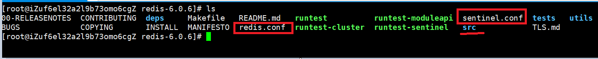

其中`redis-sentinel`就在src目录下哦。

### 配置sentinel

Redis的解压包包含了一个名为 sentinel.conf 的文件， 这个文件是一个带有详细注释的 Sentinel 配置文件示例。

#### 最少配置

运行一个 Sentinel 所需的最少配置如下所示：

```shell
sentinel monitor mymaster 127.0.0.1 6379 2
sentinel down-after-milliseconds mymaster 60000
sentinel failover-timeout mymaster 180000
sentinel parallel-syncs mymaster 1

sentinel monitor resque 192.168.1.3 6380 4
sentinel down-after-milliseconds resque 10000
sentinel failover-timeout resque 180000
sentinel parallel-syncs resque 5
```

第一行配置指示 Sentinel 去监视一个名为 mymaster 的主服务器， 这个主服务器的 IP 地址为 127.0.0.1 ， 端口号为 6379 ， 而将这个主服务器判断为失效至少需要 2 个 Sentinel 同意 （只要同意 Sentinel 的数量不达标，自动故障迁移就不会执行）。

不过要注意， 无论你设置要多少个 Sentinel 同意才能判断一个服务器失效， 一个 Sentinel 都需要获得系统中多数（majority） Sentinel 的支持， 才能发起一次自动故障迁移， 并预留一个给定的配置纪元 （configuration Epoch ，一个配置纪元就是一个新主服务器配置的版本号）。

换句话说， 在只有少数（minority） Sentinel 进程正常运作的情况下， Sentinel 是不能执行自动故障迁移的。

sentinel配置的基本语法：

```shell
sentinel <选项的名字> <主服务器的名字> <选项的值>
```

各个选项的功能如下：

- down-after-milliseconds 选项指定了 Sentinel 认为服务器已经断线所需的毫秒数。

如果服务器在给定的毫秒数之内， 没有返回 Sentinel 发送的 PING 命令的回复， 或者返回一个错误， 那么 Sentinel 将这个服务器标记为**主观下线**（subjectively down，简称 SDOWN ）。

不过只有一个 Sentinel 将服务器标记为主观下线并不一定会引起服务器的自动故障迁移： 只有在足够数量的 Sentinel 都将一个服务器标记为主观下线之后， 服务器才会被标记为客观下线（objectively down， 简称 ODOWN ）， 这时自动故障迁移才会执行。

将服务器标记为客观下线所需的 Sentinel 数量由对主服务器的配置决定。

- parallel-syncs 选项指定了在执行故障转移时， 最多可以有多少个从服务器同时对新的主服务器进行同步， 这个数字越小， 完成故障转移所需的时间就越长。

如果从服务器被设置为允许使用过期数据集（参见对 redis.conf 文件中对 slave-serve-stale-data 选项的说明）， 那么你可能不希望所有从服务器都在同一时间向新的主服务器发送同步请求， 因为尽管复制过程的绝大部分步骤都不会阻塞从服务器， 但从服务器在载入主服务器发来的 RDB 文件时， 仍然会造成从服务器在一段时间内不能处理命令请求： 如果全部从服务器一起对新的主服务器进行同步， 那么就可能会造成所有从服务器在短时间内全部不可用的情况出现。

你可以通过将这个值设为 1 来保证每次只有一个从服务器处于不能处理命令请求的状态。

#### 主观下线和客观下线

- 主观下线（Subjectively Down， 简称 SDOWN）指的是单个 Sentinel 实例对服务器做出的下线判断。
- 客观下线（Objectively Down， 简称 ODOWN）指的是多个 Sentinel 实例在对同一个服务器做出 SDOWN 判断， 并且通过 SENTINEL is-master-down-by-addr 命令互相交流之后， 得出的服务器下线判断。 （一个 Sentinel 可以通过向另一个 Sentinel 发送 SENTINEL is-master-down-by-addr 命令来询问对方是否认为给定的服务器已下线。）

如果一个服务器没有在 master-down-after-milliseconds 选项所指定的时间内， 对向它发送 PING 命令的 Sentinel 返回一个有效回复（valid reply）， 那么 Sentinel 就会将这个服务器标记为主观下线。

有效回复包含3种：

- 返回 +PONG 。
- 返回 -LOADING 错误。
- 返回 -MASTERDOWN 错误

注意：并不是出现无效回复就会下线，只要在配置的时间内返回一次即可认为在线。

主观下线 ------> 客观下线使用的是**流言协议**

> 如果 Sentinel 在给定的时间范围内， 从其他 Sentinel 那里接收到了足够数量的主服务器下线报告， 那么 Sentinel 就会将主服务器的状态从主观下线改变为客观下线。 如果之后其他 Sentinel 不再报告主服务器已下线， 那么客观下线状态就会被移除。

**客观下线条件**只适用于主服务器：从服务器判断下线不需要协商。

只要一个 Sentinel 发现某个主服务器进入了客观下线状态， 这个 Sentinel 就可能会被其他 Sentinel 推选出， 并对失效的主服务器执行自动故障迁移操作。

### 哨兵任务

**定时任务：**

1、每个sentinel每秒向它所知道的master、replica和sentinel发送`ping`命令

2、如果某个实例未在`down-after-milliseconds`内返回1次有效回复，则被认为主观下线；

3、如果master被标记为主观下线，所有监视它的 sentinel 以每秒一次的频率确认主服务器的确进入了主观下线状态；

4、当认为它下线的sentinel数量达到配置的数量，master被标记为客观下线；

5、一般情况下，每个 Sentinel 会以每 10 秒一次的频率向它已知的所有主服务器和从服务器发送 INFO 命令。 
而如果被标记为主观下线，评率改为1s1次。

6、当没有足够数量的 Sentinel 同意主服务器已经下线， 主服务器的客观下线状态就会被移除。 当主服务器重新向 Sentinel 的 PING 命令返回有效回复时， 主服务器的主观下线状态就会被移除。

**自动发现sentinel和replica**

每个sentinel可以和其它sentinel进行连接，互相检查，信息交换。

不用专门去sentinel里配置其它sentinel的地址，因为sentinel将通过发布订阅功能来自动发现其它sentinel。频道：`sentinel:hello`。

同时，也不需手动列出主服务器属下的所有从服务器，sentinel会询问master获取replica的信息。

- sentinel以2s1次的频率，向被它监视的所有主服务器和从服务器的 **sentinel**:hello 频道发送一条信息，包含了 Sentinel 的 IP 地址、端口号和运行 ID （runid）。

- 每个 Sentinel 都订阅了被它监视的所有master和replica的 **sentinel**:hello 频道， 查找之前未出现过的 sentinel （looking for unknown sentinels）。 当一个 Sentinel 发现一个新的 Sentinel 时， 它会将新的 Sentinel 添加到一个列表中， 这个列表保存了 Sentinel 已知的， 监视同一个主服务器的所有其他 Sentinel 。

- Sentinel 发送的信息中还包括完整的主服务器当前配置（configuration）。 如果一个 Sentinel 包含的主服务器配置比另一个 Sentinel 发送的配置要旧， 那么这个 Sentinel 会立即升级到新配置上。

- 添加新的 sentinel之前，如果列表中存在相同的id或者地址(ip+端口)的sentinel，则移除旧的，加新的。


### sentinel 命令

在默认情况下， Sentinel 使用 `TCP` 端口 26379 （普通 Redis 服务器使用的是 6379 ）。

Sentinel 接受 Redis 协议格式的命令请求， 所以你可以使用 redis-cli 或者任何其他 Redis 客户端来与 Sentinel 进行通讯。

有两种方式可以和 Sentinel 进行通讯：

- 第一种方法是通过直接发送命令来查询被监视 Redis 服务器的当前状态， 以及 Sentinel 所知道的关于其他 Sentinel 的信息， 诸如此类。
- 另一种方法是使用发布与订阅功能， 通过接收 Sentinel 发送的通知： 当执行故障转移操作， 或者某个被监视的服务器被判断为主观下线或者客观下线时， Sentinel 就会发送相应的信息。

sentinel可以接受以下命令：

| 命令                 | 描述                                                         | 返回                           |
| -------------------- | ------------------------------------------------------------ | ------------------------------ |
| PING                 | 测试连接是否可用或测试连接延时；可以带参数                   | `PONG`或者返回`PING`后面带的参 |
| sentinel master_name | 返回给定名字的主服务器的 IP 地址和端口号。<br />如果master正在故障转移或者已转移完成，将返回新marster的IP与端口 |                                |
| sentinel masters     | 列出所有被监视的主服务器及其当前状态。                       |                                |
| sentinel slaves      | 列出给定主服务器的所有从服务器，以及这些从服务器的当前状态。 |                                |
| sentinel reset       | 重置所有名字和给定模式 pattern 相匹配的master。包括故障转移，及其replica以及sentinel |                                |
| sentinel failover    | 当master失效时，在不询问其他 Sentinel 意见的情况下， 强制开始一次自动故障迁移 |                                |


### 故障迁移

> failover

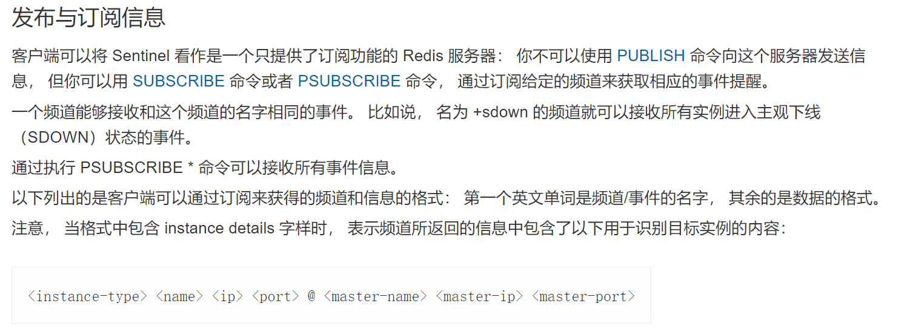

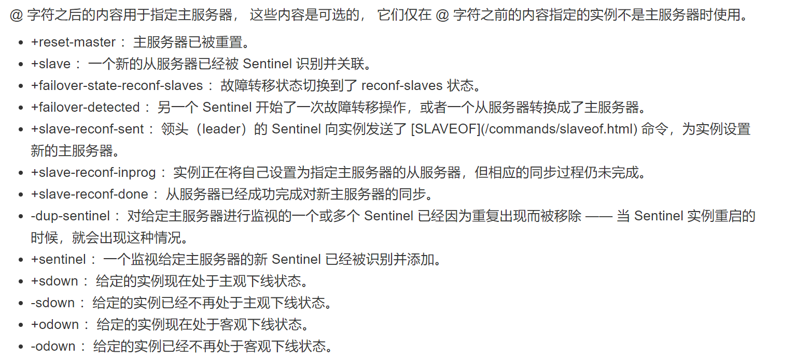

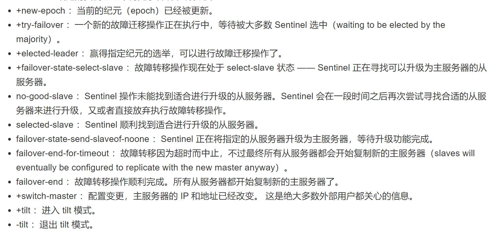

**故障迁移步骤：**

1、发现master进入客观下线状态；

2、纪元自增，并尝试在这个纪元中当选。

3、若当选失败，则在设定的故障迁移超时时间的两倍之后， 重新尝试当选。若成功，则向下执行；

4、选1个replica升级为master；

5、向此replica发送`slaveof no one`命令，转为主服务器；

6、通过发布订阅，将更新后的配置传播给其他sentinel，其他 Sentinel 对它们自己的配置进行更新；

7、向从服务器发送`slaveof `命令，让它们去跟随新的master；

8、当所有replica都已经开始复制新的master时，领头sentinel结束故障迁移。

Sentinel 都会向被重新配置的实例发送一个 `CONFIG REWRITE` 命令， 从而确保这些配置会持久化在硬盘里。

**选择新的master的规则：**

1、失效master的从replica，那些被标记为主观下线、已断线、或者最后一次回复 [PING](http://www.redis.cn/commands/ping.html) 命令的时间大于五秒钟的从服务器都会被淘汰。

2、那些与失效master连接断开的时长超过 down-after 选项指定的时长十倍的从服务器都会被淘汰。

3、在剩下的replica中，选出复制偏移量（replication offset）最大的那个从服务器作为新的主服务器；

4、 如果复制偏移量不可用， 或者从服务器的复制偏移量相同， 那么带有最小运行 ID 的那个从服务器成为新的主服务器。

**Sentinel 自动故障迁移的一致性特质**

Sentinel 自动故障迁移使用 **Raft 算法**来选举领头（leader） Sentinel ， 从而确保在一个给定的**纪元**（epoch）里， 只有一个领头产生。

更高的配置纪元总是优于较低的纪元， 因此每个 Sentinel 都会主动使用更新的纪元来代替自己的配置。

简单来说， 我们可以将 Sentinel 配置看作是一个带有版本号的状态。 一个状态会以最后写入者胜出（last-write-wins）的方式（也即是，最新的配置总是胜出）传播至所有其他 Sentinel 。

举个例子， 当出现网络分割（network partitions）时， 一个 Sentinel 可能会包含了较旧的配置， 而当这个 Sentinel 接到其他 Sentinel 发来的版本更新的配置时， Sentinel 就会对自己的配置进行更新。

如果要在网络分割出现的情况下仍然保持一致性， 那么应该使用 min-slaves-to-write 选项， 让主服务器在连接的从实例少于给定数量时停止执行写操作， 与此同时， 应该在每个运行 Redis 主服务器或从服务器的机器上运行 Redis Sentinel 进程。

**Sentinel 状态的持久化**

Sentinel 的状态会被持久化在 Sentinel 配置文件里面。

每当 Sentinel 接收到一个新的配置， 或者当领头 Sentinel 为主服务器创建一个新的配置时， 这个配置会与配置纪元一起被保存到磁盘里面。

这意味着停止和重启 Sentinel 进程都是安全的。sentinel.conf文件因此必须是可写可读的。

### 哨兵模式(重点)

#### 介绍

主从切换技术的方法是：当主服务器宕机后，需要手动把一台从服务器切换为主服务器，这就需要人工干预，费事费力，还会造成一段时间内服务不可用。这不是一种推荐的方式，更多时候，我们优先考虑哨兵模式。Redis从2.8开始正式提供了Sentinel（哨兵） 架构来解决这个问题。

哨兵模式是一种特殊的模式，首先Redis提供了哨兵的命令，哨兵是一个独立的进程，作为进程，它会独立运行。其原理是**哨兵通过发送命令，等待Redis服务器响应，从而监控运行的多个Redis实例**

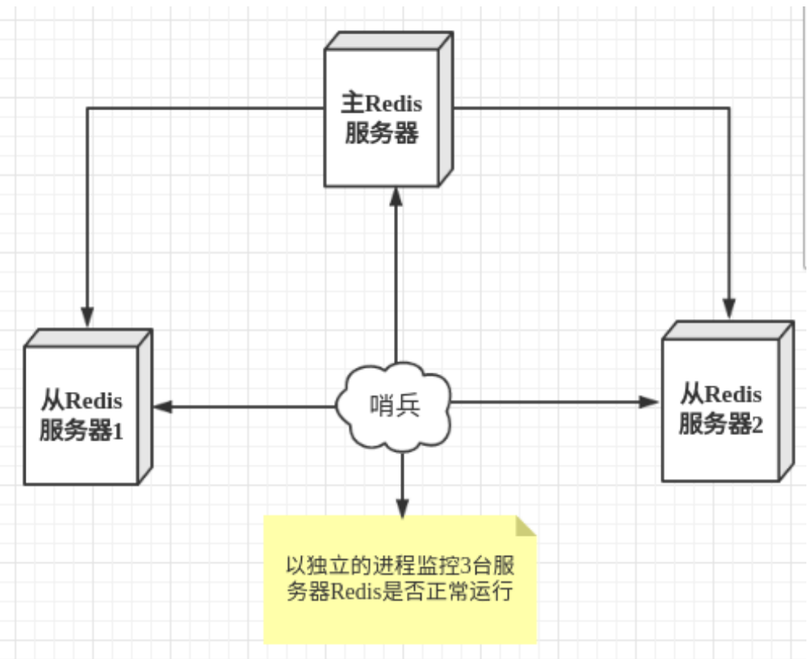

这里的哨兵有两个作用

- 通过发送命令，让Redis服务器返回监控其运行状态，包括主服务器和从服务器。

- 当哨兵监测到master宕机，会自动将slave切换成master，然后通过**发布订阅模式**通知其他的从服务器，修改配置文件，让它们切换主机。

然而一个哨兵进程对Redis服务器进行监控，可能会出现问题，为此，我们可以使用多个哨兵进行监控。各个哨兵之间还会进行监控，这样就形成了多哨兵模式。

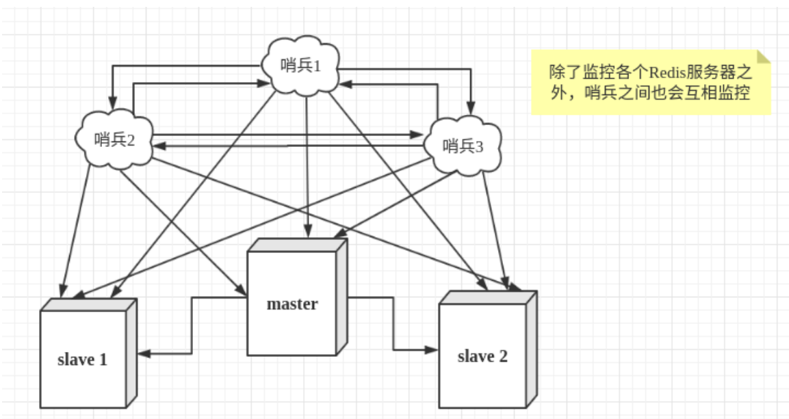

假设主服务器宕机，哨兵1先检测到这个结果，系统并不会马上进行failover过程，仅仅是哨兵1主观的认为主服务器不可用，这个现象成为**主观下线**。当后面的哨兵也检测到主服务器不可用，并且数量达到一定值时，那么哨兵之间就会进行一次投票，投票的结果由一个哨兵发起，进行failover[故障转移]操作。切换成功后，就会通过发布订阅模式，让各个哨兵把自己监控的从服务器实现切换主机，这个过程称为**客观下线**。

#### demo

1、一主二从架构；

2、新建 sentinel.conf 文件，名字千万不要错

3、配置哨兵，填写内容

- sentinel monitor 被监控主机名字 127.0.0.1 6379 1

- 上面最后一个数字1，表示主机挂掉后slave投票看让谁接替成为主机，得票数多少后成为主机

4、启动哨兵

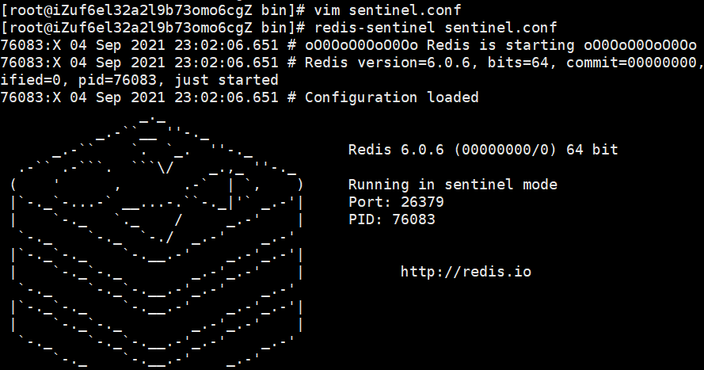


5、挂掉master之后；检测到master挂了，投票新选

6、重新主从继续开工，info replication 查查看

7、问题：如果之前的master 重启回来，会不会双master 冲突？ 之前的回来就自动成为小弟了

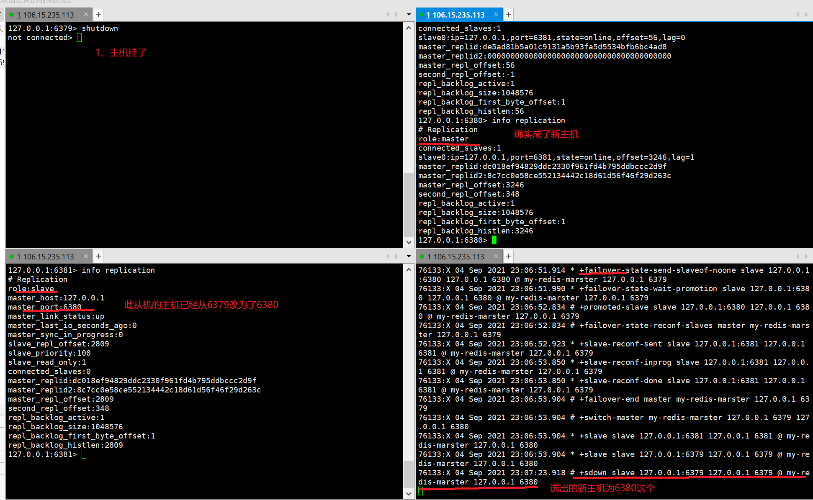

此时再去看看sentinel.conf里面看看哦：

```shell
sentinel myid 62152c33b9cf08ede91f8a34a6ea4e565328b67b
# Generated by CONFIG REWRITE
protected-mode no
port 26379
user default on nopass ~* +@all
dir "/usr/local/bin"
sentinel deny-scripts-reconfig yes
sentinel monitor my-redis-marster 127.0.0.1 6380 1
sentinel config-epoch my-redis-marster 1
sentinel leader-epoch my-redis-marster 1
sentinel known-replica my-redis-marster 127.0.0.1 6379
sentinel known-replica my-redis-marster 127.0.0.1 6381
sentinel current-epoch 1
```

> 可以看到这个配置文件被自动改为了去检测6380了。

#### 优缺点

**优点**

1. 哨兵集群模式是基于主从模式的，所有主从的优点，哨兵模式同样具有。

2. 主从可以切换，故障可以转移，系统可用性更好。

3. 哨兵模式是主从模式的升级，系统更健壮，可用性更高。

**缺点**

1. Redis较难支持在线扩容，在集群容量达到上限时在线扩容会变得很复杂。

2. 实现哨兵模式的配置也不简单，甚至可以说有些繁琐

#### 配置解析

```shell
# Example sentinel.conf 
# 哨兵sentinel实例运行的端口 默认26379 
port 26379 

# 哨兵sentinel的工作目录 
dir /tmp 

# 哨兵sentinel监控的redis主节点的 ip port 
# master-name 可以自己命名的主节点名字 只能由字母A-z、数字0-9 、这三个字符".-_"组成。 
# quorum 配置多少个sentinel哨兵统一认为master主节点失联 那么这时客观上认为主节点失联了 
# sentinel monitor <master-name> <ip> <redis-port> <quorum> 
sentinel monitor mymaster 127.0.0.1 6379 2

# 当在Redis实例中开启了requirepass foobared 授权密码 这样所有连接Redis实例的客户端都 要提供密码
# 设置哨兵sentinel 连接主从的密码 注意必须为主从设置一样的验证密码
# sentinel auth-pass <master-name> <password>
sentinel auth-pass mymaster MySUPER--secret-0123passw0rd

# 指定多少毫秒之后 主节点没有应答哨兵sentinel 此时 哨兵主观上认为主节点下线 默认30秒
# sentinel down-after-milliseconds <master-name> <milliseconds>
sentinel down-after-milliseconds mymaster 30000

# 这个配置项指定了在发生failover主备切换时最多可以有多少个slave同时对新的master进行 同 步，
# 这个数字越小，完成failover所需的时间就越长， 但是如果这个数字越大，就意味着越 多的slave因为replication而不可用。 可以通过将这个值设为 1 来保证每次只有一个slave 处于不能处理命令请求的状态。
# sentinel parallel-syncs <master-name> <numslaves>
sentinel parallel-syncs mymaster 1

# 故障转移的超时时间 failover-timeout 可以用在以下这些方面：
#1. 同一个sentinel对同一个master两次failover之间的间隔时间。
#2. 当一个slave从一个错误的master那里同步数据开始计算时间。直到slave被纠正为向正确的 master那里同步数据时。
#3.当想要取消一个正在进行的failover所需要的时间。
#4.当进行failover时，配置所有slaves指向新的master所需的最大时间。不过，即使过了这个超 时，slaves依然会被正确配置为指向master，但是就不按parallel-syncs所配置的规则来了
# 默认三分钟
# sentinel failover-timeout <master-name> <milliseconds>
sentinel failover-timeout mymaster 180000

# SCRIPTS EXECUTION
#配置当某一事件发生时所需要执行的脚本，可以通过脚本来通知管理员，例如当系统运行不正常时发邮件通知相关人员。
#对于脚本的运行结果有以下规则：
#若脚本执行后返回1，那么该脚本稍后将会被再次执行，重复次数目前默认为10
#若脚本执行后返回2，或者比2更高的一个返回值，脚本将不会重复执行。
#如果脚本在执行过程中由于收到系统中断信号被终止了，则同返回值为1时的行为相同。
#一个脚本的最大执行时间为60s，如果超过这个时间，脚本将会被一个SIGKILL信号终止，之后重新执 行。

#通知型脚本:当sentinel有任何警告级别的事件发生时（比如说redis实例的主观失效和客观失效等 等），将会去调用这个脚本，这时这个脚本应该通过邮件，SMS等方式去通知系统管理员关于系统不正常 运行的信息。调用该脚本时，将传给脚本两个参数，一个是事件的类型，一个是事件的描述。如果 sentinel.conf配置文件中配置了这个脚本路径，那么必须保证这个脚本存在于这个路径，并且是可执 行的，否则sentinel无法正常启动成功。
#通知脚本 
# sentinel notification-script <master-name> <script-path> 
sentinel notification-script mymaster /var/redis/notify.sh

# 客户端重新配置主节点参数脚本
# 当一个master由于failover而发生改变时，这个脚本将会被调用，通知相关的客户端关于master 地址已经发生改变的信息。
# 以下参数将会在调用脚本时传给脚本:
# <master-name> <role> <state> <from-ip> <from-port> <to-ip> <to-port>
# 目前<state>总是“failover”,
# <role>是“leader”或者“observer”中的一个。
# 参数 from-ip, from-port, to-ip, to-port是用来和旧的master和新的master(即旧的 slave)通信的
# 这个脚本应该是通用的，能被多次调用，不是针对性的
# sentinel client-reconfig-script <master-name> <script-path> 
sentinel client-reconfig-script mymaster /var/redis/reconfig.sh
```


## redis cluster

> redis英文文档：https://redis.io/topics/cluster-tutorial

### 概述

>**Redis 支持三种集群方案**
>
>- 主从复制模式
>- Sentinel（哨兵）模式
>- Cluster 模式
>
>Redis 的哨兵模式基本已经可以实现高可用，读写分离 ，但是在这种模式下每台 Redis 服务器都存储相同的数据，很浪费内存，所以在 redis3.0上加入了 Cluster 集群模式，实现了 Redis 的分布式存储，**也就是说每台 Redis 节点上存储不同的内容**。

下面写到的集群，默认都是cluster模式。

**Redis集群介绍**

Redis 集群是一个提供在**多个Redis间节点间共享数据**的程序集。

Redis集群并不支持处理多个keys的命令,因为这需要在不同的节点间移动数据,从而达不到像Redis那样的性能,在高负载的情况下可能会导致不可预料的错误.

Redis 集群通过**分区**来提供**一定程度的可用性**,在实际环境中当某个节点宕机或者不可达的情况下继续处理命令. Redis 集群的优势:

- 自动分割数据到不同的节点上。
- 整个集群的部分节点失败或者不可达的情况下能够继续处理命令。

**集群的数据分片**

Redis 集群没有使用一致性hash, 而是引入了 **哈希槽**的概念.

Redis 集群有16384个哈希槽,每个key通过CRC16校验后对16384取模来决定放置哪个槽.集群的每个节点负责一部分hash槽,举个例子,比如当前集群有3个节点,那么:

- 节点 A 包含 0 到 5500号哈希槽.
- 节点 B 包含5501 到 11000 号哈希槽.
- 节点 C 包含11001 到 16384号哈希槽.

这种结构很容易添加或者删除节点. 比如如果我想新添加个节点D, 我需要从节点 A, B, C中得部分槽到D上. 如果我想移除节点A,需要将A中的槽移到B和C节点上,然后将没有任何槽的A节点从集群中移除即可. 由于从一个节点将哈希槽移动到另一个节点并不会停止服务,所以无论添加删除或者改变某个节点的哈希槽的数量都不会造成集群不可用的状态.

**集群的主从复制模型**

集群使用了主从复制模型，每个节点都会有N-1个从节点。

比如上面例子中，集群中有A，B，C3个节点，如果节点B失败了，那么整个集群就会以为缺少5501-11000这个范围的槽而不可用.

然而如果在集群创建的时候（或者过一段时间）我们为每个节点添加一个从节点A1，B1，C1,那么整个集群便有三个master节点和三个slave节点组成，这样在节点B失败后，集群便会选举B1为新的主节点继续服务，整个集群便不会因为槽找不到而不可用了

不过当B和B1 都失败后，集群是不可用的.

**Redis一致性保证**

Redis 并不能保证数据的**强一致性**. 这意味这在实际中集群在特定的条件下可能会丢失写操作.

原因1：异步复制

- 客户端向B写如1条命令
- master B 向客户端返回命令执行回复(OK)
- master B 向从节点B1，B2...发送写命令

这个时候如果在从节点写之前进行查询，那是查不到的。

原因2：网络分区

> 一个客户端与至少包括一个主节点在内的少数实例被孤立。
>
> 举个例子 假设集群包含 A 、 B 、 C 、 A1 、 B1 、 C1 六个节点， 其中 A 、B 、C 为主节点， A1 、B1 、C1 为A，B，C的从节点， 还有一个客户端 Z1 假设集群中发生网络分区，那么集群可能会分为两方，大部分的一方包含节点 A 、C 、A1 、B1 和 C1 ，小部分的一方则包含节点 B 和客户端 Z1 .
>
> Z1仍然能够向主节点B中写入, 如果网络分区发生时间较短,那么集群将会继续正常运作,如果分区的时间足够让大部分的一方将B1选举为新的master，那么Z1写入B中得数据便丢失了.
>
> 注意， 在网络分裂出现期间， 客户端 Z1 可以向主节点 B 发送写命令的最大时间是有限制的， 这一时间限制称为节点超时时间（node timeout）， 是 Redis 集群的一个重要的配置选项：

**集群TCP端口**

每个 Redis Cluster 节点都需要打开两个 TCP 连接。

- 服务客户端的普通端口，如6379

- 数据端口，客户端口+10000，如16379

第2个用于集群总线，即使用二进制协议的节点到节点通信通道。
节点使用集群总线进行故障检测、配置更新、故障转移授权等。客户端永远不要尝试与集群总线端口通信，而应始终与普通 Redis 命令端口通信，但**请确保在防火墙中打开这两个端口**，否则 Redis 集群节点将无法通信。

如果您不同时打开两个 TCP 端口，您的集群将无法按预期工作。

**集群优缺点**

优点：

> 实现扩容
> 分摊压力
> 无中心配置相对简单

缺点：

> 多键操作是不被支持的 
> 多键的Redis事务是不被支持的。lua脚本不被支持
> 由于集群方案出现较晚，很多公司已经采用了其他的集群方案，而代理或者客户端分片的方案想要迁移至redis cluster，需要整体迁移而不是逐步过渡，复杂度较大。

### 两台轻量云搭建集群

> 此demo由两台阿里轻量云服务器搭建。
> 106.15.235.113和47.111.18.182
>
> 准备6个redis实例：106.15.235.113:6379,106.15.235.113:6380,106.15.235.113:6381,
> 47.111.18.182:6389,47.111.18.182:6390,47.111.18.182:6391

> 要让集群运行，至少需要3个节点，不过在刚开始试用集群功能时， 强烈建议使用六个节点： 其中三个为主节点， 而其余三个则是各个主节点的从节点。

> 建议先去redis.conf文件读一下`REDIS CLUSTER`部分的配置。

#### 准备

> 一个最小的Redis集群配置文件：

```shell
port 7000
cluster-enabled yes
cluster-config-file nodes.conf
cluster-node-timeout 5000
# appendonly yes # 我将其注释了
```

启用集群模式的只是`cluster-enabled` 指令。每个实例还包含存储此节点配置的文件的路径，默认情况下为`nodes.conf`. 这个文件永远不会被人类触及；它只是在 Redis 集群实例启动时生成，并在每次需要时更新。

**1、开放端口**

先开放2台服务器的12个端口，即上面6个端口和这6个端口+10000的通信端口。

```shell
#!/bin/bash
for i
do
  echo "open-port: $i "
  firewall-cmd --zone=public --add-port=$i/tcp --permanent
done
# 重启防火墙
echo "firewall reload......"
firewall-cmd --reload
```

这是写的一个方便开启端口的shell脚本，运行方式为`./filename.sh 8080 9090`，挺简单的。

```shell
#!/bin/bash
for i
do
 echo "$i is closed"
 firewall-cmd --zone=public --remove-port=$i/tcp --permanent
done
echo "firewall is reloading......"
firewall-cmd --reload
```

这个呢就是快速关闭端口的shell脚本咯，运行方式`./filename.sh 8080 9090`。

**2、目录准备**

因为集群会生成大量的文件，所以建议呢专门搞一个目录来放，如`myredis`.
把`redis-server`，`redis-cli`，都cp到此目录。

> 注意：如果不把这两个cp到此目录，那么在redis.conf里配置的默认工作目录`./`会使得生成那一堆文件存在于`redis-server`所在目录。

**3、配置修改**

准备1个redis-basic.conf文件和6个redis-63xx.conf文件。当然也放在`myredis`目录咯。
其中basic是复制的默认配置文件redis.conf之后再在其基础上进行修改。

需要改的配置：
注释掉bind，requirepass，protected-mode no，daemonize yes，pidfile文件，port，logfile，dbfilename，appendonly no(如果开的话，还得改一下aof文件名)。
还可以配上maxmemory和回收策略。
还有集群cluster配置。

redis-basic.conf配置：在原有默认的redis.conf基础上注释掉bind，requirepass，protected-mode no，daemonize yes
redis-63xx.conf：

```shell
# 引入基本配置，后面的配置将覆盖之前的配置
include redis-basic.conf
port 6379
pidfile "/var/run/redis_6379.pid"
dbfilename dump6379.rdb
# 工作目录
dir ./
logfile "6379.log"

# 缓存策略
maxmemory 100mb
maxmemory-policy allkeys-lru

# 开启集群模式
cluster-enabled yes  
# 设定节点配置文件名
cluster-config-file nodes-6379.conf 
# 设定节点失联时间，超过该时间（毫秒），集群自动进行主从切换。
cluster-node-timeout 15000 
```

> 快速配置小技巧：先cp5个，再对每个文件查找替换：%s/6379/6380
> 在底线命令模式下，先按`:`，再接后面的即可实现快速查找替换。
> `/6379`的话就是快速查找了。

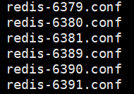

#### 创建集群

呃，启动的话，应该就是`./redis-server redis-63xx.conf`。
可以建立一个shell文件：open-cluster-half.sh

```shell
#!/bin/bash
./redis-server redis-6379.conf
./redis-server redis-6380.conf
./redis-server redis-6381.conf
# ./redis-server redis-6389.conf
# ./redis-server redis-6390.conf
# ./redis-server redis-6391.conf
```

另一个云服务器就注释上半截，打开下半截。

分别在两个服务器开启6379、6380、6381，6389/6390/6391

启动完成之后，各个服务器会生成3个node_xxxx.conf配置文件：当然这个图不对

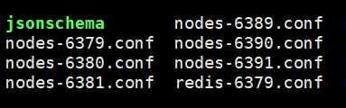

**构建集群**

对于**Redis5以上**，可用`redis-cli`来创建。redis5以下需要用其他方式构建，去看官网。

```shell
./redis-cli -a '!MyRedis123456' --cluster create 106.15.235.113:6379 106.15.235.113:6380 106.15.235.113:6381 47.111.18.182:6389 47.111.18.182:6390 47.111.18.182:6391 --cluster-replicas 1
```

这里使用的命令是**create**，创建一个新集群。选项`--cluster-replicas 1`意味为每个创建的主节点创建一个从节点。其他参数是用来创建新集群的实例的地址列表。

Redis-cli 会为你推荐一个配置。通过键入**yes**接受建议的配置。集群将被配置和*加入*，这意味着实例将被引导到彼此交谈。

```shell
>>> Performing hash slots allocation on 6 nodes...
Master[0] -> Slots 0 - 5460
Master[1] -> Slots 5461 - 10922
Master[2] -> Slots 10923 - 16383
Adding replica 47.111.18.182:6391 to 106.15.235.113:6379
Adding replica 106.15.235.113:6381 to 47.111.18.182:6389
Adding replica 47.111.18.182:6390 to 106.15.235.113:6380
M: 66538af421de34e8aabc33986c0eab434201e12a 106.15.235.113:6379
   slots:[0-5460] (5461 slots) master
M: af781706fa6b12e15fdf45b880bfb61760f4a52f 106.15.235.113:6380
   slots:[10923-16383] (5461 slots) master
S: 8fb277fbaa7bb69eadf4b5ae33053711189972f6 106.15.235.113:6381
   replicates 942c86ca6518116beeecade76973b297be82b23c
M: 942c86ca6518116beeecade76973b297be82b23c 47.111.18.182:6389
   slots:[5461-10922] (5462 slots) master
S: 0af0b52e997a52cb75731a9eef25cea48f8a21a3 47.111.18.182:6390
   replicates af781706fa6b12e15fdf45b880bfb61760f4a52f
S: 92986bbfb3304e495e9f42e8c4e0d0218ec67139 47.111.18.182:6391
   replicates 66538af421de34e8aabc33986c0eab434201e12a
Can I set the above configuration? (type 'yes' to accept): yes ---> 这里yes即可
```

可以看到是虽然我们将106IP的端口放在前3个，但是似乎它给的推荐配置并没有选前3个同一IP的作为master呢。这样也好。

最后，如果一切顺利，你会看到这样的消息：

```shell
[OK] All nodes agree about slots configuration.
>>> Check for open slots...
>>> Check slots coverage...
[OK] All 16384 slots covered.
```

**什么是slots**

> 一个 Redis 集群包含 16384 个插槽（hash slot）， 数据库中的每个键都属于这 16384 个插槽的其中一个， 集群使用公式 CRC16(key) % 16384 来计算键 key 属于哪个槽， 其中 CRC16(key) 语句用于计算键 key 的 CRC16 校验和 。
> 集群中的每个节点负责处理一部分插槽。

#### 登录集群

```shell
./redis-cli -c -p 6379
```

`-c` 采用集群策略连接，设置数据会自动切换到相应的写主机

```shell
[root@iZuf6el32a2l9b73omo6cgZ bin]# ./redis-cli -c -p 6379
127.0.0.1:6379> auth !MyRedis123456
OK
127.0.0.1:6379> set k1 hello
-> Redirected to slot [12706] located at 127.0.0.1:6381
(error) NOAUTH Authentication required.  
127.0.0.1:6381> auth !MyRedis123456
OK
127.0.0.1:6381> keys *
(empty array)
127.0.0.1:6381> set k1 hello
OK
```

从这里发现了一个问题：我䒑这tm的重定向之后，怎么还要重新输密码呢？

**`cluster nodes`获取集群信息**

```shell
127.0.0.1:6379> cluster nodes
942c86ca6518116beeecade76973b297be82b23c 47.111.18.182:6389@16389 master - 0 1631108895651 4 connected 5461-10922
0af0b52e997a52cb75731a9eef25cea48f8a21a3 47.111.18.182:6390@16390 slave af781706fa6b12e15fdf45b880bfb61760f4a52f 0 1631108896654 2 connected
8fb277fbaa7bb69eadf4b5ae33053711189972f6 106.15.235.113:6381@16381 slave 942c86ca6518116beeecade76973b297be82b23c 0 1631108896000 4 connected
66538af421de34e8aabc33986c0eab434201e12a 172.24.12.69:6379@16379 myself,master - 0 1631108897000 1 connected 0-5460
af781706fa6b12e15fdf45b880bfb61760f4a52f 106.15.235.113:6380@16380 master - 0 1631108895000 2 connected 10923-16383
92986bbfb3304e495e9f42e8c4e0d0218ec67139 47.111.18.182:6391@16391 slave 66538af421de34e8aabc33986c0eab434201e12a 0 1631108897662 1 connected
```

可以看到我们的：

6379分到了0-5460哈希槽，6389分到5461-10922，6380分到10923-16383.

**对于`-c`的解释**

在redis-cli每次录入、查询键值，redis都会计算出该key应该送往的插槽，如果不是该客户端对应服务器的插槽，redis会报错，并告知应前往的redis实例地址和端口。

```shell
[root@iZuf6el32a2l9b73omo6cgZ bin]# redis-cli -p 6379
127.0.0.1:6379> auth !MyRedis123456
OK
127.0.0.1:6379> get k1
(error) MOVED 12706 127.0.0.1:6381
```

`–c `参数实现自动重定向。

如 `redis-cli  -c –p 6379` 登入后，再录入、查询键值对可以自动重定向。

#### 集群放入与查询值

不在一个slot下的键值，是不能使用mget,mset等多键操作。

```shell
127.0.0.1:6379> mget k1 k100
(error) CROSSSLOT Keys in request don't hash to the same slot
127.0.0.1:6379> mset k1 hello k100 world
(error) CROSSSLOT Keys in request don't hash to the same slot
```

可以通过{}来定义组的概念，从而使key中{}内相同内容的键值对放到一个slot中去。

```shell
127.0.0.1:6380> mset k1{group1} hello k2{group1} world
OK
```

**CLUSTER KEYSLOT key**   返回key的slot槽。

**CLUSTER GETKEYSINSLOT <slot> <count> **返回 count 个 slot 槽中的键。

```shell
127.0.0.1:6380> cluster keyslot k1{group1}
(integer) 7859
127.0.0.1:6380> cluster keyslot k100{group1}
(integer) 7859
127.0.0.1:6380> cluster getkeysinslot 7859 10
1) "k1{group1}"
2) "k2{group1}"
```

#### 关闭集群

由于有6个redis实例，一个个开和关，太麻烦了，所以直接写到shell脚本中即可。

关闭脚本：close-cluster-half.sh

```sh
#!/bin/bash
./redis-cli -a '!MyRedis123456' -p 6379 shutdown
./redis-cli -a '!MyRedis123456' -p 6380 shutdown
./redis-cli -a '!MyRedis123456' -p 6381 shutdown
# ./redis-cli -a '!MyRedis123456' -p 6389 shutdown
# ./redis-cli -a '!MyRedis123456' -p 6390 shutdown
# ./redis-cli -a '!MyRedis123456' -p 6391 shutdown
```

**因为rdb文件和node.conf 文件的存在，在第一次构建集群之后，以后的开启不需要再次构建集群了。**

那么，彻底清掉集群，就要删除rdb和node.conf文件了，写个shell脚本：remove-nodes-dump.sh

```shell
#!/bin/bash
# 删除nodes.conf文件
rm -rf nodes-6379.conf
rm -rf nodes-6380.conf
rm -rf nodes-6381.conf
rm -rf nodes-6389.conf
rm -rf nodes-6390.conf
rm -rf nodes-6391.conf

# 删除rdb文件
rm -rf dump6379.rdb
rm -rf dump6380.rdb
rm -rf dump6381.rdb
rm -rf dump6389.rdb
rm -rf dump6390.rdb
rm -rf dump6391.rdb
```

这样，再次通过`open-cluster-half.sh`打开集群就需要重新构建了。

### 故障转移

#### 自动故障迁移

为了触发故障转移，我们可以做的最简单的事情（这也是分布式系统中可能发生的语义上最简单的故障）是使单个进程崩溃，在我们的例子中是单个主进程。

将6379端口的redis实例关闭。

```shell
127.0.0.1:6379> debug segfault
Could not connect to Redis at 127.0.0.1:6379: Connection reset by peer
not connected> exit
```

等待15s之后，cluster nodes

```shell
127.0.0.1:6380> cluster nodes
5e7d3840dfc8482196644c9e4fbdc0160e2832a0 127.0.0.1:6379@16379 master,fail - 1631025445501 1631025442000 8 disconnected 0-5460
e258d6e3dc4d332da6c154ddf0613964dd0fd877 127.0.0.1:6380@16380 myself,master - 0 1631025848000 2 connected 5461-10922
2ae8837bd3cefc310a83ad6e56ccba7b3e948bf5 127.0.0.1:6381@16381 master - 0 1631025850501 3 connected 10923-16383
59f9ceb98802ed3ff135e57972d540a9fadda6c4 127.0.0.1:6390@16390 slave 2ae8837bd3cefc310a83ad6e56ccba7b3e948bf5 0 1631025849499 3 connected
ae557f7fe8b7dbede332ec14141fafa42b1ae5be 127.0.0.1:6391@16391 slave 5e7d3840dfc8482196644c9e4fbdc0160e2832a0 0 1631025849000 8 connected
f38c16aed9bd2160528fb9f3abe387037fbfd90b 127.0.0.1:6389@16389 slave e258d6e3dc4d332da6c154ddf0613964dd0fd877 0 1631025848496 2 connected
127.0.0.1:6380> 
```

可以看到是6379已经失联且进入了fail状态，但是为什么它没有自动进行故障转移呢？？？？
是我哪里配置文件出错了吗，basic配置文件哪里错了吗？
当然，直接杀死6379的进程也是这样的。

> 在之后的部分，会有对这个问题的解释。

#### 手动故障迁移

`CLUSTER FAILOVER [FORCE|TAKEOVER]`

该命令只能在集群的slave节点执行，让slave节点进行一次人工故障切换。

流程如下：

1. 当前slave节点告知其master节点停止处理来自客户端的请求
2. master 节点将当前*replication offset* 回复给该slave节点
3. 该slave节点在未应用至replication offset之前不做任何操作，以保证master传来的数据均被处理。
4. 该slave 节点进行故障转移，从群集中大多数的master节点获取epoch，然后广播自己的最新配置
5. 原master节点收到配置更新:解除客户端的访问阻塞，回复重定向信息，以便客户端可以和新master通信。

当该slave节点(将切换为新master节点)处理完来自master的所有复制，客户端的访问将会自动由原master节点切换至新master节点

- force选项

  > slave节点不和master协商(master也许已不可达)，从上如4步开始进行故障切换。当master已不可用，而我们想要做人工故障转移时，该选项很有用。
  >
  > 但是，即使使用**FORCE**选项，我们依然需要群集中大多数master节点有效，以便对这次切换进行验证，同时为将成为新master的salve节点生成新的配置epoch。

- takeover选项

  > 集群中master不够，需要在未和群集中其余master节点验证的情况下进行故障切换。
  >
  > 选项 **TAKEOVER** 实现了**FORCE**的所有功能，同时为了能够进行故障切换放弃群集验证。
  >
  > 当slave节点收到命令`CLUSTER FAILOVER TAKEOVER`会做如下操作：
  >
  > 1. 独自生成新的`configEpoch`,若本地配置epoch非最大的，则取当前有效epoch值中的最大值并自增作为新的配置epoch
  > 2. 将原master节点管理的所有哈希槽分配给自己，同时尽快分发最新的配置给所有当前可达节点，以及后续恢复的故障节点，期望最终配置分发至所有节点
  >
  > 注意：**TAKEOVER 违反Redis群集最新-故障转移-有效 原则**，因为slave节点产生的配置epoch 会让正常产生的的配置epoch无效
  >
  > 1. 使用**TAKEOVER** 产生的配置epoch 无法保证时最大值，因为我们是在少数节点见生成epoch，并且没有使用信息交互来保证新生成的epoch值最大。
  > 2. 如果新生成的配置epoch 恰巧和其他实例生成的发生冲突（epoch相同），最终我们生成的配置epoch或者其他实例生成的epoch，会通过使用*配置epoch冲突解决算法* 舍弃掉其中一个。
  >
  > 因为这个原因，选择*TAKEOVER*需小心使用

通过观察`cluster nodes `的返回信息得知，6379的从replica是6391，所以去6391进行手动故障迁移。

```shell
[root@iZuf6el32a2l9b73omo6cgZ bin]# redis-cli -p 6391 -c
127.0.0.1:6391> auth !MyRedis123456
OK
127.0.0.1:6391> cluster failover force
OK
127.0.0.1:6391> cluster nodes
e258d6e3dc4d332da6c154ddf0613964dd0fd877 127.0.0.1:6380@16380 master - 0 1631026453718 2 connected 5461-10922
59f9ceb98802ed3ff135e57972d540a9fadda6c4 127.0.0.1:6390@16390 slave 2ae8837bd3cefc310a83ad6e56ccba7b3e948bf5 0 1631026453000 3 connected
f38c16aed9bd2160528fb9f3abe387037fbfd90b 127.0.0.1:6389@16389 slave e258d6e3dc4d332da6c154ddf0613964dd0fd877 0 1631026453000 2 connected
2ae8837bd3cefc310a83ad6e56ccba7b3e948bf5 127.0.0.1:6381@16381 master - 0 1631026454722 3 connected 10923-16383
5e7d3840dfc8482196644c9e4fbdc0160e2832a0 127.0.0.1:6379@16379 master,fail - 1631025448910 1631025445000 8 disconnected
ae557f7fe8b7dbede332ec14141fafa42b1ae5be 127.0.0.1:6391@16391 myself,master - 0 1631026451000 9 connected 0-5460
127.0.0.1:6391> 
```

可以看到是6391成为了master，但是6379还是master且失联。

重新启动6379实例：

```shell
127.0.0.1:6391> cluster nodes
e258d6e3dc4d332da6c154ddf0613964dd0fd877 127.0.0.1:6380@16380 master - 0 1631026531000 2 connected 5461-10922
59f9ceb98802ed3ff135e57972d540a9fadda6c4 127.0.0.1:6390@16390 slave 2ae8837bd3cefc310a83ad6e56ccba7b3e948bf5 0 1631026533000 3 connected
f38c16aed9bd2160528fb9f3abe387037fbfd90b 127.0.0.1:6389@16389 slave e258d6e3dc4d332da6c154ddf0613964dd0fd877 0 1631026534053 2 connected
2ae8837bd3cefc310a83ad6e56ccba7b3e948bf5 127.0.0.1:6381@16381 master - 0 1631026533051 3 connected 10923-16383
5e7d3840dfc8482196644c9e4fbdc0160e2832a0 127.0.0.1:6379@16379 slave ae557f7fe8b7dbede332ec14141fafa42b1ae5be 0 1631026532049 9 connected
ae557f7fe8b7dbede332ec14141fafa42b1ae5be 127.0.0.1:6391@16391 myself,master - 0 1631026531000 9 connected 0-5460
```

这下可以看到6379成为slave了。

哎，我的自动故障迁移为什么不行呢？？？？

注意：

> 如果某一段插槽的主从都挂掉，而cluster-require-full-coverage 为yes ，那么 ，整个集群都挂掉
>
> 如果某一段插槽的主从都挂掉，而cluster-require-full-coverage 为no ，那么，该插槽数据全都不能使用，也无法存储。

### 一些问题

#### 主从复制的问题

关于requirepass的一些问题，在设置了requirepass之后，无法完成自动故障迁移，这还不算特别大的问题。关键是slave里面都没有数据，master设置数据之后，slave还是空的。那么这样做集群的主从模型就没有意义了。

还有一些重定向之后的密码验证问题。我想在Java中的lettuce连接池有时候超时可能就是这个原因。

在查看了slave的log文件之后，发现，replica能连上master，但是master向replica发送ping被返回了NO AUTH的消息，master表示不理解。那么合理猜测，master向replica发送的set命令流必然被返回NO AUTH，所以replica是空的。

那么就去把requirepass给注释掉(关于bind接下来再细说)，重新启动集群：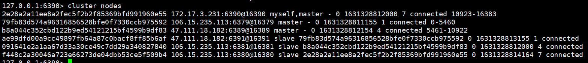

现在，master：6379,6389,6390；replica：6380,6381,6391.
关闭其中的6390：6390的slave是6380
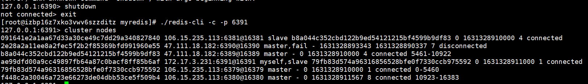

可以看到6390已经fail了，6380已经成为master了。如果此时再激活6390的话：
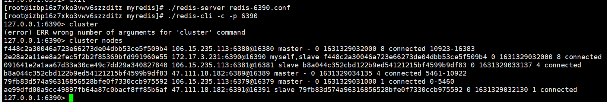

可以看到6390回来了，但是从master变为了6380的slave。
说明主从复制是没有问题的。

```shell
[root@izbp16z7xko3vwv6szzditz myredis]# ./redis-cli -c -p 6390
127.0.0.1:6390> set k100 'this is a demo'
-> Redirected to slot [1694] located at 106.15.235.113:6379
OK
106.15.235.113:6379> get k100
"this is a demo"
106.15.235.113:6379> exit
[root@izbp16z7xko3vwv6szzditz myredis]# ./redis-cli -c -p 6391
127.0.0.1:6391> keys *
1) "k100"
127.0.0.1:6391> get k100
-> Redirected to slot [1694] located at 106.15.235.113:6379
"this is a demo"
106.15.235.113:6379> 
```

这里又能看出replica6390确实是得到了6379的数据。但是，问题在于get这个数据居然会重定向到6379？？？？而不是直接从6390获取。

也就是说**主从复制的读写分离没有实现**！！！

那么，我的cluster的主从模式岂不是只能拿来作为master挂了之后的补救措施？读写分离没有实现。

那么其性能也许不一定有哨兵模式高吗？

#### bind的问题

承接上一个问题，在关闭了requirepass之后，cluster的主从复制模式可以比较好的运行。
**但是安全问题如何解决呢？**

> 在配置文件的`NETWORK`模块，有`bind`,`port`,`protected-mode`等。
> 在上面的demo中，关闭了保护模式`protected-mode`，因为它会在没有配置requirepass和bind的时候默认只允许本机访问。

此cluster集群由2个云服务器构建，必然要关闭保护模式。

那就只能从bind下手，按理说，`bind 47.111.18.182 106.15.235.113`将会是很好的解决办法。

可是，这个会出现一个很无奈的问题：

```shell
[root@iZuf6el32a2l9b73omo6cgZ myredis]# vim redis-6379.conf 
[root@iZuf6el32a2l9b73omo6cgZ myredis]# ./redis-server redis-6379.conf 
[root@iZuf6el32a2l9b73omo6cgZ myredis]# ps -ef|grep redis	--->启动redis之后查不到进程信息
root      160771  159815  0 11:17 pts/0    00:00:00 grep --color=auto redis
[root@iZuf6el32a2l9b73omo6cgZ myredis]# tail 6379.log 	--->查看log文件发现了问题
160345:M 11 Sep 2021 11:15:45.251 # User requested shutdown...
160345:M 11 Sep 2021 11:15:45.251 * Saving the final RDB snapshot before exiting.
160345:M 11 Sep 2021 11:15:45.253 * DB saved on disk
160345:M 11 Sep 2021 11:15:45.253 * Removing the pid file.
160345:M 11 Sep 2021 11:15:45.253 # Redis is now ready to exit, bye bye...
160768:C 11 Sep 2021 11:17:53.771 # oO0OoO0OoO0Oo Redis is starting oO0OoO0OoO0Oo
160768:C 11 Sep 2021 11:17:53.771 # Redis version=6.0.6, bits=64, commit=00000000, modified=0, pid=160768, just started
160768:C 11 Sep 2021 11:17:53.771 # Configuration loaded
160769:M 11 Sep 2021 11:17:53.772 # Could not create server TCP listening socket 47.111.18.182:6379: bind: Cannot assign requested address
160769:M 11 Sep 2021 11:17:53.772 # Configured to not listen anywhere, exiting.
[root@iZuf6el32a2l9b73omo6cgZ myredis]# 
```

在修改`bind 47.111.18.182`之后，出现了`Could not create server TCP listening socket 47.111.18.182:6379: bind: Cannot assign requested address`，没法解析这个请求地址......

那试一下`bind 106.15.235.113 127.0.0.1`呢，这两个ip都是这个主机的ip地址。

这次可以看到redis进程了，但是从`106.15.235.113`去连连不上，连127可以连上。说明第一个ip地址解析失败了：部分log信息

```shell
160810:C 11 Sep 2021 11:22:13.115 # oO0OoO0OoO0Oo Redis is starting oO0OoO0OoO0Oo
160810:C 11 Sep 2021 11:22:13.115 # Redis version=6.0.6, bits=64, commit=00000000, modified=0, pid=160810, just started
160810:C 11 Sep 2021 11:22:13.115 # Configuration loaded
160811:M 11 Sep 2021 11:22:13.117 # Could not create server TCP listening socket 106.15.235.113:6379: bind: Cannot assign requested address
160811:M 11 Sep 2021 11:22:13.117 * No cluster configuration found, I'm e313e13454b2bff0f4f5b2eb64d6d1321004315d
160811:M 11 Sep 2021 11:22:13.118 # Could not create server TCP listening socket 106.15.235.113:16379: bind: Cannot assign requested address
```

有意思的是，启动成功了，但是解析`106.15.235.113`失败了。

```shell
[root@iZuf6el32a2l9b73omo6cgZ myredis]# ./redis-cli -h 106.15.235.113 -p 6379
Could not connect to Redis at 106.15.235.113:6379: Connection refused
not connected> exit
[root@iZuf6el32a2l9b73omo6cgZ myredis]# ./redis-cli
127.0.0.1:6379> shutdown
not connected> 
```


`bind ipv4`这个是只能连接内网ip吗，公网ip解析不了，为什么呢，被阿里云拦截了吗？不过就算是bind阿里云的内网ip也是解析不了。我看网上的bind 192.xxx的都是可以成功的，看来是bind内网ip是可以的。

目前我这个bind外网ip用不了。

#### 妥协的办法

bind外网用不了，requirepass不能设置。又想用2个轻量云搭cluster集群。太难了。

解决方法1：bind 127.0.0.1，用1台轻量云搭建cluster集群。可以不设置密码。

解决方法2：2台轻量云，不bind，开放外网连接，不设置密码。将config、flush等命令重命名。

先去配置文件的`SECURITY`模块研究一下。

```shell
# It is possible to change the name of dangerous commands in a shared
# environment. For instance the CONFIG command may be renamed into something
# hard to guess so that it will still be available for internal-use tools
# but not available for general clients.
#
# Example:
#
# rename-command CONFIG b840fc02d524045429941cc15f59e41cb7be6c52
#
# It is also possible to completely kill a command by renaming it into
# an empty string:
#
# rename-command CONFIG ""
#
# Please note that changing the name of commands that are logged into the
# AOF file or transmitted to replicas may cause problems.
```

就把config和flushdb以及flushall命令重命名吧：

```shell
# 命令重命名
rename-command CONFIG "MYCONFIG"
rename-command FLUSHDB "MYFLUSHDB"
rename-command FLUSHALL "MYFLUSHALL"
```

测试一下：

```shell
127.0.0.1:6379> config get bind
(error) ERR unknown command `config`, with args beginning with: `get`, `bind`, 
127.0.0.1:6379> myconfig get bind
1) "bind"
2) ""
127.0.0.1:6379> flushdb
(error) ERR unknown command `flushdb`, with args beginning with: 
127.0.0.1:6379> myflushdb
OK
127.0.0.1:6379> flushall
(error) ERR unknown command `flushall`, with args beginning with: 
127.0.0.1:6379> myflushall
OK
127.0.0.1:6379> 
```

此妥协的办法将会用于我的blog项目。