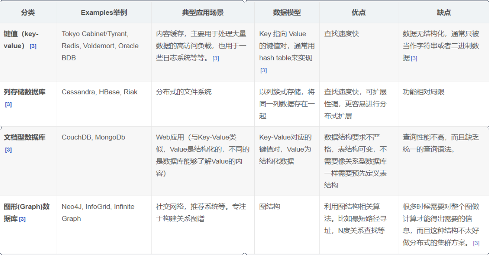

# 资料

> redis官网：https://redis.io/
>
> redis中文：http://redis.cn/

注意：尽量看redis官网的文档，中文网站的文档更新太慢了，甚至已经出现版本不兼容了。

不过**redis中文的命令文档**倒是更新的勤快，如果是看命令的话，redis中文倒是能用。

# NoSQL概述

## 为什么用NoSQL

单机数据库的瓶颈，我们来看看数据存储的瓶颈是什么？

1. 数据量的总大小，一个机器放不下时
2. 数据的索引（B+ Tree）一个机器的内存放不下时
3. 访问量（读写混合）一个实例不能承受

随着访问量的上升，几乎大部分使用MySQL架构的网站在数据库上都开始出现了性能问题。

**MySQL 的扩展性瓶颈**

> MySQL数据库也经常存储一些大文本的字段，导致数据库表非常的大，在做数据库恢复的时候就导致非常的慢，不容易快速恢复数据库，比如1000万4KB大小的文本就接近40GB的大小，如果能把这些数据从MySQL省去，MySQL将变的非常的小，关系数据库很强大，但是它并不能很好的应付所有的应用场景，MySQL的扩展性差（需要复杂的技术来实现），大数据下IO压力大，表结构更改困难，正是当前使用MySQL的开发人员面临的问题。

今天我们可以通过第三方平台（如：Google，FaceBook等）可以很容易的访问和抓取数据。用户的个人信息，社交网络，地理位置，用户生成的数据和用户操作日志已经成倍的增加、我们如果要对这些用户数据进行挖掘，那SQL数据库已经不适合这些应用了，而NoSQL数据库的发展却能很好的处理这些大的数据！

## 什么是NoSQL

> NoSQL=Not Only SQL

泛指非关系型的数据库，随着互联网Web2.0网站的兴起，传统的关系数据库在应付web2.0网站，特别是超大规模和高并发的社交网络服务类型的Web2.0纯动态网站已经显得力不从心，暴露了很多难以克服的问题，而非关系型的数据库则由于其本身的特点得到了非常迅速的发展，NoSQL数据库的产生就是为了解决大规模数据集合多种数据种类带来的挑战，尤其是大数据应用难题，包括超大规模数据的存储。

### **NoSQL特点**

1. 易扩展
   NoSQL 数据库种类繁多，但是一个共同的特点都是去掉关系数据库的关系型特性。

   数据之间无关系，这样就非常容易扩展，也无形之间，在架构的层面上带来了可扩展的能力。

2. 大数据量高性能
   官方记录：Redis 一秒可以写8万次，读11万次！

3. 多样灵活数据模型
   NoSQL无需事先为要存储的数据建立字段，随时可以存储自定义的数据格式，而在关系数据库里，增删字段是一件非常麻烦的事情。如果是非常大数据量的表，增加字段简直就是噩梦。

### NoSQL 数据模型简介

可以尝试使用**BSON**。

BSON是一种类json的一种二进制形式的存储格式，简称Binary JSON，它和JSON一样，支持内嵌的文档对象和数组对象

用BSon画出构建的数据模型
```json
{
    "customer":{ 
    "id":1000, 
    "name":"Z3", 
    "billingAddress":[{"city":"beijing"}], 
    "orders":[ 
	{ 
    "id":17, 
    "customerId":1000, 
    "orderItems":[{"productId":27,"price":77.5,"productName":"thinking in java"
     }],
    "shippingAddress":[{"city":"beijing"}],
    "orderPayment":[{"ccinfo":"111-222-333","txnid":"asdfadcd334","billingAddress":{"city":"beijing"}}], 
	} ] 
    } 
} 
```

- 高并发的操作是不太建议有关联查询的，互联网公司用冗余数据来避免关联查询

- 分布式事务是支持不了太多的并发的

### NoSQL的4类




### CAP&ACID

1.关系型数据库遵守ACID原则

- A (Atomicity) 原子性

  > 事务里的所有操作要么全部做完，要么都不做

- C (Consistency) 一致性

  > 事务前后数据的完整性必须保持一致。

- I (Isolation) 隔离性

  > 并发的事务之间不会互相影响

- D (Durability) 持久性

  > 事务提交后，它所做的修改将会永久的保存在数据库上，即使出现宕机也不会丢失。

2.**CAP（三进二）**

- C : Consistency（强一致性）
- A : Availability（可用性）
- P : Partition tolerance（分区容忍性）

**CAP理论就是说在分布式存储系统中，最多只能实现上面的两点**。

由于当前的网络硬件肯定会出现延迟丢包等问题，所以**分区容忍性是必须要实现**的。只能在一致性和可用性之间进行权衡，没有NoSQL系统能同时保证这三点。

大多数Web应用并**不需要强一致性**；很多web实时系统并不要求严格的数据库事务，对读一致性的要求很低， 有些场合对写一致性要求并不高。允许实现最终一致性。

网络分区发生时，节点间不能通信，对某个节点的修改不能同步给另一个节点，数据一致性不能满足。若要满足一致性，除非牺牲可用性，即暂时停止数据修改功能直至网络恢复。

> **CAP理论的核心**是：当网络分区发生时，一致性和可用性两难全。

最多只能同时较好的满足两个。因此，根据 CAP 原理将 NoSQL 数据库分成了满足 CA 原则、满足 CP原则和满足 AP 原则三 大类：

> CA - 单点集群，满足一致性，可用性的系统，通常在可扩展性上不太强大。
>
> CP - 满足一致性，分区容忍性的系统，通常性能不是特别高。
>
> AP - 满足可用性，分区容忍性的系统，通常可能对一致性要求低一些。

### BASE 理论

BASE理论是由eBay架构师提出的。BASE是**对CAP中一致性和可用性权衡的**结果，其来源于对大规模互联网分布式系统实践的总结，是基于CAP定律逐步演化而来。其核心思想是即使无法做到强一致性，但每个应用都可以根据自身业务特点，采用适当的方式来使系统达到<u>**最终一致性**</u>。

**BASE就是为了解决关系数据库强一致性引起的可用性降低的问题而提出的解决方案。**

BASE其实是下面三个术语的缩写：

- 基本可用(Basically Available)： 

  > 基本可用是指分布式系统在出现故障的时候，允许损失部分可用性，即保证核心可用。电商大促时，为了应对访问量激增，部分用户可能会被引导到降级页面，服务层也可能只提供降级服务。这就是损失部分可用性的体现。

- 软状态(Soft State)： 

  > 软状态是指允许系统存在中间状态，而该中间状态不会影响系统整体可用性。分布式存储中一般一份数据至少会有三个副本，允许不同节点间副本同步的延时就是软状态的体现。MySQL Replication 的异步复制也是一种体现。

- 最终一致性(Eventual Consistency)：

  > 最终一致性是指系统中的所有数据副本经过一定时间后，最终能够达到一致的状态。弱一致性和强一致性相反，最终一致性是弱一致性的一种特殊情况。

它的思想是通过让系统放松对某一时刻数据一致性的要求来换取系统整体伸缩性和性能上改观。

为什么这么说呢，缘由就在于大型系统往往由于地域分布和极高性能的要求，不可能采用分布式事务来完成这些指标，要想获得这些指标，我们必须采用另外一种方式来完成，这里BASE就是解决这个问题的办法！

**解释：**

1、分布式：不同的多台服务器上面部署不同的服务模块（工程），他们之间通过Rpc通信和调用，对外提供服务和组内协作。

2、集群：不同的多台服务器上面部署相同的服务模块，通过分布式调度软件进行统一的调度，对外提供服务和访问。

# Redis概述

## 简介

1、redis是什么

Redis是一个主要由Salvatore Sanfilippo（Antirez）开发的开源内存数据结构存储器，经常用作数据库、缓存以及消息代理等。

完全开源、C编写、遵守 BSD 协议、高性能的 key-value 数据库，目前**内存数据库**方面的事实标准。

> Redis：Remote Dictionary Server（远程字典服务器）

Redis 与其他 key - value 缓存产品有以下三个特点：

- Redis支持数据的持久化，可以将内存中的数据保存在磁盘中，重启的时候可以再次加载进行使用。
- Redis不仅仅支持简单的key-value类型的数据，同时还提供list，set，zset，hash等数据结构的存储。
- Redis支持数据的备份，即master-slave模式的数据备份。

2、**redis的特点**：


3、redis可以干什么

内存存储和持久化：redis支持异步将内存中的数据写到硬盘上，同时不影响继续服务

取最新N个数据的操作，如：可以将最新的10条评论的ID放在Redis的List集合里面

发布、订阅消息系统

地图信息分析

**定时器**、计数器

## Linux 下安装

> redis中文网安装教程：http://www.redis.cn/download.html
>
> 也可以去菜鸟教程上看。

1、下载安装包`redis-6.0.6.tar.gz` ，放到/opt目录下

2、解压`tar -zxvf redis-6.0.6.tar.gz `

3、先检查gcc版本；redis6需要gcc版本超过5；

```shell
gcc -v
# 如果版本超过5，就不需要升级gcc；否则执行下列命令升级
sudo yum install centos-release-scl
sudo yum install devtoolset-7-gcc*
scl enable devtoolset-7 bash
```


4、进入解压后的目录，执行make

```shell
$ cd redis-6.0.6
$ make
# $ make install
```

`make install`将会默认安装在`/usr/local/bin`下，也可以不执行make install。

执行完 **make** 命令后，redis-6.0.8 的 **src** 目录下会出现编译后的 redis 服务程序 **redis-server**，还有用于测试的客户端程序 **redis-cli**：

下面启动 redis 服务：

```shell
# cd src
# ./redis-server
```

注意这种方式启动 redis 使用的是默认配置。也可以通过启动参数告诉 redis 使用指定配置文件使用下面命令启动。

```shell
# cd src
# ./redis-server ../redis.conf
```

**redis.conf** 是一个默认的配置文件。我们可以根据需要使用自己的配置文件。

5、备份配置文件

```shell
[root@iZuf6el32a2l9b73omo6cgZ redis-6.0.6]# cd /usr/local/bin
#  拷一个备份，养成良好的习惯，我们就修改这个文件
[root@iZuf6el32a2l9b73omo6cgZ bin]# cp /opt/redis-6.0.6/redis.conf ./
# 看看这个配置了什么
[root@iZuf6el32a2l9b73omo6cgZ bin]# vim redis.conf
```

以后启动redis可以就用这个配置文件了，另一个解压包里的src的配置文件(这个是默认的配置文件)就可以留着。

6、启动redis

```shell
[root@iZuf6el32a2l9b73omo6cgZ bin]# cd /usr/local/bin
[root@iZuf6el32a2l9b73omo6cgZ bin]# redis-server redis.conf &


[root@iZuf6el32a2l9b73omo6cgZ bin]# redis-cli -p 6379
127.0.0.1:6379> ping
PONG
# 关闭连接
127.0.0.1:6379> shutdown
not connected> exit
[1]+  Done                    redis-server redis.conf

# 查看是否关闭成功
[root@iZuf6el32a2l9b73omo6cgZ bin]# ps -ef |grep redis
root       35437   35340  0 23:46 pts/1    00:00:00 grep --color=auto redis
[root@iZuf6el32a2l9b73omo6cgZ bin]# netstat -lnpt |grep 6379
[root@iZuf6el32a2l9b73omo6cgZ bin]# 
```

## 一些常识

### 16个数据库

默认16个数据库，类似数组下标从零开始，初始默认使用**零号库**.

- Select命令切换数据库

- Dbsize查看当前数据库的key的数量

- Flushdb：清空当前库

- Flushall：清空全部的库

```shell
127.0.0.1:6379> config get databases
1) "databases"
2) "16"
127.0.0.1:6379> select 6
OK
127.0.0.1:6379[6]> dbsize
(integer) 0
127.0.0.1:6379[6]> flushdb
OK
127.0.0.1:6379[6]> flushall
35468:M 01 Sep 2021 00:09:52.158 * DB saved on disk
OK
127.0.0.1:6379[6]> 
```

### redis是单线程的

官方表示，因为Redis是**基于内存**的操作，**CPU不是Redis的瓶颈**，Redis的**瓶颈最有可能是机器内存**的大小或者**网络带宽**。既然单线程容易实现，而且CPU不会成为瓶颈，那就顺理成章地采用单线程的方案了！Redis每秒可发送100w个请求。

从4.0版本开始，Redis已经实现多线程操作，但仅限于后台删除对象等后台服务线程。

**Redis为什么这么快？**

> Redis 核心就是如果数据全都在内存里，单线程操作就是效率最高的。
>
> 多线程的本质就是 CPU 模拟出来多个线程的情况，这种模拟出来的情况就有一个代价，就是上下文的切换，对于Redis来说，没有上下文的切换就是效率最高的。
>
> 一次CPU上下文的切换大概在 1500ns 左右。从内存中读取 1MB 的连续数据，耗时大约为 250us，假设1MB的数据由多个线程读取了1000次，那么就有1000次时间上下文的切换，那么就有1500ns *1000 = 1500us ，单线程的读完1MB数据才250us ，多线程上下文的切换就用了1500us了，这还没算每次读一点数据的时间。

为了最大化CPU使用率，可以在一个机器中启动多个Redis实例，从而利用多核优势。

### redis工具

```shell
$ find . -type f -executable
./redis-benchmark # 用于进行redis性能测试的工具
./redis-check-dump # 用于修复出问题的dump.rdb文件
./redis-cli # redis的客户端
./redis-server # redis的服务端
./redis-check-aof # 用于修复出问题的AOF文件
./redis-sentinel # 用于集群管理
```

### redis启动

```shell
# 启动redis 服务器
[root@iZuf6el32a2l9b73omo6cgZ bin]# cd /usr/local/bin
[root@iZuf6el32a2l9b73omo6cgZ bin]# redis-server redis.conf &

# 启动redis客户端
[root@iZuf6el32a2l9b73omo6cgZ bin]# redis-cli -p 6379
127.0.0.1:6379> ping
PONG
# 关闭连接
127.0.0.1:6379> shutdown
not connected> exit
[1]+  Done                    redis-server redis.conf

# 查看是否关闭成功
[root@iZuf6el32a2l9b73omo6cgZ bin]# ps -ef |grep redis
root       35437   35340  0 23:46 pts/1    00:00:00 grep --color=auto redis
[root@iZuf6el32a2l9b73omo6cgZ bin]# netstat -lnpt |grep 6379
[root@iZuf6el32a2l9b73omo6cgZ bin]# 
```

# redis学习

## 基本数据类型

| 类型        | 简介                           | 特性                                                     | 应用场景                                                     |
| :---------- | :----------------------------- | :------------------------------------------------------- | :----------------------------------------------------------- |
| strings     | 二进制安全、最基本类型         | 可以包含任何数据，最大能存储 **512MB**                   | key、节拍序列、原子计数器                                    |
| lists       | 双向链表                       | 插入快                                                   | 聊天系统、日志、消息队列                                     |
| sets        | 哈希表实现、不重复             | 添加，删除，查找的复杂度都是 O(1)。                      | 1.共同好友；2.好友推荐时,根据tag求交集,大于某个阈值就可以推荐 |
| sorted sets | 在set基础上，元素多了score权重 | 每个元素都会关联一个 double 类型的分数。按分数顺序存储。 | 排行榜                                                       |
| hashes      | value保存map                   | 特别适合用于存储对象                                     | 存对象信息                                                   |
| geo         | 存储地理位置信息               | 基于zset；存储指定的地理空间位置、计算距离等             | 附近的人、摇一摇                                             |
| hyperloglog | 做基数统计的算法               | 基于string；每个 HyperLogLog 键只占 12 KB 内存           | 网页浏览用户数量                                             |


关于key的几条规则：

> - 不要太长，消耗内存，数据中查找成本很高；
> - 不要太短，key相对value而言并不会用什么空间；
> - 最好坚持一种模式。例如：`object-type:id:field`，如`user:1000:password`

### strings

内部就是一个字符数组，实现类似Java的ArrayList，采用**预分配冗余空间**减少内存分配次数。字符串长度小于1MB每次扩容翻倍，超过时每次只扩1MB。

string类型的指令比较简单，直接看文档吧：http://www.redis.cn/commands.html#string

**原子计数器**依赖`incr`指令实现。

- 通过结合使用`INCR`和[EXPIRE](http://www.redis.cn/commands/expire.html)命令，可以实现一个只记录用户在指定间隔时间内的访问次数的计数器
- 客户端可以通过[GETSET](http://www.redis.cn/commands/getset.html)命令获取当前计数器的值并且重置为0
- 通过类似于[DECR](http://www.redis.cn/commands/decr.html)或者[INCRBY](http://www.redis.cn/commands/incrby.html)等原子递增/递减的命令，可以根据用户的操作来增加或者减少某些值。比如在线游戏，需要对用户的游戏分数进行实时控制，分数可能增加也可能减少。

**分布式锁**依赖`setnx`指令实现。

**应用：节拍序列(Time series)**

[APPEND](http://www.redis.cn/ommands/append.html) 命令可以用来连接一系列<u>固定长度</u>的样例，与使用列表相比这样更加紧凑。通常会用来记录节拍序列. 每收到一个新的节拍样例就可以这样记录:

```shell
APPEND timeseries "fixed-size sample"
```

节拍序列在空间占用上效率极好。在键值中组合Unix时间戳，可以在构建一系列相关键值时缩短键值长度，更优雅地分配Redis实例。

使用定长字符串进行温度采样的例子(在实际使用时,采用二进制格式会更好).

```shell
redis> APPEND ts "0043"
(integer) 4
redis> APPEND ts "0035"
(integer) 8
redis> GETRANGE ts 0 3
"0043"
```

### lists

类似Java的LinkedList，可用于异步队列。

内部使用**快速链表quicklist**实现，将多个**压缩列表ziplist**使用双向指针串起来，满足了快插快删也不会有太大空间冗余。

常用命令：lpush、rpush、lpop、rpop、lrange、ltrim......

list可被用来**实现聊天系统**。还可以作为不同进程间传递消息的队列。关键是，你可以每次都以原先添加的顺序访问数据。这不需要任何`SQL ORDER BY `操作，将会非常快，也会很容易扩展到百万级别元素的规模。

#### list阻塞操作

可以使用Redis来实现生产者和消费者模型，如使用LPUSH和RPOP来实现该功能。但会遇到这种情景：list是空，这时候消费者就需要轮询来获取数据，这样就会增加redis的访问压力、增加消费端的cpu时间，而很多访问都是无用的。为此redis提供了阻塞式访问 [BRPOP](http://www.redis.cn/commands/brpop.html) 和 [BLPOP](http://www.redis.cn/commands/blpop.html) 命令。 消费者可以在获取数据时指定如果数据不存在阻塞的时间，如果在时限内获得数据则立即返回，如果超时还没有数据则返回null, 0表示一直阻塞。

同时redis还会为所有阻塞的消费者以先后顺序排队。

1、**RPOPLPUSH source destination**

> 原子性地返回并移除存储在 source 的列表的最后一个元素（列表尾部元素），并把该元素放入存储在 destination 的列表的第一个元素位置（列表头部）。
> 如果 source 不存在，那么会返回 nil 值，并且不会执行任何操作。 
> 如果 source 和 destination 是同样的，这个命令也可以当作是一个旋转列表的命令。

```shell
127.0.0.1:6379> lpush mylist1 1
(integer) 1
127.0.0.1:6379> lpush mylist 1 2 3 4 5
(integer) 5
127.0.0.1:6379> rpoplpush mylist mylist1
"1"
127.0.0.1:6379> lrange mylist1 0 -1
1) "1"
2) "1"
```

应用1：安全队列

> 在消息队列中，消息被rpop或brpop后，可能会因为网络等问题而丢失。
> RPOPLPUSH (或者其阻塞版本的 [BRPOPLPUSH](http://www.redis.cn/commands/brpoplpush.html)） 提供了一种方法来避免这个问题：消费者端取到消息的同时把该消息放入一个正在处理中的列表。 当消息被处理了之后，该命令会使用 LREM 命令来移除正在处理中列表中的对应消息。
>
> 另外，可以添加一个客户端来监控这个正在处理中列表，如果有某些消息已经在这个列表中存在很长时间了（即超过一定的处理时限）， 那么这个客户端会把这些超时消息重新加入到队列中。

应用2：循环列表

> RPOPLPUSH 命令的 source 和 destination 是相同的话， 那么客户端在访问一个拥有n个元素的列表时，可以在 O(N) 时间里一个接一个获取列表元素， 而不用像 [LRANGE](http://www.redis.cn/commands/lrange.html) 那样需要把整个列表从服务器端传送到客户端。

2、**BRPOPLPUSH source destination timeout**

`BRPOPLPUSH` 是 [RPOPLPUSH](http://www.redis.cn/commands/rpoplpush.html) 的阻塞版本。 

3、**BLPOP key [key ...] timeout**

> 命令LPOP的阻塞版本，list中没有元素可弹出的时候，连接将被BLPOP命令阻塞。
> 当给定多个 key 参数时，按参数 key 的先后顺序依次检查各个列表，弹出第一个非空列表的头元素。
>
> 如果所有给定 key 都不存在或包含空列表，那么 [BLPOP](http://www.redis.cn/commands/blpop.html) 命令将阻塞连接， 直到有另一个客户端对给定的这些 key 的任意一个执行 [LPUSH](http://www.redis.cn/commands/lpush.html) 或 [RPUSH](http://www.redis.cn/commands/rpush.html) 命令为止。
>
> **timeout 参数表示的是一个指定阻塞的最大秒数的整型值。**当 timeout 为 0 是表示阻塞时间无限制。
>
> **返回值**：[多批量回复(multi-bulk-reply)](http://www.redis.cn/topics/protocol.html#multi-bulk-reply): 具体来说:
>
> - 当没有元素的时候会弹出一个 nil 的多批量值，并且 timeout 过期。
> - 当有元素弹出时会返回一个双元素的多批量值，其中第一个元素是弹出元素的 key，第二个元素是 value。

```shell
127.0.0.1:6379> lpush mylist 1
(integer) 1
127.0.0.1:6379> blpop mylist 3
1) "mylist"
2) "1"
127.0.0.1:6379> blpop mylist 5
# 等待5s后
(nil)
(5.09s)  --> 等待的时间哦


127.0.0.1:6379> blpop mylist 100		-- > 这个时候去另一个客户端向mylist推入了一个'2'
1) "mylist"
2) "2"
(17.56s)	---->等待了18s
```

- 多个客户端阻塞与同一个key时，FIFO顺序处理

- 一个客户端阻塞于多个key时，若多个 key 的元素同时可用（可能是因为事务或者某个Lua脚本向多个list添加元素）， 那么客户端会解除阻塞，并使用第一个接收到 push 操作的 key

>从根本上来说，在执行完每个命令之后，Redis 会把一个所有 key 都获得数据并且至少使一个客户端阻塞了的 list 运行一次。 这个 list 按照新数据的接收时间进行整理，即是从第一个接收数据的 key 到最后一个。在处理每个 key 的时候，只要这个 key 里有元素， Redis就会对所有等待这个key的客户端按照“先进先出”(FIFO)的顺序进行服务。若这个 key 是空的，或者没有客户端在等待这个 key， 那么将会去处理下一个从之前的命令或事务或脚本中获得新数据的 key，如此等等。

- 不要在事务中使用BLPOP：

>在一个 [MULTI](http://www.redis.cn/commands/multi.html) / [EXEC](http://www.redis.cn/commands/exec.html) 块里面使用 [BLPOP](http://www.redis.cn/commands/blpop.html) 并没有很大意义，因为它要求整个服务器被阻塞以保证块执行时的原子性，这就阻止了其他客户端执行一个 push 操作。 因此，一个在 [MULTI](http://www.redis.cn/commands/multi.html) / [EXEC](http://www.redis.cn/commands/exec.html) 里面的 [BLPOP](http://www.redis.cn/commands/blpop.html) 命令会在 list 为空的时候返回一个 `nil` 值，这跟超时(timeout)的时候发生的一样。
>
>如果你喜欢科幻小说，那么想象一下时间是以无限的速度在 MULTI / EXEC 块中流逝……

应用：**事件提醒**，类似于Golang中的管道消监听吧，这个可以实现分布式的管道消息提醒。

4、BRPOP key [key ...] timeout

同BLPOP几乎一致。是 [RPOP](http://www.redis.cn/commands/commands/rpop.html) 的阻塞版本

### hashes

Redis hash 是一个 string 类型的 field（字段） 和 value（值） 的映射表，hash 特别适合用于**存储对象**。**数组+链表**实现。

值得注意的是，小的 hash 被用特殊方式编码，非常节约内存。

1、基本命令

> hset、hget 命令用于为哈希表中的字段赋值 。 
> hmset、hmget 同时将多个field-value对设置到哈希表中。会覆盖哈希表中已存在的字段。 
> hgetall 用于返回哈希表中，所有的字段和值。 
> hdel 用于删除哈希表 key 中的一个或多个指定字段 

2、常用命令

> hlen 获取哈希表中字段的数量。
> hexists 查看哈希表的指定字段是否存在。 
> hkeys 获取哈希表中的所有域（field）。 
> hvals 返回哈希表所有域(field)的值。 
> hincrby 为哈希表中的字段值加上指定增量值。 
> hsetnx 为哈希表中不存在的的字段赋值 。 

感觉和之前的strings以及list的命令都差不多。

### sets

Redis 的 Set 是 string 类型的无序集合，集合成员唯一。集合是通过哈希表实现的。

可用于**去重**，取**交集和差集**。

常用命令

1、`SRANDMEMBER key [count]`

随机返回count个不同的元素，count可正可负：

- 正数：类似从集合中拿元素不放回，不返重复元素，且count大于集合元素个数时仅返回所有集合元素
- 负数：类似从集合中拿元素又放回，很可能返回重复元素

> **返回元素的分布**：分布并不是绝对均匀的哦
>
> 所使用的算法（在dict.c中实现）对哈希表桶进行采样以找到非空桶。一旦找到非空桶，由于我们在哈希表的实现中使用了链接法，因此会检查桶中的元素数量，并且选出一个随机元素。
>
> 这意味着，如果整个哈希表中有两个非空桶，其中一个有三个元素，另一个只有一个元素，那么其桶中单独存在的元素将以更高的概率返回。

2、`SPOP key [count]`

随机从集合中移除count个元素，操作与`SRANDMEMBER`类似。

3、`SMOVE source destination member`

将source集合的某元素移动到destination集合。

4、集合间命令

- 差集： `sdiff key [key...]`

- 交集： `sinter key [key...]`

- 并集： `sunion key [key...]`

应用：在微博应用中，可以将一个用户所有的关注人存在一个集合中，将其所有粉丝存在一个集合。Redis还为集合提供了求交集、并集、差集等操作，可以非常方便的实现如**共同关注、共同喜好、二度好友**等功能，对上面的所有集合操作，你还可以使用不同的命令选择将结果返回给客户端还是存集到一个新的集合中。

- 差集保存： `sdiffstore destination key [key...]`

- 交集保存： `sinterstore destination key [key...]`

- 并集保存： `sunionstore destination key [key...]`

### sorted sets

有序集合是一种类似于集合和哈希混合的数据类型。与集合一样，有序集合由唯一的、不重复的字符串元素组成，有序集合也是一个集合，每个元素都会关联一个 **double 类型的分数**用于排序。

有序集合的成员是唯一的,但分数(score)却可以重复。分数从小到大排序，若相等则按元素字典顺序排。

应用场景：排行榜

和set相比，sorted set增加了一个权重参数score，使得集合中的元素能够按score进行有序排列，
比如一个存储全班同学成绩的sorted set，其集合value可以是同学的学号，而score就可以是其考试得分，

这样在数据插入集合的时候，就已经进行了天然的排序。
可以用sorted set来做带权重的队列，比如普通消息的score为1，重要消息的score为2，然后工作线程可以选择按score的倒序来获取工作任务。让重要的任务优先执行。

排行榜应用，取TOP N操作 ！ 

常用命令：

1、`ZADD key [NX|XX] [CH] [INCR] score member [score member ...]`

**时间复杂度：**O(log(N)) for each item added, where N is the number of elements in the sorted set.

无则添加，有则更新分数。

**ZADD 参数（options） (>= Redis 3.0.2)**

ZADD 命令在`key`后面分数/成员（score/member）对前面支持一些参数，他们是：

- **XX**: 仅更新存在的成员，不添加新成员。
- **NX**: 不更新存在的成员，只添加新成员。
- **CH**: 修改返回值为发生变化的成员总数，原始是返回新添加成员的总数 (CH 是 *changed* 的意思)。更改的元素是**新添加的成员**，已经存在的成员**更新分数**。 所以在命令中指定的成员有相同的分数将不被计算在内。注：在通常情况下，`ZADD`返回值只计算新添加成员的数量。
- **INCR**: 当`ZADD`指定这个选项时，成员的操作就等同[ZINCRBY](http://www.redis.cn/commands/zincrby.html)命令，对成员的分数进行递增操作。

2、ZRANGE

2.1、`ZRANGE key start stop [WITHSCORES]`

时间复杂度：O(lgN + M)。

start和stop指索引，从0开始，闭区间。

2.2、 `ZREVRANGE key start stop [WITHSCRORES]`同上不过是分数倒序、字典倒序的

2.3、`ZRANGEBYSCORE key min max [WITHSCORES] [LIMIT offset count]`

时间复杂度：O(lgN + M)。

返回分数score在min和max之间的元素，默认闭区间，可以通过给参数前添加`(`表示开区间符号.

min和max可以是-inf和+inf，这样一来，你就可以在不知道有序集的最低和最高score值的情况下，使用ZRANGEBYSCORE这类命令。inf表示无穷大。

LIMIT参数指定返回结果的数量及区间（类似SQL中SELECT LIMIT offset, count）。

```shell
127.0.0.1:6379> zrangebyscore salary (500 (1200 withscores
1) "fzk"
2) "1000"
127.0.0.1:6379> zrangebyscore salary -inf inf withscores
1) "sb"
2) "500"
3) "fzk"
4) "1000"
5) "wn"
6) "1200"
```

2.4、`ZREVRANGEBYSCORE key max min [WITHSCORES] [LIMIT offset count]`同上倒序

3、`ZRANK key member`

返回member的排名，排名以0为底。

`ZREVRANK key member`返回倒序排名。

## Redis命令

Redis命令十分丰富，包括的命令组有Cluster、Connection、Geo、Hashes、HyperLogLog、Keys、Lists、Pub/Sub、Scripting、Server、Sets、Sorted Sets、Strings、Transactions一共14个redis命令组两百多个redis命令。

> redis中文命令大全：http://www.redis.cn/commands.html

5中基本数据类型的重要命令在上面部分已经分析过了，下面只分析其它命令。

### redis-cli命令

Redis 命令用于在 redis 服务上执行操作。

要在 redis 服务上执行命令需要一个 redis 客户端。Redis 客户端在我们之前下载的的 redis 的安装包中。

```shell
127.0.0.1:6379> ping # ping命令可以检查redis服务是否启动。
PONG
```

> 注意：连接 redis-cli，增加参数 --raw ，可以**强制输出中文**，不然会乱码

```shell
# -a 指定密码; -n 指定数据库
[root@iZuf6el32a2l9b73omo6cgZ bin]# ./redis-cli  -h 127.0.0.1 -p 6379 -a "mypass" -n 0

# -r 指定命令重复次数；-i指定命令调用间隔，单位秒
./redis-cli -r 5 -i 1 INCR k1

# 连续统计模式，实时监控Redis实例
./redis-cli --stat 

# 扫描大key
# 它会分析数据库中5种基本类型的key的情况，返回各自最大的key，并各自给出平均大小
./redis-cli --bigkeys

# 基本的延迟检查工具是--latency选项，它会一直运行发送PING来计算延迟，单位ms
[root@k8s-master clusterTestDir]# ./redis-cli --latency
min: 0, max: 1, avg: 0.31 (1932 samples)

# --latency-history可以查看每15s内延迟变化
[root@k8s-master clusterTestDir]# ./redis-cli --latency-history
min: 0, max: 1, avg: 0.32 (1441 samples) -- 15.00 seconds range
min: 0, max: 1, avg: 0.31 (1440 samples) -- 15.00 seconds range
min: 0, max: 1, avg: 0.30 (360 samples)^C

# CLI 的副本模式是对 Redis 开发人员和调试操作有用的高级功能。它允许检查主节点在复制流中发送到其副本的内容，以便将写入传播到其副本
[root@k8s-master clusterTestDir]# ./redis-cli -a '!MyRedis123456' --replica
sending REPLCONF capa eof
sending REPLCONF rdb-filter-only 
REPLCONF rdb-filter-only error: ERR Unrecognized REPLCONF option: rdb-filter-only
SYNC with master, discarding 25630 bytes of bulk transfer...
SYNC done. Logging commands from master.
"ping"
"SELECT","0"
"set","k2","v2"
"ping"


# 远程备份工具允许将 RDB 文件从远程Redis传输到本地redis-cli。和主从复制的全量复制一样
# 远程Redis灾难恢复 RDB 备份保存的简单方法。定时发送请求即可保存。
[root@k8s-master clusterTestDir]# ./redis-cli --rdb ./hh.rdb
sending REPLCONF capa eof
sending REPLCONF rdb-only 1
SYNC sent to master, writing 25641 bytes to './hh.rdb'
Transfer finished with success.
```

### redis Key

Redis 键命令用于管理 redis 的键。


#### KEYS pattern

>查找所有符合给定模式pattern（正则表达式）的 key 。
>
>时间复杂度为O(N)，N为数据库里面key的数量。
>
>例如，Redis在一个有1百万个key的数据库里面执行一次查询需要的时间是40毫秒 。

**警告**: `KEYS` 的速度非常快，但在一个大的数据库中使用它仍然可能造成性能问题，如果你需要从一个数据集中查找特定的 `KEYS`， 你最好还是用 Redis 的集合结构 [SETS](http://www.redis.cn/commands/sets.html) 来代替。

可以用来查询所有key：`keys *`；其它正则模式看文档：http://www.redis.cn/commands/keys.html

#### MOVE key db

时间复杂度：O(1)

将当前数据库的 key 移动到给定的数据库 db 当中。

成功返回1，失败(key不存在)返回0。

### redis Geo

Redis 的 GEO 特性在 Redis 3.2 版本中推出， 这个功能可以将用户给定的地理位置信息储存起来， 并对这些信息进行操作。来实现诸如**附近位置、摇一摇**这类依赖于地理位置信息的功能。geo的数据类型为zset。

> 可能需要的经纬度网站：https://jingweidu.bmcx.com/

业界比较通用的地理位置距离排序算法是[GeoHash算法](https://en.wikipedia.org/wiki/Geohash)，**将二维的经纬度数据映射到一维的整数**，距离近的二维坐标映射到一维后也很近。

Redis中经纬度用52位整数进行编码，**以GeoHash算法得到的52位整数值作为score放入zset中**，即**存储数据结构为zset**。

1、`GEOADD key longitude latitude member [longitude latitude member ...]`：添加地理位置的坐标

时间复杂度：O(logN)，N是zset的元素数量。

- 有效的经度从-180度到180度。
- 有效的纬度从-85.05112878度到85.05112878度。

2、`GEOPOS key member [member...] `：获取地理位置的坐标

3、`GEODIST key member1 member2 [unit]`：计算两个位置之间的距离

**时间复杂度：**O(logN)

指定单位的参数 unit 必须是以下单位的其中一个：

- m 米[默认]
- km 千米
- mi 英里
- ft 英尺

`GEODIST` 命令在计算距离时会假设地球为完美的球形，在极限情况下，这一假设最大会造成 0.5% 的误差。

4、`GEORADIUS key longitude latitude radius m|km|ft|mi [WITHCOORD] [WITHDIST] [WITHHASH] [COUNT count]`：根据用户给定的经纬度坐标来获取指定范围内的地理位置集合

如根据用户定位计算“附近的车”、“附近的餐馆”等。

以给定的经纬度为中心， 返回键包含的位置元素当中， 与中心的距离不超过给定最大距离radius的所有位置元素。范围同GEODIST命令。

在给定以下可选项时， 命令会返回额外的信息：

- `WITHDIST`: 在返回位置元素的同时， 将位置元素与中心之间的距离也一并返回。 距离的单位和用户给定的范围单位保持一致。
- `WITHCOORD`: 将位置元素的经度和维度也一并返回。
- `WITHHASH`: 以 52 位有符号整数的形式， 返回位置元素经过原始 geohash 编码的有序集合分值。 这个选项主要用于底层应用或者调试， 实际中的作用并不大。

命令默认返回未排序的位置元素。 通过以下两个参数， 用户可以指定被返回位置元素的排序方式：

- `ASC`: 根据中心的位置， 按照从近到远的方式返回位置元素。
- `DESC`: 根据中心的位置， 按照从远到近的方式返回位置元素。

> 注意：在默认情况下，GEORADIUS 命令会返回所有匹配的位置元素。 虽然可用 `COUNT <count>` 选项去获取前 N 个匹配元素， 但是因为命令在内部可能会需要对所有被匹配的元素进行处理， 所以在对一个非常大的区域进行搜索时， 即使只使用 `COUNT` 选项去获取少量元素， **命令的执行速度也可能会非常慢**。 但是从另一方面来说， 使用 `COUNT` 选项去减少需要返回的元素数量， 对于减少带宽来说仍然是非常有用的。

```shell
127.0.0.1:6379>  georadius china:sichuan 108.93425 34.23053 1000 km withcoord withdist COUNT 2 ASC
1) 1) "guangan"
   2) "470.0438"
   3) 1) "106.64188116788864136"
      2) "30.4739195998597765"
2) 1) "chongqing"
   2) "582.6435"					# 距离
   3) 1) "106.54040783643722534"  	# 经度
      2) "29.40268053517299762"		# 纬度
127.0.0.1:6379> georadius china:sichuan 108.93425 34.23053 1000 km  COUNT 2 ASC
1) "guangan"
2) "chongqing"
```

5、`GEORADIUSBYMEMBER key member radius m|km|ft|mi [WITHCOORD] [WITHDIST] [WITHHASH] [COUNT count]`：查询元素附近的其它元素

同上一个命令几乎一致，区别在于，上一个是自己输入经度纬度，这个是从key中选择一个元素做中心点。

6、zset命令

GEO没有提供删除成员的命令，但是因为GEO的底层实现是zset，所以可以借用zrem命令实现对地理位置信息的删除。其他的**z系列命令对geo操作都是有效的哦**。

```shell
127.0.0.1:6379> zrange geo1 0 10 withscores
三亚
3974547044446752
重庆
4026046519194590
```

> 注意：GEO数据用zset存储，在一个地图应用中，车、餐馆、人的数据可能会有几百万条，全部存入一个zset集合中，在Redis集群环境下，zset可能会迁移到另一个节点，单个key过大会对集群迁移造成影响，集群环境中**单个key不要超过1MB**。
>
> **建议Geo的数据单独用一个Redis实例部署**，不用集群环境。而且数据量过大的情况要进行拆分，如按城市拆、区域拆等。

### redis HyperLogLog

Redis HyperLogLog 是一种**概率数据结构**，用来做**基数统计的算法**，HyperLogLog 的优点是，在输入元素的数量或者体积非常非常大时，计算基数所需的空间**总是固定12KB**的。

在 Redis 里面，每个 HyperLogLog 键只需要花费 12 KB 内存，就可以计算接近 2^64^ 个不同元素的基数。这和计算基数时，元素越多耗费内存就越多的集合形成鲜明对比。

但是，因为 HyperLogLog 只会根据输入元素来计算基数，而**不会储存输入元素本身**，所以 HyperLogLog 不能像集合那样，返回输入的各个元素。

> HyperLogLog则是一种算法，它提供了不精确的去重计数方案。
>
> **举个栗子**：假如我要统计网页的UV（**浏览用户数量**，一天内同一个用户多次访问只能算一次），传统的解决方案是使用Set来保存用户id，然后统计Set中的元素数量来获取页面UV。但这种方案只能承载少量用户，一旦用户数量大起来就需要消耗大量的空间来存储用户id。我的目的是统计用户数量而不是保存用户，这简直是个吃力不讨好的方案！而使用Redis的HyperLogLog最多需要12k就可以统计大量的用户数，尽管它大概有0.81%的错误率，但对于统计UV这种不需要很精确的数据是可以忽略不计的。

**基数**：比如数据集 {1, 3, 5, 7, 5, 7, 8}， 那么这个数据集的基数集为 {1, 3, 5 ,7, 8}, 基数(不重复元素)为5。 基数估计就是在误差可接受的范围内，快速计算基数。

**命令：**

| 命令                                        | 描述                                      |
| :------------------------------------------ | :---------------------------------------- |
| `PFADD key element [element ...]`           | 添加指定元素到 HyperLogLog 中             |
| `PFCOUNT key [key ...]`                     | 返回给定 HyperLogLog 的基数估算值         |
| `PFMERGE destkey sourcekey [sourcekey ...]` | 将多个 HyperLogLog 合并为一个 HyperLogLog |

例子：以Jedis库的流水线执行100w次操作如下：

```java
    Pipeline pipeline = jedis.pipelined();
    for (int i = 0; i < 1000000; i++) {
        pipeline.pfadd("pf1", "user:" + i);
    }
    pipeline.sync();// 刷管道命令
    System.out.println(jedis.pfcount("pf1"));// 统计基数------>999674

    for (int i = 0; i < 1000000; i++) {
        pipeline.pfadd("pf1", "user:1" + i);
    }
    pipeline.sync();// 刷管道命令
    pipeline.close();// 关闭管道
    System.out.println(jedis.pfcount("pf1"));// 统计基数------>1907267
```

> 注意：这个统计啊，经过测试，可能会统计多，也可能统计少。

### redis BitMap

Bitmap 就是通过操作二进制位来进行记录，即为 0 和 1；如果要记录 365 天的打卡情况，使用 Bitmap表示的形式大概如下：0101000111000111...........................，这样有什么好处呢？当然就是**节约内存**了，365 天相当于 365 bit，又 1 字节 = 8 bit , 所以相当于使用 46 个字节即可。

位图并不是实际的数据类型，而是在string类型上定义的一组面向位的操作。

由于字符串是二进制安全的 blob，并且它们的最大长度为 512 MB，因此它们适合设置最多 2^32 个不同的位。

位操作分为两组：恒定时间的**单个位操作**，例如将位设置为 1 或 0，或获取其值，以及**对位组的操作**，例如计算给定位范围内设置位的数量（例如，人口计数）。

#### 位操作

| 命令：单个位操作                     | 描述                                                  | 返回值            |
| ------------------------------------ | -------------------------------------------------------- | ----------------- |
| `SETBIT key offset value(1 or 0)` | 设置或清除指定偏移量上的位(bit) | offset旧值    |
| `GETBIT key offset`   | 获取指定偏移量上的位(bit)       | offset处的值 |
| `BITCOUNT key [start end]` | 统计位为1的个数，**注意start和end是字节偏移量**             | 1的个数           |

#### 位组操作

| 命令：位组操作                          | 操作                                                         | 返回值                                                       |
| --------------------------------------- | ------------------------------------------------------------ | ------------------------------------------------------------ |
| `BITOP operation destkey key [key ...]` | 字符串之间执行按位操作并保存到destkey。操作有AND、OR、XOR 和 NOT | 保存到 destkey 的字符串的长度，和输入 key 中最长的字符串长度相等 |
| `BITPOS key bit [start] [end]`          | 查找指定值为 0 或 1 的第1个bit位。**注意start和end是字节偏移量** | 有点麻烦，看[BITPOS命令文档](http://www.redis.cn/commands/bitpos.html) |

## redis配置

其默认配置文件在解压包的目录下，我拷贝了配置文件(/usr/local/bin/redis.conf)；

### 查看配置

可以通过 **CONFIG** 命令查看或设置配置项。

语法：

```shell
redis 127.0.0.1:6379> CONFIG GET CONFIG_SETTING_NAME
```

1.获取所有配置项`*`

```shell
127.0.0.1:6379> CONFIG GET *
  1) "rdbchecksum"
  2) "yes"
  3) "daemonize"
  4) "no"
  5) "io-threads-do-reads"
  6) "no"
  7) "lua-replicate-commands"
  8) "yes"
......
```

2.获取某个配置项

```shell
127.0.0.1:6379> CONFIG GET daemonize
1) "daemonize"
2) "no"
127.0.0.1:6379> 
```


可以去看一看配置文件里面的东西：

```shell
################################## INCLUDES ###################################

# Include one or more other config files here.  This is useful if you
# have a standard template that goes to all Redis servers but also need
# to customize a few per-server settings.  Include files can include
# other files, so use this wisely.
#
# Notice option "include" won't be rewritten by command "CONFIG REWRITE"
# from admin or Redis Sentinel. Since Redis always uses the last processed
# line as value of a configuration directive, you'd better put includes
# at the beginning of this file to avoid overwriting config change at runtime.
#
# If instead you are interested in using includes to override configuration
# options, it is better to use include as the last line.
#
# include /path/to/local.conf
# include /path/to/other.conf
```

和Spring配置文件类似，可以通过includes包含，redis.conf 可以作为总文件，可以包含其他文件！

> NETWORK 网络配置


```shell
127.0.0.1:6379> config get bind
1) "bind"
2) "127.0.0.1"
127.0.0.1:6379> config get port
1) "port"
2) "6379"
127.0.0.1:6379> config get protected-mode
1) "protected-mode"
2) "yes"
```

> GENERAL	通用

```shell
# By default Redis does not run as a daemon. Use 'yes' if you need it.
# Note that Redis will write a pid file in /var/run/redis.pid when daemonized.
daemonize no	# 默认情况下，Redis不作为守护进程运行。需要开启的话，改为 yes

supervised no # 可通过upstart和systemd管理Redis守护进程

# If a pid file is specified, Redis writes it where specified at startup
# and removes it at exit.
pidfile /var/run/redis_6379.pid

# Specify the server verbosity level.
# This can be one of:
# debug (a lot of information, useful for development/testing) ----开发、测试环境
# verbose (many rarely useful info, but not a mess like the debug level)
# notice (moderately verbose, what you want in production probably)	----生产环境
# warning (only very important / critical messages are logged)
loglevel notice

# Specify the log file name. Also the empty string can be used to force
# Redis to log on the standard output. Note that if you use standard
# output for logging but daemonize, logs will be sent to /dev/null
logfile ""			# 日志文件的位置，当指定为空字符串时，为标准输出

databases 16	# 设置数据库的数目。默认的数据库是DB 0

always-show-logo yes		# 这玩意就是启动 redis 的那个图案
```

> SNAPSHOTTING 快照

```shell
# 900秒（15分钟）内至少1个key值改变（则进行数据库保存--持久化） 
save 900 1 
# 300秒（5分钟）内至少10个key值改变（则进行数据库保存--持久化） 
save 300 10 
# 60秒（1分钟）内至少10000个key值改变（则进行数据库保存--持久化） 
save 60 10000 

stop-writes-on-bgsave-error yes # 持久化出现错误后，是否依然进行继续进行工作 

rdbcompression yes # 使用压缩rdb文件 yes：压缩，但是需要一些cpu的消耗。no：不压 缩，需要更多的磁盘空间 

rdbchecksum yes # 是否校验rdb文件，更有利于文件的容错性，但是在保存rdb文件的时 候，会有大概10%的性能损耗 

dbfilename dump.rdb # dbfilenamerdb文件名称 

dir ./ # dir 数据目录，数据库的写入会在这个目录。rdb、aof文件也会写在这个目录
```

> REPLICATION  复制 后面主从复制	这里先跳过！


> SECURITY 安全
>
> 警告：由于Redis的速度非常快，外部用户可以在一个现代化的盒子上每秒尝试100万个密码。所以密码必须必须非常复杂。

```shell
127.0.0.1:6379> config get requirepass
1) "requirepass"
2) ""
127.0.0.1:6379> config set requirepass '123456'
OK
127.0.0.1:6379> ping
PONG
127.0.0.1:6379> 
[root@iZuf6el32a2l9b73omo6cgZ bin]# redis-cli
127.0.0.1:6379> ping
(error) NOAUTH Authentication required.  
127.0.0.1:6379> auth 123456
OK
127.0.0.1:6379> ping
PONG
```

> 限制

```shell
# maxclients 10000 # 设置能连上redis的最大客户端连接数量 

# maxmemory <bytes> # redis配置的最大内存容量 

# maxmemory-policy noeviction 
		# maxmemory-policy 内存达到上限的处理策略 
		#volatile-lru：利用LRU算法移除设置过过期时间的key。 
		#volatile-random：随机移除设置过过期时间的key。 
		#volatile-ttl：移除即将过期的key，根据最近过期时间来删除（辅以TTL） 
		#allkeys-lru：利用LRU算法移除任何key。 
		#allkeys-random：随机移除任何key。 
		#noeviction：不移除任何key，只是返回一个写错误。
```

> append only模式

```shell
append127.0.0.1:6379> config get appendonly
1) "appendonly"
2) "no"			# 是否以append only模式作为持久化方式，默认使用的是rdb方式持久化，这种 方式在许多应用中已经足够用了
127.0.0.1:6379> config get appendfilename
1) "appendfilename"
2) "appendonly.aof"		# appendfilename AOF 文件名称
127.0.0.1:6379> config get appendfsync
1) "appendfsync"
2) "everysec"
					# appendfsync aof持久化策略的配置 
					# no表示不执行fsync，由操作系统保证数据同步到磁盘，速度最快。 
					# always表示每次写入都执行fsync，以保证数据同步到磁盘。 
					# everysec表示每秒执行一次fsync，可能会导致丢失这1s数据。
```


### 设置配置

#### 运行时配置更改

可以通过修改 redis.conf 文件或使用 **CONFIG SET** 设置。

语法：

```shell
redis 127.0.0.1:6379> CONFIG SET CONFIG_SETTING_NAME NEW_CONFIG_VALUE
```

例子：

```shell
127.0.0.1:6379> CONFIG GET daemonize
1) "daemonize"
2) "no"
127.0.0.1:6379> CONFIG SET daemonize 'yes'
(error) ERR Unsupported CONFIG parameter: daemonize

127.0.0.1:6379> CONFIG SET loglevel 'notice'
OK
127.0.0.1:6379> CONFIG GET loglevel
1) "loglevel"
2) "notice"
127.0.0.1:6379> 
```

> 为什么daemonize参数不能设置呢？
>
> 设置完成后，可以运行`config rewrite`将配置持久化到配置文件中。

#### 命令行传参

> 在做开发测试的时候可以这样，但是上线的话，还是写在配置文件比较好。

```shell
./redis-server --port 6380 --slaveof 127.0.0.1 6379
```

需要注意的是通过命令行传递参数的过程会在内存中生成一个临时的配置文件(也许会直接追加在 命令指定的配置文件后面)，这些传递的参数也会转化为跟Redis配置文件一样的形式。


### 参数说明

> 菜鸟教程详细参数说明：https://www.runoob.com/redis/redis-conf.html


**什么是守护进程？**

> 守护进程（Daemon Process），也就是通常说的 Daemon 进程（精灵进程），是 Linux 中的后台服务进程。它是一个生存期较长的进程，通常独立于控制终端并且周期性地执行某种任务或等待处理某些发生的事件。

> 守护进程是个特殊的孤儿进程，这种进程脱离终端，为什么要脱离终端呢？之所以脱离于终端是为了避免进程被任何终端所产生的信息所打断，其在执行过程中的信息也不在任何终端上显示。由于在 linux 中，每一个系统与用户进行交流的界面称为终端，每一个从此终端开始运行的进程都会依附于这个终端，这个终端就称为这些进程的控制终端，当控制终端被关闭时，相应的进程都会自动关闭

## redis 事务

Redis 事务可以一次执行多个命令， 并且带有以下三个重要的保证：

- 批量操作在发送 EXEC 命令前被放入队列缓存且不执行。
- 收到 EXEC 命令后进入事务执行，事务中任意命令执行失败，其余的命令依然被执行。
- Redis的单线程特性，保证了执行队列命令时不被其它命令打扰，串行化执行满足了"隔离性"。

### 命令

| 命令         | 描述                                                         |
| :----------- | :----------------------------------------------------------- |
| MULTI        | 开启事务，总是返回OK                                         |
| EXEC         | 执行所有事务块内的命令                                       |
| DISCARD      | 取消事务，放弃执行事务块内的所有命令                         |
| UNWATCH      | 取消 WATCH 命令对所有 key 的监视                             |
| WATCH key... | 监视一个(或多个) key ，如果在事务执行之前这个(或这些) key 被其他命令所改动，那么事务将取消 |

```shell
127.0.0.1:6379> multi
OK
127.0.0.1:6379> set k1 hello
QUEUED # 同OK只是一个简单答复，表示指令已经缓存到服务端队列了
127.0.0.1:6379> set k2 world
QUEUED
127.0.0.1:6379> get k1
QUEUED
127.0.0.1:6379> set k3 redis
QUEUED
127.0.0.1:6379> exec			# 执行事务
1) OK
2) OK
3) "hello"
4) OK


127.0.0.1:6379> multi 
OK
127.0.0.1:6379> set k1 wwuwuwu
QUEUED
127.0.0.1:6379> discard			# 取消事务
OK
127.0.0.1:6379> get k1
"hello"
```

优化：一般来说，事务命令最好**结合pipeline流水线**一起使用，将多次io减少到1次，可以减少网络io等待。

### 事务出错

使用事务时可能会遇上以下两种错误：

- 事务在执行 [EXEC](http://www.redis.cn/commands/exec.html) 之前，入队的命令可能会出错。比如说，命令可能会产生语法错误（参数数量错误，参数名错误，等等），或者其他更严重的错误，比如内存不足（如果服务器使用 `maxmemory` 设置了最大内存限制的话）。
  - 类似于Java**编译性错误**。
  - 对于执行exec之前的错误，从 Redis 2.6.5 开始，服务器会对命令入队失败的情况进行记录，并在客户端调用 [EXEC](http://www.redis.cn/commands/exec.html) 命令时，拒绝执行并自动放弃这个事务
- 命令可能在 [EXEC](http://www.redis.cn/commands/exec.html) 调用之后失败。举个例子，事务中的命令可能处理了错误类型的键，比如将列表命令用在了字符串键上面，诸如此类。
  - 类似于Java**运行时错误**。
  - 那些在 [EXEC](http://www.redis.cn/commands/exec.html) 命令执行之后所产生的错误， 并没有对它们进行特别处理： 即使事务中有某个/某些命令在执行时产生了错误， 事务中的其他命令仍然会继续执行。

第一种错误：

```shell
127.0.0.1:6379> multi 
OK
127.0.0.1:6379> setget k1		#	-----> 参数错误：不能入队
(error) ERR unknown command `setget`, with args beginning with: `k1`, 
127.0.0.1:6379> set k2 lalala
QUEUED
127.0.0.1:6379> exec			# -----> 拒绝执行事务，并且事务已经被discard了
(error) EXECABORT Transaction discarded because of previous errors.
127.0.0.1:6379> get k2			# 事务并没有成功哦
"world"
```

第2种错误：

```shell
127.0.0.1:6379> multi
OK
127.0.0.1:6379> incr k1		# ----> 对 k1 的值 'hello' 自增，但是必然会错误
QUEUED
127.0.0.1:6379> set k2 lalala
QUEUED
127.0.0.1:6379> set k3 wuwuwu
QUEUED
127.0.0.1:6379> exec		# 虽然出错了，但是其他命令正常进行，不回滚
1) (error) ERR value is not an integer or out of range
2) OK
3) OK
127.0.0.1:6379> get k2
"lalala"
127.0.0.1:6379> get k3
"wuwuwu"
```

> 注意：
>
> 单个 Redis 命令的执行是原子性的，但 Redis 没有在事务上增加任何维持原子性的机制，所以 Redis 事务的执行并不是原子性的。
>
> 事务可以理解为一个打包的批量执行脚本，但批量指令并非原子化的操作，中间某条指令的失败不会导致前面已做指令的回滚，也不会造成后续的指令不做。

### Redis 不支持回滚

Redis 不支持事务回滚，因为支持回滚会对 Redis 的简单性和性能产生重大影响。

以下是这种做法的优点：

- Redis 命令只会因为错误的语法而失败（并且这些问题不能在入队时发现），或是命令用在了错误类型的键上面：这也就是说，从实用性的角度来说，失败的命令是由编程错误造成的，而这些错误应该在开发的过程中被发现，而不应该出现在生产环境中。
- 因为不需要对回滚进行支持，所以 Redis 的内部可以保持简单且快速。

有种观点认为 Redis 处理事务的做法会产生 bug ， 然而需要注意的是， 在通常情况下， 回滚并不能解决编程错误带来的问题。 举个例子， 如果你本来想通过 [INCR](http://www.redis.cn/commands/incr.html) 命令将键的值加上 1 ， 却不小心加上了 2 ， 又或者对错误类型的键执行了 [INCR](http://www.redis.cn/commands/incr.html) ， 回滚是没有办法处理这些情况的。

### WATCH与乐观锁

> **悲观锁：**
>
> 悲观锁(Pessimistic Lock)，顾名思义，就是很悲观，每次去拿数据的时候都认为别人会修改，所以每次在拿数据的时候都会上锁，这样别人想拿到这个数据就会block直到它拿到锁。
>
> 传统的关系型数据库里面就用到了很多这种锁机制，比如**行锁，表锁等，读锁，写锁**等，都是在**操作之前先上锁**。Redis的分布式锁实现也是一种悲观锁。
>
> **乐观锁：**
>
> 乐观锁(Optimistic Lock)，顾名思义，就是很乐观，每次去拿数据的时候都认为别人不会修改，所以不会上锁。
>
> 但是在更新的时候会判断一下再此期间别人有没有去更新这个数据，可以使用版本号等机制，乐观锁适用于多读写少的应用类型，这样可以提高吞吐量，乐观锁策略：提交版本必须大于记录当前版本才能执行更新。

如果在 [WATCH](http://www.redis.cn/commands/watch.html) 执行之后， [EXEC](http://www.redis.cn/commands/exec.html) 执行之前， 有其他客户端修改了监视的 `key` 的值， 那么当前客户端的事务就会取消， [EXEC](http://www.redis.cn/commands/exec.html) 返回nil来表示事务已经失败。

而我们客户端程序需要做的， 就是**不断重试这个操作**， 直到没有发生碰撞为止，即直到 [EXEC](http://www.redis.cn/commands/exec.html) 的返回值不是[nil-reply](http://www.redis.cn/topics/protocol.html#nil-reply)回复即可。

示例：使用watch检测balance，事务期间balance数据变动，事务执行失败！

```shell
# 窗口一 
127.0.0.1:6379> watch balance 
OK
127.0.0.1:6379> MULTI # 执行完毕后，执行窗口二代码测试 
OK
127.0.0.1:6379> decrby balance 20 
QUEUED 
127.0.0.1:6379> incrby debt 20 
QUEUED 
127.0.0.1:6379> exec # 修改失败！ 
(nil) 

# 窗口二 
127.0.0.1:6379> get balance "80" 
127.0.0.1:6379> set balance 200 
OK

# 窗口一：出现问题后放弃监视，然后重来！ 
127.0.0.1:6379> UNWATCH # 放弃监视 
OK
127.0.0.1:6379> watch balance 
OK
127.0.0.1:6379> MULTI 
OK
127.0.0.1:6379> decrby balance 20 
QUEUED 
127.0.0.1:6379> incrby debt 20
QUEUED 
127.0.0.1:6379> exec # 成功！ 
1) (integer) 180 
2) (integer) 40
```

注意：

> 当 [EXEC](http://www.redis.cn/commands/exec.html) 被调用时， 不管事务是否成功执行， 对所有键的监视都会被取消。
>
> 另外， 当客户端断开连接时， 该客户端对键的监视也会被取消。
>
> UNWATCH命令可手动关闭监视。
>
> 故当事务执行失败后，需重新执行WATCH命令对变量进行监控，并开启新的事务进行操作。

## redis发布订阅

Redis 发布订阅 (pub/sub) 是一种消息通信模式：发送者 (pub) 发送消息，订阅者 (sub) 接收消息。

Redis 客户端可以订阅任意数量的频道。


客户端1创建订阅频道：

```shell
127.0.0.1:6379> subscribe redisChat
Reading messages... (press Ctrl-C to quit)
1) "subscribe"
2) "redisChat"
3) (integer) 1
```

客户端2发布消息：

```shell
[root@iZuf6el32a2l9b73omo6cgZ bin]# redis-cli
127.0.0.1:6379> publish redisChat 'hello redis'
(integer) 1
```

此时客户端1接收到信息：

```shell
127.0.0.1:6379> subscribe redisChat
Reading messages... (press Ctrl-C to quit)
1) "subscribe"
2) "redisChat"
3) (integer) 1
1) "message"				# 接受的信息
2) "redisChat"
3) "hello redis"
```

应用：构建实时的消息系统

## stream

[Stream](https://redis.io/docs/manual/data-types/streams/) 是 Redis 5.0 引入的一种新数据类型。Redis Streams 主要是一种**仅附加数据结构**。

Stream是Redis的数据类型中最复杂的，尽管数据类型本身非常简单，它实现了额外的非强制性的特性：提供了一组允许消费者以阻塞的方式等待生产者向Stream中发送的新消息，此外还有一个名为**消费者组Consumer Group**的概念。

消费者组最初由消息传递系统 Kafka 引入的。Redis 用完全不同的术语重新实现了类似的概念，但目标是相同的：允许一组客户端相互配合来消费同一个Stream的不同部分的消息。

### 消息id

消息id或entry id形式是`<timestampInMillis>-<sequenceNumber>`，表示什么时候的第几条消息。消息id可由服务端自动生成，也可以手动指定，**注意后加入的消息id必须大于之前的**。

### 常用命令

1、`XADD key ID field string [field string ...]`：向Stream中添加映射Entry

时间复杂度：O(lgN)

参数说明：

- ID：`*`则由XADD命令自动生成，手动指定格式为：`<timestampInMillis>-<sequenceNumber>`；也可指定时间戳部分显式 ID，序列部分自动生成，如`100290-*`。
- field string：这个键值对就是消息内容。

2、`XDEL key ID [ID ...]`：删除消息，但是**仅标记为删除**，不影响消息总长度

使用基数树来索引包含线性数十个Stream条目的宏节点。从Stream中删除一个条目的时候，条目并没有真正驱逐，只是被标记为删除。

如果宏节点中的所有条目都被标记为删除，则会销毁整个节点，并回收内存。这意味着如果你从Stream里删除大量的条目，比如超过50%的条目，则每一个条目的内存占用可能会增加， 因为Stream将会开始变得碎片化。然而，流的表现将保持不变。

3、`XRANGE key start end [COUNT count]`：返回流中满足给定ID范围的条目，闭区间。

`XREVRANGE key end start [COUNT count]`同上，不过是倒序。

- 特殊ID：`-`和`+`，分别表最小和最大。
- 没有`XGET`命令以获取单个消息，可以用`XRANGE`限定start和end相等来查询单条消息。

- start和end可前置字符`(`表示开区间。

## 缓存问题

Redis缓存的使用，极大的提升了应用程序的性能和效率，特别是数据查询方面。但同时，它也带来了一些问题。其中，最要害的问题，就是数据的一致性问题，从严格意义上讲，这个问题无解。如果对数据的一致性要求很高，那么就不能使用缓存。

另外的一些典型问题就是，缓存穿透、缓存雪崩和缓存击穿。目前，业界也都有比较流行的解决方案。

### 缓存穿透

> 相关文章：https://baijiahao.baidu.com/s?id=1655304940308056733&wfr=spider&for=pc

正常访问流程：


概念

> 缓存穿透就是，当数据库中没有某条记录的时候，客户端来查询，穿过缓存层，没有查询到数据，自然不会更新缓存层。
>
> 可如果此时有大量用户查询此数据，那么都会去查询数据库，造成较大压力，缓存层就像没有存在一样，这就是缓存穿透了。
>
> key对应的数据在数据源并不存在，每次针对此key的请求从缓存获取不到，请求都会压到数据源，从而可能压垮数据源。比如用一个不存在的用户id获取用户信息，不论缓存还是数据库都没有，若黑客利用此漏洞进行攻击可能压垮数据库。

**解决方法1：设置空值**

如果一个查询返回的数据为空（不管是数据是否不存在），我们仍然把这个空结果（null）进行缓存，设置空结果的过期时间会很短，最长不超过五分钟

但是这种方法会存在两个问题：

- 如果空值能够被缓存起来，这就意味着缓存需要更多的空间存储更多的键，因为这当中可能会有很多的空值的键；

- 即使对空值设置了过期时间，还是会存在缓存层和存储层的数据会有一段时间窗口的不一致，这对于需要保持一致性的业务会有影响。

**解决方法2：设置白名单**

使用bitmaps类型定义一个可以访问的名单，名单id作为bitmaps的偏移量，每次访问和bitmap里面的id进行比较，如果访问id不在bitmaps里面，进行拦截，不允许访问。

**解决方法3：布隆过滤器**

布隆过滤器（Bloom Filter）是1970年由布隆提出的。它实际上是一个很长的二进制向量(位图)和一系列随机映射函数（哈希函数）。布隆过滤器可以用于检索一个元素是否在一个集合中。它的优点是空间效率和查询时间都远远超过一般的算法，缺点是有一定的误识别率和删除困难。

将所有可能存在的数据哈希到一个足够大的bitmaps中，一个一定不存在的数据会被 这个bitmaps拦截掉，从而避免了对底层存储系统的查询压力。

布隆过滤器是一种数据结构，垃圾网站和正常网站加起来全世界据统计也有几十亿个。网警要过滤这些垃圾网站，总不能到数据库里面一个一个去比较吧，这就可以使用布隆过滤器。

那这个布隆过滤器是如何解决redis中的缓存穿透呢？很简单首先也是对所有可能查询的参数以hash形式存储，当用户想要查询的时候，使用布隆过滤器发现不在集合中，就直接丢弃，不再对持久层查询。

深入的话，需要查更多资料咯。

**解决方法4：实时检测**

当发现Redis的命中率开始急速降低，需要排查访问对象和访问的数据，和运维人员配合，可以设置**黑名单**限制服务

### 缓存击穿

**概念**

> 缓存击穿，是指一个key非常热点，在不停的扛着大并发，大并发集中对这一个点进行访问，当这个key在失效的瞬间，持续的大并发就穿破缓存，直接请求数据库，就像在一个屏障上凿开了一个洞。
>
> 当某个key在过期的瞬间，有大量的请求并发访问，这类数据一般是热点数据，由于缓存过期，会同时访问数据库来查询最新数据，并且回写缓存，会导使数据库瞬间压力过大。


key可能会在某些时间点被超高并发地访问，是一种非常“热点”的数据。这个时候，需要考虑一个问题：缓存被“击穿”的问题。

解决问题：

**（1）预先设置热门数据：**在redis高峰访问之前，把一些热门数据提前存入到redis里面，加大这些热门数据key的时长

**（2）实时调整：**现场监控哪些数据热门，实时调整key的过期时长

**（3）使用锁：**

- （1） 就是在缓存失效的时候（判断拿出来的值为空），不是立即去load db。

- （2） 先使用缓存工具的某些带成功操作返回值的操作（比如Redis的SETNX）去set一个mutex key

- （3） 当操作返回成功时，再进行load db的操作，并回设缓存,最后删除mutex key；

- （4） 当操作返回失败，证明有线程在load db，当前线程睡眠一段时间再重试整个get缓存的方法。


### 缓存雪崩

> 缓存雪崩，是指在某一个时间段，缓存集中过期失效。
>
> 缓存雪崩是由于**大量原有缓存集体失效(过期)**，新缓存未到期间。所有请求都去查询数据库，而对数据库CPU和内存造成巨大压力，严重的会造成数据库宕机。从而形成一系列连锁反应，造成整个系统崩溃。
>
> 缓存雪崩与缓存击穿的区别在于这里针对很多key缓存，后者是对某个key的高并发访问。
>
> 产生雪崩的原因之一，比如马上就要到双十二零点，很快就会迎来一波抢购，这波商品时间比较集中的放入了缓存，假设缓存一个小时。那么到了凌晨一点钟的时候，这批商品的缓存就都过期了。而对这批商品的访问查询，都落到了数据库上，对于数据库而言，就会产生周期性的压力波峰。于是所有的请求都会达到存储层，存储层的调用量会暴增，造成存储层也会挂掉的情况。


缓存失效瞬间


**解决方法：**

缓存失效时的雪崩效应对底层系统的冲击非常可怕！

解决方案：

（1） **构建多级缓存架构：**nginx缓存 + redis缓存 +其他缓存（ehcache等）

（2） **使用锁或队列：**
用加锁或者队列的方式保证来保证不会有大量的线程对数据库一次性进行读写，从而避免失效时大量的并发请求落到底层存储系统上。不适用高并发情况

（3） **设置过期标志更新缓存：**
记录缓存数据是否过期（设置提前量），如果过期会触发通知另外的线程在后台去更新实际key的缓存。

（4） **将缓存失效时间分散开：**
比如我们可以在原有的失效时间基础上增加一个随机值，比如1-5分钟随机，这样每一个缓存的过期时间的重复率就会降低，就很难引发集体失效的事件。

 

### 分布式锁

待更新......


## Jedis

### 连接注意事项

阿里云开放6379端口，Linux防火墙开放6379端口；

redis.conf中注释掉`bind 127.0.0.1`，开放外网连接

然后 protected-mode no，关闭保护模式，

然后还要设置密码`requirepass`，为了安全，开放外网连接必须设置密码，而且还必须非常复杂。否则你的redis就会被某些不知道哪来的进行利用攻击。


### Jedis使用

首先引入依赖

```xml
<!-- https://mvnrepository.com/artifact/redis.clients/jedis -->
<dependency>
    <groupId>redis.clients</groupId>
    <artifactId>jedis</artifactId>
    <version>3.2.0</version>
</dependency>

<dependency>
    <groupId>com.alibaba</groupId>
    <artifactId>fastjson</artifactId>
    <version>1.2.59</version>
</dependency>
```

1、测试连接

```java
    @Test
    void test1() {
        Jedis jedis = new Jedis("106.15.235.113", 6379);
        jedis.auth("!MyRedis123456");
        
        System.out.println("服务正在运行: "+jedis.ping());//PONG
        jedis.close();
    }
```

2、其他API

呃，其他API和redis的命令差不多。

3、事务

```java
    @Test
    void test2() throws InterruptedException {
        Jedis jedis = new Jedis("106.15.235.113", 6379);
        jedis.auth("!MyRedis123456");
        JSONObject jsonObject = new JSONObject();
        jsonObject.put("username", "fzk");
        jsonObject.put("id", 1);
        jsonObject.put("age", 18);
        String s = jsonObject.toJSONString();

        // 开启事务
        Transaction multi = jedis.multi();
        multi.watch("k1");
        multi.set("user:id:1", s);
        try{
            int i=100/0;//模拟执行出错
            multi.exec();
        }catch (Exception e){
            e.printStackTrace();
            // 取消事务哦
            multi.discard();
        }finally {
            jedis.close();
        }

        System.out.println(jedis.get("user:id:1"));
    }
```

注意：呃，这里需要注意哈，这个所谓的事务，只是能防住Java代码运行时错误，不能防住redis事务块的错误，可以详细看看redis事务章节。

比如将try块里的顺序换一下，就会出现`Read timed out`的错误，从catch块抛出来，来自于取消事务那里。

## Boot 整合Redis

在SpringBoot中一般使用RedisTemplate提供的方法来操作Redis。那么使用SpringBoot整合Redis需要那些步骤呢。

需要注意是在boot2.x版本之后，jedis不再使用，转而使用lettuce。

jedis采用直连方式，多个线程操作，不安全。要避免不安全，使用jedis pool连接池。像BIO模式

lettuce：采用netty，实例可以在多个线程进行共享，线程安全，可以减少线程数据。像NIO模式。

1、引入starter依赖

```xml
<dependency>
    <groupId>org.springframework.boot</groupId>
    <artifactId>spring-boot-starter-data-redis</artifactId>
</dependency>
<!-- spring2.X集成redis所需common-pool2-->
<dependency>
    <groupId>org.apache.commons</groupId>
    <artifactId>commons-pool2</artifactId>
    <version>2.6.0</version>
</dependency>
```

其中第2个依赖是在使用lettuce时才需要引用，如果使用jedis，就不需要引入。

2、读一下`RedisAutoConfiguration`类呢

```java
@Configuration(proxyBeanMethods = false)
@ConditionalOnClass(RedisOperations.class)
@EnableConfigurationProperties(RedisProperties.class)
@Import({ LettuceConnectionConfiguration.class, JedisConnectionConfiguration.class })
public class RedisAutoConfiguration {

	@Bean
	@ConditionalOnMissingBean(name = "redisTemplate")// 我们可以自己写配置类来替换这个默认的RedisTemplate
	@ConditionalOnSingleCandidate(RedisConnectionFactory.class)
	public RedisTemplate<Object, Object> redisTemplate(RedisConnectionFactory redisConnectionFactory) {
		RedisTemplate<Object, Object> template = new RedisTemplate<>();
		template.setConnectionFactory(redisConnectionFactory);
		return template;
	}

	@Bean// 因为redis中大部分都是String类型，所以单独提了一个bean出来
	@ConditionalOnMissingBean
	@ConditionalOnSingleCandidate(RedisConnectionFactory.class)
	public StringRedisTemplate stringRedisTemplate(RedisConnectionFactory redisConnectionFactory) {
		StringRedisTemplate template = new StringRedisTemplate();
		template.setConnectionFactory(redisConnectionFactory);
		return template;
	}

}
```

可以看到绑定的配置属性类是`RedisProperties`；

往容器中放了一个redisTemplate；

引入了`Lettuce`的配置类；

> 注意：不知道为什么，直接用第一个redisTemplate，取出的值都是null， 猜测可能是没有配置序列化器。第2个应该是配置了序列化器。
> redis使用的话，应该都是存string对象，所以**直接用第2个**就行了。

3、`RedisProperties`

```java
@ConfigurationProperties(prefix = "spring.redis")

	/**
	 * Redis server host.
	 */
	private String host = "localhost";

	/**
	 * Login username of the redis server.
	 */
	private String username;

	/**
	 * Login password of the redis server.
	 */
	private String password;

	/**
	 * Redis server port.
	 */
	private int port = 6379;
```

这个类是拿来配置连接登录的。

3、配置文件

```properties
#Redis服务器地址
spring.redis.host=ip
#Redis服务器连接端口
spring.redis.port=6379
#密码
spring.redis.password=密码
#Redis数据库索引（默认为0）
spring.redis.database= 0
#读取超时时间（毫秒）
spring.redis.timeout=1800000
#连接池最大连接数（使用负值表示没有限制）
spring.redis.lettuce.pool.max-active=20
#最大阻塞等待时间(负数表示没限制)
spring.redis.lettuce.pool.max-wait=-1
#连接池中的最大空闲连接
spring.redis.lettuce.pool.max-idle=5
#连接池中的最小空闲连接
spring.redis.lettuce.pool.min-idle=0
```

Sa-token整合Redis里抄到的配置文件：

```yaml
# 端口
spring:
  # redis配置
  redis:
    # Redis数据库索引（默认为0）
    database: 1
    # Redis服务器地址
    host: 106.15.235.113
    # Redis服务器连接端口
    port: 6379
    # Redis服务器连接密码（默认为空）
    password: '!MyRedis123456'
    # 连接超时时间（毫秒）
    timeout: 1000ms
    lettuce:
      pool:
        max-active: 200 # 连接池最大连接数
        max-wait: -1ms  # 连接池最大阻塞等待时间（使用负值表示没有限制）
        max-idle: 10 # 连接池中的最大空闲连接
        min-idle: 0 # 连接池中的最小空闲连接
```


4、测试

```java
@SpringBootTest
class DemoApplicationTests {
	@Resource
	private StringRedisTemplate stringRedisTemplate;

	@Resource
	private RedisTemplate<Object,Object> redisTemplate;

	@Test
	void contextLoads() {
		ValueOperations<String, String> opsForValue = stringRedisTemplate.opsForValue();
		opsForValue.set("你好","你好");
		System.out.println(opsForValue.get("k1"));
		System.out.println(opsForValue.get("你好"));
	}

	@Test
	void test1(){
		ValueOperations<Object,Object> opsForValue = redisTemplate.opsForValue();
		Object k1 = opsForValue.get("k1");// -----> 不知道为什么？这里返回的是null
		System.out.println(k1);
	}

}
```

所以直接用StringRedisTemplate吧。

5、看看RedisTemplate提供的方法如下：


6、如果不满意自动配置类提供的2个RedisTemplate，可以自己配置：

```java
@Configuration
public class RedisConfig {
    @Bean
    @SuppressWarnings("all")
    public RedisTemplate<String, Object> redisTemplate(RedisConnectionFactory factory) {
        RedisTemplate<String, Object> template = new RedisTemplate<String, Object>();
        template.setConnectionFactory(factory);
        Jackson2JsonRedisSerializer jackson2JsonRedisSerializer = new Jackson2JsonRedisSerializer(Object.class);
        ObjectMapper om = new ObjectMapper();
        om.setVisibility(PropertyAccessor.ALL, JsonAutoDetect.Visibility.ANY);
        om.enableDefaultTyping(ObjectMapper.DefaultTyping.NON_FINAL);
        jackson2JsonRedisSerializer.setObjectMapper(om);
        StringRedisSerializer stringRedisSerializer = new StringRedisSerializer(); // key采用String的序列化方式 template.setKeySerializer(stringRedisSerializer); // hash的key也采用String的序列化方式 
        template.setHashKeySerializer(stringRedisSerializer); // value序列化方式采用jackson 
        template.setValueSerializer(jackson2JsonRedisSerializer); // hash的value序列化方式采用jackson 
        template.setHashValueSerializer(jackson2JsonRedisSerializer);
        template.afterPropertiesSet();
        return template;
    }
}
```

其中的ObjectMapper是Jackson的类。


## Boot整合Redis集群

### Jedis整合步骤

> 本案例使用3主3从模式
>
> 使用Jedis连接池，并用其连接集群
>
> 为什么不用lettuce呢？
>
> 不知道为什么？用它好像在并发情况下有一定问题，要报错。
> 不过测试着又没问题了？？？？
>
> 为了稳定，还是选用了jedis。当然这两个切换其实非常简单，一条配置就OK了`spring.redis.client-type: lettuce`。
>
> 不得不说一句，Spring Data Redis 的文档也太令人无语了。哎。

1、cluster集群搭建

...看redis cluster部分

2、boot项目引入依赖

```xml
<dependency>
    <groupId>org.springframework.boot</groupId>
    <artifactId>spring-boot-starter-data-redis</artifactId>
    <!-- 移除lettuce：
 		如果配置了spring.redis.client-type选项，那么可以不移除-->
    <exclusions>
        <exclusion>
            <groupId>io.lettuce</groupId>
            <artifactId>lettuce-core</artifactId>
        </exclusion>
    </exclusions>
</dependency>
<!-- spring2.X集成redis所需common-pool2-->
<dependency>
    <groupId>org.apache.commons</groupId>
    <artifactId>commons-pool2</artifactId>
    <version>2.6.0</version>
</dependency>
<!--Jedis-->
<dependency>
    <groupId>redis.clients</groupId>
    <artifactId>jedis</artifactId>
    <version>3.6.0</version>
</dependency>
```

必须要移除lettuce，里面有一个连接工厂`LettuceConnectionFactory`，会影响注册到RedisTemplate连接工厂。

3、yaml配置

```yaml
# 端口
spring:
  # redis配置
  redis:
    # Redis数据库索引（默认为0）
    database: 0
    # Redis服务器地址
    host: 106.15.235.113
    # Redis服务器连接端口
    port: 6379
    # Redis服务器连接密码（默认为空）
    password: '!MyRedis123456'
    # 连接超时时间（毫秒）
    timeout: 1000ms

    # 选择jedis还是lettuce
    client-type: jedis
    #    lettuce: # 使用lettuce连接池
    #      pool: 
    #        # 连接池最大连接数
    #        max-active: 200
    #        # 连接池最大阻塞等待时间（使用负值表示没有限制）
    #        max-wait: -1ms
    #        # 连接池中的最大空闲连接
    #        max-idle: 10
    #        # 连接池中的最小空闲连接
    #        min-idle: 0
    
    jedis:  # 使用jedis的连接池
      pool:
        max-active: 1000  # 连接池最大连接数（使用负值表示没有限制）
        max-wait: -1ms      # 连接池最大阻塞等待时间（使用负值表示没有限制）
        max-idle: 10      # 连接池中的最大空闲连接
        min-idle: 5       # 连接池中的最小空闲连接

    # 集群配置
    cluster:
      nodes:
        - 106.15.235.113:6379
        - 106.15.235.113:6380
        - 106.15.235.113:6381
        - 106.15.235.113:6389
        - 106.15.235.113:6390
        - 106.15.235.113:6391
      # max-redirects: 3 # 获取失败 最大重定向次数
```

4、连接池注入配置信息

```java
@Configuration
public class MyRedisConfig {
    @Autowired
    private RedisConnectionFactory factory;

    @Bean(name="redisTemplate")
    public RedisTemplate<String, Object> redisTemplate() {
        RedisTemplate<String, Object> redisTemplate = new RedisTemplate<>();
		// 注入序列化器
        redisTemplate.setKeySerializer(new StringRedisSerializer());
        redisTemplate.setHashKeySerializer(new StringRedisSerializer());
        redisTemplate.setHashValueSerializer(new StringRedisSerializer());
        redisTemplate.setValueSerializer(new StringRedisSerializer());
        redisTemplate.setConnectionFactory(factory);
        return redisTemplate;
    }
}
```

5、使用
可以使用的redisTemplate有两个啦，一个是自己上面配的`RedisTemplate<String,Object>`，还有一个是在RedisAutoConfiguration里面配的`StringRedisTemplate`。


### 配置解析

**RedisConnectionFactory**

首先我们需要注意的是RedisConnectionFactory这个类，我们要使用的RedisTemplate里面需要注入它。

为什么需要它呢？因为它可以获取`RedisConnection`和`RedisClusterConnection`
`Thread-safe factory of Redis connections.`用来获取线程安全的连接的工厂。

**RedisAutoConfiguration**

```java
@Configuration(proxyBeanMethods = false)
@ConditionalOnClass(RedisOperations.class)
@EnableConfigurationProperties(RedisProperties.class)
@Import({ LettuceConnectionConfiguration.class, JedisConnectionConfiguration.class })
public class RedisAutoConfiguration {

	@Bean
	@ConditionalOnMissingBean(name = "redisTemplate")
	@ConditionalOnSingleCandidate(RedisConnectionFactory.class)
	public RedisTemplate<Object, Object> redisTemplate(RedisConnectionFactory redisConnectionFactory) {
		RedisTemplate<Object, Object> template = new RedisTemplate<>();
		template.setConnectionFactory(redisConnectionFactory);
		return template;
	}

	@Bean
	@ConditionalOnMissingBean
	@ConditionalOnSingleCandidate(RedisConnectionFactory.class)
	public StringRedisTemplate stringRedisTemplate(RedisConnectionFactory redisConnectionFactory) {
		StringRedisTemplate template = new StringRedisTemplate();
		template.setConnectionFactory(redisConnectionFactory);
		return template;
	}
}
```

可以看到这两个RedisTemplate都放入了RedisConnectionFactory。我们的上面自己配的RedisTemplate就阻止了第一个bean的注册。因为它没有放序列化器，所以呢，就会出现无法将key设置到数据库中，所以获取就是null。

`@Import({ LettuceConnectionConfiguration.class, JedisConnectionConfiguration.class })`这一行引入了2种不同连接方法的配置。我们进去看看看呢。

**LettuceConnectionConfiguration**

```java
@Configuration(proxyBeanMethods = false)
@ConditionalOnClass(RedisClient.class)
@ConditionalOnProperty(name = "spring.redis.client-type", havingValue = "lettuce", matchIfMissing = true)
class LettuceConnectionConfiguration extends RedisConnectionConfiguration {
    ......
	@Bean
	@ConditionalOnMissingBean(RedisConnectionFactory.class)
	LettuceConnectionFactory redisConnectionFactory(
			ObjectProvider<LettuceClientConfigurationBuilderCustomizer> builderCustomizers,
			ClientResources clientResources) {
		LettuceClientConfiguration clientConfig = getLettuceClientConfiguration(builderCustomizers, clientResources,
				getProperties().getLettuce().getPool());
		return createLettuceConnectionFactory(clientConfig);
	}
    ......
}
```

它在配置了spring.redis.client-type=lettuce情况下会启动，不配置也启动。
就干一件事：**把LettuceConnectionFactory放入容器。**

**JedisConnectionConfiguration**

```java
@Configuration(proxyBeanMethods = false)
@ConditionalOnClass({ GenericObjectPool.class, JedisConnection.class, Jedis.class })
@ConditionalOnMissingBean(RedisConnectionFactory.class)
@ConditionalOnProperty(name = "spring.redis.client-type", havingValue = "jedis", matchIfMissing = true)
class JedisConnectionConfiguration extends RedisConnectionConfiguration {
	.......
   @Bean
   JedisConnectionFactory redisConnectionFactory(
         ObjectProvider<JedisClientConfigurationBuilderCustomizer> builderCustomizers) {
      return createJedisConnectionFactory(builderCustomizers);
   }
    .......
}
```

它和上面那个相似，也就干一件事：**把JedisConnectionFactory放入容器**
在`spring.redis.client-type=jedis`的时候启动，或者没配置这个值也启动。

**所以看到这里相信已经很清晰了，要切换连接工具jedis还是lettuce，一条配置即可。当然这两个的依赖都引入才能自由切换。**

**StringRedisTemplate的细节**

```java
public class StringRedisTemplate extends RedisTemplate<String, String> {

	/**
	 * Constructs a new <code>StringRedisTemplate</code> instance. {@link #setConnectionFactory(RedisConnectionFactory)}
	 * and {@link #afterPropertiesSet()} still need to be called.
	 */
	public StringRedisTemplate() {
		setKeySerializer(RedisSerializer.string());
		setValueSerializer(RedisSerializer.string());
		setHashKeySerializer(RedisSerializer.string());
		setHashValueSerializer(RedisSerializer.string());
	}

	/**
	 * Constructs a new <code>StringRedisTemplate</code> instance ready to be used.
	 *
	 * @param connectionFactory connection factory for creating new connections
	 */
	public StringRedisTemplate(RedisConnectionFactory connectionFactory) {
		this();
		setConnectionFactory(connectionFactory);
		afterPropertiesSet();
	}

	protected RedisConnection preProcessConnection(RedisConnection connection, boolean existingConnection) {
		return new DefaultStringRedisConnection(connection);
	}
}
```

可以看到是，它就是帮我们把序列化器给注册进去了，其实我们自己写的话，效果是一样的。

**RedisConnectionFactory**

```java
/**
 * Thread-safe factory of Redis connections.
 *
 * @author Costin Leau
 * @author Christoph Strobl
 */
public interface RedisConnectionFactory extends PersistenceExceptionTranslator {

   /**
    * Provides a suitable connection for interacting with Redis.
    *
    * @return connection for interacting with Redis.
    * @throws IllegalStateException if the connection factory requires initialization and the factory was not yet
    *           initialized.
    */
   RedisConnection getConnection();

   /**
    * Provides a suitable connection for interacting with Redis Cluster.
    *
    * @return
    * @throws IllegalStateException if the connection factory requires initialization and the factory was not yet
    *           initialized.
    * @since 1.7
    */
   RedisClusterConnection getClusterConnection();
    ......
}
```

这个玩意就是获取和Redis的连接的工厂，用连接来操作redis嘛。

它有两个实现类：


而我们真正去操作的RedisTemplate需要注入的是RedisConnectionFactory就是这两个中的某一个。同时啊，在我们的上面RedisAutoConfiguration中的2个RedisTemplate实例都要求只有一个工厂bean才能注入。

接下来去看看这两个实现类吧：

**JedisConnectionFactory**

我草，看不懂。这里面方法特别多，能拿到很多的配置信息，如password。

里面放有Pool。


**LettuceConnectionFactory**

放了一个LettucePool，感觉和上面这个差不太多了。


### 测试lettuce连接

这个和jedis连接其实在配置上差不多。
在jedis连接基础上需要改的yaml：把lettuce连接池的配置打开，jedis连接池配置关了，其实关不关无所谓，只要client-type是lettuce就行了，它就只会启动lettuce的配置。

```yaml
# 端口
spring:
  # redis配置
  redis:
    # Redis数据库索引（默认为0）
    database: 0
    # Redis服务器地址
    host: 106.15.235.113
    # Redis服务器连接端口
    port: 6379
    # Redis服务器连接密码（默认为空）
    password: '!MyRedis123456'
    # 连接超时时间（毫秒）
    timeout: 1000ms
    
    # 选择jedis还是lettuce
    client-type: lettuce
    
    lettuce:  # 使用lettuce连接池
      pool:
        max-active: 200  # 连接池最大连接数
        max-wait: -1ms # 连接池最大阻塞等待时间（使用负值表示没有限制）
        max-idle: 10 # 连接池中的最大空闲连接
        min-idle: 0 # 连接池中的最小空闲连接

    #    jedis: # 使用jedis的连接池
    #      pool:
    #        max-active: 1000  # 连接池最大连接数（使用负值表示没有限制）
    #        max-wait: -1ms      # 连接池最大阻塞等待时间（使用负值表示没有限制）
    #        max-idle: 10      # 连接池中的最大空闲连接
    #        min-idle: 5       # 连接池中的最小空闲连接

    # 集群配置
    cluster:
      nodes:
        - 106.15.235.113:6379
        - 106.15.235.113:6380
        - 106.15.235.113:6381
        - 106.15.235.113:6389
        - 106.15.235.113:6390
        - 106.15.235.113:6391
      # max-redirects: 3 # 获取失败 最大重定向次数
```

还有就是pom.xml文件把lettuce依赖引入。在原有基础上把移除关闭即可。

```xml
        <dependency>
            <groupId>org.springframework.boot</groupId>
            <artifactId>spring-boot-starter-data-redis</artifactId>
            <!--<exclusions>
                <exclusion>
                    <groupId>io.lettuce</groupId>
                    <artifactId>lettuce-core</artifactId>
                </exclusion>
            </exclusions>-->
        </dependency>
        <!-- spring2.X集成redis所需common-pool2-->
        <dependency>
            <groupId>org.apache.commons</groupId>
            <artifactId>commons-pool2</artifactId>
            <version>2.6.0</version>
        </dependency>
```

这样就能保证只有**LettuceConnectionFactory**进入容器了。说白了，这两种客户端连接方法最大的区别就是这个工厂。

测试代码：

```java
@Resource // 在这个案例里面，这个是RedisAutoConfiguration提供的
private StringRedisTemplate stringRedisTemplate;

@Resource // 在这个案例里面，这个是我们自己配的
private RedisTemplate<String,Object> redisTemplate;
@Test
void test1(){
    ValueOperations<String, String> opsForValue = stringRedisTemplate.opsForValue();
    log.info("StringRedisTemplate的里放的RedisConnectionFactory类："+stringRedisTemplate.getConnectionFactory().getClass());

    opsForValue.set("k1","hello");
    System.out.println(opsForValue.get("k1"));
    opsForValue.set("k100","world", Duration.ofMillis(10000));
    System.out.println(opsForValue.get("k100"));
    opsForValue.set("k1{group1}","hello");
    System.out.println(opsForValue.get("k1{group1}"));
    opsForValue.set("k100{group1}","redis");
    System.out.println(opsForValue.get("k100{group1}"));
    opsForValue.set("user:id:1","{'username':'冯闲人','age':20}");
    System.out.println(opsForValue.get("user:id:1"));
}
```

返回结果：

```shell
2021-09-08 16:38:45.516  INFO 8916 --- [           main] com.fzk.boot.DemoApplicationTests        : StringRedisTemplate的里放的RedisConnectionFactory类：class org.springframework.data.redis.connection.lettuce.LettuceConnectionFactory
2021-09-08 16:38:47.823  WARN 8916 --- [ioEventLoop-4-2] i.l.c.c.t.DefaultClusterTopologyRefresh  : Unable to connect to [172.24.12.69:6389]: java.nio.channels.ClosedChannelException
2021-09-08 16:38:47.823  WARN 8916 --- [ioEventLoop-4-3] i.l.c.c.t.DefaultClusterTopologyRefresh  : Unable to connect to [172.24.12.69:6390]: java.nio.channels.ClosedChannelException
2021-09-08 16:38:47.823  WARN 8916 --- [ioEventLoop-4-4] i.l.c.c.t.DefaultClusterTopologyRefresh  : Unable to connect to [172.24.12.69:6391]: java.nio.channels.ClosedChannelException
2021-09-08 16:38:47.823  WARN 8916 --- [ioEventLoop-4-7] i.l.c.c.t.DefaultClusterTopologyRefresh  : Unable to connect to [172.24.12.69:6379]: java.nio.channels.ClosedChannelException
2021-09-08 16:38:47.823  WARN 8916 --- [ioEventLoop-4-8] i.l.c.c.t.DefaultClusterTopologyRefresh  : Unable to connect to [172.24.12.69:6380]: java.nio.channels.ClosedChannelException
2021-09-08 16:38:47.823  WARN 8916 --- [ioEventLoop-4-1] i.l.c.c.t.DefaultClusterTopologyRefresh  : Unable to connect to [172.24.12.69:6381]: java.nio.channels.ClosedChannelException
hello
world
hello
redis
{'username':'冯闲人','age':20}
```

但是，有一定的概率会失败：

```tex
2021-09-08 16:40:49.456  INFO 13616 --- [           main] com.fzk.boot.DemoApplicationTests        : StringRedisTemplate的里放的RedisConnectionFactory类：class org.springframework.data.redis.connection.lettuce.LettuceConnectionFactory

org.springframework.dao.QueryTimeoutException: Redis command timed out; nested exception is io.lettuce.core.RedisCommandTimeoutException: Command timed out after 1 second(s)
```

而且这个不能连接到我的阿里云内部IP怎么会弹出来呢？不过似乎影响不大。


**用Jedis连接的结果**

```shell
2021-09-08 16:45:03.657  INFO 18064 --- [           main] com.fzk.boot.DemoApplicationTests        : StringRedisTemplate的里放的RedisConnectionFactory类：class org.springframework.data.redis.connection.jedis.JedisConnectionFactory
hello
world
hello
redis
{'username':'冯闲人','age':20}
```

这个不会报不能连接，而且试过很多很多次，都没有出现上面那个指令超时的情况。可能是对指令超时的内部设计不一样吧。

# redis管理

## redis安全

Redis实例最好不要暴露在公网，即使有密码也很可能暴力破解，毕竟Redis非常快，百万级QPS。

在redis.conf文件中增加下面这一行配置就可以把Redis绑定在只有本机能连接。

```shell
bind 127.0.0.1
```

呃，在开发的时候，用轻量云服务器的话，这里需要注释掉，部署项目上线后，尽量还是绑定本机，毕竟这样安全。

**密码验证**

最好设置密码，在redis.conf中设置：`requirepass your_password`   

它需要足够长以应对暴力攻击，这样子设置有以下两个原因：

- Redis的查询速度非常快。外部用户每秒可以尝试非常多个密码。
- Redis的密码存储在redis.conf文件中和存储在客户端的配置中，因此系统管理员没必要去记住它，因此可以设置得非常长。

AUTH命令就像其它Redis命令一样，是通过非加密方式发送的，因此无法防止拥有足够的访问网络权限的攻击者进行窃听。 

身份验证是可选的，目的是在防火墙故障的时候提供一层冗余，不要期盼它的可靠性。

**保护模式**

从3.2.0版本开始，默认配置会开启保护模式，此时无需密码，但是**Redis只回复本机访问**，其它客户端访问则返回错误。此模式的目的好像是Redis希望系统管理员不要默认使用，而是好好考虑Redis安全配置。

**禁用特殊命令**

在Redis中可以禁用命令或者将它们重命名成难以推测的名称，这样子普通用户就只能使用部分命令了。

例如，一个虚拟化的服务器提供商可能提供管理Redis实例的服务。在这种情况下，普通用户可能不被允许调用CONFIG命令去修改实例的配置，但是能够提供删除实例的系统需要支持修改配置。

在这种情况下，可以从命令表中重命名命令或者禁用命令。这个特性可以在redis.conf文件中进行配置。例如：

```shell
# CONFIG命令被重命名成一个不好猜测的名称
rename-command CONFIG b840fc02d524045429941cc15f59e41cb7be6c52

# 把命令重命名成一个空字符串可以禁用掉该命令
rename-command CONFIG ""
```

可以看到的是，Redis的安全似乎让人不太满意，没办法，暴力撞库。

## redis 的持久化

Redis 是内存数据库，如果不将内存中的数据库状态保存到磁盘，那么一旦服务器进程退出，服务器中的数据库状态也会消失

Redis 提供了两种持久化方式:

- RDB：在指定的时间间隔对数据进行**快照存储**.

- AOF：**记录每次对服务器写的操作**，当服务器重启时会重新执行这些命令来恢复原始的数据。Redis还能对AOF文件进行后台重写，对AOF日志进行瘦身。

可以同时开启两种持久化方式，在这种情况下， 当redis重启的时候会**优先载入AOF文件**来恢复原始的数据，因为在通常情况下AOF文件保存的数据集要比RDB文件保存的数据集要完整。

### RDB

> 在指定的时间间隔内将内存中的数据集快照写入磁盘，也就是Snapshot快照，它恢复时是将快照文件直接读到内存里。

#### 原理

> 原理：操作系统多进程的**COW(Copy On Write)机制**。
>
> 持久化时Redis调用glibc的函数fork一个子进程来进行持久化处理，父进程继续处理客户端请求。子进程刚开始是和父进程共享内存的代码段和数据段，当父进程对某个页面数据进行修改时，**会将共享的页面复制一份分离出来进行修改**，子进程的数据没有变化。

随着父进程修改操作的进行，内存不断扩大，但不会超过2倍。一般Redis中冷数据较多，分离的页面是少数，每个页4KB。子进程看到的在进程产生的瞬间便已经凝固了，所以叫快照。

当 Redis 需要保存 `dump.rdb` 文件时， 服务器执行以下操作:

- Redis 调用forks. 同时拥有父进程和子进程。
- 子进程将数据集写入到一个临时 RDB 文件中。
- 当子进程完成对新 RDB 文件的写入时，Redis 用新 RDB 文件替换原来的 RDB 文件，并删除旧的 RDB 文件。

可以通过调用 SAVE或者 BGSAVE ， 手动让 Redis 进行数据集保存操作。

**快照**

在默认情况下， Redis 将数据库快照保存在名字为 dump.rdb的二进制文件中。


#### 配置解析

```shell
################################ SNAPSHOTTING  ################################
#   save <seconds> <changes>
#   在指定时间间隔后发生多少次修改会触发快照保存
#	关闭rdb保存方式：
#   1.注释掉下面所有的策略即可
#   2.save "" # 这个方式一般是用于命令临时关闭如：config set save ''

save 900 1 # 900s后超过1个key修改
save 300 10 # 300s后超过10个key修改
save 60 10000 # 60s后超过1万个key修改
```

其余配置解析：

> - Stop-writes-on-bgsave-error：如果配置为no，表示你不在乎数据不一致或者有其他的手段发现和控制，默认为yes。
> - rbdcompression：对于存储到磁盘中的快照，可以设置是否进行压缩存储。如果是的话，redis会采用LZF算法进行压缩，如果你不想消耗CPU来进行压缩的话，可以设置为关闭此功能。
> - rdbchecksum：在存储快照后，还可以让redis使用CRC64算法来进行数据校验，但是这样做会增加大约10%的性能消耗，如果希望获取到最大的性能提升，可以关闭此功能。默认为yes。

#### 数据备份与恢复

**如何触发RDB快照**

1、触发配置文件中的快照策略，建议多用一台机子作为备份，复制一份 dump.rdb。

2、命令`save`或者是`bgsave`

- save 时只管保存，其他不管，全部阻塞

- bgsave，Redis 会在后台异步进行快照操作，快照同时还可以响应客户端请求。可以通过lastsave命令获取最后一次成功执行快照的时间。

3、执行`flushall`命令，也会产生 dump.rdb 文件，但里面是空的，无意义 。

4、退出的时候也会产生 dump.rdb 文件。

**如何恢复**

将备份文件 (dump.rdb) 移动到 redis 安装目录并启动服务即可

获取 redis 目录可以使用 **CONFIG** 命令

```shell
127.0.0.1:6379> config get dir
1) "dir"
2) "/usr/local/bin"
```

### AOF

> **只追加操作的文件（Append-only file，AOF）**
>
> 快照功能并不是非常耐久（durable）： 如果 Redis 因为某些原因而造成故障停机， 那么服务器将丢失最近写入、且仍未保存到快照中的那些数据。 从 1.1 版本开始， Redis 增加了一种完全耐久的持久化方式： AOF 持久化。
>
> 以日志的形式来记录每个写操作，**将Redis执行过的所有修改指令记录下来**（读操作不记录），只追加文件但不可以改写文件，redis启动之初会读取该文件重新构建数据，换言之，redis重启的话就根据日志文件的内容将写指令从前到后重放一次以完成数据的恢复工作。
>
> Redis收到指令先进行参数校验、逻辑处理，成功后才写入AOF日志，说明是**先执行指令再添加日志**。
>
> 从 Redis 7 开始，Redis 使用了**多部分 AOF 机制**。将原来的单个AOF文件拆分为**基础文件(最多一个)**和**增量文件(可能不止一个)**。[基本文件表示重写](https://redis.io/docs/manual/persistence/#log-rewriting)AOF 时存在的数据初始(RDB 或 AOF 格式)快照。增量文件包含自创建最后一个基本 AOF 文件以来的增量更改。所有这些文件都放在一个单独的目录中。

#### 日志重写原理

AOF 不断地将命令追加到文件的末尾，AOF 文件的体积会变得越来越大。

Redis提供`bgrewriteaof`命令对AOF日志进行瘦身。

**工作原理**

AOF 重写和 RDB 快照一样，都巧妙地利用了COW(copy on write)机制：

Redis<7.0：

- Redis 执行 fork() ，现在同时拥有父进程和子进程。
- 子进程开始将新 AOF 文件的内容写入到临时文件。
- 对于所有新执行的写入命令，父进程一边将它们累积到一个内存缓存中，一边将这些改动**追加到现有 AOF 文件的末尾**，这样样即使在重写的中途发生停机，现有的 AOF 文件也还是安全的。
- 当子进程完成重写工作时，它给父进程发送一个信号，父进程在接收到信号之后，将内存缓存中的所有数据追加到新 AOF 文件的末尾。
- Redis 以原子方式将新文件重命名为旧文件，并开始将新数据附加到新文件中。

原理大概：**新AOF文件=快照数据转化的指令+瘦身期间指令**

Redis>=7.0：

- Redis forks，子进程执行重写逻辑并生成新的**基础 AOF文件**；
- Redis 父进程会打开一个新的**增量 AOF 文件**继续写入更新。如果重写失败，旧的基础和增量文件（如果有的话）加上这个新打开的增量文件就代表了完整的更新数据集，所以是安全的。
- 当子进程完成基础文件的重写后，父进程会收到一个信号，并使用新打开的增量文件和子进程生成的基础文件来构建临时清单文件，并将其持久化。
- 完成后Redis 对清单文件进行原子交换，Redis 还会清理旧的基础文件和任何未使用的增量文件。

为了避免在 AOF 重写失败和重试的情况下创建大量增量文件的问题，Redis 引入了 AOF 重写限制机制，以确保失败的 AOF 重写以越来越慢的速度重试。

#### fsync和配置解析

Redis对AOF文件写操作时，实际是将内容写到了内核为文件描述符分配的一个内存缓存中**，内核会异步将脏数据刷回磁盘**(如Java NIO包中的FileChannel和内存映射缓存这些)。如果机器宕机，可能会丢失部分AOF日志数据。

Linux的glibc提供了**fsync(int fd)函数将指定文件内容强制刷盘**，但是这毕竟是磁盘io，比较慢，和Redis高性能要求有一定冲突。所以默认是每1s进行一次fsync调用。

AOF提供更好的容灾性，默认策略下意外情况只丢失1s的数据：

```shell
appendonly no	# 是否开启append only模式作为持久化方式，默认使用的是rdb方式持久化

# aof文件名(default: "appendonly.aof")
appendfilename "appendonly.aof"

# aof持久化策略的配置 
# no表示不执行fsync，由操作系统保证数据同步到磁盘，速度最快。 
# always表示每次写入都执行fsync，以保证数据同步到磁盘。非常慢，也非常安全，但和Redis高性能冲突了。
# everysec表示每秒执行一次fsync，可能会导致丢失这1s数据。 ----> 推荐
appendfsync everysec	

no-appendfsync-on-rewrite no #重写AOF文件时是否可以运用Appendfsync，用默认no即可，保证数据安全性

# 这两个玩意吧，第二个就是最小的重写的标准，第一个没看懂；第一个满足之后，再判断是否达到64mb，才会重写
auto-aof-rewrite-percentage 100
auto-aof-rewrite-min-size 64mb
```

#### 数据备份与恢复

**如果AOF文件损坏了怎么办？**

服务器可能在程序正在对 AOF 文件进行写入时停机， 如果停机造成了 AOF 文件出错（corrupt）， 那么 Redis 在重启时会拒绝载入这个 AOF 文件， 从而确保数据的一致性不会被破坏。当发生这种情况时， 可以用以下方法来修复出错的 AOF 文件：

- 为现有的 AOF 文件创建一个备份。

- 使用 Redis 附带的 redis-check-aof 程序，对原来的 AOF 文件进行修复:`$ redis-check-aof –fix`

- （可选）使用 diff -u 对比修复后的 AOF 文件和原始 AOF 文件的备份，查看两个文件之间的不同之处。

- 重启 Redis 服务器，等待服务器载入修复后的 AOF 文件，并进行数据恢复。

不过呢，**在新版本Redis则能够加载 AOF，会截断AOF文件，自动丢弃文件中最后一个格式不正确的命令**。如果需要，可以以更改默认配置以强制 Redis 在这种情况下停止。

**正常恢复**：

> 启动：设置Yes，修改默认的appendonly no，改为yes
>
> 将有数据的aof文件复制一份保存到对应目录（config get dir）
>
> 恢复：重启redis然后重新加载

**异常恢复：**

> 启动：设置Yes
>
> 故意破坏 appendonly.aof 文件！
>
> 修复： redis-check-aof --fix appendonly.aof 进行修复
>
> 恢复：重启 redis 然后重新加载

### 如何选择持久化方式

1、一般来说， 如果想达到足以媲美 PostgreSQL 的数据安全性， 应该同时使用两种持久化功能。

2、可以承受数分钟以内的数据丢失，可以只使用 RDB 持久化。

3、不推荐只用AOF方式： 因为定时生成 RDB 快照（snapshot）非常便于进行数据库备份， 并且 RDB 恢复数据集的速度也要比 AOF 恢复的速度要快， 除此之外， 使用 RDB 还可以避免之前提到的 AOF 程序的 bug 。

4、只做缓存可以不使用任何持久化。

5、同时开启两种持久化方式

- 在这种情况下，当redis重启的时候会**优先载入AOF文件**来恢复原始的数据，因为在通常情况下AOF文件保存的数据集要比RDB文件保存的数据集要完整。

- RDB 的数据不实时，同时使用两者时服务器重启也只会找AOF文件，那要不要只使用AOF呢？作者建议不要，因为RDB更适合用于备份数据库（AOF在不断变化不好备份），快速重启，而且不会有AOF可能潜在的Bug，留着作为一个万一的手段。

6、性能建议

- 因为RDB文件只用作后备用途，建议只在Slave上持久化RDB文件，而且只要15分钟备份一次就够了，只保留 `save 900 1 `这条规则。

- 如果Enable AOF ，好处是在最恶劣情况下也只会丢失不超过两秒数据，启动脚本较简单只load自己的AOF文件就可以了，代价一是带来了持续的IO，二是AOF rewrite 的最后将 rewrite 过程中产生的新数据写到新文件造成的阻塞几乎是不可避免的。只要硬盘许可，应该尽量减少AOF rewrite的频率，AOF重写的基础大小默认值64M太小了，可以设到5G以上，默认超过原大小100%大小重写可以改到适当的数值。

- 如果不Enable AOF ，仅靠 Master-Slave Repllcation 实现高可用性也可以，能省掉一大笔IO，也减少了rewrite时带来的系统波动。代价是如果Master/Slave 同时倒掉，会丢失十几分钟的数据，启动脚本也要比较两个 Master/Slave 中的 RDB文件，载入较新的那个，微博就是这种架构。

### 容灾备份

可以定时复制rdb和aof文件到其它地方存着，更多细节看官网：https://redis.io/docs/manual/persistence/#backing-up-redis-data


## 配置Redis作缓存

### 概述

LRU是Redis唯一支持的回收方法，这个实际上只是近似的LRU。
作为缓存的话，一般是所有的key都有一个过期时间，那么，这个过期时间也需要存储。

其实可以直接设置缓存的最大容量`maxmemory`和配置`回收策略`。

比如假设我们将缓存设置最大10Mb

```shell
127.0.0.1:6379> config get maxmemory
1) "maxmemory"
2) "0"
127.0.0.1:6379> config set maxmemory 10mb
OK
127.0.0.1:6379> config set maxmemory-policy allkeys-lru
OK
```

这样设置之后呢，我们就不需要去设置过期时间了，因为到达10mb之后，Redis就会使用类LRU算法自动删除某些key。

相比使用额外内存空间存储多个键的过期时间，使用缓存设置是一种更加有效利用内存的方式。而且相比每个键固定的过期时间，使用LRU也是一种更加推荐的方式，因为这样能使应用的热数据(更频繁使用的键) 在内存中停留时间更久。

基本上这么配置下的Redis可以当成memcached使用。

当我们把Redis当成缓存来使用的时候，如果应用程序同时也需要把Redis当成存储系统来使用，那么强烈建议 使用**两个Redis实例**。一个是缓存，使用上述方法进行配置，另一个是存储，根据应用的持久化需求进行配置，并且 只存储那些不需要被缓存的数据。

**近似LRU算法**

Redis的LRU算法并非完整实现，Redis并没办法选择最佳候选来进行回收，也就是最久未被访问的键。相反它会尝试运行一个近似LRU的算法，通过对少量keys进行取样，然后回收其中一个最好的key（被访问时间较早的）。

不过从Redis 3.0算法已经改进为回收键的候选池子。这改善了算法的性能，使得更加近似真是的LRU算法的行为。

Redis LRU有个很重要的点，你通过调整每次回收时检查的采样数量，以实现**调整**算法的精度。这个参数可以通过以下的配置指令调整:
`maxmemory-samples 5`

Redis为什么不使用真实的LRU实现是因为这需要太多的内存。不过近似的LRU算法对于应用而言应该是等价的。

> 更多细节文档：http://www.redis.cn/topics/lru-cache.html
>
> 非常有意思的一个案例。


### 配置解析

```shell
# redis配置的最大内存容量 ，当 内存上限处理策略 是noeviction时，此配置无效
# 默认0,没有限制
# maxmemory <bytes> 


# maxmemory-policy noeviction 
		# maxmemory-policy 内存上限处理策略 
		# noeviction：不移除任何key，只是返回一个写错误,但DEL和几个例外。 默认
		# allkeys-lru：尝试回收最少使用的键（LRU），使得新添加的数据有空间存放。
		# volatile-lru：利用LRU算法移除设置过过期时间的key。 
		# volatile-random：随机移除设置过过期时间的key。 
		# volatile-ttl：移除即将过期的key，根据最近过期时间来删除（辅以TTL） 
		# allkeys-random：随机移除任何key。 


# replica默认是忽略内存策略这些配置的，因为master配置了的话，master会发del命令来删除replica的key的
# 如果你想要replica是可写的，并有不同的内存策略配置，你可以改为no，但是要确保你要做的将会是什么
#
# replica-ignore-maxmemory yes


# LRU、LFU和最小TTL算法不是精确算法，而是近似算法（为了节省内存），因此可以对其进行调整以提高速度或精度。默认情况下，Redis将检查五个键并选择最近使用的键，您可以使用以下配置指令更改样本大小。
# 默认值为5会产生足够好的结果。10非常接近真实的LRU，但CPU成本更高。3更快，但不是很准确。
#
# maxmemory-samples 5


# 没看懂
# 好像是内存回收使用CPU 的effort，越大，CPU使用越多，最大10
# active-expire-effort 1
```

一般的经验规则:

- 使用**allkeys-lru**策略：当你希望你的请求符合一个幂定律分布，也就是说，你希望部分的子集元素将比其它其它元素被访问的更多。如果你不确定选择什么，这是个很好的选择。.
- 使用**allkeys-random**：如果你是循环访问，所有的键被连续的扫描，或者你希望请求分布正常（所有元素被访问的概率都差不多）。
- 使用**volatile-ttl**：如果你想要通过创建缓存对象时设置TTL值，来决定哪些对象应该被过期。

**allkeys-lru** 和 **volatile-random**策略对于当你想要单一的实例实现缓存及持久化一些键时很有用。不过一般运行两个实例是解决这个问题的更好方法。

为键设置过期时间也是需要消耗内存的，所以使用**allkeys-lru**这种策略更加高效，因为当内存有压力时，没有必要为键取设置过期时间。

# redis 主从复制

> Redis Replication中文相关文档：http://www.redis.cn/topics/replication.html

## 概述

将主服务器的数据，复制到从服务器上。前者称为主节点(master/leader)，后者称为从节点(slave/follower)

**主从复制的作用：**

1、数据冗余：主从复制实现了数据的热备份，是持久化之外的一种数据冗余方式。

2、故障恢复：当主节点出现问题时，可以由从节点提供服务，实现快速的故障恢复；实际上是一种服务的冗余。

3、负载均衡：在主从复制的基础上，配合读写分离，可以由主节点提供写服务，由从节点提供读服务，分担服务器负载；尤其是在写少读多的场景下，通过多个从节点分担读负载，可以大大提高Redis服务器的并发量。

4、高可用基石：**主从复制还是哨兵和集群能够实施的基础**，因此说主从复制是Redis高可用的基础。

**主从复制依赖的3个重要机制：**

- master与slave正常连接时，master发送**命令流**保存slave的更新，包括：写、key的过期或逐出；
- 当 master 和 slave 之间的连接断开之后，因为网络问题、或者是主从意识到连接超时， slave 重新连接上 master 并会尝试进行**部分重同步**：这意味着它会尝试只获取在断开连接期间内丢失的命令流。
- 当无法进行部分重同步时， slave 会请求进行**全量重同步**。这会涉及到一个更复杂的过程，例如 master 需要创建所有数据的快照，将之发送给 slave ，之后在数据集更改时持续发送命令流到 slave 。

**Redis复制的一些重要事实：**

- Redis使用默认的**异步复制**，其特点是低延迟和高性能，slave 和 master 之间异步地确认处理的数据量
- slave 可以接受其他 slave 的连接。除了多个 slave 可以连接到同一个 master 之外， slave 之间也可以像**层叠状的结构**（cascading-like structure）连接到其他 slave 。自 Redis 4.0 起，所有的 sub-slave 将会从 master 收到完全一样的复制流。
- Redis复制在master侧是**非阻塞**的，复制在 slave 侧大部分也是非阻塞的。在初次同步之后，旧数据集必须被删除，同时加载新的数据集。 slave 在这个短暂的时间窗口内（如果数据集很大，会持续较长时间），会阻塞到来的连接请求。
- 可以使用复制来避免 master 将全部数据集写入磁盘造成的开销：一种典型的技术是配置你的 master Redis.conf 以避免对磁盘进行持久化，然后连接一个 slave ，其配置为不定期保存或是启用 AOF。但是，这个设置必须小心处理，因为重新启动的 master 程序将从一个空数据集开始：如果一个 slave 试图与它同步，那么这个 slave 也会被清空。

> 注意：强烈建议在 master 和在 slave 中启用持久化(默认是RDF模式的)。
>
> 因为如果不开启持久化，那么master重启之后，数据集为空，slave也将会被清空。
>
> 如果必须关闭持久化（比如你的磁盘是个辣鸡），那么自动重启进程这项应该被禁用。

## 复制原理

### 增量同步

1、Redis同步的是`指令流`，master将修改指令记录在本地的内存buffer中；该内存buffer是一个**定长环形数组**，内容写满则从头开始覆盖；若因网络问题导致从节点尚未同步的指令被覆盖了，则会激发**快照同步(全量同步)**。

2、master 有个 replication ID(一个较大的伪随机字符串，标记了一个给定的数据集)。 master 也持有一个偏移量，master 将自己产生的复制流发送给 slave 时，发送多少个字节的数据，自身的偏移量就会增加多少。复制偏移量即使在没有 slave 连接时也会自增，所以基本上每一对给定的`Replication ID, offset`都会标识一个 master 数据集的确切版本。

3、当 slave 连接到 master 时，使用` PSYNC `命令发送记录的旧的` master replication ID `和它们至今为止处理的偏移量。

4、master仅发送slave需要的增量部分。但是如果 master 的缓冲区中没有足够的命令积压缓冲记录，或者如果 slave 引用了不再知道的历史记录(replication ID)，则会转而进行一个**全量重同步(快照同步)**：在这种情况下， slave 会得到一个完整的数据集副本，从头开始。

### 全量同步

下面是一个全量同步(快照同步)的工作细节：

1、master节点进行1次**bgsave即rdb持久化**，同时缓冲新到的写命令；

2、后台保存完成后**将rdb文件传输给slave**，slave接收完成后立刻加载它；

3、slave加载完成则通知master**继续增量同步**，master将所有缓冲命令流发给slave。

之前说过，当主从之间的连接因为一些原因崩溃之后， slave 能够自动重连。如果 master 收到了多个 slave 要求同步的请求，它会执行一个单独的后台rdb保存，以便于为多个 slave 服务。

**无盘复制**

正常情况下，一个全量重同步会在磁盘上创建一个 RDB 文件，然后将它发给slave，slave以此进行数据同步。

master进行快照同步在非SSD磁盘时会比较耗时，对master产生较大影响。

Redis 2.8.18 开始支持无磁盘复制。子进程**直接通过套接字将快照内容发给 slave**，master子进程一边遍历内存，一边序列化内容发给slave，无需使用磁盘作为中间储存介质。slave接受内容并保持到本地rdb，然后加载。

### 处理key过期

Redis 使用以下手段使过期的 key 的复制能够正确工作：

- slave 不会让 key 过期，而是等待 master 让 key 过期。**master合成一个 DEL 命令**并传输到所有的 slave。
- slave使用其逻辑时钟报告key不存在。
- Lua脚本执行期间，不执行任何 key 过期操作。当一个Lua脚本运行时，从概念上讲，master 中的时间是被冻结的，这样脚本运行的时候，一个给定的键要么存在要么不存在。这可以防止 key 在脚本中间过期，保证将相同的脚本发送到 slave ，从而在二者的数据集中产生相同的效果。

一旦一个 slave 被提升为一个 master ，它将开始独立地过期 key，而不需要任何旧 master 的帮助。

## 主从搭建

一般来说，工程中应用redis往往是多台服务器。


读写分离，真实项目80%以上都是读。

### 环境搭建

只需要修改从服务器即可，因为每台redis服务器默认都是主服务器。

```shell
127.0.0.1:6379> info replication	# 查看当前库信息
# Replication
role:master							# 角色：主库
connected_slaves:0					# 没有从库
master_replid:b41ef105e7f671517951e8038cadfd62729a1001
master_replid2:0000000000000000000000000000000000000000
master_repl_offset:0
# 省略其他信息
```

准备工作：配置主从复制，至少需要三个，一主二从，配置三个客户端。

master节点配置如下所示：从节点在这个基础上改就行了。

注意工作目录的指定。

```shell
# include /path/to/fragments/*.conf
port 6379
# 设置Redis服务实例密码
requirepass 123456
protected-mode no
# 后台启动
daemonize yes
# 工作目录
dir /opt/redisDemo/redis-7.0.2/sentinelTestDir
pidfile ./redis_6379.pid
logfile ./redis_6379.log


# 主从配置：只有从节点需要配置，主节点默认即可
# replicaof <masterip> <masterport>
# 主节点密码
# masterauth <master-password>
# 从节点只读
# replica-read-only yes
# 无盘复制
# repl-diskless-sync yes
# 从节点优先级
# replica-priority 100

# 广播自己的ip:port
replica-announce-ip 124.223.192.8
replica-announce-port 6379

# 内存设置
maxmemory 256mb
maxmemory-policy allkeys-lru

# 持久化-rdb配置
save 3600 1 300 100 60 10000
dbfilename dump_6379.rdb
# 持久化-aof配置
appendonly yes
appendfilename "appendonly_6379.aof"
appenddirname "appendonlydir"
appendfsync everysec
auto-aof-rewrite-percentage 100
auto-aof-rewrite-min-size 64mb
```

如果只有1台云服务器，则将上面的有关6379端口的配置改为其它端口并配置为从节点也可以。

### 一主二从

默认情况，每一台都是主节点；一般情况下，只需要配置从节点即可。

```shell
slaveof host port  # 在slave配置可以指定其master

# 下面两个命令可以提供有关主实例和副本实例的当前复制参数的大量信息
INFO replication
ROLE
```


不过，命令方式重启之后就无效了，真实的配置应该是在配置文件中进行配置，那样是永久的。


主机可以写，可以读，从机只能读哦。


测试1：主机挂了，从机查看信息；主机恢复，从机查看信息：


测试2：从机挂了，查看主机信息；从机恢复，查看从机信息：


### 层层链路

上一个Slave 可以是下一个slave 和 Master，Slave 同样可以接收其他 slaves 的连接和同步请求，那么该 slave 作为了链条中下一个的master，可以有效减轻 master 的写压力


在原始主机上设置之后，从机都能取到；但是第二台主机依旧不能写。


在没有哨兵模式的情况下呢，如果主节点挂了，这个时候，可以手动让从节点变为主节点。

`slaveof no one`，可以让从节点变为主节点，然后再去将其他从节点配置到这个新的主节点即可。

## 配置解析

```shell
# 作为某个master的replica
# replicaof <masterip> <masterport>

# 如果master有密码（使用“requirepass”配置），这里必须配置slave连接master先进行身份验证，否则master将拒绝复制副本请求。
# masterauth <master-password>


# 配置replica是否只能读，默认yes
# 只读模式下的 slave 将会拒绝所有写入命令。
replica-read-only yes
# 注意：只读副本的设计目的不是向internet上不受信任的客户端公开。它只是一个防止实例误用的保护层。默认情况下，只读副本仍会导出所有管理命令，如CONFIG、DEBUG等。在一定程度上，您可以使用“rename-command”来隐藏所有管理/危险命令，从而提高只读副本的安全性。


# 全量重同步策略：disk or socket.
# 1） Disk-backed：master先进行rdb持久化，将RDB文件发给slave。
# 2） diskless：无盘复制，master子进程直接通过套接字将快照内容发给 slave。
# 垃圾磁盘且网速很好的情况下无盘复制更好，此时可以开启无盘复制
repl-diskless-sync no
# 无磁盘复制可以使用 repl-diskless-sync 配置参数。repl-diskless-sync-delay 参数可以延迟启动数据传输，目的可以在第一个 slave就绪后，等待更多的 slave就绪。以second为单位
repl-diskless-sync-delay 5


# 禁用在副本套接字上的TCP_节点延迟？
# 如果选择“是”，Redis将使用更少的TCP数据包和更少的带宽向副本发送数据。但这会增加数据在副本端显示的延迟，对于使用默认配置的Linux内核，延迟可达40毫秒。
# 如果选择“否”，则数据出现在副本端的延迟将减少，但复制将使用更多带宽。
# 默认情况下，我们会针对低延迟进行优化，但在流量非常高的情况下，或者当主副本和副本距离很多跳时，将此选项改为“是”可能是一个好主意。
repl-disable-tcp-nodelay no


# 设置复制积压大小。
# backlog是一个缓冲区，当副本断开连接一段时间时，它会累积副本数据，因此当副本想要再次重新连接时，通常不需要完全重新同步，部分重新同步就足够了，只需传递副本在断开连接时丢失的部分数据。
# 复制积压越大，允许复制副本断开连接的时间越长，以后可以执行部分重新同步。
# 只有在至少连接了一个复制副本时，才会分配积压工作。
#
# repl-backlog-size 1mb
#
# master与replica失联一定时间后，backlog将会释放。
# 下面这个配置选项用于配置：从最后一个replica断开连接开始，到释放积压缓冲区所需的秒数。
# 注意：replicas never free the backlog for timeout, since they may be promoted to masters later, and should be able to correctly "partially resynchronize" with the replicas: hence they should always accumulate backlog.
# 值为0表示从不释放积压工作。
#
# repl-backlog-ttl 3600


# replica优先级
# Redis Sentinel使用它选择slave晋升为master，越低优先级越高，特殊优先级0则永不会成为master
replica-priority 100

# 限制master写入
# Redis采用异步复制，若master挂了，slave可能没有收到所有的同步指令流，即部分数据丢失。如果主从延迟很大，那么丢失的数据会很多。
# 像MQ中间件一般是同步复制保证消息不丢失，但是Redis只能异步复制，无法保证数据不丢失，那就限制数据少丢失。
# 下面这个配置要求至少3个slave在线master才能写入:
#
# min-replicas-to-write 3 # 主节点有n个从节点在线，默认0，即禁用此限制
# min-replicas-max-lag 10 # 不在线判断间隔，从节点距离上次发心跳时长(默认1s1次)，单位second

# 当使用Docker这类容器或NAT地址转换时，使用端口转发或网络地址转换时，
# Redis 复制需要格外小心，尤其是在使用 Redis Sentinel 或其他集群时，
# 客户端通过INFO或ROLE命令来发现slave地址，这将显示slave连接master的IP:port，这也许不一定是想要的ip:port。
# 下面两个配置可以在slave连接上master时指定自己的ip和port，从而让ROLE或INFO命令通告客户端这个特定的ip:port
# replica-announce-ip 5.5.5.5
# replica-announce-port 1234
```

注意：Redis有个`maxmemory <bytes>`的配置指定使用的最大内存，默认情况下，副本将被忽略`maxmemory`（除非在故障转移后或手动将其提升为主副本）。key的驱逐由master处理，将DEL命令发送到replica。这可以确保主从一致性，这也意味着也许master还未达到限制，而slave早已超过限制，redis建议我们自己做好监控。

可以配置slave不能忽略maxmemory：`replica-ignore-maxmemory no`

# redis 哨兵

> Redis Sentinel文档：http://www.redis.cn/topics/sentinel.html

Redis主从复制可以保证最终一致性，但仅靠主从需要手动切换角色，不具备高可用性。非集群版的高可用由Sentinel提供。

Redis 的 Sentinel 系统用于管理多个 Redis 服务器，该系统执行以下任务：

- **监控(Monitoring)**： Sentinel 会不断地检查master和slave是否运作正常。
- **通知(Notification)**： 当被监控的某个 Redis 服务器出现问题时， Sentinel 可以通过 API 向管理员或者其他应用程序发送通知。
- **自动故障迁移(Automatic failover)**： master挂了，sentinel会自动故障迁移操作，即选一个slave作为master，并让其他slave改到新的master下； 当客户端试图连接失效的主服务器时， 集群也会向客户端返回新主服务器的地址。
- **配置提供**：Sentinel充当客户端服务发现来源，告知客户端master地址。

Redis Sentinel 是一个分布式系统， 你可以在一个架构中运行多个 Sentinel 进程（progress）， 这些进程使用**流言协议**（gossip protocols)来接收关于主服务器是否下线的信息， 并使用**投票协议**（agreement protocols）来决定是否执行自动故障迁移， 以及选择哪个从服务器作为新的主服务器。


这里的哨兵有两个作用

- 通过发送命令，让Redis服务器返回监控其运行状态，包括主服务器和从服务器。

- 当哨兵监测到master宕机，会自动将slave切换成master，然后通过**发布订阅模式**通知其他的从服务器，修改配置文件，让它们切换主机。

然而一个哨兵进程对Redis服务器进行监控，可能会出现问题，为此，我们可以使用多个哨兵进行监控。各个哨兵之间还会进行监控，这样就形成了多哨兵模式。


## 启动sentinel

有2种方法启动哨兵：哨兵其实是Redis服务的某种特殊服务

```shell
# 1.直接以sentinel脚本启动
redis-sentinel sentinel.conf

# 2.redis服务启动脚本以sentinel模式启动
redis-server redis.conf sentinel.conf --sentinel
```


其中`redis-sentinel`脚本就在src目录下哦。

启动Sentinel必须指定配置文件且其必须可写，否则启动失败。

默认情况下，Sentinel监听26379端口，所以防火墙必须放行这个端口，Sentinel之间才能交流。

## sentinel配置解析

Redis的解压包包含了一个名为 sentinel.conf 的文件， 这个文件是一个带有详细注释的 Sentinel 配置文件示例。

```shell
# Example sentinel.conf
# 默认情况下sentinel模式关闭保护模式，确保sentinel实例被防火墙保护.
protected-mode no

# 哨兵sentinel实例运行的端口 默认26379 
port 26379 

# 在docker或NAT环境下，sentinel间的自动发现的ip:port可能客户端连不上
# 下面两个配置可以指定此Sentinel宣告它的特定ip:port给其它sentinel或客户端
# sentinel announce-ip <ip>
# sentinel announce-port <port>

# 是否为后台启动
daemonize no
# 若为后台启动，Redis会写一个pid file到指定目录
pidfile /var/run/redis-sentinel.pid
# 日志文件。若为""默认会打印到standard output，在开启后台启动时则会打印到/dev/null
logfile ""
# 哨兵sentinel的工作目录 
dir /tmp

# sentinel也能设密码，sentinel将以此密码去连接其它所有sentinel
# 所以要么不设密码，要设则所有sentinel必须一致！
# requirepass <password>

# sentinel monitor <master-name> <ip> <redis-port> <quorum>
# 哨兵sentinel监控的redis主节点的 ip:port 
# master-name 可以自己命名的主节点名字，只能由字母A-z、数字0-9 、这三个字符".-_"组成
# quorum 配置多少个sentinel认为master主观下线，则其被认为客观下线，此时会进行故障迁移尝试
# slave通过master自动发现，无需手动指定，当故障迁移时某个slave被指定为master，sentinel会修改此配置文件
sentinel monitor mymaster 127.0.0.1 6379 2

# 当在Redis实例中开启了requirepass foobared 授权密码，所有连接Redis实例的客户端都要提供密码
# sentinel 连接主从的密码，所以必须为主从设置一样的验证密码
# sentinel auth-pass <master-name> <password>

# 指定多少毫秒之后，master没有应答sentinel，此时sentinel认为master主观下线，默认30秒
# sentinel down-after-milliseconds <master-name> <milliseconds>
sentinel down-after-milliseconds mymaster 30000

# 这个配置项指定了在发生failover故障迁移主从切换时最多可以有多少个slave同时对新的master进行数据同步。
# 数字越小，完成failover所需的时间就越长，数字越大，意味越多的slave因为同步数据而不可用。 
# 可以通过将这个值设为1来保证每次只有一个slave 处于不能处理命令请求的状态。
# sentinel parallel-syncs <master-name> <numslaves>
sentinel parallel-syncs mymaster 1

# 故障迁移的超时时间，可以用在以下这些方面：
# 1.同一个sentinel对同一个master两次failover之间的间隔时间。
# 2.当一个slave从一个错误的master那里同步数据开始计算时间，直到slave被纠正为向正确的master那里同步数据时。
# 3.取消一个正在进行的failover但一致未成功所需要的时间。
# 4.当进行failover时，配置所有slaves指向新的master所需的最大时间。不过，即使过了这个超时，slaves依然会被正确配置为指向master，但是就不按parallel-syncs所配置的规则来了
# sentinel failover-timeout <master-name> <milliseconds>
sentinel failover-timeout mymaster 180000

# HOSTNAMES SUPPORT
# 旧版本的Sentinel不支持主机名。从6.2版开始，Sentinel提供对主机名的可选支持。
# 开启DNS/主机名支持，必须：应该在任何地方使用主机名，并避免混淆主机名和 IP 地址。为此，请分别对所有 Redis 和 Sentinel 实例使用replica-announce-ip <hostname>和sentinel announce-ip <hostname>
SENTINEL resolve-hostnames no
# 当开启resolve-hostnames，Sentinel依旧使用ip地址暴露给用户，开启这个则广播主机名
SENTINEL announce-hostnames no
```

### 主观下线和客观下线

- 主观下线（Subjectively Down，`SDOWN`）指的是单个 Sentinel 实例对服务器做出的下线判断。如果一个服务器没有在 `master-down-after-milliseconds` 选项所指定的时间内，对向它发送 PING 命令的 Sentinel 返回一个有效回复（valid reply），那么 Sentinel 就会将这个服务器标记为主观下线。
- 客观下线（Objectively Down，`ODOWN`）指的是至少`<quorum>`个 Sentinel 实例在对同一个服务器做出 SDOWN 判断， 并且通过 `SENTINEL is-master-down-by-addr` 命令互相交流之后， 得出的服务器下线判断。

从SDOWN到ODOWN没有使用强共识算法，使用的是**流言协议**：

> 如果 Sentinel 在给定的时间范围内， 从其他 Sentinel 那里接收到了足够数量的主服务器下线报告， 那么 Sentinel 就会将主服务器的状态从主观下线改变为客观下线。 如果之后其他 Sentinel 不再报告主服务器已下线，那么客观下线状态就会被移除。

**客观下线条件**只适用于主节点：从节点判断下线不需要协商。

只要一个 Sentinel 发现某个主服务器进入了客观下线状态，这个 Sentinel 就可能会被其他 Sentinel 推选出，并对失效的主服务器执行自动故障迁移操作。

> 注意，配置`sentinel monitor <master-name> <ip> <redis-port> <quorum>`无论设置要多少个 Sentinel 同意才能判断master客观下线，一个 Sentinel 都需要获得系统中多数Sentinel 的支持，才被选为**故障转移的领导者并被授权执行**。
>
> 即如果**大多数Sentinel进程无法通信的话，Sentinel永远不会故障迁移**。

### 副本选择和优先级

当master被sentinel认为ODOWN且已经获得故障迁移授权时，会选择一个副本晋升为master，规则如下：

1、副本与master断连时间超过`(down-after-milliseconds * 10) + milliseconds_since_master_is_in_SDOWN_state`的将被忽略；

2、配置`replica-priority`的副本优先级，首选值小的；

3、优先级相同再检查replica处理的replication offset，从master获取更多数据的replica优先级更高；

4、若都相同，则选择runId最小的replica。

## 哨兵任务

### 定时任务

1、每个sentinel每秒向它所知道的master、replica和sentinel发送`ping`命令

2、如果某个实例未在`down-after-milliseconds`内返回1次有效回复，则被认为主观下线；

3、如果master被标记为主观下线，所有监视它的 sentinel 以每秒一次的频率确认主服务器的确进入了主观下线状态；

4、当认为它下线的sentinel数量达到配置的数量，master被标记为客观下线；

5、一般情况下，每个 Sentinel 会以每 10 秒一次的频率向它已知的所有主服务器和从服务器发送 INFO 命令。 
而如果被标记为主观下线，评率改为1s1次。

6、当没有足够数量的 Sentinel 同意主服务器已经下线， 主服务器的客观下线状态就会被移除。 当主服务器重新向 Sentinel 的 PING 命令返回有效回复时， 主服务器的主观下线状态就会被移除。

### 自动发现sentinel和replica

每个sentinel可以和其它sentinel进行连接，互相检查，信息交换。

不用专门去sentinel里配置其它sentinel的地址，因为sentinel将通过发布订阅功能来自动发现其它sentinel。频道：`sentinel:hello`。

同时，也不需手动列出主服务器属下的所有从服务器，sentinel会询问master获取replica的信息。

- sentinel以2s1次的频率，向被它监视的所有主服务器和从服务器的 `sentinel:hello` 频道发送一条信息，包含了 Sentinel 的 IP 地址、端口号和运行 ID （runid）。

- 每个 Sentinel 都订阅了被它监视的所有master和replica的 `sentinel:hello` 频道， 查找之前未出现过的 sentinel （looking for unknown sentinels）。 当一个 Sentinel 发现一个新的 Sentinel 时， 它会将新的 Sentinel 添加到一个列表中， 这个列表保存了 Sentinel 已知的， 监视同一个主服务器的所有其他 Sentinel 。

- Sentinel 发送的信息中还包括完整的主服务器当前配置（configuration）。 如果一个 Sentinel 包含的主服务器配置比另一个 Sentinel 发送的配置要旧， 那么这个 Sentinel 会立即升级到新配置上。

- 添加新的 sentinel之前，如果列表中存在相同的id或者地址(ip+端口)的sentinel，则移除旧的，加新的。

## 主从+哨兵搭建

下面以3台云服务器搭建1主2从Redis实例，并在3台服务器上各部署一个sentinel，把防火墙都关了。

强烈**建议将sentinel相关的所有文件放在一个目录**，把工作目录也设为这个。
如果启动成功，此目录会包含如下文件：

```shell
[root@k8s-master sentinelTestDir]# ls
dump_6379.rdb   redis_6379.pid  redis.conf      redis-sentinel.log  redis-server
redis_6379.log  redis-cli       redis-sentinel  redis-sentinel.pid  sentinel.conf
```

这样想看哪个日志文件或者配置文件都超级方便。

### 配置

1、主节点redis.conf配置如下：从节点只需要在这个基础上改就行。

```shell
# include /path/to/fragments/*.conf
port 6379
# 设置Redis服务实例密码
requirepass 123456
protected-mode no
# 后台启动
daemonize yes
# 工作目录
dir /opt/redisDemo/redis-7.0.2/sentinelTestDir
pidfile ./redis_6379.pid
logfile ./redis_6379.log


# 主从配置：只有从节点需要配置，主节点默认即可
# replicaof <masterip> <masterport>
# 主节点密码
# masterauth <master-password>
# 从节点只读
# replica-read-only yes
# 无盘复制
# repl-diskless-sync yes
# 从节点优先级
# replica-priority 100

# 广播自己的ip:port
replica-announce-ip 124.223.192.8
replica-announce-port 6379

# 内存设置
maxmemory 256mb
maxmemory-policy allkeys-lru

# 持久化-rdb配置
save 3600 1 300 100 60 10000
dbfilename dump_6379.rdb
# 持久化-aof配置
appendonly yes
appendfilename "appendonly_6379.aof"
appenddirname "appendonlydir"
appendfsync everysec
auto-aof-rewrite-percentage 100
auto-aof-rewrite-min-size 64mb
```

2、主节点所在服务器的sentinel.conf配置如下：其它节点的sentinel.conf配置相应修改一下就可以了。sentinel不分主从。

```shell
port 26379
protected-mode no
# 后台启动
daemonize yes
# 设置sentinel密码
requirepass 123456

# 工作目录
dir /opt/redisDemo/redis-7.0.2/sentinelTestDir
pidfile ./redis-sentinel.pid
logfile ./redis-sentinel.log

# 对外广播ip:port
sentinel announce-ip 124.223.192.8
sentinel announce-port 26379

sentinel monitor mymaster 124.223.192.8 6379 2
# 指定master访问密码
sentinel auth-pass mymaster 123456
sentinel down-after-milliseconds mymaster 30000
sentinel parallel-syncs mymaster 1
sentinel failover-timeout mymaster 180000
```

3、启动3台服务器的Redis服务`./redis-server redis.conf`，启动成功如下所示：

连上master查看主从信息：

```shell
127.0.0.1:6379> info replication
# Replication
role:master
connected_slaves:2
slave0:ip=106.15.235.113,port=6379,state=online,offset=2696
slave1:ip=101.34.5.36,port=6379,state=online,offset=269512,
# 省略其它信息......
```

连上slave1查看主从信息：

```shell
127.0.0.1:6379> info replication
# Replication
role:slave
master_host:124.223.192.8
master_port:6379
master_link_status:up
master_last_io_seconds_ago:0
master_sync_in_progress:0
slave_read_repl_offset:269795
slave_repl_offset:269795
slave_priority:100
slave_read_only:1
replica_announced:1
connected_slaves:0
# 省略其它信息
```

slave2和slave1基本差不多。

主从搭建是否成功就看master是否连上了两个slave，且能看到slave广播的`ip:port`。

4、启动3台服务器的sentinel服务`./redis-sentinel sentinel.conf`，启动成功如下：

因为配置为后台启动sentinel，所以只能看日志是否启动成功：`tail redis-sentinel.log`

```shell
[root@k8s-master sentinelTestDir]# tail redis-sentinel.log 
10193:X 23 Jun 2022 17:13:26.481 # oO0OoO0OoO0Oo Redis is starting oO0OoO0OoO0Oo
10193:X 23 Jun 2022 17:13:26.481 # Redis version=7.0.2, bits=64, commit=00000000, modified=0, pid=10193, just started
10193:X 23 Jun 2022 17:13:26.481 # Configuration loaded
10193:X 23 Jun 2022 17:13:26.482 * monotonic clock: POSIX clock_gettime
10193:X 23 Jun 2022 17:13:26.483 * Running mode=sentinel, port=26379.
10193:X 23 Jun 2022 17:13:26.483 # WARNING: The TCP backlog setting of 511 cannot be enforced because /proc/sys/net/core/somaxconn is set to the lower value of 128.
10193:X 23 Jun 2022 17:13:26.484 # Sentinel ID is 06bf14379cecf9d88c8c3660ab7cd5775823970d
10193:X 23 Jun 2022 17:13:26.484 # +monitor master mymaster 124.223.192.8 6379 quorum 2
```

 最后一行的`+monitor master mymaster 124.223.192.8 6379 quorum 2`代表连上master了。要确保3台服务器的sentinel都启动成功。

### sentinel测试

`redis-cli -p <sentinel端口>`可以连接上sentinel服务

1、`sentinel master <master名>`可以查看监控的master运行状态：下面只展示重要的属性

```shell
127.0.0.1:26379> sentinel master mymaster
 1) "name"
 2) "mymaster"
 3) "ip"
 4) "124.223.192.8"
 5) "port"
 6) "6379"
 # flag为master表示主节点正常
 # 如果是s_down则表示此sentinel认为master主观下线，o_down则表示master客观下线
 9) "flags"
10) "master"
# 检测到master的2个slave
31) "num-slaves"
32) "2"
# 这里说明已经检测到监控这个master的其它两个sentinel
33) "num-other-sentinels"
34) "2"
35) "quorum"
36) "2"
```

2、`sentinel replicas <master名>`可以查看监控的master的slave信息：下面只展示重要属性

```shell
127.0.0.1:26379> sentinel replicas mymaster
1)  1) "name"
    2) "106.15.235.113:6379"
    3) "ip"
    4) "106.15.235.113"
    5) "port"
    6) "6379"
    9) "flags"
   10) "slave"
   33) "master-host"
   34) "124.223.192.8"
   35) "master-port"
   36) "6379"
   37) "slave-priority"
   38) "100"
2)  1) "name"
    2) "101.34.5.36:6379"
    3) "ip"
    4) "101.34.5.36"
    5) "port"
    6) "6379"
    9) "flags"
   10) "slave"
   33) "master-host"
   34) "124.223.192.8"
   35) "master-port"
   36) "6379"
   37) "slave-priority"
   38) "100"
```

3、`sentinel sentinels <master名>`可以查看监控的master的其它sentinel信息：下面只展示重要属性

```shell
127.0.0.1:26379> sentinel sentinels mymaster
1)  1) "name"
    2) "59f151f20e20253255e3efd72fe2285dad61176c"
    3) "ip"
    4) "106.15.235.113"
    5) "port"
    6) "26379"
    9) "flags"
   10) "sentinel"
   25) "voted-leader"
   26) "?"
   27) "voted-leader-epoch"
   28) "0"
2)  1) "name"
    2) "55edb7750ce71f85964413301b8e613bea7c6598"
    3) "ip"
    4) "101.34.5.36"
    5) "port"
    6) "26379"
    9) "flags"
   10) "sentinel"
   25) "voted-leader"
   26) "?"
   27) "voted-leader-epoch"
   28) "0"
```

### 故障迁移

对master使用这个命令`./redis-cli -p 6379 DEBUG sleep 30`，此命令使master在30秒内不可达，模拟了网络分区。不过这个命令需要开启`enable-debug-command`，在上面的配置并没有打开这个选项：它不能被命令修改：

```shell
127.0.0.1:6379> config get enable-debug-command
1) "enable-debug-command"
2) "no"
```

所以只能用`shutdown`命令关闭master。

此时先用sentinel命令查看master情况：

```shell
127.0.0.1:26379> sentinel master mymaster
 1) "name"
 2) "mymaster"
 3) "ip"
 4) "124.223.192.8"
 5) "port"
 6) "6379"
 9) "flags"
10) "master,disconnected"
```

可以看到master已经失联了，再过了一会再次查看master情况：

```shell
127.0.0.1:26379> sentinel master mymaster
 1) "name"
 2) "mymaster"
 3) "ip"
 4) "101.34.5.36"
 5) "port"
 6) "6379"
 9) "flags"
10) "master"
```

此时发现故障迁移已经完成，新的master已经产生。

此时看一下sentinel的日志情况：下面是3个sentinel中当选故障迁移领导者的日志情况

```shell
29199:X 23 Jun 2022 17:13:26.484 # +monitor master mymaster 124.223.192.8 6379 quorum 2
29199:X 23 Jun 2022 18:04:21.934 # +sdown master mymaster 124.223.192.8 6379
29199:X 23 Jun 2022 18:04:21.996 # +odown master mymaster 124.223.192.8 6379 #quorum 3/2
29199:X 23 Jun 2022 18:04:21.996 # +new-epoch 1
29199:X 23 Jun 2022 18:04:21.996 # +try-failover master mymaster 124.223.192.8 6379
29199:X 23 Jun 2022 18:04:22.005 * Sentinel new configuration saved on disk
29199:X 23 Jun 2022 18:04:22.005 # +vote-for-leader 55edb7750ce71f85964413301b8e613bea7c6598 1
29199:X 23 Jun 2022 18:04:22.015 # 59f151f20e20253255e3efd72fe2285dad61176c voted for 55edb7750ce71f85964413301b8e613bea7c6598 1
29199:X 23 Jun 2022 18:04:22.016 # 06bf14379cecf9d88c8c3660ab7cd5775823970d voted for 06bf14379cecf9d88c8c3660ab7cd5775823970d 1
29199:X 23 Jun 2022 18:04:22.077 # +elected-leader master mymaster 124.223.192.8 6379
29199:X 23 Jun 2022 18:04:22.077 # +failover-state-select-slave master mymaster 124.223.192.8 6379
29199:X 23 Jun 2022 18:04:22.154 # +selected-slave slave 101.34.5.36:6379 101.34.5.36 6379 @ mymaster 124.223.192.8 6379
29199:X 23 Jun 2022 18:04:22.154 * +failover-state-send-slaveof-noone slave 101.34.5.36:6379 101.34.5.36 6379 @ mymaster 124.223.192.8 6379
29199:X 23 Jun 2022 18:04:22.209 * +failover-state-wait-promotion slave 101.34.5.36:6379 101.34.5.36 6379 @ mymaster 124.223.192.8 6379
29199:X 23 Jun 2022 18:04:22.994 * Sentinel new configuration saved on disk
29199:X 23 Jun 2022 18:04:22.994 # +promoted-slave slave 101.34.5.36:6379 101.34.5.36 6379 @ mymaster 124.223.192.8 6379
29199:X 23 Jun 2022 18:04:22.994 # +failover-state-reconf-slaves master mymaster 124.223.192.8 6379
29199:X 23 Jun 2022 18:04:23.054 * +slave-reconf-sent slave 106.15.235.113:6379 106.15.235.113 6379 @ mymaster 124.223.192.8 6379
29199:X 23 Jun 2022 18:04:23.459 * +slave-reconf-inprog slave 106.15.235.113:6379 106.15.235.113 6379 @ mymaster 124.223.192.8 6379
29199:X 23 Jun 2022 18:04:23.459 * +slave-reconf-done slave 106.15.235.113:6379 106.15.235.113 6379 @ mymaster 124.223.192.8 6379
29199:X 23 Jun 2022 18:04:23.542 # +failover-end master mymaster 124.223.192.8 6379
29199:X 23 Jun 2022 18:04:23.542 # +switch-master mymaster 124.223.192.8 6379 101.34.5.36 6379
29199:X 23 Jun 2022 18:04:23.542 * +slave slave 106.15.235.113:6379 106.15.235.113 6379 @ mymaster 101.34.5.36 6379
29199:X 23 Jun 2022 18:04:23.542 * +slave slave 124.223.192.8:6379 124.223.192.8 6379 @ mymaster 101.34.5.36 6379
29199:X 23 Jun 2022 18:04:23.549 * Sentinel new configuration saved on disk
29199:X 23 Jun 2022 18:04:53.595 # +sdown slave 124.223.192.8:6379 124.223.192.8 6379 @ mymaster 101.34.5.36 6379
```

从日志可以看出，大致流程如下：

1、sentinel检测到master不可达，标记为`sdown`，即主观下线；

2、很快就升级为了`odown`即客观下线，此时可以看到有3个Sentinel 同意 master 不可达；

3、sentinel投票选故障迁移领导者，开始第1次故障迁移尝试；

4、选择`101.34.5.36:6379`作为新master，向此replica发送`slaveof no one`命令，转为主服务器；将旧master作为replica，向其它从服务器发送`slaveof `命令，让它们去跟随新的master；

5、其它replica同步新的master，同步完成则结束故障迁移。

此时如果去查看`sentinel.conf`文件会发现master已经自动改为新地址了。

> 注意：哨兵永远不会忘记指定的master和其它replica，即使很长一段时间都无法访问。**当旧master恢复后，sentinel会重新配置旧master成为主节点**，这还挺令人意外的。
>
> 如果想从sentinel监控的replica列表中永久删除某个副本，需要给所有sentinel服务发送命令：`sentinel reset <master名>`，这会清除该master名先前的副本列表，仅添加此时master的副本列表。

**Sentinel 自动故障迁移的一致性特质**

Sentinel 自动故障迁移使用 **Raft 算法**来选举leader Sentinel ， 从而确保在一个给定的**纪元**（epoch）里， 只有一个领头产生。

更高的配置纪元总是优于较低的纪元， 因此每个 Sentinel 都会主动使用更新的纪元来代替自己的配置。

简单来说， 我们可以将 Sentinel 配置看作是一个带有版本号的状态。 一个状态会以最后写入者胜出（last-write-wins）的方式（也即是，最新的配置总是胜出）传播至所有其他 Sentinel 。

举个例子， 当出现网络分区(network partitions)时， 一个 Sentinel 可能会包含了较旧的配置， 而当这个 Sentinel 接到其他 Sentinel 发来的版本更新的配置时，Sentinel 就会对自己的配置进行更新。

如果要在网络分区出现的情况下仍然保持一致性， 那么应该使用 `min-slaves-to-write` 选项， 让master在连接的replica少于给定数量时拒绝写操作。

**Sentinel 状态的持久化**

Sentinel 的状态会被持久化在 Sentinel 配置文件里面。

每当 Sentinel 接收到一个新的配置， 或者当领头 Sentinel 为主服务器创建一个新的配置时， 这个配置会与配置纪元一起被保存到磁盘里面。

这意味着停止和重启 Sentinel 进程都是安全的。sentinel.conf文件因此必须是可写可读的。

# redis cluster

> redis英文文档：https://redis.io/docs/manual/scaling/
>
> Redis cluster内部工作原理：[Redis cluster规范](https://redis.io/docs/reference/cluster-spec/)

## 概述

Redis Cluster集群通过**分区**提供负载均衡和可用性，当某个节点宕机或者不可达的情况下继续处理命令。Redis 集群的优势:

- 自动分割数据到不同的节点上。
- 整个集群的部分节点不可达的情况下能够继续处理命令。

### 集群消息总线端口

每个 Redis Cluster 节点都需要打开两个 TCP 连接端口：

- 服务客户端的普通端口，如6379

- **集群总线端口**，客户端口+10000，如16379

第2个用于集群总线，即使用二进制协议的节点到节点通信通道。节点使用集群总线进行**故障检测**、**配置更新**、**故障转移授权**等。**请确保在防火墙中打开这两个端口**，否则 Redis 集群节点将无法通信。

> **集群与Docker**
>
> 目前Redis Cluster不支持NAT和docker，若要docker与cluster兼容，需要使用docker的 `host networking mode`. 

### 集群的数据分片

Redis 集群没有使用一致性hash, 而是引入了**哈希槽**的概念.

Redis 集群有16384个哈希槽，每个key通过**CRC16校验后对16384取模**来决定放置哪个槽。集群的每个节点负责一部分hash槽，举个例子，比如当前集群有3个节点，那么：

- 节点 A 包含 0 到 5500号哈希槽
- 节点 B 包含5501 到 11000 号哈希槽
- 节点 C 包含11001 到 16384号哈希槽

这种结构很容易添加或者删除节点。由于从一个节点将哈希槽移动到另一个节点并不会停止服务，所以无论添加删除或者改变某个节点的哈希槽的数量都不会造成集群不可用的状态。

Cluster支持**多建操作，但是要求单个命令(或事物、Lua脚本)涉及的键都在同一个哈希槽**。可以通过哈希标签功能强制多个不同key分配到同一个哈希槽。

### 集群的主从复制模型

Cluster集群使用了主从复制模型，每个主节点可以有N-1个从节点。

Cluster集群同哨兵模式一样实现了主从切换，当某个主节点挂了，将其某个从节点晋升为主节点。如果主节点和其从节点全挂了，默认情况下Redis Cluster将无法运行。

### Redis一致性保证

Redis 并不能保证数据的**强一致性**，只能保证**最终一致性**。这意味这在实际中集群在特定的条件下可能会丢失写操作。

原因1：**异步复制**，不可能用同步复制，那太影响性能了。

原因2：**网络分区**

一个客户端与至少包括一个主节点在内的少数实例被孤立。
举个例子假设集群包含 A 、 B 、 C 、 A1 、 B1 、 C1 六个节点， 其中 A 、B 、C 为主节点， A1 、B1 、C1 为A，B，C的从节点， 还有一个客户端 Z1。

假设集群中发生网络分区，那么集群可能会分为两方，大部分的一方包含节点 A 、C 、A1 、B1 和 C1 ，小部分的一方则包含节点 B 和客户端 Z1。

Z1仍然能够向主节点B中写入，如果网络分区发生时间较短，那么集群将会继续正常运作，如果分区的时间足够让大部分的一方将B1选举为新的master，那么Z1写入B中得数据便丢失了。

注意，在网络分区出现期间，Z1 能够发送到 B 的写入量有一个**最大窗口**，这一时间限制称为节点超时时间（node timeout），是 Redis 集群的一个重要的配置选项。

## 配置解析

redis.conf中关于Cluster部分配置：

```shell
################################ REDIS CLUSTER  ###############################

# 开启集群，作为集群节点，默认是Redis单节点
# cluster-enabled yes

# 每个集群节点有一个集群配置文件。此文件不要手动修改，它由节点创建和修改。
# 节点发生更改时自动持久化集群配置（基本上是状态）的文件，为了能够在启动时重新读取它。
# 该文件列出了集群中的其他节点、它们的状态、持久变量等内容。
# cluster-config-file nodes-6379.conf

# 节点被认为挂掉的最长不可达时间，单位ms
# 此值非常重要，它是下面很多配置的乘积因子
# cluster-node-timeout 15000

# 集群总线端口，默认0代表Redis服务端口+10000
# cluster-port 0

# replica有效因子
# 挂掉master的replica的数据如果太老应该拒绝故障迁移
# 没有很好的方式计算replica的"data age"，所以用下面两种检查来排查replica
# 1) 如果有多个replica可进行故障迁移，它们会交换消息，replica根据它们的offset获取等级，从故障迁移开始后应用这个与等级成比例的延迟
# 2) 每个replica计算和master失联时间，若超过下面计算值则不参与故障迁移
#	(node-timeout * cluster-replica-validity-factor) + repl-ping-replica-period
#   
# 因子过大可能导致有很老数据的replica成为master，
# 因子过小可能导致没有任何replica成为master，此时cluster集群将不可用直至master恢复
# 因子为0，replica将始终认为自己有效，
# cluster-replica-validity-factor 10

# 迁移屏障
# 群集replica能够迁移到孤立master，即没有replica的master。这提高了群集抵抗故障的能力，因为如果孤立master没有replica，则在发生故障时无法对其进行故障转移。 
#
# 只有当其旧master仍有至少给定数量的其他replica时，replica才会迁移到孤立master。这个数字就是“迁移屏障”。迁移屏障为1意味着replica只有在master至少有1个replica时才会迁移。它通常反映集群中每个master所需的replica数量。
# 默认值为1（仅当master保留至少一个replica时，replica才会迁移）。要禁用迁移，只需将其设置为非常大的值，或将cluster allow replica migration设置为“no”。可以设置值0，但该值仅对调试有用，在生产中很危险。
# cluster-migration-barrier 1

# 是否开启自动迁移，默认yes
# cluster-allow-replica-migration yes

# 是否要求slot全覆盖
# 默认情况下cluster集群的某些hash slot未被完全覆盖时，整个集群都将不可用，如某个master和其slave全部挂掉。
# 有时你会需要工作正常的集群节点继续接受查询这些还覆盖着的slot，就将此处关闭。
# cluster-require-full-coverage yes

# 禁止自动故障迁移，只能手动迁移
# cluster-replica-no-failover no
 
# 对外宣称的主机名。这是需要使用TLS服务器名称指示（SNI）或处理基于DNS的路由的应用程序的常见用例。
# 默认情况下使用ip进行通讯，但可以使用“CLUSTER preferred endpoint type”配置进行更改
# cluster-announce-hostname ""

# cluster可以配置通过ip还是hostname让客户端连接
# 可选值：ip/hostname/unknown-endpoint
# 此值控制了MOVED/ASKING requests将会返回的提示信息
# cluster-preferred-endpoint-type ip

########################## CLUSTER DOCKER/NAT support  ########################

# 在docker或NAT网络中cluster node的发现功能将失效
# 可在配置中静态设置其ip,port，在集群中广播自己的ip:port
# 下面4个分别代表ip、port、TLS连接的port和消息总线port
# cluster-tls不开则设置TLS连接port无效
# 默认情况下bus-port是port+10000
# cluster-announce-ip 10.1.1.5
# cluster-announce-tls-port 6379
# cluster-announce-port 0
# cluster-announce-bus-port 6380
```

## Cluster集群搭建

以3台轻量云服务器进行搭建，3主3从。每个服务器分别启动6379和6380端口。

强烈**建议将cluster相关的所有文件放在一个目录**，把工作目录也设为这个。
如果启动成功，此目录会包含如下文件：

```shell
[root@k8s-master clusterTestDir]# ls
6380Dir        nodes-6379.conf  redis_6379.pid  redis.conf
appendonlydir  redis_6379.log   redis-cli       redis-server 

[root@k8s-master clusterTestDir]# cd 6380Dir/ && ls
appendonlydir  nodes-6380.conf  redis_6380.pid  redis.conf
dump_6380.rdb  redis_6380.log   redis-cli       redis-server
```

这样想看哪个日志文件或者配置文件都超级方便。

可以将6380端口的Redis实例放在一个目录内，如上面所示。

### 配置准备

> 注意：在未初始化集群之前，所有节点都还不知道谁会成为master，谁会成为slave，所以千万不要在配置中指定`replicaof <masterip> <masterport> `，这将启动失败。

下面是`124.223.192.8:6379`Redis实例配置，其它Redis实例在这基础上改点ip或端口即可。

```shell
# include /path/to/fragments/*.conf
port 6379
# cluster模式最好最好不要设置密码
# 如果要设置密码则要全部节点设置一样的密码，且都需要设置masterauth xxx
# requirepass 123456
protected-mode no
# bind外网用不了
# bind 124.223.192.8 101.34.5.36 106.15.235.113 127.0.0.1 
# 后台启动
daemonize yes
# 工作目录
dir /opt/redisDemo/redis-7.0.2/clusterTestDir
pidfile ./redis_6379.pid
logfile ./redis_6379.log

# 主节点密码
# masterauth 123456

# 广播自己的ip:port
replica-announce-ip 124.223.192.8
replica-announce-port 6379

# 内存设置
maxmemory 256mb
maxmemory-policy allkeys-lru

# 持久化-rdb配置
save 3600 1 300 100 60 10000
dbfilename dump_6379.rdb
# 持久化-aof配置
appendonly yes
appendfilename "appendonly_6379.aof"
appenddirname "appendonlydir"
appendfsync everysec
auto-aof-rewrite-percentage 100
auto-aof-rewrite-min-size 64mb

# cluster集群配置
cluster-enabled yes
cluster-config-file nodes-6379.conf
cluster-node-timeout 15000
cluster-port 16379

# 在集群中广播ip:port
cluster-announce-ip 124.223.192.8
cluster-announce-tls-port 6379
cluster-announce-port 6379
cluster-announce-bus-port 16379
```

> 快速配置小技巧：先cp5个，再对每个文件查找替换：`%s/6379/6380`
> 在底线命令模式下，先按`:`，再接后面的即可实现快速查找替换。
> `/6379`的话就是快速查找了。

其实从这里的配置可以发现一个细节，cluster中的每个节点似乎没有配置其它节点的ip，也没配置谁是master谁是slave。

### 创建集群

#### 启动6个Redis服务

先将6个Redis服务都启动，然后此时随便看一个服务启动日志：

```shell
[root@k8s-master clusterTestDir]# ./redis-server redis.conf 
[root@k8s-master clusterTestDir]# cd 6380Dir/
[root@k8s-master 6380Dir]# ./redis-server redis.conf 
[root@k8s-master 6380Dir]# cat redis_6380.log 
14666:C 24 Jun 2022 16:51:00.530 # oO0OoO0OoO0Oo Redis is starting oO0OoO0OoO0Oo
14666:C 24 Jun 2022 16:51:00.530 # Redis version=7.0.2, bits=64, commit=00000000, modified=0, pid=14666, just started
14666:C 24 Jun 2022 16:51:00.530 # Configuration loaded
14666:M 24 Jun 2022 16:51:00.531 * monotonic clock: POSIX clock_gettime
14666:M 24 Jun 2022 16:51:00.532 * No cluster configuration found, I'm c3b6e53a0a29f01b359486ab2bbab791f3e2b804
14666:M 24 Jun 2022 16:51:00.539 * Running mode=cluster, port=6380.
14666:M 24 Jun 2022 16:51:00.539 # WARNING: The TCP backlog setting of 511 cannot be enforced because /proc/sys/net/core/somaxconn is set to the lower value of 128.
14666:M 24 Jun 2022 16:51:00.539 # Server initialized
14666:M 24 Jun 2022 16:51:00.539 # WARNING overcommit_memory is set to 0! Background save may fail under low memory condition. To fix this issue add 'vm.overcommit_memory = 1' to /etc/sysctl.conf and then reboot or run the command 'sysctl vm.overcommit_memory=1' for this to take effect.
14666:M 24 Jun 2022 16:51:00.545 * Creating AOF base file appendonly_6380.aof.1.base.rdb on server start
14666:M 24 Jun 2022 16:51:00.548 * Creating AOF incr file appendonly_6380.aof.1.incr.aof on server start
14666:M 24 Jun 2022 16:51:00.549 * Ready to accept connections
```

启动日志中这里需要注意：

```shell
14666:M 24 Jun 2022 16:51:00.532 * No cluster configuration found, I'm c3b6e53a0a29f01b359486ab2bbab791f3e2b804
```

没有发现集群配置是指没有发现早已存在的集群配置文件，即这个配置`cluster-config-file`指定的文件，如果有的话说明集群早已建立，此节点将恢复到集群中。

后面这个是`NodeID`，集群上下文中唯一名称，每个节点都用这个id记住其它节点，而不是`ip:port`。

#### 创建集群

此时6个Redis节点虽然都已经建立，也可以连接，但是无法查询和写入，因为它们还没有创建集群，节点之间没有联系。从前面的配置可以发现cluster集群无法在配置中指定有哪些节点ip，也无法指定谁是master或slave，因为这些都将在集群的创建命令中指定。

对于Redis5以上，可用`redis-cli`来创建。redis5以下需要用其他方式构建，去看官网。

创建集群命令：`--cluster-replicas`选项指定每个master有1个replica。

```shell
./redis-cli --cluster create 124.223.192.8:6379 124.223.192.8:6380 \
101.34.5.36:6379 101.34.5.36:6380 106.15.235.113:6379 106.15.235.113:6380 \
--cluster-replicas 1
```

输入示例：

```shell
[root@k8s-master clusterTestDir]# ./redis-cli --cluster create 124.223.192.8:6379 124.223.192.8:6380 \
> 101.34.5.36:6379 101.34.5.36:6380 106.15.235.113:6379 106.15.235.113:6380 \
> --cluster-replicas 1
>>> Performing hash slots allocation on 6 nodes...
Master[0] -> Slots 0 - 5460
Master[1] -> Slots 5461 - 10922
Master[2] -> Slots 10923 - 16383
Adding replica 101.34.5.36:6380 to 124.223.192.8:6379
Adding replica 106.15.235.113:6380 to 101.34.5.36:6379
Adding replica 124.223.192.8:6380 to 106.15.235.113:6379
M: 3814914b4c007b1962ff97b6e33041eda4d37dde 124.223.192.8:6379
   slots:[0-5460] (5461 slots) master
S: c3b6e53a0a29f01b359486ab2bbab791f3e2b804 124.223.192.8:6380
   replicates 41be457cc34570de8982ad67c924db7fe81adba0
M: 7c8a4758f097d9fd6c7ad8e6b824317a68ce158f 101.34.5.36:6379
   slots:[5461-10922] (5462 slots) master
S: 4058a64d805a23ae977f52a480b5933d7dc69a93 101.34.5.36:6380
   replicates 3814914b4c007b1962ff97b6e33041eda4d37dde
M: 41be457cc34570de8982ad67c924db7fe81adba0 106.15.235.113:6379
   slots:[10923-16383] (5461 slots) master
S: 686e36dc8b479ca6e364c29178a3a64430319ddc 106.15.235.113:6380
   replicates 7c8a4758f097d9fd6c7ad8e6b824317a68ce158f
Can I set the above configuration? (type 'yes' to accept): 
```

Redis-cli 会为你推荐一个master-replca配置，上面这个可以看到还是非常的合理，**slot槽平均分配给3个master**，且**不会让同一台云服务器上的两个Redis实例建立主从关系**，从而避免了主从同时挂掉的风险。

通过键入**yes**接受建议的配置。集群将被创建，这意味着实例将被引导到彼此交谈。

最后，如果一切顺利，你会看到这样的消息：

```shell
[OK] All nodes agree about slots configuration.
>>> Check for open slots...
>>> Check slots coverage...
[OK] All 16384 slots covered.
```

### 集群测试

命令`./redis-cli -c -p 6379`，`-c` 采用集群策略连接，会自动根据哈希槽切换master。

```shell
124.223.192.8:6379> hset myMap1 username fzk
-> Redirected to slot [12747] located at 106.15.235.113:6379
(integer) 1
106.15.235.113:6379> hget myMap1 username
"fzk"
```

`cluster nodes`可以获取集群信息，看到master、replica和slot槽的分配。

`CLUSTER KEYSLOT key`  返回key的slot槽。

`CLUSTER GETKEYSINSLOT <slot> <count> `返回 count 个 slot 槽中的键。

#### 哈希标签

不在一个slot下的键值，是不能使用mget，mset等多键操作。

```shell
106.15.235.113:6379> mset k1 v1 k2 v2
(error) CROSSSLOT Keys in request don't hash to the same slot
106.15.235.113:6379> mget k1 k2
(error) CROSSSLOT Keys in request don't hash to the same slot
106.15.235.113:6379> 
```

可以通过`{}`来定义组的概念，从而使**key中`{}`内相同内容的键值对放到一个slot中**去。

```shell
106.15.235.113:6379> mset k1{group1} hello k2{group1} world
-> Redirected to slot [7859] located at 101.34.5.36:6379
OK
101.34.5.36:6379> mget k1{group1} k2{group1}
1) "hello"
2) "world"


101.34.5.36:6379> cluster keyslot k1{group1}
(integer) 7859
101.34.5.36:6379> cluster keyslot k2{group1}
(integer) 7859
101.34.5.36:6379> cluster getkeysinslot 7859 10
1) "k2{group1}"
2) "k1{group1}"
```

#### slot重分配

启动时集群是平均分配slot到各个master，可以手动将一些slot迁移到其它master。

命令示例如下：

```shell
./redis-cli --cluster reshard <host>:<port> --cluster-from <node-id> --cluster-to <node-id> --cluster-slots <number of slots> --cluster-yes
```

`--cluster-yes`选项将自动对命令提示问题回答yes，一般用在shell脚本里面。

案例如下：

```shell
./redis-cli --cluster reshard 124.223.192.8:6379 \
--cluster-from 3814914b4c007b1962ff97b6e33041eda4d37dde \
--cluster-to 7c8a4758f097d9fd6c7ad8e6b824317a68ce158f \
--cluster-slots 1000
```

`node-id`可以通过`./redis-cli cluster nodes`命令查询。

```shell
127.0.0.1:6379> cluster nodes
41be457cc34570de8982ad67c924db7fe81adba0 106.15.235.113:6379@16379 master - 0 1656064909010 5 connected 10923-16383
c3b6e53a0a29f01b359486ab2bbab791f3e2b804 124.223.192.8:6380@16380 slave 41be457cc34570de8982ad67c924db7fe81adba0 0 1656064908000 5 connected
7c8a4758f097d9fd6c7ad8e6b824317a68ce158f 101.34.5.36:6379@16379 master - 0 1656064909000 7 connected 0-999 5461-10922
3814914b4c007b1962ff97b6e33041eda4d37dde 124.223.192.8:6379@16379 myself,master - 0 1656064910000 1 connected 1000-5460
4058a64d805a23ae977f52a480b5933d7dc69a93 101.34.5.36:6380@16380 slave 3814914b4c007b1962ff97b6e33041eda4d37dde 0 1656064911015 1 connected
686e36dc8b479ca6e364c29178a3a64430319ddc 106.15.235.113:6380@16380 slave 7c8a4758f097d9fd6c7ad8e6b824317a68ce158f 0 1656064910014 7 connected
```

可以看到`124.223.192.8:6379`的slot槽从1000-5460少了前1000个。`101.34.5.36:6379`的slot为`0-999 5461-10922`

## 故障迁移

### 自动故障迁移

为了触发故障转移，可以手动将某个master结束，例如将`101.34.5.36:6379`这个master终止：

```shell
101.34.5.36:6379> shutdown
not connected> exit
```

等待15s之后，cluster nodes

```shell
127.0.0.1:6379> cluster nodes
2a545390841eca1d20ff369540a6c38c5fe72053 101.34.5.36:6379@16379 master,fail - 1656228625494 1656228622000 3 disconnected
36102c7f8ee54612f4d91a144477e16fdfc2f4fb 124.223.192.8:6379@16379 myself,master - 0 1656228648000 1 connected 0-5460
38286f887eff9edd50fd0eb9b23891052e94670f 106.15.235.113:6379@16379 master - 0 1656228650000 5 connected 10923-16383
0148d88becfb680e9cdfa1ec5e547214904b7171 101.34.5.36:6380@16380 slave 36102c7f8ee54612f4d91a144477e16fdfc2f4fb 0 1656228650000 1 connected
4a570155d172d4a4a9c0983dbfef4e9331c21584 106.15.235.113:6380@16380 master - 0 1656228651728 7 connected 5461-10922
4ee0664407201de31014bb1daed84b9a2de773d5 124.223.192.8:6380@16380 slave 38286f887eff9edd50fd0eb9b23891052e94670f 0 1656228650715 5 connected
```

可以看到是`101.34.5.36:6379`已经失联且进入了fail状态，而之前它的slave`106.15.235.113:6380`成功晋升为master。

此时去查看该结点的相关日志如下：

```shell
271385:S 26 Jun 2022 15:30:22.591 # Connection with master lost.
271385:S 26 Jun 2022 15:30:22.591 * Caching the disconnected master state.
271385:S 26 Jun 2022 15:30:22.591 * Reconnecting to MASTER 101.34.5.36:6379
271385:S 26 Jun 2022 15:30:22.591 * MASTER <-> REPLICA sync started
271385:S 26 Jun 2022 15:30:22.598 # Error condition on socket for SYNC: Connection refused

###############省略每秒1次的同步尝试的日志#############

271385:S 26 Jun 2022 15:30:42.675 * Connecting to MASTER 101.34.5.36:6379
271385:S 26 Jun 2022 15:30:42.675 * MASTER <-> REPLICA sync started
271385:S 26 Jun 2022 15:30:42.684 # Error condition on socket for SYNC: Connection refused
271385:S 26 Jun 2022 15:30:43.422 * FAIL message received from 4ee0664407201de31014bb1daed84b9a2de773d5 about 2a545390841eca1d20ff369540a6c38c5fe72053
271385:S 26 Jun 2022 15:30:43.422 # Cluster state changed: fail
271385:S 26 Jun 2022 15:30:43.482 # Start of election delayed for 678 milliseconds (rank #0, offset 376).
271385:S 26 Jun 2022 15:30:43.683 * Connecting to MASTER 101.34.5.36:6379
271385:S 26 Jun 2022 15:30:43.683 * MASTER <-> REPLICA sync started
271385:S 26 Jun 2022 15:30:43.690 # Error condition on socket for SYNC: Connection refused
271385:S 26 Jun 2022 15:30:44.187 # Starting a failover election for epoch 7.
271385:S 26 Jun 2022 15:30:44.202 # Failover election won: I'm the new master.
271385:S 26 Jun 2022 15:30:44.202 # configEpoch set to 7 after successful failover
271385:M 26 Jun 2022 15:30:44.202 * Discarding previously cached master state.
271385:M 26 Jun 2022 15:30:44.202 # Setting secondary replication ID to 2f9f93a1ca5ab945af8c335c365dd25fbd442ee7, valid up to offset: 377. New replication ID is dbee9f0675368a88cbfcdb48d0e41f6624f6ca2a
271385:M 26 Jun 2022 15:30:44.202 # Cluster state changed: ok
```

从日志可以看到从最开始slave发现master失联到最后slave晋升足足用了20多秒，自动故障迁移完成。

再将`101.34.5.36:6379`重启，查看其相关的日志打印：从日志看重启后作为新master的replica，而不是像哨兵模式那样抢回master。

```shell
2375:M 26 Jun 2022 15:43:14.268 * Ready to accept connections
2375:M 26 Jun 2022 15:43:14.274 # Configuration change detected. Reconfiguring myself as a replica of 4a570155d172d4a4a9c0983dbfef4e9331c21584
2375:S 26 Jun 2022 15:43:14.274 * Before turning into a replica, using my own master parameters to synthesize a cached master: I may be able to synchronize with the new master with just a partial transfer.
2375:S 26 Jun 2022 15:43:14.274 * Connecting to MASTER 106.15.235.113:6380
2375:S 26 Jun 2022 15:43:14.274 * MASTER <-> REPLICA sync started
2375:S 26 Jun 2022 15:43:14.274 # Cluster state changed: ok
2375:S 26 Jun 2022 15:43:14.281 * Non blocking connect for SYNC fired the event.
2375:S 26 Jun 2022 15:43:14.288 * Master replied to PING, replication can continue...
```

查看一下现在的集群情况：

```shell
127.0.0.1:6379> cluster nodes
2a545390841eca1d20ff369540a6c38c5fe72053 101.34.5.36:6379@16379 slave 4a570155d172d4a4a9c0983dbfef4e9331c21584 0 1656229763436 7 connected
36102c7f8ee54612f4d91a144477e16fdfc2f4fb 124.223.192.8:6379@16379 myself,master - 0 1656229760000 1 connected 0-5460
38286f887eff9edd50fd0eb9b23891052e94670f 106.15.235.113:6379@16379 master - 0 1656229763000 5 connected 10923-16383
0148d88becfb680e9cdfa1ec5e547214904b7171 101.34.5.36:6380@16380 slave 36102c7f8ee54612f4d91a144477e16fdfc2f4fb 0 1656229764440 1 connected
4a570155d172d4a4a9c0983dbfef4e9331c21584 106.15.235.113:6380@16380 master - 0 1656229763000 7 connected 5461-10922
4ee0664407201de31014bb1daed84b9a2de773d5 124.223.192.8:6380@16380 slave 38286f887eff9edd50fd0eb9b23891052e94670f 0 1656229762000 5 connected
```

可以发现重启的节点作为新master的replica。

### 手动故障迁移

`CLUSTER FAILOVER [FORCE|TAKEOVER]`

该命令只能在集群的replica节点执行，让replica节点进行一次人工故障切换，抢夺其master权利。

> 使用场景：如**升级master节点**，先顺利得让其下降为replica而不是直接断连，保证数据不丢失，升级完成再用此命令抢回master权利。

命令执行流程如下：

1. 当前slave节点告知其master节点停止处理来自客户端的请求
2. master 节点将当前*replication offset* 回复给该slave节点
3. 该slave节点在未应用至replication offset之前不做任何操作，以保证master传来的数据均被处理。
4. 该slave 节点进行故障转移，从集群中大多数的master节点获取epoch，然后广播自己的最新配置
5. 原master节点收到配置更新:解除客户端的访问阻塞，回复重定向信息，以便客户端可以和新master通信。

当该slave节点(将切换为新master节点)处理完来自master的所有复制，客户端的访问将会自动由原master节点切换至新master节点

- force选项

  > slave节点不和master协商(master也许已不可达)，从上如4步开始进行故障切换。当master已不可用，而我们想要做人工故障转移时，该选项很有用。
  >
  > 但是，即使使用**FORCE**选项，依然需要群集中大多数master节点有效，以便对这次切换进行验证，同时为将成为新master的salve节点生成新的配置epoch。

- takeover选项

  > 集群中master不够，需要在未和集群中其余master节点验证的情况下进行故障切换。
  >
  > 选项 **TAKEOVER** 实现了**FORCE**的所有功能，同时为了能够进行故障切换放弃集群验证。
  >
  > 当slave节点收到命令`CLUSTER FAILOVER TAKEOVER`会做如下操作：
  >
  > 1. 独自生成新的`configEpoch`,若本地配置epoch非最大的，则取当前有效epoch值中的最大值并自增作为新的配置epoch
  > 2. 将原master节点管理的所有哈希槽分配给自己，同时尽快分发最新的配置给所有当前可达节点，以及后续恢复的故障节点，期望最终配置分发至所有节点
  >
  > 注意：**TAKEOVER 违反Redis群集最新-故障转移-有效原则**，因为slave节点产生的配置epoch 会让正常产生的的配置epoch无效
  >
  > 1. 使用**TAKEOVER** 产生的配置epoch 无法保证时最大值，因为我们是在少数节点见生成epoch，并且没有使用信息交互来保证新生成的epoch值最大。
  > 2. 如果新生成的配置epoch 恰巧和其他实例生成的发生冲突（epoch相同），最终我们生成的配置epoch或者其他实例生成的epoch，会通过使用*配置epoch冲突解决算法* 舍弃掉其中一个。
  >
  > 因为这个原因，选择*TAKEOVER*需小心使用

在上面测试自动故障迁移过程中，`101.34.5.36:6379`已经从master降级为slave，那这里就尝试将其手动迁移回master：

```shell
101.34.5.36:6379> cluster failover
OK
101.34.5.36:6379> cluster nodes
36102c7f8ee54612f4d91a144477e16fdfc2f4fb 124.223.192.8:6379@16379 master - 0 1656236043258 1 connected 0-5460
4a570155d172d4a4a9c0983dbfef4e9331c21584 106.15.235.113:6380@16380 slave 2a545390841eca1d20ff369540a6c38c5fe72053 0 1656236043000 8 connected
0148d88becfb680e9cdfa1ec5e547214904b7171 101.34.5.36:6380@16380 slave 36102c7f8ee54612f4d91a144477e16fdfc2f4fb 0 1656236043000 1 connected
38286f887eff9edd50fd0eb9b23891052e94670f 106.15.235.113:6379@16379 master - 0 1656236045271 5 connected 10923-16383
4ee0664407201de31014bb1daed84b9a2de773d5 124.223.192.8:6380@16380 slave 38286f887eff9edd50fd0eb9b23891052e94670f 0 1656236044262 5 connected
2a545390841eca1d20ff369540a6c38c5fe72053 101.34.5.36:6379@16379 myself,master - 0 1656236043000 8 connected 5461-10922
```

可以看到`101.34.5.36:6379`已经重新晋升为master，而`106.15.235.113:6380`又变回了slave。

## 扩缩容

### 添加主/从节点

可以新启一个Redis服务，将其加入集群中，默认是主节点身份。

```shell
./redis-cli --cluster add-node <新节点ip:port> <集群任一节点ip:port> 
```

比如现在新起`124.223.192.8:6381`作为新节点加入集群，该节点配置同其它6个节点：

```shell
[root@k8s-master 6381Dir]# ./redis-cli --cluster add-node 124.223.192.8:6381 124.223.192.8:6379

# 再看一下集群的情况
127.0.0.1:6379> cluster nodes
e9cbb1856becf98a950ed9c8f5560d6c54a3943a 106.15.235.113:6380@16380 slave b9b1309707281725e990a3054295eef2227db14e 0 1656249582000 3 connected
5f65304d819e3392ae63fbbcb9f71b3ad3488842 124.223.192.8:6380@16380 slave b50f02d1ce15c9c13918177f29af043be36817f1 0 1656249581000 5 connected
4b800b7e09cdb67ed5c67133e3eab844fcdd643b 124.223.192.8:6381@16381 master - 0 1656249582901 0 connected
b50f02d1ce15c9c13918177f29af043be36817f1 106.15.235.113:6379@16379 master - 0 1656249583909 5 connected 10923-16383
93020c982a88d46665c2d31bb088e700a06d177c 101.34.5.36:6380@16380 slave 5a02bf666a5b5ba1cea08f955332fc1d83d1f5ec 0 1656249581898 1 connected
b9b1309707281725e990a3054295eef2227db14e 101.34.5.36:6379@16379 master - 0 1656249582000 3 connected 5461-10922
5a02bf666a5b5ba1cea08f955332fc1d83d1f5ec 124.223.192.8:6379@16379 myself,master - 0 1656249580000 1 connected 0-5460
```

虽然新节点以master加入，但是可以看到没有分配到slot，当前是空master。可以通过重新分片`./redis-cli --cluster reshard`命令将某个master的slot分配一部分给新master。

还可以将新节点作为replica加入集群：

```shell
# 默认加入replica最少的master
./redis-cli --cluster add-node <新节点ip:port> <集群任一节点ip:port> --cluster-slave

# 加入指定master的replica集合
./redis-cli --cluster add-node <新节点ip:port> <集群任一节点ip:port> --cluster-slave --cluster-master-id <指定masterid>

# 可以将空master转换为某个master的replica
# cluster replicate <master-id>
```

比如连接上面案例的124.223.192.8:6381，将其转为124.223.192.8:6379的replica：

```shell
[root@k8s-master clusterTestDir]# ./redis-cli -h 124.223.192.8 -p 6381 
124.223.192.8:6381> cluster replicate 5a02bf666a5b5ba1cea08f955332fc1d83d1f5ec
OK
124.223.192.8:6381> cluster replicas 5a02bf666a5b5ba1cea08f955332fc1d83d1f5ec
1) "93020c982a88d46665c2d31bb088e700a06d177c 101.34.5.36:6380@16380 slave 5a02bf666a5b5ba1cea08f955332fc1d83d1f5ec 0 1656250752830 1 connected"
2) "4b800b7e09cdb67ed5c67133e3eab844fcdd643b 124.223.192.8:6381@16381 myself,slave 5a02bf666a5b5ba1cea08f955332fc1d83d1f5ec 0 1656250753000 1 connected"
```

可以看到成功将其作为指定master的replica加入集群了。

### 删除节点

删除节点命令：

```shell
./redis-cli --cluster del-node <集群任一节点ip:port> <node-id>
```

比如删除上面案例中新增的从节点124.223.192.8:6381：

```shell
[root@k8s-master clusterTestDir]# ./redis-cli --cluster del-node 124.223.192.8:6379 4b800b7e09cdb67ed5c67133e3eab844fcdd643b
>>> Removing node 4b800b7e09cdb67ed5c67133e3eab844fcdd643b from cluster 124.223.192.8:6379
>>> Sending CLUSTER FORGET messages to the cluster...
>>> Sending CLUSTER RESET SOFT to the deleted node.
[root@k8s-master clusterTestDir]# ./redis-cli cluster  replicas 5a02bf666a5b5ba1cea08f955332fc1d83d1f5ec
1) "93020c982a88d46665c2d31bb088e700a06d177c 101.34.5.36:6380@16380 slave 5a02bf666a5b5ba1cea08f955332fc1d83d1f5ec 0 1656251055519 1 connected"
```

> 注意：如果要删除master节点，必须通过哈希槽重新分片将其转为空master，然后才能删除。

## 关闭集群

由于有6个redis实例，一个个开和关，太麻烦了，所以直接写到shell脚本中即可。

关闭脚本：close-cluster.sh，这一个脚本可以关闭6个Redis实例

```sh
#!/bin/bash
./redis-cli -h 124.223.192.8 -p 6380 shutdown
./redis-cli -h 101.34.5.36 -p 6380 shutdown
./redis-cli -h 106.15.235.113 -p 6380 shutdown

./redis-cli -h 124.223.192.8 -p 6379 shutdown
./redis-cli -h 101.34.5.36 -p 6379 shutdown
./redis-cli -h 106.15.235.113 -p 6379 shutdown
# 如果有密码的话，-a指定密码
# ./redis-cli -a '123456' -h 101.34.5.36 -p 6389 shutdown
```

**如果不删集群配置文件的话，因为node.conf 文件的存在，在第一次构建集群之后，以后的开启不需要再次构建集群了。**

那么，彻底清掉集群，就要删除rdb、aof和node.conf文件了，写个shell脚本：remove-nodes-dump.sh，这个脚本只能清理一个服务器上的，3个服务器都需要清理。

```shell
#!/bin/bash
# 如果要删干净的话
rm -rf nodes-6379.conf
rm -rf dump_6379.rdb
rm -rf appendonlydir

rm -rf 6380Dir/nodes-6380.conf
rm -rf 6380Dir/dump_6380.rdb
rm -rf 6381Dir/appendonlydir
```

这样，重启集群就需要重新构建了。

## bind的问题

在尝试配置`bind`的时候发现，Redis服务根本启动不了：

```shell
[root@k8s-master clusterTestDir]# cat redis_6379.log 
11142:C 26 Jun 2022 17:56:02.337 # oO0OoO0OoO0Oo Redis is starting oO0OoO0OoO0Oo
11142:C 26 Jun 2022 17:56:02.337 # Redis version=7.0.2, bits=64, commit=00000000, modified=0, pid=11142, just started
11142:C 26 Jun 2022 17:56:02.337 # Configuration loaded
11142:M 26 Jun 2022 17:56:02.338 * monotonic clock: POSIX clock_gettime
11142:M 26 Jun 2022 17:56:02.338 # Warning: Could not create server TCP listening socket 124.223.192.8:6379: bind: Cannot assign requested address
11142:M 26 Jun 2022 17:56:02.338 # Failed listening on port 6379 (TCP), aborting.
```

`bind ipv4`这个是只能连接内网ip吗，公网ip解析不了，为什么呢，被阿里云拦截了吗？不过就算是bind阿里云的内网ip也是解析不了。我看网上的bind 192.xxx的都是可以成功的，看来是bind内网ip是可以的。