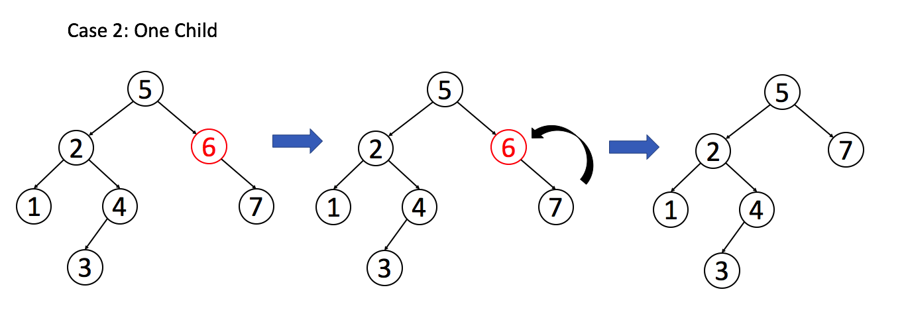

# 位运算

## 异或

异或：可理解为**无进位相加**，满足**交换律**和**结合律**：`a^b=b^a`、`a^b^c=a^(b^c)`

特殊情况：`0^N=N`、`N^N=0`

案例1：**交换两数之值**

```java
public static void main(String[] args) {
    int a = 5, b = 2;
    a = a ^ b;
    b = a ^ b;
    a = a ^ b;
    System.out.println(a);// 2
    System.out.println(b);// 5
}
```

解释：

上面代码对b的操作其实是`b=a^b^b`，根据异或规律可知即`b=a`；而对a的操作为：`a=a^b^a`，所以得`a=b`，从而实现了值交换。

案例2：**取出最右侧位上的1**

```java
int a = 400;
int b = a & (~a + 1);// 即一个数 与 自己取反+1 可以得到最右侧的1
System.out.println(b);
```

练习题：

1、一个int数组arr[]，里面有a和b是出现了奇数次，其余数都是出现偶数次，求出a和b？

```java
public static void main(String[] args) {
    int[] arr = new int[]{1, 1, 2, 2, 3, 4};

    // 根据异或的n^n=0, 0^n=n的特性
    int eor = 0;
    for (int v : arr) {
        eor ^= v;
    }
    // 此时的eor=a^b，且必不为0
    // 找到eor的最右侧的1，这是a和b第一个不相等的数位
    int rightOne = eor & (~eor + 1);// 一个数 与 自己取反+1 =最右侧的1

    // 此时只需要再将数组进行1次选择性异或即可
    int aorb = 0;
    for (int v : arr) {
        if ((v & rightOne) == 1) {// a或b只有一个可以计算异或值
            aorb ^= v;
        }
    }
    // 此时aorb代表a或b

    System.out.printf("a=%d b=%d \n", aorb, eor ^ aorb);
}
```

- 时间复杂度：O(N)
- 空间复杂度：O(1)

# 二分

> **核心技巧：根据arr[mid]<target或arr[mid]<=target可以维护left左边的都是<target或<=target，从而可以得到第一个>=target或>target的索引，此时该索引为left.**

情况1：只需要找target在数组的索引

```java
/**
 * 二分查找目标
 * left左边都是<target
 * right右边都是>target
 * 若没找到，最后一定是left=right+1
 */
public static int binarySearch(int[] arr, int target, int start, int end) {
    if (start > end) return -1;
    int left = start, right = end;
    while (left <= right) {
        int mid = (left + right) >> 1;
        if (arr[mid] < target) left = mid + 1;
        else if (arr[mid] > target) right = mid - 1;
        else return mid;
    }
    return -1;
}
```

情况2：如果要找某个target的在数组的最左边索引或最右边索引。

> 此索引也可计算将target插入数组的最佳位置(即最右边索引+1)

```java
/**
 * 二分查找第1个target
 * left左边都是<target
 * right右边都是>=target
 * <p>
 * 若要查找最后1个target，很明显只要保证left左边都是<=target，right右边都是>target，最后一个target一定是right
 */
public static int binarySearchFirstTarget(int[] arr, int target, int start, int end) {
    if (start > end) return -1;
    int left = start, right = end;
    while (left <= right) {
        int mid = (left + right) >> 1;
        if (arr[mid] < target) left = mid + 1;
        else if (arr[mid] >= target) right = mid - 1;
    }
    // 因为right右边都是>=target的，所有left=right+1就是第一个target
    if (left <= end && arr[left] == target) return left;
    return -1;
}
```

应用1：二分插入排序

```java
public static void binaryInsertSort(int[] arr, int start, int end) {
    if (start >= end) return;
    // i表示以及有序部分
    for (int i = start; i < end; i++) {
        int aj = arr[i + 1];// aj表示待插入元素
        // 1.aj不用插入，直接追加到有序序列末尾即可
        if (aj >= arr[i]) continue;// 这样可以避免二分查找

        // 2.二分查找最佳插入位置
        // 维护了left左边都是<=target，right右边都是>target
        // 那么最佳插入位置是left
        int left = start, right = i;
        while (left <= right) {
            int mid = (left + right) >> 1;
            if (arr[mid] <= aj) left = mid + 1;
            else right = mid - 1;
        }

        // 3.此时left就是第一个>aj的索引，也即aj将插入的索引
        if (i + 1 >= left)
            System.arraycopy(arr, left, arr, left + 1, i + 1 - left);
        arr[left] = aj;
    }
}
```

> **总之，二分的技巧就是维护left左边是怎么样的，right右边是怎么样的，然后根据情况来判断是取left还是right，且最后永远是`left=right+1`，同时要处理好可能的left会超过数组边界或right会为-1。**

## 练习题

题1：一个数组int[]，相邻两数不相等，求区域最小值，即其左右相邻数都大于自己，边界则只需满足考虑一边即可？

```java
static int getRegionMin(int[] arr) {
    // 要求arr长度>=2
    if (arr.length == 2) return Math.min(arr[0], arr[1]);
    int len = arr.length;
    // 1.先判断两边
    if (arr[0] < arr[1]) return arr[0];
    if (arr[len - 2] > arr[len - 1]) return arr[len - 1];

    // 2.二分查找区域最小
    int left = 0, right = len - 1;
    while (left <= right) {
        int mid = (left + right) >> 1;
        // 2.1 先判断mid是否满足
        if ((mid == 0 || arr[mid - 1] > arr[mid]) &&
            (mid == len - 1 || arr[mid] < arr[mid + 1]))
            return arr[mid];
        // 2.2 mid比相邻两边的某边大，选小的那边
        else if (mid != 0 && arr[mid] > arr[mid - 1]) right = mid - 1;
        else left = mid + 1;
    }
    throw new RuntimeException(Arrays.toString(arr));// 代码写错了
}
```

# 链表

```java
// 最简单的单链表
public static class ListNode {
    public int val;
    public ListNode next;

    public ListNode(int val) {
        this.val = val;
        this.next = null;
    }

    public ListNode(int val, ListNode next) {
        this.val = val;
        this.next = next;
    }
}
```

## 翻转链表

翻转链表就是将链表从头结点翻转为以尾结点作为首结点，依次连接

```java
/** 链表翻转
     * 时间复杂度：O(N)
     * 空间复杂度：O(1)
     */
public static ListNode reverse(ListNode head) {
    if (head == null) return null;

    ListNode pre = null, curr = head;
    while (curr != null) {
        ListNode next = curr.next;

        curr.next = pre;
        pre = curr;
        curr = next;
    }
    return pre;
}
```

这个示例是将链表完全翻转，也可以用一个集合来收集所有的结点，再依次相连，不过这样空间复杂度就是O(N)了。

### 部分翻转链表

在一些情况下，并不会去完全翻转整个链表，而是翻转一部分，如每隔k个节点进行一次翻转。如[1,2,3,4,5,6,7]翻转为[3,2,1,6,5,4,7],此处按k=3进行翻转：

```java
/*部分翻转链表，将给定的头结点到尾结点进行翻转
    返回尾结点作为翻转后的头结点，
    且翻转前的头结点需指向为null，以避免翻转成一个环了*/
public static ListNode reverse(ListNode head, ListNode tail) {
    if (head == null||head==tail) return head;

    ListNode pre = null, curr = head;
    while (tail!=pre) {
        ListNode next = curr.next;
        // 指针交换
        curr.next = pre;
        pre = curr;
        curr = next;
    }
    return pre;// 翻转前的尾结点，翻转后的头结点
}
```

这里仅仅给出了一个头结点到一个尾结点的翻转，而要作为一个链表中k个节点翻转，还需处理好每个分组的连接处的连接。

### 案例：k个一组链表翻转

力扣25题，字节一面算法题(我寄于此)。

> 描述：
> 给你一个链表，每 k 个节点一组进行翻转，请你返回翻转后的链表。
> k 是一个正整数，它的值小于或等于链表的长度。
> 如果节点总数不是 k 的整数倍，那么请将最后剩余的节点保持原有顺序。
>
> 来源：力扣（LeetCode）
> 链接：https://leetcode-cn.com/problems/reverse-nodes-in-k-group
>

```java
class Solution {
    public ListNode reverseKGroup(ListNode head, int k) {

        ListNode firstOfGroup = head, lastOfGroup,
                lastTail = null, result = null;
        while (firstOfGroup != null) {
            lastOfGroup = firstOfGroup;
            int groupLen;// 代表此组长度
            for (groupLen = 1; groupLen < k && lastOfGroup.next != null; groupLen++)
                lastOfGroup = lastOfGroup.next;

            ListNode firstOfNextGroup = lastOfGroup.next;
            // 最后一组，且不为k的话，则不翻转
            if (groupLen < k) {
                if (lastTail == null) result = head;// 说明第一组就不为k了
                else
                    lastTail.next = firstOfGroup;// 衔接上一组

                break;
            }

            ListNode headOfGroup = reversePart(firstOfGroup, lastOfGroup);// 这里翻转的可能是k个，也可能没有k个
            if (lastTail == null) // 说明是第一组
                result = headOfGroup;
            else // 接上上一组
                lastTail.next = headOfGroup;
            lastTail = firstOfGroup;

            firstOfGroup = firstOfNextGroup;
        }

        return result;
    }

    /*部分翻转，返回翻转后的头结点*/
    public ListNode reversePart(ListNode head, ListNode tail) {
        if (head == null) return null;

        ListNode pre = null, curr = head;
        while (tail != pre) {
            ListNode next = curr.next;
            curr.next = pre;
            pre = curr;
            curr = next;
        }

        return pre;// 翻转前的尾结点，翻转后的头结点
    }
}
```

## 切分链表

仅需要6个变量即可对单链表进行三向切分。

- 思想：维护3个子链表，分别代表小于/等于/大于部分，切分链表将各个结点加入不同子链表，最后合并。

```java
// 将单链表切分为小于pivot的放左边，等于pivot放中间，大于pivot放右边
// 一种简单粗暴的方式是将链表所有结点放入数组，然后对数组进行1次三向切分
// 其实对于链表，更优美的方式是用6个变量即可
static ListNode partition(ListNode root, int pivot) {
    if (root == null || root.next == null) return root;

    ListNode sHead = null, sTail = null;// 小于部分头尾结点
    ListNode mHead = null, mTail = null;// 等于部分头尾结点
    ListNode bHead = null, bTail = null;// 大于部分头尾结点

    // 1.切分
    for (ListNode node = root; node != null; node = node.next) {
        if (node.val < pivot) {
            if (sHead == null) sHead = node;
            if (sTail != null) sTail.next = node;
            sTail = node;
        } else if (node.val == pivot) {
            if (mHead == null) mHead = node;
            if (mTail != null) mTail.next = node;
            mTail = node;
        } else {
            if (bHead == null) bHead = node;
            if (bTail != null) bTail.next = node;
            bTail = node;
        }
    }
    // 2.合并
    if (bTail != null) bTail.next = null;

    if (mTail != null) mTail.next = bHead;
    else mHead = bHead;

    if (sTail != null) sTail.next = mHead;
    else sHead = mHead;

    return sHead;
}
```

## 快慢指针

题目描述：找到某个无环单链表的中间节点。

思路：用快慢指针，快指针走2步，慢指针走1步，快指针到末尾，则慢指针到中间节点。

```java
public ListNode midNode(ListNode head){
    if(head==null||head.next==null) return head;
    // 1.快指针设为head.next的原因是slow走1步为head，fast走两步本来就要该是head.next
    // 若fast=head,slow=head，则两者都是从head开始走，那么head这个点就无法计入链表长度
    ListNode fast=head.next,slow=head;// 快指针和慢指针走1次
    
    // 2.fast走到尾，走(n+1)/2-1次
    while(fast!=null&&fast.next!=null){
        fast=fast.next.next;
        slow=slow.next;
    }
    return slow;// 此时slow必为中间节点
}
```

这种走法走出来的slow指针必为中间节点，链表长度为n，则**快指针和慢指针一共会走(n+1)/2次**，那么**慢指针就恰好在中间节点**。

## 环形链表入口节点

力扣：https://leetcode.cn/problems/c32eOV/

描述：给定一个链表，返回链表开始入环的第一个节点。 从链表的头节点开始沿着 `next` 指针进入环的第一个节点为环的入口节点。如果链表无环，则返回 `null`。

```java
public ListNode detectCycle(ListNode head) {
    if(head==null||head.next==null) return null;

    // 1.快慢指针找到相遇点c1
    ListNode fast=head.next,slow=head;
    ListNode c1=null;// 快慢指针相遇点
    while(fast!=null&&fast.next!=null){
        fast=fast.next.next;
        slow=slow.next;
        if(fast==slow) {
            c1=fast;
            break;
        }
    }
    if(c1==null) return null;// 无环
    // 2.从head出发找到入环点
    // 设头结点到入环点长度s，入环点到相遇点长度c1，相遇点到入环点长度c2
    // 快指针走过=s+c1+(c1+c2)*n; n>=1
    // 慢指针走过=s+c1；慢指针必不可能走过超过1圈
    // 则s=n*(c1+c2)-c1，此时若让两个指针分别从head出发和c1出发且步速为1，则必在入口点相遇
    ListNode i=head,j=c1.next;
    while(i!=j){
        i=i.next;
        j=j.next;
    }
    return i;
}
```

解析看注释，这个找入口节点的技巧一定要记住，笔试用不上，面试吹牛p用。

笔试找入口点直接用HashMap做，写的快的多。

# 树

## 二叉查找树

> 二叉搜索树（BST）是二叉树的一种特殊表示形式，它满足如下特性：
>
> 1. 每个节点中的值必须大于（或等于）存储在其左侧子树中的任何值。
>
> 2. 每个节点中的值必须小于（或等于）存储在其右子树中的任何值。

对于二叉搜索树，我们可以通过`中序遍历`得到一个`递增的`有序序列。因此，中序遍历是二叉搜索树中最常用的遍历方法。

### 结点定义

对于二叉树结点的定义如下：

```java
/**
 * @author fzk
 * @date 2021-07-07 18:35
 */
// Definition for a binary tree node.
public class TreeNode {
    public int val;
    public TreeNode left;
    public TreeNode right;

    public TreeNode() {
    }

    public TreeNode(int val) {
        this.val = val;
    }

    public TreeNode(int val, TreeNode left, TreeNode right) {
        this.val = val;
        this.left = left;
        this.right = right;
    }
}
```

### 中序遍历

中序遍历为：先遍历左孩子，再遍历根结点，再遍历右孩子。递归实现如下：

```java
    /**
     * 中序遍历
     *
     * @param root 传入需要遍历的二叉树
     * @param list 将中序遍历的结果放入此数组中
     */
    private static void inorderTraversal(TreeNode root, List<Integer> list) {
        if (root == null)
            return;
        inorderTraversal(root.left, list);
        list.add(root.val);
        inorderTraversal(root.right, list);
    }
```

前序遍历和后续遍历只需调换那2个递归和add方法之间的顺序即可。

### 迭代器

```java
// Definition for a binary tree node.
public class TreeNode {
    public int val;
    public TreeNode left;
    public TreeNode right;

    public TreeNode() {
    }

    public TreeNode(int val) {
        this.val = val;
    }

    public TreeNode(int val, TreeNode left, TreeNode right) {
        this.val = val;
        this.left = left;
        this.right = right;
    }

    public Iterator<TreeNode> iterator() {
        return new BSTIterator(this);
    }

    final class BSTIterator implements Iterator<TreeNode> {
        private final LinkedList<TreeNode> nodeList;// 双向链表模拟栈

        public BSTIterator(TreeNode root) {
            nodeList = new LinkedList<>();
            dfsLeft(root);
        }

        @Override
        public boolean hasNext() {
            return nodeList.size() > 0;
        }

        @Override
        public TreeNode next() {
            TreeNode root = nodeList.removeFirst();
            dfsLeft(root.right);
            return root;
        }

        void dfsLeft(TreeNode root) {
            while (root != null) {
                nodeList.addFirst(root);
                root = root.left;
            }
        }
    }
}
```

> 思想：
> 采用中序遍历的迭代器，只实现了next和hasnext方法
> 迭代器使用O(h)的内存，h为树的高度
>
> 1. 先将当前节点的所有左孩子及其左孩子压入栈，压到没有为止；
> 2. 将最后一个压入的节点弹出（栈顶元素），作为next()的返回值；
> 3. 将当前弹出节点的右节点作为当前节点，重复步骤1
>
> 这种方法的实现比较节省空间，而使用双向链表方便了快速的插入和移除栈顶元素。

### 删除结点

> 二叉搜索树的3个基本操作：查询、插入和删除。
> 查询操作非常简单；
> 插入可以很简单，也可以很复杂，如平衡二叉树。
> 删除操作就比较复杂了。

删除操作比较复杂，有很多删除的方法，这里给出整体变化最小的一种方法：

> 选择一个合适的后继结点或前驱结点来**替代**被删除结点。

根据被删除结点的情况，分为以下3类：

1. 如果目标节点**没有子节点**，我们可以直接移除该目标节点。
2. 如果目标节**只有一个子节点**，我们可以用其子节点作为替换。
3. 如果目标节点**有两个子节点**，我们需要用其中序**后继节点**或者**前驱节点**来替换，再删除该目标节点。





```java
   public TreeNode deleteNode(TreeNode root, int key) {
        TreeNode p=root,parent=null;// parent为被删结点的父节点
        boolean flag=true;// true代表被删除结点是parent的左孩子，false代表右孩子
        if(p==null)
            return null;
        if(p.val==key){
            if(p.left!=null){
                TreeNode pre_node=getPreNode(p.left);
                pre_node.right=p.right;
                return pre_node;
            }
            return p.right;
        }
        while(p!=null){
            if(key<p.val){
                parent=p;
                p=p.left;
                flag=true;
            }
            else if(key>p.val){
                parent=p;
                p=p.right;
                flag=false;
            }
            else{
                if(p.left==null&&p.right==null){// 第1种情况：没有子结点
                    if(flag){
                        parent.left=null;
                        return root;
                    }
                    parent.right=null;
                    return root;
                }else if(p.left==null){// 第2.1种情况：没有左孩子，有右孩子
                    if(flag){
                        parent.left=p.right;
                        return root;
                    }
                    parent.right=p.right;
                    return root;
                }
                else if(p.right==null){// 第2.2中情况：有左结点，没有右结点
                    if(flag){
                        parent.left=p.left;
                        return root;
                    }
                    parent.right=p.left;
                    return root;
                }else{
                    // 第3中情况：左右结点都有
                    // 找到其前驱结点
                    TreeNode pre_node = getPreNode(p.left);
                    pre_node.right=p.right;
                    if(flag){
                        parent.left=pre_node;
                        return root;
                    }
                    parent.right=pre_node;
                    return root;
                }
            }
        }
        return root;
    }
    public TreeNode getPreNode(TreeNode root){
        TreeNode p=root;
        if(root==null||root.right==null)
            return root;
        TreeNode parent=null;
        // 找前继结点
        while(root.right!=null){
            parent=root;
            root=root.right;
        }
        parent.right=root.left;
        root.left=p;
        return root;
    }
```

## 平衡二叉查找树

运行时间都是**对数级别**，**树高为~lgN**.需要保持二分查找树的**平衡性**。

但是，动态插入中保证树的完美平衡**代价太高**了。

**为什么需要用到高度平衡的二叉搜索树?**

> 我们已经介绍过了二叉树及其相关操作, 包括搜索、插入、删除。当分析这些操作的时间复杂度时，我们需要注意的是树的高度是十分重要的考量因素。以搜索操作为例，如果二叉搜索树的高度为 h ，则时间复杂度为 O(h) 。二叉搜索树的高度的确很重要。

> 所以，我们来讨论一下树的节点总数 N 和高度 h 之间的关系。
> 对于一个平衡二叉搜索树, h=lgN，
> 但一个普通的二叉搜索树，在最坏的情况下，它可以退化成一个链。

> 因此，具有 N 个节点的二叉搜索树的高度在 logN 到 N 区间变化。
> 也就是说，搜索操作的时间复杂度可以从 logN 变化到 N 。这是一个巨大的性能差异。

> 所以说，高度平衡的二叉搜索树对提高性能起着重要作用。

**如何实现一个高度平衡的二叉搜索树?**
有许多不同的方法可以实现。尽管这些实现方法的细节有所不同，但他们有相同的目标:

> 采用的数据结构应该满足二分查找属性和高度平衡属性。
> 采用的数据结构应该支持二叉搜索树的基本操作，包括在 **O(logN)** 时间内的搜索、插入和删除，即使在最坏的情况下也是如此。
> 常见的的高度平衡二叉树：
>
> - 红黑树
> - AVL树
> - 伸展树
> -  树堆

**高度平衡的二叉搜索树的实际应用**
高度平衡的二叉搜索树在实际中被广泛使用，因为它可以在 *O(logN)* 时间复杂度内执行所有搜索、插入和删除操作。

> 平衡二叉搜索树的概念经常运用在 Set 和 Map 中。Set 和 Map 的原理相似。

> 通常，有两种最广泛使用的集合：散列集合（**HashSet**）和 树集合（**TreeSet**）。
>
> 树集合，Java 中的 Treeset 或者 C++ 中的 set ，是由高度平衡的二叉搜索树实现的。
> 因此，搜索、插入和删除的时间复杂度都是O(logN)。
>
> 散列集合，Java 中的 HashSet 或者 C++ 中的 unordered_set ，是由哈希实现的，但是平衡二叉搜索树也起到了至关重要的作用。当存在具有相同哈希键的元素过多时，将花费 O(N) 时间复杂度来查找特定元素，其中N是具有相同哈希键的元素的数量。 通常情况下，使用高度平衡的二叉搜索树将把**时间复杂度从 O(N) 改善到 O(logN)** 。

哈希集和树集之间的本质区别在于树集中的键是有序的。


### AVL树

- 自平衡二叉查找树，又称高度平衡树。

什么是一个高度平衡的二叉搜索树?

> 树结构中的常见用语:
>
> 1. 节点的**深度** - 从树的根节点到该节点的边数
>
> 2. 节点的**高度** - 该节点和叶子之间最长路径上的边数
>
> 3. 树的高度 - 其根节点的高度

一个高度平衡的二叉搜索树（*平衡二叉搜索树*）是在插入和删除任何节点之后，可以自动保持其高度最小。也就是说，有 N 个节点的平衡二叉搜索树，它的高度是 *logN* 。并且，***每个节点的两个子树的高度不会相差超过 1***。

>为什么是 `logN` 呢?
>- 一个高度为 `h` 的二叉树 
>  2^0^ + 2^1^ +...+ 2^h-1^ +1 <= N <=2^0^ + 2^1^ +...+ 2^h^
>- 换言之，一个有 `N` 个节点，且高度为 `h` 的二叉树
    2^h^ <= N <=2^h+1^ -1.
>    h <= lgN < h+1
  - 所以： 
    h = floor(log~2~N).

#### 判断AVL

```java
class Solution {
    private boolean isBalanced;
    public boolean isBalanced(TreeNode root) {
        /*
        采用后续遍历的方式，进行每一层的高度判断
         */
        isBalanced=true;
        getHigh(root);
        return isBalanced;
    }

    public int getHigh(TreeNode root) {
        if (root == null)
            return 0;
        if (!isBalanced)
            return 0;

        int high_left = getHigh(root.left);
        int high_right = getHigh(root.right);
        if (Math.abs(high_left - high_right) > 1) {
            isBalanced = Boolean.FALSE;
        }
        return Math.max(high_left, high_right) + 1;
    }
}
```

> 判断的核心在于判断左结点和右结点的高度是否相差大于1，那么采用后续遍历递归的方式即可解决。
> 但是内存递归内存消耗较多。

#### 构建AVL

给你一个整数数组 nums ，其中元素已经按 **升序** 排列，将其转换为一棵 高度平衡 二叉搜索树。

```java
    /**
     * 传入一个数组，将其构成AVL树
     *
     * @param nums 按 严格递增 顺序排列
     * @return
     */
    public TreeNode sortedArrayToBST(int[] nums) {
        /*
        采用二分思想，左边构成左子树，右边的构成右子树，中间构成根结点
         */
        return sortedArrayToBST(nums, 0, nums.length - 1);
    }

    public TreeNode sortedArrayToBST(int[] nums, int low, int high) {
        if (low > high)
            return null;

        int mid = (low + high) >>> 1;
        TreeNode node = new TreeNode(nums[mid], null, null);//构建根结点
        node.left = sortedArrayToBST(nums, low, mid - 1);//构建左子树
        node.right = sortedArrayToBST(nums, mid + 1, high);//构建右子树
        return node;
    }
```

### 2-3查找树

为了保证查找树的平衡性，设置树中的一个结点保存多个键。
将标准二叉树的结点称为[^2-结点],而[^3-结点].

> - 2-结点，一个键，两条链接，
>   左链接指向的2-3树的键都小于该结点，
>   右链接指向的2-3树中的结点的键都大于该结点。
> - 3-结点，2个键，3条链接，
>   左链接都小于该节点，
>   中链接指向的2-3树的键都位于该结点两个键之间；
>   右链接都大于该结点。


## 二叉树技巧

```java
// 最简单的二叉树
public static class TreeNode {
    int val;
    TreeNode left;
    TreeNode right;

    TreeNode(int val) {
        this.val = val;
    }

    TreeNode(int val, TreeNode left, TreeNode right) {
        this.val = val;
        this.left = left;
        this.right = right;
    }
}
```

### 二叉树序列化和反序列化

这里是按照力扣的二叉树表示方式进行序列化和反序列化，序列化和反序列化都是按照广度优先方式进行。

```java
static class Codec {
    /*leetcode 用的是广度优先方式*/
    // Encodes a tree to a single string.
    public String serialize(TreeNode root) {
        if (root == null) return "[]";

        StringBuilder builder = new StringBuilder();
        builder.append("[");

        Queue<TreeNode> queue = new LinkedList<>();
        // 保证队列中不存在null
        queue.offer(root);
        while (queue.size() != 0) {
            TreeNode poll = queue.poll();
            if (poll != nullTreeNode) {
                builder.append(poll.val).append(",");
                queue.offer(poll.left == null ? nullTreeNode : poll.left);
                queue.offer(poll.right == null ? nullTreeNode : poll.right);
            } else builder.append("null,");
        }
        builder.deleteCharAt(builder.length() - 1);// 删掉最后的','
        builder.append("]");

        String s = builder.substring(1, builder.length() - 1);// 准备删除末尾的null
        String[] nodes = s.split(",");
        int tailNullCount = 0;// 末尾的null的数量
        for (int i = nodes.length - 1; i > -1; i--) {
            if ("null".equals(nodes[i])) tailNullCount++;
            else break;
        }

        return builder.delete(builder.length() - 1 - 5 * tailNullCount, builder.length() - 1)
            .toString();
    }

    // Decodes your encoded data to tree.
    public TreeNode deserialize(String data) {
        if (data.equals("[]")) return null;

        data = data.substring(1, data.length() - 1);
        String[] nodes = data.split(",");
        Queue<TreeNode> queue = new LinkedList<>();
        TreeNode root = new TreeNode(Integer.parseInt(nodes[0]));
        queue.offer(root);
        int index = 1;
        while (queue.size() != 0 && index < nodes.length) {
            TreeNode poll = queue.poll();
            // 左子树处理
            if (!"null".equals(nodes[index++])) {
                poll.left = new TreeNode(Integer.parseInt(nodes[index - 1]));
                queue.offer(poll.left);
            }
            // 右子树处理
            if (index >= nodes.length) break;// 先判断是否会越界
            if (!"null".equals(nodes[index++])) {
                poll.right = new TreeNode(Integer.parseInt(nodes[index - 1]));
                queue.offer(poll.right);
            }
        }
        return root;
    }

    /** 表示空树，来保证队列中不存在null */
    private static final TreeNode nullTreeNode = new TreeNode(-1);
}
```

### dfs

深度优先依赖于递归的实现，而递归又隐式依赖于栈。

```java
LinkedList<TreeNode> list = new LinkedList<>();
// 深度优先 先序遍历
public void dfs(TreeNode root) {
    if (root != null) {
        list.add(root);
        dfs(root.left);
        dfs(root.right);
    }
}
```

下面这个示例为依赖于栈实现深度优先遍历：

```java
private LinkedList<TreeNode> list = new LinkedList<>();// 存放遍历结果
private LinkedList<TreeNode> stack = new LinkedList<>();//模拟操作数栈

// 用栈实现的深度优先 先序遍历
public void dfsByStack(TreeNode root) {
    if (root != null) {
        stack.push(root);// 入栈

        while (stack.size() != 0) {
            TreeNode pop = stack.pop();// 出栈
            list.addLast(pop);
            // 这里要做到先序遍历的话，需要先入栈右子树，再入栈左子树，这样才能先遍历左子树
            if (pop.right != null) stack.push(pop.right);
            if (pop.left != null) stack.push(pop.left);
        }
    }
}
```

### bfs实现层序遍历

广度优先遍历就不能依赖递归实现了，而要借助于队列。

```java
private LinkedList<TreeNode> list = new LinkedList<>();// 存放遍历结果

// 广度优先遍历 实现的层序遍历
public void bfs(TreeNode root) {
    if (root != null) {
        Queue<TreeNode> queue = new LinkedList<>();
        queue.offer(root);

        while (queue.size() != 0) {
            int num = queue.size();// 这里比较巧妙的是此时的队列长度恰好是二叉树这一层的结点数量
            while (num-- > 0) {
                TreeNode poll = queue.poll();
                list.add(poll);
                if (poll.left != null) queue.offer(poll.left);
                if (poll.right != null) queue.offer(poll.right);
            }
        }
    }
}
```

### BST后继结点

力扣285，给定一棵二叉搜索树和其中的一个节点 `p` ，找到该节点在树中的中序后继。如果没有找到结点或者节点没有中序后继，请返回 `null` 

思路：二叉搜索树按中序遍历将是有序的，后继结点即大于其的第一个结点。按照中序遍历顺序，结点将会按照升序访问，那么在访问到p之后，下一个必定是访问其后继结点。

```java
class Solution {
    private boolean isFound = false;
    private TreeNode midOrderNext = null;

    public TreeNode inorderSuccessor(TreeNode root, TreeNode p) {
        if (root == null) return null;

        dfs(root, p);
        return midOrderNext;
    }

    private void dfs(TreeNode root, TreeNode p) {
        if (root == null) return;
        if (isFound&&midOrderNext!=null) return;//已经找到则不再深入遍历

        dfs(root.left, p);// 遍历左子树
        if (isFound && midOrderNext == null) midOrderNext = root;

        if (root.val == p.val) isFound = true;
        dfs(root.right, p);// 遍历右子树
    }
}
```

### 判断BST

判断某个二叉树是否为二叉查找树BST？

```java
// 思路：BST中序遍历为升序数组，则判断是否为升序即可，因判断升序过程只需前继节点，所以可以优化掉数组
int preVal = Integer.MIN_VALUE;

public boolean isBST(TreeNode root) {
    if (root == null) return false;
    if (root.left != null && !isBST(root.left)) return false;// 先判断左子树
    if (root.val <= preVal) return false;// 违反中序遍历升序排列
    preVal = root.val;// 遍历到自身，则记录自身值
    if (root.right != null && !isBST(root.right)) return false;// 再判断右子树
    return true;
}
```

### 判断AVL树

判断二叉树是否为AVL树，AVL树的左右子树高度差不超过1.

```java
public boolean isAVL(TreeNode root) {
    return dfs(root) != -1;
}

// 后序遍历：返回值表示子AVL树高度，-1表示不是AVL
int dfs(TreeNode root) {
    if (root == null) return 0;
    int left = dfs(root.left);
    if (left == -1) return -1;
    int right = dfs(root.right);
    if (right == -1) return -1;

    // 此时左子树和右子树都是AVL树
    if (Math.abs(left - right) > 1) return -1;
    return 1 + Math.max(left, right);// 此子树为AVL树，返回高度
}
```

### 二叉树最近公共祖先

力扣236题：给定一个二叉树, 找到该树中两个指定节点的最近公共祖先。

```java
// 先序遍历：返回找到的p1或p2或公共祖先，否则返回null
TreeNode dfs(TreeNode root, TreeNode p1, TreeNode p2) {
    if (root == null) return null;
    // 当root为p1或p2时，直接返回root，此时root树要么只有1个，要么两个都有(此时p1/p2为p2/p1的祖先)
    if (root == p1 || root == p2) return root;

    TreeNode left = dfs(root.left, p1, p2);
    TreeNode right = dfs(root.right, p1, p2);
    // 左右子树都找到了，肯定分别为p1和p2，则返回root作为祖先
    if (left != null && right != null) return root;
    // 左右子树只找到1个，可能是p1/p2或公共祖先，直接返回
    if (left != null) return left;
    if (right != null) return right;
    return null;// 没找到
}
```

### 折纸问题

https://www.nowcoder.com/questionTerminal/430180b66a7547e1963b69b1d0efbd3c


```java
/* 前3次折叠：0表示凹，1表示凸
            0
        0   0   1
      0 0 1 0 0 1 1
      若以二叉树来看：不就是中序遍历吗？每个新折痕其左孩子为凹，右孩子为凸
            0
        0       1
      0   1   0   1
     */
// k表示当前第k层，n表示最大折叠次数
static void print(int k, int n, boolean ao) {
    if (k > n) return;
    print(k + 1, n, true);
    System.out.printf("%c ", ao ? '0' : '1');
    print(k+1,n,false);
}
```


# 图

## 无向图(待续)

## 有向图

### 有向图结构

有向图如下：保存了节点集合与边集合，可以由N*3矩阵得到一个有向图

```java
/**
 * 有向图
 *
 * @author fzk
 * @datetime 2022-08-19 10:29
 */
public class MyGraph {
    public HashMap<Integer, Node> nodes;
    public HashSet<Edge> edges;

    // matrix代表所有边， N*3矩阵
    // matrix[i]=[from节点, to节点, 边权重]
    public MyGraph(int[][] matrix) {
        this.nodes = new HashMap<>();
        this.edges = new HashSet<>();

        // 将输入转为图
        for (int i = 0; i < matrix.length; i++) {
            int from = matrix[i][0], to = matrix[i][1], weight = matrix[i][2];
            Node fromNode = this.nodes.get(from), toNode = this.nodes.get(to);
            if (fromNode == null) {
                fromNode = new Node(from);
                this.nodes.put(from, fromNode);
            }
            if (toNode == null) {
                toNode = new Node(to);
                this.nodes.put(to, toNode);
            }

            Edge edge = new Edge(weight, fromNode, toNode);
            this.edges.add(edge);
            fromNode.nextNodes.add(toNode);
            fromNode.edges.add(edge);
            fromNode.out++;
            toNode.in++;
            // 有向图
            // toNode.nextNodes.add(fromNode);
            // toNode.edges.add(edge);
        }
    }
}
```

有向图节点：有向图中一定要记录入度和出度，它非常有用如拓扑排序

```java
/**
 * @author fzk
 * @datetime 2022-08-19 10:32
 */
public class Node {
    public int value;
    public int in = 0;// 入度
    public int out = 0;// 出度
    public ArrayList<Node> nextNodes;
    public ArrayList<Edge> edges;

    public Node(int value) {
        this.value = value;
        this.nextNodes = new ArrayList<>();
        this.edges = new ArrayList<>();
    }

    @Override
    public String toString() {
        StringBuilder sb = new StringBuilder();
        sb.append('[');
        for (int i = 0; i < this.nextNodes.size(); i++) {
            Node next = this.nextNodes.get(i);
            if (i != 0) sb.append(", ");
            sb.append(next.value);
        }
        sb.append(']');
        return "Node{" +
                "value=" + value +
                ", in=" + in +
                ", out=" + out +
                ", nextNodes=" + sb.toString() +
                '}';
    }
}
```

有向图边：

```java
/**
 * @author fzk
 * @datetime 2022-08-19 10:32
 */
public class Edge {
    public int weight;// 权重
    public Node from;// 边出发点
    public Node to;// 边终点

    public Edge(int weight, Node from, Node to) {
        this.weight = weight;
        this.from = from;
        this.to = to;
    }
}
```

### dfs和bfs

有向图dfs和无向图区别不大，都是用一个访问标记集合记录是否访问过：

不过下面这个不算真正的递归遍历，而是用栈模拟的递归遍历

```java
public static ArrayList<Node> dfs(MyGraph graph) {
    HashSet<Node> accessed = new HashSet<>();
    ArrayList<Node> result = new ArrayList<>();
    LinkedList<Node> stack = new LinkedList<>();

    for (Node node : graph.nodes.values()) {
        if (!accessed.contains(node))
            dfs(node, accessed, result, stack);
    }
    return result;
}

private static void dfs(Node node, HashSet<Node> accessed, 
                        ArrayList<Node> result, LinkedList<Node> stack) {
    if (node == null) return;

    stack.addLast(node);
    accessed.add(node);
    result.add(node);
    while (stack.size() > 0) {
        Node cur = stack.removeLast();
        for (Node next : cur.nextNodes) {
            if (!accessed.contains(next)) {
                accessed.add(next);

                // 这里再将此元素加入栈中，再最后进行break是为了完美的切合dfs访问节点顺序流程
                stack.addLast(cur);
                stack.addLast(next);

                // ---这里执行dfs操作
                result.add(next);
                // ---

                break;// break目的是为了完美切合dfs流程
            }
        }
    }
}
```

有向图宽度优先也和dfs差不多：一个用栈一个用队列的区别。

```java
public static ArrayList<Node> bfs(MyGraph graph) {
    ArrayList<Node> result = new ArrayList<>();
    HashSet<Node> accessed = new HashSet<>();// 已经访问过的标记
    LinkedList<Node> queue = new LinkedList<>();

    for (Node node : graph.nodes.values()) {
        if (!accessed.contains(node))
            bfs(node, accessed, queue, result);
    }
    return result;
}

private static void bfs(Node node, HashSet<Node> accessed, 
                       LinkedList<Node> queue, ArrayList<Node> result) {
    if (node == null) return;

    queue.addLast(node);
    accessed.add(node);
    result.add(node);
    while (queue.size() > 0) {
        Node cur = queue.removeFirst();
        for (Node next : cur.nextNodes) {
            if (!accessed.contains(next)) {
                accessed.add(next);
                queue.addLast(next);

                // ---这里执行bfs操作
                result.add(next);
                // ---
            }
        }
    }
}
```

### 有向环判断与拓扑排序

判断有向图的环其实很简单，就按照包依赖解析这种思想来做，当某个包解析时，递归解析其依赖包，若最后发现又依赖于前面尚在解析中的包，则出现了**循环依赖**，即有向环。

拓扑排序：用于决定按照什么顺序执行某些任务，如某些任务必须在另一些任务之前调度，这会构成一张有向调度图，拓扑排序就是如何调度这些任务。

思想：肯定是**入度为0的任务先调度**，此任务调度后将其指向的后继任务入度减1即可继续循环查找入度为0的任务，整个拓扑排序过程就是循环寻找入度为0结点，并将其从图中逻辑移除。

```java
/**
 * 拓扑排序以及有向环判断
 *
 * @author fzk
 * @datetime 2022-08-19 15:43
 */
public class TopoSort {
    // 判断有向图是否有环
    // 用途：包依赖解析，避免循环依赖
    public static boolean isHasCycle(MyGraph graph) {
        // 当有某个结点时说明在解析，为true表示解析完成，false表示解析进行中
        HashMap<Node, Boolean> parse = new HashMap<>();

        for (Node node : graph.nodes.values())
            dfsIsHasCycle(node, parse);
        return isCycleDependency;
    }

    private static boolean isCycleDependency = false;

    private static void dfsIsHasCycle(Node node, HashMap<Node, Boolean> parse) {
        if (isCycleDependency) return;
        // node解析过了
        if (parse.containsKey(node)) {
            // node正在解析说明出现循环依赖了！
            if (!parse.get(node)) {
                isCycleDependency = true;
            }
            return;
        }

        // 开始解析node
        parse.put(node, false);
        // dfs方式解析其依赖
        for (Node next : node.nextNodes) 
            dfsIsHasCycle(next, parse);
        
        // 解析完成
        parse.put(node, true);
    }

    // 有向图拓扑排序，也能根据这个判断是否有向环
    // 使用场景：任务依赖调度，如A-->B-->C，则任务调度顺序必须为[A, B, C]
    public static ArrayList<Node> topoSort(MyGraph graph) {
        // 0.有环图无拓扑排序
        // if (isHasCycle(graph)) return null;

        LinkedList<Node> zeroInNode = new LinkedList<>();// 入度为0的节点入队列
        HashMap<Node, Integer> nodeInMap = new HashMap<>();// 节点的剩余入度，若不想改变原始结构，则必须以其它结构保存其入度情况
        ArrayList<Node> result = new ArrayList<>();

        // 1.先查找入度为0的节点，它们最先执行
        for (Node node : graph.nodes.values()) {
            if (node.in == 0) zeroInNode.addLast(node);
            nodeInMap.put(node, node.in);
        }

        // 2.拓扑排序开始，将入度为0的节点逻辑上从有向图中去除，依次改变其它节点入度，一轮轮的找入度为0节点
        while (zeroInNode.size() > 0) {
            Node cur = zeroInNode.removeFirst();
            result.add(cur);
            // 逻辑上移除cur节点，修改其后继节点的入度
            for (Node next : cur.nextNodes) {
                Integer old = nodeInMap.put(next, nodeInMap.get(next) - 1);
                if (old == 1) zeroInNode.addLast(next);
            }
        }
        // 3.只要节点数量不对，肯定是因为有向环导致入度不为0
        if (result.size() != graph.nodes.size()) {
            throw new RuntimeException("拓扑排序发现出现了有向环");
        }
        return result;
    }
}
```

在上面拓扑排序第0步和第3步的有向环判断结果肯定是一致的，只需要保留其一即可。

### 有向环路劲

一个有向图中如何得到其有向环的所有节点呢？

要得到一条路劲，则必须**记录访问节点的前继节点**，从节点回退查找从而得到一条访问路劲；那么只要**找到环的节点之一**，就能**根据前继节点路劲回退查找环路劲**了。

```java
/**
 * 此类用于寻找有向图的环，
 * 关键在于记录访问节点的前继节点，当出现环时从末尾节点一直往回退从而得到环
 *
 * @author fzk
 * @datetime 2022-08-19 14:51
 */
public class DirectedCycle {
    private final HashSet<Node> accessed;
    /**
     * 记录到达key结点的前继结点value
     * 如A-->B， 那么在这里key=B， value=A
     */
    private final HashMap<Node, Node> preNode;
    private final HashSet<Node> onStack;// 表示节点是否在dfs的调用栈上
    /**
     * 若为空则无环，不为空则必为如下形式
     * 有向环：[A,x,x,x,A]
     */
    public LinkedList<Node> cycle = null;

    public DirectedCycle(MyGraph graph) {
        int n = graph.nodes.size();
        accessed = new HashSet<>(n);
        preNode = new HashMap<>(n);
        onStack = new HashSet<>(n);
        for (Node node : graph.nodes.values()) {
            if (!accessed.contains(node)) {
                accessed.add(node);
                dfs(node);
            }
        }
    }

    private void dfs(Node node) {
        if (hasCycle()) return;
        onStack.add(node);// 模拟dfs入栈

        for (Node next : node.nextNodes) {
            if (hasCycle()) return;
            else if (!accessed.contains(next)) {
                accessed.add(next);
                preNode.put(next, node);
                dfs(next);
            }
            // 该后继节点在dfs调用栈上，说明出现有向环了
            else if (onStack.contains(next)) {
                cycle = new LinkedList<>();
                // 这里必须从node开始往回找前继结点
                for (Node x = node; x != next; x = preNode.get(x))
                    cycle.addFirst(x);
                cycle.addFirst(next);
                cycle.addFirst(node);// 再加入node形成闭环，此时环：[A,x,x,x,A]
            }
        }

        onStack.remove(node);// 模拟dfs出栈
    }

    public boolean hasCycle() {
        return cycle != null;
    }

    /**
     * 如有环则返回环，无环返回null
     */
    public static LinkedList<Node> getCycle(MyGraph graph) {
        DirectedCycle directedCycle = new DirectedCycle(graph);
        if (directedCycle.hasCycle()) return directedCycle.cycle;
        else return null;
    }
}
```

有向图判断环除了这种模拟记录dfs调用栈，也可以按照上面那种有向环判断方式进行判断，反正核心在于前继节点路劲。

## 并查集union-find

将一组对象分为多个等价类(联通分量)，判断动态连通性。用例如社交网络的朋友的朋友。

```java
/**
 * @author fzk
 * @date 2022-08-26 10:44
 */
public class UF {
    // 每个节点在uf的前继结点，一开始是自己，然后是联通分量根结点，根结点合并时就不一定指向根结点了
    private final HashMap<Node, Node> nodesPre = new HashMap<>();
    // 以跟结点Node开始的联通分量大小
    private final HashMap<Node, Integer> ufSize = new HashMap<>();
    private int count = 0;// 联通分量数量

    public void union(Node p, Node q) {
        Node pRoot = find(p);
        Node qRoot = find(q);
        if (pRoot == qRoot) return;

        // 新链接，需要合并联通分量, 即合并跟触点
        // 将小树合并到大树，从而保证树高度不超过lgN
        int pSize = ufSize.get(pRoot), qSize = ufSize.get(qRoot);
        if (pSize < qSize) {
            // 将p联通分量合并到q
            nodesPre.put(pRoot, qRoot);
            ufSize.put(qRoot, pSize + qSize);
            //ufSize.remove(pRoot);// 可删可不删
        } else {
            // 将q联通分量合并到p
            nodesPre.put(qRoot, pRoot);
            ufSize.put(pRoot, pSize + qSize);
            //ufSize.remove(qRoot);// 可删可不删
        }
        count--;// 联通分量-1
    }

    // 查找p所在联通分量的根结点
    public Node find(Node p) {
        Node cur = p;
        Node pre = nodesPre.get(cur);
        // 新节点则构建新联通分量
        if (pre == null) {
            nodesPre.put(cur, cur);// 开始时每个触点只含有自己的分量
            ufSize.put(cur, 1);
            count++;// 联通分量+1
            return p;
        } else {
            // 旧节点则找到联通分量根结点
            while (cur != pre) {
                cur = pre;
                pre = nodesPre.get(pre);
            }
            return cur;
        }
    }

    public boolean connected(Node p, Node q) {
        return find(p) == find(q);
    }

    public int getCount() {
        return this.count;
    }

    public static void main(String[] args) {
        Scanner scanner = new Scanner(System.in);
        int n = Integer.parseInt(scanner.nextLine());
        UF uf = new UF();
        HashMap<Integer, Node> map = new HashMap<>();
        for (int i = 0; i < n; i++) {
            String[] splits = scanner.nextLine().split(" ");
            int p = Integer.parseInt(splits[0]);
            int q = Integer.parseInt(splits[1]);
            Node pNode = map.getOrDefault(p, new Node(p));
            map.put(p,pNode);
            Node qNode = map.getOrDefault(q, new Node(q));
            map.put(q,qNode);
            if (uf.connected(pNode, qNode)) continue;
            uf.union(pNode, qNode);
            System.out.printf("新增连接：%d  %d\n", p, q);
        }
        System.out.println("联通分量：" + uf.getCount());
    }
}
```

时间复杂度：在最坏情况下，find()、connected()和union()的成本增长数量级为**lgN**。

### 路劲压缩union-find

在并查集中判断两节点是否相连，需要调用find()方法找到根触点，在上面那种方式已经保证查找时间复杂度低至lgN，但是**最好的情况是每个节点都直接指向其根触点**，为了减少修改次数，可以在遍历过程中顺便修改：

```java
// 查找p所在联通分量的根结点
public Node find(Node p) {
    Node cur = p;
    Node pre = nodesPre.get(cur);
    // 新节点则构建新联通分量
    if (pre == null) {
        nodesPre.put(cur, cur);// 开始时每个触点只含有自己的分量
        ufSize.put(cur, 1);
        count++;// 联通分量+1
        return p;
    } else {
        // 旧节点则找到联通分量根结点
        while (cur != pre) {
            cur = pre;
            pre = nodesPre.get(pre);
        }

        // 路劲压缩quick-union算法：
        // 将遇到的每个节点直接指向根触点
        Node pRoot = cur;
        cur = p;
        while ((pre = nodesPre.get(cur)) != pRoot) {
            nodesPre.put(cur, pRoot);
            cur = pre;
        }
        return pRoot;
    }
}
```

只需要在find()方法加1个循环即可。

注意：路劲压缩并不见得会比前面的方法性能强多少。在算法书p147中有描述。所以没必要去可以优化。

## 最小生成树

- 图的生成树：是无向图的一棵含有所有节点的无环连通子图 
- 最小生成树：加权无向图的一棵权值(树中所有边权值和)最小生成树。

### Kruskal算法

需要借助并查集实现。

```java
/**
 * 借助union-find实现的Kruskal算法最小生成树
 *
 * @author fzk
 * @date 2022-08-26 16:45
 */
public class KruskalMST {
    public static HashSet<Edge> kruskalMST(MyGraph graph) {
        UF uf = new UF();
        // 维护一个最小边的有限队列
        PriorityQueue<Edge> queue = new PriorityQueue<>(
                (a, b) -> a.weight - b.weight);
        queue.addAll(graph.edges);

        // 每次选择最小边将两棵树合并为一棵树
        HashSet<Edge> result = new HashSet<>();
        while (queue.size() > 0 && result.size() < graph.nodes.size() - 1) {
            Edge edge = queue.poll();
            Node from = edge.from, to = edge.to;
            // 用uf将不连通的两个子树合并
            if (!uf.connected(from, to)) {
                uf.union(from, to);
                result.add(edge);
            }
        }
        return result;
    }
}
```

## prim算法

先随机选个节点做最小生成树起始节点，然后每次从该树中能直接相连的新节点选择权重最小的一个边的新节点入树。

```java
/**
 * 无向图生成最小生成树
 * prim算法
 * 先随机选一个节点，以它出发每次选择最小的边的新节点，每次将新的节点加入最小树节点集合，下次又以该最小树集合中所有节点出发找新节点最小的边，直接所有节点入树
 *
 * @author fzk
 * @datetime 2022-09-05 17:35
 */
public class PrimMST {
    // 要求图必须是连续的
    // 若图连续，则相当于森林，多个图
    // 在下面取firstNode时，for循环所有节点去生成树即可生成多棵最小生成树
    public static HashSet<Edge> primMst(MyGraph graph) {
        // 当前构建的树包含的节点
        HashSet<Node> mstNodes = new HashSet<>();
        // 从这些节点出发可选的边
        PriorityQueue<Edge> queue = new PriorityQueue<>((a, b) -> a.weight - b.weight);
        // 最小生成树的边
        HashSet<Edge> mstEdges = new HashSet<>();


        Node firstNode = graph.nodes.values().iterator().next();
        mstNodes.add(firstNode);
        addAllEdgeToQueue(mstNodes, queue, firstNode);

        while (mstNodes.size() < graph.nodes.size() && queue.size() > 0) {
            Edge edge = queue.poll();
            // 此边的两个节点都已在树中，忽略
            if (mstNodes.contains(edge.from) && mstNodes.contains(edge.to)) continue;

            // 此最小边可用
            mstEdges.add(edge);// 新最小边入树
            Node next = null;
            // 肯定是to节点为新节点
            if (mstNodes.contains(edge.from)) next = edge.to;
            else next = edge.from;

            mstNodes.add(next);// 新节点入树
            addAllEdgeToQueue(mstNodes, queue, next);// 将当前新节点的新边加入队列中
        }
        return mstEdges;
    }

    // 加入某个新节点的新边入队列
    private static void addAllEdgeToQueue(HashSet<Node> mstNodes, PriorityQueue<Edge> queue, Node node) {
        for (Edge edge : node.edges) {
            // 如果头尾两个节点都包含在树中了，则该边无没必要进队列
            if (!mstNodes.contains(edge.to)) queue.add(edge);
        }
    }
}
```

## Dijkstra算法

这个算法的思想类似动态规划。适用范围：没有权值为负数的边。这是一种路由选择算法。

此算法用于在图中，从节点A到图中所有节点的最短路劲选择。

# 数学

## 质数

质数即除了1和它本身外没有其他因数的自然数。

力扣204题，统计小于n的所有质数个数，0<=n<=5*10<sup>6</sup>

### 暴力枚举

所谓枚举，就是从2开始一个个数，暴力解决问题。

```java
class Solution {
    public int countPrimes(int n) {
        int ans = 0;
        for (int i = 2; i < n; ++i) {
            ans += isPrime(i) ? 1 : 0;
        }
        return ans;
    }

    public boolean isPrime(int x) {
        if(x<=1) return false;// 边界处理
        if(x&1==0) return false;// 先排除偶数
        for (int i = 3; i * i <= x; ++i) {
            if (x % i == 0) {
                return false;
            }
        }
        return true;
    }
}
```

时间复杂度：O(N*N<sup>1/2</sup>)；空间复杂度：O(1)

### 埃氏筛

该算法由希腊数学家厄拉多塞（EratosthenesEratosthenes）提出，称为厄拉多塞筛法，简称埃氏筛
如果 x 是质数，那么大于 x 的 x 的倍数 2x,3x… 一定不是质数，那么可以建立一个标记数组，对每个质数，标记其倍数为合数，这样之后遇到的只要没被标记过，就一定是质数(因为它不是任何小于它的数的倍数)。
在标记的时候，也不必从2x开始标记，因为2x一定被2这个质数标记过了，可以从x*x开始标记。

```java
public int countPrimes(int n) {
    if (n <= 1) return 0;
    // 埃氏筛
    boolean[] isPrime = new boolean[n + 1];
    Arrays.fill(isPrime, true);
    int count = 0;// 质数个数

    for (int i = 2; i < n; i++) {
        if (isPrime[i]) {// 没有被标记为false
            count++;
            // 开始埃氏筛标记
            for (long j = ((long) i * i); j < n; j += i)
                isPrime[(int) j] = false;
        }
    }
    return count;
}
```

时间复杂度：O(N lg(lgN))；空间复杂度：O(N)


# concurrent

此节记录一些自己实现的并发集合，如阻塞队列

## 阻塞队列

用数组实现的阻塞队列有容量上限，在队列为空或者队列满了，消费者或生产者分别需要等待.

借助于可重入锁及其Condition实现

```java
/**
 * 借助数组、可重入锁、Condition实现的阻塞队列
 *
 * @author fzk
 * @date 2022-01-03 22:14
 */
public class MyBlockQueue<T> {
    private final Object[] items;
    private int addIndex, removeIndex, count;
    private final ReentrantLock lock;
    private final Condition notEmpty;
    private final Condition notFull;

    public MyBlockQueue(int capacity) {
        items = new Object[capacity];
        count = 0;
        addIndex = 0;
        removeIndex = 0;
        lock = new ReentrantLock();
        notEmpty = lock.newCondition();
        notFull = lock.newCondition();
    }

    // 添加一个元素，如果队列慢，则进入等待状态
    public void add(T t) throws InterruptedException {
        lock.lock();
        try {
            while (count == items.length)// while防止虚假唤醒
                notFull.await();// 等非满信号

            items[addIndex] = t;
            if (++addIndex == items.length) addIndex = 0;
            ++count;
            notEmpty.signal();// 放一个非空信号
        } finally {
            lock.unlock();
        }
    }

    // 移除并返回队首元素，如果数组为空，则等待
    public T remove() throws InterruptedException {
        lock.lock();
        try {
            while (count == 0)// while防止虚假唤醒
                notEmpty.await();// 等待非空信号

            Object t = items[removeIndex];
            items[removeIndex] = null;
            if (++removeIndex == items.length) removeIndex = 0;
            count--;
            notFull.signal();// 放非满信号
            return (T) t;
        } finally {
            lock.unlock();
        }
    }
}
```

## 安全哈希映射

此处的安全哈希映射效率并不高，远远不如ConcurrentHashMap的效率，但是比用`synchronized`效率高点。

借助于读写锁，在读多写少的情况下，效率还是可以的。

```java
/**
 * 借助读写锁实现的HashMap安全映射
 *
 * @author fzk
 * @date 2022-01-03 21:31
 */
public class MySafeHashMap<K, V> {
    private final HashMap<K, V> map;
    private final ReentrantReadWriteLock readWriteLock;// 读写锁
    private final ReentrantReadWriteLock.ReadLock readLock;// 读锁
    private final ReentrantReadWriteLock.WriteLock writeLock; // 写锁

    public MySafeHashMap(int capacity) {
        map = new HashMap<>(capacity);
        readWriteLock = new ReentrantReadWriteLock();// 读写锁
        readLock = readWriteLock.readLock();
        writeLock = readWriteLock.writeLock();
    }

    public V get(K key) {
        readLock.lock();// 锁定操作不能放入try块，避免出现try中发生的获取锁(自定义锁)时发生异常导致锁无故释放
        try {
            return map.get(key);
        } finally {
            readLock.unlock();
        }
    }

    /*返回null或者旧的值*/
    public V put(K key, V value) {
        LockSupport.park(this);
        writeLock.lock();// 锁定操作不能放入try块，避免出现try中发生的获取锁(自定义锁)时发生异常导致锁无故释放
        try {
            return map.put(key, value);
        } finally {
            writeLock.unlock();
        }
    }

    // 清空集合
    public void clear() {
        writeLock.lock();// 锁定操作不能放入try块，避免出现try中发生的获取锁(自定义锁)时发生异常导致锁无故释放
        try {
            map.clear();
        } finally {
            writeLock.unlock();
        }
    }
}
```

# 排序算法

>特点：1.没有任何基于比较的算法能够保证使用少于 lg(N!)~NlgN 次比较将长度为N的数组排序。证明过程在算法第四版P177。

## 前言

笔记大部分知识点来自于《算法》第四版，也有参考博客。这里面前7种都是基于比较的排序。


## 0. 排序算法模板

```java
// 排序算法类的模板
public class Example {
    public static void sort(Comparable[] a){
       //各个排序算法的具体实现
    }

    private static boolean less(Comparable v,Comparable w){
        return v.compareTo(w)<0;
    }

    private static void exch(Comparable[] a,int i,int j){
        Comparable t=a[i];
        a[i]=a[j];
        a[j]=t;
    }
}
```

## 1. 初级排序

### 1.1 选择排序

- 思想：首先**找到数组中最小的元素，将它与数组第一个元素交换位置**。重复操作，直至有序。不断选择剩余元素中最小者，故称选择排序。

```java
/**
* 特点：与输入分布无关、数据移动最少(N次交换，线性关系，其他的任何算法都不具备)、不稳定
* 复杂度分析：
*   时间复杂度：n次交换，n*(n-1)/2次比较；O(N^2)
*   空间复杂度：O(1)
* @author fzkstart
* @create 2020-12-06 16:05
*/
public class Selection {
    public static void sort(Comparable[] a){
        int n=a.length;
        for(int i=0;i<n;i++){
            int minIndex=i;  //  最小元素的索引
            for(int j=i+1;j<n;j++)
                if(less(a[j],a[minIndex]))
                    minIndex=j;
            exch(a,i,minIndex);
        }
    }
}
```

### 1.2 插入排序

- 思想：想象为斗地主齐牌，将新牌插入有序序列中，将其余元素都右移。

```java
/**
* 特点：所需的时间取决于数组中元素的初始顺序，时间上：部分有序<随机数组<逆序数组
* 复杂度分析：
*      时间复杂度： 最坏情况：1/2N^2次比较1/2N^2次移动；O(N^2)
*                  最好情况：N-1次比较和0次移动; O(N)
*                  平均情况：1/4N^2次比较和1/4N^2移动; O(N^2)
*      空间复杂度：O(1)
* @author fzkstart
* @create 2020-12-06 16:57
*/
public class Insertion {
    public static void sort(Comparable[] a,int lo,int hi){
        //正向插入排序算法，升序，从左向右，稳定
        Comparable temp=null;
        int j=0;
        for(int i=lo+1;i<=hi;i++){
            temp=a[i];
            for(j=i;j>lo&&less(temp,a[j-1]);j--){
                a[j]=a[j-1];
            }
            a[j]=temp;
        }
    }
    public static void sortReverseStable(Comparable[] a){
        //反向插入排序算法，降序，从右向左,稳定
        int n=a.length;
        Comparable temp=null;
        int j=0;
        for(int i=n-2;i>=0;i--){
            temp=a[i];
            for(j=i;j<n-1&&less(temp,a[j+1]);j++){
                a[j]=a[j+1];
            }
            a[j]=temp;
        }
    }
}
```

#### 二分插入排序

优化待插入元素查找插入位置的过程，将O(n)优化为O(lgN)；**平均时间复杂度：O(NlgN)**

```java
// 二分插入排序
public static void binaryInsertSort(int[] arr, int start, int end) {
    if (start >= end) return;
    // i表示已经有序部分
    for (int i = start; i < end; i++) {
        int aj = arr[i + 1];// aj表示待插入元素
        // 1.aj不用插入，直接追加到有序序列末尾即可
        if (aj >= arr[i]) continue;// 这样可以避免二分查找

        // 2.二分查找最佳插入位置
        // 维护了left左边都是<=target，right右边都是>target
        // 那么最佳插入位置是left
        int left = start, right = i;
        while (left <= right) {
            int mid = (left + right) >> 1;
            if (arr[mid] <= aj) left = mid + 1;
            else right = mid - 1;
        }

        // 3.此时left就是第一个>aj的索引，也即aj将插入的索引
        if (i + 1 >= left)
            System.arraycopy(arr, left, arr, left + 1, i + 1 - left);
        arr[left] = aj;
    }
}
```

这里的关键在于如何**查找最佳插入位置即大于target的第一个索引**。


### 1.3 希尔排序

- 思想：对于大规模乱序的数组，插入排序很慢，因为它只会交换相邻的元素。为了加快速度，简单改进插入排序，交换不相邻的元素对数组局部排序，最终用插入排序对局部有序数组进行排序。

```java
/**
* 1.初级排序算法：
* 1.3 希尔排序
* 特点：1.是对插入排序的简单改进，类似于插入排序，但是增量为h，
*      即数组中任意间隔为h的元素都是有序的，即h有序数组。
*      2.希尔排序比插入排序和选择排序更高效，并且数组越大，优势越大；
*      因为它权衡了子数组的规模和有序性。
*      3.增量h的递增序列会影响算法性能，但在实际应用中区别不明显。
*      4.复杂度分析：希尔排序难以准确描述其性能
*              此例子中使用的递增序列在最坏情况下，比较次数和N^(3/2)成正比。
*          时间复杂度：O(N^3/2)
*          空间复杂度：O(1)
* @author fzkstart
* @create 2020-12-08 19:15
*/
public class Shell {
    public static void sort(Comparable[] a){
        //默认升序排序，Shell排序算法
        int n=a.length;
        int h=1;
        //h为间隔,此处选择较为简单的递增序列
        while(h<n/3) h=h*3+1;
        Comparable temp=null;
        int j=0;
        while(h>=1){
            for(int i=h;i<n;i++){
                temp=a[i];
                for(j=i;j>=h&&less(temp,a[j-h]);j-=h){
                    a[j]=a[j-h];
                }
                a[j]=temp;
            }
            h=h/3;
        }
    }
}
```


## 2. 归并排序

- 思想：一种递归排序算法。**将数组递归地分两半进行排序，然后将结果归并起来**。最吸引人的性质是能保证任意数组排序所需时间和NlogN成正比，但主要缺点是需要额外空间也和N成正比。

### 2.0 归并方法

```java
// 归并
public static void merge(Comparable[] a,Comparable[] aux,int lo,int mid,int hi){
    // 将a[lo..mid]和a[mid+1..hi]归并
    int i=lo,j=mid+1;
    for(int k=lo;k<=hi;k++)
        aux[k]=a[k]; // 将a[lo..hi]复制到aux[lo..hi]

    for(int k=lo;k<=hi;k++){
        if(i>mid) a[k]=aux[j++];
        else if(j>hi) a[k]=aux[i++];
        else if(less(aux[j],aux[i])) a[k]=aux[j++];
        else a[k]=aux[i++];
    }
}
```

### 2.1 自顶向下的归并排序

- 思想：递归归并，分治思想一种典型应用。

```java
/**
* 2. 归并排序
* 2.1 自顶向下的归并排序
* 特点：1.递归归并，体现分治思想，化整为零，递归解决
*      2.稳定性分析：具有稳定性
*      3.复杂度分析：
*          时间复杂度：O(NlogN);
*                      需要1/2NlgN~NlgN次比较，最多需要访问数组6NlgN次；
*                      归并树状图层数为lgN，每层归并最多访问6N次数组，
*                      2N用于复制，2N用于移动，2N用于比较；
*          空间复杂度：O(N)
*      4.性能优化：递归会使得小规模问题中方法的调用过于频繁，
*      可以尝试用插入排序处理小规模数组(如n<15)，一般能将归并排序的
*      运行时间缩短10%~15%。
* @author fzkstart
* @create 2020-12-09 10:06
*/
public class Merge {
    public static void sort(Comparable[]a){
        // 归并所需的辅助数组
        Comparable[] aux=new Comparable[a.length]; // 一次性分配空间
        sort(a,aux,0,a.length-1);
    }
    private static void sort(Comparable[]a,Comparable[] aux,int lo,int hi){
        // 将数组a[lo..hi]排序
        if(hi<=lo) return;
        int mid=(lo+hi)>>1;
        sort(a,aux,lo,mid);         // 将左半边排序
        sort(a,aux,mid+1,hi);       // 将右半边排序
        merge(a,aux,lo,mid,hi);     // 归并结果
    }
}
```

- 分析图：


- 性能优化：递归会使得小规模问题中方法的调用过于频繁，可以尝试用插入排序处理小规模数组(如n<15)，一般能将归并排序的运行时间缩短10%~15%。

### 2.2 自底向上的归并排序

- 思想：
  - 将一个大问题分割为小问题分别解决，然后用所有小问题的答案来解决整个大问题。
  - 先归并小数组，然后成对归并得到的子数组，直至将整个数组归并在一起。
  - 首先是两两归并，然后是四四归并、、、
- 算法实现：

```java
/**
 * 2.归并排序
 * 2.2 自底向上的归并排序
 * 特点：特点同自顶向下的归并排序
 *      当数组长度为2的幂时，两者的比较次数和访问次数同，其他情况次序会有所不同
 *      4.自底向上归并排序比较适合用于链表
 * 复杂度：
 *	时间：O(NlogN)
 * 	空间：O(N)
 * @author fzkstart
 * @create 2020-12-09 11:58
 */
public class MergeBU {
    public static void sort(Comparable[]a){
        int N=a.length; // 进行lgN次两两归并
        Comparable []aux=new Comparable[N]; // 归并所需的辅助数组
        for(int sz=1;sz<N;sz+=sz)  // sz是子数组的大小
            for(int lo=0;lo<N-sz;lo+=sz+sz) // lo:子数组索引
                merge(a,aux,lo,lo+sz-1,Math.min(lo+sz+sz-1,N-1));
    }
}
```

- 分析：**自底向上归并排序适合于链表，？？？**

自底向上相比于自定向下的**优势在于没有递归调用**，空间利用上和时间执行上都会更优。

## 3. 快速排序

- 思想：一种分治的排序算法。
- 特点

>1.应用最广泛的排序算法，原因是它实现简单、适用于各种不同的输入数据且在一般应用中比其他排序算法快得多。

>2.原地排序且时间复杂度O(NlgN)。快速排序的内循环比大多数排序算法都要短小，意味着它无论是理论上还是实际中都要更快。

>3.主要缺点是非常依赖随机性(元素分布)，性能可能下降成O(N^2)

### 3.1 二分法快速排序

- 思想：选取哨兵元素，将数组分为两半，左边<=哨兵，右边>哨兵，递归切分，当两个子数组都有序的时候，则数组有序。

```java
/**
 * 思想：该方法的关键在于切分：对于某个j，a[j]已经排定
 *      a[lo..j-1]<=a[j],a[j+1..hi]>a[j]
 * 1.缺点：在切分不平衡时，会变得极为低效；
 * 2.复杂度分析：
 *          时间复杂度：O(NlgN)，平均~2NlgN次比较，~1/3NlgN次交换；
 *                      最多~N^2次比较，随机打乱数组可以预防这种情况；
 *                      移动次数相对于归并排序更少；
 *          空间复杂度：O(lgN)，原地排序（只需要一个很小的辅助栈）
 * 3.算法改进：3.1.对于小数组，插入排序更快，因为递归调用sort()影响速度；
 *           3.2.第二个方法是使用子数组的一部分元素的中位数切分数组，代价是需要计算中位数
 * @author fzkstart
 * @create 2020-12-09 16:42
 */
public class Quick {
    public static int M=5;//参数M是切换到插入排序的小数组长度，5~15都可以

    public static <T> void quickSort(Comparable<T>[] arr, int start, int end) {
        if(end<=start+M){//切换到小数组的插入排序
            Insertion.sort(a,start,end);
            return;
        }
        // 0.随机选1个元素作哨兵并移到第一位
        exch(arr, start, ThreadLocalRandom.current().nextInt(start, end + 1));
        T pivot = (T) arr[start];
        // 1.切分：left左边都<=pivot，right右边都>pivot
        // arr[start..right-1]<=arr[right]<arr[left..end]
        int left = start, right = end;
        while (left <= right) {
            if (arr[left].compareTo(pivot) <= 0) left++;
            else {
                // 将其交换到后面
                Comparable<T> tmp = arr[left];
                arr[left] = arr[right];
                arr[right] = arr[left];
                right--;
            }
        }
        // 将pivot和right交换
        arr[start] = arr[right];
        arr[right] = (Comparable<T>) pivot;

        // 2.递归子数组排序
        quickSort(arr, start, right - 1);
        quickSort(arr, left, end);
    }
}
```

- 特点： 

  >1.内循环短小；内循环会用一个递增的索引将数组元素和切分元素比较，不仅简洁，而且迅速。
  >2.相比于归并排序，比较次数多39%，但是移动数据次数更少。因而快速排序一般更快。
  >3.不稳定。
  
- 分析：

  >1.快速排序**核心在于切分**，切分选择的哨兵元素又及其**依赖随机性**，有两种方式保持随机性，一种是随机打乱数组，另一种是随机选择一个切分元素。

  >2.当有大量的重复元素情况下，快速排序的递归性会使元素全部重复的子数组经常出现，这就有很大的改进潜力，将当前实现的线性对数级性能提高到线性级别。

### 3.2 三向切分快速排序

- 思想：在有很多重复元素时，快速排序左边的子数组有很多不必要排序的元素，因而产生了三向切分。但是在重复元素不多的时候，它又比标准二分法多使用了很多次交换。

```java
/**
 * 思想：当数组中存在大量重复元素，快速排序性能尚可，但还有巨大改进空间。
 *      将数组切分为三部分，分别对应小于、等于、大于切分元素。
 * 特点：1.对于存在大量重复元素的数组，归并排序时间复杂度是线性对数的，而三向切分则是线性的；
 *      2.三向切分快速排序对重复元素的适应性，使得其成为排序库函数的最佳算法选择；
 *      3.缺点：在数组中重复元素不多的情况下，它比标准二分法多了很多次交换。
 * @author fzkstart
 * @create 2020-12-09 22:28
 */
public class Quick3way {
    public static int M=5;//参数M是切换到插入排序的小数组长度，5~15都可以

    // 三向切分快排, 在重复元素很多时效果很好
    public static void quickSort3(int[] arr, int start, int end) {
        if(end<=start+M){//切换到小数组的插入排序
            Insertion.sort(a,start,end);
            return;
        }
        // 0.随机选1个元素作哨兵并移到第一位
        swap(arr, start, ThreadLocalRandom.current().nextInt(start, end + 1));
        int pivot = arr[start];
        // 1.三向切分
        // 0..lt-1  < pivot
        // lt..gt   = pivot
        // gt+1..end>pivot
        int lt = start, gt = end, i = start;
        while (i <= gt) {
            if (arr[i] < pivot) swap(arr, i++, lt++);
            else if (arr[i] > pivot) swap(arr, i, gt--);
            else i++;
        }

        quickSort3(arr, start, lt - 1);
        quickSort3(arr, gt + 1, end);
    }

    public static void swap(int[] arr, int i, int j) {
        if (i == j) return;
        // 异或方法交换值的时候，i不能等于j
        arr[i] = arr[i] ^ arr[j];
        arr[j] = arr[i] ^ arr[j];
        arr[i] = arr[i] ^ arr[j];
    }
}
```

- 分析：
  1.排序库函数最佳选择；
  2.重复元素不多时，性能不如二分法快速排序。


## 4. 堆排序

>堆排序来自于基于堆的优先队列的实现，每次将堆顶元素删除即可得到一个有序序列。

### 4.1 堆

```java
/**
 * 小顶堆
 *
 * @author fzk
 * @date 2022-08-08 23:37
 */
public class MyHeap {
    int[] arr;
    int size;

    public MyHeap(int[] arr) {
        assert arr.length > 0;
        this.arr = arr;
        size = arr.length;

        // 1.构造小顶堆
        if (size > 1) {
            for (int k = (size - 2) >> 1; k >= 0; k--)
                sink(k);
        }
    }

    // 下沉
    public void sink(int k) {
        if (k == size - 1) return;
        int cur = k;
        while (true) {
            int minIndex = cur;
            int left = (cur << 1) + 1, right = (cur << 1) + 2;
            // 1.存在左子树 2k+1
            if (left < size && arr[left] < arr[minIndex])
                minIndex = left;

            // 2.存在右子树 2k+2
            if (right < size && arr[right] < arr[minIndex])
                minIndex = right;

            // 3.下沉
            if (minIndex != cur) {
                swap(cur, minIndex);
                cur = minIndex;
            } else break;
        }
    }

    // 上浮
    public void floatUp(int k) {
        assert k >= 0;
        if (k == 0) return;
        int cur = k;
        while (cur != 0) {
            int parent = (cur - 1) >> 1;
            if (arr[cur] < arr[parent]) {
                swap(cur, parent);
                cur = parent;
            } else break;
        }
    }

    // 取出heap首
    public int poll() {
        if (size == 0) throw new RuntimeException("heap is null");
        int v = arr[0];
        arr[0] = arr[--size];
        sink(0);
        return v;
    }

    // 查看heap首
    public int peek() {
        if (size == 0) throw new RuntimeException("heap is null");
        return arr[0];
    }

    public void add(int v) {
        // 需要扩容
        if (size == arr.length) {
            int[] tmp = new int[size + (size >> 1)];
            System.arraycopy(arr, 0, tmp, 0, size);
            arr = tmp;
        }
        arr[size] = v;
        // 上浮
        floatUp(size++);
    }

    private void swap(int i, int j) {
        int tmp = arr[i];
        arr[i] = arr[j];
        arr[j] = tmp;
    }
}
```

### 4.2 基于最大堆的堆排序

- 思想：将最大堆的最大元素a[0]和a[n-1]交换,最大元素到达自己的位置，此时将堆长-1，再重新有序化堆，即可一步步将最大元素交换到自己的位置。
- 步骤：

>阶段1：构造最大堆，从最后一个非叶子节点开始下沉修复堆，循环至索引为0。只需要扫描一半元素即可，因为可以跳过大小为1的堆。（相当于堆合并）

>阶段2：下沉排序；将堆中最大元素删除，然后放入堆缩小后数组空出的位置。类似选择排序每次选择最大元素。

- 代码实现：

```java
/**
 * 4.堆排序
 * 思想：用数组模拟堆的完全二叉树。从右向左用下沉方法sink()构造子堆，
 * 如果一个节点左右子树已经是堆，再调用sink()，可以将它们变成一个堆。
 * 将堆的最大元素a[0]和a[n-1]交换,此时堆长-1，再重新有序化堆。重复操作直至堆空。
 * 特点：1.分两步：构造堆；下沉排序
 *      2.不稳定
 *      3.复杂度：
 *          时间复杂度：O(NlogN); 最多2NlgN+2N次比较和一半次数的交换；
 *                     2N来自于堆构造；每次下沉最多2NlgN比较
 *          空间复杂度：O(1),原地排序。
 *      4.唯一能够同时最优利用空间和时间的方法；在空间很紧张时很流行；
 *      5.缺点：现代系统很多应用很少使用它，因为它无法利用缓存。缓存未命中次数远高于相邻元素比较法，
 *       如快速排序、归并排序，甚至是希尔排序。
 * @author fzkstart
 * @create 2020-12-11 12:19
 */
public class Heap {
    public static void HeapSort(Comparable[] a){
        int n=a.length; // n为数组长度
        //  左子树和右子树分别是2k+1和2k+2

        //1.阶段一：for循环构造堆,此时a[0]为最大元素，最大堆
        for(int k=n/2-1;k>=0;k--)
            sink(a,k,n);
        //2.阶段二：下沉排序
        while(n>1){
            //while循环将a[0]和a[n-1]交换并修复堆（此时n--，堆长减1）,
            //通过sink()重新选择最大元素到a[0]
            exch(a,0,--n);
            sink(a,0,n);
        }
    }
    //下沉
    private static void sink(Comparable[] a,int k,int n){
        while(2*k+1<n){    //存在左子树
            int maxIndex = k*2+1; //指向左子树
            //如果有右子树，且右子树大于左子树，则将最大指针指向右子树
            if (maxIndex+1<n&&less(a[maxIndex],a[maxIndex+1]))
                maxIndex ++;
            //父节点是最大值时，退出循环
            if(!less(a[k],a[maxIndex])) break;
            //如果父节点不是最大值，则将父节点与最大值交换，并且递归调整与父节点交换的位置。
            exch(a,k,maxIndex);
            k=maxIndex;
        }
    }
```

- 分析：此处构造的最大堆，然后将堆顶与堆尾交换，堆顶优先级下降，使用下沉修复堆（堆的有序化）。
  最小堆的构造只需改动一下sink()即可。

### 4.3 基于最小堆的堆排序

```java
/**
 * 基于最小堆的排序，这里会比最大堆排序稍微麻烦一点，最大堆排序看笔记
 * 每次只能选出堆顶最小的一个元素，将其和堆尾进行交换，再缩小堆长度，从堆顶进行下沉操作
 * 此时得到的是降序的，可以翻转为升序的
 */
public static void heapSort(int[] arr) {
    int n = arr.length;// n代表堆长度
    // 1.以下沉构建最小堆
    for (int k = (n >> 1) - 1; k >= 0; k--)
        sink(arr, k, n);

    // 2.while循环将a[0]和a[n-1]交换并修复堆（此时n--，堆长减1）,通过sink()重新选择最小元素到a[0]
    while (n > 1) {
        swap(arr,0,--n);
        sink(arr,0,n);
    }
    
    // 3.将降序数组翻转为升序(如果是最大堆，则不需要此步骤)
    for (int left = 0, right = arr.length - 1; left < right; left++, right--) {
        swap(arr,left,right);
    }
}
```

## 小结


1. 快速排序是最快的通用排序算法

   >内循环指令少，能利用缓存（总是顺序的访问数据）
   >但如果稳定性很重要而空间不是问题，归并排序可能最好。

2. 稳定的只有插入和归并，其中插入也是可以改为不稳定的。

3. Java系统库的排序算法：
   **java.util.Arrays.sort()**，它实际上是一系列的排序方法：

    - 每种原始数据类型都有一个不同的排序方法；
    - 一个适用于所有实现了Comparable接口的数据类型的排序方法；

 - 一个适用于所有实现了比较器接口Comparator的数据类型的排序方法；

   对原始数据使用**三向切分快速排序**，
   对引用数据类型使用**归并排序**。

   >这实际上也暗示着用速度和空间(对于原始数据类型)来换取稳定性(对引用数据类型)。

4. 实际问题解决：目前在刷题中，其实对于排序本身的要求并不高，更多是在要求用排序算法的思想来解决问题。学习排序算法，应该更关注于它本身的实现所体现的思想，而不是真的为了排序。

## 5.基数排序

就是对数组元素按key进行分类，或者说是分桶，再将这些元素按桶的顺序排放，一个桶放完再放下一个桶。

高位优先的话，则对各个桶内元素递归处理。

低位优先的话，则对数组所有元素循环分桶排序。

### 低位优先排序

其实低位优先排序算法在排序整数时不如前面几种比较排序算法，因为不能排序负数和小数，**它一般排序字符串会比较好**，对于字符串的低位优先排序请看字符串排序部分，这里不再赘述。

低位优先数字排序：就是从低位到高位每一位按0~9分类进行排序。

因为高位是后进行分类排序，所以高位不同的两个数由高位决定顺序；

因为从低位开始分类排序且分类排序具有稳定性，当两个数低位不同而高位相同时，低位就决定顺序。

```java
/**
 * 低位优先排序
 * 时间复杂度：O(d*n), d为最大数的位数
 * 空间复杂度：O(n+radix)
 * 核心思想：将元素按各个位上的值分片，切分d次，每次切分为10份
 *
 * @author fzk
 * @date 2022-08-09 13:47
 */
public class LsdSort {
    // 低位优先排序，只能排序非负整数
    public static void lsdSort(int[] arr, int start, int end) {
        int digit = getMaxDigit(arr, start, end);
        int[] aux = new int[end - start + 1];// 辅助数组
        for (int d = 1; d <= digit; d++) {// 有多少位就分类多少次
            // 10个空间
            // count[i]表示低位优先第d位是i的数的个数
            // 前缀和累加之后
            // count[i]表示低位优先第d位是0..i的数的个数
            int[] count = new int[10];
            // 1.统计分类个数
            for (int i = start; i <= end; i++) {
                count[getDigit(arr[i], d)]++;
            }
            // 2.前缀和累加，目的：将分类频数转为分类的末尾索引
            for (int i = 1; i < 10; i++) {
                count[i] += count[i - 1];
            }
            // 3.分类元素, 从后遍历到前的目的是保证稳定性
            for (int i = end; i >= start; i--) {
                aux[--count[getDigit(arr[i], d)]] = arr[i];
            }
            // 4.回写
            //System.arraycopy(aux, 0, arr, start, end - start + 1);
            // 4.翻转输入输出，此方式比回写效率好点
            int[] tmp = arr;
            arr = aux;
            aux = tmp;
        }
        // 如果进行了奇数次分类排序: 正确排序结果存储在内建的辅助数组中，需将正确结果拷贝到输入参数最开始指向的那块内存的数组
        // 如果进行了偶数趟排序: 第偶数趟排序的结果实际存储在输入参数最开始指向的数组内存, 正确;
        if ((digit & 1) == 1)
            System.arraycopy(arr, 0, aux, 0, aux.length);
    }

    // 获取数组内最大值的位数
    static int getMaxDigit(int[] arr, int start, int end) {
        int max = arr[start];
        for (int i = start + 1; i <= end; i++) {
            if (arr[i] > max) max = arr[i];
        }
        int result = 0;
        while (max > 0) {
            result++;
            max = max / 10;
        }
        return result;
    }

    // 获得val的低位优先第d位的数字
    static int getDigit(int val, int d) {
        return (val / ((int) Math.pow(10, d - 1))) % 10;
    }
}
```

# 字符串

## 字符串排序

### 键索引计数法

其实就是对数组元素按不同的key进行统计计数，然后将数组中元素按照key分布的起始索引排序。它是字符串低位优先和高位优先排序的基础。

### 低位优先排序

字符串的低位优先排序：就是从低位到高位每一位按字母表进行分类排序。

因为高位是后进行分类排序，所以高位不同的两个字符串由高位决定顺序；

因为从低位开始分类排序且分类排序具有稳定性，当两个字符串低位不同而高位相同时，低位就决定顺序。

```java
/**
 * 低位优先字符串排序
 * 时间复杂度：O(wn)
 * 空间复杂度：O(n+r)
 * 优点：低位优先分类可以非常巧妙的将字符串按照字典序升序排列，且不使用递归；线性时间排序算法
 * 缺点：大部分字符串很短，但某条字符串超长时会进行很多不必要统计，此时不如 高位优先字符串排序 和 比较排序
 */
public static void lsdStrSort(String[] strings) {
    // 通过低位的w个字符进行字符串排序
    int w = 0;
    for (String str : strings) {
        if (str.length() > w) w = str.length();
    }
    int n = strings.length;
    int r = 128;// ASCII字符
    String[] aux = new String[n];// 辅助数组
    for (int index = w - 1; index >= 0; index--) {// 对字符串数组分类w次就排序好了
        // 129个桶作分类统计
        // count[i]表示高位优先第d位字符type为i的元素个数
        // 前缀和累加之后
        // count[i]表示高位优先第d位字符type为0..i的元素个数
        int[] count = new int[r + 1];
        // 1.统计频率
        for (String str : strings)
            count[getCharType(str, index)]++;

        // 2.前缀和累加，目的：将分类频数转为分类的末尾索引
        for (int j = 1; j < r + 1; j++)
            count[j] += count[j - 1];

        // 3.分类元素, 从后遍历到前的目的是保证稳定性
        for (int i = strings.length - 1; i >= 0; i--) {
            String str = strings[i];
            aux[--count[getCharType(str, index)]] = str;
        }

        // 4.回写
        System.arraycopy(aux, 0, strings, 0, n);
    }
}

static int getCharType(String str, int index) {
    if (index >= str.length()) return 0;// 在字符超过边界时返回特殊值分类0，它们应该排序在最前面
    return str.charAt(index) + 1;// 其他则为字符的值+1作为分类
}
```

它的缺点正是高位优先排序擅长的，而高位优先排序的缺点正是低位优先排序强势的地方。

### 高位优先排序

高位优先类似于快排，快排一次切分为两部分或三部分，而高位优先一次切分为129份。

高位优先字符串排序就是将128个ASCII码字符作为128个类别，然后字符串结束为一个特殊类别，总共129个类进行字符串数组划分。

```java
package leetcode;

import java.util.Arrays;
import java.util.concurrent.ThreadLocalRandom;

/**
 * 高位优先字符串排序
 * 每次将字符串分为129个子数组，对后面128个进行递归调用
 * 时间复杂度：O(wN),w为最长字符串长度
 *      一般情况，高位优先只会检查足以区别字符串所需字符，是亚线性的
 *      最坏情况，所有字符串相等，线性O(wN)，和低位优先排序相同
 * 空间复杂度：O(N+rw)，N为辅助数组大小，w为最长字符串长度，r为分类数量
 *
 * @author fzk
 * @date 2022-08-09 22:28
 */
public class MsdSort {
    public static void main(String[] args) {
        String[] strings = new String[10];
        for (int i = 0; i < 10; i++) {
            int[] arr = ThreadLocalRandom.current().ints(1 + i, 'a', 'c').toArray();
            StringBuilder sb = new StringBuilder();
            for (int v : arr) {
                sb.append((char) v);
            }
            strings[i] = sb.toString();
        }
        System.out.println(Arrays.toString(strings));
        msdStrSort(strings);
        System.out.println(Arrays.toString(strings));
    }

    public static void msdStrSort(String[] strings) {
        String[] aux = new String[strings.length];// 辅助数组
        sort(strings, aux, 0, strings.length - 1, 0);
    }

    // 将字符串按照第d个字符切分为129个子数组，并对后128个子数组递归调用切分排序
    private static void sort(String[] strings, String[] aux, int start, int end, int d) {
        if (start >= end) return;
        // 小数组用最好插排解决
        //        if (start + 15 >= end) {
        //            Arrays.sort(strings, start, end + 1);
        //            return;
        //        }
        int r = 128;// ASCII字符
        // 129个桶作分类统计
        // count[i]表示高位优先第d位字符type为i的元素个数
        // 前缀和累加之后
        // count[i]表示高位优先第d位字符type为0..i的元素个数
        int[] count = new int[r + 1];
        // 1.统计频率
        for (int i = start; i <= end; i++)
            count[getCharType(strings[i], d)]++;

        // 2.前缀和累加，目的：将分类频数转为分类的末尾索引
        for (int j = 1; j < r + 1; j++)
            count[j] += count[j - 1];

        // 3.分类元素, 从后遍历到前的目的是保证稳定性
        for (int i = end; i >= start; i--) {
            String str = strings[i];
            aux[--count[getCharType(str, d)] + start] = str;
        }

        // 4.回写
        System.arraycopy(aux, start, strings, start, end - start + 1);

        // 5.递归，此时需要跳过字符串到末尾的子数组
        for (int i = 1; i < r + 1; i++) {
            // 要注意此时count[i]为高位优先第d位字符type为0..i-1的元素个数
            sort(strings, aux, start + count[i],
                 (i != r) ? (start + count[i + 1] - 1) : end, d + 1);
        }
    }

    static int getCharType(String str, int index) {
        if (index >= str.length()) return 0;// 在字符超过边界时返回特殊值分类0，它们应该排序在最前面
        return str.charAt(index) + 1;// 其他则为字符的值+1作为分类
    }
}
```

从比较的字符判断的话，高位优先排序仅仅检查能区分字符串所需的字符，而低位优先排序却对每个字符都检查最长字符串的长度的字符数量，时间复杂度上高位优先似乎要优于低位优先。

但是高位优先存在递归调用，递归深度最深为最长字符串长度，再加上本身需要的空间更多，**在字符串长度很长时递归层次非常深**，这是很可怕的。

**小数组递归的问题**可以用小数组的插入排序解决，但是**等值键问题**(很多字符串相等且长度超长时递归层次深)却难以解决。

### 字符串排序算法比较


> 注意：Java并没有使用低位优先或高位优先进行字符串基数排序，因为java的标准实现中字符串比较是很快的，使得字符串的比较排序的性能不输基数排序。

## 单词查找树(待续)


## Java正则表达式使用

```java
public class Solution {
    /**
     * 代码中的类名、方法名、参数名已经指定，请勿修改，直接返回方法规定的值即可
     *
     * @param str string字符串
     * @return string字符串
     */
    public String printEmail(String str) {
        Pattern pattern = Pattern.compile("[A-Za-z0-9_][A-Za-z-0-9_.-]+@[A-Za-z0-9]+(\\.[A-Za-z]{2,})+");
        Matcher matcher = pattern.matcher(str);
        ArrayList<String> result = new ArrayList<>();
        while (matcher.find()) {
            String r = matcher.group();
            result.add(r);
        }
        if (result.size() == 0) return "false";
        else {
            StringBuilder sb = new StringBuilder();
            sb.append("true");
            for (String s : result) {
                sb.append(" ").append(s);
            }
            return sb.toString();
        }
    }

    public static void main(String[] args) {
        System.out.println(new Solution().printEmail("测试样例hello-world@qq.com-cn"));
    }
}
```

上面的find()方法会从头开始查找匹配到的字符串，结合group()方法可以将其收集起来，这样一直find()+group()可以将字符串内从头到尾所有满足的字符串都收集起来。

## 经典题

### 1.字符串前缀异或

描述：一个字符串，都是小写字符，如果s的某个子串中所有字符都是偶数个，则该子串就是达标子串，求s中达标子串的最大长度。

题讲解：https://www.bilibili.com/video/BV1ce4y187g4?spm_id_from=333.999.0.0&vd_source=720927c3438ca7684ac755bff733f4ff

```java
public static int getMaxOk(String str) {
    int result = 0;
    HashMap<Integer, Integer> map = new HashMap<>();
    // status: 其中某个位置为1代表该字母是奇数个, 为0表示为偶数个
    // 两段字符串合并时：奇数+奇数=偶数，偶数+偶数=偶数，奇数+偶数=奇数，逻辑类似 异或^
    // ---> 最终的status= status1 ^ status2
    // 而题意要求的所有字符个数为偶数，其实就是26个位置都是0
    map.put(0, -1); // 0...0 (26个0表示26个字母都是偶数个)---> -1

    // 须知道0^x=x 所以当x第2次出现时，说明这两者之间的字符串状态为0，即是满足题意要求的
    int preStatus = 0;
    for (int i = 0; i < str.length(); i++) {
        char ch = str.charAt(i);
        preStatus = preStatus ^ (1 << (ch - 'a'));
        if (map.containsKey(preStatus))
            result = Math.max(result, i - map.get(preStatus));
        else map.put(preStatus, i); // 只需要将第1次出现的status及其i放入map
    }
    return result;
}
```

思想：**前缀和**，当然这里是异或。


[^2-结点]: 一个键，两条链接
[^3-结点]: 两个键，3条链接

