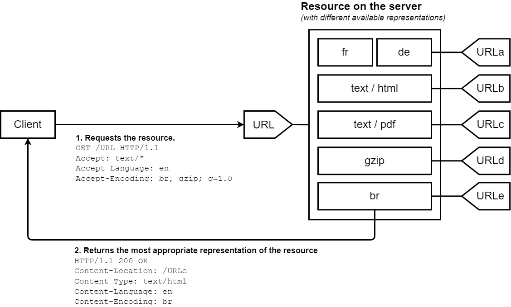
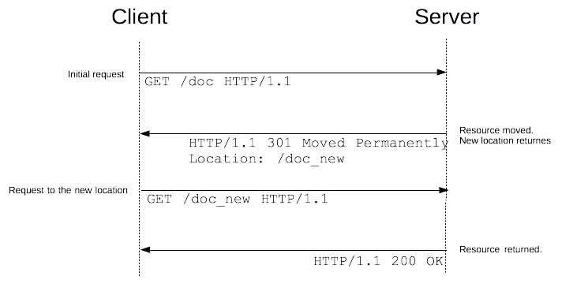

本文档记录HTTP的学习。

资料：https://developer.mozilla.org/zh-CN/docs/Web/HTTP

# 概述

概述仅记录一些重要的信息，其余的可见：https://developer.mozilla.org/zh-CN/docs/Web/HTTP。

HTTP是超文本传输协议，用于传输超媒体文件如HTML文件的应用层协议。设计用于web浏览器和服务器通信。

HTTP是**无状态协议**，多个连续的请求是独立的。但是可用Cookie携带状态。

HTTP请求的内容统称资源，由一个URL标识。

URL：统一资源定位符，标识资源的名称和位置。

```http
协议://主机:端口/路径?查询#片段
http://example.com:80/path/myfile.html?k1=v1&k2=v2#SomewhereInTheDocument
```

HTTP是client-server协议：客户端发送一个请求，服务端返回一个响应。

**代理Proxy**

在浏览器和服务器之间，有许多计算机和其他设备转发了 HTTP 消息。由于 Web 栈层次结构的原因，它们大多都出现在传输层、网络层和物理层上，对于 HTTP 应用层而言就是透明的，虽然它们可能会对应用层性能有重要影响。还有一部分是表现在应用层上的，被称为**代理**（Proxy）。代理既可以表现得透明，又可以不透明（“改变请求”会通过它们）。代理主要有如下几种作用：

- 缓存（可以是公开的也可以是私有的，像浏览器的缓存）
- 过滤（像反病毒扫描，家长控制...）
- 负载均衡（让多个服务器服务不同的请求）
- 认证（对不同资源进行权限管理）
- 日志记录（允许存储历史信息）

**连接**

HTTP并不需要其底层的传输层协议是面向连接的，只需要它是可靠的，或不丢失消息的（至少返回错误）。在互联网中，有两个最常用的传输层协议：TCP 是可靠的，而 UDP 不是。因此，HTTP 依赖于面向连接的 TCP 进行消息传递，但**面向连接并不是必须的**。

HTTP/1.0 默认为每一对 HTTP 请求/响应都打开一个单独的 TCP 连接，比较低效。

HTTP/1.1 引入了流水线（被证明难以实现）和持久连接的概念。

HTTP/2 则发展得更远，通过在一个连接复用消息的方式来让这个连接始终保持为暖连接。

**发展**

HTTP/1.1：1997年发布

- 连接复用
- 流水线（被证明难以实现）
- 响应分块
- 缓存控制
- 内容协商

HTTP/2：2015年发布

- 基于二进制协议而不是以前的文本协议，不可读
- 多路复用：并行的请求能在同一个链接中处理，移除了 HTTP/1.x 中顺序和阻塞的约束
- 压缩标头
- HTTP/2 帧机制是在 HTTP/1.x 语法和底层传输协议之间增加了一个新的中间层，而没有从根本上修改它，即它是建立在经过验证的机制之上。

HTTP/3：基于QUIC

QUIC 旨在为 HTTP 连接设计更低的延迟。类似于 HTTP/2，它是一个多路复用协议，但是 HTTP/2 通过单个 TCP 连接运行，所以在 TCP 层处理的数据包丢失检测和重传可以阻止所有流。QUIC 通过 [UDP](https://developer.mozilla.org/zh-CN/docs/Glossary/UDP) 运行多个流，并为每个流独立实现数据包丢失检测和重传，因此如果发生错误，只有该数据包中包含数据的流才会被阻止。

**HTTP流水线**

默认情况下HTTP请求发出直到收到响应才会发下一个请求，往返时延为RTT。

流水线是在同一条长连接上发出连续请求，而不是等待应答，避免延迟。正确实现流水线是复杂的，重要的消息可能被延迟到不重要的消息后面。这个重要性的概念甚至会演变为影响到页面布局！因此 HTTP 流水线在大多数情况下带来的改善并不明显。

流水线受制于[队头阻塞（HOL）](https://zh.wikipedia.org/wiki/队头阻塞)问题。

由于这些原因，流水线已被 HTTP/2 中更好的算法——*多路复用*（multiplexing）所取代。

所有遵循HTTP/1.1的代理和服务器都应该支持流水线，但是基本上浏览器都默认关闭了这个特性。

**协议升级机制**

HTTP/1.1提供了了一种使用 [Upgrade](https://developer.mozilla.org/en-US/docs/Web/HTTP/Headers/Upgrade) 标头字段的特殊机制，这一机制允许将一个已建立的连接升级成新的、不相容的协议。这种机制主要用于引导WebSocket连接。

> 注意：HTTP/2 明确禁止使用此机制；这个机制只属于 HTTP/1.1。

升级请求：

```http
GET /index.html HTTP/1.1
Host: www.example.com
Connection: upgrade
Upgrade: websocket
```

如果服务器接受升级，返回101状态码，和一个要切换到的协议的标头字段 Upgrade。

如果服务器没有或不能升级，会忽略`Upgrade`，当做常规HTTP请求处理。

一旦这次升级完成了，连接就变成了双向管道。并且可以通过新协议完成启动升级的请求。

# 请求方法

1、GET：请求指定资源，幂等、可缓存

2、POST：发送数据给服务器，非幂等

3、PUT：使用请求中的负载创建或者替换目标资源，幂等

如果资源不存在，PUT之后创建了资源，服务器应该返回201(Created)通知客户端已创建。

若资源存在，并对其进行了更新，服务器应该返回200或204表示请求完成。

4、DELETE：删除指定资源，幂等。

可能会有以下几个响应码：

- `201(Accepted)`：请求的操作可能会成功执行，但是尚未开始执行。
- `204(No Content)`：操作已执行，但是无进一步的相关信息。
- `200`：操作已执行，并且响应中提供了相关状态的描述信息。

5、CONNECT：可以开启一个客户端与所请求资源之间的双向沟通的通道。它可以用来创建隧道（tunnel）。

6、HEAD：**请求资源的头部信息**，这些头部应与HTTP GET方法返回一致。

如下载大文件先获取其大小再决定是否下载。

HEAD方法的响应不应包含响应正文，注意此时的Content-Length响应头并不是描述响应正文长度，而是用来描述同样情况下的 GET 请求应该返回的响应长度，所以其不该为0。

7、OPTIONS：获取目的资源所支持的通信选项。

如CORS的预检请求。

8、PATCH：用于对资源进行部分修改。

9、TRACE：实现沿通向目标资源的路径的消息环回（loop-back）测试，提供了一种实用的 debug 机制。

请求的最终接受者应该原样反射它接受的消息，并设置`Content-Type`为`message/http`和200状态码。

# 安全

## CSP

**内容安全策略**（[CSP](https://developer.mozilla.org/zh-CN/docs/Glossary/CSP)）是一个额外的安全层，用于检测并削弱某些特定类型的攻击，包括跨站脚本（[XSS](https://developer.mozilla.org/zh-CN/docs/Glossary/Cross-site_scripting)）和数据注入攻击等。无论是数据盗取、网站内容污染还是恶意软件分发，这些攻击都是主要的手段。

开启CSP需响应头增加`Content-Security-Policy`或响应的HTML文件配置`<meta>`元素来配置该策略：

```html
<meta
  http-equiv="Content-Security-Policy"
  content="default-src 'self'; img-src https://*; child-src 'none';" />
```

CSP的目标是减少XSS攻击，避免恶意脚本在浏览器执行。CSP 通过指定有效域——即浏览器认可的可执行脚本的有效来源——使服务器管理者有能力减少或消除 XSS 攻击所依赖的载体。

常见安全策略：

1. 所有内容来自同一个源，不包括子域名

```http
Content-Security-Policy: default-src 'self'
```

2. 允许内容来自信任的域名及其子域名

```http
Content-Security-Policy: default-src 'self' *.example.com
```

3. 允许来自任何源的图片，限制音频和视频多媒体文件来源，限制脚本来源

```http
Content-Security-Policy: default-src 'self'; img-src *; media-src media1.com media2.com; script-src userscripts.example.com
```

- 图片可以从任何地方加载 (注意`*`通配符)
- 多媒体文件仅允许从 media1.com 和 media2.com 加载（不允许从这些站点的子域名）
- 可运行脚本仅允许来自于 userscripts.example.com

4. 银行网站想要所有内容必须以SSL方式获取

```http
Content-Security-Policy: default-src https://onlinebanking.jumbobank.com
```

5. 邮箱网站允许邮件包含HTML，图片可从任意地方加载，禁止脚本

```http
Content-Security-Policy: default-src 'self' *.mailsite.com; img-src *
```

虽然此例子未指定`script-src`，但是`default-src`已经限制脚本只能从原始服务器来源获取。

## X-XSS_Protection

HTTP **`X-XSS-Protection`** 响应头是 Internet Explorer，Chrome 和 Safari 的一个特性，当检测到跨站脚本攻击 ([XSS (en-US)](https://developer.mozilla.org/en-US/docs/Glossary/Cross-site_scripting)) 时，浏览器将停止加载页面。若网站设置了良好的 [`Content-Security-Policy`](https://developer.mozilla.org/zh-CN/docs/Web/HTTP/Headers/Content-Security-Policy) 来禁用内联 JavaScript (`'unsafe-inline'`)，现代浏览器不太需要这些保护，但其仍然可以为尚不支持 [CSP](https://developer.mozilla.org/zh-CN/docs/Glossary/CSP) 的旧版浏览器的用户提供保护。

```htpp
X-XSS-Protection: 0
X-XSS-Protection: 1
X-XSS-Protection: 1; mode=block
X-XSS-Protection: 1; report=<reporting-uri>
```

- 0：禁止xss过滤
- 1：启用xss过滤，默认。如果检测到跨站脚本攻击，浏览器将清除页面（删除不安全的部分）。

- `1; mode=block`：启用 XSS 过滤。如果检测到攻击，浏览器将不会清除页面，而是阻止页面加载。
- `1; report=<reporting-URI> (Chromium only)`：启用 XSS 过滤。如果检测到跨站脚本攻击，浏览器将清除页面并使用 CSP [`report-uri` (en-US)](https://developer.mozilla.org/en-US/docs/Web/HTTP/Headers/Content-Security-Policy/report-uri)指令的功能发送违规报告。

# cookies

**cookies是服务器发给浏览器保存的一小块数据**。浏览器存储 cookie 之后发请求都会将cookie放在请求头中。

通常，它用于告知服务端两个请求是否来自同一浏览器——如保持用户的登录状态。Cookie 使基于[无状态](https://developer.mozilla.org/zh-CN/docs/Web/HTTP/Overview#http_是无状态，有会话的)的 HTTP 协议记录稳定的状态信息成为了可能。

cookie主要有3个作用：

- 会话状态管理
- 个性化设置
- 浏览器行为跟踪：跟踪分析用户行为

## HTTP会话交互

Cookie 曾一度用于客户端数据的存储，因当时并没有其他合适的存储办法而作为唯一的存储手段。但现在推荐使用现代存储 API，如[Web storage API](https://developer.mozilla.org/zh-CN/docs/Web/API/Web_Storage_API)（`localStorage` 和 `sessionStorage`）或[IndexedDB](https://developer.mozilla.org/zh-CN/docs/Web/API/IndexedDB_API) 。因为cookie每次都会自动发给服务器，而localStorage等则可以自行选择部分传输，在移动数据情况下比较省流量。

HTTP连接是无状态的，为了让HTTP会话有状态，必须让浏览器发的HTTP请求带有一些会话状态信息，**必须在浏览器存一些状态信息**如自动发的cookie或localstorage等。

当然服务器也可以存一些会话状态信息，称之为session，因为服务器无法单纯从HTTP连接直接找到其session信息，因此必须让请求带有1个唯一id来找到这个存储在服务器的会话信息。如Tomcat服务器会在cookie中设置sessionId来唯一对应其存在服务器的会话状态信息。

> 注意：**浏览器必须存储会话状态信息**，而服务器会话状态存储是可选的。

Cookie和session的区别？`多个无状态HTTP请求-->有会话状态的交互`

- **Session可以指浏览器与服务器之间的HTTP交互会话，此时Cookie是一种维护会话的手段**，即由浏览器发请求时带上状态信息使得服务器能够识别浏览器，以此维持会话。
- Session也可以指服务器存储在内存或磁盘的会话状态信息，此时cookie指的是浏览器存储在本地的状态信息。
- 总之cookie让多个无状态的HTTP请求组合成浏览器与服务器的有会话状态的交互。

注意：

- 浏览器存储的数据可被用户直接看到，**可将重要的会话状态信息存在服务器内存或磁盘**，浏览器存储其唯一id如用户id。
- 用户甚至可以直接修改浏览器存储的数据，如果cookie中存储用户id，那用户手动改了岂不是可以访问他人信息，**可用JWT解决修改问题**。

## 生命周期

1、设置cookie

服务器指示浏览器存储cookie需在响应头如下指定：

```http
HTTP/1.0 200 OK
Content-type: application/json
Set-Cookie: name1=val1
Set-Cookie: name2=val2
```

浏览器将存储两对cookie，之后发请求都会带上它们：

```http
GET /sample_page.html HTTP/1.1
Host: www.example.org
Cookie: name1=val1; name2=val2
```

2、设置cookie过期时间，不设置则为会话期cookie，会话结束浏览器自动清除。

```http
Set-Cookie: name1=val1; Expires=Wed, 21 Oct 2015 07:28:00 GMT;
```

3、设置cookie ttl：`Max-Age=<number>`，单位秒

秒数为 0 或 -1 将会使 cookie 直接过期。假如 `Expires` 和 `Max-Age` 属性均存在，那么 `Max-Age` 的优先级更高。

## 属性

```http
Set-Cookie: id=a3fWa; Expires=Wed, 21 Oct 2015 07:28:00 GMT; Secure; HttpOnly
```

1、`Secure`属性：表示只能cookie只能在HTTPS协议下发给服务器，可防止被中间人访问。

2、`HttpOnly`属性：可防止js脚本访问cookie，js的`Document.cookie`API就无法访问和修改该cookie了。可缓解XSS攻击。

3、`Domain`属性：指定哪些主机可接受cookie，默认为同一host下设置cookie。浏览器发请求时将只会发送对应域名下的cookie。

如果指定了domain，会自动包含子域名，因此指定domain相比于省略限制更少。

如果设置 `Domain=mozilla.org`，则 Cookie 也包含在子域名中（如 `developer.mozilla.org`），当子域需要共享有关用户的信息时，**如单点登录可能有用**。

4、`Path`属性：指定URL路径，只有满足该前缀路径的请求才会自动携带cookie。如`Path=/docs`，则以下地址都会匹配：

- `/docs`
- `/docs/`
- `/docs/Web/`
- `/docs/Web/HTTP`

但是这些请求路径不会匹配以下地址：

- `/`
- `/docsets`
- `/fr/docs`

5、`SameSite`：**防止 CSRF 攻击**：将 `SameSite` 属性设置为 `Strict` 或 `Lax`，限制 cookie 在跨站请求中的发送。

## 跟踪与隐私

`Domain`属性可设置域名，

第一方cookie：cookie和该页面来自同一主机。

第三方cookie：cookie由其它站点主机设置。如网站请求了第三方服务器，如图片或广告等，第三方服务器可能会设置第三方cookie用于广告和跟踪。

Firefox 默认情况下会阻止已知包含跟踪器的第三方 cookie。第三方 cookie（或仅跟踪 cookie）也可能被其他浏览器设置或扩展程序阻止。阻止 Cookie 会导致某些第三方组件（例如社交媒体窗口小部件）无法正常运行。

服务器设置第3方cookie时应该设置`SameSite`属性以指定是否可以将 cookie 发送到第三方站点。

注意法律规定允许用户在不接收 Cookie 的情况下使用大部分服务。

## 浏览器存储方式

Cookie本身是浏览器存储数据的一种方式，可由服务器设置，浏览器自动存储并每次请求自动发送。

其它存储方式如localstorage或sessionstorage存储限制比 cookie 大，并且永远不会发送到服务器。

可以使用 [IndexedDB API](https://developer.mozilla.org/zh-CN/docs/Web/API/IndexedDB_API) 或基于它构建的库来存储更多结构化的数据。

# 跨域资源共享(CORS)


默认情况下，浏览器会限制js脚本里的跨域HTTP请求，服务器可自行处理是否允许跨域资源访问，减少跨域访问的风险。

若站点 `https://foo.example` 的网页应用想要访问 `https://bar.other` 的资源，其发出的ajax请求浏览器会自动增加请求头`origin`来指示源站：

```http
GET /resources/public-data/ HTTP/1.1
Host: bar.other
Origin: https://foo.example
```

服务器可返回`Access-Control-Allow-Origin`响应头指示哪些源站可以访问：

```http
HTTP/1.1 200 OK
Access-Control-Allow-Origin: *
```

`*`表明该资源可以被任意外源访问。

```http
Access-Control-Allow-Origin: https://hello.com
```

若返回上诉响应头表明除了`https://hello.com`域，其他域无法跨站访问此资源。

## 预检请求

浏览器对于跨站请求首先使用`OPTIONS`方法发起一个预检请求以获知服务器是否允许该实际请求。"预检请求“的使用，可以避免跨域请求对服务器的用户数据产生未预期的影响。


请求头`Origin`告诉服务器请求的源站。

请求头`Access-Control-Request-Method`告诉服务器实际请求会使用的方法

请求头`Access-Control-Request-Headers`告诉服务器实际请求会携带的自定义请求头

响应头`Access-Control-Allow-Origin`表明服务器允许跨站请求的源站域名

响应头`Access-Control-Allow-Methods`表明服务器允许跨站请求的方法

响应头`Access-Control-Allow-Headers`表明服务器允许请求中携带的自定义请求头

响应头`Access-Control-Max-Age`给定了该预检请求可供缓存的时间长短，单位为秒，默认值是 5 秒。在有效时间内浏览器无须为同一请求再次发起预检请求。-1则表示禁用缓存，每次请求前都必须发OPTIONS预检请求。

> 注意：预检请求设置的缓冲时间不能超过浏览器的限制，如Firefox是24小时，Chromium V76开始是2小时。

响应头`Access-Control-Expose-Headers`设置了跨域访问可以获取的响应头。如不设置，则跨域访问时通过`XMLHttpRequest.getResponseHeader()`只能获取到基本的响应头如Content-Type等。

```http
Access-Control-Expose-Headers: X-My-Custom-Header, X-Another-Custom-Header
```

# 缓存

## 缓存设置

存储的 HTTP 响应有两种状态：**fresh** 和 **stale**。*fresh* 状态通常表示响应仍然有效，可以重复使用，而 *stale* 状态表示缓存的响应已经过期。

在 HTTP/1.0 中，新鲜度过去由 `Expires` 标头指定，但是这个时间格式必须用GMT：

```http
Expires: Tue, 28 Feb 2022 22:22:22 GMT
```

在 HTTP/1.1 中，`Cache-Control` 采用了 `max-age`——用于指定经过的时间，单位秒：

```http
Cache-Control: max-age=604800
```

如果 `Expires` 和 `Cache-Control: max-age` 都可用，则将 `max-age` 定义为首选。

服务端如果希望浏览器缓存该资源，可以在响应头如下设置：

```http
HTTP/1.1 200 OK
Content-Type: text/html
Date: Tue, 22 Feb 2022 23:22:22 GMT
Last-Modified: Tue, 22 Feb 2022 22:00:00 GMT
Cache-Control: max-age=3600
```

`Last-Modified`表明资源上次修改时间，浏览器在缓存过期后，会发出条件请求刷新缓存时间，将此响应头作为请求头发给服务器。

## 条件请求

更多细节：https://developer.mozilla.org/zh-CN/docs/Web/HTTP/Conditional_requests

当缓存过期后，再次请求该资源，浏览器会发出条件请求来验证资源是否修改，若未修改则刷新缓存的有效时间。

条件GET使用`If-Modified-Since`请求头：请求服务器该资源从指定时间后是否修改

```http
GET /index.html HTTP/1.1
If-Modified-Since: Tue, 22 Feb 2022 22:00:00 GMT
```

服务器检查无修改则响应304状态码：

```http
HTTP/1.1 304 Not Modified
Content-Type: text/html
Date: Tue, 22 Feb 2022 23:22:22 GMT
Last-Modified: Tue, 22 Feb 2022 22:00:00 GMT
Cache-Control: max-age=3600
```

若服务器检查资源有修改，则直接设置200状态码并将最新内容响应给浏览器即可。

对于分布式文件服务器很难同步文件更新时间，因此Etag响应头成为了标准化替代方案。

`ETag` 响应标头的值是服务器生成的任意值，可以采用文件md5值，文件hash值或版本号等。

服务器响应时可设置如下响应头：

```http
HTTP/1.1 200 OK
Content-Type: text/html
Date: Tue, 22 Feb 2022 22:22:22 GMT
ETag: "deadbeef"
Cache-Control: max-age=3600
```

当浏览器的缓存过期后，发出条件请求时如下：

```http
GET /index.html HTTP/1.1
If-None-Match: "deadbeef"
```

服务器检查etag值。若相同则返回304，否则将最新资源进行响应。

> **备注：** 在评估如何使用 `ETag` 和 `Last-Modified` 时，请考虑以下几点：在缓存重新验证期间，如果 `ETag` 和 `Last-Modified` 都存在，则 `ETag` 优先。因此，如果你只考虑缓存，你可能会认为 `Last-Modified` 是不必要的。然而，`Last-Modified` 不仅仅对缓存有用；相反，它是一个标准的 HTTP 标头，内容管理 (CMS) 系统也使用它来显示上次修改时间，由爬虫调整爬取频率，以及用于其他各种目的。所以考虑到整个 HTTP 生态系统，最好同时提供 `ETag` 和 `Last-Modified`。

以下为Netty服务器写的一部分验证条件请求的逻辑代码：

```java
FileChannel fileChannel = FileChannel.open(path, StandardOpenOption.READ);
// 4.条件GET判断：先判断last-modified再比较etag
String ifModifiedSince = request.headers().get(HttpHeaderNames.IF_MODIFIED_SINCE);
if (ifModifiedSince != null && ifModifiedSince.length() > 0) {
    SimpleDateFormat dateFormatter = new SimpleDateFormat(HTTP_DATE_FORMAT, Locale.US);// 这里必须是US时区
    Date ifModifiedSinceDate = dateFormatter.parse(ifModifiedSince);

    // Only compare up to the second because the datetime format we send to the client
    // does not have milliseconds
    long ifModifiedSinceDateSeconds = ifModifiedSinceDate.getTime() / 1000;
    long fileLastModifiedSeconds = path.toFile().lastModified() / 1000;
    if (ifModifiedSinceDateSeconds == fileLastModifiedSeconds) {
        boolean notModified = true;
        // 再比较Etag
        String etag = request.headers().get(HttpHeaderNames.IF_NONE_MATCH);
        if (etag != null && etag.length() > 0) {
            if (!etag.equals(MD5.getFileMD5(path))) {// 以md5值作为etag
                notModified = false;
            }
        }
        if (notModified) {
            Logger.debug(String.format("条件GET返回304, path: %s", path));
            sendNotModified(ctx, HttpUtil.isKeepAlive(request));
            try {
                if (fileChannel.isOpen())
                    fileChannel.close();// 关文件
            } catch (IOException ignored) {}
            return;
        }
    }
}
```

# 内容协商

内容协商是为同一URI提供资源不同的表示形式，如图片格式、文档格式。

内容协商有两种实现机制：

- 服务端驱动型（主动内容协商）：客户端设置特定的HTTP标头，内容协商的标准方式
- 代理驱动型（响应式协商）：服务器返回状态码300(Multiple Choices)、406(Not Acceptable)或415(Unsupported Media Type)，一般是备选方案



`Accept`标头列举了用户代理希望接收的媒体资源的 MIME 类型。如Chrome浏览器默认值为：`application/xml,application/xhtml+xml,text/html;q=0.9,text/plain;q=0.8,image/png,*/*;q=0.5`

`Accept-Encoding`标头说明了（接收端）可以接受的内容编码形式（所支持的压缩算法）。将 HTTP 消息进行压缩是一种最重要的提升 Web 站点性能的方法。该方法会减小所要传输的数据量的大小，节省可用带宽。浏览器总是会发送该标头。

`Accept-Language`标头用来提示用户期望获得的自然语言的优先顺序，由于[基于配置信息的信息熵](https://www.eff.org/deeplinks/2010/01/primer-information-theory-and-privacy)的增加，修改后的值可以用作识别用户的指纹，所以不建议对其进行修改。

`User-Agent`标头可以用来识别发送请求的浏览器，如`Firefox/4.0.1`。

## MIME类型

**媒体类型**（通常称为 **Multipurpose Internet Mail Extensions** 或 **MIME** 类型）是一种标准，用来表示文档、文件或字节流的性质和格式。

MIME结构：`类型/子类型`

| 类型          | 描述                                                         | 典型示例                                                     |
| :------------ | :----------------------------------------------------------- | :----------------------------------------------------------- |
| `text`        | 表明文件是普通文本，理论上是人类可读                         | `text/plain`, `text/html`, `text/css, text/javascript`       |
| `image`       | 表明是某种图像。不包括视频，但是动态图（比如动态 gif）也使用 image 类型 | `image/gif`, `image/png`, `image/jpeg`, `image/bmp`, `image/webp`, `image/x-icon`, `image/vnd.microsoft.icon` |
| `audio`       | 表明是某种音频文件                                           | `audio/midi`, `audio/mpeg, audio/webm, audio/ogg, audio/wav` |
| `video`       | 表明是某种视频文件                                           | `video/webm`, `video/ogg`                                    |
| `application` | 表明是某种二进制数据                                         | `application/octet-stream`, `application/pkcs12`, `application/vnd.mspowerpoint`, `application/xhtml+xml`, `application/xml`, `application/pdf` |
| `multipart`   | 表示细分领域的文件类型的种类                                 | `multipart/form-data`,` multipart/byteranges`                |

对于文本文件默认为`text/plain`，二进制文件默认为`application/octet-stream`

`multipart/form-data`用于发送POST 表单文件。`multipart/byteranges`使用状态码[`206`](https://developer.mozilla.org/zh-CN/docs/Web/HTTP/Status/206) `Partial Content`来发送整个文件的子集。

> 注意：一般后端服务会将文件以`application/octet-stream`输出给浏览器，大多数浏览器不识别其为 CSS 文件，直接忽略掉。因此css文件必须以`text/css`类型下载，否则浏览器不会加载它。


# 范围请求

HTTP协议范围请求允许服务器只发送HTTP消息的一部分到客户端，范围请求在传输大文件、**文化下载的断点续传**功能有用。

1、请求资源的某一部分，可用请求头`Range`：

```http
GET /z4d4kWk.jpg HTTP/1.1
Host: i.imgur.com
Range: bytes=0-1023
```

若服务器支持范围请求，返回状态码为206(Partial Content)响应：

```http
HTTP/1.1 206 Partial Content
Accept-Ranges: bytes
Content-Range: bytes 0-1023/146515
Content-Length: 1024
...
(binary content)
```

2、服务器使用 HTTP 响应头 **`Accept-Ranges`** 标识自身支持范围请求。字段的具体值用于定义范围请求的单位。`bytes`表示支持范围请求且单位为字节。若`none`则表示不支持。

HTTP响应头`Content-Range`显示的是一个数据片段在文件中的位置：如

```http
Content-Range: <unit> <range-start>-<range-end>/<size>
```

- `<unit>`：数据区间采用的单位，通常是byte
- `<range-start>`：给定单位下数据区间起始值
- `<range-end>`：给定单位下数据区间结束值
- `<size>`：整个文件大小，若大小未知可用`*`表示

范围请求的3种响应状态：

- 请求成功时，206(Partial Content)
- 请求范围越界，416(Requested Range Not Satisfiable)
- 不支持范围请求，返回状态码200和整个资源

如下响应报文：

```http
HTTP/1.1 206 Partial Content
Accept-Ranges: bytes
Content-Type: multipart/byteranges; boundary=3d6b6a416f9b5
Content-Length: 385

--3d6b6a416f9b5
Content-Type: text/html
Content-Range: bytes 100-200/1270

eta http-equiv="Content-type" content="text/html; charset=utf-8" />
    <meta name="vieport" content
--3d6b6a416f9b5
Content-Type: text/html
Content-Range: bytes 300-400/1270

-color: #f0f0f2;
        margin: 0;
        padding: 0;
        font-family: "Open Sans", "Helvetica
--3d6b6a416f9b5--
```

3、**断点续传，中断之后重新请求资源片段之前，必须确保该资源没有改变：**

需新增条件请求头`If-Range`，服务端判断若满足条件则其请求的资源片段和状态码206，若不满足则返回状态码200和整个资源：可用Last-Modified或etag进行验证

```http
If-Range: <day-name>, <day> <month> <year> <hour>:<minute>:<second> GMT
If-Range: <etag>
```

# 重定向

URL重定向，也称URL转发是为web站点提供多个URL地址的技术。

HTTP重定向作用：

- 站点维护或停机期间的临时重定向
- 永久重定向将在更改站点的 URL 后，保留现有的链接/书签、上传文件时表示进度的页面等。

重定向由服务器在触发，设置`3xx`状态码和响应头 [`Location`](https://developer.mozilla.org/zh-CN/docs/Web/HTTP/Headers/Location) 指定重定向URL，重定向对于用户是不可见的。



| 状态码 | 文本               | 方法变迁                     | 典型场景                                                     |
| ------ | ------------------ | ---------------------------- | ------------------------------------------------------------ |
| 301    | Moved Permanently  | 非GET方法可能变更为GET方法   | 网站重构                                                     |
| 308    | Permanent Redirect | 不变                         |                                                              |
| 302    | Found              | 非GET方法可能会变更为GET方法 | 由于不可预见的原因该页面暂不可用。                           |
| 303    | See Other          | 非GET方法会变更为GET方法     | 用于 [`PUT`](https://developer.mozilla.org/zh-CN/docs/Web/HTTP/Methods/PUT) 或 [`POST`](https://developer.mozilla.org/zh-CN/docs/Web/HTTP/Methods/POST) 请求完成之后重定向，来防止由于页面刷新导致的操作的重复触发。 |
| 307    | Temporary Redirect | 不变                         | 由于不可预见的原因该页面暂不可用。当站点支持非 `GET` 方法的链接或操作的时候，该状态码优于 302 状态码。 |

非GET方法变更为GET方法的含义：如POST表单上传文件，会携带请求体。若用户点击刷新按钮，将再次发起POT请求会导致文件重复提交。因此可在处理完逻辑后，服务端发起`303重定向`让其转到GET方法如文件列表页。

`重定向死锁(循环)`：若服务器重定向配置不当，可能造成a重定向到b，b重定向到a的无限循环，浏览器自动检测到此情况会给出错误信息，如Chrome会显示"该网页将您重定向的次数过多"。

# 常用标头

文档：https://developer.mozilla.org/zh-CN/docs/Web/HTTP/Headers/Accept

## Content-Type

**`Content-Type`** 实体头部用于指示资源的 MIME 类型 [media type](https://developer.mozilla.org/zh-CN/docs/Glossary/MIME_type) 。

在响应中，Content-Type 标头告诉客户端实际返回的内容的内容类型。浏览器会在某些情况下进行 MIME 查找，并不一定遵循此标题的值; 为了防止这种行为，可以将标题 [`X-Content-Type-Options`](https://developer.mozilla.org/zh-CN/docs/Web/HTTP/Headers/X-Content-Type-Options) 设置为 **nosniff**。

一般情况下都必须正确指定Content-Type。

```http
Content-Type: text/html; charset=utf-8
Content-Type: multipart/form-data; boundary=something
```

- boundary
  对于多部分实体，boundary 是必需的，其包括来自一组字符的 1 到 70 个字符。它用于封装消息的多个部分的边界。

## Content-Disposition

1、`Content-Disposition` 响应标头指示回复的内容该以何种形式展示，是以*内联*的形式（即网页或者页面的一部分），还是以*附件*的形式下载并保存到本地。

```http
Content-Disposition: inline; filename="hello.png"
Content-Disposition: attachment; filename="filename.jpg"
```

第一个参数指定表现形式：

- `inline`：默认，表示回复中的消息体会以页面的一部分或者整个页面的形式展示
- `attachment`：消息体应该被下载到本地，浏览器会弹出"保存为"的对话框，将参数`filename`的值预填为下载文件名。

2、在 `multipart/form-data` 类型的应答消息体中，`Content-Disposition` 通用标头可以被用在 multipart 消息体的子部分中，用来给出其对应字段的相关信息。

如下表单：

```html
<form action="http://localhost:8000/" method="post" enctype="multipart/form-data">
  <input type="text" name="myTextField">
  <input type="checkbox" name="myCheckBox">Check</input>
  <input type="file" name="myFile">
  <button>Send the file</button>
</form>
```

发送请求如下：

```http
POST / HTTP/1.1
Content-Type: multipart/form-data; boundary=---------------------------8721656041911415653955004498
Content-Length: 465

-----------------------------8721656041911415653955004498
Content-Disposition: form-data; name="myTextField"

Test
-----------------------------8721656041911415653955004498
Content-Disposition: form-data; name="myCheckBox"

on
-----------------------------8721656041911415653955004498
Content-Disposition: form-data; name="myFile"; filename="test.txt"
Content-Type: text/plain

Simple file.
-----------------------------8721656041911415653955004498--
```

name参数为表单的字段名，filename参数为上传文件的名字。

## Connection

在HTTP/1.x中`Connection`通用标头控制网络连接在当前会话完成后是否仍然保持打开状态。如果发送的值是 `keep-alive`，则连接是持久的，不会关闭，允许对同一服务器进行后续请求。

> 警告：在HTTP/2和HTTP/3中，禁止使用Connection标头。
>
> Chrome 和 Firefox 会在 HTTP/2 响应中忽略它们，但 Safari 遵循 HTTP/2 规范要求，不会加载包含这些字段的任何响应。

```http
Connection: keep-alive
Connection: close
```

一般情况下都是持久的长连接。

## Content-Length

**`Content-Length`** 是一个实体消息首部，用来指明发送给接收方的消息主体的大小，即用十进制数字表示的字节数目。

一般情况下都必须有此响应头，浏览器才能知道响应正文是否发送完成。

## Date

**`Date`** 是一个通用首部，其中包含了报文创建的日期和时间。

```http
Date: <day-name>, <day> <month> <year> <hour>:<minute>:<second> GMT
```

