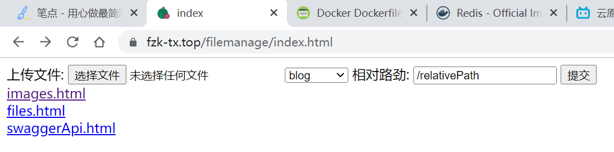

# 资料

docker官方市场：https://hub.docker.com/

daocloud镜像市场：https://hub.daocloud.io/

网易镜像中心：https://c.163yun.com/hub#/home

语雀笔记：https://www.yuque.com/leifengyang/oncloud/ox16bw#Rngn4

镜像推送到官网云：b站视屏p15：https://www.bilibili.com/video/BV13Q4y1C7hS?p=16&spm_id_from=pageDriver

# docker学习

## docker安装

菜鸟教程：https://www.runoob.com/docker/docker-mirror-acceleration.html

菜鸟教程的这个安装教程非常非常全，还有配置阿里云镜像加速的部分。然后也可以去结合官方的安装文档一起，但是官方配置的那个镜像地址国内访问有点慢，所以最好按阿里云这个来配置。

## 常用命令

容器相关：

```bash

## 容器操作
docker stop 容器id  						# 停止指定的容器
docker stop $(docker ps -qa) 			# 停止全部容器
docker rm 容器id  						# 删除指定容器
docker rm $(docker ps -qa)  			# 删除全部容器

docker exec -it 容器id /bin/bash 			# 进入容器内部
docker start 容器id						# 启动容器
```

数据卷：卷就是目录或者文件，存在一个或者多个容器中，由docker挂载到容器，但不属于联合文件系统，因此能够绕过 Union File System ， 提供一些用于持续存储或共享数据的特性：**卷的设计目的就是数据的持久化**，完全独立于容器的生存周期，因此Docker不会在容器删除时删除其挂载的数据卷。

```bash
docker run -d -p 8080:80 --name=mynginx -v /etc/nginx/dockerConf.d:/etc/nginx/conf.d -v /opt:/opt nginx
```

## Dockerfile

Dockerfile 是一个用来构建镜像的文本文件，文本内容包含了一条条构建镜像所需的指令和说明。

dockerfile需要一个干净的目录作为上下文环境，所以最好新建一个目录，再在里面新建dockerfile。

### 基本指令

首先先熟悉一下dockerfile会用到的基本指令，下面是一个示例的dockerfile

```dockerfile
FROM nginx:latest
RUN echo '这是一个本地构建的nginx镜像' > /usr/share/nginx/html/index.html \
 && COPY ./conf.d /etc/nginx/conf.d
```

1、**FROM**：定制的镜像都是基于 FROM 的镜像，这里的 nginx 就是定制需要的基础镜像。后续的操作都是基于 nginx。

2、**RUN**：用于执行后面跟着的命令行命令

3、**COPY**：复制指令，从上下文目录中复制文件或者目录到容器里指定路径。
如上图命令就是将当期目录的conf.d目录下的文件复制到镜像内的conf.d目录，需要注意的是容器内的指定路径，路径不存在的话，会自动创建。

> **注意**：Dockerfile 的指令每执行一次都会在 docker 上新建一层。所以过多无意义的层，会造成镜像膨胀过大，解决方法是以 **&&** 符号连接命令，这样执行后，只会创建 1 层镜像。

再一个例子：该例子就是先跳转到特定目录，并以当前目录为上下文环境执行命令

```dockerfile
FROM golang:1.16.14
COPY ./GoFileService /opt/GoFileService
CMD cd /opt/GoFileService \
 && ./main
```

4、**CMD**：类似于 RUN 指令，用于运行shell命令，但二者运行的时间点不同:

- CMD 在docker run 时运行。
- RUN 是在 docker build。

**作用**：为启动的容器指定默认要运行的程序，程序运行结束，容器也就结束。CMD 指令指定的程序可被 docker run 命令行参数中指定要运行的程序所覆盖。

> **注意**：如果 Dockerfile 中如果存在多个 CMD 指令，仅最后一个生效。

5、**ENTRYPOINT**：类似于 CMD 指令，但其不会被 docker run 的命令行参数指定的指令所覆盖，而且这些命令行参数会被当作参数送给 ENTRYPOINT 指令指定的程序。

但是, 如果运行 docker run 时使用了 --entrypoint 选项，将覆盖 ENTRYPOINT 指令指定的程序。

**优点**：在执行 docker run 的时候可以指定 ENTRYPOINT 运行所需的参数。

**注意**：如果 Dockerfile 中如果存在多个 ENTRYPOINT 指令，仅最后一个生效。

格式：

```dockerfile
ENTRYPOINT ["<executeable>","<param1>","<param2>",...]
```

可以搭配 CMD 命令使用：一般是变参才会使用 CMD ，这里的 CMD 等于是在给 ENTRYPOINT 传参.

6、**WORKDIR**：指定工作目录，指定之后通过docker exec命令进入容器内部时就位于此目录，如下示例：

```dockerfile
FROM openjdk:11
COPY . /usr/src/myapp
WORKDIR /usr/src/myapp
CMD cd /usr/src/myapp \ 
   && java -jar blog-1.3.0-GA.jar --spring.profiles.active=product --server.port=9090 
```


更多命令和细节请看官方文档。

### 构建命令

构建镜像命令`docker build`

```shell
docker build -t nginx:v3 .
```

在 Dockerfile 文件的存放目录下，执行构建动作；通过目录下的 Dockerfile 构建一个 nginx:v3（镜像名称:镜像标签）。

**注**：最后的 **`.`** 代表本次执行的上下文路径。

#### 上下文路径

上下文路径，是指 docker 在构建镜像，有时候想要使用到本机的文件（比如复制），docker build 命令得知这个路径后，会将路径下的所有内容打包。

**解析**：由于 docker 的运行模式是 C/S。我们本机是 C，docker 引擎是 S。实际的构建过程是在 docker 引擎下完成的，所以这个时候无法用到我们本机的文件。这就需要把我们本机的指定目录下的文件一起打包提供给 docker 引擎使用。

如果未说明最后一个参数，那么默认上下文路径就是 Dockerfile 所在的位置。

**注意**：上下文路径下不要放无用的文件，因为会一起打包发送给 docker 引擎，如果文件过多会造成过程缓慢。

### NGINX配置静态内容代理

使用dockerfile搭建NGINX还是比较简单的。
NGINX的配置文件就是/etc/nginx/nginx.conf以及/etc/nginx/conf.d/*.conf，一般是去后者目录下新建配置文件进行配置。

要配置docker容器中的nginx思路有两种：

- 挂载容器数据卷，在启动容器的时候使用`-v`参数将主机中的配置文件nginx.conf或配置目录conf.d映射到docker容器对应的路径中
- dockfile的COPY指令，在构建自己的镜像时，将配置文件或者目录复制到容器相应路径中

接下来的将结合这两种方式来配置nginx容器

1、新建上下文目录并新建nginx配置文件

```shell
cd /opt/docker 
mkdir -m 755 NginxDockerDir #新建一个干净目录作为上下文环境
cd NginxDockerDir/
mkdir -m 755 conf.d  # 新建一个conf.d目录放nginx配置文件
cd conf.d/
vim mynginx.conf
```

mynginx.conf的配置内容如下：

```nginx
server{
   listen 80;
   server_name www.fzk-tx.top;

   location /resources/ {
        client_max_body_size 10M;
        root /opt;
        autoindex on;
        try_files $uri /resources/404.jpg; # 没有则返回配置的404页面
        expires 7d; # 静态内容改动少的情况下，可以让浏览器缓存更久一点，7天 
   }
}
```

这里配置的是静态内容代理，uri以resources为前缀的请求将被引导到/opt/resources目录下，但是一个问题在于，静态内容资源总不能放在容器内部吧，所以还得在启动容器是挂载数据卷，将镜像的/opt/resources目录挂载到主机的/opt/resources目录。

2、接下来新建一个dockerfile文件

```shell
cd /opt/docker/NginxDockerDir
vim dockerfile   # 命令最好就是叫做dockerfile，其他名字需要在构建镜像的时候需要手动指定构建文件
```

dockerfile内容如下：

```dockerfile
FROM nginx:latest
COPY ./conf.d /etc/nginx/conf.d
```

意思非常明显，就是将配置目录复制到镜像内的相应配置目录。

3、构建镜像，在dockerfile所在目录

```shell
[root@VM-4-4-centos NginxDockerDir]# docker build -t mynginx:v1 .
Sending build context to Docker daemon  16.38kB
Step 1/2 : FROM nginx:latest
 ---> ad4c705f24d3
Step 2/2 : COPY ./conf.d /etc/nginx/conf.d
 ---> Using cache
 ---> 3c4abfe0711b
Successfully built 3c4abfe0711b
Successfully tagged mynginx:v1
```

构建完成可以查看

```shell
[root@VM-4-4-centos NginxDockerDir]# docker images
REPOSITORY                   TAG       IMAGE ID       CREATED             SIZE
mynginx                      v1        3c4abfe0711b   54 minutes ago      133MB
```

4、启动并挂载数据卷

```shell
[root@VM-4-4-centos NginxDockerDir]# docker run -d -p 8080:80 -v /opt/resources:/opt/resources mynginx:v1
83e68ca509cae01b0f99c4d3b16e57262ce97db7b4de46f5a781b7f35cde68db
[root@VM-4-4-centos NginxDockerDir]# docker ps -a
CONTAINER ID   IMAGE        COMMAND                  CREATED             STATUS             PORTS                                           NAMES
83e68ca509ca   mynginx:v1   "/docker-entrypoint.…"   5 seconds ago       Up 4 seconds       0.0.0.0:8080->80/tcp, :::8080->80/tcp           goofy_babbage
```

看状态，容器已经启动成功并存活着。

这个时候访问相应8080端口，测试能否访问挂载的静态资源。

此时NGINX静态资源访问以及配置完成，接下来可以用golang的gin框架实现一个文件服务器，实现文件及图片上传到指定目录功能。将其文件及图片上传到NGINX配置的静态资源目录，即可实现一个简单的图床服务啦。

> 最后，我发现由于nginx一般会配置反向代理，如果用容器启动nginx，指定的端口号为容器端口号，并不能直接代理到主机上或者其他容器上启动的服务，所以目前我依旧将nginx部署在主机上

### 配置Golang文件服务

go代码之前写好的，码云地址：https://gitee.com/uestc-fzk/go-file-service

从Linux环境移植到docker容器的过程如下：

1、新建一个干净目录，如GoFileServiceDockerDir；将文件服务代码中需要的可执行文件、配置文件和HTML静态资源文件放到一个GoFileService目录中并复制到GoFileServiceDockerDir下

2、在此目录新建dockerfile文件，内容如下

```dockerfile
FROM golang:1.16.14
COPY ./GoFileService /opt/GoFileService
CMD cd /opt/GoFileService \ 
 && ./main
```

说明：基于Golang环境构建镜像，将当前上下文环境中的GoFileService目录复制到镜像的目录下，然后使用命令切换目录，并以此目录作为工作目录执行文件服务(**这里必须切换目录**，因为读取配置文件是以相对路径进行读取的，工作目录必须是main可执行文件的目录)

3、在dockerfile所在目录构建镜像

```shell
[root@VM-4-4-centos GoFileServiceDocker]# docker build -t fileservice:v1 .
[root@VM-4-4-centos GoFileServiceDocker]# docker images
REPOSITORY    TAG       IMAGE ID       CREATED              SIZE
fileservice   v1        32f2e9b29335   About a minute ago   955MB
mynginx       v1        3c4abfe0711b   About an hour ago    133MB
golang        1.16.14   39ff3b3b0026   10 days ago          920MB
```

4、启动并挂载数据卷

```shell
[root@VM-4-4-centos GoFileServiceDocker]# docker run -d -p 23456:23456 -v /opt/resources:/opt/resources fileservice:v1
[root@VM-4-4-centos GoFileServiceDocker]# docker ps -a
CONTAINER ID   IMAGE            COMMAND                  CREATED          STATUS          PORTS                                           NAMES
7cbbf4374b9b   mynginx:v1       "/docker-entrypoint.…"   3 seconds ago    Up 3 seconds    0.0.0.0:8080->80/tcp, :::8080->80/tcp           interesting_hertz
47060a9c71eb   fileservice:v1   "/bin/sh -c 'cd /opt…"   45 seconds ago   Up 45 seconds   0.0.0.0:23456->23456/tcp, :::23456->23456/tcp   quizzical_snyder
```

5、结果，文件服务可以访问



测试得知上传的图片也能访问。


## DockerHub

官网dockerhub：https://hub.docker.com/，不仅可以找镜像，还能上传拉取自己的镜像，类似于Github。

```shell
# 将修改好的容器提交为镜像
docker commit -a "uestcfzk"  -m "第一次提交" 容器id uestcfzk/mgnginx:v1
# 一般要将镜像名改为自己的 dockerid/镜像名:标签
docker tag 镜像名:标签 uestcfzk/mgnginx:v1
# 推送到dockerhub
docker push uestcfzk/mynginx:v1
```

然后就可以在官网看自己的这个仓库，可以添加一些描述readme.md，记录启动方式这些...

# Docker 安装其他软件

## docker安装MySQL

docker上安装MySQL其实相比于在物理机上安装很简单很多很多。只需要配置密码、映射端口3306、挂载配置文件、挂载数据保存目录即可。

> 前言：docker安装的MySQL的root用户是配置了所有host均可访问的(当然这个玩意直接改user表中的root数据行就行了)，其默认配置文件目录在/etc/mysql下，其中my.cnf为默认配置文件，这个配置文件末尾引入了conf.d目录
>
> ```
> # Custom config should go here
> !includedir /etc/mysql/conf.d/
> ```
>
> 从其注释中可以得知，如果要自己修改，默认配置，最好是直接去conf.d目录下新建配置文件即可，这个NGINX是一样的策略.

1、先建一个干净的目录，并新建data目录，conf.d目录，以及dockerfile

```shell
mkdir -m 666 /opt/docker/mysqlDockerDir
cd /opt/docker/mysqlDockerDir
mkdir -m 666 data conf.d
```

2、自定义配置文件：顺便开启慢查询日志

```shell
cd conf.d
vim mymysql.cnf
```

mymysql.cnf的内容如下：

```mysql
# 客户端设置，即客户端默认的连接参数
[client]
# 默认连接端口
port = 3306
# 字符集编码
default-character-set = utf8mb4

# 服务端基本设置
[mysqld] 
# MySQL监听端口
port = 3306
datadir = /var/lib/mysql
# 服务端默认编码（数据库级别）
character_set_server = utf8mb4

# set slow query on 
log_output=file
slow_query_log=on
slow_query_log_file = /tmp/mysql-slow.log
log_queries_not_using_indexes=on
long_query_time = 1
```

> 这里要注意这个慢查询日志的路径必须得有权限，因为MySQL会以mysql用户运行，所以权限最少得是`666`，这个tmp在容器内的权限为`777`，完全没问题。

然后还有一个坑，这里得把mymysql.cnf的权限降低

```shell
chmod 664 mymysql.cnf
```

> 注意：这个配置文件名字最好别叫mysql.cnf，因为容器启动后会在这个目录下创建一个mysql,cnf文件；
> 然后就是权限这个坑！配置文件只能给mysql用户设置读取权限，即只能为4，否则这个配置文件就会被mysql忽略(太坑了)

3、在dockerfile中配置如下：将conf.d目录下的自定义配置文件复制到镜像相应目录内并创建日志目录

```dockerfile
FROM mysql:latest
COPY ./conf.d /etc/mysql/conf.d
```

4、构建镜像

```shell
docker build -t uestcfzk/mysql:v1 .
```

5、再建一个shell脚本来专门启动这个镜像

```shell
echo "the container of uestcfzk/mysql:v1 will run"
echo "the password is 123456"
echo "the container id is "
docker run -d -p 3306:3306 -e MYSQL_ROOT_PASSWORD=123456 \
        -v /opt/docker/mysqlDockerDir/data:/var/lib/mysql \
        uestcfzk/mysql:v1
sleep 1
echo "success"
```

这里可以看到将MySQL默认的数据存放目录挂载到了物理机中，并将3306端口做了映射，以及设置了root用户密码。

这样一个镜像就初步制作完成啦，可以尝试用这个shell脚本运行，成功的话再进入容器内部查看相应的log文件是否自动创建。

> 如果不成功，或者log文件没有创建，就可以用docker logs 命令查看容器启动过程中的日志查看哪里出错(绝对是权限问题！如果说想通过dockerfile中的RUN指令去创建目录或者修改权啥的，这个我已经尝试过了，不知道为啥创建666的权限到容器中就变成了655或者644，反正mysql用户没有写权限)

6、对于慢查询日志文件的权限问题的解决

在上面的过程中，虽然开启了慢查询日志，但是却是放在容器内的tmp根目录，因为这个了目录在容器内是777的权限，dockerfile命令无法创建出mysql用户具有写权限的目录。

上诉操作已经将数据挂载于外部了，但是日志还在容器内。日志文件总不能每次都要进入容器内部查看吧，而且如果容器出了问题，日志数据查看不了，难以找到问题所在，因此日志文件最好挂载于外部物理机。

不能自己去创建目录，因此只能选择容器内存在的有权限的目录，选中了tmp。对应于其777的权限，在上面的工作目录中，创建一个777的目录：

```shell
mkdir -m 777 log
```

修改shell启动脚本，将容器的/tmp目录挂载到log目录

```shell
echo "the container of uestcfzk/mysql:v1 will run"
echo "the password is 123456"
echo "the container id is "
docker run -d -p 3306:3306 -e MYSQL_ROOT_PASSWORD=123456 \
        -v /opt/docker/mysqlDockerDir/data:/var/lib/mysql \
        -v /opt/docker/mysqlDockerDir/log:/tmp \
        uestcfzk/mysql:v1
sleep 1
echo "success"
```

这样就将日志也挂载出来了，重新构建镜像并启动容器后查看log目录是否出现日志文件。

7、可以连接上数据库之后，进入到mysql库中，可能会发现有两个root用户，一个访问权限是%，一个是localhost，把localhost这个删掉，以免有可能连不上数据库。

## 制作Redis镜像

如果以单节点Redis作为缓存的话，制作过程非常简单

dockerfile如下

```dockerfile
FROM redis:latest
COPY ./myredis.conf /tmp/myredis.conf
CMD cd /tmp \
        &&  redis-server myredis.conf
```

myredis.conf如下：

```
port 6379
requirepass !MyRedis123456
protected-mode no
# daemonize yes # 这里不能开启守护进程，开启之后，redis默认后台启动，但是docker容器会自动结束


pidfile "/tmp/redis_6379.pid"
dbfilename dump6379.rdb
# 工作目录
dir /tmp
logfile "6379.log"

# 缓存策略
maxmemory 100mb
maxmemory-policy allkeys-lru
```

